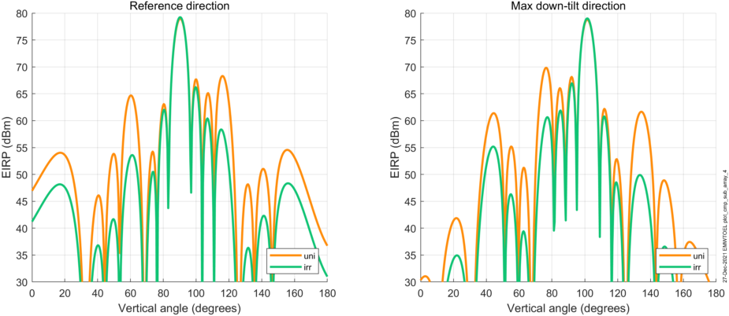
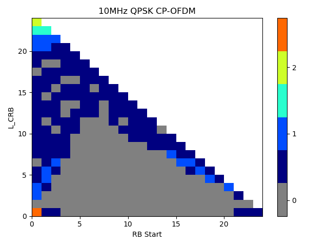
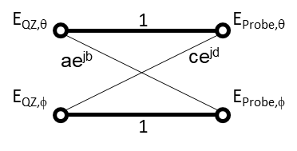

+----------------------------------+----------------------------------+
| 3GPP TR 38.859 V18.1.0 (2024-06) |                                  |
+==================================+==================================+
| Technical Report                 |                                  |
+----------------------------------+----------------------------------+
| 3rd Generation Partnership       |                                  |
| Project;                         |                                  |
|                                  |                                  |
| Technical Specification Group    |                                  |
| Radio Access Network;            |                                  |
|                                  |                                  |
| Study on Expanded and Improved   |                                  |
| NR Positioning;                  |                                  |
|                                  |                                  |
| (Release 18)                     |                                  |
+----------------------------------+----------------------------------+
|                                  |                                  |
+----------------------------------+----------------------------------+
| {width="1.4104166666666667in" | png){width="1.773611111111111in" |
| height="0.86875in"}              | height="1.0416666666666667in"}   |
+----------------------------------+----------------------------------+
|                                  |                                  |
+----------------------------------+----------------------------------+
| The present document has been    |                                  |
| developed within the 3rd         |                                  |
| Generation Partnership Project   |                                  |
| (3GPP ^TM^) and may be further   |                                  |
| elaborated for the purposes of   |                                  |
| 3GPP.\                           |                                  |
| The present document has not     |                                  |
| been subject to any approval     |                                  |
| process by the 3GPP              |                                  |
| Organizational Partners and      |                                  |
| shall not be implemented.\       |                                  |
| This Specification is provided   |                                  |
| for future development work      |                                  |
| within 3GPP only. The            |                                  |
| Organizational Partners accept   |                                  |
| no liability for any use of this |                                  |
| Specification.\                  |                                  |
| Specifications and Reports for   |                                  |
| implementation of the 3GPP ^TM^  |                                  |
| system should be obtained via    |                                  |
| the 3GPP Organizational          |                                  |
| Partners\' Publications Offices. |                                  |
+----------------------------------+----------------------------------+

+----------------------------------------------------------------------+
|                                                                      |
+======================================================================+
| > ***3GPP***                                                         |
| >                                                                    |
| > Postal address                                                     |
| >                                                                    |
| > 3GPP support office address                                        |
| >                                                                    |
| > 650 Route des Lucioles - Sophia Antipolis                          |
| >                                                                    |
| > Valbonne - FRANCE                                                  |
| >                                                                    |
| > Tel.: +33 4 92 94 42 00 Fax: +33 4 93 65 47 16                     |
| >                                                                    |
| > Internet                                                           |
| >                                                                    |
| > http://www.3gpp.org                                                |
+----------------------------------------------------------------------+
| ***Copyright Notification***                                         |
|                                                                      |
| No part may be reproduced except as authorized by written            |
| permission.\                                                         |
| The copyright and the foregoing restriction extend to reproduction   |
| in all media.                                                        |
|                                                                      |
| © 2024, 3GPP Organizational Partners (ARIB, ATIS, CCSA, ETSI, TSDSI, |
| TTA, TTC).                                                           |
|                                                                      |
| All rights reserved.                                                 |
|                                                                      |
| UMTS™ is a Trade Mark of ETSI registered for the benefit of its      |
| members                                                              |
|                                                                      |
| 3GPP™ is a Trade Mark of ETSI registered for the benefit of its      |
| Members and of the 3GPP Organizational Partners\                     |
| LTE™ is a Trade Mark of ETSI registered for the benefit of its       |
| Members and of the 3GPP Organizational Partners                      |
|                                                                      |
| GSM® and the GSM logo are registered and owned by the GSM            |
| Association                                                          |
+----------------------------------------------------------------------+

B.5 Evaluation results for low power high accuracy positioning
==============================================================

B.5.1 Results from source \[92\]
--------------------------------

### B.5.1.1 Description of evaluation scenarios

For Rel-17 evaluated cases as shown in Table B.5.1.1-1, UL-TDOA,
UE-assisted DL-TDOA, UE-based DL-TDOA with three combination of
positioning periodicity/DRX periodicity are evaluated.

For Rel-18 evaluated cases as shown in Table B.5.1.1-2

\- UL-TDOA positioning is evaluated with 4 cases

\- UE-assisted DL positioning is evaluated with 1 case of ultra-deep
sleep Option 1

\- UE-based DL positioning is evaluated with 2 cases.

Throughout the evaluation

\- LPHAP UE type A with 800mAh battery volume is evaluated and the
battery life can be extended to 6.25 times if LPHAP UE type B is
considered.

\- Implementation factor K = 1 is evaluated and the battery life can be
scaled for other K values.

The following timelines of each power states are assumed:

\- Figure B.5.1.1-1 shows the UL positioning timeline with paging
reception

\- Figure B.5.1.1-2 shows the DL positioning timeline with paging
reception

\- Figure B.5.1.1-3 shows the UL and UE based DL positioning timeline
without paging reception

{width="6.470138888888889in"
height="3.151388888888889in"}

Figure B.5.1.1-1: UL positioning timeline with paging (SRS+Paging and
paging only) from \[92\]

{width="6.470138888888889in"
height="4.313194444444444in"}

Figure B.5.1.1-2: DL positioning timeline with paging (PRS+Paging,
PRS+Paging+SDT, and paging only) from \[92\]

Figure B.5.1.1-3: UL and DL positioning timeline without paging

For the evaluation of ultra-deep sleep, the following assumptions are
assumed.

\- Figure B.5.1.1-4 shows the ramp-up/ramp-down associated with its
capability for ultra-deep sleep Option 1 (UDS1) and ultra-deep sleep
Option 2 (UDS2)

\- Figure B.5.1.1-5 shows the switching between UDS1 and UDS2 when the
paging periodicity is a multiple of positioning interval.

Figure B.5.1.1-4: UE ramp-up capability illustration

Figure B.5.1.1-5: UE TDM between positioning mode and communication mode
(e.g. receive paging)

Evaluation cases and corresponding assumptions for UE power consumption
analysis for Rel-17 are provided in Table B.5.1.1-1.

Evaluation cases and corresponding assumptions for UE power consumption
analysis for Rel-18 UL positioning enhancement without ultra-deep sleep
Option 2 are provided in Table B.5.1.1-2.

Evaluation cases and corresponding assumptions for UE power consumption
analysis for Rel-18 UL positioning enhancement with ultra-deep sleep
Option 2 are provided in Table B.5.1.1-3.

Evaluation cases and corresponding assumptions for UE power consumption
analysis for Rel-18 DL positioning enhancement without ultra-deep sleep
Option 2 are provided in Table B.5.1.1-4.

Evaluation cases and corresponding assumptions for UE power consumption
analysis for Rel-18 DL positioning enhancement with ultra-deep sleep
Option 2 are provided in Table B.5.1.1-5.

Table B.5.1.1-1: Low Power High Accuracy Positioning - Evaluation cases
and assumptions for Rel-17 baseline from \[92\]

  **Evaluation assumption**                                     **Case 1, FR1, UL-TDOA, Type A, 1.28/1.28**                                                                            **Case 2: FR1, UL-TDOA, Type A, 10.24/1.28**   **Case 3: FR1, UL-TDOA, Type A, 10.24/10.24**   **Case 11: FR1, UE-A DL-TDOA, Type A, 1.28/1.28**   **Case 12: FR1, UE-A DL-TDOA, Type A, 10.24/1.28**   **Case 13: FR1, UE-A DL-TDOA, Type A, 10.24/10.24**   **Case 21: FR1, UE-B DL-TDOA, Type A, 1.28/1.28**   **Case 22: FR1, UE-B DL-TDOA, Type A, 10.24/1.28**   **Case 23: FR1, UE-B DL-TDOA, Type A, 10.24/10.24**
  ------------------------------------------------------------- ---------------------------------------------------------------------------------------------------------------------- ---------------------------------------------- ----------------------------------------------- --------------------------------------------------- ---------------------------------------------------- ----------------------------------------------------- --------------------------------------------------- ---------------------------------------------------- -----------------------------------------------------
  Sleep state                                                   Deep sleep                                                                                                             Deep sleep                                     Deep sleep                                      Deep sleep                                          Deep sleep                                           Deep sleep                                            Deep sleep                                          Deep sleep                                           Deep sleep
  DRX cycle                                                     1.28s                                                                                                                  1.28s                                          10.24                                           1.28s                                               1.28s                                                10.24                                                 1.28s                                               1.28s                                                10.24
  paging reception                                              Yes                                                                                                                    Yes                                            Yes                                             Yes                                                 Yes                                                  Yes                                                   Yes                                                 Yes                                                  Yes
  RS periodicity                                                1.28s                                                                                                                  10.24s                                         10.24s                                          1.28s                                               10.24s                                               10.24s                                                1.28s                                               10.24s                                               10.24s
  M-sample                                                      1                                                                                                                      1                                              1                                               1                                                   1                                                    1                                                     1                                                   1                                                    1
  RRM measurement                                               No                                                                                                                     No                                             No                                              No                                                  No                                                   No                                                    No                                                  No                                                   No
  BWP switching                                                 No                                                                                                                     No                                             No                                              No                                                  No                                                   No                                                    No                                                  No                                                   No
  Measurement reporting (e.g., RA/CG-SDT, reporting interval)   No                                                                                                                     No                                             No                                              CG-SDT 1.28s                                        CG-SDT 10.24s                                        CG-SDT 10.24s                                         No                                                  No                                                   No
  Implementation factor K                                       1                                                                                                                      1                                              1                                               1                                                   1                                                    1                                                     1                                                   1                                                    1
  Other assumptions                                             Cell access rate is once per 61.44s with state transition power consumption under deep sleep being 4300 power units.                                                                                                                                                                                                                                                                                                                                                                          

Table B.5.1.1-2: Low Power High Accuracy Positioning - Evaluation cases
and assumptions for Rel-18 UL positioning enhancements without UDS2 from
\[92\]

  **Evaluation assumption**                                     **Case 101: FR1, UL-TDOA, Type A, 10.24/10.24, UDS1**   **Case 102: FR1, UL-TDOA, Type A, 10.24/20.48, UDS1**   **Case 103: FR1, UL-TDOA, Type A, 10.24/40.96, UDS1**   **Case 104: FR1, UL-TDOA, Type A, 10.24/81.92, UDS1**   **Case 105: FR1, UL-TDOA, Type A, 10.24/no paging, UDS1**
  ------------------------------------------------------------- ------------------------------------------------------- ------------------------------------------------------- ------------------------------------------------------- ------------------------------------------------------- -----------------------------------------------------------
  Sleep state                                                   Ultra-deep sleep option 1                               Ultra-deep sleep option 1                               Ultra-deep sleep option 1                               Ultra-deep sleep option 1                               Ultra-deep sleep option 1
  DRX cycle                                                     10.24s                                                  20.48s                                                  40.96s                                                  81.92s                                                  Inf
  paging reception                                              Yes                                                     Yes                                                     Yes                                                     Yes                                                     No
  RS periodicity                                                10.24s                                                  10.24s                                                  10.24s                                                  10.24s                                                  10.24s
  M-sample                                                      1                                                       1                                                       1                                                       1                                                       1
  RRM measurement                                               No                                                      No                                                      No                                                      No                                                      No
  BWP switching                                                 No                                                      No                                                      No                                                      No                                                      No
  Measurement reporting (e.g., RA/CG-SDT, reporting interval)   No                                                      No                                                      No                                                      No                                                      No
  Implementation factor K                                       1                                                       1                                                       1                                                       1                                                       1

Table B.5.1.1-3: Low Power High Accuracy Positioning - Evaluation cases
and assumptions for Rel-18 UL positioning enhancements with UDS2 from
\[92\]

  **Evaluation assumption**                                                                                                                       **Case 102a: FR1, UL-TDOA, Type A, 10.24/20.48, UDS1+UDS2**   **Case 103a: FR1, UL-TDOA, Type A, 10.24/40.96, UDS1+UDS2**   **Case 104a: FR1, UL-TDOA, Type A, 10.24/81.92, UDS1+UDS2**   **Case 105a: FR1, UL-TDOA, Type A, 10.24/no paging, UDS1**   **Case 106a: FR1, UL-TDOA, Type A, 10.24/no paging, UDS2**   **Case 107a: FR1, UL-TDOA, Type A, 10.24/no paging, UDS1**
  ----------------------------------------------------------------------------------------------------------------------------------------------- ------------------------------------------------------------- ------------------------------------------------------------- ------------------------------------------------------------- ------------------------------------------------------------ ------------------------------------------------------------ ------------------------------------------------------------
  Sleep state                                                                                                                                     Ultra-deep sleep option 1+option 2                            Ultra-deep sleep option 1+option 2                            Ultra-deep sleep option 1+option 2                            Ultra-deep sleep option 2                                    Ultra-deep sleep option 2                                    Ultra-deep sleep option 2
  DRX cycle                                                                                                                                       20.48s                                                        40.96s                                                        81.92s                                                        Inf                                                          81.92s                                                       Inf
  paging reception                                                                                                                                Yes                                                           Yes                                                           Yes                                                           No                                                           Yes                                                          No
  RS periodicity                                                                                                                                  10.24s                                                        10.24s                                                        10.24s                                                        10.24s                                                       10.24s                                                       10.24s
  M-sample                                                                                                                                        1                                                             1                                                             1                                                             1                                                            1                                                            1
  RRM measurement                                                                                                                                 No                                                            No                                                            No                                                            No                                                           No                                                           No
  BWP switching                                                                                                                                   No                                                            No                                                            No                                                            No                                                           No                                                           No
  Measurement reporting (e.g., RA/CG-SDT, reporting interval)                                                                                     No                                                            No                                                            No                                                            No                                                           No                                                           No
  Implementation factor K                                                                                                                         1                                                             1                                                             1                                                             1                                                            1                                                            1
  Other assumptions                                                                                                                                                                                                                                                                                                                                                                                      Note 1                                                       Synchronization based on TRS
  Note 1: Cell access rate is once per 61.44s with state transition power consumption under ultra- deep sleep Option 1 being 13850 power units.                                                                                                                                                                                                                                                                                                                       

Table B.5.1.1-4: Low Power High Accuracy Positioning - Evaluation cases
and assumptions for Rel-18 DL positioning enhancements without UDS2 from
\[92\]

  **Evaluation assumption**                                     **Case 111: FR1, UE-A DL-TDOA, Type A, 10.24/10.24, UDS1**   **Case 121: FR1, UE-B DL-TDOA, Type A, 10.24/10.24, UDS1**   **Case 122: FR1, UE-B DL-TDOA, Type A, 10.24/20.48, UDS1**   **Case 123: FR1, UE-B DL-TDOA, Type A, 10.24/40.96, UDS1**   **Case 124: FR1, UE-B DL-TDOA, Type A, 10.24/81.92, UDS1**   **Case 125, FR1, UE-B DL-TDOA, Type A, 10.24/no paging, UDS1**
  ------------------------------------------------------------- ------------------------------------------------------------ ------------------------------------------------------------ ------------------------------------------------------------ ------------------------------------------------------------ ------------------------------------------------------------ ----------------------------------------------------------------
  Sleep state                                                   Ultra-deep sleep option 1                                    Ultra-deep sleep option 1                                    Ultra-deep sleep option 1                                    Ultra-deep sleep option 1                                    Ultra-deep sleep option 1                                    Ultra-deep sleep option 1
  DRX cycle                                                     10.24s                                                       10.24s                                                       20.48s                                                       40.96s                                                       81.92s                                                       Inf
  paging reception                                              Yes                                                          Yes                                                          Yes                                                          Yes                                                          Yes                                                          No
  RS periodicity                                                10.24s                                                       10.24s                                                       10.24s                                                       10.24s                                                       10.24s                                                       10.24s
  M-sample                                                      1                                                            1                                                            1                                                            1                                                            1                                                            1
  RRM measurement                                               No                                                           No                                                           No                                                           No                                                           No                                                           No
  BWP switching                                                 No                                                           No                                                           No                                                           No                                                           No                                                           No
  Measurement reporting (e.g., RA/CG-SDT, reporting interval)   CG-SDT 10.24s                                                No                                                           No                                                           No                                                           No                                                           No
  Implementation factor K                                       1                                                            1                                                            1                                                            1                                                            1                                                            1

Table B.5.1.1-5: Low Power High Accuracy Positioning - Evaluation cases
and assumptions for Rel-18 DL positioning enhancements with UDS2 from
\[92\]

  **Evaluation assumption**                                     **Case 122a: FR1, UE-B DL-TDOA, Type A, 10.24/20.48, UDS1+UDS2**   **Case 123a: FR1, UE-B DL-TDOA, Type A, 10.24/40.96, UDS1**   **Case 124a: FR1, UE-B DL-TDOA, Type A, 10.24/81.92, UDS1**   **Case 125a, FR1, UE-B DL-TDOA, Type A, 10.24/no paging, UDS2**
  ------------------------------------------------------------- ------------------------------------------------------------------ ------------------------------------------------------------- ------------------------------------------------------------- -----------------------------------------------------------------
  Sleep state                                                   Ultra-deep sleep option 1+option 2                                 Ultra-deep sleep option 1+option 2                            Ultra-deep sleep option 1+option 2                            Ultra-deep sleep option 2
  DRX cycle                                                     20.48s                                                             40.96s                                                        81.92s                                                        Inf
  paging reception                                              Yes                                                                Yes                                                           Yes                                                           No
  RS periodicity                                                10.24s                                                             10.24s                                                        10.24s                                                        10.24s
  M-sample                                                      1                                                                  1                                                             1                                                             1
  RRM measurement                                               No                                                                 No                                                            No                                                            No
  BWP switching                                                 No                                                                 No                                                            No                                                            No
  Measurement reporting (e.g., RA/CG-SDT, reporting interval)   No                                                                 No                                                            No                                                            No
  Implementation factor K                                       1                                                                  1                                                             1                                                             1

### B.5.1.2 Evaluation results for Low Power High Accuracy Positioning

Table B.5.1.2-1 provides detailed UE power consumption results for each
evaluated case for Rel-17.

Table B.5.1.2-2 provides detailed UE power consumption results for each
evaluated case for Rel-18.

In the two tables,

\- SRS Tx includes synchronization to the closest SSB.

\- Paging includes synchronization to the closest SSB, with the group
paging rate being 10%, but no match in the paging message.

\- SRS Tx TRS includes synchronization to a TRS that is one slot before
the SRS.

Table B.5.1.2-3 provides summary of UE power consumption results for
each evaluated case.

Table B.5.1.2-1: UE power consumption results for each evaluation case
from \[92\]

  **Evaluation case**                                   **Power states**                      **Relative power unit**   **Duration (in msec)**   **Instances**     **Sum Durations (in msec)**   **Relative power**   **Power ratio**
  ----------------------------------------------------- ------------------------------------- ------------------------- ------------------------ ----------------- ----------------------------- -------------------- -----------------
  **Case 1, FR1, UL-TDOA, Type A, 1.28/1.28**           **Ramp up + down**                    **450**                   **20**                   **8**             **160.0**                     **3600.00**          **11.4817%**
                                                        **SRS Tx + Paging**                   **877**                   **7.5**                  **8**             **60.0**                      **7016.00**          **22.3765%**
                                                        **Cell access (including ramp up)**   **4300**                  **55**                   **0.166666667**   **9.2**                       **716.67**           **2.2857%**
                                                        **Deep sleep**                        **2**                     **1**                    **10010.8**       **10010.8**                   **20021.60**         **63.8561%**
                                                                                                                                                                                                                      
                                                                                                                                                                                                                      
                                                                                                                                                                                                                      
                                                        **Total (every power cycle)**         **10240.0**               **31354.27**             **100.0000%**                                                        
                                                        **Slot-averaged power unit**          **1.53**                                                                                                                
                                                        **Battery life (in month)**           **0.48**                                                                                                                
  **Case 2: FR1, UL-TDOA, Type A, 10.24/1.28**          **Ramp up + down**                    **450**                   **20**                   **8**             **160.0**                     **3600.00**          **11.9208%**
                                                        **SRS Tx + paging**                   **877**                   **7.5**                  **1**             **7.5**                       **877.00**           **2.9040%**
                                                        **Paging**                            **712**                   **7.5**                  **7**             **52.5**                      **4984.00**          **16.5037%**
                                                        **Cell access (including ramp up)**   **4300**                  **55**                   **0.166666667**   **9.2**                       **716.67**           **2.3731%**
                                                        **Deep sleep**                        **2**                     **1**                    **10010.8**       **10010.8**                   **20021.60**         **66.2983%**
                                                                                                                                                                                                                      
                                                                                                                                                                                                                      
                                                        **Total (every power cycle)**         **10240.0**               **30199.27**             **100.0000%**                                                        
                                                        **Slot-averaged power unit**          **1.47**                                                                                                                
                                                        **Battery life (in month)**           **0.50**                                                                                                                
  **Case 3: FR1, UL-TDOA, Type A, 10.24/10.24**         **Ramp up + down**                    **450**                   **20**                   **1**             **20.0**                      **450.00**           **2.0044%**
                                                        **SRS Tx + Paging**                   **877**                   **7.5**                  **1**             **7.5**                       **877.00**           **3.9064%**
                                                        **Cell access (including ramp up)**   **4300**                  **55**                   **0.166666667**   **9.2**                       **716.67**           **3.1922%**
                                                        **Deep sleep**                        **2**                     **1**                    **10203.3**       **10203.3**                   **20406.60**         **90.8969%**
                                                                                                                                                                                                                      
                                                                                                                                                                                                                      
                                                                                                                                                                                                                      
                                                        **Total (every power cycle)**         **10240.0**               **22450.27**             **100.0000%**                                                        
                                                        **Slot-averaged power unit**          **1.10**                                                                                                                
                                                        **Battery life (in month)**           **0.68**                                                                                                                
  **Case 11: FR1, UE-A DL-TDOA, Type A, 1.28/1.28**     **Ramp up + down**                    **450**                   **20**                   **8**             **160.0**                     **3600.00**          **9.3784%**
                                                        **PRS Rx + Paging + SDT**             **1797**                  **28**                   **8**             **224.0**                     **14376.00**         **37.4509%**
                                                        **Cell access (including ramp up)**   **4300**                  **55**                   **0.166666667**   **9.2**                       **716.67**           **1.8670%**
                                                        **Deep sleep**                        **2**                     **1**                    **9846.8**        **9846.8**                    **19693.60**         **51.3038%**
                                                                                                                                                                                                                      
                                                                                                                                                                                                                      
                                                                                                                                                                                                                      
                                                        **Total (every power cycle)**         **10240.0**               **38386.27**             **100.0000%**                                                        
                                                        **Slot-averaged power unit**          **1.87**                                                                                                                
                                                        **Battery life (in month)**           **0.40**                                                                                                                
  **Case 12: FR1, UE-A DL-TDOA, Type A, 10.24/1.28**    **Ramp up + down**                    **450**                   **20**                   **8**             **3600.00**                   **160.0**            **11.5837%**
                                                        **PRS Rx + paging + SDT**             **1797**                  **28**                   **1**             **1797.00**                   **28.0**             **5.7822%**
                                                        **Paging**                            **712**                   **7.5**                  **7**             **4984.00**                   **52.5**             **16.0369%**
                                                        **Cell access (including ramp up)**   **4300**                  **55**                   **0.166666667**   **716.67**                    **9.2**              **2.3060%**
                                                        **Deep sleep**                        **2**                     **1**                    **9990.3**        **19980.60**                  **9990.3**           **64.2912%**
                                                                                                                                                                                                                      
                                                                                                                                                                                                                      
                                                        **Total (every power cycle)**         **10240.0**               **31078.27**             **100.0000%**                                                        
                                                        **Slot-averaged power unit**          **1.52**                                                                                                                
                                                        **Battery life (in month)**           **0.49**                                                                                                                
  **Case 13: FR1, UE-A DL-TDOA, Type A, 10.24/10.24**   **Ramp up + down**                    **450**                   **20**                   **1**             **20.0**                      **450.00**           **1.9289%**
                                                        **PRS Rx + Paging + SDT**             **1797**                  **28**                   **1**             **28.0**                      **1797.00**          **7.7028%**
                                                        **Cell access (including ramp up)**   **4300**                  **55**                   **0.166666667**   **9.2**                       **716.67**           **3.0720%**
                                                        **Deep sleep**                        **2**                     **1**                    **10182.8**       **10182.8**                   **20365.60**         **87.2964%**
                                                                                                                                                                                                                      
                                                                                                                                                                                                                      
                                                                                                                                                                                                                      
                                                        **Total (every power cycle)**         **10240.0**               **23329.27**             **100.0000%**                                                        
                                                        **Slot-averaged power unit**          **1.14**                                                                                                                
                                                        **Battery life (in month)**           **0.65**                                                                                                                
  **Case 21: FR1, UE-B DL-TDOA, Type A, 1.28/1.28**     **Ramp up + down**                    **450**                   **20**                   **8**             **160.0**                     **3600.00**          **10.2576%**
                                                        **PRS Rx + Paging**                   **1472**                  **27.5**                 **8**             **220.0**                     **11776.00**         **33.5537%**
                                                        **Deep sleep**                        **2**                     **1**                    **9860**          **9860.0**                    **19720.00**         **56.1887%**
                                                                                                                                                                                                                      
                                                                                                                                                                                                                      
                                                                                                                                                                                                                      
                                                                                                                                                                                                                      
                                                        **Total (every power cycle)**         **10240.0**               **35096.00**             **100.0000%**                                                        
                                                        **Slot-averaged power unit**          **1.71**                                                                                                                
                                                        **Battery life (in month)**           **0.43**                                                                                                                
  **Case 22: FR1, UE-B DL-TDOA, Type A, 10.24/1.28**    **Ramp up + down**                    **450**                   **20**                   **8**             **160.0**                     **3600.00**          **11.9776%**
                                                        **PRS Rx + paging**                   **1472**                  **27.5**                 **1**             **27.5**                      **1472.00**          **4.8975%**
                                                        **Paging**                            **712**                   **7.5**                  **7**             **52.5**                      **4984.00**          **16.5824%**
                                                        **Deep sleep**                        **2**                     **1**                    **10000**         **10000.0**                   **20000.00**         **66.5425%**
                                                                                                                                                                                                                      
                                                                                                                                                                                                                      
                                                                                                                                                                                                                      
                                                        **Total (every power cycle)**         **10240.0**               **30056.00**             **100.0000%**                                                        
                                                        **Slot-averaged power unit**          **1.47**                                                                                                                
                                                        **Battery life (in month)**           **0.50**                                                                                                                
  **Case 23: FR1, UE-B DL-TDOA, Type A, 10.24/10.24**   **Ramp up + down**                    **450**                   **20**                   **1**             **20.0**                      **450.00**           **2.0173%**
                                                        **PRS Rx + Paging**                   **1472**                  **27.5**                 **1**             **27.5**                      **1472.00**          **6.5988%**
                                                        **Deep sleep**                        **2**                     **1**                    **10192.5**       **10192.5**                   **20385.00**         **91.3839%**
                                                                                                                                                                                                                      
                                                                                                                                                                                                                      
                                                                                                                                                                                                                      
                                                                                                                                                                                                                      
                                                        **Total (every power cycle)**         **10240.0**               **22307.00**             **100.0000%**                                                        
                                                        **Slot-averaged power unit**          **1.09**                                                                                                                
                                                        **Battery life (in month)**           **0.68**                                                                                                                

Table B.5.1.2-2: UE power consumption results for each evaluation case
from \[92\]

  **Evaluation case**                                                                    **Power states**                      **Relative power unit**   **Duration (in msec)**   **Instances**     **Sum Durations (in msec)**   **Relative power**   **Power ratio**
  -------------------------------------------------------------------------------------- ------------------------------------- ------------------------- ------------------------ ----------------- ----------------------------- -------------------- -----------------
  **Case 101: FR1, UL-TDOA, Type A, 10.24/10.24, UDS1**                                  **Ramp up + down option 1**           **10000**                 **400**                  **1**             **400.0**                     **10000.00**         **89.5097%**
                                                                                         **SRS Tx + Paging**                   **877**                   **7.5**                  **1**             **7.5**                       **877.00**           **7.8500%**
                                                                                         **Ultra-deep sleep Option 1**         **0.03**                  **1**                    **9832.5**        **9832.5**                    **294.98**           **2.6403%**
                                                                                                                                                                                                                                                       
                                                                                                                                                                                                                                                       
                                                                                                                                                                                                                                                       
                                                                                                                                                                                                                                                       
                                                                                         **Total (every power cycle)**         **10240.0**               **11171.98**             **100.0000%**                                                        
                                                                                         **Slot-averaged power unit**          **0.55**                                                                                                                
                                                                                         **Battery life (in month)**           **1.36**                                                                                                                
  **Case 102: FR1, UL-TDOA, Type A, 10.24/20.48, UDS1**                                  **Ramp up + down option 1**           **10000**                 **400**                  **1**             **400.0**                     **10000.00**         **90.8593%**
                                                                                         **SRS Tx + Paging**                   **877**                   **7.5**                  **0.5**           **3.8**                       **438.50**           **3.9842%**
                                                                                         **SRS Tx**                            **545**                   **4**                    **0.5**           **2.0**                       **272.50**           **2.4759%**
                                                                                         **Ultra-deep sleep Option 1**         **0.03**                  **1**                    **9834.2**        **9834.2**                    **295.03**           **2.6806%**
                                                                                                                                                                                                                                                       
                                                                                                                                                                                                                                                       
                                                                                                                                                                                                                                                       
                                                                                         **Total (every power cycle)**         **10240.0**               **11006.03**             **100.0000%**                                                        
                                                                                         **Slot-averaged power unit**          **0.54**                                                                                                                
                                                                                         **Battery life (in month)**           **1.38**                                                                                                                
  **Case 103: FR1, UL-TDOA, Type A, 10.24/40.96, UDS1**                                  **Ramp up + down option 1**           **10000**                 **400**                  **1**             **400.0**                     **10000.00**         **91.5495%**
                                                                                         **SRS Tx + Paging**                   **877**                   **7.5**                  **0.25**          **1.9**                       **219.25**           **2.0072%**
                                                                                         **SRS Tx**                            **545**                   **4**                    **0.75**          **3.0**                       **408.75**           **3.7421%**
                                                                                         **Ultra-deep sleep Option 1**         **0.03**                  **1**                    **9835.1**        **9835.1**                    **295.05**           **2.7012%**
                                                                                                                                                                                                                                                       
                                                                                                                                                                                                                                                       
                                                                                                                                                                                                                                                       
                                                                                         **Total (every power cycle)**         **10240.0**               **10923.05**             **100.0000%**                                                        
                                                                                         **Slot-averaged power unit**          **0.53**                                                                                                                
                                                                                         **Battery life (in month)**           **1.39**                                                                                                                
  **Case 104: FR1, UL-TDOA, Type A, 10.24/81.92, UDS1**                                  **Ramp up + down option 1**           **10000**                 **400**                  **1**             **400.0**                     **10000.00**         **91.8985%**
                                                                                         **SRS Tx + Paging**                   **877**                   **7.5**                  **0.125**         **0.9**                       **109.63**           **1.0074%**
                                                                                         **SRS Tx**                            **545**                   **4**                    **0.875**         **3.5**                       **476.88**           **4.3824%**
                                                                                         **Ultra-deep sleep Option 1**         **0.03**                  **1**                    **9835.6**        **9835.6**                    **295.07**           **2.7116%**
                                                                                                                                                                                                                                                       
                                                                                                                                                                                                                                                       
                                                                                                                                                                                                                                                       
                                                                                         **Total (every power cycle)**         **10240.0**               **10881.57**             **100.0000%**                                                        
                                                                                         **Slot-averaged power unit**          **0.53**                                                                                                                
                                                                                         **Battery life (in month)**           **1.39**                                                                                                                
  **Case 105: FR1, UL-TDOA, Type A, 10.24/no paging, UDS1**                              **Ramp up + down Option 1**           **10000**                 **400**                  **1**             **400.0**                     **10000.00**         **93.0950%**
                                                                                         **SRS Tx**                            **545**                   **4**                    **1**             **4.0**                       **545.00**           **5.0737%**
                                                                                         **Ultra-deep sleep Option 1**         **0.02**                  **1**                    **9836**          **9836.0**                    **196.72**           **1.8314%**
                                                                                                                                                                                                                                                       
                                                                                                                                                                                                                                                       
                                                                                                                                                                                                                                                       
                                                                                                                                                                                                                                                       
                                                                                         **Total (every power cycle)**         **10240.0**               **10741.72**             **100.0000%**                                                        
                                                                                         **Slot-averaged power unit**          **0.52**                                                                                                                
                                                                                         **Battery life (in month)**           **1.41**                                                                                                                
  **Case 102a: FR1, UL-TDOA, Type A, 10.24/20.48, UDS1+UDS2**                            **Ramp up + down Option 1**           **10000**                 **400**                  **0.5**           **200.0**                     **5000.00**          **80.6372%**
                                                                                         **SRS Tx + Paging**                   **877**                   **7.5**                  **0.5**           **3.8**                       **438.50**           **7.0719%**
                                                                                         **Ultra-deep sleep Option 1**         **0.03**                  **1**                    **4918**          **4918.0**                    **147.54**           **2.3794%**
                                                                                         **Ramp up + down Option 2**           **480**                   **25**                   **0.5**           **12.5**                      **240.00**           **3.8706%**
                                                                                         **SRS Tx**                            **545**                   **4**                    **0.5**           **2.0**                       **272.50**           **4.3947%**
                                                                                         **Ultra-deep sleep Option 2**         **0.02**                  **1**                    **5103.75**       **5103.8**                    **102.08**           **1.6462%**
                                                                                                                                                                                                                                                       
                                                                                         **Total (every power cycle)**         **10240.0**               **6200.62**              **100.0000%**                                                        
                                                                                         **Slot-averaged power unit**          **0.30**                                                                                                                
                                                                                         **Battery life (in month)**           **2.45**                                                                                                                
  **Case 103a: FR1, UL-TDOA, Type A, 10.24/40.96, UDS1+UDS2**                            **Ramp up + down Option 1**           **10000**                 **400**                  **0.25**          **100.0**                     **2500.00**          **67.2962%**
                                                                                         **SRS Tx + Paging**                   **877**                   **7.5**                  **0.25**          **1.9**                       **219.25**           **5.9019%**
                                                                                         **Ultra-deep sleep Option 1**         **0.03**                  **1**                    **2459**          **2459.0**                    **73.77**            **1.9858%**
                                                                                         **Ramp up + down Option 2**           **480**                   **25**                   **0.75**          **18.8**                      **360.00**           **9.6907%**
                                                                                         **SRS Tx**                            **545**                   **4**                    **0.75**          **3.0**                       **408.75**           **11.0029%**
                                                                                         **Ultra-deep sleep Option 2**         **0.02**                  **1**                    **7657.375**      **7657.4**                    **153.15**           **4.1225%**
                                                                                                                                                                                                                                                       
                                                                                         **Total (every power cycle)**         **10240.0**               **3714.92**              **100.0000%**                                                        
                                                                                         **Slot-averaged power unit**          **0.18**                                                                                                                
                                                                                         **Battery life (in month)**           **4.08**                                                                                                                
  **Case 104a: FR1, UL-TDOA, Type A, 10.24/81.92, UDS1+UDS2**                            **Ramp up + down Option 1**           **10000**                 **400**                  **0.125**         **50.0**                      **1250.00**          **50.5649%**
                                                                                         **SRS Tx + Paging**                   **877**                   **7.5**                  **0.125**         **0.9**                       **109.63**           **4.4345%**
                                                                                         **Ultra-deep sleep Option 1**         **0.03**                  **1**                    **1229.5**        **1229.5**                    **36.89**            **1.4921%**
                                                                                         **Ramp up + down Option 2**           **480**                   **25**                   **0.875**         **21.9**                      **420.00**           **16.9898%**
                                                                                         **SRS Tx**                            **545**                   **4**                    **0.875**         **3.5**                       **476.88**           **19.2905%**
                                                                                         **Ultra-deep sleep Option 2**         **0.02**                  **1**                    **8934.1875**     **8934.2**                    **178.68**           **7.2281%**
                                                                                                                                                                                                                                                       
                                                                                         **Total (every power cycle)**         **10240.0**               **2472.07**              **100.0000%**                                                        
                                                                                         **Slot-averaged power unit**          **0.12**                                                                                                                
                                                                                         **Battery life (in month)**           **6.14**                                                                                                                
  **Case 105a: FR1, UL-TDOA, Type A, 10.24/no paging, UDS2**                             **Ramp up + down Option 2**           **480**                   **25**                   **1**             **25.0**                      **480.00**           **39.0492%**
                                                                                         **SRS Tx**                            **545**                   **4**                    **1**             **4.0**                       **545.00**           **44.3371%**
                                                                                         **Ultra-deep sleep Option 2**         **0.02**                  **1**                    **10211**         **10211.0**                   **204.22**           **16.6138%**
                                                                                                                                                                                                                                                       
                                                                                                                                                                                                                                                       
                                                                                                                                                                                                                                                       
                                                                                                                                                                                                                                                       
                                                                                         **Total (every power cycle)**         **10240.0**               **1229.22**              **100.0000%**                                                        
                                                                                         **Slot-averaged power unit**          **0.06**                                                                                                                
                                                                                         **Battery life (in month)**           **12.34**                                                                                                               
  **Case 106a: FR1, UL-TDOA, Type A, 10.24/no paging, cell access every 61.44s, UDS2**   **Ramp up + down Option 2**           **480**                   **25**                   **1**             **25.0**                      **480.00**           **13.5743%**
                                                                                         **SRS Tx**                            **545**                   **4**                    **1**             **4.0**                       **545.00**           **15.4124%**
                                                                                         **Cell access (including ramp up)**   **13850**                 **435**                  **0.166666667**   **72.5**                      **2308.33**          **65.2790%**
                                                                                         **Ultra-deep sleep Option 2**         **0.02**                  **1**                    **10138.5**       **10138.5**                   **202.77**           **5.7343%**
                                                                                                                                                                                                                                                       
                                                                                                                                                                                                                                                       
                                                                                                                                                                                                                                                       
                                                                                         **Total (every power cycle)**         **10240.0**               **3536.10**              **100.0000%**                                                        
                                                                                         **Slot-averaged power unit**          **0.17**                                                                                                                
                                                                                         **Battery life (in month)**           **4.29**                                                                                                                
  **Case 107a: FR1, UL-TDOA, Type A, 10.24/no paging, TRS sync, UDS2**                   **Ramp up + down Option 2**           **480**                   **25**                   **1**             **25.0**                      **480.00**           **50.8324%**
                                                                                         **SRS Tx TRS**                        **260**                   **1**                    **1**             **1.0**                       **260.00**           **27.5342%**
                                                                                         **Ultra-deep sleep Option 2**         **0.02**                  **1**                    **10214**         **10214.0**                   **204.28**           **21.6334%**
                                                                                                                                                                                                                                                       
                                                                                                                                                                                                                                                       
                                                                                                                                                                                                                                                       
                                                                                                                                                                                                                                                       
                                                                                         **Total (every power cycle)**         **10240.0**               **944.28**               **100.0000%**                                                        
                                                                                         **Slot-averaged power unit**          **0.05**                                                                                                                
                                                                                         **Battery life (in month)**           **16.07**                                                                                                               
  **Case 111: FR1, UE-A DL-TDOA, Type A, 10.24/10.24, UDS1**                             **Ramp up + down Option 1**           **10000**                 **400**                  1                 400.0                         10000.00             83.3803%
                                                                                         **PRS Rx + Paging + SDT**             **1797**                  **28**                   1                 28.0                          1797.00              14.9834%
                                                                                         **Ultra-deep sleep Option 1**         **0.02**                  **1**                    9812              9812.0                        196.24               1.6363%
                                                                                                                                                                                                                                                       
                                                                                                                                                                                                                                                       
                                                                                                                                                                                                                                                       
                                                                                                                                                                                                                                                       
                                                                                         **Total (every power cycle)**         **10240.0**               **11993.24**             **100.0000%**                                                        
                                                                                         **Slot-averaged power unit**          **0.59**                                                                                                                
                                                                                         **Battery life (in month)**           **1.26**                                                                                                                
  **Case 121: FR1, UE-B DL-TDOA, Type A, 10.24/10.24, UDS1**                             **Ramp up + down Option 1**           **10000**                 **400**                  **1**             **400.0**                     **10000.00**         **85.7027%**
                                                                                         **PRS Rx + Paging**                   **1472**                  **27.5**                 **1**             **27.5**                      **1472.00**          **12.6154%**
                                                                                         **Ultra-deep sleep Option 1**         **0.02**                  **1**                    **9812.5**        **9812.5**                    **196.25**           **1.6819%**
                                                                                                                                                                                                                                                       
                                                                                                                                                                                                                                                       
                                                                                                                                                                                                                                                       
                                                                                                                                                                                                                                                       
                                                                                         **Total (every power cycle)**         **10240.0**               **11668.25**             **100.0000%**                                                        
                                                                                         **Slot-averaged power unit**          **0.57**                                                                                                                
                                                                                         **Battery life (in month)**           **1.30**                                                                                                                
  **Case 122: FR1, UE-B DL-TDOA, Type A, 10.24/20.48, UDS1**                             **Ramp up + down Option 1**           **10000**                 **400**                  **1**             **400.0**                     **10000.00**         **87.8555%**
                                                                                         **PRS Rx + Paging**                   **1472**                  **27.5**                 **0.5**           **13.8**                      **736.00**           **6.4662%**
                                                                                         **PRS Rx**                            **900**                   **20**                   **0.5**           **10.0**                      **450.00**           **3.9535%**
                                                                                         **Ultra-deep sleep Option 1**         **0.02**                  **1**                    **9816.2**        **9816.2**                    **196.32**           **1.7248%**
                                                                                                                                                                                                                                                       
                                                                                                                                                                                                                                                       
                                                                                                                                                                                                                                                       
                                                                                         **Total (every power cycle)**         **10240.0**               **11382.32**             **100.0000%**                                                        
                                                                                         **Slot-averaged power unit**          **0.56**                                                                                                                
                                                                                         **Battery life (in month)**           **1.33**                                                                                                                
  **Case 123: FR1, UE-B DL-TDOA, Type A, 10.24/40.96, UDS1**                             **Ramp up + down Option 1**           **10000**                 **400**                  **1**             **400.0**                     **10000.00**         **88.9730%**
                                                                                         **PRS Rx + Paging**                   **1472**                  **27.5**                 **0.25**          **6.9**                       **368.00**           **3.2742%**
                                                                                         **PRS Rx**                            **900**                   **20**                   **0.75**          **15.0**                      **675.00**           **6.0057%**
                                                                                         **Ultra-deep sleep Option 1**         **0.02**                  **1**                    **9818.1**        **9818.1**                    **196.36**           **1.7471%**
                                                                                                                                                                                                                                                       
                                                                                                                                                                                                                                                       
                                                                                                                                                                                                                                                       
                                                                                         **Total (every power cycle)**         **10240.0**               **11239.36**             **100.0000%**                                                        
                                                                                         **Slot-averaged power unit**          **0.55**                                                                                                                
                                                                                         **Battery life (in month)**           **1.35**                                                                                                                
  **Case 124: FR1, UL-TDOA, Type A, 10.24/81.92, UDS1**                                  **Ramp up + down Option 1**           **10000**                 **400**                  **1**             **400.0**                     **10000.00**         **89.5425%**
                                                                                         **PRS Rx + Paging**                   **1472**                  **27.5**                 **0.125**         **3.4**                       **184.00**           **1.6476%**
                                                                                         **PRS Rx**                            **900**                   **20**                   **0.875**         **17.5**                      **787.50**           **7.0515%**
                                                                                         **Ultra-deep sleep Option 1**         **0.02**                  **1**                    **9819.1**        **9819.1**                    **196.38**           **1.7585%**
                                                                                                                                                                                                                                                       
                                                                                                                                                                                                                                                       
                                                                                                                                                                                                                                                       
                                                                                         **Total (every power cycle)**         **10240.0**               **11167.88**             **100.0000%**                                                        
                                                                                         **Slot-averaged power unit**          **0.55**                                                                                                                
                                                                                         **Battery life (in month)**           **1.36**                                                                                                                
  **Case 125: FR1, UL-TDOA, Type A, 10.24/no paging, UDS1**                              **Ramp up + down Option 1**           **10000**                 **400**                  **1**             **400.0**                     **10000.00**         **90.1193%**
                                                                                         **PRS Rx**                            **900**                   **20**                   **1**             **20.0**                      **900.00**           **8.1107%**
                                                                                         **Ultra-deep sleep Option 1**         **0.02**                  **1**                    **9820**          **9820.0**                    **196.40**           **1.7699%**
                                                                                                                                                                                                                                                       
                                                                                                                                                                                                                                                       
                                                                                                                                                                                                                                                       
                                                                                                                                                                                                                                                       
                                                                                         **Total (every power cycle)**         **10240.0**               **11096.40**             **100.0000%**                                                        
                                                                                         **Slot-averaged power unit**          **0.54**                                                                                                                
                                                                                         **Battery life (in month)**           **1.37**                                                                                                                
  **Case 122a: FR1, UE-B DL-TDOA, Type A, 10.24/20.48, UDS1+UDS2**                       **Ramp up + down Option 1**           **10000**                 **400**                  **0.5**           **200.0**                     **5000.00**          **74.9044%**
                                                                                         **PRS Rx + Paging**                   **1472**                  **27.5**                 **0.5**           **13.8**                      **736.00**           **11.0259%**
                                                                                         **Ultra-deep sleep Option 1**         **0.03**                  **1**                    **4910**          **4910.0**                    **147.30**           **2.2067%**
                                                                                         **Ramp up + down Option 2**           **480**                   **25**                   **0.5**           **12.5**                      **240.00**           **3.5954%**
                                                                                         **PRS Rx**                            **900**                   **20**                   **0.5**           **10.0**                      **450.00**           **6.7414%**
                                                                                         **Ultra-deep sleep Option 2**         **0.02**                  **1**                    **5093.75**       **5093.8**                    **101.88**           **1.5262%**
                                                                                                                                                                                                                                                       
                                                                                         **Total (every power cycle)**         **10240.0**               **6675.18**              **100.0000%**                                                        
                                                                                         **Slot-averaged power unit**          **0.33**                                                                                                                
                                                                                         **Battery life (in month)**           **2.27**                                                                                                                
  **Case 123a: FR1, UE-B DL-TDOA, Type A, 10.24/40.96, UDS1+UDS2**                       **Ramp up + down Option 1**           **10000**                 **400**                  **0.25**          **100.0**                     **2500.00**          **60.5395%**
                                                                                         **PRS Rx + Paging**                   **1472**                  **27.5**                 **0.25**          **6.9**                       **368.00**           **8.9114%**
                                                                                         **Ultra-deep sleep Option 1**         **0.03**                  **1**                    **2455**          **2455.0**                    **73.65**            **1.7835%**
                                                                                         **Ramp up + down Option 2**           **480**                   **25**                   **0.75**          **18.8**                      **360.00**           **8.7177%**
                                                                                         **PRS Rx**                            **900**                   **20**                   **0.75**          **15.0**                      **675.00**           **16.3457%**
                                                                                         **Ultra-deep sleep Option 2**         **0.02**                  **1**                    **7644.375**      **7644.4**                    **152.89**           **3.7023%**
                                                                                                                                                                                                                                                       
                                                                                         **Total (every power cycle)**         **10240.0**               **4129.54**              **100.0000%**                                                        
                                                                                         **Slot-averaged power unit**          **0.20**                                                                                                                
                                                                                         **Battery life (in month)**           **3.67**                                                                                                                
  **Case 124a: FR1, UL-TDOA, Type A, 10.24/81.92, UDS1+UDS2**                            **Ramp up + down Option 1**           **10000**                 **400**                  **0.125**         **50.0**                      **1250.00**          **43.7565%**
                                                                                         **PRS Rx + Paging**                   **1472**                  **27.5**                 **0.125**         **3.4**                       **184.00**           **6.4410%**
                                                                                         **Ultra-deep sleep Option 1**         **0.03**                  **1**                    **1227.5**        **1227.5**                    **36.83**            **1.2891%**
                                                                                         **Ramp up + down Option 2**           **480**                   **25**                   **0.875**         **21.9**                      **420.00**           **14.7022%**
                                                                                         **PRS Rx**                            **900**                   **20**                   **0.875**         **17.5**                      **787.50**           **27.5666%**
                                                                                         **Ultra-deep sleep Option 2**         **0.02**                  **1**                    **8919.6875**     **8919.7**                    **178.39**           **6.2447%**
                                                                                                                                                                                                                                                       
                                                                                         **Total (every power cycle)**         **10240.0**               **2856.72**              **100.0000%**                                                        
                                                                                         **Slot-averaged power unit**          **0.14**                                                                                                                
                                                                                         **Battery life (in month)**           **5.31**                                                                                                                
  **Case 125a: FR1, UL-TDOA, Type A, 10.24/no paging, UDS2**                             **Ramp up + down Option 2**           **480**                   **25**                   **1**             **25.0**                      **480.00**           **30.3049%**
                                                                                         **PRS Rx**                            **900**                   **20**                   **1**             **20.0**                      **900.00**           **56.8218%**
                                                                                         **Ultra-deep sleep Option 2**         **0.02**                  **1**                    **10195**         **10195.0**                   **203.90**           **12.8733%**
                                                                                                                                                                                                                                                       
                                                                                                                                                                                                                                                       
                                                                                                                                                                                                                                                       
                                                                                                                                                                                                                                                       
                                                                                         **Total (every power cycle)**         **10240.0**               **1583.90**              **100.0000%**                                                        
                                                                                         **Slot-averaged power unit**          **0.08**                                                                                                                
                                                                                         **Battery life (in month)**           **9.58**                                                                                                                

Table B.5.1.2-3: Summary for **UE power consumption results** from
\[92\]

  **Evaluation case description**                                                        **Slot-averaged relative power unit (P2)**   **Battery life (in month)**   **Target requirements met? (Yes/No); If no, provide gaps**   
  -------------------------------------------------------------------------------------- -------------------------------------------- ----------------------------- ------------------------------------------------------------ ---------------
                                                                                                                                                                    **6 months**                                                 **12 months**
  **Case 1, FR1, UL-TDOA, Type A, 1.28/1.28**                                            **1.53**                                     **0.48**                      **No**                                                       **No**
  **Case 2: FR1, UL-TDOA, Type A, 10.24/1.28**                                           **1.47**                                     **0.50**                      **No**                                                       **No**
  **Case 3: FR1, UL-TDOA, Type A, 10.24/10.24**                                          **1.10**                                     **0.68**                      **No**                                                       **No**
  **Case 11: FR1, UE-A DL-TDOA, Type A, 1.28/1.28**                                      **1.87**                                     **0.40**                      **No**                                                       **No**
  **Case 12: FR1, UE-A DL-TDOA, Type A, 10.24/1.28**                                     **1.52**                                     **0.49**                      **No**                                                       **No**
  **Case 13: FR1, UE-A DL-TDOA, Type A, 10.24/10.24**                                    **1.14**                                     **0.65**                      **No**                                                       **No**
  **Case 21: FR1, UE-B DL-TDOA, Type A, 1.28/1.28**                                      **1.71**                                     **0.43**                      **No**                                                       **No**
  **Case 22: FR1, UE-B DL-TDOA, Type A, 10.24/1.28**                                     **1.47**                                     **0.50**                      **No**                                                       **No**
  **Case 23: FR1, UE-B DL-TDOA, Type A, 10.24/10.24**                                    **1.09**                                     **0.68**                      **No**                                                       **No**
  **Case 101: FR1, UL-TDOA, Type A, 10.24/10.24, UDS1**                                  **0.55**                                     **1.36**                      **No**                                                       **No**
  **Case 102: FR1, UL-TDOA, Type A, 10.24/20.48, UDS1**                                  **0.54**                                     **1.38**                      **No**                                                       **No**
  **Case 103: FR1, UL-TDOA, Type A, 10.24/40.96, UDS1**                                  **0.53**                                     **1.39**                      **No**                                                       **No**
  **Case 104: FR1, UL-TDOA, Type A, 10.24/81.92, UDS1**                                  **0.53**                                     **1.39**                      **No**                                                       **No**
  **Case 105: FR1, UL-TDOA, Type A, 10.24/no paging, UDS1**                              **0.52**                                     **1.41**                      **No**                                                       **No**
  **Case 102a: FR1, UL-TDOA, Type A, 10.24/20.48, UDS1+UDS2**                            **0.30**                                     **2.45**                      **No**                                                       **No**
  **Case 103a: FR1, UL-TDOA, Type A, 10.24/40.96, UDS1+UDS2**                            **0.18**                                     **4.08**                      **No**                                                       **No**
  **Case 104a: FR1, UL-TDOA, Type A, 10.24/81.92, UDS1+UDS2**                            **0.12**                                     **6.14**                      **Yes**                                                      **No**
  **Case 105a: FR1, UL-TDOA, Type A, 10.24/no paging, UDS2**                             **0.06**                                     **12.34**                     **Yes**                                                      **Yes**
  **Case 106a: FR1, UL-TDOA, Type A, 10.24/no paging, cell access every 61.44s, UDS2**   **0.17**                                     **4.29**                      **No**                                                       **No**
  **Case 107a: FR1, UL-TDOA, Type A, 10.24/no paging, TRS sync, UDS2**                   **0.05**                                     **16.07**                     **Yes**                                                      **Yes**
  **Case 111: FR1, UE-A DL-TDOA, Type A, 10.24/10.24, UDS1**                             **0.59**                                     **1.26**                      **No**                                                       **No**
  **Case 121: FR1, UE-B DL-TDOA, Type A, 10.24/10.24, UDS1**                             **0.57**                                     **1.30**                      **No**                                                       **No**
  **Case 122: FR1, UE-B DL-TDOA, Type A, 10.24/20.48, UDS1**                             **0.56**                                     **1.33**                      **No**                                                       **No**
  **Case 123: FR1, UE-B DL-TDOA, Type A, 10.24/40.96, UDS1**                             **0.55**                                     **1.35**                      **No**                                                       **No**
  **Case 124: FR1, UL-TDOA, Type A, 10.24/81.92, UDS1**                                  **0.55**                                     **1.36**                      **No**                                                       **No**
  **Case 125: FR1, UL-TDOA, Type A, 10.24/no paging, UDS1**                              **0.54**                                     **1.37**                      **No**                                                       **No**
  **Case 122a: FR1, UE-B DL-TDOA, Type A, 10.24/20.48, UDS1+UDS2**                       **0.33**                                     **2.27**                      **No**                                                       **No**
  **Case 123a: FR1, UE-B DL-TDOA, Type A, 10.24/40.96, UDS1+UDS2**                       **0.20**                                     **3.67**                      **No**                                                       **No**
  **Case 124a: FR1, UL-TDOA, Type A, 10.24/81.92, UDS1+UDS2**                            **0.14**                                     **5.31**                      **No**                                                       **No**
  **Case 125a: FR1, UL-TDOA, Type A, 10.24/no paging, UDS2**                             **0.08**                                     **9.58**                      **Yes**                                                      **No**

B.5.2 Results from source \[93\]
--------------------------------

### B.5.2.1 Description of evaluation scenarios

For Rel-17 positioning for UEs in RRC\_INACTIVE state, evaluation cases
and corresponding assumptions are shown in Table B.5.2.1-1 with
corresponding Figure B.5.2.1-1\~8, including evaluations with different
DRX cycles, RS periodicities and SINR conditions for UE-assisted DL
positioning, UE-based DL positioning, and/or UL positioning.

For Rel-18 potential enhancements, the following cases are considered
for UE-assisted DL positioning, UE-based DL positioning, and/or UL
positioning:

\- UL positioning with SRS configuration obtaining/update procedures
under high SINR is shown in Table B.5.2.1-2 with corresponding Figure
B.5.2.1-9

\- Overall enhancements including ultra-deep sleep state, DRX cycle
beyond 10.24s, evaluations cases and corresponding assumptions are shown
in Table B.5.2.1-3\~5, focusing on the enhanced evaluation assumptions
based on the Rel-17 baseline case.

Throughout the evaluations:

\- The battery life for both LPHAP Type A and Type B devices with
implementation factor K = 1,2,4 is considered.

{width="3.515277777777778in" height="0.7in"}

Figure B.5.2.1-1 (Rel-17 baseline) Case 1: UE-based DL positioning under
high SINR

{width="6.638194444444444in"
height="0.7541666666666667in"}

Figure B.5.2.1-2 (Rel-17 optional) Case 2: UE-based DL positioning under
low SINR

{width="5.0in" height="0.7in"}

Figure B.5.2.1-3 (Rel-17 baseline): Case 3: UE assisted DL positioning
under high SINR with CG-SDT

{width="6.454166666666667in" height="1.2in"}

Figure B.5.2.1-4 (Rel-17 optional): Case 4: UE assisted DL positioning
under low SINR with CG-SDT

{width="5.038194444444445in"
height="0.6076388888888888in"}

Figure B.5.2.1-5 (Rel-17 optional): Case 5: UE-assisted DL positioning
under high SINR with RA-SDT

{width="6.454166666666667in" height="1.2in"}

Figure B.5.2.1-6 (Rel-17 optional): Case 6: UE-assisted DL positioning
under low SINR with RA-SDT

{width="3.515277777777778in"
height="0.6305555555555555in"}

Figure B.5.2.1-7 (Rel-17 baseline): Case 7: UL positioning under high
SINR

{width="6.638194444444444in"
height="0.6847222222222222in"}

Figure B.5.2.1-8 (Rel-17 optional): Case 8: UL positioning under low
SINR

Table B.5.2.1-1: Evaluation cases and assumptions for each Rel-17
positioning

+-------------+-------------+-------------+-------------+-------------+
| *           | **\[Case    | **\[Case    | **\[Case    | **\[Case    |
| *Evaluation | 1-1\],      | 1-2\],      | 1-3\],      | 1-4\],      |
| a           | \[FR1\],    | \[FR1\],    | \[FR1\],    | \[FR1\],    |
| ssumption** | \[UE-based  | \[UE-based  | \[UE-based  | \[UE-based  |
|             | DL          | DL          | DL          | DL          |
| **(Rel-17   | pos         | pos         | pos         | pos         |
| baseline)** | itioning\], | itioning\], | itioning\], | itioning\], |
|             | \[High      | \[High      | \[High      | \[High      |
|             | SINR\],     | SINR\],     | SINR\],     | SINR\],     |
|             | \[LPHAP     | \[LPHAP     | \[LPHAP     | \[LPHAP     |
|             | device type | device type | device type | device type |
|             | A\]**       | A\]**       | B\]**       | B\]**       |
+=============+=============+=============+=============+=============+
| **Sleep     | **Same as   | **Same as   | **Same as   | **Same as   |
| state**     | TR38.840**  | TR38.840**  | TR38.840**  | TR38.840**  |
+-------------+-------------+-------------+-------------+-------------+
| **DRX       | **1.28s**   | **10.24s**  | **1.28s**   | **10.24s**  |
| cycle**     |             |             |             |             |
+-------------+-------------+-------------+-------------+-------------+
| **Paging    | **Yes**     | **Yes**     | **Yes**     | **Yes**     |
| reception** |             |             |             |             |
+-------------+-------------+-------------+-------------+-------------+
| **RS        | **1.28s**   | **10.24s**  | **1.28s**   | **10.24s**  |
| pe          |             |             |             |             |
| riodicity** | **(1 PRS    | **(1 PRS    | **(1 PRS    | **(1 PRS    |
|             | occasion    | occasion    | occasion    | occasion    |
|             | per I-DRX   | per I-DRX   | per I-DRX   | per I-DRX   |
|             | cycle)**    | cycle)**    | cycle)**    | cycle)**    |
+-------------+-------------+-------------+-------------+-------------+
| *           | **1**       | **1**       | **1**       | **1**       |
| *M-sample** |             |             |             |             |
+-------------+-------------+-------------+-------------+-------------+
| **SSB       | **1 SSB     | **1 SSB     | **1 SSB     | **1 SSB     |
| Proc.**     | burst with  | burst with  | burst with  | burst with  |
|             | 2ms         | 2ms         | 2ms         | 2ms         |
|             | duration    | duration    | duration    | duration    |
|             | before      | before      | before      | before      |
|             | paging      | paging      | paging      | paging      |
|             | occasion**  | occasion**  | occasion**  | occasion**  |
+-------------+-------------+-------------+-------------+-------------+
| **RRM       | **N/A**     | **N/A**     | **N/A**     | **N/A**     |
| me          |             |             |             |             |
| asurement** |             |             |             |             |
+-------------+-------------+-------------+-------------+-------------+
| **BWP       | **Yes**     | **Yes**     | **Yes**     | **Yes**     |
| switching** |             |             |             |             |
+-------------+-------------+-------------+-------------+-------------+
| **          | **N/A**     | **N/A**     | **N/A**     | **N/A**     |
| Measurement |             |             |             |             |
| reporting   |             |             |             |             |
| (e.g.,      |             |             |             |             |
| RA/CG-SDT,  |             |             |             |             |
| reporting   |             |             |             |             |
| interval)** |             |             |             |             |
+-------------+-------------+-------------+-------------+-------------+
| **imp       | **1/2/4**   | **1/2/4**   | **1/2/4**   | **1/2/4**   |
| lementation |             |             |             |             |
| factor K**  |             |             |             |             |
+-------------+-------------+-------------+-------------+-------------+
| *           | **\[Case    | **\[Case    | **\[Case    | **\[Case    |
| *Evaluation | 2-1\],      | 2-2\],      | 2-3\],      | 2-4\],      |
| a           | \[FR1\],    | \[FR1\],    | \[FR1\],    | \[FR1\],    |
| ssumption** | \[UE-based  | \[UE-based  | \[UE-based  | \[UE-based  |
|             | DL          | DL          | DL          | DL          |
| **(Rel-17   | pos         | pos         | pos         | pos         |
| optional)** | itioning\], | itioning\], | itioning\], | itioning\], |
|             | \[Low       | \[Low       | \[Low       | \[Low       |
|             | SINR\],     | SINR\],     | SINR\],     | SINR\],     |
|             | \[LPHAP     | \[LPHAP     | \[LPHAP     | \[LPHAP     |
|             | device type | device type | device type | device type |
|             | A\]**       | A\]**       | B\]**       | B\]**       |
+-------------+-------------+-------------+-------------+-------------+
| **Sleep     | **Same as   | **Same as   | **Same as   | **Same as   |
| state**     | TR38.840**  | TR38.840**  | TR38.840**  | TR38.840**  |
+-------------+-------------+-------------+-------------+-------------+
| **DRX       | **1.28s**   | **10.24s**  | **1.28s**   | **10.24s**  |
| cycle**     |             |             |             |             |
+-------------+-------------+-------------+-------------+-------------+
| **Paging    | **Yes**     | **Yes**     | **Yes**     | **Yes**     |
| reception** |             |             |             |             |
+-------------+-------------+-------------+-------------+-------------+
| **RS        | **1.28s**   | **10.24s**  | **1.28s**   | **10.24s**  |
| pe          |             |             |             |             |
| riodicity** | **(1 PRS    | **(1 PRS    | **(1 PRS    | **(1 PRS    |
|             | occasion    | occasion    | occasion    | occasion    |
|             | per I-DRX   | per I-DRX   | per I-DRX   | per I-DRX   |
|             | cycle)**    | cycle)**    | cycle)**    | cycle)**    |
+-------------+-------------+-------------+-------------+-------------+
| *           | **1**       | **1**       | **1**       | **1**       |
| *M-sample** |             |             |             |             |
+-------------+-------------+-------------+-------------+-------------+
| **SSB       | **3 SSB     | **3 SSB     | **3 SSB     | **3 SSB     |
| Proc.**     | bursts with | bursts with | bursts with | bursts with |
|             | 2ms         | 2ms         | 2ms         | 2ms         |
|             | duration    | duration    | duration    | duration    |
|             | before      | before      | before      | before      |
|             | paging      | paging      | paging      | paging      |
|             | occasion**  | occasion**  | occasion**  | occasion**  |
+-------------+-------------+-------------+-------------+-------------+
| **RRM       | **One of 3  | **One of 3  | **One of 3  | **One of 3  |
| me          | SSB bursts  | SSB bursts  | SSB bursts  | SSB bursts  |
| asurement** | for proc.   | for proc.   | for proc.   | for proc.   |
|             | reused for  | reused for  | reused for  | reused for  |
|             | intr        | intr        | intr        | intr        |
|             | a-frequency | a-frequency | a-frequency | a-frequency |
|             | RRM;**      | RRM;**      | RRM;**      | RRM;**      |
|             |             |             |             |             |
|             | **1         | **1         | **1         | **1         |
|             | additional  | additional  | additional  | additional  |
|             | SSB burst   | SSB burst   | SSB burst   | SSB burst   |
|             | for         | for         | for         | for         |
|             | inte        | inte        | inte        | inte        |
|             | r-frequency | r-frequency | r-frequency | r-frequency |
|             | RRM**       | RRM**       | RRM**       | RRM**       |
+-------------+-------------+-------------+-------------+-------------+
| **BWP       | **Yes**     | **Yes**     | **Yes**     | **Yes**     |
| switching** |             |             |             |             |
+-------------+-------------+-------------+-------------+-------------+
| **          | **N/A**     | **N/A**     | **N/A**     | **N/A**     |
| Measurement |             |             |             |             |
| reporting   |             |             |             |             |
| (e.g.,      |             |             |             |             |
| RA/CG-SDT,  |             |             |             |             |
| reporting   |             |             |             |             |
| interval)** |             |             |             |             |
+-------------+-------------+-------------+-------------+-------------+
| **imp       | **1/2/4**   | **1/2/4**   | **1/2/4**   | **1/2/4**   |
| lementation |             |             |             |             |
| factor K**  |             |             |             |             |
+-------------+-------------+-------------+-------------+-------------+
| *           | **\[Case    | **\[Case    | **\[Case    | **\[Case    |
| *Evaluation | 3-1\],      | 3-2\],      | 3-3\],      | 3-4\],      |
| a           | \[FR1\],    | \[FR1\],    | \[FR1\],    | \[FR1\],    |
| ssumption** | \[          | \[          | \[          | \[          |
|             | UE-assisted | UE-assisted | UE-assisted | UE-assisted |
| **(Rel-17   | DL          | DL          | DL          | DL          |
| baseline)** | pos         | pos         | pos         | pos         |
|             | itioning\], | itioning\], | itioning\], | itioning\], |
|             | \[High      | \[High      | \[High      | \[High      |
|             | SINR,       | SINR,       | SINR,       | SINR,       |
|             | CG-SDT      | CG-SDT      | CG-SDT      | CG-SDT      |
|             | report\],   | report\],   | report\],   | report\],   |
|             | \[LPHAP     | \[LPHAP     | \[LPHAP     | \[LPHAP     |
|             | device type | device type | device type | device type |
|             | A\]**       | A\]**       | B\]**       | B\]**       |
+-------------+-------------+-------------+-------------+-------------+
| **Sleep     | **Same as   | **Same as   | **Same as   | **Same as   |
| state**     | TR38.840**  | TR38.840**  | TR38.840**  | TR38.840**  |
+-------------+-------------+-------------+-------------+-------------+
| **DRX       | **1.28s**   | **10.24s**  | **1.28s**   | **10.24s**  |
| cycle**     |             |             |             |             |
+-------------+-------------+-------------+-------------+-------------+
| **Paging    | **Yes**     | **Yes**     | **Yes**     | **Yes**     |
| reception** |             |             |             |             |
+-------------+-------------+-------------+-------------+-------------+
| **RS        | **1.28s**   | **10.24s**  | **1.28s**   | **10.24s**  |
| pe          |             |             |             |             |
| riodicity** | **(1 PRS    | **(1 PRS    | **(1 PRS    | **(1 PRS    |
|             | occasion    | occasion    | occasion    | occasion    |
|             | per I-DRX   | per I-DRX   | per I-DRX   | per I-DRX   |
|             | cycle)**    | cycle)**    | cycle)**    | cycle)**    |
+-------------+-------------+-------------+-------------+-------------+
| *           | **1**       | **1**       | **1**       | **1**       |
| *M-sample** |             |             |             |             |
+-------------+-------------+-------------+-------------+-------------+
| **SSB       | **1 SSB     | **1 SSB     | **1 SSB     | **1 SSB     |
| Proc.**     | burst with  | burst with  | burst with  | burst with  |
|             | 2ms         | 2ms         | 2ms         | 2ms         |
|             | duration    | duration    | duration    | duration    |
|             | before      | before      | before      | before      |
|             | paging      | paging      | paging      | paging      |
|             | occasion**  | occasion**  | occasion**  | occasion**  |
+-------------+-------------+-------------+-------------+-------------+
| **RRM       | **N/A**     | **N/A**     | **N/A**     | **N/A**     |
| me          |             |             |             |             |
| asurement** |             |             |             |             |
+-------------+-------------+-------------+-------------+-------------+
| **BWP       | **Yes**     | **Yes**     | **Yes**     | **Yes**     |
| switching** |             |             |             |             |
+-------------+-------------+-------------+-------------+-------------+
| **          | **CG-SDT**  | **CG-SDT**  | **CG-SDT**  | **CG-SDT**  |
| Measurement |             |             |             |             |
| reporting   | **(with RRC | **(with RRC | **(with RRC | **(with RRC |
| (e.g.,      | release)**  | release)**  | release)**  | release)**  |
| RA/CG-SDT,  |             |             |             |             |
| reporting   |             |             |             |             |
| interval)** |             |             |             |             |
+-------------+-------------+-------------+-------------+-------------+
| **imp       | **1/2/4**   | **1/2/4**   | **1/2/4**   | **1/2/4**   |
| lementation |             |             |             |             |
| factor K**  |             |             |             |             |
+-------------+-------------+-------------+-------------+-------------+
| *           | **\[Case    | **\[Case    | **\[Case    | **\[Case    |
| *Evaluation | 4-1\],      | 4-2\],      | 4-3\],      | 4-4\],      |
| a           | \[FR1\],    | \[FR1\],    | \[FR1\],    | \[FR1\],    |
| ssumption** | \[          | \[          | \[          | \[          |
|             | UE-assisted | UE-assisted | UE-assisted | UE-assisted |
| **(Rel-17   | DL          | DL          | DL          | DL          |
| optional)** | pos         | pos         | pos         | pos         |
|             | itioning\], | itioning\], | itioning\], | itioning\], |
|             | \[Low SINR, | \[Low SINR, | \[Low SINR, | \[Low SINR, |
|             | CG-SDT      | CG-SDT      | CG-SDT      | CG-SDT      |
|             | report\],   | report\],   | report\],   | report\],   |
|             | \[LPHAP     | \[LPHAP     | \[LPHAP     | \[LPHAP     |
|             | device type | device type | device type | device type |
|             | A\]**       | A\]**       | B\]**       | B\]**       |
+-------------+-------------+-------------+-------------+-------------+
| **Sleep     | **Same as   | **Same as   | **Same as   | **Same as   |
| state**     | TR38.840**  | TR38.840**  | TR38.840**  | TR38.840**  |
+-------------+-------------+-------------+-------------+-------------+
| **DRX       | **1.28s**   | **10.24s**  | **1.28s**   | **10.24s**  |
| cycle**     |             |             |             |             |
+-------------+-------------+-------------+-------------+-------------+
| **Paging    | **Yes**     | **Yes**     | **Yes**     | **Yes**     |
| reception** |             |             |             |             |
+-------------+-------------+-------------+-------------+-------------+
| **RS        | **1.28s**   | **10.24s**  | **1.28s**   | **10.24s**  |
| pe          |             |             |             |             |
| riodicity** | **(1 PRS    | **(1 PRS    | **(1 PRS    | **(1 PRS    |
|             | occasion    | occasion    | occasion    | occasion    |
|             | per I-DRX   | per I-DRX   | per I-DRX   | per I-DRX   |
|             | cycle)**    | cycle)**    | cycle)**    | cycle)**    |
+-------------+-------------+-------------+-------------+-------------+
| *           | **1**       | **1**       | **1**       | **1**       |
| *M-sample** |             |             |             |             |
+-------------+-------------+-------------+-------------+-------------+
| **SSB       | **3 SSB     | **3 SSB     | **3 SSB     | **3 SSB     |
| Proc.**     | bursts with | bursts with | bursts with | bursts with |
|             | 2ms         | 2ms         | 2ms         | 2ms         |
|             | duration    | duration    | duration    | duration    |
|             | before      | before      | before      | before      |
|             | paging      | paging      | paging      | paging      |
|             | occasion**  | occasion**  | occasion**  | occasion**  |
+-------------+-------------+-------------+-------------+-------------+
| **RRM       | **One of 3  | **One of 3  | **One of 3  | **One of 3  |
| me          | SSB bursts  | SSB bursts  | SSB bursts  | SSB bursts  |
| asurement** | for proc.   | for proc.   | for proc.   | for proc.   |
|             | reused for  | reused for  | reused for  | reused for  |
|             | intr        | intr        | intr        | intr        |
|             | a-frequency | a-frequency | a-frequency | a-frequency |
|             | RRM;**      | RRM;**      | RRM;**      | RRM;**      |
|             |             |             |             |             |
|             | **1         | **1         | **1         | **1         |
|             | additional  | additional  | additional  | additional  |
|             | SSB burst   | SSB burst   | SSB burst   | SSB burst   |
|             | for         | for         | for         | for         |
|             | inte        | inte        | inte        | inte        |
|             | r-frequency | r-frequency | r-frequency | r-frequency |
|             | RRM**       | RRM**       | RRM**       | RRM**       |
+-------------+-------------+-------------+-------------+-------------+
| **BWP       | **Yes**     | **Yes**     | **Yes**     | **Yes**     |
| switching** |             |             |             |             |
+-------------+-------------+-------------+-------------+-------------+
| **          | **CG-SDT**  | **CG-SDT**  | **CG-SDT**  | **CG-SDT**  |
| Measurement |             |             |             |             |
| reporting   | **(with RRC | **(with RRC | **(with RRC | **(with RRC |
| (e.g.,      | release)**  | release)**  | release)**  | release)**  |
| RA/CG-SDT,  |             |             |             |             |
| reporting   |             |             |             |             |
| interval)** |             |             |             |             |
+-------------+-------------+-------------+-------------+-------------+
| **imp       | **1/2/4**   | **1/2/4**   | **1/2/4**   | **1/2/4**   |
| lementation |             |             |             |             |
| factor K**  |             |             |             |             |
+-------------+-------------+-------------+-------------+-------------+
| *           | **\[Case    | **\[Case    | **\[Case    | **\[Case    |
| *Evaluation | 5-1\],      | 5-2\],      | 5-3\],      | 5-4\],      |
| a           | \[FR1\],    | \[FR1\],    | \[FR1\],    | \[FR1\],    |
| ssumption** | \[          | \[          | \[          | \[          |
|             | UE-assisted | UE-assisted | UE-assisted | UE-assisted |
| **(Rel-17   | DL          | DL          | DL          | DL          |
| optional)** | pos         | pos         | pos         | pos         |
|             | itioning\], | itioning\], | itioning\], | itioning\], |
|             | \[High      | \[High      | \[High      | \[High      |
|             | SINR,       | SINR,       | SINR,       | SINR,       |
|             | RA-SDT      | RA-SDT      | RA-SDT      | RA-SDT      |
|             | report\],   | report\],   | report\],   | report\],   |
|             | \[LPHAP     | \[LPHAP     | \[LPHAP     | \[LPHAP     |
|             | device type | device type | device type | device type |
|             | A\]**       | A\]**       | B\]**       | B\]**       |
+-------------+-------------+-------------+-------------+-------------+
| **Sleep     | **Same as   | **Same as   | **Same as   | **Same as   |
| state**     | TR38.840**  | TR38.840**  | TR38.840**  | TR38.840**  |
+-------------+-------------+-------------+-------------+-------------+
| **DRX       | **1.28s**   | **10.24s**  | **1.28s**   | **10.24s**  |
| cycle**     |             |             |             |             |
+-------------+-------------+-------------+-------------+-------------+
| **Paging    | **Yes**     | **Yes**     | **Yes**     | **Yes**     |
| reception** |             |             |             |             |
+-------------+-------------+-------------+-------------+-------------+
| **RS        | **1.28s**   | **10.24s**  | **1.28s**   | **10.24s**  |
| pe          |             |             |             |             |
| riodicity** | **(1 PRS    | **(1 PRS    | **(1 PRS    | **(1 PRS    |
|             | occasion    | occasion    | occasion    | occasion    |
|             | per I-DRX   | per I-DRX   | per I-DRX   | per I-DRX   |
|             | cycle)**    | cycle)**    | cycle)**    | cycle)**    |
+-------------+-------------+-------------+-------------+-------------+
| *           | **1**       | **1**       | **1**       | **1**       |
| *M-sample** |             |             |             |             |
+-------------+-------------+-------------+-------------+-------------+
| **SSB       | **1 SSB     | **1 SSB     | **1 SSB     | **1 SSB     |
| Proc.**     | burst with  | burst with  | burst with  | burst with  |
|             | 2ms         | 2ms         | 2ms         | 2ms         |
|             | duration    | duration    | duration    | duration    |
|             | before      | before      | before      | before      |
|             | paging      | paging      | paging      | paging      |
|             | occasion**  | occasion**  | occasion**  | occasion**  |
+-------------+-------------+-------------+-------------+-------------+
| **RRM       | **N/A**     | **N/A**     | **N/A**     | **N/A**     |
| me          |             |             |             |             |
| asurement** |             |             |             |             |
+-------------+-------------+-------------+-------------+-------------+
| **BWP       | **Yes**     | **Yes**     | **Yes**     | **Yes**     |
| switching** |             |             |             |             |
+-------------+-------------+-------------+-------------+-------------+
| **          | **RA-SDT**  | **RA-SDT**  | **RA-SDT**  | **RA-SDT**  |
| Measurement |             |             |             |             |
| reporting   |             |             |             |             |
| (e.g.,      |             |             |             |             |
| RA/CG-SDT,  |             |             |             |             |
| reporting   |             |             |             |             |
| interval)** |             |             |             |             |
+-------------+-------------+-------------+-------------+-------------+
| **imp       | **1/2/4**   | **1/2/4**   | **1/2/4**   | **1/2/4**   |
| lementation |             |             |             |             |
| factor K**  |             |             |             |             |
+-------------+-------------+-------------+-------------+-------------+
| *           | **\[Case    | **\[Case    | **\[Case    | **\[Case    |
| *Evaluation | 6-1\],      | 6-2\],      | 6-3\],      | 6-4\],      |
| a           | \[FR1\],    | \[FR1\],    | \[FR1\],    | \[FR1\],    |
| ssumption** | \[          | \[          | \[          | \[          |
|             | UE-assisted | UE-assisted | UE-assisted | UE-assisted |
| **(Rel-17   | DL          | DL          | DL          | DL          |
| optional)** | pos         | pos         | pos         | pos         |
|             | itioning\], | itioning\], | itioning\], | itioning\], |
|             | \[Low SINR, | \[Low SINR, | \[Low SINR, | \[Low SINR, |
|             | RA-SDT      | RA-SDT      | RA-SDT      | RA-SDT      |
|             | report\],   | report\],   | report\],   | report\],   |
|             | \[LPHAP     | \[LPHAP     | \[LPHAP     | \[LPHAP     |
|             | device type | device type | device type | device type |
|             | A\]**       | A\]**       | B\]**       | B\]**       |
+-------------+-------------+-------------+-------------+-------------+
| **Sleep     | **Same as   | **Same as   | **Same as   | **Same as   |
| state**     | TR38.840**  | TR38.840**  | TR38.840**  | TR38.840**  |
+-------------+-------------+-------------+-------------+-------------+
| **DRX       | **1.28s**   | **10.24s**  | **1.28s**   | **10.24s**  |
| cycle**     |             |             |             |             |
+-------------+-------------+-------------+-------------+-------------+
| **Paging    | **Yes**     | **Yes**     | **Yes**     | **Yes**     |
| reception** |             |             |             |             |
+-------------+-------------+-------------+-------------+-------------+
| **RS        | **1.28s**   | **10.24s**  | **1.28s**   | **10.24s**  |
| pe          |             |             |             |             |
| riodicity** | **(1 PRS    | **(1 PRS    | **(1 PRS    | **(1 PRS    |
|             | occasion    | occasion    | occasion    | occasion    |
|             | per I-DRX   | per I-DRX   | per I-DRX   | per I-DRX   |
|             | cycle)**    | cycle)**    | cycle)**    | cycle)**    |
+-------------+-------------+-------------+-------------+-------------+
| *           | **1**       | **1**       | **1**       | **1**       |
| *M-sample** |             |             |             |             |
+-------------+-------------+-------------+-------------+-------------+
| **SSB       | **3 SSB     | **3 SSB     | **3 SSB     | **3 SSB     |
| Proc.**     | bursts with | bursts with | bursts with | bursts with |
|             | 2ms         | 2ms         | 2ms         | 2ms         |
|             | duration    | duration    | duration    | duration    |
|             | before      | before      | before      | before      |
|             | paging      | paging      | paging      | paging      |
|             | occasion**  | occasion**  | occasion**  | occasion**  |
+-------------+-------------+-------------+-------------+-------------+
| **RRM       | **One of 3  | **One of 3  | **One of 3  | **One of 3  |
| me          | SSB bursts  | SSB bursts  | SSB bursts  | SSB bursts  |
| asurement** | for proc.   | for proc.   | for proc.   | for proc.   |
|             | reused for  | reused for  | reused for  | reused for  |
|             | intr        | intr        | intr        | intr        |
|             | a-frequency | a-frequency | a-frequency | a-frequency |
|             | RRM;**      | RRM;**      | RRM;**      | RRM;**      |
|             |             |             |             |             |
|             | **1         | **1         | **1         | **1         |
|             | additional  | additional  | additional  | additional  |
|             | SSB burst   | SSB burst   | SSB burst   | SSB burst   |
|             | for         | for         | for         | for         |
|             | inte        | inte        | inte        | inte        |
|             | r-frequency | r-frequency | r-frequency | r-frequency |
|             | RRM**       | RRM**       | RRM**       | RRM**       |
+-------------+-------------+-------------+-------------+-------------+
| **BWP       | **Yes**     | **Yes**     | **Yes**     | **Yes**     |
| switching** |             |             |             |             |
+-------------+-------------+-------------+-------------+-------------+
| **          | **RA-SDT**  | **RA-SDT**  | **RA-SDT**  | **RA-SDT**  |
| Measurement |             |             |             |             |
| reporting   |             |             |             |             |
| (e.g.,      |             |             |             |             |
| RA/CG-SDT,  |             |             |             |             |
| reporting   |             |             |             |             |
| interval)** |             |             |             |             |
+-------------+-------------+-------------+-------------+-------------+
| **imp       | **1/2/4**   | **1/2/4**   | **1/2/4**   | **1/2/4**   |
| lementation |             |             |             |             |
| factor K**  |             |             |             |             |
+-------------+-------------+-------------+-------------+-------------+
| *           | **\[Case    | **\[Case    | **\[Case    | **\[Case    |
| *Evaluation | 7-1\],      | 7-2\],      | 7-3\],      | 7-4\],      |
| a           | \[FR1\],    | \[FR1\],    | \[FR1\],    | \[FR1\],    |
| ssumption** | \[UL        | \[UL        | \[UL        | \[UL        |
|             | pos         | pos         | pos         | pos         |
| **(Rel-17   | itioning\], | itioning\], | itioning\], | itioning\], |
| baseline)** | \[High      | \[High      | \[High      | \[High      |
|             | SINR\],     | SINR\],     | SINR\],     | SINR\],     |
|             | \[LPHAP     | \[LPHAP     | \[LPHAP     | \[LPHAP     |
|             | device type | device type | device type | device type |
|             | A\]**       | A\]**       | B\]**       | B\]**       |
+-------------+-------------+-------------+-------------+-------------+
| **Sleep     | **Same as   | **Same as   | **Same as   | **Same as   |
| state**     | TR38.840**  | TR38.840**  | TR38.840**  | TR38.840**  |
+-------------+-------------+-------------+-------------+-------------+
| **DRX       | **1.28s**   | **10.24s**  | **1.28s**   | **10.24s**  |
| cycle**     |             |             |             |             |
+-------------+-------------+-------------+-------------+-------------+
| **Paging    | **Yes**     | **Yes**     | **Yes**     | **Yes**     |
| reception** |             |             |             |             |
+-------------+-------------+-------------+-------------+-------------+
| **RS        | **1.28s**   | **10.24s**  | **1.28s**   | **10.24s**  |
| pe          |             |             |             |             |
| riodicity** | **(1 SRS    | **(1 SRS    | **(1 SRS    | **(1 SRS    |
|             | occasion    | occasion    | occasion    | occasion    |
|             | per I-DRX   | per I-DRX   | per I-DRX   | per I-DRX   |
|             | cycle)**    | cycle)**    | cycle)**    | cycle)**    |
+-------------+-------------+-------------+-------------+-------------+
| *           | **1**       | **1**       | **1**       | **1**       |
| *M-sample** |             |             |             |             |
+-------------+-------------+-------------+-------------+-------------+
| **SSB       | **1 SSB     | **1 SSB     | **1 SSB     | **1 SSB     |
| Proc.**     | burst with  | burst with  | burst with  | burst with  |
|             | 2ms         | 2ms         | 2ms         | 2ms         |
|             | duration    | duration    | duration    | duration    |
|             | before      | before      | before      | before      |
|             | paging      | paging      | paging      | paging      |
|             | occasion**  | occasion**  | occasion**  | occasion**  |
+-------------+-------------+-------------+-------------+-------------+
| **RRM       | **N/A**     | **N/A**     | **N/A**     | **N/A**     |
| me          |             |             |             |             |
| asurement** |             |             |             |             |
+-------------+-------------+-------------+-------------+-------------+
| **BWP       | **Yes**     | **Yes**     | **Yes**     | **Yes**     |
| switching** |             |             |             |             |
+-------------+-------------+-------------+-------------+-------------+
| **          | **N/A**     | **N/A**     | **N/A**     | **N/A**     |
| Measurement |             |             |             |             |
| reporting   |             |             |             |             |
| (e.g.,      |             |             |             |             |
| RA/CG-SDT,  |             |             |             |             |
| reporting   |             |             |             |             |
| interval)** |             |             |             |             |
+-------------+-------------+-------------+-------------+-------------+
| **imp       | **1/2/4**   | **1/2/4**   | **1/2/4**   | **1/2/4**   |
| lementation |             |             |             |             |
| factor K**  |             |             |             |             |
+-------------+-------------+-------------+-------------+-------------+
| *           | **\[Case    | **\[Case    | **\[Case    | **\[Case    |
| *Evaluation | 8-1\],      | 8-2\],      | 8-3\],      | 8-4\],      |
| a           | \[FR1\],    | \[FR1\],    | \[FR1\],    | \[FR1\],    |
| ssumption** | \[UL        | \[UL        | \[UL        | \[UL        |
|             | pos         | pos         | pos         | pos         |
| **(Rel-17   | itioning\], | itioning\], | itioning\], | itioning\], |
| optional)** | \[Low       | \[Low       | \[Low       | \[Low       |
|             | SINR\],     | SINR\],     | SINR\],     | SINR\],     |
|             | \[LPHAP     | \[LPHAP     | \[LPHAP     | \[LPHAP     |
|             | device type | device type | device type | device type |
|             | A\]**       | A\]**       | B\]**       | B\]**       |
+-------------+-------------+-------------+-------------+-------------+
| **Sleep     | **Same as   | **Same as   | **Same as   | **Same as   |
| state**     | TR38.840**  | TR38.840**  | TR38.840**  | TR38.840**  |
+-------------+-------------+-------------+-------------+-------------+
| **DRX       | **1.28s**   | **10.24s**  | **1.28s**   | **10.24s**  |
| cycle**     |             |             |             |             |
+-------------+-------------+-------------+-------------+-------------+
| **Paging    | **Yes**     | **Yes**     | **Yes**     | **Yes**     |
| reception** |             |             |             |             |
+-------------+-------------+-------------+-------------+-------------+
| **RS        | **1.28s**   | **10.24s**  | **1.28s**   | **10.24s**  |
| pe          |             |             |             |             |
| riodicity** | **(1 SRS    | **(1 SRS    | **(1 SRS    | **(1 SRS    |
|             | occasion    | occasion    | occasion    | occasion    |
|             | per I-DRX   | per I-DRX   | per I-DRX   | per I-DRX   |
|             | cycle)**    | cycle)**    | cycle)**    | cycle)**    |
+-------------+-------------+-------------+-------------+-------------+
| *           | **1**       | **1**       | **1**       | **1**       |
| *M-sample** |             |             |             |             |
+-------------+-------------+-------------+-------------+-------------+
| **SSB       | **3 SSB     | **3 SSB     | **3 SSB     | **3 SSB     |
| Proc.**     | bursts with | bursts with | bursts with | bursts with |
|             | 2ms         | 2ms         | 2ms         | 2ms         |
|             | duration    | duration    | duration    | duration    |
|             | before      | before      | before      | before      |
|             | paging      | paging      | paging      | paging      |
|             | occasion**  | occasion**  | occasion**  | occasion**  |
+-------------+-------------+-------------+-------------+-------------+
| **RRM       | **One of 3  | **One of 3  | **One of 3  | **One of 3  |
| me          | SSB bursts  | SSB bursts  | SSB bursts  | SSB bursts  |
| asurement** | for proc.   | for proc.   | for proc.   | for proc.   |
|             | reused for  | reused for  | reused for  | reused for  |
|             | intr        | intr        | intr        | intr        |
|             | a-frequency | a-frequency | a-frequency | a-frequency |
|             | RRM;**      | RRM;**      | RRM;**      | RRM;**      |
|             |             |             |             |             |
|             | **1         | **1         | **1         | **1         |
|             | additional  | additional  | additional  | additional  |
|             | SSB burst   | SSB burst   | SSB burst   | SSB burst   |
|             | for         | for         | for         | for         |
|             | inte        | inte        | inte        | inte        |
|             | r-frequency | r-frequency | r-frequency | r-frequency |
|             | RRM**       | RRM**       | RRM**       | RRM**       |
+-------------+-------------+-------------+-------------+-------------+
| **BWP       | **Yes**     | **Yes**     | **Yes**     | **Yes**     |
| switching** |             |             |             |             |
+-------------+-------------+-------------+-------------+-------------+
| **          | **N/A**     | **N/A**     | **N/A**     | **N/A**     |
| Measurement |             |             |             |             |
| reporting   |             |             |             |             |
| (e.g.,      |             |             |             |             |
| RA/CG-SDT,  |             |             |             |             |
| reporting   |             |             |             |             |
| interval)** |             |             |             |             |
+-------------+-------------+-------------+-------------+-------------+
| **imp       | **1/2/4**   | **1/2/4**   | **1/2/4**   | **1/2/4**   |
| lementation |             |             |             |             |
| factor K**  |             |             |             |             |
+-------------+-------------+-------------+-------------+-------------+

{width="5.938194444444444in"
height="0.6305555555555555in"}

Figure B.5.2.1-9: Case 9: UL positioning with SRS configuration
obtaining/update under high SINR

Table B.5.2.1-2: Evaluation cases and assumptions for UL positioning
with SRS configuration obtaining/update under high SINR condition (case
9-1, case 9-2...)

+----------------------+----------------------+----------------------+
| **Evaluation         | **\[Case 9-1\],      | **\[Case 9-2\],      |
| assumption**         | \[FR1\], \[UL        | \[FR1\], \[UL        |
|                      | positioning\],       | positioning\],       |
|                      | \[LPHAP device type  | \[LPHAP device type  |
|                      | A\]**                | A\]**                |
+======================+======================+======================+
| **Sleep state**      | **Same as TR38.840** | **Same as TR38.840** |
+----------------------+----------------------+----------------------+
| **DRX cycle**        | **1.28s**            | **10.24s**           |
+----------------------+----------------------+----------------------+
| **Paging reception** | **Yes**              | **Yes**              |
+----------------------+----------------------+----------------------+
| **RS periodicity**   | **1.28s**            | **10.24s**           |
|                      |                      |                      |
|                      | **(1 SRS occasion    | **(1 SRS occasion    |
|                      | per I-DRX cycle)**   | per I-DRX cycle)**   |
+----------------------+----------------------+----------------------+
| **M-sample**         | **1**                | **1**                |
+----------------------+----------------------+----------------------+
| **SSB Proc.**        | **1 SSB burst with   | **1 SSB burst with   |
|                      | 2ms duration before  | 2ms duration before  |
|                      | paging occasion**    | paging occasion**    |
+----------------------+----------------------+----------------------+
| **RRM measurement**  | **N/A**              | **N/A**              |
+----------------------+----------------------+----------------------+
| **BWP switching**    | **Yes**              | **Yes**              |
+----------------------+----------------------+----------------------+
| **Measurement        | **N/A**              | **N/A**              |
| reporting (e.g.,     |                      |                      |
| RA/CG-SDT, reporting |                      |                      |
| interval)**          |                      |                      |
+----------------------+----------------------+----------------------+
| **implementation     | **1**                | **1**                |
| factor K**           |                      |                      |
+----------------------+----------------------+----------------------+
| **Other              | **SRS configuration  |                      |
| assumptions**        | obtaining/update     |                      |
|                      | before SRS           |                      |
|                      | transmission is      |                      |
|                      | considered, with a   |                      |
|                      | period of 10.24s,    |                      |
|                      | 20.48s, 40.96s**     |                      |
+----------------------+----------------------+----------------------+

Table B.5.2.1-3 (Rel-18 baseline): Evaluation cases and assumptions for
UE-based DL positioning under high SINR condition (case 1e-1, case
1e-2...) with enhanced solutions

+-------------+-------------+-------------+-------------+-------------+
| *           | **\[Case    | **\[Case    | **\[Case    | **\[Case    |
| *Evaluation | 1e-1\],     | 1e-2\],     | 1e-3\],     | 1e-4\],     |
| a           | \[FR1\],    | \[FR1\],    | \[FR1\],    | \[FR1\],    |
| ssumption** | \[UE-based  | \[UE-based  | \[UE-based  | \[UE-based  |
|             | DL          | DL          | DL          | DL          |
|             | pos         | pos         | pos         | pos         |
|             | itioning\], | itioning\], | itioning\], | itioning\], |
|             | \[LPHAP     | \[LPHAP     | \[LPHAP     | \[LPHAP     |
|             | device type | device type | device type | device type |
|             | A\]**       | A\]**       | A\]**       | A\]**       |
+=============+=============+=============+=============+=============+
| **Sleep     | Ultra-deep  | Ultra-deep  | Ultra-deep  | Ultra-deep  |
| state**     | sleep       | sleep       | sleep       | sleep       |
|             |             |             |             |             |
|             | **Option 1: | **Option 1: | **Option 1: | **Option 1: |
|             | with        | with        | with        | with        |
|             | additional  | additional  | additional  | additional  |
|             | transition  | transition  | transition  | transition  |
|             | energy of   | energy of   | energy of   | energy of   |
|             | 10000**     | 5000**      | 10000**     | 5000**      |
+-------------+-------------+-------------+-------------+-------------+
| **DRX       | **20.48s**  | **20.48s**  | **30.72s**  | **30.72s**  |
| cycle**     |             |             |             |             |
+-------------+-------------+-------------+-------------+-------------+
| **Paging    | **Yes**     | **Yes**     | **Yes**     | **Yes**     |
| reception** |             |             |             |             |
+-------------+-------------+-------------+-------------+-------------+
| **RS        | **20.48s**  | **20.48s**  | **30.72s**  | **30.72s**  |
| pe          |             |             |             |             |
| riodicity** | **(1 PRS    | **(1 PRS    | **(1 PRS    | **(1 PRS    |
|             | occasion    | occasion    | occasion    | occasion    |
|             | per I-DRX   | per I-DRX   | per I-DRX   | per I-DRX   |
|             | cycle)**    | cycle)**    | cycle)**    | cycle)**    |
+-------------+-------------+-------------+-------------+-------------+
| *           | **1**       | **1**       | **1**       | **1**       |
| *M-sample** |             |             |             |             |
+-------------+-------------+-------------+-------------+-------------+
| **SSB       | **1 SSB     | **1 SSB     | **1 SSB     | **1 SSB     |
| Proc.**     | burst with  | burst with  | burst with  | burst with  |
|             | 2ms         | 2ms         | 2ms         | 2ms         |
|             | duration    | duration    | duration    | duration    |
|             | before      | before      | before      | before      |
|             | paging      | paging      | paging      | paging      |
|             | occasion**  | occasion**  | occasion**  | occasion**  |
+-------------+-------------+-------------+-------------+-------------+
| **RRM       | **N/A**     | **N/A**     | **N/A**     | **N/A**     |
| me          |             |             |             |             |
| asurement** |             |             |             |             |
+-------------+-------------+-------------+-------------+-------------+
| **BWP       | **Yes**     | **Yes**     | **Yes**     | **Yes**     |
| switching** |             |             |             |             |
+-------------+-------------+-------------+-------------+-------------+
| **          | **N/A**     | **N/A**     | **N/A**     | **N/A**     |
| Measurement |             |             |             |             |
| reporting   |             |             |             |             |
| (e.g.,      |             |             |             |             |
| RA/CG-SDT,  |             |             |             |             |
| reporting   |             |             |             |             |
| interval)** |             |             |             |             |
+-------------+-------------+-------------+-------------+-------------+
| **imp       | **1/2/4**   | **1/2/4**   | **1/2/4**   | **1/2/4**   |
| lementation |             |             |             |             |
| factor K**  |             |             |             |             |
+-------------+-------------+-------------+-------------+-------------+
| *           | **\[Case    | **\[Case    | **\[Case    | **\[Case    |
| *Evaluation | 1e-5\],     | 1e-6\],     | 1e-7\],     | 1e-8\],     |
| a           | \[FR1\],    | \[FR1\],    | \[FR1\],    | \[FR1\],    |
| ssumption** | \[UE-based  | \[UE-based  | \[UE-based  | \[UE-based  |
|             | DL          | DL          | DL          | DL          |
|             | pos         | pos         | pos         | pos         |
|             | itioning\], | itioning\], | itioning\], | itioning\], |
|             | \[LPHAP     | \[LPHAP     | \[LPHAP     | \[LPHAP     |
|             | device type | device type | device type | device type |
|             | B\]**       | B\]**       | B\]**       | B\]**       |
+-------------+-------------+-------------+-------------+-------------+
| **Sleep     | Ultra-deep  | Ultra-deep  | Ultra-deep  | Ultra-deep  |
| state**     | sleep       | sleep       | sleep       | sleep       |
|             |             |             |             |             |
|             | **Option 1: | **Option 1: | **Option 1: | **Option 1: |
|             | with        | with        | with        | with        |
|             | additional  | additional  | additional  | additional  |
|             | transition  | transition  | transition  | transition  |
|             | energy of   | energy of   | energy of   | energy of   |
|             | 10000**     | 5000**      | 10000**     | 5000**      |
+-------------+-------------+-------------+-------------+-------------+
| **DRX       | **20.48s**  | **20.48s**  | **30.72s**  | **30.72s**  |
| cycle**     |             |             |             |             |
+-------------+-------------+-------------+-------------+-------------+
| **Paging    | **Yes**     | **Yes**     | **Yes**     | **Yes**     |
| reception** |             |             |             |             |
+-------------+-------------+-------------+-------------+-------------+
| **RS        | **20.48s**  | **20.48s**  | **30.72s**  | **30.72s**  |
| pe          |             |             |             |             |
| riodicity** | **(1 PRS    | **(1 PRS    | **(1 PRS    | **(1 PRS    |
|             | occasion    | occasion    | occasion    | occasion    |
|             | per I-DRX   | per I-DRX   | per I-DRX   | per I-DRX   |
|             | cycle)**    | cycle)**    | cycle)**    | cycle)**    |
+-------------+-------------+-------------+-------------+-------------+
| *           | **1**       | **1**       | **1**       | **1**       |
| *M-sample** |             |             |             |             |
+-------------+-------------+-------------+-------------+-------------+
| **SSB       | **1 SSB     | **1 SSB     | **1 SSB     | **1 SSB     |
| Proc.**     | burst with  | burst with  | burst with  | burst with  |
|             | 2ms         | 2ms         | 2ms         | 2ms         |
|             | duration    | duration    | duration    | duration    |
|             | before      | before      | before      | before      |
|             | paging      | paging      | paging      | paging      |
|             | occasion**  | occasion**  | occasion**  | occasion**  |
+-------------+-------------+-------------+-------------+-------------+
| **RRM       | **N/A**     | **N/A**     | **N/A**     | **N/A**     |
| me          |             |             |             |             |
| asurement** |             |             |             |             |
+-------------+-------------+-------------+-------------+-------------+
| **BWP       | **Yes**     | **Yes**     | **Yes**     | **Yes**     |
| switching** |             |             |             |             |
+-------------+-------------+-------------+-------------+-------------+
| **          | **N/A**     | **N/A**     | **N/A**     | **N/A**     |
| Measurement |             |             |             |             |
| reporting   |             |             |             |             |
| (e.g.,      |             |             |             |             |
| RA/CG-SDT,  |             |             |             |             |
| reporting   |             |             |             |             |
| interval)** |             |             |             |             |
+-------------+-------------+-------------+-------------+-------------+
| **imp       | **1/2/4**   | **1/2/4**   | **1/2/4**   | **1/2/4**   |
| lementation |             |             |             |             |
| factor K**  |             |             |             |             |
+-------------+-------------+-------------+-------------+-------------+

Table B.5.2.1-4 (Rel-18 baseline): Evaluation cases and assumptions for
UE-assisted DL positioning under high SINR condition with CG-SDT (case
3e-1, case 3e-2...) with enhanced solutions

+-------------+-------------+-------------+-------------+-------------+
| *           | **\[Case    | **\[Case    | **\[Case    | **\[Case    |
| *Evaluation | 3e-1\],     | 3e-2\],     | 3e-3\],     | 3e-4\],     |
| a           | \[FR1\],    | \[FR1\],    | \[FR1\],    | \[FR1\],    |
| ssumption** | \[          | \[          | \[          | \[          |
|             | UE-assisted | UE-assisted | UE-assisted | UE-assisted |
|             | DL          | DL          | DL          | DL          |
|             | pos         | pos         | pos         | pos         |
|             | itioning\], | itioning\], | itioning\], | itioning\], |
|             | \[LPHAP     | \[LPHAP     | \[LPHAP     | \[LPHAP     |
|             | device type | device type | device type | device type |
|             | A\]**       | A\]**       | A\]**       | A\]**       |
+=============+=============+=============+=============+=============+
| **Sleep     | Ultra-deep  | Ultra-deep  | Ultra-deep  | Ultra-deep  |
| state**     | sleep       | sleep       | sleep       | sleep       |
|             |             |             |             |             |
|             | **Option 1: | **Option 1: | **Option 1: | **Option 1: |
|             | with        | with        | with        | with        |
|             | additional  | additional  | additional  | additional  |
|             | transition  | transition  | transition  | transition  |
|             | energy of   | energy of   | energy of   | energy of   |
|             | 10000**     | 5000**      | 10000**     | 5000**      |
+-------------+-------------+-------------+-------------+-------------+
| **DRX       | **20.48s**  | **20.48s**  | **30.72s**  | **30.72s**  |
| cycle**     |             |             |             |             |
+-------------+-------------+-------------+-------------+-------------+
| **Paging    | **Yes**     | **Yes**     | **Yes**     | **Yes**     |
| reception** |             |             |             |             |
+-------------+-------------+-------------+-------------+-------------+
| **RS        | **20.48s**  | **20.48s**  | **30.72s**  | **30.72s**  |
| pe          |             |             |             |             |
| riodicity** | **(1 PRS    | **(1 PRS    | **(1 PRS    | **(1 PRS    |
|             | occasion    | occasion    | occasion    | occasion    |
|             | per I-DRX   | per I-DRX   | per I-DRX   | per I-DRX   |
|             | cycle)**    | cycle)**    | cycle)**    | cycle)**    |
+-------------+-------------+-------------+-------------+-------------+
| *           | **1**       | **1**       | **1**       | **1**       |
| *M-sample** |             |             |             |             |
+-------------+-------------+-------------+-------------+-------------+
| **SSB       | **1 SSB     | **1 SSB     | **1 SSB     | **1 SSB     |
| Proc.**     | burst with  | burst with  | burst with  | burst with  |
|             | 2ms         | 2ms         | 2ms         | 2ms         |
|             | duration    | duration    | duration    | duration    |
|             | before      | before      | before      | before      |
|             | paging      | paging      | paging      | paging      |
|             | occasion**  | occasion**  | occasion**  | occasion**  |
+-------------+-------------+-------------+-------------+-------------+
| **RRM       | **N/A**     | **N/A**     | **N/A**     | **N/A**     |
| me          |             |             |             |             |
| asurement** |             |             |             |             |
+-------------+-------------+-------------+-------------+-------------+
| **BWP       | **Yes**     | **Yes**     | **Yes**     | **Yes**     |
| switching** |             |             |             |             |
+-------------+-------------+-------------+-------------+-------------+
| **          | **CG-SDT**  | **CG-SDT**  | **CG-SDT**  | **CG-SDT**  |
| Measurement |             |             |             |             |
| reporting   | **(with RRC | **(with RRC | **(with RRC | **(with RRC |
| (e.g.,      | release)**  | release)**  | release)**  | release)**  |
| RA/CG-SDT,  |             |             |             |             |
| reporting   |             |             |             |             |
| interval)** |             |             |             |             |
+-------------+-------------+-------------+-------------+-------------+
| **imp       | **1/2/4**   | **1/2/4**   | **1/2/4**   | **1/2/4**   |
| lementation |             |             |             |             |
| factor K**  |             |             |             |             |
+-------------+-------------+-------------+-------------+-------------+
| *           | **\[Case    | **\[Case    | **\[Case    | **\[Case    |
| *Evaluation | 3e-5\],     | 3e-6\],     | 3e-7\],     | 3e-8\],     |
| a           | \[FR1\],    | \[FR1\],    | \[FR1\],    | \[FR1\],    |
| ssumption** | \[          | \[          | \[          | \[          |
|             | UE-assisted | UE-assisted | UE-assisted | UE-assisted |
|             | DL          | DL          | DL          | DL          |
|             | pos         | pos         | pos         | pos         |
|             | itioning\], | itioning\], | itioning\], | itioning\], |
|             | \[LPHAP     | \[LPHAP     | \[LPHAP     | \[LPHAP     |
|             | device type | device type | device type | device type |
|             | B\]**       | B\]**       | B\]**       | B\]**       |
+-------------+-------------+-------------+-------------+-------------+
| **Sleep     | Ultra-deep  | Ultra-deep  | Ultra-deep  | Ultra-deep  |
| state**     | sleep       | sleep       | sleep       | sleep       |
|             |             |             |             |             |
|             | **Option 1: | **Option 1: | **Option 1: | **Option 1: |
|             | with        | with        | with        | with        |
|             | additional  | additional  | additional  | additional  |
|             | transition  | transition  | transition  | transition  |
|             | energy of   | energy of   | energy of   | energy of   |
|             | 10000**     | 5000**      | 10000**     | 5000**      |
+-------------+-------------+-------------+-------------+-------------+
| **DRX       | **20.48s**  | **20.48s**  | **30.72s**  | **30.72s**  |
| cycle**     |             |             |             |             |
+-------------+-------------+-------------+-------------+-------------+
| **Paging    | **Yes**     | **Yes**     | **Yes**     | **Yes**     |
| reception** |             |             |             |             |
+-------------+-------------+-------------+-------------+-------------+
| **RS        | **20.48s**  | **20.48s**  | **30.72s**  | **30.72s**  |
| pe          |             |             |             |             |
| riodicity** | **(1 PRS    | **(1 PRS    | **(1 PRS    | **(1 PRS    |
|             | occasion    | occasion    | occasion    | occasion    |
|             | per I-DRX   | per I-DRX   | per I-DRX   | per I-DRX   |
|             | cycle)**    | cycle)**    | cycle)**    | cycle)**    |
+-------------+-------------+-------------+-------------+-------------+
| *           | **1**       | **1**       | **1**       | **1**       |
| *M-sample** |             |             |             |             |
+-------------+-------------+-------------+-------------+-------------+
| **SSB       | **1 SSB     | **1 SSB     | **1 SSB     | **1 SSB     |
| Proc.**     | burst with  | burst with  | burst with  | burst with  |
|             | 2ms         | 2ms         | 2ms         | 2ms         |
|             | duration    | duration    | duration    | duration    |
|             | before      | before      | before      | before      |
|             | paging      | paging      | paging      | paging      |
|             | occasion**  | occasion**  | occasion**  | occasion**  |
+-------------+-------------+-------------+-------------+-------------+
| **RRM       | **N/A**     | **N/A**     | **N/A**     | **N/A**     |
| me          |             |             |             |             |
| asurement** |             |             |             |             |
+-------------+-------------+-------------+-------------+-------------+
| **BWP       | **Yes**     | **Yes**     | **Yes**     | **Yes**     |
| switching** |             |             |             |             |
+-------------+-------------+-------------+-------------+-------------+
| **          | **CG-SDT**  | **CG-SDT**  | **CG-SDT**  | **CG-SDT**  |
| Measurement |             |             |             |             |
| reporting   | **(with RRC | **(with RRC | **(with RRC | **(with RRC |
| (e.g.,      | release)**  | release)**  | release)**  | release)**  |
| RA/CG-SDT,  |             |             |             |             |
| reporting   |             |             |             |             |
| interval)** |             |             |             |             |
+-------------+-------------+-------------+-------------+-------------+
| **imp       | **1/2/4**   | **1/2/4**   | **1/2/4**   | **1/2/4**   |
| lementation |             |             |             |             |
| factor K**  |             |             |             |             |
+-------------+-------------+-------------+-------------+-------------+

Table B.5.2.1-5 (Rel-18 baseline): Evaluation cases and assumptions for
UL positioning under high SINR condition (case 7e-1, case 7e-2...) with
enhanced solutions

+-------------+-------------+-------------+-------------+-------------+
| *           | **\[Case    | **\[Case    | **\[Case    | **\[Case    |
| *Evaluation | 7e-1\],     | 7e-2\],     | 7e-3\],     | 7e-4\],     |
| a           | \[FR1\],    | \[FR1\],    | \[FR1\],    | \[FR1\],    |
| ssumption** | \[UL        | \[UL        | \[UL        | \[UL        |
|             | pos         | pos         | pos         | pos         |
|             | itioning\], | itioning\], | itioning\], | itioning\], |
|             | \[LPHAP     | \[LPHAP     | \[LPHAP     | \[LPHAP     |
|             | device type | device type | device type | device type |
|             | A\]**       | A\]**       | A\]**       | A\]**       |
+=============+=============+=============+=============+=============+
| **Sleep     | Ultra-deep  | Ultra-deep  | Ultra-deep  | Ultra-deep  |
| state**     | sleep       | sleep       | sleep       | sleep       |
|             |             |             |             |             |
|             | **Option 1: | **Option 1: | **Option 1: | **Option 1: |
|             | with        | with        | with        | with        |
|             | additional  | additional  | additional  | additional  |
|             | transition  | transition  | transition  | transition  |
|             | energy of   | energy of   | energy of   | energy of   |
|             | 10000**     | 5000**      | 10000**     | 5000**      |
+-------------+-------------+-------------+-------------+-------------+
| **DRX       | **20.48s**  | **20.48s**  | **30.72s**  | **30.72s**  |
| cycle**     |             |             |             |             |
+-------------+-------------+-------------+-------------+-------------+
| **Paging    | **Yes**     | **Yes**     | **Yes**     | **Yes**     |
| reception** |             |             |             |             |
+-------------+-------------+-------------+-------------+-------------+
| **RS        | **20.48s**  | **20.48s**  | **30.72s**  | **30.72s**  |
| pe          |             |             |             |             |
| riodicity** | **(1 SRS    | **(1 SRS    | **(1 SRS    | **(1 SRS    |
|             | occasion    | occasion    | occasion    | occasion    |
|             | per I-DRX   | per I-DRX   | per I-DRX   | per I-DRX   |
|             | cycle)**    | cycle)**    | cycle)**    | cycle)**    |
+-------------+-------------+-------------+-------------+-------------+
| *           | **1**       | **1**       | **1**       | **1**       |
| *M-sample** |             |             |             |             |
+-------------+-------------+-------------+-------------+-------------+
| **SSB       | **1 SSB     | **1 SSB     | **1 SSB     | **1 SSB     |
| Proc.**     | burst with  | burst with  | burst with  | burst with  |
|             | 2ms         | 2ms         | 2ms         | 2ms         |
|             | duration    | duration    | duration    | duration    |
|             | before      | before      | before      | before      |
|             | paging      | paging      | paging      | paging      |
|             | occasion**  | occasion**  | occasion**  | occasion**  |
+-------------+-------------+-------------+-------------+-------------+
| **RRM       | **N/A**     | **N/A**     | **N/A**     | **N/A**     |
| me          |             |             |             |             |
| asurement** |             |             |             |             |
+-------------+-------------+-------------+-------------+-------------+
| **BWP       | **Yes**     | **Yes**     | **Yes**     | **Yes**     |
| switching** |             |             |             |             |
+-------------+-------------+-------------+-------------+-------------+
| **          | **N/A**     | **N/A**     | **N/A**     | **N/A**     |
| Measurement |             |             |             |             |
| reporting   |             |             |             |             |
| (e.g.,      |             |             |             |             |
| RA/CG-SDT,  |             |             |             |             |
| reporting   |             |             |             |             |
| interval)** |             |             |             |             |
+-------------+-------------+-------------+-------------+-------------+
| **imp       | **1/2/4**   | **1/2/4**   | **1/2/4**   | **1/2/4**   |
| lementation |             |             |             |             |
| factor K**  |             |             |             |             |
+-------------+-------------+-------------+-------------+-------------+
| *           | **\[Case    | **\[Case    | **\[Case    | **\[Case    |
| *Evaluation | 7e-5\],     | 7e-6\],     | 7e-7\],     | 7e-8\],     |
| a           | \[FR1\],    | \[FR1\],    | \[FR1\],    | \[FR1\],    |
| ssumption** | \[UL        | \[UL        | \[UL        | \[UL        |
|             | positioning | pos         | pos         | pos         |
|             | g\],        | itioning\], | itioning\], | itioning\], |
|             | \[LPHAP     | \[LPHAP     | \[LPHAP     | \[LPHAP     |
|             | device type | device type | device type | device type |
|             | B\]**       | B\]**       | B\]**       | B\]**       |
+-------------+-------------+-------------+-------------+-------------+
| **Sleep     | Ultra-deep  | Ultra-deep  | Ultra-deep  | Ultra-deep  |
| state**     | sleep       | sleep       | sleep       | sleep       |
|             |             |             |             |             |
|             | **Option 1: | **Option 1: | **Option 1: | **Option 1: |
|             | with        | with        | with        | with        |
|             | additional  | additional  | additional  | additional  |
|             | transition  | transition  | transition  | transition  |
|             | energy of   | energy of   | energy of   | energy of   |
|             | 10000**     | 5000**      | 10000**     | 5000**      |
+-------------+-------------+-------------+-------------+-------------+
| **DRX       | **20.48s**  | **20.48s**  | **30.72s**  | **30.72s**  |
| cycle**     |             |             |             |             |
+-------------+-------------+-------------+-------------+-------------+
| **Paging    | **Yes**     | **Yes**     | **Yes**     | **Yes**     |
| reception** |             |             |             |             |
+-------------+-------------+-------------+-------------+-------------+
| **RS        | **20.48s**  | **20.48s**  | **30.72s**  | **30.72s**  |
| pe          |             |             |             |             |
| riodicity** | **(1 SRS    | **(1 SRS    | **(1 SRS    | **(1 SRS    |
|             | occasion    | occasion    | occasion    | occasion    |
|             | per I-DRX   | per I-DRX   | per I-DRX   | per I-DRX   |
|             | cycle)**    | cycle)**    | cycle)**    | cycle)**    |
+-------------+-------------+-------------+-------------+-------------+
| *           | **1**       | **1**       | **1**       | **1**       |
| *M-sample** |             |             |             |             |
+-------------+-------------+-------------+-------------+-------------+
| **SSB       | **1 SSB     | **1 SSB     | **1 SSB     | **1 SSB     |
| Proc.**     | burst with  | burst with  | burst with  | burst with  |
|             | 2ms         | 2ms         | 2ms         | 2ms         |
|             | duration    | duration    | duration    | duration    |
|             | before      | before      | before      | before      |
|             | paging      | paging      | paging      | paging      |
|             | occasion**  | occasion**  | occasion**  | occasion**  |
+-------------+-------------+-------------+-------------+-------------+
| **RRM       | **N/A**     | **N/A**     | **N/A**     | **N/A**     |
| me          |             |             |             |             |
| asurement** |             |             |             |             |
+-------------+-------------+-------------+-------------+-------------+
| **BWP       | **Yes**     | **Yes**     | **Yes**     | **Yes**     |
| switching** |             |             |             |             |
+-------------+-------------+-------------+-------------+-------------+
| **          | **N/A**     | **N/A**     | **N/A**     | **N/A**     |
| Measurement |             |             |             |             |
| reporting   |             |             |             |             |
| (e.g.,      |             |             |             |             |
| RA/CG-SDT,  |             |             |             |             |
| reporting   |             |             |             |             |
| interval)** |             |             |             |             |
+-------------+-------------+-------------+-------------+-------------+
| **imp       | **1/2/4**   | **1/2/4**   | **1/2/4**   | **1/2/4**   |
| lementation |             |             |             |             |
| factor K**  |             |             |             |             |
+-------------+-------------+-------------+-------------+-------------+

### B.5.2.2 Evaluation results for Low Power High Accuracy Positioning

Table B.5.2.2-1 provides detailed UE power consumption results for each
evaluated case for Rel-17. For each case (e.g., case 1, case 2, ...case
8), there are 4 different sub-cases included corresponding to different
assumptions of DRX cycle (1.28s, 10.24s) and/or LPHAP device type (type
A, type B). For example, case 1-1 and case 1-2 are the cases with
different DRX cycles for type A LPHAP device, and case 1-3 and case 1-4
are the cases with different DRX cycles for type B-LPHAP device.

Table B.5.2.2-2 provides summary of UE power consumption results for
each evaluated case for Rel-17.

Table B.5.2.2-3 provides detailed UE power consumption results for UL
positioning with SRS configuration obtaining/update procedures under
high SINR.

Table B.5.2.2-4 provides detailed UE power consumption results for each
enhanced evaluated case for Rel-18 (case 1e, case 3e, case 7e). For each
enhanced evaluated case, it is divided into multiple sub-cases, e.g.,
case 1e-1, case 1e-2...case 1e-8 etc., where different sub-cases
correspond to different eDRX cycles (20.48s, 30.72s), different
ultra-deep sleep assumptions (ultra-deep sleep option 1 with 10000/5000
transition power) and/or different LPHAP device types (LPHAP device type
A, LPHAP device type B).

Table B.5.2.2-5 provides summary of UE power consumption results for
each enhanced evaluated case for Rel-18.

Table B.5.2.2-6 provides **t**he comparison of power consumption
ultra-deep sleep vs regular deep sleep in different DRX cycles based on
the case of UE-based DL positioning.

Table B.5.2.2-1: Detailed UE power consumption results for Rel-17
evaluation cases (case 1\~case 8)

+-------+-------+-------+-------+-------+-------+-------+-------+
| **    | **    | **Rel | **Dur | **I   | **Sum | **Rel | **    |
| Evalu | Power | ative | ation | nstan | Dura  | ative | Power |
| ation | sta   | power | (in   | ces** | tions | po    | ra    |
| c     | tes** | u     | slo   |       | (in   | wer** | tio** |
| ase** |       | nit** | ts)** |       | slo   |       |       |
|       |       |       |       |       | ts)** |       |       |
+=======+=======+=======+=======+=======+=======+=======+=======+
| *     | PRS   | 120   | 1     | 1     | 1     | 120   | 2.79% |
| *Case | m     |       |       |       |       |       |       |
| 1-1** | easur |       |       |       |       |       |       |
|       | ement |       |       |       |       |       |       |
| **    |       |       |       |       |       |       |       |
| and** |       |       |       |       |       |       |       |
|       |       |       |       |       |       |       |       |
| *     |       |       |       |       |       |       |       |
| *case |       |       |       |       |       |       |       |
| 1-3** |       |       |       |       |       |       |       |
|       |       |       |       |       |       |       |       |
| **(R  |       |       |       |       |       |       |       |
| el-17 |       |       |       |       |       |       |       |
| b     |       |       |       |       |       |       |       |
| aseli |       |       |       |       |       |       |       |
| ne)** |       |       |       |       |       |       |       |
+-------+-------+-------+-------+-------+-------+-------+-------+
|       | BWP   | 45    | 2     | 1     | 2     | 90    | 2.09% |
|       | swit  |       |       |       |       |       |       |
|       | ching |       |       |       |       |       |       |
+-------+-------+-------+-------+-------+-------+-------+-------+
|       | SSB   | 50    | 4     | 1     | 4     | 200   | 4.65% |
|       | Proc. |       |       |       |       |       |       |
+-------+-------+-------+-------+-------+-------+-------+-------+
|       | SSB   | 60    | 0     | 0     | 0     | 0     | 0     |
|       | for   |       |       |       |       |       |       |
|       | Intra |       |       |       |       |       |       |
|       | -freq |       |       |       |       |       |       |
|       | uency |       |       |       |       |       |       |
|       | RRM   |       |       |       |       |       |       |
+-------+-------+-------+-------+-------+-------+-------+-------+
|       | SSB   | 60    | 0     | 0     | 0     | 0     | 0     |
|       | for   |       |       |       |       |       |       |
|       | Inter |       |       |       |       |       |       |
|       | freq  |       |       |       |       |       |       |
|       | uency |       |       |       |       |       |       |
|       | RRM   |       |       |       |       |       |       |
+-------+-------+-------+-------+-------+-------+-------+-------+
|       | P     | 50\*  | 4     | 1     | 4     | 228   | 5.3%  |
|       | aging | 0.9+1 |       |       |       |       |       |
|       |       | 20\*0 |       |       |       |       |       |
|       |       | .1=57 |       |       |       |       |       |
+-------+-------+-------+-------+-------+-------+-------+-------+
|       | Deep  | 1     | /     | /     | 2493  | 2493  | 5     |
|       | sleep |       |       |       |       |       | 7.96% |
+-------+-------+-------+-------+-------+-------+-------+-------+
|       | Light | 20    | /     | /     | 0     | 0     | 0     |
|       | sleep |       |       |       |       |       |       |
+-------+-------+-------+-------+-------+-------+-------+-------+
|       | Micro | 45    | /     | /     | 16    | 720   | 1     |
|       | sleep |       |       |       |       |       | 6.74% |
+-------+-------+-------+-------+-------+-------+-------+-------+
|       | Deep  | 450   | 40    | 1     | 40    | 450   | 1     |
|       | sleep |       |       |       |       |       | 0.46% |
|       | trans |       |       |       |       |       |       |
|       | ition |       |       |       |       |       |       |
+-------+-------+-------+-------+-------+-------+-------+-------+
|       | Light | 100   | 12    | 0     | 0     | 0     | 0     |
|       | sleep |       |       |       |       |       |       |
|       | trans |       |       |       |       |       |       |
|       | ition |       |       |       |       |       |       |
+-------+-------+-------+-------+-------+-------+-------+-------+
|       | **    | 2560  | 4301  | 100%  |       |       |       |
|       | Total |       |       |       |       |       |       |
|       | (     |       |       |       |       |       |       |
|       | every |       |       |       |       |       |       |
|       | 1.2   |       |       |       |       |       |       |
|       | 8s)** |       |       |       |       |       |       |
+-------+-------+-------+-------+-------+-------+-------+-------+
|       | **Slo | 1     |       |       |       |       |       |
|       | t-ave | .6801 |       |       |       |       |       |
|       | raged |       |       |       |       |       |       |
|       | power |       |       |       |       |       |       |
|       | u     |       |       |       |       |       |       |
|       | nit** |       |       |       |       |       |       |
+-------+-------+-------+-------+-------+-------+-------+-------+
|       | **Ba  | 0.44  |       |       |       |       |       |
|       | ttery | /0.88 |       |       |       |       |       |
|       | life  | /1.76 |       |       |       |       |       |
|       | (in   |       |       |       |       |       |       |
|       | m     |       |       |       |       |       |       |
|       | onth) |       |       |       |       |       |       |
|       | (     |       |       |       |       |       |       |
|       | LPHAP |       |       |       |       |       |       |
|       | d     |       |       |       |       |       |       |
|       | evice |       |       |       |       |       |       |
|       | type  |       |       |       |       |       |       |
|       | A,    |       |       |       |       |       |       |
|       | with  |       |       |       |       |       |       |
|       | K=1/2 |       |       |       |       |       |       |
|       | /4)** |       |       |       |       |       |       |
+-------+-------+-------+-------+-------+-------+-------+-------+
|       | **Ba  | 2.48  |       |       |       |       |       |
|       | ttery | /4.96 |       |       |       |       |       |
|       | life  | /9.92 |       |       |       |       |       |
|       | (in   |       |       |       |       |       |       |
|       | m     |       |       |       |       |       |       |
|       | onth) |       |       |       |       |       |       |
|       | (     |       |       |       |       |       |       |
|       | LPHAP |       |       |       |       |       |       |
|       | d     |       |       |       |       |       |       |
|       | evice |       |       |       |       |       |       |
|       | type  |       |       |       |       |       |       |
|       | B,    |       |       |       |       |       |       |
|       | with  |       |       |       |       |       |       |
|       | K=1/2 |       |       |       |       |       |       |
|       | /4)** |       |       |       |       |       |       |
+-------+-------+-------+-------+-------+-------+-------+-------+

+-------+-------+-------+-------+-------+-------+-------+-------+
| **    | **    | **Rel | **Dur | **I   | **Sum | **Rel | **    |
| Evalu | Power | ative | ation | nstan | Dura  | ative | Power |
| ation | sta   | power | (in   | ces** | tions | po    | ra    |
| c     | tes** | u     | slo   |       | (in   | wer** | tio** |
| ase** |       | nit** | ts)** |       | slo   |       |       |
|       |       |       |       |       | ts)** |       |       |
+=======+=======+=======+=======+=======+=======+=======+=======+
| *     | **PRS | **    | **1** | **1** | **1** | **    | **0.  |
| *Case | mea   | 120** |       |       |       | 120** | 54%** |
| 1-2** | surem |       |       |       |       |       |       |
|       | ent** |       |       |       |       |       |       |
| **    |       |       |       |       |       |       |       |
| and** |       |       |       |       |       |       |       |
|       |       |       |       |       |       |       |       |
| *     |       |       |       |       |       |       |       |
| *Case |       |       |       |       |       |       |       |
| 1-4** |       |       |       |       |       |       |       |
|       |       |       |       |       |       |       |       |
| **(R  |       |       |       |       |       |       |       |
| el-17 |       |       |       |       |       |       |       |
| b     |       |       |       |       |       |       |       |
| aseli |       |       |       |       |       |       |       |
| ne)** |       |       |       |       |       |       |       |
+-------+-------+-------+-------+-------+-------+-------+-------+
|       | **BWP | *     | **2** | **1** | **2** | *     | **0.  |
|       | s     | *45** |       |       |       | *90** | 41%** |
|       | witch |       |       |       |       |       |       |
|       | ing** |       |       |       |       |       |       |
+-------+-------+-------+-------+-------+-------+-------+-------+
|       | **SSB | *     | **4** | **1** | **4** | **    | **0   |
|       | Pr    | *50** |       |       |       | 200** | .9%** |
|       | oc.** |       |       |       |       |       |       |
+-------+-------+-------+-------+-------+-------+-------+-------+
|       | **SSB | *     | **0** | **0** | **0** | **0** | **0** |
|       | for   | *60** |       |       |       |       |       |
|       | Intra |       |       |       |       |       |       |
|       | -freq |       |       |       |       |       |       |
|       | uency |       |       |       |       |       |       |
|       | RRM** |       |       |       |       |       |       |
+-------+-------+-------+-------+-------+-------+-------+-------+
|       | **SSB | *     | **0** | **0** | **0** | **0** | **0** |
|       | for   | *60** |       |       |       |       |       |
|       | Inter |       |       |       |       |       |       |
|       | freq  |       |       |       |       |       |       |
|       | uency |       |       |       |       |       |       |
|       | RRM** |       |       |       |       |       |       |
+-------+-------+-------+-------+-------+-------+-------+-------+
|       | **Pag | **5   | **4** | **1** | **4** | **    | **1.  |
|       | ing** | 0\*0. |       |       |       | 228** | 03%** |
|       |       | 9+120 |       |       |       |       |       |
|       |       | \*0.1 |       |       |       |       |       |
|       |       | =57** |       |       |       |       |       |
+-------+-------+-------+-------+-------+-------+-------+-------+
|       | *     | **1** | **/** | **/** | **20  | **20  | **91. |
|       | *Deep |       |       |       | 413** | 413** | 86%** |
|       | sl    |       |       |       |       |       |       |
|       | eep** |       |       |       |       |       |       |
+-------+-------+-------+-------+-------+-------+-------+-------+
|       | **    | *     | **/** | **/** | **0** | **0** | **0** |
|       | Light | *20** |       |       |       |       |       |
|       | sl    |       |       |       |       |       |       |
|       | eep** |       |       |       |       |       |       |
+-------+-------+-------+-------+-------+-------+-------+-------+
|       | **    | *     | **/** | **/** | *     | **    | **3.  |
|       | Micro | *45** |       |       | *16** | 720** | 24%** |
|       | sl    |       |       |       |       |       |       |
|       | eep** |       |       |       |       |       |       |
+-------+-------+-------+-------+-------+-------+-------+-------+
|       | *     | **    | *     | **1** | *     | **    | **2.  |
|       | *Deep | 450** | *40** |       | *40** | 450** | 03%** |
|       | sleep |       |       |       |       |       |       |
|       | tr    |       |       |       |       |       |       |
|       | ansit |       |       |       |       |       |       |
|       | ion** |       |       |       |       |       |       |
+-------+-------+-------+-------+-------+-------+-------+-------+
|       | **    | **    | *     | **0** | **0** | **0** | **0** |
|       | Light | 100** | *12** |       |       |       |       |
|       | sleep |       |       |       |       |       |       |
|       | tr    |       |       |       |       |       |       |
|       | ansit |       |       |       |       |       |       |
|       | ion** |       |       |       |       |       |       |
+-------+-------+-------+-------+-------+-------+-------+-------+
|       | **    | **20  | **22  | **1   |       |       |       |
|       | Total | 480** | 221** | 00%** |       |       |       |
|       | (     |       |       |       |       |       |       |
|       | every |       |       |       |       |       |       |
|       | 10.2  |       |       |       |       |       |       |
|       | 4s)** |       |       |       |       |       |       |
+-------+-------+-------+-------+-------+-------+-------+-------+
|       | **Slo | **1.0 |       |       |       |       |       |
|       | t-ave | 850** |       |       |       |       |       |
|       | raged |       |       |       |       |       |       |
|       | power |       |       |       |       |       |       |
|       | u     |       |       |       |       |       |       |
|       | nit** |       |       |       |       |       |       |
+-------+-------+-------+-------+-------+-------+-------+-------+
|       | **Ba  | **0   |       |       |       |       |       |
|       | ttery | .68/1 |       |       |       |       |       |
|       | life  | .36/2 |       |       |       |       |       |
|       | (in   | .72** |       |       |       |       |       |
|       | m     |       |       |       |       |       |       |
|       | onth) |       |       |       |       |       |       |
|       | (     |       |       |       |       |       |       |
|       | LPHAP |       |       |       |       |       |       |
|       | d     |       |       |       |       |       |       |
|       | evice |       |       |       |       |       |       |
|       | type  |       |       |       |       |       |       |
|       | A,    |       |       |       |       |       |       |
|       | with  |       |       |       |       |       |       |
|       | K=1/2 |       |       |       |       |       |       |
|       | /4)** |       |       |       |       |       |       |
+-------+-------+-------+-------+-------+-------+-------+-------+
|       | **Ba  | **3.  |       |       |       |       |       |
|       | ttery | 84/7. |       |       |       |       |       |
|       | life  | 68/15 |       |       |       |       |       |
|       | (in   | .36** |       |       |       |       |       |
|       | m     |       |       |       |       |       |       |
|       | onth) |       |       |       |       |       |       |
|       | (     |       |       |       |       |       |       |
|       | LPHAP |       |       |       |       |       |       |
|       | d     |       |       |       |       |       |       |
|       | evice |       |       |       |       |       |       |
|       | type  |       |       |       |       |       |       |
|       | B,    |       |       |       |       |       |       |
|       | with  |       |       |       |       |       |       |
|       | K=1/2 |       |       |       |       |       |       |
|       | /4)** |       |       |       |       |       |       |
+-------+-------+-------+-------+-------+-------+-------+-------+

+-------+-------+-------+-------+-------+-------+-------+-------+
| **    | **    | **Rel | **Dur | **I   | **Sum | **Rel | **    |
| Evalu | Power | ative | ation | nstan | Dura  | ative | Power |
| ation | sta   | power | (in   | ces** | tions | po    | ra    |
| c     | tes** | u     | slo   |       | (in   | wer** | tio** |
| ase** |       | nit** | ts)** |       | slo   |       |       |
|       |       |       |       |       | ts)** |       |       |
+=======+=======+=======+=======+=======+=======+=======+=======+
| *     | **PRS | **    | **1** | **1** | **1** | **    | **1.  |
| *Case | mea   | 120** |       |       |       | 120** | 84%** |
| 2-1** | surem |       |       |       |       |       |       |
|       | ent** |       |       |       |       |       |       |
| **    |       |       |       |       |       |       |       |
| and** |       |       |       |       |       |       |       |
|       |       |       |       |       |       |       |       |
| *     |       |       |       |       |       |       |       |
| *Case |       |       |       |       |       |       |       |
| 2-3** |       |       |       |       |       |       |       |
+-------+-------+-------+-------+-------+-------+-------+-------+
|       | **BWP | *     | **2** | **1** | **2** | *     | **1.  |
|       | s     | *45** |       |       |       | *90** | 38%** |
|       | witch |       |       |       |       |       |       |
|       | ing** |       |       |       |       |       |       |
+-------+-------+-------+-------+-------+-------+-------+-------+
|       | **SSB | *     | **4** | **2** | **8** | **    | **6.  |
|       | Pr    | *50** |       |       |       | 400** | 14%** |
|       | oc.** |       |       |       |       |       |       |
+-------+-------+-------+-------+-------+-------+-------+-------+
|       | **SSB | *     | **4** | **1** | **4** | **    | **3.  |
|       | for   | *60** |       |       |       | 240** | 68%** |
|       | Intra |       |       |       |       |       |       |
|       | -freq |       |       |       |       |       |       |
|       | uency |       |       |       |       |       |       |
|       | RRM** |       |       |       |       |       |       |
+-------+-------+-------+-------+-------+-------+-------+-------+
|       | **SSB | *     | *     | **1** | *     | **    | **9.  |
|       | for   | *60** | *10** |       | *10** | 600** | 21%** |
|       | Inter |       |       |       |       |       |       |
|       | freq  |       |       |       |       |       |       |
|       | uency |       |       |       |       |       |       |
|       | RRM** |       |       |       |       |       |       |
+-------+-------+-------+-------+-------+-------+-------+-------+
|       | **Pag | **5   | **4** | **1** | **4** | **    | **3.  |
|       | ing** | 0\*0. |       |       |       | 228** | 50%** |
|       |       | 9+120 |       |       |       |       |       |
|       |       | \*0.1 |       |       |       |       |       |
|       |       | =57** |       |       |       |       |       |
+-------+-------+-------+-------+-------+-------+-------+-------+
|       | *     | **1** | **/** | **/** | **2   | **2   | **36. |
|       | *Deep |       |       |       | 390** | 390** | 67%** |
|       | sl    |       |       |       |       |       |       |
|       | eep** |       |       |       |       |       |       |
+-------+-------+-------+-------+-------+-------+-------+-------+
|       | **    | *     | **/** | **/** | *     | **    | **15. |
|       | Light | *20** |       |       | *49** | 980** | 04%** |
|       | sl    |       |       |       |       |       |       |
|       | eep** |       |       |       |       |       |       |
+-------+-------+-------+-------+-------+-------+-------+-------+
|       | **    | *     | **/** | *     | *     | **    | **11. |
|       | Micro | *45** |       | */1** | *16** | 720** | 05%** |
|       | sl    |       |       |       |       |       |       |
|       | eep** |       |       |       |       |       |       |
+-------+-------+-------+-------+-------+-------+-------+-------+
|       | *     | **    | *     | **1** | *     | **    | **6.  |
|       | *Deep | 450** | *40** |       | *40** | 450** | 90%** |
|       | sleep |       |       |       |       |       |       |
|       | tr    |       |       |       |       |       |       |
|       | ansit |       |       |       |       |       |       |
|       | ion** |       |       |       |       |       |       |
+-------+-------+-------+-------+-------+-------+-------+-------+
|       | **    | **    | *     | **3** | *     | **    | **4.  |
|       | Light | 100** | *12** |       | *36** | 300** | 60%** |
|       | sleep |       |       |       |       |       |       |
|       | tr    |       |       |       |       |       |       |
|       | ansit |       |       |       |       |       |       |
|       | ion** |       |       |       |       |       |       |
+-------+-------+-------+-------+-------+-------+-------+-------+
|       | **    | **2   | **6   | **1   |       |       |       |
|       | Total | 560** | 518** | 00%** |       |       |       |
|       | (     |       |       |       |       |       |       |
|       | every |       |       |       |       |       |       |
|       | 1.2   |       |       |       |       |       |       |
|       | 8s)** |       |       |       |       |       |       |
+-------+-------+-------+-------+-------+-------+-------+-------+
|       | **Slo | **2.5 |       |       |       |       |       |
|       | t-ave | 461** |       |       |       |       |       |
|       | raged |       |       |       |       |       |       |
|       | power |       |       |       |       |       |       |
|       | u     |       |       |       |       |       |       |
|       | nit** |       |       |       |       |       |       |
+-------+-------+-------+-------+-------+-------+-------+-------+
|       | **Ba  | **0   |       |       |       |       |       |
|       | ttery | .29/0 |       |       |       |       |       |
|       | life  | .58/1 |       |       |       |       |       |
|       | (in   | .16** |       |       |       |       |       |
|       | m     |       |       |       |       |       |       |
|       | onth) |       |       |       |       |       |       |
|       | (     |       |       |       |       |       |       |
|       | LPHAP |       |       |       |       |       |       |
|       | d     |       |       |       |       |       |       |
|       | evice |       |       |       |       |       |       |
|       | type  |       |       |       |       |       |       |
|       | A,    |       |       |       |       |       |       |
|       | with  |       |       |       |       |       |       |
|       | K=1/2 |       |       |       |       |       |       |
|       | /4)** |       |       |       |       |       |       |
+-------+-------+-------+-------+-------+-------+-------+-------+
|       | **Ba  | **1   |       |       |       |       |       |
|       | ttery | .64/3 |       |       |       |       |       |
|       | life  | .28/6 |       |       |       |       |       |
|       | (in   | .56** |       |       |       |       |       |
|       | m     |       |       |       |       |       |       |
|       | onth) |       |       |       |       |       |       |
|       | (     |       |       |       |       |       |       |
|       | LPHAP |       |       |       |       |       |       |
|       | d     |       |       |       |       |       |       |
|       | evice |       |       |       |       |       |       |
|       | type  |       |       |       |       |       |       |
|       | B,    |       |       |       |       |       |       |
|       | with  |       |       |       |       |       |       |
|       | K=1/2 |       |       |       |       |       |       |
|       | /4)** |       |       |       |       |       |       |
+-------+-------+-------+-------+-------+-------+-------+-------+

+-------+-------+-------+-------+-------+-------+-------+-------+
| **    | **    | **Rel | **Dur | **I   | **Sum | **Rel | **    |
| Evalu | Power | ative | ation | nstan | Dura  | ative | Power |
| ation | sta   | power | (in   | ces** | tions | po    | ra    |
| c     | tes** | u     | slo   |       | (in   | wer** | tio** |
| ase** |       | nit** | ts)** |       | slo   |       |       |
|       |       |       |       |       | ts)** |       |       |
+=======+=======+=======+=======+=======+=======+=======+=======+
| *     | **PRS | **    | **1** | **1** | **1** | **    | **0.  |
| *Case | mea   | 120** |       |       |       | 120** | 49%** |
| 2-2** | surem |       |       |       |       |       |       |
|       | ent** |       |       |       |       |       |       |
| **    |       |       |       |       |       |       |       |
| and** |       |       |       |       |       |       |       |
|       |       |       |       |       |       |       |       |
| *     |       |       |       |       |       |       |       |
| *case |       |       |       |       |       |       |       |
| 2-4** |       |       |       |       |       |       |       |
+-------+-------+-------+-------+-------+-------+-------+-------+
|       | **BWP | *     | **2** | **1** | **2** | *     | **0.  |
|       | s     | *45** |       |       |       | *90** | 37%** |
|       | witch |       |       |       |       |       |       |
|       | ing** |       |       |       |       |       |       |
+-------+-------+-------+-------+-------+-------+-------+-------+
|       | **SSB | *     | **4** | **2** | **8** | **    | **1.  |
|       | Pr    | *50** |       |       |       | 400** | 64%** |
|       | oc.** |       |       |       |       |       |       |
+-------+-------+-------+-------+-------+-------+-------+-------+
|       | **SSB | *     | **4** | **1** | **4** | **    | **0.  |
|       | for   | *60** |       |       |       | 240** | 98%** |
|       | Intra |       |       |       |       |       |       |
|       | -freq |       |       |       |       |       |       |
|       | uency |       |       |       |       |       |       |
|       | RRM** |       |       |       |       |       |       |
+-------+-------+-------+-------+-------+-------+-------+-------+
|       | **SSB | *     | *     | **1** | *     | **    | **2.  |
|       | for   | *60** | *10** |       | *10** | 600** | 46%** |
|       | Inter |       |       |       |       |       |       |
|       | freq  |       |       |       |       |       |       |
|       | uency |       |       |       |       |       |       |
|       | RRM** |       |       |       |       |       |       |
+-------+-------+-------+-------+-------+-------+-------+-------+
|       | **Pag | **5   | **4** | **1** | **4** | **    | **0.  |
|       | ing** | 0\*0. |       |       |       | 228** | 93%** |
|       |       | 9+120 |       |       |       |       |       |
|       |       | \*0.1 |       |       |       |       |       |
|       |       | =57** |       |       |       |       |       |
+-------+-------+-------+-------+-------+-------+-------+-------+
|       | *     | **1** | **/** | **/** | **20  | **20  | **83. |
|       | *Deep |       |       |       | 310** | 310** | 11%** |
|       | sl    |       |       |       |       |       |       |
|       | eep** |       |       |       |       |       |       |
+-------+-------+-------+-------+-------+-------+-------+-------+
|       | **    | *     | **/** | **/** | *     | **    | **4.  |
|       | Light | *20** |       |       | *49** | 980** | 01%** |
|       | sl    |       |       |       |       |       |       |
|       | eep** |       |       |       |       |       |       |
+-------+-------+-------+-------+-------+-------+-------+-------+
|       | **    | *     | **/** | **/** | *     | **    | **2.  |
|       | Micro | *45** |       |       | *16** | 720** | 95%** |
|       | sl    |       |       |       |       |       |       |
|       | eep** |       |       |       |       |       |       |
+-------+-------+-------+-------+-------+-------+-------+-------+
|       | *     | **    | *     | **1** | *     | **    | **1.  |
|       | *Deep | 450** | *40** |       | *40** | 450** | 84%** |
|       | sleep |       |       |       |       |       |       |
|       | tr    |       |       |       |       |       |       |
|       | ansit |       |       |       |       |       |       |
|       | ion** |       |       |       |       |       |       |
+-------+-------+-------+-------+-------+-------+-------+-------+
|       | **    | **    | *     | **3** | *     | **    | **1.  |
|       | Light | 100** | *12** |       | *36** | 300** | 23%** |
|       | sleep |       |       |       |       |       |       |
|       | tr    |       |       |       |       |       |       |
|       | ansit |       |       |       |       |       |       |
|       | ion** |       |       |       |       |       |       |
+-------+-------+-------+-------+-------+-------+-------+-------+
|       | **    | **20  | **24  | **1   |       |       |       |
|       | Total | 480** | 438** | 00%** |       |       |       |
|       | (     |       |       |       |       |       |       |
|       | every |       |       |       |       |       |       |
|       | 10.2  |       |       |       |       |       |       |
|       | 4s)** |       |       |       |       |       |       |
+-------+-------+-------+-------+-------+-------+-------+-------+
|       | **Slo | **1.1 |       |       |       |       |       |
|       | t-ave | 933** |       |       |       |       |       |
|       | raged |       |       |       |       |       |       |
|       | power |       |       |       |       |       |       |
|       | u     |       |       |       |       |       |       |
|       | nit** |       |       |       |       |       |       |
+-------+-------+-------+-------+-------+-------+-------+-------+
|       | **Ba  | **0   |       |       |       |       |       |
|       | ttery | .62/1 |       |       |       |       |       |
|       | life  | .24/2 |       |       |       |       |       |
|       | (in   | .48** |       |       |       |       |       |
|       | m     |       |       |       |       |       |       |
|       | onth) |       |       |       |       |       |       |
|       | (     |       |       |       |       |       |       |
|       | LPHAP |       |       |       |       |       |       |
|       | d     |       |       |       |       |       |       |
|       | evice |       |       |       |       |       |       |
|       | type  |       |       |       |       |       |       |
|       | A,    |       |       |       |       |       |       |
|       | with  |       |       |       |       |       |       |
|       | K=1/2 |       |       |       |       |       |       |
|       | /4)** |       |       |       |       |       |       |
+-------+-------+-------+-------+-------+-------+-------+-------+
|       | **Ba  | **3.  |       |       |       |       |       |
|       | ttery | 49/6. |       |       |       |       |       |
|       | life  | 98/13 |       |       |       |       |       |
|       | (in   | .96** |       |       |       |       |       |
|       | m     |       |       |       |       |       |       |
|       | onth) |       |       |       |       |       |       |
|       | (     |       |       |       |       |       |       |
|       | LPHAP |       |       |       |       |       |       |
|       | d     |       |       |       |       |       |       |
|       | evice |       |       |       |       |       |       |
|       | type  |       |       |       |       |       |       |
|       | B,    |       |       |       |       |       |       |
|       | with  |       |       |       |       |       |       |
|       | K=1/2 |       |       |       |       |       |       |
|       | /4)** |       |       |       |       |       |       |
+-------+-------+-------+-------+-------+-------+-------+-------+

+-------+-------+-------+-------+-------+-------+-------+-------+
| **    | **    | **Rel | **Dur | **I   | **Sum | **Rel | **    |
| Evalu | Power | ative | ation | nstan | Dura  | ative | Power |
| ation | sta   | power | (in   | ces** | tions | po    | ra    |
| c     | tes** | u     | slo   |       | (in   | wer** | tio** |
| ase** |       | nit** | ts)** |       | slo   |       |       |
|       |       |       |       |       | ts)** |       |       |
+=======+=======+=======+=======+=======+=======+=======+=======+
| *     | **PRS | **    | **1** | **1** | **1** | **    | **2.  |
| *Case | mea   | 120** |       |       |       | 120** | 27%** |
| 3-1** | surem |       |       |       |       |       |       |
|       | ent** |       |       |       |       |       |       |
| **    |       |       |       |       |       |       |       |
| and** |       |       |       |       |       |       |       |
|       |       |       |       |       |       |       |       |
| *     |       |       |       |       |       |       |       |
| *Case |       |       |       |       |       |       |       |
| 3-3** |       |       |       |       |       |       |       |
|       |       |       |       |       |       |       |       |
| **(R  |       |       |       |       |       |       |       |
| el-17 |       |       |       |       |       |       |       |
| b     |       |       |       |       |       |       |       |
| aseli |       |       |       |       |       |       |       |
| ne)** |       |       |       |       |       |       |       |
+-------+-------+-------+-------+-------+-------+-------+-------+
|       | **BWP | *     | **2** | **1** | **2** | *     | **1.  |
|       | s     | *45** |       |       |       | *90** | 70%** |
|       | witch |       |       |       |       |       |       |
|       | ing** |       |       |       |       |       |       |
+-------+-------+-------+-------+-------+-------+-------+-------+
|       | **SSB | *     | **4** | **1** | **4** | **    | **3.  |
|       | Pr    | *50** |       |       |       | 200** | 78%** |
|       | oc.** |       |       |       |       |       |       |
+-------+-------+-------+-------+-------+-------+-------+-------+
|       | **SSB | *     | **0** | **0** | **0** | **0** | **0** |
|       | for   | *60** |       |       |       |       |       |
|       | Intra |       |       |       |       |       |       |
|       | -freq |       |       |       |       |       |       |
|       | uency |       |       |       |       |       |       |
|       | RRM** |       |       |       |       |       |       |
+-------+-------+-------+-------+-------+-------+-------+-------+
|       | **SSB | *     | **0** | **0** | **0** | **0** | **0** |
|       | for   | *60** |       |       |       |       |       |
|       | Inter |       |       |       |       |       |       |
|       | freq  |       |       |       |       |       |       |
|       | uency |       |       |       |       |       |       |
|       | RRM** |       |       |       |       |       |       |
+-------+-------+-------+-------+-------+-------+-------+-------+
|       | **Pag | **5   | **4** | **1** | **4** | **    | **4.  |
|       | ing** | 0\*0. |       |       |       | 228** | 31%** |
|       |       | 9+120 |       |       |       |       |       |
|       |       | \*0.1 |       |       |       |       |       |
|       |       | =57** |       |       |       |       |       |
+-------+-------+-------+-------+-------+-------+-------+-------+
|       | **CG- | **    | **2** | **1** | **2** | **    | **9.  |
|       | SDT** | 250** |       |       |       | 500** | 45%** |
+-------+-------+-------+-------+-------+-------+-------+-------+
|       | **RRC | **    | **2** | **1** | **2** | **    | **4.  |
|       | -rele | 120** |       |       |       | 240** | 54%** |
|       | ase** |       |       |       |       |       |       |
+-------+-------+-------+-------+-------+-------+-------+-------+
|       | *     | **1** | **/** | **/** | **2   | **2   | **46. |
|       | *Deep |       |       |       | 461** | 461** | 53%** |
|       | sl    |       |       |       |       |       |       |
|       | eep** |       |       |       |       |       |       |
+-------+-------+-------+-------+-------+-------+-------+-------+
|       | **    | *     | **/** | **/** | **4** | *     | **1.  |
|       | Light | *20** |       |       |       | *80** | 51%** |
|       | sl    |       |       |       |       |       |       |
|       | eep** |       |       |       |       |       |       |
+-------+-------+-------+-------+-------+-------+-------+-------+
|       | **    | *     | **/** | **/** | *     | **    | **13. |
|       | Micro | *45** |       |       | *16** | 720** | 61%** |
|       | sl    |       |       |       |       |       |       |
|       | eep** |       |       |       |       |       |       |
+-------+-------+-------+-------+-------+-------+-------+-------+
|       | *     | **    | *     | **1** | *     | **    | **8.  |
|       | *Deep | 450** | *40** |       | *40** | 450** | 51%** |
|       | sleep |       |       |       |       |       |       |
|       | tr    |       |       |       |       |       |       |
|       | ansit |       |       |       |       |       |       |
|       | ion** |       |       |       |       |       |       |
+-------+-------+-------+-------+-------+-------+-------+-------+
|       | **    | **    | *     | **2** | *     | **    | **3.  |
|       | Light | 100** | *12** |       | *24** | 200** | 78%** |
|       | sleep |       |       |       |       |       |       |
|       | tr    |       |       |       |       |       |       |
|       | ansit |       |       |       |       |       |       |
|       | ion** |       |       |       |       |       |       |
+-------+-------+-------+-------+-------+-------+-------+-------+
|       | **    | **2   | **5   | **1   |       |       |       |
|       | Total | 560** | 289** | 00%** |       |       |       |
|       | (     |       |       |       |       |       |       |
|       | every |       |       |       |       |       |       |
|       | 1.2   |       |       |       |       |       |       |
|       | 8s)** |       |       |       |       |       |       |
+-------+-------+-------+-------+-------+-------+-------+-------+
|       | **Slo | **2.0 |       |       |       |       |       |
|       | t-ave | 660** |       |       |       |       |       |
|       | raged |       |       |       |       |       |       |
|       | power |       |       |       |       |       |       |
|       | u     |       |       |       |       |       |       |
|       | nit** |       |       |       |       |       |       |
+-------+-------+-------+-------+-------+-------+-------+-------+
|       | **Ba  | **0   |       |       |       |       |       |
|       | ttery | .36/0 |       |       |       |       |       |
|       | life  | .72/1 |       |       |       |       |       |
|       | (in   | .44** |       |       |       |       |       |
|       | m     |       |       |       |       |       |       |
|       | onth) |       |       |       |       |       |       |
|       | (     |       |       |       |       |       |       |
|       | LPHAP |       |       |       |       |       |       |
|       | d     |       |       |       |       |       |       |
|       | evice |       |       |       |       |       |       |
|       | type  |       |       |       |       |       |       |
|       | A,    |       |       |       |       |       |       |
|       | with  |       |       |       |       |       |       |
|       | K=1/2 |       |       |       |       |       |       |
|       | /4)** |       |       |       |       |       |       |
+-------+-------+-------+-------+-------+-------+-------+-------+
|       | **Ba  | **2   |       |       |       |       |       |
|       | ttery | .02/4 |       |       |       |       |       |
|       | life  | .04/8 |       |       |       |       |       |
|       | (in   | .08** |       |       |       |       |       |
|       | m     |       |       |       |       |       |       |
|       | onth) |       |       |       |       |       |       |
|       | (     |       |       |       |       |       |       |
|       | LPHAP |       |       |       |       |       |       |
|       | d     |       |       |       |       |       |       |
|       | evice |       |       |       |       |       |       |
|       | type  |       |       |       |       |       |       |
|       | B,    |       |       |       |       |       |       |
|       | with  |       |       |       |       |       |       |
|       | K=1/2 |       |       |       |       |       |       |
|       | /4)** |       |       |       |       |       |       |
+-------+-------+-------+-------+-------+-------+-------+-------+

+-------+-------+-------+-------+-------+-------+-------+-------+
| **    | **    | **Rel | **Dur | **I   | **Sum | **Rel | **    |
| Evalu | Power | ative | ation | nstan | Dura  | ative | Power |
| ation | sta   | power | (in   | ces** | tions | po    | ra    |
| c     | tes** | u     | slo   |       | (in   | wer** | tio** |
| ase** |       | nit** | ts)** |       | slo   |       |       |
|       |       |       |       |       | ts)** |       |       |
+=======+=======+=======+=======+=======+=======+=======+=======+
| *     | **PRS | **    | **1** | **1** | **1** | **    | **0.  |
| *Case | mea   | 120** |       |       |       | 120** | 52%** |
| 3-2   | surem |       |       |       |       |       |       |
| and   | ent** |       |       |       |       |       |       |
| case  |       |       |       |       |       |       |       |
| 3-4** |       |       |       |       |       |       |       |
|       |       |       |       |       |       |       |       |
| **(R  |       |       |       |       |       |       |       |
| el-17 |       |       |       |       |       |       |       |
| b     |       |       |       |       |       |       |       |
| aseli |       |       |       |       |       |       |       |
| ne)** |       |       |       |       |       |       |       |
+-------+-------+-------+-------+-------+-------+-------+-------+
|       | **BWP | *     | **2** | **1** | **2** | *     | **0.  |
|       | s     | *45** |       |       |       | *90** | 39%** |
|       | witch |       |       |       |       |       |       |
|       | ing** |       |       |       |       |       |       |
+-------+-------+-------+-------+-------+-------+-------+-------+
|       | **SSB | *     | **4** | **1** | **4** | **    | **0.  |
|       | Pr    | *50** |       |       |       | 200** | 86%** |
|       | oc.** |       |       |       |       |       |       |
+-------+-------+-------+-------+-------+-------+-------+-------+
|       | **SSB | *     | **0** | **0** | **0** | **0** | **0** |
|       | for   | *60** |       |       |       |       |       |
|       | Intra |       |       |       |       |       |       |
|       | -freq |       |       |       |       |       |       |
|       | uency |       |       |       |       |       |       |
|       | RRM** |       |       |       |       |       |       |
+-------+-------+-------+-------+-------+-------+-------+-------+
|       | **SSB | *     | **0** | **0** | **0** | **0** | **0** |
|       | for   | *60** |       |       |       |       |       |
|       | Inter |       |       |       |       |       |       |
|       | freq  |       |       |       |       |       |       |
|       | uency |       |       |       |       |       |       |
|       | RRM** |       |       |       |       |       |       |
+-------+-------+-------+-------+-------+-------+-------+-------+
|       | **Pag | **5   | **4** | **1** | **4** | **    | **0.  |
|       | ing** | 0\*0. |       |       |       | 228** | 98%** |
|       |       | 9+120 |       |       |       |       |       |
|       |       | \*0.1 |       |       |       |       |       |
|       |       | =57** |       |       |       |       |       |
+-------+-------+-------+-------+-------+-------+-------+-------+
|       | **CG- | **    | **2** | **1** | **2** | **    | **2.  |
|       | SDT** | 250** |       |       |       | 500** | 15%** |
+-------+-------+-------+-------+-------+-------+-------+-------+
|       | **RRC | **    | **2** | **1** | **2** | **    | **1.  |
|       | -rele | 120** |       |       |       | 240** | 03%** |
|       | ase** |       |       |       |       |       |       |
+-------+-------+-------+-------+-------+-------+-------+-------+
|       | *     | **1** | **/** | **/** | **20  | **20  | **87. |
|       | *Deep |       |       |       | 381** | 381** | 82%** |
|       | sl    |       |       |       |       |       |       |
|       | eep** |       |       |       |       |       |       |
+-------+-------+-------+-------+-------+-------+-------+-------+
|       | **    | *     | **/** | **/** | **4** | *     | **0.  |
|       | Light | *20** |       |       |       | *80** | 34%** |
|       | sl    |       |       |       |       |       |       |
|       | eep** |       |       |       |       |       |       |
+-------+-------+-------+-------+-------+-------+-------+-------+
|       | **    | *     | **/** | **/** | *     | **    | **3.  |
|       | Micro | *45** |       |       | *16** | 720** | 10%** |
|       | sl    |       |       |       |       |       |       |
|       | eep** |       |       |       |       |       |       |
+-------+-------+-------+-------+-------+-------+-------+-------+
|       | *     | **    | *     | **1** | *     | **    | **1.  |
|       | *Deep | 450** | *40** |       | *40** | 450** | 94%** |
|       | sleep |       |       |       |       |       |       |
|       | tr    |       |       |       |       |       |       |
|       | ansit |       |       |       |       |       |       |
|       | ion** |       |       |       |       |       |       |
+-------+-------+-------+-------+-------+-------+-------+-------+
|       | **    | **    | *     | **2** | *     | **    | **0.  |
|       | Light | 100** | *12** |       | *24** | 200** | 86%** |
|       | sleep |       |       |       |       |       |       |
|       | tr    |       |       |       |       |       |       |
|       | ansit |       |       |       |       |       |       |
|       | ion** |       |       |       |       |       |       |
+-------+-------+-------+-------+-------+-------+-------+-------+
|       | **    | **20  | **23  | **1   |       |       |       |
|       | Total | 480** | 209** | 00%** |       |       |       |
|       | (     |       |       |       |       |       |       |
|       | every |       |       |       |       |       |       |
|       | 10.2  |       |       |       |       |       |       |
|       | 4s)** |       |       |       |       |       |       |
+-------+-------+-------+-------+-------+-------+-------+-------+
|       | **Slo | **1.1 |       |       |       |       |       |
|       | t-ave | 333** |       |       |       |       |       |
|       | raged |       |       |       |       |       |       |
|       | power |       |       |       |       |       |       |
|       | u     |       |       |       |       |       |       |
|       | nit** |       |       |       |       |       |       |
+-------+-------+-------+-------+-------+-------+-------+-------+
|       | **Ba  | *     |       |       |       |       |       |
|       | ttery | *0.65 |       |       |       |       |       |
|       | life  | /1.3/ |       |       |       |       |       |
|       | (in   | 2.6** |       |       |       |       |       |
|       | m     |       |       |       |       |       |       |
|       | onth) |       |       |       |       |       |       |
|       | (     |       |       |       |       |       |       |
|       | LPHAP |       |       |       |       |       |       |
|       | d     |       |       |       |       |       |       |
|       | evice |       |       |       |       |       |       |
|       | type  |       |       |       |       |       |       |
|       | A,    |       |       |       |       |       |       |
|       | with  |       |       |       |       |       |       |
|       | K=1/2 |       |       |       |       |       |       |
|       | /4)** |       |       |       |       |       |       |
+-------+-------+-------+-------+-------+-------+-------+-------+
|       | **Ba  | **3.  |       |       |       |       |       |
|       | ttery | 68/7. |       |       |       |       |       |
|       | life  | 36/14 |       |       |       |       |       |
|       | (in   | .72** |       |       |       |       |       |
|       | m     |       |       |       |       |       |       |
|       | onth) |       |       |       |       |       |       |
|       | (     |       |       |       |       |       |       |
|       | LPHAP |       |       |       |       |       |       |
|       | d     |       |       |       |       |       |       |
|       | evice |       |       |       |       |       |       |
|       | type  |       |       |       |       |       |       |
|       | B,    |       |       |       |       |       |       |
|       | with  |       |       |       |       |       |       |
|       | K=1/2 |       |       |       |       |       |       |
|       | /4)** |       |       |       |       |       |       |
+-------+-------+-------+-------+-------+-------+-------+-------+

+-------+-------+-------+-------+-------+-------+-------+-------+
| **    | **    | **Rel | **Dur | **I   | **Sum | **Rel | **    |
| Evalu | Power | ative | ation | nstan | Dura  | ative | Power |
| ation | sta   | power | (in   | ces** | tions | po    | ra    |
| c     | tes** | u     | slo   |       | (in   | wer** | tio** |
| ase** |       | nit** | ts)** |       | slo   |       |       |
|       |       |       |       |       | ts)** |       |       |
+=======+=======+=======+=======+=======+=======+=======+=======+
| *     | **PRS | **    | **1** | **1** | **1** | **    | **1.  |
| *Case | mea   | 120** |       |       |       | 120** | 56%** |
| 4-1** | surem |       |       |       |       |       |       |
|       | ent** |       |       |       |       |       |       |
| **    |       |       |       |       |       |       |       |
| and** |       |       |       |       |       |       |       |
|       |       |       |       |       |       |       |       |
| *     |       |       |       |       |       |       |       |
| *case |       |       |       |       |       |       |       |
| 4-3** |       |       |       |       |       |       |       |
+-------+-------+-------+-------+-------+-------+-------+-------+
|       | **BWP | *     | **2** | **1** | **2** | *     | **1.  |
|       | s     | *45** |       |       |       | *90** | 17%** |
|       | witch |       |       |       |       |       |       |
|       | ing** |       |       |       |       |       |       |
+-------+-------+-------+-------+-------+-------+-------+-------+
|       | **SSB | *     | **4** | **2** | **8** | **    | **5.  |
|       | Pr    | *50** |       |       |       | 400** | 20%** |
|       | oc.** |       |       |       |       |       |       |
+-------+-------+-------+-------+-------+-------+-------+-------+
|       | **SSB | *     | **4** | **1** | **4** | **    | **3.  |
|       | for   | *60** |       |       |       | 240** | 12%** |
|       | Intra |       |       |       |       |       |       |
|       | -freq |       |       |       |       |       |       |
|       | uency |       |       |       |       |       |       |
|       | RRM** |       |       |       |       |       |       |
+-------+-------+-------+-------+-------+-------+-------+-------+
|       | **SSB | *     | *     | **1** | *     | **    | **7.  |
|       | for   | *60** | *10** |       | *10** | 600** | 80%** |
|       | Inter |       |       |       |       |       |       |
|       | freq  |       |       |       |       |       |       |
|       | uency |       |       |       |       |       |       |
|       | RRM** |       |       |       |       |       |       |
+-------+-------+-------+-------+-------+-------+-------+-------+
|       | **Pag | **5   | **4** | **1** | **4** | **    | **2.  |
|       | ing** | 0\*0. |       |       |       | 228** | 96%** |
|       |       | 9+120 |       |       |       |       |       |
|       |       | \*0.1 |       |       |       |       |       |
|       |       | =57** |       |       |       |       |       |
+-------+-------+-------+-------+-------+-------+-------+-------+
|       | **CG- | **    | **2** | **1** | **2** | **    | **6.  |
|       | SDT** | 250** |       |       |       | 500** | 50%** |
+-------+-------+-------+-------+-------+-------+-------+-------+
|       | **RRC | **    | **2** | **1** | **2** | **    | **3.  |
|       | -rele | 120** |       |       |       | 240** | 12%** |
|       | ase** |       |       |       |       |       |       |
+-------+-------+-------+-------+-------+-------+-------+-------+
|       | *     | **1** | **/** | **/** | **2   | **2   | **30. |
|       | *Deep |       |       |       | 366** | 366** | 75%** |
|       | sl    |       |       |       |       |       |       |
|       | eep** |       |       |       |       |       |       |
+-------+-------+-------+-------+-------+-------+-------+-------+
|       | **    | *     | **/** | **/** | *     | **    | **12. |
|       | Light | *20** |       |       | *49** | 980** | 74%** |
|       | sl    |       |       |       |       |       |       |
|       | eep** |       |       |       |       |       |       |
+-------+-------+-------+-------+-------+-------+-------+-------+
|       | **    | *     | **/** | **/** | *     | **1   | **14. |
|       | Micro | *45** |       |       | *24** | 080** | 04%** |
|       | sl    |       |       |       |       |       |       |
|       | eep** |       |       |       |       |       |       |
+-------+-------+-------+-------+-------+-------+-------+-------+
|       | *     | **    | *     | **1** | *     | **    | **5.  |
|       | *Deep | 450** | *40** |       | *40** | 450** | 85%** |
|       | sleep |       |       |       |       |       |       |
|       | tr    |       |       |       |       |       |       |
|       | ansit |       |       |       |       |       |       |
|       | ion** |       |       |       |       |       |       |
+-------+-------+-------+-------+-------+-------+-------+-------+
|       | **    | **    | *     | **4** | *     | **    | **5.  |
|       | Light | 100** | *12** |       | *48** | 400** | 20%** |
|       | sleep |       |       |       |       |       |       |
|       | tr    |       |       |       |       |       |       |
|       | ansit |       |       |       |       |       |       |
|       | ion** |       |       |       |       |       |       |
+-------+-------+-------+-------+-------+-------+-------+-------+
|       | **    | **2   | **7   | **1   |       |       |       |
|       | Total | 560** | 694** | 00%** |       |       |       |
|       | (     |       |       |       |       |       |       |
|       | every |       |       |       |       |       |       |
|       | 1.2   |       |       |       |       |       |       |
|       | 8s)** |       |       |       |       |       |       |
+-------+-------+-------+-------+-------+-------+-------+-------+
|       | **Slo | **3.0 |       |       |       |       |       |
|       | t-ave | 055** |       |       |       |       |       |
|       | raged |       |       |       |       |       |       |
|       | power |       |       |       |       |       |       |
|       | u     |       |       |       |       |       |       |
|       | nit** |       |       |       |       |       |       |
+-------+-------+-------+-------+-------+-------+-------+-------+
|       | **Ba  | **0   |       |       |       |       |       |
|       | ttery | .24/0 |       |       |       |       |       |
|       | life  | .48/0 |       |       |       |       |       |
|       | (in   | .96** |       |       |       |       |       |
|       | m     |       |       |       |       |       |       |
|       | onth) |       |       |       |       |       |       |
|       | (     |       |       |       |       |       |       |
|       | LPHAP |       |       |       |       |       |       |
|       | d     |       |       |       |       |       |       |
|       | evice |       |       |       |       |       |       |
|       | type  |       |       |       |       |       |       |
|       | A,    |       |       |       |       |       |       |
|       | with  |       |       |       |       |       |       |
|       | K=1/2 |       |       |       |       |       |       |
|       | /4)** |       |       |       |       |       |       |
+-------+-------+-------+-------+-------+-------+-------+-------+
|       | **Ba  | **1   |       |       |       |       |       |
|       | ttery | .39/2 |       |       |       |       |       |
|       | life  | .78/5 |       |       |       |       |       |
|       | (in   | .56** |       |       |       |       |       |
|       | m     |       |       |       |       |       |       |
|       | onth) |       |       |       |       |       |       |
|       | (     |       |       |       |       |       |       |
|       | LPHAP |       |       |       |       |       |       |
|       | d     |       |       |       |       |       |       |
|       | evice |       |       |       |       |       |       |
|       | type  |       |       |       |       |       |       |
|       | B,    |       |       |       |       |       |       |
|       | with  |       |       |       |       |       |       |
|       | K=1/2 |       |       |       |       |       |       |
|       | /4)** |       |       |       |       |       |       |
+-------+-------+-------+-------+-------+-------+-------+-------+

  **Evaluation case**         **Power states**                                                  **Relative power unit**   **Duration (in slots)**   **Instances**   **Sum Durations (in slots)**   **Relative power**   **Power ratio**
  --------------------------- ----------------------------------------------------------------- ------------------------- ------------------------- --------------- ------------------------------ -------------------- -----------------
  **Case 4-2 and case 4-4**   **PRS measurement**                                               **120**                   **1**                     **1**           **1**                          **120**              **0.47%**
                              **BWP switching**                                                 **45**                    **2**                     **1**           **2**                          **90**               **0.35%**
                              **SSB Proc.**                                                     **50**                    **4**                     **2**           **8**                          **400**              **1.56%**
                              **SSB for Intra-frequency RRM**                                   **60**                    **4**                     **1**           **4**                          **240**              **0.94%**
                              **SSB for Inter frequency RRM**                                   **60**                    **10**                    **1**           **10**                         **600**              **2.34%**
                              **Paging**                                                        **50\*0.9+120\*0.1=57**   **4**                     **1**           **4**                          **228**              **0.89%**
                              **CG-SDT**                                                        **250**                   **2**                     **1**           **2**                          **500**              **1.95%**
                              **RRC-release**                                                   **120**                   **2**                     **1**           **2**                          **240**              **0.94%**
                              **Deep sleep**                                                    **1**                     **/**                     **/**           **20286**                      **20286**            **79.20%**
                              **Light sleep**                                                   **20**                    **/**                     **/**           **49**                         **980**              **3.83%**
                              **Micro sleep**                                                   **45**                    **/**                     **/**           **24**                         **1080**             **4.22%**
                              **Deep sleep transition**                                         **450**                   **40**                    **1**           **40**                         **450**              **1.76%**
                              **Light sleep transition**                                        **100**                   **12**                    **4**           **48**                         **400**              **1.56%**
                              **Total (every 10.24s)**                                          **20480**                 **25614**                 **100%**                                                            
                              **Slot-averaged power unit**                                      **1.2507**                                                                                                              
                              **Battery life (in month) (LPHAP device type A, with K=1/2/4)**   **0.59/1.18/2.36**                                                                                                      
                              **Battery life (in month) (LPHAP device type B, with K=1/2/4)**   **3.33/6.66/13.32**                                                                                                     

+-------+-------+-------+-------+-------+-------+-------+-------+
| **    | **    | **Rel | **Dur | **I   | **Sum | **Rel | **    |
| Evalu | Power | ative | ation | nstan | Dura  | ative | Power |
| ation | sta   | power | (in   | ces** | tions | po    | ra    |
| c     | tes** | u     | slo   |       | (in   | wer** | tio** |
| ase** |       | nit** | ts)** |       | slo   |       |       |
|       |       |       |       |       | ts)** |       |       |
+=======+=======+=======+=======+=======+=======+=======+=======+
| *     | **PRS | **    | **1** | **1** | **1** | **    | **1.  |
| *Case | mea   | 120** |       |       |       | 120** | 73%** |
| 5-1** | surem |       |       |       |       |       |       |
|       | ent** |       |       |       |       |       |       |
| **    |       |       |       |       |       |       |       |
| and** |       |       |       |       |       |       |       |
|       |       |       |       |       |       |       |       |
| *     |       |       |       |       |       |       |       |
| *case |       |       |       |       |       |       |       |
| 5-3** |       |       |       |       |       |       |       |
+-------+-------+-------+-------+-------+-------+-------+-------+
|       | **BWP | *     | **2** | **1** | **2** | *     | **1.  |
|       | s     | *45** |       |       |       | *90** | 30%** |
|       | witch |       |       |       |       |       |       |
|       | ing** |       |       |       |       |       |       |
+-------+-------+-------+-------+-------+-------+-------+-------+
|       | **SSB | *     | **4** | **1** | **4** | **    | **2.  |
|       | Pr    | *50** |       |       |       | 200** | 88%** |
|       | oc.** |       |       |       |       |       |       |
+-------+-------+-------+-------+-------+-------+-------+-------+
|       | **SSB | *     | **0** | **0** | **0** | **0** | **0** |
|       | for   | *60** |       |       |       |       |       |
|       | Intra |       |       |       |       |       |       |
|       | -freq |       |       |       |       |       |       |
|       | uency |       |       |       |       |       |       |
|       | RRM** |       |       |       |       |       |       |
+-------+-------+-------+-------+-------+-------+-------+-------+
|       | **SSB | *     | **0** | **0** | **0** | **0** | **0** |
|       | for   | *60** |       |       |       |       |       |
|       | Inter |       |       |       |       |       |       |
|       | freq  |       |       |       |       |       |       |
|       | uency |       |       |       |       |       |       |
|       | RRM** |       |       |       |       |       |       |
+-------+-------+-------+-------+-------+-------+-------+-------+
|       | **Pag | **5   | **4** | **1** | **4** | **    | **3.  |
|       | ing** | 0\*0. |       |       |       | 228** | 29%** |
|       |       | 9+120 |       |       |       |       |       |
|       |       | \*0.1 |       |       |       |       |       |
|       |       | =57** |       |       |       |       |       |
+-------+-------+-------+-------+-------+-------+-------+-------+
|       | **    | **    | **2** | **1** | **2** | **    | **3.  |
|       | Cores | 120** |       |       |       | 240** | 46%** |
|       | et0+S |       |       |       |       |       |       |
|       | IB1** |       |       |       |       |       |       |
+-------+-------+-------+-------+-------+-------+-------+-------+
|       | **PR  | **    | **2** | **1** | **2** | **    | **6.  |
|       | ACH** | 210** |       |       |       | 420** | 05%** |
+-------+-------+-------+-------+-------+-------+-------+-------+
|       | **    | **    | **2** | **1** | **2** | **    | **3.  |
|       | RAR** | 120** |       |       |       | 240** | 46%** |
+-------+-------+-------+-------+-------+-------+-------+-------+
|       | **M   | **    | **2** | **1** | **2** | **    | **7.  |
|       | sg3** | 250** |       |       |       | 500** | 21%** |
+-------+-------+-------+-------+-------+-------+-------+-------+
|       | **M   | **    | **2** | **1** | **2** | **    | **3.  |
|       | sg4** | 120** |       |       |       | 240** | 46%** |
+-------+-------+-------+-------+-------+-------+-------+-------+
|       | *     | **1** | **/** | **/** | **2   | **2   | **34. |
|       | *Deep |       |       |       | 411** | 411** | 75%** |
|       | sl    |       |       |       |       |       |       |
|       | eep** |       |       |       |       |       |       |
+-------+-------+-------+-------+-------+-------+-------+-------+
|       | **    | *     | **/** | **/** | *     | **    | **4.  |
|       | Light | *20** |       |       | *16** | 320** | 61%** |
|       | sl    |       |       |       |       |       |       |
|       | eep** |       |       |       |       |       |       |
+-------+-------+-------+-------+-------+-------+-------+-------+
|       | **    | *     | **/** | **/** | *     | **1   | **15. |
|       | Micro | *45** |       |       | *24** | 080** | 56%** |
|       | sl    |       |       |       |       |       |       |
|       | eep** |       |       |       |       |       |       |
+-------+-------+-------+-------+-------+-------+-------+-------+
|       | *     | **    | *     | **1** | *     | **    | **6.  |
|       | *Deep | 450** | *40** |       | *40** | 450** | 49%** |
|       | sleep |       |       |       |       |       |       |
|       | tr    |       |       |       |       |       |       |
|       | ansit |       |       |       |       |       |       |
|       | ion** |       |       |       |       |       |       |
+-------+-------+-------+-------+-------+-------+-------+-------+
|       | **    | **    | *     | **4** | *     | **    | **5.  |
|       | Light | 100** | *12** |       | *48** | 400** | 76%** |
|       | sleep |       |       |       |       |       |       |
|       | tr    |       |       |       |       |       |       |
|       | ansit |       |       |       |       |       |       |
|       | ion** |       |       |       |       |       |       |
+-------+-------+-------+-------+-------+-------+-------+-------+
|       | **    | **2   | **6   | **1   |       |       |       |
|       | Total | 560** | 939** | 00%** |       |       |       |
|       | (     |       |       |       |       |       |       |
|       | every |       |       |       |       |       |       |
|       | 1.2   |       |       |       |       |       |       |
|       | 8s)** |       |       |       |       |       |       |
+-------+-------+-------+-------+-------+-------+-------+-------+
|       | **Slo | **2.7 |       |       |       |       |       |
|       | t-ave | 105** |       |       |       |       |       |
|       | raged |       |       |       |       |       |       |
|       | power |       |       |       |       |       |       |
|       | u     |       |       |       |       |       |       |
|       | nit** |       |       |       |       |       |       |
+-------+-------+-------+-------+-------+-------+-------+-------+
|       | **Ba  | **0   |       |       |       |       |       |
|       | ttery | .27/0 |       |       |       |       |       |
|       | life  | .54/1 |       |       |       |       |       |
|       | (in   | .08** |       |       |       |       |       |
|       | m     |       |       |       |       |       |       |
|       | onth) |       |       |       |       |       |       |
|       | (     |       |       |       |       |       |       |
|       | LPHAP |       |       |       |       |       |       |
|       | d     |       |       |       |       |       |       |
|       | evice |       |       |       |       |       |       |
|       | type  |       |       |       |       |       |       |
|       | A,    |       |       |       |       |       |       |
|       | with  |       |       |       |       |       |       |
|       | K=1/2 |       |       |       |       |       |       |
|       | /4)** |       |       |       |       |       |       |
+-------+-------+-------+-------+-------+-------+-------+-------+
|       | **Ba  | **1   |       |       |       |       |       |
|       | ttery | .54/3 |       |       |       |       |       |
|       | life  | .08/6 |       |       |       |       |       |
|       | (in   | .16** |       |       |       |       |       |
|       | m     |       |       |       |       |       |       |
|       | onth) |       |       |       |       |       |       |
|       | (     |       |       |       |       |       |       |
|       | LPHAP |       |       |       |       |       |       |
|       | d     |       |       |       |       |       |       |
|       | evice |       |       |       |       |       |       |
|       | type  |       |       |       |       |       |       |
|       | B,    |       |       |       |       |       |       |
|       | with  |       |       |       |       |       |       |
|       | K=1/2 |       |       |       |       |       |       |
|       | /4)** |       |       |       |       |       |       |
+-------+-------+-------+-------+-------+-------+-------+-------+

+-------+-------+-------+-------+-------+-------+-------+-------+
| **    | **    | **Rel | **Dur | **I   | **Sum | **Rel | **    |
| Evalu | Power | ative | ation | nstan | Dura  | ative | Power |
| ation | sta   | power | (in   | ces** | tions | po    | ra    |
| c     | tes** | u     | slo   |       | (in   | wer** | tio** |
| ase** |       | nit** | ts)** |       | slo   |       |       |
|       |       |       |       |       | ts)** |       |       |
+=======+=======+=======+=======+=======+=======+=======+=======+
| *     | **PRS | **    | **1** | **1** | **1** | **    | **0.  |
| *Case | mea   | 120** |       |       |       | 120** | 48%** |
| 5-2** | surem |       |       |       |       |       |       |
|       | ent** |       |       |       |       |       |       |
| **    |       |       |       |       |       |       |       |
| and** |       |       |       |       |       |       |       |
|       |       |       |       |       |       |       |       |
| *     |       |       |       |       |       |       |       |
| *Case |       |       |       |       |       |       |       |
| 5-4** |       |       |       |       |       |       |       |
+-------+-------+-------+-------+-------+-------+-------+-------+
|       | **BWP | *     | **2** | **1** | **2** | *     | **0.  |
|       | s     | *45** |       |       |       | *90** | 36%** |
|       | witch |       |       |       |       |       |       |
|       | ing** |       |       |       |       |       |       |
+-------+-------+-------+-------+-------+-------+-------+-------+
|       | **SSB | *     | **4** | **1** | **4** | **    | **0.  |
|       | Pr    | *50** |       |       |       | 200** | 80%** |
|       | oc.** |       |       |       |       |       |       |
+-------+-------+-------+-------+-------+-------+-------+-------+
|       | **SSB | *     | **0** | **0** | **0** | **0** | **0** |
|       | for   | *60** |       |       |       |       |       |
|       | Intra |       |       |       |       |       |       |
|       | -freq |       |       |       |       |       |       |
|       | uency |       |       |       |       |       |       |
|       | RRM** |       |       |       |       |       |       |
+-------+-------+-------+-------+-------+-------+-------+-------+
|       | **SSB | *     | **0** | **0** | **0** | **0** | **0** |
|       | for   | *60** |       |       |       |       |       |
|       | Inter |       |       |       |       |       |       |
|       | freq  |       |       |       |       |       |       |
|       | uency |       |       |       |       |       |       |
|       | RRM** |       |       |       |       |       |       |
+-------+-------+-------+-------+-------+-------+-------+-------+
|       | **Pag | **5   | **4** | **1** | **4** | **    | **0.  |
|       | ing** | 0\*0. |       |       |       | 228** | 92%** |
|       |       | 9+120 |       |       |       |       |       |
|       |       | \*0.1 |       |       |       |       |       |
|       |       | =57** |       |       |       |       |       |
+-------+-------+-------+-------+-------+-------+-------+-------+
|       | **    | **    | **2** | **1** | **2** | **    | **0.  |
|       | Cores | 120** |       |       |       | 240** | 97%** |
|       | et0+S |       |       |       |       |       |       |
|       | IB1** |       |       |       |       |       |       |
+-------+-------+-------+-------+-------+-------+-------+-------+
|       | **PR  | **    | **2** | **1** | **2** | **    | **1.  |
|       | ACH** | 210** |       |       |       | 420** | 69%** |
+-------+-------+-------+-------+-------+-------+-------+-------+
|       | **    | **    | **2** | **1** | **2** | **    | **0.  |
|       | RAR** | 120** |       |       |       | 240** | 97%** |
+-------+-------+-------+-------+-------+-------+-------+-------+
|       | **M   | **    | **2** | **1** | **2** | **    | **2.  |
|       | sg3** | 250** |       |       |       | 500** | 01%** |
+-------+-------+-------+-------+-------+-------+-------+-------+
|       | **M   | **    | **2** | **1** | **2** | **    | **0.  |
|       | sg4** | 120** |       |       |       | 240** | 97%** |
+-------+-------+-------+-------+-------+-------+-------+-------+
|       | *     | **1** | **/** | **/** | **20  | **20  | **81. |
|       | *Deep |       |       |       | 331** | 331** | 79%** |
|       | sl    |       |       |       |       |       |       |
|       | eep** |       |       |       |       |       |       |
+-------+-------+-------+-------+-------+-------+-------+-------+
|       | **    | *     | **/** | **/** | *     | **    | **1.  |
|       | Light | *20** |       |       | *16** | 320** | 29%** |
|       | sl    |       |       |       |       |       |       |
|       | eep** |       |       |       |       |       |       |
+-------+-------+-------+-------+-------+-------+-------+-------+
|       | **    | *     | **/** | **/** | *     | **1   | **4.  |
|       | Micro | *45** |       |       | *24** | 080** | 34%** |
|       | sl    |       |       |       |       |       |       |
|       | eep** |       |       |       |       |       |       |
+-------+-------+-------+-------+-------+-------+-------+-------+
|       | *     | **    | *     | **1** | *     | **    | **1.  |
|       | *Deep | 450** | *40** |       | *40** | 450** | 81%** |
|       | sleep |       |       |       |       |       |       |
|       | tr    |       |       |       |       |       |       |
|       | ansit |       |       |       |       |       |       |
|       | ion** |       |       |       |       |       |       |
+-------+-------+-------+-------+-------+-------+-------+-------+
|       | **    | **    | *     | **4** | *     | **    | **1.  |
|       | Light | 100** | *12** |       | *48** | 400** | 61%** |
|       | sleep |       |       |       |       |       |       |
|       | tr    |       |       |       |       |       |       |
|       | ansit |       |       |       |       |       |       |
|       | ion** |       |       |       |       |       |       |
+-------+-------+-------+-------+-------+-------+-------+-------+
|       | **    | **20  | **24  | **1   |       |       |       |
|       | Total | 480** | 859** | 00%** |       |       |       |
|       | (     |       |       |       |       |       |       |
|       | every |       |       |       |       |       |       |
|       | 10.2  |       |       |       |       |       |       |
|       | 4s)** |       |       |       |       |       |       |
+-------+-------+-------+-------+-------+-------+-------+-------+
|       | **Slo | **1.2 |       |       |       |       |       |
|       | t-ave | 138** |       |       |       |       |       |
|       | raged |       |       |       |       |       |       |
|       | power |       |       |       |       |       |       |
|       | u     |       |       |       |       |       |       |
|       | nit** |       |       |       |       |       |       |
+-------+-------+-------+-------+-------+-------+-------+-------+
|       | **Ba  | **0   |       |       |       |       |       |
|       | ttery | .61/1 |       |       |       |       |       |
|       | life  | .22/2 |       |       |       |       |       |
|       | (in   | .44** |       |       |       |       |       |
|       | m     |       |       |       |       |       |       |
|       | onth) |       |       |       |       |       |       |
|       | (     |       |       |       |       |       |       |
|       | LPHAP |       |       |       |       |       |       |
|       | d     |       |       |       |       |       |       |
|       | evice |       |       |       |       |       |       |
|       | type  |       |       |       |       |       |       |
|       | A,    |       |       |       |       |       |       |
|       | with  |       |       |       |       |       |       |
|       | K=1/2 |       |       |       |       |       |       |
|       | /4)** |       |       |       |       |       |       |
+-------+-------+-------+-------+-------+-------+-------+-------+
|       | **Ba  | **3.  |       |       |       |       |       |
|       | ttery | 43/6. |       |       |       |       |       |
|       | life  | 86/13 |       |       |       |       |       |
|       | (in   | .72** |       |       |       |       |       |
|       | m     |       |       |       |       |       |       |
|       | onth) |       |       |       |       |       |       |
|       | (     |       |       |       |       |       |       |
|       | LPHAP |       |       |       |       |       |       |
|       | d     |       |       |       |       |       |       |
|       | evice |       |       |       |       |       |       |
|       | type  |       |       |       |       |       |       |
|       | B,    |       |       |       |       |       |       |
|       | with  |       |       |       |       |       |       |
|       | K=1/2 |       |       |       |       |       |       |
|       | /4)** |       |       |       |       |       |       |
+-------+-------+-------+-------+-------+-------+-------+-------+

+-------+-------+-------+-------+-------+-------+-------+-------+
| **    | **    | **Rel | **Dur | **I   | **Sum | **Rel | **    |
| Evalu | Power | ative | ation | nstan | Dura  | ative | Power |
| ation | sta   | power | (in   | ces** | tions | po    | ra    |
| c     | tes** | u     | slo   |       | (in   | wer** | tio** |
| ase** |       | nit** | ts)** |       | slo   |       |       |
|       |       |       |       |       | ts)** |       |       |
+=======+=======+=======+=======+=======+=======+=======+=======+
| *     | **PRS | **    | **1** | **1** | **1** | **    | **1.  |
| *Case | mea   | 120** |       |       |       | 120** | 31%** |
| 6-1** | surem |       |       |       |       |       |       |
|       | ent** |       |       |       |       |       |       |
| **    |       |       |       |       |       |       |       |
| and** |       |       |       |       |       |       |       |
|       |       |       |       |       |       |       |       |
| *     |       |       |       |       |       |       |       |
| *case |       |       |       |       |       |       |       |
| 6-3** |       |       |       |       |       |       |       |
+-------+-------+-------+-------+-------+-------+-------+-------+
|       | **BWP | *     | **2** | **1** | **2** | *     | **0.  |
|       | s     | *45** |       |       |       | *90** | 98%** |
|       | witch |       |       |       |       |       |       |
|       | ing** |       |       |       |       |       |       |
+-------+-------+-------+-------+-------+-------+-------+-------+
|       | **SSB | *     | **4** | **2** | **8** | **    | **4.  |
|       | Pr    | *50** |       |       |       | 400** | 37%** |
|       | oc.** |       |       |       |       |       |       |
+-------+-------+-------+-------+-------+-------+-------+-------+
|       | **SSB | *     | **4** | **1** | **4** | **    | **2.  |
|       | for   | *60** |       |       |       | 240** | 62%** |
|       | Intra |       |       |       |       |       |       |
|       | -freq |       |       |       |       |       |       |
|       | uency |       |       |       |       |       |       |
|       | RRM** |       |       |       |       |       |       |
+-------+-------+-------+-------+-------+-------+-------+-------+
|       | **SSB | *     | *     | **1** | *     | **    | **6.  |
|       | for   | *60** | *10** |       | *10** | 600** | 55%** |
|       | Inter |       |       |       |       |       |       |
|       | freq  |       |       |       |       |       |       |
|       | uency |       |       |       |       |       |       |
|       | RRM** |       |       |       |       |       |       |
+-------+-------+-------+-------+-------+-------+-------+-------+
|       | **Pag | **5   | **4** | **1** | **4** | **    | **2.  |
|       | ing** | 0\*0. |       |       |       | 228** | 49%** |
|       |       | 9+120 |       |       |       |       |       |
|       |       | \*0.1 |       |       |       |       |       |
|       |       | =57** |       |       |       |       |       |
+-------+-------+-------+-------+-------+-------+-------+-------+
|       | **    | **    | **2** | **1** | **2** | **    | **2.  |
|       | Cores | 120** |       |       |       | 240** | 62%** |
|       | et0+S |       |       |       |       |       |       |
|       | IB1** |       |       |       |       |       |       |
+-------+-------+-------+-------+-------+-------+-------+-------+
|       | **PR  | **    | **2** | **1** | **2** | **    | **4.  |
|       | ACH** | 210** |       |       |       | 420** | 59%** |
+-------+-------+-------+-------+-------+-------+-------+-------+
|       | **    | **    | **2** | **1** | **2** | **    | **2.  |
|       | RAR** | 120** |       |       |       | 240** | 62%** |
+-------+-------+-------+-------+-------+-------+-------+-------+
|       | **M   | **    | **2** | **1** | **2** | **    | **5.  |
|       | sg3** | 250** |       |       |       | 500** | 46%** |
+-------+-------+-------+-------+-------+-------+-------+-------+
|       | **M   | **    | **2** | **1** | **2** | **    | **2.  |
|       | sg4** | 120** |       |       |       | 240** | 62%** |
+-------+-------+-------+-------+-------+-------+-------+-------+
|       | *     | **1** | **/** | **/** | **2   | **2   | **25. |
|       | *Deep |       |       |       | 308** | 308** | 21%** |
|       | sl    |       |       |       |       |       |       |
|       | eep** |       |       |       |       |       |       |
+-------+-------+-------+-------+-------+-------+-------+-------+
|       | **    | *     | **/** | **/** | *     | **1   | **14. |
|       | Light | *20** |       |       | *65** | 300** | 20%** |
|       | sl    |       |       |       |       |       |       |
|       | eep** |       |       |       |       |       |       |
+-------+-------+-------+-------+-------+-------+-------+-------+
|       | **    | *     | **/** | **/** | *     | **1   | **11. |
|       | Micro | *45** |       |       | *24** | 080** | 805** |
|       | sl    |       |       |       |       |       |       |
|       | eep** |       |       |       |       |       |       |
+-------+-------+-------+-------+-------+-------+-------+-------+
|       | *     | **    | *     | **1** | *     | **    | **4.  |
|       | *Deep | 450** | *40** |       | *40** | 450** | 91%** |
|       | sleep |       |       |       |       |       |       |
|       | tr    |       |       |       |       |       |       |
|       | ansit |       |       |       |       |       |       |
|       | ion** |       |       |       |       |       |       |
+-------+-------+-------+-------+-------+-------+-------+-------+
|       | **    | **    | *     | **7** | *     | **    | **7.  |
|       | Light | 100** | *12** |       | *84** | 700** | 65%** |
|       | sleep |       |       |       |       |       |       |
|       | tr    |       |       |       |       |       |       |
|       | ansit |       |       |       |       |       |       |
|       | ion** |       |       |       |       |       |       |
+-------+-------+-------+-------+-------+-------+-------+-------+
|       | **    | **2   | **9   | **1   |       |       |       |
|       | Total | 560** | 156** | 00%** |       |       |       |
|       | (     |       |       |       |       |       |       |
|       | every |       |       |       |       |       |       |
|       | 1.2   |       |       |       |       |       |       |
|       | 8s)** |       |       |       |       |       |       |
+-------+-------+-------+-------+-------+-------+-------+-------+
|       | **Slo | **3.5 |       |       |       |       |       |
|       | t-ave | 766** |       |       |       |       |       |
|       | raged |       |       |       |       |       |       |
|       | power |       |       |       |       |       |       |
|       | u     |       |       |       |       |       |       |
|       | nit** |       |       |       |       |       |       |
+-------+-------+-------+-------+-------+-------+-------+-------+
|       | **Ba  | **0   |       |       |       |       |       |
|       | ttery | .21/0 |       |       |       |       |       |
|       | life  | .42/0 |       |       |       |       |       |
|       | (in   | .84** |       |       |       |       |       |
|       | m     |       |       |       |       |       |       |
|       | onth) |       |       |       |       |       |       |
|       | (     |       |       |       |       |       |       |
|       | LPHAP |       |       |       |       |       |       |
|       | d     |       |       |       |       |       |       |
|       | evice |       |       |       |       |       |       |
|       | type  |       |       |       |       |       |       |
|       | A,    |       |       |       |       |       |       |
|       | with  |       |       |       |       |       |       |
|       | K=1/2 |       |       |       |       |       |       |
|       | /4)** |       |       |       |       |       |       |
+-------+-------+-------+-------+-------+-------+-------+-------+
|       | **Ba  | **1   |       |       |       |       |       |
|       | ttery | .16/2 |       |       |       |       |       |
|       | life  | .32/4 |       |       |       |       |       |
|       | (in   | .64** |       |       |       |       |       |
|       | m     |       |       |       |       |       |       |
|       | onth) |       |       |       |       |       |       |
|       | (     |       |       |       |       |       |       |
|       | LPHAP |       |       |       |       |       |       |
|       | d     |       |       |       |       |       |       |
|       | evice |       |       |       |       |       |       |
|       | type  |       |       |       |       |       |       |
|       | B,    |       |       |       |       |       |       |
|       | with  |       |       |       |       |       |       |
|       | K=1/2 |       |       |       |       |       |       |
|       | /4)** |       |       |       |       |       |       |
+-------+-------+-------+-------+-------+-------+-------+-------+

+-------+-------+-------+-------+-------+-------+-------+-------+
| **    | **    | **Rel | **Dur | **I   | **Sum | **Rel | **    |
| Evalu | Power | ative | ation | nstan | Dura  | ative | Power |
| ation | sta   | power | (in   | ces** | tions | po    | ra    |
| c     | tes** | u     | slo   |       | (in   | wer** | tio** |
| ase** |       | nit** | ts)** |       | slo   |       |       |
|       |       |       |       |       | ts)** |       |       |
+=======+=======+=======+=======+=======+=======+=======+=======+
| *     | **PRS | **    | **1** | **1** | **1** | **    | **0.  |
| *Case | mea   | 120** |       |       |       | 120** | 44%** |
| 6-2** | surem |       |       |       |       |       |       |
|       | ent** |       |       |       |       |       |       |
| **    |       |       |       |       |       |       |       |
| and** |       |       |       |       |       |       |       |
|       |       |       |       |       |       |       |       |
| *     |       |       |       |       |       |       |       |
| *case |       |       |       |       |       |       |       |
| 6-4** |       |       |       |       |       |       |       |
+-------+-------+-------+-------+-------+-------+-------+-------+
|       | **BWP | *     | **2** | **1** | **2** | *     | **0.  |
|       | s     | *45** |       |       |       | *90** | 33%** |
|       | witch |       |       |       |       |       |       |
|       | ing** |       |       |       |       |       |       |
+-------+-------+-------+-------+-------+-------+-------+-------+
|       | **SSB | *     | **4** | **2** | **8** | **    | **1.  |
|       | Pr    | *50** |       |       |       | 400** | 48%** |
|       | oc.** |       |       |       |       |       |       |
+-------+-------+-------+-------+-------+-------+-------+-------+
|       | **SSB | *     | **4** | **1** | **4** | **    | **0.  |
|       | for   | *60** |       |       |       | 240** | 89%** |
|       | Intra |       |       |       |       |       |       |
|       | -freq |       |       |       |       |       |       |
|       | uency |       |       |       |       |       |       |
|       | RRM** |       |       |       |       |       |       |
+-------+-------+-------+-------+-------+-------+-------+-------+
|       | **SSB | *     | *     | **1** | *     | **    | **2.  |
|       | for   | *60** | *10** |       | *10** | 600** | 22%** |
|       | Inter |       |       |       |       |       |       |
|       | freq  |       |       |       |       |       |       |
|       | uency |       |       |       |       |       |       |
|       | RRM** |       |       |       |       |       |       |
+-------+-------+-------+-------+-------+-------+-------+-------+
|       | **Pag | **5   | **4** | **1** | **4** | **    | **0.  |
|       | ing** | 0\*0. |       |       |       | 228** | 84%** |
|       |       | 9+120 |       |       |       |       |       |
|       |       | \*0.1 |       |       |       |       |       |
|       |       | =57** |       |       |       |       |       |
+-------+-------+-------+-------+-------+-------+-------+-------+
|       | **    | **    | **2** | **1** | **2** | **    | **0.  |
|       | Cores | 120** |       |       |       | 240** | 89%** |
|       | et0+S |       |       |       |       |       |       |
|       | IB1** |       |       |       |       |       |       |
+-------+-------+-------+-------+-------+-------+-------+-------+
|       | **PR  | **    | **2** | **1** | **2** | **    | **1.  |
|       | ACH** | 210** |       |       |       | 420** | 55%** |
+-------+-------+-------+-------+-------+-------+-------+-------+
|       | **    | **    | **2** | **1** | **2** | **    | **0.  |
|       | RAR** | 120** |       |       |       | 240** | 89%** |
+-------+-------+-------+-------+-------+-------+-------+-------+
|       | **M   | **    | **2** | **1** | **2** | **    | **1.  |
|       | sg3** | 250** |       |       |       | 500** | 85%** |
+-------+-------+-------+-------+-------+-------+-------+-------+
|       | **M   | **    | **2** | **1** | **2** | **    | **0.  |
|       | sg4** | 120** |       |       |       | 240** | 89%** |
+-------+-------+-------+-------+-------+-------+-------+-------+
|       | *     | **1** | **/** | **/** | **20  | **20  | **74. |
|       | *Deep |       |       |       | 228** | 228** | 71%** |
|       | sl    |       |       |       |       |       |       |
|       | eep** |       |       |       |       |       |       |
+-------+-------+-------+-------+-------+-------+-------+-------+
|       | **    | *     | **/** | **/** | *     | **1   | **4.  |
|       | Light | *20** |       |       | *65** | 300** | 80%** |
|       | sl    |       |       |       |       |       |       |
|       | eep** |       |       |       |       |       |       |
+-------+-------+-------+-------+-------+-------+-------+-------+
|       | **    | *     | **/** | **/** | *     | **1   | **3.  |
|       | Micro | *45** |       |       | *24** | 080** | 99%** |
|       | sl    |       |       |       |       |       |       |
|       | eep** |       |       |       |       |       |       |
+-------+-------+-------+-------+-------+-------+-------+-------+
|       | *     | **    | *     | **1** | *     | **    | **1.  |
|       | *Deep | 450** | *40** |       | *40** | 450** | 66%** |
|       | sleep |       |       |       |       |       |       |
|       | tr    |       |       |       |       |       |       |
|       | ansit |       |       |       |       |       |       |
|       | ion** |       |       |       |       |       |       |
+-------+-------+-------+-------+-------+-------+-------+-------+
|       | **    | **    | *     | **7** | *     | **    | **2.  |
|       | Light | 100** | *12** |       | *84** | 700** | 59%** |
|       | sleep |       |       |       |       |       |       |
|       | tr    |       |       |       |       |       |       |
|       | ansit |       |       |       |       |       |       |
|       | ion** |       |       |       |       |       |       |
+-------+-------+-------+-------+-------+-------+-------+-------+
|       | **    | **20  | **27  | **1   |       |       |       |
|       | Total | 480** | 076** | 00%** |       |       |       |
|       | (     |       |       |       |       |       |       |
|       | every |       |       |       |       |       |       |
|       | 10.2  |       |       |       |       |       |       |
|       | 4s)** |       |       |       |       |       |       |
+-------+-------+-------+-------+-------+-------+-------+-------+
|       | **Slo | **1.3 |       |       |       |       |       |
|       | t-ave | 221** |       |       |       |       |       |
|       | raged |       |       |       |       |       |       |
|       | power |       |       |       |       |       |       |
|       | u     |       |       |       |       |       |       |
|       | nit** |       |       |       |       |       |       |
+-------+-------+-------+-------+-------+-------+-------+-------+
|       | **Ba  | **0   |       |       |       |       |       |
|       | ttery | .56/1 |       |       |       |       |       |
|       | life  | .12/2 |       |       |       |       |       |
|       | (in   | .24** |       |       |       |       |       |
|       | m     |       |       |       |       |       |       |
|       | onth) |       |       |       |       |       |       |
|       | (     |       |       |       |       |       |       |
|       | LPHAP |       |       |       |       |       |       |
|       | d     |       |       |       |       |       |       |
|       | evice |       |       |       |       |       |       |
|       | type  |       |       |       |       |       |       |
|       | A,    |       |       |       |       |       |       |
|       | with  |       |       |       |       |       |       |
|       | K=1/2 |       |       |       |       |       |       |
|       | /4)** |       |       |       |       |       |       |
+-------+-------+-------+-------+-------+-------+-------+-------+
|       | **Ba  | **    |       |       |       |       |       |
|       | ttery | 3.15/ |       |       |       |       |       |
|       | life  | 6.3/1 |       |       |       |       |       |
|       | (in   | 2.6** |       |       |       |       |       |
|       | m     |       |       |       |       |       |       |
|       | onth) |       |       |       |       |       |       |
|       | (     |       |       |       |       |       |       |
|       | LPHAP |       |       |       |       |       |       |
|       | d     |       |       |       |       |       |       |
|       | evice |       |       |       |       |       |       |
|       | type  |       |       |       |       |       |       |
|       | B,    |       |       |       |       |       |       |
|       | with  |       |       |       |       |       |       |
|       | K=1/2 |       |       |       |       |       |       |
|       | /4)** |       |       |       |       |       |       |
+-------+-------+-------+-------+-------+-------+-------+-------+

+-------+-------+-------+-------+-------+-------+-------+-------+
| **    | **    | **Rel | **Dur | **I   | **Sum | **Rel | **    |
| Evalu | Power | ative | ation | nstan | Dura  | ative | Power |
| ation | sta   | power | (in   | ces** | tions | po    | ra    |
| c     | tes** | u     | slo   |       | (in   | wer** | tio** |
| ase** |       | nit** | ts)** |       | slo   |       |       |
|       |       |       |       |       | ts)** |       |       |
+=======+=======+=======+=======+=======+=======+=======+=======+
| *     | **SRS | **    | **1** | **1** | **1** | **    | **5.  |
| *Case | tran  | 210** |       |       |       | 210** | 09%** |
| 7-1** | smiss |       |       |       |       |       |       |
|       | ion** |       |       |       |       |       |       |
| **    |       |       |       |       |       |       |       |
| and** |       |       |       |       |       |       |       |
|       |       |       |       |       |       |       |       |
| *     |       |       |       |       |       |       |       |
| *case |       |       |       |       |       |       |       |
| 7-3** |       |       |       |       |       |       |       |
|       |       |       |       |       |       |       |       |
| **(R  |       |       |       |       |       |       |       |
| el-17 |       |       |       |       |       |       |       |
| b     |       |       |       |       |       |       |       |
| aseli |       |       |       |       |       |       |       |
| ne)** |       |       |       |       |       |       |       |
+-------+-------+-------+-------+-------+-------+-------+-------+
|       | **BWP | *     | **2** | **1** | **2** | *     | **2.  |
|       | s     | *45** |       |       |       | *90** | 18%** |
|       | witch |       |       |       |       |       |       |
|       | ing** |       |       |       |       |       |       |
+-------+-------+-------+-------+-------+-------+-------+-------+
|       | **SSB | *     | **4** | **1** | **4** | **    | **4.  |
|       | Pr    | *50** |       |       |       | 200** | 85%** |
|       | oc.** |       |       |       |       |       |       |
+-------+-------+-------+-------+-------+-------+-------+-------+
|       | **SSB | *     | **0** | **0** | **0** | **0** | **0** |
|       | for   | *60** |       |       |       |       |       |
|       | Intra |       |       |       |       |       |       |
|       | -freq |       |       |       |       |       |       |
|       | uency |       |       |       |       |       |       |
|       | RRM** |       |       |       |       |       |       |
+-------+-------+-------+-------+-------+-------+-------+-------+
|       | **SSB | *     | **0** | **0** | **0** | **0** | **0** |
|       | for   | *60** |       |       |       |       |       |
|       | Inter |       |       |       |       |       |       |
|       | freq  |       |       |       |       |       |       |
|       | uency |       |       |       |       |       |       |
|       | RRM** |       |       |       |       |       |       |
+-------+-------+-------+-------+-------+-------+-------+-------+
|       | **Pag | **5   | **4** | **1** | **4** | **    | **5.  |
|       | ing** | 0\*0. |       |       |       | 228** | 52%** |
|       |       | 9+120 |       |       |       |       |       |
|       |       | \*0.1 |       |       |       |       |       |
|       |       | =57** |       |       |       |       |       |
+-------+-------+-------+-------+-------+-------+-------+-------+
|       | *     | **1** | **/** | **/** | **2   | **2   | **60. |
|       | *Deep |       |       |       | 499** | 499** | 55%** |
|       | sl    |       |       |       |       |       |       |
|       | eep** |       |       |       |       |       |       |
+-------+-------+-------+-------+-------+-------+-------+-------+
|       | **    | *     | **/** | **/** | **0** | **0** | **0** |
|       | Light | *20** |       |       |       |       |       |
|       | sl    |       |       |       |       |       |       |
|       | eep** |       |       |       |       |       |       |
+-------+-------+-------+-------+-------+-------+-------+-------+
|       | **    | *     | **/** | **/** | *     | **    | **10  |
|       | Micro | *45** |       |       | *10** | 450** | .9%** |
|       | sl    |       |       |       |       |       |       |
|       | eep** |       |       |       |       |       |       |
+-------+-------+-------+-------+-------+-------+-------+-------+
|       | *     | **    | *     | **1** | *     | **    | **10  |
|       | *Deep | 450** | *40** |       | *40** | 450** | .9%** |
|       | sleep |       |       |       |       |       |       |
|       | tr    |       |       |       |       |       |       |
|       | ansit |       |       |       |       |       |       |
|       | ion** |       |       |       |       |       |       |
+-------+-------+-------+-------+-------+-------+-------+-------+
|       | **    | **    | *     | **0** | **0** | **0** | **0** |
|       | Light | 100** | *12** |       |       |       |       |
|       | sleep |       |       |       |       |       |       |
|       | tr    |       |       |       |       |       |       |
|       | ansit |       |       |       |       |       |       |
|       | ion** |       |       |       |       |       |       |
+-------+-------+-------+-------+-------+-------+-------+-------+
|       | **    | **2   | **4   | **1   |       |       |       |
|       | Total | 560** | 127** | 00%** |       |       |       |
|       | (     |       |       |       |       |       |       |
|       | every |       |       |       |       |       |       |
|       | 1.2   |       |       |       |       |       |       |
|       | 8s)** |       |       |       |       |       |       |
+-------+-------+-------+-------+-------+-------+-------+-------+
|       | **Slo | **1.6 |       |       |       |       |       |
|       | t-ave | 121** |       |       |       |       |       |
|       | raged |       |       |       |       |       |       |
|       | power |       |       |       |       |       |       |
|       | u     |       |       |       |       |       |       |
|       | nit** |       |       |       |       |       |       |
+-------+-------+-------+-------+-------+-------+-------+-------+
|       | **Ba  | **0   |       |       |       |       |       |
|       | ttery | .46/0 |       |       |       |       |       |
|       | life  | .92/1 |       |       |       |       |       |
|       | (in   | .84** |       |       |       |       |       |
|       | m     |       |       |       |       |       |       |
|       | onth) |       |       |       |       |       |       |
|       | (     |       |       |       |       |       |       |
|       | LPHAP |       |       |       |       |       |       |
|       | d     |       |       |       |       |       |       |
|       | evice |       |       |       |       |       |       |
|       | type  |       |       |       |       |       |       |
|       | A,    |       |       |       |       |       |       |
|       | with  |       |       |       |       |       |       |
|       | K=1/2 |       |       |       |       |       |       |
|       | /4)** |       |       |       |       |       |       |
+-------+-------+-------+-------+-------+-------+-------+-------+
|       | **Ba  | **2.  |       |       |       |       |       |
|       | ttery | 58/5. |       |       |       |       |       |
|       | life  | 16/10 |       |       |       |       |       |
|       | (in   | .32** |       |       |       |       |       |
|       | m     |       |       |       |       |       |       |
|       | onth) |       |       |       |       |       |       |
|       | (     |       |       |       |       |       |       |
|       | LPHAP |       |       |       |       |       |       |
|       | d     |       |       |       |       |       |       |
|       | evice |       |       |       |       |       |       |
|       | type  |       |       |       |       |       |       |
|       | B,    |       |       |       |       |       |       |
|       | with  |       |       |       |       |       |       |
|       | K=1/2 |       |       |       |       |       |       |
|       | /4)** |       |       |       |       |       |       |
+-------+-------+-------+-------+-------+-------+-------+-------+

+-------+-------+-------+-------+-------+-------+-------+-------+
| **    | **    | **Rel | **Dur | **I   | **Sum | **Rel | **    |
| Evalu | Power | ative | ation | nstan | Dura  | ative | Power |
| ation | sta   | power | (in   | ces** | tions | po    | ra    |
| c     | tes** | u     | slo   |       | (in   | wer** | tio** |
| ase** |       | nit** | ts)** |       | slo   |       |       |
|       |       |       |       |       | ts)** |       |       |
+=======+=======+=======+=======+=======+=======+=======+=======+
| *     | **SRS | **    | **1** | **1** | **1** | **    | **0.  |
| *Case | tran  | 210** |       |       |       | 210** | 95%** |
| 7-2   | smiss |       |       |       |       |       |       |
| and   | ion** |       |       |       |       |       |       |
| case  |       |       |       |       |       |       |       |
| 7-4** |       |       |       |       |       |       |       |
|       |       |       |       |       |       |       |       |
| **(R  |       |       |       |       |       |       |       |
| el-17 |       |       |       |       |       |       |       |
| b     |       |       |       |       |       |       |       |
| aseli |       |       |       |       |       |       |       |
| ne)** |       |       |       |       |       |       |       |
+-------+-------+-------+-------+-------+-------+-------+-------+
|       | **BWP | *     | **2** | **1** | **2** | *     | **0.  |
|       | s     | *45** |       |       |       | *90** | 41%** |
|       | witch |       |       |       |       |       |       |
|       | ing** |       |       |       |       |       |       |
+-------+-------+-------+-------+-------+-------+-------+-------+
|       | **SSB | *     | **4** | **1** | **4** | **    | **0.  |
|       | Pr    | *50** |       |       |       | 200** | 91%** |
|       | oc.** |       |       |       |       |       |       |
+-------+-------+-------+-------+-------+-------+-------+-------+
|       | **SSB | *     | **0** | **0** | **0** | **0** | **0** |
|       | for   | *60** |       |       |       |       |       |
|       | Intra |       |       |       |       |       |       |
|       | -freq |       |       |       |       |       |       |
|       | uency |       |       |       |       |       |       |
|       | RRM** |       |       |       |       |       |       |
+-------+-------+-------+-------+-------+-------+-------+-------+
|       | **SSB | *     | **0** | **0** | **0** | **0** | **0** |
|       | for   | *60** |       |       |       |       |       |
|       | Inter |       |       |       |       |       |       |
|       | freq  |       |       |       |       |       |       |
|       | uency |       |       |       |       |       |       |
|       | RRM** |       |       |       |       |       |       |
+-------+-------+-------+-------+-------+-------+-------+-------+
|       | **Pag | **5   | **4** | **1** | **4** | **    | **1.  |
|       | ing** | 0\*0. |       |       |       | 228** | 03%** |
|       |       | 9+120 |       |       |       |       |       |
|       |       | \*0.1 |       |       |       |       |       |
|       |       | =57** |       |       |       |       |       |
+-------+-------+-------+-------+-------+-------+-------+-------+
|       | *     | **1** | **/** | **/** | **20  | **20  | **92. |
|       | *Deep |       |       |       | 419** | 419** | 62%** |
|       | sl    |       |       |       |       |       |       |
|       | eep** |       |       |       |       |       |       |
+-------+-------+-------+-------+-------+-------+-------+-------+
|       | **    | *     | **/** | **/** | **0** | **0** | **0** |
|       | Light | *20** |       |       |       |       |       |
|       | sl    |       |       |       |       |       |       |
|       | eep** |       |       |       |       |       |       |
+-------+-------+-------+-------+-------+-------+-------+-------+
|       | **    | *     | **/** | **/** | *     | **    | **2.  |
|       | Micro | *45** |       |       | *10** | 450** | 04%** |
|       | sl    |       |       |       |       |       |       |
|       | eep** |       |       |       |       |       |       |
+-------+-------+-------+-------+-------+-------+-------+-------+
|       | *     | **    | *     | **1** | *     | **    | **2.  |
|       | *Deep | 450** | *40** |       | *40** | 450** | 04%** |
|       | sleep |       |       |       |       |       |       |
|       | tr    |       |       |       |       |       |       |
|       | ansit |       |       |       |       |       |       |
|       | ion** |       |       |       |       |       |       |
+-------+-------+-------+-------+-------+-------+-------+-------+
|       | **    | **    | *     | **0** | **0** | **0** | **0** |
|       | Light | 100** | *12** |       |       |       |       |
|       | sleep |       |       |       |       |       |       |
|       | tr    |       |       |       |       |       |       |
|       | ansit |       |       |       |       |       |       |
|       | ion** |       |       |       |       |       |       |
+-------+-------+-------+-------+-------+-------+-------+-------+
|       | **    | **20  | **22  | **1   |       |       |       |
|       | Total | 480** | 047** | 00%** |       |       |       |
|       | (     |       |       |       |       |       |       |
|       | every |       |       |       |       |       |       |
|       | 10.2  |       |       |       |       |       |       |
|       | 4s)** |       |       |       |       |       |       |
+-------+-------+-------+-------+-------+-------+-------+-------+
|       | **Slo | **1.0 |       |       |       |       |       |
|       | t-ave | 765** |       |       |       |       |       |
|       | raged |       |       |       |       |       |       |
|       | power |       |       |       |       |       |       |
|       | u     |       |       |       |       |       |       |
|       | nit** |       |       |       |       |       |       |
+-------+-------+-------+-------+-------+-------+-------+-------+
|       | **Ba  | **0   |       |       |       |       |       |
|       | ttery | .68/1 |       |       |       |       |       |
|       | life  | .36/2 |       |       |       |       |       |
|       | (in   | .72** |       |       |       |       |       |
|       | m     |       |       |       |       |       |       |
|       | onth) |       |       |       |       |       |       |
|       | (     |       |       |       |       |       |       |
|       | LPHAP |       |       |       |       |       |       |
|       | d     |       |       |       |       |       |       |
|       | evice |       |       |       |       |       |       |
|       | type  |       |       |       |       |       |       |
|       | A,    |       |       |       |       |       |       |
|       | with  |       |       |       |       |       |       |
|       | K=1/2 |       |       |       |       |       |       |
|       | /4)** |       |       |       |       |       |       |
+-------+-------+-------+-------+-------+-------+-------+-------+
|       | **Ba  | **3.  |       |       |       |       |       |
|       | ttery | 87/7. |       |       |       |       |       |
|       | life  | 74/15 |       |       |       |       |       |
|       | (in   | .48** |       |       |       |       |       |
|       | m     |       |       |       |       |       |       |
|       | onth) |       |       |       |       |       |       |
|       | (     |       |       |       |       |       |       |
|       | LPHAP |       |       |       |       |       |       |
|       | d     |       |       |       |       |       |       |
|       | evice |       |       |       |       |       |       |
|       | type  |       |       |       |       |       |       |
|       | B,    |       |       |       |       |       |       |
|       | with  |       |       |       |       |       |       |
|       | K=1/2 |       |       |       |       |       |       |
|       | /4)** |       |       |       |       |       |       |
+-------+-------+-------+-------+-------+-------+-------+-------+

  **Evaluation case**         **Power states**                                                  **Relative power unit**   **Duration (in slots)**   **Instances**   **Sum Durations (in slots)**   **Relative power**   **Power ratio**
  --------------------------- ----------------------------------------------------------------- ------------------------- ------------------------- --------------- ------------------------------ -------------------- -----------------
  **Case 8-1 and case 8-3**   **SRS transmission**                                              **210**                   **1**                     **1**           **1**                          **210**              **3.23%**
                              **BWP switching**                                                 **45**                    **2**                     **1**           **2**                          **90**               **1.39%**
                              **SSB Proc.**                                                     **50**                    **4**                     **2**           **8**                          **400**              **6.16%**
                              **SSB for Intra-frequency RRM**                                   **60**                    **4**                     **1**           **4**                          **240**              **3.69%**
                              **SSB for Inter frequency RRM**                                   **60**                    **10**                    **1**           **10**                         **600**              **9.24%**
                              **Paging**                                                        **50\*0.9+120\*0.1=57**   **4**                     **1**           **4**                          **228**              **3.51%**
                              **Deep sleep**                                                    **1**                     **/**                     **/**           **2388**                       **2388**             **36.76%**
                              **Light sleep**                                                   **20**                    **/**                     **/**           **57**                         **1140**             **17.55%**
                              **Micro sleep**                                                   **45**                    **/**                     **/**           **10**                         **450**              **6.93%**
                              **Deep sleep transition**                                         **450**                   **40**                    **1**           **40**                         **450**              **6.93%**
                              **Light sleep transition**                                        **100**                   **12**                    **3**           **36**                         **300**              **4.62%**
                              **Total (every 1.28s)**                                           **2560**                  **6496**                  **100%**                                                            
                              **Slot-averaged power unit**                                      **2.5375**                                                                                                              
                              **Battery life (in month) (LPHAP device type A, with K=1/2/4)**   **0.29/0.58/1.16**                                                                                                      
                              **Battery life (in month) (LPHAP device type B, with K=1/2/4)**   **1.64/3.28/6.56**                                                                                                      

  **Evaluation case**         **Power states**                                                  **Relative power unit**   **Duration (in slots)**   **Instances**   **Sum Durations (in slots)**   **Relative power**   **Power ratio**
  --------------------------- ----------------------------------------------------------------- ------------------------- ------------------------- --------------- ------------------------------ -------------------- -----------------
  **Case 8-2 and case 8-4**   **SRS transmission**                                              **210**                   **1**                     **1**           **1**                          **210**              **0.86%**
                              **BWP switching**                                                 **45**                    **2**                     **1**           **2**                          **90**               **0.37%**
                              **SSB Proc.**                                                     **50**                    **4**                     **2**           **8**                          **400**              **1.64%**
                              **SSB for Intra-frequency RRM**                                   **60**                    **4**                     **1**           **4**                          **240**              **0.98%**
                              **SSB for Inter frequency RRM**                                   **60**                    **10**                    **1**           **10**                         **600**              **2.46%**
                              **Paging**                                                        **50\*0.9+120\*0.1=57**   **4**                     **1**           **4**                          **228**              **0.93%**
                              **Deep sleep**                                                    **1**                     **/**                     **/**           **20308**                      **20308**            **83.17%**
                              **Light sleep**                                                   **20**                    **/**                     **/**           **57**                         **1140**             **4.67%**
                              **Micro sleep**                                                   **45**                    **/**                     **/**           **10**                         **450**              **1.84%**
                              **Deep sleep transition**                                         **450**                   **40**                    **1**           **40**                         **450**              **1.84%**
                              **Light sleep transition**                                        **100**                   **12**                    **3**           **36**                         **300**              **1.23%**
                              **Total (every 10.24s)**                                          **20480**                 **24416**                 **100%**                                                            
                              **Slot-averaged power unit**                                      **1.1922**                                                                                                              
                              **Battery life (in month) (LPHAP device type A, with K=1/2/4)**   **0.62/1.24/2.48**                                                                                                      
                              **Battery life (in month) (LPHAP device type B, with K=1/2/4)**   **3.49/6.98/13.96**                                                                                                     

Table B.5.2.2-2: Summary of UE power consumption results for Rel-17
evaluation cases (case 1\~case 8)

  **Evaluation case description**                                                        **Slot-averaged relative power unit (P2)**   **Battery life (in month)**   **Target requirement are met -- Yes/No; If no, provide gaps**   
  -------------------------------------------------------------------------------------- -------------------------------------------- ----------------------------- --------------------------------------------------------------- ---------------
                                                                                                                                                                    **6 months**                                                    **12 months**
  **Case1 (Rel-17 baseline):** UE-based DL positioning under high SINR                                                                                                                                                              
  **Type A LPHAP device**                                                                                                                                                                                                           
  **\[Case 1-1\], \[Rel-17\]**                                                           1.6801                                       0.44 (K=1)                    No, 5.56                                                        No, 11.56
                                                                                                                                      0.88 (K=2)                    No, 5.12                                                        No, 11.12
                                                                                                                                      1.76 (K=4)                    No, 4.24                                                        No, 10.24
  **\[Case 1-2\], \[Rel-17\]**                                                           1.0850                                       0.68 (K=1)                    No, 5.32                                                        No, 11.32
                                                                                                                                      1.36 (K=2)                    No, 4.64                                                        No, 10.64
                                                                                                                                      2.72 (K=4)                    No, 3.28                                                        No, 9.28
  **Type B LPHAP device**                                                                                                                                                                                                           
  **\[Case 1-3\], \[Rel-17\]**                                                           1.6801                                       2.48 (K=1)                    No, 3.52                                                        No, 9.52
                                                                                                                                      4.96 (K=2)                    No, 1.04                                                        No, 7.04
                                                                                                                                      9.92 (K=4)                    **Yes**                                                         No, 2.08
  **\[Case 1-4\], \[Rel-17\]**                                                           1.0850                                       3.84 (K=1)                    No, 2.16                                                        No, 8.16
                                                                                                                                      7.68 (K=2)                    **Yes**                                                         No, 4.32
                                                                                                                                      15.36 (K=4)                   **Yes**                                                         **Yes**
  **Case 2:** UE-based DL positioning under low SINR                                                                                                                                                                                
  **Type A LPHAP device**                                                                                                                                                                                                           
  **\[Case 2-1\], \[Rel-17\]**                                                           2.5461                                       0.29 (K=1)                    No, 5.71                                                        No, 11.71
                                                                                                                                      0.58 (K=2)                    No, 5.42                                                        No, 11.42
                                                                                                                                      1.16 (K=4)                    No, 4.84                                                        No, 10.84
  **\[Case 2-2\], \[Rel-17\]**                                                           1.1933                                       0.62 (K=1)                    No, 5.38                                                        No, 11.38
                                                                                                                                      1.24 (K=2)                    No, 4.76                                                        No, 10.76
                                                                                                                                      2.48 (K=4)                    No, 3.52                                                        No, 9.52
  **Type B LPHAP device**                                                                                                                                                                                                           
  **\[Case 2-3\], \[Rel-17\]**                                                           2.5461                                       1.64 (K=1)                    No, 4.36                                                        No, 10.36
                                                                                                                                      3.28 (K=2)                    No, 2.72                                                        No, 8,72
                                                                                                                                      6.56 (K=4)                    **Yes**                                                         No, 5.44
  **\[Case 2-4\], \[Rel-17\]**                                                           1.1933                                       3.49 (K=1)                    No, 2.51                                                        No, 8.51
                                                                                                                                      6.98 (K=2)                    **Yes**                                                         No, 5.02
                                                                                                                                      13.96 (K=4)                   **Yes**                                                         **Yes**
  **Case 3 (Rel-17 baseline):** UE-assisted DL positioning under high SINR with CG-SDT                                                                                                                                              
  **Type A LPHAP device**                                                                                                                                                                                                           
  **\[Case 3-1\], \[Rel-17\]**                                                           2.0660                                       0.36 (K=1)                    No, 5.64                                                        No, 11.64
                                                                                                                                      0.72 (K=2)                    No, 5.28                                                        No, 11.28
                                                                                                                                      1.44 (K=4)                    No, 4.56                                                        No, 10.56
  **\[Case 3-2\], \[Rel-17\]**                                                           1.1333                                       0.65 (K=1)                    No, 5.35                                                        No, 11.35
                                                                                                                                      1.3 (K=2)                     No, 4.7                                                         No, 10.7
                                                                                                                                      2.6 (K=4)                     No, 3.4                                                         No, 9.4
  **Type B LPHAP device**                                                                                                                                                                                                           
  **\[Case 3-3\], \[Rel-17\]**                                                           2.0660                                       2.02 (K=1)                    No, 3.98                                                        No, 9.98
                                                                                                                                      4.04 (K=2)                    No, 1.96                                                        No, 7.96
                                                                                                                                      8.08 (K=4)                    **Yes**                                                         No, 3.92
  **\[Case 3-4\], \[Rel-17\]**                                                           1.1333                                       3.68 (K=1)                    No, 2.32                                                        No, 8.32
                                                                                                                                      7.36 (K=2)                    **Yes**                                                         No, 4.64
                                                                                                                                      14.72 (K=4)                   **Yes**                                                         **Yes**
  **Case 4:** UE-assisted DL positioning under low SINR with CG-SDT                                                                                                                                                                 
  **Type A LPHAP device**                                                                                                                                                                                                           
  **\[Case 4-1\], \[Rel-17\]**                                                           3.0055                                       0.24 (K=1)                    No, 5.76                                                        No, 11.76
                                                                                                                                      0.48 (K=2)                    No, 5.52                                                        No, 11.52
                                                                                                                                      0.96 (K=4)                    No, 5.04                                                        No, 11.04
  **\[Case 4-2\], \[Rel-17\]**                                                           1.2507                                       0.59 (K=1)                    No, 5.41                                                        No, 11.41
                                                                                                                                      1.08 (K=2)                    No, 4.92                                                        No, 10.92
                                                                                                                                      2.16 (K=4)                    No, 3.84                                                        No, 9.84
  **Type B LPHAP device**                                                                                                                                                                                                           
  **\[Case 4-3\], \[Rel-17\]**                                                           3.0055                                       1.39 (K=1)                    No, 4.61                                                        No, 10.61
                                                                                                                                      2.78 (K=2)                    No, 3.22                                                        No, 9.22
                                                                                                                                      5.56 (K=4)                    No, 0.44                                                        No, 6.44
  **\[Case 4-4\], \[Rel-17\]**                                                           1.2507                                       3.33 (K=1)                    No, 2.67                                                        No, 8.67
                                                                                                                                      6.66 (K=2)                    **Yes**                                                         No, 5.34
                                                                                                                                      13.32 (K=4)                   **Yes**                                                         **Yes**
  **Case 5:** UE-assisted DL positioning under high SINR with RA-SDT                                                                                                                                                                
  **Type A LPHAP device**                                                                                                                                                                                                           
  **\[Case 5-1\], \[Rel-17\]**                                                           2.7105                                       0.27 (K=1)                    No, 5.73                                                        No, 11.73
                                                                                                                                      0.54 (K=2)                    No, 5.46                                                        No, 11.46
                                                                                                                                      1.08 (K=4)                    No, 4.92                                                        No, 10.92
  **\[Case 5-2\], \[Rel-17\]**                                                           1.2138                                       0.61 (K=1)                    No, 5.39                                                        No, 11.39
                                                                                                                                      1.22 (K=2)                    No, 4.78                                                        No, 10.78
                                                                                                                                      2.44 (K=4)                    No, 3.56                                                        No, 9.56
  **Type B LPHAP device**                                                                                                                                                                                                           
  **\[Case 5-3\], \[Rel-17\]**                                                           2.7105                                       1.54 (K=1)                    No, 4.46                                                        No, 10.46
                                                                                                                                      3.08 (K=2)                    No, 2.92                                                        No, 8.92
                                                                                                                                      6.16 (K=4)                    **Yes**                                                         No, 5.84
  **\[Case 5-4\], \[Rel-17\]**                                                           1.2138                                       3.43 (K=1)                    No, 2.57                                                        No, 8.57
                                                                                                                                      6.86 (K=2)                    **Yes**                                                         No, 5.14
                                                                                                                                      13.72 (K=4)                   **Yes**                                                         **Yes**
  **Case 6:** UE-assisted DL positioning under low SINR with RA-SDT                                                                                                                                                                 
  **Type A LPHAP device**                                                                                                                                                                                                           
  **\[Case 6-1\], \[Rel-17\]**                                                           3.5766                                       0.21 (K=1)                    No, 5.79                                                        No, 11.79
                                                                                                                                      0.42 (K=2)                    No, 5.58                                                        No, 11.58
                                                                                                                                      0.84 (K=4)                    No, 5.16                                                        No, 11.16
  **\[Case 6-2\], \[Rel-17\]**                                                           1.3221                                       0.56 (K=1)                    No, 5.44                                                        No, 11.44
                                                                                                                                      1.12 (K=2)                    No, 4.88                                                        No, 10.88
                                                                                                                                      2.24 (K=4)                    No, 3.76                                                        No, 9.76
  **Type B LPHAP device**                                                                                                                                                                                                           
  **\[Case 6-3\], \[Rel-17\]**                                                           3.5766                                       1.16 (K=1)                    No, 4.84                                                        No, 10.84
                                                                                                                                      2.32 (K=2)                    No, 3.68                                                        No, 9.36
                                                                                                                                      4.64 (K=4)                    No, 1.36                                                        No, 7.36
  **\[Case 6-4\], \[Rel-17\]**                                                           1.3221                                       3.15 (K=1)                    No, 2.85                                                        No, 8.85
                                                                                                                                      6.3 (K=2)                     **Yes**                                                         No, 5.7
                                                                                                                                      12.6 (K=4)                    **Yes**                                                         **Yes**
  **Case 7 (Rel-17 baseline): UL positioning under high SINR**                                                                                                                                                                      
  **Type A LPHAP device**                                                                                                                                                                                                           
  **\[Case 7-1\], \[Rel-17\]**                                                           1.6121                                       0.46 (K=1)                    No, 5.54                                                        No, 11.54
                                                                                                                                      0.92 (K=2)                    No, 5.08                                                        No, 11.08
                                                                                                                                      1.84 (K=4)                    No, 4.16                                                        No, 10.16
  **\[Case 7-2\], \[Rel-17\]**                                                           1.0765                                       0.68 (K=1)                    No, 5.32                                                        No, 11.32
                                                                                                                                      1.36 (K=2)                    No, 4.64                                                        No, 10.64
                                                                                                                                      2.72 (K=4)                    No, 3.28                                                        No, 9.28
  **Type B LPHAP device**                                                                                                                                                                                                           
  **\[Case 7-3\], \[Rel-17\]**                                                           1.6121                                       2.58 (K=1)                    No, 3.42                                                        No, 9.42
                                                                                                                                      5.16 (K=2)                    No, 0.84                                                        No, 6.84
                                                                                                                                      10.32 (K=4)                   **Yes**                                                         No, 1.68
  **\[Case 7-4\], \[Rel-17\]**                                                           1.0765                                       3.87 (K=1)                    No, 2.13                                                        No, 8.13
                                                                                                                                      7.74 (K=2)                    **Yes**                                                         No, 4.26
                                                                                                                                      15.48 (K=4)                   **Yes**                                                         **Yes**
  **Case 8:** UL positioning under low SINR                                                                                                                                                                                         
  **Type A LPHAP device**                                                                                                                                                                                                           
  **\[Case 8-1\], \[Rel-17\]**                                                           2.5375                                       0.29 (K=1)                    No, 5.71                                                        No, 11.71
                                                                                                                                      0.58 (K=2)                    No, 5.42                                                        No, 11.42
                                                                                                                                      1.16 (K=4)                    No, 4.84                                                        No, 10.84
  **\[Case 8-2\], \[Rel-17\]**                                                           1.1922                                       0.62 (K=1)                    No, 5.38                                                        No, 11.38
                                                                                                                                      1.24 (K=2)                    No, 4.76                                                        No, 10.76
                                                                                                                                      2.48 (K=4)                    No, 3.52                                                        No, 9.52
  **Type B LPHAP device**                                                                                                                                                                                                           
  **\[Case 8-3\], \[Rel-17\]**                                                           2.5375                                       1.64 (K=1)                    No, 4.36                                                        No, 10.36
                                                                                                                                      3.28 (K=2)                    No, 2.72                                                        No, 8.72
                                                                                                                                      6.56 (K=4)                    Yes                                                             No, 5.44
  **\[Case 8-4\], \[Rel-17\]**                                                           1.1922                                       3.49 (K=1)                    No, 2.51                                                        No, 8.51
                                                                                                                                      6.98 (K=2)                    **Yes**                                                         No, 5.02
                                                                                                                                      13.96 (K=4)                   **Yes**                                                         **Yes**

Table B.5.2.2-3: Detailed UE power consumption results for UL
positioning with SRS configuration obtaining/update procedures under
high SINR (case 9)

+-------+-------+-------+-------+-------+-------+-------+-------+
| **    | **    | **Rel | **Dur | **I   | **Sum | **Rel | **    |
| Evalu | Power | ative | ation | nstan | Dura  | ative | Power |
| ation | sta   | power | (in   | ces** | tions | po    | ra    |
| c     | tes** | u     | slo   |       | (in   | wer** | tio** |
| ase** |       | nit** | ts)** |       | slo   |       |       |
|       |       |       |       |       | ts)** |       |       |
+=======+=======+=======+=======+=======+=======+=======+=======+
| *     | SRS   | 210   | 1     | 1     | 1     | 210   | 2.97% |
| *Case | tr    |       |       |       |       |       |       |
| 9-1** | ansmi |       |       |       |       |       |       |
|       | ssion |       |       |       |       |       |       |
+-------+-------+-------+-------+-------+-------+-------+-------+
|       | BWP   | 45    | 2     | 1     | 2     | 90    | 1.27% |
|       | swit  |       |       |       |       |       |       |
|       | ching |       |       |       |       |       |       |
+-------+-------+-------+-------+-------+-------+-------+-------+
|       | SSB   | 50    | 4     | 2     | 8     | 200   | 2.83% |
|       | Proc. |       |       |       |       |       |       |
+-------+-------+-------+-------+-------+-------+-------+-------+
|       | SSB   | 60    | 0     | 0     | 0     | 0     | 0%    |
|       | for   |       |       |       |       |       |       |
|       | Intra |       |       |       |       |       |       |
|       | -freq |       |       |       |       |       |       |
|       | uency |       |       |       |       |       |       |
|       | RRM   |       |       |       |       |       |       |
+-------+-------+-------+-------+-------+-------+-------+-------+
|       | SSB   | 60    | 0     | 0     | 0     | 0     | 0%    |
|       | for   |       |       |       |       |       |       |
|       | Inter |       |       |       |       |       |       |
|       | freq  |       |       |       |       |       |       |
|       | uency |       |       |       |       |       |       |
|       | RRM   |       |       |       |       |       |       |
+-------+-------+-------+-------+-------+-------+-------+-------+
|       | P     | 50\*  | 4     | 1     | 4     | 228   | 3.22% |
|       | aging | 0.9+1 |       |       |       |       |       |
|       |       | 20\*0 |       |       |       |       |       |
|       |       | .1=57 |       |       |       |       |       |
+-------+-------+-------+-------+-------+-------+-------+-------+
|       | Cor   | 120   | 2     | 1     | 2     | 240   | 3.39% |
|       | eset0 |       |       |       |       |       |       |
|       | +SIB1 |       |       |       |       |       |       |
+-------+-------+-------+-------+-------+-------+-------+-------+
|       | PRACH | 210   | 2     | 1     | 2     | 420   | 5.93% |
+-------+-------+-------+-------+-------+-------+-------+-------+
|       | RAR   | 120   | 2     | 1     | 2     | 240   | 3.39% |
+-------+-------+-------+-------+-------+-------+-------+-------+
|       | Msg3  | 250   | 2     | 1     | 2     | 500   | 7.07% |
+-------+-------+-------+-------+-------+-------+-------+-------+
|       | Msg4  | 120   | 2     | 1     | 2     | 240   | 3.39% |
+-------+-------+-------+-------+-------+-------+-------+-------+
|       | Deep  | 1     | /     | /     | 2389  | 2389  | 3     |
|       | sleep |       |       |       |       |       | 3.76% |
+-------+-------+-------+-------+-------+-------+-------+-------+
|       | Light | 20    | /     | /     | 28    | 560   | 7.91% |
|       | sleep |       |       |       |       |       |       |
+-------+-------+-------+-------+-------+-------+-------+-------+
|       | Micro | 45    | /     | /     | 18    | 810   | 1     |
|       | sleep |       |       |       |       |       | 1.45% |
+-------+-------+-------+-------+-------+-------+-------+-------+
|       | Deep  | 450   | 40    | 1     | 40    | 450   | 6.36% |
|       | sleep |       |       |       |       |       |       |
|       | trans |       |       |       |       |       |       |
|       | ition |       |       |       |       |       |       |
+-------+-------+-------+-------+-------+-------+-------+-------+
|       | Light | 100   | 12    | 5     | 60    | 500   | 7.07% |
|       | sleep |       |       |       |       |       |       |
|       | trans |       |       |       |       |       |       |
|       | ition |       |       |       |       |       |       |
+-------+-------+-------+-------+-------+-------+-------+-------+
|       | **    | 2560  | 7077  | 100%  |       |       |       |
|       | Total |       |       |       |       |       |       |
|       | (for  |       |       |       |       |       |       |
|       | IDRX  |       |       |       |       |       |       |
|       | cycle |       |       |       |       |       |       |
|       | (1    |       |       |       |       |       |       |
|       | .28s) |       |       |       |       |       |       |
|       | with  |       |       |       |       |       |       |
|       | SRS   |       |       |       |       |       |       |
|       | con   |       |       |       |       |       |       |
|       | figur |       |       |       |       |       |       |
|       | ation |       |       |       |       |       |       |
|       | obta  |       |       |       |       |       |       |
|       | ining |       |       |       |       |       |       |
|       | /upda |       |       |       |       |       |       |
|       | te)** |       |       |       |       |       |       |
+-------+-------+-------+-------+-------+-------+-------+-------+
|       | **Slo | 2     |       |       |       |       |       |
|       | t-ave | .7645 |       |       |       |       |       |
|       | raged |       |       |       |       |       |       |
|       | power |       |       |       |       |       |       |
|       | unit  |       |       |       |       |       |       |
|       | for   |       |       |       |       |       |       |
|       | IDRX  |       |       |       |       |       |       |
|       | cycle |       |       |       |       |       |       |
|       | with  |       |       |       |       |       |       |
|       | SRS   |       |       |       |       |       |       |
|       | con   |       |       |       |       |       |       |
|       | figur |       |       |       |       |       |       |
|       | ation |       |       |       |       |       |       |
|       | obt   |       |       |       |       |       |       |
|       | ainin |       |       |       |       |       |       |
|       | g/upd |       |       |       |       |       |       |
|       | ate** |       |       |       |       |       |       |
+-------+-------+-------+-------+-------+-------+-------+-------+
|       | **Slo | 1     |       |       |       |       |       |
|       | t-ave | .7526 |       |       |       |       |       |
|       | raged | (1.61 |       |       |       |       |       |
|       | power | 21\*7 |       |       |       |       |       |
|       | unit  | /8+2. |       |       |       |       |       |
|       | per   | 7645\ |       |       |       |       |       |
|       | SRS   | *1/8) |       |       |       |       |       |
|       | con   |       |       |       |       |       |       |
|       | figur | Note: |       |       |       |       |       |
|       | ation | 1     |       |       |       |       |       |
|       | o     | .6121 |       |       |       |       |       |
|       | btain | is    |       |       |       |       |       |
|       | ing/u | slot  |       |       |       |       |       |
|       | pdate | av    |       |       |       |       |       |
|       | p     | erage |       |       |       |       |       |
|       | eriod | power |       |       |       |       |       |
|       | (     | wi    |       |       |       |       |       |
|       | every | thout |       |       |       |       |       |
|       | 10.2  | **SRS |       |       |       |       |       |
|       | 4s)** | con   |       |       |       |       |       |
|       |       | figur |       |       |       |       |       |
|       |       | ation |       |       |       |       |       |
|       |       | obt   |       |       |       |       |       |
|       |       | ainin |       |       |       |       |       |
|       |       | g/upd |       |       |       |       |       |
|       |       | ate** |       |       |       |       |       |
+-------+-------+-------+-------+-------+-------+-------+-------+
|       | **Slo | 1     |       |       |       |       |       |
|       | t-ave | .6841 |       |       |       |       |       |
|       | raged | (1.   |       |       |       |       |       |
|       | power | 6121\ |       |       |       |       |       |
|       | unit  | *15/1 |       |       |       |       |       |
|       | per   | 6+2.7 |       |       |       |       |       |
|       | SRS   | 645\* |       |       |       |       |       |
|       | con   | 1/16) |       |       |       |       |       |
|       | figur |       |       |       |       |       |       |
|       | ation |       |       |       |       |       |       |
|       | o     |       |       |       |       |       |       |
|       | btain |       |       |       |       |       |       |
|       | ing/u |       |       |       |       |       |       |
|       | pdate |       |       |       |       |       |       |
|       | p     |       |       |       |       |       |       |
|       | eriod |       |       |       |       |       |       |
|       | (     |       |       |       |       |       |       |
|       | every |       |       |       |       |       |       |
|       | 20.4  |       |       |       |       |       |       |
|       | 8s)** |       |       |       |       |       |       |
+-------+-------+-------+-------+-------+-------+-------+-------+
|       | **Slo | 1     |       |       |       |       |       |
|       | t-ave | .6481 |       |       |       |       |       |
|       | raged | (1.   |       |       |       |       |       |
|       | power | 6121\ |       |       |       |       |       |
|       | unit  | *31/3 |       |       |       |       |       |
|       | per   | 2+2.7 |       |       |       |       |       |
|       | SRS   | 645\* |       |       |       |       |       |
|       | con   | 1/32) |       |       |       |       |       |
|       | figur |       |       |       |       |       |       |
|       | ation |       |       |       |       |       |       |
|       | o     |       |       |       |       |       |       |
|       | btain |       |       |       |       |       |       |
|       | ing/u |       |       |       |       |       |       |
|       | pdate |       |       |       |       |       |       |
|       | p     |       |       |       |       |       |       |
|       | eriod |       |       |       |       |       |       |
|       | (     |       |       |       |       |       |       |
|       | every |       |       |       |       |       |       |
|       | 40.9  |       |       |       |       |       |       |
|       | 6s)** |       |       |       |       |       |       |
+-------+-------+-------+-------+-------+-------+-------+-------+
| **    | **    | **Rel | **Dur | **I   | **Sum | **Rel | **    |
| Evalu | Power | ative | ation | nstan | Dura  | ative | Power |
| ation | sta   | power | (in   | ces** | tions | po    | ra    |
| c     | tes** | u     | slo   |       | (in   | wer** | tio** |
| ase** |       | nit** | ts)** |       | slo   |       |       |
|       |       |       |       |       | ts)** |       |       |
+-------+-------+-------+-------+-------+-------+-------+-------+
| *     | SRS   | 210   | 1     | 1     | 1     | 210   | 0.84% |
| *Case | tr    |       |       |       |       |       |       |
| 9-2** | ansmi |       |       |       |       |       |       |
|       | ssion |       |       |       |       |       |       |
+-------+-------+-------+-------+-------+-------+-------+-------+
|       | BWP   | 45    | 2     | 1     | 2     | 90    | 0.36% |
|       | swit  |       |       |       |       |       |       |
|       | ching |       |       |       |       |       |       |
+-------+-------+-------+-------+-------+-------+-------+-------+
|       | SSB   | 50    | 4     | 2     | 8     | 200   | 0.8%  |
|       | Proc. |       |       |       |       |       |       |
+-------+-------+-------+-------+-------+-------+-------+-------+
|       | SSB   | 60    | 0     | 0     | 0     | 0     | 0     |
|       | for   |       |       |       |       |       |       |
|       | Intra |       |       |       |       |       |       |
|       | -freq |       |       |       |       |       |       |
|       | uency |       |       |       |       |       |       |
|       | RRM   |       |       |       |       |       |       |
+-------+-------+-------+-------+-------+-------+-------+-------+
|       | SSB   | 60    | 0     | 0     | 0     | 0     | 0     |
|       | for   |       |       |       |       |       |       |
|       | Inter |       |       |       |       |       |       |
|       | freq  |       |       |       |       |       |       |
|       | uency |       |       |       |       |       |       |
|       | RRM   |       |       |       |       |       |       |
+-------+-------+-------+-------+-------+-------+-------+-------+
|       | P     | 50\*  | 4     | 1     | 4     | 228   | 0.91% |
|       | aging | 0.9+1 |       |       |       |       |       |
|       |       | 20\*0 |       |       |       |       |       |
|       |       | .1=57 |       |       |       |       |       |
+-------+-------+-------+-------+-------+-------+-------+-------+
|       | Cor   | 120   | 2     | 1     | 2     | 240   | 0.96% |
|       | eset0 |       |       |       |       |       |       |
|       | +SIB1 |       |       |       |       |       |       |
+-------+-------+-------+-------+-------+-------+-------+-------+
|       | PRACH | 210   | 2     | 1     | 2     | 420   | 1.68% |
+-------+-------+-------+-------+-------+-------+-------+-------+
|       | RAR   | 120   | 2     | 1     | 2     | 240   | 0.96% |
+-------+-------+-------+-------+-------+-------+-------+-------+
|       | Msg3  | 250   | 2     | 1     | 2     | 500   | 2%    |
+-------+-------+-------+-------+-------+-------+-------+-------+
|       | Msg4  | 120   | 2     | 1     | 2     | 240   | 0.96% |
+-------+-------+-------+-------+-------+-------+-------+-------+
|       | Deep  | 1     | /     | /     | 20309 | 20309 | 8     |
|       | sleep |       |       |       |       |       | 1.25% |
+-------+-------+-------+-------+-------+-------+-------+-------+
|       | Light | 20    | /     | /     | 28    | 560   | 2.24% |
|       | sleep |       |       |       |       |       |       |
+-------+-------+-------+-------+-------+-------+-------+-------+
|       | Micro | 45    | /     | /     | 18    | 810   | 3.24% |
|       | sleep |       |       |       |       |       |       |
+-------+-------+-------+-------+-------+-------+-------+-------+
|       | Deep  | 450   | 40    | 1     | 40    | 450   | 1.8%  |
|       | sleep |       |       |       |       |       |       |
|       | trans |       |       |       |       |       |       |
|       | ition |       |       |       |       |       |       |
+-------+-------+-------+-------+-------+-------+-------+-------+
|       | Light | 100   | 12    | 5     | 60    | 500   | 2%    |
|       | sleep |       |       |       |       |       |       |
|       | trans |       |       |       |       |       |       |
|       | ition |       |       |       |       |       |       |
+-------+-------+-------+-------+-------+-------+-------+-------+
|       | **    | 20480 | 24997 | 100%  |       |       |       |
|       | Total |       |       |       |       |       |       |
|       | (for  |       |       |       |       |       |       |
|       | IDRX  |       |       |       |       |       |       |
|       | cycle |       |       |       |       |       |       |
|       | (10   |       |       |       |       |       |       |
|       | .24s) |       |       |       |       |       |       |
|       | with  |       |       |       |       |       |       |
|       | SRS   |       |       |       |       |       |       |
|       | con   |       |       |       |       |       |       |
|       | figur |       |       |       |       |       |       |
|       | ation |       |       |       |       |       |       |
|       | obta  |       |       |       |       |       |       |
|       | ining |       |       |       |       |       |       |
|       | /upda |       |       |       |       |       |       |
|       | te)** |       |       |       |       |       |       |
+-------+-------+-------+-------+-------+-------+-------+-------+
|       | **Slo | 1     |       |       |       |       |       |
|       | t-ave | .2205 |       |       |       |       |       |
|       | raged |       |       |       |       |       |       |
|       | power |       |       |       |       |       |       |
|       | unit  |       |       |       |       |       |       |
|       | of    |       |       |       |       |       |       |
|       | IDRX  |       |       |       |       |       |       |
|       | cycle |       |       |       |       |       |       |
|       | with  |       |       |       |       |       |       |
|       | SRS   |       |       |       |       |       |       |
|       | con   |       |       |       |       |       |       |
|       | figur |       |       |       |       |       |       |
|       | ation |       |       |       |       |       |       |
|       | obt   |       |       |       |       |       |       |
|       | ainin |       |       |       |       |       |       |
|       | g/upd |       |       |       |       |       |       |
|       | ate** |       |       |       |       |       |       |
+-------+-------+-------+-------+-------+-------+-------+-------+
|       | **Slo | 1     |       |       |       |       |       |
|       | t-ave | .2205 |       |       |       |       |       |
|       | raged |       |       |       |       |       |       |
|       | power |       |       |       |       |       |       |
|       | unit  |       |       |       |       |       |       |
|       | per   |       |       |       |       |       |       |
|       | SRS   |       |       |       |       |       |       |
|       | con   |       |       |       |       |       |       |
|       | figur |       |       |       |       |       |       |
|       | ation |       |       |       |       |       |       |
|       | o     |       |       |       |       |       |       |
|       | btain |       |       |       |       |       |       |
|       | ing/u |       |       |       |       |       |       |
|       | pdate |       |       |       |       |       |       |
|       | p     |       |       |       |       |       |       |
|       | eriod |       |       |       |       |       |       |
|       | (     |       |       |       |       |       |       |
|       | every |       |       |       |       |       |       |
|       | 10.2  |       |       |       |       |       |       |
|       | 4s)** |       |       |       |       |       |       |
+-------+-------+-------+-------+-------+-------+-------+-------+
|       | **Slo | 1     |       |       |       |       |       |
|       | t-ave | .1485 |       |       |       |       |       |
|       | raged | (1.07 |       |       |       |       |       |
|       | power | 65\*1 |       |       |       |       |       |
|       | unit  | /2+1. |       |       |       |       |       |
|       | per   | 2205\ |       |       |       |       |       |
|       | SRS   | *1/2) |       |       |       |       |       |
|       | con   |       |       |       |       |       |       |
|       | figur | Note: |       |       |       |       |       |
|       | ation | 1     |       |       |       |       |       |
|       | o     | .0765 |       |       |       |       |       |
|       | btain | is    |       |       |       |       |       |
|       | ing/u | slot  |       |       |       |       |       |
|       | pdate | av    |       |       |       |       |       |
|       | p     | erage |       |       |       |       |       |
|       | eriod | power |       |       |       |       |       |
|       | (     | wi    |       |       |       |       |       |
|       | every | thout |       |       |       |       |       |
|       | 20.4  | **SRS |       |       |       |       |       |
|       | 8s)** | con   |       |       |       |       |       |
|       |       | figur |       |       |       |       |       |
|       |       | ation |       |       |       |       |       |
|       |       | obt   |       |       |       |       |       |
|       |       | ainin |       |       |       |       |       |
|       |       | g/upd |       |       |       |       |       |
|       |       | ate** |       |       |       |       |       |
+-------+-------+-------+-------+-------+-------+-------+-------+
|       | **Slo | 1     |       |       |       |       |       |
|       | t-ave | .1125 |       |       |       |       |       |
|       | raged | (1.07 |       |       |       |       |       |
|       | power | 65\*3 |       |       |       |       |       |
|       | unit  | /4+1. |       |       |       |       |       |
|       | per   | 2205\ |       |       |       |       |       |
|       | SRS   | *1/4) |       |       |       |       |       |
|       | con   |       |       |       |       |       |       |
|       | figur |       |       |       |       |       |       |
|       | ation |       |       |       |       |       |       |
|       | o     |       |       |       |       |       |       |
|       | btain |       |       |       |       |       |       |
|       | ing/u |       |       |       |       |       |       |
|       | pdate |       |       |       |       |       |       |
|       | p     |       |       |       |       |       |       |
|       | eriod |       |       |       |       |       |       |
|       | (     |       |       |       |       |       |       |
|       | every |       |       |       |       |       |       |
|       | 40.9  |       |       |       |       |       |       |
|       | 6s)** |       |       |       |       |       |       |
+-------+-------+-------+-------+-------+-------+-------+-------+

Table B.5.2.2-4: Detailed UE power consumption results for enhanced
evaluation cases for Rel-18 (case 1e, 3e, 7e)

+-------+-------+-------+-------+-------+-------+-------+-------+
| **    | **    | **Rel | **Dur | **I   | **Sum | **Rel | **    |
| Evalu | Power | ative | ation | nstan | Dura  | ative | Power |
| ation | sta   | power | (in   | ces** | tions | po    | ra    |
| c     | tes** | u     | slo   |       | (in   | wer** | tio** |
| ase** |       | nit** | ts)** |       | slo   |       |       |
|       |       |       |       |       | ts)** |       |       |
+=======+=======+=======+=======+=======+=======+=======+=======+
| *     | PRS   | 120   | 1     | 1     | 1     | 120   | 1%    |
| *Case | m     |       |       |       |       |       |       |
| 1     | easur |       |       |       |       |       |       |
| e-1** | ement |       |       |       |       |       |       |
|       |       |       |       |       |       |       |       |
| **    |       |       |       |       |       |       |       |
| and** |       |       |       |       |       |       |       |
|       |       |       |       |       |       |       |       |
| *     |       |       |       |       |       |       |       |
| *case |       |       |       |       |       |       |       |
| 1     |       |       |       |       |       |       |       |
| e-5** |       |       |       |       |       |       |       |
+-------+-------+-------+-------+-------+-------+-------+-------+
|       | BWP   | 45    | 2     | 1     | 2     | 90    | 0.75% |
|       | swit  |       |       |       |       |       |       |
|       | ching |       |       |       |       |       |       |
+-------+-------+-------+-------+-------+-------+-------+-------+
|       | SSB   | 50    | 4     | 1     | 4     | 200   | 1.67% |
|       | Proc. |       |       |       |       |       |       |
+-------+-------+-------+-------+-------+-------+-------+-------+
|       | SSB   | 60    | 0     | 0     | 0     | 0     | 0     |
|       | for   |       |       |       |       |       |       |
|       | Intra |       |       |       |       |       |       |
|       | -freq |       |       |       |       |       |       |
|       | uency |       |       |       |       |       |       |
|       | RRM   |       |       |       |       |       |       |
+-------+-------+-------+-------+-------+-------+-------+-------+
|       | SSB   | 60    | 0     | 0     | 0     | 0     | 0     |
|       | for   |       |       |       |       |       |       |
|       | Inter |       |       |       |       |       |       |
|       | freq  |       |       |       |       |       |       |
|       | uency |       |       |       |       |       |       |
|       | RRM   |       |       |       |       |       |       |
+-------+-------+-------+-------+-------+-------+-------+-------+
|       | P     | 50\*  | 4     | 1     | 4     | 228   | 1.91% |
|       | aging | 0.9+1 |       |       |       |       |       |
|       |       | 20\*0 |       |       |       |       |       |
|       |       | .1=57 |       |       |       |       |       |
+-------+-------+-------+-------+-------+-------+-------+-------+
|       | Ultra | 0.015 | /     | /     | 40133 | 602   | 5.03% |
|       | -deep |       |       |       |       |       |       |
|       | sleep |       |       |       |       |       |       |
|       | o     |       |       |       |       |       |       |
|       | ption |       |       |       |       |       |       |
|       | 1     |       |       |       |       |       |       |
+-------+-------+-------+-------+-------+-------+-------+-------+
|       | Deep  | 1     | /     | /     | 0     | 0     | 0     |
|       | sleep |       |       |       |       |       |       |
+-------+-------+-------+-------+-------+-------+-------+-------+
|       | Light | 20    | /     | /     | 0     | 0     | 0     |
|       | sleep |       |       |       |       |       |       |
+-------+-------+-------+-------+-------+-------+-------+-------+
|       | Micro | 45    | /     | /     | 16    | 720   | 6.02% |
|       | sleep |       |       |       |       |       |       |
+-------+-------+-------+-------+-------+-------+-------+-------+
|       | Ultra | \[10  | 800   | 1     | 800   | 10000 | 8     |
|       | -deep | 000\] |       |       |       |       | 3.61% |
|       | sleep |       |       |       |       |       |       |
|       | trans |       |       |       |       |       |       |
|       | ition |       |       |       |       |       |       |
+-------+-------+-------+-------+-------+-------+-------+-------+
|       | Deep  | 450   | 40    | 0     | 0     | 0     | 0     |
|       | sleep |       |       |       |       |       |       |
|       | trans |       |       |       |       |       |       |
|       | ition |       |       |       |       |       |       |
+-------+-------+-------+-------+-------+-------+-------+-------+
|       | Light | 100   | 12    | 0     | 0     | 0     | 0     |
|       | sleep |       |       |       |       |       |       |
|       | trans |       |       |       |       |       |       |
|       | ition |       |       |       |       |       |       |
+-------+-------+-------+-------+-------+-------+-------+-------+
|       | **    | 40960 | 11960 | 100%  |       |       |       |
|       | Total |       |       |       |       |       |       |
|       | (     |       |       |       |       |       |       |
|       | every |       |       |       |       |       |       |
|       | 20.4  |       |       |       |       |       |       |
|       | 8s)** |       |       |       |       |       |       |
+-------+-------+-------+-------+-------+-------+-------+-------+
|       | **Slo | 0     |       |       |       |       |       |
|       | t-ave | .2920 |       |       |       |       |       |
|       | raged |       |       |       |       |       |       |
|       | power |       |       |       |       |       |       |
|       | u     |       |       |       |       |       |       |
|       | nit** |       |       |       |       |       |       |
+-------+-------+-------+-------+-------+-------+-------+-------+
|       | **Ba  | 2.54/ |       |       |       |       |       |
|       | ttery | 5.08/ |       |       |       |       |       |
|       | life  | 10.16 |       |       |       |       |       |
|       | (in   |       |       |       |       |       |       |
|       | m     |       |       |       |       |       |       |
|       | onth) |       |       |       |       |       |       |
|       | (     |       |       |       |       |       |       |
|       | LPHAP |       |       |       |       |       |       |
|       | d     |       |       |       |       |       |       |
|       | evice |       |       |       |       |       |       |
|       | type  |       |       |       |       |       |       |
|       | A,    |       |       |       |       |       |       |
|       | with  |       |       |       |       |       |       |
|       | K=1/2 |       |       |       |       |       |       |
|       | /4)** |       |       |       |       |       |       |
+-------+-------+-------+-------+-------+-------+-------+-------+
|       | **Ba  | 14    |       |       |       |       |       |
|       | ttery | .27/2 |       |       |       |       |       |
|       | life  | 8.54/ |       |       |       |       |       |
|       | (in   | 57.08 |       |       |       |       |       |
|       | m     |       |       |       |       |       |       |
|       | onth) |       |       |       |       |       |       |
|       | (     |       |       |       |       |       |       |
|       | LPHAP |       |       |       |       |       |       |
|       | d     |       |       |       |       |       |       |
|       | evice |       |       |       |       |       |       |
|       | type  |       |       |       |       |       |       |
|       | B,    |       |       |       |       |       |       |
|       | with  |       |       |       |       |       |       |
|       | K=1/2 |       |       |       |       |       |       |
|       | /4)** |       |       |       |       |       |       |
+-------+-------+-------+-------+-------+-------+-------+-------+

+-------+-------+-------+-------+-------+-------+-------+-------+
| **    | **    | **Rel | **Dur | **I   | **Sum | **Rel | **    |
| Evalu | Power | ative | ation | nstan | Dura  | ative | Power |
| ation | sta   | power | (in   | ces** | tions | po    | ra    |
| c     | tes** | u     | slo   |       | (in   | wer** | tio** |
| ase** |       | nit** | ts)** |       | slo   |       |       |
|       |       |       |       |       | ts)** |       |       |
+=======+=======+=======+=======+=======+=======+=======+=======+
| *     | **PRS | **    | **1** | **1** | **1** | **    | **1.  |
| *Case | mea   | 120** |       |       |       | 120** | 72%** |
| 1     | surem |       |       |       |       |       |       |
| e-2** | ent** |       |       |       |       |       |       |
|       |       |       |       |       |       |       |       |
| **    |       |       |       |       |       |       |       |
| and** |       |       |       |       |       |       |       |
|       |       |       |       |       |       |       |       |
| *     |       |       |       |       |       |       |       |
| *case |       |       |       |       |       |       |       |
| 1     |       |       |       |       |       |       |       |
| e-6** |       |       |       |       |       |       |       |
+-------+-------+-------+-------+-------+-------+-------+-------+
|       | **BWP | *     | **2** | **1** | **2** | *     | **1.  |
|       | s     | *45** |       |       |       | *90** | 29%** |
|       | witch |       |       |       |       |       |       |
|       | ing** |       |       |       |       |       |       |
+-------+-------+-------+-------+-------+-------+-------+-------+
|       | **SSB | *     | **4** | **1** | **4** | **    | **2.  |
|       | Pr    | *50** |       |       |       | 200** | 87%** |
|       | oc.** |       |       |       |       |       |       |
+-------+-------+-------+-------+-------+-------+-------+-------+
|       | **SSB | *     | **0** | **0** | **0** | **0** | **0** |
|       | for   | *60** |       |       |       |       |       |
|       | Intra |       |       |       |       |       |       |
|       | -freq |       |       |       |       |       |       |
|       | uency |       |       |       |       |       |       |
|       | RRM** |       |       |       |       |       |       |
+-------+-------+-------+-------+-------+-------+-------+-------+
|       | **SSB | *     | **0** | **0** | **0** | **0** | **0** |
|       | for   | *60** |       |       |       |       |       |
|       | Inter |       |       |       |       |       |       |
|       | freq  |       |       |       |       |       |       |
|       | uency |       |       |       |       |       |       |
|       | RRM** |       |       |       |       |       |       |
+-------+-------+-------+-------+-------+-------+-------+-------+
|       | **Pag | **5   | **4** | **1** | **4** | **    | **3.  |
|       | ing** | 0\*0. |       |       |       | 228** | 28%** |
|       |       | 9+120 |       |       |       |       |       |
|       |       | \*0.1 |       |       |       |       |       |
|       |       | =57** |       |       |       |       |       |
+-------+-------+-------+-------+-------+-------+-------+-------+
|       | **    | **0.  | **/** | **/** | **40  | **    | **8.  |
|       | Ultra | 015** |       |       | 133** | 602** | 65%** |
|       | -deep |       |       |       |       |       |       |
|       | sleep |       |       |       |       |       |       |
|       | o     |       |       |       |       |       |       |
|       | ption |       |       |       |       |       |       |
|       | 1**   |       |       |       |       |       |       |
+-------+-------+-------+-------+-------+-------+-------+-------+
|       | *     | **1** | **/** | **/** | **0** | **0** | **0** |
|       | *Deep |       |       |       |       |       |       |
|       | sl    |       |       |       |       |       |       |
|       | eep** |       |       |       |       |       |       |
+-------+-------+-------+-------+-------+-------+-------+-------+
|       | **    | *     | **/** | **/** | **0** | **0** | **0** |
|       | Light | *20** |       |       |       |       |       |
|       | sl    |       |       |       |       |       |       |
|       | eep** |       |       |       |       |       |       |
+-------+-------+-------+-------+-------+-------+-------+-------+
|       | **    | *     | **/** | **/** | *     | **    | **10. |
|       | Micro | *45** |       |       | *16** | 720** | 34%** |
|       | sl    |       |       |       |       |       |       |
|       | eep** |       |       |       |       |       |       |
+-------+-------+-------+-------+-------+-------+-------+-------+
|       | **    | **    | **    | **1** | **    | **5   | **71. |
|       | Ultra | \[500 | 800** |       | 800** | 000** | 84%** |
|       | -deep | 0\]** |       |       |       |       |       |
|       | sleep |       |       |       |       |       |       |
|       | tr    |       |       |       |       |       |       |
|       | ansit |       |       |       |       |       |       |
|       | ion** |       |       |       |       |       |       |
+-------+-------+-------+-------+-------+-------+-------+-------+
|       | *     | **    | *     | **0** | **0** | **0** | **0** |
|       | *Deep | 450** | *40** |       |       |       |       |
|       | sleep |       |       |       |       |       |       |
|       | tr    |       |       |       |       |       |       |
|       | ansit |       |       |       |       |       |       |
|       | ion** |       |       |       |       |       |       |
+-------+-------+-------+-------+-------+-------+-------+-------+
|       | **    | **    | *     | **0** | **0** | **0** | **0** |
|       | Light | 100** | *12** |       |       |       |       |
|       | sleep |       |       |       |       |       |       |
|       | tr    |       |       |       |       |       |       |
|       | ansit |       |       |       |       |       |       |
|       | ion** |       |       |       |       |       |       |
+-------+-------+-------+-------+-------+-------+-------+-------+
|       | **    | **40  | **6   | **1   |       |       |       |
|       | Total | 960** | 960** | 00%** |       |       |       |
|       | (     |       |       |       |       |       |       |
|       | every |       |       |       |       |       |       |
|       | 20.4  |       |       |       |       |       |       |
|       | 8s)** |       |       |       |       |       |       |
+-------+-------+-------+-------+-------+-------+-------+-------+
|       | **Slo | **0.1 |       |       |       |       |       |
|       | t-ave | 699** |       |       |       |       |       |
|       | raged |       |       |       |       |       |       |
|       | power |       |       |       |       |       |       |
|       | u     |       |       |       |       |       |       |
|       | nit** |       |       |       |       |       |       |
+-------+-------+-------+-------+-------+-------+-------+-------+
|       | **Ba  | **4.  |       |       |       |       |       |
|       | ttery | 36/8. |       |       |       |       |       |
|       | life  | 72/17 |       |       |       |       |       |
|       | (in   | .44** |       |       |       |       |       |
|       | m     |       |       |       |       |       |       |
|       | onth) |       |       |       |       |       |       |
|       | (     |       |       |       |       |       |       |
|       | LPHAP |       |       |       |       |       |       |
|       | d     |       |       |       |       |       |       |
|       | evice |       |       |       |       |       |       |
|       | type  |       |       |       |       |       |       |
|       | A,    |       |       |       |       |       |       |
|       | with  |       |       |       |       |       |       |
|       | K=1/2 |       |       |       |       |       |       |
|       | /4)** |       |       |       |       |       |       |
+-------+-------+-------+-------+-------+-------+-------+-------+
|       | **Ba  | *     |       |       |       |       |       |
|       | ttery | *24.5 |       |       |       |       |       |
|       | life  | 2/49. |       |       |       |       |       |
|       | (in   | 04/98 |       |       |       |       |       |
|       | m     | .08** |       |       |       |       |       |
|       | onth) |       |       |       |       |       |       |
|       | (     |       |       |       |       |       |       |
|       | LPHAP |       |       |       |       |       |       |
|       | d     |       |       |       |       |       |       |
|       | evice |       |       |       |       |       |       |
|       | type  |       |       |       |       |       |       |
|       | B,    |       |       |       |       |       |       |
|       | with  |       |       |       |       |       |       |
|       | K=1/2 |       |       |       |       |       |       |
|       | /4)** |       |       |       |       |       |       |
+-------+-------+-------+-------+-------+-------+-------+-------+

+-------+-------+-------+-------+-------+-------+-------+-------+
| **    | **    | **Rel | **Dur | **I   | **Sum | **Rel | **    |
| Evalu | Power | ative | ation | nstan | Dura  | ative | Power |
| ation | sta   | power | (in   | ces** | tions | po    | ra    |
| c     | tes** | u     | slo   |       | (in   | wer** | tio** |
| ase** |       | nit** | ts)** |       | slo   |       |       |
|       |       |       |       |       | ts)** |       |       |
+=======+=======+=======+=======+=======+=======+=======+=======+
| *     | **PRS | **    | **1** | **1** | **1** | **    | **0.  |
| *Case | mea   | 120** |       |       |       | 120** | 98%** |
| 1     | surem |       |       |       |       |       |       |
| e-3** | ent** |       |       |       |       |       |       |
|       |       |       |       |       |       |       |       |
| **    |       |       |       |       |       |       |       |
| and** |       |       |       |       |       |       |       |
|       |       |       |       |       |       |       |       |
| *     |       |       |       |       |       |       |       |
| *case |       |       |       |       |       |       |       |
| 1     |       |       |       |       |       |       |       |
| e-7** |       |       |       |       |       |       |       |
+-------+-------+-------+-------+-------+-------+-------+-------+
|       | **BWP | *     | **2** | **1** | **2** | *     | **0.  |
|       | s     | *45** |       |       |       | *90** | 73%** |
|       | witch |       |       |       |       |       |       |
|       | ing** |       |       |       |       |       |       |
+-------+-------+-------+-------+-------+-------+-------+-------+
|       | **SSB | *     | **4** | **1** | **4** | **    | **1.  |
|       | Pr    | *50** |       |       |       | 200** | 63%** |
|       | oc.** |       |       |       |       |       |       |
+-------+-------+-------+-------+-------+-------+-------+-------+
|       | **SSB | *     | **0** | **0** | **0** | **0** | **0** |
|       | for   | *60** |       |       |       |       |       |
|       | Intra |       |       |       |       |       |       |
|       | -freq |       |       |       |       |       |       |
|       | uency |       |       |       |       |       |       |
|       | RRM** |       |       |       |       |       |       |
+-------+-------+-------+-------+-------+-------+-------+-------+
|       | **SSB | *     | **0** | **0** | **0** | **0** | **0** |
|       | for   | *60** |       |       |       |       |       |
|       | Inter |       |       |       |       |       |       |
|       | freq  |       |       |       |       |       |       |
|       | uency |       |       |       |       |       |       |
|       | RRM** |       |       |       |       |       |       |
+-------+-------+-------+-------+-------+-------+-------+-------+
|       | **Pag | **5   | **4** | **1** | **4** | **    | **1.  |
|       | ing** | 0\*0. |       |       |       | 228** | 86%** |
|       |       | 9+120 |       |       |       |       |       |
|       |       | \*0.1 |       |       |       |       |       |
|       |       | =57** |       |       |       |       |       |
+-------+-------+-------+-------+-------+-------+-------+-------+
|       | **    | **0.  | **/** | **/** | **60  | **    | **7.  |
|       | Ultra | 015** |       |       | 613** | 909** | 41%** |
|       | -deep |       |       |       |       |       |       |
|       | sleep |       |       |       |       |       |       |
|       | o     |       |       |       |       |       |       |
|       | ption |       |       |       |       |       |       |
|       | 1**   |       |       |       |       |       |       |
+-------+-------+-------+-------+-------+-------+-------+-------+
|       | *     | **1** | **/** | **/** | **0** | **0** | **0** |
|       | *Deep |       |       |       |       |       |       |
|       | sl    |       |       |       |       |       |       |
|       | eep** |       |       |       |       |       |       |
+-------+-------+-------+-------+-------+-------+-------+-------+
|       | **    | *     | **/** | **/** | **0** | **0** | **0** |
|       | Light | *20** |       |       |       |       |       |
|       | sl    |       |       |       |       |       |       |
|       | eep** |       |       |       |       |       |       |
+-------+-------+-------+-------+-------+-------+-------+-------+
|       | **    | *     | **/** | **/** | *     | **    | **5.  |
|       | Micro | *45** |       |       | *16** | 720** | 87%** |
|       | sl    |       |       |       |       |       |       |
|       | eep** |       |       |       |       |       |       |
+-------+-------+-------+-------+-------+-------+-------+-------+
|       | **    | **\   | **    | **1** | **    | **10  | **81. |
|       | Ultra | [1000 | 800** |       | 800** | 000** | 52%** |
|       | -deep | 0\]** |       |       |       |       |       |
|       | sleep |       |       |       |       |       |       |
|       | tr    |       |       |       |       |       |       |
|       | ansit |       |       |       |       |       |       |
|       | ion** |       |       |       |       |       |       |
+-------+-------+-------+-------+-------+-------+-------+-------+
|       | *     | **    | *     | **0** | **0** | **0** | **0** |
|       | *Deep | 450** | *40** |       |       |       |       |
|       | sleep |       |       |       |       |       |       |
|       | tr    |       |       |       |       |       |       |
|       | ansit |       |       |       |       |       |       |
|       | ion** |       |       |       |       |       |       |
+-------+-------+-------+-------+-------+-------+-------+-------+
|       | **    | **    | *     | **0** | **0** | **0** | **0** |
|       | Light | 100** | *12** |       |       |       |       |
|       | sleep |       |       |       |       |       |       |
|       | tr    |       |       |       |       |       |       |
|       | ansit |       |       |       |       |       |       |
|       | ion** |       |       |       |       |       |       |
+-------+-------+-------+-------+-------+-------+-------+-------+
|       | **    | **61  | **12  | **1   |       |       |       |
|       | Total | 440** | 267** | 00%** |       |       |       |
|       | (     |       |       |       |       |       |       |
|       | every |       |       |       |       |       |       |
|       | 30.7  |       |       |       |       |       |       |
|       | 2s)** |       |       |       |       |       |       |
+-------+-------+-------+-------+-------+-------+-------+-------+
|       | **Slo | **0.1 |       |       |       |       |       |
|       | t-ave | 997** |       |       |       |       |       |
|       | raged |       |       |       |       |       |       |
|       | power |       |       |       |       |       |       |
|       | u     |       |       |       |       |       |       |
|       | nit** |       |       |       |       |       |       |
+-------+-------+-------+-------+-------+-------+-------+-------+
|       | **Ba  | **3.  |       |       |       |       |       |
|       | ttery | 71/7. |       |       |       |       |       |
|       | life  | 42/14 |       |       |       |       |       |
|       | (in   | .84** |       |       |       |       |       |
|       | m     |       |       |       |       |       |       |
|       | onth) |       |       |       |       |       |       |
|       | (     |       |       |       |       |       |       |
|       | LPHAP |       |       |       |       |       |       |
|       | d     |       |       |       |       |       |       |
|       | evice |       |       |       |       |       |       |
|       | type  |       |       |       |       |       |       |
|       | A,    |       |       |       |       |       |       |
|       | with  |       |       |       |       |       |       |
|       | K=1/2 |       |       |       |       |       |       |
|       | /4)** |       |       |       |       |       |       |
+-------+-------+-------+-------+-------+-------+-------+-------+
|       | **Ba  | *     |       |       |       |       |       |
|       | ttery | *20.8 |       |       |       |       |       |
|       | life  | 6/41. |       |       |       |       |       |
|       | (in   | 72/83 |       |       |       |       |       |
|       | m     | .44** |       |       |       |       |       |
|       | onth) |       |       |       |       |       |       |
|       | (     |       |       |       |       |       |       |
|       | LPHAP |       |       |       |       |       |       |
|       | d     |       |       |       |       |       |       |
|       | evice |       |       |       |       |       |       |
|       | type  |       |       |       |       |       |       |
|       | B,    |       |       |       |       |       |       |
|       | with  |       |       |       |       |       |       |
|       | K=1/2 |       |       |       |       |       |       |
|       | /4)** |       |       |       |       |       |       |
+-------+-------+-------+-------+-------+-------+-------+-------+

+-------+-------+-------+-------+-------+-------+-------+-------+
| **    | **    | **Rel | **Dur | **I   | **Sum | **Rel | **    |
| Evalu | Power | ative | ation | nstan | Dura  | ative | Power |
| ation | sta   | power | (in   | ces** | tions | po    | ra    |
| c     | tes** | u     | slo   |       | (in   | wer** | tio** |
| ase** |       | nit** | ts)** |       | slo   |       |       |
|       |       |       |       |       | ts)** |       |       |
+=======+=======+=======+=======+=======+=======+=======+=======+
| *     | **PRS | **    | **1** | **1** | **1** | **    | **1.  |
| *Case | mea   | 120** |       |       |       | 120** | 65%** |
| 1     | surem |       |       |       |       |       |       |
| e-4** | ent** |       |       |       |       |       |       |
|       |       |       |       |       |       |       |       |
| **    |       |       |       |       |       |       |       |
| and** |       |       |       |       |       |       |       |
|       |       |       |       |       |       |       |       |
| *     |       |       |       |       |       |       |       |
| *case |       |       |       |       |       |       |       |
| 1     |       |       |       |       |       |       |       |
| e-8** |       |       |       |       |       |       |       |
+-------+-------+-------+-------+-------+-------+-------+-------+
|       | **BWP | *     | **2** | **1** | **2** | *     | **1.  |
|       | s     | *45** |       |       |       | *90** | 24%** |
|       | witch |       |       |       |       |       |       |
|       | ing** |       |       |       |       |       |       |
+-------+-------+-------+-------+-------+-------+-------+-------+
|       | **SSB | *     | **4** | **1** | **4** | **    | **2.  |
|       | Pr    | *50** |       |       |       | 200** | 75%** |
|       | oc.** |       |       |       |       |       |       |
+-------+-------+-------+-------+-------+-------+-------+-------+
|       | **SSB | *     | **0** | **0** | **0** | **0** | **0** |
|       | for   | *60** |       |       |       |       |       |
|       | Intra |       |       |       |       |       |       |
|       | -freq |       |       |       |       |       |       |
|       | uency |       |       |       |       |       |       |
|       | RRM** |       |       |       |       |       |       |
+-------+-------+-------+-------+-------+-------+-------+-------+
|       | **SSB | *     | **0** | **0** | **0** | **0** | **0** |
|       | for   | *60** |       |       |       |       |       |
|       | Inter |       |       |       |       |       |       |
|       | freq  |       |       |       |       |       |       |
|       | uency |       |       |       |       |       |       |
|       | RRM** |       |       |       |       |       |       |
+-------+-------+-------+-------+-------+-------+-------+-------+
|       | **Pag | **5   | **4** | **1** | **4** | **    | **3.  |
|       | ing** | 0\*0. |       |       |       | 228** | 14%** |
|       |       | 9+120 |       |       |       |       |       |
|       |       | \*0.1 |       |       |       |       |       |
|       |       | =57** |       |       |       |       |       |
+-------+-------+-------+-------+-------+-------+-------+-------+
|       | **    | **0.  | **/** | **/** | **60  | **    | **12. |
|       | Ultra | 015** |       |       | 613** | 909** | 51%** |
|       | -deep |       |       |       |       |       |       |
|       | sleep |       |       |       |       |       |       |
|       | o     |       |       |       |       |       |       |
|       | ption |       |       |       |       |       |       |
|       | 1**   |       |       |       |       |       |       |
+-------+-------+-------+-------+-------+-------+-------+-------+
|       | *     | **1** | **/** | **/** | **0** | **0** | **0** |
|       | *Deep |       |       |       |       |       |       |
|       | sl    |       |       |       |       |       |       |
|       | eep** |       |       |       |       |       |       |
+-------+-------+-------+-------+-------+-------+-------+-------+
|       | **    | *     | **/** | **/** | **0** | **0** | **0** |
|       | Light | *20** |       |       |       |       |       |
|       | sl    |       |       |       |       |       |       |
|       | eep** |       |       |       |       |       |       |
+-------+-------+-------+-------+-------+-------+-------+-------+
|       | **    | *     | **/** | **/** | *     | **    | **9.  |
|       | Micro | *45** |       |       | *16** | 720** | 91%** |
|       | sl    |       |       |       |       |       |       |
|       | eep** |       |       |       |       |       |       |
+-------+-------+-------+-------+-------+-------+-------+-------+
|       | **    | **    | **    | **1** | **    | **5   | **68. |
|       | Ultra | \[500 | 800** |       | 800** | 000** | 80%** |
|       | -deep | 0\]** |       |       |       |       |       |
|       | sleep |       |       |       |       |       |       |
|       | tr    |       |       |       |       |       |       |
|       | ansit |       |       |       |       |       |       |
|       | ion** |       |       |       |       |       |       |
+-------+-------+-------+-------+-------+-------+-------+-------+
|       | *     | **    | *     | **0** | **0** | **0** | **0** |
|       | *Deep | 450** | *40** |       |       |       |       |
|       | sleep |       |       |       |       |       |       |
|       | tr    |       |       |       |       |       |       |
|       | ansit |       |       |       |       |       |       |
|       | ion** |       |       |       |       |       |       |
+-------+-------+-------+-------+-------+-------+-------+-------+
|       | **    | **    | *     | **0** | **0** | **0** | **0** |
|       | Light | 100** | *12** |       |       |       |       |
|       | sleep |       |       |       |       |       |       |
|       | tr    |       |       |       |       |       |       |
|       | ansit |       |       |       |       |       |       |
|       | ion** |       |       |       |       |       |       |
+-------+-------+-------+-------+-------+-------+-------+-------+
|       | **    | **61  | **7   | **1   |       |       |       |
|       | Total | 440** | 267** | 00%** |       |       |       |
|       | (     |       |       |       |       |       |       |
|       | every |       |       |       |       |       |       |
|       | 30.7  |       |       |       |       |       |       |
|       | 2s)** |       |       |       |       |       |       |
+-------+-------+-------+-------+-------+-------+-------+-------+
|       | **Slo | **0.1 |       |       |       |       |       |
|       | t-ave | 183** |       |       |       |       |       |
|       | raged |       |       |       |       |       |       |
|       | power |       |       |       |       |       |       |
|       | u     |       |       |       |       |       |       |
|       | nit** |       |       |       |       |       |       |
+-------+-------+-------+-------+-------+-------+-------+-------+
|       | **Ba  | **6.2 |       |       |       |       |       |
|       | ttery | 6/12. |       |       |       |       |       |
|       | life  | 52/25 |       |       |       |       |       |
|       | (in   | .04** |       |       |       |       |       |
|       | m     |       |       |       |       |       |       |
|       | onth) |       |       |       |       |       |       |
|       | (     |       |       |       |       |       |       |
|       | LPHAP |       |       |       |       |       |       |
|       | d     |       |       |       |       |       |       |
|       | evice |       |       |       |       |       |       |
|       | type  |       |       |       |       |       |       |
|       | A,    |       |       |       |       |       |       |
|       | with  |       |       |       |       |       |       |
|       | K=1/2 |       |       |       |       |       |       |
|       | /4)** |       |       |       |       |       |       |
+-------+-------+-------+-------+-------+-------+-------+-------+
|       | **Ba  | **35  |       |       |       |       |       |
|       | ttery | .22** |       |       |       |       |       |
|       | life  |       |       |       |       |       |       |
|       | (in   |       |       |       |       |       |       |
|       | m     |       |       |       |       |       |       |
|       | onth) |       |       |       |       |       |       |
|       | (     |       |       |       |       |       |       |
|       | LPHAP |       |       |       |       |       |       |
|       | d     |       |       |       |       |       |       |
|       | evice |       |       |       |       |       |       |
|       | type  |       |       |       |       |       |       |
|       | B,    |       |       |       |       |       |       |
|       | with  |       |       |       |       |       |       |
|       | K=1/2 |       |       |       |       |       |       |
|       | /4)** |       |       |       |       |       |       |
+-------+-------+-------+-------+-------+-------+-------+-------+

+-------+-------+-------+-------+-------+-------+-------+-------+
| **    | **    | **Rel | **Dur | **I   | **Sum | **Rel | **    |
| Evalu | Power | ative | ation | nstan | Dura  | ative | Power |
| ation | sta   | power | (in   | ces** | tions | po    | ra    |
| c     | tes** | u     | slo   |       | (in   | wer** | tio** |
| ase** |       | nit** | ts)** |       | slo   |       |       |
|       |       |       |       |       | ts)** |       |       |
+=======+=======+=======+=======+=======+=======+=======+=======+
| *     | **PRS | **    | **1** | **1** | **1** | **    | **0.  |
| *Case | mea   | 120** |       |       |       | 120** | 92%** |
| 3-1** | surem |       |       |       |       |       |       |
|       | ent** |       |       |       |       |       |       |
| **    |       |       |       |       |       |       |       |
| and** |       |       |       |       |       |       |       |
|       |       |       |       |       |       |       |       |
| *     |       |       |       |       |       |       |       |
| *Case |       |       |       |       |       |       |       |
| 3     |       |       |       |       |       |       |       |
| e-5** |       |       |       |       |       |       |       |
+-------+-------+-------+-------+-------+-------+-------+-------+
|       | **BWP | *     | **2** | **1** | **2** | *     | **0.  |
|       | s     | *45** |       |       |       | *90** | 69%** |
|       | witch |       |       |       |       |       |       |
|       | ing** |       |       |       |       |       |       |
+-------+-------+-------+-------+-------+-------+-------+-------+
|       | **SSB | *     | **4** | **1** | **4** | **    | **1.  |
|       | Pr    | *50** |       |       |       | 200** | 54%** |
|       | oc.** |       |       |       |       |       |       |
+-------+-------+-------+-------+-------+-------+-------+-------+
|       | **SSB | *     | **0** | **0** | **0** | **0** | **0** |
|       | for   | *60** |       |       |       |       |       |
|       | Intra |       |       |       |       |       |       |
|       | -freq |       |       |       |       |       |       |
|       | uency |       |       |       |       |       |       |
|       | RRM** |       |       |       |       |       |       |
+-------+-------+-------+-------+-------+-------+-------+-------+
|       | **SSB | *     | **0** | **0** | **0** | **0** | **0** |
|       | for   | *60** |       |       |       |       |       |
|       | Inter |       |       |       |       |       |       |
|       | freq  |       |       |       |       |       |       |
|       | uency |       |       |       |       |       |       |
|       | RRM** |       |       |       |       |       |       |
+-------+-------+-------+-------+-------+-------+-------+-------+
|       | **Pag | **5   | **4** | **1** | **4** | **    | **1.  |
|       | ing** | 0\*0. |       |       |       | 228** | 76%** |
|       |       | 9+120 |       |       |       |       |       |
|       |       | \*0.1 |       |       |       |       |       |
|       |       | =57** |       |       |       |       |       |
+-------+-------+-------+-------+-------+-------+-------+-------+
|       | **CG- | **    | **2** | **1** | **2** | **    | **3.  |
|       | SDT** | 250** |       |       |       | 500** | 85%** |
+-------+-------+-------+-------+-------+-------+-------+-------+
|       | **RRC | **    | **2** | **1** | **2** | **    | **1.  |
|       | -rele | 120** |       |       |       | 240** | 85%** |
|       | ase** |       |       |       |       |       |       |
+-------+-------+-------+-------+-------+-------+-------+-------+
|       | **    | **0.  | **/** | **/** | **40  | **    | **4.  |
|       | Ultra | 015** |       |       | 101** | 602** | 64%** |
|       | -deep |       |       |       |       |       |       |
|       | sleep |       |       |       |       |       |       |
|       | o     |       |       |       |       |       |       |
|       | ption |       |       |       |       |       |       |
|       | 1**   |       |       |       |       |       |       |
+-------+-------+-------+-------+-------+-------+-------+-------+
|       | *     | **1** | **/** | **/** | **0** | **0** | **0** |
|       | *Deep |       |       |       |       |       |       |
|       | sl    |       |       |       |       |       |       |
|       | eep** |       |       |       |       |       |       |
+-------+-------+-------+-------+-------+-------+-------+-------+
|       | **    | *     | **/** | **/** | **4** | *     | **0.  |
|       | Light | *20** |       |       |       | *80** | 62%** |
|       | sl    |       |       |       |       |       |       |
|       | eep** |       |       |       |       |       |       |
+-------+-------+-------+-------+-------+-------+-------+-------+
|       | **    | *     | **/** | **/** | *     | **    | **5.  |
|       | Micro | *45** |       |       | *16** | 720** | 55%** |
|       | sl    |       |       |       |       |       |       |
|       | eep** |       |       |       |       |       |       |
+-------+-------+-------+-------+-------+-------+-------+-------+
|       | **    | **\   | **    | **1** | **    | **\   | **77. |
|       | Ultra | [1000 | 800** |       | 800** | [1000 | 05%** |
|       | -deep | 0\]** |       |       |       | 0\]** |       |
|       | sleep |       |       |       |       |       |       |
|       | tr    |       |       |       |       |       |       |
|       | ansit |       |       |       |       |       |       |
|       | ion** |       |       |       |       |       |       |
+-------+-------+-------+-------+-------+-------+-------+-------+
|       | *     | **    | *     | **0** | **0** | **0** | **0** |
|       | *Deep | 450** | *40** |       |       |       |       |
|       | sleep |       |       |       |       |       |       |
|       | tr    |       |       |       |       |       |       |
|       | ansit |       |       |       |       |       |       |
|       | ion** |       |       |       |       |       |       |
+-------+-------+-------+-------+-------+-------+-------+-------+
|       | **    | **    | *     | **2** | *     | **    | **1.  |
|       | Light | 100** | *12** |       | *24** | 200** | 54%** |
|       | sleep |       |       |       |       |       |       |
|       | tr    |       |       |       |       |       |       |
|       | ansit |       |       |       |       |       |       |
|       | ion** |       |       |       |       |       |       |
+-------+-------+-------+-------+-------+-------+-------+-------+
|       | **    | **40  | **12  | **1   |       |       |       |
|       | Total | 960** | 979** | 00%** |       |       |       |
|       | (     |       |       |       |       |       |       |
|       | every |       |       |       |       |       |       |
|       | 20.4  |       |       |       |       |       |       |
|       | 8s)** |       |       |       |       |       |       |
+-------+-------+-------+-------+-------+-------+-------+-------+
|       | **Slo | **0.3 |       |       |       |       |       |
|       | t-ave | 169** |       |       |       |       |       |
|       | raged |       |       |       |       |       |       |
|       | power |       |       |       |       |       |       |
|       | u     |       |       |       |       |       |       |
|       | nit** |       |       |       |       |       |       |
+-------+-------+-------+-------+-------+-------+-------+-------+
|       | **Ba  | **2   |       |       |       |       |       |
|       | ttery | .34/4 |       |       |       |       |       |
|       | life  | .68/9 |       |       |       |       |       |
|       | (in   | .36** |       |       |       |       |       |
|       | m     |       |       |       |       |       |       |
|       | onth) |       |       |       |       |       |       |
|       | (     |       |       |       |       |       |       |
|       | LPHAP |       |       |       |       |       |       |
|       | d     |       |       |       |       |       |       |
|       | evice |       |       |       |       |       |       |
|       | type  |       |       |       |       |       |       |
|       | A,    |       |       |       |       |       |       |
|       | with  |       |       |       |       |       |       |
|       | K=1/2 |       |       |       |       |       |       |
|       | /4)** |       |       |       |       |       |       |
+-------+-------+-------+-------+-------+-------+-------+-------+
|       | **Ba  | **13  |       |       |       |       |       |
|       | ttery | .15/2 |       |       |       |       |       |
|       | life  | 6.3/5 |       |       |       |       |       |
|       | (in   | 2.6** |       |       |       |       |       |
|       | m     |       |       |       |       |       |       |
|       | onth) |       |       |       |       |       |       |
|       | (     |       |       |       |       |       |       |
|       | LPHAP |       |       |       |       |       |       |
|       | d     |       |       |       |       |       |       |
|       | evice |       |       |       |       |       |       |
|       | type  |       |       |       |       |       |       |
|       | B,    |       |       |       |       |       |       |
|       | with  |       |       |       |       |       |       |
|       | K=1/2 |       |       |       |       |       |       |
|       | /4)** |       |       |       |       |       |       |
+-------+-------+-------+-------+-------+-------+-------+-------+

+-------+-------+-------+-------+-------+-------+-------+-------+
| **    | **    | **Rel | **Dur | **I   | **Sum | **Rel | **    |
| Evalu | Power | ative | ation | nstan | Dura  | ative | Power |
| ation | sta   | power | (in   | ces** | tions | po    | ra    |
| c     | tes** | u     | slo   |       | (in   | wer** | tio** |
| ase** |       | nit** | ts)** |       | slo   |       |       |
|       |       |       |       |       | ts)** |       |       |
+=======+=======+=======+=======+=======+=======+=======+=======+
| *     | **PRS | **    | **1** | **1** | **1** | **    | **1.  |
| *Case | mea   | 120** |       |       |       | 120** | 50%** |
| 3-2** | surem |       |       |       |       |       |       |
|       | ent** |       |       |       |       |       |       |
| **    |       |       |       |       |       |       |       |
| and** |       |       |       |       |       |       |       |
|       |       |       |       |       |       |       |       |
| *     |       |       |       |       |       |       |       |
| *Case |       |       |       |       |       |       |       |
| 3     |       |       |       |       |       |       |       |
| e-6** |       |       |       |       |       |       |       |
+-------+-------+-------+-------+-------+-------+-------+-------+
|       | **BWP | *     | **2** | **1** | **2** | *     | **1.  |
|       | s     | *45** |       |       |       | *90** | 13%** |
|       | witch |       |       |       |       |       |       |
|       | ing** |       |       |       |       |       |       |
+-------+-------+-------+-------+-------+-------+-------+-------+
|       | **SSB | *     | **4** | **1** | **4** | **    | **2.  |
|       | Pr    | *50** |       |       |       | 200** | 51%** |
|       | oc.** |       |       |       |       |       |       |
+-------+-------+-------+-------+-------+-------+-------+-------+
|       | **SSB | *     | **0** | **0** | **0** | **0** | **0** |
|       | for   | *60** |       |       |       |       |       |
|       | Intra |       |       |       |       |       |       |
|       | -freq |       |       |       |       |       |       |
|       | uency |       |       |       |       |       |       |
|       | RRM** |       |       |       |       |       |       |
+-------+-------+-------+-------+-------+-------+-------+-------+
|       | **SSB | *     | **0** | **0** | **0** | **0** | **0** |
|       | for   | *60** |       |       |       |       |       |
|       | Inter |       |       |       |       |       |       |
|       | freq  |       |       |       |       |       |       |
|       | uency |       |       |       |       |       |       |
|       | RRM** |       |       |       |       |       |       |
+-------+-------+-------+-------+-------+-------+-------+-------+
|       | **Pag | **5   | **4** | **1** | **4** | **    | **2.  |
|       | ing** | 0\*0. |       |       |       | 228** | 86%** |
|       |       | 9+120 |       |       |       |       |       |
|       |       | \*0.1 |       |       |       |       |       |
|       |       | =57** |       |       |       |       |       |
+-------+-------+-------+-------+-------+-------+-------+-------+
|       | **CG- | **    | **2** | **1** | **2** | **    | **6.  |
|       | SDT** | 250** |       |       |       | 500** | 27%** |
+-------+-------+-------+-------+-------+-------+-------+-------+
|       | **RRC | **    | **2** | **1** | **2** | **    | **3.  |
|       | -rele | 120** |       |       |       | 240** | 01%** |
|       | ase** |       |       |       |       |       |       |
+-------+-------+-------+-------+-------+-------+-------+-------+
|       | **    | **0.  | **/** | **/** | **40  | **    | **7.  |
|       | Ultra | 015** |       |       | 101** | 602** | 54%** |
|       | -deep |       |       |       |       |       |       |
|       | sleep |       |       |       |       |       |       |
|       | o     |       |       |       |       |       |       |
|       | ption |       |       |       |       |       |       |
|       | 1**   |       |       |       |       |       |       |
+-------+-------+-------+-------+-------+-------+-------+-------+
|       | *     | **1** | **/** | **/** | **0** | **0** | **0** |
|       | *Deep |       |       |       |       |       |       |
|       | sl    |       |       |       |       |       |       |
|       | eep** |       |       |       |       |       |       |
+-------+-------+-------+-------+-------+-------+-------+-------+
|       | **    | *     | **/** | **/** | **4** | *     | **1.  |
|       | Light | *20** |       |       |       | *80** | 00%** |
|       | sl    |       |       |       |       |       |       |
|       | eep** |       |       |       |       |       |       |
+-------+-------+-------+-------+-------+-------+-------+-------+
|       | **    | *     | **/** | **/** | *     | **    | **9.  |
|       | Micro | *45** |       |       | *16** | 720** | 02%** |
|       | sl    |       |       |       |       |       |       |
|       | eep** |       |       |       |       |       |       |
+-------+-------+-------+-------+-------+-------+-------+-------+
|       | **    | **    | **    | **1** | **    | **    | **62. |
|       | Ultra | \[500 | 800** |       | 800** | \[500 | 66%** |
|       | -deep | 0\]** |       |       |       | 0\]** |       |
|       | sleep |       |       |       |       |       |       |
|       | tr    |       |       |       |       |       |       |
|       | ansit |       |       |       |       |       |       |
|       | ion** |       |       |       |       |       |       |
+-------+-------+-------+-------+-------+-------+-------+-------+
|       | *     | **    | *     | **0** | **0** | **0** | **0** |
|       | *Deep | 450** | *40** |       |       |       |       |
|       | sleep |       |       |       |       |       |       |
|       | tr    |       |       |       |       |       |       |
|       | ansit |       |       |       |       |       |       |
|       | ion** |       |       |       |       |       |       |
+-------+-------+-------+-------+-------+-------+-------+-------+
|       | **    | **    | *     | **2** | *     | **    | **2.  |
|       | Light | 100** | *12** |       | *24** | 200** | 51%** |
|       | sleep |       |       |       |       |       |       |
|       | tr    |       |       |       |       |       |       |
|       | ansit |       |       |       |       |       |       |
|       | ion** |       |       |       |       |       |       |
+-------+-------+-------+-------+-------+-------+-------+-------+
|       | **    | **40  | **7   | **1   |       |       |       |
|       | Total | 960** | 979** | 00%** |       |       |       |
|       | (     |       |       |       |       |       |       |
|       | every |       |       |       |       |       |       |
|       | 20.4  |       |       |       |       |       |       |
|       | 8s)** |       |       |       |       |       |       |
+-------+-------+-------+-------+-------+-------+-------+-------+
|       | **Slo | **0.1 |       |       |       |       |       |
|       | t-ave | 948** |       |       |       |       |       |
|       | raged |       |       |       |       |       |       |
|       | power |       |       |       |       |       |       |
|       | u     |       |       |       |       |       |       |
|       | nit** |       |       |       |       |       |       |
+-------+-------+-------+-------+-------+-------+-------+-------+
|       | **Ba  | **3   |       |       |       |       |       |
|       | ttery | .80/7 |       |       |       |       |       |
|       | life  | .60/1 |       |       |       |       |       |
|       | (in   | 5.2** |       |       |       |       |       |
|       | m     |       |       |       |       |       |       |
|       | onth) |       |       |       |       |       |       |
|       | (     |       |       |       |       |       |       |
|       | LPHAP |       |       |       |       |       |       |
|       | d     |       |       |       |       |       |       |
|       | evice |       |       |       |       |       |       |
|       | type  |       |       |       |       |       |       |
|       | A,    |       |       |       |       |       |       |
|       | with  |       |       |       |       |       |       |
|       | K=1/2 |       |       |       |       |       |       |
|       | /4)** |       |       |       |       |       |       |
+-------+-------+-------+-------+-------+-------+-------+-------+
|       | **Ba  | *     |       |       |       |       |       |
|       | ttery | *21.3 |       |       |       |       |       |
|       | life  | 9/42. |       |       |       |       |       |
|       | (in   | 78/85 |       |       |       |       |       |
|       | m     | .56** |       |       |       |       |       |
|       | onth) |       |       |       |       |       |       |
|       | (     |       |       |       |       |       |       |
|       | LPHAP |       |       |       |       |       |       |
|       | d     |       |       |       |       |       |       |
|       | evice |       |       |       |       |       |       |
|       | type  |       |       |       |       |       |       |
|       | B,    |       |       |       |       |       |       |
|       | with  |       |       |       |       |       |       |
|       | K=1/2 |       |       |       |       |       |       |
|       | /4)** |       |       |       |       |       |       |
+-------+-------+-------+-------+-------+-------+-------+-------+

+-------+-------+-------+-------+-------+-------+-------+-------+
| **    | **    | **Rel | **Dur | **I   | **Sum | **Rel | **    |
| Evalu | Power | ative | ation | nstan | Dura  | ative | Power |
| ation | sta   | power | (in   | ces** | tions | po    | ra    |
| c     | tes** | u     | slo   |       | (in   | wer** | tio** |
| ase** |       | nit** | ts)** |       | slo   |       |       |
|       |       |       |       |       | ts)** |       |       |
+=======+=======+=======+=======+=======+=======+=======+=======+
| *     | **PRS | **    | **1** | **1** | **1** | **    | **0.  |
| *Case | mea   | 120** |       |       |       | 120** | 90%** |
| 3-3** | surem |       |       |       |       |       |       |
|       | ent** |       |       |       |       |       |       |
| **    |       |       |       |       |       |       |       |
| and** |       |       |       |       |       |       |       |
|       |       |       |       |       |       |       |       |
| *     |       |       |       |       |       |       |       |
| *Case |       |       |       |       |       |       |       |
| 3     |       |       |       |       |       |       |       |
| e-7** |       |       |       |       |       |       |       |
+-------+-------+-------+-------+-------+-------+-------+-------+
|       | **BWP | *     | **2** | **1** | **2** | *     | **0.  |
|       | s     | *45** |       |       |       | *90** | 68%** |
|       | witch |       |       |       |       |       |       |
|       | ing** |       |       |       |       |       |       |
+-------+-------+-------+-------+-------+-------+-------+-------+
|       | **SSB | *     | **4** | **1** | **4** | **    | **1.  |
|       | Pr    | *50** |       |       |       | 200** | 51%** |
|       | oc.** |       |       |       |       |       |       |
+-------+-------+-------+-------+-------+-------+-------+-------+
|       | **SSB | *     | **0** | **0** | **0** | **0** | **0** |
|       | for   | *60** |       |       |       |       |       |
|       | Intra |       |       |       |       |       |       |
|       | -freq |       |       |       |       |       |       |
|       | uency |       |       |       |       |       |       |
|       | RRM** |       |       |       |       |       |       |
+-------+-------+-------+-------+-------+-------+-------+-------+
|       | **SSB | *     | **0** | **0** | **0** | **0** | **0** |
|       | for   | *60** |       |       |       |       |       |
|       | Inter |       |       |       |       |       |       |
|       | freq  |       |       |       |       |       |       |
|       | uency |       |       |       |       |       |       |
|       | RRM** |       |       |       |       |       |       |
+-------+-------+-------+-------+-------+-------+-------+-------+
|       | **Pag | **5   | **4** | **1** | **4** | **    | **1.  |
|       | ing** | 0\*0. |       |       |       | 228** | 72%** |
|       |       | 9+120 |       |       |       |       |       |
|       |       | \*0.1 |       |       |       |       |       |
|       |       | =57** |       |       |       |       |       |
+-------+-------+-------+-------+-------+-------+-------+-------+
|       | **CG- | **    | **2** | **1** | **2** | **    | **3.  |
|       | SDT** | 250** |       |       |       | 500** | 76%** |
+-------+-------+-------+-------+-------+-------+-------+-------+
|       | **RRC | **    | **2** | **1** | **2** | **    | **1.  |
|       | -rele | 120** |       |       |       | 240** | 81%** |
|       | ase** |       |       |       |       |       |       |
+-------+-------+-------+-------+-------+-------+-------+-------+
|       | **    | **0.  | **/** | **/** | **60  | **    | **6.  |
|       | Ultra | 015** |       |       | 581** | 909** | 84%** |
|       | -deep |       |       |       |       |       |       |
|       | sleep |       |       |       |       |       |       |
|       | o     |       |       |       |       |       |       |
|       | ption |       |       |       |       |       |       |
|       | 1**   |       |       |       |       |       |       |
+-------+-------+-------+-------+-------+-------+-------+-------+
|       | *     | **1** | **/** | **/** | **0** | **0** | **0** |
|       | *Deep |       |       |       |       |       |       |
|       | sl    |       |       |       |       |       |       |
|       | eep** |       |       |       |       |       |       |
+-------+-------+-------+-------+-------+-------+-------+-------+
|       | **    | *     | **/** | **/** | **4** | *     | **0.  |
|       | Light | *20** |       |       |       | *80** | 60%** |
|       | sl    |       |       |       |       |       |       |
|       | eep** |       |       |       |       |       |       |
+-------+-------+-------+-------+-------+-------+-------+-------+
|       | **    | *     | **/** | **/** | *     | **    | **5.  |
|       | Micro | *45** |       |       | *16** | 720** | 42%** |
|       | sl    |       |       |       |       |       |       |
|       | eep** |       |       |       |       |       |       |
+-------+-------+-------+-------+-------+-------+-------+-------+
|       | **    | **\   | **    | **1** | **    | **\   | **75. |
|       | Ultra | [1000 | 800** |       | 800** | [1000 | 26%** |
|       | -deep | 0\]** |       |       |       | 0\]** |       |
|       | sleep |       |       |       |       |       |       |
|       | tr    |       |       |       |       |       |       |
|       | ansit |       |       |       |       |       |       |
|       | ion** |       |       |       |       |       |       |
+-------+-------+-------+-------+-------+-------+-------+-------+
|       | *     | **    | *     | **0** | **0** | **0** | **0** |
|       | *Deep | 450** | *40** |       |       |       |       |
|       | sleep |       |       |       |       |       |       |
|       | tr    |       |       |       |       |       |       |
|       | ansit |       |       |       |       |       |       |
|       | ion** |       |       |       |       |       |       |
+-------+-------+-------+-------+-------+-------+-------+-------+
|       | **    | **    | *     | **2** | *     | **    | **1.  |
|       | Light | 100** | *12** |       | *24** | 200** | 51%** |
|       | sleep |       |       |       |       |       |       |
|       | tr    |       |       |       |       |       |       |
|       | ansit |       |       |       |       |       |       |
|       | ion** |       |       |       |       |       |       |
+-------+-------+-------+-------+-------+-------+-------+-------+
|       | **    | **61  | **13  | **1   |       |       |       |
|       | Total | 440** | 287** | 00%** |       |       |       |
|       | (     |       |       |       |       |       |       |
|       | every |       |       |       |       |       |       |
|       | 30.7  |       |       |       |       |       |       |
|       | 2s)** |       |       |       |       |       |       |
+-------+-------+-------+-------+-------+-------+-------+-------+
|       | **Slo | **0.2 |       |       |       |       |       |
|       | t-ave | 163** |       |       |       |       |       |
|       | raged |       |       |       |       |       |       |
|       | power |       |       |       |       |       |       |
|       | u     |       |       |       |       |       |       |
|       | nit** |       |       |       |       |       |       |
+-------+-------+-------+-------+-------+-------+-------+-------+
|       | **Ba  | **3.  |       |       |       |       |       |
|       | ttery | 43/6. |       |       |       |       |       |
|       | life  | 86/13 |       |       |       |       |       |
|       | (in   | .72** |       |       |       |       |       |
|       | m     |       |       |       |       |       |       |
|       | onth) |       |       |       |       |       |       |
|       | (     |       |       |       |       |       |       |
|       | LPHAP |       |       |       |       |       |       |
|       | d     |       |       |       |       |       |       |
|       | evice |       |       |       |       |       |       |
|       | type  |       |       |       |       |       |       |
|       | A,    |       |       |       |       |       |       |
|       | with  |       |       |       |       |       |       |
|       | K=1/2 |       |       |       |       |       |       |
|       | /4)** |       |       |       |       |       |       |
+-------+-------+-------+-------+-------+-------+-------+-------+
|       | **Ba  | *     |       |       |       |       |       |
|       | ttery | *19.2 |       |       |       |       |       |
|       | life  | 7/38. |       |       |       |       |       |
|       | (in   | 54/77 |       |       |       |       |       |
|       | m     | .08** |       |       |       |       |       |
|       | onth) |       |       |       |       |       |       |
|       | (     |       |       |       |       |       |       |
|       | LPHAP |       |       |       |       |       |       |
|       | d     |       |       |       |       |       |       |
|       | evice |       |       |       |       |       |       |
|       | type  |       |       |       |       |       |       |
|       | B,    |       |       |       |       |       |       |
|       | with  |       |       |       |       |       |       |
|       | K=1/2 |       |       |       |       |       |       |
|       | /4)** |       |       |       |       |       |       |
+-------+-------+-------+-------+-------+-------+-------+-------+

+-------+-------+-------+-------+-------+-------+-------+-------+
| **    | **    | **Rel | **Dur | **I   | **Sum | **Rel | **    |
| Evalu | Power | ative | ation | nstan | Dura  | ative | Power |
| ation | sta   | power | (in   | ces** | tions | po    | ra    |
| c     | tes** | u     | slo   |       | (in   | wer** | tio** |
| ase** |       | nit** | ts)** |       | slo   |       |       |
|       |       |       |       |       | ts)** |       |       |
+=======+=======+=======+=======+=======+=======+=======+=======+
| *     | **PRS | **    | **1** | **1** | **1** | **    | **1.  |
| *Case | mea   | 120** |       |       |       | 120** | 45%** |
| 3-4** | surem |       |       |       |       |       |       |
|       | ent** |       |       |       |       |       |       |
| **    |       |       |       |       |       |       |       |
| and** |       |       |       |       |       |       |       |
|       |       |       |       |       |       |       |       |
| *     |       |       |       |       |       |       |       |
| *Case |       |       |       |       |       |       |       |
| 3     |       |       |       |       |       |       |       |
| e-8** |       |       |       |       |       |       |       |
+-------+-------+-------+-------+-------+-------+-------+-------+
|       | **BWP | *     | **2** | **1** | **2** | *     | **1.  |
|       | s     | *45** |       |       |       | *90** | 09%** |
|       | witch |       |       |       |       |       |       |
|       | ing** |       |       |       |       |       |       |
+-------+-------+-------+-------+-------+-------+-------+-------+
|       | **SSB | *     | **4** | **1** | **4** | **    | **2.  |
|       | Pr    | *50** |       |       |       | 200** | 41%** |
|       | oc.** |       |       |       |       |       |       |
+-------+-------+-------+-------+-------+-------+-------+-------+
|       | **SSB | *     | **0** | **0** | **0** | **0** | **0** |
|       | for   | *60** |       |       |       |       |       |
|       | Intra |       |       |       |       |       |       |
|       | -freq |       |       |       |       |       |       |
|       | uency |       |       |       |       |       |       |
|       | RRM** |       |       |       |       |       |       |
+-------+-------+-------+-------+-------+-------+-------+-------+
|       | **SSB | *     | **0** | **0** | **0** | **0** | **0** |
|       | for   | *60** |       |       |       |       |       |
|       | Inter |       |       |       |       |       |       |
|       | freq  |       |       |       |       |       |       |
|       | uency |       |       |       |       |       |       |
|       | RRM** |       |       |       |       |       |       |
+-------+-------+-------+-------+-------+-------+-------+-------+
|       | **Pag | **5   | **4** | **1** | **4** | **    | **2.  |
|       | ing** | 0\*0. |       |       |       | 228** | 75%** |
|       |       | 9+120 |       |       |       |       |       |
|       |       | \*0.1 |       |       |       |       |       |
|       |       | =57** |       |       |       |       |       |
+-------+-------+-------+-------+-------+-------+-------+-------+
|       | **CG- | **    | **2** | **1** | **2** | **    | **6.  |
|       | SDT** | 250** |       |       |       | 500** | 03%** |
+-------+-------+-------+-------+-------+-------+-------+-------+
|       | **RRC | **    | **2** | **1** | **2** | **    | **2.  |
|       | -rele | 120** |       |       |       | 240** | 90%** |
|       | ase** |       |       |       |       |       |       |
+-------+-------+-------+-------+-------+-------+-------+-------+
|       | **    | **0.  | **/** | **/** | **60  | **    | **10. |
|       | Ultra | 015** |       |       | 581** | 909** | 97%** |
|       | -deep |       |       |       |       |       |       |
|       | sleep |       |       |       |       |       |       |
|       | o     |       |       |       |       |       |       |
|       | ption |       |       |       |       |       |       |
|       | 1**   |       |       |       |       |       |       |
+-------+-------+-------+-------+-------+-------+-------+-------+
|       | *     | **1** | **/** | **/** | **0** | **0** | **0** |
|       | *Deep |       |       |       |       |       |       |
|       | sl    |       |       |       |       |       |       |
|       | eep** |       |       |       |       |       |       |
+-------+-------+-------+-------+-------+-------+-------+-------+
|       | **    | *     | **/** | **/** | **4** | *     | **0.  |
|       | Light | *20** |       |       |       | *80** | 97%** |
|       | sl    |       |       |       |       |       |       |
|       | eep** |       |       |       |       |       |       |
+-------+-------+-------+-------+-------+-------+-------+-------+
|       | **    | *     | **/** | **/** | *     | **    | **8.  |
|       | Micro | *45** |       |       | *16** | 720** | 69%** |
|       | sl    |       |       |       |       |       |       |
|       | eep** |       |       |       |       |       |       |
+-------+-------+-------+-------+-------+-------+-------+-------+
|       | **    | **    | **    | **1** | **    | **    | **60. |
|       | Ultra | \[500 | 800** |       | 800** | \[500 | 34%** |
|       | -deep | 0\]** |       |       |       | 0\]** |       |
|       | sleep |       |       |       |       |       |       |
|       | tr    |       |       |       |       |       |       |
|       | ansit |       |       |       |       |       |       |
|       | ion** |       |       |       |       |       |       |
+-------+-------+-------+-------+-------+-------+-------+-------+
|       | *     | **    | *     | **0** | **0** | **0** | **0** |
|       | *Deep | 450** | *40** |       |       |       |       |
|       | sleep |       |       |       |       |       |       |
|       | tr    |       |       |       |       |       |       |
|       | ansit |       |       |       |       |       |       |
|       | ion** |       |       |       |       |       |       |
+-------+-------+-------+-------+-------+-------+-------+-------+
|       | **    | **    | *     | **2** | *     | **    | **2.  |
|       | Light | 100** | *12** |       | *24** | 200** | 41%** |
|       | sleep |       |       |       |       |       |       |
|       | tr    |       |       |       |       |       |       |
|       | ansit |       |       |       |       |       |       |
|       | ion** |       |       |       |       |       |       |
+-------+-------+-------+-------+-------+-------+-------+-------+
|       | **    | **61  | **8   | **1   |       |       |       |
|       | Total | 440** | 287** | 00%** |       |       |       |
|       | (     |       |       |       |       |       |       |
|       | every |       |       |       |       |       |       |
|       | 30.7  |       |       |       |       |       |       |
|       | 2s)** |       |       |       |       |       |       |
+-------+-------+-------+-------+-------+-------+-------+-------+
|       | **Slo | **0.1 |       |       |       |       |       |
|       | t-ave | 349** |       |       |       |       |       |
|       | raged |       |       |       |       |       |       |
|       | power |       |       |       |       |       |       |
|       | u     |       |       |       |       |       |       |
|       | nit** |       |       |       |       |       |       |
+-------+-------+-------+-------+-------+-------+-------+-------+
|       | **Ba  | **5.4 |       |       |       |       |       |
|       | ttery | 9/10. |       |       |       |       |       |
|       | life  | 98/21 |       |       |       |       |       |
|       | (in   | .96** |       |       |       |       |       |
|       | m     |       |       |       |       |       |       |
|       | onth) |       |       |       |       |       |       |
|       | (     |       |       |       |       |       |       |
|       | LPHAP |       |       |       |       |       |       |
|       | d     |       |       |       |       |       |       |
|       | evice |       |       |       |       |       |       |
|       | type  |       |       |       |       |       |       |
|       | A,    |       |       |       |       |       |       |
|       | with  |       |       |       |       |       |       |
|       | K=1/2 |       |       |       |       |       |       |
|       | /4)** |       |       |       |       |       |       |
+-------+-------+-------+-------+-------+-------+-------+-------+
|       | **Ba  | **    |       |       |       |       |       |
|       | ttery | 30.89 |       |       |       |       |       |
|       | life  | /61.7 |       |       |       |       |       |
|       | (in   | 8/123 |       |       |       |       |       |
|       | m     | .56** |       |       |       |       |       |
|       | onth) |       |       |       |       |       |       |
|       | (     |       |       |       |       |       |       |
|       | LPHAP |       |       |       |       |       |       |
|       | d     |       |       |       |       |       |       |
|       | evice |       |       |       |       |       |       |
|       | type  |       |       |       |       |       |       |
|       | B,    |       |       |       |       |       |       |
|       | with  |       |       |       |       |       |       |
|       | K=1/2 |       |       |       |       |       |       |
|       | /4)** |       |       |       |       |       |       |
+-------+-------+-------+-------+-------+-------+-------+-------+

+-------+-------+-------+-------+-------+-------+-------+-------+
| **    | **    | **Rel | **Dur | **I   | **Sum | **Rel | **    |
| Evalu | Power | ative | ation | nstan | Dura  | ative | Power |
| ation | sta   | power | (in   | ces** | tions | po    | ra    |
| c     | tes** | u     | slo   |       | (in   | wer** | tio** |
| ase** |       | nit** | ts)** |       | slo   |       |       |
|       |       |       |       |       | ts)** |       |       |
+=======+=======+=======+=======+=======+=======+=======+=======+
| *     | **SRS | **    | **1** | **1** | **1** | **    | **1.  |
| *Case | tran  | 210** |       |       |       | 210** | 78%** |
| 7     | smiss |       |       |       |       |       |       |
| e-1** | ion** |       |       |       |       |       |       |
|       |       |       |       |       |       |       |       |
| **    |       |       |       |       |       |       |       |
| and** |       |       |       |       |       |       |       |
|       |       |       |       |       |       |       |       |
| *     |       |       |       |       |       |       |       |
| *case |       |       |       |       |       |       |       |
| 7     |       |       |       |       |       |       |       |
| e-5** |       |       |       |       |       |       |       |
+-------+-------+-------+-------+-------+-------+-------+-------+
|       | **BWP | *     | **2** | **1** | **2** | *     | **0.  |
|       | s     | *45** |       |       |       | *90** | 76%** |
|       | witch |       |       |       |       |       |       |
|       | ing** |       |       |       |       |       |       |
+-------+-------+-------+-------+-------+-------+-------+-------+
|       | **SSB | *     | **4** | **1** | **4** | **    | **1.  |
|       | Pr    | *50** |       |       |       | 200** | 70%** |
|       | oc.** |       |       |       |       |       |       |
+-------+-------+-------+-------+-------+-------+-------+-------+
|       | **SSB | *     | **0** | **0** | **0** | **0** | **0.  |
|       | for   | *60** |       |       |       |       | 00%** |
|       | Intra |       |       |       |       |       |       |
|       | -freq |       |       |       |       |       |       |
|       | uency |       |       |       |       |       |       |
|       | RRM** |       |       |       |       |       |       |
+-------+-------+-------+-------+-------+-------+-------+-------+
|       | **SSB | *     | **0** | **0** | **0** | **0** | **0.  |
|       | for   | *60** |       |       |       |       | 00%** |
|       | Inter |       |       |       |       |       |       |
|       | freq  |       |       |       |       |       |       |
|       | uency |       |       |       |       |       |       |
|       | RRM** |       |       |       |       |       |       |
+-------+-------+-------+-------+-------+-------+-------+-------+
|       | **Pag | **5   | **4** | **1** | **4** | **    | **1.  |
|       | ing** | 0\*0. |       |       |       | 228** | 94%** |
|       |       | 9+120 |       |       |       |       |       |
|       |       | \*0.1 |       |       |       |       |       |
|       |       | =57** |       |       |       |       |       |
+-------+-------+-------+-------+-------+-------+-------+-------+
|       | **    | **0.  | **/** | **/** | **40  | **    | **5.  |
|       | Ultra | 015** |       |       | 139** | 602** | 11%** |
|       | -deep |       |       |       |       |       |       |
|       | sleep |       |       |       |       |       |       |
|       | o     |       |       |       |       |       |       |
|       | ption |       |       |       |       |       |       |
|       | 1**   |       |       |       |       |       |       |
+-------+-------+-------+-------+-------+-------+-------+-------+
|       | *     | **1** | **/** | **/** | **0** | **0** | **0.  |
|       | *Deep |       |       |       |       |       | 00%** |
|       | sl    |       |       |       |       |       |       |
|       | eep** |       |       |       |       |       |       |
+-------+-------+-------+-------+-------+-------+-------+-------+
|       | **    | *     | **/** | **/** | **0** | **0** | **0.  |
|       | Light | *20** |       |       |       |       | 00%** |
|       | sl    |       |       |       |       |       |       |
|       | eep** |       |       |       |       |       |       |
+-------+-------+-------+-------+-------+-------+-------+-------+
|       | **    | *     | **/** | **/** | *     | **    | **3.  |
|       | Micro | *45** |       |       | *10** | 450** | 82%** |
|       | sl    |       |       |       |       |       |       |
|       | eep** |       |       |       |       |       |       |
+-------+-------+-------+-------+-------+-------+-------+-------+
|       | **    | **\   | **    | **1** | **    | **\   | **84. |
|       | Ultra | [1000 | 800** |       | 800** | [1000 | 89%** |
|       | -deep | 0\]** |       |       |       | 0\]** |       |
|       | sleep |       |       |       |       |       |       |
|       | tr    |       |       |       |       |       |       |
|       | ansit |       |       |       |       |       |       |
|       | ion** |       |       |       |       |       |       |
+-------+-------+-------+-------+-------+-------+-------+-------+
|       | *     | **    | *     | **0** | **0** | **0** | **0.  |
|       | *Deep | 450** | *40** |       |       |       | 00%** |
|       | sleep |       |       |       |       |       |       |
|       | tr    |       |       |       |       |       |       |
|       | ansit |       |       |       |       |       |       |
|       | ion** |       |       |       |       |       |       |
+-------+-------+-------+-------+-------+-------+-------+-------+
|       | **    | **    | *     | **0** | **0** | **0** | **0.  |
|       | Light | 100** | *12** |       |       |       | 00%** |
|       | sleep |       |       |       |       |       |       |
|       | tr    |       |       |       |       |       |       |
|       | ansit |       |       |       |       |       |       |
|       | ion** |       |       |       |       |       |       |
+-------+-------+-------+-------+-------+-------+-------+-------+
|       | **    | **40  | **11  | **1   |       |       |       |
|       | Total | 960** | 780** | 00%** |       |       |       |
|       | (     |       |       |       |       |       |       |
|       | every |       |       |       |       |       |       |
|       | 20.4  |       |       |       |       |       |       |
|       | 8s)** |       |       |       |       |       |       |
+-------+-------+-------+-------+-------+-------+-------+-------+
|       | **Slo | **0.2 |       |       |       |       |       |
|       | t-ave | 876** |       |       |       |       |       |
|       | raged |       |       |       |       |       |       |
|       | power |       |       |       |       |       |       |
|       | u     |       |       |       |       |       |       |
|       | nit** |       |       |       |       |       |       |
+-------+-------+-------+-------+-------+-------+-------+-------+
|       | **Ba  | **2.  |       |       |       |       |       |
|       | ttery | 58/5. |       |       |       |       |       |
|       | life  | 16/10 |       |       |       |       |       |
|       | (in   | .32** |       |       |       |       |       |
|       | m     |       |       |       |       |       |       |
|       | onth) |       |       |       |       |       |       |
|       | (     |       |       |       |       |       |       |
|       | LPHAP |       |       |       |       |       |       |
|       | d     |       |       |       |       |       |       |
|       | evice |       |       |       |       |       |       |
|       | type  |       |       |       |       |       |       |
|       | A,    |       |       |       |       |       |       |
|       | with  |       |       |       |       |       |       |
|       | K=1/2 |       |       |       |       |       |       |
|       | /4)** |       |       |       |       |       |       |
+-------+-------+-------+-------+-------+-------+-------+-------+
|       | **Ba  | *     |       |       |       |       |       |
|       | ttery | *14.4 |       |       |       |       |       |
|       | life  | 9/28. |       |       |       |       |       |
|       | (in   | 98/57 |       |       |       |       |       |
|       | m     | .96** |       |       |       |       |       |
|       | onth) |       |       |       |       |       |       |
|       | (     |       |       |       |       |       |       |
|       | LPHAP |       |       |       |       |       |       |
|       | d     |       |       |       |       |       |       |
|       | evice |       |       |       |       |       |       |
|       | type  |       |       |       |       |       |       |
|       | B,    |       |       |       |       |       |       |
|       | with  |       |       |       |       |       |       |
|       | K=1/2 |       |       |       |       |       |       |
|       | /4)** |       |       |       |       |       |       |
+-------+-------+-------+-------+-------+-------+-------+-------+

+-------+-------+-------+-------+-------+-------+-------+-------+
| **    | **    | **Rel | **Dur | **I   | **Sum | **Rel | **    |
| Evalu | Power | ative | ation | nstan | Dura  | ative | Power |
| ation | sta   | power | (in   | ces** | tions | po    | ra    |
| c     | tes** | u     | slo   |       | (in   | wer** | tio** |
| ase** |       | nit** | ts)** |       | slo   |       |       |
|       |       |       |       |       | ts)** |       |       |
+=======+=======+=======+=======+=======+=======+=======+=======+
| *     | **SRS | **    | **1** | **1** | **1** | **    | **3.  |
| *Case | tran  | 210** |       |       |       | 210** | 10%** |
| 7     | smiss |       |       |       |       |       |       |
| e-2** | ion** |       |       |       |       |       |       |
|       |       |       |       |       |       |       |       |
| **    |       |       |       |       |       |       |       |
| and** |       |       |       |       |       |       |       |
|       |       |       |       |       |       |       |       |
| *     |       |       |       |       |       |       |       |
| *case |       |       |       |       |       |       |       |
| 7     |       |       |       |       |       |       |       |
| e-6** |       |       |       |       |       |       |       |
+-------+-------+-------+-------+-------+-------+-------+-------+
|       | **BWP | *     | **2** | **1** | **2** | *     | **1.  |
|       | s     | *45** |       |       |       | *90** | 33%** |
|       | witch |       |       |       |       |       |       |
|       | ing** |       |       |       |       |       |       |
+-------+-------+-------+-------+-------+-------+-------+-------+
|       | **SSB | *     | **4** | **1** | **4** | **    | **2.  |
|       | Pr    | *50** |       |       |       | 200** | 95%** |
|       | oc.** |       |       |       |       |       |       |
+-------+-------+-------+-------+-------+-------+-------+-------+
|       | **SSB | *     | **0** | **0** | **0** | **0** | **0.  |
|       | for   | *60** |       |       |       |       | 00%** |
|       | Intra |       |       |       |       |       |       |
|       | -freq |       |       |       |       |       |       |
|       | uency |       |       |       |       |       |       |
|       | RRM** |       |       |       |       |       |       |
+-------+-------+-------+-------+-------+-------+-------+-------+
|       | **SSB | *     | **0** | **0** | **0** | **0** | **0.  |
|       | for   | *60** |       |       |       |       | 00%** |
|       | Inter |       |       |       |       |       |       |
|       | freq  |       |       |       |       |       |       |
|       | uency |       |       |       |       |       |       |
|       | RRM** |       |       |       |       |       |       |
+-------+-------+-------+-------+-------+-------+-------+-------+
|       | **Pag | **5   | **4** | **1** | **4** | **    | **3.  |
|       | ing** | 0\*0. |       |       |       | 228** | 36%** |
|       |       | 9+120 |       |       |       |       |       |
|       |       | \*0.1 |       |       |       |       |       |
|       |       | =57** |       |       |       |       |       |
+-------+-------+-------+-------+-------+-------+-------+-------+
|       | **    | **0.  | **/** | **/** | **40  | **    | **8.  |
|       | Ultra | 015** |       |       | 139** | 602** | 88%** |
|       | -deep |       |       |       |       |       |       |
|       | sleep |       |       |       |       |       |       |
|       | o     |       |       |       |       |       |       |
|       | ption |       |       |       |       |       |       |
|       | 1**   |       |       |       |       |       |       |
+-------+-------+-------+-------+-------+-------+-------+-------+
|       | *     | **1** | **/** | **/** | **0** | **0** | **0.  |
|       | *Deep |       |       |       |       |       | 00%** |
|       | sl    |       |       |       |       |       |       |
|       | eep** |       |       |       |       |       |       |
+-------+-------+-------+-------+-------+-------+-------+-------+
|       | **    | *     | **/** | **/** | **0** | **0** | **0.  |
|       | Light | *20** |       |       |       |       | 00%** |
|       | sl    |       |       |       |       |       |       |
|       | eep** |       |       |       |       |       |       |
+-------+-------+-------+-------+-------+-------+-------+-------+
|       | **    | *     | **/** | **/** | *     | **    | **6.  |
|       | Micro | *45** |       |       | *10** | 450** | 64%** |
|       | sl    |       |       |       |       |       |       |
|       | eep** |       |       |       |       |       |       |
+-------+-------+-------+-------+-------+-------+-------+-------+
|       | **    | **    | **    | **1** | **    | **    | **73. |
|       | Ultra | \[500 | 800** |       | 800** | \[500 | 75%** |
|       | -deep | 0\]** |       |       |       | 0\]** |       |
|       | sleep |       |       |       |       |       |       |
|       | tr    |       |       |       |       |       |       |
|       | ansit |       |       |       |       |       |       |
|       | ion** |       |       |       |       |       |       |
+-------+-------+-------+-------+-------+-------+-------+-------+
|       | *     | **    | *     | **0** | **0** | **0** | **0.  |
|       | *Deep | 450** | *40** |       |       |       | 00%** |
|       | sleep |       |       |       |       |       |       |
|       | tr    |       |       |       |       |       |       |
|       | ansit |       |       |       |       |       |       |
|       | ion** |       |       |       |       |       |       |
+-------+-------+-------+-------+-------+-------+-------+-------+
|       | **    | **    | *     | **0** | **0** | **0** | **0.  |
|       | Light | 100** | *12** |       |       |       | 00%** |
|       | sleep |       |       |       |       |       |       |
|       | tr    |       |       |       |       |       |       |
|       | ansit |       |       |       |       |       |       |
|       | ion** |       |       |       |       |       |       |
+-------+-------+-------+-------+-------+-------+-------+-------+
|       | **    | **40  | **6   | **1   |       |       |       |
|       | Total | 960** | 780** | 00%** |       |       |       |
|       | (     |       |       |       |       |       |       |
|       | every |       |       |       |       |       |       |
|       | 20.4  |       |       |       |       |       |       |
|       | 8s)** |       |       |       |       |       |       |
+-------+-------+-------+-------+-------+-------+-------+-------+
|       | **Slo | **0.1 |       |       |       |       |       |
|       | t-ave | 655** |       |       |       |       |       |
|       | raged |       |       |       |       |       |       |
|       | power |       |       |       |       |       |       |
|       | u     |       |       |       |       |       |       |
|       | nit** |       |       |       |       |       |       |
+-------+-------+-------+-------+-------+-------+-------+-------+
|       | **Ba  | **4.  |       |       |       |       |       |
|       | ttery | 48/8. |       |       |       |       |       |
|       | life  | 96/17 |       |       |       |       |       |
|       | (in   | .92** |       |       |       |       |       |
|       | m     |       |       |       |       |       |       |
|       | onth) |       |       |       |       |       |       |
|       | (     |       |       |       |       |       |       |
|       | LPHAP |       |       |       |       |       |       |
|       | d     |       |       |       |       |       |       |
|       | evice |       |       |       |       |       |       |
|       | type  |       |       |       |       |       |       |
|       | A,    |       |       |       |       |       |       |
|       | with  |       |       |       |       |       |       |
|       | K=1/2 |       |       |       |       |       |       |
|       | /4)** |       |       |       |       |       |       |
+-------+-------+-------+-------+-------+-------+-------+-------+
|       | **Ba  | **    |       |       |       |       |       |
|       | ttery | 25.17 |       |       |       |       |       |
|       | life  | /50.3 |       |       |       |       |       |
|       | (in   | 4/100 |       |       |       |       |       |
|       | m     | .68** |       |       |       |       |       |
|       | onth) |       |       |       |       |       |       |
|       | (     |       |       |       |       |       |       |
|       | LPHAP |       |       |       |       |       |       |
|       | d     |       |       |       |       |       |       |
|       | evice |       |       |       |       |       |       |
|       | type  |       |       |       |       |       |       |
|       | B,    |       |       |       |       |       |       |
|       | with  |       |       |       |       |       |       |
|       | K=1/2 |       |       |       |       |       |       |
|       | /4)** |       |       |       |       |       |       |
+-------+-------+-------+-------+-------+-------+-------+-------+

+-------+-------+-------+-------+-------+-------+-------+-------+
| **    | **    | **Rel | **Dur | **I   | **Sum | **Rel | **    |
| Evalu | Power | ative | ation | nstan | Dura  | ative | Power |
| ation | sta   | power | (in   | ces** | tions | po    | ra    |
| c     | tes** | u     | slo   |       | (in   | wer** | tio** |
| ase** |       | nit** | ts)** |       | slo   |       |       |
|       |       |       |       |       | ts)** |       |       |
+=======+=======+=======+=======+=======+=======+=======+=======+
| *     | **SRS | **    | **1** | **1** | **1** | **    | **1.  |
| *Case | tran  | 210** |       |       |       | 210** | 74%** |
| 7     | smiss |       |       |       |       |       |       |
| e-3** | ion** |       |       |       |       |       |       |
|       |       |       |       |       |       |       |       |
| **    |       |       |       |       |       |       |       |
| and** |       |       |       |       |       |       |       |
|       |       |       |       |       |       |       |       |
| *     |       |       |       |       |       |       |       |
| *case |       |       |       |       |       |       |       |
| 7     |       |       |       |       |       |       |       |
| e-7** |       |       |       |       |       |       |       |
+-------+-------+-------+-------+-------+-------+-------+-------+
|       | **BWP | *     | **2** | **1** | **2** | *     | **0.  |
|       | s     | *45** |       |       |       | *90** | 74%** |
|       | witch |       |       |       |       |       |       |
|       | ing** |       |       |       |       |       |       |
+-------+-------+-------+-------+-------+-------+-------+-------+
|       | **SSB | *     | **4** | **1** | **4** | **    | **1.  |
|       | Pr    | *50** |       |       |       | 200** | 65%** |
|       | oc.** |       |       |       |       |       |       |
+-------+-------+-------+-------+-------+-------+-------+-------+
|       | **SSB | *     | **0** | **0** | **0** | **0** | **0.  |
|       | for   | *60** |       |       |       |       | 00%** |
|       | Intra |       |       |       |       |       |       |
|       | -freq |       |       |       |       |       |       |
|       | uency |       |       |       |       |       |       |
|       | RRM** |       |       |       |       |       |       |
+-------+-------+-------+-------+-------+-------+-------+-------+
|       | **SSB | *     | **0** | **0** | **0** | **0** | **0.  |
|       | for   | *60** |       |       |       |       | 00%** |
|       | Inter |       |       |       |       |       |       |
|       | freq  |       |       |       |       |       |       |
|       | uency |       |       |       |       |       |       |
|       | RRM** |       |       |       |       |       |       |
+-------+-------+-------+-------+-------+-------+-------+-------+
|       | **Pag | **5   | **4** | **1** | **4** | **    | **1.  |
|       | ing** | 0\*0. |       |       |       | 228** | 89%** |
|       |       | 9+120 |       |       |       |       |       |
|       |       | \*0.1 |       |       |       |       |       |
|       |       | =57** |       |       |       |       |       |
+-------+-------+-------+-------+-------+-------+-------+-------+
|       | **    | **0.  | **/** | **/** | **60  | **    | **7.  |
|       | Ultra | 015** |       |       | 619** | 909** | 52%** |
|       | -deep |       |       |       |       |       |       |
|       | sleep |       |       |       |       |       |       |
|       | o     |       |       |       |       |       |       |
|       | ption |       |       |       |       |       |       |
|       | 1**   |       |       |       |       |       |       |
+-------+-------+-------+-------+-------+-------+-------+-------+
|       | *     | **1** | **/** | **/** | **0** | **0** | **0.  |
|       | *Deep |       |       |       |       |       | 00%** |
|       | sl    |       |       |       |       |       |       |
|       | eep** |       |       |       |       |       |       |
+-------+-------+-------+-------+-------+-------+-------+-------+
|       | **    | *     | **/** | **/** | **0** | **0** | **0.  |
|       | Light | *20** |       |       |       |       | 00%** |
|       | sl    |       |       |       |       |       |       |
|       | eep** |       |       |       |       |       |       |
+-------+-------+-------+-------+-------+-------+-------+-------+
|       | **    | *     | **/** | **/** | *     | **    | **3.  |
|       | Micro | *45** |       |       | *10** | 450** | 72%** |
|       | sl    |       |       |       |       |       |       |
|       | eep** |       |       |       |       |       |       |
+-------+-------+-------+-------+-------+-------+-------+-------+
|       | **    | **\   | **    | **1** | **    | **\   | **82. |
|       | Ultra | [1000 | 800** |       | 800** | [1000 | 73%** |
|       | -deep | 0\]** |       |       |       | 0\]** |       |
|       | sleep |       |       |       |       |       |       |
|       | tr    |       |       |       |       |       |       |
|       | ansit |       |       |       |       |       |       |
|       | ion** |       |       |       |       |       |       |
+-------+-------+-------+-------+-------+-------+-------+-------+
|       | *     | **    | *     | **0** | **0** | **0** | **0.  |
|       | *Deep | 450** | *40** |       |       |       | 00%** |
|       | sleep |       |       |       |       |       |       |
|       | tr    |       |       |       |       |       |       |
|       | ansit |       |       |       |       |       |       |
|       | ion** |       |       |       |       |       |       |
+-------+-------+-------+-------+-------+-------+-------+-------+
|       | **    | **    | *     | **0** | **0** | **0** | **0.  |
|       | Light | 100** | *12** |       |       |       | 00%** |
|       | sleep |       |       |       |       |       |       |
|       | tr    |       |       |       |       |       |       |
|       | ansit |       |       |       |       |       |       |
|       | ion** |       |       |       |       |       |       |
+-------+-------+-------+-------+-------+-------+-------+-------+
|       | **    | **61  | **12  | **1   |       |       |       |
|       | Total | 440** | 087** | 00%** |       |       |       |
|       | (     |       |       |       |       |       |       |
|       | every |       |       |       |       |       |       |
|       | 30.7  |       |       |       |       |       |       |
|       | 2s)** |       |       |       |       |       |       |
+-------+-------+-------+-------+-------+-------+-------+-------+
|       | **Slo | **0.1 |       |       |       |       |       |
|       | t-ave | 967** |       |       |       |       |       |
|       | raged |       |       |       |       |       |       |
|       | power |       |       |       |       |       |       |
|       | u     |       |       |       |       |       |       |
|       | nit** |       |       |       |       |       |       |
+-------+-------+-------+-------+-------+-------+-------+-------+
|       | **Ba  | **3.  |       |       |       |       |       |
|       | ttery | 77/7. |       |       |       |       |       |
|       | life  | 54/15 |       |       |       |       |       |
|       | (in   | .08** |       |       |       |       |       |
|       | m     |       |       |       |       |       |       |
|       | onth) |       |       |       |       |       |       |
|       | (     |       |       |       |       |       |       |
|       | LPHAP |       |       |       |       |       |       |
|       | d     |       |       |       |       |       |       |
|       | evice |       |       |       |       |       |       |
|       | type  |       |       |       |       |       |       |
|       | A,    |       |       |       |       |       |       |
|       | with  |       |       |       |       |       |       |
|       | K=1/2 |       |       |       |       |       |       |
|       | /4)** |       |       |       |       |       |       |
+-------+-------+-------+-------+-------+-------+-------+-------+
|       | **Ba  | *     |       |       |       |       |       |
|       | ttery | *21.1 |       |       |       |       |       |
|       | life  | 8/42. |       |       |       |       |       |
|       | (in   | 36/84 |       |       |       |       |       |
|       | m     | .72** |       |       |       |       |       |
|       | onth) |       |       |       |       |       |       |
|       | (     |       |       |       |       |       |       |
|       | LPHAP |       |       |       |       |       |       |
|       | d     |       |       |       |       |       |       |
|       | evice |       |       |       |       |       |       |
|       | type  |       |       |       |       |       |       |
|       | B,    |       |       |       |       |       |       |
|       | with  |       |       |       |       |       |       |
|       | K=1/2 |       |       |       |       |       |       |
|       | /4)** |       |       |       |       |       |       |
+-------+-------+-------+-------+-------+-------+-------+-------+

+-------+-------+-------+-------+-------+-------+-------+-------+
| **    | **    | **Rel | **Dur | **I   | **Sum | **Rel | **    |
| Evalu | Power | ative | ation | nstan | Dura  | ative | Power |
| ation | sta   | power | (in   | ces** | tions | po    | ra    |
| c     | tes** | u     | slo   |       | (in   | wer** | tio** |
| ase** |       | nit** | ts)** |       | slo   |       |       |
|       |       |       |       |       | ts)** |       |       |
+=======+=======+=======+=======+=======+=======+=======+=======+
| *     | **SRS | **    | **1** | **1** | **1** | **    | **2.  |
| *Case | tran  | 210** |       |       |       | 210** | 96%** |
| 7     | smiss |       |       |       |       |       |       |
| e-4** | ion** |       |       |       |       |       |       |
|       |       |       |       |       |       |       |       |
| **    |       |       |       |       |       |       |       |
| and** |       |       |       |       |       |       |       |
|       |       |       |       |       |       |       |       |
| *     |       |       |       |       |       |       |       |
| *case |       |       |       |       |       |       |       |
| 7     |       |       |       |       |       |       |       |
| e-8** |       |       |       |       |       |       |       |
+-------+-------+-------+-------+-------+-------+-------+-------+
|       | **BWP | *     | **2** | **1** | **2** | *     | **1.  |
|       | s     | *45** |       |       |       | *90** | 27%** |
|       | witch |       |       |       |       |       |       |
|       | ing** |       |       |       |       |       |       |
+-------+-------+-------+-------+-------+-------+-------+-------+
|       | **SSB | *     | **4** | **1** | **4** | **    | **2.  |
|       | Pr    | *50** |       |       |       | 200** | 82%** |
|       | oc.** |       |       |       |       |       |       |
+-------+-------+-------+-------+-------+-------+-------+-------+
|       | **SSB | *     | **0** | **0** | **0** | **0** | **0.  |
|       | for   | *60** |       |       |       |       | 00%** |
|       | Intra |       |       |       |       |       |       |
|       | -freq |       |       |       |       |       |       |
|       | uency |       |       |       |       |       |       |
|       | RRM** |       |       |       |       |       |       |
+-------+-------+-------+-------+-------+-------+-------+-------+
|       | **SSB | *     | **0** | **0** | **0** | **0** | **0.  |
|       | for   | *60** |       |       |       |       | 00%** |
|       | Inter |       |       |       |       |       |       |
|       | freq  |       |       |       |       |       |       |
|       | uency |       |       |       |       |       |       |
|       | RRM** |       |       |       |       |       |       |
+-------+-------+-------+-------+-------+-------+-------+-------+
|       | **Pag | **5   | **4** | **1** | **4** | **    | **3.  |
|       | ing** | 0\*0. |       |       |       | 228** | 22%** |
|       |       | 9+120 |       |       |       |       |       |
|       |       | \*0.1 |       |       |       |       |       |
|       |       | =57** |       |       |       |       |       |
+-------+-------+-------+-------+-------+-------+-------+-------+
|       | **    | **0.  | **/** | **/** | **60  | **    | **12. |
|       | Ultra | 015** |       |       | 619** | 909** | 83%** |
|       | -deep |       |       |       |       |       |       |
|       | sleep |       |       |       |       |       |       |
|       | o     |       |       |       |       |       |       |
|       | ption |       |       |       |       |       |       |
|       | 1**   |       |       |       |       |       |       |
+-------+-------+-------+-------+-------+-------+-------+-------+
|       | *     | **1** | **/** | **/** | **0** | **0** | **0.  |
|       | *Deep |       |       |       |       |       | 00%** |
|       | sl    |       |       |       |       |       |       |
|       | eep** |       |       |       |       |       |       |
+-------+-------+-------+-------+-------+-------+-------+-------+
|       | **    | *     | **/** | **/** | **0** | **0** | **0.  |
|       | Light | *20** |       |       |       |       | 00%** |
|       | sl    |       |       |       |       |       |       |
|       | eep** |       |       |       |       |       |       |
+-------+-------+-------+-------+-------+-------+-------+-------+
|       | **    | *     | **/** | **/** | *     | **    | **6.  |
|       | Micro | *45** |       |       | *10** | 450** | 35%** |
|       | sl    |       |       |       |       |       |       |
|       | eep** |       |       |       |       |       |       |
+-------+-------+-------+-------+-------+-------+-------+-------+
|       | **    | **    | **    | **1** | **    | **    | **70. |
|       | Ultra | \[500 | 800** |       | 800** | \[500 | 55%** |
|       | -deep | 0\]** |       |       |       | 0\]** |       |
|       | sleep |       |       |       |       |       |       |
|       | tr    |       |       |       |       |       |       |
|       | ansit |       |       |       |       |       |       |
|       | ion** |       |       |       |       |       |       |
+-------+-------+-------+-------+-------+-------+-------+-------+
|       | *     | **    | *     | **0** | **0** | **0** | **0.  |
|       | *Deep | 450** | *40** |       |       |       | 00%** |
|       | sleep |       |       |       |       |       |       |
|       | tr    |       |       |       |       |       |       |
|       | ansit |       |       |       |       |       |       |
|       | ion** |       |       |       |       |       |       |
+-------+-------+-------+-------+-------+-------+-------+-------+
|       | **    | **    | *     | **0** | **0** | **0** | **0.  |
|       | Light | 100** | *12** |       |       |       | 00%** |
|       | sleep |       |       |       |       |       |       |
|       | tr    |       |       |       |       |       |       |
|       | ansit |       |       |       |       |       |       |
|       | ion** |       |       |       |       |       |       |
+-------+-------+-------+-------+-------+-------+-------+-------+
|       | **    | **61  | **7   | **1   |       |       |       |
|       | Total | 440** | 087** | 00%** |       |       |       |
|       | (     |       |       |       |       |       |       |
|       | every |       |       |       |       |       |       |
|       | 30.7  |       |       |       |       |       |       |
|       | 2s)** |       |       |       |       |       |       |
+-------+-------+-------+-------+-------+-------+-------+-------+
|       | **Slo | **0.1 |       |       |       |       |       |
|       | t-ave | 154** |       |       |       |       |       |
|       | raged |       |       |       |       |       |       |
|       | power |       |       |       |       |       |       |
|       | u     |       |       |       |       |       |       |
|       | nit** |       |       |       |       |       |       |
+-------+-------+-------+-------+-------+-------+-------+-------+
|       | **Ba  | **6.4 |       |       |       |       |       |
|       | ttery | 2/12. |       |       |       |       |       |
|       | life  | 84/25 |       |       |       |       |       |
|       | (in   | .68** |       |       |       |       |       |
|       | m     |       |       |       |       |       |       |
|       | onth) |       |       |       |       |       |       |
|       | (     |       |       |       |       |       |       |
|       | LPHAP |       |       |       |       |       |       |
|       | d     |       |       |       |       |       |       |
|       | evice |       |       |       |       |       |       |
|       | type  |       |       |       |       |       |       |
|       | A,    |       |       |       |       |       |       |
|       | with  |       |       |       |       |       |       |
|       | K=1/2 |       |       |       |       |       |       |
|       | /4)** |       |       |       |       |       |       |
+-------+-------+-------+-------+-------+-------+-------+-------+
|       | **Ba  | **    |       |       |       |       |       |
|       | ttery | 36.12 |       |       |       |       |       |
|       | life  | /72.2 |       |       |       |       |       |
|       | (in   | 4/144 |       |       |       |       |       |
|       | m     | .48** |       |       |       |       |       |
|       | onth) |       |       |       |       |       |       |
|       | (     |       |       |       |       |       |       |
|       | LPHAP |       |       |       |       |       |       |
|       | d     |       |       |       |       |       |       |
|       | evice |       |       |       |       |       |       |
|       | type  |       |       |       |       |       |       |
|       | B,    |       |       |       |       |       |       |
|       | with  |       |       |       |       |       |       |
|       | K=1/2 |       |       |       |       |       |       |
|       | /4)** |       |       |       |       |       |       |
+-------+-------+-------+-------+-------+-------+-------+-------+

Table B.5.2.2-5: Summary of UE power consumption results for enhanced
evaluation cases for Rel-18 (case 1e, 3e, 7e)

  **Evaluation case description**                **Slot-averaged relative power unit (P2)**   **Battery life (in month)**   **Target requirement are met -- Yes/No; If no, provide gaps**   
  ---------------------------------------------- -------------------------------------------- ----------------------------- --------------------------------------------------------------- ---------------
                                                                                                                            **6 months**                                                    **12 months**
  **Type A LPHAP device**                                                                                                                                                                   
  **\[Case 1e-1\], \[potential enhancement\]**   0.2920                                       2.54(K=1)                     No, 3.46                                                        No, 9.46
                                                                                              5.08(K=2)                     No, 0.92                                                        No,6.92
                                                                                              10.16(K=4)                    **Yes**                                                         No, 1.84
  **\[Case 1e-2\], \[potential enhancement\]**   0.1699                                       4.36(K=1)                     No, 1.64                                                        No, 7.64
                                                                                              8.72(K=2)                     **Yes**                                                         No, 3.28
                                                                                              17.44(K=4)                    **Yes**                                                         **Yes**
  **\[Case 1e-3\], \[potential enhancement\]**   0.1997                                       3.71(K=1)                     No, 2.29                                                        No, 8.29
                                                                                              7.42(K=2)                     **Yes**                                                         No,4.58
                                                                                              14.84(K=4)                    **Yes**                                                         **Yes**
  **\[Case 1e-4\], \[potential enhancement\]**   0.1183                                       6.26(K=1)                     **Yes**                                                         No, 5.74
                                                                                              12.56(K=2)                    **Yes**                                                         **Yes**
                                                                                              25.04(K=4)                    **Yes**                                                         **Yes**
  **Type B LPHAP device**                                                                                                                                                                   
  **\[Case 1e-5\], \[potential enhancement\]**   0.2920                                       14.27(K=1)                    **Yes**                                                         **Yes**
                                                                                              28.54(K=2)                    **Yes**                                                         **Yes**
                                                                                              57.08(K=4)                    **Yes**                                                         **Yes**
  **\[Case 1e-6\], \[potential enhancement\]**   0.1699                                       24.52(K=1)                    **Yes**                                                         **Yes**
                                                                                              49.04(K=2)                    **Yes**                                                         **Yes**
                                                                                              98.08(K=4)                    **Yes**                                                         **Yes**
  **\[Case 1e-7\], \[potential enhancement\]**   0.1997                                       20.86(K=1)                    **Yes**                                                         **Yes**
                                                                                              41.72(K=2)                    **Yes**                                                         **Yes**
                                                                                              83.44(K=4)                    **Yes**                                                         **Yes**
  **\[Case 1e-8\], \[potential enhancement\]**   0.1183                                       35.22(K=1)                    **Yes**                                                         **Yes**
                                                                                              70.44(K=2)                    **Yes**                                                         **Yes**
                                                                                              140.88(K=4)                   **Yes**                                                         **Yes**

  **Evaluation case description**                **Slot-averaged relative power unit (P2)**   **Battery life (in month)**   **Target requirement are met -- Yes/No; If no, provide gaps**   
  ---------------------------------------------- -------------------------------------------- ----------------------------- --------------------------------------------------------------- ---------------
                                                                                                                            **6 months**                                                    **12 months**
  **Type A LPHAP device**                                                                                                                                                                   
  **\[Case 3e-1\], \[potential enhancement\]**   **0.3169**                                   **2.34 (K=1)**                **No, 3.66**                                                    **No, 9.66**
                                                                                              **4.68 (K=2)**                **No, 1.32**                                                    **No, 7.32**
                                                                                              **9.36 (K=4)**                **Yes**                                                         **No, 2.64**
  **\[Case 3e-2\], \[potential enhancement\]**   **0.1948**                                   **3.80 (K=1)**                **No, 2.2**                                                     **No, 8.2**
                                                                                              **7.60 (K=2)**                **Yes**                                                         **No, 4.4**
                                                                                              **15.2 (K=4)**                **Yes**                                                         **Yes**
  **\[Case 3e-3\], \[potential enhancement\]**   **0.2163**                                   **3.43 (K=1)**                **No, 2.57**                                                    **No, 8.57**
                                                                                              **6.86 (K=2)**                **Yes**                                                         **No, 5.14**
                                                                                              **13.72 (K=4)**               **Yes**                                                         **Yes**
  **\[Case 3e-4\], \[potential enhancement\]**   **0.1349**                                   **5.49 (K=1)**                **No, 0.51**                                                    **No, 6.51**
                                                                                              **10.98 (K=2)**               **Yes**                                                         **No, 1.02**
                                                                                              **21.96 (K=4)**               **Yes**                                                         **Yes**
  **Type B LPHAP device**                                                                                                                                                                   
  **\[Case 3e-5\], \[potential enhancement\]**   **0.3169**                                   **13.15 (K=1)**               **Yes**                                                         **Yes**
                                                                                              **26.3 (K=2)**                **Yes**                                                         **Yes**
                                                                                              **52.6 (K=4)**                **Yes**                                                         **Yes**
  **\[Case 3e-6\], \[potential enhancement\]**   **0.1948**                                   **21.39 (K=1)**               **Yes**                                                         **Yes**
                                                                                              **42.78 (K=2)**               **Yes**                                                         **Yes**
                                                                                              **85.56 (K=4)**               **Yes**                                                         **Yes**
  **\[Case 3e-7\], \[potential enhancement\]**   **0.3163**                                   **19.27 (K=1)**               **Yes**                                                         **Yes**
                                                                                              **38.54 (K=2)**               **Yes**                                                         **Yes**
                                                                                              **77.08 (K=4)**               **Yes**                                                         **Yes**
  **\[Case 3e-8\], \[potential enhancement\]**   **0.1349**                                   **30.89 (K=1)**               **Yes**                                                         **Yes**
                                                                                              **61.78 (K=2)**               **Yes**                                                         **Yes**
                                                                                              **123.56 (K=4)**              **Yes**                                                         **Yes**

  **Evaluation case description**                **Slot-averaged relative power unit (P2)**   **Battery life (in month)**   **Target requirement are met -- Yes/No; If no, provide gaps**   
  ---------------------------------------------- -------------------------------------------- ----------------------------- --------------------------------------------------------------- ---------------
                                                                                                                            **6 months**                                                    **12 months**
  **Type A LPHAP device**                                                                                                                                                                   
  **\[Case 7e-1\], \[potential enhancement\]**   **0.2876**                                   **2.58 (K=1)**                **No, 3.42**                                                    **No, 9.42**
                                                                                              **5.16 (K=2)**                **No, 0.84**                                                    **No, 6.84**
                                                                                              **10.32 (K=4)**               **Yes**                                                         **No, 1.68**
  **\[Case 7e-2\], \[potential enhancement\]**   **0.1655**                                   **4.48 (K=1)**                **No, 1.52**                                                    **No, 7.52**
                                                                                              **8.96 (K=2)**                **Yes**                                                         **No, 3.04**
                                                                                              **17.92 (K=4)**               **Yes**                                                         **Yes**
  **\[Case 7e-3\], \[potential enhancement\]**   **0.1967**                                   **3.77 (K=1)**                **No, 2.23**                                                    **No, 8.23**
                                                                                              **7.54 (K=2)**                **Yes**                                                         **No, 4.46**
                                                                                              **15.08 (K=4)**               **Yes**                                                         **Yes**
  **\[Case 7e-4\], \[potential enhancement\]**   **0.1154**                                   **6.42 (K=1)**                **Yes**                                                         **No, 5.58**
                                                                                              **12.84 (K=2)**               **Yes**                                                         **Yes**
                                                                                              **25.68 (K=4)**               **Yes**                                                         **Yes**
  **Type B LPHAP device**                                                                                                                                                                   
  **\[Case 7e-5\], \[potential enhancement\]**   **0.2876**                                   **14.49 (K=1)**               **Yes**                                                         **Yes**
                                                                                              **28.98 (K=2)**               **Yes**                                                         **Yes**
                                                                                              **57.96 (K=4)**               **Yes**                                                         **Yes**
  **\[Case 7e-6\], \[potential enhancement\]**   **0.1655**                                   **25.17 (K=1)**               **Yes**                                                         **Yes**
                                                                                              **50.34 (K=2)**               **Yes**                                                         **Yes**
                                                                                              **100.68 (K=4)**              **Yes**                                                         **Yes**
  **\[Case 7e-7\], \[potential enhancement\]**   **0.1967**                                   **21.18 (K=1)**               **Yes**                                                         **Yes**
                                                                                              **42.36 (K=2)**               **Yes**                                                         **Yes**
                                                                                              **84.72 (K=4)**               **Yes**                                                         **Yes**
  **\[Case 7e-8\], \[potential enhancement\]**   **0.1154**                                   **36.12 (K=1)**               **Yes**                                                         **Yes**
                                                                                              **72.24 (K=2)**               **Yes**                                                         **Yes**
                                                                                              **144.48 (K=4)**              **Yes**                                                         **Yes**

Table B.5.2.2-6: power consumption of ultra-deep sleep vs regular deep
sleep in different DRX cycles

  **Evaluation case description**                                                                                                                  **Slot-averaged relative power unit (P2)**
  ------------------------------------------------------------------------------------------------------------------------------------------------ --------------------------------------------
                                                                                                                                                   
  **20.48s DRX cycle**                                                                                                                             
  \[UE-based DL positioning under high SINR\], \[Rel-1**7**\], \[20.48s DRX cycle\], \[deep sleep\]                                                1.0425
  \[UE-based DL positioning under high SINR\], \[potential enhancement\], \[20.48s DRX cycle\], \[ultra-deep sleep with 10000 transition power\]   0.2920
  \[UE-based DL positioning under high SINR\], \[potential enhancement\], \[20.48s DRX cycle\], \[ultra-deep sleep with 5000 transition power\]    0.1699
  **10.24s DRX cycle**                                                                                                                             
  \[UE-based DL positioning under high SINR\], \[Rel-1**7**\], \[10.24s DRX cycle\], \[deep sleep\]                                                1.0850
  \[UE-based DL positioning under high SINR\], \[potential enhancement\], \[10.24s DRX cycle\], \[ultra-deep sleep with 10000 transition power\]   0.5690
  \[UE-based DL positioning under high SINR\], \[potential enhancement\], \[10.24s DRX cycle\], \[ultra-deep sleep with 5000 transition power\]    0.3248
  **5.12s DRX cycle**                                                                                                                              
  \[UE-based DL positioning under high SINR\], \[Rel-1**7**\], \[5.12s DRX cycle\], \[deep sleep\]                                                 1.1700
  \[UE-based DL positioning under high SINR\], \[potential enhancement\], \[5.12s DRX cycle\], \[ultra-deep sleep with 10000 transition power\]    1.1230
  \[UE-based DL positioning under high SINR\], \[potential enhancement\], \[5.12s DRX cycle\], \[ultra-deep sleep with 5000 transition power\]     0.6347
  **2.56s DRX cycle**                                                                                                                              
  \[UE-based DL positioning under high SINR\], \[Rel-1**7**\], \[2.56s DRX cycle\], \[deep sleep\]                                                 1.3400
  \[UE-based DL positioning under high SINR\], \[potential enhancement\], \[2.56s DRX cycle\], \[ultra-deep sleep with 10000 transition power\]    2.2309
  \[UE-based DL positioning under high SINR\], \[potential enhancement\], \[2.56s DRX cycle\], \[ultra-deep sleep with 5000 transition power\]     1.2544
  **1.28s DRX cycle**                                                                                                                              
  \[UE-based DL positioning under high SINR\], \[Rel-1**7**\], \[1.28s DRX cycle\], \[deep sleep\]                                                 1.6801
  \[UE-based DL positioning under high SINR\], \[potential enhancement\], \[1.28s DRX cycle\], \[ultra-deep sleep with 10000 transition power\]    4.4469
  \[UE-based DL positioning under high SINR\], \[potential enhancement\], \[1.28s DRX cycle\], \[ultra-deep sleep with 5000 transition power\]     2.4938

B.5.3 Results from source \[94\]
--------------------------------

### B.5.3.1 Description of evaluation scenarios

This section provides the evaluation of power consumption due to UE
mobility. The following two cases are considered:

\- Uplink positioning in RRC\_INACTIVE with RA-SDT

\- UE-assisted downlink + uplink positioning in RRC\_INACTIVE with
RA-SDT

We assume an InF deployment scenario with the ISD equals 20 m and the
LPHAP device is moving at constant speed of 3 km/h. As such, the LPHAP
UE will perform cell reselection once every 24 s. Associated with each
cell reselection, the device requests new SRS configuration via the
RA-SDT procedure. The resulting power transition model is as shown in
Figure B.5.3.1-1 for uplink positioning in RRC\_INACTIVE with RA-SDT,
and Figure B.5.3.1-2 for DL + UL positioning with RA-SDT for SRS
reconfiguration and measurement reporting. For both cases, the eDRX
cycle is assumed to be 20.48 s and one SRS positioning occasion in each
eDRX cycle.

Figure B.5.3.1-1: UL positioning with RA-SDT for SRS reconfiguration

Figure B.5.3.1-2: DL + UL positioning with RA-SDT for SRS
reconfiguration and measurement reporting

### B.5.3.2 Evaluation results for Low Power High Accuracy Positioning

Table B.5.3.2-1 and Table B.5.3.2-2 provide detailed UE power
consumption results for the case of UL positioning in RRC\_INACTIVE with
RA-SDT for the deep sleep and ultra-deep sleep, respectively.

Table B.5.3.2-4 and Table B.5.3.2-5 provide detailed UE power
consumption results for the case of DL + UL positioning in RRC\_INACTIVE
with RA-SDT for the deep sleep and ultra-deep sleep, respectively.

Table B.5.3.2-1: Power consumption for uplink positioning with RA-SDT
for SRS reconfiguration - deep sleep

+---------------+---------------+----------+---------+--------------+
| Power         | Relative      | Duration | Power   | Power Ratio  |
| Component     | Power         |          |         |              |
|               |               | (Slot)   | (Unit)  | (Percentage) |
|               | (Unit/Slot)   |          |         |              |
+===============+===============+==========+=========+==============+
| SSB Sync      | 50            | 4        | 200     | 0.36%        |
+---------------+---------------+----------+---------+--------------+
| Paging        | 57            | 4        | 228     | 0.41%        |
| Occasion      |               |          |         |              |
+---------------+---------------+----------+---------+--------------+
| RA-SDT for    | 56.91         | 233      | 13260   | 23.81%       |
| SRS           |               |          |         |              |
| re            |               |          |         |              |
| configuration |               |          |         |              |
|               |               |          |         |              |
| (refer to     |               |          |         |              |
| Table         |               |          |         |              |
| B.5.3.2-3 for |               |          |         |              |
| details)      |               |          |         |              |
+---------------+---------------+----------+---------+--------------+
| SRS           | 210           | 1        | 210     | 0.38%        |
+---------------+---------------+----------+---------+--------------+
| Light Sleep   | 20            | 20       | 400     | 0.72%        |
+---------------+---------------+----------+---------+--------------+
| Deep Sleep    | 1             | 40622    | 40622   | 73%          |
+---------------+---------------+----------+---------+--------------+
| Light Sleep   | 100           | 36       | 300     | 0.54%        |
| State         |               |          |         |              |
| Transition    |               |          |         |              |
+---------------+---------------+----------+---------+--------------+
| Deep Sleep    | 450           | 40       | 450     | 0.81%        |
| State         |               |          |         |              |
| Transition    |               |          |         |              |
+---------------+---------------+----------+---------+--------------+
| Total         | 40960         | 55670    | 100.00% |              |
+---------------+---------------+----------+---------+--------------+

Table B.5.3.2-2: Power consumption for uplink positioning with RA-SDT
for SRS reconfiguration - ultra-deep sleep

+---------------+---------------+----------+---------+--------------+
| Power         | Relative      | Duration | Power   | Power Ratio  |
| Component     | Power         |          |         |              |
|               |               | (Slot)   | (Unit)  | (Percentage) |
|               | (Unit/Slot)   |          |         |              |
+===============+===============+==========+=========+==============+
| SSB Sync      | 50            | 4        | 200     | 0.79%        |
+---------------+---------------+----------+---------+--------------+
| Paging        | 57            | 4        | 228     | 0.90%        |
| Occasion      |               |          |         |              |
+---------------+---------------+----------+---------+--------------+
| RA-SDT for    | 56.91         | 233      | 13260   | 52.62%       |
| SRS           |               |          |         |              |
| re            |               |          |         |              |
| configuration |               |          |         |              |
|               |               |          |         |              |
| (refer to     |               |          |         |              |
| Table         |               |          |         |              |
| B.5.3.2-3 for |               |          |         |              |
| details)      |               |          |         |              |
+---------------+---------------+----------+---------+--------------+
| SRS           | 210           | 1        | 210     | 0.83%        |
+---------------+---------------+----------+---------+--------------+
| Light Sleep   | 20            | 20       | 400     | 1.59%        |
+---------------+---------------+----------+---------+--------------+
| Ultra-Deep    | 0.015         | 39862    | 597.93  | 2.37%        |
| Sleep         |               |          |         |              |
+---------------+---------------+----------+---------+--------------+
| Light Sleep   | 100           | 36       | 300     | 1.19%        |
| State         |               |          |         |              |
| Transition    |               |          |         |              |
+---------------+---------------+----------+---------+--------------+
| Ultra-Deep    | 10000         | 800      | 10000   | 39.69%       |
| Sleep State   |               |          |         |              |
| Transition    |               |          |         |              |
+---------------+---------------+----------+---------+--------------+
| Total         | 40960         | 25195.93 | 100.00% |              |
+---------------+---------------+----------+---------+--------------+

Table B.5.3.2-3: Power consumption of RA-SDT for SRS reconfiguration

+------------------------------+----------------+----------+--------+
| Power Component              | Relative Power | Duration | Power  |
|                              |                |          |        |
|                              | (Unit/Slot)    | (Slot)   | (Unit) |
+==============================+================+==========+========+
| CORESET0 + SIB1              | 120            | 2        | 240    |
+------------------------------+----------------+----------+--------+
| PRACH                        | 210            | 2        | 420    |
+------------------------------+----------------+----------+--------+
| RAR (PDCCH + PDSCH)          | 120            | 2        | 240    |
+------------------------------+----------------+----------+--------+
| Msg3 (PUSCH)                 | 700            | 2        | 1400   |
+------------------------------+----------------+----------+--------+
| Msg4 (PDCCH + PDSCH)         | 120            | 2        | 240    |
+------------------------------+----------------+----------+--------+
| Msg4 ACK (PUCCH)             | 210            | 1        | 210    |
+------------------------------+----------------+----------+--------+
| RRC Release PDCCH Monitoring | 50             | 10       | 500    |
+------------------------------+----------------+----------+--------+
| RRC Release                  | 280            | 2        | 560    |
+------------------------------+----------------+----------+--------+
| Micro Sleep                  | 45             | 210      | 9450   |
+------------------------------+----------------+----------+--------+
| Total                        | 233            | 13260    |        |
+------------------------------+----------------+----------+--------+

Table B.5.3.2-4: Power consumption for downlink + uplink positioning
with RA-SDT for SRS reconfiguration and measurement reporting - deep
sleep

+---------------+---------------+----------+---------+--------------+
| Power         | Relative      | Duration | Power   | Power Ratio  |
| Component     | Power         |          |         |              |
|               |               | (Slot)   | (Unit)  | (Percentage) |
|               | (Unit/Slot)   |          |         |              |
+===============+===============+==========+=========+==============+
| SSB Sync      | 50            | 4        | 200     | 0.33%        |
+---------------+---------------+----------+---------+--------------+
| Paging        | 57            | 4        | 228     | 0.37%        |
| Occasion      |               |          |         |              |
+---------------+---------------+----------+---------+--------------+
| RA-SDT for    | 56.91         | 233      | 13260   | 21.65%       |
| SRS           |               |          |         |              |
| re            |               |          |         |              |
| configuration |               |          |         |              |
|               |               |          |         |              |
| (refer to     |               |          |         |              |
| Table         |               |          |         |              |
| B.5.3.2-3 for |               |          |         |              |
| details)      |               |          |         |              |
+---------------+---------------+----------+---------+--------------+
| PRS           | 120           | 1        | 120     | 0.2%         |
+---------------+---------------+----------+---------+--------------+
| SRS           | 210           | 1        | 210     | 0.34%        |
+---------------+---------------+----------+---------+--------------+
| RA-SDT for    | 118.65        | 37       | 4390    | 7.16%        |
| measurement   |               |          |         |              |
| reporting     |               |          |         |              |
|               |               |          |         |              |
| (refer to     |               |          |         |              |
| Table         |               |          |         |              |
| B.5.3.2-6 for |               |          |         |              |
| details)      |               |          |         |              |
+---------------+---------------+----------+---------+--------------+
| Micro Sleep   | 45            | 10       | 450     | 0.73%        |
+---------------+---------------+----------+---------+--------------+
| Light Sleep   | 20            | 16       | 320     | 0.52%        |
+---------------+---------------+----------+---------+--------------+
| Deep Sleep    | 1             | 40510    | 40510   | 66.15%       |
+---------------+---------------+----------+---------+--------------+
| Light Sleep   | 100           | 24       | 200     | 0.33%        |
| State         |               |          |         |              |
| Transition    |               |          |         |              |
+---------------+---------------+----------+---------+--------------+
| Deep Sleep    | 450           | 120      | 1350    | 2.2%         |
| State         |               |          |         |              |
| Transition    |               |          |         |              |
+---------------+---------------+----------+---------+--------------+
| Total         | 40960         | 61238    | 100.00% |              |
+---------------+---------------+----------+---------+--------------+

Table B.5.3.2-5: Power consumption for downlink + uplink positioning
with RA-SDT for SRS reconfiguration and measurement reporting -
ultra-deep sleep

+---------------+---------------+----------+---------+--------------+
| Power         | Relative      | Duration | Power   | Power Ratio  |
| Component     | Power         |          |         |              |
|               |               | (Slot)   | (Unit)  | (Percentage) |
|               | (Unit/Slot)   |          |         |              |
+===============+===============+==========+=========+==============+
| SSB Sync      | 50            | 4        | 200     | 0.40%        |
+---------------+---------------+----------+---------+--------------+
| Paging        | 57            | 4        | 228     | 0.46%        |
| Occasion      |               |          |         |              |
+---------------+---------------+----------+---------+--------------+
| RA-SDT for    | 56.91         | 233      | 13260   | 26.54%       |
| SRS           |               |          |         |              |
| re            |               |          |         |              |
| configuration |               |          |         |              |
|               |               |          |         |              |
| (refer to     |               |          |         |              |
| Table         |               |          |         |              |
| B.5.3.2-3 for |               |          |         |              |
| details)      |               |          |         |              |
+---------------+---------------+----------+---------+--------------+
| PRS           | 120           | 1        | 120     | 0.24%        |
+---------------+---------------+----------+---------+--------------+
| SRS           | 210           | 1        | 210     | 0.42%        |
+---------------+---------------+----------+---------+--------------+
| RA-SDT for    | 118.65        | 37       | 4390    | 8.79%        |
| measurement   |               |          |         |              |
| reporting     |               |          |         |              |
|               |               |          |         |              |
| (refer to     |               |          |         |              |
| Table         |               |          |         |              |
| B.5.3.2-6 for |               |          |         |              |
| details)      |               |          |         |              |
+---------------+---------------+----------+---------+--------------+
| Micro Sleep   | 45            | 10       | 450     | 0.90%        |
+---------------+---------------+----------+---------+--------------+
| Light Sleep   | 20            | 16       | 320     | 0.64%        |
+---------------+---------------+----------+---------+--------------+
| Ultra-Deep    | 0.015         | 38230    | 573.45  | 1.15%        |
| Sleep         |               |          |         |              |
+---------------+---------------+----------+---------+--------------+
| Light Sleep   | 100           | 24       | 200     | 0.40%        |
| State         |               |          |         |              |
| Transition    |               |          |         |              |
+---------------+---------------+----------+---------+--------------+
| Ultra-Deep    | 10000         | 2400     | 30000   | 60.06%       |
| Sleep State   |               |          |         |              |
| Transition    |               |          |         |              |
+---------------+---------------+----------+---------+--------------+
| Total         | 40960         | 49951.45 | 100.00% |              |
+---------------+---------------+----------+---------+--------------+

Table B.5.3.2-6: Power consumption of RA-SDT for measurement reporting

+----------------------+----------------+----------+--------+
| Power Component      | Relative Power | Duration | Power  |
|                      |                |          |        |
|                      | (Unit/Slot)    | (Slot)   | (Unit) |
+======================+================+==========+========+
| CORESET0 + SIB1      | 120            | 2        | 240    |
+----------------------+----------------+----------+--------+
| PRACH                | 210            | 2        | 420    |
+----------------------+----------------+----------+--------+
| RAR (PDCCH + PDSCH)  | 120            | 2        | 240    |
+----------------------+----------------+----------+--------+
| Msg3 (PUSCH)         | 700            | 2        | 1400   |
+----------------------+----------------+----------+--------+
| Msg4 (PDCCH + PDSCH) | 120            | 2        | 240    |
+----------------------+----------------+----------+--------+
| Msg4 ACK (PUCCH)     | 210            | 1        | 210    |
+----------------------+----------------+----------+--------+
| RRC Release          | 280            | 2        | 560    |
+----------------------+----------------+----------+--------+
| Micro Sleep          | 45             | 24       | 1080   |
+----------------------+----------------+----------+--------+
| Total                | 37             | 4390     |        |
+----------------------+----------------+----------+--------+

B.5.4 Results from source \[95\]
--------------------------------

### B.5.4.1 Description of evaluation scenarios

We provide our evaluation results for ten cases, which include I-DRX and
eDRX, DL and UL positioning, light sleep, deep sleep and ultra-deep
sleep scenarios.

Evaluation cases and corresponding assumptions for UE power consumption
analysis are provided in Table B.5.4.1-1.

Table B.5.4.1-1: Low Power High Accuracy Positioning - Evaluation cases
and assumptions from \[95\]

  **Evaluation assumption**                                     **\[Case 1-1\], \[100M-30KHz\], \[UE-assisted DL positioning\], \[Type A\]**   **\[Case 1-2\], \[100M-30KHz\], \[UE-assisted DL positioning\], \[Type B\]**   **\[Case 2-1\], \[100M-30KHz\], \[UE-assisted DL positioning\], \[Type A\]**
  ------------------------------------------------------------- ------------------------------------------------------------------------------ ------------------------------------------------------------------------------ ------------------------------------------------------------------------------
  Sleep state                                                   Deep Sleep/ Light Sleep                                                        Deep Sleep/ Light Sleep                                                        Deep Sleep/ Light Sleep
  DRX cycle                                                     N=1 I-DRX cycles with 1.28 sec                                                 N=1 I-DRX cycles with 1.28 sec                                                 N=8 I-DRX cycles with 1.28 sec
  Paging reception                                              Yes                                                                            Yes                                                                            Yes
  M-sample                                                      1                                                                              1                                                                              1
  RRM measurement                                               None                                                                           None                                                                           None
  BWP switching                                                 None                                                                           None                                                                           None
  Measurement reporting (e.g., RA/CG-SDT, reporting interval)   CG-SDT                                                                         CG-SDT                                                                         CG-SDT
  Implementation factor K                                       1                                                                              1                                                                              1
  **Evaluation assumption**                                     **\[Case 2-2\], \[100M-30KHz\], \[UE-assisted DL positioning\], \[Type B\]**   **\[Case 3-1\], \[100M-30KHz\], \[UE-based DL positioning\], \[Type A\]**      **\[Case 3-2\], \[100M-30KHz\], \[UE-based DL positioning\], \[Type B\]**
  Sleep state                                                   Deep Sleep/ Light Sleep                                                        Deep Sleep/ Light Sleep                                                        Deep Sleep/ Light Sleep
  DRX cycle                                                     N=8 I-DRX cycles with 1.28 sec                                                 N=1 I-DRX cycles with 1.28 sec                                                 N=1 I-DRX cycles with 1.28 sec
  Paging reception                                              Yes                                                                            Yes                                                                            Yes
  M-sample                                                      1                                                                              1                                                                              1
  RRM measurement                                               None                                                                           None                                                                           None
  BWP switching                                                 None                                                                           None                                                                           None
  Measurement reporting (e.g., RA/CG-SDT, reporting interval)   CG-SDT                                                                         None                                                                           None
  Implementation factor K                                       1                                                                              1                                                                              1
  **Evaluation assumption**                                     **\[Case 4-1\], \[100M-30KHz\], \[UE-based DL positioning\], \[Type A\]**      **\[Case 4-2\], \[100M-30KHz\], \[UE-based DL positioning\], \[Type B\]**      **\[Case 5-1\], \[100M-30KHz\], \[UL Positioning\], \[Type A\]**
  Sleep state                                                   Deep Sleep/ Light Sleep                                                        Deep Sleep/ Light Sleep                                                        Deep Sleep/ Light Sleep
  DRX cycle                                                     N=8 I-DRX cycles with 1.28 sec                                                 N=8 I-DRX cycles with 1.28 sec                                                 N=1 I-DRX cycles with 1.28 sec
  Paging reception                                              Yes                                                                            Yes                                                                            Yes
  M-sample                                                      1                                                                              1                                                                              1
  RRM measurement                                               None                                                                           None                                                                           None
  BWP switching                                                 None                                                                           None                                                                           None
  Measurement reporting (e.g., RA/CG-SDT, reporting interval)   None                                                                           None                                                                           None
  Implementation factor K                                       1                                                                              1                                                                              1
  **Evaluation assumption**                                     **\[Case 5-2\], \[100M-30KHz\], \[UL Positioning\], \[Type B\]**               **\[Case 6-1\], \[100M-30KHz\], \[UE-based DL positioning\], \[Type A\]**      **\[Case6-2\], \[100M-30KHz\], \[UE-based DL positioning\], \[Type B\]**
  Sleep state                                                   Deep Sleep/ Light Sleep                                                        Deep Sleep/ Light Sleep                                                        Deep Sleep/ Light Sleep
  DRX cycle                                                     N=1 I-DRX cycles with 1.28 sec                                                 N=8 I-DRX cycles with 1.28 sec                                                 N=8 I-DRX cycles with 1.28 sec
  Paging reception                                              Yes                                                                            Yes                                                                            Yes
  M-sample                                                      1                                                                              1                                                                              1
  RRM measurement                                               None                                                                           None                                                                           None
  BWP switching                                                 None                                                                           None                                                                           None
  Measurement reporting (e.g., RA/CG-SDT, reporting interval)   None                                                                           None                                                                           None
  Implementation factor K                                       1                                                                              1                                                                              1
  **Evaluation assumption**                                     **\[Case 7-1\], \[100M-30KHz\], \[UE-assisted DL positioning\], \[Type A\]**   **\[Case 7-2\], \[100M-30KHz\], \[UE-assisted DL positioning\], \[Type B\]**   **\[Case8-1\], \[100M-30KHz\], \[UE-based DL positioning\], \[Type A\]**
  Sleep state                                                   Deep Sleep/ Light Sleep                                                        Deep Sleep/ Light Sleep                                                        Deep Sleep/ Light Sleep
  DRX cycle                                                     N=1 eDRX cycles with 30.72 sec                                                 N=1 eDRX cycles with 30.72 sec                                                 N=1 eDRX cycles with 30.72 sec
  Paging reception                                              Yes                                                                            Yes                                                                            Yes
  M-sample                                                      1                                                                              1                                                                              1
  RRM measurement                                               None                                                                           None                                                                           None
  BWP switching                                                 None                                                                           None                                                                           None
  Measurement reporting (e.g., RA/CG-SDT, reporting interval)   CG-SDT                                                                         CG-SDT                                                                         None
  Implementation factor K                                       1                                                                              1                                                                              1
  **Evaluation assumption**                                     **\[Case 8-2\], \[100M-30KHz\], \[UE-based DL positioning\], \[Type B\]**      **\[Case 9-1\], \[100M-30KHz\], \[UL Positioning\], \[Type A\]**               **\[Case 9-2\], \[100M-30KHz\], \[UL Positioning\], \[Type B\]**
  Sleep state                                                   Deep Sleep/ Light Sleep                                                        Deep Sleep/ Light Sleep                                                        Deep Sleep/ Light Sleep
  DRX cycle                                                     N=1 eDRX cycles with 30.72 sec                                                 N=1 eDRX cycles with 30.72 sec                                                 N=1 eDRX cycles with 30.72 sec
  Paging reception                                              Yes                                                                            Yes                                                                            Yes
  M-sample                                                      1                                                                              1                                                                              1
  RRM measurement                                               None                                                                           None                                                                           None
  BWP switching                                                 None                                                                           None                                                                           None
  Measurement reporting (e.g., RA/CG-SDT, reporting interval)   None                                                                           None                                                                           None
  Implementation factor K                                       1                                                                              1                                                                              1
  **Evaluation assumption**                                     **\[Case 10-1\], \[100M-30KHz\], \[UE-based DL positioning\], \[Type A\]**     **\[Case 10-2\], \[100M-30KHz\], \[UE-based DL positioning\], \[Type B\]**     
  Sleep state                                                   Deep Sleep/ Light Sleep/ Ultra-deep Sleep                                      Deep Sleep/ Light Sleep/ Ultra-deep Sleep                                      
  DRX cycle                                                     N=1 eDRX cycles with 30.72 sec                                                 N=1 eDRX cycles with 30.72 sec                                                 
  Paging reception                                              Yes                                                                            Yes                                                                            
  M-sample                                                      1                                                                              1                                                                              
  RRM measurement                                               None                                                                           None                                                                           
  BWP switching                                                 None                                                                           None                                                                           
  Measurement reporting (e.g., RA/CG-SDT, reporting interval)   None                                                                           None                                                                           
  Implementation factor K                                       1                                                                              1                                                                              

### B.5.4.2 Evaluation results for Low Power High Accuracy Positioning

Table B.5.4.2-1 provides detailed UE power consumption results for each
evaluated case.

Table B.5.4.2-1: UE power consumption results for each evaluation case
from \[95\]

+-------+-------+-------+-------+-------+-------+-------+-------+
| **    | **    | **Rel | **Dur | **I   | **Sum | **Rel | **    |
| Evalu | Power | ative | ation | nstan | Dura  | ative | Power |
| ation | sta   | power | (in   | ces** | tions | po    | ra    |
| c     | tes** | u     | slo   |       | (in   | wer** | tio** |
| ase** |       | nit** | ts)** |       | slo   |       |       |
|       |       |       |       |       | ts)** |       |       |
+=======+=======+=======+=======+=======+=======+=======+=======+
| **    | P     | 57    | 4     | 1     | 4     | 228   | 3.    |
| *Case | aging |       |       |       |       |       | 8326% |
| 1-1   | Occ   |       |       |       |       |       |       |
| ,Case | asion |       |       |       |       |       |       |
| 1-    |       |       |       |       |       |       |       |
| 2*:** |       |       |       |       |       |       |       |
|       |       |       |       |       |       |       |       |
| **U   |       |       |       |       |       |       |       |
| E-Ass |       |       |       |       |       |       |       |
| isted |       |       |       |       |       |       |       |
| DL    |       |       |       |       |       |       |       |
| Pos   |       |       |       |       |       |       |       |
| ition |       |       |       |       |       |       |       |
| ing** |       |       |       |       |       |       |       |
+-------+-------+-------+-------+-------+-------+-------+-------+
|       | SSB   | 50    | 4     | 1     | 4     | 200   | 3.    |
|       | serv. |       |       |       |       |       | 3619% |
|       | cell  |       |       |       |       |       |       |
+-------+-------+-------+-------+-------+-------+-------+-------+
|       | DL    | 120   | 1     | 1     | 1     | 120   | 2.    |
|       | PRS   |       |       |       |       |       | 0171% |
|       | m     |       |       |       |       |       |       |
|       | easur |       |       |       |       |       |       |
|       | ement |       |       |       |       |       |       |
+-------+-------+-------+-------+-------+-------+-------+-------+
|       | Light | 20    | 12    | 2     | 24    | 480   | 8.    |
|       | sleep |       |       |       |       |       | 0686% |
+-------+-------+-------+-------+-------+-------+-------+-------+
|       | Deep  | 1     | 1     | 2421  | 2421  | 2421  | 40.   |
|       | sleep |       |       |       |       |       | 6959% |
+-------+-------+-------+-------+-------+-------+-------+-------+
|       | Deep  | 450   | 40    | 2     | 80    | 900   | 15.   |
|       | State |       |       |       |       |       | 1286% |
|       | tr    |       |       |       |       |       |       |
|       | ansit |       |       |       |       |       |       |
+-------+-------+-------+-------+-------+-------+-------+-------+
|       | Light | 100   | 12    | 2     | 24    | 200   | 3.    |
|       | State |       |       |       |       |       | 3619% |
|       | tr    |       |       |       |       |       |       |
|       | ansit |       |       |       |       |       |       |
+-------+-------+-------+-------+-------+-------+-------+-------+
|       | C     | 700   | 2     | 1     | 2     | 1400  | 23.   |
|       | G-SDT |       |       |       |       |       | 5334% |
+-------+-------+-------+-------+-------+-------+-------+-------+
|       | **    | 5949  |       |       |       |       |       |
|       | Total |       |       |       |       |       |       |
|       | (     |       |       |       |       |       |       |
|       | every |       |       |       |       |       |       |
|       | power |       |       |       |       |       |       |
|       | cyc   |       |       |       |       |       |       |
|       | le)** |       |       |       |       |       |       |
+-------+-------+-------+-------+-------+-------+-------+-------+
|       | **Slo | 2     |       |       |       |       |       |
|       | t-ave | .3238 |       |       |       |       |       |
|       | raged |       |       |       |       |       |       |
|       | power |       |       |       |       |       |       |
|       | u     |       |       |       |       |       |       |
|       | nit** |       |       |       |       |       |       |
+-------+-------+-------+-------+-------+-------+-------+-------+
|       | **Ba  | 0.32  |       |       |       |       |       |
|       | ttery |       |       |       |       |       |       |
|       | life  |       |       |       |       |       |       |
|       | (in   |       |       |       |       |       |       |
|       | m     |       |       |       |       |       |       |
|       | onth) |       |       |       |       |       |       |
|       | (     |       |       |       |       |       |       |
|       | LPHAP |       |       |       |       |       |       |
|       | d     |       |       |       |       |       |       |
|       | evice |       |       |       |       |       |       |
|       | type  |       |       |       |       |       |       |
|       | A)**  |       |       |       |       |       |       |
+-------+-------+-------+-------+-------+-------+-------+-------+
|       | **Ba  | 1.80  |       |       |       |       |       |
|       | ttery |       |       |       |       |       |       |
|       | life  |       |       |       |       |       |       |
|       | (in   |       |       |       |       |       |       |
|       | m     |       |       |       |       |       |       |
|       | onth) |       |       |       |       |       |       |
|       | (     |       |       |       |       |       |       |
|       | LPHAP |       |       |       |       |       |       |
|       | d     |       |       |       |       |       |       |
|       | evice |       |       |       |       |       |       |
|       | type  |       |       |       |       |       |       |
|       | B)**  |       |       |       |       |       |       |
+-------+-------+-------+-------+-------+-------+-------+-------+
| **    | **    | **Rel | **Dur | **I   | **Sum | **Rel | **    |
| Evalu | Power | ative | ation | nstan | Dura  | ative | Power |
| ation | sta   | power | (in   | ces** | tions | po    | ra    |
| c     | tes** | u     | slo   |       | (in   | wer** | tio** |
| ase** |       | nit** | ts)** |       | slo   |       |       |
|       |       |       |       |       | ts)** |       |       |
+-------+-------+-------+-------+-------+-------+-------+-------+
| **    | P     | 57    | 4     | 8     | 32    | 1824  | 5.    |
| *Case | aging |       |       |       |       |       | 7195% |
| 2-1   | Occ   |       |       |       |       |       |       |
| ,Case | asion |       |       |       |       |       |       |
| 2-    |       |       |       |       |       |       |       |
| 2*:** |       |       |       |       |       |       |       |
|       |       |       |       |       |       |       |       |
| **U   |       |       |       |       |       |       |       |
| E-Ass |       |       |       |       |       |       |       |
| isted |       |       |       |       |       |       |       |
| DL    |       |       |       |       |       |       |       |
| Pos   |       |       |       |       |       |       |       |
| ition |       |       |       |       |       |       |       |
| ing** |       |       |       |       |       |       |       |
+-------+-------+-------+-------+-------+-------+-------+-------+
|       | SSB   | 50    | 4     | 8     | 32    | 1600  | 5.    |
|       | serv. |       |       |       |       |       | 0171% |
|       | cell  |       |       |       |       |       |       |
+-------+-------+-------+-------+-------+-------+-------+-------+
|       | DL    | 120   | 1     | 1     | 1     | 120   | 0.    |
|       | PRS   |       |       |       |       |       | 3763% |
|       | m     |       |       |       |       |       |       |
|       | easur |       |       |       |       |       |       |
|       | ement |       |       |       |       |       |       |
+-------+-------+-------+-------+-------+-------+-------+-------+
|       | Light | 20    | 12    | 9     | 108   | 2160  | 6.    |
|       | sleep |       |       |       |       |       | 7731% |
+-------+-------+-------+-------+-------+-------+-------+-------+
|       | Deep  | 1     | 1     | 19837 | 19837 | 19837 | 62.   |
|       | sleep |       |       |       |       |       | 2025% |
+-------+-------+-------+-------+-------+-------+-------+-------+
|       | Deep  | 450   | 40    | 9     | 360   | 4050  | 12.   |
|       | State |       |       |       |       |       | 6995% |
|       | tr    |       |       |       |       |       |       |
|       | ansit |       |       |       |       |       |       |
+-------+-------+-------+-------+-------+-------+-------+-------+
|       | Light | 100   | 12    | 9     | 108   | 900   | 2.    |
|       | State |       |       |       |       |       | 8221% |
|       | tr    |       |       |       |       |       |       |
|       | ansit |       |       |       |       |       |       |
+-------+-------+-------+-------+-------+-------+-------+-------+
|       | C     | 700   | 2     | 1     | 2     | 1400  | 4.    |
|       | G-SDT |       |       |       |       |       | 3900% |
+-------+-------+-------+-------+-------+-------+-------+-------+
|       | **    | 31891 |       |       |       |       |       |
|       | Total |       |       |       |       |       |       |
|       | (     |       |       |       |       |       |       |
|       | every |       |       |       |       |       |       |
|       | power |       |       |       |       |       |       |
|       | cyc   |       |       |       |       |       |       |
|       | le)** |       |       |       |       |       |       |
+-------+-------+-------+-------+-------+-------+-------+-------+
|       | **Slo | 1     |       |       |       |       |       |
|       | t-ave | .5572 |       |       |       |       |       |
|       | raged |       |       |       |       |       |       |
|       | power |       |       |       |       |       |       |
|       | u     |       |       |       |       |       |       |
|       | nit** |       |       |       |       |       |       |
+-------+-------+-------+-------+-------+-------+-------+-------+
|       | **Ba  | 0.47  |       |       |       |       |       |
|       | ttery |       |       |       |       |       |       |
|       | life  |       |       |       |       |       |       |
|       | (in   |       |       |       |       |       |       |
|       | m     |       |       |       |       |       |       |
|       | onth) |       |       |       |       |       |       |
|       | (     |       |       |       |       |       |       |
|       | LPHAP |       |       |       |       |       |       |
|       | d     |       |       |       |       |       |       |
|       | evice |       |       |       |       |       |       |
|       | type  |       |       |       |       |       |       |
|       | A)**  |       |       |       |       |       |       |
+-------+-------+-------+-------+-------+-------+-------+-------+
|       | **Ba  | 2.64  |       |       |       |       |       |
|       | ttery |       |       |       |       |       |       |
|       | life  |       |       |       |       |       |       |
|       | (in   |       |       |       |       |       |       |
|       | m     |       |       |       |       |       |       |
|       | onth) |       |       |       |       |       |       |
|       | (     |       |       |       |       |       |       |
|       | LPHAP |       |       |       |       |       |       |
|       | d     |       |       |       |       |       |       |
|       | evice |       |       |       |       |       |       |
|       | type  |       |       |       |       |       |       |
|       | B)**  |       |       |       |       |       |       |
+-------+-------+-------+-------+-------+-------+-------+-------+
| **    | **    | **Rel | **Dur | **I   | **Sum | **Rel | **    |
| Evalu | Power | ative | ation | nstan | Dura  | ative | Power |
| ation | sta   | power | (in   | ces** | tions | po    | ra    |
| c     | tes** | u     | slo   |       | (in   | wer** | tio** |
| ase** |       | nit** | ts)** |       | slo   |       |       |
|       |       |       |       |       | ts)** |       |       |
+-------+-------+-------+-------+-------+-------+-------+-------+
| **    | P     | 57    | 4     | 1     | 4     | 228   | 5.    |
| *Case | aging |       |       |       |       |       | 3837% |
| 3-1   | Occ   |       |       |       |       |       |       |
| ,Case | asion |       |       |       |       |       |       |
| 3-    |       |       |       |       |       |       |       |
| 2*:** |       |       |       |       |       |       |       |
|       |       |       |       |       |       |       |       |
| **UE- |       |       |       |       |       |       |       |
| based |       |       |       |       |       |       |       |
| DL    |       |       |       |       |       |       |       |
| Pos   |       |       |       |       |       |       |       |
| ition |       |       |       |       |       |       |       |
| ing** |       |       |       |       |       |       |       |
+-------+-------+-------+-------+-------+-------+-------+-------+
|       | SSB   | 50    | 4     | 1     | 4     | 200   | 4.    |
|       | serv. |       |       |       |       |       | 7226% |
|       | cell  |       |       |       |       |       |       |
+-------+-------+-------+-------+-------+-------+-------+-------+
|       | DL    | 120   | 1     | 1     | 1     | 120   | 2.    |
|       | PRS   |       |       |       |       |       | 8335% |
|       | m     |       |       |       |       |       |       |
|       | easur |       |       |       |       |       |       |
|       | ement |       |       |       |       |       |       |
+-------+-------+-------+-------+-------+-------+-------+-------+
|       | Light | 20    | 12    | 1     | 12    | 240   | 5.    |
|       | sleep |       |       |       |       |       | 6671% |
+-------+-------+-------+-------+-------+-------+-------+-------+
|       | Deep  | 1     | 1     | 2447  | 2447  | 2447  | 57.   |
|       | sleep |       |       |       |       |       | 7804% |
+-------+-------+-------+-------+-------+-------+-------+-------+
|       | Deep  | 450   | 40    | 2     | 80    | 900   | 21.   |
|       | State |       |       |       |       |       | 2515% |
|       | tr    |       |       |       |       |       |       |
|       | ansit |       |       |       |       |       |       |
+-------+-------+-------+-------+-------+-------+-------+-------+
|       | Light | 100   | 12    | 1     | 12    | 100   | 2.    |
|       | State |       |       |       |       |       | 3613% |
|       | tr    |       |       |       |       |       |       |
|       | ansit |       |       |       |       |       |       |
+-------+-------+-------+-------+-------+-------+-------+-------+
|       | **    | 4235  |       |       |       |       |       |
|       | Total |       |       |       |       |       |       |
|       | (     |       |       |       |       |       |       |
|       | every |       |       |       |       |       |       |
|       | power |       |       |       |       |       |       |
|       | cyc   |       |       |       |       |       |       |
|       | le)** |       |       |       |       |       |       |
+-------+-------+-------+-------+-------+-------+-------+-------+
|       | **Slo | 1     |       |       |       |       |       |
|       | t-ave | .6543 |       |       |       |       |       |
|       | raged |       |       |       |       |       |       |
|       | power |       |       |       |       |       |       |
|       | u     |       |       |       |       |       |       |
|       | nit** |       |       |       |       |       |       |
+-------+-------+-------+-------+-------+-------+-------+-------+
|       | **Ba  | 0.44  |       |       |       |       |       |
|       | ttery |       |       |       |       |       |       |
|       | life  |       |       |       |       |       |       |
|       | (in   |       |       |       |       |       |       |
|       | m     |       |       |       |       |       |       |
|       | onth) |       |       |       |       |       |       |
|       | (     |       |       |       |       |       |       |
|       | LPHAP |       |       |       |       |       |       |
|       | d     |       |       |       |       |       |       |
|       | evice |       |       |       |       |       |       |
|       | type  |       |       |       |       |       |       |
|       | A)**  |       |       |       |       |       |       |
+-------+-------+-------+-------+-------+-------+-------+-------+
|       | **Ba  | 2.48  |       |       |       |       |       |
|       | ttery |       |       |       |       |       |       |
|       | life  |       |       |       |       |       |       |
|       | (in   |       |       |       |       |       |       |
|       | m     |       |       |       |       |       |       |
|       | onth) |       |       |       |       |       |       |
|       | (     |       |       |       |       |       |       |
|       | LPHAP |       |       |       |       |       |       |
|       | d     |       |       |       |       |       |       |
|       | evice |       |       |       |       |       |       |
|       | type  |       |       |       |       |       |       |
|       | B)**  |       |       |       |       |       |       |
+-------+-------+-------+-------+-------+-------+-------+-------+
| **    | **    | **Rel | **Dur | **I   | **Sum | **Rel | **    |
| Evalu | Power | ative | ation | nstan | Dura  | ative | Power |
| ation | sta   | power | (in   | ces** | tions | po    | ra    |
| c     | tes** | u     | slo   |       | (in   | wer** | tio** |
| ase** |       | nit** | ts)** |       | slo   |       |       |
|       |       |       |       |       | ts)** |       |       |
+-------+-------+-------+-------+-------+-------+-------+-------+
| **    | P     | 57    | 4     | 8     | 32    | 1824  | 6.    |
| *Case | aging |       |       |       |       |       | 0443% |
| 4-1   | Occ   |       |       |       |       |       |       |
| ,Case | asion |       |       |       |       |       |       |
| 4-    |       |       |       |       |       |       |       |
| 2*:** |       |       |       |       |       |       |       |
|       |       |       |       |       |       |       |       |
| **UE- |       |       |       |       |       |       |       |
| based |       |       |       |       |       |       |       |
| DL    |       |       |       |       |       |       |       |
| Pos   |       |       |       |       |       |       |       |
| ition |       |       |       |       |       |       |       |
| ing** |       |       |       |       |       |       |       |
+-------+-------+-------+-------+-------+-------+-------+-------+
|       | SSB   | 50    | 4     | 8     | 32    | 1600  | 5.    |
|       | serv. |       |       |       |       |       | 3021% |
|       | cell  |       |       |       |       |       |       |
+-------+-------+-------+-------+-------+-------+-------+-------+
|       | DL    | 120   | 1     | 1     | 1     | 120   | 0.    |
|       | PRS   |       |       |       |       |       | 3977% |
|       | m     |       |       |       |       |       |       |
|       | easur |       |       |       |       |       |       |
|       | ement |       |       |       |       |       |       |
+-------+-------+-------+-------+-------+-------+-------+-------+
|       | Light | 20    | 12    | 8     | 96    | 1920  | 6.    |
|       | sleep |       |       |       |       |       | 3625% |
+-------+-------+-------+-------+-------+-------+-------+-------+
|       | Deep  | 1     | 1     | 19863 | 19863 | 19863 | 65.   |
|       | sleep |       |       |       |       |       | 8217% |
+-------+-------+-------+-------+-------+-------+-------+-------+
|       | Deep  | 450   | 40    | 9     | 360   | 4050  | 13.   |
|       | State |       |       |       |       |       | 4208% |
|       | tr    |       |       |       |       |       |       |
|       | ansit |       |       |       |       |       |       |
+-------+-------+-------+-------+-------+-------+-------+-------+
|       | Light | 100   | 12    | 8     | 96    | 800   | 2.    |
|       | State |       |       |       |       |       | 6510% |
|       | tr    |       |       |       |       |       |       |
|       | ansit |       |       |       |       |       |       |
+-------+-------+-------+-------+-------+-------+-------+-------+
|       | **    | 30177 |       |       |       |       |       |
|       | Total |       |       |       |       |       |       |
|       | (     |       |       |       |       |       |       |
|       | every |       |       |       |       |       |       |
|       | power |       |       |       |       |       |       |
|       | cyc   |       |       |       |       |       |       |
|       | le)** |       |       |       |       |       |       |
+-------+-------+-------+-------+-------+-------+-------+-------+
|       | **Slo | 1     |       |       |       |       |       |
|       | t-ave | .4735 |       |       |       |       |       |
|       | raged |       |       |       |       |       |       |
|       | power |       |       |       |       |       |       |
|       | u     |       |       |       |       |       |       |
|       | nit** |       |       |       |       |       |       |
+-------+-------+-------+-------+-------+-------+-------+-------+
|       | **Ba  | 0.49  |       |       |       |       |       |
|       | ttery |       |       |       |       |       |       |
|       | life  |       |       |       |       |       |       |
|       | (in   |       |       |       |       |       |       |
|       | m     |       |       |       |       |       |       |
|       | onth) |       |       |       |       |       |       |
|       | (     |       |       |       |       |       |       |
|       | LPHAP |       |       |       |       |       |       |
|       | d     |       |       |       |       |       |       |
|       | evice |       |       |       |       |       |       |
|       | type  |       |       |       |       |       |       |
|       | A)**  |       |       |       |       |       |       |
+-------+-------+-------+-------+-------+-------+-------+-------+
|       | **Ba  | 2.76  |       |       |       |       |       |
|       | ttery |       |       |       |       |       |       |
|       | life  |       |       |       |       |       |       |
|       | (in   |       |       |       |       |       |       |
|       | m     |       |       |       |       |       |       |
|       | onth) |       |       |       |       |       |       |
|       | (     |       |       |       |       |       |       |
|       | LPHAP |       |       |       |       |       |       |
|       | d     |       |       |       |       |       |       |
|       | evice |       |       |       |       |       |       |
|       | type  |       |       |       |       |       |       |
|       | B)**  |       |       |       |       |       |       |
+-------+-------+-------+-------+-------+-------+-------+-------+
| **    | **    | **Rel | **Dur | **I   | **Sum | **Rel | **    |
| Evalu | Power | ative | ation | nstan | Dura  | ative | Power |
| ation | sta   | power | (in   | ces** | tions | po    | ra    |
| c     | tes** | u     | slo   |       | (in   | wer** | tio** |
| ase** |       | nit** | ts)** |       | slo   |       |       |
|       |       |       |       |       | ts)** |       |       |
+-------+-------+-------+-------+-------+-------+-------+-------+
| **    | P     | 57    | 4     | 1     | 4     | 228   | 5.    |
| *Case | aging |       |       |       |       |       | 2717% |
| 5-1   | Occ   |       |       |       |       |       |       |
| ,Case | asion |       |       |       |       |       |       |
| 5-    |       |       |       |       |       |       |       |
| 2*:** |       |       |       |       |       |       |       |
|       |       |       |       |       |       |       |       |
| **UL  |       |       |       |       |       |       |       |
| Pos   |       |       |       |       |       |       |       |
| ition |       |       |       |       |       |       |       |
| ing** |       |       |       |       |       |       |       |
+-------+-------+-------+-------+-------+-------+-------+-------+
|       | SSB   | 50    | 4     | 1     | 4     | 200   | 4.    |
|       | serv. |       |       |       |       |       | 6243% |
|       | cell  |       |       |       |       |       |       |
+-------+-------+-------+-------+-------+-------+-------+-------+
|       | UL    | 210   | 1     | 1     | 1     | 210   | 4.    |
|       | SRS   |       |       |       |       |       | 8555% |
|       | m     |       |       |       |       |       |       |
|       | easur |       |       |       |       |       |       |
|       | ement |       |       |       |       |       |       |
+-------+-------+-------+-------+-------+-------+-------+-------+
|       | Light | 20    | 12    | 1     | 12    | 240   | 5.    |
|       | sleep |       |       |       |       |       | 5491% |
+-------+-------+-------+-------+-------+-------+-------+-------+
|       | Deep  | 1     | 1     | 2447  | 2447  | 2447  | 56.   |
|       | sleep |       |       |       |       |       | 5780% |
+-------+-------+-------+-------+-------+-------+-------+-------+
|       | Deep  | 450   | 40    | 2     | 80    | 900   | 20.   |
|       | State |       |       |       |       |       | 8092% |
|       | tr    |       |       |       |       |       |       |
|       | ansit |       |       |       |       |       |       |
+-------+-------+-------+-------+-------+-------+-------+-------+
|       | Light | 100   | 12    | 1     | 12    | 100   | 2.    |
|       | State |       |       |       |       |       | 3121% |
|       | tr    |       |       |       |       |       |       |
|       | ansit |       |       |       |       |       |       |
+-------+-------+-------+-------+-------+-------+-------+-------+
|       | **    | 4325  |       |       |       |       |       |
|       | Total |       |       |       |       |       |       |
|       | (     |       |       |       |       |       |       |
|       | every |       |       |       |       |       |       |
|       | power |       |       |       |       |       |       |
|       | cyc   |       |       |       |       |       |       |
|       | le)** |       |       |       |       |       |       |
+-------+-------+-------+-------+-------+-------+-------+-------+
|       | **Slo | 1     |       |       |       |       |       |
|       | t-ave | .6895 |       |       |       |       |       |
|       | raged |       |       |       |       |       |       |
|       | power |       |       |       |       |       |       |
|       | u     |       |       |       |       |       |       |
|       | nit** |       |       |       |       |       |       |
+-------+-------+-------+-------+-------+-------+-------+-------+
|       | **Ba  | 0.43  |       |       |       |       |       |
|       | ttery |       |       |       |       |       |       |
|       | life  |       |       |       |       |       |       |
|       | (in   |       |       |       |       |       |       |
|       | m     |       |       |       |       |       |       |
|       | onth) |       |       |       |       |       |       |
|       | (     |       |       |       |       |       |       |
|       | LPHAP |       |       |       |       |       |       |
|       | d     |       |       |       |       |       |       |
|       | evice |       |       |       |       |       |       |
|       | type  |       |       |       |       |       |       |
|       | A)**  |       |       |       |       |       |       |
+-------+-------+-------+-------+-------+-------+-------+-------+
|       | **Ba  | 2.42  |       |       |       |       |       |
|       | ttery |       |       |       |       |       |       |
|       | life  |       |       |       |       |       |       |
|       | (in   |       |       |       |       |       |       |
|       | m     |       |       |       |       |       |       |
|       | onth) |       |       |       |       |       |       |
|       | (     |       |       |       |       |       |       |
|       | LPHAP |       |       |       |       |       |       |
|       | d     |       |       |       |       |       |       |
|       | evice |       |       |       |       |       |       |
|       | type  |       |       |       |       |       |       |
|       | B)**  |       |       |       |       |       |       |
+-------+-------+-------+-------+-------+-------+-------+-------+
| **    | **    | **Rel | **Dur | **I   | **Sum | **Rel | **    |
| Evalu | Power | ative | ation | nstan | Dura  | ative | Power |
| ation | sta   | power | (in   | ces** | tions | po    | ra    |
| c     | tes** | u     | slo   |       | (in   | wer** | tio** |
| ase** |       | nit** | ts)** |       | slo   |       |       |
|       |       |       |       |       | ts)** |       |       |
+-------+-------+-------+-------+-------+-------+-------+-------+
| **    | P     | 57    | 4     | 8     | 32    | 1824  | 6.    |
| *Case | aging |       |       |       |       |       | 0264% |
| 6-1   | Occ   |       |       |       |       |       |       |
| ,Case | asion |       |       |       |       |       |       |
| 6-    |       |       |       |       |       |       |       |
| 2*:** |       |       |       |       |       |       |       |
|       |       |       |       |       |       |       |       |
| **UL  |       |       |       |       |       |       |       |
| Pos   |       |       |       |       |       |       |       |
| ition |       |       |       |       |       |       |       |
| ing** |       |       |       |       |       |       |       |
+-------+-------+-------+-------+-------+-------+-------+-------+
|       | SSB   | 50    | 4     | 8     | 32    | 1600  | 5.    |
|       | serv. |       |       |       |       |       | 2863% |
|       | cell  |       |       |       |       |       |       |
+-------+-------+-------+-------+-------+-------+-------+-------+
|       | UL    | 210   | 1     | 1     | 1     | 210   | 0.    |
|       | SRS   |       |       |       |       |       | 6938% |
|       | m     |       |       |       |       |       |       |
|       | easur |       |       |       |       |       |       |
|       | ement |       |       |       |       |       |       |
+-------+-------+-------+-------+-------+-------+-------+-------+
|       | Light | 20    | 12    | 8     | 96    | 1920  | 6.    |
|       | sleep |       |       |       |       |       | 3435% |
+-------+-------+-------+-------+-------+-------+-------+-------+
|       | Deep  | 1     | 1     | 19863 | 19863 | 19863 | 65.   |
|       | sleep |       |       |       |       |       | 6259% |
+-------+-------+-------+-------+-------+-------+-------+-------+
|       | Deep  | 450   | 40    | 9     | 360   | 4050  | 13.   |
|       | State |       |       |       |       |       | 3809% |
|       | tr    |       |       |       |       |       |       |
|       | ansit |       |       |       |       |       |       |
+-------+-------+-------+-------+-------+-------+-------+-------+
|       | Light | 100   | 12    | 8     | 96    | 800   | 2.    |
|       | State |       |       |       |       |       | 6431% |
|       | tr    |       |       |       |       |       |       |
|       | ansit |       |       |       |       |       |       |
+-------+-------+-------+-------+-------+-------+-------+-------+
|       | **    | 30267 |       |       |       |       |       |
|       | Total |       |       |       |       |       |       |
|       | (     |       |       |       |       |       |       |
|       | every |       |       |       |       |       |       |
|       | power |       |       |       |       |       |       |
|       | cyc   |       |       |       |       |       |       |
|       | le)** |       |       |       |       |       |       |
+-------+-------+-------+-------+-------+-------+-------+-------+
|       | **Slo | 1     |       |       |       |       |       |
|       | t-ave | .4779 |       |       |       |       |       |
|       | raged |       |       |       |       |       |       |
|       | power |       |       |       |       |       |       |
|       | u     |       |       |       |       |       |       |
|       | nit** |       |       |       |       |       |       |
+-------+-------+-------+-------+-------+-------+-------+-------+
|       | **Ba  | 0.49  |       |       |       |       |       |
|       | ttery |       |       |       |       |       |       |
|       | life  |       |       |       |       |       |       |
|       | (in   |       |       |       |       |       |       |
|       | m     |       |       |       |       |       |       |
|       | onth) |       |       |       |       |       |       |
|       | (     |       |       |       |       |       |       |
|       | LPHAP |       |       |       |       |       |       |
|       | d     |       |       |       |       |       |       |
|       | evice |       |       |       |       |       |       |
|       | type  |       |       |       |       |       |       |
|       | A)**  |       |       |       |       |       |       |
+-------+-------+-------+-------+-------+-------+-------+-------+
|       | **Ba  | 2.75  |       |       |       |       |       |
|       | ttery |       |       |       |       |       |       |
|       | life  |       |       |       |       |       |       |
|       | (in   |       |       |       |       |       |       |
|       | m     |       |       |       |       |       |       |
|       | onth) |       |       |       |       |       |       |
|       | (     |       |       |       |       |       |       |
|       | LPHAP |       |       |       |       |       |       |
|       | d     |       |       |       |       |       |       |
|       | evice |       |       |       |       |       |       |
|       | type  |       |       |       |       |       |       |
|       | B)**  |       |       |       |       |       |       |
+-------+-------+-------+-------+-------+-------+-------+-------+
| **    | **    | **Rel | **Dur | **I   | **Sum | **Rel | **    |
| Evalu | Power | ative | ation | nstan | Dura  | ative | Power |
| ation | sta   | power | (in   | ces** | tions | po    | ra    |
| c     | tes** | u     | slo   |       | (in   | wer** | tio** |
| ase** |       | nit** | ts)** |       | slo   |       |       |
|       |       |       |       |       | ts)** |       |       |
+-------+-------+-------+-------+-------+-------+-------+-------+
| **    | P     | 57    | 4     | 1     | 4     | 228   | 0.    |
| *Case | aging |       |       |       |       |       | 3517% |
| 7-1   | Occ   |       |       |       |       |       |       |
| ,Case | asion |       |       |       |       |       |       |
| 7-    |       |       |       |       |       |       |       |
| 2*:** |       |       |       |       |       |       |       |
|       |       |       |       |       |       |       |       |
| **U   |       |       |       |       |       |       |       |
| E-ass |       |       |       |       |       |       |       |
| isted |       |       |       |       |       |       |       |
| DL    |       |       |       |       |       |       |       |
| Pos   |       |       |       |       |       |       |       |
| ition |       |       |       |       |       |       |       |
| ing** |       |       |       |       |       |       |       |
+-------+-------+-------+-------+-------+-------+-------+-------+
|       | SSB   | 50    | 4     | 1     | 4     | 200   | 0.    |
|       | serv. |       |       |       |       |       | 3085% |
|       | cell  |       |       |       |       |       |       |
+-------+-------+-------+-------+-------+-------+-------+-------+
|       | DL    | 120   | 1     | 1     | 1     | 120   | 0.    |
|       | PRS   |       |       |       |       |       | 1851% |
|       | m     |       |       |       |       |       |       |
|       | easur |       |       |       |       |       |       |
|       | ement |       |       |       |       |       |       |
+-------+-------+-------+-------+-------+-------+-------+-------+
|       | Light | 20    | 12    | 2     | 24    | 480   | 0.    |
|       | sleep |       |       |       |       |       | 7404% |
+-------+-------+-------+-------+-------+-------+-------+-------+
|       | Deep  | 1     | 1     | 61301 | 61301 | 61301 | 94.   |
|       | sleep |       |       |       |       |       | 5580% |
+-------+-------+-------+-------+-------+-------+-------+-------+
|       | Deep  | 450   | 40    | 2     | 80    | 900   | 1.    |
|       | State |       |       |       |       |       | 3883% |
|       | tr    |       |       |       |       |       |       |
|       | ansit |       |       |       |       |       |       |
+-------+-------+-------+-------+-------+-------+-------+-------+
|       | Light | 100   | 12    | 2     | 24    | 200   | 0.    |
|       | State |       |       |       |       |       | 3085% |
|       | tr    |       |       |       |       |       |       |
|       | ansit |       |       |       |       |       |       |
+-------+-------+-------+-------+-------+-------+-------+-------+
|       | C     | 700   | 2     | 1     | 2     | 1400  | 2.    |
|       | G-SDT |       |       |       |       |       | 1595% |
+-------+-------+-------+-------+-------+-------+-------+-------+
|       | **    | 64829 |       |       |       |       |       |
|       | Total |       |       |       |       |       |       |
|       | (     |       |       |       |       |       |       |
|       | every |       |       |       |       |       |       |
|       | power |       |       |       |       |       |       |
|       | cyc   |       |       |       |       |       |       |
|       | le)** |       |       |       |       |       |       |
+-------+-------+-------+-------+-------+-------+-------+-------+
|       | **Slo | 1     |       |       |       |       |       |
|       | t-ave | .0552 |       |       |       |       |       |
|       | raged |       |       |       |       |       |       |
|       | power |       |       |       |       |       |       |
|       | u     |       |       |       |       |       |       |
|       | nit** |       |       |       |       |       |       |
+-------+-------+-------+-------+-------+-------+-------+-------+
|       | **Ba  | 0.69  |       |       |       |       |       |
|       | ttery |       |       |       |       |       |       |
|       | life  |       |       |       |       |       |       |
|       | (in   |       |       |       |       |       |       |
|       | m     |       |       |       |       |       |       |
|       | onth) |       |       |       |       |       |       |
|       | (     |       |       |       |       |       |       |
|       | LPHAP |       |       |       |       |       |       |
|       | d     |       |       |       |       |       |       |
|       | evice |       |       |       |       |       |       |
|       | type  |       |       |       |       |       |       |
|       | A)**  |       |       |       |       |       |       |
+-------+-------+-------+-------+-------+-------+-------+-------+
|       | **Ba  | 3.88  |       |       |       |       |       |
|       | ttery |       |       |       |       |       |       |
|       | life  |       |       |       |       |       |       |
|       | (in   |       |       |       |       |       |       |
|       | m     |       |       |       |       |       |       |
|       | onth) |       |       |       |       |       |       |
|       | (     |       |       |       |       |       |       |
|       | LPHAP |       |       |       |       |       |       |
|       | d     |       |       |       |       |       |       |
|       | evice |       |       |       |       |       |       |
|       | type  |       |       |       |       |       |       |
|       | B)**  |       |       |       |       |       |       |
+-------+-------+-------+-------+-------+-------+-------+-------+
| **    | **    | **Rel | **Dur | **I   | **Sum | **Rel | **    |
| Evalu | Power | ative | ation | nstan | Dura  | ative | Power |
| ation | sta   | power | (in   | ces** | tions | po    | ra    |
| c     | tes** | u     | slo   |       | (in   | wer** | tio** |
| ase** |       | nit** | ts)** |       | slo   |       |       |
|       |       |       |       |       | ts)** |       |       |
+-------+-------+-------+-------+-------+-------+-------+-------+
| **    | P     | 57    | 4     | 1     | 4     | 228   | 0.    |
| *Case | aging |       |       |       |       |       | 3612% |
| 8-1   | Occ   |       |       |       |       |       |       |
| ,Case | asion |       |       |       |       |       |       |
| 8-    |       |       |       |       |       |       |       |
| 2*:** |       |       |       |       |       |       |       |
|       |       |       |       |       |       |       |       |
| **UE- |       |       |       |       |       |       |       |
| based |       |       |       |       |       |       |       |
| DL    |       |       |       |       |       |       |       |
| Pos   |       |       |       |       |       |       |       |
| ition |       |       |       |       |       |       |       |
| ing** |       |       |       |       |       |       |       |
+-------+-------+-------+-------+-------+-------+-------+-------+
|       | SSB   | 50    | 4     | 1     | 4     | 200   | 0.    |
|       | serv. |       |       |       |       |       | 3169% |
|       | cell  |       |       |       |       |       |       |
+-------+-------+-------+-------+-------+-------+-------+-------+
|       | DL    | 120   | 1     | 1     | 1     | 120   | 0.    |
|       | PRS   |       |       |       |       |       | 1901% |
|       | m     |       |       |       |       |       |       |
|       | easur |       |       |       |       |       |       |
|       | ement |       |       |       |       |       |       |
+-------+-------+-------+-------+-------+-------+-------+-------+
|       | Light | 20    | 12    | 1     | 12    | 240   | 0.    |
|       | sleep |       |       |       |       |       | 3803% |
+-------+-------+-------+-------+-------+-------+-------+-------+
|       | Deep  | 1     | 1     | 61327 | 61327 | 61327 | 97.   |
|       | sleep |       |       |       |       |       | 1671% |
+-------+-------+-------+-------+-------+-------+-------+-------+
|       | Deep  | 450   | 40    | 2     | 80    | 900   | 1.    |
|       | State |       |       |       |       |       | 4260% |
|       | tr    |       |       |       |       |       |       |
|       | ansit |       |       |       |       |       |       |
+-------+-------+-------+-------+-------+-------+-------+-------+
|       | Light | 100   | 12    | 1     | 12    | 100   | 0.    |
|       | State |       |       |       |       |       | 1584% |
|       | tr    |       |       |       |       |       |       |
|       | ansit |       |       |       |       |       |       |
+-------+-------+-------+-------+-------+-------+-------+-------+
|       | **    | 63115 |       |       |       |       |       |
|       | Total |       |       |       |       |       |       |
|       | (     |       |       |       |       |       |       |
|       | every |       |       |       |       |       |       |
|       | power |       |       |       |       |       |       |
|       | cyc   |       |       |       |       |       |       |
|       | le)** |       |       |       |       |       |       |
+-------+-------+-------+-------+-------+-------+-------+-------+
|       | **Slo | 1     |       |       |       |       |       |
|       | t-ave | .0273 |       |       |       |       |       |
|       | raged |       |       |       |       |       |       |
|       | power |       |       |       |       |       |       |
|       | u     |       |       |       |       |       |       |
|       | nit** |       |       |       |       |       |       |
+-------+-------+-------+-------+-------+-------+-------+-------+
|       | **Ba  | 0.71  |       |       |       |       |       |
|       | ttery |       |       |       |       |       |       |
|       | life  |       |       |       |       |       |       |
|       | (in   |       |       |       |       |       |       |
|       | m     |       |       |       |       |       |       |
|       | onth) |       |       |       |       |       |       |
|       | (     |       |       |       |       |       |       |
|       | LPHAP |       |       |       |       |       |       |
|       | d     |       |       |       |       |       |       |
|       | evice |       |       |       |       |       |       |
|       | type  |       |       |       |       |       |       |
|       | A)**  |       |       |       |       |       |       |
+-------+-------+-------+-------+-------+-------+-------+-------+
|       | **Ba  | 3.99  |       |       |       |       |       |
|       | ttery |       |       |       |       |       |       |
|       | life  |       |       |       |       |       |       |
|       | (in   |       |       |       |       |       |       |
|       | m     |       |       |       |       |       |       |
|       | onth) |       |       |       |       |       |       |
|       | (     |       |       |       |       |       |       |
|       | LPHAP |       |       |       |       |       |       |
|       | d     |       |       |       |       |       |       |
|       | evice |       |       |       |       |       |       |
|       | type  |       |       |       |       |       |       |
|       | B)**  |       |       |       |       |       |       |
+-------+-------+-------+-------+-------+-------+-------+-------+
| **    | **    | **Rel | **Dur | **I   | **Sum | **Rel | **    |
| Evalu | Power | ative | ation | nstan | Dura  | ative | Power |
| ation | sta   | power | (in   | ces** | tions | po    | ra    |
| c     | tes** | u     | slo   |       | (in   | wer** | tio** |
| ase** |       | nit** | ts)** |       | slo   |       |       |
|       |       |       |       |       | ts)** |       |       |
+-------+-------+-------+-------+-------+-------+-------+-------+
| **    | P     | 57    | 4     | 1     | 4     | 228   | 0.    |
| *Case | aging |       |       |       |       |       | 3607% |
| 9-1   | Occ   |       |       |       |       |       |       |
| ,Case | asion |       |       |       |       |       |       |
| 9-    |       |       |       |       |       |       |       |
| 2*:** |       |       |       |       |       |       |       |
|       |       |       |       |       |       |       |       |
| **UL  |       |       |       |       |       |       |       |
| Pos   |       |       |       |       |       |       |       |
| ition |       |       |       |       |       |       |       |
| ing** |       |       |       |       |       |       |       |
+-------+-------+-------+-------+-------+-------+-------+-------+
|       | SSB   | 50    | 4     | 1     | 4     | 200   | 0.    |
|       | serv. |       |       |       |       |       | 3164% |
|       | cell  |       |       |       |       |       |       |
+-------+-------+-------+-------+-------+-------+-------+-------+
|       | UL    | 210   | 1     | 1     | 1     | 210   | 0.    |
|       | SRS   |       |       |       |       |       | 3323% |
|       | m     |       |       |       |       |       |       |
|       | easur |       |       |       |       |       |       |
|       | ement |       |       |       |       |       |       |
+-------+-------+-------+-------+-------+-------+-------+-------+
|       | Light | 20    | 12    | 1     | 12    | 240   | 0.    |
|       | sleep |       |       |       |       |       | 3797% |
+-------+-------+-------+-------+-------+-------+-------+-------+
|       | Deep  | 1     | 1     | 61327 | 61327 | 61327 | 97.   |
|       | sleep |       |       |       |       |       | 0287% |
+-------+-------+-------+-------+-------+-------+-------+-------+
|       | Deep  | 450   | 40    | 2     | 80    | 900   | 1.    |
|       | State |       |       |       |       |       | 4239% |
|       | tr    |       |       |       |       |       |       |
|       | ansit |       |       |       |       |       |       |
+-------+-------+-------+-------+-------+-------+-------+-------+
|       | Light | 100   | 12    | 1     | 12    | 100   | 0.    |
|       | State |       |       |       |       |       | 1582% |
|       | tr    |       |       |       |       |       |       |
|       | ansit |       |       |       |       |       |       |
+-------+-------+-------+-------+-------+-------+-------+-------+
|       | **    | 63205 |       |       |       |       |       |
|       | Total |       |       |       |       |       |       |
|       | (     |       |       |       |       |       |       |
|       | every |       |       |       |       |       |       |
|       | power |       |       |       |       |       |       |
|       | cyc   |       |       |       |       |       |       |
|       | le)** |       |       |       |       |       |       |
+-------+-------+-------+-------+-------+-------+-------+-------+
|       | **Slo | 1     |       |       |       |       |       |
|       | t-ave | .0287 |       |       |       |       |       |
|       | raged |       |       |       |       |       |       |
|       | power |       |       |       |       |       |       |
|       | u     |       |       |       |       |       |       |
|       | nit** |       |       |       |       |       |       |
+-------+-------+-------+-------+-------+-------+-------+-------+
|       | **Ba  | 0.71  |       |       |       |       |       |
|       | ttery |       |       |       |       |       |       |
|       | life  |       |       |       |       |       |       |
|       | (in   |       |       |       |       |       |       |
|       | m     |       |       |       |       |       |       |
|       | onth) |       |       |       |       |       |       |
|       | (     |       |       |       |       |       |       |
|       | LPHAP |       |       |       |       |       |       |
|       | d     |       |       |       |       |       |       |
|       | evice |       |       |       |       |       |       |
|       | type  |       |       |       |       |       |       |
|       | A)**  |       |       |       |       |       |       |
+-------+-------+-------+-------+-------+-------+-------+-------+
|       | **Ba  | 3.99  |       |       |       |       |       |
|       | ttery |       |       |       |       |       |       |
|       | life  |       |       |       |       |       |       |
|       | (in   |       |       |       |       |       |       |
|       | m     |       |       |       |       |       |       |
|       | onth) |       |       |       |       |       |       |
|       | (     |       |       |       |       |       |       |
|       | LPHAP |       |       |       |       |       |       |
|       | d     |       |       |       |       |       |       |
|       | evice |       |       |       |       |       |       |
|       | type  |       |       |       |       |       |       |
|       | B**   |       |       |       |       |       |       |
+-------+-------+-------+-------+-------+-------+-------+-------+
| **    | **    | **Rel | **Dur | **I   | **Sum | **Rel | **    |
| Evalu | Power | ative | ation | nstan | Dura  | ative | Power |
| ation | sta   | power | (in   | ces** | tions | po    | ra    |
| c     | tes** | u     | slo   |       | (in   | wer** | tio** |
| ase** |       | nit** | ts)** |       | slo   |       |       |
|       |       |       |       |       | ts)** |       |       |
+-------+-------+-------+-------+-------+-------+-------+-------+
| **    | P     | 57    | 4     | 1     | 4     | 228   | 1.    |
| *Case | aging |       |       |       |       |       | 6495% |
| 10-1  | Occ   |       |       |       |       |       |       |
| ,Case | asion |       |       |       |       |       |       |
| 10-   |       |       |       |       |       |       |       |
| 2*:** |       |       |       |       |       |       |       |
|       |       |       |       |       |       |       |       |
| **UE- |       |       |       |       |       |       |       |
| based |       |       |       |       |       |       |       |
| DL    |       |       |       |       |       |       |       |
| Pos   |       |       |       |       |       |       |       |
| ition |       |       |       |       |       |       |       |
| ing** |       |       |       |       |       |       |       |
+-------+-------+-------+-------+-------+-------+-------+-------+
|       | SSB   | 50    | 4     | 1     | 4     | 200   | 1.    |
|       | serv. |       |       |       |       |       | 4469% |
|       | cell  |       |       |       |       |       |       |
+-------+-------+-------+-------+-------+-------+-------+-------+
|       | DL    | 120   | 1     | 1     | 1     | 120   | 0.    |
|       | PRS   |       |       |       |       |       | 8681% |
|       | m     |       |       |       |       |       |       |
|       | easur |       |       |       |       |       |       |
|       | ement |       |       |       |       |       |       |
+-------+-------+-------+-------+-------+-------+-------+-------+
|       | Light | 20    | 12    | 1     | 12    | 240   | 1.    |
|       | sleep |       |       |       |       |       | 7363% |
+-------+-------+-------+-------+-------+-------+-------+-------+
|       | Deep  | 1     | 1     | 1600  | 1600  | 1600  | 11.   |
|       | sleep |       |       |       |       |       | 5753% |
+-------+-------+-------+-------+-------+-------+-------+-------+
|       | Ultra | 0.015 | 1     | 58967 | 58967 | 88    | 6.    |
|       | Deep  |       |       |       |       | 4.505 | 3990% |
|       | sleep |       |       |       |       |       |       |
+-------+-------+-------+-------+-------+-------+-------+-------+
|       | Deep  | 450   | 40    | 1     | 40    | 450   | 3.    |
|       | State |       |       |       |       |       | 2556% |
|       | tr    |       |       |       |       |       |       |
|       | ansit |       |       |       |       |       |       |
+-------+-------+-------+-------+-------+-------+-------+-------+
|       | Light | 100   | 12    | 1     | 12    | 100   | 0.    |
|       | State |       |       |       |       |       | 7235% |
|       | tr    |       |       |       |       |       |       |
|       | ansit |       |       |       |       |       |       |
+-------+-------+-------+-------+-------+-------+-------+-------+
|       | Ultra | 10000 | 800   | 1     | 800   | 10000 | 72.   |
|       | Deep  |       |       |       |       |       | 3458% |
|       | sleep |       |       |       |       |       |       |
|       | tr    |       |       |       |       |       |       |
|       | ansit |       |       |       |       |       |       |
+-------+-------+-------+-------+-------+-------+-------+-------+
|       | **    | 1382  |       |       |       |       |       |
|       | Total | 2.505 |       |       |       |       |       |
|       | (     |       |       |       |       |       |       |
|       | every |       |       |       |       |       |       |
|       | power |       |       |       |       |       |       |
|       | cyc   |       |       |       |       |       |       |
|       | le)** |       |       |       |       |       |       |
+-------+-------+-------+-------+-------+-------+-------+-------+
|       | **Slo | 0     |       |       |       |       |       |
|       | t-ave | .2250 |       |       |       |       |       |
|       | raged |       |       |       |       |       |       |
|       | power |       |       |       |       |       |       |
|       | u     |       |       |       |       |       |       |
|       | nit** |       |       |       |       |       |       |
+-------+-------+-------+-------+-------+-------+-------+-------+
|       | **Ba  | 3.25  |       |       |       |       |       |
|       | ttery |       |       |       |       |       |       |
|       | life  |       |       |       |       |       |       |
|       | (in   |       |       |       |       |       |       |
|       | m     |       |       |       |       |       |       |
|       | onth) |       |       |       |       |       |       |
|       | (     |       |       |       |       |       |       |
|       | LPHAP |       |       |       |       |       |       |
|       | d     |       |       |       |       |       |       |
|       | evice |       |       |       |       |       |       |
|       | type  |       |       |       |       |       |       |
|       | A)**  |       |       |       |       |       |       |
+-------+-------+-------+-------+-------+-------+-------+-------+
|       | **Ba  | 18.28 |       |       |       |       |       |
|       | ttery |       |       |       |       |       |       |
|       | life  |       |       |       |       |       |       |
|       | (in   |       |       |       |       |       |       |
|       | m     |       |       |       |       |       |       |
|       | onth) |       |       |       |       |       |       |
|       | (     |       |       |       |       |       |       |
|       | LPHAP |       |       |       |       |       |       |
|       | d     |       |       |       |       |       |       |
|       | evice |       |       |       |       |       |       |
|       | type  |       |       |       |       |       |       |
|       | B)**  |       |       |       |       |       |       |
+-------+-------+-------+-------+-------+-------+-------+-------+

Table B.5.4.2-2 provides summary of UE power consumption results for
each evaluated case.

Table B.5.4.2-2: Summary for **UE power consumption results** from
\[95\]

  **Evaluation case description**                **Slot-averaged relative power unit (P2)**   **Battery life (in month)**   **Target requirement are met -- Yes/No; If no, provide gaps**   
  ---------------------------------------------- -------------------------------------------- ----------------------------- --------------------------------------------------------------- ---------------
                                                                                                                            **6 months**                                                    **12 months**
  **\[Case 1-1\], \[Rel-1**7 **\]**              2.3238                                       0.32                          No,5.68                                                         No,11.68
  **\[Case 2-1\], \[Rel-1**7 **\]**              1.5572                                       0.47                          No,5.53                                                         No,11.53
  **\[Case 3-1\], \[Rel-1**7 **\]**              1.6543                                       0.44                          No,5.56                                                         No,11.56
  **\[Case 4-1\], \[Rel-1**7 **\]**              1.4735                                       0.49                          No,5.51                                                         No,11.51
  **\[Case 5-1\], \[Rel-1**7 **\]**              1.6895                                       0.43                          No,5.57                                                         No,11.57
  **\[Case 6-1\], \[Rel-1**7 **\]**              1.4779                                       0.49                          No,5.51                                                         No,11.51
  **\[Case 7-1\], \[Rel-1**7 **\]**              1.0552                                       0.69                          No,5.31                                                         No,11.31
  **\[Case 8-1\], \[Rel-1**7 **\]**              1.0273                                       0.71                          No,5.29                                                         No,11.29
  **\[Case 9-1\], \[Rel-1**7 **\]**              1.0287                                       0.71                          No,5.29                                                         No,11.29
  **\[Case 10-1\], \[Potential enhancement\]**   0.2250                                       3.25                          No,2.75                                                         No,8.75
  **Evaluation case description**                **Slot-averaged relative power unit (P2)**   **Battery life (in month)**   **Target requirement are met -- Yes/No; If no, provide gaps**   
                                                                                                                            **6 months**                                                    **12 months**
  **\[Case 1-2\], \[Rel-1**7 **\]**              2.3238                                       1.80                          No,4.20                                                         No,10.20
  **\[Case 2-2\], \[Rel-1**7 **\]**              1.5572                                       2.64                          No,3.36                                                         No,9.36
  **\[Case 3-2\], \[Rel-1**7 **\]**              1.6543                                       2.48                          No,3.52                                                         No,9.52
  **\[Case 4-2\], \[Rel-1**7 **\]**              1.4735                                       2.76                          No,3.24                                                         No,9.24
  **\[Case 5-2\], \[Rel-1**7 **\]**              1.6895                                       2.42                          No,3.58                                                         No,9.58
  **\[Case 6-2\], \[Rel-1**7 **\]**              1.4779                                       2.75                          No,3.25                                                         No,9.25
  **\[Case 7-2\], \[Rel-1**7 **\]**              1.0552                                       3.88                          No,2.12                                                         No,8.12
  **\[Case 8-2\], \[Rel-1**7 **\]**              1.0273                                       3.99                          No,2.01                                                         No,8.01
  **\[Case 9-2\], \[Rel-1**7 **\]**              1.0287                                       3.99                          No,2.01                                                         No,8.01
  **\[Case 10-2\], \[Potential enhancement\]**   0.2250                                       18.28                         Yes                                                             Yes

B.5.5 Results from source \[96\]
--------------------------------

### B.5.5.1 Description of evaluation scenarios

For Rel-17 positioning for UEs in RRC\_INACTIVE state, we consider power
consumption evaluation of the following positioning methods:

\- UE based DL positioning

\- UE assisted DL positioning

\- UL positioning

The evaluation cases and corresponding assumptions are shown in Table
B.5.5.1-1\~4 with corresponding Figure B.5.5.1-1\~3.

Throughout the evaluations:

\- The battery life for both LPHAP Type A and Type B devices with
implementation factor K = 1, 2, 4 is considered.

\- For the power consumption model of the ultra-deep sleep type, Option
1 is adapted.

\- The relative power unit: 0.015

\- Additional transition energy: 10000

\- Total transition time: 400ms

{width="6.3694444444444445in"
height="1.4069444444444446in"}

Figure B.5.5.1-1: The power model for UL positioning in RRC inactive
mode.

{width="6.394444444444445in"
height="1.4118055555555555in"}

Figure B.5.5.1-2: The power model for UE-assisted DL positioning in RRC
inactive mode.

{width="6.450694444444444in" height="1.275in"}

Figure B.5.5.1-3: The power model for UE-based DL positioning in RRC
inactive mode.

Table B.5.5.1-1: Evaluation cases and assumptions

  Evaluation assumption                                         \[Case 1\], \[FR1\], \[UL positioning\], \[Type A\]   \[Case 2\], \[FR1\], \[UL positioning\], \[Type B\]   \[Case 3\], \[FR1\], \[UE-assisted DL positioning\], \[Type A\]
  ------------------------------------------------------------- ----------------------------------------------------- ----------------------------------------------------- -----------------------------------------------------------------
  Sleep state                                                   Deep sleep: 1                                         Deep sleep: 1                                         Deep sleep: 1
  DRX cycle                                                     10.24s                                                10.24s                                                10.24s
  Paging reception                                              Y                                                     Y                                                     Y
  RS periodicity                                                10.24s                                                10.24s                                                10.24s
  M-sample                                                      1                                                     1                                                     1
  RRM measurement                                               N/A                                                   N/A                                                   N/A
  BWP switching                                                 N/A                                                   N/A                                                   N/A
  Measurement reporting (e.g., RA/CG-SDT, reporting interval)   N/A                                                   N/A                                                   CG-SDT
  implementation factor K                                       1, 2, 4                                               1, 2, 4                                               1, 2, 4

Table B.5.5.1-2: Evaluation cases and assumptions

  Evaluation assumption                                         \[Case 4\], \[FR1\], \[UE-assisted DL positioning\], \[Type B\]   \[Case 5\], \[FR1\], \[UE-based DL positioning\], \[Type A\]   \[Case 6\], \[FR1\], \[UE-based DL positioning\], \[Type B\]
  ------------------------------------------------------------- ----------------------------------------------------------------- -------------------------------------------------------------- --------------------------------------------------------------
  Sleep state                                                   Deep sleep: 1                                                     Deep sleep: 1                                                  Deep sleep: 1
  DRX cycle                                                     10.24s                                                            10.24s                                                         10.24s
  Paging reception                                              Y                                                                 Y                                                              Y
  RS periodicity                                                10.24s                                                            10.24s                                                         10.24s
  M-sample                                                      1                                                                 1                                                              1
  RRM measurement                                               N/A                                                               N/A                                                            N/A
  BWP switching                                                 N/A                                                               N/A                                                            N/A
  Measurement reporting (e.g., RA/CG-SDT, reporting interval)   CG-SDT                                                            N/A                                                            N/A
  implementation factor K                                       1, 2, 4                                                           1, 2, 4                                                        1, 2, 4

Table B.5.5.1-3: Evaluation cases and assumptions

  Evaluation assumption                                         \[Case 7\], \[FR1\], \[UL positioning\], \[Type A\]   \[Case 8\], \[FR1\], \[UL positioning\], \[Type B\]   \[Case 9\], \[FR1\], \[UE-assisted DL positioning\], \[Type A\]
  ------------------------------------------------------------- ----------------------------------------------------- ----------------------------------------------------- -----------------------------------------------------------------
  Sleep state                                                   ultra-deep sleep: 0.015                               ultra-deep sleep: 0.015                               ultra-deep sleep: 0.015
  DRX cycle                                                     10.24s                                                10.24s                                                10.24s
  Paging reception                                              Y                                                     Y                                                     Y
  RS periodicity                                                10.24s                                                10.24s                                                10.24s
  M-sample                                                      1                                                     1                                                     1
  RRM measurement                                               N/A                                                   N/A                                                   N/A
  BWP switching                                                 N/A                                                   N/A                                                   N/A
  Measurement reporting (e.g., RA/CG-SDT, reporting interval)   CG-SDT                                                N/A                                                   N/A
  implementation factor K                                       1, 2, 4                                               1, 2, 4                                               1, 2, 4

Table B.5.5.1-4: Evaluation cases and assumptions

  Evaluation assumption                                         \[Case 10\], \[FR1\], \[UE-assisted DL positioning\], \[Type B\]   \[Case 11\], \[FR1\], \[UE-based DL positioning\], \[Type A\]   \[Case 12\], \[FR1\], \[UE-based DL positioning\], \[Type B\]
  ------------------------------------------------------------- ------------------------------------------------------------------ --------------------------------------------------------------- ---------------------------------------------------------------
  Sleep state                                                   ultra-deep sleep: 0.015                                            ultra-deep sleep: 0.015                                         ultra-deep sleep: 0.015
  DRX cycle                                                     10.24s                                                             10.24s                                                          10.24s
  Paging reception                                              Y                                                                  Y                                                               Y
  RS periodicity                                                10.24s                                                             10.24s                                                          10.24s
  M-sample                                                      1                                                                  1                                                               1
  RRM measurement                                               N/A                                                                N/A                                                             N/A
  BWP switching                                                 N/A                                                                N/A                                                             N/A
  Measurement reporting (e.g., RA/CG-SDT, reporting interval)   CG-SDT                                                             N/A                                                             N/A
  implementation factor K                                       1, 2, 4                                                            1, 2, 4                                                         1, 2, 4

### B.5.5.2 Evaluation results for Low Power High Accuracy Positioning

Table B.5.5.2-1 provides detailed UE power consumption results for each
evaluated case for Rel-17 with deep sleep. For each case (e.g., case 1,
case 2, ..., case 6), there are 3 different sub-cases included
corresponding to different value of implementation factor K (1, 2, 4).

Table B.5.5.2-1: Evaluation results for Rel-17 with deep sleep

  Evaluation case description   Slot-averaged relative power unit (P2)   Battery life (in month)   Target requirement are met -- Yes/No; If no, provide gaps   
  ----------------------------- ---------------------------------------- ------------------------- ----------------------------------------------------------- ----------------
                                                                                                   6 months                                                    12 months
  **Case 1 (K=1)**              1.1                                      0.5                       No (Gap=5.5)                                                No (Gap=11.5)
  **Case 1 (K=2)**              1.1                                      1                         No (Gap=5)                                                  No (Gap=5)
  **Case 1 (K=4)**              1.1                                      2                         No (Gap=4)                                                  No(Gap=10)
  **Case 2 (K=1)**              1.1                                      2.8                       No(Gap=3.2)                                                 No(Gap=9.2)
  **Case 2 (K=2)**              1.1                                      5.6                       No(Gap=0.4)                                                 No(Gap=6.4)
  **Case 2 (K=4)**              1.1                                      11.2                      Yes                                                         No (Gap=0.8)
  **Case 3 (K=1)**              1.09                                     0.5                       No (Gap=5.5)                                                No (Gap=11.5)
  **Case 3(K=2)**               1.09                                     1                         No (Gap=5)                                                  No (Gap=5)
  **Case 3 (K=4)**              1.09                                     2                         No (Gap=4)                                                  No(Gap=10)
  **Case 4 (K=1)**              1.09                                     2.8                       No(Gap=3.2)                                                 No(Gap=9.2)
  **Case 4 (K=2)**              1.09                                     5.6                       No(Gap=0.4)                                                 No(Gap=6.4)
  **Case 4 (K=4)**              1.09                                     11.2                      Yes                                                         No (Gap=0.8)
  **Case 5 (K=1)**              1.08                                     0.52                      No (Gap=5.48)                                               No (Gap=11.48)
  **Case 5 (K=2)**              1.08                                     1.04                      No (Gap=4.96)                                               No (Gap=10.96)
  **Case 5 (K=4)**              1.08                                     2.08                      No (Gap=3.92)                                               No (Gap=9.92)
  **Case 6 (K=1)**              1.08                                     2.92                      N (Gap=3.08)                                                N (Gap=9.08)
  **Case 6 (K=2)**              1.08                                     5.85                      No (Gap=0.15)                                               No (Gap=6.15)
  **Case 6 (K=4)**              1.08                                     11.7                      Yes                                                         No (Gap=0.3)

Table B.5.5.2-2 provides detailed UE power consumption results for each
evaluated case for Rel-18 with the ultra-deep sleep type. For each case
(e.g., case 7, case 8, ..., case 12), there are 3 different sub-cases
included corresponding to different value of implementation factor K (1,
2, 4).

Table B.5.5.2-2: Evaluation results for Rel-18 with the ultra-deep sleep
type

  Evaluation case description   Slot-averaged relative power unit (P2)   Battery life (in month)   Target requirement are met -- Yes/No; If no, provide gaps   
  ----------------------------- ---------------------------------------- ------------------------- ----------------------------------------------------------- ----------------
                                                                                                   6 months                                                    12 months
  **Case 7 (K=1)**              0.59                                     0.93                      No (Gap=5.07)                                               No (Gap=11.07)
  **Case 7 (K=2)**              0.59                                     1.83                      No (Gap=4.17)                                               No (Gap=10.17)
  **Case 7 (K=4)**              0.59                                     3.66                      No (Gap=2.34)                                               No (Gap=8.34)
  **Case 8 (K=1)**              0.59                                     5.23                      No (Gap=0.77)                                               No (Gap=6.77)
  **Case 8 (K=2)**              0.59                                     10.46                     Yes                                                         No (Gap=1.54)
  **Case 8 (K=4)**              0.59                                     20.92                     Yes                                                         Yes
  **Case 9 (K=1)**              0.58                                     0.94                      No (Gap=5.06)                                               No (Gap=11.06)
  **Case 9 (K=2)**              0.58                                     1.88                      No (Gap=4.12)                                               No (Gap=10.12)
  **Case 9 (K=4)**              0.58                                     2.76                      No (Gap=3.24)                                               No (Gap=9.24)
  **Case 10 (K=1)**             0.58                                     5.28                      No (Gap=0.72)                                               No (Gap=6.72)
  **Case 10 (K=2)**             0.58                                     10.56                     Yes                                                         No (Gap=0.44)
  **Case 10 (K=4)**             0.58                                     21.12                     Yes                                                         Yes
  **Case 11 (K=1)**             0.57                                     0.98                      No (Gap=5.02)                                               No (Gap=11.02)
  **Case 11 (K=2)**             0.57                                     1.96                      No (Gap=4.04)                                               No (Gap=10.04)
  **Case 11 (K=4)**             0.57                                     3.92                      No (Gap=2.08)                                               No (Gap=8.08)
  **Case 12 (K=1)**             0.57                                     5.5                       No (Gap=0.5)                                                No (Gap=6.5)
  **Case 12 (K=2)**             0.57                                     11                        Yes                                                         No (Gap=1)
  **Case 12 (K=4)**             0.57                                     22                        Yes                                                         Yes

B.5.6 Results from source \[97\]
--------------------------------

### B.5.6.1 Description of evaluation scenarios

We consider the following cases:

\- Figure B.5.6.1-1 shows UE-based DL-only positioning for low SINR
assumption,

\- Figure B.5.6.1-2 shows UE-based DL-only positioning for high SINR
assumption

\- Figure B.5.6.1-3 shows UE-assisted DL-only positioning for low SINR
assumption

\- Figure B.5.6.1-4 shows UE-assisted DL-only positioning for high SINR
assumption

\- Figure B.5.6.1-5 shows UL-only positioning for low SINR assumption

\- Figure B.5.6.1-6 shows UL-only positioning for high SINR assumption

{width="6.595833333333333in"
height="0.9680555555555556in"}

Figure B.5.6.1-1. UE-based DL-only positioning for low SINR assumption

{width="3.174242125984252in"
height="1.2629461942257219in"}

Figure B.5.6.1-2. UE-based DL-only positioning for high SINR assumption

{width="6.595833333333333in"
height="1.6180555555555556in"}

Figure B.5.6.1-3. UE-assisted DL-only positioning for low SINR
assumption

{width="3.7272725284339456in"
height="1.991175634295713in"}

Figure B.5.6.1-4. UE-assisted DL-only positioning for high SINR
assumption

{width="6.595833333333333in"
height="1.3284722222222223in"}

Figure B.5.6.1-5. UL-only positioning for low SINR assumption

{width="3.5454549431321083in"
height="1.50582895888014in"}

Figure B.5.6.1-6. UL-only positioning for high SINR assumption

**Table B.5.6.1-1:** Evaluation cases and assumption for the UE-based DL
positioning (Low/ High SINR)

  **Evaluation assumption**                                     **Case 1: \[FR1\], \[UE-based DL positioning\], \[Type A\]**    **Case 2: \[FR1\], \[UE-based DL positioning\], \[Type A\]**    **Case 3: \[FR1\], \[UE-based DL positioning\], \[Type A\]**    **Case 4: \[FR1\], \[UE-based DL positioning\], \[Type B\]**    **Case 5: \[FR1\], \[UE-based DL positioning\], \[Type B\]**    **Case 6: \[FR1\], \[UE-based DL positioning\], \[Type B\]**
  ------------------------------------------------------------- --------------------------------------------------------------- --------------------------------------------------------------- --------------------------------------------------------------- --------------------------------------------------------------- --------------------------------------------------------------- ---------------------------------------------------------------
  Sleep state                                                   38.840                                                                                                                                                                                                                                                                                                                          
  DRX cycle                                                     1.28s                                                                                                                                                                                                                                                                                                                           
  paging reception                                              Yes                                                                                                                                                                                                                                                                                                                             
  RS periodicity                                                1.28s                                                                                                                                                                                                                                                                                                                           
  M-sample                                                      1                                                                                                                                                                                                                                                                                                                               
  RRM measurement                                               Yes                                                                                                                                                                                                                                                                                                                             
  BWP switching                                                 Yes                                                                                                                                                                                                                                                                                                                             
  Measurement reporting (e.g., RA/CG-SDT, reporting interval)   No                                                                                                                                                                                                                                                                                                                              
  implementation factor K                                       1                                                               2                                                               4                                                               1                                                               2                                                               4
  Evaluation assumption                                         **Case 7: \[FR1\], \[UE-based DL positioning\], \[Type A\]**    **Case 8: \[FR1\], \[UE-based DL positioning\], \[Type A\]**    **Case 9: \[FR1\], \[UE-based DL positioning\], \[Type A\]**    **Case 10: \[FR1\], \[UE-based DL positioning\], \[Type B\]**   **Case 11: \[FR1\], \[UE-based DL positioning\], \[Type B\]**   **Case 12: \[FR1\], \[UE-based DL positioning\], \[Type B\]**
  Sleep state                                                   38.840                                                                                                                                                                                                                                                                                                                          
  DRX cycle                                                     1.28s                                                                                                                                                                                                                                                                                                                           
  paging reception                                              Yes                                                                                                                                                                                                                                                                                                                             
  RS periodicity                                                1.28s                                                                                                                                                                                                                                                                                                                           
  M-sample                                                      1                                                                                                                                                                                                                                                                                                                               
  RRM measurement                                               No                                                                                                                                                                                                                                                                                                                              
  BWP switching                                                 Yes                                                                                                                                                                                                                                                                                                                             
  Measurement reporting (e.g., RA/CG-SDT, reporting interval)   No                                                                                                                                                                                                                                                                                                                              
  implementation factor K                                       1                                                               2                                                               4                                                               1                                                               2                                                               4
  **Evaluation assumption**                                     **Case 13: \[FR1\], \[UE-based DL positioning\], \[Type A\]**   **Case 14: \[FR1\], \[UE-based DL positioning\], \[Type A\]**   **Case 15: \[FR1\], \[UE-based DL positioning\], \[Type A\]**   **Case 16: \[FR1\], \[UE-based DL positioning\], \[Type B\]**   **Case 17: \[FR1\], \[UE-based DL positioning\], \[Type B\]**   **Case 18: \[FR1\], \[UE-based DL positioning\], \[Type B\]**
  Sleep state                                                   38.840                                                                                                                                                                                                                                                                                                                          
  DRX cycle                                                     10.24s                                                                                                                                                                                                                                                                                                                          
  paging reception                                              Yes                                                                                                                                                                                                                                                                                                                             
  RS periodicity                                                10.24s                                                                                                                                                                                                                                                                                                                          
  M-sample                                                      1                                                                                                                                                                                                                                                                                                                               
  RRM measurement                                               Yes                                                                                                                                                                                                                                                                                                                             
  BWP switching                                                 Yes                                                                                                                                                                                                                                                                                                                             
  Measurement reporting (e.g., RA/CG-SDT, reporting interval)   No                                                                                                                                                                                                                                                                                                                              
  implementation factor K                                       1                                                               2                                                               4                                                               1                                                               2                                                               4
  Evaluation assumption                                         **Case 19: \[FR1\], \[UE-based DL positioning\], \[Type A\]**   **Case 20: \[FR1\], \[UE-based DL positioning\], \[Type A\]**   **Case 21: \[FR1\], \[UE-based DL positioning\], \[Type A\]**   **Case 22: \[FR1\], \[UE-based DL positioning\], \[Type B\]**   **Case 23: \[FR1\], \[UE-based DL positioning\], \[Type B\]**   **Case 24: \[FR1\], \[UE-based DL positioning\], \[Type B\]**
  Sleep state                                                   38.840                                                                                                                                                                                                                                                                                                                          
  DRX cycle                                                     10.24s                                                                                                                                                                                                                                                                                                                          
  paging reception                                              Yes                                                                                                                                                                                                                                                                                                                             
  RS periodicity                                                10.24s                                                                                                                                                                                                                                                                                                                          
  M-sample                                                      1                                                                                                                                                                                                                                                                                                                               
  RRM measurement                                               No                                                                                                                                                                                                                                                                                                                              
  BWP switching                                                 Yes                                                                                                                                                                                                                                                                                                                             
  Measurement reporting (e.g., RA/CG-SDT, reporting interval)   No                                                                                                                                                                                                                                                                                                                              
  implementation factor K                                       1                                                               2                                                               4                                                               1                                                               2                                                               4
  **Evaluation assumption**                                     **Case 25: \[FR1\], \[UE-based DL positioning\], \[Type A\]**   **Case 26: \[FR1\], \[UE-based DL positioning\], \[Type A\]**   **Case 27: \[FR1\], \[UE-based DL positioning\], \[Type A\]**   **Case 28: \[FR1\], \[UE-based DL positioning\], \[Type B\]**   **Case 29: \[FR1\], \[UE-based DL positioning\], \[Type B\]**   **Case 30: \[FR1\], \[UE-based DL positioning\], \[Type B\]**
  Sleep state                                                   38.840                                                                                                                                                                                                                                                                                                                          
  DRX cycle                                                     20.48s                                                                                                                                                                                                                                                                                                                          
  paging reception                                              Yes                                                                                                                                                                                                                                                                                                                             
  RS periodicity                                                20.48s                                                                                                                                                                                                                                                                                                                          
  M-sample                                                      1                                                                                                                                                                                                                                                                                                                               
  RRM measurement                                               Yes                                                                                                                                                                                                                                                                                                                             
  BWP switching                                                 Yes                                                                                                                                                                                                                                                                                                                             
  Measurement reporting (e.g., RA/CG-SDT, reporting interval)   No                                                                                                                                                                                                                                                                                                                              
  implementation factor K                                       1                                                               2                                                               4                                                               1                                                               2                                                               4
  Evaluation assumption                                         **Case 31: \[FR1\], \[UE-based DL positioning\], \[Type A\]**   **Case 32: \[FR1\], \[UE-based DL positioning\], \[Type A\]**   **Case 33: \[FR1\], \[UE-based DL positioning\], \[Type A\]**   **Case 34: \[FR1\], \[UE-based DL positioning\], \[Type B\]**   **Case 35: \[FR1\], \[UE-based DL positioning\], \[Type B\]**   **Case 36: \[FR1\], \[UE-based DL positioning\], \[Type B\]**
  Sleep state                                                   38.840                                                                                                                                                                                                                                                                                                                          
  DRX cycle                                                     20.48s                                                                                                                                                                                                                                                                                                                          
  paging reception                                              Yes                                                                                                                                                                                                                                                                                                                             
  RS periodicity                                                20.48s                                                                                                                                                                                                                                                                                                                          
  M-sample                                                      1                                                                                                                                                                                                                                                                                                                               
  RRM measurement                                               No                                                                                                                                                                                                                                                                                                                              
  BWP switching                                                 Yes                                                                                                                                                                                                                                                                                                                             
  Measurement reporting (e.g., RA/CG-SDT, reporting interval)   No                                                                                                                                                                                                                                                                                                                              
  implementation factor K                                       1                                                               2                                                               4                                                               1                                                               2                                                               4
  **Evaluation assumption**                                     **Case 37: \[FR1\], \[UE-based DL positioning\], \[Type A\]**   **Case 38: \[FR1\], \[UE-based DL positioning\], \[Type A\]**   **Case 39: \[FR1\], \[UE-based DL positioning\], \[Type A\]**   **Case 40: \[FR1\], \[UE-based DL positioning\], \[Type B\]**   **Case 41: \[FR1\], \[UE-based DL positioning\], \[Type B\]**   **Case 42: \[FR1\], \[UE-based DL positioning\], \[Type B\]**
  Sleep state                                                   38.840                                                                                                                                                                                                                                                                                                                          
  DRX cycle                                                     30.72s                                                                                                                                                                                                                                                                                                                          
  paging reception                                              Yes                                                                                                                                                                                                                                                                                                                             
  RS periodicity                                                30.72s                                                                                                                                                                                                                                                                                                                          
  M-sample                                                      1                                                                                                                                                                                                                                                                                                                               
  RRM measurement                                               Yes                                                                                                                                                                                                                                                                                                                             
  BWP switching                                                 Yes                                                                                                                                                                                                                                                                                                                             
  Measurement reporting (e.g., RA/CG-SDT, reporting interval)   No                                                                                                                                                                                                                                                                                                                              
  implementation factor K                                       1                                                               2                                                               4                                                               1                                                               2                                                               4
  Evaluation assumption                                         **Case 43: \[FR1\], \[UE-based DL positioning\], \[Type A\]**   **Case 44: \[FR1\], \[UE-based DL positioning\], \[Type A\]**   **Case 45: \[FR1\], \[UE-based DL positioning\], \[Type A\]**   **Case 46: \[FR1\], \[UE-based DL positioning\], \[Type B\]**   **Case 47: \[FR1\], \[UE-based DL positioning\], \[Type B\]**   **Case 48: \[FR1\], \[UE-based DL positioning\], \[Type B\]**
  Sleep state                                                   38.840                                                                                                                                                                                                                                                                                                                          
  DRX cycle                                                     30.72s                                                                                                                                                                                                                                                                                                                          
  paging reception                                              Yes                                                                                                                                                                                                                                                                                                                             
  RS periodicity                                                30.72s                                                                                                                                                                                                                                                                                                                          
  M-sample                                                      1                                                                                                                                                                                                                                                                                                                               
  RRM measurement                                               No                                                                                                                                                                                                                                                                                                                              
  BWP switching                                                 Yes                                                                                                                                                                                                                                                                                                                             
  Measurement reporting (e.g., RA/CG-SDT, reporting interval)   No                                                                                                                                                                                                                                                                                                                              
  implementation factor K                                       1                                                               2                                                               4                                                               1                                                               2                                                               4

**Table B.5.6.1-2:** Evaluation cases and assumption for the UE-assisted
DL positioning (Low/High SINR)

  **Evaluation assumption**                                     **Case 49: \[FR1\], \[UE-assisted DL positioning\], \[Type A\]**       **Case 50: \[FR1\], \[UE-assisted DL positioning\], \[Type A\]**       **Case 51: \[FR1\], \[UE-assisted DL positioning\], \[Type A\]**       **Case 52: \[FR1\], \[UE-assisted DL positioning\], \[Type B\]**       **Case 53: \[FR1\], \[UE-assisted DL positioning\], \[Type B\]**       **Case 54: \[FR1\], \[UE-assisted DL positioning\], \[Type B\]**
  ------------------------------------------------------------- ---------------------------------------------------------------------- ---------------------------------------------------------------------- ---------------------------------------------------------------------- ---------------------------------------------------------------------- ---------------------------------------------------------------------- ----------------------------------------------------------------------
  Sleep state                                                   38.840                                                                                                                                                                                                                                                                                                                                                             
  DRX cycle                                                     1.28s                                                                                                                                                                                                                                                                                                                                                              
  paging reception                                              Yes                                                                                                                                                                                                                                                                                                                                                                
  RS periodicity                                                1.28s                                                                                                                                                                                                                                                                                                                                                              
  M-sample                                                      1                                                                                                                                                                                                                                                                                                                                                                  
  RRM measurement                                               Yes                                                                                                                                                                                                                                                                                                                                                                
  BWP switching                                                 Yes                                                                                                                                                                                                                                                                                                                                                                
  Measurement reporting (e.g., RA/CG-SDT, reporting interval)   CD-SDT                                                                                                                                                                                                                                                                                                                                                             
  implementation factor K                                       1                                                                      2                                                                      4                                                                      1                                                                      2                                                                      4
  Evaluation assumption                                         **Case 55: \[FR1\], \[UE-assisted DL positioning\],** **\[Type A\]**   **Case 56: \[FR1\], \[UE-assisted DL positioning\],** **\[Type A\]**   **Case 57: \[FR1\], \[UE-assisted DL positioning\],** **\[Type A\]**   **Case 58: \[FR1\], \[UE-assisted DL positioning\],** **\[Type B\]**   **Case 59: \[FR1\], \[UE-assisted DL positioning\],** **\[Type B\]**   **Case 60: \[FR1\], \[UE-assisted DL positioning\],** **\[Type B\]**
  Sleep state                                                   38.840                                                                                                                                                                                                                                                                                                                                                             
  DRX cycle                                                     1.28s                                                                                                                                                                                                                                                                                                                                                              
  paging reception                                              Yes                                                                                                                                                                                                                                                                                                                                                                
  RS periodicity                                                1.28s                                                                                                                                                                                                                                                                                                                                                              
  M-sample                                                      1                                                                                                                                                                                                                                                                                                                                                                  
  RRM measurement                                               No                                                                                                                                                                                                                                                                                                                                                                 
  BWP switching                                                 Yes                                                                                                                                                                                                                                                                                                                                                                
  Measurement reporting (e.g., RA/CG-SDT, reporting interval)   CD-SDT                                                                                                                                                                                                                                                                                                                                                             
  implementation factor K                                       1                                                                      2                                                                      4                                                                      1                                                                      2                                                                      4
  **Evaluation assumption**                                     **Case 61: \[FR1\], \[UE-assisted DL positioning\], \[Type A\]**       **Case 62: \[FR1\], \[UE-assisted DL positioning\], \[Type A\]**       **Case 63: \[FR1\], \[UE-assisted DL positioning\], \[Type A\]**       **Case 64: \[FR1\], \[UE-assisted DL positioning\], \[Type B\]**       **Case 65: \[FR1\], \[UE-assisted DL positioning\], \[Type B\]**       **Case 66: \[FR1\], \[UE-assisted DL positioning\], \[Type B\]**
  Sleep state                                                   38.840                                                                                                                                                                                                                                                                                                                                                             
  DRX cycle                                                     10.24s                                                                                                                                                                                                                                                                                                                                                             
  paging reception                                              Yes                                                                                                                                                                                                                                                                                                                                                                
  RS periodicity                                                10.24s                                                                                                                                                                                                                                                                                                                                                             
  M-sample                                                      1                                                                                                                                                                                                                                                                                                                                                                  
  RRM measurement                                               Yes                                                                                                                                                                                                                                                                                                                                                                
  BWP switching                                                 Yes                                                                                                                                                                                                                                                                                                                                                                
  Measurement reporting (e.g., RA/CG-SDT, reporting interval)   CD-SDT                                                                                                                                                                                                                                                                                                                                                             
  implementation factor K                                       1                                                                      2                                                                      4                                                                      1                                                                      2                                                                      4
  Evaluation assumption                                         **Case 67: \[FR1\], \[UE-assisted DL positioning\],** **\[Type A\]**   **Case 68: \[FR1\], \[UE-assisted DL positioning\],** **\[Type A\]**   **Case 69: \[FR1\], \[UE-assisted DL positioning\],** **\[Type A\]**   **Case 70: \[FR1\], \[UE-assisted DL positioning\],** **\[Type B\]**   **Case 71: \[FR1\], \[UE-assisted DL positioning\],** **\[Type B\]**   **Case 72: \[FR1\], \[UE-assisted DL positioning\],** **\[Type B\]**
  Sleep state                                                   38.840                                                                                                                                                                                                                                                                                                                                                             
  DRX cycle                                                     10.24s                                                                                                                                                                                                                                                                                                                                                             
  paging reception                                              Yes                                                                                                                                                                                                                                                                                                                                                                
  RS periodicity                                                10.24s                                                                                                                                                                                                                                                                                                                                                             
  M-sample                                                      1                                                                                                                                                                                                                                                                                                                                                                  
  RRM measurement                                               No                                                                                                                                                                                                                                                                                                                                                                 
  BWP switching                                                 Yes                                                                                                                                                                                                                                                                                                                                                                
  Measurement reporting (e.g., RA/CG-SDT, reporting interval)   CD-SDT                                                                                                                                                                                                                                                                                                                                                             
  implementation factor K                                       1                                                                      2                                                                      4                                                                      1                                                                      2                                                                      4
  **Evaluation assumption**                                     **Case 73: \[FR1\], \[UE-assisted DL positioning\], \[Type A\]**       **Case 74: \[FR1\], \[UE-assisted DL positioning\], \[Type A\]**       **Case 75: \[FR1\], \[UE-assisted DL positioning\], \[Type A\]**       **Case 76: \[FR1\], \[UE-assisted DL positioning\], \[Type B\]**       **Case 77: \[FR1\], \[UE-assisted DL positioning\], \[Type B\]**       **Case 78: \[FR1\], \[UE-assisted DL positioning\], \[Type B\]**
  Sleep state                                                   38.840                                                                                                                                                                                                                                                                                                                                                             
  DRX cycle                                                     20.48s                                                                                                                                                                                                                                                                                                                                                             
  paging reception                                              Yes                                                                                                                                                                                                                                                                                                                                                                
  RS periodicity                                                20.48s                                                                                                                                                                                                                                                                                                                                                             
  M-sample                                                      1                                                                                                                                                                                                                                                                                                                                                                  
  RRM measurement                                               Yes                                                                                                                                                                                                                                                                                                                                                                
  BWP switching                                                 Yes                                                                                                                                                                                                                                                                                                                                                                
  Measurement reporting (e.g., RA/CG-SDT, reporting interval)   No                                                                                                                                                                                                                                                                                                                                                                 
  implementation factor K                                       1                                                                      2                                                                      4                                                                      1                                                                      2                                                                      4
  Evaluation assumption                                         **Case 79: \[FR1\], \[UE-assisted DL positioning\],** **\[Type A\]**   **Case 80: \[FR1\], \[UE-assisted DL positioning\],** **\[Type A\]**   **Case 81: \[FR1\], \[UE-assisted DL positioning\],** **\[Type A\]**   **Case 82: \[FR1\], \[UE-assisted DL positioning\],** **\[Type B\]**   **Case 83: \[FR1\], \[UE-assisted DL positioning\],** **\[Type B\]**   **Case 84: \[FR1\], \[UE-assisted DL positioning\],** **\[Type B\]**
  Sleep state                                                   38.840                                                                                                                                                                                                                                                                                                                                                             
  DRX cycle                                                     20.48s                                                                                                                                                                                                                                                                                                                                                             
  paging reception                                              Yes                                                                                                                                                                                                                                                                                                                                                                
  RS periodicity                                                20.48s                                                                                                                                                                                                                                                                                                                                                             
  M-sample                                                      1                                                                                                                                                                                                                                                                                                                                                                  
  RRM measurement                                               No                                                                                                                                                                                                                                                                                                                                                                 
  BWP switching                                                 Yes                                                                                                                                                                                                                                                                                                                                                                
  Measurement reporting (e.g., RA/CG-SDT, reporting interval)   No                                                                                                                                                                                                                                                                                                                                                                 
  implementation factor K                                       1                                                                      2                                                                      4                                                                      1                                                                      2                                                                      4
  **Evaluation assumption**                                     **Case 85: \[FR1\], \[UE-assisted DL positioning\], \[Type A\]**       **Case 86: \[FR1\], \[UE-assisted DL positioning\], \[Type A\]**       **Case 87: \[FR1\], \[UE-assisted DL positioning\], \[Type A\]**       **Case 88: \[FR1\], \[UE-assisted DL positioning\], \[Type B\]**       **Case 89: \[FR1\], \[UE-assisted DL positioning\], \[Type B\]**       **Case 90: \[FR1\], \[UE-assisted DL positioning\], \[Type B\]**
  Sleep state                                                   38.840                                                                                                                                                                                                                                                                                                                                                             
  DRX cycle                                                     30.72s                                                                                                                                                                                                                                                                                                                                                             
  paging reception                                              Yes                                                                                                                                                                                                                                                                                                                                                                
  RS periodicity                                                30.72s                                                                                                                                                                                                                                                                                                                                                             
  M-sample                                                      1                                                                                                                                                                                                                                                                                                                                                                  
  RRM measurement                                               Yes                                                                                                                                                                                                                                                                                                                                                                
  BWP switching                                                 Yes                                                                                                                                                                                                                                                                                                                                                                
  Measurement reporting (e.g., RA/CG-SDT, reporting interval)   No                                                                                                                                                                                                                                                                                                                                                                 
  implementation factor K                                       1                                                                      2                                                                      4                                                                      1                                                                      2                                                                      4
  Evaluation assumption                                         **Case 91: \[FR1\], \[UE-assisted DL positioning\],** **\[Type A\]**   **Case 92: \[FR1\], \[UE-assisted DL positioning\],** **\[Type A\]**   **Case 93: \[FR1\], \[UE-assisted DL positioning\],** **\[Type A\]**   **Case 94: \[FR1\], \[UE-assisted DL positioning\],** **\[Type B\]**   **Case 95: \[FR1\], \[UE-assisted DL positioning\],** **\[Type B\]**   **Case 96: \[FR1\], \[UE-assisted DL positioning\],** **\[Type B\]**
  Sleep state                                                   38.840                                                                                                                                                                                                                                                                                                                                                             
  DRX cycle                                                     30.72s                                                                                                                                                                                                                                                                                                                                                             
  paging reception                                              Yes                                                                                                                                                                                                                                                                                                                                                                
  RS periodicity                                                30.72s                                                                                                                                                                                                                                                                                                                                                             
  M-sample                                                      1                                                                                                                                                                                                                                                                                                                                                                  
  RRM measurement                                               No                                                                                                                                                                                                                                                                                                                                                                 
  BWP switching                                                 Yes                                                                                                                                                                                                                                                                                                                                                                
  Measurement reporting (e.g., RA/CG-SDT, reporting interval)   No                                                                                                                                                                                                                                                                                                                                                                 
  implementation factor K                                       1                                                                      2                                                                      4                                                                      1                                                                      2                                                                      4

**Table B.5.6.1-3:** Evaluation cases and assumption for the UL-only
positioning (Low/High SINR)

  **Evaluation assumption**                                     **Case 97: \[FR1\], \[UL positioning\], \[Type A\]**    **Case 98: \[FR1\], \[UL positioning\], \[Type A\]**    **Case 99: \[FR1\], \[UL positioning\], \[Type A\]**    **Case 100: \[FR1\], \[UL positioning\], \[Type B\]**   **Case 101: \[FR1\], \[UL positioning\], \[Type B\]**   **Case 102: \[FR1\], \[UL positioning\], \[Type B\]**
  ------------------------------------------------------------- ------------------------------------------------------- ------------------------------------------------------- ------------------------------------------------------- ------------------------------------------------------- ------------------------------------------------------- -------------------------------------------------------
  Sleep state                                                   38.840                                                                                                                                                                                                                                                                                  
  DRX cycle                                                     1.28s                                                                                                                                                                                                                                                                                   
  paging reception                                              Yes                                                                                                                                                                                                                                                                                     
  RS periodicity                                                1.28s                                                                                                                                                                                                                                                                                   
  M-sample                                                      1                                                                                                                                                                                                                                                                                       
  RRM measurement                                               Yes                                                                                                                                                                                                                                                                                     
  BWP switching                                                 Yes                                                                                                                                                                                                                                                                                     
  Measurement reporting (e.g., RA/CG-SDT, reporting interval)   No                                                                                                                                                                                                                                                                                      
  implementation factor K                                       1                                                       2                                                       4                                                       1                                                       2                                                       4
  Evaluation assumption                                         **Case 103: \[FR1\], \[UL positioning\], \[Type A\]**   **Case 104: \[FR1\], \[UL positioning\], \[Type A\]**   **Case 105: \[FR1\], \[UL positioning\], \[Type A\]**   **Case 106: \[FR1\], \[UL positioning\], \[Type B\]**   **Case 107: \[FR1\], \[UL positioning\], \[Type B\]**   **Case 108: \[FR1\], \[UL positioning\], \[Type B\]**
  Sleep state                                                   38.840                                                                                                                                                                                                                                                                                  
  DRX cycle                                                     1.28s                                                                                                                                                                                                                                                                                   
  paging reception                                              Yes                                                                                                                                                                                                                                                                                     
  RS periodicity                                                1.28s                                                                                                                                                                                                                                                                                   
  M-sample                                                      1                                                                                                                                                                                                                                                                                       
  RRM measurement                                               No                                                                                                                                                                                                                                                                                      
  BWP switching                                                 Yes                                                                                                                                                                                                                                                                                     
  Measurement reporting (e.g., RA/CG-SDT, reporting interval)   No                                                                                                                                                                                                                                                                                      
  implementation factor K                                       1                                                       2                                                       4                                                       1                                                       2                                                       4
  **Evaluation assumption**                                     **Case 109: \[FR1\], \[UL positioning\], \[Type A\]**   **Case 110: \[FR1\], \[UL positioning\], \[Type A\]**   **Case 111: \[FR1\], \[UL positioning\], \[Type A\]**   **Case 112: \[FR1\], \[UL positioning\], \[Type B\]**   **Case 113: \[FR1\], \[UL positioning\], \[Type B\]**   **Case 114: \[FR1\], \[UL positioning\], \[Type B\]**
  Sleep state                                                   38.840                                                                                                                                                                                                                                                                                  
  DRX cycle                                                     10.24s                                                                                                                                                                                                                                                                                  
  paging reception                                              Yes                                                                                                                                                                                                                                                                                     
  RS periodicity                                                10.24s                                                                                                                                                                                                                                                                                  
  M-sample                                                      1                                                                                                                                                                                                                                                                                       
  RRM measurement                                               Yes                                                                                                                                                                                                                                                                                     
  BWP switching                                                 Yes                                                                                                                                                                                                                                                                                     
  Measurement reporting (e.g., RA/CG-SDT, reporting interval)   No                                                                                                                                                                                                                                                                                      
  implementation factor K                                       1                                                       2                                                       4                                                       1                                                       2                                                       4
  Evaluation assumption                                         **Case 115: \[FR1\], \[UL positioning\], \[Type A\]**   **Case 116: \[FR1\], \[UL positioning\], \[Type A\]**   **Case 117: \[FR1\], \[UL positioning\], \[Type A\]**   **Case 118: \[FR1\], \[UL positioning\], \[Type B\]**   **Case 119: \[FR1\], \[UL positioning\], \[Type B\]**   **Case 120: \[FR1\], \[UL positioning\], \[Type B\]**
  Sleep state                                                   38.840                                                                                                                                                                                                                                                                                  
  DRX cycle                                                     10.24s                                                                                                                                                                                                                                                                                  
  paging reception                                              Yes                                                                                                                                                                                                                                                                                     
  RS periodicity                                                10.24s                                                                                                                                                                                                                                                                                  
  M-sample                                                      1                                                                                                                                                                                                                                                                                       
  RRM measurement                                               No                                                                                                                                                                                                                                                                                      
  BWP switching                                                 Yes                                                                                                                                                                                                                                                                                     
  Measurement reporting (e.g., RA/CG-SDT, reporting interval)   No                                                                                                                                                                                                                                                                                      
  implementation factor K                                       1                                                       2                                                       4                                                       1                                                       2                                                       4
  **Evaluation assumption**                                     **Case 121: \[FR1\], \[UL positioning\], \[Type A\]**   **Case 122: \[FR1\], \[UL positioning\], \[Type A\]**   **Case 123: \[FR1\], \[UL positioning\], \[Type A\]**   **Case 124: \[FR1\], \[UL positioning\], \[Type B\]**   **Case 125: \[FR1\], \[UL positioning\], \[Type B\]**   **Case 126: \[FR1\], \[UL positioning\], \[Type B\]**
  Sleep state                                                   38.840                                                                                                                                                                                                                                                                                  
  DRX cycle                                                     20.48s                                                                                                                                                                                                                                                                                  
  paging reception                                              Yes                                                                                                                                                                                                                                                                                     
  RS periodicity                                                20.48s                                                                                                                                                                                                                                                                                  
  M-sample                                                      1                                                                                                                                                                                                                                                                                       
  RRM measurement                                               Yes                                                                                                                                                                                                                                                                                     
  BWP switching                                                 Yes                                                                                                                                                                                                                                                                                     
  Measurement reporting (e.g., RA/CG-SDT, reporting interval)   No                                                                                                                                                                                                                                                                                      
  implementation factor K                                       1                                                       2                                                       4                                                       1                                                       2                                                       4
  Evaluation assumption                                         **Case 127: \[FR1\], \[UL positioning\], \[Type A\]**   **Case 128: \[FR1\], \[UL positioning\], \[Type A\]**   **Case 129: \[FR1\], \[UL positioning\], \[Type A\]**   **Case 130: \[FR1\], \[UL positioning\], \[Type B\]**   **Case 131: \[FR1\], \[UL positioning\], \[Type B\]**   **Case 132: \[FR1\], \[UL positioning\], \[Type B\]**
  Sleep state                                                   38.840                                                                                                                                                                                                                                                                                  
  DRX cycle                                                     20.48s                                                                                                                                                                                                                                                                                  
  paging reception                                              Yes                                                                                                                                                                                                                                                                                     
  RS periodicity                                                20.48s                                                                                                                                                                                                                                                                                  
  M-sample                                                      1                                                                                                                                                                                                                                                                                       
  RRM measurement                                               No                                                                                                                                                                                                                                                                                      
  BWP switching                                                 Yes                                                                                                                                                                                                                                                                                     
  Measurement reporting (e.g., RA/CG-SDT, reporting interval)   No                                                                                                                                                                                                                                                                                      
  implementation factor K                                       1                                                       2                                                       4                                                       1                                                       2                                                       4
  **Evaluation assumption**                                     **Case 133: \[FR1\], \[UL positioning\], \[Type A\]**   **Case 134: \[FR1\], \[UL positioning\], \[Type A\]**   **Case 135: \[FR1\], \[UL positioning\], \[Type A\]**   **Case 136: \[FR1\], \[UL positioning\], \[Type B\]**   **Case 137: \[FR1\], \[UL positioning\], \[Type B\]**   **Case 138: \[FR1\], \[UL positioning\], \[Type B\]**
  Sleep state                                                   38.840                                                                                                                                                                                                                                                                                  
  DRX cycle                                                     30.72s                                                                                                                                                                                                                                                                                  
  paging reception                                              Yes                                                                                                                                                                                                                                                                                     
  RS periodicity                                                30.72s                                                                                                                                                                                                                                                                                  
  M-sample                                                      1                                                                                                                                                                                                                                                                                       
  RRM measurement                                               Yes                                                                                                                                                                                                                                                                                     
  BWP switching                                                 Yes                                                                                                                                                                                                                                                                                     
  Measurement reporting (e.g., RA/CG-SDT, reporting interval)   No                                                                                                                                                                                                                                                                                      
  implementation factor K                                       1                                                       2                                                       4                                                       1                                                       2                                                       4
  Evaluation assumption                                         **Case 139: \[FR1\], \[UL positioning\], \[Type A\]**   **Case 140: \[FR1\], \[UL positioning\], \[Type A\]**   **Case 141: \[FR1\], \[UL positioning\], \[Type A\]**   **Case 142: \[FR1\], \[UL positioning\], \[Type B\]**   **Case 143: \[FR1\], \[UL positioning\], \[Type B\]**   **Case 144: \[FR1\], \[UL positioning\], \[Type B\]**
  Sleep state                                                   38.840                                                                                                                                                                                                                                                                                  
  DRX cycle                                                     30.72s                                                                                                                                                                                                                                                                                  
  paging reception                                              Yes                                                                                                                                                                                                                                                                                     
  RS periodicity                                                30.72s                                                                                                                                                                                                                                                                                  
  M-sample                                                      1                                                                                                                                                                                                                                                                                       
  RRM measurement                                               No                                                                                                                                                                                                                                                                                      
  BWP switching                                                 Yes                                                                                                                                                                                                                                                                                     
  Measurement reporting (e.g., RA/CG-SDT, reporting interval)   No                                                                                                                                                                                                                                                                                      
  implementation factor K                                       1                                                       2                                                       4                                                       1                                                       2                                                       4

### B.5.6.2 Evaluation results for Low Power High Accuracy Positioning

In this section, we show detailed description on the power consumption
for each case described in section B.5.6.1 and provides evaluation
results.

Table B.5.6.2-1: LPHAP evaluation for UE-based DL positioning for DRX
cycle of 1.28 s (Low SINR)

  **Evaluation case**   **Power states**                    **Relative power unit**   **Duration (in slots)**   **Instances**   **Sum Durations (in slots)**   **Relative power**   **Power ratio**
  --------------------- ----------------------------------- ------------------------- ------------------------- --------------- ------------------------------ -------------------- -----------------
  **Case 1**            SSB1                                50                        4                                         4                              200                  
                        Sleep1 (DS)                         1                         156                                       156                            606                  
                        SSB2                                50                        4                                         4                              200                  
                        Sleep2 (DS)                         1                         156                                       156                            606                  
                        SSB3                                50                        4                                         4                              200                  
                        Sleep3 (DS)                         1                         75                                        75                             525                  
                        switch into PRS                     50                        2                                         2                              100                  
                        PRS reception                       120                       1                                         1                              120                  
                        switch back                         50                        2                                         2                              100                  
                        PO reception                        57                        4                                         4                              128                  
                        Sleep4 (DS)                         1                         71                                        71                             521                  
                        Switch in to another freq layer     45                        1                                         1                              45                   
                        Inter-freq RRM measurements         150                       2                                         2                              300                  
                        Switch back to serving freq layer   45                        1                                         1                              45                   
                        Sleep6 (DS)                         1                         2077                                      2077                           2527                 
                        **Total (every 1.28s)**             **2560**                  6323                                                                                          
                        **Slot-averaged power unit**        2.470                                                                                                                   
                        **Battery life (in month)**         0.300                                                                                                                   
  **Case 2**            **Battery life (in month)**         0.630                                                                                                                   
  **Case 3**            **Battery life (in month)**         1.199                                                                                                                   
  **Case 4**            **Battery life (in month)**         1.687                                                                                                                   
  **Case 5**            **Battery life (in month)**         3.373                                                                                                                   
  **Case 6**            **Battery life (in month)**         6.747                                                                                                                   

Table B.5.6.2-2: LPHAP evaluation for UE-based DL positioning for DRX
cycle of 1.28 s (High SINR)

  **Evaluation case**   **Power states**               **Relative power unit**   **Duration (in slots)**   **Instances**   **Sum Durations (in slots)**   **Relative power**   **Power ratio**
  --------------------- ------------------------------ ------------------------- ------------------------- --------------- ------------------------------ -------------------- -----------------
  **Case 7**            SSB                            50                        4                                         4                              200                  
                        Sleep 1 (DS)                   1                         75                                        75                             525                  
                        switch into PRS                50                        2                                         2                              100                  
                        PRS                            120                       1                                         1                              120                  
                        switch back                    50                        2                                         2                              100                  
                        PO reception                   57                        4                                         4                              228                  
                        Sleep 2 (DS)                   1                         2472                                      2472                           2922                 
                        **Total (every 1.28s)**        2560                      4195                                                                                          
                        **Slot-averaged power unit**   1.639                                                                                                                   
                        **Battery life (in month)**    0.452                                                                                                                   
  **Case 8**            **Battery life (in month)**    0.903                                                                                                                   
  **Case 9**            **Battery life (in month)**    1.808                                                                                                                   
  **Case 10**           **Battery life (in month)**    2.542                                                                                                                   
  **Case 11**           **Battery life (in month)**    5.084                                                                                                                   
  **Case 12**           **Battery life (in month)**    10.169                                                                                                                  

Table B.5.6.2-3: LPHAP evaluation for UE-based DL positioning for DRX
cycle of 10.24 s (Low SINR)

  **Evaluation case**   **Power states**                    **Relative power unit**   **Duration (in slots)**   **Instances**   **Sum Durations (in slots)**   **Relative power**   **Power ratio**
  --------------------- ----------------------------------- ------------------------- ------------------------- --------------- ------------------------------ -------------------- -----------------
  **Case 13**           SSB1                                50                        4                                         4                              200                  
                        Sleep1 (DS)                         1                         156                                       156                            606                  
                        SSB2                                50                        4                                         4                              200                  
                        Sleep2 (DS)                         1                         156                                       156                            606                  
                        SSB3                                50                        4                                         4                              200                  
                        Sleep3 (DS)                         1                         75                                        75                             525                  
                        switch into PRS                     50                        2                                         2                              100                  
                        PRS reception                       120                       1                                         1                              120                  
                        switch back                         50                        2                                         2                              100                  
                        PO reception                        57                        4                                         4                              128                  
                        Sleep4 (DS)                         1                         71                                        71                             521                  
                        Switch in to another freq layer     45                        1                                         1                              45                   
                        Inter-freq RRM measurements         150                       2                                         2                              300                  
                        Switch back to serving freq layer   45                        1                                         1                              45                   
                        Sleep6 (DS)                         1                         19997                                     1997                           20447                
                        **Total (every 10.24 s)**           **20480**                 24243                                                                                         
                        **Slot-averaged power unit**        **1.184**                                                                                                               
                        **Battery life (in month)**         0.625                                                                                                                   
  **Case 14**           **Battery life (in month)**         1.251                                                                                                                   
  **Case 15**           **Battery life (in month)**         2.502                                                                                                                   
  **Case 16**           **Battery life (in month)**         3.519                                                                                                                   
  **Case 17**           **Battery life (in month)**         7.038                                                                                                                   
  **Case 18**           **Battery life (in month)**         14.076                                                                                                                  

Table B.5.6.2-4: UE power consumptions for UE-based DL positioning for
DRX cycle of 10.24 s

  **Evaluation case**   **Power states**               **Relative power unit**   **Duration (in slots)**   **Instances**   **Sum Durations (in slots)**   **Relative power**   **Power ratio**
  --------------------- ------------------------------ ------------------------- ------------------------- --------------- ------------------------------ -------------------- -----------------
  **Case 19**           SSB                            50                        4                                         4                              200                  
                        Sleep 1 (DS)                   1                         75                                        75                             525                  
                        switch into PRS                50                        2                                         2                              100                  
                        PRS                            120                       1                                         1                              120                  
                        switch back                    50                        2                                         2                              100                  
                        PO reception                   57                        4                                         4                              228                  
                        Sleep 2 (DS)                   1                         20392                                     20392                          20842                
                        **Total (every 10.24s)**       20480                     22115                                                                                         
                        **Slot-averaged power unit**   1.080                                                                                                                   
                        **Battery life (in month)**    0.686                                                                                                                   
  **Case 20**           **Battery life (in month)**    1.372                                                                                                                   
  **Case 21**           **Battery life (in month)**    2.743                                                                                                                   
  **Case 22**           **Battery life (in month)**    3.858                                                                                                                   
  **Case 23**           **Battery life (in month)**    7.716                                                                                                                   
  **Case 24**           **Battery life (in month)**    15.432                                                                                                                  

Table B.5.6.2-5: LPHAP evaluation for UE-based DL positioning for DRX
cycle of 20.48 s (Low SINR)

  **Evaluation case**   **Power states**                    **Relative power unit**   **Duration (in slots)**   **Instances**   **Sum Durations (in slots)**   **Relative power**   **Power ratio**
  --------------------- ----------------------------------- ------------------------- ------------------------- --------------- ------------------------------ -------------------- -----------------
  **Case 25**           SSB1                                50                        4                                         4                              200                  
                        Sleep1 (DS)                         1                         156                                       156                            606                  
                        SSB2                                50                        4                                         4                              200                  
                        Sleep2 (DS)                         1                         156                                       156                            606                  
                        SSB3                                50                        4                                         4                              200                  
                        Sleep3 (DS)                         1                         75                                        75                             525                  
                        switch into PRS                     50                        2                                         2                              100                  
                        PRS reception                       120                       1                                         1                              120                  
                        switch back                         50                        2                                         2                              100                  
                        PO reception                        57                        4                                         4                              128                  
                        Sleep4 (DS)                         1                         71                                        71                             521                  
                        Switch in to another freq layer     45                        1                                         1                              45                   
                        Inter-freq RRM measurements         150                       2                                         2                              300                  
                        Switch back to serving freq layer   45                        1                                         1                              45                   
                        Sleep6 (DS)                         1                         40477                                     40477                          40927                
                        **Total (every 20.48 s)**           **40960**                 44723                                                                                         
                        **Slot-averaged power unit**        **1.092**                                                                                                               
                        **Battery life (in month)**         0.678                                                                                                                   
  **Case 26**           **Battery life (in month)**         1.357                                                                                                                   
  **Case 27**           **Battery life (in month)**         2.713                                                                                                                   
  **Case 28**           **Battery life (in month)**         3.815                                                                                                                   
  **Case 29**           **Battery life (in month)**         7.631                                                                                                                   
  **Case 30**           **Battery life (in month)**         15.262                                                                                                                  

Table B.5.6.2-6: LPHAP evaluation for UE-based DL positioning for DRX
cycle of 20.48 s (High SINR)

  **Evaluation case**   **Power states**               **Relative power unit**   **Duration (in slots)**   **Instances**   **Sum Durations (in slots)**   **Relative power**   **Power ratio**
  --------------------- ------------------------------ ------------------------- ------------------------- --------------- ------------------------------ -------------------- -----------------
  **Case 31**           SSB                            50                        4                                         4                              200                  
                        Sleep 1 (DS)                   1                         75                                        75                             525                  
                        switch into PRS                50                        2                                         2                              100                  
                        PRS                            120                       1                                         1                              120                  
                        switch back                    50                        2                                         2                              100                  
                        PO reception                   57                        4                                         4                              228                  
                        Sleep 2 (DS)                   1                         40872                                     40872                          41322                
                        **Total (every 20.48s)**       40960                     42595                                                                                         
                        **Slot-averaged power unit**   1.040                                                                                                                   
                        **Battery life (in month)**    0.712                                                                                                                   
  **Case 32**           **Battery life (in month)**    1.424                                                                                                                   
  **Case 33**           **Battery life (in month)**    2.849                                                                                                                   
  **Case 34**           **Battery life (in month)**    3.815                                                                                                                   
  **Case 35**           **Battery life (in month)**    7.631                                                                                                                   
  **Case 36**           **Battery life (in month)**    15.262                                                                                                                  

Table B.5.X.2-7: LPHAP evaluation for UE-based DL positioning for DRX
cycle of 30.72 s (Low SINR)

  **Evaluation case**   **Power states**                    **Relative power unit**   **Duration (in slots)**   **Instances**   **Sum Durations (in slots)**   **Relative power**   **Power ratio**
  --------------------- ----------------------------------- ------------------------- ------------------------- --------------- ------------------------------ -------------------- -----------------
  **Case 37**           SSB1                                50                        4                                         4                              200                  
                        Sleep1 (DS)                         1                         156                                       156                            606                  
                        SSB2                                50                        4                                         4                              200                  
                        Sleep2 (DS)                         1                         156                                       156                            606                  
                        SSB3                                50                        4                                         4                              200                  
                        Sleep3 (DS)                         1                         75                                        75                             525                  
                        switch into PRS                     50                        2                                         2                              100                  
                        PRS reception                       120                       1                                         1                              120                  
                        switch back                         50                        2                                         2                              100                  
                        PO reception                        57                        4                                         4                              128                  
                        Sleep4 (DS)                         1                         71                                        71                             521                  
                        Switch in to another freq layer     45                        1                                         1                              45                   
                        Inter-freq RRM measurements         150                       2                                         2                              300                  
                        Switch back to serving freq layer   45                        1                                         1                              45                   
                        Sleep6 (DS)                         1                         60957                                     60957                          61407                
                        **Total (every 20.48 s)**           **61440**                 65203                                                                                         
                        **Slot-averaged power unit**        **1.061**                                                                                                               
                        **Battery life (in month)**         0.698                                                                                                                   
  **Case 38**           **Battery life (in month)**         1.400                                                                                                                   
  **Case 39**           **Battery life (in month)**         2.792                                                                                                                   
  **Case 40**           **Battery life (in month)**         3.927                                                                                                                   
  **Case 41**           **Battery life (in month)**         7.854                                                                                                                   
  **Case 42**           **Battery life (in month)**         15.708                                                                                                                  

Table B.5.X.2-8: LPHAP evaluation for UE-based DL positioning for DRX
cycle of 30.72 s (High SINR)

  **Evaluation case**   **Power states**               **Relative power unit**   **Duration (in slots)**   **Instances**   **Sum Durations (in slots)**   **Relative power**   **Power ratio**
  --------------------- ------------------------------ ------------------------- ------------------------- --------------- ------------------------------ -------------------- -----------------
  **Case 43**           SSB                            50                        4                                         4                              200                  
                        Sleep 1 (DS)                   1                         75                                        75                             525                  
                        switch into PRS                50                        2                                         2                              100                  
                        PRS                            120                       1                                         1                              120                  
                        switch back                    50                        2                                         2                              100                  
                        PO reception                   57                        4                                         4                              228                  
                        Sleep 2 (DS)                   1                         61352                                     61352                          61802                
                        **Total (every 30.72 s)**      61440                     63075                                                                                         
                        **Slot-averaged power unit**   1.027                                                                                                                   
                        **Battery life (in month)**    0.721                                                                                                                   
  **Case 44**           **Battery life (in month)**    1.442                                                                                                                   
  **Case 45**           **Battery life (in month)**    2.885                                                                                                                   
  **Case 46**           **Battery life (in month)**    4.057                                                                                                                   
  **Case 47**           **Battery life (in month)**    8.114                                                                                                                   
  **Case 48**           **Battery life (in month)**    16.228                                                                                                                  

Table B.5.X.2-9: Summary of the evaluated battery lifetime for the
UE-based DL positioning

  **Evaluation case description**   **Slot-averaged relative power unit (P2)**   **Battery life (in month)**   **Target requirement are met -- Yes/No; If no, provide gaps**   
  --------------------------------- -------------------------------------------- ----------------------------- --------------------------------------------------------------- ---------------
                                                                                                               **6 months**                                                    **12 months**
  **Case 1**                        2.470                                        0.300                                                                                         
  **Case 2**                                                                     0.630                                                                                         
  **Case 3**                                                                     1.199                                                                                         
  **Case 4**                                                                     1.687                                                                                         
  **Case 5**                                                                     3.373                                                                                         
  **Case 6**                                                                     6.747                         Yes                                                             
  **Case 7**                        1.639                                        0.452                                                                                         
  **Case 8**                                                                     0.903                                                                                         
  **Case 9**                                                                     1.808                                                                                         
  **Case 10**                                                                    2.542                                                                                         
  **Case 11**                                                                    5.084                                                                                         
  **Case 12**                                                                    10.169                        Yes                                                             
  **Case 13**                       1.184                                        0.625                                                                                         
  **Case 14**                                                                    1.251                                                                                         
  **Case 15**                                                                    2.502                                                                                         
  **Case 16**                                                                    3.519                                                                                         
  **Case 17**                                                                    7.038                         Yes                                                             
  **Case 18**                                                                    14.076                        Yes                                                             Yes
  **Case 19**                       1.080                                        0.686                                                                                         
  **Case 20**                                                                    1.372                                                                                         
  **Case 21**                                                                    2.743                                                                                         
  **Case 22**                                                                    3.858                                                                                         
  **Case 23**                                                                    7.716                         Yes                                                             
  **Case 24**                                                                    15.432                        Yes                                                             Yes
  **Case 25**                       1.092                                        0.678                                                                                         
  **Case 26**                                                                    1.357                                                                                         
  **Case 27**                                                                    2.713                                                                                         
  **Case 28**                                                                    3.815                                                                                         
  **Case 29**                                                                    7.631                         Yes                                                             
  **Case 30**                                                                    15.262                        Yes                                                             Yes
  **Case 31**                       1.040                                        0.712                                                                                         
  **Case 32**                                                                    1.424                                                                                         
  **Case 33**                                                                    2.849                                                                                         
  **Case 34**                                                                    3.815                                                                                         
  **Case 35**                                                                    7.631                         Yes                                                             
  **Case 36**                                                                    15.262                        Yes                                                             Yes
  **Case 37**                       1.061                                        0.698                                                                                         
  **Case 38**                                                                    1.400                                                                                         
  **Case 39**                                                                    2.792                                                                                         
  **Case 40**                                                                    3.927                                                                                         
  **Case 41**                                                                    7.854                         Yes                                                             
  **Case 42**                                                                    15.708                        Yes                                                             Yes
  **Case 43**                       1.027                                        0.721                                                                                         
  **Case 44**                                                                    1.442                                                                                         
  **Case 45**                                                                    2.885                                                                                         
  **Case 46**                                                                    4.057                                                                                         
  **Case 47**                                                                    8.114                         Yes                                                             
  **Case 48**                                                                    16.228                        Yes                                                             Yes

Table B.5.6.2-10: LPHAP evaluation for UE-assisted DL positioning for
DRX cycle of 1.28 s (Low SINR)

  **Evaluation case**   **Power states**                    **Relative power unit**   **Duration (in slots)**   **Instances**   **Sum Durations (in slots)**   **Relative power**   **Power ratio**
  --------------------- ----------------------------------- ------------------------- ------------------------- --------------- ------------------------------ -------------------- -----------------
  **Case 49**           SSB1                                50                        4                                         4                              200                  
                        Sleep1 (DS)                         1                         156                                       156                            606                  
                        SSB2                                50                        4                                         4                              200                  
                        Sleep2 (DS)                         1                         156                                       156                            606                  
                        SSB3                                50                        4                                         4                              200                  
                        Sleep3 (DS)                         1                         75                                        75                             525                  
                        switch into PRS                     50                        2                                         2                              100                  
                        PRS                                 120                       1                                         1                              120                  
                        switch back                         50                        2                                         2                              100                  
                        PO reception                        57                        4                                         4                              228                  
                        Sleep 4 (MS)                        45                        8                                         8                              360                  
                        CG-SDT                              700                       2                                         2                              1400                 
                        RRC release                         120                       2                                         2                              240                  
                        Sleep 5 (DS)                        1                         67                                        67                             517                  
                        Switch in to another freq layer     45                        1                                         1                              45                   
                        Inter-freq RRM measurements         150                       2                                         2                              300                  
                        Switch back to serving freq layer   45                        1                                         1                              45                   
                        Sleep 6 (DS)                        1                         2069                                      2069                           2519                 
                        **Total (every 1.28s)**             **2560**                  8311                                                                                          
                        **Slot-averaged power unit**        3.246                                                                                                                   
                        **Battery life (in month)**         0.228                                                                                                                   
  **Case 50**           **Battery life (in month)**         0.456                                                                                                                   
  **Case 51**           **Battery life (in month)**         0.913                                                                                                                   
  **Case 52**           **Battery life (in month)**         1.284                                                                                                                   
  **Case 53**           **Battery life (in month)**         2.567                                                                                                                   
  **Case 54**           **Battery life (in month)**         5.134                                                                                                                   

Table B.5.6.2-11: LPHAP evaluation for UE-assisted DL positioning for
DRX cycle of 1.28 s (High SINR)

  **Evaluation case**   **Power states**               **Relative power unit**   **Duration (in slots)**   **Instances**   **Sum Durations (in slots)**   **Relative power**   **Power ratio**
  --------------------- ------------------------------ ------------------------- ------------------------- --------------- ------------------------------ -------------------- -----------------
  **Case 55**           SSB                            50                        4                                         4                              200                  
                        Sleep 1 (DS)                   1                         75                                        75                             525                  
                        switch into PRS                50                        2                                         2                              100                  
                        PRS                            120                       1                                         1                              120                  
                        switch back                    50                        2                                         2                              100                  
                        PO reception                   57                        4                                         4                              228                  
                        Sleep 2 (MS)                   45                        8                                         8                              360                  
                        CG-SDT                         250                       2                                         2                              500                  
                        RRC release                    120                       2                                         2                              240                  
                        Sleep 3 (DS)                   1                         2460                                      2460                           2910                 
                        **Total (every 1.28s)**        2560                      5283                                                                                          
                        **Slot-averaged power unit**   **2.064**                                                                                                               
                        **Battery life (in month)**    0.359                                                                                                                   
  **Case 56**           **Battery life (in month)**    0.718                                                                                                                   
  **Case 57**           **Battery life (in month)**    1.435                                                                                                                   
  **Case 58**           **Battery life (in month)**    2.019                                                                                                                   
  **Case 59**           **Battery life (in month)**    4.037                                                                                                                   
  **Case 60**           **Battery life (in month)**    8.075                                                                                                                   

Table B.5.6.2-12: LPHAP evaluation for UE-assisted DL positioning for
DRX cycle of 10.24 s (low SINR)

  **Evaluation case**   **Power states**                    **Relative power unit**   **Duration (in slots)**   **Instances**   **Sum Durations (in slots)**   **Relative power**   **Power ratio**
  --------------------- ----------------------------------- ------------------------- ------------------------- --------------- ------------------------------ -------------------- -----------------
  **Case 61**           SSB1                                50                        4                                         4                              200                  
                        Sleep1 (DS)                         1                         156                                       156                            606                  
                        SSB2                                50                        4                                         4                              200                  
                        Sleep2 (DS)                         1                         156                                       156                            606                  
                        SSB3                                50                        4                                         4                              200                  
                        Sleep3 (DS)                         1                         75                                        75                             525                  
                        switch into PRS                     50                        2                                         2                              100                  
                        PRS                                 120                       1                                         1                              120                  
                        switch back                         50                        2                                         2                              100                  
                        PO reception                        57                        4                                         4                              228                  
                        Sleep 4 (MS)                        45                        8                                         8                              360                  
                        CG-SDT                              700                       2                                         2                              1400                 
                        RRC release                         120                       2                                         2                              240                  
                        Sleep 5 (DS)                        1                         67                                        67                             517                  
                        Switch in to another freq layer     45                        1                                         1                              45                   
                        Inter-freq RRM measurements         150                       2                                         2                              300                  
                        Switch back to serving freq layer   45                        1                                         1                              45                   
                        Sleep 6 (DS)                        1                         19989                                     19989                          20439                
                        **Total (every 10.24s)**            **20480**                 26231                                                                                         
                        **Slot-averaged power unit**        1.281                                                                                                                   
                        **Battery life (in month)**         0.578                                                                                                                   
  **Case 62**           **Battery life (in month)**         1.156                                                                                                                   
  **Case 63**           **Battery life (in month)**         2.313                                                                                                                   
  **Case 64**           **Battery life (in month)**         3.253                                                                                                                   
  **Case 65**           **Battery life (in month)**         6.172                                                                                                                   
  **Case 66**           **Battery life (in month)**         13.011                                                                                                                  

Table B.5.6.2-13:LPHAP evaluation for UE-assisted DL positioning for DRX
cycle of 10.24 s (high SINR)

  **Evaluation case**   **Power states**               **Relative power unit**   **Duration (in slots)**   **Instances**   **Sum Durations (in slots)**   **Relative power**   **Power ratio**
  --------------------- ------------------------------ ------------------------- ------------------------- --------------- ------------------------------ -------------------- -----------------
  **Case 67**           SSB                            50                        4                                         4                              200                  
                        Sleep 1 (DS)                   1                         75                                        75                             525                  
                        switch into PRS                50                        2                                         2                              100                  
                        PRS                            120                       1                                         1                              120                  
                        switch back                    50                        2                                         2                              100                  
                        PO reception                   57                        4                                         4                              228                  
                        Sleep 2 (MS)                   45                        8                                         8                              360                  
                        CG-SDT                         250                       2                                         2                              500                  
                        RRC release                    120                       2                                         2                              240                  
                        Sleep 3 (DS)                   1                         20380                                     20380                          20830                
                        **Total (every 10.24s)**       20480                     23203                                                                                         
                        **Slot-averaged power unit**   **1.133**                                                                                                               
                        **Battery life (in month)**    0.654                                                                                                                   
  **Case 68**           **Battery life (in month)**    1.307                                                                                                                   
  **Case 69**           **Battery life (in month)**    2.615                                                                                                                   
  **Case 70**           **Battery life (in month)**    3.677                                                                                                                   
  **Case 71**           **Battery life (in month)**    7.355                                                                                                                   
  **Case 72**           **Battery life (in month)**    14.710                                                                                                                  

Table B.5.6.2-14:LPHAP evaluation for UE-assisted DL positioning for DRX
cycle of 20.48 s (Low SINR)

  **Evaluation case**   **Power states**                    **Relative power unit**   **Duration (in slots)**   **Instances**   **Sum Durations (in slots)**   **Relative power**   **Power ratio**
  --------------------- ----------------------------------- ------------------------- ------------------------- --------------- ------------------------------ -------------------- -----------------
  **Case 73**           SSB1                                50                        4                                         4                              200                  
                        Sleep1 (DS)                         1                         156                                       156                            606                  
                        SSB2                                50                        4                                         4                              200                  
                        Sleep2 (DS)                         1                         156                                       156                            606                  
                        SSB3                                50                        4                                         4                              200                  
                        Sleep3 (DS)                         1                         75                                        75                             525                  
                        switch into PRS                     50                        2                                         2                              100                  
                        PRS                                 120                       1                                         1                              120                  
                        switch back                         50                        2                                         2                              100                  
                        PO reception                        57                        4                                         4                              228                  
                        Sleep 4 (MS)                        45                        8                                         8                              360                  
                        CG-SDT                              700                       2                                         2                              1400                 
                        RRC release                         120                       2                                         2                              240                  
                        Sleep 5 (DS)                        1                         67                                        67                             517                  
                        Switch in to another freq layer     45                        1                                         1                              45                   
                        Inter-freq RRM measurements         150                       2                                         2                              300                  
                        Switch back to serving freq layer   45                        1                                         1                              45                   
                        Sleep 6 (DS)                        1                         40469                                     40469                          40919                
                        **Total (every 20.48s)**            **40960**                 46711                                                                                         
                        **Slot-averaged power unit**        **1.140**                                                                                                               
                        **Battery life (in month)**         0.650                                                                                                                   
  **Case 74**           **Battery life (in month)**         1.300                                                                                                                   
  **Case 75**           **Battery life (in month)**         2.599                                                                                                                   
  **Case 76**           **Battery life (in month)**         3.655                                                                                                                   
  **Case 77**           **Battery life (in month)**         7.308                                                                                                                   
  **Case 78**           **Battery life (in month)**         14.620                                                                                                                  

Table B.5.6.2-15:LPHAP evaluation for UE-assisted DL positioning for DRX
cycle of 20.48 s (high SINR)

  **Evaluation case**   **Power states**               **Relative power unit**   **Duration (in slots)**   **Instances**   **Sum Durations (in slots)**   **Relative power**   **Power ratio**
  --------------------- ------------------------------ ------------------------- ------------------------- --------------- ------------------------------ -------------------- -----------------
  **Case 79**           SSB                            50                        4                                         4                              200                  
                        Sleep 1 (DS)                   1                         75                                        75                             525                  
                        switch into PRS                50                        2                                         2                              100                  
                        PRS                            120                       1                                         1                              120                  
                        switch back                    50                        2                                         2                              100                  
                        PO reception                   57                        4                                         4                              228                  
                        Sleep 2 (MS)                   45                        8                                         8                              360                  
                        CG-SDT                         250                       2                                         2                              500                  
                        RRC release                    120                       2                                         2                              240                  
                        Sleep 3 (DS)                   1                         40860                                     40860                          41310                
                        **Total (every 20.48s)**       40960                     43683                                                                                         
                        **Slot-averaged power unit**   **1.066**                                                                                                               
                        **Battery life (in month)**    0.695                                                                                                                   
  **Case 80**           **Battery life (in month)**    1.387                                                                                                                   
  **Case 81**           **Battery life (in month)**    2.779                                                                                                                   
  **Case 82**           **Battery life (in month)**    3.909                                                                                                                   
  **Case 83**           **Battery life (in month)**    7.817                                                                                                                   
  **Case 84**           **Battery life (in month)**    15.635                                                                                                                  

Table B.5.6.2-16: LPHAP evaluation for UE-assisted DL positioning for
DRX cycle of 30.72 s (Low SINR)

  **Evaluation case**   **Power states**                    **Relative power unit**   **Duration (in slots)**   **Instances**   **Sum Durations (in slots)**   **Relative power**   **Power ratio**
  --------------------- ----------------------------------- ------------------------- ------------------------- --------------- ------------------------------ -------------------- -----------------
  **Case 85**           SSB1                                50                        4                                         4                              200                  
                        Sleep1 (DS)                         1                         156                                       156                            606                  
                        SSB2                                50                        4                                         4                              200                  
                        Sleep2 (DS)                         1                         156                                       156                            606                  
                        SSB3                                50                        4                                         4                              200                  
                        Sleep3 (DS)                         1                         75                                        75                             525                  
                        switch into PRS                     50                        2                                         2                              100                  
                        PRS                                 120                       1                                         1                              120                  
                        switch back                         50                        2                                         2                              100                  
                        PO reception                        57                        4                                         4                              228                  
                        Sleep 4 (MS)                        45                        8                                         8                              360                  
                        CG-SDT                              700                       2                                         2                              1400                 
                        RRC release                         120                       2                                         2                              240                  
                        Sleep 5 (DS)                        1                         67                                        67                             517                  
                        Switch in to another freq layer     45                        1                                         1                              45                   
                        Inter-freq RRM measurements         150                       2                                         2                              300                  
                        Switch back to serving freq layer   45                        1                                         1                              45                   
                        Sleep 6 (DS)                        1                         60949                                     60949                          61399                
                        **Total (every 20.48s)**            **61440**                 67191                                                                                         
                        **Slot-averaged power unit**        **1.094**                                                                                                               
                        **Battery life (in month)**         0.677                                                                                                                   
  **Case 86**           **Battery life (in month)**         1.354                                                                                                                   
  **Case 87**           **Battery life (in month)**         2.708                                                                                                                   
  **Case 88**           **Battery life (in month)**         3.809                                                                                                                   
  **Case 89**           **Battery life (in month)**         7.617                                                                                                                   
  **Case 90**           **Battery life (in month)**         15.234                                                                                                                  

Table B.5.6.2-17: LPHAP evaluation for UE-assisted DL positioning for
DRX cycle of 30.72 s (high SINR)

  **Evaluation case**   **Power states**               **Relative power unit**   **Duration (in slots)**   **Instances**   **Sum Durations (in slots)**   **Relative power**   **Power ratio**
  --------------------- ------------------------------ ------------------------- ------------------------- --------------- ------------------------------ -------------------- -----------------
  **Case 91**           SSB                            50                        4                                         4                              200                  
                        Sleep 1 (DS)                   1                         75                                        75                             525                  
                        switch into PRS                50                        2                                         2                              100                  
                        PRS                            120                       1                                         1                              120                  
                        switch back                    50                        2                                         2                              100                  
                        PO reception                   57                        4                                         4                              228                  
                        Sleep 2 (MS)                   45                        8                                         8                              360                  
                        CG-SDT                         250                       2                                         2                              500                  
                        RRC release                    120                       2                                         2                              240                  
                        Sleep 3 (DS)                   1                         61340                                     61340                          61790                
                        **Total (every 20.48s)**       61440                     64163                                                                                         
                        **Slot-averaged power unit**   **1.044**                                                                                                               
                        **Battery life (in month)**    0.709                                                                                                                   
  **Case 92**           **Battery life (in month)**    1.420                                                                                                                   
  **Case 93**           **Battery life (in month)**    2.838                                                                                                                   
  **Case 94**           **Battery life (in month)**    3.991                                                                                                                   
  **Case 95**           **Battery life (in month)**    7.980                                                                                                                   
  **Case 96**           **Battery life (in month)**    15.962                                                                                                                  

Table B.5.6.2-18: Summary of the evaluated battery life time for the
UE-assisted DL positioning (Low SINR and High SINR scenario)

  **Evaluation case description**   **Slot-averaged relative power unit (P2)**   **Battery life (in month)**   **Target requirement are met -- Yes/No; If no, provide gaps**   
  --------------------------------- -------------------------------------------- ----------------------------- --------------------------------------------------------------- ---------------
                                                                                                               **6 months**                                                    **12 months**
  **Case 49**                       3.246                                        0.228                                                                                         
  **Case 50**                                                                    0.456                                                                                         
  **Case 51**                                                                    0.913                                                                                         
  **Case 52**                                                                    1.284                                                                                         
  **Case 53**                                                                    2.567                                                                                         
  **Case 54**                                                                    5.134                                                                                         
  **Case 55**                       2.064                                        0.359                                                                                         
  **Case 56**                                                                    0.718                                                                                         
  **Case 57**                                                                    1.435                                                                                         
  **Case 58**                                                                    2.019                                                                                         
  **Case 59**                                                                    4.037                                                                                         
  **Case 60**                                                                    8.075                         Yes                                                             
  **Case 61**                       1.281                                        0.578                                                                                         
  **Case 62**                                                                    1.156                                                                                         
  **Case 63**                                                                    2.313                                                                                         
  **Case 64**                                                                    3.253                                                                                         
  **Case 65**                                                                    6.172                         Yes                                                             
  **Case 66**                                                                    13.011                        Yes                                                             Yes
  **Case 67**                       1.133                                        0.654                                                                                         
  **Case 68**                                                                    1.307                                                                                         
  **Case 69**                                                                    2.615                                                                                         
  **Case 70**                                                                    3.677                                                                                         
  **Case 71**                                                                    7.355                         Yes                                                             
  **Case 72**                                                                    14.710                        Yes                                                             Yes
  **Case 73**                       1.140                                        0.650                                                                                         
  **Case 74**                                                                    1.300                                                                                         
  **Case 75**                                                                    2.599                                                                                         
  **Case 76**                                                                    3.655                                                                                         
  **Case 77**                                                                    7.308                         Yes                                                             
  **Case 78**                                                                    14.620                        Yes                                                             Yes
  **Case 79**                       1.066                                        0.695                                                                                         
  **Case 80**                                                                    1.387                                                                                         
  **Case 81**                                                                    2.779                                                                                         
  **Case 82**                                                                    3.909                                                                                         
  **Case 83**                                                                    7.817                                                                                         
  **Case 84**                                                                    15.635                        Yes                                                             Yes
  **Case 85**                       1.094                                        0.677                                                                                         
  **Case 86**                                                                    1.354                                                                                         
  **Case 87**                                                                    2.708                                                                                         
  **Case 88**                                                                    3.809                                                                                         
  **Case 89**                                                                    7.617                                                                                         
  **Case 90**                                                                    15.234                        Yes                                                             Yes
  **Case 91**                       1.044                                        0.709                                                                                         
  **Case 92**                                                                    1.420                                                                                         
  **Case 93**                                                                    2.838                                                                                         
  **Case 94**                                                                    3.991                                                                                         
  **Case 95**                                                                    7.980                         Yes                                                             
  **Case 96**                                                                    15.962                        Yes                                                             Yes

Table B.5.6.2-19: LPHAP evaluation for UL positioning for DRX cycle of
1.28 s (Low SINR)

  **Evaluation case**   **Power states**                    **Relative power unit**   **Duration (in slots)**   **Instances**   **Sum Durations (in slots)**   **Relative power**   **Power ratio**
  --------------------- ----------------------------------- ------------------------- ------------------------- --------------- ------------------------------ -------------------- -----------------
  **Case 97**           SSB1                                50                        4                                         4                              200                  
                        Sleep1 (DS)                         1                         156                                       156                            606                  
                        SSB2                                50                        4                                         4                              200                  
                        Sleep2 (DS)                         1                         156                                       156                            606                  
                        SSB3                                50                        4                                         4                              200                  
                        Sleep3 (DS)                         1                         75                                        75                             525                  
                        switch into SRS                     50                        2                                         2                              100                  
                        SRS                                 700                       1                                         1                              700                  
                        switch back                         50                        2                                         2                              100                  
                        PO reception                        57                        4                                         4                              228                  
                        Sleep4 (DS)                         1                         71                                        71                             521                  
                        Switch in to another freq layer     45                        1                                         1                              45                   
                        Inter-freq RRM measurements         150                       2                                         2                              300                  
                        Switch back to serving freq layer   45                        1                                         1                              45                   
                        Sleep6 (DS)                         1                         2077                                      2077                           2527                 
                        **Total (every 1.28s)**             **2560**                  6903                                                                                          
                        **Slot-averaged power unit**        2.696                                                                                                                   
                        **Battery life (in month)**         0.275                                                                                                                   
  **Case 98**           **Battery life (in month)**         0.549                                                                                                                   
  **Case 99**           **Battery life (in month)**         1.099                                                                                                                   
  **Case 100**          **Battery life (in month)**         1.545                                                                                                                   
  **Case 101**          **Battery life (in month)**         3.091                                                                                                                   
  **Case 102**          **Battery life (in month)**         6.182                                                                                                                   

Table B.5.6.2-20: LPHAP evaluation for UL positioning for DRX cycle of
1.28 s (High SINR)

  **Evaluation case**   **Power states**               **Relative power unit**   **Duration (in slots)**   **Instances**   **Sum Durations (in slots)**   **Relative power**   **Power ratio**
  --------------------- ------------------------------ ------------------------- ------------------------- --------------- ------------------------------ -------------------- -----------------
  **Case 103**          SSB1                           50                        4                                         4                              200                  
                        Sleep1 (DS)                    1                         75                                        75                             525                  
                        switch into SRS                50                        2                                         2                              100                  
                        SRS                            210                       1                                         1                              210                  
                        switch back                    50                        2                                         2                              100                  
                        PO reception                   57                        4                                         4                              228                  
                        Sleep2 (DS)                    1                         2472                                      2472                           2922                 
                        **Total (every 1.28s)**        **2560**                  4285                                                                                          
                        **Slot-averaged power unit**   1.674                                                                                                                   
                        **Battery life (in month)**    0.442                                                                                                                   
  **Case 104**          **Battery life (in month)**    0.885                                                                                                                   
  **Case 105**          **Battery life (in month)**    1.770                                                                                                                   
  **Case 106**          **Battery life (in month)**    2.489                                                                                                                   
  **Case 107**          **Battery life (in month)**    4.978                                                                                                                   
  **Case 108**          **Battery life (in month)**    9.956                                                                                                                   

Table B.5.6.2-21: LPHAP evaluation for UL positioning for DRX cycle of
10.24 s (Low SINR)

  **Evaluation case**   **Power states**                         **Relative power unit**   **Duration (in slots)**   **Instances**   **Sum Durations (in slots)**   **Relative power**   **Power ratio**
  --------------------- ---------------------------------------- ------------------------- ------------------------- --------------- ------------------------------ -------------------- -----------------
  **Case 109**          SSB1                                     50                        4                                         4                              200                  
                        Sleep1 (DS)                              1                         156                                       156                            606                  
                        SSB2                                     50                        4                                         4                              200                  
                        Sleep2 (DS)                              1                         156                                       156                            606                  
                        SSB3                                     50                        4                                         4                              200                  
                        Sleep3 (DS)                              1                         75                                        75                             525                  
                        switch into SRS                          50                        2                                         2                              100                  
                        SRS                                      700                       1                                         1                              700                  
                        switch back                              50                        2                                         2                              100                  
                        PO reception                             57                        4                                         4                              228                  
                        Sleep4 (DS)                              1                         71                                        71                             521                  
                        Switch in to another frequency layer     45                        1                                         1                              45                   
                        Inter-frequency RRM measurements         150                       2                                         2                              300                  
                        Switch back to serving frequency layer   45                        1                                         1                              45                   
                        Sleep6 (DS)                              1                         19997                                     19997                          20447                
                        **Total (every 10.24 s)**                **20480**                 24823                                                                                         
                        **Slot-averaged power unit**             1.212                                                                                                                   
                        **Battery life (in month)**              0.611                                                                                                                   
  **Case 110**          **Battery life (in month)**              1.222                                                                                                                   
  **Case 111**          **Battery life (in month)**              2.445                                                                                                                   
  **Case 112**          **Battery life (in month)**              3.438                                                                                                                   
  **Case 113**          **Battery life (in month)**              6.875                                                                                                                   
  **Case 114**          **Battery life (in month)**              13.751                                                                                                                  

Table B.5.X.2-22: LPHAP evaluation for UL positioning for DRX cycle of
10.24 s (high SINR)

  **Evaluation case**   **Power states**               **Relative power unit**   **Duration (in slots)**   **Instances**   **Sum Durations (in slots)**   **Relative power**   **Power ratio**
  --------------------- ------------------------------ ------------------------- ------------------------- --------------- ------------------------------ -------------------- -----------------
  **Case 115**          SSB1                           50                        4                                         4                              200                  
                        Sleep1 (DS)                    1                         75                                        75                             525                  
                        switch into SRS                50                        2                                         2                              100                  
                        SRS                            210                       1                                         1                              210                  
                        switch back                    50                        2                                         2                              100                  
                        PO reception                   57                        4                                         4                              228                  
                        Sleep2 (DS)                    1                         20392                                     20392                          20842                
                        **Total (every 10.24s)**       20480                     22205                                                                                         
                        **Slot-averaged power unit**   1.084                                                                                                                   
                        **Battery life (in month)**    0.683                                                                                                                   
  **Case 116**          **Battery life (in month)**    1.367                                                                                                                   
  **Case 117**          **Battery life (in month)**    2.733                                                                                                                   
  **Case 118**          **Battery life (in month)**    3.844                                                                                                                   
  **Case 119**          **Battery life (in month)**    7.687                                                                                                                   
  **Case 120**          **Battery life (in month)**    15.375                                                                                                                  

Table B.5.6.2-23: LPHAP evaluation for UL positioning for DRX cycle of
20.48 s (low SINR)

  **Evaluation case**   **Power states**                         **Relative power unit**   **Duration (in slots)**   **Instances**   **Sum Durations (in slots)**   **Relative power**   **Power ratio**
  --------------------- ---------------------------------------- ------------------------- ------------------------- --------------- ------------------------------ -------------------- -----------------
  **Case 121**          SSB1                                     50                        4                                         4                              200                  
                        Sleep1 (DS)                              1                         156                                       156                            606                  
                        SSB2                                     50                        4                                         4                              200                  
                        Sleep2 (DS)                              1                         156                                       156                            606                  
                        SSB3                                     50                        4                                         4                              200                  
                        Sleep3 (DS)                              1                         75                                        75                             525                  
                        switch into SRS                          50                        2                                         2                              100                  
                        SRS                                      700                       1                                         1                              700                  
                        switch back                              50                        2                                         2                              100                  
                        PO reception                             57                        4                                         4                              228                  
                        Sleep4 (DS)                              1                         71                                        71                             521                  
                        Switch in to another frequency layer     45                        1                                         1                              45                   
                        Inter-frequency RRM measurements         150                       2                                         2                              300                  
                        Switch back to serving frequency layer   45                        1                                         1                              45                   
                        Sleep6 (DS)                              1                         40477                                     40477                          40977                
                        **Total (every 20.48 s)**                40960                     45303                                                                                         
                        **Slot-averaged power unit**             1.106                                                                                                                   
                        **Battery life (in month)**              0.670                                                                                                                   
  **Case 122**          **Battery life (in month)**              1.339                                                                                                                   
  **Case 123**          **Battery life (in month)**              2.679                                                                                                                   
  **Case 124**          **Battery life (in month)**              3.767                                                                                                                   
  **Case 125**          **Battery life (in month)**              7.534                                                                                                                   
  **Case 126**          **Battery life (in month)**              15.069                                                                                                                  

Table B.5.6.2-24: LPHAP evaluation for UL positioning for DRX cycle of
20.48 s (High SINR)

  **Evaluation case**   **Power states**               **Relative power unit**   **Duration (in slots)**   **Instances**   **Sum Durations (in slots)**   **Relative power**   **Power ratio**
  --------------------- ------------------------------ ------------------------- ------------------------- --------------- ------------------------------ -------------------- -----------------
  **Case 127**          SSB1                           50                        4                                         4                              200                  
                        Sleep1 (DS)                    1                         75                                        75                             525                  
                        switch into SRS                50                        2                                         2                              100                  
                        SRS                            210                       1                                         1                              210                  
                        switch back                    50                        2                                         2                              100                  
                        PO reception                   57                        4                                         4                              228                  
                        Sleep2 (DS)                    1                         40872                                     40872                          41322                
                        **Total (every 20.48s)**       40960                     42685                                                                                         
                        **Slot-averaged power unit**   1.042                                                                                                                   
                        **Battery life (in month)**                                                                                                                            
  **Case 128**          **Battery life (in month)**                                                                                                                            
  **Case 129**          **Battery life (in month)**                                                                                                                            
  **Case 130**          **Battery life (in month)**                                                                                                                            
  **Case 131**          **Battery life (in month)**                                                                                                                            
  **Case 132**          **Battery life (in month)**                                                                                                                            

Table B.5.6.2-25: LPHAP evaluation for UL positioning for DRX cycle of
30.72 s (Low SINR)

  **Evaluation case**   **Power states**                         **Relative power unit**   **Duration (in slots)**   **Instances**   **Sum Durations (in slots)**   **Relative power**   **Power ratio**
  --------------------- ---------------------------------------- ------------------------- ------------------------- --------------- ------------------------------ -------------------- -----------------
  **Case 133**          SSB1                                     50                        4                                         4                              200                  
                        Sleep1 (DS)                              1                         156                                       156                            606                  
                        SSB2                                     50                        4                                         4                              200                  
                        Sleep2 (DS)                              1                         156                                       156                            606                  
                        SSB3                                     50                        4                                         4                              200                  
                        Sleep3 (DS)                              1                         75                                        75                             525                  
                        switch into SRS                          50                        2                                         2                              100                  
                        SRS                                      700                       1                                         1                              700                  
                        switch back                              50                        2                                         2                              100                  
                        PO reception                             57                        4                                         4                              228                  
                        Sleep4 (DS)                              1                         71                                        71                             521                  
                        Switch in to another frequency layer     45                        1                                         1                              45                   
                        Inter-frequency RRM measurements         150                       2                                         2                              300                  
                        Switch back to serving frequency layer   45                        1                                         1                              45                   
                        Sleep6 (DS)                              1                         60957                                     60957                          61407                
                        **Total (every 20.48 s)**                61440                     65783                                                                                         
                        **Slot-averaged power unit**             1.071                                                                                                                   
                        **Battery life (in month)**              0.691                                                                                                                   
  **Case 134**          **Battery life (in month)**              1.383                                                                                                                   
  **Case 135**          **Battery life (in month)**              2.766                                                                                                                   
  **Case 136**          **Battery life (in month)**              3.890                                                                                                                   
  **Case 137**          **Battery life (in month)**              7.781                                                                                                                   
  **Case 138**          **Battery life (in month)**              15.562                                                                                                                  

Table B.5.6.2-26: LPHAP evaluation for UL positioning for DRX cycle of
30.72 s (High SINR)

  **Evaluation case**   **Power states**               **Relative power unit**   **Duration (in slots)**   **Instances**   **Sum Durations (in slots)**   **Relative power**   **Power ratio**
  --------------------- ------------------------------ ------------------------- ------------------------- --------------- ------------------------------ -------------------- -----------------
  **Case 139**          SSB1                           50                        4                                         4                              200                  
                        Sleep1 (DS)                    1                         75                                        75                             525                  
                        switch into SRS                50                        2                                         2                              100                  
                        SRS                            210                       1                                         1                              210                  
                        switch back                    50                        2                                         2                              100                  
                        PO reception                   57                        4                                         4                              228                  
                        Sleep2 (DS)                    1                         61352                                     61352                          61802                
                        **Total (every 30.72s)**       61440                     63165                                                                                         
                        **Slot-averaged power unit**   1.028                                                                                                                   
                        **Battery life (in month)**                                                                                                                            
  **Case 140**          **Battery life (in month)**                                                                                                                            
  **Case 141**          **Battery life (in month)**                                                                                                                            
  **Case 142**          **Battery life (in month)**                                                                                                                            
  **Case 143**          **Battery life (in month)**                                                                                                                            
  **Case 144**          **Battery life (in month)**                                                                                                                            

Table B.5.6.2-27: Summary of the evaluated battery life time for the
UL-only positioning (Low SINR and **High SINR scenario)**

  **Evaluation case description**           **Battery life (in month)**   **Target requirement are met -- Yes/No; If no, provide gaps**   
  --------------------------------- ------- ----------------------------- --------------------------------------------------------------- ---------------
                                                                          **6 months**                                                    **12 months**
  **Case 97**                       2.696   0.275                                                                                         
  **Case 98**                               0.549                                                                                         
  **Case 99**                               1.099                                                                                         
  **Case 100**                              1.545                                                                                         
  **Case 101**                              3.091                                                                                         
  **Case 102**                              6.182                         Yes                                                             
  **Case 103**                      1.674   0.442                                                                                         
  **Case 104**                              0.885                                                                                         
  **Case 105**                              1.770                                                                                         
  **Case 106**                              2.489                                                                                         
  **Case 107**                              4.978                                                                                         
  **Case 108**                              9.956                         Yes                                                             
  **Case 109**                      1.212   0.611                                                                                         
  **Case 110**                              1.222                                                                                         
  **Case 111**                              2.445                                                                                         
  **Case 112**                              3.438                                                                                         
  **Case 113**                              6.875                         Yes                                                             
  **Case 114**                              13.751                        Yes                                                             Yes
  **Case 115**                      1.084   0.683                                                                                         
  **Case 116**                              1.367                                                                                         
  **Case 117**                              2.733                                                                                         
  **Case 118**                              3.844                                                                                         
  **Case 119**                              7.687                         Yes                                                             
  **Case 120**                              15.375                        Yes                                                             Yes
  **Case 121**                      1.106   0.670                                                                                         
  **Case 122**                              1.339                                                                                         
  **Case 123**                              2.679                                                                                         
  **Case 124**                              3.767                                                                                         
  **Case 125**                              7.534                         Yes                                                             
  **Case 126**                              15.069                        Yes                                                             Yes
  **Case 127**                      1.042   0.711                                                                                         
  **Case 128**                              1.421                                                                                         
  **Case 129**                              2.843                                                                                         
  **Case 130**                              3.999                                                                                         
  **Case 131**                              7.967                         Yes                                                             
  **Case 132**                              15.995                        Yes                                                             Yes
  **Case 133**                      1.071   0.691                                                                                         
  **Case 134**                              1.383                                                                                         
  **Case 135**                              2.766                                                                                         
  **Case 136**                              3.890                                                                                         
  **Case 137**                              7.781                         Yes                                                             
  **Case 138**                              15.562                        Yes                                                             Yes
  **Case 139**                      1.028   0.720                                                                                         
  **Case 140**                              1.441                                                                                         
  **Case 141**                              2.882                                                                                         
  **Case 142**                              4.053                                                                                         
  **Case 143**                              8.106                         Yes                                                             
  **Case 144**                              16.213                        Yes                                                             Yes

B.5.7 Results from source \[98\]
--------------------------------

### B.5.7.1 Description of evaluation scenarios

We consider UE-based DL positioning, UE-assisted DL positioning and UL
based positioning.

For UE-based DL positioning, the timeline for Rel-17 baseline are shown
in Figure B.5.7.1-1. And we assume there is no gap between SSB, PRS and
paging. The evaluation cases and assumptions for UE-based DL positioning
are shown in Table B.5.7.1-1. In all cases, we assume no RRM measurement
and no BWP switching. While case ID\#1-1 to case ID\#1-15 are defined
for LPHAP device type A, and others are defined for LPHAP device type B.
Only case ID\#1-1 to case ID\#1-4 and case ID\# 1-16 are defined for
Rel-17 positioning, and others are defined for positioning with
potential enhancements.

{width="6.470138888888889in"
height="1.4444444444444444in"}

Figure B.5.7.1-1, the procedure of PRS measurement

For the UE-assisted DL positioning, the timeline for Rel-17 baseline are
shown in Figure B.5.7.1-2. And we assume there is no gap between SSB,
PRS, paging and positioning measurement report. The evaluation cases and
assumptions for UE-assisted DL positioning are shown in Table B.5.7.1-2.
In all cases, we assume no RRM measurement and no BWP switching. While
case ID\#2-1 to case ID\#2-13 are defined for LPHAP device type A, and
others are defined for LPHAP device type B. Only case ID\#2-1 to case
ID\#2-4 and case ID\# 2-14 are defined for Rel-17 positioning, and
others are defined for positioning with potential enhancements.

{width="6.470138888888889in"
height="1.4444444444444444in"}

Figure B.5.7.1-2, the procedure of PRS measurement and report

For the UL based positioning, the timeline for Rel-17 baseline are shown
in Figure B.5.7.1-3. And we assume there is no gap between SSB, SRS and
paging. The evaluation cases and assumptions for UE-based DL positioning
are shown in Table B.5.7.1-3. In all cases, we assume no RRM measurement
and no BWP switching. While case ID\#3-1 to case ID\#3-13 are defined
for LPHAP device type A, and others are defined for LPHAP device type B.
Only case ID\#3-1 to case ID\#3-4 and case ID\# 3-14 are defined for
Rel-17 positioning, and others are defined for positioning with
potential enhancements.

{width="6.470138888888889in"
height="1.4444444444444444in"}

Figure B.5.7.1-3, the procedure of SRS transmission

Table B.5.7.1-1: Evaluation cases and assumptions for UE-based DL
positioning

  **Evaluation assumption**                                     **\[Case ID\#1-1\], \[FR1\], \[UE-based DL positioning\], \[LPHAP device type A\]**    **\[Case ID\#1-2\], \[FR1\], \[UE-based DL positioning\], \[LPHAP device type A\]**    **\[Case ID\#1-3\], \[FR1\], \[UE-based DL positioning\], \[LPHAP device type A\]**
  ------------------------------------------------------------- -------------------------------------------------------------------------------------- -------------------------------------------------------------------------------------- --------------------------------------------------------------------------------------
  Sleep state                                                   Deep sleep state                                                                       Deep sleep state                                                                       Deep sleep state
  DRX cycle                                                     1 I-DRX cycle: 1280ms                                                                  1 I-DRX cycle: 1280ms                                                                  1 I-DRX cycle: 1280ms
  paging reception                                              Without paging                                                                         Without paging                                                                         Without paging
  RS periodicity                                                1 I-DRX cycle                                                                          1 I-DRX cycle                                                                          8 I-DRX cycle
  M-sample                                                      1                                                                                      1                                                                                      1
  RRM measurement                                               No                                                                                     No                                                                                     No
  BWP switching                                                 No                                                                                     No                                                                                     No
  Measurement reporting (e.g., RA/CG-SDT, reporting interval)   No                                                                                     No                                                                                     No
  implementation factor K                                       1                                                                                      4                                                                                      1
  **Evaluation assumption**                                     **\[Case ID\#1-4\], \[FR1\], \[UE-based DL positioning\], \[LPHAP device type A\]**    **\[Case ID\#1-5\], \[FR1\], \[UE-based DL positioning\], \[LPHAP device type A\]**    **\[Case ID\#1-6\], \[FR1\], \[UE-based DL positioning\], \[LPHAP device type A\]**
  Sleep state                                                   Deep sleep state                                                                       Deep sleep state                                                                       Deep sleep state
  DRX cycle                                                     1 I-DRX cycle: 1280ms                                                                  1 eDRX cycle: 20.48s                                                                   1 eDRX cycle: 20.48s
  paging reception                                              Without paging                                                                         Without paging                                                                         Without paging
  RS periodicity                                                8 I-DRX cycle                                                                          1 eDRX cycle                                                                           1 eDRX cycle
  M-sample                                                      1                                                                                      1                                                                                      1
  RRM measurement                                               No                                                                                     No                                                                                     No
  BWP switching                                                 No                                                                                     No                                                                                     No
  Measurement reporting (e.g., RA/CG-SDT, reporting interval)   No                                                                                     No                                                                                     No
  implementation factor K                                       4                                                                                      1                                                                                      4
  **Evaluation assumption**                                     **\[Case ID\#1-7\], \[FR1\], \[UE-based DL positioning\], \[LPHAP device type A\]**    **\[Case ID\#1-8\], \[FR1\], \[UE-based DL positioning\], \[LPHAP device type A\]**    **\[Case ID\#1-9\], \[FR1\], \[UE-based DL positioning\], \[LPHAP device type A\]**
  Sleep state                                                   Deep sleep state                                                                       Deep sleep state                                                                       Ultra sleep state (option 2)
  DRX cycle                                                     1 eDRX cycle: 30.72s                                                                   1 eDRX cycle: 30.72s                                                                   1 eDRX cycle: 20.48s
  paging reception                                              Without paging                                                                         Without paging                                                                         Without paging
  RS periodicity                                                1 eDRX cycle                                                                           1 eDRX cycle                                                                           1 eDRX cycle
  M-sample                                                      1                                                                                      1                                                                                      1
  RRM measurement                                               No                                                                                     No                                                                                     No
  BWP switching                                                 No                                                                                     No                                                                                     No
  Measurement reporting (e.g., RA/CG-SDT, reporting interval)   No                                                                                     No                                                                                     No
  implementation factor K                                       1                                                                                      4                                                                                      1
  **Evaluation assumption**                                     **\[Case ID\#1-10\], \[FR1\], \[UE-based DL positioning\], \[LPHAP device type A\]**   **\[Case ID\#1-11\], \[FR1\], \[UE-based DL positioning\], \[LPHAP device type A\]**   **\[Case ID\#1-12\], \[FR1\], \[UE-based DL positioning\], \[LPHAP device type A\]**
  Sleep state                                                   Ultra sleep state (option 1)                                                           Ultra sleep state (option 1)                                                           Ultra sleep state (option 1)
  DRX cycle                                                     1 eDRX cycle: 20.48s                                                                   1 eDRX cycle: 20.48s                                                                   1 eDRX cycle: 20.48s
  paging reception                                              without paging                                                                         without paging                                                                         without paging
  RS periodicity                                                1 eDRX cycle                                                                           1 eDRX cycle                                                                           1 eDRX cycle
  M-sample                                                      1                                                                                      1                                                                                      1
  RRM measurement                                               No                                                                                     No                                                                                     No
  BWP switching                                                 No                                                                                     No                                                                                     No
  Measurement reporting (e.g., RA/CG-SDT, reporting interval)   No                                                                                     No                                                                                     No
  implementation factor K                                       1                                                                                      2                                                                                      4
  **Evaluation assumption**                                     **\[Case ID\#1-13\], \[FR1\], \[UE-based DL positioning\], \[LPHAP device type A\]**   **\[Case ID\#1-14\], \[FR1\], \[UE-based DL positioning\], \[LPHAP device type A\]**   **\[Case ID\#1-15\], \[FR1\], \[UE-based DL positioning\], \[LPHAP device type A\]**
  Sleep state                                                   Ultra sleep state (option 1)                                                           Ultra sleep state (option 1)                                                           Ultra sleep state (option 1)
  DRX cycle                                                     1 eDRX cycle: 30.72s                                                                   1 eDRX cycle: 30.72s                                                                   1 eDRX cycle: 30.72s
  paging reception                                              without paging                                                                         without paging                                                                         without paging
  RS periodicity                                                1 eDRX cycle                                                                           1 eDRX cycle                                                                           1 eDRX cycle
  M-sample                                                      1                                                                                      1                                                                                      1
  RRM measurement                                               No                                                                                     No                                                                                     No
  BWP switching                                                 No                                                                                     No                                                                                     No
  Measurement reporting (e.g., RA/CG-SDT, reporting interval)   No                                                                                     No                                                                                     No
  implementation factor K                                       1                                                                                      2                                                                                      4
  **Evaluation assumption**                                     **\[Case ID\#1-16\], \[FR1\], \[UE-based DL positioning\], \[LPHAP device type B\]**   **\[Case ID\#1-17\], \[FR1\], \[UE-based DL positioning\], \[LPHAP device type B\]**   **\[Case ID\#1-18\], \[FR1\], \[UE-based DL positioning\], \[LPHAP device type B\]**
  Sleep state                                                   Deep sleep state                                                                       Deep sleep state                                                                       Deep sleep state
  DRX cycle                                                     1 I-DRX cycle: 1280ms                                                                  1 eDRX cycle: 20.48s                                                                   1 eDRX cycle: 20.48s
  paging reception                                              Without paging                                                                         Without paging                                                                         Without paging
  RS periodicity                                                1 I-DRX cycle                                                                          1 eDRX cycle                                                                           1 eDRX cycle
  M-sample                                                      1                                                                                      1                                                                                      1
  RRM measurement                                               No                                                                                     No                                                                                     No
  BWP switching                                                 No                                                                                     No                                                                                     No
  Measurement reporting (e.g., RA/CG-SDT, reporting interval)   No                                                                                     No                                                                                     No
  implementation factor K                                       4                                                                                      1                                                                                      2
  **Evaluation assumption**                                     **\[Case ID\#1-19\], \[FR1\], \[UE-based DL positioning\], \[LPHAP device type B\]**   **\[Case ID\#1-20\], \[FR1\], \[UE-based DL positioning\], \[LPHAP device type B\]**   **\[Case ID\#1-21\], \[FR1\], \[UE-based DL positioning\], \[LPHAP device type B\]**
  Sleep state                                                   Deep sleep state                                                                       Deep sleep state                                                                       Ultra sleep state (option 1)
  DRX cycle                                                     1 eDRX cycle: 30.72s                                                                   1 eDRX cycle: 30.72s                                                                   1 eDRX cycle: 20.48s
  paging reception                                              Without paging                                                                         Without paging                                                                         without paging
  RS periodicity                                                1 eDRX cycle                                                                           1 eDRX cycle                                                                           1 eDRX cycle
  M-sample                                                      1                                                                                      1                                                                                      1
  RRM measurement                                               No                                                                                     No                                                                                     No
  BWP switching                                                 No                                                                                     No                                                                                     No
  Measurement reporting (e.g., RA/CG-SDT, reporting interval)   No                                                                                     No                                                                                     No
  implementation factor K                                       1                                                                                      2                                                                                      1

Table B.5.7.1-2: Evaluation cases and assumptions for UE-assisted DL
positioning

  **Evaluation assumption**                                     **\[Case ID\#2-1\], \[FR1\], \[UE-assisted DL positioning\], \[LPHAP device type A\]**    **\[Case ID\#2-2\], \[FR1\], \[UE-assisted DL positioning\], \[LPHAP device type A\]**    **\[Case ID\#2-3\], \[FR1\], \[UE-assisted DL positioning\], \[LPHAP device type A\]**
  ------------------------------------------------------------- ----------------------------------------------------------------------------------------- ----------------------------------------------------------------------------------------- -----------------------------------------------------------------------------------------
  Sleep state                                                   Deep sleep state                                                                          Deep sleep state                                                                          Deep sleep state
  DRX cycle                                                     1 I-DRX cycle: 1280ms                                                                     1 I-DRX cycle: 1280ms                                                                     1 I-DRX cycle: 1280ms
  paging reception                                              Without paging                                                                            Without paging                                                                            Without paging
  RS periodicity                                                1 I-DRX cycle                                                                             1 I-DRX cycle                                                                             8 I-DRX cycle
  M-sample                                                      1                                                                                         1                                                                                         1
  RRM measurement                                               No                                                                                        No                                                                                        No
  BWP switching                                                 No                                                                                        No                                                                                        No
  Measurement reporting (e.g., RA/CG-SDT, reporting interval)   CG-SDT per I-DRX cycle                                                                    CG-SDT per I-DRX cycle                                                                    CG-SDT per 8 I-DRX cycle
  implementation factor K                                       1                                                                                         4                                                                                         1
  **Evaluation assumption**                                     **\[Case ID\#2-4\], \[FR1\], \[UE-assisted DL positioning\], \[LPHAP device type A\]**    **\[Case ID\#2-5\], \[FR1\], \[UE-assisted DL positioning\], \[LPHAP device type A\]**    **\[Case ID\#2-6\], \[FR1\], \[UE-assisted DL positioning\], \[LPHAP device type A\]**
  Sleep state                                                   Deep sleep state                                                                          Deep sleep state                                                                          Deep sleep state
  DRX cycle                                                     1 I-DRX cycle: 1280ms                                                                     1 eDRX cycle: 20.48s                                                                      1 eDRX cycle: 20.48s
  paging reception                                              Without paging                                                                            Without paging                                                                            Without paging
  RS periodicity                                                8 I-DRX cycle                                                                             1 eDRX cycle                                                                              1 eDRX cycle
  M-sample                                                      1                                                                                         1                                                                                         1
  RRM measurement                                               No                                                                                        No                                                                                        No
  BWP switching                                                 No                                                                                        No                                                                                        No
  Measurement reporting (e.g., RA/CG-SDT, reporting interval)   CG-SDT per 8 I-DRX cycle                                                                  CG-SDT per eDRX cycle                                                                     CG-SDT per eDRX cycle
  implementation factor K                                       4                                                                                         1                                                                                         4
  **Evaluation assumption**                                     **\[Case ID\#2-7\], \[FR1\], \[UE-assisted DL positioning\], \[LPHAP device type A\]**    **\[Case ID\#2-8\], \[FR1\], \[UE-assisted DL positioning\], \[LPHAP device type A\]**    **\[Case ID\#2-9\], \[FR1\], \[UE-assisted DL positioning\], \[LPHAP device type A\]**
  Sleep state                                                   Ultra sleep state (option 2)                                                              Ultra sleep state (option 1)                                                              Ultra sleep state (option 1)
  DRX cycle                                                     1 eDRX cycle: 20.48s                                                                      1 eDRX cycle: 20.48s                                                                      1 eDRX cycle: 20.48s
  paging reception                                              Without paging                                                                            without paging                                                                            without paging
  RS periodicity                                                1 eDRX cycle                                                                              1 eDRX cycle                                                                              1 eDRX cycle
  M-sample                                                      1                                                                                         1                                                                                         1
  RRM measurement                                               No                                                                                        No                                                                                        No
  BWP switching                                                 No                                                                                        No                                                                                        No
  Measurement reporting (e.g., RA/CG-SDT, reporting interval)   CG-SDT per eDRX cycle                                                                     CG-SDT per eDRX cycle                                                                     CG-SDT per eDRX cycle
  implementation factor K                                       1                                                                                         1                                                                                         2
  **Evaluation assumption**                                     **\[Case ID\#2-10\], \[FR1\], \[UE-assisted DL positioning\], \[LPHAP device type A\]**   **\[Case ID\#2-11\], \[FR1\], \[UE-assisted DL positioning\], \[LPHAP device type A\]**   **\[Case ID\#2-12\], \[FR1\], \[UE-assisted DL positioning\], \[LPHAP device type A\]**
  Sleep state                                                   Ultra sleep state (option 1)                                                              Ultra sleep state (option 1)                                                              Ultra sleep state (option 1)
  DRX cycle                                                     1 eDRX cycle: 20.48s                                                                      1 eDRX cycle: 30.72s                                                                      1 eDRX cycle: 30.72s
  paging reception                                              without paging                                                                            without paging                                                                            without paging
  RS periodicity                                                1 eDRX cycle                                                                              1 eDRX cycle                                                                              1 eDRX cycle
  M-sample                                                      1                                                                                         1                                                                                         1
  RRM measurement                                               No                                                                                        No                                                                                        No
  BWP switching                                                 No                                                                                        No                                                                                        No
  Measurement reporting (e.g., RA/CG-SDT, reporting interval)   CG-SDT per eDRX cycle                                                                     CG-SDT per eDRX cycle                                                                     CG-SDT per eDRX cycle
  implementation factor K                                       4                                                                                         1                                                                                         2
  **Evaluation assumption**                                     **\[Case ID\#2-13\], \[FR1\], \[UE-assisted DL positioning\], \[LPHAP device type A\]**   **\[Case ID\#2-14\], \[FR1\], \[UE-assisted DL positioning\], \[LPHAP device type B\]**   **\[Case ID\#2-15\], \[FR1\], \[UE-assisted DL positioning\], \[LPHAP device type B\]**
  Sleep state                                                   Ultra sleep state (option 1)                                                              Deep sleep state                                                                          Deep sleep state
  DRX cycle                                                     1 eDRX cycle: 30.72s                                                                      1 I-DRX cycle: 1280ms                                                                     1 eDRX cycle: 20.48s
  paging reception                                              without paging                                                                            Without paging                                                                            Without paging
  RS periodicity                                                1 eDRX cycle                                                                              1 I-DRX cycle                                                                             1 eDRX cycle
  M-sample                                                      1                                                                                         1                                                                                         1
  RRM measurement                                               No                                                                                        No                                                                                        No
  BWP switching                                                 No                                                                                        No                                                                                        No
  Measurement reporting (e.g., RA/CG-SDT, reporting interval)   CG-SDT per eDRX cycle                                                                     CG-SDT per I-DRX cycle                                                                    CG-SDT per eDRX cycle
  implementation factor K                                       4                                                                                         4                                                                                         1
  **Evaluation assumption**                                     **\[Case ID\#2-16\], \[FR1\], \[UE-assisted DL positioning\], \[LPHAP device type B\]**   **\[Case ID\#2-17\], \[FR1\], \[UE-assisted DL positioning\], \[LPHAP device type B\]**   
  Sleep state                                                   Deep sleep state                                                                          Ultra sleep state (option 1)                                                              
  DRX cycle                                                     1 eDRX cycle: 20.48s                                                                      1 eDRX cycle: 20.48s                                                                      
  paging reception                                              Without paging                                                                            without paging                                                                            
  RS periodicity                                                1 eDRX cycle                                                                              1 eDRX cycle                                                                              
  M-sample                                                      1                                                                                         1                                                                                         
  RRM measurement                                               No                                                                                        No                                                                                        
  BWP switching                                                 No                                                                                        No                                                                                        
  Measurement reporting (e.g., RA/CG-SDT, reporting interval)   CG-SDT per eDRX cycle                                                                     CG-SDT per eDRX cycle                                                                     
  implementation factor K                                       2                                                                                         1                                                                                         

Table B.5.7.1-3: Evaluation cases and assumptions for UL based
positioning

  **Evaluation assumption**                                     **\[Case ID\#3-1\], \[FR1\], \[UL based positioning\], \[LPHAP device type A\]**    **\[Case ID\#3-2\], \[FR1\], \[UL based positioning\], \[LPHAP device type A\]**    **\[Case ID\#3-3\], \[FR1\], \[UL based positioning\], \[LPHAP device type A\]**
  ------------------------------------------------------------- ----------------------------------------------------------------------------------- ----------------------------------------------------------------------------------- -----------------------------------------------------------------------------------
  Sleep state                                                   Deep sleep state                                                                    Deep sleep state                                                                    Deep sleep state
  DRX cycle                                                     1 I-DRX cycle: 1280ms                                                               1 I-DRX cycle: 1280ms                                                               1 I-DRX cycle: 1280ms
  paging reception                                              Without paging                                                                      Without paging                                                                      Without paging
  RS periodicity                                                1 I-DRX cycle                                                                       1 I-DRX cycle                                                                       8 I-DRX cycle
  M-sample                                                      1                                                                                   1                                                                                   1
  RRM measurement                                               No                                                                                  No                                                                                  No
  BWP switching                                                 No                                                                                  No                                                                                  No
  Measurement reporting (e.g., RA/CG-SDT, reporting interval)   No                                                                                  No                                                                                  No
  implementation factor K                                       1                                                                                   4                                                                                   1
  **Evaluation assumption**                                     **\[Case ID\#3-4\], \[FR1\], \[UL based positioning\], \[LPHAP device type A\]**    **\[Case ID\#3-5\], \[FR1\], \[UL based positioning\], \[LPHAP device type A\]**    **\[Case ID\#3-6\], \[FR1\], \[UL based positioning\], \[LPHAP device type A\]**
  Sleep state                                                   Deep sleep state                                                                    Deep sleep state                                                                    Deep sleep state
  DRX cycle                                                     1 I-DRX cycle: 1280ms                                                               1 eDRX cycle: 20.48s                                                                1 eDRX cycle: 20.48s
  paging reception                                              Without paging                                                                      Without paging                                                                      Without paging
  RS periodicity                                                8 I-DRX cycle                                                                       1 eDRX cycle                                                                        1 eDRX cycle
  M-sample                                                      1                                                                                   1                                                                                   1
  RRM measurement                                               No                                                                                  No                                                                                  No
  BWP switching                                                 No                                                                                  No                                                                                  No
  Measurement reporting (e.g., RA/CG-SDT, reporting interval)   No                                                                                  No                                                                                  No
  implementation factor K                                       4                                                                                   1                                                                                   4
  **Evaluation assumption**                                     **\[Case ID\#3-7\], \[FR1\], \[UL based positioning\], \[LPHAP device type A\]**    **\[Case ID\#3-8\], \[FR1\], \[UL based positioning\], \[LPHAP device type A\]**    **\[Case ID\#3-9\], \[FR1\], \[UL based positioning\], \[LPHAP device type A\]**
  Sleep state                                                   Ultra sleep state (option 2)                                                        Ultra sleep state (option 1)                                                        Ultra sleep state (option 1)
  DRX cycle                                                     1 eDRX cycle: 20.48s                                                                1 eDRX cycle: 20.48s                                                                1 eDRX cycle: 20.48s
  paging reception                                              Without paging                                                                      without paging                                                                      without paging
  RS periodicity                                                1 eDRX cycle                                                                        1 eDRX cycle                                                                        1 eDRX cycle
  M-sample                                                      1                                                                                   1                                                                                   1
  RRM measurement                                               No                                                                                  No                                                                                  No
  BWP switching                                                 No                                                                                  No                                                                                  No
  Measurement reporting (e.g., RA/CG-SDT, reporting interval)   No                                                                                  No                                                                                  No
  implementation factor K                                       1                                                                                   1                                                                                   2
  **Evaluation assumption**                                     **\[Case ID\#3-10\], \[FR1\], \[UL based positioning\], \[LPHAP device type A\]**   **\[Case ID\#3-11\], \[FR1\], \[UL based positioning\], \[LPHAP device type A\]**   **\[Case ID\#3-12\], \[FR1\], \[UL based positioning\], \[LPHAP device type A\]**
  Sleep state                                                   Ultra sleep state (option 1)                                                        Ultra sleep state (option 1)                                                        Ultra sleep state (option 1)
  DRX cycle                                                     1 eDRX cycle: 20.48s                                                                1 eDRX cycle: 30.72s                                                                1 eDRX cycle: 30.72s
  paging reception                                              without paging                                                                      without paging                                                                      without paging
  RS periodicity                                                1 eDRX cycle                                                                        1 eDRX cycle                                                                        1 eDRX cycle
  M-sample                                                      1                                                                                   1                                                                                   1
  RRM measurement                                               No                                                                                  No                                                                                  No
  BWP switching                                                 No                                                                                  No                                                                                  No
  Measurement reporting (e.g., RA/CG-SDT, reporting interval)   No                                                                                  No                                                                                  No
  implementation factor K                                       4                                                                                   1                                                                                   2
  **Evaluation assumption**                                     **\[Case ID\#3-13\], \[FR1\], \[UL based positioning\], \[LPHAP device type A\]**   **\[Case ID\#3-14\], \[FR1\], \[UL based positioning\], \[LPHAP device type B\]**   **\[Case ID\#3-15\], \[FR1\], \[UL based positioning\], \[LPHAP device type B\]**
  Sleep state                                                   Ultra sleep state (option 1)                                                        Deep sleep state                                                                    Deep sleep state
  DRX cycle                                                     1 eDRX cycle: 30.72s                                                                1 I-DRX cycle: 1280ms                                                               1 eDRX cycle: 20.48s
  paging reception                                              without paging                                                                      Without paging                                                                      Without paging
  RS periodicity                                                1 eDRX cycle                                                                        1 I-DRX cycle                                                                       1 eDRX cycle
  M-sample                                                      1                                                                                   1                                                                                   1
  RRM measurement                                               No                                                                                  No                                                                                  No
  BWP switching                                                 No                                                                                  No                                                                                  No
  Measurement reporting (e.g., RA/CG-SDT, reporting interval)   No                                                                                  No                                                                                  No
  implementation factor K                                       4                                                                                   4                                                                                   1
  **Evaluation assumption**                                     **\[Case ID\#3-16\], \[FR1\], \[UL based positioning\], \[LPHAP device type B\]**   **\[Case ID\#3-17\], \[FR1\], \[UL based positioning\], \[LPHAP device type B\]**   
  Sleep state                                                   Deep sleep state                                                                    Ultra sleep state (option 1)                                                        
  DRX cycle                                                     1 eDRX cycle: 20.48s                                                                1 eDRX cycle: 20.48s                                                                
  paging reception                                              Without paging                                                                      without paging                                                                      
  RS periodicity                                                1 eDRX cycle                                                                        1 eDRX cycle                                                                        
  M-sample                                                      1                                                                                   1                                                                                   
  RRM measurement                                               No                                                                                  No                                                                                  
  BWP switching                                                 No                                                                                  No                                                                                  
  Measurement reporting (e.g., RA/CG-SDT, reporting interval)   No                                                                                  No                                                                                  
  implementation factor K                                       2                                                                                   1                                                                                   

### B.5.7.2 Evaluation results for Low Power High Accuracy Positioning

In this section, we show detailed UE power consumption results and
summary of UE power consumption results for each evaluated case.

\- Table B.5.7.2-1 provides detailed UE power consumption results for
each evaluated case for UE-based DL positioning.

\- Table B.5.7.2-2 provides detailed UE power consumption results for
each evaluated case for UE-assisted DL positioning.

\- Table B.5.7.2-3 provides detailed UE power consumption results for
each evaluated case for UL-based positioning.

\- Table B.5.7.2-4 provides summary of UE power consumption results for
each evaluated case for UE-based DL positioning.

\- Table B.5.7.2-5 provides summary of UE power consumption results for
each evaluated case for UE-assisted DL positioning.

\- Table B.5.7.2-6 provides summary of UE power consumption results for
each evaluated case for UL-based positioning.

Table B.5.7.2-1: UE power consumption result for each evaluation case
for UE-based DL positioning

+-------+-------+-------+-------+-------+-------+-------+-------+
| Evalu | Power | Rel   | Dur   | Inst  | Sum   | Rel   | Power |
| ation | s     | ative | ation | ances | Dura  | ative | ratio |
| case  | tates | power | (in   |       | tions | power |       |
|       |       | unit  | s     |       | (in   |       |       |
|       |       |       | lots) |       | s     |       |       |
|       |       |       |       |       | lots) |       |       |
+=======+=======+=======+=======+=======+=======+=======+=======+
| *     | SSB   | 50    | 4     | 1     | 4     | 200   | 5.74  |
| *Case |       |       |       |       |       |       |       |
| ID\#  |       |       |       |       |       |       |       |
| 1-1** |       |       |       |       |       |       |       |
|       |       |       |       |       |       |       |       |
| **    |       |       |       |       |       |       |       |
| &ID\# |       |       |       |       |       |       |       |
| 1-2** |       |       |       |       |       |       |       |
+-------+-------+-------+-------+-------+-------+-------+-------+
|       | PRS   | 120   | 1     | 1     | 1     | 120   | 3.45  |
|       | m     |       |       |       |       |       |       |
|       | easur |       |       |       |       |       |       |
|       | ement |       |       |       |       |       |       |
+-------+-------+-------+-------+-------+-------+-------+-------+
|       | p     | 50    | 4     | 1     | 4     | 200   | 5.74  |
|       | aging |       |       |       |       |       |       |
+-------+-------+-------+-------+-------+-------+-------+-------+
|       | Deep  | 450   | 40    | 1     | 40    | 450   | 12.93 |
|       | sleep |       |       |       |       |       |       |
|       | trans |       |       |       |       |       |       |
|       | ition |       |       |       |       |       |       |
+-------+-------+-------+-------+-------+-------+-------+-------+
|       | Deep  | 1     |       | 1     | 2511  | 2511  | 72.13 |
|       | sleep |       |       |       |       |       |       |
+-------+-------+-------+-------+-------+-------+-------+-------+
|       | **    |       |       |       | 2560  | 3481  |       |
|       | Total |       |       |       |       |       |       |
|       | (     |       |       |       |       |       |       |
|       | every |       |       |       |       |       |       |
|       | power |       |       |       |       |       |       |
|       | cyc   |       |       |       |       |       |       |
|       | le)** |       |       |       |       |       |       |
+-------+-------+-------+-------+-------+-------+-------+-------+
|       | **Slo |       | 1.36  |       |       |       |       |
|       | t-ave |       |       |       |       |       |       |
|       | raged |       |       |       |       |       |       |
|       | power |       |       |       |       |       |       |
|       | u     |       |       |       |       |       |       |
|       | nit** |       |       |       |       |       |       |
+-------+-------+-------+-------+-------+-------+-------+-------+
|       | **Ba  | *     | 0.5   |       |       |       |       |
|       | ttery | *Case | m     |       |       |       |       |
|       | life  | ID\#  | onths |       |       |       |       |
|       | (in   | 1-1** |       |       |       |       |       |
|       | mon   |       |       |       |       |       |       |
|       | th)** |       |       |       |       |       |       |
+-------+-------+-------+-------+-------+-------+-------+-------+
|       |       | *     | 2.2   |       |       |       |       |
|       |       | *Case | m     |       |       |       |       |
|       |       | ID\#  | onths |       |       |       |       |
|       |       | 1-2** |       |       |       |       |       |
+-------+-------+-------+-------+-------+-------+-------+-------+
| Evalu | Power | Rel   | Dur   | Inst  | Sum   | Rel   | Power |
| ation | s     | ative | ation | ances | Dura  | ative | ratio |
| case  | tates | power | (in   |       | tions | power |       |
|       |       | unit  | s     |       | (in   |       |       |
|       |       |       | lots) |       | s     |       |       |
|       |       |       |       |       | lots) |       |       |
+-------+-------+-------+-------+-------+-------+-------+-------+
| *     | SSB   | 50    | 4     | 8     | 32    | 1600  | 5.9   |
| *Case |       |       |       |       |       |       |       |
| ID    |       |       |       |       |       |       |       |
| \#1-3 |       |       |       |       |       |       |       |
| &ID   |       |       |       |       |       |       |       |
| 1-4** |       |       |       |       |       |       |       |
+-------+-------+-------+-------+-------+-------+-------+-------+
|       | PRS   | 120   | 1     | 1     | 1     | 120   | 0.40  |
|       | m     |       |       |       |       |       |       |
|       | easur |       |       |       |       |       |       |
|       | ement |       |       |       |       |       |       |
+-------+-------+-------+-------+-------+-------+-------+-------+
|       | p     | 50    | 4     | 8     | 32    | 1600  | 5.9   |
|       | aging |       |       |       |       |       |       |
+-------+-------+-------+-------+-------+-------+-------+-------+
|       | Deep  | 450   | 40    | 8     | 320   | 3600  | 13.33 |
|       | sleep |       |       |       |       |       |       |
|       | trans |       |       |       |       |       |       |
|       | ition |       |       |       |       |       |       |
+-------+-------+-------+-------+-------+-------+-------+-------+
|       | Deep  | 1     |       | 8     | 20095 | 20095 | 74.38 |
|       | sleep |       |       |       |       |       |       |
+-------+-------+-------+-------+-------+-------+-------+-------+
|       | **    |       |       |       | 20480 | 27015 |       |
|       | Total |       |       |       |       |       |       |
|       | (     |       |       |       |       |       |       |
|       | every |       |       |       |       |       |       |
|       | power |       |       |       |       |       |       |
|       | cyc   |       |       |       |       |       |       |
|       | le)** |       |       |       |       |       |       |
+-------+-------+-------+-------+-------+-------+-------+-------+
|       | **Slo |       | 1.32  |       |       |       |       |
|       | t-ave |       |       |       |       |       |       |
|       | raged |       |       |       |       |       |       |
|       | power |       |       |       |       |       |       |
|       | u     |       |       |       |       |       |       |
|       | nit** |       |       |       |       |       |       |
+-------+-------+-------+-------+-------+-------+-------+-------+
|       | **Ba  | *     | 0.56  |       |       |       |       |
|       | ttery | *Case | m     |       |       |       |       |
|       | life  | ID\#  | onths |       |       |       |       |
|       | (in   | 1-3** |       |       |       |       |       |
|       | mon   |       |       |       |       |       |       |
|       | th)** |       |       |       |       |       |       |
+-------+-------+-------+-------+-------+-------+-------+-------+
|       |       | *     | 2.24  |       |       |       |       |
|       |       | *Case | m     |       |       |       |       |
|       |       | ID\#  | onths |       |       |       |       |
|       |       | 1-4** |       |       |       |       |       |
+-------+-------+-------+-------+-------+-------+-------+-------+
| Evalu | Power | Rel   | Dur   | Inst  | Sum   | Rel   | Power |
| ation | s     | ative | ation | ances | Dura  | ative | ratio |
| case  | tates | power | (in   |       | tions | power |       |
|       |       | unit  | s     |       | (in   |       |       |
|       |       |       | lots) |       | s     |       |       |
|       |       |       |       |       | lots) |       |       |
+-------+-------+-------+-------+-------+-------+-------+-------+
| *     | SSB   | 50    | 4     | 1     | 4     | 200   | 0.48  |
| *Case |       |       |       |       |       |       |       |
| ID\#  |       |       |       |       |       |       |       |
| 1-5** |       |       |       |       |       |       |       |
|       |       |       |       |       |       |       |       |
| **    |       |       |       |       |       |       |       |
| &ID\# |       |       |       |       |       |       |       |
| 1-6** |       |       |       |       |       |       |       |
+-------+-------+-------+-------+-------+-------+-------+-------+
|       | PRS   | 120   | 1     | 1     | 1     | 120   | 0.29  |
|       | m     |       |       |       |       |       |       |
|       | easur |       |       |       |       |       |       |
|       | ement |       |       |       |       |       |       |
+-------+-------+-------+-------+-------+-------+-------+-------+
|       | p     | 50    | 4     | 1     | 4     | 200   | 0.48  |
|       | aging |       |       |       |       |       |       |
+-------+-------+-------+-------+-------+-------+-------+-------+
|       | Deep  | 450   | 40    | 1     | 40    | 450   | 1.07  |
|       | sleep |       |       |       |       |       |       |
|       | trans |       |       |       |       |       |       |
|       | ition |       |       |       |       |       |       |
+-------+-------+-------+-------+-------+-------+-------+-------+
|       | Deep  | 1     |       | 1     | 40911 | 40911 | 97.68 |
|       | sleep |       |       |       |       |       |       |
+-------+-------+-------+-------+-------+-------+-------+-------+
|       | **    |       |       |       | 40960 | 41881 |       |
|       | Total |       |       |       |       |       |       |
|       | (     |       |       |       |       |       |       |
|       | every |       |       |       |       |       |       |
|       | power |       |       |       |       |       |       |
|       | cyc   |       |       |       |       |       |       |
|       | le)** |       |       |       |       |       |       |
+-------+-------+-------+-------+-------+-------+-------+-------+
|       | **Slo |       | 1.02  |       |       |       |       |
|       | t-ave |       |       |       |       |       |       |
|       | raged |       |       |       |       |       |       |
|       | power |       |       |       |       |       |       |
|       | u     |       |       |       |       |       |       |
|       | nit** |       |       |       |       |       |       |
+-------+-------+-------+-------+-------+-------+-------+-------+
|       | **Ba  | *     | 0.8   |       |       |       |       |
|       | ttery | *Case | m     |       |       |       |       |
|       | life  | ID\#  | onths |       |       |       |       |
|       | (in   | 1-5** |       |       |       |       |       |
|       | mon   |       |       |       |       |       |       |
|       | th)** |       |       |       |       |       |       |
+-------+-------+-------+-------+-------+-------+-------+-------+
|       |       | *     | 3.1   |       |       |       |       |
|       |       | *Case | m     |       |       |       |       |
|       |       | ID\#  | onths |       |       |       |       |
|       |       | 1-6** |       |       |       |       |       |
+-------+-------+-------+-------+-------+-------+-------+-------+
| Evalu | Power | Rel   | Dur   | Inst  | Sum   | Rel   | Power |
| ation | s     | ative | ation | ances | Dura  | ative | ratio |
| case  | tates | power | (in   |       | tions | power |       |
|       |       | unit  | s     |       | (in   |       |       |
|       |       |       | lots) |       | s     |       |       |
|       |       |       |       |       | lots) |       |       |
+-------+-------+-------+-------+-------+-------+-------+-------+
| *     | SSB   | 50    | 4     | 1     | 4     | 200   | 0.32  |
| *Case |       |       |       |       |       |       |       |
| ID\#  |       |       |       |       |       |       |       |
| 1-7** |       |       |       |       |       |       |       |
|       |       |       |       |       |       |       |       |
| **    |       |       |       |       |       |       |       |
| &ID\# |       |       |       |       |       |       |       |
| 1-8** |       |       |       |       |       |       |       |
+-------+-------+-------+-------+-------+-------+-------+-------+
|       | PRS   | 120   | 1     | 1     | 1     | 120   | 0.19  |
|       | m     |       |       |       |       |       |       |
|       | easur |       |       |       |       |       |       |
|       | ement |       |       |       |       |       |       |
+-------+-------+-------+-------+-------+-------+-------+-------+
|       | p     | 50    | 4     | 1     | 4     | 200   | 0.32  |
|       | aging |       |       |       |       |       |       |
+-------+-------+-------+-------+-------+-------+-------+-------+
|       | Deep  | 450   | 40    | 1     | 40    | 450   | 0.72  |
|       | sleep |       |       |       |       |       |       |
|       | trans |       |       |       |       |       |       |
|       | ition |       |       |       |       |       |       |
+-------+-------+-------+-------+-------+-------+-------+-------+
|       | Deep  | 1     |       | 1     | 61391 | 61391 | 98.44 |
|       | sleep |       |       |       |       |       |       |
+-------+-------+-------+-------+-------+-------+-------+-------+
|       | **    |       |       |       | 61440 | 62361 |       |
|       | Total |       |       |       |       |       |       |
|       | (     |       |       |       |       |       |       |
|       | every |       |       |       |       |       |       |
|       | power |       |       |       |       |       |       |
|       | cyc   |       |       |       |       |       |       |
|       | le)** |       |       |       |       |       |       |
+-------+-------+-------+-------+-------+-------+-------+-------+
|       | **Slo |       | 1.01  |       |       |       |       |
|       | t-ave |       |       |       |       |       |       |
|       | raged |       |       |       |       |       |       |
|       | power |       |       |       |       |       |       |
|       | u     |       |       |       |       |       |       |
|       | nit** |       |       |       |       |       |       |
+-------+-------+-------+-------+-------+-------+-------+-------+
|       | **Ba  | *     | 0.8   |       |       |       |       |
|       | ttery | *Case | m     |       |       |       |       |
|       | life  | ID\#  | onths |       |       |       |       |
|       | (in   | 1-7** |       |       |       |       |       |
|       | mon   |       |       |       |       |       |       |
|       | th)** |       |       |       |       |       |       |
+-------+-------+-------+-------+-------+-------+-------+-------+
|       |       | *     | 3.1   |       |       |       |       |
|       |       | *Case | m     |       |       |       |       |
|       |       | ID\#  | onths |       |       |       |       |
|       |       | 1-8** |       |       |       |       |       |
+-------+-------+-------+-------+-------+-------+-------+-------+
| Evalu | Power | Rel   | Dur   | Inst  | Sum   | Rel   | Power |
| ation | s     | ative | ation | ances | Dura  | ative | ratio |
| case  | tates | power | (in   |       | tions | power |       |
|       |       | unit  | s     |       | (in   |       |       |
|       |       |       | lots) |       | s     |       |       |
|       |       |       |       |       | lots) |       |       |
+-------+-------+-------+-------+-------+-------+-------+-------+
| *     | SSB   | 50    | 4     | 1     | 4     | 200   | 14.19 |
| *Case |       |       |       |       |       |       |       |
| ID\#  |       |       |       |       |       |       |       |
| 1-9** |       |       |       |       |       |       |       |
+-------+-------+-------+-------+-------+-------+-------+-------+
|       | PRS   | 120   | 1     | 1     | 1     | 120   | 8.52  |
|       | m     |       |       |       |       |       |       |
|       | easur |       |       |       |       |       |       |
|       | ement |       |       |       |       |       |       |
+-------+-------+-------+-------+-------+-------+-------+-------+
|       | p     | 50    | 4     | 1     | 4     | 200   | 14.19 |
|       | aging |       |       |       |       |       |       |
+-------+-------+-------+-------+-------+-------+-------+-------+
|       | Ultra | 480   | 50    | 1     | 50    | 480   | 34.07 |
|       | sleep |       |       |       |       |       |       |
|       | trans |       |       |       |       |       |       |
|       | ition |       |       |       |       |       |       |
+-------+-------+-------+-------+-------+-------+-------+-------+
|       | ultra | 0.01  |       | 1     | 40901 | 4     | 29.03 |
|       | sleep |       |       |       |       | 09.01 |       |
+-------+-------+-------+-------+-------+-------+-------+-------+
|       | **    |       |       |       | 40960 | 14    |       |
|       | Total |       |       |       |       | 09.01 |       |
|       | (     |       |       |       |       |       |       |
|       | every |       |       |       |       |       |       |
|       | power |       |       |       |       |       |       |
|       | cyc   |       |       |       |       |       |       |
|       | le)** |       |       |       |       |       |       |
+-------+-------+-------+-------+-------+-------+-------+-------+
|       | **Slo |       | 0.034 |       |       |       |       |
|       | t-ave |       |       |       |       |       |       |
|       | raged |       |       |       |       |       |       |
|       | power |       |       |       |       |       |       |
|       | u     |       |       |       |       |       |       |
|       | nit** |       |       |       |       |       |       |
+-------+-------+-------+-------+-------+-------+-------+-------+
|       | **Ba  | 21.7  |       |       |       |       |       |
|       | ttery | m     |       |       |       |       |       |
|       | life  | onths |       |       |       |       |       |
|       | (in   |       |       |       |       |       |       |
|       | mon   |       |       |       |       |       |       |
|       | th)** |       |       |       |       |       |       |
+-------+-------+-------+-------+-------+-------+-------+-------+
| Evalu | Power | Rel   | Dur   | Inst  | Sum   | Rel   | Power |
| ation | s     | ative | ation | ances | Dura  | ative | ratio |
| case  | tates | power | (in   |       | tions | power |       |
|       |       | unit  | s     |       | (in   |       |       |
|       |       |       | lots) |       | s     |       |       |
|       |       |       |       |       | lots) |       |       |
+-------+-------+-------+-------+-------+-------+-------+-------+
| *     | SSB   | 50    | 4     | 1     | 4     | 200   | 1.8   |
| *Case |       |       |       |       |       |       |       |
| ID\#  |       |       |       |       |       |       |       |
| 1-10, |       |       |       |       |       |       |       |
| \     |       |       |       |       |       |       |       |
| #1-11 |       |       |       |       |       |       |       |
| &     |       |       |       |       |       |       |       |
| ID\#1 |       |       |       |       |       |       |       |
| -12** |       |       |       |       |       |       |       |
+-------+-------+-------+-------+-------+-------+-------+-------+
|       | PRS   | 120   | 1     | 1     | 1     | 120   | 1.08  |
|       | m     |       |       |       |       |       |       |
|       | easur |       |       |       |       |       |       |
|       | ement |       |       |       |       |       |       |
+-------+-------+-------+-------+-------+-------+-------+-------+
|       | p     | 50    | 4     | 1     | 4     | 200   | 1.8   |
|       | aging |       |       |       |       |       |       |
+-------+-------+-------+-------+-------+-------+-------+-------+
|       | Ultra | 10000 | 800   | 1     | 800   | 10000 | 89.9  |
|       | sleep |       |       |       |       |       |       |
|       | trans |       |       |       |       |       |       |
|       | ition |       |       |       |       |       |       |
+-------+-------+-------+-------+-------+-------+-------+-------+
|       | ultra | 0.015 |       | 1     | 40151 | 6     | 5.41  |
|       | sleep |       |       |       |       | 02.27 |       |
+-------+-------+-------+-------+-------+-------+-------+-------+
|       | **    |       |       |       | 40960 | 111   |       |
|       | Total |       |       |       |       | 22.27 |       |
|       | (     |       |       |       |       |       |       |
|       | every |       |       |       |       |       |       |
|       | power |       |       |       |       |       |       |
|       | cyc   |       |       |       |       |       |       |
|       | le)** |       |       |       |       |       |       |
+-------+-------+-------+-------+-------+-------+-------+-------+
|       | **Slo |       | 0.272 |       |       |       |       |
|       | t-ave |       |       |       |       |       |       |
|       | raged |       |       |       |       |       |       |
|       | power |       |       |       |       |       |       |
|       | u     |       |       |       |       |       |       |
|       | nit** |       |       |       |       |       |       |
+-------+-------+-------+-------+-------+-------+-------+-------+
|       | **Ba  | *     | 2.72  |       |       |       |       |
|       | ttery | *Case | m     |       |       |       |       |
|       | life  | ID\#1 | onths |       |       |       |       |
|       | (in   | -10** |       |       |       |       |       |
|       | mon   |       |       |       |       |       |       |
|       | th)** |       |       |       |       |       |       |
+-------+-------+-------+-------+-------+-------+-------+-------+
|       |       | *     | 5.44  |       |       |       |       |
|       |       | *Case | m     |       |       |       |       |
|       |       | ID\#1 | onths |       |       |       |       |
|       |       | -11** |       |       |       |       |       |
+-------+-------+-------+-------+-------+-------+-------+-------+
|       |       | *     | 10.89 |       |       |       |       |
|       |       | *Case | m     |       |       |       |       |
|       |       | ID\#1 | onths |       |       |       |       |
|       |       | -12** |       |       |       |       |       |
+-------+-------+-------+-------+-------+-------+-------+-------+
| Evalu | Power | Rel   | Dur   | Inst  | Sum   | Rel   | Power |
| ation | s     | ative | ation | ances | Dura  | ative | ratio |
| case  | tates | power | (in   |       | tions | power |       |
|       |       | unit  | s     |       | (in   |       |       |
|       |       |       | lots) |       | s     |       |       |
|       |       |       |       |       | lots) |       |       |
+-------+-------+-------+-------+-------+-------+-------+-------+
| *     | SSB   | 50    | 4     | 1     | 4     | 200   | 1.75  |
| *Case |       |       |       |       |       |       |       |
| ID\#  |       |       |       |       |       |       |       |
| 1-13, |       |       |       |       |       |       |       |
| \     |       |       |       |       |       |       |       |
| #1-14 |       |       |       |       |       |       |       |
| &     |       |       |       |       |       |       |       |
| ID\#1 |       |       |       |       |       |       |       |
| -15** |       |       |       |       |       |       |       |
+-------+-------+-------+-------+-------+-------+-------+-------+
|       | PRS   | 120   | 1     | 1     | 1     | 120   | 1.05  |
|       | m     |       |       |       |       |       |       |
|       | easur |       |       |       |       |       |       |
|       | ement |       |       |       |       |       |       |
+-------+-------+-------+-------+-------+-------+-------+-------+
|       | p     | 50    | 4     | 1     | 4     | 200   | 1.75  |
|       | aging |       |       |       |       |       |       |
+-------+-------+-------+-------+-------+-------+-------+-------+
|       | Ultra | 10000 | 800   | 1     | 800   | 10000 | 87.5  |
|       | sleep |       |       |       |       |       |       |
|       | trans |       |       |       |       |       |       |
|       | ition |       |       |       |       |       |       |
+-------+-------+-------+-------+-------+-------+-------+-------+
|       | ultra | 0.015 |       | 1     | 60631 | 9     | 7.95  |
|       | sleep |       |       |       |       | 09.47 |       |
+-------+-------+-------+-------+-------+-------+-------+-------+
|       | **    |       |       |       | 61440 | 114   |       |
|       | Total |       |       |       |       | 29.47 |       |
|       | (     |       |       |       |       |       |       |
|       | every |       |       |       |       |       |       |
|       | power |       |       |       |       |       |       |
|       | cyc   |       |       |       |       |       |       |
|       | le)** |       |       |       |       |       |       |
+-------+-------+-------+-------+-------+-------+-------+-------+
|       | **Slo |       | 0.186 |       |       |       |       |
|       | t-ave |       |       |       |       |       |       |
|       | raged |       |       |       |       |       |       |
|       | power |       |       |       |       |       |       |
|       | u     |       |       |       |       |       |       |
|       | nit** |       |       |       |       |       |       |
+-------+-------+-------+-------+-------+-------+-------+-------+
|       | **Ba  | *     | 3.98  |       |       |       |       |
|       | ttery | *Case | m     |       |       |       |       |
|       | life  | ID\#1 | onths |       |       |       |       |
|       | (in   | -13** |       |       |       |       |       |
|       | mon   |       |       |       |       |       |       |
|       | th)** |       |       |       |       |       |       |
+-------+-------+-------+-------+-------+-------+-------+-------+
|       |       | *     | 7.96  |       |       |       |       |
|       |       | *Case | m     |       |       |       |       |
|       |       | ID\#1 | onths |       |       |       |       |
|       |       | -14** |       |       |       |       |       |
+-------+-------+-------+-------+-------+-------+-------+-------+
|       |       | *     | 15.92 |       |       |       |       |
|       |       | *Case | m     |       |       |       |       |
|       |       | ID\#1 | onths |       |       |       |       |
|       |       | -15** |       |       |       |       |       |
+-------+-------+-------+-------+-------+-------+-------+-------+
| Evalu | Power | Rel   | Dur   | Inst  | Sum   | Rel   | Power |
| ation | s     | ative | ation | ances | Dura  | ative | ratio |
| case  | tates | power | (in   |       | tions | power |       |
|       |       | unit  | s     |       | (in   |       |       |
|       |       |       | lots) |       | s     |       |       |
|       |       |       |       |       | lots) |       |       |
+-------+-------+-------+-------+-------+-------+-------+-------+
| *     | SSB   | 50    | 4     | 1     | 4     | 200   | 5.74  |
| *Case |       |       |       |       |       |       |       |
| ID\#1 |       |       |       |       |       |       |       |
| -16** |       |       |       |       |       |       |       |
+-------+-------+-------+-------+-------+-------+-------+-------+
|       | PRS   | 120   | 1     | 1     | 1     | 120   | 3.45  |
|       | m     |       |       |       |       |       |       |
|       | easur |       |       |       |       |       |       |
|       | ement |       |       |       |       |       |       |
+-------+-------+-------+-------+-------+-------+-------+-------+
|       | p     | 50    | 4     | 1     | 4     | 200   | 5.74  |
|       | aging |       |       |       |       |       |       |
+-------+-------+-------+-------+-------+-------+-------+-------+
|       | Deep  | 450   | 40    | 1     | 40    | 450   | 12.93 |
|       | sleep |       |       |       |       |       |       |
|       | trans |       |       |       |       |       |       |
|       | ition |       |       |       |       |       |       |
+-------+-------+-------+-------+-------+-------+-------+-------+
|       | Deep  | 1     |       | 1     | 2511  | 2511  | 72.13 |
|       | sleep |       |       |       |       |       |       |
+-------+-------+-------+-------+-------+-------+-------+-------+
|       | **    |       |       |       | 2560  | 3481  |       |
|       | Total |       |       |       |       |       |       |
|       | (     |       |       |       |       |       |       |
|       | every |       |       |       |       |       |       |
|       | power |       |       |       |       |       |       |
|       | cyc   |       |       |       |       |       |       |
|       | le)** |       |       |       |       |       |       |
+-------+-------+-------+-------+-------+-------+-------+-------+
|       | **Slo |       | 1.36  |       |       |       |       |
|       | t-ave |       |       |       |       |       |       |
|       | raged |       |       |       |       |       |       |
|       | power |       |       |       |       |       |       |
|       | u     |       |       |       |       |       |       |
|       | nit** |       |       |       |       |       |       |
+-------+-------+-------+-------+-------+-------+-------+-------+
|       | **Ba  | *     | 11.25 |       |       |       |       |
|       | ttery | *Case | m     |       |       |       |       |
|       | life  | ID\#1 | onths |       |       |       |       |
|       | (in   | -16** |       |       |       |       |       |
|       | mon   |       |       |       |       |       |       |
|       | th)** |       |       |       |       |       |       |
+-------+-------+-------+-------+-------+-------+-------+-------+
| Evalu | Power | Rel   | Dur   | Inst  | Sum   | Rel   | Power |
| ation | s     | ative | ation | ances | Dura  | ative | ratio |
| case  | tates | power | (in   |       | tions | power |       |
|       |       | unit  | s     |       | (in   |       |       |
|       |       |       | lots) |       | s     |       |       |
|       |       |       |       |       | lots) |       |       |
+-------+-------+-------+-------+-------+-------+-------+-------+
| *     | SSB   | 50    | 4     | 1     | 4     | 200   | 0.48  |
| *Case |       |       |       |       |       |       |       |
| ID\   |       |       |       |       |       |       |       |
| #1-17 |       |       |       |       |       |       |       |
| &     |       |       |       |       |       |       |       |
| 1     |       |       |       |       |       |       |       |
| -18** |       |       |       |       |       |       |       |
+-------+-------+-------+-------+-------+-------+-------+-------+
|       | PRS   | 120   | 1     | 1     | 1     | 120   | 0.29  |
|       | m     |       |       |       |       |       |       |
|       | easur |       |       |       |       |       |       |
|       | ement |       |       |       |       |       |       |
+-------+-------+-------+-------+-------+-------+-------+-------+
|       | p     | 50    | 4     | 1     | 4     | 200   | 0.48  |
|       | aging |       |       |       |       |       |       |
+-------+-------+-------+-------+-------+-------+-------+-------+
|       | Deep  | 450   | 40    | 1     | 40    | 450   | 1.07  |
|       | sleep |       |       |       |       |       |       |
|       | trans |       |       |       |       |       |       |
|       | ition |       |       |       |       |       |       |
+-------+-------+-------+-------+-------+-------+-------+-------+
|       | Deep  | 1     |       | 1     | 40911 | 40911 | 97.68 |
|       | sleep |       |       |       |       |       |       |
+-------+-------+-------+-------+-------+-------+-------+-------+
|       | **    |       |       |       | 40960 | 41881 |       |
|       | Total |       |       |       |       |       |       |
|       | (     |       |       |       |       |       |       |
|       | every |       |       |       |       |       |       |
|       | power |       |       |       |       |       |       |
|       | cyc   |       |       |       |       |       |       |
|       | le)** |       |       |       |       |       |       |
+-------+-------+-------+-------+-------+-------+-------+-------+
|       | **Slo |       | 1.02  |       |       |       |       |
|       | t-ave |       |       |       |       |       |       |
|       | raged |       |       |       |       |       |       |
|       | power |       |       |       |       |       |       |
|       | u     |       |       |       |       |       |       |
|       | nit** |       |       |       |       |       |       |
+-------+-------+-------+-------+-------+-------+-------+-------+
|       | **Ba  | *     | 4.5   |       |       |       |       |
|       | ttery | *Case | m     |       |       |       |       |
|       | life  | ID\#1 | onths |       |       |       |       |
|       | (in   | -17** |       |       |       |       |       |
|       | mon   |       |       |       |       |       |       |
|       | th)** |       |       |       |       |       |       |
+-------+-------+-------+-------+-------+-------+-------+-------+
|       |       | *     | 9     |       |       |       |       |
|       |       | *Case | m     |       |       |       |       |
|       |       | ID\#1 | onths |       |       |       |       |
|       |       | -18** |       |       |       |       |       |
+-------+-------+-------+-------+-------+-------+-------+-------+
| Evalu | Power | Rel   | Dur   | Inst  | Sum   | Rel   | Power |
| ation | s     | ative | ation | ances | Dura  | ative | ratio |
| case  | tates | power | (in   |       | tions | power |       |
|       |       | unit  | s     |       | (in   |       |       |
|       |       |       | lots) |       | s     |       |       |
|       |       |       |       |       | lots) |       |       |
+-------+-------+-------+-------+-------+-------+-------+-------+
| *     | SSB   | 50    | 4     | 1     | 4     | 200   | 0.32  |
| *Case |       |       |       |       |       |       |       |
| ID\#1 |       |       |       |       |       |       |       |
| -19** |       |       |       |       |       |       |       |
|       |       |       |       |       |       |       |       |
| **&   |       |       |       |       |       |       |       |
| ID\#1 |       |       |       |       |       |       |       |
| -20** |       |       |       |       |       |       |       |
+-------+-------+-------+-------+-------+-------+-------+-------+
|       | PRS   | 120   | 1     | 1     | 1     | 120   | 0.19  |
|       | m     |       |       |       |       |       |       |
|       | easur |       |       |       |       |       |       |
|       | ement |       |       |       |       |       |       |
+-------+-------+-------+-------+-------+-------+-------+-------+
|       | p     | 50    | 4     | 1     | 4     | 200   | 0.32  |
|       | aging |       |       |       |       |       |       |
+-------+-------+-------+-------+-------+-------+-------+-------+
|       | Deep  | 450   | 40    | 1     | 40    | 450   | 0.72  |
|       | sleep |       |       |       |       |       |       |
|       | trans |       |       |       |       |       |       |
|       | ition |       |       |       |       |       |       |
+-------+-------+-------+-------+-------+-------+-------+-------+
|       | Deep  | 1     |       | 1     | 61391 | 61391 | 98.44 |
|       | sleep |       |       |       |       |       |       |
+-------+-------+-------+-------+-------+-------+-------+-------+
|       | **    |       |       |       | 61440 | 62361 |       |
|       | Total |       |       |       |       |       |       |
|       | (     |       |       |       |       |       |       |
|       | every |       |       |       |       |       |       |
|       | power |       |       |       |       |       |       |
|       | cyc   |       |       |       |       |       |       |
|       | le)** |       |       |       |       |       |       |
+-------+-------+-------+-------+-------+-------+-------+-------+
|       | **Slo |       | 1.01  |       |       |       |       |
|       | t-ave |       |       |       |       |       |       |
|       | raged |       |       |       |       |       |       |
|       | power |       |       |       |       |       |       |
|       | u     |       |       |       |       |       |       |
|       | nit** |       |       |       |       |       |       |
+-------+-------+-------+-------+-------+-------+-------+-------+
|       | **Ba  | *     | 4.5   |       |       |       |       |
|       | ttery | *Case | m     |       |       |       |       |
|       | life  | ID\#1 | onths |       |       |       |       |
|       | (in   | -19** |       |       |       |       |       |
|       | mon   |       |       |       |       |       |       |
|       | th)** |       |       |       |       |       |       |
+-------+-------+-------+-------+-------+-------+-------+-------+
|       |       | *     | 9     |       |       |       |       |
|       |       | *Case | m     |       |       |       |       |
|       |       | ID\#1 | onths |       |       |       |       |
|       |       | -20** |       |       |       |       |       |
+-------+-------+-------+-------+-------+-------+-------+-------+
| Evalu | Power | Rel   | Dur   | Inst  | Sum   | Rel   | Power |
| ation | s     | ative | ation | ances | Dura  | ative | ratio |
| case  | tates | power | (in   |       | tions | power |       |
|       |       | unit  | s     |       | (in   |       |       |
|       |       |       | lots) |       | s     |       |       |
|       |       |       |       |       | lots) |       |       |
+-------+-------+-------+-------+-------+-------+-------+-------+
| *     | SSB   | 50    | 4     | 1     | 4     | 200   | 1.8   |
| *Case |       |       |       |       |       |       |       |
| ID\#1 |       |       |       |       |       |       |       |
| -21** |       |       |       |       |       |       |       |
+-------+-------+-------+-------+-------+-------+-------+-------+
|       | PRS   | 120   | 1     | 1     | 1     | 120   | 1.08  |
|       | m     |       |       |       |       |       |       |
|       | easur |       |       |       |       |       |       |
|       | ement |       |       |       |       |       |       |
+-------+-------+-------+-------+-------+-------+-------+-------+
|       | p     | 50    | 4     | 1     | 4     | 200   | 1.8   |
|       | aging |       |       |       |       |       |       |
+-------+-------+-------+-------+-------+-------+-------+-------+
|       | Ultra | 10000 | 800   | 1     | 800   | 10000 | 89.9  |
|       | sleep |       |       |       |       |       |       |
|       | trans |       |       |       |       |       |       |
|       | ition |       |       |       |       |       |       |
+-------+-------+-------+-------+-------+-------+-------+-------+
|       | ultra | 0.015 |       | 1     | 40151 | 6     | 5.41  |
|       | sleep |       |       |       |       | 02.27 |       |
+-------+-------+-------+-------+-------+-------+-------+-------+
|       | **    |       |       |       | 40960 | 111   |       |
|       | Total |       |       |       |       | 22.27 |       |
|       | (     |       |       |       |       |       |       |
|       | every |       |       |       |       |       |       |
|       | power |       |       |       |       |       |       |
|       | cyc   |       |       |       |       |       |       |
|       | le)** |       |       |       |       |       |       |
+-------+-------+-------+-------+-------+-------+-------+-------+
|       | **Slo |       | 0.272 |       |       |       |       |
|       | t-ave |       |       |       |       |       |       |
|       | raged |       |       |       |       |       |       |
|       | power |       |       |       |       |       |       |
|       | u     |       |       |       |       |       |       |
|       | nit** |       |       |       |       |       |       |
+-------+-------+-------+-------+-------+-------+-------+-------+
|       | **Ba  | *     | 15.3  |       |       |       |       |
|       | ttery | *Case | m     |       |       |       |       |
|       | life  | ID\#1 | onths |       |       |       |       |
|       | (in   | -21** |       |       |       |       |       |
|       | mon   |       |       |       |       |       |       |
|       | th)** |       |       |       |       |       |       |
+-------+-------+-------+-------+-------+-------+-------+-------+

Table B.5.7.2-2: UE power consumption result for each evaluation case
for UE-assisted DL positioning

  Evaluation case                 Power states                    Relative power unit   Duration (in slots)   Instances   Sum Durations (in slots)   Relative power   Power ratio
  ------------------------------- ------------------------------- --------------------- --------------------- ----------- -------------------------- ---------------- -------------
  **Case ID\#2-1& ID\#2-2**       SSB                             50                    4                     1           4                          200              5.4
                                  PRS measurement                 120                   1                     1           1                          120              3.2
                                  paging                          50                    4                     1           4                          200              5.4
                                  CG-SDT                          250                   2                     1           2                          250              6.7
                                  Deep sleep transition           450                   40                    1           40                         450              12.1
                                  Deep sleep                      1                                           1           2509                       2509             67.3
                                  **Total (every power cycle)**                                                           2560                       3729             
                                  **Slot-averaged power unit**                          1.46                                                                          
                                  **Battery life (in month)**     **Case ID\#2-1**      0.51 months                                                                   
                                                                  **Case ID\#2-2**      2 months                                                                      
  Evaluation case                 Power states                    Relative power unit   Duration (in slots)   Instances   Sum Durations (in slots)   Relative power   Power ratio
  **Case ID\#2-3& ID\#2-4**       SSB                             50                    4                     8           32                         1600             5.9
                                  PRS measurement                 120                   1                     1           1                          120              0.44
                                  paging                          50                    4                     8           32                         1600             5.9
                                  CG-SDT                          250                   2                     1           2                          250              0.9
                                  Deep sleep transition           450                   40                    8           320                        3600             13.2
                                  Deep sleep                      1                                           8           20093                      20093            73.7
                                  **Total (every power cycle)**                                                           20480                      27263            
                                  **Slot-averaged power unit**                          1.33                                                                          
                                  **Battery life (in month)**     **Case ID\#2-3**      0.6 months                                                                    
                                                                  **Case ID\#2-4**      2.2 months                                                                    
  Evaluation case                 Power states                    Relative power unit   Duration (in slots)   Instances   Sum Durations (in slots)   Relative power   Power ratio
  **Case ID\# 2-5& \#2-6**        SSB                             50                    4                     1           4                          200              0.47
                                  PRS measurement                 120                   1                     1           1                          120              0.28
                                  paging                          50                    4                     1           4                          200              0.47
                                  CG-SDT                          250                   2                     1           2                          250              0.59
                                  Deep sleep transition           450                   40                    1           40                         450              2.12
                                  Deep sleep                      1                                           1           40909                      40909            96.07
                                  **Total (every power cycle)**                                                           40960                      42129            
                                  **Slot-averaged power unit**                          1.03                                                                          
                                  **Battery life (in month)**     **Case ID\# 2-5**     0.7 months                                                                    
                                                                  **Case ID\# 2-6**     2.9 months                                                                    
  Evaluation case                 Power states                    Relative power unit   Duration (in slots)   Instances   Sum Durations (in slots)   Relative power   Power ratio
  **Case ID\#2-7**                SSB                             50                    4                     1           4                          200              12.1
                                  PRS measurement                 120                   1                     1           1                          120              7.2
                                  paging                          50                    4                     1           4                          200              12.1
                                  CG-SDT                          250                   2                     1           2                          250              15.1
                                  Ultra sleep transition          480                   50                    1           50                         480              28.9
                                  ultra sleep                     0.01                                        1           40899                      408.99           24.7
                                  **Total (every power cycle)**                                                           40960                      1659             
                                  **Slot-averaged power unit**                          0.041                                                                         
                                  **Battery life (in month)**     18 months                                                                                           
  Evaluation case                 Power states                    Relative power unit   Duration (in slots)   Instances   Sum Durations (in slots)   Relative power   Power ratio
  **Case ID\#2-8&\#2-9&\#2-10**   SSB                             50                    4                     1           4                          200              1.8
                                  PRS measurement                 120                   1                     1           1                          120              1.1
                                  paging                          50                    4                     1           4                          200              1.8
                                  CG-SDT                          250                   2                     1           2                          250              2.2
                                  Ultra sleep transition          10000                 800                   1           800                        10000            87.9
                                  ultra sleep                     0.015                                       1           40149                      602              5.3
                                  **Total (every power cycle)**                                                           40960                      11372            
                                  **Slot-averaged power unit**                          0.28                                                                          
                                  **Battery life (in month)**     **Case ID\#2-8**      2.6 months                                                                    
                                                                  **Case ID\#2-9**      5.3 months                                                                    
                                                                  **Case ID\#2-10**     10.6 months                                                                   
  Evaluation case                 Power states                    Relative power unit   Duration (in slots)   Instances   Sum Durations (in slots)   Relative power   Power ratio
  **Case ID\#2-11&2-12&2-13**     SSB                             50                    4                     1           4                          200              1.7
                                  PRS measurement                 120                   1                     1           1                          120              1
                                  paging                          50                    4                     1           4                          200              1.7
                                  CG-SDT                          250                   2                     1           2                          250              2.1
                                  Ultra sleep transition          10000                 800                   1           800                        10000            85.6
                                  ultra sleep                     0.015                                       1           60629                      909              7.8
                                  **Total (every power cycle)**                                                           61440                      11679            
                                  **Slot-averaged power unit**                          0.19                                                                          
                                  **Battery life (in month)**     **Case ID\#2-11**     3.8 months                                                                    
                                                                  **Case ID\#2-12**     7.6 months                                                                    
                                                                  **Case ID\#2-13**     15 months                                                                     
  Evaluation case                 Power states                    Relative power unit   Duration (in slots)   Instances   Sum Durations (in slots)   Relative power   Power ratio
  **Case ID\#2-14**               SSB                             50                    4                     1           4                          200              5.4
                                  PRS measurement                 120                   1                     1           1                          120              3.2
                                  paging                          50                    4                     1           4                          200              5.4
                                  CG-SDT                          250                   2                     1           2                          250              6.7
                                  Deep sleep transition           450                   40                    1           40                         450              12.1
                                  Deep sleep                      1                                           1           2509                       2509             67.3
                                  **Total (every power cycle)**                                                           2560                       3729             
                                  **Slot-averaged power unit**                          1.46                                                                          
                                  **Battery life (in month)**     **Case ID\#2-14**     11 months                                                                     
  Evaluation case                 Power states                    Relative power unit   Duration (in slots)   Instances   Sum Durations (in slots)   Relative power   Power ratio
  **Case ID\# 2-15& \#2-16**      SSB                             50                    4                     1           4                          200              0.47
                                  PRS measurement                 120                   1                     1           1                          120              0.28
                                  paging                          50                    4                     1           4                          200              0.47
                                  CG-SDT                          250                   2                     1           2                          250              0.59
                                  Deep sleep transition           450                   40                    1           40                         450              2.12
                                  Deep sleep                      1                                           1           40909                      40909            96.07
                                  **Total (every power cycle)**                                                           40960                      42129            
                                  **Slot-averaged power unit**                          1.03                                                                          
                                  **Battery life (in month)**     **Case ID\# 2-15**    3.9 months                                                                    
                                                                  **Case ID\# 2-16**    7.9 months                                                                    
  Evaluation case                 Power states                    Relative power unit   Duration (in slots)   Instances   Sum Durations (in slots)   Relative power   Power ratio
  **Case ID\#2-17**               SSB                             50                    4                     1           4                          200              1.8
                                  PRS measurement                 120                   1                     1           1                          120              1.1
                                  paging                          50                    4                     1           4                          200              1.8
                                  CG-SDT                          250                   2                     1           2                          250              2.2
                                  Ultra sleep transition          10000                 800                   1           800                        10000            87.9
                                  ultra sleep                     0.015                                       1           40149                      602              5.3
                                  **Total (every power cycle)**                                                           40960                      11372            
                                  **Slot-averaged power unit**                          0.28                                                                          
                                  **Battery life (in month)**     **Case ID\#2-17**     15 months                                                                     

Table B.5.7.2-3: UE power consumption result for each evaluation case
for UL positioning

  Evaluation case                   Power states                    Relative power unit   Duration (in slots)   Instances   Sum Durations (in slots)   Relative power   Power ratio
  --------------------------------- ------------------------------- --------------------- --------------------- ----------- -------------------------- ---------------- -------------
  **Case ID\#3-1&\#3-2**            SSB                             50                    4                     1           4                          200              5.6
                                    SRS transmission                210                   1                     1           1                          210              5.9
                                    paging                          50                    4                     1           4                          200              5.6
                                    Deep sleep transition           450                   40                    1           40                         450              12.6
                                    Deep sleep                      1                                           1           2511                       2511             70.3
                                    **Total (every power cycle)**                                                           2560                       3571             
                                    **Slot-averaged power unit**                          1.39                                                                          
                                    **Battery life (in month)**     **Case ID\#3-1**      0.5 months                                                                    
                                                                    **Case ID\#3-2**      2.1                                                                           
  Evaluation case                   Power states                    Relative power unit   Duration (in slots)   Instances   Sum Durations (in slots)   Relative power   Power ratio
  **Case ID\#3-3&\#3-4**            SSB                             50                    4                     8           32                         1600             5.9
                                    SRS transmission                210                   1                     1           1                          210              0.77
                                    paging                          50                    4                     8           32                         1600             5.9
                                    Deep sleep transition           450                   40                    8           320                        3600             13.3
                                    Deep sleep                      1                                           8           20095                      20095            74.1
                                    **Total (every power cycle)**                                                           20480                      27105            
                                    **Slot-averaged power unit**                          1.32                                                                          
                                    **Battery life (in month)**     **Case ID\#3-3**      0.6 months                                                                    
                                                                    **Case ID\#3-4**      2.2 months                                                                    
  Evaluation case                   Power states                    Relative power unit   Duration (in slots)   Instances   Sum Durations (in slots)   Relative power   Power ratio
  **Case ID\#3-5&\#3-6**            SSB                             50                    4                     1           4                          200              0.48
                                    SRS transmission                210                   1                     1           1                          210              0.5
                                    paging                          50                    4                     1           4                          200              0.48
                                    Deep sleep transition           450                   40                    1           40                         450              1.1
                                    Deep sleep                      1                                           1           40911                      40911            97.5
                                    **Total (every power cycle)**                                                           40960                      41971            
                                    **Slot-averaged power unit**                          1.02                                                                          
                                    **Battery life (in month)**     **Case ID\#3-5**      0.7 months                                                                    
                                                                    **Case ID\#3-6**      2.8 months                                                                    
  Evaluation case                   Power states                    Relative power unit   Duration (in slots)   Instances   Sum Durations (in slots)   Relative power   Power ratio
  **Case ID\#3-7**                  SSB                             50                    4                     1           4                          200              13.3
                                    SRS transmission                210                   1                     1           1                          210              14
                                    paging                          50                    4                     1           4                          200              13.3
                                    Ultra sleep transition          480                   50                    1           50                         480              32
                                    ultra sleep                     0.01                                        1           40901                      409              27.3
                                    **Total (every power cycle)**                                                           40960                      1499             
                                    **Slot-averaged power unit**                          0.037                                                                         
                                    **Battery life (in month)**     20 months                                                                                           
  Evaluation case                   Power states                    Relative power unit   Duration (in slots)   Instances   Sum Durations (in slots)   Relative power   Power ratio
  **Case ID\#3-8&\#3-9&\#3-10**     SSB                             50                    4                     1           4                          200              1.8
                                    SRS transmission                210                   1                     1           1                          210              1.9
                                    paging                          50                    4                     1           4                          200              1.8
                                    Ultra sleep transition          10000                 800                   1           800                        10000            89.2
                                    ultra sleep                     0.015                                       1           40151                      602              5.4
                                    **Total (every power cycle)**                                                           40960                      11212            
                                    **Slot-averaged power unit**                          0.27                                                                          
                                    **Battery life (in month)**     **Case ID\#3-8**      2.7 months                                                                    
                                                                    **Case ID\#3-9**      5.5 months                                                                    
                                                                    **Case ID\#3-10**     11 months                                                                     
  Evaluation case                   Power states                    Relative power unit   Duration (in slots)   Instances   Sum Durations (in slots)   Relative power   Power ratio
  **Case ID\#3-11&\#3-12&\#3-13**   SSB                             50                    4                     1           4                          200              1.7
                                    SRS transmission                210                   1                     1           1                          210              1.8
                                    paging                          50                    4                     1           4                          200              1.7
                                    Ultra sleep transition          10000                 800                   1           800                        10000            86.8
                                    ultra sleep                     0.015                                       1           60631                      909              7.9
                                    **Total (every power cycle)**                                                           61440                      11519            
                                    **Slot-averaged power unit**                          0.19                                                                          
                                    **Battery life (in month)**     **Case ID\#3-11**     3.9 months                                                                    
                                                                    **Case ID\#3-12**     7.8 months                                                                    
                                                                    **Case ID\#3-13**     16 months                                                                     
  Evaluation case                   Power states                    Relative power unit   Duration (in slots)   Instances   Sum Durations (in slots)   Relative power   Power ratio
  **Case ID\#3-14**                 SSB                             50                    4                     1           4                          200              5.6
                                    SRS transmission                210                   1                     1           1                          210              5.9
                                    paging                          50                    4                     1           4                          200              5.6
                                    Deep sleep transition           450                   40                    1           40                         450              12.6
                                    Deep sleep                      1                                           1           2511                       2511             70.3
                                    **Total (every power cycle)**                                                           2560                       3571             
                                    **Slot-averaged power unit**                          1.39                                                                          
                                    **Battery life (in month)**     **Case ID\#3-14**     11 months                                                                     
  Evaluation case                   Power states                    Relative power unit   Duration (in slots)   Instances   Sum Durations (in slots)   Relative power   Power ratio
  **Case ID\#3-15&\#3-16**          SSB                             50                    4                     1           4                          200              0.48
                                    SRS transmission                210                   1                     1           1                          210              0.5
                                    paging                          50                    4                     1           4                          200              0.48
                                    Deep sleep transition           450                   40                    1           40                         450              1.1
                                    Deep sleep                      1                                           1           40911                      40911            97.5
                                    **Total (every power cycle)**                                                           40960                      41971            
                                    **Slot-averaged power unit**                          1.02                                                                          
                                    **Battery life (in month)**     **Case ID\#3-15**     3.9 months                                                                    
                                                                    **Case ID\#3-16**     7.9 months                                                                    
  Evaluation case                   Power states                    Relative power unit   Duration (in slots)   Instances   Sum Durations (in slots)   Relative power   Power ratio
  **Case ID\#3-17**                 SSB                             50                    4                     1           4                          200              1.8
                                    SRS transmission                210                   1                     1           1                          210              1.9
                                    paging                          50                    4                     1           4                          200              1.8
                                    Ultra sleep transition          10000                 800                   1           800                        10000            89.2
                                    ultra sleep                     0.015                                       1           40151                      602              5.4
                                    **Total (every power cycle)**                                                           40960                      11212            
                                    **Slot-averaged power unit**                          0.27                                                                          
                                    **Battery life (in month)**     **Case ID\#3-17**     15 months                                                                     

Table B.5.7.2-4: Summary for UE power consumption results for UE-based
DL positioning

  Evaluation case description                              Slot-averaged relative power unit (P2)   Battery life (in month)   Target requirement are met -- Yes/No; If no, provide gaps   
  -------------------------------------------------------- ---------------------------------------- ------------------------- ----------------------------------------------------------- ------------------
                                                                                                                              6 months                                                    12 months
  **\[Case ID\#1-1\], \[Rel-1**7 **\]**                    1.36                                     0.5                       No (5.5 months)                                             No (11.5 months)
  **\[Case ID\#1-2\], \[Rel-1**7 **\]**                    1.36                                     2.2                       No (3.8 months)                                             No (9.8 months)
  **\[Case ID\#1-3\], \[Rel-1**7 **\]**                    1.32                                     0.6                       No (5.4 months)                                             No (11.4 months)
  **\[Case ID\#1-4\], \[Rel-1**7 **\]**                    1.32                                     2.2                       No (3.8 months)                                             No (9.8 months)
  **\[Case ID\#1-5\], \[**potential enhancements **\]**    1.02                                     0.8                       No (5.2 months)                                             No (11.2 months)
  **\[Case ID\#1-6\], \[**potential enhancements **\]**    1.02                                     3.1                       No (2.9 months)                                             No (8.9 months)
  **\[Case ID\#1-7\], \[**potential enhancements **\]**    1.01                                     0.8                       No (5.2 months)                                             No (11.2 months)
  **\[Case ID\#1-8\], \[**potential enhancements **\]**    1.01                                     3.1                       No (2.9 months)                                             No (8.9 months)
  **\[Case ID\#1-9\], \[**potential enhancements **\]**    0.034                                    22                        Yes                                                         Yes
  **\[Case ID\#1-10\], \[**potential enhancements **\]**   0.272                                    2.7                       No (3.3 months)                                             No (9.3 months)
  **\[Case ID\#1-11\], \[**potential enhancements **\]**   0.272                                    5.4                       No (0.6 months)                                             No (6.6 months)
  **\[Case ID\#1-12\], \[**potential enhancements **\]**   0.272                                    10.9                      Yes                                                         No (1.1 months)
  **\[Case ID\#1-13\], \[**potential enhancements **\]**   0.186                                    4                         No (2 months)                                               No (8 months)
  **\[Case ID\#1-14\], \[**potential enhancements **\]**   0.186                                    8                         Yes                                                         No (4 months)
  **\[Case ID\#1-15\], \[**potential enhancements **\]**   0.186                                    16                        Yes                                                         Yes
  **\[Case ID\#1-16\], \[Rel-17\]**                        1.36                                     11                        Yes                                                         No (1 month)
  **\[Case ID\#1-17\], \[**potential enhancements **\]**   1.02                                     4.5                       No (1.5 months)                                             No (7.5 months)
  **\[Case ID\#1-18\], \[**potential enhancements **\]**   1.02                                     9                         Yes                                                         No (3 months)
  **\[Case ID\#1-19\], \[**potential enhancements **\]**   1.01                                     4.5                       No (1.5 months)                                             No (7.5 months)
  **\[Case ID\#1-20\], \[**potential enhancements **\]**   1.01                                     9                         Yes                                                         No (3 months)
  **\[Case ID\#1-21\], \[**potential enhancements **\]**   0.272                                    15                        Yes                                                         Yes

Table B.5.7.2-5: Summary for UE power consumption results for
UE-assisted DL positioning

  Evaluation case description                              Slot-averaged relative power unit (P2)   Battery life (in month)   Target requirement are met -- Yes/No; If no, provide gaps   
  -------------------------------------------------------- ---------------------------------------- ------------------------- ----------------------------------------------------------- ------------------
                                                                                                                              6 months                                                    12 months
  **\[Case ID\#2-1\], \[Rel-1**7 **\]**                    1.46                                     0.5                       No (5.5 months)                                             No (11.5 months)
  **\[Case ID\#2-2\], \[Rel-1**7 **\]**                    1.46                                     2                         No (4 months)                                               No (8 months)
  **\[Case ID\#2-3\], \[Rel-1**7 **\]**                    1.33                                     0.6                       No (5.4 months)                                             No (11.4 months)
  **\[Case ID\#2-4\], \[Rel-1**7 **\]**                    1.33                                     2.2                       No (3.8 months)                                             No (9.8 months)
  **\[Case ID\#2-5\], \[**potential enhancements **\]**    1.03                                     0.7                       No (5.3 months)                                             No (11.3 months)
  **\[Case ID\#2-6\], \[**potential enhancements **\]**    1.03                                     2.9                       No (3.1 months)                                             No (9.1 months)
  **\[Case ID\#2-7\], \[**potential enhancements **\]**    0.041                                    18                        Yes                                                         Yes
  **\[Case ID\#2-8\], \[**potential enhancements **\]**    0.28                                     2.6                       No (3.4 months)                                             No (9.4 months)
  **\[Case ID\#2-9\], \[**potential enhancements **\]**    0.28                                     5.3                       No (0.7 months)                                             No (6.7 months)
  **\[Case ID\#2-10\], \[**potential enhancements **\]**   0.28                                     10.6                      Yes                                                         No (1.4 months)
  **\[Case ID\#2-11\], \[**potential enhancements **\]**   0.19                                     3.8                       No (2.2 months)                                             No (8.2 months)
  **\[Case ID\#2-12\], \[**potential enhancements **\]**   0.19                                     7.6                       Yes                                                         No (4.4 months)
  **\[Case ID\#2-13\], \[**potential enhancements **\]**   0.19                                     15                        Yes                                                         Yes
  **\[Case ID\#2-14\], \[**Rel-17 **\]**                   1.46                                     11                        Yes                                                         No (1 month)
  **\[Case ID\#2-15\], \[**potential enhancements **\]**   1.03                                     3.9                       No (2.1 months)                                             No (8.1 months)
  **\[Case ID\#2-16\], \[**potential enhancements **\]**   1.03                                     7.9                       Yes                                                         No (4.1 months)
  **\[Case ID\#2-17\], \[**potential enhancements **\]**   0.28                                     15                        Yes                                                         Yes

Table B.5.7.2-6: Summary for UE power consumption results for UL
positioning

  Evaluation case description                              Slot-averaged relative power unit (P2)   Battery life (in month)   Target requirement are met -- Yes/No; If no, provide gaps   
  -------------------------------------------------------- ---------------------------------------- ------------------------- ----------------------------------------------------------- ------------------
                                                                                                                              6 months                                                    12 months
  **\[Case ID\#3-1\], \[Rel-1**7 **\]**                    1.39                                     0.5                       No (5.5 months)                                             No (11.5 months)
  **\[Case ID\#3-2\], \[Rel-1**7 **\]**                    1.39                                     2.1                       No (3.9 months)                                             No (9.9 months)
  **\[Case ID\#3-3\], \[Rel-1**7 **\]**                    1.32                                     0.6                       No (5.4 months)                                             No (11.4 months)
  **\[Case ID\#3-4\], \[Rel-1**7 **\]**                    1.32                                     2.2                       No (3.8 months)                                             No (9.8 months)
  **\[Case ID\#3-5\], \[**potential enhancements **\]**    1.02                                     0.7                       No (5.3 months)                                             No (11.3 months)
  **\[Case ID\#3-6\], \[**potential enhancements **\]**    1.02                                     2.8                       No (3.2 months)                                             No (9.2 months)
  **\[Case ID\#3-7\], \[**potential enhancements **\]**    0.037                                    20                        Yes                                                         Yes
  **\[Case ID\#3-8\], \[**potential enhancements **\]**    0.27                                     2.7                       No (3.3 months)                                             No (9.3 months)
  **\[Case ID\#3-9\], \[**potential enhancements **\]**    0.27                                     5.5                       No (0.5 months)                                             No (6.5 months)
  **\[Case ID\#3-10\], \[**potential enhancements **\]**   0.27                                     11                        Yes                                                         No (1 month)
  **\[Case ID\#3-11\], \[**potential enhancements **\]**   0.19                                     3.9                       No (2.1 months)                                             No (8.1 months)
  **\[Case ID\#3-12\], \[**potential enhancements **\]**   0.19                                     7.8                       Yes                                                         No (4.2 months)
  **\[Case ID\#3-13\], \[**potential enhancements **\]**   0.19                                     16                        Yes                                                         Yes
  **\[Case ID\#3-14\], \[Rel-17 \]**                       1.39                                     11                        Yes                                                         No (1 month)
  **\[Case ID\#3-15\], \[**potential enhancements **\]**   1.02                                     3.9                       No (2.1 months)                                             No (8.1 months)
  **\[Case ID\#3-16\], \[**potential enhancements **\]**   1.02                                     7.9                       Yes                                                         No (4.1 months)
  **\[Case ID\#3-17\], \[**potential enhancements **\]**   0.27                                     15                        Yes                                                         Yes

B.5.8 Results from source \[99\]
--------------------------------

### B.5.8.1 Description of evaluation scenarios

We consider power consumption evaluation of the following positioning
methods:

\- UE based DL positioning

\- UE assisted DL positioning, with CG-SDT for reporting

\- UL positioning

\- UL positioning with SRS update

In particular, we assumed the following timeline for evaluation purposes
shown in Fig. 5.8.1-1. 1 SSB transmission before PO is assumed
considering high SINR scenario. Note that larger number of SSB
processing before PO can also be assumed, such as when link condition is
poor, and this will increase P2 further and reduce battery life.

{width="6.302083333333333in"
height="4.211805555555555in"}

Figure 5.8.1-1: Operation timeline for different DL positioning methods
in a cycle.

The evaluation assumptions are presented in Tables 5.8.1-1 to 5.8.1-16.
Note that for UL positioning with SRS update, we assume SRS is
reconfigured every 8 cycles.

Table 5.8.1-1: Sleep State (As per TR 38.840), K = 1, DRX cycle 10.24s

  **Evaluation assumption**                                                     **\[Case 1A\], UE assisted DL positioning, Type A, FR1**   **\[Case 1B\], UE based DL positioning, Type A, FR1**   **\[Case 1C\], UL Positioning, Type A, FR1**   **\[Case 1D\], UL Positioning with SRS update, Type A, FR1**
  ----------------------------------------------------------------------------- ---------------------------------------------------------- ------------------------------------------------------- ---------------------------------------------- --------------------------------------------------------------
  **Sleep state**                                                               **38.840**                                                 **38.840**                                              **38.840**                                     **38.840**
  **DRX cycle**                                                                 **10.24s**                                                 **10.24s**                                              **10.24s**                                     **10.24s**
  **paging reception**                                                          **10.24s**                                                 **10.24s**                                              **10.24s**                                     **10.24s**
  **RS periodicity**                                                            **10.24s**                                                 **10.24s**                                              **10.24s**                                     **10.24s**
  **M-sample**                                                                  **1**                                                      **1**                                                   **1**                                          **1**
  **RRM measurement**                                                           **N/A**                                                    **N/A**                                                 **N/A**                                        **N/A**
  **BWP switching**                                                             **N/A**                                                    **N/A**                                                 **N/A**                                        **N/A**
  **Measurement reporting (e.g., RA/CG-SDT, reporting interval), SRS config**   **CG-SDT, 10.24s**                                                                                                                                                **RA-SDT for SRS configuration (every 8 cycles)**
  **implementation factor K**                                                   **1**                                                      **1**                                                   **1**                                          **1**

Table 5.8.1-2: Sleep State (As per TR 38.840), K = 4, DRX cycle 10.24s

  **Evaluation assumption**                                                     **\[Case 2A\], UE assisted DL positioning, Type A, FR1**   **\[Case 2B\], UE based DL positioning, Type A, FR1**   **\[Case 2C\], UL Positioning, Type A, FR1**   **\[Case 2D\], UL Positioning with SRS update, Type A, FR1**
  ----------------------------------------------------------------------------- ---------------------------------------------------------- ------------------------------------------------------- ---------------------------------------------- --------------------------------------------------------------
  **Sleep state**                                                               **38.840**                                                 **38.840**                                              **38.840**                                     **38.840**
  **DRX cycle**                                                                 **10.24s**                                                 **10.24s**                                              **10.24s**                                     **10.24s**
  **paging reception**                                                          **10.24s**                                                 **10.24s**                                              **10.24s**                                     **10.24s**
  **RS periodicity**                                                            **10.24s**                                                 **10.24s**                                              **10.24s**                                     **10.24s**
  **M-sample**                                                                  **1**                                                      **1**                                                   **1**                                          **1**
  **RRM measurement**                                                           **N/A**                                                    **N/A**                                                 **N/A**                                        **N/A**
  **BWP switching**                                                             **N/A**                                                    **N/A**                                                 **N/A**                                        **N/A**
  **Measurement reporting (e.g., RA/CG-SDT, reporting interval), SRS config**   **CG-SDT, 10.24s**                                                                                                                                                **RA-SDT for SRS configuration (every 8 cycles)**
  **implementation factor K**                                                   **4**                                                      **4**                                                   **4**                                          **4**

Table 5.8.1-3: Ultra-deep Sleep (TE 5000), K = 1, DRX cycle 10.24s

  **Evaluation assumption**                                                     **\[Case 3A\], UE assisted DL positioning, Type A, FR1**   **\[Case 3B\], UE based DL positioning, Type A, FR1**   **\[Case 3C\], UL Positioning, Type A, FR1**      **\[Case 3D\], UL Positioning with SRS update, Type A, FR1**
  ----------------------------------------------------------------------------- ---------------------------------------------------------- ------------------------------------------------------- ------------------------------------------------- --------------------------------------------------------------
  **Sleep state**                                                               **Ultra-deep with add. Transition energy 5000**            **Ultra-deep with add. Transition energy 5000**         **Ultra-deep with add. Transition energy 5000**   **Ultra-deep with add. Transition energy 5000**
  **DRX cycle**                                                                 **10.24s**                                                 **10.24s**                                              **10.24s**                                        **10.24s**
  **paging reception**                                                          **10.24s**                                                 **10.24s**                                              **10.24s**                                        **10.24s**
  **RS periodicity**                                                            **10.24s**                                                 **10.24s**                                              **10.24s**                                        **10.24s**
  **M-sample**                                                                  **1**                                                      **1**                                                   **1**                                             **1**
  **RRM measurement**                                                           **N/A**                                                    **N/A**                                                 **N/A**                                           **N/A**
  **BWP switching**                                                             **N/A**                                                    **N/A**                                                 **N/A**                                           **N/A**
  **Measurement reporting (e.g., RA/CG-SDT, reporting interval), SRS config**   **CG-SDT, 10.24s**                                                                                                                                                   **RA-SDT for SRS configuration (every 8 cycles)**
  **implementation factor K**                                                   **1**                                                      **1**                                                   **1**                                             **1**

Table 5.8.1-4: Ultra-deep Sleep (TE 5000), K = 4, DRX cycle 10.24s

  **Evaluation assumption**                                         **\[Case 4A\], UE assisted DL positioning, Type A, FR1**   **\[Case 4B\], UE based DL positioning, Type A, FR1**   **\[Case 4C\], UL Positioning, Type A, FR1**      **\[Case 4D\], UL Positioning with SRS update, Type A, FR1**
  ----------------------------------------------------------------- ---------------------------------------------------------- ------------------------------------------------------- ------------------------------------------------- --------------------------------------------------------------
  **Sleep state**                                                   **Ultra-deep with add. Transition energy 5000**            **Ultra-deep with add. Transition energy 5000**         **Ultra-deep with add. Transition energy 5000**   **Ultra-deep with add. Transition energy 5000**
  **DRX cycle**                                                     **10.24s**                                                 **10.24s**                                              **10.24s**                                        **10.24s**
  **paging reception**                                              **10.24s**                                                 **10.24s**                                              **10.24s**                                        **10.24s**
  **RS periodicity**                                                **10.24s**                                                 **10.24s**                                              **10.24s**                                        **10.24s**
  **M-sample**                                                      **1**                                                      **1**                                                   **1**                                             **1**
  **RRM measurement**                                               **N/A**                                                    **N/A**                                                 **N/A**                                           **N/A**
  **BWP switching**                                                 **N/A**                                                    **N/A**                                                 **N/A**                                           **N/A**
  **Measurement reporting (e.g., RA/CG-SDT, reporting interval)**   **CG-SDT, 10.24s**                                                                                                                                                   **RA-SDT for SRS configuration (every 8 cycles)**
  **implementation factor K**                                       **4**                                                      **4**                                                   **4**                                             **4**

Table 5.8.1-5: Ultra-deep Sleep (TE 10000), K = 1, DRX cycle 10.24s

  **Evaluation assumption**                                         **\[Case 5A\], UE assisted DL positioning, Type A, FR1**   **\[Case 5B\], UE based DL positioning, Type A, FR1**   **\[Case 5C\], UL Positioning, Type A, FR1**       **\[Case 5D\], UL Positioning with SRS update, Type A, FR1**
  ----------------------------------------------------------------- ---------------------------------------------------------- ------------------------------------------------------- -------------------------------------------------- --------------------------------------------------------------
  **Sleep state**                                                   **Ultra-deep with add. Transition energy 10000**           **Ultra-deep with add. Transition energy 10000**        **Ultra-deep with add. Transition energy 10000**   **Ultra-deep with add. Transition energy 10000**
  **DRX cycle**                                                     **10.24s**                                                 **10.24s**                                              **10.24s**                                         **10.24s**
  **paging reception**                                              **10.24s**                                                 **10.24s**                                              **10.24s**                                         **10.24s**
  **RS periodicity**                                                **10.24s**                                                 **10.24s**                                              **10.24s**                                         **10.24s**
  **M-sample**                                                      **1**                                                      **1**                                                   **1**                                              **1**
  **RRM measurement**                                               **N/A**                                                    **N/A**                                                 **N/A**                                            **N/A**
  **BWP switching**                                                 **N/A**                                                    **N/A**                                                 **N/A**                                            **N/A**
  **Measurement reporting (e.g., RA/CG-SDT, reporting interval)**   **CG-SDT, 10.24s**                                                                                                                                                    **RA-SDT for SRS configuration (every 8 cycles)**
  **implementation factor K**                                       **1**                                                      **1**                                                   **1**                                              **1**

Table 5.8.1-6: Ultra-deep Sleep (TE 10000), K = 4, DRX cycle 10.24s

  **Evaluation assumption**                                         **\[Case 6A\], UE assisted DL positioning, Type A, FR1**   **\[Case 6B\], UE based DL positioning, Type A, FR1**   **\[Case 6C\], UL Positioning, Type A, FR1**       **\[Case 6D\], UL Positioning with SRS update, Type A, FR1**
  ----------------------------------------------------------------- ---------------------------------------------------------- ------------------------------------------------------- -------------------------------------------------- --------------------------------------------------------------
  **Sleep state**                                                   **Ultra-deep with add. Transition energy 10000**           **Ultra-deep with add. Transition energy 10000**        **Ultra-deep with add. Transition energy 10000**   **Ultra-deep with add. Transition energy 10000**
  **DRX cycle**                                                     **10.24s**                                                 **10.24s**                                              **10.24s**                                         **10.24s**
  **paging reception**                                              **10.24s**                                                 **10.24s**                                              **10.24s**                                         **10.24s**
  **RS periodicity**                                                **10.24s**                                                 **10.24s**                                              **10.24s**                                         **10.24s**
  **M-sample**                                                      **1**                                                      **1**                                                   **1**                                              **1**
  **RRM measurement**                                               **N/A**                                                    **N/A**                                                 **N/A**                                            **N/A**
  **BWP switching**                                                 **N/A**                                                    **N/A**                                                 **N/A**                                            **N/A**
  **Measurement reporting (e.g., RA/CG-SDT, reporting interval)**   **CG-SDT, 10.24s**                                                                                                                                                    **RA-SDT for SRS configuration (every 8 cycles)**
  **implementation factor K**                                       **4**                                                      **4**                                                   **4**                                              **4**

Table 5.8.1-7: Sleep State (As per TR 38.840), K = 1, DRX cycle 20.48s

  **Evaluation assumption**                                                     **\[Case 7A\], UE assisted DL positioning, Type A, FR1**   **\[Case 7B\], UE based DL positioning, Type A, FR1**   **\[Case 7C\], UL Positioning, Type A, FR1**   **\[Case 7D\], UL Positioning with SRS update, Type A, FR1**
  ----------------------------------------------------------------------------- ---------------------------------------------------------- ------------------------------------------------------- ---------------------------------------------- --------------------------------------------------------------
  **Sleep state**                                                               **38.840**                                                 **38.840**                                              **38.840**                                     **38.840**
  **DRX cycle**                                                                 **20.48s**                                                 **20.48s**                                              **20.48s**                                     **20.48s**
  **paging reception**                                                          **20.48s**                                                 **20.48s**                                              **20.48s**                                     **20.48s**
  **RS periodicity**                                                            **20.48s**                                                 **20.48s**                                              **20.48s**                                     **20.48s**
  **M-sample**                                                                  **1**                                                      **1**                                                   **1**                                          **1**
  **RRM measurement**                                                           **N/A**                                                    **N/A**                                                 **N/A**                                        **N/A**
  **BWP switching**                                                             **N/A**                                                    **N/A**                                                 **N/A**                                        **N/A**
  **Measurement reporting (e.g., RA/CG-SDT, reporting interval), SRS config**   **CG-SDT, 20.48s**                                                                                                                                                **RA-SDT for SRS configuration (every 8 cycles)**
  **implementation factor K**                                                   **1**                                                      **1**                                                   **1**                                          **1**

Table 5.8.1-8: Sleep State (As per TR 38.840), K = 4, DRX cycle 20.48s

  **Evaluation assumption**                                         **\[Case 8A\], UE assisted DL positioning, Type A, FR1**   **\[Case 8B\], UE based DL positioning, Type A, FR1**   **\[Case 8C\], UL Positioning, Type A, FR1**   **\[Case 8D\], UL Positioning with SRS update, Type A, FR1**
  ----------------------------------------------------------------- ---------------------------------------------------------- ------------------------------------------------------- ---------------------------------------------- --------------------------------------------------------------
  **Sleep state**                                                   **38.840**                                                 **38.840**                                              **38.840**                                     **38.840**
  **DRX cycle**                                                     **20.48s**                                                 **20.48s**                                              **20.48s**                                     **20.48s**
  **paging reception**                                              **20.48s**                                                 **20.48s**                                              **20.48s**                                     **20.48s**
  **RS periodicity**                                                **20.48s**                                                 **20.48s**                                              **20.48s**                                     **20.48s**
  **M-sample**                                                      **1**                                                      **1**                                                   **1**                                          **1**
  **RRM measurement**                                               **N/A**                                                    **N/A**                                                 **N/A**                                        **N/A**
  **BWP switching**                                                 **N/A**                                                    **N/A**                                                 **N/A**                                        **N/A**
  **Measurement reporting (e.g., RA/CG-SDT, reporting interval)**   **CG-SDT, 20.48s**                                                                                                                                                **RA-SDT for SRS configuration (every 8 cycles)**
  **implementation factor K**                                       **4**                                                      **4**                                                   **4**                                          **4**

Table 5.8.1-9: Ultra-deep Sleep (TE 5000), K = 1, DRX cycle 20.48s

  **Evaluation assumption**                                                     **\[Case 9A\], UE assisted DL positioning, Type A, FR1**   **\[Case 9B\], UE based DL positioning, Type A, FR1**   **\[Case 9C\], UL Positioning, Type A, FR1**      **\[Case 9D\], UL Positioning with SRS update, Type A, FR1**
  ----------------------------------------------------------------------------- ---------------------------------------------------------- ------------------------------------------------------- ------------------------------------------------- --------------------------------------------------------------
  **Sleep state**                                                               **Ultra-deep with add. Transition energy 5000**            **Ultra-deep with add. Transition energy 5000**         **Ultra-deep with add. Transition energy 5000**   **Ultra-deep with add. Transition energy 5000**
  **DRX cycle**                                                                 **20.48s**                                                 **20.48s**                                              **20.48s**                                        **20.48s**
  **paging reception**                                                          **20.48s**                                                 **20.48s**                                              **20.48s**                                        **20.48s**
  **RS periodicity**                                                            **20.48s**                                                 **20.48s**                                              **20.48s**                                        **20.48s**
  **M-sample**                                                                  **1**                                                      **1**                                                   **1**                                             **1**
  **RRM measurement**                                                           **N/A**                                                    **N/A**                                                 **N/A**                                           **N/A**
  **BWP switching**                                                             **N/A**                                                    **N/A**                                                 **N/A**                                           **N/A**
  **Measurement reporting (e.g., RA/CG-SDT, reporting interval), SRS config**   **CG-SDT, 20.48s**                                                                                                                                                   **RA-SDT for SRS configuration (every 8 cycles)**
  **implementation factor K**                                                   **1**                                                      **1**                                                   **1**                                             **1**

Table 5.8.1-10: Ultra-deep Sleep (TE 5000), K = 4, DRX cycle 20.48s

  **Evaluation assumption**                                         **\[Case 10A\], UE assisted DL positioning, Type A, FR1**   **\[Case 10B\], UE based DL positioning, Type A, FR1**   **\[Case 10C\], UL Positioning, Type A, FR1**     **\[Case 10D\], UL Positioning with SRS update, Type A, FR1**
  ----------------------------------------------------------------- ----------------------------------------------------------- -------------------------------------------------------- ------------------------------------------------- ---------------------------------------------------------------
  **Sleep state**                                                   **Ultra-deep with add. Transition energy 5000**             **Ultra-deep with add. Transition energy 5000**          **Ultra-deep with add. Transition energy 5000**   **Ultra-deep with add. Transition energy 5000**
  **DRX cycle**                                                     **20.48s**                                                  **20.48s**                                               **20.48s**                                        **20.48s**
  **paging reception**                                              **20.48s**                                                  **20.48s**                                               **20.48s**                                        **20.48s**
  **RS periodicity**                                                **20.48s**                                                  **20.48s**                                               **20.48s**                                        **20.48s**
  **M-sample**                                                      **1**                                                       **1**                                                    **1**                                             **1**
  **RRM measurement**                                               **N/A**                                                     **N/A**                                                  **N/A**                                           **N/A**
  **BWP switching**                                                 **N/A**                                                     **N/A**                                                  **N/A**                                           **N/A**
  **Measurement reporting (e.g., RA/CG-SDT, reporting interval)**   **CG-SDT, 20.48s**                                                                                                                                                     **RA-SDT for SRS configuration (every 8 cycles)**
  **implementation factor K**                                       **4**                                                       **4**                                                    **4**                                             **4**

Table 5.8.1-11: Ultra-deep Sleep (TE 10000), K = 1, DRX cycle 20.48s

  **Evaluation assumption**                                         **\[Case 11A\], UE assisted DL positioning, Type A, FR1**   **\[Case 11B\], UE based DL positioning, Type A, FR1**   **\[Case 11C\], UL Positioning, Type A, FR1**      **\[Case 11D\], UL Positioning with SRS update, Type A, FR1**
  ----------------------------------------------------------------- ----------------------------------------------------------- -------------------------------------------------------- -------------------------------------------------- ---------------------------------------------------------------
  **Sleep state**                                                   **Ultra-deep with add. Transition energy 10000**            **Ultra-deep with add. Transition energy 10000**         **Ultra-deep with add. Transition energy 10000**   **Ultra-deep with add. Transition energy 10000**
  **DRX cycle**                                                     **20.48s**                                                  **20.48s**                                               **20.48s**                                         **20.48s**
  **paging reception**                                              **20.48s**                                                  **20.48s**                                               **20.48s**                                         **20.48s**
  **RS periodicity**                                                **20.48s**                                                  **20.48s**                                               **20.48s**                                         **20.48s**
  **M-sample**                                                      **1**                                                       **1**                                                    **1**                                              **1**
  **RRM measurement**                                               **N/A**                                                     **N/A**                                                  **N/A**                                            **N/A**
  **BWP switching**                                                 **N/A**                                                     **N/A**                                                  **N/A**                                            **N/A**
  **Measurement reporting (e.g., RA/CG-SDT, reporting interval)**   **CG-SDT, 20.48s**                                                                                                                                                      **RA-SDT for SRS configuration (every 8 cycles)**
  **implementation factor K**                                       **1**                                                       **1**                                                    **1**                                              **1**

Table 5.8.1-12: Ultra-deep Sleep (TE 10000), K = 4, DRX cycle 20.48s

  **Evaluation assumption**                                         **\[Case 12A\], UE assisted DL positioning, Type A, FR1**   **\[Case 12B\], UE based DL positioning, Type A, FR1**   **\[Case 12C\], UL Positioning, Type A, FR1**      **\[Case 12D\], UL Positioning with SRS update, Type A, FR1**
  ----------------------------------------------------------------- ----------------------------------------------------------- -------------------------------------------------------- -------------------------------------------------- ---------------------------------------------------------------
  **Sleep state**                                                   **Ultra-deep with add. Transition energy 10000**            **Ultra-deep with add. Transition energy 10000**         **Ultra-deep with add. Transition energy 10000**   **Ultra-deep with add. Transition energy 10000**
  **DRX cycle**                                                     **20.48s**                                                  **20.48s**                                               **20.48s**                                         **20.48s**
  **paging reception**                                              **20.48s**                                                  **20.48s**                                               **20.48s**                                         **20.48s**
  **RS periodicity**                                                **20.48s**                                                  **20.48s**                                               **20.48s**                                         **20.48s**
  **M-sample**                                                      **1**                                                       **1**                                                    **1**                                              **1**
  **RRM measurement**                                               **N/A**                                                     **N/A**                                                  **N/A**                                            **N/A**
  **BWP switching**                                                 **N/A**                                                     **N/A**                                                  **N/A**                                            **N/A**
  **Measurement reporting (e.g., RA/CG-SDT, reporting interval)**   **CG-SDT, 20.48s**                                                                                                                                                      **RA-SDT for SRS configuration (every 8 cycles)**
  **implementation factor K**                                       **4**                                                       **4**                                                    **4**                                              **4**

Table 5.8.1-13: Ultra-deep Sleep (TE 5000), K = 1, DRX cycle 30.72s

  **Evaluation assumption**                                                     **\[Case 13A\], UE assisted DL positioning, Type A, FR1**   **\[Case 13B\], UE based DL positioning, Type A, FR1**   **\[Case 13C\], UL Positioning, Type A, FR1**     **\[Case 13D\], UL Positioning with SRS update, Type A, FR1**
  ----------------------------------------------------------------------------- ----------------------------------------------------------- -------------------------------------------------------- ------------------------------------------------- ---------------------------------------------------------------
  **Sleep state**                                                               **Ultra-deep with add. Transition energy 5000**             **Ultra-deep with add. Transition energy 5000**          **Ultra-deep with add. Transition energy 5000**   **Ultra-deep with add. Transition energy 5000**
  **DRX cycle**                                                                 **30.72s**                                                  **30.72s**                                               **30.72s**                                        **30.72s**
  **paging reception**                                                          **30.72s**                                                  **30.72s**                                               **30.72s**                                        **30.72s**
  **RS periodicity**                                                            **30.72s**                                                  **30.72s**                                               **30.72s**                                        **30.72s**
  **M-sample**                                                                  **1**                                                       **1**                                                    **1**                                             **1**
  **RRM measurement**                                                           **N/A**                                                     **N/A**                                                  **N/A**                                           **N/A**
  **BWP switching**                                                             **N/A**                                                     **N/A**                                                  **N/A**                                           **N/A**
  **Measurement reporting (e.g., RA/CG-SDT, reporting interval), SRS config**   **CG-SDT, 30.72s**                                                                                                                                                     **RA-SDT for SRS configuration (every 8 cycles)**
  **implementation factor K**                                                   **1**                                                       **1**                                                    **1**                                             **1**

Table 5.8.1-14: Ultra-deep Sleep (TE 5000), K = 4, DRX cycle 30.72s

  **Evaluation assumption**                                         **\[Case 14A\], UE assisted DL positioning, Type A, FR1**   **\[Case 14B\], UE based DL positioning, Type A, FR1**   **\[Case 14C\], UL Positioning, Type A, FR1**     **\[Case 14D\], UL Positioning with SRS update, Type A, FR1**
  ----------------------------------------------------------------- ----------------------------------------------------------- -------------------------------------------------------- ------------------------------------------------- ---------------------------------------------------------------
  **Sleep state**                                                   **Ultra-deep with add. Transition energy 5000**             **Ultra-deep with add. Transition energy 5000**          **Ultra-deep with add. Transition energy 5000**   **Ultra-deep with add. Transition energy 5000**
  **DRX cycle**                                                     **30.72s**                                                  **30.72s**                                               **30.72s**                                        **30.72s**
  **paging reception**                                              **30.72s**                                                  **30.72s**                                               **30.72s**                                        **30.72s**
  **RS periodicity**                                                **30.72s**                                                  **30.72s**                                               **30.72s**                                        **30.72s**
  **M-sample**                                                      **1**                                                       **1**                                                    **1**                                             **1**
  **RRM measurement**                                               **N/A**                                                     **N/A**                                                  **N/A**                                           **N/A**
  **BWP switching**                                                 **N/A**                                                     **N/A**                                                  **N/A**                                           **N/A**
  **Measurement reporting (e.g., RA/CG-SDT, reporting interval)**   **CG-SDT, 30.72s**                                                                                                                                                     **RA-SDT for SRS configuration (every 8 cycles)**
  **implementation factor K**                                       **4**                                                       **4**                                                    **4**                                             **4**

Table 5.8.1-15: Ultra-deep Sleep (TE 10000), K = 1, DRX cycle 30.72s

  **Evaluation assumption**                                         **\[Case 15A\], UE assisted DL positioning, Type A, FR1**   **\[Case 15B\], UE based DL positioning, Type A, FR1**   **\[Case 15C\], UL Positioning, Type A, FR1**      **\[Case 15D\], UL Positioning with SRS update, Type A, FR1**
  ----------------------------------------------------------------- ----------------------------------------------------------- -------------------------------------------------------- -------------------------------------------------- ---------------------------------------------------------------
  **Sleep state**                                                   **Ultra-deep with add. Transition energy 10000**            **Ultra-deep with add. Transition energy 10000**         **Ultra-deep with add. Transition energy 10000**   **Ultra-deep with add. Transition energy 10000**
  **DRX cycle**                                                     **30.72s**                                                  **30.72s**                                               **30.72s**                                         **30.72s**
  **paging reception**                                              **30.72s**                                                  **30.72s**                                               **30.72s**                                         **30.72s**
  **RS periodicity**                                                **30.72s**                                                  **30.72s**                                               **30.72s**                                         **30.72s**
  **M-sample**                                                      **1**                                                       **1**                                                    **1**                                              **1**
  **RRM measurement**                                               **N/A**                                                     **N/A**                                                  **N/A**                                            **N/A**
  **BWP switching**                                                 **N/A**                                                     **N/A**                                                  **N/A**                                            **N/A**
  **Measurement reporting (e.g., RA/CG-SDT, reporting interval)**   **CG-SDT, 30.72s**                                                                                                                                                      **RA-SDT for SRS configuration (every 8 cycles)**
  **implementation factor K**                                       **1**                                                       **1**                                                    **1**                                              **1**

Table 5.8.1-16: Ultra-deep Sleep (TE 10000), K = 4, DRX cycle 30.72s

  **Evaluation assumption**                                         **\[Case 16A\], UE assisted DL positioning, Type A, FR1**   **\[Case 16B\], UE based DL positioning, Type A, FR1**   **\[Case 16C\], UL Positioning, Type A, FR1**      **\[Case 16D\], UL Positioning with SRS update, Type A, FR1**
  ----------------------------------------------------------------- ----------------------------------------------------------- -------------------------------------------------------- -------------------------------------------------- ---------------------------------------------------------------
  **Sleep state**                                                   **Ultra-deep with add. Transition energy 10000**            **Ultra-deep with add. Transition energy 10000**         **Ultra-deep with add. Transition energy 10000**   **Ultra-deep with add. Transition energy 10000**
  **DRX cycle**                                                     **30.72s**                                                  **30.72s**                                               **30.72s**                                         **30.72s**
  **paging reception**                                              **30.72s**                                                  **30.72s**                                               **30.72s**                                         **30.72s**
  **RS periodicity**                                                **30.72s**                                                  **30.72s**                                               **30.72s**                                         **30.72s**
  **M-sample**                                                      **1**                                                       **1**                                                    **1**                                              **1**
  **RRM measurement**                                               **N/A**                                                     **N/A**                                                  **N/A**                                            **N/A**
  **BWP switching**                                                 **N/A**                                                     **N/A**                                                  **N/A**                                            **N/A**
  **Measurement reporting (e.g., RA/CG-SDT, reporting interval)**   **CG-SDT, 30.72s**                                                                                                                                                      **RA-SDT for SRS configuration (every 8 cycles)**
  **implementation factor K**                                       **4**                                                       **4**                                                    **4**                                              **4**

### B.5.8.2 Evaluation results for Low Power High Accuracy Positioning

In Table 5.8.2-1, we summarized the power consumption results and
identify whether battery life requirements can be met or not for each of
the evaluation cases.

Table 5.8.2-1: Summary for UE power consumption results

  **Evaluation case description**   **Slot-averaged relative power unit (P2)**   **Battery life (in months)**   **Target requirements are met -- Yes/No;**   
  --------------------------------- -------------------------------------------- ------------------------------ -------------------------------------------- ---------------
                                                                                                                **6 months**                                 **12 months**
  **1A**                            **1.1723**                                   **0.6319**                     **No**                                       **No**
  **1B**                            **1.1638**                                   **0.6365**                     **No**                                       **No**
  **1C**                            **1.0996**                                   **0.6737**                     **No**                                       **No**
  **1D**                            **1.1278**                                   **0.6568**                     **No**                                       **No**
  **2A**                            **1.1723**                                   **2.5276**                     **No**                                       **No**
  **2B**                            **1.1638**                                   **2.5460**                     **No**                                       **No**
  **2C**                            **1.0996**                                   **2.6947**                     **No**                                       **No**
  **2D**                            **1.1278**                                   **2.6272**                     **No**                                       **No**
  **3A**                            **0.4118**                                   **1.7986**                     **No**                                       **No**
  **3B**                            **0.4031**                                   **1.8378**                     **No**                                       **No**
  **3C**                            **0.3391**                                   **2.1845**                     **No**                                       **No**
  **3D**                            **0.3676**                                   **2.0148**                     **No**                                       **No**
  **4A**                            **0.4118**                                   **7.1945**                     **Yes**                                      **No**
  **4B**                            **0.4031**                                   **7.3513**                     **Yes**                                      **No**
  **4C**                            **0.3391**                                   **8.7381**                     **Yes**                                      **No**
  **4D**                            **0.3676**                                   **8.0593**                     **Yes**                                      **No**
  **5A**                            **0.6560**                                   **1.1292**                     **No**                                       **No**
  **5B**                            **0.6472**                                   **1.1445**                     **No**                                       **No**
  **5C**                            **0.5832**                                   **1.2701**                     **No**                                       **No**
  **5D**                            **0.6118**                                   **1.2108**                     **No**                                       **No**
  **6A**                            **0.6560**                                   **4.5169**                     **No**                                       **No**
  **6B**                            **0.6472**                                   **4.5782**                     **No**                                       **No**
  **6C**                            **0.5832**                                   **5.0803**                     **No**                                       **No**
  **6D**                            **0.6118**                                   **4.8431**                     **No**                                       **No**
  **7A**                            **1.0861**                                   **0.6820**                     **No**                                       **No**
  **7B**                            **1.0819**                                   **0.6847**                     **No**                                       **No**
  **7C**                            **1.0498**                                   **0.7056**                     **No**                                       **No**
  **7D**                            **1.0639**                                   **0.6963**                     **No**                                       **No**
  **8A**                            **1.0861**                                   **2.7280**                     **No**                                       **No**
  **8B**                            **1.0819**                                   **2.7387**                     **No**                                       **No**
  **8C**                            **1.0498**                                   **2.8225**                     **No**                                       **No**
  **8D**                            **1.0639**                                   **2.7850**                     **No**                                       **No**
  **9A**                            **0.2134**                                   **3.4708**                     **No**                                       **No**
  **9B**                            **0.2090**                                   **3.5438**                     **No**                                       **No**
  **9C**                            **0.1770**                                   **4.1840**                     **No**                                       **No**
  **9D**                            **0.1913**                                   **3.8717**                     **No**                                       **No**
  **10A**                           **0.2134**                                   **13.8833**                    **Yes**                                      **Yes**
  **10B**                           **0.2090**                                   **14.175**                     **Yes**                                      **Yes**
  **10C**                           **0.1770**                                   **16.7359**                    **Yes**                                      **Yes**
  **10D**                           **0.1913**                                   **15.4868**                    **Yes**                                      **Yes**
  **11A**                           **0.3355**                                   **2.2079**                     **No**                                       **No**
  **11B**                           **0.3311**                                   **2.2372**                     **No**                                       **No**
  **11C**                           **0.2991**                                   **2.4765**                     **No**                                       **No**
  **11D**                           **0.3134**                                   **2.3636**                     **No**                                       **No**
  **12A**                           **0.3355**                                   **8.8318**                     **Yes**                                      **No**
  **12B**                           **0.3311**                                   **8.9489**                     **Yes**                                      **No**
  **12C**                           **0.2991**                                   **9.9058**                     **Yes**                                      **No**
  **12D**                           **0.3134**                                   **9.4545**                     **Yes**                                      **No**
  **13A**                           **0.1473**                                   **5.0295**                     **No**                                       **No**
  **13B**                           **0.1444**                                   **5.1315**                     **No**                                       **No**
  **13C**                           **0.1230**                                   **6.0209**                     **Yes**                                      **No**
  **13D**                           **0.1325**                                   **5.5885**                     **No**                                       **No**
  **14A**                           **0.1473**                                   **20.1180**                    **Yes**                                      **Yes**
  **14B**                           **0.1444**                                   **20.5261**                    **Yes**                                      **Yes**
  **14C**                           **0.1230**                                   **24.0836**                    **Yes**                                      **Yes**
  **14D**                           **0.1325**                                   **22.3538**                    **Yes**                                      **Yes**
  **15A**                           **0.2287**                                   **3.2395**                     **No**                                       **No**
  **15B**                           **0.2257**                                   **3.2815**                     **No**                                       **No**
  **15C**                           **0.2044**                                   **3.6238**                     **No**                                       **No**
  **15D**                           **0.2139**                                   **3.4626**                     **No**                                       **No**
  **16A**                           **0.2287**                                   **12.9580**                    **Yes**                                      **Yes**
  **16B**                           **0.2257**                                   **13.1261**                    **Yes**                                      **Yes**
  **16C**                           **0.2044**                                   **14.4953**                    **Yes**                                      **Yes**
  **16D**                           **0.2139**                                   **13.8503**                    **Yes**                                      **Yes**

B.5.9 Results from source \[101\]
---------------------------------

### B.5.9.1 Description of evaluation scenarios

Positioning power models for Rel-17 are provided in Figure B.5.9.1-1 to
Figure B.5.9.1-3.

Positioning power models for Rel-18 is provided in Figure B.5.9.1-4 to
Figure B.5.9.1-7.

Positioning power model for different monitoring pattern is provided in
Figure B.5.9.1-8.

Positioning power model for 1-symbol supported PRS configuration is
provided in Figure B.5.9.1-9.

Evaluation cases and corresponding assumptions for UE power consumption
analysis for Rel-17 are provided in Table B.5.9.1-1 to Table B.5.9.1-3.

Evaluation cases and corresponding assumptions for UE power consumption
analysis for Rel-18 UE-based DL positioning are provided in Table
B.5.9.1-4 to Table B.5.9.1-6.

Evaluation cases and corresponding assumptions for UE power consumption
analysis for Rel-18 UE-assisted DL positioning are provided in Table
B.5.9.1-7 to Table B.5.9.1-9.

Evaluation cases and corresponding assumptions for UE power consumption
analysis for Rel-18 UL positioning are provided in Table B.5.9.1-10 to
Table B.5.9.1-12.

Evaluation cases and corresponding assumptions for UE power consumption
analysis for Rel-18 Multi-RTT positioning are provided in Table
B.5.9.1-13 to Table B.5.9.1-15.

Evaluation cases and corresponding assumptions for UE power consumption
analysis for Rel-18 different monitoring patterns are provided in Table
B.5.9.1-16.

Evaluation cases and corresponding assumptions for UE power consumption
analysis for Rel-18 with enhanced PRS configuration are provided in
Table B.5.9.1-17.

Evaluation cases and corresponding assumptions for UE power consumption
analysis for Rel-18 with less SRS configuration are provided in Table
B.5.9.1-18 to Table B.5.9.1-20.

{width="5.586111111111111in"
height="2.251388888888889in"}

Figure B.5.9.1-1: UE based DL positioning power model for cases
\[R17-1\] to \[R17-3\]

{width="4.763888888888889in"
height="1.9208333333333334in"}

Figure B.5.9.1-2: UE assisted DL positioning power model for cases
\[R17-4\] to \[R17-6\]

{width="4.711805555555555in"
height="2.029166666666667in"}

Figure B.5.9.1-3: UL positioning power model for cases \[R17-7\] to
\[R17-9\]

{width="5.825in" height="2.079861111111111in"}

Figure B.5.9.1-4: UE-based DL positioning power model for cases \[1-1\]
to \[1-20\]

{width="5.743055555555555in"
height="2.2444444444444445in"}

Figure B.5.9.1-5: UE assisted DL positioning power model for cases
\[2-1\] to \[2-20\]

{width="4.333333333333333in"
height="2.0652777777777778in"}

Figure B.5.9.1-6: UL positioning power model for cases \[3-1\] to
\[3-20\]

{width="5.052777777777778in"
height="2.027083333333333in"}

Figure B.5.9.1-7: Multi-RTT positioning power model for cases \[4-1\] to
\[4-20\]

{width="6.498611111111111in"
height="2.986111111111111in"}

Figure B.5.9.1-8: Power model for different monitoring pattern A)
monitor PO only, B)monitor PO together with PRS

{width="4.7659722222222225in"
height="1.913888888888889in"}

Figure B.5.9.1-9: UE assisted DL positioning power model for 1-symbol
supported assumption

Table B.5.9.1-1: Low Power High Accuracy Positioning-Evaluation cases
and assumptions in UE based DL positioning (Rel-17)

+----------------+----------------+----------------+----------------+
| **Evaluation   | **Caser R17-1, | **Caser R17-2, | **Caser R17-3, |
| assumption**   | 3.5GHz,**      | 3.5GHz,**      | 3.5GHz,**      |
|                |                |                |                |
|                | **UE-based DL  | **UE-based DL  | **UE-based DL  |
|                | positioning,** | positioning,** | positioning,** |
|                |                |                |                |
|                | **Device Type  | **Device Type  | **Device Type  |
|                | A**            | B**            | B**            |
+================+================+================+================+
| Sleep state    | TR 38.840      | TR 38.840      | TR 38.840      |
+----------------+----------------+----------------+----------------+
| DRX cycle      | 10.24s         | 10.24s         | 10.24s         |
+----------------+----------------+----------------+----------------+
| paging         | 1 paging per   | 1 paging per   | 1 paging per   |
| reception      | DRX cycle      | DRX cycle      | DRX cycle      |
+----------------+----------------+----------------+----------------+
| Time/slots     | 13.5ms/27slots | 13.5ms/27slots | 13.5ms/27slots |
| between PRS    |                |                |                |
| and SSB        |                |                |                |
+----------------+----------------+----------------+----------------+
| T1 (hour)      | 12             | 12             | 12             |
+----------------+----------------+----------------+----------------+
| C1 (mAh)       | 4500           | 4500           | 4500           |
+----------------+----------------+----------------+----------------+
| Measurement    | /              | /              | /              |
| reporting      |                |                |                |
| (e.g.,         |                |                |                |
| RA/CG-SDT,     |                |                |                |
| reporting      |                |                |                |
| interval)      |                |                |                |
+----------------+----------------+----------------+----------------+
| Implementation | 4              | 2              | 4              |
| factor K       |                |                |                |
+----------------+----------------+----------------+----------------+

Table B.5.9.1-2: Low Power High Accuracy Positioning-Evaluation cases
and assumptions in UE assisted DL positioning (Rel-17)

+----------------+----------------+----------------+----------------+
| **Evaluation   | **Caser R17-4, | **Caser R17-5, | **Caser R17-6, |
| assumption**   | 3.5GHz,**      | 3.5GHz,**      | 3.5GHz,**      |
|                |                |                |                |
|                | **UE assisted  | **UE assisted  | **UE assisted  |
|                | DL             | DL             | DL             |
|                | positioning,** | positioning,** | positioning,** |
|                |                |                |                |
|                | **Device Type  | **Device Type  | **Device Type  |
|                | A**            | B**            | B**            |
+================+================+================+================+
| Sleep state    | TR 38.840      | TR 38.840      | TR 38.840      |
+----------------+----------------+----------------+----------------+
| DRX cycle      | 10.24s         | 10.24s         | 10.24s         |
+----------------+----------------+----------------+----------------+
| paging         | 1 paging per   | 1 paging per   | 1 paging per   |
| reception      | DRX cycle      | DRX cycle      | DRX cycle      |
+----------------+----------------+----------------+----------------+
| Time/slots     | 13.5ms/27slots | 13.5ms/27slots | 13.5ms/27slots |
| between PRS    |                |                |                |
| and SSB        |                |                |                |
+----------------+----------------+----------------+----------------+
| T1 (hour)      | 12             | 12             | 12             |
+----------------+----------------+----------------+----------------+
| C1 (mAh)       | 4500           | 4500           | 4500           |
+----------------+----------------+----------------+----------------+
| Measurement    | CG-SDT         | CG-SDT         | CG-SDT         |
| reporting      |                |                |                |
| (e.g.,         |                |                |                |
| RA/CG-SDT,     |                |                |                |
| reporting      |                |                |                |
| interval)      |                |                |                |
+----------------+----------------+----------------+----------------+
| Implementation | 4              | 2              | 4              |
| factor K       |                |                |                |
+----------------+----------------+----------------+----------------+

Table B.5.9.1-3: Low Power High Accuracy Positioning-Evaluation cases
and assumptions in UL positioning (Rel-17)

+----------------+----------------+----------------+----------------+
| **Evaluation   | **Caser R17-7, | **Caser R17-8, | **Caser R17-9, |
| assumption**   | 3.5GHz,**      | 3.5GHz,**      | 3.5GHz,**      |
|                |                |                |                |
|                | **UE-based DL  | **UE-based DL  | **UE-based DL  |
|                | positioning,** | positioning,** | positioning,** |
|                |                |                |                |
|                | **Device Type  | **Device Type  | **Device Type  |
|                | A**            | B**            | B**            |
+================+================+================+================+
| Sleep state    | TR 38.840      | TR 38.840      | TR 38.840      |
+----------------+----------------+----------------+----------------+
| DRX cycle      | 10.24s         | 10.24s         | 10.24s         |
+----------------+----------------+----------------+----------------+
| paging         | 1 paging per   | 1 paging per   | 1 paging per   |
| reception      | DRX cycle      | DRX cycle      | DRX cycle      |
+----------------+----------------+----------------+----------------+
| Time/slots     | 13.5ms/27slots | 13.5ms/27slots | 13.5ms/27slots |
| between PRS    |                |                |                |
| and SSB        |                |                |                |
+----------------+----------------+----------------+----------------+
| T1 (hour)      | 12             | 12             | 12             |
+----------------+----------------+----------------+----------------+
| C1 (mAh)       | 4500           | 4500           | 4500           |
+----------------+----------------+----------------+----------------+
| Measurement    | /              | /              | /              |
| reporting      |                |                |                |
| (e.g.,         |                |                |                |
| RA/CG-SDT,     |                |                |                |
| reporting      |                |                |                |
| interval)      |                |                |                |
+----------------+----------------+----------------+----------------+
| Implementation | 4              | 2              | 4              |
| factor K       |                |                |                |
+----------------+----------------+----------------+----------------+

Table B.5.9.1-4: Low Power High Accuracy Positioning-Evaluation cases
and assumptions in UE-based DL positioning for Option 1 with 10000
additional transition energy (Rel-18)

+-------------+-------------+-------------+-------------+-------------+
| *           | **Case 1-1, | **Case 1-2, | **Case 1-3, | **Case 1-4, |
| *Evaluation | 3.5GHz,**   | 3.5GHz,**   | 3.5GHz,**   | 3.5GHz,**   |
| a           |             |             |             |             |
| ssumption** | **UE-based  | **UE-based  | **UE-based  | **UE-based  |
|             | DL          | DL          | DL          | DL          |
|             | pos         | pos         | pos         | pos         |
|             | itioning,** | itioning,** | itioning,** | itioning,** |
|             |             |             |             |             |
|             | **Device    | **Device    | **Device    | **Device    |
|             | Type A**    | Type A**    | Type A**    | Type A**    |
+=============+=============+=============+=============+=============+
| Sleep state | Option 1    | Option 1    | Option 1    | Option 1    |
+-------------+-------------+-------------+-------------+-------------+
| DRX cycle   | 10.24s      | 20.48s      | 10.24s      | 20.48s      |
+-------------+-------------+-------------+-------------+-------------+
| paging      | 1 paging    | 1 paging    | 1 paging    | 1 paging    |
| reception   | per DRX     | per DRX     | per DRX     | per DRX     |
|             | cycle       | cycle       | cycle       | cycle       |
+-------------+-------------+-------------+-------------+-------------+
| Time/slots  | 13.         | 13.         | 13.         | 13.         |
| between PRS | 5ms/27slots | 5ms/27slots | 5ms/27slots | 5ms/27slots |
| and SSB     |             |             |             |             |
+-------------+-------------+-------------+-------------+-------------+
| T1 (hour)   | 12          | 12          | 12          | 12          |
+-------------+-------------+-------------+-------------+-------------+
| C1 (mAh)    | 4500        | 4500        | 4500        | 4500        |
+-------------+-------------+-------------+-------------+-------------+
| Measurement | /           | /           | /           | /           |
| reporting   |             |             |             |             |
| (e.g.,      |             |             |             |             |
| RA/CG-SDT,  |             |             |             |             |
| reporting   |             |             |             |             |
| interval)   |             |             |             |             |
+-------------+-------------+-------------+-------------+-------------+
| Imp         | 1           | 1           | 4           | 4           |
| lementation |             |             |             |             |
| factor K    |             |             |             |             |
+-------------+-------------+-------------+-------------+-------------+
| *           | **Case 1-5, | **Case 1-6, | **Case 1-7, | **Case 1-8, |
| *Evaluation | 3.5GHz,**   | 3.5GHz,**   | 3.5GHz,**   | 3.5GHz,**   |
| a           |             |             |             |             |
| ssumption** | **UE-based  | **UE-based  | **UE-based  | **UE-based  |
|             | DL          | DL          | DL          | DL          |
|             | pos         | pos         | pos         | pos         |
|             | itioning,** | itioning,** | itioning,** | itioning,** |
|             |             |             |             |             |
|             | **Device    | **Device    | **Device    | **Device    |
|             | Type B**    | Type B**    | Type B**    | Type B**    |
+-------------+-------------+-------------+-------------+-------------+
| Sleep state | Option 1    | Option 1    | Option 1    | Option 1    |
+-------------+-------------+-------------+-------------+-------------+
| DRX cycle   | 10.24s      | 20.48s      | 10.24s      | 20.48s      |
+-------------+-------------+-------------+-------------+-------------+
| paging      | 1 paging    | 1 paging    | 1 paging    | 1 paging    |
| reception   | per DRX     | per DRX     | per DRX     | per DRX     |
|             | cycle       | cycle       | cycle       | cycle       |
+-------------+-------------+-------------+-------------+-------------+
| Time/slots  | 13.         | 13.         | 13.         | 13.         |
| between PRS | 5ms/27slots | 5ms/27slots | 5ms/27slots | 5ms/27slots |
| and SSB     |             |             |             |             |
+-------------+-------------+-------------+-------------+-------------+
| T1 (hour)   | 12          | 12          | 12          | 12          |
+-------------+-------------+-------------+-------------+-------------+
| C1 (mAh)    | 4500        | 4500        | 4500        | 4500        |
+-------------+-------------+-------------+-------------+-------------+
| Measurement | /           | /           | /           | /           |
| reporting   |             |             |             |             |
| (e.g.,      |             |             |             |             |
| RA/CG-SDT,  |             |             |             |             |
| reporting   |             |             |             |             |
| interval)   |             |             |             |             |
+-------------+-------------+-------------+-------------+-------------+
| Imp         | 1           | 1           | 0.5         | 0.5         |
| lementation |             |             |             |             |
| factor K    |             |             |             |             |
+-------------+-------------+-------------+-------------+-------------+

Table B.5.9.1-5: Low Power High Accuracy Positioning-Evaluation cases
and assumptions in UE-based DL positioning for Option 1 with 5000
additional transition energy (Rel-18)

+-------------+-------------+-------------+-------------+-------------+
| *           | **Case 1-9, | **Case      | **Case      | **Case      |
| *Evaluation | 3.5GHz,**   | 1-10,       | 1-11,       | 1-12,       |
| a           |             | 3.5GHz,**   | 3.5GHz,**   | 3.5GHz,**   |
| ssumption** | **UE-based  |             |             |             |
|             | DL          | **UE-based  | **UE-based  | **UE-based  |
|             | pos         | DL          | DL          | DL          |
|             | itioning,** | pos         | pos         | pos         |
|             |             | itioning,** | itioning,** | itioning,** |
|             | **Device    |             |             |             |
|             | Type A**    | **Device    | **Device    | **Device    |
|             |             | Type A**    | Type A**    | Type A**    |
+=============+=============+=============+=============+=============+
| Sleep state | Option 1    | Option 1    | Option 1    | Option 1    |
+-------------+-------------+-------------+-------------+-------------+
| DRX cycle   | 10.24s      | 20.48s      | 10.24s      | 20.48s      |
+-------------+-------------+-------------+-------------+-------------+
| paging      | 1 paging    | 1 paging    | 1 paging    | 1 paging    |
| reception   | per DRX     | per DRX     | per DRX     | per DRX     |
|             | cycle       | cycle       | cycle       | cycle       |
+-------------+-------------+-------------+-------------+-------------+
| Time/slots  | 13.         | 13.         | 13.         | 13.         |
| between PRS | 5ms/27slots | 5ms/27slots | 5ms/27slots | 5ms/27slots |
| and SSB     |             |             |             |             |
+-------------+-------------+-------------+-------------+-------------+
| T1 (hour)   | 12          | 12          | 12          | 12          |
+-------------+-------------+-------------+-------------+-------------+
| C1 (mAh)    | 4500        | 4500        | 4500        | 4500        |
+-------------+-------------+-------------+-------------+-------------+
| Measurement | /           | /           | /           | /           |
| reporting   |             |             |             |             |
| (e.g.,      |             |             |             |             |
| RA/CG-SDT,  |             |             |             |             |
| reporting   |             |             |             |             |
| interval)   |             |             |             |             |
+-------------+-------------+-------------+-------------+-------------+
| Imp         | 1           | 1           | 4           | 4           |
| lementation |             |             |             |             |
| factor K    |             |             |             |             |
+-------------+-------------+-------------+-------------+-------------+
| *           | **Case      | **Case      | **Case      | **Case      |
| *Evaluation | 1-13,       | 1-14,       | 1-15,       | 1-16,       |
| a           | 3.5GHz,**   | 3.5GHz,**   | 3.5GHz,**   | 3.5GHz,**   |
| ssumption** |             |             |             |             |
|             | **UE-based  | **UE-based  | **UE-based  | **UE-based  |
|             | DL          | DL          | DL          | DL          |
|             | pos         | pos         | pos         | pos         |
|             | itioning,** | itioning,** | itioning,** | itioning,** |
|             |             |             |             |             |
|             | **Device    | **Device    | **Device    | **Device    |
|             | Type B**    | Type B**    | Type B**    | Type B**    |
+-------------+-------------+-------------+-------------+-------------+
| Sleep state | Option 1    | Option 1    | Option 1    | Option 1    |
+-------------+-------------+-------------+-------------+-------------+
| DRX cycle   | 10.24s      | 20.48s      | 10.24s      | 20.48s      |
+-------------+-------------+-------------+-------------+-------------+
| paging      | 1 paging    | 1 paging    | 1 paging    | 1 paging    |
| reception   | per DRX     | per DRX     | per DRX     | per DRX     |
|             | cycle       | cycle       | cycle       | cycle       |
+-------------+-------------+-------------+-------------+-------------+
| Time/slots  | 13.         | 13.         | 13.         | 13.         |
| between PRS | 5ms/27slots | 5ms/27slots | 5ms/27slots | 5ms/27slots |
| and SSB     |             |             |             |             |
+-------------+-------------+-------------+-------------+-------------+
| T1 (hour)   | 12          | 12          | 12          | 12          |
+-------------+-------------+-------------+-------------+-------------+
| C1 (mAh)    | 4500        | 4500        | 4500        | 4500        |
+-------------+-------------+-------------+-------------+-------------+
| Measurement | /           | /           | /           | /           |
| reporting   |             |             |             |             |
| (e.g.,      |             |             |             |             |
| RA/CG-SDT,  |             |             |             |             |
| reporting   |             |             |             |             |
| interval)   |             |             |             |             |
+-------------+-------------+-------------+-------------+-------------+
| Imp         | 1           | 1           | 0.5         | 0.5         |
| lementation |             |             |             |             |
| factor K    |             |             |             |             |
+-------------+-------------+-------------+-------------+-------------+

Table B.5.9.1-6: Low Power High Accuracy Positioning-Evaluation cases
and assumptions in UE-based DL positioning for Option 2 (Rel-18)

+-------------+-------------+-------------+-------------+-------------+
| *           | **Case      | **Case      | **Case      | **Case      |
| *Evaluation | 1-17,       | 1-18,       | 1-19,       | 1-20,       |
| a           | 3.5GHz,**   | 3.5GHz,**   | 3.5GHz,**   | 3.5GHz,**   |
| ssumption** |             |             |             |             |
|             | **UE-based  | **UE-based  | **UE-based  | **UE-based  |
|             | DL          | DL          | DL          | DL          |
|             | pos         | pos         | pos         | pos         |
|             | itioning,** | itioning,** | itioning,** | itioning,** |
|             |             |             |             |             |
|             | **Device    | **Device    | **Device    | **Device    |
|             | Type A**    | Type A**    | Type A**    | Type A**    |
+=============+=============+=============+=============+=============+
| Sleep state | Option 2    | Option 2    | Option 2    | Option 2    |
+-------------+-------------+-------------+-------------+-------------+
| DRX cycle   | 10.24s      | 20.48s      | 10.24s      | 20.48s      |
+-------------+-------------+-------------+-------------+-------------+
| paging      | 1 paging    | 1 paging    | 1 paging    | 1 paging    |
| reception   | per DRX     | per DRX     | per DRX     | per DRX     |
|             | cycle       | cycle       | cycle       | cycle       |
+-------------+-------------+-------------+-------------+-------------+
| Time/slots  | 13.         | 13.         | 13.         | 13.         |
| between PRS | 5ms/27slots | 5ms/27slots | 5ms/27slots | 5ms/27slots |
| and SSB     |             |             |             |             |
+-------------+-------------+-------------+-------------+-------------+
| T1 (hour)   | 12          | 12          | 12          | 12          |
+-------------+-------------+-------------+-------------+-------------+
| C1 (mAh)    | 4500        | 4500        | 4500        | 4500        |
+-------------+-------------+-------------+-------------+-------------+
| Measurement | /           | /           | /           | /           |
| reporting   |             |             |             |             |
| (e.g.,      |             |             |             |             |
| RA/CG-SDT,  |             |             |             |             |
| reporting   |             |             |             |             |
| interval)   |             |             |             |             |
+-------------+-------------+-------------+-------------+-------------+
| Imp         | 1           | 1           | 0.5         | 0.5         |
| lementation |             |             |             |             |
| factor K    |             |             |             |             |
+-------------+-------------+-------------+-------------+-------------+

Table B.5.9.1-7: Low Power High Accuracy Positioning-Evaluation cases
and assumptions in UE-assisted DL positioning for Option 1 with 10000
additional transition energy (Rel-18)

+-------------+-------------+-------------+-------------+-------------+
| *           | **Case 2-1, | **Case 2-2, | **Case 2-3, | **Case 2-4, |
| *Evaluation | 3.5GHz,**   | 3.5GHz,**   | 3.5GHz,**   | 3.5GHz,**   |
| a           |             |             |             |             |
| ssumption** | **          | **          | **          | **          |
|             | UE-assisted | UE-assisted | UE-assisted | UE-assisted |
|             | DL          | DL          | DL          | DL          |
|             | pos         | pos         | pos         | pos         |
|             | itioning,** | itioning,** | itioning,** | itioning,** |
|             |             |             |             |             |
|             | **Device    | **Device    | **Device    | **Device    |
|             | Type A**    | Type A**    | Type A**    | Type A**    |
+=============+=============+=============+=============+=============+
| Sleep state | Option 1    | Option 1    | Option 1    | Option 1    |
+-------------+-------------+-------------+-------------+-------------+
| DRX cycle   | 10.24s      | 20.48s      | 10.24s      | 20.48s      |
+-------------+-------------+-------------+-------------+-------------+
| paging      | 1 paging    | 1 paging    | 1 paging    | 1 paging    |
| reception   | per DRX     | per DRX     | per DRX     | per DRX     |
|             | cycle       | cycle       | cycle       | cycle       |
+-------------+-------------+-------------+-------------+-------------+
| Time/slots  | 13.         | 13.         | 13.         | 13.         |
| between PRS | 5ms/27slots | 5ms/27slots | 5ms/27slots | 5ms/27slots |
| and SSB     |             |             |             |             |
+-------------+-------------+-------------+-------------+-------------+
| T1 (hour)   | 12          | 12          | 12          | 12          |
+-------------+-------------+-------------+-------------+-------------+
| C1 (mAh)    | 4500        | 4500        | 4500        | 4500        |
+-------------+-------------+-------------+-------------+-------------+
| Measurement | CG-SDT      | CG-SDT      | CG-SDT      | CG-SDT      |
| reporting   |             |             |             |             |
| (e.g.,      |             |             |             |             |
| RA/CG-SDT,  |             |             |             |             |
| reporting   |             |             |             |             |
| interval)   |             |             |             |             |
+-------------+-------------+-------------+-------------+-------------+
| Imp         | 1           | 1           | 4           | 4           |
| lementation |             |             |             |             |
| factor K    |             |             |             |             |
+-------------+-------------+-------------+-------------+-------------+
| *           | **Case 2-5, | **Case 2-6, | **Case 2-7, | **Case 1-8, |
| *Evaluation | 3.5GHz,**   | 3.5GHz,**   | 3.5GHz,**   | 3.5GHz,**   |
| a           |             |             |             |             |
| ssumption** | **          | **          | **          | **          |
|             | UE-assisted | UE-assisted | UE-assisted | UE-assisted |
|             | DL          | DL          | DL          | DL          |
|             | pos         | pos         | pos         | pos         |
|             | itioning,** | itioning,** | itioning,** | itioning,** |
|             |             |             |             |             |
|             | **Device    | **Device    | **Device    | **Device    |
|             | Type B**    | Type B**    | Type B**    | Type B**    |
+-------------+-------------+-------------+-------------+-------------+
| Sleep state | Option 1    | Option 1    | Option 1    | Option 1    |
+-------------+-------------+-------------+-------------+-------------+
| DRX cycle   | 10.24s      | 20.48s      | 10.24s      | 20.48s      |
+-------------+-------------+-------------+-------------+-------------+
| paging      | 1 paging    | 1 paging    | 1 paging    | 1 paging    |
| reception   | per DRX     | per DRX     | per DRX     | per DRX     |
|             | cycle       | cycle       | cycle       | cycle       |
+-------------+-------------+-------------+-------------+-------------+
| Time/slots  | 13.         | 13.         | 13.         | 13.         |
| between PRS | 5ms/27slots | 5ms/27slots | 5ms/27slots | 5ms/27slots |
| and SSB     |             |             |             |             |
+-------------+-------------+-------------+-------------+-------------+
| T1 (hour)   | 12          | 12          | 12          | 12          |
+-------------+-------------+-------------+-------------+-------------+
| C1 (mAh)    | 4500        | 4500        | 4500        | 4500        |
+-------------+-------------+-------------+-------------+-------------+
| Measurement | CG-SDT      | CG-SDT      | CG-SDT      | CG-SDT      |
| reporting   |             |             |             |             |
| (e.g.,      |             |             |             |             |
| RA/CG-SDT,  |             |             |             |             |
| reporting   |             |             |             |             |
| interval)   |             |             |             |             |
+-------------+-------------+-------------+-------------+-------------+
| Imp         | 1           | 1           | 0.5         | 0.5         |
| lementation |             |             |             |             |
| factor K    |             |             |             |             |
+-------------+-------------+-------------+-------------+-------------+

Table B.5.9.1-8: Low Power High Accuracy Positioning-Evaluation cases
and assumptions in UE-assisted DL positioning for Option 1 with 5000
additional transition energy (Rel-18)

+-------------+-------------+-------------+-------------+-------------+
| *           | **Case 2-9, | **Case      | **Case      | **Case      |
| *Evaluation | 3.5GHz,**   | 2-10,       | 2-11,       | 2-12,       |
| a           |             | 3.5GHz,**   | 3.5GHz,**   | 3.5GHz,**   |
| ssumption** | **          |             |             |             |
|             | UE-assisted | **          | **          | **          |
|             | DL          | UE-assisted | UE-assisted | UE-assisted |
|             | pos         | DL          | DL          | DL          |
|             | itioning,** | pos         | pos         | pos         |
|             |             | itioning,** | itioning,** | itioning,** |
|             | **Device    |             |             |             |
|             | Type A**    | **Device    | **Device    | **Device    |
|             |             | Type A**    | Type A**    | Type A**    |
+=============+=============+=============+=============+=============+
| Sleep state | Option 1    | Option 1    | Option 1    | Option 1    |
+-------------+-------------+-------------+-------------+-------------+
| DRX cycle   | 10.24s      | 20.48s      | 10.24s      | 20.48s      |
+-------------+-------------+-------------+-------------+-------------+
| paging      | 1 paging    | 1 paging    | 1 paging    | 1 paging    |
| reception   | per DRX     | per DRX     | per DRX     | per DRX     |
|             | cycle       | cycle       | cycle       | cycle       |
+-------------+-------------+-------------+-------------+-------------+
| Time/slots  | 13.         | 13.         | 13.         | 13.         |
| between PRS | 5ms/27slots | 5ms/27slots | 5ms/27slots | 5ms/27slots |
| and SSB     |             |             |             |             |
+-------------+-------------+-------------+-------------+-------------+
| T1 (hour)   | 12          | 12          | 12          | 12          |
+-------------+-------------+-------------+-------------+-------------+
| C1 (mAh)    | 4500        | 4500        | 4500        | 4500        |
+-------------+-------------+-------------+-------------+-------------+
| Measurement | CG-SDT      | CG-SDT      | CG-SDT      | CG-SDT      |
| reporting   |             |             |             |             |
| (e.g.,      |             |             |             |             |
| RA/CG-SDT,  |             |             |             |             |
| reporting   |             |             |             |             |
| interval)   |             |             |             |             |
+-------------+-------------+-------------+-------------+-------------+
| Imp         | 1           | 1           | 4           | 4           |
| lementation |             |             |             |             |
| factor K    |             |             |             |             |
+-------------+-------------+-------------+-------------+-------------+
| *           | **Case      | **Case      | **Case      | **Case      |
| *Evaluation | 2-13,       | 2-14,       | 2-15,       | 2-16,       |
| a           | 3.5GHz,**   | 3.5GHz,**   | 3.5GHz,**   | 3.5GHz,**   |
| ssumption** |             |             |             |             |
|             | **          | **          | **          | **          |
|             | UE-assisted | UE-assisted | UE-assisted | UE-assisted |
|             | DL          | DL          | DL          | DL          |
|             | pos         | pos         | pos         | pos         |
|             | itioning,** | itioning,** | itioning,** | itioning,** |
|             |             |             |             |             |
|             | **Device    | **Device    | **Device    | **Device    |
|             | Type B**    | Type B**    | Type B**    | Type B**    |
+-------------+-------------+-------------+-------------+-------------+
| Sleep state | Option 1    | Option 1    | Option 1    | Option 1    |
+-------------+-------------+-------------+-------------+-------------+
| DRX cycle   | 10.24s      | 20.48s      | 10.24s      | 20.48s      |
+-------------+-------------+-------------+-------------+-------------+
| paging      | 1 paging    | 1 paging    | 1 paging    | 1 paging    |
| reception   | per DRX     | per DRX     | per DRX     | per DRX     |
|             | cycle       | cycle       | cycle       | cycle       |
+-------------+-------------+-------------+-------------+-------------+
| Time/slots  | 13.         | 13.         | 13.         | 13.         |
| between PRS | 5ms/27slots | 5ms/27slots | 5ms/27slots | 5ms/27slots |
| and SSB     |             |             |             |             |
+-------------+-------------+-------------+-------------+-------------+
| T1 (hour)   | 12          | 12          | 12          | 12          |
+-------------+-------------+-------------+-------------+-------------+
| C1 (mAh)    | 4500        | 4500        | 4500        | 4500        |
+-------------+-------------+-------------+-------------+-------------+
| Measurement | CG-SDT      | CG-SDT      | CG-SDT      | CG-SDT      |
| reporting   |             |             |             |             |
| (e.g.,      |             |             |             |             |
| RA/CG-SDT,  |             |             |             |             |
| reporting   |             |             |             |             |
| interval)   |             |             |             |             |
+-------------+-------------+-------------+-------------+-------------+
| Imp         | 1           | 1           | 0.5         | 0.5         |
| lementation |             |             |             |             |
| factor K    |             |             |             |             |
+-------------+-------------+-------------+-------------+-------------+

Table B.5.9.1-9: Low Power High Accuracy Positioning-Evaluation cases
and assumptions in UE-assisted DL positioning for Option 2 (Rel-18)

+-------------+-------------+-------------+-------------+-------------+
| *           | **Case      | **Case      | **Case      | **Case      |
| *Evaluation | 2-17,       | 2-18,       | 2-19,       | 2-20,       |
| a           | 3.5GHz,**   | 3.5GHz,**   | 3.5GHz,**   | 3.5GHz,**   |
| ssumption** |             |             |             |             |
|             | **          | **          | **          | **          |
|             | UE-assisted | UE-assisted | UE-assisted | UE-assisted |
|             | DL          | DL          | DL          | DL          |
|             | pos         | pos         | pos         | pos         |
|             | itioning,** | itioning,** | itioning,** | itioning,** |
|             |             |             |             |             |
|             | **Device    | **Device    | **Device    | **Device    |
|             | Type A**    | Type A**    | Type A**    | Type A**    |
+=============+=============+=============+=============+=============+
| Sleep state | Option 2    | Option 2    | Option 2    | Option 2    |
+-------------+-------------+-------------+-------------+-------------+
| DRX cycle   | 10.24s      | 20.48s      | 10.24s      | 20.48s      |
+-------------+-------------+-------------+-------------+-------------+
| paging      | 1 paging    | 1 paging    | 1 paging    | 1 paging    |
| reception   | per DRX     | per DRX     | per DRX     | per DRX     |
|             | cycle       | cycle       | cycle       | cycle       |
+-------------+-------------+-------------+-------------+-------------+
| Time/slots  | 13.         | 13.         | 13.         | 13.         |
| between PRS | 5ms/27slots | 5ms/27slots | 5ms/27slots | 5ms/27slots |
| and SSB     |             |             |             |             |
+-------------+-------------+-------------+-------------+-------------+
| T1 (hour)   | 12          | 12          | 12          | 12          |
+-------------+-------------+-------------+-------------+-------------+
| C1 (mAh)    | 4500        | 4500        | 4500        | 4500        |
+-------------+-------------+-------------+-------------+-------------+
| Measurement | CG-SDT      | CG-SDT      | CG-SDT      | CG-SDT      |
| reporting   |             |             |             |             |
| (e.g.,      |             |             |             |             |
| RA/CG-SDT,  |             |             |             |             |
| reporting   |             |             |             |             |
| interval)   |             |             |             |             |
+-------------+-------------+-------------+-------------+-------------+
| Imp         | 1           | 1           | 0.5         | 0.5         |
| lementation |             |             |             |             |
| factor K    |             |             |             |             |
+-------------+-------------+-------------+-------------+-------------+

Table B.5.9.1-10: Low Power High Accuracy Positioning-Evaluation cases
and assumptions in UL positioning for Option 1 with 10000 additional
transition energy (Rel-18)

+-------------+-------------+-------------+-------------+-------------+
| *           | **Case 3-1, | **Case 3-2, | **Case 3-3, | **Case 3-4, |
| *Evaluation | 3.5GHz,**   | 3.5GHz,**   | 3.5GHz,**   | 3.5GHz,**   |
| a           |             |             |             |             |
| ssumption** | **UL        | **UL        | **UL        | **UL        |
|             | pos         | pos         | pos         | pos         |
|             | itioning,** | itioning,** | itioning,** | itioning,** |
|             |             |             |             |             |
|             | **Device    | **Device    | **Device    | **Device    |
|             | Type A**    | Type A**    | Type A**    | Type A**    |
+=============+=============+=============+=============+=============+
| Sleep state | Option 1    | Option 1    | Option 1    | Option 1    |
+-------------+-------------+-------------+-------------+-------------+
| DRX cycle   | 10.24s      | 20.48s      | 10.24s      | 20.48s      |
+-------------+-------------+-------------+-------------+-------------+
| paging      | 1 paging    | 1 paging    | 1 paging    | 1 paging    |
| reception   | per DRX     | per DRX     | per DRX     | per DRX     |
|             | cycle       | cycle       | cycle       | cycle       |
+-------------+-------------+-------------+-------------+-------------+
| Time/slots  | 13.         | 13.         | 13.         | 13.         |
| between PRS | 5ms/27slots | 5ms/27slots | 5ms/27slots | 5ms/27slots |
| and SSB     |             |             |             |             |
+-------------+-------------+-------------+-------------+-------------+
| T1 (hour)   | 12          | 12          | 12          | 12          |
+-------------+-------------+-------------+-------------+-------------+
| C1 (mAh)    | 4500        | 4500        | 4500        | 4500        |
+-------------+-------------+-------------+-------------+-------------+
| Measurement | /           | /           | /           | /           |
| reporting   |             |             |             |             |
| (e.g.,      |             |             |             |             |
| RA/CG-SDT,  |             |             |             |             |
| reporting   |             |             |             |             |
| interval)   |             |             |             |             |
+-------------+-------------+-------------+-------------+-------------+
| Imp         | 1           | 1           | 4           | 4           |
| lementation |             |             |             |             |
| factor K    |             |             |             |             |
+-------------+-------------+-------------+-------------+-------------+
| *           | **Case 3-5, | **Case 3-6, | **Case 3-7, | **Case 3-8, |
| *Evaluation | 3.5GHz,**   | 3.5GHz,**   | 3.5GHz,**   | 3.5GHz,**   |
| a           |             |             |             |             |
| ssumption** | **UL        | **UL        | **UL        | **UL        |
|             | pos         | pos         | pos         | pos         |
|             | itioning,** | itioning,** | itioning,** | itioning,** |
|             |             |             |             |             |
|             | **Device    | **Device    | **Device    | **Device    |
|             | Type B**    | Type B**    | Type B**    | Type B**    |
+-------------+-------------+-------------+-------------+-------------+
| Sleep state | Option 1    | Option 1    | Option 1    | Option 1    |
+-------------+-------------+-------------+-------------+-------------+
| DRX cycle   | 10.24s      | 20.48s      | 10.24s      | 20.48s      |
+-------------+-------------+-------------+-------------+-------------+
| paging      | 1 paging    | 1 paging    | 1 paging    | 1 paging    |
| reception   | per DRX     | per DRX     | per DRX     | per DRX     |
|             | cycle       | cycle       | cycle       | cycle       |
+-------------+-------------+-------------+-------------+-------------+
| Time/slots  | 13.         | 13.         | 13.         | 13.         |
| between PRS | 5ms/27slots | 5ms/27slots | 5ms/27slots | 5ms/27slots |
| and SSB     |             |             |             |             |
+-------------+-------------+-------------+-------------+-------------+
| T1 (hour)   | 12          | 12          | 12          | 12          |
+-------------+-------------+-------------+-------------+-------------+
| C1 (mAh)    | 4500        | 4500        | 4500        | 4500        |
+-------------+-------------+-------------+-------------+-------------+
| Measurement | /           | /           | /           | /           |
| reporting   |             |             |             |             |
| (e.g.,      |             |             |             |             |
| RA/CG-SDT,  |             |             |             |             |
| reporting   |             |             |             |             |
| interval)   |             |             |             |             |
+-------------+-------------+-------------+-------------+-------------+
| Imp         | 1           | 1           | 0.5         | 0.5         |
| lementation |             |             |             |             |
| factor K    |             |             |             |             |
+-------------+-------------+-------------+-------------+-------------+

Table B.5.9.1-11: Low Power High Accuracy Positioning-Evaluation cases
and assumptions in UL positioning for Option 1 with 5000 additional
transition energy (Rel-18)

+-------------+-------------+-------------+-------------+-------------+
| *           | **Case 3-9, | **Case      | **Case      | **Case      |
| *Evaluation | 3.5GHz,**   | 3-10,       | 3-11,       | 3-12,       |
| a           |             | 3.5GHz,**   | 3.5GHz,**   | 3.5GHz,**   |
| ssumption** | **UL        |             |             |             |
|             | pos         | **UL        | **UL        | **UL        |
|             | itioning,** | pos         | pos         | pos         |
|             |             | itioning,** | itioning,** | itioning,** |
|             | **Device    |             |             |             |
|             | Type A**    | **Device    | **Device    | **Device    |
|             |             | Type A**    | Type A**    | Type A**    |
+=============+=============+=============+=============+=============+
| Sleep state | Option 1    | Option 1    | Option 1    | Option 1    |
+-------------+-------------+-------------+-------------+-------------+
| DRX cycle   | 10.24s      | 20.48s      | 10.24s      | 20.48s      |
+-------------+-------------+-------------+-------------+-------------+
| paging      | 1 paging    | 1 paging    | 1 paging    | 1 paging    |
| reception   | per DRX     | per DRX     | per DRX     | per DRX     |
|             | cycle       | cycle       | cycle       | cycle       |
+-------------+-------------+-------------+-------------+-------------+
| Time/slots  | 13.         | 13.         | 13.         | 13.         |
| between PRS | 5ms/27slots | 5ms/27slots | 5ms/27slots | 5ms/27slots |
| and SSB     |             |             |             |             |
+-------------+-------------+-------------+-------------+-------------+
| T1 (hour)   | 12          | 12          | 12          | 12          |
+-------------+-------------+-------------+-------------+-------------+
| C1 (mAh)    | 4500        | 4500        | 4500        | 4500        |
+-------------+-------------+-------------+-------------+-------------+
| Measurement | /           | /           | /           | /           |
| reporting   |             |             |             |             |
| (e.g.,      |             |             |             |             |
| RA/CG-SDT,  |             |             |             |             |
| reporting   |             |             |             |             |
| interval)   |             |             |             |             |
+-------------+-------------+-------------+-------------+-------------+
| Imp         | 1           | 1           | 4           | 4           |
| lementation |             |             |             |             |
| factor K    |             |             |             |             |
+-------------+-------------+-------------+-------------+-------------+
| *           | **Case      | **Case      | **Case      | **Case      |
| *Evaluation | 3-13,       | 3-14,       | 3-15,       | 3-16,       |
| a           | 3.5GHz,**   | 3.5GHz,**   | 3.5GHz,**   | 3.5GHz,**   |
| ssumption** |             |             |             |             |
|             | **UL        | **UL        | **UL        | **UL        |
|             | pos         | pos         | pos         | pos         |
|             | itioning,** | itioning,** | itioning,** | itioning,** |
|             |             |             |             |             |
|             | **Device    | **Device    | **Device    | **Device    |
|             | Type B**    | Type B**    | Type B**    | Type B**    |
+-------------+-------------+-------------+-------------+-------------+
| Sleep state | Option 1    | Option 1    | Option 1    | Option 1    |
+-------------+-------------+-------------+-------------+-------------+
| DRX cycle   | 10.24s      | 20.48s      | 10.24s      | 20.48s      |
+-------------+-------------+-------------+-------------+-------------+
| paging      | 1 paging    | 1 paging    | 1 paging    | 1 paging    |
| reception   | per DRX     | per DRX     | per DRX     | per DRX     |
|             | cycle       | cycle       | cycle       | cycle       |
+-------------+-------------+-------------+-------------+-------------+
| Time/slots  | 13.         | 13.         | 13.         | 13.         |
| between PRS | 5ms/27slots | 5ms/27slots | 5ms/27slots | 5ms/27slots |
| and SSB     |             |             |             |             |
+-------------+-------------+-------------+-------------+-------------+
| T1 (hour)   | 12          | 12          | 12          | 12          |
+-------------+-------------+-------------+-------------+-------------+
| C1 (mAh)    | 4500        | 4500        | 4500        | 4500        |
+-------------+-------------+-------------+-------------+-------------+
| Measurement | /           | /           | /           | /           |
| reporting   |             |             |             |             |
| (e.g.,      |             |             |             |             |
| RA/CG-SDT,  |             |             |             |             |
| reporting   |             |             |             |             |
| interval)   |             |             |             |             |
+-------------+-------------+-------------+-------------+-------------+
| Imp         | 1           | 1           | 0.5         | 0.5         |
| lementation |             |             |             |             |
| factor K    |             |             |             |             |
+-------------+-------------+-------------+-------------+-------------+

Table B.5.9.1-12: Low Power High Accuracy Positioning-Evaluation cases
and assumptions in UL positioning for Option 2 (Rel-18)

+-------------+-------------+-------------+-------------+-------------+
| *           | **Case      | **Case      | **Case      | **Case      |
| *Evaluation | 3-17,       | 3-18,       | 3-19,       | 3-20,       |
| a           | 3.5GHz,**   | 3.5GHz,**   | 3.5GHz,**   | 3.5GHz,**   |
| ssumption** |             |             |             |             |
|             | **UL        | **UL        | **UL        | **UL        |
|             | pos         | pos         | pos         | pos         |
|             | itioning,** | itioning,** | itioning,** | itioning,** |
|             |             |             |             |             |
|             | **Device    | **Device    | **Device    | **Device    |
|             | Type A**    | Type A**    | Type A**    | Type A**    |
+=============+=============+=============+=============+=============+
| Sleep state | Option 2    | Option 2    | Option 2    | Option 2    |
+-------------+-------------+-------------+-------------+-------------+
| DRX cycle   | 10.24s      | 20.48s      | 10.24s      | 20.48s      |
+-------------+-------------+-------------+-------------+-------------+
| paging      | 1 paging    | 1 paging    | 1 paging    | 1 paging    |
| reception   | per DRX     | per DRX     | per DRX     | per DRX     |
|             | cycle       | cycle       | cycle       | cycle       |
+-------------+-------------+-------------+-------------+-------------+
| Time/slots  | 13.         | 13.         | 13.         | 13.         |
| between PRS | 5ms/27slots | 5ms/27slots | 5ms/27slots | 5ms/27slots |
| and SSB     |             |             |             |             |
+-------------+-------------+-------------+-------------+-------------+
| T1 (hour)   | 12          | 12          | 12          | 12          |
+-------------+-------------+-------------+-------------+-------------+
| C1 (mAh)    | 4500        | 4500        | 4500        | 4500        |
+-------------+-------------+-------------+-------------+-------------+
| Measurement | /           | /           | /           | /           |
| reporting   |             |             |             |             |
| (e.g.,      |             |             |             |             |
| RA/CG-SDT,  |             |             |             |             |
| reporting   |             |             |             |             |
| interval)   |             |             |             |             |
+-------------+-------------+-------------+-------------+-------------+
| Imp         | 1           | 1           | 0.5         | 0.5         |
| lementation |             |             |             |             |
| factor K    |             |             |             |             |
+-------------+-------------+-------------+-------------+-------------+

Table B.5.9.1-13: Low Power High Accuracy Positioning-Evaluation cases
and assumptions in Multi-RTT positioning for Option 1 with 10000
additional transition energy (Rel-18)

+-------------+-------------+-------------+-------------+-------------+
| *           | **Case 4-1, | **Case 4-2, | **Case 4-3, | **Case 4-4, |
| *Evaluation | 3.5GHz,**   | 3.5GHz,**   | 3.5GHz,**   | 3.5GHz,**   |
| a           |             |             |             |             |
| ssumption** | **Multi-RTT | **Multi-RTT | **Multi-RTT | **Multi-RTT |
|             | pos         | pos         | pos         | pos         |
|             | itioning,** | itioning,** | itioning,** | itioning,** |
|             |             |             |             |             |
|             | **Device    | **Device    | **Device    | **Device    |
|             | Type A**    | Type A**    | Type A**    | Type A**    |
+=============+=============+=============+=============+=============+
| Sleep state | Option 1    | Option 1    | Option 1    | Option 1    |
+-------------+-------------+-------------+-------------+-------------+
| DRX cycle   | 10.24s      | 20.48s      | 10.24s      | 20.48s      |
+-------------+-------------+-------------+-------------+-------------+
| paging      | 1 paging    | 1 paging    | 1 paging    | 1 paging    |
| reception   | per DRX     | per DRX     | per DRX     | per DRX     |
|             | cycle       | cycle       | cycle       | cycle       |
+-------------+-------------+-------------+-------------+-------------+
| Time/slots  | 13.         | 13.         | 13.         | 13.         |
| between PRS | 5ms/27slots | 5ms/27slots | 5ms/27slots | 5ms/27slots |
| and SSB     |             |             |             |             |
+-------------+-------------+-------------+-------------+-------------+
| T1 (hour)   | 12          | 12          | 12          | 12          |
+-------------+-------------+-------------+-------------+-------------+
| C1 (mAh)    | 4500        | 4500        | 4500        | 4500        |
+-------------+-------------+-------------+-------------+-------------+
| Measurement | /           | /           | /           | /           |
| reporting   |             |             |             |             |
| (e.g.,      |             |             |             |             |
| RA/CG-SDT,  |             |             |             |             |
| reporting   |             |             |             |             |
| interval)   |             |             |             |             |
+-------------+-------------+-------------+-------------+-------------+
| Imp         | 1           | 1           | 4           | 4           |
| lementation |             |             |             |             |
| factor K    |             |             |             |             |
+-------------+-------------+-------------+-------------+-------------+
| *           | **Case 4-5, | **Case 4-6, | **Case 4-7, | **Case 4-8, |
| *Evaluation | 3.5GHz,**   | 3.5GHz,**   | 3.5GHz,**   | 3.5GHz,**   |
| a           |             |             |             |             |
| ssumption** | **Multi-RTT | **Multi-RTT | **Multi-RTT | **Multi-RTT |
|             | pos         | pos         | pos         | pos         |
|             | itioning,** | itioning,** | itioning,** | itioning,** |
|             |             |             |             |             |
|             | **Device    | **Device    | **Device    | **Device    |
|             | Type B**    | Type B**    | Type B**    | Type B**    |
+-------------+-------------+-------------+-------------+-------------+
| Sleep state | Option 1    | Option 1    | Option 1    | Option 1    |
+-------------+-------------+-------------+-------------+-------------+
| DRX cycle   | 10.24s      | 20.48s      | 10.24s      | 20.48s      |
+-------------+-------------+-------------+-------------+-------------+
| paging      | 1 paging    | 1 paging    | 1 paging    | 1 paging    |
| reception   | per DRX     | per DRX     | per DRX     | per DRX     |
|             | cycle       | cycle       | cycle       | cycle       |
+-------------+-------------+-------------+-------------+-------------+
| Time/slots  | 13.         | 13.         | 13.         | 13.         |
| between PRS | 5ms/27slots | 5ms/27slots | 5ms/27slots | 5ms/27slots |
| and SSB     |             |             |             |             |
+-------------+-------------+-------------+-------------+-------------+
| T1 (hour)   | 12          | 12          | 12          | 12          |
+-------------+-------------+-------------+-------------+-------------+
| C1 (mAh)    | 4500        | 4500        | 4500        | 4500        |
+-------------+-------------+-------------+-------------+-------------+
| Measurement | /           | /           | /           | /           |
| reporting   |             |             |             |             |
| (e.g.,      |             |             |             |             |
| RA/CG-SDT,  |             |             |             |             |
| reporting   |             |             |             |             |
| interval)   |             |             |             |             |
+-------------+-------------+-------------+-------------+-------------+
| Imp         | 1           | 1           | 0.5         | 0.5         |
| lementation |             |             |             |             |
| factor K    |             |             |             |             |
+-------------+-------------+-------------+-------------+-------------+

Table B.5.9.1-14: Low Power High Accuracy Positioning-Evaluation cases
and assumptions in Multi-RTT positioning for Option 1 with 5000
additional transition energy (Rel-18)

+-------------+-------------+-------------+-------------+-------------+
| *           | **Case 4-9, | **Case      | **Case      | **Case      |
| *Evaluation | 3.5GHz,**   | 4-10,       | 4-11,       | 4-12,       |
| a           |             | 3.5GHz,**   | 3.5GHz,**   | 3.5GHz,**   |
| ssumption** | **Multi-RTT |             |             |             |
|             | pos         | **Multi-RTT | **Multi-RTT | **Multi-RTT |
|             | itioning,** | pos         | pos         | pos         |
|             |             | itioning,** | itioning,** | itioning,** |
|             | **Device    |             |             |             |
|             | Type A**    | **Device    | **Device    | **Device    |
|             |             | Type A**    | Type A**    | Type A**    |
+=============+=============+=============+=============+=============+
| Sleep state | Option 1    | Option 1    | Option 1    | Option 1    |
+-------------+-------------+-------------+-------------+-------------+
| DRX cycle   | 10.24s      | 20.48s      | 10.24s      | 20.48s      |
+-------------+-------------+-------------+-------------+-------------+
| paging      | 1 paging    | 1 paging    | 1 paging    | 1 paging    |
| reception   | per DRX     | per DRX     | per DRX     | per DRX     |
|             | cycle       | cycle       | cycle       | cycle       |
+-------------+-------------+-------------+-------------+-------------+
| Time/slots  | 13.         | 13.         | 13.         | 13.         |
| between PRS | 5ms/27slots | 5ms/27slots | 5ms/27slots | 5ms/27slots |
| and SSB     |             |             |             |             |
+-------------+-------------+-------------+-------------+-------------+
| T1 (hour)   | 12          | 12          | 12          | 12          |
+-------------+-------------+-------------+-------------+-------------+
| C1 (mAh)    | 4500        | 4500        | 4500        | 4500        |
+-------------+-------------+-------------+-------------+-------------+
| Measurement | /           | /           | /           | /           |
| reporting   |             |             |             |             |
| (e.g.,      |             |             |             |             |
| RA/CG-SDT,  |             |             |             |             |
| reporting   |             |             |             |             |
| interval)   |             |             |             |             |
+-------------+-------------+-------------+-------------+-------------+
| Imp         | 1           | 1           | 4           | 4           |
| lementation |             |             |             |             |
| factor K    |             |             |             |             |
+-------------+-------------+-------------+-------------+-------------+
| *           | **Case      | **Case      | **Case      | **Case      |
| *Evaluation | 4-13,       | 4-14,       | 4-15,       | 4-16,       |
| a           | 3.5GHz,**   | 3.5GHz,**   | 3.5GHz,**   | 3.5GHz,**   |
| ssumption** |             |             |             |             |
|             | **Multi-RTT | **Multi-RTT | **Multi-RTT | **Multi-RTT |
|             | pos         | pos         | pos         | pos         |
|             | itioning,** | itioning,** | itioning,** | itioning,** |
|             |             |             |             |             |
|             | **Device    | **Device    | **Device    | **Device    |
|             | Type B**    | Type B**    | Type B**    | Type B**    |
+-------------+-------------+-------------+-------------+-------------+
| Sleep state | Option 1    | Option 1    | Option 1    | Option 1    |
+-------------+-------------+-------------+-------------+-------------+
| DRX cycle   | 10.24s      | 20.48s      | 10.24s      | 20.48s      |
+-------------+-------------+-------------+-------------+-------------+
| paging      | 1 paging    | 1 paging    | 1 paging    | 1 paging    |
| reception   | per DRX     | per DRX     | per DRX     | per DRX     |
|             | cycle       | cycle       | cycle       | cycle       |
+-------------+-------------+-------------+-------------+-------------+
| Time/slots  | 13.         | 13.         | 13.         | 13.         |
| between PRS | 5ms/27slots | 5ms/27slots | 5ms/27slots | 5ms/27slots |
| and SSB     |             |             |             |             |
+-------------+-------------+-------------+-------------+-------------+
| T1 (hour)   | 12          | 12          | 12          | 12          |
+-------------+-------------+-------------+-------------+-------------+
| C1 (mAh)    | 4500        | 4500        | 4500        | 4500        |
+-------------+-------------+-------------+-------------+-------------+
| Measurement | /           | /           | /           | /           |
| reporting   |             |             |             |             |
| (e.g.,      |             |             |             |             |
| RA/CG-SDT,  |             |             |             |             |
| reporting   |             |             |             |             |
| interval)   |             |             |             |             |
+-------------+-------------+-------------+-------------+-------------+
| Imp         | 1           | 1           | 0.5         | 0.5         |
| lementation |             |             |             |             |
| factor K    |             |             |             |             |
+-------------+-------------+-------------+-------------+-------------+

Table B.5.9.1-15: Low Power High Accuracy Positioning-Evaluation cases
and assumptions in Multi-RTT positioning for Option 2 (Rel-18)

+-------------+-------------+-------------+-------------+-------------+
| *           | **Case      | **Case      | **Case      | **Case      |
| *Evaluation | 4-17,       | 4-18,       | 4-19,       | 4-20,       |
| a           | 3.5GHz,**   | 3.5GHz,**   | 3.5GHz,**   | 3.5GHz,**   |
| ssumption** |             |             |             |             |
|             | **Multi-RTT | **Multi-RTT | **Multi-RTT | **Multi-RTT |
|             | pos         | pos         | pos         | pos         |
|             | itioning,** | itioning,** | itioning,** | itioning,** |
|             |             |             |             |             |
|             | **Device    | **Device    | **Device    | **Device    |
|             | Type A**    | Type A**    | Type A**    | Type A**    |
+=============+=============+=============+=============+=============+
| Sleep state | Option 2    | Option 2    | Option 2    | Option 2    |
+-------------+-------------+-------------+-------------+-------------+
| DRX cycle   | 10.24s      | 20.48s      | 10.24s      | 20.48s      |
+-------------+-------------+-------------+-------------+-------------+
| paging      | 1 paging    | 1 paging    | 1 paging    | 1 paging    |
| reception   | per DRX     | per DRX     | per DRX     | per DRX     |
|             | cycle       | cycle       | cycle       | cycle       |
+-------------+-------------+-------------+-------------+-------------+
| Time/slots  | 13.         | 13.         | 13.         | 13.         |
| between PRS | 5ms/27slots | 5ms/27slots | 5ms/27slots | 5ms/27slots |
| and SSB     |             |             |             |             |
+-------------+-------------+-------------+-------------+-------------+
| T1 (hour)   | 12          | 12          | 12          | 12          |
+-------------+-------------+-------------+-------------+-------------+
| C1 (mAh)    | 4500        | 4500        | 4500        | 4500        |
+-------------+-------------+-------------+-------------+-------------+
| Measurement | /           | /           | /           | /           |
| reporting   |             |             |             |             |
| (e.g.,      |             |             |             |             |
| RA/CG-SDT,  |             |             |             |             |
| reporting   |             |             |             |             |
| interval)   |             |             |             |             |
+-------------+-------------+-------------+-------------+-------------+
| Imp         | 1           | 1           | 0.5         | 0.5         |
| lementation |             |             |             |             |
| factor K    |             |             |             |             |
+-------------+-------------+-------------+-------------+-------------+

Table B.5.9.1-16: Low Power High Accuracy Positioning-Evaluation cases
and assumptions in UE-based DL positioning for different monitoring
patterns

+----------------+----------------+----------------+----------------+
| **Evaluation   | **Case M-1,    | **Case M-2,    | **Case M-3,    |
| assumption**   | 3.5GHz,**      | 3.5GHz,**      | 3.5GHz,**      |
|                |                |                |                |
|                | **UE-based DL  | **UE-based DL  | **UE-based DL  |
|                | positioning,** | positioning,** | positioning,** |
|                |                |                |                |
|                | **Device Type  | **Device Type  | **Device Type  |
|                | A**            | A**            | A**            |
+================+================+================+================+
| Sleep state    | Option 1       | Option 1       | Option 2       |
|                |                |                |                |
|                | \[additional   | \[additional   |                |
|                | transition     | transition     |                |
|                | power =10000\] | power =5000\]  |                |
+----------------+----------------+----------------+----------------+
| DRX cycle      | 10.24s         | 10.24s         | 10.24s         |
+----------------+----------------+----------------+----------------+
| paging         | 1 paging every | 1 paging every | 1 paging every |
| reception      | 2 DRX cycle    | 2 DRX cycle    | 2 DRX cycle    |
+----------------+----------------+----------------+----------------+
| Time/slots     | /              | /              | /              |
| between PRS    |                |                |                |
| and SSB        |                |                |                |
+----------------+----------------+----------------+----------------+
| T1 (hour)      | 12             | 12             | 12             |
+----------------+----------------+----------------+----------------+
| C1 (mAh)       | 4500           | 4500           | 4500           |
+----------------+----------------+----------------+----------------+
| Measurement    | /              | /              | /              |
| reporting      |                |                |                |
| (e.g.,         |                |                |                |
| RA/CG-SDT,     |                |                |                |
| reporting      |                |                |                |
| interval)      |                |                |                |
+----------------+----------------+----------------+----------------+
| Implementation | 1              | 1              | 1              |
| factor K       |                |                |                |
+----------------+----------------+----------------+----------------+
| Monitoring     | Alt A          | Alt A          | Alt A          |
| pattern        |                |                |                |
+----------------+----------------+----------------+----------------+
| **Evaluation   | **Case M-4,    | **Case M-5,    | **Case M-6,    |
| assumption**   | 3.5GHz,**      | 3.5GHz,**      | 3.5GHz,**      |
|                |                |                |                |
|                | **UE-based DL  | **UE-based DL  | **UE-based DL  |
|                | positioning,** | positioning,** | positioning,** |
|                |                |                |                |
|                | **Device Type  | **Device Type  | **Device Type  |
|                | A**            | A**            | A**            |
+----------------+----------------+----------------+----------------+
| Sleep state    | Option 1       | Option 1       | Option 2       |
|                |                |                |                |
|                | \[additional   | \[additional   |                |
|                | transition     | transition     |                |
|                | power =10000\] | power =5000\]  |                |
+----------------+----------------+----------------+----------------+
| DRX cycle      | 10.24s         | 10.24s         | 10.24s         |
+----------------+----------------+----------------+----------------+
| paging         | 1 paging every | 1 paging every | 1 paging every |
| reception      | 2 DRX cycle    | 2 DRX cycle    | 2 DRX cycle    |
+----------------+----------------+----------------+----------------+
| Time/slots     | 13.5ms/27slots | 13.5ms/27slots | 13.5ms/27slots |
| between PRS    |                |                |                |
| and SSB        |                |                |                |
+----------------+----------------+----------------+----------------+
| T1 (hour)      | 12             | 12             | 12             |
+----------------+----------------+----------------+----------------+
| C1 (mAh)       | 4500           | 4500           | 4500           |
+----------------+----------------+----------------+----------------+
| Measurement    | /              | /              | /              |
| reporting      |                |                |                |
| (e.g.,         |                |                |                |
| RA/CG-SDT,     |                |                |                |
| reporting      |                |                |                |
| interval)      |                |                |                |
+----------------+----------------+----------------+----------------+
| Implementation | 1              | 1              | 1              |
| factor K       |                |                |                |
+----------------+----------------+----------------+----------------+
| Monitoring     | Alt B          | Alt B          | Alt B          |
| pattern        |                |                |                |
+----------------+----------------+----------------+----------------+

Table B.5.9.1-17: Low Power High Accuracy Positioning-Evaluation cases
and assumptions in UE-assisted DL positioning for enhanced PRS
configuration (Rel-18)

+----------------+----------------+----------------+----------------+
| **Evaluation   | **Case P-1,    | **Case P-2,    | **Case P-3,    |
| assumption**   | 3.5GHz,**      | 3.5GHz,**      | 3.5GHz,**      |
|                |                |                |                |
|                | **UE-assisted  | **UE-assisted  | **UE-assisted  |
|                | DL             | DL             | DL             |
|                | positioning,** | positioning,** | positioning,** |
|                |                |                |                |
|                | **Device Type  | **Device Type  | **Device Type  |
|                | A**            | A**            | A**            |
+================+================+================+================+
| Sleep state    | Option 1       | Option 1       | Option 2       |
|                |                |                |                |
|                | \[additional   | \[additional   |                |
|                | transition     | transition     |                |
|                | power =10000\] | power =5000\]  |                |
+----------------+----------------+----------------+----------------+
| DRX cycle      | 10.24s         | 10.24s         | 10.24s         |
+----------------+----------------+----------------+----------------+
| paging         | 1 paging per   | 1 paging per   | 1 paging per   |
| reception      | DRX cycle      | DRX cycle      | DRX cycle      |
+----------------+----------------+----------------+----------------+
| Time/slots     | 13.5ms/27slots | 13.5ms/27slots | 13.5ms/27slots |
| between PRS    |                |                |                |
| and SSB        |                |                |                |
+----------------+----------------+----------------+----------------+
| T1 (hour)      | 12             | 12             | 12             |
+----------------+----------------+----------------+----------------+
| C1 (mAh)       | 4500           | 4500           | 4500           |
+----------------+----------------+----------------+----------------+
| Measurement    | CG-SDT         | CG-SDT         | CG-SDT         |
| reporting      |                |                |                |
| (e.g.,         |                |                |                |
| RA/CG-SDT,     |                |                |                |
| reporting      |                |                |                |
| interval)      |                |                |                |
+----------------+----------------+----------------+----------------+
| Implementation | 1              | 1              | 1              |
| factor K       |                |                |                |
+----------------+----------------+----------------+----------------+

Table B.5.9.1-18: Low Power High Accuracy Positioning-Evaluation cases
and assumptions in UL positioning for Option 1 with 10000 additional
transition energy (Rel-18)

+----------------+----------------+----------------+----------------+
| **Evaluation   | **Case S-1,    | **Case S-2,    | **Case S-3,    |
| assumption**   | 3.5GHz,**      | 3.5GHz,**      | 3.5GHz,**      |
|                |                |                |                |
|                | **UL           | **UL           | **UL           |
|                | positioning,** | positioning,** | positioning,** |
|                |                |                |                |
|                | **Device Type  | **Device Type  | **Device Type  |
|                | A**            | A**            | A**            |
+================+================+================+================+
| Sleep state    | Option 1       | Option 1       | Option 1       |
|                |                |                |                |
|                | \[additional   | \[additional   | \[additional   |
|                | transition     | transition     | transition     |
|                | power =10000\] | power =10000\] | power =10000\] |
+----------------+----------------+----------------+----------------+
| DRX cycle      | 20.48s         | 20.48s         | 20.48s         |
+----------------+----------------+----------------+----------------+
| paging         | 1 paging per   | 1 paging per   | 1 paging per   |
| reception      | DRX cycle      | DRX cycle      | DRX cycle      |
+----------------+----------------+----------------+----------------+
| Time/slots     | 13.5ms/27slots | 13.5ms/27slots | 13.5ms/27slots |
| between PRS    |                |                |                |
| and SSB        |                |                |                |
+----------------+----------------+----------------+----------------+
| T1 (hour)      | 12             | 12             | 12             |
+----------------+----------------+----------------+----------------+
| C1 (mAh)       | 4500           | 4500           | 4500           |
+----------------+----------------+----------------+----------------+
| Measurement    | /              | /              | /              |
| reporting      |                |                |                |
| (e.g.,         |                |                |                |
| RA/CG-SDT,     |                |                |                |
| reporting      |                |                |                |
| interval)      |                |                |                |
+----------------+----------------+----------------+----------------+
| Implementation | 1              | 1              | 1              |
| factor K       |                |                |                |
+----------------+----------------+----------------+----------------+
| **SRS          | **Every 1 DRX  | **Every 2 DRX  | **Every 4 DRX  |
| rec            | cycle**        | cycle**        | cycle**        |
| onfiguration** |                |                |                |
+----------------+----------------+----------------+----------------+

Table B.5.9.1-19: Low Power High Accuracy Positioning-Evaluation cases
and assumptions in UL positioning for Option 1 with 5000 additional
transition energy (Rel-18)

+----------------+----------------+----------------+----------------+
| **Evaluation   | **Case S-4,    | **Case S-5,    | **Case S-6,    |
| assumption**   | 3.5GHz,**      | 3.5GHz,**      | 3.5GHz,**      |
|                |                |                |                |
|                | **UL           | **UL           | **UL           |
|                | positioning,** | positioning,** | positioning,** |
|                |                |                |                |
|                | **Device Type  | **Device Type  | **Device Type  |
|                | A**            | A**            | A**            |
+================+================+================+================+
| Sleep state    | Option 1       | Option 1       | Option 1       |
|                |                |                |                |
|                | \[additional   | \[additional   | \[additional   |
|                | transition     | transition     | transition     |
|                | power =5000\]  | power =5000\]  | power =5000\]  |
+----------------+----------------+----------------+----------------+
| DRX cycle      | 20.48s         | 20.48s         | 20.48s         |
+----------------+----------------+----------------+----------------+
| paging         | 1 paging per   | 1 paging per   | 1 paging per   |
| reception      | DRX cycle      | DRX cycle      | DRX cycle      |
+----------------+----------------+----------------+----------------+
| Time/slots     | 13.5ms/27slots | 13.5ms/27slots | 13.5ms/27slots |
| between PRS    |                |                |                |
| and SSB        |                |                |                |
+----------------+----------------+----------------+----------------+
| T1 (hour)      | 12             | 12             | 12             |
+----------------+----------------+----------------+----------------+
| C1 (mAh)       | 4500           | 4500           | 4500           |
+----------------+----------------+----------------+----------------+
| Measurement    | /              | /              | /              |
| reporting      |                |                |                |
| (e.g.,         |                |                |                |
| RA/CG-SDT,     |                |                |                |
| reporting      |                |                |                |
| interval)      |                |                |                |
+----------------+----------------+----------------+----------------+
| Implementation | 1              | 1              | 1              |
| factor K       |                |                |                |
+----------------+----------------+----------------+----------------+
| **SRS          | **Every 1 DRX  | **Every 2 DRX  | **Every 4 DRX  |
| rec            | cycle**        | cycle**        | cycle**        |
| onfiguration** |                |                |                |
+----------------+----------------+----------------+----------------+

Table B.5.9.1-20: Low Power High Accuracy Positioning-Evaluation cases
and assumptions in UL positioning for Option 2 (Rel-18)

+----------------+----------------+----------------+----------------+
| **Evaluation   | **Case S-7,    | **Case S-8,    | **Case S-9,    |
| assumption**   | 3.5GHz,**      | 3.5GHz,**      | 3.5GHz,**      |
|                |                |                |                |
|                | **UL           | **UL           | **UL           |
|                | positioning,** | positioning,** | positioning,** |
|                |                |                |                |
|                | **Device Type  | **Device Type  | **Device Type  |
|                | A**            | A**            | A**            |
+================+================+================+================+
| Sleep state    | Option 2       | Option 2       | Option 2       |
+----------------+----------------+----------------+----------------+
| DRX cycle      | 20.48s         | 20.48s         | 20.48s         |
+----------------+----------------+----------------+----------------+
| paging         | 1 paging per   | 1 paging per   | 1 paging per   |
| reception      | DRX cycle      | DRX cycle      | DRX cycle      |
+----------------+----------------+----------------+----------------+
| Time/slots     | 13.5ms/27slots | 13.5ms/27slots | 13.5ms/27slots |
| between PRS    |                |                |                |
| and SSB        |                |                |                |
+----------------+----------------+----------------+----------------+
| T1 (hour)      | 12             | 12             | 12             |
+----------------+----------------+----------------+----------------+
| C1 (mAh)       | 4500           | 4500           | 4500           |
+----------------+----------------+----------------+----------------+
| Measurement    | /              | /              | /              |
| reporting      |                |                |                |
| (e.g.,         |                |                |                |
| RA/CG-SDT,     |                |                |                |
| reporting      |                |                |                |
| interval)      |                |                |                |
+----------------+----------------+----------------+----------------+
| Implementation | 1              | 1              | 1              |
| factor K       |                |                |                |
+----------------+----------------+----------------+----------------+
| **SRS          | **Every 1 DRX  | **Every 2 DRX  | **Every 4 DRX  |
| rec            | cycle**        | cycle**        | cycle**        |
| onfiguration** |                |                |                |
+----------------+----------------+----------------+----------------+

### B.5.9.2 Evaluation results for Low Power High Accuracy Positioning

Table B.5.9.2-1 to Table B.5.9.2-3 provide detailed UE power consumption
results for each evaluated case in Rel-17.

Table B.5.9.2-4 to Table B.5.9.2-6 provide detailed UE power consumption
results for each evaluated case in Rel-18 UE-based DL positioning.

Table B.5.9.2-7 to Table B.5.9.2-9 provide detailed UE power consumption
results for each evaluated case in Rel-18 UE-assisted DL positioning.

Table B.5.9.2-10 to Table B.5.9.2-12 provide detailed UE power
consumption results for each evaluated case in Rel-18 UL positioning.

Table B.5.9.2-13 to Table B.5.9.2-15 provide detailed UE power
consumption results for each evaluated case in Rel-18 Multi-RTT
positioning.

Table B.5.9.2-16 to Table B.5.9.2-17 provide detailed UE power
consumption results for each evaluated case in Rel-18 with different
monitoring pattern.

Table B.5.9.2-18 provides detailed UE power consumption results for each
evaluated case in Rel-18 with 1-symbol supported PRS configuration.

Table B.5.9.2-19 to Table B.5.9.2-21 provides detailed UE power
consumption results for each evaluated case in Rel-18 with less SRS
configuration.

Table B.5.9.2-1: Power consumption of UE based DL positioning (cases
\[R17-1\] to \[R17-3\])

+-------+-------+-------+-------+-------+-------+-------+-------+
| **    | **    | **Rel | **Dur | **I   | **Sum | **Rel | **    |
| Evalu | Power | ative | ation | nstan | Dura  | ative | Power |
| ation | sta   | power | (in   | ces** | tions | po    | ra    |
| c     | tes** | u     | slo   |       | (in   | wer** | tio** |
| ase** |       | nit** | ts)** |       | slo   |       |       |
|       |       |       |       |       | ts)** |       |       |
+=======+=======+=======+=======+=======+=======+=======+=======+
| *     | SSB   | 50    | 4     | 1     | 4     | 200   | 0.9%  |
| *Case | sync  |       |       |       |       |       |       |
| R1    |       |       |       |       |       |       |       |
| 7-1** |       |       |       |       |       |       |       |
|       |       |       |       |       |       |       |       |
| \     |       |       |       |       |       |       |       |
| [K=4, |       |       |       |       |       |       |       |
|       |       |       |       |       |       |       |       |
| C2    |       |       |       |       |       |       |       |
| =800, |       |       |       |       |       |       |       |
|       |       |       |       |       |       |       |       |
| DRX   |       |       |       |       |       |       |       |
| cycl  |       |       |       |       |       |       |       |
| e=10. |       |       |       |       |       |       |       |
| 24s\] |       |       |       |       |       |       |       |
+-------+-------+-------+-------+-------+-------+-------+-------+
|       | PRS   | 120   | 1     | 1     | 1     | 120   | 0.5%  |
+-------+-------+-------+-------+-------+-------+-------+-------+
|       | P     | 50    | 4     | 1     | 4     | 228   | 1.0%  |
|       | aging | (P~PD |       |       |       |       |       |
|       |       | CCH~) |       |       |       |       |       |
|       |       | 120(  |       |       |       |       |       |
|       |       | P~PDC |       |       |       |       |       |
|       |       | CH+PD |       |       |       |       |       |
|       |       | SCH~) |       |       |       |       |       |
+-------+-------+-------+-------+-------+-------+-------+-------+
|       | Light | 20    | 27    | 1     | 27    | 540   | 2.4%  |
|       | sleep |       |       |       |       |       |       |
+-------+-------+-------+-------+-------+-------+-------+-------+
|       | Micro | 45    | 6     | 1     | 6     | 270   | 1.2%  |
|       | sleep |       |       |       |       |       |       |
+-------+-------+-------+-------+-------+-------+-------+-------+
|       | Deep  | 1     | 1     | 20386 | 20386 | 20386 | 91.4% |
|       | sleep |       |       |       |       |       |       |
+-------+-------+-------+-------+-------+-------+-------+-------+
|       | Ramp  | 100   | 12    | 1     | 12    | 100   | 0.4%  |
|       | up    |       |       |       |       |       |       |
|       | and   |       |       |       |       |       |       |
|       | down  |       |       |       |       |       |       |
|       | for   |       |       |       |       |       |       |
|       | light |       |       |       |       |       |       |
|       | sleep |       |       |       |       |       |       |
+-------+-------+-------+-------+-------+-------+-------+-------+
|       | Ramp  | 450   | 40    | 1     | 40    | 450   | 2.0%  |
|       | up    |       |       |       |       |       |       |
|       | and   |       |       |       |       |       |       |
|       | down  |       |       |       |       |       |       |
|       | for   |       |       |       |       |       |       |
|       | deep  |       |       |       |       |       |       |
|       | sleep |       |       |       |       |       |       |
+-------+-------+-------+-------+-------+-------+-------+-------+
|       | **    | 20480 | 22294 | 1     |       |       |       |
|       | Total |       |       | 00.0% |       |       |       |
|       | (     |       |       |       |       |       |       |
|       | every |       |       |       |       |       |       |
|       | power |       |       |       |       |       |       |
|       | cyc   |       |       |       |       |       |       |
|       | le)** |       |       |       |       |       |       |
+-------+-------+-------+-------+-------+-------+-------+-------+
|       | **Slo | 1     |       |       |       |       |       |
|       | t-ave | .0885 |       |       |       |       |       |
|       | raged | 74219 |       |       |       |       |       |
|       | power |       |       |       |       |       |       |
|       | u     |       |       |       |       |       |       |
|       | nit** |       |       |       |       |       |       |
+-------+-------+-------+-------+-------+-------+-------+-------+
|       | **Ba  | 2.721 |       |       |       |       |       |
|       | ttery | 87501 |       |       |       |       |       |
|       | life  |       |       |       |       |       |       |
|       | (in   |       |       |       |       |       |       |
|       | mon   |       |       |       |       |       |       |
|       | th)** |       |       |       |       |       |       |
+-------+-------+-------+-------+-------+-------+-------+-------+
| *     | SSB   | 50    | 4     | 1     | 4     | 200   | 0.9%  |
| *Case | sync  |       |       |       |       |       |       |
| R1    |       |       |       |       |       |       |       |
| 7-2** |       |       |       |       |       |       |       |
|       |       |       |       |       |       |       |       |
| \     |       |       |       |       |       |       |       |
| [K=2, |       |       |       |       |       |       |       |
|       |       |       |       |       |       |       |       |
| C2=   |       |       |       |       |       |       |       |
| 4500, |       |       |       |       |       |       |       |
|       |       |       |       |       |       |       |       |
| DRX   |       |       |       |       |       |       |       |
| cycl  |       |       |       |       |       |       |       |
| e=10. |       |       |       |       |       |       |       |
| 24s\] |       |       |       |       |       |       |       |
+-------+-------+-------+-------+-------+-------+-------+-------+
|       | PRS   | 120   | 1     | 1     | 1     | 120   | 0.5%  |
+-------+-------+-------+-------+-------+-------+-------+-------+
|       | P     | 50    | 4     | 1     | 4     | 228   | 1.0%  |
|       | aging | (P~PD |       |       |       |       |       |
|       |       | CCH~) |       |       |       |       |       |
|       |       | 120(  |       |       |       |       |       |
|       |       | P~PDC |       |       |       |       |       |
|       |       | CH+PD |       |       |       |       |       |
|       |       | SCH~) |       |       |       |       |       |
+-------+-------+-------+-------+-------+-------+-------+-------+
|       | Light | 20    | 27    | 1     | 27    | 540   | 2.4%  |
|       | sleep |       |       |       |       |       |       |
+-------+-------+-------+-------+-------+-------+-------+-------+
|       | Micro | 45    | 6     | 1     | 6     | 270   | 1.2%  |
|       | sleep |       |       |       |       |       |       |
+-------+-------+-------+-------+-------+-------+-------+-------+
|       | Deep  | 1     | 1     | 20386 | 20386 | 20386 | 91.4% |
|       | sleep |       |       |       |       |       |       |
+-------+-------+-------+-------+-------+-------+-------+-------+
|       | Ramp  | 100   | 12    | 1     | 12    | 100   | 0.4%  |
|       | up    |       |       |       |       |       |       |
|       | and   |       |       |       |       |       |       |
|       | down  |       |       |       |       |       |       |
|       | for   |       |       |       |       |       |       |
|       | light |       |       |       |       |       |       |
|       | sleep |       |       |       |       |       |       |
+-------+-------+-------+-------+-------+-------+-------+-------+
|       | Ramp  | 450   | 40    | 1     | 40    | 450   | 2.0%  |
|       | up    |       |       |       |       |       |       |
|       | and   |       |       |       |       |       |       |
|       | down  |       |       |       |       |       |       |
|       | for   |       |       |       |       |       |       |
|       | deep  |       |       |       |       |       |       |
|       | sleep |       |       |       |       |       |       |
+-------+-------+-------+-------+-------+-------+-------+-------+
|       | **    | 20480 | 22294 | 1     |       |       |       |
|       | Total |       |       | 00.0% |       |       |       |
|       | (     |       |       |       |       |       |       |
|       | every |       |       |       |       |       |       |
|       | power |       |       |       |       |       |       |
|       | cyc   |       |       |       |       |       |       |
|       | le)** |       |       |       |       |       |       |
+-------+-------+-------+-------+-------+-------+-------+-------+
|       | **Slo | 1     |       |       |       |       |       |
|       | t-ave | .0885 |       |       |       |       |       |
|       | raged | 74219 |       |       |       |       |       |
|       | power |       |       |       |       |       |       |
|       | u     |       |       |       |       |       |       |
|       | nit** |       |       |       |       |       |       |
+-------+-------+-------+-------+-------+-------+-------+-------+
|       | **Ba  | 7     |       |       |       |       |       |
|       | ttery | .6552 |       |       |       |       |       |
|       | life  | 73467 |       |       |       |       |       |
|       | (in   |       |       |       |       |       |       |
|       | mon   |       |       |       |       |       |       |
|       | th)** |       |       |       |       |       |       |
+-------+-------+-------+-------+-------+-------+-------+-------+
| *     | SSB   | 50    | 4     | 1     | 4     | 200   | 0.9%  |
| *Case | sync  |       |       |       |       |       |       |
| R1    |       |       |       |       |       |       |       |
| 7-3** |       |       |       |       |       |       |       |
|       |       |       |       |       |       |       |       |
| \     |       |       |       |       |       |       |       |
| [K=4, |       |       |       |       |       |       |       |
|       |       |       |       |       |       |       |       |
| C2=   |       |       |       |       |       |       |       |
| 4500, |       |       |       |       |       |       |       |
|       |       |       |       |       |       |       |       |
| DRX   |       |       |       |       |       |       |       |
| cycl  |       |       |       |       |       |       |       |
| e=10. |       |       |       |       |       |       |       |
| 24s\] |       |       |       |       |       |       |       |
+-------+-------+-------+-------+-------+-------+-------+-------+
|       | PRS   | 120   | 1     | 1     | 1     | 120   | 0.5%  |
+-------+-------+-------+-------+-------+-------+-------+-------+
|       | P     | 50    | 4     | 1     | 4     | 228   | 1.0%  |
|       | aging | (P~PD |       |       |       |       |       |
|       |       | CCH~) |       |       |       |       |       |
|       |       | 120(  |       |       |       |       |       |
|       |       | P~PDC |       |       |       |       |       |
|       |       | CH+PD |       |       |       |       |       |
|       |       | SCH~) |       |       |       |       |       |
+-------+-------+-------+-------+-------+-------+-------+-------+
|       | Light | 20    | 27    | 1     | 27    | 540   | 2.4%  |
|       | sleep |       |       |       |       |       |       |
+-------+-------+-------+-------+-------+-------+-------+-------+
|       | Micro | 45    | 6     | 1     | 6     | 270   | 1.2%  |
|       | sleep |       |       |       |       |       |       |
+-------+-------+-------+-------+-------+-------+-------+-------+
|       | Deep  | 1     | 1     | 20386 | 20386 | 20386 | 91.4% |
|       | sleep |       |       |       |       |       |       |
+-------+-------+-------+-------+-------+-------+-------+-------+
|       | Ramp  | 100   | 12    | 1     | 12    | 100   | 0.4%  |
|       | up    |       |       |       |       |       |       |
|       | and   |       |       |       |       |       |       |
|       | down  |       |       |       |       |       |       |
|       | for   |       |       |       |       |       |       |
|       | light |       |       |       |       |       |       |
|       | sleep |       |       |       |       |       |       |
+-------+-------+-------+-------+-------+-------+-------+-------+
|       | Ramp  | 450   | 40    | 1     | 40    | 450   | 2.0%  |
|       | up    |       |       |       |       |       |       |
|       | and   |       |       |       |       |       |       |
|       | down  |       |       |       |       |       |       |
|       | for   |       |       |       |       |       |       |
|       | deep  |       |       |       |       |       |       |
|       | sleep |       |       |       |       |       |       |
+-------+-------+-------+-------+-------+-------+-------+-------+
|       | **    | 20480 | 22294 | 1     |       |       |       |
|       | Total |       |       | 00.0% |       |       |       |
|       | (     |       |       |       |       |       |       |
|       | every |       |       |       |       |       |       |
|       | power |       |       |       |       |       |       |
|       | cyc   |       |       |       |       |       |       |
|       | le)** |       |       |       |       |       |       |
+-------+-------+-------+-------+-------+-------+-------+-------+
|       | **Slo | 1     |       |       |       |       |       |
|       | t-ave | .0885 |       |       |       |       |       |
|       | raged | 74219 |       |       |       |       |       |
|       | power |       |       |       |       |       |       |
|       | u     |       |       |       |       |       |       |
|       | nit** |       |       |       |       |       |       |
+-------+-------+-------+-------+-------+-------+-------+-------+
|       | **Ba  | 1     |       |       |       |       |       |
|       | ttery | 5.310 |       |       |       |       |       |
|       | life  | 54693 |       |       |       |       |       |
|       | (in   |       |       |       |       |       |       |
|       | mon   |       |       |       |       |       |       |
|       | th)** |       |       |       |       |       |       |
+-------+-------+-------+-------+-------+-------+-------+-------+

Table B.5.9.2-2: Power consumption of UE assisted DL positioning (cases
\[R17-4\] to \[R17-6\])

+-------+-------+-------+-------+-------+-------+-------+-------+
| **    | **    | **Rel | **Dur | **I   | **Sum | **Rel | **    |
| Evalu | Power | ative | ation | nstan | Dura  | ative | Power |
| ation | sta   | power | (in   | ces** | tions | po    | ra    |
| c     | tes** | u     | slo   |       | (in   | wer** | tio** |
| ase** |       | nit** | ts)** |       | slo   |       |       |
|       |       |       |       |       | ts)** |       |       |
+=======+=======+=======+=======+=======+=======+=======+=======+
| *     | SSB   | 50    | 4     | 1     | 4     | 200   | 0.9%  |
| *Case | sync  |       |       |       |       |       |       |
| R1    |       |       |       |       |       |       |       |
| 7-4** |       |       |       |       |       |       |       |
|       |       |       |       |       |       |       |       |
| \     |       |       |       |       |       |       |       |
| [K=4, |       |       |       |       |       |       |       |
|       |       |       |       |       |       |       |       |
| C2    |       |       |       |       |       |       |       |
| =800, |       |       |       |       |       |       |       |
|       |       |       |       |       |       |       |       |
| DRX   |       |       |       |       |       |       |       |
| cycl  |       |       |       |       |       |       |       |
| e=10. |       |       |       |       |       |       |       |
| 24s\] |       |       |       |       |       |       |       |
+-------+-------+-------+-------+-------+-------+-------+-------+
|       | PRS   | 120   | 1     | 1     | 1     | 120   | 0.5%  |
|       | rece  |       |       |       |       |       |       |
|       | ption |       |       |       |       |       |       |
+-------+-------+-------+-------+-------+-------+-------+-------+
|       | P     | 50    | 4     | 1     | 4     | 228   | 1.0%  |
|       | aging | (P~PD |       |       |       |       |       |
|       |       | CCH~) |       |       |       |       |       |
|       |       | 120(  |       |       |       |       |       |
|       |       | P~PDC |       |       |       |       |       |
|       |       | CH+PD |       |       |       |       |       |
|       |       | SCH~) |       |       |       |       |       |
+-------+-------+-------+-------+-------+-------+-------+-------+
|       | C     | 250   | 2     | 1     | 2     | 500   | 2.2%  |
|       | G-SDT |       |       |       |       |       |       |
+-------+-------+-------+-------+-------+-------+-------+-------+
|       | Light | 20    | 27    | 1     | 27    | 540   | 2.4%  |
|       | sleep |       |       |       |       |       |       |
+-------+-------+-------+-------+-------+-------+-------+-------+
|       | Micro | 45    | 4     | 1     | 4     | 180   | 0.8%  |
|       | sleep |       |       |       |       |       |       |
+-------+-------+-------+-------+-------+-------+-------+-------+
|       | Deep  | 1     | 1     | 20386 | 20386 | 20386 | 89.8% |
|       | sleep |       |       |       |       |       |       |
+-------+-------+-------+-------+-------+-------+-------+-------+
|       | Ramp  | 100   | 12    | 1     | 12    | 100   | 0.4%  |
|       | up    |       |       |       |       |       |       |
|       | and   |       |       |       |       |       |       |
|       | down  |       |       |       |       |       |       |
|       | for   |       |       |       |       |       |       |
|       | light |       |       |       |       |       |       |
|       | sleep |       |       |       |       |       |       |
+-------+-------+-------+-------+-------+-------+-------+-------+
|       | Ramp  | 450   | 40    | 1     | 40    | 450   | 2.0%  |
|       | up    |       |       |       |       |       |       |
|       | and   |       |       |       |       |       |       |
|       | down  |       |       |       |       |       |       |
|       | for   |       |       |       |       |       |       |
|       | deep  |       |       |       |       |       |       |
|       | sleep |       |       |       |       |       |       |
+-------+-------+-------+-------+-------+-------+-------+-------+
|       | **    | 20480 | 22704 | 1     |       |       |       |
|       | Total |       |       | 00.0% |       |       |       |
|       | (     |       |       |       |       |       |       |
|       | every |       |       |       |       |       |       |
|       | power |       |       |       |       |       |       |
|       | cyc   |       |       |       |       |       |       |
|       | le)** |       |       |       |       |       |       |
+-------+-------+-------+-------+-------+-------+-------+-------+
|       | **Slo | 1.108 |       |       |       |       |       |
|       | t-ave | 59375 |       |       |       |       |       |
|       | raged |       |       |       |       |       |       |
|       | power |       |       |       |       |       |       |
|       | u     |       |       |       |       |       |       |
|       | nit** |       |       |       |       |       |       |
+-------+-------+-------+-------+-------+-------+-------+-------+
|       | **Ba  | 2     |       |       |       |       |       |
|       | ttery | .6727 |       |       |       |       |       |
|       | life  | 22053 |       |       |       |       |       |
|       | (in   |       |       |       |       |       |       |
|       | mon   |       |       |       |       |       |       |
|       | th)** |       |       |       |       |       |       |
+-------+-------+-------+-------+-------+-------+-------+-------+
| *     | SSB   | 50    | 4     | 1     | 4     | 200   | 0.9%  |
| *Case | sync  |       |       |       |       |       |       |
| R1    |       |       |       |       |       |       |       |
| 7-5** |       |       |       |       |       |       |       |
|       |       |       |       |       |       |       |       |
| \     |       |       |       |       |       |       |       |
| [K=2, |       |       |       |       |       |       |       |
|       |       |       |       |       |       |       |       |
| C2=   |       |       |       |       |       |       |       |
| 4500, |       |       |       |       |       |       |       |
|       |       |       |       |       |       |       |       |
| DRX   |       |       |       |       |       |       |       |
| cycl  |       |       |       |       |       |       |       |
| e=10. |       |       |       |       |       |       |       |
| 24s\] |       |       |       |       |       |       |       |
+-------+-------+-------+-------+-------+-------+-------+-------+
|       | PRS   | 120   | 1     | 1     | 1     | 120   | 0.5%  |
|       | rece  |       |       |       |       |       |       |
|       | ption |       |       |       |       |       |       |
+-------+-------+-------+-------+-------+-------+-------+-------+
|       | P     | 50    | 4     | 1     | 4     | 228   | 1.0%  |
|       | aging | (P~PD |       |       |       |       |       |
|       |       | CCH~) |       |       |       |       |       |
|       |       | 120(  |       |       |       |       |       |
|       |       | P~PDC |       |       |       |       |       |
|       |       | CH+PD |       |       |       |       |       |
|       |       | SCH~) |       |       |       |       |       |
+-------+-------+-------+-------+-------+-------+-------+-------+
|       | C     | 250   | 2     | 1     | 2     | 500   | 2.2%  |
|       | G-SDT |       |       |       |       |       |       |
+-------+-------+-------+-------+-------+-------+-------+-------+
|       | Light | 20    | 27    | 1     | 27    | 540   | 2.4%  |
|       | sleep |       |       |       |       |       |       |
+-------+-------+-------+-------+-------+-------+-------+-------+
|       | Micro | 45    | 4     | 1     | 4     | 180   | 0.8%  |
|       | sleep |       |       |       |       |       |       |
+-------+-------+-------+-------+-------+-------+-------+-------+
|       | Deep  | 1     | 1     | 20386 | 20386 | 20386 | 89.8% |
|       | sleep |       |       |       |       |       |       |
+-------+-------+-------+-------+-------+-------+-------+-------+
|       | Ramp  | 100   | 12    | 1     | 12    | 100   | 0.4%  |
|       | up    |       |       |       |       |       |       |
|       | and   |       |       |       |       |       |       |
|       | down  |       |       |       |       |       |       |
|       | for   |       |       |       |       |       |       |
|       | light |       |       |       |       |       |       |
|       | sleep |       |       |       |       |       |       |
+-------+-------+-------+-------+-------+-------+-------+-------+
|       | Ramp  | 450   | 40    | 1     | 40    | 450   | 2.0%  |
|       | up    |       |       |       |       |       |       |
|       | and   |       |       |       |       |       |       |
|       | down  |       |       |       |       |       |       |
|       | for   |       |       |       |       |       |       |
|       | deep  |       |       |       |       |       |       |
|       | sleep |       |       |       |       |       |       |
+-------+-------+-------+-------+-------+-------+-------+-------+
|       | **    | 20480 | 22704 | 1     |       |       |       |
|       | Total |       |       | 00.0% |       |       |       |
|       | (     |       |       |       |       |       |       |
|       | every |       |       |       |       |       |       |
|       | power |       |       |       |       |       |       |
|       | cyc   |       |       |       |       |       |       |
|       | le)** |       |       |       |       |       |       |
+-------+-------+-------+-------+-------+-------+-------+-------+
|       | **Slo | 1.108 |       |       |       |       |       |
|       | t-ave | 59375 |       |       |       |       |       |
|       | raged |       |       |       |       |       |       |
|       | power |       |       |       |       |       |       |
|       | u     |       |       |       |       |       |       |
|       | nit** |       |       |       |       |       |       |
+-------+-------+-------+-------+-------+-------+-------+-------+
|       | **Ba  | 7     |       |       |       |       |       |
|       | ttery | .5170 |       |       |       |       |       |
|       | life  | 30773 |       |       |       |       |       |
|       | (in   |       |       |       |       |       |       |
|       | mon   |       |       |       |       |       |       |
|       | th)** |       |       |       |       |       |       |
+-------+-------+-------+-------+-------+-------+-------+-------+
| *     | SSB   | 50    | 4     | 1     | 4     | 200   | 0.9%  |
| *Case | sync  |       |       |       |       |       |       |
| R1    |       |       |       |       |       |       |       |
| 7-6** |       |       |       |       |       |       |       |
|       |       |       |       |       |       |       |       |
| \     |       |       |       |       |       |       |       |
| [K=4, |       |       |       |       |       |       |       |
|       |       |       |       |       |       |       |       |
| C2=   |       |       |       |       |       |       |       |
| 4500, |       |       |       |       |       |       |       |
|       |       |       |       |       |       |       |       |
| DRX   |       |       |       |       |       |       |       |
| cycl  |       |       |       |       |       |       |       |
| e=10. |       |       |       |       |       |       |       |
| 24s\] |       |       |       |       |       |       |       |
+-------+-------+-------+-------+-------+-------+-------+-------+
|       | PRS   | 120   | 1     | 1     | 1     | 120   | 0.5%  |
|       | rece  |       |       |       |       |       |       |
|       | ption |       |       |       |       |       |       |
+-------+-------+-------+-------+-------+-------+-------+-------+
|       | P     | 50    | 4     | 1     | 4     | 228   | 1.0%  |
|       | aging | (P~PD |       |       |       |       |       |
|       |       | CCH~) |       |       |       |       |       |
|       |       | 120(  |       |       |       |       |       |
|       |       | P~PDC |       |       |       |       |       |
|       |       | CH+PD |       |       |       |       |       |
|       |       | SCH~) |       |       |       |       |       |
+-------+-------+-------+-------+-------+-------+-------+-------+
|       | C     | 250   | 2     | 1     | 2     | 500   | 2.2%  |
|       | G-SDT |       |       |       |       |       |       |
+-------+-------+-------+-------+-------+-------+-------+-------+
|       | Light | 20    | 27    | 1     | 27    | 540   | 2.4%  |
|       | sleep |       |       |       |       |       |       |
+-------+-------+-------+-------+-------+-------+-------+-------+
|       | Micro | 45    | 4     | 1     | 4     | 180   | 0.8%  |
|       | sleep |       |       |       |       |       |       |
+-------+-------+-------+-------+-------+-------+-------+-------+
|       | Deep  | 1     | 1     | 20386 | 20386 | 20386 | 89.8% |
|       | sleep |       |       |       |       |       |       |
+-------+-------+-------+-------+-------+-------+-------+-------+
|       | Ramp  | 100   | 12    | 1     | 12    | 100   | 0.4%  |
|       | up    |       |       |       |       |       |       |
|       | and   |       |       |       |       |       |       |
|       | down  |       |       |       |       |       |       |
|       | for   |       |       |       |       |       |       |
|       | light |       |       |       |       |       |       |
|       | sleep |       |       |       |       |       |       |
+-------+-------+-------+-------+-------+-------+-------+-------+
|       | Ramp  | 450   | 40    | 1     | 40    | 450   | 2.0%  |
|       | up    |       |       |       |       |       |       |
|       | and   |       |       |       |       |       |       |
|       | down  |       |       |       |       |       |       |
|       | for   |       |       |       |       |       |       |
|       | deep  |       |       |       |       |       |       |
|       | sleep |       |       |       |       |       |       |
+-------+-------+-------+-------+-------+-------+-------+-------+
|       | **    | 20480 | 22704 | 1     |       |       |       |
|       | Total |       |       | 00.0% |       |       |       |
|       | (     |       |       |       |       |       |       |
|       | every |       |       |       |       |       |       |
|       | power |       |       |       |       |       |       |
|       | cyc   |       |       |       |       |       |       |
|       | le)** |       |       |       |       |       |       |
+-------+-------+-------+-------+-------+-------+-------+-------+
|       | **Slo | 1.108 |       |       |       |       |       |
|       | t-ave | 59375 |       |       |       |       |       |
|       | raged |       |       |       |       |       |       |
|       | power |       |       |       |       |       |       |
|       | u     |       |       |       |       |       |       |
|       | nit** |       |       |       |       |       |       |
+-------+-------+-------+-------+-------+-------+-------+-------+
|       | **Ba  | 1     |       |       |       |       |       |
|       | ttery | 5.034 |       |       |       |       |       |
|       | life  | 06155 |       |       |       |       |       |
|       | (in   |       |       |       |       |       |       |
|       | mon   |       |       |       |       |       |       |
|       | th)** |       |       |       |       |       |       |
+-------+-------+-------+-------+-------+-------+-------+-------+

Table B.5.9.2-3: Power consumption of UL positioning (cases \[R17-7\] to
\[R17-9\])

+-------+-------+-------+-------+-------+-------+-------+-------+
| **    | **    | **Rel | **Dur | **I   | **Sum | **Rel | **    |
| Evalu | Power | ative | ation | nstan | Dura  | ative | Power |
| ation | sta   | power | (in   | ces** | tions | po    | ra    |
| c     | tes** | u     | slo   |       | (in   | wer** | tio** |
| ase** |       | nit** | ts)** |       | slo   |       |       |
|       |       |       |       |       | ts)** |       |       |
+=======+=======+=======+=======+=======+=======+=======+=======+
| *     | SSB   | 50    | 4     | 1     | 4     | 200   | 0.9%  |
| *Case | sync  |       |       |       |       |       |       |
| R1    |       |       |       |       |       |       |       |
| 7-7** |       |       |       |       |       |       |       |
|       |       |       |       |       |       |       |       |
| \     |       |       |       |       |       |       |       |
| [K=4, |       |       |       |       |       |       |       |
|       |       |       |       |       |       |       |       |
| C2    |       |       |       |       |       |       |       |
| =800, |       |       |       |       |       |       |       |
|       |       |       |       |       |       |       |       |
| DRX   |       |       |       |       |       |       |       |
| cycl  |       |       |       |       |       |       |       |
| e=10. |       |       |       |       |       |       |       |
| 24s\] |       |       |       |       |       |       |       |
+-------+-------+-------+-------+-------+-------+-------+-------+
|       | SRS   | 210   | 1     | 1     | 1     | 210   | 1.0%  |
+-------+-------+-------+-------+-------+-------+-------+-------+
|       | P     | 50    | 4     | 1     | 4     | 228   | 1.0%  |
|       | aging | (P~PD |       |       |       |       |       |
|       |       | CCH~) |       |       |       |       |       |
|       |       | 120(  |       |       |       |       |       |
|       |       | P~PDC |       |       |       |       |       |
|       |       | CH+PD |       |       |       |       |       |
|       |       | SCH~) |       |       |       |       |       |
+-------+-------+-------+-------+-------+-------+-------+-------+
|       | Light | 20    | 0     | 0     | 0     | 0     | 0.0%  |
|       | sleep |       |       |       |       |       |       |
+-------+-------+-------+-------+-------+-------+-------+-------+
|       | Micro | 45    | 5     | 1     | 5     | 225   | 1.0%  |
|       | sleep |       |       |       |       |       |       |
+-------+-------+-------+-------+-------+-------+-------+-------+
|       | Deep  | 1     | 2     | 20426 | 20426 | 20426 | 94.0% |
|       | sleep |       |       |       |       |       |       |
+-------+-------+-------+-------+-------+-------+-------+-------+
|       | Ramp  | 0     | 0     | 1     | 0     | 0     | 0.0%  |
|       | up    |       |       |       |       |       |       |
|       | and   |       |       |       |       |       |       |
|       | down  |       |       |       |       |       |       |
|       | for   |       |       |       |       |       |       |
|       | light |       |       |       |       |       |       |
|       | sleep |       |       |       |       |       |       |
+-------+-------+-------+-------+-------+-------+-------+-------+
|       | Ramp  | 450   | 40    | 1     | 40    | 450   | 2.1%  |
|       | up    |       |       |       |       |       |       |
|       | and   |       |       |       |       |       |       |
|       | down  |       |       |       |       |       |       |
|       | for   |       |       |       |       |       |       |
|       | deep  |       |       |       |       |       |       |
|       | sleep |       |       |       |       |       |       |
+-------+-------+-------+-------+-------+-------+-------+-------+
|       | **    | 20480 | 21739 | 1     |       |       |       |
|       | Total |       |       | 00.0% |       |       |       |
|       | (     |       |       |       |       |       |       |
|       | every |       |       |       |       |       |       |
|       | power |       |       |       |       |       |       |
|       | cyc   |       |       |       |       |       |       |
|       | le)** |       |       |       |       |       |       |
+-------+-------+-------+-------+-------+-------+-------+-------+
|       | **Slo | 1     |       |       |       |       |       |
|       | t-ave | .0614 |       |       |       |       |       |
|       | raged | 74609 |       |       |       |       |       |
|       | power |       |       |       |       |       |       |
|       | u     |       |       |       |       |       |       |
|       | nit** |       |       |       |       |       |       |
+-------+-------+-------+-------+-------+-------+-------+-------+
|       | **Ba  | 2     |       |       |       |       |       |
|       | ttery | .7913 |       |       |       |       |       |
|       | life  | 64896 |       |       |       |       |       |
|       | (in   |       |       |       |       |       |       |
|       | mon   |       |       |       |       |       |       |
|       | th)** |       |       |       |       |       |       |
+-------+-------+-------+-------+-------+-------+-------+-------+
| *     | SSB   | 50    | 4     | 1     | 4     | 200   | 0.9%  |
| *Case | sync  |       |       |       |       |       |       |
| R1    |       |       |       |       |       |       |       |
| 7-8** |       |       |       |       |       |       |       |
|       |       |       |       |       |       |       |       |
| \     |       |       |       |       |       |       |       |
| [K=2, |       |       |       |       |       |       |       |
|       |       |       |       |       |       |       |       |
| C2=   |       |       |       |       |       |       |       |
| 4500, |       |       |       |       |       |       |       |
|       |       |       |       |       |       |       |       |
| DRX   |       |       |       |       |       |       |       |
| cycl  |       |       |       |       |       |       |       |
| e=10. |       |       |       |       |       |       |       |
| 24s\] |       |       |       |       |       |       |       |
+-------+-------+-------+-------+-------+-------+-------+-------+
|       | SRS   | 210   | 1     | 1     | 1     | 210   | 1.0%  |
+-------+-------+-------+-------+-------+-------+-------+-------+
|       | P     | 50    | 4     | 1     | 4     | 228   | 1.0%  |
|       | aging | (P~PD |       |       |       |       |       |
|       |       | CCH~) |       |       |       |       |       |
|       |       | 120(  |       |       |       |       |       |
|       |       | P~PDC |       |       |       |       |       |
|       |       | CH+PD |       |       |       |       |       |
|       |       | SCH~) |       |       |       |       |       |
+-------+-------+-------+-------+-------+-------+-------+-------+
|       | Light | 20    | 0     | 0     | 0     | 0     | 0.0%  |
|       | sleep |       |       |       |       |       |       |
+-------+-------+-------+-------+-------+-------+-------+-------+
|       | Micro | 45    | 5     | 1     | 5     | 225   | 1.0%  |
|       | sleep |       |       |       |       |       |       |
+-------+-------+-------+-------+-------+-------+-------+-------+
|       | Deep  | 1     | 2     | 20426 | 20426 | 20426 | 94.0% |
|       | sleep |       |       |       |       |       |       |
+-------+-------+-------+-------+-------+-------+-------+-------+
|       | Ramp  | 0     | 0     | 1     | 0     | 0     | 0.0%  |
|       | up    |       |       |       |       |       |       |
|       | and   |       |       |       |       |       |       |
|       | down  |       |       |       |       |       |       |
|       | for   |       |       |       |       |       |       |
|       | light |       |       |       |       |       |       |
|       | sleep |       |       |       |       |       |       |
+-------+-------+-------+-------+-------+-------+-------+-------+
|       | Ramp  | 450   | 40    | 1     | 40    | 450   | 2.1%  |
|       | up    |       |       |       |       |       |       |
|       | and   |       |       |       |       |       |       |
|       | down  |       |       |       |       |       |       |
|       | for   |       |       |       |       |       |       |
|       | deep  |       |       |       |       |       |       |
|       | sleep |       |       |       |       |       |       |
+-------+-------+-------+-------+-------+-------+-------+-------+
|       | **    | 20480 | 21739 | 1     |       |       |       |
|       | Total |       |       | 00.0% |       |       |       |
|       | (     |       |       |       |       |       |       |
|       | every |       |       |       |       |       |       |
|       | power |       |       |       |       |       |       |
|       | cyc   |       |       |       |       |       |       |
|       | le)** |       |       |       |       |       |       |
+-------+-------+-------+-------+-------+-------+-------+-------+
|       | **Slo | 1     |       |       |       |       |       |
|       | t-ave | .0614 |       |       |       |       |       |
|       | raged | 74609 |       |       |       |       |       |
|       | power |       |       |       |       |       |       |
|       | u     |       |       |       |       |       |       |
|       | nit** |       |       |       |       |       |       |
+-------+-------+-------+-------+-------+-------+-------+-------+
|       | **Ba  | 7     |       |       |       |       |       |
|       | ttery | .8507 |       |       |       |       |       |
|       | life  | 13771 |       |       |       |       |       |
|       | (in   |       |       |       |       |       |       |
|       | mon   |       |       |       |       |       |       |
|       | th)** |       |       |       |       |       |       |
+-------+-------+-------+-------+-------+-------+-------+-------+
| *     | SSB   | 50    | 4     | 1     | 4     | 200   | 0.9%  |
| *Case | sync  |       |       |       |       |       |       |
| R1    |       |       |       |       |       |       |       |
| 7-9** |       |       |       |       |       |       |       |
|       |       |       |       |       |       |       |       |
| \     |       |       |       |       |       |       |       |
| [K=4, |       |       |       |       |       |       |       |
|       |       |       |       |       |       |       |       |
| C2=   |       |       |       |       |       |       |       |
| 4500, |       |       |       |       |       |       |       |
|       |       |       |       |       |       |       |       |
| DRX   |       |       |       |       |       |       |       |
| cycl  |       |       |       |       |       |       |       |
| e=10. |       |       |       |       |       |       |       |
| 24s\] |       |       |       |       |       |       |       |
+-------+-------+-------+-------+-------+-------+-------+-------+
|       | SRS   | 210   | 1     | 1     | 1     | 210   | 1.0%  |
+-------+-------+-------+-------+-------+-------+-------+-------+
|       | P     | 50    | 4     | 1     | 4     | 228   | 1.0%  |
|       | aging | (P~PD |       |       |       |       |       |
|       |       | CCH~) |       |       |       |       |       |
|       |       | 120(  |       |       |       |       |       |
|       |       | P~PDC |       |       |       |       |       |
|       |       | CH+PD |       |       |       |       |       |
|       |       | SCH~) |       |       |       |       |       |
+-------+-------+-------+-------+-------+-------+-------+-------+
|       | Light | 20    | 0     | 0     | 0     | 0     | 0.0%  |
|       | sleep |       |       |       |       |       |       |
+-------+-------+-------+-------+-------+-------+-------+-------+
|       | Micro | 45    | 5     | 1     | 5     | 225   | 1.0%  |
|       | sleep |       |       |       |       |       |       |
+-------+-------+-------+-------+-------+-------+-------+-------+
|       | Deep  | 1     | 2     | 20426 | 20426 | 20426 | 94.0% |
|       | sleep |       |       |       |       |       |       |
+-------+-------+-------+-------+-------+-------+-------+-------+
|       | Ramp  | 0     | 0     | 1     | 0     | 0     | 0.0%  |
|       | up    |       |       |       |       |       |       |
|       | and   |       |       |       |       |       |       |
|       | down  |       |       |       |       |       |       |
|       | for   |       |       |       |       |       |       |
|       | light |       |       |       |       |       |       |
|       | sleep |       |       |       |       |       |       |
+-------+-------+-------+-------+-------+-------+-------+-------+
|       | Ramp  | 450   | 40    | 1     | 40    | 450   | 2.1%  |
|       | up    |       |       |       |       |       |       |
|       | and   |       |       |       |       |       |       |
|       | down  |       |       |       |       |       |       |
|       | for   |       |       |       |       |       |       |
|       | deep  |       |       |       |       |       |       |
|       | sleep |       |       |       |       |       |       |
+-------+-------+-------+-------+-------+-------+-------+-------+
|       | **    | 20480 | 21739 | 1     |       |       |       |
|       | Total |       |       | 00.0% |       |       |       |
|       | (     |       |       |       |       |       |       |
|       | every |       |       |       |       |       |       |
|       | power |       |       |       |       |       |       |
|       | cyc   |       |       |       |       |       |       |
|       | le)** |       |       |       |       |       |       |
+-------+-------+-------+-------+-------+-------+-------+-------+
|       | **Slo | 1     |       |       |       |       |       |
|       | t-ave | .0614 |       |       |       |       |       |
|       | raged | 74609 |       |       |       |       |       |
|       | power |       |       |       |       |       |       |
|       | u     |       |       |       |       |       |       |
|       | nit** |       |       |       |       |       |       |
+-------+-------+-------+-------+-------+-------+-------+-------+
|       | **Ba  | 1     |       |       |       |       |       |
|       | ttery | 5.701 |       |       |       |       |       |
|       | life  | 42754 |       |       |       |       |       |
|       | (in   |       |       |       |       |       |       |
|       | mon   |       |       |       |       |       |       |
|       | th)** |       |       |       |       |       |       |
+-------+-------+-------+-------+-------+-------+-------+-------+

Table B.5.9.2-4: Power consumption for cases \[1-1\] to \[1-8\] (Option
1 with 10000 additional transition energy)

+-------+-------+-------+-------+-------+-------+-------+-------+
| **    | **    | **Rel | **Dur | **I   | **Sum | **Rel | **    |
| Evalu | Power | ative | ation | nstan | Dura  | ative | Power |
| ation | sta   | power | (in   | ces** | tions | po    | ra    |
| c     | tes** | u     | slo   |       | (in   | wer** | tio** |
| ase** |       | nit** | ts)** |       | slo   |       |       |
|       |       |       |       |       | ts)** |       |       |
+=======+=======+=======+=======+=======+=======+=======+=======+
| *     | SSB   | 50    | 4     | 1     | 4     | 200   | 1.7%  |
| *Case | sync  |       |       |       |       |       |       |
| 1-1** |       |       |       |       |       |       |       |
|       |       |       |       |       |       |       |       |
| \     |       |       |       |       |       |       |       |
| [K=1, |       |       |       |       |       |       |       |
|       |       |       |       |       |       |       |       |
| C2    |       |       |       |       |       |       |       |
| =800, |       |       |       |       |       |       |       |
|       |       |       |       |       |       |       |       |
| DRX   |       |       |       |       |       |       |       |
| cycl  |       |       |       |       |       |       |       |
| e=10. |       |       |       |       |       |       |       |
| 24s\] |       |       |       |       |       |       |       |
+-------+-------+-------+-------+-------+-------+-------+-------+
|       | PRS   | 120   | 1     | 1     | 1     | 120   | 1.0%  |
+-------+-------+-------+-------+-------+-------+-------+-------+
|       | P     | 50    | 4     | 1     | 4     | 228   | 1.9%  |
|       | aging | (P~PD |       |       |       |       |       |
|       |       | CCH~) |       |       |       |       |       |
|       |       | 120(  |       |       |       |       |       |
|       |       | P~PDC |       |       |       |       |       |
|       |       | CH+PD |       |       |       |       |       |
|       |       | SCH~) |       |       |       |       |       |
+-------+-------+-------+-------+-------+-------+-------+-------+
|       | Light | 20    | 27    | 1     | 27    | 540   | 4.6%  |
|       | sleep |       |       |       |       |       |       |
+-------+-------+-------+-------+-------+-------+-------+-------+
|       | Micro | 45    | 6     | 1     | 6     | 270   | 2.3%  |
|       | sleep |       |       |       |       |       |       |
+-------+-------+-------+-------+-------+-------+-------+-------+
|       | Ultra | 0.015 | 1     | 19626 | 19626 | 2     | 2.5%  |
|       | -deep |       |       |       |       | 94.39 |       |
|       | sleep |       |       |       |       |       |       |
+-------+-------+-------+-------+-------+-------+-------+-------+
|       | Ramp  | 100   | 12    | 1     | 12    | 100   | 0.9%  |
|       | up    |       |       |       |       |       |       |
|       | and   |       |       |       |       |       |       |
|       | down  |       |       |       |       |       |       |
|       | for   |       |       |       |       |       |       |
|       | light |       |       |       |       |       |       |
|       | sleep |       |       |       |       |       |       |
+-------+-------+-------+-------+-------+-------+-------+-------+
|       | Ramp  | 10000 | 800   | 1     | 800   | 10000 | 85.1% |
|       | up    |       |       |       |       |       |       |
|       | and   |       |       |       |       |       |       |
|       | down  |       |       |       |       |       |       |
|       | for   |       |       |       |       |       |       |
|       | ultra |       |       |       |       |       |       |
|       | -deep |       |       |       |       |       |       |
|       | sleep |       |       |       |       |       |       |
+-------+-------+-------+-------+-------+-------+-------+-------+
|       | **    | 20480 | 117   | 1     |       |       |       |
|       | Total |       | 52.39 | 00.0% |       |       |       |
|       | (     |       |       |       |       |       |       |
|       | every |       |       |       |       |       |       |
|       | power |       |       |       |       |       |       |
|       | cyc   |       |       |       |       |       |       |
|       | le)** |       |       |       |       |       |       |
+-------+-------+-------+-------+-------+-------+-------+-------+
|       | **Slo | 0     |       |       |       |       |       |
|       | t-ave | .5738 |       |       |       |       |       |
|       | raged | 47168 |       |       |       |       |       |
|       | power |       |       |       |       |       |       |
|       | u     |       |       |       |       |       |       |
|       | nit** |       |       |       |       |       |       |
+-------+-------+-------+-------+-------+-------+-------+-------+
|       | **Ba  | 1.290 |       |       |       |       |       |
|       | ttery | 83279 |       |       |       |       |       |
|       | life  |       |       |       |       |       |       |
|       | (in   |       |       |       |       |       |       |
|       | mon   |       |       |       |       |       |       |
|       | th)** |       |       |       |       |       |       |
+-------+-------+-------+-------+-------+-------+-------+-------+
| *     | SSB   | 50    | 4     | 1     | 4     | 200   | 1.7%  |
| *Case | sync  |       |       |       |       |       |       |
| 1-2** |       |       |       |       |       |       |       |
|       |       |       |       |       |       |       |       |
| \     |       |       |       |       |       |       |       |
| [K=1, |       |       |       |       |       |       |       |
|       |       |       |       |       |       |       |       |
| C2    |       |       |       |       |       |       |       |
| =800, |       |       |       |       |       |       |       |
|       |       |       |       |       |       |       |       |
| DRX   |       |       |       |       |       |       |       |
| cycl  |       |       |       |       |       |       |       |
| e=20. |       |       |       |       |       |       |       |
| 48s\] |       |       |       |       |       |       |       |
+-------+-------+-------+-------+-------+-------+-------+-------+
|       | PRS   | 120   | 1     | 1     | 1     | 120   | 1.0%  |
+-------+-------+-------+-------+-------+-------+-------+-------+
|       | P     | 50    | 4     | 1     | 4     | 228   | 1.9%  |
|       | aging | (P~PD |       |       |       |       |       |
|       |       | CCH~) |       |       |       |       |       |
|       |       | 120(  |       |       |       |       |       |
|       |       | P~PDC |       |       |       |       |       |
|       |       | CH+PD |       |       |       |       |       |
|       |       | SCH~) |       |       |       |       |       |
+-------+-------+-------+-------+-------+-------+-------+-------+
|       | Light | 20    | 27    | 1     | 27    | 540   | 4.5%  |
|       | sleep |       |       |       |       |       |       |
+-------+-------+-------+-------+-------+-------+-------+-------+
|       | Micro | 45    | 6     | 1     | 6     | 270   | 2.2%  |
|       | sleep |       |       |       |       |       |       |
+-------+-------+-------+-------+-------+-------+-------+-------+
|       | Ultra | 0.015 | 1     | 40106 | 40106 | 6     | 5.0%  |
|       | -deep |       |       |       |       | 01.59 |       |
|       | sleep |       |       |       |       |       |       |
+-------+-------+-------+-------+-------+-------+-------+-------+
|       | Ramp  | 100   | 12    | 1     | 12    | 100   | 0.8%  |
|       | up    |       |       |       |       |       |       |
|       | and   |       |       |       |       |       |       |
|       | down  |       |       |       |       |       |       |
|       | for   |       |       |       |       |       |       |
|       | light |       |       |       |       |       |       |
|       | sleep |       |       |       |       |       |       |
+-------+-------+-------+-------+-------+-------+-------+-------+
|       | Ramp  | 10000 | 800   | 1     | 800   | 10000 | 82.9% |
|       | up    |       |       |       |       |       |       |
|       | and   |       |       |       |       |       |       |
|       | down  |       |       |       |       |       |       |
|       | for   |       |       |       |       |       |       |
|       | ultra |       |       |       |       |       |       |
|       | -deep |       |       |       |       |       |       |
|       | sleep |       |       |       |       |       |       |
+-------+-------+-------+-------+-------+-------+-------+-------+
|       | **    | 40960 | 120   | 1     |       |       |       |
|       | Total |       | 59.59 | 00.0% |       |       |       |
|       | (     |       |       |       |       |       |       |
|       | every |       |       |       |       |       |       |
|       | power |       |       |       |       |       |       |
|       | cyc   |       |       |       |       |       |       |
|       | le)** |       |       |       |       |       |       |
+-------+-------+-------+-------+-------+-------+-------+-------+
|       | **Slo | 0     |       |       |       |       |       |
|       | t-ave | .2944 |       |       |       |       |       |
|       | raged | 23584 |       |       |       |       |       |
|       | power |       |       |       |       |       |       |
|       | u     |       |       |       |       |       |       |
|       | nit** |       |       |       |       |       |       |
+-------+-------+-------+-------+-------+-------+-------+-------+
|       | **Ba  | 2     |       |       |       |       |       |
|       | ttery | .5159 |       |       |       |       |       |
|       | life  | 01514 |       |       |       |       |       |
|       | (in   |       |       |       |       |       |       |
|       | mon   |       |       |       |       |       |       |
|       | th)** |       |       |       |       |       |       |
+-------+-------+-------+-------+-------+-------+-------+-------+
| *     | SSB   | 50    | 4     | 1     | 4     | 200   | 1.7%  |
| *Case | sync  |       |       |       |       |       |       |
| 1-3** |       |       |       |       |       |       |       |
|       |       |       |       |       |       |       |       |
| \     |       |       |       |       |       |       |       |
| [K=4, |       |       |       |       |       |       |       |
|       |       |       |       |       |       |       |       |
| C2    |       |       |       |       |       |       |       |
| =800, |       |       |       |       |       |       |       |
|       |       |       |       |       |       |       |       |
| DRX   |       |       |       |       |       |       |       |
| cycl  |       |       |       |       |       |       |       |
| e=10. |       |       |       |       |       |       |       |
| 24s\] |       |       |       |       |       |       |       |
+-------+-------+-------+-------+-------+-------+-------+-------+
|       | PRS   | 120   | 1     | 1     | 1     | 120   | 1.0%  |
+-------+-------+-------+-------+-------+-------+-------+-------+
|       | P     | 50    | 4     | 1     | 4     | 228   | 1.9%  |
|       | aging | (P~PD |       |       |       |       |       |
|       |       | CCH~) |       |       |       |       |       |
|       |       | 120(  |       |       |       |       |       |
|       |       | P~PDC |       |       |       |       |       |
|       |       | CH+PD |       |       |       |       |       |
|       |       | SCH~) |       |       |       |       |       |
+-------+-------+-------+-------+-------+-------+-------+-------+
|       | Light | 20    | 27    | 1     | 27    | 540   | 4.6%  |
|       | sleep |       |       |       |       |       |       |
+-------+-------+-------+-------+-------+-------+-------+-------+
|       | Micro | 45    | 6     | 1     | 6     | 270   | 2.3%  |
|       | sleep |       |       |       |       |       |       |
+-------+-------+-------+-------+-------+-------+-------+-------+
|       | Ultra | 0.015 | 1     | 19626 | 19626 | 2     | 2.5%  |
|       | -deep |       |       |       |       | 94.39 |       |
|       | sleep |       |       |       |       |       |       |
+-------+-------+-------+-------+-------+-------+-------+-------+
|       | Ramp  | 100   | 12    | 1     | 12    | 100   | 0.9%  |
|       | up    |       |       |       |       |       |       |
|       | and   |       |       |       |       |       |       |
|       | down  |       |       |       |       |       |       |
|       | for   |       |       |       |       |       |       |
|       | light |       |       |       |       |       |       |
|       | sleep |       |       |       |       |       |       |
+-------+-------+-------+-------+-------+-------+-------+-------+
|       | Ramp  | 10000 | 800   | 1     | 800   | 10000 | 85.1% |
|       | up    |       |       |       |       |       |       |
|       | and   |       |       |       |       |       |       |
|       | down  |       |       |       |       |       |       |
|       | for   |       |       |       |       |       |       |
|       | ultra |       |       |       |       |       |       |
|       | -deep |       |       |       |       |       |       |
|       | sleep |       |       |       |       |       |       |
+-------+-------+-------+-------+-------+-------+-------+-------+
|       | **    | 20480 | 117   | 1     |       |       |       |
|       | Total |       | 52.39 | 00.0% |       |       |       |
|       | (     |       |       |       |       |       |       |
|       | every |       |       |       |       |       |       |
|       | power |       |       |       |       |       |       |
|       | cyc   |       |       |       |       |       |       |
|       | le)** |       |       |       |       |       |       |
+-------+-------+-------+-------+-------+-------+-------+-------+
|       | **Slo | 0     |       |       |       |       |       |
|       | t-ave | .5738 |       |       |       |       |       |
|       | raged | 47168 |       |       |       |       |       |
|       | power |       |       |       |       |       |       |
|       | u     |       |       |       |       |       |       |
|       | nit** |       |       |       |       |       |       |
+-------+-------+-------+-------+-------+-------+-------+-------+
|       | **Ba  | 5     |       |       |       |       |       |
|       | ttery | .1633 |       |       |       |       |       |
|       | life  | 31159 |       |       |       |       |       |
|       | (in   |       |       |       |       |       |       |
|       | mon   |       |       |       |       |       |       |
|       | th)** |       |       |       |       |       |       |
+-------+-------+-------+-------+-------+-------+-------+-------+
| *     | SSB   | 50    | 4     | 1     | 4     | 200   | 1.7%  |
| *Case | sync  |       |       |       |       |       |       |
| 1-4** |       |       |       |       |       |       |       |
|       |       |       |       |       |       |       |       |
| \     |       |       |       |       |       |       |       |
| [K=4, |       |       |       |       |       |       |       |
|       |       |       |       |       |       |       |       |
| C2    |       |       |       |       |       |       |       |
| =800, |       |       |       |       |       |       |       |
|       |       |       |       |       |       |       |       |
| DRX   |       |       |       |       |       |       |       |
| cycl  |       |       |       |       |       |       |       |
| e=20. |       |       |       |       |       |       |       |
| 48s\] |       |       |       |       |       |       |       |
+-------+-------+-------+-------+-------+-------+-------+-------+
|       | PRS   | 120   | 1     | 1     | 1     | 120   | 1.0%  |
+-------+-------+-------+-------+-------+-------+-------+-------+
|       | P     | 50    | 4     | 1     | 4     | 228   | 1.9%  |
|       | aging | (P~PD |       |       |       |       |       |
|       |       | CCH~) |       |       |       |       |       |
|       |       | 120(  |       |       |       |       |       |
|       |       | P~PDC |       |       |       |       |       |
|       |       | CH+PD |       |       |       |       |       |
|       |       | SCH~) |       |       |       |       |       |
+-------+-------+-------+-------+-------+-------+-------+-------+
|       | Light | 20    | 27    | 1     | 27    | 540   | 4.5%  |
|       | sleep |       |       |       |       |       |       |
+-------+-------+-------+-------+-------+-------+-------+-------+
|       | Micro | 45    | 6     | 1     | 6     | 270   | 2.2%  |
|       | sleep |       |       |       |       |       |       |
+-------+-------+-------+-------+-------+-------+-------+-------+
|       | Ultra | 0.015 | 1     | 40106 | 40106 | 6     | 5.0%  |
|       | -deep |       |       |       |       | 01.59 |       |
|       | sleep |       |       |       |       |       |       |
+-------+-------+-------+-------+-------+-------+-------+-------+
|       | Ramp  | 100   | 12    | 1     | 12    | 100   | 0.8%  |
|       | up    |       |       |       |       |       |       |
|       | and   |       |       |       |       |       |       |
|       | down  |       |       |       |       |       |       |
|       | for   |       |       |       |       |       |       |
|       | light |       |       |       |       |       |       |
|       | sleep |       |       |       |       |       |       |
+-------+-------+-------+-------+-------+-------+-------+-------+
|       | Ramp  | 10000 | 800   | 1     | 800   | 10000 | 82.9% |
|       | up    |       |       |       |       |       |       |
|       | and   |       |       |       |       |       |       |
|       | down  |       |       |       |       |       |       |
|       | for   |       |       |       |       |       |       |
|       | ultra |       |       |       |       |       |       |
|       | -deep |       |       |       |       |       |       |
|       | sleep |       |       |       |       |       |       |
+-------+-------+-------+-------+-------+-------+-------+-------+
|       | **    | 40960 | 120   | 1     |       |       |       |
|       | Total |       | 59.59 | 00.0% |       |       |       |
|       | (     |       |       |       |       |       |       |
|       | every |       |       |       |       |       |       |
|       | power |       |       |       |       |       |       |
|       | cyc   |       |       |       |       |       |       |
|       | le)** |       |       |       |       |       |       |
+-------+-------+-------+-------+-------+-------+-------+-------+
|       | **Slo | 0     |       |       |       |       |       |
|       | t-ave | .2944 |       |       |       |       |       |
|       | raged | 23584 |       |       |       |       |       |
|       | power |       |       |       |       |       |       |
|       | u     |       |       |       |       |       |       |
|       | nit** |       |       |       |       |       |       |
+-------+-------+-------+-------+-------+-------+-------+-------+
|       | **Ba  | 1     |       |       |       |       |       |
|       | ttery | 0.063 |       |       |       |       |       |
|       | life  | 60606 |       |       |       |       |       |
|       | (in   |       |       |       |       |       |       |
|       | mon   |       |       |       |       |       |       |
|       | th)** |       |       |       |       |       |       |
+-------+-------+-------+-------+-------+-------+-------+-------+
| *     | SSB   | 50    | 4     | 1     | 4     | 200   | 1.7%  |
| *Case | sync  |       |       |       |       |       |       |
| 1-5** |       |       |       |       |       |       |       |
|       |       |       |       |       |       |       |       |
| \     |       |       |       |       |       |       |       |
| [K=1, |       |       |       |       |       |       |       |
|       |       |       |       |       |       |       |       |
| C2=   |       |       |       |       |       |       |       |
| 4500, |       |       |       |       |       |       |       |
|       |       |       |       |       |       |       |       |
| DRX   |       |       |       |       |       |       |       |
| cycl  |       |       |       |       |       |       |       |
| e=10. |       |       |       |       |       |       |       |
| 24s\] |       |       |       |       |       |       |       |
+-------+-------+-------+-------+-------+-------+-------+-------+
|       | PRS   | 120   | 1     | 1     | 1     | 120   | 1.0%  |
+-------+-------+-------+-------+-------+-------+-------+-------+
|       | P     | 50    | 4     | 1     | 4     | 228   | 1.9%  |
|       | aging | (P~PD |       |       |       |       |       |
|       |       | CCH~) |       |       |       |       |       |
|       |       | 120(  |       |       |       |       |       |
|       |       | P~PDC |       |       |       |       |       |
|       |       | CH+PD |       |       |       |       |       |
|       |       | SCH~) |       |       |       |       |       |
+-------+-------+-------+-------+-------+-------+-------+-------+
|       | Light | 20    | 27    | 1     | 27    | 540   | 4.6%  |
|       | sleep |       |       |       |       |       |       |
+-------+-------+-------+-------+-------+-------+-------+-------+
|       | Micro | 45    | 6     | 1     | 6     | 270   | 2.3%  |
|       | sleep |       |       |       |       |       |       |
+-------+-------+-------+-------+-------+-------+-------+-------+
|       | Ultra | 0.015 | 1     | 19626 | 19626 | 2     | 2.5%  |
|       | -deep |       |       |       |       | 94.39 |       |
|       | sleep |       |       |       |       |       |       |
+-------+-------+-------+-------+-------+-------+-------+-------+
|       | Ramp  | 100   | 12    | 1     | 12    | 100   | 0.9%  |
|       | up    |       |       |       |       |       |       |
|       | and   |       |       |       |       |       |       |
|       | down  |       |       |       |       |       |       |
|       | for   |       |       |       |       |       |       |
|       | light |       |       |       |       |       |       |
|       | sleep |       |       |       |       |       |       |
+-------+-------+-------+-------+-------+-------+-------+-------+
|       | Ramp  | 10000 | 800   | 1     | 800   | 10000 | 85.1% |
|       | up    |       |       |       |       |       |       |
|       | and   |       |       |       |       |       |       |
|       | down  |       |       |       |       |       |       |
|       | for   |       |       |       |       |       |       |
|       | ultra |       |       |       |       |       |       |
|       | -deep |       |       |       |       |       |       |
|       | sleep |       |       |       |       |       |       |
+-------+-------+-------+-------+-------+-------+-------+-------+
|       | **    | 20480 | 117   | 1     |       |       |       |
|       | Total |       | 52.39 | 00.0% |       |       |       |
|       | (     |       |       |       |       |       |       |
|       | every |       |       |       |       |       |       |
|       | power |       |       |       |       |       |       |
|       | cyc   |       |       |       |       |       |       |
|       | le)** |       |       |       |       |       |       |
+-------+-------+-------+-------+-------+-------+-------+-------+
|       | **Slo | 0     |       |       |       |       |       |
|       | t-ave | .5738 |       |       |       |       |       |
|       | raged | 47168 |       |       |       |       |       |
|       | power |       |       |       |       |       |       |
|       | u     |       |       |       |       |       |       |
|       | nit** |       |       |       |       |       |       |
+-------+-------+-------+-------+-------+-------+-------+-------+
|       | **Ba  | 7     |       |       |       |       |       |
|       | ttery | .2609 |       |       |       |       |       |
|       | life  | 34443 |       |       |       |       |       |
|       | (in   |       |       |       |       |       |       |
|       | mon   |       |       |       |       |       |       |
|       | th)** |       |       |       |       |       |       |
+-------+-------+-------+-------+-------+-------+-------+-------+
| *     | SSB   | 50    | 4     | 1     | 4     | 200   | 1.7%  |
| *Case | sync  |       |       |       |       |       |       |
| 1-6** |       |       |       |       |       |       |       |
|       |       |       |       |       |       |       |       |
| \     |       |       |       |       |       |       |       |
| [K=1, |       |       |       |       |       |       |       |
|       |       |       |       |       |       |       |       |
| C2=   |       |       |       |       |       |       |       |
| 4500, |       |       |       |       |       |       |       |
|       |       |       |       |       |       |       |       |
| DRX   |       |       |       |       |       |       |       |
| cycl  |       |       |       |       |       |       |       |
| e=20. |       |       |       |       |       |       |       |
| 48s\] |       |       |       |       |       |       |       |
+-------+-------+-------+-------+-------+-------+-------+-------+
|       | PRS   | 120   | 1     | 1     | 1     | 120   | 1.0%  |
+-------+-------+-------+-------+-------+-------+-------+-------+
|       | P     | 50    | 4     | 1     | 4     | 228   | 1.9%  |
|       | aging | (P~PD |       |       |       |       |       |
|       |       | CCH~) |       |       |       |       |       |
|       |       | 120(  |       |       |       |       |       |
|       |       | P~PDC |       |       |       |       |       |
|       |       | CH+PD |       |       |       |       |       |
|       |       | SCH~) |       |       |       |       |       |
+-------+-------+-------+-------+-------+-------+-------+-------+
|       | Light | 20    | 27    | 1     | 27    | 540   | 4.5%  |
|       | sleep |       |       |       |       |       |       |
+-------+-------+-------+-------+-------+-------+-------+-------+
|       | Micro | 45    | 6     | 1     | 6     | 270   | 2.2%  |
|       | sleep |       |       |       |       |       |       |
+-------+-------+-------+-------+-------+-------+-------+-------+
|       | Ultra | 0.015 | 1     | 40106 | 40106 | 6     | 5.0%  |
|       | -deep |       |       |       |       | 01.59 |       |
|       | sleep |       |       |       |       |       |       |
+-------+-------+-------+-------+-------+-------+-------+-------+
|       | Ramp  | 100   | 12    | 1     | 12    | 100   | 0.8%  |
|       | up    |       |       |       |       |       |       |
|       | and   |       |       |       |       |       |       |
|       | down  |       |       |       |       |       |       |
|       | for   |       |       |       |       |       |       |
|       | light |       |       |       |       |       |       |
|       | sleep |       |       |       |       |       |       |
+-------+-------+-------+-------+-------+-------+-------+-------+
|       | Ramp  | 10000 | 800   | 1     | 800   | 10000 | 82.9% |
|       | up    |       |       |       |       |       |       |
|       | and   |       |       |       |       |       |       |
|       | down  |       |       |       |       |       |       |
|       | for   |       |       |       |       |       |       |
|       | ultra |       |       |       |       |       |       |
|       | -deep |       |       |       |       |       |       |
|       | sleep |       |       |       |       |       |       |
+-------+-------+-------+-------+-------+-------+-------+-------+
|       | **    | 40960 | 120   | 1     |       |       |       |
|       | Total |       | 59.59 | 00.0% |       |       |       |
|       | (     |       |       |       |       |       |       |
|       | every |       |       |       |       |       |       |
|       | power |       |       |       |       |       |       |
|       | cyc   |       |       |       |       |       |       |
|       | le)** |       |       |       |       |       |       |
+-------+-------+-------+-------+-------+-------+-------+-------+
|       | **Slo | 0     |       |       |       |       |       |
|       | t-ave | .2944 |       |       |       |       |       |
|       | raged | 23584 |       |       |       |       |       |
|       | power |       |       |       |       |       |       |
|       | u     |       |       |       |       |       |       |
|       | nit** |       |       |       |       |       |       |
+-------+-------+-------+-------+-------+-------+-------+-------+
|       | **Ba  | 1     |       |       |       |       |       |
|       | ttery | 4.151 |       |       |       |       |       |
|       | life  | 94602 |       |       |       |       |       |
|       | (in   |       |       |       |       |       |       |
|       | mon   |       |       |       |       |       |       |
|       | th)** |       |       |       |       |       |       |
+-------+-------+-------+-------+-------+-------+-------+-------+
| *     | SSB   | 50    | 4     | 1     | 4     | 200   | 1.7%  |
| *Case | sync  |       |       |       |       |       |       |
| 1-7** |       |       |       |       |       |       |       |
|       |       |       |       |       |       |       |       |
| \[K   |       |       |       |       |       |       |       |
| =0.5, |       |       |       |       |       |       |       |
|       |       |       |       |       |       |       |       |
| C2=   |       |       |       |       |       |       |       |
| 4500, |       |       |       |       |       |       |       |
|       |       |       |       |       |       |       |       |
| DRX   |       |       |       |       |       |       |       |
| cycl  |       |       |       |       |       |       |       |
| e=10. |       |       |       |       |       |       |       |
| 24s\] |       |       |       |       |       |       |       |
+-------+-------+-------+-------+-------+-------+-------+-------+
|       | PRS   | 120   | 1     | 1     | 1     | 120   | 1.0%  |
+-------+-------+-------+-------+-------+-------+-------+-------+
|       | P     | 50    | 4     | 1     | 4     | 228   | 1.9%  |
|       | aging | (P~PD |       |       |       |       |       |
|       |       | CCH~) |       |       |       |       |       |
|       |       | 120(  |       |       |       |       |       |
|       |       | P~PDC |       |       |       |       |       |
|       |       | CH+PD |       |       |       |       |       |
|       |       | SCH~) |       |       |       |       |       |
+-------+-------+-------+-------+-------+-------+-------+-------+
|       | Light | 20    | 27    | 1     | 27    | 540   | 4.6%  |
|       | sleep |       |       |       |       |       |       |
+-------+-------+-------+-------+-------+-------+-------+-------+
|       | Micro | 45    | 6     | 1     | 6     | 270   | 2.3%  |
|       | sleep |       |       |       |       |       |       |
+-------+-------+-------+-------+-------+-------+-------+-------+
|       | Ultra | 0.015 | 1     | 19626 | 19626 | 2     | 2.5%  |
|       | -deep |       |       |       |       | 94.39 |       |
|       | sleep |       |       |       |       |       |       |
+-------+-------+-------+-------+-------+-------+-------+-------+
|       | Ramp  | 100   | 12    | 1     | 12    | 100   | 0.9%  |
|       | up    |       |       |       |       |       |       |
|       | and   |       |       |       |       |       |       |
|       | down  |       |       |       |       |       |       |
|       | for   |       |       |       |       |       |       |
|       | light |       |       |       |       |       |       |
|       | sleep |       |       |       |       |       |       |
+-------+-------+-------+-------+-------+-------+-------+-------+
|       | Ramp  | 10000 | 800   | 1     | 800   | 10000 | 85.1% |
|       | up    |       |       |       |       |       |       |
|       | and   |       |       |       |       |       |       |
|       | down  |       |       |       |       |       |       |
|       | for   |       |       |       |       |       |       |
|       | ultra |       |       |       |       |       |       |
|       | -deep |       |       |       |       |       |       |
|       | sleep |       |       |       |       |       |       |
+-------+-------+-------+-------+-------+-------+-------+-------+
|       | **    | 20480 | 117   | 1     |       |       |       |
|       | Total |       | 52.39 | 00.0% |       |       |       |
|       | (     |       |       |       |       |       |       |
|       | every |       |       |       |       |       |       |
|       | power |       |       |       |       |       |       |
|       | cyc   |       |       |       |       |       |       |
|       | le)** |       |       |       |       |       |       |
+-------+-------+-------+-------+-------+-------+-------+-------+
|       | **Slo | 0     |       |       |       |       |       |
|       | t-ave | .5738 |       |       |       |       |       |
|       | raged | 47168 |       |       |       |       |       |
|       | power |       |       |       |       |       |       |
|       | u     |       |       |       |       |       |       |
|       | nit** |       |       |       |       |       |       |
+-------+-------+-------+-------+-------+-------+-------+-------+
|       | **Ba  | 3     |       |       |       |       |       |
|       | ttery | .6304 |       |       |       |       |       |
|       | life  | 67221 |       |       |       |       |       |
|       | (in   |       |       |       |       |       |       |
|       | mon   |       |       |       |       |       |       |
|       | th)** |       |       |       |       |       |       |
+-------+-------+-------+-------+-------+-------+-------+-------+
| *     | SSB   | 50    | 4     | 1     | 4     | 200   | 1.7%  |
| *Case | sync  |       |       |       |       |       |       |
| 1-8** |       |       |       |       |       |       |       |
|       |       |       |       |       |       |       |       |
| \[K   |       |       |       |       |       |       |       |
| =0.5, |       |       |       |       |       |       |       |
|       |       |       |       |       |       |       |       |
| C2=   |       |       |       |       |       |       |       |
| 4500, |       |       |       |       |       |       |       |
|       |       |       |       |       |       |       |       |
| DRX   |       |       |       |       |       |       |       |
| cycl  |       |       |       |       |       |       |       |
| e=20. |       |       |       |       |       |       |       |
| 48s\] |       |       |       |       |       |       |       |
+-------+-------+-------+-------+-------+-------+-------+-------+
|       | PRS   | 120   | 1     | 1     | 1     | 120   | 1.0%  |
+-------+-------+-------+-------+-------+-------+-------+-------+
|       | P     | 50    | 4     | 1     | 4     | 228   | 1.9%  |
|       | aging | (P~PD |       |       |       |       |       |
|       |       | CCH~) |       |       |       |       |       |
|       |       | 120(  |       |       |       |       |       |
|       |       | P~PDC |       |       |       |       |       |
|       |       | CH+PD |       |       |       |       |       |
|       |       | SCH~) |       |       |       |       |       |
+-------+-------+-------+-------+-------+-------+-------+-------+
|       | Light | 20    | 27    | 1     | 27    | 540   | 4.5%  |
|       | sleep |       |       |       |       |       |       |
+-------+-------+-------+-------+-------+-------+-------+-------+
|       | Micro | 45    | 6     | 1     | 6     | 270   | 2.2%  |
|       | sleep |       |       |       |       |       |       |
+-------+-------+-------+-------+-------+-------+-------+-------+
|       | Ultra | 0.015 | 1     | 40106 | 40106 | 6     | 5.0%  |
|       | -deep |       |       |       |       | 01.59 |       |
|       | sleep |       |       |       |       |       |       |
+-------+-------+-------+-------+-------+-------+-------+-------+
|       | Ramp  | 100   | 12    | 1     | 12    | 100   | 0.8%  |
|       | up    |       |       |       |       |       |       |
|       | and   |       |       |       |       |       |       |
|       | down  |       |       |       |       |       |       |
|       | for   |       |       |       |       |       |       |
|       | light |       |       |       |       |       |       |
|       | sleep |       |       |       |       |       |       |
+-------+-------+-------+-------+-------+-------+-------+-------+
|       | Ramp  | 10000 | 800   | 1     | 800   | 10000 | 82.9% |
|       | up    |       |       |       |       |       |       |
|       | and   |       |       |       |       |       |       |
|       | down  |       |       |       |       |       |       |
|       | for   |       |       |       |       |       |       |
|       | ultra |       |       |       |       |       |       |
|       | -deep |       |       |       |       |       |       |
|       | sleep |       |       |       |       |       |       |
+-------+-------+-------+-------+-------+-------+-------+-------+
|       | **    | 40960 | 120   | 1     |       |       |       |
|       | Total |       | 59.59 | 00.0% |       |       |       |
|       | (     |       |       |       |       |       |       |
|       | every |       |       |       |       |       |       |
|       | power |       |       |       |       |       |       |
|       | cyc   |       |       |       |       |       |       |
|       | le)** |       |       |       |       |       |       |
+-------+-------+-------+-------+-------+-------+-------+-------+
|       | **Slo | 0     |       |       |       |       |       |
|       | t-ave | .2944 |       |       |       |       |       |
|       | raged | 23584 |       |       |       |       |       |
|       | power |       |       |       |       |       |       |
|       | u     |       |       |       |       |       |       |
|       | nit** |       |       |       |       |       |       |
+-------+-------+-------+-------+-------+-------+-------+-------+
|       | **Ba  | 7     |       |       |       |       |       |
|       | ttery | .0759 |       |       |       |       |       |
|       | life  | 73008 |       |       |       |       |       |
|       | (in   |       |       |       |       |       |       |
|       | mon   |       |       |       |       |       |       |
|       | th)** |       |       |       |       |       |       |
+-------+-------+-------+-------+-------+-------+-------+-------+

Table B.5.9.2-5: Power consumption for cases \[1-9\] to \[1-16\] (Option
1 with 5000 additional transition energy)

+-------+-------+-------+-------+-------+-------+-------+-------+
| **    | **    | **Rel | **Dur | **I   | **Sum | **Rel | **    |
| Evalu | Power | ative | ation | nstan | Dura  | ative | Power |
| ation | sta   | power | (in   | ces** | tions | po    | ra    |
| c     | tes** | u     | slo   |       | (in   | wer** | tio** |
| ase** |       | nit** | ts)** |       | slo   |       |       |
|       |       |       |       |       | ts)** |       |       |
+=======+=======+=======+=======+=======+=======+=======+=======+
| *     | SSB   | 50    | 4     | 1     | 4     | 200   | 3.0%  |
| *Case | sync  |       |       |       |       |       |       |
| 1-9** |       |       |       |       |       |       |       |
|       |       |       |       |       |       |       |       |
| \     |       |       |       |       |       |       |       |
| [K=1, |       |       |       |       |       |       |       |
|       |       |       |       |       |       |       |       |
| C2    |       |       |       |       |       |       |       |
| =800, |       |       |       |       |       |       |       |
|       |       |       |       |       |       |       |       |
| DRX   |       |       |       |       |       |       |       |
| cycl  |       |       |       |       |       |       |       |
| e=10. |       |       |       |       |       |       |       |
| 24s\] |       |       |       |       |       |       |       |
+-------+-------+-------+-------+-------+-------+-------+-------+
|       | PRS   | 120   | 1     | 1     | 1     | 120   | 1.8%  |
+-------+-------+-------+-------+-------+-------+-------+-------+
|       | P     | 50    | 4     | 1     | 4     | 228   | 3.4%  |
|       | aging | (P~PD |       |       |       |       |       |
|       |       | CCH~) |       |       |       |       |       |
|       |       | 120(  |       |       |       |       |       |
|       |       | P~PDC |       |       |       |       |       |
|       |       | CH+PD |       |       |       |       |       |
|       |       | SCH~) |       |       |       |       |       |
+-------+-------+-------+-------+-------+-------+-------+-------+
|       | Light | 20    | 27    | 1     | 27    | 540   | 8.0%  |
|       | sleep |       |       |       |       |       |       |
+-------+-------+-------+-------+-------+-------+-------+-------+
|       | Micro | 45    | 6     | 1     | 6     | 270   | 4.0%  |
|       | sleep |       |       |       |       |       |       |
+-------+-------+-------+-------+-------+-------+-------+-------+
|       | Ultra | 0.015 | 1     | 19626 | 19626 | 2     | 4.4%  |
|       | -deep |       |       |       |       | 94.39 |       |
|       | sleep |       |       |       |       |       |       |
+-------+-------+-------+-------+-------+-------+-------+-------+
|       | Ramp  | 100   | 12    | 1     | 12    | 100   | 1.5%  |
|       | up    |       |       |       |       |       |       |
|       | and   |       |       |       |       |       |       |
|       | down  |       |       |       |       |       |       |
|       | for   |       |       |       |       |       |       |
|       | light |       |       |       |       |       |       |
|       | sleep |       |       |       |       |       |       |
+-------+-------+-------+-------+-------+-------+-------+-------+
|       | Ramp  | 5000  | 800   | 1     | 800   | 5000  | 74.0% |
|       | up    |       |       |       |       |       |       |
|       | and   |       |       |       |       |       |       |
|       | down  |       |       |       |       |       |       |
|       | for   |       |       |       |       |       |       |
|       | ultra |       |       |       |       |       |       |
|       | -deep |       |       |       |       |       |       |
|       | sleep |       |       |       |       |       |       |
+-------+-------+-------+-------+-------+-------+-------+-------+
|       | **    | 20480 | 67    | 1     |       |       |       |
|       | Total |       | 52.39 | 00.0% |       |       |       |
|       | (     |       |       |       |       |       |       |
|       | every |       |       |       |       |       |       |
|       | power |       |       |       |       |       |       |
|       | cyc   |       |       |       |       |       |       |
|       | le)** |       |       |       |       |       |       |
+-------+-------+-------+-------+-------+-------+-------+-------+
|       | **Slo | 0     |       |       |       |       |       |
|       | t-ave | .3297 |       |       |       |       |       |
|       | raged | 06543 |       |       |       |       |       |
|       | power |       |       |       |       |       |       |
|       | u     |       |       |       |       |       |       |
|       | nit** |       |       |       |       |       |       |
+-------+-------+-------+-------+-------+-------+-------+-------+
|       | **Ba  | 2     |       |       |       |       |       |
|       | ttery | .2466 |       |       |       |       |       |
|       | life  | 66791 |       |       |       |       |       |
|       | (in   |       |       |       |       |       |       |
|       | mon   |       |       |       |       |       |       |
|       | th)** |       |       |       |       |       |       |
+-------+-------+-------+-------+-------+-------+-------+-------+
| *     | SSB   | 50    | 4     | 1     | 4     | 200   | 2.8%  |
| *Case | sync  |       |       |       |       |       |       |
| 1     |       |       |       |       |       |       |       |
| -10** |       |       |       |       |       |       |       |
|       |       |       |       |       |       |       |       |
| \     |       |       |       |       |       |       |       |
| [K=1, |       |       |       |       |       |       |       |
|       |       |       |       |       |       |       |       |
| C2    |       |       |       |       |       |       |       |
| =800, |       |       |       |       |       |       |       |
|       |       |       |       |       |       |       |       |
| DRX   |       |       |       |       |       |       |       |
| cycl  |       |       |       |       |       |       |       |
| e=20. |       |       |       |       |       |       |       |
| 48s\] |       |       |       |       |       |       |       |
+-------+-------+-------+-------+-------+-------+-------+-------+
|       | PRS   | 120   | 1     | 1     | 1     | 120   | 1.7%  |
+-------+-------+-------+-------+-------+-------+-------+-------+
|       | P     | 50    | 4     | 1     | 4     | 228   | 3.2%  |
|       | aging | (P~PD |       |       |       |       |       |
|       |       | CCH~) |       |       |       |       |       |
|       |       | 120(  |       |       |       |       |       |
|       |       | P~PDC |       |       |       |       |       |
|       |       | CH+PD |       |       |       |       |       |
|       |       | SCH~) |       |       |       |       |       |
+-------+-------+-------+-------+-------+-------+-------+-------+
|       | Light | 20    | 27    | 1     | 27    | 540   | 7.6%  |
|       | sleep |       |       |       |       |       |       |
+-------+-------+-------+-------+-------+-------+-------+-------+
|       | Micro | 45    | 6     | 1     | 6     | 270   | 3.8%  |
|       | sleep |       |       |       |       |       |       |
+-------+-------+-------+-------+-------+-------+-------+-------+
|       | Ultra | 0.015 | 1     | 40106 | 40106 | 6     | 8.5%  |
|       | -deep |       |       |       |       | 01.59 |       |
|       | sleep |       |       |       |       |       |       |
+-------+-------+-------+-------+-------+-------+-------+-------+
|       | Ramp  | 100   | 12    | 1     | 12    | 100   | 1.4%  |
|       | up    |       |       |       |       |       |       |
|       | and   |       |       |       |       |       |       |
|       | down  |       |       |       |       |       |       |
|       | for   |       |       |       |       |       |       |
|       | light |       |       |       |       |       |       |
|       | sleep |       |       |       |       |       |       |
+-------+-------+-------+-------+-------+-------+-------+-------+
|       | Ramp  | 5000  | 800   | 1     | 800   | 5000  | 70.8% |
|       | up    |       |       |       |       |       |       |
|       | and   |       |       |       |       |       |       |
|       | down  |       |       |       |       |       |       |
|       | for   |       |       |       |       |       |       |
|       | ultra |       |       |       |       |       |       |
|       | -deep |       |       |       |       |       |       |
|       | sleep |       |       |       |       |       |       |
+-------+-------+-------+-------+-------+-------+-------+-------+
|       | **    | 40960 | 70    | 1     |       |       |       |
|       | Total |       | 59.59 | 00.0% |       |       |       |
|       | (     |       |       |       |       |       |       |
|       | every |       |       |       |       |       |       |
|       | power |       |       |       |       |       |       |
|       | cyc   |       |       |       |       |       |       |
|       | le)** |       |       |       |       |       |       |
+-------+-------+-------+-------+-------+-------+-------+-------+
|       | **Slo | 0     |       |       |       |       |       |
|       | t-ave | .1723 |       |       |       |       |       |
|       | raged | 53271 |       |       |       |       |       |
|       | power |       |       |       |       |       |       |
|       | u     |       |       |       |       |       |       |
|       | nit** |       |       |       |       |       |       |
+-------+-------+-------+-------+-------+-------+-------+-------+
|       | **Ba  | 4     |       |       |       |       |       |
|       | ttery | .2978 |       |       |       |       |       |
|       | life  | 04935 |       |       |       |       |       |
|       | (in   |       |       |       |       |       |       |
|       | mon   |       |       |       |       |       |       |
|       | th)** |       |       |       |       |       |       |
+-------+-------+-------+-------+-------+-------+-------+-------+
| *     | SSB   | 50    | 4     | 1     | 4     | 200   | 3.0%  |
| *Case | sync  |       |       |       |       |       |       |
| 1     |       |       |       |       |       |       |       |
| -11** |       |       |       |       |       |       |       |
|       |       |       |       |       |       |       |       |
| \     |       |       |       |       |       |       |       |
| [K=4, |       |       |       |       |       |       |       |
|       |       |       |       |       |       |       |       |
| C2    |       |       |       |       |       |       |       |
| =800, |       |       |       |       |       |       |       |
|       |       |       |       |       |       |       |       |
| DRX   |       |       |       |       |       |       |       |
| cycl  |       |       |       |       |       |       |       |
| e=10. |       |       |       |       |       |       |       |
| 24s\] |       |       |       |       |       |       |       |
+-------+-------+-------+-------+-------+-------+-------+-------+
|       | PRS   | 120   | 1     | 1     | 1     | 120   | 1.8%  |
+-------+-------+-------+-------+-------+-------+-------+-------+
|       | P     | 50    | 4     | 1     | 4     | 228   | 3.4%  |
|       | aging | (P~PD |       |       |       |       |       |
|       |       | CCH~) |       |       |       |       |       |
|       |       | 120(  |       |       |       |       |       |
|       |       | P~PDC |       |       |       |       |       |
|       |       | CH+PD |       |       |       |       |       |
|       |       | SCH~) |       |       |       |       |       |
+-------+-------+-------+-------+-------+-------+-------+-------+
|       | Light | 20    | 27    | 1     | 27    | 540   | 8.0%  |
|       | sleep |       |       |       |       |       |       |
+-------+-------+-------+-------+-------+-------+-------+-------+
|       | Micro | 45    | 6     | 1     | 6     | 270   | 4.0%  |
|       | sleep |       |       |       |       |       |       |
+-------+-------+-------+-------+-------+-------+-------+-------+
|       | Ultra | 0.015 | 1     | 19626 | 19626 | 2     | 4.4%  |
|       | -deep |       |       |       |       | 94.39 |       |
|       | sleep |       |       |       |       |       |       |
+-------+-------+-------+-------+-------+-------+-------+-------+
|       | Ramp  | 100   | 12    | 1     | 12    | 100   | 1.5%  |
|       | up    |       |       |       |       |       |       |
|       | and   |       |       |       |       |       |       |
|       | down  |       |       |       |       |       |       |
|       | for   |       |       |       |       |       |       |
|       | light |       |       |       |       |       |       |
|       | sleep |       |       |       |       |       |       |
+-------+-------+-------+-------+-------+-------+-------+-------+
|       | Ramp  | 5000  | 800   | 1     | 800   | 5000  | 74.0% |
|       | up    |       |       |       |       |       |       |
|       | and   |       |       |       |       |       |       |
|       | down  |       |       |       |       |       |       |
|       | for   |       |       |       |       |       |       |
|       | ultra |       |       |       |       |       |       |
|       | -deep |       |       |       |       |       |       |
|       | sleep |       |       |       |       |       |       |
+-------+-------+-------+-------+-------+-------+-------+-------+
|       | **    | 20480 | 67    | 1     |       |       |       |
|       | Total |       | 52.39 | 00.0% |       |       |       |
|       | (     |       |       |       |       |       |       |
|       | every |       |       |       |       |       |       |
|       | power |       |       |       |       |       |       |
|       | cyc   |       |       |       |       |       |       |
|       | le)** |       |       |       |       |       |       |
+-------+-------+-------+-------+-------+-------+-------+-------+
|       | **Slo | 0     |       |       |       |       |       |
|       | t-ave | .3297 |       |       |       |       |       |
|       | raged | 06543 |       |       |       |       |       |
|       | power |       |       |       |       |       |       |
|       | u     |       |       |       |       |       |       |
|       | nit** |       |       |       |       |       |       |
+-------+-------+-------+-------+-------+-------+-------+-------+
|       | **Ba  | 8     |       |       |       |       |       |
|       | ttery | .9866 |       |       |       |       |       |
|       | life  | 67163 |       |       |       |       |       |
|       | (in   |       |       |       |       |       |       |
|       | mon   |       |       |       |       |       |       |
|       | th)** |       |       |       |       |       |       |
+-------+-------+-------+-------+-------+-------+-------+-------+
| *     | SSB   | 50    | 4     | 1     | 4     | 200   | 2.8%  |
| *Case | sync  |       |       |       |       |       |       |
| 1     |       |       |       |       |       |       |       |
| -12** |       |       |       |       |       |       |       |
|       |       |       |       |       |       |       |       |
| \     |       |       |       |       |       |       |       |
| [K=4, |       |       |       |       |       |       |       |
|       |       |       |       |       |       |       |       |
| C2    |       |       |       |       |       |       |       |
| =800, |       |       |       |       |       |       |       |
|       |       |       |       |       |       |       |       |
| DRX   |       |       |       |       |       |       |       |
| cycl  |       |       |       |       |       |       |       |
| e=20. |       |       |       |       |       |       |       |
| 48s\] |       |       |       |       |       |       |       |
+-------+-------+-------+-------+-------+-------+-------+-------+
|       | PRS   | 120   | 1     | 1     | 1     | 120   | 1.7%  |
+-------+-------+-------+-------+-------+-------+-------+-------+
|       | P     | 50    | 4     | 1     | 4     | 228   | 3.2%  |
|       | aging | (P~PD |       |       |       |       |       |
|       |       | CCH~) |       |       |       |       |       |
|       |       | 120(  |       |       |       |       |       |
|       |       | P~PDC |       |       |       |       |       |
|       |       | CH+PD |       |       |       |       |       |
|       |       | SCH~) |       |       |       |       |       |
+-------+-------+-------+-------+-------+-------+-------+-------+
|       | Light | 20    | 27    | 1     | 27    | 540   | 7.6%  |
|       | sleep |       |       |       |       |       |       |
+-------+-------+-------+-------+-------+-------+-------+-------+
|       | Micro | 45    | 6     | 1     | 6     | 270   | 3.8%  |
|       | sleep |       |       |       |       |       |       |
+-------+-------+-------+-------+-------+-------+-------+-------+
|       | Ultra | 0.015 | 1     | 40106 | 40106 | 6     | 8.5%  |
|       | -deep |       |       |       |       | 01.59 |       |
|       | sleep |       |       |       |       |       |       |
+-------+-------+-------+-------+-------+-------+-------+-------+
|       | Ramp  | 100   | 12    | 1     | 12    | 100   | 1.4%  |
|       | up    |       |       |       |       |       |       |
|       | and   |       |       |       |       |       |       |
|       | down  |       |       |       |       |       |       |
|       | for   |       |       |       |       |       |       |
|       | light |       |       |       |       |       |       |
|       | sleep |       |       |       |       |       |       |
+-------+-------+-------+-------+-------+-------+-------+-------+
|       | Ramp  | 5000  | 800   | 1     | 800   | 5000  | 70.8% |
|       | up    |       |       |       |       |       |       |
|       | and   |       |       |       |       |       |       |
|       | down  |       |       |       |       |       |       |
|       | for   |       |       |       |       |       |       |
|       | ultra |       |       |       |       |       |       |
|       | -deep |       |       |       |       |       |       |
|       | sleep |       |       |       |       |       |       |
+-------+-------+-------+-------+-------+-------+-------+-------+
|       | **    | 40960 | 70    | 1     |       |       |       |
|       | Total |       | 59.59 | 00.0% |       |       |       |
|       | (     |       |       |       |       |       |       |
|       | every |       |       |       |       |       |       |
|       | power |       |       |       |       |       |       |
|       | cyc   |       |       |       |       |       |       |
|       | le)** |       |       |       |       |       |       |
+-------+-------+-------+-------+-------+-------+-------+-------+
|       | **Slo | 0     |       |       |       |       |       |
|       | t-ave | .1723 |       |       |       |       |       |
|       | raged | 53271 |       |       |       |       |       |
|       | power |       |       |       |       |       |       |
|       | u     |       |       |       |       |       |       |
|       | nit** |       |       |       |       |       |       |
+-------+-------+-------+-------+-------+-------+-------+-------+
|       | **Ba  | 1     |       |       |       |       |       |
|       | ttery | 7.191 |       |       |       |       |       |
|       | life  | 21974 |       |       |       |       |       |
|       | (in   |       |       |       |       |       |       |
|       | mon   |       |       |       |       |       |       |
|       | th)** |       |       |       |       |       |       |
+-------+-------+-------+-------+-------+-------+-------+-------+
| *     | SSB   | 50    | 4     | 1     | 4     | 200   | 3.0%  |
| *Case | sync  |       |       |       |       |       |       |
| 1     |       |       |       |       |       |       |       |
| -13** |       |       |       |       |       |       |       |
|       |       |       |       |       |       |       |       |
| \     |       |       |       |       |       |       |       |
| [K=1, |       |       |       |       |       |       |       |
|       |       |       |       |       |       |       |       |
| C2=   |       |       |       |       |       |       |       |
| 4500, |       |       |       |       |       |       |       |
|       |       |       |       |       |       |       |       |
| DRX   |       |       |       |       |       |       |       |
| cycl  |       |       |       |       |       |       |       |
| e=10. |       |       |       |       |       |       |       |
| 24s\] |       |       |       |       |       |       |       |
+-------+-------+-------+-------+-------+-------+-------+-------+
|       | PRS   | 120   | 1     | 1     | 1     | 120   | 1.8%  |
+-------+-------+-------+-------+-------+-------+-------+-------+
|       | P     | 50    | 4     | 1     | 4     | 228   | 3.4%  |
|       | aging | (P~PD |       |       |       |       |       |
|       |       | CCH~) |       |       |       |       |       |
|       |       | 120(  |       |       |       |       |       |
|       |       | P~PDC |       |       |       |       |       |
|       |       | CH+PD |       |       |       |       |       |
|       |       | SCH~) |       |       |       |       |       |
+-------+-------+-------+-------+-------+-------+-------+-------+
|       | Light | 20    | 27    | 1     | 27    | 540   | 8.0%  |
|       | sleep |       |       |       |       |       |       |
+-------+-------+-------+-------+-------+-------+-------+-------+
|       | Micro | 45    | 6     | 1     | 6     | 270   | 4.0%  |
|       | sleep |       |       |       |       |       |       |
+-------+-------+-------+-------+-------+-------+-------+-------+
|       | Ultra | 0.015 | 1     | 19626 | 19626 | 2     | 4.4%  |
|       | -deep |       |       |       |       | 94.39 |       |
|       | sleep |       |       |       |       |       |       |
+-------+-------+-------+-------+-------+-------+-------+-------+
|       | Ramp  | 100   | 12    | 1     | 12    | 100   | 1.5%  |
|       | up    |       |       |       |       |       |       |
|       | and   |       |       |       |       |       |       |
|       | down  |       |       |       |       |       |       |
|       | for   |       |       |       |       |       |       |
|       | light |       |       |       |       |       |       |
|       | sleep |       |       |       |       |       |       |
+-------+-------+-------+-------+-------+-------+-------+-------+
|       | Ramp  | 5000  | 800   | 1     | 800   | 5000  | 74.0% |
|       | up    |       |       |       |       |       |       |
|       | and   |       |       |       |       |       |       |
|       | down  |       |       |       |       |       |       |
|       | for   |       |       |       |       |       |       |
|       | ultra |       |       |       |       |       |       |
|       | -deep |       |       |       |       |       |       |
|       | sleep |       |       |       |       |       |       |
+-------+-------+-------+-------+-------+-------+-------+-------+
|       | **    | 20480 | 67    | 1     |       |       |       |
|       | Total |       | 52.39 | 00.0% |       |       |       |
|       | (     |       |       |       |       |       |       |
|       | every |       |       |       |       |       |       |
|       | power |       |       |       |       |       |       |
|       | cyc   |       |       |       |       |       |       |
|       | le)** |       |       |       |       |       |       |
+-------+-------+-------+-------+-------+-------+-------+-------+
|       | **Slo | 0     |       |       |       |       |       |
|       | t-ave | .3297 |       |       |       |       |       |
|       | raged | 06543 |       |       |       |       |       |
|       | power |       |       |       |       |       |       |
|       | u     |       |       |       |       |       |       |
|       | nit** |       |       |       |       |       |       |
+-------+-------+-------+-------+-------+-------+-------+-------+
|       | **Ba  | 12.63 |       |       |       |       |       |
|       | ttery | 75007 |       |       |       |       |       |
|       | life  |       |       |       |       |       |       |
|       | (in   |       |       |       |       |       |       |
|       | mon   |       |       |       |       |       |       |
|       | th)** |       |       |       |       |       |       |
+-------+-------+-------+-------+-------+-------+-------+-------+
| *     | SSB   | 50    | 4     | 1     | 4     | 200   | 2.8%  |
| *Case | sync  |       |       |       |       |       |       |
| 1     |       |       |       |       |       |       |       |
| -14** |       |       |       |       |       |       |       |
|       |       |       |       |       |       |       |       |
| \     |       |       |       |       |       |       |       |
| [K=1, |       |       |       |       |       |       |       |
|       |       |       |       |       |       |       |       |
| C2=   |       |       |       |       |       |       |       |
| 4500, |       |       |       |       |       |       |       |
|       |       |       |       |       |       |       |       |
| DRX   |       |       |       |       |       |       |       |
| cycl  |       |       |       |       |       |       |       |
| e=20. |       |       |       |       |       |       |       |
| 48s\] |       |       |       |       |       |       |       |
+-------+-------+-------+-------+-------+-------+-------+-------+
|       | PRS   | 120   | 1     | 1     | 1     | 120   | 1.7%  |
+-------+-------+-------+-------+-------+-------+-------+-------+
|       | P     | 50    | 4     | 1     | 4     | 228   | 3.2%  |
|       | aging | (P~PD |       |       |       |       |       |
|       |       | CCH~) |       |       |       |       |       |
|       |       | 120(  |       |       |       |       |       |
|       |       | P~PDC |       |       |       |       |       |
|       |       | CH+PD |       |       |       |       |       |
|       |       | SCH~) |       |       |       |       |       |
+-------+-------+-------+-------+-------+-------+-------+-------+
|       | Light | 20    | 27    | 1     | 27    | 540   | 7.6%  |
|       | sleep |       |       |       |       |       |       |
+-------+-------+-------+-------+-------+-------+-------+-------+
|       | Micro | 45    | 6     | 1     | 6     | 270   | 3.8%  |
|       | sleep |       |       |       |       |       |       |
+-------+-------+-------+-------+-------+-------+-------+-------+
|       | Ultra | 0.015 | 1     | 40106 | 40106 | 6     | 8.5%  |
|       | -deep |       |       |       |       | 01.59 |       |
|       | sleep |       |       |       |       |       |       |
+-------+-------+-------+-------+-------+-------+-------+-------+
|       | Ramp  | 100   | 12    | 1     | 12    | 100   | 1.4%  |
|       | up    |       |       |       |       |       |       |
|       | and   |       |       |       |       |       |       |
|       | down  |       |       |       |       |       |       |
|       | for   |       |       |       |       |       |       |
|       | light |       |       |       |       |       |       |
|       | sleep |       |       |       |       |       |       |
+-------+-------+-------+-------+-------+-------+-------+-------+
|       | Ramp  | 5000  | 800   | 1     | 800   | 5000  | 70.8% |
|       | up    |       |       |       |       |       |       |
|       | and   |       |       |       |       |       |       |
|       | down  |       |       |       |       |       |       |
|       | for   |       |       |       |       |       |       |
|       | ultra |       |       |       |       |       |       |
|       | -deep |       |       |       |       |       |       |
|       | sleep |       |       |       |       |       |       |
+-------+-------+-------+-------+-------+-------+-------+-------+
|       | **    | 40960 | 70    | 1     |       |       |       |
|       | Total |       | 59.59 | 00.0% |       |       |       |
|       | (     |       |       |       |       |       |       |
|       | every |       |       |       |       |       |       |
|       | power |       |       |       |       |       |       |
|       | cyc   |       |       |       |       |       |       |
|       | le)** |       |       |       |       |       |       |
+-------+-------+-------+-------+-------+-------+-------+-------+
|       | **Slo | 0     |       |       |       |       |       |
|       | t-ave | .1723 |       |       |       |       |       |
|       | raged | 53271 |       |       |       |       |       |
|       | power |       |       |       |       |       |       |
|       | u     |       |       |       |       |       |       |
|       | nit** |       |       |       |       |       |       |
+-------+-------+-------+-------+-------+-------+-------+-------+
|       | **Ba  | 2     |       |       |       |       |       |
|       | ttery | 4.175 |       |       |       |       |       |
|       | life  | 15276 |       |       |       |       |       |
|       | (in   |       |       |       |       |       |       |
|       | mon   |       |       |       |       |       |       |
|       | th)** |       |       |       |       |       |       |
+-------+-------+-------+-------+-------+-------+-------+-------+
| *     | SSB   | 50    | 4     | 1     | 4     | 200   | 3.0%  |
| *Case | sync  |       |       |       |       |       |       |
| 1     |       |       |       |       |       |       |       |
| -15** |       |       |       |       |       |       |       |
|       |       |       |       |       |       |       |       |
| \[K   |       |       |       |       |       |       |       |
| =0.5, |       |       |       |       |       |       |       |
|       |       |       |       |       |       |       |       |
| C2=   |       |       |       |       |       |       |       |
| 4500, |       |       |       |       |       |       |       |
|       |       |       |       |       |       |       |       |
| DRX   |       |       |       |       |       |       |       |
| cycl  |       |       |       |       |       |       |       |
| e=10. |       |       |       |       |       |       |       |
| 24s\] |       |       |       |       |       |       |       |
+-------+-------+-------+-------+-------+-------+-------+-------+
|       | PRS   | 120   | 1     | 1     | 1     | 120   | 1.8%  |
+-------+-------+-------+-------+-------+-------+-------+-------+
|       | P     | 50    | 4     | 1     | 4     | 228   | 3.4%  |
|       | aging | (P~PD |       |       |       |       |       |
|       |       | CCH~) |       |       |       |       |       |
|       |       | 120(  |       |       |       |       |       |
|       |       | P~PDC |       |       |       |       |       |
|       |       | CH+PD |       |       |       |       |       |
|       |       | SCH~) |       |       |       |       |       |
+-------+-------+-------+-------+-------+-------+-------+-------+
|       | Light | 20    | 27    | 1     | 27    | 540   | 8.0%  |
|       | sleep |       |       |       |       |       |       |
+-------+-------+-------+-------+-------+-------+-------+-------+
|       | Micro | 45    | 6     | 1     | 6     | 270   | 4.0%  |
|       | sleep |       |       |       |       |       |       |
+-------+-------+-------+-------+-------+-------+-------+-------+
|       | Ultra | 0.015 | 1     | 19626 | 19626 | 2     | 4.4%  |
|       | -deep |       |       |       |       | 94.39 |       |
|       | sleep |       |       |       |       |       |       |
+-------+-------+-------+-------+-------+-------+-------+-------+
|       | Ramp  | 100   | 12    | 1     | 12    | 100   | 1.5%  |
|       | up    |       |       |       |       |       |       |
|       | and   |       |       |       |       |       |       |
|       | down  |       |       |       |       |       |       |
|       | for   |       |       |       |       |       |       |
|       | light |       |       |       |       |       |       |
|       | sleep |       |       |       |       |       |       |
+-------+-------+-------+-------+-------+-------+-------+-------+
|       | Ramp  | 5000  | 800   | 1     | 800   | 5000  | 74.0% |
|       | up    |       |       |       |       |       |       |
|       | and   |       |       |       |       |       |       |
|       | down  |       |       |       |       |       |       |
|       | for   |       |       |       |       |       |       |
|       | ultra |       |       |       |       |       |       |
|       | -deep |       |       |       |       |       |       |
|       | sleep |       |       |       |       |       |       |
+-------+-------+-------+-------+-------+-------+-------+-------+
|       | **    | 20480 | 67    | 1     |       |       |       |
|       | Total |       | 52.39 | 00.0% |       |       |       |
|       | (     |       |       |       |       |       |       |
|       | every |       |       |       |       |       |       |
|       | power |       |       |       |       |       |       |
|       | cyc   |       |       |       |       |       |       |
|       | le)** |       |       |       |       |       |       |
+-------+-------+-------+-------+-------+-------+-------+-------+
|       | **Slo | 0     |       |       |       |       |       |
|       | t-ave | .3297 |       |       |       |       |       |
|       | raged | 06543 |       |       |       |       |       |
|       | power |       |       |       |       |       |       |
|       | u     |       |       |       |       |       |       |
|       | nit** |       |       |       |       |       |       |
+-------+-------+-------+-------+-------+-------+-------+-------+
|       | **Ba  | 6     |       |       |       |       |       |
|       | ttery | .3187 |       |       |       |       |       |
|       | life  | 50349 |       |       |       |       |       |
|       | (in   |       |       |       |       |       |       |
|       | mon   |       |       |       |       |       |       |
|       | th)** |       |       |       |       |       |       |
+-------+-------+-------+-------+-------+-------+-------+-------+
| *     | SSB   | 50    | 4     | 1     | 4     | 200   | 2.8%  |
| *Case | sync  |       |       |       |       |       |       |
| 1     |       |       |       |       |       |       |       |
| -16** |       |       |       |       |       |       |       |
|       |       |       |       |       |       |       |       |
| \[K   |       |       |       |       |       |       |       |
| =0.5, |       |       |       |       |       |       |       |
|       |       |       |       |       |       |       |       |
| C2=   |       |       |       |       |       |       |       |
| 4500, |       |       |       |       |       |       |       |
|       |       |       |       |       |       |       |       |
| DRX   |       |       |       |       |       |       |       |
| cycl  |       |       |       |       |       |       |       |
| e=20. |       |       |       |       |       |       |       |
| 48s\] |       |       |       |       |       |       |       |
+-------+-------+-------+-------+-------+-------+-------+-------+
|       | PRS   | 120   | 1     | 1     | 1     | 120   | 1.7%  |
+-------+-------+-------+-------+-------+-------+-------+-------+
|       | P     | 50    | 4     | 1     | 4     | 228   | 3.2%  |
|       | aging | (P~PD |       |       |       |       |       |
|       |       | CCH~) |       |       |       |       |       |
|       |       | 120(  |       |       |       |       |       |
|       |       | P~PDC |       |       |       |       |       |
|       |       | CH+PD |       |       |       |       |       |
|       |       | SCH~) |       |       |       |       |       |
+-------+-------+-------+-------+-------+-------+-------+-------+
|       | Light | 20    | 27    | 1     | 27    | 540   | 7.6%  |
|       | sleep |       |       |       |       |       |       |
+-------+-------+-------+-------+-------+-------+-------+-------+
|       | Micro | 45    | 6     | 1     | 6     | 270   | 3.8%  |
|       | sleep |       |       |       |       |       |       |
+-------+-------+-------+-------+-------+-------+-------+-------+
|       | Ultra | 0.015 | 1     | 40106 | 40106 | 6     | 8.5%  |
|       | -deep |       |       |       |       | 01.59 |       |
|       | sleep |       |       |       |       |       |       |
+-------+-------+-------+-------+-------+-------+-------+-------+
|       | Ramp  | 100   | 12    | 1     | 12    | 100   | 1.4%  |
|       | up    |       |       |       |       |       |       |
|       | and   |       |       |       |       |       |       |
|       | down  |       |       |       |       |       |       |
|       | for   |       |       |       |       |       |       |
|       | light |       |       |       |       |       |       |
|       | sleep |       |       |       |       |       |       |
+-------+-------+-------+-------+-------+-------+-------+-------+
|       | Ramp  | 5000  | 800   | 1     | 800   | 5000  | 70.8% |
|       | up    |       |       |       |       |       |       |
|       | and   |       |       |       |       |       |       |
|       | down  |       |       |       |       |       |       |
|       | for   |       |       |       |       |       |       |
|       | ultra |       |       |       |       |       |       |
|       | -deep |       |       |       |       |       |       |
|       | sleep |       |       |       |       |       |       |
+-------+-------+-------+-------+-------+-------+-------+-------+
|       | **    | 40960 | 70    | 1     |       |       |       |
|       | Total |       | 59.59 | 00.0% |       |       |       |
|       | (     |       |       |       |       |       |       |
|       | every |       |       |       |       |       |       |
|       | power |       |       |       |       |       |       |
|       | cyc   |       |       |       |       |       |       |
|       | le)** |       |       |       |       |       |       |
+-------+-------+-------+-------+-------+-------+-------+-------+
|       | **Slo | 0     |       |       |       |       |       |
|       | t-ave | .1723 |       |       |       |       |       |
|       | raged | 53271 |       |       |       |       |       |
|       | power |       |       |       |       |       |       |
|       | u     |       |       |       |       |       |       |
|       | nit** |       |       |       |       |       |       |
+-------+-------+-------+-------+-------+-------+-------+-------+
|       | **Ba  | 1     |       |       |       |       |       |
|       | ttery | 2.087 |       |       |       |       |       |
|       | life  | 57638 |       |       |       |       |       |
|       | (in   |       |       |       |       |       |       |
|       | mon   |       |       |       |       |       |       |
|       | th)** |       |       |       |       |       |       |
+-------+-------+-------+-------+-------+-------+-------+-------+

Table B.5.9.2-6: Power consumption for cases \[1-17\] to \[1-20\]
(Option 2)

+-------+-------+-------+-------+-------+-------+-------+-------+
| **    | **    | **Rel | **Dur | **I   | **Sum | **Rel | **    |
| Evalu | Power | ative | ation | nstan | Dura  | ative | Power |
| ation | sta   | power | (in   | ces** | tions | po    | ra    |
| c     | tes** | u     | slo   |       | (in   | wer** | tio** |
| ase** |       | nit** | ts)** |       | slo   |       |       |
|       |       |       |       |       | ts)** |       |       |
+=======+=======+=======+=======+=======+=======+=======+=======+
| *     | SSB   | 50    | 4     | 1     | 4     | 200   | 9.3%  |
| *Case | sync  |       |       |       |       |       |       |
| 1     |       |       |       |       |       |       |       |
| -17** |       |       |       |       |       |       |       |
|       |       |       |       |       |       |       |       |
| \     |       |       |       |       |       |       |       |
| [K=1, |       |       |       |       |       |       |       |
|       |       |       |       |       |       |       |       |
| C2    |       |       |       |       |       |       |       |
| =800, |       |       |       |       |       |       |       |
|       |       |       |       |       |       |       |       |
| DRX   |       |       |       |       |       |       |       |
| cycl  |       |       |       |       |       |       |       |
| e=10. |       |       |       |       |       |       |       |
| 24s\] |       |       |       |       |       |       |       |
+-------+-------+-------+-------+-------+-------+-------+-------+
|       | PRS   | 120   | 1     | 1     | 1     | 120   | 5.6%  |
+-------+-------+-------+-------+-------+-------+-------+-------+
|       | P     | 50    | 4     | 1     | 4     | 228   | 10.6% |
|       | aging | (P~PD |       |       |       |       |       |
|       |       | CCH~) |       |       |       |       |       |
|       |       | 120(  |       |       |       |       |       |
|       |       | P~PDC |       |       |       |       |       |
|       |       | CH+PD |       |       |       |       |       |
|       |       | SCH~) |       |       |       |       |       |
+-------+-------+-------+-------+-------+-------+-------+-------+
|       | Light | 20    | 27    | 1     | 27    | 540   | 25.2% |
|       | sleep |       |       |       |       |       |       |
+-------+-------+-------+-------+-------+-------+-------+-------+
|       | Micro | 45    | 6     | 1     | 6     | 270   | 12.6% |
|       | sleep |       |       |       |       |       |       |
+-------+-------+-------+-------+-------+-------+-------+-------+
|       | Ultra | 0.01  | 1     | 20376 | 20376 | 2     | 9.5%  |
|       | -deep |       |       |       |       | 03.76 |       |
|       | sleep |       |       |       |       |       |       |
+-------+-------+-------+-------+-------+-------+-------+-------+
|       | Ramp  | 100   | 12    | 1     | 12    | 100   | 4.7%  |
|       | up    |       |       |       |       |       |       |
|       | and   |       |       |       |       |       |       |
|       | down  |       |       |       |       |       |       |
|       | for   |       |       |       |       |       |       |
|       | light |       |       |       |       |       |       |
|       | sleep |       |       |       |       |       |       |
+-------+-------+-------+-------+-------+-------+-------+-------+
|       | Ramp  | 480   | 50    | 1     | 50    | 480   | 22.4% |
|       | up    |       |       |       |       |       |       |
|       | and   |       |       |       |       |       |       |
|       | down  |       |       |       |       |       |       |
|       | for   |       |       |       |       |       |       |
|       | ultra |       |       |       |       |       |       |
|       | -deep |       |       |       |       |       |       |
|       | sleep |       |       |       |       |       |       |
+-------+-------+-------+-------+-------+-------+-------+-------+
|       | **    | 20480 | 21    | 1     |       |       |       |
|       | Total |       | 41.76 | 00.0% |       |       |       |
|       | (     |       |       |       |       |       |       |
|       | every |       |       |       |       |       |       |
|       | power |       |       |       |       |       |       |
|       | cyc   |       |       |       |       |       |       |
|       | le)** |       |       |       |       |       |       |
+-------+-------+-------+-------+-------+-------+-------+-------+
|       | **Slo | 0     |       |       |       |       |       |
|       | t-ave | .1045 |       |       |       |       |       |
|       | raged | 78125 |       |       |       |       |       |
|       | power |       |       |       |       |       |       |
|       | u     |       |       |       |       |       |       |
|       | nit** |       |       |       |       |       |       |
+-------+-------+-------+-------+-------+-------+-------+-------+
|       | **Ba  | 7     |       |       |       |       |       |
|       | ttery | .0831 |       |       |       |       |       |
|       | life  | 32737 |       |       |       |       |       |
|       | (in   |       |       |       |       |       |       |
|       | mon   |       |       |       |       |       |       |
|       | th)** |       |       |       |       |       |       |
+-------+-------+-------+-------+-------+-------+-------+-------+
| *     | SSB   | 50    | 4     | 1     | 4     | 200   | 8.5%  |
| *Case | sync  |       |       |       |       |       |       |
| 1     |       |       |       |       |       |       |       |
| -18** |       |       |       |       |       |       |       |
|       |       |       |       |       |       |       |       |
| \     |       |       |       |       |       |       |       |
| [K=1, |       |       |       |       |       |       |       |
|       |       |       |       |       |       |       |       |
| C2    |       |       |       |       |       |       |       |
| =800, |       |       |       |       |       |       |       |
|       |       |       |       |       |       |       |       |
| DRX   |       |       |       |       |       |       |       |
| cycl  |       |       |       |       |       |       |       |
| e=20. |       |       |       |       |       |       |       |
| 48s\] |       |       |       |       |       |       |       |
+-------+-------+-------+-------+-------+-------+-------+-------+
|       | PRS   | 120   | 1     | 1     | 1     | 120   | 5.1%  |
+-------+-------+-------+-------+-------+-------+-------+-------+
|       | P     | 50    | 4     | 1     | 4     | 228   | 9.7%  |
|       | aging | (P~PD |       |       |       |       |       |
|       |       | CCH~) |       |       |       |       |       |
|       |       | 120(  |       |       |       |       |       |
|       |       | P~PDC |       |       |       |       |       |
|       |       | CH+PD |       |       |       |       |       |
|       |       | SCH~) |       |       |       |       |       |
+-------+-------+-------+-------+-------+-------+-------+-------+
|       | Light | 20    | 27    | 1     | 27    | 540   | 23.0% |
|       | sleep |       |       |       |       |       |       |
+-------+-------+-------+-------+-------+-------+-------+-------+
|       | Micro | 45    | 6     | 1     | 6     | 270   | 11.5% |
|       | sleep |       |       |       |       |       |       |
+-------+-------+-------+-------+-------+-------+-------+-------+
|       | Ultra | 0.01  | 1     | 40856 | 40856 | 4     | 17.4% |
|       | -deep |       |       |       |       | 08.56 |       |
|       | sleep |       |       |       |       |       |       |
+-------+-------+-------+-------+-------+-------+-------+-------+
|       | Ramp  | 100   | 12    | 1     | 12    | 100   | 4.3%  |
|       | up    |       |       |       |       |       |       |
|       | and   |       |       |       |       |       |       |
|       | down  |       |       |       |       |       |       |
|       | for   |       |       |       |       |       |       |
|       | light |       |       |       |       |       |       |
|       | sleep |       |       |       |       |       |       |
+-------+-------+-------+-------+-------+-------+-------+-------+
|       | Ramp  | 480   | 50    | 1     | 50    | 480   | 20.5% |
|       | up    |       |       |       |       |       |       |
|       | and   |       |       |       |       |       |       |
|       | down  |       |       |       |       |       |       |
|       | for   |       |       |       |       |       |       |
|       | ultra |       |       |       |       |       |       |
|       | -deep |       |       |       |       |       |       |
|       | sleep |       |       |       |       |       |       |
+-------+-------+-------+-------+-------+-------+-------+-------+
|       | **    | 40960 | 23    | 1     |       |       |       |
|       | Total |       | 46.56 | 00.0% |       |       |       |
|       | (     |       |       |       |       |       |       |
|       | every |       |       |       |       |       |       |
|       | power |       |       |       |       |       |       |
|       | cyc   |       |       |       |       |       |       |
|       | le)** |       |       |       |       |       |       |
+-------+-------+-------+-------+-------+-------+-------+-------+
|       | **Slo | 0     |       |       |       |       |       |
|       | t-ave | .0572 |       |       |       |       |       |
|       | raged | 89063 |       |       |       |       |       |
|       | power |       |       |       |       |       |       |
|       | u     |       |       |       |       |       |       |
|       | nit** |       |       |       |       |       |       |
+-------+-------+-------+-------+-------+-------+-------+-------+
|       | **Ba  | 1     |       |       |       |       |       |
|       | ttery | 2.929 |       |       |       |       |       |
|       | life  | 88065 |       |       |       |       |       |
|       | (in   |       |       |       |       |       |       |
|       | mon   |       |       |       |       |       |       |
|       | th)** |       |       |       |       |       |       |
+-------+-------+-------+-------+-------+-------+-------+-------+
| *     | SSB   | 50    | 4     | 1     | 4     | 200   | 9.3%  |
| *Case | sync  |       |       |       |       |       |       |
| 1     |       |       |       |       |       |       |       |
| -19** |       |       |       |       |       |       |       |
|       |       |       |       |       |       |       |       |
| \[K   |       |       |       |       |       |       |       |
| =0.5, |       |       |       |       |       |       |       |
|       |       |       |       |       |       |       |       |
| C2    |       |       |       |       |       |       |       |
| =800, |       |       |       |       |       |       |       |
|       |       |       |       |       |       |       |       |
| DRX   |       |       |       |       |       |       |       |
| cycl  |       |       |       |       |       |       |       |
| e=10. |       |       |       |       |       |       |       |
| 24s\] |       |       |       |       |       |       |       |
+-------+-------+-------+-------+-------+-------+-------+-------+
|       | PRS   | 120   | 1     | 1     | 1     | 120   | 5.6%  |
+-------+-------+-------+-------+-------+-------+-------+-------+
|       | P     | 50    | 4     | 1     | 4     | 228   | 10.6% |
|       | aging | (P~PD |       |       |       |       |       |
|       |       | CCH~) |       |       |       |       |       |
|       |       | 120(  |       |       |       |       |       |
|       |       | P~PDC |       |       |       |       |       |
|       |       | CH+PD |       |       |       |       |       |
|       |       | SCH~) |       |       |       |       |       |
+-------+-------+-------+-------+-------+-------+-------+-------+
|       | Light | 20    | 27    | 1     | 27    | 540   | 25.2% |
|       | sleep |       |       |       |       |       |       |
+-------+-------+-------+-------+-------+-------+-------+-------+
|       | Micro | 45    | 6     | 1     | 6     | 270   | 12.6% |
|       | sleep |       |       |       |       |       |       |
+-------+-------+-------+-------+-------+-------+-------+-------+
|       | Ultra | 0.01  | 1     | 20376 | 20376 | 2     | 9.5%  |
|       | -deep |       |       |       |       | 03.76 |       |
|       | sleep |       |       |       |       |       |       |
+-------+-------+-------+-------+-------+-------+-------+-------+
|       | Ramp  | 100   | 12    | 1     | 12    | 100   | 4.7%  |
|       | up    |       |       |       |       |       |       |
|       | and   |       |       |       |       |       |       |
|       | down  |       |       |       |       |       |       |
|       | for   |       |       |       |       |       |       |
|       | light |       |       |       |       |       |       |
|       | sleep |       |       |       |       |       |       |
+-------+-------+-------+-------+-------+-------+-------+-------+
|       | Ramp  | 480   | 50    | 1     | 50    | 480   | 22.4% |
|       | up    |       |       |       |       |       |       |
|       | and   |       |       |       |       |       |       |
|       | down  |       |       |       |       |       |       |
|       | for   |       |       |       |       |       |       |
|       | ultra |       |       |       |       |       |       |
|       | -deep |       |       |       |       |       |       |
|       | sleep |       |       |       |       |       |       |
+-------+-------+-------+-------+-------+-------+-------+-------+
|       | **    | 20480 | 21    | 1     |       |       |       |
|       | Total |       | 41.76 | 00.0% |       |       |       |
|       | (     |       |       |       |       |       |       |
|       | every |       |       |       |       |       |       |
|       | power |       |       |       |       |       |       |
|       | cyc   |       |       |       |       |       |       |
|       | le)** |       |       |       |       |       |       |
+-------+-------+-------+-------+-------+-------+-------+-------+
|       | **Slo | 0     |       |       |       |       |       |
|       | t-ave | .1045 |       |       |       |       |       |
|       | raged | 78125 |       |       |       |       |       |
|       | power |       |       |       |       |       |       |
|       | u     |       |       |       |       |       |       |
|       | nit** |       |       |       |       |       |       |
+-------+-------+-------+-------+-------+-------+-------+-------+
|       | **Ba  | 3     |       |       |       |       |       |
|       | ttery | .5415 |       |       |       |       |       |
|       | life  | 66368 |       |       |       |       |       |
|       | (in   |       |       |       |       |       |       |
|       | mon   |       |       |       |       |       |       |
|       | th)** |       |       |       |       |       |       |
+-------+-------+-------+-------+-------+-------+-------+-------+
| *     | SSB   | 50    | 4     | 1     | 4     | 200   | 8.5%  |
| *Case | sync  |       |       |       |       |       |       |
| 1     |       |       |       |       |       |       |       |
| -20** |       |       |       |       |       |       |       |
|       |       |       |       |       |       |       |       |
| \[K   |       |       |       |       |       |       |       |
| =0.5, |       |       |       |       |       |       |       |
|       |       |       |       |       |       |       |       |
| C2    |       |       |       |       |       |       |       |
| =800, |       |       |       |       |       |       |       |
|       |       |       |       |       |       |       |       |
| DRX   |       |       |       |       |       |       |       |
| cycl  |       |       |       |       |       |       |       |
| e=20. |       |       |       |       |       |       |       |
| 48s\] |       |       |       |       |       |       |       |
+-------+-------+-------+-------+-------+-------+-------+-------+
|       | PRS   | 120   | 1     | 1     | 1     | 120   | 5.1%  |
+-------+-------+-------+-------+-------+-------+-------+-------+
|       | P     | 50    | 4     | 1     | 4     | 228   | 9.7%  |
|       | aging | (P~PD |       |       |       |       |       |
|       |       | CCH~) |       |       |       |       |       |
|       |       | 120(  |       |       |       |       |       |
|       |       | P~PDC |       |       |       |       |       |
|       |       | CH+PD |       |       |       |       |       |
|       |       | SCH~) |       |       |       |       |       |
+-------+-------+-------+-------+-------+-------+-------+-------+
|       | Light | 20    | 27    | 1     | 27    | 540   | 23.0% |
|       | sleep |       |       |       |       |       |       |
+-------+-------+-------+-------+-------+-------+-------+-------+
|       | Micro | 45    | 6     | 1     | 6     | 270   | 11.5% |
|       | sleep |       |       |       |       |       |       |
+-------+-------+-------+-------+-------+-------+-------+-------+
|       | Ultra | 0.01  | 1     | 40856 | 40856 | 4     | 17.4% |
|       | -deep |       |       |       |       | 08.56 |       |
|       | sleep |       |       |       |       |       |       |
+-------+-------+-------+-------+-------+-------+-------+-------+
|       | Ramp  | 100   | 12    | 1     | 12    | 100   | 4.3%  |
|       | up    |       |       |       |       |       |       |
|       | and   |       |       |       |       |       |       |
|       | down  |       |       |       |       |       |       |
|       | for   |       |       |       |       |       |       |
|       | light |       |       |       |       |       |       |
|       | sleep |       |       |       |       |       |       |
+-------+-------+-------+-------+-------+-------+-------+-------+
|       | Ramp  | 480   | 50    | 1     | 50    | 480   | 20.5% |
|       | up    |       |       |       |       |       |       |
|       | and   |       |       |       |       |       |       |
|       | down  |       |       |       |       |       |       |
|       | for   |       |       |       |       |       |       |
|       | ultra |       |       |       |       |       |       |
|       | -deep |       |       |       |       |       |       |
|       | sleep |       |       |       |       |       |       |
+-------+-------+-------+-------+-------+-------+-------+-------+
|       | **    | 40960 | 23    | 1     |       |       |       |
|       | Total |       | 46.56 | 00.0% |       |       |       |
|       | (     |       |       |       |       |       |       |
|       | every |       |       |       |       |       |       |
|       | power |       |       |       |       |       |       |
|       | cyc   |       |       |       |       |       |       |
|       | le)** |       |       |       |       |       |       |
+-------+-------+-------+-------+-------+-------+-------+-------+
|       | **Slo | 0     |       |       |       |       |       |
|       | t-ave | .0572 |       |       |       |       |       |
|       | raged | 89063 |       |       |       |       |       |
|       | power |       |       |       |       |       |       |
|       | u     |       |       |       |       |       |       |
|       | nit** |       |       |       |       |       |       |
+-------+-------+-------+-------+-------+-------+-------+-------+
|       | **Ba  | 6     |       |       |       |       |       |
|       | ttery | .4649 |       |       |       |       |       |
|       | life  | 40326 |       |       |       |       |       |
|       | (in   |       |       |       |       |       |       |
|       | mon   |       |       |       |       |       |       |
|       | th)** |       |       |       |       |       |       |
+-------+-------+-------+-------+-------+-------+-------+-------+

Table B.5.9.2-7: Power consumption for cases \[2-1\] to \[2-8\] (Option
1 with 10000 additional transition energy)

+-------+-------+-------+-------+-------+-------+-------+-------+
| **    | **    | **Rel | **Dur | **I   | **Sum | **Rel | **    |
| Evalu | Power | ative | ation | nstan | Dura  | ative | Power |
| ation | sta   | power | (in   | ces** | tions | po    | ra    |
| c     | tes** | u     | slo   |       | (in   | wer** | tio** |
| ase** |       | nit** | ts)** |       | slo   |       |       |
|       |       |       |       |       | ts)** |       |       |
+=======+=======+=======+=======+=======+=======+=======+=======+
| *     | SSB   | 50    | 4     | 1     | 4     | 200   | 1.6%  |
| *Case | sync  |       |       |       |       |       |       |
| 2-1** |       |       |       |       |       |       |       |
|       |       |       |       |       |       |       |       |
| \     |       |       |       |       |       |       |       |
| [K=1, |       |       |       |       |       |       |       |
|       |       |       |       |       |       |       |       |
| C2    |       |       |       |       |       |       |       |
| =800, |       |       |       |       |       |       |       |
|       |       |       |       |       |       |       |       |
| DRX   |       |       |       |       |       |       |       |
| cycl  |       |       |       |       |       |       |       |
| e=10. |       |       |       |       |       |       |       |
| 24s\] |       |       |       |       |       |       |       |
+-------+-------+-------+-------+-------+-------+-------+-------+
|       | PRS   | 120   | 1     | 1     | 1     | 120   | 1.0%  |
|       | rece  |       |       |       |       |       |       |
|       | ption |       |       |       |       |       |       |
+-------+-------+-------+-------+-------+-------+-------+-------+
|       | P     | 50    | 4     | 1     | 4     | 228   | 1.9%  |
|       | aging | (P~PD |       |       |       |       |       |
|       |       | CCH~) |       |       |       |       |       |
|       |       | 120(  |       |       |       |       |       |
|       |       | P~PDC |       |       |       |       |       |
|       |       | CH+PD |       |       |       |       |       |
|       |       | SCH~) |       |       |       |       |       |
+-------+-------+-------+-------+-------+-------+-------+-------+
|       | C     | 250   | 2     | 1     | 2     | 500   | 4.1%  |
|       | G-SDT |       |       |       |       |       |       |
+-------+-------+-------+-------+-------+-------+-------+-------+
|       | Light | 20    | 27    | 1     | 27    | 540   | 4.4%  |
|       | sleep |       |       |       |       |       |       |
+-------+-------+-------+-------+-------+-------+-------+-------+
|       | Micro | 45    | 4     | 1     | 4     | 180   | 1.5%  |
|       | sleep |       |       |       |       |       |       |
+-------+-------+-------+-------+-------+-------+-------+-------+
|       | Ultra | 0.015 | 1     | 19626 | 19626 | 2     | 2.4%  |
|       | -deep |       |       |       |       | 94.39 |       |
|       | sleep |       |       |       |       |       |       |
+-------+-------+-------+-------+-------+-------+-------+-------+
|       | Ramp  | 100   | 12    | 1     | 12    | 100   | 0.8%  |
|       | up    |       |       |       |       |       |       |
|       | and   |       |       |       |       |       |       |
|       | down  |       |       |       |       |       |       |
|       | for   |       |       |       |       |       |       |
|       | light |       |       |       |       |       |       |
|       | sleep |       |       |       |       |       |       |
+-------+-------+-------+-------+-------+-------+-------+-------+
|       | Ramp  | 10000 | 800   | 1     | 800   | 10000 | 82.2% |
|       | up    |       |       |       |       |       |       |
|       | and   |       |       |       |       |       |       |
|       | down  |       |       |       |       |       |       |
|       | for   |       |       |       |       |       |       |
|       | ultra |       |       |       |       |       |       |
|       | -deep |       |       |       |       |       |       |
|       | sleep |       |       |       |       |       |       |
+-------+-------+-------+-------+-------+-------+-------+-------+
|       | **    | 20480 | 121   | 1     |       |       |       |
|       | Total |       | 62.39 | 00.0% |       |       |       |
|       | (     |       |       |       |       |       |       |
|       | every |       |       |       |       |       |       |
|       | power |       |       |       |       |       |       |
|       | cyc   |       |       |       |       |       |       |
|       | le)** |       |       |       |       |       |       |
+-------+-------+-------+-------+-------+-------+-------+-------+
|       | **Slo | 0     |       |       |       |       |       |
|       | t-ave | .5938 |       |       |       |       |       |
|       | raged | 66699 |       |       |       |       |       |
|       | power |       |       |       |       |       |       |
|       | u     |       |       |       |       |       |       |
|       | nit** |       |       |       |       |       |       |
+-------+-------+-------+-------+-------+-------+-------+-------+
|       | **Ba  | 1     |       |       |       |       |       |
|       | ttery | .2473 |       |       |       |       |       |
|       | life  | 18197 |       |       |       |       |       |
|       | (in   |       |       |       |       |       |       |
|       | mon   |       |       |       |       |       |       |
|       | th)** |       |       |       |       |       |       |
+-------+-------+-------+-------+-------+-------+-------+-------+
| *     | SSB   | 50    | 4     | 1     | 4     | 200   | 1.6%  |
| *Case | sync  |       |       |       |       |       |       |
| 2-2** |       |       |       |       |       |       |       |
|       |       |       |       |       |       |       |       |
| \     |       |       |       |       |       |       |       |
| [K=1, |       |       |       |       |       |       |       |
|       |       |       |       |       |       |       |       |
| C2    |       |       |       |       |       |       |       |
| =800, |       |       |       |       |       |       |       |
|       |       |       |       |       |       |       |       |
| DRX   |       |       |       |       |       |       |       |
| cycl  |       |       |       |       |       |       |       |
| e=20. |       |       |       |       |       |       |       |
| 48s\] |       |       |       |       |       |       |       |
+-------+-------+-------+-------+-------+-------+-------+-------+
|       | PRS   | 120   | 1     | 1     | 1     | 120   | 1.0%  |
|       | rece  |       |       |       |       |       |       |
|       | ption |       |       |       |       |       |       |
+-------+-------+-------+-------+-------+-------+-------+-------+
|       | P     | 50    | 4     | 1     | 4     | 228   | 1.8%  |
|       | aging | (P~PD |       |       |       |       |       |
|       |       | CCH~) |       |       |       |       |       |
|       |       | 120(  |       |       |       |       |       |
|       |       | P~PDC |       |       |       |       |       |
|       |       | CH+PD |       |       |       |       |       |
|       |       | SCH~) |       |       |       |       |       |
+-------+-------+-------+-------+-------+-------+-------+-------+
|       | C     | 250   | 2     | 1     | 2     | 500   | 4.0%  |
|       | G-SDT |       |       |       |       |       |       |
+-------+-------+-------+-------+-------+-------+-------+-------+
|       | Light | 20    | 27    | 1     | 27    | 540   | 4.3%  |
|       | sleep |       |       |       |       |       |       |
+-------+-------+-------+-------+-------+-------+-------+-------+
|       | Micro | 45    | 4     | 1     | 4     | 180   | 1.4%  |
|       | sleep |       |       |       |       |       |       |
+-------+-------+-------+-------+-------+-------+-------+-------+
|       | Ultra | 0.015 | 1     | 40106 | 40106 | 6     | 4.8%  |
|       | -deep |       |       |       |       | 01.59 |       |
|       | sleep |       |       |       |       |       |       |
+-------+-------+-------+-------+-------+-------+-------+-------+
|       | Ramp  | 100   | 12    | 1     | 12    | 100   | 0.8%  |
|       | up    |       |       |       |       |       |       |
|       | and   |       |       |       |       |       |       |
|       | down  |       |       |       |       |       |       |
|       | for   |       |       |       |       |       |       |
|       | light |       |       |       |       |       |       |
|       | sleep |       |       |       |       |       |       |
+-------+-------+-------+-------+-------+-------+-------+-------+
|       | Ramp  | 10000 | 800   | 1     | 800   | 10000 | 80.2% |
|       | up    |       |       |       |       |       |       |
|       | and   |       |       |       |       |       |       |
|       | down  |       |       |       |       |       |       |
|       | for   |       |       |       |       |       |       |
|       | ultra |       |       |       |       |       |       |
|       | -deep |       |       |       |       |       |       |
|       | sleep |       |       |       |       |       |       |
+-------+-------+-------+-------+-------+-------+-------+-------+
|       | **    | 40960 | 124   | 1     |       |       |       |
|       | Total |       | 69.59 | 00.0% |       |       |       |
|       | (     |       |       |       |       |       |       |
|       | every |       |       |       |       |       |       |
|       | power |       |       |       |       |       |       |
|       | cyc   |       |       |       |       |       |       |
|       | le)** |       |       |       |       |       |       |
+-------+-------+-------+-------+-------+-------+-------+-------+
|       | **Slo | 0.304 |       |       |       |       |       |
|       | t-ave | 43335 |       |       |       |       |       |
|       | raged |       |       |       |       |       |       |
|       | power |       |       |       |       |       |       |
|       | u     |       |       |       |       |       |       |
|       | nit** |       |       |       |       |       |       |
+-------+-------+-------+-------+-------+-------+-------+-------+
|       | **Ba  | 2     |       |       |       |       |       |
|       | ttery | .4331 |       |       |       |       |       |
|       | life  | 78696 |       |       |       |       |       |
|       | (in   |       |       |       |       |       |       |
|       | mon   |       |       |       |       |       |       |
|       | th)** |       |       |       |       |       |       |
+-------+-------+-------+-------+-------+-------+-------+-------+
| *     | SSB   | 50    | 4     | 1     | 4     | 200   | 1.6%  |
| *Case | sync  |       |       |       |       |       |       |
| 2-3** |       |       |       |       |       |       |       |
|       |       |       |       |       |       |       |       |
| \     |       |       |       |       |       |       |       |
| [K=4, |       |       |       |       |       |       |       |
|       |       |       |       |       |       |       |       |
| C2    |       |       |       |       |       |       |       |
| =800, |       |       |       |       |       |       |       |
|       |       |       |       |       |       |       |       |
| DRX   |       |       |       |       |       |       |       |
| cycl  |       |       |       |       |       |       |       |
| e=10. |       |       |       |       |       |       |       |
| 24s\] |       |       |       |       |       |       |       |
+-------+-------+-------+-------+-------+-------+-------+-------+
|       | PRS   | 120   | 1     | 1     | 1     | 120   | 1.0%  |
|       | rece  |       |       |       |       |       |       |
|       | ption |       |       |       |       |       |       |
+-------+-------+-------+-------+-------+-------+-------+-------+
|       | P     | 50    | 4     | 1     | 4     | 228   | 1.9%  |
|       | aging | (P~PD |       |       |       |       |       |
|       |       | CCH~) |       |       |       |       |       |
|       |       | 120(  |       |       |       |       |       |
|       |       | P~PDC |       |       |       |       |       |
|       |       | CH+PD |       |       |       |       |       |
|       |       | SCH~) |       |       |       |       |       |
+-------+-------+-------+-------+-------+-------+-------+-------+
|       | C     | 250   | 2     | 1     | 2     | 500   | 4.1%  |
|       | G-SDT |       |       |       |       |       |       |
+-------+-------+-------+-------+-------+-------+-------+-------+
|       | Light | 20    | 27    | 1     | 27    | 540   | 4.4%  |
|       | sleep |       |       |       |       |       |       |
+-------+-------+-------+-------+-------+-------+-------+-------+
|       | Micro | 45    | 4     | 1     | 4     | 180   | 1.5%  |
|       | sleep |       |       |       |       |       |       |
+-------+-------+-------+-------+-------+-------+-------+-------+
|       | Ultra | 0.015 | 1     | 19626 | 19626 | 2     | 2.4%  |
|       | -deep |       |       |       |       | 94.39 |       |
|       | sleep |       |       |       |       |       |       |
+-------+-------+-------+-------+-------+-------+-------+-------+
|       | Ramp  | 100   | 12    | 1     | 12    | 100   | 0.8%  |
|       | up    |       |       |       |       |       |       |
|       | and   |       |       |       |       |       |       |
|       | down  |       |       |       |       |       |       |
|       | for   |       |       |       |       |       |       |
|       | light |       |       |       |       |       |       |
|       | sleep |       |       |       |       |       |       |
+-------+-------+-------+-------+-------+-------+-------+-------+
|       | Ramp  | 10000 | 800   | 1     | 800   | 10000 | 82.2% |
|       | up    |       |       |       |       |       |       |
|       | and   |       |       |       |       |       |       |
|       | down  |       |       |       |       |       |       |
|       | for   |       |       |       |       |       |       |
|       | ultra |       |       |       |       |       |       |
|       | -deep |       |       |       |       |       |       |
|       | sleep |       |       |       |       |       |       |
+-------+-------+-------+-------+-------+-------+-------+-------+
|       | **    | 20480 | 121   | 1     |       |       |       |
|       | Total |       | 62.39 | 00.0% |       |       |       |
|       | (     |       |       |       |       |       |       |
|       | every |       |       |       |       |       |       |
|       | power |       |       |       |       |       |       |
|       | cyc   |       |       |       |       |       |       |
|       | le)** |       |       |       |       |       |       |
+-------+-------+-------+-------+-------+-------+-------+-------+
|       | **Slo | 0     |       |       |       |       |       |
|       | t-ave | .5938 |       |       |       |       |       |
|       | raged | 66699 |       |       |       |       |       |
|       | power |       |       |       |       |       |       |
|       | u     |       |       |       |       |       |       |
|       | nit** |       |       |       |       |       |       |
+-------+-------+-------+-------+-------+-------+-------+-------+
|       | **Ba  | 4     |       |       |       |       |       |
|       | ttery | .9892 |       |       |       |       |       |
|       | life  | 72789 |       |       |       |       |       |
|       | (in   |       |       |       |       |       |       |
|       | mon   |       |       |       |       |       |       |
|       | th)** |       |       |       |       |       |       |
+-------+-------+-------+-------+-------+-------+-------+-------+
| *     | SSB   | 50    | 4     | 1     | 4     | 200   | 1.6%  |
| *Case | sync  |       |       |       |       |       |       |
| 2-4** |       |       |       |       |       |       |       |
|       |       |       |       |       |       |       |       |
| \     |       |       |       |       |       |       |       |
| [K=4, |       |       |       |       |       |       |       |
|       |       |       |       |       |       |       |       |
| C2    |       |       |       |       |       |       |       |
| =800, |       |       |       |       |       |       |       |
|       |       |       |       |       |       |       |       |
| DRX   |       |       |       |       |       |       |       |
| cycl  |       |       |       |       |       |       |       |
| e=20. |       |       |       |       |       |       |       |
| 48s\] |       |       |       |       |       |       |       |
+-------+-------+-------+-------+-------+-------+-------+-------+
|       | PRS   | 120   | 1     | 1     | 1     | 120   | 1.0%  |
|       | rece  |       |       |       |       |       |       |
|       | ption |       |       |       |       |       |       |
+-------+-------+-------+-------+-------+-------+-------+-------+
|       | P     | 50    | 4     | 1     | 4     | 228   | 1.8%  |
|       | aging | (P~PD |       |       |       |       |       |
|       |       | CCH~) |       |       |       |       |       |
|       |       | 120(  |       |       |       |       |       |
|       |       | P~PDC |       |       |       |       |       |
|       |       | CH+PD |       |       |       |       |       |
|       |       | SCH~) |       |       |       |       |       |
+-------+-------+-------+-------+-------+-------+-------+-------+
|       | C     | 250   | 2     | 1     | 2     | 500   | 4.0%  |
|       | G-SDT |       |       |       |       |       |       |
+-------+-------+-------+-------+-------+-------+-------+-------+
|       | Light | 20    | 27    | 1     | 27    | 540   | 4.3%  |
|       | sleep |       |       |       |       |       |       |
+-------+-------+-------+-------+-------+-------+-------+-------+
|       | Micro | 45    | 4     | 1     | 4     | 180   | 1.4%  |
|       | sleep |       |       |       |       |       |       |
+-------+-------+-------+-------+-------+-------+-------+-------+
|       | Ultra | 0.015 | 1     | 40106 | 40106 | 6     | 4.8%  |
|       | -deep |       |       |       |       | 01.59 |       |
|       | sleep |       |       |       |       |       |       |
+-------+-------+-------+-------+-------+-------+-------+-------+
|       | Ramp  | 100   | 12    | 1     | 12    | 100   | 0.8%  |
|       | up    |       |       |       |       |       |       |
|       | and   |       |       |       |       |       |       |
|       | down  |       |       |       |       |       |       |
|       | for   |       |       |       |       |       |       |
|       | light |       |       |       |       |       |       |
|       | sleep |       |       |       |       |       |       |
+-------+-------+-------+-------+-------+-------+-------+-------+
|       | Ramp  | 10000 | 800   | 1     | 800   | 10000 | 80.2% |
|       | up    |       |       |       |       |       |       |
|       | and   |       |       |       |       |       |       |
|       | down  |       |       |       |       |       |       |
|       | for   |       |       |       |       |       |       |
|       | ultra |       |       |       |       |       |       |
|       | -deep |       |       |       |       |       |       |
|       | sleep |       |       |       |       |       |       |
+-------+-------+-------+-------+-------+-------+-------+-------+
|       | **    | 40960 | 124   | 1     |       |       |       |
|       | Total |       | 69.59 | 00.0% |       |       |       |
|       | (     |       |       |       |       |       |       |
|       | every |       |       |       |       |       |       |
|       | power |       |       |       |       |       |       |
|       | cyc   |       |       |       |       |       |       |
|       | le)** |       |       |       |       |       |       |
+-------+-------+-------+-------+-------+-------+-------+-------+
|       | **Slo | 0.304 |       |       |       |       |       |
|       | t-ave | 43335 |       |       |       |       |       |
|       | raged |       |       |       |       |       |       |
|       | power |       |       |       |       |       |       |
|       | u     |       |       |       |       |       |       |
|       | nit** |       |       |       |       |       |       |
+-------+-------+-------+-------+-------+-------+-------+-------+
|       | **Ba  | 9     |       |       |       |       |       |
|       | ttery | .7327 |       |       |       |       |       |
|       | life  | 14786 |       |       |       |       |       |
|       | (in   |       |       |       |       |       |       |
|       | mon   |       |       |       |       |       |       |
|       | th)** |       |       |       |       |       |       |
+-------+-------+-------+-------+-------+-------+-------+-------+
| *     | SSB   | 50    | 4     | 1     | 4     | 200   | 1.6%  |
| *Case | sync  |       |       |       |       |       |       |
| 2-5** |       |       |       |       |       |       |       |
|       |       |       |       |       |       |       |       |
| \     |       |       |       |       |       |       |       |
| [K=1, |       |       |       |       |       |       |       |
|       |       |       |       |       |       |       |       |
| C2=   |       |       |       |       |       |       |       |
| 4500, |       |       |       |       |       |       |       |
|       |       |       |       |       |       |       |       |
| DRX   |       |       |       |       |       |       |       |
| cycl  |       |       |       |       |       |       |       |
| e=10. |       |       |       |       |       |       |       |
| 24s\] |       |       |       |       |       |       |       |
+-------+-------+-------+-------+-------+-------+-------+-------+
|       | PRS   | 120   | 1     | 1     | 1     | 120   | 1.0%  |
|       | rece  |       |       |       |       |       |       |
|       | ption |       |       |       |       |       |       |
+-------+-------+-------+-------+-------+-------+-------+-------+
|       | P     | 50    | 4     | 1     | 4     | 228   | 1.9%  |
|       | aging | (P~PD |       |       |       |       |       |
|       |       | CCH~) |       |       |       |       |       |
|       |       | 120(  |       |       |       |       |       |
|       |       | P~PDC |       |       |       |       |       |
|       |       | CH+PD |       |       |       |       |       |
|       |       | SCH~) |       |       |       |       |       |
+-------+-------+-------+-------+-------+-------+-------+-------+
|       | C     | 250   | 2     | 1     | 2     | 500   | 4.1%  |
|       | G-SDT |       |       |       |       |       |       |
+-------+-------+-------+-------+-------+-------+-------+-------+
|       | Light | 20    | 27    | 1     | 27    | 540   | 4.4%  |
|       | sleep |       |       |       |       |       |       |
+-------+-------+-------+-------+-------+-------+-------+-------+
|       | Micro | 45    | 4     | 1     | 4     | 180   | 1.5%  |
|       | sleep |       |       |       |       |       |       |
+-------+-------+-------+-------+-------+-------+-------+-------+
|       | Ultra | 0.015 | 1     | 19626 | 19626 | 2     | 2.4%  |
|       | -deep |       |       |       |       | 94.39 |       |
|       | sleep |       |       |       |       |       |       |
+-------+-------+-------+-------+-------+-------+-------+-------+
|       | Ramp  | 100   | 12    | 1     | 12    | 100   | 0.8%  |
|       | up    |       |       |       |       |       |       |
|       | and   |       |       |       |       |       |       |
|       | down  |       |       |       |       |       |       |
|       | for   |       |       |       |       |       |       |
|       | light |       |       |       |       |       |       |
|       | sleep |       |       |       |       |       |       |
+-------+-------+-------+-------+-------+-------+-------+-------+
|       | Ramp  | 10000 | 800   | 1     | 800   | 10000 | 82.2% |
|       | up    |       |       |       |       |       |       |
|       | and   |       |       |       |       |       |       |
|       | down  |       |       |       |       |       |       |
|       | for   |       |       |       |       |       |       |
|       | ultra |       |       |       |       |       |       |
|       | -deep |       |       |       |       |       |       |
|       | sleep |       |       |       |       |       |       |
+-------+-------+-------+-------+-------+-------+-------+-------+
|       | **    | 20480 | 121   | 1     |       |       |       |
|       | Total |       | 62.39 | 00.0% |       |       |       |
|       | (     |       |       |       |       |       |       |
|       | every |       |       |       |       |       |       |
|       | power |       |       |       |       |       |       |
|       | cyc   |       |       |       |       |       |       |
|       | le)** |       |       |       |       |       |       |
+-------+-------+-------+-------+-------+-------+-------+-------+
|       | **Slo | 0     |       |       |       |       |       |
|       | t-ave | .5938 |       |       |       |       |       |
|       | raged | 66699 |       |       |       |       |       |
|       | power |       |       |       |       |       |       |
|       | u     |       |       |       |       |       |       |
|       | nit** |       |       |       |       |       |       |
+-------+-------+-------+-------+-------+-------+-------+-------+
|       | **Ba  | 7.016 |       |       |       |       |       |
|       | ttery | 16486 |       |       |       |       |       |
|       | life  |       |       |       |       |       |       |
|       | (in   |       |       |       |       |       |       |
|       | mon   |       |       |       |       |       |       |
|       | th)** |       |       |       |       |       |       |
+-------+-------+-------+-------+-------+-------+-------+-------+
| *     | SSB   | 50    | 4     | 1     | 4     | 200   | 1.6%  |
| *Case | sync  |       |       |       |       |       |       |
| 2-6** |       |       |       |       |       |       |       |
|       |       |       |       |       |       |       |       |
| \     |       |       |       |       |       |       |       |
| [K=1, |       |       |       |       |       |       |       |
|       |       |       |       |       |       |       |       |
| C2=   |       |       |       |       |       |       |       |
| 4500, |       |       |       |       |       |       |       |
|       |       |       |       |       |       |       |       |
| DRX   |       |       |       |       |       |       |       |
| cycl  |       |       |       |       |       |       |       |
| e=20. |       |       |       |       |       |       |       |
| 48s\] |       |       |       |       |       |       |       |
+-------+-------+-------+-------+-------+-------+-------+-------+
|       | PRS   | 120   | 1     | 1     | 1     | 120   | 1.0%  |
|       | rece  |       |       |       |       |       |       |
|       | ption |       |       |       |       |       |       |
+-------+-------+-------+-------+-------+-------+-------+-------+
|       | P     | 50    | 4     | 1     | 4     | 228   | 1.8%  |
|       | aging | (P~PD |       |       |       |       |       |
|       |       | CCH~) |       |       |       |       |       |
|       |       | 120(  |       |       |       |       |       |
|       |       | P~PDC |       |       |       |       |       |
|       |       | CH+PD |       |       |       |       |       |
|       |       | SCH~) |       |       |       |       |       |
+-------+-------+-------+-------+-------+-------+-------+-------+
|       | C     | 250   | 2     | 1     | 2     | 500   | 4.0%  |
|       | G-SDT |       |       |       |       |       |       |
+-------+-------+-------+-------+-------+-------+-------+-------+
|       | Light | 20    | 27    | 1     | 27    | 540   | 4.3%  |
|       | sleep |       |       |       |       |       |       |
+-------+-------+-------+-------+-------+-------+-------+-------+
|       | Micro | 45    | 4     | 1     | 4     | 180   | 1.4%  |
|       | sleep |       |       |       |       |       |       |
+-------+-------+-------+-------+-------+-------+-------+-------+
|       | Ultra | 0.015 | 1     | 40106 | 40106 | 6     | 4.8%  |
|       | -deep |       |       |       |       | 01.59 |       |
|       | sleep |       |       |       |       |       |       |
+-------+-------+-------+-------+-------+-------+-------+-------+
|       | Ramp  | 100   | 12    | 1     | 12    | 100   | 0.8%  |
|       | up    |       |       |       |       |       |       |
|       | and   |       |       |       |       |       |       |
|       | down  |       |       |       |       |       |       |
|       | for   |       |       |       |       |       |       |
|       | light |       |       |       |       |       |       |
|       | sleep |       |       |       |       |       |       |
+-------+-------+-------+-------+-------+-------+-------+-------+
|       | Ramp  | 10000 | 800   | 1     | 800   | 10000 | 80.2% |
|       | up    |       |       |       |       |       |       |
|       | and   |       |       |       |       |       |       |
|       | down  |       |       |       |       |       |       |
|       | for   |       |       |       |       |       |       |
|       | ultra |       |       |       |       |       |       |
|       | -deep |       |       |       |       |       |       |
|       | sleep |       |       |       |       |       |       |
+-------+-------+-------+-------+-------+-------+-------+-------+
|       | **    | 40960 | 124   | 1     |       |       |       |
|       | Total |       | 69.59 | 00.0% |       |       |       |
|       | (     |       |       |       |       |       |       |
|       | every |       |       |       |       |       |       |
|       | power |       |       |       |       |       |       |
|       | cyc   |       |       |       |       |       |       |
|       | le)** |       |       |       |       |       |       |
+-------+-------+-------+-------+-------+-------+-------+-------+
|       | **Slo | 0.304 |       |       |       |       |       |
|       | t-ave | 43335 |       |       |       |       |       |
|       | raged |       |       |       |       |       |       |
|       | power |       |       |       |       |       |       |
|       | u     |       |       |       |       |       |       |
|       | nit** |       |       |       |       |       |       |
+-------+-------+-------+-------+-------+-------+-------+-------+
|       | **Ba  | 1     |       |       |       |       |       |
|       | ttery | 3.686 |       |       |       |       |       |
|       | life  | 63017 |       |       |       |       |       |
|       | (in   |       |       |       |       |       |       |
|       | mon   |       |       |       |       |       |       |
|       | th)** |       |       |       |       |       |       |
+-------+-------+-------+-------+-------+-------+-------+-------+
| *     | SSB   | 50    | 4     | 1     | 4     | 200   | 1.6%  |
| *Case | sync  |       |       |       |       |       |       |
| 2-7** |       |       |       |       |       |       |       |
|       |       |       |       |       |       |       |       |
| \[K   |       |       |       |       |       |       |       |
| =0.5, |       |       |       |       |       |       |       |
|       |       |       |       |       |       |       |       |
| C2=   |       |       |       |       |       |       |       |
| 4500, |       |       |       |       |       |       |       |
|       |       |       |       |       |       |       |       |
| DRX   |       |       |       |       |       |       |       |
| cycl  |       |       |       |       |       |       |       |
| e=10. |       |       |       |       |       |       |       |
| 24s\] |       |       |       |       |       |       |       |
+-------+-------+-------+-------+-------+-------+-------+-------+
|       | PRS   | 120   | 1     | 1     | 1     | 120   | 1.0%  |
|       | rece  |       |       |       |       |       |       |
|       | ption |       |       |       |       |       |       |
+-------+-------+-------+-------+-------+-------+-------+-------+
|       | P     | 50    | 4     | 1     | 4     | 228   | 1.9%  |
|       | aging | (P~PD |       |       |       |       |       |
|       |       | CCH~) |       |       |       |       |       |
|       |       | 120(  |       |       |       |       |       |
|       |       | P~PDC |       |       |       |       |       |
|       |       | CH+PD |       |       |       |       |       |
|       |       | SCH~) |       |       |       |       |       |
+-------+-------+-------+-------+-------+-------+-------+-------+
|       | C     | 250   | 2     | 1     | 2     | 500   | 4.1%  |
|       | G-SDT |       |       |       |       |       |       |
+-------+-------+-------+-------+-------+-------+-------+-------+
|       | Light | 20    | 27    | 1     | 27    | 540   | 4.4%  |
|       | sleep |       |       |       |       |       |       |
+-------+-------+-------+-------+-------+-------+-------+-------+
|       | Micro | 45    | 4     | 1     | 4     | 180   | 1.5%  |
|       | sleep |       |       |       |       |       |       |
+-------+-------+-------+-------+-------+-------+-------+-------+
|       | Ultra | 0.015 | 1     | 19626 | 19626 | 2     | 2.4%  |
|       | -deep |       |       |       |       | 94.39 |       |
|       | sleep |       |       |       |       |       |       |
+-------+-------+-------+-------+-------+-------+-------+-------+
|       | Ramp  | 100   | 12    | 1     | 12    | 100   | 0.8%  |
|       | up    |       |       |       |       |       |       |
|       | and   |       |       |       |       |       |       |
|       | down  |       |       |       |       |       |       |
|       | for   |       |       |       |       |       |       |
|       | light |       |       |       |       |       |       |
|       | sleep |       |       |       |       |       |       |
+-------+-------+-------+-------+-------+-------+-------+-------+
|       | Ramp  | 10000 | 800   | 1     | 800   | 10000 | 82.2% |
|       | up    |       |       |       |       |       |       |
|       | and   |       |       |       |       |       |       |
|       | down  |       |       |       |       |       |       |
|       | for   |       |       |       |       |       |       |
|       | ultra |       |       |       |       |       |       |
|       | -deep |       |       |       |       |       |       |
|       | sleep |       |       |       |       |       |       |
+-------+-------+-------+-------+-------+-------+-------+-------+
|       | **    | 20480 | 121   | 1     |       |       |       |
|       | Total |       | 62.39 | 00.0% |       |       |       |
|       | (     |       |       |       |       |       |       |
|       | every |       |       |       |       |       |       |
|       | power |       |       |       |       |       |       |
|       | cyc   |       |       |       |       |       |       |
|       | le)** |       |       |       |       |       |       |
+-------+-------+-------+-------+-------+-------+-------+-------+
|       | **Slo | 0     |       |       |       |       |       |
|       | t-ave | .5938 |       |       |       |       |       |
|       | raged | 66699 |       |       |       |       |       |
|       | power |       |       |       |       |       |       |
|       | u     |       |       |       |       |       |       |
|       | nit** |       |       |       |       |       |       |
+-------+-------+-------+-------+-------+-------+-------+-------+
|       | **Ba  | 3.508 |       |       |       |       |       |
|       | ttery | 08243 |       |       |       |       |       |
|       | life  |       |       |       |       |       |       |
|       | (in   |       |       |       |       |       |       |
|       | mon   |       |       |       |       |       |       |
|       | th)** |       |       |       |       |       |       |
+-------+-------+-------+-------+-------+-------+-------+-------+
| *     | SSB   | 50    | 4     | 1     | 4     | 200   | 1.6%  |
| *Case | sync  |       |       |       |       |       |       |
| 2-8** |       |       |       |       |       |       |       |
|       |       |       |       |       |       |       |       |
| \[K   |       |       |       |       |       |       |       |
| =0.5, |       |       |       |       |       |       |       |
|       |       |       |       |       |       |       |       |
| C2=   |       |       |       |       |       |       |       |
| 4500, |       |       |       |       |       |       |       |
|       |       |       |       |       |       |       |       |
| DRX   |       |       |       |       |       |       |       |
| cycl  |       |       |       |       |       |       |       |
| e=20. |       |       |       |       |       |       |       |
| 48s\] |       |       |       |       |       |       |       |
+-------+-------+-------+-------+-------+-------+-------+-------+
|       | PRS   | 120   | 1     | 1     | 1     | 120   | 1.0%  |
|       | rece  |       |       |       |       |       |       |
|       | ption |       |       |       |       |       |       |
+-------+-------+-------+-------+-------+-------+-------+-------+
|       | P     | 50    | 4     | 1     | 4     | 228   | 1.8%  |
|       | aging | (P~PD |       |       |       |       |       |
|       |       | CCH~) |       |       |       |       |       |
|       |       | 120(  |       |       |       |       |       |
|       |       | P~PDC |       |       |       |       |       |
|       |       | CH+PD |       |       |       |       |       |
|       |       | SCH~) |       |       |       |       |       |
+-------+-------+-------+-------+-------+-------+-------+-------+
|       | C     | 250   | 2     | 1     | 2     | 500   | 4.0%  |
|       | G-SDT |       |       |       |       |       |       |
+-------+-------+-------+-------+-------+-------+-------+-------+
|       | Light | 20    | 27    | 1     | 27    | 540   | 4.3%  |
|       | sleep |       |       |       |       |       |       |
+-------+-------+-------+-------+-------+-------+-------+-------+
|       | Micro | 45    | 4     | 1     | 4     | 180   | 1.4%  |
|       | sleep |       |       |       |       |       |       |
+-------+-------+-------+-------+-------+-------+-------+-------+
|       | Ultra | 0.015 | 1     | 40106 | 40106 | 6     | 4.8%  |
|       | -deep |       |       |       |       | 01.59 |       |
|       | sleep |       |       |       |       |       |       |
+-------+-------+-------+-------+-------+-------+-------+-------+
|       | Ramp  | 100   | 12    | 1     | 12    | 100   | 0.8%  |
|       | up    |       |       |       |       |       |       |
|       | and   |       |       |       |       |       |       |
|       | down  |       |       |       |       |       |       |
|       | for   |       |       |       |       |       |       |
|       | light |       |       |       |       |       |       |
|       | sleep |       |       |       |       |       |       |
+-------+-------+-------+-------+-------+-------+-------+-------+
|       | Ramp  | 10000 | 800   | 1     | 800   | 10000 | 80.2% |
|       | up    |       |       |       |       |       |       |
|       | and   |       |       |       |       |       |       |
|       | down  |       |       |       |       |       |       |
|       | for   |       |       |       |       |       |       |
|       | ultra |       |       |       |       |       |       |
|       | -deep |       |       |       |       |       |       |
|       | sleep |       |       |       |       |       |       |
+-------+-------+-------+-------+-------+-------+-------+-------+
|       | **    | 40960 | 124   | 1     |       |       |       |
|       | Total |       | 69.59 | 00.0% |       |       |       |
|       | (     |       |       |       |       |       |       |
|       | every |       |       |       |       |       |       |
|       | power |       |       |       |       |       |       |
|       | cyc   |       |       |       |       |       |       |
|       | le)** |       |       |       |       |       |       |
+-------+-------+-------+-------+-------+-------+-------+-------+
|       | **Slo | 0.304 |       |       |       |       |       |
|       | t-ave | 43335 |       |       |       |       |       |
|       | raged |       |       |       |       |       |       |
|       | power |       |       |       |       |       |       |
|       | u     |       |       |       |       |       |       |
|       | nit** |       |       |       |       |       |       |
+-------+-------+-------+-------+-------+-------+-------+-------+
|       | **Ba  | 6     |       |       |       |       |       |
|       | ttery | .8433 |       |       |       |       |       |
|       | life  | 15084 |       |       |       |       |       |
|       | (in   |       |       |       |       |       |       |
|       | mon   |       |       |       |       |       |       |
|       | th)** |       |       |       |       |       |       |
+-------+-------+-------+-------+-------+-------+-------+-------+

Table B.5.9.2-8: Power consumption for cases \[2-9\] to \[2-16\] (Option
1 with 5000 additional transition energy)

+-------+-------+-------+-------+-------+-------+-------+-------+
| **    | **    | **Rel | **Dur | **I   | **Sum | **Rel | **    |
| Evalu | Power | ative | ation | nstan | Dura  | ative | Power |
| ation | sta   | power | (in   | ces** | tions | po    | ra    |
| c     | tes** | u     | slo   |       | (in   | wer** | tio** |
| ase** |       | nit** | ts)** |       | slo   |       |       |
|       |       |       |       |       | ts)** |       |       |
+=======+=======+=======+=======+=======+=======+=======+=======+
| *     | SSB   | 50    | 4     | 1     | 4     | 200   | 2.8%  |
| *Case | sync  |       |       |       |       |       |       |
| 2-9** |       |       |       |       |       |       |       |
|       |       |       |       |       |       |       |       |
| \     |       |       |       |       |       |       |       |
| [K=1, |       |       |       |       |       |       |       |
|       |       |       |       |       |       |       |       |
| C2    |       |       |       |       |       |       |       |
| =800, |       |       |       |       |       |       |       |
|       |       |       |       |       |       |       |       |
| DRX   |       |       |       |       |       |       |       |
| cycl  |       |       |       |       |       |       |       |
| e=10. |       |       |       |       |       |       |       |
| 24s\] |       |       |       |       |       |       |       |
+-------+-------+-------+-------+-------+-------+-------+-------+
|       | PRS   | 120   | 1     | 1     | 1     | 120   | 1.7%  |
|       | rece  |       |       |       |       |       |       |
|       | ption |       |       |       |       |       |       |
+-------+-------+-------+-------+-------+-------+-------+-------+
|       | P     | 50    | 4     | 1     | 4     | 228   | 3.2%  |
|       | aging | (P~PD |       |       |       |       |       |
|       |       | CCH~) |       |       |       |       |       |
|       |       | 120(  |       |       |       |       |       |
|       |       | P~PDC |       |       |       |       |       |
|       |       | CH+PD |       |       |       |       |       |
|       |       | SCH~) |       |       |       |       |       |
+-------+-------+-------+-------+-------+-------+-------+-------+
|       | C     | 250   | 2     | 1     | 2     | 500   | 7.0%  |
|       | G-SDT |       |       |       |       |       |       |
+-------+-------+-------+-------+-------+-------+-------+-------+
|       | Light | 20    | 27    | 1     | 27    | 540   | 7.5%  |
|       | sleep |       |       |       |       |       |       |
+-------+-------+-------+-------+-------+-------+-------+-------+
|       | Micro | 45    | 4     | 1     | 4     | 180   | 2.5%  |
|       | sleep |       |       |       |       |       |       |
+-------+-------+-------+-------+-------+-------+-------+-------+
|       | Ultra | 0.015 | 1     | 19626 | 19626 | 2     | 4.1%  |
|       | -deep |       |       |       |       | 94.39 |       |
|       | sleep |       |       |       |       |       |       |
+-------+-------+-------+-------+-------+-------+-------+-------+
|       | Ramp  | 100   | 12    | 1     | 12    | 100   | 1.4%  |
|       | up    |       |       |       |       |       |       |
|       | and   |       |       |       |       |       |       |
|       | down  |       |       |       |       |       |       |
|       | for   |       |       |       |       |       |       |
|       | light |       |       |       |       |       |       |
|       | sleep |       |       |       |       |       |       |
+-------+-------+-------+-------+-------+-------+-------+-------+
|       | Ramp  | 5000  | 800   | 1     | 800   | 5000  | 69.8% |
|       | up    |       |       |       |       |       |       |
|       | and   |       |       |       |       |       |       |
|       | down  |       |       |       |       |       |       |
|       | for   |       |       |       |       |       |       |
|       | ultra |       |       |       |       |       |       |
|       | -deep |       |       |       |       |       |       |
|       | sleep |       |       |       |       |       |       |
+-------+-------+-------+-------+-------+-------+-------+-------+
|       | **    | 20480 | 71    | 1     |       |       |       |
|       | Total |       | 62.39 | 00.0% |       |       |       |
|       | (     |       |       |       |       |       |       |
|       | every |       |       |       |       |       |       |
|       | power |       |       |       |       |       |       |
|       | cyc   |       |       |       |       |       |       |
|       | le)** |       |       |       |       |       |       |
+-------+-------+-------+-------+-------+-------+-------+-------+
|       | **Slo | 0     |       |       |       |       |       |
|       | t-ave | .3497 |       |       |       |       |       |
|       | raged | 26074 |       |       |       |       |       |
|       | power |       |       |       |       |       |       |
|       | u     |       |       |       |       |       |       |
|       | nit** |       |       |       |       |       |       |
+-------+-------+-------+-------+-------+-------+-------+-------+
|       | **Ba  | 2     |       |       |       |       |       |
|       | ttery | .1180 |       |       |       |       |       |
|       | life  | 59806 |       |       |       |       |       |
|       | (in   |       |       |       |       |       |       |
|       | mon   |       |       |       |       |       |       |
|       | th)** |       |       |       |       |       |       |
+-------+-------+-------+-------+-------+-------+-------+-------+
| *     | SSB   | 50    | 4     | 1     | 4     | 200   | 2.7%  |
| *Case | sync  |       |       |       |       |       |       |
| 2     |       |       |       |       |       |       |       |
| -10** |       |       |       |       |       |       |       |
|       |       |       |       |       |       |       |       |
| \     |       |       |       |       |       |       |       |
| [K=1, |       |       |       |       |       |       |       |
|       |       |       |       |       |       |       |       |
| C2    |       |       |       |       |       |       |       |
| =800, |       |       |       |       |       |       |       |
|       |       |       |       |       |       |       |       |
| DRX   |       |       |       |       |       |       |       |
| cycl  |       |       |       |       |       |       |       |
| e=20. |       |       |       |       |       |       |       |
| 48s\] |       |       |       |       |       |       |       |
+-------+-------+-------+-------+-------+-------+-------+-------+
|       | PRS   | 120   | 1     | 1     | 1     | 120   | 1.6%  |
|       | rece  |       |       |       |       |       |       |
|       | ption |       |       |       |       |       |       |
+-------+-------+-------+-------+-------+-------+-------+-------+
|       | P     | 50    | 4     | 1     | 4     | 228   | 3.1%  |
|       | aging | (P~PD |       |       |       |       |       |
|       |       | CCH~) |       |       |       |       |       |
|       |       | 120(  |       |       |       |       |       |
|       |       | P~PDC |       |       |       |       |       |
|       |       | CH+PD |       |       |       |       |       |
|       |       | SCH~) |       |       |       |       |       |
+-------+-------+-------+-------+-------+-------+-------+-------+
|       | C     | 250   | 2     | 1     | 2     | 500   | 6.7%  |
|       | G-SDT |       |       |       |       |       |       |
+-------+-------+-------+-------+-------+-------+-------+-------+
|       | Light | 20    | 27    | 1     | 27    | 540   | 7.2%  |
|       | sleep |       |       |       |       |       |       |
+-------+-------+-------+-------+-------+-------+-------+-------+
|       | Micro | 45    | 4     | 1     | 4     | 180   | 2.4%  |
|       | sleep |       |       |       |       |       |       |
+-------+-------+-------+-------+-------+-------+-------+-------+
|       | Ultra | 0.015 | 1     | 40106 | 40106 | 6     | 8.1%  |
|       | -deep |       |       |       |       | 01.59 |       |
|       | sleep |       |       |       |       |       |       |
+-------+-------+-------+-------+-------+-------+-------+-------+
|       | Ramp  | 100   | 12    | 1     | 12    | 100   | 1.3%  |
|       | up    |       |       |       |       |       |       |
|       | and   |       |       |       |       |       |       |
|       | down  |       |       |       |       |       |       |
|       | for   |       |       |       |       |       |       |
|       | light |       |       |       |       |       |       |
|       | sleep |       |       |       |       |       |       |
+-------+-------+-------+-------+-------+-------+-------+-------+
|       | Ramp  | 5000  | 800   | 1     | 800   | 5000  | 66.9% |
|       | up    |       |       |       |       |       |       |
|       | and   |       |       |       |       |       |       |
|       | down  |       |       |       |       |       |       |
|       | for   |       |       |       |       |       |       |
|       | ultra |       |       |       |       |       |       |
|       | -deep |       |       |       |       |       |       |
|       | sleep |       |       |       |       |       |       |
+-------+-------+-------+-------+-------+-------+-------+-------+
|       | **    | 40960 | 74    | 1     |       |       |       |
|       | Total |       | 69.59 | 00.0% |       |       |       |
|       | (     |       |       |       |       |       |       |
|       | every |       |       |       |       |       |       |
|       | power |       |       |       |       |       |       |
|       | cyc   |       |       |       |       |       |       |
|       | le)** |       |       |       |       |       |       |
+-------+-------+-------+-------+-------+-------+-------+-------+
|       | **Slo | 0     |       |       |       |       |       |
|       | t-ave | .1823 |       |       |       |       |       |
|       | raged | 63037 |       |       |       |       |       |
|       | power |       |       |       |       |       |       |
|       | u     |       |       |       |       |       |       |
|       | nit** |       |       |       |       |       |       |
+-------+-------+-------+-------+-------+-------+-------+-------+
|       | **Ba  | 4     |       |       |       |       |       |
|       | ttery | .0619 |       |       |       |       |       |
|       | life  | 01756 |       |       |       |       |       |
|       | (in   |       |       |       |       |       |       |
|       | mon   |       |       |       |       |       |       |
|       | th)** |       |       |       |       |       |       |
+-------+-------+-------+-------+-------+-------+-------+-------+
| *     | SSB   | 50    | 4     | 1     | 4     | 200   | 2.8%  |
| *Case | sync  |       |       |       |       |       |       |
| 2     |       |       |       |       |       |       |       |
| -11** |       |       |       |       |       |       |       |
|       |       |       |       |       |       |       |       |
| \     |       |       |       |       |       |       |       |
| [K=4, |       |       |       |       |       |       |       |
|       |       |       |       |       |       |       |       |
| C2    |       |       |       |       |       |       |       |
| =800, |       |       |       |       |       |       |       |
|       |       |       |       |       |       |       |       |
| DRX   |       |       |       |       |       |       |       |
| cycl  |       |       |       |       |       |       |       |
| e=10. |       |       |       |       |       |       |       |
| 24s\] |       |       |       |       |       |       |       |
+-------+-------+-------+-------+-------+-------+-------+-------+
|       | PRS   | 120   | 1     | 1     | 1     | 120   | 1.7%  |
|       | rece  |       |       |       |       |       |       |
|       | ption |       |       |       |       |       |       |
+-------+-------+-------+-------+-------+-------+-------+-------+
|       | P     | 50    | 4     | 1     | 4     | 228   | 3.2%  |
|       | aging | (P~PD |       |       |       |       |       |
|       |       | CCH~) |       |       |       |       |       |
|       |       | 120(  |       |       |       |       |       |
|       |       | P~PDC |       |       |       |       |       |
|       |       | CH+PD |       |       |       |       |       |
|       |       | SCH~) |       |       |       |       |       |
+-------+-------+-------+-------+-------+-------+-------+-------+
|       | C     | 250   | 2     | 1     | 2     | 500   | 7.0%  |
|       | G-SDT |       |       |       |       |       |       |
+-------+-------+-------+-------+-------+-------+-------+-------+
|       | Light | 20    | 27    | 1     | 27    | 540   | 7.5%  |
|       | sleep |       |       |       |       |       |       |
+-------+-------+-------+-------+-------+-------+-------+-------+
|       | Micro | 45    | 4     | 1     | 4     | 180   | 2.5%  |
|       | sleep |       |       |       |       |       |       |
+-------+-------+-------+-------+-------+-------+-------+-------+
|       | Ultra | 0.015 | 1     | 19626 | 19626 | 2     | 4.1%  |
|       | -deep |       |       |       |       | 94.39 |       |
|       | sleep |       |       |       |       |       |       |
+-------+-------+-------+-------+-------+-------+-------+-------+
|       | Ramp  | 100   | 12    | 1     | 12    | 100   | 1.4%  |
|       | up    |       |       |       |       |       |       |
|       | and   |       |       |       |       |       |       |
|       | down  |       |       |       |       |       |       |
|       | for   |       |       |       |       |       |       |
|       | light |       |       |       |       |       |       |
|       | sleep |       |       |       |       |       |       |
+-------+-------+-------+-------+-------+-------+-------+-------+
|       | Ramp  | 5000  | 800   | 1     | 800   | 5000  | 69.8% |
|       | up    |       |       |       |       |       |       |
|       | and   |       |       |       |       |       |       |
|       | down  |       |       |       |       |       |       |
|       | for   |       |       |       |       |       |       |
|       | ultra |       |       |       |       |       |       |
|       | -deep |       |       |       |       |       |       |
|       | sleep |       |       |       |       |       |       |
+-------+-------+-------+-------+-------+-------+-------+-------+
|       | **    | 20480 | 71    | 1     |       |       |       |
|       | Total |       | 62.39 | 00.0% |       |       |       |
|       | (     |       |       |       |       |       |       |
|       | every |       |       |       |       |       |       |
|       | power |       |       |       |       |       |       |
|       | cyc   |       |       |       |       |       |       |
|       | le)** |       |       |       |       |       |       |
+-------+-------+-------+-------+-------+-------+-------+-------+
|       | **Slo | 0     |       |       |       |       |       |
|       | t-ave | .3497 |       |       |       |       |       |
|       | raged | 26074 |       |       |       |       |       |
|       | power |       |       |       |       |       |       |
|       | u     |       |       |       |       |       |       |
|       | nit** |       |       |       |       |       |       |
+-------+-------+-------+-------+-------+-------+-------+-------+
|       | **Ba  | 8     |       |       |       |       |       |
|       | ttery | .4722 |       |       |       |       |       |
|       | life  | 39222 |       |       |       |       |       |
|       | (in   |       |       |       |       |       |       |
|       | mon   |       |       |       |       |       |       |
|       | th)** |       |       |       |       |       |       |
+-------+-------+-------+-------+-------+-------+-------+-------+
| *     | SSB   | 50    | 4     | 1     | 4     | 200   | 2.7%  |
| *Case | sync  |       |       |       |       |       |       |
| 2     |       |       |       |       |       |       |       |
| -12** |       |       |       |       |       |       |       |
|       |       |       |       |       |       |       |       |
| \     |       |       |       |       |       |       |       |
| [K=4, |       |       |       |       |       |       |       |
|       |       |       |       |       |       |       |       |
| C2    |       |       |       |       |       |       |       |
| =800, |       |       |       |       |       |       |       |
|       |       |       |       |       |       |       |       |
| DRX   |       |       |       |       |       |       |       |
| cycl  |       |       |       |       |       |       |       |
| e=20. |       |       |       |       |       |       |       |
| 48s\] |       |       |       |       |       |       |       |
+-------+-------+-------+-------+-------+-------+-------+-------+
|       | PRS   | 120   | 1     | 1     | 1     | 120   | 1.6%  |
|       | rece  |       |       |       |       |       |       |
|       | ption |       |       |       |       |       |       |
+-------+-------+-------+-------+-------+-------+-------+-------+
|       | P     | 50    | 4     | 1     | 4     | 228   | 3.1%  |
|       | aging | (P~PD |       |       |       |       |       |
|       |       | CCH~) |       |       |       |       |       |
|       |       | 120(  |       |       |       |       |       |
|       |       | P~PDC |       |       |       |       |       |
|       |       | CH+PD |       |       |       |       |       |
|       |       | SCH~) |       |       |       |       |       |
+-------+-------+-------+-------+-------+-------+-------+-------+
|       | C     | 250   | 2     | 1     | 2     | 500   | 6.7%  |
|       | G-SDT |       |       |       |       |       |       |
+-------+-------+-------+-------+-------+-------+-------+-------+
|       | Light | 20    | 27    | 1     | 27    | 540   | 7.2%  |
|       | sleep |       |       |       |       |       |       |
+-------+-------+-------+-------+-------+-------+-------+-------+
|       | Micro | 45    | 4     | 1     | 4     | 180   | 2.4%  |
|       | sleep |       |       |       |       |       |       |
+-------+-------+-------+-------+-------+-------+-------+-------+
|       | Ultra | 0.015 | 1     | 40106 | 40106 | 6     | 8.1%  |
|       | -deep |       |       |       |       | 01.59 |       |
|       | sleep |       |       |       |       |       |       |
+-------+-------+-------+-------+-------+-------+-------+-------+
|       | Ramp  | 100   | 12    | 1     | 12    | 100   | 1.3%  |
|       | up    |       |       |       |       |       |       |
|       | and   |       |       |       |       |       |       |
|       | down  |       |       |       |       |       |       |
|       | for   |       |       |       |       |       |       |
|       | light |       |       |       |       |       |       |
|       | sleep |       |       |       |       |       |       |
+-------+-------+-------+-------+-------+-------+-------+-------+
|       | Ramp  | 5000  | 800   | 1     | 800   | 5000  | 66.9% |
|       | up    |       |       |       |       |       |       |
|       | and   |       |       |       |       |       |       |
|       | down  |       |       |       |       |       |       |
|       | for   |       |       |       |       |       |       |
|       | ultra |       |       |       |       |       |       |
|       | -deep |       |       |       |       |       |       |
|       | sleep |       |       |       |       |       |       |
+-------+-------+-------+-------+-------+-------+-------+-------+
|       | **    | 40960 | 74    | 1     |       |       |       |
|       | Total |       | 69.59 | 00.0% |       |       |       |
|       | (     |       |       |       |       |       |       |
|       | every |       |       |       |       |       |       |
|       | power |       |       |       |       |       |       |
|       | cyc   |       |       |       |       |       |       |
|       | le)** |       |       |       |       |       |       |
+-------+-------+-------+-------+-------+-------+-------+-------+
|       | **Slo | 0     |       |       |       |       |       |
|       | t-ave | .1823 |       |       |       |       |       |
|       | raged | 63037 |       |       |       |       |       |
|       | power |       |       |       |       |       |       |
|       | u     |       |       |       |       |       |       |
|       | nit** |       |       |       |       |       |       |
+-------+-------+-------+-------+-------+-------+-------+-------+
|       | **Ba  | 1     |       |       |       |       |       |
|       | ttery | 6.247 |       |       |       |       |       |
|       | life  | 60703 |       |       |       |       |       |
|       | (in   |       |       |       |       |       |       |
|       | mon   |       |       |       |       |       |       |
|       | th)** |       |       |       |       |       |       |
+-------+-------+-------+-------+-------+-------+-------+-------+
| *     | SSB   | 50    | 4     | 1     | 4     | 200   | 2.8%  |
| *Case | sync  |       |       |       |       |       |       |
| 2     |       |       |       |       |       |       |       |
| -13** |       |       |       |       |       |       |       |
|       |       |       |       |       |       |       |       |
| \     |       |       |       |       |       |       |       |
| [K=1, |       |       |       |       |       |       |       |
|       |       |       |       |       |       |       |       |
| C2=   |       |       |       |       |       |       |       |
| 4500, |       |       |       |       |       |       |       |
|       |       |       |       |       |       |       |       |
| DRX   |       |       |       |       |       |       |       |
| cycl  |       |       |       |       |       |       |       |
| e=10. |       |       |       |       |       |       |       |
| 24s\] |       |       |       |       |       |       |       |
+-------+-------+-------+-------+-------+-------+-------+-------+
|       | PRS   | 120   | 1     | 1     | 1     | 120   | 1.7%  |
|       | rece  |       |       |       |       |       |       |
|       | ption |       |       |       |       |       |       |
+-------+-------+-------+-------+-------+-------+-------+-------+
|       | P     | 50    | 4     | 1     | 4     | 228   | 3.2%  |
|       | aging | (P~PD |       |       |       |       |       |
|       |       | CCH~) |       |       |       |       |       |
|       |       | 120(  |       |       |       |       |       |
|       |       | P~PDC |       |       |       |       |       |
|       |       | CH+PD |       |       |       |       |       |
|       |       | SCH~) |       |       |       |       |       |
+-------+-------+-------+-------+-------+-------+-------+-------+
|       | C     | 250   | 2     | 1     | 2     | 500   | 7.0%  |
|       | G-SDT |       |       |       |       |       |       |
+-------+-------+-------+-------+-------+-------+-------+-------+
|       | Light | 20    | 27    | 1     | 27    | 540   | 7.5%  |
|       | sleep |       |       |       |       |       |       |
+-------+-------+-------+-------+-------+-------+-------+-------+
|       | Micro | 45    | 4     | 1     | 4     | 180   | 2.5%  |
|       | sleep |       |       |       |       |       |       |
+-------+-------+-------+-------+-------+-------+-------+-------+
|       | Ultra | 0.015 | 1     | 19626 | 19626 | 2     | 4.1%  |
|       | -deep |       |       |       |       | 94.39 |       |
|       | sleep |       |       |       |       |       |       |
+-------+-------+-------+-------+-------+-------+-------+-------+
|       | Ramp  | 100   | 12    | 1     | 12    | 100   | 1.4%  |
|       | up    |       |       |       |       |       |       |
|       | and   |       |       |       |       |       |       |
|       | down  |       |       |       |       |       |       |
|       | for   |       |       |       |       |       |       |
|       | light |       |       |       |       |       |       |
|       | sleep |       |       |       |       |       |       |
+-------+-------+-------+-------+-------+-------+-------+-------+
|       | Ramp  | 5000  | 800   | 1     | 800   | 5000  | 69.8% |
|       | up    |       |       |       |       |       |       |
|       | and   |       |       |       |       |       |       |
|       | down  |       |       |       |       |       |       |
|       | for   |       |       |       |       |       |       |
|       | ultra |       |       |       |       |       |       |
|       | -deep |       |       |       |       |       |       |
|       | sleep |       |       |       |       |       |       |
+-------+-------+-------+-------+-------+-------+-------+-------+
|       | **    | 20480 | 71    | 1     |       |       |       |
|       | Total |       | 62.39 | 00.0% |       |       |       |
|       | (     |       |       |       |       |       |       |
|       | every |       |       |       |       |       |       |
|       | power |       |       |       |       |       |       |
|       | cyc   |       |       |       |       |       |       |
|       | le)** |       |       |       |       |       |       |
+-------+-------+-------+-------+-------+-------+-------+-------+
|       | **Slo | 0     |       |       |       |       |       |
|       | t-ave | .3497 |       |       |       |       |       |
|       | raged | 26074 |       |       |       |       |       |
|       | power |       |       |       |       |       |       |
|       | u     |       |       |       |       |       |       |
|       | nit** |       |       |       |       |       |       |
+-------+-------+-------+-------+-------+-------+-------+-------+
|       | **Ba  | 1     |       |       |       |       |       |
|       | ttery | 1.914 |       |       |       |       |       |
|       | life  | 08641 |       |       |       |       |       |
|       | (in   |       |       |       |       |       |       |
|       | mon   |       |       |       |       |       |       |
|       | th)** |       |       |       |       |       |       |
+-------+-------+-------+-------+-------+-------+-------+-------+
| *     | SSB   | 50    | 4     | 1     | 4     | 200   | 2.7%  |
| *Case | sync  |       |       |       |       |       |       |
| 2     |       |       |       |       |       |       |       |
| -14** |       |       |       |       |       |       |       |
|       |       |       |       |       |       |       |       |
| \     |       |       |       |       |       |       |       |
| [K=1, |       |       |       |       |       |       |       |
|       |       |       |       |       |       |       |       |
| C2=   |       |       |       |       |       |       |       |
| 4500, |       |       |       |       |       |       |       |
|       |       |       |       |       |       |       |       |
| DRX   |       |       |       |       |       |       |       |
| cycl  |       |       |       |       |       |       |       |
| e=20. |       |       |       |       |       |       |       |
| 48s\] |       |       |       |       |       |       |       |
+-------+-------+-------+-------+-------+-------+-------+-------+
|       | PRS   | 120   | 1     | 1     | 1     | 120   | 1.6%  |
|       | rece  |       |       |       |       |       |       |
|       | ption |       |       |       |       |       |       |
+-------+-------+-------+-------+-------+-------+-------+-------+
|       | P     | 50    | 4     | 1     | 4     | 228   | 3.1%  |
|       | aging | (P~PD |       |       |       |       |       |
|       |       | CCH~) |       |       |       |       |       |
|       |       | 120(  |       |       |       |       |       |
|       |       | P~PDC |       |       |       |       |       |
|       |       | CH+PD |       |       |       |       |       |
|       |       | SCH~) |       |       |       |       |       |
+-------+-------+-------+-------+-------+-------+-------+-------+
|       | C     | 250   | 2     | 1     | 2     | 500   | 6.7%  |
|       | G-SDT |       |       |       |       |       |       |
+-------+-------+-------+-------+-------+-------+-------+-------+
|       | Light | 20    | 27    | 1     | 27    | 540   | 7.2%  |
|       | sleep |       |       |       |       |       |       |
+-------+-------+-------+-------+-------+-------+-------+-------+
|       | Micro | 45    | 4     | 1     | 4     | 180   | 2.4%  |
|       | sleep |       |       |       |       |       |       |
+-------+-------+-------+-------+-------+-------+-------+-------+
|       | Ultra | 0.015 | 1     | 40106 | 40106 | 6     | 8.1%  |
|       | -deep |       |       |       |       | 01.59 |       |
|       | sleep |       |       |       |       |       |       |
+-------+-------+-------+-------+-------+-------+-------+-------+
|       | Ramp  | 100   | 12    | 1     | 12    | 100   | 1.3%  |
|       | up    |       |       |       |       |       |       |
|       | and   |       |       |       |       |       |       |
|       | down  |       |       |       |       |       |       |
|       | for   |       |       |       |       |       |       |
|       | light |       |       |       |       |       |       |
|       | sleep |       |       |       |       |       |       |
+-------+-------+-------+-------+-------+-------+-------+-------+
|       | Ramp  | 5000  | 800   | 1     | 800   | 5000  | 66.9% |
|       | up    |       |       |       |       |       |       |
|       | and   |       |       |       |       |       |       |
|       | down  |       |       |       |       |       |       |
|       | for   |       |       |       |       |       |       |
|       | ultra |       |       |       |       |       |       |
|       | -deep |       |       |       |       |       |       |
|       | sleep |       |       |       |       |       |       |
+-------+-------+-------+-------+-------+-------+-------+-------+
|       | **    | 40960 | 74    | 1     |       |       |       |
|       | Total |       | 69.59 | 00.0% |       |       |       |
|       | (     |       |       |       |       |       |       |
|       | every |       |       |       |       |       |       |
|       | power |       |       |       |       |       |       |
|       | cyc   |       |       |       |       |       |       |
|       | le)** |       |       |       |       |       |       |
+-------+-------+-------+-------+-------+-------+-------+-------+
|       | **Slo | 0     |       |       |       |       |       |
|       | t-ave | .1823 |       |       |       |       |       |
|       | raged | 63037 |       |       |       |       |       |
|       | power |       |       |       |       |       |       |
|       | u     |       |       |       |       |       |       |
|       | nit** |       |       |       |       |       |       |
+-------+-------+-------+-------+-------+-------+-------+-------+
|       | **Ba  | 2     |       |       |       |       |       |
|       | ttery | 2.848 |       |       |       |       |       |
|       | life  | 19738 |       |       |       |       |       |
|       | (in   |       |       |       |       |       |       |
|       | mon   |       |       |       |       |       |       |
|       | th)** |       |       |       |       |       |       |
+-------+-------+-------+-------+-------+-------+-------+-------+
| *     | SSB   | 50    | 4     | 1     | 4     | 200   | 2.8%  |
| *Case | sync  |       |       |       |       |       |       |
| 2     |       |       |       |       |       |       |       |
| -15** |       |       |       |       |       |       |       |
|       |       |       |       |       |       |       |       |
| \[K   |       |       |       |       |       |       |       |
| =0.5, |       |       |       |       |       |       |       |
|       |       |       |       |       |       |       |       |
| C2=   |       |       |       |       |       |       |       |
| 4500, |       |       |       |       |       |       |       |
|       |       |       |       |       |       |       |       |
| DRX   |       |       |       |       |       |       |       |
| cycl  |       |       |       |       |       |       |       |
| e=10. |       |       |       |       |       |       |       |
| 24s\] |       |       |       |       |       |       |       |
+-------+-------+-------+-------+-------+-------+-------+-------+
|       | PRS   | 120   | 1     | 1     | 1     | 120   | 1.7%  |
|       | rece  |       |       |       |       |       |       |
|       | ption |       |       |       |       |       |       |
+-------+-------+-------+-------+-------+-------+-------+-------+
|       | P     | 50    | 4     | 1     | 4     | 228   | 3.2%  |
|       | aging | (P~PD |       |       |       |       |       |
|       |       | CCH~) |       |       |       |       |       |
|       |       | 120(  |       |       |       |       |       |
|       |       | P~PDC |       |       |       |       |       |
|       |       | CH+PD |       |       |       |       |       |
|       |       | SCH~) |       |       |       |       |       |
+-------+-------+-------+-------+-------+-------+-------+-------+
|       | C     | 250   | 2     | 1     | 2     | 500   | 7.0%  |
|       | G-SDT |       |       |       |       |       |       |
+-------+-------+-------+-------+-------+-------+-------+-------+
|       | Light | 20    | 27    | 1     | 27    | 540   | 7.5%  |
|       | sleep |       |       |       |       |       |       |
+-------+-------+-------+-------+-------+-------+-------+-------+
|       | Micro | 45    | 4     | 1     | 4     | 180   | 2.5%  |
|       | sleep |       |       |       |       |       |       |
+-------+-------+-------+-------+-------+-------+-------+-------+
|       | Ultra | 0.015 | 1     | 19626 | 19626 | 2     | 4.1%  |
|       | -deep |       |       |       |       | 94.39 |       |
|       | sleep |       |       |       |       |       |       |
+-------+-------+-------+-------+-------+-------+-------+-------+
|       | Ramp  | 100   | 12    | 1     | 12    | 100   | 1.4%  |
|       | up    |       |       |       |       |       |       |
|       | and   |       |       |       |       |       |       |
|       | down  |       |       |       |       |       |       |
|       | for   |       |       |       |       |       |       |
|       | light |       |       |       |       |       |       |
|       | sleep |       |       |       |       |       |       |
+-------+-------+-------+-------+-------+-------+-------+-------+
|       | Ramp  | 5000  | 800   | 1     | 800   | 5000  | 69.8% |
|       | up    |       |       |       |       |       |       |
|       | and   |       |       |       |       |       |       |
|       | down  |       |       |       |       |       |       |
|       | for   |       |       |       |       |       |       |
|       | ultra |       |       |       |       |       |       |
|       | -deep |       |       |       |       |       |       |
|       | sleep |       |       |       |       |       |       |
+-------+-------+-------+-------+-------+-------+-------+-------+
|       | **    | 20480 | 71    | 1     |       |       |       |
|       | Total |       | 62.39 | 00.0% |       |       |       |
|       | (     |       |       |       |       |       |       |
|       | every |       |       |       |       |       |       |
|       | power |       |       |       |       |       |       |
|       | cyc   |       |       |       |       |       |       |
|       | le)** |       |       |       |       |       |       |
+-------+-------+-------+-------+-------+-------+-------+-------+
|       | **Slo | 0     |       |       |       |       |       |
|       | t-ave | .3497 |       |       |       |       |       |
|       | raged | 26074 |       |       |       |       |       |
|       | power |       |       |       |       |       |       |
|       | u     |       |       |       |       |       |       |
|       | nit** |       |       |       |       |       |       |
+-------+-------+-------+-------+-------+-------+-------+-------+
|       | **Ba  | 5     |       |       |       |       |       |
|       | ttery | .9570 |       |       |       |       |       |
|       | life  | 43203 |       |       |       |       |       |
|       | (in   |       |       |       |       |       |       |
|       | mon   |       |       |       |       |       |       |
|       | th)** |       |       |       |       |       |       |
+-------+-------+-------+-------+-------+-------+-------+-------+
| *     | SSB   | 50    | 4     | 1     | 4     | 200   | 2.7%  |
| *Case | sync  |       |       |       |       |       |       |
| 2     |       |       |       |       |       |       |       |
| -16** |       |       |       |       |       |       |       |
|       |       |       |       |       |       |       |       |
| \[K   |       |       |       |       |       |       |       |
| =0.5, |       |       |       |       |       |       |       |
|       |       |       |       |       |       |       |       |
| C2=   |       |       |       |       |       |       |       |
| 4500, |       |       |       |       |       |       |       |
|       |       |       |       |       |       |       |       |
| DRX   |       |       |       |       |       |       |       |
| cycl  |       |       |       |       |       |       |       |
| e=20. |       |       |       |       |       |       |       |
| 48s\] |       |       |       |       |       |       |       |
+-------+-------+-------+-------+-------+-------+-------+-------+
|       | PRS   | 120   | 1     | 1     | 1     | 120   | 1.6%  |
|       | rece  |       |       |       |       |       |       |
|       | ption |       |       |       |       |       |       |
+-------+-------+-------+-------+-------+-------+-------+-------+
|       | P     | 50    | 4     | 1     | 4     | 228   | 3.1%  |
|       | aging | (P~PD |       |       |       |       |       |
|       |       | CCH~) |       |       |       |       |       |
|       |       | 120(  |       |       |       |       |       |
|       |       | P~PDC |       |       |       |       |       |
|       |       | CH+PD |       |       |       |       |       |
|       |       | SCH~) |       |       |       |       |       |
+-------+-------+-------+-------+-------+-------+-------+-------+
|       | C     | 250   | 2     | 1     | 2     | 500   | 6.7%  |
|       | G-SDT |       |       |       |       |       |       |
+-------+-------+-------+-------+-------+-------+-------+-------+
|       | Light | 20    | 27    | 1     | 27    | 540   | 7.2%  |
|       | sleep |       |       |       |       |       |       |
+-------+-------+-------+-------+-------+-------+-------+-------+
|       | Micro | 45    | 4     | 1     | 4     | 180   | 2.4%  |
|       | sleep |       |       |       |       |       |       |
+-------+-------+-------+-------+-------+-------+-------+-------+
|       | Ultra | 0.015 | 1     | 40106 | 40106 | 6     | 8.1%  |
|       | -deep |       |       |       |       | 01.59 |       |
|       | sleep |       |       |       |       |       |       |
+-------+-------+-------+-------+-------+-------+-------+-------+
|       | Ramp  | 100   | 12    | 1     | 12    | 100   | 1.3%  |
|       | up    |       |       |       |       |       |       |
|       | and   |       |       |       |       |       |       |
|       | down  |       |       |       |       |       |       |
|       | for   |       |       |       |       |       |       |
|       | light |       |       |       |       |       |       |
|       | sleep |       |       |       |       |       |       |
+-------+-------+-------+-------+-------+-------+-------+-------+
|       | Ramp  | 5000  | 800   | 1     | 800   | 5000  | 66.9% |
|       | up    |       |       |       |       |       |       |
|       | and   |       |       |       |       |       |       |
|       | down  |       |       |       |       |       |       |
|       | for   |       |       |       |       |       |       |
|       | ultra |       |       |       |       |       |       |
|       | -deep |       |       |       |       |       |       |
|       | sleep |       |       |       |       |       |       |
+-------+-------+-------+-------+-------+-------+-------+-------+
|       | **    | 40960 | 74    | 1     |       |       |       |
|       | Total |       | 69.59 | 00.0% |       |       |       |
|       | (     |       |       |       |       |       |       |
|       | every |       |       |       |       |       |       |
|       | power |       |       |       |       |       |       |
|       | cyc   |       |       |       |       |       |       |
|       | le)** |       |       |       |       |       |       |
+-------+-------+-------+-------+-------+-------+-------+-------+
|       | **Slo | 0     |       |       |       |       |       |
|       | t-ave | .1823 |       |       |       |       |       |
|       | raged | 63037 |       |       |       |       |       |
|       | power |       |       |       |       |       |       |
|       | u     |       |       |       |       |       |       |
|       | nit** |       |       |       |       |       |       |
+-------+-------+-------+-------+-------+-------+-------+-------+
|       | **Ba  | 1     |       |       |       |       |       |
|       | ttery | 1.424 |       |       |       |       |       |
|       | life  | 09869 |       |       |       |       |       |
|       | (in   |       |       |       |       |       |       |
|       | mon   |       |       |       |       |       |       |
|       | th)** |       |       |       |       |       |       |
+-------+-------+-------+-------+-------+-------+-------+-------+

Table B.5.9.2-9: Power consumption for cases \[1-17\] to \[1-20\]
(Option 2)

+-------+-------+-------+-------+-------+-------+-------+-------+
| **    | **    | **Rel | **Dur | **I   | **Sum | **Rel | **    |
| Evalu | Power | ative | ation | nstan | Dura  | ative | Power |
| ation | sta   | power | (in   | ces** | tions | po    | ra    |
| c     | tes** | u     | slo   |       | (in   | wer** | tio** |
| ase** |       | nit** | ts)** |       | slo   |       |       |
|       |       |       |       |       | ts)** |       |       |
+=======+=======+=======+=======+=======+=======+=======+=======+
| *     | SSB   | 50    | 4     | 1     | 4     | 200   | 7.8%  |
| *Case | sync  |       |       |       |       |       |       |
| 2     |       |       |       |       |       |       |       |
| -17** |       |       |       |       |       |       |       |
|       |       |       |       |       |       |       |       |
| \     |       |       |       |       |       |       |       |
| [K=1, |       |       |       |       |       |       |       |
|       |       |       |       |       |       |       |       |
| C2    |       |       |       |       |       |       |       |
| =800, |       |       |       |       |       |       |       |
|       |       |       |       |       |       |       |       |
| DRX   |       |       |       |       |       |       |       |
| cycl  |       |       |       |       |       |       |       |
| e=10. |       |       |       |       |       |       |       |
| 24s\] |       |       |       |       |       |       |       |
+-------+-------+-------+-------+-------+-------+-------+-------+
|       | PRS   | 120   | 1     | 1     | 1     | 120   | 4.7%  |
|       | rece  |       |       |       |       |       |       |
|       | ption |       |       |       |       |       |       |
+-------+-------+-------+-------+-------+-------+-------+-------+
|       | P     | 50    | 4     | 1     | 4     | 228   | 8.9%  |
|       | aging | (P~PD |       |       |       |       |       |
|       |       | CCH~) |       |       |       |       |       |
|       |       | 120(  |       |       |       |       |       |
|       |       | P~PDC |       |       |       |       |       |
|       |       | CH+PD |       |       |       |       |       |
|       |       | SCH~) |       |       |       |       |       |
+-------+-------+-------+-------+-------+-------+-------+-------+
|       | C     | 250   | 2     | 1     | 2     | 500   | 19.6% |
|       | G-SDT |       |       |       |       |       |       |
+-------+-------+-------+-------+-------+-------+-------+-------+
|       | Light | 20    | 27    | 1     | 27    | 540   | 21.2% |
|       | sleep |       |       |       |       |       |       |
+-------+-------+-------+-------+-------+-------+-------+-------+
|       | Micro | 45    | 4     | 1     | 4     | 180   | 7.1%  |
|       | sleep |       |       |       |       |       |       |
+-------+-------+-------+-------+-------+-------+-------+-------+
|       | Ultra | 0.01  | 1     | 20376 | 20376 | 2     | 8.0%  |
|       | -deep |       |       |       |       | 03.76 |       |
|       | sleep |       |       |       |       |       |       |
+-------+-------+-------+-------+-------+-------+-------+-------+
|       | Ramp  | 100   | 12    | 1     | 12    | 100   | 3.9%  |
|       | up    |       |       |       |       |       |       |
|       | and   |       |       |       |       |       |       |
|       | down  |       |       |       |       |       |       |
|       | for   |       |       |       |       |       |       |
|       | light |       |       |       |       |       |       |
|       | sleep |       |       |       |       |       |       |
+-------+-------+-------+-------+-------+-------+-------+-------+
|       | Ramp  | 480   | 50    | 1     | 50    | 480   | 18.8% |
|       | up    |       |       |       |       |       |       |
|       | and   |       |       |       |       |       |       |
|       | down  |       |       |       |       |       |       |
|       | for   |       |       |       |       |       |       |
|       | ultra |       |       |       |       |       |       |
|       | -deep |       |       |       |       |       |       |
|       | sleep |       |       |       |       |       |       |
+-------+-------+-------+-------+-------+-------+-------+-------+
|       | **    | 20480 | 25    | 1     |       |       |       |
|       | Total |       | 51.76 | 00.0% |       |       |       |
|       | (     |       |       |       |       |       |       |
|       | every |       |       |       |       |       |       |
|       | power |       |       |       |       |       |       |
|       | cyc   |       |       |       |       |       |       |
|       | le)** |       |       |       |       |       |       |
+-------+-------+-------+-------+-------+-------+-------+-------+
|       | **Slo | 0     |       |       |       |       |       |
|       | t-ave | .1245 |       |       |       |       |       |
|       | raged | 97656 |       |       |       |       |       |
|       | power |       |       |       |       |       |       |
|       | u     |       |       |       |       |       |       |
|       | nit** |       |       |       |       |       |       |
+-------+-------+-------+-------+-------+-------+-------+-------+
|       | **Ba  | 5     |       |       |       |       |       |
|       | ttery | .9450 |       |       |       |       |       |
|       | life  | 61593 |       |       |       |       |       |
|       | (in   |       |       |       |       |       |       |
|       | mon   |       |       |       |       |       |       |
|       | th)** |       |       |       |       |       |       |
+-------+-------+-------+-------+-------+-------+-------+-------+
| *     | SSB   | 50    | 4     | 1     | 4     | 200   | 7.3%  |
| *Case | sync  |       |       |       |       |       |       |
| 2     |       |       |       |       |       |       |       |
| -18** |       |       |       |       |       |       |       |
|       |       |       |       |       |       |       |       |
| \     |       |       |       |       |       |       |       |
| [K=1, |       |       |       |       |       |       |       |
|       |       |       |       |       |       |       |       |
| C2    |       |       |       |       |       |       |       |
| =800, |       |       |       |       |       |       |       |
|       |       |       |       |       |       |       |       |
| DRX   |       |       |       |       |       |       |       |
| cycl  |       |       |       |       |       |       |       |
| e=20. |       |       |       |       |       |       |       |
| 48s\] |       |       |       |       |       |       |       |
+-------+-------+-------+-------+-------+-------+-------+-------+
|       | PRS   | 120   | 1     | 1     | 1     | 120   | 4.4%  |
|       | rece  |       |       |       |       |       |       |
|       | ption |       |       |       |       |       |       |
+-------+-------+-------+-------+-------+-------+-------+-------+
|       | P     | 50    | 4     | 1     | 4     | 228   | 8.3%  |
|       | aging | (P~PD |       |       |       |       |       |
|       |       | CCH~) |       |       |       |       |       |
|       |       | 120(  |       |       |       |       |       |
|       |       | P~PDC |       |       |       |       |       |
|       |       | CH+PD |       |       |       |       |       |
|       |       | SCH~) |       |       |       |       |       |
+-------+-------+-------+-------+-------+-------+-------+-------+
|       | C     | 250   | 2     | 1     | 2     | 500   | 18.1% |
|       | G-SDT |       |       |       |       |       |       |
+-------+-------+-------+-------+-------+-------+-------+-------+
|       | Light | 20    | 27    | 1     | 27    | 540   | 19.6% |
|       | sleep |       |       |       |       |       |       |
+-------+-------+-------+-------+-------+-------+-------+-------+
|       | Micro | 45    | 4     | 1     | 4     | 180   | 6.5%  |
|       | sleep |       |       |       |       |       |       |
+-------+-------+-------+-------+-------+-------+-------+-------+
|       | Ultra | 0.01  | 1     | 40856 | 40856 | 4     | 14.8% |
|       | -deep |       |       |       |       | 08.56 |       |
|       | sleep |       |       |       |       |       |       |
+-------+-------+-------+-------+-------+-------+-------+-------+
|       | Ramp  | 100   | 12    | 1     | 12    | 100   | 3.6%  |
|       | up    |       |       |       |       |       |       |
|       | and   |       |       |       |       |       |       |
|       | down  |       |       |       |       |       |       |
|       | for   |       |       |       |       |       |       |
|       | light |       |       |       |       |       |       |
|       | sleep |       |       |       |       |       |       |
+-------+-------+-------+-------+-------+-------+-------+-------+
|       | Ramp  | 480   | 50    | 1     | 50    | 480   | 17.4% |
|       | up    |       |       |       |       |       |       |
|       | and   |       |       |       |       |       |       |
|       | down  |       |       |       |       |       |       |
|       | for   |       |       |       |       |       |       |
|       | ultra |       |       |       |       |       |       |
|       | -deep |       |       |       |       |       |       |
|       | sleep |       |       |       |       |       |       |
+-------+-------+-------+-------+-------+-------+-------+-------+
|       | **    | 40960 | 27    | 1     |       |       |       |
|       | Total |       | 56.56 | 00.0% |       |       |       |
|       | (     |       |       |       |       |       |       |
|       | every |       |       |       |       |       |       |
|       | power |       |       |       |       |       |       |
|       | cyc   |       |       |       |       |       |       |
|       | le)** |       |       |       |       |       |       |
+-------+-------+-------+-------+-------+-------+-------+-------+
|       | **Slo | 0     |       |       |       |       |       |
|       | t-ave | .0672 |       |       |       |       |       |
|       | raged | 98828 |       |       |       |       |       |
|       | power |       |       |       |       |       |       |
|       | u     |       |       |       |       |       |       |
|       | nit** |       |       |       |       |       |       |
+-------+-------+-------+-------+-------+-------+-------+-------+
|       | **Ba  | 1     |       |       |       |       |       |
|       | ttery | 1.006 |       |       |       |       |       |
|       | life  | 74055 |       |       |       |       |       |
|       | (in   |       |       |       |       |       |       |
|       | mon   |       |       |       |       |       |       |
|       | th)** |       |       |       |       |       |       |
+-------+-------+-------+-------+-------+-------+-------+-------+
| *     | SSB   | 50    | 4     | 1     | 4     | 200   | 7.8%  |
| *Case | sync  |       |       |       |       |       |       |
| 2     |       |       |       |       |       |       |       |
| -19** |       |       |       |       |       |       |       |
|       |       |       |       |       |       |       |       |
| \[K   |       |       |       |       |       |       |       |
| =0.5, |       |       |       |       |       |       |       |
|       |       |       |       |       |       |       |       |
| C2    |       |       |       |       |       |       |       |
| =800, |       |       |       |       |       |       |       |
|       |       |       |       |       |       |       |       |
| DRX   |       |       |       |       |       |       |       |
| cycl  |       |       |       |       |       |       |       |
| e=10. |       |       |       |       |       |       |       |
| 24s\] |       |       |       |       |       |       |       |
+-------+-------+-------+-------+-------+-------+-------+-------+
|       | PRS   | 120   | 1     | 1     | 1     | 120   | 4.7%  |
|       | rece  |       |       |       |       |       |       |
|       | ption |       |       |       |       |       |       |
+-------+-------+-------+-------+-------+-------+-------+-------+
|       | P     | 50    | 4     | 1     | 4     | 228   | 8.9%  |
|       | aging | (P~PD |       |       |       |       |       |
|       |       | CCH~) |       |       |       |       |       |
|       |       | 120(  |       |       |       |       |       |
|       |       | P~PDC |       |       |       |       |       |
|       |       | CH+PD |       |       |       |       |       |
|       |       | SCH~) |       |       |       |       |       |
+-------+-------+-------+-------+-------+-------+-------+-------+
|       | C     | 250   | 2     | 1     | 2     | 500   | 19.6% |
|       | G-SDT |       |       |       |       |       |       |
+-------+-------+-------+-------+-------+-------+-------+-------+
|       | Light | 20    | 27    | 1     | 27    | 540   | 21.2% |
|       | sleep |       |       |       |       |       |       |
+-------+-------+-------+-------+-------+-------+-------+-------+
|       | Micro | 45    | 4     | 1     | 4     | 180   | 7.1%  |
|       | sleep |       |       |       |       |       |       |
+-------+-------+-------+-------+-------+-------+-------+-------+
|       | Ultra | 0.01  | 1     | 20376 | 20376 | 2     | 8.0%  |
|       | -deep |       |       |       |       | 03.76 |       |
|       | sleep |       |       |       |       |       |       |
+-------+-------+-------+-------+-------+-------+-------+-------+
|       | Ramp  | 100   | 12    | 1     | 12    | 100   | 3.9%  |
|       | up    |       |       |       |       |       |       |
|       | and   |       |       |       |       |       |       |
|       | down  |       |       |       |       |       |       |
|       | for   |       |       |       |       |       |       |
|       | light |       |       |       |       |       |       |
|       | sleep |       |       |       |       |       |       |
+-------+-------+-------+-------+-------+-------+-------+-------+
|       | Ramp  | 480   | 50    | 1     | 50    | 480   | 18.8% |
|       | up    |       |       |       |       |       |       |
|       | and   |       |       |       |       |       |       |
|       | down  |       |       |       |       |       |       |
|       | for   |       |       |       |       |       |       |
|       | ultra |       |       |       |       |       |       |
|       | -deep |       |       |       |       |       |       |
|       | sleep |       |       |       |       |       |       |
+-------+-------+-------+-------+-------+-------+-------+-------+
|       | **    | 20480 | 25    | 1     |       |       |       |
|       | Total |       | 51.76 | 00.0% |       |       |       |
|       | (     |       |       |       |       |       |       |
|       | every |       |       |       |       |       |       |
|       | power |       |       |       |       |       |       |
|       | cyc   |       |       |       |       |       |       |
|       | le)** |       |       |       |       |       |       |
+-------+-------+-------+-------+-------+-------+-------+-------+
|       | **Slo | 0     |       |       |       |       |       |
|       | t-ave | .1245 |       |       |       |       |       |
|       | raged | 97656 |       |       |       |       |       |
|       | power |       |       |       |       |       |       |
|       | u     |       |       |       |       |       |       |
|       | nit** |       |       |       |       |       |       |
+-------+-------+-------+-------+-------+-------+-------+-------+
|       | **Ba  | 2     |       |       |       |       |       |
|       | ttery | .9725 |       |       |       |       |       |
|       | life  | 30796 |       |       |       |       |       |
|       | (in   |       |       |       |       |       |       |
|       | mon   |       |       |       |       |       |       |
|       | th)** |       |       |       |       |       |       |
+-------+-------+-------+-------+-------+-------+-------+-------+
| *     | SSB   | 50    | 4     | 1     | 4     | 200   | 7.3%  |
| *Case | sync  |       |       |       |       |       |       |
| 2     |       |       |       |       |       |       |       |
| -20** |       |       |       |       |       |       |       |
|       |       |       |       |       |       |       |       |
| \[K   |       |       |       |       |       |       |       |
| =0.5, |       |       |       |       |       |       |       |
|       |       |       |       |       |       |       |       |
| C2    |       |       |       |       |       |       |       |
| =800, |       |       |       |       |       |       |       |
|       |       |       |       |       |       |       |       |
| DRX   |       |       |       |       |       |       |       |
| cycl  |       |       |       |       |       |       |       |
| e=20. |       |       |       |       |       |       |       |
| 48s\] |       |       |       |       |       |       |       |
+-------+-------+-------+-------+-------+-------+-------+-------+
|       | PRS   | 120   | 1     | 1     | 1     | 120   | 4.4%  |
|       | rece  |       |       |       |       |       |       |
|       | ption |       |       |       |       |       |       |
+-------+-------+-------+-------+-------+-------+-------+-------+
|       | P     | 50    | 4     | 1     | 4     | 228   | 8.3%  |
|       | aging | (P~PD |       |       |       |       |       |
|       |       | CCH~) |       |       |       |       |       |
|       |       | 120(  |       |       |       |       |       |
|       |       | P~PDC |       |       |       |       |       |
|       |       | CH+PD |       |       |       |       |       |
|       |       | SCH~) |       |       |       |       |       |
+-------+-------+-------+-------+-------+-------+-------+-------+
|       | C     | 250   | 2     | 1     | 2     | 500   | 18.1% |
|       | G-SDT |       |       |       |       |       |       |
+-------+-------+-------+-------+-------+-------+-------+-------+
|       | Light | 20    | 27    | 1     | 27    | 540   | 19.6% |
|       | sleep |       |       |       |       |       |       |
+-------+-------+-------+-------+-------+-------+-------+-------+
|       | Micro | 45    | 4     | 1     | 4     | 180   | 6.5%  |
|       | sleep |       |       |       |       |       |       |
+-------+-------+-------+-------+-------+-------+-------+-------+
|       | Ultra | 0.01  | 1     | 40856 | 40856 | 4     | 14.8% |
|       | -deep |       |       |       |       | 08.56 |       |
|       | sleep |       |       |       |       |       |       |
+-------+-------+-------+-------+-------+-------+-------+-------+
|       | Ramp  | 100   | 12    | 1     | 12    | 100   | 3.6%  |
|       | up    |       |       |       |       |       |       |
|       | and   |       |       |       |       |       |       |
|       | down  |       |       |       |       |       |       |
|       | for   |       |       |       |       |       |       |
|       | light |       |       |       |       |       |       |
|       | sleep |       |       |       |       |       |       |
+-------+-------+-------+-------+-------+-------+-------+-------+
|       | Ramp  | 480   | 50    | 1     | 50    | 480   | 17.4% |
|       | up    |       |       |       |       |       |       |
|       | and   |       |       |       |       |       |       |
|       | down  |       |       |       |       |       |       |
|       | for   |       |       |       |       |       |       |
|       | ultra |       |       |       |       |       |       |
|       | -deep |       |       |       |       |       |       |
|       | sleep |       |       |       |       |       |       |
+-------+-------+-------+-------+-------+-------+-------+-------+
|       | **    | 40960 | 27    | 1     |       |       |       |
|       | Total |       | 56.56 | 00.0% |       |       |       |
|       | (     |       |       |       |       |       |       |
|       | every |       |       |       |       |       |       |
|       | power |       |       |       |       |       |       |
|       | cyc   |       |       |       |       |       |       |
|       | le)** |       |       |       |       |       |       |
+-------+-------+-------+-------+-------+-------+-------+-------+
|       | **Slo | 0     |       |       |       |       |       |
|       | t-ave | .0672 |       |       |       |       |       |
|       | raged | 98828 |       |       |       |       |       |
|       | power |       |       |       |       |       |       |
|       | u     |       |       |       |       |       |       |
|       | nit** |       |       |       |       |       |       |
+-------+-------+-------+-------+-------+-------+-------+-------+
|       | **Ba  | 5     |       |       |       |       |       |
|       | ttery | .5033 |       |       |       |       |       |
|       | life  | 70277 |       |       |       |       |       |
|       | (in   |       |       |       |       |       |       |
|       | mon   |       |       |       |       |       |       |
|       | th)** |       |       |       |       |       |       |
+-------+-------+-------+-------+-------+-------+-------+-------+

Table B.5.9.2-10: Power consumption for cases \[3-1\] to \[3-8\] (Option
1 with 10000 additional transition energy)

+-------+-------+-------+-------+-------+-------+-------+-------+
| **    | **    | **Rel | **Dur | **I   | **Sum | **Rel | **    |
| Evalu | Power | ative | ation | nstan | Dura  | ative | Power |
| ation | sta   | power | (in   | ces** | tions | po    | ra    |
| c     | tes** | u     | slo   |       | (in   | wer** | tio** |
| ase** |       | nit** | ts)** |       | slo   |       |       |
|       |       |       |       |       | ts)** |       |       |
+=======+=======+=======+=======+=======+=======+=======+=======+
| *     | SSB   | 50    | 4     | 1     | 4     | 200   | 1.8%  |
| *Case | sync  |       |       |       |       |       |       |
| 3-1** |       |       |       |       |       |       |       |
|       |       |       |       |       |       |       |       |
| \     |       |       |       |       |       |       |       |
| [K=1, |       |       |       |       |       |       |       |
|       |       |       |       |       |       |       |       |
| C2    |       |       |       |       |       |       |       |
| =800, |       |       |       |       |       |       |       |
|       |       |       |       |       |       |       |       |
| DRX   |       |       |       |       |       |       |       |
| cycl  |       |       |       |       |       |       |       |
| e=10. |       |       |       |       |       |       |       |
| 24s\] |       |       |       |       |       |       |       |
+-------+-------+-------+-------+-------+-------+-------+-------+
|       | SRS   | 210   | 1     | 1     | 1     | 210   | 1.9%  |
+-------+-------+-------+-------+-------+-------+-------+-------+
|       | P     | 50    | 4     | 1     | 4     | 228   | 2.0%  |
|       | aging | (P~PD |       |       |       |       |       |
|       |       | CCH~) |       |       |       |       |       |
|       |       | 120(  |       |       |       |       |       |
|       |       | P~PDC |       |       |       |       |       |
|       |       | CH+PD |       |       |       |       |       |
|       |       | SCH~) |       |       |       |       |       |
+-------+-------+-------+-------+-------+-------+-------+-------+
|       | Light | 20    | 0     | 0     | 0     | 0     | 0.0%  |
|       | sleep |       |       |       |       |       |       |
+-------+-------+-------+-------+-------+-------+-------+-------+
|       | Micro | 45    | 5     | 1     | 5     | 225   | 2.0%  |
|       | sleep |       |       |       |       |       |       |
+-------+-------+-------+-------+-------+-------+-------+-------+
|       | Ultra | 0.015 | 2     | 19666 | 19666 | 2     | 2.6%  |
|       | -deep |       |       |       |       | 94.99 |       |
|       | sleep |       |       |       |       |       |       |
+-------+-------+-------+-------+-------+-------+-------+-------+
|       | Ramp  | 0     | 0     | 1     | 0     | 0     | 0.0%  |
|       | up    |       |       |       |       |       |       |
|       | and   |       |       |       |       |       |       |
|       | down  |       |       |       |       |       |       |
|       | for   |       |       |       |       |       |       |
|       | light |       |       |       |       |       |       |
|       | sleep |       |       |       |       |       |       |
+-------+-------+-------+-------+-------+-------+-------+-------+
|       | Ramp  | 10000 | 800   | 1     | 800   | 10000 | 89.6% |
|       | up    |       |       |       |       |       |       |
|       | and   |       |       |       |       |       |       |
|       | down  |       |       |       |       |       |       |
|       | for   |       |       |       |       |       |       |
|       | ultra |       |       |       |       |       |       |
|       | -deep |       |       |       |       |       |       |
|       | sleep |       |       |       |       |       |       |
+-------+-------+-------+-------+-------+-------+-------+-------+
|       | **    | 20480 | 111   | 1     |       |       |       |
|       | Total |       | 57.99 | 00.0% |       |       |       |
|       | (     |       |       |       |       |       |       |
|       | every |       |       |       |       |       |       |
|       | power |       |       |       |       |       |       |
|       | cyc   |       |       |       |       |       |       |
|       | le)** |       |       |       |       |       |       |
+-------+-------+-------+-------+-------+-------+-------+-------+
|       | **Slo | 0.544 |       |       |       |       |       |
|       | t-ave | 82373 |       |       |       |       |       |
|       | raged |       |       |       |       |       |       |
|       | power |       |       |       |       |       |       |
|       | u     |       |       |       |       |       |       |
|       | nit** |       |       |       |       |       |       |
+-------+-------+-------+-------+-------+-------+-------+-------+
|       | **Ba  | 1     |       |       |       |       |       |
|       | ttery | .3595 |       |       |       |       |       |
|       | life  | 97057 |       |       |       |       |       |
|       | (in   |       |       |       |       |       |       |
|       | mon   |       |       |       |       |       |       |
|       | th)** |       |       |       |       |       |       |
+-------+-------+-------+-------+-------+-------+-------+-------+
| *     | SSB   | 50    | 4     | 1     | 4     | 200   | 1.7%  |
| *Case | sync  |       |       |       |       |       |       |
| 3-2** |       |       |       |       |       |       |       |
|       |       |       |       |       |       |       |       |
| \     |       |       |       |       |       |       |       |
| [K=1, |       |       |       |       |       |       |       |
|       |       |       |       |       |       |       |       |
| C2    |       |       |       |       |       |       |       |
| =800, |       |       |       |       |       |       |       |
|       |       |       |       |       |       |       |       |
| DRX   |       |       |       |       |       |       |       |
| cycl  |       |       |       |       |       |       |       |
| e=20. |       |       |       |       |       |       |       |
| 48s\] |       |       |       |       |       |       |       |
+-------+-------+-------+-------+-------+-------+-------+-------+
|       | SRS   | 210   | 1     | 1     | 1     | 210   | 1.8%  |
+-------+-------+-------+-------+-------+-------+-------+-------+
|       | P     | 50    | 4     | 1     | 4     | 228   | 2.0%  |
|       | aging | (P~PD |       |       |       |       |       |
|       |       | CCH~) |       |       |       |       |       |
|       |       | 120(  |       |       |       |       |       |
|       |       | P~PDC |       |       |       |       |       |
|       |       | CH+PD |       |       |       |       |       |
|       |       | SCH~) |       |       |       |       |       |
+-------+-------+-------+-------+-------+-------+-------+-------+
|       | Light | 20    | 0     | 0     | 0     | 0     | 0.0%  |
|       | sleep |       |       |       |       |       |       |
+-------+-------+-------+-------+-------+-------+-------+-------+
|       | Micro | 45    | 5     | 1     | 5     | 225   | 2.0%  |
|       | sleep |       |       |       |       |       |       |
+-------+-------+-------+-------+-------+-------+-------+-------+
|       | Ultra | 0.015 | 2     | 40146 | 40146 | 6     | 5.3%  |
|       | -deep |       |       |       |       | 02.19 |       |
|       | sleep |       |       |       |       |       |       |
+-------+-------+-------+-------+-------+-------+-------+-------+
|       | Ramp  | 0     | 0     | 1     | 0     | 0     | 0.0%  |
|       | up    |       |       |       |       |       |       |
|       | and   |       |       |       |       |       |       |
|       | down  |       |       |       |       |       |       |
|       | for   |       |       |       |       |       |       |
|       | light |       |       |       |       |       |       |
|       | sleep |       |       |       |       |       |       |
+-------+-------+-------+-------+-------+-------+-------+-------+
|       | Ramp  | 10000 | 800   | 1     | 800   | 10000 | 87.2% |
|       | up    |       |       |       |       |       |       |
|       | and   |       |       |       |       |       |       |
|       | down  |       |       |       |       |       |       |
|       | for   |       |       |       |       |       |       |
|       | ultra |       |       |       |       |       |       |
|       | -deep |       |       |       |       |       |       |
|       | sleep |       |       |       |       |       |       |
+-------+-------+-------+-------+-------+-------+-------+-------+
|       | **    | 40960 | 114   | 1     |       |       |       |
|       | Total |       | 65.19 | 00.0% |       |       |       |
|       | (     |       |       |       |       |       |       |
|       | every |       |       |       |       |       |       |
|       | power |       |       |       |       |       |       |
|       | cyc   |       |       |       |       |       |       |
|       | le)** |       |       |       |       |       |       |
+-------+-------+-------+-------+-------+-------+-------+-------+
|       | **Slo | 0     |       |       |       |       |       |
|       | t-ave | .2799 |       |       |       |       |       |
|       | raged | 11865 |       |       |       |       |       |
|       | power |       |       |       |       |       |       |
|       | u     |       |       |       |       |       |       |
|       | nit** |       |       |       |       |       |       |
+-------+-------+-------+-------+-------+-------+-------+-------+
|       | **Ba  | 2     |       |       |       |       |       |
|       | ttery | .6463 |       |       |       |       |       |
|       | life  | 35625 |       |       |       |       |       |
|       | (in   |       |       |       |       |       |       |
|       | mon   |       |       |       |       |       |       |
|       | th)** |       |       |       |       |       |       |
+-------+-------+-------+-------+-------+-------+-------+-------+
| *     | SSB   | 50    | 4     | 1     | 4     | 200   | 1.8%  |
| *Case | sync  |       |       |       |       |       |       |
| 3-3** |       |       |       |       |       |       |       |
|       |       |       |       |       |       |       |       |
| \     |       |       |       |       |       |       |       |
| [K=4, |       |       |       |       |       |       |       |
|       |       |       |       |       |       |       |       |
| C2    |       |       |       |       |       |       |       |
| =800, |       |       |       |       |       |       |       |
|       |       |       |       |       |       |       |       |
| DRX   |       |       |       |       |       |       |       |
| cycl  |       |       |       |       |       |       |       |
| e=10. |       |       |       |       |       |       |       |
| 24s\] |       |       |       |       |       |       |       |
+-------+-------+-------+-------+-------+-------+-------+-------+
|       | SRS   | 210   | 1     | 1     | 1     | 210   | 1.9%  |
+-------+-------+-------+-------+-------+-------+-------+-------+
|       | P     | 50    | 4     | 1     | 4     | 228   | 2.0%  |
|       | aging | (P~PD |       |       |       |       |       |
|       |       | CCH~) |       |       |       |       |       |
|       |       | 120(  |       |       |       |       |       |
|       |       | P~PDC |       |       |       |       |       |
|       |       | CH+PD |       |       |       |       |       |
|       |       | SCH~) |       |       |       |       |       |
+-------+-------+-------+-------+-------+-------+-------+-------+
|       | Light | 20    | 0     | 0     | 0     | 0     | 0.0%  |
|       | sleep |       |       |       |       |       |       |
+-------+-------+-------+-------+-------+-------+-------+-------+
|       | Micro | 45    | 5     | 1     | 5     | 225   | 2.0%  |
|       | sleep |       |       |       |       |       |       |
+-------+-------+-------+-------+-------+-------+-------+-------+
|       | Ultra | 0.015 | 2     | 19666 | 19666 | 2     | 2.6%  |
|       | -deep |       |       |       |       | 94.99 |       |
|       | sleep |       |       |       |       |       |       |
+-------+-------+-------+-------+-------+-------+-------+-------+
|       | Ramp  | 0     | 0     | 1     | 0     | 0     | 0.0%  |
|       | up    |       |       |       |       |       |       |
|       | and   |       |       |       |       |       |       |
|       | down  |       |       |       |       |       |       |
|       | for   |       |       |       |       |       |       |
|       | light |       |       |       |       |       |       |
|       | sleep |       |       |       |       |       |       |
+-------+-------+-------+-------+-------+-------+-------+-------+
|       | Ramp  | 10000 | 800   | 1     | 800   | 10000 | 89.6% |
|       | up    |       |       |       |       |       |       |
|       | and   |       |       |       |       |       |       |
|       | down  |       |       |       |       |       |       |
|       | for   |       |       |       |       |       |       |
|       | ultra |       |       |       |       |       |       |
|       | -deep |       |       |       |       |       |       |
|       | sleep |       |       |       |       |       |       |
+-------+-------+-------+-------+-------+-------+-------+-------+
|       | **    | 20480 | 111   | 1     |       |       |       |
|       | Total |       | 57.99 | 00.0% |       |       |       |
|       | (     |       |       |       |       |       |       |
|       | every |       |       |       |       |       |       |
|       | power |       |       |       |       |       |       |
|       | cyc   |       |       |       |       |       |       |
|       | le)** |       |       |       |       |       |       |
+-------+-------+-------+-------+-------+-------+-------+-------+
|       | **Slo | 0.544 |       |       |       |       |       |
|       | t-ave | 82373 |       |       |       |       |       |
|       | raged |       |       |       |       |       |       |
|       | power |       |       |       |       |       |       |
|       | u     |       |       |       |       |       |       |
|       | nit** |       |       |       |       |       |       |
+-------+-------+-------+-------+-------+-------+-------+-------+
|       | **Ba  | 5.438 |       |       |       |       |       |
|       | ttery | 38823 |       |       |       |       |       |
|       | life  |       |       |       |       |       |       |
|       | (in   |       |       |       |       |       |       |
|       | mon   |       |       |       |       |       |       |
|       | th)** |       |       |       |       |       |       |
+-------+-------+-------+-------+-------+-------+-------+-------+
| *     | SSB   | 50    | 4     | 1     | 4     | 200   | 1.7%  |
| *Case | sync  |       |       |       |       |       |       |
| 3-4** |       |       |       |       |       |       |       |
|       |       |       |       |       |       |       |       |
| \     |       |       |       |       |       |       |       |
| [K=4, |       |       |       |       |       |       |       |
|       |       |       |       |       |       |       |       |
| C2    |       |       |       |       |       |       |       |
| =800, |       |       |       |       |       |       |       |
|       |       |       |       |       |       |       |       |
| DRX   |       |       |       |       |       |       |       |
| cycl  |       |       |       |       |       |       |       |
| e=20. |       |       |       |       |       |       |       |
| 48s\] |       |       |       |       |       |       |       |
+-------+-------+-------+-------+-------+-------+-------+-------+
|       | SRS   | 210   | 1     | 1     | 1     | 210   | 1.8%  |
+-------+-------+-------+-------+-------+-------+-------+-------+
|       | P     | 50    | 4     | 1     | 4     | 228   | 2.0%  |
|       | aging | (P~PD |       |       |       |       |       |
|       |       | CCH~) |       |       |       |       |       |
|       |       | 120(  |       |       |       |       |       |
|       |       | P~PDC |       |       |       |       |       |
|       |       | CH+PD |       |       |       |       |       |
|       |       | SCH~) |       |       |       |       |       |
+-------+-------+-------+-------+-------+-------+-------+-------+
|       | Light | 20    | 0     | 0     | 0     | 0     | 0.0%  |
|       | sleep |       |       |       |       |       |       |
+-------+-------+-------+-------+-------+-------+-------+-------+
|       | Micro | 45    | 5     | 1     | 5     | 225   | 2.0%  |
|       | sleep |       |       |       |       |       |       |
+-------+-------+-------+-------+-------+-------+-------+-------+
|       | Ultra | 0.015 | 2     | 40146 | 40146 | 6     | 5.3%  |
|       | -deep |       |       |       |       | 02.19 |       |
|       | sleep |       |       |       |       |       |       |
+-------+-------+-------+-------+-------+-------+-------+-------+
|       | Ramp  | 0     | 0     | 1     | 0     | 0     | 0.0%  |
|       | up    |       |       |       |       |       |       |
|       | and   |       |       |       |       |       |       |
|       | down  |       |       |       |       |       |       |
|       | for   |       |       |       |       |       |       |
|       | light |       |       |       |       |       |       |
|       | sleep |       |       |       |       |       |       |
+-------+-------+-------+-------+-------+-------+-------+-------+
|       | Ramp  | 10000 | 800   | 1     | 800   | 10000 | 87.2% |
|       | up    |       |       |       |       |       |       |
|       | and   |       |       |       |       |       |       |
|       | down  |       |       |       |       |       |       |
|       | for   |       |       |       |       |       |       |
|       | ultra |       |       |       |       |       |       |
|       | -deep |       |       |       |       |       |       |
|       | sleep |       |       |       |       |       |       |
+-------+-------+-------+-------+-------+-------+-------+-------+
|       | **    | 40960 | 114   | 1     |       |       |       |
|       | Total |       | 65.19 | 00.0% |       |       |       |
|       | (     |       |       |       |       |       |       |
|       | every |       |       |       |       |       |       |
|       | power |       |       |       |       |       |       |
|       | cyc   |       |       |       |       |       |       |
|       | le)** |       |       |       |       |       |       |
+-------+-------+-------+-------+-------+-------+-------+-------+
|       | **Slo | 0     |       |       |       |       |       |
|       | t-ave | .2799 |       |       |       |       |       |
|       | raged | 11865 |       |       |       |       |       |
|       | power |       |       |       |       |       |       |
|       | u     |       |       |       |       |       |       |
|       | nit** |       |       |       |       |       |       |
+-------+-------+-------+-------+-------+-------+-------+-------+
|       | **Ba  | 10.58 |       |       |       |       |       |
|       | ttery | 53425 |       |       |       |       |       |
|       | life  |       |       |       |       |       |       |
|       | (in   |       |       |       |       |       |       |
|       | mon   |       |       |       |       |       |       |
|       | th)** |       |       |       |       |       |       |
+-------+-------+-------+-------+-------+-------+-------+-------+
| *     | SSB   | 50    | 4     | 1     | 4     | 200   | 1.8%  |
| *Case | sync  |       |       |       |       |       |       |
| 3-5** |       |       |       |       |       |       |       |
|       |       |       |       |       |       |       |       |
| \     |       |       |       |       |       |       |       |
| [K=1, |       |       |       |       |       |       |       |
|       |       |       |       |       |       |       |       |
| C2=   |       |       |       |       |       |       |       |
| 4500, |       |       |       |       |       |       |       |
|       |       |       |       |       |       |       |       |
| DRX   |       |       |       |       |       |       |       |
| cycl  |       |       |       |       |       |       |       |
| e=10. |       |       |       |       |       |       |       |
| 24s\] |       |       |       |       |       |       |       |
+-------+-------+-------+-------+-------+-------+-------+-------+
|       | SRS   | 210   | 1     | 1     | 1     | 210   | 1.9%  |
+-------+-------+-------+-------+-------+-------+-------+-------+
|       | P     | 50    | 4     | 1     | 4     | 228   | 2.0%  |
|       | aging | (P~PD |       |       |       |       |       |
|       |       | CCH~) |       |       |       |       |       |
|       |       | 120(  |       |       |       |       |       |
|       |       | P~PDC |       |       |       |       |       |
|       |       | CH+PD |       |       |       |       |       |
|       |       | SCH~) |       |       |       |       |       |
+-------+-------+-------+-------+-------+-------+-------+-------+
|       | Light | 20    | 0     | 0     | 0     | 0     | 0.0%  |
|       | sleep |       |       |       |       |       |       |
+-------+-------+-------+-------+-------+-------+-------+-------+
|       | Micro | 45    | 5     | 1     | 5     | 225   | 2.0%  |
|       | sleep |       |       |       |       |       |       |
+-------+-------+-------+-------+-------+-------+-------+-------+
|       | Ultra | 0.015 | 2     | 19666 | 19666 | 2     | 2.6%  |
|       | -deep |       |       |       |       | 94.99 |       |
|       | sleep |       |       |       |       |       |       |
+-------+-------+-------+-------+-------+-------+-------+-------+
|       | Ramp  | 0     | 0     | 1     | 0     | 0     | 0.0%  |
|       | up    |       |       |       |       |       |       |
|       | and   |       |       |       |       |       |       |
|       | down  |       |       |       |       |       |       |
|       | for   |       |       |       |       |       |       |
|       | light |       |       |       |       |       |       |
|       | sleep |       |       |       |       |       |       |
+-------+-------+-------+-------+-------+-------+-------+-------+
|       | Ramp  | 10000 | 800   | 1     | 800   | 10000 | 89.6% |
|       | up    |       |       |       |       |       |       |
|       | and   |       |       |       |       |       |       |
|       | down  |       |       |       |       |       |       |
|       | for   |       |       |       |       |       |       |
|       | ultra |       |       |       |       |       |       |
|       | -deep |       |       |       |       |       |       |
|       | sleep |       |       |       |       |       |       |
+-------+-------+-------+-------+-------+-------+-------+-------+
|       | **    | 20480 | 111   | 1     |       |       |       |
|       | Total |       | 57.99 | 00.0% |       |       |       |
|       | (     |       |       |       |       |       |       |
|       | every |       |       |       |       |       |       |
|       | power |       |       |       |       |       |       |
|       | cyc   |       |       |       |       |       |       |
|       | le)** |       |       |       |       |       |       |
+-------+-------+-------+-------+-------+-------+-------+-------+
|       | **Slo | 0.544 |       |       |       |       |       |
|       | t-ave | 82373 |       |       |       |       |       |
|       | raged |       |       |       |       |       |       |
|       | power |       |       |       |       |       |       |
|       | u     |       |       |       |       |       |       |
|       | nit** |       |       |       |       |       |       |
+-------+-------+-------+-------+-------+-------+-------+-------+
|       | **Ba  | 7     |       |       |       |       |       |
|       | ttery | .6477 |       |       |       |       |       |
|       | life  | 33448 |       |       |       |       |       |
|       | (in   |       |       |       |       |       |       |
|       | mon   |       |       |       |       |       |       |
|       | th)** |       |       |       |       |       |       |
+-------+-------+-------+-------+-------+-------+-------+-------+
| *     | SSB   | 50    | 4     | 1     | 4     | 200   | 1.7%  |
| *Case | sync  |       |       |       |       |       |       |
| 3-6** |       |       |       |       |       |       |       |
|       |       |       |       |       |       |       |       |
| \     |       |       |       |       |       |       |       |
| [K=1, |       |       |       |       |       |       |       |
|       |       |       |       |       |       |       |       |
| C2=   |       |       |       |       |       |       |       |
| 4500, |       |       |       |       |       |       |       |
|       |       |       |       |       |       |       |       |
| DRX   |       |       |       |       |       |       |       |
| cycl  |       |       |       |       |       |       |       |
| e=20. |       |       |       |       |       |       |       |
| 48s\] |       |       |       |       |       |       |       |
+-------+-------+-------+-------+-------+-------+-------+-------+
|       | SRS   | 210   | 1     | 1     | 1     | 210   | 1.8%  |
+-------+-------+-------+-------+-------+-------+-------+-------+
|       | P     | 50    | 4     | 1     | 4     | 228   | 2.0%  |
|       | aging | (P~PD |       |       |       |       |       |
|       |       | CCH~) |       |       |       |       |       |
|       |       | 120(  |       |       |       |       |       |
|       |       | P~PDC |       |       |       |       |       |
|       |       | CH+PD |       |       |       |       |       |
|       |       | SCH~) |       |       |       |       |       |
+-------+-------+-------+-------+-------+-------+-------+-------+
|       | Light | 20    | 0     | 0     | 0     | 0     | 0.0%  |
|       | sleep |       |       |       |       |       |       |
+-------+-------+-------+-------+-------+-------+-------+-------+
|       | Micro | 45    | 5     | 1     | 5     | 225   | 2.0%  |
|       | sleep |       |       |       |       |       |       |
+-------+-------+-------+-------+-------+-------+-------+-------+
|       | Ultra | 0.015 | 2     | 40146 | 40146 | 6     | 5.3%  |
|       | -deep |       |       |       |       | 02.19 |       |
|       | sleep |       |       |       |       |       |       |
+-------+-------+-------+-------+-------+-------+-------+-------+
|       | Ramp  | 0     | 0     | 1     | 0     | 0     | 0.0%  |
|       | up    |       |       |       |       |       |       |
|       | and   |       |       |       |       |       |       |
|       | down  |       |       |       |       |       |       |
|       | for   |       |       |       |       |       |       |
|       | light |       |       |       |       |       |       |
|       | sleep |       |       |       |       |       |       |
+-------+-------+-------+-------+-------+-------+-------+-------+
|       | Ramp  | 10000 | 800   | 1     | 800   | 10000 | 87.2% |
|       | up    |       |       |       |       |       |       |
|       | and   |       |       |       |       |       |       |
|       | down  |       |       |       |       |       |       |
|       | for   |       |       |       |       |       |       |
|       | ultra |       |       |       |       |       |       |
|       | -deep |       |       |       |       |       |       |
|       | sleep |       |       |       |       |       |       |
+-------+-------+-------+-------+-------+-------+-------+-------+
|       | **    | 40960 | 114   | 1     |       |       |       |
|       | Total |       | 65.19 | 00.0% |       |       |       |
|       | (     |       |       |       |       |       |       |
|       | every |       |       |       |       |       |       |
|       | power |       |       |       |       |       |       |
|       | cyc   |       |       |       |       |       |       |
|       | le)** |       |       |       |       |       |       |
+-------+-------+-------+-------+-------+-------+-------+-------+
|       | **Slo | 0     |       |       |       |       |       |
|       | t-ave | .2799 |       |       |       |       |       |
|       | raged | 11865 |       |       |       |       |       |
|       | power |       |       |       |       |       |       |
|       | u     |       |       |       |       |       |       |
|       | nit** |       |       |       |       |       |       |
+-------+-------+-------+-------+-------+-------+-------+-------+
|       | **Ba  | 1     |       |       |       |       |       |
|       | ttery | 4.885 |       |       |       |       |       |
|       | life  | 63789 |       |       |       |       |       |
|       | (in   |       |       |       |       |       |       |
|       | mon   |       |       |       |       |       |       |
|       | th)** |       |       |       |       |       |       |
+-------+-------+-------+-------+-------+-------+-------+-------+
| *     | SSB   | 50    | 4     | 1     | 4     | 200   | 1.8%  |
| *Case | sync  |       |       |       |       |       |       |
| 3-7** |       |       |       |       |       |       |       |
|       |       |       |       |       |       |       |       |
| \[K   |       |       |       |       |       |       |       |
| =0.5, |       |       |       |       |       |       |       |
|       |       |       |       |       |       |       |       |
| C2=   |       |       |       |       |       |       |       |
| 4500, |       |       |       |       |       |       |       |
|       |       |       |       |       |       |       |       |
| DRX   |       |       |       |       |       |       |       |
| cycl  |       |       |       |       |       |       |       |
| e=10. |       |       |       |       |       |       |       |
| 24s\] |       |       |       |       |       |       |       |
+-------+-------+-------+-------+-------+-------+-------+-------+
|       | SRS   | 210   | 1     | 1     | 1     | 210   | 1.9%  |
+-------+-------+-------+-------+-------+-------+-------+-------+
|       | P     | 50    | 4     | 1     | 4     | 228   | 2.0%  |
|       | aging | (P~PD |       |       |       |       |       |
|       |       | CCH~) |       |       |       |       |       |
|       |       | 120(  |       |       |       |       |       |
|       |       | P~PDC |       |       |       |       |       |
|       |       | CH+PD |       |       |       |       |       |
|       |       | SCH~) |       |       |       |       |       |
+-------+-------+-------+-------+-------+-------+-------+-------+
|       | Light | 20    | 0     | 0     | 0     | 0     | 0.0%  |
|       | sleep |       |       |       |       |       |       |
+-------+-------+-------+-------+-------+-------+-------+-------+
|       | Micro | 45    | 5     | 1     | 5     | 225   | 2.0%  |
|       | sleep |       |       |       |       |       |       |
+-------+-------+-------+-------+-------+-------+-------+-------+
|       | Ultra | 0.015 | 2     | 19666 | 19666 | 2     | 2.6%  |
|       | -deep |       |       |       |       | 94.99 |       |
|       | sleep |       |       |       |       |       |       |
+-------+-------+-------+-------+-------+-------+-------+-------+
|       | Ramp  | 0     | 0     | 1     | 0     | 0     | 0.0%  |
|       | up    |       |       |       |       |       |       |
|       | and   |       |       |       |       |       |       |
|       | down  |       |       |       |       |       |       |
|       | for   |       |       |       |       |       |       |
|       | light |       |       |       |       |       |       |
|       | sleep |       |       |       |       |       |       |
+-------+-------+-------+-------+-------+-------+-------+-------+
|       | Ramp  | 10000 | 800   | 1     | 800   | 10000 | 89.6% |
|       | up    |       |       |       |       |       |       |
|       | and   |       |       |       |       |       |       |
|       | down  |       |       |       |       |       |       |
|       | for   |       |       |       |       |       |       |
|       | ultra |       |       |       |       |       |       |
|       | -deep |       |       |       |       |       |       |
|       | sleep |       |       |       |       |       |       |
+-------+-------+-------+-------+-------+-------+-------+-------+
|       | **    | 20480 | 111   | 1     |       |       |       |
|       | Total |       | 57.99 | 00.0% |       |       |       |
|       | (     |       |       |       |       |       |       |
|       | every |       |       |       |       |       |       |
|       | power |       |       |       |       |       |       |
|       | cyc   |       |       |       |       |       |       |
|       | le)** |       |       |       |       |       |       |
+-------+-------+-------+-------+-------+-------+-------+-------+
|       | **Slo | 0.544 |       |       |       |       |       |
|       | t-ave | 82373 |       |       |       |       |       |
|       | raged |       |       |       |       |       |       |
|       | power |       |       |       |       |       |       |
|       | u     |       |       |       |       |       |       |
|       | nit** |       |       |       |       |       |       |
+-------+-------+-------+-------+-------+-------+-------+-------+
|       | **Ba  | 3     |       |       |       |       |       |
|       | ttery | .8238 |       |       |       |       |       |
|       | life  | 66724 |       |       |       |       |       |
|       | (in   |       |       |       |       |       |       |
|       | mon   |       |       |       |       |       |       |
|       | th)** |       |       |       |       |       |       |
+-------+-------+-------+-------+-------+-------+-------+-------+
| *     | SSB   | 50    | 4     | 1     | 4     | 200   | 1.7%  |
| *Case | sync  |       |       |       |       |       |       |
| 3-8** |       |       |       |       |       |       |       |
|       |       |       |       |       |       |       |       |
| \[K   |       |       |       |       |       |       |       |
| =0.5, |       |       |       |       |       |       |       |
|       |       |       |       |       |       |       |       |
| C2=   |       |       |       |       |       |       |       |
| 4500, |       |       |       |       |       |       |       |
|       |       |       |       |       |       |       |       |
| DRX   |       |       |       |       |       |       |       |
| cycl  |       |       |       |       |       |       |       |
| e=20. |       |       |       |       |       |       |       |
| 48s\] |       |       |       |       |       |       |       |
+-------+-------+-------+-------+-------+-------+-------+-------+
|       | SRS   | 210   | 1     | 1     | 1     | 210   | 1.8%  |
+-------+-------+-------+-------+-------+-------+-------+-------+
|       | P     | 50    | 4     | 1     | 4     | 228   | 2.0%  |
|       | aging | (P~PD |       |       |       |       |       |
|       |       | CCH~) |       |       |       |       |       |
|       |       | 120(  |       |       |       |       |       |
|       |       | P~PDC |       |       |       |       |       |
|       |       | CH+PD |       |       |       |       |       |
|       |       | SCH~) |       |       |       |       |       |
+-------+-------+-------+-------+-------+-------+-------+-------+
|       | Light | 20    | 0     | 0     | 0     | 0     | 0.0%  |
|       | sleep |       |       |       |       |       |       |
+-------+-------+-------+-------+-------+-------+-------+-------+
|       | Micro | 45    | 5     | 1     | 5     | 225   | 2.0%  |
|       | sleep |       |       |       |       |       |       |
+-------+-------+-------+-------+-------+-------+-------+-------+
|       | Ultra | 0.015 | 2     | 40146 | 40146 | 6     | 5.3%  |
|       | -deep |       |       |       |       | 02.19 |       |
|       | sleep |       |       |       |       |       |       |
+-------+-------+-------+-------+-------+-------+-------+-------+
|       | Ramp  | 0     | 0     | 1     | 0     | 0     | 0.0%  |
|       | up    |       |       |       |       |       |       |
|       | and   |       |       |       |       |       |       |
|       | down  |       |       |       |       |       |       |
|       | for   |       |       |       |       |       |       |
|       | light |       |       |       |       |       |       |
|       | sleep |       |       |       |       |       |       |
+-------+-------+-------+-------+-------+-------+-------+-------+
|       | Ramp  | 10000 | 800   | 1     | 800   | 10000 | 87.2% |
|       | up    |       |       |       |       |       |       |
|       | and   |       |       |       |       |       |       |
|       | down  |       |       |       |       |       |       |
|       | for   |       |       |       |       |       |       |
|       | ultra |       |       |       |       |       |       |
|       | -deep |       |       |       |       |       |       |
|       | sleep |       |       |       |       |       |       |
+-------+-------+-------+-------+-------+-------+-------+-------+
|       | **    | 40960 | 114   | 1     |       |       |       |
|       | Total |       | 65.19 | 00.0% |       |       |       |
|       | (     |       |       |       |       |       |       |
|       | every |       |       |       |       |       |       |
|       | power |       |       |       |       |       |       |
|       | cyc   |       |       |       |       |       |       |
|       | le)** |       |       |       |       |       |       |
+-------+-------+-------+-------+-------+-------+-------+-------+
|       | **Slo | 0     |       |       |       |       |       |
|       | t-ave | .2799 |       |       |       |       |       |
|       | raged | 11865 |       |       |       |       |       |
|       | power |       |       |       |       |       |       |
|       | u     |       |       |       |       |       |       |
|       | nit** |       |       |       |       |       |       |
+-------+-------+-------+-------+-------+-------+-------+-------+
|       | **Ba  | 7     |       |       |       |       |       |
|       | ttery | .4428 |       |       |       |       |       |
|       | life  | 18944 |       |       |       |       |       |
|       | (in   |       |       |       |       |       |       |
|       | mon   |       |       |       |       |       |       |
|       | th)** |       |       |       |       |       |       |
+-------+-------+-------+-------+-------+-------+-------+-------+

Table B.5.9.2-11: Power consumption for cases \[3-9\] to \[3-16\]
(Option 1 with 5000 additional transition energy)

+-------+-------+-------+-------+-------+-------+-------+-------+
| **    | **    | **Rel | **Dur | **I   | **Sum | **Rel | **    |
| Evalu | Power | ative | ation | nstan | Dura  | ative | Power |
| ation | sta   | power | (in   | ces** | tions | po    | ra    |
| c     | tes** | u     | slo   |       | (in   | wer** | tio** |
| ase** |       | nit** | ts)** |       | slo   |       |       |
|       |       |       |       |       | ts)** |       |       |
+=======+=======+=======+=======+=======+=======+=======+=======+
| *     | SSB   | 50    | 4     | 1     | 4     | 200   | 3.2%  |
| *Case | sync  |       |       |       |       |       |       |
| 3-9** |       |       |       |       |       |       |       |
|       |       |       |       |       |       |       |       |
| \     |       |       |       |       |       |       |       |
| [K=1, |       |       |       |       |       |       |       |
|       |       |       |       |       |       |       |       |
| C2    |       |       |       |       |       |       |       |
| =800, |       |       |       |       |       |       |       |
|       |       |       |       |       |       |       |       |
| DRX   |       |       |       |       |       |       |       |
| cycl  |       |       |       |       |       |       |       |
| e=10. |       |       |       |       |       |       |       |
| 24s\] |       |       |       |       |       |       |       |
+-------+-------+-------+-------+-------+-------+-------+-------+
|       | SRS   | 210   | 1     | 1     | 1     | 210   | 3.4%  |
+-------+-------+-------+-------+-------+-------+-------+-------+
|       | P     | 50    | 4     | 1     | 4     | 228   | 3.7%  |
|       | aging | (P~PD |       |       |       |       |       |
|       |       | CCH~) |       |       |       |       |       |
|       |       | 120(  |       |       |       |       |       |
|       |       | P~PDC |       |       |       |       |       |
|       |       | CH+PD |       |       |       |       |       |
|       |       | SCH~) |       |       |       |       |       |
+-------+-------+-------+-------+-------+-------+-------+-------+
|       | Light | 20    | 0     | 0     | 0     | 0     | 0.0%  |
|       | sleep |       |       |       |       |       |       |
+-------+-------+-------+-------+-------+-------+-------+-------+
|       | Micro | 45    | 5     | 1     | 5     | 225   | 3.7%  |
|       | sleep |       |       |       |       |       |       |
+-------+-------+-------+-------+-------+-------+-------+-------+
|       | Ultra | 0.015 | 2     | 19666 | 19666 | 2     | 4.8%  |
|       | -deep |       |       |       |       | 94.99 |       |
|       | sleep |       |       |       |       |       |       |
+-------+-------+-------+-------+-------+-------+-------+-------+
|       | Ramp  | 0     | 0     | 1     | 0     | 0     | 0.0%  |
|       | up    |       |       |       |       |       |       |
|       | and   |       |       |       |       |       |       |
|       | down  |       |       |       |       |       |       |
|       | for   |       |       |       |       |       |       |
|       | light |       |       |       |       |       |       |
|       | sleep |       |       |       |       |       |       |
+-------+-------+-------+-------+-------+-------+-------+-------+
|       | Ramp  | 5000  | 800   | 1     | 800   | 5000  | 81.2% |
|       | up    |       |       |       |       |       |       |
|       | and   |       |       |       |       |       |       |
|       | down  |       |       |       |       |       |       |
|       | for   |       |       |       |       |       |       |
|       | ultra |       |       |       |       |       |       |
|       | -deep |       |       |       |       |       |       |
|       | sleep |       |       |       |       |       |       |
+-------+-------+-------+-------+-------+-------+-------+-------+
|       | **    | 20480 | 61    | 1     |       |       |       |
|       | Total |       | 57.99 | 00.0% |       |       |       |
|       | (     |       |       |       |       |       |       |
|       | every |       |       |       |       |       |       |
|       | power |       |       |       |       |       |       |
|       | cyc   |       |       |       |       |       |       |
|       | le)** |       |       |       |       |       |       |
+-------+-------+-------+-------+-------+-------+-------+-------+
|       | **Slo | 0     |       |       |       |       |       |
|       | t-ave | .3006 |       |       |       |       |       |
|       | raged | 83105 |       |       |       |       |       |
|       | power |       |       |       |       |       |       |
|       | u     |       |       |       |       |       |       |
|       | nit** |       |       |       |       |       |       |
+-------+-------+-------+-------+-------+-------+-------+-------+
|       | **Ba  | 2     |       |       |       |       |       |
|       | ttery | .4635 |       |       |       |       |       |
|       | life  | 26308 |       |       |       |       |       |
|       | (in   |       |       |       |       |       |       |
|       | mon   |       |       |       |       |       |       |
|       | th)** |       |       |       |       |       |       |
+-------+-------+-------+-------+-------+-------+-------+-------+
| *     | SSB   | 50    | 4     | 1     | 4     | 200   | 3.1%  |
| *Case | sync  |       |       |       |       |       |       |
| 3     |       |       |       |       |       |       |       |
| -10** |       |       |       |       |       |       |       |
|       |       |       |       |       |       |       |       |
| \     |       |       |       |       |       |       |       |
| [K=1, |       |       |       |       |       |       |       |
|       |       |       |       |       |       |       |       |
| C2    |       |       |       |       |       |       |       |
| =800, |       |       |       |       |       |       |       |
|       |       |       |       |       |       |       |       |
| DRX   |       |       |       |       |       |       |       |
| cycl  |       |       |       |       |       |       |       |
| e=20. |       |       |       |       |       |       |       |
| 48s\] |       |       |       |       |       |       |       |
+-------+-------+-------+-------+-------+-------+-------+-------+
|       | SRS   | 210   | 1     | 1     | 1     | 210   | 3.2%  |
+-------+-------+-------+-------+-------+-------+-------+-------+
|       | P     | 50    | 4     | 1     | 4     | 228   | 3.5%  |
|       | aging | (P~PD |       |       |       |       |       |
|       |       | CCH~) |       |       |       |       |       |
|       |       | 120(  |       |       |       |       |       |
|       |       | P~PDC |       |       |       |       |       |
|       |       | CH+PD |       |       |       |       |       |
|       |       | SCH~) |       |       |       |       |       |
+-------+-------+-------+-------+-------+-------+-------+-------+
|       | Light | 20    | 0     | 0     | 0     | 0     | 0.0%  |
|       | sleep |       |       |       |       |       |       |
+-------+-------+-------+-------+-------+-------+-------+-------+
|       | Micro | 45    | 5     | 1     | 5     | 225   | 3.5%  |
|       | sleep |       |       |       |       |       |       |
+-------+-------+-------+-------+-------+-------+-------+-------+
|       | Ultra | 0.015 | 2     | 40146 | 40146 | 6     | 9.3%  |
|       | -deep |       |       |       |       | 02.19 |       |
|       | sleep |       |       |       |       |       |       |
+-------+-------+-------+-------+-------+-------+-------+-------+
|       | Ramp  | 0     | 0     | 1     | 0     | 0     | 0.0%  |
|       | up    |       |       |       |       |       |       |
|       | and   |       |       |       |       |       |       |
|       | down  |       |       |       |       |       |       |
|       | for   |       |       |       |       |       |       |
|       | light |       |       |       |       |       |       |
|       | sleep |       |       |       |       |       |       |
+-------+-------+-------+-------+-------+-------+-------+-------+
|       | Ramp  | 5000  | 800   | 1     | 800   | 5000  | 77.3% |
|       | up    |       |       |       |       |       |       |
|       | and   |       |       |       |       |       |       |
|       | down  |       |       |       |       |       |       |
|       | for   |       |       |       |       |       |       |
|       | ultra |       |       |       |       |       |       |
|       | -deep |       |       |       |       |       |       |
|       | sleep |       |       |       |       |       |       |
+-------+-------+-------+-------+-------+-------+-------+-------+
|       | **    | 40960 | 64    | 1     |       |       |       |
|       | Total |       | 65.19 | 00.0% |       |       |       |
|       | (     |       |       |       |       |       |       |
|       | every |       |       |       |       |       |       |
|       | power |       |       |       |       |       |       |
|       | cyc   |       |       |       |       |       |       |
|       | le)** |       |       |       |       |       |       |
+-------+-------+-------+-------+-------+-------+-------+-------+
|       | **Slo | 0     |       |       |       |       |       |
|       | t-ave | .1578 |       |       |       |       |       |
|       | raged | 41553 |       |       |       |       |       |
|       | power |       |       |       |       |       |       |
|       | u     |       |       |       |       |       |       |
|       | nit** |       |       |       |       |       |       |
+-------+-------+-------+-------+-------+-------+-------+-------+
|       | **Ba  | 4.692 |       |       |       |       |       |
|       | ttery | 93876 |       |       |       |       |       |
|       | life  |       |       |       |       |       |       |
|       | (in   |       |       |       |       |       |       |
|       | mon   |       |       |       |       |       |       |
|       | th)** |       |       |       |       |       |       |
+-------+-------+-------+-------+-------+-------+-------+-------+
| *     | SSB   | 50    | 4     | 1     | 4     | 200   | 3.2%  |
| *Case | sync  |       |       |       |       |       |       |
| 3     |       |       |       |       |       |       |       |
| -11** |       |       |       |       |       |       |       |
|       |       |       |       |       |       |       |       |
| \     |       |       |       |       |       |       |       |
| [K=4, |       |       |       |       |       |       |       |
|       |       |       |       |       |       |       |       |
| C2    |       |       |       |       |       |       |       |
| =800, |       |       |       |       |       |       |       |
|       |       |       |       |       |       |       |       |
| DRX   |       |       |       |       |       |       |       |
| cycl  |       |       |       |       |       |       |       |
| e=10. |       |       |       |       |       |       |       |
| 24s\] |       |       |       |       |       |       |       |
+-------+-------+-------+-------+-------+-------+-------+-------+
|       | SRS   | 210   | 1     | 1     | 1     | 210   | 3.4%  |
+-------+-------+-------+-------+-------+-------+-------+-------+
|       | P     | 50    | 4     | 1     | 4     | 228   | 3.7%  |
|       | aging | (P~PD |       |       |       |       |       |
|       |       | CCH~) |       |       |       |       |       |
|       |       | 120(  |       |       |       |       |       |
|       |       | P~PDC |       |       |       |       |       |
|       |       | CH+PD |       |       |       |       |       |
|       |       | SCH~) |       |       |       |       |       |
+-------+-------+-------+-------+-------+-------+-------+-------+
|       | Light | 20    | 0     | 0     | 0     | 0     | 0.0%  |
|       | sleep |       |       |       |       |       |       |
+-------+-------+-------+-------+-------+-------+-------+-------+
|       | Micro | 45    | 5     | 1     | 5     | 225   | 3.7%  |
|       | sleep |       |       |       |       |       |       |
+-------+-------+-------+-------+-------+-------+-------+-------+
|       | Ultra | 0.015 | 2     | 19666 | 19666 | 2     | 4.8%  |
|       | -deep |       |       |       |       | 94.99 |       |
|       | sleep |       |       |       |       |       |       |
+-------+-------+-------+-------+-------+-------+-------+-------+
|       | Ramp  | 0     | 0     | 1     | 0     | 0     | 0.0%  |
|       | up    |       |       |       |       |       |       |
|       | and   |       |       |       |       |       |       |
|       | down  |       |       |       |       |       |       |
|       | for   |       |       |       |       |       |       |
|       | light |       |       |       |       |       |       |
|       | sleep |       |       |       |       |       |       |
+-------+-------+-------+-------+-------+-------+-------+-------+
|       | Ramp  | 5000  | 800   | 1     | 800   | 5000  | 81.2% |
|       | up    |       |       |       |       |       |       |
|       | and   |       |       |       |       |       |       |
|       | down  |       |       |       |       |       |       |
|       | for   |       |       |       |       |       |       |
|       | ultra |       |       |       |       |       |       |
|       | -deep |       |       |       |       |       |       |
|       | sleep |       |       |       |       |       |       |
+-------+-------+-------+-------+-------+-------+-------+-------+
|       | **    | 20480 | 61    | 1     |       |       |       |
|       | Total |       | 57.99 | 00.0% |       |       |       |
|       | (     |       |       |       |       |       |       |
|       | every |       |       |       |       |       |       |
|       | power |       |       |       |       |       |       |
|       | cyc   |       |       |       |       |       |       |
|       | le)** |       |       |       |       |       |       |
+-------+-------+-------+-------+-------+-------+-------+-------+
|       | **Slo | 0     |       |       |       |       |       |
|       | t-ave | .3006 |       |       |       |       |       |
|       | raged | 83105 |       |       |       |       |       |
|       | power |       |       |       |       |       |       |
|       | u     |       |       |       |       |       |       |
|       | nit** |       |       |       |       |       |       |
+-------+-------+-------+-------+-------+-------+-------+-------+
|       | **Ba  | 9     |       |       |       |       |       |
|       | ttery | .8541 |       |       |       |       |       |
|       | life  | 05233 |       |       |       |       |       |
|       | (in   |       |       |       |       |       |       |
|       | mon   |       |       |       |       |       |       |
|       | th)** |       |       |       |       |       |       |
+-------+-------+-------+-------+-------+-------+-------+-------+
| *     | SSB   | 50    | 4     | 1     | 4     | 200   | 3.1%  |
| *Case | sync  |       |       |       |       |       |       |
| 3     |       |       |       |       |       |       |       |
| -12** |       |       |       |       |       |       |       |
|       |       |       |       |       |       |       |       |
| \     |       |       |       |       |       |       |       |
| [K=4, |       |       |       |       |       |       |       |
|       |       |       |       |       |       |       |       |
| C2    |       |       |       |       |       |       |       |
| =800, |       |       |       |       |       |       |       |
|       |       |       |       |       |       |       |       |
| DRX   |       |       |       |       |       |       |       |
| cycl  |       |       |       |       |       |       |       |
| e=20. |       |       |       |       |       |       |       |
| 48s\] |       |       |       |       |       |       |       |
+-------+-------+-------+-------+-------+-------+-------+-------+
|       | SRS   | 210   | 1     | 1     | 1     | 210   | 3.2%  |
+-------+-------+-------+-------+-------+-------+-------+-------+
|       | P     | 50    | 4     | 1     | 4     | 228   | 3.5%  |
|       | aging | (P~PD |       |       |       |       |       |
|       |       | CCH~) |       |       |       |       |       |
|       |       | 120(  |       |       |       |       |       |
|       |       | P~PDC |       |       |       |       |       |
|       |       | CH+PD |       |       |       |       |       |
|       |       | SCH~) |       |       |       |       |       |
+-------+-------+-------+-------+-------+-------+-------+-------+
|       | Light | 20    | 0     | 0     | 0     | 0     | 0.0%  |
|       | sleep |       |       |       |       |       |       |
+-------+-------+-------+-------+-------+-------+-------+-------+
|       | Micro | 45    | 5     | 1     | 5     | 225   | 3.5%  |
|       | sleep |       |       |       |       |       |       |
+-------+-------+-------+-------+-------+-------+-------+-------+
|       | Ultra | 0.015 | 2     | 40146 | 40146 | 6     | 9.3%  |
|       | -deep |       |       |       |       | 02.19 |       |
|       | sleep |       |       |       |       |       |       |
+-------+-------+-------+-------+-------+-------+-------+-------+
|       | Ramp  | 0     | 0     | 1     | 0     | 0     | 0.0%  |
|       | up    |       |       |       |       |       |       |
|       | and   |       |       |       |       |       |       |
|       | down  |       |       |       |       |       |       |
|       | for   |       |       |       |       |       |       |
|       | light |       |       |       |       |       |       |
|       | sleep |       |       |       |       |       |       |
+-------+-------+-------+-------+-------+-------+-------+-------+
|       | Ramp  | 5000  | 800   | 1     | 800   | 5000  | 77.3% |
|       | up    |       |       |       |       |       |       |
|       | and   |       |       |       |       |       |       |
|       | down  |       |       |       |       |       |       |
|       | for   |       |       |       |       |       |       |
|       | ultra |       |       |       |       |       |       |
|       | -deep |       |       |       |       |       |       |
|       | sleep |       |       |       |       |       |       |
+-------+-------+-------+-------+-------+-------+-------+-------+
|       | **    | 40960 | 64    | 1     |       |       |       |
|       | Total |       | 65.19 | 00.0% |       |       |       |
|       | (     |       |       |       |       |       |       |
|       | every |       |       |       |       |       |       |
|       | power |       |       |       |       |       |       |
|       | cyc   |       |       |       |       |       |       |
|       | le)** |       |       |       |       |       |       |
+-------+-------+-------+-------+-------+-------+-------+-------+
|       | **Slo | 0     |       |       |       |       |       |
|       | t-ave | .1578 |       |       |       |       |       |
|       | raged | 41553 |       |       |       |       |       |
|       | power |       |       |       |       |       |       |
|       | u     |       |       |       |       |       |       |
|       | nit** |       |       |       |       |       |       |
+-------+-------+-------+-------+-------+-------+-------+-------+
|       | **Ba  | 1     |       |       |       |       |       |
|       | ttery | 8.771 |       |       |       |       |       |
|       | life  | 75504 |       |       |       |       |       |
|       | (in   |       |       |       |       |       |       |
|       | mon   |       |       |       |       |       |       |
|       | th)** |       |       |       |       |       |       |
+-------+-------+-------+-------+-------+-------+-------+-------+
| *     | SSB   | 50    | 4     | 1     | 4     | 200   | 3.2%  |
| *Case | sync  |       |       |       |       |       |       |
| 3     |       |       |       |       |       |       |       |
| -13** |       |       |       |       |       |       |       |
|       |       |       |       |       |       |       |       |
| \     |       |       |       |       |       |       |       |
| [K=1, |       |       |       |       |       |       |       |
|       |       |       |       |       |       |       |       |
| C2=   |       |       |       |       |       |       |       |
| 4500, |       |       |       |       |       |       |       |
|       |       |       |       |       |       |       |       |
| DRX   |       |       |       |       |       |       |       |
| cycl  |       |       |       |       |       |       |       |
| e=10. |       |       |       |       |       |       |       |
| 24s\] |       |       |       |       |       |       |       |
+-------+-------+-------+-------+-------+-------+-------+-------+
|       | SRS   | 210   | 1     | 1     | 1     | 210   | 3.4%  |
+-------+-------+-------+-------+-------+-------+-------+-------+
|       | P     | 50    | 4     | 1     | 4     | 228   | 3.7%  |
|       | aging | (P~PD |       |       |       |       |       |
|       |       | CCH~) |       |       |       |       |       |
|       |       | 120(  |       |       |       |       |       |
|       |       | P~PDC |       |       |       |       |       |
|       |       | CH+PD |       |       |       |       |       |
|       |       | SCH~) |       |       |       |       |       |
+-------+-------+-------+-------+-------+-------+-------+-------+
|       | Light | 20    | 0     | 0     | 0     | 0     | 0.0%  |
|       | sleep |       |       |       |       |       |       |
+-------+-------+-------+-------+-------+-------+-------+-------+
|       | Micro | 45    | 5     | 1     | 5     | 225   | 3.7%  |
|       | sleep |       |       |       |       |       |       |
+-------+-------+-------+-------+-------+-------+-------+-------+
|       | Ultra | 0.015 | 2     | 19666 | 19666 | 2     | 4.8%  |
|       | -deep |       |       |       |       | 94.99 |       |
|       | sleep |       |       |       |       |       |       |
+-------+-------+-------+-------+-------+-------+-------+-------+
|       | Ramp  | 0     | 0     | 1     | 0     | 0     | 0.0%  |
|       | up    |       |       |       |       |       |       |
|       | and   |       |       |       |       |       |       |
|       | down  |       |       |       |       |       |       |
|       | for   |       |       |       |       |       |       |
|       | light |       |       |       |       |       |       |
|       | sleep |       |       |       |       |       |       |
+-------+-------+-------+-------+-------+-------+-------+-------+
|       | Ramp  | 5000  | 800   | 1     | 800   | 5000  | 81.2% |
|       | up    |       |       |       |       |       |       |
|       | and   |       |       |       |       |       |       |
|       | down  |       |       |       |       |       |       |
|       | for   |       |       |       |       |       |       |
|       | ultra |       |       |       |       |       |       |
|       | -deep |       |       |       |       |       |       |
|       | sleep |       |       |       |       |       |       |
+-------+-------+-------+-------+-------+-------+-------+-------+
|       | **    | 20480 | 61    | 1     |       |       |       |
|       | Total |       | 57.99 | 00.0% |       |       |       |
|       | (     |       |       |       |       |       |       |
|       | every |       |       |       |       |       |       |
|       | power |       |       |       |       |       |       |
|       | cyc   |       |       |       |       |       |       |
|       | le)** |       |       |       |       |       |       |
+-------+-------+-------+-------+-------+-------+-------+-------+
|       | **Slo | 0     |       |       |       |       |       |
|       | t-ave | .3006 |       |       |       |       |       |
|       | raged | 83105 |       |       |       |       |       |
|       | power |       |       |       |       |       |       |
|       | u     |       |       |       |       |       |       |
|       | nit** |       |       |       |       |       |       |
+-------+-------+-------+-------+-------+-------+-------+-------+
|       | **Ba  | 1     |       |       |       |       |       |
|       | ttery | 3.857 |       |       |       |       |       |
|       | life  | 33548 |       |       |       |       |       |
|       | (in   |       |       |       |       |       |       |
|       | mon   |       |       |       |       |       |       |
|       | th)** |       |       |       |       |       |       |
+-------+-------+-------+-------+-------+-------+-------+-------+
| *     | SSB   | 50    | 4     | 1     | 4     | 200   | 3.1%  |
| *Case | sync  |       |       |       |       |       |       |
| 3     |       |       |       |       |       |       |       |
| -14** |       |       |       |       |       |       |       |
|       |       |       |       |       |       |       |       |
| \     |       |       |       |       |       |       |       |
| [K=1, |       |       |       |       |       |       |       |
|       |       |       |       |       |       |       |       |
| C2=   |       |       |       |       |       |       |       |
| 4500, |       |       |       |       |       |       |       |
|       |       |       |       |       |       |       |       |
| DRX   |       |       |       |       |       |       |       |
| cycl  |       |       |       |       |       |       |       |
| e=20. |       |       |       |       |       |       |       |
| 48s\] |       |       |       |       |       |       |       |
+-------+-------+-------+-------+-------+-------+-------+-------+
|       | SRS   | 210   | 1     | 1     | 1     | 210   | 3.2%  |
+-------+-------+-------+-------+-------+-------+-------+-------+
|       | P     | 50    | 4     | 1     | 4     | 228   | 3.5%  |
|       | aging | (P~PD |       |       |       |       |       |
|       |       | CCH~) |       |       |       |       |       |
|       |       | 120(  |       |       |       |       |       |
|       |       | P~PDC |       |       |       |       |       |
|       |       | CH+PD |       |       |       |       |       |
|       |       | SCH~) |       |       |       |       |       |
+-------+-------+-------+-------+-------+-------+-------+-------+
|       | Light | 20    | 0     | 0     | 0     | 0     | 0.0%  |
|       | sleep |       |       |       |       |       |       |
+-------+-------+-------+-------+-------+-------+-------+-------+
|       | Micro | 45    | 5     | 1     | 5     | 225   | 3.5%  |
|       | sleep |       |       |       |       |       |       |
+-------+-------+-------+-------+-------+-------+-------+-------+
|       | Ultra | 0.015 | 2     | 40146 | 40146 | 6     | 9.3%  |
|       | -deep |       |       |       |       | 02.19 |       |
|       | sleep |       |       |       |       |       |       |
+-------+-------+-------+-------+-------+-------+-------+-------+
|       | Ramp  | 0     | 0     | 1     | 0     | 0     | 0.0%  |
|       | up    |       |       |       |       |       |       |
|       | and   |       |       |       |       |       |       |
|       | down  |       |       |       |       |       |       |
|       | for   |       |       |       |       |       |       |
|       | light |       |       |       |       |       |       |
|       | sleep |       |       |       |       |       |       |
+-------+-------+-------+-------+-------+-------+-------+-------+
|       | Ramp  | 5000  | 800   | 1     | 800   | 5000  | 77.3% |
|       | up    |       |       |       |       |       |       |
|       | and   |       |       |       |       |       |       |
|       | down  |       |       |       |       |       |       |
|       | for   |       |       |       |       |       |       |
|       | ultra |       |       |       |       |       |       |
|       | -deep |       |       |       |       |       |       |
|       | sleep |       |       |       |       |       |       |
+-------+-------+-------+-------+-------+-------+-------+-------+
|       | **    | 40960 | 64    | 1     |       |       |       |
|       | Total |       | 65.19 | 00.0% |       |       |       |
|       | (     |       |       |       |       |       |       |
|       | every |       |       |       |       |       |       |
|       | power |       |       |       |       |       |       |
|       | cyc   |       |       |       |       |       |       |
|       | le)** |       |       |       |       |       |       |
+-------+-------+-------+-------+-------+-------+-------+-------+
|       | **Slo | 0     |       |       |       |       |       |
|       | t-ave | .1578 |       |       |       |       |       |
|       | raged | 41553 |       |       |       |       |       |
|       | power |       |       |       |       |       |       |
|       | u     |       |       |       |       |       |       |
|       | nit** |       |       |       |       |       |       |
+-------+-------+-------+-------+-------+-------+-------+-------+
|       | **Ba  | 2     |       |       |       |       |       |
|       | ttery | 6.397 |       |       |       |       |       |
|       | life  | 78052 |       |       |       |       |       |
|       | (in   |       |       |       |       |       |       |
|       | mon   |       |       |       |       |       |       |
|       | th)** |       |       |       |       |       |       |
+-------+-------+-------+-------+-------+-------+-------+-------+
| *     | SSB   | 50    | 4     | 1     | 4     | 200   | 3.2%  |
| *Case | sync  |       |       |       |       |       |       |
| 3     |       |       |       |       |       |       |       |
| -15** |       |       |       |       |       |       |       |
|       |       |       |       |       |       |       |       |
| \[K   |       |       |       |       |       |       |       |
| =0.5, |       |       |       |       |       |       |       |
|       |       |       |       |       |       |       |       |
| C2=   |       |       |       |       |       |       |       |
| 4500, |       |       |       |       |       |       |       |
|       |       |       |       |       |       |       |       |
| DRX   |       |       |       |       |       |       |       |
| cycl  |       |       |       |       |       |       |       |
| e=10. |       |       |       |       |       |       |       |
| 24s\] |       |       |       |       |       |       |       |
+-------+-------+-------+-------+-------+-------+-------+-------+
|       | SRS   | 210   | 1     | 1     | 1     | 210   | 3.4%  |
+-------+-------+-------+-------+-------+-------+-------+-------+
|       | P     | 50    | 4     | 1     | 4     | 228   | 3.7%  |
|       | aging | (P~PD |       |       |       |       |       |
|       |       | CCH~) |       |       |       |       |       |
|       |       | 120(  |       |       |       |       |       |
|       |       | P~PDC |       |       |       |       |       |
|       |       | CH+PD |       |       |       |       |       |
|       |       | SCH~) |       |       |       |       |       |
+-------+-------+-------+-------+-------+-------+-------+-------+
|       | Light | 20    | 0     | 0     | 0     | 0     | 0.0%  |
|       | sleep |       |       |       |       |       |       |
+-------+-------+-------+-------+-------+-------+-------+-------+
|       | Micro | 45    | 5     | 1     | 5     | 225   | 3.7%  |
|       | sleep |       |       |       |       |       |       |
+-------+-------+-------+-------+-------+-------+-------+-------+
|       | Ultra | 0.015 | 2     | 19666 | 19666 | 2     | 4.8%  |
|       | -deep |       |       |       |       | 94.99 |       |
|       | sleep |       |       |       |       |       |       |
+-------+-------+-------+-------+-------+-------+-------+-------+
|       | Ramp  | 0     | 0     | 1     | 0     | 0     | 0.0%  |
|       | up    |       |       |       |       |       |       |
|       | and   |       |       |       |       |       |       |
|       | down  |       |       |       |       |       |       |
|       | for   |       |       |       |       |       |       |
|       | light |       |       |       |       |       |       |
|       | sleep |       |       |       |       |       |       |
+-------+-------+-------+-------+-------+-------+-------+-------+
|       | Ramp  | 5000  | 800   | 1     | 800   | 5000  | 81.2% |
|       | up    |       |       |       |       |       |       |
|       | and   |       |       |       |       |       |       |
|       | down  |       |       |       |       |       |       |
|       | for   |       |       |       |       |       |       |
|       | ultra |       |       |       |       |       |       |
|       | -deep |       |       |       |       |       |       |
|       | sleep |       |       |       |       |       |       |
+-------+-------+-------+-------+-------+-------+-------+-------+
|       | **    | 20480 | 61    | 1     |       |       |       |
|       | Total |       | 57.99 | 00.0% |       |       |       |
|       | (     |       |       |       |       |       |       |
|       | every |       |       |       |       |       |       |
|       | power |       |       |       |       |       |       |
|       | cyc   |       |       |       |       |       |       |
|       | le)** |       |       |       |       |       |       |
+-------+-------+-------+-------+-------+-------+-------+-------+
|       | **Slo | 0     |       |       |       |       |       |
|       | t-ave | .3006 |       |       |       |       |       |
|       | raged | 83105 |       |       |       |       |       |
|       | power |       |       |       |       |       |       |
|       | u     |       |       |       |       |       |       |
|       | nit** |       |       |       |       |       |       |
+-------+-------+-------+-------+-------+-------+-------+-------+
|       | **Ba  | 6     |       |       |       |       |       |
|       | ttery | .9286 |       |       |       |       |       |
|       | life  | 67742 |       |       |       |       |       |
|       | (in   |       |       |       |       |       |       |
|       | mon   |       |       |       |       |       |       |
|       | th)** |       |       |       |       |       |       |
+-------+-------+-------+-------+-------+-------+-------+-------+
| *     | SSB   | 50    | 4     | 1     | 4     | 200   | 3.1%  |
| *Case | sync  |       |       |       |       |       |       |
| 3     |       |       |       |       |       |       |       |
| -16** |       |       |       |       |       |       |       |
|       |       |       |       |       |       |       |       |
| \[K   |       |       |       |       |       |       |       |
| =0.5, |       |       |       |       |       |       |       |
|       |       |       |       |       |       |       |       |
| C2=   |       |       |       |       |       |       |       |
| 4500, |       |       |       |       |       |       |       |
|       |       |       |       |       |       |       |       |
| DRX   |       |       |       |       |       |       |       |
| cycl  |       |       |       |       |       |       |       |
| e=20. |       |       |       |       |       |       |       |
| 48s\] |       |       |       |       |       |       |       |
+-------+-------+-------+-------+-------+-------+-------+-------+
|       | SRS   | 210   | 1     | 1     | 1     | 210   | 3.2%  |
+-------+-------+-------+-------+-------+-------+-------+-------+
|       | P     | 50    | 4     | 1     | 4     | 228   | 3.5%  |
|       | aging | (P~PD |       |       |       |       |       |
|       |       | CCH~) |       |       |       |       |       |
|       |       | 120(  |       |       |       |       |       |
|       |       | P~PDC |       |       |       |       |       |
|       |       | CH+PD |       |       |       |       |       |
|       |       | SCH~) |       |       |       |       |       |
+-------+-------+-------+-------+-------+-------+-------+-------+
|       | Light | 20    | 0     | 0     | 0     | 0     | 0.0%  |
|       | sleep |       |       |       |       |       |       |
+-------+-------+-------+-------+-------+-------+-------+-------+
|       | Micro | 45    | 5     | 1     | 5     | 225   | 3.5%  |
|       | sleep |       |       |       |       |       |       |
+-------+-------+-------+-------+-------+-------+-------+-------+
|       | Ultra | 0.015 | 2     | 40146 | 40146 | 6     | 9.3%  |
|       | -deep |       |       |       |       | 02.19 |       |
|       | sleep |       |       |       |       |       |       |
+-------+-------+-------+-------+-------+-------+-------+-------+
|       | Ramp  | 0     | 0     | 1     | 0     | 0     | 0.0%  |
|       | up    |       |       |       |       |       |       |
|       | and   |       |       |       |       |       |       |
|       | down  |       |       |       |       |       |       |
|       | for   |       |       |       |       |       |       |
|       | light |       |       |       |       |       |       |
|       | sleep |       |       |       |       |       |       |
+-------+-------+-------+-------+-------+-------+-------+-------+
|       | Ramp  | 5000  | 800   | 1     | 800   | 5000  | 77.3% |
|       | up    |       |       |       |       |       |       |
|       | and   |       |       |       |       |       |       |
|       | down  |       |       |       |       |       |       |
|       | for   |       |       |       |       |       |       |
|       | ultra |       |       |       |       |       |       |
|       | -deep |       |       |       |       |       |       |
|       | sleep |       |       |       |       |       |       |
+-------+-------+-------+-------+-------+-------+-------+-------+
|       | **    | 40960 | 64    | 1     |       |       |       |
|       | Total |       | 65.19 | 00.0% |       |       |       |
|       | (     |       |       |       |       |       |       |
|       | every |       |       |       |       |       |       |
|       | power |       |       |       |       |       |       |
|       | cyc   |       |       |       |       |       |       |
|       | le)** |       |       |       |       |       |       |
+-------+-------+-------+-------+-------+-------+-------+-------+
|       | **Slo | 0     |       |       |       |       |       |
|       | t-ave | .1578 |       |       |       |       |       |
|       | raged | 41553 |       |       |       |       |       |
|       | power |       |       |       |       |       |       |
|       | u     |       |       |       |       |       |       |
|       | nit** |       |       |       |       |       |       |
+-------+-------+-------+-------+-------+-------+-------+-------+
|       | **Ba  | 1     |       |       |       |       |       |
|       | ttery | 3.198 |       |       |       |       |       |
|       | life  | 89026 |       |       |       |       |       |
|       | (in   |       |       |       |       |       |       |
|       | mon   |       |       |       |       |       |       |
|       | th)** |       |       |       |       |       |       |
+-------+-------+-------+-------+-------+-------+-------+-------+

Table B.5.9.2-12: Power consumption for cases \[3-17\] to \[3-20\]
(Option 2)

+-------+-------+-------+-------+-------+-------+-------+-------+
| **    | **    | **Rel | **Dur | **I   | **Sum | **Rel | **    |
| Evalu | Power | ative | ation | nstan | Dura  | ative | Power |
| ation | sta   | power | (in   | ces** | tions | po    | ra    |
| c     | tes** | u     | slo   |       | (in   | wer** | tio** |
| ase** |       | nit** | ts)** |       | slo   |       |       |
|       |       |       |       |       | ts)** |       |       |
+=======+=======+=======+=======+=======+=======+=======+=======+
| *     | SSB   | 50    | 4     | 1     | 4     | 200   | 12.9% |
| *Case | sync  |       |       |       |       |       |       |
| 3     |       |       |       |       |       |       |       |
| -17** |       |       |       |       |       |       |       |
|       |       |       |       |       |       |       |       |
| \     |       |       |       |       |       |       |       |
| [K=1, |       |       |       |       |       |       |       |
|       |       |       |       |       |       |       |       |
| C2    |       |       |       |       |       |       |       |
| =800, |       |       |       |       |       |       |       |
|       |       |       |       |       |       |       |       |
| DRX   |       |       |       |       |       |       |       |
| cycl  |       |       |       |       |       |       |       |
| e=10. |       |       |       |       |       |       |       |
| 24s\] |       |       |       |       |       |       |       |
+-------+-------+-------+-------+-------+-------+-------+-------+
|       | SRS   | 210   | 1     | 1     | 1     | 210   | 13.6% |
+-------+-------+-------+-------+-------+-------+-------+-------+
|       | P     | 50    | 4     | 1     | 4     | 228   | 14.7% |
|       | aging | (P~PD |       |       |       |       |       |
|       |       | CCH~) |       |       |       |       |       |
|       |       | 120(  |       |       |       |       |       |
|       |       | P~PDC |       |       |       |       |       |
|       |       | CH+PD |       |       |       |       |       |
|       |       | SCH~) |       |       |       |       |       |
+-------+-------+-------+-------+-------+-------+-------+-------+
|       | Light | 20    | 0     | 0     | 0     | 0     | 0.0%  |
|       | sleep |       |       |       |       |       |       |
+-------+-------+-------+-------+-------+-------+-------+-------+
|       | Micro | 45    | 5     | 1     | 5     | 225   | 14.5% |
|       | sleep |       |       |       |       |       |       |
+-------+-------+-------+-------+-------+-------+-------+-------+
|       | Ultra | 0.01  | 2     | 20416 | 20416 | 2     | 13.2% |
|       | -deep |       |       |       |       | 04.16 |       |
|       | sleep |       |       |       |       |       |       |
+-------+-------+-------+-------+-------+-------+-------+-------+
|       | Ramp  | 0     | 0     | 1     | 0     | 0     | 0.0%  |
|       | up    |       |       |       |       |       |       |
|       | and   |       |       |       |       |       |       |
|       | down  |       |       |       |       |       |       |
|       | for   |       |       |       |       |       |       |
|       | light |       |       |       |       |       |       |
|       | sleep |       |       |       |       |       |       |
+-------+-------+-------+-------+-------+-------+-------+-------+
|       | Ramp  | 480   | 50    | 1     | 50    | 480   | 31.0% |
|       | up    |       |       |       |       |       |       |
|       | and   |       |       |       |       |       |       |
|       | down  |       |       |       |       |       |       |
|       | for   |       |       |       |       |       |       |
|       | ultra |       |       |       |       |       |       |
|       | -deep |       |       |       |       |       |       |
|       | sleep |       |       |       |       |       |       |
+-------+-------+-------+-------+-------+-------+-------+-------+
|       | **    | 20480 | 15    | 1     |       |       |       |
|       | Total |       | 47.16 | 00.0% |       |       |       |
|       | (     |       |       |       |       |       |       |
|       | every |       |       |       |       |       |       |
|       | power |       |       |       |       |       |       |
|       | cyc   |       |       |       |       |       |       |
|       | le)** |       |       |       |       |       |       |
+-------+-------+-------+-------+-------+-------+-------+-------+
|       | **Slo | 0     |       |       |       |       |       |
|       | t-ave | .0755 |       |       |       |       |       |
|       | raged | 44922 |       |       |       |       |       |
|       | power |       |       |       |       |       |       |
|       | u     |       |       |       |       |       |       |
|       | nit** |       |       |       |       |       |       |
+-------+-------+-------+-------+-------+-------+-------+-------+
|       | **Ba  | 9     |       |       |       |       |       |
|       | ttery | .8053 |       |       |       |       |       |
|       | life  | 01566 |       |       |       |       |       |
|       | (in   |       |       |       |       |       |       |
|       | mon   |       |       |       |       |       |       |
|       | th)** |       |       |       |       |       |       |
+-------+-------+-------+-------+-------+-------+-------+-------+
| *     | SSB   | 50    | 4     | 1     | 4     | 200   | 11.4% |
| *Case | sync  |       |       |       |       |       |       |
| 3     |       |       |       |       |       |       |       |
| -18** |       |       |       |       |       |       |       |
|       |       |       |       |       |       |       |       |
| \     |       |       |       |       |       |       |       |
| [K=1, |       |       |       |       |       |       |       |
|       |       |       |       |       |       |       |       |
| C2    |       |       |       |       |       |       |       |
| =800, |       |       |       |       |       |       |       |
|       |       |       |       |       |       |       |       |
| DRX   |       |       |       |       |       |       |       |
| cycl  |       |       |       |       |       |       |       |
| e=20. |       |       |       |       |       |       |       |
| 48s\] |       |       |       |       |       |       |       |
+-------+-------+-------+-------+-------+-------+-------+-------+
|       | SRS   | 210   | 1     | 1     | 1     | 210   | 12.0% |
+-------+-------+-------+-------+-------+-------+-------+-------+
|       | P     | 50    | 4     | 1     | 4     | 228   | 13.0% |
|       | aging | (P~PD |       |       |       |       |       |
|       |       | CCH~) |       |       |       |       |       |
|       |       | 120(  |       |       |       |       |       |
|       |       | P~PDC |       |       |       |       |       |
|       |       | CH+PD |       |       |       |       |       |
|       |       | SCH~) |       |       |       |       |       |
+-------+-------+-------+-------+-------+-------+-------+-------+
|       | Light | 20    | 0     | 0     | 0     | 0     | 0.0%  |
|       | sleep |       |       |       |       |       |       |
+-------+-------+-------+-------+-------+-------+-------+-------+
|       | Micro | 45    | 5     | 1     | 5     | 225   | 12.8% |
|       | sleep |       |       |       |       |       |       |
+-------+-------+-------+-------+-------+-------+-------+-------+
|       | Ultra | 0.01  | 2     | 40896 | 40896 | 4     | 23.3% |
|       | -deep |       |       |       |       | 08.96 |       |
|       | sleep |       |       |       |       |       |       |
+-------+-------+-------+-------+-------+-------+-------+-------+
|       | Ramp  | 0     | 0     | 1     | 0     | 0     | 0.0%  |
|       | up    |       |       |       |       |       |       |
|       | and   |       |       |       |       |       |       |
|       | down  |       |       |       |       |       |       |
|       | for   |       |       |       |       |       |       |
|       | light |       |       |       |       |       |       |
|       | sleep |       |       |       |       |       |       |
+-------+-------+-------+-------+-------+-------+-------+-------+
|       | Ramp  | 480   | 50    | 1     | 50    | 480   | 27.4% |
|       | up    |       |       |       |       |       |       |
|       | and   |       |       |       |       |       |       |
|       | down  |       |       |       |       |       |       |
|       | for   |       |       |       |       |       |       |
|       | ultra |       |       |       |       |       |       |
|       | -deep |       |       |       |       |       |       |
|       | sleep |       |       |       |       |       |       |
+-------+-------+-------+-------+-------+-------+-------+-------+
|       | **    | 40960 | 17    | 1     |       |       |       |
|       | Total |       | 51.96 | 00.0% |       |       |       |
|       | (     |       |       |       |       |       |       |
|       | every |       |       |       |       |       |       |
|       | power |       |       |       |       |       |       |
|       | cyc   |       |       |       |       |       |       |
|       | le)** |       |       |       |       |       |       |
+-------+-------+-------+-------+-------+-------+-------+-------+
|       | **Slo | 0     |       |       |       |       |       |
|       | t-ave | .0427 |       |       |       |       |       |
|       | raged | 72461 |       |       |       |       |       |
|       | power |       |       |       |       |       |       |
|       | u     |       |       |       |       |       |       |
|       | nit** |       |       |       |       |       |       |
+-------+-------+-------+-------+-------+-------+-------+-------+
|       | **Ba  | 1     |       |       |       |       |       |
|       | ttery | 7.318 |       |       |       |       |       |
|       | life  | 16979 |       |       |       |       |       |
|       | (in   |       |       |       |       |       |       |
|       | mon   |       |       |       |       |       |       |
|       | th)** |       |       |       |       |       |       |
+-------+-------+-------+-------+-------+-------+-------+-------+
| *     | SSB   | 50    | 4     | 1     | 4     | 200   | 12.9% |
| *Case | sync  |       |       |       |       |       |       |
| 3     |       |       |       |       |       |       |       |
| -19** |       |       |       |       |       |       |       |
|       |       |       |       |       |       |       |       |
| \[K   |       |       |       |       |       |       |       |
| =0.5, |       |       |       |       |       |       |       |
|       |       |       |       |       |       |       |       |
| C2    |       |       |       |       |       |       |       |
| =800, |       |       |       |       |       |       |       |
|       |       |       |       |       |       |       |       |
| DRX   |       |       |       |       |       |       |       |
| cycl  |       |       |       |       |       |       |       |
| e=10. |       |       |       |       |       |       |       |
| 24s\] |       |       |       |       |       |       |       |
+-------+-------+-------+-------+-------+-------+-------+-------+
|       | SRS   | 210   | 1     | 1     | 1     | 210   | 13.6% |
+-------+-------+-------+-------+-------+-------+-------+-------+
|       | P     | 50    | 4     | 1     | 4     | 228   | 14.7% |
|       | aging | (P~PD |       |       |       |       |       |
|       |       | CCH~) |       |       |       |       |       |
|       |       | 120(  |       |       |       |       |       |
|       |       | P~PDC |       |       |       |       |       |
|       |       | CH+PD |       |       |       |       |       |
|       |       | SCH~) |       |       |       |       |       |
+-------+-------+-------+-------+-------+-------+-------+-------+
|       | Light | 20    | 0     | 0     | 0     | 0     | 0.0%  |
|       | sleep |       |       |       |       |       |       |
+-------+-------+-------+-------+-------+-------+-------+-------+
|       | Micro | 45    | 5     | 1     | 5     | 225   | 14.5% |
|       | sleep |       |       |       |       |       |       |
+-------+-------+-------+-------+-------+-------+-------+-------+
|       | Ultra | 0.01  | 2     | 20416 | 20416 | 2     | 13.2% |
|       | -deep |       |       |       |       | 04.16 |       |
|       | sleep |       |       |       |       |       |       |
+-------+-------+-------+-------+-------+-------+-------+-------+
|       | Ramp  | 0     | 0     | 1     | 0     | 0     | 0.0%  |
|       | up    |       |       |       |       |       |       |
|       | and   |       |       |       |       |       |       |
|       | down  |       |       |       |       |       |       |
|       | for   |       |       |       |       |       |       |
|       | light |       |       |       |       |       |       |
|       | sleep |       |       |       |       |       |       |
+-------+-------+-------+-------+-------+-------+-------+-------+
|       | Ramp  | 480   | 50    | 1     | 50    | 480   | 31.0% |
|       | up    |       |       |       |       |       |       |
|       | and   |       |       |       |       |       |       |
|       | down  |       |       |       |       |       |       |
|       | for   |       |       |       |       |       |       |
|       | ultra |       |       |       |       |       |       |
|       | -deep |       |       |       |       |       |       |
|       | sleep |       |       |       |       |       |       |
+-------+-------+-------+-------+-------+-------+-------+-------+
|       | **    | 20480 | 15    | 1     |       |       |       |
|       | Total |       | 47.16 | 00.0% |       |       |       |
|       | (     |       |       |       |       |       |       |
|       | every |       |       |       |       |       |       |
|       | power |       |       |       |       |       |       |
|       | cyc   |       |       |       |       |       |       |
|       | le)** |       |       |       |       |       |       |
+-------+-------+-------+-------+-------+-------+-------+-------+
|       | **Slo | 0     |       |       |       |       |       |
|       | t-ave | .0755 |       |       |       |       |       |
|       | raged | 44922 |       |       |       |       |       |
|       | power |       |       |       |       |       |       |
|       | u     |       |       |       |       |       |       |
|       | nit** |       |       |       |       |       |       |
+-------+-------+-------+-------+-------+-------+-------+-------+
|       | **Ba  | 4     |       |       |       |       |       |
|       | ttery | .9026 |       |       |       |       |       |
|       | life  | 50783 |       |       |       |       |       |
|       | (in   |       |       |       |       |       |       |
|       | mon   |       |       |       |       |       |       |
|       | th)** |       |       |       |       |       |       |
+-------+-------+-------+-------+-------+-------+-------+-------+
| *     | SSB   | 50    | 4     | 1     | 4     | 200   | 11.4% |
| *Case | sync  |       |       |       |       |       |       |
| 3     |       |       |       |       |       |       |       |
| -20** |       |       |       |       |       |       |       |
|       |       |       |       |       |       |       |       |
| \[K   |       |       |       |       |       |       |       |
| =0.5, |       |       |       |       |       |       |       |
|       |       |       |       |       |       |       |       |
| C2    |       |       |       |       |       |       |       |
| =800, |       |       |       |       |       |       |       |
|       |       |       |       |       |       |       |       |
| DRX   |       |       |       |       |       |       |       |
| cycl  |       |       |       |       |       |       |       |
| e=20. |       |       |       |       |       |       |       |
| 48s\] |       |       |       |       |       |       |       |
+-------+-------+-------+-------+-------+-------+-------+-------+
|       | SRS   | 210   | 1     | 1     | 1     | 210   | 12.0% |
+-------+-------+-------+-------+-------+-------+-------+-------+
|       | P     | 50    | 4     | 1     | 4     | 228   | 13.0% |
|       | aging | (P~PD |       |       |       |       |       |
|       |       | CCH~) |       |       |       |       |       |
|       |       | 120(  |       |       |       |       |       |
|       |       | P~PDC |       |       |       |       |       |
|       |       | CH+PD |       |       |       |       |       |
|       |       | SCH~) |       |       |       |       |       |
+-------+-------+-------+-------+-------+-------+-------+-------+
|       | Light | 20    | 0     | 0     | 0     | 0     | 0.0%  |
|       | sleep |       |       |       |       |       |       |
+-------+-------+-------+-------+-------+-------+-------+-------+
|       | Micro | 45    | 5     | 1     | 5     | 225   | 12.8% |
|       | sleep |       |       |       |       |       |       |
+-------+-------+-------+-------+-------+-------+-------+-------+
|       | Ultra | 0.01  | 2     | 40896 | 40896 | 4     | 23.3% |
|       | -deep |       |       |       |       | 08.96 |       |
|       | sleep |       |       |       |       |       |       |
+-------+-------+-------+-------+-------+-------+-------+-------+
|       | Ramp  | 0     | 0     | 1     | 0     | 0     | 0.0%  |
|       | up    |       |       |       |       |       |       |
|       | and   |       |       |       |       |       |       |
|       | down  |       |       |       |       |       |       |
|       | for   |       |       |       |       |       |       |
|       | light |       |       |       |       |       |       |
|       | sleep |       |       |       |       |       |       |
+-------+-------+-------+-------+-------+-------+-------+-------+
|       | Ramp  | 480   | 50    | 1     | 50    | 480   | 27.4% |
|       | up    |       |       |       |       |       |       |
|       | and   |       |       |       |       |       |       |
|       | down  |       |       |       |       |       |       |
|       | for   |       |       |       |       |       |       |
|       | ultra |       |       |       |       |       |       |
|       | -deep |       |       |       |       |       |       |
|       | sleep |       |       |       |       |       |       |
+-------+-------+-------+-------+-------+-------+-------+-------+
|       | **    | 40960 | 17    | 1     |       |       |       |
|       | Total |       | 51.96 | 00.0% |       |       |       |
|       | (     |       |       |       |       |       |       |
|       | every |       |       |       |       |       |       |
|       | power |       |       |       |       |       |       |
|       | cyc   |       |       |       |       |       |       |
|       | le)** |       |       |       |       |       |       |
+-------+-------+-------+-------+-------+-------+-------+-------+
|       | **Slo | 0     |       |       |       |       |       |
|       | t-ave | .0427 |       |       |       |       |       |
|       | raged | 72461 |       |       |       |       |       |
|       | power |       |       |       |       |       |       |
|       | u     |       |       |       |       |       |       |
|       | nit** |       |       |       |       |       |       |
+-------+-------+-------+-------+-------+-------+-------+-------+
|       | **Ba  | 8     |       |       |       |       |       |
|       | ttery | .6590 |       |       |       |       |       |
|       | life  | 84894 |       |       |       |       |       |
|       | (in   |       |       |       |       |       |       |
|       | mon   |       |       |       |       |       |       |
|       | th)** |       |       |       |       |       |       |
+-------+-------+-------+-------+-------+-------+-------+-------+

Table B.5.9.2-13: Power consumption for cases \[4-1\] to \[4-8\] (Option
1 with 10000 additional transition energy)

+-------+-------+-------+-------+-------+-------+-------+-------+
| **    | **    | **Rel | **Dur | **I   | **Sum | **Rel | **    |
| Evalu | Power | ative | ation | nstan | Dura  | ative | Power |
| ation | sta   | power | (in   | ces** | tions | po    | ra    |
| c     | tes** | u     | slo   |       | (in   | wer** | tio** |
| ase** |       | nit** | ts)** |       | slo   |       |       |
|       |       |       |       |       | ts)** |       |       |
+=======+=======+=======+=======+=======+=======+=======+=======+
| *     | SSB   | 50    | 4     | 1     | 4     | 200   | 1.7%  |
| *Case | sync  |       |       |       |       |       |       |
| 4-1** |       |       |       |       |       |       |       |
|       |       |       |       |       |       |       |       |
| \     |       |       |       |       |       |       |       |
| [K=1, |       |       |       |       |       |       |       |
|       |       |       |       |       |       |       |       |
| C2    |       |       |       |       |       |       |       |
| =800, |       |       |       |       |       |       |       |
|       |       |       |       |       |       |       |       |
| DRX   |       |       |       |       |       |       |       |
| cycl  |       |       |       |       |       |       |       |
| e=10. |       |       |       |       |       |       |       |
| 24s\] |       |       |       |       |       |       |       |
+-------+-------+-------+-------+-------+-------+-------+-------+
|       | PRS   | 120   | 1     | 1     | 1     | 120   | 1.0%  |
|       | rece  |       |       |       |       |       |       |
|       | ption |       |       |       |       |       |       |
+-------+-------+-------+-------+-------+-------+-------+-------+
|       | P     | 50    | 4     | 1     | 4     | 228   | 1.9%  |
|       | aging | (P~PD |       |       |       |       |       |
|       |       | CCH~) |       |       |       |       |       |
|       |       | 120(  |       |       |       |       |       |
|       |       | P~PDC |       |       |       |       |       |
|       |       | CH+PD |       |       |       |       |       |
|       |       | SCH~) |       |       |       |       |       |
+-------+-------+-------+-------+-------+-------+-------+-------+
|       | SRS   | 210   | 1     | 1     | 2     | 420   | 3.5%  |
+-------+-------+-------+-------+-------+-------+-------+-------+
|       | Light | 20    | 27    | 1     | 27    | 540   | 4.5%  |
|       | sleep |       |       |       |       |       |       |
+-------+-------+-------+-------+-------+-------+-------+-------+
|       | Micro | 45    | 4     | 1     | 4     | 180   | 1.5%  |
|       | sleep |       |       |       |       |       |       |
+-------+-------+-------+-------+-------+-------+-------+-------+
|       | Ultra | 0.015 | 1     | 19626 | 19626 | 2     | 2.4%  |
|       | -Deep |       |       |       |       | 94.39 |       |
|       | sleep |       |       |       |       |       |       |
+-------+-------+-------+-------+-------+-------+-------+-------+
|       | Ramp  | 100   | 12    | 1     | 12    | 100   | 0.8%  |
|       | up    |       |       |       |       |       |       |
|       | and   |       |       |       |       |       |       |
|       | down  |       |       |       |       |       |       |
|       | for   |       |       |       |       |       |       |
|       | light |       |       |       |       |       |       |
|       | sleep |       |       |       |       |       |       |
+-------+-------+-------+-------+-------+-------+-------+-------+
|       | Ramp  | 10000 | 800   | 1     | 800   | 10000 | 82.8% |
|       | up    |       |       |       |       |       |       |
|       | and   |       |       |       |       |       |       |
|       | down  |       |       |       |       |       |       |
|       | for   |       |       |       |       |       |       |
|       | ultra |       |       |       |       |       |       |
|       | -deep |       |       |       |       |       |       |
|       | sleep |       |       |       |       |       |       |
+-------+-------+-------+-------+-------+-------+-------+-------+
|       | **    | 20480 | 120   | 1     |       |       |       |
|       | Total |       | 82.39 | 00.0% |       |       |       |
|       | (     |       |       |       |       |       |       |
|       | every |       |       |       |       |       |       |
|       | power |       |       |       |       |       |       |
|       | cyc   |       |       |       |       |       |       |
|       | le)** |       |       |       |       |       |       |
+-------+-------+-------+-------+-------+-------+-------+-------+
|       | **Slo | 0     |       |       |       |       |       |
|       | t-ave | .5899 |       |       |       |       |       |
|       | raged | 60449 |       |       |       |       |       |
|       | power |       |       |       |       |       |       |
|       | u     |       |       |       |       |       |       |
|       | nit** |       |       |       |       |       |       |
+-------+-------+-------+-------+-------+-------+-------+-------+
|       | **Ba  | 1     |       |       |       |       |       |
|       | ttery | .2555 |       |       |       |       |       |
|       | life  | 76949 |       |       |       |       |       |
|       | (in   |       |       |       |       |       |       |
|       | mon   |       |       |       |       |       |       |
|       | th)** |       |       |       |       |       |       |
+-------+-------+-------+-------+-------+-------+-------+-------+
| *     | SSB   | 50    | 4     | 1     | 4     | 200   | 1.6%  |
| *Case | sync  |       |       |       |       |       |       |
| 4-2** |       |       |       |       |       |       |       |
|       |       |       |       |       |       |       |       |
| \     |       |       |       |       |       |       |       |
| [K=1, |       |       |       |       |       |       |       |
|       |       |       |       |       |       |       |       |
| C2    |       |       |       |       |       |       |       |
| =800, |       |       |       |       |       |       |       |
|       |       |       |       |       |       |       |       |
| DRX   |       |       |       |       |       |       |       |
| cycl  |       |       |       |       |       |       |       |
| e=20. |       |       |       |       |       |       |       |
| 48s\] |       |       |       |       |       |       |       |
+-------+-------+-------+-------+-------+-------+-------+-------+
|       | PRS   | 120   | 1     | 1     | 1     | 120   | 1.0%  |
|       | rece  |       |       |       |       |       |       |
|       | ption |       |       |       |       |       |       |
+-------+-------+-------+-------+-------+-------+-------+-------+
|       | P     | 50    | 4     | 1     | 4     | 228   | 1.8%  |
|       | aging | (P~PD |       |       |       |       |       |
|       |       | CCH~) |       |       |       |       |       |
|       |       | 120(  |       |       |       |       |       |
|       |       | P~PDC |       |       |       |       |       |
|       |       | CH+PD |       |       |       |       |       |
|       |       | SCH~) |       |       |       |       |       |
+-------+-------+-------+-------+-------+-------+-------+-------+
|       | SRS   | 210   | 1     | 1     | 2     | 420   | 3.4%  |
+-------+-------+-------+-------+-------+-------+-------+-------+
|       | Light | 20    | 27    | 1     | 27    | 540   | 4.4%  |
|       | sleep |       |       |       |       |       |       |
+-------+-------+-------+-------+-------+-------+-------+-------+
|       | Micro | 45    | 4     | 1     | 4     | 180   | 1.5%  |
|       | sleep |       |       |       |       |       |       |
+-------+-------+-------+-------+-------+-------+-------+-------+
|       | Ultra | 0.015 | 1     | 40106 | 40106 | 6     | 4.9%  |
|       | -Deep |       |       |       |       | 01.59 |       |
|       | sleep |       |       |       |       |       |       |
+-------+-------+-------+-------+-------+-------+-------+-------+
|       | Ramp  | 100   | 12    | 1     | 12    | 100   | 0.8%  |
|       | up    |       |       |       |       |       |       |
|       | and   |       |       |       |       |       |       |
|       | down  |       |       |       |       |       |       |
|       | for   |       |       |       |       |       |       |
|       | light |       |       |       |       |       |       |
|       | sleep |       |       |       |       |       |       |
+-------+-------+-------+-------+-------+-------+-------+-------+
|       | Ramp  | 10000 | 800   | 1     | 800   | 10000 | 80.7% |
|       | up    |       |       |       |       |       |       |
|       | and   |       |       |       |       |       |       |
|       | down  |       |       |       |       |       |       |
|       | for   |       |       |       |       |       |       |
|       | ultra |       |       |       |       |       |       |
|       | -deep |       |       |       |       |       |       |
|       | sleep |       |       |       |       |       |       |
+-------+-------+-------+-------+-------+-------+-------+-------+
|       | **    | 40960 | 123   | 1     |       |       |       |
|       | Total |       | 89.59 | 00.0% |       |       |       |
|       | (     |       |       |       |       |       |       |
|       | every |       |       |       |       |       |       |
|       | power |       |       |       |       |       |       |
|       | cyc   |       |       |       |       |       |       |
|       | le)** |       |       |       |       |       |       |
+-------+-------+-------+-------+-------+-------+-------+-------+
|       | **Slo | 0     |       |       |       |       |       |
|       | t-ave | .3024 |       |       |       |       |       |
|       | raged | 80225 |       |       |       |       |       |
|       | power |       |       |       |       |       |       |
|       | u     |       |       |       |       |       |       |
|       | nit** |       |       |       |       |       |       |
+-------+-------+-------+-------+-------+-------+-------+-------+
|       | **Ba  | 2     |       |       |       |       |       |
|       | ttery | .4488 |       |       |       |       |       |
|       | life  | 89813 |       |       |       |       |       |
|       | (in   |       |       |       |       |       |       |
|       | mon   |       |       |       |       |       |       |
|       | th)** |       |       |       |       |       |       |
+-------+-------+-------+-------+-------+-------+-------+-------+
| *     | SSB   | 50    | 4     | 1     | 4     | 200   | 1.7%  |
| *Case | sync  |       |       |       |       |       |       |
| 4-3** |       |       |       |       |       |       |       |
|       |       |       |       |       |       |       |       |
| \     |       |       |       |       |       |       |       |
| [K=4, |       |       |       |       |       |       |       |
|       |       |       |       |       |       |       |       |
| C2    |       |       |       |       |       |       |       |
| =800, |       |       |       |       |       |       |       |
|       |       |       |       |       |       |       |       |
| DRX   |       |       |       |       |       |       |       |
| cycl  |       |       |       |       |       |       |       |
| e=10. |       |       |       |       |       |       |       |
| 24s\] |       |       |       |       |       |       |       |
+-------+-------+-------+-------+-------+-------+-------+-------+
|       | PRS   | 120   | 1     | 1     | 1     | 120   | 1.0%  |
|       | rece  |       |       |       |       |       |       |
|       | ption |       |       |       |       |       |       |
+-------+-------+-------+-------+-------+-------+-------+-------+
|       | P     | 50    | 4     | 1     | 4     | 228   | 1.9%  |
|       | aging | (P~PD |       |       |       |       |       |
|       |       | CCH~) |       |       |       |       |       |
|       |       | 120(  |       |       |       |       |       |
|       |       | P~PDC |       |       |       |       |       |
|       |       | CH+PD |       |       |       |       |       |
|       |       | SCH~) |       |       |       |       |       |
+-------+-------+-------+-------+-------+-------+-------+-------+
|       | SRS   | 210   | 1     | 1     | 2     | 420   | 3.5%  |
+-------+-------+-------+-------+-------+-------+-------+-------+
|       | Light | 20    | 27    | 1     | 27    | 540   | 4.5%  |
|       | sleep |       |       |       |       |       |       |
+-------+-------+-------+-------+-------+-------+-------+-------+
|       | Micro | 45    | 4     | 1     | 4     | 180   | 1.5%  |
|       | sleep |       |       |       |       |       |       |
+-------+-------+-------+-------+-------+-------+-------+-------+
|       | Ultra | 0.015 | 1     | 19626 | 19626 | 2     | 2.4%  |
|       | -Deep |       |       |       |       | 94.39 |       |
|       | sleep |       |       |       |       |       |       |
+-------+-------+-------+-------+-------+-------+-------+-------+
|       | Ramp  | 100   | 12    | 1     | 12    | 100   | 0.8%  |
|       | up    |       |       |       |       |       |       |
|       | and   |       |       |       |       |       |       |
|       | down  |       |       |       |       |       |       |
|       | for   |       |       |       |       |       |       |
|       | light |       |       |       |       |       |       |
|       | sleep |       |       |       |       |       |       |
+-------+-------+-------+-------+-------+-------+-------+-------+
|       | Ramp  | 10000 | 800   | 1     | 800   | 10000 | 82.8% |
|       | up    |       |       |       |       |       |       |
|       | and   |       |       |       |       |       |       |
|       | down  |       |       |       |       |       |       |
|       | for   |       |       |       |       |       |       |
|       | ultra |       |       |       |       |       |       |
|       | -deep |       |       |       |       |       |       |
|       | sleep |       |       |       |       |       |       |
+-------+-------+-------+-------+-------+-------+-------+-------+
|       | **    | 20480 | 120   | 1     |       |       |       |
|       | Total |       | 82.39 | 00.0% |       |       |       |
|       | (     |       |       |       |       |       |       |
|       | every |       |       |       |       |       |       |
|       | power |       |       |       |       |       |       |
|       | cyc   |       |       |       |       |       |       |
|       | le)** |       |       |       |       |       |       |
+-------+-------+-------+-------+-------+-------+-------+-------+
|       | **Slo | 0     |       |       |       |       |       |
|       | t-ave | .5899 |       |       |       |       |       |
|       | raged | 60449 |       |       |       |       |       |
|       | power |       |       |       |       |       |       |
|       | u     |       |       |       |       |       |       |
|       | nit** |       |       |       |       |       |       |
+-------+-------+-------+-------+-------+-------+-------+-------+
|       | **Ba  | 5     |       |       |       |       |       |
|       | ttery | .0223 |       |       |       |       |       |
|       | life  | 07795 |       |       |       |       |       |
|       | (in   |       |       |       |       |       |       |
|       | mon   |       |       |       |       |       |       |
|       | th)** |       |       |       |       |       |       |
+-------+-------+-------+-------+-------+-------+-------+-------+
| *     | SSB   | 50    | 4     | 1     | 4     | 200   | 1.6%  |
| *Case | sync  |       |       |       |       |       |       |
| 4-4** |       |       |       |       |       |       |       |
|       |       |       |       |       |       |       |       |
| \     |       |       |       |       |       |       |       |
| [K=4, |       |       |       |       |       |       |       |
|       |       |       |       |       |       |       |       |
| C2    |       |       |       |       |       |       |       |
| =800, |       |       |       |       |       |       |       |
|       |       |       |       |       |       |       |       |
| DRX   |       |       |       |       |       |       |       |
| cycl  |       |       |       |       |       |       |       |
| e=20. |       |       |       |       |       |       |       |
| 48s\] |       |       |       |       |       |       |       |
+-------+-------+-------+-------+-------+-------+-------+-------+
|       | PRS   | 120   | 1     | 1     | 1     | 120   | 1.0%  |
|       | rece  |       |       |       |       |       |       |
|       | ption |       |       |       |       |       |       |
+-------+-------+-------+-------+-------+-------+-------+-------+
|       | P     | 50    | 4     | 1     | 4     | 228   | 1.8%  |
|       | aging | (P~PD |       |       |       |       |       |
|       |       | CCH~) |       |       |       |       |       |
|       |       | 120(  |       |       |       |       |       |
|       |       | P~PDC |       |       |       |       |       |
|       |       | CH+PD |       |       |       |       |       |
|       |       | SCH~) |       |       |       |       |       |
+-------+-------+-------+-------+-------+-------+-------+-------+
|       | SRS   | 210   | 1     | 1     | 2     | 420   | 3.4%  |
+-------+-------+-------+-------+-------+-------+-------+-------+
|       | Light | 20    | 27    | 1     | 27    | 540   | 4.4%  |
|       | sleep |       |       |       |       |       |       |
+-------+-------+-------+-------+-------+-------+-------+-------+
|       | Micro | 45    | 4     | 1     | 4     | 180   | 1.5%  |
|       | sleep |       |       |       |       |       |       |
+-------+-------+-------+-------+-------+-------+-------+-------+
|       | Ultra | 0.015 | 1     | 40106 | 40106 | 6     | 4.9%  |
|       | -Deep |       |       |       |       | 01.59 |       |
|       | sleep |       |       |       |       |       |       |
+-------+-------+-------+-------+-------+-------+-------+-------+
|       | Ramp  | 100   | 12    | 1     | 12    | 100   | 0.8%  |
|       | up    |       |       |       |       |       |       |
|       | and   |       |       |       |       |       |       |
|       | down  |       |       |       |       |       |       |
|       | for   |       |       |       |       |       |       |
|       | light |       |       |       |       |       |       |
|       | sleep |       |       |       |       |       |       |
+-------+-------+-------+-------+-------+-------+-------+-------+
|       | Ramp  | 10000 | 800   | 1     | 800   | 10000 | 80.7% |
|       | up    |       |       |       |       |       |       |
|       | and   |       |       |       |       |       |       |
|       | down  |       |       |       |       |       |       |
|       | for   |       |       |       |       |       |       |
|       | ultra |       |       |       |       |       |       |
|       | -deep |       |       |       |       |       |       |
|       | sleep |       |       |       |       |       |       |
+-------+-------+-------+-------+-------+-------+-------+-------+
|       | **    | 40960 | 123   | 1     |       |       |       |
|       | Total |       | 89.59 | 00.0% |       |       |       |
|       | (     |       |       |       |       |       |       |
|       | every |       |       |       |       |       |       |
|       | power |       |       |       |       |       |       |
|       | cyc   |       |       |       |       |       |       |
|       | le)** |       |       |       |       |       |       |
+-------+-------+-------+-------+-------+-------+-------+-------+
|       | **Slo | 0     |       |       |       |       |       |
|       | t-ave | .3024 |       |       |       |       |       |
|       | raged | 80225 |       |       |       |       |       |
|       | power |       |       |       |       |       |       |
|       | u     |       |       |       |       |       |       |
|       | nit** |       |       |       |       |       |       |
+-------+-------+-------+-------+-------+-------+-------+-------+
|       | **Ba  | 9     |       |       |       |       |       |
|       | ttery | .7955 |       |       |       |       |       |
|       | life  | 59253 |       |       |       |       |       |
|       | (in   |       |       |       |       |       |       |
|       | mon   |       |       |       |       |       |       |
|       | th)** |       |       |       |       |       |       |
+-------+-------+-------+-------+-------+-------+-------+-------+
| *     | SSB   | 50    | 4     | 1     | 4     | 200   | 1.7%  |
| *Case | sync  |       |       |       |       |       |       |
| 4-5** |       |       |       |       |       |       |       |
|       |       |       |       |       |       |       |       |
| \     |       |       |       |       |       |       |       |
| [K=1, |       |       |       |       |       |       |       |
|       |       |       |       |       |       |       |       |
| C2=   |       |       |       |       |       |       |       |
| 4500, |       |       |       |       |       |       |       |
|       |       |       |       |       |       |       |       |
| DRX   |       |       |       |       |       |       |       |
| cycl  |       |       |       |       |       |       |       |
| e=10. |       |       |       |       |       |       |       |
| 24s\] |       |       |       |       |       |       |       |
+-------+-------+-------+-------+-------+-------+-------+-------+
|       | PRS   | 120   | 1     | 1     | 1     | 120   | 1.0%  |
|       | rece  |       |       |       |       |       |       |
|       | ption |       |       |       |       |       |       |
+-------+-------+-------+-------+-------+-------+-------+-------+
|       | P     | 50    | 4     | 1     | 4     | 228   | 1.9%  |
|       | aging | (P~PD |       |       |       |       |       |
|       |       | CCH~) |       |       |       |       |       |
|       |       | 120(  |       |       |       |       |       |
|       |       | P~PDC |       |       |       |       |       |
|       |       | CH+PD |       |       |       |       |       |
|       |       | SCH~) |       |       |       |       |       |
+-------+-------+-------+-------+-------+-------+-------+-------+
|       | SRS   | 210   | 1     | 1     | 2     | 420   | 3.5%  |
+-------+-------+-------+-------+-------+-------+-------+-------+
|       | Light | 20    | 27    | 1     | 27    | 540   | 4.5%  |
|       | sleep |       |       |       |       |       |       |
+-------+-------+-------+-------+-------+-------+-------+-------+
|       | Micro | 45    | 4     | 1     | 4     | 180   | 1.5%  |
|       | sleep |       |       |       |       |       |       |
+-------+-------+-------+-------+-------+-------+-------+-------+
|       | Ultra | 0.015 | 1     | 19626 | 19626 | 2     | 2.4%  |
|       | -Deep |       |       |       |       | 94.39 |       |
|       | sleep |       |       |       |       |       |       |
+-------+-------+-------+-------+-------+-------+-------+-------+
|       | Ramp  | 100   | 12    | 1     | 12    | 100   | 0.8%  |
|       | up    |       |       |       |       |       |       |
|       | and   |       |       |       |       |       |       |
|       | down  |       |       |       |       |       |       |
|       | for   |       |       |       |       |       |       |
|       | light |       |       |       |       |       |       |
|       | sleep |       |       |       |       |       |       |
+-------+-------+-------+-------+-------+-------+-------+-------+
|       | Ramp  | 10000 | 800   | 1     | 800   | 10000 | 82.8% |
|       | up    |       |       |       |       |       |       |
|       | and   |       |       |       |       |       |       |
|       | down  |       |       |       |       |       |       |
|       | for   |       |       |       |       |       |       |
|       | ultra |       |       |       |       |       |       |
|       | -deep |       |       |       |       |       |       |
|       | sleep |       |       |       |       |       |       |
+-------+-------+-------+-------+-------+-------+-------+-------+
|       | **    | 20480 | 120   | 1     |       |       |       |
|       | Total |       | 82.39 | 00.0% |       |       |       |
|       | (     |       |       |       |       |       |       |
|       | every |       |       |       |       |       |       |
|       | power |       |       |       |       |       |       |
|       | cyc   |       |       |       |       |       |       |
|       | le)** |       |       |       |       |       |       |
+-------+-------+-------+-------+-------+-------+-------+-------+
|       | **Slo | 0     |       |       |       |       |       |
|       | t-ave | .5899 |       |       |       |       |       |
|       | raged | 60449 |       |       |       |       |       |
|       | power |       |       |       |       |       |       |
|       | u     |       |       |       |       |       |       |
|       | nit** |       |       |       |       |       |       |
+-------+-------+-------+-------+-------+-------+-------+-------+
|       | **Ba  | 7     |       |       |       |       |       |
|       | ttery | .0626 |       |       |       |       |       |
|       | life  | 20337 |       |       |       |       |       |
|       | (in   |       |       |       |       |       |       |
|       | mon   |       |       |       |       |       |       |
|       | th)** |       |       |       |       |       |       |
+-------+-------+-------+-------+-------+-------+-------+-------+
| *     | SSB   | 50    | 4     | 1     | 4     | 200   | 1.6%  |
| *Case | sync  |       |       |       |       |       |       |
| 4-6** |       |       |       |       |       |       |       |
|       |       |       |       |       |       |       |       |
| \     |       |       |       |       |       |       |       |
| [K=1, |       |       |       |       |       |       |       |
|       |       |       |       |       |       |       |       |
| C2=   |       |       |       |       |       |       |       |
| 4500, |       |       |       |       |       |       |       |
|       |       |       |       |       |       |       |       |
| DRX   |       |       |       |       |       |       |       |
| cycl  |       |       |       |       |       |       |       |
| e=20. |       |       |       |       |       |       |       |
| 48s\] |       |       |       |       |       |       |       |
+-------+-------+-------+-------+-------+-------+-------+-------+
|       | PRS   | 120   | 1     | 1     | 1     | 120   | 1.0%  |
|       | rece  |       |       |       |       |       |       |
|       | ption |       |       |       |       |       |       |
+-------+-------+-------+-------+-------+-------+-------+-------+
|       | P     | 50    | 4     | 1     | 4     | 228   | 1.8%  |
|       | aging | (P~PD |       |       |       |       |       |
|       |       | CCH~) |       |       |       |       |       |
|       |       | 120(  |       |       |       |       |       |
|       |       | P~PDC |       |       |       |       |       |
|       |       | CH+PD |       |       |       |       |       |
|       |       | SCH~) |       |       |       |       |       |
+-------+-------+-------+-------+-------+-------+-------+-------+
|       | SRS   | 210   | 1     | 1     | 2     | 420   | 3.4%  |
+-------+-------+-------+-------+-------+-------+-------+-------+
|       | Light | 20    | 27    | 1     | 27    | 540   | 4.4%  |
|       | sleep |       |       |       |       |       |       |
+-------+-------+-------+-------+-------+-------+-------+-------+
|       | Micro | 45    | 4     | 1     | 4     | 180   | 1.5%  |
|       | sleep |       |       |       |       |       |       |
+-------+-------+-------+-------+-------+-------+-------+-------+
|       | Ultra | 0.015 | 1     | 40106 | 40106 | 6     | 4.9%  |
|       | -Deep |       |       |       |       | 01.59 |       |
|       | sleep |       |       |       |       |       |       |
+-------+-------+-------+-------+-------+-------+-------+-------+
|       | Ramp  | 100   | 12    | 1     | 12    | 100   | 0.8%  |
|       | up    |       |       |       |       |       |       |
|       | and   |       |       |       |       |       |       |
|       | down  |       |       |       |       |       |       |
|       | for   |       |       |       |       |       |       |
|       | light |       |       |       |       |       |       |
|       | sleep |       |       |       |       |       |       |
+-------+-------+-------+-------+-------+-------+-------+-------+
|       | Ramp  | 10000 | 800   | 1     | 800   | 10000 | 80.7% |
|       | up    |       |       |       |       |       |       |
|       | and   |       |       |       |       |       |       |
|       | down  |       |       |       |       |       |       |
|       | for   |       |       |       |       |       |       |
|       | ultra |       |       |       |       |       |       |
|       | -deep |       |       |       |       |       |       |
|       | sleep |       |       |       |       |       |       |
+-------+-------+-------+-------+-------+-------+-------+-------+
|       | **    | 40960 | 123   | 1     |       |       |       |
|       | Total |       | 89.59 | 00.0% |       |       |       |
|       | (     |       |       |       |       |       |       |
|       | every |       |       |       |       |       |       |
|       | power |       |       |       |       |       |       |
|       | cyc   |       |       |       |       |       |       |
|       | le)** |       |       |       |       |       |       |
+-------+-------+-------+-------+-------+-------+-------+-------+
|       | **Slo | 0     |       |       |       |       |       |
|       | t-ave | .3024 |       |       |       |       |       |
|       | raged | 80225 |       |       |       |       |       |
|       | power |       |       |       |       |       |       |
|       | u     |       |       |       |       |       |       |
|       | nit** |       |       |       |       |       |       |
+-------+-------+-------+-------+-------+-------+-------+-------+
|       | **Ba  | 13.77 |       |       |       |       |       |
|       | ttery | 50052 |       |       |       |       |       |
|       | life  |       |       |       |       |       |       |
|       | (in   |       |       |       |       |       |       |
|       | mon   |       |       |       |       |       |       |
|       | th)** |       |       |       |       |       |       |
+-------+-------+-------+-------+-------+-------+-------+-------+
| *     | SSB   | 50    | 4     | 1     | 4     | 200   | 1.7%  |
| *Case | sync  |       |       |       |       |       |       |
| 4-7** |       |       |       |       |       |       |       |
|       |       |       |       |       |       |       |       |
| \[K   |       |       |       |       |       |       |       |
| =0.5, |       |       |       |       |       |       |       |
|       |       |       |       |       |       |       |       |
| C2=   |       |       |       |       |       |       |       |
| 4500, |       |       |       |       |       |       |       |
|       |       |       |       |       |       |       |       |
| DRX   |       |       |       |       |       |       |       |
| cycl  |       |       |       |       |       |       |       |
| e=10. |       |       |       |       |       |       |       |
| 24s\] |       |       |       |       |       |       |       |
+-------+-------+-------+-------+-------+-------+-------+-------+
|       | PRS   | 120   | 1     | 1     | 1     | 120   | 1.0%  |
|       | rece  |       |       |       |       |       |       |
|       | ption |       |       |       |       |       |       |
+-------+-------+-------+-------+-------+-------+-------+-------+
|       | P     | 50    | 4     | 1     | 4     | 228   | 1.9%  |
|       | aging | (P~PD |       |       |       |       |       |
|       |       | CCH~) |       |       |       |       |       |
|       |       | 120(  |       |       |       |       |       |
|       |       | P~PDC |       |       |       |       |       |
|       |       | CH+PD |       |       |       |       |       |
|       |       | SCH~) |       |       |       |       |       |
+-------+-------+-------+-------+-------+-------+-------+-------+
|       | SRS   | 210   | 1     | 1     | 2     | 420   | 3.5%  |
+-------+-------+-------+-------+-------+-------+-------+-------+
|       | Light | 20    | 27    | 1     | 27    | 540   | 4.5%  |
|       | sleep |       |       |       |       |       |       |
+-------+-------+-------+-------+-------+-------+-------+-------+
|       | Micro | 45    | 4     | 1     | 4     | 180   | 1.5%  |
|       | sleep |       |       |       |       |       |       |
+-------+-------+-------+-------+-------+-------+-------+-------+
|       | Ultra | 0.015 | 1     | 19626 | 19626 | 2     | 2.4%  |
|       | -Deep |       |       |       |       | 94.39 |       |
|       | sleep |       |       |       |       |       |       |
+-------+-------+-------+-------+-------+-------+-------+-------+
|       | Ramp  | 100   | 12    | 1     | 12    | 100   | 0.8%  |
|       | up    |       |       |       |       |       |       |
|       | and   |       |       |       |       |       |       |
|       | down  |       |       |       |       |       |       |
|       | for   |       |       |       |       |       |       |
|       | light |       |       |       |       |       |       |
|       | sleep |       |       |       |       |       |       |
+-------+-------+-------+-------+-------+-------+-------+-------+
|       | Ramp  | 10000 | 800   | 1     | 800   | 10000 | 82.8% |
|       | up    |       |       |       |       |       |       |
|       | and   |       |       |       |       |       |       |
|       | down  |       |       |       |       |       |       |
|       | for   |       |       |       |       |       |       |
|       | ultra |       |       |       |       |       |       |
|       | -deep |       |       |       |       |       |       |
|       | sleep |       |       |       |       |       |       |
+-------+-------+-------+-------+-------+-------+-------+-------+
|       | **    | 20480 | 120   | 1     |       |       |       |
|       | Total |       | 82.39 | 00.0% |       |       |       |
|       | (     |       |       |       |       |       |       |
|       | every |       |       |       |       |       |       |
|       | power |       |       |       |       |       |       |
|       | cyc   |       |       |       |       |       |       |
|       | le)** |       |       |       |       |       |       |
+-------+-------+-------+-------+-------+-------+-------+-------+
|       | **Slo | 0     |       |       |       |       |       |
|       | t-ave | .5899 |       |       |       |       |       |
|       | raged | 60449 |       |       |       |       |       |
|       | power |       |       |       |       |       |       |
|       | u     |       |       |       |       |       |       |
|       | nit** |       |       |       |       |       |       |
+-------+-------+-------+-------+-------+-------+-------+-------+
|       | **Ba  | 3     |       |       |       |       |       |
|       | ttery | .5313 |       |       |       |       |       |
|       | life  | 10168 |       |       |       |       |       |
|       | (in   |       |       |       |       |       |       |
|       | mon   |       |       |       |       |       |       |
|       | th)** |       |       |       |       |       |       |
+-------+-------+-------+-------+-------+-------+-------+-------+
| *     | SSB   | 50    | 4     | 1     | 4     | 200   | 1.6%  |
| *Case | sync  |       |       |       |       |       |       |
| 4-8** |       |       |       |       |       |       |       |
|       |       |       |       |       |       |       |       |
| \[K   |       |       |       |       |       |       |       |
| =0.5, |       |       |       |       |       |       |       |
|       |       |       |       |       |       |       |       |
| C2=   |       |       |       |       |       |       |       |
| 4500, |       |       |       |       |       |       |       |
|       |       |       |       |       |       |       |       |
| DRX   |       |       |       |       |       |       |       |
| cycl  |       |       |       |       |       |       |       |
| e=20. |       |       |       |       |       |       |       |
| 48s\] |       |       |       |       |       |       |       |
+-------+-------+-------+-------+-------+-------+-------+-------+
|       | PRS   | 120   | 1     | 1     | 1     | 120   | 1.0%  |
|       | rece  |       |       |       |       |       |       |
|       | ption |       |       |       |       |       |       |
+-------+-------+-------+-------+-------+-------+-------+-------+
|       | P     | 50    | 4     | 1     | 4     | 228   | 1.8%  |
|       | aging | (P~PD |       |       |       |       |       |
|       |       | CCH~) |       |       |       |       |       |
|       |       | 120(  |       |       |       |       |       |
|       |       | P~PDC |       |       |       |       |       |
|       |       | CH+PD |       |       |       |       |       |
|       |       | SCH~) |       |       |       |       |       |
+-------+-------+-------+-------+-------+-------+-------+-------+
|       | SRS   | 210   | 1     | 1     | 2     | 420   | 3.4%  |
+-------+-------+-------+-------+-------+-------+-------+-------+
|       | Light | 20    | 27    | 1     | 27    | 540   | 4.4%  |
|       | sleep |       |       |       |       |       |       |
+-------+-------+-------+-------+-------+-------+-------+-------+
|       | Micro | 45    | 4     | 1     | 4     | 180   | 1.5%  |
|       | sleep |       |       |       |       |       |       |
+-------+-------+-------+-------+-------+-------+-------+-------+
|       | Ultra | 0.015 | 1     | 40106 | 40106 | 6     | 4.9%  |
|       | -Deep |       |       |       |       | 01.59 |       |
|       | sleep |       |       |       |       |       |       |
+-------+-------+-------+-------+-------+-------+-------+-------+
|       | Ramp  | 100   | 12    | 1     | 12    | 100   | 0.8%  |
|       | up    |       |       |       |       |       |       |
|       | and   |       |       |       |       |       |       |
|       | down  |       |       |       |       |       |       |
|       | for   |       |       |       |       |       |       |
|       | light |       |       |       |       |       |       |
|       | sleep |       |       |       |       |       |       |
+-------+-------+-------+-------+-------+-------+-------+-------+
|       | Ramp  | 10000 | 800   | 1     | 800   | 10000 | 80.7% |
|       | up    |       |       |       |       |       |       |
|       | and   |       |       |       |       |       |       |
|       | down  |       |       |       |       |       |       |
|       | for   |       |       |       |       |       |       |
|       | ultra |       |       |       |       |       |       |
|       | -deep |       |       |       |       |       |       |
|       | sleep |       |       |       |       |       |       |
+-------+-------+-------+-------+-------+-------+-------+-------+
|       | **    | 40960 | 123   | 1     |       |       |       |
|       | Total |       | 89.59 | 00.0% |       |       |       |
|       | (     |       |       |       |       |       |       |
|       | every |       |       |       |       |       |       |
|       | power |       |       |       |       |       |       |
|       | cyc   |       |       |       |       |       |       |
|       | le)** |       |       |       |       |       |       |
+-------+-------+-------+-------+-------+-------+-------+-------+
|       | **Slo | 0     |       |       |       |       |       |
|       | t-ave | .3024 |       |       |       |       |       |
|       | raged | 80225 |       |       |       |       |       |
|       | power |       |       |       |       |       |       |
|       | u     |       |       |       |       |       |       |
|       | nit** |       |       |       |       |       |       |
+-------+-------+-------+-------+-------+-------+-------+-------+
|       | **Ba  | 6.88  |       |       |       |       |       |
|       | ttery | 75026 |       |       |       |       |       |
|       | life  |       |       |       |       |       |       |
|       | (in   |       |       |       |       |       |       |
|       | mon   |       |       |       |       |       |       |
|       | th)** |       |       |       |       |       |       |
+-------+-------+-------+-------+-------+-------+-------+-------+

Table B.5.9.2-14: Power consumption for cases \[4-9\] to \[4-16\]
(Option 1 with 5000 additional transition energy)

+-------+-------+-------+-------+-------+-------+-------+-------+
| **    | **    | **Rel | **Dur | **I   | **Sum | **Rel | **    |
| Evalu | Power | ative | ation | nstan | Dura  | ative | Power |
| ation | sta   | power | (in   | ces** | tions | po    | ra    |
| c     | tes** | u     | slo   |       | (in   | wer** | tio** |
| ase** |       | nit** | ts)** |       | slo   |       |       |
|       |       |       |       |       | ts)** |       |       |
+=======+=======+=======+=======+=======+=======+=======+=======+
| *     | SSB   | 50    | 4     | 1     | 4     | 200   | 2.8%  |
| *Case | sync  |       |       |       |       |       |       |
| 4-9** |       |       |       |       |       |       |       |
|       |       |       |       |       |       |       |       |
| \     |       |       |       |       |       |       |       |
| [K=1, |       |       |       |       |       |       |       |
|       |       |       |       |       |       |       |       |
| C2    |       |       |       |       |       |       |       |
| =800, |       |       |       |       |       |       |       |
|       |       |       |       |       |       |       |       |
| DRX   |       |       |       |       |       |       |       |
| cycl  |       |       |       |       |       |       |       |
| e=10. |       |       |       |       |       |       |       |
| 24s\] |       |       |       |       |       |       |       |
+-------+-------+-------+-------+-------+-------+-------+-------+
|       | PRS   | 120   | 1     | 1     | 1     | 120   | 1.7%  |
|       | rece  |       |       |       |       |       |       |
|       | ption |       |       |       |       |       |       |
+-------+-------+-------+-------+-------+-------+-------+-------+
|       | P     | 50    | 4     | 1     | 4     | 228   | 3.2%  |
|       | aging | (P~PD |       |       |       |       |       |
|       |       | CCH~) |       |       |       |       |       |
|       |       | 120(  |       |       |       |       |       |
|       |       | P~PDC |       |       |       |       |       |
|       |       | CH+PD |       |       |       |       |       |
|       |       | SCH~) |       |       |       |       |       |
+-------+-------+-------+-------+-------+-------+-------+-------+
|       | SRS   | 210   | 1     | 1     | 2     | 420   | 5.9%  |
+-------+-------+-------+-------+-------+-------+-------+-------+
|       | Light | 20    | 27    | 1     | 27    | 540   | 7.6%  |
|       | sleep |       |       |       |       |       |       |
+-------+-------+-------+-------+-------+-------+-------+-------+
|       | Micro | 45    | 4     | 1     | 4     | 180   | 2.5%  |
|       | sleep |       |       |       |       |       |       |
+-------+-------+-------+-------+-------+-------+-------+-------+
|       | Ultra | 0.015 | 1     | 19626 | 19626 | 2     | 4.2%  |
|       | -Deep |       |       |       |       | 94.39 |       |
|       | sleep |       |       |       |       |       |       |
+-------+-------+-------+-------+-------+-------+-------+-------+
|       | Ramp  | 100   | 12    | 1     | 12    | 100   | 1.4%  |
|       | up    |       |       |       |       |       |       |
|       | and   |       |       |       |       |       |       |
|       | down  |       |       |       |       |       |       |
|       | for   |       |       |       |       |       |       |
|       | light |       |       |       |       |       |       |
|       | sleep |       |       |       |       |       |       |
+-------+-------+-------+-------+-------+-------+-------+-------+
|       | Ramp  | 5000  | 800   | 1     | 800   | 5000  | 70.6% |
|       | up    |       |       |       |       |       |       |
|       | and   |       |       |       |       |       |       |
|       | down  |       |       |       |       |       |       |
|       | for   |       |       |       |       |       |       |
|       | ultra |       |       |       |       |       |       |
|       | -deep |       |       |       |       |       |       |
|       | sleep |       |       |       |       |       |       |
+-------+-------+-------+-------+-------+-------+-------+-------+
|       | **    | 20480 | 70    | 1     |       |       |       |
|       | Total |       | 82.39 | 00.0% |       |       |       |
|       | (     |       |       |       |       |       |       |
|       | every |       |       |       |       |       |       |
|       | power |       |       |       |       |       |       |
|       | cyc   |       |       |       |       |       |       |
|       | le)** |       |       |       |       |       |       |
+-------+-------+-------+-------+-------+-------+-------+-------+
|       | **Slo | 0     |       |       |       |       |       |
|       | t-ave | .3458 |       |       |       |       |       |
|       | raged | 19824 |       |       |       |       |       |
|       | power |       |       |       |       |       |       |
|       | u     |       |       |       |       |       |       |
|       | nit** |       |       |       |       |       |       |
+-------+-------+-------+-------+-------+-------+-------+-------+
|       | **Ba  | 2     |       |       |       |       |       |
|       | ttery | .1419 |       |       |       |       |       |
|       | life  | 84608 |       |       |       |       |       |
|       | (in   |       |       |       |       |       |       |
|       | mon   |       |       |       |       |       |       |
|       | th)** |       |       |       |       |       |       |
+-------+-------+-------+-------+-------+-------+-------+-------+
| *     | SSB   | 50    | 4     | 1     | 4     | 200   | 2.7%  |
| *Case | sync  |       |       |       |       |       |       |
| 4     |       |       |       |       |       |       |       |
| -10** |       |       |       |       |       |       |       |
|       |       |       |       |       |       |       |       |
| \     |       |       |       |       |       |       |       |
| [K=1, |       |       |       |       |       |       |       |
|       |       |       |       |       |       |       |       |
| C2    |       |       |       |       |       |       |       |
| =800, |       |       |       |       |       |       |       |
|       |       |       |       |       |       |       |       |
| DRX   |       |       |       |       |       |       |       |
| cycl  |       |       |       |       |       |       |       |
| e=20. |       |       |       |       |       |       |       |
| 48s\] |       |       |       |       |       |       |       |
+-------+-------+-------+-------+-------+-------+-------+-------+
|       | PRS   | 120   | 1     | 1     | 1     | 120   | 1.6%  |
|       | rece  |       |       |       |       |       |       |
|       | ption |       |       |       |       |       |       |
+-------+-------+-------+-------+-------+-------+-------+-------+
|       | P     | 50    | 4     | 1     | 4     | 228   | 3.1%  |
|       | aging | (P~PD |       |       |       |       |       |
|       |       | CCH~) |       |       |       |       |       |
|       |       | 120(  |       |       |       |       |       |
|       |       | P~PDC |       |       |       |       |       |
|       |       | CH+PD |       |       |       |       |       |
|       |       | SCH~) |       |       |       |       |       |
+-------+-------+-------+-------+-------+-------+-------+-------+
|       | SRS   | 210   | 1     | 1     | 2     | 420   | 5.7%  |
+-------+-------+-------+-------+-------+-------+-------+-------+
|       | Light | 20    | 27    | 1     | 27    | 540   | 7.3%  |
|       | sleep |       |       |       |       |       |       |
+-------+-------+-------+-------+-------+-------+-------+-------+
|       | Micro | 45    | 4     | 1     | 4     | 180   | 2.4%  |
|       | sleep |       |       |       |       |       |       |
+-------+-------+-------+-------+-------+-------+-------+-------+
|       | Ultra | 0.015 | 1     | 40106 | 40106 | 6     | 8.1%  |
|       | -Deep |       |       |       |       | 01.59 |       |
|       | sleep |       |       |       |       |       |       |
+-------+-------+-------+-------+-------+-------+-------+-------+
|       | Ramp  | 100   | 12    | 1     | 12    | 100   | 1.4%  |
|       | up    |       |       |       |       |       |       |
|       | and   |       |       |       |       |       |       |
|       | down  |       |       |       |       |       |       |
|       | for   |       |       |       |       |       |       |
|       | light |       |       |       |       |       |       |
|       | sleep |       |       |       |       |       |       |
+-------+-------+-------+-------+-------+-------+-------+-------+
|       | Ramp  | 5000  | 800   | 1     | 800   | 5000  | 67.7% |
|       | up    |       |       |       |       |       |       |
|       | and   |       |       |       |       |       |       |
|       | down  |       |       |       |       |       |       |
|       | for   |       |       |       |       |       |       |
|       | ultra |       |       |       |       |       |       |
|       | -deep |       |       |       |       |       |       |
|       | sleep |       |       |       |       |       |       |
+-------+-------+-------+-------+-------+-------+-------+-------+
|       | **    | 40960 | 73    | 1     |       |       |       |
|       | Total |       | 89.59 | 00.0% |       |       |       |
|       | (     |       |       |       |       |       |       |
|       | every |       |       |       |       |       |       |
|       | power |       |       |       |       |       |       |
|       | cyc   |       |       |       |       |       |       |
|       | le)** |       |       |       |       |       |       |
+-------+-------+-------+-------+-------+-------+-------+-------+
|       | **Slo | 0     |       |       |       |       |       |
|       | t-ave | .1804 |       |       |       |       |       |
|       | raged | 09912 |       |       |       |       |       |
|       | power |       |       |       |       |       |       |
|       | u     |       |       |       |       |       |       |
|       | nit** |       |       |       |       |       |       |
+-------+-------+-------+-------+-------+-------+-------+-------+
|       | **Ba  | 4     |       |       |       |       |       |
|       | ttery | .1058 |       |       |       |       |       |
|       | life  | 76069 |       |       |       |       |       |
|       | (in   |       |       |       |       |       |       |
|       | mon   |       |       |       |       |       |       |
|       | th)** |       |       |       |       |       |       |
+-------+-------+-------+-------+-------+-------+-------+-------+
| *     | SSB   | 50    | 4     | 1     | 4     | 200   | 2.8%  |
| *Case | sync  |       |       |       |       |       |       |
| 4     |       |       |       |       |       |       |       |
| -11** |       |       |       |       |       |       |       |
|       |       |       |       |       |       |       |       |
| \     |       |       |       |       |       |       |       |
| [K=4, |       |       |       |       |       |       |       |
|       |       |       |       |       |       |       |       |
| C2    |       |       |       |       |       |       |       |
| =800, |       |       |       |       |       |       |       |
|       |       |       |       |       |       |       |       |
| DRX   |       |       |       |       |       |       |       |
| cycl  |       |       |       |       |       |       |       |
| e=10. |       |       |       |       |       |       |       |
| 24s\] |       |       |       |       |       |       |       |
+-------+-------+-------+-------+-------+-------+-------+-------+
|       | PRS   | 120   | 1     | 1     | 1     | 120   | 1.7%  |
|       | rece  |       |       |       |       |       |       |
|       | ption |       |       |       |       |       |       |
+-------+-------+-------+-------+-------+-------+-------+-------+
|       | P     | 50    | 4     | 1     | 4     | 228   | 3.2%  |
|       | aging | (P~PD |       |       |       |       |       |
|       |       | CCH~) |       |       |       |       |       |
|       |       | 120(  |       |       |       |       |       |
|       |       | P~PDC |       |       |       |       |       |
|       |       | CH+PD |       |       |       |       |       |
|       |       | SCH~) |       |       |       |       |       |
+-------+-------+-------+-------+-------+-------+-------+-------+
|       | SRS   | 210   | 1     | 1     | 2     | 420   | 5.9%  |
+-------+-------+-------+-------+-------+-------+-------+-------+
|       | Light | 20    | 27    | 1     | 27    | 540   | 7.6%  |
|       | sleep |       |       |       |       |       |       |
+-------+-------+-------+-------+-------+-------+-------+-------+
|       | Micro | 45    | 4     | 1     | 4     | 180   | 2.5%  |
|       | sleep |       |       |       |       |       |       |
+-------+-------+-------+-------+-------+-------+-------+-------+
|       | Ultra | 0.015 | 1     | 19626 | 19626 | 2     | 4.2%  |
|       | -Deep |       |       |       |       | 94.39 |       |
|       | sleep |       |       |       |       |       |       |
+-------+-------+-------+-------+-------+-------+-------+-------+
|       | Ramp  | 100   | 12    | 1     | 12    | 100   | 1.4%  |
|       | up    |       |       |       |       |       |       |
|       | and   |       |       |       |       |       |       |
|       | down  |       |       |       |       |       |       |
|       | for   |       |       |       |       |       |       |
|       | light |       |       |       |       |       |       |
|       | sleep |       |       |       |       |       |       |
+-------+-------+-------+-------+-------+-------+-------+-------+
|       | Ramp  | 5000  | 800   | 1     | 800   | 5000  | 70.6% |
|       | up    |       |       |       |       |       |       |
|       | and   |       |       |       |       |       |       |
|       | down  |       |       |       |       |       |       |
|       | for   |       |       |       |       |       |       |
|       | ultra |       |       |       |       |       |       |
|       | -deep |       |       |       |       |       |       |
|       | sleep |       |       |       |       |       |       |
+-------+-------+-------+-------+-------+-------+-------+-------+
|       | **    | 20480 | 70    | 1     |       |       |       |
|       | Total |       | 82.39 | 00.0% |       |       |       |
|       | (     |       |       |       |       |       |       |
|       | every |       |       |       |       |       |       |
|       | power |       |       |       |       |       |       |
|       | cyc   |       |       |       |       |       |       |
|       | le)** |       |       |       |       |       |       |
+-------+-------+-------+-------+-------+-------+-------+-------+
|       | **Slo | 0     |       |       |       |       |       |
|       | t-ave | .3458 |       |       |       |       |       |
|       | raged | 19824 |       |       |       |       |       |
|       | power |       |       |       |       |       |       |
|       | u     |       |       |       |       |       |       |
|       | nit** |       |       |       |       |       |       |
+-------+-------+-------+-------+-------+-------+-------+-------+
|       | **Ba  | 8     |       |       |       |       |       |
|       | ttery | .5679 |       |       |       |       |       |
|       | life  | 38433 |       |       |       |       |       |
|       | (in   |       |       |       |       |       |       |
|       | mon   |       |       |       |       |       |       |
|       | th)** |       |       |       |       |       |       |
+-------+-------+-------+-------+-------+-------+-------+-------+
| *     | SSB   | 50    | 4     | 1     | 4     | 200   | 2.7%  |
| *Case | sync  |       |       |       |       |       |       |
| 4     |       |       |       |       |       |       |       |
| -12** |       |       |       |       |       |       |       |
|       |       |       |       |       |       |       |       |
| \     |       |       |       |       |       |       |       |
| [K=4, |       |       |       |       |       |       |       |
|       |       |       |       |       |       |       |       |
| C2    |       |       |       |       |       |       |       |
| =800, |       |       |       |       |       |       |       |
|       |       |       |       |       |       |       |       |
| DRX   |       |       |       |       |       |       |       |
| cycl  |       |       |       |       |       |       |       |
| e=20. |       |       |       |       |       |       |       |
| 48s\] |       |       |       |       |       |       |       |
+-------+-------+-------+-------+-------+-------+-------+-------+
|       | PRS   | 120   | 1     | 1     | 1     | 120   | 1.6%  |
|       | rece  |       |       |       |       |       |       |
|       | ption |       |       |       |       |       |       |
+-------+-------+-------+-------+-------+-------+-------+-------+
|       | P     | 50    | 4     | 1     | 4     | 228   | 3.1%  |
|       | aging | (P~PD |       |       |       |       |       |
|       |       | CCH~) |       |       |       |       |       |
|       |       | 120(  |       |       |       |       |       |
|       |       | P~PDC |       |       |       |       |       |
|       |       | CH+PD |       |       |       |       |       |
|       |       | SCH~) |       |       |       |       |       |
+-------+-------+-------+-------+-------+-------+-------+-------+
|       | SRS   | 210   | 1     | 1     | 2     | 420   | 5.7%  |
+-------+-------+-------+-------+-------+-------+-------+-------+
|       | Light | 20    | 27    | 1     | 27    | 540   | 7.3%  |
|       | sleep |       |       |       |       |       |       |
+-------+-------+-------+-------+-------+-------+-------+-------+
|       | Micro | 45    | 4     | 1     | 4     | 180   | 2.4%  |
|       | sleep |       |       |       |       |       |       |
+-------+-------+-------+-------+-------+-------+-------+-------+
|       | Ultra | 0.015 | 1     | 40106 | 40106 | 6     | 8.1%  |
|       | -Deep |       |       |       |       | 01.59 |       |
|       | sleep |       |       |       |       |       |       |
+-------+-------+-------+-------+-------+-------+-------+-------+
|       | Ramp  | 100   | 12    | 1     | 12    | 100   | 1.4%  |
|       | up    |       |       |       |       |       |       |
|       | and   |       |       |       |       |       |       |
|       | down  |       |       |       |       |       |       |
|       | for   |       |       |       |       |       |       |
|       | light |       |       |       |       |       |       |
|       | sleep |       |       |       |       |       |       |
+-------+-------+-------+-------+-------+-------+-------+-------+
|       | Ramp  | 5000  | 800   | 1     | 800   | 5000  | 67.7% |
|       | up    |       |       |       |       |       |       |
|       | and   |       |       |       |       |       |       |
|       | down  |       |       |       |       |       |       |
|       | for   |       |       |       |       |       |       |
|       | ultra |       |       |       |       |       |       |
|       | -deep |       |       |       |       |       |       |
|       | sleep |       |       |       |       |       |       |
+-------+-------+-------+-------+-------+-------+-------+-------+
|       | **    | 40960 | 73    | 1     |       |       |       |
|       | Total |       | 89.59 | 00.0% |       |       |       |
|       | (     |       |       |       |       |       |       |
|       | every |       |       |       |       |       |       |
|       | power |       |       |       |       |       |       |
|       | cyc   |       |       |       |       |       |       |
|       | le)** |       |       |       |       |       |       |
+-------+-------+-------+-------+-------+-------+-------+-------+
|       | **Slo | 0     |       |       |       |       |       |
|       | t-ave | .1804 |       |       |       |       |       |
|       | raged | 09912 |       |       |       |       |       |
|       | power |       |       |       |       |       |       |
|       | u     |       |       |       |       |       |       |
|       | nit** |       |       |       |       |       |       |
+-------+-------+-------+-------+-------+-------+-------+-------+
|       | **Ba  | 1     |       |       |       |       |       |
|       | ttery | 6.423 |       |       |       |       |       |
|       | life  | 50428 |       |       |       |       |       |
|       | (in   |       |       |       |       |       |       |
|       | mon   |       |       |       |       |       |       |
|       | th)** |       |       |       |       |       |       |
+-------+-------+-------+-------+-------+-------+-------+-------+
| *     | SSB   | 50    | 4     | 1     | 4     | 200   | 2.8%  |
| *Case | sync  |       |       |       |       |       |       |
| 4     |       |       |       |       |       |       |       |
| -13** |       |       |       |       |       |       |       |
|       |       |       |       |       |       |       |       |
| \     |       |       |       |       |       |       |       |
| [K=1, |       |       |       |       |       |       |       |
|       |       |       |       |       |       |       |       |
| C2=   |       |       |       |       |       |       |       |
| 4500, |       |       |       |       |       |       |       |
|       |       |       |       |       |       |       |       |
| DRX   |       |       |       |       |       |       |       |
| cycl  |       |       |       |       |       |       |       |
| e=10. |       |       |       |       |       |       |       |
| 24s\] |       |       |       |       |       |       |       |
+-------+-------+-------+-------+-------+-------+-------+-------+
|       | PRS   | 120   | 1     | 1     | 1     | 120   | 1.7%  |
|       | rece  |       |       |       |       |       |       |
|       | ption |       |       |       |       |       |       |
+-------+-------+-------+-------+-------+-------+-------+-------+
|       | P     | 50    | 4     | 1     | 4     | 228   | 3.2%  |
|       | aging | (P~PD |       |       |       |       |       |
|       |       | CCH~) |       |       |       |       |       |
|       |       | 120(  |       |       |       |       |       |
|       |       | P~PDC |       |       |       |       |       |
|       |       | CH+PD |       |       |       |       |       |
|       |       | SCH~) |       |       |       |       |       |
+-------+-------+-------+-------+-------+-------+-------+-------+
|       | SRS   | 210   | 1     | 1     | 2     | 420   | 5.9%  |
+-------+-------+-------+-------+-------+-------+-------+-------+
|       | Light | 20    | 27    | 1     | 27    | 540   | 7.6%  |
|       | sleep |       |       |       |       |       |       |
+-------+-------+-------+-------+-------+-------+-------+-------+
|       | Micro | 45    | 4     | 1     | 4     | 180   | 2.5%  |
|       | sleep |       |       |       |       |       |       |
+-------+-------+-------+-------+-------+-------+-------+-------+
|       | Ultra | 0.015 | 1     | 19626 | 19626 | 2     | 4.2%  |
|       | -Deep |       |       |       |       | 94.39 |       |
|       | sleep |       |       |       |       |       |       |
+-------+-------+-------+-------+-------+-------+-------+-------+
|       | Ramp  | 100   | 12    | 1     | 12    | 100   | 1.4%  |
|       | up    |       |       |       |       |       |       |
|       | and   |       |       |       |       |       |       |
|       | down  |       |       |       |       |       |       |
|       | for   |       |       |       |       |       |       |
|       | light |       |       |       |       |       |       |
|       | sleep |       |       |       |       |       |       |
+-------+-------+-------+-------+-------+-------+-------+-------+
|       | Ramp  | 5000  | 800   | 1     | 800   | 5000  | 70.6% |
|       | up    |       |       |       |       |       |       |
|       | and   |       |       |       |       |       |       |
|       | down  |       |       |       |       |       |       |
|       | for   |       |       |       |       |       |       |
|       | ultra |       |       |       |       |       |       |
|       | -deep |       |       |       |       |       |       |
|       | sleep |       |       |       |       |       |       |
+-------+-------+-------+-------+-------+-------+-------+-------+
|       | **    | 20480 | 70    | 1     |       |       |       |
|       | Total |       | 82.39 | 00.0% |       |       |       |
|       | (     |       |       |       |       |       |       |
|       | every |       |       |       |       |       |       |
|       | power |       |       |       |       |       |       |
|       | cyc   |       |       |       |       |       |       |
|       | le)** |       |       |       |       |       |       |
+-------+-------+-------+-------+-------+-------+-------+-------+
|       | **Slo | 0     |       |       |       |       |       |
|       | t-ave | .3458 |       |       |       |       |       |
|       | raged | 19824 |       |       |       |       |       |
|       | power |       |       |       |       |       |       |
|       | u     |       |       |       |       |       |       |
|       | nit** |       |       |       |       |       |       |
+-------+-------+-------+-------+-------+-------+-------+-------+
|       | **Ba  | 1     |       |       |       |       |       |
|       | ttery | 2.048 |       |       |       |       |       |
|       | life  | 66342 |       |       |       |       |       |
|       | (in   |       |       |       |       |       |       |
|       | mon   |       |       |       |       |       |       |
|       | th)** |       |       |       |       |       |       |
+-------+-------+-------+-------+-------+-------+-------+-------+
| *     | SSB   | 50    | 4     | 1     | 4     | 200   | 2.7%  |
| *Case | sync  |       |       |       |       |       |       |
| 4     |       |       |       |       |       |       |       |
| -14** |       |       |       |       |       |       |       |
|       |       |       |       |       |       |       |       |
| \     |       |       |       |       |       |       |       |
| [K=1, |       |       |       |       |       |       |       |
|       |       |       |       |       |       |       |       |
| C2=   |       |       |       |       |       |       |       |
| 4500, |       |       |       |       |       |       |       |
|       |       |       |       |       |       |       |       |
| DRX   |       |       |       |       |       |       |       |
| cycl  |       |       |       |       |       |       |       |
| e=20. |       |       |       |       |       |       |       |
| 48s\] |       |       |       |       |       |       |       |
+-------+-------+-------+-------+-------+-------+-------+-------+
|       | PRS   | 120   | 1     | 1     | 1     | 120   | 1.6%  |
|       | rece  |       |       |       |       |       |       |
|       | ption |       |       |       |       |       |       |
+-------+-------+-------+-------+-------+-------+-------+-------+
|       | P     | 50    | 4     | 1     | 4     | 228   | 3.1%  |
|       | aging | (P~PD |       |       |       |       |       |
|       |       | CCH~) |       |       |       |       |       |
|       |       | 120(  |       |       |       |       |       |
|       |       | P~PDC |       |       |       |       |       |
|       |       | CH+PD |       |       |       |       |       |
|       |       | SCH~) |       |       |       |       |       |
+-------+-------+-------+-------+-------+-------+-------+-------+
|       | SRS   | 210   | 1     | 1     | 2     | 420   | 5.7%  |
+-------+-------+-------+-------+-------+-------+-------+-------+
|       | Light | 20    | 27    | 1     | 27    | 540   | 7.3%  |
|       | sleep |       |       |       |       |       |       |
+-------+-------+-------+-------+-------+-------+-------+-------+
|       | Micro | 45    | 4     | 1     | 4     | 180   | 2.4%  |
|       | sleep |       |       |       |       |       |       |
+-------+-------+-------+-------+-------+-------+-------+-------+
|       | Ultra | 0.015 | 1     | 40106 | 40106 | 6     | 8.1%  |
|       | -Deep |       |       |       |       | 01.59 |       |
|       | sleep |       |       |       |       |       |       |
+-------+-------+-------+-------+-------+-------+-------+-------+
|       | Ramp  | 100   | 12    | 1     | 12    | 100   | 1.4%  |
|       | up    |       |       |       |       |       |       |
|       | and   |       |       |       |       |       |       |
|       | down  |       |       |       |       |       |       |
|       | for   |       |       |       |       |       |       |
|       | light |       |       |       |       |       |       |
|       | sleep |       |       |       |       |       |       |
+-------+-------+-------+-------+-------+-------+-------+-------+
|       | Ramp  | 5000  | 800   | 1     | 800   | 5000  | 67.7% |
|       | up    |       |       |       |       |       |       |
|       | and   |       |       |       |       |       |       |
|       | down  |       |       |       |       |       |       |
|       | for   |       |       |       |       |       |       |
|       | ultra |       |       |       |       |       |       |
|       | -deep |       |       |       |       |       |       |
|       | sleep |       |       |       |       |       |       |
+-------+-------+-------+-------+-------+-------+-------+-------+
|       | **    | 40960 | 73    | 1     |       |       |       |
|       | Total |       | 89.59 | 00.0% |       |       |       |
|       | (     |       |       |       |       |       |       |
|       | every |       |       |       |       |       |       |
|       | power |       |       |       |       |       |       |
|       | cyc   |       |       |       |       |       |       |
|       | le)** |       |       |       |       |       |       |
+-------+-------+-------+-------+-------+-------+-------+-------+
|       | **Slo | 0     |       |       |       |       |       |
|       | t-ave | .1804 |       |       |       |       |       |
|       | raged | 09912 |       |       |       |       |       |
|       | power |       |       |       |       |       |       |
|       | u     |       |       |       |       |       |       |
|       | nit** |       |       |       |       |       |       |
+-------+-------+-------+-------+-------+-------+-------+-------+
|       | **Ba  | 2     |       |       |       |       |       |
|       | ttery | 3.095 |       |       |       |       |       |
|       | life  | 55289 |       |       |       |       |       |
|       | (in   |       |       |       |       |       |       |
|       | mon   |       |       |       |       |       |       |
|       | th)** |       |       |       |       |       |       |
+-------+-------+-------+-------+-------+-------+-------+-------+
| *     | SSB   | 50    | 4     | 1     | 4     | 200   | 2.8%  |
| *Case | sync  |       |       |       |       |       |       |
| 4     |       |       |       |       |       |       |       |
| -15** |       |       |       |       |       |       |       |
|       |       |       |       |       |       |       |       |
| \[K   |       |       |       |       |       |       |       |
| =0.5, |       |       |       |       |       |       |       |
|       |       |       |       |       |       |       |       |
| C2=   |       |       |       |       |       |       |       |
| 4500, |       |       |       |       |       |       |       |
|       |       |       |       |       |       |       |       |
| DRX   |       |       |       |       |       |       |       |
| cycl  |       |       |       |       |       |       |       |
| e=10. |       |       |       |       |       |       |       |
| 24s\] |       |       |       |       |       |       |       |
+-------+-------+-------+-------+-------+-------+-------+-------+
|       | PRS   | 120   | 1     | 1     | 1     | 120   | 1.7%  |
|       | rece  |       |       |       |       |       |       |
|       | ption |       |       |       |       |       |       |
+-------+-------+-------+-------+-------+-------+-------+-------+
|       | P     | 50    | 4     | 1     | 4     | 228   | 3.2%  |
|       | aging | (P~PD |       |       |       |       |       |
|       |       | CCH~) |       |       |       |       |       |
|       |       | 120(  |       |       |       |       |       |
|       |       | P~PDC |       |       |       |       |       |
|       |       | CH+PD |       |       |       |       |       |
|       |       | SCH~) |       |       |       |       |       |
+-------+-------+-------+-------+-------+-------+-------+-------+
|       | SRS   | 210   | 1     | 1     | 2     | 420   | 5.9%  |
+-------+-------+-------+-------+-------+-------+-------+-------+
|       | Light | 20    | 27    | 1     | 27    | 540   | 7.6%  |
|       | sleep |       |       |       |       |       |       |
+-------+-------+-------+-------+-------+-------+-------+-------+
|       | Micro | 45    | 4     | 1     | 4     | 180   | 2.5%  |
|       | sleep |       |       |       |       |       |       |
+-------+-------+-------+-------+-------+-------+-------+-------+
|       | Ultra | 0.015 | 1     | 19626 | 19626 | 2     | 4.2%  |
|       | -Deep |       |       |       |       | 94.39 |       |
|       | sleep |       |       |       |       |       |       |
+-------+-------+-------+-------+-------+-------+-------+-------+
|       | Ramp  | 100   | 12    | 1     | 12    | 100   | 1.4%  |
|       | up    |       |       |       |       |       |       |
|       | and   |       |       |       |       |       |       |
|       | down  |       |       |       |       |       |       |
|       | for   |       |       |       |       |       |       |
|       | light |       |       |       |       |       |       |
|       | sleep |       |       |       |       |       |       |
+-------+-------+-------+-------+-------+-------+-------+-------+
|       | Ramp  | 5000  | 800   | 1     | 800   | 5000  | 70.6% |
|       | up    |       |       |       |       |       |       |
|       | and   |       |       |       |       |       |       |
|       | down  |       |       |       |       |       |       |
|       | for   |       |       |       |       |       |       |
|       | ultra |       |       |       |       |       |       |
|       | -deep |       |       |       |       |       |       |
|       | sleep |       |       |       |       |       |       |
+-------+-------+-------+-------+-------+-------+-------+-------+
|       | **    | 20480 | 70    | 1     |       |       |       |
|       | Total |       | 82.39 | 00.0% |       |       |       |
|       | (     |       |       |       |       |       |       |
|       | every |       |       |       |       |       |       |
|       | power |       |       |       |       |       |       |
|       | cyc   |       |       |       |       |       |       |
|       | le)** |       |       |       |       |       |       |
+-------+-------+-------+-------+-------+-------+-------+-------+
|       | **Slo | 0     |       |       |       |       |       |
|       | t-ave | .3458 |       |       |       |       |       |
|       | raged | 19824 |       |       |       |       |       |
|       | power |       |       |       |       |       |       |
|       | u     |       |       |       |       |       |       |
|       | nit** |       |       |       |       |       |       |
+-------+-------+-------+-------+-------+-------+-------+-------+
|       | **Ba  | 6     |       |       |       |       |       |
|       | ttery | .0243 |       |       |       |       |       |
|       | life  | 31711 |       |       |       |       |       |
|       | (in   |       |       |       |       |       |       |
|       | mon   |       |       |       |       |       |       |
|       | th)** |       |       |       |       |       |       |
+-------+-------+-------+-------+-------+-------+-------+-------+
| *     | SSB   | 50    | 4     | 1     | 4     | 200   | 2.7%  |
| *Case | sync  |       |       |       |       |       |       |
| 4     |       |       |       |       |       |       |       |
| -16** |       |       |       |       |       |       |       |
|       |       |       |       |       |       |       |       |
| \[K   |       |       |       |       |       |       |       |
| =0.5, |       |       |       |       |       |       |       |
|       |       |       |       |       |       |       |       |
| C2=   |       |       |       |       |       |       |       |
| 4500, |       |       |       |       |       |       |       |
|       |       |       |       |       |       |       |       |
| DRX   |       |       |       |       |       |       |       |
| cycl  |       |       |       |       |       |       |       |
| e=20. |       |       |       |       |       |       |       |
| 48s\] |       |       |       |       |       |       |       |
+-------+-------+-------+-------+-------+-------+-------+-------+
|       | PRS   | 120   | 1     | 1     | 1     | 120   | 1.6%  |
|       | rece  |       |       |       |       |       |       |
|       | ption |       |       |       |       |       |       |
+-------+-------+-------+-------+-------+-------+-------+-------+
|       | P     | 50    | 4     | 1     | 4     | 228   | 3.1%  |
|       | aging | (P~PD |       |       |       |       |       |
|       |       | CCH~) |       |       |       |       |       |
|       |       | 120(  |       |       |       |       |       |
|       |       | P~PDC |       |       |       |       |       |
|       |       | CH+PD |       |       |       |       |       |
|       |       | SCH~) |       |       |       |       |       |
+-------+-------+-------+-------+-------+-------+-------+-------+
|       | SRS   | 210   | 1     | 1     | 2     | 420   | 5.7%  |
+-------+-------+-------+-------+-------+-------+-------+-------+
|       | Light | 20    | 27    | 1     | 27    | 540   | 7.3%  |
|       | sleep |       |       |       |       |       |       |
+-------+-------+-------+-------+-------+-------+-------+-------+
|       | Micro | 45    | 4     | 1     | 4     | 180   | 2.4%  |
|       | sleep |       |       |       |       |       |       |
+-------+-------+-------+-------+-------+-------+-------+-------+
|       | Ultra | 0.015 | 1     | 40106 | 40106 | 6     | 8.1%  |
|       | -Deep |       |       |       |       | 01.59 |       |
|       | sleep |       |       |       |       |       |       |
+-------+-------+-------+-------+-------+-------+-------+-------+
|       | Ramp  | 100   | 12    | 1     | 12    | 100   | 1.4%  |
|       | up    |       |       |       |       |       |       |
|       | and   |       |       |       |       |       |       |
|       | down  |       |       |       |       |       |       |
|       | for   |       |       |       |       |       |       |
|       | light |       |       |       |       |       |       |
|       | sleep |       |       |       |       |       |       |
+-------+-------+-------+-------+-------+-------+-------+-------+
|       | Ramp  | 5000  | 800   | 1     | 800   | 5000  | 67.7% |
|       | up    |       |       |       |       |       |       |
|       | and   |       |       |       |       |       |       |
|       | down  |       |       |       |       |       |       |
|       | for   |       |       |       |       |       |       |
|       | ultra |       |       |       |       |       |       |
|       | -deep |       |       |       |       |       |       |
|       | sleep |       |       |       |       |       |       |
+-------+-------+-------+-------+-------+-------+-------+-------+
|       | **    | 40960 | 73    | 1     |       |       |       |
|       | Total |       | 89.59 | 00.0% |       |       |       |
|       | (     |       |       |       |       |       |       |
|       | every |       |       |       |       |       |       |
|       | power |       |       |       |       |       |       |
|       | cyc   |       |       |       |       |       |       |
|       | le)** |       |       |       |       |       |       |
+-------+-------+-------+-------+-------+-------+-------+-------+
|       | **Slo | 0     |       |       |       |       |       |
|       | t-ave | .1804 |       |       |       |       |       |
|       | raged | 09912 |       |       |       |       |       |
|       | power |       |       |       |       |       |       |
|       | u     |       |       |       |       |       |       |
|       | nit** |       |       |       |       |       |       |
+-------+-------+-------+-------+-------+-------+-------+-------+
|       | **Ba  | 1     |       |       |       |       |       |
|       | ttery | 1.547 |       |       |       |       |       |
|       | life  | 77644 |       |       |       |       |       |
|       | (in   |       |       |       |       |       |       |
|       | mon   |       |       |       |       |       |       |
|       | th)** |       |       |       |       |       |       |
+-------+-------+-------+-------+-------+-------+-------+-------+

Table B.5.9.2-15: Power consumption for cases \[4-17\] to \[4-20\]
(Option 2)

+-------+-------+-------+-------+-------+-------+-------+-------+
| **    | **    | **Rel | **Dur | **I   | **Sum | **Rel | **    |
| Evalu | Power | ative | ation | nstan | Dura  | ative | Power |
| ation | sta   | power | (in   | ces** | tions | po    | ra    |
| c     | tes** | u     | slo   |       | (in   | wer** | tio** |
| ase** |       | nit** | ts)** |       | slo   |       |       |
|       |       |       |       |       | ts)** |       |       |
+=======+=======+=======+=======+=======+=======+=======+=======+
| *     | SSB   | 50    | 4     | 1     | 4     | 200   | 8.1%  |
| *Case | sync  |       |       |       |       |       |       |
| 4     |       |       |       |       |       |       |       |
| -17** |       |       |       |       |       |       |       |
|       |       |       |       |       |       |       |       |
| \     |       |       |       |       |       |       |       |
| [K=1, |       |       |       |       |       |       |       |
|       |       |       |       |       |       |       |       |
| C2    |       |       |       |       |       |       |       |
| =800, |       |       |       |       |       |       |       |
|       |       |       |       |       |       |       |       |
| DRX   |       |       |       |       |       |       |       |
| cycl  |       |       |       |       |       |       |       |
| e=10. |       |       |       |       |       |       |       |
| 24s\] |       |       |       |       |       |       |       |
+-------+-------+-------+-------+-------+-------+-------+-------+
|       | PRS   | 120   | 1     | 1     | 1     | 120   | 4.9%  |
|       | rece  |       |       |       |       |       |       |
|       | ption |       |       |       |       |       |       |
+-------+-------+-------+-------+-------+-------+-------+-------+
|       | P     | 50    | 4     | 1     | 4     | 228   | 9.2%  |
|       | aging | (P~PD |       |       |       |       |       |
|       |       | CCH~) |       |       |       |       |       |
|       |       | 120(  |       |       |       |       |       |
|       |       | P~PDC |       |       |       |       |       |
|       |       | CH+PD |       |       |       |       |       |
|       |       | SCH~) |       |       |       |       |       |
+-------+-------+-------+-------+-------+-------+-------+-------+
|       | SRS   | 210   | 1     | 1     | 2     | 420   | 17.0% |
+-------+-------+-------+-------+-------+-------+-------+-------+
|       | Light | 20    | 27    | 1     | 27    | 540   | 21.8% |
|       | sleep |       |       |       |       |       |       |
+-------+-------+-------+-------+-------+-------+-------+-------+
|       | Micro | 45    | 4     | 1     | 4     | 180   | 7.3%  |
|       | sleep |       |       |       |       |       |       |
+-------+-------+-------+-------+-------+-------+-------+-------+
|       | Ultra | 0.01  | 1     | 20376 | 20376 | 2     | 8.2%  |
|       | -Deep |       |       |       |       | 03.76 |       |
|       | sleep |       |       |       |       |       |       |
+-------+-------+-------+-------+-------+-------+-------+-------+
|       | Ramp  | 100   | 12    | 1     | 12    | 100   | 4.0%  |
|       | up    |       |       |       |       |       |       |
|       | and   |       |       |       |       |       |       |
|       | down  |       |       |       |       |       |       |
|       | for   |       |       |       |       |       |       |
|       | light |       |       |       |       |       |       |
|       | sleep |       |       |       |       |       |       |
+-------+-------+-------+-------+-------+-------+-------+-------+
|       | Ramp  | 480   | 50    | 1     | 50    | 480   | 19.4% |
|       | up    |       |       |       |       |       |       |
|       | and   |       |       |       |       |       |       |
|       | down  |       |       |       |       |       |       |
|       | for   |       |       |       |       |       |       |
|       | ultra |       |       |       |       |       |       |
|       | -deep |       |       |       |       |       |       |
|       | sleep |       |       |       |       |       |       |
+-------+-------+-------+-------+-------+-------+-------+-------+
|       | **    | 20480 | 24    | 1     |       |       |       |
|       | Total |       | 71.76 | 00.0% |       |       |       |
|       | (     |       |       |       |       |       |       |
|       | every |       |       |       |       |       |       |
|       | power |       |       |       |       |       |       |
|       | cyc   |       |       |       |       |       |       |
|       | le)** |       |       |       |       |       |       |
+-------+-------+-------+-------+-------+-------+-------+-------+
|       | **Slo | 0     |       |       |       |       |       |
|       | t-ave | .1206 |       |       |       |       |       |
|       | raged | 91406 |       |       |       |       |       |
|       | power |       |       |       |       |       |       |
|       | u     |       |       |       |       |       |       |
|       | nit** |       |       |       |       |       |       |
+-------+-------+-------+-------+-------+-------+-------+-------+
|       | **Ba  | 6     |       |       |       |       |       |
|       | ttery | .1374 |       |       |       |       |       |
|       | life  | 77089 |       |       |       |       |       |
|       | (in   |       |       |       |       |       |       |
|       | mon   |       |       |       |       |       |       |
|       | th)** |       |       |       |       |       |       |
+-------+-------+-------+-------+-------+-------+-------+-------+
| *     | SSB   | 50    | 4     | 1     | 4     | 200   | 7.5%  |
| *Case | sync  |       |       |       |       |       |       |
| 4     |       |       |       |       |       |       |       |
| -18** |       |       |       |       |       |       |       |
|       |       |       |       |       |       |       |       |
| \     |       |       |       |       |       |       |       |
| [K=1, |       |       |       |       |       |       |       |
|       |       |       |       |       |       |       |       |
| C2    |       |       |       |       |       |       |       |
| =800, |       |       |       |       |       |       |       |
|       |       |       |       |       |       |       |       |
| DRX   |       |       |       |       |       |       |       |
| cycl  |       |       |       |       |       |       |       |
| e=20. |       |       |       |       |       |       |       |
| 48s\] |       |       |       |       |       |       |       |
+-------+-------+-------+-------+-------+-------+-------+-------+
|       | PRS   | 120   | 1     | 1     | 1     | 120   | 4.5%  |
|       | rece  |       |       |       |       |       |       |
|       | ption |       |       |       |       |       |       |
+-------+-------+-------+-------+-------+-------+-------+-------+
|       | P     | 50    | 4     | 1     | 4     | 228   | 8.5%  |
|       | aging | (P~PD |       |       |       |       |       |
|       |       | CCH~) |       |       |       |       |       |
|       |       | 120(  |       |       |       |       |       |
|       |       | P~PDC |       |       |       |       |       |
|       |       | CH+PD |       |       |       |       |       |
|       |       | SCH~) |       |       |       |       |       |
+-------+-------+-------+-------+-------+-------+-------+-------+
|       | SRS   | 210   | 1     | 1     | 2     | 420   | 15.7% |
+-------+-------+-------+-------+-------+-------+-------+-------+
|       | Light | 20    | 27    | 1     | 27    | 540   | 20.2% |
|       | sleep |       |       |       |       |       |       |
+-------+-------+-------+-------+-------+-------+-------+-------+
|       | Micro | 45    | 4     | 1     | 4     | 180   | 6.7%  |
|       | sleep |       |       |       |       |       |       |
+-------+-------+-------+-------+-------+-------+-------+-------+
|       | Ultra | 0.01  | 1     | 40856 | 40856 | 4     | 15.3% |
|       | -Deep |       |       |       |       | 08.56 |       |
|       | sleep |       |       |       |       |       |       |
+-------+-------+-------+-------+-------+-------+-------+-------+
|       | Ramp  | 100   | 12    | 1     | 12    | 100   | 3.7%  |
|       | up    |       |       |       |       |       |       |
|       | and   |       |       |       |       |       |       |
|       | down  |       |       |       |       |       |       |
|       | for   |       |       |       |       |       |       |
|       | light |       |       |       |       |       |       |
|       | sleep |       |       |       |       |       |       |
+-------+-------+-------+-------+-------+-------+-------+-------+
|       | Ramp  | 480   | 50    | 1     | 50    | 480   | 17.9% |
|       | up    |       |       |       |       |       |       |
|       | and   |       |       |       |       |       |       |
|       | down  |       |       |       |       |       |       |
|       | for   |       |       |       |       |       |       |
|       | ultra |       |       |       |       |       |       |
|       | -deep |       |       |       |       |       |       |
|       | sleep |       |       |       |       |       |       |
+-------+-------+-------+-------+-------+-------+-------+-------+
|       | **    | 40960 | 26    | 1     |       |       |       |
|       | Total |       | 76.56 | 00.0% |       |       |       |
|       | (     |       |       |       |       |       |       |
|       | every |       |       |       |       |       |       |
|       | power |       |       |       |       |       |       |
|       | cyc   |       |       |       |       |       |       |
|       | le)** |       |       |       |       |       |       |
+-------+-------+-------+-------+-------+-------+-------+-------+
|       | **Slo | 0     |       |       |       |       |       |
|       | t-ave | .0653 |       |       |       |       |       |
|       | raged | 45703 |       |       |       |       |       |
|       | power |       |       |       |       |       |       |
|       | u     |       |       |       |       |       |       |
|       | nit** |       |       |       |       |       |       |
+-------+-------+-------+-------+-------+-------+-------+-------+
|       | **Ba  | 1     |       |       |       |       |       |
|       | ttery | 1.335 |       |       |       |       |       |
|       | life  | 72225 |       |       |       |       |       |
|       | (in   |       |       |       |       |       |       |
|       | mon   |       |       |       |       |       |       |
|       | th)** |       |       |       |       |       |       |
+-------+-------+-------+-------+-------+-------+-------+-------+
| *     | SSB   | 50    | 4     | 1     | 4     | 200   | 8.1%  |
| *Case | sync  |       |       |       |       |       |       |
| 4     |       |       |       |       |       |       |       |
| -19** |       |       |       |       |       |       |       |
|       |       |       |       |       |       |       |       |
| \[K   |       |       |       |       |       |       |       |
| =0.5, |       |       |       |       |       |       |       |
|       |       |       |       |       |       |       |       |
| C2    |       |       |       |       |       |       |       |
| =800, |       |       |       |       |       |       |       |
|       |       |       |       |       |       |       |       |
| DRX   |       |       |       |       |       |       |       |
| cycl  |       |       |       |       |       |       |       |
| e=10. |       |       |       |       |       |       |       |
| 24s\] |       |       |       |       |       |       |       |
+-------+-------+-------+-------+-------+-------+-------+-------+
|       | PRS   | 120   | 1     | 1     | 1     | 120   | 4.9%  |
|       | rece  |       |       |       |       |       |       |
|       | ption |       |       |       |       |       |       |
+-------+-------+-------+-------+-------+-------+-------+-------+
|       | P     | 50    | 4     | 1     | 4     | 228   | 9.2%  |
|       | aging | (P~PD |       |       |       |       |       |
|       |       | CCH~) |       |       |       |       |       |
|       |       | 120(  |       |       |       |       |       |
|       |       | P~PDC |       |       |       |       |       |
|       |       | CH+PD |       |       |       |       |       |
|       |       | SCH~) |       |       |       |       |       |
+-------+-------+-------+-------+-------+-------+-------+-------+
|       | SRS   | 210   | 1     | 1     | 2     | 420   | 17.0% |
+-------+-------+-------+-------+-------+-------+-------+-------+
|       | Light | 20    | 27    | 1     | 27    | 540   | 21.8% |
|       | sleep |       |       |       |       |       |       |
+-------+-------+-------+-------+-------+-------+-------+-------+
|       | Micro | 45    | 4     | 1     | 4     | 180   | 7.3%  |
|       | sleep |       |       |       |       |       |       |
+-------+-------+-------+-------+-------+-------+-------+-------+
|       | Ultra | 0.01  | 1     | 20376 | 20376 | 2     | 8.2%  |
|       | -Deep |       |       |       |       | 03.76 |       |
|       | sleep |       |       |       |       |       |       |
+-------+-------+-------+-------+-------+-------+-------+-------+
|       | Ramp  | 100   | 12    | 1     | 12    | 100   | 4.0%  |
|       | up    |       |       |       |       |       |       |
|       | and   |       |       |       |       |       |       |
|       | down  |       |       |       |       |       |       |
|       | for   |       |       |       |       |       |       |
|       | light |       |       |       |       |       |       |
|       | sleep |       |       |       |       |       |       |
+-------+-------+-------+-------+-------+-------+-------+-------+
|       | Ramp  | 480   | 50    | 1     | 50    | 480   | 19.4% |
|       | up    |       |       |       |       |       |       |
|       | and   |       |       |       |       |       |       |
|       | down  |       |       |       |       |       |       |
|       | for   |       |       |       |       |       |       |
|       | ultra |       |       |       |       |       |       |
|       | -deep |       |       |       |       |       |       |
|       | sleep |       |       |       |       |       |       |
+-------+-------+-------+-------+-------+-------+-------+-------+
|       | **    | 20480 | 24    | 1     |       |       |       |
|       | Total |       | 71.76 | 00.0% |       |       |       |
|       | (     |       |       |       |       |       |       |
|       | every |       |       |       |       |       |       |
|       | power |       |       |       |       |       |       |
|       | cyc   |       |       |       |       |       |       |
|       | le)** |       |       |       |       |       |       |
+-------+-------+-------+-------+-------+-------+-------+-------+
|       | **Slo | 0     |       |       |       |       |       |
|       | t-ave | .1206 |       |       |       |       |       |
|       | raged | 91406 |       |       |       |       |       |
|       | power |       |       |       |       |       |       |
|       | u     |       |       |       |       |       |       |
|       | nit** |       |       |       |       |       |       |
+-------+-------+-------+-------+-------+-------+-------+-------+
|       | **Ba  | 3     |       |       |       |       |       |
|       | ttery | .0687 |       |       |       |       |       |
|       | life  | 38545 |       |       |       |       |       |
|       | (in   |       |       |       |       |       |       |
|       | mon   |       |       |       |       |       |       |
|       | th)** |       |       |       |       |       |       |
+-------+-------+-------+-------+-------+-------+-------+-------+
| *     | SSB   | 50    | 4     | 1     | 4     | 200   | 7.5%  |
| *Case | sync  |       |       |       |       |       |       |
| 4     |       |       |       |       |       |       |       |
| -20** |       |       |       |       |       |       |       |
|       |       |       |       |       |       |       |       |
| \[K   |       |       |       |       |       |       |       |
| =0.5, |       |       |       |       |       |       |       |
|       |       |       |       |       |       |       |       |
| C2    |       |       |       |       |       |       |       |
| =800, |       |       |       |       |       |       |       |
|       |       |       |       |       |       |       |       |
| DRX   |       |       |       |       |       |       |       |
| cycl  |       |       |       |       |       |       |       |
| e=20. |       |       |       |       |       |       |       |
| 48s\] |       |       |       |       |       |       |       |
+-------+-------+-------+-------+-------+-------+-------+-------+
|       | PRS   | 120   | 1     | 1     | 1     | 120   | 4.5%  |
|       | rece  |       |       |       |       |       |       |
|       | ption |       |       |       |       |       |       |
+-------+-------+-------+-------+-------+-------+-------+-------+
|       | P     | 50    | 4     | 1     | 4     | 228   | 8.5%  |
|       | aging | (P~PD |       |       |       |       |       |
|       |       | CCH~) |       |       |       |       |       |
|       |       | 120(  |       |       |       |       |       |
|       |       | P~PDC |       |       |       |       |       |
|       |       | CH+PD |       |       |       |       |       |
|       |       | SCH~) |       |       |       |       |       |
+-------+-------+-------+-------+-------+-------+-------+-------+
|       | SRS   | 210   | 1     | 1     | 2     | 420   | 15.7% |
+-------+-------+-------+-------+-------+-------+-------+-------+
|       | Light | 20    | 27    | 1     | 27    | 540   | 20.2% |
|       | sleep |       |       |       |       |       |       |
+-------+-------+-------+-------+-------+-------+-------+-------+
|       | Micro | 45    | 4     | 1     | 4     | 180   | 6.7%  |
|       | sleep |       |       |       |       |       |       |
+-------+-------+-------+-------+-------+-------+-------+-------+
|       | Ultra | 0.01  | 1     | 40856 | 40856 | 4     | 15.3% |
|       | -Deep |       |       |       |       | 08.56 |       |
|       | sleep |       |       |       |       |       |       |
+-------+-------+-------+-------+-------+-------+-------+-------+
|       | Ramp  | 100   | 12    | 1     | 12    | 100   | 3.7%  |
|       | up    |       |       |       |       |       |       |
|       | and   |       |       |       |       |       |       |
|       | down  |       |       |       |       |       |       |
|       | for   |       |       |       |       |       |       |
|       | light |       |       |       |       |       |       |
|       | sleep |       |       |       |       |       |       |
+-------+-------+-------+-------+-------+-------+-------+-------+
|       | Ramp  | 480   | 50    | 1     | 50    | 480   | 17.9% |
|       | up    |       |       |       |       |       |       |
|       | and   |       |       |       |       |       |       |
|       | down  |       |       |       |       |       |       |
|       | for   |       |       |       |       |       |       |
|       | ultra |       |       |       |       |       |       |
|       | -deep |       |       |       |       |       |       |
|       | sleep |       |       |       |       |       |       |
+-------+-------+-------+-------+-------+-------+-------+-------+
|       | **    | 40960 | 26    | 1     |       |       |       |
|       | Total |       | 76.56 | 00.0% |       |       |       |
|       | (     |       |       |       |       |       |       |
|       | every |       |       |       |       |       |       |
|       | power |       |       |       |       |       |       |
|       | cyc   |       |       |       |       |       |       |
|       | le)** |       |       |       |       |       |       |
+-------+-------+-------+-------+-------+-------+-------+-------+
|       | **Slo | 0     |       |       |       |       |       |
|       | t-ave | .0653 |       |       |       |       |       |
|       | raged | 45703 |       |       |       |       |       |
|       | power |       |       |       |       |       |       |
|       | u     |       |       |       |       |       |       |
|       | nit** |       |       |       |       |       |       |
+-------+-------+-------+-------+-------+-------+-------+-------+
|       | **Ba  | 5     |       |       |       |       |       |
|       | ttery | .6678 |       |       |       |       |       |
|       | life  | 61124 |       |       |       |       |       |
|       | (in   |       |       |       |       |       |       |
|       | mon   |       |       |       |       |       |       |
|       | th)** |       |       |       |       |       |       |
+-------+-------+-------+-------+-------+-------+-------+-------+

Table B.5.9.2-16: Power consumption for cases \[M-1\] to \[M-3\] (Alt A)

+-------+-------+-------+-------+-------+-------+-------+-------+
| **    | **    | **Rel | **Dur | **I   | **Sum | **Rel | **    |
| Evalu | Power | ative | ation | nstan | Dura  | ative | Power |
| ation | sta   | power | (in   | ces** | tions | po    | ra    |
| c     | tes** | u     | slo   |       | (in   | wer** | tio** |
| ase** |       | nit** | ts)** |       | slo   |       |       |
|       |       |       |       |       | ts)** |       |       |
+=======+=======+=======+=======+=======+=======+=======+=======+
| *     | SSB   | 50    | 4     | 1     | 4     | 200   | 0.9%  |
| *Case | sync  |       |       |       |       |       |       |
| M-1** |       |       |       |       |       |       |       |
|       |       |       |       |       |       |       |       |
| \     |       |       |       |       |       |       |       |
| [K=1, |       |       |       |       |       |       |       |
|       |       |       |       |       |       |       |       |
| C2    |       |       |       |       |       |       |       |
| =800, |       |       |       |       |       |       |       |
|       |       |       |       |       |       |       |       |
| DRX   |       |       |       |       |       |       |       |
| cycl  |       |       |       |       |       |       |       |
| e=10. |       |       |       |       |       |       |       |
| 48s\] |       |       |       |       |       |       |       |
+-------+-------+-------+-------+-------+-------+-------+-------+
|       | PRS   | 120   | 1     | 1     | 1     | 120   | 0.6%  |
+-------+-------+-------+-------+-------+-------+-------+-------+
|       | P     | 50    | 4     | 1     | 4     | 228   | 1.1%  |
|       | aging | (P~PD |       |       |       |       |       |
|       |       | CCH~) |       |       |       |       |       |
|       |       | 120(  |       |       |       |       |       |
|       |       | P~PDC |       |       |       |       |       |
|       |       | CH+PD |       |       |       |       |       |
|       |       | SCH~) |       |       |       |       |       |
+-------+-------+-------+-------+-------+-------+-------+-------+
|       | Light | 20    | 0     | 1     | 0     | 0     | 0.0%  |
|       | sleep |       |       |       |       |       |       |
+-------+-------+-------+-------+-------+-------+-------+-------+
|       | Micro | 45    | 6     | 1     | 6     | 270   | 1.3%  |
|       | sleep |       |       |       |       |       |       |
+-------+-------+-------+-------+-------+-------+-------+-------+
|       | Ultra | 0.015 | 1     | 39345 | 39345 | 59    | 2.8%  |
|       | -deep |       |       |       |       | 0.175 |       |
|       | sleep |       |       |       |       |       |       |
+-------+-------+-------+-------+-------+-------+-------+-------+
|       | Ramp  | 100   | 0     | 0     | 0     | 0     | 0.0%  |
|       | up    |       |       |       |       |       |       |
|       | and   |       |       |       |       |       |       |
|       | down  |       |       |       |       |       |       |
|       | for   |       |       |       |       |       |       |
|       | light |       |       |       |       |       |       |
|       | sleep |       |       |       |       |       |       |
+-------+-------+-------+-------+-------+-------+-------+-------+
|       | Ramp  | 20000 | 1600  | 1     | 1600  | 20000 | 93.4% |
|       | up    |       |       |       |       |       |       |
|       | and   |       |       |       |       |       |       |
|       | down  |       |       |       |       |       |       |
|       | for   |       |       |       |       |       |       |
|       | ultra |       |       |       |       |       |       |
|       | -deep |       |       |       |       |       |       |
|       | sleep |       |       |       |       |       |       |
+-------+-------+-------+-------+-------+-------+-------+-------+
|       | **    | 40960 | 2140  | 1     |       |       |       |
|       | Total |       | 8.175 | 00.0% |       |       |       |
|       | (     |       |       |       |       |       |       |
|       | every |       |       |       |       |       |       |
|       | 2     |       |       |       |       |       |       |
|       | cycl  |       |       |       |       |       |       |
|       | es)** |       |       |       |       |       |       |
+-------+-------+-------+-------+-------+-------+-------+-------+
|       | **Slo | 0     |       |       |       |       |       |
|       | t-ave | .5226 |       |       |       |       |       |
|       | raged | 60522 |       |       |       |       |       |
|       | power |       |       |       |       |       |       |
|       | u     |       |       |       |       |       |       |
|       | nit** |       |       |       |       |       |       |
+-------+-------+-------+-------+-------+-------+-------+-------+
|       | **Ba  | 1     |       |       |       |       |       |
|       | ttery | .4172 |       |       |       |       |       |
|       | life  | 50221 |       |       |       |       |       |
|       | (in   |       |       |       |       |       |       |
|       | mon   |       |       |       |       |       |       |
|       | th)** |       |       |       |       |       |       |
+-------+-------+-------+-------+-------+-------+-------+-------+
| *     | SSB   | 50    | 4     | 1     | 4     | 200   | 1.8%  |
| *Case | sync  |       |       |       |       |       |       |
| M-2** |       |       |       |       |       |       |       |
|       |       |       |       |       |       |       |       |
| \     |       |       |       |       |       |       |       |
| [K=1, |       |       |       |       |       |       |       |
|       |       |       |       |       |       |       |       |
| C2    |       |       |       |       |       |       |       |
| =800, |       |       |       |       |       |       |       |
|       |       |       |       |       |       |       |       |
| DRX   |       |       |       |       |       |       |       |
| cycl  |       |       |       |       |       |       |       |
| e=10. |       |       |       |       |       |       |       |
| 48s\] |       |       |       |       |       |       |       |
+-------+-------+-------+-------+-------+-------+-------+-------+
|       | PRS   | 120   | 1     | 1     | 1     | 120   | 1.1%  |
+-------+-------+-------+-------+-------+-------+-------+-------+
|       | P     | 50    | 4     | 1     | 4     | 228   | 2.0%  |
|       | aging | (P~PD |       |       |       |       |       |
|       |       | CCH~) |       |       |       |       |       |
|       |       | 120(  |       |       |       |       |       |
|       |       | P~PDC |       |       |       |       |       |
|       |       | CH+PD |       |       |       |       |       |
|       |       | SCH~) |       |       |       |       |       |
+-------+-------+-------+-------+-------+-------+-------+-------+
|       | Light | 20    | 0     | 1     | 0     | 0     | 0.0%  |
|       | sleep |       |       |       |       |       |       |
+-------+-------+-------+-------+-------+-------+-------+-------+
|       | Micro | 45    | 6     | 1     | 6     | 270   | 2.4%  |
|       | sleep |       |       |       |       |       |       |
+-------+-------+-------+-------+-------+-------+-------+-------+
|       | Ultra | 0.015 | 1     | 39345 | 39345 | 59    | 5.2%  |
|       | -deep |       |       |       |       | 0.175 |       |
|       | sleep |       |       |       |       |       |       |
+-------+-------+-------+-------+-------+-------+-------+-------+
|       | Ramp  | 100   | 0     | 0     | 0     | 0     | 0.0%  |
|       | up    |       |       |       |       |       |       |
|       | and   |       |       |       |       |       |       |
|       | down  |       |       |       |       |       |       |
|       | for   |       |       |       |       |       |       |
|       | light |       |       |       |       |       |       |
|       | sleep |       |       |       |       |       |       |
+-------+-------+-------+-------+-------+-------+-------+-------+
|       | Ramp  | 10000 | 1600  | 1     | 1600  | 10000 | 87.7% |
|       | up    |       |       |       |       |       |       |
|       | and   |       |       |       |       |       |       |
|       | down  |       |       |       |       |       |       |
|       | for   |       |       |       |       |       |       |
|       | ultra |       |       |       |       |       |       |
|       | -deep |       |       |       |       |       |       |
|       | sleep |       |       |       |       |       |       |
+-------+-------+-------+-------+-------+-------+-------+-------+
|       | **    | 40960 | 1140  | 1     |       |       |       |
|       | Total |       | 8.175 | 00.0% |       |       |       |
|       | (     |       |       |       |       |       |       |
|       | every |       |       |       |       |       |       |
|       | 2     |       |       |       |       |       |       |
|       | cycl  |       |       |       |       |       |       |
|       | es)** |       |       |       |       |       |       |
+-------+-------+-------+-------+-------+-------+-------+-------+
|       | **Slo | 0     |       |       |       |       |       |
|       | t-ave | .2785 |       |       |       |       |       |
|       | raged | 19897 |       |       |       |       |       |
|       | power |       |       |       |       |       |       |
|       | u     |       |       |       |       |       |       |
|       | nit** |       |       |       |       |       |       |
+-------+-------+-------+-------+-------+-------+-------+-------+
|       | **Ba  | 2     |       |       |       |       |       |
|       | ttery | .6595 |       |       |       |       |       |
|       | life  | 61301 |       |       |       |       |       |
|       | (in   |       |       |       |       |       |       |
|       | mon   |       |       |       |       |       |       |
|       | th)** |       |       |       |       |       |       |
+-------+-------+-------+-------+-------+-------+-------+-------+
| *     | SSB   | 50    | 4     | 1     | 4     | 200   | 8.4%  |
| *Case | sync  |       |       |       |       |       |       |
| M-3** |       |       |       |       |       |       |       |
|       |       |       |       |       |       |       |       |
| \     |       |       |       |       |       |       |       |
| [K=1, |       |       |       |       |       |       |       |
|       |       |       |       |       |       |       |       |
| C2    |       |       |       |       |       |       |       |
| =800, |       |       |       |       |       |       |       |
|       |       |       |       |       |       |       |       |
| DRX   |       |       |       |       |       |       |       |
| cycl  |       |       |       |       |       |       |       |
| e=10. |       |       |       |       |       |       |       |
| 48s\] |       |       |       |       |       |       |       |
+-------+-------+-------+-------+-------+-------+-------+-------+
|       | PRS   | 120   | 1     | 1     | 1     | 120   | 5.0%  |
+-------+-------+-------+-------+-------+-------+-------+-------+
|       | P     | 50    | 4     | 1     | 4     | 228   | 9.5%  |
|       | aging | (P~PD |       |       |       |       |       |
|       |       | CCH~) |       |       |       |       |       |
|       |       | 120(  |       |       |       |       |       |
|       |       | P~PDC |       |       |       |       |       |
|       |       | CH+PD |       |       |       |       |       |
|       |       | SCH~) |       |       |       |       |       |
+-------+-------+-------+-------+-------+-------+-------+-------+
|       | Light | 20    | 0     | 1     | 0     | 0     | 0.0%  |
|       | sleep |       |       |       |       |       |       |
+-------+-------+-------+-------+-------+-------+-------+-------+
|       | Micro | 45    | 6     | 1     | 6     | 270   | 11.3% |
|       | sleep |       |       |       |       |       |       |
+-------+-------+-------+-------+-------+-------+-------+-------+
|       | Ultra | 0.015 | 1     | 40845 | 40845 | 61    | 25.6% |
|       | -deep |       |       |       |       | 2.675 |       |
|       | sleep |       |       |       |       |       |       |
+-------+-------+-------+-------+-------+-------+-------+-------+
|       | Ramp  | 100   | 0     | 0     | 0     | 0     | 0.0%  |
|       | up    |       |       |       |       |       |       |
|       | and   |       |       |       |       |       |       |
|       | down  |       |       |       |       |       |       |
|       | for   |       |       |       |       |       |       |
|       | light |       |       |       |       |       |       |
|       | sleep |       |       |       |       |       |       |
+-------+-------+-------+-------+-------+-------+-------+-------+
|       | Ramp  | 960   | 100   | 1     | 100   | 960   | 40.2% |
|       | up    |       |       |       |       |       |       |
|       | and   |       |       |       |       |       |       |
|       | down  |       |       |       |       |       |       |
|       | for   |       |       |       |       |       |       |
|       | ultra |       |       |       |       |       |       |
|       | -deep |       |       |       |       |       |       |
|       | sleep |       |       |       |       |       |       |
+-------+-------+-------+-------+-------+-------+-------+-------+
|       | **    | 40960 | 239   | 1     |       |       |       |
|       | Total |       | 0.675 | 00.0% |       |       |       |
|       | (     |       |       |       |       |       |       |
|       | every |       |       |       |       |       |       |
|       | 2     |       |       |       |       |       |       |
|       | cycl  |       |       |       |       |       |       |
|       | es)** |       |       |       |       |       |       |
+-------+-------+-------+-------+-------+-------+-------+-------+
|       | **Slo | 0     |       |       |       |       |       |
|       | t-ave | .0583 |       |       |       |       |       |
|       | raged | 66089 |       |       |       |       |       |
|       | power |       |       |       |       |       |       |
|       | u     |       |       |       |       |       |       |
|       | nit** |       |       |       |       |       |       |
+-------+-------+-------+-------+-------+-------+-------+-------+
|       | **Ba  | 1     |       |       |       |       |       |
|       | ttery | 2.691 |       |       |       |       |       |
|       | life  | 28624 |       |       |       |       |       |
|       | (in   |       |       |       |       |       |       |
|       | mon   |       |       |       |       |       |       |
|       | th)** |       |       |       |       |       |       |
+-------+-------+-------+-------+-------+-------+-------+-------+

Table B.5.9.2-17: Power consumption for cases \[M-4\] to \[M-6\] (Alt B)

+-------+-------+-------+-------+-------+-------+-------+-------+
| **    | **    | **Rel | **Dur | **I   | **Sum | **Rel | **    |
| Evalu | Power | ative | ation | nstan | Dura  | ative | Power |
| ation | sta   | power | (in   | ces** | tions | po    | ra    |
| c     | tes** | u     | slo   |       | (in   | wer** | tio** |
| ase** |       | nit** | ts)** |       | slo   |       |       |
|       |       |       |       |       | ts)** |       |       |
+=======+=======+=======+=======+=======+=======+=======+=======+
| *     | SSB   | 50    | 4     | 1     | 4     | 200   | 1.7%  |
| *Case | sync  |       |       |       |       |       |       |
| M-4** |       |       |       |       |       |       |       |
|       |       |       |       |       |       |       |       |
| \     |       |       |       |       |       |       |       |
| [K=1, |       |       |       |       |       |       |       |
|       |       |       |       |       |       |       |       |
| C2    |       |       |       |       |       |       |       |
| =800, |       |       |       |       |       |       |       |
|       |       |       |       |       |       |       |       |
| DRX   |       |       |       |       |       |       |       |
| cycl  |       |       |       |       |       |       |       |
| e=10. |       |       |       |       |       |       |       |
| 48s\] |       |       |       |       |       |       |       |
+-------+-------+-------+-------+-------+-------+-------+-------+
|       | PRS   | 120   | 1     | 1     | 1     | 120   | 1.0%  |
+-------+-------+-------+-------+-------+-------+-------+-------+
|       | P     | 50    | 4     | 1     | 4     | 228   | 1.9%  |
|       | aging | (P~PD |       |       |       |       |       |
|       |       | CCH~) |       |       |       |       |       |
|       |       | 120(  |       |       |       |       |       |
|       |       | P~PDC |       |       |       |       |       |
|       |       | CH+PD |       |       |       |       |       |
|       |       | SCH~) |       |       |       |       |       |
+-------+-------+-------+-------+-------+-------+-------+-------+
|       | Light | 20    | 27    | 1     | 27    | 540   | 4.5%  |
|       | sleep |       |       |       |       |       |       |
+-------+-------+-------+-------+-------+-------+-------+-------+
|       | Micro | 45    | 6     | 1     | 6     | 270   | 2.2%  |
|       | sleep |       |       |       |       |       |       |
+-------+-------+-------+-------+-------+-------+-------+-------+
|       | Ultra | 0.015 | 1     | 40106 | 40106 | 6     | 5.0%  |
|       | -deep |       |       |       |       | 01.59 |       |
|       | sleep |       |       |       |       |       |       |
+-------+-------+-------+-------+-------+-------+-------+-------+
|       | Ramp  | 100   | 12    | 1     | 12    | 100   | 0.8%  |
|       | up    |       |       |       |       |       |       |
|       | and   |       |       |       |       |       |       |
|       | down  |       |       |       |       |       |       |
|       | for   |       |       |       |       |       |       |
|       | light |       |       |       |       |       |       |
|       | sleep |       |       |       |       |       |       |
+-------+-------+-------+-------+-------+-------+-------+-------+
|       | Ramp  | 10000 | 800   | 1     | 800   | 10000 | 82.9% |
|       | up    |       |       |       |       |       |       |
|       | and   |       |       |       |       |       |       |
|       | down  |       |       |       |       |       |       |
|       | for   |       |       |       |       |       |       |
|       | ultra |       |       |       |       |       |       |
|       | -deep |       |       |       |       |       |       |
|       | sleep |       |       |       |       |       |       |
+-------+-------+-------+-------+-------+-------+-------+-------+
|       | **    | 40960 | 120   | 1     |       |       |       |
|       | Total |       | 59.59 | 00.0% |       |       |       |
|       | (     |       |       |       |       |       |       |
|       | every |       |       |       |       |       |       |
|       | 2     |       |       |       |       |       |       |
|       | cycl  |       |       |       |       |       |       |
|       | es)** |       |       |       |       |       |       |
+-------+-------+-------+-------+-------+-------+-------+-------+
|       | **Slo | 0     |       |       |       |       |       |
|       | t-ave | .2944 |       |       |       |       |       |
|       | raged | 23584 |       |       |       |       |       |
|       | power |       |       |       |       |       |       |
|       | u     |       |       |       |       |       |       |
|       | nit** |       |       |       |       |       |       |
+-------+-------+-------+-------+-------+-------+-------+-------+
|       | **Ba  | 2     |       |       |       |       |       |
|       | ttery | .5159 |       |       |       |       |       |
|       | life  | 01514 |       |       |       |       |       |
|       | (in   |       |       |       |       |       |       |
|       | mon   |       |       |       |       |       |       |
|       | th)** |       |       |       |       |       |       |
+-------+-------+-------+-------+-------+-------+-------+-------+
| *     | SSB   | 50    | 4     | 1     | 4     | 200   | 2.8%  |
| *Case | sync  |       |       |       |       |       |       |
| M-5** |       |       |       |       |       |       |       |
|       |       |       |       |       |       |       |       |
| \     |       |       |       |       |       |       |       |
| [K=1, |       |       |       |       |       |       |       |
|       |       |       |       |       |       |       |       |
| C2    |       |       |       |       |       |       |       |
| =800, |       |       |       |       |       |       |       |
|       |       |       |       |       |       |       |       |
| DRX   |       |       |       |       |       |       |       |
| cycl  |       |       |       |       |       |       |       |
| e=10. |       |       |       |       |       |       |       |
| 48s\] |       |       |       |       |       |       |       |
+-------+-------+-------+-------+-------+-------+-------+-------+
|       | PRS   | 120   | 1     | 1     | 1     | 120   | 1.7%  |
+-------+-------+-------+-------+-------+-------+-------+-------+
|       | P     | 50    | 4     | 1     | 4     | 228   | 3.2%  |
|       | aging | (P~PD |       |       |       |       |       |
|       |       | CCH~) |       |       |       |       |       |
|       |       | 120(  |       |       |       |       |       |
|       |       | P~PDC |       |       |       |       |       |
|       |       | CH+PD |       |       |       |       |       |
|       |       | SCH~) |       |       |       |       |       |
+-------+-------+-------+-------+-------+-------+-------+-------+
|       | Light | 20    | 27    | 1     | 27    | 540   | 7.6%  |
|       | sleep |       |       |       |       |       |       |
+-------+-------+-------+-------+-------+-------+-------+-------+
|       | Micro | 45    | 6     | 1     | 6     | 270   | 3.8%  |
|       | sleep |       |       |       |       |       |       |
+-------+-------+-------+-------+-------+-------+-------+-------+
|       | Ultra | 0.015 | 1     | 40106 | 40106 | 6     | 8.5%  |
|       | -deep |       |       |       |       | 01.59 |       |
|       | sleep |       |       |       |       |       |       |
+-------+-------+-------+-------+-------+-------+-------+-------+
|       | Ramp  | 100   | 12    | 1     | 12    | 100   | 1.4%  |
|       | up    |       |       |       |       |       |       |
|       | and   |       |       |       |       |       |       |
|       | down  |       |       |       |       |       |       |
|       | for   |       |       |       |       |       |       |
|       | light |       |       |       |       |       |       |
|       | sleep |       |       |       |       |       |       |
+-------+-------+-------+-------+-------+-------+-------+-------+
|       | Ramp  | 5000  | 800   | 1     | 800   | 5000  | 70.8% |
|       | up    |       |       |       |       |       |       |
|       | and   |       |       |       |       |       |       |
|       | down  |       |       |       |       |       |       |
|       | for   |       |       |       |       |       |       |
|       | ultra |       |       |       |       |       |       |
|       | -deep |       |       |       |       |       |       |
|       | sleep |       |       |       |       |       |       |
+-------+-------+-------+-------+-------+-------+-------+-------+
|       | **    | 40960 | 70    | 1     |       |       |       |
|       | Total |       | 59.59 | 00.0% |       |       |       |
|       | (     |       |       |       |       |       |       |
|       | every |       |       |       |       |       |       |
|       | 2     |       |       |       |       |       |       |
|       | cycl  |       |       |       |       |       |       |
|       | es)** |       |       |       |       |       |       |
+-------+-------+-------+-------+-------+-------+-------+-------+
|       | **Slo | 0     |       |       |       |       |       |
|       | t-ave | .1723 |       |       |       |       |       |
|       | raged | 53271 |       |       |       |       |       |
|       | power |       |       |       |       |       |       |
|       | u     |       |       |       |       |       |       |
|       | nit** |       |       |       |       |       |       |
+-------+-------+-------+-------+-------+-------+-------+-------+
|       | **Ba  | 4     |       |       |       |       |       |
|       | ttery | .2978 |       |       |       |       |       |
|       | life  | 04935 |       |       |       |       |       |
|       | (in   |       |       |       |       |       |       |
|       | mon   |       |       |       |       |       |       |
|       | th)** |       |       |       |       |       |       |
+-------+-------+-------+-------+-------+-------+-------+-------+
| *     | SSB   | 50    | 4     | 1     | 4     | 200   | 8.5%  |
| *Case | sync  |       |       |       |       |       |       |
| M-6** |       |       |       |       |       |       |       |
|       |       |       |       |       |       |       |       |
| \     |       |       |       |       |       |       |       |
| [K=1, |       |       |       |       |       |       |       |
|       |       |       |       |       |       |       |       |
| C2    |       |       |       |       |       |       |       |
| =800, |       |       |       |       |       |       |       |
|       |       |       |       |       |       |       |       |
| DRX   |       |       |       |       |       |       |       |
| cycl  |       |       |       |       |       |       |       |
| e=10. |       |       |       |       |       |       |       |
| 48s\] |       |       |       |       |       |       |       |
+-------+-------+-------+-------+-------+-------+-------+-------+
|       | PRS   | 120   | 1     | 1     | 1     | 120   | 5.1%  |
+-------+-------+-------+-------+-------+-------+-------+-------+
|       | P     | 50    | 4     | 1     | 4     | 228   | 9.7%  |
|       | aging | (P~PD |       |       |       |       |       |
|       |       | CCH~) |       |       |       |       |       |
|       |       | 120(  |       |       |       |       |       |
|       |       | P~PDC |       |       |       |       |       |
|       |       | CH+PD |       |       |       |       |       |
|       |       | SCH~) |       |       |       |       |       |
+-------+-------+-------+-------+-------+-------+-------+-------+
|       | Light | 20    | 27    | 1     | 27    | 540   | 23.0% |
|       | sleep |       |       |       |       |       |       |
+-------+-------+-------+-------+-------+-------+-------+-------+
|       | Micro | 45    | 6     | 1     | 6     | 270   | 11.5% |
|       | sleep |       |       |       |       |       |       |
+-------+-------+-------+-------+-------+-------+-------+-------+
|       | Ultra | 0.01  | 1     | 40856 | 40856 | 4     | 17.4% |
|       | -deep |       |       |       |       | 08.56 |       |
|       | sleep |       |       |       |       |       |       |
+-------+-------+-------+-------+-------+-------+-------+-------+
|       | Ramp  | 100   | 12    | 1     | 12    | 100   | 4.3%  |
|       | up    |       |       |       |       |       |       |
|       | and   |       |       |       |       |       |       |
|       | down  |       |       |       |       |       |       |
|       | for   |       |       |       |       |       |       |
|       | light |       |       |       |       |       |       |
|       | sleep |       |       |       |       |       |       |
+-------+-------+-------+-------+-------+-------+-------+-------+
|       | Ramp  | 480   | 50    | 1     | 50    | 480   | 20.5% |
|       | up    |       |       |       |       |       |       |
|       | and   |       |       |       |       |       |       |
|       | down  |       |       |       |       |       |       |
|       | for   |       |       |       |       |       |       |
|       | ultra |       |       |       |       |       |       |
|       | -deep |       |       |       |       |       |       |
|       | sleep |       |       |       |       |       |       |
+-------+-------+-------+-------+-------+-------+-------+-------+
|       | **    | 40960 | 23    | 1     |       |       |       |
|       | Total |       | 46.56 | 00.0% |       |       |       |
|       | (     |       |       |       |       |       |       |
|       | every |       |       |       |       |       |       |
|       | 2     |       |       |       |       |       |       |
|       | cycl  |       |       |       |       |       |       |
|       | es)** |       |       |       |       |       |       |
+-------+-------+-------+-------+-------+-------+-------+-------+
|       | **Slo | 0     |       |       |       |       |       |
|       | t-ave | .0572 |       |       |       |       |       |
|       | raged | 89063 |       |       |       |       |       |
|       | power |       |       |       |       |       |       |
|       | u     |       |       |       |       |       |       |
|       | nit** |       |       |       |       |       |       |
+-------+-------+-------+-------+-------+-------+-------+-------+
|       | **Ba  | 1     |       |       |       |       |       |
|       | ttery | 2.929 |       |       |       |       |       |
|       | life  | 88065 |       |       |       |       |       |
|       | (in   |       |       |       |       |       |       |
|       | mon   |       |       |       |       |       |       |
|       | th)** |       |       |       |       |       |       |
+-------+-------+-------+-------+-------+-------+-------+-------+

Table B.5.9.2-18: Power consumption for cases \[P-1\] to \[P-3\]

+-------+-------+-------+-------+-------+-------+-------+-------+
| **    | **    | **Rel | **Dur | **I   | **Sum | **Rel | **    |
| Evalu | Power | ative | ation | nstan | Dura  | ative | Power |
| ation | sta   | power | (in   | ces** | tions | po    | ra    |
| c     | tes** | u     | slo   |       | (in   | wer** | tio** |
| ase** |       | nit** | ts)** |       | slo   |       |       |
|       |       |       |       |       | ts)** |       |       |
+=======+=======+=======+=======+=======+=======+=======+=======+
| *     | SSB   | 50    | 4     | 1     | 4     | 200   | 1.6%  |
| *Case | sync  |       |       |       |       |       |       |
| P-1** |       |       |       |       |       |       |       |
|       |       |       |       |       |       |       |       |
| \     |       |       |       |       |       |       |       |
| [K=1, |       |       |       |       |       |       |       |
|       |       |       |       |       |       |       |       |
| C2    |       |       |       |       |       |       |       |
| =800, |       |       |       |       |       |       |       |
|       |       |       |       |       |       |       |       |
| DRX   |       |       |       |       |       |       |       |
| cycl  |       |       |       |       |       |       |       |
| e=10. |       |       |       |       |       |       |       |
| 24s\] |       |       |       |       |       |       |       |
+-------+-------+-------+-------+-------+-------+-------+-------+
|       | PRS   | 120   | 0.25  | 1     | 0.25  | 90    | 0.7%  |
|       | rece  |       |       |       |       |       |       |
|       | ption |       |       |       |       |       |       |
+-------+-------+-------+-------+-------+-------+-------+-------+
|       | P     | 50    | 4     | 1     | 4     | 228   | 1.9%  |
|       | aging | (P~PD |       |       |       |       |       |
|       |       | CCH~) |       |       |       |       |       |
|       |       | 120(  |       |       |       |       |       |
|       |       | P~PDC |       |       |       |       |       |
|       |       | CH+PD |       |       |       |       |       |
|       |       | SCH~) |       |       |       |       |       |
+-------+-------+-------+-------+-------+-------+-------+-------+
|       | C     | 250   | 2     | 1     | 2     | 500   | 4.1%  |
|       | G-SDT |       |       |       |       |       |       |
+-------+-------+-------+-------+-------+-------+-------+-------+
|       | Light | 20    | 27    | 1     | 27    | 540   | 4.5%  |
|       | sleep |       |       |       |       |       |       |
+-------+-------+-------+-------+-------+-------+-------+-------+
|       | Micro | 45    | 4     | 1     | 4     | 180   | 1.5%  |
|       | sleep |       |       |       |       |       |       |
+-------+-------+-------+-------+-------+-------+-------+-------+
|       | Ultra | 0.015 | 1     | 196   | 196   | 294.  | 2.4%  |
|       | -deep |       |       | 26.75 | 26.75 | 40125 |       |
|       | sleep |       |       |       |       |       |       |
+-------+-------+-------+-------+-------+-------+-------+-------+
|       | Ramp  | 100   | 12    | 1     | 12    | 100   | 0.8%  |
|       | up    |       |       |       |       |       |       |
|       | and   |       |       |       |       |       |       |
|       | down  |       |       |       |       |       |       |
|       | for   |       |       |       |       |       |       |
|       | light |       |       |       |       |       |       |
|       | sleep |       |       |       |       |       |       |
+-------+-------+-------+-------+-------+-------+-------+-------+
|       | Ramp  | 10000 | 800   | 1     | 800   | 10000 | 82.4% |
|       | up    |       |       |       |       |       |       |
|       | and   |       |       |       |       |       |       |
|       | down  |       |       |       |       |       |       |
|       | for   |       |       |       |       |       |       |
|       | ulra  |       |       |       |       |       |       |
|       | -deep |       |       |       |       |       |       |
|       | sleep |       |       |       |       |       |       |
+-------+-------+-------+-------+-------+-------+-------+-------+
|       | **    | 20480 | 1     | 1     |       |       |       |
|       | Total |       | 2132. | 00.0% |       |       |       |
|       | (     |       | 40125 |       |       |       |       |
|       | every |       |       |       |       |       |       |
|       | power |       |       |       |       |       |       |
|       | cyc   |       |       |       |       |       |       |
|       | le)** |       |       |       |       |       |       |
+-------+-------+-------+-------+-------+-------+-------+-------+
|       | **Slo | 0     |       |       |       |       |       |
|       | t-ave | .5924 |       |       |       |       |       |
|       | raged | 02405 |       |       |       |       |       |
|       | power |       |       |       |       |       |       |
|       | u     |       |       |       |       |       |       |
|       | nit** |       |       |       |       |       |       |
+-------+-------+-------+-------+-------+-------+-------+-------+
|       | **Ba  | 1     |       |       |       |       |       |
|       | ttery | .2504 |       |       |       |       |       |
|       | life  | 01306 |       |       |       |       |       |
|       | (in   |       |       |       |       |       |       |
|       | mon   |       |       |       |       |       |       |
|       | th)** |       |       |       |       |       |       |
+-------+-------+-------+-------+-------+-------+-------+-------+
| *     | SSB   | 50    | 4     | 1     | 4     | 200   | 2.8%  |
| *Case | sync  |       |       |       |       |       |       |
| P-2** |       |       |       |       |       |       |       |
|       |       |       |       |       |       |       |       |
| \     |       |       |       |       |       |       |       |
| [K=1, |       |       |       |       |       |       |       |
|       |       |       |       |       |       |       |       |
| C2    |       |       |       |       |       |       |       |
| =800, |       |       |       |       |       |       |       |
|       |       |       |       |       |       |       |       |
| DRX   |       |       |       |       |       |       |       |
| cycl  |       |       |       |       |       |       |       |
| e=10. |       |       |       |       |       |       |       |
| 24s\] |       |       |       |       |       |       |       |
+-------+-------+-------+-------+-------+-------+-------+-------+
|       | PRS   | 120   | 0.25  | 1     | 0.25  | 90    | 1.3%  |
|       | rece  |       |       |       |       |       |       |
|       | ption |       |       |       |       |       |       |
+-------+-------+-------+-------+-------+-------+-------+-------+
|       | P     | 50    | 4     | 1     | 4     | 228   | 3.2%  |
|       | aging | (P~PD |       |       |       |       |       |
|       |       | CCH~) |       |       |       |       |       |
|       |       | 120(  |       |       |       |       |       |
|       |       | P~PDC |       |       |       |       |       |
|       |       | CH+PD |       |       |       |       |       |
|       |       | SCH~) |       |       |       |       |       |
+-------+-------+-------+-------+-------+-------+-------+-------+
|       | C     | 250   | 2     | 1     | 2     | 500   | 7.0%  |
|       | G-SDT |       |       |       |       |       |       |
+-------+-------+-------+-------+-------+-------+-------+-------+
|       | Light | 20    | 27    | 1     | 27    | 540   | 7.6%  |
|       | sleep |       |       |       |       |       |       |
+-------+-------+-------+-------+-------+-------+-------+-------+
|       | Micro | 45    | 4     | 1     | 4     | 180   | 2.5%  |
|       | sleep |       |       |       |       |       |       |
+-------+-------+-------+-------+-------+-------+-------+-------+
|       | Ultra | 0.015 | 1     | 196   | 196   | 294.  | 4.1%  |
|       | -deep |       |       | 26.75 | 26.75 | 40125 |       |
|       | sleep |       |       |       |       |       |       |
+-------+-------+-------+-------+-------+-------+-------+-------+
|       | Ramp  | 100   | 12    | 1     | 12    | 100   | 1.4%  |
|       | up    |       |       |       |       |       |       |
|       | and   |       |       |       |       |       |       |
|       | down  |       |       |       |       |       |       |
|       | for   |       |       |       |       |       |       |
|       | light |       |       |       |       |       |       |
|       | sleep |       |       |       |       |       |       |
+-------+-------+-------+-------+-------+-------+-------+-------+
|       | Ramp  | 5000  | 800   | 1     | 800   | 5000  | 70.1% |
|       | up    |       |       |       |       |       |       |
|       | and   |       |       |       |       |       |       |
|       | down  |       |       |       |       |       |       |
|       | for   |       |       |       |       |       |       |
|       | ulra  |       |       |       |       |       |       |
|       | -deep |       |       |       |       |       |       |
|       | sleep |       |       |       |       |       |       |
+-------+-------+-------+-------+-------+-------+-------+-------+
|       | **    | 20480 | 7132. | 1     |       |       |       |
|       | Total |       | 40125 | 00.0% |       |       |       |
|       | (     |       |       |       |       |       |       |
|       | every |       |       |       |       |       |       |
|       | power |       |       |       |       |       |       |
|       | cyc   |       |       |       |       |       |       |
|       | le)** |       |       |       |       |       |       |
+-------+-------+-------+-------+-------+-------+-------+-------+
|       | **Slo | 0.348 |       |       |       |       |       |
|       | t-ave | 26178 |       |       |       |       |       |
|       | raged |       |       |       |       |       |       |
|       | power |       |       |       |       |       |       |
|       | u     |       |       |       |       |       |       |
|       | nit** |       |       |       |       |       |       |
+-------+-------+-------+-------+-------+-------+-------+-------+
|       | **Ba  | 2     |       |       |       |       |       |
|       | ttery | .1269 |       |       |       |       |       |
|       | life  | 65357 |       |       |       |       |       |
|       | (in   |       |       |       |       |       |       |
|       | mon   |       |       |       |       |       |       |
|       | th)** |       |       |       |       |       |       |
+-------+-------+-------+-------+-------+-------+-------+-------+
| *     | SSB   | 50    | 4     | 1     | 4     | 200   | 7.9%  |
| *Case | sync  |       |       |       |       |       |       |
| P-3** |       |       |       |       |       |       |       |
|       |       |       |       |       |       |       |       |
| \     |       |       |       |       |       |       |       |
| [K=1, |       |       |       |       |       |       |       |
|       |       |       |       |       |       |       |       |
| C2    |       |       |       |       |       |       |       |
| =800, |       |       |       |       |       |       |       |
|       |       |       |       |       |       |       |       |
| DRX   |       |       |       |       |       |       |       |
| cycl  |       |       |       |       |       |       |       |
| e=10. |       |       |       |       |       |       |       |
| 24s\] |       |       |       |       |       |       |       |
+-------+-------+-------+-------+-------+-------+-------+-------+
|       | PRS   | 120   | 0.25  | 1     | 0.25  | 90    | 3.6%  |
|       | rece  |       |       |       |       |       |       |
|       | ption |       |       |       |       |       |       |
+-------+-------+-------+-------+-------+-------+-------+-------+
|       | P     | 50    | 4     | 1     | 4     | 228   | 9.0%  |
|       | aging | (P~PD |       |       |       |       |       |
|       |       | CCH~) |       |       |       |       |       |
|       |       | 120(  |       |       |       |       |       |
|       |       | P~PDC |       |       |       |       |       |
|       |       | CH+PD |       |       |       |       |       |
|       |       | SCH~) |       |       |       |       |       |
+-------+-------+-------+-------+-------+-------+-------+-------+
|       | C     | 250   | 2     | 1     | 2     | 500   | 19.8% |
|       | G-SDT |       |       |       |       |       |       |
+-------+-------+-------+-------+-------+-------+-------+-------+
|       | Light | 20    | 27    | 1     | 27    | 540   | 21.4% |
|       | sleep |       |       |       |       |       |       |
+-------+-------+-------+-------+-------+-------+-------+-------+
|       | Micro | 45    | 4     | 1     | 4     | 180   | 7.1%  |
|       | sleep |       |       |       |       |       |       |
+-------+-------+-------+-------+-------+-------+-------+-------+
|       | Ultra | 0.01  | 1     | 203   | 203   | 203   | 8.1%  |
|       | -deep |       |       | 76.75 | 76.75 | .7675 |       |
|       | sleep |       |       |       |       |       |       |
+-------+-------+-------+-------+-------+-------+-------+-------+
|       | Ramp  | 100   | 12    | 1     | 12    | 100   | 4.0%  |
|       | up    |       |       |       |       |       |       |
|       | and   |       |       |       |       |       |       |
|       | down  |       |       |       |       |       |       |
|       | for   |       |       |       |       |       |       |
|       | light |       |       |       |       |       |       |
|       | sleep |       |       |       |       |       |       |
+-------+-------+-------+-------+-------+-------+-------+-------+
|       | Ramp  | 480   | 50    | 1     | 50    | 480   | 19.0% |
|       | up    |       |       |       |       |       |       |
|       | and   |       |       |       |       |       |       |
|       | down  |       |       |       |       |       |       |
|       | for   |       |       |       |       |       |       |
|       | ulra  |       |       |       |       |       |       |
|       | -deep |       |       |       |       |       |       |
|       | sleep |       |       |       |       |       |       |
+-------+-------+-------+-------+-------+-------+-------+-------+
|       | **    | 20480 | 2521  | 1     |       |       |       |
|       | Total |       | .7675 | 00.0% |       |       |       |
|       | (     |       |       |       |       |       |       |
|       | every |       |       |       |       |       |       |
|       | power |       |       |       |       |       |       |
|       | cyc   |       |       |       |       |       |       |
|       | le)** |       |       |       |       |       |       |
+-------+-------+-------+-------+-------+-------+-------+-------+
|       | **Slo | 0     |       |       |       |       |       |
|       | t-ave | .1231 |       |       |       |       |       |
|       | raged | 33179 |       |       |       |       |       |
|       | power |       |       |       |       |       |       |
|       | u     |       |       |       |       |       |       |
|       | nit** |       |       |       |       |       |       |
+-------+-------+-------+-------+-------+-------+-------+-------+
|       | **Ba  | 6     |       |       |       |       |       |
|       | ttery | .0157 |       |       |       |       |       |
|       | life  | 68849 |       |       |       |       |       |
|       | (in   |       |       |       |       |       |       |
|       | mon   |       |       |       |       |       |       |
|       | th)** |       |       |       |       |       |       |
+-------+-------+-------+-------+-------+-------+-------+-------+

Table B.5.9.2-19: Power consumption for cases \[S-1\] to \[S-3\] (Option
1with 10000 additional transition energy)

+-------+-------+-------+-------+-------+-------+-------+-------+
| **    | **    | **Rel | **Dur | **I   | **Sum | **Rel | **    |
| Evalu | Power | ative | ation | nstan | Dura  | ative | Power |
| ation | sta   | power | (in   | ces** | tions | po    | ra    |
| c     | tes** | u     | slo   |       | (in   | wer** | tio** |
| ase** |       | nit** | ts)** |       | slo   |       |       |
|       |       |       |       |       | ts)** |       |       |
+=======+=======+=======+=======+=======+=======+=======+=======+
| *     | SSB   | 50    | 4     | 1     | 4     | 200   | 1.1%  |
| *Case | sync  |       |       |       |       |       |       |
| S-1** |       |       |       |       |       |       |       |
|       |       |       |       |       |       |       |       |
| \     |       |       |       |       |       |       |       |
| [K=1, |       |       |       |       |       |       |       |
|       |       |       |       |       |       |       |       |
| C2    |       |       |       |       |       |       |       |
| =800, |       |       |       |       |       |       |       |
|       |       |       |       |       |       |       |       |
| DRX   |       |       |       |       |       |       |       |
| cycl  |       |       |       |       |       |       |       |
| e=20. |       |       |       |       |       |       |       |
| 48s\] |       |       |       |       |       |       |       |
+-------+-------+-------+-------+-------+-------+-------+-------+
|       | SRS   | 210   | 1     | 1     | 1     | 210   | 1.2%  |
+-------+-------+-------+-------+-------+-------+-------+-------+
|       | P     | 50    | 4     | 1     | 4     | 228   | 1.3%  |
|       | aging | (P~PD |       |       |       |       |       |
|       |       | CCH~) |       |       |       |       |       |
|       |       | 120(  |       |       |       |       |       |
|       |       | P~PDC |       |       |       |       |       |
|       |       | CH+PD |       |       |       |       |       |
|       |       | SCH~) |       |       |       |       |       |
+-------+-------+-------+-------+-------+-------+-------+-------+
|       | Light | 20    | 0     | 0     | 0     | 0     | 0.0%  |
|       | sleep |       |       |       |       |       |       |
+-------+-------+-------+-------+-------+-------+-------+-------+
|       | Micro | 45    | 5     | 1     | 5     | 225   | 1.3%  |
|       | sleep |       |       |       |       |       |       |
+-------+-------+-------+-------+-------+-------+-------+-------+
|       | Ultra | 0.015 | 2     | 40098 | 40098 | 6     | 3.4%  |
|       | -deep |       |       |       |       | 01.47 |       |
|       | sleep |       |       |       |       |       |       |
+-------+-------+-------+-------+-------+-------+-------+-------+
|       | Cell  | 6020  | 48    | 1     | 48    | 6020  | 34.4% |
|       | re    |       |       |       |       |       |       |
|       | -sele |       |       |       |       |       |       |
|       | ction |       |       |       |       |       |       |
|       | per   |       |       |       |       |       |       |
|       | cycle |       |       |       |       |       |       |
+-------+-------+-------+-------+-------+-------+-------+-------+
|       | Ramp  | 10000 | 800   | 1     | 800   | 10000 | 57.2% |
|       | up    |       |       |       |       |       |       |
|       | and   |       |       |       |       |       |       |
|       | down  |       |       |       |       |       |       |
|       | for   |       |       |       |       |       |       |
|       | ultra |       |       |       |       |       |       |
|       | -deep |       |       |       |       |       |       |
|       | sleep |       |       |       |       |       |       |
+-------+-------+-------+-------+-------+-------+-------+-------+
|       | **    | 40960 | 174   | 1     |       |       |       |
|       | Total |       | 84.47 | 00.0% |       |       |       |
|       | (     |       |       |       |       |       |       |
|       | every |       |       |       |       |       |       |
|       | power |       |       |       |       |       |       |
|       | cyc   |       |       |       |       |       |       |
|       | le)** |       |       |       |       |       |       |
+-------+-------+-------+-------+-------+-------+-------+-------+
|       | **Slo | 0     |       |       |       |       |       |
|       | t-ave | .4268 |       |       |       |       |       |
|       | raged | 66943 |       |       |       |       |       |
|       | power |       |       |       |       |       |       |
|       | u     |       |       |       |       |       |       |
|       | nit** |       |       |       |       |       |       |
+-------+-------+-------+-------+-------+-------+-------+-------+
|       | **Ba  | 1     |       |       |       |       |       |
|       | ttery | .7352 |       |       |       |       |       |
|       | life  | 96566 |       |       |       |       |       |
|       | (in   |       |       |       |       |       |       |
|       | mon   |       |       |       |       |       |       |
|       | th)** |       |       |       |       |       |       |
+-------+-------+-------+-------+-------+-------+-------+-------+
| *     | SSB   | 50    | 4     | 1     | 4     | 200   | 1.4%  |
| *Case | sync  |       |       |       |       |       |       |
| S-2** |       |       |       |       |       |       |       |
|       |       |       |       |       |       |       |       |
| \     |       |       |       |       |       |       |       |
| [K=1, |       |       |       |       |       |       |       |
|       |       |       |       |       |       |       |       |
| C2    |       |       |       |       |       |       |       |
| =800, |       |       |       |       |       |       |       |
|       |       |       |       |       |       |       |       |
| DRX   |       |       |       |       |       |       |       |
| cycl  |       |       |       |       |       |       |       |
| e=20. |       |       |       |       |       |       |       |
| 48s\] |       |       |       |       |       |       |       |
+-------+-------+-------+-------+-------+-------+-------+-------+
|       | SRS   | 210   | 1     | 1     | 1     | 210   | 1.5%  |
+-------+-------+-------+-------+-------+-------+-------+-------+
|       | P     | 50    | 4     | 1     | 4     | 228   | 1.6%  |
|       | aging | (P~PD |       |       |       |       |       |
|       |       | CCH~) |       |       |       |       |       |
|       |       | 120(  |       |       |       |       |       |
|       |       | P~PDC |       |       |       |       |       |
|       |       | CH+PD |       |       |       |       |       |
|       |       | SCH~) |       |       |       |       |       |
+-------+-------+-------+-------+-------+-------+-------+-------+
|       | Light | 20    | 0     | 0     | 0     | 0     | 0.0%  |
|       | sleep |       |       |       |       |       |       |
+-------+-------+-------+-------+-------+-------+-------+-------+
|       | Micro | 45    | 5     | 1     | 5     | 225   | 1.6%  |
|       | sleep |       |       |       |       |       |       |
+-------+-------+-------+-------+-------+-------+-------+-------+
|       | Ultra | 0.015 | 2     | 40098 | 40098 | 6     | 4.2%  |
|       | -deep |       |       |       |       | 01.47 |       |
|       | sleep |       |       |       |       |       |       |
+-------+-------+-------+-------+-------+-------+-------+-------+
|       | Cell  | 3010  | 48    | 1     | 48    | 3010  | 20.8% |
|       | re    |       |       |       |       |       |       |
|       | -sele |       |       |       |       |       |       |
|       | ction |       |       |       |       |       |       |
|       | per   |       |       |       |       |       |       |
|       | cycle |       |       |       |       |       |       |
+-------+-------+-------+-------+-------+-------+-------+-------+
|       | Ramp  | 10000 | 800   | 1     | 800   | 10000 | 69.1% |
|       | up    |       |       |       |       |       |       |
|       | and   |       |       |       |       |       |       |
|       | down  |       |       |       |       |       |       |
|       | for   |       |       |       |       |       |       |
|       | ultra |       |       |       |       |       |       |
|       | -deep |       |       |       |       |       |       |
|       | sleep |       |       |       |       |       |       |
+-------+-------+-------+-------+-------+-------+-------+-------+
|       | **    | 40960 | 144   | 1     |       |       |       |
|       | Total |       | 74.47 | 00.0% |       |       |       |
|       | (     |       |       |       |       |       |       |
|       | every |       |       |       |       |       |       |
|       | power |       |       |       |       |       |       |
|       | cyc   |       |       |       |       |       |       |
|       | le)** |       |       |       |       |       |       |
+-------+-------+-------+-------+-------+-------+-------+-------+
|       | **Slo | 0     |       |       |       |       |       |
|       | t-ave | .3533 |       |       |       |       |       |
|       | raged | 80615 |       |       |       |       |       |
|       | power |       |       |       |       |       |       |
|       | u     |       |       |       |       |       |       |
|       | nit** |       |       |       |       |       |       |
+-------+-------+-------+-------+-------+-------+-------+-------+
|       | **Ba  | 2     |       |       |       |       |       |
|       | ttery | .0961 |       |       |       |       |       |
|       | life  | 55558 |       |       |       |       |       |
|       | (in   |       |       |       |       |       |       |
|       | mon   |       |       |       |       |       |       |
|       | th)** |       |       |       |       |       |       |
+-------+-------+-------+-------+-------+-------+-------+-------+
| *     | SSB   | 50    | 4     | 1     | 4     | 200   | 1.5%  |
| *Case | sync  |       |       |       |       |       |       |
| S-3** |       |       |       |       |       |       |       |
|       |       |       |       |       |       |       |       |
| \     |       |       |       |       |       |       |       |
| [K=1, |       |       |       |       |       |       |       |
|       |       |       |       |       |       |       |       |
| C2    |       |       |       |       |       |       |       |
| =800, |       |       |       |       |       |       |       |
|       |       |       |       |       |       |       |       |
| DRX   |       |       |       |       |       |       |       |
| cycl  |       |       |       |       |       |       |       |
| e=20. |       |       |       |       |       |       |       |
| 48s\] |       |       |       |       |       |       |       |
+-------+-------+-------+-------+-------+-------+-------+-------+
|       | SRS   | 210   | 1     | 1     | 1     | 210   | 1.6%  |
+-------+-------+-------+-------+-------+-------+-------+-------+
|       | P     | 50    | 4     | 1     | 4     | 228   | 1.8%  |
|       | aging | (P~PD |       |       |       |       |       |
|       |       | CCH~) |       |       |       |       |       |
|       |       | 120(  |       |       |       |       |       |
|       |       | P~PDC |       |       |       |       |       |
|       |       | CH+PD |       |       |       |       |       |
|       |       | SCH~) |       |       |       |       |       |
+-------+-------+-------+-------+-------+-------+-------+-------+
|       | Light | 20    | 0     | 0     | 0     | 0     | 0.0%  |
|       | sleep |       |       |       |       |       |       |
+-------+-------+-------+-------+-------+-------+-------+-------+
|       | Micro | 45    | 5     | 1     | 5     | 225   | 1.7%  |
|       | sleep |       |       |       |       |       |       |
+-------+-------+-------+-------+-------+-------+-------+-------+
|       | Ultra | 0.015 | 2     | 40098 | 40098 | 6     | 4.6%  |
|       | -deep |       |       |       |       | 01.47 |       |
|       | sleep |       |       |       |       |       |       |
+-------+-------+-------+-------+-------+-------+-------+-------+
|       | Cell  | 1505  | 48    | 1     | 48    | 1505  | 11.6% |
|       | re    |       |       |       |       |       |       |
|       | -sele |       |       |       |       |       |       |
|       | ction |       |       |       |       |       |       |
|       | per   |       |       |       |       |       |       |
|       | cycle |       |       |       |       |       |       |
+-------+-------+-------+-------+-------+-------+-------+-------+
|       | Ramp  | 10000 | 800   | 1     | 800   | 10000 | 77.1% |
|       | up    |       |       |       |       |       |       |
|       | and   |       |       |       |       |       |       |
|       | down  |       |       |       |       |       |       |
|       | for   |       |       |       |       |       |       |
|       | ultra |       |       |       |       |       |       |
|       | -deep |       |       |       |       |       |       |
|       | sleep |       |       |       |       |       |       |
+-------+-------+-------+-------+-------+-------+-------+-------+
|       | **    | 40960 | 129   | 1     |       |       |       |
|       | Total |       | 69.47 | 00.0% |       |       |       |
|       | (     |       |       |       |       |       |       |
|       | every |       |       |       |       |       |       |
|       | power |       |       |       |       |       |       |
|       | cyc   |       |       |       |       |       |       |
|       | le)** |       |       |       |       |       |       |
+-------+-------+-------+-------+-------+-------+-------+-------+
|       | **Slo | 0     |       |       |       |       |       |
|       | t-ave | .3166 |       |       |       |       |       |
|       | raged | 37451 |       |       |       |       |       |
|       | power |       |       |       |       |       |       |
|       | u     |       |       |       |       |       |       |
|       | nit** |       |       |       |       |       |       |
+-------+-------+-------+-------+-------+-------+-------+-------+
|       | **Ba  | 2     |       |       |       |       |       |
|       | ttery | .3393 |       |       |       |       |       |
|       | life  | 97118 |       |       |       |       |       |
|       | (in   |       |       |       |       |       |       |
|       | mon   |       |       |       |       |       |       |
|       | th)** |       |       |       |       |       |       |
+-------+-------+-------+-------+-------+-------+-------+-------+

Table B.5.9.2-20: Power consumption for cases \[S-4\] to \[S-6\] (Option
1with 5000 additional transition energy)

+-------+-------+-------+-------+-------+-------+-------+-------+
| **    | **    | **Rel | **Dur | **I   | **Sum | **Rel | **    |
| Evalu | Power | ative | ation | nstan | Dura  | ative | Power |
| ation | sta   | power | (in   | ces** | tions | po    | ra    |
| c     | tes** | u     | slo   |       | (in   | wer** | tio** |
| ase** |       | nit** | ts)** |       | slo   |       |       |
|       |       |       |       |       | ts)** |       |       |
+=======+=======+=======+=======+=======+=======+=======+=======+
| *     | SSB   | 50    | 4     | 1     | 4     | 200   | 1.6%  |
| *Case | sync  |       |       |       |       |       |       |
| S-4** |       |       |       |       |       |       |       |
|       |       |       |       |       |       |       |       |
| \     |       |       |       |       |       |       |       |
| [K=1, |       |       |       |       |       |       |       |
|       |       |       |       |       |       |       |       |
| C2    |       |       |       |       |       |       |       |
| =800, |       |       |       |       |       |       |       |
|       |       |       |       |       |       |       |       |
| DRX   |       |       |       |       |       |       |       |
| cycl  |       |       |       |       |       |       |       |
| e=20. |       |       |       |       |       |       |       |
| 48s\] |       |       |       |       |       |       |       |
+-------+-------+-------+-------+-------+-------+-------+-------+
|       | SRS   | 210   | 1     | 1     | 1     | 210   | 1.7%  |
+-------+-------+-------+-------+-------+-------+-------+-------+
|       | P     | 50    | 4     | 1     | 4     | 228   | 1.8%  |
|       | aging | (P~PD |       |       |       |       |       |
|       |       | CCH~) |       |       |       |       |       |
|       |       | 120(  |       |       |       |       |       |
|       |       | P~PDC |       |       |       |       |       |
|       |       | CH+PD |       |       |       |       |       |
|       |       | SCH~) |       |       |       |       |       |
+-------+-------+-------+-------+-------+-------+-------+-------+
|       | Light | 20    | 0     | 0     | 0     | 0     | 0.0%  |
|       | sleep |       |       |       |       |       |       |
+-------+-------+-------+-------+-------+-------+-------+-------+
|       | Micro | 45    | 5     | 1     | 5     | 225   | 1.8%  |
|       | sleep |       |       |       |       |       |       |
+-------+-------+-------+-------+-------+-------+-------+-------+
|       | Ultra | 0.015 | 2     | 40098 | 40098 | 6     | 4.8%  |
|       | -deep |       |       |       |       | 01.47 |       |
|       | sleep |       |       |       |       |       |       |
+-------+-------+-------+-------+-------+-------+-------+-------+
|       | Cell  | 6020  | 48    | 1     | 48    | 6020  | 48.2% |
|       | re    |       |       |       |       |       |       |
|       | -sele |       |       |       |       |       |       |
|       | ction |       |       |       |       |       |       |
|       | per   |       |       |       |       |       |       |
|       | cycle |       |       |       |       |       |       |
+-------+-------+-------+-------+-------+-------+-------+-------+
|       | Ramp  | 5000  | 800   | 1     | 800   | 5000  | 40.0% |
|       | up    |       |       |       |       |       |       |
|       | and   |       |       |       |       |       |       |
|       | down  |       |       |       |       |       |       |
|       | for   |       |       |       |       |       |       |
|       | ultra |       |       |       |       |       |       |
|       | -deep |       |       |       |       |       |       |
|       | sleep |       |       |       |       |       |       |
+-------+-------+-------+-------+-------+-------+-------+-------+
|       | **    | 40960 | 124   | 1     |       |       |       |
|       | Total |       | 84.47 | 00.0% |       |       |       |
|       | (     |       |       |       |       |       |       |
|       | every |       |       |       |       |       |       |
|       | power |       |       |       |       |       |       |
|       | cyc   |       |       |       |       |       |       |
|       | le)** |       |       |       |       |       |       |
+-------+-------+-------+-------+-------+-------+-------+-------+
|       | **Slo | 0     |       |       |       |       |       |
|       | t-ave | .3047 |       |       |       |       |       |
|       | raged | 96631 |       |       |       |       |       |
|       | power |       |       |       |       |       |       |
|       | u     |       |       |       |       |       |       |
|       | nit** |       |       |       |       |       |       |
+-------+-------+-------+-------+-------+-------+-------+-------+
|       | **Ba  | 2     |       |       |       |       |       |
|       | ttery | .4302 |       |       |       |       |       |
|       | life  | 78637 |       |       |       |       |       |
|       | (in   |       |       |       |       |       |       |
|       | mon   |       |       |       |       |       |       |
|       | th)** |       |       |       |       |       |       |
+-------+-------+-------+-------+-------+-------+-------+-------+
| *     | SSB   | 50    | 4     | 1     | 4     | 200   | 2.1%  |
| *Case | sync  |       |       |       |       |       |       |
| S-5** |       |       |       |       |       |       |       |
|       |       |       |       |       |       |       |       |
| \     |       |       |       |       |       |       |       |
| [K=1, |       |       |       |       |       |       |       |
|       |       |       |       |       |       |       |       |
| C2    |       |       |       |       |       |       |       |
| =800, |       |       |       |       |       |       |       |
|       |       |       |       |       |       |       |       |
| DRX   |       |       |       |       |       |       |       |
| cycl  |       |       |       |       |       |       |       |
| e=20. |       |       |       |       |       |       |       |
| 48s\] |       |       |       |       |       |       |       |
+-------+-------+-------+-------+-------+-------+-------+-------+
|       | SRS   | 210   | 1     | 1     | 1     | 210   | 2.2%  |
+-------+-------+-------+-------+-------+-------+-------+-------+
|       | P     | 50    | 4     | 1     | 4     | 228   | 2.4%  |
|       | aging | (P~PD |       |       |       |       |       |
|       |       | CCH~) |       |       |       |       |       |
|       |       | 120(  |       |       |       |       |       |
|       |       | P~PDC |       |       |       |       |       |
|       |       | CH+PD |       |       |       |       |       |
|       |       | SCH~) |       |       |       |       |       |
+-------+-------+-------+-------+-------+-------+-------+-------+
|       | Light | 20    | 0     | 0     | 0     | 0     | 0.0%  |
|       | sleep |       |       |       |       |       |       |
+-------+-------+-------+-------+-------+-------+-------+-------+
|       | Micro | 45    | 5     | 1     | 5     | 225   | 2.4%  |
|       | sleep |       |       |       |       |       |       |
+-------+-------+-------+-------+-------+-------+-------+-------+
|       | Ultra | 0.015 | 2     | 40098 | 40098 | 6     | 6.3%  |
|       | -deep |       |       |       |       | 01.47 |       |
|       | sleep |       |       |       |       |       |       |
+-------+-------+-------+-------+-------+-------+-------+-------+
|       | Cell  | 3010  | 48    | 1     | 48    | 3010  | 31.8% |
|       | re    |       |       |       |       |       |       |
|       | -sele |       |       |       |       |       |       |
|       | ction |       |       |       |       |       |       |
|       | per   |       |       |       |       |       |       |
|       | cycle |       |       |       |       |       |       |
+-------+-------+-------+-------+-------+-------+-------+-------+
|       | Ramp  | 5000  | 800   | 1     | 800   | 5000  | 52.8% |
|       | up    |       |       |       |       |       |       |
|       | and   |       |       |       |       |       |       |
|       | down  |       |       |       |       |       |       |
|       | for   |       |       |       |       |       |       |
|       | ultra |       |       |       |       |       |       |
|       | -deep |       |       |       |       |       |       |
|       | sleep |       |       |       |       |       |       |
+-------+-------+-------+-------+-------+-------+-------+-------+
|       | **    | 40960 | 94    | 1     |       |       |       |
|       | Total |       | 74.47 | 00.0% |       |       |       |
|       | (     |       |       |       |       |       |       |
|       | every |       |       |       |       |       |       |
|       | power |       |       |       |       |       |       |
|       | cyc   |       |       |       |       |       |       |
|       | le)** |       |       |       |       |       |       |
+-------+-------+-------+-------+-------+-------+-------+-------+
|       | **Slo | 0     |       |       |       |       |       |
|       | t-ave | .2313 |       |       |       |       |       |
|       | raged | 10303 |       |       |       |       |       |
|       | power |       |       |       |       |       |       |
|       | u     |       |       |       |       |       |       |
|       | nit** |       |       |       |       |       |       |
+-------+-------+-------+-------+-------+-------+-------+-------+
|       | **Ba  | 3     |       |       |       |       |       |
|       | ttery | .2023 |       |       |       |       |       |
|       | life  | 68126 |       |       |       |       |       |
|       | (in   |       |       |       |       |       |       |
|       | mon   |       |       |       |       |       |       |
|       | th)** |       |       |       |       |       |       |
+-------+-------+-------+-------+-------+-------+-------+-------+
| *     | SSB   | 50    | 4     | 1     | 4     | 200   | 2.5%  |
| *Case | sync  |       |       |       |       |       |       |
| S-6** |       |       |       |       |       |       |       |
|       |       |       |       |       |       |       |       |
| \     |       |       |       |       |       |       |       |
| [K=1, |       |       |       |       |       |       |       |
|       |       |       |       |       |       |       |       |
| C2    |       |       |       |       |       |       |       |
| =800, |       |       |       |       |       |       |       |
|       |       |       |       |       |       |       |       |
| DRX   |       |       |       |       |       |       |       |
| cycl  |       |       |       |       |       |       |       |
| e=20. |       |       |       |       |       |       |       |
| 48s\] |       |       |       |       |       |       |       |
+-------+-------+-------+-------+-------+-------+-------+-------+
|       | SRS   | 210   | 1     | 1     | 1     | 210   | 2.6%  |
+-------+-------+-------+-------+-------+-------+-------+-------+
|       | P     | 50    | 4     | 1     | 4     | 228   | 2.9%  |
|       | aging | (P~PD |       |       |       |       |       |
|       |       | CCH~) |       |       |       |       |       |
|       |       | 120(  |       |       |       |       |       |
|       |       | P~PDC |       |       |       |       |       |
|       |       | CH+PD |       |       |       |       |       |
|       |       | SCH~) |       |       |       |       |       |
+-------+-------+-------+-------+-------+-------+-------+-------+
|       | Light | 20    | 0     | 0     | 0     | 0     | 0.0%  |
|       | sleep |       |       |       |       |       |       |
+-------+-------+-------+-------+-------+-------+-------+-------+
|       | Micro | 45    | 5     | 1     | 5     | 225   | 2.8%  |
|       | sleep |       |       |       |       |       |       |
+-------+-------+-------+-------+-------+-------+-------+-------+
|       | Ultra | 0.015 | 2     | 40098 | 40098 | 6     | 7.5%  |
|       | -deep |       |       |       |       | 01.47 |       |
|       | sleep |       |       |       |       |       |       |
+-------+-------+-------+-------+-------+-------+-------+-------+
|       | Cell  | 1505  | 48    | 1     | 48    | 1505  | 18.9% |
|       | re    |       |       |       |       |       |       |
|       | -sele |       |       |       |       |       |       |
|       | ction |       |       |       |       |       |       |
|       | per   |       |       |       |       |       |       |
|       | cycle |       |       |       |       |       |       |
+-------+-------+-------+-------+-------+-------+-------+-------+
|       | Ramp  | 5000  | 800   | 1     | 800   | 5000  | 62.7% |
|       | up    |       |       |       |       |       |       |
|       | and   |       |       |       |       |       |       |
|       | down  |       |       |       |       |       |       |
|       | for   |       |       |       |       |       |       |
|       | ultra |       |       |       |       |       |       |
|       | -deep |       |       |       |       |       |       |
|       | sleep |       |       |       |       |       |       |
+-------+-------+-------+-------+-------+-------+-------+-------+
|       | **    | 40960 | 79    | 1     |       |       |       |
|       | Total |       | 69.47 | 00.0% |       |       |       |
|       | (     |       |       |       |       |       |       |
|       | every |       |       |       |       |       |       |
|       | power |       |       |       |       |       |       |
|       | cyc   |       |       |       |       |       |       |
|       | le)** |       |       |       |       |       |       |
+-------+-------+-------+-------+-------+-------+-------+-------+
|       | **Slo | 0     |       |       |       |       |       |
|       | t-ave | .1945 |       |       |       |       |       |
|       | raged | 67139 |       |       |       |       |       |
|       | power |       |       |       |       |       |       |
|       | u     |       |       |       |       |       |       |
|       | nit** |       |       |       |       |       |       |
+-------+-------+-------+-------+-------+-------+-------+-------+
|       | **Ba  | 3.807 |       |       |       |       |       |
|       | ttery | 12152 |       |       |       |       |       |
|       | life  |       |       |       |       |       |       |
|       | (in   |       |       |       |       |       |       |
|       | mon   |       |       |       |       |       |       |
|       | th)** |       |       |       |       |       |       |
+-------+-------+-------+-------+-------+-------+-------+-------+

Table B.5.9.2-21: Power consumption for cases \[S-7\] to \[S-9\] (Option
2)

+-------+-------+-------+-------+-------+-------+-------+-------+
| **    | **    | **Rel | **Dur | **I   | **Sum | **Rel | **    |
| Evalu | Power | ative | ation | nstan | Dura  | ative | Power |
| ation | sta   | power | (in   | ces** | tions | po    | ra    |
| c     | tes** | u     | slo   |       | (in   | wer** | tio** |
| ase** |       | nit** | ts)** |       | slo   |       |       |
|       |       |       |       |       | ts)** |       |       |
+=======+=======+=======+=======+=======+=======+=======+=======+
| *     | SSB   | 50    | 4     | 1     | 4     | 200   | 2.6%  |
| *Case | sync  |       |       |       |       |       |       |
| S-7** |       |       |       |       |       |       |       |
|       |       |       |       |       |       |       |       |
| \     |       |       |       |       |       |       |       |
| [K=1, |       |       |       |       |       |       |       |
|       |       |       |       |       |       |       |       |
| C2    |       |       |       |       |       |       |       |
| =800, |       |       |       |       |       |       |       |
|       |       |       |       |       |       |       |       |
| DRX   |       |       |       |       |       |       |       |
| cycl  |       |       |       |       |       |       |       |
| e=20. |       |       |       |       |       |       |       |
| 48s\] |       |       |       |       |       |       |       |
+-------+-------+-------+-------+-------+-------+-------+-------+
|       | SRS   | 210   | 1     | 1     | 1     | 210   | 2.7%  |
+-------+-------+-------+-------+-------+-------+-------+-------+
|       | P     | 50    | 4     | 1     | 4     | 228   | 2.9%  |
|       | aging | (P~PD |       |       |       |       |       |
|       |       | CCH~) |       |       |       |       |       |
|       |       | 120(  |       |       |       |       |       |
|       |       | P~PDC |       |       |       |       |       |
|       |       | CH+PD |       |       |       |       |       |
|       |       | SCH~) |       |       |       |       |       |
+-------+-------+-------+-------+-------+-------+-------+-------+
|       | Light | 20    | 0     | 0     | 0     | 0     | 0.0%  |
|       | sleep |       |       |       |       |       |       |
+-------+-------+-------+-------+-------+-------+-------+-------+
|       | Micro | 45    | 5     | 1     | 5     | 225   | 2.9%  |
|       | sleep |       |       |       |       |       |       |
+-------+-------+-------+-------+-------+-------+-------+-------+
|       | Ultra | 0.01  | 2     | 40848 | 40848 | 4     | 5.3%  |
|       | -deep |       |       |       |       | 08.48 |       |
|       | sleep |       |       |       |       |       |       |
+-------+-------+-------+-------+-------+-------+-------+-------+
|       | Cell  | 6020  | 48    | 1     | 48    | 6020  | 77.5% |
|       | re    |       |       |       |       |       |       |
|       | -sele |       |       |       |       |       |       |
|       | ction |       |       |       |       |       |       |
|       | per   |       |       |       |       |       |       |
|       | cycle |       |       |       |       |       |       |
+-------+-------+-------+-------+-------+-------+-------+-------+
|       | Ramp  | 480   | 50    | 1     | 50    | 480   | 6.2%  |
|       | up    |       |       |       |       |       |       |
|       | and   |       |       |       |       |       |       |
|       | down  |       |       |       |       |       |       |
|       | for   |       |       |       |       |       |       |
|       | ultra |       |       |       |       |       |       |
|       | -deep |       |       |       |       |       |       |
|       | sleep |       |       |       |       |       |       |
+-------+-------+-------+-------+-------+-------+-------+-------+
|       | **    | 40960 | 77    | 1     |       |       |       |
|       | Total |       | 71.48 | 00.0% |       |       |       |
|       | (     |       |       |       |       |       |       |
|       | every |       |       |       |       |       |       |
|       | power |       |       |       |       |       |       |
|       | cyc   |       |       |       |       |       |       |
|       | le)** |       |       |       |       |       |       |
+-------+-------+-------+-------+-------+-------+-------+-------+
|       | **Slo | 0     |       |       |       |       |       |
|       | t-ave | .1897 |       |       |       |       |       |
|       | raged | 33398 |       |       |       |       |       |
|       | power |       |       |       |       |       |       |
|       | u     |       |       |       |       |       |       |
|       | nit** |       |       |       |       |       |       |
+-------+-------+-------+-------+-------+-------+-------+-------+
|       | **Ba  | 3     |       |       |       |       |       |
|       | ttery | .9041 |       |       |       |       |       |
|       | life  | 13598 |       |       |       |       |       |
|       | (in   |       |       |       |       |       |       |
|       | mon   |       |       |       |       |       |       |
|       | th)** |       |       |       |       |       |       |
+-------+-------+-------+-------+-------+-------+-------+-------+
| *     | SSB   | 50    | 4     | 1     | 4     | 200   | 4.2%  |
| *Case | sync  |       |       |       |       |       |       |
| S-8** |       |       |       |       |       |       |       |
|       |       |       |       |       |       |       |       |
| \     |       |       |       |       |       |       |       |
| [K=1, |       |       |       |       |       |       |       |
|       |       |       |       |       |       |       |       |
| C2    |       |       |       |       |       |       |       |
| =800, |       |       |       |       |       |       |       |
|       |       |       |       |       |       |       |       |
| DRX   |       |       |       |       |       |       |       |
| cycl  |       |       |       |       |       |       |       |
| e=20. |       |       |       |       |       |       |       |
| 48s\] |       |       |       |       |       |       |       |
+-------+-------+-------+-------+-------+-------+-------+-------+
|       | SRS   | 210   | 1     | 1     | 1     | 210   | 4.4%  |
+-------+-------+-------+-------+-------+-------+-------+-------+
|       | P     | 50    | 4     | 1     | 4     | 228   | 4.8%  |
|       | aging | (P~PD |       |       |       |       |       |
|       |       | CCH~) |       |       |       |       |       |
|       |       | 120(  |       |       |       |       |       |
|       |       | P~PDC |       |       |       |       |       |
|       |       | CH+PD |       |       |       |       |       |
|       |       | SCH~) |       |       |       |       |       |
+-------+-------+-------+-------+-------+-------+-------+-------+
|       | Light | 20    | 0     | 0     | 0     | 0     | 0.0%  |
|       | sleep |       |       |       |       |       |       |
+-------+-------+-------+-------+-------+-------+-------+-------+
|       | Micro | 45    | 5     | 1     | 5     | 225   | 4.7%  |
|       | sleep |       |       |       |       |       |       |
+-------+-------+-------+-------+-------+-------+-------+-------+
|       | Ultra | 0.01  | 2     | 40848 | 40848 | 4     | 8.6%  |
|       | -deep |       |       |       |       | 08.48 |       |
|       | sleep |       |       |       |       |       |       |
+-------+-------+-------+-------+-------+-------+-------+-------+
|       | Cell  | 3010  | 48    | 1     | 48    | 3010  | 63.2% |
|       | re    |       |       |       |       |       |       |
|       | -sele |       |       |       |       |       |       |
|       | ction |       |       |       |       |       |       |
|       | per   |       |       |       |       |       |       |
|       | cycle |       |       |       |       |       |       |
+-------+-------+-------+-------+-------+-------+-------+-------+
|       | Ramp  | 480   | 50    | 1     | 50    | 480   | 10.1% |
|       | up    |       |       |       |       |       |       |
|       | and   |       |       |       |       |       |       |
|       | down  |       |       |       |       |       |       |
|       | for   |       |       |       |       |       |       |
|       | ultra |       |       |       |       |       |       |
|       | -deep |       |       |       |       |       |       |
|       | sleep |       |       |       |       |       |       |
+-------+-------+-------+-------+-------+-------+-------+-------+
|       | **    | 40960 | 47    | 1     |       |       |       |
|       | Total |       | 61.48 | 00.0% |       |       |       |
|       | (     |       |       |       |       |       |       |
|       | every |       |       |       |       |       |       |
|       | power |       |       |       |       |       |       |
|       | cyc   |       |       |       |       |       |       |
|       | le)** |       |       |       |       |       |       |
+-------+-------+-------+-------+-------+-------+-------+-------+
|       | **Slo | 0.116 |       |       |       |       |       |
|       | t-ave | 24707 |       |       |       |       |       |
|       | raged |       |       |       |       |       |       |
|       | power |       |       |       |       |       |       |
|       | u     |       |       |       |       |       |       |
|       | nit** |       |       |       |       |       |       |
+-------+-------+-------+-------+-------+-------+-------+-------+
|       | **Ba  | 6     |       |       |       |       |       |
|       | ttery | .3721 |       |       |       |       |       |
|       | life  | 23949 |       |       |       |       |       |
|       | (in   |       |       |       |       |       |       |
|       | mon   |       |       |       |       |       |       |
|       | th)** |       |       |       |       |       |       |
+-------+-------+-------+-------+-------+-------+-------+-------+
| *     | SSB   | 50    | 4     | 1     | 4     | 200   | 6.1%  |
| *Case | sync  |       |       |       |       |       |       |
| S-9** |       |       |       |       |       |       |       |
|       |       |       |       |       |       |       |       |
| \     |       |       |       |       |       |       |       |
| [K=1, |       |       |       |       |       |       |       |
|       |       |       |       |       |       |       |       |
| C2    |       |       |       |       |       |       |       |
| =800, |       |       |       |       |       |       |       |
|       |       |       |       |       |       |       |       |
| DRX   |       |       |       |       |       |       |       |
| cycl  |       |       |       |       |       |       |       |
| e=20. |       |       |       |       |       |       |       |
| 48s\] |       |       |       |       |       |       |       |
+-------+-------+-------+-------+-------+-------+-------+-------+
|       | SRS   | 210   | 1     | 1     | 1     | 210   | 6.4%  |
+-------+-------+-------+-------+-------+-------+-------+-------+
|       | P     | 50    | 4     | 1     | 4     | 228   | 7.0%  |
|       | aging | (P~PD |       |       |       |       |       |
|       |       | CCH~) |       |       |       |       |       |
|       |       | 120(  |       |       |       |       |       |
|       |       | P~PDC |       |       |       |       |       |
|       |       | CH+PD |       |       |       |       |       |
|       |       | SCH~) |       |       |       |       |       |
+-------+-------+-------+-------+-------+-------+-------+-------+
|       | Light | 20    | 0     | 0     | 0     | 0     | 0.0%  |
|       | sleep |       |       |       |       |       |       |
+-------+-------+-------+-------+-------+-------+-------+-------+
|       | Micro | 45    | 5     | 1     | 5     | 225   | 6.9%  |
|       | sleep |       |       |       |       |       |       |
+-------+-------+-------+-------+-------+-------+-------+-------+
|       | Ultra | 0.01  | 2     | 40848 | 40848 | 4     | 12.5% |
|       | -deep |       |       |       |       | 08.48 |       |
|       | sleep |       |       |       |       |       |       |
+-------+-------+-------+-------+-------+-------+-------+-------+
|       | Cell  | 1505  | 48    | 1     | 48    | 1505  | 46.2% |
|       | re    |       |       |       |       |       |       |
|       | -sele |       |       |       |       |       |       |
|       | ction |       |       |       |       |       |       |
|       | per   |       |       |       |       |       |       |
|       | cycle |       |       |       |       |       |       |
+-------+-------+-------+-------+-------+-------+-------+-------+
|       | Ramp  | 480   | 50    | 1     | 50    | 480   | 14.7% |
|       | up    |       |       |       |       |       |       |
|       | and   |       |       |       |       |       |       |
|       | down  |       |       |       |       |       |       |
|       | for   |       |       |       |       |       |       |
|       | ultra |       |       |       |       |       |       |
|       | -deep |       |       |       |       |       |       |
|       | sleep |       |       |       |       |       |       |
+-------+-------+-------+-------+-------+-------+-------+-------+
|       | **    | 40960 | 32    | 1     |       |       |       |
|       | Total |       | 56.48 | 00.0% |       |       |       |
|       | (     |       |       |       |       |       |       |
|       | every |       |       |       |       |       |       |
|       | power |       |       |       |       |       |       |
|       | cyc   |       |       |       |       |       |       |
|       | le)** |       |       |       |       |       |       |
+-------+-------+-------+-------+-------+-------+-------+-------+
|       | **Slo | 0     |       |       |       |       |       |
|       | t-ave | .0795 |       |       |       |       |       |
|       | raged | 03906 |       |       |       |       |       |
|       | power |       |       |       |       |       |       |
|       | u     |       |       |       |       |       |       |
|       | nit** |       |       |       |       |       |       |
+-------+-------+-------+-------+-------+-------+-------+-------+
|       | **Ba  | 9.31  |       |       |       |       |       |
|       | ttery | 70358 |       |       |       |       |       |
|       | life  |       |       |       |       |       |       |
|       | (in   |       |       |       |       |       |       |
|       | mon   |       |       |       |       |       |       |
|       | th)** |       |       |       |       |       |       |
+-------+-------+-------+-------+-------+-------+-------+-------+

Table B.5.9.2-22 provides summary of UE power consumption results for
each evaluated case in Rel-17.

Table B.5.9.2-23 provides summary of UE power consumption results for
each evaluated case in Rel-18 UE-based DL positioning.

Table B.5.9.2-24 provides summary of UE power consumption results for
each evaluated case in Rel-18 UE-assisted DL positioning.

Table B.5.9.2-25 provides summary of UE power consumption results for
each evaluated case in Rel-18 UL positioning.

Table B.5.9.2-26 provides summary of UE power consumption results for
each evaluated case in Rel-18 Multi-RTT positioning.

Table B.5.9.2-27 provides summary of UE power consumption results for
each evaluated case in Rel-18 with different monitoring pattern.

Table B.5.9.2-28 provides summary of UE power consumption results for
each evaluated case in Rel-18 with 1-symbol supported PRS configuration.

Table B.5.9.2-29 provides summary of UE power consumption results for
each evaluated case in Rel-18 with less SRS configuration.

Table B.5.9.2-22: Summary for UE power consumption results (Rel-17)

+-------------+-------------+-------------+-------------+-------------+
| *           | **Sl        | **Battery   | **Target    |             |
| *Evaluation | ot-averaged | life (in    | r           |             |
| case        | relative    | month)**    | equirements |             |
| de          | power unit  |             | met?        |             |
| scription** | (P2)**      |             | (Yes/No);   |             |
|             |             |             | If no,      |             |
|             |             |             | provide     |             |
|             |             |             | gaps**      |             |
+=============+=============+=============+=============+=============+
|             |             |             | **6         | **12        |
|             |             |             | months**    | months**    |
+-------------+-------------+-------------+-------------+-------------+
| Case R17-1  | 1.089       | 2.722       | No\[3.278\] | No\[9.278\] |
|             |             |             |             |             |
| \[Rel-17,   |             |             |             |             |
| UE based    |             |             |             |             |
| D           |             |             |             |             |
| L-TDOA/AOD, |             |             |             |             |
|             |             |             |             |             |
| K=4         |             |             |             |             |
| ,C2=800,DRX |             |             |             |             |
| cyc         |             |             |             |             |
| le=10.24s\] |             |             |             |             |
+-------------+-------------+-------------+-------------+-------------+
| Case R17-2  | 1.089       | 7.655       | Yes         | No\[4.345\] |
|             |             |             |             |             |
| \[Rel-17,   |             |             |             |             |
| UE based    |             |             |             |             |
| D           |             |             |             |             |
| L-TDOA/AOD, |             |             |             |             |
|             |             |             |             |             |
| K=2,        |             |             |             |             |
| C2=4500,DRX |             |             |             |             |
| cyc         |             |             |             |             |
| le=10.24s\] |             |             |             |             |
+-------------+-------------+-------------+-------------+-------------+
| Case R17-3  | 1.089       | 15.311      | Yes         | Yes         |
|             |             |             |             |             |
| \[Rel-17,   |             |             |             |             |
| UE based    |             |             |             |             |
| D           |             |             |             |             |
| L-TDOA/AOD, |             |             |             |             |
|             |             |             |             |             |
| K=4,        |             |             |             |             |
| C2=4500,DRX |             |             |             |             |
| cy          |             |             |             |             |
| cle=10.24\] |             |             |             |             |
+-------------+-------------+-------------+-------------+-------------+
| Case R17-4  | 1.109       | 2.673       | No\[3.327\] | No\[3.927\] |
|             |             |             |             |             |
| \[Rel-17,   |             |             |             |             |
| UE assisted |             |             |             |             |
| D           |             |             |             |             |
| L-TDOA/AOD, |             |             |             |             |
|             |             |             |             |             |
| K=4         |             |             |             |             |
| ,C2=800,DRX |             |             |             |             |
| cyc         |             |             |             |             |
| le=10.24s\] |             |             |             |             |
+-------------+-------------+-------------+-------------+-------------+
| Case R17-5  | 1.109       | 7.517       | Yes         | No\[4.483\] |
|             |             |             |             |             |
| \[Rel-17,   |             |             |             |             |
| UE assisted |             |             |             |             |
| D           |             |             |             |             |
| L-TDOA/AOD, |             |             |             |             |
|             |             |             |             |             |
| K=2,        |             |             |             |             |
| C2=4500,DRX |             |             |             |             |
| cyc         |             |             |             |             |
| le=10.24s\] |             |             |             |             |
+-------------+-------------+-------------+-------------+-------------+
| Case R17-6  | 1.109       | 15.034      | Yes         | Yes         |
|             |             |             |             |             |
| \[Rel-17,   |             |             |             |             |
| UE assisted |             |             |             |             |
| D           |             |             |             |             |
| L-TDOA/AOD, |             |             |             |             |
|             |             |             |             |             |
| K=4,        |             |             |             |             |
| C2=4500,DRX |             |             |             |             |
| cy          |             |             |             |             |
| cle=10.24\] |             |             |             |             |
+-------------+-------------+-------------+-------------+-------------+
| Case R17-7  | 1.061       | 2.791       | No\[3.209\] | No\[9.209\] |
|             |             |             |             |             |
| \[Rel-17,   |             |             |             |             |
| UE assisted |             |             |             |             |
| U           |             |             |             |             |
| L-TDOA/AOD, |             |             |             |             |
|             |             |             |             |             |
| K=4         |             |             |             |             |
| ,C2=800,DRX |             |             |             |             |
| cyc         |             |             |             |             |
| le=10.24s\] |             |             |             |             |
+-------------+-------------+-------------+-------------+-------------+
| Case R17-8  | 1.061       | 7.851       | Yes         | No\[4.149\] |
|             |             |             |             |             |
| \[Rel-17,   |             |             |             |             |
| UE assisted |             |             |             |             |
| U           |             |             |             |             |
| L-TDOA/AOD, |             |             |             |             |
|             |             |             |             |             |
| K=2,        |             |             |             |             |
| C2=4500,DRX |             |             |             |             |
| cyc         |             |             |             |             |
| le=10.24s\] |             |             |             |             |
+-------------+-------------+-------------+-------------+-------------+
| Case R17-9  | 1.061       | 15.701      | Yes         | Yes         |
|             |             |             |             |             |
| \[Rel-17,   |             |             |             |             |
| UE assisted |             |             |             |             |
| U           |             |             |             |             |
| L-TDOA/AOD, |             |             |             |             |
|             |             |             |             |             |
| K=4,        |             |             |             |             |
| C2=4500,DRX |             |             |             |             |
| cy          |             |             |             |             |
| cle=10.24\] |             |             |             |             |
+-------------+-------------+-------------+-------------+-------------+

Table B.5.9.2-23: UE power consumption results for UE-based DL
positioning (Rel-18)

+----------+----------+----------+----------+----------+----------+
| **Ev     | **Slot-  | *        | **Target |          |          |
| aluation | averaged | *Battery | requ     |          |          |
| case     | relative | life (in | irements |          |          |
| descr    | power    | month)** | met?     |          |          |
| iption** | unit     |          | (        |          |          |
|          | (P2)**   |          | Yes/No); |          |          |
|          |          |          | If no,   |          |          |
|          |          |          | provide  |          |          |
|          |          |          | gaps**   |          |          |
+==========+==========+==========+==========+==========+==========+
|          |          |          | **6      | **12     |          |
|          |          |          | months** | months** |          |
+----------+----------+----------+----------+----------+----------+
| Rel-18,  | Case 1-1 | 0.57     | 1.29     | No, 4.71 | No,      |
|          |          |          |          |          | 10.71    |
| UE-based | \[K=1,   |          |          |          |          |
|          | C2=800,  |          |          |          |          |
| DL       | DRX      |          |          |          |          |
| posi     | cycle=   |          |          |          |          |
| tioning, | 10.24s\] |          |          |          |          |
|          |          |          |          |          |          |
| option 1 |          |          |          |          |          |
|          |          |          |          |          |          |
| \[ad     |          |          |          |          |          |
| ditional |          |          |          |          |          |
| tr       |          |          |          |          |          |
| ansition |          |          |          |          |          |
| energy = |          |          |          |          |          |
| 10000\]  |          |          |          |          |          |
+----------+----------+----------+----------+----------+----------+
|          | Case 1-2 | 0.29     | 2.52     | No, 3.48 | No, 9.48 |
|          |          |          |          |          |          |
|          | \[K=1,   |          |          |          |          |
|          | C2=800,  |          |          |          |          |
|          | DRX      |          |          |          |          |
|          | cycle=   |          |          |          |          |
|          | 20.48s\] |          |          |          |          |
+----------+----------+----------+----------+----------+----------+
|          | Case 1-3 | 0.57     | 5.16     | No, 0.84 | No, 6.84 |
|          |          |          |          |          |          |
|          | \[K=4,   |          |          |          |          |
|          | C2=800,  |          |          |          |          |
|          | DRX      |          |          |          |          |
|          | cycle=   |          |          |          |          |
|          | 10.24s\] |          |          |          |          |
+----------+----------+----------+----------+----------+----------+
|          | Case 1-4 | 0.29     | 10.06    | Yes      | No, 1.94 |
|          |          |          |          |          |          |
|          | \[K=4,   |          |          |          |          |
|          | C2=800,  |          |          |          |          |
|          | DRX      |          |          |          |          |
|          | cycle=   |          |          |          |          |
|          | 20.48s\] |          |          |          |          |
+----------+----------+----------+----------+----------+----------+
|          | Case 1-5 | 0.57     | 7.26     | Yes      | No, 4.74 |
|          |          |          |          |          |          |
|          | \[K=1,   |          |          |          |          |
|          | C2=4500, |          |          |          |          |
|          | DRX      |          |          |          |          |
|          | cycle=   |          |          |          |          |
|          | 10.24s\] |          |          |          |          |
+----------+----------+----------+----------+----------+----------+
|          | Case 1-6 | 0.29     | 14.15    | Yes      | Yes      |
|          |          |          |          |          |          |
|          | \[K=1,   |          |          |          |          |
|          | C2=4500, |          |          |          |          |
|          | DRX      |          |          |          |          |
|          | cycle=   |          |          |          |          |
|          | 20.48s\] |          |          |          |          |
+----------+----------+----------+----------+----------+----------+
|          | Case 1-7 | 0.57     | 3.63     | No, 2.37 | No, 8.37 |
|          |          |          |          |          |          |
|          | \[K=0.5, |          |          |          |          |
|          | C2=4500, |          |          |          |          |
|          | DRX      |          |          |          |          |
|          | cycle=   |          |          |          |          |
|          | 10.24s\] |          |          |          |          |
+----------+----------+----------+----------+----------+----------+
|          | Case 1-8 | 0.29     | 7.08     | Yes      | No, 4.92 |
|          |          |          |          |          |          |
|          | \[K=0.5, |          |          |          |          |
|          | C2=4500, |          |          |          |          |
|          | DRX      |          |          |          |          |
|          | cycle=   |          |          |          |          |
|          | 20.48s\] |          |          |          |          |
+----------+----------+----------+----------+----------+----------+
| Rel-18,  | Case 1-9 | 0.33     | 2.25     | No, 3.75 | No, 9.75 |
|          |          |          |          |          |          |
| UE-based | \[K=1,   |          |          |          |          |
|          | C2=800,  |          |          |          |          |
| DL       | DRX      |          |          |          |          |
| posi     | cycle=   |          |          |          |          |
| tioning, | 10.24s\] |          |          |          |          |
|          |          |          |          |          |          |
| option 1 |          |          |          |          |          |
|          |          |          |          |          |          |
| \[ad     |          |          |          |          |          |
| ditional |          |          |          |          |          |
| tr       |          |          |          |          |          |
| ansition |          |          |          |          |          |
| energy = |          |          |          |          |          |
| 5000\]   |          |          |          |          |          |
+----------+----------+----------+----------+----------+----------+
|          | Case     | 0.17     | 4.30     | No, 1.7  | No, 7.7  |
|          | 1-10     |          |          |          |          |
|          |          |          |          |          |          |
|          | \[K=1,   |          |          |          |          |
|          | C2=800,  |          |          |          |          |
|          | DRX      |          |          |          |          |
|          | cycle=   |          |          |          |          |
|          | 20.48s\] |          |          |          |          |
+----------+----------+----------+----------+----------+----------+
|          | Case     | 0.33     | 8.99     | Yes      | No, 3.01 |
|          | 1-11     |          |          |          |          |
|          |          |          |          |          |          |
|          | \[K=4,   |          |          |          |          |
|          | C2=800,  |          |          |          |          |
|          | DRX      |          |          |          |          |
|          | cycle=   |          |          |          |          |
|          | 10.24s\] |          |          |          |          |
+----------+----------+----------+----------+----------+----------+
|          | Case     | 0.17     | 17.19    | Yes      | Yes      |
|          | 1-12     |          |          |          |          |
|          |          |          |          |          |          |
|          | \[K=4,   |          |          |          |          |
|          | C2=800,  |          |          |          |          |
|          | DRX      |          |          |          |          |
|          | cycle=   |          |          |          |          |
|          | 20.48s\] |          |          |          |          |
+----------+----------+----------+----------+----------+----------+
|          | Case     | 0.33     | 12.64    | Yes      | Yes      |
|          | 1-13     |          |          |          |          |
|          |          |          |          |          |          |
|          | \[K=1,   |          |          |          |          |
|          | C2=4500, |          |          |          |          |
|          | DRX      |          |          |          |          |
|          | cycle=   |          |          |          |          |
|          | 10.24s\] |          |          |          |          |
+----------+----------+----------+----------+----------+----------+
|          | Case     | 0.17     | 24.18    | Yes      | Yes      |
|          | 1-14     |          |          |          |          |
|          |          |          |          |          |          |
|          | \[K=1,   |          |          |          |          |
|          | C2=4500, |          |          |          |          |
|          | DRX      |          |          |          |          |
|          | cycle=   |          |          |          |          |
|          | 20.48s\] |          |          |          |          |
+----------+----------+----------+----------+----------+----------+
|          | Case     | 0.33     | 6.32     | Yes      | No, 5.68 |
|          | 1-15     |          |          |          |          |
|          |          |          |          |          |          |
|          | \[K=0.5, |          |          |          |          |
|          | C2=4500, |          |          |          |          |
|          | DRX      |          |          |          |          |
|          | cycle=   |          |          |          |          |
|          | 10.24s\] |          |          |          |          |
+----------+----------+----------+----------+----------+----------+
|          | Case     | 0.17     | 12.09    | Yes      | Yes      |
|          | 1-16     |          |          |          |          |
|          |          |          |          |          |          |
|          | \[K=0.5, |          |          |          |          |
|          | C2=4500, |          |          |          |          |
|          | DRX      |          |          |          |          |
|          | cycle=   |          |          |          |          |
|          | 20.48s\] |          |          |          |          |
+----------+----------+----------+----------+----------+----------+
| Rel-18,  | Case     | 0.10     | 7.08     | Yes      | No, 4.92 |
|          | 1-17     |          |          |          |          |
| UE-based |          |          |          |          |          |
|          | \[K=1,   |          |          |          |          |
| DL       | C2=800,  |          |          |          |          |
| posi     | DRX      |          |          |          |          |
| tioning, | cycle=   |          |          |          |          |
|          | 10.24s\] |          |          |          |          |
| option 2 |          |          |          |          |          |
+----------+----------+----------+----------+----------+----------+
|          | Case     | 0.06     | 12.93    | Yes      | Yes      |
|          | 1-18     |          |          |          |          |
|          |          |          |          |          |          |
|          | \[K=1,   |          |          |          |          |
|          | C2=800,  |          |          |          |          |
|          | DRX      |          |          |          |          |
|          | cycle=   |          |          |          |          |
|          | 20.48s\] |          |          |          |          |
+----------+----------+----------+----------+----------+----------+
|          | Case     | 0.10     | 3.54     | No, 2.46 | No, 8.46 |
|          | 1-19     |          |          |          |          |
|          |          |          |          |          |          |
|          | \[K=0.5, |          |          |          |          |
|          | C2=800,  |          |          |          |          |
|          | DRX      |          |          |          |          |
|          | cycle=   |          |          |          |          |
|          | 10.24s\] |          |          |          |          |
+----------+----------+----------+----------+----------+----------+
|          | Case     | 0.06     | 6.46     | Yes      | No, 5.54 |
|          | 1-20     |          |          |          |          |
|          |          |          |          |          |          |
|          | \[K=0.5, |          |          |          |          |
|          | C2=800,  |          |          |          |          |
|          | DRX      |          |          |          |          |
|          | cycle=   |          |          |          |          |
|          | 20.48s\] |          |          |          |          |
+----------+----------+----------+----------+----------+----------+

Table B.5.9.2-24: UE power consumption results for UE-assisted DL
positioning (Rel-18)

+----------+----------+----------+----------+----------+----------+
| **Ev     | **Slot-  | *        | **Target |          |          |
| aluation | averaged | *Battery | requ     |          |          |
| case     | relative | life (in | irements |          |          |
| descr    | power    | month)** | met?     |          |          |
| iption** | unit     |          | (        |          |          |
|          | (P2)**   |          | Yes/No); |          |          |
|          |          |          | If no,   |          |          |
|          |          |          | provide  |          |          |
|          |          |          | gaps**   |          |          |
+==========+==========+==========+==========+==========+==========+
|          |          |          | **6      | **12     |          |
|          |          |          | months** | months** |          |
+----------+----------+----------+----------+----------+----------+
| Rel-18,  | Case 2-1 | 0.59     | 1.25     | No, 4.75 | No,      |
|          |          |          |          |          | 10.75    |
| UE-      | \[K=1,   |          |          |          |          |
| assisted | C2=800,  |          |          |          |          |
|          | DRX      |          |          |          |          |
| DL       | cycle=   |          |          |          |          |
| posi     | 10.24s\] |          |          |          |          |
| tioning, |          |          |          |          |          |
|          |          |          |          |          |          |
| option 1 |          |          |          |          |          |
|          |          |          |          |          |          |
| \[ad     |          |          |          |          |          |
| ditional |          |          |          |          |          |
| tr       |          |          |          |          |          |
| ansition |          |          |          |          |          |
| energy = |          |          |          |          |          |
| 10000\]  |          |          |          |          |          |
+----------+----------+----------+----------+----------+----------+
|          | Case 2-2 | 0.30     | 2.43     | No, 3.57 | No, 9.57 |
|          |          |          |          |          |          |
|          | \[K=1,   |          |          |          |          |
|          | C2=800,  |          |          |          |          |
|          | DRX      |          |          |          |          |
|          | cycle=   |          |          |          |          |
|          | 20.48s\] |          |          |          |          |
+----------+----------+----------+----------+----------+----------+
|          | Case 2-3 | 0.59     | 4.99     | No, 1.01 | No, 7.01 |
|          |          |          |          |          |          |
|          | \[K=4,   |          |          |          |          |
|          | C2=800,  |          |          |          |          |
|          | DRX      |          |          |          |          |
|          | cycle=   |          |          |          |          |
|          | 10.24s\] |          |          |          |          |
+----------+----------+----------+----------+----------+----------+
|          | Case 2-4 | 0.30     | 9.73     | Yes      | No, 2.27 |
|          |          |          |          |          |          |
|          | \[K=4,   |          |          |          |          |
|          | C2=800,  |          |          |          |          |
|          | DRX      |          |          |          |          |
|          | cycle=   |          |          |          |          |
|          | 20.48s\] |          |          |          |          |
+----------+----------+----------+----------+----------+----------+
|          | Case 2-5 | 0.59     | 7.02     | Yes      | No, 4.98 |
|          |          |          |          |          |          |
|          | \[K=1,   |          |          |          |          |
|          | C2=4500, |          |          |          |          |
|          | DRX      |          |          |          |          |
|          | cycle=   |          |          |          |          |
|          | 10.24s\] |          |          |          |          |
+----------+----------+----------+----------+----------+----------+
|          | Case 2-6 | 0.30     | 13.69    | Yes      | Yes      |
|          |          |          |          |          |          |
|          | \[K=1,   |          |          |          |          |
|          | C2=4500, |          |          |          |          |
|          | DRX      |          |          |          |          |
|          | cycle=   |          |          |          |          |
|          | 20.48s\] |          |          |          |          |
+----------+----------+----------+----------+----------+----------+
|          | Case 2-7 | 0.59     | 3.51     | No, 2.49 | No, 8.49 |
|          |          |          |          |          |          |
|          | \[K=0.5, |          |          |          |          |
|          | C2=4500, |          |          |          |          |
|          | DRX      |          |          |          |          |
|          | cycle=   |          |          |          |          |
|          | 10.24s\] |          |          |          |          |
+----------+----------+----------+----------+----------+----------+
|          | Case 2-8 | 0.30     | 6.84     | Yes      | No, 5.16 |
|          |          |          |          |          |          |
|          | \[K=0.5, |          |          |          |          |
|          | C2=4500, |          |          |          |          |
|          | DRX      |          |          |          |          |
|          | cycle=   |          |          |          |          |
|          | 20.48s\] |          |          |          |          |
+----------+----------+----------+----------+----------+----------+
| Rel-18,  | Case 2-9 | 0.35     | 2.12     | No, 3.88 | No, 9.88 |
|          |          |          |          |          |          |
| UE-      | \[K=1,   |          |          |          |          |
| assisted | C2=800,  |          |          |          |          |
|          | DRX      |          |          |          |          |
| DL       | cycle=   |          |          |          |          |
| posi     | 10.24s\] |          |          |          |          |
| tioning, |          |          |          |          |          |
|          |          |          |          |          |          |
| option 1 |          |          |          |          |          |
|          |          |          |          |          |          |
| \[ad     |          |          |          |          |          |
| ditional |          |          |          |          |          |
| tr       |          |          |          |          |          |
| ansition |          |          |          |          |          |
| energy = |          |          |          |          |          |
| 5000\]   |          |          |          |          |          |
+----------+----------+----------+----------+----------+----------+
|          | Case     | 0.18     | 4.06     | No, 1.94 | No, 7.94 |
|          | 2-10     |          |          |          |          |
|          |          |          |          |          |          |
|          | \[K=1,   |          |          |          |          |
|          | C2=800,  |          |          |          |          |
|          | DRX      |          |          |          |          |
|          | cycle=   |          |          |          |          |
|          | 20.48s\] |          |          |          |          |
+----------+----------+----------+----------+----------+----------+
|          | Case     | 0.35     | 8.47     | Yes      | No, 3.53 |
|          | 2-11     |          |          |          |          |
|          |          |          |          |          |          |
|          | \[K=4,   |          |          |          |          |
|          | C2=800,  |          |          |          |          |
|          | DRX      |          |          |          |          |
|          | cycle=   |          |          |          |          |
|          | 10.24s\] |          |          |          |          |
+----------+----------+----------+----------+----------+----------+
|          | Case     | 0.18     | 16.25    | Yes      | Yes      |
|          | 2-12     |          |          |          |          |
|          |          |          |          |          |          |
|          | \[K=4,   |          |          |          |          |
|          | C2=800,  |          |          |          |          |
|          | DRX      |          |          |          |          |
|          | cycle=   |          |          |          |          |
|          | 20.48s\] |          |          |          |          |
+----------+----------+----------+----------+----------+----------+
|          | Case     | 0.35     | 11.91    | Yes      | No, 0.09 |
|          | 2-13     |          |          |          |          |
|          |          |          |          |          |          |
|          | \[K=1,   |          |          |          |          |
|          | C2=4500, |          |          |          |          |
|          | DRX      |          |          |          |          |
|          | cycle=   |          |          |          |          |
|          | 10.24s\] |          |          |          |          |
+----------+----------+----------+----------+----------+----------+
|          | Case     | 0.18     | 22.85    | Yes      | Yes      |
|          | 2-14     |          |          |          |          |
|          |          |          |          |          |          |
|          | \[K=1,   |          |          |          |          |
|          | C2=4500, |          |          |          |          |
|          | DRX      |          |          |          |          |
|          | cycle=   |          |          |          |          |
|          | 20.48s\] |          |          |          |          |
+----------+----------+----------+----------+----------+----------+
|          | Case     | 0.35     | 5.96     | No, 0.04 | No, 6.04 |
|          | 2-15     |          |          |          |          |
|          |          |          |          |          |          |
|          | \[K=0.5, |          |          |          |          |
|          | C2=4500, |          |          |          |          |
|          | DRX      |          |          |          |          |
|          | cycle=   |          |          |          |          |
|          | 10.24s\] |          |          |          |          |
+----------+----------+----------+----------+----------+----------+
|          | Case     | 0.18     | 11.42    | Yes      | No, 0.58 |
|          | 2-16     |          |          |          |          |
|          |          |          |          |          |          |
|          | \[K=0.5, |          |          |          |          |
|          | C2=4500, |          |          |          |          |
|          | DRX      |          |          |          |          |
|          | cycle=   |          |          |          |          |
|          | 20.48s\] |          |          |          |          |
+----------+----------+----------+----------+----------+----------+
| Rel-18,  | Case     | 0.12     | 5.95     | No, 0.05 | No, 6.05 |
|          | 2-17     |          |          |          |          |
| UE-      |          |          |          |          |          |
| assisted | \[K=1,   |          |          |          |          |
|          | C2=800,  |          |          |          |          |
| DL       | DRX      |          |          |          |          |
| posi     | cycle=   |          |          |          |          |
| tioning, | 10.24s\] |          |          |          |          |
|          |          |          |          |          |          |
| option 2 |          |          |          |          |          |
+----------+----------+----------+----------+----------+----------+
|          | Case     | 0.07     | 11.01    | Yes      | No, 0.99 |
|          | 2-18     |          |          |          |          |
|          |          |          |          |          |          |
|          | \[K=1,   |          |          |          |          |
|          | C2=800,  |          |          |          |          |
|          | DRX      |          |          |          |          |
|          | cycle=   |          |          |          |          |
|          | 20.48s\] |          |          |          |          |
+----------+----------+----------+----------+----------+----------+
|          | Case     | 0.12     | 2.97     | No, 3.03 | No, 9.03 |
|          | 2-19     |          |          |          |          |
|          |          |          |          |          |          |
|          | \[K=0.5, |          |          |          |          |
|          | C2=800,  |          |          |          |          |
|          | DRX      |          |          |          |          |
|          | cycle=   |          |          |          |          |
|          | 10.24s\] |          |          |          |          |
+----------+----------+----------+----------+----------+----------+
|          | Case     | 0.07     | 5.50     | No, 0.5  | No, 6.5  |
|          | 2-20     |          |          |          |          |
|          |          |          |          |          |          |
|          | \[K=0.5, |          |          |          |          |
|          | C2=800,  |          |          |          |          |
|          | DRX      |          |          |          |          |
|          | cycle=   |          |          |          |          |
|          | 20.48s\] |          |          |          |          |
+----------+----------+----------+----------+----------+----------+

Table B.5.9.2-25: UE power consumption results for UL positioning
(Rel-18)

+----------+----------+----------+----------+----------+----------+
| **Ev     | **Slot-  | *        | **Target |          |          |
| aluation | averaged | *Battery | requ     |          |          |
| case     | relative | life (in | irements |          |          |
| descr    | power    | month)** | met?     |          |          |
| iption** | unit     |          | (        |          |          |
|          | (P2)**   |          | Yes/No); |          |          |
|          |          |          | If no,   |          |          |
|          |          |          | provide  |          |          |
|          |          |          | gaps**   |          |          |
+==========+==========+==========+==========+==========+==========+
|          |          |          | **6      | **12     |          |
|          |          |          | months** | months** |          |
+----------+----------+----------+----------+----------+----------+
| Rel-18,  | Case 3-1 | 0.54     | 1.36     | No, 4.64 | No,      |
|          |          |          |          |          | 10.64    |
| UL       | \[K=1,   |          |          |          |          |
| posi     | C2=800,  |          |          |          |          |
| tioning, | DRX      |          |          |          |          |
|          | cycle=   |          |          |          |          |
| option 1 | 10.24s\] |          |          |          |          |
|          |          |          |          |          |          |
| \[ad     |          |          |          |          |          |
| ditional |          |          |          |          |          |
| tr       |          |          |          |          |          |
| ansition |          |          |          |          |          |
| energy = |          |          |          |          |          |
| 10000\]  |          |          |          |          |          |
+----------+----------+----------+----------+----------+----------+
|          | Case 3-2 | 0.28     | 2.65     | No, 3.35 | No, 9.35 |
|          |          |          |          |          |          |
|          | \[K=1,   |          |          |          |          |
|          | C2=800,  |          |          |          |          |
|          | DRX      |          |          |          |          |
|          | cycle=   |          |          |          |          |
|          | 20.48s\] |          |          |          |          |
+----------+----------+----------+----------+----------+----------+
|          | Case 3-3 | 0.54     | 5.44     | No, 0.56 | No, 6.56 |
|          |          |          |          |          |          |
|          | \[K=4,   |          |          |          |          |
|          | C2=800,  |          |          |          |          |
|          | DRX      |          |          |          |          |
|          | cycle=   |          |          |          |          |
|          | 10.24s\] |          |          |          |          |
+----------+----------+----------+----------+----------+----------+
|          | Case 3-4 | 0.28     | 10.59    | Yes      | No, 1.41 |
|          |          |          |          |          |          |
|          | \[K=4,   |          |          |          |          |
|          | C2=800,  |          |          |          |          |
|          | DRX      |          |          |          |          |
|          | cycle=   |          |          |          |          |
|          | 20.48s\] |          |          |          |          |
+----------+----------+----------+----------+----------+----------+
|          | Case 3-5 | 0.54     | 7.65     | Yes      | No, 4.35 |
|          |          |          |          |          |          |
|          | \[K=1,   |          |          |          |          |
|          | C2=4500, |          |          |          |          |
|          | DRX      |          |          |          |          |
|          | cycle=   |          |          |          |          |
|          | 10.24s\] |          |          |          |          |
+----------+----------+----------+----------+----------+----------+
|          | Case 3-6 | 0.28     | 14.89    | Yes      | Yes      |
|          |          |          |          |          |          |
|          | \[K=1,   |          |          |          |          |
|          | C2=4500, |          |          |          |          |
|          | DRX      |          |          |          |          |
|          | cycle=   |          |          |          |          |
|          | 20.48s\] |          |          |          |          |
+----------+----------+----------+----------+----------+----------+
|          | Case 3-7 | 0.54     | 3.82     | No, 2.18 | No, 8.18 |
|          |          |          |          |          |          |
|          | \[K=0.5, |          |          |          |          |
|          | C2=4500, |          |          |          |          |
|          | DRX      |          |          |          |          |
|          | cycle=   |          |          |          |          |
|          | 10.24s\] |          |          |          |          |
+----------+----------+----------+----------+----------+----------+
|          | Case 3-8 | 0.28     | 7.44     | Yes      | No, 4.56 |
|          |          |          |          |          |          |
|          | \[K=0.5, |          |          |          |          |
|          | C2=4500, |          |          |          |          |
|          | DRX      |          |          |          |          |
|          | cycle=   |          |          |          |          |
|          | 20.48s\] |          |          |          |          |
+----------+----------+----------+----------+----------+----------+
| Rel-18,  | Case 3-9 | 0.30     | 2.46     | No, 3.54 | No, 9.54 |
|          |          |          |          |          |          |
| UL       | \[K=1,   |          |          |          |          |
| posi     | C2=800,  |          |          |          |          |
| tioning, | DRX      |          |          |          |          |
|          | cycle=   |          |          |          |          |
| option 1 | 10.24s\] |          |          |          |          |
|          |          |          |          |          |          |
| \[ad     |          |          |          |          |          |
| ditional |          |          |          |          |          |
| tr       |          |          |          |          |          |
| ansition |          |          |          |          |          |
| energy = |          |          |          |          |          |
| 5000\]   |          |          |          |          |          |
+----------+----------+----------+----------+----------+----------+
|          | Case     | 0.16     | 4.69     | No, 1.31 | No, 7.31 |
|          | 3-10     |          |          |          |          |
|          |          |          |          |          |          |
|          | \[K=1,   |          |          |          |          |
|          | C2=800,  |          |          |          |          |
|          | DRX      |          |          |          |          |
|          | cycle=   |          |          |          |          |
|          | 20.48s\] |          |          |          |          |
+----------+----------+----------+----------+----------+----------+
|          | Case     | 0.30     | 9.85     | Yes      | No, 2.15 |
|          | 3-11     |          |          |          |          |
|          |          |          |          |          |          |
|          | \[K=4,   |          |          |          |          |
|          | C2=800,  |          |          |          |          |
|          | DRX      |          |          |          |          |
|          | cycle=   |          |          |          |          |
|          | 10.24s\] |          |          |          |          |
+----------+----------+----------+----------+----------+----------+
|          | Case     | 0.16     | 18.77    | Yes      | Yes      |
|          | 3-12     |          |          |          |          |
|          |          |          |          |          |          |
|          | \[K=4,   |          |          |          |          |
|          | C2=800,  |          |          |          |          |
|          | DRX      |          |          |          |          |
|          | cycle=   |          |          |          |          |
|          | 20.48s\] |          |          |          |          |
+----------+----------+----------+----------+----------+----------+
|          | Case     | 0.30     | 13.86    | Yes      | Yes      |
|          | 3-13     |          |          |          |          |
|          |          |          |          |          |          |
|          | \[K=1,   |          |          |          |          |
|          | C2=4500, |          |          |          |          |
|          | DRX      |          |          |          |          |
|          | cycle=   |          |          |          |          |
|          | 10.24s\] |          |          |          |          |
+----------+----------+----------+----------+----------+----------+
|          | Case     | 0.16     | 26.40    | Yes      | Yes      |
|          | 3-14     |          |          |          |          |
|          |          |          |          |          |          |
|          | \[K=1,   |          |          |          |          |
|          | C2=4500, |          |          |          |          |
|          | DRX      |          |          |          |          |
|          | cycle=   |          |          |          |          |
|          | 20.48s\] |          |          |          |          |
+----------+----------+----------+----------+----------+----------+
|          | Case     | 0.30     | 6.93     | Yes      | No, 5.07 |
|          | 3-15     |          |          |          |          |
|          |          |          |          |          |          |
|          | \[K=0.5, |          |          |          |          |
|          | C2=4500, |          |          |          |          |
|          | DRX      |          |          |          |          |
|          | cycle=   |          |          |          |          |
|          | 10.24s\] |          |          |          |          |
+----------+----------+----------+----------+----------+----------+
|          | Case     | 0.16     | 13.20    | Yes      | Yes      |
|          | 3-16     |          |          |          |          |
|          |          |          |          |          |          |
|          | \[K=0.5, |          |          |          |          |
|          | C2=4500, |          |          |          |          |
|          | DRX      |          |          |          |          |
|          | cycle=   |          |          |          |          |
|          | 20.48s\] |          |          |          |          |
+----------+----------+----------+----------+----------+----------+
| Rel-18,  | Case     | 0.08     | 9.81     | Yes      | No, 2.19 |
|          | 3-17     |          |          |          |          |
| UL       |          |          |          |          |          |
| posi     | \[K=1,   |          |          |          |          |
| tioning, | C2=800,  |          |          |          |          |
|          | DRX      |          |          |          |          |
| option 2 | cycle=   |          |          |          |          |
|          | 10.24s\] |          |          |          |          |
+----------+----------+----------+----------+----------+----------+
|          | Case     | 0.04     | 17.32    | Yes      | Yes      |
|          | 3-18     |          |          |          |          |
|          |          |          |          |          |          |
|          | \[K=1,   |          |          |          |          |
|          | C2=800,  |          |          |          |          |
|          | DRX      |          |          |          |          |
|          | cycle=   |          |          |          |          |
|          | 20.48s\] |          |          |          |          |
+----------+----------+----------+----------+----------+----------+
|          | Case     | 0.08     | 4.90     | No, 1.1  | No, 7.1  |
|          | 3-19     |          |          |          |          |
|          |          |          |          |          |          |
|          | \[K=0.5, |          |          |          |          |
|          | C2=800,  |          |          |          |          |
|          | DRX      |          |          |          |          |
|          | cycle=   |          |          |          |          |
|          | 10.24s\] |          |          |          |          |
+----------+----------+----------+----------+----------+----------+
|          | Case     | 0.04     | 8.66     | Yes      | No, 3.34 |
|          | 3-20     |          |          |          |          |
|          |          |          |          |          |          |
|          | \[K=0.5, |          |          |          |          |
|          | C2=800,  |          |          |          |          |
|          | DRX      |          |          |          |          |
|          | cycle=   |          |          |          |          |
|          | 20.48s\] |          |          |          |          |
+----------+----------+----------+----------+----------+----------+

Table B.5.9.2-26: UE power consumption results for Multi-RTT positioning
(Rel-18)

+----------+----------+----------+----------+----------+----------+
| **Ev     | **Slot-  | *        | **Target |          |          |
| aluation | averaged | *Battery | requ     |          |          |
| case     | relative | life (in | irements |          |          |
| descr    | power    | month)** | met?     |          |          |
| iption** | unit     |          | (        |          |          |
|          | (P2)**   |          | Yes/No); |          |          |
|          |          |          | If no,   |          |          |
|          |          |          | provide  |          |          |
|          |          |          | gaps**   |          |          |
+==========+==========+==========+==========+==========+==========+
|          |          |          | **6      | **12     |          |
|          |          |          | months** | months** |          |
+----------+----------+----------+----------+----------+----------+
| Rel-18,  | Case 4-1 | 0.59     | 1.26     | No, 4.74 | No,      |
|          |          |          |          |          | 10.74    |
| M        | \[K=1,   |          |          |          |          |
| ulti-RTT | C2=800,  |          |          |          |          |
| posi     | DRX      |          |          |          |          |
| tioning, | cycle=   |          |          |          |          |
|          | 10.24s\] |          |          |          |          |
| option 1 |          |          |          |          |          |
|          |          |          |          |          |          |
| \[ad     |          |          |          |          |          |
| ditional |          |          |          |          |          |
| tr       |          |          |          |          |          |
| ansition |          |          |          |          |          |
| energy = |          |          |          |          |          |
| 10000\]  |          |          |          |          |          |
+----------+----------+----------+----------+----------+----------+
|          | Case 4-2 | 0.30     | 2.45     | No, 3.55 | No, 9.55 |
|          |          |          |          |          |          |
|          | \[K=1,   |          |          |          |          |
|          | C2=800,  |          |          |          |          |
|          | DRX      |          |          |          |          |
|          | cycle=   |          |          |          |          |
|          | 20.48s\] |          |          |          |          |
+----------+----------+----------+----------+----------+----------+
|          | Case 4-3 | 0.59     | 5.02     | No, 0.98 | No, 6.98 |
|          |          |          |          |          |          |
|          | \[K=4,   |          |          |          |          |
|          | C2=800,  |          |          |          |          |
|          | DRX      |          |          |          |          |
|          | cycle=   |          |          |          |          |
|          | 10.24s\] |          |          |          |          |
+----------+----------+----------+----------+----------+----------+
|          | Case 4-4 | 0.30     | 9.80     | Yes      | No, 2.2  |
|          |          |          |          |          |          |
|          | \[K=4,   |          |          |          |          |
|          | C2=800,  |          |          |          |          |
|          | DRX      |          |          |          |          |
|          | cycle=   |          |          |          |          |
|          | 20.48s\] |          |          |          |          |
+----------+----------+----------+----------+----------+----------+
|          | Case 4-5 | 0.59     | 7.06     | Yes      | No, 4.94 |
|          |          |          |          |          |          |
|          | \[K=1,   |          |          |          |          |
|          | C2=4500, |          |          |          |          |
|          | DRX      |          |          |          |          |
|          | cycle=   |          |          |          |          |
|          | 10.24s\] |          |          |          |          |
+----------+----------+----------+----------+----------+----------+
|          | Case 4-6 | 0.30     | 13.78    | Yes      | Yes      |
|          |          |          |          |          |          |
|          | \[K=1,   |          |          |          |          |
|          | C2=4500, |          |          |          |          |
|          | DRX      |          |          |          |          |
|          | cycle=   |          |          |          |          |
|          | 20.48s\] |          |          |          |          |
+----------+----------+----------+----------+----------+----------+
|          | Case 4-7 | 0.59     | 3.53     | No, 2.47 | No, 8.47 |
|          |          |          |          |          |          |
|          | \[K=0.5, |          |          |          |          |
|          | C2=4500, |          |          |          |          |
|          | DRX      |          |          |          |          |
|          | cycle=   |          |          |          |          |
|          | 10.24s\] |          |          |          |          |
+----------+----------+----------+----------+----------+----------+
|          | Case 4-8 | 0.30     | 6.89     | Yes      | No, 5.11 |
|          |          |          |          |          |          |
|          | \[K=0.5, |          |          |          |          |
|          | C2=4500, |          |          |          |          |
|          | DRX      |          |          |          |          |
|          | cycle=   |          |          |          |          |
|          | 20.48s\] |          |          |          |          |
+----------+----------+----------+----------+----------+----------+
| Rel-18,  | Case 4-9 | 0.35     | 2.14     | No, 3.86 | No, 9.86 |
|          |          |          |          |          |          |
| M        | \[K=1,   |          |          |          |          |
| ulti-RTT | C2=800,  |          |          |          |          |
| posi     | DRX      |          |          |          |          |
| tioning, | cycle=   |          |          |          |          |
|          | 10.24s\] |          |          |          |          |
| option 1 |          |          |          |          |          |
|          |          |          |          |          |          |
| \[ad     |          |          |          |          |          |
| ditional |          |          |          |          |          |
| tr       |          |          |          |          |          |
| ansition |          |          |          |          |          |
| energy = |          |          |          |          |          |
| 5000\]   |          |          |          |          |          |
+----------+----------+----------+----------+----------+----------+
|          | Case     | 0.18     | 4.11     | No, 1.89 | No, 7.89 |
|          | 4-10     |          |          |          |          |
|          |          |          |          |          |          |
|          | \[K=1,   |          |          |          |          |
|          | C2=800,  |          |          |          |          |
|          | DRX      |          |          |          |          |
|          | cycle=   |          |          |          |          |
|          | 20.48s\] |          |          |          |          |
+----------+----------+----------+----------+----------+----------+
|          | Case     | 0.35     | 8.57     | Yes      | No, 3.43 |
|          | 4-11     |          |          |          |          |
|          |          |          |          |          |          |
|          | \[K=4,   |          |          |          |          |
|          | C2=800,  |          |          |          |          |
|          | DRX      |          |          |          |          |
|          | cycle=   |          |          |          |          |
|          | 10.24s\] |          |          |          |          |
+----------+----------+----------+----------+----------+----------+
|          | Case     | 0.18     | 16.42    | Yes      | Yes      |
|          | 4-12     |          |          |          |          |
|          |          |          |          |          |          |
|          | \[K=4,   |          |          |          |          |
|          | C2=800,  |          |          |          |          |
|          | DRX      |          |          |          |          |
|          | cycle=   |          |          |          |          |
|          | 20.48s\] |          |          |          |          |
+----------+----------+----------+----------+----------+----------+
|          | Case     | 0.35     | 12.05    | Yes      | Yes      |
|          | 4-13     |          |          |          |          |
|          |          |          |          |          |          |
|          | \[K=1,   |          |          |          |          |
|          | C2=4500, |          |          |          |          |
|          | DRX      |          |          |          |          |
|          | cycle=   |          |          |          |          |
|          | 10.24s\] |          |          |          |          |
+----------+----------+----------+----------+----------+----------+
|          | Case     | 0.18     | 23.10    | Yes      | Yes      |
|          | 4-14     |          |          |          |          |
|          |          |          |          |          |          |
|          | \[K=1,   |          |          |          |          |
|          | C2=4500, |          |          |          |          |
|          | DRX      |          |          |          |          |
|          | cycle=   |          |          |          |          |
|          | 20.48s\] |          |          |          |          |
+----------+----------+----------+----------+----------+----------+
|          | Case     | 0.35     | 6.02     | Yes      | No, 5.98 |
|          | 4-15     |          |          |          |          |
|          |          |          |          |          |          |
|          | \[K=0.5, |          |          |          |          |
|          | C2=4500, |          |          |          |          |
|          | DRX      |          |          |          |          |
|          | cycle=   |          |          |          |          |
|          | 10.24s\] |          |          |          |          |
+----------+----------+----------+----------+----------+----------+
|          | Case     | 0.18     | 11.55    | Yes      | No, 0.45 |
|          | 4-16     |          |          |          |          |
|          |          |          |          |          |          |
|          | \[K=0.5, |          |          |          |          |
|          | C2=4500, |          |          |          |          |
|          | DRX      |          |          |          |          |
|          | cycle=   |          |          |          |          |
|          | 20.48s\] |          |          |          |          |
+----------+----------+----------+----------+----------+----------+
| Rel-18,  | Case     | 0.12     | 6.14     | Yes      | No, 5.86 |
|          | 4-17     |          |          |          |          |
| M        |          |          |          |          |          |
| ulti-RTT | \[K=1,   |          |          |          |          |
| posi     | C2=800,  |          |          |          |          |
| tioning, | DRX      |          |          |          |          |
|          | cycle=   |          |          |          |          |
| option 2 | 10.24s\] |          |          |          |          |
+----------+----------+----------+----------+----------+----------+
|          | Case     | 0.07     | 11.34    | Yes      | No, 0.66 |
|          | 4-18     |          |          |          |          |
|          |          |          |          |          |          |
|          | \[K=1,   |          |          |          |          |
|          | C2=800,  |          |          |          |          |
|          | DRX      |          |          |          |          |
|          | cycle=   |          |          |          |          |
|          | 20.48s\] |          |          |          |          |
+----------+----------+----------+----------+----------+----------+
|          | Case     | 0.12     | 3.07     | No, 2.93 | No, 8.93 |
|          | 4-19     |          |          |          |          |
|          |          |          |          |          |          |
|          | \[K=0.5, |          |          |          |          |
|          | C2=800,  |          |          |          |          |
|          | DRX      |          |          |          |          |
|          | cycle=   |          |          |          |          |
|          | 10.24s\] |          |          |          |          |
+----------+----------+----------+----------+----------+----------+
|          | Case     | 0.07     | 5.67     | No, 0.33 | No, 6.33 |
|          | 4-20     |          |          |          |          |
|          |          |          |          |          |          |
|          | \[K=0.5, |          |          |          |          |
|          | C2=800,  |          |          |          |          |
|          | DRX      |          |          |          |          |
|          | cycle=   |          |          |          |          |
|          | 20.48s\] |          |          |          |          |
+----------+----------+----------+----------+----------+----------+

Table B.5.9.2-27: UE power consumption results for different monitoring
patterns in UE-based DL positioning (Rel-18)

+----------+----------+----------+----------+----------+----------+
| **Ev     | **Slot-  | *        | **Target |          |          |
| aluation | averaged | *Battery | requ     |          |          |
| case     | relative | life (in | irements |          |          |
| descr    | power    | month)** | met?     |          |          |
| iption** | unit     |          | (        |          |          |
|          | (P2)**   |          | Yes/No); |          |          |
|          |          |          | If no,   |          |          |
|          |          |          | provide  |          |          |
|          |          |          | gaps**   |          |          |
+==========+==========+==========+==========+==========+==========+
|          |          |          | **6      | **12     |          |
|          |          |          | months** | months** |          |
+----------+----------+----------+----------+----------+----------+
| Mo       | Case M-1 | 0.52     | 1.42     | No, 4.58 | No,      |
| nitoring |          |          |          |          | 10.58    |
| pattern  | Option   |          |          |          |          |
| Alt A    | 1,       |          |          |          |          |
|          | ad       |          |          |          |          |
| \[K=1,   | ditional |          |          |          |          |
| C2=800,  | tr       |          |          |          |          |
| DRX      | ansition |          |          |          |          |
| cycle=   | ener     |          |          |          |          |
| 10.24s\] | gy=10000 |          |          |          |          |
+----------+----------+----------+----------+----------+----------+
|          | Case M-2 | 0.28     | 2.66     | No, 3.34 | No, 9.34 |
|          |          |          |          |          |          |
|          | Option   |          |          |          |          |
|          | 1,       |          |          |          |          |
|          | ad       |          |          |          |          |
|          | ditional |          |          |          |          |
|          | tr       |          |          |          |          |
|          | ansition |          |          |          |          |
|          | ene      |          |          |          |          |
|          | rgy=5000 |          |          |          |          |
+----------+----------+----------+----------+----------+----------+
|          | Case M-3 | 0.06     | 12.69    | Yes      | Yes      |
|          |          |          |          |          |          |
|          | Option 2 |          |          |          |          |
+----------+----------+----------+----------+----------+----------+
| Mo       | Case M-4 | 0.29     | 2.52     | No, 3.48 | No, 9.48 |
| nitoring |          |          |          |          |          |
| pattern  | Option   |          |          |          |          |
| Alt B    | 1,       |          |          |          |          |
|          | ad       |          |          |          |          |
| \[K=1,   | ditional |          |          |          |          |
| C2=800,  | tr       |          |          |          |          |
| DRX      | ansition |          |          |          |          |
| cycle=   | ener     |          |          |          |          |
| 10.24s\] | gy=10000 |          |          |          |          |
+----------+----------+----------+----------+----------+----------+
|          | Case M-5 | 0.17     | 4.30     | No, 1.70 | No, 7.70 |
|          |          |          |          |          |          |
|          | Option   |          |          |          |          |
|          | 1,       |          |          |          |          |
|          | ad       |          |          |          |          |
|          | ditional |          |          |          |          |
|          | tr       |          |          |          |          |
|          | ansition |          |          |          |          |
|          | ene      |          |          |          |          |
|          | rgy=5000 |          |          |          |          |
+----------+----------+----------+----------+----------+----------+
|          | Case M-6 | 0.06     | 12.93    | Yes      | Yes      |
|          |          |          |          |          |          |
|          | Option 2 |          |          |          |          |
+----------+----------+----------+----------+----------+----------+

Table B.5.9.2-28: UE power consumption results for 1-symbol PRS
supported UE in UE-assisted DL positioning (Rel-18)

+----------+----------+----------+----------+----------+----------+
| **Ev     | **Slot-  | *        | **Target |          |          |
| aluation | averaged | *Battery | requ     |          |          |
| case     | relative | life (in | irements |          |          |
| descr    | power    | month)** | met?     |          |          |
| iption** | unit     |          | (        |          |          |
|          | (P2)**   |          | Yes/No); |          |          |
|          |          |          | If no,   |          |          |
|          |          |          | provide  |          |          |
|          |          |          | gaps**   |          |          |
+==========+==========+==========+==========+==========+==========+
|          |          |          | **6      | **12     |          |
|          |          |          | months** | months** |          |
+----------+----------+----------+----------+----------+----------+
| Regular  | Case 2-1 | 0.59     | 1.25     | No, 4.75 | No,      |
| PRS      |          |          |          |          | 10.75    |
|          | Option   |          |          |          |          |
| \[K=1,   | 1,       |          |          |          |          |
| C2=800,  | ad       |          |          |          |          |
| DRX      | ditional |          |          |          |          |
| cycle=   | tr       |          |          |          |          |
| 10.24s\] | ansition |          |          |          |          |
|          | ener     |          |          |          |          |
|          | gy=10000 |          |          |          |          |
+----------+----------+----------+----------+----------+----------+
|          | Case 2-9 | 0.35     | 2.12     | No, 3.88 | No, 9.88 |
|          |          |          |          |          |          |
|          | Option   |          |          |          |          |
|          | 1,       |          |          |          |          |
|          | ad       |          |          |          |          |
|          | ditional |          |          |          |          |
|          | tr       |          |          |          |          |
|          | ansition |          |          |          |          |
|          | ene      |          |          |          |          |
|          | rgy=5000 |          |          |          |          |
+----------+----------+----------+----------+----------+----------+
|          | Case     | 0.12     | 5.95     | No, 0.05 | No, 6.05 |
|          | 2-17     |          |          |          |          |
|          |          |          |          |          |          |
|          | Option 2 |          |          |          |          |
+----------+----------+----------+----------+----------+----------+
| 1-symbol | Case P-1 | 0.59     | 1.25     | No, 4.75 | No,      |
| PRS      |          |          |          |          | 10.75    |
| s        | Option   |          |          |          |          |
| upported | 1,       |          |          |          |          |
|          | ad       |          |          |          |          |
| \[K=1,   | ditional |          |          |          |          |
| C2=800,  | tr       |          |          |          |          |
| DRX      | ansition |          |          |          |          |
| cycle=   | ener     |          |          |          |          |
| 10.24s\] | gy=10000 |          |          |          |          |
+----------+----------+----------+----------+----------+----------+
|          | Case P-2 | 0.34     | 2.13     | No, 3.87 | No, 9.87 |
|          |          |          |          |          |          |
|          | Option   |          |          |          |          |
|          | 1,       |          |          |          |          |
|          | ad       |          |          |          |          |
|          | ditional |          |          |          |          |
|          | tr       |          |          |          |          |
|          | ansition |          |          |          |          |
|          | ene      |          |          |          |          |
|          | rgy=5000 |          |          |          |          |
+----------+----------+----------+----------+----------+----------+
|          | Case P-3 | 0.12     | 6.02     | Yes      | No, 5.98 |
|          |          |          |          |          |          |
|          | Option 2 |          |          |          |          |
+----------+----------+----------+----------+----------+----------+

Table B.5.9.2-29: UE power consumption results for SRS reconfiguration
in UL positioning (Rel-18)

+----------+----------+----------+----------+----------+----------+
| **Ev     | **Slot-  | *        | **Target |          |          |
| aluation | averaged | *Battery | requ     |          |          |
| case     | relative | life (in | irements |          |          |
| descr    | power    | month)** | met?     |          |          |
| iption** | unit     |          | (        |          |          |
|          | (P2)**   |          | Yes/No); |          |          |
|          |          |          | If no,   |          |          |
|          |          |          | provide  |          |          |
|          |          |          | gaps**   |          |          |
+==========+==========+==========+==========+==========+==========+
|          |          |          | **6      | **12     |          |
|          |          |          | months** | months** |          |
+----------+----------+----------+----------+----------+----------+
| Option   | Case S-1 | 0.43     | 1.74     | No, 4.26 | No,      |
| 1,       |          |          |          |          | 10.26    |
| ad       | \[SRS    |          |          |          |          |
| ditional | re-confi |          |          |          |          |
| tr       | guration |          |          |          |          |
| ansition | every 1  |          |          |          |          |
| ener     | DRX      |          |          |          |          |
| gy=10000 | cycle\]  |          |          |          |          |
|          |          |          |          |          |          |
| \[K=1,   |          |          |          |          |          |
| C2=800,  |          |          |          |          |          |
| DRX      |          |          |          |          |          |
| cycle=   |          |          |          |          |          |
| 20.48s\] |          |          |          |          |          |
+----------+----------+----------+----------+----------+----------+
|          | Case S-2 | 0.35     | 2.10     | No, 3.90 | No, 9.90 |
|          |          |          |          |          |          |
|          | \[SRS    |          |          |          |          |
|          | re-confi |          |          |          |          |
|          | guration |          |          |          |          |
|          | every 2  |          |          |          |          |
|          | DRX      |          |          |          |          |
|          | cycles\] |          |          |          |          |
+----------+----------+----------+----------+----------+----------+
|          | Case S-3 | 0.32     | 2.34     | No, 3.66 | No, 9.66 |
|          |          |          |          |          |          |
|          | \[SRS    |          |          |          |          |
|          | re-confi |          |          |          |          |
|          | guration |          |          |          |          |
|          | every 4  |          |          |          |          |
|          | DRX      |          |          |          |          |
|          | cycles\] |          |          |          |          |
+----------+----------+----------+----------+----------+----------+
| Option   | Case S-4 | 0.30     | 2.43     | No, 3.57 | No, 9.57 |
| 1,       |          |          |          |          |          |
| ad       | \[SRS    |          |          |          |          |
| ditional | re-confi |          |          |          |          |
| tr       | guration |          |          |          |          |
| ansition | every 1  |          |          |          |          |
| ene      | DRX      |          |          |          |          |
| rgy=5000 | cycle\]  |          |          |          |          |
|          |          |          |          |          |          |
| \[K=1,   |          |          |          |          |          |
| C2=800,  |          |          |          |          |          |
| DRX      |          |          |          |          |          |
| cycle=   |          |          |          |          |          |
| 20.48s\] |          |          |          |          |          |
+----------+----------+----------+----------+----------+----------+
|          | Case S-5 | 0.23     | 3.20     | No, 2.80 | No, 8.80 |
|          |          |          |          |          |          |
|          | \[SRS    |          |          |          |          |
|          | re-confi |          |          |          |          |
|          | guration |          |          |          |          |
|          | every 2  |          |          |          |          |
|          | DRX      |          |          |          |          |
|          | cycles\] |          |          |          |          |
+----------+----------+----------+----------+----------+----------+
|          | Case S-6 | 0.19     | 3.81     | No, 2.19 | No, 9.19 |
|          |          |          |          |          |          |
|          | \[SRS    |          |          |          |          |
|          | re-confi |          |          |          |          |
|          | guration |          |          |          |          |
|          | every 4  |          |          |          |          |
|          | DRX      |          |          |          |          |
|          | cycles\] |          |          |          |          |
+----------+----------+----------+----------+----------+----------+
| Option 2 | Case S-7 | 0.19     | 3.90     | No, 2.10 | No, 8.10 |
|          |          |          |          |          |          |
| \[K=1,   | \[SRS    |          |          |          |          |
| C2=800,  | re-confi |          |          |          |          |
| DRX      | guration |          |          |          |          |
| cycle=   | every 1  |          |          |          |          |
| 20.48s\] | DRX      |          |          |          |          |
|          | cycle\]  |          |          |          |          |
+----------+----------+----------+----------+----------+----------+
|          | Case S-8 | 0.11     | 6.37     | Yes      | No, 5.63 |
|          |          |          |          |          |          |
|          | \[SRS    |          |          |          |          |
|          | re-confi |          |          |          |          |
|          | guration |          |          |          |          |
|          | every 2  |          |          |          |          |
|          | DRX      |          |          |          |          |
|          | cycles\] |          |          |          |          |
+----------+----------+----------+----------+----------+----------+
|          | Case S-9 | 0.08     | 7.32     | Yes      | No, 4.68 |
|          |          |          |          |          |          |
|          | \[SRS    |          |          |          |          |
|          | re-confi |          |          |          |          |
|          | guration |          |          |          |          |
|          | every 4  |          |          |          |          |
|          | DRX      |          |          |          |          |
|          | cycles\] |          |          |          |          |
+----------+----------+----------+----------+----------+----------+

B.5.10 Results from source \[102\]
----------------------------------

### B.5.10.1 Description of evaluation scenarios

Evaluation cases and corresponding assumptions for UE power consumption
analysis are provided in Table B.5.10.1-1.

We study and evaluate DL assisted positioning by performing power
consumption calculation for different combinations of DRX cycles and
positioning periodicity. We assume the following power model and time
duration when calculating the total energy/power consumption of the
LPHAP device.

Table B.5.10.1-1: Relative power consumption for UE in different radio
status

  ------------------------------------------------------------------------------------
  **Power State**                  **Relative power**   **Notes**
  -------------------------------- -------------------- ------------------------------
  **Ultra-deep sleep**             **0.015**            transition energy: 10000\
                                                        transition time: 400ms

  **Deep sleep**                   1                    Transition energy: 450 /480\
                                                        Transition time: 20ms

  **Light sleep**                  20                   Transition energy: 100\
                                                        Transition time: 6ms

  **Micro-sleep**                  45                   

  **PDCCH-only (P~PDCCH~)**        50                   

  PDCCH + PDSCH (P~PDCCH+PDSCH~)   120                  

  SSB proc. (P~SSB~)               50                   

  UL                               700 (23 dBm)         
  ------------------------------------------------------------------------------------

Other key parameters used in our power consumption calculations are as
follows:

\- Length of DRX cycles (I-DRX): 1.28 sec and 10.24 sec,

\- Periodicity of DL PRS for positioning occasion every N DRX cycle: N=
1, 8

\- Durations of SSB proc, paging, DL PRS measurement, and CG-SDT: 2
msec, 2 msec, 0.5 msec, and 1 msec (CG-SDT has the same periodicity as
positioning interval).

We also use the Alt1 to calculate the battery life

$$T2 = \ \frac{P1*T1*K}{X}*\ \frac{C2}{C1}*\ \frac{1}{P2}$$

where X is set to 20%, P1 to 50, and C1 to 4500 mhA and C2 to 800 mhA
and 4500 mAh. K is an implementation factor, K = 1 (baseline) and 4.

### B.5.10.2 Evaluation results for Low Power High Accuracy Positioning

Tables B.5.10.2-1 and **B.5.10.2-2** show the summary of the result of
power consumption calculation for different combinations of DRX cycles
and positioning periodicity, for $K = 1$ and $K = 4$, respectively.

Table B.5.10.2-1: Summary of power consumption and device battery
lifetime, for $\mathbf{K = 1}$

  ---------------------------------------------------------------------------------------------------------------------------------------------------------
                           Avg. power consumption\   Battery lifetime T2 (days)                                                          
                           P2 (mW)                                                                                                       
  ------------------------ ------------------------- ---------------------------- ---------------------- ------------------ ------------ ------------------
                                                     Type A (C2=800 mAh)          Type B (C2=4500 mAh)                                   

                           Deep sleep                Ultra-deep sleep             Deep sleep             Ultra-deep sleep   Deep sleep   Ultra-deep sleep

  I-DRX = 1.28 sec, N=1    4.15                      3.37                         4.3                    5.3                24.1         29.6

  I-DRX = 1.28 sec, N=8    2.2                       1.5                          7.8                    12                 43.7         67.7

  I-DRX = 10.24 sec, N=1   1.4                       0.55                         12.7                   32.16              71.7         **180.9**
  ---------------------------------------------------------------------------------------------------------------------------------------------------------

Table B.5.10.2-2: Summary of power consumption and device battery
lifetime, for $\mathbf{K = 4}$

  ---------------------------------------------------------------------------------------------------------------------------------------------------------
                           Avg. power consumption\   Battery lifetime T2 (days)                                                          
                           P2 (mW)                                                                                                       
  ------------------------ ------------------------- ---------------------------- ---------------------- ------------------ ------------ ------------------
                                                     Type A (C2=800 mAh)          Type B (C2=4500 mAh)                                   

                           Deep sleep                Ultra-deep sleep             Deep sleep             Ultra-deep sleep   Deep sleep   Ultra-deep sleep

  I-DRX = 1.28 sec, N=1    4.15                      3.37                         17.2                   21.2               86.4         118.6

  I-DRX = 1.28 sec, N=8    2.2                       1.5                          31                     48                 174.8        270.8

  I-DRX = 10.24 sec, N=1   1.4                       0.55                         51                     128.6              286.8        **723.6**
  ---------------------------------------------------------------------------------------------------------------------------------------------------------

Table **B.5.10.2-3** and **B.5.10.2-4** show the summary of the result
of power consumption calculation for different combinations of DRX
cycles and positioning periodicity, for $K = 1$ and $K = 4$,
respectively, when aligning DRX on duration and DL assisted PRS
procedure (i.e., enhanced mechanism).

Table B.5.10.2-3: Summary of power consumption and device battery
lifetime, enhanced mechanism, for K= 1.

  -----------------------------------------------------------------------------------------------------------------------------------------------------------------------------------------
                           Average power consumption\   Power saving gain   Battery lifetime T2 (days)                                                                   
                           P2 (mW)                                                                                                                                       
  ------------------------ ---------------------------- ------------------- ---------------------------- ------------------ ------------ ------------------ ------------ ------------------
                                                                            Type A\                      Type B\                                                         
                                                                            (C2=800 mAh)                 (C2=4500 mAh)                                                   

                           Deep sleep                   Ultra-deep sleep    Deep sleep                   Ultra-deep sleep   Deep sleep   Ultra-deep sleep   Deep sleep   Ultra-deep sleep

  I-DRX = 1.28 sec, N=1    2.68                         1.87                35%                          44.5%              6.6          9.5                37.2         53.46

  I-DRX = 1.28 sec, N=8    2.1                          1.28                8%                           12.7%              8.4          13.8               47.5         77.5

  I-DRX = 10.24 sec, N=1   1.2                          0.36                13.2%                        34%                14.7         48.7               82.6         273.9
  -----------------------------------------------------------------------------------------------------------------------------------------------------------------------------------------

Table B.5.10.2-4: Summary of power consumption and device battery
lifetime, enhanced mechanism, for K= 4.

  -----------------------------------------------------------------------------------------------------------------------------------------------------------------------------------------
                           Average power consumption\   Power saving gain   Battery lifetime T2 (days)                                                                   
                           P2 (mW)                                                                                                                                       
  ------------------------ ---------------------------- ------------------- ---------------------------- ------------------ ------------ ------------------ ------------ ------------------
                                                                            Type A\                      Type B\                                                         
                                                                            (C2=800 mAh)                 (C2=4500 mAh)                                                   

                           Deep sleep                   Ultra-deep sleep    Deep sleep                   Ultra-deep sleep   Deep sleep   Ultra-deep sleep   Deep sleep   Ultra-deep sleep

  I-DRX = 1.28 sec, N=1    2.68                         1.87                35%                          44.5%              26.5         38                 149          213.9

  I-DRX = 1.28 sec, N=8    2.1                          1.28                8%                           12.7%              33.8         55.15              190          270.8

  I-DRX = 10.24 sec, N=1   1.2                          0.36                13.2%                        34%                58.7         195                330.4        1095.7
  -----------------------------------------------------------------------------------------------------------------------------------------------------------------------------------------

B.5.11 Results from source \[103\]
----------------------------------

### B.5.11.1 Description of evaluation scenarios

For Rel-17 positioning for UEs in RRC\_INACTIVE state, evaluation cases
and corresponding assumptions are shown in Table B.5.11.1-1, including
evaluations with different combinations of DRX cycles and RS
periodicities for UE-assisted DL positioning, UE-based DL positioning,
and/or UL positioning.

For Rel-18 potential enhancements, the following cases are considered
for UE-assisted DL positioning, UE-based DL positioning, and/or UL
positioning:

\- Extending DRX cycles, evaluations cases and corresponding assumptions
are shown in Table B.5.11.1-2

\- UE with and without entering RRC\_CONNECTED state to obtain SRS
(re)configurations, evaluations cases and corresponding assumptions are
shown in Table B.5.11.1-3

\- Minimizing gaps between PRS/SRS/paging/reporting/synchronization,
evaluations cases and corresponding assumptions are shown in Table
B.5.11.1-4

\- Overall enhancements including ultra-deep sleep state, DRX cycle
beyond 10.24s, SRS enhancements and minimized gaps between
PRS/SRS/paging/reporting/synchronization, evaluations cases and
corresponding assumptions are shown in Table B.5.11.1-5.

Throughout the evaluations:

\- The battery life for both LPHAP Type A and Type B devices with
implementation factor K = 1,2,4 is considered.

\- The following TDD pattern of 7D1S2U with the periodicity of 5ms is
assumed.

\- For overall enhancement with ultra-deep sleep option 1, paging
reception is considered; for overall enhancement with ultra-deep sleep
option 2, UE only wakes up to perform synchronization, PRS measurement,
SRS transmission, and/or reporting, no paging reception is considered.

Table B.5.11.1-1: Evaluation cases and assumptions for Rel-17
RRC\_INACTIVE positioning

  **Evaluation assumption**                                         **\[101\], \[FR1\], \[UE-assisted DL positioning\], \[LPHAP Type A\]**   **\[102\], \[FR1\], \[UE-assisted DL positioning\], \[LPHAP Type A\]**   **\[103\], \[FR1\], \[UE-assisted DL positioning\], \[LPHAP Type A\]**   **\[104\], \[FR1\], \[UE-assisted DL positioning\], \[LPHAP Type B\]**   **\[105\], \[FR1\], \[UE-assisted DL positioning\], \[LPHAP Type B\]**   **\[106\], \[FR1\], \[UE-assisted DL positioning\], \[LPHAP Type B\]**
  ----------------------------------------------------------------- ------------------------------------------------------------------------ ------------------------------------------------------------------------ ------------------------------------------------------------------------ ------------------------------------------------------------------------ ------------------------------------------------------------------------ ------------------------------------------------------------------------
  **Sleep state**                                                   **38.840**                                                                                                                                                                                                                                                                                                                                                                   
  **DRX cycle**                                                     **1.28s**                                                                                                                                                                                                                                                                                                                                                                    
  **paging reception**                                              **Yes**                                                                                                                                                                                                                                                                                                                                                                      
  **RS periodicity**                                                **1.28s (1 RS occasion per 1 I-DRX cycle)**                                                                                                                                                                                                                                                                                                                                  
  **M-sample**                                                      **1**                                                                                                                                                                                                                                                                                                                                                                        
  **RRM measurement**                                               **N/A**                                                                                                                                                                                                                                                                                                                                                                      
  **BWP switching**                                                 **N/A**                                                                                                                                                                                                                                                                                                                                                                      
  **Measurement reporting (e.g., RA/CG-SDT, reporting interval)**   **CG-SDT; Reporting interval = 1.28s**                                                                                                                                                                                                                                                                                                                                       
  **implementation factor K**                                       **1**                                                                    **2**                                                                    **4**                                                                    **1**                                                                    **2**                                                                    **4**
  **Evaluation assumption**                                         **\[111\], \[FR1\], \[UE-assisted DL positioning\], \[LPHAP Type A\]**   **\[112\], \[FR1\], \[UE-assisted DL positioning\], \[LPHAP Type A\]**   **\[113\], \[FR1\], \[UE-assisted DL positioning\], \[LPHAP Type A\]**   **\[114\], \[FR1\], \[UE-assisted DL positioning\], \[LPHAP Type B\]**   **\[115\], \[FR1\], \[UE-assisted DL positioning\], \[LPHAP Type B\]**   **\[116\], \[FR1\], \[UE-assisted DL positioning\], \[LPHAP Type B\]**
  **Sleep state**                                                   **38.840**                                                                                                                                                                                                                                                                                                                                                                   
  **DRX cycle**                                                     **1.28s**                                                                                                                                                                                                                                                                                                                                                                    
  **paging reception**                                              **Yes**                                                                                                                                                                                                                                                                                                                                                                      
  **RS periodicity**                                                **10.24s (1 RS occasion per 8 I-DRX cycle)**                                                                                                                                                                                                                                                                                                                                 
  **M-sample**                                                      **1**                                                                                                                                                                                                                                                                                                                                                                        
  **RRM measurement**                                               **N/A**                                                                                                                                                                                                                                                                                                                                                                      
  **BWP switching**                                                 **N/A**                                                                                                                                                                                                                                                                                                                                                                      
  **Measurement reporting (e.g., RA/CG-SDT, reporting interval)**   **CG-SDT; Reporting interval = 10.24s**                                                                                                                                                                                                                                                                                                                                      
  **implementation factor K**                                       **1**                                                                    **2**                                                                    **4**                                                                    **1**                                                                    **2**                                                                    **4**
  **Evaluation assumption**                                         **\[121\], \[FR1\], \[UE-assisted DL positioning\], \[LPHAP Type A\]**   **\[122\], \[FR1\], \[UE-assisted DL positioning\], \[LPHAP Type A\]**   **\[123\], \[FR1\], \[UE-assisted DL positioning\], \[LPHAP Type A\]**   **\[124\], \[FR1\], \[UE-assisted DL positioning\], \[LPHAP Type B\]**   **\[125\], \[FR1\], \[UE-assisted DL positioning\], \[LPHAP Type B\]**   **\[126\], \[FR1\], \[UE-assisted DL positioning\], \[LPHAP Type B\]**
  **Sleep state**                                                   **38.840**                                                                                                                                                                                                                                                                                                                                                                   
  **DRX cycle**                                                     **1.28s**                                                                                                                                                                                                                                                                                                                                                                    
  **paging reception**                                              **Yes**                                                                                                                                                                                                                                                                                                                                                                      
  **RS periodicity**                                                **1.28s (1 RS occasion per 1 I-DRX cycle)**                                                                                                                                                                                                                                                                                                                                  
  **M-sample**                                                      **1**                                                                                                                                                                                                                                                                                                                                                                        
  **RRM measurement**                                               **N/A**                                                                                                                                                                                                                                                                                                                                                                      
  **BWP switching**                                                 **N/A**                                                                                                                                                                                                                                                                                                                                                                      
  **Measurement reporting (e.g., RA/CG-SDT, reporting interval)**   **RA-SDT; Reporting interval = 1.28s**                                                                                                                                                                                                                                                                                                                                       
  **implementation factor K**                                       **1**                                                                    **2**                                                                    **4**                                                                    **1**                                                                    **2**                                                                    **4**
  **Evaluation assumption**                                         **\[131\], \[FR1\], \[UE-assisted DL positioning\], \[LPHAP Type A\]**   **\[132\], \[FR1\], \[UE-assisted DL positioning\], \[LPHAP Type A\]**   **\[133\], \[FR1\], \[UE-assisted DL positioning\], \[LPHAP Type A\]**   **\[134\], \[FR1\], \[UE-assisted DL positioning\], \[LPHAP Type B\]**   **\[135\], \[FR1\], \[UE-assisted DL positioning\], \[LPHAP Type B\]**   **\[136\], \[FR1\], \[UE-assisted DL positioning\], \[LPHAP Type B\]**
  **Sleep state**                                                   **38.840**                                                                                                                                                                                                                                                                                                                                                                   
  **DRX cycle**                                                     **1.28s**                                                                                                                                                                                                                                                                                                                                                                    
  **paging reception**                                              **Yes**                                                                                                                                                                                                                                                                                                                                                                      
  **RS periodicity**                                                **10.24s (1 RS occasion per 8 I-DRX cycle)**                                                                                                                                                                                                                                                                                                                                 
  **M-sample**                                                      **1**                                                                                                                                                                                                                                                                                                                                                                        
  **RRM measurement**                                               **N/A**                                                                                                                                                                                                                                                                                                                                                                      
  **BWP switching**                                                 **N/A**                                                                                                                                                                                                                                                                                                                                                                      
  **Measurement reporting (e.g., RA/CG-SDT, reporting interval)**   **RA-SDT; Reporting interval = 10.24s**                                                                                                                                                                                                                                                                                                                                      
  **implementation factor K**                                       **1**                                                                    **2**                                                                    **4**                                                                    **1**                                                                    **2**                                                                    **4**
  **Evaluation assumption**                                         **\[201\], \[FR1\], \[UE-based DL positioning\], \[LPHAP Type A\]**      **\[202\], \[FR1\], \[UE-based DL positioning\], \[LPHAP Type A\]**      **\[203\], \[FR1\], \[UE-based DL positioning\], \[LPHAP Type A\]**      **\[204\], \[FR1\], \[UE-based DL positioning\], \[LPHAP Type B\]**      **\[205\], \[FR1\], \[UE-based DL positioning\], \[LPHAP Type B\]**      **\[206\], \[FR1\], \[UE-based DL positioning\], \[LPHAP Type B\]**
  **Sleep state**                                                   **38.840**                                                                                                                                                                                                                                                                                                                                                                   
  **DRX cycle**                                                     **1.28s**                                                                                                                                                                                                                                                                                                                                                                    
  **paging reception**                                              **Yes**                                                                                                                                                                                                                                                                                                                                                                      
  **RS periodicity**                                                **1.28s (1 RS occasion per 1 I-DRX cycle)**                                                                                                                                                                                                                                                                                                                                  
  **M-sample**                                                      **1**                                                                                                                                                                                                                                                                                                                                                                        
  **RRM measurement**                                               **N/A**                                                                                                                                                                                                                                                                                                                                                                      
  **BWP switching**                                                 **N/A**                                                                                                                                                                                                                                                                                                                                                                      
  **Measurement reporting (e.g., RA/CG-SDT, reporting interval)**   **N/A**                                                                                                                                                                                                                                                                                                                                                                      
  **implementation factor K**                                       **1**                                                                    **2**                                                                    **4**                                                                    **1**                                                                    **2**                                                                    **4**
  **Evaluation assumption**                                         **\[211\], \[FR1\], \[UE-based DL positioning\], \[LPHAP Type A\]**      **\[212\], \[FR1\], \[UE-based DL positioning\], \[LPHAP Type A\]**      **\[213\], \[FR1\], \[UE-based DL positioning\], \[LPHAP Type A\]**      **\[214\], \[FR1\], \[UE-based DL positioning\], \[LPHAP Type B\]**      **\[215\], \[FR1\], \[UE-based DL positioning\], \[LPHAP Type B\]**      **\[216\], \[FR1\], \[UE-based DL positioning\], \[LPHAP Type B\]**
  **Sleep state**                                                   **38.840**                                                                                                                                                                                                                                                                                                                                                                   
  **DRX cycle**                                                     **1.28s**                                                                                                                                                                                                                                                                                                                                                                    
  **paging reception**                                              **Yes**                                                                                                                                                                                                                                                                                                                                                                      
  **RS periodicity**                                                **10.24s (1 RS occasion per 8 I-DRX cycle)**                                                                                                                                                                                                                                                                                                                                 
  **M-sample**                                                      **1**                                                                                                                                                                                                                                                                                                                                                                        
  **RRM measurement**                                               **N/A**                                                                                                                                                                                                                                                                                                                                                                      
  **BWP switching**                                                 **N/A**                                                                                                                                                                                                                                                                                                                                                                      
  **Measurement reporting (e.g., RA/CG-SDT, reporting interval)**   **N/A**                                                                                                                                                                                                                                                                                                                                                                      
  **implementation factor K**                                       **1**                                                                    **2**                                                                    **4**                                                                    **1**                                                                    **2**                                                                    **4**
  **Evaluation assumption**                                         **\[301\], \[FR1\], \[UL positioning\], \[LPHAP Type A\]**               **\[302\], \[FR1\], \[UL positioning\], \[LPHAP Type A\]**               **\[303\], \[FR1\], \[UL positioning\], \[LPHAP Type A\]**               **\[304\], \[FR1\], \[UL positioning\], \[LPHAP Type B\]**               **\[305\], \[FR1\], \[UL positioning\], \[LPHAP Type B\]**               **\[306\], \[FR1\], \[UL positioning\], \[LPHAP Type B\]**
  **Sleep state**                                                   **38.840**                                                                                                                                                                                                                                                                                                                                                                   
  **DRX cycle**                                                     **1.28s**                                                                                                                                                                                                                                                                                                                                                                    
  **paging reception**                                              **Yes**                                                                                                                                                                                                                                                                                                                                                                      
  **RS periodicity**                                                **1.28s (1 RS occasion per 1 I-DRX cycle)**                                                                                                                                                                                                                                                                                                                                  
  **M-sample**                                                      **1**                                                                                                                                                                                                                                                                                                                                                                        
  **RRM measurement**                                               **N/A**                                                                                                                                                                                                                                                                                                                                                                      
  **BWP switching**                                                 **N/A**                                                                                                                                                                                                                                                                                                                                                                      
  **SRS configuration**                                             **N/A**                                                                                                                                                                                                                                                                                                                                                                      
  **implementation factor K**                                       **1**                                                                    **2**                                                                    **4**                                                                    **1**                                                                    **2**                                                                    **4**
  **Evaluation assumption**                                         **\[311\], \[FR1\], \[UL positioning\], \[LPHAP Type A\]**               **\[312\], \[FR1\], \[UL positioning\], \[LPHAP Type A\]**               **\[313\], \[FR1\], \[UL positioning\], \[LPHAP Type A\]**               **\[314\], \[FR1\], \[UL positioning\], \[LPHAP Type B\]**               **\[315\], \[FR1\], \[UL positioning\], \[LPHAP Type B\]**               **\[316\], \[FR1\], \[UL positioning\], \[LPHAP Type B\]**
  **Sleep state**                                                   **38.840**                                                                                                                                                                                                                                                                                                                                                                   
  **DRX cycle**                                                     **1.28s**                                                                                                                                                                                                                                                                                                                                                                    
  **paging reception**                                              **Yes**                                                                                                                                                                                                                                                                                                                                                                      
  **RS periodicity**                                                **10.24s (1 RS occasion per 8 I-DRX cycle)**                                                                                                                                                                                                                                                                                                                                 
  **M-sample**                                                      **1**                                                                                                                                                                                                                                                                                                                                                                        
  **RRM measurement**                                               **N/A**                                                                                                                                                                                                                                                                                                                                                                      
  **BWP switching**                                                 **N/A**                                                                                                                                                                                                                                                                                                                                                                      
  **SRS configuration**                                             **N/A**                                                                                                                                                                                                                                                                                                                                                                      
  **implementation factor K**                                       **1**                                                                    **2**                                                                    **4**                                                                    **1**                                                                    **2**                                                                    **4**
  **Evaluation assumption**                                         **\[321\], \[FR1\], \[UL positioning\], \[LPHAP Type A\]**               **\[322\], \[FR1\], \[UL positioning\], \[LPHAP Type A\]**               **\[323\], \[FR1\], \[UL positioning\], \[LPHAP Type A\]**               **\[324\], \[FR1\], \[UL positioning\], \[LPHAP Type B\]**               **\[325\], \[FR1\], \[UL positioning\], \[LPHAP Type B\]**               **\[326\], \[FR1\], \[UL positioning\], \[LPHAP Type B\]**
  **Sleep state**                                                   **38.840**                                                                                                                                                                                                                                                                                                                                                                   
  **DRX cycle**                                                     **1.28s**                                                                                                                                                                                                                                                                                                                                                                    
  **paging reception**                                              **Yes**                                                                                                                                                                                                                                                                                                                                                                      
  **RS periodicity**                                                **1.28s (1 RS occasion per 1 I-DRX cycle)**                                                                                                                                                                                                                                                                                                                                  
  **M-sample**                                                      **1**                                                                                                                                                                                                                                                                                                                                                                        
  **RRM measurement**                                               **N/A**                                                                                                                                                                                                                                                                                                                                                                      
  **BWP switching**                                                 **N/A**                                                                                                                                                                                                                                                                                                                                                                      
  **SRS configuration**                                             **RA-SDT for SRS configuration (per power cycle)**                                                                                                                                                                                                                                                                                                                           
  **implementation factor K**                                       **1**                                                                    **2**                                                                    **4**                                                                    **1**                                                                    **2**                                                                    **4**
  **Evaluation assumption**                                         **\[331\], \[FR1\], \[UL positioning\], \[LPHAP Type A\]**               **\[332\], \[FR1\], \[UL positioning\], \[LPHAP Type A\]**               **\[333\], \[FR1\], \[UL positioning\], \[LPHAP Type A\]**               **\[334\], \[FR1\], \[UL positioning\], \[LPHAP Type B\]**               **\[335\], \[FR1\], \[UL positioning\], \[LPHAP Type B\]**               **\[336\], \[FR1\], \[UL positioning\], \[LPHAP Type B\]**
  **Sleep state**                                                   **38.840**                                                                                                                                                                                                                                                                                                                                                                   
  **DRX cycle**                                                     **1.28s**                                                                                                                                                                                                                                                                                                                                                                    
  **paging reception**                                              **Yes**                                                                                                                                                                                                                                                                                                                                                                      
  **RS periodicity**                                                **10.24s (1 RS occasion per 8 I-DRX cycle)**                                                                                                                                                                                                                                                                                                                                 
  **M-sample**                                                      **1**                                                                                                                                                                                                                                                                                                                                                                        
  **RRM measurement**                                               **N/A**                                                                                                                                                                                                                                                                                                                                                                      
  **BWP switching**                                                 **N/A**                                                                                                                                                                                                                                                                                                                                                                      
  **SRS configuration**                                             **RA-SDT for SRS configuration (per power cycle)**                                                                                                                                                                                                                                                                                                                           
  **implementation factor K**                                       **1**                                                                    **2**                                                                    **4**                                                                    **1**                                                                    **2**                                                                    **4**

Table B.5.11.1-2: Evaluation cases and assumptions for extended DRX
cycle

  **Evaluation assumption**                                         **\[A101\], \[FR1\], \[UE-assisted DL positioning\], \[LPHAP Type A\]**   **\[A102\], \[FR1\], \[UE-assisted DL positioning\], \[LPHAP Type A\]**   **\[A103\], \[FR1\], \[UE-assisted DL positioning\], \[LPHAP Type A\]**   **\[A104\], \[FR1\], \[UE-assisted DL positioning\], \[LPHAP Type B\]**   **\[A105\], \[FR1\], \[UE-assisted DL positioning\], \[LPHAP Type B\]**   **\[A106\], \[FR1\], \[UE-assisted DL positioning\], \[LPHAP Type B\]**
  ----------------------------------------------------------------- ------------------------------------------------------------------------- ------------------------------------------------------------------------- ------------------------------------------------------------------------- ------------------------------------------------------------------------- ------------------------------------------------------------------------- -------------------------------------------------------------------------
  **Sleep state**                                                   **38.840**                                                                                                                                                                                                                                                                                                                                                                        
  **DRX cycle**                                                     **1.28s**                                                                                                                                                                                                                                                                                                                                                                         
  **paging reception**                                              **Yes**                                                                                                                                                                                                                                                                                                                                                                           
  **RS periodicity**                                                **1.28s**                                                                                                                                                                                                                                                                                                                                                                         
  **M-sample**                                                      **1**                                                                                                                                                                                                                                                                                                                                                                             
  **RRM measurement**                                               **N/A**                                                                                                                                                                                                                                                                                                                                                                           
  **BWP switching**                                                 **N/A**                                                                                                                                                                                                                                                                                                                                                                           
  **Measurement reporting (e.g., RA/CG-SDT, reporting interval)**   **CG-SDT; Reporting interval = 1.28s**                                                                                                                                                                                                                                                                                                                                            
  **implementation factor K**                                       **1**                                                                     **2**                                                                     **4**                                                                     **1**                                                                     **2**                                                                     **4**
  **Evaluation assumption**                                         **\[A111\], \[FR1\], \[UE-assisted DL positioning\], \[LPHAP Type A\]**   **\[A112\], \[FR1\], \[UE-assisted DL positioning\], \[LPHAP Type A\]**   **\[A113\], \[FR1\], \[UE-assisted DL positioning\], \[LPHAP Type A\]**   **\[A114\], \[FR1\], \[UE-assisted DL positioning\], \[LPHAP Type B\]**   **\[A115\], \[FR1\], \[UE-assisted DL positioning\], \[LPHAP Type B\]**   **\[A116\], \[FR1\], \[UE-assisted DL positioning\], \[LPHAP Type B\]**
  **Sleep state**                                                   **38.840**                                                                                                                                                                                                                                                                                                                                                                        
  **DRX cycle**                                                     **10.24s**                                                                                                                                                                                                                                                                                                                                                                        
  **paging reception**                                              **Yes**                                                                                                                                                                                                                                                                                                                                                                           
  **RS periodicity**                                                **10.24s**                                                                                                                                                                                                                                                                                                                                                                        
  **M-sample**                                                      **1**                                                                                                                                                                                                                                                                                                                                                                             
  **RRM measurement**                                               **N/A**                                                                                                                                                                                                                                                                                                                                                                           
  **BWP switching**                                                 **N/A**                                                                                                                                                                                                                                                                                                                                                                           
  **Measurement reporting (e.g., RA/CG-SDT, reporting interval)**   **CG-SDT; Reporting interval = 10.24s**                                                                                                                                                                                                                                                                                                                                           
  **implementation factor K**                                       **1**                                                                     **2**                                                                     **4**                                                                     **1**                                                                     **2**                                                                     **4**
  **Evaluation assumption**                                         **\[A121\], \[FR1\], \[UE-assisted DL positioning\], \[LPHAP Type A\]**   **\[A122\], \[FR1\], \[UE-assisted DL positioning\], \[LPHAP Type A\]**   **\[A123\], \[FR1\], \[UE-assisted DL positioning\], \[LPHAP Type A\]**   **\[A124\], \[FR1\], \[UE-assisted DL positioning\], \[LPHAP Type B\]**   **\[A125\], \[FR1\], \[UE-assisted DL positioning\], \[LPHAP Type B\]**   **\[A126\], \[FR1\], \[UE-assisted DL positioning\], \[LPHAP Type B\]**
  **Sleep state**                                                   **38.840**                                                                                                                                                                                                                                                                                                                                                                        
  **DRX cycle**                                                     **20.48s**                                                                                                                                                                                                                                                                                                                                                                        
  **paging reception**                                              **Yes**                                                                                                                                                                                                                                                                                                                                                                           
  **RS periodicity**                                                **20.48s**                                                                                                                                                                                                                                                                                                                                                                        
  **M-sample**                                                      **1**                                                                                                                                                                                                                                                                                                                                                                             
  **RRM measurement**                                               **N/A**                                                                                                                                                                                                                                                                                                                                                                           
  **BWP switching**                                                 **N/A**                                                                                                                                                                                                                                                                                                                                                                           
  **Measurement reporting (e.g., RA/CG-SDT, reporting interval)**   **CG-SDT; Reporting interval = 20.48s**                                                                                                                                                                                                                                                                                                                                           
  **implementation factor K**                                       **1**                                                                     **2**                                                                     **4**                                                                     **1**                                                                     **2**                                                                     **4**
  **Evaluation assumption**                                         **\[A201\], \[FR1\], \[UE-based DL positioning\], \[LPHAP Type A\]**      **\[A202\], \[FR1\], \[UE-based DL positioning\], \[LPHAP Type A\]**      **\[A203\], \[FR1\], \[UE-based DL positioning\], \[LPHAP Type A\]**      **\[A204\], \[FR1\], \[UE-based DL positioning\], \[LPHAP Type B\]**      **\[A205\], \[FR1\], \[UE-based DL positioning\], \[LPHAP Type B\]**      **\[A206\], \[FR1\], \[UE-based DL positioning\], \[LPHAP Type B\]**
  **Sleep state**                                                   **38.840**                                                                                                                                                                                                                                                                                                                                                                        
  **DRX cycle**                                                     **1.28s**                                                                                                                                                                                                                                                                                                                                                                         
  **paging reception**                                              **Yes**                                                                                                                                                                                                                                                                                                                                                                           
  **RS periodicity**                                                **1.28s**                                                                                                                                                                                                                                                                                                                                                                         
  **M-sample**                                                      **1**                                                                                                                                                                                                                                                                                                                                                                             
  **RRM measurement**                                               **N/A**                                                                                                                                                                                                                                                                                                                                                                           
  **BWP switching**                                                 **N/A**                                                                                                                                                                                                                                                                                                                                                                           
  **Measurement reporting (e.g., RA/CG-SDT, reporting interval)**   **N/A**                                                                                                                                                                                                                                                                                                                                                                           
  **implementation factor K**                                       **1**                                                                     **2**                                                                     **4**                                                                     **1**                                                                     **2**                                                                     **4**
  **Evaluation assumption**                                         **\[A211\], \[FR1\], \[UE-based DL positioning\], \[LPHAP Type A\]**      **\[A212\], \[FR1\], \[UE-based DL positioning\], \[LPHAP Type A\]**      **\[A213\], \[FR1\], \[UE-based DL positioning\], \[LPHAP Type A\]**      **\[A214\], \[FR1\], \[UE-based DL positioning\], \[LPHAP Type B\]**      **\[A215\], \[FR1\], \[UE-based DL positioning\], \[LPHAP Type B\]**      **\[A216\], \[FR1\], \[UE-based DL positioning\], \[LPHAP Type B\]**
  **Sleep state**                                                   **38.840**                                                                                                                                                                                                                                                                                                                                                                        
  **DRX cycle**                                                     **10.24s**                                                                                                                                                                                                                                                                                                                                                                        
  **paging reception**                                              **Yes**                                                                                                                                                                                                                                                                                                                                                                           
  **RS periodicity**                                                **10.24s**                                                                                                                                                                                                                                                                                                                                                                        
  **M-sample**                                                      **1**                                                                                                                                                                                                                                                                                                                                                                             
  **RRM measurement**                                               **N/A**                                                                                                                                                                                                                                                                                                                                                                           
  **BWP switching**                                                 **N/A**                                                                                                                                                                                                                                                                                                                                                                           
  **Measurement reporting (e.g., RA/CG-SDT, reporting interval)**   **N/A**                                                                                                                                                                                                                                                                                                                                                                           
  **implementation factor K**                                       **1**                                                                     **2**                                                                     **4**                                                                     **1**                                                                     **2**                                                                     **4**
  **Evaluation assumption**                                         **\[A221\], \[FR1\], \[UE-based DL positioning\], \[LPHAP Type A\]**      **\[A222\], \[FR1\], \[UE-based DL positioning\], \[LPHAP Type A\]**      **\[A223\], \[FR1\], \[UE-based DL positioning\], \[LPHAP Type A\]**      **\[A224\], \[FR1\], \[UE-based DL positioning\], \[LPHAP Type B\]**      **\[A225\], \[FR1\], \[UE-based DL positioning\], \[LPHAP Type B\]**      **\[A226\], \[FR1\], \[UE-based DL positioning\], \[LPHAP Type B\]**
  **Sleep state**                                                   **38.840**                                                                                                                                                                                                                                                                                                                                                                        
  **DRX cycle**                                                     **20.48s**                                                                                                                                                                                                                                                                                                                                                                        
  **paging reception**                                              **Yes**                                                                                                                                                                                                                                                                                                                                                                           
  **RS periodicity**                                                **20.48s**                                                                                                                                                                                                                                                                                                                                                                        
  **M-sample**                                                      **1**                                                                                                                                                                                                                                                                                                                                                                             
  **RRM measurement**                                               **N/A**                                                                                                                                                                                                                                                                                                                                                                           
  **BWP switching**                                                 **N/A**                                                                                                                                                                                                                                                                                                                                                                           
  **Measurement reporting (e.g., RA/CG-SDT, reporting interval)**   **N/A**                                                                                                                                                                                                                                                                                                                                                                           
  **implementation factor K**                                       **1**                                                                     **2**                                                                     **4**                                                                     **1**                                                                     **2**                                                                     **4**
  **Evaluation assumption**                                         **\[A301\], \[FR1\], \[UL positioning\], \[LPHAP Type A\]**               **\[A302\], \[FR1\], \[UL positioning\], \[LPHAP Type A\]**               **\[A303\], \[FR1\], \[UL positioning\], \[LPHAP Type A\]**               **\[A304\], \[FR1\], \[UL positioning\], \[LPHAP Type B\]**               **\[A305\], \[FR1\], \[UL positioning\], \[LPHAP Type B\]**               **\[A306\], \[FR1\], \[UL positioning\], \[LPHAP Type B\]**
  **Sleep state**                                                   **38.840**                                                                                                                                                                                                                                                                                                                                                                        
  **DRX cycle**                                                     **1.28s**                                                                                                                                                                                                                                                                                                                                                                         
  **paging reception**                                              **Yes**                                                                                                                                                                                                                                                                                                                                                                           
  **RS periodicity**                                                **1.28s**                                                                                                                                                                                                                                                                                                                                                                         
  **M-sample**                                                      **1**                                                                                                                                                                                                                                                                                                                                                                             
  **RRM measurement**                                               **N/A**                                                                                                                                                                                                                                                                                                                                                                           
  **BWP switching**                                                 **N/A**                                                                                                                                                                                                                                                                                                                                                                           
  **SRS configuration**                                             **N/A**                                                                                                                                                                                                                                                                                                                                                                           
  **implementation factor K**                                       **1**                                                                     **2**                                                                     **4**                                                                     **1**                                                                     **2**                                                                     **4**
  **Evaluation assumption**                                         **\[A311\], \[FR1\], \[UL positioning\], \[LPHAP Type A\]**               **\[A312\], \[FR1\], \[UL positioning\], \[LPHAP Type A\]**               **\[A313\], \[FR1\], \[UL positioning\], \[LPHAP Type A\]**               **\[A314\], \[FR1\], \[UL positioning\], \[LPHAP Type B\]**               **\[A315\], \[FR1\], \[UL positioning\], \[LPHAP Type B\]**               **\[A316\], \[FR1\], \[UL positioning\], \[LPHAP Type B\]**
  **Sleep state**                                                   **38.840**                                                                                                                                                                                                                                                                                                                                                                        
  **DRX cycle**                                                     **10.24s**                                                                                                                                                                                                                                                                                                                                                                        
  **paging reception**                                              **Yes**                                                                                                                                                                                                                                                                                                                                                                           
  **RS periodicity**                                                **10.24s**                                                                                                                                                                                                                                                                                                                                                                        
  **M-sample**                                                      **1**                                                                                                                                                                                                                                                                                                                                                                             
  **RRM measurement**                                               **N/A**                                                                                                                                                                                                                                                                                                                                                                           
  **BWP switching**                                                 **N/A**                                                                                                                                                                                                                                                                                                                                                                           
  **SRS configuration**                                             **N/A**                                                                                                                                                                                                                                                                                                                                                                           
  **implementation factor K**                                       **1**                                                                     **2**                                                                     **4**                                                                     **1**                                                                     **2**                                                                     **4**
  **Evaluation assumption**                                         **\[A321\], \[FR1\], \[UL positioning\], \[LPHAP Type A\]**               **\[A322\], \[FR1\], \[UL positioning\], \[LPHAP Type A\]**               **\[A323\], \[FR1\], \[UL positioning\], \[LPHAP Type A\]**               **\[A324\], \[FR1\], \[UL positioning\], \[LPHAP Type B\]**               **\[A325\], \[FR1\], \[UL positioning\], \[LPHAP Type B\]**               **\[A326\], \[FR1\], \[UL positioning\], \[LPHAP Type B\]**
  **Sleep state**                                                   **38.840**                                                                                                                                                                                                                                                                                                                                                                        
  **DRX cycle**                                                     **20.48s**                                                                                                                                                                                                                                                                                                                                                                        
  **paging reception**                                              **Yes**                                                                                                                                                                                                                                                                                                                                                                           
  **RS periodicity**                                                **20.48s**                                                                                                                                                                                                                                                                                                                                                                        
  **M-sample**                                                      **1**                                                                                                                                                                                                                                                                                                                                                                             
  **RRM measurement**                                               **N/A**                                                                                                                                                                                                                                                                                                                                                                           
  **BWP switching**                                                 **N/A**                                                                                                                                                                                                                                                                                                                                                                           
  **SRS configuration**                                             **N/A**                                                                                                                                                                                                                                                                                                                                                                           
  **implementation factor K**                                       **1**                                                                     **2**                                                                     **4**                                                                     **1**                                                                     **2**                                                                     **4**

Table B.5.11.1-3: Evaluation cases and assumptions for SRS enhancements

  **Evaluation assumption**     **\[B101\], \[FR1\], \[UL positioning\], \[LPHAP Type A\]**                                       **\[B102\], \[FR1\], \[UL positioning\], \[LPHAP Type A\]**   **\[B103\], \[FR1\], \[UL positioning\], \[LPHAP Type A\]**   **\[B104\], \[FR1\], \[UL positioning\], \[LPHAP Type B\]**   **\[B105\], \[FR1\], \[UL positioning\], \[LPHAP Type B\]**   **\[B106\], \[FR1\], \[UL positioning\], \[LPHAP Type B\]**
  ----------------------------- ------------------------------------------------------------------------------------------------- ------------------------------------------------------------- ------------------------------------------------------------- ------------------------------------------------------------- ------------------------------------------------------------- -------------------------------------------------------------
  **Sleep state**               **38.840**                                                                                                                                                                                                                                                                                                                                                
  **DRX cycle**                 **1.28s**                                                                                                                                                                                                                                                                                                                                                 
  **paging reception**          **Yes**                                                                                                                                                                                                                                                                                                                                                   
  **RS periodicity**            **1.28s**                                                                                                                                                                                                                                                                                                                                                 
  **M-sample**                  **1**                                                                                                                                                                                                                                                                                                                                                     
  **RRM measurement**           **N/A**                                                                                                                                                                                                                                                                                                                                                   
  **BWP switching**             **N/A**                                                                                                                                                                                                                                                                                                                                                   
  **SRS configuration**         **RA-SDT procedure to enter RRC\_CONNECTED mode to obtain SRS configuration every power cycle**                                                                                                                                                                                                                                                           
  **implementation factor K**   **1**                                                                                             **2**                                                         **4**                                                         **1**                                                         **2**                                                         **4**
  **Evaluation assumption**     **\[B111\], \[FR1\], \[UL positioning\], \[LPHAP Type A\]**                                       **\[B112\], \[FR1\], \[UL positioning\], \[LPHAP Type A\]**   **\[B113\], \[FR1\], \[UL positioning\], \[LPHAP Type A\]**   **\[B114\], \[FR1\], \[UL positioning\], \[LPHAP Type B\]**   **\[B115\], \[FR1\], \[UL positioning\], \[LPHAP Type B\]**   **\[B116\], \[FR1\], \[UL positioning\], \[LPHAP Type B\]**
  **Sleep state**               **38.840**                                                                                                                                                                                                                                                                                                                                                
  **DRX cycle**                 **10.24s**                                                                                                                                                                                                                                                                                                                                                
  **paging reception**          **Yes**                                                                                                                                                                                                                                                                                                                                                   
  **RS periodicity**            **10.24s**                                                                                                                                                                                                                                                                                                                                                
  **M-sample**                  **1**                                                                                                                                                                                                                                                                                                                                                     
  **RRM measurement**           **N/A**                                                                                                                                                                                                                                                                                                                                                   
  **BWP switching**             **N/A**                                                                                                                                                                                                                                                                                                                                                   
  **SRS configuration**         **RA-SDT procedure to enter RRC\_CONNECTED mode to obtain SRS configuration every power cycle**                                                                                                                                                                                                                                                           
  **implementation factor K**   **1**                                                                                             **2**                                                         **4**                                                         **1**                                                         **2**                                                         **4**
  **Evaluation assumption**     **\[B121\], \[FR1\], \[UL positioning\], \[LPHAP Type A\]**                                       **\[B122\], \[FR1\], \[UL positioning\], \[LPHAP Type A\]**   **\[B123\], \[FR1\], \[UL positioning\], \[LPHAP Type A\]**   **\[B124\], \[FR1\], \[UL positioning\], \[LPHAP Type B\]**   **\[B125\], \[FR1\], \[UL positioning\], \[LPHAP Type B\]**   **\[B126\], \[FR1\], \[UL positioning\], \[LPHAP Type B\]**
  **Sleep state**               **38.840**                                                                                                                                                                                                                                                                                                                                                
  **DRX cycle**                 **20.48s**                                                                                                                                                                                                                                                                                                                                                
  **paging reception**          **Yes**                                                                                                                                                                                                                                                                                                                                                   
  **RS periodicity**            **20.48s**                                                                                                                                                                                                                                                                                                                                                
  **M-sample**                  **1**                                                                                                                                                                                                                                                                                                                                                     
  **RRM measurement**           **N/A**                                                                                                                                                                                                                                                                                                                                                   
  **BWP switching**             **N/A**                                                                                                                                                                                                                                                                                                                                                   
  **SRS configuration**         **RA-SDT procedure to enter RRC\_CONNECTED mode to obtain SRS configuration every power cycle**                                                                                                                                                                                                                                                           
  **implementation factor K**   **1**                                                                                             **2**                                                         **4**                                                         **1**                                                         **2**                                                         **4**
  **Evaluation assumption**     **\[B131\], \[FR1\], \[UL positioning\], \[LPHAP Type A\]**                                       **\[B132\], \[FR1\], \[UL positioning\], \[LPHAP Type A\]**   **\[B133\], \[FR1\], \[UL positioning\], \[LPHAP Type A\]**   **\[B134\], \[FR1\], \[UL positioning\], \[LPHAP Type B\]**   **\[B135\], \[FR1\], \[UL positioning\], \[LPHAP Type B\]**   **\[B136\], \[FR1\], \[UL positioning\], \[LPHAP Type B\]**
  **Sleep state**               **38.840**                                                                                                                                                                                                                                                                                                                                                
  **DRX cycle**                 **1.28s**                                                                                                                                                                                                                                                                                                                                                 
  **paging reception**          **Yes**                                                                                                                                                                                                                                                                                                                                                   
  **RS periodicity**            **1.28s**                                                                                                                                                                                                                                                                                                                                                 
  **M-sample**                  **1**                                                                                                                                                                                                                                                                                                                                                     
  **RRM measurement**           **N/A**                                                                                                                                                                                                                                                                                                                                                   
  **BWP switching**             **N/A**                                                                                                                                                                                                                                                                                                                                                   
  **SRS configuration**         **N/A**                                                                                                                                                                                                                                                                                                                                                   
  **implementation factor K**   **1**                                                                                             **2**                                                         **4**                                                         **1**                                                         **2**                                                         **4**
  **Evaluation assumption**     **\[B141\], \[FR1\], \[UL positioning\], \[LPHAP Type A\]**                                       **\[B142\], \[FR1\], \[UL positioning\], \[LPHAP Type A\]**   **\[B143\], \[FR1\], \[UL positioning\], \[LPHAP Type A\]**   **\[B144\], \[FR1\], \[UL positioning\], \[LPHAP Type B\]**   **\[B145\], \[FR1\], \[UL positioning\], \[LPHAP Type B\]**   **\[B146\], \[FR1\], \[UL positioning\], \[LPHAP Type B\]**
  **Sleep state**               **38.840**                                                                                                                                                                                                                                                                                                                                                
  **DRX cycle**                 **10.24s**                                                                                                                                                                                                                                                                                                                                                
  **paging reception**          **Yes**                                                                                                                                                                                                                                                                                                                                                   
  **RS periodicity**            **10.24s**                                                                                                                                                                                                                                                                                                                                                
  **M-sample**                  **1**                                                                                                                                                                                                                                                                                                                                                     
  **RRM measurement**           **N/A**                                                                                                                                                                                                                                                                                                                                                   
  **BWP switching**             **N/A**                                                                                                                                                                                                                                                                                                                                                   
  **SRS configuration**         **N/A**                                                                                                                                                                                                                                                                                                                                                   
  **implementation factor K**   **1**                                                                                             **2**                                                         **4**                                                         **1**                                                         **2**                                                         **4**
  **Evaluation assumption**     **\[B151\], \[FR1\], \[UL positioning\], \[LPHAP Type A\]**                                       **\[B152\], \[FR1\], \[UL positioning\], \[LPHAP Type A\]**   **\[B153\], \[FR1\], \[UL positioning\], \[LPHAP Type A\]**   **\[B154\], \[FR1\], \[UL positioning\], \[LPHAP Type B\]**   **\[B155\], \[FR1\], \[UL positioning\], \[LPHAP Type B\]**   **\[B156\], \[FR1\], \[UL positioning\], \[LPHAP Type B\]**
  **Sleep state**               **38.840**                                                                                                                                                                                                                                                                                                                                                
  **DRX cycle**                 **20.48s**                                                                                                                                                                                                                                                                                                                                                
  **paging reception**          **Yes**                                                                                                                                                                                                                                                                                                                                                   
  **RS periodicity**            **20.48s**                                                                                                                                                                                                                                                                                                                                                
  **M-sample**                  **1**                                                                                                                                                                                                                                                                                                                                                     
  **RRM measurement**           **N/A**                                                                                                                                                                                                                                                                                                                                                   
  **BWP switching**             **N/A**                                                                                                                                                                                                                                                                                                                                                   
  **SRS configuration**         **N/A**                                                                                                                                                                                                                                                                                                                                                   
  **implementation factor K**   **1**                                                                                             **2**                                                         **4**                                                         **1**                                                         **2**                                                         **4**

Table B.5.11.1-4: Evaluation cases and assumptions for minimized gaps

  **Evaluation assumption**                                         **\[C101\], \[FR1\], \[UE-assisted DL positioning\], \[LPHAP Type A\]**   **\[C102\], \[FR1\], \[UE-assisted DL positioning\], \[LPHAP Type A\]**   **\[C103\], \[FR1\], \[UE-assisted DL positioning\], \[LPHAP Type A\]**   **\[C104\], \[FR1\], \[UE-assisted DL positioning\], \[LPHAP Type B\]**   **\[C105\], \[FR1\], \[UE-assisted DL positioning\], \[LPHAP Type B\]**   **\[C106\], \[FR1\], \[UE-assisted DL positioning\], \[LPHAP Type B\]**
  ----------------------------------------------------------------- ------------------------------------------------------------------------- ------------------------------------------------------------------------- ------------------------------------------------------------------------- ------------------------------------------------------------------------- ------------------------------------------------------------------------- -------------------------------------------------------------------------
  **Sleep state**                                                   **38.840**                                                                                                                                                                                                                                                                                                                                                                        
  **DRX cycle**                                                     **1.28s (Minimized gaps between paging/RS/sync)**                                                                                                                                                                                                                                                                                                                                 
  **paging reception**                                              **Yes**                                                                                                                                                                                                                                                                                                                                                                           
  **RS periodicity**                                                **1.28s**                                                                                                                                                                                                                                                                                                                                                                         
  **M-sample**                                                      **1**                                                                                                                                                                                                                                                                                                                                                                             
  **RRM measurement**                                               **N/A**                                                                                                                                                                                                                                                                                                                                                                           
  **BWP switching**                                                 **N/A**                                                                                                                                                                                                                                                                                                                                                                           
  **Measurement reporting (e.g., RA/CG-SDT, reporting interval)**   **CG-SDT; Reporting interval = 1.28s**                                                                                                                                                                                                                                                                                                                                            
  **implementation factor K**                                       **1**                                                                     **2**                                                                     **4**                                                                     **1**                                                                     **2**                                                                     **4**
  **Evaluation assumption**                                         **\[C111\], \[FR1\], \[UE-assisted DL positioning\], \[LPHAP Type A\]**   **\[C112\], \[FR1\], \[UE-assisted DL positioning\], \[LPHAP Type A\]**   **\[C113\], \[FR1\], \[UE-assisted DL positioning\], \[LPHAP Type A\]**   **\[C114\], \[FR1\], \[UE-assisted DL positioning\], \[LPHAP Type B\]**   **\[C115\], \[FR1\], \[UE-assisted DL positioning\], \[LPHAP Type B\]**   **\[C116\], \[FR1\], \[UE-assisted DL positioning\], \[LPHAP Type B\]**
  **Sleep state**                                                   **38.840**                                                                                                                                                                                                                                                                                                                                                                        
  **DRX cycle**                                                     **10.24s (Minimized gaps between paging/RS/sync)**                                                                                                                                                                                                                                                                                                                                
  **paging reception**                                              **Yes**                                                                                                                                                                                                                                                                                                                                                                           
  **RS periodicity**                                                **10.24s**                                                                                                                                                                                                                                                                                                                                                                        
  **M-sample**                                                      **1**                                                                                                                                                                                                                                                                                                                                                                             
  **RRM measurement**                                               **N/A**                                                                                                                                                                                                                                                                                                                                                                           
  **BWP switching**                                                 **N/A**                                                                                                                                                                                                                                                                                                                                                                           
  **Measurement reporting (e.g., RA/CG-SDT, reporting interval)**   **CG-SDT; Reporting interval = 10.24s**                                                                                                                                                                                                                                                                                                                                           
  **implementation factor K**                                       **1**                                                                     **2**                                                                     **4**                                                                     **1**                                                                     **2**                                                                     **4**
  **Evaluation assumption**                                         **\[C121\], \[FR1\], \[UE-assisted DL positioning\], \[LPHAP Type A\]**   **\[C122\], \[FR1\], \[UE-assisted DL positioning\], \[LPHAP Type A\]**   **\[C123\], \[FR1\], \[UE-assisted DL positioning\], \[LPHAP Type A\]**   **\[C124\], \[FR1\], \[UE-assisted DL positioning\], \[LPHAP Type B\]**   **\[C125\], \[FR1\], \[UE-assisted DL positioning\], \[LPHAP Type B\]**   **\[C126\], \[FR1\], \[UE-assisted DL positioning\], \[LPHAP Type B\]**
  **Sleep state**                                                   **38.840**                                                                                                                                                                                                                                                                                                                                                                        
  **DRX cycle**                                                     **20.48s (Minimized gaps between paging/RS/sync)**                                                                                                                                                                                                                                                                                                                                
  **paging reception**                                              **N/A**                                                                                                                                                                                                                                                                                                                                                                           
  **RS periodicity**                                                **20.48s**                                                                                                                                                                                                                                                                                                                                                                        
  **M-sample**                                                      **1**                                                                                                                                                                                                                                                                                                                                                                             
  **RRM measurement**                                               **N/A**                                                                                                                                                                                                                                                                                                                                                                           
  **BWP switching**                                                 **N/A**                                                                                                                                                                                                                                                                                                                                                                           
  **Measurement reporting (e.g., RA/CG-SDT, reporting interval)**   **CG-SDT; Reporting interval = 20.48s**                                                                                                                                                                                                                                                                                                                                           
  **implementation factor K**                                       **1**                                                                     **2**                                                                     **4**                                                                     **1**                                                                     **2**                                                                     **4**
  **Evaluation assumption**                                         **\[C201\], \[FR1\], \[UE-based DL positioning\], \[LPHAP Type A\]**      **\[C202\], \[FR1\], \[UE-based DL positioning\], \[LPHAP Type A\]**      **\[C203\], \[FR1\], \[UE-based DL positioning\], \[LPHAP Type A\]**      **\[C204\], \[FR1\], \[UE-based DL positioning\], \[LPHAP Type B\]**      **\[C205\], \[FR1\], \[UE-based DL positioning\], \[LPHAP Type B\]**      **\[C206\], \[FR1\], \[UE-based DL positioning\], \[LPHAP Type B\]**
  **Sleep state**                                                   **38.840**                                                                                                                                                                                                                                                                                                                                                                        
  **DRX cycle**                                                     **1.28s (Minimized gaps between paging/RS/sync)**                                                                                                                                                                                                                                                                                                                                 
  **paging reception**                                              **Yes**                                                                                                                                                                                                                                                                                                                                                                           
  **RS periodicity**                                                **1.28s**                                                                                                                                                                                                                                                                                                                                                                         
  **M-sample**                                                      **1**                                                                                                                                                                                                                                                                                                                                                                             
  **RRM measurement**                                               **N/A**                                                                                                                                                                                                                                                                                                                                                                           
  **BWP switching**                                                 **N/A**                                                                                                                                                                                                                                                                                                                                                                           
  **Measurement reporting (e.g., RA/CG-SDT, reporting interval)**   **N/A**                                                                                                                                                                                                                                                                                                                                                                           
  **implementation factor K**                                       **1**                                                                     **2**                                                                     **4**                                                                     **1**                                                                     **2**                                                                     **4**
  **Evaluation assumption**                                         **\[C211\], \[FR1\], \[UE-based DL positioning\], \[LPHAP Type A\]**      **\[C212\], \[FR1\], \[UE-based DL positioning\], \[LPHAP Type A\]**      **\[C213\], \[FR1\], \[UE-based DL positioning\], \[LPHAP Type A\]**      **\[C214\], \[FR1\], \[UE-based DL positioning\], \[LPHAP Type B\]**      **\[C215\], \[FR1\], \[UE-based DL positioning\], \[LPHAP Type B\]**      **\[C216\], \[FR1\], \[UE-based DL positioning\], \[LPHAP Type B\]**
  **Sleep state**                                                   **38.840**                                                                                                                                                                                                                                                                                                                                                                        
  **DRX cycle**                                                     **10.24s (Minimized gaps between paging/RS/sync)**                                                                                                                                                                                                                                                                                                                                
  **paging reception**                                              **Yes**                                                                                                                                                                                                                                                                                                                                                                           
  **RS periodicity**                                                **10.24s**                                                                                                                                                                                                                                                                                                                                                                        
  **M-sample**                                                      **1**                                                                                                                                                                                                                                                                                                                                                                             
  **RRM measurement**                                               **N/A**                                                                                                                                                                                                                                                                                                                                                                           
  **BWP switching**                                                 **N/A**                                                                                                                                                                                                                                                                                                                                                                           
  **Measurement reporting (e.g., RA/CG-SDT, reporting interval)**   **N/A**                                                                                                                                                                                                                                                                                                                                                                           
  **implementation factor K**                                       **1**                                                                     **2**                                                                     **4**                                                                     **1**                                                                     **2**                                                                     **4**
  **Evaluation assumption**                                         **\[C221\], \[FR1\], \[UE-based DL positioning\], \[LPHAP Type A\]**      **\[C222\], \[FR1\], \[UE-based DL positioning\], \[LPHAP Type A\]**      **\[C223\], \[FR1\], \[UE-based DL positioning\], \[LPHAP Type A\]**      **\[C224\], \[FR1\], \[UE-based DL positioning\], \[LPHAP Type B\]**      **\[C225\], \[FR1\], \[UE-based DL positioning\], \[LPHAP Type B\]**      **\[C226\], \[FR1\], \[UE-based DL positioning\], \[LPHAP Type B\]**
  **Sleep state**                                                   **38.840**                                                                                                                                                                                                                                                                                                                                                                        
  **DRX cycle**                                                     **20.48s (Minimized gaps between paging/RS/sync)**                                                                                                                                                                                                                                                                                                                                
  **paging reception**                                              **Yes**                                                                                                                                                                                                                                                                                                                                                                           
  **RS periodicity**                                                **20.48s**                                                                                                                                                                                                                                                                                                                                                                        
  **M-sample**                                                      **1**                                                                                                                                                                                                                                                                                                                                                                             
  **RRM measurement**                                               **N/A**                                                                                                                                                                                                                                                                                                                                                                           
  **BWP switching**                                                 **N/A**                                                                                                                                                                                                                                                                                                                                                                           
  **Measurement reporting (e.g., RA/CG-SDT, reporting interval)**   **N/A**                                                                                                                                                                                                                                                                                                                                                                           
  **implementation factor K**                                       **1**                                                                     **2**                                                                     **4**                                                                     **1**                                                                     **2**                                                                     **4**
  **Evaluation assumption**                                         **\[C301\], \[FR1\], \[UL positioning\], \[LPHAP Type A\]**               **\[C302\], \[FR1\], \[UL positioning\], \[LPHAP Type A\]**               **\[C303\], \[FR1\], \[UL positioning\], \[LPHAP Type A\]**               **\[C304\], \[FR1\], \[UL positioning\], \[LPHAP Type B\]**               **\[C305\], \[FR1\], \[UL positioning\], \[LPHAP Type B\]**               **\[C306\], \[FR1\], \[UL positioning\], \[LPHAP Type B\]**
  **Sleep state**                                                   **38.840**                                                                                                                                                                                                                                                                                                                                                                        
  **DRX cycle**                                                     **1.28s (Minimized gaps between paging/RS/sync)**                                                                                                                                                                                                                                                                                                                                 
  **paging reception**                                              **Yes**                                                                                                                                                                                                                                                                                                                                                                           
  **RS periodicity**                                                **1.28s**                                                                                                                                                                                                                                                                                                                                                                         
  **M-sample**                                                      **1**                                                                                                                                                                                                                                                                                                                                                                             
  **RRM measurement**                                               **N/A**                                                                                                                                                                                                                                                                                                                                                                           
  **BWP switching**                                                 **N/A**                                                                                                                                                                                                                                                                                                                                                                           
  **SRS configuration**                                             **N/A**                                                                                                                                                                                                                                                                                                                                                                           
  **implementation factor K**                                       **1**                                                                     **2**                                                                     **4**                                                                     **1**                                                                     **2**                                                                     **4**
  **Evaluation assumption**                                         **\[C311\], \[FR1\], \[UL positioning\], \[LPHAP Type A\]**               **\[C312\], \[FR1\], \[UL positioning\], \[LPHAP Type A\]**               **\[C313\], \[FR1\], \[UL positioning\], \[LPHAP Type A\]**               **\[C314\], \[FR1\], \[UL positioning\], \[LPHAP Type B\]**               **\[C315\], \[FR1\], \[UL positioning\], \[LPHAP Type B\]**               **\[C316\], \[FR1\], \[UL positioning\], \[LPHAP Type B\]**
  **Sleep state**                                                   **38.840**                                                                                                                                                                                                                                                                                                                                                                        
  **DRX cycle**                                                     **10.24s (Minimized gaps between paging/RS/sync)**                                                                                                                                                                                                                                                                                                                                
  **paging reception**                                              **Yes**                                                                                                                                                                                                                                                                                                                                                                           
  **RS periodicity**                                                **10.24s**                                                                                                                                                                                                                                                                                                                                                                        
  **M-sample**                                                      **1**                                                                                                                                                                                                                                                                                                                                                                             
  **RRM measurement**                                               **N/A**                                                                                                                                                                                                                                                                                                                                                                           
  **BWP switching**                                                 **N/A**                                                                                                                                                                                                                                                                                                                                                                           
  **SRS configuration**                                             **N/A**                                                                                                                                                                                                                                                                                                                                                                           
  **implementation factor K**                                       **1**                                                                     **2**                                                                     **4**                                                                     **1**                                                                     **2**                                                                     **4**
  **Evaluation assumption**                                         **\[C321\], \[FR1\], \[UL positioning\], \[LPHAP Type A\]**               **\[C322\], \[FR1\], \[UL positioning\], \[LPHAP Type A\]**               **\[C323\], \[FR1\], \[UL positioning\], \[LPHAP Type A\]**               **\[C324\], \[FR1\], \[UL positioning\], \[LPHAP Type B\]**               **\[C325\], \[FR1\], \[UL positioning\], \[LPHAP Type B\]**               **\[C326\], \[FR1\], \[UL positioning\], \[LPHAP Type B\]**
  **Sleep state**                                                   **38.840**                                                                                                                                                                                                                                                                                                                                                                        
  **DRX cycle**                                                     **20.48s (Minimized gaps between paging/RS/sync)**                                                                                                                                                                                                                                                                                                                                
  **paging reception**                                              **Yes**                                                                                                                                                                                                                                                                                                                                                                           
  **RS periodicity**                                                **20.48s**                                                                                                                                                                                                                                                                                                                                                                        
  **M-sample**                                                      **1**                                                                                                                                                                                                                                                                                                                                                                             
  **RRM measurement**                                               **N/A**                                                                                                                                                                                                                                                                                                                                                                           
  **BWP switching**                                                 **N/A**                                                                                                                                                                                                                                                                                                                                                                           
  **SRS configuration**                                             **N/A**                                                                                                                                                                                                                                                                                                                                                                           
  **implementation factor K**                                       **1**                                                                     **2**                                                                     **4**                                                                     **1**                                                                     **2**                                                                     **4**

Table B.5.11.1-5: Evaluation cases and assumptions for overall
enhancements

  **Evaluation assumption**                                         **\[D101\], \[FR1\], \[UE-assisted DL positioning\], \[LPHAP Type A\]**   **\[D102\], \[FR1\], \[UE-assisted DL positioning\], \[LPHAP Type A\]**   **\[D103\], \[FR1\], \[UE-assisted DL positioning\], \[LPHAP Type A\]**   **\[D104\], \[FR1\], \[UE-assisted DL positioning\], \[LPHAP Type B\]**   **\[D105\], \[FR1\], \[UE-assisted DL positioning\], \[LPHAP Type B\]**   **\[D106\], \[FR1\], \[UE-assisted DL positioning\], \[LPHAP Type B\]**
  ----------------------------------------------------------------- ------------------------------------------------------------------------- ------------------------------------------------------------------------- ------------------------------------------------------------------------- ------------------------------------------------------------------------- ------------------------------------------------------------------------- -------------------------------------------------------------------------
  **Sleep state**                                                   **Ultra-deep sleep Option 1 with additional energy 10000**                                                                                                                                                                                                                                                                                                                        
  **DRX cycle**                                                     **20.48s (Minimized gaps between paging/RS/sync)**                                                                                                                                                                                                                                                                                                                                
  **paging reception**                                              **Yes**                                                                                                                                                                                                                                                                                                                                                                           
  **RS periodicity**                                                **20.48s**                                                                                                                                                                                                                                                                                                                                                                        
  **M-sample**                                                      **1**                                                                                                                                                                                                                                                                                                                                                                             
  **RRM measurement**                                               **N/A**                                                                                                                                                                                                                                                                                                                                                                           
  **BWP switching**                                                 **N/A**                                                                                                                                                                                                                                                                                                                                                                           
  **Measurement reporting (e.g., RA/CG-SDT, reporting interval)**   **CG-SDT; Reporting interval = 20.48s**                                                                                                                                                                                                                                                                                                                                           
  **implementation factor K**                                       **1**                                                                     **2**                                                                     **4**                                                                     **1**                                                                     **2**                                                                     **4**
  **Evaluation assumption**                                         **\[D111\], \[FR1\], \[UE-assisted DL positioning\], \[LPHAP Type A\]**   **\[D112\], \[FR1\], \[UE-assisted DL positioning\], \[LPHAP Type A\]**   **\[D113\], \[FR1\], \[UE-assisted DL positioning\], \[LPHAP Type A\]**   **\[D114\], \[FR1\], \[UE-assisted DL positioning\], \[LPHAP Type B\]**   **\[D115\], \[FR1\], \[UE-assisted DL positioning\], \[LPHAP Type B\]**   **\[D116\], \[FR1\], \[UE-assisted DL positioning\], \[LPHAP Type B\]**
  **Sleep state**                                                   **Ultra-deep sleep Option 1 with additional energy 5000**                                                                                                                                                                                                                                                                                                                         
  **DRX cycle**                                                     **20.48s (Minimized gaps between paging/RS/sync)**                                                                                                                                                                                                                                                                                                                                
  **paging reception**                                              **Yes**                                                                                                                                                                                                                                                                                                                                                                           
  **RS periodicity**                                                **20.48s**                                                                                                                                                                                                                                                                                                                                                                        
  **M-sample**                                                      **1**                                                                                                                                                                                                                                                                                                                                                                             
  **RRM measurement**                                               **N/A**                                                                                                                                                                                                                                                                                                                                                                           
  **BWP switching**                                                 **N/A**                                                                                                                                                                                                                                                                                                                                                                           
  **Measurement reporting (e.g., RA/CG-SDT, reporting interval)**   **CG-SDT; Reporting interval = 20.48s**                                                                                                                                                                                                                                                                                                                                           
  **implementation factor K**                                       **1**                                                                     **2**                                                                     **4**                                                                     **1**                                                                     **2**                                                                     **4**
  **Evaluation assumption**                                         **\[D121\], \[FR1\], \[UE-assisted DL positioning\], \[LPHAP Type A\]**   **\[D122\], \[FR1\], \[UE-assisted DL positioning\], \[LPHAP Type A\]**   **\[D123\], \[FR1\], \[UE-assisted DL positioning\], \[LPHAP Type A\]**   **\[D124\], \[FR1\], \[UE-assisted DL positioning\], \[LPHAP Type B\]**   **\[D125\], \[FR1\], \[UE-assisted DL positioning\], \[LPHAP Type B\]**   **\[D126\], \[FR1\], \[UE-assisted DL positioning\], \[LPHAP Type B\]**
  **Sleep state**                                                   **Ultra-deep sleep Option 2**                                                                                                                                                                                                                                                                                                                                                     
  **DRX cycle**                                                     **20.48s (Minimized gaps between paging/RS/sync)**                                                                                                                                                                                                                                                                                                                                
  **paging reception**                                              **N/A**                                                                                                                                                                                                                                                                                                                                                                           
  **RS periodicity**                                                **20.48s**                                                                                                                                                                                                                                                                                                                                                                        
  **M-sample**                                                      **1**                                                                                                                                                                                                                                                                                                                                                                             
  **RRM measurement**                                               **N/A**                                                                                                                                                                                                                                                                                                                                                                           
  **BWP switching**                                                 **N/A**                                                                                                                                                                                                                                                                                                                                                                           
  **Measurement reporting (e.g., RA/CG-SDT, reporting interval)**   **CG-SDT; Reporting interval = 20.48s**                                                                                                                                                                                                                                                                                                                                           
  **implementation factor K**                                       **1**                                                                     **2**                                                                     **4**                                                                     **1**                                                                     **2**                                                                     **4**
  **Evaluation assumption**                                         **\[D201\], \[FR1\], \[UE-based DL positioning\], \[LPHAP Type A\]**      **\[D202\], \[FR1\], \[UE-based DL positioning\], \[LPHAP Type A\]**      **\[D203\], \[FR1\], \[UE-based DL positioning\], \[LPHAP Type A\]**      **\[D204\], \[FR1\], \[UE-based DL positioning\], \[LPHAP Type B\]**      **\[D205\], \[FR1\], \[UE-based DL positioning\], \[LPHAP Type B\]**      **\[D206\], \[FR1\], \[UE-based DL positioning\], \[LPHAP Type B\]**
  **Sleep state**                                                   **Ultra-deep sleep Option 1 with additional energy 10000**                                                                                                                                                                                                                                                                                                                        
  **DRX cycle**                                                     **20.48s (Minimized gaps between paging/RS/sync)**                                                                                                                                                                                                                                                                                                                                
  **paging reception**                                              **Yes**                                                                                                                                                                                                                                                                                                                                                                           
  **RS periodicity**                                                **20.48s**                                                                                                                                                                                                                                                                                                                                                                        
  **M-sample**                                                      **1**                                                                                                                                                                                                                                                                                                                                                                             
  **RRM measurement**                                               **N/A**                                                                                                                                                                                                                                                                                                                                                                           
  **BWP switching**                                                 **N/A**                                                                                                                                                                                                                                                                                                                                                                           
  **Measurement reporting (e.g., RA/CG-SDT, reporting interval)**   **N/A**                                                                                                                                                                                                                                                                                                                                                                           
  **implementation factor K**                                       **1**                                                                     **2**                                                                     **4**                                                                     **1**                                                                     **2**                                                                     **4**
  **Evaluation assumption**                                         **\[D211\], \[FR1\], \[UE-based DL positioning\], \[LPHAP Type A\]**      **\[D212\], \[FR1\], \[UE-based DL positioning\], \[LPHAP Type A\]**      **\[D213\], \[FR1\], \[UE-based DL positioning\], \[LPHAP Type A\]**      **\[D214\], \[FR1\], \[UE-based DL positioning\], \[LPHAP Type B\]**      **\[D215\], \[FR1\], \[UE-based DL positioning\], \[LPHAP Type B\]**      **\[D216\], \[FR1\], \[UE-based DL positioning\], \[LPHAP Type B\]**
  **Sleep state**                                                   **Ultra-deep sleep Option 1 with additional energy 5000**                                                                                                                                                                                                                                                                                                                         
  **DRX cycle**                                                     **20.48s (Minimized gaps between paging/RS/sync)**                                                                                                                                                                                                                                                                                                                                
  **paging reception**                                              **Yes**                                                                                                                                                                                                                                                                                                                                                                           
  **RS periodicity**                                                **20.48s**                                                                                                                                                                                                                                                                                                                                                                        
  **M-sample**                                                      **1**                                                                                                                                                                                                                                                                                                                                                                             
  **RRM measurement**                                               **N/A**                                                                                                                                                                                                                                                                                                                                                                           
  **BWP switching**                                                 **N/A**                                                                                                                                                                                                                                                                                                                                                                           
  **Measurement reporting (e.g., RA/CG-SDT, reporting interval)**   **N/A**                                                                                                                                                                                                                                                                                                                                                                           
  **implementation factor K**                                       **1**                                                                     **2**                                                                     **4**                                                                     **1**                                                                     **2**                                                                     **4**
  **Evaluation assumption**                                         **\[D221\], \[FR1\], \[UE-based DL positioning\], \[LPHAP Type A\]**      **\[D222\], \[FR1\], \[UE-based DL positioning\], \[LPHAP Type A\]**      **\[D223\], \[FR1\], \[UE-based DL positioning\], \[LPHAP Type A\]**      **\[D224\], \[FR1\], \[UE-based DL positioning\], \[LPHAP Type B\]**      **\[D225\], \[FR1\], \[UE-based DL positioning\], \[LPHAP Type B\]**      **\[D226\], \[FR1\], \[UE-based DL positioning\], \[LPHAP Type B\]**
  **Sleep state**                                                   **Ultra-deep sleep Option 2**                                                                                                                                                                                                                                                                                                                                                     
  **DRX cycle**                                                     **20.48s (Minimized gaps between paging/RS/sync)**                                                                                                                                                                                                                                                                                                                                
  **paging reception**                                              **N/A**                                                                                                                                                                                                                                                                                                                                                                           
  **RS periodicity**                                                **20.48s**                                                                                                                                                                                                                                                                                                                                                                        
  **M-sample**                                                      **1**                                                                                                                                                                                                                                                                                                                                                                             
  **RRM measurement**                                               **N/A**                                                                                                                                                                                                                                                                                                                                                                           
  **BWP switching**                                                 **N/A**                                                                                                                                                                                                                                                                                                                                                                           
  **Measurement reporting (e.g., RA/CG-SDT, reporting interval)**   **N/A**                                                                                                                                                                                                                                                                                                                                                                           
  **implementation factor K**                                       **1**                                                                     **2**                                                                     **4**                                                                     **1**                                                                     **2**                                                                     **4**
  **Evaluation assumption**                                         **\[D301\], \[FR1\], \[UL positioning\], \[LPHAP Type A\]**               **\[D302\], \[FR1\], \[UL positioning\], \[LPHAP Type A\]**               **\[D303\], \[FR1\], \[UL positioning\], \[LPHAP Type A\]**               **\[D304\], \[FR1\], \[UL positioning\], \[LPHAP Type B\]**               **\[D305\], \[FR1\], \[UL positioning\], \[LPHAP Type B\]**               **\[D306\], \[FR1\], \[UL positioning\], \[LPHAP Type B\]**
  **Sleep state**                                                   **Ultra-deep sleep Option 1 with additional energy 10000**                                                                                                                                                                                                                                                                                                                        
  **DRX cycle**                                                     **20.48s (Minimized gaps between paging/RS/sync)**                                                                                                                                                                                                                                                                                                                                
  **paging reception**                                              **Yes**                                                                                                                                                                                                                                                                                                                                                                           
  **RS periodicity**                                                **20.48s**                                                                                                                                                                                                                                                                                                                                                                        
  **M-sample**                                                      **1**                                                                                                                                                                                                                                                                                                                                                                             
  **RRM measurement**                                               **N/A**                                                                                                                                                                                                                                                                                                                                                                           
  **BWP switching**                                                 **N/A**                                                                                                                                                                                                                                                                                                                                                                           
  **SRS configuration**                                             **N/A**                                                                                                                                                                                                                                                                                                                                                                           
  **implementation factor K**                                       **1**                                                                     **2**                                                                     **4**                                                                     **1**                                                                     **2**                                                                     **4**
  **Evaluation assumption**                                         **\[D311\], \[FR1\], \[UL positioning\], \[LPHAP Type A\]**               **\[D312\], \[FR1\], \[UL positioning\], \[LPHAP Type A\]**               **\[D313\], \[FR1\], \[UL positioning\], \[LPHAP Type A\]**               **\[D314\], \[FR1\], \[UL positioning\], \[LPHAP Type B\]**               **\[D315\], \[FR1\], \[UL positioning\], \[LPHAP Type B\]**               **\[D316\], \[FR1\], \[UL positioning\], \[LPHAP Type B\]**
  **Sleep state**                                                   **Ultra-deep sleep Option 1 with additional energy 5000**                                                                                                                                                                                                                                                                                                                         
  **DRX cycle**                                                     **20.48s (Minimized gaps between paging/RS/sync)**                                                                                                                                                                                                                                                                                                                                
  **paging reception**                                              **Yes**                                                                                                                                                                                                                                                                                                                                                                           
  **RS periodicity**                                                **20.48s**                                                                                                                                                                                                                                                                                                                                                                        
  **M-sample**                                                      **1**                                                                                                                                                                                                                                                                                                                                                                             
  **RRM measurement**                                               **N/A**                                                                                                                                                                                                                                                                                                                                                                           
  **BWP switching**                                                 **N/A**                                                                                                                                                                                                                                                                                                                                                                           
  **SRS configuration**                                             **N/A**                                                                                                                                                                                                                                                                                                                                                                           
  **implementation factor K**                                       **1**                                                                     **2**                                                                     **4**                                                                     **1**                                                                     **2**                                                                     **4**
  **Evaluation assumption**                                         **\[D321\], \[FR1\], \[UL positioning\], \[LPHAP Type A\]**               **\[D322\], \[FR1\], \[UL positioning\], \[LPHAP Type A\]**               **\[D323\], \[FR1\], \[UL positioning\], \[LPHAP Type A\]**               **\[D324\], \[FR1\], \[UL positioning\], \[LPHAP Type B\]**               **\[D325\], \[FR1\], \[UL positioning\], \[LPHAP Type B\]**               **\[D326\], \[FR1\], \[UL positioning\], \[LPHAP Type B\]**
  **Sleep state**                                                   **Ultra-deep sleep Option 2**                                                                                                                                                                                                                                                                                                                                                     
  **DRX cycle**                                                     **20.48s (Minimized gaps between paging/RS/sync)**                                                                                                                                                                                                                                                                                                                                
  **paging reception**                                              **N/A**                                                                                                                                                                                                                                                                                                                                                                           
  **RS periodicity**                                                **20.48s**                                                                                                                                                                                                                                                                                                                                                                        
  **M-sample**                                                      **1**                                                                                                                                                                                                                                                                                                                                                                             
  **RRM measurement**                                               **N/A**                                                                                                                                                                                                                                                                                                                                                                           
  **BWP switching**                                                 **N/A**                                                                                                                                                                                                                                                                                                                                                                           
  **SRS configuration**                                             **N/A**                                                                                                                                                                                                                                                                                                                                                                           
  **implementation factor K**                                       **1**                                                                     **2**                                                                     **4**                                                                     **1**                                                                     **2**                                                                     **4**

### B.5.11.2 Evaluation results for Low Power High Accuracy Positioning

Table B.5.11.2-1 provides detailed UE power consumption results for
Rel-17 RRC\_INACTIVE positioning.

Table B.5.11.2-2 \~ Table B.5.11.5 provides detailed UE power
consumption results for Rel-18 potential enhancements:

\- Table B.5.11.2-2 provides detailed UE power consumption results for
extending DRX cycles

\- Table B.5.11.2-3 provides detailed UE power consumption results for
UE with and without entering RRC\_CONNECTED state to obtain SRS
(re)configurations

\- Table B.5.11.2-4 provides detailed UE power consumption results for
minimizing gaps between PRS/SRS/paging/reporting/synchronization

\- Table B.5.11.2-5 provides detailed UE power consumption results for
overall enhancements including ultra-deep sleep state, DRX cycle beyond
10.24s, SRS enhancements and minimized gaps between
PRS/SRS/paging/reporting/synchronization.

\- Table B.5.11.2-6 provides summary of UE power consumption results for
Rel-17 RRC\_INACTIVE positioning.

\- Table B.5.11.2-7 provides summary of UE power consumption results for
Rel-18 potential enhancements.

Table B.5.11.2-1: UE power consumptions for Rel-17 RRC\_INACTIVE
positioning

+-------+-------+-------+-------+-------+-------+-------+-------+
| **    | **    | **Rel | **Dur | **I   | **Sum | **Rel | **    |
| Evalu | Power | ative | ation | nstan | Dura  | ative | Power |
| ation | sta   | power | (in   | ces** | tions | po    | ra    |
| c     | tes** | u     | slo   |       | (in   | wer** | tio** |
| ase** |       | nit** | ts)** |       | slo   |       |       |
|       |       |       |       |       | ts)** |       |       |
+=======+=======+=======+=======+=======+=======+=======+=======+
| **    | SSB   | 50    | 4     | 2     | 8     | 400   | 6.04% |
| 101** | synch |       |       |       |       |       |       |
|       | roniz |       |       |       |       |       |       |
|       | ation |       |       |       |       |       |       |
+-------+-------+-------+-------+-------+-------+-------+-------+
|       | P     | 0.1   | 4     | 1     | 4     | 228   | 3.44% |
|       | aging | \*120 |       |       |       |       |       |
|       |       | +     |       |       |       |       |       |
|       |       | 0.    |       |       |       |       |       |
|       |       | 9\*50 |       |       |       |       |       |
|       |       | = 57  |       |       |       |       |       |
+-------+-------+-------+-------+-------+-------+-------+-------+
|       | PRS   | 120   | 1     | 1     | 1     | 120   | 1.81% |
|       | m     |       |       |       |       |       |       |
|       | easur |       |       |       |       |       |       |
|       | ement |       |       |       |       |       |       |
+-------+-------+-------+-------+-------+-------+-------+-------+
|       | UL    | 700   | 2     | 1     | 2     | 1400  | 2     |
|       |       |       |       |       |       |       | 1.13% |
+-------+-------+-------+-------+-------+-------+-------+-------+
|       | Deep  | 1     |       |       | 2409  | 2409  | 3     |
|       | sleep |       |       |       |       |       | 6.35% |
+-------+-------+-------+-------+-------+-------+-------+-------+
|       | Micro | 45    |       |       | 16    | 720   | 1     |
|       | sleep |       |       |       |       |       | 0.86% |
+-------+-------+-------+-------+-------+-------+-------+-------+
|       | Trans | 450   | 40    | 3     | 120   | 1350  | 2     |
|       | ition |       |       |       |       |       | 0.37% |
|       | e     |       |       |       |       |       |       |
|       | nergy |       |       |       |       |       |       |
|       |       |       |       |       |       |       |       |
|       | \-    |       |       |       |       |       |       |
|       | Deep  |       |       |       |       |       |       |
|       | sleep |       |       |       |       |       |       |
+-------+-------+-------+-------+-------+-------+-------+-------+
|       | **    | **2   | **6   | **1   |       |       |       |
|       | Total | 560** | 627** | 00%** |       |       |       |
|       | (     |       |       |       |       |       |       |
|       | every |       |       |       |       |       |       |
|       | 1.2   |       |       |       |       |       |       |
|       | 8s)** |       |       |       |       |       |       |
+-------+-------+-------+-------+-------+-------+-------+-------+
|       | **Slo | 2.59  |       |       |       |       |       |
|       | t-ave |       |       |       |       |       |       |
|       | raged |       |       |       |       |       |       |
|       | power |       |       |       |       |       |       |
|       | u     |       |       |       |       |       |       |
|       | nit** |       |       |       |       |       |       |
+-------+-------+-------+-------+-------+-------+-------+-------+
|       | **Ba  | 0.29  |       |       |       |       |       |
|       | ttery |       |       |       |       |       |       |
|       | life  |       |       |       |       |       |       |
|       | (in   |       |       |       |       |       |       |
|       | mon   |       |       |       |       |       |       |
|       | th)** |       |       |       |       |       |       |
+-------+-------+-------+-------+-------+-------+-------+-------+
| **    | **Ba  | 0.57  |       |       |       |       |       |
| 102** | ttery |       |       |       |       |       |       |
|       | life  |       |       |       |       |       |       |
|       | (in   |       |       |       |       |       |       |
|       | mon   |       |       |       |       |       |       |
|       | th)** |       |       |       |       |       |       |
+-------+-------+-------+-------+-------+-------+-------+-------+
| **    | **Ba  | 1.14  |       |       |       |       |       |
| 103** | ttery |       |       |       |       |       |       |
|       | life  |       |       |       |       |       |       |
|       | (in   |       |       |       |       |       |       |
|       | mon   |       |       |       |       |       |       |
|       | th)** |       |       |       |       |       |       |
+-------+-------+-------+-------+-------+-------+-------+-------+
| **    | **Ba  | 1.61  |       |       |       |       |       |
| 104** | ttery |       |       |       |       |       |       |
|       | life  |       |       |       |       |       |       |
|       | (in   |       |       |       |       |       |       |
|       | mon   |       |       |       |       |       |       |
|       | th)** |       |       |       |       |       |       |
+-------+-------+-------+-------+-------+-------+-------+-------+
| **    | **Ba  | 3.22  |       |       |       |       |       |
| 105** | ttery |       |       |       |       |       |       |
|       | life  |       |       |       |       |       |       |
|       | (in   |       |       |       |       |       |       |
|       | mon   |       |       |       |       |       |       |
|       | th)** |       |       |       |       |       |       |
+-------+-------+-------+-------+-------+-------+-------+-------+
| **    | **Ba  | 6.44  |       |       |       |       |       |
| 106** | ttery |       |       |       |       |       |       |
|       | life  |       |       |       |       |       |       |
|       | (in   |       |       |       |       |       |       |
|       | mon   |       |       |       |       |       |       |
|       | th)** |       |       |       |       |       |       |
+-------+-------+-------+-------+-------+-------+-------+-------+
| **    | SSB   | 50    | 4     | 9     | 36    | 1800  | 5.48% |
| 111** | synch |       |       |       |       |       |       |
|       | roniz |       |       |       |       |       |       |
|       | ation |       |       |       |       |       |       |
+-------+-------+-------+-------+-------+-------+-------+-------+
|       | P     | 0.1   | 4     | 8     | 32    | 1824  | 5.56% |
|       | aging | \*120 |       |       |       |       |       |
|       |       | +     |       |       |       |       |       |
|       |       | 0.    |       |       |       |       |       |
|       |       | 9\*50 |       |       |       |       |       |
|       |       | = 57  |       |       |       |       |       |
+-------+-------+-------+-------+-------+-------+-------+-------+
|       | PRS   | 120   | 1     | 1     | 1     | 120   | 0.37% |
|       | m     |       |       |       |       |       |       |
|       | easur |       |       |       |       |       |       |
|       | ement |       |       |       |       |       |       |
+-------+-------+-------+-------+-------+-------+-------+-------+
|       | UL    | 700   | 2     | 1     | 2     | 1400  | 4.27% |
+-------+-------+-------+-------+-------+-------+-------+-------+
|       | Deep  | 1     |       |       | 19937 | 19937 | 6     |
|       | sleep |       |       |       |       |       | 0.74% |
+-------+-------+-------+-------+-------+-------+-------+-------+
|       | Micro | 45    |       |       | 72    | 3240  | 9.87% |
|       | sleep |       |       |       |       |       |       |
+-------+-------+-------+-------+-------+-------+-------+-------+
|       | Trans | 450   | 40    | 10    | 400   | 4500  | 1     |
|       | ition |       |       |       |       |       | 3.71% |
|       | e     |       |       |       |       |       |       |
|       | nergy |       |       |       |       |       |       |
|       |       |       |       |       |       |       |       |
|       | \-    |       |       |       |       |       |       |
|       | Deep  |       |       |       |       |       |       |
|       | sleep |       |       |       |       |       |       |
+-------+-------+-------+-------+-------+-------+-------+-------+
|       | **    | **20  | **32  | **1   |       |       |       |
|       | Total | 480** | 821** | 00%** |       |       |       |
|       | (     |       |       |       |       |       |       |
|       | every |       |       |       |       |       |       |
|       | 10.2  |       |       |       |       |       |       |
|       | 4s)** |       |       |       |       |       |       |
+-------+-------+-------+-------+-------+-------+-------+-------+
|       | **Slo | 1.60  |       |       |       |       |       |
|       | t-ave |       |       |       |       |       |       |
|       | raged |       |       |       |       |       |       |
|       | power |       |       |       |       |       |       |
|       | u     |       |       |       |       |       |       |
|       | nit** |       |       |       |       |       |       |
+-------+-------+-------+-------+-------+-------+-------+-------+
|       | **Ba  | 0.46  |       |       |       |       |       |
|       | ttery |       |       |       |       |       |       |
|       | life  |       |       |       |       |       |       |
|       | (in   |       |       |       |       |       |       |
|       | mon   |       |       |       |       |       |       |
|       | th)** |       |       |       |       |       |       |
+-------+-------+-------+-------+-------+-------+-------+-------+
| **    | **Ba  | 0.93  |       |       |       |       |       |
| 112** | ttery |       |       |       |       |       |       |
|       | life  |       |       |       |       |       |       |
|       | (in   |       |       |       |       |       |       |
|       | mon   |       |       |       |       |       |       |
|       | th)** |       |       |       |       |       |       |
+-------+-------+-------+-------+-------+-------+-------+-------+
| **    | **Ba  | 1.85  |       |       |       |       |       |
| 113** | ttery |       |       |       |       |       |       |
|       | life  |       |       |       |       |       |       |
|       | (in   |       |       |       |       |       |       |
|       | mon   |       |       |       |       |       |       |
|       | th)** |       |       |       |       |       |       |
+-------+-------+-------+-------+-------+-------+-------+-------+
| **    | **Ba  | 2.60  |       |       |       |       |       |
| 114** | ttery |       |       |       |       |       |       |
|       | life  |       |       |       |       |       |       |
|       | (in   |       |       |       |       |       |       |
|       | mon   |       |       |       |       |       |       |
|       | th)** |       |       |       |       |       |       |
+-------+-------+-------+-------+-------+-------+-------+-------+
| **    | **Ba  | 5.21  |       |       |       |       |       |
| 115** | ttery |       |       |       |       |       |       |
|       | life  |       |       |       |       |       |       |
|       | (in   |       |       |       |       |       |       |
|       | mon   |       |       |       |       |       |       |
|       | th)** |       |       |       |       |       |       |
+-------+-------+-------+-------+-------+-------+-------+-------+
| **    | **Ba  | 10.42 |       |       |       |       |       |
| 116** | ttery |       |       |       |       |       |       |
|       | life  |       |       |       |       |       |       |
|       | (in   |       |       |       |       |       |       |
|       | mon   |       |       |       |       |       |       |
|       | th)** |       |       |       |       |       |       |
+-------+-------+-------+-------+-------+-------+-------+-------+
| **    | SSB   | 50    | 4     | 1     | 4     | 200   | 1.97% |
| 121** | synch |       |       |       |       |       |       |
|       | roniz |       |       |       |       |       |       |
|       | ation |       |       |       |       |       |       |
+-------+-------+-------+-------+-------+-------+-------+-------+
|       | P     | 0.1   | 4     | 1     | 4     | 228   | 2.25% |
|       | aging | \*120 |       |       |       |       |       |
|       |       | +     |       |       |       |       |       |
|       |       | 0.    |       |       |       |       |       |
|       |       | 9\*50 |       |       |       |       |       |
|       |       | = 57  |       |       |       |       |       |
+-------+-------+-------+-------+-------+-------+-------+-------+
|       | PRS   | 120   | 1     | 1     | 1     | 120   | 1.18% |
|       | m     |       |       |       |       |       |       |
|       | easur |       |       |       |       |       |       |
|       | ement |       |       |       |       |       |       |
+-------+-------+-------+-------+-------+-------+-------+-------+
|       | R     | 72    | 5520  | 5     |       |       |       |
|       | A-SDT |       |       | 4.50% |       |       |       |
+-------+-------+-------+-------+-------+-------+-------+-------+
|       | 1\)   | 50    | 4     | 2     | 8     |       |       |
|       | SSB   |       |       |       |       |       |       |
+-------+-------+-------+-------+-------+-------+-------+-------+
|       | 2\)   | 120   | 2     | 1     | 2     |       |       |
|       | COR   |       |       |       |       |       |       |
|       | ESET0 |       |       |       |       |       |       |
|       | +SIB1 |       |       |       |       |       |       |
|       | (     |       |       |       |       |       |       |
|       | PDCCH |       |       |       |       |       |       |
|       | +     |       |       |       |       |       |       |
|       | P     |       |       |       |       |       |       |
|       | DSCH) |       |       |       |       |       |       |
+-------+-------+-------+-------+-------+-------+-------+-------+
|       | 3\)   | 210   | 2     | 1     | 2     |       |       |
|       | PRACH |       |       |       |       |       |       |
+-------+-------+-------+-------+-------+-------+-------+-------+
|       | 4\)   | 120   | 2     | 1     | 2     |       |       |
|       | RAR   |       |       |       |       |       |       |
|       | (     |       |       |       |       |       |       |
|       | PDCCH |       |       |       |       |       |       |
|       | +     |       |       |       |       |       |       |
|       | P     |       |       |       |       |       |       |
|       | DSCH) |       |       |       |       |       |       |
+-------+-------+-------+-------+-------+-------+-------+-------+
|       | 5\)   | 700   | 2     | 1     | 2     |       |       |
|       | Msg3  |       |       |       |       |       |       |
|       | (UL)  |       |       |       |       |       |       |
+-------+-------+-------+-------+-------+-------+-------+-------+
|       | 6\)   | 120   | 2     | 1     | 2     |       |       |
|       | Msg4  |       |       |       |       |       |       |
|       | (     |       |       |       |       |       |       |
|       | PDCCH |       |       |       |       |       |       |
|       | +     |       |       |       |       |       |       |
|       | P     |       |       |       |       |       |       |
|       | DSCH) |       |       |       |       |       |       |
+-------+-------+-------+-------+-------+-------+-------+-------+
|       | 7\)   | 120   | 2     | 1     | 2     |       |       |
|       | RRCRe |       |       |       |       |       |       |
|       | lease |       |       |       |       |       |       |
|       | (     |       |       |       |       |       |       |
|       | PDCCH |       |       |       |       |       |       |
|       | +     |       |       |       |       |       |       |
|       | P     |       |       |       |       |       |       |
|       | DSCH) |       |       |       |       |       |       |
+-------+-------+-------+-------+-------+-------+-------+-------+
|       | 8\)   | 45    |       |       | 52    |       |       |
|       | Micro |       |       |       |       |       |       |
|       | sleep |       |       |       |       |       |       |
+-------+-------+-------+-------+-------+-------+-------+-------+
|       | Deep  | 1     |       |       | 2351  | 2351  | 2     |
|       | sleep |       |       |       |       |       | 3.21% |
+-------+-------+-------+-------+-------+-------+-------+-------+
|       | Micro | 45    |       |       | 8     | 360   | 3.55% |
|       | sleep |       |       |       |       |       |       |
+-------+-------+-------+-------+-------+-------+-------+-------+
|       | Trans | 450   | 40    | 3     | 120   | 1350  | 1     |
|       | ition |       |       |       |       |       | 3.33% |
|       | e     |       |       |       |       |       |       |
|       | nergy |       |       |       |       |       |       |
|       |       |       |       |       |       |       |       |
|       | \-    |       |       |       |       |       |       |
|       | Deep  |       |       |       |       |       |       |
|       | sleep |       |       |       |       |       |       |
+-------+-------+-------+-------+-------+-------+-------+-------+
|       | **    | **20  | **32  | **1   |       |       |       |
|       | Total | 480** | 821** | 00%** |       |       |       |
|       | (     |       |       |       |       |       |       |
|       | every |       |       |       |       |       |       |
|       | 1.2   |       |       |       |       |       |       |
|       | 8s)** |       |       |       |       |       |       |
+-------+-------+-------+-------+-------+-------+-------+-------+
|       | **Slo | 3.96  |       |       |       |       |       |
|       | t-ave |       |       |       |       |       |       |
|       | raged |       |       |       |       |       |       |
|       | power |       |       |       |       |       |       |
|       | u     |       |       |       |       |       |       |
|       | nit** |       |       |       |       |       |       |
+-------+-------+-------+-------+-------+-------+-------+-------+
|       | **Ba  | 0.19  |       |       |       |       |       |
|       | ttery |       |       |       |       |       |       |
|       | life  |       |       |       |       |       |       |
|       | (in   |       |       |       |       |       |       |
|       | mon   |       |       |       |       |       |       |
|       | th)** |       |       |       |       |       |       |
+-------+-------+-------+-------+-------+-------+-------+-------+
| **    | **Ba  | 0.37  |       |       |       |       |       |
| 122** | ttery |       |       |       |       |       |       |
|       | life  |       |       |       |       |       |       |
|       | (in   |       |       |       |       |       |       |
|       | mon   |       |       |       |       |       |       |
|       | th)** |       |       |       |       |       |       |
+-------+-------+-------+-------+-------+-------+-------+-------+
| **    | **Ba  | 0.75  |       |       |       |       |       |
| 123** | ttery |       |       |       |       |       |       |
|       | life  |       |       |       |       |       |       |
|       | (in   |       |       |       |       |       |       |
|       | mon   |       |       |       |       |       |       |
|       | th)** |       |       |       |       |       |       |
+-------+-------+-------+-------+-------+-------+-------+-------+
| **    | **Ba  | 1.05  |       |       |       |       |       |
| 124** | ttery |       |       |       |       |       |       |
|       | life  |       |       |       |       |       |       |
|       | (in   |       |       |       |       |       |       |
|       | mon   |       |       |       |       |       |       |
|       | th)** |       |       |       |       |       |       |
+-------+-------+-------+-------+-------+-------+-------+-------+
| **    | **Ba  | 2.10  |       |       |       |       |       |
| 125** | ttery |       |       |       |       |       |       |
|       | life  |       |       |       |       |       |       |
|       | (in   |       |       |       |       |       |       |
|       | mon   |       |       |       |       |       |       |
|       | th)** |       |       |       |       |       |       |
+-------+-------+-------+-------+-------+-------+-------+-------+
| **    | **Ba  | 4.21  |       |       |       |       |       |
| 126** | ttery |       |       |       |       |       |       |
|       | life  |       |       |       |       |       |       |
|       | (in   |       |       |       |       |       |       |
|       | mon   |       |       |       |       |       |       |
|       | th)** |       |       |       |       |       |       |
+-------+-------+-------+-------+-------+-------+-------+-------+
| **    | SSB   | 50    | 4     | 8     | 32    | 1600  | 4.40% |
| 131** | synch |       |       |       |       |       |       |
|       | roniz |       |       |       |       |       |       |
|       | ation |       |       |       |       |       |       |
+-------+-------+-------+-------+-------+-------+-------+-------+
|       | P     | 0.1   | 4     | 8     | 32    | 1824  | 5.02% |
|       | aging | \*120 |       |       |       |       |       |
|       |       | +     |       |       |       |       |       |
|       |       | 0.    |       |       |       |       |       |
|       |       | 9\*50 |       |       |       |       |       |
|       |       | = 57  |       |       |       |       |       |
+-------+-------+-------+-------+-------+-------+-------+-------+
|       | PRS   | 120   | 1     | 1     | 1     | 120   | 0.33% |
|       | m     |       |       |       |       |       |       |
|       | easur |       |       |       |       |       |       |
|       | ement |       |       |       |       |       |       |
+-------+-------+-------+-------+-------+-------+-------+-------+
|       | R     | 72    | 5520  | 1     |       |       |       |
|       | A-SDT |       |       | 5.20% |       |       |       |
+-------+-------+-------+-------+-------+-------+-------+-------+
|       | 1\)   | 50    | 4     | 2     | 8     |       |       |
|       | SSB   |       |       |       |       |       |       |
+-------+-------+-------+-------+-------+-------+-------+-------+
|       | 2\)   | 120   | 2     | 1     | 2     |       |       |
|       | COR   |       |       |       |       |       |       |
|       | ESET0 |       |       |       |       |       |       |
|       | +SIB1 |       |       |       |       |       |       |
|       | (     |       |       |       |       |       |       |
|       | PDCCH |       |       |       |       |       |       |
|       | +     |       |       |       |       |       |       |
|       | P     |       |       |       |       |       |       |
|       | DSCH) |       |       |       |       |       |       |
+-------+-------+-------+-------+-------+-------+-------+-------+
|       | 3\)   | 210   | 2     | 1     | 2     |       |       |
|       | PRACH |       |       |       |       |       |       |
+-------+-------+-------+-------+-------+-------+-------+-------+
|       | 4\)   | 120   | 2     | 1     | 2     |       |       |
|       | RAR   |       |       |       |       |       |       |
|       | (     |       |       |       |       |       |       |
|       | PDCCH |       |       |       |       |       |       |
|       | +     |       |       |       |       |       |       |
|       | P     |       |       |       |       |       |       |
|       | DSCH) |       |       |       |       |       |       |
+-------+-------+-------+-------+-------+-------+-------+-------+
|       | 5\)   | 700   | 2     | 1     | 2     |       |       |
|       | Msg3  |       |       |       |       |       |       |
|       | (UL)  |       |       |       |       |       |       |
+-------+-------+-------+-------+-------+-------+-------+-------+
|       | 6\)   | 120   | 2     | 1     | 2     |       |       |
|       | Msg4  |       |       |       |       |       |       |
|       | (     |       |       |       |       |       |       |
|       | PDCCH |       |       |       |       |       |       |
|       | +     |       |       |       |       |       |       |
|       | P     |       |       |       |       |       |       |
|       | DSCH) |       |       |       |       |       |       |
+-------+-------+-------+-------+-------+-------+-------+-------+
|       | 7\)   | 120   | 2     | 1     | 2     |       |       |
|       | RRCRe |       |       |       |       |       |       |
|       | lease |       |       |       |       |       |       |
|       | (     |       |       |       |       |       |       |
|       | PDCCH |       |       |       |       |       |       |
|       | +     |       |       |       |       |       |       |
|       | P     |       |       |       |       |       |       |
|       | DSCH) |       |       |       |       |       |       |
+-------+-------+-------+-------+-------+-------+-------+-------+
|       | 8\)   | 45    |       |       | 52    |       |       |
|       | Micro |       |       |       |       |       |       |
|       | sleep |       |       |       |       |       |       |
+-------+-------+-------+-------+-------+-------+-------+-------+
|       | Deep  | 1     |       |       | 19879 | 19879 | 5     |
|       | sleep |       |       |       |       |       | 4.73% |
+-------+-------+-------+-------+-------+-------+-------+-------+
|       | Micro | 45    |       |       | 64    | 2880  | 7.93% |
|       | sleep |       |       |       |       |       |       |
+-------+-------+-------+-------+-------+-------+-------+-------+
|       | Trans | 450   | 40    | 10    | 400   | 4500  | 1     |
|       | ition |       |       |       |       |       | 2.39% |
|       | e     |       |       |       |       |       |       |
|       | nergy |       |       |       |       |       |       |
|       |       |       |       |       |       |       |       |
|       | \-    |       |       |       |       |       |       |
|       | Deep  |       |       |       |       |       |       |
|       | sleep |       |       |       |       |       |       |
+-------+-------+-------+-------+-------+-------+-------+-------+
|       | **    | **20  | **36  | **1   |       |       |       |
|       | Total | 480** | 323** | 00%** |       |       |       |
|       | (     |       |       |       |       |       |       |
|       | every |       |       |       |       |       |       |
|       | 10.2  |       |       |       |       |       |       |
|       | 4s)** |       |       |       |       |       |       |
+-------+-------+-------+-------+-------+-------+-------+-------+
|       | **Slo | 1.77  |       |       |       |       |       |
|       | t-ave |       |       |       |       |       |       |
|       | raged |       |       |       |       |       |       |
|       | power |       |       |       |       |       |       |
|       | u     |       |       |       |       |       |       |
|       | nit** |       |       |       |       |       |       |
+-------+-------+-------+-------+-------+-------+-------+-------+
|       | **Ba  | 0.42  |       |       |       |       |       |
|       | ttery |       |       |       |       |       |       |
|       | life  |       |       |       |       |       |       |
|       | (in   |       |       |       |       |       |       |
|       | mon   |       |       |       |       |       |       |
|       | th)** |       |       |       |       |       |       |
+-------+-------+-------+-------+-------+-------+-------+-------+
| **    | **Ba  | 0.84  |       |       |       |       |       |
| 132** | ttery |       |       |       |       |       |       |
|       | life  |       |       |       |       |       |       |
|       | (in   |       |       |       |       |       |       |
|       | mon   |       |       |       |       |       |       |
|       | th)** |       |       |       |       |       |       |
+-------+-------+-------+-------+-------+-------+-------+-------+
| **    | **Ba  | 1.67  |       |       |       |       |       |
| 133** | ttery |       |       |       |       |       |       |
|       | life  |       |       |       |       |       |       |
|       | (in   |       |       |       |       |       |       |
|       | mon   |       |       |       |       |       |       |
|       | th)** |       |       |       |       |       |       |
+-------+-------+-------+-------+-------+-------+-------+-------+
| **    | **Ba  | 2.35  |       |       |       |       |       |
| 134** | ttery |       |       |       |       |       |       |
|       | life  |       |       |       |       |       |       |
|       | (in   |       |       |       |       |       |       |
|       | mon   |       |       |       |       |       |       |
|       | th)** |       |       |       |       |       |       |
+-------+-------+-------+-------+-------+-------+-------+-------+
| **    | **Ba  | 4.71  |       |       |       |       |       |
| 135** | ttery |       |       |       |       |       |       |
|       | life  |       |       |       |       |       |       |
|       | (in   |       |       |       |       |       |       |
|       | mon   |       |       |       |       |       |       |
|       | th)** |       |       |       |       |       |       |
+-------+-------+-------+-------+-------+-------+-------+-------+
| **    | **Ba  | 9.42  |       |       |       |       |       |
| 136** | ttery |       |       |       |       |       |       |
|       | life  |       |       |       |       |       |       |
|       | (in   |       |       |       |       |       |       |
|       | mon   |       |       |       |       |       |       |
|       | th)** |       |       |       |       |       |       |
+-------+-------+-------+-------+-------+-------+-------+-------+
| **    | SSB   | 50    | 4     | 1     | 4     | 200   | 4.68% |
| 201** | synch |       |       |       |       |       |       |
|       | roniz |       |       |       |       |       |       |
|       | ation |       |       |       |       |       |       |
+-------+-------+-------+-------+-------+-------+-------+-------+
|       | P     | 0.1   | 4     | 1     | 4     | 228   | 5.34% |
|       | aging | \*120 |       |       |       |       |       |
|       |       | +     |       |       |       |       |       |
|       |       | 0.    |       |       |       |       |       |
|       |       | 9\*50 |       |       |       |       |       |
|       |       | = 57  |       |       |       |       |       |
+-------+-------+-------+-------+-------+-------+-------+-------+
|       | PRS   | 120   | 1     | 1     | 1     | 120   | 2.81% |
|       | m     |       |       |       |       |       |       |
|       | easur |       |       |       |       |       |       |
|       | ement |       |       |       |       |       |       |
+-------+-------+-------+-------+-------+-------+-------+-------+
|       | Deep  | 1     |       |       | 2463  | 2463  | 5     |
|       | sleep |       |       |       |       |       | 7.67% |
+-------+-------+-------+-------+-------+-------+-------+-------+
|       | Micro | 45    |       |       | 8     | 360   | 8.43% |
|       | sleep |       |       |       |       |       |       |
+-------+-------+-------+-------+-------+-------+-------+-------+
|       | Trans | 450   | 40    | 2     | 80    | 900   | 2     |
|       | ition |       |       |       |       |       | 1.07% |
|       | e     |       |       |       |       |       |       |
|       | nergy |       |       |       |       |       |       |
|       |       |       |       |       |       |       |       |
|       | \-    |       |       |       |       |       |       |
|       | Deep  |       |       |       |       |       |       |
|       | sleep |       |       |       |       |       |       |
+-------+-------+-------+-------+-------+-------+-------+-------+
|       | **    | **2   | **4   | **1   |       |       |       |
|       | Total | 560** | 271** | 00%** |       |       |       |
|       | (     |       |       |       |       |       |       |
|       | every |       |       |       |       |       |       |
|       | 1.2   |       |       |       |       |       |       |
|       | 8s)** |       |       |       |       |       |       |
+-------+-------+-------+-------+-------+-------+-------+-------+
|       | **Slo | 1.67  |       |       |       |       |       |
|       | t-ave |       |       |       |       |       |       |
|       | raged |       |       |       |       |       |       |
|       | power |       |       |       |       |       |       |
|       | u     |       |       |       |       |       |       |
|       | nit** |       |       |       |       |       |       |
+-------+-------+-------+-------+-------+-------+-------+-------+
|       | **Ba  | 0.44  |       |       |       |       |       |
|       | ttery |       |       |       |       |       |       |
|       | life  |       |       |       |       |       |       |
|       | (in   |       |       |       |       |       |       |
|       | mon   |       |       |       |       |       |       |
|       | th)** |       |       |       |       |       |       |
+-------+-------+-------+-------+-------+-------+-------+-------+
| **    | **Ba  | 0.89  |       |       |       |       |       |
| 202** | ttery |       |       |       |       |       |       |
|       | life  |       |       |       |       |       |       |
|       | (in   |       |       |       |       |       |       |
|       | mon   |       |       |       |       |       |       |
|       | th)** |       |       |       |       |       |       |
+-------+-------+-------+-------+-------+-------+-------+-------+
| **    | **Ba  | 1.77  |       |       |       |       |       |
| 203** | ttery |       |       |       |       |       |       |
|       | life  |       |       |       |       |       |       |
|       | (in   |       |       |       |       |       |       |
|       | mon   |       |       |       |       |       |       |
|       | th)** |       |       |       |       |       |       |
+-------+-------+-------+-------+-------+-------+-------+-------+
| **    | **Ba  | 2.50  |       |       |       |       |       |
| 204** | ttery |       |       |       |       |       |       |
|       | life  |       |       |       |       |       |       |
|       | (in   |       |       |       |       |       |       |
|       | mon   |       |       |       |       |       |       |
|       | th)** |       |       |       |       |       |       |
+-------+-------+-------+-------+-------+-------+-------+-------+
| **    | **Ba  | 4.99  |       |       |       |       |       |
| 205** | ttery |       |       |       |       |       |       |
|       | life  |       |       |       |       |       |       |
|       | (in   |       |       |       |       |       |       |
|       | mon   |       |       |       |       |       |       |
|       | th)** |       |       |       |       |       |       |
+-------+-------+-------+-------+-------+-------+-------+-------+
| **    | **Ba  | 9.98  |       |       |       |       |       |
| 206** | ttery |       |       |       |       |       |       |
|       | life  |       |       |       |       |       |       |
|       | (in   |       |       |       |       |       |       |
|       | mon   |       |       |       |       |       |       |
|       | th)** |       |       |       |       |       |       |
+-------+-------+-------+-------+-------+-------+-------+-------+
| **    | SSB   | 50    | 4     | 8     | 32    | 1600  | 5.25% |
| 211** | synch |       |       |       |       |       |       |
|       | roniz |       |       |       |       |       |       |
|       | ation |       |       |       |       |       |       |
+-------+-------+-------+-------+-------+-------+-------+-------+
|       | P     | 0.1   | 4     | 8     | 32    | 1824  | 5.99% |
|       | aging | \*120 |       |       |       |       |       |
|       |       | +     |       |       |       |       |       |
|       |       | 0.    |       |       |       |       |       |
|       |       | 9\*50 |       |       |       |       |       |
|       |       | = 57  |       |       |       |       |       |
+-------+-------+-------+-------+-------+-------+-------+-------+
|       | PRS   | 120   | 1     | 1     | 1     | 120   | 0.39% |
|       | m     |       |       |       |       |       |       |
|       | easur |       |       |       |       |       |       |
|       | ement |       |       |       |       |       |       |
+-------+-------+-------+-------+-------+-------+-------+-------+
|       | Deep  | 1     |       |       | 19991 | 19991 | 6     |
|       | sleep |       |       |       |       |       | 5.62% |
+-------+-------+-------+-------+-------+-------+-------+-------+
|       | Micro | 45    |       |       | 64    | 2880  | 9.45% |
|       | sleep |       |       |       |       |       |       |
+-------+-------+-------+-------+-------+-------+-------+-------+
|       | Trans | 450   | 40    | 9     | 360   | 4050  | 1     |
|       | ition |       |       |       |       |       | 3.29% |
|       | e     |       |       |       |       |       |       |
|       | nergy |       |       |       |       |       |       |
|       |       |       |       |       |       |       |       |
|       | \-    |       |       |       |       |       |       |
|       | Deep  |       |       |       |       |       |       |
|       | sleep |       |       |       |       |       |       |
+-------+-------+-------+-------+-------+-------+-------+-------+
|       | **    | **20  | **30  | **1   |       |       |       |
|       | Total | 480** | 465** | 00%** |       |       |       |
|       | (     |       |       |       |       |       |       |
|       | every |       |       |       |       |       |       |
|       | 10.2  |       |       |       |       |       |       |
|       | 4s)** |       |       |       |       |       |       |
+-------+-------+-------+-------+-------+-------+-------+-------+
|       | **Slo | 1.49  |       |       |       |       |       |
|       | t-ave |       |       |       |       |       |       |
|       | raged |       |       |       |       |       |       |
|       | power |       |       |       |       |       |       |
|       | u     |       |       |       |       |       |       |
|       | nit** |       |       |       |       |       |       |
+-------+-------+-------+-------+-------+-------+-------+-------+
|       | **Ba  | 0.50  |       |       |       |       |       |
|       | ttery |       |       |       |       |       |       |
|       | life  |       |       |       |       |       |       |
|       | (in   |       |       |       |       |       |       |
|       | mon   |       |       |       |       |       |       |
|       | th)** |       |       |       |       |       |       |
+-------+-------+-------+-------+-------+-------+-------+-------+
| **    | **Ba  | 0.99  |       |       |       |       |       |
| 212** | ttery |       |       |       |       |       |       |
|       | life  |       |       |       |       |       |       |
|       | (in   |       |       |       |       |       |       |
|       | mon   |       |       |       |       |       |       |
|       | th)** |       |       |       |       |       |       |
+-------+-------+-------+-------+-------+-------+-------+-------+
| **    | **Ba  | 1.99  |       |       |       |       |       |
| 213** | ttery |       |       |       |       |       |       |
|       | life  |       |       |       |       |       |       |
|       | (in   |       |       |       |       |       |       |
|       | mon   |       |       |       |       |       |       |
|       | th)** |       |       |       |       |       |       |
+-------+-------+-------+-------+-------+-------+-------+-------+
| **    | **Ba  | 2.80  |       |       |       |       |       |
| 214** | ttery |       |       |       |       |       |       |
|       | life  |       |       |       |       |       |       |
|       | (in   |       |       |       |       |       |       |
|       | mon   |       |       |       |       |       |       |
|       | th)** |       |       |       |       |       |       |
+-------+-------+-------+-------+-------+-------+-------+-------+
| **    | **Ba  | 5.59  |       |       |       |       |       |
| 215** | ttery |       |       |       |       |       |       |
|       | life  |       |       |       |       |       |       |
|       | (in   |       |       |       |       |       |       |
|       | mon   |       |       |       |       |       |       |
|       | th)** |       |       |       |       |       |       |
+-------+-------+-------+-------+-------+-------+-------+-------+
| **    | **Ba  | 11.19 |       |       |       |       |       |
| 216** | ttery |       |       |       |       |       |       |
|       | life  |       |       |       |       |       |       |
|       | (in   |       |       |       |       |       |       |
|       | mon   |       |       |       |       |       |       |
|       | th)** |       |       |       |       |       |       |
+-------+-------+-------+-------+-------+-------+-------+-------+
| **    | SSB   | 50    | 4     | 2     | 8     | 400   | 8.45% |
| 301** | synch |       |       |       |       |       |       |
|       | roniz |       |       |       |       |       |       |
|       | ation |       |       |       |       |       |       |
+-------+-------+-------+-------+-------+-------+-------+-------+
|       | P     | 0.1   | 4     | 1     | 4     | 228   | 4.82% |
|       | aging | \*120 |       |       |       |       |       |
|       |       | +     |       |       |       |       |       |
|       |       | 0.    |       |       |       |       |       |
|       |       | 9\*50 |       |       |       |       |       |
|       |       | = 57  |       |       |       |       |       |
+-------+-------+-------+-------+-------+-------+-------+-------+
|       | SRS   | 210   | 1     | 1     | 1     | 210   | 4.44% |
+-------+-------+-------+-------+-------+-------+-------+-------+
|       | Deep  | 1     |       |       | 2463  | 2463  | 5     |
|       | sleep |       |       |       |       |       | 1.87% |
+-------+-------+-------+-------+-------+-------+-------+-------+
|       | Micro | 45    |       |       | 12    | 540   | 1     |
|       | sleep |       |       |       |       |       | 1.41% |
+-------+-------+-------+-------+-------+-------+-------+-------+
|       | Trans | 450   | 40    | 2     | 80    | 900   | 1     |
|       | ition |       |       |       |       |       | 9.02% |
|       | e     |       |       |       |       |       |       |
|       | nergy |       |       |       |       |       |       |
|       |       |       |       |       |       |       |       |
|       | \-    |       |       |       |       |       |       |
|       | Deep  |       |       |       |       |       |       |
|       | sleep |       |       |       |       |       |       |
+-------+-------+-------+-------+-------+-------+-------+-------+
|       | **    | **2   | **4   | **1   |       |       |       |
|       | Total | 560** | 733** | 00%** |       |       |       |
|       | (     |       |       |       |       |       |       |
|       | every |       |       |       |       |       |       |
|       | 1.2   |       |       |       |       |       |       |
|       | 8s)** |       |       |       |       |       |       |
+-------+-------+-------+-------+-------+-------+-------+-------+
|       | **Slo | 1.85  |       |       |       |       |       |
|       | t-ave |       |       |       |       |       |       |
|       | raged |       |       |       |       |       |       |
|       | power |       |       |       |       |       |       |
|       | u     |       |       |       |       |       |       |
|       | nit** |       |       |       |       |       |       |
+-------+-------+-------+-------+-------+-------+-------+-------+
|       | **Ba  | 0.40  |       |       |       |       |       |
|       | ttery |       |       |       |       |       |       |
|       | life  |       |       |       |       |       |       |
|       | (in   |       |       |       |       |       |       |
|       | mon   |       |       |       |       |       |       |
|       | th)** |       |       |       |       |       |       |
+-------+-------+-------+-------+-------+-------+-------+-------+
| **    | **Ba  | 0.80  |       |       |       |       |       |
| 302** | ttery |       |       |       |       |       |       |
|       | life  |       |       |       |       |       |       |
|       | (in   |       |       |       |       |       |       |
|       | mon   |       |       |       |       |       |       |
|       | th)** |       |       |       |       |       |       |
+-------+-------+-------+-------+-------+-------+-------+-------+
| **    | **Ba  | 1.60  |       |       |       |       |       |
| 303** | ttery |       |       |       |       |       |       |
|       | life  |       |       |       |       |       |       |
|       | (in   |       |       |       |       |       |       |
|       | mon   |       |       |       |       |       |       |
|       | th)** |       |       |       |       |       |       |
+-------+-------+-------+-------+-------+-------+-------+-------+
| **    | **Ba  | 2.25  |       |       |       |       |       |
| 304** | ttery |       |       |       |       |       |       |
|       | life  |       |       |       |       |       |       |
|       | (in   |       |       |       |       |       |       |
|       | mon   |       |       |       |       |       |       |
|       | th)** |       |       |       |       |       |       |
+-------+-------+-------+-------+-------+-------+-------+-------+
| **    | **Ba  | 4.50  |       |       |       |       |       |
| 305** | ttery |       |       |       |       |       |       |
|       | life  |       |       |       |       |       |       |
|       | (in   |       |       |       |       |       |       |
|       | mon   |       |       |       |       |       |       |
|       | th)** |       |       |       |       |       |       |
+-------+-------+-------+-------+-------+-------+-------+-------+
| **    | **Ba  | 9.01  |       |       |       |       |       |
| 306** | ttery |       |       |       |       |       |       |
|       | life  |       |       |       |       |       |       |
|       | (in   |       |       |       |       |       |       |
|       | mon   |       |       |       |       |       |       |
|       | th)** |       |       |       |       |       |       |
+-------+-------+-------+-------+-------+-------+-------+-------+
| **    | SSB   | 50    | 4     | 9     | 8     | 1800  | 5.82% |
| 311** | synch |       |       |       |       |       |       |
|       | roniz |       |       |       |       |       |       |
|       | ation |       |       |       |       |       |       |
+-------+-------+-------+-------+-------+-------+-------+-------+
|       | P     | 0.1   | 4     | 8     | 4     | 1824  | 5.90% |
|       | aging | \*120 |       |       |       |       |       |
|       |       | +     |       |       |       |       |       |
|       |       | 0.    |       |       |       |       |       |
|       |       | 9\*50 |       |       |       |       |       |
|       |       | = 57  |       |       |       |       |       |
+-------+-------+-------+-------+-------+-------+-------+-------+
|       | SRS   | 210   | 1     | 1     | 1     | 210   | 0.68% |
+-------+-------+-------+-------+-------+-------+-------+-------+
|       | Deep  | 1     |       |       |       |       | 6     |
|       | sleep |       |       |       |       |       | 4.61% |
+-------+-------+-------+-------+-------+-------+-------+-------+
|       | Micro | 45    |       |       | 68    | 3060  | 9.89% |
|       | sleep |       |       |       |       |       |       |
+-------+-------+-------+-------+-------+-------+-------+-------+
|       | Trans | 450   | 40    | 9     | 360   | 4050  | 1     |
|       | ition |       |       |       |       |       | 3.10% |
|       | e     |       |       |       |       |       |       |
|       | nergy |       |       |       |       |       |       |
|       |       |       |       |       |       |       |       |
|       | \-    |       |       |       |       |       |       |
|       | Deep  |       |       |       |       |       |       |
|       | sleep |       |       |       |       |       |       |
+-------+-------+-------+-------+-------+-------+-------+-------+
|       | **    | **20  | **30  | **1   |       |       |       |
|       | Total | 480** | 927** | 00%** |       |       |       |
|       | (     |       |       |       |       |       |       |
|       | every |       |       |       |       |       |       |
|       | 10.2  |       |       |       |       |       |       |
|       | 4s)** |       |       |       |       |       |       |
+-------+-------+-------+-------+-------+-------+-------+-------+
|       | **Slo | 1.51  |       |       |       |       |       |
|       | t-ave |       |       |       |       |       |       |
|       | raged |       |       |       |       |       |       |
|       | power |       |       |       |       |       |       |
|       | u     |       |       |       |       |       |       |
|       | nit** |       |       |       |       |       |       |
+-------+-------+-------+-------+-------+-------+-------+-------+
|       | **Ba  | 0.49  |       |       |       |       |       |
|       | ttery |       |       |       |       |       |       |
|       | life  |       |       |       |       |       |       |
|       | (in   |       |       |       |       |       |       |
|       | mon   |       |       |       |       |       |       |
|       | th)** |       |       |       |       |       |       |
+-------+-------+-------+-------+-------+-------+-------+-------+
| **    | **Ba  | 0.98  |       |       |       |       |       |
| 312** | ttery |       |       |       |       |       |       |
|       | life  |       |       |       |       |       |       |
|       | (in   |       |       |       |       |       |       |
|       | mon   |       |       |       |       |       |       |
|       | th)** |       |       |       |       |       |       |
+-------+-------+-------+-------+-------+-------+-------+-------+
| **    | **Ba  | 1.96  |       |       |       |       |       |
| 313** | ttery |       |       |       |       |       |       |
|       | life  |       |       |       |       |       |       |
|       | (in   |       |       |       |       |       |       |
|       | mon   |       |       |       |       |       |       |
|       | th)** |       |       |       |       |       |       |
+-------+-------+-------+-------+-------+-------+-------+-------+
| **    | **Ba  | 2.76  |       |       |       |       |       |
| 314** | ttery |       |       |       |       |       |       |
|       | life  |       |       |       |       |       |       |
|       | (in   |       |       |       |       |       |       |
|       | mon   |       |       |       |       |       |       |
|       | th)** |       |       |       |       |       |       |
+-------+-------+-------+-------+-------+-------+-------+-------+
| **    | **Ba  | 5.52  |       |       |       |       |       |
| 315** | ttery |       |       |       |       |       |       |
|       | life  |       |       |       |       |       |       |
|       | (in   |       |       |       |       |       |       |
|       | mon   |       |       |       |       |       |       |
|       | th)** |       |       |       |       |       |       |
+-------+-------+-------+-------+-------+-------+-------+-------+
| **    | **Ba  | 11.04 |       |       |       |       |       |
| 316** | ttery |       |       |       |       |       |       |
|       | life  |       |       |       |       |       |       |
|       | (in   |       |       |       |       |       |       |
|       | mon   |       |       |       |       |       |       |
|       | th)** |       |       |       |       |       |       |
+-------+-------+-------+-------+-------+-------+-------+-------+
| **    | SSB   | 50    | 4     | 1     | 4     | 200   | 3.80% |
| 321** | synch |       |       |       |       |       |       |
|       | roniz |       |       |       |       |       |       |
|       | ation |       |       |       |       |       |       |
+-------+-------+-------+-------+-------+-------+-------+-------+
|       | P     | 0.1   | 4     | 1     | 4     | 228   | 2.16% |
|       | aging | \*120 |       |       |       |       |       |
|       |       | +     |       |       |       |       |       |
|       |       | 0.    |       |       |       |       |       |
|       |       | 9\*50 |       |       |       |       |       |
|       |       | = 57  |       |       |       |       |       |
+-------+-------+-------+-------+-------+-------+-------+-------+
|       | SRS   | 210   | 1     | 1     | 1     | 210   | 2.00% |
+-------+-------+-------+-------+-------+-------+-------+-------+
|       | R     | 72    | 5520  | 5     |       |       |       |
|       | A-SDT |       |       | 2.41% |       |       |       |
+-------+-------+-------+-------+-------+-------+-------+-------+
|       | 1\)   | 50    | 4     | 2     | 8     |       |       |
|       | SSB   |       |       |       |       |       |       |
+-------+-------+-------+-------+-------+-------+-------+-------+
|       | 2\)   | 120   | 2     | 1     | 2     |       |       |
|       | COR   |       |       |       |       |       |       |
|       | ESET0 |       |       |       |       |       |       |
|       | +SIB1 |       |       |       |       |       |       |
|       | (     |       |       |       |       |       |       |
|       | PDCCH |       |       |       |       |       |       |
|       | +     |       |       |       |       |       |       |
|       | P     |       |       |       |       |       |       |
|       | DSCH) |       |       |       |       |       |       |
+-------+-------+-------+-------+-------+-------+-------+-------+
|       | 3\)   | 210   | 2     | 1     | 2     |       |       |
|       | PRACH |       |       |       |       |       |       |
+-------+-------+-------+-------+-------+-------+-------+-------+
|       | 4\)   | 120   | 2     | 1     | 2     |       |       |
|       | RAR   |       |       |       |       |       |       |
|       | (     |       |       |       |       |       |       |
|       | PDCCH |       |       |       |       |       |       |
|       | +     |       |       |       |       |       |       |
|       | P     |       |       |       |       |       |       |
|       | DSCH) |       |       |       |       |       |       |
+-------+-------+-------+-------+-------+-------+-------+-------+
|       | 5\)   | 700   | 2     | 1     | 2     |       |       |
|       | Msg3  |       |       |       |       |       |       |
|       | (UL)  |       |       |       |       |       |       |
+-------+-------+-------+-------+-------+-------+-------+-------+
|       | 6\)   | 120   | 2     | 1     | 2     |       |       |
|       | Msg4  |       |       |       |       |       |       |
|       | (     |       |       |       |       |       |       |
|       | PDCCH |       |       |       |       |       |       |
|       | +     |       |       |       |       |       |       |
|       | P     |       |       |       |       |       |       |
|       | DSCH) |       |       |       |       |       |       |
+-------+-------+-------+-------+-------+-------+-------+-------+
|       | 7\)   | 120   | 2     | 1     | 2     |       |       |
|       | RRCRe |       |       |       |       |       |       |
|       | lease |       |       |       |       |       |       |
|       | (     |       |       |       |       |       |       |
|       | PDCCH |       |       |       |       |       |       |
|       | +     |       |       |       |       |       |       |
|       | P     |       |       |       |       |       |       |
|       | DSCH) |       |       |       |       |       |       |
+-------+-------+-------+-------+-------+-------+-------+-------+
|       | 8\)   | 45    |       |       | 52    |       |       |
|       | Micro |       |       |       |       |       |       |
|       | sleep |       |       |       |       |       |       |
+-------+-------+-------+-------+-------+-------+-------+-------+
|       | Deep  | 1     |       |       | 2357  | 2357  | 2     |
|       | sleep |       |       |       |       |       | 2.55% |
+-------+-------+-------+-------+-------+-------+-------+-------+
|       | Micro | 45    |       |       | 20    | 900   | 8.54% |
|       | sleep |       |       |       |       |       |       |
+-------+-------+-------+-------+-------+-------+-------+-------+
|       | Trans | 450   | 40    | 2     | 80    | 900   | 8.54% |
|       | ition |       |       |       |       |       |       |
|       | e     |       |       |       |       |       |       |
|       | nergy |       |       |       |       |       |       |
|       |       |       |       |       |       |       |       |
|       | \-    |       |       |       |       |       |       |
|       | Deep  |       |       |       |       |       |       |
|       | sleep |       |       |       |       |       |       |
+-------+-------+-------+-------+-------+-------+-------+-------+
|       | **    | **2   | **10  | **1   |       |       |       |
|       | Total | 560** | 533** | 00%** |       |       |       |
|       | (     |       |       |       |       |       |       |
|       | every |       |       |       |       |       |       |
|       | 1.2   |       |       |       |       |       |       |
|       | 8s)** |       |       |       |       |       |       |
+-------+-------+-------+-------+-------+-------+-------+-------+
|       | **Slo | 4.11  |       |       |       |       |       |
|       | t-ave |       |       |       |       |       |       |
|       | raged |       |       |       |       |       |       |
|       | power |       |       |       |       |       |       |
|       | u     |       |       |       |       |       |       |
|       | nit** |       |       |       |       |       |       |
+-------+-------+-------+-------+-------+-------+-------+-------+
|       | **Ba  | 0.18  |       |       |       |       |       |
|       | ttery |       |       |       |       |       |       |
|       | life  |       |       |       |       |       |       |
|       | (in   |       |       |       |       |       |       |
|       | mon   |       |       |       |       |       |       |
|       | th)** |       |       |       |       |       |       |
+-------+-------+-------+-------+-------+-------+-------+-------+
| **    | **Ba  | 0.36  |       |       |       |       |       |
| 322** | ttery |       |       |       |       |       |       |
|       | life  |       |       |       |       |       |       |
|       | (in   |       |       |       |       |       |       |
|       | mon   |       |       |       |       |       |       |
|       | th)** |       |       |       |       |       |       |
+-------+-------+-------+-------+-------+-------+-------+-------+
| **    | **Ba  | 0.72  |       |       |       |       |       |
| 323** | ttery |       |       |       |       |       |       |
|       | life  |       |       |       |       |       |       |
|       | (in   |       |       |       |       |       |       |
|       | mon   |       |       |       |       |       |       |
|       | th)** |       |       |       |       |       |       |
+-------+-------+-------+-------+-------+-------+-------+-------+
| **    | **Ba  | 1.01  |       |       |       |       |       |
| 324** | ttery |       |       |       |       |       |       |
|       | life  |       |       |       |       |       |       |
|       | (in   |       |       |       |       |       |       |
|       | mon   |       |       |       |       |       |       |
|       | th)** |       |       |       |       |       |       |
+-------+-------+-------+-------+-------+-------+-------+-------+
| **    | **Ba  | 2.03  |       |       |       |       |       |
| 325** | ttery |       |       |       |       |       |       |
|       | life  |       |       |       |       |       |       |
|       | (in   |       |       |       |       |       |       |
|       | mon   |       |       |       |       |       |       |
|       | th)** |       |       |       |       |       |       |
+-------+-------+-------+-------+-------+-------+-------+-------+
| **    | **Ba  | 4.06  |       |       |       |       |       |
| 326** | ttery |       |       |       |       |       |       |
|       | life  |       |       |       |       |       |       |
|       | (in   |       |       |       |       |       |       |
|       | mon   |       |       |       |       |       |       |
|       | th)** |       |       |       |       |       |       |
+-------+-------+-------+-------+-------+-------+-------+-------+
| **    | SSB   | 50    | 4     | 9     | 36    | 1800  | 4.90% |
| 331** | synch |       |       |       |       |       |       |
|       | roniz |       |       |       |       |       |       |
|       | ation |       |       |       |       |       |       |
+-------+-------+-------+-------+-------+-------+-------+-------+
|       | P     | 0.1   | 4     | 8     | 32    | 1824  | 4.97% |
|       | aging | \*120 |       |       |       |       |       |
|       |       | +     |       |       |       |       |       |
|       |       | 0.    |       |       |       |       |       |
|       |       | 9\*50 |       |       |       |       |       |
|       |       | = 57  |       |       |       |       |       |
+-------+-------+-------+-------+-------+-------+-------+-------+
|       | SRS   | 210   | 1     | 1     | 1     | 210   | 0.57% |
+-------+-------+-------+-------+-------+-------+-------+-------+
|       | R     | 72    | 5520  | 1     |       |       |       |
|       | A-SDT |       |       | 5.03% |       |       |       |
+-------+-------+-------+-------+-------+-------+-------+-------+
|       | 1\)   | 50    | 4     | 2     | 8     |       |       |
|       | SSB   |       |       |       |       |       |       |
+-------+-------+-------+-------+-------+-------+-------+-------+
|       | 2\)   | 120   | 2     | 1     | 2     |       |       |
|       | COR   |       |       |       |       |       |       |
|       | ESET0 |       |       |       |       |       |       |
|       | +SIB1 |       |       |       |       |       |       |
|       | (     |       |       |       |       |       |       |
|       | PDCCH |       |       |       |       |       |       |
|       | +     |       |       |       |       |       |       |
|       | P     |       |       |       |       |       |       |
|       | DSCH) |       |       |       |       |       |       |
+-------+-------+-------+-------+-------+-------+-------+-------+
|       | 3\)   | 210   | 2     | 1     | 2     |       |       |
|       | PRACH |       |       |       |       |       |       |
+-------+-------+-------+-------+-------+-------+-------+-------+
|       | 4\)   | 120   | 2     | 1     | 2     |       |       |
|       | RAR   |       |       |       |       |       |       |
|       | (     |       |       |       |       |       |       |
|       | PDCCH |       |       |       |       |       |       |
|       | +     |       |       |       |       |       |       |
|       | P     |       |       |       |       |       |       |
|       | DSCH) |       |       |       |       |       |       |
+-------+-------+-------+-------+-------+-------+-------+-------+
|       | 5\)   | 700   | 2     | 1     | 2     |       |       |
|       | Msg3  |       |       |       |       |       |       |
|       | (UL)  |       |       |       |       |       |       |
+-------+-------+-------+-------+-------+-------+-------+-------+
|       | 6\)   | 120   | 2     | 1     | 2     |       |       |
|       | Msg4  |       |       |       |       |       |       |
|       | (     |       |       |       |       |       |       |
|       | PDCCH |       |       |       |       |       |       |
|       | +     |       |       |       |       |       |       |
|       | P     |       |       |       |       |       |       |
|       | DSCH) |       |       |       |       |       |       |
+-------+-------+-------+-------+-------+-------+-------+-------+
|       | 7\)   | 120   | 2     | 1     | 2     |       |       |
|       | RRCRe |       |       |       |       |       |       |
|       | lease |       |       |       |       |       |       |
|       | (     |       |       |       |       |       |       |
|       | PDCCH |       |       |       |       |       |       |
|       | +     |       |       |       |       |       |       |
|       | P     |       |       |       |       |       |       |
|       | DSCH) |       |       |       |       |       |       |
+-------+-------+-------+-------+-------+-------+-------+-------+
|       | 8\)   | 45    |       |       | 52    |       |       |
|       | Micro |       |       |       |       |       |       |
|       | sleep |       |       |       |       |       |       |
+-------+-------+-------+-------+-------+-------+-------+-------+
|       | Deep  | 1     |       |       | 19903 | 19903 | 5     |
|       | sleep |       |       |       |       |       | 4.19% |
+-------+-------+-------+-------+-------+-------+-------+-------+
|       | Micro | 45    |       |       | 76    | 3420  | 9.31% |
|       | sleep |       |       |       |       |       |       |
+-------+-------+-------+-------+-------+-------+-------+-------+
|       | Trans | 450   | 40    | 9     | 360   | 4050  | 1     |
|       | ition |       |       |       |       |       | 1.03% |
|       | e     |       |       |       |       |       |       |
|       | nergy |       |       |       |       |       |       |
|       |       |       |       |       |       |       |       |
|       | \-    |       |       |       |       |       |       |
|       | Deep  |       |       |       |       |       |       |
|       | sleep |       |       |       |       |       |       |
+-------+-------+-------+-------+-------+-------+-------+-------+
|       | **    | **20  | **36  | **1   |       |       |       |
|       | Total | 480** | 727** | 00%** |       |       |       |
|       | (     |       |       |       |       |       |       |
|       | every |       |       |       |       |       |       |
|       | 10.2  |       |       |       |       |       |       |
|       | 4s)** |       |       |       |       |       |       |
+-------+-------+-------+-------+-------+-------+-------+-------+
|       | **Slo | 1.79  |       |       |       |       |       |
|       | t-ave |       |       |       |       |       |       |
|       | raged |       |       |       |       |       |       |
|       | power |       |       |       |       |       |       |
|       | u     |       |       |       |       |       |       |
|       | nit** |       |       |       |       |       |       |
+-------+-------+-------+-------+-------+-------+-------+-------+
|       | **Ba  | 0.41  |       |       |       |       |       |
|       | ttery |       |       |       |       |       |       |
|       | life  |       |       |       |       |       |       |
|       | (in   |       |       |       |       |       |       |
|       | mon   |       |       |       |       |       |       |
|       | th)** |       |       |       |       |       |       |
+-------+-------+-------+-------+-------+-------+-------+-------+
| **    | **Ba  | 0.83  |       |       |       |       |       |
| 332** | ttery |       |       |       |       |       |       |
|       | life  |       |       |       |       |       |       |
|       | (in   |       |       |       |       |       |       |
|       | mon   |       |       |       |       |       |       |
|       | th)** |       |       |       |       |       |       |
+-------+-------+-------+-------+-------+-------+-------+-------+
| **    | **Ba  | 1.66  |       |       |       |       |       |
| 333** | ttery |       |       |       |       |       |       |
|       | life  |       |       |       |       |       |       |
|       | (in   |       |       |       |       |       |       |
|       | mon   |       |       |       |       |       |       |
|       | th)** |       |       |       |       |       |       |
+-------+-------+-------+-------+-------+-------+-------+-------+
| **    | **Ba  | 2.33  |       |       |       |       |       |
| 334** | ttery |       |       |       |       |       |       |
|       | life  |       |       |       |       |       |       |
|       | (in   |       |       |       |       |       |       |
|       | mon   |       |       |       |       |       |       |
|       | th)** |       |       |       |       |       |       |
+-------+-------+-------+-------+-------+-------+-------+-------+
| **    | **Ba  | 4.66  |       |       |       |       |       |
| 335** | ttery |       |       |       |       |       |       |
|       | life  |       |       |       |       |       |       |
|       | (in   |       |       |       |       |       |       |
|       | mon   |       |       |       |       |       |       |
|       | th)** |       |       |       |       |       |       |
+-------+-------+-------+-------+-------+-------+-------+-------+
| **    | **Ba  | 9.31  |       |       |       |       |       |
| 336** | ttery |       |       |       |       |       |       |
|       | life  |       |       |       |       |       |       |
|       | (in   |       |       |       |       |       |       |
|       | mon   |       |       |       |       |       |       |
|       | th)** |       |       |       |       |       |       |
+-------+-------+-------+-------+-------+-------+-------+-------+

Table B.5.11.2-2: UE power consumptions for extending DRX cycle

+-------+-------+-------+-------+-------+-------+-------+-------+
| **    | **    | **Rel | **Dur | **I   | **Sum | **Rel | **    |
| Evalu | Power | ative | ation | nstan | Dura  | ative | Power |
| ation | sta   | power | (in   | ces** | tions | po    | ra    |
| c     | tes** | u     | slo   |       | (in   | wer** | tio** |
| ase** |       | nit** | ts)** |       | slo   |       |       |
|       |       |       |       |       | ts)** |       |       |
+=======+=======+=======+=======+=======+=======+=======+=======+
| **    | SSB   | 50    | 4     | 2     | 8     | 400   | 6.04% |
| A101, | synch |       |       |       |       |       |       |
| DRX = | roniz |       |       |       |       |       |       |
| 1     | ation |       |       |       |       |       |       |
| .28s, |       |       |       |       |       |       |       |
| Deep  |       |       |       |       |       |       |       |
| s     |       |       |       |       |       |       |       |
| leep, |       |       |       |       |       |       |       |
| K=1,  |       |       |       |       |       |       |       |
| Type  |       |       |       |       |       |       |       |
| A**   |       |       |       |       |       |       |       |
+-------+-------+-------+-------+-------+-------+-------+-------+
|       | P     | 0.1   | 4     | 1     | 4     | 228   | 3.44% |
|       | aging | \*120 |       |       |       |       |       |
|       |       | +     |       |       |       |       |       |
|       |       | 0.    |       |       |       |       |       |
|       |       | 9\*50 |       |       |       |       |       |
|       |       | = 57  |       |       |       |       |       |
+-------+-------+-------+-------+-------+-------+-------+-------+
|       | PRS   | 120   | 1     | 1     | 1     | 120   | 1.81% |
|       | m     |       |       |       |       |       |       |
|       | easur |       |       |       |       |       |       |
|       | ement |       |       |       |       |       |       |
+-------+-------+-------+-------+-------+-------+-------+-------+
|       | UL    | 700   | 2     | 1     | 2     | 1400  | 2     |
|       |       |       |       |       |       |       | 1.13% |
+-------+-------+-------+-------+-------+-------+-------+-------+
|       | Deep  | 1     |       |       | 2409  | 2409  | 3     |
|       | sleep |       |       |       |       |       | 6.35% |
+-------+-------+-------+-------+-------+-------+-------+-------+
|       | Micro | 45    |       |       | 16    | 720   | 1     |
|       | sleep |       |       |       |       |       | 0.86% |
+-------+-------+-------+-------+-------+-------+-------+-------+
|       | Trans | 450   | 40    | 3     | 120   | 1350  | 2     |
|       | ition |       |       |       |       |       | 0.37% |
|       | e     |       |       |       |       |       |       |
|       | nergy |       |       |       |       |       |       |
|       |       |       |       |       |       |       |       |
|       | \-    |       |       |       |       |       |       |
|       | Deep  |       |       |       |       |       |       |
|       | sleep |       |       |       |       |       |       |
+-------+-------+-------+-------+-------+-------+-------+-------+
|       | **    | **2   | **6   | **1   |       |       |       |
|       | Total | 560** | 627** | 00%** |       |       |       |
|       | (     |       |       |       |       |       |       |
|       | every |       |       |       |       |       |       |
|       | 1.2   |       |       |       |       |       |       |
|       | 8s)** |       |       |       |       |       |       |
+-------+-------+-------+-------+-------+-------+-------+-------+
|       | **Slo | 2.59  |       |       |       |       |       |
|       | t-ave |       |       |       |       |       |       |
|       | raged |       |       |       |       |       |       |
|       | power |       |       |       |       |       |       |
|       | u     |       |       |       |       |       |       |
|       | nit** |       |       |       |       |       |       |
+-------+-------+-------+-------+-------+-------+-------+-------+
|       | **Ba  | 0.29  |       |       |       |       |       |
|       | ttery |       |       |       |       |       |       |
|       | life  |       |       |       |       |       |       |
|       | (in   |       |       |       |       |       |       |
|       | mon   |       |       |       |       |       |       |
|       | th)** |       |       |       |       |       |       |
+-------+-------+-------+-------+-------+-------+-------+-------+
| **    | **Ba  | 0.57  |       |       |       |       |       |
| A102, | ttery |       |       |       |       |       |       |
| K=2,  | life  |       |       |       |       |       |       |
| Type  | (in   |       |       |       |       |       |       |
| A**   | mon   |       |       |       |       |       |       |
|       | th)** |       |       |       |       |       |       |
+-------+-------+-------+-------+-------+-------+-------+-------+
| **    | **Ba  | 1.14  |       |       |       |       |       |
| A103, | ttery |       |       |       |       |       |       |
| K=4,  | life  |       |       |       |       |       |       |
| Type  | (in   |       |       |       |       |       |       |
| A**   | mon   |       |       |       |       |       |       |
|       | th)** |       |       |       |       |       |       |
+-------+-------+-------+-------+-------+-------+-------+-------+
| **    | **Ba  | 1.61  |       |       |       |       |       |
| A104, | ttery |       |       |       |       |       |       |
| K=1,  | life  |       |       |       |       |       |       |
| Type  | (in   |       |       |       |       |       |       |
| B**   | mon   |       |       |       |       |       |       |
|       | th)** |       |       |       |       |       |       |
+-------+-------+-------+-------+-------+-------+-------+-------+
| **    | **Ba  | 3.22  |       |       |       |       |       |
| A105, | ttery |       |       |       |       |       |       |
| K=2,  | life  |       |       |       |       |       |       |
| Type  | (in   |       |       |       |       |       |       |
| B**   | mon   |       |       |       |       |       |       |
|       | th)** |       |       |       |       |       |       |
+-------+-------+-------+-------+-------+-------+-------+-------+
| **    | **Ba  | 6.44  |       |       |       |       |       |
| A106, | ttery |       |       |       |       |       |       |
| K=4,  | life  |       |       |       |       |       |       |
| Type  | (in   |       |       |       |       |       |       |
| B**   | mon   |       |       |       |       |       |       |
|       | th)** |       |       |       |       |       |       |
+-------+-------+-------+-------+-------+-------+-------+-------+
| **    | SSB   | 50    | 4     | 2     | 8     | 400   | 1.63% |
| A111, | synch |       |       |       |       |       |       |
| DRX = | roniz |       |       |       |       |       |       |
| 10    | ation |       |       |       |       |       |       |
| .24s, |       |       |       |       |       |       |       |
| Deep  |       |       |       |       |       |       |       |
| s     |       |       |       |       |       |       |       |
| leep, |       |       |       |       |       |       |       |
| K=1,  |       |       |       |       |       |       |       |
| Type  |       |       |       |       |       |       |       |
| A**   |       |       |       |       |       |       |       |
+-------+-------+-------+-------+-------+-------+-------+-------+
|       | P     | 0.1   | 4     | 1     | 4     | 228   | 0.93% |
|       | aging | \*120 |       |       |       |       |       |
|       |       | +     |       |       |       |       |       |
|       |       | 0.    |       |       |       |       |       |
|       |       | 9\*50 |       |       |       |       |       |
|       |       | = 57  |       |       |       |       |       |
+-------+-------+-------+-------+-------+-------+-------+-------+
|       | PRS   | 120   | 1     | 1     | 1     | 120   | 0.49% |
|       | m     |       |       |       |       |       |       |
|       | easur |       |       |       |       |       |       |
|       | ement |       |       |       |       |       |       |
+-------+-------+-------+-------+-------+-------+-------+-------+
|       | UL    | 700   | 2     | 1     | 2     | 1400  | 5.70% |
+-------+-------+-------+-------+-------+-------+-------+-------+
|       | Deep  | 1     |       |       | 20329 | 20329 | 8     |
|       | sleep |       |       |       |       |       | 2.82% |
+-------+-------+-------+-------+-------+-------+-------+-------+
|       | Micro | 45    |       |       | 16    | 720   | 2.93% |
|       | sleep |       |       |       |       |       |       |
+-------+-------+-------+-------+-------+-------+-------+-------+
|       | Trans | 450   | 40    | 3     | 120   | 1350  | 5.50% |
|       | ition |       |       |       |       |       |       |
|       | e     |       |       |       |       |       |       |
|       | nergy |       |       |       |       |       |       |
|       |       |       |       |       |       |       |       |
|       | \-    |       |       |       |       |       |       |
|       | Deep  |       |       |       |       |       |       |
|       | sleep |       |       |       |       |       |       |
+-------+-------+-------+-------+-------+-------+-------+-------+
|       | **    | **20  | **24  | **1   |       |       |       |
|       | Total | 480** | 547** | 00%** |       |       |       |
|       | (     |       |       |       |       |       |       |
|       | every |       |       |       |       |       |       |
|       | 10.2  |       |       |       |       |       |       |
|       | 4s)** |       |       |       |       |       |       |
+-------+-------+-------+-------+-------+-------+-------+-------+
|       | **Slo | 1.20  |       |       |       |       |       |
|       | t-ave |       |       |       |       |       |       |
|       | raged |       |       |       |       |       |       |
|       | power |       |       |       |       |       |       |
|       | u     |       |       |       |       |       |       |
|       | nit** |       |       |       |       |       |       |
+-------+-------+-------+-------+-------+-------+-------+-------+
|       | **Ba  | 0.62  |       |       |       |       |       |
|       | ttery |       |       |       |       |       |       |
|       | life  |       |       |       |       |       |       |
|       | (in   |       |       |       |       |       |       |
|       | mon   |       |       |       |       |       |       |
|       | th)** |       |       |       |       |       |       |
+-------+-------+-------+-------+-------+-------+-------+-------+
| **    | **Ba  | 1.24  |       |       |       |       |       |
| A112, | ttery |       |       |       |       |       |       |
| K=2,  | life  |       |       |       |       |       |       |
| Type  | (in   |       |       |       |       |       |       |
| A**   | mon   |       |       |       |       |       |       |
|       | th)** |       |       |       |       |       |       |
+-------+-------+-------+-------+-------+-------+-------+-------+
| **    | **Ba  | 2.47  |       |       |       |       |       |
| A113, | ttery |       |       |       |       |       |       |
| K=4,  | life  |       |       |       |       |       |       |
| Type  | (in   |       |       |       |       |       |       |
| A**   | mon   |       |       |       |       |       |       |
|       | th)** |       |       |       |       |       |       |
+-------+-------+-------+-------+-------+-------+-------+-------+
| **    | **Ba  | 3.48  |       |       |       |       |       |
| A114, | ttery |       |       |       |       |       |       |
| K=1,  | life  |       |       |       |       |       |       |
| Type  | (in   |       |       |       |       |       |       |
| B**   | mon   |       |       |       |       |       |       |
|       | th)** |       |       |       |       |       |       |
+-------+-------+-------+-------+-------+-------+-------+-------+
| **    | **Ba  | 6.95  |       |       |       |       |       |
| A115, | ttery |       |       |       |       |       |       |
| K=2,  | life  |       |       |       |       |       |       |
| Type  | (in   |       |       |       |       |       |       |
| B**   | mon   |       |       |       |       |       |       |
|       | th)** |       |       |       |       |       |       |
+-------+-------+-------+-------+-------+-------+-------+-------+
| **    | **Ba  | 13.91 |       |       |       |       |       |
| A116, | ttery |       |       |       |       |       |       |
| K=4,  | life  |       |       |       |       |       |       |
| Type  | (in   |       |       |       |       |       |       |
| B**   | mon   |       |       |       |       |       |       |
|       | th)** |       |       |       |       |       |       |
+-------+-------+-------+-------+-------+-------+-------+-------+
| **    | SSB   | 50    | 4     | 2     | 8     | 400   | 0.89% |
| A121, | synch |       |       |       |       |       |       |
| DRX = | roniz |       |       |       |       |       |       |
| 20    | ation |       |       |       |       |       |       |
| .48s, |       |       |       |       |       |       |       |
| Deep  |       |       |       |       |       |       |       |
| s     |       |       |       |       |       |       |       |
| leep, |       |       |       |       |       |       |       |
| K=1,  |       |       |       |       |       |       |       |
| Type  |       |       |       |       |       |       |       |
| A**   |       |       |       |       |       |       |       |
+-------+-------+-------+-------+-------+-------+-------+-------+
|       | P     | 0.1   | 4     | 1     | 4     | 228   | 0.51% |
|       | aging | \*120 |       |       |       |       |       |
|       |       | +     |       |       |       |       |       |
|       |       | 0.    |       |       |       |       |       |
|       |       | 9\*50 |       |       |       |       |       |
|       |       | = 57  |       |       |       |       |       |
+-------+-------+-------+-------+-------+-------+-------+-------+
|       | PRS   | 120   | 1     | 1     | 1     | 120   | 0.27% |
|       | m     |       |       |       |       |       |       |
|       | easur |       |       |       |       |       |       |
|       | ement |       |       |       |       |       |       |
+-------+-------+-------+-------+-------+-------+-------+-------+
|       | UL    | 700   | 2     | 1     | 2     | 1400  | 3.11% |
+-------+-------+-------+-------+-------+-------+-------+-------+
|       | Deep  | 1     |       |       | 40809 | 40809 | 9     |
|       | sleep |       |       |       |       |       | 0.63% |
+-------+-------+-------+-------+-------+-------+-------+-------+
|       | Micro | 45    |       |       | 16    | 720   | 1.60% |
|       | sleep |       |       |       |       |       |       |
+-------+-------+-------+-------+-------+-------+-------+-------+
|       | Trans | 450   | 40    | 3     | 120   | 1350  | 3.00% |
|       | ition |       |       |       |       |       |       |
|       | e     |       |       |       |       |       |       |
|       | nergy |       |       |       |       |       |       |
|       |       |       |       |       |       |       |       |
|       | \-    |       |       |       |       |       |       |
|       | Deep  |       |       |       |       |       |       |
|       | sleep |       |       |       |       |       |       |
+-------+-------+-------+-------+-------+-------+-------+-------+
|       | **    | **40  | **45  | **1   |       |       |       |
|       | Total | 960** | 027** | 00%** |       |       |       |
|       | (     |       |       |       |       |       |       |
|       | every |       |       |       |       |       |       |
|       | 20.4  |       |       |       |       |       |       |
|       | 8s)** |       |       |       |       |       |       |
+-------+-------+-------+-------+-------+-------+-------+-------+
|       | **Slo | 1.10  |       |       |       |       |       |
|       | t-ave |       |       |       |       |       |       |
|       | raged |       |       |       |       |       |       |
|       | power |       |       |       |       |       |       |
|       | u     |       |       |       |       |       |       |
|       | nit** |       |       |       |       |       |       |
+-------+-------+-------+-------+-------+-------+-------+-------+
|       | **Ba  | 0.67  |       |       |       |       |       |
|       | ttery |       |       |       |       |       |       |
|       | life  |       |       |       |       |       |       |
|       | (in   |       |       |       |       |       |       |
|       | mon   |       |       |       |       |       |       |
|       | th)** |       |       |       |       |       |       |
+-------+-------+-------+-------+-------+-------+-------+-------+
| **    | **Ba  | 1.35  |       |       |       |       |       |
| A122, | ttery |       |       |       |       |       |       |
| K=2,  | life  |       |       |       |       |       |       |
| Type  | (in   |       |       |       |       |       |       |
| A**   | mon   |       |       |       |       |       |       |
|       | th)** |       |       |       |       |       |       |
+-------+-------+-------+-------+-------+-------+-------+-------+
| **    | **Ba  | 2.70  |       |       |       |       |       |
| A123, | ttery |       |       |       |       |       |       |
| K=4,  | life  |       |       |       |       |       |       |
| Type  | (in   |       |       |       |       |       |       |
| A**   | mon   |       |       |       |       |       |       |
|       | th)** |       |       |       |       |       |       |
+-------+-------+-------+-------+-------+-------+-------+-------+
| **    | **Ba  | 3.79  |       |       |       |       |       |
| A124, | ttery |       |       |       |       |       |       |
| K=1,  | life  |       |       |       |       |       |       |
| Type  | (in   |       |       |       |       |       |       |
| B**   | mon   |       |       |       |       |       |       |
|       | th)** |       |       |       |       |       |       |
+-------+-------+-------+-------+-------+-------+-------+-------+
| **    | **Ba  | 7.58  |       |       |       |       |       |
| A125, | ttery |       |       |       |       |       |       |
| K=2,  | life  |       |       |       |       |       |       |
| Type  | (in   |       |       |       |       |       |       |
| B**   | mon   |       |       |       |       |       |       |
|       | th)** |       |       |       |       |       |       |
+-------+-------+-------+-------+-------+-------+-------+-------+
| **    | **Ba  | 15.16 |       |       |       |       |       |
| A126, | ttery |       |       |       |       |       |       |
| K=4,  | life  |       |       |       |       |       |       |
| Type  | (in   |       |       |       |       |       |       |
| B**   | mon   |       |       |       |       |       |       |
|       | th)** |       |       |       |       |       |       |
+-------+-------+-------+-------+-------+-------+-------+-------+
| **    | SSB   | 50    | 4     | 1     | 4     | 200   | 4.68% |
| A201, | synch |       |       |       |       |       |       |
| DRX = | roniz |       |       |       |       |       |       |
| 1     | ation |       |       |       |       |       |       |
| .28s, |       |       |       |       |       |       |       |
| Deep  |       |       |       |       |       |       |       |
| s     |       |       |       |       |       |       |       |
| leep, |       |       |       |       |       |       |       |
| K=1,  |       |       |       |       |       |       |       |
| Type  |       |       |       |       |       |       |       |
| A**   |       |       |       |       |       |       |       |
+-------+-------+-------+-------+-------+-------+-------+-------+
|       | P     | 0.1   | 4     | 1     | 4     | 228   | 5.34% |
|       | aging | \*120 |       |       |       |       |       |
|       |       | +     |       |       |       |       |       |
|       |       | 0.    |       |       |       |       |       |
|       |       | 9\*50 |       |       |       |       |       |
|       |       | = 57  |       |       |       |       |       |
+-------+-------+-------+-------+-------+-------+-------+-------+
|       | PRS   | 120   | 1     | 1     | 1     | 120   | 2.81% |
|       | m     |       |       |       |       |       |       |
|       | easur |       |       |       |       |       |       |
|       | ement |       |       |       |       |       |       |
+-------+-------+-------+-------+-------+-------+-------+-------+
|       | Deep  | 1     |       |       | 2463  | 2463  | 5     |
|       | sleep |       |       |       |       |       | 7.67% |
+-------+-------+-------+-------+-------+-------+-------+-------+
|       | Micro | 45    |       |       | 8     | 360   | 8.43% |
|       | sleep |       |       |       |       |       |       |
+-------+-------+-------+-------+-------+-------+-------+-------+
|       | Trans | 450   | 40    | 2     | 80    | 900   | 2     |
|       | ition |       |       |       |       |       | 1.07% |
|       | e     |       |       |       |       |       |       |
|       | nergy |       |       |       |       |       |       |
|       |       |       |       |       |       |       |       |
|       | \-    |       |       |       |       |       |       |
|       | Deep  |       |       |       |       |       |       |
|       | sleep |       |       |       |       |       |       |
+-------+-------+-------+-------+-------+-------+-------+-------+
|       | **    | **2   | **4   | **1   |       |       |       |
|       | Total | 560** | 271** | 00%** |       |       |       |
|       | (     |       |       |       |       |       |       |
|       | every |       |       |       |       |       |       |
|       | 1.2   |       |       |       |       |       |       |
|       | 8s)** |       |       |       |       |       |       |
+-------+-------+-------+-------+-------+-------+-------+-------+
|       | **Slo | 1.67  |       |       |       |       |       |
|       | t-ave |       |       |       |       |       |       |
|       | raged |       |       |       |       |       |       |
|       | power |       |       |       |       |       |       |
|       | u     |       |       |       |       |       |       |
|       | nit** |       |       |       |       |       |       |
+-------+-------+-------+-------+-------+-------+-------+-------+
|       | **Ba  | 0.44  |       |       |       |       |       |
|       | ttery |       |       |       |       |       |       |
|       | life  |       |       |       |       |       |       |
|       | (in   |       |       |       |       |       |       |
|       | mon   |       |       |       |       |       |       |
|       | th)** |       |       |       |       |       |       |
+-------+-------+-------+-------+-------+-------+-------+-------+
| **    | **Ba  | 0.89  |       |       |       |       |       |
| A202, | ttery |       |       |       |       |       |       |
| K=2,  | life  |       |       |       |       |       |       |
| Type  | (in   |       |       |       |       |       |       |
| A**   | mon   |       |       |       |       |       |       |
|       | th)** |       |       |       |       |       |       |
+-------+-------+-------+-------+-------+-------+-------+-------+
| **    | **Ba  | 1.77  |       |       |       |       |       |
| A203, | ttery |       |       |       |       |       |       |
| K=4,  | life  |       |       |       |       |       |       |
| Type  | (in   |       |       |       |       |       |       |
| A**   | mon   |       |       |       |       |       |       |
|       | th)** |       |       |       |       |       |       |
+-------+-------+-------+-------+-------+-------+-------+-------+
| **    | **Ba  | 2.50  |       |       |       |       |       |
| A204, | ttery |       |       |       |       |       |       |
| K=1,  | life  |       |       |       |       |       |       |
| Type  | (in   |       |       |       |       |       |       |
| B**   | mon   |       |       |       |       |       |       |
|       | th)** |       |       |       |       |       |       |
+-------+-------+-------+-------+-------+-------+-------+-------+
| **    | **Ba  | 4.99  |       |       |       |       |       |
| A205, | ttery |       |       |       |       |       |       |
| K=2,  | life  |       |       |       |       |       |       |
| Type  | (in   |       |       |       |       |       |       |
| B**   | mon   |       |       |       |       |       |       |
|       | th)** |       |       |       |       |       |       |
+-------+-------+-------+-------+-------+-------+-------+-------+
| **    | **Ba  | 9.98  |       |       |       |       |       |
| A206, | ttery |       |       |       |       |       |       |
| K=4,  | life  |       |       |       |       |       |       |
| Type  | (in   |       |       |       |       |       |       |
| B**   | mon   |       |       |       |       |       |       |
|       | th)** |       |       |       |       |       |       |
+-------+-------+-------+-------+-------+-------+-------+-------+
| **    | SSB   | 50    | 4     | 1     | 4     | 200   | 0.47% |
| A221, | synch |       |       |       |       |       |       |
| DRX = | roniz |       |       |       |       |       |       |
| 20    | ation |       |       |       |       |       |       |
| .48s, |       |       |       |       |       |       |       |
| Deep  |       |       |       |       |       |       |       |
| s     |       |       |       |       |       |       |       |
| leep, |       |       |       |       |       |       |       |
| K=1,  |       |       |       |       |       |       |       |
| Type  |       |       |       |       |       |       |       |
| A**   |       |       |       |       |       |       |       |
+-------+-------+-------+-------+-------+-------+-------+-------+
|       | P     | 0.1   | 4     | 1     | 4     | 228   | 0.53% |
|       | aging | \*120 |       |       |       |       |       |
|       |       | +     |       |       |       |       |       |
|       |       | 0.    |       |       |       |       |       |
|       |       | 9\*50 |       |       |       |       |       |
|       |       | = 57  |       |       |       |       |       |
+-------+-------+-------+-------+-------+-------+-------+-------+
|       | PRS   | 120   | 1     | 1     | 1     | 120   | 0.28% |
|       | m     |       |       |       |       |       |       |
|       | easur |       |       |       |       |       |       |
|       | ement |       |       |       |       |       |       |
+-------+-------+-------+-------+-------+-------+-------+-------+
|       | Deep  | 1     |       |       | 40863 | 40863 | 9     |
|       | sleep |       |       |       |       |       | 5.76% |
+-------+-------+-------+-------+-------+-------+-------+-------+
|       | Micro | 45    |       |       | 8     | 360   | 0.84% |
|       | sleep |       |       |       |       |       |       |
+-------+-------+-------+-------+-------+-------+-------+-------+
|       | Trans | 450   | 40    | 2     | 80    | 900   | 2.11% |
|       | ition |       |       |       |       |       |       |
|       | e     |       |       |       |       |       |       |
|       | nergy |       |       |       |       |       |       |
|       |       |       |       |       |       |       |       |
|       | \-    |       |       |       |       |       |       |
|       | Deep  |       |       |       |       |       |       |
|       | sleep |       |       |       |       |       |       |
+-------+-------+-------+-------+-------+-------+-------+-------+
|       | **    | **40  | **42  | **1   |       |       |       |
|       | Total | 960** | 671** | 00%** |       |       |       |
|       | (     |       |       |       |       |       |       |
|       | every |       |       |       |       |       |       |
|       | 10.2  |       |       |       |       |       |       |
|       | 4s)** |       |       |       |       |       |       |
+-------+-------+-------+-------+-------+-------+-------+-------+
|       | **Slo | 1.04  |       |       |       |       |       |
|       | t-ave |       |       |       |       |       |       |
|       | raged |       |       |       |       |       |       |
|       | power |       |       |       |       |       |       |
|       | u     |       |       |       |       |       |       |
|       | nit** |       |       |       |       |       |       |
+-------+-------+-------+-------+-------+-------+-------+-------+
|       | **Ba  | 0.71  |       |       |       |       |       |
|       | ttery |       |       |       |       |       |       |
|       | life  |       |       |       |       |       |       |
|       | (in   |       |       |       |       |       |       |
|       | mon   |       |       |       |       |       |       |
|       | th)** |       |       |       |       |       |       |
+-------+-------+-------+-------+-------+-------+-------+-------+
| **    | **Ba  | 1.42  |       |       |       |       |       |
| A222, | ttery |       |       |       |       |       |       |
| K=2,  | life  |       |       |       |       |       |       |
| Type  | (in   |       |       |       |       |       |       |
| A**   | mon   |       |       |       |       |       |       |
|       | th)** |       |       |       |       |       |       |
+-------+-------+-------+-------+-------+-------+-------+-------+
| **    | **Ba  | 2.84  |       |       |       |       |       |
| A223, | ttery |       |       |       |       |       |       |
| K=4,  | life  |       |       |       |       |       |       |
| Type  | (in   |       |       |       |       |       |       |
| A**   | mon   |       |       |       |       |       |       |
|       | th)** |       |       |       |       |       |       |
+-------+-------+-------+-------+-------+-------+-------+-------+
| **    | **Ba  | 4.00  |       |       |       |       |       |
| A224, | ttery |       |       |       |       |       |       |
| K=1,  | life  |       |       |       |       |       |       |
| Type  | (in   |       |       |       |       |       |       |
| B**   | mon   |       |       |       |       |       |       |
|       | th)** |       |       |       |       |       |       |
+-------+-------+-------+-------+-------+-------+-------+-------+
| **    | **Ba  | 8.00  |       |       |       |       |       |
| A225, | ttery |       |       |       |       |       |       |
| K=2,  | life  |       |       |       |       |       |       |
| Type  | (in   |       |       |       |       |       |       |
| B**   | mon   |       |       |       |       |       |       |
|       | th)** |       |       |       |       |       |       |
+-------+-------+-------+-------+-------+-------+-------+-------+
| **    | **Ba  | 16.00 |       |       |       |       |       |
| A226, | ttery |       |       |       |       |       |       |
| K=4,  | life  |       |       |       |       |       |       |
| Type  | (in   |       |       |       |       |       |       |
| B**   | mon   |       |       |       |       |       |       |
|       | th)** |       |       |       |       |       |       |
+-------+-------+-------+-------+-------+-------+-------+-------+
| **    | SSB   | 50    | 4     | 2     | 8     | 400   | 8.45% |
| A301, | synch |       |       |       |       |       |       |
| DRX = | roniz |       |       |       |       |       |       |
| 1     | ation |       |       |       |       |       |       |
| .28s, |       |       |       |       |       |       |       |
| Deep  |       |       |       |       |       |       |       |
| s     |       |       |       |       |       |       |       |
| leep, |       |       |       |       |       |       |       |
| K=1,  |       |       |       |       |       |       |       |
| Type  |       |       |       |       |       |       |       |
| A**   |       |       |       |       |       |       |       |
+-------+-------+-------+-------+-------+-------+-------+-------+
|       | P     | 0.1   | 4     | 1     | 4     | 228   | 4.82% |
|       | aging | \*120 |       |       |       |       |       |
|       |       | +     |       |       |       |       |       |
|       |       | 0.    |       |       |       |       |       |
|       |       | 9\*50 |       |       |       |       |       |
|       |       | = 57  |       |       |       |       |       |
+-------+-------+-------+-------+-------+-------+-------+-------+
|       | SRS   | 210   | 1     | 1     | 1     | 210   | 4.44% |
+-------+-------+-------+-------+-------+-------+-------+-------+
|       | Deep  | 1     |       |       | 2463  | 2463  | 5     |
|       | sleep |       |       |       |       |       | 1.87% |
+-------+-------+-------+-------+-------+-------+-------+-------+
|       | Micro | 45    |       |       | 12    | 540   | 1     |
|       | sleep |       |       |       |       |       | 1.41% |
+-------+-------+-------+-------+-------+-------+-------+-------+
|       | Trans | 450   | 40    | 2     | 80    | 900   | 1     |
|       | ition |       |       |       |       |       | 9.02% |
|       | e     |       |       |       |       |       |       |
|       | nergy |       |       |       |       |       |       |
|       |       |       |       |       |       |       |       |
|       | \-    |       |       |       |       |       |       |
|       | Deep  |       |       |       |       |       |       |
|       | sleep |       |       |       |       |       |       |
+-------+-------+-------+-------+-------+-------+-------+-------+
|       | **    | **2   | **4   | **1   |       |       |       |
|       | Total | 560** | 733** | 00%** |       |       |       |
|       | (     |       |       |       |       |       |       |
|       | every |       |       |       |       |       |       |
|       | 1.2   |       |       |       |       |       |       |
|       | 8s)** |       |       |       |       |       |       |
+-------+-------+-------+-------+-------+-------+-------+-------+
|       | **Slo | 1.85  |       |       |       |       |       |
|       | t-ave |       |       |       |       |       |       |
|       | raged |       |       |       |       |       |       |
|       | power |       |       |       |       |       |       |
|       | u     |       |       |       |       |       |       |
|       | nit** |       |       |       |       |       |       |
+-------+-------+-------+-------+-------+-------+-------+-------+
|       | **Ba  | 0.40  |       |       |       |       |       |
|       | ttery |       |       |       |       |       |       |
|       | life  |       |       |       |       |       |       |
|       | (in   |       |       |       |       |       |       |
|       | mon   |       |       |       |       |       |       |
|       | th)** |       |       |       |       |       |       |
+-------+-------+-------+-------+-------+-------+-------+-------+
| **    | **Ba  | 0.80  |       |       |       |       |       |
| A302, | ttery |       |       |       |       |       |       |
| K=2,  | life  |       |       |       |       |       |       |
| Type  | (in   |       |       |       |       |       |       |
| A**   | mon   |       |       |       |       |       |       |
|       | th)** |       |       |       |       |       |       |
+-------+-------+-------+-------+-------+-------+-------+-------+
| **    | **Ba  | 1.60  |       |       |       |       |       |
| A303, | ttery |       |       |       |       |       |       |
| K=4,  | life  |       |       |       |       |       |       |
| Type  | (in   |       |       |       |       |       |       |
| A**   | mon   |       |       |       |       |       |       |
|       | th)** |       |       |       |       |       |       |
+-------+-------+-------+-------+-------+-------+-------+-------+
| **    | **Ba  | 2.25  |       |       |       |       |       |
| A304, | ttery |       |       |       |       |       |       |
| K=1,  | life  |       |       |       |       |       |       |
| Type  | (in   |       |       |       |       |       |       |
| B**   | mon   |       |       |       |       |       |       |
|       | th)** |       |       |       |       |       |       |
+-------+-------+-------+-------+-------+-------+-------+-------+
| **    | **Ba  | 4.50  |       |       |       |       |       |
| A305, | ttery |       |       |       |       |       |       |
| K=2,  | life  |       |       |       |       |       |       |
| Type  | (in   |       |       |       |       |       |       |
| B**   | mon   |       |       |       |       |       |       |
|       | th)** |       |       |       |       |       |       |
+-------+-------+-------+-------+-------+-------+-------+-------+
| **    | **Ba  | 9.01  |       |       |       |       |       |
| A306, | ttery |       |       |       |       |       |       |
| K=4,  | life  |       |       |       |       |       |       |
| Type  | (in   |       |       |       |       |       |       |
| B**   | mon   |       |       |       |       |       |       |
|       | th)** |       |       |       |       |       |       |
+-------+-------+-------+-------+-------+-------+-------+-------+
| **    | SSB   | 50    | 4     | 2     | 8     | 400   | 1.77% |
| A311, | synch |       |       |       |       |       |       |
| DRX = | roniz |       |       |       |       |       |       |
| 10    | ation |       |       |       |       |       |       |
| .24s, |       |       |       |       |       |       |       |
| Deep  |       |       |       |       |       |       |       |
| s     |       |       |       |       |       |       |       |
| leep, |       |       |       |       |       |       |       |
| K=1,  |       |       |       |       |       |       |       |
| Type  |       |       |       |       |       |       |       |
| A**   |       |       |       |       |       |       |       |
+-------+-------+-------+-------+-------+-------+-------+-------+
|       | P     | 0.1   | 4     | 1     | 4     | 228   | 1.01% |
|       | aging | \*120 |       |       |       |       |       |
|       |       | +     |       |       |       |       |       |
|       |       | 0.    |       |       |       |       |       |
|       |       | 9\*50 |       |       |       |       |       |
|       |       | = 57  |       |       |       |       |       |
+-------+-------+-------+-------+-------+-------+-------+-------+
|       | SRS   | 210   | 1     | 1     | 1     | 210   | 0.93% |
+-------+-------+-------+-------+-------+-------+-------+-------+
|       | Deep  | 1     |       |       | 20375 | 20375 | 8     |
|       | sleep |       |       |       |       |       | 9.94% |
+-------+-------+-------+-------+-------+-------+-------+-------+
|       | Micro | 45    |       |       | 12    | 540   | 2.38% |
|       | sleep |       |       |       |       |       |       |
+-------+-------+-------+-------+-------+-------+-------+-------+
|       | Trans | 450   | 40    | 2     | 80    | 900   | 3.97% |
|       | ition |       |       |       |       |       |       |
|       | e     |       |       |       |       |       |       |
|       | nergy |       |       |       |       |       |       |
|       |       |       |       |       |       |       |       |
|       | \-    |       |       |       |       |       |       |
|       | Deep  |       |       |       |       |       |       |
|       | sleep |       |       |       |       |       |       |
+-------+-------+-------+-------+-------+-------+-------+-------+
|       | **    | **20  | **22  | **1   |       |       |       |
|       | Total | 480** | 653** | 00%** |       |       |       |
|       | (     |       |       |       |       |       |       |
|       | every |       |       |       |       |       |       |
|       | 10.2  |       |       |       |       |       |       |
|       | 4s)** |       |       |       |       |       |       |
+-------+-------+-------+-------+-------+-------+-------+-------+
|       | **Slo | 1.11  |       |       |       |       |       |
|       | t-ave |       |       |       |       |       |       |
|       | raged |       |       |       |       |       |       |
|       | power |       |       |       |       |       |       |
|       | u     |       |       |       |       |       |       |
|       | nit** |       |       |       |       |       |       |
+-------+-------+-------+-------+-------+-------+-------+-------+
|       | **Ba  | 0.67  |       |       |       |       |       |
|       | ttery |       |       |       |       |       |       |
|       | life  |       |       |       |       |       |       |
|       | (in   |       |       |       |       |       |       |
|       | mon   |       |       |       |       |       |       |
|       | th)** |       |       |       |       |       |       |
+-------+-------+-------+-------+-------+-------+-------+-------+
| **    | **Ba  | 1.34  |       |       |       |       |       |
| A312, | ttery |       |       |       |       |       |       |
| K=2,  | life  |       |       |       |       |       |       |
| Type  | (in   |       |       |       |       |       |       |
| A**   | mon   |       |       |       |       |       |       |
|       | th)** |       |       |       |       |       |       |
+-------+-------+-------+-------+-------+-------+-------+-------+
| **    | **Ba  | 2.68  |       |       |       |       |       |
| A313, | ttery |       |       |       |       |       |       |
| K=4,  | life  |       |       |       |       |       |       |
| Type  | (in   |       |       |       |       |       |       |
| A**   | mon   |       |       |       |       |       |       |
|       | th)** |       |       |       |       |       |       |
+-------+-------+-------+-------+-------+-------+-------+-------+
| **    | **Ba  | 3.77  |       |       |       |       |       |
| A314, | ttery |       |       |       |       |       |       |
| K=1,  | life  |       |       |       |       |       |       |
| Type  | (in   |       |       |       |       |       |       |
| B**   | mon   |       |       |       |       |       |       |
|       | th)** |       |       |       |       |       |       |
+-------+-------+-------+-------+-------+-------+-------+-------+
| **    | **Ba  | 7.53  |       |       |       |       |       |
| A315, | ttery |       |       |       |       |       |       |
| K=2,  | life  |       |       |       |       |       |       |
| Type  | (in   |       |       |       |       |       |       |
| B**   | mon   |       |       |       |       |       |       |
|       | th)** |       |       |       |       |       |       |
+-------+-------+-------+-------+-------+-------+-------+-------+
| **    | **Ba  | 15.07 |       |       |       |       |       |
| A316, | ttery |       |       |       |       |       |       |
| K=4,  | life  |       |       |       |       |       |       |
| Type  | (in   |       |       |       |       |       |       |
| B**   | mon   |       |       |       |       |       |       |
|       | th)** |       |       |       |       |       |       |
+-------+-------+-------+-------+-------+-------+-------+-------+
| **    | SSB   | 50    | 4     | 2     | 8     | 400   | 0.93% |
| A321, | synch |       |       |       |       |       |       |
| DRX = | roniz |       |       |       |       |       |       |
| 20    | ation |       |       |       |       |       |       |
| .48s, |       |       |       |       |       |       |       |
| Deep  |       |       |       |       |       |       |       |
| s     |       |       |       |       |       |       |       |
| leep, |       |       |       |       |       |       |       |
| K=1,  |       |       |       |       |       |       |       |
| Type  |       |       |       |       |       |       |       |
| A**   |       |       |       |       |       |       |       |
+-------+-------+-------+-------+-------+-------+-------+-------+
|       | P     | 0.1   | 4     | 1     | 4     | 228   | 0.53% |
|       | aging | \*120 |       |       |       |       |       |
|       |       | +     |       |       |       |       |       |
|       |       | 0.    |       |       |       |       |       |
|       |       | 9\*50 |       |       |       |       |       |
|       |       | = 57  |       |       |       |       |       |
+-------+-------+-------+-------+-------+-------+-------+-------+
|       | SRS   | 210   | 1     | 1     | 1     | 210   | 0.49% |
+-------+-------+-------+-------+-------+-------+-------+-------+
|       | Deep  | 1     |       |       | 40855 | 40855 | 9     |
|       | sleep |       |       |       |       |       | 4.72% |
+-------+-------+-------+-------+-------+-------+-------+-------+
|       | Micro | 45    |       |       | 12    | 540   | 1.25% |
|       | sleep |       |       |       |       |       |       |
+-------+-------+-------+-------+-------+-------+-------+-------+
|       | Trans | 450   | 40    | 2     | 80    | 900   | 2.09% |
|       | ition |       |       |       |       |       |       |
|       | e     |       |       |       |       |       |       |
|       | nergy |       |       |       |       |       |       |
|       |       |       |       |       |       |       |       |
|       | \-    |       |       |       |       |       |       |
|       | Deep  |       |       |       |       |       |       |
|       | sleep |       |       |       |       |       |       |
+-------+-------+-------+-------+-------+-------+-------+-------+
|       | **    | **40  | **43  | **1   |       |       |       |
|       | Total | 960** | 133** | 00%** |       |       |       |
|       | (     |       |       |       |       |       |       |
|       | every |       |       |       |       |       |       |
|       | 20.4  |       |       |       |       |       |       |
|       | 8s)** |       |       |       |       |       |       |
+-------+-------+-------+-------+-------+-------+-------+-------+
|       | **Slo | 1.05  |       |       |       |       |       |
|       | t-ave |       |       |       |       |       |       |
|       | raged |       |       |       |       |       |       |
|       | power |       |       |       |       |       |       |
|       | u     |       |       |       |       |       |       |
|       | nit** |       |       |       |       |       |       |
+-------+-------+-------+-------+-------+-------+-------+-------+
|       | **Ba  | 0.70  |       |       |       |       |       |
|       | ttery |       |       |       |       |       |       |
|       | life  |       |       |       |       |       |       |
|       | (in   |       |       |       |       |       |       |
|       | mon   |       |       |       |       |       |       |
|       | th)** |       |       |       |       |       |       |
+-------+-------+-------+-------+-------+-------+-------+-------+
| **    | **Ba  | 1.41  |       |       |       |       |       |
| A322, | ttery |       |       |       |       |       |       |
| K=2,  | life  |       |       |       |       |       |       |
| Type  | (in   |       |       |       |       |       |       |
| A**   | mon   |       |       |       |       |       |       |
|       | th)** |       |       |       |       |       |       |
+-------+-------+-------+-------+-------+-------+-------+-------+
| **    | **Ba  | 2.81  |       |       |       |       |       |
| A323, | ttery |       |       |       |       |       |       |
| K=4,  | life  |       |       |       |       |       |       |
| Type  | (in   |       |       |       |       |       |       |
| A**   | mon   |       |       |       |       |       |       |
|       | th)** |       |       |       |       |       |       |
+-------+-------+-------+-------+-------+-------+-------+-------+
| **    | **Ba  | 3.96  |       |       |       |       |       |
| A324, | ttery |       |       |       |       |       |       |
| K=1,  | life  |       |       |       |       |       |       |
| Type  | (in   |       |       |       |       |       |       |
| B**   | mon   |       |       |       |       |       |       |
|       | th)** |       |       |       |       |       |       |
+-------+-------+-------+-------+-------+-------+-------+-------+
| **    | **Ba  | 7.91  |       |       |       |       |       |
| A325, | ttery |       |       |       |       |       |       |
| K=2,  | life  |       |       |       |       |       |       |
| Type  | (in   |       |       |       |       |       |       |
| B**   | mon   |       |       |       |       |       |       |
|       | th)** |       |       |       |       |       |       |
+-------+-------+-------+-------+-------+-------+-------+-------+
| **    | **Ba  | 15.83 |       |       |       |       |       |
| A326, | ttery |       |       |       |       |       |       |
| K=2,  | life  |       |       |       |       |       |       |
| Type  | (in   |       |       |       |       |       |       |
| B**   | mon   |       |       |       |       |       |       |
|       | th)** |       |       |       |       |       |       |
+-------+-------+-------+-------+-------+-------+-------+-------+

Table B.5.11.2-3: UE power consumptions for UE with and without entering
RRC\_CONNECTED state to obtain SRS (re)configurations;

+-------+-------+-------+-------+-------+-------+-------+-------+
| **    | **    | **Rel | **Dur | **I   | **Sum | **Rel | **    |
| Evalu | Power | ative | ation | nstan | Dura  | ative | Power |
| ation | sta   | power | (in   | ces** | tions | po    | ra    |
| c     | tes** | u     | slo   |       | (in   | wer** | tio** |
| ase** |       | nit** | ts)** |       | slo   |       |       |
|       |       |       |       |       | ts)** |       |       |
+=======+=======+=======+=======+=======+=======+=======+=======+
| **    | SSB   | 50    | 4     | 2     | 8     | 400   | 3.80% |
| B101, | synch |       |       |       |       |       |       |
| DRX=1 | roniz |       |       |       |       |       |       |
| .28s, | ation |       |       |       |       |       |       |
| R     |       |       |       |       |       |       |       |
| A-SDT |       |       |       |       |       |       |       |
| for   |       |       |       |       |       |       |       |
| SRS   |       |       |       |       |       |       |       |
| (re   |       |       |       |       |       |       |       |
| )conf |       |       |       |       |       |       |       |
| igura |       |       |       |       |       |       |       |
| tion, |       |       |       |       |       |       |       |
| Deep  |       |       |       |       |       |       |       |
| s     |       |       |       |       |       |       |       |
| leep, |       |       |       |       |       |       |       |
| K=1,  |       |       |       |       |       |       |       |
| Type  |       |       |       |       |       |       |       |
| A**   |       |       |       |       |       |       |       |
+-------+-------+-------+-------+-------+-------+-------+-------+
|       | P     | 0.1   | 4     | 1     | 4     | 228   | 2.16% |
|       | aging | \*120 |       |       |       |       |       |
|       |       | +     |       |       |       |       |       |
|       |       | 0.    |       |       |       |       |       |
|       |       | 9\*50 |       |       |       |       |       |
|       |       | = 57  |       |       |       |       |       |
+-------+-------+-------+-------+-------+-------+-------+-------+
|       | SRS   | 210   | 1     | 1     | 1     | 210   | 2.00% |
+-------+-------+-------+-------+-------+-------+-------+-------+
|       | R     | 72    | 5520  | 5     |       |       |       |
|       | A-SDT |       |       | 2.41% |       |       |       |
+-------+-------+-------+-------+-------+-------+-------+-------+
|       | 1\)   | 50    | 4     | 2     | 8     |       |       |
|       | SSB   |       |       |       |       |       |       |
+-------+-------+-------+-------+-------+-------+-------+-------+
|       | 2\)   | 120   | 2     | 1     | 2     |       |       |
|       | COR   |       |       |       |       |       |       |
|       | ESET0 |       |       |       |       |       |       |
|       | +SIB1 |       |       |       |       |       |       |
|       | (     |       |       |       |       |       |       |
|       | PDCCH |       |       |       |       |       |       |
|       | +     |       |       |       |       |       |       |
|       | P     |       |       |       |       |       |       |
|       | DSCH) |       |       |       |       |       |       |
+-------+-------+-------+-------+-------+-------+-------+-------+
|       | 3\)   | 210   | 2     | 1     | 2     |       |       |
|       | PRACH |       |       |       |       |       |       |
+-------+-------+-------+-------+-------+-------+-------+-------+
|       | 4\)   | 120   | 2     | 1     | 2     |       |       |
|       | RAR   |       |       |       |       |       |       |
|       | (     |       |       |       |       |       |       |
|       | PDCCH |       |       |       |       |       |       |
|       | +     |       |       |       |       |       |       |
|       | P     |       |       |       |       |       |       |
|       | DSCH) |       |       |       |       |       |       |
+-------+-------+-------+-------+-------+-------+-------+-------+
|       | 5\)   | 700   | 2     | 1     | 2     |       |       |
|       | Msg3  |       |       |       |       |       |       |
|       | (UL)  |       |       |       |       |       |       |
+-------+-------+-------+-------+-------+-------+-------+-------+
|       | 6\)   | 120   | 2     | 1     | 2     |       |       |
|       | Msg4  |       |       |       |       |       |       |
|       | (     |       |       |       |       |       |       |
|       | PDCCH |       |       |       |       |       |       |
|       | +     |       |       |       |       |       |       |
|       | P     |       |       |       |       |       |       |
|       | DSCH) |       |       |       |       |       |       |
+-------+-------+-------+-------+-------+-------+-------+-------+
|       | 7\)   | 120   | 2     | 1     | 2     |       |       |
|       | RRCRe |       |       |       |       |       |       |
|       | lease |       |       |       |       |       |       |
|       | (     |       |       |       |       |       |       |
|       | PDCCH |       |       |       |       |       |       |
|       | +     |       |       |       |       |       |       |
|       | P     |       |       |       |       |       |       |
|       | DSCH) |       |       |       |       |       |       |
+-------+-------+-------+-------+-------+-------+-------+-------+
|       | 8\)   | 45    |       |       | 52    |       |       |
|       | Micro |       |       |       |       |       |       |
|       | sleep |       |       |       |       |       |       |
+-------+-------+-------+-------+-------+-------+-------+-------+
|       | Deep  | 1     |       |       | 2357  | 2357  | 2     |
|       | sleep |       |       |       |       |       | 2.55% |
+-------+-------+-------+-------+-------+-------+-------+-------+
|       | Micro | 45    |       |       | 20    | 900   | 8.54% |
|       | sleep |       |       |       |       |       |       |
+-------+-------+-------+-------+-------+-------+-------+-------+
|       | Trans | 450   | 40    | 2     | 80    | 900   | 8.54% |
|       | ition |       |       |       |       |       |       |
|       | e     |       |       |       |       |       |       |
|       | nergy |       |       |       |       |       |       |
|       |       |       |       |       |       |       |       |
|       | \-    |       |       |       |       |       |       |
|       | Deep  |       |       |       |       |       |       |
|       | sleep |       |       |       |       |       |       |
+-------+-------+-------+-------+-------+-------+-------+-------+
|       | **    | **2   | **10  | **1   |       |       |       |
|       | Total | 560** | 533** | 00%** |       |       |       |
|       | (     |       |       |       |       |       |       |
|       | every |       |       |       |       |       |       |
|       | 1.2   |       |       |       |       |       |       |
|       | 8s)** |       |       |       |       |       |       |
+-------+-------+-------+-------+-------+-------+-------+-------+
|       | **Slo | 4.11  |       |       |       |       |       |
|       | t-ave |       |       |       |       |       |       |
|       | raged |       |       |       |       |       |       |
|       | power |       |       |       |       |       |       |
|       | u     |       |       |       |       |       |       |
|       | nit** |       |       |       |       |       |       |
+-------+-------+-------+-------+-------+-------+-------+-------+
|       | **Ba  | 0.18  |       |       |       |       |       |
|       | ttery |       |       |       |       |       |       |
|       | life  |       |       |       |       |       |       |
|       | (in   |       |       |       |       |       |       |
|       | mon   |       |       |       |       |       |       |
|       | th)** |       |       |       |       |       |       |
+-------+-------+-------+-------+-------+-------+-------+-------+
| **    | **Ba  | 0.36  |       |       |       |       |       |
| B102, | ttery |       |       |       |       |       |       |
| K=2,  | life  |       |       |       |       |       |       |
| Type  | (in   |       |       |       |       |       |       |
| A**   | mon   |       |       |       |       |       |       |
|       | th)** |       |       |       |       |       |       |
+-------+-------+-------+-------+-------+-------+-------+-------+
| **    | **Ba  | 0.72  |       |       |       |       |       |
| B103, | ttery |       |       |       |       |       |       |
| K=4,  | life  |       |       |       |       |       |       |
| Type  | (in   |       |       |       |       |       |       |
| A**   | mon   |       |       |       |       |       |       |
|       | th)** |       |       |       |       |       |       |
+-------+-------+-------+-------+-------+-------+-------+-------+
| **    | **Ba  | 1.01  |       |       |       |       |       |
| B104, | ttery |       |       |       |       |       |       |
| K=1,  | life  |       |       |       |       |       |       |
| Type  | (in   |       |       |       |       |       |       |
| B**   | mon   |       |       |       |       |       |       |
|       | th)** |       |       |       |       |       |       |
+-------+-------+-------+-------+-------+-------+-------+-------+
| **    | **Ba  | 2.03  |       |       |       |       |       |
| B105, | ttery |       |       |       |       |       |       |
| K=2,  | life  |       |       |       |       |       |       |
| Type  | (in   |       |       |       |       |       |       |
| B**   | mon   |       |       |       |       |       |       |
|       | th)** |       |       |       |       |       |       |
+-------+-------+-------+-------+-------+-------+-------+-------+
| **    | **Ba  | 4.06  |       |       |       |       |       |
| B106, | ttery |       |       |       |       |       |       |
| K=4,  | life  |       |       |       |       |       |       |
| Type  | (in   |       |       |       |       |       |       |
| B**   | mon   |       |       |       |       |       |       |
|       | th)** |       |       |       |       |       |       |
+-------+-------+-------+-------+-------+-------+-------+-------+
| **    | SSB   | 50    | 4     | 2     | 8     | 400   | 1.41% |
| B111, | synch |       |       |       |       |       |       |
| D     | roniz |       |       |       |       |       |       |
| RX=10 | ation |       |       |       |       |       |       |
| .24s, |       |       |       |       |       |       |       |
| R     |       |       |       |       |       |       |       |
| A-SDT |       |       |       |       |       |       |       |
| for   |       |       |       |       |       |       |       |
| SRS   |       |       |       |       |       |       |       |
| (re   |       |       |       |       |       |       |       |
| )conf |       |       |       |       |       |       |       |
| igura |       |       |       |       |       |       |       |
| tion, |       |       |       |       |       |       |       |
| Deep  |       |       |       |       |       |       |       |
| s     |       |       |       |       |       |       |       |
| leep, |       |       |       |       |       |       |       |
| K=1,  |       |       |       |       |       |       |       |
| Type  |       |       |       |       |       |       |       |
| A**   |       |       |       |       |       |       |       |
+-------+-------+-------+-------+-------+-------+-------+-------+
|       | P     | 0.1   | 4     | 1     | 4     | 228   | 0.80% |
|       | aging | \*120 |       |       |       |       |       |
|       |       | +     |       |       |       |       |       |
|       |       | 0.    |       |       |       |       |       |
|       |       | 9\*50 |       |       |       |       |       |
|       |       | = 57  |       |       |       |       |       |
+-------+-------+-------+-------+-------+-------+-------+-------+
|       | SRS   | 210   | 1     | 1     | 1     | 210   | 0.43% |
+-------+-------+-------+-------+-------+-------+-------+-------+
|       | R     | 72    | 5520  | 1     |       |       |       |
|       | A-SDT |       |       | 9.40% |       |       |       |
+-------+-------+-------+-------+-------+-------+-------+-------+
|       | 1\)   | 50    | 4     | 2     | 8     |       |       |
|       | SSB   |       |       |       |       |       |       |
+-------+-------+-------+-------+-------+-------+-------+-------+
|       | 2\)   | 120   | 2     | 1     | 2     |       |       |
|       | COR   |       |       |       |       |       |       |
|       | ESET0 |       |       |       |       |       |       |
|       | +SIB1 |       |       |       |       |       |       |
|       | (     |       |       |       |       |       |       |
|       | PDCCH |       |       |       |       |       |       |
|       | +     |       |       |       |       |       |       |
|       | P     |       |       |       |       |       |       |
|       | DSCH) |       |       |       |       |       |       |
+-------+-------+-------+-------+-------+-------+-------+-------+
|       | 3\)   | 210   | 2     | 1     | 2     |       |       |
|       | PRACH |       |       |       |       |       |       |
+-------+-------+-------+-------+-------+-------+-------+-------+
|       | 4\)   | 120   | 2     | 1     | 2     |       |       |
|       | RAR   |       |       |       |       |       |       |
|       | (     |       |       |       |       |       |       |
|       | PDCCH |       |       |       |       |       |       |
|       | +     |       |       |       |       |       |       |
|       | P     |       |       |       |       |       |       |
|       | DSCH) |       |       |       |       |       |       |
+-------+-------+-------+-------+-------+-------+-------+-------+
|       | 5\)   | 700   | 2     | 1     | 2     |       |       |
|       | Msg3  |       |       |       |       |       |       |
|       | (UL)  |       |       |       |       |       |       |
+-------+-------+-------+-------+-------+-------+-------+-------+
|       | 6\)   | 120   | 2     | 1     | 2     |       |       |
|       | Msg4  |       |       |       |       |       |       |
|       | (     |       |       |       |       |       |       |
|       | PDCCH |       |       |       |       |       |       |
|       | +     |       |       |       |       |       |       |
|       | P     |       |       |       |       |       |       |
|       | DSCH) |       |       |       |       |       |       |
+-------+-------+-------+-------+-------+-------+-------+-------+
|       | 7\)   | 120   | 2     | 1     | 2     |       |       |
|       | RRCRe |       |       |       |       |       |       |
|       | lease |       |       |       |       |       |       |
|       | (     |       |       |       |       |       |       |
|       | PDCCH |       |       |       |       |       |       |
|       | +     |       |       |       |       |       |       |
|       | P     |       |       |       |       |       |       |
|       | DSCH) |       |       |       |       |       |       |
+-------+-------+-------+-------+-------+-------+-------+-------+
|       | 8\)   | 45    |       |       | 52    |       |       |
|       | Micro |       |       |       |       |       |       |
|       | sleep |       |       |       |       |       |       |
+-------+-------+-------+-------+-------+-------+-------+-------+
|       | Deep  | 1     |       |       | 20295 | 20295 | 7     |
|       | sleep |       |       |       |       |       | 1.33% |
+-------+-------+-------+-------+-------+-------+-------+-------+
|       | Micro | 45    |       |       | 20    | 900   | 3.16% |
|       | sleep |       |       |       |       |       |       |
+-------+-------+-------+-------+-------+-------+-------+-------+
|       | Trans | 450   | 40    | 2     | 80    | 900   | 3.16% |
|       | ition |       |       |       |       |       |       |
|       | e     |       |       |       |       |       |       |
|       | nergy |       |       |       |       |       |       |
|       |       |       |       |       |       |       |       |
|       | \-    |       |       |       |       |       |       |
|       | Deep  |       |       |       |       |       |       |
|       | sleep |       |       |       |       |       |       |
+-------+-------+-------+-------+-------+-------+-------+-------+
|       | **    | **20  | **28  | **1   |       |       |       |
|       | Total | 480** | 453** | 00%** |       |       |       |
|       | (     |       |       |       |       |       |       |
|       | every |       |       |       |       |       |       |
|       | 10.2  |       |       |       |       |       |       |
|       | 4s)** |       |       |       |       |       |       |
+-------+-------+-------+-------+-------+-------+-------+-------+
|       | **Slo | 1.39  |       |       |       |       |       |
|       | t-ave |       |       |       |       |       |       |
|       | raged |       |       |       |       |       |       |
|       | power |       |       |       |       |       |       |
|       | u     |       |       |       |       |       |       |
|       | nit** |       |       |       |       |       |       |
+-------+-------+-------+-------+-------+-------+-------+-------+
|       | **Ba  | 0.53  |       |       |       |       |       |
|       | ttery |       |       |       |       |       |       |
|       | life  |       |       |       |       |       |       |
|       | (in   |       |       |       |       |       |       |
|       | mon   |       |       |       |       |       |       |
|       | th)** |       |       |       |       |       |       |
+-------+-------+-------+-------+-------+-------+-------+-------+
| **    | **Ba  | 1.07  |       |       |       |       |       |
| B112, | ttery |       |       |       |       |       |       |
| K=2,  | life  |       |       |       |       |       |       |
| Type  | (in   |       |       |       |       |       |       |
| A**   | mon   |       |       |       |       |       |       |
|       | th)** |       |       |       |       |       |       |
+-------+-------+-------+-------+-------+-------+-------+-------+
| **    | **Ba  | 2.13  |       |       |       |       |       |
| B113, | ttery |       |       |       |       |       |       |
| K=4,  | life  |       |       |       |       |       |       |
| Type  | (in   |       |       |       |       |       |       |
| A**   | mon   |       |       |       |       |       |       |
|       | th)** |       |       |       |       |       |       |
+-------+-------+-------+-------+-------+-------+-------+-------+
| **    | **Ba  | 3.00  |       |       |       |       |       |
| B114, | ttery |       |       |       |       |       |       |
| K=1,  | life  |       |       |       |       |       |       |
| Type  | (in   |       |       |       |       |       |       |
| B**   | mon   |       |       |       |       |       |       |
|       | th)** |       |       |       |       |       |       |
+-------+-------+-------+-------+-------+-------+-------+-------+
| **    | **Ba  | 6.00  |       |       |       |       |       |
| B115, | ttery |       |       |       |       |       |       |
| K=2,  | life  |       |       |       |       |       |       |
| Type  | (in   |       |       |       |       |       |       |
| B**   | mon   |       |       |       |       |       |       |
|       | th)** |       |       |       |       |       |       |
+-------+-------+-------+-------+-------+-------+-------+-------+
| **    | **Ba  | 12.00 |       |       |       |       |       |
| B116, | ttery |       |       |       |       |       |       |
| K=4,  | life  |       |       |       |       |       |       |
| Type  | (in   |       |       |       |       |       |       |
| B**   | mon   |       |       |       |       |       |       |
|       | th)** |       |       |       |       |       |       |
+-------+-------+-------+-------+-------+-------+-------+-------+
| **    | SSB   | 50    | 4     | 2     | 8     | 400   | 0.82% |
| B121, | synch |       |       |       |       |       |       |
| D     | roniz |       |       |       |       |       |       |
| RX=20 | ation |       |       |       |       |       |       |
| .48s, |       |       |       |       |       |       |       |
| R     |       |       |       |       |       |       |       |
| A-SDT |       |       |       |       |       |       |       |
| for   |       |       |       |       |       |       |       |
| SRS   |       |       |       |       |       |       |       |
| (re   |       |       |       |       |       |       |       |
| )conf |       |       |       |       |       |       |       |
| igura |       |       |       |       |       |       |       |
| tion, |       |       |       |       |       |       |       |
| Deep  |       |       |       |       |       |       |       |
| s     |       |       |       |       |       |       |       |
| leep, |       |       |       |       |       |       |       |
| K=1,  |       |       |       |       |       |       |       |
| Type  |       |       |       |       |       |       |       |
| A**   |       |       |       |       |       |       |       |
+-------+-------+-------+-------+-------+-------+-------+-------+
|       | P     | 0.1   | 4     | 1     | 4     | 228   | 0.47% |
|       | aging | \*120 |       |       |       |       |       |
|       |       | +     |       |       |       |       |       |
|       |       | 0.    |       |       |       |       |       |
|       |       | 9\*50 |       |       |       |       |       |
|       |       | = 57  |       |       |       |       |       |
+-------+-------+-------+-------+-------+-------+-------+-------+
|       | SRS   | 210   | 1     | 1     | 1     | 210   | 0.43% |
+-------+-------+-------+-------+-------+-------+-------+-------+
|       | R     | 72    | 5520  | 1     |       |       |       |
|       | A-SDT |       |       | 1.28% |       |       |       |
+-------+-------+-------+-------+-------+-------+-------+-------+
|       | 1\)   | 50    | 4     | 2     | 8     |       |       |
|       | SSB   |       |       |       |       |       |       |
+-------+-------+-------+-------+-------+-------+-------+-------+
|       | 2\)   | 120   | 2     | 1     | 2     |       |       |
|       | COR   |       |       |       |       |       |       |
|       | ESET0 |       |       |       |       |       |       |
|       | +SIB1 |       |       |       |       |       |       |
|       | (     |       |       |       |       |       |       |
|       | PDCCH |       |       |       |       |       |       |
|       | +     |       |       |       |       |       |       |
|       | P     |       |       |       |       |       |       |
|       | DSCH) |       |       |       |       |       |       |
+-------+-------+-------+-------+-------+-------+-------+-------+
|       | 3\)   | 210   | 2     | 1     | 2     |       |       |
|       | PRACH |       |       |       |       |       |       |
+-------+-------+-------+-------+-------+-------+-------+-------+
|       | 4\)   | 120   | 2     | 1     | 2     |       |       |
|       | RAR   |       |       |       |       |       |       |
|       | (     |       |       |       |       |       |       |
|       | PDCCH |       |       |       |       |       |       |
|       | +     |       |       |       |       |       |       |
|       | P     |       |       |       |       |       |       |
|       | DSCH) |       |       |       |       |       |       |
+-------+-------+-------+-------+-------+-------+-------+-------+
|       | 5\)   | 700   | 2     | 1     | 2     |       |       |
|       | Msg3  |       |       |       |       |       |       |
|       | (UL)  |       |       |       |       |       |       |
+-------+-------+-------+-------+-------+-------+-------+-------+
|       | 6\)   | 120   | 2     | 1     | 2     |       |       |
|       | Msg4  |       |       |       |       |       |       |
|       | (     |       |       |       |       |       |       |
|       | PDCCH |       |       |       |       |       |       |
|       | +     |       |       |       |       |       |       |
|       | P     |       |       |       |       |       |       |
|       | DSCH) |       |       |       |       |       |       |
+-------+-------+-------+-------+-------+-------+-------+-------+
|       | 7\)   | 120   | 2     | 1     | 2     |       |       |
|       | RRCRe |       |       |       |       |       |       |
|       | lease |       |       |       |       |       |       |
|       | (     |       |       |       |       |       |       |
|       | PDCCH |       |       |       |       |       |       |
|       | +     |       |       |       |       |       |       |
|       | P     |       |       |       |       |       |       |
|       | DSCH) |       |       |       |       |       |       |
+-------+-------+-------+-------+-------+-------+-------+-------+
|       | 8\)   | 45    |       |       | 52    |       |       |
|       | Micro |       |       |       |       |       |       |
|       | sleep |       |       |       |       |       |       |
+-------+-------+-------+-------+-------+-------+-------+-------+
|       | Deep  | 1     |       |       | 40775 | 40775 | 8     |
|       | sleep |       |       |       |       |       | 3.33% |
+-------+-------+-------+-------+-------+-------+-------+-------+
|       | Micro | 45    |       |       | 20    | 900   | 1.84% |
|       | sleep |       |       |       |       |       |       |
+-------+-------+-------+-------+-------+-------+-------+-------+
|       | Trans | 450   | 40    | 2     | 80    | 900   | 1.84% |
|       | ition |       |       |       |       |       |       |
|       | e     |       |       |       |       |       |       |
|       | nergy |       |       |       |       |       |       |
|       |       |       |       |       |       |       |       |
|       | \-    |       |       |       |       |       |       |
|       | Deep  |       |       |       |       |       |       |
|       | sleep |       |       |       |       |       |       |
+-------+-------+-------+-------+-------+-------+-------+-------+
|       | **    | **40  | **48  | **1   |       |       |       |
|       | Total | 960** | 933** | 00%** |       |       |       |
|       | (     |       |       |       |       |       |       |
|       | every |       |       |       |       |       |       |
|       | 20.4  |       |       |       |       |       |       |
|       | 8s)** |       |       |       |       |       |       |
+-------+-------+-------+-------+-------+-------+-------+-------+
|       | **Slo | 1.19  |       |       |       |       |       |
|       | t-ave |       |       |       |       |       |       |
|       | raged |       |       |       |       |       |       |
|       | power |       |       |       |       |       |       |
|       | u     |       |       |       |       |       |       |
|       | nit** |       |       |       |       |       |       |
+-------+-------+-------+-------+-------+-------+-------+-------+
|       | **Ba  | 0.62  |       |       |       |       |       |
|       | ttery |       |       |       |       |       |       |
|       | life  |       |       |       |       |       |       |
|       | (in   |       |       |       |       |       |       |
|       | mon   |       |       |       |       |       |       |
|       | th)** |       |       |       |       |       |       |
+-------+-------+-------+-------+-------+-------+-------+-------+
| **    | **Ba  | 1.24  |       |       |       |       |       |
| B122, | ttery |       |       |       |       |       |       |
| K=2,  | life  |       |       |       |       |       |       |
| Type  | (in   |       |       |       |       |       |       |
| A**   | mon   |       |       |       |       |       |       |
|       | th)** |       |       |       |       |       |       |
+-------+-------+-------+-------+-------+-------+-------+-------+
| **B1  | **Ba  | 2.48  |       |       |       |       |       |
| 23**, | ttery |       |       |       |       |       |       |
| *     | life  |       |       |       |       |       |       |
| *K=4, | (in   |       |       |       |       |       |       |
| Type  | mon   |       |       |       |       |       |       |
| A**   | th)** |       |       |       |       |       |       |
+-------+-------+-------+-------+-------+-------+-------+-------+
| **    | **Ba  | 3.49  |       |       |       |       |       |
| B124, | ttery |       |       |       |       |       |       |
| K=1,  | life  |       |       |       |       |       |       |
| Type  | (in   |       |       |       |       |       |       |
| B**   | mon   |       |       |       |       |       |       |
|       | th)** |       |       |       |       |       |       |
+-------+-------+-------+-------+-------+-------+-------+-------+
| **    | **Ba  | 6.98  |       |       |       |       |       |
| B125, | ttery |       |       |       |       |       |       |
| K=2,  | life  |       |       |       |       |       |       |
| Type  | (in   |       |       |       |       |       |       |
| B**   | mon   |       |       |       |       |       |       |
|       | th)** |       |       |       |       |       |       |
+-------+-------+-------+-------+-------+-------+-------+-------+
| **    | **Ba  | 13.95 |       |       |       |       |       |
| B126, | ttery |       |       |       |       |       |       |
| K=4,  | life  |       |       |       |       |       |       |
| Type  | (in   |       |       |       |       |       |       |
| B**   | mon   |       |       |       |       |       |       |
|       | th)** |       |       |       |       |       |       |
+-------+-------+-------+-------+-------+-------+-------+-------+
| **    | SSB   | 50    | 4     | 2     | 8     | 400   | 8.45% |
| B131, | synch |       |       |       |       |       |       |
| DRX=1 | roniz |       |       |       |       |       |       |
| .28s, | ation |       |       |       |       |       |       |
| no    |       |       |       |       |       |       |       |
| SRS   |       |       |       |       |       |       |       |
| (re   |       |       |       |       |       |       |       |
| )conf |       |       |       |       |       |       |       |
| igura |       |       |       |       |       |       |       |
| tion, |       |       |       |       |       |       |       |
| Deep  |       |       |       |       |       |       |       |
| s     |       |       |       |       |       |       |       |
| leep, |       |       |       |       |       |       |       |
| K=1,  |       |       |       |       |       |       |       |
| Type  |       |       |       |       |       |       |       |
| A**   |       |       |       |       |       |       |       |
+-------+-------+-------+-------+-------+-------+-------+-------+
|       | P     | 0.1   | 4     | 1     | 4     | 228   | 4.82% |
|       | aging | \*120 |       |       |       |       |       |
|       |       | +     |       |       |       |       |       |
|       |       | 0.    |       |       |       |       |       |
|       |       | 9\*50 |       |       |       |       |       |
|       |       | = 57  |       |       |       |       |       |
+-------+-------+-------+-------+-------+-------+-------+-------+
|       | SRS   | 210   | 1     | 1     | 1     | 210   | 4.44% |
+-------+-------+-------+-------+-------+-------+-------+-------+
|       | Deep  | 1     |       |       | 2463  | 2463  | 5     |
|       | sleep |       |       |       |       |       | 1.87% |
+-------+-------+-------+-------+-------+-------+-------+-------+
|       | Micro | 45    |       |       | 12    | 540   | 1     |
|       | sleep |       |       |       |       |       | 1.41% |
+-------+-------+-------+-------+-------+-------+-------+-------+
|       | Trans | 450   | 40    | 2     | 80    | 900   | 1     |
|       | ition |       |       |       |       |       | 9.02% |
|       | e     |       |       |       |       |       |       |
|       | nergy |       |       |       |       |       |       |
|       |       |       |       |       |       |       |       |
|       | \-    |       |       |       |       |       |       |
|       | Deep  |       |       |       |       |       |       |
|       | sleep |       |       |       |       |       |       |
+-------+-------+-------+-------+-------+-------+-------+-------+
|       | **    | **2   | **4   | **1   |       |       |       |
|       | Total | 560** | 733** | 00%** |       |       |       |
|       | (     |       |       |       |       |       |       |
|       | every |       |       |       |       |       |       |
|       | 1.2   |       |       |       |       |       |       |
|       | 8s)** |       |       |       |       |       |       |
+-------+-------+-------+-------+-------+-------+-------+-------+
|       | **Slo | 1.85  |       |       |       |       |       |
|       | t-ave |       |       |       |       |       |       |
|       | raged |       |       |       |       |       |       |
|       | power |       |       |       |       |       |       |
|       | u     |       |       |       |       |       |       |
|       | nit** |       |       |       |       |       |       |
+-------+-------+-------+-------+-------+-------+-------+-------+
|       | **Ba  | 0.40  |       |       |       |       |       |
|       | ttery |       |       |       |       |       |       |
|       | life  |       |       |       |       |       |       |
|       | (in   |       |       |       |       |       |       |
|       | mon   |       |       |       |       |       |       |
|       | th)** |       |       |       |       |       |       |
+-------+-------+-------+-------+-------+-------+-------+-------+
| **    | **Ba  | 0.80  |       |       |       |       |       |
| B132, | ttery |       |       |       |       |       |       |
| K=2,  | life  |       |       |       |       |       |       |
| Type  | (in   |       |       |       |       |       |       |
| A**   | mon   |       |       |       |       |       |       |
|       | th)** |       |       |       |       |       |       |
+-------+-------+-------+-------+-------+-------+-------+-------+
| **    | **Ba  | 1.60  |       |       |       |       |       |
| B133, | ttery |       |       |       |       |       |       |
| K=4,  | life  |       |       |       |       |       |       |
| Type  | (in   |       |       |       |       |       |       |
| A**   | mon   |       |       |       |       |       |       |
|       | th)** |       |       |       |       |       |       |
+-------+-------+-------+-------+-------+-------+-------+-------+
| **    | **Ba  | 2.25  |       |       |       |       |       |
| B134, | ttery |       |       |       |       |       |       |
| K=1,  | life  |       |       |       |       |       |       |
| Type  | (in   |       |       |       |       |       |       |
| B**   | mon   |       |       |       |       |       |       |
|       | th)** |       |       |       |       |       |       |
+-------+-------+-------+-------+-------+-------+-------+-------+
| **    | **Ba  | 4.50  |       |       |       |       |       |
| B135, | ttery |       |       |       |       |       |       |
| K=2,  | life  |       |       |       |       |       |       |
| Type  | (in   |       |       |       |       |       |       |
| B**   | mon   |       |       |       |       |       |       |
|       | th)** |       |       |       |       |       |       |
+-------+-------+-------+-------+-------+-------+-------+-------+
| **    | **Ba  | 9.01  |       |       |       |       |       |
| B136, | ttery |       |       |       |       |       |       |
| K=4,  | life  |       |       |       |       |       |       |
| Type  | (in   |       |       |       |       |       |       |
| B**   | mon   |       |       |       |       |       |       |
|       | th)** |       |       |       |       |       |       |
+-------+-------+-------+-------+-------+-------+-------+-------+
| **    | SSB   | 50    | 4     | 2     | 8     | 400   | 8.45% |
| B141, | synch |       |       |       |       |       |       |
| D     | roniz |       |       |       |       |       |       |
| RX=10 | ation |       |       |       |       |       |       |
| .24s, |       |       |       |       |       |       |       |
| no    |       |       |       |       |       |       |       |
| SRS   |       |       |       |       |       |       |       |
| (re   |       |       |       |       |       |       |       |
| )conf |       |       |       |       |       |       |       |
| igura |       |       |       |       |       |       |       |
| tion, |       |       |       |       |       |       |       |
| Deep  |       |       |       |       |       |       |       |
| s     |       |       |       |       |       |       |       |
| leep, |       |       |       |       |       |       |       |
| K=1,  |       |       |       |       |       |       |       |
| Type  |       |       |       |       |       |       |       |
| A**   |       |       |       |       |       |       |       |
+-------+-------+-------+-------+-------+-------+-------+-------+
|       | P     | 0.1   | 4     | 1     | 4     | 228   | 4.82% |
|       | aging | \*120 |       |       |       |       |       |
|       |       | +     |       |       |       |       |       |
|       |       | 0.    |       |       |       |       |       |
|       |       | 9\*50 |       |       |       |       |       |
|       |       | = 57  |       |       |       |       |       |
+-------+-------+-------+-------+-------+-------+-------+-------+
|       | SRS   | 210   | 1     | 1     | 1     | 210   | 4.44% |
+-------+-------+-------+-------+-------+-------+-------+-------+
|       | Deep  | 1     |       |       | 20375 | 20375 | 5     |
|       | sleep |       |       |       |       |       | 1.87% |
+-------+-------+-------+-------+-------+-------+-------+-------+
|       | Micro | 45    |       |       | 12    | 540   | 1     |
|       | sleep |       |       |       |       |       | 1.41% |
+-------+-------+-------+-------+-------+-------+-------+-------+
|       | Trans | 450   | 40    | 2     | 80    | 900   | 1     |
|       | ition |       |       |       |       |       | 9.02% |
|       | e     |       |       |       |       |       |       |
|       | nergy |       |       |       |       |       |       |
|       |       |       |       |       |       |       |       |
|       | \-    |       |       |       |       |       |       |
|       | Deep  |       |       |       |       |       |       |
|       | sleep |       |       |       |       |       |       |
+-------+-------+-------+-------+-------+-------+-------+-------+
|       | **    | **20  | **22  | **1   |       |       |       |
|       | Total | 480** | 653** | 00%** |       |       |       |
|       | (     |       |       |       |       |       |       |
|       | every |       |       |       |       |       |       |
|       | 10.2  |       |       |       |       |       |       |
|       | 4s)** |       |       |       |       |       |       |
+-------+-------+-------+-------+-------+-------+-------+-------+
|       | **Slo | 1.11  |       |       |       |       |       |
|       | t-ave |       |       |       |       |       |       |
|       | raged |       |       |       |       |       |       |
|       | power |       |       |       |       |       |       |
|       | u     |       |       |       |       |       |       |
|       | nit** |       |       |       |       |       |       |
+-------+-------+-------+-------+-------+-------+-------+-------+
|       | **Ba  | 0.67  |       |       |       |       |       |
|       | ttery |       |       |       |       |       |       |
|       | life  |       |       |       |       |       |       |
|       | (in   |       |       |       |       |       |       |
|       | mon   |       |       |       |       |       |       |
|       | th)** |       |       |       |       |       |       |
+-------+-------+-------+-------+-------+-------+-------+-------+
| **    | **Ba  | 1.34  |       |       |       |       |       |
| B142, | ttery |       |       |       |       |       |       |
| K=2,  | life  |       |       |       |       |       |       |
| Type  | (in   |       |       |       |       |       |       |
| A**   | mon   |       |       |       |       |       |       |
|       | th)** |       |       |       |       |       |       |
+-------+-------+-------+-------+-------+-------+-------+-------+
| **    | **Ba  | 2.68  |       |       |       |       |       |
| B143, | ttery |       |       |       |       |       |       |
| K=4,  | life  |       |       |       |       |       |       |
| Type  | (in   |       |       |       |       |       |       |
| A**   | mon   |       |       |       |       |       |       |
|       | th)** |       |       |       |       |       |       |
+-------+-------+-------+-------+-------+-------+-------+-------+
| **    | **Ba  | 3.77  |       |       |       |       |       |
| B144, | ttery |       |       |       |       |       |       |
| K=1,  | life  |       |       |       |       |       |       |
| Type  | (in   |       |       |       |       |       |       |
| B**   | mon   |       |       |       |       |       |       |
|       | th)** |       |       |       |       |       |       |
+-------+-------+-------+-------+-------+-------+-------+-------+
| **    | **Ba  | 7.53  |       |       |       |       |       |
| B145, | ttery |       |       |       |       |       |       |
| K=2,  | life  |       |       |       |       |       |       |
| Type  | (in   |       |       |       |       |       |       |
| B**   | mon   |       |       |       |       |       |       |
|       | th)** |       |       |       |       |       |       |
+-------+-------+-------+-------+-------+-------+-------+-------+
| **    | **Ba  | 15.07 |       |       |       |       |       |
| B146, | ttery |       |       |       |       |       |       |
| K=4,  | life  |       |       |       |       |       |       |
| Type  | (in   |       |       |       |       |       |       |
| B**   | mon   |       |       |       |       |       |       |
|       | th)** |       |       |       |       |       |       |
+-------+-------+-------+-------+-------+-------+-------+-------+
| **    | SSB   | 50    | 4     | 2     | 8     | 400   | 8.45% |
| B151, | synch |       |       |       |       |       |       |
| D     | roniz |       |       |       |       |       |       |
| RX=20 | ation |       |       |       |       |       |       |
| .48s, |       |       |       |       |       |       |       |
| no    |       |       |       |       |       |       |       |
| SRS   |       |       |       |       |       |       |       |
| (re   |       |       |       |       |       |       |       |
| )conf |       |       |       |       |       |       |       |
| igura |       |       |       |       |       |       |       |
| tion, |       |       |       |       |       |       |       |
| Deep  |       |       |       |       |       |       |       |
| s     |       |       |       |       |       |       |       |
| leep, |       |       |       |       |       |       |       |
| K=1,  |       |       |       |       |       |       |       |
| Type  |       |       |       |       |       |       |       |
| A**   |       |       |       |       |       |       |       |
+-------+-------+-------+-------+-------+-------+-------+-------+
|       | P     | 0.1   | 4     | 1     | 4     | 228   | 4.82% |
|       | aging | \*120 |       |       |       |       |       |
|       |       | +     |       |       |       |       |       |
|       |       | 0.    |       |       |       |       |       |
|       |       | 9\*50 |       |       |       |       |       |
|       |       | = 57  |       |       |       |       |       |
+-------+-------+-------+-------+-------+-------+-------+-------+
|       | SRS   | 210   | 1     | 1     | 1     | 210   | 4.44% |
+-------+-------+-------+-------+-------+-------+-------+-------+
|       | Deep  | 1     |       |       | 40855 | 40855 | 5     |
|       | sleep |       |       |       |       |       | 1.87% |
+-------+-------+-------+-------+-------+-------+-------+-------+
|       | Micro | 45    |       |       | 12    | 540   | 1     |
|       | sleep |       |       |       |       |       | 1.41% |
+-------+-------+-------+-------+-------+-------+-------+-------+
|       | Trans | 450   | 40    | 2     | 80    | 900   | 1     |
|       | ition |       |       |       |       |       | 9.02% |
|       | e     |       |       |       |       |       |       |
|       | nergy |       |       |       |       |       |       |
|       |       |       |       |       |       |       |       |
|       | \-    |       |       |       |       |       |       |
|       | Deep  |       |       |       |       |       |       |
|       | sleep |       |       |       |       |       |       |
+-------+-------+-------+-------+-------+-------+-------+-------+
|       | **    | **40  | **43  | **1   |       |       |       |
|       | Total | 960** | 133** | 00%** |       |       |       |
|       | (     |       |       |       |       |       |       |
|       | every |       |       |       |       |       |       |
|       | 20.4  |       |       |       |       |       |       |
|       | 8s)** |       |       |       |       |       |       |
+-------+-------+-------+-------+-------+-------+-------+-------+
|       | **Slo | 1.05  |       |       |       |       |       |
|       | t-ave |       |       |       |       |       |       |
|       | raged |       |       |       |       |       |       |
|       | power |       |       |       |       |       |       |
|       | u     |       |       |       |       |       |       |
|       | nit** |       |       |       |       |       |       |
+-------+-------+-------+-------+-------+-------+-------+-------+
|       | **Ba  | 0.70  |       |       |       |       |       |
|       | ttery |       |       |       |       |       |       |
|       | life  |       |       |       |       |       |       |
|       | (in   |       |       |       |       |       |       |
|       | mon   |       |       |       |       |       |       |
|       | th)** |       |       |       |       |       |       |
+-------+-------+-------+-------+-------+-------+-------+-------+
| **    | **Ba  | 1.41  |       |       |       |       |       |
| B152, | ttery |       |       |       |       |       |       |
| K=2,  | life  |       |       |       |       |       |       |
| Type  | (in   |       |       |       |       |       |       |
| A**   | mon   |       |       |       |       |       |       |
|       | th)** |       |       |       |       |       |       |
+-------+-------+-------+-------+-------+-------+-------+-------+
| **    | **Ba  | 2.81  |       |       |       |       |       |
| B153, | ttery |       |       |       |       |       |       |
| K=4,  | life  |       |       |       |       |       |       |
| Type  | (in   |       |       |       |       |       |       |
| A**   | mon   |       |       |       |       |       |       |
|       | th)** |       |       |       |       |       |       |
+-------+-------+-------+-------+-------+-------+-------+-------+
| **    | **Ba  | 3.96  |       |       |       |       |       |
| B154, | ttery |       |       |       |       |       |       |
| K=1,  | life  |       |       |       |       |       |       |
| Type  | (in   |       |       |       |       |       |       |
| B**   | mon   |       |       |       |       |       |       |
|       | th)** |       |       |       |       |       |       |
+-------+-------+-------+-------+-------+-------+-------+-------+
| **    | **Ba  | 7.91  |       |       |       |       |       |
| B155, | ttery |       |       |       |       |       |       |
| K=2,  | life  |       |       |       |       |       |       |
| Type  | (in   |       |       |       |       |       |       |
| B**   | mon   |       |       |       |       |       |       |
|       | th)** |       |       |       |       |       |       |
+-------+-------+-------+-------+-------+-------+-------+-------+
| **    | **Ba  | 15.83 |       |       |       |       |       |
| B156, | ttery |       |       |       |       |       |       |
| K=4,  | life  |       |       |       |       |       |       |
| Type  | (in   |       |       |       |       |       |       |
| B**   | mon   |       |       |       |       |       |       |
|       | th)** |       |       |       |       |       |       |
+-------+-------+-------+-------+-------+-------+-------+-------+

Table B.5.11.2-4: UE power consumptions for minimizing gaps between
PRS/SRS/paging/reporting/synchronization;

+-------+-------+-------+-------+-------+-------+-------+-------+
| **    | **    | **Rel | **Dur | **I   | **Sum | **Rel | **    |
| Evalu | Power | ative | ation | nstan | Dura  | ative | Power |
| ation | sta   | power | (in   | ces** | tions | po    | ra    |
| c     | tes** | u     | slo   |       | (in   | wer** | tio** |
| ase** |       | nit** | ts)** |       | slo   |       |       |
|       |       |       |       |       | ts)** |       |       |
+=======+=======+=======+=======+=======+=======+=======+=======+
| **    | SSB   | 50    | 4     | 1     | 4     | 200   | 3.48% |
| C101, | synch |       |       |       |       |       |       |
| DRX = | roniz |       |       |       |       |       |       |
| 1     | ation |       |       |       |       |       |       |
| .28s, |       |       |       |       |       |       |       |
| Deep  |       |       |       |       |       |       |       |
| s     |       |       |       |       |       |       |       |
| leep, |       |       |       |       |       |       |       |
| K=1,  |       |       |       |       |       |       |       |
| Type  |       |       |       |       |       |       |       |
| A**   |       |       |       |       |       |       |       |
+-------+-------+-------+-------+-------+-------+-------+-------+
|       | P     | 0.1   | 4     | 1     | 4     | 228   | 3.97% |
|       | aging | \*120 |       |       |       |       |       |
|       |       | +     |       |       |       |       |       |
|       |       | 0.    |       |       |       |       |       |
|       |       | 9\*50 |       |       |       |       |       |
|       |       | = 57  |       |       |       |       |       |
+-------+-------+-------+-------+-------+-------+-------+-------+
|       | PRS   | 120   | 1     | 1     | 1     | 120   | 2.09% |
|       | m     |       |       |       |       |       |       |
|       | easur |       |       |       |       |       |       |
|       | ement |       |       |       |       |       |       |
+-------+-------+-------+-------+-------+-------+-------+-------+
|       | UL    | 700   | 2     | 1     | 2     | 1400  | 2     |
|       |       |       |       |       |       |       | 4.38% |
+-------+-------+-------+-------+-------+-------+-------+-------+
|       | Deep  | 1     |       |       | 2490  | 2490  | 4     |
|       | sleep |       |       |       |       |       | 3.36% |
+-------+-------+-------+-------+-------+-------+-------+-------+
|       | Micro | 45    |       |       | 19    | 855   | 1     |
|       | sleep |       |       |       |       |       | 4.89% |
+-------+-------+-------+-------+-------+-------+-------+-------+
|       | Trans | 450   | 40    | 1     | 40    | 450   | 7.83% |
|       | ition |       |       |       |       |       |       |
|       | e     |       |       |       |       |       |       |
|       | nergy |       |       |       |       |       |       |
|       |       |       |       |       |       |       |       |
|       | \-    |       |       |       |       |       |       |
|       | Deep  |       |       |       |       |       |       |
|       | sleep |       |       |       |       |       |       |
+-------+-------+-------+-------+-------+-------+-------+-------+
|       | **    | **2   | **5   | **1   |       |       |       |
|       | Total | 560** | 743** | 00%** |       |       |       |
|       | (     |       |       |       |       |       |       |
|       | every |       |       |       |       |       |       |
|       | 1.2   |       |       |       |       |       |       |
|       | 8s)** |       |       |       |       |       |       |
+-------+-------+-------+-------+-------+-------+-------+-------+
|       | **Slo | 2.24  |       |       |       |       |       |
|       | t-ave |       |       |       |       |       |       |
|       | raged |       |       |       |       |       |       |
|       | power |       |       |       |       |       |       |
|       | u     |       |       |       |       |       |       |
|       | nit** |       |       |       |       |       |       |
+-------+-------+-------+-------+-------+-------+-------+-------+
|       | **Ba  | 0.33  |       |       |       |       |       |
|       | ttery |       |       |       |       |       |       |
|       | life  |       |       |       |       |       |       |
|       | (in   |       |       |       |       |       |       |
|       | mon   |       |       |       |       |       |       |
|       | th)** |       |       |       |       |       |       |
+-------+-------+-------+-------+-------+-------+-------+-------+
| **    | **Ba  | 0.66  |       |       |       |       |       |
| C102, | ttery |       |       |       |       |       |       |
| K=2,  | life  |       |       |       |       |       |       |
| Type  | (in   |       |       |       |       |       |       |
| A**   | mon   |       |       |       |       |       |       |
|       | th)** |       |       |       |       |       |       |
+-------+-------+-------+-------+-------+-------+-------+-------+
| **    | **Ba  | 1.32  |       |       |       |       |       |
| C103, | ttery |       |       |       |       |       |       |
| K=4,  | life  |       |       |       |       |       |       |
| Type  | (in   |       |       |       |       |       |       |
| A**   | mon   |       |       |       |       |       |       |
|       | th)** |       |       |       |       |       |       |
+-------+-------+-------+-------+-------+-------+-------+-------+
| **    | **Ba  | 1.86  |       |       |       |       |       |
| C104, | ttery |       |       |       |       |       |       |
| K=1,  | life  |       |       |       |       |       |       |
| Type  | (in   |       |       |       |       |       |       |
| B**   | mon   |       |       |       |       |       |       |
|       | th)** |       |       |       |       |       |       |
+-------+-------+-------+-------+-------+-------+-------+-------+
| **    | **Ba  | 3.71  |       |       |       |       |       |
| C105, | ttery |       |       |       |       |       |       |
| K=2,  | life  |       |       |       |       |       |       |
| Type  | (in   |       |       |       |       |       |       |
| B**   | mon   |       |       |       |       |       |       |
|       | th)** |       |       |       |       |       |       |
+-------+-------+-------+-------+-------+-------+-------+-------+
| **    | **Ba  | 7.43  |       |       |       |       |       |
| C106, | ttery |       |       |       |       |       |       |
| K=4,  | life  |       |       |       |       |       |       |
| Type  | (in   |       |       |       |       |       |       |
| B**   | mon   |       |       |       |       |       |       |
|       | th)** |       |       |       |       |       |       |
+-------+-------+-------+-------+-------+-------+-------+-------+
| **    | SSB   | 50    | 4     | 1     | 4     | 200   | 0.85% |
| C111, | synch |       |       |       |       |       |       |
| DRX = | roniz |       |       |       |       |       |       |
| 10    | ation |       |       |       |       |       |       |
| .24s, |       |       |       |       |       |       |       |
| Deep  |       |       |       |       |       |       |       |
| s     |       |       |       |       |       |       |       |
| leep, |       |       |       |       |       |       |       |
| K=1,  |       |       |       |       |       |       |       |
| Type  |       |       |       |       |       |       |       |
| A**   |       |       |       |       |       |       |       |
+-------+-------+-------+-------+-------+-------+-------+-------+
|       | P     | 0.1   | 4     | 1     | 4     | 228   | 0.96% |
|       | aging | \*120 |       |       |       |       |       |
|       |       | +     |       |       |       |       |       |
|       |       | 0.    |       |       |       |       |       |
|       |       | 9\*50 |       |       |       |       |       |
|       |       | = 57  |       |       |       |       |       |
+-------+-------+-------+-------+-------+-------+-------+-------+
|       | PRS   | 120   | 1     | 1     | 1     | 120   | 0.51% |
|       | m     |       |       |       |       |       |       |
|       | easur |       |       |       |       |       |       |
|       | ement |       |       |       |       |       |       |
+-------+-------+-------+-------+-------+-------+-------+-------+
|       | UL    | 700   | 2     | 1     | 2     | 1400  | 5.92% |
+-------+-------+-------+-------+-------+-------+-------+-------+
|       | Deep  | 1     |       |       | 20410 | 20410 | 8     |
|       | sleep |       |       |       |       |       | 6.25% |
+-------+-------+-------+-------+-------+-------+-------+-------+
|       | Micro | 45    |       |       | 19    | 855   | 3.61% |
|       | sleep |       |       |       |       |       |       |
+-------+-------+-------+-------+-------+-------+-------+-------+
|       | Trans | 450   | 40    | 1     | 40    | 450   | 1.90% |
|       | ition |       |       |       |       |       |       |
|       | e     |       |       |       |       |       |       |
|       | nergy |       |       |       |       |       |       |
|       |       |       |       |       |       |       |       |
|       | \-    |       |       |       |       |       |       |
|       | Deep  |       |       |       |       |       |       |
|       | sleep |       |       |       |       |       |       |
+-------+-------+-------+-------+-------+-------+-------+-------+
|       | **    | **20  | **23  | **1   |       |       |       |
|       | Total | 480** | 663** | 00%** |       |       |       |
|       | (     |       |       |       |       |       |       |
|       | every |       |       |       |       |       |       |
|       | 10.2  |       |       |       |       |       |       |
|       | 4s)** |       |       |       |       |       |       |
+-------+-------+-------+-------+-------+-------+-------+-------+
|       | **Slo | 1.16  |       |       |       |       |       |
|       | t-ave |       |       |       |       |       |       |
|       | raged |       |       |       |       |       |       |
|       | power |       |       |       |       |       |       |
|       | u     |       |       |       |       |       |       |
|       | nit** |       |       |       |       |       |       |
+-------+-------+-------+-------+-------+-------+-------+-------+
|       | **Ba  | 0.64  |       |       |       |       |       |
|       | ttery |       |       |       |       |       |       |
|       | life  |       |       |       |       |       |       |
|       | (in   |       |       |       |       |       |       |
|       | mon   |       |       |       |       |       |       |
|       | th)** |       |       |       |       |       |       |
+-------+-------+-------+-------+-------+-------+-------+-------+
| **    | **Ba  | 1.28  |       |       |       |       |       |
| C112, | ttery |       |       |       |       |       |       |
| K=2,  | life  |       |       |       |       |       |       |
| Type  | (in   |       |       |       |       |       |       |
| A**   | mon   |       |       |       |       |       |       |
|       | th)** |       |       |       |       |       |       |
+-------+-------+-------+-------+-------+-------+-------+-------+
| **    | **Ba  | 2.56  |       |       |       |       |       |
| C113, | ttery |       |       |       |       |       |       |
| K=4,  | life  |       |       |       |       |       |       |
| Type  | (in   |       |       |       |       |       |       |
| A**   | mon   |       |       |       |       |       |       |
|       | th)** |       |       |       |       |       |       |
+-------+-------+-------+-------+-------+-------+-------+-------+
| **    | **Ba  | 3.61  |       |       |       |       |       |
| C114, | ttery |       |       |       |       |       |       |
| K=1,  | life  |       |       |       |       |       |       |
| Type  | (in   |       |       |       |       |       |       |
| B**   | mon   |       |       |       |       |       |       |
|       | th)** |       |       |       |       |       |       |
+-------+-------+-------+-------+-------+-------+-------+-------+
| **    | **Ba  | 7.21  |       |       |       |       |       |
| C115, | ttery |       |       |       |       |       |       |
| K=2,  | life  |       |       |       |       |       |       |
| Type  | (in   |       |       |       |       |       |       |
| B**   | mon   |       |       |       |       |       |       |
|       | th)** |       |       |       |       |       |       |
+-------+-------+-------+-------+-------+-------+-------+-------+
| **    | **Ba  | 14.42 |       |       |       |       |       |
| C116, | ttery |       |       |       |       |       |       |
| K=4,  | life  |       |       |       |       |       |       |
| Type  | (in   |       |       |       |       |       |       |
| B**   | mon   |       |       |       |       |       |       |
|       | th)** |       |       |       |       |       |       |
+-------+-------+-------+-------+-------+-------+-------+-------+
| **    | SSB   | 50    | 4     | 1     | 4     | 200   | 0.45% |
| C121, | synch |       |       |       |       |       |       |
| DRX = | roniz |       |       |       |       |       |       |
| 20    | ation |       |       |       |       |       |       |
| .48s, |       |       |       |       |       |       |       |
| Deep  |       |       |       |       |       |       |       |
| s     |       |       |       |       |       |       |       |
| leep, |       |       |       |       |       |       |       |
| K=1,  |       |       |       |       |       |       |       |
| Type  |       |       |       |       |       |       |       |
| A**   |       |       |       |       |       |       |       |
+-------+-------+-------+-------+-------+-------+-------+-------+
|       | P     | 0.1   | 4     | 1     | 4     | 228   | 0.52% |
|       | aging | \*120 |       |       |       |       |       |
|       |       | +     |       |       |       |       |       |
|       |       | 0.    |       |       |       |       |       |
|       |       | 9\*50 |       |       |       |       |       |
|       |       | = 57  |       |       |       |       |       |
+-------+-------+-------+-------+-------+-------+-------+-------+
|       | PRS   | 120   | 1     | 1     | 1     | 120   | 0.27% |
|       | m     |       |       |       |       |       |       |
|       | easur |       |       |       |       |       |       |
|       | ement |       |       |       |       |       |       |
+-------+-------+-------+-------+-------+-------+-------+-------+
|       | UL    | 700   | 2     | 1     | 2     | 1400  | 3.17% |
+-------+-------+-------+-------+-------+-------+-------+-------+
|       | Deep  | 1     |       |       | 40890 | 40890 | 9     |
|       | sleep |       |       |       |       |       | 2.63% |
+-------+-------+-------+-------+-------+-------+-------+-------+
|       | Micro | 45    |       |       | 19    | 855   | 1.94% |
|       | sleep |       |       |       |       |       |       |
+-------+-------+-------+-------+-------+-------+-------+-------+
|       | Trans | 450   | 40    | 1     | 40    | 450   | 1.02% |
|       | ition |       |       |       |       |       |       |
|       | e     |       |       |       |       |       |       |
|       | nergy |       |       |       |       |       |       |
|       |       |       |       |       |       |       |       |
|       | \-    |       |       |       |       |       |       |
|       | Deep  |       |       |       |       |       |       |
|       | sleep |       |       |       |       |       |       |
+-------+-------+-------+-------+-------+-------+-------+-------+
|       | **    | **40  | **44  | **1   |       |       |       |
|       | Total | 960** | 143** | 00%** |       |       |       |
|       | (     |       |       |       |       |       |       |
|       | every |       |       |       |       |       |       |
|       | 20.4  |       |       |       |       |       |       |
|       | 8s)** |       |       |       |       |       |       |
+-------+-------+-------+-------+-------+-------+-------+-------+
|       | **Slo | 1.08  |       |       |       |       |       |
|       | t-ave |       |       |       |       |       |       |
|       | raged |       |       |       |       |       |       |
|       | power |       |       |       |       |       |       |
|       | u     |       |       |       |       |       |       |
|       | nit** |       |       |       |       |       |       |
+-------+-------+-------+-------+-------+-------+-------+-------+
|       | **Ba  | 0.68  |       |       |       |       |       |
|       | ttery |       |       |       |       |       |       |
|       | life  |       |       |       |       |       |       |
|       | (in   |       |       |       |       |       |       |
|       | mon   |       |       |       |       |       |       |
|       | th)** |       |       |       |       |       |       |
+-------+-------+-------+-------+-------+-------+-------+-------+
| **    | **Ba  | 1.37  |       |       |       |       |       |
| C122, | ttery |       |       |       |       |       |       |
| K=2,  | life  |       |       |       |       |       |       |
| Type  | (in   |       |       |       |       |       |       |
| A**   | mon   |       |       |       |       |       |       |
|       | th)** |       |       |       |       |       |       |
+-------+-------+-------+-------+-------+-------+-------+-------+
| **    | **Ba  | 2.75  |       |       |       |       |       |
| C123, | ttery |       |       |       |       |       |       |
| K=4,  | life  |       |       |       |       |       |       |
| Type  | (in   |       |       |       |       |       |       |
| A**   | mon   |       |       |       |       |       |       |
|       | th)** |       |       |       |       |       |       |
+-------+-------+-------+-------+-------+-------+-------+-------+
| **    | **Ba  | 3.87  |       |       |       |       |       |
| C124, | ttery |       |       |       |       |       |       |
| K=1,  | life  |       |       |       |       |       |       |
| Type  | (in   |       |       |       |       |       |       |
| B**   | mon   |       |       |       |       |       |       |
|       | th)** |       |       |       |       |       |       |
+-------+-------+-------+-------+-------+-------+-------+-------+
| **    | **Ba  | 7.73  |       |       |       |       |       |
| C125, | ttery |       |       |       |       |       |       |
| K=2,  | life  |       |       |       |       |       |       |
| Type  | (in   |       |       |       |       |       |       |
| B**   | mon   |       |       |       |       |       |       |
|       | th)** |       |       |       |       |       |       |
+-------+-------+-------+-------+-------+-------+-------+-------+
| **    | **Ba  | 15.46 |       |       |       |       |       |
| C126, | ttery |       |       |       |       |       |       |
| K=4,  | life  |       |       |       |       |       |       |
| Type  | (in   |       |       |       |       |       |       |
| B**   | mon   |       |       |       |       |       |       |
|       | th)** |       |       |       |       |       |       |
+-------+-------+-------+-------+-------+-------+-------+-------+
| **    | SSB   | 50    | 4     | 1     | 4     | 200   | 4.95% |
| C201, | synch |       |       |       |       |       |       |
| DRX = | roniz |       |       |       |       |       |       |
| 1     | ation |       |       |       |       |       |       |
| .28s, |       |       |       |       |       |       |       |
| Deep  |       |       |       |       |       |       |       |
| s     |       |       |       |       |       |       |       |
| leep, |       |       |       |       |       |       |       |
| K=1,  |       |       |       |       |       |       |       |
| Type  |       |       |       |       |       |       |       |
| A**   |       |       |       |       |       |       |       |
+-------+-------+-------+-------+-------+-------+-------+-------+
|       | P     | 0.1   | 4     | 1     | 4     | 228   | 5.65% |
|       | aging | \*120 |       |       |       |       |       |
|       |       | +     |       |       |       |       |       |
|       |       | 0.    |       |       |       |       |       |
|       |       | 9\*50 |       |       |       |       |       |
|       |       | = 57  |       |       |       |       |       |
+-------+-------+-------+-------+-------+-------+-------+-------+
|       | PRS   | 120   | 1     | 1     | 1     | 120   | 2.97% |
|       | m     |       |       |       |       |       |       |
|       | easur |       |       |       |       |       |       |
|       | ement |       |       |       |       |       |       |
+-------+-------+-------+-------+-------+-------+-------+-------+
|       | Deep  | 1     |       |       | 2499  | 2499  | 6     |
|       | sleep |       |       |       |       |       | 1.90% |
+-------+-------+-------+-------+-------+-------+-------+-------+
|       | Micro | 45    |       |       | 12    | 540   | 1     |
|       | sleep |       |       |       |       |       | 3.38% |
+-------+-------+-------+-------+-------+-------+-------+-------+
|       | Trans | 450   | 40    | 1     | 40    | 450   | 1     |
|       | ition |       |       |       |       |       | 1.15% |
|       | e     |       |       |       |       |       |       |
|       | nergy |       |       |       |       |       |       |
|       |       |       |       |       |       |       |       |
|       | \-    |       |       |       |       |       |       |
|       | Deep  |       |       |       |       |       |       |
|       | sleep |       |       |       |       |       |       |
+-------+-------+-------+-------+-------+-------+-------+-------+
|       | **    | **2   | **4   | **1   |       |       |       |
|       | Total | 560** | 037** | 00%** |       |       |       |
|       | (     |       |       |       |       |       |       |
|       | every |       |       |       |       |       |       |
|       | 1.2   |       |       |       |       |       |       |
|       | 8s)** |       |       |       |       |       |       |
+-------+-------+-------+-------+-------+-------+-------+-------+
|       | **Slo | 1.58  |       |       |       |       |       |
|       | t-ave |       |       |       |       |       |       |
|       | raged |       |       |       |       |       |       |
|       | power |       |       |       |       |       |       |
|       | u     |       |       |       |       |       |       |
|       | nit** |       |       |       |       |       |       |
+-------+-------+-------+-------+-------+-------+-------+-------+
|       | **Ba  | 0.47  |       |       |       |       |       |
|       | ttery |       |       |       |       |       |       |
|       | life  |       |       |       |       |       |       |
|       | (in   |       |       |       |       |       |       |
|       | mon   |       |       |       |       |       |       |
|       | th)** |       |       |       |       |       |       |
+-------+-------+-------+-------+-------+-------+-------+-------+
| **    | **Ba  | 0.94  |       |       |       |       |       |
| C202, | ttery |       |       |       |       |       |       |
| K=2,  | life  |       |       |       |       |       |       |
| Type  | (in   |       |       |       |       |       |       |
| A**   | mon   |       |       |       |       |       |       |
|       | th)** |       |       |       |       |       |       |
+-------+-------+-------+-------+-------+-------+-------+-------+
| **    | **Ba  | 1.88  |       |       |       |       |       |
| C203, | ttery |       |       |       |       |       |       |
| K=4,  | life  |       |       |       |       |       |       |
| Type  | (in   |       |       |       |       |       |       |
| A**   | mon   |       |       |       |       |       |       |
|       | th)** |       |       |       |       |       |       |
+-------+-------+-------+-------+-------+-------+-------+-------+
| **    | **Ba  | 2.64  |       |       |       |       |       |
| C204, | ttery |       |       |       |       |       |       |
| K=1,  | life  |       |       |       |       |       |       |
| Type  | (in   |       |       |       |       |       |       |
| B**   | mon   |       |       |       |       |       |       |
|       | th)** |       |       |       |       |       |       |
+-------+-------+-------+-------+-------+-------+-------+-------+
| **    | **Ba  | 5.28  |       |       |       |       |       |
| C205, | ttery |       |       |       |       |       |       |
| K=2,  | life  |       |       |       |       |       |       |
| Type  | (in   |       |       |       |       |       |       |
| B**   | mon   |       |       |       |       |       |       |
|       | th)** |       |       |       |       |       |       |
+-------+-------+-------+-------+-------+-------+-------+-------+
| **    | **Ba  | 10.57 |       |       |       |       |       |
| C206, | ttery |       |       |       |       |       |       |
| K=4,  | life  |       |       |       |       |       |       |
| Type  | (in   |       |       |       |       |       |       |
| B**   | mon   |       |       |       |       |       |       |
|       | th)** |       |       |       |       |       |       |
+-------+-------+-------+-------+-------+-------+-------+-------+
| **    | SSB   | 50    | 4     | 1     | 4     | 200   | 0.91% |
| C211, | synch |       |       |       |       |       |       |
| DRX = | roniz |       |       |       |       |       |       |
| 1     | ation |       |       |       |       |       |       |
| .28s, |       |       |       |       |       |       |       |
| Deep  |       |       |       |       |       |       |       |
| s     |       |       |       |       |       |       |       |
| leep, |       |       |       |       |       |       |       |
| K=1,  |       |       |       |       |       |       |       |
| Type  |       |       |       |       |       |       |       |
| A**   |       |       |       |       |       |       |       |
+-------+-------+-------+-------+-------+-------+-------+-------+
|       | P     | 0.1   | 4     | 1     | 4     | 228   | 1.04% |
|       | aging | \*120 |       |       |       |       |       |
|       |       | +     |       |       |       |       |       |
|       |       | 0.    |       |       |       |       |       |
|       |       | 9\*50 |       |       |       |       |       |
|       |       | = 57  |       |       |       |       |       |
+-------+-------+-------+-------+-------+-------+-------+-------+
|       | PRS   | 120   | 1     | 1     | 1     | 120   | 0.55% |
|       | m     |       |       |       |       |       |       |
|       | easur |       |       |       |       |       |       |
|       | ement |       |       |       |       |       |       |
+-------+-------+-------+-------+-------+-------+-------+-------+
|       | Deep  | 1     |       |       | 20419 | 20419 | 9     |
|       | sleep |       |       |       |       |       | 3.00% |
+-------+-------+-------+-------+-------+-------+-------+-------+
|       | Micro | 45    |       |       | 12    | 540   | 2.46% |
|       | sleep |       |       |       |       |       |       |
+-------+-------+-------+-------+-------+-------+-------+-------+
|       | Trans | 450   | 40    | 1     | 40    | 450   | 2.05% |
|       | ition |       |       |       |       |       |       |
|       | e     |       |       |       |       |       |       |
|       | nergy |       |       |       |       |       |       |
|       |       |       |       |       |       |       |       |
|       | \-    |       |       |       |       |       |       |
|       | Deep  |       |       |       |       |       |       |
|       | sleep |       |       |       |       |       |       |
+-------+-------+-------+-------+-------+-------+-------+-------+
|       | **    | **20  | **21  | **1   |       |       |       |
|       | Total | 480** | 957** | 00%** |       |       |       |
|       | (     |       |       |       |       |       |       |
|       | every |       |       |       |       |       |       |
|       | 10.2  |       |       |       |       |       |       |
|       | 4s)** |       |       |       |       |       |       |
+-------+-------+-------+-------+-------+-------+-------+-------+
|       | **Slo | 1.07  |       |       |       |       |       |
|       | t-ave |       |       |       |       |       |       |
|       | raged |       |       |       |       |       |       |
|       | power |       |       |       |       |       |       |
|       | u     |       |       |       |       |       |       |
|       | nit** |       |       |       |       |       |       |
+-------+-------+-------+-------+-------+-------+-------+-------+
|       | **Ba  | 0.69  |       |       |       |       |       |
|       | ttery |       |       |       |       |       |       |
|       | life  |       |       |       |       |       |       |
|       | (in   |       |       |       |       |       |       |
|       | mon   |       |       |       |       |       |       |
|       | th)** |       |       |       |       |       |       |
+-------+-------+-------+-------+-------+-------+-------+-------+
| **    | **Ba  | 1.38  |       |       |       |       |       |
| C212, | ttery |       |       |       |       |       |       |
| K=2,  | life  |       |       |       |       |       |       |
| Type  | (in   |       |       |       |       |       |       |
| A**   | mon   |       |       |       |       |       |       |
|       | th)** |       |       |       |       |       |       |
+-------+-------+-------+-------+-------+-------+-------+-------+
| **    | **Ba  | 2.76  |       |       |       |       |       |
| C213, | ttery |       |       |       |       |       |       |
| K=4,  | life  |       |       |       |       |       |       |
| Type  | (in   |       |       |       |       |       |       |
| A**   | mon   |       |       |       |       |       |       |
|       | th)** |       |       |       |       |       |       |
+-------+-------+-------+-------+-------+-------+-------+-------+
| **    | **Ba  | 3.87  |       |       |       |       |       |
| C214, | ttery |       |       |       |       |       |       |
| K=1,  | life  |       |       |       |       |       |       |
| Type  | (in   |       |       |       |       |       |       |
| B**   | mon   |       |       |       |       |       |       |
|       | th)** |       |       |       |       |       |       |
+-------+-------+-------+-------+-------+-------+-------+-------+
| **    | **Ba  | 7.77  |       |       |       |       |       |
| C215, | ttery |       |       |       |       |       |       |
| K=2,  | life  |       |       |       |       |       |       |
| Type  | (in   |       |       |       |       |       |       |
| B**   | mon   |       |       |       |       |       |       |
|       | th)** |       |       |       |       |       |       |
+-------+-------+-------+-------+-------+-------+-------+-------+
| **    | **Ba  | 15.55 |       |       |       |       |       |
| C216, | ttery |       |       |       |       |       |       |
| K=4,  | life  |       |       |       |       |       |       |
| Type  | (in   |       |       |       |       |       |       |
| B**   | mon   |       |       |       |       |       |       |
|       | th)** |       |       |       |       |       |       |
+-------+-------+-------+-------+-------+-------+-------+-------+
| **    | SSB   | 50    | 4     | 1     | 4     | 200   | 0.47% |
| C221, | synch |       |       |       |       |       |       |
| DRX = | roniz |       |       |       |       |       |       |
| 1     | ation |       |       |       |       |       |       |
| .28s, |       |       |       |       |       |       |       |
| Deep  |       |       |       |       |       |       |       |
| s     |       |       |       |       |       |       |       |
| leep, |       |       |       |       |       |       |       |
| K=1,  |       |       |       |       |       |       |       |
| Type  |       |       |       |       |       |       |       |
| A**   |       |       |       |       |       |       |       |
+-------+-------+-------+-------+-------+-------+-------+-------+
|       | P     | 0.1   | 4     | 1     | 4     | 228   | 0.54% |
|       | aging | \*120 |       |       |       |       |       |
|       |       | +     |       |       |       |       |       |
|       |       | 0.    |       |       |       |       |       |
|       |       | 9\*50 |       |       |       |       |       |
|       |       | = 57  |       |       |       |       |       |
+-------+-------+-------+-------+-------+-------+-------+-------+
|       | PRS   | 120   | 1     | 1     | 1     | 120   | 0.28% |
|       | m     |       |       |       |       |       |       |
|       | easur |       |       |       |       |       |       |
|       | ement |       |       |       |       |       |       |
+-------+-------+-------+-------+-------+-------+-------+-------+
|       | Deep  | 1     |       |       | 40899 | 40899 | 9     |
|       | sleep |       |       |       |       |       | 6.37% |
+-------+-------+-------+-------+-------+-------+-------+-------+
|       | Micro | 45    |       |       | 12    | 540   | 1.27% |
|       | sleep |       |       |       |       |       |       |
+-------+-------+-------+-------+-------+-------+-------+-------+
|       | Trans | 450   | 40    | 1     | 40    | 450   | 1.06% |
|       | ition |       |       |       |       |       |       |
|       | e     |       |       |       |       |       |       |
|       | nergy |       |       |       |       |       |       |
|       |       |       |       |       |       |       |       |
|       | \-    |       |       |       |       |       |       |
|       | Deep  |       |       |       |       |       |       |
|       | sleep |       |       |       |       |       |       |
+-------+-------+-------+-------+-------+-------+-------+-------+
|       | **    | **40  | **42  | **1   |       |       |       |
|       | Total | 960** | 437** | 00%** |       |       |       |
|       | (     |       |       |       |       |       |       |
|       | every |       |       |       |       |       |       |
|       | 10.2  |       |       |       |       |       |       |
|       | 4s)** |       |       |       |       |       |       |
+-------+-------+-------+-------+-------+-------+-------+-------+
|       | **Slo | 1.04  |       |       |       |       |       |
|       | t-ave |       |       |       |       |       |       |
|       | raged |       |       |       |       |       |       |
|       | power |       |       |       |       |       |       |
|       | u     |       |       |       |       |       |       |
|       | nit** |       |       |       |       |       |       |
+-------+-------+-------+-------+-------+-------+-------+-------+
|       | **Ba  | 0.72  |       |       |       |       |       |
|       | ttery |       |       |       |       |       |       |
|       | life  |       |       |       |       |       |       |
|       | (in   |       |       |       |       |       |       |
|       | mon   |       |       |       |       |       |       |
|       | th)** |       |       |       |       |       |       |
+-------+-------+-------+-------+-------+-------+-------+-------+
| **    | **Ba  | 1.43  |       |       |       |       |       |
| C222, | ttery |       |       |       |       |       |       |
| K=2,  | life  |       |       |       |       |       |       |
| Type  | (in   |       |       |       |       |       |       |
| A**   | mon   |       |       |       |       |       |       |
|       | th)** |       |       |       |       |       |       |
+-------+-------+-------+-------+-------+-------+-------+-------+
| **    | **Ba  | 2.86  |       |       |       |       |       |
| C223, | ttery |       |       |       |       |       |       |
| K=4,  | life  |       |       |       |       |       |       |
| Type  | (in   |       |       |       |       |       |       |
| A**   | mon   |       |       |       |       |       |       |
|       | th)** |       |       |       |       |       |       |
+-------+-------+-------+-------+-------+-------+-------+-------+
| **    | **Ba  | 4.02  |       |       |       |       |       |
| C224, | ttery |       |       |       |       |       |       |
| K=1,  | life  |       |       |       |       |       |       |
| Type  | (in   |       |       |       |       |       |       |
| B**   | mon   |       |       |       |       |       |       |
|       | th)** |       |       |       |       |       |       |
+-------+-------+-------+-------+-------+-------+-------+-------+
| **    | **Ba  | 8.04  |       |       |       |       |       |
| C225, | ttery |       |       |       |       |       |       |
| K=2,  | life  |       |       |       |       |       |       |
| Type  | (in   |       |       |       |       |       |       |
| B**   | mon   |       |       |       |       |       |       |
|       | th)** |       |       |       |       |       |       |
+-------+-------+-------+-------+-------+-------+-------+-------+
| **    | **Ba  | 16.09 |       |       |       |       |       |
| C226, | ttery |       |       |       |       |       |       |
| K=4,  | life  |       |       |       |       |       |       |
| Type  | (in   |       |       |       |       |       |       |
| B**   | mon   |       |       |       |       |       |       |
|       | th)** |       |       |       |       |       |       |
+-------+-------+-------+-------+-------+-------+-------+-------+
| **    | SSB   | 50    | 4     | 1     | 4     | 200   | 5.00% |
| C301, | synch |       |       |       |       |       |       |
| DRX = | roniz |       |       |       |       |       |       |
| 1     | ation |       |       |       |       |       |       |
| .28s, |       |       |       |       |       |       |       |
| Deep  |       |       |       |       |       |       |       |
| s     |       |       |       |       |       |       |       |
| leep, |       |       |       |       |       |       |       |
| K=1,  |       |       |       |       |       |       |       |
| Type  |       |       |       |       |       |       |       |
| A**   |       |       |       |       |       |       |       |
+-------+-------+-------+-------+-------+-------+-------+-------+
|       | P     | 0.1   | 4     | 1     | 4     | 228   | 5.71% |
|       | aging | \*120 |       |       |       |       |       |
|       |       | +     |       |       |       |       |       |
|       |       | 0.    |       |       |       |       |       |
|       |       | 9\*50 |       |       |       |       |       |
|       |       | = 57  |       |       |       |       |       |
+-------+-------+-------+-------+-------+-------+-------+-------+
|       | SRS   | 210   | 1     | 1     | 1     | 210   | 5.26% |
+-------+-------+-------+-------+-------+-------+-------+-------+
|       | Deep  | 1     |       |       | 2502  | 2502  | 6     |
|       | sleep |       |       |       |       |       | 2.63% |
+-------+-------+-------+-------+-------+-------+-------+-------+
|       | Micro | 45    |       |       | 9     | 405   | 1     |
|       | sleep |       |       |       |       |       | 0.14% |
+-------+-------+-------+-------+-------+-------+-------+-------+
|       | Trans | 450   | 40    | 1     | 40    | 450   | 1     |
|       | ition |       |       |       |       |       | 1.26% |
|       | e     |       |       |       |       |       |       |
|       | nergy |       |       |       |       |       |       |
|       |       |       |       |       |       |       |       |
|       | \-    |       |       |       |       |       |       |
|       | Deep  |       |       |       |       |       |       |
|       | sleep |       |       |       |       |       |       |
+-------+-------+-------+-------+-------+-------+-------+-------+
|       | **    | **2   | **3   | **1   |       |       |       |
|       | Total | 560** | 995** | 00%** |       |       |       |
|       | (     |       |       |       |       |       |       |
|       | every |       |       |       |       |       |       |
|       | 1.2   |       |       |       |       |       |       |
|       | 8s)** |       |       |       |       |       |       |
+-------+-------+-------+-------+-------+-------+-------+-------+
|       | **Slo | 1.56  |       |       |       |       |       |
|       | t-ave |       |       |       |       |       |       |
|       | raged |       |       |       |       |       |       |
|       | power |       |       |       |       |       |       |
|       | u     |       |       |       |       |       |       |
|       | nit** |       |       |       |       |       |       |
+-------+-------+-------+-------+-------+-------+-------+-------+
|       | **Ba  | 0.47  |       |       |       |       |       |
|       | ttery |       |       |       |       |       |       |
|       | life  |       |       |       |       |       |       |
|       | (in   |       |       |       |       |       |       |
|       | mon   |       |       |       |       |       |       |
|       | th)** |       |       |       |       |       |       |
+-------+-------+-------+-------+-------+-------+-------+-------+
| **    | **Ba  | 0.95  |       |       |       |       |       |
| C302, | ttery |       |       |       |       |       |       |
| K=2,  | life  |       |       |       |       |       |       |
| Type  | (in   |       |       |       |       |       |       |
| A**   | mon   |       |       |       |       |       |       |
|       | th)** |       |       |       |       |       |       |
+-------+-------+-------+-------+-------+-------+-------+-------+
| **    | **Ba  | 1.90  |       |       |       |       |       |
| C303, | ttery |       |       |       |       |       |       |
| K=4,  | life  |       |       |       |       |       |       |
| Type  | (in   |       |       |       |       |       |       |
| A**   | mon   |       |       |       |       |       |       |
|       | th)** |       |       |       |       |       |       |
+-------+-------+-------+-------+-------+-------+-------+-------+
| **    | **Ba  | 2.67  |       |       |       |       |       |
| C304, | ttery |       |       |       |       |       |       |
| K=1,  | life  |       |       |       |       |       |       |
| Type  | (in   |       |       |       |       |       |       |
| B**   | mon   |       |       |       |       |       |       |
|       | th)** |       |       |       |       |       |       |
+-------+-------+-------+-------+-------+-------+-------+-------+
| **    | **Ba  | 5.34  |       |       |       |       |       |
| C305, | ttery |       |       |       |       |       |       |
| K=2,  | life  |       |       |       |       |       |       |
| Type  | (in   |       |       |       |       |       |       |
| B**   | mon   |       |       |       |       |       |       |
|       | th)** |       |       |       |       |       |       |
+-------+-------+-------+-------+-------+-------+-------+-------+
| **    | **Ba  | 10.68 |       |       |       |       |       |
| C306, | ttery |       |       |       |       |       |       |
| K=4,  | life  |       |       |       |       |       |       |
| Type  | (in   |       |       |       |       |       |       |
| B**   | mon   |       |       |       |       |       |       |
|       | th)** |       |       |       |       |       |       |
+-------+-------+-------+-------+-------+-------+-------+-------+
| **    | SSB   | 50    | 4     | 1     | 4     | 200   | 0.91% |
| C311, | synch |       |       |       |       |       |       |
| DRX = | roniz |       |       |       |       |       |       |
| 10    | ation |       |       |       |       |       |       |
| .24s, |       |       |       |       |       |       |       |
| Deep  |       |       |       |       |       |       |       |
| s     |       |       |       |       |       |       |       |
| leep, |       |       |       |       |       |       |       |
| K=1,  |       |       |       |       |       |       |       |
| Type  |       |       |       |       |       |       |       |
| A**   |       |       |       |       |       |       |       |
+-------+-------+-------+-------+-------+-------+-------+-------+
|       | P     | 0.1   | 4     | 1     | 4     | 228   | 1.04% |
|       | aging | \*120 |       |       |       |       |       |
|       |       | +     |       |       |       |       |       |
|       |       | 0.    |       |       |       |       |       |
|       |       | 9\*50 |       |       |       |       |       |
|       |       | = 57  |       |       |       |       |       |
+-------+-------+-------+-------+-------+-------+-------+-------+
|       | SRS   | 210   | 1     | 1     | 1     | 210   | 0.96% |
+-------+-------+-------+-------+-------+-------+-------+-------+
|       | Deep  | 1     |       |       | 20422 | 20422 | 9     |
|       | sleep |       |       |       |       |       | 3.19% |
+-------+-------+-------+-------+-------+-------+-------+-------+
|       | Micro | 45    |       |       | 9     | 405   | 1.85% |
|       | sleep |       |       |       |       |       |       |
+-------+-------+-------+-------+-------+-------+-------+-------+
|       | Trans | 450   | 40    | 1     | 40    | 450   | 2.05% |
|       | ition |       |       |       |       |       |       |
|       | e     |       |       |       |       |       |       |
|       | nergy |       |       |       |       |       |       |
|       |       |       |       |       |       |       |       |
|       | \-    |       |       |       |       |       |       |
|       | Deep  |       |       |       |       |       |       |
|       | sleep |       |       |       |       |       |       |
+-------+-------+-------+-------+-------+-------+-------+-------+
|       | **    | **20  | **21  | **1   |       |       |       |
|       | Total | 480** | 915** | 00%** |       |       |       |
|       | (     |       |       |       |       |       |       |
|       | every |       |       |       |       |       |       |
|       | 10.2  |       |       |       |       |       |       |
|       | 4s)** |       |       |       |       |       |       |
+-------+-------+-------+-------+-------+-------+-------+-------+
|       | **Slo | 1.07  |       |       |       |       |       |
|       | t-ave |       |       |       |       |       |       |
|       | raged |       |       |       |       |       |       |
|       | power |       |       |       |       |       |       |
|       | u     |       |       |       |       |       |       |
|       | nit** |       |       |       |       |       |       |
+-------+-------+-------+-------+-------+-------+-------+-------+
|       | **Ba  | 0.69  |       |       |       |       |       |
|       | ttery |       |       |       |       |       |       |
|       | life  |       |       |       |       |       |       |
|       | (in   |       |       |       |       |       |       |
|       | mon   |       |       |       |       |       |       |
|       | th)** |       |       |       |       |       |       |
+-------+-------+-------+-------+-------+-------+-------+-------+
| **    | **Ba  | 1.38  |       |       |       |       |       |
| C312, | ttery |       |       |       |       |       |       |
| K=2,  | life  |       |       |       |       |       |       |
| Type  | (in   |       |       |       |       |       |       |
| A**   | mon   |       |       |       |       |       |       |
|       | th)** |       |       |       |       |       |       |
+-------+-------+-------+-------+-------+-------+-------+-------+
| **    | **Ba  | 2.77  |       |       |       |       |       |
| C313, | ttery |       |       |       |       |       |       |
| K=4,  | life  |       |       |       |       |       |       |
| Type  | (in   |       |       |       |       |       |       |
| A**   | mon   |       |       |       |       |       |       |
|       | th)** |       |       |       |       |       |       |
+-------+-------+-------+-------+-------+-------+-------+-------+
| **    | **Ba  | 3.89  |       |       |       |       |       |
| C314, | ttery |       |       |       |       |       |       |
| K=1,  | life  |       |       |       |       |       |       |
| Type  | (in   |       |       |       |       |       |       |
| B**   | mon   |       |       |       |       |       |       |
|       | th)** |       |       |       |       |       |       |
+-------+-------+-------+-------+-------+-------+-------+-------+
| **    | **Ba  | 7.79  |       |       |       |       |       |
| C315, | ttery |       |       |       |       |       |       |
| K=2,  | life  |       |       |       |       |       |       |
| Type  | (in   |       |       |       |       |       |       |
| B**   | mon   |       |       |       |       |       |       |
|       | th)** |       |       |       |       |       |       |
+-------+-------+-------+-------+-------+-------+-------+-------+
| **    | **Ba  | 15.58 |       |       |       |       |       |
| C316, | ttery |       |       |       |       |       |       |
| K=4,  | life  |       |       |       |       |       |       |
| Type  | (in   |       |       |       |       |       |       |
| B**   | mon   |       |       |       |       |       |       |
|       | th)** |       |       |       |       |       |       |
+-------+-------+-------+-------+-------+-------+-------+-------+
| **    | SSB   | 50    | 4     | 1     | 4     | 200   | 0.47% |
| C321, | synch |       |       |       |       |       |       |
| DRX = | roniz |       |       |       |       |       |       |
| 10    | ation |       |       |       |       |       |       |
| .24s, |       |       |       |       |       |       |       |
| Deep  |       |       |       |       |       |       |       |
| s     |       |       |       |       |       |       |       |
| leep, |       |       |       |       |       |       |       |
| K=1,  |       |       |       |       |       |       |       |
| Type  |       |       |       |       |       |       |       |
| A**   |       |       |       |       |       |       |       |
+-------+-------+-------+-------+-------+-------+-------+-------+
|       | P     | 0.1   | 4     | 1     | 4     | 228   | 0.54% |
|       | aging | \*120 |       |       |       |       |       |
|       |       | +     |       |       |       |       |       |
|       |       | 0.    |       |       |       |       |       |
|       |       | 9\*50 |       |       |       |       |       |
|       |       | = 57  |       |       |       |       |       |
+-------+-------+-------+-------+-------+-------+-------+-------+
|       | SRS   | 210   | 1     | 1     | 1     | 210   | 0.50% |
+-------+-------+-------+-------+-------+-------+-------+-------+
|       | Deep  | 1     |       |       | 40902 | 40902 | 9     |
|       | sleep |       |       |       |       |       | 6.48% |
+-------+-------+-------+-------+-------+-------+-------+-------+
|       | Micro | 45    |       |       | 9     | 405   | 0.96% |
|       | sleep |       |       |       |       |       |       |
+-------+-------+-------+-------+-------+-------+-------+-------+
|       | Trans | 450   | 40    | 1     | 40    | 450   | 1.06% |
|       | ition |       |       |       |       |       |       |
|       | e     |       |       |       |       |       |       |
|       | nergy |       |       |       |       |       |       |
|       |       |       |       |       |       |       |       |
|       | \-    |       |       |       |       |       |       |
|       | Deep  |       |       |       |       |       |       |
|       | sleep |       |       |       |       |       |       |
+-------+-------+-------+-------+-------+-------+-------+-------+
|       | **    | **40  | **42  | **1   |       |       |       |
|       | Total | 960** | 935** | 00%** |       |       |       |
|       | (     |       |       |       |       |       |       |
|       | every |       |       |       |       |       |       |
|       | 10.2  |       |       |       |       |       |       |
|       | 4s)** |       |       |       |       |       |       |
+-------+-------+-------+-------+-------+-------+-------+-------+
|       | **Slo | 1.04  |       |       |       |       |       |
|       | t-ave |       |       |       |       |       |       |
|       | raged |       |       |       |       |       |       |
|       | power |       |       |       |       |       |       |
|       | u     |       |       |       |       |       |       |
|       | nit** |       |       |       |       |       |       |
+-------+-------+-------+-------+-------+-------+-------+-------+
|       | **Ba  | 0.72  |       |       |       |       |       |
|       | ttery |       |       |       |       |       |       |
|       | life  |       |       |       |       |       |       |
|       | (in   |       |       |       |       |       |       |
|       | mon   |       |       |       |       |       |       |
|       | th)** |       |       |       |       |       |       |
+-------+-------+-------+-------+-------+-------+-------+-------+
| **    | **Ba  | 1.43  |       |       |       |       |       |
| C322, | ttery |       |       |       |       |       |       |
| K=2,  | life  |       |       |       |       |       |       |
| Type  | (in   |       |       |       |       |       |       |
| A**   | mon   |       |       |       |       |       |       |
|       | th)** |       |       |       |       |       |       |
+-------+-------+-------+-------+-------+-------+-------+-------+
| **    | **Ba  | 2.86  |       |       |       |       |       |
| C323, | ttery |       |       |       |       |       |       |
| K=4,  | life  |       |       |       |       |       |       |
| Type  | (in   |       |       |       |       |       |       |
| A**   | mon   |       |       |       |       |       |       |
|       | th)** |       |       |       |       |       |       |
+-------+-------+-------+-------+-------+-------+-------+-------+
| **    | **Ba  | 4.03  |       |       |       |       |       |
| C324, | ttery |       |       |       |       |       |       |
| K=1,  | life  |       |       |       |       |       |       |
| Type  | (in   |       |       |       |       |       |       |
| B**   | mon   |       |       |       |       |       |       |
|       | th)** |       |       |       |       |       |       |
+-------+-------+-------+-------+-------+-------+-------+-------+
| **    | **Ba  | 8.05  |       |       |       |       |       |
| C325, | ttery |       |       |       |       |       |       |
| K=2,  | life  |       |       |       |       |       |       |
| Type  | (in   |       |       |       |       |       |       |
| B**   | mon   |       |       |       |       |       |       |
|       | th)** |       |       |       |       |       |       |
+-------+-------+-------+-------+-------+-------+-------+-------+
| **    | **Ba  | 16.10 |       |       |       |       |       |
| C326, | ttery |       |       |       |       |       |       |
| K=4,  | life  |       |       |       |       |       |       |
| Type  | (in   |       |       |       |       |       |       |
| B**   | mon   |       |       |       |       |       |       |
|       | th)** |       |       |       |       |       |       |
+-------+-------+-------+-------+-------+-------+-------+-------+

Table B.5.11.2-5: UE power consumptions for overall enhancements

  **Evaluation case**                                                                           **Power states**               **Relative power unit**   **Duration (in slots)**   **Instances**   **Sum Durations (in slots)**   **Relative power**   **Power ratio**
  --------------------------------------------------------------------------------------------- ------------------------------ ------------------------- ------------------------- --------------- ------------------------------ -------------------- -----------------
  **D101, DRX = 20.48s, Gaps not minimized, Ultra-deep sleep Option 1 w/ 10000, K=1, Type A**   SSB synchronization            50                        4                         2               8                              400                  2.38%
                                                                                                Paging                         0.1\*120 + 0.9\*50 = 57   4                         1               4                              228                  1.36%
                                                                                                PRS measurement                120                       1                         1               1                              120                  0.72%
                                                                                                UL                             700                       2                         1               2                              1400                 8.34%
                                                                                                Ultra-deep sleep               0.015                                                               37600                          564                  3.36%
                                                                                                Deep sleep                     1                                                                   2449                           2449                 14.59%
                                                                                                Micro sleep                    45                                                                  16                             720                  4.29%
                                                                                                Transition energy                                                                                                                                      
                                                                                                \- Ultra-deep sleep            10000                     800                       1               800                            10000                59.59%
                                                                                                \- Deep sleep                  450                       40                        2               80                             900                  5.36%
                                                                                                **Total (every 20.48s)**       **40960**                 **16781**                 **100%**                                                            
                                                                                                **Slot-averaged power unit**   0.41                                                                                                                    
                                                                                                **Battery life (in month)**    1.81                                                                                                                    
  **D102, K=2, Type A**                                                                         **Battery life (in month)**    3.62                                                                                                                    
  **D103, K=4, Type A**                                                                         **Battery life (in month)**    7.23                                                                                                                    
  **D104, K=1, Type B**                                                                         **Battery life (in month)**    10.17                                                                                                                   
  **D105, K=2, Type B**                                                                         **Battery life (in month)**    20.34                                                                                                                   
  **D106, K=4, Type B**                                                                         **Battery life (in month)**    40.68                                                                                                                   
  **D111, DRX = 20.48s, Gaps not minimized, Ultra-deep sleep Option 1 w/ 5000, K=1, Type A**    SSB synchronization            50                        4                         2               8                              400                  3.40%
                                                                                                Paging                         0.1\*120 + 0.9\*50 = 57   4                         1               4                              228                  1.94%
                                                                                                PRS measurement                120                       1                         1               1                              120                  1.02%
                                                                                                UL                             700                       2                         1               2                              1400                 11.88%
                                                                                                Ultra-deep sleep               0.015                                                               37600                          564                  4.79%
                                                                                                Deep sleep                     1                                                                   2409                           2409                 20.79%
                                                                                                Micro sleep                    45                                                                  16                             720                  6.11%
                                                                                                Transition energy                                                                                                                                      
                                                                                                \- Ultra-deep sleep            10000                     800                       1               800                            5000                 42.44%
                                                                                                \- Deep sleep                  450                       40                        2               80                             900                  7.64%
                                                                                                **Total (every 20.48s)**       **40960**                 **11781**                 **100%**                                                            
                                                                                                **Slot-averaged power unit**   0.29                                                                                                                    
                                                                                                **Battery life (in month)**    2.58                                                                                                                    
  **D112, K=2, Type A**                                                                         **Battery life (in month)**    5.15                                                                                                                    
  **D113, K=4, Type A**                                                                         **Battery life (in month)**    10.30                                                                                                                   
  **D114, K=1, Type B**                                                                         **Battery life (in month)**    14.49                                                                                                                   
  **D115, K=2, Type B**                                                                         **Battery life (in month)**    28.97                                                                                                                   
  **D116, K=4, Type B**                                                                         **Battery life (in month)**    57.95                                                                                                                   
  **D121, DRX = 20.48s, Gaps not minimized, Ultra-deep sleep Option 2, K=1, Type A**            SSB synchronization            50                        4                         1               4                              200                  6.12%
                                                                                                PRS measurement                120                       1                         1               1                              120                  3.67%
                                                                                                UL                             700                       2                         1               2                              1400                 42.83%
                                                                                                Ultra-deep sleep               0.01                                                                40849                          408.49               5.51%
                                                                                                Micro sleep                    45                                                                  4                              180                  12.50%
                                                                                                Transition energy                                                                                                                                      
                                                                                                \- Ultra-deep sleep            480                       50                        2               100                            960                  29.37%
                                                                                                **Total (every 20.48s)**       **40960**                 **3268.49**               **100%**                                                            
                                                                                                **Slot-averaged power unit**   0.08                                                                                                                    
                                                                                                **Battery life (in month)**    9.28                                                                                                                    
  **D122, K=2, Type A**                                                                         **Battery life (in month)**    18.57                                                                                                                   
  **D123, K=4, Type A**                                                                         **Battery life (in month)**    37.14                                                                                                                   
  **D124, K=1, Type B**                                                                         **Battery life (in month)**    52.22                                                                                                                   
  **D125, K=2, Type B**                                                                         **Battery life (in month)**    104.43                                                                                                                  
  **D126, K=4, Type B**                                                                         **Battery life (in month)**    208.86                                                                                                                  
  **D131, DRX = 20.48s, Gaps minimized, Ultra-deep sleep Option 1 w/ 10000, K=1, Type A**       SSB synchronization            50                        4                         1               4                              200                  1.49%
                                                                                                Paging                         0.1\*120 + 0.9\*50 = 57   4                         1               4                              228                  1.70%
                                                                                                PRS measurement                120                       1                         1               1                              120                  0.09%
                                                                                                UL                             700                       2                         1               2                              1400                 10.44%
                                                                                                Ultra-deep sleep               0.015                                                               40130                          601.95               4.49%
                                                                                                Micro sleep                    45                                                                  19                             855                  6.38%
                                                                                                Transition energy                                                                                                                                      
                                                                                                \- Ultra-deep sleep            10000                     800                       1               800                            10000                74.60%
                                                                                                **Total (every 20.48s)**       **40960**                 **13404.95**              **100%**                                                            
                                                                                                **Slot-averaged power unit**   0.33                                                                                                                    
                                                                                                **Battery life (in month)**    2.26                                                                                                                    
  **D132, K=2, Type A**                                                                         **Battery life (in month)**    4.53                                                                                                                    
  **D133, K=4, Type A**                                                                         **Battery life (in month)**    9.05                                                                                                                    
  **D134, K=1, Type B**                                                                         **Battery life (in month)**    12.73                                                                                                                   
  **D135, K=2, Type B**                                                                         **Battery life (in month)**    25.46                                                                                                                   
  **D136, K=4, Type B**                                                                         **Battery life (in month)**    50.93                                                                                                                   
  **D141, DRX = 20.48s, Gaps minimized, Ultra-deep sleep Option 1 w/ 5000, K=1, Type A**        SSB synchronization            50                        4                         1               4                              200                  2.38%
                                                                                                Paging                         0.1\*120 + 0.9\*50 = 57   4                         1               4                              228                  2.71%
                                                                                                PRS measurement                120                       1                         1               1                              120                  1.43%
                                                                                                UL                             700                       2                         1               2                              1400                 16.66%
                                                                                                Ultra-deep sleep               0.015                                                               40130                          601.95               7.16%
                                                                                                Micro sleep                    45                                                                  19                             855                  10.17%
                                                                                                Transition energy                                                                                                                                      
                                                                                                \- Ultra-deep sleep            5000                      800                       1               800                            5000                 59.49%
                                                                                                **Total (every 20.48s)**       **40960**                 **8404.95**               **100%**                                                            
                                                                                                **Slot-averaged power unit**   0.21                                                                                                                    
                                                                                                **Battery life (in month)**    3.61                                                                                                                    
  **D142, K=2, Type A**                                                                         **Battery life (in month)**    7.22                                                                                                                    
  **D143, K=4, Type A**                                                                         **Battery life (in month)**    14.44                                                                                                                   
  **D144, K=1, Type B**                                                                         **Battery life (in month)**    20.31                                                                                                                   
  **D145, K=2, Type B**                                                                         **Battery life (in month)**    40.61                                                                                                                   
  **D146, K=4, Type B**                                                                         **Battery life (in month)**    81.22                                                                                                                   
  **D151, DRX = 20.48s, Gaps minimized, Ultra-deep sleep Option 2, K=1, Type A**                SSB synchronization            50                        4                         1               4                              200                  6.26%
                                                                                                PRS measurement                120                       1                         1               1                              120                  3.76%
                                                                                                UL                             700                       2                         1               2                              1400                 43.83%
                                                                                                Ultra-deep sleep               0.01                                                                40890                          408.90               12.80%
                                                                                                Micro sleep                    45                                                                  13                             585                  18.32%
                                                                                                Transition energy                                                                                                                                      
                                                                                                \- Ultra-deep sleep            480                       50                        1               50                             480                  15.03%
                                                                                                **Total (every 20.48s)**       **40960**                 **3193.90**               **100%**                                                            
                                                                                                **Slot-averaged power unit**   0.08                                                                                                                    
                                                                                                **Battery life (in month)**    9.50                                                                                                                    
  **D152, K=2, Type A**                                                                         **Battery life (in month)**    19.00                                                                                                                   
  **D153, K=4, Type A**                                                                         **Battery life (in month)**    38.00                                                                                                                   
  **D154, K=1, Type B**                                                                         **Battery life (in month)**    53.44                                                                                                                   
  **D155, K=2, Type B**                                                                         **Battery life (in month)**    106.87                                                                                                                  
  **D156, K=4, Type B**                                                                         **Battery life (in month)**    213.74                                                                                                                  
  **D201, DRX = 20.48s, Gaps not minimized, Ultra-deep sleep Option 1 w/ 10000, K=1, Type A**   SSB synchronization            50                        4                         1               4                              200                  1.39%
                                                                                                Paging                         0.1\*120 + 0.9\*50 = 57   4                         1               4                              228                  1.58%
                                                                                                PRS measurement                120                       1                         1               1                              120                  0.83%
                                                                                                Ultra-deep sleep               0.015                                                               37600                          564                  3.91%
                                                                                                Deep sleep                     1                                                                   2503                           2503                 17.35%
                                                                                                Micro sleep                    45                                                                  8                              360                  2.50%
                                                                                                Transition energy                                                                                                                                      
                                                                                                \- Ultra-deep sleep            10000                     800                       1               800                            10000                69.32%
                                                                                                \- Deep sleep                  450                       40                        1               40                             450                  3.12%
                                                                                                **Total (every 10.24s)**       **40960**                 **14425**                 **100%**                                                            
                                                                                                **Slot-averaged power unit**   0.35                                                                                                                    
                                                                                                **Battery life (in month)**    2.10                                                                                                                    
  **D202, K=2, Type A**                                                                         **Battery life (in month)**    4.21                                                                                                                    
  **D203, K=4, Type A**                                                                         **Battery life (in month)**    8.41                                                                                                                    
  **D204, K=1, Type B**                                                                         **Battery life (in month)**    11.83                                                                                                                   
  **D205, K=2, Type B**                                                                         **Battery life (in month)**    23.66                                                                                                                   
  **D206, K=4, Type B**                                                                         **Battery life (in month)**    47.33                                                                                                                   
  **D211, DRX = 20.48s, Gaps not minimized, Ultra-deep sleep Option 1 w/ 5000, K=1, Type A**    SSB synchronization            50                        4                         1               4                              200                  2.12%
                                                                                                Paging                         0.1\*120 + 0.9\*50 = 57   4                         1               4                              228                  2.42%
                                                                                                PRS measurement                120                       1                         1               1                              120                  1.27%
                                                                                                Ultra-deep sleep               0.015                                                               37600                          564                  5.98%
                                                                                                Deep sleep                     1                                                                   2503                           2503                 26.56%
                                                                                                Micro sleep                    45                                                                  8                              360                  3.82%
                                                                                                Transition energy                                                                                                                                      
                                                                                                \- Ultra-deep sleep            10000                     800                       1               800                            10000                53.05%
                                                                                                \- Deep sleep                  450                       40                        1               40                             450                  4.77%
                                                                                                **Total (every 10.24s)**       **40960**                 **9425**                  **100%**                                                            
                                                                                                **Slot-averaged power unit**   0.23                                                                                                                    
                                                                                                **Battery life (in month)**    3.22                                                                                                                    
  **D212, K=2, Type A**                                                                         **Battery life (in month)**    6.44                                                                                                                    
  **D213, K=4, Type A**                                                                         **Battery life (in month)**    12.88                                                                                                                   
  **D204, K=1, Type B**                                                                         **Battery life (in month)**    18.11                                                                                                                   
  **D215, K=2, Type B**                                                                         **Battery life (in month)**    36.22                                                                                                                   
  **D216, K=4, Type B**                                                                         **Battery life (in month)**    72.43                                                                                                                   
  **D221, DRX = 20.48s, Gaps not minimized, Ultra-deep sleep Option 2, K=1, Type A**            SSB synchronization            50                        4                         1               4                              200                  14.40%
                                                                                                PRS measurement                120                       1                         1               1                              120                  8.64%
                                                                                                Ultra-deep sleep               0.015                                                               40901                          409.01               29.45%
                                                                                                Micro sleep                    45                                                                  4                              180                  12.96%
                                                                                                Transition energy                                                                                                                                      
                                                                                                \- Ultra-deep sleep            480                       50                        1               50                             480                  34.56%
                                                                                                **Total (every 10.24s)**       **40960**                 **1389.01**               **100%**                                                            
                                                                                                **Slot-averaged power unit**   0.05                                                                                                                    
                                                                                                **Battery life (in month)**    16.24                                                                                                                   
  **D222, K=2, Type A**                                                                         **Battery life (in month)**    32.47                                                                                                                   
  **D223, K=4, Type A**                                                                         **Battery life (in month)**    64.94                                                                                                                   
  **D224, K=1, Type B**                                                                         **Battery life (in month)**    91.31                                                                                                                   
  **D225, K=2, Type B**                                                                         **Battery life (in month)**    182.63                                                                                                                  
  **D226, K=4, Type B**                                                                         **Battery life (in month)**    365.26                                                                                                                  
  **D231, DRX = 20.48s, Gaps minimized, Ultra-deep sleep Option 1 w/ 10000, K=1, Type A**       SSB synchronization            50                        4                         1               4                              200                  1.71%
                                                                                                Paging                         0.1\*120 + 0.9\*50 = 57   4                         1               4                              228                  1.95%
                                                                                                PRS measurement                120                       1                         1               1                              120                  1.03%
                                                                                                Ultra-deep sleep               0.015                                                               40139                          602.19               5.15%
                                                                                                Micro sleep                    45                                                                  12                             540                  4.62%
                                                                                                Transition energy                                                                                                                                      
                                                                                                \- Ultra-deep sleep            10000                     800                       1               800                            10000                85.54%
                                                                                                **Total (every 10.24s)**       **40960**                 **11690.09**              **100%**                                                            
                                                                                                **Slot-averaged power unit**   0.29                                                                                                                    
                                                                                                **Battery life (in month)**    2.60                                                                                                                    
  **D232, K=2, Type A**                                                                         **Battery life (in month)**    5.19                                                                                                                    
  **D233, K=4, Type A**                                                                         **Battery life (in month)**    10.38                                                                                                                   
  **D234, K=1, Type B**                                                                         **Battery life (in month)**    14.60                                                                                                                   
  **D235, K=2, Type B**                                                                         **Battery life (in month)**    29.20                                                                                                                   
  **D236, K=4, Type B**                                                                         **Battery life (in month)**    58.40                                                                                                                   
  **D241, DRX = 20.48s, Gaps minimized, Ultra-deep sleep Option 1 w/ 5000, K=1, Type A**        SSB synchronization            50                        4                         1               4                              200                  2.99%
                                                                                                Paging                         0.1\*120 + 0.9\*50 = 57   4                         1               4                              228                  3.41%
                                                                                                PRS measurement                120                       1                         1               1                              120                  1.79%
                                                                                                Ultra-deep sleep               0.015                                                               40139                          602.19               8.90%
                                                                                                Micro sleep                    45                                                                  12                             540                  8.07%
                                                                                                Transition energy                                                                                                                                      
                                                                                                \- Ultra-deep sleep            5000                      800                       1               800                            5000                 74.74%
                                                                                                **Total (every 10.24s)**       **40960**                 **6690.09**               **100%**                                                            
                                                                                                **Slot-averaged power unit**   0.16                                                                                                                    
                                                                                                **Battery life (in month)**    4.54                                                                                                                    
  **D242, K=2, Type A**                                                                         **Battery life (in month)**    9.07                                                                                                                    
  **D243, K=4, Type A**                                                                         **Battery life (in month)**    18.14                                                                                                                   
  **D244, K=1, Type B**                                                                         **Battery life (in month)**    25.51                                                                                                                   
  **D245, K=2, Type B**                                                                         **Battery life (in month)**    51.02                                                                                                                   
  **D246, K=4, Type B**                                                                         **Battery life (in month)**    102.04                                                                                                                  
  **D251, DRX = 20.48s, Gaps minimized, Ultra-deep sleep Option 2, K=1, Type A**                SSB synchronization            50                        4                         1               4                              200                  13.52%
                                                                                                PRS measurement                120                       1                         1               1                              120                  8.11%
                                                                                                Ultra-deep sleep               0.015                                                               40899                          408.99               27.65%
                                                                                                Micro sleep                    45                                                                  6                              270                  18.26%
                                                                                                Transition energy                                                                                                                                      
                                                                                                \- Ultra-deep sleep            480                       50                        1               50                             480                  32.45%
                                                                                                **Total (every 10.24s)**       **40960**                 **1478.99**               **100%**                                                            
                                                                                                **Slot-averaged power unit**   0.04                                                                                                                    
                                                                                                **Battery life (in month)**    20.52                                                                                                                   
  **D252, K=2, Type A**                                                                         **Battery life (in month)**    41.03                                                                                                                   
  **D253, K=4, Type A**                                                                         **Battery life (in month)**    82.07                                                                                                                   
  **D254, K=1, Type B**                                                                         **Battery life (in month)**    115.39                                                                                                                  
  **D255, K=2, Type B**                                                                         **Battery life (in month)**    230.79                                                                                                                  
  **D256, K=4, Type B**                                                                         **Battery life (in month)**    461.58                                                                                                                  
  **D321, DRX = 20.48s, Gaps minimized, Ultra-deep sleep Option 1 w/ 10000, K=1, Type A**       SSB synchronization            50                        4                         1               4                              200                  1.72%
                                                                                                Paging                         0.1\*120 + 0.9\*50 = 57   4                         1               4                              228                  1.96%
                                                                                                SRS                            210                       1                         1               1                              210                  1.80%
                                                                                                Ultra-deep sleep               0.015                                                               40149                          602.24               5.17%
                                                                                                Micro sleep                    45                                                                  12                             540                  3.48%
                                                                                                Transition energy                                                                                                                                      
                                                                                                \- Ultra-deep sleep            10000                     800                       1               800                            10000                85.87%
                                                                                                **Total (every 20.48s)**       **40960**                 **11645.24**              **100%**                                                            
                                                                                                **Slot-averaged power unit**   0.28                                                                                                                    
                                                                                                **Battery life (in month)**    2.61                                                                                                                    
  **D322, K=2, Type A**                                                                         **Battery life (in month)**    5.21                                                                                                                    
  **D323, K=4, Type A**                                                                         **Battery life (in month)**    10.42                                                                                                                   
  **D324, K=1, Type B**                                                                         **Battery life (in month)**    14.66                                                                                                                   
  **D325, K=2, Type B**                                                                         **Battery life (in month)**    29.31                                                                                                                   
  **D326, K=2, Type B**                                                                         **Battery life (in month)**    58.62                                                                                                                   
  **D331, DRX = 20.48s, Gaps minimized, Ultra-deep sleep Option 1 w/ 10000, K=1, Type A**       SSB synchronization            50                        4                         1               4                              200                  3.01%
                                                                                                Paging                         0.1\*120 + 0.9\*50 = 57   4                         1               4                              228                  3.43%
                                                                                                SRS                            210                       1                         1               1                              210                  3.16%
                                                                                                Ultra-deep sleep               0.015                                                               40149                          602.24               9.06%
                                                                                                Micro sleep                    45                                                                  12                             540                  6.09%
                                                                                                Transition energy                                                                                                                                      
                                                                                                \- Ultra-deep sleep            5000                      800                       1               800                            5000                 75.24%
                                                                                                **Total (every 20.48s)**       **40960**                 **6645.24**               **100%**                                                            
                                                                                                **Slot-averaged power unit**   0.16                                                                                                                    
                                                                                                **Battery life (in month)**    4.57                                                                                                                    
  **D332, K=2, Type A**                                                                         **Battery life (in month)**    9.13                                                                                                                    
  **D333, K=4, Type A**                                                                         **Battery life (in month)**    18.27                                                                                                                   
  **D334, K=1, Type B**                                                                         **Battery life (in month)**    25.68                                                                                                                   
  **D335, K=2, Type B**                                                                         **Battery life (in month)**    51.37                                                                                                                   
  **D336, K=2, Type B**                                                                         **Battery life (in month)**    102.73                                                                                                                  
  **D341, DRX = 20.48s, Gaps minimized, Ultra-deep sleep Option 2, K=1, Type A**                SSB synchronization            50                        4                         1               4                              200                  13.52%
                                                                                                SRS                            210                       1                         1               1                              210                  14.20%
                                                                                                Ultra-deep sleep               0.01                                                                40911                          409.01               27.65%
                                                                                                Micro sleep                    45                                                                  4                              180                  12.17%
                                                                                                Transition energy                                                                                                                                      
                                                                                                \- Ultra-deep sleep            480                       50                        1               50                             480                  32.45%
                                                                                                **Total (every 20.48s)**       **40960**                 **1479.01**               **100%**                                                            
                                                                                                **Slot-averaged power unit**   0.04                                                                                                                    
                                                                                                **Battery life (in month)**    20.52                                                                                                                   
  **D342, K=2, Type A**                                                                         **Battery life (in month)**    41.03                                                                                                                   
  **D343, K=4, Type A**                                                                         **Battery life (in month)**    82.07                                                                                                                   
  **D344, K=1, Type B**                                                                         **Battery life (in month)**    115.39                                                                                                                  
  **D345, K=2, Type B**                                                                         **Battery life (in month)**    230.79                                                                                                                  
  **D346, K=2, Type B**                                                                         **Battery life (in month)**    461.57                                                                                                                  

Table B.5.11.2-6: Summary of UE power consumption results for Rel-17
RRC\_INACTIVE positioning

  **Evaluation case description**        **Slot-averaged relative power unit (P2)**   **Battery life (in month)**   **Target requirement are met -- Yes/No; If no, provide gaps**   
  -------------------------------------- -------------------------------------------- ----------------------------- --------------------------------------------------------------- ---------------
                                                                                                                    **6 months**                                                    **12 months**
  **\[101\], \[baseline assumption\]**   2.59                                         0.29                          No; 5.71                                                        No; 11.71
  **\[102\]**                                                                         0.57                          No; 5.43                                                        No; 11.43
  **\[103\]**                                                                         1.14                          No; 4.86                                                        No; 10.86
  **\[104\]**                                                                         1.61                          No; 4.39                                                        No; 10.39
  **\[105\]**                                                                         3.22                          No; 2.78                                                        No; 8.78
  **\[106\]**                                                                         6.44                          Yes                                                             No; 5.56
  **\[111\]**                            1.60                                         0.46                          No; 5.54                                                        No; 11.54
  **\[112\]**                                                                         0.93                          No; 5.07                                                        No; 11.07
  **\[113\]**                                                                         1.85                          No; 4.15                                                        No; 10.15
  **\[114\]**                                                                         2.60                          No; 3.40                                                        No; 9.40
  **\[115\]**                                                                         5.21                          No; 0.79                                                        No; 6.79
  **\[116\]**                                                                         10.42                         Yes                                                             No; 1.58
  **\[121\]**                            3.96                                         0.19                          No; 5.81                                                        No; 11.81
  **\[122\]**                                                                         0.37                          No; 5.63                                                        No; 11.63
  **\[123\]**                                                                         0.75                          No; 5.25                                                        No; 11.25
  **\[124\]**                                                                         1.05                          No; 4.95                                                        No; 10.95
  **\[125\]**                                                                         2.10                          No; 3.90                                                        No; 9.90
  **\[126\]**                                                                         4.21                          No; 1.79                                                        No; 7.79
  **\[131\]**                            1.77                                         0.42                          No; 5.58                                                        No; 11.58
  **\[132\]**                                                                         0.84                          No; 5.16                                                        No; 11.16
  **\[133\]**                                                                         1.67                          No; 4.33                                                        No; 10.33
  **\[134\]**                                                                         2.35                          No; 3.65                                                        No; 9.65
  **\[135\]**                                                                         4.71                          No; 1.29                                                        No; 7.29
  **\[136\]**                                                                         9.42                          Yes                                                             No; 2.58
  **\[201\], \[baseline assumption\]**   1.67                                         0.44                          No; 5.56                                                        No; 11.56
  **\[202\]**                                                                         0.89                          No; 5.11                                                        No; 11.11
  **\[203\]**                                                                         1.77                          No; 4.23                                                        No; 10.23
  **\[304\]**                                                                         2.50                          No; 3.50                                                        No; 9.50
  **\[305\]**                                                                         4.99                          No; 1.01                                                        No; 7.01
  **\[306\]**                                                                         9.98                          Yes                                                             No; 2.02
  **\[211\]**                            1.49                                         0.50                          No; 5.50                                                        No; 11.50
  **\[212\]**                                                                         0.99                          No; 5.01                                                        No; 11.01
  **\[213\]**                                                                         1.99                          No; 4.01                                                        No; 10.01
  **\[214\]**                                                                         2.80                          No; 3.20                                                        No; 9.20
  **\[215\]**                                                                         5.59                          No; 0.41                                                        No; 6.41
  **\[216\]**                                                                         11.19                         Yes                                                             No; 0.81
  **\[301\], \[baseline assumption\]**   1.85                                         0.40                          No; 5.60                                                        No; 11.60
  **\[302\]**                                                                         0.80                          No; 5.20                                                        No; 11.20
  **\[303\]**                                                                         1.60                          No; 4.40                                                        No; 10.40
  **\[304\]**                                                                         2.25                          No; 3.75                                                        No; 9.75
  **\[305\]**                                                                         4.50                          No; 1.50                                                        No; 7.50
  **\[306\]**                                                                         9.01                          Yes                                                             No; 2.99
  **\[311\]**                            1.51                                         0.49                          No; 5.51                                                        No; 11.51
  **\[312\]**                                                                         0.98                          No; 5.02                                                        No; 11.02
  **\[313\]**                                                                         1.96                          No; 4.04                                                        No; 10.04
  **\[314\]**                                                                         2.76                          No; 3.24                                                        No; 9.24
  **\[315\]**                                                                         5.52                          No; 0.48                                                        No; 6.48
  **\[316\]**                                                                         11.04                         Yes                                                             No; 0.96
  **\[321\]**                            4.11                                         0.18                          No; 5.82                                                        No; 11.82
  **\[322\]**                                                                         0.36                          No; 5.64                                                        No; 11.64
  **\[323\]**                                                                         0.72                          No; 5.28                                                        No; 11.28
  **\[324\]**                                                                         1.01                          No; 4.99                                                        No; 10.99
  **\[325\]**                                                                         2.03                          No; 3.97                                                        No; 9.97
  **\[326\]**                                                                         4.06                          No; 1.94                                                        No; 7.94
  **\[331\]**                            1.79                                         0.41                          No; 5.59                                                        No; 11.59
  **\[332\]**                                                                         0.83                          No; 5.17                                                        No; 11.17
  **\[333\]**                                                                         1.66                          No; 4.34                                                        No; 10.34
  **\[334\]**                                                                         2.33                          No; 3.67                                                        No; 9.67
  **\[335\]**                                                                         4.66                          No; 1.34                                                        No; 7.34
  **\[336\]**                                                                         9.31                          Yes                                                             No; 2.69

Table B.5.11.2-7: Summary of UE power consumption results for Rel-18
potential enhancements

  **Evaluation case description**                                                                    **Slot-averaged relative power unit (P2)**   **Battery life (in month)**   **Target requirement are met -- Yes/No; If no, provide gaps**   
  -------------------------------------------------------------------------------------------------- -------------------------------------------- ----------------------------- --------------------------------------------------------------- ---------------
                                                                                                                                                                                **6 months**                                                    **12 months**
  **A101, UE-A DL, DRX = 1.28s, Deep sleep, K=1, Type A**                                            2.59                                         0.29                          No; 5.71                                                        No; 11.71
  **A102, K=2, Type A**                                                                                                                           0.57                          No; 5.43                                                        No; 11.42
  **A103, K=4, Type A**                                                                                                                           1.14                          No; 4.86                                                        No; 11.86
  **A104, K=1, Type B**                                                                                                                           1.61                          No; 4.39                                                        No; 10.39
  **A105, K=2, Type B**                                                                                                                           3.22                          No; 2.78                                                        No; 8.78
  **A106, K=4, Type B**                                                                                                                           6.44                          Yes                                                             No; 5.56
  **A111, UE-A DL, DRX = 10.24s, Deep sleep, K=1, Type A**                                           1.20                                         0.62                          No; 5.38                                                        No; 11.38
  **A112, K=2, Type A**                                                                                                                           1.24                          No; 4.76                                                        No; 10.76
  **A113, K=4, Type A**                                                                                                                           2.47                          No; 3.53                                                        No; 9.53
  **A114, K=1, Type B**                                                                                                                           3.48                          No; 2.52                                                        No; 8.52
  **A115, K=2, Type B**                                                                                                                           6.95                          Yes                                                             No; 5.05
  **A116, K=4, Type B**                                                                                                                           13.91                         Yes                                                             Yes
  **A121, UE-A DL, DRX = 20.48s, Deep sleep, K=1, Type A**                                           1.10                                         0.67                          No; 5.33                                                        No; 11.33
  **A122, K=2, Type A**                                                                                                                           1.35                          No; 4.65                                                        No; 10.65
  **A123, K=4, Type A**                                                                                                                           2.70                          No; 3.30                                                        No; 9.30
  **A124, K=1, Type B**                                                                                                                           3.79                          No; 2.21                                                        No; 8.21
  **A125, K=2, Type B**                                                                                                                           7.58                          Yes                                                             No; 4.42
  **A126, K=4, Type B**                                                                                                                           15.16                         Yes                                                             Yes
  **A201, UE-B DL, DRX = 1.28s, Deep sleep, K=1, Type A**                                            1.67                                         0.44                          No; 5.56                                                        No; 11.56
  **A202, K=2, Type A**                                                                                                                           0.89                          No; 5.11                                                        No; 11.11
  **A203, K=4, Type A**                                                                                                                           1.78                          No; 4.22                                                        No; 10.22
  **A204, K=1, Type B**                                                                                                                           2.50                          No; 3.50                                                        No; 8.50
  **A205, K=2, Type B**                                                                                                                           4.99                          No; 1.01                                                        No; 7.01
  **A206, K=4, Type B**                                                                                                                           9.99                          Yes                                                             No; 2.01
  **A211, UE-B DL, DRX = 10.24s, Deep sleep, K=1, Type A**                                           1.08                                         0.68                          No; 5.32                                                        No; 11.32
  **A212, K=2, Type A**                                                                                                                           1.37                          No; 4.63                                                        No; 10.63
  **A213, K=4, Type A**                                                                                                                           2.73                          No; 3.27                                                        No; 10.27
  **A214, K=1, Type B**                                                                                                                           3.85                          No; 2.15                                                        No; 8.15
  **A215, K=2, Type B**                                                                                                                           7.69                          Yes                                                             No; 4.31
  **A216, K=4, Type B**                                                                                                                           15.38                         Yes                                                             Yes
  **A221, UE-B DL, DRX = 20.48s, Deep sleep, K=1, Type A**                                           1.04                                         0.71                          No; 5.29                                                        No; 11.29
  **A222, K=2, Type A**                                                                                                                           1.42                          No; 4.58                                                        No; 10.58
  **A223, K=4, Type A**                                                                                                                           2.84                          No; 3.16                                                        No; 9.16
  **A224, K=1, Type B**                                                                                                                           4.00                          No; 2.00                                                        No; 8.00
  **A225, K=2, Type B**                                                                                                                           8.00                          Yes                                                             No; 4.00
  **A226, K=4, Type B**                                                                                                                           16.00                         Yes                                                             Yes
  **A301, UL, DRX = 1.28s, Deep sleep, K=1, Type A**                                                 1.85                                         0.40                          No; 5.60                                                        No; 11.60
  **A302, K=2, Type A**                                                                                                                           0.80                          No; 5.20                                                        No; 11.20
  **A303, K=4, Type A**                                                                                                                           1.60                          No; 4.40                                                        No; 10.40
  **A304, K=1, Type B**                                                                                                                           2.25                          No; 3.75                                                        No; 9.75
  **A305, K=2, Type B**                                                                                                                           4.51                          No; 1.49                                                        No; 7.49
  **A306, K=4, Type B**                                                                                                                           9.01                          Yes                                                             No; 2.99
  **A311, UL, DRX = 10.24s, Deep sleep, K=1, Type A**                                                1.11                                         0.67                          No; 5.33                                                        No; 11.33
  **A312, K=2, Type A**                                                                                                                           1.34                          No; 4.66                                                        No; 10.66
  **A313, K=4, Type A**                                                                                                                           2.68                          No; 3.32                                                        No; 9.32
  **A314, K=1, Type B**                                                                                                                           3.77                          No; 2.23                                                        No; 8.23
  **A315, K=2, Type B**                                                                                                                           7.53                          Yes                                                             No;4.67
  **A316, K=4, Type B**                                                                                                                           15.07                         Yes                                                             Yes
  **A321, UL, DRX = 20.48s, Deep sleep, K=1, Type A**                                                1.05                                         0.70                          No; 5.30                                                        No; 11.30
  **A322, K=2, Type A**                                                                                                                           1.41                          No; 4.59                                                        No; 10.59
  **A323, K=4, Type A**                                                                                                                           2.81                          No; 3.19                                                        No;
  **A324, K=1, Type B**                                                                                                                           3.96                          No; 2.04                                                        No; 8.04
  **A325, K=2, Type B**                                                                                                                           7.91                          Yes                                                             No; 4.09
  **A326, K=2, Type B**                                                                                                                           15.83                         Yes                                                             Yes
  **B101, UL, DRX = 1.28s, RA-SDT for SRS (re)configuration, Deep sleep, K=1, Type A**               4.11                                         0.18                          No; 5.82                                                        No; 11.82
  **B102, K=2, Type A**                                                                                                                           0.36                          No; 5.64                                                        No; 11.64
  **B103, K=4, Type A**                                                                                                                           0.72                          No; 5.28                                                        No; 11.28
  **B104, K=1, Type B**                                                                                                                           1.01                          No; 4.98                                                        No; 10.98
  **B105, K=2, Type B**                                                                                                                           2.03                          No; 3.97                                                        No; 9.97
  **B106, K=4, Type B**                                                                                                                           4.05                          No; 1.95                                                        No; 7.95
  **B111, UL, DRX = 10.24s, RA-SDT for SRS (re)configuration, Deep sleep, K=1, Type A**              1.39                                         0.63                          No; 5.47                                                        No; 11.47
  **B112, K=2, Type A**                                                                                                                           1.07                          No; 4.93                                                        No; 10.93
  **B113, K=4, Type A**                                                                                                                           2.13                          No; 3.87                                                        No; 9.87
  **B114, K=1, Type B**                                                                                                                           3.00                          No; 3.00                                                        No; 9.00
  **B115, K=2, Type B**                                                                                                                           6.00                          Yes                                                             No; 6.00
  **B116, K=4, Type B**                                                                                                                           12.00                         Yes                                                             Yes
  **B121, UL, DRX = 20.48s, RA-SDT for SRS (re)configuration, Deep sleep, K=1, Type A**              1.19                                         0.62                          No; 5.38                                                        No; 11.28
  **B122, K=2, Type A**                                                                                                                           1.24                          No; 4.76                                                        No; 10.76
  **B123, K=4, Type A**                                                                                                                           2.48                          No; 3.52                                                        No; 9.52
  **B124, K=1, Type B**                                                                                                                           3.49                          No; 2.51                                                        No; 8.51
  **B125, K=2, Type B**                                                                                                                           6.98                          Yes                                                             No; 5.02
  **B126, K=4, Type B**                                                                                                                           13.95                         Yes                                                             Yes
  **B131, UL, DRX = 1.28s, no SRS (re)configuration, Deep sleep, K=1, Type A**                       1.85                                         0.40                          No; 5.60                                                        No; 11.60
  **B132, K=2, Type A**                                                                                                                           0.80                          No; 5.20                                                        No; 11.20
  **B133, K=4, Type A**                                                                                                                           1.60                          No; 4.40                                                        No; 10.40
  **B134, K=1, Type B**                                                                                                                           2.25                          No; 3.75                                                        No; 9.75
  **B135, K=2, Type B**                                                                                                                           4.51                          No; 1.49                                                        No; 7.49
  **B136, K=4, Type B**                                                                                                                           9.01                          Yes                                                             No; 2.99
  **B141, UL, DRX = 10.24s, no SRS (re)configuration, Deep sleep, K=1, Type A**                      1.11                                         0.67                          No; 5.33                                                        No; 11.33
  **B142, K=2, Type A**                                                                                                                           1.34                          No; 4.66                                                        No; 10.66
  **B143, K=4, Type A**                                                                                                                           2.68                          No; 3.32                                                        No; 9.32
  **B144, K=1, Type B**                                                                                                                           3.77                          No; 2.23                                                        No; 8.23
  **B145, K=2, Type B**                                                                                                                           7.53                          Yes                                                             No; 4.47
  **B146, K=4, Type B**                                                                                                                           15.07                         Yes                                                             Yes
  **B151, UL, DRX = 20.48s, no SRS (re)configuration, Deep sleep, K=1, Type A**                      1,05                                         0.70                          No; 5.30                                                        No; 11.30
  **B152, K=2, Type A**                                                                                                                           1.41                          No; 4.59                                                        No; 10.59
  **B153, K=4, Type A**                                                                                                                           2.81                          No; 3.19                                                        No; 9.19
  **B154, K=1, Type B**                                                                                                                           3.96                          No; 2.04                                                        No; 8.04
  **B155, K=2, Type B**                                                                                                                           7.91                          Yes                                                             No; 4.09
  **B156, K=4, Type B**                                                                                                                           15.83                         Yes                                                             Yes
  **C101, UE-A DL, DRX = 1.28s, Minimized gap, Deep sleep, K=1, Type A**                             2.24                                         0.33                          No; 5.67                                                        No; 11.67
  **C102, K=2, Type A**                                                                                                                           0.66                          No; 5.34                                                        No; 11.34
  **C103, K=4, Type A**                                                                                                                           1.32                          No; 4.68                                                        No; 10.68
  **C104, K=1, Type B**                                                                                                                           1.86                          No; 4.14                                                        No; 10.14
  **C105, K=2, Type B**                                                                                                                           3.71                          No; 2.28                                                        No; 8.28
  **C106, K=4, Type B**                                                                                                                           7.43                          Yes                                                             No; 4.57
  **C111, UE-A DL, DRX = 10.24s, Minimized gaps, Deep sleep, K=1, Type A**                           1.16                                         0.64                          No; 5.36                                                        No; 11.36
  **C112, K=2, Type A**                                                                                                                           1.28                          No; 4.72                                                        No; 10.72
  **C113, K=4, Type A**                                                                                                                           2.56                          No; 3.44                                                        No; 9.44
  **C114, K=1, Type B**                                                                                                                           3.61                          No; 2.39                                                        No; 8.29
  **C115, K=2, Type B**                                                                                                                           7.21                          Yes                                                             No; 4.79
  **C116, K=4, Type B**                                                                                                                           14.42                         Yes                                                             Yes
  **C121, UE-A DL, DRX = 20.48s, Minimized gaps, Deep sleep, K=1, Type A**                           1.08                                         0.69                          No; 5.31                                                        No; 11.31
  **C122, K=2, Type A**                                                                                                                           1.37                          No; 4.63                                                        No; 10.63
  **C123, K=4, Type A**                                                                                                                           2.75                          No; 3.25                                                        No; 9.25
  **C124, K=1, Type B**                                                                                                                           3.87                          No; 2.13                                                        No; 8.13
  **C125, K=2, Type B**                                                                                                                           7.73                          Yes                                                             No; 4.27
  **C126, K=4, Type B**                                                                                                                           15.46                         Yes                                                             Yes
  **C201, UE-B DL, DRX = 1.28s, Minimized gap, Deep sleep, K=1, Type A**                             1.58                                         0.47                          No; 5.53                                                        No; 11.53
  **C202, K=2, Type A**                                                                                                                           0.94                          No; 5.06                                                        No; 11.06
  **C203, K=4, Type A**                                                                                                                           1.88                          No; 4.12                                                        No; 10.12
  **C204, K=1, Type B**                                                                                                                           2.64                          No; 3.36                                                        No; 9.36
  **C205, K=2, Type B**                                                                                                                           5.28                          No; 0.72                                                        No; 6.72
  **C206, K=4, Type B**                                                                                                                           10.57                         Yes                                                             No; 1.43
  **C211, UE-B DL, DRX = 10.24s, Minimized gaps, Deep sleep, K=1, Type A**                           1.07                                         0.69                          No; 5.31                                                        No; 11.31
  **C212, K=2, Type A**                                                                                                                           1.38                          No; 4.62                                                        No; 10.62
  **C213, K=4, Type A**                                                                                                                           2.76                          No; 3.24                                                        No; 9.24
  **C214, K=1, Type B**                                                                                                                           3.89                          No; 2.11                                                        No; 8.11
  **C215, K=2, Type B**                                                                                                                           7.77                          Yes                                                             No; 4.23
  **C216, K=4, Type B**                                                                                                                           15.54                         Yes                                                             Yes
  **C221, UE-B DL, DRX = 20.48s, Minimized gaps, Deep sleep, K=1, Type A**                           1.04                                         0.72                          No; 5.28                                                        No; 11.28
  **C222, K=2, Type A**                                                                                                                           1.43                          No; 4.57                                                        No; 10.57
  **C223, K=4, Type A**                                                                                                                           2.86                          No; 3.14                                                        No; 9.14
  **C224, K=1, Type B**                                                                                                                           4.02                          No; 1.98                                                        No; 7.98
  **C225, K=2, Type B**                                                                                                                           8.04                          Yes                                                             No; 3.96
  **C226, K=4, Type B**                                                                                                                           16.09                         Yes                                                             Yes
  **C301, UL, DRX = 1.28s, Minimized gap, Deep sleep, K=1, Type A**                                  1.56                                         0.47                          No; 5.53                                                        No; 11.53
  **C302, K=2, Type A**                                                                                                                           0.95                          No; 5.05                                                        No; 11.05
  **C303, K=4, Type A**                                                                                                                           1.90                          No; 4.10                                                        No; 10.10
  **C304, K=1, Type B**                                                                                                                           2.67                          No; 3.33                                                        No; 9.33
  **C305, K=2, Type B**                                                                                                                           5.34                          No; 0.66                                                        No; 6.66
  **C306, K=4, Type B**                                                                                                                           10.68                         Yes                                                             No; 1.32
  **C311, UL, DRX = 10.24s, Minimized gaps, Deep sleep, K=1, Type A**                                1.07                                         0.69                          No; 5.31                                                        No; 11.31
  **C312, K=2, Type A**                                                                                                                           1.28                          No; 4.62                                                        No; 10.62
  **C313, K=4, Type A**                                                                                                                           2.77                          No; 3.24                                                        No; 9.24
  **C314, K=1, Type B**                                                                                                                           3.89                          No; 2.11                                                        No; 8.11
  **C315, K=2, Type B**                                                                                                                           7.79                          Yes                                                             No; 4.21
  **C316, K=4, Type B**                                                                                                                           15.57                         Yes                                                             Yes
  **C321, UL, DRX = 20.48s, Minimized gaps, Deep sleep, K=1, Type A**                                1.04                                         0.72                          No; 5.28                                                        No; 11.28
  **C322, K=2, Type A**                                                                                                                           1.43                          No; 4.57                                                        No; 10.57
  **C323, K=4, Type A**                                                                                                                           2.86                          No; 3.14                                                        No; 9.14
  **C324, K=1, Type B**                                                                                                                           4.03                          No; 1.97                                                        No; 7.97
  **C325, K=2, Type B**                                                                                                                           8.05                          Yes                                                             No; 3.95
  **C326, K=4, Type B**                                                                                                                           16.10                         Yes                                                             Yes
  **D101, UE-A DL, DRX = 20.48s, Minimized gaps, Ultra-deep sleep option 1 w/ 10000, K=1, Type A**   0.33                                         2.26                          No; 3.74                                                        No; 9.74
  **D102, K=2, Type A**                                                                                                                           4.53                          No; 1.47                                                        No; 7.47
  **D103, K=4, Type A**                                                                                                                           9.05                          Yes                                                             No; 2.95
  **D104, K=1, Type B**                                                                                                                           12.73                         Yes                                                             Yes
  **D105, K=2, Type B**                                                                                                                           25.46                         Yes                                                             Yes
  **D106, K=4, Type B**                                                                                                                           50.93                         Yes                                                             Yes
  **D111, UE-A DL, DRX = 20.48s, Minimized gaps, Ultra-deep sleep option 1 w/ 5000, K=1, Type A**    0.21                                         3.61                          No; 2.39                                                        No; 8.39
  **D112, K=2, Type A**                                                                                                                           7.22                          Yes                                                             No; 4.78
  **D113, K=4, Type A**                                                                                                                           14.44                         Yes                                                             Yes
  **D114, K=1, Type B**                                                                                                                           20.31                         Yes                                                             Yes
  **D115, K=2, Type B**                                                                                                                           40.61                         Yes                                                             Yes
  **D116, K=4, Type B**                                                                                                                           81.22                         Yes                                                             Yes
  **D121, UE-A DL, DRX = 20.48s, Minimized gaps, Ultra-deep sleep option 2, K=1, Type A**            0.08                                         9.50                          Yes                                                             No; 2.50
  **D122, K=2, Type A**                                                                                                                           19.00                         Yes                                                             Yes
  **D123, K=4, Type A**                                                                                                                           38.00                         Yes                                                             Yes
  **D124, K=1, Type B**                                                                                                                           53.44                         Yes                                                             Yes
  **D125, K=2, Type B**                                                                                                                           106.87                        Yes                                                             Yes
  **D126, K=4, Type B**                                                                                                                           213.74                        Yes                                                             Yes
  **D201, UE-B DL, DRX = 20.48s, Minimized gaps, Ultra-deep sleep option 1 w/ 10000, K=1, Type A**   0.29                                         2.60                          No; 3.40                                                        No; 9.40
  **D202, K=2, Type A**                                                                                                                           5.19                          No; 0.81                                                        No; 6.81
  **D203, K=4, Type A**                                                                                                                           10.38                         Yes                                                             No; 1.62
  **D204, K=1, Type B**                                                                                                                           14.60                         Yes                                                             Yes
  **D205, K=2, Type B**                                                                                                                           29.20                         Yes                                                             Yes
  **D206, K=4, Type B**                                                                                                                           58.40                         Yes                                                             Yes
  **D211, UE-B DL, DRX = 20.48s, Minimized gaps, Ultra-deep sleep option 1 w/ 5000, K=1, Type A**    0.16                                         4.54                          No; 1.46                                                        No; 7.46
  **D212, K=2, Type A**                                                                                                                           9.07                          Yes                                                             No; 2.93
  **D213, K=4, Type A**                                                                                                                           18.14                         Yes                                                             Yes
  **D214, K=1, Type B**                                                                                                                           25.51                         Yes                                                             Yes
  **D215, K=2, Type B**                                                                                                                           51.02                         Yes                                                             Yes
  **D216, K=4, Type B**                                                                                                                           102.04                        Yes                                                             Yes
  **D221, UE-B DL, DRX = 20.48s, Minimized gaps, Ultra-deep sleep option 2, K=1, Type A**            0.04                                         20.52                         Yes                                                             Yes
  **D222, K=2, Type A**                                                                                                                           41.03                         Yes                                                             Yes
  **D223, K=4, Type A**                                                                                                                           82.07                         Yes                                                             Yes
  **D224, K=1, Type B**                                                                                                                           115.39                        Yes                                                             Yes
  **D225, K=2, Type B**                                                                                                                           230.79                        Yes                                                             Yes
  **D226, K=4, Type B**                                                                                                                           461.58                        Yes                                                             Yes
  **D301, UL, DRX = 20.48s, Minimized gaps, Ultra-deep sleep option 1 w/ 10000, K=1, Type A**        0.28                                         2.61                          No; 3.39                                                        No; 9.39
  **D302, K=2, Type A**                                                                                                                           5.21                          No; 0.79                                                        No; 6.79
  **D303, K=4, Type A**                                                                                                                           10.43                         Yes                                                             No; 1.58
  **D304, K=1, Type B**                                                                                                                           14.66                         Yes                                                             Yes
  **D305, K=2, Type B**                                                                                                                           29.31                         Yes                                                             Yes
  **D306, K=4, Type B**                                                                                                                           58.62                         Yes                                                             Yes
  **D311, UL, DRX = 20.48s, Minimized gaps, Ultra-deep sleep option 1 w/ 5000, K=1, Type A**         0.16                                         4.57                          No; 1.43                                                        No; 7.43
  **D312, K=2, Type A**                                                                                                                           9.13                          Yes                                                             No; 2.87
  **D313, K=4, Type A**                                                                                                                           18.27                         Yes                                                             Yes
  **D314, K=1, Type B**                                                                                                                           25.68                         Yes                                                             Yes
  **D315, K=2, Type B**                                                                                                                           51.37                         Yes                                                             Yes
  **D316, K=4, Type B**                                                                                                                           102.73                        Yes                                                             Yes
  **D321, UL, DRX = 20.48s, Minimized gaps, Ultra-deep sleep option 2, K=1, Type A**                 0.04                                         20.52                         Yes                                                             Yes
  **D322, K=2, Type A**                                                                                                                           41.03                         Yes                                                             Yes
  **D323, K=4, Type A**                                                                                                                           82.07                         Yes                                                             Yes
  **D324, K=1, Type B**                                                                                                                           115.39                        Yes                                                             Yes
  **D325, K=2, Type B**                                                                                                                           230.79                        Yes                                                             Yes
  **D326, K=4, Type B**                                                                                                                           461.57                        Yes                                                             Yes

B.5.12 Results from source \[106\]
----------------------------------

### B.5.12.1 Description of evaluation scenarios

We consider two optional cases such as BWP switching and inter frequency
RRM measurement to analyze power consumption more precisely. Figure
B.5.12-1 and B.5.12-2 show that procedures for UE-based DL positioning
measurement in RRC inactive state in accordance with SINR. Additionally,
we consider an additional scenario (e.g. Figure B.5.12-1.C) to evaluate
how the sleep transition energy impacts on power consumption
significantly.

{width="6.26623687664042in"
height="4.410308398950131in"}

Figure B.5.12-1: UE-based DL positioning measurement in RRC inactive
state in high SINR

{width="6.592534995625547in"
height="2.01124343832021in"}

Figure B.5.12-2: UE-based DL positioning measurement in RRC inactive
state in low SINR.

For UE-assisted DL positioning measurement in RRC inactive state, we
consider two types of small data transmission such as CG-SDT and RA-SDT
to report measurement results. Since the differences between UE-based
and UE-assisted positioning is the procedures that are related with
measurement report, we use the block marked with "positioning
measurement" to avoid duplicated descriptions as shown in Figure
B.5.12-3 and B.5.12-4 and then the detail procedures of "positioning
measurement" is same with above descriptions in Figure B.5.12-1 and
B.5.12-2. Furthermore, considering that CG-SDT is normally used in the
high SINR, we assume that CG-SDT and RA-SDT are applied for high SINR
and low SINR respectively. The procedures for UE-assisted DL positioning
measurement in RRC inactive state are shown in Figure B.5.12-3 and
B.5.12-4.

{width="6.804861111111111in"
height="1.5284241032370953in"}

Figure B.5.12-3: UE-assisted DL positioning measurement via CG-SDT in
RRC inactive state in high SINR

{width="7.017948381452318in" height="1.125in"}

Figure B.5.12-4: UE-assisted DL positioning measurement via RA-SDT in
RRC inactive state in low SINR

The procedures for UL positioning measurement in RRC inactive state can
be shown in Figure B.5.12-5 and B.5.12-6.

{width="6.2972222222222225in"
height="3.000680227471566in"}

Figure B.5.12-5: UL positioning measurement in RRC inactive state in
high SINR

{width="6.588956692913386in"
height="2.0037150043744534in"}

Figure B.5.12-6: UL positioning measurement in RRC inactive state in low
SINR

### B.5.12.2 Evaluation results for Low Power High Accuracy Positioning

Table B.5.12.2-1 and B.5.12.2-2 provides detailed UE power consumption
results for each evaluated case.

Table B.5.12.2-1: Evaluation cases and assumptions

  **Evaluation assumption**                                     **\[Case 1\], \[FR1\], \[UE-based DL\], \[High SINR\], \[Type A\]**   **\[Case 2\], \[FR1\], \[UE-based DL\], \[High SINR\], \[Type A\]**   **\[Case 3\], \[FR1\], \[UE-based DL\], \[High SINR\], \[Type A\]**   **\[Case 4\], \[FR1\], \[UE-based DL\], \[Low SINR\], \[Type A\]**   **\[Case 5\], \[FR1\], \[UE-based DL\], \[Low SINR\], \[Type A\]**
  ------------------------------------------------------------- --------------------------------------------------------------------- --------------------------------------------------------------------- --------------------------------------------------------------------- -------------------------------------------------------------------- --------------------------------------------------------------------
  Sleep state                                                   Deep sleep                                                            Deep sleep                                                            Deep sleep                                                            Deep sleep                                                           Deep sleep
  DRX cycle                                                     1.28s                                                                 1.28s                                                                 1.28s                                                                 1.28s                                                                1.28s
  paging reception                                              Yes                                                                   Yes                                                                   Yes                                                                   Yes                                                                  Yes
  RS periodicity                                                1.28s                                                                 1.28s                                                                 1.28s                                                                 1.28s                                                                1.28s
  M-sample                                                      1                                                                     1                                                                     1                                                                     1                                                                    1
  RRM measurement                                               No                                                                    No                                                                    No                                                                    Yes                                                                  Yes
  BWP switching                                                 No                                                                    Yes                                                                   Yes                                                                   No                                                                   Yes
  Measurement reporting (e.g., RA/CG-SDT, reporting interval)   No                                                                    No                                                                    No                                                                    No                                                                   No
  implementation factor K                                       0.5/1/2/4                                                             0.5/1/2/4                                                             0.5/1/2/4                                                             0.5/1/2/4                                                            0.5/1/2/4

  **Evaluation assumption**                                     **\[Case 6\], \[FR1\], \[UE-assisted DL\], \[High SINR\], \[Type A\]**   **\[Case 7\], \[FR1\], \[UE- assisted DL\], \[High SINR\], \[Type A\]**   **\[Case 8\], \[FR1\], \[UE- assisted DL\], \[Low SINR\], \[Type A\]**   **\[Case 9\], \[FR1\], \[UE- assisted DL\], \[Low SINR\], \[Type A\]**
  ------------------------------------------------------------- ------------------------------------------------------------------------ ------------------------------------------------------------------------- ------------------------------------------------------------------------ ------------------------------------------------------------------------
  Sleep state                                                   Deep sleep                                                               Deep sleep                                                                Deep sleep                                                               Deep sleep
  DRX cycle                                                     1.28s                                                                    1.28s                                                                     1.28s                                                                    1.28s
  paging reception                                              Yes                                                                      Yes                                                                       Yes                                                                      Yes
  RS periodicity                                                1.28s                                                                    1.28s                                                                     1.28s                                                                    1.28s
  M-sample                                                      1                                                                        1                                                                         1                                                                        1
  RRM measurement                                               No                                                                       No                                                                        Yes                                                                      Yes
  BWP switching                                                 No                                                                       Yes                                                                       No                                                                       Yes
  Measurement reporting (e.g., RA/CG-SDT, reporting interval)   CG-SDT                                                                   CG-SDT                                                                    RA-SDT                                                                   RA-SDT
  implementation factor K                                       0.5/1/2/4                                                                0.5/1/2/4                                                                 0.5/1/2/4                                                                0.5/1/2/4

  **Evaluation assumption**                                     **\[Case 10\], \[FR1\], \[UL\], \[High SINR\], \[Type A\]**   **\[Case 11\], \[FR1\], \[UL\], \[High SINR\], \[Type A\]**   **\[Case 12\], \[FR1\], \[UL\], \[Low SINR\], \[Type A\]**   **\[Case 13\], \[FR1\], \[UL\], \[Low SINR\], \[Type A\]**
  ------------------------------------------------------------- ------------------------------------------------------------- ------------------------------------------------------------- ------------------------------------------------------------ ------------------------------------------------------------
  Sleep state                                                   Deep sleep                                                    Deep sleep                                                    Deep sleep                                                   Deep sleep
  DRX cycle                                                     1.28s                                                         1.28s                                                         1.28s                                                        1.28s
  paging reception                                              Yes                                                           Yes                                                           Yes                                                          Yes
  RS periodicity                                                1.28s                                                         1.28s                                                         1.28s                                                        1.28s
  M-sample                                                      1                                                             1                                                             1                                                            1
  RRM measurement                                               No                                                            No                                                            Yes                                                          Yes
  BWP switching                                                 No                                                            Yes                                                           No                                                           Yes
  Measurement reporting (e.g., RA/CG-SDT, reporting interval)   CG-SDT                                                        CG-SDT                                                        RA-SDT                                                       RA-SDT
  implementation factor K                                       0.5/1/2/4                                                     0.5/1/2/4                                                     0.5/1/2/4                                                    0.5/1/2/4

  **Evaluation assumption**                                     **\[Case 14\], \[FR1\], \[UE-based DL\], \[High SINR\], \[Type B\]**   **\[Case 15\], \[FR1\], \[UE-based DL\], \[High SINR\], \[Type B\]**   **\[Case 16\], \[FR1\], \[UE-based DL\], \[High SINR\], \[Type B\]**   **\[Case 17\], \[FR1\], \[UE-based DL\], \[Low SINR\], \[Type B\]**   **\[Case 18\], \[FR1\], \[UE-based DL\], \[Low SINR\], \[Type B\]**
  ------------------------------------------------------------- ---------------------------------------------------------------------- ---------------------------------------------------------------------- ---------------------------------------------------------------------- --------------------------------------------------------------------- ---------------------------------------------------------------------
  Sleep state                                                   Deep sleep                                                             Deep sleep                                                             Deep sleep                                                             Deep sleep                                                            Deep sleep
  DRX cycle                                                     1.28s                                                                  1.28s                                                                  1.28s                                                                  1.28s                                                                 1.28s
  paging reception                                              Yes                                                                    Yes                                                                    Yes                                                                    Yes                                                                   Yes
  RS periodicity                                                1.28s                                                                  1.28s                                                                  1.28s                                                                  1.28s                                                                 1.28s
  M-sample                                                      1                                                                      1                                                                      1                                                                      1                                                                     1
  RRM measurement                                               No                                                                     No                                                                     No                                                                     Yes                                                                   Yes
  BWP switching                                                 No                                                                     Yes                                                                    Yes                                                                    No                                                                    Yes
  Measurement reporting (e.g., RA/CG-SDT, reporting interval)   No                                                                     No                                                                     No                                                                     No                                                                    No
  implementation factor K                                       0.5/1/2/4                                                              0.5/1/2/4                                                              0.5/1/2/4                                                              0.5/1/2/4                                                             0.5/1/2/4
  Note                                                                                                                                 **Case1 + BWP switching**                                              **Case1 + Deep sleep between paging and PRS**                                                                                                **Case4 + BWP switching**

  **Evaluation assumption**                                     **\[Case 19\], \[FR1\], \[UE-assisted DL\], \[High SINR\], \[Type B\]**   **\[Case 20\], \[FR1\], \[UE- assisted DL\], \[High SINR\], \[Type B\]**   **\[Case 21\], \[FR1\], \[UE- assisted DL\], \[Low SINR\], \[Type B\]**   **\[Case 22\], \[FR1\], \[UE- assisted DL\], \[Low SINR\], \[Type B\]**
  ------------------------------------------------------------- ------------------------------------------------------------------------- -------------------------------------------------------------------------- ------------------------------------------------------------------------- -------------------------------------------------------------------------
  Sleep state                                                   Deep sleep                                                                Deep sleep                                                                 Deep sleep                                                                Deep sleep
  DRX cycle                                                     1.28s                                                                     1.28s                                                                      1.28s                                                                     1.28s
  paging reception                                              Yes                                                                       Yes                                                                        Yes                                                                       Yes
  RS periodicity                                                1.28s                                                                     1.28s                                                                      1.28s                                                                     1.28s
  M-sample                                                      1                                                                         1                                                                          1                                                                         1
  RRM measurement                                               No                                                                        No                                                                         Yes                                                                       Yes
  BWP switching                                                 No                                                                        Yes                                                                        No                                                                        Yes
  Measurement reporting (e.g., RA/CG-SDT, reporting interval)   CG-SDT                                                                    CG-SDT                                                                     RA-SDT                                                                    RA-SDT
  implementation factor K                                       0.5/1/2/4                                                                 0.5/1/2/4                                                                  0.5/1/2/4                                                                 0.5/1/2/4

  **Evaluation assumption**                                     **\[Case 23\], \[FR1\], \[UL\], \[High SINR\], \[Type B\]**   **\[Case 24\], \[FR1\], \[UL\], \[High SINR\], \[Type B\]**   **\[Case 25\], \[FR1\], \[UL\], \[Low SINR\], \[Type B\]**   **\[Case 26\], \[FR1\], \[UL\], \[Low SINR\], \[Type B\]**
  ------------------------------------------------------------- ------------------------------------------------------------- ------------------------------------------------------------- ------------------------------------------------------------ ------------------------------------------------------------
  Sleep state                                                   Deep sleep                                                    Deep sleep                                                    Deep sleep                                                   Deep sleep
  DRX cycle                                                     1.28s                                                         1.28s                                                         1.28s                                                        1.28s
  paging reception                                              Yes                                                           Yes                                                           Yes                                                          Yes
  RS periodicity                                                1.28s                                                         1.28s                                                         1.28s                                                        1.28s
  M-sample                                                      1                                                             1                                                             1                                                            1
  RRM measurement                                               No                                                            No                                                            Yes                                                          Yes
  BWP switching                                                 No                                                            Yes                                                           No                                                           Yes
  Measurement reporting (e.g., RA/CG-SDT, reporting interval)   CG-SDT                                                        CG-SDT                                                        RA-SDT                                                       RA-SDT
  implementation factor K                                       0.5/1/2/4                                                     0.5/1/2/4                                                     0.5/1/2/4                                                    0.5/1/2/4

Table B.5.12.2-2: **UE power consumption result for each evaluation
case**

  **Evaluation case**   **Power states**                            **Relative power unit**     **Duration (in slots)**   **Instances**   **Sum Durations (in slots)**   **Relative power**   **Power ratio**
  --------------------- ------------------------------------------- --------------------------- ------------------------- --------------- ------------------------------ -------------------- -----------------
  **Case 1**            SSB                                         50                          2                         1               2                              100                  3%
                        Inter frequency measurement                 60                          0                         0               0                              0                    0%
                        PRS                                         300                         0.5                       1               0.5                            150                  5%
                        BWP switching                               50                          0                         0               0                              0                    0%
                        Paging                                      57                          2                         1               2                              114                  3%
                        Deep Sleep                                  1                           \-                        \-              1255.5                         1255.5               38%
                        Light Sleep                                 20                          \-                        \-              20                             400                  12%
                        Micro Sleep                                 45                          \-                        \-              0                              0                    0%
                        Deep Sleep Trans.                           450                         2                         \-              2                              900                  27%
                        Light Sleep Trans.                          100                         4                         \-              4                              400                  12%
                        Micro Sleep Trans.                          0                           0                         \-              0                              0                    0%
                        **Total (every power cycle)**               1280                        3319.5                    100%                                                                
                        **Slot-averaged power unit**                2.5934                                                                                                                    
                        **Battery life (in month) (K=0.5/1/2/4)**   0.14 / 0.29 / 0.57 / 1.14                                                                                                 

  **Evaluation case**   **Power states**                            **Relative power unit**    **Duration (in slots)**   **Instances**   **Sum Durations (in slots)**   **Relative power**   **Power ratio**
  --------------------- ------------------------------------------- -------------------------- ------------------------- --------------- ------------------------------ -------------------- -----------------
  **Case 2**            SSB                                         50                         2                         1               2                              100                  3%
                        Inter frequency measurement                 60                         0                         0               0                              0                    0%
                        PRS                                         300                        0.5                       1               0.5                            150                  4%
                        BWP switching                               50                         1                         2               2                              100                  3%
                        Paging                                      57                         2                         1               2                              114                  3%
                        Deep Sleep                                  1                          \-                        \-              1253.5                         1253.5               37%
                        Light Sleep                                 20                         \-                        \-              20                             400                  12%
                        Micro Sleep                                 45                         \-                        \-              0                              0                    0%
                        Deep Sleep Trans.                           450                        2                         \-              2                              900                  26%
                        Light Sleep Trans.                          100                        4                         \-              4                              400                  12%
                        Micro Sleep Trans.                          0                          0                         \-              0                              0                    0%
                        **Total (every power cycle)**               1280                       3417.5                    100%                                                                
                        **Slot-averaged power unit**                2.6699                                                                                                                   
                        **Battery life (in month) (K=0.5/1/2/4)**   0.14 / 0.2 / 0.55 / 1.11                                                                                                 

  **Evaluation case**   **Power states**                            **Relative power unit**     **Duration (in slots)**   **Instances**   **Sum Durations (in slots)**   **Relative power**   **Power ratio**
  --------------------- ------------------------------------------- --------------------------- ------------------------- --------------- ------------------------------ -------------------- -----------------
  **Case 3**            SSB                                         50                          2                         1               2                              100                  3%
                        Inter frequency measurement                 60                          0                         0               0                              0                    0%
                        PRS                                         300                         0.5                       1               0.5                            150                  4%
                        BWP switching                               50                          1                         0               0                              0                    0%
                        Paging                                      57                          2                         1               2                              114                  3%
                        Deep Sleep                                  1                           \-                        \-              1265.5                         1265.5               33%
                        Light Sleep                                 20                          \-                        \-              10                             200                  5%
                        Micro Sleep                                 45                          \-                        \-              0                              0                    0%
                        Deep Sleep Trans.                           450                         2                         \-              4                              1800                 47%
                        Light Sleep Trans.                          100                         4                         \-              2                              200                  5%
                        Micro Sleep Trans.                          0                           0                         \-              0                              0                    0%
                        **Total (every power cycle)**               1280                        3829.5                    100%                                                                
                        **Slot-averaged power unit**                2.9918                                                                                                                    
                        **Battery life (in month) (K=0.5/1/2/4)**   0.12 / 0.25 / 0.50 / 0.99                                                                                                 

  **Evaluation case**   **Power states**                            **Relative power unit**     **Duration (in slots)**   **Instances**   **Sum Durations (in slots)**   **Relative power**   **Power ratio**
  --------------------- ------------------------------------------- --------------------------- ------------------------- --------------- ------------------------------ -------------------- -----------------
  **Case 4**            SSB                                         50                          2                         3               6                              100                  3%
                        Inter frequency measurement                 60                          0                         0               0                              0                    0%
                        PRS                                         300                         0.5                       1               0.5                            150                  4%
                        BWP switching                               50                          1                         2               2                              0                    0%
                        Paging                                      57                          2                         1               2                              114                  3%
                        Deep Sleep                                  1                           \-                        \-              1213.5                         1265.5               33%
                        Light Sleep                                 20                          \-                        \-              56                             200                  5%
                        Micro Sleep                                 45                          \-                        \-              0                              0                    0%
                        Deep Sleep Trans.                           450                         2                         \-              2                              1800                 47%
                        Light Sleep Trans.                          100                         4                         \-              8                              200                  5%
                        Micro Sleep Trans.                          0                           0                         \-              0                              0                    0%
                        **Total (every power cycle)**               1280                        3829.5                    100%                                                                
                        **Slot-averaged power unit**                3.6699                                                                                                                    
                        **Battery life (in month) (K=0.5/1/2/4)**   0.10 / 0.20 / 0.40 / 0.81                                                                                                 

  **Evaluation case**   **Power states**                            **Relative power unit**     **Duration (in slots)**   **Instances**   **Sum Durations (in slots)**   **Relative power**   **Power ratio**
  --------------------- ------------------------------------------- --------------------------- ------------------------- --------------- ------------------------------ -------------------- -----------------
  **Case 5**            SSB                                         50                          2                         3               6                              300                  6%
                        Inter frequency measurement                 60                          1                         1               1                              60                   1%
                        PRS                                         300                         0.5                       1               0.5                            150                  3%
                        BWP switching                               50                          1                         4               4                              200                  4%
                        Paging                                      57                          2                         1               2                              114                  2%
                        Deep Sleep                                  1                           \-                        \-              1200.5                         1200.5               23%
                        Light Sleep                                 20                          \-                        \-              66                             1320                 25%
                        Micro Sleep                                 45                          \-                        \-              0                              0                    0%
                        Deep Sleep Trans.                           450                         2                         \-              2                              900                  17%
                        Light Sleep Trans.                          100                         4                         \-              8                              1000                 19%
                        Micro Sleep Trans.                          0                           0                         \-              0                              0                    0%
                        **Total (every power cycle)**               1280                        5244.5                    100%                                                                
                        **Slot-averaged power unit**                4.0973                                                                                                                    
                        **Battery life (in month) (K=0.5/1/2/4)**   0.09 / 0.18 / 0.36 / 0.72                                                                                                 

  **Evaluation case**   **Power states**                            **Relative power unit**     **Duration (in slots)**   **Instances**   **Sum Durations (in slots)**   **Relative power**   **Power ratio**
  --------------------- ------------------------------------------- --------------------------- ------------------------- --------------- ------------------------------ -------------------- -----------------
  **Case 6**            SSB                                         50                          2                         3               2                              100                  2%
                        Inter frequency measurement                 60                          1                         1               0                              0                    0%
                        PRS                                         300                         0.5                       1               0.5                            150                  3%
                        BWP switching                               50                          1                         4               0                              0                    0%
                        Paging                                      57                          2                         1               2                              114                  3%
                        PUSCH                                       250                         1                         1               1                              250                  6%
                        PDCCH+PDSCH                                 120                         1                         1               1                              120                  3%
                        Deep Sleep                                  1                           \-                        \-              1233.5                         1233.5               28%
                        Light Sleep                                 20                          \-                        \-              40                             800                  18%
                        Micro Sleep                                 45                          \-                        \-              0                              0                    0%
                        Deep Sleep Trans.                           450                         2                         \-              2                              900                  20%
                        Light Sleep Trans.                          100                         4                         \-              8                              800                  18%
                        Micro Sleep Trans.                          0                           0                         \-              0                              0                    0%
                        **Total (every power cycle)**               1280                        4467.5                    100%                                                                
                        **Slot-averaged power unit**                3.4902                                                                                                                    
                        **Battery life (in month) (K=0.5/1/2/4)**   0.11 / 0.21 / 0.42 / 0.85                                                                                                 

  **Evaluation case**   **Power states**                            **Relative power unit**     **Duration (in slots)**   **Instances**   **Sum Durations (in slots)**   **Relative power**   **Power ratio**
  --------------------- ------------------------------------------- --------------------------- ------------------------- --------------- ------------------------------ -------------------- -----------------
  **Case 7**            SSB                                         50                          2                         3               2                              100                  2%
                        Inter frequency measurement                 60                          1                         1               0                              0                    0%
                        PRS                                         300                         0.5                       1               0.5                            150                  3%
                        BWP switching                               50                          1                         4               2                              100                  2%
                        Paging                                      57                          2                         1               2                              114                  2%
                        PUSCH                                       250                         1                         1               1                              250                  5%
                        PDCCH+PDSCH                                 120                         1                         1               1                              120                  3%
                        Deep Sleep                                  1                           \-                        \-              1231.5                         1231.5               27%
                        Light Sleep                                 20                          \-                        \-              40                             800                  18%
                        Micro Sleep                                 45                          \-                        \-              0                              0                    0%
                        Deep Sleep Trans.                           450                         2                         \-              2                              900                  20%
                        Light Sleep Trans.                          100                         4                         \-              8                              800                  18%
                        Micro Sleep Trans.                          0                           0                         \-              0                              0                    0%
                        **Total (every power cycle)**               1280                        4565.5                    100%                                                                
                        **Slot-averaged power unit**                3.5668                                                                                                                    
                        **Battery life (in month) (K=0.5/1/2/4)**   0.10 / 0.21 / 0.42 / 0.83                                                                                                 

  **Evaluation case**   **Power states**                            **Relative power unit**     **Duration (in slots)**   **Instances**   **Sum Durations (in slots)**   **Relative power**   **Power ratio**
  --------------------- ------------------------------------------- --------------------------- ------------------------- --------------- ------------------------------ -------------------- -----------------
  **Case 8**            SSB                                         50                          2                         3               6                              300                  2%
                        Inter frequency measurement                 60                          1                         0               0                              0                    0%
                        PRS                                         300                         0.5                       1               0.5                            150                  3%
                        BWP switching                               50                          1                         0               0                              0                    2%
                        Paging                                      57                          2                         1               2                              114                  2%
                        **CORESET0+SIB1**                           120                         1                         1               1                              120                  5%
                        **Msg1**                                    210                         1                         1               1                              210                  3%
                        **Msg2**                                    120                         1                         1               1                              120                  27%
                        **Msg3**                                    250                         1                         1               1                              250                  18%
                        **Msg4**                                    120                         1                         1               1                              120                  0%
                        **Msg5**                                    250                         1                         1               1                              250                  20%
                        **Deep Sleep**                              1                           \-                        \-              1154.5                         1154.5               
                        **Light Sleep**                             20                          \-                        \-              108.5                          2170                 
                        **Micro Sleep**                             45                          \-                        \-              2.5                            112.5                
                        Deep Sleep Trans.                           450                         2                         \-              2                              900                  
                        Light Sleep Trans.                          100                         4                         \-              18                             1800                 18%
                        Micro Sleep Trans.                          0                           0                         \-              2                              0                    0%
                        **Total (every power cycle)**               1280                        7771                      100%                                                                
                        **Slot-averaged power unit**                6.0711                                                                                                                    
                        **Battery life (in month) (K=0.5/1/2/4)**   0.06 / 0.12 / 0.24 / 0.49                                                                                                 

  **Evaluation case**   **Power states**                            **Relative power unit**     **Duration (in slots)**   **Instances**   **Sum Durations (in slots)**   **Relative power**   **Power ratio**
  --------------------- ------------------------------------------- --------------------------- ------------------------- --------------- ------------------------------ -------------------- -----------------
  **Case 9**            SSB                                         50                          2                         3               6                              300                  2%
                        Inter frequency measurement                 60                          1                         0               1                              60                   0%
                        PRS                                         300                         0.5                       1               0.5                            150                  3%
                        BWP switching                               50                          1                         0               4                              200                  2%
                        Paging                                      57                          2                         1               2                              114                  2%
                        **CORESET0+SIB1**                           120                         1                         1               1                              120                  5%
                        **Msg1**                                    210                         1                         1               1                              210                  3%
                        **Msg2**                                    120                         1                         1               1                              120                  27%
                        **Msg3**                                    250                         1                         1               1                              250                  18%
                        **Msg4**                                    120                         1                         1               1                              120                  0%
                        **Msg5**                                    250                         1                         1               1                              250                  20%
                        **Deep Sleep**                              1                           \-                        \-              1142                           1142                 
                        **Light Sleep**                             20                          \-                        \-              116                            2320                 
                        **Micro Sleep**                             45                          \-                        \-              2.5                            112.5                
                        Deep Sleep Trans.                           450                         2                         \-              2                              900                  
                        Light Sleep Trans.                          100                         4                         \-              20                             2000                 18%
                        Micro Sleep Trans.                          0                           0                         \-              2                              0                    0%
                        **Total (every power cycle)**               1280                        8368.5                    100%                                                                
                        **Slot-averaged power unit**                6.5379                                                                                                                    
                        **Battery life (in month) (K=0.5/1/2/4)**   0.06 / 0.11 / 0.23 / 0.45                                                                                                 

  **Evaluation case**   **Power states**                            **Relative power unit**     **Duration (in slots)**   **Instances**   **Sum Durations (in slots)**   **Relative power**   **Power ratio**
  --------------------- ------------------------------------------- --------------------------- ------------------------- --------------- ------------------------------ -------------------- -----------------
  **Case 10**           SSB                                         50                          2                         1               2                              100                  3%
                        Inter frequency measurement                 60                          1                         0               0                              0                    0%
                        PRS                                         210                         0.5                       1               0.5                            210                  6%
                        BWP switching                               50                          1                         0               0                              0                    0%
                        Paging                                      57                          2                         1               2                              114                  3%
                        **Deep Sleep**                              1                           \-                        \-              1255.5                         1255.5               37%
                        **Light Sleep**                             20                          \-                        \-              20                             400                  12%
                        **Micro Sleep**                             45                          \-                        \-              0                              0                    0%
                        Deep Sleep Trans.                           450                         2                         \-              2                              900                  27%
                        Light Sleep Trans.                          100                         4                         \-              4                              400                  12%
                        Micro Sleep Trans.                          0                           0                         \-              0                              0                    0%
                        **Total (every power cycle)**               1280                        3379.5                    100%                                                                
                        **Slot-averaged power unit**                2.6402                                                                                                                    
                        **Battery life (in month) (K=0.5/1/2/4)**   0.14 / 0.28 / 0.56 / 1.12                                                                                                 

  **Evaluation case**   **Power states**                            **Relative power unit**     **Duration (in slots)**   **Instances**   **Sum Durations (in slots)**   **Relative power**   **Power ratio**
  --------------------- ------------------------------------------- --------------------------- ------------------------- --------------- ------------------------------ -------------------- -----------------
  **Case 11**           SSB                                         50                          2                         1               2                              100                  3%
                        Inter frequency measurement                 60                          1                         0               0                              0                    0%
                        PRS                                         210                         0.5                       1               0.5                            210                  6%
                        BWP switching                               50                          1                         2               2                              100                  3%
                        Paging                                      57                          2                         1               2                              114                  3%
                        **Deep Sleep**                              1                           \-                        \-              1253.5                         1253.5               36%
                        **Light Sleep**                             20                          \-                        \-              20                             400                  12%
                        **Micro Sleep**                             45                          \-                        \-              0                              0                    0%
                        Deep Sleep Trans.                           450                         2                         \-              2                              900                  26%
                        Light Sleep Trans.                          100                         4                         \-              4                              400                  12%
                        Micro Sleep Trans.                          0                           0                         \-              0                              0                    0%
                        **Total (every power cycle)**               1280                        3477.5                    100%                                                                
                        **Slot-averaged power unit**                2.7168                                                                                                                    
                        **Battery life (in month) (K=0.5/1/2/4)**   0.14 / 0.27 / 0.55 / 1.09                                                                                                 

  **Evaluation case**   **Power states**                            **Relative power unit**     **Duration (in slots)**   **Instances**   **Sum Durations (in slots)**   **Relative power**   **Power ratio**
  --------------------- ------------------------------------------- --------------------------- ------------------------- --------------- ------------------------------ -------------------- -----------------
  **Case 12**           SSB                                         50                          2                         3               6                              300                  6%
                        Inter frequency measurement                 60                          1                         0               0                              0                    0%
                        PRS                                         210                         0.5                       1               0.5                            210                  4%
                        BWP switching                               50                          1                         2               2                              100                  2%
                        Paging                                      57                          2                         1               2                              114                  2%
                        **Deep Sleep**                              1                           \-                        \-              1213.5                         1213.5               26%
                        **Light Sleep**                             20                          \-                        \-              56                             1120                 24%
                        **Micro Sleep**                             45                          \-                        \-              0                              0                    0%
                        Deep Sleep Trans.                           450                         2                         \-              2                              900                  19%
                        Light Sleep Trans.                          100                         4                         \-              8                              800                  17%
                        Micro Sleep Trans.                          0                           0                         \-              0                              0                    0%
                        **Total (every power cycle)**               1280                        4757.5                    100%                                                                
                        **Slot-averaged power unit**                3.7168                                                                                                                    
                        **Battery life (in month) (K=0.5/1/2/4)**   0.10 / 0.20 / 0.40 / 0.80                                                                                                 

  **Evaluation case**   **Power states**                            **Relative power unit**     **Duration (in slots)**   **Instances**   **Sum Durations (in slots)**   **Relative power**   **Power ratio**
  --------------------- ------------------------------------------- --------------------------- ------------------------- --------------- ------------------------------ -------------------- -----------------
  **Case 13**           SSB                                         50                          2                         3               6                              300                  6%
                        Inter frequency measurement                 60                          1                         0               1                              60                   1%
                        PRS                                         210                         0.5                       1               0.5                            210                  4%
                        BWP switching                               50                          1                         2               4                              200                  4%
                        Paging                                      57                          2                         1               2                              114                  2%
                        **Deep Sleep**                              1                           \-                        \-              1200.5                         1200.5               23%
                        **Light Sleep**                             20                          \-                        \-              66                             1320                 25%
                        **Micro Sleep**                             45                          \-                        \-              0                              0                    0%
                        Deep Sleep Trans.                           450                         2                         \-              2                              900                  17%
                        Light Sleep Trans.                          100                         4                         \-              10                             1000                 19%
                        Micro Sleep Trans.                          0                           0                         \-              0                              0                    0%
                        **Total (every power cycle)**               1280                        5304.5                    100%                                                                
                        **Slot-averaged power unit**                4.1441                                                                                                                    
                        **Battery life (in month) (K=0.5/1/2/4)**   0.09 / 0.18 / 0.36 / 0.71                                                                                                 

  **Evaluation case**   **Power states**                            **Relative power unit**     **Duration (in slots)**   **Instances**   **Sum Durations (in slots)**   **Relative power**   **Power ratio**
  --------------------- ------------------------------------------- --------------------------- ------------------------- --------------- ------------------------------ -------------------- -----------------
  **Case 14**           SSB                                         50                          2                         1               2                              100                  3%
                        Inter frequency measurement                 60                          0                         0               0                              0                    0%
                        PRS                                         300                         0.5                       1               0.5                            150                  5%
                        BWP switching                               50                          0                         0               0                              0                    0%
                        Paging                                      57                          2                         1               2                              114                  3%
                        Deep Sleep                                  1                           \-                        \-              1255.5                         1255.5               38%
                        Light Sleep                                 20                          \-                        \-              20                             400                  12%
                        Micro Sleep                                 45                          \-                        \-              0                              0                    0%
                        Deep Sleep Trans.                           450                         2                         \-              2                              900                  27%
                        Light Sleep Trans.                          100                         4                         \-              4                              400                  12%
                        Micro Sleep Trans.                          0                           0                         \-              0                              0                    0%
                        **Total (every power cycle)**               1280                        3319.5                    100%                                                                
                        **Slot-averaged power unit**                2.5934                                                                                                                    
                        **Battery life (in month) (K=0.5/1/2/4)**   0.80 / 1.61 / 3.21 / 6.43                                                                                                 

  **Evaluation case**   **Power states**                            **Relative power unit**     **Duration (in slots)**   **Instances**   **Sum Durations (in slots)**   **Relative power**   **Power ratio**
  --------------------- ------------------------------------------- --------------------------- ------------------------- --------------- ------------------------------ -------------------- -----------------
  **Case 15**           SSB                                         50                          2                         1               2                              100                  3%
                        Inter frequency measurement                 60                          0                         0               0                              0                    0%
                        PRS                                         300                         0.5                       1               0.5                            150                  4%
                        BWP switching                               50                          1                         2               2                              100                  3%
                        Paging                                      57                          2                         1               2                              114                  3%
                        Deep Sleep                                  1                           \-                        \-              1253.5                         1253.5               37%
                        Light Sleep                                 20                          \-                        \-              20                             400                  12%
                        Micro Sleep                                 45                          \-                        \-              0                              0                    0%
                        Deep Sleep Trans.                           450                         2                         \-              2                              900                  26%
                        Light Sleep Trans.                          100                         4                         \-              4                              400                  12%
                        Micro Sleep Trans.                          0                           0                         \-              0                              0                    0%
                        **Total (every power cycle)**               1280                        3417.5                    100%                                                                
                        **Slot-averaged power unit**                2.6699                                                                                                                    
                        **Battery life (in month) (K=0.5/1/2/4)**   0.78 / 1.56 / 3.12 / 6.24                                                                                                 

  **Evaluation case**   **Power states**                            **Relative power unit**     **Duration (in slots)**   **Instances**   **Sum Durations (in slots)**   **Relative power**   **Power ratio**
  --------------------- ------------------------------------------- --------------------------- ------------------------- --------------- ------------------------------ -------------------- -----------------
  **Case 16**           SSB                                         50                          2                         1               2                              100                  3%
                        Inter frequency measurement                 60                          0                         0               0                              0                    0%
                        PRS                                         300                         0.5                       1               0.5                            150                  4%
                        BWP switching                               50                          1                         0               0                              0                    0%
                        Paging                                      57                          2                         1               2                              114                  3%
                        Deep Sleep                                  1                           \-                        \-              1265.5                         1265.5               33%
                        Light Sleep                                 20                          \-                        \-              10                             200                  5%
                        Micro Sleep                                 45                          \-                        \-              0                              0                    0%
                        Deep Sleep Trans.                           450                         2                         \-              4                              1800                 47%
                        Light Sleep Trans.                          100                         4                         \-              2                              200                  5%
                        Micro Sleep Trans.                          0                           0                         \-              0                              0                    0%
                        **Total (every power cycle)**               1280                        3829.5                    100%                                                                
                        **Slot-averaged power unit**                2.9918                                                                                                                    
                        **Battery life (in month) (K=0.5/1/2/4)**   0.70 / 1.39 / 2.79 / 5.57                                                                                                 

  **Evaluation case**   **Power states**                            **Relative power unit**     **Duration (in slots)**   **Instances**   **Sum Durations (in slots)**   **Relative power**   **Power ratio**
  --------------------- ------------------------------------------- --------------------------- ------------------------- --------------- ------------------------------ -------------------- -----------------
  **Case 17**           SSB                                         50                          2                         3               6                              100                  3%
                        Inter frequency measurement                 60                          0                         0               0                              0                    0%
                        PRS                                         300                         0.5                       1               0.5                            150                  4%
                        BWP switching                               50                          1                         2               2                              0                    0%
                        Paging                                      57                          2                         1               2                              114                  3%
                        Deep Sleep                                  1                           \-                        \-              1213.5                         1265.5               33%
                        Light Sleep                                 20                          \-                        \-              56                             200                  5%
                        Micro Sleep                                 45                          \-                        \-              0                              0                    0%
                        Deep Sleep Trans.                           450                         2                         \-              2                              1800                 47%
                        Light Sleep Trans.                          100                         4                         \-              8                              200                  5%
                        Micro Sleep Trans.                          0                           0                         \-              0                              0                    0%
                        **Total (every power cycle)**               1280                        3829.5                    100%                                                                
                        **Slot-averaged power unit**                3.6699                                                                                                                    
                        **Battery life (in month) (K=0.5/1/2/4)**   0.57 / 1.14 / 2.27 / 4.54                                                                                                 

  **Evaluation case**   **Power states**                            **Relative power unit**     **Duration (in slots)**   **Instances**   **Sum Durations (in slots)**   **Relative power**   **Power ratio**
  --------------------- ------------------------------------------- --------------------------- ------------------------- --------------- ------------------------------ -------------------- -----------------
  **Case 18**           SSB                                         50                          2                         3               6                              300                  6%
                        Inter frequency measurement                 60                          1                         1               1                              60                   1%
                        PRS                                         300                         0.5                       1               0.5                            150                  3%
                        BWP switching                               50                          1                         4               4                              200                  4%
                        Paging                                      57                          2                         1               2                              114                  2%
                        Deep Sleep                                  1                           \-                        \-              1200.5                         1200.5               23%
                        Light Sleep                                 20                          \-                        \-              66                             1320                 25%
                        Micro Sleep                                 45                          \-                        \-              0                              0                    0%
                        Deep Sleep Trans.                           450                         2                         \-              2                              900                  17%
                        Light Sleep Trans.                          100                         4                         \-              8                              1000                 19%
                        Micro Sleep Trans.                          0                           0                         \-              0                              0                    0%
                        **Total (every power cycle)**               1280                        5244.5                    100%                                                                
                        **Slot-averaged power unit**                4.0973                                                                                                                    
                        **Battery life (in month) (K=0.5/1/2/4)**   0.51 / 1.02 / 2.03 / 4.07                                                                                                 

  **Evaluation case**   **Power states**                            **Relative power unit**     **Duration (in slots)**   **Instances**   **Sum Durations (in slots)**   **Relative power**   **Power ratio**
  --------------------- ------------------------------------------- --------------------------- ------------------------- --------------- ------------------------------ -------------------- -----------------
  **Case 19**           SSB                                         50                          2                         3               2                              100                  2%
                        Inter frequency measurement                 60                          1                         1               0                              0                    0%
                        PRS                                         300                         0.5                       1               0.5                            150                  3%
                        BWP switching                               50                          1                         4               0                              0                    0%
                        Paging                                      57                          2                         1               2                              114                  3%
                        PUSCH                                       250                         1                         1               1                              250                  6%
                        PDCCH+PDSCH                                 120                         1                         1               1                              120                  3%
                        Deep Sleep                                  1                           \-                        \-              1233.5                         1233.5               28%
                        Light Sleep                                 20                          \-                        \-              40                             800                  18%
                        Micro Sleep                                 45                          \-                        \-              0                              0                    0%
                        Deep Sleep Trans.                           450                         2                         \-              2                              900                  20%
                        Light Sleep Trans.                          100                         4                         \-              8                              800                  18%
                        Micro Sleep Trans.                          0                           0                         \-              0                              0                    0%
                        **Total (every power cycle)**               1280                        4467.5                    100%                                                                
                        **Slot-averaged power unit**                3.4902                                                                                                                    
                        **Battery life (in month) (K=0.5/1/2/4)**   0.60 / 1.19 / 2.39 / 4.78                                                                                                 

  **Evaluation case**   **Power states**                            **Relative power unit**     **Duration (in slots)**   **Instances**   **Sum Durations (in slots)**   **Relative power**   **Power ratio**
  --------------------- ------------------------------------------- --------------------------- ------------------------- --------------- ------------------------------ -------------------- -----------------
  **Case 20**           SSB                                         50                          2                         3               2                              100                  2%
                        Inter frequency measurement                 60                          1                         1               0                              0                    0%
                        PRS                                         300                         0.5                       1               0.5                            150                  3%
                        BWP switching                               50                          1                         4               2                              100                  2%
                        Paging                                      57                          2                         1               2                              114                  2%
                        PUSCH                                       250                         1                         1               1                              250                  5%
                        PDCCH+PDSCH                                 120                         1                         1               1                              120                  3%
                        Deep Sleep                                  1                           \-                        \-              1231.5                         1231.5               27%
                        Light Sleep                                 20                          \-                        \-              40                             800                  18%
                        Micro Sleep                                 45                          \-                        \-              0                              0                    0%
                        Deep Sleep Trans.                           450                         2                         \-              2                              900                  20%
                        Light Sleep Trans.                          100                         4                         \-              8                              800                  18%
                        Micro Sleep Trans.                          0                           0                         \-              0                              0                    0%
                        **Total (every power cycle)**               1280                        4565.5                    100%                                                                
                        **Slot-averaged power unit**                3.5668                                                                                                                    
                        **Battery life (in month) (K=0.5/1/2/4)**   0.58 / 1.17 / 2.34 / 4.67                                                                                                 

  **Evaluation case**   **Power states**                            **Relative power unit**     **Duration (in slots)**   **Instances**   **Sum Durations (in slots)**   **Relative power**   **Power ratio**
  --------------------- ------------------------------------------- --------------------------- ------------------------- --------------- ------------------------------ -------------------- -----------------
  **Case 21**           SSB                                         50                          2                         3               6                              300                  2%
                        Inter frequency measurement                 60                          1                         0               0                              0                    0%
                        PRS                                         300                         0.5                       1               0.5                            150                  3%
                        BWP switching                               50                          1                         0               0                              0                    2%
                        Paging                                      57                          2                         1               2                              114                  2%
                        **CORESET0+SIB1**                           120                         1                         1               1                              120                  5%
                        **Msg1**                                    210                         1                         1               1                              210                  3%
                        **Msg2**                                    120                         1                         1               1                              120                  27%
                        **Msg3**                                    250                         1                         1               1                              250                  18%
                        **Msg4**                                    120                         1                         1               1                              120                  0%
                        **Msg5**                                    250                         1                         1               1                              250                  20%
                        **Deep Sleep**                              1                           \-                        \-              1154.5                         1154.5               
                        **Light Sleep**                             20                          \-                        \-              108.5                          2170                 
                        **Micro Sleep**                             45                          \-                        \-              2.5                            112.5                
                        Deep Sleep Trans.                           450                         2                         \-              2                              900                  
                        Light Sleep Trans.                          100                         4                         \-              18                             1800                 18%
                        Micro Sleep Trans.                          0                           0                         \-              2                              0                    0%
                        **Total (every power cycle)**               1280                        7771                      100%                                                                
                        **Slot-averaged power unit**                6.0711                                                                                                                    
                        **Battery life (in month) (K=0.5/1/2/4)**   0.34 / 0.69 / 1.37 / 2.75                                                                                                 

  **Evaluation case**   **Power states**                            **Relative power unit**     **Duration (in slots)**   **Instances**   **Sum Durations (in slots)**   **Relative power**   **Power ratio**
  --------------------- ------------------------------------------- --------------------------- ------------------------- --------------- ------------------------------ -------------------- -----------------
  **Case 22**           SSB                                         50                          2                         3               6                              300                  2%
                        Inter frequency measurement                 60                          1                         0               1                              60                   0%
                        PRS                                         300                         0.5                       1               0.5                            150                  3%
                        BWP switching                               50                          1                         0               4                              200                  2%
                        Paging                                      57                          2                         1               2                              114                  2%
                        **CORESET0+SIB1**                           120                         1                         1               1                              120                  5%
                        **Msg1**                                    210                         1                         1               1                              210                  3%
                        **Msg2**                                    120                         1                         1               1                              120                  27%
                        **Msg3**                                    250                         1                         1               1                              250                  18%
                        **Msg4**                                    120                         1                         1               1                              120                  0%
                        **Msg5**                                    250                         1                         1               1                              250                  20%
                        **Deep Sleep**                              1                           \-                        \-              1142                           1142                 
                        **Light Sleep**                             20                          \-                        \-              116                            2320                 
                        **Micro Sleep**                             45                          \-                        \-              2.5                            112.5                
                        Deep Sleep Trans.                           450                         2                         \-              2                              900                  
                        Light Sleep Trans.                          100                         4                         \-              20                             2000                 18%
                        Micro Sleep Trans.                          0                           0                         \-              2                              0                    0%
                        **Total (every power cycle)**               1280                        8368.5                    100%                                                                
                        **Slot-averaged power unit**                6.5379                                                                                                                    
                        **Battery life (in month) (K=0.5/1/2/4)**   0.32 / 0.64 / 1.27 / 2.55                                                                                                 

  **Evaluation case**   **Power states**                            **Relative power unit**     **Duration (in slots)**   **Instances**   **Sum Durations (in slots)**   **Relative power**   **Power ratio**
  --------------------- ------------------------------------------- --------------------------- ------------------------- --------------- ------------------------------ -------------------- -----------------
  **Case 23**           SSB                                         50                          2                         1               2                              100                  3%
                        Inter frequency measurement                 60                          1                         0               0                              0                    0%
                        PRS                                         210                         0.5                       1               0.5                            210                  6%
                        BWP switching                               50                          1                         0               0                              0                    0%
                        Paging                                      57                          2                         1               2                              114                  3%
                        **Deep Sleep**                              1                           \-                        \-              1255.5                         1255.5               37%
                        **Light Sleep**                             20                          \-                        \-              20                             400                  12%
                        **Micro Sleep**                             45                          \-                        \-              0                              0                    0%
                        Deep Sleep Trans.                           450                         2                         \-              2                              900                  27%
                        Light Sleep Trans.                          100                         4                         \-              4                              400                  12%
                        Micro Sleep Trans.                          0                           0                         \-              0                              0                    0%
                        **Total (every power cycle)**               1280                        3379.5                    100%                                                                
                        **Slot-averaged power unit**                2.6402                                                                                                                    
                        **Battery life (in month) (K=0.5/1/2/4)**   0.79 / 1.58 / 3.16 / 6.31                                                                                                 

  **Evaluation case**   **Power states**                            **Relative power unit**     **Duration (in slots)**   **Instances**   **Sum Durations (in slots)**   **Relative power**   **Power ratio**
  --------------------- ------------------------------------------- --------------------------- ------------------------- --------------- ------------------------------ -------------------- -----------------
  **Case 24**           SSB                                         50                          2                         1               2                              100                  3%
                        Inter frequency measurement                 60                          1                         0               0                              0                    0%
                        PRS                                         210                         0.5                       1               0.5                            210                  6%
                        BWP switching                               50                          1                         2               2                              100                  3%
                        Paging                                      57                          2                         1               2                              114                  3%
                        **Deep Sleep**                              1                           \-                        \-              1253.5                         1253.5               36%
                        **Light Sleep**                             20                          \-                        \-              20                             400                  12%
                        **Micro Sleep**                             45                          \-                        \-              0                              0                    0%
                        Deep Sleep Trans.                           450                         2                         \-              2                              900                  26%
                        Light Sleep Trans.                          100                         4                         \-              4                              400                  12%
                        Micro Sleep Trans.                          0                           0                         \-              0                              0                    0%
                        **Total (every power cycle)**               1280                        3477.5                    100%                                                                
                        **Slot-averaged power unit**                2.7168                                                                                                                    
                        **Battery life (in month) (K=0.5/1/2/4)**   0.77 / 1.53 / 3.07 / 6.13                                                                                                 

  **Evaluation case**   **Power states**                            **Relative power unit**     **Duration (in slots)**   **Instances**   **Sum Durations (in slots)**   **Relative power**   **Power ratio**
  --------------------- ------------------------------------------- --------------------------- ------------------------- --------------- ------------------------------ -------------------- -----------------
  **Case 25**           SSB                                         50                          2                         3               6                              300                  6%
                        Inter frequency measurement                 60                          1                         0               0                              0                    0%
                        PRS                                         210                         0.5                       1               0.5                            210                  4%
                        BWP switching                               50                          1                         2               2                              100                  2%
                        Paging                                      57                          2                         1               2                              114                  2%
                        **Deep Sleep**                              1                           \-                        \-              1213.5                         1213.5               26%
                        **Light Sleep**                             20                          \-                        \-              56                             1120                 24%
                        **Micro Sleep**                             45                          \-                        \-              0                              0                    0%
                        Deep Sleep Trans.                           450                         2                         \-              2                              900                  19%
                        Light Sleep Trans.                          100                         4                         \-              8                              800                  17%
                        Micro Sleep Trans.                          0                           0                         \-              0                              0                    0%
                        **Total (every power cycle)**               1280                        4757.5                    100%                                                                
                        **Slot-averaged power unit**                3.7168                                                                                                                    
                        **Battery life (in month) (K=0.5/1/2/4)**   0.56 / 1.12 / 2.24 / 4.48                                                                                                 

  **Evaluation case**   **Power states**                            **Relative power unit**     **Duration (in slots)**   **Instances**   **Sum Durations (in slots)**   **Relative power**   **Power ratio**
  --------------------- ------------------------------------------- --------------------------- ------------------------- --------------- ------------------------------ -------------------- -----------------
  **Case 26**           SSB                                         50                          2                         3               6                              300                  6%
                        Inter frequency measurement                 60                          1                         0               1                              60                   1%
                        PRS                                         210                         0.5                       1               0.5                            210                  4%
                        BWP switching                               50                          1                         2               4                              200                  4%
                        Paging                                      57                          2                         1               2                              114                  2%
                        **Deep Sleep**                              1                           \-                        \-              1200.5                         1200.5               23%
                        **Light Sleep**                             20                          \-                        \-              66                             1320                 25%
                        **Micro Sleep**                             45                          \-                        \-              0                              0                    0%
                        Deep Sleep Trans.                           450                         2                         \-              2                              900                  17%
                        Light Sleep Trans.                          100                         4                         \-              10                             1000                 19%
                        Micro Sleep Trans.                          0                           0                         \-              0                              0                    0%
                        **Total (every power cycle)**               1280                        5304.5                    100%                                                                
                        **Slot-averaged power unit**                4.1441                                                                                                                    
                        **Battery life (in month) (K=0.5/1/2/4)**   0.50 / 1.01 / 2.01 / 4.02                                                                                                 

Table B.5.12.2-3: Summary for **UE power consumption results**

  **Evaluation case description**   **Slot-averaged relative power unit (P2)**   **Battery life (in month)**   **Target requirement are met -- Yes/No; If no, provide gaps**                   
  --------------------------------- -------------------------------------------- ----------------------------- --------------------------------------------------------------- --------------- -------
                                                                                                               **6 months**                                                    **12 months**   
  **\[Case 1\], \[Rel-17\]**        4.1441                                       K=0.5                         0.14                                                            5.86            11.86
                                                                                 K=1                           0.29                                                            5.71            11.71
                                                                                 K=2                           0.57                                                            5.43            11.43
                                                                                 K=4                           1.14                                                            4.86            10.86
  **\[Case 2\], \[Rel-17\]**        4.1441                                       K=0.5                         0.14                                                            5.86            11.86
                                                                                 K=1                           0.28                                                            5.72            11.72
                                                                                 K=2                           0.55                                                            5.45            11.45
                                                                                 K=4                           1.11                                                            4.89            10.89
  **\[Case 3\], \[Rel-17\]**        4.1441                                       K=0.5                         0.12                                                            5.88            11.88
                                                                                 K=1                           0.25                                                            5.75            11.75
                                                                                 K=2                           0.5                                                             5.5             11.5
                                                                                 K=4                           1.11                                                            4.89            10.89
  **\[Case 4\], \[Rel-17\]**        4.1441                                       K=0.5                         0.1                                                             5.9             11.9
                                                                                 K=1                           0.2                                                             5.8             11.8
                                                                                 K=2                           0.4                                                             5.6             11.6
                                                                                 K=4                           0.81                                                            5.19            11.19
  **\[Case 5\], \[Rel-17\]**        4.1441                                       K=0.5                         0.09                                                            5.91            11.91
                                                                                 K=1                           0.18                                                            5.82            11.82
                                                                                 K=2                           0.36                                                            5.64            11.64
                                                                                 K=4                           0.72                                                            5.28            11.28
  **\[Case 6\], \[Rel-17\]**        4.1441                                       K=0.5                         0.11                                                            5.89            11.89
                                                                                 K=1                           0.21                                                            5.79            11.79
                                                                                 K=2                           0.42                                                            5.58            11.58
                                                                                 K=4                           0.85                                                            5.15            11.15
  **\[Case 7\], \[Rel-17\]**        4.1441                                       K=0.5                         0.1                                                             5.9             11.9
                                                                                 K=1                           0.21                                                            5.79            11.79
                                                                                 K=2                           0.42                                                            5.58            11.58
                                                                                 K=4                           0.83                                                            5.17            11.17
  **\[Case 8\], \[Rel-17\]**        4.1441                                       K=0.5                         0.06                                                            5.94            11.94
                                                                                 K=1                           0.12                                                            5.88            11.88
                                                                                 K=2                           0.24                                                            5.76            11.76
                                                                                 K=4                           0.49                                                            5.51            11.51
  **\[Case 9\], \[Rel-17\]**        4.1441                                       K=0.5                         0.06                                                            0.11            0.23
                                                                                 K=1                           0.06                                                            0.11            0.23
                                                                                 K=2                           0.06                                                            0.11            0.23
                                                                                 K=4                           0.06                                                            0.11            0.23
  **\[Case 10\], \[Rel-17\]**       4.1441                                       K=0.5                         0.06                                                            0.14            5.86
                                                                                 K=1                           0.12                                                            0.28            5.72
                                                                                 K=2                           0.24                                                            0.56            5.44
                                                                                 K=4                           0.49                                                            1.12            4.88
  **\[Case 11\], \[Rel-17\]**       4.1441                                       K=0.5                         0.14                                                            5.86            11.86
                                                                                 K=1                           0.27                                                            5.73            11.73
                                                                                 K=2                           0.55                                                            5.45            11.45
                                                                                 K=4                           1.09                                                            4.91            10.91
  **\[Case 12\], \[Rel-17\]**       4.1441                                       K=0.5                         0.1                                                             5.9             11.9
                                                                                 K=1                           0.2                                                             5.8             11.8
                                                                                 K=2                           0.4                                                             5.6             11.6
                                                                                 K=4                           0.8                                                             5.2             11.2
  **\[Case 13\], \[Rel-17\]**       4.1441                                       K=0.5                         0.09                                                            5.91            11.91
                                                                                 K=1                           0.18                                                            5.82            11.82
                                                                                 K=2                           0.36                                                            5.64            11.64
                                                                                 K=4                           0.71                                                            5.29            11.29
  **\[Case 14\], \[Rel-17\]**       4.1441                                       K=0.5                         0.8                                                             5.2             11.2
                                                                                 K=1                           1.61                                                            4.39            10.39
                                                                                 K=2                           3.21                                                            2.79            8.79
                                                                                 K=4                           6.43                                                            Yes             5.57
  **\[Case 15\], \[Rel-17\]**       4.1441                                       K=0.5                         0.78                                                            5.22            11.22
                                                                                 K=1                           1.56                                                            4.44            10.44
                                                                                 K=2                           3.12                                                            2.88            8.88
                                                                                 K=4                           6.24                                                            Yes             5.76
  **\[Case 16\], \[Rel-17\]**       4.1441                                       K=0.5                         0.7                                                             5.3             11.3
                                                                                 K=1                           1.39                                                            4.61            10.61
                                                                                 K=2                           2.79                                                            3.21            9.21
                                                                                 K=4                           5.57                                                            0.43            6.43
  **\[Case 17\], \[Rel-17\]**       4.1441                                       K=0.5                         0.57                                                            5.43            11.43
                                                                                 K=1                           1.14                                                            4.86            10.86
                                                                                 K=2                           2.27                                                            3.73            9.73
                                                                                 K=4                           4.54                                                            1.46            7.46
  **\[Case 18\], \[Rel-17\]**       4.1441                                       K=0.5                         0.51                                                            5.49            11.49
                                                                                 K=1                           1.02                                                            4.98            10.98
                                                                                 K=2                           2.03                                                            3.97            9.97
                                                                                 K=4                           4.07                                                            1.93            7.93
  **\[Case 19\], \[Rel-17\]**       4.1441                                       K=0.5                         0.6                                                             5.4             11.4
                                                                                 K=1                           1.19                                                            4.81            10.81
                                                                                 K=2                           2.39                                                            3.61            9.61
                                                                                 K=4                           4.78                                                            1.22            7.22
  **\[Case 20\], \[Rel-17\]**       4.1441                                       K=0.5                         0.58                                                            5.42            11.42
                                                                                 K=1                           1.17                                                            4.83            10.83
                                                                                 K=2                           2.34                                                            3.66            9.66
                                                                                 K=4                           4.67                                                            1.33            7.33
  **\[Case 21\], \[Rel-17\]**       4.1441                                       K=0.5                         0.34                                                            5.66            11.66
                                                                                 K=1                           0.69                                                            5.31            11.31
                                                                                 K=2                           1.37                                                            4.63            10.63
                                                                                 K=4                           2.75                                                            3.25            9.25
  **\[Case 22\], \[Rel-17\]**       4.1441                                       K=0.5                         0.32                                                            5.68            11.68
                                                                                 K=1                           0.64                                                            5.36            11.36
                                                                                 K=2                           1.27                                                            4.73            10.73
                                                                                 K=4                           2.55                                                            3.45            9.45
  **\[Case 23\], \[Rel-17\]**       4.1441                                       K=0.5                         0.79                                                            5.21            11.21
                                                                                 K=1                           1.58                                                            4.42            10.42
                                                                                 K=2                           3.16                                                            2.84            8.84
                                                                                 K=4                           6.31                                                            Yes             5.69
  **\[Case 24\], \[Rel-17\]**       4.1441                                       K=0.5                         0.77                                                            5.23            11.23
                                                                                 K=1                           1.53                                                            4.47            10.47
                                                                                 K=2                           3.07                                                            2.93            8.93
                                                                                 K=4                           6.13                                                            Yes             5.87
  **\[Case 25\], \[Rel-17\]**       4.1441                                       K=0.5                         0.56                                                            5.44            11.44
                                                                                 K=1                           1.12                                                            4.88            10.88
                                                                                 K=2                           2.24                                                            3.76            9.76
                                                                                 K=4                           4.48                                                            1.52            7.52
  **\[Case 26\], \[Rel-17\]**       4.1441                                       K=0.5                         0.5                                                             5.5             11.5
                                                                                 K=1                           1.01                                                            4.99            10.99
                                                                                 K=2                           2.01                                                            3.99            9.99
                                                                                 K=4                           4.02                                                            1.98            7.98

B.5.13 Void
-----------

B.5.14 Results from source \[109\]
----------------------------------

### B.5.14.1 Description of evaluation scenarios

Evaluation cases and corresponding assumptions for UE power consumption
analysis are provided in Table B.5.14.1-1.

Table B.5.14.1: Evaluation cases and assumptions

  **Evaluation assumption**     **Case 1, FR1, DL-only, 1.28 s I-DRX, N=1, UE-B**   **Case 2, FR1, DL-only, 1.28 s I-DRX, N=8, UE-B**   **Case 3, FR1, DL-only, 10.24 s I-DRX, N=1, UE-B**   **Case 4, FR1, DL-only, 1.28 s I-DRX, N=1**   **Case 5, FR1, DL-only, 1.28 s I-DRX, N=8**   **Case 6, FR1, DL-only, 10.24 s I-DRX, N=1**   **Case 7, FR1, UL-only, 1.28 s I-DRX, N=1, No SDT**   **Case 8, FR1, UL-only, 1.28 s I-DRX, N=1. w SDT**   **Case 9, FR1, UL-only, 1.28 s I-DRX, N=8, No SDT**   **Case 10, FR1, UL-only, 1.28 s I-DRX, N=8, w SDT**   **Case 11, FR1, UL-only, 10.24 s I-DRX, N=1, no SDT**
  ----------------------------- --------------------------------------------------- --------------------------------------------------- ---------------------------------------------------- --------------------------------------------- --------------------------------------------- ---------------------------------------------- ----------------------------------------------------- ---------------------------------------------------- ----------------------------------------------------- ----------------------------------------------------- -------------------------------------------------------
  **Sleep state**               **Deep sleep**                                      **Deep sleep**                                      **Deep sleep**                                       **Deep sleep**                                **Deep sleep**                                **Deep sleep**                                 **Deep sleep**                                        **Deep sleep**                                       **Deep sleep**                                        **Deep sleep**                                        **Deep sleep**
  **DRX cycle**                 **1.28 s**                                          **1.28 s**                                          **10.24 s**                                          **1.28 s**                                    **1.28 s**                                    **10.24 s**                                    **1.28 s**                                            **1.28 s**                                           **1.28 s**                                            **1.28 s**                                            **10.24 s**
  **paging reception**          **2ms, I-DRX periodicity, 10% paging rate**         **2ms, I-DRX periodicity, 10% paging rate**         **2ms, I-DRX periodicity, 10% paging rate**          **2ms, I-DRX periodicity, 10% paging rate**   **2ms, I-DRX periodicity, 10% paging rate**   **2ms, I-DRX periodicity, 10% paging rate**    **2ms, I-DRX periodicity, 10% paging rate**           **2ms, I-DRX periodicity, 10% paging rate**          **2ms, I-DRX periodicity, 10% paging rate**           **2ms, I-DRX periodicity, 10% paging rate**           **2ms, I-DRX periodicity, 10% paging rate**
  **RS periodicity**            **1.28 s**                                          **1.28 s**                                          **10.24 s**                                          **1.28 s**                                    **1.28 s**                                    **10.24 s**                                    **1.28 s**                                            **1.28 s**                                           **1.28 s**                                            **1.28 s**                                            **10.24 s**
  **M-sample**                  **1**                                               **1**                                               **1**                                                **1**                                         **1**                                         **1**                                          **1**                                                 **1**                                                **1**                                                 **1**                                                 **1**
  **RRM measurement**           **-**                                               **-**                                               **-**                                                **-**                                         **-**                                         **-**                                          **-**                                                 **-**                                                **-**                                                 **-**                                                 **-**
  **BWP switching**             **-**                                               **-**                                               **-**                                                **-**                                         **-**                                         **-**                                          **-**                                                 **-**                                                **-**                                                 **-**                                                 **-**
  **Measurement reporting**     **No(UE-B)**                                        **No(UE-B)**                                        **No(UE-B)**                                         **CG-UL**                                     **CG-UL**                                     **CG-UL**                                      **No**                                                **No**                                               **No**                                                **No**                                                **No**
  **implementation factor K**   **K={1,4}**                                         **K={1,4}**                                         **K={1,4}**                                          **K={1,4}**                                   **K={1,4}**                                   **K={1,4}**                                    **K={1,4}**                                           **K={1,4}**                                          **K={1,4}**                                           **K={1,4}**                                           **K={1,4}**

  **Evaluation assumption**     **Case 12, FR1, UL-only, 10.24 s I-DRX, N=1, w SDT**   **Case 13, FR1,DL+ UL, 1.28 s I-DRX, N=1, No SDT**   **Case 14, FR1, DL+UL, 1.28 s I-DRX, N=1, w SDT**   **Case 15, FR1, DL+UL, 1.28 s I-DRX, N=8, No SDT**   **Case 16, FR1, DL+UL, 1.28 s I-DRX, N=8, w SDT**   **Case 17, FR1, DL+UL, 10.24 s I-DRX, N=1, no SDT**   **Case 18, FR1, DL+UL, 10.24 s I-DRX, N=1, w SDT**   **Case 19, FR1, DL-only, 10.24 s I-DRX, N=1, UE-B, Ultra deep sleep**   **Case 20, FR1, DL-only, 20.48 s I-DRX, N=1, UE-B, Ultra deep sleep**   **Case 21, FR1, DL-only, 30.72 s I-DRX, N=1, UE-B, Ultra deep sleep**
  ----------------------------- ------------------------------------------------------ ---------------------------------------------------- --------------------------------------------------- ---------------------------------------------------- --------------------------------------------------- ----------------------------------------------------- ---------------------------------------------------- ----------------------------------------------------------------------- ----------------------------------------------------------------------- -----------------------------------------------------------------------
  **Sleep state**               **Deep sleep**                                         **Deep sleep**                                       **Deep sleep**                                      **Deep sleep**                                       **Deep sleep**                                      **Deep sleep**                                        **Deep sleep**                                       **Ultra Deep sleep**                                                    **Ultra Deep sleep**                                                    **Ultra Deep sleep**
  **DRX cycle**                 **10.24 s**                                            **1.28 s**                                           **1.28 s**                                          **1.28 s**                                           **1.28 s**                                          **10.24 s**                                           **10.24 s**                                          **10.24 s**                                                             **20.48 s**                                                             **30.72 s**
  **paging reception**          **2ms, I-DRX periodicity, 10% paging rate**            **2ms, I-DRX periodicity, 10% paging rate**          **2ms, I-DRX periodicity, 10% paging rate**         **2ms, I-DRX periodicity, 10% paging rate**          **2ms, I-DRX periodicity, 10% paging rate**         **2ms, I-DRX periodicity, 10% paging rate**           **2ms, I-DRX periodicity, 10% paging rate**          **2ms, I-DRX periodicity, 10% paging rate**                             **2ms, I-DRX periodicity, 10% paging rate**                             **2ms, I-DRX periodicity, 10% paging rate**
  **RS periodicity**            **10.24 s**                                            **1.28 s**                                           **1.28 s**                                          **1.28 s**                                           **1.28 s**                                          **10.24 s**                                           **10.24 s**                                          **10.24 s**                                                             **20.48 s**                                                             **30.72 s**
  **M-sample**                  **1**                                                  **1**                                                **1**                                               **1**                                                **1**                                               **1**                                                 **1**                                                **1**                                                                   **1**                                                                   **1**
  **RRM measurement**           **-**                                                  **-**                                                **-**                                               **-**                                                **-**                                               **-**                                                 **-**                                                **-**                                                                   **-**                                                                   **-**
  **BWP switching**             **-**                                                  **-**                                                **-**                                               **-**                                                **-**                                               **-**                                                 **-**                                                **-**                                                                   **-**                                                                   **-**
  **Measurement reporting**     **No**                                                 **No**                                               **No**                                              **No**                                               **No**                                              **No**                                                **No**                                               **No(UE-B)**                                                            **No(UE-B)**                                                            **No(UE-B)**
  **implementation factor K**   **K={1,4}**                                            **K={1,4}**                                          **K={1,4}**                                         **K={1,4}**                                          **K={1,4}**                                         **K={1,4}**                                           **K={1,4}**                                          **K={1,4}**                                                             **K={1,4}**                                                             **K={1,4}**

  **Evaluation assumption**     **Case 22, FR1, DL-only, 10.24 s I-DRX, N=1, Ultra deep sleep**   **Case 23, FR1, DL-only, 20.48 s I-DRX, N=1, Ultra deep sleep**   **Case 24, FR1, DL-only, 30.72 s I-DRX, N=1, Ultra deep sleep**   **Case 25, FR1, UL-only, 10.24 s I-DRX, N=1, Ultra deep sleep**   **Case 26, FR1, UL-only, 20.48 s I-DRX, N=1, Ultra deep sleep**   **Case 27, FR1, UL-only, 30.72 s I-DRX, N=1, Ultra deep sleep**   **Case 28, FR1, DL+UL, 10.24 s I-DRX, N=1, Ultra deep sleep**   **Case 29, FR1, DL+UL, 20.48 s I-DRX, N=1, Ultra deep sleep**   **Case 30, FR1, DL+UL, 30.72 s I-DRX, N=1, Ultra deep sleep**   **Case 31, FR1, UL-only, 10.24 s I-DRX, N=1, SRS preconfig.**   **Case 18, FR1, DL+UL, 10.24 s I-DRX, N=1, SRS preconfig**
  ----------------------------- ----------------------------------------------------------------- ----------------------------------------------------------------- ----------------------------------------------------------------- ----------------------------------------------------------------- ----------------------------------------------------------------- ----------------------------------------------------------------- --------------------------------------------------------------- --------------------------------------------------------------- --------------------------------------------------------------- --------------------------------------------------------------- ------------------------------------------------------------
  **Sleep state**               **Ultra Deep sleep**                                              **Ultra Deep sleep**                                              **Ultra Deep sleep**                                              **Ultra Deep sleep**                                              **Ultra Deep sleep**                                              **Ultra Deep sleep**                                              **Ultra Deep sleep**                                            **Ultra Deep sleep**                                            **Ultra Deep sleep**                                            **Deep sleep**                                                  **Deep sleep**
  **DRX cycle**                 **10.24 s**                                                       **20.48 s**                                                       **30.72 s**                                                       **10.24 s**                                                       **20.48 s**                                                       **30.72 s**                                                       **10.24 s**                                                     **20.48 s**                                                     **30.72 s**                                                     **10.24 s**                                                     **10.24 s**
  **paging reception**          **2ms, I-DRX periodicity, 10% paging rate**                       **2ms, I-DRX periodicity, 10% paging rate**                       **2ms, I-DRX periodicity, 10% paging rate**                       **2ms, I-DRX periodicity, 10% paging rate**                       **2ms, I-DRX periodicity, 10% paging rate**                       **2ms, I-DRX periodicity, 10% paging rate**                       **2ms, I-DRX periodicity, 10% paging rate**                     **2ms, I-DRX periodicity, 10% paging rate**                     **2ms, I-DRX periodicity, 10% paging rate**                     **2ms, I-DRX periodicity, 10% paging rate**                     **2ms, I-DRX periodicity, 10% paging rate**
  **RS periodicity**            **10.24 s**                                                       **20.48 s**                                                       **30.72 s**                                                       **10.24 s**                                                       **20.48 s**                                                       **30.72 s**                                                       **10.24 s**                                                     **20.48 s**                                                     **30.72 s**                                                     **10.24 s**                                                     **10.24 s**
  **M-sample**                  **1**                                                             **1**                                                             **1**                                                             **1**                                                             **1**                                                             **1**                                                             **1**                                                           **1**                                                           **1**                                                           **1**                                                           **1**
  **RRM measurement**           **-**                                                             **-**                                                             **-**                                                             **-**                                                             **-**                                                             **-**                                                             **-**                                                           **-**                                                           **-**                                                           **-**                                                           **-**
  **BWP switching**             **-**                                                             **-**                                                             **-**                                                             **-**                                                             **-**                                                             **-**                                                             **-**                                                           **-**                                                           **-**                                                           **-**                                                           **-**
  **Measurement reporting**     **CG-UL**                                                         **CG-UL**                                                         **CG-UL**                                                         **No**                                                            **No**                                                            **No**                                                            **No**                                                          **No**                                                          **No**                                                          **No**                                                          **No**
  **implementation factor K**   **K={1,4}**                                                       **K={1,4}**                                                       **K={1,4}**                                                       **K={1,4}**                                                       **K={1,4}**                                                       **K={1,4}**                                                       **K={1,4}**                                                     **K={1,4}**                                                     **K={1,4}**                                                     **K={1,4}**                                                     **K={1,4}**

### B.5.14.2 Evaluation results for Low Power High Accuracy Positioning

Table B.5.14.2-1 provides detailed UE power consumption results for each
evaluated case.

Table B.5.14.2-1: UE power consumption results for evaluated cases

+-------------+-------------+-------------+-------------+-------------+
| *           | **Sl        | **Battery   | **Target    |             |
| *Evaluation | ot-averaged | life (in    | r           |             |
| case        | relative    | month)**    | equirements |             |
| de          | power unit  |             | are met --  |             |
| scription** | (P2)**      |             | Yes/No; If  |             |
|             |             |             | no, provide |             |
|             |             |             | gaps**      |             |
+=============+=============+=============+=============+=============+
|             |             |             | **6         | **12        |
|             |             |             | months**    | months**    |
+-------------+-------------+-------------+-------------+-------------+
| **Case 1,   | 1.72        | K=1: 0.43   | Yes (Type B | No (min     |
| Rel-17**    |             | (Type A),   | with K=4),  | gap: 2.21)  |
|             |             | 2.42 (Type  | No for the  |             |
|             |             | B)          | rest        |             |
|             |             |             |             |             |
|             |             | K=4: 1.72   |             |             |
|             |             | (Type A),   |             |             |
|             |             | 9.69 (Type  |             |             |
|             |             | B)          |             |             |
+-------------+-------------+-------------+-------------+-------------+
| **Case 2,   | 1.53        | K=1: 0.48   | Yes (Type B | No (min     |
| Rel-17**    |             | (Type A),   | with K=4),  | gap: 1.11)  |
|             |             | 2.72 (Type  | No for the  |             |
|             |             | B)          | rest        |             |
|             |             |             |             |             |
|             |             | K=4: 1.93   |             |             |
|             |             | (Type A),   |             |             |
|             |             | 10.89 (Type |             |             |
|             |             | B)          |             |             |
+-------------+-------------+-------------+-------------+-------------+
| **Case 3,   | 1.09        | K=1: 0.68   | Yes (Type B | Yes (Type B |
| Rel-17**    |             | (Type A),   | with K=4),  | with K=4),  |
|             |             | 3.82 (Type  | No for the  | No for the  |
|             |             | B)          | rest        | rest        |
|             |             |             |             |             |
|             |             | K=4: 2.72   |             |             |
|             |             | (Type A),   |             |             |
|             |             | 15.29 (Type |             |             |
|             |             | B)          |             |             |
+-------------+-------------+-------------+-------------+-------------+
| **Case 4,   | 2.44        | K=1: 0.3    | Yes (Type B | No (min     |
| Rel-17**    |             | (Type A),   | with K=4),  | gap: 5.17)  |
|             |             | 1.71 (Type  | No for the  |             |
|             |             | B)          | rest        |             |
|             |             |             |             |             |
|             |             | K=4: 1.21   |             |             |
|             |             | (Type A),   |             |             |
|             |             | 6.83 (Type  |             |             |
|             |             | B)          |             |             |
+-------------+-------------+-------------+-------------+-------------+
| **Case 5,   | 1.62        | K=1: 0.45   | Yes (Type B | No (min     |
| Rel-17**    |             | (Type A),   | with K=4),  | gap: 1.71)  |
|             |             | 2.57 (Type  | No for the  |             |
|             |             | B)          | rest        |             |
|             |             |             |             |             |
|             |             | K=4: 1.82   |             |             |
|             |             | (Type A),   |             |             |
|             |             | 10.29 (Type |             |             |
|             |             | B)          |             |             |
+-------------+-------------+-------------+-------------+-------------+
| **Case 6,   | 1.14        | K=1: 0.65   | Yes (Type B | Yes (Type B |
| Rel-17**    |             | (Type A),   | with K=4),  | with K=4)   |
|             |             | 3.66 (Type  | No for the  |             |
|             |             | B)          | rest        |             |
|             |             |             |             |             |
|             |             | K=4: 2.6    |             |             |
|             |             | (Type A),   |             |             |
|             |             | 14.62 (Type |             |             |
|             |             | B)          |             |             |
+-------------+-------------+-------------+-------------+-------------+
| **Case 7,   | 1.76        | K=1: 0.42   | Yes (Type B | No (min     |
| Rel-17**    |             | (Type A),   | with K=4),  | gap: 2.53)  |
|             |             | 2.37 (Type  | No for the  |             |
|             |             | B)          | rest        |             |
|             |             |             |             |             |
|             |             | K=4: 1.68   |             |             |
|             |             | (Type A),   |             |             |
|             |             | 9.47 (Type  |             |             |
|             |             | B)          |             |             |
+-------------+-------------+-------------+-------------+-------------+
| **Case 8,   | 6.99        | K=1: 0.1    | No (min     | No (min     |
| Rel-17**    |             | (Type A),   | gap: 3.61)  | gap: 9.61)  |
|             |             | 0.6 (Type   |             |             |
|             |             | B)          |             |             |
|             |             |             |             |             |
|             |             | K=4: 0.42   |             |             |
|             |             | (Type A),   |             |             |
|             |             | 2.39 (Type  |             |             |
|             |             | B)          |             |             |
+-------------+-------------+-------------+-------------+-------------+
| **Case 9,   | 1.53        | K=1: 0.48   | Yes (Type B | No (min     |
| Rel-17**    |             | (Type A),   | with K=4),  | gap: 1.11)  |
|             |             | 2.72 (Type  | No for the  |             |
|             |             | B)          | rest        |             |
|             |             |             |             |             |
|             |             | K=4: 1.94   |             |             |
|             |             | (Type A),   |             |             |
|             |             | 10.89 (Type |             |             |
|             |             | B)          |             |             |
+-------------+-------------+-------------+-------------+-------------+
| **Case 10,  | 2.18        | K=1: 0.34   | Yes (Type B | No (min     |
| Rel-17**    |             | (Type A),   | with K=4),  | gap: 4.36)  |
|             |             | 1.36 (Type  | No for the  |             |
|             |             | B)          | rest        |             |
|             |             |             |             |             |
|             |             | K=4: 1.36   |             |             |
|             |             | (Type A),   |             |             |
|             |             | 7.64 (Type  |             |             |
|             |             | B)          |             |             |
+-------------+-------------+-------------+-------------+-------------+
| **Case 11,  | 1.09        | K=1: 0.68   | Yes (Type B | Yes (Type B |
| Rel-17**    |             | (Type A),   | with K=4),  | with K=4)   |
|             |             | 3.82 (Type  | No for the  |             |
|             |             | B)          | rest        |             |
|             |             |             |             |             |
|             |             | K=4: 2.72   |             |             |
|             |             | (Type A),   |             |             |
|             |             | 15.29 (Type |             |             |
|             |             | B)          |             |             |
+-------------+-------------+-------------+-------------+-------------+
| **Case 12,  | 1.75        | K=1: 0.42   | Yes (Type B | No (min     |
| Rel-17**    |             | (Type A),   | with K=4),  | gap: 4.36)  |
|             |             | 2.38 (Type  | No for the  |             |
|             |             | B)          | rest        |             |
|             |             |             |             |             |
|             |             | K=4: 2.38   |             |             |
|             |             | (Type A),   |             |             |
|             |             | 9.52 (Type  |             |             |
|             |             | B)          |             |             |
+-------------+-------------+-------------+-------------+-------------+
| **Case 13,  | 2.70        | K=1: 0.27   | Yes (Type B | No (min     |
| Rel-17**    |             | (Type A),   | with K=4),  | gap: 5.83)  |
|             |             | 1.54 (Type  | No for the  |             |
|             |             | B)          | rest        |             |
|             |             |             |             |             |
|             |             | K=4: 1.09   |             |             |
|             |             | (Type A),   |             |             |
|             |             | 6.17 (Type  |             |             |
|             |             | B)          |             |             |
+-------------+-------------+-------------+-------------+-------------+
| **Case 14,  | 7.76        | K=1: 0.09   | No (min     | No (min     |
| Rel-17**    |             | (Type A),   | gap: 3.86)  | gap: 9.86)  |
|             |             | 0.54 (Type  |             |             |
|             |             | B)          |             |             |
|             |             |             |             |             |
|             |             | K=4: 0.38   |             |             |
|             |             | (Type A),   |             |             |
|             |             | 2.14 (Type  |             |             |
|             |             | B)          |             |             |
+-------------+-------------+-------------+-------------+-------------+
| **Case 15,  | 1.63        | K=1: 0.45   | Yes (Type B | No (min     |
| Rel-17**    |             | (Type A),   | with K=4),  | gap: 1.78)  |
|             |             | 2.55 (Type  | No for the  |             |
|             |             | B)          | rest        |             |
|             |             |             |             |             |
|             |             | K=4: 1.88   |             |             |
|             |             | (Type A),   |             |             |
|             |             | 10.22 (Type |             |             |
|             |             | B)          |             |             |
+-------------+-------------+-------------+-------------+-------------+
| **Case 16,  | 2.26        | K=1: 0.33   | Yes (Type B | Yes (Type B |
| Rel-17**    |             | (Type A),   | with K=4),  | with K=4),  |
|             |             | 1.86 (Type  | No for the  | No for the  |
|             |             | B)          | rest        | rest        |
|             |             |             |             |             |
|             |             | K=4: 1.32   |             |             |
|             |             | (Type A),   |             |             |
|             |             | 7.47 (Type  |             |             |
|             |             | B)          |             |             |
+-------------+-------------+-------------+-------------+-------------+
| **Case 17,  | 1.19        | K=1: 0.62   | Yes (Type B | Yes (Type B |
| Rel-17**    |             | (Type A),   | with K=4),  | with K=4),  |
|             |             | 3.5 (Type   | No for the  | No for the  |
|             |             | B)          | rest        | rest        |
|             |             |             |             |             |
|             |             | K=4: 2.49   |             |             |
|             |             | (Type A),   |             |             |
|             |             | 14 (Type B) |             |             |
+-------------+-------------+-------------+-------------+-------------+
| **Case 18,  | 1.85        | K=1: 0.4    | Yes (Type B | Yes (Type B |
| Rel-17**    |             | (Type A),   | with K=4),  | with K=4),  |
|             |             | 2.25 (Type  | No for the  | No for the  |
|             |             | B)          | rest        | rest        |
|             |             |             |             |             |
|             |             | K=4: 1.60   |             |             |
|             |             | (Type A), 9 |             |             |
|             |             | (Type B)    |             |             |
+-------------+-------------+-------------+-------------+-------------+
| **Case 19,  | 0.57        | K=1: 1.3    | Yes (Type B | Yes (Type B |
| Rel-17**    |             | (Type A),   | with K=4),  | with K=4),  |
|             |             | 7.3 (Type   | No for the  | No for the  |
|             |             | B)          | rest        | rest        |
|             |             |             |             |             |
|             |             | K=4: 5.1    |             |             |
|             |             | (Type A),   |             |             |
|             |             | 29.2 (Type  |             |             |
|             |             | B)          |             |             |
+-------------+-------------+-------------+-------------+-------------+
| **Case 20,  | 0.29        | K=1: 2.55   | Yes (Type B | Yes (Type B |
| eDRX        |             | (Type A),   | with K=1 or | with K=1 or |
| en          |             | 14.37 (Type | 4), type A  | 4), No for  |
| hancement** |             | B)          | with K=4),  | the rest    |
|             |             |             | No for the  |             |
|             |             | K=4: 10.21  | rest        |             |
|             |             | (Type A),   |             |             |
|             |             | 57.47 (Type |             |             |
|             |             | B)          |             |             |
+-------------+-------------+-------------+-------------+-------------+
| **Case 21,  | 0.2         | K=1: 3.7    | Yes (Type B | Yes (Type B |
| eDRX        |             | (Type A),   | with K=1 or | with K=1 or |
| en          |             | 20.83 (Type | 4), type A  | 4, Type A   |
| hancement** |             | B)          | with K=4),  | with K=4),  |
|             |             |             | No for the  | No for the  |
|             |             | K=4: 14.91  | rest        | rest        |
|             |             | (Type A),   |             |             |
|             |             | 83.33 (Type |             |             |
|             |             | B)          |             |             |
+-------------+-------------+-------------+-------------+-------------+
| **Case 22,  | 0.64        | K=1: 1.15   | Yes (Type B | Yes (Type B |
| Rel-17**    |             | (Type A),   | with K=1 or | with K=4),  |
|             |             | 6.51 (Type  | 4), No for  | No for the  |
|             |             | B)          | the rest    | rest        |
|             |             |             |             |             |
|             |             | K=4: 4.62   |             |             |
|             |             | (Type A),   |             |             |
|             |             | 26.1 (Type  |             |             |
|             |             | B)          |             |             |
+-------------+-------------+-------------+-------------+-------------+
| **Case 23,  | 0.33        | K=1: 2.24   | Yes (Type B | Yes (Type B |
| eDRX        |             | (Type A),   | with K=1 or | with K=4,   |
| en          |             | 12.62 (Type | 4), type A  | Type A with |
| hancement** |             | B)          | with K=4),  | K=4), No    |
|             |             |             | No for the  | for the     |
|             |             | K=4: 8.97   | rest        | rest        |
|             |             | (Type A),   |             |             |
|             |             | 50.5 (Type  |             |             |
|             |             | B)          |             |             |
+-------------+-------------+-------------+-------------+-------------+
| **Case 24,  | 0.22        | K=1: 3.36   | Yes (Type B | Yes (Type B |
| eDRX        |             | (Type       | with K=1 or | with K=1 or |
| en          |             | A),18.94    | 4, or Type  | 4, Type A   |
| hancement** |             | (Type B)    | A with      | with K=4),  |
|             |             |             | K=4)), No   | No for the  |
|             |             | K=4: 13.46  | for the     | rest        |
|             |             | (Type A),   | rest        |             |
|             |             | 75.75 (Type |             |             |
|             |             | B)          |             |             |
+-------------+-------------+-------------+-------------+-------------+
| **Case 25,  | 0.57        | K=1: 1.3    | Yes (Type B | Yes (Type B |
| Rel-17**    |             | (Type A),   | with K=1 or | with K=4),  |
|             |             | 7.3 (Type   | 4), No for  | No for the  |
|             |             | B)          | the rest    | rest        |
|             |             |             |             |             |
|             |             | K=4: 5.2    |             |             |
|             |             | (Type A),   |             |             |
|             |             | 29.23 (Type |             |             |
|             |             | B)          |             |             |
+-------------+-------------+-------------+-------------+-------------+
| **Case 26,  | 0.29        | K=1: 2.57   | Yes (Type B | Yes (Type B |
| eDRX        |             | (Type A),   | with K=1 or | with K=4,   |
| en          |             | 14.36 (Type | 4), type A  | Type A with |
| hancement** |             | B)          | with K=4),  | K=4), No    |
|             |             |             | No for the  | for the     |
|             |             | K=4: 10.21  | rest        | rest        |
|             |             | (Type A),   |             |             |
|             |             | 57.47 (Type |             |             |
|             |             | B)          |             |             |
+-------------+-------------+-------------+-------------+-------------+
| **Case 27,  | 0.2         | K=1: 3.7    | Yes (Type B | Yes (Type B |
| eDRX        |             | (Type A),   | with K=1 or | with K=1 or |
| en          |             | 20.83 (Type | 4), type A  | 4, Type A   |
| hancement** |             | B)          | with K=4),  | with K=4),  |
|             |             |             | No for the  | No for the  |
|             |             | K=4: 14.82  | rest        | rest        |
|             |             | (Type A),   |             |             |
|             |             | 83.33 (Type |             |             |
|             |             | B)          |             |             |
+-------------+-------------+-------------+-------------+-------------+
| **Case 28,  | 0.67        | K=1: 1.1    | Yes (Type B | Yes (Type B |
| Rel-17**    |             | (Type A),   | with K=1 or | with K=4),  |
|             |             | 6.21 (Type  | 4), No for  | No for the  |
|             |             | B)          | the rest    | rest        |
|             |             |             |             |             |
|             |             | K=4: 4.4    |             |             |
|             |             | (Type A),   |             |             |
|             |             | 24.87 (Type |             |             |
|             |             | B)          |             |             |
+-------------+-------------+-------------+-------------+-------------+
| **Case 29,  | 0.34        | K=1: 2.17   | Yes (Type B | Yes (Type B |
| eDRX        |             | (Type A),   | with K=1 or | with K=1 or |
| en          |             | 12.2 (Type  | 4), type A  | 4), No for  |
| hancement** |             | B)          | with K=4),  | the rest    |
|             |             |             | No for the  |             |
|             |             | K=4: 8.7    | rest        |             |
|             |             | (Type A),   |             |             |
|             |             | 49 (Type B) |             |             |
+-------------+-------------+-------------+-------------+-------------+
| **Case 30,  | 0.23        | K=1: 3.2    | Yes (Type B | Yes (Type B |
| eDRX        |             | (Type A),   | with K=1 or | with K=1 or |
| en          |             | 18.1 (Type  | 4), type A  | 4, Type A   |
| hancement** |             | B)          | with K=4),  | with K=4),  |
|             |             |             | No for the  | No for the  |
|             |             | K=4: 12.8   | rest        | rest        |
|             |             | (Type A),   |             |             |
|             |             | 72.46 (Type |             |             |
|             |             | B)          |             |             |
+-------------+-------------+-------------+-------------+-------------+
| **Case 31,  | 1.33        | K=1: 0.56   | Yes (Type B | Yes (Type B |
| SRS         |             | (Type A),   | with K=4),  | with K=4),  |
| preconf     |             | 3.13 (Type  | No for the  | No for the  |
| iguration** |             | B)          | rest        | rest        |
|             |             |             |             |             |
|             |             | K=4: 2.23   |             |             |
|             |             | (Type A),   |             |             |
|             |             | 12.53 (Type |             |             |
|             |             | B)          |             |             |
+-------------+-------------+-------------+-------------+-------------+
| **Case 32,  | 1.42        | K=1: 0.52   | Yes (Type B | Yes (Type B |
| SRS         |             | (Type A),   | with K=4),  | with K=4),  |
| preconf     |             | 2.93 (Type  | No for the  | No for the  |
| iguration** |             | B)          | rest        | rest        |
|             |             |             |             |             |
|             |             | K=4: 2.08   |             |             |
|             |             | (Type A),   |             |             |
|             |             | 11.73 (Type |             |             |
|             |             | B)          |             |             |
+-------------+-------------+-------------+-------------+-------------+

B.5.15 Results from source \[110\]
----------------------------------

### B.5.15.1 Description of evaluation scenarios

We evaluated DL TDOA and UL TDOA for the cases in table B.5.15.1-1 and
table B.5.15.1-2.

For DL TDOA the power consumption profile is given in figure B.5.15.1-1
We also evaluated potential gains with optimized reception of SSB,
paging, and PRS to maximize time spent in deep or ultra-deep sleep, with
the pattern shown in Figure B.5.15.1-2. These are documented as case
1-b, 2-c, 3b and 4-c.

{width="6.69375in"
height="0.45694444444444443in"}

Figure B.5.15.1-1: Power consumption profile for reception of DL PRS

{width="6.69375in" height="0.61875in"}

Figure B.5.15.1-2: Power consumption profile for reception of DL PRS
with optimized gaps between SSB, PRS and paging

For UL TDOA the power consumption profile is given in figure B.5.15.1-3
We also evaluated potential gains with optimized reception of SSB,
paging, and SRS transmission to maximize time spent in deep or
ultra-deep sleep. These are documented as case 5-b, 6-c, 7b and 8-c. The
power consumption profile for transmission of UL SRS is shown in figure
B.5.15.1-3, and the optimized profile is shown in figure B.5.15.1-4.

{width="6.69375in"
height="0.40902777777777777in"}

Figure B.5.15.1-3: Power consumption profile for transmission of UL SRS

{width="6.69375in"
height="0.44930555555555557in"}

Figure B.5.18.1-4: Power consumption profile for transmission of UL SRS
with minimized gaps between SSB, paging and SRS

Table B.5.15.1-1: Evaluation cases and assumptions

  **Evaluation assumption**                                     **Case 1,FR1, UE-A DL pos, Type A UE**   **Case 2,FR1, UE-A DL pos, Type A UE**   **Case 3,FR1, UE-A DL pos, Type A UE**   **Case 4,FR1, UE-A DL pos, Type A UE**   **Case 5,FR1, UL pos, Type A UE**   **Case 6,FR1, UL pos, Type A UE**   **Case 7,FR1, UL pos, Type A UE**   **Case 8,FR1, UL pos, Type A UE**
  ------------------------------------------------------------- ---------------------------------------- ---------------------------------------- ---------------------------------------- ---------------------------------------- ----------------------------------- ----------------------------------- ----------------------------------- -----------------------------------
  Sleep state                                                   deep sleep                               Ultra deep sleep opt 1                   deep sleep                               Ultra deep sleep opt 1                   deep sleep                          Ultra deep sleep opt 1              deep sleep                          Ultra deep sleep opt 1
  DRX cycle                                                     1.28s                                    1.28s                                    10.24s                                   10.24s                                   10.24s                              10.24s                              30.72s                              30.72s
  paging reception                                              yes                                      yes                                      yes                                      yes                                      yes                                 yes                                 yes                                 yes
  RS periodicity                                                1 PRS occ per DRX                        1 PRS occ per DRX                        1 PRS occ per DRX                        1 PRS occ per DRX                        1 SRS occ per DRX                   1 SRS occ per DRX                   1 SRS occ per DRX                   1 SRS occ per DRX
  M-sample                                                      1                                        1                                        1                                        1                                        1                                   1                                   1                                   1
  RRM measurement                                               no                                       No                                       no                                       No                                       no                                  no                                  no                                  no
  BWP switching                                                 yes                                      Yes                                      yes                                      Yes                                      yes                                 yes                                 yes                                 yes
  Measurement reporting (e.g., RA/CG-SDT, reporting interval)   1per 30s                                 1per 30s                                 1per 30s                                 1per 30s                                 No                                  No                                  No                                  No
  implementation factor K                                       baseline                                 Baseline                                 baseline                                 Baseline                                 baseline                            baseline                            baseline                            baseline
  Note                                                                                                                                                                                                                                                                                                                                          

Table 5.15.1-2: Evaluation cases and assumptions for revised ultra deep
sleep opt1

  **Evaluation assumption**                                     **Case 1b,FR1, UE-A DL pos, Type A UE**   **Case 2b,FR1, UE-A DL pos, Type A UE**   **Case 2c,FR1, UE-A DL pos, Type A UE**   **Case 3b,FR1, UE-A DL pos, Type A UE**   **Case 4b,FR1, UE-A DL pos, Type A UE**   **Case 4c,FR1, UE-A DL pos, Type A UE**   **Case 5b,FR1, UL pos, Type A UE**   **Case 6b,FR1, UL pos, Type A UE**   **Case 6c,FR1, UL pos, Type A UE**   **Case 7b,FR1, UL pos, Type A UE**   **Case 8b,FR1, UL pos, Type A UE**   **Case 8c,FR1, UL pos, Type A UE**
  ------------------------------------------------------------- ----------------------------------------- ----------------------------------------- ----------------------------------------- ----------------------------------------- ----------------------------------------- ----------------------------------------- ------------------------------------ ------------------------------------ ------------------------------------ ------------------------------------ ------------------------------------ ------------------------------------
  Sleep state                                                   deep sleep                                Revised Ultra deep sleep opt 1            Revised Ultra deep sleep opt 1            deep sleep                                Revised Ultra deep sleep opt 1            Revised Ultra deep sleep opt 1            deep sleep                           Revised Ultra deep sleep opt 1       Revised Ultra deep sleep opt 1       deep sleep                           Revised Ultra deep sleep opt 1       Revised Ultra deep sleep opt 1
  DRX cycle                                                     1.28s                                     1.28s                                     1.28s                                     10.24s                                    10.24s                                    10.24s                                    10.24s                               10.24s                               10.24s                               30.72s                               30.72s                               30.72s
  paging reception                                              yes                                       yes                                       yes                                       yes                                       yes                                       yes                                       yes                                  yes                                  yes                                  yes                                  yes                                  yes
  RS periodicity                                                1 PRS occ per DRX                         1 PRS occ per DRX                         1 PRS occ per DRX                         1 PRS occ per DRX                         1 PRS occ per DRX                         1 PRS occ per DRX                         1 SRS occ per DRX                    1 SRS occ per DRX                    1 SRS occ per DRX                    1 SRS occ per DRX                    1 SRS occ per DRX                    1 SRS occ per DRX
  M-sample                                                      1                                         1                                         1                                         1                                         1                                         1                                         1                                    1                                    1                                    1                                    1                                    1
  RRM measurement                                               no                                        No                                        No                                        no                                        No                                        No                                        no                                   no                                   no                                   no                                   no                                   no
  BWP switching                                                 yes                                       Yes                                       Yes                                       yes                                       Yes                                       Yes                                       yes                                  yes                                  yes                                  yes                                  yes                                  yes
  Measurement reporting (e.g., RA/CG-SDT, reporting interval)   1per 30s                                  1per 30s                                  1per 30s                                  1per 30s                                  1per 30s                                  1per 30s                                  No                                   No                                   No                                   No                                   No                                   No
  implementation factor K                                       baseline                                  Baseline                                  Baseline                                  baseline                                  Baseline                                  Baseline                                  baseline                             baseline                             baseline                             baseline                             baseline                             baseline
  Note                                                          Optimized PRS configuration                                                         Optimized PRS configuration               Optimized PRS configuration                                                         Optimized PRS configuration               Optimized PRS configuration                                               Optimized PRS configuration          Optimized PRS configuration                                               Optimized PRS configuration

### B.5.15.2 Evaluation results for Low Power High Accuracy Positioning

In Table 5.15.2-1, 5.15.2-2, we summarized the power consumption results
and in 5.15.2-3 identify whether battery life requirements can be met or
not for each of the evaluation cases.

Table B.5.15.2-1: UE power consumption result for PRS based positioning
(DL-TDOA)

  **Evaluation case**   **Power states**                                                           **Relative power unit**   **Duration (in slots)**   **Instances**   **Sum Durations (in slots)**   **Relative power**   **Power ratio**
  --------------------- -------------------------------------------------------------------------- ------------------------- ------------------------- --------------- ------------------------------ -------------------- --------------------
  **Case 1**            e.g., Deep/light/micro sleep, SSB, paging, PRS measurement, UL, SRS, etc                                                                                                                           
                        SSB                                                                                                  4                         24              96                             0.0781               4%
                        Light sleep                                                                20+100 transition         20                        24              480                            0.1758+0.0879        10%+5%
                        Paging                                                                     57                        4                         24              96                             0.0445               2%
                        Deep sleep                                                                 1+ 450 transition         60                        3               180                            See below            See below
                        BWP switching for PRS                                                                                2\*2                      3               4                              0.0098               1%
                        PRS meas.                                                                                            1                         3               3                              0.0073               \<1%
                        Light sleep                                                                20+100 transition         20                        1               20                             See above            See above
                        CG SDT (PUSCH+RRCrelease)                                                  700+120                   4                         1               4                              0.0267               1%
                        Deep Sleep                                                                 1+450 transition          Remaining slots           1               Remaining slots                0.9817               55%+22% transition
                        **Total (every power cycle)**                                                                                                                  61440                          110395               
                        **Slot-averaged power unit**                                                                         1.7986                                                                                        
                        **Battery life (in month)**                                                                                                                                                                        
                                                                                                                                                                                                                           
  **Case 2**            e.g., Deep/light/micro sleep, SSB, paging, PRS measurement, UL, SRS, etc                                                                                                                           
                        SSB                                                                                                  4                         24              96                             0.0781               9%
                        Light sleep                                                                20+100 transition         20                        24              480                            0.1758+0.0879        21%+11%
                        Paging                                                                     57                        4                         24              96                             0.0445               5%
                        Deep sleep                                                                 1+ 450 transition         60                        3               180                            0.0234+0.3516        3+42%
                        BWP switching for PRS                                                                                2\*2                      3               4                              0.0098               1%
                        PRS meas.                                                                                            1                         3               3                              0.0073               \<1%
                        Light sleep                                                                20+100 transition         20                        1               20                             See above            See above
                        CG SDT (PUSCH+RRCrelease)                                                  700+120                   4                         1               4                              0.0267               3%
                        Ultra deep Sleep                                                           0.015 + 2000 transition   Remaining slots           1               Remaining slots                0.0143+0.0078        2%+1% transition
                        **Total (every power cycle)**                                                                                                                  61440                          50829                
                        **Slot-averaged power unit**                                                                         0.8273                                                                                        
                        **Battery life (in month)**                                                                                                                                                                        
                                                                                                                                                                                                                           
  **Case 3**            e.g., Deep/light/micro sleep, SSB, paging, PRS measurement, UL, SRS, etc                                                                                                                           
                        SSB                                                                                                  4                         3               12                             0.0098               4%
                        Light sleep                                                                20+100 transition         20                        3               60                             0.0260+0.0130        2%+1%
                        Paging                                                                     57                        4                         3               12                             0.0056               \<1%
                        Deep sleep                                                                 1+ 450 transition         60                        3               180                            See below            See below
                        BWP switching for PRS                                                                                2\*2                      3               4                              0.0098               1%
                        PRS meas.                                                                                            1                         3               3                              0.0073               \<1%
                        Light sleep                                                                20+100 transition         20                        1               20                             See above            See above
                        CG SDT (PUSCH+RRCrelease)                                                  700+120                   4                         1               4                              0.0267               2%
                        Deep Sleep                                                                 1+450 transition          Remaining slots           1               Remaining slots                0.9974+0.0483        87%+4% transition
                        **Total (every power cycle)**                                                                                                                  61440                          70287                
                        **Slot-averaged power unit**                                                                         1.1440                                                                                        
                        **Battery life (in month)**                                                                                                                                                                        
                                                                                                                                                                                                                           
  **Case 4**            e.g., Deep/light/micro sleep, SSB, paging, PRS measurement, UL, SRS, etc                                                                                                                           
                        SSB                                                                                                  4                         3               12                             0.0098               6%
                        Light sleep                                                                20+100 transition         20                        3               60                             0.0260+0.0130        16%+8%
                        Paging                                                                     57                        4                         3               12                             0.0056               \<3%
                        Deep sleep                                                                 1+ 450 transition         60                        3               180                            0.0029+0.0439        2%+27%
                        BWP switching for PRS                                                                                2\*2                      3               4                              0.0098               6%
                        PRS meas.                                                                                            1                         3               3                              0.0073               \<5%
                        Light sleep                                                                20+100 transition         20                        1               20                             See above            See above
                        CG SDT (PUSCH+RRCrelease)                                                  700+120                   4                         1               4                              0.0267               17%
                        Ultra Deep Sleep opt 1                                                     0.015+2000 transition     Remaining slots           1               Remaining slots                0.0149+0.00097656    8%+4% transition
                                                                                                                                                                                                                           
                        **Total (every power cycle)**                                              61440                     9885                                                                                          
                        **Slot-averaged power unit**                                               0.1609                                                                                                                  
                        **Battery life (in month)**                                                                                                                                                                        

Table B.5.15.2-1b: **UE power consumption result for PRS based
positioning (DL-TDOA)**

  **Evaluation case**   **Power states**                                                           **Relative power unit**    **Duration (in slots)**   **Instances**   **Sum Durations (in slots)**   **Relative power**   **Power ratio**
  --------------------- -------------------------------------------------------------------------- -------------------------- ------------------------- --------------- ------------------------------ -------------------- -------------------
  **Case 1b**           e.g., Deep/light/micro sleep, SSB, paging, PRS measurement, UL, SRS, etc                                                                                                                            
                        SSB                                                                                                   4                         24              96                             0.0781               5%
                        Light sleep                                                                20+100 transition          20                        24              480                            0.1562+0.0781        10%+5%
                        BWP switching for PRS                                                                                 2\*2                      3               4                              0.0098               1%
                        PRS meas.                                                                                             1                         3               3                              0.0073               \<1%
                        Paging                                                                     57                         4                         24              96                             0.0445               2%
                        Micro sleep                                                                45+0 transition            4                         1               4                              0.1406               9%
                        CG SDT (PUSCH+RRCrelease)                                                  700+120                    4                         1               4                              0.0267               2%
                        Deep Sleep                                                                 1+450 transition           Remaining slots           1               Remaining slots                0.9800               63%+2% transition
                        **Total (every power cycle)**                                                                                                                   61440                          93573                
                        **Slot-averaged power unit**                                                                                                                                                   1.5630               
                        **Battery life (in month)**                                                                                                                                                                         
                                                                                                                                                                                                                            
  **Case 2b**           SSB                                                                                                   4                         24              96                             0.0781               9%
                        Light sleep                                                                20+100 transition          20                        24              480                            0.1758+0.0879        20%+10%
                        Paging                                                                     57                         4                         24              96                             0.0445               5%
                        Deep sleep                                                                 1+ 450 transition          60                        3               180                            0.0234+0.3516        3+42%
                        BWP switching for PRS                                                                                 2\*2                      3               4                              0.0098               1%
                        PRS meas.                                                                                             1                         3               3                              0.0073               \<1%
                        Light sleep                                                                20+100 transition          20                        1               20                             See above            See above
                        CG SDT (PUSCH+RRCrelease)                                                  700+120                    4                         1               4                              0.0267               3%
                        Ultra deep Sleep (revised option 1)                                        0.015 + 10000 transition   Remaining slots           1               Remaining slots                0.0144+0.0391        3%+5% transition
                        **Total (every power cycle)**                                                                                                                   61440                          52746                
                        **Slot-averaged power unit**                                                                                                                                                   0.8585               
                        **Battery life (in month)**                                                                                                                                                                         
  **Case 2c**           SSB                                                                                                   4                         24              96                             0.0781               13%
                        Light sleep                                                                20+100 transition          20                        24              480                            0.1758+0.0879        26%+13%
                        Paging                                                                     57                         4                         24              96                             0.0445               5%
                        Micro sleep                                                                45+0 transition            4                         1               4                              0.1406               24%
                        BWP switching for PRS                                                                                 2\*2                      3               4                              0.0098               2%
                        PRS meas.                                                                                             1                         3               3                              0.0073               \<1%
                        Light sleep                                                                20+100 transition          20                        1               20                             See above            See above
                        CG SDT (PUSCH+RRCrelease)                                                  700+120                    4                         1               4                              0.0267               4%
                        Ultra deep Sleep (revised option 1)                                        0.015 + 10000 transition   Remaining slots           1               Remaining slots                0.0144+0.0391        2%+7% transition
                        **Total (every power cycle)**                                                                                                                   61440                          36575                
                        **Slot-averaged power unit**                                                                                                                                                   0.5953               
                        **Battery life (in month)**                                                                                                                                                                         
  **Case 3b**           SSB                                                                                                   4                         3               12                             0.0098               \<1%
                        Light sleep                                                                20+100 transition          20                        3               60                             0.0195+0.0098        2%+1%
                        Paging                                                                     57                         4                         3               12                             0.0056               \<1%
                        Micro sleep                                                                45+ 0 transition           4                         3               12                             0.1760               2%
                        BWP switching for PRS                                                                                 2\*2                      3               4                              0.0098               \<1%
                        PRS meas.                                                                                             1                         3               3                              0.0073               \<1%
                                                                                                                                                                                                                            
                        CG SDT (PUSCH+RRCrelease)                                                  700+120                    4                         1               4                              0.0267               2%
                        Deep Sleep                                                                 1+450 transition           Remaining slots           1               Remaining slots                0.9980+0.0044        90%+1% transition
                        **Total (every power cycle)**                                                                                                                   61440                          68100                
                        **Slot-averaged power unit**                                                                                                                                                   1.1084               
                        **Battery life (in month)**                                                                                                                                                                         
  **Case 4b**           e.g., Deep/light/micro sleep, SSB, paging, PRS measurement, UL, SRS, etc                                                                                                                            
                        SSB                                                                                                   4                         3               12                             0.0098               6%
                        Light sleep                                                                20+100 transition          20                        3               60                             0.0260+0.0130        16%+8%
                        Paging                                                                     57                         4                         3               12                             0.0056               \<3%
                        Deep sleep                                                                 1+ 450 transition          60                        3               180                            0.0029+0.0439        2%+27%
                        BWP switching for PRS                                                                                 2\*2                      3               4                              0.0098               6%
                        PRS meas.                                                                                             1                         3               3                              0.0073               \<4%
                        Light sleep                                                                20+100 transition          20                        1               20                             See above            See above
                        CG SDT (PUSCH+RRCrelease)                                                  700+120                    4                         1               4                              0.0267               16%
                        Ultra Deep Sleep opt 1                                                     0.015+2000 transition      Remaining slots           1               Remaining slots                0.0149+0.0049        8%+3% transition
                                                                                                                                                                                                                            
                        **Total (every power cycle)**                                              61440                      9885                                                                                          
                        **Slot-averaged power unit**                                                                          0.1649                                                                                        
                        **Battery life (in month)**                                                                                                                                                                         
                                                                                                                                                                                                                            
  **Case 4c**           SSB                                                                                                   4                         3               12                             0.0098               8%
                        Light sleep                                                                20+100 transition          20                        3               60                             0.0195+0.0098        16%+8%
                        Paging                                                                     57                         4                         3               12                             0.0056               4%
                        micro sleep                                                                45+ 0 transition           4                         3               12                             0.0176+0             14%
                        BWP switching for PRS                                                                                 2\*2                      3               4                              0.0098               8%
                        PRS meas.                                                                                             1                         3               3                              0.0073               6%
                        Light sleep                                                                20+100 transition          20                        1               20                             See above            See above
                        CG SDT (PUSCH+RRCrelease)                                                  700+120                    4                         1               4                              0.0267               21%
                        Ultra Deep Sleep opt 1                                                     0.015+2000 transition      Remaining slots           1               Remaining slots                0.0150+0.0049        12%+4% transition
                                                                                                                                                                                                                            
                        **Total (every power cycle)**                                              61440                                                                                               77292                
                        **Slot-averaged power unit**                                                                          0.1258                                                                                        

Table B.5.15.2-2: **UE power consumption result for SRS based
positioning (UL-TDOA)**

  **Evaluation case**   **Power states**                                                           **Relative power unit**   **Duration (in slots)**   **Instances**   **Sum Durations (in slots)**   **Relative power**   **Power ratio**
  --------------------- -------------------------------------------------------------------------- ------------------------- ------------------------- --------------- ------------------------------ -------------------- -------------------
  **Case 5**            e.g., Deep/light/micro sleep, SSB, paging, PRS measurement, UL, SRS, etc                                                                                                                           
                        SSB                                                                                                  4                         3               12                             0.0098               \<1%
                        Light sleep                                                                20+100 transition         20                        3               60                             0.0391+0. 0195       4%+2%
                        Paging                                                                     57                        4                         3               12                             0.0056               \<1%
                        Light sleep                                                                20+100 transition         20                        3               60                             See above            See above
                        BWP switching for PRS                                                                                2\*2                      3               12                             0.0098               \<1%
                        SRS Transmission                                                                                     1                         3               3                              0.0103               \<1%
                        Deep Sleep                                                                 1+450 transition          Remaining slots           1               Remaining slots                0.9975+ 0.0044       91%+1% transition
                        **Total (every power cycle)**                                              61440                     67326                                                                                         
                        **Slot-averaged power unit**                                               1.0958                                                                                                                  
                        **Battery life (in month)**                                                                                                                                                                        
  **Case 6**            e.g., Deep/light/micro sleep, SSB, paging, PRS measurement, UL, SRS, etc                                                                                                                           
                        SSB                                                                                                  4                         3               12                             0.0098               9%
                        Light sleep                                                                20+100 transition         20                        3               60                             0.0391+0. 0195       36%+18%
                        Paging                                                                     57                        4                         3               12                             0.0056               5%
                        Light sleep                                                                20+100 transition         20                        3               60                             See above            See above
                        BWP switching for PRS                                                                                2\*2                      3               12                             0.0098               9%
                        SRS Transmission                                                                                     1                         3               3                              0.0103               9%
                        Ultra Deep Sleep opt 1                                                     0.015+2000 transition     Remaining slots           1               Remaining slots                0.0150+ 9.7656e-04   14%+1% transition
                        **Total (every power cycle)**                                              61440                     6752                                                                                          
                        **Slot-averaged power unit**                                               0.1099                                                                                                                  
                        **Battery life (in month)**                                                                                                                                                                        
  **Case 7**            e.g., Deep/light/micro sleep, SSB, paging, PRS measurement, UL, SRS, etc                                                                                                                           
                        SSB                                                                                                  4                         1               4                              0.0033               \<1%
                        Light sleep                                                                20+100 transition         20                        1               20                             0.0130+0. 065        1%+\<1%
                        Paging                                                                     57                        4                         1               4                              0.0019               \<1%
                        Light sleep                                                                20+100 transition         20                        1               20                             See above            See above
                        BWP switching for PRS                                                                                2\*2                      1               4                              0.0033               \<1%
                        SRS Transmission                                                                                     1                         1               1                              0.0034               \<1%
                        Deep Sleep                                                                 1+450 transition          Remaining slots           1               Remaining slots                0.9992+ 0.0015       97%+1% transition
                        **Total (every power cycle)**                                              61440                     63400                                                                                         
                        **Slot-averaged power unit**                                               1\. 0319                                                                                                                
                        **Battery life (in month)**                                                                                                                                                                        
  **Case 8**            e.g., Deep/light/micro sleep, SSB, paging, PRS measurement, UL, SRS, etc                                                                                                                           
                        SSB                                                                                                  4                         1               4                              0.0033               7%
                        Light sleep                                                                20+100 transition         20                        1               20                             0.0130+0. 065        28%+14%
                        Paging                                                                     57                        4                         1               4                              0.0019               4%
                        Light sleep                                                                20+100 transition         20                        1               20                             See above            See above
                        BWP switching for PRS                                                                                2\*2                      1               4                              0.0033               7%
                        SRS Transmission                                                                                     1                         1               1                              0.0034               7%
                        Ultra Deep Sleep opt 1                                                     0.015+20000 transition    Remaining slots           1               Remaining slots                0.0150+ 3.2552e-4    32%+1% transition
                        **Total (every power cycle)**                                              61440                     2863.1                                                                                        
                        **Slot-averaged power unit**                                               0\. 0466                                                                                                                
                        **Battery life (in month)**                                                                                                                                                                        

Table B.5.15.2-2b: **UE power consumption result for SRS based
positioning (UL-TDOA)**

  **Evaluation case**   **Power states**                                                           **Relative power unit**   **Duration (in slots)**   **Instances**   **Sum Durations (in slots)**   **Relative power**   **Power ratio**
  --------------------- -------------------------------------------------------------------------- ------------------------- ------------------------- --------------- ------------------------------ -------------------- -------------------
  **Case 5b**           e.g., Deep/light/micro sleep, SSB, paging, PRS measurement, UL, SRS, etc                                                                                                                           
                        SSB                                                                                                  4                         3               12                             0.0098               \<1%
                        Micro sleep                                                                45+0 transition           4                         3               12                             0\. 0176+0. 0195     2%
                        Paging                                                                     57                        4                         3               12                             0.0056               \<1%
                        Micro sleep                                                                45+0 transition           4                         3               12                             See above            See above
                        BWP switching for PRS                                                                                2\*2                      3               12                             0.0098               \<1%
                        SRS Transmission                                                                                     1                         3               3                              0.0103               \<1%
                        Deep Sleep                                                                 1+450 transition          Remaining slots           1               Remaining slots                0\. 9991+ 0.0044     95%+1% transition
                        **Total (every power cycle)**                                              61440                     64905                                                                                         
                        **Slot-averaged power unit**                                               1\. 0564                                                                                                                
                        **Battery life (in month)**                                                                                                                                                                        
  **Case 6b**           e.g., Deep/light/micro sleep, SSB, paging, PRS measurement, UL, SRS, etc                                                                                                                           
                        SSB                                                                                                  4                         3               12                             0.0098               9%
                        Light sleep                                                                20+100 transition         20                        3               60                             0.0391+0. 0195       34%+17%
                        Paging                                                                     57                        4                         3               12                             0.0056               5%
                        Light sleep                                                                20+100 transition         20                        3               60                             See above            See above
                        BWP switching for PRS                                                                                2\*2                      3               12                             0.0098               9%
                        SRS Transmission                                                                                     1                         3               3                              0.0103               9%
                        Ultra Deep Sleep opt 1                                                     0.015+10000 transition    Remaining slots           1               Remaining slots                0.0150+ 0.0049       13%+4% transition
                        **Total (every power cycle)**                                              61440                     6752                                                                                          
                        **Slot-averaged power unit**                                               0\. 1138                                                                                                                
                        **Battery life (in month)**                                                                                                                                                                        
  **Case 6c**           e.g., Deep/light/micro sleep, SSB, paging, PRS measurement, UL, SRS, etc                                                                                                                           
                        SSB                                                                                                  4                         3               12                             0.0098               13%
                        Micro sleep                                                                45+0 transition           4                         3               12                             0\. 0176+0. 0195     24%
                        Paging                                                                     57                        4                         3               12                             0.0056               8%
                        Micro sleep                                                                45+0 transition           4                         3               12                             See above            See above
                        BWP switching for PRS                                                                                2\*2                      3               12                             0.0098               9%
                        SRS Transmission                                                                                     1                         3               3                              0.0103               14%
                        Ultra Deep Sleep opt 1                                                     0.015+10000 transition    Remaining slots           1               Remaining slots                0.0150+ 9.7656e-04   21%+7% transition
                        **Total (every power cycle)**                                              61440                     4472.8                                                                                        
                        **Slot-averaged power unit**                                               0\. 0728                                                                                                                
                        **Battery life (in month)**                                                                                                                                                                        
                                                                                                                                                                                                                           
  **Case 7b**           e.g., Deep/light/micro sleep, SSB, paging, PRS measurement, UL, SRS, etc                                                                                                                           
                        SSB                                                                                                  4                         1               4                              0.0033               \<1%
                        Micro sleep                                                                45+0 transition           4                         3               12                             0.0059               1%+\<1%
                        Paging                                                                     57                        4                         1               4                              0.0019               \<1%
                        Micro sleep                                                                45+0 transition           4                         3               12                             See above            See above
                        BWP switching for PRS                                                                                2\*2                      1               4                              0.0033               \<1%
                        SRS Transmission                                                                                     1                         1               1                              0.0034               \<1%
                        Deep Sleep                                                                 1+450 transition          Remaining slots           1               Remaining slots                0.9997+ 0.0015       97%+1% transition
                        **Total (every power cycle)**                                              61440                     62595                                                                                         
                        **Slot-averaged power unit**                                               1\. 0188                                                                                                                
                        **Battery life (in month)**                                                                                                                                                                        
  **Case 8b**           e.g., Deep/light/micro sleep, SSB, paging, PRS measurement, UL, SRS, etc                                                                                                                           
                        SSB                                                                                                  4                         1               4                              0.0033               7%
                        Light sleep                                                                20+100 transition         20                        1               20                             0.0130+0. 065        27%+14%
                        Paging                                                                     57                        4                         1               4                              0.0019               4%
                        Light sleep                                                                20+100 transition         20                        1               20                             See above            See above
                        BWP switching for PRS                                                                                2\*2                      1               4                              0.0033               7%
                        SRS Transmission                                                                                     1                         1               1                              0.0034               7%
                        Ultra Deep Sleep opt 1                                                     0.015+10000 transition    Remaining slots           1               Remaining slots                0.0150+0.0016        31%+3% transition
                        **Total (every power cycle)**                                              61440                     2943                                                                                          
                        **Slot-averaged power unit**                                               0\. 0479                                                                                                                
                        **Battery life (in month)**                                                                                                                                                                        
  **Case 8c**           e.g., Deep/light/micro sleep, SSB, paging, PRS measurement, UL, SRS, etc                                                                                                                           
                        SSB                                                                                                  4                         1               4                              0.0033               7%
                        Micro sleep                                                                45+0 transition           4                         3               12                             0.0059               17%
                        Paging                                                                     57                        4                         1               4                              0.0019               5%
                        Micro sleep                                                                45+0 transition           4                         3               12                             See above            See above
                        BWP switching for PRS                                                                                2\*2                      1               4                              0.0033               9%
                        SRS Transmission                                                                                     1                         1               1                              0.0034               10%
                        Ultra Deep Sleep opt 1                                                     0.015+10000 transition    Remaining slots           1               Remaining slots                0.0150+ 3.2552e-4    44%+5% transition
                        **Total (every power cycle)**                                              61440                     2107.4                                                                                        
                        **Slot-averaged power unit**                                               0\. 0343                                                                                                                
                        **Battery life (in month)**                                                                                                                                                                        

Table B.5.15.2-3: Summary for **UE power consumption results**

+-------------+-------------+-------------+-------------+-------------+
| *           | **Sl        | **Battery   | **Target    |             |
| *Evaluation | ot-averaged | life (in    | r           |             |
| case        | relative    | month)**    | equirements |             |
| de          | power unit  |             | are met --  |             |
| scription** | (P2)**      |             | Yes/No; If  |             |
|             |             |             | no, provide |             |
|             |             |             | gaps**      |             |
+=============+=============+=============+=============+=============+
|             |             |             | **6         | **12        |
|             |             |             | months**    | months**    |
+-------------+-------------+-------------+-------------+-------------+
| **Case 1: 8 | 1,7978      | 0.4         | No (5.6)    | No (11.6)   |
| TRP         |             |             |             |             |
| receptions, |             |             |             |             |
| DRX period  |             |             |             |             |
| of 1.28s,   |             |             |             |             |
| N=8, 23dBm  |             |             |             |             |
| PUSCH for   |             |             |             |             |
| CG based    |             |             |             |             |
| r           |             |             |             |             |
| eporting,** |             |             |             |             |
|             |             |             |             |             |
| **Deep      |             |             |             |             |
| sleep**     |             |             |             |             |
+-------------+-------------+-------------+-------------+-------------+
| **Case 2: 8 | 0.8273      | 0.9         | No (5.1)    | No (11.1)   |
| TRP         |             |             |             |             |
| receptions, |             |             |             |             |
| DRX period  |             |             |             |             |
| of 1.28s,   |             |             |             |             |
| N=8, 23dBm  |             |             |             |             |
| PUSCH for   |             |             |             |             |
| CG based    |             |             |             |             |
| r           |             |             |             |             |
| eporting,** |             |             |             |             |
|             |             |             |             |             |
| **Deep      |             |             |             |             |
| sleep+ultra |             |             |             |             |
| deep        |             |             |             |             |
| sleep**     |             |             |             |             |
+-------------+-------------+-------------+-------------+-------------+
| **Case 3: 8 | 1.1440      | 0.6         | No (5.4)    | No (11.4)   |
| TRP         |             |             |             |             |
| receptions, |             |             |             |             |
| DRX period  |             |             |             |             |
| of 10.24s,  |             |             |             |             |
| N=1, 23dBm  |             |             |             |             |
| PUSCH for   |             |             |             |             |
| CG based    |             |             |             |             |
| reporting** |             |             |             |             |
|             |             |             |             |             |
| **Deep      |             |             |             |             |
| sleep**     |             |             |             |             |
+-------------+-------------+-------------+-------------+-------------+
| **Case 4: 8 | 0.1609      | 4.5         | No (5.5)    | No (11.5)   |
| TRP         |             |             |             |             |
| receptions, |             |             |             |             |
| DRX period  |             |             |             |             |
| of 10.24s,  |             |             |             |             |
| N=1, 23dBm  |             |             |             |             |
| PUSCH for   |             |             |             |             |
| CG based    |             |             |             |             |
| reporting** |             |             |             |             |
|             |             |             |             |             |
| **Deep      |             |             |             |             |
| sleep+ultra |             |             |             |             |
| deep        |             |             |             |             |
| sleep**     |             |             |             |             |
+-------------+-------------+-------------+-------------+-------------+
| **Case 5,   | 1.0958      | 0.66        | No (5.3)    | No (11.3)   |
| DRX period  |             |             |             |             |
| of 10.24s,  |             |             |             |             |
| N=1, short  |             |             |             |             |
| SRS         |             |             |             |             |
| tr          |             |             |             |             |
| ansmission, |             |             |             |             |
| 3 DRX with  |             |             |             |             |
| SRS per 30s |             |             |             |             |
| period**    |             |             |             |             |
|             |             |             |             |             |
| **Deep      |             |             |             |             |
| Sleep**     |             |             |             |             |
+-------------+-------------+-------------+-------------+-------------+
| **Case 6,   | 0.1099      | 6.63        | yes         | No (5.4)    |
| DRX period  |             |             |             |             |
| of 10.24s,  |             |             |             |             |
| N=1, short  |             |             |             |             |
| SRS         |             |             |             |             |
| tr          |             |             |             |             |
| ansmission, |             |             |             |             |
| 3 DRX with  |             |             |             |             |
| SRS per 30s |             |             |             |             |
| period**    |             |             |             |             |
|             |             |             |             |             |
| **Ultra     |             |             |             |             |
| Deep        |             |             |             |             |
| Sleep**     |             |             |             |             |
+-------------+-------------+-------------+-------------+-------------+
| **Case 7,   | 1\. 0319    | 0.7         | No (5.3)    | No (11.3)   |
| DRX period  |             |             |             |             |
| of 30.72s,  |             |             |             |             |
| N=1, short  |             |             |             |             |
| SRS         |             |             |             |             |
| tr          |             |             |             |             |
| ansmission, |             |             |             |             |
| 1 DRX with  |             |             |             |             |
| SRS per 30s |             |             |             |             |
| period**    |             |             |             |             |
|             |             |             |             |             |
| **Deep      |             |             |             |             |
| Sleep**     |             |             |             |             |
+-------------+-------------+-------------+-------------+-------------+
| **Case 8,   | 0.0466      | 15.7        | yes         | Yes         |
| DRX period  |             |             |             |             |
| of 30.72s,  |             |             |             |             |
| N=1, short  |             |             |             |             |
| SRS         |             |             |             |             |
| tr          |             |             |             |             |
| ansmission, |             |             |             |             |
| 1 DRX with  |             |             |             |             |
| SRS per 30s |             |             |             |             |
| period**    |             |             |             |             |
|             |             |             |             |             |
| **Ultra     |             |             |             |             |
| Deep        |             |             |             |             |
| Sleep**     |             |             |             |             |
+-------------+-------------+-------------+-------------+-------------+

Table B.5.15.2-3b: Summary for **UE power consumption results (updated
opt1 in RAN1\#110b)**

+-------------+-------------+-------------+-------------+-------------+
| *           | **Sl        | **Battery   | **Target    |             |
| *Evaluation | ot-averaged | life (in    | r           |             |
| case        | relative    | month)**    | equirements |             |
| de          | power unit  |             | are met --  |             |
| scription** | (P2)**      |             | Yes/No; If  |             |
|             |             |             | no, provide |             |
|             |             |             | gaps**      |             |
+=============+=============+=============+=============+=============+
|             |             |             | **6         | **12        |
|             |             |             | months**    | months**    |
+-------------+-------------+-------------+-------------+-------------+
| **Case 1b:  | 1.5630      | 0.46        | No --       | No --       |
| 8 TRP       |             |             | 5.53mo      | 11.53mo     |
| receptions, |             |             |             |             |
| DRX period  |             |             |             |             |
| of 1.28s,   |             |             |             |             |
| N=8, 23dBm  |             |             |             |             |
| PUSCH for   |             |             |             |             |
| CG based    |             |             |             |             |
| r           |             |             |             |             |
| eporting,** |             |             |             |             |
|             |             |             |             |             |
| **Deep      |             |             |             |             |
| sleep       |             |             |             |             |
| (optimized  |             |             |             |             |
| confi       |             |             |             |             |
| guration)** |             |             |             |             |
+-------------+-------------+-------------+-------------+-------------+
| **Case 2b:  | 0.8585      | 0.85        | No --       | No --       |
| 8 TRP       |             |             | 5.15mo      | 11.15mo     |
| receptions, |             |             |             |             |
| DRX period  |             |             |             |             |
| of 1.28s,   |             |             |             |             |
| N=8, 23dBm  |             |             |             |             |
| PUSCH for   |             |             |             |             |
| CG based    |             |             |             |             |
| r           |             |             |             |             |
| eporting,** |             |             |             |             |
|             |             |             |             |             |
| **Deep      |             |             |             |             |
| sleep+ultra |             |             |             |             |
| deep sleep  |             |             |             |             |
| (revised    |             |             |             |             |
| option 1)** |             |             |             |             |
+-------------+-------------+-------------+-------------+-------------+
| **Case 2c:  | 0.5953      | 1.22        | No --       | No --       |
| 8 TRP       |             |             | 4.77mo      | 10.77mo     |
| receptions, |             |             |             |             |
| DRX period  |             |             |             |             |
| of 1.28s,   |             |             |             |             |
| N=8, 23dBm  |             |             |             |             |
| PUSCH for   |             |             |             |             |
| CG based    |             |             |             |             |
| r           |             |             |             |             |
| eporting,** |             |             |             |             |
|             |             |             |             |             |
| **Deep      |             |             |             |             |
| sleep+ultra |             |             |             |             |
| deep sleep  |             |             |             |             |
| (revised    |             |             |             |             |
| option 1,   |             |             |             |             |
| optimized   |             |             |             |             |
| confi       |             |             |             |             |
| guration)** |             |             |             |             |
+-------------+-------------+-------------+-------------+-------------+
| **Case 3b:  | 1.1084      | 0.65        | No --       | No --       |
| 8 TRP       |             |             | 5.34mo      | 11.34mo     |
| receptions, |             |             |             |             |
| DRX period  |             |             |             |             |
| of 10.24s,  |             |             |             |             |
| N=1, 23dBm  |             |             |             |             |
| PUSCH for   |             |             |             |             |
| CG based    |             |             |             |             |
| reporting** |             |             |             |             |
|             |             |             |             |             |
| **Deep      |             |             |             |             |
| sleep       |             |             |             |             |
| (optimized  |             |             |             |             |
| confi       |             |             |             |             |
| guration)** |             |             |             |             |
+-------------+-------------+-------------+-------------+-------------+
| **Case 4b:  | 0.1649      | 4.42        | No --       | No --       |
| 8 TRP       |             |             | 1.57mo      | 7.57mo      |
| receptions, |             |             |             |             |
| DRX period  |             |             |             |             |
| of 10.24s,  |             |             |             |             |
| N=1, 23dBm  |             |             |             |             |
| PUSCH for   |             |             |             |             |
| CG based    |             |             |             |             |
| reporting** |             |             |             |             |
|             |             |             |             |             |
| **Deep      |             |             |             |             |
| sleep+ultra |             |             |             |             |
| deep sleep  |             |             |             |             |
| ( revised   |             |             |             |             |
| option1)**  |             |             |             |             |
+-------------+-------------+-------------+-------------+-------------+
| **Case 4c:  | 0.1258      | 5.79        | No, -0,2mo  | No, -6.2mo  |
| 8 TRP       |             |             |             |             |
| receptions, |             |             |             |             |
| DRX period  |             |             |             |             |
| of 10.24s,  |             |             |             |             |
| N=1, 23dBm  |             |             |             |             |
| PUSCH for   |             |             |             |             |
| CG based    |             |             |             |             |
| reporting** |             |             |             |             |
|             |             |             |             |             |
| **Deep      |             |             |             |             |
| sleep+ultra |             |             |             |             |
| deep sleep  |             |             |             |             |
| (revised    |             |             |             |             |
| option1,    |             |             |             |             |
| optimized   |             |             |             |             |
| confi       |             |             |             |             |
| guration)** |             |             |             |             |
+-------------+-------------+-------------+-------------+-------------+
| **Case 5b,  | 1\. 0564    | 0.6906      | No,         | No, -11.3mo |
| DRX period  |             |             | -5.3094mo   |             |
| of 10.24s,  |             |             |             |             |
| N=1, short  |             |             |             |             |
| SRS         |             |             |             |             |
| tr          |             |             |             |             |
| ansmission, |             |             |             |             |
| 3 DRX with  |             |             |             |             |
| SRS per 30s |             |             |             |             |
| period**    |             |             |             |             |
|             |             |             |             |             |
| **Deep      |             |             |             |             |
| Sleep       |             |             |             |             |
| (optimized  |             |             |             |             |
| confi       |             |             |             |             |
| guration)** |             |             |             |             |
+-------------+-------------+-------------+-------------+-------------+
| **Case 6b,  | 0\. 1138    | 6.4         | Yes         | No, -5.58mo |
| DRX period  |             |             |             |             |
| of 10.24s,  |             |             |             |             |
| N=1, short  |             |             |             |             |
| SRS         |             |             |             |             |
| tr          |             |             |             |             |
| ansmission, |             |             |             |             |
| 3 DRX with  |             |             |             |             |
| SRS per 30s |             |             |             |             |
| period**    |             |             |             |             |
|             |             |             |             |             |
| **Ultra     |             |             |             |             |
| Deep Sleep  |             |             |             |             |
| (revised    |             |             |             |             |
| option 1)** |             |             |             |             |
+-------------+-------------+-------------+-------------+-------------+
| **Case 6c,  | 0.0728      | 10          | Yes         | No, -1.9mo  |
| DRX period  |             |             |             |             |
| of 10.24s,  |             |             |             |             |
| N=1, short  |             |             |             |             |
| SRS         |             |             |             |             |
| tr          |             |             |             |             |
| ansmission, |             |             |             |             |
| 3 DRX with  |             |             |             |             |
| SRS per 30s |             |             |             |             |
| period**    |             |             |             |             |
|             |             |             |             |             |
| **Ultra     |             |             |             |             |
| Deep        |             |             |             |             |
| Sleep**     |             |             |             |             |
| **(revised  |             |             |             |             |
| option1,    |             |             |             |             |
| optimized   |             |             |             |             |
| confi       |             |             |             |             |
| guration)** |             |             |             |             |
+-------------+-------------+-------------+-------------+-------------+
| **Case 7b,  | 1\. 0188    | 0.7         | No,         | No,         |
| DRX period  |             |             | -5.2839mo   | 11.2839mo   |
| of 30.72s,  |             |             |             |             |
| N=1, short  |             |             |             |             |
| SRS         |             |             |             |             |
| tr          |             |             |             |             |
| ansmission, |             |             |             |             |
| 1 DRX with  |             |             |             |             |
| SRS per 30s |             |             |             |             |
| period**    |             |             |             |             |
|             |             |             |             |             |
| **Deep      |             |             |             |             |
| Sleep       |             |             |             |             |
| (optimized  |             |             |             |             |
| confi       |             |             |             |             |
| guration)** |             |             |             |             |
+-------------+-------------+-------------+-------------+-------------+
| **Case 8b,  | 0\. 0479    | 15.2        | Yes         | Yes         |
| DRX period  |             |             |             |             |
| of 30.72s,  |             |             |             |             |
| N=1, short  |             |             |             |             |
| SRS         |             |             |             |             |
| tr          |             |             |             |             |
| ansmission, |             |             |             |             |
| 1 DRX with  |             |             |             |             |
| SRS per 30s |             |             |             |             |
| period**    |             |             |             |             |
|             |             |             |             |             |
| **Ultra     |             |             |             |             |
| Deep        |             |             |             |             |
| Sleep**     |             |             |             |             |
| **(revised  |             |             |             |             |
| option 1)** |             |             |             |             |
+-------------+-------------+-------------+-------------+-------------+
| **Case 8c,  | 0\. 0343    | 21.2        | Yes         | Yes         |
| DRX period  |             |             |             |             |
| of 30.72s,  |             |             |             |             |
| N=1, short  |             |             |             |             |
| SRS         |             |             |             |             |
| tr          |             |             |             |             |
| ansmission, |             |             |             |             |
| 1 DRX with  |             |             |             |             |
| SRS per 30s |             |             |             |             |
| period**    |             |             |             |             |
|             |             |             |             |             |
| **Ultra     |             |             |             |             |
| Deep        |             |             |             |             |
| Sleep**     |             |             |             |             |
| **(revised  |             |             |             |             |
| option 1,   |             |             |             |             |
| optimized   |             |             |             |             |
| confi       |             |             |             |             |
| guration)** |             |             |             |             |
+-------------+-------------+-------------+-------------+-------------+
