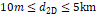

+-------------------------------------------+-------------------------+
| 3GPP TR 38.865 V18.0.0 (2022-09)          |                         |
+===========================================+=========================+
| Technical Report                          |                         |
+-------------------------------------------+-------------------------+
| 3rd Generation Partnership Project;       |                         |
|                                           |                         |
| Technical Specification Group Radio       |                         |
| Access Network;                           |                         |
|                                           |                         |
| Study on further NR RedCap UE complexity  |                         |
| reduction                                 |                         |
|                                           |                         |
| (Release 18)                              |                         |
+-------------------------------------------+-------------------------+
|                                           |                         |
+-------------------------------------------+-------------------------+
|                    |  |
+-------------------------------------------+-------------------------+
|                                           |                         |
+-------------------------------------------+-------------------------+
| The present document has been developed   |                         |
| within the 3rd Generation Partnership     |                         |
| Project (3GPP ^TM^) and may be further    |                         |
| elaborated for the purposes of 3GPP.\     |                         |
| The present document has not been subject |                         |
| to any approval process by the 3GPP       |                         |
| Organizational Partners and shall not be  |                         |
| implemented.\                             |                         |
| This Specification is provided for future |                         |
| development work within 3GPP only. The    |                         |
| Organizational Partners accept no         |                         |
| liability for any use of this             |                         |
| Specification.\                           |                         |
| Specifications and Reports for            |                         |
| implementation of the 3GPP ^TM^ system    |                         |
| should be obtained via the 3GPP           |                         |
| Organizational Partners\' Publications    |                         |
| Offices.                                  |                         |
+-------------------------------------------+-------------------------+

+----------------------------------------------------------------------+
|                                                                      |
+======================================================================+
| > ***3GPP***                                                         |
| >                                                                    |
| > Postal address                                                     |
| >                                                                    |
| > 3GPP support office address                                        |
| >                                                                    |
| > 650 Route des Lucioles - Sophia Antipolis                          |
| >                                                                    |
| > Valbonne - FRANCE                                                  |
| >                                                                    |
| > Tel.: +33 4 92 94 42 00 Fax: +33 4 93 65 47 16                     |
| >                                                                    |
| > Internet                                                           |
| >                                                                    |
| > http://www.3gpp.org                                                |
+----------------------------------------------------------------------+
| ***Copyright Notification***                                         |
|                                                                      |
| No part may be reproduced except as authorized by written            |
| permission.\                                                         |
| The copyright and the foregoing restriction extend to reproduction   |
| in all media.                                                        |
|                                                                      |
| © 2022, 3GPP Organizational Partners (ARIB, ATIS, CCSA, ETSI, TSDSI, |
| TTA, TTC).                                                           |
|                                                                      |
| All rights reserved.                                                 |
|                                                                      |
| UMTS™ is a Trade Mark of ETSI registered for the benefit of its      |
| members                                                              |
|                                                                      |
| 3GPP™ is a Trade Mark of ETSI registered for the benefit of its      |
| Members and of the 3GPP Organizational Partners\                     |
| LTE™ is a Trade Mark of ETSI registered for the benefit of its       |
| Members and of the 3GPP Organizational Partners                      |
|                                                                      |
| GSM® and the GSM logo are registered and owned by the GSM            |
| Association                                                          |
+----------------------------------------------------------------------+

 Contents {#contents .TT}
========

Foreword 4

1 Scope 5

2 References 5

3 Definitions of terms, symbols and abbreviations 6

3.1 Terms 6

3.2 Symbols 6

3.3 Abbreviations 6

4 Introduction 6

5 Study objectives 7

6 Evaluation methodology 7

6.1 Evaluation methodology for UE complexity reduction 7

6.2 Evaluation methodology for coverage impact 8

7 UE complexity reduction features 12

7.1 Introduction to UE complexity reduction features 12

7.2 Further UE bandwidth reduction 12

7.2.1 Description of feature 12

7.2.2 Analysis of UE complexity reduction 13

7.2.3 Analysis of performance impacts 17

7.2.4 Analysis of network deployment and coexistence impacts 17

7.2.5 Analysis of specification impacts 17

7.3 Further UE peak rate reduction 17

7.3.1 Description of feature 17

7.3.2 Analysis of UE complexity reduction 18

7.3.3 Analysis of performance impacts 21

7.3.4 Analysis of network deployment and coexistence impacts 21

7.3.5 Analysis of specification impacts 21

7.4 Relaxed UE processing timeline 21

7.4.1 Description of feature 21

7.4.2 Analysis of UE complexity reduction 22

7.4.3 Analysis of performance impacts 22

7.4.4 Analysis of network deployment and coexistence impacts 22

7.4.5 Analysis of specification impacts 23

7.5 Combinations of UE complexity reduction features 23

7.5.1 Description of feature combinations 23

7.5.2 Analysis of UE complexity reduction 23

7.5.3 Analysis of performance impacts 24

7.5.4 Analysis of network deployment and coexistence impacts 24

7.5.5 Analysis of specification impacts 24

8 Coverage impact 25

8.1 Introduction to coverage impact 25

8.2 Coverage impact evaluation 25

8.2.1 Urban scenario at 2.6 GHz 25

8.2.2 Rural scenario at 0.7 GHz 34

8.2.3 Urban scenario at 4 GHz 40

8.2.4 Summary of coverage impact evaluation 47

9 Conclusions and recommendations 50

Annex A: Change history 52

Foreword
========

This Technical Report has been produced by the 3rd Generation
Partnership Project (3GPP).

The contents of the present document are subject to continuing work
within the TSG and may change following formal TSG approval. Should the
TSG modify the contents of the present document, it will be re-released
by the TSG with an identifying change of release date and an increase in
version number as follows:

Version x.y.z

where:

x the first digit:

1 presented to TSG for information;

2 presented to TSG for approval;

3 or greater indicates TSG approved document under change control.

y the second digit is incremented for all changes of substance, i.e.
technical enhancements, corrections, updates, etc.

z the third digit is incremented when editorial only changes have been
incorporated in the document.

In the present document, modal verbs have the following meanings:

**shall** indicates a mandatory requirement to do something

**shall not** indicates an interdiction (prohibition) to do something

The constructions \"shall\" and \"shall not\" are confined to the
context of normative provisions, and do not appear in Technical Reports.

The constructions \"must\" and \"must not\" are not used as substitutes
for \"shall\" and \"shall not\". Their use is avoided insofar as
possible, and they are not used in a normative context except in a
direct citation from an external, referenced, non-3GPP document, or so
as to maintain continuity of style when extending or modifying the
provisions of such a referenced document.

**should** indicates a recommendation to do something

**should not** indicates a recommendation not to do something

**may** indicates permission to do something

**need not** indicates permission not to do something

The construction \"may not\" is ambiguous and is not used in normative
elements. The unambiguous constructions \"might not\" or \"shall not\"
are used instead, depending upon the meaning intended.

**can** indicates that something is possible

**cannot** indicates that something is impossible

The constructions \"can\" and \"cannot\" are not substitutes for \"may\"
and \"need not\".

**will** indicates that something is certain or expected to happen as a
result of action taken by an agency the behaviour of which is outside
the scope of the present document

**will not** indicates that something is certain or expected not to
happen as a result of action taken by an agency the behaviour of which
is outside the scope of the present document

**might** indicates a likelihood that something will happen as a result
of action taken by some agency the behaviour of which is outside the
scope of the present document

**might not** indicates a likelihood that something will not happen as a
result of action taken by some agency the behaviour of which is outside
the scope of the present document

In addition:

**is** (or any other verb in the indicative mood) indicates a statement
of fact

**is not** (or any other negative verb in the indicative mood) indicates
a statement of fact

The constructions \"is\" and \"is not\" do not indicate requirements.

1 Scope
=======

This document captures the findings from the study item \"Study on
further NR RedCap UE complexity reduction\" \[2\].

The study concerns potential solutions for reducing UE complexity
further compared to the RedCap UE type introduced in Rel-17 \[3\],
providing NR support for low-tier devices between existing LPWA UEs and
Rel-17 RedCap UEs to further expand the market for RedCap use cases with
relatively low cost, low energy consumption, and low data rate
requirements, targeting 10 Mbps peak rate.

The study focuses on UE bandwidth reduction to 5 MHz and/or UE peak rate
reduction to 10 Mbps, possibly in combination with relaxed UE processing
timeline. The scope of the study includes support for FR1 bands for FDD
and TDD and coexistence with Rel-15/16/17 UEs. The scope of the study
does not include LPWA use cases.

2 References {#references-1}
============

The following documents contain provisions which, through reference in
this text, constitute provisions of the present document.

\- References are either specific (identified by date of publication,
edition number, version number, etc.) or non‑specific.

\- For a specific reference, subsequent revisions do not apply.

\- For a non-specific reference, the latest version applies. In the case
of a reference to a 3GPP document (including a GSM document), a
non-specific reference implicitly refers to the latest version of that
document *in the same Release as the present document*.

\[1\] 3GPP TR 21.905: \"Vocabulary for 3GPP Specifications\".

\[2\] 3GPP RP-213661: \"New SID on Study on further NR RedCap UE
complexity reduction\".

\[3\] 3GPP RP-221163: \"Summary of WI on support of reduced capability
(RedCap) NR devices\"

\[4\] 3GPP TS 38.306: \"NR; User Equipment (UE) radio access
capabilities\".

\[5\] 3GPP TR 38.875: \"Study on support of reduced capability NR
devices\".

\[6\] 3GPP TR 38.830: \"Study on NR coverage enhancements\".

\[7\] 3GPP R1-2207981: \"FL summary \#2 for collection of evaluation
results for Rel-18 RedCap SI\".

3 Definitions of terms, symbols and abbreviations
=================================================

3.1 Terms
---------

For the purposes of the present document, the terms given in
TR 21.905 \[1\] and the following apply. A term defined in the present
document takes precedence over the definition of the same term, if any,
in TR 21.905 \[1\].

**RedCap UE:** A UE with reduced capabilities as specified in clause
4.2.21.1 in TS 38.306 \[4\].

3.2 Symbols
-----------

For the purposes of the present document, the following symbols apply:

\<symbol\> \<Explanation\>

3.3 Abbreviations
-----------------

For the purposes of the present document, the abbreviations given in
TR 21.905 \[1\] and the following apply. An abbreviation defined in the
present document takes precedence over the definition of the same
abbreviation, if any, in TR 21.905 \[1\].

\<ABBREVIATION\> \<Expansion\>

4 Introduction
==============

5G aims to accelerate industrial transformation and digitalization,
which improve flexibility, enhance productivity and efficiency, reduce
maintenance, and improve operational safety. Industrial sensors play an
important role for realizing such a vision. Not only widely used in
industrial automation and digitalization use cases, industrial sensors
are also widely used in the general environmental monitoring use cases
such as monitoring of critical infrastructure (e.g., buildings, bridges,
water dams, etc.) or monitoring for natural disasters (e.g., wild fire,
flood, tsunami, earthquake, etc.).

Another emerging new class of new 5G use cases is the smart city
vertical, which covers data collection and processing to more
efficiently monitor and control city resources, and to provide services
to city residents. Especially, the deployment of surveillance cameras is
an essential part of the smart city but also of factories and
industries.

Furthermore, there have been increasing interests in wearables use cases
such as smart watches, eHealth related devices, and medical monitoring
devices. These use cases call for different design considerations and
have different requirements in terms of form factor, UE complexity and
energy efficiency, compared to eMBB devices.

The support of industrial sensors, video surveillance, and wearables
were the motivations behind Rel-17 RedCap. Through the Rel-17 NR RedCap
work item, 3GPP has established a framework for enabling reduced
capability NR devices suitable for a range of use cases, including the
industrial sensors, video surveillance, and wearables use cases, with
requirements on low UE complexity and sometimes also on low UE power
consumption.

Now when the foundation has been laid in Rel-17 \[3\], enhancements can
be considered to improve the support for the mentioned use cases and
also to expand RedCap into a new range of use cases such as smart grid.

To further expand the market for RedCap use cases with relatively low
cost, low energy consumption, and low data rate requirements, e.g.,
industrial wireless sensor network use cases, some further complexity
reduction enhancements should be considered.

Rel-18 RedCap should provide NR support for low-tier devices between
existing LPWA UEs and the capabilities of Rel-17 RedCap UEs. The
supported peak data rate for Rel-18 RedCap targets to 10Mbps. Rel-18
RedCap should not overlap with existing LPWA solutions.

The enhancements should be introduced while maintaining the integrity of
the RedCap ecosystem and maximizing the benefit of economies of scale.
The SI targets enhancements applicable to the RedCap framework defined
in Rel-17, including principles of network awareness of device
capabilities.

5 Study objectives
==================

The study includes the following objectives:

\- Study further UE complexity reduction techniques based on Rel-17
evaluation methodology in TR 38.875.

\- Consider network impact, coexistence of Rel-17 and Rel-18 RedCap and
non-RedCap UEs in a cell, UE impact, specification impact.

\- Potential solutions, which may complement each other, for reducing
device complexity are focusing on:

\- UE bandwidth reduction to 5MHz in FR1,

> \- Possibly in combination with relaxed UE processing timeline for
> PDSCH and/or PUSCH and/or CSI

\- Reduced UE peak data rate in FR1,

> \- Possibly including restricted bandwidth for PDSCH and/or PUSCH
>
> \- Possibly in combination with relaxed UE processing timeline for
> PDSCH and/or PUSCH and/or CSI

\- Notes:

\- Rel-15 SSB should be reused and L1 changes minimized.

\- Operation in BWP with/without SSB and without/with RF retuning should
be considered.

\- It is not precluded that some solutions for FR1 can be applied to FR2
in WI stage.

\- Aim to define a single Rel-18 RedCap UE type for further UE
complexity reduction.

6 Evaluation methodology
========================

6.1 Evaluation methodology for UE complexity reduction
------------------------------------------------------

For complexity evaluation of UE complexity reduction techniques, the
methodology used in TR 38.875 was used as a starting point.

The reference NR devices were defined for FR1 FDD and FR1 TDD in clause
6.1 in TR 38.875 and are reused in this study. For complexity reduction
estimation, the detailed complexity breakdown for the Rel-15 reference
NR devices according to Table 6.1-1 is reused, where the RF-to-baseband
complexity ratio is assumed to be 40:60 for an FR1 UE.

For comparison with a Rel-17 baseline when evaluating the potential
Rel-18 UE complexity reduction features, the Rel-17 RedCap UE supports
20 MHz, 1 Rx, 1 layer, DL 64QAM, UL 64QAM, FDD or TDD. In addition,
cases with 2 Rx, 2 MIMO layers, and HD-FDD features are optionally
evaluated. In all comparisons, the Rel-17 RedCap UEs and the potential
Rel-18 UEs being compared have the same number of antenna branches, the
same number of layers, the same maximum supported modulation order, and
the same duplex mode (among HD-FDD, FD-FDD, and TDD).

NOTE: This study assesses, from a 3GPP standpoint, the technical
feasibility of further reducing the complexity of RedCap devices. Given
that factors outside 3GPP responsibility influence the cost of a
modem/device, this study item (and this study report) cannot guarantee,
or be used as a guarantee, that such modem/device will be low-cost in
the market.

Table 6.1-1: Detailed complexity breakdown for the FR1 reference NR
devices

  ---------------------------------------------------------------------------
  Functional block                            FR1 FDD (2Rx)   FR1 TDD (4Rx)
  ------------------------------------------- --------------- ---------------
  RF                                                          

  Power amplifier                             \~25%           \~25%

  Filters                                     \~10%           \~15%

  RF transceiver\                             \~45%           \~55%
  (incl. LNAs, mixer, and local oscillator)                   

  Duplexer / Switch                           \~20%           \~5%

  Baseband                                                    

  ADC / DAC                                   \~10%           \~9%

  FFT/IFFT                                    \~4%            \~4%

  Post-FFT data buffering                     \~10%           \~10%

  Receiver processing block                   \~24%           \~29%

  LDPC decoding                               \~10%           \~9%

  HARQ buffer                                 \~14%           \~12%

  DL control processing & decoder             \~5%            \~4%

  Synchronization / cell search block         \~9%            \~9%

  UL processing block                         \~5%            \~5%

  MIMO specific processing blocks             \~9%            \~9%
  ---------------------------------------------------------------------------

6.2 Evaluation methodology for coverage impact
----------------------------------------------

Coverage recovery evaluation is based on link budget evaluations.

The evaluation methodology and assumptions in the Rel-17 RedCap SI \[5\]
are reused by default, with the revision or addition described below.

The channels and messages used in link budget evaluations primarily
include PBCH, PDCCH CSS, and SIB1. Sourcing companies can additionally
provide evaluation results of other channels and messages such as PDCCH
USS, PRACH, Msg2, Msg3, Msg4, PDSCH, PUCCH and PUSCH.

The impact of small form factor can be considered for all the uplink and
downlink channels. To reflect such an impact, a 3dB loss of antenna gain
can be optionally included in link budget calculation for the FR1 bands
by sourcing companies.

The assumptions in the Rel-17 RedCap SI regarding link budget templates
and antenna array gain are reused \[5\]. Furthermore, the Rel-17 RedCap
SI assumptions on gNB antenna configuration, \# gNB Tx and Rx chains,
channel model and delay spread are reused as shown in Table 6.2-1.

Table 6.2-1: Assumptions used for coverage impact evaluation

+----------------------------------+----------------------------------+
| Parameters                       | FR1 values                       |
+==================================+==================================+
| Deployment scenario and          | Urban: 2.6GHz (TDD), 4GHz (TDD,  |
| frequency                        | optional)                        |
|                                  |                                  |
|                                  | Rural: (FDD)                     |
+----------------------------------+----------------------------------+
| Frame structure for TDD          | DDDDDDDSUU (S: 6D:4G:4U) for     |
|                                  | 2.6GHz                           |
|                                  |                                  |
|                                  | DDDSUDDSUU (S: 10D:2G:2U) for    |
|                                  | 4GHz                             |
+----------------------------------+----------------------------------+
| Channel model                    | TDL-C                            |
+----------------------------------+----------------------------------+
| Delay spread                     | 300ns                            |
+----------------------------------+----------------------------------+
| UE velocity                      | 3 km/h                           |
+----------------------------------+----------------------------------+
| Antenna correlation              | Low                              |
+----------------------------------+----------------------------------+
| \# gNB Tx chains                 | 2 or 4                           |
+----------------------------------+----------------------------------+
| \# gNB Rx chains                 | 2 or 4                           |
+----------------------------------+----------------------------------+

For coverage evaluation, the assumptions for reference NR UE, reference
Rel-17 RedCap UE, and the potential Rel-18 UE are shown in Tables 6.2-2,
6.2-3 and 6.2-4, respectively.

Table 6.2-2: Assumptions for reference NR UE

+-----------------+---------------------------------------+
| Parameters      | FR1 values                            |
+=================+=======================================+
| \# UE Tx chains | 1                                     |
+-----------------+---------------------------------------+
| \# UE Rx chains | Urban: 4 and Rural: 2                 |
+-----------------+---------------------------------------+
| UE bandwidth    | Urban: 100 MHz (273 PRBs, 30 kHz SCS) |
|                 |                                       |
|                 | Rural: 20 MHz (106 PRBs, 15 kHz SCS)  |
+-----------------+---------------------------------------+

Table 6.2-3: Assumptions for reference Rel-17 RedCap UE

+-----------------+--------------------------------------+
| Parameters      | FR1 values                           |
+=================+======================================+
| \# UE Tx chains | 1                                    |
+-----------------+--------------------------------------+
| \# UE Rx chains | 1                                    |
+-----------------+--------------------------------------+
| UE bandwidth    | Urban: 20 MHz (51 PRBs, 30 kHz SCS)  |
|                 |                                      |
|                 | Rural: 20 MHz (106 PRBs, 15 kHz SCS) |
+-----------------+--------------------------------------+

Table 6.2-4: Assumptions for the potential Rel-18 UE

+-----------------+----------------------------------------------------------+
| Parameters      | FR1 values                                               |
+=================+==========================================================+
| \# UE Tx chains | 1                                                        |
+-----------------+----------------------------------------------------------+
| \# UE Rx chains | 1                                                        |
+-----------------+----------------------------------------------------------+
| UE bandwidth    | Urban: 5 MHz (11 PRBs or 12 PRBs (optional), 30 kHz SCS) |
|                 |                                                          |
|                 | Rural: 5 MHz (25 PRBs, 15 kHz SCS)                       |
+-----------------+----------------------------------------------------------+

The assumptions for channel specific parameters are also based on
reusing the Rel-17 RedCap SI agreements \[5\], with the revision or
addition described below.

For PBCH, the assumptions listed in Table A.1-8 from TR 38.830 \[6\]
were adopted for reference NR UE, reference Rel-17 RedCap UE, and the
potential Rel-18 UE.

For SIB1, the assumptions listed in Table 6.2-5 were adopted for
reference NR UE, and reference Rel-17 RedCap UE. For the potential
Rel-18 UE, the assumptions listed in Table 6.2-6 were adopted.

Table 6.2-5: Assumptions for SIB1 for reference NR UE and reference
Rel-17 RedCap UE

  Parameters     Values
  -------------- ---------------------------------------------------------------------------------------------------------------------------------------------------------------------------------
  PRBs/TBS/MCS   TBS is 1256 bits. SIB1 bandwidth is larger than 5MHz, e.g. 48PRBs. Companies to report the used number of PRBs, corresponding MCS, and whether interleaving mapping is assumed.

Table 6.2-6: Assumptions for SIB1 for the potential Rel-18 UE

+--------------+------------------------------------------------------+
| Parameters   | Values                                               |
+==============+======================================================+
| PRBs/TBS/MCS | TBS is 1256 bits. Other TBS are not precluded.       |
|              |                                                      |
|              | For PRB numbers, two options are assumed:            |
|              |                                                      |
|              | \- Option 1: SIB1 bandwidth is larger than 5MHz,     |
|              | e.g. 48PRBs.                                         |
|              |                                                      |
|              | \- Option 2: SIB1 bandwidth is within 5MHz.          |
|              |                                                      |
|              | Companies to report the used number of PRBs,         |
|              | corresponding MCS, and whether interleaving mapping  |
|              | is assumed.                                          |
+--------------+------------------------------------------------------+

For PDCCH common search space (PDCCH CSS), the assumptions listed in
Table 6.2-7 were adopted for reference NR UE and reference Rel-17 RedCap
UE.

Table 6.2-7: Assumptions for PDCCH Common Search Space (PDCCH CSS) for
reference NR UE and reference Rel-17 RedCap UE

  Parameters                                              Values
  ------------------------------------------------------- ------------------------------------------------------
  DCI format and payload size                             DCI format 1\_0 with payload of 40bits
  CORESET size and aggregation level (AL) configuration   The CORESET size is 2 symbols and 48 PRBs. AL is 16.

For PDCCH common search space (PDCCH CSS), the assumptions listed in
Table 6.2-8 were adopted for the potential Rel-18 UE.

Table 6.2-8: Assumptions for PDCCH Common Search Space (PDCCH CSS) for
the potential Rel-18 UE

+----------------------------------+----------------------------------+
| Parameters                       | Values                           |
+==================================+==================================+
| DCI format and payload size      | DCI format 1\_0 with payload of  |
|                                  | 40bits                           |
+----------------------------------+----------------------------------+
| CORESET size and aggregation     | For 15kHz SCS, the following     |
| level (AL) configuration         | options are assumed.             |
|                                  |                                  |
|                                  | \- Option 1: The CORESET size is |
|                                  | 2 symbols and 48 PRBs. AL is 16. |
|                                  |                                  |
|                                  | \- Option 2: The CORESET size is |
|                                  | 3 symbols and 24 PRBs. AL is 8.  |
|                                  |                                  |
|                                  | For 30kHz SCS, the following     |
|                                  | options are assumed.             |
|                                  |                                  |
|                                  | \- Option 1: The CORESET size is |
|                                  | 2 symbols and 24 PRBs. AL is 8.  |
|                                  |                                  |
|                                  | \- Option 2: The CORESET size is |
|                                  | 3 symbols and 6 PRBs. AL is 2.   |
|                                  |                                  |
|                                  | \- Option 3: The CORESET size is |
|                                  | 3 symbols and 12 PRBs. AL is 4.  |
|                                  |                                  |
|                                  | Other configurations can be      |
|                                  | optionally evaluated and         |
|                                  | reported by companies.           |
+----------------------------------+----------------------------------+

For Msg2, the assumptions for reference NR UE, reference Rel-17 RedCap
UE, and the potential Rel-18 UE listed in Table 6.2-9 were adopted.

Table 6.2-9: Assumptions for Msg2

  Parameters     Values
  -------------- -----------------------------------------------------------------------------------
  PRBs/TBS/MCS   TBS is 72bits. Companies to report the used number of PRBs and corresponding MCS.

For Msg4, the assumptions for reference NR UE, reference Rel-17 RedCap
UE, and the potential Rel-18 UE listed in Table 6.2-10 were adopted.

Table 6.2-10: Assumptions for Msg4

+--------------+------------------------------------------------------+
| Parameters   | Values                                               |
+==============+======================================================+
| PRBs/TBS/MCS | TBS is 1040bits. Companies to report the used number |
|              | of PRBs and corresponding MCS.                       |
|              |                                                      |
|              | A smaller TBS can be optionally evaluated and        |
|              | reported by companies.                               |
+--------------+------------------------------------------------------+

For PRACH, the assumptions for reference NR UE, reference Rel-17 RedCap
UE, and the potential Rel-18 UE listed in Table 6.2-11 were adopted.

Table 6.2-11: Assumptions for PRACH

+--------------+------------------------------------------------------+
| Parameters   | Values                                               |
+==============+======================================================+
| PRACH format | Urban: Format B4                                     |
|              |                                                      |
|              | Rural: Format 0                                      |
|              |                                                      |
|              | Format C2 can be optionally evaluated and reported   |
|              | by companies.                                        |
+--------------+------------------------------------------------------+

The target data rates for the potential Rel-18 UEs are:

\- FR1 Rural: 250 kbps on DL and 25 kbps in UL

\- FR1 Urban: 500 kbps on DL and 250 kbps in UL

\- Note: The target data rates are the scaled value in the Rel-17 RedCap
SI by a factor of 0.25

The TBS, PRB, and MCS of PDSCH and PUSCH for the potential Rel-18 UE are
based on the agreed target data rates or message sizes and reported by
sourcing companies.

For all channels affected by reduced UE complexity including prioritized
broadcast channels and optionally evaluated channels, the following
methodology is used to evaluate the coverage impact in terms of coverage
margins:

\- Step 1: Obtain the link budget performance of the channel based on
link budget evaluation

\- Step 2: Obtain the target performance requirement for the potential
Rel-18 UE within a deployment scenario

\- Step 3: Find the coverage margin for the channel by comparing the
link budget performance with the target performance requirement.

For step 2, the study applied the following option for determining the
target performance for coverage impact evaluation in terms of coverage
margins.

\- The target performance requirement for each channel is identified by
the link budget of the bottleneck channel for the reference UE within
the same deployment scenario. The \"bottleneck channel\" is the physical
channel that has the lowest MIL value. The reference UE is an NR UE with
mandatory features only as defined in Clause 6.1 of \[5\].

In this coverage impact evaluation in terms of coverage margins, a
single coverage target based on the same bottleneck channel is used for
all channels including the prioritized broadcast channels and optionally
evaluated channels of the potential Rel-18 UE. Each sourcing company
reports a sourcing-company-specific coverage margin for each channel by
comparing the link budget of the channel with the link budget of the
bottleneck channel for the reference UE.

A representative value of the coverage margin for a channel is derived
by taking the mean value (in dB domain) from the coverage margins from
all sourcing companies, including both negative and non-negative values
based on the following adjustments.

\- Excluding the highest & the lowest values when the number of samples
is more than 3.

\- If the number of samples is less than 4 for a channel in a scenario,
no representative value is provided.

The representative value of a channel is used for identifying whether
the channel has coverage margin compared to the bottleneck channel of
the reference NR UE.

In Step 2 in the above methodology for determining coverage margins, a
sourcing company might not be able to identify a bottleneck channel for
the reference NR UE and the corresponding MIL link budget if it had not
evaluated all channels for the reference NR UE, especially if it had not
evaluated uplink channels since uplink channels were often the
bottleneck channels for the reference NR UE. For such a sourcing
company, a bottleneck channel and the corresponding link budget for the
reference NR UE can be determined based on evaluation results of the
identified bottleneck channels and MIL values from the Rel-17 RedCap SI
in \[5\] for a scenario. Specifically, for an evaluated scenario, a
bottleneck channel is determined by the one identified by most sourcing
companies and its corresponding MIL value is derived by taking the mean
value (in dB domain) from the MIL values from all sourcing companies
after excluding the highest & the lowest values. For the evaluated
scenarios, the following tables from Rel-17 RedCap SI in \[5\] are used:

\- For Urban scenario at 2.6GHz, Table 9.1.1-1 in \[5\] is used for
determining a bottleneck channel and MIL value for the reference NR UE
by such a sourcing company.

\- For Rural scenario at 0.7GHz, Table 9.1.2-1 in \[5\] is used.

\- For Urban scenario at 4 GHz, Table 9.1.3-1 in \[5\] is used.

For each table of coverage margins of evaluated channels in a deployment
scenario shown in Clause 8.2.1 through Clause 8.2.3, the rows of the
table are composed of sourcing companies\' names, representative value
1, number of samples 1, representative value 2, and number of samples 2.
For an evaluated channel in the scenario,

\- the representative value 1 is derived from the coverage margins only
from sourcing companies who had provided uplink coverage evaluation
results for the reference NR UE

\- the number of samples 1 is the total number of sourcing companies
that had provided uplink coverage evaluation results for the reference
NR UE

\- the representative value 2 is derived from the coverage margins from
all sourcing companies regardless of whether or one had provided uplink
coverage evaluation results for the reference NR UE

\- the number of samples 2 is the total number of all sourcing companies

Besides comparing link budgets of all evaluated channels to that of the
bottleneck channel for the reference NR UE and deriving coverage margins
for all channels, comparisons of the coverage differences between the
potential Rel-18 UE and the reference NR UE in addition to comparisons
of the coverage differences between the potential Rel-18 UE and the
reference Rel-17 RedCap UE were carried out for the broadcast channels
including PBCH, PDCCH CSS, and SIB1 in Urban scenario at 2.6 GHz. For
PDCCH CSS and SIB1, the comparisons were also carried out for Rural
scenario at 0.7 GHz. Detailed comparisons and assumptions are provided
in Clause 8.2.1 and Clause 8.2.2 for Urban at 2.6 GHz and Rural at 0.7
GHz, respectively.

7 UE complexity reduction features
==================================

7.1 Introduction to UE complexity reduction features
----------------------------------------------------

The following UE complexity reduction techniques have been studied:

\- Further UE bandwidth reduction (\"BW\" for short)

\- Further UE peak rate reduction (\"PR\" for short)

\- Relaxed UE processing timeline (\"PT\" for short)

The evaluation results for each one of the studied individual UE
complexity reduction techniques are captured in clauses 7.2 through 7.4,
respectively. For relaxed UE processing timeline, analysis is provided
in clause 7.4, while complexity evaluations are provided only in
combination with other techniques in clause 7.5 where the properties of
combinations of different individual UE complexity reduction techniques
are described. The evaluation of the potential coverage impacts is
described in clause 8. Recommendations based on the evaluations are
captured in clause 9.

7.2 Further UE bandwidth reduction
----------------------------------

### 7.2.1 Description of feature

In the study, the main UE bandwidth reduction options considered for FR1
are as follows:

\- Option BW1: Both RF and BB bandwidths are 5 MHz for UL and DL.

\- Option BW2 (optionally considered for evaluations): 5 MHz BB
bandwidth for all signals and channels with 20 MHz RF bandwidth for UL
and DL.

\- Option BW3: 5 MHz BB bandwidth only for PDSCH (for both unicast and
broadcast) and PUSCH with 20 MHz RF bandwidth for UL and DL. The other
physical channels and signals are still allowed to use a BWP up to the
20 MHz maximum UE RF+BB bandwidth.

For the above bandwidth reduction options, the following aspects are
considered:

\- The resource allocation spans a bandwidth of maximum 5 MHz.

\- The same option is used for UL and DL.

\- The same option is used for idle/inactive and connected mode.

\- Note: As part of study of above options, it is not precluded to
indicate that an observation is relevant for UL only or DL only.

\- For 15 kHz SCS, 25 contiguous RBs are assumed to fit within the 5
MHz.

\- For 30 kHz SCS, 11 contiguous RBs are assumed to fit within the 5
MHz.

\- Note: For 30 kHz SCS, 12 contiguous RBs are also optionally studied.

The evaluation results for each one of the studied individual UE
complexity reduction techniques are captured in clauses 7.2 through 7.4,
respectively. The properties of combinations of different individual UE
complexity reduction techniques are described in clause 7.5.
Recommendations based on the evaluations are captured in clause 9.

### 7.2.2 Analysis of UE complexity reduction

For BW1, the main contributors of the complexity reduction are the
following functional blocks:

\- Baseband: ADC/DAC

\- Baseband: FFT/IFFT

\- Baseband: Post-FFT data buffering

\- Baseband: Receiver processing block

\- Baseband: LDPC decoding

\- Baseband: HARQ buffer

\- Baseband: DL control processing & decoder

\- Baseband: UL processing block

For BW2, the main contributors of the complexity reduction are the
following functional blocks:

\- Baseband: Post-FFT data buffering

\- Baseband: Receiver processing block

\- Baseband: LDPC decoding

\- Baseband: HARQ buffer

\- Baseband: DL control processing & decoder

\- Baseband: UL processing block

For BW3, the main contributors of the complexity reduction are the
following functional blocks:

\- Baseband: Post-FFT data buffering

\- Baseband: Receiver processing block

\- Baseband: LDPC decoding

\- Baseband: HARQ buffer

\- Baseband: UL processing block

Note 1: BW3 may have different degrees of impacts on the post-FFT data
buffering depending on the scheduling aspects (cross-slot scheduling, RF
retuning, etc.).

Note 2: For BW2, some sources have indicated that the complexity of the
ADC/DAC and FFT/IFFT blocks might also be reduced.

Note 3: For BW1, one source shows complexity reduction for RF filters
and one source shows complexity reduction for MIMO specific processing
block.

Note 4: BW1 and BW2 may have different degrees of impacts on the
downlink control processing and decoder depending on the CCE and BD
complexity reduction.

For the UE bandwidth reduction options BW1, BW2, and BW3, the complexity
reduction is mainly in the BB part, and although there may be a
possibility to reduce RF complexity, there is no significant complexity
reduction in the RF part.

The tables below show the average value of the initial complexity
evaluation results captured in \[7\]. Specifically, results are provided
for Rel-17 RedCap and potential Rel-18 RedCap cases with FD-FDD 1Rx, TDD
1Rx, HD-FDD 1Rx, FD-FDD 2Rx, TDD 2Rx, and HD-FDD 2Rx.

Note that the reference Rel-15 NR UE has the following features:

\- FDD: 100 MHz, 2 Rx, 2 layers, DL 256QAM, FD-FDD

\- TDD: 100 MHz, 4 Rx, 4 layers, DL 256QAM

Table 7.2.2-1: Average UE complexity reduction achieved by BW reduction
options for FD-FDD 1Rx

  Reduced UE bandwidth                                        Rel-15 reference   Rel-17 RedCap   BW1          BW2          BW3
  ----------------------------------------------------------- ------------------ --------------- ------------ ------------ ------------
  RF: Power amplifier                                         25%                24.12%          24.02%       24.64%       24.09%
  RF: Filters                                                 10%                5.06%           4.72%        5.12%        5.06%
  RF: Transceiver (incl. LNAs, mixer, and local oscillator)   45%                23.76%          23.52%       24.30%       23.76%
  RF: Duplexer / Switch                                       20%                19.52%          19.52%       19.57%       19.52%
  **RF: Total**                                               **100%**           72.46%          71.78%       73.63%       72.43%
  BB: ADC / DAC                                               10%                1.30%           0.50%        0.99%        1.27%
  BB: FFT/IFFT                                                4%                 0.67%           0.21%        0.45%        0.65%
  BB: Post-FFT data buffering                                 10%                1.05%           0.36%        0.46%        0.67%
  BB: Receiver processing block                               24%                4.42%           2.00%        1.86%        2.07%
  BB: LDPC decoding                                           10%                1.29%           0.51%        0.50%        0.51%
  BB: HARQ buffer                                             14%                1.46%           0.45%        0.45%        0.45%
  BB: DL control processing & decoder                         5%                 4.73%           3.98%        3.95%        4.52%
  BB: Synchronization / cell search block                     9%                 4.61%           4.55%        4.59%        4.58%
  BB: UL processing block                                     5%                 2.69%           1.55%        1.54%        1.69%
  BB: MIMO specific processing blocks                         9%                 4.04%           3.77%        3.85%        3.91%
  **BB: Total**                                               **100%**           26.26%          17.88%       18.65%       20.31%
  **RF+BB: Total**                                            **100%**           **44.74%**      **39.44%**   **40.65%**   **41.15%**

Table 7.2.2-2: Average UE complexity reduction achieved by BW reduction
options for TDD 1Rx

  Reduced UE bandwidth                                        Rel-15 reference   Rel-17 RedCap   BW1          BW2          BW3
  ----------------------------------------------------------- ------------------ --------------- ------------ ------------ ------------
  RF: Power amplifier                                         25%                24.08%          23.97%       24.56%       24.05%
  RF: Filters                                                 15%                3.94%           3.86%        4.08%        3.94%
  RF: Transceiver (incl. LNAs, mixer, and local oscillator)   55%                19.05%          18.78%       19.98%       19.05%
  RF: Duplexer / Switch                                       5%                 4.97%           4.97%        4.98%        4.97%
  **RF: Total**                                               **100%**           52.04%          51.58%       53.59%       52.01%
  BB: ADC / DAC                                               9%                 0.76%           0.30%        0.57%        0.73%
  BB: FFT/IFFT                                                4%                 0.40%           0.14%        0.27%        0.38%
  BB: Post-FFT data buffering                                 10%                0.59%           0.22%        0.28%        0.36%
  BB: Receiver processing block                               29%                3.21%           1.54%        1.48%        1.56%
  BB: LDPC decoding                                           9%                 0.79%           0.33%        0.34%        0.33%
  BB: HARQ buffer                                             12%                0.79%           0.40%        0.23%        0.40%
  BB: DL control processing & decoder                         4%                 3.68%           3.15%        3.19%        3.55%
  BB: Synchronization / cell search block                     9%                 2.49%           2.44%        2.45%        2.45%
  BB: UL processing block                                     5%                 2.69%           1.54%        1.50%        1.70%
  BB: MIMO specific processing blocks                         9%                 2.27%           2.04%        2.07%        2.21%
  **BB: Total**                                               **100%**           17.66%          12.08%       12.40%       13.68%
  **RF+BB: Total**                                            **100%**           **31.41%**      **27.88%**   **28.88%**   **29.01%**

Table 7.2.2-3: Average UE complexity reduction achieved by BW reduction
options for HD-FDD 1Rx

  Reduced UE bandwidth                                        Rel-15 reference   Rel-17 RedCap   BW1          BW2          BW3
  ----------------------------------------------------------- ------------------ --------------- ------------ ------------ ------------
  RF: Power amplifier                                         25%                24.50%          24.50%       24.50%       24.50%
  RF: Filters                                                 10%                5.17%           4.64%        5.17%        5.17%
  RF: Transceiver (incl. LNAs, mixer, and local oscillator)   45%                24.46%          24.06%       24.46%       24.46%
  RF: Duplexer / Switch                                       20%                3.68%           3.68%        3.68%        3.68%
  **RF: Total**                                               **100%**           57.81%          56.87%       57.81%       57.81%
  BB: ADC / DAC                                               10%                1.25%           0.54%        1.03%        1.26%
  BB: FFT/IFFT                                                4%                 0.71%           0.25%        0.44%        0.72%
  BB: Post-FFT data buffering                                 10%                1.10%           0.42%        0.50%        0.66%
  BB: Receiver processing block                               24%                4.22%           1.92%        1.92%        2.04%
  BB: LDPC decoding                                           10%                1.41%           0.58%        0.58%        0.58%
  BB: HARQ buffer                                             14%                1.61%           0.52%        0.52%        0.52%
  BB: DL control processing & decoder                         5%                 4.70%           3.84%        3.84%        4.49%
  BB: Synchronization / cell search block                     9%                 4.68%           4.63%        4.63%        4.68%
  BB: UL processing block                                     5%                 3.10%           1.79%        1.78%        1.91%
  BB: MIMO specific processing blocks                         9%                 3.81%           3.56%        3.58%        3.81%
  **BB: Total**                                               **100%**           26.58%          18.05%       18.82%       20.70%
  **RF+BB: Total**                                            **100%**           **39.07%**      **33.58%**   **34.41%**   **35.60%**

Table 7.2.2-4: Average UE complexity reduction achieved by BW reduction
options for FD-FDD 2Rx

  Reduced UE bandwidth                                        Rel-15 reference   Rel-17 RedCap   BW1          BW2          BW3
  ----------------------------------------------------------- ------------------ --------------- ------------ ------------ ------------
  RF: Power amplifier                                         25%                24.87%          24.87%       25.00%       24.87%
  RF: Filters                                                 10%                10.00%          9.02%        9.49%        9.56%
  RF: Transceiver (incl. LNAs, mixer, and local oscillator)   45%                42.47%          41.51%       42.63%       42.47%
  RF: Duplexer / Switch                                       20%                20.00%          20.00%       20.00%       20.00%
  **RF: Total**                                               **100%**           97.33%          95.40%       97.12%       96.90%
  BB: ADC / DAC                                               10%                2.12%           1.03%        1.52%        2.13%
  BB: FFT/IFFT                                                4%                 1.25%           0.47%        0.86%        1.28%
  BB: Post-FFT data buffering                                 10%                2.17%           0.84%        1.11%        1.52%
  BB: Receiver processing block                               24%                8.97%           4.47%        4.78%        4.60%
  BB: LDPC decoding                                           10%                2.71%           1.18%        1.19%        1.18%
  BB: HARQ buffer                                             14%                2.53%           0.97%        0.91%        0.97%
  BB: DL control processing & decoder                         5%                 4.93%           4.13%        4.25%        4.93%
  BB: Synchronization / cell search block                     9%                 8.61%           8.47%        8.38%        8.61%
  BB: UL processing block                                     5%                 3.20%           1.99%        2.04%        2.08%
  BB: MIMO specific processing blocks                         9%                 7.33%           6.01%        6.48%        7.33%
  **BB: Total**                                               **100%**           43.84%          29.57%       31.52%       34.65%
  **RF+BB: Total**                                            **100%**           **65.24%**      **55.90%**   **57.76%**   **59.55%**

Table 7.2.2-5: Average UE complexity reduction achieved by BW reduction
options for TDD 2Rx

  Reduced UE bandwidth                                        Rel-15 reference   Rel-17 RedCap   BW1          BW2          BW3
  ----------------------------------------------------------- ------------------ --------------- ------------ ------------ ------------
  RF: Power amplifier                                         25%                24.44%          24.44%       25.00%       24.44%
  RF: Filters                                                 15%                7.69%           7.11%        7.75%        7.69%
  RF: Transceiver (incl. LNAs, mixer, and local oscillator)   55%                33.61%          31.83%       33.90%       33.14%
  RF: Duplexer / Switch                                       5%                 4.99%           4.99%        5.00%        4.99%
  **RF: Total**                                               **100%**           70.72%          68.36%       71.65%       70.25%
  BB: ADC / DAC                                               9%                 1.13%           0.56%        0.89%        1.13%
  BB: FFT/IFFT                                                4%                 0.66%           0.25%        0.52%        0.70%
  BB: Post-FFT data buffering                                 10%                1.17%           0.47%        0.52%        0.83%
  BB: Receiver processing block                               29%                5.82%           3.08%        3.34%        3.15%
  BB: LDPC decoding                                           9%                 1.33%           0.64%        0.67%        0.64%
  BB: HARQ buffer                                             12%                1.16%           0.44%        0.43%        0.44%
  BB: DL control processing & decoder                         4%                 3.75%           3.10%        3.13%        3.75%
  BB: Synchronization / cell search block                     9%                 4.50%           4.56%        4.50%        4.63%
  BB: UL processing block                                     5%                 2.83%           1.76%        1.82%        1.83%
  BB: MIMO specific processing blocks                         9%                 3.82%           3.05%        3.26%        3.75%
  **BB: Total**                                               **100%**           26.17%          17.90%       19.09%       20.85%
  **RF+BB: Total**                                            **100%**           **43.99%**      **38.08%**   **40.12%**   **40.61%**

Table 7.2.2-6: Average UE complexity reduction achieved by BW reduction
options for HD-FDD 2Rx

  Reduced UE bandwidth                                        Rel-15 reference   Rel-17 RedCap   BW1          BW2          BW3
  ----------------------------------------------------------- ------------------ --------------- ------------ ------------ ------------
  RF: Power amplifier                                         25%                25.00%          25.00%       25.00%       25.00%
  RF: Filters                                                 10%                10.00%          9.03%        10.00%       10.00%
  RF: Transceiver (incl. LNAs, mixer, and local oscillator)   45%                43.04%          41.51%       43.04%       43.04%
  RF: Duplexer / Switch                                       20%                4.33%           4.33%        4.33%        4.33%
  **RF: Total**                                               **100%**           82.38%          79.88%       82.38%       82.38%
  BB: ADC / DAC                                               10%                2.06%           1.09%        1.52%        2.07%
  BB: FFT/IFFT                                                4%                 1.15%           0.49%        0.73%        1.18%
  BB: Post-FFT data buffering                                 10%                2.14%           0.90%        1.10%        1.40%
  BB: Receiver processing block                               24%                9.01%           4.78%        4.78%        4.78%
  BB: LDPC decoding                                           10%                2.69%           1.19%        1.19%        1.19%
  BB: HARQ buffer                                             14%                2.41%           0.91%        0.91%        0.91%
  BB: DL control processing & decoder                         5%                 5.00%           4.25%        4.25%        5.00%
  BB: Synchronization / cell search block                     9%                 8.55%           8.38%        8.38%        8.55%
  BB: UL processing block                                     5%                 3.17%           2.04%        2.04%        2.04%
  BB: MIMO specific processing blocks                         9%                 7.23%           6.48%        6.48%        7.23%
  **BB: Total**                                               **100%**           43.39%          30.52%       31.39%       34.36%
  **RF+BB: Total**                                            **100%**           **58.99%**      **50.26%**   **51.79%**   **53.57%**

For comparison, the average complexity reduction estimates from \[7\]
for different BW reduction options compared to the corresponding Rel-17
RedCap baselines are presented in the table below.

Table 7.2.2-7: Average UE complexity reduction achieved by BW reduction
options compared to corresponding Rel-17 baselines

  Option   FD-FDD 1Rx   TDD 1Rx   HD-FDD 1Rx   FD-FDD 2Rx   TDD 2Rx   HD-FDD 2Rx
  -------- ------------ --------- ------------ ------------ --------- ------------
  BW1      11.85%       11.25%    14.06%       14.31%       13.42%    14.79%
  BW2      9.15%        8.08%     11.92%       11.46%       8.81%     12.21%
  BW3      8.02%        7.66%     8.90%        8.72%        7.68%     9.19%

### 7.2.3 Analysis of performance impacts

**Peak data rate:**

Reducing the UE bandwidth leads to peak data rate reduction, but the
reduced peak data rate can still fulfill the targeted data rate in
Rel-18. In TDD, with 5 MHz UE bandwidth (for all BW options), the
achievable peak data rate for UL or DL can be less than 10 Mbps
depending on the TDD pattern.

**Coverage:**

For all BW options, there is link performance impact for SIB1 PDSCH if
the bandwidth allocation for SIB1 PDSCH exceeds 5 MHz. However, in all
scenarios except for 4 GHz with 24 dBm PSD, there is no or negligible
coverage impact for SIB1 PDSCH even if the bandwidth allocation for SIB1
PDSCH exceeds 5 MHz.

Furthermore, for BW1/BW2, there is link performance degradation for
PDCCH due to reduced maximum AL in a 5-MHz CORESET, and for PBCH (30 kHz
SCS).

For a more detailed description of the coverage impacts, see clause
8.2.4.

**Latency:**

The impact of further UE bandwidth reduction on the latency is
insignificant, and 5 MHz UE bandwidth (for all BW options) can
sufficiently fulfil relaxed latency requirements of RedCap use cases.

### 7.2.4 Analysis of network deployment and coexistence impacts

If the common channels such as SIB1, OSI, RAR, MSG3 etc. are scheduled
within 5MHz, then none of the UE bandwidth reduction options (BW1, BW2,
BW3) have coexistence issues with legacy UEs, but otherwise there are
some coexistence issues with legacy UEs.

BW1 and BW2 are expected to have the largest coexistence impacts among
the evaluated options, whereas the expected coexistence impacts for BW3
are smaller. BW1 and BW2 can have coexistence impacts in terms of
support of SSB/CORESET \#0 configurations (especially 30 kHz SCS) and
limitations of RACH configurations and PRACH sharing procedure.
Furthermore, BW1 has impact on SSB transmissions (e.g., NCD-SSB
overhead) and BWP operation.

Early indication (through Msg1/MsgA) might be needed for all BW options.

### 7.2.5 Analysis of specification impacts

BW1 and BW2 can have significant specification impacts, considering the
impacts on initial access, random access, and SSB/CORESET \#0
configurations (especially 30 kHz SCS). For BW1, the specification
impacts may also include SSB presence requirements. BW3 has smaller
specification impacts compared to BW1 and BW2.

7.3 Further UE peak rate reduction
----------------------------------

### 7.3.1 Description of feature

In the study, the main UE peak rate reduction options considered for FR1
are as follows:

\- Option PR1: Relaxation of the
constraint   for peak data
rate reduction.

\- The relaxed constraint is 1 (instead of 4).

\- The parameters
(, , )
can be as in Rel-17 RedCap \[4\].

\- Option PR2: Restriction of maximum TBS for PDSCH and PUSCH.

\- For 15 kHz SCS, the maximum TBS is 10000 bits per TB and per slot.

\- For 30 kHz SCS, the maximum TBS is 5000 bits per TB and per slot.

\- Option PR3: Restriction of maximum number of PRBs for PDSCH and
PUSCH.

\- For 15 kHz SCS, the maximum number of RBs is 25.

\- For 30 kHz SCS, the maximum number of RBs is 11.

\- The restricted number of PRBs in Option PR3 is a hardcoded limit.

For the above peak rate reduction options, the following aspects are
considered:

\- The studied peak rate reduction applies to both UE-specific (unicast)
and common (broadcast) channels.

\- The resource allocation spans a bandwidth of maximum 20 MHz (maximum
UE channel bandwidth).

\- The same option is used for UL and DL.

\- The same option is used for idle/inactive and connected mode.

\- Note: As part of study of above options, it is not precluded to
indicate that an observation is relevant for UL only or DL only.

### 7.3.2 Analysis of UE complexity reduction

For PR1 and PR2, the main contributors of the complexity reduction are
the following functional blocks:

\- Baseband: LDPC decoding

\- Baseband: HARQ buffer

\- Baseband: UL processing block

For PR3, the main contributors of the complexity reduction are the
following functional blocks:

\- Baseband: Receiver processing block

\- Baseband: LDPC decoding

\- Baseband: HARQ buffer

\- Baseband: UL processing block

The tables below show the average value of the initial complexity
evaluation results captured in \[7\]. Specifically, results are provided
for Rel-17 RedCap and potential Rel-18 RedCap cases with FD-FDD 1Rx, TDD
1Rx, HD-FDD 1Rx, FD-FDD 2Rx, TDD 2Rx, and HD-FDD 2Rx.

Note that the reference Rel-15 NR UE has the following features:

\- FDD: 100 MHz, 2 Rx, 2 layers, DL 256QAM, FD-FDD

\- TDD: 100 MHz, 4 Rx, 4 layers, DL 256QAM

Table 7.3.2-1: Average UE complexity reduction achieved by PR reduction
options for FD-FDD 1Rx

  Reduced UE peak rate                                        Rel-15 reference   Rel-17 RedCap   PR1          PR2          PR3
  ----------------------------------------------------------- ------------------ --------------- ------------ ------------ ------------
  RF: Power amplifier                                         25%                24.12%          24.12%       24.12%       24.12%
  RF: Filters                                                 10%                5.06%           5.06%        5.06%        5.06%
  RF: Transceiver (incl. LNAs, mixer, and local oscillator)   45%                23.76%          23.76%       23.76%       23.76%
  RF: Duplexer / Switch                                       20%                19.52%          19.52%       19.52%       19.52%
  **RF: Total**                                               **100%**           72.46%          72.46%       72.46%       72.46%
  BB: ADC / DAC                                               10%                1.30%           1.26%        1.26%        1.26%
  BB: FFT/IFFT                                                4%                 0.67%           0.65%        0.65%        0.65%
  BB: Post-FFT data buffering                                 10%                1.05%           1.07%        1.07%        1.01%
  BB: Receiver processing block                               24%                4.42%           4.21%        4.21%        2.46%
  BB: LDPC decoding                                           10%                1.29%           0.45%        0.44%        0.49%
  BB: HARQ buffer                                             14%                1.46%           0.43%        0.41%        0.43%
  BB: DL control processing & decoder                         5%                 4.73%           4.67%        4.67%        4.55%
  BB: Synchronization / cell search block                     9%                 4.61%           4.58%        4.58%        4.58%
  BB: UL processing block                                     5%                 2.69%           1.94%        1.89%        1.66%
  BB: MIMO specific processing blocks                         9%                 4.04%           3.91%        3.91%        3.91%
  **BB: Total**                                               **100%**           26.26%          23.18%       23.09%       21.00%
  **RF+BB: Total**                                            **100%**           **44.74%**      **42.89%**   **42.84%**   **41.58%**

Table 7.3.2-2: Average UE complexity reduction achieved by PR reduction
options for TDD 1Rx

  Reduced UE peak rate                                        Rel-15 reference   Rel-17 RedCap   PR1          PR2          PR3
  ----------------------------------------------------------- ------------------ --------------- ------------ ------------ ------------
  RF: Power amplifier                                         25%                24.08%          24.08%       24.08%       24.08%
  RF: Filters                                                 15%                3.94%           3.94%        3.94%        3.94%
  RF: Transceiver (incl. LNAs, mixer, and local oscillator)   55%                19.05%          19.05%       19.05%       19.05%
  RF: Duplexer / Switch                                       5%                 4.97%           4.97%        4.97%        4.97%
  **RF: Total**                                               **100%**           52.04%          52.04%       52.04%       52.04%
  BB: ADC / DAC                                               9%                 0.76%           0.73%        0.73%        0.73%
  BB: FFT/IFFT                                                4%                 0.40%           0.39%        0.39%        0.39%
  BB: Post-FFT data buffering                                 10%                0.59%           0.57%        0.57%        0.56%
  BB: Receiver processing block                               29%                3.21%           3.03%        3.03%        1.84%
  BB: LDPC decoding                                           9%                 0.79%           0.30%        0.29%        0.32%
  BB: HARQ buffer                                             12%                0.79%           0.39%        0.38%        0.39%
  BB: DL control processing & decoder                         4%                 3.68%           3.58%        3.58%        3.58%
  BB: Synchronization / cell search block                     9%                 2.49%           2.45%        2.45%        2.45%
  BB: UL processing block                                     5%                 2.69%           1.91%        1.85%        1.66%
  BB: MIMO specific processing blocks                         9%                 2.27%           2.21%        2.21%        2.22%
  **BB: Total**                                               **100%**           17.66%          15.56%       15.49%       14.14%
  **RF+BB: Total**                                            **100%**           **31.41%**      **30.15%**   **30.11%**   **29.30%**

Table 7.3.2-3: Average UE complexity reduction achieved by PR reduction
options for HD-FDD 1Rx

  Reduced UE peak rate                                        Rel-15 reference   Rel-17 RedCap   PR1          PR2          PR3
  ----------------------------------------------------------- ------------------ --------------- ------------ ------------ ------------
  RF: Power amplifier                                         25%                24.50%          24.50%       24.50%       24.50%
  RF: Filters                                                 10%                5.17%           5.17%        5.17%        5.17%
  RF: Transceiver (incl. LNAs, mixer, and local oscillator)   45%                24.46%          24.46%       24.46%       24.46%
  RF: Duplexer / Switch                                       20%                3.68%           3.68%        3.68%        3.68%
  **RF: Total**                                               **100%**           57.81%          57.81%       57.81%       57.81%
  BB: ADC / DAC                                               10%                1.25%           1.25%        1.25%        1.25%
  BB: FFT/IFFT                                                4%                 0.71%           0.71%        0.71%        0.71%
  BB: Post-FFT data buffering                                 10%                1.10%           1.10%        1.10%        1.04%
  BB: Receiver processing block                               24%                4.22%           4.05%        4.04%        2.37%
  BB: LDPC decoding                                           10%                1.41%           0.50%        0.49%        0.56%
  BB: HARQ buffer                                             14%                1.61%           0.48%        0.46%        0.49%
  BB: DL control processing & decoder                         5%                 4.70%           4.70%        4.70%        4.49%
  BB: Synchronization / cell search block                     9%                 4.68%           4.68%        4.68%        4.68%
  BB: UL processing block                                     5%                 3.10%           2.07%        2.00%        1.77%
  BB: MIMO specific processing blocks                         9%                 3.81%           3.81%        3.81%        3.81%
  **BB: Total**                                               **100%**           26.58%          23.33%       23.24%       21.20%
  **RF+BB: Total**                                            **100%**           **39.07%**      **37.12%**   **37.06%**   **35.90%**

Table 7.3.2-4: Average UE complexity reduction achieved by PR reduction
options for FD-FDD 2Rx

  Reduced UE peak rate                                        Rel-15 reference   Rel-17 RedCap   PR1          PR2          PR3
  ----------------------------------------------------------- ------------------ --------------- ------------ ------------ ------------
  RF: Power amplifier                                         25%                24.87%          24.87%       24.87%       24.87%
  RF: Filters                                                 10%                10.00%          9.56%        9.29%        9.29%
  RF: Transceiver (incl. LNAs, mixer, and local oscillator)   45%                42.47%          42.47%       40.32%       40.32%
  RF: Duplexer / Switch                                       20%                20.00%          20.00%       20.00%       20.00%
  **RF: Total**                                               **100%**           97.33%          96.90%       94.48%       94.48%
  BB: ADC / DAC                                               10%                2.12%           2.05%        2.05%        2.05%
  BB: FFT/IFFT                                                4%                 1.25%           1.20%        1.20%        1.20%
  BB: Post-FFT data buffering                                 10%                2.17%           2.11%        2.11%        2.08%
  BB: Receiver processing block                               24%                8.97%           8.68%        8.68%        5.31%
  BB: LDPC decoding                                           10%                2.71%           0.93%        0.90%        1.08%
  BB: HARQ buffer                                             14%                2.53%           0.84%        0.80%        0.88%
  BB: DL control processing & decoder                         5%                 4.93%           4.93%        4.93%        4.93%
  BB: Synchronization / cell search block                     9%                 8.61%           8.36%        8.36%        8.36%
  BB: UL processing block                                     5%                 3.20%           2.12%        2.12%        2.11%
  BB: MIMO specific processing blocks                         9%                 7.33%           7.08%        7.08%        7.08%
  **BB: Total**                                               **100%**           43.84%          38.30%       38.23%       35.07%
  **RF+BB: Total**                                            **100%**           **65.24%**      **61.74%**   **60.73%**   **58.83%**

Table 7.3.2-5: Average UE complexity reduction achieved by PR reduction
options for TDD 2Rx

  Reduced UE peak rate                                        Rel-15 reference   Rel-17 RedCap   PR1          PR2          PR3
  ----------------------------------------------------------- ------------------ --------------- ------------ ------------ ------------
  RF: Power amplifier                                         25%                24.44%          24.44%       24.44%       24.44%
  RF: Filters                                                 15%                7.69%           7.69%        7.69%        7.69%
  RF: Transceiver (incl. LNAs, mixer, and local oscillator)   55%                33.61%          33.14%       33.14%       33.14%
  RF: Duplexer / Switch                                       5%                 4.99%           4.99%        4.99%        4.99%
  **RF: Total**                                               **100%**           70.72%          70.25%       70.25%       70.25%
  BB: ADC / DAC                                               9%                 1.13%           1.13%        1.13%        1.13%
  BB: FFT/IFFT                                                4%                 0.66%           0.68%        0.68%        0.68%
  BB: Post-FFT data buffering                                 10%                1.17%           1.21%        1.19%        1.20%
  BB: Receiver processing block                               29%                5.82%           5.71%        5.71%        3.55%
  BB: LDPC decoding                                           9%                 1.33%           0.54%        0.53%        0.61%
  BB: HARQ buffer                                             12%                1.16%           0.41%        0.40%        0.43%
  BB: DL control processing & decoder                         4%                 3.75%           3.75%        3.75%        3.75%
  BB: Synchronization / cell search block                     9%                 4.50%           4.63%        4.63%        4.63%
  BB: UL processing block                                     5%                 2.83%           1.93%        1.90%        1.91%
  BB: MIMO specific processing blocks                         9%                 3.82%           3.76%        3.76%        3.76%
  **BB: Total**                                               **100%**           26.17%          23.75%       23.68%       21.65%
  **RF+BB: Total**                                            **100%**           **43.99%**      **42.35%**   **42.31%**   **41.09%**

Table 7.3.2-6: Average UE complexity reduction achieved by PR reduction
options for HD-FDD 2Rx

  Reduced UE peak rate                                        Rel-15 reference   Rel-17 RedCap   PR1          PR2          PR3
  ----------------------------------------------------------- ------------------ --------------- ------------ ------------ ------------
  RF: Power amplifier                                         25%                25.00%          25.00%       25.00%       25.00%
  RF: Filters                                                 10%                10.00%          10.00%       10.00%       10.00%
  RF: Transceiver (incl. LNAs, mixer, and local oscillator)   45%                43.04%          43.04%       43.04%       43.04%
  RF: Duplexer / Switch                                       20%                4.33%           4.33%        4.33%        4.33%
  **RF: Total**                                               **100%**           82.38%          82.38%       82.38%       82.38%
  BB: ADC / DAC                                               10%                2.06%           2.04%        2.04%        2.04%
  BB: FFT/IFFT                                                4%                 1.15%           1.15%        1.15%        1.15%
  BB: Post-FFT data buffering                                 10%                2.14%           2.14%        2.14%        2.09%
  BB: Receiver processing block                               24%                9.01%           8.77%        8.77%        5.43%
  BB: LDPC decoding                                           10%                2.69%           0.94%        0.90%        1.11%
  BB: HARQ buffer                                             14%                2.41%           0.82%        0.78%        0.87%
  BB: DL control processing & decoder                         5%                 5.00%           5.00%        5.00%        5.00%
  BB: Synchronization / cell search block                     9%                 8.55%           8.55%        8.55%        8.55%
  BB: UL processing block                                     5%                 3.17%           2.09%        2.09%        2.07%
  BB: MIMO specific processing blocks                         9%                 7.23%           7.23%        7.23%        7.23%
  **BB: Total**                                               **100%**           43.39%          38.74%       38.65%       35.55%
  **RF+BB: Total**                                            **100%**           **58.99%**      **56.19%**   **56.14%**   **54.28%**

For comparison, the average complexity reduction estimates from \[7\]
for different peak rate reduction options compared to the corresponding
Rel-17 RedCap baselines are presented in the table below.

Table 7.3.2-7: Average UE complexity reduction achieved by PR reduction
options compared to corresponding Rel-17 baselines

  Option   FD-FDD 1Rx   TDD 1Rx   HD-FDD 1Rx   FD-FDD 2Rx   TDD 2Rx   HD-FDD 2Rx
  -------- ------------ --------- ------------ ------------ --------- ------------
  PR1      4.13%        4.02%     4.99%        5.36%        3.73%     4.74%
  PR2      4.26%        4.16%     5.14%        6.91%        3.82%     4.82%
  PR3      7.06%        6.74%     8.12%        9.81%        6.59%     7.98%

### 7.3.3 Analysis of performance impacts

**Peak data rate:**

The UE peak rate reduction options (PR1/PR2/PR3) can all fulfil the data
rate requirements.

**Coverage:**

For the UE peak rate reduction options PR1 and PR2, no coverage loss is
expected.

For PR3, the coverage impacts are similar as for BW3, see clause 7.2.3.

For a more detailed description of the coverage impacts, see clause
8.2.4.

### 7.3.4 Analysis of network deployment and coexistence impacts

For UE peak rate reduction options PR1 and PR2, there is no or small
coexistence issue.

For UE peak rate reduction option PR3 (in the same way as for UE
bandwidth reduction option BW3 described in clause 7.2), SIB1, OSI, RAR
and MSG4 need to be scheduled within 5 MHz, otherwise there may be
coexistence impacts on legacy UEs.

Early indication (through Msg1/MsgA) might be needed for PR3.

### 7.3.5 Analysis of specification impacts

The UE peak rate reduction options (PR1/PR2/PR3) all have minimal
specification impact.

7.4 Relaxed UE processing timeline
----------------------------------

### 7.4.1 Description of feature

In the study, relaxed UE processing timeline is considered for FR1. The
main options for the study are as follows:

\- Option PT1: Relaxation of UE processing time for PDSCH/PUSCH in terms
of N~1~ and N~2~ (as defined in TS 38.214) compared to those of UE
processing time capability 1

\- The relaxation factor for N~1~ and N~2~ is assumed to be 2 in the
study.

\- Option PT2: Relaxation of UE processing time for CSI in terms of Z
and Z\' compared to the values defined in TS 38.214 clause 5.4

\- The relaxation factor for Z and Z\' is assumed to be 2 in the study.

For the above relaxed UE processing timeline options, the following
aspects are considered:

\- The combination of Options PT1 and PT2 is also studied.

\- UE complexity reduction estimates for relaxed UE processing timeline
are only reported for combinations with UE bandwidth reduction or UE
peak rate reduction.

### 7.4.2 Analysis of UE complexity reduction

For PT1, the main contributors of the complexity reduction are the
following functional blocks:

\- Baseband: Receiver processing block

\- Baseband: LDPC decoding

\- Baseband: DL control processing & decoder

\- Baseband: UL processing block

For PT2, the main contributors of the complexity reduction are the
following functional blocks:

\- Baseband: DL control processing & decoder (when both PT1 and PT2 are
supported)

\- Baseband: UL processing block

\- Baseband: MIMO specific processing block

Whether PT1 or PT2 may reduce the complexity in the \'DL control
processing & decoder\' block depends on the UE implementation.
Complexity evaluations are provided only in combination with other
techniques in clause 7.5.

### 7.4.3 Analysis of performance impacts

**Coverage:**

No coverage impact is expected from PT1 and PT2.

**Data rate:**

No impact on instantaneous peak data rate is expected from PT1 and PT2.

**Latency:**

Both PT1 and PT2 have impact on latency. For downlink transmission,
relaxed N~1~ value in PT1 impacts how fast HARQ-ACK feedback can be sent
after the reception of PDSCH. For uplink transmission, relaxed N~2~
value in PT1 impacts how fast PUSCH can be scheduled with respect to the
UL grant and relaxed Z/Z\' in PT2 impacts the scheduling of a PUSCH
traffic that arrives after the DCI triggering A-CSI is sent since such
PUSCH TB cannot be scheduled to be transmitted before the A-CSI is
transmitted. How significant the impact on latency depends on use cases
and scheduled number of retransmissions.

Note: For information on other performance impacts (throughput, power
consumption), see TR 38.875 clause 7.5.3 \[5\].

### 7.4.4 Analysis of network deployment and coexistence impacts

For PT1, i.e., relaxed UE processing time in terms of N~1~ and N~2~:

\- In scenarios where Rel-18 RedCap UEs coexist with legacy UEs, PT1 may
increase the complexity for the scheduling.

\- PT1 may have an impact on scheduling flexibility as several timing
requirements are related to N1/N2 values.

\- If PT1 is applicable during the initial/random access, it may cause
potential coexistence issues with legacy UEs if early identification of
Rel-18 RedCap UEs prior to Msg2 scheduling is not supported, or
conservative scheduling is not possible. If gNB schedules all UEs
according to relaxed timing relationships for Rel-18 RedCap UEs, legacy
UEs may experience an increase in control plane latency.

For PT2, i.e., relaxed UE processing time in terms of Z and Z\':

\- PT2 may have impacts on scheduling flexibility and potentially make
the scheduler more complex.

\- PT2 may impact the scheduler\'s ability to track the channel when
making scheduling decisions, especially in a fast-varying channel
condition.

\- No coexistence impact is expected from PT2.

### 7.4.5 Analysis of specification impacts

A new UE processing time capability needs to be defined if relaxed UE
processing time in terms of N~1~ and N~2~ is introduced. New values of
N~1~ and N~2~, as well as how the PDSCH processing time and PUSCH
preparation time are determined by N~1~ and N~2~, need to be defined.
Depending on the degree of relaxation of the N~1~ and N~2~ values,
specification details on scheduling timing may be updated, such as
HARQ-ACK timing range. Moreover, PT1 may introduce a need for early
indication in Msg1. And PT1 does not need to define new default TDRA
table for downlink.

New CSI computation delay requirements need to be defined if relaxed UE
processing time in terms of Z and Z\' is introduced. New values of Z and
Z\', as well as how the CSI computation time is determined by Z and Z\',
need to be defined.

7.5 Combinations of UE complexity reduction features
----------------------------------------------------

### 7.5.1 Description of feature combinations

The evaluation results for the studied individual UE complexity
reduction techniques are captured in clauses 7.2 through 7.4. In this
clause, the properties of combinations of different individual UE
complexity reduction techniques are described.

### 7.5.2 Analysis of UE complexity reduction

The table below show the average value of the UE complexity reduction
evaluation results for different combinations of UE complexity reduction
features captured in \[7\].

Furthermore, all BW and PR reduction options that correspond to target
max 10 Mbps data rate result in reduction of memory size, although these
aspects are not captured in the complexity reduction evaluation results
in the table. The required L2 buffer size at the UE scales linearly with
the UE peak data rate and with the UE bandwidth.

Table 7.5.2-1: Average complexity reduction achieved by combinations of
UE complexity reduction features compared to corresponding Rel-17
baselines

  Option            FD-FDD 1Rx   TDD 1Rx   HD-FDD 1Rx   FD-FDD 2Rx   TDD 2Rx   HD-FDD 2Rx
  ----------------- ------------ --------- ------------ ------------ --------- ------------
  BW1               11.85%       11.25%    14.06%       14.31%       13.42%    14.79%
  BW1 + PT1         12.44%       11.64%    14.30%       17.65%       14.58%    16.38%
  BW1 + PT1 + PT2   14.75%       14.73%    17.51%       19.10%       15.80%    17.89%
  BW2               9.15%        8.08%     11.92%       11.46%       8.81%     12.21%
  BW2 + PT1 + PT2   11.54%       10.91%    15.27%       16.70%       10.99%    15.18%
  BW3               8.02%        7.66%     8.90%        8.72%        7.68%     9.19%
  BW3+PT1           8.70%        7.84%     10.15%       12.48%       8.98%     10.77%
  BW3 + PT1 + PT2   11.55%       11.50%    12.92%       14.59%       10.82%    12.76%
  PR1               4.13%        4.02%     4.99%        5.36%        3.73%     4.74%
  PR1 + PT1         5.40%        4.85%     6.58%        8.80%        5.49%     6.54%
  PR1 + PT1 + PT2   7.88%        8.67%     9.33%        10.99%       6.76%     8.63%
  PR2               4.26%        4.16%     5.14%        6.91%        3.82%     4.82%
  PR2 + PT1 + PT2   7.17%        6.23%     9.48%        10.89%       6.81%     8.70%
  PR3               7.06%        6.74%     8.12%        9.81%        6.59%     7.98%
  PR3 + PT1         7.69%        7.23%     9.32%        11.49%       8.11%     9.67%
  PR3 + PT1 + PT2   10.22%       10.70%    12.07%       13.55%       9.88%     11.60%

### 7.5.3 Analysis of performance impacts

For performance impacts for each UE complexity reduction technique,
refer to clauses 7.2 through 7.4.

### 7.5.4 Analysis of network deployment and coexistence impacts

For network deployment and coexistence impacts for each UE complexity
reduction technique, refer to clauses 7.2 through 7.4.

### 7.5.5 Analysis of specification impacts

For specification impacts for each UE complexity reduction technique,
refer to clauses 7.2 through 7.4.

8 Coverage impact
=================

8.1 Introduction to coverage impact
-----------------------------------

Potential coverage reduction due to the device complexity reduction was
studied. The evaluation methodology is described in clause 6.2.
Evaluation results for different scenarios are described in clause 8.2.1
through clause 8.2.3 where it was assumed the potential Rel-18 UE had
the maximum bandwidth reduced to 5MHz in both RF and BB. In other words,
the complexity reduction option BW1 from clause 7.2 was assumed for the
coverage impact evaluation in clause 8.2.1 through clause 8.2.3.
Starting from the coverage evaluation results for BW1, clause 8.2.4
presents a summary of observations on coverage impact evaluation for
different complexity reduction options particularly BW1, BW2, BW3, and
PR3.

8.2 Coverage impact evaluation
------------------------------

### 8.2.1 Urban scenario at 2.6 GHz

For Urban scenario at 2.6 GHz, the bottleneck channel for the reference
NR UE and the corresponding maximum isotropic loss (MIL) value by the
sourcing companies \[7\] are shown in Table 8.2.1-1. For this Urban
scenario at 2.6 GHz, the study primarily evaluated the potential Rel-18
UE with 11-PRB UE bandwidth. Sourcing companies could additionally
report evaluation results with 12-PRB UE bandwidth.

As can be seen from Table 8.2.1-1, for Urban scenario at 2.6GHz, PUSCH
is the bottleneck channel for the reference NR UE.

Table 8.2.1-1: Bottleneck channels and MIL values for the reference R15
NR UE in Urban scenario at 2.6GHz

  Company                                                                                                                                                                                                                                                                   Bottleneck Channel   MIL (dB)
  ------------------------------------------------------------------------------------------------------------------------------------------------------------------------------------------------------------------------------------------------------------------------- -------------------- ----------
  MediaTek                                                                                                                                                                                                                                                                  PUSCH (\*)           142.55
  Spreadtrum                                                                                                                                                                                                                                                                PUSCH                145.74
  ZTE                                                                                                                                                                                                                                                                       PUSCH                141.43
  Ericsson                                                                                                                                                                                                                                                                  PUSCH                137.14
  Samsung                                                                                                                                                                                                                                                                   PUSCH                139.44
  vivo                                                                                                                                                                                                                                                                      PUSCH                139.57
  Nokia                                                                                                                                                                                                                                                                     PUSCH                140.02
  CMCC                                                                                                                                                                                                                                                                      PUSCH                141.01
  NTT DOCOMO                                                                                                                                                                                                                                                                PUSCH                145.46
  CATT                                                                                                                                                                                                                                                                      PUSCH                144.34
  OPPO                                                                                                                                                                                                                                                                      PUSCH                145.14
  Panasonic                                                                                                                                                                                                                                                                 PUSCH (\*)           142.55
  Mavenir                                                                                                                                                                                                                                                                   PUSCH (\*)           142.55
  Xiaomi                                                                                                                                                                                                                                                                    PUSCH                146.85
  Huawei                                                                                                                                                                                                                                                                    PUSCH                138.95
  Lenovo                                                                                                                                                                                                                                                                    PUSCH                142.96
  Intel                                                                                                                                                                                                                                                                     PUSCH                140.35
  Qualcomm                                                                                                                                                                                                                                                                  PUSCH                139.37
  NOTE: For a sourcing company labeled with (\*) that did not provide evaluation results for uplink channels for the reference NR UE, the bottleneck channel and its MIL value were derived from Table 9.1.1-1 of TR 38.875 \[5\] based on the methodology in Clause 6.2.                        

For the potential Rel-18 UE with maximum 11-PRB bandwidth, the coverage
margins relative to the bottleneck channel of the reference NR UE are
summarized in Table 8.2.1-2 (part 1 and part 2) and Table 8.2.1-3 (part
1 and part 2). In Table 8.2.1-2, no UE antenna efficiency loss is
assumed for the potential Rel-18 UE with maximum 11-PRB bandwidth. In
Table 8.2.1-3, UE antenna efficiency loss of 3dB is assumed in both DL
and UL for the potential Rel-18 UE with maximum 11-PRB bandwidth. For
every sourcing-company result, the coverage margin for each channel that
has MIL below the bottleneck channel for the reference NR UE is
highlighted in red.

The representative value 1, number of samples 1, representative value 2,
and number of samples 2 in the last four rows of Table 8.2.1-2 and Table
8.2.1-3 are determined according to the methodology described in clause
6.2. A negative representative value for a channel of the potential
Rel-18 UE indicates the coverage of the channel is worse than that of
the bottleneck channel of the reference NR UE.

As can be seen from the representative values in Table 8.2.1-2 and Table
8.2.1-3, for Urban scenario at 2.6 GHz with DL PSD of 33 dBm/MHz and
maximum 11-PRB UE bandwidth:

\- Without 3-dB UE antenna efficiency loss: the representative values of
the coverage margins for the potential Rel-18 UE with 11-PRB BW for all
channels are positive.

\- With 3-dB UE antenna efficiency loss: the representative values of
the coverage margins for the potential Rel-18 UE with 11-PRB BW for all
channels are positive except for PDCCH CSS with AL2 and certain
configuration of SIB1. The coverage of PDCCH CSS with AL2 has worse
coverage by less than 1 dB than the bottleneck channel of the reference
NR UE. A similar observation applies to SIB1. It should be noted that
the reception schemes for SIB1 coverage simulations have different
assumptions among sourcing companies. For example, some punctured the
bits transmitted outside the potential Rel-18 UE\'s bandwidth while some
performed soft combining the bits transmitted outside the potential
Rel-18 UE\'s bandwidth by RF retuning at UE side.

As can be seen from the representative values in Table 8.2.1-2 and Table
8.2.1-3, PUSCH for the potential Rel-18 UE with maximum 11-PRB
bandwidth, with or without 3dB UE antenna efficiency loss, has better
coverage than the bottleneck channel of the reference NR UE and hence
coverage recovery is not needed for PUSCH. This is because the cell-edge
target data rates are scaled by a factor of 0.25 for the potential
Rel-18 UE compared to the reference Rel-17 RedCap UE.

Table 8.2.1-2 (part 1): In Urban scenario at 2.6GHz with DL 33dBm/MHz
PSD, coverage margins for the potential Rel-18 UE with maximum 11-PRB
bandwidth compared to the bottleneck channel for the reference NR UE in
Table 8.2.1-1 when no UE antenna efficiency loss is assumed for the
potential Rel-18 UE.

  ------------------------------------------------------------------------------------------------------------------------------------------------------------------------------------------------------------------------------------------------------------------------------------------------------------------------------------------------------------------------------------------------------------------------------------------
  Coverage margin (dB)         PBCH\           PBCH\            PDCCH CSS (BW1, 11 PRBs; CORESET: 2 symbols, 48 PRBs; AL16)   PDCCH CSS (BW1, 11 PRBs; CORESET: 2 symbols, 24 PRBs; AL8)   PDCCH CSS (BW1, 11 PRBs; CORESET: 3 symbols, 6 PRBs; AL2)   SIB1 (BW1, 11 PRBs; SIB1 BW \> 5 MHz; TBS 1256 bits)   SIB1 (BW1, 11 PRBs; SIB1 BW \< 5 MHz; TBS 1256 bits)   Msg2 (BW1, 11 PRBs; TBS 72 bits)   Msg4 (BW1, 11 PRBs; TBS 1040 bits)
                               target BLER1%   target BLER10%                                                                                                                                                                                                                                                                                                                                           
  ---------------------------- --------------- ---------------- ------------------------------------------------------------- ------------------------------------------------------------ ----------------------------------------------------------- ------------------------------------------------------ ------------------------------------------------------ ---------------------------------- ------------------------------------
  MediaTek                     13.42           \-               8.32                                                          7.72                                                         3.62                                                        2.72                                                   5.52                                                   10.12                              6.32

  Spreadtrum                   \-              7.23             4.73                                                          4.03                                                         0.53                                                        **-0.57**                                              0.83                                                   11.23                              4.83

  ZTE                          \-              10.90            0.90                                                          **-4.00**                                                    **-2.80**                                                   **-1.70**                                              4.10                                                   10.60                              5.50

  Ericsson                     8.53            \-               6.53                                                          6.03                                                         **-0.67**                                                   **-2.23**                                              1.04                                                   6.69                               2.01

  Samsung                      \-              \-               \-                                                            \-                                                           7.43                                                        \-                                                     5.53                                                   14.13                              7.33

  vivo                         7.80            12.92            11.38                                                         9.39                                                         7.36                                                        8.92                                                   8.53                                                   \-                                 \-

  Nokia                        18.19           \-               15.19                                                         15.19                                                        11.19                                                       11.89                                                  11.39                                                  24.59                              10.69

  CMCC                         12.62           \-               3.44                                                          3.44                                                         **-0.32**                                                   5.35                                                   7.85                                                   18.75                              14.95

  NTT DOCOMO                   10.33           \-               6.02                                                          6.02                                                         1.50                                                        **-3.64**                                              3.04                                                   8.96                               4.16

  CATT                         10.93           \-               5.53                                                          3.13                                                         **-0.17**                                                   0.93                                                   2.73                                                   6.23                               3.93

  OPPO                         7.92            \-               8.02                                                          7.42                                                         4.02                                                        6.12                                                   9.32                                                   10.64                              10.32

  Panasonic                    \-              \-               **-2.58**                                                     **-3.38**                                                    **-8.98**                                                   **-3.68**                                              **-4.38**                                              \-                                 \-

  Mavenir                      \-              \-               \-                                                            4.16                                                         2.51                                                        **-0.58**                                              0.91                                                   \-                                 \-

  Xiaomi                       4.30            \-               \-                                                            4.37                                                         **-1.78**                                                   **-3.58**                                              **-1.08**                                              5.72                               1.79

  Huawei                       13.81           \-               9.61                                                          9.21                                                         5.31                                                        15.61                                                  11.11                                                  12.31                              7.81

  Lenovo                       8.7             \-               \-                                                            \-                                                           5.01                                                        \-                                                     4.3                                                    \-                                 \-

  Intel                        17.43           \-               11.13                                                         9.93                                                         6.43                                                        2.13                                                   5.83                                                   12.53                              7.43

  Qualcomm                     14.89                            5.87                                                                                                                       3.17                                                        4.89                                                   5.19                                                   11.69                              6.59

  **Representative value 1**   **11.30**       **10.90**        **7.23**                                                      **6.30**                                                     **2.91**                                                    **2.92**                                               **5.34**                                               **11.25**                          **6.42**

  **\# of samples 1**          12              3                12                                                            12                                                           15                                                          13                                                     15                                                     13                                 13

  **Representative value 2**   **11.49**       **10.90**        **6.79**                                                      **5.50**                                                     **2.57**                                                    **2.19**                                               **4.67**                                               **11.16**                          **6.41**

  **\# of samples 2**          13              3                14                                                            15                                                           18                                                          16                                                     18                                                     14                                 14
  ------------------------------------------------------------------------------------------------------------------------------------------------------------------------------------------------------------------------------------------------------------------------------------------------------------------------------------------------------------------------------------------------------------------------------------------

Table 8.2.1-2 (part 2): In Urban scenario at 2.6GHz with DL 33dBm/MHz
PSD, coverage margins for the potential Rel-18 UE with maximum 11-PRB
bandwidth compared to the bottleneck channel for the reference NR UE in
Table 8.2.1-1 when no UE antenna efficiency loss is assumed for the
potential Rel-18 UE.

  Coverage margin (dB)         PDCCH USS (BW1, 11 PRBs; CORESET: 3 symbols, 6 PRBs; AL2)   PDCCH USS (BW1, 11 PRBs; CORESET: 3 symbols, 12 PRBs; AL4)   PDSCH (BW1, 11 PRBs; 0.5 Mbps)   PRACH B4 (BW1, 11 PRBs)   PRACH C2 (BW1, 11 PRBs)   Msg3 (BW1, 11 PRBs)   PUSCH (BW1, 11 PRBs; 0.25 Mbps)   PUCCH 2bit (BW1, 11 PRBs)   PUCCH 11bit (BW1, 11 PRBs)   PUCCH 22 bits (BW1, 11 PRBs)
  ---------------------------- ----------------------------------------------------------- ------------------------------------------------------------ -------------------------------- ------------------------- ------------------------- --------------------- --------------------------------- --------------------------- ---------------------------- ------------------------------
  MediaTek                     6.02                                                        12.22                                                        15.92                            \-                        \-                        \-                    \-                                \-                          \-                           \-
  Spreadtrum                   4.53                                                        9.93                                                         12.53                            7.06                      5.06                      7.76                  4.06                              11.47                       12.37                        9.97
  ZTE                          0.33                                                        10.43                                                        21.03                            \-                        \-                        13.76                 5.06                              21.27                       18.67                        16.67
  Ericsson                     3.33                                                        8.13                                                         11.98                            17.96                     \-                        14.06                 5.46                              13.07                       18.56                        16.63
  Samsung                      11.53                                                       16.73                                                        17.33                            \-                        \-                        10.56                 4.97                              20.17                       15.37                        13.17
  vivo                         \-                                                          \-                                                           \-                               \-                        \-                        \-                    \-                                \-                          \-                           \-
  Nokia                        11.19                                                       15.69                                                        18.59                            \-                        \-                        11.86                 3.94                              \-                          \-                           \-
  CMCC                         5.68                                                        11.27                                                        19.35                            14.74                     12.77                     11.70                 4.44                              15.60                       13.75                        11.84
  NTT DOCOMO                   5.50                                                        \-                                                           14.17                            \-                        \-                        9.37                  5.35                              17.53                       17.58                        \-
  CATT                         3.83                                                        8.03                                                         12.43                            10.56                     10.26                     8.46                  4.36                              15.87                       14.47                        12.47
  OPPO                         \-                                                          \-                                                           \-                               \-                        \-                        \-                    \-                                \-                          \-                           \-
  Panasonic                    \-                                                          \-                                                           \-                               \-                        \-                        \-                    \-                                \-                          \-                           \-
  Mavenir                      \-                                                          \-                                                           \-                               \-                        \-                        \-                    \-                                \-                          \-                           \-
  Xiaomi                       2.22                                                        \-                                                           10.90                            \-                        \-                        8.19                  5.04                              \-                          \-                           \-
  Huawei                       8.31                                                        13.41                                                        15.91                            6.28                      6.38                      11.66                 3.68                              21.63                       19.33                        \-
  Lenovo                       \-                                                          \-                                                           \-                               \-                        \-                        11.24                 \-                                \-                          \-                           \-
  Intel                        7.69                                                        13.09                                                        14.19                            \-                        \-                        7.14                  5.63                              \-                          \-                           \-
  Qualcomm                     \-                                                          \-                                                           17.39                                                                                8.86                  4.87                                                                                       7.16
  **Representative value 1**   **5.81**                                                    **11.71**                                                    **15.39**                        **10.79**                 **8.32**                  **10.31**             **4.76**                          **17.25**                   **16.40**                    **12.82**
  **\# of samples 1**          11                                                          9                                                            12                               5                         4                         13                    12                                8                           8                            7
  **Representative value 2**   **5.83**                                                    **11.77**                                                    **15.44**                        **10.79**                 **8.32**                  **10.31**             **4.76**                          **17.25**                   **16.40**                    **12.82**
  **\# of samples 2**          12                                                          10                                                           13                               5                         4                         13                    12                                8                           8                            7

Table 8.2.1-3 (part 1): In Urban scenario at 2.6GHz with DL 33dBm/MHz
PSD, coverage margins for the potential Rel-18 UE with maximum 11-PRB
bandwidth compared to the bottleneck channel for the reference NR UE in
Table 8.2.1-1 when 3dB UE antenna efficiency loss is assumed for the
potential Rel-18 UE.

  ------------------------------------------------------------------------------------------------------------------------------------------------------------------------------------------------------------------------------------------------------------------------------------------------------------------------------------------------------------------------------------------------------------------------------------------
  Coverage margin (dB)         PBCH\           PBCH\            PDCCH CSS (BW1, 11 PRBs; CORESET: 2 symbols, 48 PRBs; AL16)   PDCCH CSS (BW1, 11 PRBs; CORESET: 2 symbols, 24 PRBs; AL8)   PDCCH CSS (BW1, 11 PRBs; CORESET: 3 symbols, 6 PRBs; AL2)   SIB1 (BW1, 11 PRBs; SIB1 BW \> 5 MHz; TBS 1256 bits)   SIB1 (BW1, 11 PRBs; SIB1 BW \< 5 MHz; TBS 1256 bits)   Msg2 (BW1, 11 PRBs; TBS 72 bits)   Msg4 (BW1, 11 PRBs; TBS 1040 bits)
                               target BLER1%   target BLER10%                                                                                                                                                                                                                                                                                                                                           
  ---------------------------- --------------- ---------------- ------------------------------------------------------------- ------------------------------------------------------------ ----------------------------------------------------------- ------------------------------------------------------ ------------------------------------------------------ ---------------------------------- ------------------------------------
  MediaTek                     10.42           \-               5.32                                                          4.72                                                         0.62                                                        **-0.28**                                              2.52                                                   7.12                               3.32

  Spreadtrum                   \-              4.23             1.73                                                          1.03                                                         **-2.47**                                                   **-3.57**                                              **-2.17**                                              8.23                               1.83

  ZTE                          \-              7.90             **-2.10**                                                     **-7.00**                                                    **-5.80**                                                   **-4.70**                                              1.10                                                   7.60                               2.50

  Ericsson                     5.53            \-               3.53                                                          3.03                                                         **-3.67**                                                   **-5.23**                                              **-1.96**                                              3.69                               **-0.99**

  Samsung                      \-              \-               \-                                                            \-                                                           4.43                                                        \-                                                     2.53                                                   11.13                              4.33

  vivo                         4.80            9.92             8.38                                                          6.39                                                         4.36                                                        5.92                                                   5.53                                                   \-                                 \-

  Nokia                        15.19           \-               12.19                                                         12.19                                                        8.19                                                        8.89                                                   8.39                                                   21.59                              7.69

  CMCC                         9.62            \-               0.44                                                          0.44                                                         **-3.32**                                                   2.35                                                   4.85                                                   15.75                              11.95

  NTT DOCOMO                   7.33            \-               3.02                                                          3.02                                                         **-1.50**                                                   **-6.64**                                              0.04                                                   5.96                               1.16

  CATT                         7.93            \-               2.53                                                          0.13                                                         **-3.17**                                                   **-2.07**                                              **-0.27**                                              3.23                               0.93

  OPPO                         4.92            \-               5.02                                                          4.42                                                         1.02                                                        3.12                                                   6.32                                                   7.64                               7.32

  Panasonic                    \-              \-               **-5.58**                                                     **-6.38**                                                    **-11.98**                                                  **-6.68**                                              **-7.38**                                              \-                                 \-

  Mavenir                      \-              \-               \-                                                            1.16                                                         **-0.49**                                                   **-3.58**                                              **-2.09**                                              \-                                 \-

  Xiaomi                       1.30            \-               \-                                                            1.37                                                         **-4.78**                                                   **-6.58**                                              **-4.08**                                              2.72                               **-1.21**

  Huawei                       10.81           \-               6.61                                                          6.21                                                         2.31                                                        12.61                                                  8.11                                                   9.31                               4.81

  Lenovo                       5.7             \-               \-                                                            \-                                                           2.01                                                        \-                                                     1.3                                                    \-                                 \-

  Intel                        14.43           \-               8.13                                                          6.93                                                         3.43                                                        **-0.87**                                              2.83                                                   9.53                               4.43

  Qualcomm                     11.89                            2.87                                                                                                                       0.17                                                        1.89                                                   2.19                                                   8.69                               3.59

  **Representative value 1**   **8.30**        **N/A**          **4.23**                                                      **3.30**                                                     **-0.09**                                                   **-0.08**                                              **2.34**                                               **8.25**                           **3.42**

  **\# of samples 1**          12              3                12                                                            12                                                           15                                                          13                                                     15                                                     13                                 13

  **Representative value 2**   **8.49**        **N/A**          **3.79**                                                      **2.50**                                                     **-0.43**                                                   **-0.81**                                              **1.67**                                               **8.16**                           **3.41**

  **\# of samples 2**          13              3                14                                                            15                                                           18                                                          16                                                     18                                                     14                                 14
  ------------------------------------------------------------------------------------------------------------------------------------------------------------------------------------------------------------------------------------------------------------------------------------------------------------------------------------------------------------------------------------------------------------------------------------------

Table 8.2.1-3 (part 2): In Urban scenario at 2.6GHz with DL 33dBm/MHz
PSD, coverage margins for the potential Rel-18 UE with maximum 11-PRB
bandwidth compared to the bottleneck channel for the reference NR UE in
Table 8.2.1-1 when 3dB UE antenna efficiency loss is assumed for the
potential Rel-18 UE.

  Coverage margin (dB)         PDCCH USS (BW1, 11 PRBs; CORESET: 3 symbols, 6 PRBs; AL2)   PDCCH USS (BW1, 11 PRBs; CORESET: 3 symbols, 12 PRBs; AL4)   PDSCH (BW1, 11 PRBs; 0.5 Mbps)   PRACH B4 (BW1, 11 PRBs)   PRACH C2 (BW1, 11 PRBs)   Msg3 (BW1, 11 PRBs)   PUSCH (BW1, 11 PRBs; 0.25 Mbps)   PUCCH 2bit (BW1, 11 PRBs)   PUCCH 11bit (BW1, 11 PRBs)   PUCCH 22 bits (BW1, 11 PRBs)
  ---------------------------- ----------------------------------------------------------- ------------------------------------------------------------ -------------------------------- ------------------------- ------------------------- --------------------- --------------------------------- --------------------------- ---------------------------- ------------------------------
  MediaTek                     3.02                                                        9.22                                                         12.92                            \-                        \-                        \-                    \-                                \-                          \-                           \-
  Spreadtrum                   1.53                                                        6.93                                                         9.53                             4.06                      2.06                      4.76                  1.06                              8.47                        9.37                         6.97
  ZTE                          **-2.67**                                                   7.43                                                         18.03                            \-                        \-                        10.76                 2.06                              18.27                       15.67                        13.67
  Ericsson                     0.33                                                        5.13                                                         8.98                             14.96                     \-                        11.06                 2.46                              10.07                       15.56                        13.63
  Samsung                      8.53                                                        13.73                                                        14.33                            \-                        \-                        7.56                  1.97                              17.17                       12.37                        10.17
  vivo                         \-                                                          \-                                                           \-                               \-                        \-                        \-                    \-                                \-                          \-                           \-
  Nokia                        8.19                                                        12.69                                                        15.59                            \-                        \-                        8.86                  0.94                              \-                          \-                           \-
  CMCC                         2.68                                                        8.27                                                         16.35                            11.74                     9.77                      8.70                  1.44                              12.60                       10.75                        8.84
  NTT DOCOMO                   2.50                                                        \-                                                           11.17                            \-                        \-                        6.37                  2.35                              14.53                       14.58                        \-
  CATT                         0.83                                                        5.03                                                         9.43                             7.56                      7.26                      5.46                  1.36                              12.87                       11.47                        9.47
  OPPO                         \-                                                          \-                                                           \-                               \-                        \-                        \-                    \-                                \-                          \-                           \-
  Panasonic                    \-                                                          \-                                                           \-                               \-                        \-                        \-                    \-                                \-                          \-                           \-
  Mavenir                      \-                                                          \-                                                           \-                               \-                        \-                        \-                    \-                                \-                          \-                           \-
  Xiaomi                       **-0.78**                                                   \-                                                           7.90                             \-                        \-                        5.19                  2.04                              \-                          \-                           \-
  Huawei                       5.31                                                        10.41                                                        12.91                            3.28                      3.38                      8.66                  0.68                              18.63                       16.33                        \-
  Lenovo                       \-                                                          \-                                                           \-                               \-                        \-                        8.24                  \-                                \-                          \-                           \-
  Intel                        4.69                                                        10.09                                                        11.19                            \-                        \-                        4.14                  2.63                              \-                          \-                           \-
  Qualcomm                     \-                                                          \-                                                           14.39                                                                                5.86                  1.87                                                                                       4.16
  **Representative value 1**   **2.81**                                                    **8.71**                                                     **12.39**                        **7.79**                  **5.32**                  **7.31**              **1.76**                          **14.25**                   **13.40**                    **9.82**
  **\# of samples 1**          11                                                          9                                                            12                               5                         4                         13                    12                                8                           8                            7
  **Representative value 2**   **2.83**                                                    **8.77**                                                     **12.44**                        **7.79**                  **5.32**                  **7.31**              **1.76**                          **14.25**                   **13.40**                    **9.82**
  **\# of samples 2**          12                                                          10                                                           13                               5                         4                         13                    12                                8                           8                            7

For the potential Rel-18 UE with maximum 12-PRB bandwidth, the coverage
margins relative to the bottleneck channel of the reference NR UE are
summarized in Table 8.2.1-4 (part 1 and part 2) and Table 8.2.1-5 (part
1 and part 2). In Table 8.2.1-4, no UE antenna efficiency loss is
assumed for the potential Rel-18 UE with maximum 12-PRB bandwidth. In
Table 8.2.1-5, the 3dB UE antenna efficiency loss is assumed in both DL
and UL for the potential Rel-18 UE with maximum 12-PRB bandwidth. For
every sourcing-company result, the coverage margin for each channel that
has MIL below the bottleneck channel for the reference NR UE is
highlighted in red.

The representative value 1, number of samples 1, representative value 2,
and number of samples 2 in the last four rows of Table 8.2.1-4 and Table
8.2.1-5 are determined according to the methodology described in clause
6.2. A negative representative value for a channel of the potential
Rel-18 UE indicates the coverage of the channel is worse than that of
the bottleneck channel of the reference NR UE.

For Urban scenario at 2.6 GHz with DL PSD of 33 dBm/MHz and maximum
12-PRB UE bandwidth:

\- Without 3-dB UE antenna efficiency loss: the representative values of
the coverage margins for Rel-18 UE with maximum 12-PRB bandwidth for all
channels are positive.

\- With 3-dB UE antenna efficiency loss: the representative values of
the coverage margins for Rel-18 UE with maximum 12-PRB bandwidth for all
channels are positive. Again, it is noted that the reception schemes for
SIB1 coverage simulations have different assumptions among sourcing
companies. For example, some punctured the bits transmitted outside the
potential Rel-18 UE\'s bandwidth while some performed soft combining the
bits transmitted outside the potential Rel-18 UE\'s bandwidth by
retuning RF.

As can be seen from the representative values in Table 8.2.1-4 and Table
8.2.1-5, PUSCH for the potential Rel-18 UE with maximum 12-PRB
bandwidth, with or without 3dB UE antenna efficiency loss, has better
coverage than the bottleneck channel of the reference NR UE and hence
coverage recovery is not needed for PUSCH. This is because the cell-edge
target data rates are scaled by a factor of 0.25 for the potential
Rel-18 RedCap UE compared to the reference Rel-17 RedCap UE.

Table 8.2.1-4 (part 1): In Urban scenario at 2.6GHz with DL 33dBm/MHz
PSD, coverage margins for the potential Rel-18 UE with maximum 12-PRB
bandwidth compared to the bottleneck channel for the reference NR UE in
Table 8.2.1-1 when no UE antenna efficiency loss is assumed for the
potential Rel-18 UE.

  -------------------------------------------------------------------------------------------------------------------------------------------------------------------------------------------------------------------------------------------------------------------------------------------------------------------------------------------------------------------------------------------------------------------------------------------
  Coverage margin(dB)          PBCH\           PBCH\            PDCCH CSS (BW1, 12 PRBs; CORESET: 2 symbols, 48 PRBs; AL16)   PDCCH CSS (BW1, 12 PRBs; CORESET: 2 symbols, 24 PRBs; AL8)   PDCCH CSS (BW1, 12 PRBs; CORESET: 3 symbols, 12 PRBs; AL4)   SIB1 (BW1, 12 PRBs; SIB1 BW \> 5 MHz; TBS 1256 bits)   SIB1 (BW1, 12 PRBs; SIB1 BW \< 5 MHz; TBS 1256 bits)   Msg2 (BW1, 12 PRBs; TBS 72 bits)   Msg4 (BW1, 12 PRBs; TBS 1040 bits)
                               target BLER1%   target BLER10%                                                                                                                                                                                                                                                                                                                                            
  ---------------------------- --------------- ---------------- ------------------------------------------------------------- ------------------------------------------------------------ ------------------------------------------------------------ ------------------------------------------------------ ------------------------------------------------------ ---------------------------------- ------------------------------------
  MediaTek                     13.42           \-               9.02                                                          8.42                                                         9.92                                                         3.82                                                   5.52                                                   10.12                              6.62

  Spreadtrum                   \-              7.93             5.33                                                          4.53                                                         6.03                                                         0.23                                                   0.83                                                   11.23                              5.23

  Ericsson                     8.53            \-               7.33                                                          6.43                                                         4.43                                                         **-0.37**                                              1.91                                                   6.69                               3.07

  vivo                         5.80            13.07            11.81                                                         10.51                                                        12.22                                                        9.90                                                   8.53                                                   \-                                 \-

  CMCC                         12.82           \-               4.54                                                          4.53                                                         5.27                                                         6.75                                                   9.15                                                   18.75                              15.95

  CATT                         11.53           \-               6.23                                                          4.53                                                         5.43                                                         2.13                                                   3.23                                                   6.23                               4.33

  Xiaomi                       4.67            \-               \-                                                            4.84                                                         4.48                                                         **-0.96**                                              1.47                                                   5.54                               3.50

  Huawei                       14.21           \-               10.41                                                         10.01                                                        10.81                                                        15.91                                                  12.51                                                  12.31                              8.81

  Intel                        18.33           \-               11.93                                                         10.93                                                        11.83                                                        4.23                                                   6.83                                                   12.53                              8.33

  Qualcomm                     15.49                                                                                                                                                       6.27                                                                                                                6.89                                                   \-                                 \-

  **Representative value 1**   **11.40**       **N/A**          **8.22**                                                      **6.81**                                                     **7.16**                                                     **3.81**                                               **5.43**                                               **9.80**                           **6.04**

  **\# of samples 1**          8               2                7                                                             8                                                            9                                                            8                                                      9                                                      7                                  7

  **Representative value 2**   **11.69**       **N/A**          **8.36**                                                      **7.04**                                                     **7.51**                                                     **3.81**                                               **5.44**                                               **9.85**                           **6.14**

  **\# of samples 2**          9               2                8                                                             9                                                            10                                                           9                                                      10                                                     8                                  8
  -------------------------------------------------------------------------------------------------------------------------------------------------------------------------------------------------------------------------------------------------------------------------------------------------------------------------------------------------------------------------------------------------------------------------------------------

Table 8.2.1-4 (part 2): In Urban scenario at 2.6GHz with DL 33dBm/MHz
PSD, coverage margins for the potential Rel-18 UE with maximum 12-PRB
bandwidth compared to the bottleneck channel for the reference NR UE in
Table 8.2.1-1 when no UE antenna efficiency loss is assumed for the
potential Rel-18 UE.

  Coverage margin (dB)         PDCCH USS (BW1, 12 PRBs; CORESET: 3 symbols, 6 PRBs; AL2)   PDCCH USS (BW1, 12 PRBs; CORESET: 3 symbols, 12 PRBs; AL4)   PDSCH (BW1, 12 PRBs; 0.5 Mbps)   PRACH B4 (BW1, 12 PRBs)   PRACH C2(BW1, 12 PRBs)   Msg3 (BW1, 12 PRBs)   PUSCH (BW1, 12 PRBs; 0.25 Mbps)   PUCCH 2bit (BW1, 12 PRBs)   PUCCH 11bit (BW1, 12 PRBs)   PUCCH 22 bits (BW1, 12 PRBs)
  ---------------------------- ----------------------------------------------------------- ------------------------------------------------------------ -------------------------------- ------------------------- ------------------------ --------------------- --------------------------------- --------------------------- ---------------------------- ------------------------------
  MediaTek                     6.02                                                        12.92                                                        15.92                            \-                        \-                       \-                    \-                                \-                          \-                           \-
  Spreadtrum                   4.53                                                        10.83                                                        12.63                            6.83                      4.83                     7.76                  3.68                              11.47                       12.37                        9.97
  Ericsson                     3.33                                                        8.43                                                         12.02                            17.93                     \-                       14.06                 5.38                              13.07                       18.57                        16.64
  vivo                         \-                                                          \-                                                           \-                               \-                        \-                       \-                    \-                                \-                          \-                           \-
  CMCC                         5.68                                                        11.27                                                        19.05                            14.62                     12.77                    11.70                 4.45                              15.53                       13.79                        11.82
  CATT                         3.83                                                        9.43                                                         14.13                            13.43                     8.93                     8.46                  4.28                              15.87                       14.47                        12.47
  Xiaomi                       2.22                                                        8.48                                                         12.62                            \-                        \-                       8.13                  5.25                              \-                          \-                           \-
  Huawei                       8.21                                                        13.81                                                        16.91                            6.35                      6.45                     11.66                 4.10                              21.63                       19.33                        \-
  Intel                        7.69                                                        13.09                                                        14.19                            \-                        \-                       7.14                  5.63                              \-                          \-                           \-
  Qualcomm                     \-                                                          \-                                                           \-                               \-                        \-                       \-                    \-                                \-                          \-                           \-
  **Representative value 1**   **5.01**                                                    **10.62**                                                    **14.10**                        **11.63**                 **7.69**                 **9.54**              **4.69**                          **14.82**                   **15.61**                    **12.15**
  **\# of samples 1**          7                                                           7                                                            7                                5                         4                        7                     7                                 5                           5                            4
  **Representative value 2**   **5.18**                                                    **11.00**                                                    **14.40**                        **11.63**                 **7.69**                 **9.54**              **4.69**                          **14.82**                   **15.61**                    **12.15**
  **\# of samples 2**          8                                                           8                                                            8                                5                         4                        7                     7                                 5                           5                            4

Table 8.2.1-5 (part 1): In Urban scenario at 2.6GHz with DL 33dBm/MHz
PSD, coverage margins for the potential Rel-18 UE with maximum 12-PRB
bandwidth compared to the bottleneck channel for the reference NR UE in
Table 8.2.1-1 when 3dB UE antenna efficiency loss is assumed for the
potential Rel-18 UE.

  -------------------------------------------------------------------------------------------------------------------------------------------------------------------------------------------------------------------------------------------------------------------------------------------------------------------------------------------------------------------------------------------------------------------------------------------
  Coverage margin (dB)         PBCH\           PBCH\            PDCCH CSS (BW1, 12 PRBs; CORESET: 2 symbols, 48 PRBs; AL16)   PDCCH CSS (BW1, 12 PRBs; CORESET: 2 symbols, 24 PRBs; AL8)   PDCCH CSS (BW1, 12 PRBs; CORESET: 3 symbols, 12 PRBs; AL4)   SIB1 (BW1, 12 PRBs; SIB1 BW \> 5 MHz; TBS 1256 bits)   SIB1 (BW1, 12 PRBs; SIB1 BW \< 5 MHz; TBS 1256 bits)   Msg2 (BW1, 12 PRBs; TBS 72 bits)   Msg4 (BW1, 12 PRBs; TBS 1040 bits)
                               target BLER1%   target BLER10%                                                                                                                                                                                                                                                                                                                                            
  ---------------------------- --------------- ---------------- ------------------------------------------------------------- ------------------------------------------------------------ ------------------------------------------------------------ ------------------------------------------------------ ------------------------------------------------------ ---------------------------------- ------------------------------------
  MediaTek                     10.42           \-               6.02                                                          5.42                                                         6.92                                                         0.82                                                   2.52                                                   7.12                               3.62

  Spreadtrum                   \-              4.93             2.33                                                          1.53                                                         3.03                                                         **-2.77**                                              **-2.17**                                              8.23                               2.23

  Ericsson                     5.53            \-               4.33                                                          3.43                                                         1.43                                                         **-3.37**                                              **-1.09**                                              3.69                               0.07

  vivo                         2.80            10.07            8.81                                                          7.51                                                         9.22                                                         6.90                                                   5.52                                                   \-                                 \-

  CMCC                         9.82            \-               1.54                                                          1.53                                                         2.27                                                         3.75                                                   6.15                                                   15.75                              12.95

  CATT                         8.53            \-               3.23                                                          1.53                                                         2.43                                                         **-0.87**                                              0.23                                                   3.23                               1.33

  Xiaomi                       1.67            \-               \-                                                            1.84                                                         1.48                                                         **-3.96**                                              **-1.53**                                              2.54                               0.50

  Huawei                       11.21           \-               7.41                                                          7.01                                                         7.81                                                         12.91                                                  9.51                                                   9.31                               5.81

  Intel                        15.33           \-               8.93                                                          7.93                                                         8.83                                                         1.23                                                   3.83                                                   9.53                               5.33

  Qualcomm                     12.49                                                                                                                                                       3.27                                                                                                                3.89                                                                                      

  **Representative value 1**   **8.40**        **N/A**          **5.22**                                                      **3.81**                                                     **4.16**                                                     **0.81**                                               **2.43**                                               **6.80**                           **3.04**

  **\# of samples 1**          8               2                7                                                             8                                                            9                                                            8                                                      9                                                      7                                  7

  **Representative value 2**   **8.69**        **N/A**          **5.36**                                                      **4.04**                                                     **4.51**                                                     **0.81**                                               **2.44**                                               **6.85**                           **3.14**

  **\# of samples 2**          9               2                8                                                             9                                                            10                                                           9                                                      10                                                     8                                  8
  -------------------------------------------------------------------------------------------------------------------------------------------------------------------------------------------------------------------------------------------------------------------------------------------------------------------------------------------------------------------------------------------------------------------------------------------

Table 8.2.1-5 (part 2): In Urban scenario at 2.6GHz with DL 33dBm/MHz
PSD, coverage margins for the potential Rel-18 UE with maximum 12-PRB
bandwidth compared to the bottleneck channel for the reference NR UE in
Table 8.2.1-1 when 3dB UE antenna efficiency loss is assumed for the
potential Rel-18 UE.

  Coverage margin (dB)         PDCCH USS (BW1, 12 PRBs; CORESET: 3 symbols, 6 PRBs; AL2)   PDCCH USS (BW1, 12 PRBs; CORESET: 3 symbols, 12 PRBs; AL4)   PDSCH (BW1, 12 PRBs; 0.5 Mbps)   PRACH B4 (BW1, 12 PRBs)   PRACH C2(BW1, 12 PRBs)   Msg3 (BW1, 12 PRBs)   PUSCH (BW1, 12 PRBs; 0.25 Mbps)   PUCCH 2bit (BW1, 12 PRBs)   PUCCH 11bit (BW1, 12 PRBs)   PUCCH 22 bits (BW1, 12 PRBs)
  ---------------------------- ----------------------------------------------------------- ------------------------------------------------------------ -------------------------------- ------------------------- ------------------------ --------------------- --------------------------------- --------------------------- ---------------------------- ------------------------------
  MediaTek                     3.02                                                        9.92                                                         12.92                            \-                        \-                       \-                    \-                                \-                          \-                           \-
  Spreadtrum                   1.53                                                        7.83                                                         9.63                             3.83                      1.83                     4.76                  0.68                              8.47                        9.37                         6.97
  Ericsson                     0.33                                                        5.43                                                         9.02                             14.93                     \-                       11.06                 2.38                              10.07                       15.57                        13.64
  vivo                         \-                                                          \-                                                           \-                               \-                        \-                       \-                    \-                                \-                          \-                           \-
  CMCC                         2.68                                                        8.27                                                         16.05                            11.62                     9.77                     8.70                  1.45                              12.53                       10.79                        8.82
  CATT                         0.83                                                        6.43                                                         11.13                            10.43                     5.93                     5.46                  1.28                              12.87                       11.47                        9.47
  Xiaomi                       **-0.78**                                                   5.48                                                         9.62                             \-                        \-                       5.13                  2.25                              \-                          \-                           \-
  Huawei                       5.21                                                        10.81                                                        13.91                            3.35                      3.45                     8.66                  1.10                              18.63                       16.33                        \-
  Intel                        4.69                                                        10.09                                                        11.19                            \-                        \-                       4.14                  2.63                              \-                          \-                           \-
  Qualcomm                     \-                                                          \-                                                           \-                               \-                        \-                       \-                    \-                                \-                          \-                           \-
  **Representative value 1**   **2.01**                                                    **7.62**                                                     **11.10**                        **8.63**                  **4.69**                 **6.54**              **1.69**                          **11.82**                   **12.61**                    **9.15**
  **\# of samples 1**          7                                                           7                                                            7                                5                         4                        7                     7                                 5                           5                            4
  **Representative value 2**   **2.18**                                                    **8.00**                                                     **11.40**                        **8.63**                  **4.69**                 **6.54**              **1.69**                          **11.82**                   **12.61**                    **9.15**
  **\# of samples 2**          8                                                           8                                                            8                                5                         4                        7                     7                                 5                           5                            4

In Urban scenario at 2.6GHz with maximum 11-PRB UE bandwidth, for
evaluation of PBCH coverage impact, the comparison between the potential
Rel-18 UE and the reference NR UE in addition to the comparison between
the potential Rel-18 UE and the Rel-17 RedCap UE by sourcing companies
are summarized in Table 8.2.1-6.

The representative values in the last row of Table 8.2.1-6 are derived
by taking the mean value (in dB domain) from all the companies results
after excluding the highest and the lowest values.

Different PBCH decoding schemes were evaluated in the study. Some
companies evaluated soft combining of same portion of PBCH within 11
PRBs without performing RF retuning. Some companies evaluated soft
combining of different portions of PBCH by performing RF retuning. Some
companies performed RF retuning for receiving different portions of PBCH
for each decoding trial but without soft combining.

The following are observed on PBCH coverage impact from the
representative values in the last row of Table 8.2.1-6:

\- Compared to Rel-15 NR UE with soft/selective combining, the PBCH
performance degradation of the potential Rel-18 UE by soft/selective
combining without RF retuning is 11.87 dB.

\- Compared to Rel-15 NR UE with soft/selective combining, the PBCH
performance degradation of the potential Rel-18 UE with soft/selective
combining and RF retuning is 9.3 dB.

\- Compared to Rel-17 RedCap UE with soft/selective combining, the PBCH
performance degradation of the potential Rel-18 UE with soft/selective
combining without RF retuning is 5.05dB.

\- Compared to Rel-17 RedCap UE with soft/selective combining, the PBCH
performance degradation of the potential Rel-18 UE with soft/selective
combining and RF retuning is 2.51dB.

Table 8.2.1-6: In Urban scenario at 2.6GHz with a target BLER of 1% for
PBCH, coverage differences between a potential Rel-18 UE with maximum
11-PRB UE BW and the reference NR UE and between the potential Rel-18 UE
and the Rel-17 RedCap UE

  Coverage difference (dB)        Comparison with Rel-15 Reference UE (MIL)                   Comparison with Rel-17 RedCap UE (MIL)                                                                                                                                        
  ------------------------------- ----------------------------------------------------------- -------------------------------------------------------- ----------------------------------------------------------- -------------------------------------------------------- -----------
                                  5MHz UE with soft/selective combining without RF retuning   5MHz UE with soft/selective combining with RF retuning   5MHz UE with soft/selective combining without RF retuning   5MHz UE with soft/selective combining with RF retuning   
  Intel                           R1-2207740                                                  -11                                                      　                                                          -4.9                                                     **　**
  Ericsson                        R1-2207741                                                  **-**                                                    -14. 1                                                      **-**                                                    -7.4
  Nokia, NSB                      R1-2206444                                                  -12.9                                                    　                                                          -5.7                                                     　
  ZTE                             R1-2207058                                                  -16                                                      -9.3                                                        -9.4                                                     -2.7
  vivo                            R1-2206052                                                  **　**                                                   　                                                          **　**                                                   -2.32
  Qualcomm                        R1-2207244                                                  -11.7                                                    -9.2                                                        -4.25                                                    -1.75
  MediaTek                        R1-2207003                                                  -10.5                                                    **　**                                                      -4.6                                                     **　**
  **Representative value (dB)**   　                                                          **-11.87**                                               **-9.3**                                                    **-5.05**                                                **-2.51**

In Urban scenario at 2.6GHz with maximum 11-PRB UE bandwidth for the
potential Rel-18 UE, for evaluation of broadcast channels PDCCH CSS and
SIB1 coverage impact particularly from the coexistence perspective, the
comparison between the potential Rel-18 UE and the reference NR UE in
addition to the comparison between the potential Rel-18 UE and the
Rel-17 RedCap UE by sourcing companies are summarized in Table 8.2.1-7.
It is noted that the target BLER of PDCCH CSS is 1% and the target BLER
of SIB1 is 10% in the evaluation. In addition, one-shot decoding is
assumed for both PDCCH CSS and SIB1 in all cases in Table 8.2.1-7.

For the comparison of PDCCH CSS and SIB1 coverage differences between
the potential Rel-18 UE and the reference Rel-17 RedCap UE, the
configurations and evaluations assumptions are listed in the following.

\- The potential Rel-18 UE is configured with PDCCH CSS with AL16 and
CORESET of 48 PRBs and 2 OFDM symbols.

\- The reference Rel-17 RedCap UE for comparison is configured with
PDCCH CSS with AL16 and CORESET of 48 PRBs and 2 OFDM symbols.

\- The potential Rel-18 UE is scheduled with SIB1 larger than 5MHz.

\- The reference Rel-17 RedCap UE for comparison is scheduled with SIB1
larger than 5MHz.

\- For both cases, the exact PRB numbers and MCS values are reported by
sourcing companies in \[7\].

\- The potential Rel-18 UE is scheduled with SIB1 within 5MHz.

\- The reference Rel-17 RedCap UE for comparison is scheduled with SIB1
larger than 5MHz.

\- For both cases, the exact PRB numbers and MCS values are reported by
sourcing companies in \[7\].

\- It is noted this pair of comparison can provide the following two
aspects:

\- The SIB1 coverage difference between the potential Rel-18 UE and the
reference Rel-17 RedCap if a dedicated SIB1 within 5MHz is transmitted
for the potential Rel-18 UE.

\- The SIB1 coverage loss for the reference Rel-17 RedCap UE if a
universal SIB1 that is confined within 5MHz to accommodate the maximum
bandwidth of the potential Rel-18 UE is transmitted for both the
potential Rel-18 UE and the reference Rel-17 RedCap UE.

For all the cases listed above, one-shot decoding without any soft
combining was assumed for this evaluation to represent the coverage
differences between the potential Rel-18 UE and the reference Rel-15 NR
UE and between the potential Rel-18 UE and the reference Rel-17 RedCap
UE before applying any coverage enhancement schemes.

The representative values in the last row of Table 8.2.1-7 are derived
by taking the mean value (in dB domain) from all the companies results
after excluding the highest and the lowest values.

In Urban scenario at 2.6GHz with maximum 11-PRB UE bandwidth for the
potential Rel-18 UE, from the representative values in the last row of
Table 8.2.1-7, the following observations can be made:

\- Observation 1: for PDCCH CSS with AL16 and 48PRB and 2 symbols,
performance degradation of the potential Rel-18 UE is 15.26 dB and 8.91
dB compared with Rel-15 NR UE and Rel-17 RedCap UE, respectively.

\- Observation 2: for SIB1 greater than 5MHz, performance degradation of
the potential Rel-18 UE is 17.50 dB and 11.24 dB compared with Rel-15 NR
UE and Rel-17 RedCap UE, respectively.

Table 8.2.1-7: In Urban scenario at 2.6GHz with 30kHz SCS, the
comparisons of PDCCH CSS and SIB1 coverage differences between the
potential Rel-18 UE and reference Rel-15 NR UE as well as those between
the potential Rel-18 UE and the reference Rel-17 RedCap UE where
one-shot decoding is assumed for all cases and maximum UE bandwidth of
11 PRBs is assumed for the potential Rel-18 UE. (Unit: dB)

  ------------------------------------------------------------------------------------------------------------------------------------------------------------------------------------------------------------------------------------------------------------------------------------------------------------------------------------------------------------------------------------
  Coverage Difference (dB)        Comparison with reference Rel-15 NR UE (MIL)   Comparison with reference Rel-17 RedCap UE (MIL)                                                                                                                                                                                            
  ------------------------------- ---------------------------------------------- ----------------------------------------------------------- --------------------------------------------------------- ----------------------------------------------------------- --------------------------------------------------------- ---------------------------------------------------------
                                  PDCCH CSS AL16                                 SIB1 \> 5MHz                                                PDCCH CSS (48 RBs) with 1% BLER                           SIB1 (\>5 MHz) with 10% BLER                                SIB1 (\<5 MHz) with 10% BLER                              

  Sourcing company                T-doc                                          5MHz-UE (BW1, 11 PRBs; CORESET: 2 symbols, 48 PRBs; AL16)   5MHz-UE (BW1, 11 PRBs; SIB1 BW \> 5 MHz; TBS 1256 bits)   5MHz-UE (BW1, 11 PRBs; CORESET: 2 symbols, 48 PRBs; AL16)   5MHz-UE (BW1, 11 PRBs; SIB1 BW \> 5 MHz; TBS 1256 bits)   5MHz-UE (BW1, 11 PRBs; SIB1 BW \< 5 MHz; TBS 1256 bits)

  CATT                            R1-2207969                                     -14.90                                                      -17.00                                                    -8.70                                                       -10.90                                                    -9.10

  Intel                           R1-2207740                                     -12.98                                                      -20.20                                                    -7.50                                                       -14.20                                                    -10.50

  Ericsson                        R1-2207741                                     -14.30                                                      -20.27                                                    -7.60                                                       -13.21                                                    -9.94

  NTT DOCOMO                      R1-2207692                                     -14.16                                                      -22.71                                                    -7.92                                                       -16.24                                                    -9.56

  Nokia NSB                       R1-2206444                                     -15.90                                                      -15.90                                                    -9.20                                                       -9.30                                                     -9.80

  ZTE                             R1-2207058                                     -14.70                                                      -19.30                                                    -8.50                                                       -14.60                                                    -8.80

  vivo                            R1-2206052                                     -13.62                                                      -12.53                                                    -7.97                                                       -4.77                                                     -5.16

  Qualcomm                        R1-2207244                                     -16.10                                                                                                                -9.60                                                       -10.10                                                    -9.80

  MediaTek                        R1-2207003                                     -14.80                                                      -17.50                                                    -9.20                                                       -11.50                                                    -8.70

  OPPO                            R1-2206304                                     -15.90                                                      -15.50                                                    -9.60                                                       -10.90                                                    -7.70

  CMCC                            R1-2206294                                     -17.59                                                      -12.20                                                    -10.25                                                      -6.40                                                     -3.90

  Huawei,\                        R1-2205874                                     -16.43                                                      　                                                        -10.31                                                      　                                                        　
  Hisilicon                                                                                                                                                                                                                                                                                                                  

  Xiaomi                          R1-2206654                                                                                                 -19.32                                                                                                                -12.42                                                    -9.92

  Panasonic                       R1-2206437                                     -17.10                                                      -17.5                                                     -9.5                                                        -10.10                                                    -10.80

  **Representative value (dB)**   **-15.26**                                     **-17.50**                                                  **-8.91**                                                 **-11.24**                                                  **-9.00**                                                 
  ------------------------------------------------------------------------------------------------------------------------------------------------------------------------------------------------------------------------------------------------------------------------------------------------------------------------------------------------------------------------------------

### 8.2.2 Rural scenario at 0.7 GHz

For Rural scenario at 0.7 GHz, the bottleneck channel for the reference
NR UE and the corresponding maximum isotropic loss (MIL) value by the
sourcing companies \[7\] are shown in Table 8.2.2-1. The coverage
margins for the potential Rel-18 UE in Rural scenario at 0.7 GHz,
relative to the bottleneck channel of the reference NR UE are summarized
in Table 8.2.2-2 and Table 8.2.2-3. In Table 8.2.2-2, no UE antenna
efficiency loss is assumed for the potential Rel-18 UE with maximum
25-PRB bandwidth. In Table 8.2.1-3, UE antenna efficiency loss of 3dB is
assumed in both DL and UL for the potential Rel-18 UE with maximum
25-PRB bandwidth. For every sourcing-company result, the coverage margin
for each channel that has MIL below the bottleneck channel for the
reference NR UE is highlighted in red.

The representative value 1, number of samples 1, representative value 2,
and number of samples 2 in the last four rows of Table 8.2.2-2 and Table
8.2.2-3 are determined according to the methodology described in clause
6.2. A negative representative value for a channel of the potential
Rel-18 UE indicates the coverage of the channel is worse than that of
the bottleneck channel of the reference NR UE.

As can be seen from Table 8.2.2-1, for Rural scenario at 0.7GHz, PUSCH
is the bottleneck channel for reference NR UE.

Table 8.2.2-1: Bottleneck channels and MIL values for reference NR UE in
Rural scenario at 0.7GHz

  Company                                                                                                                                                                                                                                                             Bottleneck Channel   MIL (dB)
  ------------------------------------------------------------------------------------------------------------------------------------------------------------------------------------------------------------------------------------------------------------------- -------------------- ----------
  MediaTek                                                                                                                                                                                                                                                            PUSCH (\*)           145.36
  Spreadtrum                                                                                                                                                                                                                                                          PUSCH                146.46
  ZTE                                                                                                                                                                                                                                                                 Msg3                 142.12
  Ericsson                                                                                                                                                                                                                                                            PUSCH                142.96
  Samsung                                                                                                                                                                                                                                                             PUSCH                146.56
  vivo                                                                                                                                                                                                                                                                PUSCH                140.30
  Nokia                                                                                                                                                                                                                                                               PUSCH                141.59
  CMCC                                                                                                                                                                                                                                                                PUSCH                136.35
  NTT DOCOMO                                                                                                                                                                                                                                                          PUSCH                146.70
  CATT                                                                                                                                                                                                                                                                PUSCH                146.46
  OPPO                                                                                                                                                                                                                                                                PUCCH PF3 22 bits    148.95
  Panasonic                                                                                                                                                                                                                                                           PUSCH (\*)           145.36
  Mavenir                                                                                                                                                                                                                                                             PUSCH (\*)           145.36
  Xiaomi                                                                                                                                                                                                                                                              PUSCH                148.99
  Huawei                                                                                                                                                                                                                                                              PUSCH                141.78
  Lenovo                                                                                                                                                                                                                                                              PUSCH                144.82
  Intel                                                                                                                                                                                                                                                               PUSCH                145.96
  Qualcomm                                                                                                                                                                                                                                                            PUSCH                141.29
  NOTE: For a sourcing company labeled with (\*) that did not provide evaluation results for uplink channels for the reference NR UE, the bottleneck channel and its MIL value were derived from Table 9.1.2-1 in TR 38.875 based on the methodology in Clause 6.2.                        

For Rural scenario at 0.7 GHz, as can be seen from the representative
values in Table 8.2.2-2 and Table 8.2.2-3:

\- Without 3-dB UE antenna efficiency loss: the representative values of
the coverage margins for the potential Rel-18 UE for all channels are
positive and all channels have better coverage than reference NR UE.

\- With 3-dB UE antenna efficiency loss: except for Msg3, the
representative values of the coverage margins for a potential Rel-18
RedCap UE for all channels are positive. For Msg3, its coverage is
slightly worse than the bottleneck channel of the reference NR UE. It is
also noted that PUSCH for the potential Rel-18 UE has similar coverage
as the bottleneck channel for the reference NR UE.

As can be seen from the representative values in Table 8.2.2-2 and Table
8.2.2-3, PUSCH for the potential Rel-18 UE with maximum 25-PRB
bandwidth, with or without 3dB UE antenna efficiency loss, has similar
or better coverage than the bottleneck channel of the reference NR UE.
This is because the cell-edge target data rates are scaled by a factor
of 0.25 for the potential Rel-18 RedCap UE compared to the reference
Rel-17 RedCap UE.

Table 8.2.2-2 (part 1): In Rural scenario at 0.7GHz, coverage margins
for the potential Rel-18 UE with maximum 11-PRB bandwidth compared to
the bottleneck channel for the reference NR UE in Table 8.2.2-1 when no
UE antenna efficiency loss is assumed for the potential Rel-18 UE.

  ---------------------------------------------------------------------------------------------------------------------------------------------------------------------------------------------------------------------------------------------------------------------------------------------------------------------------------------------------------------------------
  Coverage margin(dB)          PBCH\           PBCH\            PDCCH CSS (BW1, 25 PRBs; CORESET: 2 symbols, 48 PRBs; AL16)   PDCCH CSS (BW1, 25 PRBs; CORESET: 3 symbols, 24 PRBs; AL8)   SIB1 (BW1, 25 PRBs; SIB1 \> 5 MHz; TBS 1256 bits)   SIB1 (BW1, 25 PRBs; SIB1 BW \< 5 MHz; TBS 1256 bits)   Msg2 (BW1, 25 PRBs; TBS 72 bits)   Msg4 (BW1, 25 PRBs; TBS 1040 bits)
                               target BLER1%   target BLER10%                                                                                                                                                                                                                                                                            
  ---------------------------- --------------- ---------------- ------------------------------------------------------------- ------------------------------------------------------------ --------------------------------------------------- ------------------------------------------------------ ---------------------------------- ------------------------------------
  MediaTek                     13.47           \-               10.17                                                         10.27                                                        6.47                                                6.37                                                   7.17                               8.87

  Spreadtrum                   \-              9.57             8.57                                                          10.37                                                        6.27                                                6.97                                                   8.47                               6.57

  ZTE                          \-              11.66            8.06                                                          5.26                                                         6.56                                                7.66                                                   6.56                               9.16

  Ericsson                     9.97            \-               3.57                                                          5.17                                                         4.61                                                5.59                                                   5.49                               6.93

  Samsung                      \-              \-               \-                                                            8.27                                                         \-                                                  5.27                                                   5.67                               6.27

  vivo                         9.50            13.21            11.20                                                         10.16                                                        9.46                                                6.51                                                   \-                                 \-

  Nokia                        14.63           \-               11.83                                                         11.23                                                        9.03                                                7.53                                                   14.73                              8.93

  CMCC                         15.75           \-               11.75                                                         11.93                                                        12.67                                               16.47                                                  14.87                              17.47

  NTT DOCOMO                   \-              \-               9.40                                                          9.10                                                         6.18                                                6.70                                                   6.96                               8.03

  CATT                         11.47           \-               7.17                                                          5.67                                                         4.37                                                6.37                                                   2.87                               6.17

  OPPO                         10.17           \-               10.07                                                         10.37                                                        9.87                                                10.77                                                  6.20                               10.27

  Panasonic                    \-              \-               10.08                                                         9.68                                                         9.18                                                9.48                                                   \-                                 \-

  Mavenir                      \-              \-               \-                                                            6.45                                                         4.16                                                3.58                                                   \-                                 \-

  Xiaomi                       2.39            \-               3.53                                                          3.03                                                         **-1.47**                                           **-2.17**                                              **-1.25**                          1.48

  Huawei                       4.53            \-               8.63                                                          8.53                                                         8.33                                                3.93                                                   3.93                               5.13

  Lenovo                       8.50            \-               \-                                                            11.21                                                        \-                                                  8.61                                                   \-                                 \-

  Intel                        14.37           \-               8.47                                                          7.97                                                         5.47                                                6.07                                                   6.47                               6.87

  Qualcomm                     14.11           \-               9.41                                                          9.31                                                         7.31                                                8.61                                                   7.11                               6.91

  **Representative value 1**   **10.81**       **N/A**          **8.75**                                                      **8.66**                                                     **7.04**                                            **6.97**                                               **6.77**                           **7.39**

  **\# of samples 1**          11              3                13                                                            15                                                           13                                                  15                                                     13                                 13

  **Representative value 2**   **11.07**       **N/A**          **8.97**                                                      **8.69**                                                     **6.95**                                            **6.88**                                               **6.80**                           **7.51**

  **\# of samples 2**          12              3                15                                                            18                                                           16                                                  18                                                     14                                 14
  ---------------------------------------------------------------------------------------------------------------------------------------------------------------------------------------------------------------------------------------------------------------------------------------------------------------------------------------------------------------------------

Table 8.2.2-2 (part 2): In Rural scenario at 0.7GHz, coverage margins
for the potential Rel-18 UE with maximum 11-PRB bandwidth compared to
the bottleneck channel for the reference NR UE in Table 8.2.2-1 when no
UE antenna efficiency loss is assumed for the potential Rel-18 UE.

  Coverage margin(dB)          PDCCH USS (BW1, 25 PRBs; CORESET: 3 symbols, 24 PRBs; AL8)   PDSCH (BW1, 25 PRBs; 0.25 Mbps)   PRACH Format 0 (BW1, 25 PRBs)   Msg3 (BW1, 25 PRBs)   PUSCH (BW1, 25 PRBs; 25 kbps)   PUCCH 2bit (BW1, 25 PRBs)   PUCCH 11bit (BW1, 25 PRBs)   PUCCH 22 bits (BW1, 25 PRBs)
  ---------------------------- ------------------------------------------------------------ --------------------------------- ------------------------------- --------------------- ------------------------------- --------------------------- ---------------------------- ------------------------------
  MediaTek                     9.17                                                         8.87                              \-                              \-                    \-                              \-                          \-                           \-
  Spreadtrum                   10.57                                                        9.07                              6.37                            5.11                  0.00                            7.42                        6.12                         4.92
  ZTE                          9.15                                                         17.95                             \-                              0.40                  5.58                            10.70                       8.20                         5.70
  Ericsson                     5.17                                                         7.43                              4.97                            2.01                  3.22                            4.90                        6.91                         4.39
  Samsung                      8.27                                                         6.17                              \-                              3.01                  3.41                            12.22                       7.62                         5.32
  vivo                         \-                                                           \-                                \-                              \-                    \-                              \-                          \-                           \-
  Nokia                        11.23                                                        9.13                              \-                              2.31                  3.52                            \-                          \-                           \-
  CMCC                         11.93                                                        17.37                             9.64                            7.54                  4.95                            11.45                       9.84                         7.54
  NTT DOCOMO                   9.10                                                         9.08                              \-                              2.82                  4.36                            6.92                        10.78                        \-
  CATT                         5.67                                                         8.07                              3.77                            1.21                  0.00                            10.22                       7.42                         4.72
  OPPO                         \-                                                           \-                                \-                              \-                    \-                              \-                          \-                           \-
  Panasonic                    \-                                                           \-                                \-                              \-                    \-                              \-                          \-                           \-
  Mavenir                      \-                                                           \-                                \-                              \-                    \-                              \-                          \-                           \-
  Xiaomi                       3.03                                                         0.93                              \-                              2.09                  2.69                            \-                          \-                           \-
  Huawei                       8.53                                                         4.73                              9.27                            3.52                  2.91                            11.02                       8.77                         \-
  Lenovo                       \-                                                           \-                                \-                              4.25                  \-                              \-                          \-                           \-
  Intel                        7.97                                                         6.57                              \-                              3.86                  5.32                            \-                          \-                           \-
  Qualcomm                     \-                                                           8.61                              \-                              2.51                  3.02                            \-                          \-                           2.5
  **Representative value 1**   **8.41**                                                     **8.62**                          **6.87**                        **2.97**              **3.84**                        **9.62**                    **8.13**                     **5.01**
  **\# of samples 1**          11                                                           12                                5                               13                    10                              8                           8                            7
  **Representative value 2**   **8.48**                                                     **8.65**                          **6.87**                        **2.97**              **3.34**                        **9.62**                    **8.13**                     **5.01**
  **\# of samples 2**          12                                                           13                                5                               13                    12                              8                           8                            7

Table 8.2.2-3 (part 1): In Rural scenario at 0.7GHz, coverage margins
for the potential Rel-18 UE with maximum 11-PRB bandwidth compared to
the bottleneck channel for the reference NR UE in Table 8.2.2-1 when 3dB
UE antenna efficiency loss is assumed for the potential Rel-18 UE.

  ---------------------------------------------------------------------------------------------------------------------------------------------------------------------------------------------------------------------------------------------------------------------------------------------------------------------------------------------------------------------------
  Coverage margin(dB)          PBCH\           PBCH\            PDCCH CSS (BW1, 25 PRBs; CORESET: 2 symbols, 48 PRBs; AL16)   PDCCH CSS (BW1, 25 PRBs; CORESET: 3 symbols, 24 PRBs; AL8)   SIB1 (BW1, 25 PRBs; SIB1 \> 5 MHz; TBS 1256 bits)   SIB1 (BW1, 25 PRBs; SIB1 BW \< 5 MHz; TBS 1256 bits)   Msg2 (BW1, 25 PRBs; TBS 72 bits)   Msg4 (BW1, 25 PRBs; TBS 1040 bits)
                               target BLER1%   target BLER10%                                                                                                                                                                                                                                                                            
  ---------------------------- --------------- ---------------- ------------------------------------------------------------- ------------------------------------------------------------ --------------------------------------------------- ------------------------------------------------------ ---------------------------------- ------------------------------------
  MediaTek                     10.47           \-               7.17                                                          7.27                                                         3.47                                                3.37                                                   4.17                               5.87

  Spreadtrum                   \-              6.57             5.57                                                          7.37                                                         3.27                                                3.97                                                   5.47                               3.57

  ZTE                          \-              8.66             5.06                                                          2.26                                                         3.56                                                4.66                                                   3.56                               6.16

  Ericsson                     6.97            \-               0.57                                                          2.17                                                         1.61                                                2.59                                                   2.49                               3.93

  Samsung                      \-              \-               \-                                                            5.27                                                         \-                                                  2.27                                                   2.67                               3.27

  vivo                         6.50            10.21            8.20                                                          7.16                                                         6.46                                                3.51                                                   \-                                 \-

  Nokia                        11.63           \-               8.83                                                          8.23                                                         6.03                                                4.53                                                   11.73                              5.93

  CMCC                         12.75           \-               8.75                                                          8.93                                                         9.67                                                13.47                                                  11.87                              14.47

  NTT DOCOMO                   \-              \-               6.40                                                          6.10                                                         3.18                                                3.70                                                   3.96                               5.03

  CATT                         8.47            \-               4.17                                                          2.67                                                         1.37                                                3.37                                                   **-0.13**                          3.17

  OPPO                         7.17            \-               7.07                                                          7.37                                                         6.87                                                7.77                                                   3.20                               7.27

  Panasonic                    \-              \-               7.08                                                          6.68                                                         6.18                                                6.48                                                   \-                                 \-

  Mavenir                      \-              \-               \-                                                            3.45                                                         1.16                                                0.58                                                   \-                                 \-

  Xiaomi                       **-0.61**       \-               0.53                                                          0.03                                                         **-4.47**                                           **-5.17**                                              **-4.25**                          **-1.52**

  Huawei                       1.53            \-               5.63                                                          5.53                                                         5.33                                                0.93                                                   0.93                               2.13

  Lenovo                       5.50            \-               \-                                                            8.21                                                         \-                                                  5.61                                                   \-                                 \-

  Intel                        11.37           \-               5.47                                                          4.97                                                         2.47                                                3.07                                                   3.47                               3.87

  Qualcomm                     11.11           \-               6.41                                                          6.31                                                         4.31                                                5.61                                                   4.11                               3.91

  **Representative value 1**   **7.81**        **N/A**          **5.75**                                                      **5.66**                                                     **4.04**                                            **3.97**                                               **3.77**                           **4.39**

  **\# of samples 1**          11              3                13                                                            15                                                           13                                                  15                                                     13                                 13

  **Representative value 2**   **8.07**        **N/A**          **5.97**                                                      **5.69**                                                     **3.95**                                            **3.88**                                               **3.80**                           **4.51**

  **\# of samples 2**          12              3                15                                                            18                                                           16                                                  18                                                     14                                 14
  ---------------------------------------------------------------------------------------------------------------------------------------------------------------------------------------------------------------------------------------------------------------------------------------------------------------------------------------------------------------------------

Table 8.2.2-3 (part 2): In Rural scenario at 0.7GHz, coverage margins
for the potential Rel-18 UE with maximum 11-PRB bandwidth compared to
the bottleneck channel for the reference NR UE in Table 8.2.2-1 when 3dB
UE antenna efficiency loss is assumed for the potential Rel-18 UE.

  Coverage margin(dB)          PDCCH USS (BW1, 25 PRBs; CORESET: 3 symbols, 24 PRBs; AL8)   PDSCH (BW1, 25 PRBs; 0.25 Mbps)   PRACH Format 0 (BW1, 25 PRBs)   Msg3 (BW1, 25 PRBs)   PUSCH (BW1, 25 PRBs; 25 kbps)   PUCCH 2bit (BW1, 25 PRBs)   PUCCH 11bit (BW1, 25 PRBs)   PUCCH 22 bits (BW1, 25 PRBs)
  ---------------------------- ------------------------------------------------------------ --------------------------------- ------------------------------- --------------------- ------------------------------- --------------------------- ---------------------------- ------------------------------
  MediaTek                     6.17                                                         5.87                              \-                              \-                    \-                              \-                          \-                           \-
  Spreadtrum                   7.57                                                         6.07                              3.37                            2.11                  **-3.00**                       4.42                        3.12                         1.92
  ZTE                          6.15                                                         14.95                             \-                              **-2.60**             2.58                            7.70                        5.20                         2.70
  Ericsson                     2.17                                                         4.43                              1.97                            **-0.99**             0.22                            1.90                        3.91                         1.39
  Samsung                      5.27                                                         3.17                              \-                              0.01                  0.41                            9.22                        4.62                         2.32
  vivo                         \-                                                           \-                                \-                              \-                    \-                              \-                          \-                           \-
  Nokia                        8.23                                                         6.13                              \-                              **-0.69**             0.52                            \-                          \-                           \-
  CMCC                         8.93                                                         14.37                             6.64                            4.54                  1.95                            8.45                        6.84                         4.54
  NTT DOCOMO                   6.10                                                         6.08                              \-                              **-0.18**             1.36                            3.92                        7.78                         \-
  CATT                         2.67                                                         5.07                              0.77                            **-1.79**             **-3.00**                       7.22                        4.42                         1.72
  OPPO                         \-                                                           \-                                \-                              \-                    \-                              \-                          \-                           \-
  Panasonic                    \-                                                           \-                                \-                              \-                    \-                              \-                          \-                           \-
  Mavenir                      \-                                                           \-                                \-                              \-                    \-                              \-                          \-                           \-
  Xiaomi                       0.03                                                         **-2.07**                         \-                              **-0.91**             **-0.31**                       \-                          \-                           \-
  Huawei                       5.53                                                         1.73                              6.27                            0.52                  **-0.09**                       8.02                        5.77                         \-
  Lenovo                       \-                                                           \-                                \-                              1.25                  \-                              \-                          \-                           \-
  Intel                        4.97                                                         3.57                              \-                              0.86                  2.32                            \-                          \-                           \-
  Qualcomm                     \-                                                           5.61                              \-                              **-0.49**             0.02                            \-                          \-                           **-0.5**
  **Representative value 1**   **5.41**                                                     **5.62**                          **3.87**                        **-0.03**             **0.34**                        **6.62**                    **5.13**                     **2.01**
  **\# of samples 1**          11                                                           12                                5                               13                    12                              8                           8                            7
  **Representative value 2**   **5.48**                                                     **5.65**                          **3.87**                        **-0.03**             **0.34**                        **6.62**                    **5.13**                     **2.01**
  **\# of samples 2**          12                                                           13                                5                               13                    12                              8                           8                            7

In Rural scenario at 0.7GHz with maximum 25-PRB UE bandwidth for the
potential Rel-18 UE, for evaluation of PDCCH CSS/SIB1 coverage impact
particularly from the coexistence perspective, the comparison between
the potential Rel-18 UE and the reference NR UE in addition to the
comparison between the potential Rel-18 UE and the Rel-17 RedCap UE by
sourcing companies are summarized in Table 8.2.2-6. It is noted that the
target BLER of PDCCH CSS is 1% and the target BLER of SIB1 is 10% in the
evaluation. In addition, one-shot decoding is assumed for both PDCCH CSS
and SIB1 in all cases in Table 8.2.2-6.

For the comparison of PDCCH CSS/SIB1 coverage differences between the
potential Rel-18 UE with maximum 25-PRB UE bandwidth and the reference
Rel-15 NR UE, the configurations and evaluation assumptions are listed
as in the following.

\- The potential Rel-18 UE is configured with PDCCH CSS with AL16 and
CORESET of 48 PRBs and 2 OFDM symbols.

\- The reference Rel-15 NR UE for comparison is configured with PDCCH
CSS with AL16 and CORESET of 48 PRBs and 2 OFDM symbols.

\- The potential Rel-18 UE is scheduled with SIB1 larger than 5MHz.

\- The reference Rel-15 NR UE for comparison is scheduled with SIB1
larger than 5MHz.

\- The exact PRB numbers and MCS values are reported by sourcing
companies in \[7\].

For the comparison of PDCCH CSS/SIB1 coverage differences between the
potential Rel-18 UE and the reference Rel-17 RedCap UE, the
configurations and evaluations assumptions are listed in the following.

\- The potential Rel-18 UE is configured with PDCCH CSS with AL16 and
CORESET of 48 PRBs and 2 OFDM symbols.

\- The reference Rel-17 RedCap UE for comparison is configured with
PDCCH CSS with AL16 and CORESET of 48 PRBs and 2 OFDM symbols.

\- The potential Rel-18 UE is configured with PDCCH CSS with AL8 and
CORESET of 24 PRBs and 3 OFDM symbols.

\- The reference Rel-17 RedCap UE for comparison is configured with
PDCCH CSS with AL16 and CORESET of 48 PRBs and 2 OFDM symbols.

\- It is noted this pair of comparison can provide the following two
aspects:

\- The PDCCH CSS coverage difference between the potential Rel-18 UE and
the reference Rel-17 RedCap if a dedicated PDCCH CSS that is confined
within 5MHz is transmitted for the potential Rel-18 UE.

\- The PDCCH CSS coverage loss for the reference Rel-17 RedCap UE if a
universal PDCCH CSS that is confined within 5MHz to accommodate the
maximum bandwidth of the potential Rel-18 UE is transmitted for both the
potential Rel-18 UE and the reference Rel-17 RedCap UE.

\- The potential Rel-18 UE is scheduled with SIB1 larger than 5MHz.

\- The reference Rel-17 RedCap UE for comparison is scheduled with SIB1
larger than 5MHz.

\- For both cases, the exact PRB numbers and MCS values are reported by
sourcing companies in \[7\].

\- The potential Rel-18 UE is scheduled with SIB1 within 5MHz.

\- The reference Rel-17 RedCap UE for comparison is scheduled with SIB1
larger than 5MHz.

\- For both cases, the exact PRB numbers and MCS values are reported by
sourcing companies in \[7\].

\- It is noted this pair of comparison can provide the following two
aspects:

\- The SIB1 coverage difference between the potential Rel-18 UE and the
reference Rel-17 RedCap if a dedicated SIB1 within 5MHz is transmitted
for the potential Rel-18 UE.

\- The SIB1 coverage loss for the reference Rel-17 RedCap UE if a
universal SIB1 that is confined within 5MHz to accommodate the maximum
bandwidth of the potential Rel-18 UE is transmitted for both the
potential Rel-18 UE and the reference Rel-17 RedCap UE.

For all the cases listed above, one-shot decoding without any soft
combining was assumed for this evaluation to represent the coverage
differences between the potential Rel-18 UE and the reference Rel-15 NR
UE and between the potential Rel-18 UE and the reference Rel-17 RedCap
UE before applying any coverage enhancement schemes.

The representative values in the last row of Table 8.2.2-6 are derived
by taking the mean value (in dB domain) from all the companies results
after excluding the highest and the lowest values. In Rural scenario at
0.7GHz with maximum 25-PRB UE bandwidth for the potential Rel-18 UE,
from the representative values in the last row of Table 8.2.2-6, the
following observations can be made:

\- Observation 1: for PDCCH CSS with AL16 and 48PRB and 2 symbols,
performance degradation of the potential Rel-18 UE is 7.30 dB and 3.53
dB compared with Rel-15 NR UE and Rel-17 RedCap UE, respectively.

\- Observation 2: for SIB1 greater than 5MHz, performance degradation of
the potential Rel-18 UE is 7.57 dB and 3.93 dB compared with Rel-15 NR
UE and Rel-17 RedCap UE, respectively.

Table 8.2.2-6: In Rural scenario at 0.7GHz with 15kHz SCS, the
comparisons of PDCCH CSS and SIB1 coverage differences between the
potential Rel-18 UE and reference Rel-15 NR UE as well as those between
the potential Rel-18 UE and the reference Rel-17 RedCap UE where
one-shot decoding is assumed for all cases and maximum UE bandwidth of
25 PRBs is assumed for the potential Rel-18 UE. (Unit: dB)

+-------+-------+-------+-------+-------+-------+-------+-------+
| Cov   | Compa | Compa |       |       |       |       |       |
| erage | rison | rison |       |       |       |       |       |
| Diffe | with  | with  |       |       |       |       |       |
| rence | refe  | refe  |       |       |       |       |       |
| (dB)  | rence | rence |       |       |       |       |       |
|       | R     | R     |       |       |       |       |       |
|       | el-15 | el-17 |       |       |       |       |       |
|       | NR UE | R     |       |       |       |       |       |
|       | (MIL) | edCap |       |       |       |       |       |
|       |       | UE    |       |       |       |       |       |
|       |       | (MIL) |       |       |       |       |       |
+=======+=======+=======+=======+=======+=======+=======+=======+
|       | PDCCH | SIB1  | PDCCH | PDCCH | SIB1  | SIB1  |       |
|       | CSS   | \>    | CSS   | CSS   | (\>5  | (\<5  |       |
|       | AL16  | 5MHz  | (48   | (24   | MHz)  | MHz)  |       |
|       |       |       | RBs)  | RBs)  | with  | with  |       |
|       |       |       | with  | with  | 10%   | 10%   |       |
|       |       |       | 1%    | 1%    | BLER  | BLER  |       |
|       |       |       | BLER  | BLER  |       |       |       |
+-------+-------+-------+-------+-------+-------+-------+-------+
| Sou   | T-doc | 5M    | 5M    | 5M    | 5M    | 5M    | 5M    |
| rcing |       | Hz-UE | Hz-UE | Hz-UE | Hz-UE | Hz-UE | Hz-UE |
| co    |       | (BW1, | (BW1, | (BW1, | (BW1, | (BW1, | (BW1, |
| mpany |       | 25    | 25    | 25    | 25    | 25    | 25    |
|       |       | PRBs; | PRBs; | PRBs; | PRBs; | PRBs; | PRBs; |
|       |       | COR   | SIB1  | COR   | COR   | SIB1  | SIB1  |
|       |       | ESET: | BW \> | ESET: | ESET: | BW \> | BW \< |
|       |       | 2     | 5     | 2     | 2     | 5     | 5     |
|       |       | sym   | MHz;  | sym   | sym   | MHz;  | MHz;  |
|       |       | bols, | TBS   | bols, | bols, | TBS   | TBS   |
|       |       | 48    | 1256  | 48    | 24    | 1256  | 1256  |
|       |       | PRBs; | bits) | PRBs; | PRBs; | bits) | bits) |
|       |       | AL16) |       | AL16) | AL8)  |       |       |
+-------+-------+-------+-------+-------+-------+-------+-------+
| CATT  | R1-22 | -8.40 | -8.00 | -4.70 | -6.20 | -4.90 | -2.90 |
|       | 07969 |       |       |       |       |       |       |
+-------+-------+-------+-------+-------+-------+-------+-------+
| Intel | R1-22 | -6.50 | -7.60 | -3.10 | -3.60 | -4.20 | -3.60 |
|       | 07740 |       |       |       |       |       |       |
+-------+-------+-------+-------+-------+-------+-------+-------+
| Eri   | R1-22 | -     | -8.54 | -6.30 | -4.70 | -4.57 | -3.59 |
| csson | 07741 | 10.10 |       |       |       |       |       |
+-------+-------+-------+-------+-------+-------+-------+-------+
| NTT   | R1-22 | -6.39 | -7.92 | -3.08 | -3.38 | -4.41 | -3.89 |
| D     | 07692 |       |       |       |       |       |       |
| OCOMO |       |       |       |       |       |       |       |
+-------+-------+-------+-------+-------+-------+-------+-------+
| Nokia | R1-22 | -7.10 | -6.40 | -3.40 | -4.00 | -2.90 | -4.4  |
| NSB   | 06444 |       |       |       |       |       |       |
+-------+-------+-------+-------+-------+-------+-------+-------+
| ZTE   | R1-22 | -4.80 | -6.70 | -1.40 | -4.20 | -3.00 | -1.90 |
|       | 07058 |       |       |       |       |       |       |
+-------+-------+-------+-------+-------+-------+-------+-------+
| Qua   | R1-22 | -7.70 | 　    | -3.90 | -4.00 | -3.80 | -3.80 |
| lcomm | 07244 |       |       |       |       |       |       |
+-------+-------+-------+-------+-------+-------+-------+-------+
| vivo  | R1-22 | -6.31 | -6.77 | -2.94 | -3.98 | -2.67 | -5.62 |
|       | 06052 |       |       |       |       |       |       |
+-------+-------+-------+-------+-------+-------+-------+-------+
| OPPO  | R1-22 | -7.68 | -7.00 | -3.08 | -2.78 | -3.60 | -2.70 |
|       | 06304 |       |       |       |       |       |       |
+-------+-------+-------+-------+-------+-------+-------+-------+
| Med   | R1-22 | -6.90 | -7.30 | -3.00 | -2.90 | -3.80 | -3.90 |
| iaTek | 07003 |       |       |       |       |       |       |
+-------+-------+-------+-------+-------+-------+-------+-------+
| CMCC  | R1-22 | -8.31 | -8.90 | -4.25 | -5.36 | -5.30 | -1.50 |
|       | 06294 |       |       |       |       |       |       |
+-------+-------+-------+-------+-------+-------+-------+-------+
| Hu    | R1-22 | -6.83 | 　    | -3.48 | 　    | 　    | 　    |
| awei, | 05874 |       |       |       |       |       |       |
| Hisi  |       |       |       |       |       |       |       |
| licon |       |       |       |       |       |       |       |
+-------+-------+-------+-------+-------+-------+-------+-------+
| Pana  | R1-22 | -8.2  | -8.3  | -3.9  |       | -4.1  | -3.8  |
| sonic | 06437 |       |       |       |       |       |       |
+-------+-------+-------+-------+-------+-------+-------+-------+
| *     | **-7  | **-7  | **-3  | **-4  | **-3  | **-3  |       |
| *Repr | .30** | .57** | .53** | .52** | .93** | .45** |       |
| esent |       |       |       |       |       |       |       |
| ative |       |       |       |       |       |       |       |
| value |       |       |       |       |       |       |       |
| (     |       |       |       |       |       |       |       |
| dB)** |       |       |       |       |       |       |       |
|       |       |       |       |       |       |       |       |
| 　    |       |       |       |       |       |       |       |
+-------+-------+-------+-------+-------+-------+-------+-------+

### 8.2.3 Urban scenario at 4 GHz

For this Urban scenario at 4 GHz, sourcing companies could optionally
report evaluation results with maximum 11-PRB UE bandwidth under
different under different downlink power spectrum density (PSD)
assumptions of 33dBm/MHz and/or 24dBm/MHz .

For Urban scenario at 4 GHz with downlink power spectrum density of
33dBm/MHz, the bottleneck channel for the reference NR UE and the
corresponding maximum isotropic loss (MIL) value by the sourcing
companies \[7\] are shown in Table 8.2.3-1.

As can be seen from Table 8.2.3-1, for Urban scenario at 4 GHz, PUSCH is
the bottleneck channel for the reference NR UE.

Table 8.2.3-1: Bottleneck channels and MIL values for the reference NR
UE in Urban scenario at 4GHz with downlink power spectrum density of 33
dBm/MHz

  Company                                                                                                                                                                                                                                                                            Bottleneck Channel   MIL (dB)
  ---------------------------------------------------------------------------------------------------------------------------------------------------------------------------------------------------------------------------------------------------------------------------------- -------------------- ----------
  Ericsson                                                                                                                                                                                                                                                                           PUSCH                139.24
  Samsung                                                                                                                                                                                                                                                                            PUSCH                142.04
  vivo                                                                                                                                                                                                                                                                               PUSCH                139.62
  Nokia                                                                                                                                                                                                                                                                              PUSCH                142.12
  MediaTek                                                                                                                                                                                                                                                                           PUSCH (\*)           143.54
  CATT                                                                                                                                                                                                                                                                               PUSCH                145.14
  Huawei                                                                                                                                                                                                                                                                             PUSCH                140.03
  Lenovo                                                                                                                                                                                                                                                                             PUSCH                143.53
  Intel                                                                                                                                                                                                                                                                              PUSCH                141.19
  Qualcomm                                                                                                                                                                                                                                                                           PUSCH                139.99
  NOTE: For a sourcing company labeled with (\*) that did not provide evaluation results for uplink channels for the reference NR UE, the bottleneck channel and its representative MIL value were derived from Table 9.1.3-1 of TR 38.875 based on the methodology in Clause 6.2.                        

In Urban scenario at 4 GHz with DL PSD of 33dBm/MHz, for the potential
Rel-18 UE with maximum 11-PRB bandwidth, the coverage margins relative
to the bottleneck channel of the reference NR UE are summarized in Table
8.2.3-2 (part 1 and part 2) and Table 8.2.3-3 (part 1 and part 2). In
Table 8.2.3-2, no UE antenna efficiency loss is assumed for the
potential Rel-18 UE. In Table 8.2.3-3, UE antenna efficiency loss of 3dB
is assumed in both DL and UL for the potential Rel-18 UE. For every
sourcing-company result, the coverage margin for each channel that has
MIL below the bottleneck channel for the reference NR UE is highlighted
in red.

The representative value 1, number of samples 1, representative value 2,
and number of samples 2 in the last four rows of Table 8.2.3-2 and Table
8.2.3-3 are determined according to the methodology described in clause
6.2. A negative representative value for a channel of the potential
Rel-18 UE indicates the coverage of the channel is worse than that of
the bottleneck channel of the reference NR UE.

As can be seen from the representative values in Table 8.2.3-2 and Table
8.2.2-3, for Urban scenario at 4 GHz with DL PSD of 33 dBm/MHz and
maximum 11-PRB UE bandwidth:

\- Without 3-dB UE antenna efficiency loss: the representative values of
the coverage margins for the potential Rel-18 UE with 11-PRB BW for all
channels are positive.

\- With 3-dB UE antenna efficiency loss: the representative values of
the coverage margins for the potential Rel-18 UE with 11-PRB BW for all
channels are positive. It is noted that PDCCH CSS with AL2, SIB1 and
PUSCH have slightly better coverage by less than 2dB than the bottleneck
channel of the reference NR UE.

It is noted that results of individual sourcing companies show that
Urban scenario at 4 GHz with 33 dBm/MHz DL PSD follows similar trend as
the Urban scenario at 2.6 GHz with 33 dBm/MHz DL PSD.

As can be seen from the representative values in Table 8.2.3-2 and Table
8.2.3-3, PUSCH for the potential Rel-18 UE, with or without 3dB UE
antenna efficiency loss, has better coverage than the bottleneck channel
of the reference NR UE and hence coverage recovery is not needed for
PUSCH. This is because the cell-edge target data rates are scaled by a
factor of 0.25 for the potential Rel-18 UE compared to the reference
Rel-17 RedCap UE.

Table 8.2.3-2 (part 1): In Urban scenario at 4GHz with DL PSD of 33
dBm/MHz, the coverage margins of the potential Rel-18 UE with maximum
11-PRB UE bandwidth compared to the bottleneck channel for the reference
NR UE in Table 8.2.3-1 when no UE antenna efficiency loss is assumed for
the potential Rel-18 UE.

  ---------------------------------------------------------------------------------------------------------------------------------------------------------------------------------------------------------------------------------------------------------------------------------------------------------------------------------------------------------------------------------------------------------------------------------------------------
  Coverage margin(dB)          PBCH\           PBCH\            PDCCH CSS (BW1, 11 PRBs; CORESET: 2 symbols, 48 PRBs; AL16)   PDCCH CSS (BW1, 11 PRBs; CORESET: 2 symbols, 24 PRBs; AL8)   PDCCH CSS (BW1, 11 PRBs; CORESET: 3 symbols, 6 PRBs; AL2)   SIB1 BW\>5MHz (BW1, 11 PRBs; SIB1 BW \> 5 MHz; TBS 1256 bits)   SIB1 (BW1, 11 PRBs; SIB1 BW \< 5 MHz; TBS 1256 bits)   Msg2 (BW1, 11 PRBs; TBS 72 bits)   Msg4 (BW1, 11 PRBs; TBS 1040 bits)
                               target BLER1%   target BLER10%                                                                                                                                                                                                                                                                                                                                                    
  ---------------------------- --------------- ---------------- ------------------------------------------------------------- ------------------------------------------------------------ ----------------------------------------------------------- --------------------------------------------------------------- ------------------------------------------------------ ---------------------------------- ------------------------------------
  Ericsson                     6.63            \-               4.63                                                          4.53                                                         **-2.37**                                                   **-4.33**                                                       **-1.02**                                              4.78                               **-0.07**

  Samsung                      \-              \-               \-                                                            \-                                                           4.93                                                        \-                                                              2.93                                                   11.53                              4.73

  vivo                         7.56            12.71            10.87                                                         9.38                                                         7.31                                                        8.85                                                            8.52                                                   \-                                 \-

  Nokia                        16.09           \-               13.09                                                         13.09                                                        9.09                                                        9.79                                                            9.29                                                   22.49                              8.59

  MediaTek                     12.43           \-               7.33                                                          6.73                                                         2.63                                                        1.73                                                            4.53                                                   9.13                               5.33

  CATT                         10.13           \-               4.73                                                          2.33                                                         **-1.17**                                                   0.13                                                            1.93                                                   5.43                               3.13

  Huawei                       15.53           \-               11.73                                                         11.43                                                        7.23                                                        17.53                                                           13.33                                                  14.23                              9.53

  Lenovo                       8.13            \-               \-                                                            \-                                                           4.44                                                        \-                                                              3.63                                                   \-                                 \-

  Intel                        16.82           \-               4.05                                                          \-                                                           5.07                                                        0.87                                                            4.57                                                   11.27                              6.17

  Qualcomm                     12.15           \-               \-                                                            \-                                                           2.55                                                        2.15                                                            2.45                                                   8.95                               3.85

  **Representative value 1**   **11.60**       **N/A**          **7.99**                                                      **8.45**                                                     **4.34**                                                    **4.36**                                                        **4.76**                                               **10.28**                          **5.29**

  **\# of samples 1**          8               1                6                                                             5                                                            9                                                           7                                                               9                                                      7                                  7

  **Representative value 2**   **11.72**       **N/A**          **7.86**                                                      **8.02**                                                     **4.12**                                                    **3.92**                                                        **4.73**                                               **10.09**                          **5.30**

  **\# of samples 2**          9               1                7                                                             6                                                            10                                                          8                                                               10                                                     8                                  8
  ---------------------------------------------------------------------------------------------------------------------------------------------------------------------------------------------------------------------------------------------------------------------------------------------------------------------------------------------------------------------------------------------------------------------------------------------------

Table 8.2.3-2 (part 2): In Urban scenario at 4GHz with DL PSD of 33
dBm/MHz, the coverage margins of the potential Rel-18 UE with maximum
11-PRB UE bandwidth compared to the bottleneck channel for the reference
NR UE in Table 8.2.3-1 when no UE antenna efficiency loss is assumed for
the potential Rel-18 UE.

  Coverage margin (dB)         PDCCH USS (BW1, 11 PRBs; CORESET: 3 symbols, 6 PRBs; AL2)   PDCCH USS (BW1, 11 PRBs; CORESET: 3 symbols, 12 PRBs; AL4)   PDSCH (BW1, 11 PRBs; 0.5 Mbps)   PRACH B4 (BW1, 11 PRBs)   PRACH C2 (BW1, 11 PRBs)   Msg3 (BW1, 11 PRBs)   PUSCH (BW1, 11 PRBs; 0.25 Mbps)   PUCCH 2bit (BW1, 11 PRBs)   PUCCH 11bit (BW1, 11 PRBs)   PUCCH 22 bits (BW1, 11 PRBs)
  ---------------------------- ----------------------------------------------------------- ------------------------------------------------------------ -------------------------------- ------------------------- ------------------------- --------------------- --------------------------------- --------------------------- ---------------------------- ------------------------------
  Ericsson                     1.63                                                        5.73                                                         9.92                             15.56                     \-                        11.96                 5.66                              11.05                       16.48                        14.55
  Samsung                      8.93                                                        14.13                                                        15.93                            \-                        \-                        7.96                  3.64                              17.57                       12.87                        10.47
  vivo                         \-                                                          \-                                                           \-                               \-                        \-                        \-                    \-                                \-                          \-                           \-
  Nokia                        9.09                                                        13.59                                                        15.79                            \-                        \-                        9.76                  4.04                              \-                          \-                           \-
  MediaTek                     5.03                                                        11.23                                                        14.93                            \-                        \-                        \-                    \-                                \-                          \-                           \-
  CATT                         2.83                                                        7.23                                                         11.63                            9.76                      \-                        7.66                  5.36                              15.07                       13.67                        11.87
  Huawei                       7.23                                                        12.13                                                        14.73                            8.30                      8.40                      13.63                 5.40                              20.49                       18.19                        \-
  Lenovo                       \-                                                          \-                                                           \-                               \-                        \-                        10.67                 \-                                \-                          \-                           \-
  Intel                        6.24                                                        11.74                                                        10.24                            \-                        \-                        12.30                 5.59                              \-                          \-                           \-
  Qualcomm                     \-                                                          \-                                                           14.65                            \-                        \-                        7.04                  4.51                              \-                          \-                           6.55
  **Representative value 1**   **6.31**                                                    **11.17**                                                    **13.41**                        **N/A**                   **N/A**                   **10.05**             **4.98**                          **16.32**                   **15.08**                    **11.17**
  **\# of samples 1**          6                                                           6                                                            7                                3                         1                         8                     7                                 4                           4                            4
  **Representative value 2**   **6.05**                                                    **11.18**                                                    **13.66**                        **N/A**                   **N/A**                   **10.05**             **4.98**                          **16.32**                   **15.08**                    **11.17**
  **\# of samples 2**          7                                                           7                                                            8                                3                         1                         8                     7                                 4                           4                            4

Table 8.2.3-3 (part 1): In Urban scenario at 4GHz with DL PSD of 33
dBm/MHz, the coverage margins of the potential Rel-18 UE with maximum
11-PRB UE bandwidth compared to the bottleneck channel for the reference
NR UE in Table 8.2.3-1 when 3dB UE antenna efficiency loss is assumed
for the potential Rel-18 UE.

  ---------------------------------------------------------------------------------------------------------------------------------------------------------------------------------------------------------------------------------------------------------------------------------------------------------------------------------------------------------------------------------------------------------------------------------------------------
  Coverage margin(dB)          PBCH\           PBCH\            PDCCH CSS (BW1, 11 PRBs; CORESET: 2 symbols, 48 PRBs; AL16)   PDCCH CSS (BW1, 11 PRBs; CORESET: 2 symbols, 24 PRBs; AL8)   PDCCH CSS (BW1, 11 PRBs; CORESET: 3 symbols, 6 PRBs; AL2)   SIB1 BW\>5MHz (BW1, 11 PRBs; SIB1 BW \> 5 MHz; TBS 1256 bits)   SIB1 (BW1, 11 PRBs; SIB1 BW \< 5 MHz; TBS 1256 bits)   Msg2 (BW1, 11 PRBs; TBS 72 bits)   Msg4 (BW1, 11 PRBs; TBS 1040 bits)
                               target BLER1%   target BLER10%                                                                                                                                                                                                                                                                                                                                                    
  ---------------------------- --------------- ---------------- ------------------------------------------------------------- ------------------------------------------------------------ ----------------------------------------------------------- --------------------------------------------------------------- ------------------------------------------------------ ---------------------------------- ------------------------------------
  Ericsson                     3.63            \-               1.63                                                          1.53                                                         **-5.37**                                                   **-7.33**                                                       **-4.02**                                              1.78                               **-3.07**

  Samsung                      \-              \-               \-                                                            \-                                                           1.93                                                        \-                                                              **-0.07**                                              8.53                               1.73

  vivo                         4.56            9.71             7.87                                                          6.38                                                         4.31                                                        5.85                                                            5.52                                                   \-                                 \-

  Nokia                        13.09           \-               10.09                                                         10.09                                                        6.09                                                        6.79                                                            6.29                                                   19.49                              5.59

  MediaTek                     9.43            \-               4.33                                                          3.73                                                         **-0.37**                                                   **-1.27**                                                       1.53                                                   6.13                               2.33

  CATT                         7.13            \-               1.73                                                          **-0.67**                                                    **-4.17**                                                   **-2.87**                                                       **-1.07**                                              2.43                               0.13

  Huawei                       12.53           \-               8.73                                                          8.43                                                         4.23                                                        14.53                                                           10.33                                                  11.23                              6.53

  Lenovo                       5.13            \-               \-                                                            \-                                                           1.44                                                        \-                                                              0.63                                                   \-                                 \-

  Intel                        13.82           \-               1.05                                                          \-                                                           2.07                                                        **-2.13**                                                       1.57                                                   8.27                               3.17

  Qualcomm                     9.15            \-               \-                                                            \-                                                           **-0.45**                                                   **-0.85**                                                       **-0.55**                                              5.95                               0.85

  **Representative value 1**   **8.60**        **N/A**          **4.99**                                                      **5.45**                                                     **1.34**                                                    **1.36**                                                        **1.76**                                               **7.28**                           **2.29**

  **\# of samples 1**          8               1                6                                                             5                                                            9                                                           7                                                               9                                                      7                                  7

  **Representative value 2**   **8.72**        **N/A**          **4.86**                                                      **5.02**                                                     **1.12**                                                    **0.92**                                                        **1.73**                                               **7.09**                           **2.30**

  **\# of samples 2**          9               1                7                                                             6                                                            10                                                          8                                                               10                                                     8                                  8
  ---------------------------------------------------------------------------------------------------------------------------------------------------------------------------------------------------------------------------------------------------------------------------------------------------------------------------------------------------------------------------------------------------------------------------------------------------

Table 8.2.3-4 (part 2): In Urban scenario at 4GHz with DL PSD of 33
dBm/MHz, the coverage margins of the potential Rel-18 UE with maximum
11-PRB UE bandwidth compared to the bottleneck channel for the reference
NR UE in Table 8.2.3-1 when 3dB UE antenna efficiency loss is assumed
for the potential Rel-18 UE.

  Coverage margin(dB)          PDCCH USS (BW1, 11 PRBs; CORESET: 3 symbols, 6 PRBs; AL2)   PDCCH USS (BW1, 11 PRBs; CORESET: 3 symbols, 12 PRBs; AL4)   PDSCH (BW1, 11 PRBs; 0.5 Mbps)   PRACH B4 (BW1, 11 PRBs)   PRACH C2 (BW1, 11 PRBs)   Msg3 (BW1, 11 PRBs)   PUSCH (BW1, 11 PRBs; 0.25 Mbps)   PUCCH 2bit (BW1, 11 PRBs)   PUCCH 11bit (BW1, 11 PRBs)   PUCCH 22 bits (BW1, 11 PRBs)
  ---------------------------- ----------------------------------------------------------- ------------------------------------------------------------ -------------------------------- ------------------------- ------------------------- --------------------- --------------------------------- --------------------------- ---------------------------- ------------------------------
  Ericsson                     **-1.37**                                                   2.73                                                         6.92                             12.56                     \-                        8.96                  2.66                              8.05                        13.48                        11.55
  Samsung                      5.93                                                        11.13                                                        12.93                            \-                        \-                        4.96                  0.64                              14.57                       9.87                         7.47
  vivo                         \-                                                          \-                                                           \-                               \-                        \-                        \-                    \-                                \-                          \-                           \-
  Nokia                        6.09                                                        10.59                                                        12.79                            \-                        \-                        6.76                  1.04                              \-                          \-                           \-
  MediaTek                     2.03                                                        8.23                                                         11.93                            \-                        \-                        \-                    \-                                \-                          \-                           \-
  CATT                         **-0.17**                                                   4.23                                                         8.63                             6.76                      \-                        4.66                  2.36                              12.07                       10.67                        8.87
  Huawei                       4.23                                                        9.13                                                         11.73                            5.30                      5.40                      10.63                 2.40                              17.49                       15.19                        \-
  Lenovo                       \-                                                          \-                                                           \-                               \-                        \-                        7.67                  \-                                \-                          \-                           \-
  Intel                        3.24                                                        8.74                                                         7.24                             \-                        \-                        9.30                  2.59                              \-                          \-                           \-
  Qualcomm                     \-                                                          \-                                                           11.65                            \-                        \-                        4.04                  1.51                              \-                          \-                           3.55
  **Representative value 1**   **3.31**                                                    **8.17**                                                     **10.41**                        **N/A**                   **N/A**                   **7.05**              **1.98**                          **13.32**                   **12.08**                    **8.17**
  **\# of samples 1**          6                                                           6                                                            7                                3                         1                         8                     7                                 4                           4                            4
  **Representative value 2**   **3.05**                                                    **8.18**                                                     **10.66**                        **N/A**                   **N/A**                   **7.05**              **1.98**                          **13.32**                   **12.08**                    **8.17**
  **\# of samples 2**          7                                                           7                                                            8                                3                         1                         8                     7                                 4                           4                            4

For Urban scenario at 4 GHz with downlink power spectrum density of 24
dBm/MHz, the bottleneck channel for the reference NR UE and the
corresponding maximum isotropic loss (MIL) value by the sourcing
companies \[7\] are shown in Table 8.2.3-4. For the potential Rel-18 UE
with maximum 11-PRB bandwidth, the coverage margins relative to the
bottleneck channel of the reference NR UE are summarized in Table
8.2.3-5 (part 1 and part 2) and Table 8.2.3-6 (part 1 and part 2). In
Table 8.2.3-5, no UE antenna efficiency loss is assumed for the
potential Rel-18 UE. In Table 8.2.3-6, UE antenna efficiency loss of 3dB
is assumed in both DL and UL for the potential Rel-18 UE. For every
sourcing-company result, the coverage margin for each channel that has
MIL below the bottleneck channel for the reference NR UE is highlighted
in red.

As can be seen from Table 8.2.3-1 and Table 8.2.3-4, for Urban scenario
at 4 GHz, when DL PSD is reduced from 33dBm/MHz to 24dBm/MHz, PUSCH is
still the bottleneck channel for the reference NR UE. This implies for
the reference NR UE all downlink channels have more link budgets than
PUSCH by at least 9dB when DL PSD is 33dBm/MHz.

Table 8.2.3-4: Bottleneck channels and MIL values for the reference NR
UE in Urban scenario at 4GHz with downlink power spectrum density of 24
dBm/MHz

  Company                                                                                                                                                                                                                                                             Bottleneck Channel   MIL (dB)
  ------------------------------------------------------------------------------------------------------------------------------------------------------------------------------------------------------------------------------------------------------------------- -------------------- ----------
  Ericsson                                                                                                                                                                                                                                                            PUSCH                139.24
  Samsung                                                                                                                                                                                                                                                             PUSCH                142.04
  vivo                                                                                                                                                                                                                                                                PUSCH                139.62
  MediaTek                                                                                                                                                                                                                                                            PUSCH (\*)           143.54
  CATT                                                                                                                                                                                                                                                                PUSCH                145.14
  Huawei                                                                                                                                                                                                                                                              PUSCH                140.03
  Intel                                                                                                                                                                                                                                                               PUSCH                141.19
  Qualcomm                                                                                                                                                                                                                                                            PUSCH                139.99
  NOTE: For a sourcing company labeled with (\*) that did not provide evaluation results for uplink channels for the reference NR UE, the bottleneck channel and its MIL value were derived from Table 9.1.3-1 of TR 38.875 based on the methodology in Clause 6.2.                        

As can be seen from the representative values in Table 8.2.3-5 and Table
8.2.3-6, for Urban scenario at 4 GHz with DL PSD of 24 dBm/MHz and
maximum 11-PRB UE bandwidth:

\- Without 3-dB UE antenna efficiency loss: PDCCH CSS, SIB1, Msg4, and
PDCCH USS with AL2 have worse coverage than the bottleneck channel of
the reference NR UE. For other downlink channels, PBCH, Msg2, and PDCCH
USS with AL4, the coverage margins are less than 3dB. Only PDSCH has a
coverage margin slightly more than 3dB than the bottleneck channel.

\- With 3-dB UE antenna efficiency loss: PBCH, PDCCH CSS, SIB1, Msg2,
Msg4, and PDCCH USS all show worse coverage than the bottleneck channel
of the reference NR UE. PDSCH has a similar coverage to the bottleneck
channel.

Like other scenario, it again can be seen from the representative values
in Table 8.2.3-5 and Table 8.2.3-6, PUSCH for the potential Rel-18 UE,
with or without 3dB UE antenna efficiency loss, has better coverage than
the bottleneck channel of the reference NR UE and hence coverage
recovery is not needed for PUSCH. This is because the cell-edge target
data rates are scaled by a factor of 0.25 for the potential Rel-18 UE
compared to the reference Rel-17 RedCap UE.

Table 8.2.3-5 (part 1): In Urban scenario at 4GHz with DL PSD of 24
dBm/MHz, the coverage margins of the potential Rel-18 UE with maximum
11-PRB UE bandwidth compared to the bottleneck channel for the reference
NR UE in Table 8.2.3-4 when no UE antenna efficiency loss is assumed for
the potential Rel-18 UE.

  ---------------------------------------------------------------------------------------------------------------------------------------------------------------------------------------------------------------------------------------------------------------------------------------------------------------------------------------------------------------------------------------------------------------------------------------------------
  Coverage margin(dB)          PBCH\           PBCH\            PDCCH CSS (BW1, 11 PRBs; CORESET: 2 symbols, 48 PRBs; AL16)   PDCCH CSS (BW1, 11 PRBs; CORESET: 2 symbols, 24 PRBs; AL8)   PDCCH CSS (BW1, 11 PRBs; CORESET: 3 symbols, 6 PRBs; AL2)   SIB1 BW\>5MHz (BW1, 11 PRBs; SIB1 BW \> 5 MHz; TBS 1256 bits)   SIB1 (BW1, 11 PRBs; SIB1 BW \< 5 MHz; TBS 1256 bits)   Msg2 (BW1, 11 PRBs; TBS 72 bits)   Msg4 (BW1, 11 PRBs; TBS 1040 bits)
                               target BLER1%   target BLER10%                                                                                                                                                                                                                                                                                                                                                    
  ---------------------------- --------------- ---------------- ------------------------------------------------------------- ------------------------------------------------------------ ----------------------------------------------------------- --------------------------------------------------------------- ------------------------------------------------------ ---------------------------------- ------------------------------------
  Ericsson                     **-2.37**       \-               **-4.37**                                                     **-4.47**                                                    **-11.37**                                                  **-13.33**                                                      \-                                                     **-4.22**                          **-9.07**

  Samsung                      \-              \-               \-                                                            \-                                                           **-4.07**                                                   \-                                                              **-6.07**                                              2.53                               **-4.27**

  vivo                         **-1.44**       3.71             1.87                                                          0.38                                                         **-1.69**                                                   **-0.15**                                                       **-0.48**                                              \-                                 \-

  MediaTek                     3.43            \-               **-1.67**                                                     **-2.27**                                                    **-6.37**                                                   **-7.27**                                                       **-4.47**                                              0.13                               **-3.67**

  CATT                         1.13            \-               **-4.27**                                                     **-6.67**                                                    **-10.17**                                                  **-8.87**                                                       **-7.07**                                              **-3.57**                          **-5.87**

  Huawei                       6.53            \-               2.73                                                          2.43                                                         **-1.77**                                                   8.53                                                            4.33                                                   5.23                               0.53

  Intel                        7.82            \-               0.97                                                          **-0.13**                                                    **-3.93**                                                   **-8.13**                                                       **-4.43**                                              2.27                               **-2.83**

  **Representative value 1**   **2.07**        **N/A**          **-0.48**                                                     **-1.41**                                                    **-4.99**                                                   **-5.72**                                                       **-3.66**                                              **0.41**                           **-4.32**

  **\# of samples 1**          5               1                5                                                             5                                                            6                                                           5                                                               5                                                      5                                  5

  **Representative value 2**   **2.41**        **N/A**          **-0.78**                                                     **-1.62**                                                    **-5.26**                                                   **-6.11**                                                       **-3.86**                                              **0.34**                           **-4.16**

  **\# of samples 2**          6               1                6                                                             6                                                            7                                                           6                                                               6                                                      6                                  6
  ---------------------------------------------------------------------------------------------------------------------------------------------------------------------------------------------------------------------------------------------------------------------------------------------------------------------------------------------------------------------------------------------------------------------------------------------------

Table 8.2.3-5 (part 2): In Urban scenario at 4GHz with DL PSD of 24
dBm/MHz, the coverage margins of the potential Rel-18 UE with maximum
11-PRB UE bandwidth compared to the bottleneck channel for the reference
NR UE in Table 8.2.3-4 when no UE antenna efficiency loss is assumed for
the potential Rel-18 UE.

<table>
<thead>
<tr class="header">
<th>
Coverage margin

(dB)
</th>
<th>PDCCH USS (BW1, 11 PRBs; CORESET: 3 symbols, 6 PRBs; AL2)</th>
<th>PDCCH USS (BW1, 11 PRBs; CORESET: 3 symbols, 12 PRBs; AL4)</th>
<th>PDSCH (BW1, 11 PRBs; 0.5 Mbps)</th>
<th>PRACH B4 (BW1, 11 PRBs)</th>
<th>PRACH C2 (BW1, 11 PRBs)</th>
<th>Msg3 (BW1, 11 PRBs)</th>
<th>PUSCH (BW1, 11 PRBs; 0.25 Mbps)</th>
<th>PUCCH 2bit (BW1, 11 PRBs)</th>
<th>PUCCH 11bit (BW1, 11 PRBs)</th>
<th>PUCCH 22 bits (BW1, 11 PRBs)</th>
</tr>
</thead>
<tbody>
<tr class="odd">
<td>Ericsson</td>
<td><strong>-7.37</strong></td>
<td><strong>-3.27</strong></td>
<td>0.92</td>
<td>15.56</td>
<td>-</td>
<td>11.96</td>
<td>5.66</td>
<td>11.05</td>
<td>16.48</td>
<td>14.55</td>
</tr>
<tr class="even">
<td>Samsung</td>
<td><strong>-0.07</strong></td>
<td>5.13</td>
<td>6.93</td>
<td>-</td>
<td>-</td>
<td>7.96</td>
<td>3.64</td>
<td>17.57</td>
<td>12.87</td>
<td>10.47</td>
</tr>
<tr class="odd">
<td>vivo</td>
<td>-</td>
<td>-</td>
<td>-</td>
<td>-</td>
<td>-</td>
<td>-</td>
<td>-</td>
<td>-</td>
<td>-</td>
<td>-</td>
</tr>
<tr class="even">
<td>MediaTek</td>
<td><strong>-3.97</strong></td>
<td>2.23</td>
<td>5.93</td>
<td>-</td>
<td>-</td>
<td>-</td>
<td>-</td>
<td>-</td>
<td>-</td>
<td>-</td>
</tr>
<tr class="odd">
<td>CATT</td>
<td><strong>-6.17</strong></td>
<td><strong>-1.77</strong></td>
<td>2.63</td>
<td>9.76</td>
<td>-</td>
<td>7.66</td>
<td>5.36</td>
<td>15.07</td>
<td>13.67</td>
<td>11.67</td>
</tr>
<tr class="even">
<td>Huawei</td>
<td><strong>-1.77</strong></td>
<td>3.13</td>
<td>5.73</td>
<td>8.30</td>
<td>8.40</td>
<td>13.63</td>
<td>5.40</td>
<td>20.49</td>
<td>18.19</td>
<td>-</td>
</tr>
<tr class="odd">
<td>Intel</td>
<td><strong>-2.76</strong></td>
<td>2.74</td>
<td>1.24</td>
<td>-</td>
<td>-</td>
<td>12.30</td>
<td>5.59</td>
<td>-</td>
<td>-</td>
<td>-</td>
</tr>
<tr class="even">
<td><strong>Representative value 1</strong></td>
<td><strong>-3.57</strong></td>
<td><strong>1.37</strong></td>
<td><strong>3.20</strong></td>
<td><strong>N/A</strong></td>
<td><strong>N/A</strong></td>
<td><strong>10.74</strong></td>
<td><strong>5.45</strong></td>
<td><strong>16.32</strong></td>
<td><strong>15.08</strong></td>
<td><strong>N/A</strong></td>
</tr>
<tr class="odd">
<td><strong># of samples 1</strong></td>
<td>5</td>
<td>5</td>
<td>5</td>
<td>3</td>
<td>1</td>
<td>5</td>
<td>5</td>
<td>4</td>
<td>4</td>
<td>3</td>
</tr>
<tr class="even">
<td><strong>Representative value 2</strong></td>
<td><strong>-3.67</strong></td>
<td><strong>1.58</strong></td>
<td><strong>3.88</strong></td>
<td><strong>N/A</strong></td>
<td><strong>N/A</strong></td>
<td><strong>10.74</strong></td>
<td><strong>5.45</strong></td>
<td><strong>16.32</strong></td>
<td><strong>15.08</strong></td>
<td><strong>N/A</strong></td>
</tr>
<tr class="odd">
<td><strong># of samples 2</strong></td>
<td>6</td>
<td>6</td>
<td>6</td>
<td>3</td>
<td>1</td>
<td>5</td>
<td>5</td>
<td>4</td>
<td>4</td>
<td>3</td>
</tr>
</tbody>
</table>

Table 8.2.3-6 (part 1): In Urban scenario at 4GHz with DL PSD of 24
dBm/MHz, the coverage margins of the potential Rel-18 UE with maximum
11-PRB UE bandwidth compared to the bottleneck channel for the reference
NR UE in Table 8.2.3-4 when 3dB UE antenna efficiency loss is assumed
for the potential Rel-18 UE.

  ---------------------------------------------------------------------------------------------------------------------------------------------------------------------------------------------------------------------------------------------------------------------------------------------------------------------------------------------------------------------------------------------------------------------------------------------------
  Coverage margin(dB)          PBCH\           PBCH\            PDCCH CSS (BW1, 11 PRBs; CORESET: 2 symbols, 48 PRBs; AL16)   PDCCH CSS (BW1, 11 PRBs; CORESET: 2 symbols, 24 PRBs; AL8)   PDCCH CSS (BW1, 11 PRBs; CORESET: 3 symbols, 6 PRBs; AL2)   SIB1 BW\>5MHz (BW1, 11 PRBs; SIB1 BW \> 5 MHz; TBS 1256 bits)   SIB1 (BW1, 11 PRBs; SIB1 BW \< 5 MHz; TBS 1256 bits)   Msg2 (BW1, 11 PRBs; TBS 72 bits)   Msg4 (BW1, 11 PRBs; TBS 1040 bits)
                               target BLER1%   target BLER10%                                                                                                                                                                                                                                                                                                                                                    
  ---------------------------- --------------- ---------------- ------------------------------------------------------------- ------------------------------------------------------------ ----------------------------------------------------------- --------------------------------------------------------------- ------------------------------------------------------ ---------------------------------- ------------------------------------
  Ericsson                     **-5.37**       \-               **-7.37**                                                     **-7.47**                                                    **-14.37**                                                  **-16.33**                                                      \-                                                     **-7.22**                          **-12.07**

  Samsung                      \-              \-               \-                                                            \-                                                           **-7.07**                                                   \-                                                              **-9.07**                                              **-0.47**                          **-7.27**

  vivo                         **-4.44**       0.71             **-1.13**                                                     **-2.62**                                                    **-4.69**                                                   **-3.15**                                                       **-3.48**                                              \-                                 \-

  MediaTek                     0.43            \-               **-4.67**                                                     **-5.27**                                                    **-9.37**                                                   **-10.27**                                                      **-7.47**                                              **-2.87**                          **-6.67**

  CATT                         **-1.87**       \-               **-7.27**                                                     **-9.67**                                                    **-13.17**                                                  **-11.87**                                                      **-10.07**                                             **-6.57**                          **-8.87**

  Huawei                       3.53            \-               **-0.27**                                                     **-0.57**                                                    **-4.77**                                                   5.53                                                            1.33                                                   2.23                               **-2.47**

  Intel                        4.82            \-               **-2.03**                                                     **-3.13**                                                    **-6.93**                                                   **-11.13**                                                      **-7.43**                                              **-0.73**                          **-5.83**

  **Representative value 1**   **-0.93**       **N/A**          **-3.48**                                                     **-4.41**                                                    **-7.99**                                                   **-8.72**                                                       **-6.66**                                              **-2.59**                          **-7.32**

  **\# of samples 1**          5               1                5                                                             5                                                            6                                                           5                                                               5                                                      5                                  5

  **Representative value 2**   **-0.59**       **N/A**          **-3.78**                                                     **-4.62**                                                    **-8.26**                                                   **-9.11**                                                       **-6.86**                                              **-2.66**                          **-7.16**

  **\# of samples 2**          6               1                6                                                             6                                                            7                                                           6                                                               6                                                      6                                  6
  ---------------------------------------------------------------------------------------------------------------------------------------------------------------------------------------------------------------------------------------------------------------------------------------------------------------------------------------------------------------------------------------------------------------------------------------------------

Table 8.2.3-6 (part 2): In Urban scenario at 4GHz with DL PSD of 24
dBm/MHz, the coverage margins of the potential Rel-18 UE with maximum
11-PRB UE bandwidth compared to the bottleneck channel for the reference
NR UE in Table 8.2.3-4 when 3dB UE antenna efficiency loss is assumed
for the potential Rel-18 UE.

  Coverage margin(dB)          PDCCH USS (BW1, 11 PRBs; CORESET: 3 symbols, 6 PRBs; AL2; baseline)   PDCCH USS (BW1, 11 PRBs; CORESET: 3 symbols, 12 PRBs; AL4)   PDSCH (BW1, 11 PRBs; 0.5 Mbps)   PRACH B4 (BW1, 11 PRBs)   PRACH C2 (BW1, 11 PRBs)   Msg3 (BW1, 11 PRBs)   PUSCH (BW1, 11 PRBs; 0.25 Mbps)   PUCCH 2bit (BW1, 11 PRBs)   PUCCH 11bit (BW1, 11 PRBs)   PUCCH 22 bits (BW1, 11 PRBs)
  ---------------------------- --------------------------------------------------------------------- ------------------------------------------------------------ -------------------------------- ------------------------- ------------------------- --------------------- --------------------------------- --------------------------- ---------------------------- ------------------------------
  Ericsson                     **-10.37**                                                            **-6.27**                                                    **-2.08**                        12.56                     \-                        8.96                  2.66                              8.05                        13.48                        11.55
  Samsung                      **-3.07**                                                             2.13                                                         3.93                             \-                        \-                        4.96                  0.64                              14.57                       9.87                         7.47
  vivo                         \-                                                                    \-                                                           \-                               \-                        \-                        \-                    \-                                \-                          \-                           \-
  MediaTek                     **-6.97**                                                             **-0.77**                                                    2.93                             \-                        \-                        \-                    \-                                \-                          \-                           \-
  CATT                         **-9.17**                                                             **-4.77**                                                    **-0.37**                        6.76                      \-                        4.66                  2.36                              12.07                       10.67                        8.67
  Huawei                       **-4.77**                                                             0.13                                                         2.73                             5.30                      5.40                      10.63                 2.40                              17.49                       15.19                        \-
  Intel                        **-5.76**                                                             **-0.26**                                                    **-1.76**                        \-                        \-                        9.30                  2.59                              \-                          \-                           \-
  **Representative value 1**   **-6.57**                                                             **-1.63**                                                    **0.20**                         **N/A**                   **N/A**                   **7.74**              **2.45**                          **13.32**                   **12.08**                    **N/A**
  **\# of samples 1**          5                                                                     5                                                            5                                3                         1                         5                     5                                 4                           4                            3
  **Representative value 2**   **-6.67**                                                             **-1.42**                                                    **0.88**                         **N/A**                   **N/A**                   **7.74**              **2.45**                          **13.32**                   **12.08**                    **N/A**
  **\# of samples 2**          6                                                                     6                                                            6                                3                         1                         5                     5                                 4                           4                            3

### 8.2.4 Summary of coverage impact evaluation

In the coverage evaluation in Clause 8.2.1 through Clause 8.2.3, we have
assumed the potential Rel-18 is a UE with maximum bandwidth reduced to
5MHz in both RF and BB, i.e., the BW1 complexity reduction option
described in Clause 7.2, and have studied the corresponding coverage
impact in different deployment scenarios.

When comparing to the bottleneck channels of the reference NR UE, the
evaluation results on coverage margins in clauses 8.2.1 through 8.2.3
can be summarized as follows for the potential Rel-18 UE with BW1
complexity reduction option.

\- For Urban scenario at 2.6 GHz with 11-PRB UE BW and DL PSD of 33
dBm/MHz:

\- Without 3dB antenna efficiency loss: all channels have positive
coverage margins

\- With 3dB antenna efficiency loss: all channels have positive coverage
margins except for PDCCH CSS with AL2 and SIB1. Both are slightly worse
than the bottleneck channel of the reference NR UE by less than 1dB.

\- For Urban scenario at 2.6 GHz with 12-PRB UE BW and DL PSD of 33
dBm/MHz:

\- All channels have positive coverage margins with or without 3dB
antenna efficiency loss.

\- For Rural scenario at 0.7 GHz:

\- Without 3dB antenna efficiency loss: all channels have positive
coverage margins

\- With 3dB antenna efficiency loss: all channels have positive coverage
margins except for Msg3 which is worse than the bottleneck channel by
less than 0.1dB.

\- For Urban scenario at 4 GHz with 11-PRB UE BW and DL PSD of 33
dBm/MHz

\- Without 3dB UE antenna efficiency loss: all channels have positive
coverage margins.

\- With 3dB UE antenna efficiency loss: all channels have positive
coverage margins. It is noted that PDCCH CSS with AL2, SIB1 and PUSCH
have slightly better coverage by less than 2dB than the bottleneck
channel of the reference NR UE.

\- It is noted that results of individual sourcing companies show that
Urban scenario at 4 GHz with 33 dBm/MHz DL PSD follows similar trends as
the Urban scenario at 2.6 GHz with 33 dBm/MHz DL PSD.

\- For Urban scenario at 4 GHz with 11-PRB UE BW and DL PSD of 24
dBm/MHz:

\- Without 3dB antenna efficiency loss: PDCCH CSS, SIB1, Msg4, and PDCCH
USS with AL2 have worse coverage than the bottleneck channel of the
reference NR UE.

\- With 3dB UE antenna efficiency loss: PBCH, PDCCH CSS, SIB1, Msg2,
Msg4, and PDCCH USS all show worse coverage than the bottleneck channel
of the reference NR UE.

Based on the above summary on coverage margins for complexity reduction
option BW1, we know that the determination of which channels have worse
coverage than the bottleneck channel of reference NR UE, and the amount
of coverage margins, would depend on the deployment scenario, on whether
the 3dB UE antenna efficiency loss is assumed for the potential Rel-18
UE, and the value of DL PSD. It is also noted that PUSCH for the
potential Rel-18 UE, with or without 3dB UE antenna efficiency loss, has
better coverage than the bottleneck channel of the reference NR UE. This
is because the cell-edge target data rates are scaled by a factor of
0.25 for the potential Rel-18 UE compared to the reference Rel-17 RedCap
UE.

The coverage evaluation results based on complexity reduction option BW1
are further extended to other complexity reduction options introduced in
Clause 7. It is noted in Clause 7.3.3 that PR1 and PR2 are not expected
to have coverage impact. It is also noted in Clause 7.4.3 that PT1 and
PT2 are not expected to impact coverage. Therefore, in the rest of this
clause, the potential coverage impact in terms of coverage margins and
broadcast channel coverage differences are summarized for complexity
reduction options BW1, BW2, BW3 and PR3. It is noted that BW3 and PR3
are not expected to have coverage impact on PDCCH and PBCH since the
bandwidth of channels other than PDSCH/PUSCH can be up to 20MHz with BW3
and PR3. It should be also noted that in the following comparison
results, contiguous resource allocation has been assumed for PR3 which
hence has same coverage impact results as BW3. Finally, no frequency
hopping has been assumed for BW2 in the following evaluation results.

For complexity reduction options, BW1, BW2, BW3 and PR3, channels with
negative representative coverage margins are summarized in Table
8.2.4-1. It is noted that results of individual sourcing companies show
that Urban scenario at 4 GHz with 33 dBm/MHz DL PSD and maximum 11-PRB
UE BW follows a similar trend as the Urban scenario at 2.6 GHz with 33
dBm/MHz DL PSD and maximum 11-PRB UE BW. However, Table 8.2.4-1 does not
present the same results for these two scenarios. This is because Table
8.2.4-1 is summarized based on representative values which are
determined by inputs of sourcing companies. And the number of sourcing
companies for these two scenarios is different.

Table 8.2.4-1: Channels with negative representative coverage margins
for different complexity reductions options and different deployment
scenarios

+----------+----------+----------+----------+----------+----------+
| De       | 3dB      | Co       |          |          |          |
| ployment | antenna  | mplexity |          |          |          |
| scenario | ef       | r        |          |          |          |
| and      | ficiency | eduction |          |          |          |
| f        | loss?    | options  |          |          |          |
| requency |          | in       |          |          |          |
| (and UE  |          | Clause 7 |          |          |          |
| ba       |          |          |          |          |          |
| ndwidth, |          |          |          |          |          |
| and DL   |          |          |          |          |          |
| PSD)     |          |          |          |          |          |
+==========+==========+==========+==========+==========+==========+
|          |          | BW1      | BW2      | BW3      | PR3      |
+----------+----------+----------+----------+----------+----------+
| Urban at | w/o 3dB  | None     | None     | None     | None     |
| 2.6 GHZ  | ant.     |          |          |          |          |
| with 11  | eff.     |          |          |          |          |
| PRBs     | loss     |          |          |          |          |
+----------+----------+----------+----------+----------+----------+
|          | with 3dB | PDCCH    | PDCCH    | SIB      | SIB      |
|          | ant.     | CSS w/   | CSS w/   | 1(\<1dB) | 1(\<1dB) |
|          | eff.     | AL2      | AL2      |          |          |
|          | loss     | (\<1dB)  | (\<1dB)  |          |          |
|          |          |          |          |          |          |
|          |          | SIB      | SIB      |          |          |
|          |          | 1(\<1dB) | 1(\<1dB) |          |          |
+----------+----------+----------+----------+----------+----------+
| Urban at | w/o 3dB  | None     | None     | None     | None     |
| 2.6 GHZ  | ant.     |          |          |          |          |
| with 12  | eff.     |          |          |          |          |
| PRBs     | loss     |          |          |          |          |
+----------+----------+----------+----------+----------+----------+
|          | with 3dB | None     | None     | None     | None     |
|          | ant.     |          |          |          |          |
|          | eff.     |          |          |          |          |
|          | loss     |          |          |          |          |
+----------+----------+----------+----------+----------+----------+
| Rural at | w/o 3dB  | None     | None     | None     | None     |
| 0.7 GHz  | ant.     |          |          |          |          |
|          | eff.     |          |          |          |          |
|          | loss     |          |          |          |          |
+----------+----------+----------+----------+----------+----------+
|          | with 3dB | Msg3     | Msg3     | None     | None     |
|          | ant.     | (        | (        |          |          |
|          | eff.     | \<0.1dB) | \<0.1dB) |          |          |
|          | loss     |          |          |          |          |
+----------+----------+----------+----------+----------+----------+
| Urban at | w/o 3dB  | None     | None     | None     | None     |
| 4 GHz    | ant.     |          |          |          |          |
| with 11  | eff.     |          |          |          |          |
| PRBs and | loss     |          |          |          |          |
| DL PSD   |          |          |          |          |          |
| of       |          |          |          |          |          |
| 3        |          |          |          |          |          |
| 3dBm/MHz |          |          |          |          |          |
+----------+----------+----------+----------+----------+----------+
|          | with 3dB | None     | None     | None     | None     |
|          | ant.     |          |          |          |          |
|          | eff.     |          |          |          |          |
|          | loss     |          |          |          |          |
+----------+----------+----------+----------+----------+----------+
| Urban at | w/o 3dB  | \- PDCCH | \- PDCCH | \- SIB1  | \- SIB1  |
| 4 GHz    | ant.     | CSS (w/  | CSS (w/  |          |          |
| with 11  | eff.     | AL16,    | AL16,    | \- Msg4  | \- Msg4  |
| PRBs and | loss     | AL8 and  | AL8 and  |          |          |
| DL PSD   |          | AL2)     | AL2)     |          |          |
| of       |          |          |          |          |          |
| 2        |          | \- PDCCH | \- PDCCH |          |          |
| 4dBm/MHz |          | USS with | USS with |          |          |
|          |          | AL2      | AL2      |          |          |
|          |          |          |          |          |          |
|          |          | \- SIB1  | \- SIB1  |          |          |
|          |          |          |          |          |          |
|          |          | \- Msg4  | \- Msg4  |          |          |
+----------+----------+----------+----------+----------+----------+
|          | with 3dB | \- PBCH  | \- PBCH  | \- SIB1  | \- SIB1  |
|          | ant.     |          |          |          |          |
|          | eff.     | \- PDCCH | \- PDCCH | \- Msg2  | \- Msg2  |
|          | loss     | CSS      | CSS      |          |          |
|          |          |          |          | \- Msg4  | \- Msg4  |
|          |          | \- PDCCH | \- PDCCH |          |          |
|          |          | USS      | USS      |          |          |
|          |          |          |          |          |          |
|          |          | \- SIB1  | \- SIB1  |          |          |
|          |          |          |          |          |          |
|          |          | \- Msg2  | \- Msg2  |          |          |
|          |          |          |          |          |          |
|          |          | \- Msg4  | \- Msg4  |          |          |
+----------+----------+----------+----------+----------+----------+

Based on the evaluation results on coverage difference in Clause 8.2.1
and 8.2.2 based on the complexity reduction option BW1 and the
description of the complexity reduction options in Clause 7, the
following tables show the coverage differences with respective to the
reference NR UE and the Rel-17 RedCap UEs for the complexity reduction
options, BW1, BW2, BW3, and PR3, over the considered scenarios.

If not otherwise notified, 2.6GHz is assumed for Urban scenario since
Urban scenario at 4GHz with DL PSD of 33dBm/MHz shares a similar trend
with 2.6 GHz with 33dBm/MHz regarding broadcast channel coverage
difference comparison between the potential Rel-18 UE and the reference
NR UE/the Rel-17 RedCap UE. For Rural scenario, the coverage difference
for PBCH is not available in the captured tables since bandwidth of PBCH
is confined with the potential Rel-18 UE\'s maximum BW for all
complexity reduction options evaluated.

For a potential Rel-18 UE with BW3 or PR3, it should be noted no PBCH
and PDCCH CSS coverage differences are observed compared to the
reference Rel-17 RedCap UE. When compared to the reference Rel-15 NR UE,
PDCCH CSS coverage differences of -5.18 dB and -3.04 dB are observed for
Urban at 2.6 GHz and Rural scenario at 0.7 GHz, respectively. PBCH
coverage difference of 6.8 dB is observed for Urban scenario at 2.6GHz.
The observed differences also represent for the differences between the
reference Rel-17 RedCap UE and the reference Rel-15 NR UE. Furthermore,
the observed differences are mainly resulted in the different numbers of
receive antennas.

Table 8.2.4-2: In Urban scenario at 2.6GHz with 30kHz SCS, coverage
differences of broadcast channels including PBCH, PDCCH CSS, and SIB1
between the potential Rel-18 UE and the reference Rel-15 NR/Rel-17
RedCap UEs with complexity reduction options BW1, BW2, BW3 and PR3.

  Coverage difference (dB)   Compared with reference Rel-15 NR UE (MIL)                                                                               Compared with reference Rel-17 RedCap UE (MIL)                                                                                                                                                                                                                                                                                
  -------------------------- ------------------------------------------------------------- ---------------------------------------------------------- ------------------------------------------------------- ------------------------------------------------------ ---------------------------- ------------------------------------------------------------- ---------------------------------------------------------- -------------------------------------------------------- ------------------------------------------------------
                             PBCH (20 RBs) with 1% BLER                                    PDCCH CSS (48 RBs) with 1% BLER                            SIB1 (\>5 MHz) with 10% BLER                                                                                   PBCH (20 RBs) with 1% BLER   PDCCH CSS (48 RBs) with 1% BLER                               SIB1 (\>5 MHz) with 10% BLER                                                                                        
                             Rel-18 UE with soft/selective combining without RF retuning   Rel-18 UE with soft/selective combining with RF retuning   Rel-18 UE (11 PRBs; CORESE: 2 symbols, 48 PRBs; AL16)   Rel-18 UE (11 PRBs; SIB1 BW \> 5 MHz; TBS 1256 bits)                                Rel-18 UE with soft/selective combining without RF retuning   Rel-18 UE with soft/selective combining with RF retuning   Rel-18 UE (11 PRBs; CORESET: 2 symbols, 48 PRBs; AL16)   Rel-18 UE (11 PRBs; SIB1 BW \> 5 MHz; TBS 1256 bits)
  BW1                        -11.87                                                        -9.3                                                       -15.26                                                  -17.50                                                                              -5.05                                                         -2.51                                                      -8.91                                                    -11.24
  BW2                        -11.87                                                        -9.3                                                       -15.26                                                  -17.50                                                                              -5.05                                                         -2.51                                                      -8.91                                                    -11.24
  BW3                        -6.8                                                          -6.28                                                      -17.50                                                                                                         0                            0                                                             -11.24                                                                                                              
  PR3                        -6.8                                                          -6.28                                                      -17.50                                                                                                         0                            0                                                             -11.24                                                                                                              

Table 8.2.4-3: In Rural scenario at 0.7 GHz with 15kHz SCS, coverage
differences of broadcast channels including PDCCH CSS and SIB1 between
the potential Rel-18 UE and the reference Rel-15 NR/Rel-17 RedCap UEs
with complexity reduction options BW1, BW2, BW3 and PR3

  Coverage difference (dB)   Compared with reference Rel-15 NR UE (MIL)              Compared with Rel-17 RedCap UE (MIL)                                                                            
  -------------------------- ------------------------------------------------------- ------------------------------------------------------ -------------------------------------------------------- ------------------------------------------------------
                             PDCCH CSS (48 RBs) with 1% BLER                         SIB1 (\>5 MHz) with 10% BLER                           PDCCH CSS (48 RBs) with 1% BLER                          SIB1 (\>5 MHz) with 10% BLER
                             Rel-18 UE (25 PRBs; CORESE: 2 symbols, 48 PRBs; AL16)   Rel-18 UE (25 PRBs; SIB1 BW \> 5 MHz; TBS 1256 bits)   Rel-18 UE (25 PRBs; CORESET: 2 symbols, 48 PRBs; AL16)   Rel-18 UE (25 PRBs; SIB1 BW \> 5 MHz; TBS 1256 bits)
  BW1                        -7.30                                                   -7.57                                                  -3.53                                                    -3.93
  BW2                        -7.30                                                   -7.57                                                  -3.53                                                    -3.93
  BW3                        -3.71                                                   -7.57                                                  0                                                        -3.93
  PR3                        -3.71                                                   -7.57                                                  0                                                        -3.93

From the above comparison on broadcast channel coverage differences
between the potential Rel-18 UE and the reference Rel-15 NR/Rel-17
RedCap UEs, the following observations can be made for complexity
reduction options BW1, BW2, BW3, and PR3:

\- Coverage difference is larger in Urban scenario (30 kHz SCS) than in
Rural scenario (15 kHz SCS) due to a smaller RB number with 30 kHz SCS
within 5MHz bandwidth.

\- In Urban scenario (30 kHz SCS), the coverage difference is the
largest for SIB1 and the smallest for PBCH, with PDCCH CSS (48 RBs) in
the middle.

\- For SIB1 (\>5MHz), coverage degradation of 11.24 dB is observed with
BW1, BW2, BW3 and PR3 options compared to Rel-17 RedCap UE.

\- For PDCCH (AL16 and 48 RBs), coverage degradation of 8.91 dB is
observed with BW1 and BW2 options compared to Rel-17 RedCap UE

\- For PBCH (20 RBs), coverage degradation of 5.05 dB (2.51 dB) is
observed with BW1 and BW2 options without RF retuning (with RF retuning)
compared to Rel-17 RedCap UE.

\- It is noted that BW3 and PR3 do not cause coverage degradation to
PBCH and PDCCH compared to Rel-17 RedCap UE.

For broadcast channels with large coverage differences such as SIB1, the
potential Rel-18 UE may utilize additional processing/combining to
compensate the coverage difference when considering coexistence and
minimizing impact on legacy UEs.

9 Conclusions and recommendations
=================================

Further NR RedCap UE complexity reduction techniques have been analyzed
individually in clauses 7.2 through 7.4 as well as in different
combinations in clause 7.5. The coverage impacts of the complexity
reduction techniques have been analyzed in clause 8. The main
observations from the coverage impact evaluations are summarized in
clause 8.2.4.

Based on the analysis of the studied UE complexity reduction options,
most companies in RAN1 recommend that a single option is down-selected
from a list of options as the main Rel-18 RedCap UE complexity reduction
option at RAN plenary. The list includes the following options.

\- Option BW3:

\- 5 MHz BB bandwidth only for PDSCH (for both unicast and broadcast)
and PUSCH with 20 MHz RF bandwidth for UL and DL.

\- The other physical channels and signals are still allowed to use a
BWP up to the 20 MHz maximum UE RF+BB bandwidth.

\- Option PR3:

\- Restriction of maximum number of PRBs for PDSCH and PUSCH.

\- For 15 kHz SCS, the maximum number of RBs is 25.

\- For 30 kHz SCS, the maximum number of RBs is 11 or 12.

\- The restricted number of PRBs in Option PR3 is a hardcoded limit.

Some of the companies who participated in the study also wanted to
include one or both of the following options in the above list, for RAN
plenary to assess the trade-off between degree of complexity reduction
and specification impact.

\- Option PR1:

\- Relaxation of the constraint
 for peak data rate
reduction.

\- The relaxed constraint is, e.g., 1 (instead of 4).

\- The parameters
(, , )
can be as in Rel-17 RedCap \[4\].

\- Option BW1:

\- Both RF and BB bandwidths are 5 MHz for UL and DL.

Furthermore, RAN1 recommends that Option PR1 is considered as a
potential add-on. Whether to adopt this potential add-on can be decided
during WI phase.

Whether or not to also introduce support for option PT1 and/or PT2 for a
Rel-18 RedCap UE can be decided at RAN plenary.

\- Option PT1:

\- Relaxation of UE processing time for PDSCH/PUSCH in terms of N1 and
N2 (as defined in TS 38.214) compared to those of UE processing time
capability 1

\- The relaxation factor for N1 and N2 is assumed to be 2 in the study.

\- Option PT2:

\- Relaxation of UE processing time for CSI in terms of Z and Z\'
compared to the values defined in TS 38.214 clause 5.4

\- The relaxation factor for Z and Z\' is assumed to be 2 in the study.

#########  Annex A: Change history

  -------------------- ------------- ------------ -------- --------- --------- ------------------------------------------------------------------- -----------------
  **Change history**                                                                                                                               
  **Date**             **Meeting**   **TDoc**     **CR**   **Rev**   **Cat**   **Subject/Comment**                                                 **New version**
  2022-05              RAN1\#109-e   R1-2205621                                TR skeleton                                                         0.0.0
  2022-05              RAN1\#109-e   R1-2205693                                Endorsed TR skeleton                                                0.0.1
  2022-09              RAN1\#110     R1-2208316                                Endorsed TR                                                         0.1.0
  2022-09              RAN\#97-e     RP-222207                                 TR for one-step approval                                            1.0.0
  2022-09              RAN\#97-e                                               TR under change control further to RAN approval as part of Rel-18   18.0.0
  -------------------- ------------- ------------ -------- --------- --------- ------------------------------------------------------------------- -----------------
