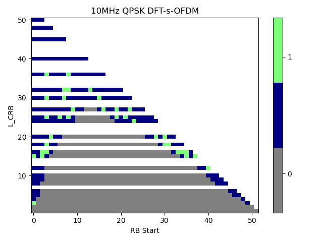
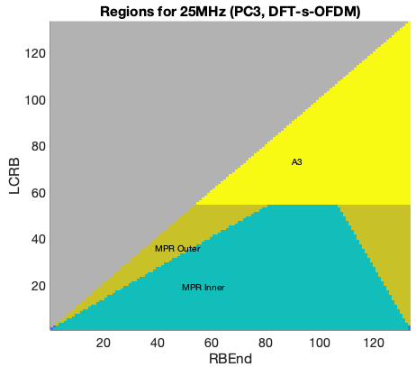

  ----------------------------------
  3GPP TR 38.869 V18.0.0 (2023-12)
  ----------------------------------

  ----------------------
  *Technical* *Report*
  ----------------------

+-------------------------------------------------------+
| 3rd Generation Partnership Project;                   |
|                                                       |
| Technical Specification Group Radio Access Network;   |
|                                                       |
| Study on low-power wake-up signal and receiver for NR |
|                                                       |
| **(Release** **18)**                                  |
+-------------------------------------------------------+

  ------------------------------------------------------------------------------------------------------------------------------------------------------------------ --
                                                                                                                                                                     

                                                                                                                                                                     

  The present document has been developed within the 3rd Generation Partnership Project (3GPP ^TM^) and may be further elaborated for the purposes of 3GPP.\         
  The present document has not been subject to any approval process by the 3GPP Organizational Partners and shall not be implemented.\                               
  This Specification is provided for future development work within 3GPP only. The Organizational Partners accept no liability for any use of this Specification.\   
  Specifications and Reports for implementation of the 3GPP ^TM^ system should be obtained via the 3GPP Organizational Partners\' Publications Offices.              
  ------------------------------------------------------------------------------------------------------------------------------------------------------------------ --

+----------------------------------------------------------------------+
|                                                                      |
+======================================================================+
| > ***3GPP***                                                         |
| >                                                                    |
| > Postal address                                                     |
| >                                                                    |
| > 3GPP support office address                                        |
| >                                                                    |
| > 650 Route des Lucioles - Sophia Antipolis                          |
| >                                                                    |
| > Valbonne - FRANCE                                                  |
| >                                                                    |
| > Tel.: +33 4 92 94 42 00 Fax: +33 4 93 65 47 16                     |
| >                                                                    |
| > Internet                                                           |
| >                                                                    |
| > https://www.3gpp.org                                               |
+----------------------------------------------------------------------+
| ***Copyright Notification***                                         |
|                                                                      |
| No part may be reproduced except as authorized by written            |
| permission.\                                                         |
| The copyright and the foregoing restriction extend to reproduction   |
| in all media.                                                        |
|                                                                      |
| © 2023, 3GPP Organizational Partners (ARIB, ATIS, CCSA, ETSI, TSDSI, |
| TTA, TTC).                                                           |
|                                                                      |
| All rights reserved.                                                 |
|                                                                      |
| UMTS™ is a Trade Mark of ETSI registered for the benefit of its      |
| members                                                              |
|                                                                      |
| 3GPP™ is a Trade Mark of ETSI registered for the benefit of its      |
| Members and of the 3GPP Organizational Partners\                     |
| LTE™ is a Trade Mark of ETSI registered for the benefit of its       |
| Members and of the 3GPP Organizational Partners                      |
|                                                                      |
| GSM® and the GSM logo are registered and owned by the GSM            |
| Association                                                          |
+----------------------------------------------------------------------+

Contents

1 Scope 10

2 References 10

3 Definitions of terms, symbols and abbreviations 12

3.1 Terms 12

3.2 Symbols 13

3.3 Abbreviations 13

4 Introduction 14

5 Use cases & KPI 15

6 Evaluation methodology 16

6.1 General performance metrics 16

6.2 Evaluation assumptions 17

6.2.1 General evaluation assumptions 17

6.2.2 Coverage evaluation assumptions 18

6.2.3 Link performance evaluation assumptions 20

6.3 Power consumption model 23

6.3.1 Power model for Main Radio (MR) 23

6.3.2 Power model for LP-WUR (LR) 24

7 LP-WUR and LP-WUS design 25

7.1 LP-WUS receiver *architectures* 25

7.1.1 General description of receiver types 25

7.1.1a Analysis of LP-WUR architectures 32

7.1.1a.1 OOK-1/2/4 33

7.1.1a.1.1 RF envelope detection 33

7.1.1a.1.2 Heterodyne architecture with IF envelope detection 33

7.1.1a.1.3 Homodyne/zero-IF architecture with baseband envelope
detection 33

7.1.1a.2 FSK 34

7.1.1a.2.1 Parallel RF envelope detection 34

7.1.1a.2.2 Parallel heterodyne architecture 34

7.1.1a.2.3 Parallel homodyne architecture 34

7.1.1a.2.4 Heterodyne architecture with frequency to amplitude
conversion 35

7.1.1a.2.5 Homodyne architecture with frequency to amplitude conversion
35

7.1.1a.3 OFDMA-based signal 35

7.1.1a.3.1 Time-domain correlation (without FFT) 35

7.1.1a.3.2 Frequency-domain correlation (with FFT) 35

7.1.2 RAN4 studies of the receiver 36

7.1.2.1 General 36

7.1.2.2 ACS evaluation 37

7.1.2.3 ASCS evaluation 56

7.1.2.4 Phase noise 66

7.1.2.5 gNodeB RF impacts 66

7.1.2.6 Multi-band capability 67

7.1.2.7 Noise Figure 67

7.1.2.8 Band operation for LP-WUS 67

7.2 LP-WUS design and L1 procedure 67

7.2.1 Signal design 68

7.2.1.1 Waveform 68

7.2.1.1.1 MC-ASK waveform 69

7.2.1.1.2 FSK waveform 71

7.2.1.1.3 OFDM waveform 71

7.2.1.2 Bandwidth and location 71

7.2.1.3 LP-WUS content 72

7.2.2 L1 procedures 73

7.2.2.1 RRM measurements 73

7.2.2.2 Synchronization of LP-WUR 74

7.2.2.3 LP-WUS monitoring 75

7.2.2.4 Activation/Deactivation procedures of LP-WUS 75

7.2.2.5 Coverage 75

7.2.2.6 Additional L1 procedures for RRC CONNECTED mode 76

7.2.2.7 Additional L1 procedures for RRC IDLE/INACTIVE modes 77

7.2.2.8 Others 77

7.3 Higher-layer aspects 77

7.3.1 RRC\_IDLE/INACTIVE mode 77

7.3.1.1 RRC\_IDLE/INACTIVE mode procedures 77

7.3.1.2 LP-WUS monitoring and wake up procedure 77

7.3.1.3 LP-WUS coverage and trigger condition 79

7.3.1.4 Configuration 80

7.3.1.5 System information update and PWS 80

7.3.1.6 Mobility and RRM 80

7.3.2 RRC\_CONNECTED mode 81

7.3.2.1 RRC\_CONNECTED mode procedures 81

7.3.2.2 LP-WUS monitoring 81

7.3.2.3 LP-WUS use options 82

7.3.2.4 Configuration 85

7.3.2.5 LP-WUS coexistence with DCP 86

7.4 RAN4 RRM study 86

8 Evaluation results 87

8.1 Power and latency evaluation 87

8.1.1 RRC IDLE/INACTIVE mode 87

8.1.1.1 Duty cycled LP-WUS 87

8.1.1.1.1 Collection of the results 88

8.1.1.1.2 Observations 92

8.1.1.2 Continuous monitoring results and results with duty cycle ratio
= 50% LP-WUS 94

8.1.1.2.1 Collection of the results 94

8.1.1.2.2 Observations 97

8.1.1.3 Various LP-WUR relative power for duty-cycled monitoring 99

8.1.1.3.1 Collection of the results 101

8.1.1.3.2 Observations 104

8.1.1.4 Compared with eDRX 106

8.1.1.4.1 Collection of the results 107

8.1.1.4.2 Observations 109

8.1.1.5 RRM for LP-WUR duty-cycled monitoring 110

8.1.1.5.1 Collection of the results 110

8.1.1.5.2 Observations 111

8.1.1.6 RRM for LP-WUR continuously monitoring 113

8.1.1.6.1 Collection of the results 113

8.1.1.6.2 Observations 114

8.1.1.7 Impact by various MR sync/re-sync assumptions 115

8.1.1.7.1 Collection of the results 115

8.1.1.7.2 Observations 117

8.1.1.8 Impact by various MR ramp-up time/transition energy assumptions
and sleep state 118

8.1.1.8.1 Collection of the results 118

8.1.1.8.2 Observations 120

8.1.2 RRC CONNECTED mode 122

8.1.2.1 XR traffic model 122

8.1.2.1.1 Collection of the results 123

8.1.2.1.2 Observations 127

8.1.2.2 FTP 3 and IM traffic model 129

8.1.2.2.1 Collection of the results 130

8.1.2.2.2 Observations 135

8.2 Coverage 138

8.2.1 Comparison between LP-WUS and NR reference channel 138

8.2.1.1 Summary of the performance gap between LP-WUS and NR reference
channel 138

8.2.1.2 NR Coverage for comparison 143

8.2.2 Results for urban 145

8.2.2.1 OOK, Urban, normal UE, PDCCH 146

8.2.2.2 OOK, Urban, Redcap UE, PDCCH 149

8.2.2.3 OOK, Urban, Normal UE, Msg.3 151

8.2.2.4 OOK, Urban, Redcap UE, Msg.3 153

8.2.2.5 FSK, Urban, Normal UE, PDCCH 155

8.2.2.6 FSK, Urban, Redcap UE, PDCCH 158

8.2.2.7 FSK, Urban, Normal UE, Msg.3 160

8.2.2.8 FSK, Urban, Redcap UE, Msg.3 161

8.2.2.9 OFDM, Urban, Normal UE, PDCCH 162

8.2.2.10 OFDM, Urban, Redcap UE, PDCCH 167

8.2.2.11 OFDM, Urban, Normal UE, Msg.3 169

8.2.2.12 OFDM, Urban, Redcap UE, Msg.3 170

8.2.3 Results for rural 170

8.2.3.1 OOK, Rural, normal UE, PDCCH 171

8.2.3.2 OOK, Rural, Redcap UE, PDCCH 174

8.2.3.3 OOK, Rural, Normal UE, Msg.3 176

8.2.3.4 OOK, Rural, Redcap UE, Msg.3 177

8.2.3.5 FSK, Rural, normal UE, PDCCH 178

8.2.3.6 FSK, Rural, Redcap UE, PDCCH 178

8.2.3.7 FSK, Rural, Normal UE, Msg.3 179

8.2.3.8 FSK, Rural, Redcap UE, Msg.3 180

8.2.3.9 OFDM, Rural, normal UE, PDCCH 181

8.2.3.10 OFDM, Rural, Redcap UE, PDCCH 184

8.2.3.11 OFDM, Rural, Normal UE, Msg.3 187

8.2.3.12 OFDM, Rural, Redcap UE, Msg.3 189

8.3 LLS results observations 190

8.3.1 Timing error 190

8.3.1.1 Results for timing error (without sliding window) 190

8.3.1.1A Observation for timing error (without sliding window): 194

8.3.1.2 Results for timing error (with sliding window) 194

8.3.1.2A Observation for timing error (with sliding window): 197

8.3.2 Frequency error 197

8.3.2.1 Results for frequency error 197

8.3.2.1A Observation for frequency error 203

8.3.3 Spectral efficiency 203

8.3.4 RSRP RRM measurement accuracy 208

8.3.4.1 Results for LP-SS RSRP RRM measurement, TDL-C 208

8.3.4.1A Observation RSRP LP-SS, TDL-C: 210

8.3.4.2 Results for LP-SS RSRP RRM measurement, AWGN 210

8.3.4.2A Observation RSRP LP-SS, AWGN: 212

8.3.4.3 Results for SSS RSRP RRM measurement, TDL-C 212

8.3.4.3A Observation for SSS RSRP RRM measurement, TDL-C 213

8.3.5 RSRQ RRM measurement accuracy 213

8.3.5.1 Results LP-SS, AWGN 213

8.3.5.1A Observation RSRQ LP-SS, AWGN: 214

8.3.5.2 Results LP-SS, TDL-C 215

8.3.5.2A Observation RSRQ LP-SS, TDL-C: 216

8.4 Network power consumption 216

8.4.1 Collection of the results 216

8.4.2 Observations 217

8.5 System overhead 218

8.5.1 Collection of the results 218

8.5.1.1 RRC IDLE/INACTIVE 218

8.5.1.1.1 LP-WUS 218

8.5.1.1.2 LP-SS 232

8.5.1.2 RRC CONNECTED 234

8.5.2 Observations 235

9 Conclusions 237

9.1 Power/latency/coverage/overhead/network energy 237

9.2 LP-WUR architecture 240

9.3 LLS performance and LP-WUS design/L1 procedure 240

9.4 RAN4 RF study 242

9.5 RAN4 RRM aspects for serving cell RSRP/RSRQ measurement offloading
to LP-WUR 243

9.6 Higher-layer aspects 243

Annex 243

Annex 7.1.1a Analysis of LP-WUR architectures 243

Annex 8.1 Power evaluation 243

Annex 8.2 Coverage 244

Annex 8.3 LLS results 244

Annex 8.4 Network power consumption 244

Annex8.4.1 \[8A-11\] 244

Annex8.4.2 \[8A-13\] 246

Annex8.4.3 \[8A-3\] 247

Annex8.4.4 \[8A-5\] 248

Annex 8.5 System Overhead 248

Annex 8.5.1 \[8A-11\] 248

Annex 8.5.2 \[8A-13\] 250

Annex 8.5.3 \[8A-5\] 252

Annex 8.5.4 \[8A-16\] 252

Annex 8.5.5 \[8A-4\] 254

Annex 8.5.6 \[8A-3\] 257

Annex 8.5.7 \[8A-9\] 259

Annex X: Change history 261

*\
*

Foreword

This Technical Report has been produced by the 3rd Generation
Partnership Project (3GPP).

The contents of the present document are subject to continuing work
within the TSG and may change following formal TSG approval. Should the
TSG modify the contents of the present document, it will be re-released
by the TSG with an identifying change of release date and an increase in
version number as follows:

Version x.y.z

where:

x the first digit:

1 presented to TSG for information;

2 presented to TSG for approval;

3 or greater indicates TSG approved document under change control.

y the second digit is incremented for all changes of substance, i.e.
technical enhancements, corrections, updates, etc.

z the third digit is incremented when editorial only changes have been
incorporated in the document.

In the present document, modal verbs have the following meanings:

**shall** indicates a mandatory requirement to do something

**shall not** indicates an interdiction (prohibition) to do something

The constructions \"shall\" and \"shall not\" are confined to the
context of normative provisions, and do not appear in Technical Reports.

The constructions \"must\" and \"must not\" are not used as substitutes
for \"shall\" and \"shall not\". Their use is avoided insofar as
possible, and they are not used in a normative context except in a
direct citation from an external, referenced, non-3GPP document, or so
as to maintain continuity of style when extending or modifying the
provisions of such a referenced document.

**should** indicates a recommendation to do something

**should not** indicates a recommendation not to do something

**may** indicates permission to do something

**need not** indicates permission not to do something

The construction \"may not\" is ambiguous and is not used in normative
elements. The unambiguous constructions \"might not\" or \"shall not\"
are used instead, depending upon the meaning intended.

**can** indicates that something is possible

**cannot** indicates that something is impossible

The constructions \"can\" and \"cannot\" are not substitutes for \"may\"
and \"need not\".

**will** indicates that something is certain or expected to happen as a
result of action taken by an agency the behaviour of which is outside
the scope of the present document

**will not** indicates that something is certain or expected not to
happen as a result of action taken by an agency the behaviour of which
is outside the scope of the present document

**might** indicates a likelihood that something will happen as a result
of action taken by some agency the behaviour of which is outside the
scope of the present document

**might not** indicates a likelihood that something will not happen as a
result of action taken by some agency the behaviour of which is outside
the scope of the present document

In addition:

**is** (or any other verb in the indicative mood) indicates a statement
of fact

**is not** (or any other negative verb in the indicative mood) indicates
a statement of fact

The constructions \"is\" and \"is not\" do not indicate requirements.

 1 Scope
=======

The present document is intended to capture the output of study item for
\" Study on low-power wake up signal and receiver for NR\" \[2\].

The study includes investigations to

\- the impact of low-power wake-up signal and receiver , including power
saving benefit, coverage, system overhead impact, network energy impact
and other related aspects.

\- the receiver architecture for low-power wake-up receiver and provide
analysis for power consumption, noise figure and etc.

\- L1 designs and procedures changes needed to support the wake-up
signal and evaluations for the link performances.

\- higher layer protocol changes needed to support the wake-up signals

\- related RAN4 impacts

2 References {#references-1}
============

The following documents contain provisions which, through reference in
this text, constitute provisions of the present document.

\- References are either specific (identified by date of publication,
edition number, version number, etc.) or non‑specific.

\- For a specific reference, subsequent revisions do not apply.

\- For a non-specific reference, the latest version applies. In the case
of a reference to a 3GPP document (including a GSM document), a
non-specific reference implicitly refers to the latest version of that
document *in the same Release as the present document*.

\[1\] 3GPP TR 21.905: \"Vocabulary for 3GPP Specifications\".

\[2\] 3GPP RP-222644: \" Study on low-power wake up signal and receiver
for NR\".

\[3\] 3GPP TR38.840: \"Study on User Equipment (UE) power saving in NR\"

\[4\] 3GPP TR38.830: \"Study on NR coverage enhancements\"

\[5\] 3GPP TR38.838: \"Study on XR (Extended Reality) evaluations for
NR\"

\[6\] 3GPP TR38.875: \"Study on support of reduced capability NR
devices\"

\[7A-1\] 3GPP R1-2306549: \"Discussion on architecture of LP-WUS
receiver\", Huawei, HiSilicon.

\[7A-2\] 3GPP R1-2306692: \" Discussion on LP-WUS receiver
architectures\", InterDigital, Inc.

\[7A-3\] 3GPP R1-2308472: \"Remaining issues on low power wake-up
receiver architecture\", vivo.

\[7A-4\] 3GPP R1-2307063: \"Low-power WUS receiver architectures and its
performance\", CATT.

\[7A-5\] 3GPP R1-2307143: \"LP-WUS receiver architectures\", ZTE,
Sanechips.

\[7A-6\] 3GPP R1-2307700: \"Receiver architecture for LP-WUS\", Samsung.

\[7A-7\] 3GPP R1-2307990: \"Low power WUS receiver architectures\",
Ericsson.

\[7A-8\] 3GPP R1-2307949: \"Receiver architecture for LP-WUS\", Qualcomm
Incorporated.

\[7A-9\] 3GPP R1-2307300: \"On low power wake-up receiver
architectures\", Apple, Inc.

\[7A-10\] 3GPP R1-2308068: \"Low power WUS receiver architectures\",
MediaTek, Inc.

\[7B-1\] 3GPP R4-2314665: \" Discussions on low-power wake-up receiver
architectures\", vivo.

\[7B-2\] 3GPP R4-2311502: \" Evaluation of Low power wake-up receiver
architectures\", Nokia, Nokia Shanghai Bell.

\[7B-3\] 3GPP R4-2315194: \" Discussion on LP-WUS ACS and ASCS
requirements\", CMCC.

\[7B-4\] 3GPP R4-2312248: \" Further consideration on LP-WUS/WUR\",
Huawei, HiSilicon.

\[7B-5\] 3GPP R4-2311902: \" TP to TR 38.869: Low-power wake-up receiver
RF aspects\", Qualcomm Inc.

\[7B-6\] 3GPP R4-2316697: \" TP to TR 38.869: Low-power wake-up receiver
RF aspects\", Qualcomm Inc.

\[7B-7\] 3GPP R4-2313476: \" LS reply on low-power wake-up receiver
architectures \", Ericsson.

\[7B-8\] 3GPP R4-2316280: \" TP on WUS guard RB\", Ericsson.

\[7B-9\] 3GPP R4-2320546: \" TP on ADC impairment\", Ericsson.

\[7B-10\] 3GPP R4-2315206: \" Low-power wake-up receiver RF aspects\",
Nokia, Nokia Shanghai Bell.

\[8A-1\] 3GPP R1-2307299 On performance evaluation for low power wake-up
signal APPLE

\[8A-2\] 3GPP R1-2307062 Remaining issues of Deployment scenarios and
evaluation methodologies and preliminary performance results of LP-WUR
CATT

\[8A-3\] 3GPP R1-2308438 Low power WUS evaluations Ericsson

\[8A-4\] 3GPP R1-2306428 Evaluation of LP-WUS and Performance Results
FUTUREWEI

\[8A-5\] 3GPP R1-2306548 Evaluations for LP-WUS Huawei, HiSilicon

\[8A-6\] 3GPP R1-2306691 Discussion on evaluation on LP-WUS InterDigital

\[8A-7\] 3GPP R1-2308067 Evaluation on low power WUS MediaTek

\[8A-8\] 3GPP R1-2307699 Evaluation on LP-WUS/WUR Samsung

\[8A-9\] 3GPP R1-2308563 Evaluation for lower power wake-up signal OPPO

\[8A-10\] 3GPP R1-2306665 Discussion on evaluation on low power WUS
Spreadtrum

\[8A-11\] 3GPP R1-2308249 Evaluation results for R18 LP-WUS/WUR vivo

\[8A-12\] 3GPP R1-2306921 Evaluation of low-power WUS Sony

\[8A-13\] 3GPP R1-2307142 Evaluation on LP-WUS ZTE, Sanechips

\[8A-14\] 3GPP R1-2307356 Evaluation on low power WUS xiaomi

\[8A-15\] 3GPP R1-2308234 Low power WUS Evaluation Methodology Nokia,
Nokia Shanghai Bell

\[8A-16\] 3GPP R1-2307948 Evaluation methodology for LP-WUS Qualcomm

\[8A-17\] 3GPP R1-2304803 Evaluations on LP WUS Intel

\[8B-1\] 3GPP R1-2306429 LP-WUS Physical Signal Design and Performance
FUTUREWEI

\[8B-2\] 3GPP R1-2306550 Further details on signal design and procedure
for LP-WUS Huawei, HiSilicon

\[8B-3\] 3GPP R1-2306626 Discussion on L1 signal design and procedure
for low power WUS EURECOM

\[8B-4\] 3GPP R1-2306666 Discussion on L1 signal design and procedure
for low power WUS Spreadtrum Communications

\[8B-5\] 3GPP R1-2306682 L1 signal design and procedure for low power
WUS TCL

\[8B-6\] 3GPP R1-2306693 Discussion on L1 signal design and procedure
for LP-WUS InterDigital, Inc.

\[8B-7\] 3GPP R1-2306771 Discussion on physical signal and procedure for
low power WUS vivo

\[8B-8\] 3GPP R1-2306805 Discussion on low power wake up signal design
Panasonic

\[8B-9\] 3GPP R1-2306922 On L1 signal design and procedures for LP-WUS
Sony

\[8B-10\] 3GPP R1-2306927 WUS Design Considerations and Impact on WUR
Power Everactive

\[8B-11\] 3GPP R1-2307064 Physical layer signals/procedures and higher
layer protocol for Low-Power WUR CATT

\[8B-12\] 3GPP R1-2307116 Discussion on L1 signal design and procedure
for LP-WUS NEC

\[8B-13\] 3GPP R1-2307144 LP-WUS design and related procedure ZTE,
Sanechips

\[8B-14\] 3GPP R1-2307216 Discussion on L1 signal design for low power
WUS CMCC

\[8B-15\] 3GPP R1-2308469 On the L1 signal design and procedures for low
power wake-up signal Apple

\[8B-16\] 3GPP R1-2307357 Discussions on L1 signal design and procedure
for low power WUS xiaomi

\[8B-17\] 3GPP R1-2307420 L1 signal design and procedures for low power
WUS Nokia, Nokia Shanghai Bell

\[8B-18\] 3GPP R1-2307491 L1 signal design and procedure for low power
WUS NTT DOCOMO, INC.

\[8B-19\] 3GPP R1-2307557 Design consideration on lower power wake-up
signal and procedure OPPO

\[8B-20\] 3GPP R1-2307625 Discussion on signal design and procedure for
LP-WUS China Telecom

\[8B-21\] 3GPP R1-2307701 Signal design and procedure for LP-WUS Samsung

\[8B-22\] 3GPP R1-2307795 Discussion on L1 signal design and procedure
for LP-WUS LG Electronics

\[8B-23\] 3GPP R1-2307856 Discussion on L1 signal design and procedure
for low power WUS Sharp

\[8B-24\] 3GPP R1-2307950 L1 signal design and procedures for LP-WUR
Qualcomm Incorporated

\[8B-25\] 3GPP R1-2307991 L1 signal design and procedure for low power
WUS Ericsson

\[8B-26\] 3GPP R1-2308022 On LP-WUS signal design Nordic Semiconductor
ASA

\[8B-27\] 3GPP R1-2308069 L1 signal design and procedure for low power
WUS MediaTek Inc.

\[8B-28\] 3GPP R1-2308102 Discussion on the L1 signal design and
procedure for low power WUS Lenovo

\[8B-29\] 3GPP R1-2308647 R18 SI LLS results Moderator (Nordic
Semiconductor ASA)

3 Definitions of terms, symbols and abbreviations
=================================================

3.1 Terms
---------

For the purposes of the present document, the terms given in
TR 21.905 \[1\] and the following apply. A term defined in the present
document takes precedence over the definition of the same term, if any,
in TR 21.905 \[1\].

3.2 Symbols
-----------

For the purposes of the present document, the following symbols apply:

\<symbol\> \<Explanation\>

3.3 Abbreviations
-----------------

For the purposes of the present document, the abbreviations given in
TR 21.905 \[1\] and the following apply. An abbreviation defined in the
present document takes precedence over the definition of the same
abbreviation, if any, in TR 21.905 \[1\].

ACS Adjacent Channel Selectivity

ADC Analog to Digital Converter

ASCS Adjacent Subcarrier selectivity

ASK Amplitude Shift Keying

BB Base Band

BLER Block Error Rate

BPF Band Pass Filter

BWP Bandwidth part

CFO Center frequency offset

CORESET Control resource set

CRC Cyclic redundancy check

*CP-OFDMA* Cyclic Prefix-Orthogonal Frequency-Division Multiple Access

CSI Channel state information

DCI Downlink Control Information

DCP DCI with CRC scrambled by PS-RNTI

DRX Discontinuous Reception

DFT-S-OFDMA Discrete Fourier Transform-Spread-Orthogonal
Frequency-Division Multiple Access

eDRX Extended DRX

EPRE Energy Per Resource Element

FAR False Alarm Rate

FCS Frame Check Sequence

FSK Frequency Shift Keying

FLL Frequency Locked Loop

FFT Fast Fourier Transform

FR1 Frequency range 1

FR2 Frequency range 2

ICS In-channel Selectivity

IF Intermediate Frequency

LP-WUS Low Power-Wake Up Signal

LP-WUR Low Power-Wake Up Receiver

LP-SS Low Power- Synchronization Signal

LO Local Oscillator

LNA Low Noise Amplifier

LPF Low Pass Filter

LR LP-WUR

MDR Miss Detection Rate

*MC-ASK* Multiple Carrier-Amplitude Shift Keying

*MC-FSK* Multiple Carrier-Frequency Shift Keying

MR Main Radio

NF Noise Figure

OOK On-Off keying

OFDM Orthogonal Frequency Division Multiplexing

PDCCH Physical Downlink Control Channel

PUCCH Physical Uplink Control Channel

PUSCH Physical Uplink Shared Channel

PDSCH Physical Downlink Shared Channel

PRACH Physical Random Access Channel

PEI Paging Early Indication

PO Paging Occasion

PTW Paging Time Window

PLL Phase Locked Loop

PAPR Peak to Average Power Ratio

RRC Radio Resource Control

RRM Radio Resource Management

RLM Radio Link Monitoring

RS Reference Signal

RSRP Reference Signal Received Power

RSRQ Reference Signal Received Quality

RTC Real Time Clock

RF Radio Frequency

SSB Synchronization Signal Block

SSSG Search Space Set Group

SINR Signal to Interference plus Noise Ratio

SNR Signal to Noise Ratio

SC Subcarrier

UE User Equipment

XR Extended reality

4 Introduction
==============

5G systems are designed and developed targeting for both mobile
telephony and vertical use cases. Besides latency, reliability, and
availability, UE energy efficiency is also critical to 5G. Currently, 5G
devices may have to be recharged per week or day, depending on
individual\'s usage time. In general, 5G devices consume tens of
milliwatts in RRC idle/inactive state and hundreds of milliwatts in RRC
connected state. Designs to prolong battery life is a necessity for
improving energy efficiency as well as for better user experience.

Energy efficiency is even more critical for UEs without a continuous
energy source, e.g., UEs using small rechargeable and single coin cell
batteries. Among vertical use cases, sensors and actuators are deployed
extensively for monitoring, measuring, charging, etc. Generally, their
batteries are not rechargeable and expected to last at least few years
as described in TR 38.875. Wearables include smart watches, rings,
eHealth related devices, and medical monitoring devices. With typical
battery capacity, it is challenging to sustain up to 1-2 weeks as
required.

The power consumption depends on the configured length of wake-up
periods, e.g., paging cycle. To meet the battery life requirements
above, eDRX cycle with large value is expected to be used, resulting in
high latency, which is not suitable for such services with requirements
of both long battery life and low latency. For example, in fire
detection and extinguishment use case, fire shutters shall be closed and
fire sprinklers shall be turned on by the actuators within 1 to 2
seconds from the time the fire is detected by sensors, long eDRX cycle
cannot meet the delay requirements. eDRX is apparently not suitable for
latency-critical use cases. Thus, the intention is to study ultra-low
power mechanism that can support low latency in Rel-18, e.g. lower than
eDRX latency.

Currently, UEs need to periodically wake up once per DRX cycle, which
dominates the power consumption in periods with no signalling or data
traffic. If UEs are able to wake up only when they are triggered, e.g.,
paging, power consumption could be dramatically reduced. This can be
achieved by using a wake-up signal to trigger the main radio and a
separate receiver which has the ability to monitor wake-up signal with
ultra-low power consumption. Main radio works for data transmission and
reception, which can be turned off or set to deep sleep unless it is
turned on.

The power consumption for monitoring wake-up signal depends on the
wake-up signal design and the hardware module of the wake-up receiver
used for signal detecting and processing.

The study should primarily target low-power WUS/WUR for power-sensitive,
small form-factor devices including IoT use cases (such as industrial
sensors, controllers) and wearables. Other use cases are not precluded,
e.g.XR/smart glasses, smart phones.

As opposed to the work on UE power savings in previous releases, this
study will not require existing signals to be used as WUS. All WUS
solutions identified shall be able to operate in a cell supporting
legacy UEs. Solutions should target substantial gains compared to the
existing Rel-15/16/17 UE power saving mechanisms. Other aspects such as
detection performance, coverage, UE complexity, should be covered by the
evaluation.

**The study item includes the following objectives:**

\- Identify evaluation methodology (including the use cases) & KPIs
\[RAN1\]

\- Primarily target low-power WUS/WUR for power-sensitive, small
form-factor devices including IoT use cases (such as industrial sensors,
controllers) and wearables

\- Other use cases are not precluded

\- Study and evaluate low-power wake-up receiver architectures \[RAN1,
RAN4\]

\- Study and evaluate wake-up signal designs to support wake-up
receivers \[RAN1, RAN4\]

\- Study and evaluate L1 procedures and higher layer protocol changes
needed to support the wake-up signals \[RAN2, RAN1\]

\- Study potential UE power saving gains compared to the existing
Rel-15/16/17 UE power saving mechanisms, the coverage availability, as
well as latency impact of low-power WUR/WUS. System impact, such as
network power consumption, coexistence with non-low-power-WUR UEs,
network coverage/capacity/resource overhead should be included in the
study \[RAN1\]

\- Note: The need for RAN2 evaluation will be triggered by RAN1 when
necessary.

**Use the following terminology for future discussion,**

\- Main radio (MR): the Tx/Rx module operating for NR signals/channels
apart from signals/channel related to low-power wake-up

\- LP-WUR (LR): The Rx module operating for receiving/processing
signals/channel related to low-power wake-up.

5 Use cases & KPI 
=================

*Editor\'s note: The following SI Objective is included in this clause.*

\- Identify evaluation methodology (including the use cases) & KPIs
\[RAN1\]

\- Primarily target low-power WUS/WUR for power-sensitive, small
form-factor devices including IoT use cases (such as industrial sensors,
controllers) and wearables

\- Other use cases are not precluded

The following characteristics for target use cases are considered in the
study item:

\- IoT cases including e.g., industrial wireless sensors, controllers,
actuators and etc, including the following characteristics,

\- primary for small form devices

\- power-sensitive

\- static, nomadic or limited mobility

\- Wearable cases including e.g., smart watches, rings, eHealth related
devices, and medical monitoring devices etc.,

\- primary for small form devices,

\- power-sensitive

\- low/medium speed, FFS: high speed

\- eMBB cases including e.g., XR/smart glasses, smart phones and etc.,

\- devices form is various and not restricted

\- power-sensitive

\- low/medium speed, FFS: high speed

Note: other use cases/characteristics are not precluded if any.

*The latency for LP-WUS/WUR are considered as follows*

\- Latency for RRC CONNECTED mode can be up to tens of milliseconds.

\- Latency for RRC IDLE/INACTIVE mode can be in the order of seconds,
for I-DRX use cases, and the latency can be larger for eDRX use cases.

Both RRC IDLE/INACTIVE and CONNECTED modes were studied as part of the
LP-WUS/WUR SI.

6 Evaluation methodology
========================

*Editor\'s note: The clause includes evaluation methodology for this SI*

6.1 General performance metrics
-------------------------------

For system impact analysis, the following performance metrics are
considered to be provided,

Table 6.1-1: Performance metrics for system impact analysis

+----------------------------------+----------------------------------+
| Performance Metric               | Note                             |
+==================================+==================================+
| System overhead                  | expressed as percentage of       |
|                                  | used part of all REs for LP-WUS  |
|                                  | (including guard band or time or |
|                                  | others resource used for LP-WUR  |
|                                  | if any) among all resources      |
|                                  |                                  |
|                                  | Other assumptions related to the |
|                                  | system overhead analysis can be  |
|                                  | reported, e.g., the LP-WUR raw   |
|                                  | data rate evaluated in the       |
|                                  | coverage evaluations.            |
+----------------------------------+----------------------------------+
| Capacity impact                  | Evaluate the system capacity     |
|                                  | impact due to introducing of     |
|                                  | LP-WUS                           |
|                                  |                                  |
|                                  | Note: it is for UEs which are in |
|                                  | connected mode. Definition is    |
|                                  | the same as in XR TR.            |
+----------------------------------+----------------------------------+
| NW power consumption / Energy    | Impact of LP-WUS/WUR operation   |
| Efficiency                       | on gNB energy consumption as     |
|                                  | performance metric in system     |
|                                  | impact analysis.                 |
+----------------------------------+----------------------------------+

For power and latency evaluation of the LP-WUS, the following
performance metrics definitions provided for future study

Table 6.1-2: Performance metrics for power and latency evaluation

+--------------------+------------------------------------------------+
| Performance Metric | Note                                           |
+====================+================================================+
| Power consumption  | Relative power consumption in units. The power |
|                    | consumption includes main radio and LP-WUR.    |
|                    | For comparison, the relative power consumption |
|                    | and evaluation period for baseline schemes     |
|                    | should also be provided, as well as the power  |
|                    | saving gain (i.e., percentage of power         |
|                    | consumption reduction of the proposed power    |
|                    | saving scheme from the baseline scheme).       |
+--------------------+------------------------------------------------+
| Latency            | For IDLE/INACTIVE state,                       |
|                    |                                                |
|                    | \- the latency is the time interval between    |
|                    | the data arrival time at the gNB and the time  |
|                    | of the first PO UE can monitor the paging      |
|                    | message                                        |
|                    |                                                |
|                    | \- alternatively, if UE is not required to     |
|                    | monitor a PO after wake-up, company to report  |
|                    | detailed procedure and definition of the       |
|                    | latency                                        |
|                    |                                                |
|                    | \- sync/re-sync for main radio is included     |
+--------------------+------------------------------------------------+
| UPT                | The definition is the same as in TR38.840      |
|                    |                                                |
|                    | Note: it is for connected mode purpose.        |
+--------------------+------------------------------------------------+

\- Companies to report baseline scheme, e.g., PO monitoring with i-DRX,
e-DRX, with or without PEI

\- Companies to report the power consumption / power saving gain
considering the FAR impact, latency considering MDR impact

\- Other performance metrics (e.g., mobility) can be reported by
companies (if any)

6.2 Evaluation assumptions
--------------------------

### 6.2.1 General evaluation assumptions

[RRC IDLE/INACTIVE evaluation assumptions]{.underline}

The following is assumed for RRC IDLE/INACTIVE evaluation,

Table 6.2-1: RRC IDLE/INACTIVE evaluation assumptions

+----------------------------------+----------------------------------+
| Parameters                       | Value                            |
+==================================+==================================+
| i-DRX cycle length               | 1.28s and other values not       |
|                                  | precluded and reported by        |
|                                  | companies, consider both with    |
|                                  | PEI/ without PEI                 |
+----------------------------------+----------------------------------+
| e-DRX cycle length               | 20.48s, 61.44s and other values  |
|                                  | not precluded, company to report |
|                                  | which value(s) are used.  *Note: |
|                                  | \'ultra-deep sleep\' state can   |
|                                  | be assumed for eDRX whenever     |
|                                  | necessary for baseline UE*       |
+----------------------------------+----------------------------------+
| Number of POs in Paging Frame    | 1                                |
+----------------------------------+----------------------------------+
| Number of DRXs per PTW           | 4                                |
+----------------------------------+----------------------------------+
| Number of SSB before PO / PEI    | 1, 2 or 3, (used for e.g., AGC   |
|                                  | adjustment, T/F tracking,        |
|                                  | serving cell and intra-F         |
|                                  | measurement)                     |
|                                  |                                  |
|                                  | company to report which value(s) |
|                                  | are used                         |
|                                  |                                  |
|                                  | Note: the assumptions is for MR  |
|                                  | wakes from \'Deep sleep\'        |
+----------------------------------+----------------------------------+
| Sync/re-sync after ultra-deep    | companies to report the timeline |
| sleep                            | of sync/re-sync and X value, X   |
|                                  | is the time for sync/re-sync     |
+----------------------------------+----------------------------------+
| RRM Measurement                  | Company to report whether and    |
|                                  | how the RRM measurement is       |
|                                  | assumed, e.g., whether RRM       |
|                                  | performed by main radio or       |
|                                  | LP-WUR, whether RRM is relaxed   |
|                                  | or not.                          |
+----------------------------------+----------------------------------+
| LP-WUS monitoring                | Option 1: continuously           |
|                                  | monitoring                       |
|                                  |                                  |
|                                  | Option 2: discontinuously        |
|                                  | monitoring, with \[T\] ms as the |
|                                  | period for complete an           |
|                                  | on-and-off cycle, and \[D\] ms   |
|                                  | as the active time for           |
|                                  | monitoring LP-WUS every cycle.   |
+----------------------------------+----------------------------------+
| Traffic                          | Option 1 (baseline):             |
|                                  |                                  |
|                                  | \- The traffic arrival is        |
|                                  | modelled as a Poisson Arrival    |
|                                  | Process where inter-arrival      |
|                                  | times are exponentially          |
|                                  | distributed, the mean arrival    |
|                                  | time is P = Y~REF~ / R~E,\ REF~, |
|                                  | where                            |
|                                  |                                  |
|                                  | \- R~E,\ REF~= 1%, 0.1%, 0.01%   |
|                                  | or 0.001% and Y~REF~ = 1.28s     |
|                                  |                                  |
|                                  | \- Per group paging probability  |
|                                  | R~G~ = 1 -- (1 -- R~E~)^N^,      |
|                                  | where N is the number of UEs in  |
|                                  | the group                        |
|                                  |                                  |
|                                  | \- FFS: Value of N               |
|                                  |                                  |
|                                  | \- For LP-WUS                    |
|                                  |                                  |
|                                  | \- Both per group and UE paging  |
|                                  | can be assumed.                  |
|                                  |                                  |
|                                  | Note:                            |
|                                  |                                  |
|                                  | \- For i-DRX with cycle duration |
|                                  | Y second,                        |
|                                  |                                  |
|                                  | \- Per UE paging probability     |
|                                  | R~E~ = 1 -- (1 -- R~E,\ REF~     |
|                                  | )^Y/Y^~REF~                      |
|                                  |                                  |
|                                  | \- For e-DRX with K i-DRX cycles |
|                                  | duration, PTW duration of L      |
|                                  | i-DRX cycles, and an i-DRX cycle |
|                                  | duration Y second                |
|                                  |                                  |
|                                  | \- Per UE paging probability is  |
|                                  |                                  |
|                                  | \- R~E~ = 1 -- (1 -- R~E,\ REF~  |
|                                  | )^(K-L+1)Y/Y^~REF~ for the first |
|                                  | i-DRX cycle within the PTW       |
|                                  |                                  |
|                                  | \- R~E~ = 1 -- (1 -- R~E,\ REF~  |
|                                  | )^Y/Y^~REF~ for each of the      |
|                                  | remaining L-1 i-DRX cycles       |
|                                  | within the PTW                   |
|                                  |                                  |
|                                  | \- L=4                           |
|                                  |                                  |
|                                  | Other options are not precluded  |
|                                  | can be reported by companies.    |
+----------------------------------+----------------------------------+
| Others                           | Reported by companies            |
+----------------------------------+----------------------------------+

The period of synchronization signal that LP-WUR used for at
least power evaluation can be

\- Existing SSB periodicity can be used from gNB transmission
perspective for evaluations assuming SSB, companies to report how often
used for LP-WUR

\- For evaluations assuming LP-SS

\- {320ms, 640ms, 1280ms, 2560ms, 5120ms, 10240ms}

\- Companies to report other important assumptions if any, e.g.,
durations of LP-SS to achieve enough T/F accuracy

\- Other values are not precluded

Note: companies to report the purpose of the synchronization signal
along with evaluations, e.g. can be for LR synchronization (i.e., time
and/or frequency tracking) and/or measurement.

For reference setting for further study on LP-SS performance and
resource overhead (including sync and/or measurement), companies to
report the following used in their evaluations

\- the number of slots or symbols per period

\- the periodicity

\- the functionality of the LP-SS

[RRC CONNECTED mode evaluation assumptions]{.underline}

For R18 LP-WUS/WUR power evaluation in RRC connected mode, the following
can be considered,

\- XR traffic model with evaluation methodologies and assumptions
captured in TR 38.838.

\- eMBB traffic model with evaluation methodologies and assumptions
captured in TR 38.840

\- Heartbeat traffic models in TR 38.875.

\- Other models are not precluded.

Company to further provide the followings,

\- Parameters (e.g., frame rate, data rate, jitter range, DRX
configurations and etc if needed.)

\- How to use LP-WUS, e.g., LP-WUS to trigger/adapt PDCCH monitoring

\- Other details if any

For all RRC IDLE/INACTIVE/CONNECTED mode,

\- Power pooling between OFDM symbols is not assumed for evaluation
purposes. Average EPRE is defined per OFDM symbol.

### 6.2.2 Coverage evaluation assumptions

For evaluation of the coverage of LP-WUS, the methodology and
assumptions in R17 CovEnh SI (described in TR38.830) are reused as
baseline.

\- MIL is used as the metric for LP-WUS coverage evaluation

\- urban (2.6GHz/4GHz), rural(700MHz) scenario for FR1 are considered to
be evaluated, others **(e.g., FR2) are** not precluded.

Note: For IoT/wearables devices, refer to R17 Redcap SI TR38.875 if the
assumptions differ from TR38.830.

Companies report any other assumptions which differ from the TR38.875/
TR38.830, e.g., Tx and Rx loss

Companies are encouraged to compare LP-WUS with at least PDCCH for
paging, PUSCH, others are not precluded. FFS: Target coverage of LP-WUS

For LP-WUS coverage evaluation, the noise figure of LP-WUR is

\- Options : 9, 12, 15, 18, 21, 24 dB, Other values can be reported by
companies

FFS: how to determine the NF option.

The values provided are for the purpose of studying coverage of LP-WUS,
and they can be further revisited depending on the receiver architecture
discussion.

For evaluation, 1 Rx chain for LP-WUS receiver is baseline.

For coverage evaluation, the following is used,

Table 6.2-2: Coverage evaluation assumptions

+----------------------+----------------------+----------------------+
| Number of RX chains  | Case 1: 1 Rx for     |                      |
| at the UE\'s MR      | Redcap               |                      |
|                      |                      |                      |
|                      | Case 2: 2 Rx         |                      |
|                      |                      |                      |
|                      | Case 3: 4 Rx         |                      |
|                      |                      |                      |
|                      | Company to report    |                      |
|                      | which case is being  |                      |
|                      | used.                |                      |
+======================+======================+======================+
| Number of RX chains  | 1 Rx                 |                      |
| for LP-WUR           |                      |                      |
+----------------------+----------------------+----------------------+
| Scenario and         | Urban: 4GHz (TDD),   |                      |
| frequency            | 2.6GHz (TDD)         |                      |
|                      |                      |                      |
|                      | Rural: 700MHz (FDD)  |                      |
+----------------------+----------------------+----------------------+
| Reference data rates | Urban: PDSCH 10Mbps, |                      |
| for MR               | PUSCH 1Mbps          |                      |
|                      |                      |                      |
|                      | Rural: PDSCH 1Mbps,  |                      |
|                      | PUSCH 100kbps        |                      |
+----------------------+----------------------+----------------------+
| Reference PDCCH      | SCS                  | > 30kHz for TDD,     |
| configuration        |                      | > 15kHz for FDD.     |
+----------------------+----------------------+----------------------+
|                      | Aggregation level    | > 8, 16              |
|                      |                      | >                    |
|                      |                      | > Company to report  |
|                      |                      | > which case is      |
|                      |                      | > being used.        |
|                      |                      | > Further decision   |
|                      |                      | > on aggregation     |
|                      |                      | > level for coverage |
|                      |                      | > is FFS.            |
+----------------------+----------------------+----------------------+
|                      | Payload              | > 40 bits            |
+----------------------+----------------------+----------------------+
|                      | CORESET size         | > 2 symbols, 48 PRBs |
+----------------------+----------------------+----------------------+
|                      | Tx Diversity         | > Reported by        |
|                      |                      | > companies          |
+----------------------+----------------------+----------------------+
|                      | BLER                 | > 1% BLER,           |
+----------------------+----------------------+----------------------+
| Pathloss model       | Urban: NloS          |                      |
| (select from LoS or  |                      |                      |
| NLoS)                | Rural: NloS          |                      |
+----------------------+----------------------+----------------------+
| Bandwidth            | 100MHz for 4GHz and  |                      |
|                      | 2.6GHz.              |                      |
|                      |                      |                      |
|                      | 20MHz (optional for  |                      |
|                      | 10MHz) for 700MHz.   |                      |
|                      | (FDD)                |                      |
+----------------------+----------------------+----------------------+
| Channel model for    | TDL-C for NLOS       |                      |
| link-level           |                      |                      |
| simulation           |                      |                      |
+----------------------+----------------------+----------------------+
| Delay spread         | Urban: 300ns,        |                      |
|                      | optional: 1000ns and |                      |
|                      | companies to provide |                      |
|                      | descriptions for     |                      |
|                      | such scenarios       |                      |
|                      |                      |                      |
|                      | Rural: 300ns         |                      |
+----------------------+----------------------+----------------------+
| UE velocity          | Urban: 3km/h         |                      |
|                      |                      |                      |
|                      | Rural: 3km/h, FFS:   |                      |
|                      | 120km/h (optional    |                      |
|                      | 30km/h) for outdoor  |                      |
+----------------------+----------------------+----------------------+
| Number of antenna    | \- Urban: 192        |                      |
| elements for BS      | antenna elements for |                      |
|                      | 4GHz and 2.6GHz,     |                      |
|                      |                      |                      |
|                      | (M,N,P,Mg,Ng) =      |                      |
|                      | (12,8,2,1,1)         |                      |
|                      |                      |                      |
|                      | (optional) 128       |                      |
|                      | antenna elements for |                      |
|                      | 4GHz,                |                      |
|                      |                      |                      |
|                      | (M,N,P,Mg,Ng) =      |                      |
|                      | (8,8,2,1,1)          |                      |
|                      |                      |                      |
|                      | \- Rural: 16 antenna |                      |
|                      | elements for 700MHz  |                      |
|                      |                      |                      |
|                      | (M,N,P,Mg,Ng) =      |                      |
|                      | (4,2,2,1,1)          |                      |
+----------------------+----------------------+----------------------+
| Number of TxRUs for  | gNB architectures to |                      |
| BS                   | study:               |                      |
|                      |                      |                      |
|                      | \- 2 or 4 TXRUs for  |                      |
|                      | 700 MHz              |                      |
|                      |                      |                      |
|                      | \- 64TxRUs for 2.6   |                      |
|                      | and 4 GHz.           |                      |
+----------------------+----------------------+----------------------+

RAN1 further study the designs \[target\]/techniques of LP-WUS to have a
comparable coverage as NR channel X. The NR channel X is

\- Option \#1: PDCCH for paging

\- Option \#2: PUSCH for message3

\- FFS other options, e.g., between option1and option2 (better than
PUSCH, worse than PDCCH)

\- The final design will jointly consider the coverage with other KPIs

**Use the same channel specific assumptions as defined in TR38.830 for
reference PUSCH for message3, i.e.,**

+------------------------------+--------------------------------------+
| Parameter                    | Value                                |
+==============================+======================================+
| Frequency hopping            | w/ or w/o frequency hopping          |
+------------------------------+--------------------------------------+
| Number of UE transmit chains | 1, 2 (optional)                      |
+------------------------------+--------------------------------------+
| Number of DMRS symbol        | w/o frequency hopping: 3,            |
|                              |                                      |
|                              | w/ frequency hopping: 2 for each hop |
+------------------------------+--------------------------------------+
| Waveform                     | DFT-s-OFDM                           |
+------------------------------+--------------------------------------+
| **SCS**                      | 30kHz for TDD, 15kHz for FDD.        |
+------------------------------+--------------------------------------+
| HARQ configuration           | Whether HARQ is adopted is reported  |
|                              | by companies.                        |
+------------------------------+--------------------------------------+
| PUSCH duration               | 14 OS                                |
+------------------------------+--------------------------------------+
| Number of PRBs               | 2                                    |
+------------------------------+--------------------------------------+
| TBS                          | 56 bits                              |
+------------------------------+--------------------------------------+
| Other parameters             | Reported by companies.               |
+------------------------------+--------------------------------------+

### 6.2.3 Link performance evaluation assumptions

For link-level simulation of LP-WUS, the following table is used as
starting point,

\- Note: The assumptions are not intended to limit the scope of the
study or the design.

Table 6.2-3: Simulation assumptions for LP-WUS

+----------------------------------+----------------------------------+
| Attributes                       | Assumptions                      |
+==================================+==================================+
| Carrier Frequency                | 2.6GHz/4GHz/700MHz               |
+----------------------------------+----------------------------------+
| Waveform                         | OOK , FSK , OFDM                 |
|                                  |                                  |
|                                  | Company to report which option   |
|                                  | for OOK /FSK /OFDM is used       |
+----------------------------------+----------------------------------+
| Channel structure                | \- Option 1: Sync signal         |
|                                  | /sequence+ payload + CRC,        |
|                                  |                                  |
|                                  | \- Option 2: Sequence only,      |
|                                  |                                  |
|                                  | \- Option 3: Payload+CRC,        |
|                                  |                                  |
|                                  | \- Other options are not         |
|                                  | precluded                        |
|                                  |                                  |
|                                  | \- Company to report the         |
|                                  | sequence length, payload size,   |
|                                  | CRC length (may or may not be    |
|                                  | presence).                       |
+----------------------------------+----------------------------------+
| SCS of OFDM generator for NR     | 30kHz/15KHz                      |
| signal                           |                                  |
+----------------------------------+----------------------------------+
| Configuration for LP-WUS signal  | For OOK/FSK waveform,            |
|                                  |                                  |
|                                  | \- Option 1a: M=1 and SCSs =     |
|                                  | 15kHz (same as NR signal)        |
|                                  |                                  |
|                                  | \- Option 1b: M=1 and SCSs =     |
|                                  | 30kHz (same as NR signal)        |
|                                  |                                  |
|                                  | \- Option 2a: M =2/4/8 for SCS = |
|                                  | 15KHz (same as NR signal)        |
|                                  |                                  |
|                                  | \- Option 2b: M =2/4/8 for SCS = |
|                                  | 30 kHz (same as NR signal)       |
|                                  |                                  |
|                                  | \- Option 3: M=1 and SCSs =      |
|                                  | 60kHz/120kHz/240kHz              |
|                                  |                                  |
|                                  | \- Note: M is referred to the    |
|                                  | definition of \"M\" in the       |
|                                  | agreements for OOK-1/2/3/4 and   |
|                                  | FSK-1/2                          |
|                                  |                                  |
|                                  | For OFDM: FFS, e.g., ZC          |
|                                  | sequence.                        |
|                                  |                                  |
|                                  | Other options are up to          |
|                                  | companies to report              |
+----------------------------------+----------------------------------+
| WUS duration                     | Number of OFDM symbols: e.g.,    |
|                                  | 1,2,4, 8, 16,24 symbols          |
+----------------------------------+----------------------------------+
| MDR/FAR assumption               | The miss-detection rate (MDR) of |
|                                  | LP-WUS 1%,                       |
|                                  |                                  |
|                                  | The false-alarm rate (FAR) of    |
|                                  | LP-WUS                           |
|                                  |                                  |
|                                  | \- 0.1%, 1%                      |
|                                  |                                  |
|                                  | \- Other values are not          |
|                                  | precluded for studying, reported |
|                                  | by companies                     |
|                                  |                                  |
|                                  | Note: if LP-WUS **for wake-up    |
|                                  | indication** consists of two     |
|                                  | parts or even multiple parts,    |
|                                  | the proposed MDR/FAR should take |
|                                  | into account the reception       |
|                                  | performance of the two or more   |
|                                  | parts jointly                    |
|                                  |                                  |
|                                  | The above values are applied in  |
|                                  | both RRC CONNECTED and           |
|                                  | IDLE/INACTIVE mode.              |
|                                  |                                  |
|                                  | FFS FAR requirement based on the |
|                                  | study outcome of the impact of   |
|                                  | FAR on power consumption / power |
|                                  | saving gain / system overhead.   |
|                                  |                                  |
|                                  | The FAR definition does NOT      |
|                                  | include the impact of the        |
|                                  | falsely alarmed for wake-up due  |
|                                  | to the detection of a LP-WUS     |
|                                  | which is intended to             |
|                                  | wake-up/alarm the LP-WUR of      |
|                                  | another UE within the same UE    |
|                                  | group.                           |
|                                  |                                  |
|                                  | For evaluation purpose, FAR      |
|                                  | target is determined across a    |
|                                  | reference time duration T of one |
|                                  | or multiple LP-WUS               |
|                                  | attempts/trials,                 |
|                                  |                                  |
|                                  | \- UE has N attempts within T,   |
|                                  |                                  |
|                                  | \- Company to report             |
|                                  | (FAR target, T, N)               |
|                                  |                                  |
|                                  | \- For example,                  |
|                                  |                                  |
|                                  | \- if UE makes a single decision |
|                                  | based on multiple correlations   |
|                                  | for a sequence in the monitor    |
|                                  | occasion, these correlations are |
|                                  | considered as UE implementation  |
|                                  | in ONE trial/attempt.            |
|                                  |                                  |
|                                  | \- if UE performs decoding in a  |
|                                  | monitor occasion, a single       |
|                                  | decoding is considered as ONE    |
|                                  | trial/attempt.                   |
|                                  |                                  |
|                                  | \- If UE                         |
|                                  | perfor                           |
|                                  | ms N non-overlap attempts within |
|                                  | the reference time duration, the |
|                                  | false alarm event for the        |
|                                  | attempts are assumed as          |
|                                  | independent.                     |
|                                  |                                  |
|                                  | Companies to provide the assumed |
|                                  | side conditions to attain the    |
|                                  | used FAR over T or per one       |
|                                  | attempt e.g. CRC/sequence length |
|                                  | in LP-WUS design.                |
+----------------------------------+----------------------------------+
| Code scheme                      | Companies to report, if any, the |
|                                  | coding scheme (e.g., Manchester  |
|                                  | code or any other schemes) and   |
|                                  | the code rate (e.g., 1/2, 1/4,   |
|                                  | ....)                            |
+----------------------------------+----------------------------------+
| gNB Channel BW                   | 20MHz, FFS other values          |
+----------------------------------+----------------------------------+
| LP-WUS BW                        | Option 1:                        |
|                                  |                                  |
|                                  | \- 5MHz including subcarriers    |
|                                  | for guard band                   |
|                                  |                                  |
|                                  | \- 4.32MHz (i.e.,12 RBs) for     |
|                                  | LP-WUS transmission for 30kHz    |
|                                  | SCS                              |
|                                  |                                  |
|                                  | Option 2:                        |
|                                  |                                  |
|                                  | \- {2.16, 4.32} MHz including    |
|                                  | subcarriers for guard band       |
|                                  |                                  |
|                                  | \- 1.44MHz, 2.88MHz (i.e.{4, 8}  |
|                                  | RBs) for LP-WUS transmission for |
|                                  | 30kHz SCS                        |
|                                  |                                  |
|                                  | Other options are up to          |
|                                  | companies to report              |
|                                  |                                  |
|                                  | GB is symmetrically placed on    |
|                                  | each side of LP-WUS              |
+----------------------------------+----------------------------------+
| Filter                           | X-th Order filter (e.g.          |
|                                  | Butterworth, Chebyshev, ...)     |
|                                  | with Y MHz bandwidth,            |
|                                  |                                  |
|                                  | \- X = {3, 5}                    |
|                                  |                                  |
|                                  | \- Companies to report Y         |
|                                  |                                  |
|                                  | Companies to report any other    |
|                                  | assumptions if needed            |
+----------------------------------+----------------------------------+
| Adjacent subcarrier interference | PDSCH mapped on resources other  |
|                                  | than that for WUS and guard      |
|                                  | band;                            |
|                                  |                                  |
|                                  | EPRE of LP-WUS / EPRE of PDSCH   |
|                                  | =ρ, where ρ=0 dB as baseline, ρ= |
|                                  | {3, 6} dB as optional            |
+----------------------------------+----------------------------------+
| Sampling Rate                    | Companies to report.             |
+----------------------------------+----------------------------------+
| ADC bit width                    | 1-bit, 4-bit, 8-bit, ideal and   |
|                                  | other options are not precluded  |
+----------------------------------+----------------------------------+
| Channel Model                    | See link coverage assumption     |
|                                  | table (Refer to Table 6.2-2)     |
+----------------------------------+----------------------------------+
| Impairment modelling             | Frequency and time error model   |
|                                  | is referred to Tables 6.2-4 and  |
|                                  | 6.2-5                            |
|                                  |                                  |
|                                  | Phase noise up to company        |
|                                  | report, e.g. the modelling used  |
|                                  | for 802.11ba                     |
|                                  |                                  |
|                                  | Other cell interference is up to |
|                                  | company to report                |
+----------------------------------+----------------------------------+

For evaluation of LP-WUR frequency and time errors, the following is
used,

Table 6.2-4: Frequency error/drifting

+----------------------------------+----------------------------------+
| **Parameter**                    | **Value**                        |
+==================================+==================================+
| **Oscillator max frequency error | > option 1: (200, 0.1)           |
| \[ppm\], Oscillator frequency    | >                                |
| drift \[ppm/s\]**                | > option 2: (50, 0.1)            |
|                                  | >                                |
|                                  | > option 3: (10, 0.05)           |
|                                  | >                                |
|                                  | > option 4: (5, 0.05)            |
|                                  | >                                |
|                                  | > Other values are not precluded |
|                                  | > for studying, reported by      |
|                                  | > companies                      |
+----------------------------------+----------------------------------+
| **RTC max frequency error        | > 20                             |
| \[ppm\]**                        | >                                |
|                                  | > RTC drift report by company    |
+----------------------------------+----------------------------------+

\- Company to report how to use the clocks for LR on/off states

\- The above clock assumptions for LR assume the MR is in \'ultra-deep
sleep\' power state.

\- Note: Assumptions important for achieving performance by option
1/2/3/4 clock for LR should be declared, including active on/off power,
transition energy/ ramp-up time T~LR,\ ramp-up~ for LR and etc.

\- If MR is in other states than \'ultra-deep sleep state\', the clock
running for MR can be used for LR.

\- assumptions important for achieving performance by using MR clock for
LR should be declared

\- Other clock accuracy options are not precluded. Companies to report
options based on a feasibility analysis of clock power consumption and
UE power consumption to use the clock accuracy option

\- Company to report the frequency error assumption for the detection of
LP-WUS/synchronization signal,

\- The following are examples for consideration, other approaches are
not precluded,

\- Model 1:

\- The relationship between a drifted frequency error(ΔF), frequency
drift ( F\') over a time (T1) is ΔF = ±F\' \* T1

\- When frequency displacement \[Fd\] reaches max frequency error, it is
assumed to be equaled to max frequency error

\- T1 is the time from the previous frequency synchronization. T1 may
take different values depending on the chosen frequency synchronization
approach.

\- For Model 1 of frequency error, Frequency displacement (Fd), defined
as the difference between ideal frequency and frequency due to 1) clock
drifting (ΔF); and 2) residual frequency error from previous
synchronization/calibration (Fr), is given as Fd (ppm)=ΔF (ppm)
+Fr(ppm), 

\- Companies to report Fr and important assumptions for achieving Fr,
e.g., if MR can assist to calibrate LP-WUR to correct the frequency
error or if LP-WUR can only correct the frequency error based on LP-WUS
synchronization signal

\- Company to report the timing drifting error assumption for the
detection of LP-WUS/synchronization signal,

\- The following are examples for consideration, other approaches are
not precluded,

\- Model 1 \[R1-2301438\] \[R1-2301558\]\[R1-1714993\]:

\- The relationship between the maximum frequency error(F~e~) and
corresponding timing drift( ΔT) over a time(T) is ΔT = ±F~e~ \* T
(linear region)

\- The relationship between a frequency drift( F\'), and corresponding
timing drift(ΔT) over a time(T) is ΔT = Fr\*T ±0.5 \* F\' \*T^2^
(transient region)

\- The transition between transient and linear region (from
synchronization or calibration point/time) occurs at time \[Ts=
(Fe-Fr)/( F\')\]

\- 

\- T is the time from the previous time synchronization. T may take
different values depending on the chosen synchronization approach

\- FFS: Time error (Te) before detection of a current sync signal is
defined as the difference between ideal time of the current sync signal
and the time error due to 1) clock time drift (ΔT); and 2) residual time
error from previous synchronization/calibration (Tr); Te= ΔT+ Tr

The following for usage of the clock is assumed for LP-WUR OFF/ON.

Table 6.2-5: Assumptions for the usage of the LP-WUR clock

+--------------------------------+------------------------------------+
| Assumption on LP-WUR OFF power | Assumptions on the clock usage     |
+================================+====================================+
| 0.001                          | When LP-WUR is OFF                 |
|                                |                                    |
|                                | \- Time offset cumulated in the    |
|                                | off period cannot be calculated    |
|                                | based on the parameters of the     |
|                                | oscillator option 1/2/3/4. RTC     |
|                                | should be used(Only RTC is running |
|                                | during sleep.)                     |
|                                |                                    |
|                                | When LP-WUR is ON, frequency       |
|                                | offset and time offset calculation |
|                                | can follow the parameters of the   |
|                                | oscillator option 1/2/3/4          |
|                                | (cumulating based on the frequency |
|                                | drift and not exceeding maximum    |
|                                | frequency error)                   |
|                                |                                    |
|                                | \- The initial frequency offset    |
|                                | when LP-WUR switches on can be set |
|                                | to the \[FFS: maximum frequency    |
|                                | error or a random value within the |
|                                | maximum frequency error\]          |
|                                | following the parameters of the    |
|                                | oscillator option 1/2/3/4.         |
|                                |                                    |
|                                | \- When LP-WUR is synced with      |
|                                | LP-SS/SSB or MR is used to assist  |
|                                | to calibrate LP-WUR to correct the |
|                                | time/frequency error, residual     |
|                                | frequency error Fr is assumed at   |
|                                | the time when the                  |
|                                | synchronization/calibration is     |
|                                | done.                              |
+--------------------------------+------------------------------------+
| \>0.001                        | For both LP-WUR OFF and ON         |
|                                |                                    |
|                                | \- Time offset cumulated in the    |
|                                | off period can be calculated based |
|                                | on the parameter of the            |
|                                | oscillator option 1/2 or option    |
|                                | 3/4. RTC can be used too.          |
|                                |                                    |
|                                | \- Frequency offset                |
|                                | calculation can follow the         |
|                                | parameter of the oscillator option |
|                                | 1/2 or option                      |
|                                | 3/4 (cumulating based on the       |
|                                | second value in the value pair and |
|                                | not exceeding maximum frequency    |
|                                | error).                            |
|                                |                                    |
|                                | When at the time point after       |
|                                | LP-WUR is synced with LP-SS/SSB or |
|                                | if MR can assist to calibrate      |
|                                | LP-WUR to correct the frequency    |
|                                | error                              |
|                                |                                    |
|                                | \- Frequency offset is the Fr,     |
|                                | which is residual frequency error  |
|                                | from previous                      |
|                                | synchronization/calibration        |
+--------------------------------+------------------------------------+

Note1: Any additional LO/FLL/PLL could start running during LP-WUR On
duration. The power consumption of any of those LO/FLL/PLL is captured
in LP-WUR On power

Note3: The clock error (of both RTC and LO) could be improved to be
less than max ppm error of option 1,2,3,4 with clock calibation based on
sync signal such as LP-SS or preamble.

6.3 Power consumption model
---------------------------

### 6.3.1 Power model for Main Radio (MR)

Take the following power model for **main radio** for evaluation in
LP-WUS/WUR SI,

\- For IoT and wearable cases, reuse TR38.875 power model as baseline.

\- For eMBB and other cases, reuse TR38.840 power model as baseline.

\- Introduce \'***Ultra-deep sleep*\'** power state for main radio of
UEs with LP-WUS receiver

The following power models are used for \'*Ultra-deep sleep*\' power
state for main radio for evaluation.

Table 6.3-1: Power model for Main Radio

+-------------+-------------+-------------+-------------+-------------+
| Power State | Relative    | Ramp-up and | Ramp-up     | Time for    |
|             | Power       | down        | time        | s           |
|             | (unit)      | transition  |             | ync/re-sync |
|             |             | energy      |             |             |
|             |             | (Note1):    |             |             |
|             |             |             |             |             |
|             |             | (unit       |             |             |
|             |             | multiplied  |             |             |
|             |             | by ms)      |             |             |
+=============+=============+=============+=============+=============+
| Ultra-deep  | **0.015**   | For         | For MR, at  |             |
| sleep       |             | evaluation, | least for   |             |
|             |             | at least    | FR1         |             |
|             |             | for FR1 MR  | evaluation, |             |
|             |             | ultra-deep  |             |             |
|             |             | sleep       | \- Number   |             |
|             |             | state,      | of SSBs for |             |
|             |             | (Ramp-up    | s           |             |
|             |             | and down    | ync/re-sync |             |
|             |             | transition  | for MR is   |             |
|             |             | energy,     | up to 10    |             |
|             |             | ramp-up     |             |             |
|             |             | time) is as | \-          |             |
|             |             | follows,    | Companies   |             |
|             |             |             | to report   |             |
|             |             | \- Alt 1:   | timeline    |             |
|             |             | (15000,     | and energy  |             |
|             |             | 400ms) as   | consumption |             |
|             |             | baseline    |             |             |
|             |             |             |             |             |
|             |             | \- Alt 2:   |             |             |
|             |             | (40000,     |             |             |
|             |             | 800ms)      |             |             |
|             |             |             |             |             |
|             |             | Company to  |             |             |
|             |             | report      |             |             |
|             |             | which       |             |             |
|             |             | alternative |             |             |
|             |             | they use    |             |             |
|             |             | for which   |             |             |
|             |             | use cases.  |             |             |
+-------------+-------------+-------------+-------------+-------------+

Note1:

\- Ramp-up time may consist of the procedure for main radio hardware
tune on e.g., boot, memory load and etc.,

\- Time for sync/re-sync consists of the procedure for main radio to
re-synchronization with the serving gNB etc.,

\- Companies can report the assumption of X in the initial evaluation.

\- Ramp up and down energy includes power for ramp-up and ramp-down.
Energy consumption for sync/re-sync is separately calculated.

The total time for main radio transition from ultra-deep sleep to
active/micro sleep state is the sum of ramp-up time and time for
sync/re-sync.

Note 2: The power state transitions in this table refer to transitions
between ultra deep sleep state and active / micro sleep state.

### 6.3.2 Power model for LP-WUR (LR)

The following power model for LP-WUR is used for evaluation for FR1.

Table 6.3-2: Power model for LP-WUR

+----------------+----------------+----------------+----------------+
| Power State    | Relative Power | Additional     | Ramp-up time\  |
|                | (unit)         | transition     | T              |
|                |                | energy:        | ~LR,\ ramp-up~ |
|                |                |                | (ms)           |
|                |                | (unit          |                |
|                |                | multiplied by  |                |
|                |                | ms)            |                |
+================+================+================+================+
| Off^\[1\]^     | 0.001/ 0.02/   | T              | company to     |
|                | 0.1,           | ~LR,\ ramp-up~ | report         |
|                |                | \*(P           | T              |
|                | For 0.1,       | ~ON~-P~OFF~)/2 | ~LR,\ ramp-up~ |
|                | \[oscillator   |                |                |
|                | option 3/4\]   | Note: this     |                |
|                | are not used   | assumes the    |                |
|                | for envelope   | power          |                |
|                | detection      | consumption    |                |
|                | based receiver | during the     |                |
|                |                | transition     |                |
|                |                | time is sum of |                |
|                |                | additional     |                |
|                |                | transition     |                |
|                |                | energy and     |                |
|                |                | LP-WUR OFF     |                |
|                |                | energy, e.g.,  |                |
|                |                | similar        |                |
|                |                | definition as  |                |
|                |                | the additional |                |
|                |                | transition     |                |
|                |                | energy in      |                |
|                |                | TR38.840       |                |
+----------------+----------------+----------------+----------------+
| **On^\[2\]^**  | 0.01/0.0       |                |                |
|                | 5/0.1/0.2/0.5/ |                |                |
|                | 1/2/4/10/20/30 |                |                |
+----------------+----------------+----------------+----------------+
| ^\[1\]^        |                |                |                |
| Relative power |                |                |                |
| unit for       |                |                |                |
| LP-WUR \'off\' |                |                |                |
| state, i.e.,   |                |                |                |
| the LP-WUR     |                |                |                |
| does not       |                |                |                |
| perform        |                |                |                |
| monitoring     |                |                |                |
|                |                |                |                |
| ^\[2\]^        |                |                |                |
| Relative power |                |                |                |
| unit for       |                |                |                |
| LP-WUR \'on\'  |                |                |                |
| state, i.e.,   |                |                |                |
| the LP-WUR     |                |                |                |
| performs       |                |                |                |
| monitoring     |                |                |                |
+----------------+----------------+----------------+----------------+

\- FFS: whether further categorization/sub-categorization is needed and
how.

\- FFS: Mapping from values to a LP-WUR architecture or LP-WUR mode of
operation

\- For evaluation, 10/20/30 for LP-WUR ON power state are not used for
envelope detection based receiver for LP-WUS monitoring.

\- For evaluation, 10/20/30 for LP-WUR ON power state are used for OFDM
receiver when noise figure is less than \[MR noise figure + 2.5dB\],
\[0.2/0.5/1/2/4\] for LP-WUS can be assumed for other NF values larger
than \[MR noise figure + 2.5dB\]

\- FFS: LP-WUR power consumption values for FR2.

Note1: A unit of power is defined to be the same for main receiver and
LP-WUS receiver.

Note2: The values provided are for the purpose of studying power saving
gain, and the values can be further revisited and categorized depending
on the receiver architecture discussion.

Note3: For LP-WUR \'on\' state, more than one value within the above
range may be used for evaluation (e.g. for a single LP-WUR architecture)

Note4: For WUR Off value 0.001, oscillator options 1, 2, 3, 4 are not
assumed and only RTC is maintained;

\[For WUR Off value 0.02, oscillator options 1, 2 and RTC can be
maintained; \]

Note5: Up to companies to report whether same or different values are
assumed for WUS monitoring and time/frequency synchronization.

7 LP-WUR and LP-WUS design
==========================

7.1 LP-WUS receiver *architectures*
-----------------------------------

This clause includes the studies for LP-WUR architectures. It does not
intend to mandate the implementation of any specific type(s) of LP WUR
architecture at the UE. Note this does not prevent RAN4 from defining
requirements for LP WUR in the normative phase.

For the study on LP WUR architecture, power consumption relative to the
deep sleep state of the MR is provided.

\- Deep sleep state of non-RedCap UE should be assumed

For the LP WUR architectures analysis, in addition to LP-WUS detection,
consider the following functions when necessary:

\- Synchronization signal processing and time/frequency synchronization
for LP-WUR

\- RRM measurement at least for the serving cell

### 7.1.1 General description of receiver types

Study at least the following three types of receiver architectures for
LP-WUR:

\- Architecture with RF envelope detection

\- Heterodyne architecture with IF envelope detection

\- Homodyne/zero-IF architecture with baseband envelope detection

\- Note: The details of each type of receiver architecture are discussed
separately.

\- Note: Above receiver architectures are considered suitable for OOK
modulation. Some of the architectures can be applicable for other
modulations such as FSK.

##### A) RF envelope detection {#a-rf-envelope-detection .H6}

The architecture with RF envelope detection is based on at least the
following diagram for LP-WUR.

\- The RF signal is converted into baseband signal directly via an RF
envelope detector.

\- There is no Local Oscillator (LO) and no Phase-Locked Loop (PLL).

\- 1 bit or multi-bit ADC is applied.

\- Some component(s), e.g., RF LNA and/or BB AMP, can be optionally
applied.

\- High-Q matching network and/or RF BPF \[and/or BB LPF\] can be used
to suppress adjacent channel interference or interference from legacy NR
signals and/or other LP WUS on adjacent subcarriers.

\- FFS the support of band and/or carrier tuning

{width="5.261111111111111in"
height="0.8520833333333333in"}

Figure 7.1.1-1: RF envelope detection based LP-WUR diagram

For the architecture with RF envelope detection,

\- It can achieve relatively low power consumption due to the removal of
LO/PLL.

\- Interference suppression for adjacent channel interference requires
very high-Q matching network and/or RF BPF, which is challenging due to
the high Q values and may require off-chip components.

\- Interference suppression for interference from legacy NR signals
and/or other LP WUS on adjacent subcarriers, if performed in RF,
requires very high-Q matching network and/or RF BPF, which is
challenging due to the high Q values and may require off-chip
components.

\- The support of multiple bands and/or carriers may require multiple
high-Q matching networks and/or RF BPFs or multiple off-chip components.

\- RF LNA can be applied to improve sensitivity, with the cost of
additional power consumption.

\- The noise figure can be relatively high.

##### B) Heterodyne architecture with IF envelope detection {#b-heterodyne-architecture-with-if-envelope-detection .H6}

The heterodyne architecture with IF envelope detection is based on at
least the following diagram for LP-WUR.

\- The RF signal is down converted into IF signal via an RF mixer with a
LO. The IF signal is converted into baseband signal via an IF envelope
detection.

\- There may be one or multiple IF stages depending on design.

\- The choice of the LO is one of the major factors that determine the
power consumption.

\- Lower power consumption can be achieved by relaxing the accuracy and
stability requirements of the LO. However, such increased frequency
offset and phase noise should be taken into account in the design and
evaluation.

\- FLL (frequency locked loop) may replace PLL for non-coherent
detection.

\- 1-bit or multi-bit ADC is applied.

\- High-Q matching network and/or RF BPF and/or IF BPF \[and/or BB LPF\]
can be used to suppress adjacent channel interference or interference
from legacy NR signals and/or other LP WUS on adjacent subcarriers.

\- Some component(s), e.g., RF LNA and/or IF AMP and/or BB AMP, can be
optionally applied.

\- Image rejection filter or an image rejection mixer is required.

\- FFS the support of band and/or carrier tuning

\- FFS the choice of IF frequency range

{width="6.504166666666666in"
height="1.417361111111111in"}

Figure 7.1.1-2: Heterodyne architecture with IF envelope detection based
LP-WUR diagram

For heterodyne architecture with IF envelope detection,

\- For the support of band and/or carrier tuning, the band and/or
carrier tuning can be achieved via tuning the LO frequency.

\- The matching network and RF BPF for LP WUR may or may not reuse those
of the main radio.

\- It is more effective and less complex to use IF BPF instead of high-Q
matching network and/or RF BPF to suppress adjacent channel interference
or interference from legacy NR signals and/or other LP WUS on adjacent
subcarriers.

\- Using FLL instead of PLL consumes less power, but it may result in
larger frequency error.

\- The IF frequency can be properly selected to avoid LO leakage (DC
offset) and flicker (1/f) noise.

\- Image rejection can be done via either image rejection filter or
image rejection mixer.

\- Image rejection filter can be done in either RF or IF, which may
require high-Q filter.

\- Image rejection mixer requires two-branch (I/Q) mixing with good
matching in gain and phase, which consumes additional power.

\- RF LNA and/or IF AMP can be applied to improve sensitivity, with the
cost of additional power consumption.

##### C) Homodyne/zero-IF architecture with baseband envelope detection {#c-homodynezero-if-architecture-with-baseband-envelope-detection .H6}

The homodyne/zero-IF architecture with baseband envelope detection is
based on at least the following diagram for LP-WUR.

\- The RF signal is directly down converted into baseband signal via an
RF mixer with a LO.

\- Baseband envelope detection can be done either in analog domain or in
digital domain depending on design, which is not explicitly shown in the
diagram.

\- The choice of the LO is one of the major factors that determine the
power consumption.

\- Lower power consumption can be achieved by relaxing the accuracy and
stability requirements of the LO. However, such increased frequency
offset and phase noise should be taken into account in the design and
evaluation.

\- FLL (frequency locked loop) may replace PLL for non-coherent
detection.

\- 1-bit or multi-bit ADC is applied.

\- High-Q matching network and/or RF BPF and/or BB BPF \[and/or BB LPF\]
can be used to suppress adjacent channel interference or interference
from legacy NR signals and/or other LP WUS on adjacent subcarriers.

\- No image rejection filter is required.

\- Some component(s), e.g., RF LNA and/or BB AMP, can be optionally
applied.

{width="4.938888888888889in"
height="1.5131944444444445in"}

Figure 7.1.1-3: Homodyne/zero-IF architecture with baseband envelope
detection based LP-WUR diagram

For homodyne/zero-IF architecture with baseband envelope detection,

\- For the support of band and/or carrier tuning, the band and/or
carrier tuning can be achieved via tuning the LO frequency.

\- The matching network and RF BPF for LP WUR may or may not reuse those
of the main radio.

\- It is more effective and less complex to use BB BPF/LPF instead of
high-Q matching network and/or RF BPF to suppress adjacent channel
interference or interference from legacy NR signals and/or other LP WUS
on adjacent subcarriers.

\- Using FLL instead of PLL consumes less power, but it may result in
larger frequency error.

\- It can suffer from LO leakage (DC offset) and flicker (1/f) noise.
The impact may be alleviated by using BB BPF in some cases.

\- RF LNA can be applied to improve sensitivity, with the cost of
additional power consumption.

\- The baseband envelope detection can be done in either analog domain
(before ADC) or digital domain (after ADC).

##### D) FSK receiver {#d-fsk-receiver .H6}

Two examples for FSK receiver architectures are shown below:

\- Example 1: parallel OOK receivers and a comparator circuit, e.g.,

\- Each path can be implemented using either of \[the architecture with
RF envelope detection,\] heterodyne architecture with IF envelope
detection, or homodyne/zero-IF architecture with baseband envelope
detection.

{width="5.573611111111111in"
height="1.1041666666666667in"}

Figure 7.1.1-4: FSK receiver with parallel OOK receivers and a
comparator circuit based LP-WUR diagram

Study the parallel receiver architectures (as examples that can be
captured in the TR) for FSK based on the following diagrams:

\- Parallel homodyne architecture

{width="3.8777777777777778in"
height="0.8777777777777778in"}

Figure 7.1.1-5: Parallel homodyne architecture

\- The observations made for homodyne/zero-IF architecture with baseband
envelope detection in clause 7.1.1-(C) are also applicable here.

\- Parallel heterodyne architecture

{width="5.450694444444444in"
height="0.93125in"}

Figure 7.1.1-6: Parallel heterodyne architecture

\- The observations made for heterodyne architecture with IF envelope
detection in clause 7.1.1-(B) are also applicable here.

\- Note: Other architectures are not precluded.

\- The OOK receiver architectures agreed for study in RAN1\#110bis-e are
also examples that can be captured in the TR

For FSK receiver based on parallel OOK receivers with heterodyne or
zero-IF architecture,

\- If no interference between the segments\' detectors is allowed, the
frequency gap between two adjacent frequency segments should not be
smaller than two times the maximum frequency offset, and at least two
times of the max frequency offsets within the frequency gap should not
be used by other DL signals/channels or other WUS signals.

\- If some interference between the segments\' detectors is allowed, it
can be possible to have frequency gap between two adjacent frequency
segments smaller than two times the maximum frequency offset, where the
gap is not used by other DL signals/channels or other WUS signals.

\- Example 2: using an FM-to-AM detector \[or an FM detector\]

\- Alt 1: Use an analog FM-to-AM detector with a similar architecture as
for OOK (e.g. heterodyne or zero-IF architecture), except that the
envelope detector is replaced by a FM-to-AM detector.

\- Analog FM-to-AM detector can be implemented at least in BB or low-IF.

{width="4.669444444444444in"
height="0.38263888888888886in"}

Figure 7.1.1-7: FSK LP-WUS receiver with FM-AM detector- Alt 1

\- Alt 2: Use a FM-to-AM detector \[or an FM detector\] implemented in
digital domain after ADC, with a heterodyne or zero-IF architecture.

\- Digital FM-to-AM detector implementation can be considered as part of
digital baseband processing.

\- Here is an example of using zero-IF architecture:

{width="5.052083333333333in"
height="1.3479166666666667in"}

Figure 7.1.1-8: FSK LP-WUS receiver with FM-AM detector - Alt 2

\- The FM-AM detector can be implemented using a frequency
discriminator, which converts frequency variations into amplitude
changes. It can be implemented in either analog domain (as in Alt 1) or
digital domain (as in Alt 2).

\- One example, as shown in the figure below, is a conventional
quadrature FM discriminator. It multiplies received frequency modulated
signal with a phase shifted version, followed by a low pass filter. The
amplitude of the output signal is proportional to the frequency of the
input signal.

{width="3.6694444444444443in"
height="1.1909722222222223in"}

Figure 7.1.1-9: FSK LP-WUS receiver with FM-AM detector by using a
frequency discriminator

\- Note: Other architectures are not precluded.

Study the receiver architectures (as examples that can be captured in
the TR) for FSK with frequency to amplitude conversion based on the
following diagrams:

\- Homodyne architecture with frequency to amplitude conversion

\- I/Q branches are required for frequency to amplitude conversion in
digital BB.

{width="5.275in"
height="1.65625in"}

Figure 7.1.1-10: Homodyne architecture with frequency to amplitude
conversion

\- Heterodyne architecture with frequency to amplitude conversion

{width="5.579861111111111in"
height="1.2444444444444445in"}

Figure 7.1.1-11: Heterodyne architecture with frequency to amplitude
conversion

\- Companies provide the exact type of frequency to amplitude conversion
being studied.

\- Note: Other architectures are not precluded.

Observation for FSK with frequency to amplitude conversion:

\- The FSK architectures with frequency to amplitude conversion is
applicable to single-SC FSK, but it may be challenging to make the
frequency to amplitude conversion work well with multi-subcarrier FSK.

\- Note: single-SC FSK refers to the waveform where each frequency
segment has a single subcarrier, and multi-subcarrier FSK refers to the
waveform where each frequency segment has multiple subcarriers, as
described in the agreements for FSK-1 and FSK-2.

For the FSK architectures with frequency to amplitude conversion, the
bandwidth between the frequency segments used for FSK transmissions may
not be used for other LP-WUSs or legacy NR transmission in order to
allow frequency to amplitude conversion to work properly.

##### E) OFDMA-based signals/channels detection {#e-ofdma-based-signalschannels-detection .H6}

For OFDMA-based signals/channels, study the receiver architectures based
on the following diagrams:

\- I/Q branches are required for digital BB processing.

\- Digital BB processing may or may not include FFT (companies to
provide details on how).

\- For sequence-based OFDM signals/channels, digital BB processing
includes sequence correlation in either time domain (without FFT) or
frequency domain (after FFT).

\- Proponent companies should at least provide details on power
consumption reduction compared to the MR regarding the RF and digital BB
processing.

\- Companies are encouraged to provide the break-down for the
components.

\- The potential power reduction compared to the main radio may come
from e.g.:

\- Lower performance LNA/amplifier

\- Oscillator/PLL with relaxed performance requirements

\- ADC with lower sampling rate and smaller bit-width

\- Reduced BB processing complexity compared to the MR

\- Companies are encouraged to provide the performance analysis
corresponding to the considered power consumption considering the impact
of e.g. phase noise, I/Q mismatch.

\- Companies to report whether the LP WUR is assumed to share components
with MR. In case of component sharing, the potential impact on the MR
ultra-deep sleep state should be considered.

\- Companies to report the possible number of information bits

\- In addition, companies should consider the power consumption in the
OFF state and the transition energy.

{width="5.824305555555555in"
height="2.0229166666666667in"}

Figure 7.1.1-12: OFDMA-based signals/channels detection

For the receiver architecture for OFDMA-based signals/channels,

\- The receiver architectures for OFDMA-based signals/channels can be
used for OOK/ASK and FSK modulated LP-WUS

\- For sequence-based OFDM signals/channels, one example diagram with
time domain correlator (without FFT) for LP-WUS detection is shown
below:

{width="3.3541666666666665in"
height="1.2291666666666667in"}

Figure 7.1.1-13 Example for time domain correlator (without FFT) for
LP-WUS detection

##### F) Additional LP-WUR related designs {#f-additional-lp-wur-related-designs .H6}

For the baseband processing of the LP WUR architectures,

\- The baseband processing may use Goertzel filters as an alternative
for FFT to compute the signals for one or more tones. Tone energy is
computed and a detection algorithm is used to detect the presence of
LP-WUS. One example diagram is shown below:

{width="4.7555555555555555in"
height="3.0104166666666665in"}

Figure 7.1.1-14: Example for using Goertzel filters as an alternative
for FFT to compute the signals for one or more tones

\- This can be used with the receiver architecture for OFDMA-based
signals/channels for OOK-3.

\- This can be used with heterodyne receiver architecture with IF
envelope detection or the homodyne receiver architecture with baseband
envelope detection for \[OOK-1\]/FSK-2.

### 7.1.1a Analysis of LP-WUR architectures

For the analysis of different LP-WUR receiver types, at least the
following aspects have been considered, and the corresponding power
consumption and noise figure have been estimated.

\- Assumed modulation/waveform/coding

\- Presence of a RF LNA / IF AMP / BB AMP, and the corresponding gain,
if any

\- Local oscillator

\- Type of oscillator and the corresponding frequency accuracy/drifting

\- Handling of time/frequency impairments (e.g. synchronization signal
processing and time/frequency synchronization for LP-WUR)

\- Presence of PLL or FLL

\- ADC: sampling rate, bit-width

\- Assumed signal bandwidth and guard band, and frequency location
within a carrier (including whether it is fixed or can be flexible)

\- RF/IF/BB filter characteristics (e.g. type of filter, order, cut-off
frequency/frequencies), if any

\- Baseband processing (e.g., sequence correlation detection / decoding,
other signal processing, if any)

\- Assumed frequency band(s) and the support of band and/or carrier
tuning

\- Duty cycle handling of WUS and other signals (if any)

\- Interference rejection capability (including both adjacent-channel
interference and interference from adjacent subcarriers occupied by
legacy NR signals or other LP WUS)

\- Handling of inter-cell interference

\- Whether there is any mobility support function, e.g. measurement
capability

The results are summarized for each receiver architecture considering
different waveform candidates (more details can be found in Annex 7.1.1a
and the references are in 7.1.1a.4). The analysis is very high level,
and the actual power consumption and noise figure are very
implementation specific. Note that the power consumption is provided in
relative unit, relative to the deep sleep state of the MR for a
non-RedCap UE following the non-RedCap UE power model defined in clause
8.1 of TR 38.840.

For the analysis,

\- FR1 is considered.

\- Most sources assumed RF LNA is present for improved sensitivity.

\- For LP-WUS bandwidth, most sources consider at least 5MHz. Some
sources think the analysis is also applicable to bandwidth up to 20MHz.

#### 7.1.1a.1 OOK-1/2/4

##### 7.1.1a.1.1 RF envelope detection

For OOK-1/2/4 with RF envelope detection, some sources (\[7A-1\]
\[7A-2\] \[7A-3\] \[7A-4\] \[7A-5\] \[7A-6\]) provided analysis, with
relative power consumption and noise figure summarized in Table
7.1.1a-1.

\- The relative power consumption for ON state is in the range of
0.01\~0.2.

\- The noise figure is in the range of 12\~22 dB.

Table 7.1.1a-1: Relative power consumption and noise figure for
OOK-1/2/4 with RF envelope detection

+---------+---------+---------+---------+---------+---------+---------+
| Source  | \       | \       | \       | \       | \       | \       |
| re      | [7A-1\] | [7A-2\] | [7A-3\] | [7A-4\] | [7A-5\] | [7A-6\] |
| ference |         |         |         |         |         |         |
+=========+=========+=========+=========+=========+=========+=========+
| Power   | 0.05    | 0.01    | 0.      | 0.01    | 0.      | 0.      |
| cons    | for     |         | 01\~0.1 |         | 01\~0.1 | 05\~0.2 |
| umption | single- |         |         |         |         |         |
|         | branch, |         |         |         |         |         |
| (ON     | 0.01    |         |         |         |         |         |
| state)  | for     |         |         |         |         |         |
|         | each    |         |         |         |         |         |
|         | add     |         |         |         |         |         |
|         | itional |         |         |         |         |         |
|         | branch  |         |         |         |         |         |
+---------+---------+---------+---------+---------+---------+---------+
| Noise   | 20      | 17\~22  | \[      | 20      | 15      | 20      |
| figure  |         |         | 12-18\] |         |         |         |
| (dB)    |         |         |         |         |         |         |
+---------+---------+---------+---------+---------+---------+---------+

##### 7.1.1a.1.2 Heterodyne architecture with IF envelope detection

For OOK-1/2/4 with heterodyne architecture with IF envelope detection,
some sources (\[7A-1\] \[7A-2\] \[7A-3\] \[7A-4\] \[7A-5\] \[7A-6\]
\[7A-7\] \[7A-8\]) provided analysis, with relative power consumption
and noise figure summarized in in Table 7.1.1a-2.

\- The relative power consumption for ON state is in the range of
0.1\~4.

\- The noise figure is in the range of 9\~15 dB.

Table 7.1.1a-2: Relative power consumption and noise figure for
OOK-1/2/4 with heterodyne architecture with IF envelope detection

+---------+---------+---------+---------+---------+---------+---------+
| Source  | \       | \       | \       | \       | \       | \       |
| re      | [7A-1\] | [7A-2\] | [7A-3\] | [7A-4\] | [7A-5\] | [7A-6\] |
| ference |         |         |         |         |         |         |
+=========+=========+=========+=========+=========+=========+=========+
| Power   | 0.1 for | 0.5     | 0.1\~1  | 0.1     | 0.1\~1  | 1\~4    |
| cons    | single- |         |         |         |         |         |
| umption | branch, |         |         |         |         |         |
|         | 0.01    |         |         |         |         |         |
| (ON     | for     |         |         |         |         |         |
| state)  | each    |         |         |         |         |         |
|         | add     |         |         |         |         |         |
|         | itional |         |         |         |         |         |
|         | branch  |         |         |         |         |         |
+---------+---------+---------+---------+---------+---------+---------+
| Noise   | 15      | 10\~15  | \       | 15      | 12      | 12\~15  |
| figure  |         |         | [9-15\] |         |         |         |
| (dB)    |         |         |         |         |         |         |
+---------+---------+---------+---------+---------+---------+---------+

##### 7.1.1a.1.3 Homodyne/zero-IF architecture with baseband envelope detection

For OOK-1/2/4 with homodyne/zero-IF architecture with baseband envelope
detection, some sources (\[7A-1\] \[7A-2\] \[7A-3\] \[7A-4\] \[7A-5\]
\[7A-6\] \[7A-7\] \[7A-8\] \[7A-9\] \[7A-10\]) provided analysis, with
relative power consumption and noise figure summarized in in Table
7.1.1a-3.

\- The relative power consumption for ON state is in the range of
0.05\~4.

\- The noise figure is in the range of 10\~16 dB.

Table 7.1.1a-3: Relative power consumption and noise figure for
OOK-1/2/4 with homodyne/zero-IF architecture with baseband envelope
detection

<table>
<thead>
<tr class="header">
<th>Source reference</th>
<th>[7A-1]</th>
<th>[7A-2]</th>
<th>[7A-3]</th>
<th>[7A-4]</th>
<th>[7A-5]</th>
<th>[7A-6]</th>
<th>[7A-7]</th>
<th>[7A-8]</th>
<th>[7A-9]</th>
<th>[7A-10]</th>
</tr>
</thead>
<tbody>
<tr class="odd">
<td>
Power consumption

(ON state)
</td>
<td>0.09 for single-branch, 0.01 or 0.02 for each additional branch</td>
<td>0.5</td>
<td>0.1~1</td>
<td>0.1</td>
<td>
0.05~

0.5
</td>
<td>0.5~1</td>
<td>0.1~0.5</td>
<td>4</td>
<td>~1</td>
<td>0.1~0.5</td>
</tr>
<tr class="even">
<td>Noise figure (dB)</td>
<td>15</td>
<td>10~15</td>
<td>[10-16]</td>
<td>15</td>
<td>12</td>
<td>15</td>
<td>12~15</td>
<td>15</td>
<td>~15</td>
<td>12</td>
</tr>
</tbody>
</table>

#### 7.1.1a.2 FSK

##### 7.1.1a.2.1 Parallel RF envelope detection

For FSK with parallel RF envelope detection, some sources (\[7A-1\]
\[7A-4\]) provided analysis, with relative power consumption and noise
figure summarized in Table 7.1.1a-4.

Table 7.1.1a-4: Relative power consumption and noise figure for FSK with
parallel RF envelope detection

+-------------------+-------------------------------------+----------+
| Source reference  | \[7A-1\]                            | \[7A-4\] |
+===================+=====================================+==========+
| Power consumption | 0.05 for single-branch, 0.01 for    | 0.01     |
|                   | each additional branch              |          |
| (ON state)        |                                     |          |
+-------------------+-------------------------------------+----------+
| Noise figure (dB) | 20                                  | 20       |
+-------------------+-------------------------------------+----------+

##### 7.1.1a.2.2 Parallel heterodyne architecture

For FSK with parallel heterodyne architecture, some sources (\[7A-1\]
\[7A-2\] \[7A-3\] \[7A-4\]) provided analysis, with relative power
consumption and noise figure summarized in Table 7.1.1a-5.

\- The relative power consumption for ON state is in the range of
0.1\~1.

\- The noise figure is in the range of 9\~15 dB.

Table 7.1.1a-5: Relative power consumption and noise figure for FSK with
parallel heterodyne architecture

+-----------------+-----------------+----------+-----------+----------+
| Source          | \[7A-1\]        | \[7A-2\] | \[7A-3\]  | \[7A-4\] |
| reference       |                 |          |           |          |
+=================+=================+==========+===========+==========+
| Power           | 0.1 for         | 0.5      | 0.1\~1    | 0.1      |
| consumption     | single-branch,  |          |           |          |
|                 | 0.01 for each   |          |           |          |
| (ON state)      | additional      |          |           |          |
|                 | branch          |          |           |          |
+-----------------+-----------------+----------+-----------+----------+
| Noise figure    | 15              | 10\~15   | \[9\~15\] | 15       |
| (dB)            |                 |          |           |          |
+-----------------+-----------------+----------+-----------+----------+

##### 7.1.1a.2.3 Parallel homodyne architecture

For FSK with parallel homodyne architecture, some sources (\[7A-1\]
\[7A-2\] \[7A-3\] \[7A-4\]) provided analysis, with relative power
consumption and noise figure summarized in Table 7.1.1a-6.

\- The relative power consumption for ON state is in the range of
0.1\~1.

\- The noise figure is in the range of 10\~16 dB.

Table 7.1.1a-6: Relative power consumption and noise figure for FSK with
parallel homodyne architecture

+----------------+----------------+----------+------------+----------+
| Source         | \[7A-1\]       | \[7A-2\] | \[7A-3\]   | \[7A-4\] |
| reference      |                |          |            |          |
+================+================+==========+============+==========+
| Power          | 0.09 for       | 0.5      | 0.1\~1     | 0.1      |
| consumption    | single-branch, |          |            |          |
|                | 0.01 or 0.02   |          |            |          |
| (ON state)     | for each       |          |            |          |
|                | additional     |          |            |          |
|                | branch         |          |            |          |
+----------------+----------------+----------+------------+----------+
| Noise figure   | 15             | 10\~15   | \[10\~16\] | 15       |
| (dB)           |                |          |            |          |
+----------------+----------------+----------+------------+----------+

##### 7.1.1a.2.4 Heterodyne architecture with frequency to amplitude conversion

For FSK with heterodyne architecture with frequency to amplitude
conversion, some sources (\[7A-1\] \[7A-3\]) provided analysis, with
relative power consumption and noise figure summarized in Table
7.1.1a-7.

Table 7.1.1a-7: Relative power consumption and noise figure for FSK with
heterodyne architecture with frequency to amplitude conversion

+-------------------+-----------------------+----------+
| Source reference  | \[7A-1\] (for SC-FSK) | \[7A-3\] |
+===================+=======================+==========+
| Power consumption | 0.1                   | 1        |
|                   |                       |          |
| (ON state)        |                       |          |
+-------------------+-----------------------+----------+
| Noise figure (dB) | 15                    | TBD      |
+-------------------+-----------------------+----------+

##### 7.1.1a.2.5 Homodyne architecture with frequency to amplitude conversion

For FSK with homodyne architecture with frequency to amplitude
conversion, 1 source (\[7A-1\]) estimated that for SC-FSK, the relative
power consumption for ON state is 0.1, and the noise figure is 15dB.

#### 7.1.1a.3 OFDMA-based signal

For OFDMA-based signal, companies have considered sequence-based signal,
where the LP WUR performs either time-domain correlation without FFT or
frequency-domain correlation after FFT.

##### 7.1.1a.3.1 Time-domain correlation (without FFT)

For OFDM-based signal with time-domain correlation, some sources
(\[7A-1\] \[7A-3\] \[7A-5\] \[7A-6\] \[7A-7\] \[7A-8\] \[7A-9\])
provided analysis, with relative power consumption and noise figure
summarized in Table 7.1.1a-8.

\- The relative power consumption for ON state is in the range of
0.15\~30.

\- The noise figure is in the range of 7\~25 dB.

Table 7.1.1a-8: Relative power consumption and noise figure for
OFDM-based signal with time-domain correlation

+-------+-------+-------+-------+-------+-------+-------+-------+
| S     | \[7   | \[7   | \[7   | \[7   | \[7   | \[7   | \[7   |
| ource | A-1\] | A-3\] | A-5\] | A-6\] | A-7\] | A-8\] | A-9\] |
| refe  |       |       |       |       |       |       |       |
| rence |       |       |       |       |       |       |       |
+=======+=======+=======+=======+=======+=======+=======+=======+
| Power | 0.15  | 10    | 1     | 1     | 1\~5  | 1     | \~5   |
| c     | \~0.2 |       | 0\~20 | 0\~30 |       | 0\~20 |       |
| onsum |       |       |       |       |       |       |       |
| ption |       |       |       |       |       |       |       |
|       |       |       |       |       |       |       |       |
| (ON   |       |       |       |       |       |       |       |
| s     |       |       |       |       |       |       |       |
| tate) |       |       |       |       |       |       |       |
+-------+-------+-------+-------+-------+-------+-------+-------+
| Noise | 15    | 9.5   | 9.5   | 9     | 7\~10 | 9     | 1     |
| f     |       |       | or 12 |       |       |       | 5\~25 |
| igure |       |       |       |       |       |       |       |
| (dB)  |       |       |       |       |       |       |       |
+-------+-------+-------+-------+-------+-------+-------+-------+

##### 7.1.1a.3.2 Frequency-domain correlation (with FFT)

For OFDM-based signal with frequency-domain correlation, some sources
(\[7A-2\] \[7A-3\] \[7A-5\] \[7A-7\] \[7A-10\]) provided analysis, with
relative power consumption and noise figure summarized in Table
7.1.1a-9.

\- The relative power consumption for ON state is in the range of 1\~30.

\- The noise figure is in the range of 7\~12 dB.

Table 7.1.1a-9: Relative power consumption and noise figure for
OFDM-based signal with frequency-domain correlation

+-------------------+----------+----------+-----------+----------+-----------+-----------+
| Source reference  | \[7A-2\] | \[7A-3\] | \[7A-5\]  | \[7A-7\] | \[7A-10\] | \[7A-10\] |
+===================+==========+==========+===========+==========+===========+===========+
| Power consumption | 10       | 30       | 20\~30    | 1\~5     | 10        | 4         |
|                   |          |          |           |          |           |           |
| (ON state)        |          |          |           |          |           |           |
+-------------------+----------+----------+-----------+----------+-----------+-----------+
| Noise figure (dB) | 7\~12    | 7        | 9.5 or 12 | 7\~10    | 9         | 12        |
+-------------------+----------+----------+-----------+----------+-----------+-----------+

### 7.1.2 RAN4 studies of the receiver

#### 7.1.2.1 General

This Clause captures the study outcome of LP-WUR RF impacts. RAN4 focus
on FR1 frequency ranges as first priority, 2.6GHz is selected as an
example band for evaluation purpose.

For evaluation purpose, RAN4 defines a new term named as guard RB for
LP-WUS, which is Granularity of RB for ACS/ASCS protection. Meanwhile,
the traditional guardband for NR channel bandwidth defined in Clause
5.3, TS 38.101-1 is unchanged. The LP-WUS guard RB definition can be
described differently for ASCS and ACS as following:

\- For ASCS guard RB, the required guard RB(s) should be blanked RB(s),
which belong to WUS carrier/BW (i.e., WUS signal plus ASCS guard RB(s))

\- For ACS guard RB, the required guard RB(s) are RB(s) between WUS
signal edge and nearest edge of guardband of channel bandwidth

\- It includes ASCS guard RB(s) (if allocated) and RBs (which could be
blanked RBs or RBs used for NR transmission) between WUS carrier/BW edge
and nearest edge of guardband of channel bandwidth as defined in spec TS
38.101-1

RAN4 agrees there is no need to restrict symmetric guard RBs for
interference rejection of WUS, both ACS and ASCS.

RAN4 suggests overall bandwidth of the wake-up signal in the NR channel
i.e., desired signal along with all the required guard RBs shall fit in
the maximum transmission bandwidth configuration as defined in Table
5.3.2-1 of TS 38.101-1.

(case 1: LP-WUS within large channel)

(case 2: WUS within narrow channel, WUS bandwidth is comparable with
channel bandwidth)

Figure 7.1.2.1-1: Definition of the guardband of NR channel and guard
RBs for both LP-WUS ACS and ASCS

#### 7.1.2.2 ACS evaluation

Adjacent channel selectivity (ACS) is a measure of a receiver\'s ability
to receive an NR signal at its assigned channel frequency in the
presence of an adjacent channel signal at a given frequency offset from
the centre frequency of the assigned channel. ACS is the ratio of the
receive filter attenuation on the assigned channel frequency to the
receive filter attenuation on the adjacent channel(s).

In general, NR ACS requirement is derived based on co-existence study to
meet max 5% throughput loss metric. While for LP-WUS, the purpose in the
study of ACS is not for justification of co-existence between contained
LP-WUS and adjacent NR carrier, but to evaluate the required guard RBs
in-between the different signals. Given the WUS waveform would be
different from NR signal, the traditional throughput loss metric can not
be reused. Therefore, RAN4 agrees to focus on the evaluation of required
guard RB rather than ACS requirements with co-existence simulation.

Framework in RAN4 to evaluate ACS and ASCS vs guard RBs:

\- ACS and ASCS guard RB can be evaluated based on the following
aspects:

\- Typical filter characteristic, e.g., filter order, pass BW, cut-off
frequency

\- Guard RB size

\- RF impairment can also be considered

\- RAN4 adopts two approaches for guard RB evaluation, i.e., filter
suppression level analysis and link level simulation

\- Averaged power attenuation at ACS or ASCS frequency range

\- FFS whether SINR of the wanted signal at detector input is needed

\- FFS whether to use ICS instead of ASCS

\- FFS Coexistence-simulation-based framework can also be considered

\- FFS on details of coexistence study (if needed) of LP-WUS

\- Coverage should be considered

RAN4 Considers a limited set of LP-WUS scenarios for study purpose in
RAN4, as shown in Table 7.1.2.2-1.

Table 7.1.2.2-1: Common LP-WUS evaluation parameters for ACS

+----------------------------------+----------------------------------+
| NR RF channel BW                 | 20MHz/100MHz for 5MHz WUS        |
+==================================+==================================+
| Guardband of NR channel          | Unchanged, defined in Clause     |
|                                  | 5.3.3 in TS 38.101-1.            |
|                                  |                                  |
|                                  | 810kHz for wanted cell1 20MHz    |
|                                  | (5MHz WUS at edge), and 510kHz   |
|                                  | for interference cell2 5MHz.     |
+----------------------------------+----------------------------------+
| WUS BW within NR channel         | Max 5.04 MHz                     |
+----------------------------------+----------------------------------+
| WUS RB allocation (Note 1)       | 24 RB (15kHz SCS) or 12 RB       |
|                                  | (30kHz SCS) within 5.04 MHz;     |
+----------------------------------+----------------------------------+
| WUS placement within NR channel  | Edge of channel, i.e., close to  |
|                                  | guardband                        |
+----------------------------------+----------------------------------+
| Guard RB size of LP-WUS          | 0 RB, 0.5RB,1RB, 2RB, 3RB        |
+----------------------------------+----------------------------------+
| ACS interferer (cell 2)          | 5MHz with guardband              |
+----------------------------------+----------------------------------+
| Filter characteristic            | 2nd to 5th order Butterworth     |
|                                  |                                  |
|                                  | lowpass@ baseband                |
|                                  |                                  |
|                                  | bandpass\@100 MHz                |
|                                  |                                  |
|                                  | bandpass\@2.6 GHz                |
+----------------------------------+----------------------------------+
| Filter passband BW               | Same as WUS bandwidth (number of |
|                                  | RBs)                             |
+----------------------------------+----------------------------------+
| Target ACS                       | TBD; reuse NR value as starting  |
|                                  | point                            |
+----------------------------------+----------------------------------+
| Target WUS SNR                   | TBD                              |
+----------------------------------+----------------------------------+
| WUS SNR condition                | TBD                              |
+----------------------------------+----------------------------------+
| NR power level                   | TBD                              |
+----------------------------------+----------------------------------+
| RF impairment                    | Max. Center frequency offset     |
|                                  | based on companies report        |
+----------------------------------+----------------------------------+
| Note 1: For easy evaluation, the |                                  |
| number of allocated WUS RBs is   |                                  |
| fixed. The number of Guard RBs   |                                  |
| is changed.                      |                                  |
+----------------------------------+----------------------------------+

The frequency response of 2^nd^ to 5^th^ order Butterworth filters are
shown as below:

{width="2.6820800524934385in"
height="2.0122878390201224in"}{width="2.6820811461067366in"
height="2.0122878390201224in"}

{width="2.7167629046369206in"
height="2.0383081802274714in"}{width="2.671922572178478in"
height="2.0046653543307085in"}

Figure 7.1.2.2-1: Frequency response of Butterworth filters

For ACS guard RB evaluation, RAN4 focuses on the LP-WUS at the edge of
NR channel case, as shown in Figure 7.1.2.2-2.

Figure 7.1.2.2-2: LP-WUS at the edge of NR channel

**Conclusions for RAN4 ACS guard RB analysis:**

Based on the analysis above, RAN4 observed that for 5^th^ order filter,
the guard RB number for LP-WUS ACS is in the range of 1RB \~ 6RBs for
30kHz SCS, or 2RBs \~12RBs for 15kHz SCS. For lower power, i.e., lower
order filters, the required guard RBs may increase. There is no
recommendation on which filter order should be considered to the
baseline in SI phase.

\- As the analysis from companies did not comprehensively consider all
impairments, and individual results are missing the impact of one or
many of the following: phase noise, non-linearity, frequency error,
implementation margin. For the evaluation, companies have used OOK
waveform and FSK waveform, other type of WUS signals are not used. Final
conclusion on the number of guard RB is left to WI discussion.

Companies\' input on simulation analysis of ACS have been presented as
following:

**Filter suppression level analysis:**

For filter suppression level calculation, the suppression level is
calculated with averaged power attenuation at ACS frequency range.

\[7B-1\]

The parameter assumption is aligned with that in Table 7.1.2.2-1. The
required guard RB is provided in the Table 7.1.2.2-2 below. CFO from
0ppm\~200ppm is considered as RF impairment impacts.

Table 7.1.2.2-2: Required number of guard RBs for 5MHz ACS

+-------+-------+-------+-------+-------+-------+-------+-------+
| F     |       | ACS,  |       |       |       |       |       |
| ilter |       | B     |       |       |       |       |       |
| order |       | W~int |       |       |       |       |       |
|       |       | erfer |       |       |       |       |       |
|       |       | ence~ |       |       |       |       |       |
|       |       | =     |       |       |       |       |       |
|       |       | 5MHz  |       |       |       |       |       |
+=======+=======+=======+=======+=======+=======+=======+=======+
|       | Guard | Freq  | 0RB   | 0.5RB | 1RB   | 2RB   | 3RB   |
|       | RB    | uency |       |       |       |       |       |
|       |       |       |       |       |       |       |       |
|       | CBW   | O     |       |       |       |       |       |
|       |       | ffset |       |       |       |       |       |
+-------+-------+-------+-------+-------+-------+-------+-------+
| 5^th^ | 2     | 0 ppm | -     | -     | -     | -     | -     |
|       | 0MHz, |       | 28.20 | 29.51 | 30.37 | 32.43 | 34.40 |
|       | SCS = |       |       |       |       |       |       |
|       | 15kHz |       |       |       |       |       |       |
+-------+-------+-------+-------+-------+-------+-------+-------+
|       |       | 5 ppm | -     | -     | -     | -     | -     |
|       |       |       | 27.95 | 29.26 | 30.11 | 32.18 | 34.14 |
+-------+-------+-------+-------+-------+-------+-------+-------+
|       |       | 10    | -     | -     | -     | -     | -     |
|       |       | ppm   | 27.69 | 29.01 | 29.86 | 31.92 | 33.88 |
+-------+-------+-------+-------+-------+-------+-------+-------+
|       |       | 50    | -     | -     | -     | -     | -     |
|       |       | ppm   | 25.73 | 27.02 | 27.87 | 29.92 | 31.87 |
+-------+-------+-------+-------+-------+-------+-------+-------+
|       |       | 200   | -     | -     | -     | -     | -     |
|       |       | ppm   | 19.35 | 20.52 | 21.31 | 23.24 | 25.13 |
+-------+-------+-------+-------+-------+-------+-------+-------+
|       | 10    | 0 ppm | -     | -     | -     | -     | -     |
|       | 0MHz, |       | 34.51 | 36.33 | 38.07 | 41.33 | 44.33 |
|       | SCS = |       |       |       |       |       |       |
|       | 30kHz |       |       |       |       |       |       |
+-------+-------+-------+-------+-------+-------+-------+-------+
|       |       | 5 ppm | -     | -     | -     | -     | -     |
|       |       |       | 34.25 | 36.07 | 37.81 | 41.07 | 44.07 |
+-------+-------+-------+-------+-------+-------+-------+-------+
|       |       | 10    | -     | -     | -     | -     | -     |
|       |       | ppm   | 33.99 | 35.81 | 37.55 | 40.81 | 43.81 |
+-------+-------+-------+-------+-------+-------+-------+-------+
|       |       | 50    | -     | -     | -     | -     | -     |
|       |       | ppm   | 31.97 | 35.53 | 33.79 | 38.79 | 41.79 |
+-------+-------+-------+-------+-------+-------+-------+-------+
|       |       | 200   | -     | -     | -     | -     | -     |
|       |       | ppm   | 25.21 | 27.00 | 28.72 | 31.97 | 34.97 |
+-------+-------+-------+-------+-------+-------+-------+-------+
| 4^th^ | 2     | 0 ppm | -     | -     | -     | -     | -     |
|       | 0MHz, |       | 23.71 | 24.70 | 25.35 | 26.92 | 28.42 |
|       | SCS = |       |       |       |       |       |       |
|       | 15kHz |       |       |       |       |       |       |
+-------+-------+-------+-------+-------+-------+-------+-------+
|       |       | 5 ppm | -     | -     | -     | -     | -     |
|       |       |       | 23.51 | 24.50 | 25.15 | 26.72 | 28.22 |
+-------+-------+-------+-------+-------+-------+-------+-------+
|       |       | 10    | -     | -     | -     | -     | -     |
|       |       | ppm   | 23.31 | 24.30 | 24.94 | 26.51 | 28.01 |
+-------+-------+-------+-------+-------+-------+-------+-------+
|       |       | 50    | -     | -     | -     | -     | -     |
|       |       | ppm   | 21.75 | 22.73 | 23.37 | 24.92 | 26.41 |
+-------+-------+-------+-------+-------+-------+-------+-------+
|       |       | 200   | -     | -     | -     | -     | -     |
|       |       | ppm   | 16.73 | 17.61 | 18.20 | 19.65 | 21.08 |
+-------+-------+-------+-------+-------+-------+-------+-------+
|       | 10    | 0 ppm | -     | -     | -     | -     | -     |
|       | 0MHz, |       | 28.35 | 29.76 | 31.11 | 33.64 | 35.97 |
|       | SCS = |       |       |       |       |       |       |
|       | 30kHz |       |       |       |       |       |       |
+-------+-------+-------+-------+-------+-------+-------+-------+
|       |       | 5 ppm | -     | -     | -     | -     | -     |
|       |       |       | 28.14 | 29.55 | 30.90 | 33.43 | 35.77 |
+-------+-------+-------+-------+-------+-------+-------+-------+
|       |       | 10    | -     | -     | -     | -     | -     |
|       |       | ppm   | 27.94 | 29.34 | 30.69 | 33.22 | 35.56 |
+-------+-------+-------+-------+-------+-------+-------+-------+
|       |       | 50    | -     | -     | -     | -     | -     |
|       |       | ppm   | 26.34 | 27.74 | 29.08 | 31.61 | 33.95 |
+-------+-------+-------+-------+-------+-------+-------+-------+
|       |       | 200   | -     | -     | -     | -     | -     |
|       |       | ppm   | 20.98 | 22.34 | 23.67 | 26.17 | 28.50 |
+-------+-------+-------+-------+-------+-------+-------+-------+
| 3^rd^ | 2     | 0 ppm | -     | -     | -     | -     | -     |
|       | 0MHz, |       | 18.80 | 19.49 | 19.94 | 21.04 | 22.10 |
|       | SCS = |       |       |       |       |       |       |
|       | 15kHz |       |       |       |       |       |       |
+-------+-------+-------+-------+-------+-------+-------+-------+
|       |       | 5 ppm | -     | -     | -     | -     | -     |
|       |       |       | 18.65 | 19.34 | 19.79 | 20.89 | 21.94 |
+-------+-------+-------+-------+-------+-------+-------+-------+
|       |       | 10    | -     | -     | -     | -     | -     |
|       |       | ppm   | 18.50 | 19.19 | 19.64 | 20.74 | 21.79 |
+-------+-------+-------+-------+-------+-------+-------+-------+
|       |       | 50    | -     | -     | -     | -     | -     |
|       |       | ppm   | 17.36 | 18.04 | 18.48 | 19.56 | 20.61 |
+-------+-------+-------+-------+-------+-------+-------+-------+
|       |       | 200   | -     | -     | -     | -     | -     |
|       |       | ppm   | 13.68 | 14.29 | 14.69 | 15.70 | 16.69 |
+-------+-------+-------+-------+-------+-------+-------+-------+
|       | 10    | 0 ppm | -     | -     | -     | -     | -     |
|       | 0MHz, |       | 21.90 | 22.90 | 23.87 | 25.70 | 27.39 |
|       | SCS = |       |       |       |       |       |       |
|       | 30kHz |       |       |       |       |       |       |
+-------+-------+-------+-------+-------+-------+-------+-------+
|       |       | 5 ppm | -     | -     | -     | -     | -     |
|       |       |       | 21.75 | 22.75 | 23.72 | 25.54 | 27.24 |
+-------+-------+-------+-------+-------+-------+-------+-------+
|       |       | 10    | -     | -     | -     | -     | -     |
|       |       | ppm   | 21.59 | 22.60 | 23.56 | 25.39 | 27.09 |
+-------+-------+-------+-------+-------+-------+-------+-------+
|       |       | 50    | -     | -     | -     | -     | -     |
|       |       | ppm   | 20.41 | 21.41 | 22.37 | 24.19 | 25.88 |
+-------+-------+-------+-------+-------+-------+-------+-------+
|       |       | 200   | -     | -     | -     | -     | -     |
|       |       | ppm   | 16.46 | 17.43 | 18.36 | 20.14 | 21.82 |
+-------+-------+-------+-------+-------+-------+-------+-------+
| 2^nd^ | 2     | 0 ppm | -     | -     | -     | -     | -     |
|       | 0MHz, |       | 13.43 | 13.84 | 14.11 | 14.77 | 15.41 |
|       | SCS = |       |       |       |       |       |       |
|       | 15kHz |       |       |       |       |       |       |
+-------+-------+-------+-------+-------+-------+-------+-------+
|       |       | 5 ppm | -     | -     | -     | -     | -     |
|       |       |       | 13.34 | 13.75 | 14.02 | 14.68 | 15.31 |
+-------+-------+-------+-------+-------+-------+-------+-------+
|       |       | 10    | -     | -     | -     | -     | -     |
|       |       | ppm   | 13.25 | 13.65 | 13.92 | 14.58 | 15.22 |
+-------+-------+-------+-------+-------+-------+-------+-------+
|       |       | 50    | -     | -     | -     | -     | -     |
|       |       | ppm   | 12.52 | 12.92 | 13.18 | 13.83 | 14.45 |
+-------+-------+-------+-------+-------+-------+-------+-------+
|       |       | 200   | -     | -     | -     | -     | -     |
|       |       | ppm   | 10.16 | 10.53 | 10.77 | 11.36 | 11.95 |
+-------+-------+-------+-------+-------+-------+-------+-------+
|       | 10    | 0 ppm | -     | -     | -     | -     | -     |
|       | 0MHz, |       | 15.18 | 15.80 | 16.40 | 17.54 | 18.62 |
|       | SCS = |       |       |       |       |       |       |
|       | 30kHz |       |       |       |       |       |       |
+-------+-------+-------+-------+-------+-------+-------+-------+
|       |       | 5 ppm | -     | -     | -     | -     | -     |
|       |       |       | 15.08 | 15.70 | 16.30 | 17.44 | 18.52 |
+-------+-------+-------+-------+-------+-------+-------+-------+
|       |       | 10    | -     | -     | -     | -     | -     |
|       |       | ppm   | 14.98 | 15.60 | 16.20 | 17.34 | 18.41 |
+-------+-------+-------+-------+-------+-------+-------+-------+
|       |       | 50    | -     | -     | -     | -     | -     |
|       |       | ppm   | 14.22 | 14.83 | 15.42 | 16.56 | 17.62 |
+-------+-------+-------+-------+-------+-------+-------+-------+
|       |       | 200   | -     | -     | -     | -     | -     |
|       |       | ppm   | 11.70 | 12.28 | 12.85 | 13.94 | 14.98 |
+-------+-------+-------+-------+-------+-------+-------+-------+

\[7B-2\]

The evaluation parameters are listed in Table 7.1.2.2-3 below.

Table 7.1.2.2-3: Evaluation assumptions.

  WUS signal bandwidth     4.32 MHz
  ------------------------ -------------
  Interferer power level   0 dBc
  F0                       2.6 GHz
  Filter Type              Butterworth

Table 7.1.2.2-4: Guard required in kHz for a target interference level
of -10 dBc.

  CFO         Filter order                             
  ----------- -------------- -------- -------- ------- -------
              1              2        3        4       5
  ± 0 ppm     4320.0         1598.4   972.0    691.2   540
  ± 5 ppm     4346.0         1608.0   977.9    695.4   543.3
  ± 50 ppm    4580.0         1694.6   1030.5   732.8   572.5
  ± 100 ppm   4840.0         1790.8   1089.0   774.4   605.0
  ± 200 ppm   5360.0         1983.2   1206.0   857.6   670.0

Based on the results in Table 7.1.2.2-4, it is suggested that for 5^th^
order filter, the guard RB number for LP-WUS can be 2RBs for 30kHz SCS,
or 3RBs \~ 4RBs for 15kHz SCS.

\[7B-3\]

Following list our filter evaluation analysis assumption.

Table 7.1.2.2-5: LP-WUS evaluation scenarios

+---------------------------------+-----------------------------------+
| NR RF channel BW                | 20MHz/100MHz for 5MHz WUS         |
+=================================+===================================+
| Guardband of NR channel         | Unchanged, defined in Clause      |
|                                 | 5.3.3 in TS 38.101-1, i.e.        |
|                                 |                                   |
|                                 | For 15kHz SCS, 242.5kHz guardband |
|                                 | for 5MHz CBW and 452.5kHz guard   |
|                                 | band for 20MHz CBW                |
|                                 |                                   |
|                                 | For 30kHz SCS, 505kHz guardband   |
|                                 | for 5MHz CBW and 845kHz guard     |
|                                 | band for 100MHz CBW               |
+---------------------------------+-----------------------------------+
| WUS BW within NR channel        | 5.04 MHz                          |
+---------------------------------+-----------------------------------+
| WUS RB allocation (Note 1)      | 24 RB, i.e. total 4.32MHz         |
+---------------------------------+-----------------------------------+
| WUS placement within NR channel | Carrier edge for ACS and carrier  |
|                                 | center for ASCS                   |
+---------------------------------+-----------------------------------+
| Guard RB size of LP-WUS         | 0 RB, 0.5 RF, 1RB, 2RBs, 3RB at   |
|                                 | each side.                        |
|                                 |                                   |
|                                 | Only symmetric guard RB has been  |
|                                 | considered                        |
+---------------------------------+-----------------------------------+
| ACS interferer                  | 5MHz                              |
+---------------------------------+-----------------------------------+
| Filter characteristic           | 2^rd^ and 5^th^ order Butterworth |
|                                 |                                   |
|                                 | Both analog and digital filter    |
|                                 | can be considered                 |
+---------------------------------+-----------------------------------+
| Filter passband BW              | 4.32/2=2.16MHz for low-pass       |
|                                 | filter                            |
|                                 |                                   |
|                                 | 4.32MHz for band-pass filter      |
+---------------------------------+-----------------------------------+

Following list the S21 of 2^nd^ and 5^th^ order butterworth filters and
related parameters.

{width="3.402465004374453in"
height="2.3333333333333335in"}

Figure 7.1.2.2-3: Frequency response of 2^nd^ Butterworth filters

{width="3.230605861767279in"
height="2.2153849518810147in"}

Figure 7.1.2.2-4: Frequency response of 5^th^ Butterworth filters

Following table list ACS value based on low-pass filter for zero-IF
envelop detector architecture, in which pass bandwidth is
4.32/2=2.16MHz.

Table 7.1.2.2-6: Evaluated ACS based on low-pass filter with 2.16MHz
pass bandwidth

+-------+-------+-------+-------+-------+-------+-------+-------+
| F     |       | ACS,  |       |       |       |       |       |
| ilter |       | B     |       |       |       |       |       |
| order |       | W~int |       |       |       |       |       |
|       |       | erfer |       |       |       |       |       |
|       |       | ence~ |       |       |       |       |       |
|       |       | =     |       |       |       |       |       |
|       |       | 5MHz  |       |       |       |       |       |
+=======+=======+=======+=======+=======+=======+=======+=======+
|       | Guard | Freq  | 0RB/  | 0     | 1RB/  | 2RB/  | 3RB/  |
|       | RB    | uency |       | .5RB/ |       |       |       |
|       |       |       | 3     |       | 3     | 3     | 3     |
|       | CBW   | O     | 0kSCS | 3     | 0kSCS | 0kSCS | 0kSCS |
|       |       | ffset |       | 0kSCS |       |       |       |
+-------+-------+-------+-------+-------+-------+-------+-------+
| 5^th^ | 2     | 0 ppm | -     | -     | -31.9 | -     | -     |
|       | 0MHz, |       | 27.75 | 29.88 |       | 35.65 | 39.07 |
|       | SCS = |       |       |       |       |       |       |
|       | 15kHz |       |       |       |       |       |       |
+-------+-------+-------+-------+-------+-------+-------+-------+
|       |       | 5 ppm | -27.6 | -     | -     | -     | -     |
|       |       |       |       | 29.73 | 31.76 | 35.52 | 38.95 |
+-------+-------+-------+-------+-------+-------+-------+-------+
|       |       | 10    | -     | -     | -     | -     | -     |
|       |       | ppm   | 27.44 | 29.58 | 31.61 | 35.39 | 38.83 |
+-------+-------+-------+-------+-------+-------+-------+-------+
|       |       | 50    | -     | -     | -     | -     | -     |
|       |       | ppm   | 26.15 | 28.35 | 30.45 | 34.34 | 37.87 |
+-------+-------+-------+-------+-------+-------+-------+-------+
|       |       | 200   | -21.1 | -     | -     | -     | -     |
|       |       | ppm   |       | 23.47 | 25.78 | 30.11 | 34.03 |
+-------+-------+-------+-------+-------+-------+-------+-------+
|       | 10    | 0 ppm | -     | -     | -     | -     | -     |
|       | 0MHz, |       | 35.00 | 36.78 | 38.47 | 41.65 | 44.59 |
|       | SCS = |       |       |       |       |       |       |
|       | 30kHz |       |       |       |       |       |       |
+-------+-------+-------+-------+-------+-------+-------+-------+
|       |       | 5 ppm | -     | -     | -     | -     | -     |
|       |       |       | 34.87 | 36.65 | 38.35 | 41.54 | 44.49 |
+-------+-------+-------+-------+-------+-------+-------+-------+
|       |       | 10    | -     | -     | -     | -     | -     |
|       |       | ppm   | 34.74 | 36.52 | 38.23 | 41.43 | 44.38 |
+-------+-------+-------+-------+-------+-------+-------+-------+
|       |       | 50    | -     | -35.5 | -     | -     | -     |
|       |       | ppm   | 33.66 |       | 37.25 | 40.53 | 43.55 |
+-------+-------+-------+-------+-------+-------+-------+-------+
|       |       | 200   | -     | -31.4 | -     | -     | -     |
|       |       | ppm   | 29.36 |       | 33.35 | 36.97 | 40.27 |
+-------+-------+-------+-------+-------+-------+-------+-------+
| 2^nd^ | 2     | 0 ppm | -     | -     | -     | -     | -     |
|       | 0MHz, |       | 12.62 | 13.28 | 13.93 | 15.18 | 16.34 |
|       | SCS = |       |       |       |       |       |       |
|       | 15kHz |       |       |       |       |       |       |
+-------+-------+-------+-------+-------+-------+-------+-------+
|       |       | 5 ppm | -     | -     | -     | -     | -16.3 |
|       |       |       | 12.57 | 13.24 | 13.89 | 15.13 |       |
+-------+-------+-------+-------+-------+-------+-------+-------+
|       |       | 10    | -     | -     | -     | -     | -     |
|       |       | ppm   | 12.52 | 13.19 | 13.84 | 15.09 | 16.26 |
+-------+-------+-------+-------+-------+-------+-------+-------+
|       |       | 50    | -     | -12.8 | -     | -     | -     |
|       |       | ppm   | 12.12 |       | 13.47 | 14.74 | 15.93 |
+-------+-------+-------+-------+-------+-------+-------+-------+
|       |       | 200   | -     | -11.3 | -     | -     | -     |
|       |       | ppm   | 10.59 |       | 12.01 | 13.36 | 14.63 |
+-------+-------+-------+-------+-------+-------+-------+-------+
|       | 10    | 0 ppm | -     | -     | -     | -     | -     |
|       | 0MHz, |       | 14.96 | 15.56 | 16.13 | 17.24 | 18.28 |
|       | SCS = |       |       |       |       |       |       |
|       | 30kHz |       |       |       |       |       |       |
+-------+-------+-------+-------+-------+-------+-------+-------+
|       |       | 5 ppm | -     | -     | -     | -17.2 | -     |
|       |       |       | 14.91 | 15.51 | 16.09 |       | 18.24 |
+-------+-------+-------+-------+-------+-------+-------+-------+
|       |       | 10    | -     | -     | -     | -     | -     |
|       |       | ppm   | 14.87 | 15.47 | 16.05 | 17.16 | 18.21 |
+-------+-------+-------+-------+-------+-------+-------+-------+
|       |       | 50    | -     | -     | -     | -     | -     |
|       |       | ppm   | 14.51 | 15.13 | 15.72 | 16.85 | 17.91 |
+-------+-------+-------+-------+-------+-------+-------+-------+
|       |       | 200   | -     | -     | -     | -     | -     |
|       |       | ppm   | 13.12 | 13.77 | 14.41 | 15.62 | 16.76 |
+-------+-------+-------+-------+-------+-------+-------+-------+

Following table is based on analog band-pass filter for RF/IF envelop
detector architecture, in which pass bandwidth is 4.32MHz.

Table 7.1.2.2-7: Evaluated ACS based on analog band-pass filter with
4.32MHz pass bandwidth

+-------+-------+-------+-------+-------+-------+-------+-------+
| F     |       | ACS,  |       |       |       |       |       |
| ilter |       | B     |       |       |       |       |       |
| order |       | W~int |       |       |       |       |       |
|       |       | erfer |       |       |       |       |       |
|       |       | ence~ |       |       |       |       |       |
|       |       | =     |       |       |       |       |       |
|       |       | 5MHz  |       |       |       |       |       |
+=======+=======+=======+=======+=======+=======+=======+=======+
|       | Guard | Freq  | 0RB/  | 0     | 1RB/  | 2RB/  | 3RB/  |
|       | RB    | uency |       | .5RB/ |       |       |       |
|       |       |       | 3     |       | 3     | 3     | 3     |
|       | CBW   | O     | 0kSCS | 3     | 0kSCS | 0kSCS | 0kSCS |
|       |       | ffset |       | 0kSCS |       |       |       |
+-------+-------+-------+-------+-------+-------+-------+-------+
| 5^th^ | 2     | 0 ppm | -     | -     | -     | -     | -     |
|       | 0MHz, |       | 17.96 | 19.16 | 20.34 | 22.64 | 24.83 |
|       | SCS = |       |       |       |       |       |       |
|       | 15kHz |       |       |       |       |       |       |
+-------+-------+-------+-------+-------+-------+-------+-------+
|       |       | 5 ppm | -     | -     | -     | -     | -     |
|       |       |       | 17.88 | 19.08 | 20.26 | 22.56 | 24.75 |
+-------+-------+-------+-------+-------+-------+-------+-------+
|       |       | 10    | -     | -     | -     | -     | -     |
|       |       | ppm   | 17.79 | 18.99 | 20.18 | 22.48 | 24.68 |
+-------+-------+-------+-------+-------+-------+-------+-------+
|       |       | 50    | -     | -18.3 | -     | -     | -     |
|       |       | ppm   | 17.09 |       | 19.49 | 21.82 | 24.05 |
+-------+-------+-------+-------+-------+-------+-------+-------+
|       |       | 200   | -     | -     | -     | -19.3 | -     |
|       |       | ppm   | 14.46 | 15.67 | 16.89 |       | 21.63 |
+-------+-------+-------+-------+-------+-------+-------+-------+
|       | 10    | 0 ppm | -     | -     | -     | -     | -     |
|       | 0MHz, |       | 22.23 | 23.35 | 24.44 | 26.55 | 28.56 |
|       | SCS = |       |       |       |       |       |       |
|       | 30kHz |       |       |       |       |       |       |
+-------+-------+-------+-------+-------+-------+-------+-------+
|       |       | 5 ppm | -     | -     | -     | -     | -     |
|       |       |       | 22.15 | 23.27 | 24.36 | 26.47 | 28.49 |
+-------+-------+-------+-------+-------+-------+-------+-------+
|       |       | 10    | -     | -     | -     | -26.4 | -     |
|       |       | ppm   | 22.07 | 23.19 | 24.29 |       | 28.42 |
+-------+-------+-------+-------+-------+-------+-------+-------+
|       |       | 50    | -     | -     | -     | -25.8 | -     |
|       |       | ppm   | 21.41 | 22.54 | 23.66 |       | 27.84 |
+-------+-------+-------+-------+-------+-------+-------+-------+
|       |       | 200   | -     | -     | -     | -     | -     |
|       |       | ppm   | 18.86 | 20.05 | 21.22 | 23.47 | 25.63 |
+-------+-------+-------+-------+-------+-------+-------+-------+
| 2^nd^ | 2     | 0 ppm | -8.18 | -8.56 | -8.94 | -9.7  | -     |
|       | 0MHz, |       |       |       |       |       | 10.43 |
|       | SCS = |       |       |       |       |       |       |
|       | 15kHz |       |       |       |       |       |       |
+-------+-------+-------+-------+-------+-------+-------+-------+
|       |       | 5 ppm | -8.15 | -8.53 | -8.92 | -9.67 | -10.4 |
+-------+-------+-------+-------+-------+-------+-------+-------+
|       |       | 10    | -8.12 | -8.51 | -8.89 | -9.64 | -     |
|       |       | ppm   |       |       |       |       | 10.38 |
+-------+-------+-------+-------+-------+-------+-------+-------+
|       |       | 50    | -7.9  | -8.28 | -8.67 | -9.43 | -     |
|       |       | ppm   |       |       |       |       | 10.17 |
+-------+-------+-------+-------+-------+-------+-------+-------+
|       |       | 200   | -7.05 | -7.44 | -7.83 | -8.6  | -9.36 |
|       |       | ppm   |       |       |       |       |       |
+-------+-------+-------+-------+-------+-------+-------+-------+
|       | 10    | 0 ppm | -9.56 | -9.93 | -10.3 | -     | -     |
|       | 0MHz, |       |       |       |       | 11.02 | 11.72 |
|       | SCS = |       |       |       |       |       |       |
|       | 30kHz |       |       |       |       |       |       |
+-------+-------+-------+-------+-------+-------+-------+-------+
|       |       | 5 ppm | -9.53 | -9.91 | -     | -     | -     |
|       |       |       |       |       | 10.27 | 10.99 | 11.69 |
+-------+-------+-------+-------+-------+-------+-------+-------+
|       |       | 10    | -9.51 | -9.88 | -     | -     | -     |
|       |       | ppm   |       |       | 10.25 | 10.97 | 11.67 |
+-------+-------+-------+-------+-------+-------+-------+-------+
|       |       | 50    | -9.29 | -9.67 | -     | -     | -     |
|       |       | ppm   |       |       | 10.04 | 10.76 | 11.47 |
+-------+-------+-------+-------+-------+-------+-------+-------+
|       |       | 200   | -8.47 | -8.85 | -9.23 | -9.97 | -10.7 |
|       |       | ppm   |       |       |       |       |       |
+-------+-------+-------+-------+-------+-------+-------+-------+

Less pass bandwidth will lead to better filter suppression capability,
so table 7.1.2.2-6 with less pass bandwidth will have better
performance.

**Link-level simulation analysis:**

\[7B-1\]

The detailed parameters are listed in Table 7.1.2.2-8.

Table 7.1.2.2-8: LP-WUS ACS and ASCS simulation parameters

+----------------+----------------+----------------+----------------+
| Attributes     | Assumptions    |                |                |
+================+================+================+================+
| Carrier        | 2.6GHz         |                |                |
| Frequency      |                |                |                |
+----------------+----------------+----------------+----------------+
| Case name      | **OOK-1        | **OOK-2        | **OOK-4        |
|                | waveform**     | waveform**     | waveform**     |
+----------------+----------------+----------------+----------------+
| Channel        | data: 6 bits   | data: 20 bits  | data: 20bits   |
| structure      | CRC: 8 bits    | CRC: 8 bits    | CRC: 8 bits    |
+----------------+----------------+----------------+----------------+
| Chip rate      | M=1            | M=2            | M=2            |
+----------------+----------------+----------------+----------------+
| WUS duration   | **28 symbols** |                |                |
+----------------+----------------+----------------+----------------+
| Waveform       | OOK            |                |                |
|                | -1/OOK-2/OOK-4 |                |                |
+----------------+----------------+----------------+----------------+
| Coding         | 1/2 rate       |                |                |
|                | Manchester     |                |                |
|                | coding         |                |                |
+----------------+----------------+----------------+----------------+
| Time error     | **0**          |                |                |
+----------------+----------------+----------------+----------------+
| **residual     | 0/             |                |                |
| Frequency      | 10/20/50/22700 |                |                |
| error**        | ppm(for ASCS   |                |                |
|                | evaluation)    |                |                |
+----------------+----------------+----------------+----------------+
| SCS            | 30kHz          |                |                |
+----------------+----------------+----------------+----------------+
| gNB Channel BW | 20MHz (50 RB)  |                |                |
+----------------+----------------+----------------+----------------+
| WUS BW         | 12RB \~4.32MHz |                |                |
+----------------+----------------+----------------+----------------+
| Guardband of   | 27RE\~810kHz   |                |                |
| NR channel     | for wanted     |                |                |
| (ACS)          | cell1 20MHz    |                |                |
|                | (5MHz WUS at   |                |                |
|                | edge), and     |                |                |
|                | 510kHz for     |                |                |
|                | interference   |                |                |
|                | cell2 5MHz.    |                |                |
+----------------+----------------+----------------+----------------+
| Guard RB       | Outer          |                |                |
|                | GB:2/1/0.5RB   |                |                |
|                | on each side   |                |                |
|                | of LP-WUS      |                |                |
|                | bandwidth (2   |                |                |
|                | RB for ACS)    |                |                |
|                |                |                |                |
|                | Inner GB: 4RE  |                |                |
|                | between        |                |                |
|                | segments       |                |                |
+----------------+----------------+----------------+----------------+
| Filter         | 3th/5th Order  |                |                |
|                | lowpass        |                |                |
|                | Butterworth    |                |                |
|                | with 4.32MHz   |                |                |
|                | bandwidth      |                |                |
|                |                |                |                |
|                | (2.1 MHz       |                |                |
|                | bandwidth for  |                |                |
|                | OOK-2 M=2)     |                |                |
+----------------+----------------+----------------+----------------+
| ASCS           | PDSCH mapped   |                |                |
|                | on RBs not     |                |                |
|                | used for       |                |                |
|                | LP-WUS and     |                |                |
|                | Guard RB;      |                |                |
|                |                |                |                |
|                | EPRE of PDSCH  |                |                |
|                | /EPRE of       |                |                |
|                | LP-WUS = 0 dB  |                |                |
|                |                |                |                |
|                | Same PSD with  |                |                |
|                | WUS signal     |                |                |
+----------------+----------------+----------------+----------------+
| ACS            | PDSCH mapped   |                |                |
|                | on             |                |                |
|                | RB             |                |                |
|                | s(14RB\~5MHz), |                |                |
|                | one side;      |                |                |
|                |                |                |                |
|                | EPRE of PDSCH  |                |                |
|                | /EPRE of       |                |                |
|                | LP-WUS = 31.5  |                |                |
|                | dB             |                |                |
|                |                |                |                |
|                | 31.5dB higher  |                |                |
+----------------+----------------+----------------+----------------+
| Sampling Rate  | 7.68MHz        |                |                |
+----------------+----------------+----------------+----------------+
| ADC bit width  | 4 bits ADC for |                |                |
|                | ASCS, 8 bits   |                |                |
|                | ADC for ACS;   |                |                |
+----------------+----------------+----------------+----------------+
| Phase noise    | unable         |                |                |
+----------------+----------------+----------------+----------------+
| Power boosting | 0dB for        |                |                |
|                | OOK-1/4        |                |                |
|                |                |                |                |
|                | 3dB for OOK-2  |                |                |
+----------------+----------------+----------------+----------------+
| Channel Model  | TDL-C 300      |                |                |
+----------------+----------------+----------------+----------------+
| Performance    | {FAR, MDR}:    |                |                |
| metric         | {1%, 1%}       |                |                |
+----------------+----------------+----------------+----------------+

***The simulation results are in Figure 7.1.2.2-5 for ACS.***

{width="3.3635279965004377in"
height="2.4010411198600177in"}{width="3.0795909886264217in"
height="2.255207786526684in"}

{width="3.9889041994750656in"
height="2.8229166666666665in"}

Figure 7.1.2.2-5: ACS guard RB evaluation

***It can be observed that 1 RB of 30kHz SCS with 5^th^ order filtering
is sufficient for OOK-1, OOK-2, and OOK-4 LP-WUS.***

\[7B-4\]

The 5MHz interferer is 31.5dB higher than the wanted signal for ACS
simulation. Simulations for the waveforms in Figure 7.1.2.2-6 have been
performed.

{width="5.087349081364829in"
height="2.6328510498687665in"}

Figure 7.1.2.2-6: Some of the LP-WUS waveform options

***For waveform options of OOK-2, FSK-1 and FSK-2, since segmented RB
allocations are considered, several narrower filters would be needed to
filter out the interference in contrast to a single filter used for
OOK-1 and OOK-4.***

Figure 7.1.2.2-7 shows the simulation results for the aforementioned
waveforms.

{width="3.28in" height="2.2497430008748904in"}
{width="3.2958869203849517in"
height="2.2602930883639547in"}

a\) Guard RB evaluation of OOK-1 b) Guard RB evaluation of OOK-2

{width="3.2958869203849517in"
height="2.2602930883639547in"}{width="3.2958858267716535in"
height="2.2602930883639547in"}

c\) Guard RB evaluation of OOK-4 d) Guard RB evaluation of FSK-1

{width="3.2958858267716535in"
height="2.2602930883639547in"}

e\) Guard RB evaluation of FSK-2

Figure 7.1.2.2-7: ACS guard RB evaluation for several waveforms

For the evaluated waveform options of OOK-1, OOK-2, OOK-4, FSK-1 and
FSK-2, guard RB with the size of one 30kHz SCS RB could provide
necessary protection of LP-WUS from interference of adjacent NR carrier.
For 5^th^ order Butterworth filter assumption, it is proposed to reserve
1 RB for 30kHz SCS or 2RBs for 15kHz SCS for protection of LP-WUS from
interference of the adjacent NR carrier.

\[7B-5\], \[7B-6\]

Simulations were done to evaluate the impact of adjacent channel and
adjacent subcarrier interference. The simulation configuration was
created closely match with existing RAN4 minimum requirement for
adjacent channel selectivity. Minor adaptations needed to be done as 30
kHz SCS was used. The details of the simulation configuration are
provided in Table 7.1.2.2-9.

Table 7.1.2.2-9: Simulation configuration

+----------------------------------+----------------------------------+
| NR system BW                     | 20 MHz                           |
+==================================+==================================+
| Subcarrier spacing               | 30 kHz                           |
+----------------------------------+----------------------------------+
| Guardband of NR channel          | 810 kHz                          |
+----------------------------------+----------------------------------+
| WUS BW within NR channel         | 12 RB = 4.32 MHz                 |
+----------------------------------+----------------------------------+
| WUS signal                       | OOK-4                            |
+----------------------------------+----------------------------------+
| Guard RB size of LP-WUS          | 0 or 1 RB. GB is placed outside  |
|                                  | of the 12 RB carrying WUS        |
+----------------------------------+----------------------------------+
| WUS placement within NR channel  | 1\) Immediately adjacent to      |
|                                  | system BW edge, NR channel GB is |
|                                  | respected                        |
|                                  |                                  |
|                                  | 2\) Additional 3RB = 1.08 MHz    |
|                                  | offset from system BW edge       |
|                                  | compared to case 1)              |
|                                  |                                  |
|                                  | 3\) Additional 6 RB = 2.16 MHz   |
|                                  | offset from system BW edge       |
|                                  | compared to case 1               |
|                                  |                                  |
|                                  | 4\) Additional 12 RB = 4.32      |
|                                  | offset from system BW edge       |
|                                  | compared to case 1               |
|                                  |                                  |
|                                  | NOTE: Together with 1 RB GB,     |
|                                  | total offset from system BW edge |
|                                  | to first WUS RB is reported      |
|                                  | offset + 360 kHz                 |
+----------------------------------+----------------------------------+
| ACS interferer signal            | 12 RB = 4.32 MHz, center of      |
|                                  | interferer 2.52 MHz offset from  |
|                                  | system BW channel edge           |
+----------------------------------+----------------------------------+
| ACS interferer signal level      | Relative difference to signals   |
|                                  | within system BW aligned with    |
|                                  | Table 7.5-3 in TS 38.101-1 for   |
|                                  | 20 MHz channel bandwidth         |
+----------------------------------+----------------------------------+
| Adjacent subcarrier interference | Except for the Guard RB size of  |
|                                  | LP-WUS of 0 or 1 RB, all         |
|                                  | subcarriers within system BW     |
|                                  | carry OFDM QPSK data             |
+----------------------------------+----------------------------------+
| Filter characteristic            | 2^nd^ to 5^th^ order Butterworth |
+----------------------------------+----------------------------------+
| Filter passband BW (-3 dB)       | 4.32 MHz                         |
|                                  |                                  |
|                                  | 5 MHz                            |
|                                  |                                  |
|                                  | 6 MHz                            |
+----------------------------------+----------------------------------+
| LO frequency                     | In the middle of WUS             |
+----------------------------------+----------------------------------+
| Frequency error                  | 0, 50, 100 ppm                   |
+----------------------------------+----------------------------------+
| Phase noise                      | Not modelled                     |
+----------------------------------+----------------------------------+
| Non-linearities                  | Not modelled                     |
+----------------------------------+----------------------------------+
| Channel model                    | TDL-C 300 ns                     |
+----------------------------------+----------------------------------+
| NR system BW                     | 20 MHz                           |
+----------------------------------+----------------------------------+
| Subcarrier spacing               | 30 kHz                           |
+----------------------------------+----------------------------------+
| Guardband of NR channel          | 810 kHz                          |
+----------------------------------+----------------------------------+
| WUS BW within NR channel         | 12 RB = 4.32 MHz                 |
+----------------------------------+----------------------------------+
| WUS signal                       | OOK-4                            |
+----------------------------------+----------------------------------+
| Guard RB size of LP-WUS          | 0 or 1 RB. GB is placed outside  |
|                                  | of the 12 RB carrying WUS        |
+----------------------------------+----------------------------------+
| WUS placement within NR channel  | Immediately adjacent to system   |
|                                  | BW edge, NR channel GB is        |
|                                  | respected                        |
|                                  |                                  |
|                                  | Additional 3RB = 1.08 MHz offset |
|                                  | from system BW edge compared to  |
|                                  | case 1)                          |
|                                  |                                  |
|                                  | NOTE: Together with 1 RB GB,     |
|                                  | total offset from system BW edge |
|                                  | to first WUS RB is 4 RB = 1.44   |
|                                  | MHz                              |
+----------------------------------+----------------------------------+
| ACS interferer signal            | 12 RB = 4.32 MHz, center of      |
|                                  | interferer 2.52 MHz offset from  |
|                                  | system BW channel edge           |
+----------------------------------+----------------------------------+
| ACS interferer signal level      | Relative difference to signals   |
|                                  | within system BW aligned with    |
|                                  | Table 7.5-3 in TS 38.101-1 for   |
|                                  | 20 MHz channel bandwidth         |
+----------------------------------+----------------------------------+
| Adjacent subcarrier interference | Except for the Guard RB size of  |
|                                  | LP-WUS of 0 or 1 RB, all         |
|                                  | subcarriers within system BW     |
|                                  | carry OFDM QPSK data             |
+----------------------------------+----------------------------------+
| Filter characteristic            | 2^nd^ to 5^th^ order Butterworth |
+----------------------------------+----------------------------------+
| Filter passband BW (-3 dB)       | 4.32 MHz                         |
|                                  |                                  |
|                                  | 5 MHz                            |
|                                  |                                  |
|                                  | 6 MHz                            |
+----------------------------------+----------------------------------+
| LO frequency                     | In the middle of WUS             |
+----------------------------------+----------------------------------+
| Frequency error                  | Not modelled                     |
+----------------------------------+----------------------------------+
| Phase noise                      | Not modelled                     |
+----------------------------------+----------------------------------+
| Non-linearities                  | Not modelled                     |
+----------------------------------+----------------------------------+
| Channel model                    | TDL-C 300 ns                     |
+----------------------------------+----------------------------------+

Simulation results are also optimistic as no frequency error, phase
noise or non-linearities were modelled. For filter passband BW 3 options
were used. With the narrowest passband BW the filter already cuts into
WUS with 3 dB attenuation at WUS edges. Wider bandwidths are used to
model practical implementation imperfections as well as possibility of
missing or simplified calibration for filter corner frequency.

First an example of ACI impact and GB impact are presented in Figures
7.1.2.2-8 and 7.1.2.2-9.

{width="3.109048556430446in"
height="2.273687664041995in"}{width="2.8846161417322835in"
height="2.2064588801399827in"}

Figure 7.1.2.2-8: Impact of ACI, 3^rd^ order filter, 4.32 MHz filter BW,
WUS at system BW edge with GB = 0 RB

{width="3.196847112860892in"
height="2.369523184601925in"}{width="2.8815879265091864in"
height="2.2137937445319333in"}

Figure 7.1.2.2-9: Impact of GB, 3^rd^ order filter, 4.32 MHz filter BW,
WUS at system BW edge with GBoff meaning GB = 0RB and with GBon meaning
1 RB GB. ACI is on for both curves.

It can be seen that for the chosen example scenario, adding ACI results
in extremely poor BER. With no ACI present, there is clear relationship
between SNR and BER. Whether guard band of 1 RB = 360 kHz is present or
not does not change the results meaningfully. When looking at the SINR
vs. SNR, the explanation is clear: when ACI is present, SINR never
increase above -7 dB when SNR increases to 10 dB.

Next results are presented for different filter bandwidths and filter
orders when ACI is present in Figures 7.1.2.2-10 and 7.1.2.2-11.

{width="5.848957786526684in"
height="2.1749628171478563in"}

Figure 7.1.2.2-10: Left: BER vs. SNR, 4.32 MHz filter BW, WUS at system
BW edge, GB = 1 RB; Right: BER vs. SNR, 5 MHz filter BW, WUS at system
BW edge, GB = 1 RB

{width="5.90625in"
height="2.3008333333333333in"}

Figure 7.1.2.2-11: Left: BER vs. SNR, 4.32 MHz filter BW, WUS at system
BW edge, GB = 0 RB; Right: BER vs. SNR, 5 MHz filter BW, WUS at system
BW edge, GB = 0 RB

It can be seen that with 1 RB GB, BER is starting to be borderline
acceptable with higher SNR levels only with 5^th^ order filter for which
the -3 dB bandwidth is exactly aligned with WUS BW. This is when no
phase noise, non-linearities, frequency error, or practical filter
implementation aspects are considered. Also with 15 kHz SCS, the NR
channel GB would be narrower and performance with the same 360 kHz GB
would be worse. Therefore, we conclude that 360 kHz GB at channel edge
does not enable low-power low-cost RF implementation of wake-up
receiver.

To estimate the required GB we simulated how the performance changes if
3 additional RBs, i.e. additional 1.08 MHz, are used for guard band at
channel edge. These RBs carry NR OFDM signal. Together with the WUS GB
of 0 or 1 RB, the total separation from system BW edge is up to 1.44
MHz, and this is on top of the NR channel GB of 810 kHz. Results are
shown in Figures 7.1.2.2-12 to 7.1.2.2-13.

{width="6.847222222222222in"
height="1.7430555555555556in"}

Figure 7.1.2.2-12: Left: BER vs. SNR, 4.32 MHz filter BW, WUS 3 RB
offset from system BW edge, GB = 0 RB; Middle: BER vs. SNR, 5 MHz filter
BW, WUS 3 RB offset from system BW edge, GB = 0 RB; Right: BER vs. SNR,
6 MHz filter BW, WUS 3 RB offset from system BW edge, GB = 0 RB

{width="6.847222222222222in"
height="1.6597222222222223in"}

Figure 7.1.2.2-13: Left: BER vs. SNR, 4.32 MHz filter BW, WUS 3 RB
offset from system BW edge, GB = 1 RB; Middle: BER vs. SNR, 5 MHz filter
BW, WUS 3 RB offset from system BW edge, GB = 1 RB; Right: BER vs. SNR,
6 MHz filter BW, WUS 3 RB offset from system BW edge, GB = 1 RB

In Figure 7.1.2.2-14 and 7.1.2.2-15, BER vs, SNR results are presented
for case where LP-WUS is placed 6 RB offset from system BW edge, and
when additional 1 RB GB is applied on top of this.

{width="2.281621828521435in"
height="1.7472451881014872in"}{width="2.143206474190726in"
height="1.6698108048993876in"}{width="2.2006900699912513in"
height="1.679245406824147in"}

Figure 7.1.2.2-14:

Left: BER vs. SNR with ASCI and ACI, 4.32 MHz filter BW, LP-WUS 6 RB
offset from system BW edge with no RB GB towards ASCS.

Middle: BER vs. SNR with ASCI and ACI, 5 MHz filter BW, LP-WUS 6 RB
offset from system BW edge with no RB GB towards ASCS.

Right: BER vs. SNR with ASCI and ACI, 6 MHz filter BW, LP-WUS 6 RB
offset from system BW edge with no RB GB towards ASCS.

{width="2.2847222222222223in"
height="1.691528871391076in"}{width="2.189827209098863in"
height="1.6590277777777778in"}{width="2.173611111111111in"
height="1.6467410323709537in"}

Figure 7.1.2.2-15:

Left: BER vs. SNR with ASCI and ACI, 4.32 MHz filter BW, LP-WUS 6+1 RB
offset from system BW edge with no RB GB towards ASCS.

Middle: BER vs. SNR with ASCI and ACI, 5 MHz filter BW, LP-WUS 6+1 RB
offset from system BW edge with no RB GB towards ASCS.

Right: BER vs. SNR with ASCI and ACI, 6 MHz filter BW, LP-WUS 6+1 RB
offset from system BW edge with no RB GB towards ASCS.

The results in above Figures show that performance is still far from
ideal with lower order filters even with 6 RB offset. When looking at
the data, there are some things to consider: while frequency error,
phase noise and non-linearities will make the performance even worse,
RAN4 allows a significant relaxation to wanted signal level in ACS test.
Therefore, the correct SNR range to be looked at would be rather towards
the right side of the plots.

Finally Figure 7.1.2.2-16 shows performance with 3^rd^ filter with
different offsets from system BW edge.

{width="2.3810050306211723in"
height="1.7700568678915136in"}

Figure 7.1.2.2-16: Performance with 3^rd^ order filter at different RB
offsets from system BW edge with 4.32 MHz filter BW

The results in Figures 7.1.2.2-8 to Figure 7.1.2.2-13 show that even
with total of 1.44 MHz separation from system BW edge, on top of the 810
kHz NR channel GB the SINR with 3^rd^ order filter will not rise above 0
dB. This is with the filter BW matched to WUS BW, no nonlinearities, no
frequency error and no phase noise present. If some practical filter
implementation aspects are considered and therefore 5 MHz filter BW is
considered, only 5^th^ order filter reaches acceptable performance. With
15 kHz SCS the NR channel GB would be narrower, and performance would be
worse.

The results in Figures 7.1.2.2-14 to Figure 7.1.2.2-16 further show that
more than 2.16 MHz offset from system BW edge, on top of the NR channel
GB, is preferred for improved system performance with lower complexity
implementation.

When frequency error is considered in addition, there is additional
negative impact to performance, as exemplified in Figure 7.1.2.2-17.

{width="3.2075470253718286in"
height="2.467159886264217in"}{width="3.3323370516185475in"
height="2.5566043307086614in"}

Figure 7.1.2.2-17:

Left: SINR vs. SNR with ASCI and ACI, 3rd order filter with 4.32 MHz
filter BW, LP-WUS 3 RB offset from system BW edge with 1 RB GB towards
ASCS.

Right: SINR vs. SNR with ASCI and ACI, 3rd order filter with 4.32 MHz
filter BW, LP-WUS 6 RB offset from system BW edge with 1 RB GB towards
ASCS.

In Figure 7.1.2.2-17 it can be seen that frequency error has a clear
negative impact to SINR, and e.g. in case of 6+1 RB offset from adjacent
channel, having frequency error in place can result in need of up to 7
dB higher input SNR to reach the same SINR when compared against case
with no frequency error. With 3+1RB offset to band edge in left
sub-figure, impact of frequency error makes it very difficult to reach
SINR range where successful operation would be possible. It should be
noted that while LP-WUS receiver is expected to periodically synchronize
itself, there will also be long sleep periods during which frequency can
drift. Therefore, considering large frequency offsets is not
unreasonable.

If full flexibility for WUS location within NR channel bandwidth is
needed, the opportunities for low-power implementation are severely
limited for envelope detection based RF implementations. Analog
filtering is not sufficient if WUS is placed on the RBs closest to
channel edge. Even with 4RB, i.e., 1.44 MHz offset with 30 kHz SCS,
performance challenges remain unless complex high order filtering with
accurate filter BW is used. For 15 kHz, the performance is expected to
be worse due to narrower NR channel GB.

To enable digital filtering, analog-to-digital conversion needs to have
sufficient dynamic range to digitize also the interfering signal.
Increase in ADC complexity results in higher power consumption.

Analog envelope detection architectures will perform poorly or require a
complex implementation if WUS is placed immediately adjacent to channel
edge. To improve the likelihood of successful operation and allowing
possibilities for low-power implementation, greater than 2.16 MHz offset
from outermost RB edge at channel edge is preferred, but exact value
needs further study. For architectures using digital detection, placing
WUS away from channel edge can enable use of simpler RF HW and power
savings.

**In case only adjacent subcarrier interference is considered, situation
is greatly improved. Figure 7.1.2.2-18 shows impact to performance with
3^rd^ order filter (4.32 MHz filter BW) with and without 1 RB GB between
WUS and other NR subcarriers:**

{width="3.0705129046369204in"
height="2.338607830271216in"}{width="3.1602569991251093in"
height="2.4463713910761156in"}

Figure 7.1.2.2-18:

Left: BER vs. SNR with ASCI only, 3rd order filter with 4.32 MHz filter
BW, LP-WUS 3 RB offset from system BW edge. Comparison between 0 and 1
RB GB.

Right: BER vs. SNR with ASCI only, 3rd order filter with 4.32 MHz filter
BW, LP-WUS 6 RB offset from system BW edge. Comparison between 0 and 1
RB GB.

Based on the results, guard band does not impact the performance and no
guard band is required between WUS and other NR subcarriers.

\[7B-7\],\[7B-8\]

The simulation parameters are listed in Table 7.1.2.2-10 below.

Table 7.1.2.2-10: LLS parameters

+---------------+---------------+---------------+----------+----------+
| Parameters    | Value         |               |          |          |
+===============+===============+===============+==========+==========+
| Carrier       | 2.6 GHz       |               |          |          |
| frequency     |               |               |          |          |
+---------------+---------------+---------------+----------+----------+
| Channel       | AWGN          |               |          |          |
+---------------+---------------+---------------+----------+----------+
| SCS           | 30 kHz        |               |          |          |
+---------------+---------------+---------------+----------+----------+
| UE Rx         | 1 for WUR     |               |          |          |
| antennas      |               |               |          |          |
+---------------+---------------+---------------+----------+----------+
| WUR sampling  | 10 Msps       |               |          |          |
| rate          |               |               |          |          |
+---------------+---------------+---------------+----------+----------+
| WUS bandwidth | For OOK WUS:  |               |          |          |
|               |               |               |          |          |
|               | 5 MHz (for 30 |               |          |          |
|               | kHz SCS: 12   |               |          |          |
|               | PRBs+ \~ 1    |               |          |          |
|               | PRB guard     |               |          |          |
|               | band each     |               |          |          |
|               | side of WUS)  |               |          |          |
+---------------+---------------+---------------+----------+----------+
| Number of ADC | 8             |               |          |          |
| bits          |               |               |          |          |
+---------------+---------------+---------------+----------+----------+
| Receiver      | 4, 6 , 8 and  |               |          |          |
| filter        | 10^th^ order  |               |          |          |
|               | of chebyshev  |               |          |          |
|               | filter,       |               |          |          |
|               | filter BW is  |               |          |          |
|               | the same as   |               |          |          |
|               | WUS BW        |               |          |          |
+---------------+---------------+---------------+----------+----------+
| Non-WUS       | Adjacent      |               |          |          |
| transmissions | channel       |               |          |          |
|               | interference  |               |          |          |
|               | from other NR |               |          |          |
|               | transmissions |               |          |          |
|               | is            |               |          |          |
|               | considered.   |               |          |          |
+---------------+---------------+---------------+----------+----------+
| Max. false    | 0.1%          |               |          |          |
| alarm due to  |               |               |          |          |
| noise or      |               |               |          |          |
| random        |               |               |          |          |
| symbols       |               |               |          |          |
+---------------+---------------+---------------+----------+----------+
| Frequency     | For OOK WUS:  |               |          |          |
| offset (ppm)  |               |               |          |          |
|               | 50 ppm        |               |          |          |
|               | maximum       |               |          |          |
|               | frequency     |               |          |          |
|               | error         |               |          |          |
+---------------+---------------+---------------+----------+----------+
| Rx approach   | Payload       |               |          |          |
|               | based: based  |               |          |          |
|               | on Manchester |               |          |          |
|               | decoding.     |               |          |          |
+---------------+---------------+---------------+----------+----------+
| RF            | Phase noise   |               |          |          |
| impairments   | profile       |               |          |          |
+---------------+---------------+---------------+----------+----------+
|               |               | Phase noise   |          |          |
|               |               | (dBc/Hz)      |          |          |
+---------------+---------------+---------------+----------+----------+
|               | Offset        | NF 9 dB       | NF 12 dB | NF 15 dB |
+---------------+---------------+---------------+----------+----------+
|               | \@5MHz        | -99.4         | -99.4    | -99.4    |
+---------------+---------------+---------------+----------+----------+
|               | \@10MHz       | -108.1        | -105     | -102.1   |
+---------------+---------------+---------------+----------+----------+
|               | \@15MHz       | -120          | -117     | -114     |
+---------------+---------------+---------------+----------+----------+

For ASCS case, phase noise has little impact on the needed guard RB. For
ACS case, the phase noise may degrade the SNR at least 3 dB for filter
order of 8 and 10.

The number of guard RB within the WUS carrier/BW for ASCS case does not
need to be greater than 1 as illustrated in Figure 7.1.2.2-19,
increasing the number of the guard RB within the WUS carrier/BW may have
penalty on the SNR in Figure 7.1.2.2-20.

For ACS case, there is a need to shift the WUS away from the adjacent
carrier to get more filter attenuation for the adjacent carrier, the
number of the shifted RB depends on the WUR filter order and the number
of bits per OFDM symbol. For example, it is preferred placing the WUS
signal in the middle of 20MHz channel for OOK-2 for WUR with a filter of
order 6. For OOK1 and for WUR with a filter of order 6, the WUS signal
should be placed with 6 to 10 RB away from the Adjacent carrier channel
edge excluding the NR channel guard band. This is illustrated in Figure
7.1.1.2.2-21.

The observations from ACS simulation impacts the ACS test case design.
The ACS is to test the UE receiver selectivity and the requirement is
specified with a special test condition, e.g., ACI level, the UL and DL
RB placement. From the simulation results, it can be observed that it is
necessary to introduce additional offset from the edge of WUS signal to
ACI for certain filter design. As it is not clear whether to test OOK1,
OOK2 or OOK4 and which filter order WUR should be implemented, the
detailed design of ACS test case could be discussed in work item phase.

Observed from the simulation, there is no need to introduce additional
guard RB beyond the WUS BW. For ACS, blanking more RB adjacent to the
WUS BW does not help to attenuate the leakage power from ACI, shifting
the WUS signal away from the ACI helps more to attenuate ACI because the
leakage power from ACI much higher than leakage power from adjacent
subcarrier.

Figure 7.1.2.2-19: BLER for OOK1 w/wo phase noise for ASCS case

{width="3.0797550306211723in"
height="2.4768602362204724in"}

Figure 7.1.2.2-20: BLER for OOK1 with phase noise ON/OFF for ASCS case
and Guard RB number =1/2, 1 and 1.5 for filter order 4

Figure 7.1.2.2-21: BLER performance for BFP order =6 and different \# of
shift RB with ACI = 33 dB

#### 7.1.2.3 ASCS evaluation

To evaluate the in-channel interference, RAN4 has defined a new metric
as Adjacent Subcarrier Selectivity (ASCS) for evaluation purpose, which
is the ratio of the receive filter attenuation on the assigned channel
frequency to the receive filter attenuation on the adjacent
sub-carrier(s).

The ACSC BW~interference~ is set as 5MHz, for both \~5MHz and \~1.4MHz
LP-WUS cases, as a starting point for ASCS evaluation. The same PSD of
LP-WUS and NR signal is assumed within the channel.

As shown in Figure 7.1.2.3-1, WUS at the center of NR channel would be
the worst case of ASCS. For ASCS, the required guard RBs belongs to
LP-WUR bandwidth.

{width="6.29963145231846in" height="2.01in"}

Figure 7.1.2.3-1：LP-WUS at the centre of NR channel, only ASCS needs to
be considered.

Table 7.1.2.3-1: LP-WUS evaluation parameters for WUS at centre

+----------------------------------+----------------------------------+
| NR RF channel BW                 | 20MHz/100MHz for 5MHz WUS        |
+==================================+==================================+
| Guardband of NR channel          | Unchanged, defined in Clause     |
|                                  | 5.3.3 in TS 38.101-1             |
+----------------------------------+----------------------------------+
| WUS BW within NR channel         | Max 5.04 MHz                     |
+----------------------------------+----------------------------------+
| WUS RB allocation (Note 1)       | 24 RB (15kHz SCS) or 12 RB       |
|                                  | (30kHz SCS) in 5.04 MHz;         |
+----------------------------------+----------------------------------+
| WUS placement within NR channel  | case 1: Center;                  |
+----------------------------------+----------------------------------+
| Guard RB size of LP-WUS          | 0 RB, 0.5RB,1RB, 2RB, 3RB at     |
|                                  | each side                        |
|                                  |                                  |
|                                  | Symmetric guard RB               |
+----------------------------------+----------------------------------+
| ASCS interferer                  | 5MHz                             |
+----------------------------------+----------------------------------+
| Filter characteristic            | 2^nd^ to 5^th^ order Butterworth |
|                                  |                                  |
|                                  | lowpass@ baseband                |
|                                  |                                  |
|                                  | bandpass\@100MHz                 |
|                                  |                                  |
|                                  | bandpass\@2.6GHz                 |
+----------------------------------+----------------------------------+
| Filter passband BW               | Same as WUS bandwidth (number of |
|                                  | RBs)                             |
+----------------------------------+----------------------------------+
| Target ACS                       | TBD                              |
+----------------------------------+----------------------------------+
| Target ASCS                      | TBD                              |
+----------------------------------+----------------------------------+
| Target WUS SNR                   | TBD                              |
+----------------------------------+----------------------------------+
| NR power level                   | Same PSD with WUS signal         |
+----------------------------------+----------------------------------+
| RF impairment                    | Max. Center frequency offset =   |
|                                  | 5, 10, 50, 200 ppm. Initial      |
|                                  | search                           |
+----------------------------------+----------------------------------+
| Note 1: For easy evaluation, the |                                  |
| number of allocated WUS RBs is   |                                  |
| fixed. The number of Guard RBs   |                                  |
| is changed.                      |                                  |
+----------------------------------+----------------------------------+

**Conclusion for RAN4 ASCS guard RB analysis:**

Based on the following analysis, RAN4 observed that for 5^th^ order
filter, the guard RB number for LP-WUS ASCS is in the range of 0RB \~
1RBs for 30KHz SCS, or 0RBs \~2RBs for 15KHz SCS. Similar number of
guard RBs could be applied also with lower filter orders as performance
was observed to remain similar with 3^rd^ order filter.

Companies\' input on simulation analysis of ASCS have been presented as
following:

**Filter suppression level analysis:**

\[7B-1\]

The parameter assumption is aligned with that in Table 7.1.2.2-1. The
required guard RB is provided in the Table 7.1.2.3-2 below.

Table 7.1.2.3-2: 5MHz LP-WUS ASCS results for WUS at center

+-------+-------+-------+-------+-------+-------+-------+-------+
| F     |       | ASCS, |       |       |       |       |       |
| ilter |       | B     |       |       |       |       |       |
| order |       | W~int |       |       |       |       |       |
|       |       | erfer |       |       |       |       |       |
|       |       | ence~ |       |       |       |       |       |
|       |       | =     |       |       |       |       |       |
|       |       | 5MHz  |       |       |       |       |       |
+=======+=======+=======+=======+=======+=======+=======+=======+
|       | Guard | Freq  | 0RB   | 0.5RB | 1RB   | 2RB   | 3RB   |
|       | RB    | uency |       |       |       |       |       |
|       |       |       |       |       |       |       |       |
|       | CBW   | O     |       |       |       |       |       |
|       |       | ffset |       |       |       |       |       |
+-------+-------+-------+-------+-------+-------+-------+-------+
| 5^th^ | 2     | 0 ppm | -     | -     | -     | -     | -     |
|       | 0MHz, |       | 19.25 | 20.67 | 21.63 | 24.04 | 26.39 |
|       | SCS = |       |       |       |       |       |       |
|       | 15kHz |       |       |       |       |       |       |
+-------+-------+-------+-------+-------+-------+-------+-------+
|       |       | 5 ppm | -     | -     | -     | -     | -     |
|       |       |       | 19.04 | 20.45 | 21.40 | 23.79 | 26.13 |
+-------+-------+-------+-------+-------+-------+-------+-------+
|       |       | 10    | -     | -     | -     | -     | -     |
|       |       | ppm   | 18.83 | 20.22 | 21.17 | 23.55 | 25.89 |
+-------+-------+-------+-------+-------+-------+-------+-------+
|       |       | 50    | -     | -     | -     | -     | -     |
|       |       | ppm   | 17.26 | 18.54 | 19.42 | 21.68 | 23.95 |
+-------+-------+-------+-------+-------+-------+-------+-------+
|       |       | 200   | -     | -     | -     | -     | -     |
|       |       | ppm   | 12.73 | 13.63 | 14.26 | 15.96 | 17.81 |
+-------+-------+-------+-------+-------+-------+-------+-------+
|       | 10    | 0 ppm | -     | -     | -     | -     | -     |
|       | 0MHz, |       | 18.24 | 20.63 | 22.97 | 27.59 | 31.80 |
|       | SCS = |       |       |       |       |       |       |
|       | 30kHz |       |       |       |       |       |       |
+-------+-------+-------+-------+-------+-------+-------+-------+
|       |       | 5 ppm | -     | -     | -     | -     | -     |
|       |       |       | 18.03 | 20.40 | 22.72 | 27.34 | 31.54 |
+-------+-------+-------+-------+-------+-------+-------+-------+
|       |       | 10    | -     | -     | -     | -     | -     |
|       |       | ppm   | 17.82 | 20.17 | 22.48 | 27.08 | 31.28 |
+-------+-------+-------+-------+-------+-------+-------+-------+
|       |       | 50    | -     | -     | -     | -     | -     |
|       |       | ppm   | 16.25 | 18.42 | 20.61 | 25.11 | 29.28 |
+-------+-------+-------+-------+-------+-------+-------+-------+
|       |       | 200   | -     | -     | -     | -     | -     |
|       |       | ppm   | 11.74 | 13.27 | 14.90 | 18.70 | 22.60 |
+-------+-------+-------+-------+-------+-------+-------+-------+
| 4^th^ | 2     | 0 ppm | -     | -     | -     | -     | -     |
|       | 0MHz, |       | 16.99 | 18.06 | 18.78 | 20.58 | 22.34 |
|       | SCS = |       |       |       |       |       |       |
|       | 15kHz |       |       |       |       |       |       |
+-------+-------+-------+-------+-------+-------+-------+-------+
|       |       | 5 ppm | -     | -     | -     | -     | -     |
|       |       |       | 16.82 | 17.88 | 18.60 | 20.39 | 22.14 |
+-------+-------+-------+-------+-------+-------+-------+-------+
|       |       | 10    | -     | -     | -     | -     | -     |
|       |       | ppm   | 16.56 | 17.71 | 18.42 | 20.20 | 21.95 |
+-------+-------+-------+-------+-------+-------+-------+-------+
|       |       | 50    | -     | -     | -     | -     | -     |
|       |       | ppm   | 15.37 | 16.36 | 17.03 | 18.73 | 20.42 |
+-------+-------+-------+-------+-------+-------+-------+-------+
|       |       | 200   | -     | -     | -     | -     | -     |
|       |       | ppm   | 11.54 | 12.28 | 12.80 | 14.15 | 15.57 |
+-------+-------+-------+-------+-------+-------+-------+-------+
|       | 10    | 0 ppm | -     | -     | -     | -     | -     |
|       | 0MHz, |       | 16.03 | 17.84 | 19.57 | 23.06 | 26.27 |
|       | SCS = |       |       |       |       |       |       |
|       | 30kHz |       |       |       |       |       |       |
+-------+-------+-------+-------+-------+-------+-------+-------+
|       |       | 5 ppm | -     | -     | -     | -     | -     |
|       |       |       | 15.87 | 17.65 | 19.38 | 22.86 | 26.06 |
+-------+-------+-------+-------+-------+-------+-------+-------+
|       |       | 10    | -     | -     | -     | -     | -     |
|       |       | ppm   | 15.70 | 17.47 | 19.19 | 22.65 | 25.86 |
+-------+-------+-------+-------+-------+-------+-------+-------+
|       |       | 50    | -     | -     | -     | -     | -     |
|       |       | ppm   | 14.42 | 16.08 | 17.72 | 21.10 | 24.27 |
+-------+-------+-------+-------+-------+-------+-------+-------+
|       |       | 200   | -     | -     | -     | -     | -     |
|       |       | ppm   | 10.61 | 11.87 | 13.15 | 16.05 | 18.99 |
+-------+-------+-------+-------+-------+-------+-------+-------+
| 3^rd^ | 2     | 0 ppm | -     | -     | -     | -     | -     |
|       | 0MHz, |       | 14.18 | 14.92 | 15.42 | 16.65 | 17.86 |
|       | SCS = |       |       |       |       |       |       |
|       | 15kHz |       |       |       |       |       |       |
+-------+-------+-------+-------+-------+-------+-------+-------+
|       |       | 5 ppm | -     | -     | -     | -     | -     |
|       |       |       | 14.05 | 14.79 | 15.28 | 16.51 | 17.71 |
+-------+-------+-------+-------+-------+-------+-------+-------+
|       |       | 10    | -     | -     | -     | -     | -     |
|       |       | ppm   | 13.92 | 14.66 | 15.15 | 16.37 | 17.57 |
+-------+-------+-------+-------+-------+-------+-------+-------+
|       |       | 50    | -     | -     | -     | -     | -     |
|       |       | ppm   | 12.95 | 13.64 | 14.11 | 15.28 | 16.45 |
+-------+-------+-------+-------+-------+-------+-------+-------+
|       |       | 200   | -9.95 | -     | -     | -     | -     |
|       |       | ppm   |       | 10.51 | 10.89 | 11.87 | 12.87 |
+-------+-------+-------+-------+-------+-------+-------+-------+
|       | 10    | 0 ppm | -     | -     | -     | -     | -     |
|       | 0MHz, |       | 13.33 | 14.58 | 15.76 | 18.17 | 20.42 |
|       | SCS = |       |       |       |       |       |       |
|       | 30kHz |       |       |       |       |       |       |
+-------+-------+-------+-------+-------+-------+-------+-------+
|       |       | 5 ppm | -     | -     | -     | -     | -     |
|       |       |       | 13.20 | 14.44 | 15.62 | 18.02 | 20.27 |
+-------+-------+-------+-------+-------+-------+-------+-------+
|       |       | 10    | -     | -     | -     | -     | -     |
|       |       | ppm   | 13.07 | 14.31 | 15.48 | 17.87 | 20.12 |
+-------+-------+-------+-------+-------+-------+-------+-------+
|       |       | 50    | -     | -     | -     | -     | -     |
|       |       | ppm   | 12.10 | 13.28 | 14.40 | 16.73 | 18.95 |
+-------+-------+-------+-------+-------+-------+-------+-------+
|       |       | 200   | -9.13 | -     | -     | -     | -     |
|       |       | ppm   |       | 10.07 | 10.10 | 13.04 | 15.08 |
+-------+-------+-------+-------+-------+-------+-------+-------+
| 2^nd^ | 2     | 0 ppm | -     | -     | -     | -     | -     |
|       | 0MHz, |       | 10.71 | 11.15 | 11.44 | 12.17 | 12.88 |
|       | SCS = |       |       |       |       |       |       |
|       | 15kHz |       |       |       |       |       |       |
+-------+-------+-------+-------+-------+-------+-------+-------+
|       |       | 5 ppm | -     | -     | -     | -     | -     |
|       |       |       | 10.62 | 11.06 | 11.35 | 12.08 | 12.78 |
+-------+-------+-------+-------+-------+-------+-------+-------+
|       |       | 10    | -     | -     | -     | -     | -     |
|       |       | ppm   | 10.54 | 10.98 | 11.27 | 11.99 | 12.69 |
+-------+-------+-------+-------+-------+-------+-------+-------+
|       |       | 50    | -9.89 | -     | -     | -     | -     |
|       |       | ppm   |       | 10.31 | 10.59 | 11.29 | 11.98 |
+-------+-------+-------+-------+-------+-------+-------+-------+
|       |       | 200   | -7.86 | -8.22 | -8.46 | -9.06 | -9.67 |
|       |       | ppm   |       |       |       |       |       |
+-------+-------+-------+-------+-------+-------+-------+-------+
|       | 10    | 0 ppm | -     | -     | -     | -     | -     |
|       | 0MHz, |       | 10.05 | 10.79 | 11.49 | 12.92 | 14.27 |
|       | SCS = |       |       |       |       |       |       |
|       | 30kHz |       |       |       |       |       |       |
+-------+-------+-------+-------+-------+-------+-------+-------+
|       |       | 5 ppm | -9.97 | -     | \--   | -     | -     |
|       |       |       |       | 10.71 | 11.40 | 12.82 | 14.18 |
+-------+-------+-------+-------+-------+-------+-------+-------+
|       |       | 10    | -9.89 | -     | -     | -     | -     |
|       |       | ppm   |       | 10.62 | 11.31 | 12.73 | 14.08 |
+-------+-------+-------+-------+-------+-------+-------+-------+
|       |       | 50    | -9.25 | -9.96 | -     | -     | -     |
|       |       | ppm   |       |       | 10.62 | 12.00 | 13.33 |
+-------+-------+-------+-------+-------+-------+-------+-------+
|       |       | 200   | -7.24 | -7.85 | -8.42 | -9.65 | -     |
|       |       | ppm   |       |       |       |       | 10.87 |
+-------+-------+-------+-------+-------+-------+-------+-------+

\[7B-2\]

The evaluation parameters are listed in Table 7.1.2.3-3 below.

Table 7.1.2.3-3: Evaluation assumptions.

  WUS signal bandwidth     4.32 MHz
  ------------------------ -------------
  Interferer power level   0 dBc
  F~0~                     2.6 GHz
  Filter Type              Butterworth

Table 7.1.2.3-4: Guard required in KHz for a target interference level
of -10 dBc.

  CFO         Filter order                             
  ----------- -------------- -------- -------- ------- -------
              1              2        3        4       5
  ± 0 ppm     4320.0         1598.4   972.0    691.2   540
  ± 5 ppm     4346.0         1608.0   977.9    695.4   543.3
  ± 50 ppm    4580.0         1694.6   1030.5   732.8   572.5
  ± 100 ppm   4840.0         1790.8   1089.0   774.4   605.0
  ± 200 ppm   5360.0         1983.2   1206.0   857.6   670.0

Based on the above table, we suggest that for 5^th^ order filter, the
guard RB number for LP-WUS can be 2RBs for 30kHz SCS, or 3RBs \~ 4RBs
for 15kHz SCS.

\[7B-3\]

Following table is based on low-pass filter for zero-IF envelop detector
architecture, in which pass bandwidth is 4.32/2=2.16MHz.

Table 7.1.2.3-5: Evaluated ASCS based on low-pass filter with 2.16MHz
pass bandwidth

+----------+----------+----------+--------+--------+--------+--------+
| Filter   |          | ASCS,    |        |        |        |        |
| order    |          | BW~inter |        |        |        |        |
|          |          | ference~ |        |        |        |        |
|          |          | = 5MHz   |        |        |        |        |
+==========+==========+==========+========+========+========+========+
|          | Guard RB | F        | 0RB/   | 1RB/   | 2RB/   | 4RB/   |
|          |          | requency |        |        |        |        |
|          | CBW      |          | 15kSCS | 15kSC  | 15kSC  | 15kSC  |
|          |          | Offset   |        |        |        |        |
+----------+----------+----------+--------+--------+--------+--------+
| 5^th^    | 20MHz,   | 0 ppm    | -20.05 | -22.39 | -24.75 | -29.25 |
|          | SCS =    |          |        |        |        |        |
|          | 15kHz    |          |        |        |        |        |
+----------+----------+----------+--------+--------+--------+--------+
|          |          | 5 ppm    | -19.89 | -22.22 | -24.58 | -29.1  |
+----------+----------+----------+--------+--------+--------+--------+
|          |          | 10 ppm   | -19.72 | -22.05 | -24.41 | -28.94 |
+----------+----------+----------+--------+--------+--------+--------+
|          |          | 50 ppm   | -18.44 | -20.7  | -23.05 | -27.67 |
+----------+----------+----------+--------+--------+--------+--------+
|          |          | 200 ppm  | -14.31 | -16.06 | -18.08 | -22.66 |
+----------+----------+----------+--------+--------+--------+--------+
| 2^nd^    | 20MHz,   | 0 ppm    | -10.71 | -11.42 | -12.12 | -13.47 |
|          | SCS =    |          |        |        |        |        |
|          | 15kHz    |          |        |        |        |        |
+----------+----------+----------+--------+--------+--------+--------+
|          |          | 5 ppm    | -10.65 | -11.37 | -12.07 | -13.42 |
+----------+----------+----------+--------+--------+--------+--------+
|          |          | 10 ppm   | -10.6  | -11.31 | -12.02 | -13.38 |
+----------+----------+----------+--------+--------+--------+--------+
|          |          | 50 ppm   | -10.19 | -10.9  | -11.61 | -12.99 |
+----------+----------+----------+--------+--------+--------+--------+
|          |          | 200 ppm  | -8.66  | -9.36  | -10.07 | -11.49 |
+----------+----------+----------+--------+--------+--------+--------+

Following table is based on analog band-pass filter for RF/IF envelop
detector architecture, in which pass bandwidth is 4.32MHz.

Table 7.1.2.3-6: Evaluated ASCS based on analog low-pass filter with
4.32MHz pass bandwidth

+-------+-------+-------+-------+-------+-------+-------+-------+
| F     |       | ASCS, |       |       |       |       |       |
| ilter |       | B     |       |       |       |       |       |
| order |       | W~int |       |       |       |       |       |
|       |       | erfer |       |       |       |       |       |
|       |       | ence~ |       |       |       |       |       |
|       |       | =     |       |       |       |       |       |
|       |       | 5MHz  |       |       |       |       |       |
+=======+=======+=======+=======+=======+=======+=======+=======+
|       | Guard | Freq  | 0RB/  | 1RB/  | 2RB/  | 4RB/  | 0RB/  |
|       | RB    | uency |       |       |       |       |       |
|       |       |       | 1     | 15kSC | 15kSC | 15kSC | 1     |
|       | CBW   | O     | 5kSCS |       |       |       | 5kSCS |
|       |       | ffset |       |       |       |       |       |
+-------+-------+-------+-------+-------+-------+-------+-------+
| 5^th^ | 2     | 0 ppm | -     | -     | -     | -19.2 | -     |
|       | 0MHz, |       | 14.41 | 15.59 | 16.79 |       | 21.56 |
|       | SCS = |       |       |       |       |       |       |
|       | 15kHz |       |       |       |       |       |       |
+-------+-------+-------+-------+-------+-------+-------+-------+
|       |       | 5 ppm | -     | -     | -     | -     | -     |
|       |       |       | 14.33 | 15.51 | 16.71 | 19.12 | 21.48 |
+-------+-------+-------+-------+-------+-------+-------+-------+
|       |       | 10    | -     | -     | -     | -     | -     |
|       |       | ppm   | 14.24 | 15.42 | 16.62 | 19.03 | 21.39 |
+-------+-------+-------+-------+-------+-------+-------+-------+
|       |       | 50    | -     | -     | -     | -     | -     |
|       |       | ppm   | 13.58 | 14.74 | 15.93 | 18.34 | 20.72 |
+-------+-------+-------+-------+-------+-------+-------+-------+
|       |       | 200   | -     | -     | -     | -     | -     |
|       |       | ppm   | 11.24 | 12.29 | 13.39 | 15.73 | 18.13 |
+-------+-------+-------+-------+-------+-------+-------+-------+
| 2^nd^ | 2     | 0 ppm | -7.25 | -7.64 | -8.02 | -8.79 | -9.54 |
|       | 0MHz, |       |       |       |       |       |       |
|       | SCS = |       |       |       |       |       |       |
|       | 15kHz |       |       |       |       |       |       |
+-------+-------+-------+-------+-------+-------+-------+-------+
|       |       | 5 ppm | -7.22 | -7.61 | -8    | -8.76 | -9.52 |
+-------+-------+-------+-------+-------+-------+-------+-------+
|       |       | 10    | -7.2  | -7.58 | -7.97 | -8.73 | -9.49 |
|       |       | ppm   |       |       |       |       |       |
+-------+-------+-------+-------+-------+-------+-------+-------+
|       |       | 50    | -6.97 | -7.36 | -7.74 | -8.51 | -9.27 |
|       |       | ppm   |       |       |       |       |       |
+-------+-------+-------+-------+-------+-------+-------+-------+
|       |       | 200   | -6.14 | -6.52 | -6.91 | -7.68 | -8.45 |
|       |       | ppm   |       |       |       |       |       |
+-------+-------+-------+-------+-------+-------+-------+-------+

Less pass bandwidth will lead to better filter suppression capability,
so Table 7.1.2.3-5 with less pass bandwidth will have better
performance.

**Link-level simulation analysis:**

\[7B-1\]

The detailed parameters are listed in Table 7.1.2.2-3. The simulation
results are in Figure 7.1.2.3-2 with consideration of CFO RF impairment.

{width="3.0616546369203848in"
height="2.2656244531933507in"}{width="3.1742694663167104in"
height="2.3489588801399823in"}

{width="3.0364588801399823in"
height="2.270336832895888in"}{width="3.0468744531933507in"
height="2.348436132983377in"}

{width="3.067188320209974in"
height="2.3593755468066493in"}{width="3.3298031496062994in"
height="2.4947911198600177in"}

Figure 7.1.2.3-2: ASCS guard RB evaluation with CFO RF impairment

\[7B-4\]

Different from ACS, for evaluation of ASCS we consider the PSD for all
RBs including both LP-WUS and NR signal is flat and no power boosting is
considered for LP-WUS signal. Figure 7.1.2.3-3 shows the ASCS guard band
evaluation for several different waveforms, all the simulations are
based on 5^th^ order Butterworth filter.

{width="3.2559995625546807in"
height="2.2297080052493436in"}{width="3.2657436570428695in"
height="2.234455380577428in"}

a\) ASCS guard RB evaluation for OOK-1

{width="3.2657436570428695in"
height="2.234455380577428in"}{width="3.2657425634295714in"
height="2.234455380577428in"}

b\) ASCS guard RB evaluation for OOK-2

{width="3.2657436570428695in"
height="2.234455380577428in"}{width="3.2657425634295714in"
height="2.234455380577428in"}

c\) ASCS guard RB evaluation for OOK-4

{width="3.2657436570428695in"
height="2.234455380577428in"}{width="3.2657425634295714in"
height="2.234455380577428in"}

d\) ASCS guard RB evaluation for FSK-1

{width="3.2657436570428695in"
height="2.234455380577428in"}{width="3.2657425634295714in"
height="2.234455380577428in"}

e\) ASCS guard RB evaluation for FSK-2

Figure 7.1.2.3-3: ASCS guard RB evaluation

Less guard RB is required for ASCS compared to ACS between LP-WUS and NR
signals. Considering frequency offset impact, guard RB with the size of
one 15kHz SCS RB could provide necessary protection of LP-WUS from
interference of adjacent NR sub-carriers.

\[7B-7\],\[7B-9\]

For ASCS, it can be observed that 1^st^ order filter performs worst
while and even with adding 6 guard RBs, the link performance only
slightly improves., This means that guard RB does not considerably help
if filter order is so low in WUR implementation. For higher than 2^nd^
and 3^rd^ order, the needed Guard RB is not obvious. In simulated link
performance vs \# RB for 3^rd^ order filter in Figure 7.1.2.3-4, the SNR
improvement for 2 RB is 0.2 dB.

{width="2.723611111111111in"
height="1.8916666666666666in"}{width="3.1041666666666665in"
height="2.0539249781277342in"}

Figure 7.1.2.3-4: Link performance for ASCS selectivity with different
filter order

**If the filter order is higher than and equal to 2, smaller guard RB (1
to 2 RB) is sufficient between adjacent subcarrier of eMBB signal and a
WUS signal. If the filter order is too low, the guard RB does not help
to improve the ASCS selectivity.**

**To investigate the ADC impact on the ASCS, the below simulation with
different ADC setting is assumed. The following ADC parameters are
used:**

**ADC number of bit \[2, 4, 6,8\] and ADC sampling rate \[down sampling
factor 4, 8, 16, 32\]**

It can be observed that generally there is SNR degradation when sampling
rate down-sampling factor is increased from 4 to 32 for the same number
of ADC bits and the same BPF order. Such SNR degradation is most
prominent for ADC 2 bit case where 1.8 dB SNR degradation is observed in
7.1.2.3-5. Higher ADC bits can reduce the SNR degradation. For example,
for ADC bits of 4, 6 and 8, the SNR degradation is around 1 dB. With
Higher BPF order (\>=6), SNR degradation can be further reduced to
around 0.5 dB.

{width="3.073611111111111in"
height="2.502083333333333in"}{width="3.2222222222222223in"
height="2.623611111111111in"}

{width="2.7993055555555557in"
height="2.279166666666667in"}{width="3.0875in"
height="2.5131944444444443in"}

Figure 7.1.2.3-5: Link performance for ASCS selectivity for filter order
4 and 6 when ADC impairment is enabled.

\[7B-10\]

Link-level simulations to evaluate the required guard RBs for ASCS were
performed based on the assumptions as listed in Table 7.1.2.3-7.
Simulations were done for OOK1 and OOK4 modulation. Simulations were
repeated for different filter order, guard RBs, and residual frequency
error. SNR required to achieve 1% BLER are reported in the following
tables.

Table 7.1.2.3-7: LP-WUS link-level simulation parameters.

+----------------------+----------------------+----------------------+
| Attributes           | Assumptions          |                      |
+======================+======================+======================+
| Carrier Frequency    | 2.6 GHz              |                      |
+----------------------+----------------------+----------------------+
| Case name            | OOK-1 waveform       | OOK-4 waveform       |
+----------------------+----------------------+----------------------+
| Channel structure    | data: 6 bits CRC: 8  | data: 20bits CRC: 8  |
|                      | bits                 | bits                 |
+----------------------+----------------------+----------------------+
| Chip rate            | M=1                  | M=2                  |
+----------------------+----------------------+----------------------+
| WUS duration         | 28 symbols           |                      |
+----------------------+----------------------+----------------------+
| Waveform             | OOK -1/OOK-4         |                      |
+----------------------+----------------------+----------------------+
| Coding               | 1/2 rate Manchester  |                      |
|                      | coding               |                      |
+----------------------+----------------------+----------------------+
| Time error           | 0                    |                      |
+----------------------+----------------------+----------------------+
| residual Frequency   | 0/10/20/50/200 ppm   |                      |
| error                |                      |                      |
+----------------------+----------------------+----------------------+
| SCS                  | 30kHz                |                      |
+----------------------+----------------------+----------------------+
| gNB Channel BW       | 20MHz (50 RB)        |                      |
+----------------------+----------------------+----------------------+
| WUS BW               | 12RB \~ 4.32MHz      |                      |
+----------------------+----------------------+----------------------+
| Position within      | Center               |                      |
| channel              |                      |                      |
+----------------------+----------------------+----------------------+
| Guardband of NR      | 27RE\~810kHz for     |                      |
| channel, both wanted | wanted cell1 20MHz   |                      |
| cell and interfer    | (5MHz WUS at edge),  |                      |
| cell (ACS)           | and 510kHz for       |                      |
|                      | interference cell2   |                      |
|                      | 5MHz.                |                      |
+----------------------+----------------------+----------------------+
| Guard RB             | Outer GB:2/1RB on    |                      |
|                      | each side of LP-WUS  |                      |
|                      | bandwidth (2 RB for  |                      |
|                      | ACS)                 |                      |
|                      |                      |                      |
|                      | Inner GB: 4RE        |                      |
|                      | between segments     |                      |
+----------------------+----------------------+----------------------+
| Filter               | 3th/5th Order        |                      |
|                      | lowpass Butterworth  |                      |
|                      | with 4.32MHz         |                      |
|                      | bandwidth            |                      |
+----------------------+----------------------+----------------------+
| ASCS                 | PDSCH mapped on RBs  |                      |
|                      | not used for LP-WUS  |                      |
|                      | and Guard RB;        |                      |
|                      |                      |                      |
|                      | EPRE of PDSCH /EPRE  |                      |
|                      | of LP-WUS  = 0 dB    |                      |
|                      |                      |                      |
|                      | Same PSD with WUS    |                      |
|                      | signal               |                      |
+----------------------+----------------------+----------------------+
| ADC bit width        | No ADC.              |                      |
+----------------------+----------------------+----------------------+
| Phase noise          | none                 |                      |
+----------------------+----------------------+----------------------+
| Power boosting       | 0dB for OOK-1/4      |                      |
+----------------------+----------------------+----------------------+
| Channel Model        | TDL-C 300            |                      |
+----------------------+----------------------+----------------------+
| Performance metric   | BLER 1%              |                      |
+----------------------+----------------------+----------------------+

Table 7.1.2.3-8: SNR required for 1% BLER with 3^rd^ order filter.
Modulation used is OOK1.

  Guard RBs   CFO                                                    
  ----------- --------- ---------- ---------- ---------- ----------- -----------
              ± 0 ppm   ± 10 ppm   ± 20 ppm   ± 50 ppm   ± 100 ppm   ± 200 ppm
  1           2.31      2.3        2.36       2.34       2.5         3.09
  2           2.31      2.28       2.38       2.34       2.5         3

Table 7.1.2.3-9: SNR required for 1% BLER with 4^th^ order filter.
Modulation used is OOK1.

  Guard RBs   CFO                                                    
  ----------- --------- ---------- ---------- ---------- ----------- -----------
              ± 0 ppm   ± 10 ppm   ± 20 ppm   ± 50 ppm   ± 100 ppm   ± 200 ppm
  1           2.28      2.28       2.34       2.31       2.5         3.09
  2           2.28      2.27       2.34       2.33       2.48        2.97

Table 7.1.2.3-10: SNR required for 1% BLER with 5^th^ order filter.
Modulation used is OOK1.

  Guard RBs   CFO                                                    
  ----------- --------- ---------- ---------- ---------- ----------- -----------
              ± 0 ppm   ± 10 ppm   ± 20 ppm   ± 50 ppm   ± 100 ppm   ± 200 ppm
  1           2.25      2.25       2.3        2.31       2.47        3.09
  2           2.28      2.31       2.3        2.31       2.47        2.95

Table 7.1.2.3-11: SNR required for 1% BLER with 3^rd^ order filter.
Modulation used is OOK4.

  Guard RBs   CFO                                                    
  ----------- --------- ---------- ---------- ---------- ----------- -----------
              ± 0 ppm   ± 10 ppm   ± 20 ppm   ± 50 ppm   ± 100 ppm   ± 200 ppm
  1           4.23      4.22       4.25       4.3        4.53        5.47
  2           4.25      4.22       4.25       4.3        4.53        5.02

Table 7.1.2.3-12: SNR required for 1% BLER with 4^th^ order filter.
Modulation used is OOK4.

  Guard RBs   CFO                                                    
  ----------- --------- ---------- ---------- ---------- ----------- -----------
              ± 0 ppm   ± 10 ppm   ± 20 ppm   ± 50 ppm   ± 100 ppm   ± 200 ppm
  1           4.19      4.19       4.22       4.25       4.5         5.44
  2           4.2       4.19       4.22       4.25       4.5         5

Table 7.1.2.3-13: SNR required for 1% BLER with 5^th^ order filter.
Modulation used is OOK4.

  Guard RBs   CFO                                                    
  ----------- --------- ---------- ---------- ---------- ----------- -----------
              ± 0 ppm   ± 10 ppm   ± 20 ppm   ± 50 ppm   ± 100 ppm   ± 200 ppm
  1           4.19      4.17       4.22       4.25       4.53        5.47
  2           4.19      4.19       4.2        4.25       4.53        5

Based on the above presented data, following observations can be made:
One PRB worth of guard RB with 30 kHz SCS is enough, provided the CFO is
under ±100 ppm. However, in case of ±200 ppm of residual frequency
error, there is a minor improvement in the required SNR by an additional
guard RB. Given the low chip rate, filter order doesn\'t seem to impact
performance, as in, given a modulation scheme, number of guard RBs and
residual frequency error, increasing the filter order does not provide
significant reduction in the required SNR.

Therefore, in for 30kHz SCS one PRB worth of guard RB can be used.

#### 7.1.2.4 Phase noise

At WUR receiver, reciprocal mixing occurs when a high-power level
adjacent interferer signal that is present at antenna mixes with the
oscillator noise sideband (phase noise). The reciprocal mixing generates
cochannel interference to the WUR receiver passband as illustrated in
Figure 7.1.2.4-1.

Figure 7.1.2.4-1: Reciprocal mixing for ACI case

#### 7.1.2.5 gNodeB RF impacts

The power boosting of 3 dB or 6 dB of a WUS signal relative to the
average power of a configured NR carrier can improve the WUS signal
coverage. It is beneficial to enable the 3dB or 6 dB power boosting at
the existing network. Therefore, RAN4 assumes to reuse the legacy RF
specification as a starting point. Some company observed that 3 dB or 6
dB power boosting for a 24 RB WUS signal may not be feasible for some of
deployed gNB when average power is kept the same before and after power
boosting. It is feasible to configure different PSD carriers in a
multiple carrier configuration where WUS signal can be placed in a
higher PSD carrier among all configured carriers. The amount of boosting
is up to manufacturer declaration following the legacy manufacturer
declaration.

BS manufacturer could declare if power boosting for WUS signal is
supported and the boosting level in the range of \[0\] to \[6\] dB is
considered. Final power boosting level and the condition of power
boosting will be decided based on further analysis in WI phase.

#### 7.1.2.6 Multi-band capability

RF envelop detection architecture is more appropriate for single-band
operation. IF envelop detection and BB envelop detection are more
appropriate for multi-bands operation. Multi-band here still means that
only one band at a time is being received. Multi-band capability for
other architectures is FFS.

#### 7.1.2.7 Noise Figure

RAN4 noticed that the assumed NF in RAN1 simulation may be different
with RAN4. RAN4 will derive RF requirement based on NF which is feasible
from coverage and implementation perspective. RAN4 will focus on
sensitivity evaluation instead of specific NF value in the normative
work.

Generally, noise figure and power consumption are competing
specifications, it is very challenging to achieve both low noise figure
and low power consumption at the same time, and power consumption
typically increases when sensitivity is improved. There is a delicate
balance between lower power consumption, e.g., higher noise figure, and
system performance.

#### 7.1.2.8 Band operation for LP-WUS

RAN4 has discussed the band operation for LP-WUS according to the
scenarios listed below with the understanding that the associated RF
aspects could be analysed in the work item phase, depending on the scope
of the related normative work.

1\) The band for the low-power radio (LR) and main radio (MR) can be the
same, e.g., WUS is located within the NR band used for LP-WUR. In this
scenario the WUS and NR DL could be multiplexed according to TDM/FDM
modes.

2\) The band for LR and MR can be different, e.g., WUS is located within
an NR band for LP-WUR, and another NR band is used for the MR.

Additionally, RAN4 has concluded the following aspects from RF
perspective, which are provided for information:

\- WUS located in an SDO band in TS 36.101 is proposed by some
companies, and RAN4 recognizes that there exist dependencies on other
WGs that have not been considered in this study.

Note: Some companies have expressed a concern that SDO bands may not be
IMT bands.

7.2 LP-WUS design and L1 procedure
----------------------------------

\- When evaluating and/or comparing link performance of MC-ASK, MC-FSK,
and CP-OFDMA waveforms of LP-WUS at least

\- raw information bit-size

\- Alt 1:

\- average EPRE within the \[time\]/frequency resources used for LP-WUS
(including any guard bands)

\- time/frequency resources used for LP-WUS (including any guard bands)

\- Alt 2:

\- average EPRE within the \[time\]/frequency resources used for LP-WUS
(including any guard bands)

\- FFS: false alarm probability/rate

\- FFS: misdetection probability/rate

are kept \[comparable or fixed\].

\- Study at least

\- impact of timing error

\- impact of frequency error

\- impact of phase noise and I/Q imbalance, if applicable

\- impact of ADC resolution and sampling rate

\- impact of interference

\- impact of delay spread

\- impact of doppler spread

\- Companies to report

\- how they modelled SINR

\- SNR is calculated as average EPRE divided by power of noise \[and
interference\].

\- whether and how power pooling across and within MR OFDMA symbols is
used.

\- FFS: PAPR applicable to LP-WUS

\- time/frequency resources (including any guard bands) for the scheme

\- false alarm probability/rate and misdetection probability/rate

\- receiver architecture type and its relative power consumption

\- When comparing waveforms of LP-WUS, consider the impact to gNB for
each of the waveform generation schemes. Consider whether there is
impact to PAPR and a need for additional hardware for WUS.

### 7.2.1 Signal design

#### 7.2.1.1 Waveform

\- Study generation and link performance of multi-carrier (MC)-ASK
(including OOK) waveform

\- study techniques to generate waveform by modulating sub-carriers of
CP-OFDM symbol, consider up to M bits transmitted per OFDM symbol, where
M is FFS.

\- Note that above does not preclude DFT-S-OFDMA

\- Study generation and link performance of multi-carrier (MC)-FSK
waveforms

\- study techniques to generate waveform by modulating sub-carriers of
CP-OFDM symbol symbol, consider up to M bits transmitted per OFDM
symbol, where M is FFS.

\- Study link performance of OFDMA-based signals/channels considering at
least the existing signal/channel structure (e.g. CSI-RS, SSS)

\- Other signal/channel structures are not precluded

For MC-ASK or MC-FSK waveform generation, SCS of a CP-OFDM symbol used
for LP-WUS generation can be the same as SCS used for other NR
transmissions in CP-OFDM symbol overlapping in time with, study whether
SCS can be different, also study

\- FDM/TDM multiplexing with other NR transmissions

\- link performance

\- impact to legacy UEs

\- impact on gNB

For waveform generation the following observations are made

\- Flat spectrum in frequency domain provides robustness against
frequency selective fading compared to concentrated energy in frequency
domain.

\- for OOK-4, sequence before DFT/LS with variation in phase via such as
ZC, M-sequence or QAM sequence can achieve more flattened spectrum.

\- Sequences(s) used in LP-WUS symbol generation with different pulse
shape or spectral shape may have different performance.

\- Knowledge of sequence(s) used in LP-WUS waveform generation may
improve performance for at least a receiver with I/Q branches

Further discuss the following potential observations for waveform
generation:

\- When DFT is employed in OOK-4 (M\>=2), -1/1 alternation in time or
frequency shift in frequency domain may be needed to match CP-OFDM
generation.

\- Pre-storing of the generated frequency domain samples at gNB may
reduce complexity of waveform generation at gNB with memory requirement
depending on number of possible combination. This may be up to gNB
implementation.

\- Quantization of generated waveform in frequency domain to existing
constellation (e.g. 64QAM) has low impact on performance and reduces
complexity. This may be up to gNB implementation.

\- Repetition of a sequence(s) used in LP-WUS generation in frequency
can be used to improve diversity for MC-OOK and robustness against
frequency offsets for MC-FSK.

##### 7.2.1.1.1 MC-ASK waveform

For MC-ASK waveform generation, where K is size of iFFT of CP-OFDMA, N
is number of SCs used by LP-WUS including potential guard-bands, study
further

\- Option OOK-1: Single-bit in 1 OFDM symbol, SCs of LP-WUS are

\- OOK=1 means all SCs are modulated

\- OOK=0 means all SCs are zero power (from base-band point of view)

{width="3.203832020997375in"
height="1.3282447506561679in"}

\- Option OOK-2: Parallel M-bit OOK in frequency domain,

\- N SCs of LP-WUS is further separated into M segments (M=2 in Figure)
possibly with guard-bands in-between and/or around

\- OOK=1 means all SCs in segment are modulated

\- OOK=0 means all SCs in segment are zero power (from base-band point
of view)

\- OOK-2 can be received using the agreed receiver architectures for OOK
with parallel envelope detection.

{width="3.0840277777777776in"
height="1.511111111111111in"}

\- Option OOK-3: Multi-tone single-bit OOK

\- N SCs of LP-WUS is separated into L segments (L=2 on Figure) without
guard-bands in-between segment, but possibly around

\- OOK=1 means 1 sub-carrier (known by UE) of each segment is modulated,
rest of SC is zero power (from base-band point of view)

\- OOK=0 means all SCs in all segments are zero power (from base-band
point of view)

\- receiver architecture refers to clause 7.1.1-F

{width="3.488888888888889in"
height="1.7173611111111111in"}

\- Option OOK-4: Transform M-bit OOK in time domain

\- N SCs of OOK-1 are generated by a transformation (DFT/Least square)

\- N\' samples are generated from M-bits

\- signal modification may or may NOT be used

\- truncation or other additional modification may or may NOT be used,
if not used, N is the same as N\'

\- N\' can be the same as K

{width="5.435416666666667in"
height="1.4430555555555555in"}

\- FFS modulated SCs are e.g. QAM symbols, sequences or other signals

\- Companies to report their assumptions

\- potential guard-band SCs are zero power (from base-band point of
view)

\- optionally, 2 additional segments, one always modulated and one
always zero power (from baseband point of view) can be transmitted

\- Other options are not precluded (e.g. OOK-1 with multiple bits in one
OFDM symbol)

*Study further methods to modulate input signal of the DFT/Least-Square
block for OOK-4, and methods to modulate input signal of N SCs for other
MC-ASK/FSK schemes*

\- study methods with respect to

\- improving frequency diversity by flattening the spectrum, frequency
repetition and frequency hopping

\- impact to dynamic range of RE power in frequency domain

\- FFS: impact to PAPR of generated time domain modulated MC-ASK/FSK
symbol

\- improving robustness to timing error necessary spectrum adjustment
for compatibility with CP-OFDM generation

##### 7.2.1.1.2 FSK waveform

For M-bit MC-FSK generation study further the following options

\- Option FSK-1: N SCs of LP-WUS are separated to M pairs of segments
with potential guard-bands in-between and around.

\- segment comprises one sub-carrier or multiple contiguous SCs

\- in a pair of segments one segment is modulated, other segment is zero
power (from base-band point of view)

\- Option FSK-2: N SCs of LP-WUS are separated to 2\^M segments with
potential guard-bands in-between and around.

\- segment comprises one sub-carrier or multiple contiguous SCs

\- one segment from 2\^M segments is modulated, other segments of SCs
are zero power (from baseband point of view)

\- M \>0

\- N \>1

\- Study how to generate segment in time domain, e.g. OOK-1 or OOK-4

\- Other options are not precluded.

*In FSK2-envelope-IF waveform generation, the N SCs of LP-WUS can be
used to generate 2\^M segments at the envelope of the LP-WUR\'s received
signal in baseband where each segment comprises one or more tones.*

##### 7.2.1.1.3 OFDM waveform

#### 7.2.1.2 Bandwidth and location

For the purpose of study, the BW of one LP-WUS is not greater than X
(FFS X is 5 or 20) MHz for FR1, study further

\- whether BW of LP-WUS is configurable (implicitly or explicitly)

\- size of guard band \[FFS: within or outside of BW X\], if any

\- whether there is different X for Idle, Connected, Inactive modes

FFS: Whether FR2 is included in the scope of LP-WUS SI

\- From RAN1 perspective, LP-WUS and signals/channels used by MR can be
within the same FR1 band.

\- At least LP-WUS and signals/channels by MR can be on the same carrier
in the band

\- Study further

\- Whether LP-WUS and signals/channels used by MR can be different
carriers in the band

\- Details on the LP-WUS location within a carrier

\- Band can be different than band of signals/channels used by MR

\- LP-WUS association with BWP

\- LP-WUS can be configurable within guard-band of a band (like NB-IoT)

\- Study RRC connected mode LP-WUS BW, whether same as IDLE/Inactive
mode or different

*At least for IDLE/Inactive mode, at least one BW-size \<=5MHz is
recommended to be supported for FR1*

\- Other BW sizes are not precluded

\- if additional BW-size(s) are recommended to be supported, BW-size can
be up to 20MHz

\- LP-WUS bandwidth size (including guard-bands) is* assumed to be* an
integer number of PRBs

*From RAN1 perspective, for multiplexing with other NR signals and
channels, it is beneficial if LP-WUS can be flexibly configured within a
carrier.*

#### 7.2.1.3 LP-WUS content

\- For IDLE/INACTIVE mode study at least following candidates for
content of LP-WUS

\- information on which user(s) is/are targeted by the LP-WUS

\- e.g. UE-group, -subgroup or -ID

\- FFS: cell information

\- FFS: SI change and ETWS/CMAS information, tracking area information,
and RAN area information

\- For CONNECTED mode, study at least following candidates for content
of LP-WUS

\- information on which user(s) is/are targeted by the LP-WUS

\- e.g UE-group, -subgroup or -ID

\- indication to wake-up to PDCCH monitoring.

\- Other information candidates are not precluded

\- Study pros and cons of including above information to LP-WUS.

\- Note: the information may be explicitly or implicitly indicated.

\- Study further following alternatives to carry the LP-WUS information
using:

\- Alt 1: by sequence(s) detection/selection 

\- FFS sequence type

\- Alt 2: by encoded bits

\- FFS: what type of encoding scheme

\- FFS: with or without other bits (e.g. CRC/FCS)

\- Other alternatives are not precluded

\- Study whether* *LP-WUS information needs to be preceded by known one
or more sequence(s).

### 7.2.2 L1 procedures

#### 7.2.2.1 RRM measurements

Study potential measurement metric used for RRM measurements performed
by LP-WUR.

\- examples of measurement metric are signal quality, signal power,
detection rate of LP-WUS/synch signal

\- companies to report assumption of signal used for measurements

For at least RRM serving cell measurement performed by LP-WUR based on
reference signal(s), RAN1 identified at least the following metrics for
further study and evaluation (including feasibility, complexity, power
consumption, etc)

\- LP-RSSI or Energy detection: linear average of total received power
over a RSSI resource.

\- FFS RSSI resource.

\- LP-RSRP: linear average of received power of resource of reference
signal(s) or signal(s) parts.

\- FFS resource of reference signal(s) or signal(s) parts

\- LP-SINR = LP-RSRP/(power of interference and noise)

\- FFS how to define \"power of interference and noise\"

**- LP-RSRQ= \[N x\] LP-RSRP/LP-RSSI, where N is the factor of resource
size difference for evaluation LP-RSRP and LP-RSSI.**

\- Accounting AGC accuracy, ADC of at least 4 bits is required. [
]{.underline}

Note: Reference signal for performing measurements can be e.g. SSB
(PSS/SSS/PBCH DMRS), LP-WUS-waveform sequence, LP-SS

Note: The definition of metrics could be further refined based on future
study

**[RRC IDLE/INACTIVE mode]{.underline}**

For a UE support LP-WUR in IDLE/INACTIVE mode,

\- Study how to reduce UE power consumption due to existing RRM
measurement requirements at least for mobility support,

\- study feasibility of RRM measurements performed by LP-WUR, at least
for serving/camping cell, based on signals detected by LP-WUR

\- FFS: measurement metric

\- FFS: whether and how to identify cell/ tracking area

\- FFS: need for neighbouring cells

\- FFS: need for relaxation of existing RRM measurement requirements
(for UE)

\- For Idle/Inactive mode, study offloading of RRM measurements of
serving cell to LP-WUR under certain conditions, if any, and relaxation
of serving/neighboring cell RRM measurements in MR considering

\- Periodic reference signal(s) is/are used for LR measurements.

\- FFS: reference signal(s) to measure, e.g. PSS/SSS/PBCH DMRS, LP-WUS
waveform sequence, LP-SS

\- FFS: periodicity, content

\- MR performs measurements 

\- Alt2: with relaxed periodicity if RRM measurement in MR is relaxed.

\- FFS: Condition for relaxation if any

\- Can apply for both neighboring and serving cell

\- Alt3: only when reference signal(s) based measurements by LP-WUR
satisfy certain condition(s), e.g. are below threshold.

\- FFS threshold.

\- Above MR measurement under certain conditions can apply for both
neighboring and serving cell

\- Potentially with relaxation methods for MR neighboring cell
measurement

\- Other alternatives are not precluded

\- FFS: Feasibility of RRM measurements of neighbour cells by LP-WUR

The followings are observed,

\- At least for LP-WUR that cannot receive existing PSS/SSS, periodic
LP-SS signal is beneficial for the following functionality.

\- RRM measurements by LP-WUR, if supported

\- at least coarse time synchronization of LP-WUR.

\- at least coarse frequency synchronization of LP-WUR.

\- Additional periodic LP-SS system overhead depends on LP-SS
periodicity, system BW, \# of beams, and resource required to fulfil the
target functionality, etc. Periodic signal if used for coarse
synchronization may reduce overhead of signal preceding LP-WUS, if any.
LP-SS can be designed to be common among UE groups (cell-specific) and
such further reduce system overhead.

\- For LP-WUR that can receive existing PSS/SSS potentially assisted by
PBCH DMRS/TRS for synchronization, existing PSS/SSS potentially assisted
by PBCH DMRS/TRS may be used for above functionality.

\- Periodic LP-SS coverage should be equal to or better than that of
LP-WUS.

\- For fine time and frequency synchronization, a signal (e.g. preamble)
preceding or part of LP-WUS may be used.

**[RRC CONNECTED mode]{.underline}**

Additional descriptions for RRM RRC CONNECTED mode can be found in
7.2.2.6.

#### 7.2.2.2 Synchronization of LP-WUR

Study synchronisation signal used by LP-WUR, if needed, based on

\- Option 1: aperiodic signal transmitted as part of LP-WUS

\- FFS: Whether the signal can additionally be transmitted separately
from LP-WUS

\- Option 2: periodic signal transmitted separately from LP-WUS

\- Option 3: Option1 + Option2

Additional description of synchronization of LP-WUR can be found in
7.2.2.1.

#### 7.2.2.3 LP-WUS monitoring

Study further pros and cons of the following monitoring behaviours of
LP-WUR

\- Option1: Duty cycle, corresponds to LP-WUR switches between ON/OFF
states

\- Option2: Continuous monitoring, corresponds to LP-WUR is ON all the
time

#### 7.2.2.4 Activation/Deactivation procedures of LP-WUS 

\- Study RRC connected mode LP-WUS activation/deactivation procedures.

\- For Idle/Inactive mode, following options for activation and
deactivation of LP-WUS monitoring by LP-WUR for a UE can be considered
for study

\- Alt 1a:

\- gNB transmits legacy paging indication and LP-WUS

\- UE activation and/or deactivation of LP-WUS WUS monitoring is up to
UE implementation.

\- This behavior may apply based on channel condition, e.g. when
coverage is sufficient/insufficient.

\- Alt 1b:

\- gNB transmits legacy paging indication and LP-WUS

\- UE activation and/or deactivation of LP-WUS monitoring is based on
preconfigured criteria

\- This behavior may apply based on channel condition, e.g. when
coverage is sufficient/insufficient.

\- Alt 2:

\- activation and/or deactivation of LP-WUS monitoring in a cell is
based on signalling.

\- Paging misdetection performance shall not be impacted.

\- In RRC CONNECTED mode, LP-WUS monitoring can be activated/deactivated
**by at least one or more of**

\- by gNB RRC signaling, with or without UE assistance.

\- by gNB L1/L2 LP-WUS activation/deactivation signaling, with or
without UE assistance.

\- based on pre-configured condition(s), such as timer.

\- LP-WUS monitoring by UE is known to gNB, study whether it could be
transparent to gNB.

\- other options are not precluded.

#### 7.2.2.5 Coverage

\- Study techniques/mechanisms to* *enhance coverage performance of
LP-WUS

\- Study potential gains available as well as drawback(s) of the
technique(s)/mechanisms(s), e.g. system overhead, increased complexity
network energy consumption etc...

\- Study potential issues and corresponding solutions for the case when
LP-WUS coverage* *is insufficient

\- At least study fallback mechanisms where the Main Radio switches to
legacy operation in case the channel condition of* *LP-WUS is not
sufficient, e.g. below threshold.

\- Study the following techniques/mechanisms to enhance coverage
performance of LP-WUS

\- low complex channel coding

\- FEC

\- spreading code in time domain

\- time domain repetition

\- with combining before or after ED

\- time-domain interleaving

\- Note: Also Manchester coding can be considered as channel code

\- non-contiguous transmission in the frequency domain

\- frequency domain repetition

\- frequency-hopping

\- power-boosting

\- transmit diversity

\- study whether any above techniques could be transparent to UE.

#### 7.2.2.6 Additional L1 procedures for RRC CONNECTED mode

\- Study RRC connected mode LP-WUS functionality/purpose/procedures

\- In RRC connected, study the relationship between LP-WUS and legacy UE
power saving techniques.

\- In RRC CONNECTED mode, study benefit of LP-WUS over existing Rel-15,
R16, and R17 power saving techniques for following functionalities:

\- LP-WUS with similar functionality as R16 DCP.

\- LP-WUS activates/resumes PDCCH monitoring when LP-WUS is received.

\- interaction with legacy power saving techniques, if any

\- other functionalities are not precluded

\- for evaluation

\- companies to report

\- assumption on MR sleep state when LP-WUR is monitoring LP-WUS

\- deep sleep,

\- light sleep,

\- micro sleep

\- how to activate/deactivate LP-WUS monitoring and deactivate/activate
PDCCH monitoring

\- LP-WUS waveform

\- For RRC connected mode, the following is assumed for LP-WUS study in
RAN1

\- RLM/BFD/CSI are performed by UE Main Radio (MR)

\- RRM measurements are performed by UE Main Radio (MR)

\- Ultra-deep sleep state is not allowed for MR.

\- Study additional support of RRM measurement by LP-WUR for RRC
connected mode

#### 7.2.2.7 Additional L1 procedures for RRC IDLE/INACTIVE modes

#### 7.2.2.8 Others

7.3 Higher-layer aspects
------------------------

### 7.3.1 RRC\_IDLE/INACTIVE mode

#### 7.3.1.1 RRC\_IDLE/INACTIVE mode procedures 

In RRC\_IDLE and RRC\_INACTIVE states, UEs shall perform
RRC\_IDLE/INACTIVE mode procedures defined in TS 38.304 and TS 38.331,
which specify how UEs shall monitor paging, keep system information up
to date, receive ETWS/CMAS information, and perform RRM measurements and
corresponding cell selection/re-selection to ensure that UE is camping
on the best cell. These procedures may need to be modified to
accommodate operation using LP-WUS/WUR.

Though the network may use different signals to page UE for the case
that UE monitors LP-WUS and the case that UE doesn\'t monitor LP-WUS,
the network doesn\'t need to be aware of whether the UE is monitoring
LP-WUS or not in RRC\_IDLE/RRC\_INACTIVE. Otherwise, it requires the UE
to switch on MR or wake up MR to inform the network whether the UE is
monitoring LP-WUS or not, which leads to further signalling overhead, Uu
resource consumption and also UE power consumption accordingly.

With LP-WUS/WUR, the Main Receiver (MR) of a UE could enter ultra-deep
sleep state, which denotes a state when the MR may sleep or turn off.
Such ultra-deep sleep state could be entered when predefined condition
(e.g. quality of LP-SS and/or SSB is better than the threshold) is
fulfilled. An operation like the one for Mobile Initiated Communication
Only (MICO), where both monitoring of the downlink and RRM measurements
are stopped until there is a subsequent uplink transmission, is however
not feasible for LP-WUS/WUR. Thhe point with LP-WUS/WUR is to reduce UE
power consumption while maintaining some downlink monitoring
functionality, and this is not possible if either the UE stops
monitoring in downlink or if the UE does not detect that it has moved
into a new cell/area and therefore apply the incorrect configuration for
downlink monitoring. According to TS 38.300, the functionality to be
supported over Uu interface in RRC\_IDLE and RRC\_INACTIVE includes PLMN
selection, SI reception, cell re-selection mobility, and paging, etc.
Therefore, it is feasible to introduce LP-WUS/WUR as a power saving
feature for RRC\_IDLE and RRC\_INACTIVE, while ultra-deep sleep state as
a power saving state for RRC\_IDLE and RRC\_INACTIVE.

#### 7.3.1.2 LP-WUS monitoring and wake up procedure

Paging reception in RRC\_IDLE and RRC\_INACTIVE is supported both with
discontinuous reception (DRX), and from Rel-17 and Rel-18, respectively,
with extended DRX (eDRX). LP-WUS/WUR could also be supported with or
without duty-cycled operation, i.e., as \'continuous\' or as
\'duty-cycled\'. Since the LP-WUS/WUR feature is introduced to lower the
UE energy consumption, it is for these two options feasible to introduce
support for the LP-WUR option which can introduce the greatest UE energy
consumption reduction compared to baseline as discussed above in section
6. If the gain is similar, the magnitude of implementation complexity,
specification impact, and latency impact should be the determining
factors for which LP-WUR option to support.

Currently, paging monitoring in RRC\_IDLE/INACTIVE mode is based on the
configured I-DRX, as well as PEI is also designed as \'duty-cycled\'
associated with legacy PO. The specification impact for \'continuous\'
and \'duty-cycled\' depends on the detailed design. While, a potential
benefit of \'continuous\' is shorter downlink latency. That is, since
the UE monitors the downlink continuously the downlink latency could
potentially be shorter.

Due to the transition time to start up the main receiver however, LP-WUR
operation may always have worse latency performance than legacy, i.e.,
comparing to legacy continuous monitoring or DRX. \'Continuous\' could
still provide shorter downlink latency compared to \'duty-cycled\',
comparing at the same UE energy consumption reduction gain. This however
depends on the UE procedure triggered by LP-WUS and the LP-WUS payload
content and size.

On one hand, after waking up by LP-WUS, the legacy paging monitoring
procedure could be triggered for the main receiver. That is, if the UE
detects LP-WUS it would start up its main receiver to monitor legacy
paging, i.e., the PDCCH scheduling of the paging message on PDSCH, and
at first after finding its own *PagingRecord* in the paging message the
UE could determine that it is being paged (similar to Rel-15 WUS for
NB-IoT/LTE-M or Rel-17 PEI). In this case, the downlink latency will be
determined by the periodicity of the legacy paging occasions (POs).

\- In some case, \'continuous\' mode may not have latency benefit
compared to \'duty-cycled\'. That is, even if LP-WUS is immediately
received using \'continuous\' mode the UE might anyway need to wait for
the subsequent PO (i.e., maybe a same PO as if \'duty-cycled\' is used).

\- In some other case, the beneficial part comes from the margin that
LP-WUS could be received earlier in case \'continuous\' than
\'duty-cycled\', which would wake up the main receiver earlier and an
earlier PO will be monitored by main receiver after waking up by LP-WUS.

\- On the other hand, after waken up by LP-WUS, the main receiver could
also monitor legacy PEI defined in Rel-17, if it is configured by
network and it is supported by UE. Especially for the case that LP-WUS
doesn\'t have full coverage compared to legacy signalling, e.g. SSB,
main receiver needs to wake up to perform legacy operation out of LP-WUS
coverage. In this case, network could still configure PEI for the use of
fallback mechanism to save UE power consumption for paging monitoring.
It means, the network would configure and transmit both LP-WUS and PEI
for the UE, especially when the network is not aware of UE\'s entry/exit
of LP-WUS monitoring. From UE perspective, LP-WUS may be used together
with PEI if both LP-WUS and PEI are configured, to achieve more power
saving gain.

The corresponding pros/cons of the above UE wake up procedures are
listed as below:

Table 7.3.1.2-1: Pros and Cons of different alternatives for wake-up
procedures

                                Alt1.1: LP-WUS+ Paging                                        Alt 1.2: LP-WUS+PEI+paging
  ----------------------------- ------------------------------------------------------------- --------------------------------------------------------------------------------------------------------------
  Access latency                LP-WUS reception+ paging reception+ random access procedure   LP-WUS reception + PEI reception + paging reception +random access procedure
  False Alarm                   Can be reduced by use of UE subgrouping for LP-WUS.           Unclear if and how it can be further reduced if UE subgrouping mechanism is used in LP-WUS and PEI together.
  Complexity of LP-WUS Design   Low                                                           It is higher if UE subgrouping mechanism is used in LP-WUS and PEI together
  Integration with legacy       Smooth as LP-WUS replaces PEI                                 Unclear what PEI functionality adds on top of LP-WUS

After waking up from LP-WUS, in case UE needs to monitor PO, the time
offset between LP-WUS and the PO should be long enough to include the
transition time to start up the main receiver to be ready for PDCCH
monitoring, which depends on the design of LP-WUR and the detailed
procedure after waking up. After waking up from LP-WUS, some PO(s) needs
to be monitored. Whether there is association between LP-WUS and PO, and
how to define the association if yes, depends on the detailed procedure.
For reference, in legacy, Rel-17 PEI supports mapping of up to 8 POs
(configured the parameter po-*NumPerPEI)*, and Rel-15 WUS and Rel-16
GWUS for NB-IoT/LTE-M supports mapping of up to 4 POs, but only when the
UE is configured with eDRX.

Furthermore, after waking up from LP-WUS, either all UEs could be
triggered to wake up to monitor paging in associated PO(s), or just a
subset of the UEs sharing the PO, so called LP-WUS UE subgrouping. The
latter can be used to reduce the negative impact from false paging,
i.e., unnecessary energy consumption in the UE caused by paging intended
for another UE. In the latter case, LP-WUS UE subgrouping information
corresponding to 2 bits or more, would be indicated by LP-WUS. How to
indicate the subgrouping information, e.g. included in the LP-WUS
payload or from the use of multiple LP-WUS signals corresponding to
different subgroups, etc., depends on the design of LP-WUS. For
reference, both Rel-17 PEI and Rel-16 GWUS for NB-IoT/LTE-M support up 8
subgroups per PO (configured by the parameters *subgroupsNumPerPO* and
*GWUS-NumGroups*, respectively). The number of subgroups depends on the
decision on payload of LP-WUS

Both these features rely on I-DRX and UEs already being distributed over
the different POs in the cell, and the UE subgrouping therefore refers
to further subgrouping of the UEs already divided into the same PO. This
would be the same for \'duty-cycled\' operation. For \'continuous\'
operation, UE should monitor the downlink continuously. false paging
could apply to all UEs in the cell since all UEs are monitoring the
downlink continuously. False paging would therefore be much more severe
for \'continuous\' and a larger number of LP-WUS/WUR UE subgroups would
be required to achieve the same false paging rate.

A summary of the impact from carrying a UE subgroup indication in the
LP-WUS is given below.

Table 7.3.1.2-2: Impact from the inclusion of UE subgroup information in
the LP-WUS payload.

+----------------------------------+----------------------------------+
|                                  | UE subgroup indication in        |
|                                  | LP-WUS:                          |
+==================================+==================================+
| Procedure triggered by LP-WUS    | Legacy monitoring of paging in   |
| reception:                       | PO or PEI                        |
+----------------------------------+----------------------------------+
| gNB transmission upon paging:    | LP-WUS and legacy paging         |
|                                  | (PDCCH+PDSCH).                   |
+----------------------------------+----------------------------------+
| False paging:                    | False paging among all UEs in    |
|                                  | the cell using \'Continuous\',   |
|                                  | and among all UEs sharing a PO   |
|                                  | using \'duty-cycled\'.           |
|                                  |                                  |
|                                  | False paging is reduced by use   |
|                                  | of UE subgrouping and an         |
|                                  | increasing number of UE          |
|                                  | subgroups.                       |
+----------------------------------+----------------------------------+
| Latency impact:                  | DL latency determined by I-DRX   |
|                                  | cycle length and PRACH           |
|                                  | periodicity.                     |
+----------------------------------+----------------------------------+

In Rel-17 PEI, two subgrouping methods were introduced, which includes:
CN assigned and UE\_ID based subgrouping. For CN assigned subgrouping,
UE\'s subgroup is assigned by CN taking into account the UE\'s
characters, such as mobility pattern, paging probabilities, etc. While
for UE\_ID based subgrouping, UE\'s subgroup is formed based on UE\_ID
and the subgroup number in RAN. UE supporting CN assigned subgrouping in
RRC\_IDLE or RRC\_INACTIVE state can be assigned a subgroup ID by AMF
through NAS signalling. The UE belonging to the assigned subgroup ID
monitors its associated PEI which indicates the paged subgroup(s).
Paging with UE\_ID based subgrouping is used in the cell which supports
UE\_ID based subgrouping. It is up to network configuration to determine
which subgrouping should be used.

Similar as PEI, the subgrouping methods for LP-WUS could include the CN
assigned, and UE\_ID based subgrouping. Details, e.g. which one/both
should be supported, how to support/provide the configuration, etc.,
could be further determined during WI phase.

#### 7.3.1.3 LP-WUS coverage and trigger condition

According to evaluation in section 8.2, LP-WUS link performance is
considerably worse than legacy physical channels (e.g., PDCCH or PUSCH),
and there could be partial LP-WUS coverage in the cell. Another possible
scenario is LP-WUS could also have same coverage as legacy cell, while
the details depend on the signalling and LP-WUR design. For the partial
coverage case, UE may need to keep track of whether it moves in and out
of LP-WUS coverage in the cell, this to be able to fall back to
monitoring paging using the main receiver when the coverage of LP-WUS is
not sufficient (see network awareness in 7.3.1.1 above). The UE could
determine this based on the measured RSRP, e.g., compared to an RSRP
threshold in system information.

For the partial coverage case, UE\'s MR could stay in ultra-deep sleep
power state only when UE is in the coverage of LP-WUS. When UE moves out
of the coverage of LP-WUS, the network cannot wake up UE\'s MR via
LP-WUS. Hence, UE should start up its MR when it moves out of the
coverage of LP-WUS to avoid missing the paging message. In this way, one
of the exit conditions for using LP-WUS or ultra-deep sleep power state
should be that the UE is out of LP-WUS coverage. A quality threshold of
target Reference Signal can be pre-configured to UE to define the exit
condition for using LP-WUS. With this threshold, UE can stop using
LP-WUS and exit the ultra-deep sleep power state when the quality of
target Reference Signal is lower than the threshold.

During ultra-deep sleep or when using LP-WUS, UE\'s MR may not perform
measurement as per legacy procedures and requirements. Thus, in order to
be applicable for all cases, the pre-configured exit condition should be
based on the measurement of target Reference Signal by LR and / or MR.

Similarly, the measurements and trigger conditions would need to be
defined for using LP-WUS. One way is to define a quality threshold for
the target Reference Signal measurement to determine the coverage. One
entry condition for using LP-WUS could be configured to UE based on this
quality threshold. From network perspective, the threshold could be set
based on the coverage of LP-WUS. With this threshold, LP-WUS could be
used, and UE\'s MR could enter ultra-deep-sleep power state when the
quality of target Reference Signal is better than the threshold.

Before the entry condition is fulfilled, UE should perform legacy
measurement on serving cell based on legacy SSB, e.g. for cell
(re)selection purpose. Hence, it is straightforward to use the legacy
SSB as the target Reference Signal for pre-configured entry condition.
That is, when the quality of the serving cell\'s SSB measured by MR is
better than a pre-configured threshold, UE considers the entry condition
is fulfilled, then, LP-WUS could be used and MR could enter
ultra-deep-sleep power state for power saving. Alternatively, LP-SS
could be introduced for LR measurement, the pre-condition could be also
defined based on the measurement on LP-SS via LR. In this way, the
target Reference Signal could be the LP-SS sent by the serving cell,
i.e. when the quality of the LP-SS measured by LR is better than a
pre-configured threshold, UE considers the entry condition for using
LP-WUS is fulfilled. The solution requires the UE to perform measurement
on LP-SS via LR before using LP-WUS. In this way, the UE needs to turn
on its LR before entering ultra-deep-sleep power state, which may lead
to extra power consumption, but it is not an issue as the power
consumption of LR is very low.

From the network perspective, if a unique UE identifier (e.g., 48-bit
5G-S-TMSI or 24/40-bit I-RNTI) is not carried in the LP-WUS payload, a
gNB may need to transmit both LP-WUS and the associated legacy PDCCH and
PDSCH for the paging message. In this case, the gNB would in principle
not need to consider whether the UE is within LP-WUS coverage in the
cell or not, but in case it is not there would be some unnecessary
control signalling overhead from the transmission of LP-WUS. If instead
a unique UE identifier is carried in the LP-WUS payload, the gNB could
either transmit LP-WUS or legacy paging depending on if the UE is within
LP-WUS coverage or not. However, without any signalling from the UE upon
LP-WUS coverage change, or from being in the cell or not, this would
have to be done blindly and would be left to the gNB implementation
(similar to paging the UE in two different cells, i.e., up to trial and
error). With partial coverage, the most severe error case would be if
the UE from inaccurate measurements incorrectly concludes that it is in
LP-WUS coverage when it is not, and therefore becomes unreachable in the
downlink (the UE only monitors using LP-WUR but is outside LP-WUS
coverage).

#### 7.3.1.4 Configuration

Regarding the LP-WUS configuration, both UE and gNB must have a common
understanding of when LP-WUS should be applied to avoid that UEs become
unreachable in the downlink, as mentioned above in 7.2.3.1.3. Both UE
and gNB could apply LP-WUS if LP-WUS has been configured in the cell in
SI. This would further determine the conditions for entering and leaving
LP-WUS monitoring operation as being tied to the monitoring of paging in
a cell: A UE enables LP-WUS monitoring if it is configured with LP-WUS
and camp on a cell in RRC\_IDLE or RRC\_INACTIVE state in which LP-WUS
is configured, for example when re-selecting a cell in which LP-WUS is
configured or being released from RRC\_CONNECTED in a cell in which
LP-WUS is configured.

#### 7.3.1.5 System information update and PWS

Reception of system information (SI) broadcast and ETWS/CMAS are
RRC\_IDLE mode procedures which must be supported for UE with
LP-WUS/WUR. When the UE initiates the acquisition of SI, for example
when SI has become outdated or upon cell change, the UE anyway needs to
start up the main receiver for the reception of the SI message(s).
However, this is not the case for a gNB notification of SI update and it
must be possible to notify also UEs with LP-WUR about an upcoming SI
change in the cell. For reference, in Rel-16 GWUS for NB-IoT/LTE-M this
is done by a subgroup common to all UEs (configured by the parameter
*commonSequence*), whereas for Rel-17 PEI the gNB must transmit PEI to
all subgroups separately and upon the reception of PEI UEs continue to,
as in legacy operation, monitor for the *systemInfoModification* and
*systemInfoModification-eDRX* in the Short Messages transmitted on PDCCH
using P-RNTI. When UE is using LP-WUS, UE could wake up by LP-WUS
firstly and then receive the notification of SI change based on the
*systemInfoModification* and *systemInfoModification-eDRX* in the Short
Messages transmitted on PDCCH using P-RNTI as legacy.

ETWS/CMAS is regulatory requirement for UEs supporting ETWS/CMAS.
Therefore, even for UE in ultra-deep sleep, the ETWS/CMAS messages
should be ensured to be reachable if the UE is capable of ETWS/CMAS. As
in legacy, the gNB would upon ETWS/CMAS information need to wake up UE
by LP-WUS from ultra-deep sleep. Similar to the notification of SI
change, when UE is using LP-WUS, UE could wake up by LP-WUS and receive
the notification of ETWS/CMAS notification based on
*etwsAndCmasIndication* in the Short Messages.

#### 7.3.1.6 Mobility and RRM

To ensure a UE in RRC\_IDLE or RRC\_INACTIVE is camping on the best cell
it needs to perform mobility measurements as specified in TS 38.304. RRM
measurement for mobility includes serving cell measurements and
neighbour cell measurements, which can be intra-frequency or
inter-frequency (including inter-RAT) measurements. In general, the
neighbour cell measurements however only need to be performed by the UE
if the serving cell is not strong enough, i.e., when the intra-frequency
cell re-selection criterion (Srxlev \> S~IntraSearchP~ and Squal \>
S~IntraSearchQ~) or the inter-frequency cell re-selection criterion
(Srxlev \> S~nonIntraSearchP~ and Squal \> S~nonIntraSearchQ~) is not
fulfilled. For the majority of UEs, and in a well deployed network
without coverage holes, it is therefore the serving cell measurements
that need to be performed the most frequently, and therefore they will
also have the biggest impact on UE energy consumption.

For a UE operating with LP-WUR, infrequently starting up the main
receiver (MR) for neighbour cell measurements is not expected to have
any significant impact on UE energy consumption. However, using the MR
for serving cell measurements has a significant impact on UE energy
consumption and reduce the LP-WUS/WUR gain according to the observations
from the study evaluation results. This since according to Clause
4.2.2.2 in TS 38.133, serving cell measurements must be performed every
or every second I-DRX cycle in FR1 (and somewhat more relaxed in FR2).
Starting the main receiver for RRM measurements every I-DRX cycle
removes a large part of the UE energy consumption reductions from
LP-WUS/WUR.

In order to achieve the UE power saving gain by LP-WUS/WUR, the RRM
measurement on serving cell and neighbouring cell via MR is relaxed or
may be stopped when UE is using LP-WUS or MR is in ultra-deep sleep. In
Rel-16/17 PowSav and RedCap WI, RRM measurement relaxation on
neighbouring cell was introduced. But here, further relaxation or even
no measurement by MR could be considered while serving cell measurements
are offloaded to LR. The relaxation on RRM measurement may impact the
performance of mobility performance in RRC\_IDLE or RRC\_INACTIVE. In
order to avoid or minimize such impact, the RRM measurement on LP-WUR
could be considered. Thus, the above RRM measurement relaxation on
serving cell and neighbouring cell should be premised on the feasibility
or support of RRM measurement on LR.

### 7.3.2 RRC\_CONNECTED mode

#### 7.3.2.1 RRC\_CONNECTED mode procedures

For legacy UE in RRC\_CONNECTED state, it should keep MR monitoring
PDCCH in C-DRX active time, if C-DRX is configured, also when there is
nothing scheduled for the UE. As a result, the power consumption caused
by unnecessary PDCCH monitoring is unavoidable. The gain for legacy UE
power saving features in RRC\_CONNECTED, such as Short C-DRX, Long
C-DRX, Rel-16 PDCCH-based WUS, or Rel-17 PDCCH monitor adaptation, comes
from reducing the PDCCH monitoring time.

Both Rel-16 DCP and Rel-17 PDCCH monitor adaptation are both PDCCH based
signalling. For a UE equipped with LR, the MR can be in a sleep state
while the LR remains active to monitor Low-Power Wake-Up Signal
(LP-WUS), and when LP-WUS is received by LR, it will trigger the MR to
wake up to monitor PDCCH. As LR would adopt a minimalistic design, the
power consumption of LR is expected to be significantly lower than
legacy PDCCH based signaling using the main receiver (MR) in some cases.
In this way, LP-WUS in RRC\_CONNECTED can potentially further reduce the
UE energy consumption by being able the monitor the downlink with a LR
such that the MR used for PDCCH monitoring can be kept in a sleep state.
The LP-WUS/WUR solution should target power saving gain compared to the
existing Rel-15/16/17 UE power saving mechanisms, e.g., according to the
evaluation results above, {6%\~15%} additional UE power saving gain with
no capacity loss in both low load and high load cases for DL only XR
traffic compared to the existing Rel-15/16/17 power saving solutions.

Compared with UE in RRC\_IDLE/INACTIVE state, UE in RRC\_CONNECTED state
is more sensitive to the latency. Therefore, the RAN2 study on LP-WUS
procedures in RRC\_ CONNECTED should target to reduce power consumption
while guarantee the latency performance.

The MR sleep states considered for LP-WUS/WUR evaluation in
RRC\_CONNECTED are the same as for baseline: deep sleep state with a 20
ms transition time, light sleep state with a 6 ms transition time, or
micro sleep without any transition time, as described TR 38.840.
Ultra-deep sleep state is not considered for LP-WUS/WUR in
RRC\_CONNECTED state as a 400 ms transition time is too long to allow
the MR to be ready for PDCCH monitoring from the ultra-deep sleep state
considering the traffic requirements for NR. Therefore, the power saving
gain for LP-WUS/WUR would be determined by the time duration in which
the MR can be kept in a sleep state, and significantly lower power
consumed by LP-WUS/LP-WUR compared to the PDCCH monitoring by MR.
Regarding latency, the transition time for the MR to start up upon
LP-WUS detection by LP-WUR would in principle not be worse comparing to
the existing power saving mechanism since the MR could be in micro,
light, or deep sleep state as legacy, but is not allowed to be in
ultra-deep sleep state when LR is monitoring LP-WUS, as described above.

When using LP-WUS, other conditions could also trigger MR to wake up for
PDCCH monitor, e.g. UL transmission by MR, which would be similar to
using baseline solutions, e.g. C-DRX, with the same MR sleep state.

#### 7.3.2.2 LP-WUS monitoring

Similar as in RRC\_IDLE/INACTIVE, there are two mechanisms to monitor
LP-WUS for LP-WUS in RRC\_CONNECTED, i.e. \'continuous\' and
\'duty-cycled\' mode. For \'continuous\' mode, LP-WUS is monitored
continuously in time, while for \'duty-cycled\' mode, LP-WUS is
monitored based on a defined duty cycle, which is similar as DRX
mechanism. \'Continuous\' mode could be expected to have lower latency
than \'duty-cycled\' mode, but both solutions will have the same lower
latency bound from the MR transition time as described above, and in the
same way as for legacy C-DRX the duty cycle length for \'duty-cycled\'
mode would be defined or configured based on the downlink latency
requirement. Therefore, any performance comparison of these two LP-WUS
monitoring mechanisms, or any down selection between them, should be
considered based on the downlink latency requirement. The corresponding
pros/cons for these two mechanisms are summarized in the below table.

Table 7.3.2.2-1: Pros and Cons of \'duty-cycled\' and \'continuous\'
mode for LP-WUS in RRC\_CONNECTED mode

+------+------------------------------+------------------------------+
|      | **\'Duty-cycled\' mode for   | \'Continuous\' mode for      |
|      | LP-WUS**                     | LP-WUS                       |
+======+==============================+==============================+
| Pros | More UE power saving gain    | Potentially shorter DL       |
|      | than continuous mode LP-WUS. | latency than \'Duty-cycled\' |
|      |                              | mode.                        |
|      |                              |                              |
|      |                              | LP-WUR does not need to keep |
|      |                              | track of slot or radio frame |
|      |                              | numbering (i.e., DRX         |
|      |                              | timing).                     |
+------+------------------------------+------------------------------+
| Cons | LP-WUR must keep track of    | Higher power consumption     |
|      | slot and/or radio frame      | than duty-cycled LP-WUS.     |
|      | numbering (i.e., DRX         |                              |
|      | timing).                     |                              |
|      |                              |                              |
|      | Potentially longer DL        |                              |
|      | latency.                     |                              |
+------+------------------------------+------------------------------+

Two examples for UE operations for \'duty-cycled\' mode and
\'continuous\' mode are shown in the below two Figures.

{width="6.706734470691163in"
height="2.3257425634295714in"}

Figure 7.3.2.2-1: Example for \'Duty-cycled WUR\' operation

{width="6.682160979877516in"
height="2.317221128608924in"}

Figure 7.3.2.2-2: Example for \'Continuous WUR\' operation

#### 7.3.2.3 LP-WUS use options

As described above, in order to save UE power consumption for PDCCH
monitoring and guarantee the latency, the basic design is: when MR is in
a sleep state, LR will remain active to monitor LP-WUS. When LP-WUS is
received by LR, it will trigger the MR to wake up to monitor PDCCH.

The use of LP-WUS in RRC\_CONNECTED could be considered to replace the
legacy methods, e.g. Short C-DRX, Long C-DRX, Rel-16 PDCCH-based WUS
(DCP), Rel-17 PDCCH skipping, Rel-17 SSSG switching, etc. or be an
enhancement thereof when configured, an example is Rel-16 PDCCH-based
WUS is an enhancement on top of Long C-DRX. The detailed design for the
use of LP-WUS could be in different directions as below, which is
summarized in Table X.

Table 7.3.2.3-1: LP-WUS operation methods in RRC\_CONNECTED

+----------------+----------------+----------------+----------------+
| LP-WUS         | Details        | Start PDCCH    | Stop PDCCH     |
| application    |                | monitoring     | monitoring     |
|                |                | condition      | condition      |
+================+================+================+================+
| Direction 1:   | Option 1:      | If LP-WUS      | It could       |
| LP-WUS         | similar to     | addressed to   | follow legacy, |
| monitoring     | Rel-16 DCP,    | UE or UE\'s    | i.e. at        |
| occasion is    | i.e. the       | subgroup is    | expiration of  |
| determined     | LP-WUS         | detected and   | a C-DRX timer, |
| based on       | monitoring     | the legacy     | e.g. C-DRX     |
| timer(s)       | occasion is    | *drx-o         | *drx-On        |
| related C-DRX  | located before | nDurationTimer | DurationTimer* |
|                | *drx-onD       | is started*    | or when the UE |
|                | urationTimer.* |                | receives       |
|                |                |                | Rel-17 PDCCH   |
|                |                |                | skipping       |
|                |                |                | indication (if |
|                |                |                | supported and  |
|                |                |                | configured).   |
+----------------+----------------+----------------+----------------+
|                | Option 2: the  | If LP-WUS      |                |
|                | LP-WUS         | addressed to   |                |
|                | monitoring     | UE or UE\'s    |                |
|                | occasion is    | subgroup is    |                |
|                | located at any | detected       |                |
|                | time outside   |                |                |
|                | DRX active     |                |                |
|                | time to        |                |                |
|                | indicate UE to |                |                |
|                | enter into     |                |                |
|                | active time    |                |                |
+----------------+----------------+----------------+----------------+
| Direction 2:   | Option 4: the  |                |                |
| LP-WUS         | LP-WUS         |                |                |
| monitoring     | monitoring     |                |                |
| occasion is    | occasion is    |                |                |
| not determined | located at any |                |                |
| based on       | time           |                |                |
| timer(s)       | regardless of  |                |                |
| related C-DRX  | whether DRX is |                |                |
|                | configured or  |                |                |
|                | not.           |                |                |
+----------------+----------------+----------------+----------------+
| Direction 3:   | The LP-WUS     | N/A            | N/A            |
| LP-WUS is      | monitoring     |                |                |
| transparent to | occasion       |                |                |
| current MAC    | should be      |                |                |
| operation      | determined     |                |                |
|                | based on       |                |                |
|                | physical layer |                |                |
|                | desig          |                |                |
|                | n/restriction. |                |                |
|                |                |                |                |
|                | This direction |                |                |
|                | may not have   |                |                |
|                | any impact on  |                |                |
|                | MAC.           |                |                |
+----------------+----------------+----------------+----------------+

Note: The above directions/solutions are NOT Mutually Exclusive
absolutely, e.g. some overlap may exist between direction 3 and
direction 2, or between option 2 and option 4, based on the detailed
design for each direction/option. The detailed design would be further
determined in WI, if included.

In direction 1 above, LP-WUS is used in conjunction with C-DRX. LP-WUS
could be configured outside the DRX active time with either of the
following two options.

\- Same function as Rel-16 DCP to indicate whether to start the next
*drx-onDurationTimer* (i.e. option 1 above)

\- To indicate UE to enters into active time for PDCCH monitoring (i.e.
option 2 above)

Some examples for different options in direction 1 are shown as
illustrated in the below figures.

For option 1: LP-WUS is used similar as Rel-16 DCP, an example is shown
as below (note that a longer time offset may likely have to be applied
to cover the MR transition time compared to DCP):

Figure 7.3.2.3-1: Example for option 1

For option 2: LP-WUS could be used at any time outside C-DRX active time
to indicate UE to enter into active time, different examples for both
\'duty-cycled\' and \'continuous\' mode are shown as below:

Figure 7.3.2.3-2: Example for option 2 with \'duty-cycled\' LP-WUS

Figure 7.3.2.3-3: Example for option 2 with \'continuous\' LP-WUS

In direction 2 above, LP-WUS is used in conjunction with C-DRX as the
direction 1 or without C-DRX. In the latter case, the LP-WUS is used to
indicate UE to activate/resume PDCCH monitoring. Some other solutions
used to indicate UE to stop the PDCCH monitoring should be used in
conjunction with LP-WUS, e.g. Rel-17 PDCCH monitoring adaptation.

For option 4: LP-WUS could be used at any time regardless of whether
C-DRX is configured or not, different examples for both \'duty-cycled\'
and \'continuous\' mode are shown as below:

Figure 7.3.2.3-4: Example for option 4 with \'duty-cycled\' LP-WUS

Figure 7.3.2.3-5: Example for option 4 with \'continuous\' LP-WUS

In direction 3, the detailed design should be determined based on
physical layer design/restriction.

The corresponding pros/cons for the above options on LP-WUS using in
RRC\_CONNECTED are summarized in the below table.

Table 7.3.2.3-2: Pros and Cons of LP-WUS using options in RRC\_CONNECTED

+----------------------+----------------------+----------------------+
| LP-WUS options       | Pros                 | Cons                 |
+======================+======================+======================+
| **Option 1:**        | More Power Saving    | It would result in   |
| **LP-WUS is used     | gain is expected     | having redundant     |
| similar as Rel-16    | compared to legacy   | mechanism for the    |
| DCP**                | DCP due to the       | same purpose.        |
|                      | difference on power  |                      |
|                      | consumption between  | Artificially         |
|                      | LP-WUS monitor and   | limiting WUR         |
|                      | PDCCH monitor;       | duty-cycle to the    |
|                      |                      | C-DRX cycle length   |
|                      | Less specification   | (can easily be       |
|                      | impact and           | avoided using        |
|                      | complexity from      | separate             |
|                      | reuse of DCP         | configuration        |
|                      | functionality        | parameters).         |
|                      | compared to other    |                      |
|                      | solutions, e.g.      |                      |
|                      | option 2 option 3.   |                      |
+----------------------+----------------------+----------------------+
| **Option 2:**        | Power saving gain is | More complexity: how |
| **LP-WUS could be    | excepted compared to | to coexist with      |
| used at any time     | current C-DRX        | current C-DRX        |
| outside C-DRX active | mechanism.           | mechanism;           |
| time to indicate UE  |                      |                      |
| to enter into active | LP-WUS configuration | More specification   |
| time**               | is more flexible     | impacts: new PDCCH   |
|                      | than option 1 and    | monitoring mechanism |
|                      | option 3, e.g. since | needs to be          |
|                      | WUR duty-cycle is    | captured, e.g.       |
|                      | not locked to C-DRX  | separate WUR         |
|                      | cycle;               | duty-cycle           |
|                      |                      | (different from      |
|                      | If a shorter WUR     | C-DRX cycle), and    |
|                      | duty-cycle is        | WUR-specific         |
|                      | compared to a longer | on-duration timer    |
|                      | C-DRX cycle, or      | for PDCCH monitoring |
|                      | continuous mode is   | must be introduced.  |
|                      | used, DL data        |                      |
|                      | transmission latency |                      |
|                      | could be reduced     |                      |
|                      | compared to C-DRX    |                      |
|                      | mechanism and option |                      |
|                      | 1 by not limiting    |                      |
|                      | the DL data          |                      |
|                      | transmission to a    |                      |
|                      | C-DRX onDuration.    |                      |
+----------------------+----------------------+----------------------+
| **\[Option 3:**      | Power Saving gain is | More specification   |
| **LP-WUS could be    | expected by reducing | impacts considering  |
| used after the       | unnecessary PDCCH    | it may change the    |
| beginning of         | monitoring for XR    | current PDCCH        |
| *drx-                | traffic than legacy  | monitoring behaviour |
| onDurationTimer*\]** | C-DRX if there is    |                      |
|                      | one-stream XR        | Given the ramp-up    |
|                      | traffic with a       | time from micro/deep |
|                      | non-changing fps     | sleep, it may be     |
|                      | which can be matched | useable in the       |
|                      | by the DRX cycle.    | limited cases, e.g., |
|                      |                      | long                 |
|                      |                      | *d                   |
|                      |                      | rx-onDurationTimer*. |
+----------------------+----------------------+----------------------+
| **Option 4: LP-WUS   | Power Saving gain is | More complexity: we  |
| could be used at any | expected compared to | need to discuss how  |
| time regardless of   | current C-DRX        | to stop the PDCCH    |
| whether C-DRX is     | mechanism and DCP    | monitoring and how   |
| configured or not**  | since LP-WUS         | to configure the     |
|                      | monitoring consumes  | LP-WUS;              |
|                      | less power than      |                      |
|                      | PDCCH monitoring;    |                      |
|                      |                      |                      |
|                      | LP-WUS configuration |                      |
|                      | is more flexible     |                      |
|                      | than other options   |                      |
|                      | above;               |                      |
|                      |                      |                      |
|                      | DL data transmission |                      |
|                      | latency could be     |                      |
|                      | reduced compared to  |                      |
|                      | current C-DRX        |                      |
|                      | mechanism.           |                      |
+----------------------+----------------------+----------------------+

#### 7.3.2.4 Configuration

A UE is expected to be configured with LP-WUS/WUR in RRC\_CONNECTED
mode, e.g. upon RRC connection establishment, i.e., either during RRC
Connection Setup or RRC Connection Resumption. Therefore, UE specific
LP-WUS/WUR configuration is possible in RRC\_CONNECTED mode.

The time gap between the LP-WUS monitoring occasion and the PDCCH
monitoring occasion for MR must be designed or configured long enough to
cover the transition time of the MR to be ready for PDCCH monitoring.
Another alternative is similar to Rel-15 WUS for NB-IoT/LTE-M, different
transition time gaps, if introduced, could be defined as UE capability.
Then, gNB could, based on this capability, know which time gap to
configure for the UE (which if, several sleep states are supported, lets
the UE to determine the MR sleep state to apply).

For partial LP-SS/LP-WUS coverage in the cell, LP-WUS should only be
configured/used for a UE within LP-SS/LP-WUS coverage:

\- In one solution, the coverage determination is similar as in
RRC\_IDLE/INACTIVE, which is based on the measurement of LR and/or MR,
and the corresponding threshold determined/configured by network.
Furthermore, when UE moves out of LP-WUS coverage, LP-WUS cannot be used
at the UE, as it is unreachable by the gNB for LP-WUS. It should be
either released or de-activated by the network. Otherwise, some
conditions would have to be introduced to ensure the UE could
autonomously fall back to legacy operation without LP-WUS.

\- In another solution, monitoring LP-WUS can be explicitly activated
and de-activated by the network, e.g., entry/exit condition(s) of using
LP-WUS may not be needed.

Meanwhile, for full LP-SS/LP-WUS coverage in the cell, no special
configuration would be required. That is, LP-WUS could be
configured/activated for a UE in the cell, and not used when it is
released/de-activated in the cell.

According to above analysis, LP-WUS in RRC\_CONNECTED with partial
LP-WUS coverage is expected to have more standardization impacts than
the scenario with full LP-WUS coverage.

#### 7.3.2.5 LP-WUS coexistence with DCP

On one hand, LP-WUS could be configured together with Rel-16 DCP for a
specific UE. However, the UE may only use one of them at any time, e.g.
depend on the network configuration or link quality, etc. It should be
noted that this operation is more useful for the partial LP-SS/LP-WUS
coverage as described in 7.3.2.4. For example, for partial LP-SS/LP-WUS
coverage, when the UE is in LP-SS/LP-WUS coverage, UE could monitor
LP-WUS autonomously or UE could monitor LP-WUS if the gNB activate the
LP-WUS monitoring. When UE moves out of LP-SS/LP-WUS coverage, the
measurement quality of LP-SS via LR is not good enough, UE could
consider to use Rel-16 DCP as in legacy in this case.

On the other hand, the LP-WUS could be used in conjunction with Rel-16
DCP. That is, the UE firstly monitor LP-WUS and, in case the MR is waked
up by the LP-WUS, then, the UE will continue to monitor DCP.

7.4 RAN4 RRM study
------------------

This clause captures the outcome of RAN4 review on RRM aspects for
LP-WUR during SI phase.

RAN4 confirms that the evaluation methodology by RAN1 in TR38.869 for
serving cell RSRP/RSRQ measurement offloading to LP-WUR for
IDLE/INACTIVE mode is reasonable for SI phase.

\- The evaluation methodology refers to the consideration of SNR side
conditions, number of measurement samples and measurement accuracy.

\- In addition, in RAN4, RF impairment margin is considered.

RAN4 understands that the determination of SNR target for serving cell
RSRP/RSRQ measurement offloading to LP-WUR should consider at least the
NF difference between LP-WUR and MR and the applicable coverage
conditions of LP-WUR.

8 Evaluation results
====================

8.1 Power and latency evaluation
--------------------------------

### 8.1.1 RRC IDLE/INACTIVE mode

The following \'**Effective per UE paging arrival rate (i.e.,
R~eff~)**\' is defined as (without taking FAR into account)

\- Per UE paging probability R~E~ if LP-WUS is per UE paging

\- Per group paging probability R~G~ = 1 -- (1 -- R~E~)^N^, if LP-WUS is
per group paging (N is the number of UEs in the group)

The following names are used,

\- Effective per UE paging arrival rate

\- the period for complete an on-and-off cycle for LP-WUS duty-cycled
monitoring,

\- the active time for monitoring LP-WUS every cycle for LP-WUS
duty-cycled monitoring

\- LP-WUR duty cycle ratio = **D/T**

**-** LP-WUR on state power

**-** LP-WUR off state power

#### 8.1.1.1 Duty cycled LP-WUS

In this clause, duty cycled LP-WUS is studied and compared to I-DRX
cases. In addition, the following is assumed,

\- no RRM measurement performed by MR or LR, or RRM measurement
offloaded to LR or MR RRM relaxed at least 8 times of I-DRX cycle

\- MR in ultra-deep sleep if no traffic is arrival

\- MR ramp-up time, transition energy = 400ms, 15000unit,

\- I-DRX cycle = 1.28s

\- FAR \<=1% (0%, 0.001%, 0.1%, 1%)

##### 8.1.1.1.1 Collection of the results 

##### 8.1.1.1.1.1 LR (P~WURON~, R, FAR) = (\<10unit, \<=1%, \<=1%) {#lr-pwuron-r-far-10unit-1-1 .H6}

I-DRX cycle = 1.28s, LP-WUR on state power \<10unit, LP-WUR duty cycle
ratio \<=1%, FAR \<=1% (0%, 0.001%, 0.1%, 1%)

[\[CHART\]]{.chart}

Figure 8.1.1.1-1

Note1: The results combine different LP-WUR(ON, OFF) power values. And
detailed simulated combinations can be seen in Table 8.1.1.3-1

Note2: \[8A-12\] assumes MR ramp-up time, transition energy is 100ms,
2000unit(not aligned with agreed assumption)

Note3: WUS monitoring duration is assumed as follows:

\- \[8A-16\](2ms)/ \[8A-11\](2ms)/ \[8A-17\](1ms)/ \[8A-9\] (1ms)/
\[8A-3\] (1/1.5/2.5ms)/ \[8A-12\] (1.26ms)/ \[8A-8\] (1.28ms)/ \[8A-7\]
(0.25) assume very short WUS monitoring duration.

\- \[8A-11\](12.8ms)/ \[8A-10\](8ms)/ \[8A-1\] (10ms)/ \[8A-5\] (10ms)/
\[8A-15\] (6/9/10/12ms)/ \[8A-8\] (12.8ms)/ \[8A-3\] (6/10/13ms)/
\[8A-4\] (13ms)/ \[8A-13\] (10ms) assume long WUS monitoring duration.

Note4: FAR is assumed as follows:

\- FAR = 0 is simulated by \[8A-3\], \[8A-11\], \[8A-8\], \[8A-5\]

\- FAR = 0.001% is simulated by \[8A-12, \[8A-15\]\]

\- FAR = 0.1% is simulated by \[8A-3\], \[8A-4\], \[8A-17\], \[8A-11\],
\[8A-13\], \[8A-16\], \[8A-8\]

\- FAR = 1% is simulated by \[8A-3\], \[8A-4\], \[8A-17\], \[8A-11\],
\[8A-13\], \[8A-1\], \[8A-10\], \[8A-16\], \[8A-8\], \[8A-7\]

Note5: All the possible values for LP-WUR ON power \< 10 are mixed
together, further split is shown in clause 8.1.1.3

##### 8.1.1.1.1.2 LR (P~WURON~, R, FAR) = (\<10unit, (1%,5%\], \<=1%) {#lr-pwuron-r-far-10unit-15-1 .H6}

I-DRX cycle = 1.28s, LP-WUR on state power \<10unit, 1%\< LP-WUR duty
cycle ratio \<=5%, FAR \<=1% (0.001%, 0.1%, 1%)

[\[CHART\]]{.chart}

Figure 8.1.1.1-2

Note1: The results combine different LP-WUR(ON, OFF) power values. And
detailed simulated combinations can be seen in Table 8.1.1.3-1

Note2: FAR is assumed as follows:

\- FAR = 0.001% is simulated by \[8A-15\]

\- FAR = 0.1% is simulated by \[8A-3\]

\- FAR = 1% is simulated by \[8A-7\]

Note3: All the possible values for LP-WUR ON power \< 10 are mixed
together, further split is shown in clause 8.1.1.3

Note 4: Results with duty cycle ratio 5\~30% are provided by \[8A-3\],
\[8A-5\], \[8A-8\], \[8A-11\], and included in the spread sheet for
power evaluation

##### 8.1.1.1.1.3 LR (P~WURON~, R, FAR) = (\>=10unit, \<=1%, \<=1%) {#lr-pwuron-r-far-10unit-1-1-1 .H6}

I-DRX cycle = 1.28s, LP-WUR on state power \>=10unit, LP-WUR duty cycle
ratio \<=1%, FAR \<=1% (0%, 0.001%, 0.1%, 1%)

[\[CHART\]]{.chart}

Figure 8.1.1.1-3

Note1: The results combines different LP-WUR(ON, OFF) power values. And
detailed simulated combinations can be seen in Table 8.1.1.3-1

Note2: WUS monitoring duration is assumed as follows:

\- \[8A-7\](0.25ms)/ \[8A-16\] (2ms)/ \[8A-8\] (1.28/2.56ms)/ \[8A-3\]
(1/1.5/2.5ms)/ \[8A-11\] (2ms)/ \[8A-9\] (1ms)/ \[8A-10\] (2ms) assume
very short WUS monitoring duration.

\- \[8A-15\](6/9/10/12ms)/ \[8A-8\](6.4/12.8ms)/ \[8A-3\] (6/10ms)/
\[8A-11\] (12.8ms)/ \[8A-1\] (10ms)/ \[8A-13\] (10ms) assume long WUS
monitoring duration.

Note3: FAR is assumed as follows:

\- FAR = 0 is simulated by \[8A-3\], \[8A-11\], \[8A-8\]

\- FAR = 0.001% is simulated by \[8A-15\]

\- FAR = 0.1% is simulated by \[8A-3\], \[8A-9\], \[8A-11\], \[8A-13\],
\[8A-16\], \[8A-8\]

\- FAR = 1% is simulated by \[8A-3\], \[8A-11\], \[8A-13\], \[8A-1\],
\[8A-10\], \[8A-16\], \[8A-8\], \[8A-7\]

Note4: all the possible values for LP-WUR ON power \> 10 are mixed
together, further split is shown in clause 8.1.1.3

##### 8.1.1.1.1.3 Latency {#latency .H6}

I-DRX cycle = 1.28s, LP-WUR duty cycle ratio \<=1%, effective per UE
paging arrival rate \<=8%

[\[CHART\]]{.chart}

Figure 8.1.1.1-4: Legacy PO

Note: \[8A-5\] assumes UE-specific indication and therefore latency is
the time interval between data arrival at the gNB until the UE finish
sync/re-sync for MR, while other companies assume latency is the time
interval between data arrival at the gNB until the first PO that UE can
monitor for paging message.

[\[CHART\]]{.chart}

Figure 8.1.1.1-5: Dynamic PO

Note: \[8A-13\] assumes LP-WUS duty cycle is 1280ms.

Note: \[8A-8\] assumes the effective monitoring periodicity for LP-WUS
is 128ms.

Note: \[8A-11\] assumes LP-WUS duty cycle is 200ms

##### 8.1.1.1.2 Observations

For duty-cycled LP-WUS monitoring, the following observations are made
with the assumption that

\- no RRM measurement performed by MR or LR, or RRM measurement
offloaded to LR or MR RRM relaxed at least 8 times of I-DRX cycle

\- MR in ultra-deep sleep if no traffic is arrival

\- MR ramp-up time, transition energy = 400ms, 15000unit,

\- I-DRX cycle = 1.28s

\- FAR \<=1% (0%, 0.001%, 0.1%, 1%)

\- effective per UE paging arrival rate \<=8%

1\) For WUR ON power \< 10unit (i.e., 0.01/0.05/0.1/0.5/1/2/4 unit) with
no more than duty cycle ratio 1%

\- Effective per UE paging arrival rate\<=1%

\- Results in \[8A-1\], \[8A-3\], \[8A-4\], \[8A-5\], \[8A-7\],
\[8A-8\], \[8A-9\], \[8A-10\], \[8A-11\], \[8A-12\], \[8A-13\],
\[8A-15\], \[8A-16\], \[8A-17\] show that compared with i-DRX with or
without PEI, LP-WUS provides mean power saving gain (average: 77%,
range: 30%\~97%)

\- 1%\<Effective per UE paging arrival rate \<=8%

\- Results in \[8A-1\], \[8A-3\], \[8A-5\], \[8A-8\], \[8A-10\] show
that compared with i-DRX with or without PEI, LP-WUS provides mean power
saving gain (average: 69%, range: 53%\~83%)

2\) For WUR ON power \< 10unit (i.e., 0.01/0.05/0.1/0.5/1/2/4 unit) with
duty cycle ratio between 1% and 5%

\- Effective per UE paging arrival rate\<=1%

\- Results in \[8A-3\], \[8A-7\], \[8A-15\] show that compared with
i-DRX with or without PEI, LP-WUS provides mean power saving gain
(average: 92%, range 87%\~98%)

\- 1%\<Effective per UE paging arrival rate \<=8%

\- Results in \[8A-3\] show that compared with i-DRX with or without
PEI, LP-WUS provides mean power saving gain (81%).

3\) For WUR ON power\>=10unit (i.e., 10/20/30 unit) with no more than
duty cycle ratio 1%

\- Effective per UE paging arrival rate \<=1%

\- Results in \[8A-1\], \[8A-3\], \[8A-7\], \[8A-8\], \[8A-9\],
\[8A-10\], \[8A-11\], \[8A-13\], \[8A-15\], \[8A-16\] show that compared
with i-DRX with or without PEI, LP-WUS provides mean power saving gain
(average: 62%, range: -13%\~95%)

\- 1%\<Effective per UE paging arrival rate \<=8%

\- Results in \[8A-1\], \[8A-3\], \[8A-8\], \[8A-10\], \[8A-15\] show
that compared with i-DRX with or without PEI, LP-WUS provides mean power
saving gain (average: 63%, range: 42%\~81%)

4\) For latency

\- Legacy PO

\- Results in \[8A-1\], \[8A-4\], \[8A-5\], \[8A-7\], \[8A-8\],
\[8A-11\], \[8A-15\], \[8A-17\] show that compared with i-DRX with or
without PEI mean paging latency (0.638\~0.768) second, LP-WUS will
result in mean paging latency (1.022\~1.264) second, which increases
mean paging latency (52%\~98%)

\- Results in \[8A-3\], \[8A-10\], \[8A-13\], \[8A-16\] show that
compared with i-DRX with or without PEI paging latency, LP-WUS will
result in mean paging latency (1.053\~1.909) second without baseline
i-DRX latency.

\- Dynamic PO

\- Results in \[8A-8\], \[8A-11\] show that compared with i-DRX with or
without PEI mean paging latency (0.638\~0.687) second, LP-WUS will
result in mean paging latency (0.568\~0.599) second, which decreases
mean paging latency (6%\~17%)

\- Results in \[8A-13\] show that compared with i-DRX with or without
PEI paging latency, LP-WUS will result in mean paging latency (1.08)
second without baseline i-DRX latency.

#### 8.1.1.2 Continuous monitoring results and results with duty cycle ratio = 50% LP-WUS

In this clause, continuous monitoring of LP-WUS and LP-WUS monitoring
with duty cycle ratio of 50% are studied and the following is assumed,

\- Continuous monitoring results and results with duty cycle ratio = 50%
LP-WUS comparing with I-DRX is as baseline

\- FAR target is determined across a reference time duration T of
multiple LP-WUS attempts/trials.

\- no RRM measurement performed by MR or LR, or RRM measurement
offloaded to LR or MR RRM relaxed at least 8 times of I-DRX cycle

\- MR in ultra-deep sleep if no traffic is arrival

\- MR ramp-up time, transition energy = 400ms, 15000unit

\- I-DRX cycle = 1.28s

\- FAR\<=1% (0%, 0.001%, 0.1%, 1%)

Table 8.1.1.2-1: FAR assumptions of different sources

  Sources     (FAR\_target, N, T)
  ----------- -----------------------------------------------
  \[8A-2\]    Not considered as FAR=0
  \[8A-3\]    (0.1%, 1, 5ms)
  \[8A-4\]    N=1280, T=1.28s
  \[8A-5\]    N=1500, T=1.28s
  \[8A-7\]    (1%, 1, 1.28s)
  \[8A-8\]    (0%, 1, 1.28s) / (1%, 1, 1.28s)
  \[8A-9\]    (0.1%, 1280, 1.28s)
  \[8A-11\]   (0.1%, 1, 1.28s) / (1%, 1, 1.28s)
  \[8A-13\]   (0.1%, N=1\~64, 1.28s) / (1%, N=1\~64, 1.28s)
  \[8A-14\]   (0, 1280, 1.28s)
  \[8A-15\]   (0.001%, 1, 1ms)
  \[8A-16\]   (0.1%, 1280, 1.28s) / (1%, 1280, 1.28s)

##### 8.1.1.2.1 Collection of the results

##### 8.1.1.2.1.1 LR (P~WURON~, FAR) = (\<= 1unit, \<=1%) {#lr-pwuron-far-1unit-1 .H6}

I-DRX cycle = 1.28s, T = I-DRX cycle, LP-WUR on state power \<=1unit,
FAR\<=1% (0%, 0.001%, 0.1%, 1%)

[\[CHART\]]{.chart}

Figure 8.1.1.2-1

Note1: The results tagged with \[8A-2\](1) are for LP-WUS UEs, and the
results tagged with \[8A-2\](2) are for the system UEs which contain
both LP-WUS UEs and legacy UEs who are unable to apply LP-WUS monitoring

Note2: For (FAR, N, T), \[8A-3\] assumes (T= 5ms, N=1), \[8A-15\]
assumes (T=1ms, N=1), while other companies assume T = I-DRX cycle
period, N value in (FAR, N, T) is summarized in table 8.1.1.2-1.

Note3: FAR is assumed as follows:

\- FAR = 0 is simulated by \[8A-2\], \[8A-5\], \[8A-11\], \[8A-8\],
\[8A-14\]

\- FAR = 0.001% is simulated by \[8A-15\]

\- FAR = 0.1% is simulated by \[8A-3\], \[8A-4\], \[8A-5\], \[8A-17\],
\[8A-9\], \[8A-11\], \[8A-13\], \[8A-16\]

\- FAR = 1% is simulated by \[8A-4\], \[8A-5\], \[8A-17\], \[8A-11\],
\[8A-13\], \[8A-7\], \[8A-16\], \[8A-8\]

##### 8.1.1.2.1.2 LR (P~WURON~, FAR) = ( \> 1unit, \<=1%) {#lr-pwuron-far-1unit-1-1 .H6}

I-DRX cycle = 1.28s, T = I-DRX, LP-WUR on state power \>1unit, FAR\<=1%
(0% , 0.1%, 1%)

[\[CHART\]]{.chart}

Figure 8.1.1.2-2

Note1: FAR is assumed as follows:

\- FAR = 0 is simulated by \[8A-5, \[8A-11\], \[8A-8\], \[8A-14\]\]

\- FAR = 0.1% is simulated by \[8A-4\], \[8A-17\], \[8A-9\], \[8A-11\],
\[8A-16\]

\- FAR = 1% is simulated by \[8A-4\], \[8A-17\], \[8A-11\], \[8A-16\],
\[8A-8\]

Note2: For (FAR, N, T), \[8A-3\] assumes (T= 5ms, N=1), \[8A-15\]
assumes (T=1ms, N=1), while other companies assume T = I-DRX cycle
period, N value in (FAR, N, T) is summarized in table 8.1.1.2-1.

##### 8.1.1.2.1.3 Latency {#latency-1 .H6}

I-DRX cycle = 1.28s, T = I-DRX cycle, effective per UE paging arrival
rate \<=8%

[\[CHART\]]{.chart}

Figure 8.1.1.2-3: Legacy PO

Note: \[8A-5\] assumes UE-specific indication and therefore latency is
the time interval between data arrival at the gNB until the UE finish
sync/re-sync for MR, while other companies assume latency is the time
interval between data arrival at the gNB until the first PO that UE can
monitor for paging message.

[\[CHART\]]{.chart}

Figure 8.1.1.2-4: Dynamic PO

##### 8.1.1.2.2 Observations

For continuous and duty cycle ratio = 50% based LP-WUS monitoring, the
following observations are made with the assumption that

\- I-DRX cycle = 1.28s

\- T = I-DRX cycle

\- MR ramp-up time, transition energy = 400ms, 15000unit

\- no RRM measurement performed by MR or LR, or RRM measurement
offloaded to LR or MR RRM relaxed at least 8 times of I-DRX cycle

\- MR in ultra-deep sleep.

\- FAR\<=1% (0%, 0.001%, 0.1%, 1%)

\- effective per UE paging arrival rate \<=8%

1\) For WUR ON power \<=1unit

\- Effective per UE paging arrival rate \<=1%

\- Results in \[8A-2\], \[8A-4\], \[8A-5\], \[8A-7\], \[8A-8\],
\[8A-9\], \[8A-11\], \[8A-13\], \[8A-14\], \[8A-15\], \[8A-16\],
\[8A-17\] show that compared with i-DRX with or without PEI, LP-WUS
provides mean power saving gain (average: 61.5%, range: 21%\~97%, which
assumes FAR reference time T= 1280ms.

\- Results in \[8A-3\] show that compared with i-DRX with or without
PEI, LP-WUS provides mean power saving gain (-12%) which assumes FAR
reference time T= 5ms.

\- 1%\<Effective per UE paging arrival rate \<=8%

\- Results in \[8A-8\], \[8A-15\] show that compared with i-DRX with or
without PEI, LP-WUS provides mean power saving gain (average:58%, range:
45%\~72%)

2\) For WUR ON power \>1unit

\- Effective per UE paging arrival rate \<=1%

\- Results in \[8A-4\], \[8A-5\], \[8A-8\], \[8A-9\], \[8A-11\],
\[8A-14\], \[8A-16\], \[8A-17\] show that compared with i-DRX with or
without PEI, LP-WUS provides mean power saving gain (average: -248.5%,
range: -674%\~-61%)

\- 1%\<Effective per UE paging arrival rate \<=8%

\- Results in \[8A-8\] show that compared with i-DRX with or without
PEI, LP-WUS provides mean power saving gain (-778%).

3\) For latency (LP-WUS Continuous monitoring results and results with
duty cycle ratio=50%)

\- Legacy PO

\- Results in \[8A-4\], \[8A-7\], \[8A-8\], \[8A-11\],
\[8A-14\],\[8A-15\], \[8A-17 show that compared with i-DRX with or
without PEI mean paging latency (0.637\~0.768) second, LP-WUS will
result in mean paging latency (0.902\~1.189) second, which increases
mean paging latency (34%\~91%)

\- Results in \[8A-5\] show that compared with i-DRX with or without PEI
mean paging latency (0.67) second, LP-WUS will result in mean paging
latency (0.571) second, which decreases mean paging latency (15%) by one
company. This company assumes UE-specific indication and therefore
latency is the time interval between data arrival at the gNB until the
UE finishes sync/re-sync for MR.

\- Results in \[8A-3\], \[8A-13\], \[8A-16\] show that compared with
i-DRX with or without PEI paging latency, LP-WUS will result in mean
paging latency (1.053\~1.382) second without baseline i-DRX latency.

\- Dynamic PO

\- Results in \[8A-5\], \[8A-11\] show that compared with i-DRX with or
without PEI mean paging latency (0.637\~0.67) second, LP-WUS will result
in mean paging latency (0.42\~0.5) second, which decreases mean paging
latency (22%\~37%)

\- Results in \[8A-13\] show that compared with i-DRX with or without
PEI paging latency, LP-WUS will result in mean paging latency (0.45)
second without baseline i-DRX latency.

#### 8.1.1.3 Various LP-WUR relative power for duty-cycled monitoring

In this clause, various relative (ON, OFF) power of LP-WUR is compared
and I-DRX is as baseline. In addition, the following is assumed,

\- no RRM measurement performed by MR or LR, or RRM measurement
offloaded to LR or MR RRM relaxed at least 8 times of I-DRX cycle

\- MR in ultra-deep sleep if no traffic is arrival

\- MR ramp-up time, transition energy = 400ms, 15000unit

\- I-DRX cycle = 1.28s

The table summarizes the simulated combinations of LP-WUR ON and OFF
power. In each combination \'X\' in \'y(X)\' stands for the number of
simulated cases.

Table 8.1.1.3-1: Simulated combinations for LP-WUR (ON, OFF) power
values

  **ON Power value**    **0.01**    **0.05**   **0.1**   **0.2**     **0.5**    **1**     **2**       **4**      **10**    **20**      **30**                                                                                                                                                                                                                                                                                                   
  --------------------- ----------- ---------- --------- ----------- ---------- --------- ----------- ---------- --------- ----------- ---------- --------- ----------- ---------- --------- ----------- ---------- ---------- --------- ----------- ---------- --------- ----------- ---------- ---------- ---------- --------- ----------- ---------- ---------- ---------- --------- ----------- ---------- --------- ----------- ---------- ---------
  **OFF Power value**   **0.001**   **0.02**   **0.1**   **0.001**   **0.02**   **0.1**   **0.001**   **0.02**   **0.1**   **0.001**   **0.02**   **0.1**   **0.001**   **0.02**   **0.1**   **0.001**   **0.01**   **0.02**   **0.1**   **0.001**   **0.02**   **0.1**   **0.001**   **0.01**   **0.02**   **0.05**   **0.1**   **0.001**   **0.01**   **0.02**   **0.05**   **0.1**   **0.001**   **0.02**   **0.1**   **0.001**   **0.02**   **0.1**
  **\[8A-1\]**                                                                            Y                                                                                                  Y                                                                            Y                      Y                     Y         Y                                                                                                              
  **\[8A-3\]**                                                                                                                                              Y                                                                                                             Y           Y                     Y                    Y           Y                     Y                                                                            
  **\[8A-4\]**          Y                                Y                                Y                                                                 Y                                Y                                           Y                                Y                                                                                                                                                                     
  **\[8A-5\]**                                                                            Y                                                                                                  Y                                                                            Y                                                                                                                                                                     
  **\[8A-17\]**         Y                                                                 Y                                                                 Y                                Y                                                                            Y                                                                                                                                                                     
  **\[8A-7\]**                                                                                        Y                                                                                                                                                                                          Y                                                      Y                                                                                       
  **\[8A-15\]**                                                                                                                                                                                                                                                           Y                                                                  Y                                                                                                  
  **\[8A-9\]**          Y           Y          Y         Y           Y          Y         Y           Y          Y         Y           Y          Y         Y           Y          Y         Y                      Y          Y         Y           Y          Y         Y                      Y                     Y         Y                      Y                     Y         Y           Y          Y         Y           Y          Y
  **\[8A-16\]**                                                                                                                                             Y           Y          Y         Y                      Y          Y                                          Y                      Y                     Y         Y                      Y                     Y         Y           Y          Y         Y           Y          Y
  **\[8A-8\]**          Y                                Y                                Y                                                                 Y           Y                    Y                                           Y                                Y                                                                                                             Y                                                       Y
  **\[8A-12\]**                                                                           Y                                                                                                                                                                                                                                                                                                                                                     
  **\[8A-10\]**         Y                                                                                                                                   Y                                            Y          Y                                                                 Y          Y                                                                            Y                                                                 Y
  **\[8A-11\]**         Y                                                                 Y                                                                                                  Y                                                                                                                                   Y                      Y                     Y                     Y          Y                                
  **\[8A-13\]**         Y                                                                                                                                   Y                                Y                                                                                                                                                          Y                     Y                                                      Y          Y

##### 8.1.1.3.1 Collection of the results

##### 8.1.1.3.1.1 LR (FAR, R~eff~, R) = (\<=0.1%, \<=0.1%, \<=1%) {#lr-far-reff-r-0.1-0.1-1 .H6}

I-DRX cycle = 1.28s, Effective per UE paging arrival rate \<=0.1% ,
LP-WUR duty cycle ratio \<=1%, FAR\<=0.1% (0%, 0.001%, 0.1%)

[\[CHART\]]{.chart}

Figure 8.1.1.3-1

Note1: \[8A-12\] assumes MR ramp-up time, transition energy is 100ms,
2000unit(not aligned with agreed assumption)

Note2: WUS monitoring duration is assumed as follows:

\- \[8A-7\](0.25ms)/ \[8A-16\](2ms) /\[8A-11\](2ms)/ \[8A-3\]
(1/1.5/2.5ms)/ \[8A-17\] (1ms)/ \[8A-12\] (1.26ms) assume very short WUS
monitoring duration.

\- \[8A-3\](6/10/13ms)/ \[8A-11\] (12.8ms)/ \[8A-13\] (10ms)/ \[8A-4\]
(13/38ms) assume long WUS monitoring duration.

Note3: FAR is assumed as follows:

\- FAR = 0 is simulated by \[8A-3\], \[8A-11\]

\- FAR = 0.001% is simulated by \[8A-12\]\[8A-15\]

\- FAR = 0.1% is simulated by \[8A-3\], \[8A-4\], \[8A-17\], \[8A-11\],
\[8A-13\], \[8A-16\]

##### 8.1.1.3.1.2 LR (FAR, R~eff~, R) = (\<=1%, (0.1%,1%\], \<=1%) {#lr-far-reff-r-1-0.11-1 .H6}

I-DRX cycle = 1.28s, 0.1%\< Effective per UE paging arrival rate \<=1% ,
LP-WUR duty cycle ratio \<=1%, FAR\<=1% (0%, 0.001%, 0.1%, 1%)

[\[CHART\]]{.chart}

Figure 8.1.1.3-2

Note1: \[8A-12\] assumes MR ramp-up time, transition energy is 100ms,
2000unit(not aligned with agreed assumption)

Note2: WUS monitoring duration is assumed as follows:

\- \[8A-7\](0.25ms)/ \[8A-3\] (1/1.5/2.5ms)/ \[8A-16\] (2ms)/ \[8A-10\]
(2ms) /\[8A-11\] (2ms)/ \[8A-17\] (1ms)/ \[8A-8\] (1.28ms)/ \[8A-9\]
(1ms) assume very short WUS monitoring duration.

\- \[8A-8\](12.8ms)/ \[8A-3\](6/10/13ms)/ \[8A-11\] (12.8ms)/
\[8A-1\](10ms)/ \[8A-13\](10ms)/ \[8A-10\] (8ms)/ \[8A-4\] (13/38ms)/
\[8A-5\] (10ms) assume long WUS monitoring duration.

Note3: FAR is assumed as follows:

\- FAR = 0 is simulated by \[8A-3\], \[8A-5\], \[8A-11\], \[8A-8\]

\- FAR = 0.001% is simulated by \[8A-12\], \[8A-15\]

\- FAR = 0.1% is simulated by \[8A-3\], \[8A-4\], \[8A-17\], \[8A-9\],
\[8A-11\], \[8A-13\], \[8A-16\], \[8A-8\]

\- FAR = 1% is simulated by \[8A-3\], \[8A-4\], \[8A-17\], \[8A-11\],
\[8A-13\], \[8A-10\], \[8A-1\], \[8A-7\], \[8A-16\], \[8A-8\]

##### 8.1.1.3.1.3 LR (FAR, R~eff~, R) = (\<=0.1%, \<=0.1%, (1%,10%\]) {#lr-far-reff-r-0.1-0.1-110 .H6}

I-DRX cycle = 1.28s, Effective per UE paging arrival rate \<=0.1% ,
1%\<LP-WUR duty cycle ratio \<=10%, FAR\<=0.1% (0%, 0.001%, 0.1%)

[\[CHART\]]{.chart}

Figure 8.1.1.3-3

Note: FAR is assumed as follow:

\- FAR = 0 is simulated by \[8A-11\]

\- FAR = 0.001% is simulated by \[8A-15\]

\- FAR = 0.1% is simulated by \[8A-3\], \[8A-11\]

##### 8.1.1.3.1.4 LR (FAR, R~eff~, R) = (\<=1%, (0.1%,1%\], (1%,10%\] ) {#lr-far-reff-r-1-0.11-110 .H6}

I-DRX cycle = 1.28s, 0.1%\< Effective per UE paging arrival rate \<=1%,
1%\<LP-WUR duty cycle ratio \<=10%, FAR \<=1% (0%, 0.001%, 0.1%, 1%)

[\[CHART\]]{.chart}

Figure 8.1.1.3-4

Note: FAR is assumed as follows:

\- FAR = 0 is simulated by \[8A-11\], \[8A-8\]

\- FAR = 0.001% is simulated by \[8A-15\]

\- FAR = 0.1% is simulated by \[8A-3\], \[8A-11\]

\- FAR = 1% is simulated by \[8A-11\], \[8A-7\]

##### 8.1.1.3.2 Observations

For various relative power of LP-WUR, the following observations are
made with the assumption that

\- I-DRX cycle = 1.28s

\- MR ramp-up time, transition energy = 400ms, 15000unit

\- no RRM measurement performed by MR or LR, or RRM measurement
offloaded to LR or MR RRM relaxed at least 8 times of I-DRX cycle

\- MR in ultra-deep sleep.

Observations:

1\) For (FAR, Effective per UE paging arrival rate, duty cycle ratio) =
(\<=0.1%, \<=0.1%, \<=1%)

\- WUR ON power \<=1unit

\- Results in \[8A-3\], \[8A-4\], \[8A-11\], \[8A-12\], \[8A-13\],
\[8A-16\], \[8A-17\] show that compared with i-DRX with or without PEI,
LP-WUS provides UE mean power saving gain 57%\~99% (average 80%),
corresponding to 1%\~43% (average 20%) of UE power consumption in legacy
I-DRX operation

\- 2unit\<= WUR ON power \<=4unit

\- Results in \[8A-3\], \[8A-4\], \[8A-15\], \[8A-16\], \[8A-17\] show
that compared with i-DRX with or without PEI, LP-WUS provides UE mean
power saving gain 55%\~97% (average 83%), corresponding to 3%\~45%
(average 17%) of UE power consumption in legacy I-DRX operation.

\- 5unit\<= WUR ON power \<=10unit

\- Results in \[8A-3\], \[8A-11\], \[8A-13\], \[8A-16\] show that
compared with i-DRX with or without PEI, LP-WUS provides UE mean power
saving gain 29%\~95% (average 66%), corresponding to 5%\~71% (average
34%) of UE power consumption in legacy I-DRX operation.

\- 20unit\<= WUR ON power \<=30unit

\- Results in \[8A-11\], \[8A-13\], \[8A-16\] show that compared with
i-DRX with or without PEI, LP-WUS provides UE mean power saving gain
-79%\~86% (average 16%), corresponding to 14%\~179% (average 84%) of UE
power consumption in legacy I-DRX operation.

2\) For (FAR, Effective per UE paging arrival rate, duty cycle ratio) =
(\<=1%, (0.1%,1%\], \<=1%)

\- WUR ON power \<=1unit

\- Results in \[8A-1\], \[8A-3\], \[8A-4\], \[8A-5\], \[8A-8\],
\[8A-9\], \[8A-10\], \[8A-11\], \[8A-12\], \[8A-13\], \[8A-16\],
\[8A-17\] show that compared with i-DRX with or without PEI, LP-WUS
provides UE mean power saving gain 31%\~91% (average 74%), corresponding
to 9%\~69% (average 26%) of UE power consumption in legacy I-DRX
operation.

\- 2unit\<= WUR ON power \<=4unit

\- Results in \[8A-1\], \[8A-3\], \[8A-4\], \[8A-5\], \[8A-7\],
\[8A-8\], \[8A-9\], \[8A-10\], \[8A-15\], \[8A-17\] show that compared
with i-DRX with or without PEI, LP-WUS provides UE mean power saving
gain 30%\~94% (average 72%), corresponding to 6%\~70% (average 28%) of
UE power consumption in legacy I-DRX operation.

\- 5unit\<= WUR ON power \<=10unit

\- Results in \[8A-1\], \[8A-3\], \[8A-7\], \[8A-9\], \[8A-10\],
\[8A-11\], \[8A-13\], \[8A-15\], \[8A-16\] show that compared with i-DRX
with or without PEI, LP-WUS provides UE mean power saving gain 40%\~92%
(average 69%), corresponding to 8%\~60% (average 31%) of UE power
consumption in legacy I-DRX operation.

\- 20unit\<= WUR ON power \<=30unit

\- Results in \[8A-8\], \[8A-9\], \[8A-10\], \[8A-11\], \[8A-13\],
\[8A-16\] show that compared with i-DRX with or without PEI, LP-WUS
provides UE mean power saving gain -58%\~63% (average 25%),
corresponding to 37%\~158% (average 75%) of UE power consumption in
legacy I-DRX operation.

3\) For (FAR, Effective per UE paging arrival rate, duty cycle ratio) =
(\<=0.1%, \<=0.1%, (1%,10%\])

\- WUR ON power \<=1unit

\- Results in \[8A-3\], \[8A-11\] show that compared with i-DRX with or
without PEI, LP-WUS provides UE mean power saving gain 84%\~97% (average
90%), corresponding to 3%\~16% (average 10%) of UE power consumption in
legacy I-DRX operation.

\- 2unit\<= WUR ON power \<=4unit

\- Results in \[8A-15\] show that compared with i-DRX with or without
PEI, LP-WUS provides UE mean power saving gain 85%, corresponding to 15%
of UE power consumption in legacy I-DRX operation.

\- 5unit\<= WUR ON power \<=10unit

\- Results in \[8A-11\] show that compared with i-DRX with or without
PEI, LP-WUS provides UE mean power saving gain 24%, corresponding to 76%
of UE power consumption in legacy I-DRX operation.

\- 20unit\<= WUR ON power \<=30unit

\- Results in \[8A-11\] show that compared with i-DRX with or without
PEI, LP-WUS provides UE mean power saving gain -34%, , corresponding to
134% of UE power consumption in legacy I-DRX operation

4\) For (FAR, Effective per UE paging arrival rate, duty cycle ratio) =
(\<=1%, (0.1%,1%\], (1%,10%\])

\- WUR ON power \<=1unit

\- Results in \[8A-3\], \[8A-7\], \[8A-8\], \[8A-11\] show that compared
with i-DRX with or without PEI, LP-WUS provides UE mean power saving
gain 68%\~94% (average 84%), corresponding to 6%\~32% (average 16%) of
UE power consumption in legacy I-DRX operation.

\- 2unit\<= WUR ON power \<=4unit

\- Results in \[8A-8\], \[8A-15\] show that compared with i-DRX with or
without PEI, LP-WUS provides UE mean power saving gain 81%\~87%(average
84%), corresponding to 13%\~19% (average 16%) of UE power consumption in
legacy I-DRX operation.

\- 5unit\<= WUR ON power \<=10unit

\- Results in \[8A-11\], \[8A-15\] show that compared with i-DRX with or
without PEI, LP-WUS provides UE mean power saving gain 1%\~82%(average
41%), corresponding to 18%\~99% (average 59%) of UE power consumption in
legacy I-DRX operation.

\- 20unit\<= WUR ON power \<=30unit

\- Results in \[8A-8\], \[8A-11\] show that compared with i-DRX with or
without PEI, LP-WUS provides UE mean power saving gain -63%\~31%(average
-16%), corresponding to 69%\~163% (average 116%) of UE power consumption
in legacy I-DRX operation.

#### 8.1.1.4 Compared with eDRX

In this clause, Duty cycled LP-WUS is compared to eDRX and eDRX is as
baseline.

For eDRX, the effective paging rate is defined per Y\_REF, where Y\_REF
=1.28s.

##### 8.1.1.4.1 Collection of the results

##### 8.1.1.4.1.1 LP-WUS monitoring within PTW and legacy PO determination {#lp-wus-monitoring-within-ptw-and-legacy-po-determination .H6}

\- LP-WUR duty cycle ratio \<=1%,

\- no RRM measurement performed by MR or LR, or RRM measurement
offloaded to LR or MR RRM relaxed at least 8 times of I-DRX cycle

\- MR in ultra-deep sleep

[\[CHART\]]{.chart}

Figure 8.1.1.4-1

[\[CHART\]]{.chart}

Figure 8.1.1.4-2

Note: \[8A-3\] assumes eDRX cycle is 51.2/593.92s.

##### 8.1.1.4.1.2 LP-WUS monitoring not restricted in PTW and dynamic PO determination {#lp-wus-monitoring-not-restricted-in-ptw-and-dynamic-po-determination .H6}

\- LP-WUR duty cycle ratio \<=1%,

\- no RRM measurement performed by MR or LR, or RRM measurement
offloaded to LR or MR RRM relaxed at least 8 times of I-DRX cycle

\- MR in ultra-deep sleep

[\[CHART\]]{.chart}

Figure 8.1.1.4-3

[\[CHART\]]{.chart}

Figure 8.1.1.4-4

##### 8.1.1.4.2 Observations

For duty-cycled LP-WUS, comparing with eDRX, the following observations
are made with the assumption that

\- LP-WUR duty cycle ratio \<=1%

\- no RRM measurement performed by MR or LR, or RRM measurement
offloaded to LR or MR RRM relaxed at least 8 times of I-DRX cycle

\- MR in ultra-deep sleep.

Observations:

1\) LP-WUS monitoring within PTW and legacy PO determination

\- Effective per UE paging arrival rate \<=1%

\- Results in \[8A-3\], \[8A-4\], \[8A-8\], \[8A-12\], \[8A-16\] show
that compared with eDRX, LP-WUS provide mean power saving gain (average:
67.5%, range: 28%\~92%)

\- Results in \[8A-4\], \[8A-8\] show that compared with eDRX mean
paging latency (16.697\~25.92) second, LP-WUS will result in mean paging
latency (19.863\~31.24) second, which increases mean paging latency
(19%\~21%)

\- Results in \[8A-3\], \[8A-16\] show that compared with eDRX, LP-WUS
will result in mean paging latency (42.679\~161.73) second without
baseline eDRX latency.

\- 1%\<Effective per UE paging arrival rate \<=8%

\- Results in \[8A-8\] show that compared with eDRX, LP-WUS provides
mean power saving gain (75%).

\- Results in \[8A-8\] show that compared with eDRX mean paging latency
(16.927) second, LP-WUS will result in mean paging latency (16.953)
second, which increases mean paging latency (0.2%)

2\) LP-WUS monitoring is not restricted in PTW and dynamic PO
determination

\- Effective per UE paging arrival rate \<=1%

\- Results in \[8A-7\], \[8A-8\], \[8A-11\] show that compared with
eDRX, LP-WUS provides mean power saving gain (average: 22%, range:
9%\~58%)

\- Results in \[8A-7\], \[8A-8\], \[8A-11\] show that compared with eDRX
mean paging latency (16.927\~28.192) second, LP-WUS will result in mean
paging latency (0.566\~1.035) second, which decreases mean paging
latency (96%\~98%) if LP-WUS monitoring and the corresponding paging
monitoring after MR wake-up is performed not restricted within existing
PTW of eDRX.

\- 1%\<Effective per UE paging arrival rate \<=8%

\- Results in \[8A-8\] show that compared with eDRX, LP-WUS provides
mean power saving gain (-15%).

\- Results in \[8A-8\] show that compared with eDRX mean paging latency
(16.927) second, LP-WUS will result in mean paging latency (0.566)
second, which decreases mean paging latency (97%).

#### 8.1.1.5 RRM for LP-WUR duty-cycled monitoring

In this clause, measurement performed by MR only and MR RRM relaxed X
times and RRM offload to LR are studied for duty-cycled LP-WUS
monitoring. In addition, the following is assumed,

\- I-DRX cycle = 1.28s

\- MR in ultra-deep sleep

\- Effective per UE paging arrival rate \<=1%

\- LP-WUR duty cycle ratio \<=1%

\- MR ramp-up time, transition energy = 400ms, 15000unit

\- FAR\<=1% (0%, 0.001%, 0.1%, 1%)

##### 8.1.1.5.1 Collection of the results

##### 8.1.1.5.1.1 LR (FAR, R~eff~, R) = (\<=1%, \<=1%, \<=1%) {#lr-far-reff-r-1-1-1 .H6}

I-DRX cycle = 1.28s, Effective per UE paging arrival rate \<=1% , LP-WUR
duty cycle ratio \<=1%, baseline: I-DRX, FAR\<=1% (0%, 0.001%, 0.1%, 1%)

[\[CHART\]]{.chart}

Figure 8.1.1.5-1

Note1: \[8A-15\] assumes that the MR is in deep sleep when there is no
any MR RRM relaxation, while other companies assume MR ultra-deep sleep

Note2: \[8A-12\] assumes MR ramp-up time, transition energy is 100ms,
2000unit(not aligned with agreed assumption)

Note3: FAR is assumed as follows:

\- FAR = 0 is simulated by \[8A-3\], \[8A-11\], \[8A-8\], \[8A-5\]

\- FAR = 0.001% is simulated by \[8A-12\], \[8A-15\]

\- FAR = 0.1% is simulated by \[8A-3\], \[8A-4\], \[8A-17\], \[8A-11\],
\[8A-13\], \[8A-16\], \[8A-8\]

\- FAR = 1% is simulated by \[8A-3\], \[8A-17\], \[8A-1\], \[8A-10\],
\[8A-16\], \[8A-8\], \[8A-7\], \[8A-4\]

Note 4: Different LR measurement periodicity are used by companies

##### 8.1.1.5.2 Observations

For RRM with duty-cycled LP-WUS monitoring, the following observations
are made with the assumption that

\- I-DRX cycle = 1.28s

\- MR in ultra-deep sleep

\- Effective per UE paging arrival rate \<=1%

\- LP-WUR duty cycle ratio \<=1%

\- MR ramp-up time, transition energy = 400ms, 15000unit

\- FAR\<=1% (0%, 0.001%, 0.1%, 1%)

Observations:

1\) For (Effective per UE paging arrival rate, LP-WUR on state power,
FAR) = (\<=1%, \<=1unit, \<=1%), compared with i-DRX, LP-WUS operation
with

\- No MR RRM relaxed

\- Results in \[8A-3\], \[8A-8\], \[8A-11\], \[8A-12\], \[8A-16\] show
that compared with i-DRX with or without PEI, LP-WUS provide mean power
saving gain (average: -211%, range: -624%\~-5%), assuming MR enters
ultra-deep sleep

\- Results in \[8A-15\] show that compared with i-DRX with or without
PEI, LP-WUS provides power saving gain 21%, assuming MR enters deep
sleep

\- MR relaxed \< 8 times

\- Results in \[8A-1\], \[8A-3\], \[8A-8\], \[8A-9\], \[8A-15\],
\[8A-16\] show that compared with i-DRX with or without PEI, LP-WUS
provide mean power saving gain (average: 4%, range: -18%\~50%)

\- 8 times\<= MR relaxed \<=16 times

\- Results in \[8A-1\], \[8A-3\], \[8A-4\], \[8A-8\], \[8A-9\],
\[8A-11\], \[8A-12\], \[8A-13\], \[8A-15\] show that compared with i-DRX
with or without PEI, LP-WUS provide mean power saving gain (average:
40%, range: -18%\~60%)

\- MR relaxed \> 16 times

\- Results in \[8A-1\], \[8A-3\], \[8A-4\], \[8A-8\], \[8A-11\],
\[8A-13\], \[8A-15\], \[8A-16\], \[8A-17\] show that compared with i-DRX
with or without PEI, LP-WUS provide mean power saving gain (average:
60%, range: 22%\~90%)

\- MR offload RRM to LR

\- Results in \[8A-3\], \[8A-4\], \[8A-5\], \[8A-7\], \[8A-8\],
\[8A-10\], \[8A-11\], \[8A-15\], \[8A-16\], \[8A-17\] show that compared
with i-DRX with or without PEI, LP-WUS provide mean power saving gain
(average: 83%, range: 76%\~94%)

#### 8.1.1.6 RRM for LP-WUR continuously monitoring

**In this clause, measurement performed by MR only and MR RRM relaxed X
times and RRM offload to LR are studied for** continuous LP-WUS
monitoring**. In addition, the following is assumed,**

\- I-DRX cycle = 1.28s

\- MR in ultra-deep sleep

\- LP-WUR on state power \<= 1unit

\- Effective per UE paging arrival rate \<=1%

\- MR ramp-up time, transition energy = 400ms, 15000unit

\- FAR\<=1% (0%, 0.001%, 0.1%, 1%)

##### 8.1.1.6.1 Collection of the results

##### 8.1.1.6.1.1 LR (R~eff~, P~WURON~, FAR) = (\<=1unit, \<=1%, \<=1%)  {#lr-reff-pwuron-far-1unit-1-1 .H6}

I-DRX cycle = 1.28s, Effective per UE paging arrival rate \<=1% , LP-WUR
on state power \<=1unit, baseline: I-DRX, FAR\<=1% (0%, 0.001%, 0.1%,
1%)

[\[CHART\]]{.chart}

Figure 8.1.1.6-1

Note1: \[8A-15\] assumes that the MR is in deep sleep when there is no
any MR RRM relaxation while other companies assume ultra-deep sleep.

Note2: FAR is assumed as follow:

\- FAR = 0 is simulated by \[8A-11\], \[8A-8\], \[8A-5\], \[8A-14\]

\- FAR = 0.001% is simulated by \[8A-15\]

\- FAR = 0.1% is simulated by \[8A-4\], \[8A-17\], \[8A-11\], \[8A-13\],
\[8A-16\], \[8A-9\], \[8A-5\]

\- FAR = 1% is simulated by \[8A-4\], \[8A-17\], \[8A-11\], \[8A-16\],
\[8A-8\], \[8A-7\], \[8A-5\]

Note3: For (FAR, N, T), \[8A-3\] assums (T= 5ms, N=1), \[8A-15\] assumes
(T=1ms, N=1), while other companies assume T = I-DRX cycle period, N
value in (FAR, N, T) is summarized in table 8.1.1.2-1.

##### 8.1.1.6.2 Observations

For RRM with continuous LP-WUS monitoring, the following observations
are made with the assumption that

\- I-DRX cycle = 1.28s

\- MR in ultra-deep sleep

\- LP-WUR on state power \<= 1unit

\- Effective per UE paging arrival rate \<=1%

\- MR ramp-up time, transition energy = 400ms, 15000unit

\- FAR\<=1% (0%, 0.001%, 0.1%, 1%)

Observations

1\) For (Effective per UE paging arrival rate, ON power, FAR) = (\<=1%,
\<=1unit, \<=1%), compared with i-DRX, LP-WUS operation with

\- No MR RRM relaxed

\- Results in \[8A-11\], \[8A-16\], show that compared with i-DRX with
or without PEI, LP-WUS provides mean power saving gain (average:
-325.5%, range: -644%\~-7%) assuming MR enters ultra-deep sleep

\- Results in \[8A-15\] show that compared with i-DRX with or without
PEI, LP-WUS provides power saving gain 20%, assuming MR enters deep
sleep

\- MR relaxed \< 8 times

\- Results in \[8A-8\], \[8A-15\], \[8A-16\] show that compared with
i-DRX with or without PEI, LP-WUS provides mean power saving gain
(average: 22%, range: 7%\~49%)

\- 8 times\<= MR relaxed \<=16 times

\- Results in \[8A-4\], \[8A-5\], \[8A-9\], \[8A-11\], \[8A-13\],
\[8A-15\] show that compared with i-DRX with or without PEI, LP-WUS
provide mean power saving gain (average: 32%, range: 2%\~61%)

\- MR relaxed \> 16 times

\- Results in \[8A-4\], \[8A-5\], \[8A-8\], \[8A-11\], \[8A-13\],
\[8A-15\], \[8A-16\], \[8A-17\] show that compared with i-DRX with or
without PEI, LP-WUS provide mean power saving gain (average: 57%, range:
37%\~80%)

\- MR offload RRM to LR

\- Results in \[8A-4\], \[8A-5\], \[8A-7\], \[8A-8\], \[8A-11\],
\[8A-14\], \[8A-15\], \[8A-16\], \[8A-17\] show that compared with i-DRX
with or without PEI, LP-WUS provide mean power saving gain (average:
74%, range: 52%\~87%)

#### 8.1.1.7 Impact by various MR sync/re-sync assumptions

##### 8.1.1.7.1 Collection of the results

##### 8.1.1.7.1.1 LR (R~eff~, R, P~WURON~, FAR) = (\<=1%, \<=1%,\<= 4unit, \<=1%) {#lr-reff-r-pwuron-far-1-1-4unit-1 .H6}

\- I-DRX cycle = 1.28s,

\- FAR \<= 1%, (0%, 0.1%, 1%)

\- Effective per UE paging arrival rate \<=1% ,

\- duty cycle ratio\<= 1%,

\- no RRM measurement performed by MR or LR, or RRM measurement
offloaded to LR or MR RRM relaxed at least 8 times of I-DRX cycle

\- baseline: I-DRX

[\[CHART\]]{.chart}

Figure 8.1.1.7-1

Note: For \[8A-4\] results, different SNR assumptions for the baseline
scheme contribute to the difference in power saving gain between
(sync/re-sync energy \<= 1000) and (1000\< sync/re-sync energy \<=
3000).

Note: FAR is assumed as follow:

\- FAR = 0 is simulated by \[8A-11\], \[8A-8\], \[8A-5\]

\- FAR = 0.1% is simulated by \[8A-4\], \[8A-17\], \[8A-11\], \[8A-16\],
\[8A-9\], \[8A-8\]

\- FAR = 1% is simulated by \[8A-4\], \[8A-17\], \[8A-11\], \[8A-10\],
\[8A-16\], \[8A-8\], \[8A-7\]

##### 8.1.1.7.1.2 LR (R~eff~, R, P~WURON~, FAR) = (\<=1%, \<=1%, \>= 10unit, \<=1%) {#lr-reff-r-pwuron-far-1-1-10unit-1 .H6}

\- DRX cycle = 1.28s,

\- FAR \<= 1%, (0%, 0.1%, 1%)

\- Effective per UE paging arrival rate \<=1% ,

\- duty cycle ratio\<= 1%,

\- no RRM measurement performed by MR or LR, or RRM measurement
offloaded to LR or MR RRM relaxed at least 8 times of I-DRX cycle

\- baseline: I-DRX

[\[CHART\]]{.chart}

Figure 8.1.1.7-2

Note: FAR is assumed as follow:

\- FAR = 0 is simulated by \[8A-8\], \[8A-11\]

\- FAR = 0.1% is simulated by \[8A-11\], \[8A-16\], \[8A-9\], \[8A-8\]

\- FAR = 1% is simulated by \[8A-11\], \[8A-16\], \[8A-8\], \[8A-7\],
\[8A-10\]

##### 8.1.1.7.2 Observations

For various MR sync/re-sync evaluation, the following observations are
made with the assumption that

\- I-DRX cycle = 1.28s

\- LP-WUR duty cycle ratio \<=1%

\- Effective per UE paging arrival rate \<=1%

\- no RRM measurement performed by MR or LR, or RRM measurement
offloaded to LR or MR RRM relaxed at least 8 times of I-DRX cycle

\- MR in ultra-deep sleep.

\- FAR\<=1% (0%, 0.1%, 1%)

Observations:

1\) For (Effective per UE paging arrival rate, duty cycle ratio, ON
power, FAR) = (\<=1%, \<=1%,\<=4unit, \<=1%)

\- 1000unit\<MR sync/re-sync energy consumption \<=3000unit

\- Results in \[8A-4\], \[8A-5\], \[8A-7\], \[8A-8\] show that compared
with i-DRX with or without PEI, LP-WUS provides mean power saving gain
(66%\~87%)

\- MR sync/re-sync energy consumption \> 3000unit

\- Results in \[8A-4\], \[8A-9\], \[8A-10\], \[8A-11\], \[8A-17\] show
that compared with i-DRX with or without PEI, LP-WUS provides mean power
saving gain (41%\~83%)

2\) For (Effective per UE paging arrival rate, duty cycle ratio, ON
power, FAR) = (\<=1%, \<=1%,\>=10unit, \<=1%)

\- 1000unit\<MR sync/re-sync energy consumption \<=3000unit

\- Results in \[8A-7\], \[8A-8\] show that compared with i-DRX with or
without PEI, LP-WUS provides mean power saving gain (46%\~79%)

\- MR sync/re-sync energy consumption \> 3000unit

\- Results in \[8A-9\], \[8A-10\], \[8A-11\] show that compared with
i-DRX with or without PEI, LP-WUS provides mean power saving gain
(41%\~70%)

#### 8.1.1.8 Impact by various MR ramp-up time/transition energy assumptions and sleep state

##### 8.1.1.8.1 Collection of the results

##### 8.1.1.8.1.1 LR (R~eff~, R, P~WURON~, FAR) = (\<=1%, \<=1%,\<=4unit, \<=1%) {#lr-reff-r-pwuron-far-1-14unit-1 .H6}

\- DRX cycle = 1.28s,

\- Effective per UE paging arrival rate \<=1% ,

\- duty cycle ratio\<=1%,

\- no RRM measurement performed by MR or LR, or RRM measurement
offloaded to LR or MR RRM relaxed at least 8 times of I-DRX cycle

\- baseline: I-DRX

\- FAR\<=1% (0%, 0.001%, 0.1%, 1%)

[\[CHART\]]{.chart}

Figure 8.1.1.8-1

Note1: 450 is associated with MR deep sleep and 15000/40000 is
associated with MR ultra-deep sleep

Note2: FAR is assumed as follows:

\- FAR = 0 is simulated by \[8A-3\], \[8A-11,\] \[8A-5\], \[8A-8\]

\- FAR = 0.001% is simulated by \[8A-15\]

\- FAR = 0.1% is simulated by \[8A-3\], \[8A-17\], \[8A-11\], \[8A-16\],
\[8A-9\], \[8A-13\], \[8A-8\]

\- FAR = 1% is simulated by \[8A-3\], \[8A-17\], \[8A-11\], \[8A-16\],
\[8A-13\], \[8A-8\], \[8A-10\], \[8A-1\], \[8A-7\]

##### 8.1.1.8.1.2 LR (R~eff~, R, P~WURON~, FAR) = (\<=1%, \<=1%,\>=10unit, \<=1%) {#lr-reff-r-pwuron-far-1-110unit-1 .H6}

\- DRX cycle = 1.28s,

\- Effective per UE paging arrival rate \<=1%

\- duty cycle ratio\<=1%

\- no RRM measurement performed by MR(including measurement offloaded to
LR) or MR RRM relaxed at least 8 times of I-DRX cycle,

\- baseline: I-DRX

\- FAR\<=1% (0%, 0.001%, 0.1%, 1%)

[\[CHART\]]{.chart}

Figure 8.1.1.8-2

Note1: 450 is associated with MR deep sleep and 15000/40000 is
associated with MR ultra-deep sleep

Note2: FAR is assumed as follows:

\- FAR = 0 is simulated by \[8A-3\], \[8A-11\], \[8A-8\]

\- FAR = 0.001% is simulated by \[8A-15\]

\- FAR = 0.1% is simulated by \[8A-3\], \[8A-9\], \[8A-11\], \[8A-16\],
\[8A-13\], \[8A-8\]

\- FAR = 1% is simulated by \[8A-3\], \[8A-11\], \[8A-16\], \[8A-13\],
\[8A-8\], \[8A-10\], \[8A-1\], \[8A-7\]

##### 8.1.1.8.2 Observations

For various MR ramp-up time/transition energy evaluation, the following
observations are made with the assumption that

\- I-DRX cycle = 1.28s

\- Effective per UE paging arrival rate \<=1%

\- FAR\<=1% (0%, 0.001%, 0.1%, 1%)

\- LP-WUR duty cycle ratio\<=1%

\- no RRM measurement performed by MR or LR, or RRM measurement
offloaded to LR or MR RRM relaxed at least 8 times of I-DRX cycle

\- MR in ultra-deep sleep when MR transition energy is 15000/40000unit

\- MR in deep sleep when MR transition energy is 450unit.

Observations:

1\) For (Effective per UE paging arrival rate, duty cycle ratio, ON
power, FAR) = (\<=1%, \<=1%,\<=4unit, \<=1%)

\- (Baseline for MR ultra-deep sleep) MR ramp-up time, energy
consumption = 400ms, 15000unit

\- Results in \[8A-1\], \[8A-3\], \[8A-4\], \[8A-5\], \[8A-7\],
\[8A-8\], \[8A-9\], \[8A-10\], \[8A-11\], \[8A-13\], \[8A-15\],
\[8A-16\], \[8A-17\] show that compared with i-DRX with or without PEI,
LP-WUS provide mean power saving gain (average: 76%, range: 43%\~92%)

\- (Optional for MR ultra-deep sleep) MR ramp-up time, energy
consumption = 800ms, 40000unit

\- Results in \[8A-1\], \[8A-13\], \[8A-17\] show that compared with
i-DRX with or without PEI, LP-WUS provides mean power saving gain
(average: 44%, range: 14%\~82%)

\- (MR deep sleep) MR ramp-up time, energy consumption = 10\~20ms,
450unit

\- Results in \[8A-1\], \[8A-3\], \[8A-7\], \[8A-10\], \[8A-11\] show
that compared with i-DRX with or without PEI, LP-WUS provides mean power
saving gain (average: 49%, range: 34%\~64%)

2\) For (Effective per UE paging arrival rate, duty cycle ratio, ON
power, FAR) = (\<=1%, \<=1%,\>=10unit, \<=1%)

\- (Baseline for MR ultra-deep sleep) MR ramp-up time, energy
consumption = 400ms, 15000unit

\- Results in \[8A-1\], \[8A-3\], \[8A-7\], \[8A-8\], \[8A-9\],
\[8A-10\], \[8A-11\], \[8A-13\], \[8A-15\], \[8A-16\] show that compared
with i-DRX with or without PEI, LP-WUS provide mean power saving gain
(average: 60%, range: -11%\~93%)

\- (Optional for MR ultra-deep sleep) MR ramp-up time, energy
consumption = 800ms, 40000unit

\- Results in \[8A-1\], \[8A-13\] show that compared with i-DRX with or
without PEI, LP-WUS provides mean power saving gain (average: 49%,
range: 25%\~73%)

\- (MR deep sleep) MR ramp-up time, energy consumption = 10\~20ms,
450unit

\- Results in \[8A-1\], \[8A-7\], \[8A-10\], \[8A-11\] show that
compared with i-DRX with or without PEI, LP-WUS provides mean power
saving gain (average: 35%, range: 29%\~51%)

### 8.1.2 RRC CONNECTED mode

#### 8.1.2.1 XR traffic model 

In this clause, the usage of LP-WUS for XR traffic is studied.

The following schemes are compared, and the description of the schemes
are as follows,

\- Always on

\- i.e., no DRX, UE is always available for gNB scheduling

\- C-DRX

\- Including long and short DRX

\- R17 PDCCH Scheme

\- i.e., R17 PDCCH skipping and/or R17 SSSG switching, with or without
C-DRX configuration

\- R18 enhanced C-DRX

\- i.e., aligning C-DRX cycle with non-integer traffic periodicity

\- LP-WUS

\- LP-WUS triggers the resumption of MR PDCCH monitoring from
micro/light sleep e.g., via starting a PDCCH monitoring timer.

Note: MR based RRM measurements were not explicitly modelled for power
saving evaluation.

##### 8.1.2.1.1 Collection of the results

##### 8.1.2.1.1.1 DL only traffic {#dl-only-traffic .H6}

[\[CHART\]]{.chart}

Figure 8.1.2.1-1

Note: The values shown in the figure are averaged gain.

Note: For XR, all companies assume 60FPS DL only traffic. \[8A-11\],
\[8A-13\] and \[8A-7\] assume the data rate of DL traffic is 30Mbps,
\[8A-14\] assumes the data rate of DL traffic is 45Mbps.

Note: For the case of R17 PDCCH as the baseline, \[8A-13\] evaluation
included C-DRX, while \[8A-14\], \[8A-7\]results did not include C-DRX
configuration

[\[CHART\]]{.chart}

Figure 8.1.2.1-2

[\[CHART\]]{.chart}

Figure 8.1.2.1-3

Note: The results with the setting that number of deployed UE per cell
exceeds the upper bound of system capacity are excluded.

Note: High load and low load are reported by companies, or the low load
is for the case that number of UE per cell is no more than half of the
capacity upper bound and high load is for the others.

Note: The values shown in the figure are averaged gain.

##### 8.1.2.1.1.2 DL + UL traffics {#dl-ul-traffics .H6}

[\[CHART\]]{.chart}

Figure 8.1.2.1-4

Note: \[8A-11\] provides both the results for single DL flow or two DL
flows (DL video flow: 60FPS, 30Mbps and 10ms PDB; DL audio flow: 10ms
periodicity, 0.756Mbps and 30ms PDB) and single UL flow (UL pose flow:
16.67ms periodicity and 10ms PDB).

Note: \[8A-3\] provide the results for DL two flows (DL video flow:
60FPS and 10ms PDB; DL audio flow: 10ms periodicity and 30ms PDB) and
single UL flow (UL pose flow:4ms periodicity and 10ms PDB).

Note: The values shown in the figure are averaged gain.

[\[CHART\]]{.chart}

Figure 8.1.2.1-5

[\[CHART\]]{.chart}

Figure 8.1.2.1-6

Note: The results with the setting that number of deployed UE exceed the
upper bound of system capacity are excluded.

Note: High load and low load are reported by companies, or the low load
is for the case that Number of UE per cell is no more than half of the
capacity upper bound and high load is for the others.

Note: The values shown in the figure are averaged gain.

##### 8.1.2.1.2 Observations

Note: The average value, the min and max value in the range is
calculated across all companies\' results

For **DL only** XR traffic in **low load**, compared with legacy
schemes,

\- For power saving gain, LP-WUS can provide

\- Results in \[8A-3\], \[8A-11\], \[8A-14\] show that power saving gain
(average: 11.2%, range:2%\~23%), assuming MR enters **micro** sleep
during LP-WUS monitoring.

\- Results in \[8A-11\] show that power saving gain (average: 20%,
range:14%\~26%), assuming MR enters **light** sleep during LP-WUS
monitoring.

\- the legacy schemes evaluated by companies included R17 PDCCH
skipping, SSSG switching, R18 enhanced DRX, R15 short CDRX.

\- For satisfied UE rate, LP-WUS can provide

\- Results in \[8A-3\], \[8A-11\], \[8A-14\] show that the relative
impact of satisfied UE rate (average: +0.3%, range: -1%\~+2%), assuming
MR enters **micro** sleep during LP-WUS monitoring.

\- Results in \[8A-11\] show that the relative impact of satisfied UE
rate -1%, assuming MR enters **light** sleep during LP-WUS monitoring.

\- the legacy schemes evaluated by companies included R17 PDCCH
skipping, SSSG switching, R18 enhanced DRX, R15 short CDRX.

For **DL only** XR traffic in **high load**, compared with legacy
schemes,

\- For power saving gain, LP-WUS can provide

\- Results in \[8A-3\] \[8A-11\] \[8A-13\] \[8A-7\] show that power
saving gain (average: 11.6%, range: 2%\~19%), assuming MR enters
**micro** sleep during LP-WUS monitoring.

\- Results in \[8A-11\] show that power saving gain (average: 18%,
range: 12%\~24%), assuming MR enters **light** sleep during LP-WUS
monitoring.

\- the legacy schemes evaluated by companies included R17 PDCCH
skipping, SSSG switching, R18 enhanced DRX, R15 short CDRX.

\- For satisfied UE rate, LP-WUS can provide

\- Results in \[8A-3\] \[8A-11\] \[8A-13\] \[8A-7\] show that the
relative impact of satisfied UE rate (average: +0.96%, range:
-3.8%\~+5%), assuming MR enters **micro** sleep during LP-WUS
monitoring.

\- Results in \[8A-11\] show that the relative impact of satisfied UE
rate (average: -15.2%, range: -15.9%\~-14.4%), assuming MR enters
**light** sleep during LP-WUS monitoring.

\- the legacy schemes evaluated by companies included R17 PDCCH
skipping, SSSG switching, R18 enhanced DRX, R15 short CDRX.

For **DL + UL** XR traffics in **low load**, compared with legacy
schemes,

\- For power saving gain, LP-WUS can provide

\- Results in \[8A-3\] \[8A-11\] show that power saving gain (average:
6.5%, range: 0%\~12%), assuming MR enters **micro** sleep during LP-WUS
monitoring;

\- Results in \[8A-11\] show that power saving gain (average: 19%,
range: 18%\~20%), assuming MR enters **light** sleep during LP-WUS
monitoring;

\- the legacy schemes evaluated by companies included R17 PDCCH
skipping, SSSG switching, R18 enhanced DRX, R15 short CDRX.

\- For satisfied UE rate, LP-WUS can provide

\- Results in \[8A-3\] \[8A-11\] show that the relative impact of
satisfied UE rate (average: +0.25%, range: 0%\~+1%), assuming MR enters
**micro** sleep during LP-WUS monitoring;

\- Results in \[8A-11\] show that the relative impact of satisfied UE
rate (average: -3.5%, range: -6%\~-1%), assuming MR enters **light**
sleep during LP-WUS monitoring;

\- the legacy schemes evaluated by companies included R17 PDCCH
skipping, SSSG switching, R18 enhanced DRX, R15 short CDRX.

For **DL + UL** XR traffics in **high load**, compared with legacy
schemes,

\- For power saving gain, LP-WUS can provide

\- Results in \[8A-3\] \[8A-11\] show that power saving gain (average:
5.5%, range: 0%\~10%), assuming MR enters **micro** sleep during LP-WUS
monitoring;

\- Results in \[8A-11\] show that power saving gain (average: 16.5%,
range: 16%\~17%), assuming MR enters **light** sleep during LP-WUS
monitoring;

\- the legacy schemes evaluated by companies included R17 PDCCH
skipping, SSSG switching, R18 enhanced DRX, R15 short CDRX.

\- For satisfied UE rate, LP-WUS can provide

\- Results in \[8A-3\] \[8A-11\] show that the relative impact of
satisfied UE rate (average: -0.5%, range: -3%\~+2%), assuming MR enters
**micro** sleep during LP-WUS monitoring;

\- Results in \[8A-11\] show that the relative impact of satisfied UE
rate (average: -15.5%, range: -16%\~-15%), assuming MR enters **light**
sleep during LP-WUS monitoring;

\- the legacy schemes evaluated by companies included R17 PDCCH
skipping, SSSG switching, R18 enhanced DRX, R15 short CDRX.

#### 8.1.2.2 FTP 3 and IM traffic model

In this clause, the usage of LP-WUS for FTP3 and IM traffic is studied.

For the evaluated FTP3 traffic, packet size: 0.5Mbyte and average
inter-arrival time: 200ms are assumed by companies, unless otherwise
noted.

For the evaluated IM traffic, packet size: 0.1 Mbyte and average
inter-arrival time: 2seconds are assumed by companies, unless otherwise
noted.

The following schemes are compared, and the description of the schemes
are as follows,

\- Always on

\- i.e., no DRX , UE is always available for gNB scheduling

\- C-DRX

\- DCP

\- R16 wake-up signal for RRC CONNECTED UE

\- R17 PDCCH Scheme

\- i.e., R17 PDCCH skipping and/or R17 SSSG switching

\- LP-WUS scheme 1

\- LP-WUS to trigger the resumption of MR PDCCH monitoring from
micro/light/deep sleep.

\- Note: LP-WUS scheme1 does not require C-DRX configuration.

\- LP-WUS scheme 2

\- LP-WUS to replace DCP, i.e. LP-WUS to trigger the start of the
*drx\_onDurationTimer*.

\- LP-WUS to replace DCP outside DRX active time, and LP-WUS to trigger
the resumption of MR PDCCH monitoring during DRX active time (including
*drx\_onDurationTimer* and *drx-inactivityTimer).* (evaluated by
\[8A-1\])

\- Note: LP-WUS scheme 2 can only be used with C-DRX configuration.

Note: MR based RRM measurements were not explicitly modelled for power
saving evaluation.

##### 8.1.2.2.1 Collection of the results

##### 8.1.2.2.1.1 LP-WUS Scheme 1 {#lp-wus-scheme-1 .H6}

[\[CHART\]]{.chart}

Figure 8.1.2.2-1a: (deep sleep)

[\[CHART\]]{.chart}

Figure 8.1.2.2-1b: (light sleep)

[\[CHART\]]{.chart}

Figure 8.1.2.2-1c: (micro sleep)

Note: \[8A-7\] assume duty cycled LP-WUS monitoring with 40 or 80ms duty
cycle. And the others assume continuous LP-WUS monitoring.

Note: \[8A-14\] assumes the packet size of FTP3 traffic is 0.1Mbyte.

Note: The values shown in the figure are average gain.

[\[CHART\]]{.chart}

Figure 8.1.2.2-2

Note: \[8A-7\] assume duty cycled LP-WUS monitoring with 40 or 80ms duty
cycle. And the others assume continuous LP-WUS monitoring.

Note: The values shown in the figure are average gain

[\[CHART\]]{.chart}

Figure 8.1.2.2-3a: (deep sleep)

[\[CHART\]]{.chart}

Figure 8.1.2.2-3b: (light sleep)

[\[CHART\]]{.chart}

Figure 8.1.2.2-3c: (micro sleep)

##### 8.1.2.2.1.2 LP-WUS Scheme 2 {#lp-wus-scheme-2 .H6}

For LP-WUS used as to replace DCP, the power saving and UPT impact are
summarized in figure 8.1.2.2-4 and 8.1.2.2.5, respectively.

[\[CHART\]]{.chart}

Figure 8.1.2.2-4

[\[CHART\]]{.chart}

Figure 8.1.2.2-5

Note:

\- \[8A-2\] , \[8A-8\] , \[8A-11\] assume LP-WUS is used to replace DCP
and LP-WUR ON power value no more than 1 unit,

\- \[8A-15\] assumes LP-WUS is used to replace DCP and LP-WUR ON power
value is 0.1/4/10units.

\- 200ms/400ms/800ms/1.6s/5s/10s average interval times for FTP3 traffic
are evaluated by \[8A-2\].

\- The assumed ramp up time of MR from deep/light sleep is 10ms/3ms

In \[8A-1\]\'s evaluation, in addition to DCP replacement, LP-WUS is
also used to trigger the resumption of MR PDCCH during DRX active
time(including drx\_onDurationTimer and drx-inactivityTimer) and LP-WUR
ON power value is 1/4/10 unit. The results are shown in Figures
8.1.2.2-6 and 8.1.2.2-7.

[\[CHART\]]{.chart}

Figure 8.1.2.2-6

[\[CHART\]]{.chart}

Figure 8.1.2.2-7

Note: \[8A-1\] assumes the ramp up time of MR from deep/light sleep is
20ms/6ms

##### 8.1.2.2.2 Observations

Note: the average value, the min and max value in the range is
calculated across all companies\' results

**For the usage of LP-WUS is to trigger the resumption of PDCCH
monitoring (i.e., LP-WUS scheme1),**

\- For FTP3 traffic, when WUR ON power setting is **NO more than
4units,**

\- LP-WUS compared with **CDRX or CDRX+DCP** provide

\- Results in \[8A-11\] \[8A-7\] \[8A-13\] \[8A-14\] show that power
saving gain 24%\~86% (average: 61.3%) when MR is allowed to enter in
**deep-sleep** state during LP-WUS monitoring

\- Results in \[8A-11\] \[8A-13\] \[8A-14\] show that power saving gain
-3%\~41% (average: 23.75%) when MR is allowed to enter in
**light-sleep** state during LP-WUS monitoring

\- Results in \[8A-11\] \[8A-14\] show that power saving gain -74%\~-25%
(average: -36%) when MR is allowed to enter in **micro-sleep** state
during LP-WUS monitoring

\- LP-WUS compared with **R17 PDCCH + CDRX+ DCP** provide

\- Results in \[8A-5\] \[8A-13\] show that power saving gain 44%\~62%
(average: 53%) when MR is allowed to enter in **deep-sleep** state
during LP-WUS monitoring

\- Results in \[8A-5\] \[8A-13\] show that power saving gain -11%\~18%
(average: 3.5%) when MR is allowed to enter in **light-sleep** state
during LP-WUS monitoring

\- Results in \[8A-5\] shows that power saving gain -26% when MR is
allowed to enter in **micro-sleep** state during LP-WUS monitoring

\- LP-WUS compared with **alwayson** provide

\- Results in \[8A-11\] shows that power saving gain 40%\~53% (average:
46.5%) when MR is allowed to enter in **micro-sleep** state during
LP-WUS monitoring

\- For FTP3 traffic, when WUR ON power setting is equal to **10 units,**

\- LP-WUS compared with **CDRX or CDRX+ DCP** provide

\- Results in \[8A-7\] \[8A-11\] \[8A-13\] show that power saving gain
24%\~58% (average: 40.25) when MR is allowed to enter in **deep-sleep**
state during LP-WUS monitoring

\- Results in \[8A-11\] \[8A-13\] show that power saving gain -33%\~12%
(average: -10.5%) when MR is allowed to enter in **light-sleep** state
during LP-WUS monitoring

\- Results in \[8A-11\] shows that power saving gain -114% when MR is
allowed to enter in **micro-sleep** state during LP-WUS monitoring

\- LP-WUS compared with **R17 PDCCH + CDRX+ DCP** provide

\- Results in \[8A-13\] shows that power saving gain 33% when MR is
allowed to enter in **deep-sleep** state during LP-WUS monitoring

\- Results in \[8A-13\] shows that power saving gain-40% when MR is
allowed to enter in **light-sleep** state during LP-WUS monitoring

\- For IM traffic, when WUR ON power setting is **NO more than 4units,**

\- LP-WUS compared with **CDRX or CDRX+DCP** provide

\- Results in \[8A-7\] shows that power saving gain 69% when MR is
allowed to enter in **deep-sleep** state during LP-WUS monitoring

\- LP-WUS compared with **R17 PDCCH + CDRX+ DCP** provide

\- Results in \[8A-5\] shows that power saving gain 79% when MR is
allowed to enter in **deep-sleep** state during LP-WUS monitoring

\- Results in \[8A-5\] shows that power saving gain -150% when MR is
allowed to enter in **light-sleep** state during LP-WUS monitoring

\- Results in \[8A-5\] shows that power saving gain -425% when MR is
allowed to enter in **micro-sleep** state during LP-WUS monitoring

\- For IM traffic, when WUR ON power setting is **equal to 10 units,**

\- LP-WUS compared with **CDRX+ DCP** provide

\- Results in \[8A-7\] shows that power saving gain 56% when MR is
allowed to enter in **deep-sleep** state during LP-WUS monitoring

\- For FTP3 traffic,

\- LP-WUS compared with **CDRX or CDRX+DCP** provide

\- Results in \[8A-11\] \[8A-7\] \[8A-13\] show that UPT gain -26%\~194%
(average: 10.75%) when MR is allowed to enter in **deep-sleep** state
during LP-WUS monitoring

\- Results in \[8A-11\] \[8A-13\] show that UPT gain 36%\~87% (average:
62.7%) when MR is allowed to enter in **light-sleep** state during
LP-WUS monitoring

\- Results in \[8A-11\] shows that UPT gain 124%\~180% (average: 152%)
when MR is allowed to enter in **micro-sleep** state during LP-WUS
monitoring

\- LP-WUS compared with **R17 PDCCH + CDRX+ DCP** provide

\- Results in \[8A-5\] \[8A-13\] show that UPT gain -9%\~1% (average:
-4%) when MR is allowed to enter in **deep-sleep** state during LP-WUS
monitoring

\- Results in \[8A-5\] \[8A-13\] show that UPT gain 59%\~86% (average:
72.5%) when MR is allowed to enter in **light-sleep** state during
LP-WUS monitoring

\- Results in \[8A-5\] shows that UPT gain 128% when MR is allowed to
enter in **micro-sleep** state during LP-WUS monitoring

\- LP-WUS compared with **always-on** provides

\- Results in \[8A-11\] shows that the same UPT performance as always-on
when MR is allowed to enter in **micro-sleep** state during LP-WUS
monitoring

\- For IM traffic,

\- LP-WUS compared with **CDRX+ DCP** provide

\- Results in \[8A-7\] show that UPT gain 44%\~774% (average: 184%) when
MR is allowed to enter in **deep-sleep** state during LP-WUS monitoring

\- LP-WUS compared with **R17 PDCCH + CDRX+ DCP** provide

\- Results in \[8A-5\] show that UPT gain 94% when MR is allowed to
enter in **deep-sleep** state during LP-WUS monitoring

\- Results in \[8A-5\] show that UPT gain 453% when MR is allowed to
enter in **light-sleep** state during LP-WUS monitoring

\- Results in \[8A-5\] show that UPT gain 2260% when MR is allowed to
enter in **micro-sleep** state during LP-WUS monitoring

**For the usage of LP-WUS to replace DCP (i.e., LP-WUS scheme2) for FTP3
traffic,**

\- The scheme of LP-WUS for DCP replacement compared with **CDRX+DCP**
provide (LP-WUR ON power no more than 1 unit)

\- Results in \[8A-2\] \[8A-8\] \[8A-11\] \[8A-15\] show that power
saving gain (1%\~88%, average: 16.75%) when CDRX cycle length is 160ms;

\- Results in \[8A-11\] \[8A-15\] show that power saving gain (18%\~47%,
average: 27%) when CDRX cycle length is 40ms;

\- Results in \[8A-2\] \[8A-8\] show that power saving gain (9%\~78%,
average: 25%) when CDRX cycle length is 320ms;

\- Results in \[8A-2\] show that power saving gain (10%\~63%, average:
34%) when CDRX cycle length is 640ms;

\- The scheme of LP-WUS to replace DCP outside DRX active time and to
trigger the resumption of MR PDCCH monitoring during DRX active time
*(including drx\_onDurationTimer and drx-inactivityTimer)* compared with
**R17 PDCCH+CDRX+DCP** provide

\- Results in \[8A-1\] show that power saving gain (8%, 29%, 50%) for
the case MR enters (micro sleep, light sleep, deep sleep) during LP-WUS
monitoring, respectively;

\- The scheme of LP-WUS for DCP replacement compared with **CDRX+DCP**
provide

\- Results in \[8A-2\] \[8A-11\] \[8A-15\] show that UPT gain (-6%\~0%,
average: -1.7%) when CDRX cycle length is 160ms;

\- Results in \[8A-11\] \[8A-15\] show that UPT gain (-22%\~0%, average:
-5.5%) when CDRX cycle length is 40ms;

\- Results in \[8A-2\] show that the same UPT performance when CDRX
cycle length is 320ms;

\- Results in \[8A-2\] show that the same UPT performance when CDRX
cycle length is 640ms;

\- The scheme of LP-WUS to replace DCP outside DRX active time and to
trigger the resumption of MR PDCCH monitoring during DRX active time
*(including drx\_onDurationTimer and drx-inactivityTimer)* compared with
**R17 PDCCH+CDRX+DCP** provide

\- Results in \[8A-1\] show that UPT gain (34%, -15%, -35%) for the case
MR enters (micro sleep, light sleep, deep sleep) during LP-WUS
monitoring, respectively;

8.2 Coverage
------------

### 8.2.1 Comparison between LP-WUS and NR reference channel

#### 8.2.1.1 Summary of the performance gap between LP-WUS and NR reference channel

The results are summarized in clause 8.2.2 and clause 8.2.3. A subset of
the results are selected to draw observations for comparison between
coverage of LP-WUS and reference NR channel. The selection and
comparison are performed based on following criterion.

\- The relative difference for MIL gap between LP-WUS and NR channel is
calculated per each company.

\- If companies only report MIL of NR reference channel or only MIL of
LP-WUS, no performance gap can be derived from input from this company.

\- If company only input Msg3 results, and PDCCH results is not
provided, only performance gap between LP-WUS and MSG3 can be derived
from this company.

\- To find whether LP-WUS can achieve similar to or better then MIL of
reference NR channels per each companies\' results and then observe the
amount of resources required per bit in LP-WUS required for LP-WUS, the
following is considered,

\- MIL margin of LP-WUS is defined as Y= (MIL of LP-WUS -- MIL of NR
channel), and when Y\>= *-1dB*, the LP-WUS sample is considered to have
similar to or better than reference NR channels.

\- If there are multiple samples fulfil above condition from one
company, only the sample with minimum resource per bit is kept to draw
conclusion.

\- The resource required per bit is provided in terms of X
MHz\*Symbol/bit. For example, if X= 8.64 and WUS BW is 4.32MHz, it means
2 OFDM symbols are required for LP-WUS to achieve MIL similar to or
better than that of NR channel.

\- If no samples can fulfil the above condition (i.e. Y\<-1dB),
observation is drawn based on the range of X and Y value across
companies.

\- If multiple results were provided by one company, the result with
minimum abs(Y) value is selected

The summary of the observation is provided in the following **Table 8.2
-1**. In each case, only the samples fulfil above condition are
collected, where company A: \[X (MHz\*Symbol/bit), Y (dB)\] means
company A results show LP-WUS configuration with X MHz\*Symbol/bit can
achieve MIL similar to or better than MIL of reference channel, and the
MIL of LP-WUS -- MIL of ref channel is Y dB.

Table 8.2.1-1: Summary of the performance gap between LP-WUS and NR
reference channel

+-------+-------+-------+-------+-------+-------+-------+-------+-------+
| Com   | OOK   | FSK   | OFDM  |       |       |       |       |       |
| pany: |       |       |       |       |       |       |       |       |
| \[X   |       |       |       |       |       |       |       |       |
| (MH   |       |       |       |       |       |       |       |       |
| z\*Sy |       |       |       |       |       |       |       |       |
| mbol/ |       |       |       |       |       |       |       |       |
| bit), |       |       |       |       |       |       |       |       |
| Y     |       |       |       |       |       |       |       |       |
| (     |       |       |       |       |       |       |       |       |
| dB)\] |       |       |       |       |       |       |       |       |
+=======+=======+=======+=======+=======+=======+=======+=======+=======+
|       | *     | **Obs | *     | **Obs | *     | **Obs |       |       |
|       | *Resu | ervat | *Resu | ervat | *Resu | ervat |       |       |
|       | lts** | ion** | lts** | ion** | lts** | ion** |       |       |
+-------+-------+-------+-------+-------+-------+-------+-------+-------+
| >     | > **N | AL1   | \-    | [8    | \-    | [8    | \-    | [8    |
|  **Ur | ormal | 6,4Rx |       | .2.2. |       | .2.2. |       | .2.2. |
| ban** | >     |       |       | 1](fi |       | 5](fi |       | 9](fi |
|       |  UE** |       |       | le:// |       | le:// |       | le:// |
|       |       |       |       | /C:\U |       | /C:\U |       | /C:\U |
|       |       |       |       | sers\ |       | sers\ |       | sers\ |
|       |       |       |       | shenx |       | shenx |       | shenx |
|       |       |       |       | iaodo |       | iaodo |       | iaodo |
|       |       |       |       | ng\Do |       | ng\Do |       | ng\Do |
|       |       |       |       | cumen |       | cumen |       | cumen |
|       |       |       |       | ts\项 |       | ts\项 |       | ts\项 |
|       |       |       |       | 目\组 |       | 目\组 |       | 目\组 |
|       |       |       |       | 织文  |       | 织文  |       | 织文  |
|       |       |       |       | 档\P  |       | 档\PJ |       | 档\P  |
|       |       |       |       | J项目 |       | 项目- |       | J项目 |
|       |       |       |       | -Pro  |       | Proje |       | -Pro  |
|       |       |       |       | ject\ |       | ct\PJ |       | ject\ |
|       |       |       |       | PJ.LP |       | .LP-W |       | PJ.LP |
|       |       |       |       | -WUS\ |       | US\AZ |       | -WUS\ |
|       |       |       |       | AZP接 |       | P接收 |       | AZP接 |
|       |       |       |       | 收机\ |       | 机\3G |       | 收机  |
|       |       |       |       | 3GPP\ |       | PP\RA |       | \3GP  |
|       |       |       |       | RAN1% |       | N1%23 |       | P\RAN |
|       |       |       |       | 23114 |       | 114\T |       | 1%231 |
|       |       |       |       | \TPs\ |       | Ps\dr |       | 14\TP |
|       |       |       |       | draft |       | aft%2 |       | s\dra |
|       |       |       |       | %20TP |       | 0TP%2 |       | ft%20 |
|       |       |       |       | %20fo |       | 0for% |       | TP%20 |
|       |       |       |       | r%20c |       | 20cle |       | for%2 |
|       |       |       |       | lean% |       | an%20 |       | 0clea |
|       |       |       |       | 20up\ |       | up\v0 |       | n%20u |
|       |       |       |       | v030\ |       | 30\TR |       | p\v03 |
|       |       |       |       | TR38. |       | 38.86 |       | 0\TR3 |
|       |       |       |       | 869v0 |       | 9v030 |       | 8.869 |
|       |       |       |       | 30aft |       | after |       | v030a |
|       |       |       |       | erR1% |       | R1%23 |       | fterR |
|       |       |       |       | 23114 |       | 114\s |       | 1%231 |
|       |       |       |       | \sect |       | ectio |       | 14\se |
|       |       |       |       | ion8. |       | n8.2( |       | ction |
|       |       |       |       | 2(Cov |       | Cover |       | 8.2(C |
|       |       |       |       | erage |       | age)_ |       | overa |
|       |       |       |       | )_V01 |       | V013( |       | ge)_V |
|       |       |       |       | 3(cha |       | chang |       | 013(c |
|       |       |       |       | nge%2 |       | e%20m |       | hange |
|       |       |       |       | 0mark |       | ark%2 |       | %20ma |
|       |       |       |       | %20R1 |       | 0R1-2 |       | rk%20 |
|       |       |       |       | -2308 |       | 30838 |       | R1-23 |
|       |       |       |       | 389). |       | 9).do |       | 08389 |
|       |       |       |       | docx# |       | cx#_F |       | ).doc |
|       |       |       |       | _OOK, |       | SK,_U |       | x#_OF |
|       |       |       |       | _Urba |       | rban, |       | DM,_U |
|       |       |       |       | n,_no |       | _Norm |       | rban, |
|       |       |       |       | rmal) |       | al_2) |       | _Norm |
|       |       |       |       |       |       |       |       | al_1) |
+-------+-------+-------+-------+-------+-------+-------+-------+-------+
|       |       | AL    | \[8A- | [8    | \-    |       | \[8A- | [8    |
|       |       | 8,4Rx | 13\]: | .2.2. |       |       | 13\]: | .2.2. |
|       |       |       | \[4   | 1](fi |       |       | \[3   | 9](fi |
|       |       |       | 6.08, | le:// |       |       | 4.56, | le:// |
|       |       |       | -     | /C:\U |       |       | 2     | /C:\U |
|       |       |       | 0.4\] | sers\ |       |       | .59\] | sers\ |
|       |       |       |       | shenx |       |       |       | shenx |
|       |       |       |       | iaodo |       |       | \[8A  | iaodo |
|       |       |       |       | ng\Do |       |       | -8\]: | ng\Do |
|       |       |       |       | cumen |       |       | \[    | cumen |
|       |       |       |       | ts\项 |       |       | 0.31, | ts\项 |
|       |       |       |       | 目\组 |       |       | 2     | 目\组 |
|       |       |       |       | 织文  |       |       | .08\] | 织文  |
|       |       |       |       | 档\PJ |       |       |       | 档\P  |
|       |       |       |       | 项目- |       |       |       | J项目 |
|       |       |       |       | Proje |       |       |       | -Pro  |
|       |       |       |       | ct\PJ |       |       |       | ject\ |
|       |       |       |       | .LP-W |       |       |       | PJ.LP |
|       |       |       |       | US\AZ |       |       |       | -WUS\ |
|       |       |       |       | P接收 |       |       |       | AZP接 |
|       |       |       |       | 机\3  |       |       |       | 收机  |
|       |       |       |       | GPP\R |       |       |       | \3GP  |
|       |       |       |       | AN1%2 |       |       |       | P\RAN |
|       |       |       |       | 3114\ |       |       |       | 1%231 |
|       |       |       |       | TPs\d |       |       |       | 14\TP |
|       |       |       |       | raft% |       |       |       | s\dra |
|       |       |       |       | 20TP% |       |       |       | ft%20 |
|       |       |       |       | 20for |       |       |       | TP%20 |
|       |       |       |       | %20cl |       |       |       | for%2 |
|       |       |       |       | ean%2 |       |       |       | 0clea |
|       |       |       |       | 0up\v |       |       |       | n%20u |
|       |       |       |       | 030\T |       |       |       | p\v03 |
|       |       |       |       | R38.8 |       |       |       | 0\TR3 |
|       |       |       |       | 69v03 |       |       |       | 8.869 |
|       |       |       |       | 0afte |       |       |       | v030a |
|       |       |       |       | rR1%2 |       |       |       | fterR |
|       |       |       |       | 3114\ |       |       |       | 1%231 |
|       |       |       |       | secti |       |       |       | 14\se |
|       |       |       |       | on8.2 |       |       |       | ction |
|       |       |       |       | (Cove |       |       |       | 8.2(C |
|       |       |       |       | rage) |       |       |       | overa |
|       |       |       |       | _V013 |       |       |       | ge)_V |
|       |       |       |       | (chan |       |       |       | 013(c |
|       |       |       |       | ge%20 |       |       |       | hange |
|       |       |       |       | mark% |       |       |       | %20ma |
|       |       |       |       | 20R1- |       |       |       | rk%20 |
|       |       |       |       | 23083 |       |       |       | R1-23 |
|       |       |       |       | 89).d |       |       |       | 08389 |
|       |       |       |       | ocx#_ |       |       |       | ).doc |
|       |       |       |       | [Obse |       |       |       | x#_OF |
|       |       |       |       | rvati |       |       |       | DM,_U |
|       |       |       |       | on_8. |       |       |       | rban, |
|       |       |       |       | 2-1]) |       |       |       | _Norm |
|       |       |       |       |       |       |       |       | al_1) |
|       |       |       |       | **- X |       |       |       |       |
|       |       |       |       | =     |       |       |       | **- X |
|       |       |       |       | 4     |       |       |       | =     |
|       |       |       |       | 6.08, |       |       |       | 3     |
|       |       |       |       | Y =   |       |       |       | 4.56, |
|       |       |       |       | -0.4, |       |       |       | Y =   |
|       |       |       |       | rep   |       |       |       | 2.59, |
|       |       |       |       | orted |       |       |       | rep   |
|       |       |       |       | by 1  |       |       |       | orted |
|       |       |       |       | sour  |       |       |       | by 1  |
|       |       |       |       | ce.** |       |       |       | sour  |
|       |       |       |       |       |       |       |       | ce.** |
|       |       |       |       |       |       |       |       |       |
|       |       |       |       |       |       |       |       | **- X |
|       |       |       |       |       |       |       |       | =     |
|       |       |       |       |       |       |       |       | 0.31, |
|       |       |       |       |       |       |       |       | Y =   |
|       |       |       |       |       |       |       |       | 2.08, |
|       |       |       |       |       |       |       |       | rep   |
|       |       |       |       |       |       |       |       | orted |
|       |       |       |       |       |       |       |       | by 1  |
|       |       |       |       |       |       |       |       | sour  |
|       |       |       |       |       |       |       |       | ce.** |
+-------+-------+-------+-------+-------+-------+-------+-------+-------+
|       |       | AL1   | \-    |       | \-    |       | \[8A  | [8    |
|       |       | 6,2Rx |       |       |       |       | -3\]: | .2.2. |
|       |       |       |       |       |       |       | \[    | 9](fi |
|       |       |       |       |       |       |       | 2.16, | le:// |
|       |       |       |       |       |       |       | -0.   | /C:\U |
|       |       |       |       |       |       |       | 71\]\ | sers\ |
|       |       |       |       |       |       |       | \[8A  | shenx |
|       |       |       |       |       |       |       | -8\]: | iaodo |
|       |       |       |       |       |       |       | \[    | ng\Do |
|       |       |       |       |       |       |       | 0.31, | cumen |
|       |       |       |       |       |       |       | 2     | ts\项 |
|       |       |       |       |       |       |       | .18\] | 目\组 |
|       |       |       |       |       |       |       |       | 织文  |
|       |       |       |       |       |       |       |       | 档\P  |
|       |       |       |       |       |       |       |       | J项目 |
|       |       |       |       |       |       |       |       | -Pro  |
|       |       |       |       |       |       |       |       | ject\ |
|       |       |       |       |       |       |       |       | PJ.LP |
|       |       |       |       |       |       |       |       | -WUS\ |
|       |       |       |       |       |       |       |       | AZP接 |
|       |       |       |       |       |       |       |       | 收机  |
|       |       |       |       |       |       |       |       | \3GP  |
|       |       |       |       |       |       |       |       | P\RAN |
|       |       |       |       |       |       |       |       | 1%231 |
|       |       |       |       |       |       |       |       | 14\TP |
|       |       |       |       |       |       |       |       | s\dra |
|       |       |       |       |       |       |       |       | ft%20 |
|       |       |       |       |       |       |       |       | TP%20 |
|       |       |       |       |       |       |       |       | for%2 |
|       |       |       |       |       |       |       |       | 0clea |
|       |       |       |       |       |       |       |       | n%20u |
|       |       |       |       |       |       |       |       | p\v03 |
|       |       |       |       |       |       |       |       | 0\TR3 |
|       |       |       |       |       |       |       |       | 8.869 |
|       |       |       |       |       |       |       |       | v030a |
|       |       |       |       |       |       |       |       | fterR |
|       |       |       |       |       |       |       |       | 1%231 |
|       |       |       |       |       |       |       |       | 14\se |
|       |       |       |       |       |       |       |       | ction |
|       |       |       |       |       |       |       |       | 8.2(C |
|       |       |       |       |       |       |       |       | overa |
|       |       |       |       |       |       |       |       | ge)_V |
|       |       |       |       |       |       |       |       | 013(c |
|       |       |       |       |       |       |       |       | hange |
|       |       |       |       |       |       |       |       | %20ma |
|       |       |       |       |       |       |       |       | rk%20 |
|       |       |       |       |       |       |       |       | R1-23 |
|       |       |       |       |       |       |       |       | 08389 |
|       |       |       |       |       |       |       |       | ).doc |
|       |       |       |       |       |       |       |       | x#_OF |
|       |       |       |       |       |       |       |       | DM,_U |
|       |       |       |       |       |       |       |       | rban, |
|       |       |       |       |       |       |       |       | _Norm |
|       |       |       |       |       |       |       |       | al_1) |
|       |       |       |       |       |       |       |       |       |
|       |       |       |       |       |       |       |       | **- X |
|       |       |       |       |       |       |       |       | =     |
|       |       |       |       |       |       |       |       | 2.16, |
|       |       |       |       |       |       |       |       | Y =   |
|       |       |       |       |       |       |       |       | -     |
|       |       |       |       |       |       |       |       | 0.71, |
|       |       |       |       |       |       |       |       | rep   |
|       |       |       |       |       |       |       |       | orted |
|       |       |       |       |       |       |       |       | by 1  |
|       |       |       |       |       |       |       |       | sour  |
|       |       |       |       |       |       |       |       | ce.** |
|       |       |       |       |       |       |       |       |       |
|       |       |       |       |       |       |       |       | **- X |
|       |       |       |       |       |       |       |       | =     |
|       |       |       |       |       |       |       |       | 0.31, |
|       |       |       |       |       |       |       |       | Y =   |
|       |       |       |       |       |       |       |       | 2.18, |
|       |       |       |       |       |       |       |       | rep   |
|       |       |       |       |       |       |       |       | orted |
|       |       |       |       |       |       |       |       | by 1  |
|       |       |       |       |       |       |       |       | sour  |
|       |       |       |       |       |       |       |       | ce.** |
+-------+-------+-------+-------+-------+-------+-------+-------+-------+
|       |       | AL    | \[8A  | [8    | \-    | [8    | \     | [8    |
|       |       | 8,2Rx | -3\]: | .2.2. |       | .2.2. | [8A-3 | .2.2. |
|       |       |       | \[6   | 1](fi |       | 5](fi | \]:\[ | 9](fi |
|       |       |       | 04.8, | le:// |       | le:// | 2.16, | le:// |
|       |       |       | 0.    | /C:\U |       | /C:\U | 1.    | /C:\U |
|       |       |       | 91\]\ | sers\ |       | sers\ | 79\]\ | sers\ |
|       |       |       | \[8A- | shenx |       | shenx | \[8A  | shenx |
|       |       |       | 11\]: | iaodo |       | iaodo | -8\]: | iaodo |
|       |       |       | \[    | ng\Do |       | ng\Do | \[    | ng\Do |
|       |       |       | 28.8, | cumen |       | cumen | 0.31, | cumen |
|       |       |       | -0    | ts\项 |       | ts\项 | 5.    | ts\项 |
|       |       |       | .53\] | 目\组 |       | 目\组 | 38\]\ | 目\组 |
|       |       |       |       | 织文  |       | 织文  | \[8A- | 织文  |
|       |       |       |       | 档\P  |       | 档\PJ | 11\]: | 档\P  |
|       |       |       |       | J项目 |       | 项目- | \[18, | J项目 |
|       |       |       |       | -Pro  |       | Proje | 0     | -Pro  |
|       |       |       |       | ject\ |       | ct\PJ | .02\] | ject\ |
|       |       |       |       | PJ.LP |       | .LP-W |       | PJ.LP |
|       |       |       |       | -WUS\ |       | US\AZ |       | -WUS\ |
|       |       |       |       | AZP接 |       | P接收 |       | AZP接 |
|       |       |       |       | 收机\ |       | 机\3G |       | 收机  |
|       |       |       |       | 3GPP\ |       | PP\RA |       | \3GP  |
|       |       |       |       | RAN1% |       | N1%23 |       | P\RAN |
|       |       |       |       | 23114 |       | 114\T |       | 1%231 |
|       |       |       |       | \TPs\ |       | Ps\dr |       | 14\TP |
|       |       |       |       | draft |       | aft%2 |       | s\dra |
|       |       |       |       | %20TP |       | 0TP%2 |       | ft%20 |
|       |       |       |       | %20fo |       | 0for% |       | TP%20 |
|       |       |       |       | r%20c |       | 20cle |       | for%2 |
|       |       |       |       | lean% |       | an%20 |       | 0clea |
|       |       |       |       | 20up\ |       | up\v0 |       | n%20u |
|       |       |       |       | v030\ |       | 30\TR |       | p\v03 |
|       |       |       |       | TR38. |       | 38.86 |       | 0\TR3 |
|       |       |       |       | 869v0 |       | 9v030 |       | 8.869 |
|       |       |       |       | 30aft |       | after |       | v030a |
|       |       |       |       | erR1% |       | R1%23 |       | fterR |
|       |       |       |       | 23114 |       | 114\s |       | 1%231 |
|       |       |       |       | \sect |       | ectio |       | 14\se |
|       |       |       |       | ion8. |       | n8.2( |       | ction |
|       |       |       |       | 2(Cov |       | Cover |       | 8.2(C |
|       |       |       |       | erage |       | age)_ |       | overa |
|       |       |       |       | )_V01 |       | V013( |       | ge)_V |
|       |       |       |       | 3(cha |       | chang |       | 013(c |
|       |       |       |       | nge%2 |       | e%20m |       | hange |
|       |       |       |       | 0mark |       | ark%2 |       | %20ma |
|       |       |       |       | %20R1 |       | 0R1-2 |       | rk%20 |
|       |       |       |       | -2308 |       | 30838 |       | R1-23 |
|       |       |       |       | 389). |       | 9).do |       | 08389 |
|       |       |       |       | docx# |       | cx#_F |       | ).doc |
|       |       |       |       | _OOK, |       | SK,_U |       | x#_OF |
|       |       |       |       | _Urba |       | rban, |       | DM,_U |
|       |       |       |       | n,_no |       | _Norm |       | rban, |
|       |       |       |       | rmal) |       | al_2) |       | _Norm |
|       |       |       |       |       |       |       |       | al_1) |
|       |       |       |       | **- X |       |       |       |       |
|       |       |       |       | =     |       |       |       | **- X |
|       |       |       |       | 28.8, |       |       |       | =     |
|       |       |       |       | Y =   |       |       |       | 0     |
|       |       |       |       | -     |       |       |       | .31\~ |
|       |       |       |       | 0.53, |       |       |       | 2.16, |
|       |       |       |       | rep   |       |       |       | Y =   |
|       |       |       |       | orted |       |       |       | 1     |
|       |       |       |       | by 1  |       |       |       | .79\~ |
|       |       |       |       | sour  |       |       |       | 5.38, |
|       |       |       |       | ce.** |       |       |       | rep   |
|       |       |       |       |       |       |       |       | orted |
|       |       |       |       | **- X |       |       |       | by 1  |
|       |       |       |       | =     |       |       |       | sour  |
|       |       |       |       | 6     |       |       |       | ce.** |
|       |       |       |       | 04.8, |       |       |       |       |
|       |       |       |       | Y =   |       |       |       | **- X |
|       |       |       |       | 0.91, |       |       |       | = 18, |
|       |       |       |       | rep   |       |       |       | Y =   |
|       |       |       |       | orted |       |       |       | 0.02, |
|       |       |       |       | by 1  |       |       |       | rep   |
|       |       |       |       | sour  |       |       |       | orted |
|       |       |       |       | ce.** |       |       |       | by 1  |
|       |       |       |       |       |       |       |       | sour  |
|       |       |       |       |       |       |       |       | ce.** |
+-------+-------+-------+-------+-------+-------+-------+-------+-------+
|       |       | Msg3  | \[8A  | [8    | \[8A  | [8    | \[8A  | [8.   |
|       |       |       | -3\]: | .2.2. | -2\]: | .2.2. | -3\]: | 2.2.1 |
|       |       |       | \[24  | 3](fi | \[    | 7](fi | \[    | 1](fi |
|       |       |       | 1.92, | le:// | 4.32, | le:// | 2.16, | le:// |
|       |       |       | -0    | /C:\U | -0    | /C:\U | 2     | /C:\U |
|       |       |       | .96\] | sers\ | .31\] | sers\ | .82\] | sers\ |
|       |       |       | (Msg3 | shenx |       | shenx | (Msg3 | shenx |
|       |       |       | with  | iaodo | \[8A  | iaodo | with  | iaodo |
|       |       |       | 4dB   | ng\Do | -5\]: | ng\Do | 4dB   | ng\Do |
|       |       |       | HARQ  | cumen | \[    | cumen | HARQ  | cumen |
|       |       |       | gain) | ts\项 | 4.32, | ts\项 | g     | ts\项 |
|       |       |       |       | 目\组 | -0.   | 目\组 | ain)\ | 目\组 |
|       |       |       | \[8A  | 织文  | 42\]\ | 织文  | \[8A  | 织文  |
|       |       |       | -5\]: | 档\PJ | \[8A  | 档\PJ | -5\]: | 档\P  |
|       |       |       | \[    | 项目- | -7\]: | 项目- | \     | J项目 |
|       |       |       | 8.64, | Proje | \[2   | Proje | [1.8, | -Pro  |
|       |       |       | -0.   | ct\PJ | 5.92, | ct\PJ | 0.    | ject\ |
|       |       |       | 93\]\ | .LP-W | -0    | .LP-W | 06\]\ | PJ.LP |
|       |       |       | \[8A  | US\AZ | .34\] | US\AZ | \[8A  | -WUS\ |
|       |       |       | -7\]: | P接收 |       | P接收 | -7\]: | AZP接 |
|       |       |       | \[1   | 机\3G |       | 机\3G | \[1.0 | 收机  |
|       |       |       | 7.28, | PP\RA |       | PP\RA | 8,-0. | \3GP  |
|       |       |       | 0.    | N1%23 |       | N1%23 | 24\]\ | P\RAN |
|       |       |       | 06\]\ | 114\T |       | 114\T | \[8A  | 1%231 |
|       |       |       | \[8A  | Ps\dr |       | Ps\dr | -8\]: | 14\TP |
|       |       |       | -8\]: | aft%2 |       | aft%2 | \[    | s\dra |
|       |       |       | \[    | 0TP%2 |       | 0TP%2 | 0.31, | ft%20 |
|       |       |       | 3.24, | 0for% |       | 0for% | 18.   | TP%20 |
|       |       |       | 3.    | 20cle |       | 20cle | 03\]\ | for%2 |
|       |       |       | 23\]\ | an%20 |       | an%20 | \[8A- | 0clea |
|       |       |       | \[8A- | up\v0 |       | up\v0 | 11\]: | n%20u |
|       |       |       | 11\]: | 30\TR |       | 30\TR | \     | p\v03 |
|       |       |       | \     | 38.86 |       | 38.86 | [3.6, | 0\TR3 |
|       |       |       | [1.8, | 9v030 |       | 9v030 | 4.    | 8.869 |
|       |       |       | 2     | after |       | after | 84\]\ | v030a |
|       |       |       | .2\]\ | R1%23 |       | R1%23 | \[8A- | fterR |
|       |       |       | \[8A- | 114\s |       | 114\s | 13\]: | 1%231 |
|       |       |       | 13\]: | ectio |       | ectio | \[    | 14\se |
|       |       |       | \[    | n8.2( |       | n8.2( | 4.32, | ction |
|       |       |       | 2.88, | Cover |       | Cover | 5     | 8.2(C |
|       |       |       | 0     | age)_ |       | age)_ | .82\] | overa |
|       |       |       | .78\] | V013( |       | V013( |       | ge)_V |
|       |       |       |       | chang |       | chang | \[8   | 013(c |
|       |       |       | \[8A  | e%20m |       | e%20m | A-11\ | hange |
|       |       |       | -2\]: | ark%2 |       | ark%2 | ](2): | %20ma |
|       |       |       | \[    | 0R1-2 |       | 0R1-2 | \     | rk%20 |
|       |       |       | 8.64, | 30838 |       | 30838 | [3.6, | R1-23 |
|       |       |       | 1     | 9).do |       | 9).do | 0     | 08389 |
|       |       |       | .79\] | cx#_O |       | cx#_F | .84\] | ).doc |
|       |       |       |       | OK,_U |       | SK,_U | (as   | x#_OF |
|       |       |       | \[8A  | rban, |       | rban, | sumes | DM,_U |
|       |       |       | -6\]: | _Norm |       | _Norm | BS    | rban, |
|       |       |       | \[    | al_1) |       | al_1) | array | _Norm |
|       |       |       | 8.64, |       |       |       | gain  | al_2) |
|       |       |       | 11    | **- X |       | \-    | corre |       |
|       |       |       | .97\] | =     |       | X=    | ction | **-   |
|       |       |       |       | 1.8\~ |       | 4.32, | for   | X=    |
|       |       |       | \[8   | 8.64, |       | Y=-   | L     | 0     |
|       |       |       | A-11\ | Y =   |       | 0.31, | P-WUS | .31\~ |
|       |       |       | ](2): | -0.   |       | rep   | 4dB   | 4.32, |
|       |       |       | \[    | 93\~1 |       | orted | more  | Y=0   |
|       |       |       | 4.32, | 1.97, |       | by    | than  | .06\~ |
|       |       |       | -0    | rep   |       | **1   | Msg3) | 16.01 |
|       |       |       | .99\] | orted |       | sour  |       | rep   |
|       |       |       | (as   | by 6  |       | ce**. |       | orted |
|       |       |       | sumes | sour  |       |       |       | by 4  |
|       |       |       | BS    | ce,** |       | \- X= |       | sourc |
|       |       |       | array | no    |       | 4.32, |       | es.** |
|       |       |       | gain  | power |       | Y=    |       |       |
|       |       |       | corre | boo   |       | -0.42 |       | **-   |
|       |       |       | ction | sting |       | rep   |       | X=    |
|       |       |       | for   | **for |       | orted |       | 1.08, |
|       |       |       | L     | LP-W  |       | by    |       | Y=-   |
|       |       |       | P-WUS | US;** |       | **1   |       | 0.24, |
|       |       |       | 4dB   |       |       | sour  |       | rep   |
|       |       |       | more  | **- X |       | ce.** |       | orted |
|       |       |       | than  | =     |       |       |       | by    |
|       |       |       | Msg3) | 1     |       | **-   |       | one   |
|       |       |       |       | 7.28, |       | X=    |       | so    |
|       |       |       | **\[  | Y =   |       | 2     |       | urce, |
|       |       |       | 8A-11 | 0.06, |       | 5.92, |       | as    |
|       |       |       | \]**: | rep   |       | Y=-   |       | sumes |
|       |       |       | \     | orted |       | 0.34, |       | an    |
|       |       |       | [0.9, | by 1  |       | rep   |       | tenna |
|       |       |       | 0     | sou   |       | orted |       | el    |
|       |       |       | .68\] | rces, |       | by    |       | ement |
|       |       |       | (ρ    | as    |       | one   |       | gain  |
|       |       |       | =3dB) | sumes |       | so    |       | of**  |
|       |       |       |       | an    |       | urce, |       | LP-   |
|       |       |       | **\[  | tenna |       | as    |       | **WUR |
|       |       |       | 8A-14 | el    |       | sumes |       | is    |
|       |       |       | \]**: | ement |       | an    |       | 3dB   |
|       |       |       | \[    | gain  |       | tenna |       | worse |
|       |       |       | 3.24, | of    |       | el    |       | than  |
|       |       |       | 1     | L     |       | ement |       | MR**. |
|       |       |       | .24\] | P-WUR |       | gain  |       |       |
|       |       |       | (ρ    | is    |       | of**  |       | **-   |
|       |       |       | =3dB) | 3dB   |       | LP-   |       | X=    |
|       |       |       |       | worse |       | **WUR |       | 2.16, |
|       |       |       | **\   | than  |       | is    |       | Y=    |
|       |       |       | [8A-2 | MR.** |       | 3dB   |       | 2.82, |
|       |       |       | \]**: |       |       | worse |       | rep   |
|       |       |       | \[    | **- X |       | than  |       | orted |
|       |       |       | 4.32, | =     |       | MR**. |       | by 1  |
|       |       |       | -0    | 24    |       |       |       | so    |
|       |       |       | .61\] | 1.92, |       |       |       | urce, |
|       |       |       | (ρ    | Y =   |       |       |       | ass   |
|       |       |       | =3dB) | -     |       |       |       | uming |
|       |       |       |       | 0.96, |       |       |       | 4dB   |
|       |       |       |       | rep   |       |       |       | HARQ  |
|       |       |       |       | orted |       |       |       | gain  |
|       |       |       |       | by 1  |       |       |       | from  |
|       |       |       |       | sou   |       |       |       | 2     |
|       |       |       |       | rces, |       |       |       | retra |
|       |       |       |       | ass   |       |       |       | nsmis |
|       |       |       |       | uming |       |       |       | sions |
|       |       |       |       | 4dB   |       |       |       | for   |
|       |       |       |       | HARQ  |       |       |       | Msg3  |
|       |       |       |       | gain  |       |       |       | PUS   |
|       |       |       |       | from  |       |       |       | CH.** |
|       |       |       |       | 2     |       |       |       |       |
|       |       |       |       | retra |       |       |       |       |
|       |       |       |       | nsmis |       |       |       |       |
|       |       |       |       | sions |       |       |       |       |
|       |       |       |       | for   |       |       |       |       |
|       |       |       |       | Msg3  |       |       |       |       |
|       |       |       |       | PUSCH |       |       |       |       |
|       |       |       |       | and** |       |       |       |       |
|       |       |       |       | no    |       |       |       |       |
|       |       |       |       | power |       |       |       |       |
|       |       |       |       | boost |       |       |       |       |
|       |       |       |       | **for |       |       |       |       |
|       |       |       |       | LP-W  |       |       |       |       |
|       |       |       |       | US.** |       |       |       |       |
|       |       |       |       |       |       |       |       |       |
|       |       |       |       | **-   |       |       |       |       |
|       |       |       |       | X=    |       |       |       |       |
|       |       |       |       | 0.9\~ |       |       |       |       |
|       |       |       |       | 4.32, |       |       |       |       |
|       |       |       |       | Y=-0  |       |       |       |       |
|       |       |       |       | .61\~ |       |       |       |       |
|       |       |       |       | 1.24, |       |       |       |       |
|       |       |       |       | rep   |       |       |       |       |
|       |       |       |       | orted |       |       |       |       |
|       |       |       |       | by 3  |       |       |       |       |
|       |       |       |       | sou   |       |       |       |       |
|       |       |       |       | rces, |       |       |       |       |
|       |       |       |       | assum |       |       |       |       |
|       |       |       |       | ing** |       |       |       |       |
|       |       |       |       | 3dB   |       |       |       |       |
|       |       |       |       | power |       |       |       |       |
|       |       |       |       | boo   |       |       |       |       |
|       |       |       |       | sting |       |       |       |       |
|       |       |       |       | **for |       |       |       |       |
|       |       |       |       | LP-W  |       |       |       |       |
|       |       |       |       | US.** |       |       |       |       |
+-------+-------+-------+-------+-------+-------+-------+-------+-------+
|       | > **R | AL1   | \-    |       | \-    |       | \-    |       |
|       | edcap | 6,2Rx |       |       |       |       |       |       |
|       | >     |       |       |       |       |       |       |       |
|       |  UE** |       |       |       |       |       |       |       |
+-------+-------+-------+-------+-------+-------+-------+-------+-------+
|       |       | AL8,  | \-    |       | \-    |       | \-    |       |
|       |       | 2Rx   |       |       |       |       |       |       |
+-------+-------+-------+-------+-------+-------+-------+-------+-------+
|       |       | AL1   | \[    | [8    | \[8A  | [8    | \[8A  | [8.   |
|       |       | 6,1Rx | 8A-3\ | .2.2. | -2\]: | .2.2. | -3\]: | 2.2.1 |
|       |       |       | ]:\[3 | 2](fi | \[    | 6](fi | \[2.  | 0](fi |
|       |       |       | 02.4, | le:// | 4.32, | le:// | 16,2. | le:// |
|       |       |       | -0.   | /C:\U | 2     | /C:\U | 92\]\ | /C:\U |
|       |       |       | 79\]\ | sers\ | .92\] | sers\ | \[8A- | sers\ |
|       |       |       | \[8A- | shenx |       | shenx | 11\]: | shenx |
|       |       |       | 16\]: | iaodo |       | iaodo | \     | iaodo |
|       |       |       | \[2   | ng\Do |       | ng\Do | [7.2, | ng\Do |
|       |       |       | 3.04, | cumen |       | cumen | -0    | cumen |
|       |       |       | 0     | ts\项 |       | ts\项 | .48\] | ts\项 |
|       |       |       | .47\] | 目\组 |       | 目\组 |       | 目\组 |
|       |       |       |       | 织文  |       | 织文  | \[8A  | 织文  |
|       |       |       | **\   | 档\PJ |       | 档\PJ | -8\]: | 档\PJ |
|       |       |       | [8A-2 | 项目- |       | 项目- | \[    | 项目- |
|       |       |       | \]**: | Proje |       | Proje | 0.43, | Proje |
|       |       |       | \[    | ct\PJ |       | ct\PJ | 1.2\] | ct\PJ |
|       |       |       | 4.32, | .LP-W |       | .LP-W |       | .LP-W |
|       |       |       | -0    | US\AZ |       | US\AZ |       | US\AZ |
|       |       |       | .38\] | P接收 |       | P接收 |       | P接收 |
|       |       |       |       | 机\3G |       | 机\3G |       | 机\3  |
|       |       |       |       | PP\RA |       | PP\RA |       | GPP\R |
|       |       |       |       | N1%23 |       | N1%23 |       | AN1%2 |
|       |       |       |       | 114\T |       | 114\T |       | 3114\ |
|       |       |       |       | Ps\dr |       | Ps\dr |       | TPs\d |
|       |       |       |       | aft%2 |       | aft%2 |       | raft% |
|       |       |       |       | 0TP%2 |       | 0TP%2 |       | 20TP% |
|       |       |       |       | 0for% |       | 0for% |       | 20for |
|       |       |       |       | 20cle |       | 20cle |       | %20cl |
|       |       |       |       | an%20 |       | an%20 |       | ean%2 |
|       |       |       |       | up\v0 |       | up\v0 |       | 0up\v |
|       |       |       |       | 30\TR |       | 30\TR |       | 030\T |
|       |       |       |       | 38.86 |       | 38.86 |       | R38.8 |
|       |       |       |       | 9v030 |       | 9v030 |       | 69v03 |
|       |       |       |       | after |       | after |       | 0afte |
|       |       |       |       | R1%23 |       | R1%23 |       | rR1%2 |
|       |       |       |       | 114\s |       | 114\s |       | 3114\ |
|       |       |       |       | ectio |       | ectio |       | secti |
|       |       |       |       | n8.2( |       | n8.2( |       | on8.2 |
|       |       |       |       | Cover |       | Cover |       | (Cove |
|       |       |       |       | age)_ |       | age)_ |       | rage) |
|       |       |       |       | V013( |       | V013( |       | _V013 |
|       |       |       |       | chang |       | chang |       | (chan |
|       |       |       |       | e%20m |       | e%20m |       | ge%20 |
|       |       |       |       | ark%2 |       | ark%2 |       | mark% |
|       |       |       |       | 0R1-2 |       | 0R1-2 |       | 20R1- |
|       |       |       |       | 30838 |       | 30838 |       | 23083 |
|       |       |       |       | 9).do |       | 9).do |       | 89).d |
|       |       |       |       | cx#_O |       | cx#_F |       | ocx#_ |
|       |       |       |       | OK,_U |       | SK,_U |       | OFDM, |
|       |       |       |       | rban, |       | rban, |       | _Urba |
|       |       |       |       | _Redc |       | _Redc |       | n,_Re |
|       |       |       |       | ap_1) |       | ap_2) |       | dcap) |
|       |       |       |       |       |       |       |       |       |
|       |       |       |       | **-   |       | \-    |       | **X=0 |
|       |       |       |       | X=    |       | X     |       | .43\~ |
|       |       |       |       | 4.32, |       | =**4. |       | 2.16, |
|       |       |       |       | Y=-   |       | 32**, |       | Y=    |
|       |       |       |       | 0.31, |       | Y     |       | 1.2\~ |
|       |       |       |       | rep   |       | **=2. |       | 2.92, |
|       |       |       |       | orted |       | 92**, |       | rep   |
|       |       |       |       | by 1  |       | rep   |       | orted |
|       |       |       |       | sour  |       | orted |       | by 2  |
|       |       |       |       | ce.** |       | by 1  |       | sour  |
|       |       |       |       |       |       | so    |       | ces** |
|       |       |       |       | **- X |       | urce. |       |       |
|       |       |       |       | =     |       |       |       | **X   |
|       |       |       |       | 2     |       |       |       | =7.2, |
|       |       |       |       | 3.04, |       |       |       | Y=-   |
|       |       |       |       | Y =   |       |       |       | 0.48, |
|       |       |       |       | 0.47, |       |       |       | rep   |
|       |       |       |       | rep   |       |       |       | orted |
|       |       |       |       | orted |       |       |       | by 1  |
|       |       |       |       | by 1  |       |       |       | sour  |
|       |       |       |       | sour  |       |       |       | ce.** |
|       |       |       |       | ce.** |       |       |       |       |
|       |       |       |       |       |       |       |       |       |
|       |       |       |       | **- X |       |       |       |       |
|       |       |       |       | =     |       |       |       |       |
|       |       |       |       | 3     |       |       |       |       |
|       |       |       |       | 02.4, |       |       |       |       |
|       |       |       |       | Y =   |       |       |       |       |
|       |       |       |       | -     |       |       |       |       |
|       |       |       |       | 0.79, |       |       |       |       |
|       |       |       |       | rep   |       |       |       |       |
|       |       |       |       | orted |       |       |       |       |
|       |       |       |       | by 1  |       |       |       |       |
|       |       |       |       | sour  |       |       |       |       |
|       |       |       |       | ce.** |       |       |       |       |
+-------+-------+-------+-------+-------+-------+-------+-------+-------+
|       |       | AL8,  | \     | [8    | \[8A  | [8    | \[8A  | [8.   |
|       |       | 1Rx   | [8A-3 | .2.2. | -2\]: | .2.2. | -3\]: | 2.2.1 |
|       |       |       | \]:\[ | 2](fi | \[    | 6](fi | \[    | 0](fi |
|       |       |       | 12    | le:// | 4.32, | le:// | 2.16, | le:// |
|       |       |       | 0.96, | /C:\U | -0.   | /C:\U | 4     | /C:\U |
|       |       |       | -0    | sers\ | 12\]\ | sers\ | .99\] | sers\ |
|       |       |       | .89\] | shenx | *     | shenx |       | shenx |
|       |       |       |       | iaodo | *\[8A | iaodo | **\   | iaodo |
|       |       |       | **\   | ng\Do | -7\]* | ng\Do | [8A-7 | ng\Do |
|       |       |       | [8A-7 | cumen | *:\[5 | cumen | \]**: | cumen |
|       |       |       | \]**: | ts\项 | 1.84, | ts\项 | \[    | ts\项 |
|       |       |       | \[6   | 目\组 | 0     | 目\组 | 2.16, | 目\组 |
|       |       |       | 0.48, | 织文  | .18\] | 织文  | 0     | 织文  |
|       |       |       | -0    | 档\PJ |       | 档\PJ | .48\] | 档\PJ |
|       |       |       | .92\] | 项目- |       | 项目- |       | 项目- |
|       |       |       |       | Proje |       | Proje | \[8A  | Proje |
|       |       |       | \[    | ct\PJ |       | ct\PJ | -8\]: | ct\PJ |
|       |       |       | 8A-8\ | .LP-W |       | .LP-W | \[    | .LP-W |
|       |       |       | ]:\[1 | US\AZ |       | US\AZ | 0.31, | US\AZ |
|       |       |       | 2.96, | P接收 |       | P接收 | 9     | P接收 |
|       |       |       | -0.   | 机\3G |       | 机\3G | .28\] | 机\3  |
|       |       |       | 02\]\ | PP\RA |       | PP\RA |       | GPP\R |
|       |       |       | \[8A- | N1%23 |       | N1%23 | \[8A- | AN1%2 |
|       |       |       | 11\]: | 114\T |       | 114\T | 11\]: | 3114\ |
|       |       |       | \     | Ps\dr |       | Ps\dr | \     | TPs\d |
|       |       |       | [7.2, | aft%2 |       | aft%2 | [3.6, | raft% |
|       |       |       | -0    | 0TP%2 |       | 0TP%2 | -0    | 20TP% |
|       |       |       | .7\]\ | 0for% |       | 0for% | .33\] | 20for |
|       |       |       | \[    | 20cle |       | 20cle |       | %20cl |
|       |       |       | 8A-13 | an%20 |       | an%20 | \[8A- | ean%2 |
|       |       |       | \]:\[ | up\v0 |       | up\v0 | 13\]: | 0up\v |
|       |       |       | 5.76, | 30\TR |       | 30\TR | \[    | 030\T |
|       |       |       | 0     | 38.86 |       | 38.86 | 4.32, | R38.8 |
|       |       |       | .12\] | 9v030 |       | 9v030 | 0     | 69v03 |
|       |       |       |       | after |       | after | .97\] | 0afte |
|       |       |       | **\   | R1%23 |       | R1%23 |       | rR1%2 |
|       |       |       | [8A-2 | 114\s |       | 114\s |       | 3114\ |
|       |       |       | \]**: | ectio |       | ectio |       | secti |
|       |       |       | \[    | n8.2( |       | n8.2( |       | on8.2 |
|       |       |       | 4.32, | Cover |       | Cover |       | (Cove |
|       |       |       | 1     | age)_ |       | age)_ |       | rage) |
|       |       |       | .32\] | V013( |       | V013( |       | _V013 |
|       |       |       |       | chang |       | chang |       | (chan |
|       |       |       |       | e%20m |       | e%20m |       | ge%20 |
|       |       |       |       | ark%2 |       | ark%2 |       | mark% |
|       |       |       |       | 0R1-2 |       | 0R1-2 |       | 20R1- |
|       |       |       |       | 30838 |       | 30838 |       | 23083 |
|       |       |       |       | 9).do |       | 9).do |       | 89).d |
|       |       |       |       | cx#_O |       | cx#_F |       | ocx#_ |
|       |       |       |       | OK,_U |       | SK,_U |       | OFDM, |
|       |       |       |       | rban, |       | rban, |       | _Urba |
|       |       |       |       | _Redc |       | _Redc |       | n,_Re |
|       |       |       |       | ap_1) |       | ap_2) |       | dcap) |
|       |       |       |       |       |       |       |       |       |
|       |       |       |       | **-   |       | \-    |       | **-   |
|       |       |       |       | X=4.  |       | **X=  |       | X=    |
|       |       |       |       | 32\~1 |       | 4.32, |       | 0     |
|       |       |       |       | 2.96, |       | Y=-   |       | .31\~ |
|       |       |       |       | Y=-0  |       | 0.12, |       | 4.32, |
|       |       |       |       | .02\~ |       | rep   |       | Y=-0  |
|       |       |       |       | 1.32, |       | orted |       | .33\~ |
|       |       |       |       | rep   |       | by 1  |       | 9.28, |
|       |       |       |       | orted |       | sour  |       | rep   |
|       |       |       |       | by 4  |       | ce.** |       | orted |
|       |       |       |       | sourc |       |       |       | by 5  |
|       |       |       |       | es.** |       | **-   |       | sourc |
|       |       |       |       |       |       | X=    |       | es.** |
|       |       |       |       | **-   |       | 5     |       |       |
|       |       |       |       | X     |       | 1.84, |       |       |
|       |       |       |       | =60.4 |       | Y=    |       |       |
|       |       |       |       | 8\~12 |       | 0.18, |       |       |
|       |       |       |       | 0.96, |       | rep   |       |       |
|       |       |       |       | Y=-0. |       | orted |       |       |
|       |       |       |       | 89\~- |       | by 1  |       |       |
|       |       |       |       | 0.92, |       | sour  |       |       |
|       |       |       |       | rep   |       | ce.** |       |       |
|       |       |       |       | orted |       |       |       |       |
|       |       |       |       | by 2  |       |       |       |       |
|       |       |       |       | sourc |       |       |       |       |
|       |       |       |       | es**. |       |       |       |       |
+-------+-------+-------+-------+-------+-------+-------+-------+-------+
|       |       | Msg3  | \[8A  | 8.    | \[8A  | [8    | \[8A  | [8.   |
|       |       |       | -3\]: | 2.2.4 | -2\]: | .2.2. | -3\]: | 2.2.1 |
|       |       |       | \[24  |       | \[    | 8](fi | \[    | 2](fi |
|       |       |       | 1.92, | **-   | 4.32, | le:// | 2.16, | le:// |
|       |       |       | -0    | X=    | -0    | /C:\U | 2     | /C:\U |
|       |       |       | .96\] | 1.8\~ | .31\] | sers\ | .82\] | sers\ |
|       |       |       | (Msg3 | 8.64, |       | shenx | (Msg3 | shenx |
|       |       |       | with  | Y=-   | \[8A  | iaodo | with  | iaodo |
|       |       |       | 4dB   | 0.93\ | -7\]: | ng\Do | 4dB   | ng\Do |
|       |       |       | HARQ  | ~2.2, | \[2   | cumen | HARQ  | cumen |
|       |       |       | g     | rep   | 5.92, | ts\项 | g     | ts\项 |
|       |       |       | ain)\ | orted | 0     | 目\组 | ain)\ | 目\组 |
|       |       |       | \[8A  | by 6  | .04\] | 织文  | \[8A  | 织文  |
|       |       |       | -7\]: | sou   |       | 档\PJ | -7\]: | 档\P  |
|       |       |       | \[1   | rces, | \[8A  | 项目- | \[    | J项目 |
|       |       |       | 7.28, | no    | -5\]: | Proje | 1.08, | -Pro  |
|       |       |       | 0.    | power | \[    | ct\PJ | -0    | ject\ |
|       |       |       | 06\]\ | boo   | 4.32, | .LP-W | .24\] | PJ.LP |
|       |       |       | \[8A- | sting | -0    | US\AZ |       | -WUS\ |
|       |       |       | 16\]: | for   | .43\] | P接收 | \[8A  | AZP接 |
|       |       |       | \[    | LP-W  |       | 机\3G | -8\]: | 收机  |
|       |       |       | 2.88, | US.** |       | PP\RA | \[    | \3GP  |
|       |       |       | 0     |       |       | N1%23 | 0.31, | P\RAN |
|       |       |       | .16\] | **-   |       | 114\T | 18.   | 1%231 |
|       |       |       |       | X=1   |       | Ps\dr | 03\]\ | 14\TP |
|       |       |       | \[8A  | 7.28, |       | aft%2 | \[8A- | s\dra |
|       |       |       | -8\]: | Y=    |       | 0TP%2 | 11\]: | ft%20 |
|       |       |       | \[    | 0.06, |       | 0for% | \     | TP%20 |
|       |       |       | 3.24, | rep   |       | 20cle | [3.6, | for%2 |
|       |       |       | 1.    | orted |       | an%20 | 6.    | 0clea |
|       |       |       | 72\]\ | by 1  |       | up\v0 | 84\]\ | n%20u |
|       |       |       | \[8A- | sou   |       | 30\TR | \[8A- | p\v03 |
|       |       |       | 11\]: | rces, |       | 38.86 | 13\]: | 0\TR3 |
|       |       |       | \     | no    |       | 9v030 | \[    | 8.869 |
|       |       |       | [1.8, | power |       | after | 4.32, | v030a |
|       |       |       | 2     | boo   |       | R1%23 | 5     | fterR |
|       |       |       | .2\]\ | sting |       | 114\s | .82\] | 1%231 |
|       |       |       | \[8A- | for   |       | ectio |       | 14\se |
|       |       |       | 13\]: | LP    |       | n8.2( | \[8A  | ction |
|       |       |       | \[    | -WUS, |       | Cover | -5\]: | 8.2(C |
|       |       |       | 2.88, | as    |       | age)_ | \     | overa |
|       |       |       | 0     | sumes |       | V013( | [1.8, | ge)_V |
|       |       |       | .78\] | an    |       | chang | 0     | 013(c |
|       |       |       |       | tenna |       | e%20m | .06\] | hange |
|       |       |       | \[8A  | el    |       | ark%2 |       | %20ma |
|       |       |       | -2\]: | ement |       | 0R1-2 | \[8   | rk%20 |
|       |       |       | \[    | gain  |       | 30838 | A-11\ | R1-23 |
|       |       |       | 8.64, | of    |       | 9).do | ](2): | 08389 |
|       |       |       | 1     | L     |       | cx#_F | \     | ).doc |
|       |       |       | .79\] | P-WUR |       | SK,_U | [3.6, | x#_OF |
|       |       |       |       | is    |       | rban, | 2     | DM,_U |
|       |       |       | \[8A  | 3dB   |       | _Redc | .84\] | rban, |
|       |       |       | -5\]: | worse |       | ap_1) | (as   | _Redc |
|       |       |       | \[    | than  |       |       | sumes | ap_1) |
|       |       |       | 8.64, | MR.** |       | **-   | BS    |       |
|       |       |       | -0    |       |       | X=    | array | **-   |
|       |       |       | .93\] | **-   |       | 4.32, | gain  | X=    |
|       |       |       |       | X=24  |       | Y=-0. | corre | 0     |
|       |       |       | \[8A- | 1.92, |       | 43\~- | ction | .31\~ |
|       |       |       | 11\]( | Y=-   |       | 0.31, | for   | 4.32, |
|       |       |       | 2):\[ | 0.96, |       | rep   | L     | Y=\~1 |
|       |       |       | 2.52, | rep   |       | orted | P-WUS | 8.03, |
|       |       |       | 2     | orted |       | by 2  | 4dB   | rep   |
|       |       |       | .24\] | by 1  |       | sourc | more  | orted |
|       |       |       | (as   | so    |       | es.** | than  | by 4  |
|       |       |       | sumes | urce, |       |       | Msg3) | sourc |
|       |       |       | BS    | ass   |       | **-   |       | es.** |
|       |       |       | array | uming |       | X=2   |       |       |
|       |       |       | gain  | 4dB   |       | 5.92, |       | **-   |
|       |       |       | corre | HARQ  |       | Y=    |       | X=    |
|       |       |       | ction | gain  |       | 0.04, |       | 1.08, |
|       |       |       | for   | from  |       | rep   |       | Y=-   |
|       |       |       | L     | 2     |       | orted |       | 0.24, |
|       |       |       | P-WUS | retra |       | by 1  |       | rep   |
|       |       |       | 4dB   | nsmis |       | so    |       | orted |
|       |       |       | more  | sions |       | urce, |       | by 1  |
|       |       |       | than  | for   |       | as    |       | so    |
|       |       |       | Msg3) | Msg3  |       | sumes |       | urce, |
|       |       |       |       | PUS   |       | an    |       | as    |
|       |       |       | **\   | CH.** |       | tenna |       | sumes |
|       |       |       | [8A-2 |       |       | el    |       | an    |
|       |       |       | \]**: | **-   |       | ement |       | tenna |
|       |       |       | \[    | X=    |       | gain  |       | el    |
|       |       |       | 4.32, | 0.9\~ |       | of    |       | ement |
|       |       |       | -0    | 4.32, |       | L     |       | gain  |
|       |       |       | .61\] | Y=-0  |       | P-WUR |       | of**  |
|       |       |       | (ρ    | .61\~ |       | is    |       | LP-   |
|       |       |       | =3dB) | 1.24, |       | 3dB   |       | **WUR |
|       |       |       |       | rep   |       | worse |       | is    |
|       |       |       | \[8A- | orted |       | than  |       | 3dB   |
|       |       |       | 11\]: | by 3  |       | MR.** |       | worse |
|       |       |       | \     | sou   |       |       |       | than  |
|       |       |       | [0.9, | rces, |       |       |       | MR**. |
|       |       |       | 0     | ass   |       |       |       |       |
|       |       |       | .68\] | uming |       |       |       | **-   |
|       |       |       | (ρ=   | 3dB   |       |       |       | X=    |
|       |       |       | 3dB)\ | power |       |       |       | 2.16, |
|       |       |       | \[8A- | boo   |       |       |       | Y=    |
|       |       |       | 14\]: | sting |       |       |       | 2.82, |
|       |       |       | \[    | for   |       |       |       | rep   |
|       |       |       | 3.24, | LP-W  |       |       |       | orted |
|       |       |       | 1     | US.** |       |       |       | by 1  |
|       |       |       | .24\] |       |       |       |       | so    |
|       |       |       | (ρ    |       |       |       |       | urce, |
|       |       |       | =3dB) |       |       |       |       | ass   |
|       |       |       |       |       |       |       |       | uming |
|       |       |       | \[8A- |       |       |       |       | 4dB   |
|       |       |       | 11\]( |       |       |       |       | HARQ  |
|       |       |       | 2):\[ |       |       |       |       | gain  |
|       |       |       | 1.68, |       |       |       |       | from  |
|       |       |       | 2     |       |       |       |       | 2     |
|       |       |       | .24\] |       |       |       |       | retra |
|       |       |       | (ρ    |       |       |       |       | nsmis |
|       |       |       | =3dB) |       |       |       |       | sions |
|       |       |       | (as   |       |       |       |       | for   |
|       |       |       | sumes |       |       |       |       | Msg3  |
|       |       |       | BS    |       |       |       |       | PUS   |
|       |       |       | array |       |       |       |       | CH.** |
|       |       |       | gain  |       |       |       |       |       |
|       |       |       | corre |       |       |       |       |       |
|       |       |       | ction |       |       |       |       |       |
|       |       |       | for   |       |       |       |       |       |
|       |       |       | L     |       |       |       |       |       |
|       |       |       | P-WUS |       |       |       |       |       |
|       |       |       | 4dB   |       |       |       |       |       |
|       |       |       | more  |       |       |       |       |       |
|       |       |       | than  |       |       |       |       |       |
|       |       |       | Msg3) |       |       |       |       |       |
+-------+-------+-------+-------+-------+-------+-------+-------+-------+
| >     | > **N | AL1   | \-    |       | \-    |       | \-    |       |
|  **Ru | ormal | 6,4Rx |       |       |       |       |       |       |
| ral** | >     |       |       |       |       |       |       |       |
|       |  UE** |       |       |       |       |       |       |       |
+-------+-------+-------+-------+-------+-------+-------+-------+-------+
|       |       | AL    | \-    |       | \-    |       | \-    |       |
|       |       | 8,4Rx |       |       |       |       |       |       |
+-------+-------+-------+-------+-------+-------+-------+-------+-------+
|       |       | AL1   | \[8A- | [8    | \-    |       | \-    | [8    |
|       |       | 6,2Rx | 11\]: | .2.3. |       |       |       | .2.3. |
|       |       |       | \[6   | 1](fi |       |       |       | 9](fi |
|       |       |       | 9.12, | le:// |       |       |       | le:// |
|       |       |       | -0    | /C:\U |       |       |       | /C:\U |
|       |       |       | .96\] | sers\ |       |       |       | sers\ |
|       |       |       |       | shenx |       |       |       | shenx |
|       |       |       |       | iaodo |       |       |       | iaodo |
|       |       |       |       | ng\Do |       |       |       | ng\Do |
|       |       |       |       | cumen |       |       |       | cumen |
|       |       |       |       | ts\项 |       |       |       | ts\项 |
|       |       |       |       | 目\组 |       |       |       | 目\组 |
|       |       |       |       | 织文  |       |       |       | 织文  |
|       |       |       |       | 档\P  |       |       |       | 档\P  |
|       |       |       |       | J项目 |       |       |       | J项目 |
|       |       |       |       | -Pro  |       |       |       | -Pro  |
|       |       |       |       | ject\ |       |       |       | ject\ |
|       |       |       |       | PJ.LP |       |       |       | PJ.LP |
|       |       |       |       | -WUS\ |       |       |       | -WUS\ |
|       |       |       |       | AZP接 |       |       |       | AZP接 |
|       |       |       |       | 收机\ |       |       |       | 收机  |
|       |       |       |       | 3GPP\ |       |       |       | \3GP  |
|       |       |       |       | RAN1% |       |       |       | P\RAN |
|       |       |       |       | 23114 |       |       |       | 1%231 |
|       |       |       |       | \TPs\ |       |       |       | 14\TP |
|       |       |       |       | draft |       |       |       | s\dra |
|       |       |       |       | %20TP |       |       |       | ft%20 |
|       |       |       |       | %20fo |       |       |       | TP%20 |
|       |       |       |       | r%20c |       |       |       | for%2 |
|       |       |       |       | lean% |       |       |       | 0clea |
|       |       |       |       | 20up\ |       |       |       | n%20u |
|       |       |       |       | v030\ |       |       |       | p\v03 |
|       |       |       |       | TR38. |       |       |       | 0\TR3 |
|       |       |       |       | 869v0 |       |       |       | 8.869 |
|       |       |       |       | 30aft |       |       |       | v030a |
|       |       |       |       | erR1% |       |       |       | fterR |
|       |       |       |       | 23114 |       |       |       | 1%231 |
|       |       |       |       | \sect |       |       |       | 14\se |
|       |       |       |       | ion8. |       |       |       | ction |
|       |       |       |       | 2(Cov |       |       |       | 8.2(C |
|       |       |       |       | erage |       |       |       | overa |
|       |       |       |       | )_V01 |       |       |       | ge)_V |
|       |       |       |       | 3(cha |       |       |       | 013(c |
|       |       |       |       | nge%2 |       |       |       | hange |
|       |       |       |       | 0mark |       |       |       | %20ma |
|       |       |       |       | %20R1 |       |       |       | rk%20 |
|       |       |       |       | -2308 |       |       |       | R1-23 |
|       |       |       |       | 389). |       |       |       | 08389 |
|       |       |       |       | docx# |       |       |       | ).doc |
|       |       |       |       | _OOK, |       |       |       | x#_OF |
|       |       |       |       | _Rura |       |       |       | DM,_R |
|       |       |       |       | l,_no |       |       |       | ural, |
|       |       |       |       | rmal) |       |       |       | _norm |
|       |       |       |       |       |       |       |       | al_2) |
|       |       |       |       | **- X |       |       |       |       |
|       |       |       |       | =6    |       |       |       |       |
|       |       |       |       | 9.12, |       |       |       |       |
|       |       |       |       | Y     |       |       |       |       |
|       |       |       |       | =-    |       |       |       |       |
|       |       |       |       | 0.96, |       |       |       |       |
|       |       |       |       | rep   |       |       |       |       |
|       |       |       |       | orted |       |       |       |       |
|       |       |       |       | by 1  |       |       |       |       |
|       |       |       |       | sour  |       |       |       |       |
|       |       |       |       | ce.** |       |       |       |       |
+-------+-------+-------+-------+-------+-------+-------+-------+-------+
|       |       | AL    | \[8A- | [8    | \-    |       | \[8A- | [8    |
|       |       | 8,2Rx | 11\]: | .2.3. |       |       | 11\]: | .2.3. |
|       |       |       | \[    | 1](fi |       |       | \     | 9](fi |
|       |       |       | 28.8, | le:// |       |       | [7.2, | le:// |
|       |       |       | 0     | /C:\U |       |       | -0    | /C:\U |
|       |       |       | .09\] | sers\ |       |       | .29\] | sers\ |
|       |       |       |       | shenx |       |       |       | shenx |
|       |       |       | \[8A- | iaodo |       |       | \[8A- | iaodo |
|       |       |       | 13\]: | ng\Do |       |       | 13\]: | ng\Do |
|       |       |       | \[4   | cumen |       |       | \[3   | cumen |
|       |       |       | 6.08, | ts\项 |       |       | 4.56, | ts\项 |
|       |       |       | -0    | 目\组 |       |       | -0    | 目\组 |
|       |       |       | .25\] | 织文  |       |       | .18\] | 织文  |
|       |       |       |       | 档\P  |       |       |       | 档\P  |
|       |       |       |       | J项目 |       |       |       | J项目 |
|       |       |       |       | -Pro  |       |       |       | -Pro  |
|       |       |       |       | ject\ |       |       |       | ject\ |
|       |       |       |       | PJ.LP |       |       |       | PJ.LP |
|       |       |       |       | -WUS\ |       |       |       | -WUS\ |
|       |       |       |       | AZP接 |       |       |       | AZP接 |
|       |       |       |       | 收机\ |       |       |       | 收机  |
|       |       |       |       | 3GPP\ |       |       |       | \3GP  |
|       |       |       |       | RAN1% |       |       |       | P\RAN |
|       |       |       |       | 23114 |       |       |       | 1%231 |
|       |       |       |       | \TPs\ |       |       |       | 14\TP |
|       |       |       |       | draft |       |       |       | s\dra |
|       |       |       |       | %20TP |       |       |       | ft%20 |
|       |       |       |       | %20fo |       |       |       | TP%20 |
|       |       |       |       | r%20c |       |       |       | for%2 |
|       |       |       |       | lean% |       |       |       | 0clea |
|       |       |       |       | 20up\ |       |       |       | n%20u |
|       |       |       |       | v030\ |       |       |       | p\v03 |
|       |       |       |       | TR38. |       |       |       | 0\TR3 |
|       |       |       |       | 869v0 |       |       |       | 8.869 |
|       |       |       |       | 30aft |       |       |       | v030a |
|       |       |       |       | erR1% |       |       |       | fterR |
|       |       |       |       | 23114 |       |       |       | 1%231 |
|       |       |       |       | \sect |       |       |       | 14\se |
|       |       |       |       | ion8. |       |       |       | ction |
|       |       |       |       | 2(Cov |       |       |       | 8.2(C |
|       |       |       |       | erage |       |       |       | overa |
|       |       |       |       | )_V01 |       |       |       | ge)_V |
|       |       |       |       | 3(cha |       |       |       | 013(c |
|       |       |       |       | nge%2 |       |       |       | hange |
|       |       |       |       | 0mark |       |       |       | %20ma |
|       |       |       |       | %20R1 |       |       |       | rk%20 |
|       |       |       |       | -2308 |       |       |       | R1-23 |
|       |       |       |       | 389). |       |       |       | 08389 |
|       |       |       |       | docx# |       |       |       | ).doc |
|       |       |       |       | _OOK, |       |       |       | x#_OF |
|       |       |       |       | _Rura |       |       |       | DM,_R |
|       |       |       |       | l,_no |       |       |       | ural, |
|       |       |       |       | rmal) |       |       |       | _norm |
|       |       |       |       |       |       |       |       | al_2) |
|       |       |       |       | **- X |       |       |       |       |
|       |       |       |       | =28.8 |       |       |       | **- X |
|       |       |       |       | \~    |       |       |       | =3    |
|       |       |       |       | 4     |       |       |       | 4.56, |
|       |       |       |       | 6.08, |       |       |       | Y     |
|       |       |       |       | Y     |       |       |       | =-    |
|       |       |       |       | =     |       |       |       | 0.18, |
|       |       |       |       | -0.25 |       |       |       | rep   |
|       |       |       |       | \~    |       |       |       | orted |
|       |       |       |       | 0.09, |       |       |       | by 1  |
|       |       |       |       | rep   |       |       |       | sour  |
|       |       |       |       | orted |       |       |       | ce.** |
|       |       |       |       | by 2  |       |       |       |       |
|       |       |       |       | sourc |       |       |       | **- X |
|       |       |       |       | es.** |       |       |       | =7.2, |
|       |       |       |       |       |       |       |       | Y     |
|       |       |       |       |       |       |       |       | =-    |
|       |       |       |       |       |       |       |       | 0.29, |
|       |       |       |       |       |       |       |       | rep   |
|       |       |       |       |       |       |       |       | orted |
|       |       |       |       |       |       |       |       | by 1  |
|       |       |       |       |       |       |       |       | sour  |
|       |       |       |       |       |       |       |       | ce.** |
+-------+-------+-------+-------+-------+-------+-------+-------+-------+
|       |       | Msg3  | \[8A- | [8    | **\   | [8    | \[8A- | [8.   |
|       |       |       | 11\]: | .2.3. | [8A-5 | .2.3. | 11\]: | 2.3.1 |
|       |       |       | \     | 3](fi | \]**: | 7](fi | \     | 1](fi |
|       |       |       | [1.8, | le:// | \[    | le:// | [3.6, | le:// |
|       |       |       | 1     | /C:\U | 4.32, | /C:\U | 3.8\] | /C:\U |
|       |       |       | .07\] | sers\ | 0     | sers\ |       | sers\ |
|       |       |       |       | shenx | .13\] | shenx | \[8A- | shenx |
|       |       |       | \[8A- | iaodo |       | iaodo | 13\]: | iaodo |
|       |       |       | 13\]: | ng\Do |       | ng\Do | \[    | ng\Do |
|       |       |       | \[    | cumen |       | cumen | 2.16, | cumen |
|       |       |       | 2.88, | ts\项 |       | ts\项 | 4     | ts\项 |
|       |       |       | 4     | 目\组 |       | 目\组 | .36\] | 目\组 |
|       |       |       | .71\] | 织文  |       | 织文  |       | 织文  |
|       |       |       |       | 档\PJ |       | 档\P  | **\   | 档\P  |
|       |       |       | **\   | 项目- |       | J项目 | [8A-5 | J项目 |
|       |       |       | [8A-6 | Proje |       | -Pro  | \]**: | -Pro  |
|       |       |       | \]**: | ct\PJ |       | ject\ | \     | ject\ |
|       |       |       | \[    | .LP-W |       | PJ.LP | [1.8, | PJ.LP |
|       |       |       | 4.32, | US\AZ |       | -WUS\ | 0     | -WUS\ |
|       |       |       | 11    | P接收 |       | AZP接 | .62\] | AZP接 |
|       |       |       | .57\] | 机\3G |       | 收机\ |       | 收机  |
|       |       |       |       | PP\RA |       | 3GPP\ |       | \3GP  |
|       |       |       | **\   | N1%23 |       | RAN1% |       | P\RAN |
|       |       |       | [8A-5 | 114\T |       | 23114 |       | 1%231 |
|       |       |       | \]**: | Ps\dr |       | \TPs\ |       | 14\TP |
|       |       |       | \[    | aft%2 |       | draft |       | s\dra |
|       |       |       | 8.64, | 0TP%2 |       | %20TP |       | ft%20 |
|       |       |       | -0    | 0for% |       | %20fo |       | TP%20 |
|       |       |       | .37\] | 20cle |       | r%20c |       | for%2 |
|       |       |       |       | an%20 |       | lean% |       | 0clea |
|       |       |       | **\   | up\v0 |       | 20up\ |       | n%20u |
|       |       |       | [8A-3 | 30\TR |       | v030\ |       | p\v03 |
|       |       |       | \]**: | 38.86 |       | TR38. |       | 0\TR3 |
|       |       |       | \[12  | 9v030 |       | 869v0 |       | 8.869 |
|       |       |       | 0.96, | after |       | 30aft |       | v030a |
|       |       |       | 1     | R1%23 |       | erR1% |       | fterR |
|       |       |       | .56\] | 114\s |       | 23114 |       | 1%231 |
|       |       |       | (Msg3 | ectio |       | \sect |       | 14\se |
|       |       |       | with  | n8.2( |       | ion8. |       | ction |
|       |       |       | 4dB   | Cover |       | 2(Cov |       | 8.2(C |
|       |       |       | HARQ  | age)_ |       | erage |       | overa |
|       |       |       | gain) | V013( |       | )_V01 |       | ge)_V |
|       |       |       |       | chang |       | 3(cha |       | 013(c |
|       |       |       | **\[  | e%20m |       | nge%2 |       | hange |
|       |       |       | 8A-11 | ark%2 |       | 0mark |       | %20ma |
|       |       |       | \]**: | 0R1-2 |       | %20R1 |       | rk%20 |
|       |       |       | \     | 30838 |       | -2308 |       | R1-23 |
|       |       |       | [0.9, | 9).do |       | 389). |       | 08389 |
|       |       |       | -0    | cx#_O |       | docx# |       | ).doc |
|       |       |       | .49\] | OK,_R |       | _FSK, |       | x#_OF |
|       |       |       | (ρ    | ural, |       | _Rura |       | DM,_R |
|       |       |       | =3dB) | _Norm |       | l,_No |       | ural, |
|       |       |       |       | al_1) |       | rmal) |       | _Norm |
|       |       |       | **\[  |       |       |       |       | al_1) |
|       |       |       | 8A-14 | **- X |       | **- X |       |       |
|       |       |       | \]**: | =1.8  |       | =     |       | **- X |
|       |       |       | \[    | \~    |       | 4.32, |       | =1.8  |
|       |       |       | 3.02, | 8.64, |       | Y=    |       | \~    |
|       |       |       | -0    | Y     |       | 0.13, |       | 3.6,  |
|       |       |       | .04\] | =     |       | rep   |       | Y     |
|       |       |       | (ρ    | -0.37 |       | orted |       | =0.62 |
|       |       |       | =3dB) | \~    |       | by 1  |       | to    |
|       |       |       |       | 1     |       | sou   |       | 4.36, |
|       |       |       |       | 1.57, |       | rce** |       | rep   |
|       |       |       |       | rep   |       |       |       | orted |
|       |       |       |       | orted |       |       |       | by 3  |
|       |       |       |       | by 4  |       |       |       | sourc |
|       |       |       |       | sou   |       |       |       | es.** |
|       |       |       |       | rces, |       |       |       |       |
|       |       |       |       | no    |       |       |       |       |
|       |       |       |       | power |       |       |       |       |
|       |       |       |       | boo   |       |       |       |       |
|       |       |       |       | sting |       |       |       |       |
|       |       |       |       | for   |       |       |       |       |
|       |       |       |       | LP-W  |       |       |       |       |
|       |       |       |       | US.** |       |       |       |       |
|       |       |       |       |       |       |       |       |       |
|       |       |       |       | **- X |       |       |       |       |
|       |       |       |       | =0.9  |       |       |       |       |
|       |       |       |       | \~    |       |       |       |       |
|       |       |       |       | 3.02, |       |       |       |       |
|       |       |       |       | Y=-0. |       |       |       |       |
|       |       |       |       | 49\~- |       |       |       |       |
|       |       |       |       | 0.04, |       |       |       |       |
|       |       |       |       | rep   |       |       |       |       |
|       |       |       |       | orted |       |       |       |       |
|       |       |       |       | by 2  |       |       |       |       |
|       |       |       |       | sou   |       |       |       |       |
|       |       |       |       | rces, |       |       |       |       |
|       |       |       |       | 3dB   |       |       |       |       |
|       |       |       |       | power |       |       |       |       |
|       |       |       |       | boo   |       |       |       |       |
|       |       |       |       | sting |       |       |       |       |
|       |       |       |       | for   |       |       |       |       |
|       |       |       |       | LP-W  |       |       |       |       |
|       |       |       |       | US.** |       |       |       |       |
|       |       |       |       |       |       |       |       |       |
|       |       |       |       | \- X= |       |       |       |       |
|       |       |       |       | 12    |       |       |       |       |
|       |       |       |       | 0.96, |       |       |       |       |
|       |       |       |       | Y=    |       |       |       |       |
|       |       |       |       | 1.56, |       |       |       |       |
|       |       |       |       | **rep |       |       |       |       |
|       |       |       |       | orted |       |       |       |       |
|       |       |       |       | by 1  |       |       |       |       |
|       |       |       |       | so    |       |       |       |       |
|       |       |       |       | urce, |       |       |       |       |
|       |       |       |       | ass   |       |       |       |       |
|       |       |       |       | uming |       |       |       |       |
|       |       |       |       | 4dB   |       |       |       |       |
|       |       |       |       | HARQ  |       |       |       |       |
|       |       |       |       | gain  |       |       |       |       |
|       |       |       |       | from  |       |       |       |       |
|       |       |       |       | 2     |       |       |       |       |
|       |       |       |       | retra |       |       |       |       |
|       |       |       |       | nsmis |       |       |       |       |
|       |       |       |       | sions |       |       |       |       |
|       |       |       |       | for   |       |       |       |       |
|       |       |       |       | Msg3  |       |       |       |       |
|       |       |       |       | PUS   |       |       |       |       |
|       |       |       |       | CH.** |       |       |       |       |
+-------+-------+-------+-------+-------+-------+-------+-------+-------+
|       | > **R | AL1   | \-    |       | \-    |       | \-    |       |
|       | edcap | 6,2Rx |       |       |       |       |       |       |
|       | >     |       |       |       |       |       |       |       |
|       |  UE** |       |       |       |       |       |       |       |
+-------+-------+-------+-------+-------+-------+-------+-------+-------+
|       |       | AL8,  | \-    |       | \-    |       | \-    |       |
|       |       | 2Rx   |       |       |       |       |       |       |
+-------+-------+-------+-------+-------+-------+-------+-------+-------+
|       |       | AL1   | \[8A- | [8    | \-    |       | \[8A- | [8.   |
|       |       | 6,1Rx | 16\]: | .2.3. |       |       | 11\]: | 2.3.1 |
|       |       |       | \[4   | 2](fi |       |       | \     | 0](fi |
|       |       |       | 6.08, | le:// |       |       | [7.2, | le:// |
|       |       |       | 1     | /C:\U |       |       | -0    | /C:\U |
|       |       |       | .92\] | sers\ |       |       | .28\] | sers\ |
|       |       |       |       | shenx |       |       |       | shenx |
|       |       |       |       | iaodo |       |       |       | iaodo |
|       |       |       |       | ng\Do |       |       |       | ng\Do |
|       |       |       |       | cumen |       |       |       | cumen |
|       |       |       |       | ts\项 |       |       |       | ts\项 |
|       |       |       |       | 目\组 |       |       |       | 目\组 |
|       |       |       |       | 织文  |       |       |       | 织文  |
|       |       |       |       | 档\P  |       |       |       | 档\PJ |
|       |       |       |       | J项目 |       |       |       | 项目- |
|       |       |       |       | -Pro  |       |       |       | Proje |
|       |       |       |       | ject\ |       |       |       | ct\PJ |
|       |       |       |       | PJ.LP |       |       |       | .LP-W |
|       |       |       |       | -WUS\ |       |       |       | US\AZ |
|       |       |       |       | AZP接 |       |       |       | P接收 |
|       |       |       |       | 收机\ |       |       |       | 机\3  |
|       |       |       |       | 3GPP\ |       |       |       | GPP\R |
|       |       |       |       | RAN1% |       |       |       | AN1%2 |
|       |       |       |       | 23114 |       |       |       | 3114\ |
|       |       |       |       | \TPs\ |       |       |       | TPs\d |
|       |       |       |       | draft |       |       |       | raft% |
|       |       |       |       | %20TP |       |       |       | 20TP% |
|       |       |       |       | %20fo |       |       |       | 20for |
|       |       |       |       | r%20c |       |       |       | %20cl |
|       |       |       |       | lean% |       |       |       | ean%2 |
|       |       |       |       | 20up\ |       |       |       | 0up\v |
|       |       |       |       | v030\ |       |       |       | 030\T |
|       |       |       |       | TR38. |       |       |       | R38.8 |
|       |       |       |       | 869v0 |       |       |       | 69v03 |
|       |       |       |       | 30aft |       |       |       | 0afte |
|       |       |       |       | erR1% |       |       |       | rR1%2 |
|       |       |       |       | 23114 |       |       |       | 3114\ |
|       |       |       |       | \sect |       |       |       | secti |
|       |       |       |       | ion8. |       |       |       | on8.2 |
|       |       |       |       | 2(Cov |       |       |       | (Cove |
|       |       |       |       | erage |       |       |       | rage) |
|       |       |       |       | )_V01 |       |       |       | _V013 |
|       |       |       |       | 3(cha |       |       |       | (chan |
|       |       |       |       | nge%2 |       |       |       | ge%20 |
|       |       |       |       | 0mark |       |       |       | mark% |
|       |       |       |       | %20R1 |       |       |       | 20R1- |
|       |       |       |       | -2308 |       |       |       | 23083 |
|       |       |       |       | 389). |       |       |       | 89).d |
|       |       |       |       | docx# |       |       |       | ocx#_ |
|       |       |       |       | _OOK, |       |       |       | OFDM, |
|       |       |       |       | _Rura |       |       |       | _Rura |
|       |       |       |       | l,_Re |       |       |       | l,_Re |
|       |       |       |       | dcap) |       |       |       | dcap) |
|       |       |       |       |       |       |       |       |       |
|       |       |       |       | **- X |       |       |       | **- X |
|       |       |       |       | =4    |       |       |       | =7.2, |
|       |       |       |       | 6.08, |       |       |       | Y     |
|       |       |       |       | Y     |       |       |       | =-    |
|       |       |       |       | =     |       |       |       | 0.28, |
|       |       |       |       | 1.92, |       |       |       | rep   |
|       |       |       |       | rep   |       |       |       | orted |
|       |       |       |       | orted |       |       |       | by 1  |
|       |       |       |       | by 1  |       |       |       | sour  |
|       |       |       |       | sou   |       |       |       | ce.** |
|       |       |       |       | rce** |       |       |       |       |
+-------+-------+-------+-------+-------+-------+-------+-------+-------+
|       |       | AL8,  | \[8A- | [8    | \-    |       | \[8A- | [8.   |
|       |       | 1Rx   | 11\]: | .2.3. |       |       | 11\]: | 2.3.1 |
|       |       |       | \[    | 2](fi |       |       | \     | 0](fi |
|       |       |       | 3.78, | le:// |       |       | [3.6, | le:// |
|       |       |       | -0    | /C:\U |       |       | -0    | /C:\U |
|       |       |       | .32\] | sers\ |       |       | .21\] | sers\ |
|       |       |       |       | shenx |       |       |       | shenx |
|       |       |       | \[8A- | iaodo |       |       | \[8A- | iaodo |
|       |       |       | 13\]: | ng\Do |       |       | 13\]: | ng\Do |
|       |       |       | \[1   | cumen |       |       | \[1   | cumen |
|       |       |       | 1.52, | ts\项 |       |       | 7.28, | ts\项 |
|       |       |       | -0    | 目\组 |       |       | 3.7\] | 目\组 |
|       |       |       | .62\] | 织文  |       |       |       | 织文  |
|       |       |       |       | 档\P  |       |       |       | 档\PJ |
|       |       |       |       | J项目 |       |       |       | 项目- |
|       |       |       |       | -Pro  |       |       |       | Proje |
|       |       |       |       | ject\ |       |       |       | ct\PJ |
|       |       |       |       | PJ.LP |       |       |       | .LP-W |
|       |       |       |       | -WUS\ |       |       |       | US\AZ |
|       |       |       |       | AZP接 |       |       |       | P接收 |
|       |       |       |       | 收机\ |       |       |       | 机\3  |
|       |       |       |       | 3GPP\ |       |       |       | GPP\R |
|       |       |       |       | RAN1% |       |       |       | AN1%2 |
|       |       |       |       | 23114 |       |       |       | 3114\ |
|       |       |       |       | \TPs\ |       |       |       | TPs\d |
|       |       |       |       | draft |       |       |       | raft% |
|       |       |       |       | %20TP |       |       |       | 20TP% |
|       |       |       |       | %20fo |       |       |       | 20for |
|       |       |       |       | r%20c |       |       |       | %20cl |
|       |       |       |       | lean% |       |       |       | ean%2 |
|       |       |       |       | 20up\ |       |       |       | 0up\v |
|       |       |       |       | v030\ |       |       |       | 030\T |
|       |       |       |       | TR38. |       |       |       | R38.8 |
|       |       |       |       | 869v0 |       |       |       | 69v03 |
|       |       |       |       | 30aft |       |       |       | 0afte |
|       |       |       |       | erR1% |       |       |       | rR1%2 |
|       |       |       |       | 23114 |       |       |       | 3114\ |
|       |       |       |       | \sect |       |       |       | secti |
|       |       |       |       | ion8. |       |       |       | on8.2 |
|       |       |       |       | 2(Cov |       |       |       | (Cove |
|       |       |       |       | erage |       |       |       | rage) |
|       |       |       |       | )_V01 |       |       |       | _V013 |
|       |       |       |       | 3(cha |       |       |       | (chan |
|       |       |       |       | nge%2 |       |       |       | ge%20 |
|       |       |       |       | 0mark |       |       |       | mark% |
|       |       |       |       | %20R1 |       |       |       | 20R1- |
|       |       |       |       | -2308 |       |       |       | 23083 |
|       |       |       |       | 389). |       |       |       | 89).d |
|       |       |       |       | docx# |       |       |       | ocx#_ |
|       |       |       |       | _OOK, |       |       |       | OFDM, |
|       |       |       |       | _Rura |       |       |       | _Rura |
|       |       |       |       | l,_Re |       |       |       | l,_Re |
|       |       |       |       | dcap) |       |       |       | dcap) |
|       |       |       |       |       |       |       |       |       |
|       |       |       |       | **- X |       |       |       | **- X |
|       |       |       |       | =3.78 |       |       |       | =3.6  |
|       |       |       |       | \~    |       |       |       | \~    |
|       |       |       |       | 1     |       |       |       | 1     |
|       |       |       |       | 1.52, |       |       |       | 7.28, |
|       |       |       |       | Y     |       |       |       | Y     |
|       |       |       |       | =     |       |       |       | =     |
|       |       |       |       | -0.62 |       |       |       | -0.21 |
|       |       |       |       | \~    |       |       |       | \~    |
|       |       |       |       | -     |       |       |       | 3.7,  |
|       |       |       |       | 0.32, |       |       |       | rep   |
|       |       |       |       | rep   |       |       |       | orted |
|       |       |       |       | orted |       |       |       | by 2  |
|       |       |       |       | by 2  |       |       |       | sour  |
|       |       |       |       | sour  |       |       |       | ce.** |
|       |       |       |       | ce.** |       |       |       |       |
+-------+-------+-------+-------+-------+-------+-------+-------+-------+
|       |       | Msg3  | \[8A- | [8    | \[8A  | [8    | \[8A- | [8.   |
|       |       |       | 16\]: | .2.3. | -5\]: | .2.3. | 11\]: | 2.3.1 |
|       |       |       | \[    | 4](fi | \[    | 8](fi | \     | 2](fi |
|       |       |       | 0.18, | le:// | 4.32, | le:// | [3.6, | le:// |
|       |       |       | 0     | /C:\U | 0     | /C:\U | 3.8\] | /C:\U |
|       |       |       | .65\] | sers\ | .13\] | sers\ |       | sers\ |
|       |       |       |       | shenx |       | shenx | \[8A- | shenx |
|       |       |       | \[8A- | iaodo |       | iaodo | 13\]: | iaodo |
|       |       |       | 11\]: | ng\Do |       | ng\Do | \[    | ng\Do |
|       |       |       | \     | cumen |       | cumen | 2.16, | cumen |
|       |       |       | [1.8, | ts\项 |       | ts\项 | 4     | ts\项 |
|       |       |       | 1     | 目\组 |       | 目\组 | .36\] | 目\组 |
|       |       |       | .07\] | 织文  |       | 织文  |       | 织文  |
|       |       |       |       | 档\PJ |       | 档\P  | \[8A  | 档\P  |
|       |       |       | \[8A- | 项目- |       | J项目 | -5\]: | J项目 |
|       |       |       | 13\]: | Proje |       | -Pro  | \     | -Pro  |
|       |       |       | \[    | ct\PJ |       | ject\ | [1.8, | ject\ |
|       |       |       | 2.88, | .LP-W |       | PJ.LP | 0     | PJ.LP |
|       |       |       | 4     | US\AZ |       | -WUS\ | .62\] | -WUS\ |
|       |       |       | .71\] | P接收 |       | AZP接 |       | AZP接 |
|       |       |       |       | 机\3G |       | 收机\ |       | 收机  |
|       |       |       | \[8A  | PP\RA |       | 3GPP\ |       | \3GP  |
|       |       |       | -5\]: | N1%23 |       | RAN1% |       | P\RAN |
|       |       |       | \[    | 114\T |       | 23114 |       | 1%231 |
|       |       |       | 8.64, | Ps\dr |       | \TPs\ |       | 14\TP |
|       |       |       | -0    | aft%2 |       | draft |       | s\dra |
|       |       |       | .37\] | 0TP%2 |       | %20TP |       | ft%20 |
|       |       |       |       | 0for% |       | %20fo |       | TP%20 |
|       |       |       | **\   | 20cle |       | r%20c |       | for%2 |
|       |       |       | [8A-3 | an%20 |       | lean% |       | 0clea |
|       |       |       | \]**: | up\v0 |       | 20up\ |       | n%20u |
|       |       |       | \[12  | 30\TR |       | v030\ |       | p\v03 |
|       |       |       | 0.96, | 38.86 |       | TR38. |       | 0\TR3 |
|       |       |       | 1     | 9v030 |       | 869v0 |       | 8.869 |
|       |       |       | .56\] | after |       | 30aft |       | v030a |
|       |       |       | (Msg3 | R1%23 |       | erR1% |       | fterR |
|       |       |       | with  | 114\s |       | 23114 |       | 1%231 |
|       |       |       | 4dB   | ectio |       | \sect |       | 14\se |
|       |       |       | HARQ  | n8.2( |       | ion8. |       | ction |
|       |       |       | gain) | Cover |       | 2(Cov |       | 8.2(C |
|       |       |       |       | age)_ |       | erage |       | overa |
|       |       |       | **\[8 | V013( |       | )_V01 |       | ge)_V |
|       |       |       | A-11\ | chang |       | 3(cha |       | 013(c |
|       |       |       | ]**:\ | e%20m |       | nge%2 |       | hange |
|       |       |       | [0.9, | ark%2 |       | 0mark |       | %20ma |
|       |       |       | -0    | 0R1-2 |       | %20R1 |       | rk%20 |
|       |       |       | .49\] | 30838 |       | -2308 |       | R1-23 |
|       |       |       | (ρ    | 9).do |       | 389). |       | 08389 |
|       |       |       | =3dB) | cx#_O |       | docx# |       | ).doc |
|       |       |       |       | OK,_R |       | _FSK, |       | x#_OF |
|       |       |       | **\[  | ural, |       | _Rura |       | DM,_R |
|       |       |       | 8A-14 | _Redc |       | l,_Re |       | ural, |
|       |       |       | \]**: | ap_1) |       | dcap) |       | _Redc |
|       |       |       | \[    |       |       |       |       | ap_1) |
|       |       |       | 3.02, | **- X |       | **- X |       |       |
|       |       |       | -0    | =0.18 |       | =     |       | **- X |
|       |       |       | .04\] | \~    |       | 4.32, |       | =1.8  |
|       |       |       | (ρ    | 8.64, |       | Y=    |       | \~    |
|       |       |       | =3dB) | Y     |       | 0.13, |       | 3.6,  |
|       |       |       |       | =     |       | rep   |       | Y     |
|       |       |       |       | -0.37 |       | orted |       | =0.62 |
|       |       |       |       | \~    |       | by 1  |       | to    |
|       |       |       |       | 4.71, |       | sou   |       | 4.36, |
|       |       |       |       | rep   |       | rce** |       | rep   |
|       |       |       |       | orted |       |       |       | orted |
|       |       |       |       | by 4  |       |       |       | by 3  |
|       |       |       |       | sou   |       |       |       | sourc |
|       |       |       |       | rces, |       |       |       | es.** |
|       |       |       |       | no    |       |       |       |       |
|       |       |       |       | power |       |       |       |       |
|       |       |       |       | boo   |       |       |       |       |
|       |       |       |       | sting |       |       |       |       |
|       |       |       |       | for   |       |       |       |       |
|       |       |       |       | LP-W  |       |       |       |       |
|       |       |       |       | US.** |       |       |       |       |
|       |       |       |       |       |       |       |       |       |
|       |       |       |       | **-   |       |       |       |       |
|       |       |       |       | X=    |       |       |       |       |
|       |       |       |       | 0.9\~ |       |       |       |       |
|       |       |       |       | 3.02, |       |       |       |       |
|       |       |       |       | Y=    |       |       |       |       |
|       |       |       |       | -0.   |       |       |       |       |
|       |       |       |       | 49\~- |       |       |       |       |
|       |       |       |       | 0.04, |       |       |       |       |
|       |       |       |       | 3dB   |       |       |       |       |
|       |       |       |       | power |       |       |       |       |
|       |       |       |       | boo   |       |       |       |       |
|       |       |       |       | sting |       |       |       |       |
|       |       |       |       | for   |       |       |       |       |
|       |       |       |       | L     |       |       |       |       |
|       |       |       |       | P-WUS |       |       |       |       |
|       |       |       |       | rep   |       |       |       |       |
|       |       |       |       | orted |       |       |       |       |
|       |       |       |       | by 2  |       |       |       |       |
|       |       |       |       | sourc |       |       |       |       |
|       |       |       |       | es.** |       |       |       |       |
|       |       |       |       |       |       |       |       |       |
|       |       |       |       | \- X= |       |       |       |       |
|       |       |       |       | 12    |       |       |       |       |
|       |       |       |       | 0.96, |       |       |       |       |
|       |       |       |       | Y=    |       |       |       |       |
|       |       |       |       | 1.56, |       |       |       |       |
|       |       |       |       | **rep |       |       |       |       |
|       |       |       |       | orted |       |       |       |       |
|       |       |       |       | by 1  |       |       |       |       |
|       |       |       |       | so    |       |       |       |       |
|       |       |       |       | urce, |       |       |       |       |
|       |       |       |       | ass   |       |       |       |       |
|       |       |       |       | uming |       |       |       |       |
|       |       |       |       | 4dB   |       |       |       |       |
|       |       |       |       | HARQ  |       |       |       |       |
|       |       |       |       | gain  |       |       |       |       |
|       |       |       |       | from  |       |       |       |       |
|       |       |       |       | 2     |       |       |       |       |
|       |       |       |       | retra |       |       |       |       |
|       |       |       |       | nsmis |       |       |       |       |
|       |       |       |       | sions |       |       |       |       |
|       |       |       |       | for   |       |       |       |       |
|       |       |       |       | Msg3  |       |       |       |       |
|       |       |       |       | PUS   |       |       |       |       |
|       |       |       |       | CH.** |       |       |       |       |
+-------+-------+-------+-------+-------+-------+-------+-------+-------+

#### 8.2.1.2 NR Coverage for comparison

The NR coverage for comparison are provided in the following tables

Table 8.2.1-2: NR Coverage, [Urban, Normal UE]{.underline}

<table>
<thead>
<tr class="header">
<th>　</th>
<th>Source</th>
<th>Scenarios</th>
<th>AL16, 4Rx</th>
<th>AL8, 4Rx</th>
<th>AL16, 2Rx</th>
<th>AL8, 2Rx</th>
<th>AL16, 1RX</th>
<th>AL8, 1RX</th>
<th>PUSCH eMBB</th>
<th>PUSCH Msg3</th>
</tr>
</thead>
<tbody>
<tr class="odd">
<td>Normal UE</td>
<td>[8A-11]</td>
<td>Urban 2.6GHz</td>
<td>　</td>
<td>　</td>
<td>154.94</td>
<td>152.33</td>
<td>　</td>
<td>　</td>
<td>138.28</td>
<td>
[8A-11]:141.85

[8A-11](2):145.85
</td>
</tr>
<tr class="even">
<td></td>
<td>[8A-15]</td>
<td>Urban 2.6GHz</td>
<td>166.27</td>
<td>164.28</td>
<td>162.86</td>
<td>160.74</td>
<td>　</td>
<td>　</td>
<td>137.62</td>
<td>147.20</td>
</tr>
<tr class="odd">
<td></td>
<td>[8A-14]</td>
<td>Urban 4GHz</td>
<td>　</td>
<td>　</td>
<td>162.65</td>
<td>159.84</td>
<td>　</td>
<td>　</td>
<td>130.69</td>
<td>146.77</td>
</tr>
<tr class="even">
<td></td>
<td>[8A-5]</td>
<td>Urban 2.6GHz</td>
<td>　</td>
<td>　</td>
<td>　</td>
<td>　</td>
<td>　</td>
<td>　</td>
<td>　</td>
<td>149.61</td>
</tr>
<tr class="odd">
<td></td>
<td>[8A-9]</td>
<td>Urban 2.6GHz</td>
<td>　</td>
<td>　</td>
<td>　</td>
<td>163.54</td>
<td>　</td>
<td>　</td>
<td>135.88</td>
<td>　</td>
</tr>
<tr class="even">
<td></td>
<td>[8A-2]</td>
<td>Urban 2.6GHz</td>
<td>158.80</td>
<td>　</td>
<td>　</td>
<td>　</td>
<td>　</td>
<td>　</td>
<td>　</td>
<td>147.83</td>
</tr>
<tr class="odd">
<td></td>
<td>[8A-3]</td>
<td>Urban 2.6GHz</td>
<td>159.96</td>
<td>157.26</td>
<td>156.76</td>
<td>154.26</td>
<td>　</td>
<td>　</td>
<td>　</td>
<td>153.23</td>
</tr>
<tr class="even">
<td></td>
<td>[8A-8]</td>
<td>Urban 4GHz</td>
<td>168.30</td>
<td>162.21</td>
<td>162.11</td>
<td>158.91</td>
<td>　</td>
<td>　</td>
<td>　</td>
<td>146.26</td>
</tr>
<tr class="odd">
<td></td>
<td>[8A-6]</td>
<td>Urban 2.6Ghz</td>
<td>　</td>
<td>　</td>
<td>165.55</td>
<td>　</td>
<td>　</td>
<td>　</td>
<td>　</td>
<td>135.46</td>
</tr>
<tr class="even">
<td></td>
<td>[8A-13]</td>
<td>Urban 2.6GHz</td>
<td>　</td>
<td>162.54</td>
<td>　</td>
<td>　</td>
<td>　</td>
<td>　</td>
<td>　</td>
<td>151.53</td>
</tr>
<tr class="odd">
<td></td>
<td>[8A-7]</td>
<td>Urban 2.6GHz</td>
<td>160.81</td>
<td>158.31</td>
<td>　</td>
<td>　</td>
<td>　</td>
<td>　</td>
<td>142.51</td>
<td>148.73</td>
</tr>
<tr class="even">
<td>Note: "[8A-11](2)" assumes UL 4dB correction factor better than DL, "[8A-11]" assumes UL and DL same correction factor in coverage evaluation template. For the figures in clause 8.2.2 and 8.2.3, the meanings of '[8A-11]' and '[8A-11] 2' refer to this.</td>
<td></td>
<td></td>
<td></td>
<td></td>
<td></td>
<td></td>
<td></td>
<td></td>
<td></td>
<td></td>
</tr>
</tbody>
</table>

Table 8.2.1-3: NR Coverage, [Urban, Redcap UE]{.underline}

<table>
<thead>
<tr class="header">
<th>　</th>
<th><strong>Company Name</strong></th>
<th><strong>Scenarios</strong></th>
<th><strong>AL16, 4Rx</strong></th>
<th><strong>AL8, 4Rx</strong></th>
<th><strong>AL16, 2Rx</strong></th>
<th><strong>AL8, 2Rx</strong></th>
<th><strong>AL16, 1RX</strong></th>
<th><strong>AL8, 1RX</strong></th>
<th><strong>PUSCH 
eMBB</strong></th>
<th><strong>PUSCH Msg3</strong></th>
</tr>
</thead>
<tbody>
<tr class="odd">
<td>Redcap UE</td>
<td>[8A-11]</td>
<td>Urban 2.6GHz</td>
<td>　</td>
<td>　</td>
<td>　</td>
<td>　</td>
<td>148.72</td>
<td>146.02</td>
<td>134.96</td>
<td>
[8A-11]:138.85

[8A-11](2): 142.85
</td>
</tr>
<tr class="even">
<td></td>
<td>[8A-15]</td>
<td>Urban 2.6GHz</td>
<td>　</td>
<td>　</td>
<td>159.86</td>
<td>157.74</td>
<td>156.61</td>
<td>153.17</td>
<td>134.62</td>
<td>144.20</td>
</tr>
<tr class="odd">
<td></td>
<td>[8A-16]</td>
<td>Urban 2.6GHz</td>
<td>　</td>
<td>　</td>
<td>　</td>
<td>　</td>
<td>152.96</td>
<td>　</td>
<td>　</td>
<td>147.27</td>
</tr>
<tr class="even">
<td></td>
<td>[8A-17]</td>
<td>Urban 2.6GHz</td>
<td>　</td>
<td>　</td>
<td>　</td>
<td>　</td>
<td>157.81</td>
<td>　</td>
<td>　</td>
<td>　</td>
</tr>
<tr class="odd">
<td></td>
<td>[8A-2]</td>
<td>Urban 2.6GHz</td>
<td>　</td>
<td>　</td>
<td>　</td>
<td>　</td>
<td>144.60</td>
<td>142.90</td>
<td>　</td>
<td>147.83</td>
</tr>
<tr class="even">
<td></td>
<td>[8A-3]</td>
<td>Urban 2.6GHz</td>
<td>　</td>
<td>　</td>
<td>　</td>
<td>　</td>
<td>153.76</td>
<td>151.06</td>
<td>　</td>
<td>153.23</td>
</tr>
<tr class="odd">
<td></td>
<td>[8A-14]</td>
<td>Urban 4GHz</td>
<td>　</td>
<td>　</td>
<td>　</td>
<td>　</td>
<td>156.40</td>
<td>153.11</td>
<td>127.69</td>
<td>143.77</td>
</tr>
<tr class="even">
<td></td>
<td>[8A-13]</td>
<td>Urban 2.6GHz</td>
<td>　</td>
<td>　</td>
<td>　</td>
<td>　</td>
<td>　</td>
<td>153.38</td>
<td>　</td>
<td>148.53</td>
</tr>
<tr class="odd">
<td></td>
<td>[8A-7]</td>
<td>Urban 2.6GHz</td>
<td>　</td>
<td>　</td>
<td>　</td>
<td>　</td>
<td>154.61</td>
<td>152.11</td>
<td>142.51</td>
<td>148.73</td>
</tr>
<tr class="even">
<td></td>
<td>[8A-8]</td>
<td>Urban 4GHz</td>
<td>　</td>
<td>　</td>
<td>　</td>
<td>　</td>
<td>155.35</td>
<td>152.01</td>
<td>　</td>
<td>143.26</td>
</tr>
<tr class="odd">
<td></td>
<td>[8A-5]</td>
<td>Urban 2.6GHz</td>
<td></td>
<td></td>
<td></td>
<td></td>
<td></td>
<td></td>
<td></td>
<td>146.61</td>
</tr>
<tr class="even">
<td>Note: "[8A-11](2)" assumes UL 4dB correction factor better than DL, "[8A-11]" assumes UL and DL same correction factor in coverage evaluation template. For the figures in clause 8.2.2 and 8.2.3, the meanings of '[8A-11]' and '[8A-11] 2' refer to this.</td>
<td></td>
<td></td>
<td></td>
<td></td>
<td></td>
<td></td>
<td></td>
<td></td>
<td></td>
<td></td>
</tr>
</tbody>
</table>

Table 8.2.1-4: NR Coverage, [Rural, Normal UE]{.underline}

  -----------------------------------------------------------------------------------------------------------------------------------------------------------------------
  　          **Company Name**   **Scenarios**   **AL16, 4Rx**   **AL8, 4Rx**   **AL16, 2Rx**   **AL8, 2Rx**   **AL16, 1RX**   **AL8, 1RX**   **PUSCH\   **PUSCH Msg3**
                                                                                                                                              eMBB**     
  ----------- ------------------ --------------- --------------- -------------- --------------- -------------- --------------- -------------- ---------- ----------------
  Normal UE   \[8A-11\]          Rural 700MHz    　              　             154.99          152.32         　              　             143.97     143.60

              \[8A-15\]          Rural 700MHz    　              　             154.73          152.75         　              　             138.97     140.20

              \[8A-14\]          Rural 700MHz    　              　             157.36          154.24         　              　             134.78     140.76

              \[8A-6\]           Rural 700Mhz    　              　             　              　             154.35          　             　         133.27

              \[8A-13\]          Rural 700MHz    　              　             　              150.00         　              　             　         135.23

              \[8A-5\]           Rural 700MHz                                                                                                            145.3

              \[8A-3\]           Rural 700MHz                                   156.63                                                                   148.97
  -----------------------------------------------------------------------------------------------------------------------------------------------------------------------

Table 8.2.1-5: NR Coverage, [Rural, Redcap UE]{.underline}

  ------------------------------------------------------------------------------------------------------------------------------------
  　          Company Name   Scenarios      AL16, 4Rx   AL8, 4Rx   AL16, 2Rx   AL8, 2Rx   AL16, 1RX   AL8, 1RX   PUSCH\   PUSCH Msg3
                                                                                                                 eMBB     
  ----------- -------------- -------------- ----------- ---------- ----------- ---------- ----------- ---------- -------- ------------
  Redcap UE   \[8A-11\]      Rural 700MHz                                                 149.31      146.61     140.97   140.60

              \[8A-15\]      Rural 700MHz                          151.73      149.75     149.45      145.48     135.97   136.09

              \[8A-16\]      Rural 700MHz                                                 153.72                          138.99

              \[8A-14\]      Rural 700MHz                                                 150.59      146.80     131.78   137.76

              \[8A-13\]      Rural 700MHz                                                             143.46              132.23

              \[8A-5\]       Rural 700MHz                                                                                 142.3

              \[8A-3\]       Rural 700MHz                                                 152.83                          148.97
  ------------------------------------------------------------------------------------------------------------------------------------

It can be observed that for a given NR channel, there is a MIL
difference among companies. One of the reasons contributes to this
difference could be the different assumptions for antenna gain
corrections for gNB Tx and Rx. Another reason could be different HARQ
assumption for MSG3. Another reason could be different link performance
between different companies. The assumed antenna gain correction values
used by companies for link budget evaluation is summarized as in Table
8.2.1-6

Table 8.2.1-6: Antenna gain correction value (dB) in the link budget
evaluation

+-----------+-----------+-----------+----------------------+-------+-------+-------+------+-------+
|           | **Urban** | **Rural** |                      |       |       |       |      |       |
+===========+===========+===========+======================+=======+=======+=======+======+=======+
| Company   | PDCCH     | WUS       | Msg3                 | PUSCH | PDCCH | WUS   | Msg3 | PUSCH |
+-----------+-----------+-----------+----------------------+-------+-------+-------+------+-------+
| \[8A-3\]  | 6         | 6         | 4                    | NA    | 4     | 4     | 4    | NA    |
+-----------+-----------+-----------+----------------------+-------+-------+-------+------+-------+
| \[8A-11\] | 2.65+8    | 2.65+8    | \[8A-11\]: 2.65+8    | 0     | 2.65  | 2.65  | 2.65 | 0     |
|           |           |           |                      |       |       |       |      |       |
|           |           |           | \[8A-11\](2): 2.65+4 |       |       |       |      |       |
+-----------+-----------+-----------+----------------------+-------+-------+-------+------+-------+
| \[8A-5\]  | NA        | 10.06     | 4.04                 | NA    | NA    | 10.06 | 4.04 | NA    |
+-----------+-----------+-----------+----------------------+-------+-------+-------+------+-------+
| \[8A-15\] | 5.77      | NA        | 5.77                 | 5.77  | 5.68  | NA    | 5.68 | 5.68  |
+-----------+-----------+-----------+----------------------+-------+-------+-------+------+-------+
| \[8A-9\]  | 1.5       | 1.5       | NA                   | 0     | NA    | NA    | NA   | NA    |
+-----------+-----------+-----------+----------------------+-------+-------+-------+------+-------+
| \[8A-14\] | 5.77      | 3         | 5.77                 | 5.77  | 3     | 3     | 0    | NA    |
+-----------+-----------+-----------+----------------------+-------+-------+-------+------+-------+
| \[8A-16\] | 8.05      | 8         | 3                    | NA    | 0     | 0     | 0    | NA    |
+-----------+-----------+-----------+----------------------+-------+-------+-------+------+-------+
| \[8A-7\]  | 8         | 8         | 4.04                 | NA    | NA    | NA    | NA   | NA    |
+-----------+-----------+-----------+----------------------+-------+-------+-------+------+-------+
| \[8A-2\]  | 8         | 8         | 8                    | NA    | NA    | NA    | NA   | NA    |
+-----------+-----------+-----------+----------------------+-------+-------+-------+------+-------+
| \[8A-13\] | 2.95      | 2.95      | 2.95                 | NA    | 7.55  | 7.55  | 7.55 | NA    |
+-----------+-----------+-----------+----------------------+-------+-------+-------+------+-------+
| \[8A-6\]  | 5.77      | 2.65+8    | 0                    | NA    | 5.68  | 2.65  | 0    | NA    |
+-----------+-----------+-----------+----------------------+-------+-------+-------+------+-------+
| \[8A-8\]  | 5.77      | 5.77      | 5.77                 | NA    | NA    | NA    | NA   | NA    |
+-----------+-----------+-----------+----------------------+-------+-------+-------+------+-------+

### 8.2.2 Results for urban

In the evaluation, FAR of \<=0.1% and \<=1% was be used by companies.

The LP-WUR noise figure assumed for coverage evaluation is

\- For OOK based LP-WUS, 12\~20dB

\- For FSK based LP-WUS, 12\~20dB

\- For OFDM based LP-WUS, 9\~15dB

#### 

#### 8.2.2.1 OOK, Urban, normal UE, PDCCH

Table 8.2.2.1-1: Gap with PDCCH AL16, 4RX, Urban, MR is normal UE

{width="9.26736111111111in"
height="3.113888888888889in"}

**Observation:**

For normal UE and urban scenario, comparing MIL of OOK based LP-WUS to
legacy PDCCH AL16, 4Rx for paging

**- \[8A-2\], \[8A-3\], \[8A-6\], \[8A-7\] and \[8A-8\]** show that with
the LP-WUS resource of X=8.64\~604.8 MHz\*Symbol/bit , the MIL margin Y
is -17.72\~-4.79 dB

Table 8.2.2.1-2: Gap with PDCCH AL8, 4RX, Urban, MR is normal UE

{width="9.26736111111111in"
height="4.553472222222222in"}

**Observation:**

For normal UE and Urban scenario, comparing MIL of OOK based LP-WUS to
legacy PDCCH AL8, 4Rx for paging

\- \[8A-13\] shows it is feasible to achieve comparable MIL (i.e.MIL
margin Y\>=-1dB) with LP-WUS of X = 46.08 MHz\*Symbol/bit, MIL margin Y
= -0.4dB

**- \[8A-3\], \[8A-7\] and \[8A-8\]** show that with the LP-WUS resource
of X=12.96\~604.8 MHz\*Symbol/bit , the MIL margin Y is -7.22\~-2.09 dB

Table 8.2.2.1-3: Gap with PDCCH AL8, 2RX, Urban, MR is normal UE

{width="9.130555555555556in"
height="3.4784722222222224in"}

**Observation:**

For normal UE and Urban scenario, comparing MIL of OOK based LP-WUS to
legacy PDCCH AL8, 2Rx for paging

\- \[8A-3\] and \[8A-11\] show it is feasible to achieve comparable MIL
(i.e.MIL margin Y\>=-1dB)

\- \[8A-11\] shows the resource of LP-WUS X = 28.8 MHz\*Symbol/bit, MIL
margin Y=-0.53dB

\- \[8A-3\] shows the resource of LP-WUS X = 604.8 MHz\*Symbol/bit, MIL
margin Y=0.91dB

**- \[8A-8\], \[8A-9\] and \[8A-14\]** show that with the LP-WUS
resource of X=0.72\~12.96 MHz\*Symbol/bit , the MIL margin Y is
-9.76\~-3.92 dB

#### 8.2.2.2 OOK, Urban, Redcap UE, PDCCH

Table 8.2.2.2-1: Gap with PDCCH AL16, 1RX

{width="9.26736111111111in"
height="2.248611111111111in"}

**Observation:**

For RedCap UE and Urban scenario, comparing MIL of OOK based LP-WUS to
legacy PDCCH AL16, 1Rx for paging

\- \[8A-2\], \[8A-3\] and \[8A-16\] show it is feasible to achieve
comparable MIL (i.e.MIL margin Y\>=-1dB)

\- \[8A-2\] shows the resource of LP-WUS X = 4.32 MHz\*Symbol/bit, MIL
margin Y=-0.38dB

\- \[8A-16\] show the resource of LP-WUS X = 23.04 MHz\*Symbol/bit, MIL
margin Y=0.47dB

\- \[8A-3\] show the resource of LP-WUS X = 302.4 MHz\*Symbol/bit, MIL
margin Y=-0.79dB

**- \[8A-7\], \[8A-8\], \[8A-11\], \[8A-14\] and \[8A-17\]** show that
with the LP-WUS resource of X=3.02\~60.48 MHz\*Symbol/bit , the MIL
margin Y is -13.85\~-1.49 dB

Table 8.2.2.2-2: Gap with PDCCH AL8, 1RX

{width="9.26736111111111in"
height="2.365972222222222in"}

**Observation:**

For RedCap UE and Urban scenario, comparing MIL of OOK based LP-WUS to
legacy PDCCH AL8, 1Rx for paging

\- \[8A-2\], \[8A-3\], \[8A-7\], \[8A-8\], \[8A-11\] and \[8A-13\] show
it is feasible to achieve comparable MIL (i.e.MIL margin Y\>=-1dB)

\- \[8A-2\], \[8A-11\], \[8A-13\] and \[8A-8\] show the resource of
LP-WUS X = 4.32\~12.96 MHz\*Symbol/bit, MIL margin Y=-0.02\~1.32 dB

\- \[8A-3\] and \[8A-7\] show the resource of LP-WUS X = 60.48\~120.96
MHz\*Symbol/bit, MIL margin Y=-0.89\~-0.92dB

**- \[8A-14\]** show that with the LP-WUS resource of X=3.02
MHz\*Symbol/bit , the MIL margin Y is -3.74 dB

#### 8.2.2.3 OOK, Urban, Normal UE, Msg.3

Table 8.2.2.3: OOK, Urban, Normal UE, Msg.3

{width="9.26736111111111in"
height="3.3048611111111112in"}

{width="9.26736111111111in"
height="3.386111111111111in"}

**Observation:**

For Normal UE in Urban, \[8A-2\], \[8A-3\], \[8A-5\], \[8A-6\],
\[8A-7\], \[8A-8\], \[8A-11\], \[8A-13\] **and \[8A-14\]**, show OOK
based LP-WUS is feasible to achieve comparable MIL (i.e.MIL margin
Y\>=-1dB) than PUSCH for Msg.3

\- \[8A-2\], \[8A-5\], \[8A-6\], \[8A-8\], \[8A-11\] and \[8A-13\] show
that, with LP-WUS resource X = 1.8\~8.64 MHz\*Symbol/bit, MIL margin Y =
-0.93\~11.97dB, assuming no power boosting for LP-WUS;

\- \[8A-7\] show that, with LP-WUS resource X=17.28 MHz\*Symbol/bit, MIL
margin Y=0.06dB, assuming antenna element gain of LP-WUR is 3dB worse
than MR.

**- \[8A-3\]** show that, with LP-WUS resource X=**241.92**
MHz\*Symbol/bit, MIL margin Y=-0.96dB, assuming 4dB HARQ gain from 2
retransmissions for Msg3 PUSCH and no power boost for LP-WUS

**- \[8A-2\], \[8A-11\] and \[8A-14\],** show that, with LP-WUS resource
X=0.9\~4.32 MHz\*Symbol/bit, MIL margin Y=-0.61dB\~1.24dB, assuming 3dB
power boosting for LP-WUS

#### 8.2.2.4 OOK, Urban, Redcap UE, Msg.3

**Table 8.2.2.4:** OOK, Urban, Redcap UE, Msg.3

{width="9.26736111111111in"
height="3.576388888888889in"}

{width="9.26736111111111in"
height="2.577777777777778in"}

**Observation:**

For Redcap UE in Urban, \[8A-2\], \[8A-3\], \[8A-5\], \[8A-7\],
\[8A-8\], \[8A-11\], \[8A-13\] , \[8A-14\] and \[8A-16\] show OOK based
LP-WUS is feasible to achieve comparable MIL (i.e.MIL margin Y\>=-1dB)
than PUSCH for Msg.3

\- \[8A-2\], \[8A-5\], \[8A-8\], \[8A-11\], \[8A-13\] and \[8A-16\] show
that, with LP-WUS resource X=1.8\~8.64 MHz\*Symbol/bit, MIL margin Y
=-0.93dB\~2.2dB, assuming no power boosting for LP-WUS

\- \[8A-7\] show that with LP-WUS resource X=17.28 MHz\*Symbol/bit, MIL
margin Y=0.06dB, assuming no power boosting for LP-WUS, assumes antenna
element gain of LP-WUR is 3dB worse than MR.

\- \[8A-3\] show that with LP-WUS resource X=241.92 MHz\*Symbol/bit, MIL
margin Y=-0.96dB, assuming no power boosting for LP-WUS and 4dB HARQ
gain from 2 retransmissions for Msg3 PUSCH.

\- \[8A-2\], \[8A-11\] and \[8A-14\] show that with LP-WUS resource
X=0.9\~4.32 MHz\*Symbol/bit, MIL margin Y=-0.61dB\~1.24dB, assuming 3dB
power boosting for LP-WUS.

#### 8.2.2.5 FSK, Urban, Normal UE, PDCCH

Table 8.2.2.5-1: Gap with PDCCH AL16, 4RX

{width="9.26736111111111in"
height="3.113888888888889in"}

**Observation:**

For normal UE and Urban scenario, comparing MIL of FSK based LP-WUS to
legacy PDCCH AL16, 4Rx for paging

**- \[8A-2\], \[8A-3\] and \[8A-7\]** show that with the LP-WUS resource
of X=4.32\~51.84 MHz\*Symbol/bit , the MIL margin Y is -19.79\~-5.52 dB

Table 8.2.2.5-2: Gap with PDCCH AL8, 4RX

{width="9.26736111111111in"
height="3.203472222222222in"}

**Observation:**

For normal UE and Urban scenario, comparing MIL of FSK based LP-WUS to
legacy PDCCH AL8, 4Rx for paging

**- \[8A-3\] and \[8A-7\]** show that with the LP-WUS resource of
X=9.72\~51.84 MHz\*Symbol/bit , the MIL margin Y is -17.09\~-6.02 dB

Table 8.2.2.5-3: Gap with PDCCH AL8, 2RX

{width="9.26736111111111in"
height="3.5340277777777778in"}

**Observation:**

For normal UE and Urban scenario, comparing MIL of FSK based LP-WUS to
legacy PDCCH AL8, 2Rx for paging

**- \[8A-3\] and \[8A-9\]** show that with the LP-WUS resource of
X=0.72\~9.72 MHz\*Symbol/bit , the MIL margin Y is -24.14\~-14.09 dB

#### 8.2.2.6 FSK, Urban, Redcap UE, PDCCH

Table 8.2.2.6-1: Gap with PDCCH AL16, 1RX

{width="9.26736111111111in"
height="3.6909722222222223in"}

**Observation:**

For RedCap UE and Urban scenario, comparing MIL of FSK based LP-WUS to
legacy PDCCH AL16, 1Rx for paging

\- \[8A-2\] show it is feasible to achieve comparable MIL (i.e.MIL
margin Y\>=-1dB) with LP-WUS resource X=4.32 MHz\*Symbol/bit, MIL margin
Y=2.92dB

**- \[8A-3\] and \[8A-7\]** show that with the LP-WUS resource of
X=9.72\~51.84 MHz\*Symbol/bit , the MIL margin Y is -13.59\~-2.32 dB

Table 8.2.2.6-2: Gap with PDCCH AL8, 1RX

{width="9.26736111111111in"
height="3.636111111111111in"}

**Observation:**

For RedCap UE and Urban scenario, comparing MIL of FSK based LP-WUS to
legacy PDCCH AL8, 1Rx for paging

\- \[8A-2\] and \[8A-7\] show it is feasible to achieve comparable MIL
(i.e.MIL margin Y\>=-1dB) when

\- \[8A-2\] with LP-WUS resource X=4.32 MHz\*Symbol/bit, MIL margin
Y=-0.12dB

\- \[8A-7\] with LP-WUS resource X=51.84 MHz\*Symbol/bit, MIL margin
Y=0.18dB

\- \[8A-3\] show that with the LP-WUS resource of X=9.72 MHz\*Symbol/bit
, the MIL margin Y is -10.89 dB

#### 8.2.2.7 FSK, Urban, Normal UE, Msg.3

Table 8.2.2.7: Gap with Msg.3

{width="9.26736111111111in"
height="3.5555555555555554in"}

**Observation:**

For normal UE and Urban scenario, comparing MIL of FSK based LP-WUS to
legacy PUSCH for Msg.3,

\- \[8A-2\], \[8A-5\] and \[8A-7\] show it is feasible to achieve
comparable MIL (i.e.MIL margin Y\>=-1dB)

\- \[8A-2\] with LP-WUS resource X=4.32 MHz\*Symbol/bit, MIL margin
Y=-0.31dB

\- \[8A-5\] with LP-WUS resource X=4.32 MHz\*Symbol/bit, MIL margin
Y=-0.43dB

\- \[8A-7\] with LP-WUS resource X=25.92 MHz\*Symbol/bit, MIL margin
Y=-0.34dB, assuming antenna element gain of LP-WUR is 3dB worse than MR.

\- \[8A-3\] show that with the LP-WUS resource of X=9.72 MHz\*Symbol/bit
, the MIL margin Y is -13.06 dB

#### 8.2.2.8 FSK, Urban, Redcap UE, Msg.3

Table 8.2.2.8: FSK, Urban, Redcap UE, Msg.3

{width="9.265277777777778in"
height="3.5520833333333335in"}

**Observation:**

For RedCap UE and Urban scenario, comparing MIL of FSK based LP-WUS to
legacy PUSCH for Msg.3,

\- \[8A-2\], \[8A-5\] and \[8A-7\] show it is feasible to achieve
comparable MIL (i.e.MIL margin Y\>=-1dB)

\- \[8A-5\] and \[8A-2\] with LP-WUS resource X=4.32 MHz\*Symbol/bit,
MIL margin Y=-0.43dB\~-0.31dB

\- \[8A-7\] with LP-WUS resource X=25.92 MHz\*Symbol/bit, MIL margin
Y=-0.01dB, assuming antenna element gain of LP-WUR is 3dB worse than MR

**- \[8A-3\]** show that with the LP-WUS resource of X=9.72
MHz\*Symbol/bit , the MIL margin Y is -13.06 dB

#### 8.2.2.9 OFDM, Urban, Normal UE, PDCCH

Table 8.2.2.9-1: Gap with PDCCH AL16, 4RX

{width="9.26736111111111in"
height="4.298611111111111in"}

**Observation:**

For normal UE and urban scenario, comparing MIL of OFDM based LP-WUS to
legacy PDCCH AL16, 4Rx for paging

**- \[8A-**3**\], \[8A-7\] and \[8A-8\]** show that with the LP-WUS
resource of X=0.31\~**8.64** MHz\*Symbol/bit , the MIL margin Y is
-**7.92\~-**3.91 dB

Table 8.2.2.9-2: Gap with PDCCH AL16, 2RX

{width="9.26736111111111in"
height="5.111805555555556in"}

**Observation:**

For normal UE and Urban scenario, comparing MIL of OFDM based LP-WUS to
legacy PDCCH AL16, 2Rx for paging,

\- \[8A-3\] and \[8A-8\] show it is feasible to achieve comparable MIL
(i.e.MIL margin Y\>=-1dB)

\- \[8A-3\] with LP-WUS resource X=2.16 MHz\*Symbol/bit, MIL margin
Y=-0.71dB

\- \[8A-8\] with LP-WUS resource X=0.31 MHz\*Symbol/bit, MIL margin
Y=2.18dB

\- \[8A-11\] **shows** that with the LP-WUS resource of X=12.96
MHz\*Symbol/bit, the MIL margin Y is -1.91 dB

Table 8.2.2.9-3: Gap with PDCCH AL8, 4RX

{width="9.26736111111111in"
height="4.857638888888889in"}

**Observation:**

For normal UE and Urban scenario, comparing MIL of OFDM based LP-WUS to
legacy PDCCH AL8, 4Rx for paging,

\- \[8A-8\] and \[8A-13\] show it is feasible to achieve comparable MIL
(i.e.MIL margin Y\>=-1dB)

\- \[8A-13\] with LP-WUS resource X=34.56 MHz\*Symbol/bit, MIL margin
Y=2.59 dB

\- \[8A-8\] with LP-WUS resource X=0.31 MHz\*Symbol/bit, MIL margin
Y=2.08 dB

\- \[8A-3\] and \[8A-7\] show that with the LP-WUS resource of
X=**2.16\~**8.64 MHz\*Symbol/bit, the MIL margin Y is -5.42\~-1.21 dB

Table 8.2.2.9-4: Gap with PDCCH AL8, 2RX

{width="9.26736111111111in" height="5.075in"}

**Observation:**

For Normal UE in Urban, \[8A-3\], \[8A-8\] and \[8A-11\], show OFDM
based LP-WUS is feasible to achieve comparable MIL (i.e. MIL margin
Y\>=-1dB) than PDCCH AL8 2Rx for paging,

\- \[8A-3\] and \[8A-8\] show that with LP-WUS resource X=0.31\~2.16
MHz\*Symbol/bit, MIL margin Y=1.79\~5.38 dB

\- \[8A-11\] shows that with LP-WUS resource X=18 MHz\*Symbol/bit, MIL
margin Y=0.02dB

#### 8.2.2.10 OFDM, Urban, Redcap UE, PDCCH

Table 8.2.2.10-1: Gap with PDCCH AL16, 1RX

{width="9.26736111111111in"
height="3.1881944444444446in"}

**Observation:**

For Redcap UE and Urban scenario, comparing MIL of OFDM based LP-WUS to
legacy PDCCH AL16, 1Rx for paging

\- \[8A-3\], \[8A-11\] and \[8A-8\] show that it is feasible to achieve
comparable MIL (i.e. MIL margin \>=-1dB)

\- \[8A-3\] and \[8A-8\] with LP-WUS resource X=0.43\~2.16
MHz\*Symbol/bit, MIL margin Y=1.2\~2.92dB

\- \[8A-11\] with LP-WUS resource X=7.2 MHz\*Symbol/bit, MIL margin
Y=-0.48dB

\- \[8A-7\] **shows** that with the LP-WUS resource of X=8.64
MHz\*Symbol/bit, the MIL margin Y is -1.72 dB

Table 8.2.2.10-2: Gap with PDCCH AL8, 1RX

{width="9.26736111111111in"
height="2.7465277777777777in"}

**Observation:**

For Redcap UE and Urban scenario, \[8A-3\], \[8A-7\], \[8A-8\],
\[8A-11\] and \[8A-13\], show OFDM based LP-WUS is feasible to achieve
comparable MIL (i.e. MIL margin \>=-1dB) than PDCCH AL8 1Rx for paging,

\- \[8A-3\], \[8A-7\], \[8A-8\], \[8A-11\] and \[8A-13\] show that with
LP-WUS resource X= 0.31\~4.32 MHz\*Symbol/bit, MIL margin
Y=-0.33dB\~9.28dB

#### 8.2.2.11 OFDM, Urban, Normal UE, Msg.3

Table 8.2.2.11: Gap with PUSCH Msg.3

{width="9.22638888888889in" height="3.2in"}

**Observation:**

For Normal UE and Urban scenario, \[8A-3\], \[8A-5\], \[8A-7\],
\[8A-8\], \[8A-11\] and \[8A-13\], show OFDM based LP-WUS is feasible to
achieve comparable MIL (i.e. MIL margin \>=-1dB) than PUSCH for Msg.3

\- \[8A-5\], \[8A-8\], \[8A-11\] and \[8A-13\] show that with LP-WUS
resource X= 0.31\~4.32 MHz\*Symbol/bit, MIL margin Y=0.06dB\~18.03dB

\- \[8A-7\] shows X= 1.08 MHz\*Symbol/bit, MIL margin Y=-0.24dB,
assuming antenna element gain of LP-WUR is 3dB worse than MR.

\- \[8A-3\] shows that with LP-WUS resource X= 2.16 MHz\*Symbol/bit, MIL
margin Y=2.82dB, assuming 4dB HARQ gain from 2 retransmissions for Msg3
PUSCH

#### 8.2.2.12 OFDM, Urban, Redcap UE, Msg.3

Table 8.2.2.12: OFDM, Urban, Redcap UE, Msg.3

{width="9.22638888888889in" height="3.2in"}

**Observation:**

For RedCap UE and Urban scenario, \[8A-3\], \[8A-5\], \[8A-7\],
\[8A-8\], \[8A-11\] and \[8A-13\] show OFDM based LP-WUS is feasible to
achieve comparable MIL (i.e. MIL margin \>=-1dB) than PUSCH for Msg.3

\- \[8A-5\], \[8A-8\], \[8A-11\] and \[8A-13\] show that with LP-WUS
resource X= 0.31\~4.32 MHz\*Symbol/bit, MIL margin Y=0.06dB\~18.03dB

\- \[8A-7\] shows that with LP-WUS resource X= 1.08 MHz\*Symbol/bit, MIL
margin Y=-0.24dB, assuming antenna element gain of LP-WUR is 3dB worse
than MR

\- \[8A-3\] shows that with LP-WUS resource X= 2.16 MHz\*Symbol/bit, MIL
margin Y=2.82dB, assuming 4dB HARQ gain from 2 retransmissions for Msg3
PUSCH

### 8.2.3 Results for rural

In the evaluation, FAR of 0.1% and 1% are used by companies.

The LP-WUR noise figure assumed for coverage evaluation is

\- For OOK based LP-WUS, 12\~15dB

\- For OFDM based LP-WUS, 9.5\~12dB

#### 8.2.3.1 OOK, Rural, normal UE, PDCCH

**Gap with AL16, 2Rx**

Table 8.2.3.1-1: Gap with AL16, 2Rx, OOK, Rural, normal UE, PDCCH

{width="9.26736111111111in"
height="5.1097222222222225in"}

**Observation:**

For normal UE and Rural scenario, comparing MIL of OOK based LP-WUS to
legacy PDCCH AL16, 2Rx for paging

\- \[8A-11\] shows that it is feasible to achieve comparable MIL (i.e.
MIL margin \>=-1dB) when LP-WUS resource X=69.12 MHz\*Symbol/bit, MIL
margin Y=-0.96dB

\- \[8A-3\], \[8A-6\] and \[8A-14\] show that with the LP-WUS resource
of X **=** 3.02 **\~** 120.96 MHz\*Symbol/bit, the MIL margin Y is
-16.64\~-5.71 dB

**Gap with AL8, 2Rx**

Table 8.2.3.1-2: Gap with AL8, 2Rx, OOK, Rural, normal UE, PDCCH

{width="9.26736111111111in" height="5.075in"}

**Observation:**

For normal UE and Rural scenario, comparing MIL of OOK based LP-WUS to
legacy PDCCH AL8, 2Rx for paging

\- \[8A-11\] and \[8A-13\] show that it is feasible to achieve
comparable MIL (i.e. MIL margin \>=-1dB) when LP-WUS resource
X=28.8\~46.08 MHz\*Symbol/bit, MIL margin Y=-0.25\~0.09dB

\- \[8A-14\] **shows** that with the LP-WUS resource of X=3.02
MHz\*Symbol/bit, the MIL margin Y is -13.52 dB

#### 8.2.3.2 OOK, Rural, Redcap UE, PDCCH

**Gap with AL16, 1Rx**

Table 8.2.3.2-1: Gap with AL16, 1Rx, OOK, Rural, normal UE, PDCCH

{width="9.26736111111111in"
height="3.8819444444444446in"}

**Observation:**

For RedCap UE and Rural scenario, comparing MIL of OOK based LP-WUS to
legacy PDCCH AL16, 1Rx for paging

\- \[8A-16\] shows that it is feasible to achieve comparable MIL (i.e.
MIL margin \>=-1dB) when LP-WUS resource X=46.08 MHz\*Symbol/bit, MIL
margin Y=1.92dB

\- \[8A-3\], \[8A-11\] and \[8A-14\] show that with the LP-WUS resource
of X=3.02\~120.96 MHz\*Symbol/bit, the MIL margin Y is -12.87\~-1.08 dB

**Gap with AL8, 1Rx**

Table 8.2.3.2-2: Gap with AL8, 1Rx, OOK, Rural, normal UE, PDCCH

{width="9.26736111111111in"
height="4.049305555555556in"}

**Observation:**

For RedCap UE and Rural scenario, comparing MIL of OOK based LP-WUS to
legacy PDCCH AL8, 1Rx for paging

\- \[8A-11\] and \[8A-13\] show that it is feasible to achieve
comparable MIL (i.e. MIL margin \>=-1dB) when LP-WUS resource
X=3.78\~11.52 MHz\*Symbol/bit, MIL margin Y=-0.62dB\~-0.32dB

\- \[8A-14\] **shows** that with the LP-WUS resource of X=3.02
MHz\*Symbol/bit, the MIL margin Y is -9.08 dB

#### 8.2.3.3 OOK, Rural, Normal UE, Msg.3

Table 8.2.3.3: OOK, Rural, Normal UE, Msg.3

{width="9.26736111111111in"
height="4.263194444444444in"}

**Observation:**

For Normal UE in Rural, based on the results, \[8A-3\], \[8A-5\],
\[8A-6\], \[8A-11\], \[8A-13\] and \[8A-14\] show OOK based LP-WUS is
feasible to achieve comparable MIL (i.e. MIL margin Y\>=-1dB) than MSG3
PUSCH,

\- \[8A-5\], \[8A-6\], \[8A-11\] and \[8A-13\] show that with LP-WUS
resource X=1.8\~8.64 MHz\*Symbol/bit, MIL margin Y=-0.37B\~11.57dB

\- \[8A-11\] and \[8A-14\] show that with LP-WUS resource X=0.9\~3.02
MHz\*Symbol/bit, MIL margin Y=-0.49dB\~-0.04dB, assuming 3dB power
boosting for LP-WUS.

\- \[8A-3\] shows that with LP-WUS resource X=120.96 MHz\*Symbol/bit,
MIL margin Y=1.56dB, assuming 4dB HARQ gain from 2 retransmissions for
Msg3 PUSCH.

#### 8.2.3.4 OOK, Rural, Redcap UE, Msg.3

Table 8.2.3.4: OOK, Rural, Redcap UE, Msg.3

{width="9.26736111111111in"
height="4.263194444444444in"}

**Observation:**

For RedCap UE in Rural, based on the results, \[8A-3\], \[8A-5\],
\[8A-16\], \[8A-11\], \[8A-13\] and \[8A-14\] show OOK based LP-WUS is
feasible to achieve comparable MIL (i.e. MIL margin Y\>=-1dB) than MSG3
PUSCH,

\- \[8A-5\], \[8A-11\], \[8A-13\] and \[8A-16\] show that with LP-WUS
resource X = 0.18 \~ 8.64 MHz\*Symbol/bit, MIL margin Y=-0.37dB\~4.71dB,
assuming no power boosting for LP-WUS

\- \[8A-11\] and \[8A-14\] show that with LP-WUS resource X=0.9\~3.02
MHz\*Symbol/bit, MIL margin Y=-0.49dB\~-0.04dB, assuming 3dB power
boosting for LP-WUS

\- \[8A-3\] shows that with LP-WUS resource X=120.96 MHz\*Symbol/bit,
MIL margin Y=1.56dB, assuming 4dB HARQ gain from 2 retransmissions for
Msg3 PUSCH.

#### 8.2.3.5 FSK, Rural, normal UE, PDCCH

No input

#### 8.2.3.6 FSK, Rural, Redcap UE, PDCCH

No input

#### 8.2.3.7 FSK, Rural, Normal UE, Msg.3

Table 8.2.3.7: FSK, Rural, Normal UE, Msg.3

{width="9.26736111111111in"
height="4.490277777777778in"}

Observation:

For normal UE and Rural scenario, \[8A-5\] shows FSK based LP-WUS is
feasible to achieve comparable MIL (i.e. MIL margin Y\>=-1dB) than MSG3
PUSCH when

\- LP-WUS resource X=4.32MHz\*Symbol/bit, MIL margin Y=0.13dB

#### 8.2.3.8 FSK, Rural, Redcap UE, Msg.3

Table 8.2.3.8: FSK, Rural, Redcap UE, Msg.3

{width="9.26736111111111in"
height="4.490277777777778in"}

**Observation:**

For RedCap UE and Rural scenario, \[8A-5\] shows FSK based LP-WUS is
feasible to achieve comparable MIL (i.e. MIL margin Y\>=-1dB) than MSG3
PUSCH when

\- LP-WUS resource X=4.32MHz\*Symbol/bit, MIL margin Y=0.13dB

#### 8.2.3.9 OFDM, Rural, normal UE, PDCCH

**Gap with PDCCH AL16, 2Rx**

Table 8.2.3.9-1 Gap with PDCCH AL16, 2Rx

{width="9.26736111111111in"
height="5.111805555555556in"}

**Observation:**

\- For normal UE and Rural scenario, comparing MIL of OFDM based LP-WUS
to legacy PDCCH AL16, 2Rx

\- \[8A-11\] show that with the LP-WUS resource of X=17.28
MHz\*Symbol/bit, the MIL margin Y is -2.36 dB.

**Gap with PDCCH AL8 2Rx**

Table 8.2.3.9-2: Gap with PDCCH AL8, 2Rx

{width="9.26736111111111in"
height="5.420833333333333in"}

**Observation:**

For normal UE and Rural scenario, \[8A-11\] and \[8A-13\] show OFDM
based LP-WUS is feasible to achieve comparable MIL (i.e. MIL margin
Y\>=-1dB) than MSG3 PUSCH

\- \[8A-13\] shows that with LP-WUS resource X=34.56 MHz\*Symbol/bit,
MIL margin Y=-0.18dB

\- \[8A-11\] shows that with LP-WUS resource X=7.2MHz\*Symbol/bit, MIL
margin Y=-0.29dB

#### 8.2.3.10 OFDM, Rural, Redcap UE, PDCCH

**Gap with PDCCH AL16 1Rx**

Table 8.2.3.10-1: Gap with PDCCH AL16 1Rx

{width="9.26736111111111in"
height="4.659027777777778in"}

**Observation:**

For Redcap UE in Rural, \[8A-11\] shows OFDM based LP-WUS is feasible to
achieve comparable MIL (i.e. MIL margin Y\>=-1dB) than PDCCH AL16 1Rx
for paging when

\- LP-WUS resource X=7.2 MHz\*Symbol/bit, MIL margin Y=-0.28dB

**Gap with PDCCH AL8 1Rx**

Table 8.2.3.10-2: Gap with PDCCH AL8 1Rx

{width="9.26736111111111in"
height="4.789583333333334in"}

**Observation:**

For Redcap UE in Rural, \[8A-11\] and \[8A-13\] show OFDM based LP-WUS
is feasible to achieve comparable MIL (i.e. MIL margin Y\>=-1dB) than
PDCCH AL8 1Rx for paging when

\- LP-WUS resource X=3.6\~17.28 MHz\*Symbol/bit, MIL margin
Y=-0.21dB\~3.7dB

#### 8.2.3.11 OFDM, Rural, Normal UE, Msg.3

Table 8.2.3.11: OFDM, Rural, Normal UE, Msg.3

{width="9.26736111111111in" height="5.8125in"}

**Observation:**

For normal UE in Rural, \[8A-5\], \[8A-11\] and \[8A-13\] show OFDM
based LP-WUS is feasible to achieve comparable MIL (i.e. MIL margin
Y\>=-1dB) than PUSCH for MSG.3 when

\- LP-WUS resource X=1.8\~3.6 MHz\*Symbol/bit, MIL margin
Y=0.62dB\~4.36dB

#### 8.2.3.12 OFDM, Rural, Redcap UE, Msg.3

Table 8.2.3.12: OFDM, Rural, Redcap UE, Msg.3

{width="9.26736111111111in" height="5.8125in"}

**Observation:**

For RedCap UE in Rural, \[8A-5\], \[8A-11\] and \[8A-13\] show OFDM
based LP-WUS is feasible to achieve comparable MIL (i.e. MIL margin
Y\>=-1dB) than PUSCH for MSG.3 when

\- LP-WUS resource X=1.8\~3.6 MHz\*Symbol/bit, MIL margin
Y=0.62dB\~4.36dB

8.3 LLS results observations 
----------------------------

In this clause and sub-clauses it is assumed that \"tolerate\" means
that SNR degradation \<= 2dB compared to error free case. Clause is
based on contributed results in \[8B-29\].

### 8.3.1 Timing error

#### 8.3.1.1 Results for timing error (without sliding window)

The results are generated so that script finds a pair of results from a
single source that differ only in timing error column. The SNR
degradation is extracted, and the smallest degradation shown by a source
is taken as representative value for the source.

For the following Waveforms:

\- OOK-1 30kHz SCS

\- OOK-1 60kHz SCS

\- OOK-1 120kHz SCS

\- OOK-2 M=2

\- OOK-2 M=4

\- OOK-3

\- OOK-4 M=2

\- OOK-4 M=4

\- OOK-4 M\>4

\- FSK M=1

\- FSK-1 M=2

\- FSK-2 M=2

\- OFDMA

With the following assumption

\- ADC bit-width is 4 or more bits.

\- Frequency error is 0 ppm.

\- Other parameters are not restricted.

Results are captured in Table 8.3-1.

Table 8.3-1: Timing error without sliding window.

+-------+-------+-------+-------+-------+-------+-------+-------+-------+
| Te    | **OO  | **OO  | **OO  | **OO  |       |       |       |       |
|       | K-1** | K-1** | K-1** | K-3** |       |       |       |       |
| **\[u |       |       |       |       |       |       |       |       |
| s\]** | **    | **    | **1   |       |       |       |       |       |
|       | 30kHz | 60kHz | 20kHz |       |       |       |       |       |
|       | SCS** | SCS** | SCS** |       |       |       |       |       |
+=======+=======+=======+=======+=======+=======+=======+=======+=======+
| SNR   | \<2dB | \     | \<2dB | \     | \<2dB | \     | \<2dB | \     |
| deg   |       | >=2dB |       | >=2dB |       | >=2dB |       | >=2dB |
| \     | so    |       | so    |       | so    |       | so    |       |
| [dB\] | urces | so    | urces | so    | urces | so    | urces | so    |
|       |       | urces |       | urces |       | urces |       | urces |
+-------+-------+-------+-------+-------+-------+-------+-------+-------+
| 1     | \[    |       | \[    |       | \[    |       |       |       |
|       | 8B-7\ |       | 8B-2\ |       | 8B-17 |       |       |       |
|       | ]\[8B |       | ]\[8B |       | \]\[8 |       |       |       |
|       | -11\] |       | -17\] |       | B-2\] |       |       |       |
|       |       |       |       |       |       |       |       |       |
|       | \[    |       | \[    |       | \[8B  |       |       |       |
|       | 8B-17 |       | 8B-7\ |       | -28\] |       |       |       |
|       | \]\[8 |       | ]\[8B |       |       |       |       |       |
|       | B-2\] |       | -28\] |       |       |       |       |       |
|       |       |       |       |       |       |       |       |       |
|       | \[8   |       |       |       |       |       |       |       |
|       | B-24\ |       |       |       |       |       |       |       |
|       | ]\[8B |       |       |       |       |       |       |       |
|       | -27\] |       |       |       |       |       |       |       |
+-------+-------+-------+-------+-------+-------+-------+-------+-------+
| 2     | \[    |       | \[8B- |       | \[8B  | \[    | \[8B  |       |
|       | 8B-7\ |       | 7\]\[ |       | -28\] | 8B-1\ | -15\] |       |
|       | ]\[8B |       | 8B-1\ |       |       | ]\[8B |       |       |
|       | -11\] |       | ]\[8B |       |       | -17\] |       |       |
|       |       |       | -21\] |       |       |       |       |       |
|       | \[    |       |       |       |       | \[    |       |       |
|       | 8B-17 |       | \     |       |       | 8B-2\ |       |       |
|       | \]\[8 |       | [8B-1 |       |       | ]\[8B |       |       |
|       | B-2\] |       | 7\]\[ |       |       | -21\] |       |       |
|       |       |       | 8B-2\ |       |       |       |       |       |
|       | \[8   |       | ]\[8B |       |       |       |       |       |
|       | B-24\ |       | -28\] |       |       |       |       |       |
|       | ]\[8B |       |       |       |       |       |       |       |
|       | -27\] |       |       |       |       |       |       |       |
+-------+-------+-------+-------+-------+-------+-------+-------+-------+
| 3     | \[8B  |       | \[8B  |       |       | \[8B  | \[8B  |       |
|       | -17\] |       | -17\] |       |       | -17\] | -15\] |       |
+-------+-------+-------+-------+-------+-------+-------+-------+-------+
| 4     | \     |       | \[8B- | \[    |       | \[    | \[8B  |       |
|       | [8B-7 |       | 1\]\[ | 8B-21 |       | 8B-17 | -15\] |       |
|       | \]\[8 |       | 8B-17 | \]\[8 |       | \]\[8 |       |       |
|       | B-1\] |       | \]\[8 | B-2\] |       | B-2\] |       |       |
|       |       |       | B-7\] |       |       |       |       |       |
|       | \[8   |       |       | \[8B  |       | \[8   |       |       |
|       | B-11\ |       |       | -28\] |       | B-28\ |       |       |
|       | ]\[8B |       |       |       |       | ]\[8B |       |       |
|       | -17\] |       |       |       |       | -21\] |       |       |
|       |       |       |       |       |       |       |       |       |
|       | \     |       |       |       |       |       |       |       |
|       | [8B-2 |       |       |       |       |       |       |       |
|       | \]\[8 |       |       |       |       |       |       |       |
|       | B-24\ |       |       |       |       |       |       |       |
|       | ]\[8B |       |       |       |       |       |       |       |
|       | -27\] |       |       |       |       |       |       |       |
+-------+-------+-------+-------+-------+-------+-------+-------+-------+
| 5     | \[8   |       |       |       |       |       |       |       |
|       | B-3\] |       |       |       |       |       |       |       |
+-------+-------+-------+-------+-------+-------+-------+-------+-------+
| 10    |       | \[8   |       |       |       |       |       |       |
|       |       | B-3\] |       |       |       |       |       |       |
+-------+-------+-------+-------+-------+-------+-------+-------+-------+
| 15    |       | \[8   |       |       |       |       |       |       |
|       |       | B-3\] |       |       |       |       |       |       |
+-------+-------+-------+-------+-------+-------+-------+-------+-------+
| 20    |       | \[8   |       |       |       |       |       |       |
|       |       | B-3\] |       |       |       |       |       |       |
+-------+-------+-------+-------+-------+-------+-------+-------+-------+
| Samp  | 0,96- | 1,12- | 1,12- | 3     |       |       |       |       |
| ling\ |       |       |       | 0,72- |       |       |       |       |
| rate  | 15,36 | 7,68  | 7,68  |       |       |       |       |       |
| range |       |       |       | 30,72 |       |       |       |       |
| \[    |       |       |       |       |       |       |       |       |
| MHz\] |       |       |       |       |       |       |       |       |
+-------+-------+-------+-------+-------+-------+-------+-------+-------+
| Inner | 0-    | N/A   | N/A   | N/A   |       |       |       |       |
| GB    |       |       |       |       |       |       |       |       |
| BW\   | 180   |       |       |       |       |       |       |       |
| r     |       |       |       |       |       |       |       |       |
| ange, |       |       |       |       |       |       |       |       |
| if    |       |       |       |       |       |       |       |       |
| appli |       |       |       |       |       |       |       |       |
| cable |       |       |       |       |       |       |       |       |
| \[    |       |       |       |       |       |       |       |       |
| kHz\] |       |       |       |       |       |       |       |       |
+-------+-------+-------+-------+-------+-------+-------+-------+-------+
| Total | \[8B  | \[8B- | \     | \[8B  |       |       |       |       |
| S     | -7\]\ | 7\]\[ | [8B-1 | -15\] |       |       |       |       |
| ource | [8B-1 | 8B-1\ | \]\[8 |       |       |       |       |       |
|       | \]\[8 | ]\[8B | B-21\ |       |       |       |       |       |
|       | B-11\ | -21\] | ]\[8B |       |       |       |       |       |
|       | ]\[8B |       | -17\] |       |       |       |       |       |
|       | -17\] | \     |       |       |       |       |       |       |
|       |       | [8B-1 | \[    |       |       |       |       |       |
|       | \[8B  | 7\]\[ | 8B-2\ |       |       |       |       |       |
|       | -2\]\ | 8B-2\ | ]\[8B |       |       |       |       |       |
|       | [8B-3 | ]\[8B | -28\] |       |       |       |       |       |
|       | \]\[8 | -28\] |       |       |       |       |       |       |
|       | B-24\ |       |       |       |       |       |       |       |
|       | ]\[8B |       |       |       |       |       |       |       |
|       | -27\] |       |       |       |       |       |       |       |
+-------+-------+-------+-------+-------+-------+-------+-------+-------+

<table>
<thead>
<tr class="header">
<th>
Te

[us]
</th>
<th>
OOK-2

M=2
</th>
<th>
OOK-2

M=4
</th>
<th>
OOK-4

M=2
</th>
<th>
OOK-4

M=4
</th>
<th>
OOK-4

M&gt;4
</th>
<th></th>
<th></th>
<th></th>
<th></th>
<th></th>
</tr>
</thead>
<tbody>
<tr class="odd">
<td>SNR deg [dB]</td>
<td>
&lt;2dB

sources
</td>
<td>
&gt;=2dB

sources
</td>
<td>
&lt;2dB

sources
</td>
<td>
&gt;=2dB

sources
</td>
<td>
&lt;2dB

sources
</td>
<td>
&gt;=2dB

sources
</td>
<td>
&lt;2dB

sources
</td>
<td>
&gt;=2dB

sources
</td>
<td>
&lt;2dB

sources
</td>
<td>
&gt;=2dB

sources
</td>
</tr>
<tr class="even">
<td>1</td>
<td>
[8B-8][8B-7]

[8B-11][8B-17]

[8B-2][8B-24]
</td>
<td></td>
<td>
[8B-8][8B-7]

[8B-1][8B-11]

[8B-17][8B-2]

[8B-24]
</td>
<td></td>
<td>
[8B-7][8B-11]

[8B-17][8B-2]

[8B-24][8B-27]
</td>
<td></td>
<td>
[8B-7][8B-1]

[8B-17][8B-2]

[8B-3][8B-24]
</td>
<td>[8B-11]</td>
<td>[8B-3]</td>
<td>[8B-1]</td>
</tr>
<tr class="odd">
<td>2</td>
<td>
[8B-8][8B-7]

[8B-11][8B-17]

[8B-2][8B-24]
</td>
<td></td>
<td>
[8B-8][8B-1]

[8B-11][8B-17]

[8B-2][8B-24]
</td>
<td>[8B-7]</td>
<td>
[8B-7][8B-1]

[8B-21][8B-17]

[8B-2][8B-24]

[8B-27]
</td>
<td>[8B-11]</td>
<td>
[8B-13][8B-3]

[8B-7]
</td>
<td>
[8B-1][8B-11]

[8B-21][8B-17]

[8B-2][8B-24]
</td>
<td></td>
<td>[8B-3]</td>
</tr>
<tr class="even">
<td>3</td>
<td>[8B-17]</td>
<td></td>
<td>[8B-17]</td>
<td></td>
<td>[8B-17]</td>
<td></td>
<td>[8B-3]</td>
<td>[8B-17]</td>
<td></td>
<td>[8B-3]</td>
</tr>
<tr class="odd">
<td>4</td>
<td>
[8B-8][8B-17]

[8B-2][8B-24]
</td>
<td>
[8B-11]

[8B-7]
</td>
<td>
[8B-8][8B-17]

[8B-2]
</td>
<td>
[8B-11][8B-7]

[8B-24]
</td>
<td>[8B-7][8B-27]</td>
<td>
[8B-11][8B-21]

[8B-17][8B-2]

[8B-24]
</td>
<td>[8B-7]</td>
<td>
[8B-11][8B-21]

[8B-17][8B-2]

[8B-3][8B-24]
</td>
<td></td>
<td>[8B-3]</td>
</tr>
<tr class="even">
<td>5</td>
<td></td>
<td></td>
<td></td>
<td></td>
<td>[8B-3]</td>
<td></td>
<td></td>
<td>[8B-3]</td>
<td></td>
<td>[8B-3]</td>
</tr>
<tr class="odd">
<td>10</td>
<td></td>
<td></td>
<td></td>
<td></td>
<td></td>
<td>[8B-3]</td>
<td></td>
<td>[8B-3]</td>
<td></td>
<td>[8B-3]</td>
</tr>
<tr class="even">
<td>15</td>
<td></td>
<td></td>
<td></td>
<td></td>
<td></td>
<td>[8B-3]</td>
<td></td>
<td>[8B-3]</td>
<td></td>
<td>[8B-3]</td>
</tr>
<tr class="odd">
<td>20</td>
<td></td>
<td></td>
<td></td>
<td></td>
<td></td>
<td>[8B-3]</td>
<td></td>
<td>[8B-3]</td>
<td></td>
<td>[8B-3]</td>
</tr>
<tr class="even">
<td>Sampling 
rate range [MHz]</td>
<td>
0,96-

15,36
</td>
<td>
0,96-

15,36
</td>
<td>
1,92-

15,36
</td>
<td>
1,92-

15,36
</td>
<td>
3,4-

7,68
</td>
<td></td>
<td></td>
<td></td>
<td></td>
<td></td>
</tr>
<tr class="odd">
<td>Inner GB BW 
range, if applicable [kHz]</td>
<td>
120-

480
</td>
<td>
120-

480
</td>
<td>N/A</td>
<td>N/A</td>
<td>N/A</td>
<td></td>
<td></td>
<td></td>
<td></td>
<td></td>
</tr>
<tr class="even">
<td>Total Sources</td>
<td>
[8B-7][8B-11]

[8B-17][8B-2][8B-24]
</td>
<td>
[8B-7][8B-1][8B-11]

[8B-17][8B-2][8B-24]
</td>
<td>
[8B-7][8B-1][8B-11][8B-21]

[8B-17][8B-2][8B-3]

[8B-24][8B-27]
</td>
<td>
[8B-7][8B-1][8B-11][8B-21]

[8B-17][8B-13][8B-2]

[8B-3][8B-24]
</td>
<td>[8B-1][8B-3]</td>
<td></td>
<td></td>
<td></td>
<td></td>
<td></td>
</tr>
</tbody>
</table>

+-------+-------+-------+-------+-------+-------+-------+-------+-------+
| Te    | FSK   | FSK-1 | FSK-2 | OFDMA |       |       |       |       |
|       | M=1   |       |       |       |       |       |       |       |
| \     |       | M=2   | M=2   |       |       |       |       |       |
| [us\] |       |       |       |       |       |       |       |       |
+=======+=======+=======+=======+=======+=======+=======+=======+=======+
| SNR   | \<2dB | \     | \<2dB | \     | \<2dB | \     | \<2dB | \     |
| deg   |       | >=2dB |       | >=2dB |       | >=2dB |       | >=2dB |
| \     | so    |       | so    |       | so    |       | so    |       |
| [dB\] | urces | so    | urces | so    | urces | so    | urces | so    |
|       |       | urces |       | urces |       | urces |       | urces |
+-------+-------+-------+-------+-------+-------+-------+-------+-------+
| 1     | \[8   |       | ~     |       | \[8   |       | \[8B  | 0     |
|       | B-7\] |       | ~\[8B |       | B-7\] |       | -28\] |       |
|       |       |       | -8\]~ |       |       |       |       |       |
|       | \[8   |       | ~\[8B |       | \[8B  |       |       |       |
|       | B-17\ |       | -17\] |       | -11\] |       |       |       |
|       | ]\[8B |       |       |       | \[8   |       |       |       |
|       | -24\] |       | \[    |       | B-1\] |       |       |       |
|       |       |       | 8B-7\ |       |       |       |       |       |
|       | \[8B  |       | ]\[8B |       | \[    |       |       |       |
|       | -27\] |       | -24\] |       | 8B-17 |       |       |       |
|       |       |       |       |       | \]\[8 |       |       |       |
|       |       |       |       |       | B-2\] |       |       |       |
|       |       |       |       |       |       |       |       |       |
|       |       |       |       |       | \[8B  |       |       |       |
|       |       |       |       |       | -24\] |       |       |       |
+-------+-------+-------+-------+-------+-------+-------+-------+-------+
| 2     | \[8B  | \[8B  | \[8B  | \[    | \[    | \[8   | \[8B  | 0     |
|       | -17\] | -24\] | -17\] | 8B-7\ | 8B-17 | B-7\] | -28\] |       |
|       |       |       |       | ]\[8B | \]\[8 |       |       |       |
|       | \[    |       |       | -24\] | B-2\] | \[8B  |       |       |
|       | 8B-7\ |       |       |       |       | -24\] |       |       |
|       | ]\[8B |       |       |       | \[8B  |       |       |       |
|       | -27\] |       |       |       | -11\] |       |       |       |
|       |       |       |       |       | \[8   |       |       |       |
|       |       |       |       |       | B-1\] |       |       |       |
+-------+-------+-------+-------+-------+-------+-------+-------+-------+
| 3     | \[8B  |       | \[8B  |       | \[8   |       |       |       |
|       | -17\] |       | -17\] |       | B-1\] |       |       |       |
|       |       |       |       |       | \[8B  |       |       |       |
|       |       |       |       |       | -17\] |       |       |       |
+-------+-------+-------+-------+-------+-------+-------+-------+-------+
| 4     | \[8   | \[    | \[8B  | \[    | \[    | \[8B  | \[8B  | 0     |
|       | B-17\ | 8B-7\ | -17\] | 8B-7\ | 8B-1\ | -11\] | -28\] |       |
|       | ]\[8B | ]\[8B |       | ]\[8B | ]\[8B |       |       |       |
|       | -27\] | -24\] |       | -24\] | -17\] | \[    |       |       |
|       |       |       |       |       |       | 8B-7\ |       |       |
|       |       |       |       |       | \[8   | ]\[8B |       |       |
|       |       |       |       |       | B-2\] | -24\] |       |       |
+-------+-------+-------+-------+-------+-------+-------+-------+-------+
| 10    | 0     |       | 0     |       | 0     |       |       |       |
+-------+-------+-------+-------+-------+-------+-------+-------+-------+
| Samp  | 0,96- | 0,96- | 0,96- | 3,84- |       |       |       |       |
| ling\ |       |       |       |       |       |       |       |       |
| rate  | 8,64  | 8,64  | 15,36 | 7,68  |       |       |       |       |
| range |       |       |       |       |       |       |       |       |
| \[    |       |       |       |       |       |       |       |       |
| MHz\] |       |       |       |       |       |       |       |       |
+-------+-------+-------+-------+-------+-------+-------+-------+-------+
| Inner | 0-    | 180-  | 0-    | N/A   |       |       |       |       |
| GB    |       |       |       |       |       |       |       |       |
| BW\   | 480   | 480   | 480   |       |       |       |       |       |
| r     |       |       |       |       |       |       |       |       |
| ange, |       |       |       |       |       |       |       |       |
| if    |       |       |       |       |       |       |       |       |
| appli |       |       |       |       |       |       |       |       |
| cable |       |       |       |       |       |       |       |       |
| \[    |       |       |       |       |       |       |       |       |
| kHz\] |       |       |       |       |       |       |       |       |
+-------+-------+-------+-------+-------+-------+-------+-------+-------+
| Total | \[    | \     | \[8B- | \[8B  |       |       |       |       |
| So    | 8B-7\ | [8B-1 | 7\]\[ | -28\] |       |       |       |       |
| urces | ]\[8B | 7\]\[ | 8B-1\ |       |       |       |       |       |
|       | -17\] | 8B-7\ | ]\[8B |       |       |       |       |       |
|       |       | ]\[8B | -11\] |       |       |       |       |       |
|       | \[8   | -24\] |       |       |       |       |       |       |
|       | B-24\ |       | \     |       |       |       |       |       |
|       | ]\[8B |       | [8B-1 |       |       |       |       |       |
|       | -27\] |       | 7\]\[ |       |       |       |       |       |
|       |       |       | 8B-2\ |       |       |       |       |       |
|       |       |       | ]\[8B |       |       |       |       |       |
|       |       |       | -24\] |       |       |       |       |       |
+-------+-------+-------+-------+-------+-------+-------+-------+-------+

Table 8.3-2: Tolerance to timing error by waveform

  Waveform           Tolerance up to timing error \[us\]   Note
  ------------------ ------------------------------------- -------------------------------------------------------------------------------------------------------------------------------------------------------------------------------------------------
  OOK-1 30kHz SCS    5                                     
  OOK-1 60kHz SCS    3                                     
  OOK-1 120kHz SCS   1                                     
  OOK-3              4                                     single source
  OOK-2 M=2          4                                     
  OOK-2 M=4          3                                     
  OOK-4 M=2          3                                     
  OOK-4 M=4          1                                     \[8B-2\] shows that performance degrade more than 2dB for 1us, with assumption of TDL-C 1000ns, but degrades \<2dB for 1us with assumption of TDL-C 300ns. The 300ns delay spread was baseline.
  OOK-4 M\>4         1                                     
  FSK M=1            2                                     
  FSK-1 M=2          1                                     
  FSK-2 M=2          2/3                                   \[8B-1\] \[8B-17\] sources showed tolerance up to 3us.
  OFDMA              4                                     \[8B-28\] shows that OFDMA can be tolerant up to 4us.

#### 8.3.1.1A Observation for timing error (without sliding window): 

There are the following observations for timing error from Table 8.3-2:

\- OOK/FSK waveform with longer time segment and with a single or
multiple frequency segments is comparable (0 us) or more robust (up to
4us) to timing error than waveform with shorter time segment.

\- \[8B-28\] shows that without sliding window, OFDMA tolerates up to
4us timing error, when SCS \<=30kHz, and receiver did not perform FFT.

#### 8.3.1.2 Results for timing error (with sliding window)

For the following waveforms:

\- OOK-1 30kHz SCS

\- OOK-1 60kHz SCS

\- OOK-1 120kHz SCS

\- OOK-2 M=2

\- OOK-2 M=4

\- OOK-3

\- OOK-4 M=2

\- OOK-4 M=4

\- OOK-4 M\>4

\- FSK M=1

\- FSK-1 M=2

\- FSK-2 M=2

\- OFDMA

With the following assumption

\- ADC bit-width is 4 or more bits.

\- Frequency error is 0 ppm.

\- Other parameters are not restricted.

Results are presented in Table 8.3-3:

Table 8.3-3: Timing error with time sliding window

+---------+---------+---------+---------+---------+---------+---------+
| Te      | **      | **      | **      |         |         |         |
|         | OOK-1** | OOK-2** | OOK-2** |         |         |         |
| **\     |         |         |         |         |         |         |
| [us\]** | **30kHz | **M=2** | **M=4** |         |         |         |
|         | SCS**   |         |         |         |         |         |
+=========+=========+=========+=========+=========+=========+=========+
| SNR deg | \<2dB   | \>=2dB  | \<2dB   | \>=2dB  | \<2dB   | \>=2dB  |
| \[dB\]  |         |         |         |         |         |         |
|         | sources | sources | sources | sources | sources | sources |
+---------+---------+---------+---------+---------+---------+---------+
| 1       | \       |         | \       |         | \       |         |
|         | [8B-8\] |         | [8B-8\] |         | [8B-8\] |         |
+---------+---------+---------+---------+---------+---------+---------+
| 2       | \       |         | \       |         | \       |         |
|         | [8B-8\] |         | [8B-8\] |         | [8B-8\] |         |
+---------+---------+---------+---------+---------+---------+---------+
| 4       | \       |         | \       |         | \       |         |
|         | [8B-8\] |         | [8B-8\] |         | [8B-8\] |         |
+---------+---------+---------+---------+---------+---------+---------+
| 10      | \       |         | \       |         | \       |         |
|         | [8B-8\] |         | [8B-8\] |         | [8B-8\] |         |
+---------+---------+---------+---------+---------+---------+---------+
| Sa      | 0,96-   | 0,96-   | 0,96-   |         |         |         |
| mpling\ |         |         |         |         |         |         |
| rate    | 7,68    | 7,68    | 7,68    |         |         |         |
| range   |         |         |         |         |         |         |
| \[MHz\] |         |         |         |         |         |         |
+---------+---------+---------+---------+---------+---------+---------+
| Inner   | N/A     | 180-    | 180-    |         |         |         |
| GB BW\  |         |         |         |         |         |         |
| range,  |         | 180     | 180     |         |         |         |
| if      |         |         |         |         |         |         |
| app     |         |         |         |         |         |         |
| licable |         |         |         |         |         |         |
| \[kHz\] |         |         |         |         |         |         |
+---------+---------+---------+---------+---------+---------+---------+
| Total   | \       | \       | \       |         |         |         |
| Source  | [8B-8\] | [8B-8\] | [8B-8\] |         |         |         |
+---------+---------+---------+---------+---------+---------+---------+

+---------+---------+---------+---------+---------+---------+---------+
| Te      | FSK M=1 | FSK-1   | FSK-2   |         |         |         |
|         |         |         |         |         |         |         |
| \[us\]  |         | M=2     | M=2     |         |         |         |
+=========+=========+=========+=========+=========+=========+=========+
| SNR deg | \<2dB   | \>=2dB  | \<2dB   | \>=2dB  | \<2dB   | \>=2dB  |
| \[dB\]  |         |         |         |         |         |         |
|         | sources | sources | sources | sources | sources | sources |
+---------+---------+---------+---------+---------+---------+---------+
| 1       | \       |         | \       |         | \       |         |
|         | [8B-8\] |         | [8B-8\] |         | [8B-8\] |         |
+---------+---------+---------+---------+---------+---------+---------+
| 2       | \       |         |         | \       |         | \       |
|         | [8B-8\] |         |         | [8B-8\] |         | [8B-8\] |
+---------+---------+---------+---------+---------+---------+---------+
| 3       |         |         |         |         |         |         |
+---------+---------+---------+---------+---------+---------+---------+
| 4       |         | \       |         | \       |         | \       |
|         |         | [8B-8\] |         | [8B-8\] |         | [8B-8\] |
+---------+---------+---------+---------+---------+---------+---------+
| 10      |         | \       |         | \       |         | \       |
|         |         | [8B-8\] |         | [8B-8\] |         | [8B-8\] |
+---------+---------+---------+---------+---------+---------+---------+
| Sa      | 0,96-   | 0,96-   | 0,96-   |         |         |         |
| mpling\ |         |         |         |         |         |         |
| rate    | 7,68    | 7,68    | 7,68    |         |         |         |
| range   |         |         |         |         |         |         |
| \[MHz\] |         |         |         |         |         |         |
+---------+---------+---------+---------+---------+---------+---------+
| Inner   | 180-    | 180-    | 180-    |         |         |         |
| GB BW\  |         |         |         |         |         |         |
| range,  | 180     | 180     | 180     |         |         |         |
| if      |         |         |         |         |         |         |
| app     |         |         |         |         |         |         |
| licable |         |         |         |         |         |         |
| \[kHz\] |         |         |         |         |         |         |
+---------+---------+---------+---------+---------+---------+---------+
| Total   | \       | \       | \       |         |         |         |
| Sources | [8B-8\] | [8B-8\] | [8B-8\] |         |         |         |
+---------+---------+---------+---------+---------+---------+---------+

+---------------------------+---------------------------+-----------+
| Te                        | OFDMA                     |           |
|                           |                           |           |
| \[us\]                    |                           |           |
+===========================+===========================+===========+
| SNR deg \[dB\]            | \<2dB                     | \>=2dB    |
|                           |                           |           |
|                           | sources                   | sources   |
+---------------------------+---------------------------+-----------+
| 1                         | \[8B-2\]\[8B-21\]         |           |
|                           | \[8B-15\]                 |           |
+---------------------------+---------------------------+-----------+
| 2                         | \[8B-25\]\[               | \[8B-21\] |
|                           | 8B-17\]\[8B-13\]\[8B-15\] |           |
+---------------------------+---------------------------+-----------+
| 3                         |                           | \[8B-15\] |
+---------------------------+---------------------------+-----------+
| 4                         | \[8B-25\]\[8B-21\]        |           |
+---------------------------+---------------------------+-----------+
| 10                        |                           |           |
+---------------------------+---------------------------+-----------+
| Sampling\                 | 3,84                      |           |
| rate range \[MHz\]        |                           |           |
|                           | 30,72                     |           |
+---------------------------+---------------------------+-----------+
| Inner GB BW\              | N/A                       |           |
| range, if applicable      |                           |           |
| \[kHz\]                   |                           |           |
+---------------------------+---------------------------+-----------+
| Total Sources             | \[8B-15\]\                |           |
|                           | [8B-21\]\[8B-17\]\[8B-2\] |           |
|                           |                           |           |
|                           | \[8B-13\]\[8B-25\]        |           |
+---------------------------+---------------------------+-----------+

#### 8.3.1.2A Observation for timing error (with sliding window): 

There are the following observations for timing error in Table 8.3-3:

\- For OFDMA, tolerance to timing error varies with sliding window size
assumed by a receiver and was shown to tolerate timing error up to 4us
if proper sliding window size is assumed by a receiver.

### 8.3.2 Frequency error

#### 8.3.2.1 Results for frequency error

The results are generated so that script finds a pair of results from a
single source that differ only in frequency error column. The SNR
degradation is extracted, and the smallest degradation shown by company
is taken as representative value for the source.

For the following waveforms:

\- OOK-1 30kHz SCS

\- OOK-1 60kHz SCS

\- OOK-1 120kHz SCS

\- OOK-2 M=2

\- OOK-2 M=4

\- OOK-3

\- OOK-4 M=2

\- OOK-4 M=4

\- OOK-4 M\>4

\- FSK M=1

\- FSK-1 M=2

\- FSK-2 M=2

\- OFDMA

With the following assumptions:

\- ADC bit-width is 4 or more bits.

\- Timing error is 0 micro sec.

\- Other parameters are not restricted.

Results are presented in Table 8.3-4:

Table 8.3-4: Frequency error robustness for different waveforms

<table>
<thead>
<tr class="header">
<th>
Fe

[kHz]
</th>
<th>
OOK-1

30kHz SCS
</th>
<th>
Fe

[kHz]
</th>
<th>
OOK-1

60kHz SCS
</th>
<th>
Fe

[kHz]
</th>
<th>
OOK-1

120kHz SCS
</th>
<th>
Fe

[kHz]
</th>
<th>
OOK-2

M=2
</th>
<th></th>
<th></th>
<th></th>
<th></th>
</tr>
</thead>
<tbody>
<tr class="odd">
<td></td>
<td>
&lt;2dB

sources
</td>
<td>
&gt;=2dB

sources
</td>
<td></td>
<td>
&lt;2dB

sources
</td>
<td>
&gt;=2dB

sources
</td>
<td></td>
<td>
&lt;2dB

sources
</td>
<td>
&gt;=2dB

sources
</td>
<td></td>
<td>
&lt;2dB

sources
</td>
<td>
&gt;=2dB

sources
</td>
</tr>
<tr class="even">
<td>2</td>
<td>[8B-17]</td>
<td></td>
<td>2</td>
<td>[8B-17]</td>
<td></td>
<td>2</td>
<td>[8B-17]</td>
<td></td>
<td>2</td>
<td>[8B-17]</td>
<td></td>
</tr>
<tr class="odd">
<td>2,6</td>
<td>[8B-8]</td>
<td></td>
<td>4</td>
<td>[8B-17]</td>
<td></td>
<td>4</td>
<td>[8B-17]</td>
<td></td>
<td>2,6</td>
<td>[8B-8]</td>
<td></td>
</tr>
<tr class="even">
<td>4</td>
<td>[8B-17]</td>
<td></td>
<td>10</td>
<td>[8B-17]</td>
<td></td>
<td>10</td>
<td>[8B-17]</td>
<td></td>
<td>4</td>
<td>[8B-17]</td>
<td></td>
</tr>
<tr class="odd">
<td>5,2</td>
<td>[8B-8]</td>
<td></td>
<td>13</td>
<td>[8B-2][8B-7]</td>
<td></td>
<td>20</td>
<td>[8B-17]</td>
<td></td>
<td>5,2</td>
<td>[8B-8]</td>
<td></td>
</tr>
<tr class="even">
<td>10</td>
<td>[8B-17]</td>
<td></td>
<td>20</td>
<td>[8B-17]</td>
<td></td>
<td>26</td>
<td>[8B-2]</td>
<td></td>
<td>13</td>
<td>
[8B-8][8B-2]

[8B-7]
</td>
<td></td>
</tr>
<tr class="odd">
<td>13</td>
<td>
[8B-8][8B-27]

[8B-2]

[8B-7]
</td>
<td></td>
<td>26</td>
<td>[8B-2]</td>
<td></td>
<td>40</td>
<td>[8B-21]</td>
<td></td>
<td>20</td>
<td>[8B-17]</td>
<td></td>
</tr>
<tr class="even">
<td>20</td>
<td>[8B-17]</td>
<td></td>
<td>40</td>
<td>[8B-21]</td>
<td></td>
<td>100</td>
<td>[8B-17]</td>
<td></td>
<td>26</td>
<td>[8B-8][8B-2]</td>
<td></td>
</tr>
<tr class="odd">
<td>26</td>
<td>
[8B-8][8B-27]

[8B-2]
</td>
<td></td>
<td>100</td>
<td>[8B-17]</td>
<td></td>
<td>200</td>
<td>[8B-17]</td>
<td></td>
<td>40</td>
<td>[8B-24]</td>
<td></td>
</tr>
<tr class="even">
<td>40</td>
<td>[8B-24]</td>
<td></td>
<td>200</td>
<td>[8B-7]</td>
<td></td>
<td>260</td>
<td>[8B-1]</td>
<td></td>
<td>52</td>
<td>[8B-7]</td>
<td></td>
</tr>
<tr class="odd">
<td>100</td>
<td>[8B-17]</td>
<td></td>
<td>260</td>
<td>[8B-17]</td>
<td></td>
<td>300</td>
<td>[8B-17]</td>
<td></td>
<td>100</td>
<td>[8B-17]</td>
<td></td>
</tr>
<tr class="even">
<td>130</td>
<td>
[8B-22][8B-8]

[8B-11][8B-3]

[8B-7][8B-27]
</td>
<td></td>
<td>300</td>
<td>[8B-7][8B-1]</td>
<td></td>
<td>400</td>
<td>[8B-21][8B-17]</td>
<td></td>
<td>130</td>
<td>
[8B-8][8B-25]

[8B-7][8B-11]
</td>
<td></td>
</tr>
<tr class="odd">
<td>200</td>
<td>[8B-24][8B-17]</td>
<td></td>
<td>400</td>
<td>[8B-17]</td>
<td></td>
<td></td>
<td></td>
<td></td>
<td>200</td>
<td>[8B-24][8B-17]</td>
<td></td>
</tr>
<tr class="even">
<td>260</td>
<td>
[8B-1][8B-8]

[8B-11][8B-3]

[8B-7]
</td>
<td></td>
<td></td>
<td></td>
<td></td>
<td></td>
<td></td>
<td></td>
<td>260</td>
<td>
[8B-8][8B-11]

[8B-7]
</td>
<td></td>
</tr>
<tr class="odd">
<td>300</td>
<td>[8B-17]</td>
<td></td>
<td></td>
<td></td>
<td></td>
<td></td>
<td></td>
<td></td>
<td>300</td>
<td>[8B-17]</td>
<td></td>
</tr>
<tr class="even">
<td>390</td>
<td>[8B-3]</td>
<td></td>
<td></td>
<td></td>
<td></td>
<td></td>
<td></td>
<td></td>
<td>400</td>
<td></td>
<td>[8B-24]</td>
</tr>
<tr class="odd">
<td>400</td>
<td>[8B-24][8B-17]</td>
<td></td>
<td></td>
<td></td>
<td></td>
<td></td>
<td></td>
<td></td>
<td>520</td>
<td></td>
<td>[8B-25][8B-11]</td>
</tr>
<tr class="even">
<td>520</td>
<td>
[8B-11][8B-3]

[8B-22][8B-7]
</td>
<td></td>
<td></td>
<td></td>
<td></td>
<td></td>
<td></td>
<td></td>
<td>600</td>
<td></td>
<td>[8B-24]</td>
</tr>
<tr class="odd">
<td>600</td>
<td>[8B-24]</td>
<td></td>
<td></td>
<td></td>
<td></td>
<td></td>
<td></td>
<td></td>
<td>800</td>
<td></td>
<td>[8B-24]</td>
</tr>
<tr class="even">
<td>800</td>
<td>[8B-24]</td>
<td></td>
<td></td>
<td></td>
<td></td>
<td></td>
<td></td>
<td></td>
<td></td>
<td></td>
<td></td>
</tr>
<tr class="odd">
<td></td>
<td></td>
<td></td>
<td></td>
<td></td>
<td></td>
<td></td>
<td></td>
<td></td>
<td></td>
<td></td>
<td></td>
</tr>
<tr class="even">
<td>Sampling 
rate range [MHz]</td>
<td>
0,96-

15,36
</td>
<td></td>
<td>
1,12-

4,32
</td>
<td></td>
<td>
1,12-

4,32
</td>
<td></td>
<td>
0,96-

15,36
</td>
<td></td>
<td></td>
<td></td>
<td></td>
</tr>
<tr class="odd">
<td>Inner GB BW 
range, if applicable [kHz]</td>
<td>N/A</td>
<td></td>
<td>N/A</td>
<td></td>
<td>N/A</td>
<td></td>
<td>
120-

480
</td>
<td></td>
<td></td>
<td></td>
<td></td>
</tr>
<tr class="even">
<td># of sources 
with/wo time domain 
sliding window</td>
<td>
[8B-8]/

[8B-24][8B-17]

[8B-22][8B-1] [8B-2][8B-11]

[8B-3][8B-7][8B-27]
</td>
<td></td>
<td>
[-]/

[8B-17][8B-21]

[8B-1][8B-2][8B-7]
</td>
<td></td>
<td>
[-]

[8B-21][8B-17][8B-2][8B-1]
</td>
<td></td>
<td>
[8B-8]/ [8B-24][8B-17][8B-25]

[8B-2][8B-11][8B-7]
</td>
<td></td>
<td></td>
<td></td>
<td></td>
</tr>
<tr class="odd">
<td># of sources with/wo 
frequency adjustment</td>
<td>
[-]/

[8B-8][8B-24][8B-17]

[8B-22][8B-1] [8B-2][8B-11]

[8B-3][8B-7][8B-27]
</td>
<td></td>
<td>
[-]/

[8B-17][8B-21]

[8B-1][8B-2][8B-7]
</td>
<td></td>
<td>[-] [8B-21][8B-17][8B-2][8B-1]</td>
<td></td>
<td>
[-]/ [8B-24][8B-17][8B-25]

[8B-8][8B-2][8B-11][8B-7]
</td>
<td></td>
<td></td>
<td></td>
<td></td>
</tr>
</tbody>
</table>

<table>
<thead>
<tr class="header">
<th>
Fe

[kHz]
</th>
<th>
OOK-2

M=4
</th>
<th>
Fe

[kHz]
</th>
<th>
OOK=4

M=2
</th>
<th>
Fe

[kHz]
</th>
<th>
OOK=4

M=4
</th>
<th>
Fe

[kHz]
</th>
<th>
OOK=4

M&gt;4
</th>
<th></th>
<th></th>
<th></th>
<th></th>
</tr>
</thead>
<tbody>
<tr class="odd">
<td></td>
<td>
&lt;2dB

sources
</td>
<td>
&gt;=2dB

sources
</td>
<td></td>
<td>
&lt;2dB

sources
</td>
<td>
&gt;=2dB

sources
</td>
<td></td>
<td>
&lt;2dB

sources
</td>
<td>
&gt;=2dB

sources
</td>
<td></td>
<td>
&lt;2dB

sources
</td>
<td>
&gt;=2dB

sources
</td>
</tr>
<tr class="even">
<td>2</td>
<td>[8B-17]</td>
<td></td>
<td>2</td>
<td>[8B-17]</td>
<td></td>
<td>2</td>
<td>[8B-17]</td>
<td></td>
<td>130</td>
<td>[8B-3]</td>
<td></td>
</tr>
<tr class="odd">
<td>2,6</td>
<td>[8B-8]</td>
<td></td>
<td>4</td>
<td>[8B-17]</td>
<td></td>
<td>4</td>
<td>[8B-17]</td>
<td></td>
<td>260</td>
<td>[8B-3][8B-1]</td>
<td></td>
</tr>
<tr class="even">
<td>4</td>
<td>[8B-17]</td>
<td></td>
<td>10</td>
<td>[8B-17]</td>
<td></td>
<td>7</td>
<td>[8B-13]</td>
<td></td>
<td>390</td>
<td>[8B-3]</td>
<td></td>
</tr>
<tr class="odd">
<td>5,2</td>
<td>[8B-8]</td>
<td></td>
<td>13</td>
<td>
[8B-27][8B-2]

[8B-7]
</td>
<td></td>
<td>10</td>
<td>[8B-17]</td>
<td></td>
<td></td>
<td></td>
<td></td>
</tr>
<tr class="even">
<td>13</td>
<td>
[8B-8][8B-2]

[8B-7]
</td>
<td></td>
<td>20</td>
<td>[8B-17]</td>
<td></td>
<td>13</td>
<td>[8B-2]</td>
<td></td>
<td></td>
<td></td>
<td></td>
</tr>
<tr class="odd">
<td>20</td>
<td>[8B-17]</td>
<td></td>
<td>26</td>
<td>[8B-27][8B-2]</td>
<td></td>
<td>20</td>
<td>[8B-17]</td>
<td></td>
<td></td>
<td></td>
<td></td>
</tr>
<tr class="even">
<td>26</td>
<td>
[8B-8][8B-2]

[8B-1]
</td>
<td></td>
<td>32</td>
<td>[8B-24]</td>
<td></td>
<td>26</td>
<td>[8B-13][8B-2]</td>
<td></td>
<td></td>
<td></td>
<td></td>
</tr>
<tr class="odd">
<td>40</td>
<td>[8B-24]</td>
<td></td>
<td>40</td>
<td>[8B-21][8B-24]</td>
<td></td>
<td>40</td>
<td>
[8B-21][8B-24]

[8B-13]
</td>
<td></td>
<td></td>
<td></td>
<td></td>
</tr>
<tr class="even">
<td>52</td>
<td>[8B-7]</td>
<td></td>
<td>100</td>
<td>[8B-17]</td>
<td></td>
<td>52</td>
<td>[8B-2]</td>
<td></td>
<td></td>
<td></td>
<td></td>
</tr>
<tr class="odd">
<td>100</td>
<td>[8B-17]</td>
<td></td>
<td>130</td>
<td>
[8B-25][8B-3]

[8B-11][8B-7]

[8B-27]
</td>
<td></td>
<td>100</td>
<td>[8B-17]</td>
<td></td>
<td></td>
<td></td>
<td></td>
</tr>
<tr class="even">
<td>130</td>
<td>
[8B-8][8B-11]

[8B-22]
</td>
<td>[8B-7]</td>
<td>200</td>
<td>[8B-24][8B-17]</td>
<td></td>
<td>130</td>
<td>
[8B-25][8B-22]

[8B-3][8B-2]

[8B-11]
</td>
<td></td>
<td></td>
<td></td>
<td></td>
</tr>
<tr class="odd">
<td>200</td>
<td>[8B-24][8B-17]</td>
<td></td>
<td>260</td>
<td>
[8B-11][8B-3]

[8B-7][8B-1]
</td>
<td></td>
<td>200</td>
<td>[8B-24][8B-17]</td>
<td></td>
<td></td>
<td></td>
<td></td>
</tr>
<tr class="even">
<td>260</td>
<td></td>
<td>[8B-8][8B-11][8B-7]</td>
<td>300</td>
<td>[8B-24]</td>
<td></td>
<td>260</td>
<td>
[8B-11][8B-3]

[8B-1]
</td>
<td></td>
<td></td>
<td></td>
<td></td>
</tr>
<tr class="odd">
<td>300</td>
<td>[8B-17]</td>
<td></td>
<td>390</td>
<td>[8B-3]</td>
<td></td>
<td>390</td>
<td>[8B-3]</td>
<td></td>
<td></td>
<td></td>
<td></td>
</tr>
<tr class="even">
<td>400</td>
<td>[8B-24]</td>
<td></td>
<td>400</td>
<td>
[8B-21][8B-24]

[8B-17]
</td>
<td></td>
<td>400</td>
<td>[8B-21][8B-24][8B-17]</td>
<td></td>
<td></td>
<td></td>
<td></td>
</tr>
<tr class="odd">
<td>520</td>
<td></td>
<td>[8B-11][8B-22]</td>
<td>520</td>
<td>[8B-11][8B-3][8B-7]</td>
<td></td>
<td>520</td>
<td>
[8B-11][8B-3]

[8B-22]
</td>
<td></td>
<td></td>
<td></td>
<td></td>
</tr>
<tr class="even">
<td>600</td>
<td>[8B-24]</td>
<td></td>
<td>600</td>
<td>[8B-24]</td>
<td></td>
<td>600</td>
<td>[8B-24]</td>
<td></td>
<td></td>
<td></td>
<td></td>
</tr>
<tr class="odd">
<td>800</td>
<td>[8B-24]</td>
<td></td>
<td>800</td>
<td>[8B-24]</td>
<td></td>
<td>800</td>
<td>[8B-24]</td>
<td></td>
<td></td>
<td></td>
<td></td>
</tr>
<tr class="even">
<td></td>
<td></td>
<td></td>
<td>1200</td>
<td>[8B-24]</td>
<td></td>
<td></td>
<td></td>
<td></td>
<td></td>
<td></td>
<td></td>
</tr>
<tr class="odd">
<td></td>
<td></td>
<td></td>
<td></td>
<td></td>
<td></td>
<td></td>
<td></td>
<td></td>
<td></td>
<td></td>
<td></td>
</tr>
<tr class="even">
<td></td>
<td></td>
<td></td>
<td></td>
<td></td>
<td></td>
<td></td>
<td></td>
<td></td>
<td></td>
<td></td>
<td></td>
</tr>
<tr class="odd">
<td>Sampling 
rate range [MHz]</td>
<td>
0,96-

15,36
</td>
<td></td>
<td>
1,92-

15,36
</td>
<td></td>
<td>
1,92-

15,36
</td>
<td></td>
<td>
3,4-

7,68
</td>
<td></td>
<td></td>
<td></td>
<td></td>
</tr>
<tr class="even">
<td>Inner GB BW 
range, if applicable [kHz]</td>
<td>
120-

480
</td>
<td></td>
<td>N/A</td>
<td></td>
<td>N/A</td>
<td></td>
<td>N/A</td>
<td></td>
<td></td>
<td></td>
<td></td>
</tr>
<tr class="odd">
<td># of sources 
with/wo time domain 
sliding window</td>
<td>
[8B-8]/

[8B-24][8B-17][8B-22]

[8B-1][8B-8][8B-2][8B-11][8B-7]
</td>
<td></td>
<td>
[-]/ [8B-24][8B-17][8B-25]

[8B-21][8B-1][8B-2][8B-11]

[8B-3][8B-7][8B-27]
</td>
<td></td>
<td>
[-]/

[8B-24][8B-17][8B-25]

[8B-13][8B-21][8B-22]

[8B-1][8B-2][8B-11][8B-3]
</td>
<td></td>
<td><table>
<tbody>
<tr class="odd">
<td>
[-] /

[8B-3][8B-1]
</td>
</tr>
<tr class="even">
<td></td>
</tr>
</tbody>
</table></td>
<td></td>
<td></td>
<td></td>
<td></td>
</tr>
<tr class="even">
<td># of sources with/wo 
frequency adjustment</td>
<td>
[-]/

[8B-24][8B-17][8B-22]

[8B-1][8B-8][8B-2]

[8B-11][8B-7]
</td>
<td></td>
<td>
[-]/ [8B-24][8B-17][8B-25]

[8B-21][8B-1][8B-2]

[8B-11][8B-3][8B-7][8B-27]
</td>
<td></td>
<td>
[-]/

[8B-24][8B-17][8B-25]

[8B-13][8B-21][8B-22]

[8B-1][8B-2][8B-11][8B-3]
</td>
<td></td>
<td><table>
<thead>
<tr class="header">
<th>[-]/</th>
</tr>
</thead>
<tbody>
<tr class="odd">
<td>[8B-3][8B-1]</td>
</tr>
<tr class="even">
<td></td>
</tr>
</tbody>
</table></td>
<td></td>
<td></td>
<td></td>
<td></td>
</tr>
</tbody>
</table>

<table>
<thead>
<tr class="header">
<th>
Fe

[kHz]
</th>
<th>FSK M=1</th>
<th>
Fe

[kHz]
</th>
<th>
FSK-1

M=2
</th>
<th>
Fe

[kHz]
</th>
<th>
FSK-2

M=2
</th>
<th>
Fe

[kHz]
</th>
<th>OFDMA</th>
<th></th>
<th></th>
<th></th>
<th></th>
</tr>
</thead>
<tbody>
<tr class="odd">
<td></td>
<td>
&lt;2dB

sources
</td>
<td>
&gt;=2dB

sources
</td>
<td></td>
<td>
&lt;2dB

sources
</td>
<td>
&gt;=2dB

sources
</td>
<td></td>
<td>
&lt;2dB

sources
</td>
<td>
&gt;=2dB

sources
</td>
<td></td>
<td>
&lt;2dB

sources
</td>
<td>
&gt;=2dB

sources
</td>
</tr>
<tr class="even">
<td>2,6</td>
<td>
[8B-8][8B-17]

[8B-27]
</td>
<td></td>
<td>2,6</td>
<td>[8B-8]</td>
<td>0</td>
<td>2,6</td>
<td>[8B-8][8B-17]</td>
<td></td>
<td>1,4</td>
<td>[8B-13]</td>
<td>0</td>
</tr>
<tr class="odd">
<td>5,2</td>
<td>
[8B-8][8B-17]

[8B-27]
</td>
<td></td>
<td>5,2</td>
<td>[8B-8][8B-17]</td>
<td>0</td>
<td>5,2</td>
<td>[8B-8][8B-17]</td>
<td></td>
<td>2</td>
<td>[8B-17]</td>
<td>0</td>
</tr>
<tr class="even">
<td>13</td>
<td>
[8B-8][8B-27]

[8B-7]
</td>
<td></td>
<td>13</td>
<td>[8B-8][8B-7]</td>
<td>0</td>
<td>13</td>
<td>[8B-8][8B-2]</td>
<td></td>
<td>2,6</td>
<td>[8B-27][8B-7] [8B-15]</td>
<td>0</td>
</tr>
<tr class="odd">
<td>26</td>
<td>[8B-8][8B-17]</td>
<td></td>
<td>26</td>
<td>[8B-8][8B-17]</td>
<td>0</td>
<td>26</td>
<td>
[8B-8][8B-17]

[8B-2]
</td>
<td></td>
<td>3,5</td>
<td>[8B-13]</td>
<td>0</td>
</tr>
<tr class="even">
<td>32</td>
<td>[8B-24]</td>
<td></td>
<td>40</td>
<td>[8B-24]</td>
<td>0</td>
<td>40</td>
<td>[8B-24]</td>
<td></td>
<td>5,2</td>
<td>[8B-13][8B-7] [8B-15]</td>
<td>[8B-27]</td>
</tr>
<tr class="odd">
<td>40</td>
<td>[8B-24]</td>
<td></td>
<td>52</td>
<td>[8B-7]</td>
<td>0</td>
<td>130</td>
<td>
[8B-8][8B-17]

[8B-11][8B-1]
</td>
<td></td>
<td>7</td>
<td>[8B-13]</td>
<td></td>
</tr>
<tr class="even">
<td>52</td>
<td>[8B-7]</td>
<td></td>
<td>130</td>
<td>[8B-8][8B-17]</td>
<td>[8B-7]</td>
<td>200</td>
<td>[8B-24]</td>
<td></td>
<td>8</td>
<td>[8B-21][8B-13]</td>
<td></td>
</tr>
<tr class="odd">
<td>130</td>
<td>
[8B-8][8B-17]

[8B-27][8B-7]
</td>
<td></td>
<td>200</td>
<td></td>
<td>[8B-24]</td>
<td>260</td>
<td>[8B-8][8B-1]</td>
<td>[8B-17][8B-11]</td>
<td>13</td>
<td>[8B-13]</td>
<td>[8B-15][8B-7]</td>
</tr>
<tr class="even">
<td>200</td>
<td>[8B-24]</td>
<td></td>
<td>260</td>
<td>[8B-8]</td>
<td>[8B-17][8B-7]</td>
<td>400</td>
<td>0</td>
<td>[8B-24]</td>
<td>20</td>
<td>[8B-17]</td>
<td>[8B-13]</td>
</tr>
<tr class="odd">
<td>260</td>
<td>[8B-8][8B-17][8B-7]</td>
<td></td>
<td>400</td>
<td></td>
<td>[8B-24]</td>
<td>520</td>
<td>0</td>
<td>[8B-11]</td>
<td>26</td>
<td>[8B-25][8B-2][8B-7]</td>
<td>[8B-13]</td>
</tr>
<tr class="even">
<td>300</td>
<td>[8B-24]</td>
<td></td>
<td>520</td>
<td></td>
<td>[8B-17]</td>
<td>600</td>
<td>0</td>
<td>[8B-24]</td>
<td>40</td>
<td></td>
<td>[8B-13]</td>
</tr>
<tr class="odd">
<td>400</td>
<td></td>
<td>[8B-24]</td>
<td>600</td>
<td></td>
<td>[8B-24]</td>
<td>800</td>
<td>0</td>
<td>[8B-24]</td>
<td>52</td>
<td>[8B-2]</td>
<td></td>
</tr>
<tr class="even">
<td>520</td>
<td></td>
<td>[8B-17][8B-25]</td>
<td></td>
<td></td>
<td></td>
<td></td>
<td></td>
<td>0</td>
<td>100</td>
<td></td>
<td>[8B-17]</td>
</tr>
<tr class="odd">
<td>600</td>
<td></td>
<td>[8B-24]</td>
<td></td>
<td></td>
<td></td>
<td></td>
<td></td>
<td></td>
<td>200</td>
<td></td>
<td>[8B-17]</td>
</tr>
<tr class="even">
<td>800</td>
<td></td>
<td>[8B-24]</td>
<td></td>
<td></td>
<td></td>
<td></td>
<td></td>
<td></td>
<td>300</td>
<td></td>
<td>[8B-17]</td>
</tr>
<tr class="odd">
<td>1200</td>
<td></td>
<td>[8B-24]</td>
<td></td>
<td></td>
<td></td>
<td></td>
<td></td>
<td></td>
<td>400</td>
<td></td>
<td>[8B-17]</td>
</tr>
<tr class="even">
<td></td>
<td></td>
<td></td>
<td></td>
<td></td>
<td></td>
<td></td>
<td></td>
<td></td>
<td></td>
<td></td>
<td></td>
</tr>
<tr class="odd">
<td></td>
<td></td>
<td></td>
<td></td>
<td></td>
<td></td>
<td></td>
<td></td>
<td></td>
<td></td>
<td></td>
<td></td>
</tr>
<tr class="even">
<td></td>
<td></td>
<td></td>
<td></td>
<td></td>
<td></td>
<td></td>
<td></td>
<td></td>
<td></td>
<td></td>
<td></td>
</tr>
<tr class="odd">
<td>Sampling 
rate range [MHz]</td>
<td>
0,96-

10
</td>
<td></td>
<td>
0,96-

8,64
</td>
<td></td>
<td>
0,96-

15,36
</td>
<td></td>
<td>
3,84-

50
</td>
<td></td>
<td></td>
<td></td>
<td></td>
</tr>
<tr class="even">
<td>Inner GB BW 
range, if applicable [kHz]</td>
<td>
0-

480
</td>
<td></td>
<td>
120-

480
</td>
<td></td>
<td>
0-

480
</td>
<td></td>
<td>N/A</td>
<td></td>
<td></td>
<td></td>
<td></td>
</tr>
<tr class="odd">
<td># of sources 
with/wo time domain 
sliding window</td>
<td>
[8B-8]/

[8B-24][8B-17][8B-25]

[8B-8][8B-7][8B-27]
</td>
<td></td>
<td>
[8B-8]/

[8B-24] [8B-17][8B-7]
</td>
<td></td>
<td>[8B-8]/ [8B-24][8B-17][8B-1][8B-8][8B-2][8B-11]</td>
<td></td>
<td>
[-]/

[8B-17][8B-25][8B-13]

[8B-21][8B-15][8B-2][8B-27]
</td>
<td></td>
<td></td>
<td></td>
<td></td>
</tr>
<tr class="even">
<td># of sources with/wo 
frequency adjustment</td>
<td>
[8B-8]/

[8B-24][8B-17][8B-25]

[8B-8][8B-7][8B-27]
</td>
<td></td>
<td>
[8B-8]/

[8B-24] [8B-17][8B-7]
</td>
<td></td>
<td>[8B-8]/ [8B-24][8B-17][8B-1][8B-8][8B-2][8B-11]</td>
<td></td>
<td>
[-]/

[8B-17][8B-25][8B-13]

[8B-21][8B-15][8B-2][8B-27]
</td>
<td></td>
<td></td>
<td></td>
<td></td>
</tr>
</tbody>
</table>

+------------------------------------+-----------+-----------+
| Fe                                 | OOK-3     |           |
|                                    |           |           |
| \[kHz\]                            |           |           |
+====================================+===========+===========+
|                                    | \<2dB     | \>=2dB    |
|                                    |           |           |
|                                    | sources   | sources   |
+------------------------------------+-----------+-----------+
| 9.984                              | \[8B-15\] |           |
+------------------------------------+-----------+-----------+
| 13                                 |           | \[8B-15\] |
+------------------------------------+-----------+-----------+
|                                    |           |           |
+------------------------------------+-----------+-----------+
| Sampling\                          | 30,72-    |           |
| rate range \[MHz\]                 |           |           |
|                                    | 30,72     |           |
+------------------------------------+-----------+-----------+
| Inner GB BW\                       | N/A       |           |
| range, if applicable \[kHz\]       |           |           |
+------------------------------------+-----------+-----------+
| \# of sources\                     | \[-\]/    |           |
| with/wo time domain sliding window |           |           |
|                                    | \[8B-15\] |           |
+------------------------------------+-----------+-----------+
| \# of sources with/wo\             | \[-\]/    |           |
| frequency adjustment               |           |           |
|                                    | \[8B-15\] |           |
+------------------------------------+-----------+-----------+

Frequency error tolerance for the waveform is captured by the following
Table 8.3-5.

Table 8.3-5: Frequency tolerance of waveforms

+------------+---------------------------+---------------------------+
| Waveform   | Tolerance up to frequency | Note                      |
|            | error \[kHz\]             |                           |
+============+===========================+===========================+
| OOK-1      | 800                       | max simulated value       |
|            |                           |                           |
| 30kHz SCS  |                           |                           |
+------------+---------------------------+---------------------------+
| OOK-1      | 400                       | max simulated value       |
|            |                           |                           |
| 60kHz SCS  |                           |                           |
+------------+---------------------------+---------------------------+
| OOK-1      | 400                       | max simulated value       |
|            |                           |                           |
| 120kHz SCS |                           |                           |
+------------+---------------------------+---------------------------+
| OOK-3      | 9.984                     | \[8B-15\] result          |
+------------+---------------------------+---------------------------+
| OOK-2 M=2  | 300                       |                           |
+------------+---------------------------+---------------------------+
| OOK-2 M=4  | 200                       | 4 segment OOK-2 is less   |
|            |                           | robust than 2 segment     |
|            |                           | OOK-2                     |
+------------+---------------------------+---------------------------+
| OOK-4 M=2  | 1200                      | max simulated value       |
+------------+---------------------------+---------------------------+
| OOK-4 M=4  | 800                       | max simulated value       |
+------------+---------------------------+---------------------------+
| OOK-4 M\>4 | 390                       | max simulated value       |
+------------+---------------------------+---------------------------+
| FSK M=1    | 300                       | two segments\             |
|            |                           | \[8B-8\]assumes frequency |
|            |                           | adjustment which may      |
|            |                           | cause frequency error     |
+------------+---------------------------+---------------------------+
| FSK-1 M=2  | 130                       | four segments, and 2 are  |
|            |                           | ON at given time\         |
|            |                           | \[8B-8\] assumes          |
|            |                           | frequency adjustment      |
|            |                           | which may cause frequency |
|            |                           | error                     |
+------------+---------------------------+---------------------------+
| FSK-2 M=2  | 200                       | four segments, but only 1 |
|            |                           | is ON\                    |
|            |                           | \[8B-8\] assumes          |
|            |                           | frequency adjustment      |
|            |                           | which may cause frequency |
|            |                           | error                     |
+------------+---------------------------+---------------------------+
| OFDMA      | 26                        |                           |
+------------+---------------------------+---------------------------+

#### 8.3.2.1A Observation for frequency error

There are the following observations for frequency error Table 8.3-5:

\- Single frequency segment OOK (except OOK3) waveform is more robust to
frequency error (of 390 kHz) than OOK/FSK waveforms with multiple
frequency segments (depending on guard-band size between segments) and
both are more robust than OFDMA waveform assuming no frequency
compensation/synchronization.

\- \[8B-1\] showed that single frequency segment FSK2-envelop-IF
waveform is more robust to frequency error (of 260 kHz) than OOK/FSK
waveforms with multiple frequency segments (depending on guard-band size
between segments) and both are more robust than OFDMA waveform assuming
no frequency compensation/ synchronization.

### 8.3.3 Spectral efficiency

For the following waveforms:

\- OOK-1 30kHz SCS

\- OOK-1 60kHz SCS

\- OOK-1 120kHz SCS

\- OOK-2 M=2

\- OOK-2 M=4

\- OOK-3

\- OOK-4 M=2

\- OOK-4 M=4

\- OOK-4 M\>4

\- FSK M=1

\- FSK-1 M=2

\- FSK-2 M=2

\- OFDMA

With the following assumptions:

\- Timing error = 0us.

\- Frequency error = 0ppm.

\- Only TDL-C results.

\- Other parameters are not restricted.

\- table includes results across different receiver types, different
power pooling assumption, different sampling rates, different tx antenna
configurations, FAR target for the same waveform.

\- best result within a company/source is considered for the table.

Table 8.3-6 presents the results:

Table 8.3-*6*: Spectral efficiency for different range and waveforms

  OOK-1 30kHz                                                                                                                       
  ---------------------- ------------------------------ --------------------------- ----------------------- ----------------------- ------------------------------------------------------------------------------------------------
  **SNR Range \[dB\]**   **SE median \[dB\]**           **SE average \[b/s/Hz\]**   **SE Min \[b/s/Hz\]**   **SE Max \[b/s/Hz\]**   **\#Sources \[-\]**
  \[-50, -9\]            0,003241                       0,003241                    0,003241                0,003241                \[8B-11\]
  \[-9, -3\]             0,003241                       0,003241                    0,003241                0,003241                \[8B-11\] \[8B-17\]
  \[-3, 3\]              0,003241                       0,00321                     0,00144                 0,006481                \[8B-25\]\[8B-3\]\[8B-1\]\[8B-2\]\[8B-7\]\[8B-22\]\[8B-28\]\[8B-8\]\[8B-24\]\[8B-27\]\[8B-11\]
  \[3, 9\]               0,003241                       0,004028                    0,001389                0,01037                 \[8B-20\]\[8B-17\]\[8B-1\]\[8B-7\]\[8B-8\]\[8B-27\]\[8B-16\]
  \[9, 50\]              0,013889                       0,016152                    0,008642                0,025926                \[8B-1\]\[8B-2\]\[8B-16\]
  **OOK-1 60kHz**                                                                                                                   
  **SNR Range \[dB\]**   **SE 50% percentile \[dB\]**   **SE average \[b/s/Hz\]**   **SE Min \[b/s/Hz\]**   **SE Max \[b/s/Hz\]**   **\#Sources \[-\]**
  \[-50, -9\]            NA                                                                                                         
  \[-9, -3\]             0,00216                        0,00216                     0,00216                 0,00216                 \[8B-21\]
  \[-3, 3\]              0,004321                       0,004295                    0,000926                0,006481                \[8B-21\]\[8B-1\]\[8B-2\]\[8B-7\]\[8B-28\]\[8B-17\]
  \[3, 9\]               0,006481                       0,006327                    0,003241                0,009259                \[8B-3\]\[8B-7\]\[8B-17\]
  \[9, 50\]              NA                                                                                                         \[8B-3\]\[8B-7\]\[8B-17\]
  **OOK-1 120kHz**                                                                                                                  
  **SNR Range \[dB\]**   **SE 50% percentile \[dB\]**   **SE average \[b/s/Hz\]**   **SE Min \[b/s/Hz\]**   **SE Max \[b/s/Hz\]**   **\#Sources \[-\]**
  \[-50, -9\]            NA                                                                                                         
  \[-9, -3\]             NA                                                                                                         
  \[-3, 3\]              0,007562                       0,007562                    0,006481                0,008642                \[8B-21\]\[8B-28\]
  \[3, 9\]               0,010802                       0,010802                    0,008642                0,012963                \[8B-21\]\[8B-1\]\[8B-2\]\[8B-17\]
  \[9, 50\]              0,012963                       0,012963                    0,012963                0,012963                \[8B-17\]
  **OOK-2 M=2**                                                                                                                     
  **SNR Range \[dB\]**   **SE 50% percentile \[dB\]**   **SE average \[b/s/Hz\]**   **SE Min \[b/s/Hz\]**   **SE Max \[b/s/Hz\]**   **\#Sources \[-\]**
  \[-50, -9\]            NA                                                                                                         
  \[-9, -3\]             0,012963                       0,012963                    0,012963                0,012963                \[8B-11\]
  \[-3, 3\]              0,006481                       0,007562                    0,003241                0,012963                \[8B-24\]\[8B-2\]\[8B-11\]
  \[3, 9\]               0,00463                        0,004455                    0,00144                 0,006481                \[8B-25\]\[8B-2\]\[8B-7\]\[8B-8\]\[8B-17\]
  \[9, 50\]              0,006481                       0,006481                    0,006481                0,006481                \[8B-8\]
  **OOK-2 M=4**                                                                                                                     
  **SNR Range \[dB\]**   **SE 50% percentile \[dB\]**   **SE average \[b/s/Hz\]**   **SE Min \[b/s/Hz\]**   **SE Max \[b/s/Hz\]**   **\#Sources \[-\]**
  \[-50, -9\]            NA                                                                                                         
  \[-9, -3\]             NA                                                                                                         
  \[-3, 3\]              0,014583                       0,014583                    0,003241                0,025926                \[8B-2\]\[8B-11\]
  \[3, 9\]               0,012963                       0,012963                    0,012963                0,012963                \[8B-24\]\[8B-2\]
  \[9, 50\]              0,012037                       0,013014                    0,006481                0,025926                \[8B-1\]\[8B-2\]\[8B-7\]\[8B-22\]\[8B-8\]\[8B-17\]
  **OOK-4 M=2**                                                                                                                     
  **SNR Range \[dB\]**   **SE 50% percentile \[dB\]**   **SE average \[b/s/Hz\]**   **SE Min \[b/s/Hz\]**   **SE Max \[b/s/Hz\]**   **\#Sources \[-\]**
  \[-50, -9\]            NA                                                                                                         
  \[-9, -3\]             0,002566                       0,004639                    0,000463                0,012963                \[8B-21\]\[8B-7\]\[8B-27\]\[8B-11\]
  \[-3, 3\]              0,004321                       0,004515                    0,00144                 0,006481                \[8B-21\]\[8B-25\]\[8B-3\]\[8B-1\]\[8B-2\]\[8B-7\]\[8B-24\]\[8B-27\]\[8B-17\]
  \[3, 9\]               0,006481                       0,008025                    0,006481                0,011111                \[8B-3\]\[8B-7\]\[8B-27\]
  \[9, 50\]              NA                                                                                                         \[8B-3\]\[8B-7\]\[8B-27\]
  **OOK-4 M=4**                                                                                                                     
  **SNR Range \[dB\]**   **SE 50% percentile \[dB\]**   **SE average \[b/s/Hz\]**   **SE Min \[b/s/Hz\]**   **SE Max \[b/s/Hz\]**   **\#Sources \[-\]**
  \[-50, -9\]            NA                                                                                                         
  \[-9, -3\]             0,004321                       0,007121                    0,000463                0,025926                \[8B-13\]\[8B-21\]\[8B-3\]\[8B-2\]\[8B-7\]\[8B-11\]
  \[-3, 3\]              0,011111                       0,010328                    0,000463                0,025926                \[8B-13\]\[8B-21\]\[8B-25\]\[8B-3\]\[8B-2\]\[8B-7\]\[8B-28\]\[8B-24\]\[8B-11\]
  \[3, 9\]               0,012037                       0,010976                    0,006481                0,012963                \[8B-13\]\[8B-3\]\[8B-1\]\[8B-2\]\[8B-7\]\[8B-22\]\[8B-28\]\[8B-17\]
  \[9, 50\]              0,019444                       0,019444                    0,012963                0,025926                \[8B-2\]\[8B-22\]
  **OOK-4 M\>4**                                                                                                                    
  **SNR Range \[dB\]**   **SE 50% percentile \[dB\]**   **SE average \[b/s/Hz\]**   **SE Min \[b/s/Hz\]**   **SE Max \[b/s/Hz\]**   **\#Sources \[-\]**
  \[-50, -9\]            NA                                                                                                         
  \[-9, -3\]             0,009722                       0,009722                    0,009722                0,009722                \[8B-3\]
  \[-3, 3\]              0,015394                       0,015394                    0,004861                0,025926                \[8B-3\]\[8B-24\]
  \[3, 9\]               0,021605                       0,021605                    0,017284                0,025926                \[8B-3\]\[8B-1\]
  \[9, 50\]              NA                                                                                                         \[8B-3\]\[8B-1\]
  **FSK M=1**                                                                                                                       
  **SNR Range \[dB\]**   **SE 50% percentile \[dB\]**   **SE average \[b/s/Hz\]**   **SE Min \[b/s/Hz\]**   **SE Max \[b/s/Hz\]**   **\#Sources \[-\]**
  \[-50, -9\]            NA                                                                                                         
  \[-9, -3\]             0,00054                        0,00054                     0,00054                 0,00054                 \[8B-27\]
  \[-3, 3\]              0,006481                       0,005401                    0,003241                0,006481                \[8B-24\]\[8B-27\]\[8B-17\]
  \[3, 9\]               0,005556                       0,005118                    0,002881                0,006481                \[8B-25\]\[8B-8\]\[8B-7\]\[8B-27\]
  \[9, 50\]              0,006481                       0,006481                    0,006481                0,006481                \[8B-8\]
  **FSK-1 M=2**                                                                                                                     
  **SNR Range \[dB\]**   **SE 50% percentile \[dB\]**   **SE average \[b/s/Hz\]**   **SE Min \[b/s/Hz\]**   **SE Max \[b/s/Hz\]**   **\#Sources \[-\]**
  \[-50, -9\]            NA                                                                                                         
  \[-9, -3\]             NA                                                                                                         
  \[-3, 3\]              NA                                                                                                         
  \[3, 9\]               0,012963                       0,012963                    0,012963                0,012963                \[8B-24\]\[8B-17\]
  \[9, 50\]              0,012963                       0,016667                    0,011111                0,025926                \[8B-8\]\[8B-7\]\[8B-2\]
  **FSK-2 M=2**                                                                                                                     
  **SNR Range \[dB\]**   **SE 50% percentile \[dB\]**   **SE average \[b/s/Hz\]**   **SE Min \[b/s/Hz\]**   **SE Max \[b/s/Hz\]**   **\#Sources \[-\]**
  \[-50, -9\]            NA                                                                                                         
  \[-9, -3\]             0,008102                       0,008102                    0,003241                0,012963                \[8B-2\]\[8B-11\]
  \[-3, 3\]              0,012963                       0,012963                    0,012963                0,012963                \[8B-24\]\[8B-2\]\[8B-17\]
  \[3, 9\]               0,011111                       0,010905                    0,008642                0,012963                \[8B-1\]\[8B-7\]\[8B-2\]
  \[9, 50\]              0,019444                       0,019444                    0,012963                0,025926                \[8B-8\]\[8B-2\]
  **OFDMA**                                                                                                                         
  **SNR Range \[dB\]**   **SE 50% percentile \[dB\]**   **SE average \[b/s/Hz\]**   **SE Min \[b/s/Hz\]**   **SE Max \[b/s/Hz\]**   **\#Sources \[-\]**
  \[-50, -9\]            0,025926                       0,025926                    0,025926                0,025926                \[8B-21\]
  \[-9, -3\]             0,012963                       0,018426                    0,001768                0,077778                \[8B-13\]\[8B-21\]\[8B-25\]\[8B-2\]\[8B-15\]\[8B-27\]\[8B-17\]
  \[-3, 3\]              0,012626                       0,015788                    0,003241                0,038889                \[8B-13\]\[8B-25\]\[8B-2\]\[8B-7\]\[8B-28\]\[8B-24\]\[8B-27\]\[8B-17\]
  \[3, 9\]               0,012472                       0,020819                    0,006481                0,051852                \[8B-13\]\[8B-7\]\[8B-27\]\[8B-17\]
  \[9, 50\]              NA                                                                                                         \[8B-13\]\[8B-7\]\[8B-27\]\[8B-17\]
  **OOK-3**                                                                                                                         
  **SNR Range \[dB\]**   **SE 50% percentile \[dB\]**   **SE average \[b/s/Hz\]**   **SE Min \[b/s/Hz\]**   **SE Max \[b/s/Hz\]**   **\#Sources \[-\]**
  \[-50, -9\]                                                                                                                       
  \[-9, -3\]             0.004                          0.004                       0.004                   0.004                   \[8B-15\]
  \[-3, 3\]                                                                                                                         
  \[3, 9\]                                                                                                                          
  \[9, 50\]                                                                                                                         

Note 1: The spectral efficiency of OFDMA waveform is dependent on the
selection of sequences

Note 2: Spectral efficiency: SE = LP-WUS information size \[bits\]/
LP-WUS length \[s\] / LP-WUS BW \[Hz\]

### 8.3.4 RSRP RRM measurement accuracy

#### 8.3.4.1 Results for LP-SS RSRP RRM measurement, TDL-C

Given assumption:

\- Resource unit is defined as total resource used for measurement, i.e.
resource length \[sym\] \* \# of samples used for averaging.

\- X is the SNR target for measurement, Y is the measurement accuracy
(delta-RSRP for 90% measurements)

\- Results are shown per each value of X in particular Resource unit
range.

\- Impairments considered are shown in the table.

\- TDL-C 300 channel

\- X is SNR observed by LP-WUR. Corresponding SNR observed by MR depends
on e.g. NF difference between MR and LR

Results are summarised in Table 8.3-7

Table 8.3-*7*: RSRP TDL-C channel RSRP accuracy

+-------+-------+-------+-------+-------+-------+-------+-------+-------+
| Res   |       |       |       |       |       |       |       |       |
| ource |       |       |       |       |       |       |       |       |
| unit  |       |       |       |       |       |       |       |       |
| \[    |       |       |       |       |       |       |       |       |
| sym\] |       |       |       |       |       |       |       |       |
| range |       |       |       |       |       |       |       |       |
|       |       |       |       |       |       |       |       |       |
| 1-10  |       |       |       |       |       |       |       |       |
+=======+=======+=======+=======+=======+=======+=======+=======+=======+
| X=-9  | 10    | 3     | 10    | 3     | 10    |       |       |       |
| Y=-\> |       |       |       |       |       |       |       |       |
+-------+-------+-------+-------+-------+-------+-------+-------+-------+
| S     | \[8B  | \[8B  | \[8B  | \[8B  | \[8B  |       |       |       |
| ource | -25\] | -25\] | -25\] | -25\] | -25\] |       |       |       |
+-------+-------+-------+-------+-------+-------+-------+-------+-------+
| Impai | Te:0  | Te:0  | Te:0  | Te:0  | Te:2  |       |       |       |
| rment | Fe:0  | Fe:0  | Fe:50 | Fe:50 | Fe:0  |       |       |       |
+-------+-------+-------+-------+-------+-------+-------+-------+-------+
| \#    | 1     | 2     | 1     | 2     | 2     |       |       |       |
| sa    |       |       |       |       |       |       |       |       |
| mples |       |       |       |       |       |       |       |       |
+-------+-------+-------+-------+-------+-------+-------+-------+-------+
|       |       |       |       |       |       |       |       |       |
+-------+-------+-------+-------+-------+-------+-------+-------+-------+
| X=-6  | 1,01  |       |       |       |       |       |       |       |
| Y=-\> |       |       |       |       |       |       |       |       |
+-------+-------+-------+-------+-------+-------+-------+-------+-------+
| S     | \[8B  |       |       |       |       |       |       |       |
| ource | -13\] |       |       |       |       |       |       |       |
+-------+-------+-------+-------+-------+-------+-------+-------+-------+
| Impai | Te:0  |       |       |       |       |       |       |       |
| rment | Fe:0  |       |       |       |       |       |       |       |
+-------+-------+-------+-------+-------+-------+-------+-------+-------+
| \#    | 1     |       |       |       |       |       |       |       |
| sa    |       |       |       |       |       |       |       |       |
| mples |       |       |       |       |       |       |       |       |
+-------+-------+-------+-------+-------+-------+-------+-------+-------+
|       |       |       |       |       |       |       |       |       |
+-------+-------+-------+-------+-------+-------+-------+-------+-------+
| X=-3  | 1,5   | 0,8   | 1,5   | 0,8   | 5     | 2,3   | 2,25  |       |
| Y=-\> |       |       |       |       |       |       |       |       |
+-------+-------+-------+-------+-------+-------+-------+-------+-------+
| S     | \[8B  | \[8B  | \[8B  | \[8B  | \[8B  | \[8B  | \[8   |       |
| ource | -25\] | -25\] | -25\] | -25\] | -25\] | -25\] | B-1\] |       |
+-------+-------+-------+-------+-------+-------+-------+-------+-------+
| Impai | Te:0  | Te:0  | Te:0  | Te:0  | Te:2  | Te:2  | Te:0  |       |
| rment | Fe:0  | Fe:0  | Fe:50 | Fe:50 | Fe:0  | Fe:0  | Fe:0  |       |
+-------+-------+-------+-------+-------+-------+-------+-------+-------+
| \#    | 1     | 2     | 1     | 2     | 1     | 2     | 1     |       |
| sa    |       |       |       |       |       |       |       |       |
| mples |       |       |       |       |       |       |       |       |
+-------+-------+-------+-------+-------+-------+-------+-------+-------+
| Res   |       |       |       |       |       |       |       |       |
| ource |       |       |       |       |       |       |       |       |
| unit  |       |       |       |       |       |       |       |       |
| \[    |       |       |       |       |       |       |       |       |
| sym\] |       |       |       |       |       |       |       |       |
| range |       |       |       |       |       |       |       |       |
|       |       |       |       |       |       |       |       |       |
| 11-20 |       |       |       |       |       |       |       |       |
+-------+-------+-------+-------+-------+-------+-------+-------+-------+
| X=-11 | 7,4   | 7,51  | 7,58  |       |       |       |       |       |
| Y=-\> |       |       |       |       |       |       |       |       |
+-------+-------+-------+-------+-------+-------+-------+-------+-------+
| S     | \[8   | \[8   | \[8   |       |       |       |       |       |
| ource | B-7\] | B-7\] | B-7\] |       |       |       |       |       |
+-------+-------+-------+-------+-------+-------+-------+-------+-------+
| Impai | Te:0  | Te:0  | Te:4  |       |       |       |       |       |
| rment | Fe:0  | F     | Fe:0  |       |       |       |       |       |
|       |       | e:200 |       |       |       |       |       |       |
+-------+-------+-------+-------+-------+-------+-------+-------+-------+
| \#    | 1     | 1     | 1     |       |       |       |       |       |
| sa    |       |       |       |       |       |       |       |       |
| mples |       |       |       |       |       |       |       |       |
+-------+-------+-------+-------+-------+-------+-------+-------+-------+
|       |       |       |       |       |       |       |       |       |
+-------+-------+-------+-------+-------+-------+-------+-------+-------+
| X=-9  | 2     | 2     | 7     | 3,5   | 6,87  | 7,07  | 7,16  | 1,38  |
| Y=-\> |       |       |       |       |       |       |       |       |
+-------+-------+-------+-------+-------+-------+-------+-------+-------+
| S     | \[8B  | \[8B  | \[8B  | \[8B  | \[8   | \[8   | \[8   | \[8B  |
| ource | -25\] | -25\] | -25\] | -25\] | B-7\] | B-7\] | B-7\] | -13\] |
+-------+-------+-------+-------+-------+-------+-------+-------+-------+
| Impai | Te:0  | Te:0  | Te:2  | Te:0  | Te:0  | Te:0  | Te:4  | Te:0  |
| rment | Fe:0  | Fe:50 | Fe:0  | Fe:0  | Fe:0  | F     | Fe:0  | Fe:0  |
|       |       |       |       |       |       | e:200 |       |       |
+-------+-------+-------+-------+-------+-------+-------+-------+-------+
| \#    | 3     | 3     | 3     | 1     | 1     | 1     | 1     | 1     |
| sa    |       |       |       |       |       |       |       |       |
| mples |       |       |       |       |       |       |       |       |
+-------+-------+-------+-------+-------+-------+-------+-------+-------+
|       |       |       |       |       |       |       |       |       |
+-------+-------+-------+-------+-------+-------+-------+-------+-------+
| X=-6  | 5,93  | 6,12  | 6,29  | 0,78  |       |       |       |       |
| Y=-\> |       |       |       |       |       |       |       |       |
+-------+-------+-------+-------+-------+-------+-------+-------+-------+
| S     | \[8   | \[8   | \[8   | \[8B  |       |       |       |       |
| ource | B-7\] | B-7\] | B-7\] | -13\] |       |       |       |       |
+-------+-------+-------+-------+-------+-------+-------+-------+-------+
| Impai | Te:0  | Te:0  | Te:4  | Te:0  |       |       |       |       |
| rment | Fe:0  | F     | Fe:0  | Fe:0  |       |       |       |       |
|       |       | e:200 |       |       |       |       |       |       |
+-------+-------+-------+-------+-------+-------+-------+-------+-------+
| \#    | 1     | 1     | 1     | 1     |       |       |       |       |
| sa    |       |       |       |       |       |       |       |       |
| mples |       |       |       |       |       |       |       |       |
+-------+-------+-------+-------+-------+-------+-------+-------+-------+
|       |       |       |       |       |       |       |       |       |
+-------+-------+-------+-------+-------+-------+-------+-------+-------+
| X=-3  | 0,5   | 0,5   | 1,8   |       |       |       |       |       |
| Y=-\> |       |       |       |       |       |       |       |       |
+-------+-------+-------+-------+-------+-------+-------+-------+-------+
| S     | \[8B  | \[8B  | \[8B  |       |       |       |       |       |
| ource | -25\] | -25\] | -25\] |       |       |       |       |       |
+-------+-------+-------+-------+-------+-------+-------+-------+-------+
| Impai | Te:0  | Te:0  | Te:2  |       |       |       |       |       |
| rment | Fe:0  | Fe:50 | Fe:0  |       |       |       |       |       |
+-------+-------+-------+-------+-------+-------+-------+-------+-------+
| \#    | 3     | 3     | 3     |       |       |       |       |       |
| sa    |       |       |       |       |       |       |       |       |
| mples |       |       |       |       |       |       |       |       |
+-------+-------+-------+-------+-------+-------+-------+-------+-------+
| Res   |       |       |       |       |       |       |       |       |
| ource |       |       |       |       |       |       |       |       |
| unit  |       |       |       |       |       |       |       |       |
| \[    |       |       |       |       |       |       |       |       |
| sym\] |       |       |       |       |       |       |       |       |
| range |       |       |       |       |       |       |       |       |
|       |       |       |       |       |       |       |       |       |
| 21-30 |       |       |       |       |       |       |       |       |
+-------+-------+-------+-------+-------+-------+-------+-------+-------+
|       |       |       |       |       |       |       |       |       |
+-------+-------+-------+-------+-------+-------+-------+-------+-------+
| X=-11 | 4,82  | 5,39  | 5,44  |       |       |       |       |       |
| Y=-\> |       |       |       |       |       |       |       |       |
+-------+-------+-------+-------+-------+-------+-------+-------+-------+
| S     | \[8   | \[8   | \[8   |       |       |       |       |       |
| ource | B-7\] | B-7\] | B-7\] |       |       |       |       |       |
+-------+-------+-------+-------+-------+-------+-------+-------+-------+
| Impai | Te:0  | Te:0  | Te:4  |       |       |       |       |       |
| rment | Fe:0  | F     | Fe:0  |       |       |       |       |       |
|       |       | e:200 |       |       |       |       |       |       |
+-------+-------+-------+-------+-------+-------+-------+-------+-------+
| \#    | 2     | 2     | 2     |       |       |       |       |       |
| sa    |       |       |       |       |       |       |       |       |
| mples |       |       |       |       |       |       |       |       |
+-------+-------+-------+-------+-------+-------+-------+-------+-------+
|       |       |       |       |       |       |       |       |       |
+-------+-------+-------+-------+-------+-------+-------+-------+-------+
| X=-9  | 2,8   | 4,93  | 5,08  | 5,15  |       |       |       |       |
| Y=-\> |       |       |       |       |       |       |       |       |
+-------+-------+-------+-------+-------+-------+-------+-------+-------+
| S     | \[8B  | \[8   | \[8   | \[8   |       |       |       |       |
| ource | -25\] | B-7\] | B-7\] | B-7\] |       |       |       |       |
+-------+-------+-------+-------+-------+-------+-------+-------+-------+
| Impai | Te:0  | Te:0  | Te:0  | Te:4  |       |       |       |       |
| rment | Fe:0  | Fe:0  | F     | Fe:0  |       |       |       |       |
|       |       |       | e:200 |       |       |       |       |       |
+-------+-------+-------+-------+-------+-------+-------+-------+-------+
| \#    | 1     | 2     | 2     | 2     |       |       |       |       |
| sa    |       |       |       |       |       |       |       |       |
| mples |       |       |       |       |       |       |       |       |
+-------+-------+-------+-------+-------+-------+-------+-------+-------+
|       |       |       |       |       |       |       |       |       |
+-------+-------+-------+-------+-------+-------+-------+-------+-------+
| X=-6  | 4,27  | 4,4   | 4,58  |       |       |       |       |       |
| Y=-\> |       |       |       |       |       |       |       |       |
+-------+-------+-------+-------+-------+-------+-------+-------+-------+
| S     | \[8   | \[8   | \[8   |       |       |       |       |       |
| ource | B-7\] | B-7\] | B-7\] |       |       |       |       |       |
+-------+-------+-------+-------+-------+-------+-------+-------+-------+
| Impai | Te:0  | Te:0  | Te:4  |       |       |       |       |       |
| rment | Fe:0  | F     | Fe:0  |       |       |       |       |       |
|       |       | e:200 |       |       |       |       |       |       |
+-------+-------+-------+-------+-------+-------+-------+-------+-------+
| \#    | 2     | 2     | 2     |       |       |       |       |       |
| sa    |       |       |       |       |       |       |       |       |
| mples |       |       |       |       |       |       |       |       |
+-------+-------+-------+-------+-------+-------+-------+-------+-------+
| Res   |       |       |       |       |       |       |       |       |
| ource |       |       |       |       |       |       |       |       |
| unit  |       |       |       |       |       |       |       |       |
| \[    |       |       |       |       |       |       |       |       |
| sym\] |       |       |       |       |       |       |       |       |
| range |       |       |       |       |       |       |       |       |
|       |       |       |       |       |       |       |       |       |
| 31-50 |       |       |       |       |       |       |       |       |
+-------+-------+-------+-------+-------+-------+-------+-------+-------+
|       |       |       |       |       |       |       |       |       |
+-------+-------+-------+-------+-------+-------+-------+-------+-------+
| X=-11 | 4,34  | 4,41  | 4,46  |       |       |       |       |       |
| Y=-\> |       |       |       |       |       |       |       |       |
+-------+-------+-------+-------+-------+-------+-------+-------+-------+
| S     | \[8   | \[8   | \[8   |       |       |       |       |       |
| ource | B-7\] | B-7\] | B-7\] |       |       |       |       |       |
+-------+-------+-------+-------+-------+-------+-------+-------+-------+
| Impai | Te:0  | Te:0  | Te:4  |       |       |       |       |       |
| rment | Fe:0  | F     | Fe:0  |       |       |       |       |       |
|       |       | e:200 |       |       |       |       |       |       |
+-------+-------+-------+-------+-------+-------+-------+-------+-------+
| \#    | 3     | 3     | 3     |       |       |       |       |       |
| sa    |       |       |       |       |       |       |       |       |
| mples |       |       |       |       |       |       |       |       |
+-------+-------+-------+-------+-------+-------+-------+-------+-------+
|       |       |       |       |       |       |       |       |       |
+-------+-------+-------+-------+-------+-------+-------+-------+-------+
| X=-9  | 1,8   | 4,05  | 4,15  | 4,23  |       |       |       |       |
| Y=-\> |       |       |       |       |       |       |       |       |
+-------+-------+-------+-------+-------+-------+-------+-------+-------+
| S     | \[8B  | \[8   | \[8   | \[8   |       |       |       |       |
| ource | -25\] | B-7\] | B-7\] | B-7\] |       |       |       |       |
+-------+-------+-------+-------+-------+-------+-------+-------+-------+
| Impai | Te:0  | Te:0  | Te:0  | Te:4  |       |       |       |       |
| rment | Fe:0  | Fe:0  | F     | Fe:0  |       |       |       |       |
|       |       |       | e:200 |       |       |       |       |       |
+-------+-------+-------+-------+-------+-------+-------+-------+-------+
| \#    | 1     | 3     | 3     | 3     |       |       |       |       |
| sa    |       |       |       |       |       |       |       |       |
| mples |       |       |       |       |       |       |       |       |
+-------+-------+-------+-------+-------+-------+-------+-------+-------+
|       |       |       |       |       |       |       |       |       |
+-------+-------+-------+-------+-------+-------+-------+-------+-------+
| X=-6  | 3,51  | 3,62  | 3,75  |       |       |       |       |       |
| Y=-\> |       |       |       |       |       |       |       |       |
+-------+-------+-------+-------+-------+-------+-------+-------+-------+
| S     | \[8   | \[8   | \[8   |       |       |       |       |       |
| ource | B-7\] | B-7\] | B-7\] |       |       |       |       |       |
+-------+-------+-------+-------+-------+-------+-------+-------+-------+
| Impai | Te:0  | Te:0  | Te:4  |       |       |       |       |       |
| rment | Fe:0  | F     | Fe:0  |       |       |       |       |       |
|       |       | e:200 |       |       |       |       |       |       |
+-------+-------+-------+-------+-------+-------+-------+-------+-------+
| \#    | 3     | 3     | 3     |       |       |       |       |       |
| sa    |       |       |       |       |       |       |       |       |
| mples |       |       |       |       |       |       |       |       |
+-------+-------+-------+-------+-------+-------+-------+-------+-------+
| Res   |       |       |       |       |       |       |       |       |
| ource |       |       |       |       |       |       |       |       |
| unit  |       |       |       |       |       |       |       |       |
| \[    |       |       |       |       |       |       |       |       |
| sym\] |       |       |       |       |       |       |       |       |
| range |       |       |       |       |       |       |       |       |
|       |       |       |       |       |       |       |       |       |
| 51-70 |       |       |       |       |       |       |       |       |
+-------+-------+-------+-------+-------+-------+-------+-------+-------+
| X=-11 | 3,78  | 3,36  | 3,83  | 3,37  | 3,87  | 3,48  |       |       |
| Y=-\> |       |       |       |       |       |       |       |       |
+-------+-------+-------+-------+-------+-------+-------+-------+-------+
| S     | \[8   | \[8   | \[8   | \[8   | \[8   | \[8   |       |       |
| ource | B-7\] | B-7\] | B-7\] | B-7\] | B-7\] | B-7\] |       |       |
+-------+-------+-------+-------+-------+-------+-------+-------+-------+
| Impai | Te:0  | Te:0  | Te:0  | Te:0  | Te:4  | Te:4  |       |       |
| rment | Fe:0  | Fe:0  | F     | F     | Fe:0  | Fe:0  |       |       |
|       |       |       | e:200 | e:200 |       |       |       |       |
+-------+-------+-------+-------+-------+-------+-------+-------+-------+
| \#    | 4     | 5     | 4     | 5     | 4     | 5     |       |       |
| sa    |       |       |       |       |       |       |       |       |
| mples |       |       |       |       |       |       |       |       |
+-------+-------+-------+-------+-------+-------+-------+-------+-------+
|       |       |       |       |       |       |       |       |       |
+-------+-------+-------+-------+-------+-------+-------+-------+-------+
| X=-9  | 3,53  | 3,13  | 3,6   | 3,18  | 3,65  | 3,28  | 0,57  |       |
| Y=-\> |       |       |       |       |       |       |       |       |
+-------+-------+-------+-------+-------+-------+-------+-------+-------+
| S     | \[8   | \[8   | \[8   | \[8   | \[8   | \[8   | \[8B  |       |
| ource | B-7\] | B-7\] | B-7\] | B-7\] | B-7\] | B-7\] | -13\] |       |
+-------+-------+-------+-------+-------+-------+-------+-------+-------+
| Impai | Te:0  | Te:0  | Te:0  | Te:0  | Te:4  | Te:4  | Te:0  |       |
| rment | Fe:0  | Fe:0  | F     | F     | Fe:0  | Fe:0  | Fe:0  |       |
|       |       |       | e:200 | e:200 |       |       |       |       |
+-------+-------+-------+-------+-------+-------+-------+-------+-------+
| \#    | 4     | 5     | 4     | 5     | 4     | 5     | 5     |       |
| sa    |       |       |       |       |       |       |       |       |
| mples |       |       |       |       |       |       |       |       |
+-------+-------+-------+-------+-------+-------+-------+-------+-------+
|       |       |       |       |       |       |       |       |       |
+-------+-------+-------+-------+-------+-------+-------+-------+-------+
| X=-6  | 3,05  | 2,71  | 3,14  | 2,78  | 3,27  | 2,92  | 0,32  |       |
| Y=-\> |       |       |       |       |       |       |       |       |
+-------+-------+-------+-------+-------+-------+-------+-------+-------+
| S     | \[8   | \[8   | \[8   | \[8   | \[8   | \[8   | \[8B  |       |
| ource | B-7\] | B-7\] | B-7\] | B-7\] | B-7\] | B-7\] | -13\] |       |
+-------+-------+-------+-------+-------+-------+-------+-------+-------+
| Impai | Te:0  | Te:0  | Te:0  | Te:0  | Te:4  | Te:4  | Te:0  |       |
| rment | Fe:0  | Fe:0  | F     | F     | Fe:0  | Fe:0  | Fe:0  |       |
|       |       |       | e:200 | e:200 |       |       |       |       |
+-------+-------+-------+-------+-------+-------+-------+-------+-------+
| \#    | 4     | 5     | 4     | 5     | 4     | 5     | 5     |       |
| sa    |       |       |       |       |       |       |       |       |
| mples |       |       |       |       |       |       |       |       |
+-------+-------+-------+-------+-------+-------+-------+-------+-------+

#### 8.3.4.1A Observation RSRP LP-SS, TDL-C: 

For OOK based LP-SS RSRP measurement accuracy
(\[8B-1\]\[8B-13\],\[8B-7\],\[8B-25\])

\- at SNR X=-6, to achieve 90 % accuracy of measurement +-Y\<=3dB,
\[8B-13\],\[8B-7\] show 51-70 symbols spread over 4-5 periods of LP-SS
are sufficient, \[8B-13\] shows 11-20 symbols spread over 1 period is
sufficient.

\- at SNR X=-3, to achieve 90 % accuracy of measurement +-Y\<=3dB, less
than 10 symbols spread over 1-2 periods is sufficient. \[8B-25\]\[8B-1\]

\- at SNR X=-9, to achieve 90 % accuracy of measurement +-Y\<=5dB,
\[8B-25\],\[8B-7\] show 21-30 symbols spread over 4-5 periods of LP-SS
are sufficient, \[8B-13\] shows that 11-20 symbols within 1 period are
sufficient

\- at SNR X=-6, to achieve 90 % accuracy of measurement +-Y\<=5dB,.
\[8B-7\] shows 21-30 symbols spread over 4-5 periods of LP-SS are
sufficient, \[8B-13\] shows that 11-20 symbols within 1 period are
sufficient.

#### 8.3.4.2 Results for LP-SS RSRP RRM measurement, AWGN

Given assumptions:

\- Resource unit is defined as total resource used for measurement,
i.e., resource length \[sym\] \* \# of samples used for averaging.

\- X is the SNR target for measurement, Y is the measurement accuracy
(delta-RSRP for 90% measurements)

\- Results are shown per each value of X in particular Resource unit
range.

\- Impairments and Sources are shown as well.

\- AWGN channel.

Results are summarised in Table 8.3-8

Table 8.3-8: RSRP AWGN channel RSRP accuracy

+----------+----------+----------+----------+----------+----------+
| Resource |          |          |          |          |          |
| unit     |          |          |          |          |          |
| \[sym\]  |          |          |          |          |          |
| range    |          |          |          |          |          |
|          |          |          |          |          |          |
| 1-10     |          |          |          |          |          |
+==========+==========+==========+==========+==========+==========+
|          |          |          |          |          |          |
+----------+----------+----------+----------+----------+----------+
| X=-9     | 3        | 2        |          |          |          |
| Y=-\>    |          |          |          |          |          |
+----------+----------+----------+----------+----------+----------+
| Source   | \        | \        |          |          |          |
|          | [8B-25\] | [8B-25\] |          |          |          |
+----------+----------+----------+----------+----------+----------+
| Im       | Te:0     | Te:0     |          |          |          |
| pairment | Fe:0     | Fe:0     |          |          |          |
+----------+----------+----------+----------+----------+----------+
| \#       | 1        | 2        |          |          |          |
| samples  |          |          |          |          |          |
+----------+----------+----------+----------+----------+----------+
|          |          |          |          |          |          |
+----------+----------+----------+----------+----------+----------+
| X=-6     | 0,81     |          |          |          |          |
| Y=-\>    |          |          |          |          |          |
+----------+----------+----------+----------+----------+----------+
| Source   | \        |          |          |          |          |
|          | [8B-13\] |          |          |          |          |
+----------+----------+----------+----------+----------+----------+
| Im       | Te:0     |          |          |          |          |
| pairment | Fe:0     |          |          |          |          |
+----------+----------+----------+----------+----------+----------+
| \#       | 1        |          |          |          |          |
| samples  |          |          |          |          |          |
+----------+----------+----------+----------+----------+----------+
|          |          |          |          |          |          |
+----------+----------+----------+----------+----------+----------+
| X=-3     | 0,75     | 0,55     |          |          |          |
| Y=-\>    |          |          |          |          |          |
+----------+----------+----------+----------+----------+----------+
| Source   | \        | \        |          |          |          |
|          | [8B-25\] | [8B-25\] |          |          |          |
+----------+----------+----------+----------+----------+----------+
| Im       | Te:0     | Te:0     |          |          |          |
| pairment | Fe:0     | Fe:0     |          |          |          |
+----------+----------+----------+----------+----------+----------+
| \#       | 1        | 2        |          |          |          |
| samples  |          |          |          |          |          |
+----------+----------+----------+----------+----------+----------+
| Resource |          |          |          |          |          |
| unit     |          |          |          |          |          |
| \[sym\]  |          |          |          |          |          |
| range    |          |          |          |          |          |
|          |          |          |          |          |          |
| 11-20    |          |          |          |          |          |
+----------+----------+----------+----------+----------+----------+
|          |          |          |          |          |          |
+----------+----------+----------+----------+----------+----------+
| X=-11    | 3,89     | 4,25     | 4,32     |          |          |
| Y=-\>    |          |          |          |          |          |
+----------+----------+----------+----------+----------+----------+
| Source   | \[8B-7\] | \[8B-7\] | \[8B-7\] |          |          |
+----------+----------+----------+----------+----------+----------+
| Im       | Te:0     | Te:0     | Te:4     |          |          |
| pairment | Fe:0     | Fe:200   | Fe:0     |          |          |
+----------+----------+----------+----------+----------+----------+
| \#       | 1        | 1        | 1        |          |          |
| samples  |          |          |          |          |          |
+----------+----------+----------+----------+----------+----------+
|          |          |          |          |          |          |
+----------+----------+----------+----------+----------+----------+
| X=-9     | 1,7      | 2,22     | 2,73     | 2,78     | 1,17     |
| Y=-\>    |          |          |          |          |          |
+----------+----------+----------+----------+----------+----------+
| Source   | \        | \[8B-7\] | \[8B-7\] | \[8B-7\] | \        |
|          | [8B-25\] |          |          |          | [8B-13\] |
+----------+----------+----------+----------+----------+----------+
| Im       | Te:0     | Te:0     | Te:0     | Te:4     | Te:0     |
| pairment | Fe:0     | Fe:0     | Fe:200   | Fe:0     | Fe:0     |
+----------+----------+----------+----------+----------+----------+
| \#       | 3        | 1        | 1        | 1        | 1        |
| samples  |          |          |          |          |          |
+----------+----------+----------+----------+----------+----------+
|          |          |          |          |          |          |
+----------+----------+----------+----------+----------+----------+
| X=-6     | 1,15     | 1,3      | 1,33     | 0,64     |          |
| Y=-\>    |          |          |          |          |          |
+----------+----------+----------+----------+----------+----------+
| Source   | \[8B-7\] | \[8B-7\] | \[8B-7\] | \        |          |
|          |          |          |          | [8B-13\] |          |
+----------+----------+----------+----------+----------+----------+
| Im       | Te:0     | Te:0     | Te:4     | Te:0     |          |
| pairment | Fe:0     | Fe:200   | Fe:0     | Fe:0     |          |
+----------+----------+----------+----------+----------+----------+
| \#       | 1        | 1        | 1        | 1        |          |
| samples  |          |          |          |          |          |
+----------+----------+----------+----------+----------+----------+
|          |          |          |          |          |          |
+----------+----------+----------+----------+----------+----------+
| X=-3     | 0,5      |          |          |          |          |
| Y=-\>    |          |          |          |          |          |
+----------+----------+----------+----------+----------+----------+
| Source   | \        |          |          |          |          |
|          | [8B-25\] |          |          |          |          |
+----------+----------+----------+----------+----------+----------+
| Im       | Te:0     |          |          |          |          |
| pairment | Fe:0     |          |          |          |          |
+----------+----------+----------+----------+----------+----------+
| \#       | 3        |          |          |          |          |
| samples  |          |          |          |          |          |
+----------+----------+----------+----------+----------+----------+
| Resource |          |          |          |          |          |
| unit     |          |          |          |          |          |
| \[sym\]  |          |          |          |          |          |
| range    |          |          |          |          |          |
|          |          |          |          |          |          |
| 21-30    |          |          |          |          |          |
+----------+----------+----------+----------+----------+----------+
| X=-11    | 3,28     | 3,21     | 3,28     |          |          |
| Y=-\>    |          |          |          |          |          |
+----------+----------+----------+----------+----------+----------+
| Source   | \[8B-7\] | \[8B-7\] | \[8B-7\] |          |          |
+----------+----------+----------+----------+----------+----------+
| Im       | Te:0     | Te:0     | Te:4     |          |          |
| pairment | Fe:0     | Fe:200   | Fe:0     |          |          |
+----------+----------+----------+----------+----------+----------+
| \#       | 2        | 2        | 2        |          |          |
| samples  |          |          |          |          |          |
+----------+----------+----------+----------+----------+----------+
|          |          |          |          |          |          |
+----------+----------+----------+----------+----------+----------+
| Resource | 30       | 50       |          |          |          |
| Range    |          |          |          |          |          |
| unit     |          |          |          |          |          |
+----------+----------+----------+----------+----------+----------+
|          |          |          |          |          |          |
+----------+----------+----------+----------+----------+----------+
| X=-6     | 0,38     |          |          |          |          |
| Y=-\>    |          |          |          |          |          |
+----------+----------+----------+----------+----------+----------+
| Source   | \        |          |          |          |          |
|          | [8B-13\] |          |          |          |          |
+----------+----------+----------+----------+----------+----------+
| Im       | Te:0     |          |          |          |          |
| pairment | Fe:0     |          |          |          |          |
+----------+----------+----------+----------+----------+----------+
| \#       | 5        |          |          |          |          |
| samples  |          |          |          |          |          |
+----------+----------+----------+----------+----------+----------+
| Resource |          |          |          |          |          |
| unit     |          |          |          |          |          |
| \[sym\]  |          |          |          |          |          |
| range    |          |          |          |          |          |
|          |          |          |          |          |          |
| 51-70    |          |          |          |          |          |
+----------+----------+----------+----------+----------+----------+
| X=-9     | 0,52     |          |          |          |          |
| Y=-\>    |          |          |          |          |          |
+----------+----------+----------+----------+----------+----------+
| Source   | \        |          |          |          |          |
|          | [8B-13\] |          |          |          |          |
+----------+----------+----------+----------+----------+----------+
| Im       | Te:0     |          |          |          |          |
| pairment | Fe:0     |          |          |          |          |
+----------+----------+----------+----------+----------+----------+
| \#       | 5        |          |          |          |          |
| samples  |          |          |          |          |          |
+----------+----------+----------+----------+----------+----------+
|          |          |          |          |          |          |
+----------+----------+----------+----------+----------+----------+
| X=-6     | 0,3      |          |          |          |          |
| Y=-\>    |          |          |          |          |          |
+----------+----------+----------+----------+----------+----------+
| Source   | \        |          |          |          |          |
|          | [8B-13\] |          |          |          |          |
+----------+----------+----------+----------+----------+----------+
| Im       | Te:0     |          |          |          |          |
| pairment | Fe:0     |          |          |          |          |
+----------+----------+----------+----------+----------+----------+
| \#       | 5        |          |          |          |          |
| samples  |          |          |          |          |          |
+----------+----------+----------+----------+----------+----------+

#### 8.3.4.2A Observation RSRP LP-SS, AWGN: 

For OOK based LP-SS RSRP measurement accuracy (
\[8B-13\],\[8B-7\]\[8B-25\]),

\- at SNR X=-9, to achieve 90 % accuracy of measurement +-Y\<=3dB, \<=10
OFDMA symbols over 1-3 periods are sufficient.

\- at SNR X=-11, to achieve 90 % accuracy of measurement +-Y\<=5dB,
11-20 OFDMA symbols over 1-3 periods are sufficient.

#### 8.3.4.3 Results for SSS RSRP RRM measurement, TDL-C

Given assumptions:

\- Resource unit is defined as total resource used for measurement, i.e.
resource length \[sym\] \* \# of samples used for averaging.

\- X is the SNR target for measurement, Y is the measurement accuracy
(delta-RSRP for 90% measurements)

\- Results are shown per each value of X in particular Resource unit
range.

\- Impairments and Sources are shown as well.

\- Only TDL-C 300 results

Results are summarised in Table 8.3-9.

Table 8.3-9: RSRP SSS TDL-C

+---------+---------+---------+---------+---------+---------+---------+
| R       |         |         |         |         |         |         |
| esource |         |         |         |         |         |         |
| unit    |         |         |         |         |         |         |
| \[sym\] |         |         |         |         |         |         |
|         |         |         |         |         |         |         |
| 1       |         |         |         |         |         |         |
+=========+=========+=========+=========+=========+=========+=========+
|         |         |         |         |         |         |         |
+---------+---------+---------+---------+---------+---------+---------+
| X=-6    | 1,5     | 1,85    | 1,8     |         |         |         |
| Y=-\>   |         |         |         |         |         |         |
+---------+---------+---------+---------+---------+---------+---------+
| Source  | \[      | \[      | \[      |         |         |         |
|         | 8B-25\] | 8B-25\] | 8B-25\] |         |         |         |
+---------+---------+---------+---------+---------+---------+---------+
| Imp     | Te:0    | Te:0    | Te:2    |         |         |         |
| airment | Fe:0    | Fe:10   | Fe:0    |         |         |         |
+---------+---------+---------+---------+---------+---------+---------+
| \#      | 1       | 1       | 1       |         |         |         |
| samples |         |         |         |         |         |         |
+---------+---------+---------+---------+---------+---------+---------+
|         |         |         |         |         |         |         |
+---------+---------+---------+---------+---------+---------+---------+
| X=-3    | 0,95    | 1,25    | 1,3     | 1,6443  | 1,7817  | 2,2314  |
| Y=-\>   |         |         |         |         |         |         |
+---------+---------+---------+---------+---------+---------+---------+
| Source  | \[      | \[      | \[      | \[      | \[      | \[      |
|         | 8B-25\] | 8B-25\] | 8B-25\] | 8B-27\] | 8B-27\] | 8B-27\] |
+---------+---------+---------+---------+---------+---------+---------+
| Imp     | Te:0    | Te:0    | Te:2    | Te:0    | Te:0    | Te:0    |
| airment | Fe:0    | Fe:10   | Fe:0    | Fe:0    | Fe:1    | Fe:2    |
+---------+---------+---------+---------+---------+---------+---------+
| \#      | 1       | 1       | 1       | 1       | 1       | 1       |
| samples |         |         |         |         |         |         |
+---------+---------+---------+---------+---------+---------+---------+
| R       |         |         |         |         |         |         |
| esource |         |         |         |         |         |         |
| unit    |         |         |         |         |         |         |
| \[sym\] |         |         |         |         |         |         |
|         |         |         |         |         |         |         |
| 2       |         |         |         |         |         |         |
+---------+---------+---------+---------+---------+---------+---------+
|         |         |         |         |         |         |         |
+---------+---------+---------+---------+---------+---------+---------+
| X=-6    | 1,2     | 1,4     | 1,3     |         |         |         |
| Y=-\>   |         |         |         |         |         |         |
+---------+---------+---------+---------+---------+---------+---------+
| Source  | \[      | \[      | \[      |         |         |         |
|         | 8B-25\] | 8B-25\] | 8B-25\] |         |         |         |
+---------+---------+---------+---------+---------+---------+---------+
| Imp     | Te:0    | Te:0    | Te:2    |         |         |         |
| airment | Fe:0    | Fe:10   | Fe:0    |         |         |         |
+---------+---------+---------+---------+---------+---------+---------+
| \#      | 2       | 2       | 2       |         |         |         |
| samples |         |         |         |         |         |         |
+---------+---------+---------+---------+---------+---------+---------+
|         |         |         |         |         |         |         |
+---------+---------+---------+---------+---------+---------+---------+
| X=-3    | 0,7     | 0,85    | 0,9     | 1,0021  | 1,0608  | 1,5672  |
| Y=-\>   |         |         |         |         |         |         |
+---------+---------+---------+---------+---------+---------+---------+
| Source  | \[      | \[      | \[      | \[      | \[      | \[      |
|         | 8B-25\] | 8B-25\] | 8B-25\] | 8B-27\] | 8B-27\] | 8B-27\] |
+---------+---------+---------+---------+---------+---------+---------+
| Imp     | Te:0    | Te:0    | Te:2    | Te:0    | Te:0    | Te:0    |
| airment | Fe:0    | Fe:10   | Fe:0    | Fe:0    | Fe:1    | Fe:2    |
+---------+---------+---------+---------+---------+---------+---------+
| \#      | 2       | 2       | 2       | 2       | 2       | 2       |
| samples |         |         |         |         |         |         |
+---------+---------+---------+---------+---------+---------+---------+
| R       |         |         |         |         |         |         |
| esource |         |         |         |         |         |         |
| unit    |         |         |         |         |         |         |
| \[sym\] |         |         |         |         |         |         |
|         |         |         |         |         |         |         |
| 3       |         |         |         |         |         |         |
+---------+---------+---------+---------+---------+---------+---------+
|         |         |         |         |         |         |         |
+---------+---------+---------+---------+---------+---------+---------+
| X=-6    | 0,9     | 1,1     | 1,1     |         |         |         |
| Y=-\>   |         |         |         |         |         |         |
+---------+---------+---------+---------+---------+---------+---------+
| Source  | \[      | \[      | \[      |         |         |         |
|         | 8B-25\] | 8B-25\] | 8B-25\] |         |         |         |
+---------+---------+---------+---------+---------+---------+---------+
| Imp     | Te:0    | Te:0    | Te:2    |         |         |         |
| airment | Fe:0    | Fe:10   | Fe:0    |         |         |         |
+---------+---------+---------+---------+---------+---------+---------+
| \#      | 3       | 3       | 3       |         |         |         |
| samples |         |         |         |         |         |         |
+---------+---------+---------+---------+---------+---------+---------+
|         |         |         |         |         |         |         |
+---------+---------+---------+---------+---------+---------+---------+
| X=-3    | 0,5     | 0,65    | 0,65    |         |         |         |
| Y=-\>   |         |         |         |         |         |         |
+---------+---------+---------+---------+---------+---------+---------+
| Source  | \[      | \[      | \[      |         |         |         |
|         | 8B-25\] | 8B-25\] | 8B-25\] |         |         |         |
+---------+---------+---------+---------+---------+---------+---------+
| Imp     | Te:0    | Te:0    | Te:2    |         |         |         |
| airment | Fe:0    | Fe:10   | Fe:0    |         |         |         |
+---------+---------+---------+---------+---------+---------+---------+
| \#      | 3       | 3       | 3       |         |         |         |
| samples |         |         |         |         |         |         |
+---------+---------+---------+---------+---------+---------+---------+
| R       |         |         |         |         |         |         |
| esource |         |         |         |         |         |         |
| unit    |         |         |         |         |         |         |
| \[sym\] |         |         |         |         |         |         |
|         |         |         |         |         |         |         |
| 4       |         |         |         |         |         |         |
+---------+---------+---------+---------+---------+---------+---------+
|         |         |         |         |         |         |         |
+---------+---------+---------+---------+---------+---------+---------+
| X=-3    | 0,6481  | 0,7332  | 1,2474  |         |         |         |
| Y=-\>   |         |         |         |         |         |         |
+---------+---------+---------+---------+---------+---------+---------+
| Source  | \[      | \[      | \[      |         |         |         |
|         | 8B-27\] | 8B-27\] | 8B-27\] |         |         |         |
+---------+---------+---------+---------+---------+---------+---------+
| Imp     | Te:0    | Te:0    | Te:0    |         |         |         |
| airment | Fe:0    | Fe:1    | Fe:2    |         |         |         |
+---------+---------+---------+---------+---------+---------+---------+
| \#      | 4       | 4       | 4       |         |         |         |
| samples |         |         |         |         |         |         |
+---------+---------+---------+---------+---------+---------+---------+
| R       |         |         |         |         |         |         |
| esource |         |         |         |         |         |         |
| unit    |         |         |         |         |         |         |
| \[sym\] |         |         |         |         |         |         |
|         |         |         |         |         |         |         |
| 5       |         |         |         |         |         |         |
+---------+---------+---------+---------+---------+---------+---------+
|         |         |         |         |         |         |         |
+---------+---------+---------+---------+---------+---------+---------+
| X=-3    | 0,6195  | 0,7151  | 1,0843  |         |         |         |
| Y=-\>   |         |         |         |         |         |         |
+---------+---------+---------+---------+---------+---------+---------+
| Source  | \[      | \[      | \[      |         |         |         |
|         | 8B-27\] | 8B-27\] | 8B-27\] |         |         |         |
+---------+---------+---------+---------+---------+---------+---------+
| Imp     | Te:0    | Te:0    | Te:0    |         |         |         |
| airment | Fe:0    | Fe:1    | Fe:2    |         |         |         |
+---------+---------+---------+---------+---------+---------+---------+
| \#      | 5       | 5       | 5       |         |         |         |
| samples |         |         |         |         |         |         |
+---------+---------+---------+---------+---------+---------+---------+

#### 8.3.4.3A Observation for SSS RSRP RRM measurement, TDL-C

For SSS based RSRP RRM measurement accuracy (\[8B-27\]\[8B-25\])

\- at SNR X=-6, to achieve 90 % accuracy of measurement +-Y\<=3dB, 1
symbol is sufficient

\- at SNR X=-3, to achieve 90 % accuracy of measurement +-Y\<=3dB, 1
symbol is sufficient

### 8.3.5 RSRQ RRM measurement accuracy

#### 8.3.5.1 Results LP-SS, AWGN

Given assumptions:

\- Resource unit is defined as total resource used for measurement, i.e.
resource length \[sym\] \* \# of samples used for averaging.

\- X is the SNR target for measurement, Y is the measurement accuracy
(delta-RSRQ for 90% measurements)

\- Results are shown per each value of X in particular Resource unit
range.

\- Impairments and Sources are shown as well.

\- AWGN channel

The results are summarized in Table 8.3-10.

Table 8.3-10: RSRQ measurement accuracy LP-SS, AWGN

+-----------------------------+-----------+-------------+-----------+
| Resource unit \[sym\] range |           |             |           |
|                             |           |             |           |
| 11-20                       |           |             |           |
+=============================+===========+=============+===========+
|                             |           |             |           |
+-----------------------------+-----------+-------------+-----------+
| X=-11 Y=-\>                 | 3,87      | 4,23        | 4,3       |
+-----------------------------+-----------+-------------+-----------+
| Source                      | \[8B-7\]  | \[8B-7\]    | \[8B-7\]  |
+-----------------------------+-----------+-------------+-----------+
| Impairment                  | Te:0 Fe:0 | Te:0 Fe:200 | Te:4 Fe:0 |
+-----------------------------+-----------+-------------+-----------+
| \# samples                  | 1         | 1           | 1         |
+-----------------------------+-----------+-------------+-----------+
|                             |           |             |           |
+-----------------------------+-----------+-------------+-----------+
| X=-9 Y=-\>                  | 2,2       | 2,35        | 2,39      |
+-----------------------------+-----------+-------------+-----------+
| Source                      | \[8B-7\]  | \[8B-7\]    | \[8B-7\]  |
+-----------------------------+-----------+-------------+-----------+
| Impairment                  | Te:0 Fe:0 | Te:0 Fe:200 | Te:4 Fe:0 |
+-----------------------------+-----------+-------------+-----------+
| \# samples                  | 1         | 1           | 1         |
+-----------------------------+-----------+-------------+-----------+
|                             |           |             |           |
+-----------------------------+-----------+-------------+-----------+
| X=-6 Y=-\>                  | 1,13      | 1,19        | 1,21      |
+-----------------------------+-----------+-------------+-----------+
| Source                      | \[8B-7\]  | \[8B-7\]    | \[8B-7\]  |
+-----------------------------+-----------+-------------+-----------+
| Impairment                  | Te:0 Fe:0 | Te:0 Fe:200 | Te:4 Fe:0 |
+-----------------------------+-----------+-------------+-----------+
| \# samples                  | 1         | 1           | 1         |
+-----------------------------+-----------+-------------+-----------+
|                             |           |             |           |
+-----------------------------+-----------+-------------+-----------+
| Resource Range unit         | 20        | 30          |           |
+-----------------------------+-----------+-------------+-----------+
|                             |           |             |           |
+-----------------------------+-----------+-------------+-----------+
| X=-11 Y=-\>                 | 2,93      | 3,2         | 3,26      |
+-----------------------------+-----------+-------------+-----------+
| Source                      | \[8B-7\]  | \[8B-7\]    | \[8B-7\]  |
+-----------------------------+-----------+-------------+-----------+
| Impairment                  | Te:0 Fe:0 | Te:0 Fe:200 | Te:4 Fe:0 |
+-----------------------------+-----------+-------------+-----------+
| \# samples                  | 2         | 2           | 2         |
+-----------------------------+-----------+-------------+-----------+

#### 8.3.5.1A Observation RSRQ LP-SS, AWGN: 

For OOK-based LP-SS. RSRQ measurement accuracy (\[8B-7\])

\- at SNR X=-6, to achieve 90 % accuracy of measurement +-Y\<=3dB, 11-20
OFDMA symbols over 1 period are sufficient.

\- at SNR X=-6, to achieve 90 % accuracy of measurement +-Y\<=5dB, 11-20
OFDMA symbols over 1 period are sufficient.

\- at SNR X=-9, to achieve 90 % accuracy of measurement +-Y\<=5dB, 11-20
OFDMA symbols over 1 period are sufficient.

#### 8.3.5.2 Results LP-SS, TDL-C

Given assumptions:

\- Resource unit is defined as total resource used for measurement, i.e.
resource length \[sym\] \* \# of samples used for averaging.

\- X is the SNR target for measurement, Y is the measurement accuracy
(delta-RSRQ for 90% measurements)

\- Results are shown per each value of X in particular Resource unit
range.

\- Impairments and Sources are shown as well.

\- TDL-C channel

The results are summarized in Table 8.3-11.

Table 8.3-11: RSRQ measurement accuracy LP-SS, TDL-C

+---------+---------+---------+---------+---------+---------+---------+
| R       |         |         |         |         |         |         |
| esource |         |         |         |         |         |         |
| unit    |         |         |         |         |         |         |
| \[sym\] |         |         |         |         |         |         |
| range   |         |         |         |         |         |         |
|         |         |         |         |         |         |         |
| 11-20   |         |         |         |         |         |         |
+=========+=========+=========+=========+=========+=========+=========+
| X=-11   | 7,14    | 7,27    | 7,33    |         |         |         |
| Y=-\>   |         |         |         |         |         |         |
+---------+---------+---------+---------+---------+---------+---------+
| Source  | \       | \       | \       |         |         |         |
|         | [8B-7\] | [8B-7\] | [8B-7\] |         |         |         |
+---------+---------+---------+---------+---------+---------+---------+
| Imp     | Te:0    | Te:0    | Te:4    |         |         |         |
| airment | Fe:0    | Fe:200  | Fe:0    |         |         |         |
+---------+---------+---------+---------+---------+---------+---------+
| \#      | 1       | 1       | 1       |         |         |         |
| samples |         |         |         |         |         |         |
+---------+---------+---------+---------+---------+---------+---------+
|         |         |         |         |         |         |         |
+---------+---------+---------+---------+---------+---------+---------+
| X=-9    | 6,45    | 6,67    | 6,74    |         |         |         |
| Y=-\>   |         |         |         |         |         |         |
+---------+---------+---------+---------+---------+---------+---------+
| Source  | \       | \       | \       |         |         |         |
|         | [8B-7\] | [8B-7\] | [8B-7\] |         |         |         |
+---------+---------+---------+---------+---------+---------+---------+
| Imp     | Te:0    | Te:0    | Te:4    |         |         |         |
| airment | Fe:0    | Fe:200  | Fe:0    |         |         |         |
+---------+---------+---------+---------+---------+---------+---------+
| \#      | 1       | 1       | 1       |         |         |         |
| samples |         |         |         |         |         |         |
+---------+---------+---------+---------+---------+---------+---------+
|         |         |         |         |         |         |         |
+---------+---------+---------+---------+---------+---------+---------+
| X=-6    | 5,13    | 5,35    | 5,51    |         |         |         |
| Y=-\>   |         |         |         |         |         |         |
+---------+---------+---------+---------+---------+---------+---------+
| Source  | \       | \       | \       |         |         |         |
|         | [8B-7\] | [8B-7\] | [8B-7\] |         |         |         |
+---------+---------+---------+---------+---------+---------+---------+
| Imp     | Te:0    | Te:0    | Te:4    |         |         |         |
| airment | Fe:0    | Fe:200  | Fe:0    |         |         |         |
+---------+---------+---------+---------+---------+---------+---------+
| \#      | 1       | 1       | 1       |         |         |         |
| samples |         |         |         |         |         |         |
+---------+---------+---------+---------+---------+---------+---------+
| R       |         |         |         |         |         |         |
| esource |         |         |         |         |         |         |
| unit    |         |         |         |         |         |         |
| \[sym\] |         |         |         |         |         |         |
| range   |         |         |         |         |         |         |
|         |         |         |         |         |         |         |
| 20-30   |         |         |         |         |         |         |
+---------+---------+---------+---------+---------+---------+---------+
| X=-11   | 5,16    | 5,23    | 5,27    |         |         |         |
| Y=-\>   |         |         |         |         |         |         |
+---------+---------+---------+---------+---------+---------+---------+
| Source  | \       | \       | \       |         |         |         |
|         | [8B-7\] | [8B-7\] | [8B-7\] |         |         |         |
+---------+---------+---------+---------+---------+---------+---------+
| Imp     | Te:0    | Te:0    | Te:4    |         |         |         |
| airment | Fe:0    | Fe:200  | Fe:0    |         |         |         |
+---------+---------+---------+---------+---------+---------+---------+
| \#      | 2       | 2       | 2       |         |         |         |
| samples |         |         |         |         |         |         |
+---------+---------+---------+---------+---------+---------+---------+
|         |         |         |         |         |         |         |
+---------+---------+---------+---------+---------+---------+---------+
| X=-9    | 4,65    | 4,81    | 4,88    |         |         |         |
| Y=-\>   |         |         |         |         |         |         |
+---------+---------+---------+---------+---------+---------+---------+
| Source  | \       | \       | \       |         |         |         |
|         | [8B-7\] | [8B-7\] | [8B-7\] |         |         |         |
+---------+---------+---------+---------+---------+---------+---------+
| Imp     | Te:0    | Te:0    | Te:4    |         |         |         |
| airment | Fe:0    | Fe:200  | Fe:0    |         |         |         |
+---------+---------+---------+---------+---------+---------+---------+
| \#      | 2       | 2       | 2       |         |         |         |
| samples |         |         |         |         |         |         |
+---------+---------+---------+---------+---------+---------+---------+
|         |         |         |         |         |         |         |
+---------+---------+---------+---------+---------+---------+---------+
| X=-6    | 3,75    | 3,89    | 4,05    |         |         |         |
| Y=-\>   |         |         |         |         |         |         |
+---------+---------+---------+---------+---------+---------+---------+
| Source  | \       | \       | \       |         |         |         |
|         | [8B-7\] | [8B-7\] | [8B-7\] |         |         |         |
+---------+---------+---------+---------+---------+---------+---------+
| Imp     | Te:0    | Te:0    | Te:4    |         |         |         |
| airment | Fe:0    | Fe:200  | Fe:0    |         |         |         |
+---------+---------+---------+---------+---------+---------+---------+
| \#      | 2       | 2       | 2       |         |         |         |
| samples |         |         |         |         |         |         |
+---------+---------+---------+---------+---------+---------+---------+
| R       |         |         |         |         |         |         |
| esource |         |         |         |         |         |         |
| unit    |         |         |         |         |         |         |
| \[sym\] |         |         |         |         |         |         |
| range   |         |         |         |         |         |         |
|         |         |         |         |         |         |         |
| 30-50   |         |         |         |         |         |         |
+---------+---------+---------+---------+---------+---------+---------+
| X=-11   | 4,21    | 4,29    | 4,33    |         |         |         |
| Y=-\>   |         |         |         |         |         |         |
+---------+---------+---------+---------+---------+---------+---------+
| Source  | \       | \       | \       |         |         |         |
|         | [8B-7\] | [8B-7\] | [8B-7\] |         |         |         |
+---------+---------+---------+---------+---------+---------+---------+
| Imp     | Te:0    | Te:0    | Te:4    |         |         |         |
| airment | Fe:0    | Fe:200  | Fe:0    |         |         |         |
+---------+---------+---------+---------+---------+---------+---------+
| \#      | 3       | 3       | 3       |         |         |         |
| samples |         |         |         |         |         |         |
+---------+---------+---------+---------+---------+---------+---------+
|         |         |         |         |         |         |         |
+---------+---------+---------+---------+---------+---------+---------+
| X=-9    | 3,84    | 3,94    | 4,02    |         |         |         |
| Y=-\>   |         |         |         |         |         |         |
+---------+---------+---------+---------+---------+---------+---------+
| Source  | \       | \       | \       |         |         |         |
|         | [8B-7\] | [8B-7\] | [8B-7\] |         |         |         |
+---------+---------+---------+---------+---------+---------+---------+
| Imp     | Te:0    | Te:0    | Te:4    |         |         |         |
| airment | Fe:0    | Fe:200  | Fe:0    |         |         |         |
+---------+---------+---------+---------+---------+---------+---------+
| \#      | 3       | 3       | 3       |         |         |         |
| samples |         |         |         |         |         |         |
+---------+---------+---------+---------+---------+---------+---------+
|         |         |         |         |         |         |         |
+---------+---------+---------+---------+---------+---------+---------+
| X=-6    | 3,08    | 3,22    | 3,34    |         |         |         |
| Y=-\>   |         |         |         |         |         |         |
+---------+---------+---------+---------+---------+---------+---------+
| Source  | \       | \       | \       |         |         |         |
|         | [8B-7\] | [8B-7\] | [8B-7\] |         |         |         |
+---------+---------+---------+---------+---------+---------+---------+
| Imp     | Te:0    | Te:0    | Te:4    |         |         |         |
| airment | Fe:0    | Fe:200  | Fe:0    |         |         |         |
+---------+---------+---------+---------+---------+---------+---------+
| \#      | 3       | 3       | 3       |         |         |         |
| samples |         |         |         |         |         |         |
+---------+---------+---------+---------+---------+---------+---------+
| R       |         |         |         |         |         |         |
| esource |         |         |         |         |         |         |
| unit    |         |         |         |         |         |         |
| \[sym\] |         |         |         |         |         |         |
| range   |         |         |         |         |         |         |
|         |         |         |         |         |         |         |
| 50-70   |         |         |         |         |         |         |
+---------+---------+---------+---------+---------+---------+---------+
| X=-11   | 3,68    | 3,27    | 3,72    | 3,29    | 3,77    | 3,39    |
| Y=-\>   |         |         |         |         |         |         |
+---------+---------+---------+---------+---------+---------+---------+
| Source  | \       | \       | \       | \       | \       | \       |
|         | [8B-7\] | [8B-7\] | [8B-7\] | [8B-7\] | [8B-7\] | [8B-7\] |
+---------+---------+---------+---------+---------+---------+---------+
| Imp     | Te:0    | Te:0    | Te:0    | Te:0    | Te:4    | Te:4    |
| airment | Fe:0    | Fe:0    | Fe:200  | Fe:200  | Fe:0    | Fe:0    |
+---------+---------+---------+---------+---------+---------+---------+
| \#      | 4       | 5       | 4       | 5       | 4       | 5       |
| samples |         |         |         |         |         |         |
+---------+---------+---------+---------+---------+---------+---------+
|         |         |         |         |         |         |         |
+---------+---------+---------+---------+---------+---------+---------+
| X=-9    | 3,35    | 2,96    | 3,43    | 3,03    | 3,47    | 3,12    |
| Y=-\>   |         |         |         |         |         |         |
+---------+---------+---------+---------+---------+---------+---------+
| Source  | \       | \       | \       | \       | \       | \       |
|         | [8B-7\] | [8B-7\] | [8B-7\] | [8B-7\] | [8B-7\] | [8B-7\] |
+---------+---------+---------+---------+---------+---------+---------+
| Imp     | Te:0    | Te:0    | Te:0    | Te:0    | Te:4    | Te:4    |
| airment | Fe:0    | Fe:0    | Fe:200  | Fe:200  | Fe:0    | Fe:0    |
+---------+---------+---------+---------+---------+---------+---------+
| \#      | 4       | 5       | 4       | 5       | 4       | 5       |
| samples |         |         |         |         |         |         |
+---------+---------+---------+---------+---------+---------+---------+
|         |         |         |         |         |         |         |
+---------+---------+---------+---------+---------+---------+---------+
| X=-6    | 2,69    | 2,38    | 2,81    | 2,48    | 2,94    | 2,62    |
| Y=-\>   |         |         |         |         |         |         |
+---------+---------+---------+---------+---------+---------+---------+
| Source  | \       | \       | \       | \       | \       | \       |
|         | [8B-7\] | [8B-7\] | [8B-7\] | [8B-7\] | [8B-7\] | [8B-7\] |
+---------+---------+---------+---------+---------+---------+---------+
| Imp     | Te:0    | Te:0    | Te:0    | Te:0    | Te:4    | Te:4    |
| airment | Fe:0    | Fe:0    | Fe:200  | Fe:200  | Fe:0    | Fe:0    |
+---------+---------+---------+---------+---------+---------+---------+
| \#      | 4       | 5       | 4       | 5       | 4       | 5       |
| samples |         |         |         |         |         |         |
+---------+---------+---------+---------+---------+---------+---------+

#### 8.3.5.2A Observation RSRQ LP-SS, TDL-C: 

For OOK-based LP-SS measurement accuracy ( \[8B-7\])

\- at SNR X=-6, to achieve 90 % accuracy of measurement +-Y\<=3dB, 51-70
symbols over 4 periods are sufficient.

\- at SNR X=-6, to achieve 90 % accuracy of measurement +-Y\<=5dB, 21-30
symbols over 2 periods are sufficient.

\- at SNR X=-9, to achieve 90 % accuracy of measurement +-Y\<=5dB, 21-30
symbols over 2 periods are sufficient.

8.4 Network power consumption
-----------------------------

### 8.4.1 Collection of the results

Evaluation of the network power consumption for introducing LP-SS is
summarized in Table 8.4.

It is assumed that the LP-SS periodicity is 320ms. And for more results
and details, it can be found in Annex 8.4.

Table 8.4: Summary of network power consumption increases for
introducing LP-SS

  Network load   Company     LP-SS periodicity   LP-SS duration/BW                                 beam   Additional NW power consumption
  -------------- ----------- ------------------- ------------------------------------------------- ------ ---------------------------------
  zero           \[8A-11\]   320ms               14symbols per beam, 8 slots in total and 11PRBs   8      1.097%\~3.55%
                 \[8A-13\]   320ms               7symbols per beam, 4slots in total and 12 PRBs    4      0.06%\~0.50%
                 \[8A-5\]    320ms               28symbols per beam,5Mhz                           4      0.122%
                 \[8A-3\]    320ms               14 symbol duration (1 slot) per beam, 5MHz        8      3.9%
                             320ms               42 symbol duration per beam, 5MHz                 8      11.4%
                             320ms               4 symbol duration per beam, 5MHz                  8      1.1%
  low            \[8A-11\]   320ms               14symbols per beam, 8 slots in total and 11PRBs   8      0.912%\~2.716%
                 \[8A-13\]   320ms               7symbols per beam, 4slots in total and 12 PRBs    4      0.07%\~0.7%
  Medium         \[8A-11\]   320ms               14symbols per beam, 8 slots in total and 11PRBs   8      0.388%\~1.076%

Note: The definition of network load is given in TR 38.864.

+----------------------------------+----------------------------------+
| **For evaluation purpose,**      |                                  |
|                                  |                                  |
| > **- A load (L) % of a cell is  |                                  |
| > a percentage of resources used |                                  |
| > for UE specific PDSCH /        |                                  |
| > PUSCH**                        |                                  |
| >                                |                                  |
| > **- The following load         |                                  |
| > scenarios are considered**     |                                  |
+==================================+==================================+
| Load scenario                    | Characteristics                  |
+----------------------------------+----------------------------------+
| **Idle/empty load**              | **Include cell-specific signals  |
|                                  | and channels, and L = 0**        |
+----------------------------------+----------------------------------+
| Low load                         | **Include cell-specific signals  |
|                                  | and channels, and 0 \< L≤15**    |
+----------------------------------+----------------------------------+
| Light load                       | **Include cell-specific signals  |
|                                  | and channels, and 15 \< L≤ 30**  |
+----------------------------------+----------------------------------+
| Medium load                      | Include cell-specific signals    |
|                                  | and channels, and • 30 \< L≤ 50  |
+----------------------------------+----------------------------------+
| **For CA, the companies report   |                                  |
| whether the load is defined per  |                                  |
| CC or across all CCs.**          |                                  |
+----------------------------------+----------------------------------+

### 8.4.2 Observations

When 320ms LP-SS periodicity, 4 or 8 beams and no more than 14 symbols
LP-SS duration is assumed,

\- For zero load, results in \[8A-3\] \[8A-11\] \[8A-13\] show that
additional increased network power consumption rate is (0.06%\~3.9%);

\- For low load, results in \[8A-11\] \[8A-13\] show that additional
increased network power consumption rate is (0.07%\~2.716%);

\- For medium load, results in \[8A-11\] show that additional increased
network power consumption rate is (0.388%\~1.076%).

When 320ms LP-SS periodicity, 4 beams and 28 symbols LP-SS duration is
assumed,

\- For zero load, results in \[8A-5\] show that additional increased
network power consumption rate is 0.122%;

When 320ms LP-SS periodicity, 8 beams and 42 symbols LP-SS duration is
assumed,

\- For zero load, results in \[8A-3\] show that additional increased
network power consumption rate is 11.4%;

Lower impact to the network power consumption is expected when LP-SS is
transmitted FDM with NR SSB/SIB-1.

LP-SS is assumed to be additional signal transmission than the existing
NR signal/channels.

8.5 System overhead
-------------------

### 8.5.1 Collection of the results

Evaluation of the LP-WUS and LP-SS overhead are summarized in Table 8.5.
And for more results and details, it can be found in Annex 8.5.

#### 8.5.1.1 RRC IDLE/INACTIVE

##### 8.5.1.1.1 LP-WUS

The system overhead of LP-WUS for RRC IDLE/INACTIVE is summarized in
Table 8.5.1-1.

Table 8.5.1-1: Summary of System overhead for LP-WUS for RRC
IDLE/INACTIVE

<table>
<thead>
<tr class="header">
<th>Source</th>
<th>Signal</th>
<th># of info bits carried by signal</th>
<th>Overhead (%)</th>
<th>T resources per beam</th>
<th>F resources</th>
<th>SCS</th>
<th>number of paged UE per second</th>
<th>Number of LP-WUS transmissions per second</th>
<th>System configuration, e.g., BW and etc.</th>
<th>the target channel</th>
<th>LP-WUS MIL</th>
<th>Notes</th>
</tr>
</thead>
<tbody>
<tr class="odd">
<td>[8A-11]</td>
<td>LP-WUS</td>
<td>1</td>
<td>0.0150%</td>
<td>1 symbol</td>
<td>5.04MHz</td>
<td>30kHz</td>
<td>10</td>
<td>10</td>
<td>100MHz, 8beams</td>
<td>Msg.3</td>
<td>144.86</td>
<td>
For IoT, cases,

Assuming 1,000,000 user/km2 connection density [ITU M.2412], with packet arrival every 1 message/2 hours/device [ITU M.2412], assuming 500m ISD with 3 sectors.

The coverage of LP-WUS with 1/4/5 symbols is comparable to or better than Msg 3 coverage. OOK LP-WUS is assumed.
</td>
</tr>
<tr class="even">
<td>[8A-11]</td>
<td>LP-WUS</td>
<td>1</td>
<td>0.0030%</td>
<td>1 symbol</td>
<td>5.04MHz</td>
<td>30kHz</td>
<td>10</td>
<td>3</td>
<td>100MHz, 8beams</td>
<td>Msg.3</td>
<td>144.86</td>
<td></td>
</tr>
<tr class="odd">
<td>[8A-11]</td>
<td>LP-WUS</td>
<td>8</td>
<td>0.0600%</td>
<td>4 symbols</td>
<td>5.04MHz</td>
<td>30kHz</td>
<td>10</td>
<td>10</td>
<td>100MHz, 8beams</td>
<td>Msg.3</td>
<td>144.37</td>
<td></td>
</tr>
<tr class="even">
<td>[8A-11]</td>
<td>LP-WUS</td>
<td>8</td>
<td>0.0100%</td>
<td>4 symbols</td>
<td>5.04MHz</td>
<td>30kHz</td>
<td>10</td>
<td>3</td>
<td>100MHz, 8beams</td>
<td>Msg.3</td>
<td>144.37</td>
<td></td>
</tr>
<tr class="odd">
<td>[8A-11]</td>
<td>LP-WUS</td>
<td>8 or 12</td>
<td>0.0750%</td>
<td>5 symbols</td>
<td>5.04MHz</td>
<td>30kHz</td>
<td>10</td>
<td>10</td>
<td>100MHz, 8beams</td>
<td>Msg.3</td>
<td>144.05</td>
<td></td>
</tr>
<tr class="even">
<td>[8A-11]</td>
<td>LP-WUS</td>
<td>8 or 12</td>
<td>0.0130%</td>
<td>5 symbols</td>
<td>5.04MHz</td>
<td>30kHz</td>
<td>10</td>
<td>3</td>
<td>100MHz, 8beams</td>
<td>Msg.3</td>
<td>144.05</td>
<td></td>
</tr>
<tr class="odd">
<td>[8A-11]</td>
<td>LP-WUS</td>
<td>1</td>
<td>0.0730%</td>
<td>1 symbol</td>
<td>5.04MHz</td>
<td>30kHz</td>
<td>10</td>
<td>10</td>
<td>20MHz, 8beams</td>
<td>Msg.3</td>
<td>144.86</td>
<td></td>
</tr>
<tr class="even">
<td>[8A-11]</td>
<td>LP-WUS</td>
<td>1</td>
<td>0.0180%</td>
<td>1 symbol</td>
<td>5.04MHz</td>
<td>30kHz</td>
<td>10</td>
<td>3</td>
<td>20MHz, 8beams</td>
<td>Msg.3</td>
<td>144.86</td>
<td></td>
</tr>
<tr class="odd">
<td>[8A-11]</td>
<td>LP-WUS</td>
<td>8</td>
<td>0.2900%</td>
<td>4 symbols</td>
<td>5.04MHz</td>
<td>30kHz</td>
<td>10</td>
<td>10</td>
<td>20MHz, 8beams</td>
<td>Msg.3</td>
<td>144.37</td>
<td></td>
</tr>
<tr class="even">
<td>[8A-11]</td>
<td>LP-WUS</td>
<td>8</td>
<td>0.0700%</td>
<td>4 symbols</td>
<td>5.04MHz</td>
<td>30kHz</td>
<td>10</td>
<td>3</td>
<td>20MHz, 8beams</td>
<td>Msg.3</td>
<td>144.37</td>
<td></td>
</tr>
<tr class="odd">
<td>[8A-11]</td>
<td>LP-WUS</td>
<td>8 or 12</td>
<td>0.3630%</td>
<td>5 symbols</td>
<td>5.04MHz</td>
<td>30kHz</td>
<td>10</td>
<td>10</td>
<td>20MHz, 8beams</td>
<td>Msg.3</td>
<td>144.05</td>
<td></td>
</tr>
<tr class="even">
<td>[8A-11]</td>
<td>LP-WUS</td>
<td>8 or 12</td>
<td>0.0880%</td>
<td>5 symbols</td>
<td>5.04MHz</td>
<td>30kHz</td>
<td>10</td>
<td>3</td>
<td>20MHz, 8beams</td>
<td>Msg.3</td>
<td>144.05</td>
<td></td>
</tr>
<tr class="odd">
<td>[8A-11]</td>
<td>LP-WUS</td>
<td>1</td>
<td>0.0550%</td>
<td>1 symbol</td>
<td>5.04MHz</td>
<td>30kHz</td>
<td>39</td>
<td>39</td>
<td>100MHz, 8beams</td>
<td>Msg.3</td>
<td>144.86</td>
<td>
For eMBB cases,

Assuming very high population density, e.g., sports event with 5,000 users/cell population density, and per UE paging arrival rate = 1% when paging i-DRX cycle is Tpagingcycle = 1.28s

The coverage of LP-WUS with 1/4/5 symbols is comparable to or better than Msg 3 coverage. OOK LP-WUS is assumed.
</td>
</tr>
<tr class="even">
<td>[8A-11]</td>
<td>LP-WUS</td>
<td>1</td>
<td>0.0150%</td>
<td>1 symbol</td>
<td>5.04MHz</td>
<td>30kHz</td>
<td>39</td>
<td>10</td>
<td>100MHz, 8beams</td>
<td>Msg.3</td>
<td>144.86</td>
<td></td>
</tr>
<tr class="odd">
<td>[8A-11]</td>
<td>LP-WUS</td>
<td>8</td>
<td>0.2200%</td>
<td>4 symbols</td>
<td>5.04MHz</td>
<td>30kHz</td>
<td>39</td>
<td>39</td>
<td>100MHz, 8beams</td>
<td>Msg.3</td>
<td>144.37</td>
<td></td>
</tr>
<tr class="even">
<td>[8A-11]</td>
<td>LP-WUS</td>
<td>8</td>
<td>0.0600%</td>
<td>4 symbols</td>
<td>5.04MHz</td>
<td>30kHz</td>
<td>39</td>
<td>10</td>
<td>100MHz, 8beams</td>
<td>Msg.3</td>
<td>144.37</td>
<td></td>
</tr>
<tr class="odd">
<td>[8A-11]</td>
<td>LP-WUS</td>
<td>8 or 12</td>
<td>0.2750%</td>
<td>5 symbols</td>
<td>5.04MHz</td>
<td>30kHz</td>
<td>39</td>
<td>39</td>
<td>100MHz, 8beams</td>
<td>Msg.3</td>
<td>144.05</td>
<td></td>
</tr>
<tr class="even">
<td>[8A-11]</td>
<td>LP-WUS</td>
<td>8 or 12</td>
<td>0.0750%</td>
<td>5 symbols</td>
<td>5.04MHz</td>
<td>30kHz</td>
<td>39</td>
<td>10</td>
<td>100MHz, 8beams</td>
<td>Msg.3</td>
<td>144.05</td>
<td></td>
</tr>
<tr class="odd">
<td>[8A-11]</td>
<td>LP-WUS</td>
<td>1</td>
<td>0.2800%</td>
<td>1 symbol</td>
<td>5.04MHz</td>
<td>30kHz</td>
<td>39</td>
<td>39</td>
<td>20MHz, 8beams</td>
<td>Msg.3</td>
<td>144.86</td>
<td></td>
</tr>
<tr class="even">
<td>[8A-11]</td>
<td>LP-WUS</td>
<td>1</td>
<td>0.0700%</td>
<td>1 symbol</td>
<td>5.04MHz</td>
<td>30kHz</td>
<td>39</td>
<td>10</td>
<td>20MHz, 8beams</td>
<td>Msg.3</td>
<td>144.86</td>
<td></td>
</tr>
<tr class="odd">
<td>[8A-11]</td>
<td>LP-WUS</td>
<td>8</td>
<td>1.1200%</td>
<td>4 symbols</td>
<td>5.04MHz</td>
<td>30kHz</td>
<td>39</td>
<td>39</td>
<td>20MHz, 8beams</td>
<td>Msg.3</td>
<td>144.37</td>
<td></td>
</tr>
<tr class="even">
<td>[8A-11]</td>
<td>LP-WUS</td>
<td>8</td>
<td>0.2800%</td>
<td>4 symbols</td>
<td>5.04MHz</td>
<td>30kHz</td>
<td>39</td>
<td>10</td>
<td>20MHz, 8beams</td>
<td>Msg.3</td>
<td>144.37</td>
<td></td>
</tr>
<tr class="odd">
<td>[8A-11]</td>
<td>LP-WUS</td>
<td>8 or 12</td>
<td>1.4000%</td>
<td>5 symbols</td>
<td>5.04MHz</td>
<td>30kHz</td>
<td>39</td>
<td>39</td>
<td>20MHz, 8beams</td>
<td>Msg.3</td>
<td>144.05</td>
<td></td>
</tr>
<tr class="even">
<td>[8A-11]</td>
<td>LP-WUS</td>
<td>8 or 12</td>
<td>0.3500%</td>
<td>5 symbols</td>
<td>5.04MHz</td>
<td>30kHz</td>
<td>39</td>
<td>10</td>
<td>20MHz, 8beams</td>
<td>Msg.3</td>
<td>144.05</td>
<td></td>
</tr>
<tr class="odd">
<td>[8A-13]</td>
<td>LP-WUS</td>
<td>8</td>
<td>&lt;1%</td>
<td>7 or 14 symbols</td>
<td>5MHz</td>
<td>15KHz/30kHz</td>
<td>Paging rate:1%,0.1%,0.01%,0.001%; 
POs number per PF: 1,2,4; 
PFs number per cycle: 1,2,4,8,16</td>
<td></td>
<td>20M, 100M;  Beams:1,4</td>
<td>Msg.3</td>
<td>
For LP-WUS with 7 symbols, LP-WUS MIL is 152.28;

For LP-WUS with 14 symbols, LP-WUS MIL is 156.94
</td>
<td>
Only one case when 20M system bandwidth, 4beams, no grouping, 15KHz, 14OFDM symbols, paging rate 1%, maximum POs per PF, maximum PFs per cycle are configured, the system overhead may reach 1.6%.

OOK LP-WUS is assumed.
</td>
</tr>
<tr class="even">
<td>[8A-5]</td>
<td>LP-WUS+LP-SS</td>
<td>24</td>
<td>0.1230%</td>
<td>12 symbols (no repetition)</td>
<td>5MHz</td>
<td>30KHz</td>
<td>50 paging per second</td>
<td>50</td>
<td>100M, 1 beam</td>
<td></td>
<td>
Sequence modulation w/o repetition: 149.06

Sequence on top of OOK with 3dB power boosting: 149.36
</td>
<td>
Resource overhead for 56kbps data rate, which corresponds to the following waveforms to match comparable Msg3 MIL:

sequence modulation w/o repetition

Sequence on top of OOK with 3dB power boosting
</td>
</tr>
<tr class="odd">
<td>[8A-5]</td>
<td>LP-WUS+LP-SS</td>
<td>24</td>
<td>0.2300%</td>
<td>24 symbols for 2 repetitions</td>
<td>5MHz</td>
<td>30KHz</td>
<td>50 paging per second</td>
<td>50</td>
<td>100M, 1 beam</td>
<td></td>
<td>
FSK-2 transmission with 2 repetitions: 149.18

Sequence on top of OOK/FSK with 2 repetitions: 151
</td>
<td>
Resource overhead for 28kbps data rate, which corresponds to the following waveforms to match comparable Msg3 MIL:

FSK-2 transmission with 2 repetitions  

Sequence on top of OOK/FSK with 2 repetitions
</td>
</tr>
<tr class="even">
<td>[8A-5]</td>
<td>LP-WUS+LP-SS</td>
<td>24</td>
<td>0.4440%</td>
<td>48 symbols for 4 repetitions</td>
<td>5MHz</td>
<td>30KHz</td>
<td>50 paging per second</td>
<td>50</td>
<td>100M, 1 beam</td>
<td></td>
<td>OOK transmission with 4 repetitions: 148.68</td>
<td>
Resource overhead for 14kbps data rate, which corresponds to the following waveforms to match comparable Msg3 MIL:

OOK transmission with 4 repetitions
</td>
</tr>
<tr class="odd">
<td>[8A-5]</td>
<td>LP-WUS+LP-SS</td>
<td>24</td>
<td>0.4910%</td>
<td>12 symbols (no repetition)</td>
<td>5MHz</td>
<td>30KHz</td>
<td>50 paging per second</td>
<td>50</td>
<td>100M, 4 beams</td>
<td></td>
<td>
Sequence modulation w/o repetition: 149.06

Sequence on top of OOK with 3dB power boosting: 149.36
</td>
<td>
Resource overhead for 56kbps data rate, which corresponds to the following waveforms to match comparable Msg3 MIL:

sequence modulation w/o repetition

Sequence on top of OOK with 3dB power boosting
</td>
</tr>
<tr class="even">
<td>[8A-5]</td>
<td>LP-WUS+LP-SS</td>
<td>24</td>
<td>0.9200%</td>
<td>24 symbols for 2 repetitions</td>
<td>5MHz</td>
<td>30KHz</td>
<td>50 paging per second</td>
<td>50</td>
<td>100M, 4 beams</td>
<td></td>
<td>
FSK-2 transmission with 2 repetitions: 149.18

Sequence on top of OOK/FSK with 2 repetitions: 151
</td>
<td>
Resourceoverhead for 28kbps data rate, which corresponds to the following waveforms to match comparable Msg3 MIL:

FSK-2 transmission with 2 repetitions  

Sequence on top of OOK/FSK with 2 repetitions
</td>
</tr>
<tr class="odd">
<td>[8A-5]</td>
<td>LP-WUS+LP-SS</td>
<td>24</td>
<td>1.7770%</td>
<td>48 symbols for 4 repetitions</td>
<td>5MHz</td>
<td>30KHz</td>
<td>50 paging per second</td>
<td>50</td>
<td>100M, 4 beams</td>
<td></td>
<td>OOK transmission with 4 repetitions: 148.68</td>
<td>
Resource overhead for 14kbps data rate, which corresponds to the following waveforms to match comparable Msg3 MIL:

OOK transmission with 4 repetitions
</td>
</tr>
<tr class="even">
<td>[8A-16]</td>
<td>LP-WUS</td>
<td>6</td>
<td>0.1692%</td>
<td>0.6ms</td>
<td>5MHz</td>
<td>30KHz</td>
<td>
20 Groups

I-DRX
</td>
<td>11.28</td>
<td>20MHz</td>
<td>Msg.3</td>
<td>147.44</td>
<td>I-DRX cycle = 1.28sec</td>
</tr>
<tr class="odd">
<td>[8A-16]</td>
<td>LP-WUS</td>
<td>6</td>
<td>0.1692%</td>
<td>0.6ms</td>
<td>5MHz</td>
<td>30KHz</td>
<td>20 Groups, I-DRX</td>
<td>11.28</td>
<td>20MHz</td>
<td>Msg3</td>
<td>147.44</td>
<td>I-DRX cycle = 1.28sec</td>
</tr>
<tr class="even">
<td>[8A-16]</td>
<td>LP-WUS</td>
<td>6</td>
<td>0.8461%</td>
<td>0.6ms</td>
<td>5MHz</td>
<td>30KHz</td>
<td>100 Groups, I-DRX</td>
<td>56.43</td>
<td>20MHz</td>
<td>Msg3</td>
<td>147.44</td>
<td>I-DRX cycle = 1.28sec</td>
</tr>
<tr class="odd">
<td>[8A-16]</td>
<td>LP-WUS</td>
<td>6</td>
<td>0.8461%</td>
<td>0.6ms</td>
<td>5MHz</td>
<td>30KHz</td>
<td>100 Groups, I-DRX</td>
<td>56.43</td>
<td>20MHz</td>
<td>Msg3</td>
<td>147.44</td>
<td>I-DRX cycle = 1.28sec</td>
</tr>
<tr class="even">
<td>[8A-16]</td>
<td>LP-WUS</td>
<td>6</td>
<td>0.0036%</td>
<td>0.6ms</td>
<td>5MHz</td>
<td>30KHz</td>
<td>20 Groups, eDRX</td>
<td>0.2413</td>
<td>20MHz</td>
<td>Msg3</td>
<td>147.44</td>
<td>eDRX cycle = 82.9sec</td>
</tr>
<tr class="odd">
<td>[8A-16]</td>
<td>LP-WUS</td>
<td>6</td>
<td>0.0036%</td>
<td>0.6ms</td>
<td>5MHz</td>
<td>30KHz</td>
<td>20 Groups,</td>
<td>0.2413</td>
<td>20MHz</td>
<td>Msg3</td>
<td>147.44</td>
<td>eDRX cycle = 82.9sec</td>
</tr>
<tr class="even">
<td>[8A-16]</td>
<td>LP-WUS</td>
<td>6</td>
<td>0.0181%</td>
<td>0.6ms</td>
<td>5MHz</td>
<td>30KHz</td>
<td>100 Groups, eDRX</td>
<td>1.2063</td>
<td>20MHz</td>
<td>Msg3</td>
<td>147.44</td>
<td>eDRX cycle = 82.9sec</td>
</tr>
<tr class="odd">
<td>[8A-16]</td>
<td>LP-WUS</td>
<td>6</td>
<td>0.0181%</td>
<td>0.6ms</td>
<td>5MHz</td>
<td>30KHz</td>
<td>100 Groups, eDRX</td>
<td>1.2063</td>
<td>20MHz</td>
<td>Msg3</td>
<td>147.44</td>
<td>eDRX cycle = 82.9sec</td>
</tr>
<tr class="even">
<td>[8A-4]</td>
<td>LP-WUS</td>
<td>16</td>
<td>0.2165%</td>
<td>24 OFDM symbols</td>
<td>5MHz</td>
<td>30KHz</td>
<td>10</td>
<td>10</td>
<td>20MHz,1 beam</td>
<td>Msg3</td>
<td>154.68</td>
<td>LP-WUS waveforms: OOK-4 when 24 OFDM symbols are used</td>
</tr>
<tr class="odd">
<td>[8A-4]</td>
<td>LP-WUS</td>
<td>16</td>
<td>0.0541%</td>
<td>24 OFDM symbols</td>
<td>5MHz</td>
<td>30KHz</td>
<td>10</td>
<td>2.5</td>
<td>20MHz,1 beam</td>
<td>Msg3</td>
<td>154.68</td>
<td></td>
</tr>
<tr class="even">
<td>[8A-4]</td>
<td>LP-WUS</td>
<td>16</td>
<td>0.8660%</td>
<td>24 OFDM symbols</td>
<td>5MHz</td>
<td>30KHz</td>
<td>10</td>
<td>10</td>
<td>20MHz,4beam</td>
<td>Msg3</td>
<td>154.68</td>
<td></td>
</tr>
<tr class="odd">
<td>[8A-4]</td>
<td>LP-WUS</td>
<td>16</td>
<td>0.2165%</td>
<td>24 OFDM symbols</td>
<td>5MHz</td>
<td>30KHz</td>
<td>10</td>
<td>2.5</td>
<td>20MHz,4 beam</td>
<td>Msg3</td>
<td>154.68</td>
<td></td>
</tr>
<tr class="even">
<td>[8A-4]</td>
<td>LP-WUS</td>
<td>16</td>
<td>1.7321%</td>
<td>24 OFDM symbols</td>
<td>5MHz</td>
<td>30KHz</td>
<td>10</td>
<td>10</td>
<td>20MHz,8 beam</td>
<td>Msg3</td>
<td>154.68</td>
<td></td>
</tr>
<tr class="odd">
<td>[8A-4]</td>
<td>LP-WUS</td>
<td>16</td>
<td>0.4330%</td>
<td>24 OFDM symbols</td>
<td>5MHz</td>
<td>30KHz</td>
<td>10</td>
<td>2.5</td>
<td>20MHz,8 beam</td>
<td>Msg3</td>
<td>154.68</td>
<td></td>
</tr>
<tr class="even">
<td>[8A-4]</td>
<td>LP-WUS</td>
<td>16</td>
<td>0.0433%</td>
<td>24 OFDM symbols</td>
<td>5MHz</td>
<td>30KHz</td>
<td>10</td>
<td>10</td>
<td>100MHz,1 beam</td>
<td>Msg3</td>
<td>154.68</td>
<td></td>
</tr>
<tr class="odd">
<td>[8A-4]</td>
<td>LP-WUS</td>
<td>16</td>
<td>0.0108%</td>
<td>24 OFDM symbols</td>
<td>5MHz</td>
<td>30KHz</td>
<td>10</td>
<td>2.5</td>
<td>100MHz,1 beam</td>
<td>Msg3</td>
<td>154.68</td>
<td></td>
</tr>
<tr class="even">
<td>[8A-4]</td>
<td>LP-WUS</td>
<td>16</td>
<td>0.1732%</td>
<td>24 OFDM symbols</td>
<td>5MHz</td>
<td>30KHz</td>
<td>10</td>
<td>10</td>
<td>100MHz,4beam</td>
<td>Msg3</td>
<td>154.68</td>
<td></td>
</tr>
<tr class="odd">
<td>[8A-4]</td>
<td>LP-WUS</td>
<td>16</td>
<td>0.0433%</td>
<td>24 OFDM symbols</td>
<td>5MHz</td>
<td>30KHz</td>
<td>10</td>
<td>2.5</td>
<td>100MHz,4 beam</td>
<td>Msg3</td>
<td>154.68</td>
<td></td>
</tr>
<tr class="even">
<td>[8A-4]</td>
<td>LP-WUS</td>
<td>16</td>
<td>0.3464%</td>
<td>24 OFDM symbols</td>
<td>5MHz</td>
<td>30KHz</td>
<td>10</td>
<td>10</td>
<td>100MHz,8 beam</td>
<td>Msg3</td>
<td>154.68</td>
<td></td>
</tr>
<tr class="odd">
<td>[8A-4]</td>
<td>LP-WUS</td>
<td>16</td>
<td>0.0866%</td>
<td>24 OFDM symbols</td>
<td>5MHz</td>
<td>30KHz</td>
<td>10</td>
<td>2.5</td>
<td>100MHz,8 beam</td>
<td>Msg3</td>
<td>154.68</td>
<td></td>
</tr>
<tr class="even">
<td>[8A-4]</td>
<td>LP-WUS</td>
<td>16</td>
<td>0.0180%</td>
<td>24 OFDM symbols</td>
<td>5MHz</td>
<td>30KHz</td>
<td>0.8</td>
<td>0.8</td>
<td>20MHz,1 beam</td>
<td>Msg3</td>
<td>154.68</td>
<td></td>
</tr>
<tr class="odd">
<td>[8A-4]</td>
<td>LP-WUS</td>
<td>16</td>
<td>0.0045%</td>
<td>24 OFDM symbols</td>
<td>5MHz</td>
<td>30KHz</td>
<td>0.8</td>
<td>0.2</td>
<td>20MHz,1 beam</td>
<td>Msg3</td>
<td>154.68</td>
<td></td>
</tr>
<tr class="even">
<td>[8A-4]</td>
<td>LP-WUS</td>
<td>16</td>
<td>0.0722%</td>
<td>24 OFDM symbols</td>
<td>5MHz</td>
<td>30KHz</td>
<td>0.8</td>
<td>0.8</td>
<td>20MHz,4beam</td>
<td>Msg3</td>
<td>154.68</td>
<td></td>
</tr>
<tr class="odd">
<td>[8A-4]</td>
<td>LP-WUS</td>
<td>16</td>
<td>0.0180%</td>
<td>24 OFDM symbols</td>
<td>5MHz</td>
<td>30KHz</td>
<td>0.8</td>
<td>0.2</td>
<td>20MHz,4 beam</td>
<td>Msg3</td>
<td>154.68</td>
<td></td>
</tr>
<tr class="even">
<td>[8A-4]</td>
<td>LP-WUS</td>
<td>16</td>
<td>0.1443%</td>
<td>24 OFDM symbols</td>
<td>5MHz</td>
<td>30KHz</td>
<td>0.8</td>
<td>0.8</td>
<td>20MHz,8 beam</td>
<td>Msg3</td>
<td>154.68</td>
<td></td>
</tr>
<tr class="odd">
<td>[8A-4]</td>
<td>LP-WUS</td>
<td>16</td>
<td>0.0361%</td>
<td>24 OFDM symbols</td>
<td>5MHz</td>
<td>30KHz</td>
<td>0.8</td>
<td>0.2</td>
<td>20MHz,8 beam</td>
<td>Msg3</td>
<td>154.68</td>
<td></td>
</tr>
<tr class="even">
<td>[8A-4]</td>
<td>LP-WUS</td>
<td>16</td>
<td>0.0036%</td>
<td>24 OFDM symbols</td>
<td>5MHz</td>
<td>30KHz</td>
<td>0.8</td>
<td>0.8</td>
<td>100MHz,1 beam</td>
<td>Msg3</td>
<td>154.68</td>
<td></td>
</tr>
<tr class="odd">
<td>[8A-4]</td>
<td>LP-WUS</td>
<td>16</td>
<td>0.0009%</td>
<td>24 OFDM symbols</td>
<td>5MHz</td>
<td>30KHz</td>
<td>0.8</td>
<td>0.2</td>
<td>100MHz,1 beam</td>
<td>Msg3</td>
<td>154.68</td>
<td></td>
</tr>
<tr class="even">
<td>[8A-4]</td>
<td>LP-WUS</td>
<td>16</td>
<td>0.0144%</td>
<td>24 OFDM symbols</td>
<td>5MHz</td>
<td>30KHz</td>
<td>0.8</td>
<td>0.8</td>
<td>100MHz,4beam</td>
<td>Msg3</td>
<td>154.68</td>
<td></td>
</tr>
<tr class="odd">
<td>[8A-4]</td>
<td>LP-WUS</td>
<td>16</td>
<td>0.0036%</td>
<td>24 OFDM symbols</td>
<td>5MHz</td>
<td>30KHz</td>
<td>0.8</td>
<td>0.2</td>
<td>100MHz,4 beam</td>
<td>Msg3</td>
<td>154.68</td>
<td></td>
</tr>
<tr class="even">
<td>[8A-4]</td>
<td>LP-WUS</td>
<td>16</td>
<td>0.0289%</td>
<td>24 OFDM symbols</td>
<td>5MHz</td>
<td>30KHz</td>
<td>0.8</td>
<td>0.8</td>
<td>100MHz,8 beam</td>
<td>Msg3</td>
<td>154.68</td>
<td></td>
</tr>
<tr class="odd">
<td>[8A-4]</td>
<td>LP-WUS</td>
<td>16</td>
<td>0.0072%</td>
<td>24 OFDM symbols</td>
<td>5MHz</td>
<td>30KHz</td>
<td>0.8</td>
<td>0.2</td>
<td>100MHz,8 beam</td>
<td>Msg3</td>
<td>154.68</td>
<td></td>
</tr>
<tr class="even">
<td>[8A-4]</td>
<td>LP-WUS</td>
<td>16</td>
<td>0.1083%</td>
<td>12OFDM symbols</td>
<td>5MHz</td>
<td>30KHz</td>
<td>10</td>
<td>10</td>
<td>20MHz,1 beam</td>
<td>Msg3</td>
<td>151.78</td>
<td>LP-WUS waveform: FSK-2 (M=2) when 12 OFDM symbols are used</td>
</tr>
<tr class="odd">
<td>[8A-4]</td>
<td>LP-WUS</td>
<td>16</td>
<td>0.0271%</td>
<td>12OFDM symbols</td>
<td>5MHz</td>
<td>30KHz</td>
<td>10</td>
<td>2.5</td>
<td>20MHz,1 beam</td>
<td>Msg3</td>
<td>151.78</td>
<td></td>
</tr>
<tr class="even">
<td>[8A-4]</td>
<td>LP-WUS</td>
<td>16</td>
<td>0.4330%</td>
<td>12OFDM symbols</td>
<td>5MHz</td>
<td>30KHz</td>
<td>10</td>
<td>10</td>
<td>20MHz,4beam</td>
<td>Msg3</td>
<td>151.78</td>
<td></td>
</tr>
<tr class="odd">
<td>[8A-4]</td>
<td>LP-WUS</td>
<td>16</td>
<td>0.1083%</td>
<td>12OFDM symbols</td>
<td>5MHz</td>
<td>30KHz</td>
<td>10</td>
<td>2.5</td>
<td>20MHz,4 beam</td>
<td>Msg3</td>
<td>151.78</td>
<td></td>
</tr>
<tr class="even">
<td>[8A-4]</td>
<td>LP-WUS</td>
<td>16</td>
<td>0.8660%</td>
<td>12OFDM symbols</td>
<td>5MHz</td>
<td>30KHz</td>
<td>10</td>
<td>10</td>
<td>20MHz,8 beam</td>
<td>Msg3</td>
<td>151.78</td>
<td></td>
</tr>
<tr class="odd">
<td>[8A-4]</td>
<td>LP-WUS</td>
<td>16</td>
<td>0.2165%</td>
<td>12OFDM symbols</td>
<td>5MHz</td>
<td>30KHz</td>
<td>10</td>
<td>2.5</td>
<td>20MHz,8 beam</td>
<td>Msg3</td>
<td>151.78</td>
<td></td>
</tr>
<tr class="even">
<td>[8A-4]</td>
<td>LP-WUS</td>
<td>16</td>
<td>0.0217%</td>
<td>12OFDM symbols</td>
<td>5MHz</td>
<td>30KHz</td>
<td>10</td>
<td>10</td>
<td>100MHz,1 beam</td>
<td>Msg3</td>
<td>151.78</td>
<td></td>
</tr>
<tr class="odd">
<td>[8A-4]</td>
<td>LP-WUS</td>
<td>16</td>
<td>0.0054%</td>
<td>12OFDM symbols</td>
<td>5MHz</td>
<td>30KHz</td>
<td>10</td>
<td>2.5</td>
<td>100MHz,1 beam</td>
<td>Msg3</td>
<td>151.78</td>
<td></td>
</tr>
<tr class="even">
<td>[8A-4]</td>
<td>LP-WUS</td>
<td>16</td>
<td>0.0866%</td>
<td>12OFDM symbols</td>
<td>5MHz</td>
<td>30KHz</td>
<td>10</td>
<td>10</td>
<td>100MHz,4beam</td>
<td>Msg3</td>
<td>151.78</td>
<td></td>
</tr>
<tr class="odd">
<td>[8A-4]</td>
<td>LP-WUS</td>
<td>16</td>
<td>0.0217%</td>
<td>12OFDM symbols</td>
<td>5MHz</td>
<td>30KHz</td>
<td>10</td>
<td>2.5</td>
<td>100MHz,4 beam</td>
<td>Msg3</td>
<td>151.78</td>
<td></td>
</tr>
<tr class="even">
<td>[8A-4]</td>
<td>LP-WUS</td>
<td>16</td>
<td>0.1732%</td>
<td>12OFDM symbols</td>
<td>5MHz</td>
<td>30KHz</td>
<td>10</td>
<td>10</td>
<td>100MHz,8 beam</td>
<td>Msg3</td>
<td>151.78</td>
<td></td>
</tr>
<tr class="odd">
<td>[8A-4]</td>
<td>LP-WUS</td>
<td>16</td>
<td>0.0433%</td>
<td>12OFDM symbols</td>
<td>5MHz</td>
<td>30KHz</td>
<td>10</td>
<td>2.5</td>
<td>100MHz,8 beam</td>
<td>Msg3</td>
<td>151.78</td>
<td></td>
</tr>
<tr class="even">
<td>[8A-4]</td>
<td>LP-WUS</td>
<td>16</td>
<td>0.0090%</td>
<td>12OFDM symbols</td>
<td>5MHz</td>
<td>30KHz</td>
<td>0.8</td>
<td>0.8</td>
<td>20MHz,1 beam</td>
<td>Msg3</td>
<td>151.78</td>
<td></td>
</tr>
<tr class="odd">
<td>[8A-4]</td>
<td>LP-WUS</td>
<td>16</td>
<td>0.0023%</td>
<td>12OFDM symbols</td>
<td>5MHz</td>
<td>30KHz</td>
<td>0.8</td>
<td>0.2</td>
<td>20MHz,1 beam</td>
<td>Msg3</td>
<td>151.78</td>
<td></td>
</tr>
<tr class="even">
<td>[8A-4]</td>
<td>LP-WUS</td>
<td>16</td>
<td>0.0361%</td>
<td>12OFDM symbols</td>
<td>5MHz</td>
<td>30KHz</td>
<td>0.8</td>
<td>0.8</td>
<td>20MHz,4beam</td>
<td>Msg3</td>
<td>151.78</td>
<td></td>
</tr>
<tr class="odd">
<td>[8A-4]</td>
<td>LP-WUS</td>
<td>16</td>
<td>0.0090%</td>
<td>12OFDM symbols</td>
<td>5MHz</td>
<td>30KHz</td>
<td>0.8</td>
<td>0.2</td>
<td>20MHz,4 beam</td>
<td>Msg3</td>
<td>151.78</td>
<td></td>
</tr>
<tr class="even">
<td>[8A-4]</td>
<td>LP-WUS</td>
<td>16</td>
<td>0.0722%</td>
<td>12OFDM symbols</td>
<td>5MHz</td>
<td>30KHz</td>
<td>0.8</td>
<td>0.8</td>
<td>20MHz,8 beam</td>
<td>Msg3</td>
<td>151.78</td>
<td></td>
</tr>
<tr class="odd">
<td>[8A-4]</td>
<td>LP-WUS</td>
<td>16</td>
<td>0.0180%</td>
<td>12OFDM symbols</td>
<td>5MHz</td>
<td>30KHz</td>
<td>0.8</td>
<td>0.2</td>
<td>20MHz,8 beam</td>
<td>Msg3</td>
<td>151.78</td>
<td></td>
</tr>
<tr class="even">
<td>[8A-4]</td>
<td>LP-WUS</td>
<td>16</td>
<td>0.0018%</td>
<td>12OFDM symbols</td>
<td>5MHz</td>
<td>30KHz</td>
<td>0.8</td>
<td>0.8</td>
<td>100MHz,1 beam</td>
<td>Msg3</td>
<td>151.78</td>
<td></td>
</tr>
<tr class="odd">
<td>[8A-4]</td>
<td>LP-WUS</td>
<td>16</td>
<td>0.0005%</td>
<td>12OFDM symbols</td>
<td>5MHz</td>
<td>30KHz</td>
<td>0.8</td>
<td>0.2</td>
<td>100MHz,1 beam</td>
<td>Msg3</td>
<td>151.78</td>
<td></td>
</tr>
<tr class="even">
<td>[8A-4]</td>
<td>LP-WUS</td>
<td>16</td>
<td>0.0072%</td>
<td>12OFDM symbols</td>
<td>5MHz</td>
<td>30KHz</td>
<td>0.8</td>
<td>0.8</td>
<td>100MHz,4beam</td>
<td>Msg3</td>
<td>151.78</td>
<td></td>
</tr>
<tr class="odd">
<td>[8A-4]</td>
<td>LP-WUS</td>
<td>16</td>
<td>0.0018%</td>
<td>12OFDM symbols</td>
<td>5MHz</td>
<td>30KHz</td>
<td>0.8</td>
<td>0.2</td>
<td>100MHz,4 beam</td>
<td>Msg3</td>
<td>151.78</td>
<td></td>
</tr>
<tr class="even">
<td>[8A-4]</td>
<td>LP-WUS</td>
<td>16</td>
<td>0.0144%</td>
<td>12OFDM symbols</td>
<td>5MHz</td>
<td>30KHz</td>
<td>0.8</td>
<td>0.8</td>
<td>100MHz,8 beam</td>
<td>Msg3</td>
<td>151.78</td>
<td></td>
</tr>
<tr class="odd">
<td>[8A-4]</td>
<td>LP-WUS</td>
<td>16</td>
<td>0.0036%</td>
<td>12OFDM symbols</td>
<td>5MHz</td>
<td>30KHz</td>
<td>0.8</td>
<td>0.2</td>
<td>100MHz,8 beam</td>
<td>Msg3</td>
<td>151.78</td>
<td></td>
</tr>
<tr class="even">
<td>[8A-3]</td>
<td>OOK WUS+LP-SS</td>
<td>1</td>
<td>0,0427%</td>
<td>5 slots</td>
<td>5MHz</td>
<td>30KHz</td>
<td>0.25</td>
<td>0.25</td>
<td>20MHz, 1beam</td>
<td>Msg3 0rtx</td>
<td>149.23</td>
<td>Assume 250 idle UEs per cell, R_E=0.1%, 1UE/subgroup</td>
</tr>
<tr class="odd">
<td>[8A-3]</td>
<td>OOK WUS+LP-SS</td>
<td>1</td>
<td>0,0519%</td>
<td>8 slots</td>
<td>5MHz</td>
<td>30KHz</td>
<td>0.25</td>
<td>0.25</td>
<td>20MHz, 1beam</td>
<td>Msg3 2rtx</td>
<td>153.23</td>
<td></td>
</tr>
<tr class="even">
<td>[8A-3]</td>
<td>OOK WUS+LP-SS</td>
<td>1</td>
<td>0,0549%</td>
<td>9 slots</td>
<td>5MHz</td>
<td>30KHz</td>
<td>0.25</td>
<td>0.25</td>
<td>20MHz, 1beam</td>
<td>PDCCH 1rx</td>
<td>153.76</td>
<td></td>
</tr>
<tr class="odd">
<td>[8A-3]</td>
<td>OOK WUS+LP-SS</td>
<td>1</td>
<td>0,0885%</td>
<td>20 slots</td>
<td>5MHz</td>
<td>30KHz</td>
<td>0.25</td>
<td>0.25</td>
<td>20MHz, 1beam</td>
<td>PDCCH 2rx</td>
<td>156.76</td>
<td></td>
</tr>
<tr class="even">
<td>[8A-3]</td>
<td>OOK WUS+LP-SS</td>
<td>8</td>
<td>0,0580%</td>
<td>10 slots</td>
<td>5MHz</td>
<td>30KHz</td>
<td>0.25</td>
<td>0.25</td>
<td>20MHz, 1beam</td>
<td>Msg3 0rtx</td>
<td>149.23</td>
<td></td>
</tr>
<tr class="odd">
<td>[8A-3]</td>
<td>OOK WUS+LP-SS</td>
<td>8</td>
<td>0,1129%</td>
<td>28 slots</td>
<td>5MHz</td>
<td>30KHz</td>
<td>0.25</td>
<td>0.25</td>
<td>20MHz, 1beam</td>
<td>Msg3 2rtx</td>
<td>153.23</td>
<td></td>
</tr>
<tr class="even">
<td>[8A-3]</td>
<td>OOK WUS+LP-SS</td>
<td>8</td>
<td>0,1434%</td>
<td>38 slots</td>
<td>5MHz</td>
<td>30KHz</td>
<td>0.25</td>
<td>0.25</td>
<td>20MHz, 1beam</td>
<td>PDCCH 1rx</td>
<td>153.76</td>
<td></td>
</tr>
<tr class="odd">
<td>[8A-3]</td>
<td>OOK WUS+LP-SS</td>
<td>8</td>
<td>0,2960%</td>
<td>88 slots</td>
<td>5MHz</td>
<td>30KHz</td>
<td>0.25</td>
<td>0.25</td>
<td>20MHz, 1beam</td>
<td>PDCCH 2rx</td>
<td>156.76</td>
<td></td>
</tr>
<tr class="even">
<td>[8A-3]</td>
<td>OOK WUS+LP-SS</td>
<td>48</td>
<td>0,1251%</td>
<td>32 slots</td>
<td>5MHz</td>
<td>30KHz</td>
<td>0.25</td>
<td>0.25</td>
<td>20MHz, 1beam</td>
<td>Msg3 0rtx</td>
<td>149.23</td>
<td></td>
</tr>
<tr class="odd">
<td>[8A-3]</td>
<td>OOK WUS+LP-SS</td>
<td>48</td>
<td>0,3845%</td>
<td>117 slots</td>
<td>5MHz</td>
<td>30KHz</td>
<td>0.25</td>
<td>0.25</td>
<td>20MHz, 1beam</td>
<td>Msg3 2rtx</td>
<td>153.23</td>
<td></td>
</tr>
<tr class="even">
<td>[8A-3]</td>
<td>OOK WUS+LP-SS</td>
<td>48</td>
<td>0,4547%</td>
<td>140 slots</td>
<td>5MHz</td>
<td>30KHz</td>
<td>0.25</td>
<td>0.25</td>
<td>20MHz, 1beam</td>
<td>PDCCH 1rx</td>
<td>153.76</td>
<td></td>
</tr>
<tr class="odd">
<td>[8A-3]</td>
<td>OOK WUS+LP-SS</td>
<td>48</td>
<td>1,2177%</td>
<td>390 slots</td>
<td>5MHz</td>
<td>30KHz</td>
<td>0.25</td>
<td>0.25</td>
<td>20MHz, 1beam</td>
<td>PDCCH 2rx</td>
<td>156.76</td>
<td></td>
</tr>
<tr class="even">
<td>[8A-3]</td>
<td>OOK WUS+LP-SS</td>
<td>1</td>
<td>0,3418%</td>
<td>5 slots</td>
<td>5MHz</td>
<td>30KHz</td>
<td>0.25</td>
<td>0.25</td>
<td>20MHz, 8beam</td>
<td>Msg3 0rtx</td>
<td>149.23</td>
<td></td>
</tr>
<tr class="odd">
<td>[8A-3]</td>
<td>OOK WUS+LP-SS</td>
<td>1</td>
<td>0,4150%</td>
<td>8 slots</td>
<td>5MHz</td>
<td>30KHz</td>
<td>0.25</td>
<td>0.25</td>
<td>20MHz, 8beam</td>
<td>Msg3 2rtx</td>
<td>153.23</td>
<td></td>
</tr>
<tr class="even">
<td>[8A-3]</td>
<td>OOK WUS+LP-SS</td>
<td>1</td>
<td>0,4395%</td>
<td>9 slots</td>
<td>5MHz</td>
<td>30KHz</td>
<td>0.25</td>
<td>0.25</td>
<td>20MHz, 8beam</td>
<td>PDCCH 1rx</td>
<td>153.76</td>
<td></td>
</tr>
<tr class="odd">
<td>[8A-3]</td>
<td>OOK WUS+LP-SS</td>
<td>1</td>
<td>0,7080%</td>
<td>20 slots</td>
<td>5MHz</td>
<td>30KHz</td>
<td>0.25</td>
<td>0.25</td>
<td>20MHz, 8beam</td>
<td>PDCCH 2rx</td>
<td>156.76</td>
<td></td>
</tr>
<tr class="even">
<td>[8A-3]</td>
<td>OOK WUS+LP-SS</td>
<td>8</td>
<td>0,4639%</td>
<td>10 slots</td>
<td>5MHz</td>
<td>30KHz</td>
<td>0.25</td>
<td>0.25</td>
<td>20MHz, 8beam</td>
<td>Msg3 0rtx</td>
<td>149.23</td>
<td></td>
</tr>
<tr class="odd">
<td>[8A-3]</td>
<td>OOK WUS+LP-SS</td>
<td>8</td>
<td>0,9033%</td>
<td>28 slots</td>
<td>5MHz</td>
<td>30KHz</td>
<td>0.25</td>
<td>0.25</td>
<td>20MHz, 8beam</td>
<td>Msg3 2rtx</td>
<td>153.23</td>
<td></td>
</tr>
<tr class="even">
<td>[8A-3]</td>
<td>OOK WUS+LP-SS</td>
<td>8</td>
<td>1,1475%</td>
<td>38 slots</td>
<td>5MHz</td>
<td>30KHz</td>
<td>0.25</td>
<td>0.25</td>
<td>20MHz, 8beam</td>
<td>PDCCH 1rx</td>
<td>153.76</td>
<td></td>
</tr>
<tr class="odd">
<td>[8A-3]</td>
<td>OOK WUS+LP-SS</td>
<td>8</td>
<td>2,3682%</td>
<td>88 slots</td>
<td>5MHz</td>
<td>30KHz</td>
<td>0.25</td>
<td>0.25</td>
<td>20MHz, 8beam</td>
<td>PDCCH 2rx</td>
<td>156.76</td>
<td></td>
</tr>
<tr class="even">
<td>[8A-3]</td>
<td>OOK WUS+LP-SS</td>
<td>48</td>
<td>1,0010%</td>
<td>32 slots</td>
<td>5MHz</td>
<td>30KHz</td>
<td>0.25</td>
<td>0.25</td>
<td>20MHz, 8beam</td>
<td>Msg3 0rtx</td>
<td>149.23</td>
<td></td>
</tr>
<tr class="odd">
<td>[8A-3]</td>
<td>OOK WUS+LP-SS</td>
<td>48</td>
<td>3,0762%</td>
<td>117 slots</td>
<td>5MHz</td>
<td>30KHz</td>
<td>0.25</td>
<td>0.25</td>
<td>20MHz, 8beam</td>
<td>Msg3 2rtx</td>
<td>153.23</td>
<td></td>
</tr>
<tr class="even">
<td>[8A-3]</td>
<td>OFDM WUS</td>
<td>1</td>
<td>0,00066%</td>
<td>4 symbols</td>
<td>3.81MHz</td>
<td>30KHz</td>
<td>0.25</td>
<td>0.25</td>
<td>20MHz, 1beam</td>
<td>Msg3 0rtx</td>
<td>149.23</td>
<td></td>
</tr>
<tr class="odd">
<td>[8A-3]</td>
<td>OFDM WUS</td>
<td>1</td>
<td>0,00083%</td>
<td>5 symbols</td>
<td>3.81MHz</td>
<td>30KHz</td>
<td>0.25</td>
<td>0.25</td>
<td>20MHz, 1beam</td>
<td>Msg3 2rtx</td>
<td>153.23</td>
<td></td>
</tr>
<tr class="even">
<td>[8A-3]</td>
<td>OFDM WUS</td>
<td>1</td>
<td>0,00100%</td>
<td>6 symbols</td>
<td>3.81MHz</td>
<td>30KHz</td>
<td>0.25</td>
<td>0.25</td>
<td>20MHz, 1beam</td>
<td>PDCCH 1rx</td>
<td>153.76</td>
<td></td>
</tr>
<tr class="odd">
<td>[8A-3]</td>
<td>OFDM WUS</td>
<td>1</td>
<td>0,00183%</td>
<td>11 symbols</td>
<td>3.81MHz</td>
<td>30KHz</td>
<td>0.25</td>
<td>0.25</td>
<td>20MHz, 1beam</td>
<td>PDCCH 2rx</td>
<td>156.76</td>
<td></td>
</tr>
<tr class="even">
<td>[8A-3]</td>
<td>OFDM WUS</td>
<td>8</td>
<td>0,00199%</td>
<td>12 symbols</td>
<td>3.81MHz</td>
<td>30KHz</td>
<td>0.25</td>
<td>0.25</td>
<td>20MHz, 1beam</td>
<td>Msg3 0rtx</td>
<td>149.23</td>
<td></td>
</tr>
<tr class="odd">
<td>[8A-3]</td>
<td>OFDM WUS</td>
<td>8</td>
<td>0,00199%</td>
<td>12 symbols</td>
<td>3.81MHz</td>
<td>30KHz</td>
<td>0.25</td>
<td>0.25</td>
<td>20MHz, 1beam</td>
<td>Msg3 2rtx</td>
<td>153.23</td>
<td></td>
</tr>
<tr class="even">
<td>[8A-3]</td>
<td>OFDM WUS</td>
<td>8</td>
<td>0,00199%</td>
<td>12 symbols</td>
<td>3.81MHz</td>
<td>30KHz</td>
<td>0.25</td>
<td>0.25</td>
<td>20MHz, 1beam</td>
<td>PDCCH 1rx</td>
<td>153.76</td>
<td></td>
</tr>
<tr class="odd">
<td>[8A-3]</td>
<td>OFDM WUS</td>
<td>8</td>
<td>0,00249%</td>
<td>15 symbols</td>
<td>3.81MHz</td>
<td>30KHz</td>
<td>0.25</td>
<td>0.25</td>
<td>20MHz, 1beam</td>
<td>PDCCH 2rx</td>
<td>156.76</td>
<td></td>
</tr>
<tr class="even">
<td>[8A-3]</td>
<td>OFDM WUS</td>
<td>1</td>
<td>0,00532%</td>
<td>4 symbols</td>
<td>3.81MHz</td>
<td>30KHz</td>
<td>0.25</td>
<td>0.25</td>
<td>20MHz, 8beam</td>
<td>Msg3 0rtx</td>
<td>149.23</td>
<td></td>
</tr>
<tr class="odd">
<td>[8A-3]</td>
<td>OFDM WUS</td>
<td>1</td>
<td>0,00664%</td>
<td>5 symbols</td>
<td>3.81MHz</td>
<td>30KHz</td>
<td>0.25</td>
<td>0.25</td>
<td>20MHz, 8beam</td>
<td>Msg3 2rtx</td>
<td>153.23</td>
<td></td>
</tr>
<tr class="even">
<td>[8A-3]</td>
<td>OFDM WUS</td>
<td>1</td>
<td>0,00797%</td>
<td>6 symbols</td>
<td>3.81MHz</td>
<td>30KHz</td>
<td>0.25</td>
<td>0.25</td>
<td>20MHz, 8beam</td>
<td>PDCCH 1rx</td>
<td>153.76</td>
<td></td>
</tr>
<tr class="odd">
<td>[8A-3]</td>
<td>OFDM WUS</td>
<td>1</td>
<td>0,01462%</td>
<td>11 symbols</td>
<td>3.81MHz</td>
<td>30KHz</td>
<td>0.25</td>
<td>0.25</td>
<td>20MHz, 8beam</td>
<td>PDCCH 2rx</td>
<td>156.76</td>
<td></td>
</tr>
<tr class="even">
<td>[8A-3]</td>
<td>OFDM WUS</td>
<td>8</td>
<td>0,01595%</td>
<td>12 symbols</td>
<td>3.81MHz</td>
<td>30KHz</td>
<td>0.25</td>
<td>0.25</td>
<td>20MHz, 8beam</td>
<td>Msg3 0rtx</td>
<td>149.23</td>
<td></td>
</tr>
<tr class="odd">
<td>[8A-3]</td>
<td>OFDM WUS</td>
<td>8</td>
<td>0,01595%</td>
<td>12 symbols</td>
<td>3.81MHz</td>
<td>30KHz</td>
<td>0.25</td>
<td>0.25</td>
<td>20MHz, 8beam</td>
<td>Msg3 2rtx</td>
<td>153.23</td>
<td></td>
</tr>
<tr class="even">
<td>[8A-3]</td>
<td>OFDM WUS</td>
<td>8</td>
<td>0,01595%</td>
<td>12 symbols</td>
<td>3.81MHz</td>
<td>30KHz</td>
<td>0.25</td>
<td>0.25</td>
<td>20MHz, 8beam</td>
<td>PDCCH 1rx</td>
<td>153.76</td>
<td></td>
</tr>
<tr class="odd">
<td>[8A-3]</td>
<td>OFDM WUS</td>
<td>8</td>
<td>0,01993%</td>
<td>15 symbols</td>
<td>3.81MHz</td>
<td>30KHz</td>
<td>0.25</td>
<td>0.25</td>
<td>20MHz, 8beam</td>
<td>PDCCH 2rx</td>
<td>156.76</td>
<td></td>
</tr>
<tr class="even">
<td>[8A-3]</td>
<td>OOK WUS+LP-SS</td>
<td>1</td>
<td>0,0427%</td>
<td>5 slots</td>
<td>5MHz</td>
<td>30KHz</td>
<td>0.25</td>
<td>0.25</td>
<td>20MHz, 1beam</td>
<td>Msg3 0rtx</td>
<td>149.23</td>
<td>Assume 250 idle UEs per cell, R_E=0.1%, 4UE/subgroup</td>
</tr>
<tr class="odd">
<td>[8A-3]</td>
<td>OOK WUS+LP-SS</td>
<td>1</td>
<td>0,0519%</td>
<td>8 slots</td>
<td>5MHz</td>
<td>30KHz</td>
<td>0.25</td>
<td>0.25</td>
<td>20MHz, 1beam</td>
<td>Msg3 2rtx</td>
<td>153.23</td>
<td></td>
</tr>
<tr class="even">
<td>[8A-3]</td>
<td>OOK WUS+LP-SS</td>
<td>1</td>
<td>0,0549%</td>
<td>9 slots</td>
<td>5MHz</td>
<td>30KHz</td>
<td>0.25</td>
<td>0.25</td>
<td>20MHz, 1beam</td>
<td>PDCCH 1rx</td>
<td>153.76</td>
<td></td>
</tr>
<tr class="odd">
<td>[8A-3]</td>
<td>OOK WUS+LP-SS</td>
<td>1</td>
<td>0,0885%</td>
<td>20 slots</td>
<td>5MHz</td>
<td>30KHz</td>
<td>0.25</td>
<td>0.25</td>
<td>20MHz, 1beam</td>
<td>PDCCH 2rx</td>
<td>156.76</td>
<td></td>
</tr>
<tr class="even">
<td>[8A-3]</td>
<td>OOK WUS+LP-SS</td>
<td>8</td>
<td>0,0580%</td>
<td>10 slots</td>
<td>5MHz</td>
<td>30KHz</td>
<td>0.25</td>
<td>0.25</td>
<td>20MHz, 1beam</td>
<td>Msg3 0rtx</td>
<td>149.23</td>
<td></td>
</tr>
<tr class="odd">
<td>[8A-3]</td>
<td>OOK WUS+LP-SS</td>
<td>8</td>
<td>0,1129%</td>
<td>28 slots</td>
<td>5MHz</td>
<td>30KHz</td>
<td>0.25</td>
<td>0.25</td>
<td>20MHz, 1beam</td>
<td>Msg3 2rtx</td>
<td>153.23</td>
<td></td>
</tr>
<tr class="even">
<td>[8A-3]</td>
<td>OOK WUS+LP-SS</td>
<td>8</td>
<td>0,1434%</td>
<td>38 slots</td>
<td>5MHz</td>
<td>30KHz</td>
<td>0.25</td>
<td>0.25</td>
<td>20MHz, 1beam</td>
<td>PDCCH 1rx</td>
<td>153.76</td>
<td></td>
</tr>
<tr class="odd">
<td>[8A-3]</td>
<td>OOK WUS+LP-SS</td>
<td>8</td>
<td>0,2960%</td>
<td>88 slots</td>
<td>5MHz</td>
<td>30KHz</td>
<td>0.25</td>
<td>0.25</td>
<td>20MHz, 1beam</td>
<td>PDCCH 2rx</td>
<td>156.76</td>
<td></td>
</tr>
<tr class="even">
<td>[8A-3]</td>
<td>OOK WUS+LP-SS</td>
<td>1</td>
<td>0,3418%</td>
<td>5 slots</td>
<td>5MHz</td>
<td>30KHz</td>
<td>0.25</td>
<td>0.25</td>
<td>20MHz, 8beam</td>
<td>Msg3 0rtx</td>
<td>149.23</td>
<td></td>
</tr>
<tr class="odd">
<td>[8A-3]</td>
<td>OOK WUS+LP-SS</td>
<td>1</td>
<td>0,4150%</td>
<td>8 slots</td>
<td>5MHz</td>
<td>30KHz</td>
<td>0.25</td>
<td>0.25</td>
<td>20MHz, 8beam</td>
<td>Msg3 2rtx</td>
<td>153.23</td>
<td></td>
</tr>
<tr class="even">
<td>[8A-3]</td>
<td>OOK WUS+LP-SS</td>
<td>1</td>
<td>0,4395%</td>
<td>9 slots</td>
<td>5MHz</td>
<td>30KHz</td>
<td>0.25</td>
<td>0.25</td>
<td>20MHz, 8beam</td>
<td>PDCCH 1rx</td>
<td>153.76</td>
<td></td>
</tr>
<tr class="odd">
<td>[8A-3]</td>
<td>OOK WUS+LP-SS</td>
<td>1</td>
<td>0,7080%</td>
<td>20 slots</td>
<td>5MHz</td>
<td>30KHz</td>
<td>0.25</td>
<td>0.25</td>
<td>20MHz, 8beam</td>
<td>PDCCH 2rx</td>
<td>156.76</td>
<td></td>
</tr>
<tr class="even">
<td>[8A-3]</td>
<td>OOK WUS+LP-SS</td>
<td>8</td>
<td>0,4639%</td>
<td>10 slots</td>
<td>5MHz</td>
<td>30KHz</td>
<td>0.25</td>
<td>0.25</td>
<td>20MHz, 8beam</td>
<td>Msg3 0rtx</td>
<td>149.23</td>
<td></td>
</tr>
<tr class="odd">
<td>[8A-3]</td>
<td>OOK WUS+LP-SS</td>
<td>8</td>
<td>0,9033%</td>
<td>28 slots</td>
<td>5MHz</td>
<td>30KHz</td>
<td>0.25</td>
<td>0.25</td>
<td>20MHz, 8beam</td>
<td>Msg3 2rtx</td>
<td>153.23</td>
<td></td>
</tr>
<tr class="even">
<td>[8A-3]</td>
<td>OOK WUS+LP-SS</td>
<td>8</td>
<td>1,1475%</td>
<td>38 slots</td>
<td>5MHz</td>
<td>30KHz</td>
<td>0.25</td>
<td>0.25</td>
<td>20MHz, 8beam</td>
<td>PDCCH 1rx</td>
<td>153.76</td>
<td></td>
</tr>
<tr class="odd">
<td>[8A-3]</td>
<td>OOK WUS+LP-SS</td>
<td>8</td>
<td>2,3682%</td>
<td>88 slots</td>
<td>5MHz</td>
<td>30KHz</td>
<td>0.25</td>
<td>0.25</td>
<td>20MHz, 8beam</td>
<td>PDCCH 2rx</td>
<td>156.76</td>
<td></td>
</tr>
<tr class="even">
<td>[8A-3]</td>
<td>OFDM WUS</td>
<td>1</td>
<td>0,00066%</td>
<td>4 symbols</td>
<td>3.81MHz</td>
<td>30KHz</td>
<td>0.25</td>
<td>0.25</td>
<td>20MHz, 1beam</td>
<td>Msg3 0rtx</td>
<td>149.23</td>
<td></td>
</tr>
<tr class="odd">
<td>[8A-3]</td>
<td>OFDM WUS</td>
<td>1</td>
<td>0,00083%</td>
<td>5 symbols</td>
<td>3.81MHz</td>
<td>30KHz</td>
<td>0.25</td>
<td>0.25</td>
<td>20MHz, 1beam</td>
<td>Msg3 2rtx</td>
<td>153.23</td>
<td></td>
</tr>
<tr class="even">
<td>[8A-3]</td>
<td>OFDM WUS</td>
<td>1</td>
<td>0,00100%</td>
<td>6 symbols</td>
<td>3.81MHz</td>
<td>30KHz</td>
<td>0.25</td>
<td>0.25</td>
<td>20MHz, 1beam</td>
<td>PDCCH 1rx</td>
<td>153.76</td>
<td></td>
</tr>
<tr class="odd">
<td>[8A-3]</td>
<td>OFDM WUS</td>
<td>1</td>
<td>0,00183%</td>
<td>11 symbols</td>
<td>3.81MHz</td>
<td>30KHz</td>
<td>0.25</td>
<td>0.25</td>
<td>20MHz, 1beam</td>
<td>PDCCH 2rx</td>
<td>156.76</td>
<td></td>
</tr>
<tr class="even">
<td>[8A-3]</td>
<td>OFDM WUS</td>
<td>8</td>
<td>0,00199%</td>
<td>12 symbols</td>
<td>3.81MHz</td>
<td>30KHz</td>
<td>0.25</td>
<td>0.25</td>
<td>20MHz, 1beam</td>
<td>Msg3 0rtx</td>
<td>149.23</td>
<td></td>
</tr>
<tr class="odd">
<td>[8A-3]</td>
<td>OFDM WUS</td>
<td>8</td>
<td>0,00199%</td>
<td>12 symbols</td>
<td>3.81MHz</td>
<td>30KHz</td>
<td>0.25</td>
<td>0.25</td>
<td>20MHz, 1beam</td>
<td>Msg3 2rtx</td>
<td>153.23</td>
<td></td>
</tr>
<tr class="even">
<td>[8A-3]</td>
<td>OFDM WUS</td>
<td>8</td>
<td>0,00199%</td>
<td>12 symbols</td>
<td>3.81MHz</td>
<td>30KHz</td>
<td>0.25</td>
<td>0.25</td>
<td>20MHz, 1beam</td>
<td>PDCCH 1rx</td>
<td>153.76</td>
<td></td>
</tr>
<tr class="odd">
<td>[8A-3]</td>
<td>OFDM WUS</td>
<td>8</td>
<td>0,00249%</td>
<td>15 symbols</td>
<td>3.81MHz</td>
<td>30KHz</td>
<td>0.25</td>
<td>0.25</td>
<td>20MHz, 1beam</td>
<td>PDCCH 2rx</td>
<td>156.76</td>
<td></td>
</tr>
<tr class="even">
<td>[8A-3]</td>
<td>OFDM WUS</td>
<td>1</td>
<td>0,00532%</td>
<td>4 symbols</td>
<td>3.81MHz</td>
<td>30KHz</td>
<td>0.25</td>
<td>0.25</td>
<td>20MHz, 8beam</td>
<td>Msg3 0rtx</td>
<td>149.23</td>
<td></td>
</tr>
<tr class="odd">
<td>[8A-3]</td>
<td>OFDM WUS</td>
<td>1</td>
<td>0,00664%</td>
<td>5 symbols</td>
<td>3.81MHz</td>
<td>30KHz</td>
<td>0.25</td>
<td>0.25</td>
<td>20MHz, 8beam</td>
<td>Msg3 2rtx</td>
<td>153.23</td>
<td></td>
</tr>
<tr class="even">
<td>[8A-3]</td>
<td>OFDM WUS</td>
<td>1</td>
<td>0,00797%</td>
<td>6 symbols</td>
<td>3.81MHz</td>
<td>30KHz</td>
<td>0.25</td>
<td>0.25</td>
<td>20MHz, 8beam</td>
<td>PDCCH 1rx</td>
<td>153.76</td>
<td></td>
</tr>
<tr class="odd">
<td>[8A-3]</td>
<td>OFDM WUS</td>
<td>1</td>
<td>0,01462%</td>
<td>11 symbols</td>
<td>3.81MHz</td>
<td>30KHz</td>
<td>0.25</td>
<td>0.25</td>
<td>20MHz, 8beam</td>
<td>PDCCH 2rx</td>
<td>156.76</td>
<td></td>
</tr>
<tr class="even">
<td>[8A-3]</td>
<td>OFDM WUS</td>
<td>8</td>
<td>0,01595%</td>
<td>12 symbols</td>
<td>3.81MHz</td>
<td>30KHz</td>
<td>0.25</td>
<td>0.25</td>
<td>20MHz, 8beam</td>
<td>Msg3 0rtx</td>
<td>149.23</td>
<td></td>
</tr>
<tr class="odd">
<td>[8A-3]</td>
<td>OFDM WUS</td>
<td>8</td>
<td>0,01595%</td>
<td>12 symbols</td>
<td>3.81MHz</td>
<td>30KHz</td>
<td>0.25</td>
<td>0.25</td>
<td>20MHz, 8beam</td>
<td>Msg3 2rtx</td>
<td>153.23</td>
<td></td>
</tr>
<tr class="even">
<td>[8A-3]</td>
<td>OFDM WUS</td>
<td>8</td>
<td>0,01595%</td>
<td>12 symbols</td>
<td>3.81MHz</td>
<td>30KHz</td>
<td>0.25</td>
<td>0.25</td>
<td>20MHz, 8beam</td>
<td>PDCCH 1rx</td>
<td>153.76</td>
<td></td>
</tr>
<tr class="odd">
<td>[8A-3]</td>
<td>OFDM WUS</td>
<td>8</td>
<td>0,01993%</td>
<td>15 symbols</td>
<td>3.81MHz</td>
<td>30KHz</td>
<td>0.25</td>
<td>0.25</td>
<td>20MHz, 8beam</td>
<td>PDCCH 2rx</td>
<td>156.76</td>
<td></td>
</tr>
<tr class="even">
<td>[8A-3]</td>
<td></td>
<td></td>
<td></td>
<td></td>
<td></td>
<td></td>
<td></td>
<td></td>
<td></td>
<td></td>
<td></td>
<td></td>
</tr>
<tr class="odd">
<td>[8A-3]</td>
<td>OOK WUS+LP-SS</td>
<td>1</td>
<td>0,0977%</td>
<td>5 slots</td>
<td>5MHz</td>
<td>30KHz</td>
<td>2.5</td>
<td>2.5</td>
<td>20MHz, 1beam</td>
<td>Msg3 0rtx</td>
<td>149.23</td>
<td>Assume 250 idle UEs per cell, R_E=1%, 1UE/subgroup</td>
</tr>
<tr class="even">
<td>[8A-3]</td>
<td>OOK WUS+LP-SS</td>
<td>1</td>
<td>0,1892%</td>
<td>8 slots</td>
<td>5MHz</td>
<td>30KHz</td>
<td>2.5</td>
<td>2.5</td>
<td>20MHz, 1beam</td>
<td>Msg3 2rtx</td>
<td>153.23</td>
<td></td>
</tr>
<tr class="odd">
<td>[8A-3]</td>
<td>OOK WUS+LP-SS</td>
<td>1</td>
<td>0,2197%</td>
<td>9 slots</td>
<td>5MHz</td>
<td>30KHz</td>
<td>2.5</td>
<td>2.5</td>
<td>20MHz, 1beam</td>
<td>PDCCH 1rx</td>
<td>153.76</td>
<td></td>
</tr>
<tr class="even">
<td>[8A-3]</td>
<td>OOK WUS+LP-SS</td>
<td>1</td>
<td>0,5554%</td>
<td>20 slots</td>
<td>5MHz</td>
<td>30KHz</td>
<td>2.5</td>
<td>2.5</td>
<td>20MHz, 1beam</td>
<td>PDCCH 2rx</td>
<td>156.76</td>
<td></td>
</tr>
<tr class="odd">
<td>[8A-3]</td>
<td>OOK WUS+LP-SS</td>
<td>8</td>
<td>0,2477%</td>
<td>10 slots</td>
<td>5MHz</td>
<td>30KHz</td>
<td>2.5</td>
<td>2.47</td>
<td>20MHz, 1beam</td>
<td>Msg3 0rtx</td>
<td>149.23</td>
<td></td>
</tr>
<tr class="even">
<td>[8A-3]</td>
<td>OOK WUS+LP-SS</td>
<td>8</td>
<td>0,7904%</td>
<td>28 slots</td>
<td>5MHz</td>
<td>30KHz</td>
<td>2.5</td>
<td>2.47</td>
<td>20MHz, 1beam</td>
<td>Msg3 2rtx</td>
<td>153.23</td>
<td></td>
</tr>
<tr class="odd">
<td>[8A-3]</td>
<td>OOK WUS+LP-SS</td>
<td>8</td>
<td>1,0919%</td>
<td>38 slots</td>
<td>5MHz</td>
<td>30KHz</td>
<td>2.5</td>
<td>2.47</td>
<td>20MHz, 1beam</td>
<td>PDCCH 1rx</td>
<td>153.76</td>
<td></td>
</tr>
<tr class="even">
<td>[8A-3]</td>
<td>OOK WUS+LP-SS</td>
<td>8</td>
<td>2,5995%</td>
<td>88 slots</td>
<td>5MHz</td>
<td>30KHz</td>
<td>2.5</td>
<td>2.47</td>
<td>20MHz, 1beam</td>
<td>PDCCH 2rx</td>
<td>156.76</td>
<td></td>
</tr>
<tr class="odd">
<td>[8A-3]</td>
<td>OOK WUS+LP-SS</td>
<td>48</td>
<td>0,9216%</td>
<td>32 slots</td>
<td>5MHz</td>
<td>30KHz</td>
<td>2.5</td>
<td>2.5</td>
<td>20MHz, 1beam</td>
<td>Msg3 0rtx</td>
<td>149.23</td>
<td></td>
</tr>
<tr class="even">
<td>[8A-3]</td>
<td>OOK WUS+LP-SS</td>
<td>48</td>
<td>3,5156%</td>
<td>117 slots</td>
<td>5MHz</td>
<td>30KHz</td>
<td>2.5</td>
<td>2.5</td>
<td>20MHz, 1beam</td>
<td>Msg3 2rtx</td>
<td>153.23</td>
<td></td>
</tr>
<tr class="odd">
<td>[8A-3]</td>
<td>OOK WUS+LP-SS</td>
<td>48</td>
<td>4,2175%</td>
<td>140 slots</td>
<td>5MHz</td>
<td>30KHz</td>
<td>2.5</td>
<td>2.5</td>
<td>20MHz, 1beam</td>
<td>PDCCH 1rx</td>
<td>153.76</td>
<td></td>
</tr>
<tr class="even">
<td>[8A-3]</td>
<td>OOK WUS+LP-SS</td>
<td>48</td>
<td>11,8469%</td>
<td>390 slots</td>
<td>5MHz</td>
<td>30KHz</td>
<td>2.5</td>
<td>2.5</td>
<td>20MHz, 1beam</td>
<td>PDCCH 2rx</td>
<td>156.76</td>
<td></td>
</tr>
<tr class="odd">
<td>[8A-3]</td>
<td>OOK WUS+LP-SS</td>
<td>1</td>
<td>0,7813%</td>
<td>5 slots</td>
<td>5MHz</td>
<td>30KHz</td>
<td>2.5</td>
<td>2.5</td>
<td>20MHz, 8beam</td>
<td>Msg3 0rtx</td>
<td>149.23</td>
<td></td>
</tr>
<tr class="even">
<td>[8A-3]</td>
<td>OOK WUS+LP-SS</td>
<td>1</td>
<td>1,5137%</td>
<td>8 slots</td>
<td>5MHz</td>
<td>30KHz</td>
<td>2.5</td>
<td>2.5</td>
<td>20MHz, 8beam</td>
<td>Msg3 2rtx</td>
<td>153.23</td>
<td></td>
</tr>
<tr class="odd">
<td>[8A-3]</td>
<td>OOK WUS+LP-SS</td>
<td>1</td>
<td>1,7578%</td>
<td>9 slots</td>
<td>5MHz</td>
<td>30KHz</td>
<td>2.5</td>
<td>2.5</td>
<td>20MHz, 8beam</td>
<td>PDCCH 1rx</td>
<td>153.76</td>
<td></td>
</tr>
<tr class="even">
<td>[8A-3]</td>
<td>OOK WUS+LP-SS</td>
<td>1</td>
<td>4,4434%</td>
<td>20 slots</td>
<td>5MHz</td>
<td>30KHz</td>
<td>2.5</td>
<td>2.5</td>
<td>20MHz, 8beam</td>
<td>PDCCH 2rx</td>
<td>156.76</td>
<td></td>
</tr>
<tr class="odd">
<td>[8A-3]</td>
<td>OOK WUS+LP-SS</td>
<td>8</td>
<td>1,9814%</td>
<td>10 slots</td>
<td>5MHz</td>
<td>30KHz</td>
<td>2.5</td>
<td>2.47</td>
<td>20MHz, 8beam</td>
<td>Msg3 0rtx</td>
<td>149.23</td>
<td></td>
</tr>
<tr class="even">
<td>[8A-3]</td>
<td>OOK WUS+LP-SS</td>
<td>8</td>
<td>6,3232%</td>
<td>28 slots</td>
<td>5MHz</td>
<td>30KHz</td>
<td>2.5</td>
<td>2.47</td>
<td>20MHz, 8beam</td>
<td>Msg3 2rtx</td>
<td>153.23</td>
<td></td>
</tr>
<tr class="odd">
<td>[8A-3]</td>
<td>OOK WUS+LP-SS</td>
<td>8</td>
<td>8,7354%</td>
<td>38 slots</td>
<td>5MHz</td>
<td>30KHz</td>
<td>2.5</td>
<td>2.47</td>
<td>20MHz, 8beam</td>
<td>PDCCH 1rx</td>
<td>153.76</td>
<td></td>
</tr>
<tr class="even">
<td>[8A-3]</td>
<td>OOK WUS+LP-SS</td>
<td>8</td>
<td>20,7959%</td>
<td>88 slots</td>
<td>5MHz</td>
<td>30KHz</td>
<td>2.5</td>
<td>2.47</td>
<td>20MHz, 8beam</td>
<td>PDCCH 2rx</td>
<td>156.76</td>
<td></td>
</tr>
<tr class="odd">
<td>[8A-3]</td>
<td>OFDM WUS</td>
<td>1</td>
<td>0,0066%</td>
<td>4 symbols</td>
<td>3.81MHz</td>
<td>30KHz</td>
<td>2.5</td>
<td>2.5</td>
<td>20MHz, 1beam</td>
<td>Msg3 0rtx</td>
<td>149.23</td>
<td></td>
</tr>
<tr class="even">
<td>[8A-3]</td>
<td>OFDM WUS</td>
<td>1</td>
<td>0,0083%</td>
<td>5 symbols</td>
<td>3.81MHz</td>
<td>30KHz</td>
<td>2.5</td>
<td>2.5</td>
<td>20MHz, 1beam</td>
<td>Msg3 2rtx</td>
<td>153.23</td>
<td></td>
</tr>
<tr class="odd">
<td>[8A-3]</td>
<td>OFDM WUS</td>
<td>1</td>
<td>0,0100%</td>
<td>6 symbols</td>
<td>3.81MHz</td>
<td>30KHz</td>
<td>2.5</td>
<td>2.5</td>
<td>20MHz, 1beam</td>
<td>PDCCH 1rx</td>
<td>153.76</td>
<td></td>
</tr>
<tr class="even">
<td>[8A-3]</td>
<td>OFDM WUS</td>
<td>1</td>
<td>0,0183%</td>
<td>11 symbols</td>
<td>3.81MHz</td>
<td>30KHz</td>
<td>2.5</td>
<td>2.5</td>
<td>20MHz, 1beam</td>
<td>PDCCH 2rx</td>
<td>156.76</td>
<td></td>
</tr>
<tr class="odd">
<td>[8A-3]</td>
<td>OFDM WUS</td>
<td>8</td>
<td>0,0197%</td>
<td>12 symbols</td>
<td>3.81MHz</td>
<td>30KHz</td>
<td>2.5</td>
<td>2.47</td>
<td>20MHz, 1beam</td>
<td>Msg3 0rtx</td>
<td>149.23</td>
<td></td>
</tr>
<tr class="even">
<td>[8A-3]</td>
<td>OFDM WUS</td>
<td>8</td>
<td>0,0197%</td>
<td>12 symbols</td>
<td>3.81MHz</td>
<td>30KHz</td>
<td>2.5</td>
<td>2.47</td>
<td>20MHz, 1beam</td>
<td>Msg3 2rtx</td>
<td>153.23</td>
<td></td>
</tr>
<tr class="odd">
<td>[8A-3]</td>
<td>OFDM WUS</td>
<td>8</td>
<td>0,0197%</td>
<td>12 symbols</td>
<td>3.81MHz</td>
<td>30KHz</td>
<td>2.5</td>
<td>2.47</td>
<td>20MHz, 1beam</td>
<td>PDCCH 1rx</td>
<td>153.76</td>
<td></td>
</tr>
<tr class="even">
<td>[8A-3]</td>
<td>OFDM WUS</td>
<td>8</td>
<td>0,0246%</td>
<td>15 symbols</td>
<td>3.81MHz</td>
<td>30KHz</td>
<td>2.5</td>
<td>2.47</td>
<td>20MHz, 1beam</td>
<td>PDCCH 2rx</td>
<td>156.76</td>
<td></td>
</tr>
<tr class="odd">
<td>[8A-3]</td>
<td>OFDM WUS</td>
<td>1</td>
<td>0,0532%</td>
<td>4 symbols</td>
<td>3.81MHz</td>
<td>30KHz</td>
<td>2.5</td>
<td>2.5</td>
<td>20MHz, 8beam</td>
<td>Msg3 0rtx</td>
<td>149.23</td>
<td></td>
</tr>
<tr class="even">
<td>[8A-3]</td>
<td>OFDM WUS</td>
<td>1</td>
<td>0,0664%</td>
<td>5 symbols</td>
<td>3.81MHz</td>
<td>30KHz</td>
<td>2.5</td>
<td>2.5</td>
<td>20MHz, 8beam</td>
<td>Msg3 2rtx</td>
<td>153.23</td>
<td></td>
</tr>
<tr class="odd">
<td>[8A-3]</td>
<td>OFDM WUS</td>
<td>1</td>
<td>0,0797%</td>
<td>6 symbols</td>
<td>3.81MHz</td>
<td>30KHz</td>
<td>2.5</td>
<td>2.5</td>
<td>20MHz, 8beam</td>
<td>PDCCH 1rx</td>
<td>153.76</td>
<td></td>
</tr>
<tr class="even">
<td>[8A-3]</td>
<td>OFDM WUS</td>
<td>1</td>
<td>0,1462%</td>
<td>11 symbols</td>
<td>3.81MHz</td>
<td>30KHz</td>
<td>2.5</td>
<td>2.5</td>
<td>20MHz, 8beam</td>
<td>PDCCH 2rx</td>
<td>156.76</td>
<td></td>
</tr>
<tr class="odd">
<td>[8A-3]</td>
<td>OFDM WUS</td>
<td>8</td>
<td>0,1575%</td>
<td>12 symbols</td>
<td>3.81MHz</td>
<td>30KHz</td>
<td>2.5</td>
<td>2.47</td>
<td>20MHz, 8beam</td>
<td>Msg3 0rtx</td>
<td>149.23</td>
<td></td>
</tr>
<tr class="even">
<td>[8A-3]</td>
<td>OFDM WUS</td>
<td>8</td>
<td>0,1575%</td>
<td>12 symbols</td>
<td>3.81MHz</td>
<td>30KHz</td>
<td>2.5</td>
<td>2.47</td>
<td>20MHz, 8beam</td>
<td>Msg3 2rtx</td>
<td>153.23</td>
<td></td>
</tr>
<tr class="odd">
<td>[8A-3]</td>
<td>OFDM WUS</td>
<td>8</td>
<td>0,1575%</td>
<td>12 symbols</td>
<td>3.81MHz</td>
<td>30KHz</td>
<td>2.5</td>
<td>2.47</td>
<td>20MHz, 8beam</td>
<td>PDCCH 1rx</td>
<td>153.76</td>
<td></td>
</tr>
<tr class="even">
<td>[8A-3]</td>
<td>OFDM WUS</td>
<td>8</td>
<td>0,1969%</td>
<td>15 symbols</td>
<td>3.81MHz</td>
<td>30KHz</td>
<td>2.5</td>
<td>2.47</td>
<td>20MHz, 8beam</td>
<td>PDCCH 2rx</td>
<td>156.76</td>
<td></td>
</tr>
<tr class="odd">
<td>[8A-3]</td>
<td>OOK WUS+LP-SS</td>
<td>1</td>
<td>0,0972%</td>
<td>5 slots</td>
<td>5MHz</td>
<td>30KHz</td>
<td>2.5</td>
<td>2.48</td>
<td>20MHz, 1beam</td>
<td>Msg3 0rtx</td>
<td>149.23</td>
<td>Assume 250 idle UEs per cell, R_E=1%, 4UE/subgroup</td>
</tr>
<tr class="even">
<td>[8A-3]</td>
<td>OOK WUS+LP-SS</td>
<td>1</td>
<td>0,1880%</td>
<td>8 slots</td>
<td>5MHz</td>
<td>30KHz</td>
<td>2.5</td>
<td>2.48</td>
<td>20MHz, 1beam</td>
<td>Msg3 2rtx</td>
<td>153.23</td>
<td></td>
</tr>
<tr class="odd">
<td>[8A-3]</td>
<td>OOK WUS+LP-SS</td>
<td>1</td>
<td>0,2183%</td>
<td>9 slots</td>
<td>5MHz</td>
<td>30KHz</td>
<td>2.5</td>
<td>2.48</td>
<td>20MHz, 1beam</td>
<td>PDCCH 1rx</td>
<td>153.76</td>
<td></td>
</tr>
<tr class="even">
<td>[8A-3]</td>
<td>OOK WUS+LP-SS</td>
<td>1</td>
<td>0,5513%</td>
<td>20 slots</td>
<td>5MHz</td>
<td>30KHz</td>
<td>2.5</td>
<td>2.48</td>
<td>20MHz, 1beam</td>
<td>PDCCH 2rx</td>
<td>156.76</td>
<td></td>
</tr>
<tr class="odd">
<td>[8A-3]</td>
<td>OOK WUS+LP-SS</td>
<td>8</td>
<td>0,2246%</td>
<td>10 slots</td>
<td>5MHz</td>
<td>30KHz</td>
<td>2.5</td>
<td>2.2</td>
<td>20MHz, 1beam</td>
<td>Msg3 0rtx</td>
<td>149.23</td>
<td></td>
</tr>
<tr class="even">
<td>[8A-3]</td>
<td>OOK WUS+LP-SS</td>
<td>8</td>
<td>0,7080%</td>
<td>28 slots</td>
<td>5MHz</td>
<td>30KHz</td>
<td>2.5</td>
<td>2.2</td>
<td>20MHz, 1beam</td>
<td>Msg3 2rtx</td>
<td>153.23</td>
<td></td>
</tr>
<tr class="odd">
<td>[8A-3]</td>
<td>OOK WUS+LP-SS</td>
<td>8</td>
<td>0,9766%</td>
<td>38 slots</td>
<td>5MHz</td>
<td>30KHz</td>
<td>2.5</td>
<td>2.2</td>
<td>20MHz, 1beam</td>
<td>PDCCH 1rx</td>
<td>153.76</td>
<td></td>
</tr>
<tr class="even">
<td>[8A-3]</td>
<td>OOK WUS+LP-SS</td>
<td>8</td>
<td>2,3193%</td>
<td>88 slots</td>
<td>5MHz</td>
<td>30KHz</td>
<td>2.5</td>
<td>2.2</td>
<td>20MHz, 1beam</td>
<td>PDCCH 2rx</td>
<td>156.76</td>
<td></td>
</tr>
<tr class="odd">
<td>[8A-3]</td>
<td>OOK WUS+LP-SS</td>
<td>1</td>
<td>0,7773%</td>
<td>5 slots</td>
<td>5MHz</td>
<td>30KHz</td>
<td>2.5</td>
<td>2.48</td>
<td>20MHz, 8beam</td>
<td>Msg3 0rtx</td>
<td>149.23</td>
<td></td>
</tr>
<tr class="even">
<td>[8A-3]</td>
<td>OOK WUS+LP-SS</td>
<td>1</td>
<td>1,5039%</td>
<td>8 slots</td>
<td>5MHz</td>
<td>30KHz</td>
<td>2.5</td>
<td>2.48</td>
<td>20MHz, 8beam</td>
<td>Msg3 2rtx</td>
<td>153.23</td>
<td></td>
</tr>
<tr class="odd">
<td>[8A-3]</td>
<td>OOK WUS+LP-SS</td>
<td>1</td>
<td>1,7461%</td>
<td>9 slots</td>
<td>5MHz</td>
<td>30KHz</td>
<td>2.5</td>
<td>2.48</td>
<td>20MHz, 8beam</td>
<td>PDCCH 1rx</td>
<td>153.76</td>
<td></td>
</tr>
<tr class="even">
<td>[8A-3]</td>
<td>OOK WUS+LP-SS</td>
<td>1</td>
<td>4,4102%</td>
<td>20 slots</td>
<td>5MHz</td>
<td>30KHz</td>
<td>2.5</td>
<td>2.48</td>
<td>20MHz, 8beam</td>
<td>PDCCH 2rx</td>
<td>156.76</td>
<td></td>
</tr>
<tr class="odd">
<td>[8A-3]</td>
<td>OOK WUS+LP-SS</td>
<td>8</td>
<td>1,7969%</td>
<td>10 slots</td>
<td>5MHz</td>
<td>30KHz</td>
<td>2.5</td>
<td>2.2</td>
<td>20MHz, 8beam</td>
<td>Msg3 0rtx</td>
<td>149.23</td>
<td></td>
</tr>
<tr class="even">
<td>[8A-3]</td>
<td>OOK WUS+LP-SS</td>
<td>8</td>
<td>5,6641%</td>
<td>28 slots</td>
<td>5MHz</td>
<td>30KHz</td>
<td>2.5</td>
<td>2.2</td>
<td>20MHz, 8beam</td>
<td>Msg3 2rtx</td>
<td>153.23</td>
<td></td>
</tr>
<tr class="odd">
<td>[8A-3]</td>
<td>OOK WUS+LP-SS</td>
<td>8</td>
<td>7,8125%</td>
<td>38 slots</td>
<td>5MHz</td>
<td>30KHz</td>
<td>2.5</td>
<td>2.2</td>
<td>20MHz, 8beam</td>
<td>PDCCH 1rx</td>
<td>153.76</td>
<td></td>
</tr>
<tr class="even">
<td>[8A-3]</td>
<td>OOK WUS+LP-SS</td>
<td>8</td>
<td>18,5547%</td>
<td>88 slots</td>
<td>5MHz</td>
<td>30KHz</td>
<td>2.5</td>
<td>2.2</td>
<td>20MHz, 8beam</td>
<td>PDCCH 2rx</td>
<td>156.76</td>
<td></td>
</tr>
<tr class="odd">
<td>[8A-3]</td>
<td>OFDM WUS</td>
<td>1</td>
<td>0,0066%</td>
<td>4 symbols</td>
<td>3.81MHz</td>
<td>30KHz</td>
<td>2.5</td>
<td>2.48</td>
<td>20MHz, 1beam</td>
<td>Msg3 0rtx</td>
<td>149.23</td>
<td></td>
</tr>
<tr class="even">
<td>[8A-3]</td>
<td>OFDM WUS</td>
<td>1</td>
<td>0,0082%</td>
<td>5 symbols</td>
<td>3.81MHz</td>
<td>30KHz</td>
<td>2.5</td>
<td>2.48</td>
<td>20MHz, 1beam</td>
<td>Msg3 2rtx</td>
<td>153.23</td>
<td></td>
</tr>
<tr class="odd">
<td>[8A-3]</td>
<td>OFDM WUS</td>
<td>1</td>
<td>0,0099%</td>
<td>6 symbols</td>
<td>3.81MHz</td>
<td>30KHz</td>
<td>2.5</td>
<td>2.48</td>
<td>20MHz, 1beam</td>
<td>PDCCH 1rx</td>
<td>153.76</td>
<td></td>
</tr>
<tr class="even">
<td>[8A-3]</td>
<td>OFDM WUS</td>
<td>1</td>
<td>0,0181%</td>
<td>11 symbols</td>
<td>3.81MHz</td>
<td>30KHz</td>
<td>2.5</td>
<td>2.48</td>
<td>20MHz, 1beam</td>
<td>PDCCH 2rx</td>
<td>156.76</td>
<td></td>
</tr>
<tr class="odd">
<td>[8A-3]</td>
<td>OFDM WUS</td>
<td>8</td>
<td>0,0175%</td>
<td>12 symbols</td>
<td>3.81MHz</td>
<td>30KHz</td>
<td>2.5</td>
<td>2.2</td>
<td>20MHz, 1beam</td>
<td>Msg3 0rtx</td>
<td>149.23</td>
<td></td>
</tr>
<tr class="even">
<td>[8A-3]</td>
<td>OFDM WUS</td>
<td>8</td>
<td>0,0175%</td>
<td>12 symbols</td>
<td>3.81MHz</td>
<td>30KHz</td>
<td>2.5</td>
<td>2.2</td>
<td>20MHz, 1beam</td>
<td>Msg3 2rtx</td>
<td>153.23</td>
<td></td>
</tr>
<tr class="odd">
<td>[8A-3]</td>
<td>OFDM WUS</td>
<td>8</td>
<td>0,0175%</td>
<td>12 symbols</td>
<td>3.81MHz</td>
<td>30KHz</td>
<td>2.5</td>
<td>2.2</td>
<td>20MHz, 1beam</td>
<td>PDCCH 1rx</td>
<td>153.76</td>
<td></td>
</tr>
<tr class="even">
<td>[8A-3]</td>
<td>OFDM WUS</td>
<td>8</td>
<td>0,0219%</td>
<td>15 symbols</td>
<td>3.81MHz</td>
<td>30KHz</td>
<td>2.5</td>
<td>2.2</td>
<td>20MHz, 1beam</td>
<td>PDCCH 2rx</td>
<td>156.76</td>
<td></td>
</tr>
<tr class="odd">
<td>[8A-3]</td>
<td>OFDM WUS</td>
<td>1</td>
<td>0,0527%</td>
<td>4 symbols</td>
<td>3.81MHz</td>
<td>30KHz</td>
<td>2.5</td>
<td>2.48</td>
<td>20MHz, 8beam</td>
<td>Msg3 0rtx</td>
<td>149.23</td>
<td></td>
</tr>
<tr class="even">
<td>[8A-3]</td>
<td>OFDM WUS</td>
<td>1</td>
<td>0,0659%</td>
<td>5 symbols</td>
<td>3.81MHz</td>
<td>30KHz</td>
<td>2.5</td>
<td>2.48</td>
<td>20MHz, 8beam</td>
<td>Msg3 2rtx</td>
<td>153.23</td>
<td></td>
</tr>
<tr class="odd">
<td>[8A-3]</td>
<td>OFDM WUS</td>
<td>1</td>
<td>0,0791%</td>
<td>6 symbols</td>
<td>3.81MHz</td>
<td>30KHz</td>
<td>2.5</td>
<td>2.48</td>
<td>20MHz, 8beam</td>
<td>PDCCH 1rx</td>
<td>153.76</td>
<td></td>
</tr>
<tr class="even">
<td>[8A-3]</td>
<td>OFDM WUS</td>
<td>1</td>
<td>0,1450%</td>
<td>11 symbols</td>
<td>3.81MHz</td>
<td>30KHz</td>
<td>2.5</td>
<td>2.48</td>
<td>20MHz, 8beam</td>
<td>PDCCH 2rx</td>
<td>156.76</td>
<td></td>
</tr>
<tr class="odd">
<td>[8A-3]</td>
<td>OFDM WUS</td>
<td>8</td>
<td>0,1403%</td>
<td>12 symbols</td>
<td>3.81MHz</td>
<td>30KHz</td>
<td>2.5</td>
<td>2.2</td>
<td>20MHz, 8beam</td>
<td>Msg3 0rtx</td>
<td>149.23</td>
<td></td>
</tr>
<tr class="even">
<td>[8A-3]</td>
<td>OFDM WUS</td>
<td>8</td>
<td>0,1403%</td>
<td>12 symbols</td>
<td>3.81MHz</td>
<td>30KHz</td>
<td>2.5</td>
<td>2.2</td>
<td>20MHz, 8beam</td>
<td>Msg3 2rtx</td>
<td>153.23</td>
<td></td>
</tr>
<tr class="odd">
<td>[8A-3]</td>
<td>OFDM WUS</td>
<td>8</td>
<td>0,1403%</td>
<td>12 symbols</td>
<td>3.81MHz</td>
<td>30KHz</td>
<td>2.5</td>
<td>2.2</td>
<td>20MHz, 8beam</td>
<td>PDCCH 1rx</td>
<td>153.76</td>
<td></td>
</tr>
<tr class="even">
<td>[8A-3]</td>
<td>OFDM WUS</td>
<td>8</td>
<td>0,1754%</td>
<td>15 symbols</td>
<td>3.81MHz</td>
<td>30KHz</td>
<td>2.5</td>
<td>2.2</td>
<td>20MHz, 8beam</td>
<td>PDCCH 2rx</td>
<td>156.76</td>
<td></td>
</tr>
<tr class="odd">
<td>[8A-9]</td>
<td><strong>LP-WUS</strong></td>
<td>48</td>
<td>0.0720%</td>
<td>8</td>
<td>5.04</td>
<td>30</td>
<td>10</td>
<td>10</td>
<td>20</td>
<td>Msg3</td>
<td>143.78</td>
<td>
1 beam LP-WUS is assumed. OOK-4 when 8 OFDM symbols are used.

OOK-1 when 64 OFDM symbols are used
</td>
</tr>
<tr class="even">
<td>[8A-9]</td>
<td><strong>LP-WUS</strong></td>
<td>48</td>
<td>0.2808%</td>
<td>8</td>
<td>5.04</td>
<td>30</td>
<td>39</td>
<td>39</td>
<td>20</td>
<td>Msg3</td>
<td>143.78</td>
<td></td>
</tr>
<tr class="odd">
<td>[8A-9]</td>
<td><strong>LP-WUS</strong></td>
<td>48</td>
<td>0.3600%</td>
<td>8</td>
<td>5.04</td>
<td>30</td>
<td>50</td>
<td>50</td>
<td>20</td>
<td>Msg3</td>
<td>143.78</td>
<td></td>
</tr>
<tr class="even">
<td>[8A-9]</td>
<td><strong>LP-WUS</strong></td>
<td>48</td>
<td>0.5760%</td>
<td>64</td>
<td>5.04</td>
<td>30</td>
<td>10</td>
<td>10</td>
<td>20</td>
<td>Msg3</td>
<td>141.49</td>
<td></td>
</tr>
<tr class="odd">
<td>[8A-9]</td>
<td><strong>LP-WUS</strong></td>
<td>48</td>
<td>2.2464%</td>
<td>64</td>
<td>5.04</td>
<td>30</td>
<td>39</td>
<td>39</td>
<td>20</td>
<td>Msg3</td>
<td>141.49</td>
<td></td>
</tr>
<tr class="even">
<td>[8A-9]</td>
<td><strong>LP-WUS</strong></td>
<td>48</td>
<td>2.8800%</td>
<td>64</td>
<td>5.04</td>
<td>30</td>
<td>50</td>
<td>50</td>
<td>20</td>
<td>Msg3</td>
<td>141.49</td>
<td></td>
</tr>
<tr class="odd">
<td>[8A-9]</td>
<td><strong>LP-WUS</strong></td>
<td>48</td>
<td>0.0144%</td>
<td>8</td>
<td>5.04</td>
<td>30</td>
<td>10</td>
<td>10</td>
<td>100</td>
<td>Msg3</td>
<td>143.78</td>
<td></td>
</tr>
<tr class="even">
<td>[8A-9]</td>
<td><strong>LP-WUS</strong></td>
<td>48</td>
<td>0.0562%</td>
<td>8</td>
<td>5.04</td>
<td>30</td>
<td>39</td>
<td>39</td>
<td>100</td>
<td>Msg3</td>
<td>143.78</td>
<td></td>
</tr>
<tr class="odd">
<td>[8A-9]</td>
<td><strong>LP-WUS</strong></td>
<td>48</td>
<td>0.0720%</td>
<td>8</td>
<td>5.04</td>
<td>30</td>
<td>50</td>
<td>50</td>
<td>100</td>
<td>Msg3</td>
<td>143.78</td>
<td></td>
</tr>
<tr class="even">
<td>[8A-9]</td>
<td><strong>LP-WUS</strong></td>
<td>48</td>
<td>0.1152%</td>
<td>64</td>
<td>5.04</td>
<td>30</td>
<td>10</td>
<td>10</td>
<td>100</td>
<td>Msg3</td>
<td>141.49</td>
<td></td>
</tr>
<tr class="odd">
<td>[8A-9]</td>
<td><strong>LP-WUS</strong></td>
<td>48</td>
<td>0.4493%</td>
<td>64</td>
<td>5.04</td>
<td>30</td>
<td>39</td>
<td>39</td>
<td>100</td>
<td>Msg3</td>
<td>141.49</td>
<td></td>
</tr>
<tr class="even">
<td>[8A-9]</td>
<td><strong>LP-WUS</strong></td>
<td>48</td>
<td>0.5760%</td>
<td>64</td>
<td>5.04</td>
<td>30</td>
<td>50</td>
<td>50</td>
<td>100</td>
<td>Msg3</td>
<td>141.49</td>
<td></td>
</tr>
<tr class="odd">
<td>[8A-9]</td>
<td><strong>LP-WUS</strong></td>
<td>48</td>
<td>0.0072%</td>
<td>8</td>
<td>5.04</td>
<td>30</td>
<td>10</td>
<td>1</td>
<td>20</td>
<td>Msg3</td>
<td>143.78</td>
<td></td>
</tr>
<tr class="even">
<td>[8A-9]</td>
<td><strong>LP-WUS</strong></td>
<td>48</td>
<td>0.0281%</td>
<td>8</td>
<td>5.04</td>
<td>30</td>
<td>39</td>
<td>3.9</td>
<td>20</td>
<td>Msg3</td>
<td>143.78</td>
<td></td>
</tr>
<tr class="odd">
<td>[8A-9]</td>
<td><strong>LP-WUS</strong></td>
<td>48</td>
<td>0.0360%</td>
<td>8</td>
<td>5.04</td>
<td>30</td>
<td>50</td>
<td>5</td>
<td>20</td>
<td>Msg3</td>
<td>143.78</td>
<td></td>
</tr>
<tr class="even">
<td>[8A-9]</td>
<td><strong>LP-WUS</strong></td>
<td>48</td>
<td>0.0576%</td>
<td>64</td>
<td>5.04</td>
<td>30</td>
<td>10</td>
<td>1</td>
<td>20</td>
<td>Msg3</td>
<td>141.49</td>
<td></td>
</tr>
<tr class="odd">
<td>[8A-9]</td>
<td><strong>LP-WUS</strong></td>
<td>48</td>
<td>0.2246%</td>
<td>64</td>
<td>5.04</td>
<td>30</td>
<td>39</td>
<td>3.9</td>
<td>20</td>
<td>Msg3</td>
<td>141.49</td>
<td></td>
</tr>
<tr class="even">
<td>[8A-9]</td>
<td><strong>LP-WUS</strong></td>
<td>48</td>
<td>0.2880%</td>
<td>64</td>
<td>5.04</td>
<td>30</td>
<td>50</td>
<td>5</td>
<td>20</td>
<td>Msg3</td>
<td>141.49</td>
<td></td>
</tr>
<tr class="odd">
<td>[8A-9]</td>
<td><strong>LP-WUS</strong></td>
<td>48</td>
<td>0.0014%</td>
<td>8</td>
<td>5.04</td>
<td>30</td>
<td>10</td>
<td>1</td>
<td>100</td>
<td>Msg3</td>
<td>143.78</td>
<td></td>
</tr>
<tr class="even">
<td>[8A-9]</td>
<td><strong>LP-WUS</strong></td>
<td>48</td>
<td>0.0056%</td>
<td>8</td>
<td>5.04</td>
<td>30</td>
<td>39</td>
<td>3.9</td>
<td>100</td>
<td>Msg3</td>
<td>143.78</td>
<td></td>
</tr>
<tr class="odd">
<td>[8A-9]</td>
<td><strong>LP-WUS</strong></td>
<td>48</td>
<td>0.0072%</td>
<td>8</td>
<td>5.04</td>
<td>30</td>
<td>50</td>
<td>5</td>
<td>100</td>
<td>Msg3</td>
<td>143.78</td>
<td></td>
</tr>
<tr class="even">
<td>[8A-9]</td>
<td><strong>LP-WUS</strong></td>
<td>48</td>
<td>0.0115%</td>
<td>64</td>
<td>5.04</td>
<td>30</td>
<td>10</td>
<td>1</td>
<td>100</td>
<td>Msg3</td>
<td>141.49</td>
<td></td>
</tr>
<tr class="odd">
<td>[8A-9]</td>
<td><strong>LP-WUS</strong></td>
<td>48</td>
<td>0.0449%</td>
<td>64</td>
<td>5.04</td>
<td>30</td>
<td>39</td>
<td>3.9</td>
<td>100</td>
<td>Msg3</td>
<td>141.49</td>
<td></td>
</tr>
<tr class="even">
<td>[8A-9]</td>
<td><strong>LP-WUS</strong></td>
<td>48</td>
<td>0.0576%</td>
<td>64</td>
<td>5.04</td>
<td>30</td>
<td>50</td>
<td>5</td>
<td>100</td>
<td>Msg3</td>
<td>141.49</td>
<td></td>
</tr>
</tbody>
</table>

##### 8.5.1.1.2 LP-SS

The System overhead of LP-SS for RRC IDLE/INACTIVE is summarized in
Table 8.5.1-2

Table 8.5.1-2: Summary of System overhead for LP-SS for RRC
IDLE/INACTIVE

<table>
<thead>
<tr class="header">
<th>Source</th>
<th>Signal</th>
<th>Overhead (%)</th>
<th>T resources per beam</th>
<th>F resources</th>
<th>SCS</th>
<th>number of pages UE per second or signal periodicity</th>
<th>System configuration, e.g., BW and etc.</th>
<th>the target channel</th>
<th>LP-SS MIL</th>
<th>Notes</th>
</tr>
</thead>
<tbody>
<tr class="odd">
<td>[8A-11]</td>
<td>LP-SS</td>
<td>0.0630%</td>
<td>14 symbols</td>
<td>5.04MHz</td>
<td>30kHz</td>
<td>320ms</td>
<td>100MHz, 8beam</td>
<td>&gt; Msg.3</td>
<td>150.78</td>
<td>
The LP-SS coverage is <strong>better than msg.3 coverage;</strong>

The derivation of LP-SS frequency: 4.32MHz +2RB (30kHz) = 5.04MHz
</td>
</tr>
<tr class="even">
<td>[8A-11]</td>
<td>LP-SS</td>
<td>0.0158%</td>
<td>14 symbols</td>
<td>5.04MHz</td>
<td>30kHz</td>
<td>1280ms</td>
<td>100MHz, 8beam</td>
<td>&gt; Msg.3</td>
<td>150.78</td>
<td></td>
</tr>
<tr class="odd">
<td>[8A-11]</td>
<td>LP-SS</td>
<td>0.0020%</td>
<td>14 symbols</td>
<td>5.04MHz</td>
<td>30kHz</td>
<td>10240ms</td>
<td>100MHz, 8beam</td>
<td>&gt; Msg.3</td>
<td>150.78</td>
<td></td>
</tr>
<tr class="even">
<td>[8A-11]</td>
<td>LP-SS</td>
<td>0.3150%</td>
<td>14 symbols</td>
<td>5.04MHz</td>
<td>30kHz</td>
<td>320ms</td>
<td>20MHz, 8beam</td>
<td>&gt; Msg.3</td>
<td>150.78</td>
<td></td>
</tr>
<tr class="odd">
<td>[8A-11]</td>
<td>LP-SS</td>
<td>0.0790%</td>
<td>14 symbols</td>
<td>5.04MHz</td>
<td>30kHz</td>
<td>1280ms</td>
<td>20MHz, 8beam</td>
<td>&gt; Msg.3</td>
<td>150.78</td>
<td></td>
</tr>
<tr class="even">
<td>[8A-11]</td>
<td>LP-SS</td>
<td>0.0100%</td>
<td>14 symbols</td>
<td>5.04MHz</td>
<td>30kHz</td>
<td>10240ms</td>
<td>20MHz, 8beam</td>
<td>&gt; Msg.3</td>
<td>150.78</td>
<td></td>
</tr>
<tr class="odd">
<td>[8A-13]</td>
<td>LP-SS</td>
<td>0.125%,</td>
<td>14 symbols</td>
<td>5MHz</td>
<td>15KHz</td>
<td>160ms</td>
<td>100M, 4beam</td>
<td>Msg.3</td>
<td>158.44</td>
<td>2.6GHz for LP-SS MIL</td>
</tr>
<tr class="even">
<td>[8A-13]</td>
<td>LP-SS</td>
<td>0.625%,</td>
<td>14 symbols</td>
<td>5MHz</td>
<td>15KHz</td>
<td>160ms</td>
<td>20M, 4beam</td>
<td>Msg.3</td>
<td>158.44</td>
<td></td>
</tr>
<tr class="odd">
<td>[8A-13]</td>
<td>LP-SS</td>
<td>0.0625%,</td>
<td>14 symbols</td>
<td>5MHz</td>
<td>15KHz</td>
<td>320ms</td>
<td>100M, 4beam</td>
<td>Msg.3</td>
<td>158.44</td>
<td></td>
</tr>
<tr class="even">
<td>[8A-13]</td>
<td>LP-SS</td>
<td>0.3125%</td>
<td>14 symbols</td>
<td>5MHz</td>
<td>15KHz</td>
<td>320ms</td>
<td>20M, 4beam</td>
<td>Msg.3</td>
<td>158.44</td>
<td></td>
</tr>
<tr class="odd">
<td>[8A-13]</td>
<td>LP-SS</td>
<td>0.0625%,</td>
<td>14 symbols</td>
<td>5MHz</td>
<td>30KHz</td>
<td>160ms</td>
<td>100M, 4beam</td>
<td>Msg.3</td>
<td>158.44</td>
<td></td>
</tr>
<tr class="even">
<td>[8A-13]</td>
<td>LP-SS</td>
<td>0.3125%</td>
<td>14 symbols</td>
<td>5MHz</td>
<td>30KHz</td>
<td>160ms</td>
<td>20M, 4beam</td>
<td>Msg.3</td>
<td>158.44</td>
<td></td>
</tr>
<tr class="odd">
<td>[8A-13]</td>
<td>LP-SS</td>
<td>0.125%,</td>
<td>14 symbols</td>
<td>5MHz</td>
<td>30KHz</td>
<td>160ms</td>
<td>100M, 8beam</td>
<td>Msg.3</td>
<td>158.44</td>
<td></td>
</tr>
<tr class="even">
<td>[8A-13]</td>
<td>LP-SS</td>
<td>0.6250%</td>
<td>14 symbols</td>
<td>5MHz</td>
<td>30KHz</td>
<td>160ms</td>
<td>20M, 8beam</td>
<td>Msg.3</td>
<td>158.44</td>
<td></td>
</tr>
<tr class="odd">
<td>[8A-13]</td>
<td>LP-SS</td>
<td>0.03125%,</td>
<td>14 symbols</td>
<td>5MHz</td>
<td>30KHz</td>
<td>320ms</td>
<td>100M, 4beam</td>
<td>Msg.3</td>
<td>158.44</td>
<td></td>
</tr>
<tr class="even">
<td>[8A-13]</td>
<td>LP-SS</td>
<td>0.1563%</td>
<td>14 symbols</td>
<td>5MHz</td>
<td>30KHz</td>
<td>320ms</td>
<td>20M, 4beam</td>
<td>Msg.3</td>
<td>158.44</td>
<td></td>
</tr>
<tr class="odd">
<td>[8A-13]</td>
<td>LP-SS</td>
<td>0.0625%,</td>
<td>14 symbols</td>
<td>5MHz</td>
<td>30KHz</td>
<td>320ms</td>
<td>100M, 8beam</td>
<td>Msg.3</td>
<td>158.44</td>
<td></td>
</tr>
<tr class="even">
<td>[8A-13]</td>
<td>LP-SS</td>
<td>0.3125%</td>
<td>14 symbols</td>
<td>5MHz</td>
<td>30KHz</td>
<td>320ms</td>
<td>20M, 8beam</td>
<td>Msg.3</td>
<td>158.44</td>
<td></td>
</tr>
<tr class="odd">
<td>[8A-5]</td>
<td>LP-SS</td>
<td>0.0160%</td>
<td>28symbols</td>
<td>5MHz</td>
<td>30KHz</td>
<td>320ms</td>
<td>100M, 1beam</td>
<td></td>
<td></td>
<td></td>
</tr>
<tr class="even">
<td>[8A-5]</td>
<td>LP-SS</td>
<td>0.0630%</td>
<td>28symbols</td>
<td>5MHz</td>
<td>30KHz</td>
<td>320ms</td>
<td>100M, 4beam</td>
<td></td>
<td></td>
<td></td>
</tr>
<tr class="odd">
<td>[8A-16]</td>
<td>LP-SS</td>
<td>0.1000%</td>
<td>1ms, 4 repetitions</td>
<td>5MHz</td>
<td>30KHz</td>
<td>1000ms</td>
<td>20MHz</td>
<td>Msg.3</td>
<td>147.44</td>
<td></td>
</tr>
<tr class="even">
<td>[8A-16]</td>
<td>LP-SS</td>
<td>0.2000%</td>
<td>1ms, 4 repetitions</td>
<td>5MHz</td>
<td>30KHz</td>
<td>500ms</td>
<td>20MHz</td>
<td>Msg.3</td>
<td>147.44</td>
<td></td>
</tr>
<tr class="odd">
<td>[8A-16]</td>
<td>LP-SS</td>
<td>0.5000%</td>
<td>1ms, 4 repetitions</td>
<td>5MHz</td>
<td>30KHz</td>
<td>200ms</td>
<td>20MHz</td>
<td>Msg.3</td>
<td>147.44</td>
<td></td>
</tr>
<tr class="even">
<td>[8A-16]</td>
<td>LP-SS</td>
<td>0.1500%</td>
<td>1.5ms, 4 repetitions</td>
<td>5MHz</td>
<td>30KHz</td>
<td>1000ms</td>
<td>20MHz</td>
<td>Msg.3</td>
<td>147.44</td>
<td></td>
</tr>
<tr class="odd">
<td>[8A-16]</td>
<td>LP-SS</td>
<td>0.3000%</td>
<td>1.5ms, 4 repetitions</td>
<td>5MHz</td>
<td>30KHz</td>
<td>500ms</td>
<td>20MHz</td>
<td>Msg.3</td>
<td>147.44</td>
<td></td>
</tr>
<tr class="even">
<td>[8A-16]</td>
<td>LP-SS</td>
<td>0.7500%</td>
<td>1.5ms, 4 repetitions</td>
<td>5MHz</td>
<td>30KHz</td>
<td>200ms</td>
<td>20MHz</td>
<td>Msg.3</td>
<td>147.44</td>
<td></td>
</tr>
<tr class="odd">
<td>[8A-4]</td>
<td>LP-SS</td>
<td>0.0113%</td>
<td>4 OFDM symbols</td>
<td>5MHz</td>
<td>30KHz</td>
<td>320 ms</td>
<td>20MHz, 1beams</td>
<td>Msg.3</td>
<td>155.18</td>
<td></td>
</tr>
<tr class="even">
<td>[8A-4]</td>
<td>LP-SS</td>
<td>0.0056%</td>
<td>4 OFDM symbols</td>
<td>5MHz</td>
<td>30KHz</td>
<td>640 ms</td>
<td>20MHz, 1beams</td>
<td>Msg.3</td>
<td>155.18</td>
<td></td>
</tr>
<tr class="odd">
<td>[8A-4]</td>
<td>LP-SS</td>
<td>0.0028%</td>
<td>4 OFDM symbols</td>
<td>5MHz</td>
<td>30KHz</td>
<td>1280 ms</td>
<td>20MHz, 1beams</td>
<td>Msg.3</td>
<td>155.18</td>
<td></td>
</tr>
<tr class="even">
<td>[8A-4]</td>
<td>LP-SS</td>
<td>0.0014%</td>
<td>4 OFDM symbols</td>
<td>5MHz</td>
<td>30KHz</td>
<td>2560 ms</td>
<td>20MHz, 1beams</td>
<td>Msg.3</td>
<td>155.18</td>
<td></td>
</tr>
<tr class="odd">
<td>[8A-4]</td>
<td>LP-SS</td>
<td>0.0007%</td>
<td>4 OFDM symbols</td>
<td>5MHz</td>
<td>30KHz</td>
<td>5120 ms</td>
<td>20MHz, 1beams</td>
<td>Msg.3</td>
<td>155.18</td>
<td></td>
</tr>
<tr class="even">
<td>[8A-4]</td>
<td>LP-SS</td>
<td>0.0004%</td>
<td>4 OFDM symbols</td>
<td>5MHz</td>
<td>30KHz</td>
<td>10240 ms</td>
<td>20MHz, 1beams</td>
<td>Msg.3</td>
<td>155.18</td>
<td></td>
</tr>
<tr class="odd">
<td>[8A-4]</td>
<td>LP-SS</td>
<td>0.0450%</td>
<td>4 OFDM symbols</td>
<td>5MHz</td>
<td>30KHz</td>
<td>320 ms</td>
<td>20MHz, 4beams</td>
<td>Msg.3</td>
<td>155.18</td>
<td></td>
</tr>
<tr class="even">
<td>[8A-4]</td>
<td>LP-SS</td>
<td>0.0225%</td>
<td>4 OFDM symbols</td>
<td>5MHz</td>
<td>30KHz</td>
<td>640 ms</td>
<td>20MHz, 4beams</td>
<td>Msg.3</td>
<td>155.18</td>
<td></td>
</tr>
<tr class="odd">
<td>[8A-4]</td>
<td>LP-SS</td>
<td>0.0113%</td>
<td>4 OFDM symbols</td>
<td>5MHz</td>
<td>30KHz</td>
<td>1280 ms</td>
<td>20MHz, 4beams</td>
<td>Msg.3</td>
<td>155.18</td>
<td></td>
</tr>
<tr class="even">
<td>[8A-4]</td>
<td>LP-SS</td>
<td>0.0056%</td>
<td>4 OFDM symbols</td>
<td>5MHz</td>
<td>30KHz</td>
<td>2560 ms</td>
<td>20MHz, 4beams</td>
<td>Msg.3</td>
<td>155.18</td>
<td></td>
</tr>
<tr class="odd">
<td>[8A-4]</td>
<td>LP-SS</td>
<td>0.0028%</td>
<td>4 OFDM symbols</td>
<td>5MHz</td>
<td>30KHz</td>
<td>5120 ms</td>
<td>20MHz, 4beams</td>
<td>Msg.3</td>
<td>155.18</td>
<td></td>
</tr>
<tr class="even">
<td>[8A-4]</td>
<td>LP-SS</td>
<td>0.0014%</td>
<td>4 OFDM symbols</td>
<td>5MHz</td>
<td>30KHz</td>
<td>10240 ms</td>
<td>20MHz, 4beams</td>
<td>Msg.3</td>
<td>155.18</td>
<td></td>
</tr>
<tr class="odd">
<td>[8A-4]</td>
<td>LP-SS</td>
<td>0.0900%</td>
<td>4 OFDM symbols</td>
<td>5MHz</td>
<td>30KHz</td>
<td>320 ms</td>
<td>20MHz, 8beams</td>
<td>Msg.3</td>
<td>155.18</td>
<td></td>
</tr>
<tr class="even">
<td>[8A-4]</td>
<td>LP-SS</td>
<td>0.0450%</td>
<td>4 OFDM symbols</td>
<td>5MHz</td>
<td>30KHz</td>
<td>640 ms</td>
<td>20MHz, 8beams</td>
<td>Msg.3</td>
<td>155.18</td>
<td></td>
</tr>
<tr class="odd">
<td>[8A-4]</td>
<td>LP-SS</td>
<td>0.0225%</td>
<td>4 OFDM symbols</td>
<td>5MHz</td>
<td>30KHz</td>
<td>1280 ms</td>
<td>20MHz, 8beams</td>
<td>Msg.3</td>
<td>155.18</td>
<td></td>
</tr>
<tr class="even">
<td>[8A-4]</td>
<td>LP-SS</td>
<td>0.0113%</td>
<td>4 OFDM symbols</td>
<td>5MHz</td>
<td>30KHz</td>
<td>2560 ms</td>
<td>20MHz, 8beams</td>
<td>Msg.3</td>
<td>155.18</td>
<td></td>
</tr>
<tr class="odd">
<td>[8A-4]</td>
<td>LP-SS</td>
<td>0.0056%</td>
<td>4 OFDM symbols</td>
<td>5MHz</td>
<td>30KHz</td>
<td>5120 ms</td>
<td>20MHz, 8beams</td>
<td>Msg.3</td>
<td>155.18</td>
<td></td>
</tr>
<tr class="even">
<td>[8A-4]</td>
<td>LP-SS</td>
<td>0.0028%</td>
<td>4 OFDM symbols</td>
<td>5MHz</td>
<td>30KHz</td>
<td>10240 ms</td>
<td>20MHz, 8beams</td>
<td>Msg.3</td>
<td>155.18</td>
<td></td>
</tr>
<tr class="odd">
<td>[8A-4]</td>
<td>LP-SS</td>
<td>0.0023%</td>
<td>4 OFDM symbols</td>
<td>5MHz</td>
<td>30KHz</td>
<td>320 ms</td>
<td>100MHz, 1beams</td>
<td>Msg.3</td>
<td>155.18</td>
<td></td>
</tr>
<tr class="even">
<td>[8A-4]</td>
<td>LP-SS</td>
<td>0.0011%</td>
<td>4 OFDM symbols</td>
<td>5MHz</td>
<td>30KHz</td>
<td>640 ms</td>
<td>100MHz, 1beams</td>
<td>Msg.3</td>
<td>155.18</td>
<td></td>
</tr>
<tr class="odd">
<td>[8A-4]</td>
<td>LP-SS</td>
<td>0.0006%</td>
<td>4 OFDM symbols</td>
<td>5MHz</td>
<td>30KHz</td>
<td>1280 ms</td>
<td>100MHz, 1beams</td>
<td>Msg.3</td>
<td>155.18</td>
<td></td>
</tr>
<tr class="even">
<td>[8A-4]</td>
<td>LP-SS</td>
<td>0.0003%</td>
<td>4 OFDM symbols</td>
<td>5MHz</td>
<td>30KHz</td>
<td>2560 ms</td>
<td>100MHz, 1beams</td>
<td>Msg.3</td>
<td>155.18</td>
<td></td>
</tr>
<tr class="odd">
<td>[8A-4]</td>
<td>LP-SS</td>
<td>0.0001%</td>
<td>4 OFDM symbols</td>
<td>5MHz</td>
<td>30KHz</td>
<td>5120 ms</td>
<td>100MHz, 1beams</td>
<td>Msg.3</td>
<td>155.18</td>
<td></td>
</tr>
<tr class="even">
<td>[8A-4]</td>
<td>LP-SS</td>
<td>0.0001%</td>
<td>4 OFDM symbols</td>
<td>5MHz</td>
<td>30KHz</td>
<td>10240 ms</td>
<td>100MHz, 1beams</td>
<td>Msg.3</td>
<td>155.18</td>
<td></td>
</tr>
<tr class="odd">
<td>[8A-4]</td>
<td>LP-SS</td>
<td>0.0090%</td>
<td>4 OFDM symbols</td>
<td>5MHz</td>
<td>30KHz</td>
<td>320 ms</td>
<td>100MHz, 4beams</td>
<td>Msg.3</td>
<td>155.18</td>
<td></td>
</tr>
<tr class="even">
<td>[8A-4]</td>
<td>LP-SS</td>
<td>0.0045%</td>
<td>4 OFDM symbols</td>
<td>5MHz</td>
<td>30KHz</td>
<td>640 ms</td>
<td>100MHz, 4beams</td>
<td>Msg.3</td>
<td>155.18</td>
<td></td>
</tr>
<tr class="odd">
<td>[8A-4]</td>
<td>LP-SS</td>
<td>0.0023%</td>
<td>4 OFDM symbols</td>
<td>5MHz</td>
<td>30KHz</td>
<td>1280 ms</td>
<td>100MHz, 4beams</td>
<td>Msg.3</td>
<td>155.18</td>
<td></td>
</tr>
<tr class="even">
<td>[8A-4]</td>
<td>LP-SS</td>
<td>0.0011%</td>
<td>4 OFDM symbols</td>
<td>5MHz</td>
<td>30KHz</td>
<td>2560 ms</td>
<td>100MHz, 4beams</td>
<td>Msg.3</td>
<td>155.18</td>
<td></td>
</tr>
<tr class="odd">
<td>[8A-4]</td>
<td>LP-SS</td>
<td>0.0006%</td>
<td>4 OFDM symbols</td>
<td>5MHz</td>
<td>30KHz</td>
<td>5120 ms</td>
<td>100MHz, 4beams</td>
<td>Msg.3</td>
<td>155.18</td>
<td></td>
</tr>
<tr class="even">
<td>[8A-4]</td>
<td>LP-SS</td>
<td>0.0003%</td>
<td>4 OFDM symbols</td>
<td>5MHz</td>
<td>30KHz</td>
<td>10240 ms</td>
<td>100MHz, 4beams</td>
<td>Msg.3</td>
<td>155.18</td>
<td></td>
</tr>
<tr class="odd">
<td>[8A-4]</td>
<td>LP-SS</td>
<td>0.0180%</td>
<td>4 OFDM symbols</td>
<td>5MHz</td>
<td>30KHz</td>
<td>320 ms</td>
<td>100MHz, 8beams</td>
<td>Msg.3</td>
<td>155.18</td>
<td></td>
</tr>
<tr class="even">
<td>[8A-4]</td>
<td>LP-SS</td>
<td>0.0090%</td>
<td>4 OFDM symbols</td>
<td>5MHz</td>
<td>30KHz</td>
<td>640 ms</td>
<td>100MHz, 8beams</td>
<td>Msg.3</td>
<td>155.18</td>
<td></td>
</tr>
<tr class="odd">
<td>[8A-4]</td>
<td>LP-SS</td>
<td>0.0045%</td>
<td>4 OFDM symbols</td>
<td>5MHz</td>
<td>30KHz</td>
<td>1280 ms</td>
<td>100MHz, 8beams</td>
<td>Msg.3</td>
<td>155.18</td>
<td></td>
</tr>
<tr class="even">
<td>[8A-4]</td>
<td>LP-SS</td>
<td>0.0023%</td>
<td>4 OFDM symbols</td>
<td>5MHz</td>
<td>30KHz</td>
<td>2560 ms</td>
<td>100MHz, 8beams</td>
<td>Msg.3</td>
<td>155.18</td>
<td></td>
</tr>
<tr class="odd">
<td>[8A-4]</td>
<td>LP-SS</td>
<td>0.0011%</td>
<td>4 OFDM symbols</td>
<td>5MHz</td>
<td>30KHz</td>
<td>5120 ms</td>
<td>100MHz, 8beams</td>
<td>Msg.3</td>
<td>155.18</td>
<td></td>
</tr>
<tr class="even">
<td>[8A-4]</td>
<td>LP-SS</td>
<td>0.0006%</td>
<td>4 OFDM symbols</td>
<td>5MHz</td>
<td>30KHz</td>
<td>10240 ms</td>
<td>100MHz, 8beams</td>
<td>Msg.3</td>
<td>155.18</td>
<td></td>
</tr>
</tbody>
</table>

#### 8.5.1.2 RRC CONNECTED

The System overhead of LP-WUS for RRC CONNECTED is summarized in Table
8.5.1 - 3

Table 8.5.1-3: Summary of System overhead for LP-WUS for RRC CONNECTED

  Source      Signal   \# of info bits carried by signal   Overhead (%)   T resources per beam   F resources   SCS     traffic types   Number of UEs per cell   System configuration, e.g., BW and etc.   the target channel      LP-WUS MIL   Notes
  ----------- -------- ----------------------------------- -------------- ---------------------- ------------- ------- --------------- ------------------------ ----------------------------------------- ----------------------- ------------ ----------------------------------------------------------------------------------------------
  \[8A-11\]   LP-WUS   1                                   0.8600%        8 symbols              5.04MHz       30kHz   XR (16.67ms)    10                       100MHz                                    unicast PDCCH AL2-4Rx   157.99       The coverage of LP-WUS with 8/32/40 symbols is comparable to unicast PDCCH AL2-4Rx coverage.
  \[8A-11\]   LP-WUS   8                                   3.4300%        32 symbols             5.04MHz       30kHz   XR (16.67ms)    10                       100MHz                                    unicast PDCCH AL2-4Rx   158.23       
  \[8A-11\]   LP-WUS   12                                  4.2900%        40 symbols             5.04MHz       30kHz   XR (16.67ms)    10                                                                 unicast PDCCH AL2-4Rx   158.07       
  \[8A-11\]   LP-WUS   1                                   0.0700%        8 symbols              5.04MHz       30kHz   FTP3 (200ms)    10                       100MHz                                    unicast PDCCH AL2-4Rx   157.99       
  \[8A-11\]   LP-WUS   8                                   0.2900%        32 symbols             5.04MHz       30kHz   FTP3 (200ms)    10                       100MHz                                    unicast PDCCH AL2-4Rx   158.23       
  \[8A-11\]   LP-WUS   12                                  0.3600%        40 symbols             5.04MHz       30kHz   FTP3 (200ms)    10                       100MHz                                    unicast PDCCH AL2-4Rx   158.07       

### 8.5.2 Observations

**For RRC IDLE/INACTIVE,**

\- For LP-WUS carrying [1-bit]{.underline} information, depending on the
time-frequency occupation, **traffic** inter-arrival time, **number of
beams**, system BW, the system overhead varies,

\- Results in \[8A-11\] shows that for OOK based LP-WUS system overhead
is \[0.003%\~0.055%\] for LP-WUS with 8 beams, 100MHz system BW based on
varies configurations as described in the Table 8.5.1 - 1 (per beam
LP-WUS duration is 1 symbol, coverage target is PUSCH Msg.3)

\- Results in \[8A-11\] shows that for OOK based LP-WUS, system overhead
is \[0.018%\~0.28%\] for LP-WUS with 8 beams, 20MHz system BW based on
varies configurations as described in the Table 8.5.1 -- 1 (LP-WUS
duration is 1symbol coverage target is PUSCH Msg.3)

\- Results in \[8A-3\] shows that for LP-WUS with 1 or 8 beams, 20MHz
system BW based on varies configurations as described in the Table 8.5.1
-- 1, and coverage target is PUSCH Msg.3 with and without
retransmissions (2 retransmissions)

\- For OOK based LP-WUS+LPSS with duration 5 or 8 slots, the system
overhead is \[0.0427%\~1.5137%\]

\- For OFDM based LP-WUS with duration 4 or 5 symbols, the system
overhead is \[0.00066%\~0.0664%\]

\- Results in \[8A-3\] shows that for LP-WUS with 8 beams, 20MHz system
BW based on varies configurations as described in the Table 8.5.1 -- 1,
and coverage target is PDCCH AL\[16\] with 1Rx or 2Rx

\- For OOK based LP-WUS+LPSS with duration 9\~20 slots, the system
overhead is \[0.0549%\~4.4434%\]

\- For OFDM based LP-WUS with duration 6\~11 symbols, the system
overhead is \[0.001%\~0.1462%\]

\- For LP-WUS carrying [multiple bits]{.underline} information,
depending on the time-frequency occupation, **traffic** inter-arrival
time**, number of beams**, system BW, the system overhead varies,

\- For LP-WUS carrying **48 bit** information,

\- Results in \[8A-3\] shows that for LP-WUS with 1 or 8 beams, 20MHz
system BW based on varies configurations as described in the Table 8.5.1
-- 1

\- For OOK based LP-WUS+LPSS with duration 32 or 117 slots, the system
overhead is \[0.1251%\~3.5156%\], assuming coverage target is PUSCH
Msg.3 with and without retransmissions (2 retransmissions),

\- For OOK based LP-WUS+LPSS with duration 140 or 390 slots, the system
overhead is \[0.4547%\~11.8469%\], assuming coverage target is PDCCH
AL\[16\] with 1Rx or 2Rx

\- Results in \[8A-9\] shows that system overhead is
\[0.0014%\~0.5760%\] for OOK based LP-WUS with 1 beam, 100MHz system BW.
(per beam LP-WUS duration is 8/64 symbols, coverage target is PUSCH
Msg.3)

\- Results in \[8A-9\] shows that system overhead is
\[0.0072%\~2.8800%\] for OOK based LP-WUS with 1 beam, 20MHz system BW.
(per beam LP-WUS duration is 8/64 symbols, coverage target is PUSCH
Msg.3)

\- For LP-WUS carrying **6\~24 bits** information,

\- Results in \[8A-3\] \[8A-4\] \[8A-11\]\[8A-13\]\[8A-16\] show that
system overhead is \[0.0023%\~1.9814%\], for 6\~24bits LP-WUS with 1\~8
beams, 20MHz system BW;(per beam LP-WUS duration is 4/5/7/12/14/16.8/24
symbols or 10 slots, coverage target is PUSCH Msg.3 without
retransmission)

\- The evaluated waveform for LP-WUS includes OOK, FSK-2

\- Results in \[8A-3\] shows that system overhead is \[0.0580%\~1.9814
%\], for 8bits OOK based LP-WUS+LP-SS with 1 or 8 beams, 20MHz system
BW;(per beam LP-WUS duration is 10 slots, coverage target is PUSCH Msg.3
without retransmission)

\- Results in \[8A-3\] shows that system overhead is
\[0.1129%\~6.3232%\], for 8bits OOK based LP-WUS+LP-SS with 1 or 8
beams, 20MHz system BW;(per beam LP-WUS duration is 28 slots, coverage
target is PUSCH Msg.3 two retransmission)

\- Results in \[8A-3\] shows that system overhead is
\[0.1434%\~20.7959%\], for 8bits OOK based LP-WUS+LP-SS with 1 or 8
beams, 20MHz system BW;(per beam LP-WUS duration is 38 or 88 slots,
coverage target is PDCCH \[AL16\] with 1Rx or 2Rx)

\- Results in \[8A-3\] shows that system overhead is
\[0.00199%\~0.1575%\], for 8bits OFDM based LP-WUS with 1 or 8 beams,
20MHz system BW;(per beam LP-WUS duration is 12symbols coverage target
is PUSCH Msg.3 without retransmission or with two transmissions)

\- Results in \[8A-3\] shows that system overhead is
\[0.00199%\~0.1969%\], for 8bits OFDM based LP-WUS with 1 or 8 beams,
20MHz system BW;(per beam LP-WUS duration is 12 or 15 symbols, coverage
target is PDCCH \[AL16\] with 1Rx or 2Rx)

\- Results in \[8A-4\] \[8A-5\] \[8A-11\] shows that system overhead is
\[0.0005%\~1.777%\] for 7\~24bits LP-WUS with 1\~8 beams, 100MHz system
BW. (per beam LP-WUS duration is 4/5/12/24 symbols or 12symbols with
1/2/4 repetitions, coverage target is PUSCH Msg.3)

\- The evaluated waveform for LP-WUS includes OOK, FSK-2, sequence on
top of OOK/FSK and OFDM sequence

\- For LP-SS based on OOK with 320ms \* X periodicity, 1 slot (30kHz)
\*Y and 5MHz \* Z time-frequency occupation, with 8 beams\*W and
20MHz\*T system bandwidth, the system overhead is no more than 0.4% \* Y
\* Z \* W / X / T.

\- Example setting for LP-SS,

\- Set 1: approximately 5MHz LP-SS BW, 1 slot (30KHz) duration, 320ms
periodicity, 8 beams, 20MHz system bandwidth (overhead no more than
0.4%).

\- Set 2: approximately 5MHz LP-SS BW, 1 slot (30KHz) duration, 160ms
periodicity, 8 beams, 20MHz system bandwidth (overhead no more than
0.8%).

\- Set 3: approximately 5MHz LP-SS BW, 2 slot (30KHz) duration, 320ms
periodicity, 8 beams, 20MHz system bandwidth (overhead no more than
0.8%).

\- Set 4: approximately 5MHz LP-SS BW, 1 slot (30KHz) duration, 1000ms
periodicity, 8 beams, 20MHz system bandwidth (overhead no more than
0.1%).

\- Note: the overhead for the above reference sets are derived based on
the above formula.

**For RRC CONNECTED**

\- Results in \[8A-11\] shows that

\- For XR (16.67ms, 60FPS) and 10 UEs per cell (maximum system
capacity), 100MHz system BW,

\- The overhead of LP-WUS based on OOK with 8 symbol duration and 1-bit
information is 0.86%;

\- The overhead of LP-WUS based on OOK with 32/40 symbol duration and 8
or 12-bits information is 3.43%\~4.29%;

\- For FTP3 (200ms mean arrival time) and 10 UEs per cell (RU is 40%),
100MHz system BW,

\- The overhead of LP-WUS based on OOK with 8 symbol duration and 1-bit
information is 0.07%;

The overhead of LP-WUS based on OOK with 32/40 symbol duration and 8 or
12-bits information is 0.29%\~0.36%.

9 Conclusions
=============

9.1 Power/latency/coverage/overhead/network energy
--------------------------------------------------

RAN1 has identified use cases of LP-WUS/WUR for power sensitive devices
including IoT, wearable and eMBB, and for both IDLE/INACTIVE and
CONNECTED mode usage. RAN1 has identified the performance metrics and
KPIs for the studies of LP-WUS/WUR including UE power consumption,
coverage, latency and UPT as well as metrics and KPIs for network impact
including the impact to system overhead, system capacity (XR traffic),
and network energy consumption.

RAN1 has developed evaluation methodologies for the study of LP-WUS/WUR
including power models for LR and MR, traffic characteristics, coverage
targets, LR clocks and oscillator assumptions, etc.

RAN1 has carried out system level evaluations for the UE power saving
and latency benefit of using LP-WUS/WUR for IDLE/INACTIVE UEs.

\- UE power saving gain cannot be observed if the existing Rel-18 MR RRM
measurement periodicity for serving and neighbour cells are applied and
UE MR enters in ultra-deep sleep during LP LP-WUS monitoring, therefore
MR serving and neighbour cell measurement with further time domain
relaxation than that is allowed in Rel-18 specification for
IDLE/INACTIVE and/or at least serving cell RRM offloaded from MR to LR
are beneficial.

\- Compared with existing I-DRX operation,

\- Significant UE power saving gain (up to more than 90%) is observed by
using LP-WUS/WUR to trigger UE MR paging monitoring compared with
existing I-DRX operation (with and without PEI), if sufficient
relaxation to MR RRM measurement is applied.

\- For duty-cycled LP-WUS monitoring and same duty ratio, higher power
saving gain is observed if the relative power consumption of LP-WUR ON
for LP-WUS monitoring is lower.

\- For continuous LP-WUS monitoring, UE power saving gain is only
observed if the relative power consumption of LP-WUR ON for LP-WUS
monitoring is lower, e.g. no larger than 1 unit.

\- If the MR enters ultra deep sleep while monitoring LP-WUS, compared
with legacy I-DRX operation with same I-DRX cycle, moderate paging
latency increase (e.g. \~400ms) is observed by using LP-WUS/WUR, due to
the ramp up and re-sync procedure of MR from ultra-deep sleep state and
if legacy paging occasion is reused. From RAN1 perspective, potential
techniques to decrease the latency e.g. using shorter I-DRX cycles,
dynamic paging occasion determination, UE MR transmit PRACH directly
after wake-up by LP-WUS, UE MR entering deep sleep during LP LP-WUS
monitoring, were proposed and evaluated.

\- Compared with existing eDRX operation, significant paging latency
reduction and moderate UE power saving gain is observed, if LP-WUS
monitoring and the corresponding paging monitoring after MR wake-up is
performed not restricted within existing PTW of eDRX. Significant UE
power gain and moderate paging latency increase is observed if LP-WUS
monitoring is restricted within existing PTW of eDRX and existing paging
occasion determination is reused.

RAN1 has carried out system level evaluations for the UE power saving
and UPT benefit of using LP-WUS/WUR for CONNETED mode UEs with different
traffic types including XR, FTP and IM. Existing power saving
techniques, including Rel-15 long/short C-DRX cycle, Rel-16 DCP, Rel-17
PDCCH skipping/SSSG switching and Rel-18 enhanced C-DRX for non-integer
periodicities are used for in the evaluation comparison.

\- For XR traffic and LP-WUS to trigger the UE MR PDCCH monitoring,

\- Moderate UE power saving gain (up to more than 10%) across different
types of XR traffic and system load scenarios can be observed, larger UE
power saving gain can be observed if the UE MR can enter light sleep
instead of micro sleep during LP-WUS monitoring by LR.

\- The impact to the XR capacity is marginal for low load scenarios. For
high load scenarios, the impact to the XR capacity is also marginal when
the UE MR enters the micro sleep state and relatively larger when MR
enters the light sleep state during LR LP-WUS monitoring.

\- For FTP and IM traffic,

\- For the usage of LP-WUS to trigger the UE MR PDCCH monitoring,

\- Compared with existing UE power saving techniques, significant UE
power saving gain (up to more than 60%) and moderate UPT improvement (up
to more than 10%) when the UE MR enters deep sleep state during LR
LP-WUS monitoring, larger UPT improvement (up to more than 180%) is
observed for traffic with small packets, e.g. IM. Relatively lower or no
UE power saving gain can be observed when the UE MR enters light sleep
during LR LP-WUS monitoring, but the UPT improvement is higher (up to
more than 50%).

\- Compared with UE MR always-on PDCCH monitoring, significant UE power
saving gain (up to more than 40%) and similar UPT performance can be
observed, when UE MR enters micro sleep during LR LP-WUS monitoring.

\- For the usage of LP-WUS as the wake-up mechanism of C-DRX similar to
DCP

\- Significant UE power saving gain (up to more than 30%) and moderate
degradation to the UPT (less than 10%) can be observed, especially when
the C-DRX cycle is shorter (e.g. 40ms) .

RAN1 has carried out coverage evaluation to compare the MIL performance
of LP-WUS with that of legacy NR channels (e.g. PUSCH for MSG3, PDCCH
for Paging). It is observed that for LP-WUS can achieve comparable MIL
performance with that of NR PUSCH MSG3, with the assumed resource for
each LP-WUS transmission is as the following, in which RedCap and
non-RedCap UE cases are not further distinguished.

\- For Urban scenario and single PUSCH MSG3 transmission

\- For OOK-based LP-WUS, the required resource reported is 0.9\~17.28
MHz\*Symbol/bit

\- For FSK-based LP-WUS, the required resource reported is 4.32\~25.92
MHz\*Symbol/bit

\- For OFDM-based LP-WUS, the required resource reported is 0.31\~4.32
MHz\*Symbol/bit

\- For Urban scenario and PUSCH MSG3 transmission with two
retransmissions (one source)

\- For OOK-based LP-WUS, the required resource reported is 241.92
MHz\*Symbol/bit

\- For OFDM-based LP-WUS, the required resource reported is 2.16
MHz\*Symbol/bit

\- For Rural scenarios and single PUSCH MSG3 transmission

\- For OOK-based LP-WUS, the required resource reported is
0.18\~8.64MHz\*Symbol/bit

\- For FSK-based LP-WUS, the required resource reported is 4.32
MHz\*Symbol/bit (one source)

\- For OFDM-based LP-WUS, the required resource reported is
1.8\~3.6MHz\*Symbol/bit

\- Note the above OFDM symbol assumes subcarrier spacing 30kHz

\- In general, it is much more challenging for LP-WUS to reach
comparable MIL as legacy PDCCH with AL16/AL8, more resources occupancy
and/or coverage enhancement techniques for LP-WUS transmission would be
required to reach such challenging MIL target.

For the overhead of LP-WUS used for RRC IDLE/INACTIVE UEs, it depends on
the number of information bits, time-frequency occupation, traffic
inter-arrival time, number of beams, system BW.

\- For 5MHz LP-WUS with single PUSCH MSG 3 as MIL target

\- For OFDM based LP-WUS carrying information of up to 24bits, the
overhead is marginal (up to 0.16%) for 20MHz or 100MHz system BW

\- For OOK/FSK-2 based LP-WUS carrying information up to 24bit, the
overhead is marginal (up to 1.98%) for 20MHz. Note that in this case,
the overhead evaluation in some sources includes LP-WUS and LP-SS. The
reported maximum payload and maximum overhead are from different sources
and are not corresponds to each other.

\- For 5MHz LP-WUS with paging PDCCH (AL8/AL16) as the MIL target and
20MHz system BW,

\- For OFDM based LP-WUS carrying information up to 8bits, the overhead
is marginal (up to 0.19%) (one source)

\- For OOK-based LP-WUS carrying information up to 48bits, the overhead
can be significant (up to 21%). Note that in this case, the overhead
evaluation in some sources includes LP-WUS and LP-SS

For the overhead of LP-WUS used RRC CONNECTED mode (One source)

\- For XR and 10 UEs per cell (maximum system capacity) and 100MHz
system BW, the overhead of OOK-based LP-WUS carrying up to 12bits
information bits is small (up to 4.3%);

\- For FTP3 traffic and 10 UEs per cell, RU 40%, 100MHz system BW, the
overhead of OOK-based LP-WUS carrying up to 12 information bits is
marginal (up to 0.36%);

For OOK based LP-SS with 5MHz, 8 beams and 20MHz system bandwidth, the
overhead is 0.4% for 320ms LP-SS periodicity and 1 slot (30kHz) duration
per beam, and 0.3% for 1280ms LP-SS periodicity and 3 slots (30KHz)
duration per beam. The overhead of other configurations can be derived
by scaling accordingly.

The additional increased network power consumption due to LP-SS is also
studied assuming LP-SS is an additional signal transmission than the
existing NR signal/channels. When 320ms LP-SS periodicity, 4 or 8 beams
and no more than 14 symbols LP-SS duration is assumed, the additional
increased network power consumption rate is marginal (0.06%\~3.9%),
(0.07%\~2.716%), (0.388%\~1.076%) for zero load, low load and medium
load respectively. For 320ms LP-SS periodicity, 8 beams and 42 symbols
LP-SS duration, one source shows the additional increase network power
consumption rate is 11.4%.

Lower impact to the network power consumption is expected when LP-SS is
transmitted FDM with NR SSB/SIB-1.

9.2 LP-WUR architecture
-----------------------

For the LP-WUR architecture,

\- For OOK waveform, 3 types of receiver architectures have been
considered: RF envelope detection, heterodyne architecture with IF
envelope detection, and homodyne/zero-IF architecture with baseband
envelope detection.

\- For RF envelope detection, the reported relative power consumption
for ON state is in the range of 0.01\~0.2, and the reported noise figure
is in the range of 12\~22 dB.

\- For heterodyne architecture, the reported relative power consumption
for ON state is in the range of 0.1\~4, and the reported noise figure is
in the range of 9\~15 dB.

\- For homodyne/zero-IF architecture, the reported relative power
consumption for ON state is in the range of 0.05\~4, and the reported
noise figure is in the range of 10\~16 dB.

\- For FSK waveform, the architectures with parallel OOK receivers and
with frequency to amplitude conversion have been considered. Among the
architectures that have more than 2 sources providing the analysis,

\- For parallel heterodyne architecture, the reported relative power
consumption for ON state is in the range of 0.1\~1, and the reported
noise figure is in the range of 9\~15 dB.

\- For parallel homodyne/zero-IF architecture, the reported relative
power consumption for ON state is in the range of 0.1\~1, and the
reported noise figure is in the range of 10\~16 dB.

\- For OFDMA-based signals, sequence-based signals have been considered,
where the LP WUR performs either time-domain correlation without FFT or
frequency-domain correlation after FFT.

\- For time-domain correlation, the reported relative power consumption
for ON state is in the range of 0.15\~10/30, and the reported noise
figure is in the range of 7\~25.

\- For frequency-domain correlation, the reported relative power
consumption for ON state is in the range of 1\~30, and the reported
noise figure is in the range of 7\~12.

\- Note that:

\- Some of the inconsistent ranges for the architectures for OOK and FSK
waveforms (e.g., power consumption for the homodyne/zero-IF architecture
for OOK and the parallel homodyne/zero-IF architecture for FSK) is due
to the fact that not all sources provided analysis for all the
architectures.

\- For each individual source, the power consumption for FSK is similar
as or slightly higher than the power consumption for OOK with the same
architecture type.

\- Note that some of the wide ranges for the different architectures is
due to the fact that different sources made different assumptions and
there is a tradeoff between power consumption and noise figure.

9.3 LLS performance and LP-WUS design/L1 procedure
--------------------------------------------------

RAN1 studied robustness of OOK-1, OOK-2, OOK-3, OOK-4, FSK-1, FSK-2 and
OFDMA waveform to time and frequency offset in Clauses 8.3.1, and 8.3.2
resp. and observed the following:

\- OOK/FSK waveform with longer time segment and with a single or
multiple frequency segments is comparable (0 us) or more robust (by 4us)
to timing error than waveform with shorter time segment.

\- One source shows that without sliding window, OFDMA tolerates up to
4us timing error, when SCS \<=30kHz, and receiver did not perform FFT.

\- For OFDMA, tolerance to timing error varies with sliding window size
assumed by a receiver and was shown to tolerate timing error up to 4us
if proper sliding window size is assumed by a receiver.

\- Single frequency segment OOK (except OOK3) waveform is more robust to
frequency error (of 390kHz) than OOK/FSK waveforms with multiple
frequency segments (depending on guard-band size between segments) and
both are more robust than OFDMA waveform assuming no frequency
compensation/synchronization.

\- One source showed that single frequency segment FSK-envelop-IF
waveform is more robust to frequency error (of 260 kHz) than OOK/FSK
waveforms with multiple frequency segments (depending on guard-band size
between segments) and both are more robust than OFDMA waveform assuming
no frequency compensation/ synchronization.

In RAN1 also the impact of sampling rate on performance has been
studied.

RAN1 studied spectral efficiency of OOK-1, OOK-2, OOK-3, OOK-4, FSK-1,
FSK-2 and OFDMA waveform, where the best results (of spectral
efficiency) from results reported by each company for each waveform are
summarized in Clause 8.3.3. Results among companies were combined across
different receiver types, different power pooling assumption, different
sampling rates, different tx antenna configurations, FAR target for the
same waveform.

RAN1 studied RSRP and RSRQ measurement accuracy based on LP-SS (based on
OOK which can be received by envelop detector) assuming TDL-C channel
and observed that depending on SNR target X= {-3, -6, -9, -11} dB as
seen by LP-WUR, and depending on 90% accuracy of 3 or 5 dB, different
number symbols (1 -70) spread over 1-5 periods is required. Timing and
frequency impairments were also considered. RAN1 studied RSRP and RSRQ
measurement accuracy based on LP-SS (based on OOK which can be received
by envelop detector) assuming AWGN channel and observed that depending
on SNR target X= {-9, -11} dB as seen by LP-WUR, and depending on 90%
accuracy of 3 or 5 dB, different number symbols (1 -20) spread over 1-3
periods is required. Timing and frequency impairments were also
considered. Corresponding SNR observed by MR and LR is different due to
NF difference between them. Accuracy of RSRP and RSRQ measurement
depends on sampling rate.

RAN1 studied RSRP measurement accuracy based on SSS (OFDMA received by
I/Q detector) and observed that depending on SNR target X= \[-3, -6\] dB
as seen by LP-WUR, and depending on 90% accuracy of 3dB, 1 OFDMA symbol
in 1 period is required, assuming TDL-C. Timing and frequency
impairments were also considered.

For waveform generation of OOK/FSK the following observations were made.
Flat spectrum in frequency domain provides robustness against frequency
selective fading compared to concentrated energy in frequency domain.
For OOK-4, sequence before DFT/LS with variation in phase via such as
ZC, M-sequence or QAM sequence can achieve more flattened spectrum.
Sequence(s) used in LP-WUS symbol generation with different pulse shape
or spectral shape may have different performances. Knowledge of
sequence(s) used in LP-WUS waveform generation may improve performance
for at least a receiver with I/Q branches.

Pre-storing of the generated frequency domain samples to be mapped to
LP-WUS sub-carrier segment of iFFT at gNB may reduce complexity of
waveform generation at gNB with memory requirement depending on number
of possible combinations. The number of combinations is function of
number of supported LP-WUS bandwidth sizes, supported values of M for
OOK-4, etc. Pre-storing of the generated frequency domain samples may be
up to gNB implementation. For OOK4, Manchester coding will reduce the
number of combinations for OOK-4 given the same time/frequency resource.

RAN1 studied LP-WUS bandwidth, at least for IDLE/Inactive mode, at least
one BW-size smaller or equal to 5MHz is recommended to be supported for
FR1. Other BW sizes are not precluded, however if additional BW-size(s)
are recommended to be supported, BW-size can be up to 20MHz. LP-WUS
bandwidth size (including guard-bands) is assumed to be an integer
number of PRBs. From RAN1 perspective, LP-WUS and signals/channels by MR
can be at least on the same carrier in the same band. From RAN1
perspective, for multiplexing with other NR signals and channels, it is
beneficial if LP-WUS can be flexibly configured within a carrier.

RAN1 studied synchronization of LP-WUR. At least for LP-WUR that cannot
receive existing PSS/SSS, periodic LP-SS signal is beneficial for the
following functionalities: (a) RRM measurements by LP-WUR, if supported
(b) At least coarse time synchronization of LP-WUR. (c) At least coarse
frequency synchronization of LP-WUR. Additional periodic LP-SS system
overhead depends on LP-SS periodicity, system BW, number of beams, and
resource required to fulfil the target functionality, etc. Periodic
signal if used for coarse synchronization may reduce the overhead of
signal preceding LP-WUS, if any. LP-SS can be designed to be common
among UE groups (cell-specific) and further reduce system overhead. For
LP-WUR that can receive existing PSS/SSS potentially assisted by PBCH
DMRS/TRS for synchronization, existing PSS/SSS potentially assisted by
PBCH DMRS/TRS may be used for above functionality. Periodic LP-SS
coverage should be equal or better than that of LP-WUS. For fine time
and frequency synchronization, a signal (e.g., preamble) preceding or
part of LP-WUS may be used.

OFDMA waveform can provide coverage for LP-WUS with lower resource
overhead. LP-WUR receiving OFDMA waveform can reuse PSS/SSS to perform
RRM measurement and synchronization avoiding the introduction of
periodic LP-SS within the carrier. Timing error robustness can be
further improved using a sliding window at the receiver.

Single frequency segment OOK-1/OOK-4 can provide a range of spectral
efficiencies while being the most robust waveform to frequency error
while robustness to timing error decreases with the increasing of M, but
could be addressed by using a sliding window at the receiver or by pulse
shaping in time domain. OOK-4 with variable M can provide a flexible
range of spectral efficiencies for a fixed LP-WUS resource. Sequences to
generate ON duration in OFDMA transmitter, if specified, can help
receiver (with I/Q branches) performance.

FSK-2 can provide a range of spectral efficiencies by varying M while
having good robustness to frequency error and moderate robustness to
timing error. Frequency error robustness can be further improved using
frequency error correction (i.e., utilizing 2\^M parallel receiver
structure or frequency domain sliding window), larger guard band between
segments at the expense of less frequency diversity, and/or single
frequency segment FSK2-envelope IF. Timing error robustness can be
further improved using a sliding window or by pulse shaping in the time
domain. Uniform distribution of frequency spectrum density can be
achieved using single frequency segment FSK2-envelope IF which can
provide robustness against frequency fading. Sequences to generate ON
duration in OFDMA transmitter, if specified, can help receiver (with I/Q
branches) performance.

9.4 RAN4 RF study
-----------------

During the SI study for LP-WUS/WUR, RAN4 had discussed and analysed the
RF related issues, some of the key issues are listed as following:

\- LP-WUR UE architectures including the variant implementations

\- Guard RBs for ACS and ASCS cases with RF impairments (e.g., CFO,
phase noise, non-linearities) for RAN1 assumed LP-WUS waveforms

\- Guard RB definition and placement for ACS and ASCS cases

\- gNodeB RF impacts including BS in-band power boosting for LP-WUS

\- Operating bands (same band or different bands) for LP-WUS

\- LP-WUS channel bandwidth

\- Link-level simulation and filter suppression level analysis regarding
the guard RBs analysis

\- Noise figure for LP-WUR

\- REFSENS for the assumed coverage target

\- Multi-band capability

Based on the study, RAN4 reached the following conclusions:

\- RAN4 studied ACS and ASCS of LP-WUS, RAN4 concluded that the LP-WUS
signal can coexist with existing NR signal/channels in the same channel,
or in an adjacent channel(s) with proper number of guard RBs.

\- It is beneficial to enable power boosting for LP-WUS to improve the
WUS signal coverage. The supporting of LP-WUS power boosting and
boosting level can be declared by manufacturer.

\- RAN4 discussed band operation for LP-WUS and concluded that the
operating band for the low-power radio (LR) and main radio (MR) can be
the same or different from RF perspective.

Besides the above conclusions, RAN4 also identified some issues which
could be further discussed in WI phase, e.g.,

\- Specifying at least the REFSENS, ACS and ASCS requirements with
consideration of possible new methodology

\- Impacts of different architecture on RF requirements, if any

\- Specific guard RBs for ACS and ASCS cases

\- Study and specify BS power boosting value/range for LP-WUS

\- Specific IMT operating band(s) for LP-WUS if necessary

\- Possible testability issues

It is noted that all above issues to be considered in WI stage are all
based on the final agreed waveforms decided by RAN1/RAN-P.

9.5 RAN4 RRM aspects for serving cell RSRP/RSRQ measurement offloading to LP-WUR
--------------------------------------------------------------------------------

RAN4 confirms that the evaluation methodology as described in clause
8.3.4 and 8.3.5 for serving cell RSRP/RSRQ measurement offloading to
LP-WUR for IDLE/INACTIVE mode is reasonable for the study item.

9.6 Higher-layer aspects
------------------------

For RRC\_IDLE/INACTIVE mode:

\- RAN2 has studied the procedure where network configures LR for LP-WUS
monitoring and concluded that LP-WUS to control paging/PEI monitoring
with no UE reporting of WUS coverage status or change is feasible.
Details are to be decided in WI phase.

\- RAN2 has studied and concluded to support subgrouping for LP-WUS,
detailed design depends on the payload of LP-WUS.

\- RAN2 has studied the entry and exit condition of using LP-WUS, and
concluded the condition(s) could be at least based on the serving cell
measurement using LR and/or MR.

\- RAN2 has studied LP-WUS configuration, at least via system
information broadcast.

\- RAN2 has studied and concluded the feasibility for RRM measurement
relaxation (including no measurement) for serving cell by MR and
neighboring cell by MR at least if RRM measurement on LR for serving
cell is feasible/supported.

For RRC\_CONNECTED mode

\- RAN2 has studied the procedure where network
control/configure/activate LR for LP-WUS monitoring, and concluded the
feasibility for LP-WUS to control PDCCH monitoring by MR with / without
C-DRX. Detailed design is to be decided in WI.

**Note**: Both duty-cycled and/or continuous monitoring for LP-WUS could
be further discussed in WI phase for RRC\_IDLE/INACTIVE and
RRC\_CONNECTED mode.

Annex
=====

### Annex 7.1.1a Analysis of LP-WUR architectures

RAW data are attached as file in the TR.

Annex 8.1 Power evaluation
--------------------------

RAW data are attached as file in the TR.

Annex 8.2 Coverage
------------------

RAW data are attached as file in the TR.

Annex 8.3 LLS results
---------------------

RAW data can be found in 3GPP R1-2308647.

Annex 8.4 Network power consumption
-----------------------------------

### Annex8.4.1 \[8A-11\]

Table Annex8.4.1-1: Assumption on baseline and LP-SS configuration

+----------------------------------+----------------------------------+
| Parameter                        | Assumption                       |
+==================================+==================================+
| Baseline:                        | \- Periodicity of SSB/SIB1       |
|                                  | transmission, RACH monitoring:   |
| SSB and SIB1 transmitted in FDM  | 20ms                             |
| manner;                          |                                  |
|                                  | \- SSB: 4 slots with 2 SSBs in   |
| RACH monitoring                  | each slot, where 1 SSB occupies  |
|                                  | 4 OFDM symbols and 20 PRBs       |
|                                  |                                  |
|                                  | \- SIB 1: occupies 4 slots and   |
|                                  | 48 PRBs                          |
|                                  |                                  |
|                                  | \- RACH: occupies 1 slot         |
+----------------------------------+----------------------------------+
| System load                      | Zero, low, light, medium load,   |
|                                  | which follows the agreed         |
|                                  | definition in R18 NES SI.        |
+----------------------------------+----------------------------------+
| LP-SS                            | \- Periodicity of LP-SS: P=320,  |
|                                  | 640, 1280, 2560, 5120, 10240ms   |
|                                  |                                  |
|                                  | \- One LP-SS (per beam) T-F      |
|                                  | duration is one slot and 11PRBs  |
|                                  |                                  |
|                                  | \- 4 or 8 beams assumed for      |
|                                  | LP-SS                            |
+----------------------------------+----------------------------------+
| FDM pattern                      | LP-SS fully FDM with SSB/SIB1;   |
|                                  | No time gap between them         |
+----------------------------------+----------------------------------+
| TDM pattern                      | LP-SS is right after SSB/SIB1    |
+----------------------------------+----------------------------------+
| Note: The NW power consumption   |                                  |
| of LP-WUS transmission is not    |                                  |
| accounted in the simulation due  |                                  |
| to sparse traffic arrival rate.  |                                  |
+----------------------------------+----------------------------------+

Table Annex8.4.1-2: Network power consumption caused by LP-SS with 8
beams for RRC idle/inactive mode

  Load          Scheme         Case        Cat 1                       Cat 2                                                  
  ------------- -------------- ----------- --------------------------- -------------------------- --------------------------- --------------------------
                                           Mean BS Power consumption   Gain/loss (vs. Baseline)   Mean BS Power consumption   Gain/loss (vs. Baseline)
  Zero load     FDM with SSB   Baseline    23.287                                                 3.466                       
                               P=320ms     23.706                      1.799%                     3.504                       1.097%
                               P=640ms     23.497                      0.900%                     3.485                       0.549%
                               P=1280ms    23.392                      0.450%                     3.476                       0.274%
                               P=2560ms    23.340                      0.225%                     3.471                       0.137%
                               P=5120ms    23.314                      0.113%                     3.468                       0.065%
                               P=10240ms   23.302                      0.061%                     3.467                       0.031%
                TDM with SSB   Baseline    23.287                                                 3.466                       
                               P=320ms     24.114                      3.551%                     3.538                       2.076%
                               P=640ms     23.701                      1.776%                     3.502                       1.038%
                               P=1280ms    23.494                      0.888%                     3.484                       0.519%
                               P=2560ms    23.391                      0.444%                     3.475                       0.259%
                               P=5120ms    23.332                      0.192%                     3.470                       0.124%
                               P=10240ms   23.309                      0.093%                     3.468                       0.055%
  Low load      FDM with SSB   Baseline    27.992                                                 3.948                       
                               P=320ms     28.364                      1.328%                     3.984                       0.912%
                               P=640ms     28.168                      0.627%                     3.966                       0.459%
                               P=1280ms    28.087                      0.340%                     3.957                       0.233%
                               P=2560ms    28.040                      0.170%                     3.952                       0.118%
                               P=5120ms    28.017                      0.087%                     3.950                       0.057%
                               P=10240ms   28.004                      0.043%                     3.949                       0.029%
                TDM with SSB   Baseline    27.992                                                 3.948                       
                               P=320ms     28.753                      2.716%                     4.016                       1.725%
                               P=640ms     28.368                      1.343%                     3.982                       0.865%
                               P=1280ms    28.183                      0.681%                     3.965                       0.435%
                               P=2560ms    28.090                      0.350%                     3.956                       0.222%
                               P=5120ms    28.041                      0.173%                     3.952                       0.113%
                               P=10240ms   28.016                      0.084%                     3.950                       0.050%
  Medium load   FDM with SSB   Baseline    53.788                                                 6.649                       
                               P=320ms     54.141                      0.657%                     6.675                       0.388%
                               P=640ms     53.952                      0.305%                     6.662                       0.198%
                               P=1280ms    53.875                      0.162%                     6.656                       0.105%
                               P=2560ms    53.822                      0.064%                     6.653                       0.059%
                               P=5120ms    53.805                      0.031%                     6.651                       0.030%
                               P=10240ms   53.796                      0.015%                     6.650                       0.015%
                TDM with SSB   Baseline    53.788                                                 6.649                       
                               P=320ms     54.367                      1.076%                     6.698                       0.742%
                               P=640ms     54.137                      0.648%                     6.674                       0.375%
                               P=1280ms    53.967                      0.333%                     6.662                       0.200%
                               P=2560ms    53.880                      0.172%                     6.656                       0.109%
                               P=5120ms    53.831                      0.080%                     6.653                       0.053%
                               P=10240ms   53.809                      0.039%                     6.651                       0.029%

Table Annex8.4.1-3: Network power consumption caused by LP-SS with 4
beams for RRC idle/inactive mode

  Load          Scheme         Case        Cat 1                       Cat 2                                                  
  ------------- -------------- ----------- --------------------------- -------------------------- --------------------------- --------------------------
                                           Mean BS Power consumption   Gain/loss (vs. Baseline)   Mean BS Power consumption   Gain/loss (vs. Baseline)
  Zero load     FDM with SSB   Baseline    23.2873                                                3.4662                      
                               P=320ms     23.3048                     0.075%                     3.46826                     0.059%
                               P=640ms     23.296                      0.037%                     3.46723                     0.030%
                               P=1280ms    23.2917                     0.019%                     3.46671                     0.015%
                               P=2560ms    23.2895                     0.009%                     3.46645                     0.007%
                               P=5120ms    23.2884                     0.005%                     3.46633                     0.004%
                               P=10240ms   23.2884                     0.005%                     3.46633                     0.004%
                TDM with SSB   Baseline    23.2873                                                3.4662                      
                               P=320ms     23.6888                     1.724%                     3.50218                     1.038%
                               P=640ms     23.488                      0.862%                     3.48419                     0.519%
                               P=1280ms    23.3877                     0.431%                     3.47519                     0.259%
                               P=2560ms    23.3375                     0.216%                     3.47069                     0.130%
                               P=5120ms    23.3124                     0.108%                     3.46845                     0.065%
                               P=10240ms   23.3124                     0.108%                     3.46845                     0.065%
  Low load      FDM with SSB   Baseline    27.99219                                               3.947543                    
                               P=320ms     28.00813                    0.057%                     3.949475                    0.049%
                               P=640ms     28.00016                    0.028%                     3.948511                    0.025%
                               P=1280ms    27.9962                     0.014%                     3.948034                    0.012%
                               P=2560ms    27.99417                    0.007%                     3.947789                    0.006%
                               P=5120ms    27.99328                    0.004%                     3.947671                    0.003%
                               P=10240ms   27.99328                    0.004%                     3.947671                    0.003%
                TDM with SSB   Baseline    27.99219                                               3.947543                    
                               P=320ms     28.34794                    1.271%                     3.981592                    0.863%
                               P=640ms     28.15971                    0.598%                     3.964701                    0.435%
                               P=1280ms    28.08326                    0.325%                     3.956271                    0.221%
                               P=2560ms    28.03778                    0.163%                     3.95196                     0.112%
                               P=5120ms    28.01555                    0.083%                     3.949791                    0.057%
                               P=10240ms   28.01555                    0.083%                     3.949791                    0.057%
  Medium load   FDM with SSB   Baseline    53.7879                                                6.649008095                 
                               P=320ms     53.79838571                 0.019%                     6.65037619                  0.021%
                               P=640ms     53.79342857                 0.010%                     6.649718571                 0.011%
                               P=1280ms    53.79104286                 0.006%                     6.649399524                 0.006%
                               P=2560ms    53.78975238                 0.003%                     6.649232381                 0.003%
                               P=5120ms    53.78898095                 0.002%                     6.649135238                 0.002%
                               P=10240ms   53.78898095                 0.002%                     6.649135238                 0.002%
                TDM with SSB   Baseline    53.7879                                                6.649008095                 
                               P=320ms     54.14139048                 0.657%                     6.67342                     0.367%
                               P=640ms     53.95587143                 0.312%                     6.661481905                 0.188%
                               P=1280ms    53.87204286                 0.156%                     6.655593333                 0.099%
                               P=2560ms    53.83029524                 0.079%                     6.652702857                 0.056%
                               P=5120ms    53.80868571                 0.039%                     6.651096667                 0.031%
                               P=10240ms   53.80868571                 0.039%                     6.651096667                 0.031%

### Annex8.4.2 \[8A-13\]

Assumptions on baseline scheme, LP-SS and LP-WUS configuration are shown
in **Table Annex8.4.2-1**.

Table Annex8.4.2-1: Assumption on baseline and LP-SS configuration

+----------------------------------+----------------------------------+
| Scheme                           | Assumption                       |
+==================================+==================================+
| Baseline:                        | \- Periodicity of SSB            |
|                                  | transmission: 20ms               |
| SSB and SIB1 transmitted in FDM  |                                  |
| manner                           | \- Periodicity of SIB1           |
|                                  | transmission: 40ms               |
|                                  |                                  |
|                                  | \- SSB: 4 slots with 2 SSBs in   |
|                                  | each slot, where 1 SSB occupies  |
|                                  | 4 OFDM symbols and 20 PRBs       |
|                                  |                                  |
|                                  | \- SIB1: occupies 8 slots and 12 |
|                                  | PRBs                             |
+----------------------------------+----------------------------------+
| LP-SS and LP-WUS                 | \- Periodicity of LP-SS: 320ms;  |
|                                  | Offset with SSB: 0 and 10ms;     |
|                                  | Beams: 4                         |
|                                  |                                  |
|                                  | \- Periodicity of LP-WUS:        |
|                                  | 1280ms; Offset with SSB: 0 and   |
|                                  | 5ms; Beams: 4                    |
|                                  |                                  |
|                                  | \- LP-SS: 4 slots with 1 LP-SS   |
|                                  | in each slot, where 1 LP-SS      |
|                                  | occupies 7 OFDM symbols and 12   |
|                                  | PRBs                             |
|                                  |                                  |
|                                  | \- LP-WUS: 4 slots with 1 LP-WUS |
|                                  | in each slot, where 1 LP-WUS     |
|                                  | occupies 14 OFDM symbols and 12  |
|                                  | PRBs                             |
|                                  |                                  |
|                                  | \- No LP-WUS assumption under    |
|                                  | zero-load scenario               |
+----------------------------------+----------------------------------+
| Assumption for UE specific       | \- Paging cycle: 1280ms          |
| wake-up                          |                                  |
|                                  | \- Paging rate: 1%               |
+----------------------------------+----------------------------------+

Simulation results for zero-load and low-load scenarios based on Cat2 NW
power model are shown in **Table Annex8.4.2-2**.

Table Annex8.4.2-2: Network power consumption and power increase under
LP-SS and LP-WUS configuration

+----------------+----------------+----------------+----------------+
| Cell load      | Cases          | Network power  | Network power  |
|                |                | consumption    | increase (%)   |
|                |                | (Cat2)         |                |
+================+================+================+================+
| **Zero-load    | Baseline       | 7.0249         |                |
| scenario**     |                |                |                |
|                | SSB+SIB1       |                |                |
+----------------+----------------+----------------+----------------+
|                | Case1: FDM     | 7.0292         | 0.0624         |
|                |                |                |                |
|                | SSB+SIB1       |                |                |
|                |                |                |                |
|                | LP-SS 320-0-4  |                |                |
+----------------+----------------+----------------+----------------+
|                | Case2: TDM     | 7.0602         | 0.5027         |
|                |                |                |                |
|                | SSB+SIB1       |                |                |
|                |                |                |                |
|                | LP-SS 320-10-4 |                |                |
+----------------+----------------+----------------+----------------+
| **Low-load     | Baseline       | 7.3673         |                |
| scenario**     |                |                |                |
|                | SSB+SIB1       |                |                |
+----------------+----------------+----------------+----------------+
|                | Case1: FDM     | 7.3726         | 0.0716         |
|                |                |                |                |
|                | SSB+SIB1       |                |                |
|                |                |                |                |
|                | LP-SS 320-0-4  |                |                |
|                |                |                |                |
|                | LP-WUS         |                |                |
|                | 1280-0-4       |                |                |
+----------------+----------------+----------------+----------------+
|                | Case2: TDM     | 7.4192         | 0.7048         |
|                |                |                |                |
|                | SSB+SIB1       |                |                |
|                |                |                |                |
|                | LP-SS 320-10-4 |                |                |
|                |                |                |                |
|                | LP-WUS         |                |                |
|                | 1280-5-4       |                |                |
+----------------+----------------+----------------+----------------+

### Annex8.4.3 \[8A-3\]

  --------------------- ----------------------------------------------
  Baseline assumption   Zero load scenario, 8SSBs\@20ms, SIB1\@160ms
  --------------------- ----------------------------------------------

Table Annex8.4.3-1: Additional power consumption for LP-SS (42 symbol
duration (3 slots) per beam, 8 beams)

  LP-SS (42 symbol duration (3 slots) per beam, 8 beams)                                                                                                                                                                                                                                                                                    
  -------------------------------------------------------- -------------------------------------------- -------------------------------------------- -------------------------------------------- --------------------------------------------- --------------------------------------------- --------------------------------------------- ----------------------------------------------
  ** **                                                    **8SSBs\@20ms, SIB1\@160ms, LP-SS\@160ms**   **8SSBs\@20ms, SIB1\@160ms, LP-SS\@320ms**   **8SSBs\@20ms, SIB1\@160ms, LP-SS\@640ms**   **8SSBs\@20ms, SIB1\@160ms, LP-SS\@1280ms**   **8SSBs\@20ms, SIB1\@160ms, LP-SS\@2560ms**   **8SSBs\@20ms, SIB1\@160ms, LP-SS\@5120ms**   **8SSBs\@20ms, SIB1\@160ms, LP-SS\@10240ms**
  Additional power consumption                             22.8%                                        11.4%                                        5.7%                                         2.8%                                          1.4%                                          0.7%                                          0.4%

Table Annex8.4.3-2: Additional power consumption for LP-SS (14 symbol
duration (1 slot) per beam, 8 beams)

  LP-SS (14 symbol duration (1 slot) per beam, 8 beams)                                                                                                                                                                                                                                                                                    
  ------------------------------------------------------- -------------------------------------------- -------------------------------------------- -------------------------------------------- --------------------------------------------- --------------------------------------------- --------------------------------------------- ----------------------------------------------
  ** **                                                   **8SSBs\@20ms, SIB1\@160ms, LP-SS\@160ms**   **8SSBs\@20ms, SIB1\@160ms, LP-SS\@320ms**   **8SSBs\@20ms, SIB1\@160ms, LP-SS\@640ms**   **8SSBs\@20ms, SIB1\@160ms, LP-SS\@1280ms**   **8SSBs\@20ms, SIB1\@160ms, LP-SS\@2560ms**   **8SSBs\@20ms, SIB1\@160ms, LP-SS\@5120ms**   **8SSBs\@20ms, SIB1\@160ms, LP-SS\@10240ms**
  Additional power consumption                            7.7%                                         3.9%                                         1.9%                                         1.0%                                          0.5%                                          0.2%                                          0.1%

Table Annex8.4.3-3: Additional power consumption for LP-SS (4 symbols
per beam, 8 beams)

  LP-SS (4 symbols per beam, 8 beams)                                                                                                                                                                                                                                                                                          
  ------------------------------------- --------------------------------------------- --------------------------------------------- --------------------------------------------- ---------------------------------------------- ---------------------------------------------- ---------------------------------------------- -----------------------------------------------
  ** **                                 **8 SSBs\@20ms, SIB1\@160ms, LP-SS\@160ms**   **8 SSBs\@20ms, SIB1\@160ms, LP-SS\@320ms**   **8 SSBs\@20ms, SIB1\@160ms, LP-SS\@640ms**   **8 SSBs\@20ms, SIB1\@160ms, LP-SS\@1280ms**   **8 SSBs\@20ms, SIB1\@160ms, LP-SS\@2560ms**   **8 SSBs\@20ms, SIB1\@160ms, LP-SS\@5120ms**   **8 SSBs\@20ms, SIB1\@160ms, LP-SS\@10240ms**
  Additional power consumption          2.2%                                          1.1%                                          0.6%                                          0.3%                                           0.1%                                           0.1%                                           0.0%

### Annex8.4.4 \[8A-5\]

Table Annex8.4.4-1: Assumptions for network energy consumption
evaluation

+--------------------------+----------------------------------------------+
| System bandwidth         | 100M                                         |
+==========================+==============================================+
| SCS                      | 30KHz                                        |
+--------------------------+----------------------------------------------+
| LP-SS assumption         | Periodicity: 320ms                           |
|                          |                                              |
|                          | Time domain resources: 1ms (28 OFDM symbols) |
|                          |                                              |
|                          | Frequency bandwidth: 5MHz                    |
+--------------------------+----------------------------------------------+
| Beam sweeping assumption | {1, 4} beams                                 |
+--------------------------+----------------------------------------------+

Table Annex8.4.4-2: Network power consumption due to LP-SS

  Number of paging per second   Beam number   Network energy increasing
  ----------------------------- ------------- ---------------------------
  0 (LP-SS only)                1             0.031%
  0 (LP-SS only)                4             0.122%

Annex 8.5 System Overhead
-------------------------

### Annex 8.5.1 \[8A-11\]

Table Annex 8.5.1-1: Resource overhead of LP-WUS to the overall system
resource for RRC idle/inactive mode.

+-------+-------+-------+-------+-------+-------+-------+-------+
| S     | \# of | Ove   | T-F   | N     | N     | S     | Notes |
| ource | info. | rhead | reso  | umber | umber | ystem |       |
|       | bits  | (%)   | urces | of    | of    | conf  |       |
|       |       |       |       | paged | L     | igura |       |
|       |       |       |       | UE    | P-WUS | tion, |       |
|       |       |       |       | per   | tra   | e.g., |       |
|       |       |       |       | s     | nsmis | BW    |       |
|       |       |       |       | econd | sions | and   |       |
|       |       |       |       |       | per   | beam  |       |
|       |       |       |       |       | s     | n     |       |
|       |       |       |       |       | econd | umber |       |
|       |       |       |       |       |       | etc.  |       |
+=======+=======+=======+=======+=======+=======+=======+=======+
| \[8A  | 1     | 0     | 1     | 10    | 10    | 10    | For   |
| -11\] |       | .015% | sy    |       |       | 0MHz, | IoT,  |
|       |       |       | mbol, |       |       | 8     | c     |
|       |       |       | 5     |       |       | beams | ases, |
|       |       |       | **.04 |       |       |       |       |
|       |       |       | **MHz |       |       |       | Ass   |
|       |       |       | (     |       |       |       | uming |
|       |       |       | 30kHz |       |       |       | 1,00  |
|       |       |       | SCS)  |       |       |       | 0,000 |
|       |       |       |       |       |       |       | use   |
|       |       |       |       |       |       |       | r/km2 |
|       |       |       |       |       |       |       | conne |
|       |       |       |       |       |       |       | ction |
|       |       |       |       |       |       |       | de    |
|       |       |       |       |       |       |       | nsity |
|       |       |       |       |       |       |       | \[ITU |
|       |       |       |       |       |       |       | M.24  |
|       |       |       |       |       |       |       | 12\], |
|       |       |       |       |       |       |       | with  |
|       |       |       |       |       |       |       | p     |
|       |       |       |       |       |       |       | acket |
|       |       |       |       |       |       |       | ar    |
|       |       |       |       |       |       |       | rival |
|       |       |       |       |       |       |       | every |
|       |       |       |       |       |       |       | 1     |
|       |       |       |       |       |       |       | mess  |
|       |       |       |       |       |       |       | age/2 |
|       |       |       |       |       |       |       | ho    |
|       |       |       |       |       |       |       | urs/d |
|       |       |       |       |       |       |       | evice |
|       |       |       |       |       |       |       | \[ITU |
|       |       |       |       |       |       |       | M.24  |
|       |       |       |       |       |       |       | 12\], |
|       |       |       |       |       |       |       | ass   |
|       |       |       |       |       |       |       | uming |
|       |       |       |       |       |       |       | 500m  |
|       |       |       |       |       |       |       | ISD   |
|       |       |       |       |       |       |       | with  |
|       |       |       |       |       |       |       | 3     |
|       |       |       |       |       |       |       | sec   |
|       |       |       |       |       |       |       | tors. |
|       |       |       |       |       |       |       |       |
|       |       |       |       |       |       |       | The   |
|       |       |       |       |       |       |       | cov   |
|       |       |       |       |       |       |       | erage |
|       |       |       |       |       |       |       | of    |
|       |       |       |       |       |       |       | L     |
|       |       |       |       |       |       |       | P-WUS |
|       |       |       |       |       |       |       | with  |
|       |       |       |       |       |       |       | 1/4/5 |
|       |       |       |       |       |       |       | sy    |
|       |       |       |       |       |       |       | mbols |
|       |       |       |       |       |       |       | is    |
|       |       |       |       |       |       |       | compa |
|       |       |       |       |       |       |       | rable |
|       |       |       |       |       |       |       | to or |
|       |       |       |       |       |       |       | b     |
|       |       |       |       |       |       |       | etter |
|       |       |       |       |       |       |       | than  |
|       |       |       |       |       |       |       | Msg 3 |
|       |       |       |       |       |       |       | cov   |
|       |       |       |       |       |       |       | erage |
+-------+-------+-------+-------+-------+-------+-------+-------+
|       | 1     | 0     |       | 10    | 3     |       |       |
|       |       | .003% |       |       |       |       |       |
+-------+-------+-------+-------+-------+-------+-------+-------+
|       | 8     | 0.06% | 4     | 10    | 10    |       |       |
|       |       |       | sym   |       |       |       |       |
|       |       |       | bols, |       |       |       |       |
|       |       |       | 5     |       |       |       |       |
|       |       |       | **.04 |       |       |       |       |
|       |       |       | **MHz |       |       |       |       |
|       |       |       | (     |       |       |       |       |
|       |       |       | 30kHz |       |       |       |       |
|       |       |       | SCS)  |       |       |       |       |
+-------+-------+-------+-------+-------+-------+-------+-------+
|       | 8     | 0.01% |       | 10    | 3     |       |       |
+-------+-------+-------+-------+-------+-------+-------+-------+
|       | 8 or  | 0     | 5     | 10    | 10    |       |       |
|       | 12    | .075% | sym   |       |       |       |       |
|       |       |       | bols, |       |       |       |       |
|       |       |       | 5     |       |       |       |       |
|       |       |       | **.04 |       |       |       |       |
|       |       |       | **MHz |       |       |       |       |
|       |       |       | (     |       |       |       |       |
|       |       |       | 30kHz |       |       |       |       |
|       |       |       | SCS)  |       |       |       |       |
+-------+-------+-------+-------+-------+-------+-------+-------+
|       | 8 or  | 0     |       | 10    | 3     |       |       |
|       | 12    | .013% |       |       |       |       |       |
+-------+-------+-------+-------+-------+-------+-------+-------+
|       | 1     | 0     | 1     | 10    | 10    | 2     |       |
|       |       | .073% | sy    |       |       | 0MHz, |       |
|       |       |       | mbol, |       |       | 8     |       |
|       |       |       | 5     |       |       | beams |       |
|       |       |       | **.04 |       |       |       |       |
|       |       |       | **MHz |       |       |       |       |
|       |       |       | (     |       |       |       |       |
|       |       |       | 30kHz |       |       |       |       |
|       |       |       | SCS)  |       |       |       |       |
+-------+-------+-------+-------+-------+-------+-------+-------+
|       | 1     | 0     |       | 10    | 3     |       |       |
|       |       | .018% |       |       |       |       |       |
+-------+-------+-------+-------+-------+-------+-------+-------+
|       | 8     | 0.29% | 4     | 10    | 10    |       |       |
|       |       |       | sym   |       |       |       |       |
|       |       |       | bols, |       |       |       |       |
|       |       |       | 5     |       |       |       |       |
|       |       |       | **.04 |       |       |       |       |
|       |       |       | **MHz |       |       |       |       |
|       |       |       | (     |       |       |       |       |
|       |       |       | 30kHz |       |       |       |       |
|       |       |       | SCS)  |       |       |       |       |
+-------+-------+-------+-------+-------+-------+-------+-------+
|       | 8     | 0.07% |       | 10    | 3     |       |       |
+-------+-------+-------+-------+-------+-------+-------+-------+
|       | 8 or  | 0     | 5     | 10    | 10    |       |       |
|       | 12    | .363% | sym   |       |       |       |       |
|       |       |       | bols, |       |       |       |       |
|       |       |       | 5     |       |       |       |       |
|       |       |       | **.04 |       |       |       |       |
|       |       |       | **MHz |       |       |       |       |
|       |       |       | (     |       |       |       |       |
|       |       |       | 30kHz |       |       |       |       |
|       |       |       | SCS)  |       |       |       |       |
+-------+-------+-------+-------+-------+-------+-------+-------+
|       | 8 or  | 0     |       | 10    | 3     |       |       |
|       | 12    | .088% |       |       |       |       |       |
+-------+-------+-------+-------+-------+-------+-------+-------+
|       | 1     | 0     | 1     | 39    | 39    | 10    | For   |
|       |       | .055% | sy    |       |       | 0MHz, | eMBB  |
|       |       |       | mbol, |       |       | 8     | c     |
|       |       |       | 5     |       |       | beams | ases, |
|       |       |       | **.04 |       |       |       |       |
|       |       |       | **MHz |       |       |       | Ass   |
|       |       |       | (     |       |       |       | uming |
|       |       |       | 30kHz |       |       |       | very  |
|       |       |       | SCS)  |       |       |       | high  |
|       |       |       |       |       |       |       | popul |
|       |       |       |       |       |       |       | ation |
|       |       |       |       |       |       |       | den   |
|       |       |       |       |       |       |       | sity, |
|       |       |       |       |       |       |       | e.g., |
|       |       |       |       |       |       |       | s     |
|       |       |       |       |       |       |       | ports |
|       |       |       |       |       |       |       | event |
|       |       |       |       |       |       |       | with  |
|       |       |       |       |       |       |       | 5,000 |
|       |       |       |       |       |       |       | users |
|       |       |       |       |       |       |       | /cell |
|       |       |       |       |       |       |       | popul |
|       |       |       |       |       |       |       | ation |
|       |       |       |       |       |       |       | den   |
|       |       |       |       |       |       |       | sity, |
|       |       |       |       |       |       |       | and   |
|       |       |       |       |       |       |       | per   |
|       |       |       |       |       |       |       | UE    |
|       |       |       |       |       |       |       | p     |
|       |       |       |       |       |       |       | aging |
|       |       |       |       |       |       |       | ar    |
|       |       |       |       |       |       |       | rival |
|       |       |       |       |       |       |       | rate  |
|       |       |       |       |       |       |       | = 1%  |
|       |       |       |       |       |       |       | when  |
|       |       |       |       |       |       |       | **p   |
|       |       |       |       |       |       |       | aging |
|       |       |       |       |       |       |       | i-DRX |
|       |       |       |       |       |       |       | cycle |
|       |       |       |       |       |       |       | is    |
|       |       |       |       |       |       |       | T~pa  |
|       |       |       |       |       |       |       | gingc |
|       |       |       |       |       |       |       | ycle~ |
|       |       |       |       |       |       |       | =     |
|       |       |       |       |       |       |       | 1.    |
|       |       |       |       |       |       |       | 28s** |
|       |       |       |       |       |       |       |       |
|       |       |       |       |       |       |       | The   |
|       |       |       |       |       |       |       | cov   |
|       |       |       |       |       |       |       | erage |
|       |       |       |       |       |       |       | of    |
|       |       |       |       |       |       |       | L     |
|       |       |       |       |       |       |       | P-WUS |
|       |       |       |       |       |       |       | with  |
|       |       |       |       |       |       |       | 1/4/5 |
|       |       |       |       |       |       |       | sy    |
|       |       |       |       |       |       |       | mbols |
|       |       |       |       |       |       |       | is    |
|       |       |       |       |       |       |       | compa |
|       |       |       |       |       |       |       | rable |
|       |       |       |       |       |       |       | to or |
|       |       |       |       |       |       |       | b     |
|       |       |       |       |       |       |       | etter |
|       |       |       |       |       |       |       | than  |
|       |       |       |       |       |       |       | Msg 3 |
|       |       |       |       |       |       |       | cove  |
|       |       |       |       |       |       |       | rage. |
+-------+-------+-------+-------+-------+-------+-------+-------+
|       | 1     | 0     |       | 39    | 10    |       |       |
|       |       | .015% |       |       |       |       |       |
+-------+-------+-------+-------+-------+-------+-------+-------+
|       | 8     | 0.22% | 4     | 39    | 39    |       |       |
|       |       |       | sym   |       |       |       |       |
|       |       |       | bols, |       |       |       |       |
|       |       |       | 5     |       |       |       |       |
|       |       |       | **.04 |       |       |       |       |
|       |       |       | **MHz |       |       |       |       |
|       |       |       | (     |       |       |       |       |
|       |       |       | 30kHz |       |       |       |       |
|       |       |       | SCS)  |       |       |       |       |
+-------+-------+-------+-------+-------+-------+-------+-------+
|       | 8     | 0.06% |       | 39    | 10    |       |       |
+-------+-------+-------+-------+-------+-------+-------+-------+
|       | 8 or  | 0     | 5     | 39    | 39    |       |       |
|       | 12    | .275% | sym   |       |       |       |       |
|       |       |       | bols, |       |       |       |       |
|       |       |       | 5     |       |       |       |       |
|       |       |       | **.04 |       |       |       |       |
|       |       |       | **MHz |       |       |       |       |
|       |       |       | (     |       |       |       |       |
|       |       |       | 30kHz |       |       |       |       |
|       |       |       | SCS)  |       |       |       |       |
+-------+-------+-------+-------+-------+-------+-------+-------+
|       | 8 or  | 0     |       | 39    | 10    |       |       |
|       | 12    | .075% |       |       |       |       |       |
+-------+-------+-------+-------+-------+-------+-------+-------+
|       | 1     | 0     | 1     | 39    | 39    | 2     |       |
|       |       | .280% | sy    |       |       | 0MHz, |       |
|       |       |       | mbol, |       |       | 8     |       |
|       |       |       | 5     |       |       | beams |       |
|       |       |       | **.04 |       |       |       |       |
|       |       |       | **MHz |       |       |       |       |
|       |       |       | (     |       |       |       |       |
|       |       |       | 30kHz |       |       |       |       |
|       |       |       | SCS)  |       |       |       |       |
+-------+-------+-------+-------+-------+-------+-------+-------+
|       | 1     | 0     |       | 39    | 10    |       |       |
|       |       | .070% |       |       |       |       |       |
+-------+-------+-------+-------+-------+-------+-------+-------+
|       | 8     | 1.12% | 4     | 39    | 39    |       |       |
|       |       |       | sym   |       |       |       |       |
|       |       |       | bols, |       |       |       |       |
|       |       |       | 5     |       |       |       |       |
|       |       |       | **.04 |       |       |       |       |
|       |       |       | **MHz |       |       |       |       |
|       |       |       | (     |       |       |       |       |
|       |       |       | 30kHz |       |       |       |       |
|       |       |       | SCS)  |       |       |       |       |
+-------+-------+-------+-------+-------+-------+-------+-------+
|       | 8     | 0.28% |       | 39    | 10    |       |       |
+-------+-------+-------+-------+-------+-------+-------+-------+
|       | 8 or  | 1     | 5     | 39    | 39    |       |       |
|       | 12    | .400% | sym   |       |       |       |       |
|       |       |       | bols, |       |       |       |       |
|       |       |       | 5     |       |       |       |       |
|       |       |       | **.04 |       |       |       |       |
|       |       |       | **MHz |       |       |       |       |
|       |       |       | (     |       |       |       |       |
|       |       |       | 30kHz |       |       |       |       |
|       |       |       | SCS)  |       |       |       |       |
+-------+-------+-------+-------+-------+-------+-------+-------+
|       | 8 or  | 0     |       | 39    | 10    |       |       |
|       | 12    | .350% |       |       |       |       |       |
+-------+-------+-------+-------+-------+-------+-------+-------+

Table Annex 8.5.1-2: Resource overhead of LP-WUS to the overall system
resource for RRC connected mode

+-------+-------+-------+-------+-------+-------+-------+-------+
| S     | \# of | Ove   | T-F   | Tr    | N     | S     | Notes |
| ource | info. | rhead | reso  | affic | umber | ystem |       |
|       | bits  | (%)   | urces | type  | of UE | conf  |       |
|       |       |       |       |       | per   | igura |       |
|       |       |       |       |       | cell  | tion, |       |
|       |       |       |       |       |       | e.g., |       |
|       |       |       |       |       |       | BW    |       |
|       |       |       |       |       |       | and   |       |
|       |       |       |       |       |       | beam  |       |
|       |       |       |       |       |       | n     |       |
|       |       |       |       |       |       | umber |       |
|       |       |       |       |       |       | etc.  |       |
+=======+=======+=======+=======+=======+=======+=======+=======+
| \[8A  | 1     | 0.86% | 8     | XR    | 10    | 10    | The   |
| -11\] |       |       | sym   | (16.  |       | 0MHz, | cov   |
|       |       |       | bols, | 67ms) | (ma   | one   | erage |
|       |       |       | 5     |       | ximum | beam  | of    |
|       |       |       | **.04 |       | s     |       | L     |
|       |       |       | **MHz |       | ystem |       | P-WUS |
|       |       |       | (     |       | capa  |       | with  |
|       |       |       | 30kHz |       | city) |       | 8/    |
|       |       |       | SCS)  |       |       |       | 32/40 |
|       |       |       |       |       |       |       | sy    |
|       |       |       |       |       |       |       | mbols |
|       |       |       |       |       |       |       | is    |
|       |       |       |       |       |       |       | compa |
|       |       |       |       |       |       |       | rable |
|       |       |       |       |       |       |       | to    |
|       |       |       |       |       |       |       | un    |
|       |       |       |       |       |       |       | icast |
|       |       |       |       |       |       |       | PDCCH |
|       |       |       |       |       |       |       | AL    |
|       |       |       |       |       |       |       | 2-4Rx |
|       |       |       |       |       |       |       | cove  |
|       |       |       |       |       |       |       | rage. |
+-------+-------+-------+-------+-------+-------+-------+-------+
|       | 8     | 3.43% | 32    |       | 10    |       |       |
|       |       |       | sym   |       |       |       |       |
|       |       |       | bols, |       |       |       |       |
|       |       |       | 5     |       |       |       |       |
|       |       |       | **.04 |       |       |       |       |
|       |       |       | **MHz |       |       |       |       |
|       |       |       | (     |       |       |       |       |
|       |       |       | 30kHz |       |       |       |       |
|       |       |       | SCS)  |       |       |       |       |
+-------+-------+-------+-------+-------+-------+-------+-------+
|       | 12    | 4.29% | 40    |       | 10    |       |       |
|       |       |       | sym   |       |       |       |       |
|       |       |       | bols, |       |       |       |       |
|       |       |       | 5     |       |       |       |       |
|       |       |       | **.04 |       |       |       |       |
|       |       |       | **MHz |       |       |       |       |
|       |       |       | (     |       |       |       |       |
|       |       |       | 30kHz |       |       |       |       |
|       |       |       | SCS)  |       |       |       |       |
+-------+-------+-------+-------+-------+-------+-------+-------+
|       | 1     | 0.07% | 8     | FTP3  | 10    | 10    |       |
|       |       |       | sym   |       |       | 0MHz, |       |
|       |       |       | bols, | (mean |       | one   |       |
|       |       |       | 5     | p     |       | beam  |       |
|       |       |       | **.04 | acket |       |       |       |
|       |       |       | **MHz | inte  |       |       |       |
|       |       |       | (     | rval= |       |       |       |
|       |       |       | 30kHz | 2     |       |       |       |
|       |       |       | SCS)  | 00ms) |       |       |       |
+-------+-------+-------+-------+-------+-------+-------+-------+
|       | 8     | 0.29% | 32    |       | 10    |       |       |
|       |       |       | sym   |       |       |       |       |
|       |       |       | bols, |       |       |       |       |
|       |       |       | 5     |       |       |       |       |
|       |       |       | **.04 |       |       |       |       |
|       |       |       | **MHz |       |       |       |       |
|       |       |       | (     |       |       |       |       |
|       |       |       | 30kHz |       |       |       |       |
|       |       |       | SCS)  |       |       |       |       |
+-------+-------+-------+-------+-------+-------+-------+-------+
|       | 12    | 0.36% | 40    |       | 10    |       |       |
|       |       |       | sym   |       |       |       |       |
|       |       |       | bols, |       |       |       |       |
|       |       |       | 5     |       |       |       |       |
|       |       |       | **.04 |       |       |       |       |
|       |       |       | **MHz |       |       |       |       |
|       |       |       | (     |       |       |       |       |
|       |       |       | 30kHz |       |       |       |       |
|       |       |       | SCS)  |       |       |       |       |
+-------+-------+-------+-------+-------+-------+-------+-------+

Table Annex 8.5.1-3: Resource overhead of LP-SS to the system resource
for RRC idle/inactive mode

+---------+---------+---------+---------+---------+---------+---------+
| Source  | \# of   | O       | T-F     | LP-SS   | System  | Notes   |
|         | info.   | verhead | re      | peri    | configu |         |
|         | bits    | (%)     | sources | odicity | ration, |         |
|         |         |         |         | (ms)    | e.g.,   |         |
|         |         |         |         |         | BW and  |         |
|         |         |         |         |         | beam    |         |
|         |         |         |         |         | number  |         |
|         |         |         |         |         | etc.    |         |
+=========+=========+=========+=========+=========+=========+=========+
| \[      | 1       | 0.063%  | 14      | 320ms   | 100MHz, | **The   |
| 8A-11\] |         |         | s       |         | 8beam   | LP-SS   |
|         |         |         | ymbols, |         |         | c       |
|         |         |         | 5.04MHz |         |         | overage |
|         |         |         | (30kHz  |         |         | is      |
|         |         |         | SCS)    |         |         | better  |
|         |         |         |         |         |         | than    |
|         |         |         |         |         |         | msg.3   |
|         |         |         |         |         |         | cove    |
|         |         |         |         |         |         | rage;** |
|         |         |         |         |         |         |         |
|         |         |         |         |         |         | **The   |
|         |         |         |         |         |         | der     |
|         |         |         |         |         |         | ivation |
|         |         |         |         |         |         | of      |
|         |         |         |         |         |         | LP-SS   |
|         |         |         |         |         |         | fre     |
|         |         |         |         |         |         | quency: |
|         |         |         |         |         |         | 4.32MHz |
|         |         |         |         |         |         | +2RB    |
|         |         |         |         |         |         | (30kHz) |
|         |         |         |         |         |         | =       |
|         |         |         |         |         |         | 5.      |
|         |         |         |         |         |         | 04MHz** |
+---------+---------+---------+---------+---------+---------+---------+
|         | 1       | 0.0158% |         | 1280ms  | 100MHz, |         |
|         |         |         |         |         | 8beam   |         |
+---------+---------+---------+---------+---------+---------+---------+
|         | 1       | 0.002%  |         | 10240ms | 100MHz, |         |
|         |         |         |         |         | 8beam   |         |
+---------+---------+---------+---------+---------+---------+---------+
|         | 1       | 0.315%  |         | 320ms   | 20MHz,  |         |
|         |         |         |         |         | 8beam   |         |
+---------+---------+---------+---------+---------+---------+---------+
|         | 1       | 0.079%  |         | 1280ms  | 20MHz,  |         |
|         |         |         |         |         | 8beam   |         |
+---------+---------+---------+---------+---------+---------+---------+
|         | 1       | 0.01%   |         | 10240ms | 20MHz,  |         |
|         |         |         |         |         | 8beam   |         |
+---------+---------+---------+---------+---------+---------+---------+

### Annex 8.5.2 \[8A-13\]

Table Annex 8.5.2-1: Assumptions for system overhead evaluation

+----------------------------------+----------------------------------+
| System bandwidth                 | 100M,20M                         |
+==================================+==================================+
| SCS                              | 15KHz, 30KHz                     |
+----------------------------------+----------------------------------+
| LP-SS assumption                 | Periodicity{160ms, 320ms}        |
|                                  |                                  |
|                                  | Time domain resources:14 symbols |
|                                  |                                  |
|                                  | Frequency bandwidth: 5MHz        |
+----------------------------------+----------------------------------+
| LP-WUS assumption                | Time domain resources:N2         |
|                                  | symbols: 7, 14                   |
|                                  |                                  |
|                                  | Frequency bandwidth 5MHz         |
+----------------------------------+----------------------------------+
| Assumption for UE specific       | Number of beams:1,4 for 15KHz    |
| wake-up                          | and 1,4,8 for 30KHz              |
|                                  |                                  |
|                                  | R~E,\ REF~= 1%, 0.1%, 0.01% or   |
|                                  | 0.001% and Y~REF~ = 1.28         |
+----------------------------------+----------------------------------+
| Assumption for group specific    | Number of UEs in a group: 4, 8   |
| wake-up                          |                                  |
+----------------------------------+----------------------------------+

Table Annex 8.5.2-2: Results summary for system overhead

+---------+--------+---------+---------+---------+---------+---------+
| Source  | Signal | O       | T-F     | Inter-  | System  | Notes   |
|         |        | verhead | re      | arrival | configu |         |
|         |        | (%)     | sources | time    | ration, |         |
|         |        |         |         |         | e.g.,   |         |
|         |        |         |         |         | BW and  |         |
|         |        |         |         |         | etc.    |         |
+=========+========+=========+=========+=========+=========+=========+
| \[      | LP-SS  | 0.125%, | 14      | 160ms   | 100M,   |         |
| 8A-13\] |        |         | s       |         | 20M,    |         |
|         |        | 0.625%, | ymbols, |         |         |         |
|         |        |         | 5MHz,   |         | 4beam   |         |
|         |        |         | SC      |         |         |         |
|         |        |         | S=15KHz |         |         |         |
+---------+--------+---------+---------+---------+---------+---------+
|         | LP-SS  | 0       | 14      | 320ms   | 100M,   |         |
|         |        | .0625%, | s       |         | 20M,    |         |
|         |        |         | ymbols, |         |         |         |
|         |        | 0.3125% | 5MHz,   |         | 4beam   |         |
|         |        |         | SC      |         |         |         |
|         |        |         | S=15KHz |         |         |         |
+---------+--------+---------+---------+---------+---------+---------+
|         | LP-SS  | 0       | 14      | 160ms   | 100M,   |         |
|         |        | .0625%, | s       |         | 20M,    |         |
|         |        |         | ymbols, |         |         |         |
|         |        | 0.3125% | 5MHz,   |         | 4beam   |         |
|         |        |         | SC      |         |         |         |
|         |        |         | S=30KHz |         |         |         |
+---------+--------+---------+---------+---------+---------+---------+
|         | LP-SS  | 0.125%, | 14      | 160ms   | 100M,   |         |
|         |        |         | s       |         | 20M,    |         |
|         |        | 0.625%  | ymbols, |         |         |         |
|         |        |         | 5MHz,   |         | 8beam   |         |
|         |        |         | SC      |         |         |         |
|         |        |         | S=30KHz |         |         |         |
+---------+--------+---------+---------+---------+---------+---------+
|         | LP-SS  | 0.      | 14      | 320ms   | 100M,   |         |
|         |        | 03125%, | s       |         | 20M,    |         |
|         |        |         | ymbols, |         |         |         |
|         |        | 0       | 5MHz,   |         | 4beam   |         |
|         |        | .15625% | SC      |         |         |         |
|         |        |         | S=30KHz |         |         |         |
+---------+--------+---------+---------+---------+---------+---------+
|         | LP-SS  | 0       | 14      | 320ms   | 100M,   |         |
|         |        | .0625%, | s       |         | 20M,    |         |
|         |        |         | ymbols, |         |         |         |
|         |        | 0.3125% | 5MHz,   |         | 8beam   |         |
|         |        |         | SC      |         |         |         |
|         |        |         | S=30KHz |         |         |         |
+---------+--------+---------+---------+---------+---------+---------+
|         | LP-WUS | Almost  | S       |         | System  | Only    |
|         |        | all the | CS=15KH |         | ban     | one     |
|         |        | cases   | z/30kHz |         | dwidth: | case    |
|         |        | has     |         |         | 20M,    | when    |
|         |        | \<1%    | Time    |         | 100M;   | 20M     |
|         |        | system  | domain: |         |         | system  |
|         |        | o       | 7 / 14  |         | Be      | ban     |
|         |        | verhead | symbols |         | ams:1,4 | dwidth, |
|         |        |         |         |         |         | 4beams, |
|         |        |         | Fr      |         | Number  | no      |
|         |        |         | equency |         | of UE   | gr      |
|         |        |         | domain: |         | in a    | ouping, |
|         |        |         | 5M      |         | grou    | 15KHz,  |
|         |        |         |         |         | p:1,4,8 | 14OFDM  |
|         |        |         |         |         |         | s       |
|         |        |         |         |         | S       | ymbols, |
|         |        |         |         |         | CS:15KH | paging  |
|         |        |         |         |         | z,30KHz | rate    |
|         |        |         |         |         |         | 1%,     |
|         |        |         |         |         | OFDM    | maximum |
|         |        |         |         |         | symbo   | POs per |
|         |        |         |         |         | ls:7,14 | PF,     |
|         |        |         |         |         |         | maximum |
|         |        |         |         |         | Paging  | PFs per |
|         |        |         |         |         | rate    | cycle   |
|         |        |         |         |         | :1%,0.1 | are     |
|         |        |         |         |         | %,0.01% | conf    |
|         |        |         |         |         | ,0.001% | igured, |
|         |        |         |         |         |         | the     |
|         |        |         |         |         | POs     | system  |
|         |        |         |         |         | number  | o       |
|         |        |         |         |         | per PF: | verhead |
|         |        |         |         |         | 1,2,4   | may     |
|         |        |         |         |         |         | reach   |
|         |        |         |         |         | PFs     | 1.6%.   |
|         |        |         |         |         | number  |         |
|         |        |         |         |         | per     |         |
|         |        |         |         |         | cycle:  |         |
|         |        |         |         |         | 1,2     |         |
|         |        |         |         |         | ,4,8,16 |         |
+---------+--------+---------+---------+---------+---------+---------+

Table Annex 8.5.2-3: Some example configuration in extreme conditions
and system overhead for LP-WUS

  System bandwidth   SCS   Grouping   OFDM symbols   Beams   UE number   Paging rate   PO per PF   PF per cycle   System overhead (%)
  ------------------ ----- ---------- -------------- ------- ----------- ------------- ----------- -------------- ---------------------
  20                 0     1          14             4       20.48       0.01          4           16             1.6
  20                 0     1          7              4       20.48       0.01          4           16             0.8
  20                 0     1          14             4       10.24       0.01          4           8              0.8
  20                 0     1          14             4       10.24       0.01          2           16             0.8
  20                 1     1          14             4       20.48       0.01          4           16             0.8
  20                 0     1          7              4       10.24       0.01          4           8              0.4
  20                 0     1          7              4       10.24       0.01          2           16             0.4
  20                 0     1          14             1       20.48       0.01          4           16             0.4
  20                 0     1          14             4       5.12        0.01          4           4              0.4
  20                 0     1          14             4       5.12        0.01          2           8              0.4
  20                 0     1          14             4       5.12        0.01          1           16             0.4
  20                 0     4          14             4       20.48       0.01          4           16             0.4
  20                 1     1          7              4       20.48       0.01          4           16             0.4
  20                 1     1          14             4       10.24       0.01          4           8              0.4
  20                 1     1          14             4       10.24       0.01          2           16             0.4
  100                0     1          14             4       20.48       0.01          4           16             0.32
  20                 0     1          7              1       20.48       0.01          4           16             0.2
  20                 0     1          7              4       5.12        0.01          4           4              0.2
  20                 0     1          7              4       5.12        0.01          2           8              0.2
  20                 0     1          7              4       5.12        0.01          1           16             0.2
  20                 0     1          14             1       10.24       0.01          4           8              0.2
  20                 0     1          14             1       10.24       0.01          2           16             0.2
  20                 0     1          14             4       2.56        0.01          4           2              0.2
  20                 0     1          14             4       2.56        0.01          2           4              0.2
  20                 0     1          14             4       2.56        0.01          1           8              0.2
  20                 0     4          7              4       20.48       0.01          4           16             0.2
  20                 0     4          14             4       10.24       0.01          4           8              0.2
  20                 0     4          14             4       10.24       0.01          2           16             0.2
  20                 0     8          14             4       20.48       0.01          4           16             0.2
  20                 1     1          7              4       10.24       0.01          4           8              0.2
  20                 1     1          7              4       10.24       0.01          2           16             0.2
  20                 1     1          14             1       20.48       0.01          4           16             0.2
  20                 1     1          14             4       5.12        0.01          4           4              0.2
  20                 1     1          14             4       5.12        0.01          2           8              0.2
  20                 1     1          14             4       5.12        0.01          1           16             0.2
  20                 1     4          14             4       20.48       0.01          4           16             0.2
  100                0     1          7              4       20.48       0.01          4           16             0.16
  100                0     1          14             4       10.24       0.01          4           8              0.16
  100                0     1          14             4       10.24       0.01          2           16             0.16

### Annex 8.5.3 \[8A-5\]

Table Annex 8.5.3-1: Assumptions for system overhead evaluation

+--------------------------+------------------------------------------+
| System bandwidth         | 100M                                     |
+==========================+==========================================+
| SCS                      | 30KHz                                    |
+--------------------------+------------------------------------------+
| LP-SS assumption         | Periodicity: 320ms                       |
|                          |                                          |
|                          | Time domain resources: 1ms (28 OFDM      |
|                          | symbols)                                 |
|                          |                                          |
|                          | Frequency bandwidth: 5MHz                |
+--------------------------+------------------------------------------+
| LP-WUS assumption        | Bit length: 24                           |
|                          |                                          |
|                          | Time domain resources: {12, 24, 48} OFDM |
|                          | symbols, for {1, 2, 4} repetitions       |
|                          |                                          |
|                          | Frequency bandwidth 5MHz                 |
+--------------------------+------------------------------------------+
| Beam sweeping assumption | {1, 4} beams                             |
+--------------------------+------------------------------------------+
| Paging number per second | 0 for LP-SS only (i.e. empty load)       |
|                          |                                          |
|                          | 50 for LP-SS and LP-WUS                  |
+--------------------------+------------------------------------------+

Table Annex 8.5.3-2: Results summary for system overhead

  Number of paging per second   Repetition number of LP-WUS   Beam number   Resource overhead
  ----------------------------- ----------------------------- ------------- -------------------
  0 (LP-SS only)                \-                            1             0.016%
  0 (LP-SS only)                \-                            4             0.063%
  50 (LP-SS+LP-WUS)             1                             1             0.123%
  50 (LP-SS+LP-WUS)             2                             1             0.230%
  50 (LP-SS+LP-WUS)             4                             1             0.444%
  50 (LP-SS+LP-WUS)             1                             4             0.491%
  50 (LP-SS+LP-WUS)             2                             4             0.920%
  50 (LP-SS+LP-WUS)             4                             4             1.777%

### Annex 8.5.4 \[8A-16\]

Table Annex 8.5.4-1: LP-WUS system overhead

  LP-WUS overhead                                                                                                                                                                                                                                                                                          
  ------------------ ---------------------------------------------------------------------------------------------------- ------------------------ ----------------------- -------------------------- ------------------------- ------------------------ ----------------------- ------------------------- ------------------------
                     Note                                                                                                 IDRX, 20Groups, 10kbps   IDRX, 20Groups, 5kbps   IDRX, 100 Groups, 10kbps   IDRX, 100 Groups, 5kbps   eDRX, 20Groups, 10kbps   eDRX, 20Groups, 5kbps   eDRX, 100Groups, 10kbps   eDRX, 100Groups, 5kbps
  System config      system BW (MHz)                                                                                      20                       20                      20                         20                        20                       20                      20                        20
                     total number of Idle UEs in the cell                                                                 20                       20                      100                        100                       20                       20                      100                       100
  LP-WUS config      \# of info bits                                                                                      6                        6                       6                          6                         6                        6                       6                         6
                     data rate (kbps)                                                                                     10                       10                      10                         10                        10                       10                      10                        10
                     LP-WUS time duration (ms)                                                                            0.6                      0.6                     0.6                        0.6                       0.6                      0.6                     0.6                       0.6
                     bandwidth (MHz)                                                                                      5                        5                       5                          5                         5                        5                       5                         5
                     Monitoring occasion periodicity (ms)                                                                 1280                     1280                    1280                       1280                      82900                    82900                   82900                     82900
                     LP-WUS resource per group (ms\*MHz)                                                                  3                        3                       3                          3                         3                        3                       3                         3
                     WUS group size                                                                                       5                        5                       5                          5                         5                        5                       5                         5
                     number of LP-WUS groups                                                                              20                       20                      100                        100                       20                       20                      100                       100
  Page Traffic       per group page inter arrival time (sec)                                                              1                        1                       1                          1                         1                        1                       1                         1
                     R\_G per group per periodicity                                                                       0.7220                   0.7220                  0.7220                     0.7220                    1.0000                   1.0000                  1.0000                    1.0000
                     \# of LP-WUS transmission per sec                                                                    11.2807                  11.2807                 56.4033                    56.4033                   0.2413                   0.2413                  1.2063                    1.2063
  System Resources   total system resources per LP-WUS periodicity (ms\*MHz)                                              25600                    25600                   25600                      25600                     1658000                  1658000                 1658000                   1658000
  LP-WUS resources   actually used monitoring occasion resources used for LP-WUS tx per group per periodicity (ms\*MHz)   2.17                     2.17                    2.17                       2.17                      3.00                     3.00                    3.00                      3.00
                     total LP-WUS resources per LP-WUS periodicity                                                        43.32                    43.32                   216.59                     216.59                    60.00                    60.00                   300.00                    300.00
                     LP-WUS overhead (%)                                                                                  **0.1692%**              **0.1692%**             **0.8461%**                **0.8461%**               **0.0036%**              **0.0036%**             **0.0181%**               **0.0181%**

Table Annex 8.5.4-2: LP-SS system overhead

  LP-SS overhead                                                                                                                                                                                                                      
  ----------------- --------------------------------------------------------- ------------------------------ ----------------------------- ----------------------------- ------------------------------ ----------------------------- -----------------------------
                    Note                                                      10bits, periodicity = 1000ms   10bits, periodicity = 500ms   10bits, periodicity = 200ms   15bits, periodicity = 1000ms   15bits, periodicity = 500ms   15bits, periodicity = 200ms
  System config     system BW (MHz)                                           20                             20                            20                            20                             20                            20
  LP-SS config      \# of info bits                                           **10**                         **10**                        **10**                        **15**                         **15**                        **15**
                    data rate (kbps)                                          10                             10                            10                            10                             10                            10
                    LP-WUS time duration (ms)                                 1                              1                             1                             1.5                            1.5                           1.5
                    bandwidth (MHz)                                           5                              5                             5                             5                              5                             5
                    Monitoring occasion periodicity (ms)                      1000                           500                           200                           1000                           500                           200
                    LP-SS resource per periodicity (ms\*MHz)                  5                              5                             5                             7.5                            7.5                           7.5
  Resources         total system resources per LP-WUS periodicity (ms\*MHz)   20000                          10000                         4000                          20000                          10000                         4000
  LP-SS resources   \# of LP-SS repetition per LP-SS burst                    4                              4                             4                             4                              4                             4
                    total LP-SS resources per periodicity                     20                             20                            20                            30                             30                            30
                    **LP-SS overhead (%)**                                    **0.10%**                      **0.20%**                     **0.50%**                     **0.15%**                      **0.30%**                     **0.75%**

### Annex 8.5.5 \[8A-4\]

For coverage and resource overhead evaluation, we consider a LP-WUS
consisting of a payload field carrying16 information bits and a Frame
Check Sequence (FCS) field carrying 8 CRC bits. The LP-SS is a 32-bit
low density sequence (i.e., a sequence with lower number of 1 bits
compared to 0 bits, 2 ON bits are considered in every 8 bits) occupying
4 OFDM symbols.

\- LP-WUS-1: Waveform Option OOK-4 with M=2

\- LP-WUS-2: Waveform Option FSK-2 with M=2

\- LP-SS: Waveform Option OOK-4 with M=8

For both LP-WUS options, a SCS of 30 kHz, a 4.32 MHz LP-WUS bandwidth,
and a 2.6 GHz Urban scenario (TDL-C 300) are considered. A 1/2
Manchester code is used for LP-WUS-1 resulting in an information data
rate of 28kbps leading to payload+CRC occupying a total of 24 OFDM
symbols. On the other hand, an information data rate of 56kbps is
achieved by LP-WUS-2 leading to payload+CRC only occupying a total of 12
OFDM symbols. The coverage evaluation methodology in TR38.830 is used
and the analysis is shown in **Table Annex 8.5.5-1** below.

Table Annex 8.5.5-1: Link budget analysis for PUSCH (Msg.3) and
LP-WUS/LP-SS

  Channel for evaluation                                                                                                                  **Msg.3 PUSCH**      **LP-WUS-1**         **LP-WUS-2**         **LP-SS**
  --------------------------------------------------------------------------------------------------------------------------------------- -------------------- -------------------- -------------------- --------------------
  Scenario and Carrier Frequency                                                                                                          FR1: Urban 2.6 GHz   FR1: Urban 2.6 GHz   FR1: Urban 2.6 GHz   FR1: Urban 2.6 GHz
  Cell area reliability (%)                                                                                                               90%                  99%                  99%                  99%
  ** Transmitter**                                                                                                                                                                                       
  \(1\) Number of transmit antenna elements                                                                                               1                    192                  192                  192
  \(2\) Number of transmit TxRUs                                                                                                          \-                   64                   64                   64
  (2a) Number of transmit chains modelled in LLS                                                                                          1                    2                    2                    2
  \(3\) Total transmit power (dBm)                                                                                                        23                   53                   53                   53
  Note: total transmit power for system bandwidth                                                                                                                                                        
  (3a) System bandwidth for downlink, or occupied bandwidth for uplink (Hz)                                                               720000               100000000            100000000            100000000
  (3b) Power Spectrum Density = (3) - 10 log( (3a) / 1000000 ) (dBm/MHz)                                                                  24.42667504          33                   33                   33
  (3c) Bandwidth used for the evaluated channel (Hz)                                                                                      720000               4320000              4320000              4320000
  (3bis) Total transmit power for occupied bandwidth = (3b) + 10 log ( (3c) / 1000000 ) (dBm)                                             23                   39.35483747          39.35483747          39.35483747
  \(4\) Total antenna gain at antenna gain component 3 & antenna gain component 4 of transmitter = (4a) -- (4b) (dB)                      0                    12.77121255          12.77121255          12.77121255
  (4a) Antenna gain at antenna gain component 3 & antenna gain component 4 of transmitter                                                 0                    12.77121255          12.77121255          12.77121255
  = (4c) + 10 log ( (1) / (2) ) (dB) for downlink, and                                                                                                                                                   
  = (4c) + 10 log ( (1) / (2a) ) (dB) for uplink                                                                                                                                                         
  (4b) Antenna gain correction factor at antenna gain component 3 & antenna gain component 4 of transmitter (dB)                          0                    0                    0                    0
  (4c) Gain of antenna element (dBi)                                                                                                      0                    8                    8                    8
  \(5\) Total antenna gain at antenna gain component 2 of transmitter = (5a) - (5b) (dB)                                                  0                    15.05149978          15.05149978          15.05149978
  Note: zero for uplink                                                                                                                                                                                  
  (5a) Antenna gain at antenna gain component 2 of transmitter = 10 log( (2)/(2a)) (dB)                                                   0                    15.05149978          15.05149978          15.05149978
  Note: zero for uplink                                                                                                                                                                                  
  (5b) Antenna gain correction factor at antenna gain component 2 of transmitter (dB)                                                     0                    0                    0                    0
  Note: zero for uplink                                                                                                                                                                                  
  \(8\) Cable, connector, combiner, body losses, etc. (enumerate sources) (dB) (feeder loss must be included for and only for downlink)   1                    3                    3                    3
  \(9\) EIRP = (3bis) + (4) + (5) -- (8) dBm                                                                                              22                   64.1775498           64.1775498           64.1775498
  ** Receiver**                                                                                                                                                                                          
  \(10\) Number of receive antenna elements                                                                                               192                  1                    1                    1
  (10a) Number of receive TxRUs                                                                                                           64                   \-                   \-                   \-
  Note: this row is void (empty) for downlink                                                                                                                                                            
  (10b) Number of receive chains modelled in LLS                                                                                          2                    1                    1                    1
  \(11\) Total antenna gain at antenna gain component 3 & antenna gain component 4 of receiver = (11a) - (11b) (dB)                       12.77121255          0                    0                    0
  (11a) Antenna gain at antenna gain component 3 & antenna gain component 4 of receiver                                                   12.77121255          0                    0                    0
  = (11c) + 10 log ( (10)/(10a) ) (dB) for uplink                                                                                                                                                        
  = (11c) + 10 log ( (10)/(10b) ) (dB) for downlink                                                                                                                                                      
  (11b) Antenna gain correction factor at antenna gain component 3 & antenna gain component 4 of receiver (dB)                            0                    0                    0                    0
  (11c) Gain of antenna element (dBi)                                                                                                     8                    0                    0                    0
  (11bis) Total antenna gain at antenna gain component 2 of receiver = (11bis-a) - (11bis-b) (dB)                                         15.05149978          0                    0                    0
  Note: zero for downlink                                                                                                                                                                                
  (11bis-a) Antenna gain at antenna gain component 2 of receiver = 10 log( (10a)/(10b)) (dB)                                              15.05149978          0                    0                    0
  Note: zero for downlink                                                                                                                                                                                
  (11bis-b) Antenna gain correction factor at antenna gain component 2 of receiver (dB)                                                   0                    0                    0                    0
  Note: zero for downlink                                                                                                                                                                                
  \(12\) Cable, connector, combiner, body losses, etc. (enumerate sources) (dB) (feeder loss must be included for and only for uplink)    3                    1                    1                    1
  \(13\) Receiver noise figure (dB)                                                                                                       5                    12                   12                   12
  \(14\) Thermal noise density (dBm/Hz)                                                                                                   -174                 -174                 -174                 -174
  \(15\) Receiver interference density (dBm/Hz)                                                                                           -165.7               -169.3               -169.3               -169.3
  \(16\) Total noise plus interference density = 10 log (10\^(( (13) + (14))/10) + 10\^((15)/10)) (dBm/Hz)                                -164.0335231         -161.2583889         -161.2583889         -161.2583889
  \(18\) Effective noise power = (16) + 10 log ((3c)) (dBm)                                                                               -105.4601981         -94.90355143         -94.90355143         -94.90355143
  \(19\) Required SNR (dB)                                                                                                                -2.2                 1.4                  4.3                  0.9
  \(20\) Receiver implementation margin (dB)                                                                                              2                    2                    2                    2
  \(21\) H-ARQ gain (dB)                                                                                                                  0.5                  0                    0                    0
  Note: Only applicable if HARQ is not considered in LLS                                                                                                                                                 
  \(22\) Receiver sensitivity = (18) + (19) + (20) -- (21) (dBm)                                                                          -106.1601981         -91.50355143         -88.60355143         -92.00355143
  (22bis) MCL = (3bis) -- (22) + (5) + (11bis) (dB)                                                                                       144.2116979          145.9098887          143.0098887          146.4098887
  \(23\) Hardware link budget, a.k.a. MIL = (9) + (11) + (11bis) − (12) − (22) (dB)                                                       152.9829104          154.6811012          151.7811012          155.1811012

The resource overhead incurred only by the LP-SS is evaluated in **Table
Annex 8.5.5-2** where system bandwidths
 and number of beams
 are considered.
Further, periodicities
 are considered.

Table Annex 8.5.5-2: Resource overhead for LP-SS

  **System Bandwidth**    **20 MHz**   **100 MHz**                                 
  ----------------------- ------------ ------------- --------- --------- --------- ---------
  **Number of Beams**     **1**        **4**         **8**     **1**     **4**     **8**
  **LP-SS Periodicity**                                                            
  **320 ms**              0.0113%      0.0450%       0.0900%   0.0023%   0.0090%   0.0180%
  **640 ms**              0.0056%      0.0225%       0.0450%   0.0011%   0.0045%   0.0090%
  **1280 ms**             0.0028%      0.0113%       0.0225%   0.0006%   0.0023%   0.0045%
  **2560 ms**             0.0014%      0.0056%       0.0113%   0.0003%   0.0011%   0.0023%
  **5120 ms**             0.0007%      0.0028%       0.0056%   0.0001%   0.0006%   0.0011%
  **10240 ms**            0.0004%      0.0014%       0.0028%   0.0001%   0.0003%   0.0006%

Next, the resource overhead for LP-WUS-1 and LP-WUS-2 is evaluated in
**Table Annex 8.5.5-3** for IoT use case according to the mMTC usage
scenario with a connection density requirement of
 devices/$km^{2}$ as
defined in the ITU-R M.2410 report on \"Minimum requirements related to
technical performance for IMT-2020 radio interface(s)\". Additionally,
paging arrival is considered according to the traffic model with 1
message/2 hours/device or 1 message/day/device as defined in the ITU-R
M.2412 report on \"Guidelines for evaluation of radio interface
technologies for IMT-2020\". Further, a hexagonal network layout with
inter-site distance (ISD) of 500m and 3 Transmission Reception Points
(TRxPs) per site is considered. The average number of UEs to be
simultaneously addressed in a LP-WUS is assumed to be
. The results in
**Table Annex 8.5.5-2** and **Table Annex 8.5.5-3** suggest that
LP-SS/LP-WUS can be supported for IoT use case in urban deployments with
coverage close to or exceeding that of PUSCH Msg3 at a resource overhead
$< 1.9\%$ considering $10^{6}$ devices/km^2^ connection density, system
bandwidth  MHz, number
of transmission beams
, and per UE paging
arrival rate  1
message/2 hours.

Table Annex 8.5.5-3: Resource overhead for LP-WUS considering
$\mathbf{1}\mathbf{0}^{\mathbf{6}}$ devices/km^2^ connection density

+-------+-------+-------+-------+-------+-------+-------+-------+
| **S   | **20  | **100 |       |       |       |       |       |
| ystem | MHz** | MHz** |       |       |       |       |       |
| B     |       |       |       |       |       |       |       |
| andwi |       |       |       |       |       |       |       |
| dth** |       |       |       |       |       |       |       |
+=======+=======+=======+=======+=======+=======+=======+=======+
| **N   | **1** | **4** | **8** | **1** | **4** | **8** |       |
| umber |       |       |       |       |       |       |       |
| of    |       |       |       |       |       |       |       |
| Be    |       |       |       |       |       |       |       |
| ams** |       |       |       |       |       |       |       |
+-------+-------+-------+-------+-------+-------+-------+-------+
| **    | **Tr  |       |       |       |       |       |       |
| Wavef | affic |       |       |       |       |       |       |
| orm** | Mod   |       |       |       |       |       |       |
|       | el,** |       |       |       |       |       |       |
|       | $\mat |       |       |       |       |       |       |
|       | hbf{N |       |       |       |       |       |       |
|       | }_{\m |       |       |       |       |       |       |
|       | athbf |       |       |       |       |       |       |
|       | {a}}$ |       |       |       |       |       |       |
+-------+-------+-------+-------+-------+-------+-------+-------+
| **    | **    | 0.    | 0.    | 1.    | 0.    | 0.    | 0.    |
| LP-WU | Model | 2165% | 8660% | 7321% | 0433% | 1732% | 3464% |
| S-1** | -1,** |       |       |       |       |       |       |
|       | $\    |       |       |       |       |       |       |
|       | mathb |       |       |       |       |       |       |
|       | f{N}_ |       |       |       |       |       |       |
|       | {\mat |       |       |       |       |       |       |
|       | hbf{a |       |       |       |       |       |       |
|       | }}\ma |       |       |       |       |       |       |
|       | thbf{ |       |       |       |       |       |       |
|       | = 1}$ |       |       |       |       |       |       |
+-------+-------+-------+-------+-------+-------+-------+-------+
|       | **    | 0.    | 0.    | 0.    | 0.    | 0.    | 0.    |
|       | Model | 0541% | 2165% | 4330% | 0108% | 0433% | 0866% |
|       | -1,** |       |       |       |       |       |       |
|       | $\    |       |       |       |       |       |       |
|       | mathb |       |       |       |       |       |       |
|       | f{N}_ |       |       |       |       |       |       |
|       | {\mat |       |       |       |       |       |       |
|       | hbf{a |       |       |       |       |       |       |
|       | }}\ma |       |       |       |       |       |       |
|       | thbf{ |       |       |       |       |       |       |
|       | = 4}$ |       |       |       |       |       |       |
+-------+-------+-------+-------+-------+-------+-------+-------+
|       | **    | 0.    | 0.    | 0.    | 0.    | 0.    | 0.    |
|       | Model | 0180% | 0722% | 1443% | 0036% | 0144% | 0289% |
|       | -2,** |       |       |       |       |       |       |
|       | $\    |       |       |       |       |       |       |
|       | mathb |       |       |       |       |       |       |
|       | f{N}_ |       |       |       |       |       |       |
|       | {\mat |       |       |       |       |       |       |
|       | hbf{a |       |       |       |       |       |       |
|       | }}\ma |       |       |       |       |       |       |
|       | thbf{ |       |       |       |       |       |       |
|       | = 1}$ |       |       |       |       |       |       |
+-------+-------+-------+-------+-------+-------+-------+-------+
|       | **    | 0.    | 0.    | 0.    | 0.    | 0.    | 0.    |
|       | Model | 0045% | 0180% | 0361% | 0009% | 0036% | 0072% |
|       | -2,** |       |       |       |       |       |       |
|       | $\    |       |       |       |       |       |       |
|       | mathb |       |       |       |       |       |       |
|       | f{N}_ |       |       |       |       |       |       |
|       | {\mat |       |       |       |       |       |       |
|       | hbf{a |       |       |       |       |       |       |
|       | }}\ma |       |       |       |       |       |       |
|       | thbf{ |       |       |       |       |       |       |
|       | = 4}$ |       |       |       |       |       |       |
+-------+-------+-------+-------+-------+-------+-------+-------+
| **    | **    | 0.    | 0.    | 0.    | 0.    | 0.    | 0.    |
| LP-WU | Model | 1083% | 4330% | 8660% | 0217% | 0866% | 1732% |
| S-2** | -1,** |       |       |       |       |       |       |
|       | $\    |       |       |       |       |       |       |
|       | mathb |       |       |       |       |       |       |
|       | f{N}_ |       |       |       |       |       |       |
|       | {\mat |       |       |       |       |       |       |
|       | hbf{a |       |       |       |       |       |       |
|       | }}\ma |       |       |       |       |       |       |
|       | thbf{ |       |       |       |       |       |       |
|       | = 1}$ |       |       |       |       |       |       |
+-------+-------+-------+-------+-------+-------+-------+-------+
|       | **    | 0.    | 0.    | 0.    | 0.    | 0.    | 0.    |
|       | Model | 0271% | 1083% | 2165% | 0054% | 0217% | 0433% |
|       | -1,** |       |       |       |       |       |       |
|       | $\    |       |       |       |       |       |       |
|       | mathb |       |       |       |       |       |       |
|       | f{N}_ |       |       |       |       |       |       |
|       | {\mat |       |       |       |       |       |       |
|       | hbf{a |       |       |       |       |       |       |
|       | }}\ma |       |       |       |       |       |       |
|       | thbf{ |       |       |       |       |       |       |
|       | = 4}$ |       |       |       |       |       |       |
+-------+-------+-------+-------+-------+-------+-------+-------+
|       | **    | 0.    | 0.    | 0.    | 0.    | 0.    | 0.    |
|       | Model | 0090% | 0361% | 0722% | 0018% | 0072% | 0144% |
|       | -2,** |       |       |       |       |       |       |
|       | $\    |       |       |       |       |       |       |
|       | mathb |       |       |       |       |       |       |
|       | f{N}_ |       |       |       |       |       |       |
|       | {\mat |       |       |       |       |       |       |
|       | hbf{a |       |       |       |       |       |       |
|       | }}\ma |       |       |       |       |       |       |
|       | thbf{ |       |       |       |       |       |       |
|       | = 1}$ |       |       |       |       |       |       |
+-------+-------+-------+-------+-------+-------+-------+-------+
|       | **    | 0.    | 0.    | 0.    | 0.    | 0.    | 0.    |
|       | Model | 0023% | 0090% | 0180% | 0005% | 0018% | 0036% |
|       | -2,** |       |       |       |       |       |       |
|       | $\    |       |       |       |       |       |       |
|       | mathb |       |       |       |       |       |       |
|       | f{N}_ |       |       |       |       |       |       |
|       | {\mat |       |       |       |       |       |       |
|       | hbf{a |       |       |       |       |       |       |
|       | }}\ma |       |       |       |       |       |       |
|       | thbf{ |       |       |       |       |       |       |
|       | = 4}$ |       |       |       |       |       |       |
+-------+-------+-------+-------+-------+-------+-------+-------+
|       | **    |       |       |       |       |       |       |
|       | Model |       |       |       |       |       |       |
|       | -1:** |       |       |       |       |       |       |
|       | 1     |       |       |       |       |       |       |
|       | mess  |       |       |       |       |       |       |
|       | age/2 |       |       |       |       |       |       |
|       | ho    |       |       |       |       |       |       |
|       | urs/d |       |       |       |       |       |       |
|       | evice |       |       |       |       |       |       |
|       |       |       |       |       |       |       |       |
|       | **    |       |       |       |       |       |       |
|       | Model |       |       |       |       |       |       |
|       | -2:** |       |       |       |       |       |       |
|       | 1     |       |       |       |       |       |       |
|       | mes   |       |       |       |       |       |       |
|       | sage/ |       |       |       |       |       |       |
|       | day/d |       |       |       |       |       |       |
|       | evice |       |       |       |       |       |       |
+-------+-------+-------+-------+-------+-------+-------+-------+

### Annex 8.5.6 \[8A-3\]

We show network overhead impact with LP-WUS for different cases below.
Evaluation details are given in RAN1\#113 contribution \[4\].

\- The total available resources are calculated assuming carrier
bandwidth of 20 MHz (51 PRBs with 30 kHz SCS) and a TDD pattern with 4:1
ratio for DL:UL

\- WUS payload:

\- 1bit,8bits,48bits

\- WSU Coverage target

\- Msg3-PUSCH: {w/o retransmission, w/ two retransmissions}

\- PDCCH: {1Rx, AL16}, {2Rx, AL16}

\- Note: WUS structure to meet the coverage target is based on results
in clause 2.1

\- Beam-sweeping assumptions:

\- No beam-sweeping

\- Beam-sweeping for both RRM and WUS monitoring assuming 8 beams

\- Traffic

\- R\_E = 0.1% (additional results for R\_E = 1% included in the
spreadsheet attached to this document)

\- Total 250 idle-mode UEs in a cell

\- FAR assumption (FAR\_target, N, T)

\- {0.1%, 1, 1.28s}

\- Number of UEs per subgroup:

\- {1, 4}, 4 only applied for {1, 8} bit WUS payload

\- Duty cycled WUS monitoring with 1.28s duty cycle is assumed for the
results

\- LP-SS overhead of 3slots per 1.28s assumed for case of P\_WUR=0.5, no
extra sync signal overhead assumed for P\_WUR = {4, 10}.

**Table Annex 8.5.6-1:** Network overhead for different cases with
1UE/subgroup

<table>
<thead>
<tr class="header">
<th>
1UE per

subgroup
</th>
<th>Payload</th>
<th>1bit</th>
<th>8bit</th>
<th>48bit</th>
<th></th>
<th></th>
<th></th>
<th></th>
<th></th>
<th></th>
<th></th>
<th></th>
<th></th>
</tr>
</thead>
<tbody>
<tr class="odd">
<td>R_E = 0.1%</td>
<td></td>
<td>Msg3 0rtx</td>
<td>Msg3 2rtx</td>
<td>PDCCH 1 Rx</td>
<td>PDCCH 2 Rx</td>
<td>Msg3 0rtx</td>
<td>Msg3 2rtx</td>
<td>PDCCH 1 Rx</td>
<td>PDCCH 2 Rx</td>
<td>Msg3 0rtx</td>
<td>Msg3 2rtx</td>
<td>PDCCH 1 Rx</td>
<td>PDCCH 2 Rx</td>
</tr>
<tr class="even">
<td>
No beam sweeping

(single beam)
</td>
<td><strong>PWUR = 0.5</strong></td>
<td>0,0427%</td>
<td>0,0519%</td>
<td>0,0549%</td>
<td>0,0885%</td>
<td>0,0580%</td>
<td>0,1129%</td>
<td>0,1434%</td>
<td>0,2960%</td>
<td>0,1251%</td>
<td>0,3845%</td>
<td>0,4547%</td>
<td>1,2177%</td>
</tr>
<tr class="odd">
<td></td>
<td><strong>PWUR = 4</strong></td>
<td>0,00066%</td>
<td>0,00083%</td>
<td>0,00100%</td>
<td>0,00183%</td>
<td>0,00199%</td>
<td>0,00199%</td>
<td>0,00199%</td>
<td>0,00249%</td>
<td></td>
<td></td>
<td></td>
<td></td>
</tr>
<tr class="even">
<td></td>
<td><strong>PWUR = 10</strong></td>
<td>0,00066%</td>
<td>0,00083%</td>
<td>0,00100%</td>
<td>0,00183%</td>
<td>0,00199%</td>
<td>0,00199%</td>
<td>0,00199%</td>
<td>0,00249%</td>
<td></td>
<td></td>
<td></td>
<td></td>
</tr>
<tr class="odd">
<td>
Beam sweeping on LP-SS +LP-WUS

(eight beams)
</td>
<td><strong>PWUR = 0.5</strong></td>
<td>0,3418%</td>
<td>0,4150%</td>
<td>0,4395%</td>
<td>0,7080%</td>
<td>0,4639%</td>
<td>0,9033%</td>
<td>1,1475%</td>
<td>2,3682%</td>
<td>1,0010%</td>
<td>3,0762%</td>
<td>**</td>
<td>**</td>
</tr>
<tr class="even">
<td></td>
<td><strong>PWUR = 4</strong></td>
<td>0,00532%</td>
<td>0,00664%</td>
<td>0,00797%</td>
<td>0,01462%</td>
<td>0,01595%</td>
<td>0,01595%</td>
<td>0,01595%</td>
<td>0,01993%</td>
<td></td>
<td></td>
<td></td>
<td></td>
</tr>
<tr class="odd">
<td></td>
<td><strong>PWUR = 10</strong></td>
<td>0,00532%</td>
<td>0,00664%</td>
<td>0,00797%</td>
<td>0,01462%</td>
<td>0,01595%</td>
<td>0,01595%</td>
<td>0,01595%</td>
<td>0,01993%</td>
<td></td>
<td></td>
<td></td>
<td></td>
</tr>
<tr class="even">
<td>
** Due to long WUS duration, beam-sweeping for LP-WUS with 48bits payload will be longer than paging cycle 1.28s

Baseline overhead based on PDCCH, AL16, 2 OFDM symbols with 8 beams is 0.012%.
</td>
<td></td>
<td></td>
<td></td>
<td></td>
<td></td>
<td></td>
<td></td>
<td></td>
<td></td>
<td></td>
<td></td>
<td></td>
<td></td>
</tr>
</tbody>
</table>

**Table Annex 8.5.6-2:** Network overhead for different cases with
4UE/subgroup

<table>
<thead>
<tr class="header">
<th>
4UE per

subgroup
</th>
<th>Payload</th>
<th>1bit</th>
<th>8bit</th>
<th></th>
<th></th>
<th></th>
<th></th>
<th></th>
<th></th>
</tr>
</thead>
<tbody>
<tr class="odd">
<td>R_E = 0.1%</td>
<td></td>
<td>Msg3 0rtx</td>
<td>Msg3 2rtx</td>
<td>PDCCH 1 Rx</td>
<td>PDCCH 2 Rx</td>
<td>Msg3 0rtx</td>
<td>Msg3 2rtx</td>
<td>PDCCH 1 Rx</td>
<td>PDCCH 2 Rx</td>
</tr>
<tr class="even">
<td>
No beam sweeping

(single beam)
</td>
<td><strong>PWUR = 0.5</strong></td>
<td>0,0427%</td>
<td>0,0519%</td>
<td>0,0549%</td>
<td>0,0885%</td>
<td>0,0580%</td>
<td>0,1129%</td>
<td>0,1434%</td>
<td>0,2960%</td>
</tr>
<tr class="odd">
<td></td>
<td><strong>PWUR = 4</strong></td>
<td>0,00066%</td>
<td>0,00083%</td>
<td>0,00100%</td>
<td>0,00183%</td>
<td>0,00199%</td>
<td>0,00199%</td>
<td>0,00199%</td>
<td>0,00249%</td>
</tr>
<tr class="even">
<td></td>
<td><strong>PWUR = 10</strong></td>
<td>0,00066%</td>
<td>0,00083%</td>
<td>0,00100%</td>
<td>0,00183%</td>
<td>0,00199%</td>
<td>0,00199%</td>
<td>0,00199%</td>
<td>0,00249%</td>
</tr>
<tr class="odd">
<td>
Beam sweeping on LP-SS +LP-WUS

(eight beams)
</td>
<td><strong>PWUR = 0.5</strong></td>
<td>0,3418%</td>
<td>0,4150%</td>
<td>0,4395%</td>
<td>0,7080%</td>
<td>0,4639%</td>
<td>0,9033%</td>
<td>1,1475%</td>
<td>2,3682%</td>
</tr>
<tr class="even">
<td></td>
<td><strong>PWUR = 4</strong></td>
<td>0,00532%</td>
<td>0,00664%</td>
<td>0,00797%</td>
<td>0,01462%</td>
<td>0,01595%</td>
<td>0,01595%</td>
<td>0,01595%</td>
<td>0,01993%</td>
</tr>
<tr class="odd">
<td></td>
<td><strong>PWUR = 10</strong></td>
<td>0,00532%</td>
<td>0,00664%</td>
<td>0,00797%</td>
<td>0,01462%</td>
<td>0,01595%</td>
<td>0,01595%</td>
<td>0,01595%</td>
<td>0,01993%</td>
</tr>
<tr class="even">
<td>Baseline overhead based on PDCCH, AL16, 2 OFDM symbols with 8 beams is 0.012%.</td>
<td></td>
<td></td>
<td></td>
<td></td>
<td></td>
<td></td>
<td></td>
<td></td>
<td></td>
</tr>
</tbody>
</table>

Overall following observations can be made on NW overhead based on the
results in this and previous contributions.

For WUS to match PDCCH 2Rx coverage, following overhead values for
different WUS candidates (including sync resource overhead) are observed
from the evaluations (250 Idle UEs/cell assumed):

\- For per UE paging rate of 0.1% (1%)

\- Baseline overhead for paging PDCCH is 0.012% (0.12%)

\- For OFDM (SSS-sequence-based) WUS with 8-bit payload (4UEs/subgroup):
\~1.65x (\~1.45x) higher overhead compared to baseline is required

\- For OOK-WUS with 8 bit payload (4UEs/subgroup): \~196x (\~154x)
higher overhead compared to baseline is required

\- For OOK-WUS with 48 bit payload (no subgrouping): \~830x higher
overhead compared to baseline (for 1% UE paging rate, overhead is
prohibitively high)

Following general observations can be made for network overhead from the
evaluations.

\- Regarding WUR on power (P\_WUR)

\- Overhead for OOK-based-WUS (e.g., P\_WUR=0.5) is roughly \~50-100x
higher compared to that of OFDM-based-WUS (e.g., P\_WUR=4, 10) as the
OOK-based WUS duration required to achieve the same coverage target as
OFDM-based WUS is much higher and there is a need for additional
periodic LP-SS transmissions.

\- Regarding WUS payload

\- Overhead for OOK-based WUS with 48-bit payload is significantly
higher than that of OOK-based WUS with 1- or 8-bit payload (\~ 5x higher
for single beam and eight beams).

\- Overhead for 8-bit WUS is slightly higher than that of 1-bit WUS.

\- Regarding number of UEs per subgroup

\- Overhead with 4 UEs per subgroup is similar to that of 1 UE per
subgroup as the assumed low paging rate results in low probability of
having UEs being paged in the same group in the same paging cycle.

### Annex 8.5.7 \[8A-9\]

**Table Annex 8.5.7-1**: System overhead for LP-WUS for RRC
IDLE/INACTIVE

<table>
<thead>
<tr class="header">
<th><strong>Signal</strong></th>
<th><strong># of info bits carried by signal</strong></th>
<th><strong>Overhead (%)</strong></th>
<th><strong>T resources per beam</strong></th>
<th><strong>F resources</strong></th>
<th><strong>SCS</strong></th>
<th><strong>number of paged UE per second or signal periodicity</strong></th>
<th><strong>number of UE per group</strong></th>
<th><strong>Number of LP-WUS transmissions per second</strong></th>
<th><strong>System configuration, e.g., BW and etc.</strong></th>
<th><strong>the target channel</strong></th>
<th><strong>Notes</strong></th>
</tr>
</thead>
<tbody>
<tr class="odd">
<td>LP-WUS</td>
<td>48</td>
<td>0.0720%</td>
<td>48 symbols</td>
<td>5.04MHz</td>
<td>30kHz</td>
<td>10</td>
<td>1</td>
<td>10</td>
<td>20MHz, 1beam</td>
<td>Msg.3</td>
<td>
OOK-4 when 8 OFDM symbols are used.

OOK-1 when 64 OFDM symbols are used
</td>
</tr>
<tr class="even">
<td>LP-WUS</td>
<td>48</td>
<td>0.2808%</td>
<td>48 symbols</td>
<td>5.04MHz</td>
<td>30kHz</td>
<td>39</td>
<td>1</td>
<td>39</td>
<td>20MHz, 1beam</td>
<td>Msg.3</td>
<td></td>
</tr>
<tr class="odd">
<td>LP-WUS</td>
<td>48</td>
<td>0.3600%</td>
<td>48 symbols</td>
<td>5.04MHz</td>
<td>30kHz</td>
<td>50</td>
<td>1</td>
<td>50</td>
<td>20MHz, 1beam</td>
<td>Msg.3</td>
<td></td>
</tr>
<tr class="even">
<td>LP-WUS</td>
<td>48</td>
<td>0.5760%</td>
<td>48 symbols</td>
<td>5.04MHz</td>
<td>30kHz</td>
<td>10</td>
<td>1</td>
<td>10</td>
<td>20MHz, 1beam</td>
<td>Msg.3</td>
<td></td>
</tr>
<tr class="odd">
<td>LP-WUS</td>
<td>48</td>
<td>2.2464%</td>
<td>48 symbols</td>
<td>5.04MHz</td>
<td>30kHz</td>
<td>39</td>
<td>1</td>
<td>39</td>
<td>20MHz, 1beam</td>
<td>Msg.3</td>
<td></td>
</tr>
<tr class="even">
<td>LP-WUS</td>
<td>48</td>
<td>2.8800%</td>
<td>48 symbols</td>
<td>5.04MHz</td>
<td>30kHz</td>
<td>50</td>
<td>1</td>
<td>50</td>
<td>20MHz, 1beam</td>
<td>Msg.3</td>
<td></td>
</tr>
<tr class="odd">
<td>LP-WUS</td>
<td>48</td>
<td>0.0144%</td>
<td>48 symbols</td>
<td>5.04MHz</td>
<td>30kHz</td>
<td>10</td>
<td>1</td>
<td>10</td>
<td>100MHz, 1beam</td>
<td>Msg.3</td>
<td></td>
</tr>
<tr class="even">
<td>LP-WUS</td>
<td>48</td>
<td>0.0562%</td>
<td>48 symbols</td>
<td>5.04MHz</td>
<td>30kHz</td>
<td>39</td>
<td>1</td>
<td>39</td>
<td>100MHz, 1beam</td>
<td>Msg.3</td>
<td></td>
</tr>
<tr class="odd">
<td>LP-WUS</td>
<td>48</td>
<td>0.0720%</td>
<td>48 symbols</td>
<td>5.04MHz</td>
<td>30kHz</td>
<td>50</td>
<td>1</td>
<td>50</td>
<td>100MHz, 1beam</td>
<td>Msg.3</td>
<td></td>
</tr>
<tr class="even">
<td>LP-WUS</td>
<td>48</td>
<td>0.1152%</td>
<td>48 symbols</td>
<td>5.04MHz</td>
<td>30kHz</td>
<td>10</td>
<td>1</td>
<td>10</td>
<td>100MHz, 1beam</td>
<td>Msg.3</td>
<td></td>
</tr>
<tr class="odd">
<td>LP-WUS</td>
<td>48</td>
<td>0.4493%</td>
<td>48 symbols</td>
<td>5.04MHz</td>
<td>30kHz</td>
<td>39</td>
<td>1</td>
<td>39</td>
<td>100MHz, 1beam</td>
<td>Msg.3</td>
<td></td>
</tr>
<tr class="even">
<td>LP-WUS</td>
<td>48</td>
<td>0.5760%</td>
<td>48 symbols</td>
<td>5.04MHz</td>
<td>30kHz</td>
<td>50</td>
<td>1</td>
<td>50</td>
<td>100MHz, 1beam</td>
<td>Msg.3</td>
<td></td>
</tr>
<tr class="odd">
<td>LP-WUS</td>
<td>48</td>
<td>0.0072%</td>
<td>48 symbols</td>
<td>5.04MHz</td>
<td>30kHz</td>
<td>10</td>
<td>1</td>
<td>1</td>
<td>20MHz, 1beam</td>
<td>Msg.3</td>
<td></td>
</tr>
<tr class="even">
<td>LP-WUS</td>
<td>48</td>
<td>0.0281%</td>
<td>48 symbols</td>
<td>5.04MHz</td>
<td>30kHz</td>
<td>39</td>
<td>1</td>
<td>3.9</td>
<td>20MHz, 1beam</td>
<td>Msg.3</td>
<td></td>
</tr>
<tr class="odd">
<td>LP-WUS</td>
<td>48</td>
<td>0.0360%</td>
<td>48 symbols</td>
<td>5.04MHz</td>
<td>30kHz</td>
<td>50</td>
<td>1</td>
<td>5</td>
<td>20MHz, 1beam</td>
<td>Msg.3</td>
<td></td>
</tr>
<tr class="even">
<td>LP-WUS</td>
<td>48</td>
<td>0.0576%</td>
<td>48 symbols</td>
<td>5.04MHz</td>
<td>30kHz</td>
<td>10</td>
<td>1</td>
<td>1</td>
<td>20MHz, 1beam</td>
<td>Msg.3</td>
<td></td>
</tr>
<tr class="odd">
<td>LP-WUS</td>
<td>48</td>
<td>0.2246%</td>
<td>48 symbols</td>
<td>5.04MHz</td>
<td>30kHz</td>
<td>39</td>
<td>1</td>
<td>3.9</td>
<td>20MHz, 1beam</td>
<td>Msg.3</td>
<td></td>
</tr>
<tr class="even">
<td>LP-WUS</td>
<td>48</td>
<td>0.2880%</td>
<td>48 symbols</td>
<td>5.04MHz</td>
<td>30kHz</td>
<td>50</td>
<td>1</td>
<td>5</td>
<td>20MHz, 1beam</td>
<td>Msg.3</td>
<td></td>
</tr>
<tr class="odd">
<td>LP-WUS</td>
<td>48</td>
<td>0.0014%</td>
<td>48 symbols</td>
<td>5.04MHz</td>
<td>30kHz</td>
<td>10</td>
<td>1</td>
<td>1</td>
<td>100MHz, 1beam</td>
<td>Msg.3</td>
<td></td>
</tr>
<tr class="even">
<td>LP-WUS</td>
<td>48</td>
<td>0.0056%</td>
<td>48 symbols</td>
<td>5.04MHz</td>
<td>30kHz</td>
<td>39</td>
<td>1</td>
<td>3.9</td>
<td>100MHz, 1beam</td>
<td>Msg.3</td>
<td></td>
</tr>
<tr class="odd">
<td>LP-WUS</td>
<td>48</td>
<td>0.0072%</td>
<td>48 symbols</td>
<td>5.04MHz</td>
<td>30kHz</td>
<td>50</td>
<td>1</td>
<td>5</td>
<td>100MHz, 1beam</td>
<td>Msg.3</td>
<td></td>
</tr>
<tr class="even">
<td>LP-WUS</td>
<td>48</td>
<td>0.0115%</td>
<td>48 symbols</td>
<td>5.04MHz</td>
<td>30kHz</td>
<td>10</td>
<td>1</td>
<td>1</td>
<td>100MHz, 1beam</td>
<td>Msg.3</td>
<td></td>
</tr>
<tr class="odd">
<td>LP-WUS</td>
<td>48</td>
<td>0.0449%</td>
<td>48 symbols</td>
<td>5.04MHz</td>
<td>30kHz</td>
<td>39</td>
<td>1</td>
<td>3.9</td>
<td>100MHz, 1beam</td>
<td>Msg.3</td>
<td></td>
</tr>
<tr class="even">
<td>LP-WUS</td>
<td>48</td>
<td>0.0576%</td>
<td>48 symbols</td>
<td>5.04MHz</td>
<td>30kHz</td>
<td>50</td>
<td>1</td>
<td>5</td>
<td>100MHz, 1beam</td>
<td>Msg.3</td>
<td></td>
</tr>
</tbody>
</table>

######### Annex X: Change history

+-------+-------+-------+-------+-------+-------+-------+-------+
| **C   |       |       |       |       |       |       |       |
| hange |       |       |       |       |       |       |       |
| hist  |       |       |       |       |       |       |       |
| ory** |       |       |       |       |       |       |       |
+-------+-------+-------+-------+-------+-------+-------+-------+
| **D   | *     | **T   | *     | **    | **    | **Su  | **New |
| ate** | *Meet | Doc** | *CR** | Rev** | Cat** | bject | vers  |
|       | ing** |       |       |       |       | /Comm | ion** |
|       |       |       |       |       |       | ent** |       |
+-------+-------+-------+-------+-------+-------+-------+-------+
| 20    | RA    | R1-22 |       |       |       | Bas   | 0.0.0 |
| 22-10 | N1\#1 | 08666 |       |       |       | eline |       |
|       | 10bis |       |       |       |       | TR    |       |
|       |       |       |       |       |       | ske   |       |
|       |       |       |       |       |       | leton |       |
+-------+-------+-------+-------+-------+-------+-------+-------+
| 20    | RA    | R1-22 |       |       |       | Bas   | 0.0.1 |
| 22-10 | N1\#1 | 10430 |       |       |       | eline |       |
|       | 10bis |       |       |       |       | TR    |       |
|       |       |       |       |       |       | ske   |       |
|       |       |       |       |       |       | leton |       |
|       |       |       |       |       |       | after |       |
|       |       |       |       |       |       | discu |       |
|       |       |       |       |       |       | ssion |       |
+-------+-------+-------+-------+-------+-------+-------+-------+
| 20    | RAN1  | R1-23 |       |       |       | U     | 0.1.0 |
| 23-02 | \#112 | 02236 |       |       |       | pdate |       |
|       |       |       |       |       |       | TR    |       |
|       |       |       |       |       |       | and   |       |
|       |       |       |       |       |       | inc   |       |
|       |       |       |       |       |       | orpor |       |
|       |       |       |       |       |       | ating |       |
|       |       |       |       |       |       | agree |       |
|       |       |       |       |       |       | ments |       |
|       |       |       |       |       |       | for   |       |
|       |       |       |       |       |       | evalu |       |
|       |       |       |       |       |       | ation |       |
|       |       |       |       |       |       | and   |       |
|       |       |       |       |       |       | rec   |       |
|       |       |       |       |       |       | eiver |       |
|       |       |       |       |       |       | ar    |       |
|       |       |       |       |       |       | chite |       |
|       |       |       |       |       |       | cture |       |
|       |       |       |       |       |       | from  |       |
|       |       |       |       |       |       | RA    |       |
|       |       |       |       |       |       | N1\#1 |       |
|       |       |       |       |       |       | 10bis |       |
|       |       |       |       |       |       | and   |       |
|       |       |       |       |       |       | RAN1  |       |
|       |       |       |       |       |       | \#111 |       |
+-------+-------+-------+-------+-------+-------+-------+-------+
| 20    | RAN1  | R1-23 |       |       |       | U     | 0.2.0 |
| 23-05 | \#113 | 05954 |       |       |       | pdate |       |
|       |       |       |       |       |       | TR    |       |
|       |       |       |       |       |       | and   |       |
|       |       |       |       |       |       | in    |       |
|       |       |       |       |       |       | corpo |       |
|       |       |       |       |       |       | rates |       |
|       |       |       |       |       |       | agree |       |
|       |       |       |       |       |       | ments |       |
|       |       |       |       |       |       | from  |       |
|       |       |       |       |       |       | RAN1  |       |
|       |       |       |       |       |       | \#112 |       |
|       |       |       |       |       |       | and   |       |
|       |       |       |       |       |       | RA    |       |
|       |       |       |       |       |       | N1\#1 |       |
|       |       |       |       |       |       | 12bis |       |
+-------+-------+-------+-------+-------+-------+-------+-------+
| 20    | RAN1  | R1-23 |       |       |       | I     | 0.3.0 |
| 23-08 | \#114 | 08386 |       |       |       | mplem |       |
|       |       |       |       |       |       | ented |       |
|       |       |       |       |       |       | all   |       |
|       |       |       |       |       |       | the   |       |
|       |       |       |       |       |       | agree |       |
|       |       |       |       |       |       | ments |       |
|       |       |       |       |       |       | until |       |
|       |       |       |       |       |       | RAN1  |       |
|       |       |       |       |       |       | \#113 |       |
|       |       |       |       |       |       |       |       |
|       |       |       |       |       |       | Res   |       |
|       |       |       |       |       |       | olved |       |
|       |       |       |       |       |       | FFS   |       |
|       |       |       |       |       |       | i     |       |
|       |       |       |       |       |       | ssues |       |
|       |       |       |       |       |       | acco  |       |
|       |       |       |       |       |       | rding |       |
|       |       |       |       |       |       | to    |       |
|       |       |       |       |       |       | the   |       |
|       |       |       |       |       |       | cons  |       |
|       |       |       |       |       |       | ensus |       |
|       |       |       |       |       |       | in    |       |
|       |       |       |       |       |       | of    |       |
|       |       |       |       |       |       | fline |       |
|       |       |       |       |       |       | d     |       |
|       |       |       |       |       |       | iscus |       |
|       |       |       |       |       |       | sion. |       |
|       |       |       |       |       |       |       |       |
|       |       |       |       |       |       | Other |       |
|       |       |       |       |       |       | f     |       |
|       |       |       |       |       |       | ormat |       |
|       |       |       |       |       |       | and   |       |
|       |       |       |       |       |       | edit  |       |
|       |       |       |       |       |       | orial |       |
|       |       |       |       |       |       | is    |       |
|       |       |       |       |       |       | sues. |       |
+-------+-------+-------+-------+-------+-------+-------+-------+
| 20    | RAN1  | R1-23 |       |       |       | In    | 0.4.0 |
| 23-08 | \#114 | 08729 |       |       |       | corpo |       |
|       |       |       |       |       |       | rates |       |
|       |       |       |       |       |       | agree |       |
|       |       |       |       |       |       | ments |       |
|       |       |       |       |       |       | after |       |
|       |       |       |       |       |       | RAN1  |       |
|       |       |       |       |       |       | \#114 |       |
+-------+-------+-------+-------+-------+-------+-------+-------+
| 20    | RAN   | RP-2  |       |       |       | S     | 1.0.0 |
| 23-09 | \#101 | 31814 |       |       |       | ubmit |       |
|       |       |       |       |       |       | to    |       |
|       |       |       |       |       |       | RAN   |       |
|       |       |       |       |       |       | Pl    |       |
|       |       |       |       |       |       | enary |       |
|       |       |       |       |       |       | for   |       |
|       |       |       |       |       |       | i     |       |
|       |       |       |       |       |       | nform |       |
|       |       |       |       |       |       | ation |       |
+-------+-------+-------+-------+-------+-------+-------+-------+
| 20    | RA    | R1-23 |       |       |       | Inc   | 1.1.0 |
| 23-10 | N1\#1 | 10652 |       |       |       | orpor |       |
|       | 14bis |       |       |       |       | ating |       |
|       |       |       |       |       |       | RAN4  |       |
|       |       |       |       |       |       | a     |       |
|       |       |       |       |       |       | greem |       |
|       |       |       |       |       |       | ents, |       |
|       |       |       |       |       |       | other |       |
|       |       |       |       |       |       | mis   |       |
|       |       |       |       |       |       | cella |       |
|       |       |       |       |       |       | neous |       |
|       |       |       |       |       |       | clea  |       |
|       |       |       |       |       |       | nings |       |
+-------+-------+-------+-------+-------+-------+-------+-------+
| 20    | RA    | R1-23 |       |       |       | MCC   | 1.1.1 |
| 23-10 | N1\#1 | 10773 |       |       |       | cle   |       |
|       | 14bis |       |       |       |       | an-up |       |
+-------+-------+-------+-------+-------+-------+-------+-------+
| 20    | RAN1  | [R1-  |       |       |       | In    | 2.0.0 |
| 23-12 | \#115 | 23128 |       |       |       | corpo |       |
|       |       | 19](h |       |       |       | rates |       |
|       |       | ttps: |       |       |       | RAN2  |       |
|       |       | //www |       |       |       | and   |       |
|       |       | .3gpp |       |       |       | RAN4  |       |
|       |       | .org/ |       |       |       | TPs.  |       |
|       |       | ftp/T |       |       |       | Edit  |       |
|       |       | SG_RA |       |       |       | orial |       |
|       |       | N/WG1 |       |       |       | co    |       |
|       |       | _RL1/ |       |       |       | rrect |       |
|       |       | TSGR1 |       |       |       | ions. |       |
|       |       | _115/ |       |       |       |       |       |
|       |       | Docs/ |       |       |       |       |       |
|       |       | R1-23 |       |       |       |       |       |
|       |       | 12818 |       |       |       |       |       |
|       |       | .zip) |       |       |       |       |       |
|       |       | /     |       |       |       |       |       |
|       |       | RP-2  |       |       |       |       |       |
|       |       | 33068 |       |       |       |       |       |
+-------+-------+-------+-------+-------+-------+-------+-------+
| 20    | RAN   | [R1-  |       |       |       | R     | 1     |
| 23-12 | \#102 | 23128 |       |       |       | el-18 | 8.0.0 |
|       |       | 19](h |       |       |       | TR    |       |
|       |       | ttps: |       |       |       | under |       |
|       |       | //www |       |       |       | c     |       |
|       |       | .3gpp |       |       |       | hange |       |
|       |       | .org/ |       |       |       | co    |       |
|       |       | ftp/T |       |       |       | ntrol |       |
|       |       | SG_RA |       |       |       | fu    |       |
|       |       | N/WG1 |       |       |       | rther |       |
|       |       | _RL1/ |       |       |       | to    |       |
|       |       | TSGR1 |       |       |       | RAN   |       |
|       |       | _115/ |       |       |       | app   |       |
|       |       | Docs/ |       |       |       | roval |       |
|       |       | R1-23 |       |       |       |       |       |
|       |       | 12818 |       |       |       |       |       |
|       |       | .zip) |       |       |       |       |       |
+-------+-------+-------+-------+-------+-------+-------+-------+
