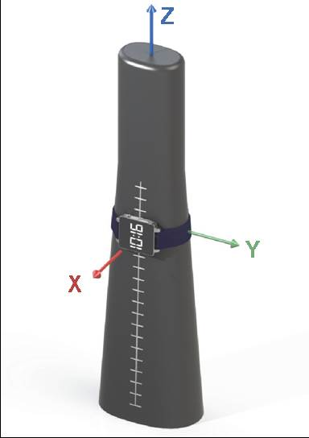
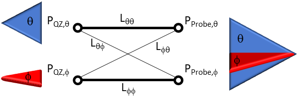
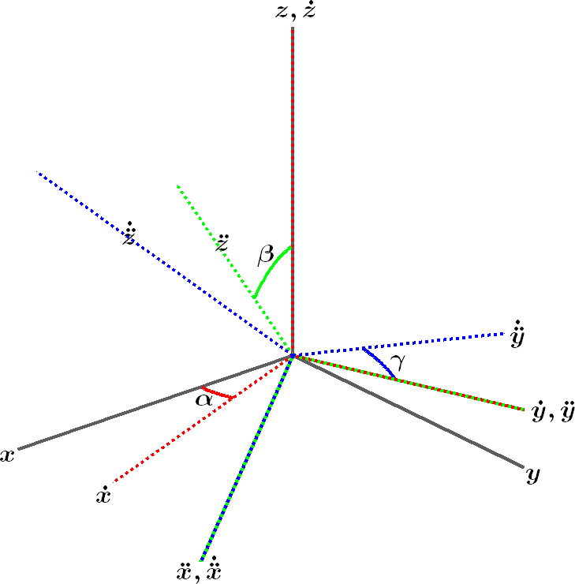
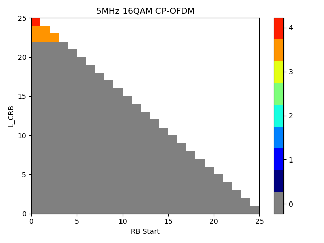
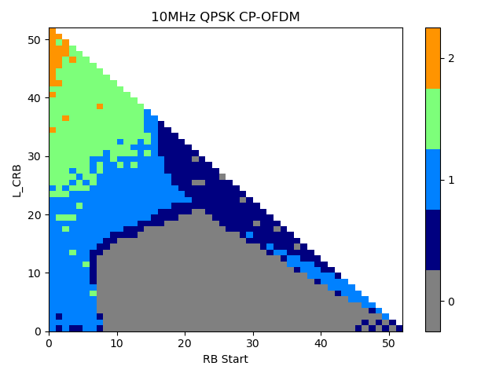
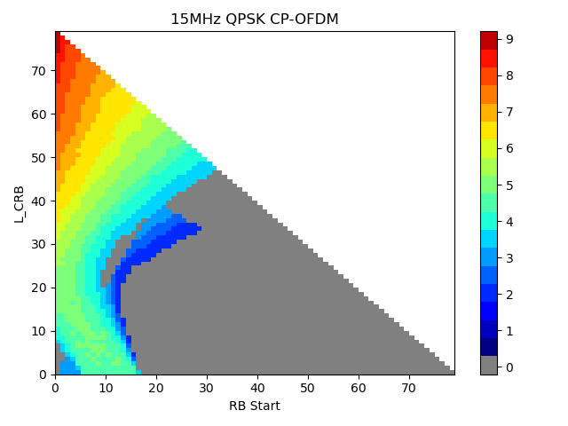
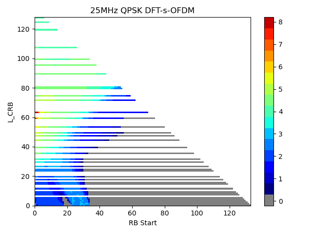
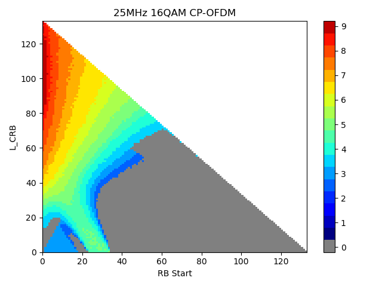
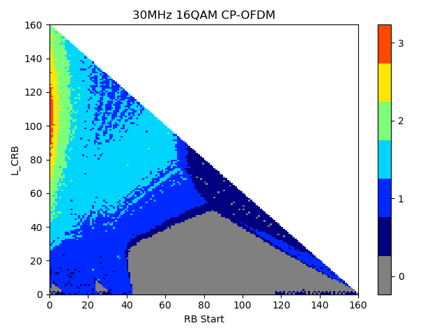

+----------------------------------+----------------------------------+
| 3GPP TR 38.870 V18.5.0 (2025-06) |                                  |
+==================================+==================================+
| Technical Report                 |                                  |
+----------------------------------+----------------------------------+
| 3rd Generation Partnership       |                                  |
| Project;                         |                                  |
|                                  |                                  |
| Technical Specification Group    |                                  |
| Radio Access Network;            |                                  |
|                                  |                                  |
| Enhanced Over-the-Air (OTA) test |                                  |
| methods for NR FR1 Total         |                                  |
| Radiated Power (TRP) and Total   |                                  |
| Radiated Sensitivity (TRS)       |                                  |
| (Release 18)                     |                                  |
+----------------------------------+----------------------------------+
|                                  |                                  |
+----------------------------------+----------------------------------+
| {width="1.4375in" | 3GPP-logo\_web](./media/image2.p |
| height="0.875in"}                | ng){width="1.7729166666666667in" |
|                                  | height="1.038888888888889in"}    |
+----------------------------------+----------------------------------+
|                                  |                                  |
+----------------------------------+----------------------------------+
| The present document has been    |                                  |
| developed within the 3rd         |                                  |
| Generation Partnership Project   |                                  |
| (3GPP ^TM^) and may be further   |                                  |
| elaborated for the purposes of   |                                  |
| 3GPP.\                           |                                  |
| The present document has not     |                                  |
| been subject to any approval     |                                  |
| process by the 3GPP              |                                  |
| Organizational Partners and      |                                  |
| shall not be implemented.\       |                                  |
| This Specification is provided   |                                  |
| for future development work      |                                  |
| within 3GPP only. The            |                                  |
| Organizational Partners accept   |                                  |
| no liability for any use of this |                                  |
| Specification.\                  |                                  |
| Specifications and Reports for   |                                  |
| implementation of the 3GPP ^TM^  |                                  |
| system should be obtained via    |                                  |
| the 3GPP Organizational          |                                  |
| Partners\' Publications Offices. |                                  |
+----------------------------------+----------------------------------+

+----------------------------------------------------------------------+
|                                                                      |
+======================================================================+
| > ***3GPP***                                                         |
| >                                                                    |
| > Postal address                                                     |
| >                                                                    |
| > 3GPP support office address                                        |
| >                                                                    |
| > 650 Route des Lucioles - Sophia Antipolis                          |
| >                                                                    |
| > Valbonne - FRANCE                                                  |
| >                                                                    |
| > Tel.: +33 4 92 94 42 00 Fax: +33 4 93 65 47 16                     |
| >                                                                    |
| > Internet                                                           |
| >                                                                    |
| > https://www.3gpp.org                                               |
+----------------------------------------------------------------------+
| ***Copyright Notification***                                         |
|                                                                      |
| No part may be reproduced except as authorized by written            |
| permission.\                                                         |
| The copyright and the foregoing restriction extend to reproduction   |
| in all media.                                                        |
|                                                                      |
| © 2025, 3GPP Organizational Partners (ARIB, ATIS, CCSA, ETSI, TSDSI, |
| TTA, TTC).                                                           |
|                                                                      |
| All rights reserved.                                                 |
|                                                                      |
| UMTS™ is a Trade Mark of ETSI registered for the benefit of its      |
| members                                                              |
|                                                                      |
| 3GPP™ is a Trade Mark of ETSI registered for the benefit of its      |
| Members and of the 3GPP Organizational Partners\                     |
| LTE™ is a Trade Mark of ETSI registered for the benefit of its       |
| Members and of the 3GPP Organizational Partners                      |
|                                                                      |
| GSM® and the GSM logo are registered and owned by the GSM            |
| Association                                                          |
+----------------------------------------------------------------------+

 Contents {#contents .TT}
========

Foreword 7

1 Scope 9

2 References 9

3 Definitions of terms, symbols and abbreviations 10

3.1 Terms 10

3.2 Symbols 11

3.3 Abbreviations 11

4 General 12

4.1 Device types 12

4.2 Testing configuration 12

4.2.1 UE use scenarios for TRP TRS test 12

4.2.2 UE mechanical mode description 12

4.3 Testing bands 12

4.3.1 General 12

4.3.2 Operating bands 13

4.3.3 Test parameters for each band 13

4.3.4 EN-DC band combinations 19

4.3.5 CA band combinations 21

4.3.6 Alternative parameters related to channel bandwidth and bands 22

4.3.6.1 General 22

4.3.6.2 Test parameters 22

4.3.6.3 TRS requirements for additional channel bandwidths 23

5 Performance metrics 23

5.1 Definition of the Total Radiated Power (TRP) 23

5.1.1 Definition of the Total Radiated Power (TRP) for AC 23

5.1.1.1 Applicability of TRP metrics 23

5.1.1.2 TRP for UEs supporting single-port transmission 23

5.1.1.3 TRP for UEs supporting non-coherent UL MIMO 24

5.1.1.4 TRP for UEs supporting coherent UL MIMO 25

5.1.2 Definition of the Total Radiated Power (TRP) for RC method 25

5.2 Definition of Total Radiated Sensitivity (TRS) 26

5.2.1 Definition of the Total Radiated Sensitivity (TRS) for AC 26

5.2.2 Definition of the Total Radiated Sensitivity (TRS) for RC method
27

6 UE positioning guidelines 27

6.1 Free space 27

6.2 Hand phantom only (Browsing mode) 27

6.2.1 Wide Grip Hand 28

6.2.2 PDA Grip Hand 28

6.3 Head and Hand phantom (Talk Mode) 29

6.3.1 General 29

6.3.2 Wide Grip Hand and Head 31

6.3.3 PDA Grip Hand and Head 31

6.4 Head phantom only 31

6.5 Forearm phantom 31

6.5.1 Forearm Phantom placement in the chamber 31

6.5.2 Wrist-Worn RedCap Device mounted on the Forearm Phantom 31

7 Anechoic Chamber method (Reference method) 33

7.1 General 33

7.2 Test setup 33

7.3 Calibration procedure 33

7.4 TRP Test procedure 34

7.4.1 General 34

7.4.2 TRP test procedure for NR 1Tx configuration 35

7.4.2.1 UE configuration 35

7.4.2.2 Test procedure 35

7.4.3 TRP test procedure for NR 2Tx configuration 35

7.4.3.1 UE configuration 35

7.4.3.2 TxD TRP Test procedure 36

7.4.3.3 Single-layer UL-MIMO TRP Test procedure 36

7.4.4 TRP test procedure for NR DL CA configuration 36

7.4.4.1 UE configuration 36

7.4.4.2 Test procedure 37

7.5 TRS Test procedure 37

7.5.1 General 37

7.5.2 TRS test procedure for NR 1Tx configuration 37

7.5.2.1 UE configuration 37

7.5.2.2 Test Procedure 38

7.5.3 TRS test procedure for NR 2Tx configuration 38

7.5.3.1 UE configuration 38

7.5.3.2 Test procedure 38

7.5.4 TRS test procedure for NR DL CA configuration 38

7.5.4.1 UE configuration 38

7.5.4.2 Test procedure 38

7.6 Ripple Test for Quiet Zone 39

7.6.1 General 39

7.6.2 Ripple test procedure 39

7.7 Minimum Range Length 43

8 Reverberation Chamber test methodology 44

8.1 General 44

8.2 Test setup 44

8.3 Chamber Characterization 45

8.3.1 S-parameters and power transfer functions 45

8.3.2 Chamber loading for coherence bandwidth 45

8.3.2.1 Coherence bandwidth calculation 46

8.3.3 Chamber spatial uniformity 47

8.4 Calibration procedure 48

8.4.1 S-parameters measurement 48

8.4.2 Calculation of the chamber reference transfer function 49

8.5 TRP Test procedure 50

8.5.1 TRP for SA and EN-DC 50

8.5.1.1 Test conditions 50

8.5.1.2 UE configurations 50

8.5.1.3 Test procedure 50

8.6 TRS Test procedure 51

8.6.1 TRS for SA and EN-DC 51

8.6.1.1 Test conditions 51

8.6.1.2 UE configurations 51

8.6.1.3 Test procedure 51

8.7 Test Volume 51

9 Testing time reduction methodologies 52

9.1 General 52

9.2 Measurement grids for Anechoic Chamber method 52

9.3 Other solutions 64

Annex A: UE coordinate system 64

A.1 Reference coordinate system 64

Annex B: Estimation of Measurement uncertainty 66

B.1 General 66

B.2 MU contribution descriptions for Anechoic Chamber method 67

B.2.1 Mismatch uncertainty 67

B.2.1.1 Mismatch uncertainty between measurement receiver /
communication tester and the measurement antenna 67

B.2.1.1.1 Mismatch uncertainty through the connector between two
elements 67

B.2.1.1.2 Mismatch uncertainty due to the interaction of several
elements 68

B.2.1.1.3 Total combined mismatch uncertainty 69

B.2.1.2 Mismatch uncertainty of the RF relay 69

B.2.1.2.1 First part: RF Relay switched on the co-polarized signal 70

B.2.1.2.1.1 The mismatch through the connector between two elements 70

B.2.1.2.1.2 Mismatch due to the interaction between two elements or more
70

B.2.1.2.2 Second part: RF relay switched on the cross-polarized signal
71

B.2.1.2.2.1 The mismatch through the connector between two elements 71

B.2.1.2.2.2 Mismatch due to the interaction between two elements or more
71

B.2.1.2.3 Total combined mismatch uncertainty 72

B.2.2 Insertion loss 72

B.2.2.1 Insertion loss of the measurement antenna cable 72

B.2.2.2 Insertion loss of the measurement antenna attenuator (if used)
72

B.2.2.3 Insertion loss of the RF relays (if used) 72

B.2.2.4 Insertion loss: calibration antenna feed cable 72

B.2.2.5 Insertion loss: calibration antenna attenuator (if used) 72

B.2.3 Influence of the antenna cable 73

B.2.3.1 Measurement antenna cable 73

B.2.3.2 Calibration antenna cable 73

B.2.4 Measurement receiver: uncertainty of the absolute level 73

B.2.5 Communication tester: uncertainty of the absolute level 73

B.2.6 Sensitivity measurement: output level step resolution 74

B.2.7 Measurement distance 74

B.2.7.1 Offset of phase centre from axis(es) of rotation 74

B.2.7.1.1 Offset of DUT phase centre from axis(es) of rotation 74

B.2.7.1.2 Offset of calibration antenna phase centre from axis(es) of
rotation 74

B.2.7.2 Mutual coupling 75

B.2.7.3 Phase curvature 75

B.2.8 Quality of quiet zone 75

B.2.9 DUT Tx-power drift 76

B.2.10 DUT sensitivity drift 76

B.2.11 Uncertainty related to the use of phantoms 76

B.2.11.1 Uncertainty from using different types of SAM phantom 77

B.2.11.2 Simulated tissue liquid uncertainty 77

B.2.11.3 Uncertainty of dielectric properties and shape of the hand
phantom 77

B.2.11.4 Uncertainty from using different types of Laptop Ground Plane
phantom 78

B.2.11.5 Positioning Uncertainty from using Phantoms 78

B.2.11.6 Uncertainty of dielectric properties and shape of the forearm
phantom 79

B.2.12 Coarse sampling grid 79

B.2.13 Random uncertainty 80

B.2.14 Frequency response 80

B.2.15 Uncertainty of network analyser 80

B.2.16 Uncertainty of the gain/efficiency of the calibration antenna 80

B.3 MU contribution descriptions for Alternative method 81

B.3.1 Additional Power Loss in EUT Chassis 81

B.3.3 Quality of Spatial Uniformity 81

B.3.4 Sensitivity measurement: output level step resolution 81

B.4 MU Assessment for TRP 81

B.4.1 MU Assessment for TRP in Anechoic Chamber 81

B.4.2 MU Assessment for TRP in Reverberation Chamber 86

B.5 MU Assessment for TRS 88

B.5.1 MU Assessment for TRS in Anechoic Chamber 88

B.5.2 MU Assessment for TRS in Reverberation Chamber 93

Annex C: Environmental requirements 97

C.1 Scope 97

C.2 Ambient temperature 97

C.3 Operating voltage 97

Annex D: Phantom Definition 98

D.1 Head Phantom 98

D.2 Hand Phantom 98

D.2.1 PDA Grip Hand 98

D.2.2 Wide Grip Hand 98

D.3 Forearm Phantom 99

Annex E: Harmonization outcome of Alternative method and Reference
method 100

E.1 General 100

E.2 Rel-18 Harmonization activity 100

E.2.1 Framework and workplan 100

E.2.2 Measurement results 101

E.2.3 Pass/fail limit 105

E.2.4 Conclusions 106

Annex F: Lab alignment outcome of Reference method 107

F.1 General 107

F.2 Rel-17 lab alignment campaign (Browsing mode) 107

F.2.1 Framework and workplan 107

F.2.2 Measurement results 109

F.2.3 Pass/fail limit 110

F.2.4 Conclusions 110

F.3 Rel-18 lab alignment (Talk mode) 110

F.3.1 Framework and workplan 110

F.3.2 Measurement results 112

F.3.3 Pass/fail limit 112

F.3.4 Conclusions 113

Annex G (informative): Change history 114

Foreword
========

This Technical Report has been produced by the 3rd Generation
Partnership Project (3GPP).

The contents of the present document are subject to continuing work
within the TSG and may change following formal TSG approval. Should the
TSG modify the contents of the present document, it will be re-released
by the TSG with an identifying change of release date and an increase in
version number as follows:

Version x.y.z

where:

x the first digit:

1 presented to TSG for information;

2 presented to TSG for approval;

3 or greater indicates TSG approved document under change control.

y the second digit is incremented for all changes of substance, i.e.
technical enhancements, corrections, updates, etc.

z the third digit is incremented when editorial only changes have been
incorporated in the document.

In the present document, modal verbs have the following meanings:

**shall** indicates a mandatory requirement to do something

**shall not** indicates an interdiction (prohibition) to do something

The constructions \"shall\" and \"shall not\" are confined to the
context of normative provisions, and do not appear in Technical Reports.

The constructions \"must\" and \"must not\" are not used as substitutes
for \"shall\" and \"shall not\". Their use is avoided insofar as
possible, and they are not used in a normative context except in a
direct citation from an external, referenced, non-3GPP document, or so
as to maintain continuity of style when extending or modifying the
provisions of such a referenced document.

**should** indicates a recommendation to do something

**should not** indicates a recommendation not to do something

**may** indicates permission to do something

**need not** indicates permission not to do something

The construction \"may not\" is ambiguous and is not used in normative
elements. The unambiguous constructions \"might not\" or \"shall not\"
are used instead, depending upon the meaning intended.

**can** indicates that something is possible

**cannot** indicates that something is impossible

The constructions \"can\" and \"cannot\" are not substitutes for \"may\"
and \"need not\".

**will** indicates that something is certain or expected to happen as a
result of action taken by an agency the behaviour of which is outside
the scope of the present document

**will not** indicates that something is certain or expected not to
happen as a result of action taken by an agency the behaviour of which
is outside the scope of the present document

**might** indicates a likelihood that something will happen as a result
of action taken by some agency the behaviour of which is outside the
scope of the present document

**might not** indicates a likelihood that something will not happen as a
result of action taken by some agency the behaviour of which is outside
the scope of the present document

In addition:

**is** (or any other verb in the indicative mood) indicates a statement
of fact

**is not** (or any other negative verb in the indicative mood) indicates
a statement of fact

The constructions \"is\" and \"is not\" do not indicate requirements.

 1 Scope
=======

The present document is a technical report for enhanced Over-the-Air
(OTA) test methods for NR FR1 Total Radiated Power (TRP) and Total
Radiated Sensitivity (TRS), for NR standalone (SA) and NR non-standalone
(NSA) operation mode.

In Rel-17, the TRP TRS OTA test method was just developed for a limited
scope. This TR targets to define a full set of OTA test methods to cover
different UE features for TRP and TRS measurement.

2 References
============

The following documents contain provisions which, through reference in
this text, constitute provisions of the present document.

\- References are either specific (identified by date of publication,
edition number, version number, etc.) or non‑specific.

\- For a specific reference, subsequent revisions do not apply.

\- For a non-specific reference, the latest version applies. In the case
of a reference to a 3GPP document (including a GSM document), a
non-specific reference implicitly refers to the latest version of that
document *in the same Release as the present document*.

\[1\] 3GPP TR 21.905: \"Vocabulary for 3GPP Specifications\".

\[2\] 3GPP TR 38.827: "Study on radiated metrics and test methodology
for the verification of multi-antenna reception performance of NR User
Equipment (UE)".

\[3\] 3GPP TS 38.101-1: "NR; User Equipment (UE) radio transmission and
reception; Part 1: Range 1 Standalone".

\[4\] 3GPP TS 38.101-3: "NR; User Equipment (UE) radio transmission and
reception; Part 3: Range 1 and Range 2 Interworking operation with other
radios".

\[5\] 3GPP TS 38.521-1: "NR; User Equipment (UE) conformance
specification; Radio transmission and reception; Part 1: Range 1
Standalone".

\[6\] 3GPP TS 38.521-3: "NR; User Equipment (UE) conformance
specification; Radio transmission and reception; Part 3: Range 1 and
Range 2 Interworking operation with other radios".

\[7\] 3GPP TS 38.508-1: "5GS; User Equipment (UE) conformance
specification; Part 1: Common test environment ".

\[8\] 3GPP TR 25.914: "Measurements of radio performances for UMTS
terminals in speech mode".

\[9\] IEEE Std 149: "IEEE Standard Test Procedures for Antennas", IEEE.

\[10\] JCGM 100:2008: "Evaluation of measurement data --- Guide to the
expression of uncertainty in measurement".

\[11\] ETSI TR 102 273-1-1: "Electromagnetic compatibility and Radio
spectrum Matters (ERM); Improvement on Radiated Methods of Measurement
(using test site) and evaluation of the corresponding measurement
uncertainties; Part 1: Uncertainties in the measurement of mobile radio
equipment characteristics; Sub-part 1: Introduction".

\[12\] ETSI TR 100 028-2: "ElectroMagnetic Compatibility and Radio
Spectrum Matters (ERM); Uncertainties in the measurement of mobile radio
equipment characteristics; Part 2".

\[13\] ETSI TR 102 273-1-2: "Electromagnetic compatibility and Radio
spectrum Matters (ERM); Improvement on Radiated Methods of Measurement
(using test site) and evaluation of the corresponding measurement
uncertainties; Part 1: Uncertainties in the measurement of mobile radio
equipment characteristics; Sub-part 2: Examples and annexes".

\[14\] CTIA Certification™: "CTIA Certification Test Plan for Wireless
Device Over-the-Air Performance, CTIA 01.71 Device Setup and Positioning
Guidelines", latest active version available at:
https://ctiacertification.org/test-plans/

\[15\] Foegelle, M.D., "The Surface Standard Deviation Method for TRP
Measurement Uncertainty", 25^th^ Proceedings of the Antenna Measurement
Techniques Association (AMTA 2003), A03-027

\[16\] 3GPP TR 37.902: "Measurements of User Equipment (UE) radio
performances for LTE/UMTS terminals; Total Radiated Power (TRP) and
Total Radiated Sensitivity (TRS) test ".

\[17\] 3GPP TS 37.544: "Universal Terrestrial Radio Access (UTRA) and
Evolved Universal Terrestrial Radio Access (E-UTRA); User Equipment (UE)
Over The Air (OTA) performance; Conformance testing ".

\[18\] 3GPP TR 37.941: "Radio Frequency (RF) conformance testing
background for radiated Base Station (BS) requirements"

\[19\] 3GPP TR 38.810: "NR; Study on test methods"

\[20\] 3GPP TR 38.903, "NR; Derivation of test tolerances and
measurement uncertainty for User Equipment (UE) conformance test cases"

\[21\] "Reverberation Chamber Metrology for Wireless Internet of Things
Devices", Anouk Hubrechsen, Kate A. Remley and Sara Catteau, IEEE
Microwave Magazine, February 2022, pp.75-85

\[22\] "Proximity and antenna orientation effects for large-form-factor
devices in a reverberation chamber" Willem T. C. Burger, Kate A. Remley,
Christopher L. Holloway, John M. Ladbury, 2013 IEEE International
Symposium on Electromagnetic Compatibility, pp.671-676

\[23\] "A Significance Test for Reverberation-Chamber Measurement
Uncertainty in Total Radiated Power of Wireless Devices", Kate A.
Remley, Chih-Ming Jack Wang, Dylan F. Williams, Johannes J. aan den
Toorn and Christopher L. Holloway, IEEE TRANSACTIONS ON ELECTROMAGNETIC
COMPATIBILITY, VOL. 58, NO. 1, FEBRUARY 2016, pp.207-219

\[24\] 3GPP TR 38.834: "Measurements of User Equipment (UE) Over-the-Air
(OTA) performance for NR FR1; Total Radiated Power (TRP) and Total
Radiated Sensitivity (TRS) test methodology (Release 17)"

\[25\] CTIA Certification™: "CTIA Certification Test Plan for Wireless
Device Over-the-Air Performance, CTIA 01.72: Near-Field Phantoms",
latest active version available at:
https://ctiacertification.org/test-plans/

\[26\] CTIA Certification™: "CTIA Certification Test Plan for Wireless
Device Over-the-Air Performance, CTIA 01.70: Measurement Uncertainty",
latest active version available at:
[[https://ctiacertification.org/test-plans/]{.underline}](https://ctiacertification.org/test-plans/)

\[27\] 3GPP R4-2412049, Final Analysis of 3GPP Rel-18 TRP TRS AC lab
alignment and RC harmonization measurement results, vivo

3 Definitions of terms, symbols and abbreviations
=================================================

3.1 Terms
---------

For the purposes of the present document, the terms given in 3GPP
TR 21.905 \[1\] and the following apply. A term defined in the present
document takes precedence over the definition of the same term, if any,
in 3GPP TR 21.905 \[1\].

**Browsing mode usage:** This mode corresponds to "data" mode, the
device is tested via hand-only phantoms.

**Primary mechanical mode:** The mode that is most often used for a
specific user scenario. Every terminal has at least one primary
mechanical mode, if multiple modes are supported, different primary
mechanical modes may be applicable for different user scenarios, e.g.,
different primary mechanical modes for Browsing mode usage and Talk mode
usage for the same UE.

**Talk mode usage:** This mode corresponds to "talk" mode, the device is
tested via head&hand phantoms.

**Wrist-worn mode usage:** This mode corresponds to wearable device for
wrist-worn mode, the device is tested via forearm phantoms.

3.2 Symbols
-----------

For the purposes of the present document, the following symbols apply:

3.3 Abbreviations
-----------------

For the purposes of the present document, the abbreviations given in
3GPP TR 21.905 \[1\] and the following apply. An abbreviation defined in
the present document takes precedence over the definition of the same
abbreviation, if any, in 3GPP TR 21.905 \[1\].

AC Anechoic Chamber

BHHL Beside Head and Hand Left Side (Head and Hand Phantom)

BHHR Beside Head and Hand Right Side (Head and Hand Phantom)

BS Base Station

CA Carrier Aggregation

> CBW Channel Bandwidth

CC Component Carriers

DUT Device Under Test

E-UTRA Evolved UTRA

EIRP Effective Isotropic Radiated Power

EIS Effective Isotropic Sensitivity

EUT Equipment Under Test

FR1 Frequency Range 1

FS Free Space

HL Hand Left (Hand Phantom Only)

HR Hand Right (Hand Phantom Only)

MPR Allowed maximum power reduction

NR New Radio

NSA Non-Standalone, a mode of operation where operation of an other
radio is assisted with an other radio

OTA Over The Air

P-MPR Power Management Maximum Power Reduction

QZ Quiet Zone

RC Reverberation Chamber

RedCap Reduced Capability

RMC Reference Measurement Channel

SA Standalone

SCS Subcarrier spacing

SS System Simulator

TAA Time-Averaging Algorithm

TAS Tx Antenna Switching

TRP Total Radiated Power

TRS Total Radiated Sensitivity

TxD Tx Diversity

UE User Equipment

UL MIMO Uplink Multiple Antenna transmission

4 General
=========

4.1 Device types
----------------

The following device types are within the scope of enhanced FR1 TRP TRS
WI:

\- Smartphone

\- Considering UEs with antenna configurations of 1Tx, 2Tx, 2 Rx and 4
Rx

\- Wearable Redcap UE

\- Tablet

\- Laptop embedded equipment (LEE)

\- Laptop mounted equipment (LME)

4.2 Testing configuration
-------------------------

### 4.2.1 UE use scenarios for TRP TRS test

The following use scenarios are considered for TRP TRS test:

\- Talk mode using head & hand phantom for narrow phones between 56 mm
and 72 mm and for wide phones with a width \>72 mm and \<92 mm.

\- Browsing mode using hand phantom for narrow and wide phones

\- Using forearm phantom for wrist-worn devices

\- Free Space is used for devices not used in above-mentioned scenarios,
other phantoms are not precluded for wearable devices

For smartphones, both browsing mode and talk mode shall be covered. Free
space (FS) testing for smartphone is low priority.

For wrist-worn Redcap devices, forearm phantom is the first priority.
FFS other Redcap form factor devices.

For other device types, free space (FS) testing configuration is the
first priority.

Note: the UE positioning guideline described in Clause 6 and phantom
definition described in Annex D are RATs agnostic.

### 4.2.2 UE mechanical mode description

The mechanical modes of a device under test (DUT) are declared by the
manufacturer. A DUT shall have at least one mechanical mode. If only one
mode is supported, then this is defined as the primary. If multiple
modes are supported, the manufacturer can declare different primary
mechanical modes applicable for different user scenarios, e.g.,
different primary mechanical mode for Browsing mode usage and Talk mode
usage for the same UE.

4.3 Testing bands
-----------------

> \<Editor's note: parameters for EN-DC and CA bands can be further
> added. \>

### 4.3.1 General

The frequency ranges in which NR can operate are identified as described
in Table 4.3.1-1.

Table 4.3.1-1: Definition of frequency ranges

  Frequency range designation   Corresponding frequency range   
  ----------------------------- ------------------------------- ------------------------
  FR1                           410 MHz -- 7125 MHz             
  FR2                           FR2-1                           24250 MHz -- 52600 MHz
                                FR2-2                           52600 MHz -- 71000 MHz

The present technical report covers FR1 operating bands and FR1
non-standalone (NSA) operation mode with E-UTRA.

### 4.3.2 Operating bands

Operating bands for NR FR1 are defined in Table 5.2-1 and Carrier
Aggregation (CA) *are defined in Clause 5.5A* in TS 38.101-1 \[3\]. The
operating bands for EN-DC are defined in Clause 5.5B in TS 38.101-3
\[4\].

### 4.3.3 Test parameters for each band

The detailed test parameters for each band are defined in Table 4.3.3-1
and Table 4.3.3-2.

Table 4.3.3-1: NR FR1 TRP measurement parameters

<table>
<thead>
<tr class="header">
<th>NR Band</th>
<th>CBW 
[MHz]</th>
<th>SCS (kHz)</th>
<th>UL modulation</th>
<th>Range</th>
<th>
UL Carrier centre

[ARFCN]
</th>
<th>UL Carrier Center (MHz)</th>
<th>
DL Carrier centre

[ARFCN]
</th>
<th>DL Carrier Center (MHz)</th>
<th>
UL RB Allocation

(LCRB @ RBstart)
</th>
<th>DL configuration</th>
</tr>
</thead>
<tbody>
<tr class="odd">
<td>n1</td>
<td>15</td>
<td>15</td>
<td>
DFT-s-OFDM

QPSK
</td>
<td>Low</td>
<td>385500</td>
<td>1927.5</td>
<td>423500</td>
<td>2117.5</td>
<td>36@18</td>
<td>N/A</td>
</tr>
<tr class="even">
<td></td>
<td></td>
<td></td>
<td></td>
<td>Mid</td>
<td>390000</td>
<td>1950</td>
<td>428000</td>
<td>2140</td>
<td></td>
<td></td>
</tr>
<tr class="odd">
<td></td>
<td></td>
<td></td>
<td></td>
<td>High</td>
<td>394500</td>
<td>1972.5</td>
<td>432500</td>
<td>2162.5</td>
<td></td>
<td></td>
</tr>
<tr class="even">
<td>n2</td>
<td>15</td>
<td>15</td>
<td>
DFT-s-OFDM

QPSK
</td>
<td>Low</td>
<td>371500</td>
<td>1857.5</td>
<td>387500</td>
<td>1937.5</td>
<td>36@18</td>
<td>N/A</td>
</tr>
<tr class="odd">
<td></td>
<td></td>
<td></td>
<td></td>
<td>Mid</td>
<td>376000</td>
<td>1880</td>
<td>392000</td>
<td>1960</td>
<td></td>
<td></td>
</tr>
<tr class="even">
<td></td>
<td></td>
<td></td>
<td></td>
<td>High</td>
<td>380500</td>
<td>1902.5</td>
<td>396500</td>
<td>1982.5</td>
<td></td>
<td></td>
</tr>
<tr class="odd">
<td>n3</td>
<td>20</td>
<td>15</td>
<td>
DFT-s-OFDM

QPSK
</td>
<td>Low</td>
<td>344000</td>
<td>1720</td>
<td>363000</td>
<td>1815</td>
<td>50@25</td>
<td>N/A</td>
</tr>
<tr class="even">
<td></td>
<td></td>
<td></td>
<td></td>
<td>Mid</td>
<td>349500</td>
<td>1747.5</td>
<td>368500</td>
<td>1842.5</td>
<td></td>
<td></td>
</tr>
<tr class="odd">
<td></td>
<td></td>
<td></td>
<td></td>
<td>High</td>
<td>355000</td>
<td>1775</td>
<td>374000</td>
<td>1870</td>
<td></td>
<td></td>
</tr>
<tr class="even">
<td>n5</td>
<td>15</td>
<td>15</td>
<td>
DFT-s-OFDM

QPSK
</td>
<td>Low</td>
<td>166300</td>
<td>831.5</td>
<td>175300</td>
<td>876.5</td>
<td>36@18</td>
<td>N/A</td>
</tr>
<tr class="odd">
<td></td>
<td></td>
<td></td>
<td></td>
<td>Mid</td>
<td>167300</td>
<td>836.5</td>
<td>176300</td>
<td>881.5</td>
<td></td>
<td></td>
</tr>
<tr class="even">
<td></td>
<td></td>
<td></td>
<td></td>
<td>High</td>
<td>168300</td>
<td>841.5</td>
<td>177300</td>
<td>886.5</td>
<td></td>
<td></td>
</tr>
<tr class="odd">
<td>n7</td>
<td>15</td>
<td>15</td>
<td>
DFT-s-OFDM

QPSK
</td>
<td>Low</td>
<td>501500</td>
<td>2507.5</td>
<td>525500</td>
<td>2627.5</td>
<td>36@18</td>
<td>N/A</td>
</tr>
<tr class="even">
<td></td>
<td></td>
<td></td>
<td></td>
<td>Mid</td>
<td>507000</td>
<td>2535</td>
<td>531000</td>
<td>2655</td>
<td></td>
<td></td>
</tr>
<tr class="odd">
<td></td>
<td></td>
<td></td>
<td></td>
<td>High</td>
<td>512500</td>
<td>2562.5</td>
<td>536500</td>
<td>2682.5</td>
<td></td>
<td></td>
</tr>
<tr class="even">
<td>n8</td>
<td>15</td>
<td>15</td>
<td>
DFT-s-OFDM

QPSK
</td>
<td>Low</td>
<td>177500</td>
<td>887.5</td>
<td>186500</td>
<td>932.5</td>
<td>36@18</td>
<td>N/A</td>
</tr>
<tr class="odd">
<td></td>
<td></td>
<td></td>
<td></td>
<td>Mid</td>
<td>179500</td>
<td>897.5</td>
<td>188500</td>
<td>942.5</td>
<td></td>
<td></td>
</tr>
<tr class="even">
<td></td>
<td></td>
<td></td>
<td></td>
<td>High</td>
<td>181500</td>
<td>907.5</td>
<td>190500</td>
<td>952.5</td>
<td></td>
<td></td>
</tr>
<tr class="odd">
<td>n12</td>
<td>10</td>
<td>15</td>
<td>
DFT-s-OFDM

QPSK
</td>
<td>Low</td>
<td>140800</td>
<td>704</td>
<td>146800</td>
<td>734</td>
<td>25@12</td>
<td>N/A</td>
</tr>
<tr class="even">
<td></td>
<td></td>
<td></td>
<td></td>
<td>Mid</td>
<td>141500</td>
<td>707.5</td>
<td>147500</td>
<td>737.5</td>
<td></td>
<td></td>
</tr>
<tr class="odd">
<td></td>
<td></td>
<td></td>
<td></td>
<td>High</td>
<td>142200</td>
<td>711</td>
<td>148200</td>
<td>741</td>
<td></td>
<td></td>
</tr>
<tr class="even">
<td>n14</td>
<td>10</td>
<td>15</td>
<td>
DFT-s-OFDM

QPSK
</td>
<td>Low</td>
<td>158600</td>
<td>793</td>
<td>152600</td>
<td>763</td>
<td>25@12</td>
<td>N/A</td>
</tr>
<tr class="odd">
<td></td>
<td></td>
<td></td>
<td></td>
<td>Mid</td>
<td></td>
<td></td>
<td></td>
<td></td>
<td></td>
<td></td>
</tr>
<tr class="even">
<td></td>
<td></td>
<td></td>
<td></td>
<td>High</td>
<td></td>
<td></td>
<td></td>
<td></td>
<td></td>
<td></td>
</tr>
<tr class="odd">
<td>n20</td>
<td>15</td>
<td>15</td>
<td>
DFT-s-OFDM

QPSK
</td>
<td>Low</td>
<td>167900</td>
<td>839.5</td>
<td>159700</td>
<td>798.5</td>
<td>36@18</td>
<td>N/A</td>
</tr>
<tr class="even">
<td></td>
<td></td>
<td></td>
<td></td>
<td>Mid</td>
<td>169400</td>
<td>847</td>
<td>161200</td>
<td>806</td>
<td></td>
<td></td>
</tr>
<tr class="odd">
<td></td>
<td></td>
<td></td>
<td></td>
<td>High</td>
<td>170900</td>
<td>854.5</td>
<td>162700</td>
<td>813.5</td>
<td></td>
<td></td>
</tr>
<tr class="even">
<td>n25</td>
<td>15</td>
<td>15</td>
<td>
DFT-s-OFDM

QPSK
</td>
<td>Low</td>
<td>371500</td>
<td>1857.5</td>
<td>387500</td>
<td>1937.5</td>
<td>36@18</td>
<td>N/A</td>
</tr>
<tr class="odd">
<td></td>
<td></td>
<td></td>
<td></td>
<td>Mid</td>
<td>376500</td>
<td>1882.5</td>
<td>392500</td>
<td>1962.5</td>
<td></td>
<td></td>
</tr>
<tr class="even">
<td></td>
<td></td>
<td></td>
<td></td>
<td>High</td>
<td>381500</td>
<td>1907.5</td>
<td>397500</td>
<td>1987.5</td>
<td></td>
<td></td>
</tr>
<tr class="odd">
<td>n26</td>
<td>10</td>
<td>15</td>
<td>
DFT-s-OFDM

QPSK
</td>
<td>Low</td>
<td>163800</td>
<td>819</td>
<td>172800</td>
<td>864</td>
<td>25@12</td>
<td>N/A</td>
</tr>
<tr class="even">
<td></td>
<td></td>
<td></td>
<td></td>
<td>Mid</td>
<td>166300</td>
<td>831.5</td>
<td>175300</td>
<td>876.5</td>
<td></td>
<td></td>
</tr>
<tr class="odd">
<td></td>
<td></td>
<td></td>
<td></td>
<td>High</td>
<td>168800</td>
<td>844</td>
<td>177800</td>
<td>889</td>
<td></td>
<td></td>
</tr>
<tr class="even">
<td>n28</td>
<td>20</td>
<td>15</td>
<td>
DFT-s-OFDM

QPSK
</td>
<td>Low</td>
<td>142600</td>
<td>713</td>
<td>153600</td>
<td>768</td>
<td>50@25</td>
<td>N/A</td>
</tr>
<tr class="odd">
<td></td>
<td></td>
<td></td>
<td></td>
<td>Mid</td>
<td>145600</td>
<td>728</td>
<td>156600</td>
<td>783</td>
<td></td>
<td></td>
</tr>
<tr class="even">
<td></td>
<td></td>
<td></td>
<td></td>
<td>High</td>
<td>147600</td>
<td>738</td>
<td>158600</td>
<td>793</td>
<td></td>
<td></td>
</tr>
<tr class="odd">
<td>n30</td>
<td>10</td>
<td>15</td>
<td>
DFT-s-OFDM

QPSK
</td>
<td>Low</td>
<td>462000</td>
<td>2310</td>
<td>471000</td>
<td>2355</td>
<td>25@12</td>
<td>N/A</td>
</tr>
<tr class="even">
<td></td>
<td></td>
<td></td>
<td></td>
<td>Mid</td>
<td></td>
<td></td>
<td></td>
<td></td>
<td></td>
<td></td>
</tr>
<tr class="odd">
<td></td>
<td></td>
<td></td>
<td></td>
<td>High</td>
<td></td>
<td></td>
<td></td>
<td></td>
<td></td>
<td></td>
</tr>
<tr class="even">
<td>n34</td>
<td>10</td>
<td>15</td>
<td>
DFT-s-OFDM

QPSK
</td>
<td>Low</td>
<td>403000</td>
<td>2015</td>
<td>403000</td>
<td>2015</td>
<td>25@12</td>
<td>N/A</td>
</tr>
<tr class="odd">
<td></td>
<td></td>
<td></td>
<td></td>
<td>Mid</td>
<td>403500</td>
<td>2017.5</td>
<td>403500</td>
<td>2017.5</td>
<td></td>
<td></td>
</tr>
<tr class="even">
<td></td>
<td></td>
<td></td>
<td></td>
<td>High</td>
<td>404000</td>
<td>2020</td>
<td>404000</td>
<td>2020</td>
<td></td>
<td></td>
</tr>
<tr class="odd">
<td>n38</td>
<td>15</td>
<td>15</td>
<td>
DFT-s-OFDM

QPSK
</td>
<td>Low</td>
<td>515500</td>
<td>2577.5</td>
<td>515500</td>
<td>2577.5</td>
<td>36@18</td>
<td>N/A</td>
</tr>
<tr class="even">
<td></td>
<td></td>
<td></td>
<td></td>
<td>Mid</td>
<td>519000</td>
<td>2595</td>
<td>519000</td>
<td>2595</td>
<td></td>
<td></td>
</tr>
<tr class="odd">
<td></td>
<td></td>
<td></td>
<td></td>
<td>High</td>
<td>522500</td>
<td>2612.5</td>
<td>522500</td>
<td>2612.5</td>
<td></td>
<td></td>
</tr>
<tr class="even">
<td>n39</td>
<td>20</td>
<td>15</td>
<td>
DFT-s-OFDM

QPSK
</td>
<td>Low</td>
<td>378000</td>
<td>1890</td>
<td>378000</td>
<td>1890</td>
<td>50@25</td>
<td>N/A</td>
</tr>
<tr class="odd">
<td></td>
<td></td>
<td></td>
<td></td>
<td>Mid</td>
<td>380000</td>
<td>1900</td>
<td>380000</td>
<td>1900</td>
<td></td>
<td></td>
</tr>
<tr class="even">
<td></td>
<td></td>
<td></td>
<td></td>
<td>High</td>
<td>382000</td>
<td>1910</td>
<td>382000</td>
<td>1910</td>
<td></td>
<td></td>
</tr>
<tr class="odd">
<td>n40</td>
<td>30</td>
<td>15</td>
<td>
DFT-s-OFDM

QPSK
</td>
<td>Low</td>
<td>463000</td>
<td>2315</td>
<td>463000</td>
<td>2315</td>
<td>80@40</td>
<td>N/A</td>
</tr>
<tr class="even">
<td></td>
<td></td>
<td></td>
<td></td>
<td>Mid</td>
<td>470000</td>
<td>2350</td>
<td>470000</td>
<td>2350</td>
<td></td>
<td></td>
</tr>
<tr class="odd">
<td></td>
<td></td>
<td></td>
<td></td>
<td>High</td>
<td>477000</td>
<td>2385</td>
<td>477000</td>
<td>2385</td>
<td></td>
<td></td>
</tr>
<tr class="even">
<td>n41</td>
<td>100</td>
<td>30</td>
<td>
DFT-s-OFDM

QPSK
</td>
<td>Low</td>
<td>509202</td>
<td>2546.01</td>
<td>509202</td>
<td>2546.01</td>
<td>135@67</td>
<td>N/A</td>
</tr>
<tr class="odd">
<td></td>
<td></td>
<td></td>
<td></td>
<td>Mid</td>
<td>518598</td>
<td>2592.99</td>
<td>518598</td>
<td>2592.99</td>
<td></td>
<td></td>
</tr>
<tr class="even">
<td></td>
<td></td>
<td></td>
<td></td>
<td>High</td>
<td>528000</td>
<td>2640</td>
<td>528000</td>
<td>2640</td>
<td></td>
<td></td>
</tr>
<tr class="odd">
<td>n48</td>
<td>20</td>
<td>15</td>
<td>
DFT-s-OFDM

QPSK
</td>
<td>Low</td>
<td>637334</td>
<td>3560.01</td>
<td>637334</td>
<td>3560.01</td>
<td>50@25</td>
<td>N/A</td>
</tr>
<tr class="even">
<td></td>
<td></td>
<td></td>
<td></td>
<td>Mid</td>
<td>641666</td>
<td>3624.99</td>
<td>641666</td>
<td>3624.99</td>
<td></td>
<td></td>
</tr>
<tr class="odd">
<td></td>
<td></td>
<td></td>
<td></td>
<td>High</td>
<td>646000</td>
<td>3690</td>
<td>646000</td>
<td>3690</td>
<td></td>
<td></td>
</tr>
<tr class="even">
<td>n50</td>
<td>20</td>
<td>15</td>
<td>
DFT-s-OFDM

QPSK
</td>
<td>Low</td>
<td>288400</td>
<td>1442</td>
<td>288400</td>
<td>1442</td>
<td>50@25</td>
<td>N/A</td>
</tr>
<tr class="odd">
<td></td>
<td></td>
<td></td>
<td></td>
<td>Mid</td>
<td>294900</td>
<td>1474.5</td>
<td>294900</td>
<td>1474.5</td>
<td></td>
<td></td>
</tr>
<tr class="even">
<td></td>
<td></td>
<td></td>
<td></td>
<td>High</td>
<td>301400</td>
<td>1507</td>
<td>301400</td>
<td>1507</td>
<td></td>
<td></td>
</tr>
<tr class="odd">
<td>n51</td>
<td>5</td>
<td>15</td>
<td>
DFT-s-OFDM

QPSK
</td>
<td>Low</td>
<td>285900</td>
<td>1429.5</td>
<td>285900</td>
<td>1429.5</td>
<td>12@6</td>
<td>N/A</td>
</tr>
<tr class="even">
<td></td>
<td></td>
<td></td>
<td></td>
<td>Mid</td>
<td></td>
<td></td>
<td></td>
<td></td>
<td></td>
<td></td>
</tr>
<tr class="odd">
<td></td>
<td></td>
<td></td>
<td></td>
<td>High</td>
<td></td>
<td></td>
<td></td>
<td></td>
<td></td>
<td></td>
</tr>
<tr class="even">
<td>n53</td>
<td>10</td>
<td>15</td>
<td>
DFT-s-OFDM

QPSK
</td>
<td>Low</td>
<td>497700</td>
<td>2488.5</td>
<td>497700</td>
<td>2488.5</td>
<td>25@12</td>
<td>N/A</td>
</tr>
<tr class="odd">
<td></td>
<td></td>
<td></td>
<td></td>
<td>Mid</td>
<td>497860</td>
<td>2489.3</td>
<td>497860</td>
<td>2489.3</td>
<td></td>
<td></td>
</tr>
<tr class="even">
<td></td>
<td></td>
<td></td>
<td></td>
<td>High</td>
<td>498000</td>
<td>2490</td>
<td>498000</td>
<td>2490</td>
<td></td>
<td></td>
</tr>
<tr class="odd">
<td>n65</td>
<td>15</td>
<td>15</td>
<td>
DFT-s-OFDM

QPSK
</td>
<td>Low</td>
<td>423500</td>
<td>2117.5</td>
<td>423500</td>
<td>2117.5</td>
<td>36@18</td>
<td>N/A</td>
</tr>
<tr class="even">
<td></td>
<td></td>
<td></td>
<td></td>
<td>Mid</td>
<td>431000</td>
<td>2155</td>
<td>431000</td>
<td>2155</td>
<td></td>
<td></td>
</tr>
<tr class="odd">
<td></td>
<td></td>
<td></td>
<td></td>
<td>High</td>
<td>438500</td>
<td>2192.5</td>
<td>438500</td>
<td>2192.5</td>
<td></td>
<td></td>
</tr>
<tr class="even">
<td>n66</td>
<td>20 (20+20)</td>
<td>15</td>
<td>
DFT-s-OFDM

QPSK
</td>
<td>Low</td>
<td>344000</td>
<td>1720</td>
<td>424000</td>
<td>2120</td>
<td>50@25</td>
<td>N/A</td>
</tr>
<tr class="odd">
<td></td>
<td></td>
<td></td>
<td></td>
<td>Mid</td>
<td>349000</td>
<td>1745</td>
<td>429000</td>
<td>2145</td>
<td></td>
<td></td>
</tr>
<tr class="even">
<td></td>
<td></td>
<td></td>
<td></td>
<td>High</td>
<td>354000</td>
<td>1770</td>
<td>434000</td>
<td>2170</td>
<td></td>
<td></td>
</tr>
<tr class="odd">
<td>n70</td>
<td>15 (15+15)</td>
<td>15</td>
<td>
DFT-s-OFDM

QPSK
</td>
<td>Low</td>
<td>340500</td>
<td>1702.5</td>
<td>400500</td>
<td>2002.5</td>
<td>36@18</td>
<td>N/A</td>
</tr>
<tr class="even">
<td></td>
<td></td>
<td></td>
<td></td>
<td>Mid</td>
<td></td>
<td></td>
<td></td>
<td></td>
<td></td>
<td></td>
</tr>
<tr class="odd">
<td></td>
<td></td>
<td></td>
<td></td>
<td>High</td>
<td></td>
<td></td>
<td></td>
<td></td>
<td></td>
<td></td>
</tr>
<tr class="even">
<td>n71</td>
<td>10</td>
<td>15</td>
<td>
DFT-s-OFDM

QPSK
</td>
<td>Low</td>
<td>133600</td>
<td>668</td>
<td>124400</td>
<td>622</td>
<td>25@12</td>
<td>N/A</td>
</tr>
<tr class="odd">
<td></td>
<td></td>
<td></td>
<td></td>
<td>Mid</td>
<td>136100</td>
<td>680.5</td>
<td>126900</td>
<td>634.5</td>
<td></td>
<td></td>
</tr>
<tr class="even">
<td></td>
<td></td>
<td></td>
<td></td>
<td>High</td>
<td>138600</td>
<td>693</td>
<td>129400</td>
<td>647</td>
<td></td>
<td></td>
</tr>
<tr class="odd">
<td>n74</td>
<td>15</td>
<td>15</td>
<td>
DFT-s-OFDM

QPSK
</td>
<td>Low</td>
<td>286900</td>
<td>1434.5</td>
<td>296500</td>
<td>1482.5</td>
<td>36@18</td>
<td>N/A</td>
</tr>
<tr class="even">
<td></td>
<td></td>
<td></td>
<td></td>
<td>Mid</td>
<td>289700</td>
<td>1448.5</td>
<td>299300</td>
<td>1496.5</td>
<td></td>
<td></td>
</tr>
<tr class="odd">
<td></td>
<td></td>
<td></td>
<td></td>
<td>High</td>
<td>292500</td>
<td>1462.5</td>
<td>302100</td>
<td>1510.5</td>
<td></td>
<td></td>
</tr>
<tr class="even">
<td>n77</td>
<td>100</td>
<td>30</td>
<td>
DFT-s-OFDM

QPSK
</td>
<td>Low</td>
<td>623334</td>
<td>3350.01</td>
<td>623334</td>
<td>3350.01</td>
<td>135@67</td>
<td>N/A</td>
</tr>
<tr class="odd">
<td></td>
<td></td>
<td></td>
<td></td>
<td>Mid</td>
<td>650000</td>
<td>3750</td>
<td>650000</td>
<td>3750</td>
<td></td>
<td></td>
</tr>
<tr class="even">
<td></td>
<td></td>
<td></td>
<td></td>
<td>High</td>
<td>676666</td>
<td>4149.99</td>
<td>676666</td>
<td>4149.99</td>
<td></td>
<td></td>
</tr>
<tr class="odd">
<td>n78</td>
<td>100</td>
<td>30</td>
<td>
DFT-s-OFDM

QPSK
</td>
<td>Low</td>
<td>623334</td>
<td>3350.01</td>
<td>623334</td>
<td>3350.01</td>
<td>135@67</td>
<td>N/A</td>
</tr>
<tr class="even">
<td></td>
<td></td>
<td></td>
<td></td>
<td>Mid</td>
<td>636666</td>
<td>3549.99</td>
<td>636666</td>
<td>3549.99</td>
<td></td>
<td></td>
</tr>
<tr class="odd">
<td></td>
<td></td>
<td></td>
<td></td>
<td>High</td>
<td>650000</td>
<td>3750</td>
<td>650000</td>
<td>3750</td>
<td></td>
<td></td>
</tr>
<tr class="even">
<td>n79</td>
<td>100</td>
<td>30</td>
<td>
DFT-s-OFDM

QPSK
</td>
<td>Low</td>
<td>696668</td>
<td>4450.02</td>
<td>696668</td>
<td>4450.02</td>
<td>135@67</td>
<td>N/A</td>
</tr>
<tr class="odd">
<td></td>
<td></td>
<td></td>
<td></td>
<td>Mid</td>
<td>713334</td>
<td>4700.01</td>
<td>713334</td>
<td>4700.01</td>
<td></td>
<td></td>
</tr>
<tr class="even">
<td></td>
<td></td>
<td></td>
<td></td>
<td>High</td>
<td>730000</td>
<td>4950</td>
<td>730000</td>
<td>4950</td>
<td></td>
<td></td>
</tr>
<tr class="odd">
<td>n80</td>
<td>20</td>
<td>15</td>
<td>
DFT-s-OFDM

QPSK
</td>
<td>Low</td>
<td>344000</td>
<td>1720</td>
<td>N/A</td>
<td>N/A</td>
<td>50@25</td>
<td>N/A</td>
</tr>
<tr class="even">
<td></td>
<td></td>
<td></td>
<td></td>
<td>Mid</td>
<td>349500</td>
<td>1747.5</td>
<td>N/A</td>
<td>N/A</td>
<td></td>
<td></td>
</tr>
<tr class="odd">
<td></td>
<td></td>
<td></td>
<td></td>
<td>High</td>
<td>355000</td>
<td>1775</td>
<td>N/A</td>
<td>N/A</td>
<td></td>
<td></td>
</tr>
<tr class="even">
<td>n81</td>
<td>15</td>
<td>15</td>
<td>
DFT-s-OFDM

QPSK
</td>
<td>Low</td>
<td>177500</td>
<td>887.5</td>
<td>N/A</td>
<td>N/A</td>
<td>36@18</td>
<td>N/A</td>
</tr>
<tr class="odd">
<td></td>
<td></td>
<td></td>
<td></td>
<td>Mid</td>
<td>179500</td>
<td>897.5</td>
<td>N/A</td>
<td>N/A</td>
<td></td>
<td></td>
</tr>
<tr class="even">
<td></td>
<td></td>
<td></td>
<td></td>
<td>High</td>
<td>181500</td>
<td>907.5</td>
<td>N/A</td>
<td>N/A</td>
<td></td>
<td></td>
</tr>
<tr class="odd">
<td>n82</td>
<td>15</td>
<td>15</td>
<td>
DFT-s-OFDM

QPSK
</td>
<td>Low</td>
<td>167900</td>
<td>839.5</td>
<td>N/A</td>
<td>N/A</td>
<td>36@18</td>
<td>N/A</td>
</tr>
<tr class="even">
<td></td>
<td></td>
<td></td>
<td></td>
<td>Mid</td>
<td>169400</td>
<td>847</td>
<td>N/A</td>
<td>N/A</td>
<td></td>
<td></td>
</tr>
<tr class="odd">
<td></td>
<td></td>
<td></td>
<td></td>
<td>High</td>
<td>170900</td>
<td>854.5</td>
<td>N/A</td>
<td>N/A</td>
<td></td>
<td></td>
</tr>
<tr class="even">
<td>n83</td>
<td>15</td>
<td>15</td>
<td>
DFT-s-OFDM

QPSK
</td>
<td>Low</td>
<td>142100</td>
<td>710.5</td>
<td>N/A</td>
<td>N/A</td>
<td>36@18</td>
<td>N/A</td>
</tr>
<tr class="odd">
<td></td>
<td></td>
<td></td>
<td></td>
<td>Mid</td>
<td>145100</td>
<td>725.5</td>
<td>N/A</td>
<td>N/A</td>
<td></td>
<td></td>
</tr>
<tr class="even">
<td></td>
<td></td>
<td></td>
<td></td>
<td>High</td>
<td>148100</td>
<td>740.5</td>
<td>N/A</td>
<td>N/A</td>
<td></td>
<td></td>
</tr>
<tr class="odd">
<td>n84</td>
<td>15</td>
<td>15</td>
<td>
DFT-s-OFDM

QPSK
</td>
<td>Low</td>
<td>385500</td>
<td>1927.5</td>
<td>N/A</td>
<td>N/A</td>
<td>36@18</td>
<td>N/A</td>
</tr>
<tr class="even">
<td></td>
<td></td>
<td></td>
<td></td>
<td>Mid</td>
<td>390000</td>
<td>1950</td>
<td>N/A</td>
<td>N/A</td>
<td></td>
<td></td>
</tr>
<tr class="odd">
<td></td>
<td></td>
<td></td>
<td></td>
<td>High</td>
<td>394500</td>
<td>1972.5</td>
<td>N/A</td>
<td>N/A</td>
<td></td>
<td></td>
</tr>
<tr class="even">
<td>n86</td>
<td>20</td>
<td>15</td>
<td>
DFT-s-OFDM

QPSK
</td>
<td>Low</td>
<td>344000</td>
<td>1720</td>
<td>N/A</td>
<td>N/A</td>
<td>50@25</td>
<td>N/A</td>
</tr>
<tr class="odd">
<td></td>
<td></td>
<td></td>
<td></td>
<td>Mid</td>
<td>349000</td>
<td>1745</td>
<td>N/A</td>
<td>N/A</td>
<td></td>
<td></td>
</tr>
<tr class="even">
<td></td>
<td></td>
<td></td>
<td></td>
<td>High</td>
<td>354000</td>
<td>1770</td>
<td>N/A</td>
<td>N/A</td>
<td></td>
<td></td>
</tr>
<tr class="odd">
<td>n95</td>
<td>10</td>
<td>15</td>
<td>
DFT-s-OFDM

QPSK
</td>
<td>Low</td>
<td>403000</td>
<td>2015</td>
<td>N/A</td>
<td>N/A</td>
<td>25@12</td>
<td>N/A</td>
</tr>
<tr class="even">
<td></td>
<td></td>
<td></td>
<td></td>
<td>Mid</td>
<td>403500</td>
<td>2017.5</td>
<td>N/A</td>
<td>N/A</td>
<td></td>
<td></td>
</tr>
<tr class="odd">
<td></td>
<td></td>
<td></td>
<td></td>
<td>High</td>
<td>404000</td>
<td>2020</td>
<td>N/A</td>
<td>N/A</td>
<td></td>
<td></td>
</tr>
</tbody>
</table>

Table 4.3.3-2: NR FR1 TRS measurement parameters

<table>
<thead>
<tr class="header">
<th>NR Band</th>
<th>CBW 
(MHz)</th>
<th>SCS (kHz)</th>
<th>DL modulation</th>
<th>UL modulation</th>
<th>Range</th>
<th>
UL Carrier centre

[ARFCN]
</th>
<th>UL Carrier Center (MHz)</th>
<th>
DL Carrier centre

[ARFCN]
</th>
<th>DL Carrier Center (MHz)</th>
<th>
UL RB Allocation

<strong>(</strong>LCRB @ RBstart<strong>)</strong>
</th>
<th>DL Configuration (FULL RB, LCRB @ RBstart)</th>
</tr>
</thead>
<tbody>
<tr class="odd">
<td>n1</td>
<td>15</td>
<td>15</td>
<td>CP-OFDM QPSK</td>
<td>
DFT-s-OFDM

QPSK
</td>
<td>Low</td>
<td>385500</td>
<td>1927.5</td>
<td>423500</td>
<td>2117.5</td>
<td>75@4</td>
<td>79@0</td>
</tr>
<tr class="even">
<td></td>
<td></td>
<td></td>
<td></td>
<td></td>
<td>Mid</td>
<td>390000</td>
<td>1950</td>
<td>428000</td>
<td>2140</td>
<td></td>
<td></td>
</tr>
<tr class="odd">
<td></td>
<td></td>
<td></td>
<td></td>
<td></td>
<td>High</td>
<td>394500</td>
<td>1972.5</td>
<td>432500</td>
<td>2162.5</td>
<td></td>
<td></td>
</tr>
<tr class="even">
<td>n2</td>
<td>15</td>
<td>15</td>
<td>CP-OFDM QPSK</td>
<td>
DFT-s-OFDM

QPSK
</td>
<td>Low</td>
<td>371500</td>
<td>1857.5</td>
<td>387500</td>
<td>1937.5</td>
<td>50@29</td>
<td>79@0</td>
</tr>
<tr class="odd">
<td></td>
<td></td>
<td></td>
<td></td>
<td></td>
<td>Mid</td>
<td>376000</td>
<td>1880</td>
<td>392000</td>
<td>1960</td>
<td></td>
<td></td>
</tr>
<tr class="even">
<td></td>
<td></td>
<td></td>
<td></td>
<td></td>
<td>High</td>
<td>380500</td>
<td>1902.5</td>
<td>396500</td>
<td>1982.5</td>
<td></td>
<td></td>
</tr>
<tr class="odd">
<td>n3</td>
<td>20</td>
<td>15</td>
<td>CP-OFDM QPSK</td>
<td>
DFT-s-OFDM

QPSK
</td>
<td>Low</td>
<td>344000</td>
<td>1720</td>
<td>363000</td>
<td>1815</td>
<td>50@56</td>
<td>106@0</td>
</tr>
<tr class="even">
<td></td>
<td></td>
<td></td>
<td></td>
<td></td>
<td>Mid</td>
<td>349500</td>
<td>1747.5</td>
<td>368500</td>
<td>1842.5</td>
<td></td>
<td></td>
</tr>
<tr class="odd">
<td></td>
<td></td>
<td></td>
<td></td>
<td></td>
<td>High</td>
<td>355000</td>
<td>1775</td>
<td>374000</td>
<td>1870</td>
<td></td>
<td></td>
</tr>
<tr class="even">
<td>n5</td>
<td>15</td>
<td>15</td>
<td>CP-OFDM QPSK</td>
<td>
DFT-s-OFDM

QPSK
</td>
<td>Low</td>
<td>166300</td>
<td>831.5</td>
<td>175300</td>
<td>876.5</td>
<td>25@54</td>
<td>79@0</td>
</tr>
<tr class="odd">
<td></td>
<td></td>
<td></td>
<td></td>
<td></td>
<td>Mid</td>
<td>167300</td>
<td>836.5</td>
<td>176300</td>
<td>881.5</td>
<td></td>
<td></td>
</tr>
<tr class="even">
<td></td>
<td></td>
<td></td>
<td></td>
<td></td>
<td>High</td>
<td>168300</td>
<td>841.5</td>
<td>177300</td>
<td>886.5</td>
<td></td>
<td></td>
</tr>
<tr class="odd">
<td>n7</td>
<td>15</td>
<td>15</td>
<td>CP-OFDM QPSK</td>
<td>
DFT-s-OFDM

QPSK
</td>
<td>Low</td>
<td>501500</td>
<td>2507.5</td>
<td>525500</td>
<td>2627.5</td>
<td>75@4</td>
<td>79@0</td>
</tr>
<tr class="even">
<td></td>
<td></td>
<td></td>
<td></td>
<td></td>
<td>Mid</td>
<td>507000</td>
<td>2535</td>
<td>531000</td>
<td>2655</td>
<td></td>
<td></td>
</tr>
<tr class="odd">
<td></td>
<td></td>
<td></td>
<td></td>
<td></td>
<td>High</td>
<td>512500</td>
<td>2562.5</td>
<td>536500</td>
<td>2682.5</td>
<td></td>
<td></td>
</tr>
<tr class="even">
<td>n8</td>
<td>15</td>
<td>15</td>
<td>CP-OFDM QPSK</td>
<td>
DFT-s-OFDM

QPSK
</td>
<td>Low</td>
<td>177500</td>
<td>887.5</td>
<td>186500</td>
<td>932.5</td>
<td>25@54</td>
<td>79@0</td>
</tr>
<tr class="odd">
<td></td>
<td></td>
<td></td>
<td></td>
<td></td>
<td>Mid</td>
<td>179500</td>
<td>897.5</td>
<td>188500</td>
<td>942.5</td>
<td></td>
<td></td>
</tr>
<tr class="even">
<td></td>
<td></td>
<td></td>
<td></td>
<td></td>
<td>High</td>
<td>181500</td>
<td>907.5</td>
<td>190500</td>
<td>952.5</td>
<td></td>
<td></td>
</tr>
<tr class="odd">
<td>n12</td>
<td>10</td>
<td>15</td>
<td>CP-OFDM QPSK</td>
<td>
DFT-s-OFDM

QPSK
</td>
<td>Low</td>
<td>140800</td>
<td>704</td>
<td>146800</td>
<td>734</td>
<td>20@32</td>
<td>52@0</td>
</tr>
<tr class="even">
<td></td>
<td></td>
<td></td>
<td></td>
<td></td>
<td>Mid</td>
<td>141500</td>
<td>707.5</td>
<td>147500</td>
<td>737.5</td>
<td></td>
<td></td>
</tr>
<tr class="odd">
<td></td>
<td></td>
<td></td>
<td></td>
<td></td>
<td>High</td>
<td>142200</td>
<td>711</td>
<td>148200</td>
<td>741</td>
<td></td>
<td></td>
</tr>
<tr class="even">
<td>n14</td>
<td>10</td>
<td>15</td>
<td>CP-OFDM QPSK</td>
<td>
DFT-s-OFDM

QPSK
</td>
<td>Low</td>
<td>158600</td>
<td>793</td>
<td>152600</td>
<td>763</td>
<td>20@32</td>
<td>52@0</td>
</tr>
<tr class="odd">
<td></td>
<td></td>
<td></td>
<td></td>
<td></td>
<td>Mid</td>
<td></td>
<td></td>
<td></td>
<td></td>
<td></td>
<td></td>
</tr>
<tr class="even">
<td></td>
<td></td>
<td></td>
<td></td>
<td></td>
<td>High</td>
<td></td>
<td></td>
<td></td>
<td></td>
<td></td>
<td></td>
</tr>
<tr class="odd">
<td>n20</td>
<td>15</td>
<td>15</td>
<td>CP-OFDM QPSK</td>
<td>
DFT-s-OFDM

QPSK
</td>
<td>Low</td>
<td>167900</td>
<td>839.5</td>
<td>159700</td>
<td>798.5</td>
<td>20@11</td>
<td>79@0</td>
</tr>
<tr class="even">
<td></td>
<td></td>
<td></td>
<td></td>
<td></td>
<td>Mid</td>
<td>169400</td>
<td>847</td>
<td>161200</td>
<td>806</td>
<td></td>
<td></td>
</tr>
<tr class="odd">
<td></td>
<td></td>
<td></td>
<td></td>
<td></td>
<td>High</td>
<td>170900</td>
<td>854.5</td>
<td>162700</td>
<td>813.5</td>
<td></td>
<td></td>
</tr>
<tr class="even">
<td>n25</td>
<td>15</td>
<td>15</td>
<td>CP-OFDM QPSK</td>
<td>
DFT-s-OFDM

QPSK
</td>
<td>Low</td>
<td>371500</td>
<td>1857.5</td>
<td>387500</td>
<td>1937.5</td>
<td>50@29</td>
<td>79@0</td>
</tr>
<tr class="odd">
<td></td>
<td></td>
<td></td>
<td></td>
<td></td>
<td>Mid</td>
<td>376500</td>
<td>1882.5</td>
<td>392500</td>
<td>1962.5</td>
<td></td>
<td></td>
</tr>
<tr class="even">
<td></td>
<td></td>
<td></td>
<td></td>
<td></td>
<td>High</td>
<td>381500</td>
<td>1907.5</td>
<td>397500</td>
<td>1987.5</td>
<td></td>
<td></td>
</tr>
<tr class="odd">
<td>n26</td>
<td>10</td>
<td>15</td>
<td>CP-OFDM QPSK</td>
<td>
DFT-s-OFDM

QPSK
</td>
<td>Low</td>
<td>163800</td>
<td>819</td>
<td>172800</td>
<td>864</td>
<td>25@27</td>
<td>52@0</td>
</tr>
<tr class="even">
<td></td>
<td></td>
<td></td>
<td></td>
<td></td>
<td>Mid</td>
<td>166300</td>
<td>831.5</td>
<td>175300</td>
<td>876.5</td>
<td></td>
<td></td>
</tr>
<tr class="odd">
<td></td>
<td></td>
<td></td>
<td></td>
<td></td>
<td>High</td>
<td>168800</td>
<td>844</td>
<td>177800</td>
<td>889</td>
<td></td>
<td></td>
</tr>
<tr class="even">
<td>n28</td>
<td>20</td>
<td>15</td>
<td>CP-OFDM QPSK</td>
<td>
DFT-s-OFDM

QPSK
</td>
<td>Low</td>
<td>142600</td>
<td>713</td>
<td>153600</td>
<td>768</td>
<td>25@81</td>
<td>106@0</td>
</tr>
<tr class="odd">
<td></td>
<td></td>
<td></td>
<td></td>
<td></td>
<td>Mid</td>
<td>145600</td>
<td>728</td>
<td>156600</td>
<td>783</td>
<td></td>
<td></td>
</tr>
<tr class="even">
<td></td>
<td></td>
<td></td>
<td></td>
<td></td>
<td>High</td>
<td>147600</td>
<td>738</td>
<td>158600</td>
<td>793</td>
<td></td>
<td></td>
</tr>
<tr class="odd">
<td>n30</td>
<td>10</td>
<td>15</td>
<td>CP-OFDM QPSK</td>
<td>
DFT-s-OFDM

QPSK
</td>
<td>Low</td>
<td>462000</td>
<td>2310</td>
<td>471000</td>
<td>2355</td>
<td>20@32</td>
<td>52@0</td>
</tr>
<tr class="even">
<td></td>
<td></td>
<td></td>
<td></td>
<td></td>
<td>Mid</td>
<td></td>
<td></td>
<td></td>
<td></td>
<td></td>
<td></td>
</tr>
<tr class="odd">
<td></td>
<td></td>
<td></td>
<td></td>
<td></td>
<td>High</td>
<td></td>
<td></td>
<td></td>
<td></td>
<td></td>
<td></td>
</tr>
<tr class="even">
<td>n34</td>
<td>10</td>
<td>15</td>
<td>CP-OFDM QPSK</td>
<td>
DFT-s-OFDM

QPSK
</td>
<td>Low</td>
<td>403000</td>
<td>2015</td>
<td>403000</td>
<td>2015</td>
<td>50@0</td>
<td>52@0</td>
</tr>
<tr class="odd">
<td></td>
<td></td>
<td></td>
<td></td>
<td></td>
<td>Mid</td>
<td>403500</td>
<td>2017.5</td>
<td>403500</td>
<td>2017.5</td>
<td></td>
<td></td>
</tr>
<tr class="even">
<td></td>
<td></td>
<td></td>
<td></td>
<td></td>
<td>High</td>
<td>404000</td>
<td>2020</td>
<td>404000</td>
<td>2020</td>
<td></td>
<td></td>
</tr>
<tr class="odd">
<td>n38</td>
<td>15</td>
<td>15</td>
<td>CP-OFDM QPSK</td>
<td>
DFT-s-OFDM

QPSK
</td>
<td>Low</td>
<td>515500</td>
<td>2577.5</td>
<td>515500</td>
<td>2577.5</td>
<td>75@0</td>
<td>79@0</td>
</tr>
<tr class="even">
<td></td>
<td></td>
<td></td>
<td></td>
<td></td>
<td>Mid</td>
<td>519000</td>
<td>2595</td>
<td>519000</td>
<td>2595</td>
<td></td>
<td></td>
</tr>
<tr class="odd">
<td></td>
<td></td>
<td></td>
<td></td>
<td></td>
<td>High</td>
<td>522500</td>
<td>2612.5</td>
<td>522500</td>
<td>2612.5</td>
<td></td>
<td></td>
</tr>
<tr class="even">
<td>n39</td>
<td>20</td>
<td>15</td>
<td>CP-OFDM QPSK</td>
<td>
DFT-s-OFDM

QPSK
</td>
<td>Low</td>
<td>378000</td>
<td>1890</td>
<td>378000</td>
<td>1890</td>
<td>100@0</td>
<td>106@0</td>
</tr>
<tr class="odd">
<td></td>
<td></td>
<td></td>
<td></td>
<td></td>
<td>Mid</td>
<td>380000</td>
<td>1900</td>
<td>380000</td>
<td>1900</td>
<td></td>
<td></td>
</tr>
<tr class="even">
<td></td>
<td></td>
<td></td>
<td></td>
<td></td>
<td>High</td>
<td>382000</td>
<td>1910</td>
<td>382000</td>
<td>1910</td>
<td></td>
<td></td>
</tr>
<tr class="odd">
<td>n40</td>
<td>30</td>
<td>15</td>
<td>CP-OFDM QPSK</td>
<td>
DFT-s-OFDM

QPSK
</td>
<td>Low</td>
<td>463000</td>
<td>2315</td>
<td>463000</td>
<td>2315</td>
<td>160@0</td>
<td>160@0</td>
</tr>
<tr class="even">
<td></td>
<td></td>
<td></td>
<td></td>
<td></td>
<td>Mid</td>
<td>470000</td>
<td>2350</td>
<td>470000</td>
<td>2350</td>
<td></td>
<td></td>
</tr>
<tr class="odd">
<td></td>
<td></td>
<td></td>
<td></td>
<td></td>
<td>High</td>
<td>477000</td>
<td>2385</td>
<td>477000</td>
<td>2385</td>
<td></td>
<td></td>
</tr>
<tr class="even">
<td>n41</td>
<td>100</td>
<td>30</td>
<td>CP-OFDM QPSK</td>
<td>
DFT-s-OFDM

QPSK
</td>
<td>Low</td>
<td>509202</td>
<td>2546.01</td>
<td>509202</td>
<td>2546.01</td>
<td>270@0</td>
<td>273@0</td>
</tr>
<tr class="odd">
<td></td>
<td></td>
<td></td>
<td></td>
<td></td>
<td>Mid</td>
<td>518598</td>
<td>2592.99</td>
<td>518598</td>
<td>2592.99</td>
<td></td>
<td></td>
</tr>
<tr class="even">
<td></td>
<td></td>
<td></td>
<td></td>
<td></td>
<td>High</td>
<td>528000</td>
<td>2640</td>
<td>528000</td>
<td>2640</td>
<td></td>
<td></td>
</tr>
<tr class="odd">
<td>n48</td>
<td>20</td>
<td>15</td>
<td>CP-OFDM QPSK</td>
<td>
DFT-s-OFDM

QPSK
</td>
<td>Low</td>
<td>637334</td>
<td>3560.01</td>
<td>637334</td>
<td>3560.01</td>
<td>100@0</td>
<td>106@0</td>
</tr>
<tr class="even">
<td></td>
<td></td>
<td></td>
<td></td>
<td></td>
<td>Mid</td>
<td>641666</td>
<td>3624.99</td>
<td>641666</td>
<td>3624.99</td>
<td></td>
<td></td>
</tr>
<tr class="odd">
<td></td>
<td></td>
<td></td>
<td></td>
<td></td>
<td>High</td>
<td>646000</td>
<td>3690</td>
<td>646000</td>
<td>3690</td>
<td></td>
<td></td>
</tr>
<tr class="even">
<td>n50</td>
<td>20</td>
<td>15</td>
<td>CP-OFDM QPSK</td>
<td>
DFT-s-OFDM

QPSK
</td>
<td>Low</td>
<td>288400</td>
<td>1442</td>
<td>288400</td>
<td>1442</td>
<td>100@0</td>
<td>106@0</td>
</tr>
<tr class="odd">
<td></td>
<td></td>
<td></td>
<td></td>
<td></td>
<td>Mid</td>
<td>294900</td>
<td>1474.5</td>
<td>294900</td>
<td>1474.5</td>
<td></td>
<td></td>
</tr>
<tr class="even">
<td></td>
<td></td>
<td></td>
<td></td>
<td></td>
<td>High</td>
<td>301400</td>
<td>1507</td>
<td>301400</td>
<td>1507</td>
<td></td>
<td></td>
</tr>
<tr class="odd">
<td>n51</td>
<td>5</td>
<td>15</td>
<td>CP-OFDM QPSK</td>
<td>
DFT-s-OFDM

QPSK
</td>
<td>Low</td>
<td>285900</td>
<td>1429.5</td>
<td>285900</td>
<td>1429.5</td>
<td>25@0</td>
<td>25@0</td>
</tr>
<tr class="even">
<td></td>
<td></td>
<td></td>
<td></td>
<td></td>
<td>Mid</td>
<td></td>
<td></td>
<td></td>
<td></td>
<td></td>
<td></td>
</tr>
<tr class="odd">
<td></td>
<td></td>
<td></td>
<td></td>
<td></td>
<td>High</td>
<td></td>
<td></td>
<td></td>
<td></td>
<td></td>
<td></td>
</tr>
<tr class="even">
<td>n53</td>
<td>10</td>
<td>15</td>
<td>CP-OFDM QPSK</td>
<td>
DFT-s-OFDM

QPSK
</td>
<td>Low</td>
<td>497700</td>
<td>2488.5</td>
<td>497700</td>
<td>2488.5</td>
<td>50@0</td>
<td>52@0</td>
</tr>
<tr class="odd">
<td></td>
<td></td>
<td></td>
<td></td>
<td></td>
<td>Mid</td>
<td>497860</td>
<td>2489.3</td>
<td>497860</td>
<td>2489.3</td>
<td></td>
<td></td>
</tr>
<tr class="even">
<td></td>
<td></td>
<td></td>
<td></td>
<td></td>
<td>High</td>
<td>498000</td>
<td>2490</td>
<td>498000</td>
<td>2490</td>
<td></td>
<td></td>
</tr>
<tr class="odd">
<td>n65</td>
<td>15</td>
<td>15</td>
<td>CP-OFDM QPSK</td>
<td>
DFT-s-OFDM

QPSK
</td>
<td>Low</td>
<td>423500</td>
<td>2117.5</td>
<td>423500</td>
<td>2117.5</td>
<td>75@4</td>
<td>79@0</td>
</tr>
<tr class="even">
<td></td>
<td></td>
<td></td>
<td></td>
<td></td>
<td>Mid</td>
<td>431000</td>
<td>2155</td>
<td>431000</td>
<td>2155</td>
<td></td>
<td></td>
</tr>
<tr class="odd">
<td></td>
<td></td>
<td></td>
<td></td>
<td></td>
<td>High</td>
<td>438500</td>
<td>2192.5</td>
<td>438500</td>
<td>2192.5</td>
<td></td>
<td></td>
</tr>
<tr class="even">
<td>n66</td>
<td>20 (20+20)</td>
<td>15</td>
<td>CP-OFDM QPSK</td>
<td>
DFT-s-OFDM

QPSK
</td>
<td>Low</td>
<td>344000</td>
<td>1720</td>
<td>424000</td>
<td>2120</td>
<td>100@6</td>
<td>106@0</td>
</tr>
<tr class="odd">
<td></td>
<td></td>
<td></td>
<td></td>
<td></td>
<td>Mid</td>
<td>349000</td>
<td>1745</td>
<td>429000</td>
<td>2145</td>
<td></td>
<td></td>
</tr>
<tr class="even">
<td></td>
<td></td>
<td></td>
<td></td>
<td></td>
<td>High</td>
<td>354000</td>
<td>1770</td>
<td>434000</td>
<td>2170</td>
<td></td>
<td></td>
</tr>
<tr class="odd">
<td>n70</td>
<td>15</td>
<td>15</td>
<td>CP-OFDM QPSK</td>
<td>
DFT-s-OFDM

QPSK
</td>
<td>Low</td>
<td>340500</td>
<td>1702.5</td>
<td>400500</td>
<td>2002.5</td>
<td>75@4</td>
<td>79@0</td>
</tr>
<tr class="even">
<td></td>
<td></td>
<td></td>
<td></td>
<td></td>
<td>Mid</td>
<td></td>
<td></td>
<td></td>
<td></td>
<td></td>
<td></td>
</tr>
<tr class="odd">
<td></td>
<td></td>
<td></td>
<td></td>
<td></td>
<td>High</td>
<td></td>
<td></td>
<td></td>
<td></td>
<td></td>
<td></td>
</tr>
<tr class="even">
<td>n71</td>
<td>10</td>
<td>15</td>
<td>CP-OFDM QPSK</td>
<td>
DFT-s-OFDM

QPSK
</td>
<td>Low</td>
<td>133600</td>
<td>668</td>
<td>124400</td>
<td>622</td>
<td>25@0</td>
<td>52@0</td>
</tr>
<tr class="odd">
<td></td>
<td></td>
<td></td>
<td></td>
<td></td>
<td>Mid</td>
<td>136100</td>
<td>680.5</td>
<td>126900</td>
<td>634.5</td>
<td></td>
<td></td>
</tr>
<tr class="even">
<td></td>
<td></td>
<td></td>
<td></td>
<td></td>
<td>High</td>
<td>138600</td>
<td>693</td>
<td>129400</td>
<td>647</td>
<td></td>
<td></td>
</tr>
<tr class="odd">
<td>n74</td>
<td>15</td>
<td>15</td>
<td>CP-OFDM QPSK</td>
<td>
DFT-s-OFDM

QPSK
</td>
<td>Low</td>
<td>286900</td>
<td>1434.5</td>
<td>296500</td>
<td>1482.5</td>
<td>25@54</td>
<td>79@0</td>
</tr>
<tr class="even">
<td></td>
<td></td>
<td></td>
<td></td>
<td></td>
<td>Mid</td>
<td>289700</td>
<td>1448.5</td>
<td>299300</td>
<td>1496.5</td>
<td></td>
<td></td>
</tr>
<tr class="odd">
<td></td>
<td></td>
<td></td>
<td></td>
<td></td>
<td>High</td>
<td>292500</td>
<td>1462.5</td>
<td>302100</td>
<td>1510.5</td>
<td></td>
<td></td>
</tr>
<tr class="even">
<td>n75 SDL</td>
<td>15</td>
<td>15</td>
<td>CP-OFDM QPSK</td>
<td>
DFT-s-OFDM

QPSK
</td>
<td>Low</td>
<td>N/A</td>
<td>N/A</td>
<td>287900</td>
<td>1439.5</td>
<td>NA</td>
<td>79@0</td>
</tr>
<tr class="odd">
<td></td>
<td></td>
<td></td>
<td></td>
<td></td>
<td>Mid</td>
<td>N/A</td>
<td>N/A</td>
<td>294900</td>
<td>1474.5</td>
<td></td>
<td></td>
</tr>
<tr class="even">
<td></td>
<td></td>
<td></td>
<td></td>
<td></td>
<td>High</td>
<td>N/A</td>
<td>N/A</td>
<td>301900</td>
<td>1509.5</td>
<td></td>
<td></td>
</tr>
<tr class="odd">
<td>n76 SDL</td>
<td>5</td>
<td>15</td>
<td>CP-OFDM QPSK</td>
<td>
DFT-s-OFDM

QPSK
</td>
<td>Low</td>
<td>N/A</td>
<td>N/A</td>
<td>285900</td>
<td>1429.5</td>
<td>NA</td>
<td>25@0</td>
</tr>
<tr class="even">
<td></td>
<td></td>
<td></td>
<td></td>
<td></td>
<td>Mid</td>
<td></td>
<td></td>
<td></td>
<td></td>
<td></td>
<td></td>
</tr>
<tr class="odd">
<td></td>
<td></td>
<td></td>
<td></td>
<td></td>
<td>High</td>
<td></td>
<td></td>
<td></td>
<td></td>
<td></td>
<td></td>
</tr>
<tr class="even">
<td>n77</td>
<td>100</td>
<td>30</td>
<td>CP-OFDM QPSK</td>
<td>
DFT-s-OFDM

QPSK
</td>
<td>Low</td>
<td>623334</td>
<td>3350.01</td>
<td>623334</td>
<td>3350.01</td>
<td>270@0</td>
<td>273@0</td>
</tr>
<tr class="odd">
<td></td>
<td></td>
<td></td>
<td></td>
<td></td>
<td>Mid</td>
<td>650000</td>
<td>3750</td>
<td>650000</td>
<td>3750</td>
<td></td>
<td></td>
</tr>
<tr class="even">
<td></td>
<td></td>
<td></td>
<td></td>
<td></td>
<td>High</td>
<td>676666</td>
<td>4149.99</td>
<td>676666</td>
<td>4149.99</td>
<td></td>
<td></td>
</tr>
<tr class="odd">
<td>n78</td>
<td>100</td>
<td>30</td>
<td>CP-OFDM QPSK</td>
<td>
DFT-s-OFDM

QPSK
</td>
<td>Low</td>
<td>623334</td>
<td>3350.01</td>
<td>623334</td>
<td>3350.01</td>
<td>270@0</td>
<td>273@0</td>
</tr>
<tr class="even">
<td></td>
<td></td>
<td></td>
<td></td>
<td></td>
<td>Mid</td>
<td>636666</td>
<td>3549.99</td>
<td>636666</td>
<td>3549.99</td>
<td></td>
<td></td>
</tr>
<tr class="odd">
<td></td>
<td></td>
<td></td>
<td></td>
<td></td>
<td>High</td>
<td>650000</td>
<td>3750</td>
<td>650000</td>
<td>3750</td>
<td></td>
<td></td>
</tr>
<tr class="even">
<td>n79</td>
<td>100</td>
<td>30</td>
<td>CP-OFDM QPSK</td>
<td>
DFT-s-OFDM

QPSK
</td>
<td>Low</td>
<td>696668</td>
<td>4450.02</td>
<td>696668</td>
<td>4450.02</td>
<td>270@0</td>
<td>273@0</td>
</tr>
<tr class="odd">
<td></td>
<td></td>
<td></td>
<td></td>
<td></td>
<td>Mid</td>
<td>713334</td>
<td>4700.01</td>
<td>713334</td>
<td>4700.01</td>
<td></td>
<td></td>
</tr>
<tr class="even">
<td></td>
<td></td>
<td></td>
<td></td>
<td></td>
<td>High</td>
<td>730000</td>
<td>4950</td>
<td>730000</td>
<td>4950</td>
<td></td>
<td></td>
</tr>
</tbody>
</table>

The detailed testing parameters for each band for RedCap UE is defined
in Table 4.3.3-3 and Table 4.3.3-4.

Table 4.3.3-3: NR FR1 TRP measurement parameters for RedCap UE

<table>
<thead>
<tr class="header">
<th>NR Band</th>
<th>CBW 
[MHz]</th>
<th>SCS (kHz)</th>
<th>UL modulation</th>
<th>Range</th>
<th>
UL Carrier centre

[ARFCN]
</th>
<th>UL Carrier Center (MHz)</th>
<th>
DL Carrier centre

[ARFCN]
</th>
<th>DL Carrier Center (MHz)</th>
<th>
UL RB Allocation

(LCRB @ RBstart)
</th>
<th>DL configuration</th>
</tr>
</thead>
<tbody>
<tr class="odd">
<td>n1</td>
<td>15</td>
<td>15</td>
<td>
DFT-s-OFDM

QPSK
</td>
<td>Low</td>
<td>385500</td>
<td>1927.5</td>
<td>423500</td>
<td>2117.5</td>
<td>36@18</td>
<td>N/A</td>
</tr>
<tr class="even">
<td></td>
<td></td>
<td></td>
<td></td>
<td>Mid</td>
<td>390000</td>
<td>1950</td>
<td>428000</td>
<td>2140</td>
<td></td>
<td></td>
</tr>
<tr class="odd">
<td></td>
<td></td>
<td></td>
<td></td>
<td>High</td>
<td>394500</td>
<td>1972.5</td>
<td>432500</td>
<td>2162.5</td>
<td></td>
<td></td>
</tr>
<tr class="even">
<td>n2</td>
<td>15</td>
<td>15</td>
<td>
DFT-s-OFDM

QPSK
</td>
<td>Low</td>
<td>371500</td>
<td>1857.5</td>
<td>387500</td>
<td>1937.5</td>
<td>36@18</td>
<td>N/A</td>
</tr>
<tr class="odd">
<td></td>
<td></td>
<td></td>
<td></td>
<td>Mid</td>
<td>376000</td>
<td>1880</td>
<td>392000</td>
<td>1960</td>
<td></td>
<td></td>
</tr>
<tr class="even">
<td></td>
<td></td>
<td></td>
<td></td>
<td>High</td>
<td>380500</td>
<td>1902.5</td>
<td>396500</td>
<td>1982.5</td>
<td></td>
<td></td>
</tr>
<tr class="odd">
<td>n3</td>
<td>15</td>
<td>15</td>
<td>
DFT-s-OFDM

QPSK
</td>
<td>Low</td>
<td>343500</td>
<td>1717.5</td>
<td>362500</td>
<td>1812.5</td>
<td>36@18</td>
<td>N/A</td>
</tr>
<tr class="even">
<td></td>
<td></td>
<td></td>
<td></td>
<td>Mid</td>
<td>349500</td>
<td>1747.5</td>
<td>368500</td>
<td>1842.5</td>
<td></td>
<td></td>
</tr>
<tr class="odd">
<td></td>
<td></td>
<td></td>
<td></td>
<td>High</td>
<td>355500</td>
<td>1777.5</td>
<td>374500</td>
<td>1872.5</td>
<td></td>
<td></td>
</tr>
<tr class="even">
<td>n5</td>
<td>15</td>
<td>15</td>
<td>
DFT-s-OFDM

QPSK
</td>
<td>Low</td>
<td>166300</td>
<td>831.5</td>
<td>175300</td>
<td>876.5</td>
<td>36@18</td>
<td>N/A</td>
</tr>
<tr class="odd">
<td></td>
<td></td>
<td></td>
<td></td>
<td>Mid</td>
<td>167300</td>
<td>836.5</td>
<td>176300</td>
<td>881.5</td>
<td></td>
<td></td>
</tr>
<tr class="even">
<td></td>
<td></td>
<td></td>
<td></td>
<td>High</td>
<td>168300</td>
<td>841.5</td>
<td>177300</td>
<td>886.5</td>
<td></td>
<td></td>
</tr>
<tr class="odd">
<td>n7</td>
<td>15</td>
<td>15</td>
<td>
DFT-s-OFDM

QPSK
</td>
<td>Low</td>
<td>501500</td>
<td>2507.5</td>
<td>525500</td>
<td>2627.5</td>
<td>36@18</td>
<td>N/A</td>
</tr>
<tr class="even">
<td></td>
<td></td>
<td></td>
<td></td>
<td>Mid</td>
<td>507000</td>
<td>2535</td>
<td>531000</td>
<td>2655</td>
<td></td>
<td></td>
</tr>
<tr class="odd">
<td></td>
<td></td>
<td></td>
<td></td>
<td>High</td>
<td>512500</td>
<td>2562.5</td>
<td>536500</td>
<td>2682.5</td>
<td></td>
<td></td>
</tr>
<tr class="even">
<td>n8</td>
<td>15</td>
<td>15</td>
<td>
DFT-s-OFDM

QPSK
</td>
<td>Low</td>
<td>177500</td>
<td>887.5</td>
<td>186500</td>
<td>932.5</td>
<td>36@18</td>
<td>N/A</td>
</tr>
<tr class="odd">
<td></td>
<td></td>
<td></td>
<td></td>
<td>Mid</td>
<td>179500</td>
<td>897.5</td>
<td>188500</td>
<td>942.5</td>
<td></td>
<td></td>
</tr>
<tr class="even">
<td></td>
<td></td>
<td></td>
<td></td>
<td>High</td>
<td>181500</td>
<td>907.5</td>
<td>190500</td>
<td>952.5</td>
<td></td>
<td></td>
</tr>
<tr class="odd">
<td>n12</td>
<td>10</td>
<td>15</td>
<td>
DFT-s-OFDM

QPSK
</td>
<td>Low</td>
<td>140800</td>
<td>704</td>
<td>146800</td>
<td>734</td>
<td>25@12</td>
<td>N/A</td>
</tr>
<tr class="even">
<td></td>
<td></td>
<td></td>
<td></td>
<td>Mid</td>
<td>141500</td>
<td>707.5</td>
<td>147500</td>
<td>737.5</td>
<td></td>
<td></td>
</tr>
<tr class="odd">
<td></td>
<td></td>
<td></td>
<td></td>
<td>High</td>
<td>142200</td>
<td>711</td>
<td>148200</td>
<td>741</td>
<td></td>
<td></td>
</tr>
<tr class="even">
<td>n14</td>
<td>10</td>
<td>15</td>
<td>
DFT-s-OFDM

QPSK
</td>
<td>Low</td>
<td>158600</td>
<td>793</td>
<td>152600</td>
<td>763</td>
<td>25@12</td>
<td>N/A</td>
</tr>
<tr class="odd">
<td></td>
<td></td>
<td></td>
<td></td>
<td>Mid</td>
<td></td>
<td></td>
<td></td>
<td></td>
<td></td>
<td></td>
</tr>
<tr class="even">
<td></td>
<td></td>
<td></td>
<td></td>
<td>High</td>
<td></td>
<td></td>
<td></td>
<td></td>
<td></td>
<td></td>
</tr>
<tr class="odd">
<td>n20</td>
<td>15</td>
<td>15</td>
<td>
DFT-s-OFDM

QPSK
</td>
<td>Low</td>
<td>167900</td>
<td>839.5</td>
<td>159700</td>
<td>798.5</td>
<td>36@18</td>
<td>N/A</td>
</tr>
<tr class="even">
<td></td>
<td></td>
<td></td>
<td></td>
<td>Mid</td>
<td>169400</td>
<td>847</td>
<td>161200</td>
<td>806</td>
<td></td>
<td></td>
</tr>
<tr class="odd">
<td></td>
<td></td>
<td></td>
<td></td>
<td>High</td>
<td>170900</td>
<td>854.5</td>
<td>162700</td>
<td>813.5</td>
<td></td>
<td></td>
</tr>
<tr class="even">
<td>n25</td>
<td>15</td>
<td>15</td>
<td>
DFT-s-OFDM

QPSK
</td>
<td>Low</td>
<td>371500</td>
<td>1857.5</td>
<td>387500</td>
<td>1937.5</td>
<td>36@18</td>
<td>N/A</td>
</tr>
<tr class="odd">
<td></td>
<td></td>
<td></td>
<td></td>
<td>Mid</td>
<td>376500</td>
<td>1882.5</td>
<td>392500</td>
<td>1962.5</td>
<td></td>
<td></td>
</tr>
<tr class="even">
<td></td>
<td></td>
<td></td>
<td></td>
<td>High</td>
<td>381500</td>
<td>1907.5</td>
<td>397500</td>
<td>1987.5</td>
<td></td>
<td></td>
</tr>
<tr class="odd">
<td>n26</td>
<td>15</td>
<td>15</td>
<td>
DFT-s-OFDM

QPSK
</td>
<td>Low</td>
<td>164300</td>
<td>821.5</td>
<td>173300</td>
<td>866.5</td>
<td>36@18</td>
<td>N/A</td>
</tr>
<tr class="even">
<td></td>
<td></td>
<td></td>
<td></td>
<td>Mid</td>
<td>166300</td>
<td>831.5</td>
<td>175300</td>
<td>876.5</td>
<td></td>
<td></td>
</tr>
<tr class="odd">
<td></td>
<td></td>
<td></td>
<td></td>
<td>High</td>
<td>168300</td>
<td>841.5</td>
<td>177300</td>
<td>886.5</td>
<td></td>
<td></td>
</tr>
<tr class="even">
<td>n28</td>
<td>15</td>
<td>15</td>
<td>
DFT-s-OFDM

QPSK
</td>
<td>Low</td>
<td>142100</td>
<td>710.5</td>
<td>153100</td>
<td>765.5</td>
<td>36@18</td>
<td>N/A</td>
</tr>
<tr class="odd">
<td></td>
<td></td>
<td></td>
<td></td>
<td>Mid</td>
<td>145100</td>
<td>725.5</td>
<td>156100</td>
<td>780.5</td>
<td></td>
<td></td>
</tr>
<tr class="even">
<td></td>
<td></td>
<td></td>
<td></td>
<td>High</td>
<td>148100</td>
<td>740.5</td>
<td>159100</td>
<td>795.5</td>
<td></td>
<td></td>
</tr>
<tr class="odd">
<td>n30</td>
<td>10</td>
<td>15</td>
<td>
DFT-s-OFDM

QPSK
</td>
<td>Low</td>
<td>462000</td>
<td>2310</td>
<td>471000</td>
<td>2355</td>
<td>25@12</td>
<td>N/A</td>
</tr>
<tr class="even">
<td></td>
<td></td>
<td></td>
<td></td>
<td>Mid</td>
<td></td>
<td></td>
<td></td>
<td></td>
<td></td>
<td></td>
</tr>
<tr class="odd">
<td></td>
<td></td>
<td></td>
<td></td>
<td>High</td>
<td></td>
<td></td>
<td></td>
<td></td>
<td></td>
<td></td>
</tr>
<tr class="even">
<td>n34</td>
<td>10</td>
<td>15</td>
<td>
DFT-s-OFDM

QPSK
</td>
<td>Low</td>
<td>403000</td>
<td>2015</td>
<td>403000</td>
<td>2015</td>
<td>25@12</td>
<td>N/A</td>
</tr>
<tr class="odd">
<td></td>
<td></td>
<td></td>
<td></td>
<td>Mid</td>
<td>403500</td>
<td>2017.5</td>
<td>403500</td>
<td>2017.5</td>
<td></td>
<td></td>
</tr>
<tr class="even">
<td></td>
<td></td>
<td></td>
<td></td>
<td>High</td>
<td>404000</td>
<td>2020</td>
<td>404000</td>
<td>2020</td>
<td></td>
<td></td>
</tr>
<tr class="odd">
<td>n38</td>
<td>15</td>
<td>15</td>
<td>
DFT-s-OFDM

QPSK
</td>
<td>Low</td>
<td>515500</td>
<td>2577.5</td>
<td>515500</td>
<td>2577.5</td>
<td>36@18</td>
<td>N/A</td>
</tr>
<tr class="even">
<td></td>
<td></td>
<td></td>
<td></td>
<td>Mid</td>
<td>519000</td>
<td>2595</td>
<td>519000</td>
<td>2595</td>
<td></td>
<td></td>
</tr>
<tr class="odd">
<td></td>
<td></td>
<td></td>
<td></td>
<td>High</td>
<td>522500</td>
<td>2612.5</td>
<td>522500</td>
<td>2612.5</td>
<td></td>
<td></td>
</tr>
<tr class="even">
<td>n39</td>
<td>15</td>
<td>15</td>
<td>
DFT-s-OFDM

QPSK
</td>
<td>Low</td>
<td>377500</td>
<td>1887.5</td>
<td>377500</td>
<td>1887.5</td>
<td>36@18</td>
<td>N/A</td>
</tr>
<tr class="odd">
<td></td>
<td></td>
<td></td>
<td></td>
<td>Mid</td>
<td>380000</td>
<td>1900</td>
<td>380000</td>
<td>1900</td>
<td></td>
<td></td>
</tr>
<tr class="even">
<td></td>
<td></td>
<td></td>
<td></td>
<td>High</td>
<td>382500</td>
<td>1912.5</td>
<td>382500</td>
<td>1912.5</td>
<td></td>
<td></td>
</tr>
<tr class="odd">
<td>n40</td>
<td>15</td>
<td>15</td>
<td>
DFT-s-OFDM

QPSK
</td>
<td>Low</td>
<td>461500</td>
<td>2307.5</td>
<td>461500</td>
<td>2307.5</td>
<td>36@18</td>
<td>N/A</td>
</tr>
<tr class="even">
<td></td>
<td></td>
<td></td>
<td></td>
<td>Mid</td>
<td>470000</td>
<td>2350</td>
<td>470000</td>
<td>2350</td>
<td></td>
<td></td>
</tr>
<tr class="odd">
<td></td>
<td></td>
<td></td>
<td></td>
<td>High</td>
<td>478500</td>
<td>2392.5</td>
<td>478500</td>
<td>2392.5</td>
<td></td>
<td></td>
</tr>
<tr class="even">
<td>n41</td>
<td>15</td>
<td>15</td>
<td>
DFT-s-OFDM

QPSK
</td>
<td>Low</td>
<td>500700</td>
<td>2503.5</td>
<td>500700</td>
<td>2503.5</td>
<td>36@18</td>
<td>N/A</td>
</tr>
<tr class="odd">
<td></td>
<td></td>
<td></td>
<td></td>
<td>Mid</td>
<td>518601</td>
<td>2593.005</td>
<td>518601</td>
<td>2593.005</td>
<td></td>
<td></td>
</tr>
<tr class="even">
<td></td>
<td></td>
<td></td>
<td></td>
<td>High</td>
<td>536499</td>
<td>2682.495</td>
<td>536499</td>
<td>2682.495</td>
<td></td>
<td></td>
</tr>
<tr class="odd">
<td>n48</td>
<td>15</td>
<td>15</td>
<td>
DFT-s-OFDM

QPSK
</td>
<td>Low</td>
<td>637168</td>
<td>3557.52</td>
<td>637168</td>
<td>3557.52</td>
<td>36@18</td>
<td>N/A</td>
</tr>
<tr class="even">
<td></td>
<td></td>
<td></td>
<td></td>
<td>Mid</td>
<td>641666</td>
<td>3624.99</td>
<td>641666</td>
<td>3624.99</td>
<td></td>
<td></td>
</tr>
<tr class="odd">
<td></td>
<td></td>
<td></td>
<td></td>
<td>High</td>
<td>646166</td>
<td>3692.49</td>
<td>646166</td>
<td>3692.49</td>
<td></td>
<td></td>
</tr>
<tr class="even">
<td>n50</td>
<td>15</td>
<td>15</td>
<td>
DFT-s-OFDM

QPSK
</td>
<td>Low</td>
<td>287900</td>
<td>1439.5</td>
<td>287900</td>
<td>1439.5</td>
<td>36@18</td>
<td>N/A</td>
</tr>
<tr class="odd">
<td></td>
<td></td>
<td></td>
<td></td>
<td>Mid</td>
<td>294900</td>
<td>1474.5</td>
<td>294900</td>
<td>1474.5</td>
<td></td>
<td></td>
</tr>
<tr class="even">
<td></td>
<td></td>
<td></td>
<td></td>
<td>High</td>
<td>301900</td>
<td>1509.5</td>
<td>301900</td>
<td>1509.5</td>
<td></td>
<td></td>
</tr>
<tr class="odd">
<td>n51</td>
<td>5</td>
<td>15</td>
<td>
DFT-s-OFDM

QPSK
</td>
<td>Low</td>
<td>285900</td>
<td>1429.5</td>
<td>285900</td>
<td>1429.5</td>
<td>12@6</td>
<td>N/A</td>
</tr>
<tr class="even">
<td></td>
<td></td>
<td></td>
<td></td>
<td>Mid</td>
<td></td>
<td></td>
<td></td>
<td></td>
<td></td>
<td></td>
</tr>
<tr class="odd">
<td></td>
<td></td>
<td></td>
<td></td>
<td>High</td>
<td></td>
<td></td>
<td></td>
<td></td>
<td></td>
<td></td>
</tr>
<tr class="even">
<td>n53</td>
<td>10</td>
<td>15</td>
<td>
DFT-s-OFDM

QPSK
</td>
<td>Low</td>
<td>497700</td>
<td>2488.5</td>
<td>497700</td>
<td>2488.5</td>
<td>25@12</td>
<td>N/A</td>
</tr>
<tr class="odd">
<td></td>
<td></td>
<td></td>
<td></td>
<td>Mid</td>
<td>497860</td>
<td>2489.3</td>
<td>497860</td>
<td>2489.3</td>
<td></td>
<td></td>
</tr>
<tr class="even">
<td></td>
<td></td>
<td></td>
<td></td>
<td>High</td>
<td>498000</td>
<td>2490</td>
<td>498000</td>
<td>2490</td>
<td></td>
<td></td>
</tr>
<tr class="odd">
<td>n65</td>
<td>15</td>
<td>15</td>
<td>
DFT-s-OFDM

QPSK
</td>
<td>Low</td>
<td>423500</td>
<td>2117.5</td>
<td>423500</td>
<td>2117.5</td>
<td>36@18</td>
<td>N/A</td>
</tr>
<tr class="even">
<td></td>
<td></td>
<td></td>
<td></td>
<td>Mid</td>
<td>431000</td>
<td>2155</td>
<td>431000</td>
<td>2155</td>
<td></td>
<td></td>
</tr>
<tr class="odd">
<td></td>
<td></td>
<td></td>
<td></td>
<td>High</td>
<td>438500</td>
<td>2192.5</td>
<td>438500</td>
<td>2192.5</td>
<td></td>
<td></td>
</tr>
<tr class="even">
<td>n71</td>
<td>10</td>
<td>15</td>
<td>
DFT-s-OFDM

QPSK
</td>
<td>Low</td>
<td>133600</td>
<td>668</td>
<td>124400</td>
<td>622</td>
<td>25@12</td>
<td>N/A</td>
</tr>
<tr class="odd">
<td></td>
<td></td>
<td></td>
<td></td>
<td>Mid</td>
<td>136100</td>
<td>680.5</td>
<td>126900</td>
<td>634.5</td>
<td></td>
<td></td>
</tr>
<tr class="even">
<td></td>
<td></td>
<td></td>
<td></td>
<td>High</td>
<td>138600</td>
<td>693</td>
<td>129400</td>
<td>647</td>
<td></td>
<td></td>
</tr>
<tr class="odd">
<td>n74</td>
<td>15</td>
<td>15</td>
<td>
DFT-s-OFDM

QPSK
</td>
<td>Low</td>
<td>286900</td>
<td>1434.5</td>
<td>296500</td>
<td>1482.5</td>
<td>36@18</td>
<td>N/A</td>
</tr>
<tr class="even">
<td></td>
<td></td>
<td></td>
<td></td>
<td>Mid</td>
<td>289700</td>
<td>1448.5</td>
<td>299300</td>
<td>1496.5</td>
<td></td>
<td></td>
</tr>
<tr class="odd">
<td></td>
<td></td>
<td></td>
<td></td>
<td>High</td>
<td>292500</td>
<td>1462.5</td>
<td>302100</td>
<td>1510.5</td>
<td></td>
<td></td>
</tr>
<tr class="even">
<td>n77</td>
<td>15</td>
<td>15</td>
<td>
DFT-s-OFDM

QPSK
</td>
<td>Low</td>
<td>620500</td>
<td>3307.5</td>
<td>620500</td>
<td>3307.5</td>
<td>36@18</td>
<td>N/A</td>
</tr>
<tr class="odd">
<td></td>
<td></td>
<td></td>
<td></td>
<td>Mid</td>
<td>650000</td>
<td>3750</td>
<td>650000</td>
<td>3750</td>
<td></td>
<td></td>
</tr>
<tr class="even">
<td></td>
<td></td>
<td></td>
<td></td>
<td>High</td>
<td>679500</td>
<td>4192.5</td>
<td>679500</td>
<td>4192.5</td>
<td></td>
<td></td>
</tr>
<tr class="odd">
<td>n78</td>
<td>15</td>
<td>15</td>
<td>
DFT-s-OFDM

QPSK
</td>
<td>Low</td>
<td>620500</td>
<td>3307.5</td>
<td>620500</td>
<td>3307.5</td>
<td>36@18</td>
<td>N/A</td>
</tr>
<tr class="even">
<td></td>
<td></td>
<td></td>
<td></td>
<td>Mid</td>
<td>636666</td>
<td>3549.99</td>
<td>636666</td>
<td>3549.99</td>
<td></td>
<td></td>
</tr>
<tr class="odd">
<td></td>
<td></td>
<td></td>
<td></td>
<td>High</td>
<td>652832</td>
<td>3792.48</td>
<td>652832</td>
<td>3792.48</td>
<td></td>
<td></td>
</tr>
<tr class="even">
<td>n79</td>
<td>20</td>
<td>15</td>
<td>
DFT-s-OFDM

QPSK
</td>
<td>Low</td>
<td>694000</td>
<td>4410</td>
<td>694000</td>
<td>4410</td>
<td>50@25</td>
<td>N/A</td>
</tr>
<tr class="odd">
<td></td>
<td></td>
<td></td>
<td></td>
<td>Mid</td>
<td>713333</td>
<td>4699.995</td>
<td>713333</td>
<td>4699.995</td>
<td></td>
<td></td>
</tr>
<tr class="even">
<td></td>
<td></td>
<td></td>
<td></td>
<td>High</td>
<td>732667</td>
<td>4990.005</td>
<td>732667</td>
<td>4990.005</td>
<td></td>
<td></td>
</tr>
</tbody>
</table>

Table 4.3.3-4: NR FR1 TRS measurement parameters for RedCap UE

<table>
<thead>
<tr class="header">
<th>NR Band</th>
<th>CBW 
(MHz)</th>
<th>SCS (kHz)</th>
<th>DL modulation</th>
<th>UL modulation</th>
<th>Range</th>
<th>
UL Carrier centre

[ARFCN]
</th>
<th>UL Carrier Center (MHz)</th>
<th>
DL Carrier centre

[ARFCN]
</th>
<th>DL Carrier Center (MHz)</th>
<th>
UL RB Allocation

<strong>(</strong>LCRB @ RBstart<strong>)</strong>
</th>
<th>DL Configuration (FULL RB, LCRB @ RBstart)</th>
</tr>
</thead>
<tbody>
<tr class="odd">
<td>n1</td>
<td>15</td>
<td>15</td>
<td>CP-OFDM QPSK</td>
<td>
DFT-s-OFDM

QPSK
</td>
<td>Low</td>
<td>385500</td>
<td>1927.5</td>
<td>423500</td>
<td>2117.5</td>
<td>75@4</td>
<td>79@0</td>
</tr>
<tr class="even">
<td></td>
<td></td>
<td></td>
<td></td>
<td></td>
<td>Mid</td>
<td>390000</td>
<td>1950</td>
<td>428000</td>
<td>2140</td>
<td></td>
<td></td>
</tr>
<tr class="odd">
<td></td>
<td></td>
<td></td>
<td></td>
<td></td>
<td>High</td>
<td>394500</td>
<td>1972.5</td>
<td>432500</td>
<td>2162.5</td>
<td></td>
<td></td>
</tr>
<tr class="even">
<td>n2</td>
<td>15</td>
<td>15</td>
<td>CP-OFDM QPSK</td>
<td>
DFT-s-OFDM

QPSK
</td>
<td>Low</td>
<td>371500</td>
<td>1857.5</td>
<td>387500</td>
<td>1937.5</td>
<td>50@29</td>
<td>79@0</td>
</tr>
<tr class="odd">
<td></td>
<td></td>
<td></td>
<td></td>
<td></td>
<td>Mid</td>
<td>376000</td>
<td>1880</td>
<td>392000</td>
<td>1960</td>
<td></td>
<td></td>
</tr>
<tr class="even">
<td></td>
<td></td>
<td></td>
<td></td>
<td></td>
<td>High</td>
<td>380500</td>
<td>1902.5</td>
<td>396500</td>
<td>1982.5</td>
<td></td>
<td></td>
</tr>
<tr class="odd">
<td>n3</td>
<td>15</td>
<td>15</td>
<td>CP-OFDM QPSK</td>
<td>
DFT-s-OFDM

QPSK
</td>
<td>Low</td>
<td>343500</td>
<td>1717.5</td>
<td>362500</td>
<td>1812.5</td>
<td>50@29</td>
<td>79@0</td>
</tr>
<tr class="even">
<td></td>
<td></td>
<td></td>
<td></td>
<td></td>
<td>Mid</td>
<td>349500</td>
<td>1747.5</td>
<td>368500</td>
<td>1842.5</td>
<td></td>
<td></td>
</tr>
<tr class="odd">
<td></td>
<td></td>
<td></td>
<td></td>
<td></td>
<td>High</td>
<td>355500</td>
<td>1777.5</td>
<td>374500</td>
<td>1872.5</td>
<td></td>
<td></td>
</tr>
<tr class="even">
<td>n5</td>
<td>15</td>
<td>15</td>
<td>CP-OFDM QPSK</td>
<td>
DFT-s-OFDM

QPSK
</td>
<td>Low</td>
<td>166300</td>
<td>831.5</td>
<td>175300</td>
<td>876.5</td>
<td>25@54</td>
<td>79@0</td>
</tr>
<tr class="odd">
<td></td>
<td></td>
<td></td>
<td></td>
<td></td>
<td>Mid</td>
<td>167300</td>
<td>836.5</td>
<td>176300</td>
<td>881.5</td>
<td></td>
<td></td>
</tr>
<tr class="even">
<td></td>
<td></td>
<td></td>
<td></td>
<td></td>
<td>High</td>
<td>168300</td>
<td>841.5</td>
<td>177300</td>
<td>886.5</td>
<td></td>
<td></td>
</tr>
<tr class="odd">
<td>n7</td>
<td>15</td>
<td>15</td>
<td>CP-OFDM QPSK</td>
<td>
DFT-s-OFDM

QPSK
</td>
<td>Low</td>
<td>501500</td>
<td>2507.5</td>
<td>525500</td>
<td>2627.5</td>
<td>75@4</td>
<td>79@0</td>
</tr>
<tr class="even">
<td></td>
<td></td>
<td></td>
<td></td>
<td></td>
<td>Mid</td>
<td>507000</td>
<td>2535</td>
<td>531000</td>
<td>2655</td>
<td></td>
<td></td>
</tr>
<tr class="odd">
<td></td>
<td></td>
<td></td>
<td></td>
<td></td>
<td>High</td>
<td>512500</td>
<td>2562.5</td>
<td>536500</td>
<td>2682.5</td>
<td></td>
<td></td>
</tr>
<tr class="even">
<td>n8</td>
<td>15</td>
<td>15</td>
<td>CP-OFDM QPSK</td>
<td>
DFT-s-OFDM

QPSK
</td>
<td>Low</td>
<td>177500</td>
<td>887.5</td>
<td>186500</td>
<td>932.5</td>
<td>25@54</td>
<td>79@0</td>
</tr>
<tr class="odd">
<td></td>
<td></td>
<td></td>
<td></td>
<td></td>
<td>Mid</td>
<td>179500</td>
<td>897.5</td>
<td>188500</td>
<td>942.5</td>
<td></td>
<td></td>
</tr>
<tr class="even">
<td></td>
<td></td>
<td></td>
<td></td>
<td></td>
<td>High</td>
<td>181500</td>
<td>907.5</td>
<td>190500</td>
<td>952.5</td>
<td></td>
<td></td>
</tr>
<tr class="odd">
<td>n12</td>
<td>10</td>
<td>15</td>
<td>CP-OFDM QPSK</td>
<td>
DFT-s-OFDM

QPSK
</td>
<td>Low</td>
<td>140800</td>
<td>704</td>
<td>146800</td>
<td>734</td>
<td>20@32</td>
<td>52@0</td>
</tr>
<tr class="even">
<td></td>
<td></td>
<td></td>
<td></td>
<td></td>
<td>Mid</td>
<td>141500</td>
<td>707.5</td>
<td>147500</td>
<td>737.5</td>
<td></td>
<td></td>
</tr>
<tr class="odd">
<td></td>
<td></td>
<td></td>
<td></td>
<td></td>
<td>High</td>
<td>142200</td>
<td>711</td>
<td>148200</td>
<td>741</td>
<td></td>
<td></td>
</tr>
<tr class="even">
<td>n14</td>
<td>10</td>
<td>15</td>
<td>CP-OFDM QPSK</td>
<td>
DFT-s-OFDM

QPSK
</td>
<td>Low</td>
<td>158600</td>
<td>793</td>
<td>152600</td>
<td>763</td>
<td>20@32</td>
<td>52@0</td>
</tr>
<tr class="odd">
<td></td>
<td></td>
<td></td>
<td></td>
<td></td>
<td>Mid</td>
<td></td>
<td></td>
<td></td>
<td></td>
<td></td>
<td></td>
</tr>
<tr class="even">
<td></td>
<td></td>
<td></td>
<td></td>
<td></td>
<td>High</td>
<td></td>
<td></td>
<td></td>
<td></td>
<td></td>
<td></td>
</tr>
<tr class="odd">
<td>n20</td>
<td>15</td>
<td>15</td>
<td>CP-OFDM QPSK</td>
<td>
DFT-s-OFDM

QPSK
</td>
<td>Low</td>
<td>167900</td>
<td>839.5</td>
<td>159700</td>
<td>798.5</td>
<td>20@11</td>
<td>79@0</td>
</tr>
<tr class="even">
<td></td>
<td></td>
<td></td>
<td></td>
<td></td>
<td>Mid</td>
<td>169400</td>
<td>847</td>
<td>161200</td>
<td>806</td>
<td></td>
<td></td>
</tr>
<tr class="odd">
<td></td>
<td></td>
<td></td>
<td></td>
<td></td>
<td>High</td>
<td>170900</td>
<td>854.5</td>
<td>162700</td>
<td>813.5</td>
<td></td>
<td></td>
</tr>
<tr class="even">
<td>n25</td>
<td>15</td>
<td>15</td>
<td>CP-OFDM QPSK</td>
<td>
DFT-s-OFDM

QPSK
</td>
<td>Low</td>
<td>371500</td>
<td>1857.5</td>
<td>387500</td>
<td>1937.5</td>
<td>50@29</td>
<td>79@0</td>
</tr>
<tr class="odd">
<td></td>
<td></td>
<td></td>
<td></td>
<td></td>
<td>Mid</td>
<td>376500</td>
<td>1882.5</td>
<td>392500</td>
<td>1962.5</td>
<td></td>
<td></td>
</tr>
<tr class="even">
<td></td>
<td></td>
<td></td>
<td></td>
<td></td>
<td>High</td>
<td>381500</td>
<td>1907.5</td>
<td>397500</td>
<td>1987.5</td>
<td></td>
<td></td>
</tr>
<tr class="odd">
<td>n26</td>
<td>15</td>
<td>15</td>
<td>CP-OFDM QPSK</td>
<td>
DFT-s-OFDM

QPSK
</td>
<td>Low</td>
<td>164300</td>
<td>821.5</td>
<td>173300</td>
<td>866.5</td>
<td>25@54</td>
<td>79@0</td>
</tr>
<tr class="even">
<td></td>
<td></td>
<td></td>
<td></td>
<td></td>
<td>Mid</td>
<td>166300</td>
<td>831.5</td>
<td>175300</td>
<td>876.5</td>
<td></td>
<td></td>
</tr>
<tr class="odd">
<td></td>
<td></td>
<td></td>
<td></td>
<td></td>
<td>High</td>
<td>168300</td>
<td>841.5</td>
<td>177300</td>
<td>886.5</td>
<td></td>
<td></td>
</tr>
<tr class="even">
<td>n28</td>
<td>15</td>
<td>15</td>
<td>CP-OFDM QPSK</td>
<td>
DFT-s-OFDM

QPSK
</td>
<td>Low</td>
<td>142100</td>
<td>710.5</td>
<td>153100</td>
<td>765.5</td>
<td>25@54</td>
<td>79@0</td>
</tr>
<tr class="odd">
<td></td>
<td></td>
<td></td>
<td></td>
<td></td>
<td>Mid</td>
<td>145100</td>
<td>725.5</td>
<td>156100</td>
<td>780.5</td>
<td></td>
<td></td>
</tr>
<tr class="even">
<td></td>
<td></td>
<td></td>
<td></td>
<td></td>
<td>High</td>
<td>148100</td>
<td>740.5</td>
<td>159100</td>
<td>795.5</td>
<td></td>
<td></td>
</tr>
<tr class="odd">
<td>n30</td>
<td>10</td>
<td>15</td>
<td>CP-OFDM QPSK</td>
<td>
DFT-s-OFDM

QPSK
</td>
<td>Low</td>
<td>462000</td>
<td>2310</td>
<td>471000</td>
<td>2355</td>
<td>20@32</td>
<td>52@0</td>
</tr>
<tr class="even">
<td></td>
<td></td>
<td></td>
<td></td>
<td></td>
<td>Mid</td>
<td></td>
<td></td>
<td></td>
<td></td>
<td></td>
<td></td>
</tr>
<tr class="odd">
<td></td>
<td></td>
<td></td>
<td></td>
<td></td>
<td>High</td>
<td></td>
<td></td>
<td></td>
<td></td>
<td></td>
<td></td>
</tr>
<tr class="even">
<td>n34</td>
<td>10</td>
<td>15</td>
<td>CP-OFDM QPSK</td>
<td>
DFT-s-OFDM

QPSK
</td>
<td>Low</td>
<td>403000</td>
<td>2015</td>
<td>403000</td>
<td>2015</td>
<td>50@0</td>
<td>52@0</td>
</tr>
<tr class="odd">
<td></td>
<td></td>
<td></td>
<td></td>
<td></td>
<td>Mid</td>
<td>403500</td>
<td>2017.5</td>
<td>403500</td>
<td>2017.5</td>
<td></td>
<td></td>
</tr>
<tr class="even">
<td></td>
<td></td>
<td></td>
<td></td>
<td></td>
<td>High</td>
<td>404000</td>
<td>2020</td>
<td>404000</td>
<td>2020</td>
<td></td>
<td></td>
</tr>
<tr class="odd">
<td>n38</td>
<td>15</td>
<td>15</td>
<td>CP-OFDM QPSK</td>
<td>
DFT-s-OFDM

QPSK
</td>
<td>Low</td>
<td>515500</td>
<td>2577.5</td>
<td>515500</td>
<td>2577.5</td>
<td>75@0</td>
<td>79@0</td>
</tr>
<tr class="even">
<td></td>
<td></td>
<td></td>
<td></td>
<td></td>
<td>Mid</td>
<td>519000</td>
<td>2595</td>
<td>519000</td>
<td>2595</td>
<td></td>
<td></td>
</tr>
<tr class="odd">
<td></td>
<td></td>
<td></td>
<td></td>
<td></td>
<td>High</td>
<td>522500</td>
<td>2612.5</td>
<td>522500</td>
<td>2612.5</td>
<td></td>
<td></td>
</tr>
<tr class="even">
<td>n39</td>
<td>15</td>
<td>15</td>
<td>CP-OFDM QPSK</td>
<td>
DFT-s-OFDM

QPSK
</td>
<td>Low</td>
<td>377500</td>
<td>1887.5</td>
<td>377500</td>
<td>1887.5</td>
<td>75@0</td>
<td>79@0</td>
</tr>
<tr class="odd">
<td></td>
<td></td>
<td></td>
<td></td>
<td></td>
<td>Mid</td>
<td>380000</td>
<td>1900</td>
<td>380000</td>
<td>1900</td>
<td></td>
<td></td>
</tr>
<tr class="even">
<td></td>
<td></td>
<td></td>
<td></td>
<td></td>
<td>High</td>
<td>382500</td>
<td>1912.5</td>
<td>382500</td>
<td>1912.5</td>
<td></td>
<td></td>
</tr>
<tr class="odd">
<td>n40</td>
<td>15</td>
<td>15</td>
<td>CP-OFDM QPSK</td>
<td>
DFT-s-OFDM

QPSK
</td>
<td>Low</td>
<td>461500</td>
<td>2307.5</td>
<td>461500</td>
<td>2307.5</td>
<td>75@0</td>
<td>79@0</td>
</tr>
<tr class="even">
<td></td>
<td></td>
<td></td>
<td></td>
<td></td>
<td>Mid</td>
<td>470000</td>
<td>2350</td>
<td>470000</td>
<td>2350</td>
<td></td>
<td></td>
</tr>
<tr class="odd">
<td></td>
<td></td>
<td></td>
<td></td>
<td></td>
<td>High</td>
<td>478500</td>
<td>2392.5</td>
<td>478500</td>
<td>2392.5</td>
<td></td>
<td></td>
</tr>
<tr class="even">
<td>n41</td>
<td>15</td>
<td>15</td>
<td>CP-OFDM QPSK</td>
<td>
DFT-s-OFDM

QPSK
</td>
<td>Low</td>
<td>500700</td>
<td>2503.5</td>
<td>500700</td>
<td>2503.5</td>
<td>75@0</td>
<td>79@0</td>
</tr>
<tr class="odd">
<td></td>
<td></td>
<td></td>
<td></td>
<td></td>
<td>Mid</td>
<td>518601</td>
<td>2593.005</td>
<td>518601</td>
<td>2593.005</td>
<td></td>
<td></td>
</tr>
<tr class="even">
<td></td>
<td></td>
<td></td>
<td></td>
<td></td>
<td>High</td>
<td>536499</td>
<td>2682.495</td>
<td>536499</td>
<td>2682.495</td>
<td></td>
<td></td>
</tr>
<tr class="odd">
<td>n48</td>
<td>15</td>
<td>15</td>
<td>CP-OFDM QPSK</td>
<td>
DFT-s-OFDM

QPSK
</td>
<td>Low</td>
<td>637168</td>
<td>3557.52</td>
<td>637168</td>
<td>3557.52</td>
<td>75@0</td>
<td>79@0</td>
</tr>
<tr class="even">
<td></td>
<td></td>
<td></td>
<td></td>
<td></td>
<td>Mid</td>
<td>641666</td>
<td>3624.99</td>
<td>641666</td>
<td>3624.99</td>
<td></td>
<td></td>
</tr>
<tr class="odd">
<td></td>
<td></td>
<td></td>
<td></td>
<td></td>
<td>High</td>
<td>646166</td>
<td>3692.49</td>
<td>646166</td>
<td>3692.49</td>
<td></td>
<td></td>
</tr>
<tr class="even">
<td>n50</td>
<td>15</td>
<td>15</td>
<td>CP-OFDM QPSK</td>
<td>
DFT-s-OFDM

QPSK
</td>
<td>Low</td>
<td>287900</td>
<td>1439.5</td>
<td>287900</td>
<td>1439.5</td>
<td>75@0</td>
<td>79@0</td>
</tr>
<tr class="odd">
<td></td>
<td></td>
<td></td>
<td></td>
<td></td>
<td>Mid</td>
<td>294900</td>
<td>1474.5</td>
<td>294900</td>
<td>1474.5</td>
<td></td>
<td></td>
</tr>
<tr class="even">
<td></td>
<td></td>
<td></td>
<td></td>
<td></td>
<td>High</td>
<td>301900</td>
<td>1509.5</td>
<td>301900</td>
<td>1509.5</td>
<td></td>
<td></td>
</tr>
<tr class="odd">
<td>n51</td>
<td>5</td>
<td>15</td>
<td>CP-OFDM QPSK</td>
<td>
DFT-s-OFDM

QPSK
</td>
<td>Low</td>
<td>285900</td>
<td>1429.5</td>
<td>285900</td>
<td>1429.5</td>
<td>25@0</td>
<td>25@0</td>
</tr>
<tr class="even">
<td></td>
<td></td>
<td></td>
<td></td>
<td></td>
<td>Mid</td>
<td></td>
<td></td>
<td></td>
<td></td>
<td></td>
<td></td>
</tr>
<tr class="odd">
<td></td>
<td></td>
<td></td>
<td></td>
<td></td>
<td>High</td>
<td></td>
<td></td>
<td></td>
<td></td>
<td></td>
<td></td>
</tr>
<tr class="even">
<td>n53</td>
<td>10</td>
<td>15</td>
<td>CP-OFDM QPSK</td>
<td>
DFT-s-OFDM

QPSK
</td>
<td>Low</td>
<td>497700</td>
<td>2488.5</td>
<td>497700</td>
<td>2488.5</td>
<td>50@0</td>
<td>52@0</td>
</tr>
<tr class="odd">
<td></td>
<td></td>
<td></td>
<td></td>
<td></td>
<td>Mid</td>
<td>497860</td>
<td>2489.3</td>
<td>497860</td>
<td>2489.3</td>
<td></td>
<td></td>
</tr>
<tr class="even">
<td></td>
<td></td>
<td></td>
<td></td>
<td></td>
<td>High</td>
<td>498000</td>
<td>2490</td>
<td>498000</td>
<td>2490</td>
<td></td>
<td></td>
</tr>
<tr class="odd">
<td>n65</td>
<td>15</td>
<td>15</td>
<td>CP-OFDM QPSK</td>
<td>
DFT-s-OFDM

QPSK
</td>
<td>Low</td>
<td>423500</td>
<td>2117.5</td>
<td>423500</td>
<td>2117.5</td>
<td>75@4</td>
<td>79@0</td>
</tr>
<tr class="even">
<td></td>
<td></td>
<td></td>
<td></td>
<td></td>
<td>Mid</td>
<td>431000</td>
<td>2155</td>
<td>431000</td>
<td>2155</td>
<td></td>
<td></td>
</tr>
<tr class="odd">
<td></td>
<td></td>
<td></td>
<td></td>
<td></td>
<td>High</td>
<td>438500</td>
<td>2192.5</td>
<td>438500</td>
<td>2192.5</td>
<td></td>
<td></td>
</tr>
<tr class="even">
<td>n70</td>
<td>15</td>
<td>15</td>
<td>CP-OFDM QPSK</td>
<td>
DFT-s-OFDM

QPSK
</td>
<td>Low</td>
<td>340500</td>
<td>1702.5</td>
<td>400500</td>
<td>2002.5</td>
<td>75@4</td>
<td>79@0</td>
</tr>
<tr class="odd">
<td></td>
<td></td>
<td></td>
<td></td>
<td></td>
<td>Mid</td>
<td></td>
<td></td>
<td></td>
<td></td>
<td></td>
<td></td>
</tr>
<tr class="even">
<td></td>
<td></td>
<td></td>
<td></td>
<td></td>
<td>High</td>
<td></td>
<td></td>
<td></td>
<td></td>
<td></td>
<td></td>
</tr>
<tr class="odd">
<td>n71</td>
<td>10</td>
<td>15</td>
<td>CP-OFDM QPSK</td>
<td>
DFT-s-OFDM

QPSK
</td>
<td>Low</td>
<td>133600</td>
<td>668</td>
<td>124400</td>
<td>622</td>
<td>25@0</td>
<td>52@0</td>
</tr>
<tr class="even">
<td></td>
<td></td>
<td></td>
<td></td>
<td></td>
<td>Mid</td>
<td>136100</td>
<td>680.5</td>
<td>126900</td>
<td>634.5</td>
<td></td>
<td></td>
</tr>
<tr class="odd">
<td></td>
<td></td>
<td></td>
<td></td>
<td></td>
<td>High</td>
<td>138600</td>
<td>693</td>
<td>129400</td>
<td>647</td>
<td></td>
<td></td>
</tr>
<tr class="even">
<td>n74</td>
<td>15</td>
<td>15</td>
<td>CP-OFDM QPSK</td>
<td>
DFT-s-OFDM

QPSK
</td>
<td>Low</td>
<td>286900</td>
<td>1434.5</td>
<td>296500</td>
<td>1482.5</td>
<td>25@54</td>
<td>79@0</td>
</tr>
<tr class="odd">
<td></td>
<td></td>
<td></td>
<td></td>
<td></td>
<td>Mid</td>
<td>289700</td>
<td>1448.5</td>
<td>299300</td>
<td>1496.5</td>
<td></td>
<td></td>
</tr>
<tr class="even">
<td></td>
<td></td>
<td></td>
<td></td>
<td></td>
<td>High</td>
<td>292500</td>
<td>1462.5</td>
<td>302100</td>
<td>1510.5</td>
<td></td>
<td></td>
</tr>
<tr class="odd">
<td>n77</td>
<td>15</td>
<td>15</td>
<td>CP-OFDM QPSK</td>
<td>
DFT-s-OFDM

QPSK
</td>
<td>Low</td>
<td>620500</td>
<td>3307.5</td>
<td>620500</td>
<td>3307.5</td>
<td>75@0</td>
<td>79@0</td>
</tr>
<tr class="even">
<td></td>
<td></td>
<td></td>
<td></td>
<td></td>
<td>Mid</td>
<td>650000</td>
<td>3750</td>
<td>650000</td>
<td>3750</td>
<td></td>
<td></td>
</tr>
<tr class="odd">
<td></td>
<td></td>
<td></td>
<td></td>
<td></td>
<td>High</td>
<td>679500</td>
<td>4192.5</td>
<td>679500</td>
<td>4192.5</td>
<td></td>
<td></td>
</tr>
<tr class="even">
<td>n78</td>
<td>15</td>
<td>15</td>
<td>CP-OFDM QPSK</td>
<td>
DFT-s-OFDM

QPSK
</td>
<td>Low</td>
<td>620500</td>
<td>3307.5</td>
<td>620500</td>
<td>3307.5</td>
<td>75@0</td>
<td>79@0</td>
</tr>
<tr class="odd">
<td></td>
<td></td>
<td></td>
<td></td>
<td></td>
<td>Mid</td>
<td>636666</td>
<td>3549.99</td>
<td>636666</td>
<td>3549.99</td>
<td></td>
<td></td>
</tr>
<tr class="even">
<td></td>
<td></td>
<td></td>
<td></td>
<td></td>
<td>High</td>
<td>652832</td>
<td>3792.48</td>
<td>652832</td>
<td>3792.48</td>
<td></td>
<td></td>
</tr>
<tr class="odd">
<td>n79</td>
<td>20</td>
<td>15</td>
<td>CP-OFDM QPSK</td>
<td>
DFT-s-OFDM

QPSK
</td>
<td>Low</td>
<td>694000</td>
<td>4410</td>
<td>694000</td>
<td>4410</td>
<td>100@0</td>
<td>106@0</td>
</tr>
<tr class="even">
<td></td>
<td></td>
<td></td>
<td></td>
<td></td>
<td>Mid</td>
<td>713333</td>
<td>4699.995</td>
<td>713333</td>
<td>4699.995</td>
<td></td>
<td></td>
</tr>
<tr class="odd">
<td></td>
<td></td>
<td></td>
<td></td>
<td></td>
<td>High</td>
<td>732667</td>
<td>4990.005</td>
<td>732667</td>
<td>4990.005</td>
<td></td>
<td></td>
</tr>
</tbody>
</table>

### 4.3.4 EN-DC band combinations

> \<Editor's note: Example EN-DC combinations can be further added. \>

Principle of EN-DC band combinations selection for FR1 TRP TRS OTA
testing:

1\) Focus on the performance of the NR carrier and do not consider
multiple permutations between different LTE bands and NR band under
test, i.e., for each NR band, only select one EN-DC band combination.

2\) For UE supporting multiple EN-DC band combinations for the same NR
band, consider only those EN-DC configurations which have no MSD impact
on either LTE or NR, i.e., the selected EN-DC combination should be no
MSD issue identified in TS 38.101-3 Section 7.3B.2.3 (Inter-band EN-DC
within FR1).

Table 4.3.4-1: Measurement parameters for example inter-band EN-DC band
combinations (two bands)

+-----------------------+-----------------------+-------------------+
| EN-DC                 | E-UTRA configurations | NR configurations |
|                       |                       |                   |
| configuration         |                       |                   |
+=======================+=======================+===================+
| DC\_3A\_n28A          | Note1                 | Note2             |
+-----------------------+-----------------------+-------------------+
| DC\_2A\_n41A          | Note1                 | Note2             |
+-----------------------+-----------------------+-------------------+
| DC\_1A\_n78A          | Note1                 | Note2             |
+-----------------------+-----------------------+-------------------+
| DC\_1A\_n79A          | Note1                 | Note2             |
+-----------------------+-----------------------+-------------------+
| Note 1: As per TS     |                       |                   |
| 37.544 \[14\], Clause |                       |                   |
| 5.3 and 5.4           |                       |                   |
| (Measurement          |                       |                   |
| frequencies for       |                       |                   |
| E-UTRA FDD and TDD).  |                       |                   |
|                       |                       |                   |
| Note 2: As per Table  |                       |                   |
| 4.3.3-1 and Table     |                       |                   |
| 4.3.3-2 in this       |                       |                   |
| specification. The    |                       |                   |
| measurement           |                       |                   |
| parameters for NR Low |                       |                   |
| Mid High ranges       |                       |                   |
| correspond to E-UTRA  |                       |                   |
| Low Mid High ranges   |                       |                   |
| respectively.         |                       |                   |
+-----------------------+-----------------------+-------------------+

With the above basic principle and EN-DC example band combination, the
selection logic for testing is defined by the decision tree below.

{width="5.077537182852144in"
height="7.130136701662292in"}

Figure 4.3.4-1: Decision tree to select the EN-DC band combination for
TRP/TRS testing

### 4.3.5 CA band combinations

The principle of CA combination selection for FR1 TRP TRS OTA testing:

1\. Limit CA combinations to the bands n1, n3, n5, n7, n8, n28, n77 and
n79.

2\. The selected CA combinations should not have MSD issue identified in
TS 38.101-1 Section 7.3A.

The CA combinations for inter-band DL CA (two bands) with single UL are
given in Table 4.3.5-1.

Table 4.3.5-1: Measurement parameters for example inter-band DL CA band
combinations (two bands)

+-----------------------+-----------------------+-------------------+
| CA                    | Uplink configurations | NR configurations |
|                       |                       |                   |
| configuration         |                       |                   |
+=======================+=======================+===================+
| CA\_n1A-n79A          | n1                    | Note 1            |
+-----------------------+-----------------------+-------------------+
| CA\_n3A-n28A          | n28                   | Note 1            |
+-----------------------+-----------------------+-------------------+
| CA\_n3A-n79A          | n3                    | Note 1            |
+-----------------------+-----------------------+-------------------+
| CA\_n7A-n28A          | n28                   | Note 1            |
+-----------------------+-----------------------+-------------------+
| CA\_n7A-n77A          | n7                    | Note 1            |
+-----------------------+-----------------------+-------------------+
| CA\_n28A-n79A         | n28                   | Note 1            |
+-----------------------+-----------------------+-------------------+
| Note 1: As per Table  |                       |                   |
| 4.3.3-1 and Table     |                       |                   |
| 4.3.3-2 in this       |                       |                   |
| specification, NR Low |                       |                   |
| Mid High ranges in    |                       |                   |
| one component carrier |                       |                   |
| correspond to those   |                       |                   |
| in the other          |                       |                   |
| component carrier.    |                       |                   |
+-----------------------+-----------------------+-------------------+

The CA band combinations provided in this clause do not imply
correspondence to any TRP TRS requirement.

### 4.3.6 Alternative parameters related to channel bandwidth and bands

#### 4.3.6.1 General

This clause defines the alternative parameters related to channel
bandwidths and bands and is applicable to bands n28, n41, n77, and n78
with the following applicability:

\- For a given band, Power Class, and test mode, if a UE fulfils the TRS
requirements according to the test parameters defined in Clause 4.3.3,
then it is considered to have fulfilled the TRS requirements according
to the parameters defined in Clause 4.3.6, where applicable; or vice
versa

\- For a given band, Power Class, and test mode, if a UE fulfils the TRS
requirements according to the test parameters defined in Clause 4.3.6,
then it is considered to have fulfilled the TRS requirements according
to the parameters defined in Clause 4.3.3, where applicable; or vice
versa.

#### 4.3.6.2 Test parameters

Table 4.3.6.2-1 below defines the alternative NR FR1 TRS measurement
parameters.

Table 4.3.6.2-1: Alternative NR FR1 TRS measurement parameters

<table>
<thead>
<tr class="header">
<th>NR Band</th>
<th>CBW 
(MHz)</th>
<th>SCS (kHz)</th>
<th>DL modulation</th>
<th>UL modulation</th>
<th>Range</th>
<th>
UL Carrier centre

[ARFCN]
</th>
<th>UL Carrier Center (MHz)</th>
<th>
DL Carrier centre

[ARFCN]
</th>
<th>DL Carrier Center (MHz)</th>
<th>
UL RB Allocation

<strong>(</strong>LCRB @ RBstart<strong>)</strong>
</th>
<th>DL Configuration (FULL RB, LCRB @ RBstart)</th>
</tr>
</thead>
<tbody>
<tr class="odd">
<td>n28</td>
<td>10</td>
<td>15</td>
<td>CP-OFDM QPSK</td>
<td>
DFT-s-OFDM

QPSK
</td>
<td>Low</td>
<td>141600</td>
<td>708</td>
<td>152600</td>
<td>763</td>
<td>25@27</td>
<td>52@0</td>
</tr>
<tr class="even">
<td></td>
<td></td>
<td></td>
<td></td>
<td></td>
<td>Mid</td>
<td>145100</td>
<td>725.5</td>
<td>156100</td>
<td>780.5</td>
<td></td>
<td></td>
</tr>
<tr class="odd">
<td></td>
<td></td>
<td></td>
<td></td>
<td></td>
<td>High</td>
<td>148600</td>
<td>743</td>
<td>159600</td>
<td>798</td>
<td></td>
<td></td>
</tr>
<tr class="even">
<td>n41</td>
<td>20</td>
<td>30</td>
<td>CP-OFDM QPSK</td>
<td>
DFT-s-OFDM

QPSK
</td>
<td>Low</td>
<td>501204</td>
<td>2506.02</td>
<td>501204</td>
<td>2506.02</td>
<td>50@0</td>
<td>106@0</td>
</tr>
<tr class="odd">
<td></td>
<td></td>
<td></td>
<td></td>
<td></td>
<td>Mid</td>
<td>518598</td>
<td>2592.99</td>
<td>518598</td>
<td>2592.99</td>
<td></td>
<td></td>
</tr>
<tr class="even">
<td></td>
<td></td>
<td></td>
<td></td>
<td></td>
<td>High</td>
<td>535998</td>
<td>2679.99</td>
<td>535998</td>
<td>2679.99</td>
<td></td>
<td></td>
</tr>
<tr class="odd">
<td>n77</td>
<td>20</td>
<td>30</td>
<td>CP-OFDM QPSK</td>
<td>
DFT-s-OFDM

QPSK
</td>
<td>Low</td>
<td>620668</td>
<td>3310.02</td>
<td>620668</td>
<td>3310.02</td>
<td>50@0</td>
<td>106@0</td>
</tr>
<tr class="even">
<td></td>
<td></td>
<td></td>
<td></td>
<td></td>
<td>Mid</td>
<td>650000</td>
<td>3750</td>
<td>650000</td>
<td>3750</td>
<td></td>
<td></td>
</tr>
<tr class="odd">
<td></td>
<td></td>
<td></td>
<td></td>
<td></td>
<td>High</td>
<td>679332</td>
<td>4189.98</td>
<td>679332</td>
<td>4189.98</td>
<td></td>
<td></td>
</tr>
<tr class="even">
<td>n78</td>
<td>20</td>
<td>30</td>
<td>CP-OFDM QPSK</td>
<td>
DFT-s-OFDM

QPSK
</td>
<td>Low</td>
<td>620668</td>
<td>3310.02</td>
<td>620668</td>
<td>3310.02</td>
<td>50@0</td>
<td>106@0</td>
</tr>
<tr class="odd">
<td></td>
<td></td>
<td></td>
<td></td>
<td></td>
<td>Mid</td>
<td>636666</td>
<td>3549.99</td>
<td>636666</td>
<td>3549.99</td>
<td></td>
<td></td>
</tr>
<tr class="even">
<td></td>
<td></td>
<td></td>
<td></td>
<td></td>
<td>High</td>
<td>652666</td>
<td>3789.99</td>
<td>652666</td>
<td>3789.99</td>
<td></td>
<td></td>
</tr>
</tbody>
</table>

#### 4.3.6.3 TRS requirements for additional channel bandwidths

The below framework shall be used for deriving TRS requirements for
additional channel bandwidths.

\- The core specification shall only list the requirement based on the
band parameters defined in Clasue 4.3.3

\- Scaled requirements for additional channel bandwidths is limited to
bands n28 (additional channel bandwidth 10 MHz), n41, n77, n78
(additional channel bandwidth 20 MHz).

The ratio of the channel bandwidths shall be used to derive and scale
requirements on alternate CBW (20 MHz) for n41, n77 and n78 using the
below formula.

Average\_TRS*~20MHz~* (dBm) = Average\_TRS*~100MHz~* (dBm) - 7 dB

The ratio of channel bandwidths shall be used to derive and scale
requirements on alternate CBW (10 MHz) for n28, using the below formula.

Average\_TRS*~10MHz~* (dBm) = Average\_TRS*~20MHz~* (dBm) - 3 dB

5 Performance metrics
=====================

5.1 Definition of the Total Radiated Power (TRP)
------------------------------------------------

### 5.1.1 Definition of the Total Radiated Power (TRP) for AC

#### 5.1.1.1 Applicability of TRP metrics

The TRP metrics are defined in Clauses 5.1.1.2 through 5.1.1.3, with the
applicability provided in Table 5.1.1.1-1 below.

Table 5.1.1.1-1: Applicability of TRP metrics

  Clause    TRP definition                                                                                                                                                                                                                                                            Applicability
  --------- ------------------------------------------------------------------------------------------------------------------------------------------------------------------------------------------------------------------------------------------------------------------------- -------------------------------------------------------------------------------
  5.1.1.2   $$\text{TRP} = \frac{1}{4\pi}\int_{\theta = 0}^{\pi}{\int_{\phi = 0}^{2\pi}\left\lbrack \text{EIRP}_{\theta}\left( \theta,\phi \right) + \text{EIRP}_{\phi}\left( \theta,\phi \right) \right\rbrack\sin{\left( \theta \right)\text{dϕ}\text{dθ}}}$$                       TRP for UEs supporting single-port transmission
  5.1.1.3   $$\text{TRP} = \ \frac{1}{4\pi}\int_{\theta = 0}^{\pi}{\int_{\phi = 0}^{2\pi}\left\lbrack \text{EIRP}_{\theta,TPMI\_ 2}\left( \theta,\phi \right) + \text{EIRP}_{\phi,TPMI\_ 2}\left( \theta,\phi \right) \right\rbrack\sin{\left( \theta \right)\text{dϕ}\text{dθ}}}$$   TRP for UEs supporting non-coherent UL MIMO
  5.1.1.4   $$\text{TRP}_{\text{env}} = \ \frac{1}{4\pi}\int_{\theta = 0}^{\pi}{\int_{\phi = 0}^{2\pi}\left\lbrack \text{EIRP}_{\max}\left( \theta,\phi \right) \right\rbrack\sin{\left( \theta \right)\text{dϕ}\text{dθ}}}$$                                                         Both TRP~env~ and TRP~avg~ are applicable for UEs supporting coherent UL MIMO
            $$\text{TRP}_{\text{avg}} = \frac{1}{4\pi}\int_{\theta = 0}^{\pi}{\int_{\phi = 0}^{2\pi}\left\lbrack \text{EIRP}_{\text{avg}}\left( \theta,\phi \right) \right\rbrack\sin{\left( \theta \right)\text{dϕ}\text{dθ}}}$$                                                     

#### 5.1.1.2 TRP for UEs supporting single-port transmission

*Transmitter power measurements shall be performed using the Total
Radiated Power (TRP) as the measurement metric. This clause defines the
definition of TRP value of NR FR1 DUT for Anechoic Chamber (AC) method.*

The TRP with Anechoic Chamber method is defined as:

$\text{TRP} = \ \frac{1}{4\pi}\int_{\theta = 0}^{\pi}{\int_{\phi = 0}^{2\pi}\left\lbrack \text{EIRP}_{\theta}\left( \theta,\phi \right) + \text{EIRP}_{\phi}\left( \theta,\phi \right) \right\rbrack\sin{\left( \theta \right)\text{dϕ}\text{dθ}}}$
(5.1)

Where the effective isotropic radiated power (EIRP) is defined as

$\text{EIRP}\left( \theta,\phi \right) = P_{T}G_{T}\left( \theta,\phi \right)$
(5.2)

Where $P_{T}G_{T}$ is the product of the power delivered to the antenna
and the antenna's power gain.

Where EIRP~θ~ and EIRP~ϕ~ are the EIRP in the corresponding θ and ϕ
polarizations.

The summation form based on the sinθ⋅∆θ weights of TRP with Anechoic
Chamber method is defined as:

$\text{TRP} \approx \ \frac{\pi}{2\text{NM}}\sum_{n = 0}^{N - 1}{\sum_{m = 0}^{M - 1}{\left\lbrack \text{EIRP}_{\theta}\left( \theta_{n},\phi_{m} \right) + \text{EIRP}_{\phi}\left( \theta_{n},\phi_{m} \right) \right\rbrack\sin\theta_{n}}}$
(5.3)

Where N and M are the number of sampling intervals for θ and ϕ. θ~n~ and
ϕ~m~ are the measurement angles.

The summation form based on the Clenshaw-Curtis quadrature integral
approximation of TRP with Anechoic Chamber method is defined as:

$\text{TRP} \approx \ \frac{1}{2M}\sum_{n = 0}^{N}{\sum_{m = 0}^{M - 1}\left\lbrack \text{EIRP}_{\theta}\left( \theta_{n},\phi_{m} \right) + \text{EIRP}_{\phi}\left( \theta_{n},\phi_{m} \right) \right\rbrack}W\left( \theta_{n} \right)$
(5.4)

Where the value of $W(\theta_{n})$ can be calculated as follows:

$W(\theta_{n}) = \frac{c_{i}}{N}\left\lbrack 1 - \sum_{j = 1}^{\text{int}(\frac{N}{2})}{\frac{b_{j}}{4j^{2} - 1}cos(2j\theta_{n})} \right\rbrack$
(5.5)

with

$$b_{j} = \left\{ \text{\ \ \ \ }\begin{matrix}
1,\ \ 2j = \text{N\ \ \ \ \ \ \ } \\
2,\ \ \text{otherwise} \\
\end{matrix} \right.\ $$

and

$$c_{i} = \left\{ \begin{matrix}
\ \ \ 1,\ \ i = 0\ or\ N \\
\ \ \ 2,\ \ \text{otherwise} \\
\end{matrix} \right.\ $$

The applicability of TRP quadratures, frequency ranges, and measurement
grids is tabulated in Table 5.1.1-1.

Table 5.1.1-1: Applicability for TRP measurement grids

  Frequency Range   Quadrature        ∆θ=∆φ \[°\]   *N*   *M*   Min. Number of Grid Points
  ----------------- ----------------- ------------- ----- ----- ----------------------------
  \< 3GHz           sin(θ)            15            12    24    264
                                      30            6     12    60
                    Clenshaw-Curtis   15            12    24    266
                                      30            6     12    62
  \> 3GHz           sin(θ)            15            12    24    264
                                      30            6     12    60
                    Clenshaw-Curtis   15            12    24    266
                                      30            6     12    62

#### 5.1.1.3 TRP for UEs supporting non-coherent UL MIMO

For devices capable of non-coherent UL MIMO and intended to be verified
under the fixed TPMI test condition, the TRP metric defined in 5.1.1.2
is enhanced as follows:

{width="6.267361111111111in"
height="0.3402777777777778in"}

Where the effective isotropic radiated power (EIRP) is measured by
configuring the UE with the transmit precoding matrix index (TPMI) set
to 2:

$\text{EIRP}_{TPMI\_ 2}\left( \theta,\phi \right) = P_{T}G_{T,TPMI\_ 2}\left( \theta,\phi \right)$
(5.7)

By substituting equation 5.1 in Clause 5.1.1.2 for 5.8 in this Clause,
all of the remaining definitions in Clause 5.1.1.2 apply for TRP for
non-coherent UL MIMO.

#### 5.1.1.4 TRP for UEs supporting coherent UL MIMO

For devices capable of coherent UL MIMO, the TRP metric defined in
5.1.1.2 is enhanced as follows:

$\text{TRP}_{\text{env}} = \ \frac{1}{4\pi}\int_{\theta = 0}^{\pi}{\int_{\phi = 0}^{2\pi}\left\lbrack \text{EIRP}_{\max}\left( \theta,\phi \right) \right\rbrack\sin{\left( \theta \right)\text{dϕ}\text{dθ}}}$
(5.8)\
$\text{TRP}_{\text{avg}} = \frac{1}{4\pi}\int_{\theta = 0}^{\pi}{\int_{\phi = 0}^{2\pi}\left\lbrack \text{EIRP}_{\text{avg}}\left( \theta,\phi \right) \right\rbrack\sin{\left( \theta \right)\text{dϕ}\text{dθ}}}$
(5.9)

Where both TRP~env~ and TRP~avg~ are applicable for UEs supporting
coherent UL MIMO.

In Equation 5.8, the effective isotropic radiated power (EIRP) is
defined as the outcome of selecting the best EIRP from a sweep of all
EIRP per grid point measured by configuring the UE with the transmit
precoding matrix indices (TPMI) which are applicable according to the UE
reported UL MIMO capability:

$\text{EIRP}_{\max}\left( \theta,\phi \right) = \max_{n \in \left\{ 2,3,4,5 \right\}}\left\{ \text{EIRP}_{\theta,TPMI\_ n}\left( \theta,\phi \right) + \text{EIRP}_{\phi,TPMI\_ n}\left( \theta,\phi \right) \right\}$
(5.10)

\<\< Editor's note: MU associated with TRP~env~ to be investigated based
on measurements \>\>

In Equation 5.9, EIRP~avg~ is defined according to Equations 5.10, 5.11,
and 5.12 below. Equation 5.11 is the baseline definition of EIRP~avg~.

$\text{EIRP}_{\text{avg}}\left( \theta,\phi \right) = \frac{1}{4}\sum_{n = 2}^{5}\left\lbrack \text{EIRP}_{\theta,\text{TPMI}\_ n}\left( \theta,\phi \right) + \text{EIRP}_{\phi,\text{TPMI}\_ n}\left( \theta,\phi \right) \right\rbrack$
(5.11)

$\text{EIRP}_{\text{avg}}\left( \theta,\phi \right) = \frac{1}{2}\sum_{n = 2}^{3}\left\lbrack \text{EIRP}_{\theta,\text{TPM}I_{\_ n}}\left( \theta,\phi \right) + \text{EIRP}_{\phi,\text{TPM}{I\_}_{n}}\left( \theta,\phi \right) \right\rbrack$
(5.12)

$\text{EIRP}_{\text{avg}}\left( \theta,\phi \right) = \frac{1}{2}\sum_{n = 4}^{5}\left\lbrack \text{EIRP}_{\theta,\text{TPMI}\_ n}\left( \theta,\phi \right) + \text{EIRP}_{\phi,\text{TPMI}\_ n}\left( \theta,\phi \right) \right\rbrack$
(5.13)

\<\< Editor's note: the practical equivalence between the metrics
defined by equations 5.12 and 5.13 with the baseline in equation 5.11
and the MU associated with the metrics defined in equations 5.11, 5.12,
and 5.13 to be investigated based on measurements \>\>

The effective isotropic radiated power (EIRP) of the n-th TPMI is
measured by configuring the UE with the corresponding transmit precoding
matrix index set to n, where n is selected out of the set of TPMI
indices according to equations 5.11, 5.12, and 5.13:

$\text{EIRP}_{TPMI\_ n}\left( \theta,\phi \right) = P_{T}G_{T,TPMI\_ n}\left( \theta,\phi \right)$
(5.14)

By substituting equation 5.1 in Clause 5.1.1.2 for 5.8 and 5.9 in this
Clause, all of the remaining definitions in Clause 5.1.1.2 apply for TRP
for coherent UL MIMO.

### 5.1.2 Definition of the Total Radiated Power (TRP) for RC method

TRP in the reverberation chamber is a measurement of transmitter
performance in an isotropic Rayleigh fading environment that is based on
sampling the radiated power of the UE for a discrete number of field
combinations. The average value of these statistically distributed
samples is proportional to the TRP and by calibrating the average power
transfer function, an absolute value of the TRP can be obtained. The TRP
with Reverberation Chamber method is defined as:

$\text{TRP} = \ \ \frac{P_{\text{avg}}}{C\left( 1 - R \right){\ P}_{\text{ref}}}$

Where $P_{\text{ref}}$ is the reference power transfer function for the
fixed measurement antenna, $\text{R\ }$is the reflection coefficient for
the fixed measurement antenna and $C$ is the path loss in the cables
connecting the measurement receiver to fixed measurement antenna. These
parameters are calculated from the calibration measurement and are
further discussed in calibration section. $P_{\text{avg}}$ is the
average power measured by the fixed measurement antenna and can be
calculated using the following expression:

$P_{\text{avg}} = \ \ \frac{\sum_{m = 1}^{M}\left| S_{21,.m} \right|^{2}}{M}$

Where $S_{21,m}$ is sample number $m$ of the complex transfer function
measured with the fixed measurement antenna and $M$ is the total number
of samples measured.

5.2 Definition of Total Radiated Sensitivity (TRS)
--------------------------------------------------

### 5.2.1 Definition of the Total Radiated Sensitivity (TRS) for AC

*Receiver sensitivity measurements shall be performed using data
throughput as the measurement metric. The DUT's receiver sensitivity
corresponds to the minimum downlink signal power required to provide a
data throughput rate greater than or equal to 95% of the maximum
throughput of the reference measurement channel (RMC).*

This definition will be used to calculate the Total Radiated Sensitivity
(TRS) value of NR FR1 DUT.

The TRS with Anechoic Chamber method is defined as:

$\text{TRS} = \frac{4\pi}{\int_{\theta = 0}^{\pi}{\int_{\phi = 0}^{2\pi}{\left\lbrack \frac{1}{\text{EIS}_{\theta}\left( \theta,\phi \right)} + \frac{1}{\text{EIS}_{\phi}\left( \theta,\phi \right)} \right\rbrack\sin\theta d\text{ϕdθ}}}}$
(5.15)

Where the effective isotropic sensitivity (*EIS*) is defined as the
minimum power level at which the throughput exceeds or equal to 95% of
the maximum throughput of the specified RMC, at each sampling point.

Where EIS~θ~ and EIS~ϕ~ are the EIS in the corresponding θ and ϕ
polarizations.

The summation form based on the sinθ⋅∆θ weights of TRS with Anechoic
Chamber method defined as:

$\text{TRS} \approx \frac{2\text{NM}}{\pi\sum_{n = 0}^{N - 1}{\sum_{m = 0}^{M - 1}{\left\lbrack \frac{1}{\text{EIS}_{\theta}\left( \theta_{n},\phi_{m} \right)} + \frac{1}{\text{EIS}_{\phi}\left( \theta_{n},\phi_{m} \right)} \right\rbrack\sin\theta_{n}}}}$
(5.16)

Where N and M are the number of sampling intervals for θ and ϕ. θ~n~ and
ϕ~m~ are the measurement angles.

The summation form based on the Clenshaw-Curtis quadrature integral
approximation of TRS with Anechoic Chamber method is defined as:

$TRS \approx \frac{2M}{\sum_{n = 0}^{N}{\sum_{m = 0}^{M - 1}{\left\lbrack \frac{1}{\text{EIS}_{\theta}\left( \theta_{n},\phi_{m} \right)} + \frac{1}{\text{EIS}_{\phi}\left( \theta_{n},\phi_{m} \right)} \right\rbrack W\left( \theta_{n} \right)}}}$
(5.17)

Where the value of $W(\theta_{n})$ follows Equation 5.5.

The applicability of TRS quadratures, frequency ranges, and measurement
grids is tabulated in Table 5.2.1-1.

Table 5.2.1-1: Applicability for TRS measurement grids

  Frequency Range                                                                                                                                                                                                                                                                                       Quadrature        ∆θ=∆φ \[°\]   *N*   *M*   Min. Number of Grid Points
  ----------------------------------------------------------------------------------------------------------------------------------------------------------------------------------------------------------------------------------------------------------------------------------------------------- ----------------- ------------- ----- ----- ----------------------------
  \< 3GHz                                                                                                                                                                                                                                                                                               sin(θ)            30            6     12    60
                                                                                                                                                                                                                                                                                                        Clenshaw-Curtis   30            6     12    62
                                                                                                                                                                                                                                                                                                                          45            4     8     26
  \> 3GHz                                                                                                                                                                                                                                                                                               sin(θ)            30            6     12    60
                                                                                                                                                                                                                                                                                                        Clenshaw-Curtis   30            6     12    62
                                                                                                                                                                                                                                                                                                                          45            4     8     26 (Note 1)
  Note 1: **When the back pole at θ = 180° cannot be measured due to obstruction and/or blocking, extrapolation is used to estimate EIS at θ = 180° for measurement grids with ∆θ=∆φ=45° by either a) using at least two points within 15° of the pole or b) averaging the last cut (i.e. θ = 135°)**                                               

### 5.2.2 Definition of the Total Radiated Sensitivity (TRS) for RC method

The calculation of TRS is based on searching for the lowest power
received by the UE for a discrete number of field combinations in the
chamber. The downlink power received by the UE at each discrete field
combination that provides a throughput which is better than the
specified target throughput level shall be averaged with other such
measurements using different field combinations. By calibrating the
average power transfer function, an absolute value of the TRS can be
obtained when the linear values of all downlink power levels have been
averaged.

The TRS with Reverberation Chamber method is defined as:

$\text{TRS} = (P_{\text{ref}\ }\left( 1 - R \right)\ C)\left( \frac{1}{M}\ \sum_{m = 1}^{M}\frac{1}{P_{\text{BSS}}\left( m \right)} \right)^{- 1}$

Where $P_{\text{ref}}$ is the reference power transfer function for the
fixed measurement antenna, $\text{R\ }$is the reflection coefficient for
the fixed measurement antenna and $C$ is the path loss in the cables
connecting the measurement receiver to fixed measurement antenna. The
parameters are calculated from the calibration measurement and are
further discussed in calibration section.
$P_{\text{BSS}}\left( m \right)\ $is the output power from the base
station emulator when it is adjusted to give the specified throughput
from the DUT for mode-stirring sample $\text{m.}$

6 UE positioning guidelines
===========================

6.1 Free space
--------------

For Free space configuration, the centre of the reference coordinate
system shall be aligned with the geometric centre of the DUT in order to
minimize the offset between antenna arrays integrated at any position of
the UE and the centre of the quiet zone.

Table 6.1-1: UE positioning for Free space

+----------------+-------------+-------------------------------------+
| Test condition | DUT\        | Diagram                             |
|                | orientation |                                     |
+================+=============+=====================================+
| Free space     | α = 0º;\    | {width="2.0076388888888888in" |
|                |             | height="2.3208333333333333in"}      |
+----------------+-------------+-------------------------------------+

6.2 Hand phantom only (Browsing mode)
-------------------------------------

The positioning specified in this clause is used for the test cases for
Browsing Mode with Hand Phantom. The characteristics of the Hand Phantom
are specified in Annex D. Browsing mode is used to simulate user cases
where the DUT is held in hand, but not pressed against ear e.g. web
browsing and navigation. For hand phantom only, the DUT shall be mounted
in a suitable hand phantom and oriented such that the DUT's main display
is tilted 45 degrees from vertical:

\- Wide Grip Hand for UE with Width \>72mm and ≤92mm

\- PDA Grip Hand for UE with Width ≥56mm and ≤72mm

### 6.2.1 Wide Grip Hand

This positioning guideline is suitable for DUTs with width \>72mm and
≤92mm.

The positioning guideline for mounting a DUT in the Wide Grip Hand
Phantom defined in CTIA Certification OTA Test Plan 01.71 section 2.2.7
\[14\], is used for FR1 TRP TRS testing for UE with Width \>72mm and
≤92mm in this technical report.

{width="4.159315398075241in"
height="3.0378794838145233in"}

Figure 6.2.1-1: Positioning guidance for Wide Grip Hand (© 2001 -- 2022
CTIA Certification. Reproduced with permission.), defined in the CTIA
Certification OTA Test Plan

### 6.2.2 PDA Grip Hand 

This clause defines the positioning guideline for mounting a DUT in the
PDA Grip Hand Phantom. This positioning guideline is suitable for DUTs
with width ≥56mm and ≤72mm.

To help achieve a consistent positioning, the DUT is aligned to a PDA
palm spacer. No alignment tool is required. The PDA spacer features side
and bottom walls to ensure consistent alignment of DUTs of various
sizes.

1\. Place the DUT on the PDA spacer between the fingers and align the
DUT to the side wall of the PDA.

2\. If the DUT is shorter than 135 mm, then align the top of the DUT
with the top of the PDA spacer. Otherwise, align the bottom of the DUT
with the bottom wall of the PDA spacer.

{width="1.3441557305336833in"
height="2.4293493000874893in"}

Figure 6.2.2-1: Right-handed PDA Grip hand phantom with a spacer

NOTE: Use left-handed (mirror-imaged) spacers with left-handed phantoms.

6.3 Head and Hand phantom (Talk Mode)
-------------------------------------

### 6.3.1 General

The positioning specified in this clause is used for the test cases for
Talk Mode using Head & Hand Phantom. The characteristics of the Hand
Phantom and Head Phantom are specified in Annex D.

Talk mode is used to simulate user cases where the DUT is placed into a
hand phantom, which is holding the DUT against the SAM head phantom,
presenting a realistic voice call operation of the DUT. Same as Browsing
mode, the DUT for talk mode shall also be mounted in a suitable hand
phantom:

\- Wide Grip Hand for UE with Width \>72mm and ≤92mm

\- PDA Grip Hand for UE with Width ≥56mm and ≤72mm

In this section, the procedure provides the guideline on how to place
the DUT+hand against the head phantom. The detailed DUT positioning into
hand phantom for talk mode is defined in section 6.3.2 and 6.3.3.

For talk mode, the DUT is attached to the head phantom in "cheek"
position. The DUT performance is measured on both left and right side of
the head. Three points as shown in Figure 6.3.1-1 define the reference
plane: centre of the right ear piece (RE), centre of the left ear piece
(LE) and centre of mouth (M).

Definition of the 'Cheek' position:

1\. Align the ear piece of the phone (see Figure 6.3.1-1) at the line
RE-LE. Then, position the DUT beside the phantom so that the vertical
line (see Figure 6.3.1-3) is parallel to the reference plane in Figure
6.3.1-2 and is aligned with the line M-RE on the reference plane (see
Figure 6.3.1-3).

2\. Position the DUT so that the ear piece of the DUT touches the ear
piece of the phantom head on the line RE-LE. Tilt the DUT chassis
towards the cheek of the phantom having the vertical line aligned with
the reference plane until any point on the front side of the DUT is in
contact with the cheek or until the contact with the ear is lost.

NOTE: A holder fixture made of e.g. plastic may be used to position the
handset against the phantom.

{width="2.0833333333333335in"
height="1.5208333333333333in"}

Figure 6.3.1-1: Reference plane on head phantom, front view

{width="1.4013888888888888in"
height="1.4534722222222223in"}

Figure 6.3.1-2: Reference plane on head phantom, side view

{width="2.4166666666666665in"
height="2.8118055555555554in"}

Figure 6.3.1-3: Reference lines at a mobile handset.

In addition, 6° tilt angle from the cheek is being used instead of
having direct contact between the cheek and DUT. A mask may be used to
help configuration of cheek + 6° tilt angle. The mask is a 32 mm wide
conformal strip, created by sweeping the surface of the head phantom
through a 6º rotation about the ear. Direct DUT contact against the mask
thus establishes the required 6º spacing away from the cheek, regardless
of DUT form factor. The material for the head phantom mask spacer shall
have dielectric constant of less than 1.3 and a loss tangent of less
than 0.003. Material additions can be used to help fixing of the mask
spacer onto the head phantom.

In summary, for head + hand phantom, keeping the DUT in the hand phantom
in the position defined in clause 6.2, while place the DUT and the hand
phantom against the head phantom in such way that the DUT is in 6° tilt
angle as described above.

### 6.3.2 Wide Grip Hand and Head

This procedure is suitable for talk mode use with DUTs of width \>72mm
and ≤92mm. The positioning of the DUT in the Wide Grip hand for talk
mode is identical to that for browsing mode described in section 6.2.1.

### 6.3.3 PDA Grip Hand and Head

This procedure is suitable for talk mode use with DUTs of width ≥56mm
and ≤72mm. The positioning of the DUT in the PDA Grip hand for talk mode
is identical to that for browsing mode described in section 6.2.2.

6.4 Head phantom only
---------------------

The positioning specified in this clause is used for the test cases for
test cases using Head Phantom only. The characteristics of the Head
Phantom is specified in Annex D.1.

Positioning of the DUT against the head only is analogous to the
positioning of the DUT for the head+hand (talk mode) configuration of
section 6.3.1 with the exception that direct contact with the cheek of
the head phantom is used instead of the 6º tilt angle from the cheek.
The same coordinate system and reference points previously defined on
the head phantom and DUT in section 6.3.1 are used.

6.5 Forearm phantom
-------------------

### 6.5.1 Forearm Phantom placement in the chamber

The Forearm Phantom shall be mounted in the chamber coordinate system as
shown in Figure 6.5.1-1.

{width="2.040449475065617in"
height="2.8957053805774278in"}

Figure 6.5.1-1: Positioning guidance for Forearm Phantom in the chamber
(© 2001 -- 2022 CTIA Certification. Reproduced with permission.),
defined in the CTIA Certification OTA Test Plan

### 6.5.2 Wrist-Worn RedCap Device mounted on the Forearm Phantom 

This positioning guideline is suitable for wrist-worn RedCap devices.

The positioning guideline defined in CTIA Certification OTA Test Plan
01.71 section 2.3 \[14\], is used for FR1 TRP TRS testing for wrist-worn
RedCap devices in this technical report.

The Wrist-worn Device should be fully aligned under some specific
virtual Plane to make sure the Wrist-worn Device is properly mounted on
the Forearm Phantom. Plane *J* cuts through the surface of the forearm
phantom and passes through the target test position and is perpendicular
to the Y-axis. Plane *J* is the X-Z plane. Plane *K* cuts through the
forearm phantom at the target test position and is perpendicular to the
Z‑axis. Plane *K* is the X-Y plane. Plane A and Plane B are virtual
planes on wrist-worn device. Plane A cuts through the center of wrist
band and Plane B cuts through the center of the display.

Plane *B* shall be fully aligned with Plane *J* when the device is
mounted on the forearm phantom.

{width="3.547169728783902in"
height="2.2794739720034998in"}

Figure 6.5.2-1: Positioning guidance for Wrist-Worn Device mounted on
the Forearm Phantom (© 2001 -- 2022 CTIA Certification. Reproduced with
permission.), defined in the CTIA Certification OTA Test Plan

DUTs shall be mounted with sufficiently snug band tightness so as to
prevent the DUT from slipping off under the force of gravity when the
phantom is inverted.

Similar to handheld UEs, there are also two Orientations for Wrist-worn
RedCap Devices representing the Left and Right Wrist, as shown in Figure
6.5.2-2.

{width="2.236111111111111in"
height="3.32415135608049in"}

Figure 6.5.2-2: Left and Right positioning for Wrist-Worn Device on
Forearm Phantom (© 2001 -- 2022 CTIA Certification. Reproduced with
permission.), defined in the CTIA Certification OTA Test Plan

7 Anechoic Chamber method (Reference method)
============================================

7.1 General
-----------

This clause defines the test method with Anechoic Chamber system, which
is agreed as a reference method for FR1 TRP and TRS testing.

7.2 Test setup
--------------

Figure 7.2-1: Void

Figure 7.2-2: Void

### 7.2.1 General Test system

For FR1 TRP TRS testing, both Single-antenna and multiple-antennas
anechoic chambers can be applied. In Figure 7.2.1-1, an example TRP TRS
test system with combined axes system is presented.

{width="4.201388888888889in"
height="2.1006944444444446in"}

Figure 7.2.1-1: Example of a FR1 TRP TRS OTA test system with combined
axis

In Figure 7.2.1-2, an example TRP TRS test system with distributed axes
system is presented.

{width="4.127305336832896in"
height="2.298611111111111in"}

Figure 7.2.1-2: Example of a FR1 TRP TRS OTA test system with
distributed axis

### 7.2.2 Test equipment configuration

#### 7.2.2.1 Spectrum analyser

If a spectrum analyser is used for TRP measurement as specified in
Clause 7.5, to perform either an Integrated Channel Power or a Total
Channel Power measurement, the detailed parameters in Table 7.2.2.1-1
shall be used.

Table 7.2.2.1-1: Detailed parameters of spectrum analyser for NR FR1 TRP
measurement

+-------+-------+-------+-------+-------+-------+-------+-------+-------+
| Ch    | SCS   | N~RB~ | RB    | RB    | Freq  | $$    | $\ma  | $$    |
| annel | \[    |       | Alloc | Start | uency | \math | thbf{ | \math |
| BW    | kHz\] |       | ation |       | O     | bf{f} | f}_{\ | bf{f} |
| (MHz) |       |       |       |       | ffset | _{\ma | mathb | _{\ma |
|       |       |       |       |       | (MHz) | thbf{ | f{\te | thbf{ |
|       |       |       |       |       |       | \text | xt{Ga | \text |
|       |       |       |       |       |       | {span | ussia | {flat |
|       |       |       |       |       |       | }}}$$ | n}}}$ | }}\ma |
|       |       |       |       |       |       |       |       | thbf{ |
|       |       |       |       |       |       | (MHz) | (MHz) | \ }\m |
|       |       |       |       |       |       |       |       | athbf |
|       |       |       |       |       |       | (Note | (Note | {\tex |
|       |       |       |       |       |       | 1)    | 2)    | t{top |
|       |       |       |       |       |       |       |       | }}}$$ |
|       |       |       |       |       |       |       |       |       |
|       |       |       |       |       |       |       |       | (MHz) |
|       |       |       |       |       |       |       |       |       |
|       |       |       |       |       |       |       |       | (Note |
|       |       |       |       |       |       |       |       | 2)    |
+-------+-------+-------+-------+-------+-------+-------+-------+-------+
| 5     | 15    | 25    | 12    | 6     | -0.09 | 2.4   | 7     | 3     |
+-------+-------+-------+-------+-------+-------+-------+-------+-------+
| 10    | 15    | 52    | 25    | 12    | -0.27 | 5     | 14    | 6     |
+-------+-------+-------+-------+-------+-------+-------+-------+-------+
| 15    | 15    | 79    | 36    | 18    | -0.63 | 7.2   | 20    | 8     |
+-------+-------+-------+-------+-------+-------+-------+-------+-------+
| 20    | 15    | 106   | 50    | 25    | -0.54 | 10    | 27    | 11    |
+-------+-------+-------+-------+-------+-------+-------+-------+-------+
| 30    | 15    | 160   | 80    | 40    | 0     | 16    | 44    | 18    |
+-------+-------+-------+-------+-------+-------+-------+-------+-------+
| 100   | 30    | 273   | 135   | 67    | -0.72 | 54    | 146   | 59    |
+-------+-------+-------+-------+-------+-------+-------+-------+-------+
| *f~   | 30    |       |       |       |       |       |       |       |
| RBW~* | kHz   |       |       |       |       |       |       |       |
| (Note |       |       |       |       |       |       |       |       |
| 1)    |       |       |       |       |       |       |       |       |
+-------+-------+-------+-------+-------+-------+-------+-------+-------+
| *T~dw | 100   |       |       |       |       |       |       |       |
| ell~* | ms    |       |       |       |       |       |       |       |
| (Note |       |       |       |       |       |       |       |       |
| 2)    |       |       |       |       |       |       |       |       |
| *or   |       |       |       |       |       |       |       |       |
| T~sw  |       |       |       |       |       |       |       |       |
| eep~* |       |       |       |       |       |       |       |       |
| (Note |       |       |       |       |       |       |       |       |
| 1)    |       |       |       |       |       |       |       |       |
+-------+-------+-------+-------+-------+-------+-------+-------+-------+
| *T    | 20 ms |       |       |       |       |       |       |       |
| ~shor |       |       |       |       |       |       |       |       |
| t\ dw |       |       |       |       |       |       |       |       |
| ell~* |       |       |       |       |       |       |       |       |
| (Note |       |       |       |       |       |       |       |       |
| 2)    |       |       |       |       |       |       |       |       |
| *or   |       |       |       |       |       |       |       |       |
| T     |       |       |       |       |       |       |       |       |
| ~shor |       |       |       |       |       |       |       |       |
| t\ sw |       |       |       |       |       |       |       |       |
| eep~* |       |       |       |       |       |       |       |       |
| (Note |       |       |       |       |       |       |       |       |
| 1)    |       |       |       |       |       |       |       |       |
+-------+-------+-------+-------+-------+-------+-------+-------+-------+
| *P~f  | 70%   |       |       |       |       |       |       |       |
| lat~* |       |       |       |       |       |       |       |       |
| (Note |       |       |       |       |       |       |       |       |
| 1)    |       |       |       |       |       |       |       |       |
+-------+-------+-------+-------+-------+-------+-------+-------+-------+
| Note  |       |       |       |       |       |       |       |       |
| 1:    |       |       |       |       |       |       |       |       |
| Used  |       |       |       |       |       |       |       |       |
| for   |       |       |       |       |       |       |       |       |
| Integ |       |       |       |       |       |       |       |       |
| rated |       |       |       |       |       |       |       |       |
| Ch    |       |       |       |       |       |       |       |       |
| annel |       |       |       |       |       |       |       |       |
| Power |       |       |       |       |       |       |       |       |
| mea   |       |       |       |       |       |       |       |       |
| surem |       |       |       |       |       |       |       |       |
| ents. |       |       |       |       |       |       |       |       |
|       |       |       |       |       |       |       |       |       |
| Note  |       |       |       |       |       |       |       |       |
| 2:    |       |       |       |       |       |       |       |       |
| Used  |       |       |       |       |       |       |       |       |
| for   |       |       |       |       |       |       |       |       |
| Total |       |       |       |       |       |       |       |       |
| Ch    |       |       |       |       |       |       |       |       |
| annel |       |       |       |       |       |       |       |       |
| Power |       |       |       |       |       |       |       |       |
| mea   |       |       |       |       |       |       |       |       |
| surem |       |       |       |       |       |       |       |       |
| ents. |       |       |       |       |       |       |       |       |
+-------+-------+-------+-------+-------+-------+-------+-------+-------+

7.3 Calibration procedure
-------------------------

The relative power values of the measurement points will be transformed
to absolute radiated power values (in dBm) by performing a range path
loss calibration measurement. The system needs to be calibrated by using
a reference calibration antenna with known gain values. In the range
path loss calibration measurement, the reference antenna is measured in
the same place as the DUT, i.e. the center of the QZ, and the
attenuation of the complete transmission path ($L_{\text{total}}$) from
the DUT to the measurement receiver/BS simulator is calibrated out.

{width="3.9652777777777777in"
height="1.937224409448819in"}

Figure 7.3-1: Example FR1 TRP TRS calibration setup

The calibration measurement is repeated for each measurement path (two
orthogonal polarizations and each signal path). The range path loss
calibration measurement is performed in a two-step process including
total path loss measurement and cable calibration.

> Step 1: Cable calibration: the measurement of path loss *L~DE~*, by
> connecting the cable from D to E to the two ports of VNA, and measure
> the cable path loss.
>
> Step 2: Total path loss measurement: the measurement of total path
> loss *L~BC~*;
>
> 1\. Place the reference calibration antenna (e.g. reference dipole) in
> the center of the test zone aligned with θ polarization of the
> measurement antenna, connected to a VNA port E, with the other VNA
> port C connected to the input of the Switch box -- in Figure 7.3-1.
>
> 2\. Configure the proper output power of VNA.
>
> 3\. Measure the response *L~CE~* of each path from each θ polarization
> of the measurement antenna to the reference antenna in the center of
> QZ.
>
> 4\. Repeat the steps 1 to 3 with the reference antenna aligned with
> the ϕ polarization of the measurement antenna.

Then, the
$L_{\text{total}} = \left( L_{\text{CE}} - L_{\text{DE}} + G_{\text{cal}} \right)$,
Where *L~DE~* is cable loss from D to E. *G~cal~* is the gain or
efficiency of the calibration antenna at the frequency of interest. In
TRP and TRS measurements point C is connected to the calibrated
input/output port of measurement receiver.

This range path loss calibration procedure is common to both SA and
EN-DC measurements.

7.4 TRP Test procedure
----------------------

> \<Editor's note: includes test procedure for both SA and EN-DC.
> Consider NR 1Tx, 2Tx, RedCap, and CA,\>

### 7.4.1 General

For TRP and TRS testing in SA or EN-DC mode, measurements should be only
performed at NR carrier. The LTE link antenna in EN-DC mode is used to
provide a stable LTE link to the DUT without precise path loss or
polarization control.

The TRP of the DUT is measured by sampling the radiated transmit power
of the DUT with three-dimensional scan at various locations surrounding
the device. The measurement is performed with the sampling step for
theta (θ) and phi (φ) axes defined in Table B.2.12-1, Annex B.2.12. For
some test system that can not measure 180º EIRP, then the extrapolation
approach can be adopted when generating the 3D antenna pattern. All of
the measured power values will be integrated to TRP, as defined in
Clause 5.1.1.2.

For TRP measurement, the evaluations shall be performed at maximum
transmit power of DUT.

### 7.4.2 TRP test procedure for NR 1Tx configuration

#### 7.4.2.1 UE configuration

For devices containing multiple Tx antennas, the Tx Antenna Switching
(TAS) function should be OFF, and the TRP should be measured for each Tx
antenna individually. The antenna with better TRP is identified as the
primary antenna, and the corresponding TRP result will be used to
determine the pass/fail compliance. Otherwise, the primary antenna
should be selected based on manufacturer declaration. To ensure the TAS
OFF testing, the manufacture should provide either software/guidance to
lab to control which Tx antenna is used, or the pre-configured DUT
locked at primary antenna.

For Standalone, the NR System Simulator (SS) and DUT shall be configured
per TS 38.521-1 \[5\], section 6.2.1 (UE maximum output power) using the
default settings specified in TS 38.521-1 \[5\] and TS 38.508-1 \[7\] as
applicable. The measurement should be carried out based on the detailed
test parameters for each band, as defined in Clause 4.3.

For EN-DC, the SS and DUT shall be configured per TS 38.521-3 \[6\],
Section 6.2B.1 (UE Maximum Output Power for EN-DC) using the default
settings specified in TS 38.521-3 \[6\] and TS 38.508-1 \[7\] as
applicable. The measurement should be carried out based on the detailed
test parameters for each band, as defined in Clause 4.3. The UL output
power of LTE carrier should be set as a constant power of 10dBm, while
measuring NR at maximum output power, i.e., with fixed p-MaxEUTRA-r15=10
dBm, and p-NR-FR1 not configured.

#### 7.4.2.2 Test procedure

> \<Editor's note: in general, RedCap test procedure is the same except
> for forearm positioning.\>

For UE configured with 1Tx for NR carrier, SA or EN-DC mode, the
measurement procedure includes the following steps:

1\) Place the DUT inside the QZ following the positioning guideline
defined in Clause 6.

2\) Connect the SS with the DUT through the link antenna following steps
1 and 2 in section 6.2.1.4.2 of TS 38.521-1 \[5\] and ensure the DUT
transmits with its maximum power.

3\) Measure the power at each measurement point, and calculate
$\text{EIRP}\left( \theta,\phi \right)$ by adding the composite loss of
the entire transmission path.

The TRP value is calculated using the TRP integration approaches
outlined in Clause 5.1.1.2.

### 7.4.3 TRP test procedure for NR 2Tx configuration

> \<Editor's note: this clause defines test procedure for single-layer
> UL MIMO, TxD \>

#### 7.4.3.1 UE configuration

In general, the UE 2Tx configuration can be categorized into two test
cases, i.e., TxD and UL-MIMO.

For TxD test case, the TRP should be measured with all the Tx antenna
ON. For SA, the NR System Simulator (SS) and DUT shall be configured per
TS 38.521-1 \[5\], section 6.2G.1 (UE maximum output power for Tx
Diversity) using the default settings specified in TS 38.521-1 \[5\] and
TS 38.508-1 \[7\] as applicable. The measurement should be carried out
based on the detailed test parameters for each band, as defined in
Clause 4.3 of this TR.

FFS phase issue between 2Tx antennas under TxD configuration, e.g., with
additional UE-specific configuration based on UE declaration.

For single-layer UL-MIMO, the baseline TRP measurement should be
performed with all the Tx antenna ON. The detailed TPMI configuration
for each UE type is as follows:

\- For non-coherent UE support fullpowerMode1, fixed TPMI index =2 as
baseline configuration

\- For non-coherent UE does not support fullpowerMode1, single-layer
UL-MIMO TRP testing is not required.

\- For coherent UE, two or four TPMI index from TPMI index =2\~5 based
on UE declaration.

#### 7.4.3.2 TxD TRP Test procedure

> \<Editor's note: the study to mitigate or consider the phase between
> antennas unresolved issues is FFS \>

For UE configured with 2Tx for TxD mode, the measurement procedure of
TRP includes the following steps:

1\) Place the DUT inside the QZ following the positioning guideline
defined in Clause 6.

2\) Connect the SS with the DUT through the link antenna following steps
1 and 2 in section 6.2G.1.4.2 of TS 38.521-1 \[5\] and ensure the DUT
transmits with its maximum power.

3\) Measure the power at each measurement point, and calculate
$\text{EIRP}\left( \theta,\phi \right)$ by adding the composite loss of
the entire transmission path.

The TRP value is calculated using the TRP integration approaches
outlined in Clause 5.1.1.2.

#### 7.4.3.3 Single-layer UL-MIMO TRP Test procedure

For non-coherent UE support fullpowerMode1, the test procedure for
single-layer UL-MIMO TRP Testing is as follows:

1\) Place the DUT inside the QZ following the positioning guideline
defined in Clause 6.

2\) Connect the SS with the DUT through the link antenna following step
4 for ULFPTx in section 6.2D.1.4.2 of TS 38.521-1 \[5\] with the
exception of UE configuration defined in clause 7.4.3.1 and ensure the
DUT transmits with its maximum power.

3\) Measure the power at each measurement point, and calculate
$\text{EIRP}\left( \theta,\phi \right)$ by adding the composite loss of
the entire transmission path.

The TRP value is calculated using the TRP integration approaches
outlined in Clause 5.1.1.3.

For coherent UE UL-MIMO TRP testing, the common test procedure is as
follows:

1\) Place the DUT inside the QZ following the positioning guideline
defined in Clause 6.

2\) Connect the SS with the DUT through the link antenna following steps
for ULFPTx in section 6.2D.1.4 of TS 38.521-1 \[5\] with the exception
of UE configuration defined in clause 7.4.3.1 and ensure the DUT
transmits with its maximum power.

3\) Set the SS to transmit $\text{TPMI}_{i}$ with \[*i=2*\].

4\) Measure the power and calculate
$\text{EIRP}\left( \text{TPMI}_{i},\theta,\phi \right)$ by adding the
composite loss of the entire transmission path.

5\) Repeat steps 3) and 4) for the remaining or subset of
$\text{TPMI}_{i}$ with \[*i={3,4,5}*\].

6\) Repeat steps 3) to 5) for each measurement grid point.

Note: Based on different test system implementation, step 5 and step 6
may be switched.

The TRP value is calculated using the TRP integration approaches
outlined in Clause 5.1.1.4.

### 7.4.4 TRP test procedure for NR DL CA configuration

#### 7.4.4.1 UE configuration

For UE radiated conformance testing P-MPR~c~ shall be 0 dB.

FR1 TRP and TRS radiated conformance testing shall be performed with the
UE consistently operating at maximum power level, e.g., Time-Averaged
Algorithm (TAA) and other power back-off functions should be disabled.
The above functions OFF should be based on manufacturer declaration, if
declared, then the manufacturer is required to provide a mechanism for
the test lab to enable/disable the function.

The NR SS should send continuous uplink power control "up" commands to
the DUT to ensure the DUT's transmitter is at maximum output power
during the CA TRP and TRS test.

For devices containing multiple Tx antennas, the Tx Antenna Switching
(TAS), the guidelines specified in Clause 7.4.2 of TR 38.870 shall be
used. However, devices supporting dual Tx in CA mode, without TAS, it
can be tested as normal, namely no special handling of the Tx antennas
is needed.

For CA, the SS and DUT shall be configured per TS 38.521-1 \[5\],
Section 6.2A.1 (UE Maximum Output Power for CA) using the default
settings specified in TS 38.521-1 \[5\] and TS 38.508-1 \[7\] as
applicable. The measurement should be carried out based on the detailed
test parameters for each band, as defined in Table 4.3.3-1 in TR 38.870.

#### 7.4.4.2 Test procedure

For UE configured with inter-band DL CA (two bands) with only single
uplink CC, the measurement procedure includes the following steps:

1\) Place the DUT inside the QZ following the positioning guideline
defined in Clause 6.

2\) Connect the SS with the DUT through the link antenna following steps
1 and 2 in section 6.2A.1.1.4.2 of TS 38.521-1 \[5\] and ensure the DUT
transmits with its maximum power.

3\) Measure the power for the UL CC at each measurement point, and
calculate $\text{EIRP}\left( \theta,\phi \right)$ by adding the
composite loss of the entire transmission path.

The TRP value is calculated using the TRP integration approaches
outlined in Clause 5.1.1.2.

7.5 TRS Test procedure
----------------------

> \<Editor's note: includes test procedure for both SA and EN-DC.
> Consider NR 1Tx, 2Tx, RedCap, and CA.\>

### 7.5.1 General

For SA and EN-DC, the TRS of the DUT is measured by sampling effective
isotropic sensitivity (EIS) of the DUT with three-dimensional scan at
various locations surrounding the device. The measurement is performed
with the sampling step for theta (θ) and phi (φ) axes defined in Table
B.2.12-1, Annex B.2.12, for TRS measurement.

EIS, or receiver sensitivity measurements, is defined as the minimum
downlink signal power received at the UE antenna input required to
provide a data throughput rate greater than or equal to 95% of the
maximum throughput of the reference measurement channel (RMC) (the
maximum throughput is per Appendix A of TS 38.521-1 \[5\]).

For TRS measurement, the evaluations shall be performed at maximum
transmit power.

For TRS measurement, no specific setting is needed for Rx antennas. By
default, the maximum number of Rx antennas supported at each band should
be enabled during the TRS test.

### 7.5.2 TRS test procedure for NR 1Tx configuration

#### 7.5.2.1 UE configuration

> \<Editor's note: RedCap configuration can be further added, mainly the
> band parameters and number of antennas\>

For Standalone, the NR System Simulator (SS) and DUT shall be configured
per section 7.3.2 (Reference sensitivity power level) of TS 38.521-1
\[5\] using the defaults specified in TS 38.521-1 \[5\] and TS 38.508-1
\[7\] as applicable. The measurement should be carried out based on the
detailed test parameters for each band, as defined in Clause 4.

For EN-DC, the EN-DC SS and DUT shall be configured per section 7.3B.2
(Reference Sensitivity for EN-DC) of TS 38.521-3 \[6\], using the
defaults specified in TS 38.521-3 \[6\] and TS 38.508-1 \[7\], as
applicable. The measurement should be carried out based on the detailed
test parameters for each band, as defined in Clause 4. The UL power
configuration for LTE and NR is 50%-50% power splitting, i.e.,

\- For PC3, p-MaxEUTRA-r15=20 dBm, and p-NR-FR1= 20dBm;

\- or PC2, p-MaxEUTRA-r15=23 dBm, and p-NR-FR1= 23dBm.

Different from handheld UE, a Redcap UE is required to be equipped with
a minimum of single Rx antenna and maximum of two Rx antenna.

#### 7.5.2.2 Test Procedure

> \<Editor's note: in general, RedCap test procedure is the same except
> for forearm positioning.\>

For UE configured with 1Tx for NR carrier, SA or EN-DC mode, the
measurement procedure includes the following steps:

1\) Place the DUT inside the QZ following the positioning guideline
defined in Clause 6.

2\) Connect the SS with the DUT through the measurement antenna.

3\) Follow steps 1 through 4 in section 7.3.2.4.2 of TS 38.521-1 \[5\],
with the following exception: determine each EIS, i.e., by adjusting the
downlink signal level until the minimum power level at which the
throughput exceeds or equal to 95% of the maximum throughput of the
specified RMC, at each sampling point. The downlink power step size
shall be no more than 0.5 dB when the RF power level is near the NR
sensitivity level.

The TRS value is calculated using the equation outlined in Clause 5.2.2.

### 7.5.3 TRS test procedure for NR 2Tx configuration

#### 7.5.3.1 UE configuration

For TRS testing of UE with TxD, the UE configuration is same as Clause
7.5.2.1, with an exception configuration that all Tx antenna shall be ON
and consistently operating at maximum power level condition.

For TRS testing of UE with single-layer UL-MIMO (coherent UE and
non-coherent UE), the UE configuration is same as Clause 7.5.2.1, with
exception that all Tx antenna shall be ON, the UE shall be configured by
fixed TPMI index = 2 and consistently operating at maximum power level
condition.

#### 7.5.3.2 Test procedure

For UE TRS testing under TxD or single-layer UL-MIMO configuration, the
general test procedure defined in Clause 7.5.2.2 applies.

### 7.5.4 TRS test procedure for NR DL CA configuration

> \<Editor's note: In the current release of the specification, RAN4 has
> not introduced CA TRS requirements in Rel-18. \>

#### 7.5.4.1 UE configuration

The CA SS and DUT shall be configured per section 7.3A.1 (Reference
sensitivity power level for 2DL CA without exception) of TS 38.521-1
\[5\], using the defaults specified in TS 38.521-1 \[5\] and TS 38.508-1
\[7\], as applicable. The measurement should be carried out based on the
detailed test parameters for each band, as defined in Table 4.3.3-2, in
Clause 4.3.3.

#### 7.5.4.2 Test procedure

For UE configured with inter-band DL CA (two bands) with only single
uplink CC, the measurement procedure includes the following steps:

1\) Place the DUT inside the QZ following the positioning guideline
defined in Clause 6.

2\) Connect the SS with the DUT through the link antenna following steps
1 and 2 in section 7.3A.1.4.2 of TS 38.521-1 \[5\] and ensure the DUT
transmits with its maximum power.

3\) Follow steps 1 through 4 in section 7.3A.1.4.2 of TS 38.521-1 \[5\],
with the following exception: determine each EIS per CC, i.e., by
adjusting the downlink signal level until the minimum power level at
which the throughput exceeds or equal to 95% of the maximum throughput
of the specified RMC, at each sampling point. The downlink power step
size shall be no more than 0.5 dB when the RF power level is near the NR
sensitivity level.

The TRS value per CC is calculated using the equation outlined in Clause
5.2.2.

7.6 Ripple Test for Quiet Zone
------------------------------

### 7.6.1 General

The ripple test procedure is defined in this clause. Frequencies to be
used for ripple test:

Table 7.6.1-1: Frequencies for FR1 ripple test

  ----------------------------- ------- ----------------------
  NR FR1 Bands                  Range   Test frequency (MHz)
  n71                           Low     617MHz
  n12, n17, n29, n14, n28               722MHz
  n5, n8, n18, n20                      836.5MHz
  n50, n51, n74                 Mid     1575.42MHz
  n3, n2, n25, n39                      1880MHz
  n1, n34, n65                          2132.5MHz
  n7, n30, n41, n40, n38, n90           2450MHz
  n77, n78                      High    3600MHz
  n79                                   \[4700MHz\]
  ----------------------------- ------- ----------------------

### 7.6.2 Ripple test procedure

Unwanted reflections and support structure blockage cause a volumetric
ripple to the field magnitude measured by or created by the measurement
antenna as shown in Figure 7.6.2-1, affecting every possible test point
within a desired test volume. By rotating an omnidirectional antenna
through the test volume as illustrated by the red line, this volumetric
ripple may be probed to obtain an estimate of the measurement
uncertainty due to this volumetric error. Note, however, that the
volumetric ripple caused by multipath reflections is related to the
wavelength and the relative path lengths of the direct and reflected
paths to the measurement antenna, and is not inherently a function of
the test volume. As illustrated in Figure 7.6.2-1(left), when the
wavelength is relatively large compared to the test volume, it may not
be possible to probe the entire range of errors that may actually exist
within the test volume. Doing so would require probing an area larger
than the test volume in order to accurately estimate the error within
the test volume. Even when the test volume is several wavelengths in
size, a given evaluation of the ripple may not completely caliper the
worst-case error conditions within the test volume (Figure 7.6.2-1
(right)).

{width="6.177083333333333in"
height="2.6041666666666665in"}

Figure 7.6.2-1: Volumetric ripple and 20cm Phi axis cut

Conversely, field non-uniformities in the test volume caused by
amplitude taper of the measurement antenna and shadowing of portions of
the test volume by support structure are geometric in nature and relate
directly to the size of the test volume and the related factors of the
measurement antenna and support structure. This test procedure attempts
to capture the impact of these effects to within the practical limits of
the available test volume and test equipment expected in the lab.

The quiet zone ripple test covers two cylindrical test volumes, one for
handsets and smaller devices, with or without head and/or hand phantoms,
and a larger volume for testing up to notebook PC sized devices. The
smaller cylinder is 30 cm in diameter, concentric to the phi axis, and
30 cm tall along the phi axis, centered on the intersection of the theta
and phi axes. The larger cylinder is 50 cm in diameter, concentric to
the phi axis, with the base of the cylinder coincident with that of the
smaller cylinder and a height of 36 cm along the phi axis. The test
consists of a set of individual ripple tests about the phi- and
theta-axes utilizing both electric dipoles and magnetic loop dipoles to
generate uniform omnidirectional dipole-like patterns about the axis of
rotation. Data is measured on the co-polarized measurement antenna
element for each corresponding test.

For the phi-axis ripple test, each reference antenna is oriented with
its axis parallel to the phi axis at a total of three positions, offset
15 cm perpendicular to the phi axis with 0 cm and ±15 cm offsets
parallel to the phi axis. At each position, the phi axis is rotated 360°
to record the ripple. Each position is labeled by its radial and axial
offset from the center position, (*R*, *Z*). See Figure 7.6.2-2 for
additional information.

{width="5.708333333333333in" height="2.625in"}

Figure 7.6.2-2: Phi-axis test geometry

For the notebook sized test volume, three additional test positions are
added to the phi-axis test in order to cover the larger test cylinder.
These positions are offset 25 cm perpendicular to the phi axis with -15,
0, and +21 cm offsets parallel to the phi axis, as shown in Figure
7.6.2-3.

{width="5.8125in" height="2.6875in"}

Figure 7.6.2-3: Phi-axis test geometry for the notebook sized test
volume

For the theta-axis ripple test, each reference antenna is oriented with
its axis parallel to the theta axis at a total of eight positions on the
surface of the cylinder defined above. Defining Cartesian coordinates
(X, Y, Z) with the Z-axis along the phi-axis, the Y-axis along the
theta-axis, and the measurement antenna moving in the XZ plane relative
to the reference antenna used for the ripple test, the test positions
are given as (±15 cm, 0, ±15 cm) and (0, ±15 cm, ±15 cm), relative to
the center of the test volume as shown in Figure 7.6.2-4. At each
position, the theta axis is rotated over as much of 360° as supported by
the system to record the ripple (e.g. ±165°). For systems that can only
move theta in the range of 0-180° or less, the phi axis may be rotated
180° and a second cut measured to meet or exceed the ±165° range. Each
position is labeled by its (X, Y, Z) offset from the center position.

{width="6.427083333333333in" height="2.625in"}

Figure 7.6.2-4: Theta-axis test geometry

For the notebook sized test volume, eight additional test positions are
added to the theta-axis test in order to cover the larger test cylinder.
These positions are given as (±25 cm, 0, -15 cm), (±25 cm, 0, +21 cm),
(0, ±25 cm, 0, -15 cm), and (0, ±25 cm, +21 cm), as shown in Figure
7.6.2-5.

{width="6.427083333333333in"
height="2.6145833333333335in"}

Figure 7.6.2-5: Theta-axis test geometry for the notebook sized test
volume

For each polarization and band, repeat the following steps:

For the phi-axis ripple test:

1\. Place the measurement antenna and any associated theta-axis
positioner at theta = 90° such that the measurement antenna is boresight
with the center of the quiet zone. The measurement antenna should be at
the same separation distance to be used for actual pattern measurements.
This distance must be at least the minimum measurement distance away
from the center of the quiet zone as defined in clause 7.7. Select the
polarization of the measurement antenna to correspond to the
polarization (theta or phi) to be tested.

2\. Mount the reference antenna to the phi-axis positioner using a low
permittivity dielectric support. Use the sleeve dipole for the theta
polarization and the loop for the phi polarization. At each of the
specified offset positions, ensure that the axis of the reference
antenna is parallel to the phi axis of rotation.

3\. Attach a signal source to a coaxial cable feeding the measurement
antenna and set the frequency to the appropriate channel. Set the
amplitude to a level appropriate for the measurement receiver. Connect a
measurement receiver to the reference antenna. The received signal
during the ripple test measurement should be at least 40 dB above the
noise floor or noise errors greater than 0.1 dB will result. Ensure that
all coaxial cables are dressed to minimize effects upon the measurement
results.

4\. Rotate the reference antenna about the phi axis and record the
signal received by the measurement antenna at resolution sufficient to
ensure smoothly varying curves for a total of 360°.

5\. Record the measurement results in a format suitable for calculating
the ripple test metric.

6\. Record test parameters including: (a) the distance between the
measurement and reference antennas, (b) cable losses and other losses
associated with the measurement setup, (c) the power of the signal
source at the reference antenna connector, and (d) the noise level of
the receiver with no signal applied.

7\. Repeat steps 1 through 6 above for each reference antenna
(polarization and band) for each of the required test positions. In
order to accommodate reference positioning in the lower portion of the
quiet zone, support materials with a dielectric constant less than 1.2
may be removed to a maximum distance of 25 cm outside the quiet zone for
the tests that require additional clearance.

For the theta-axis ripple test:

1\. Place the measurement antenna such that it is boresight with the
center of the quiet zone. The measurement antenna should be at the same
separation distance to be used for actual pattern measurements. This
distance must be at least the minimum measurement distance away from the
center of the quiet zone as defined in clause 7.7. Select the
polarization of the measurement antenna to correspond to the
polarization (theta or phi) to be tested.

2\. Mount the reference antenna in the quiet zone using a low
permittivity dielectric support and such that rotating the theta
positioner will cause the measurement antenna to rotate relative to the
reference antenna. Use the sleeve dipole for the phi polarization and
the loop for the theta polarization. At each of the specified offset
positions, ensure that the axis of the reference antenna is parallel to
the theta axis of rotation.

3\. Attach a signal source to a coaxial cable feeding the measurement
antenna and set the frequency to the appropriate channel. Set the
amplitude to a level appropriate for the measurement receiver. Connect a
measurement receiver to the reference antenna. The received signal
during the ripple test measurement should be at least 40 dB above the
noise floor or noise errors greater than 0.1 dB will result. Ensure that
all coaxial cables are dressed to minimize effects upon the measurement
results.

4\. Rotate the reference antenna about the theta axis and record the
signal received by the measurement antenna at resolution sufficient to
ensure smoothly varying curves for a total of at least ±165° or the
equivalent (e.g. 0-360°). For systems that are unable to rotate a full
±165°, the reference antenna may be mounted to the phi axis and two
separate theta cuts from 0 to165° may be taken, after rotating the phi
axis 180° between the first and second cut.

5\. Record the measurement results in a format suitable for calculating
the ripple test metric.

6\. Record test parameters including: (a) the distance between the
measurement and reference antennas, (b) cable losses and other losses
associated with the measurement setup, (c) the power of the signal
source at the reference antenna connector, and (d) the noise level of
the receiver with no signal applied.

7\. Repeat steps 1 through 6 above for each reference antenna
(polarization and band) for each of the required test positions. In
order to accommodate reference positioning in the lower portion of the
quiet zone, support materials with a dielectric constant less than 1.2
may be removed to a maximum distance of 25 cm outside the quiet zone for
the tests that require additional clearance.

7.7 Minimum Range Length
------------------------

Editor's Note: Performing measurements in NR FR1 TRP-TRS OTA systems
with 50cm quiet zone size at shorter range lengths than those defined in
Table 7.7.1-2 with an additional measurement uncertainty for inadequate
measurement distance is FFS.

This sub-section specifies the minimum range lengths for NR FR1 TRP-TRS
OTA systems. The range length is defined as the distance from the centre
of the quiet zone to the aperture of the measurement probes/antennas, as
illustrated in Figure 7.7.1-1.

{width="2.3361111111111112in"
height="2.3680555555555554in"}

Figure 7.7.1-1: Illustration of range length definition

The minimum range length shall be the maximum of the following three
limits:

\- The phase uncertainty limit: *R*~QZ~+2*D*~rad~^2^/λ

\- The amplitude uncertainty limit: 3*D*

\- The reactive Near-Field limit: *R*~QZ~+2λ

where *R*~QZ~ is defined as the radius of the quiet zone, i.e.,
*R*~QZ~=*D*/2, and *D*~rad~ is the diameter of the effective radiating
aperture. The minimum range length calculations for *D*=30cm quiet zone
size TRP-TRS OTA test systems shall assume that *D*~rad~ is 30cm below
1GHz and decrease linearly from 30cm to 5cm from 1 GHz to 7.125 GHz,
respectively. For the *D*=50cm quiet zone size, TRP-TRS OTA test systems
shall assume that *D*~rad~ is 50cm below 1GHz and decrease linearly from
50cm to 5cm from 1 GHz to 7.125 GHz, respectively. The last column of
Table 7.7.1-1 shall be considered the minimum range length for NR FR1
TRP-TRS OTA systems with 30cm quiet zone size. Table 7.7.1-2 tabulates
the minimum range length for NR FR1 TRP-TRS OTA systems with 50cm quiet
zone size.

Table 7.7.1-1: Minimum Range Length for NR FR1 TRP-TRS OTA systems with
30cm quiet zone size.

  *f* \[GHz\]   D~rad~ \[m\]   R~QZ~+2*D~rad~*²/λ   3*D* = 6*R*~QZ~   R~QZ~+2λ   max(R~QZ~+2λ,3*D*,R~QZ~+2*D*²/λ)
  ------------- -------------- -------------------- ----------------- ---------- ----------------------------------
  0.41          0.30           0.40                 0.9               1.61       1.61
  0.6           0.30           0.51                 0.9               1.15       1.15
  0.7           0.30           0.57                 0.9               1.01       1.01
  0.8           0.30           0.63                 0.9               0.90       0.90
  1             0.30           0.75                 0.9               0.75       0.90
  1.2           0.29           0.83                 0.9               0.65       0.90
  1.4           0.28           0.90                 0.9               0.58       0.90
  1.6           0.28           0.96                 0.9               0.52       0.96
  1.8           0.27           1.01                 0.9               0.48       1.01
  2             0.26           1.05                 0.9               0.45       1.05
  2.2           0.25           1.07                 0.9               0.42       1.07
  2.4           0.24           1.09                 0.9               0.40       1.09
  2.6           0.23           1.11                 0.9               0.38       1.11
  2.8           0.23           1.11                 0.9               0.36       1.11
  3             0.22           1.10                 0.9               0.35       1.10
  4             0.18           0.99                 0.9               0.30       0.99
  5             0.14           0.77                 0.9               0.27       0.90
  6             0.10           0.52                 0.9               0.25       0.90
  7             0.06           0.29                 0.9               0.24       0.90
  7.125         0.05           0.27                 0.9               0.23       0.90

Table 7.7.1-2: Minimum Range Length for NR FR1 TRP-TRS OTA systems with
50cm quiet zone size.

  *f* \[GHz\]   D~rad~ \[m\]   R~QZ~+2*D~rad~*²/λ   3*D* = 6*R*~QZ~   R~QZ~+2λ   max(R~QZ~+2λ,3*D*,R~QZ~+2*D*²/λ)
  ------------- -------------- -------------------- ----------------- ---------- ----------------------------------
  0.41          0.50           0.93                 1.5               1.71       1.71
  0.6           0.50           1.25                 1.5               1.25       1.50
  0.7           0.50           1.42                 1.5               1.11       1.50
  0.8           0.50           1.58                 1.5               1.00       1.58
  1             0.50           1.92                 1.5               0.85       1.92
  1.2           0.49           2.14                 1.5               0.75       2.14
  1.4           0.47           2.32                 1.5               0.68       2.32
  1.6           0.46           2.47                 1.5               0.62       2.47
  1.8           0.44           2.59                 1.5               0.58       2.59
  2             0.43           2.68                 1.5               0.55       2.68
  2.2           0.41           2.74                 1.5               0.52       2.74
  2.4           0.40           2.78                 1.5               0.50       2.78
  2.6           0.38           2.79                 1.5               0.48       2.79
  2.8           0.37           2.78                 1.5               0.46       2.78
  3             0.35           2.74                 1.5               0.45       2.74
  4             0.28           2.34                 1.5               0.40       2.34
  5             0.21           1.67                 1.5               0.37       1.67
  6             0.13           0.95                 1.5               0.35       1.50
  7             0.06           0.41                 1.5               0.34       1.50
  7.125         0.05           0.37                 1.5               0.33       1.50

8 Reverberation Chamber test methodology
========================================

8.1 General
-----------

This clause defines the test method with a Reverberation Chamber (RC)
system as an alternate method for FR1 TRP and TRS testing.

The applicability of alternative RC test method is specified as follows:

> \- Comparison between RC system results and an accredited AC system
> using golden/reference UEs shall be performed on a regular basis.
>
> \- For bands \>3GHz, RC test method is harmonized with reference AC
> method. For the case that directional parameters are not required
> (e.g. UE antenna pattern, specific directional EIRP/EIS results,
> partial surface integrated metrics), then the RC test method can be
> used.

\- For certification testing, it is recommended to verify the results
using AC test method as reference in case the UE does not meet the
performance requirements using the RC test method.

8.2 Test setup
--------------

A reverberation chamber (RC) is an electrically large shielded metal
enclosure that employs one or several \"stirring\" methods to randomize
the fields, such as moving paddles, turntables, etc. In this way, a
large number of uncorrelated samples is obtained. The volume in the room
where the field is well-stirred is the working volume. Here the E-field,
averaged over an entire stirring cycle, is independent of the location
in the room, i.e., the field is spatially uniform.

{width="5.017393919510061in"
height="2.119047462817148in"}

Figure 8.2-1: Example Test setup diagram for Reverberation Chamber test
methodology

{width="3.9464293525809273in"
height="3.360561023622047in"}

Figure 8.2-2: S-parameter test setup diagram

8.3 Chamber Characterization
----------------------------

### 8.3.1 S-parameters and power transfer functions

Measurements of S-parameters in the reverberation chamber and
derivations of power transfer functions are explained in detail in the
calibration procedure.

### 8.3.2 Chamber loading for coherence bandwidth

The reverberation chamber can be loaded to control the power delay
profile or coherence bandwidth in the chamber. However, the
reverberation chamber should not be loaded to such an extent that the
mode statistics in the chamber are impaired. It is important to keep the
same loss profile in the chamber during calibration, measurement and
test, in order not to change the average power transfer function between
these two cases. Examples of lossy objects are blocks of RF absorber,
head and hand phantoms. The configuration should be calculated to
achieve a minimum coherence bandwidth of \[5\] times the sub-carrier
spacing.

#### 8.3.2.1 Coherence bandwidth calculation

The coherence bandwidth is a metric to determine the correlation in
frequency within a working volume of a reverberation chamber (RC). To
measure coherence bandwidth, one should calculate the complex
autocorrelation of the transmission parameter ($S_{21}$) for each
mode-stirred sample over a minimum \[100\] MHz bandwidth, as follows
\[21\]:

$R(i,n) = \frac{\sum_{j = 1}^{P - i}{{S_{21}(f_{j},n)S}_{21}^{*}(f_{j + i},n)}}{\sum_{j = 1}^{P - i}{{S_{21}(f_{j},n)S}_{21}^{*}(f_{j},n)}}$
(8.1)

Where $R(i,n)$ represents the normalized correlation function at the
$i^{\text{th}}$ frequency step and the $n^{\text{th}}$ mode stirring
sample. $S_{21}(f_{j},n)$ represents the measured complex $S_{21}$ at
the frequency step $f_{j}$ with \[*P*\] frequency points measured within
a given bandwidth (BW) such that $f_{1} = f_{c} - (\frac{\text{BW}}{2})$
and $f_{P} = f_{c} + (\frac{\text{BW}}{2}$). The symbol \* represents
the complex conjugation acting on this parameter. *n* is the mode
stirring sample index with a total number equal to \[*N*\]. $i$ is the
frequency offset index with a frequency resolution of
$\frac{f_{P} - f_{1}}{P - 1\ }$, i.e.,
$\Delta f = i\ \frac{f_{P} - f_{1}}{P - 1\ }$, and
$- \left( P - 1 \right) \leq i\  \leq \left( P - 1 \right)$ \[21\].

The test points could be the same as in step (a) given in Section 8.3.3
namely, T=12 for chambers with a turntable or T=24 for chambers without
a turntable.

To measure coherence bandwidth, follow these steps:

> \(a\) Select the center frequency $f_{c}$ and BW. A typical
> measurement frequency range of min \[100\] MHz channel bandwidth is
> used as the default.
>
> \(b\) Determine the number of measurement points *P* with respect to
> frequency.
>
> \(c\) Determine the total number of stirring sequence *N*.
>
> \(d\) Measure the S-parameters, specifically $S_{21}$ and calculate
> the correlation function using equation 8.1.
>
> \(e\) Average the autocorrelation functions $R(i,n)$ over all mode
> stirring sequence (i.e. index *n*) at each frequency point (i.e.,
> index *i*).
>
> \(f\) Identify the coherence bandwidth corresponding to a value of
> \[0.5\] in autocorrelation function $R(i,n)$, as shown in Figure 1.

\(g\) Steps (a) through (f) may be repeated for different chamber
loading configurations, e.g., using absorbers or similar materials, to
meet specific coherence bandwidth requirements.

{width="4.686567147856518in"
height="3.3461187664041994in"}

Figure 8.3.2.1-1: The coherence bandwidth plots based on the correlation
function for loading with two different amounts of RF absorbers in the
chamber. The threshold of 0.5 is chosen as shown by the dotted lines.

### 8.3.3 Chamber spatial uniformity

The reverberation chamber shall have a working volume large enough to
support the number of modes needed for the stated accuracy at the lowest
operating frequency. The spatial uniformity test defines this working
volume as the valid test zone of the chamber which must be large enough
to contain the entire DUT plus any test scenario elements such as
phantom fixtures. If DUT size is not known at the time of chamber
validation, the minimum test zones described in the reference method
\[24\] of 30cm × 30cm or 50cm × 36cm can be used in order to enable the
same device size applicability. The test positions T describing this
working volume need to maintain the same distance requirements as the
calibration antennas throughout the procedure, i.e. reference antenna or
DUT shall maintain a distance of more than 0.7 wavelengths from chamber
loading and more than 0.5 wavelengths from reflective surfaces.

The value of the uncertainty contribution is determined by repeated
calibration measurements for$\text{\ T\ }$different positions and
orientations of the calibration antenna to determine the statistical
variation as a function of frequency, or at least at the frequencies at
which the chamber is to be used. It can be assumed that this uncertainty
contribution value is normally distributed.

The *T* calibration configurations refer to T reference antenna
positions. The operator should select these positions depending on
whether or not a turntable is present in the chamber. The following
instructions and explanation will assist the operator to perform the
measurements.

If there is a turntable in the RC:

\- Assume a cylindrical working volume by selecting two positions on the
turntable (the outermost and innermost radial positions of the turntable
are recommended). Then select two elevations (the highest and lowest
possible are recommended, but far enough away from absorbent and
metallic objects, if any). The cylindrical volume would become a toroid
with rectangular cross-section if $R_{\min}$ is non-zero due to
proximity effects, as described in \[22\]. The role of the turntable is
to stir the source to obtain more independent samples.

If there is no turntable in the RC:

\- Choose eight positions as corners of an imaginary cubic volume. This
means the recommended heights are the highest and lowest possible, but
far enough away from absorbing and metallic objects.

The test steps are as follows.

> \(a\) Choose either a cylindrical or a cubic working volume if there
> is or is not a turntable in the reverberation chamber. As shown by the
> red dots in Figure 2, use either the 4 corners of the imaginary
> rectangle that would form the cylindrical working volume or the 8
> corners of the cubic working volume as locations for the measurement.
> For each location, point the antenna at three different angles,
> preferably at three orthogonal orientations (e.g., 45 degrees, -45
> degrees, and horizontal plane). This results in a number of 12 or 24
> measurements i.e., T=12 or T=24.
>
> \(b\) Measure transmission coefficient $S_{21}$ for all 12 or 24 in a
> complete mode stirring sequence.
>
> \(c\) Calculate the power $P_{\text{ref},t}$ for all 12 or 24
> positions. In this way,$\ P_{\text{ref},t}\ $ is the reference power
> transfer function for position $t$ of the calibration antenna.
>
> \(d\) Calculate the average of power transfer function
> $P_{\text{ref}}$ over the calibration positions, i.e. $T = 12\ $or
> $T = 24$ using the following relation:

$P_{\text{ref}}^{\text{mean}} = \ \frac{1}{T - 1}\ \sum_{t = 1}^{T}P_{\text{ref},t}$

> \(e\) Calculate the standard deviation of the power transfer function
> over *T* different calibration antenna positions by

$\sigma_{P_{\text{ref}}}\  = \sqrt{\frac{1}{T - 1}{\sum_{t = 1}^{T}\left( P_{\text{ref},t} - P_{\text{ref}}^{\text{mean}} \right)}^{2}}$

> \(f\) Calculate $\sigma_{P_{\text{ref}}}$ in dB by

$\sigma_{P_{\text{ref}}}^{\text{dB}} = 10\log_{10}{(\ \frac{P_{\text{ref}}^{\text{mean}} + \ \sigma_{P_{\text{ref}}}}{P_{\text{ref}}^{\text{mean}}\ })}$

> \(g\) Repeat steps (a) through (f) for at least \[25\] frequency
> points evenly distributed across the NR FR1 bands.
>
> \(h\) Steps (a) through (g) are repeated for various chamber loading
> configurations, e.g. using absorbers or similar materials, to meet
> specific coherence bandwidth requirements.

{width="2.5833333333333335in"
height="1.4791666666666667in"}{width="1.7868055555555555in"
height="1.4736111111111112in"}

Figure 8.3.3-1: Illustration of a working volume with (left) for
cylindrical and (right) for cubic volumes.

8.4 Calibration procedure
-------------------------

### 8.4.1 S-parameters measurement

This procedure to measure S-parameters through the reverberation chamber
must be performed for each measurement setup in which the loading of the
chamber has been changed. Examples of objects that change the loading
are phantoms, absorbers, antennas, etc. The calibration procedure must
be repeated for each frequency range as defined above. Therefore, it is
advantageous if the vector network analyzer can be configured to a
frequency sweep covering the defined frequencies, so that all
frequencies of interest can be measured with a minimal number of
measurements runs. Place all objects into the RC which will be used
during TRP or TRS measurements, including a head phantom, hand phantom
and fixture for the UE. This ensures that the loss in the chamber, which
determines the average power transfer level, is the same during both
calibration and test measurements, e.g., TRP and TRS measurements.

{width="2.880952537182852in"
height="2.626388888888889in"}

Figure 8.4.1-1 S-parameter measurement setup in the RC, using a vector
network analyzer

**Step-1:** Place the calibration antenna in the chamber. The
calibration antenna should be mounted on a low-loss dielectric fixture
(i.e., loss tangent less than 0.05), to avoid effects from the fixture
itself which may affect the UE's radiation efficiency and mismatch
factor. The calibration antenna must be placed in the chamber in such a
way that it is far enough from any reflective and/or absorbing material
such as walls, mode-stirrers, head phantom, or other object. This is to
ensure that the environment for the calibration antenna (taken over the
complete stirring sequence) resembles a free space environment. "Far
enough away" depends on the type of calibration antenna used. For low
gain nearly omni-directional antennas like dipoles, it is normally
sufficient to ensure that this spacing is larger than 0.5 wavelengths
from reflective objects and 0.7 wavelengths from absorbing objects at
the lowest operating frequency. More directive calibration antennas
should be oriented towards the center of the chamber. The calibration
antenna should remain in the chamber during the TRP/TRS measurements.

**Step-2:** Calibrate the vector network analyzer with a full 2-port
calibration in such a way that the vector complex S-parameters between
the ports of the fixed measurement antenna and the calibration antenna
can be accurately measured. Preferably, the vector network analyzer is
set to perform a frequency sweep at each stirrer position. This will
enable calibration of several frequency points during the same stirring
sequence, thereby reducing calibration time. This will also enable
frequency stirring, i.e., averaging the measured power transfer function
over a small frequency bandwidth around each measured frequency point
(moving frequency window). This will increase accuracy at the expense of
(lower) frequency resolution.

**Step-3:** Place the calibration antenna in the chamber and connect it
through the cables. The same procedure should be done for measurement
antenna, if necessary. Measure the S-parameters for each fixed
measurement antenna. The number of stirrer positions i.e. the number of
S-parameter samples at each frequency point, should be chosen in such a
way that it is large enough to yield an acceptable statistical
contribution to the total measurement uncertainty. To this aim, at least
250 uncorrelated samples shall be used as defined in TR 37.941 clause
7.8.1 \[18\].

### 8.4.2 Calculation of the chamber reference transfer function

From the S-parameters obtained in the calibration measurement, the
chamber reference transfer function for fixed antenna $n$ can be
calculated. The chamber reference transfer function for a fixed
measurement antenna can be calculated as

$P_{\text{ref}\ } = \frac{1}{M}\sum_{m = 1\ }^{M}\frac{\left| S_{21,m} \right|^{2}}{(1 - R)(1 - \left| \overline{S_{22,\text{ref}}} \right|^{2})} \cdot \ \frac{1}{e_{\text{ref}}}$

Where $M$ is total number of stirrer positions, $m$ is S-parameter
sample number i.e., sampled at stirrer position $m$, the operator
$\left| \cdot \right|$ denotes the absolute value, the operator
$\overline{.}$ acting on parameter $S_{22,ref}$ denotes the average of
complex parameters $S_{22,ref}$ over mode stirring sequence,
$S_{22,ref}$ is the reflection coefficient for calibration antenna,
$S_{21,m}$ is sample number $m$ of the transfer function for the
measurement antenna, $e_{\text{ref}}$ is the radiation efficiency of the
calibration antenna, and $R$ is the reflection coefficient for the fixed
antenna and can be calculated as

$R = \ \left| \frac{1}{M}\sum_{m = 1}^{M}S_{11,m} \right|^{2} = \left| \overline{S_{11}} \right|^{2}$

Where $S_{11,m}$ is sample number $m$ of the reflection coefficient for
a fixed antenna and $\overline{S_{11}}$ is the average of reflection
coefficient.

Note that the radiation efficiency of the fixed antenna is not corrected
for, because it will be the same both during calibration and
measurements. Therefore, the fixed antenna's radiation efficiency will
not affect the final results.

8.5 TRP Test procedure
----------------------

### 8.5.1 TRP for SA and EN-DC

#### 8.5.1.1 Test conditions

The TRP of the DUT is measured by sampling the S-parameters through a
mode-stirring sequence and using these parameters to estimate the
average power measured by any fixed measurement antenna. This data is
used to determine the TRP values measured in the reverberation chamber.
The measurement is performed with a step-mode stirring sequence and a
frequency stirrer can be used.

#### 8.5.1.2 UE configurations

For devices containing multiple Tx antennas, the Tx Antenna Switching
(TAS) function should be OFF, and the TRP should be measured for each Tx
antenna individually. The antenna with better TRP is identified as the
primary antenna, and the corresponding TRP result will be used to
determine the pass/fail compliance. Otherwise, the primary antenna
should be selected based on manufacturer declaration.

For Standalone, the NR System Simulator (SS) and DUT shall be configured
per TS 38.521-1 \[5\], section 6.2.1 (UE maximum output power) using the
default settings specified in TS 38.521-1 \[5\] and TS 38.508-1 \[7\] as
applicable. The measurement should be carried out based on the detailed
test parameters for each band, as defined in Clause 4.3.

For EN-DC, the SS and DUT shall be configured per TS 38.521-3 \[6\],
Section 6.2B.1 (UE Maximum Output Power for EN-DC) using the default
settings specified in TS 38.521-3 \[6\] and TS 38.508-1 \[7\] as
applicable. The measurement should be carried out based on the detailed
test parameters for each band, as defined in Clause 4.3. The UL output
power of LTE carrier should be set as a constant power of 10dBm, while
measuring NR at maximum output power, i.e., with fixed p-MaxEUTRA-r15=10
dBm, and p-NR-FR1 not configured.

#### 8.5.1.3 Test procedure

For TRP measurement, the evaluations shall be performed at maximum
transmit power. The measurement procedure includes the following steps:

1\. Place the DUT inside the test zone.

2\. Connect the DUT through the cables/chamber to the instrument and
ensure the DUT is transmitting at its maximum power.

3\. Measure the power at each measurement point, and calculate the TRP
by averaging over the sampling sequence. At least \[150\] uncorrelated
measurement samples shall be used. The loss of the entire transmission
path must be compensated.

The TRP value is calculated using the TRP equation in the definition
outlined in 5.1.2.

8.6 TRS Test procedure
----------------------

### 8.6.1 TRS for SA and EN-DC

#### 8.6.1.1 Test conditions

The TRS of the DUT is based on searching for the lowest power received
by UE for a discrete number of field combinations in the chamber. The
power received by the UE at each discrete field combination that
provides a throughput which is better than the specified target
throughput level shall be averaged with other such measurements using
different field combinations. The TRS of the DUT is estimated by
measuring the transfer function for each fixed measurement antenna,
which gives the minimum downlink signal power received at the UE antenna
input required to provide a data throughput rate greater than or equal
to 95% of the maximum throughput of the reference measurement channel
(RMC).

#### 8.6.1.2 UE configurations

For Standalone, the NR System Simulator (SS) and DUT shall be configured
per section 7.3.2 (Reference sensitivity power level) of TS 38.521-1
\[5\] using the defaults specified in TS 38.521-1 \[5\] and TS 38.508-1
\[7\] as applicable. The measurement should be carried out based on the
detailed test parameters for each band, as defined in Clause 4.

For EN-DC, the EN-DC SS and DUT shall be configured per section 7.3B.2
(Reference Sensitivity for EN-DC) of TS 38.521-3 \[6\], using the
defaults specified in TS 38.521-3 \[6\] and TS 38.508-1 \[7\], as
applicable. The measurement should be carried out based on the detailed
test parameters for each band, as defined in Clause 4. The UL power
configuration for LTE and NR is 50%-50% power splitting, i.e.,

\- For PC3, p-MaxEUTRA-r15=20 dBm, and p-NR-FR1= 20dBm;

\- For PC2, p-MaxEUTRA-r15=23 dBm, and p-NR-FR1= 23dBm.

#### 8.6.1.3 Test procedure 

For TRS measurement, the evaluations shall be performed at maximum
transmit power.

The measurement procedure includes the following steps:

> 1\) Place the DUT inside the test zone.
>
> 2\) Connect the DUT through the cables/chamber to the instrument and
> ensure the DUT is transmitting at its maximum power.
>
> 3\) Follow steps 1 through 4 in section 7.3.2.4.2 of TS 38.521-1
> \[5\], with the following exception: determine each EIS, i.e., by
> adjusting the downlink signal level until the minimum power level at
> which the throughput exceeds or equal to 95% of the maximum throughput
> of the specified RMC, at each sampling point. The downlink power step
> size shall be no more than 0.5 dB when the RF power level is near the
> NR sensitivity level. At least \[100\] uncorrelated measurement
> sampling points shall be used.

The TRS value is calculated using the equation outlined in 5.2.2.

8.7 Test Volume
---------------

The reverberation chamber shall have a volume large enough to support
the number of modes needed for the stated accuracy at the lowest
operating frequency. If the UE is moved around in the chamber during the
measurement, the volume of the reverberation chamber can be reduced. In
addition to the physical chamber size considerations, the test volume of
the chamber must be large enough to place a reference antenna/test
object at a minimum distance of one-half wavelength, i.e., λ/2 from the
chamber walls, mode stirrers, and other electromagnetic reflective
objects within the chamber, and 0.7 wavelengths from absorbing objects
at the lowest test frequency.

9 Testing time reduction methodologies
======================================

9.1 General
-----------

> \<Editor's note: Alternate test procedure/ test methods to reduce the
> testing time, or new measurement grid. \>

9.2 Measurement grids for Anechoic Chamber method
-------------------------------------------------

The measurement grid simulations relied on representative antenna
patterns for smartphone UEs.

For below 3 GHz, the device simulated is a flip-phone with dual-band GSM
antenna and a separate Bluetooth antenna and is shown in Figure 9.2-1 in
the BHR configuration. The simulation model for the phone includes many
actual components, e.g., LCD, battery, buttons, speaker, vibration
motor, shields, hinge, etc. It should be noted that the coordinate
system in this simulation is not aligned with the coordinate systems for
smartphone UEs in free-space and/or BH configurations, specifically
Clause 6. However, given the nature of the simulation analyses, this
misalignment is irrelevant.

{width="2.5580227471566053in"
height="3.3710695538057744in"}{width="2.5827296587926507in"
height="3.3710695538057744in"}

{width="2.1300546806649168in"
height="2.73584864391951in"}

Figure 9.2-1: Illustration of the antennas integrated inside the DUT
mounted (GSM antenna on the top left, Bluetooth antenna on the top
right, coordinate system bottom).

The simulations for the free-space configuration use the same coordinate
system as shown in Figure 9.2-1 with the phantom completely removed from
the simulation setup.

The normalized BHR patterns are shown in Figure 9.2-2 through 9.2-4 for
the GSM antenna at 824 MHz and 1800 MHz and for the Bluetooth antenna at
2450 MHz, respectively. Each pattern is normalized to its respective
peak, i.e., the pattern is shown with a 15dB dynamic range with a peak
value of 0dB.

{width="2.509488188976378in"
height="2.5in"}{width="2.490511811023622in"
height="2.5in"}

Figure 9.2-2: Normalized antenna patterns for GSM antenna at 824 MHz in
BHR configuration. TRP of normalized pattern of -3.5 dB.

{width="2.571155949256343in"
height="2.5in"}{width="2.751423884514436in"
height="2.5in"}

Figure 9.2-3: Normalized antenna patterns for GSM antenna at 1800 MHz in
BHR configuration. TRP of normalized pattern of -4.2 dB.

{width="2.4810247156605425in"
height="2.5in"}{width="2.9269444444444446in"
height="2.5in"}

Figure 9.2-4: Normalized antenna patterns for Bluetooth antenna at
2450 MHz in BHR configuration. TRP of normalized pattern of -6.5 dB.

The normalized FS patterns are shown in Figure 9.2-5 through 9.2-7 for
the GSM antenna at 824 MHz and 1800 MHz and for the Bluetooth antenna at
2450 MHz, respectively.

{width="2.610551181102362in"
height="2.5in"}{width="2.6579997812773404in"
height="2.5in"}

Figure 9.2-5: Normalized antenna patterns for GSM antenna at 824 MHz in
FS configuration. TRP of normalized pattern of -3.1 dB.

{width="2.566900699912511in"
height="2.5in"}{width="2.7486220472440945in"
height="2.5in"}

Figure 9.2-6: Normalized antenna patterns for GSM antenna at 1800 MHz in
FS configuration. TRP of normalized pattern of -4.7 dB.

{width="2.571172353455818in"
height="2.5in"}{width="2.709244313210849in"
height="2.5in"}

Figure 9.2-7: Normalized antenna patterns for Bluetooth antenna at
2450 MHz in FS configuration. TRP of normalized pattern of -4.3 dB.

For beyond 3 GHz, two sets of simulation results were utilized. The
first set of results were for a smartphone UE in the FS and the BHR
condition, illustrated in Figure 9.2-8.

{width="4.075694444444444in"
height="2.034702537182852in"}

Figure 9.2-8: Illustration of the simulation model for n78 patterns

The 3D antenna patterns in Figure 9.2-9 using a 30 dB dynamic range.

{width="2.9098425196850393in"
height="2.540880358705162in"}{width="3.01257874015748in"
height="2.5652416885389324in"}

Figure 9.2-9: Simulated antenna patterns for n78 (3.5 GHz). Left: free
space (FS), right: beside head right (BHR)

The second set of patterns are from a smartphone prototype with the
antenna placed in the corner of a device with metallic ground plane. The
model is simplified and contains an LCD (glass), ground plane (PEC),
camera block (PEC), opposing solid block and battery (PEC) and a plastic
housing. Dimensions of the device are 64 mm x 132 mm x 8 mm. The antenna
element is approximately 3 mm from the ground and has reasonable
matching between 4-6 GHz. The peak gain is between 4.6 and 5.6 dBi, but
pattern shape varies between the various frequencies.

{width="3.8503444881889766in"
height="2.459119641294838in"}

Figure 9.2-10: Illustration of the simulation model for 4-6 GHz

The corresponding antenna patterns are illustrated in Figure 9.2-11.

{width="3.1019531933508313in" height="2.7in"}
{width="3.204851268591426in"
height="2.7in"}{width="3.2025415573053366in"
height="2.7in"} {width="3.208286307961505in"
height="2.7in"}{width="3.168912948381452in"
height="2.7in"}

Figure 9.2-11 Simulated antenna patterns for 4 GHz (top left), 4.5 GHz
(top right), 5 GHz (middle left), 5.5 GHz (middle right), 6 GHz (bottom
left).

The analyses in this contribution are closely aligned with those
presented in \[19\]. The steps followed for the analyses are outlined
and visualized in Table 9.2-1.

For the TRP analyses, a total of 10,000 rotation angles were applied and
analysed. In order to apply uniform rotation vectors to the antenna
pattern, the rotation angle around the y axis needed to be scaled. The
rotations around the z axis were therefore handled in a completely
random fashion, e.g., 360\*rand(10000,1), while the distribution of
rotations around the z axis needed to be scaled by sin(θ). The
histograms of these two rotation angles are illustrated in Figure
9.2-12, while the uniform rotation vectors are illustrated in 3D in
Figure 9.2-13.

{width="4.5in" height="3.525734908136483in"}

**Figure 9.2-12**: Histogram of random distribution around the z and y
axes.

{width="2.7in" height="2.559818460192476in"}

**Figure 9.2-13**: Illustration of 10k random rotation vectors.

Table 9.2-1: Overview of the various steps for the TRP measurement grid
analyses including overview for sample constant-step size measurement
grids and pattern.

+----------------+----------------+----------------+----------------+
| Steps          | ∆θ=∆φ=1°       | ∆θ=∆φ=15°      | ∆θ=∆φ=45°      |
|                | (Reference)    |                |                |
+================+================+================+================+
| Step 1: Import |  |                |                |
| pattern with   | {width="2.3706 |                |                |
| very fine      | 76946631671in" |                |                |
| discretization | h              |                |                |
| of ∆θ=∆φ=1°.   | eight="2.2in"} |                |                |
+----------------+----------------+----------------+----------------+
| Step 2:        |                |                |                |
| Determine the  |                |                |                |
| reference TRP  |                |                |                |
| based on the   |                |                |                |
| fine grid      |                |                |                |
| pattern        |                |                |                |
+----------------+----------------+----------------+----------------+
| Step 3: Apply  | Plot of the    | Plot of the    | Plot of the    |
| 10k random     | discretized    | discretized    | discretized    |
| rotation       | pattern        | pattern        | pattern        |
| angles to the  | (without       | (without       | (without       |
| y axis         | rotation)      | rotation)      | rotation)      |
| followed by    |                |                |                |
| the z axis to  |  | /image56.png){ | /image57.png){ |
| pattern        | {width="2.3706 | width="2.36768 | width="2.34808 |
|                | 76946631671in" | 91951006125in" | 50831146105in" |
|                | h              | h              | h              |
|                | eight="2.2in"} | eight="2.2in"} | eight="2.2in"} |
+----------------+----------------+----------------+----------------+
| Step 4:        |                |                |                |
| Discretize the |                |                |                |
| rotated fine   |                |                |                |
| pattern to the |                |                |                |
| coarse grid    |                |                |                |
| with ∆θ, ∆φ    |                |                |                |
| for the        |                |                |                |
| constant-step  |                |                |                |
| size grids or  |                |                |                |
| N grid points  |                |                |                |
| for the        |                |                |                |
| co             |                |                |                |
| nstant-density |                |                |                |
| grid           |                |                |                |
+----------------+----------------+----------------+----------------+
| Step 5:        |  | a/image59.png) | a/image60.png) |
| TRP based on   | {width="2.6in" | {width="2.6in" | {width="2.6in" |
| the selected   | he             | h              | he             |
| quadrature     | ight="2.203026 | eight="2.09171 | ight="2.139949 |
|                | 0279965006in"} | 9160104987in"} | 6937882763in"} |
+----------------+----------------+----------------+----------------+
| Step 6:        |                |                |                |
| Calculate the  |                |                |                |
| standard       |                |                |                |
| deviation of   |                |                |                |
| the 10k        |                |                |                |
| different TRPs |                |                |                |
| and the mean   |                |                |                |
| error from the |                |                |                |
| reference TRP  |                |                |                |
+----------------+----------------+----------------+----------------+

Various constant-step size grids were analysed for two TRP quadratures,
i.e., sin(theta), the legacy quadrature, and the Clenshaw-Curtis
approach. Both are currently permissible for TRP/TRS testing. The
calculated standard deviations and mean errors for both quadratures are
tabulated in Table 9.2.-2 for below 3 GHz and in Table 9.2-3 for beyond
3 GHz. The last column includes a background colour with the following
formatting:

\- No coloured background means the std. deviation is less than 0.05dB,
i.e., that this grid could be used without any additional MU impact

\- Yellow means the std. deviation is between 0.05dB and 0.25dB, i.e.,
this grid could be used with a small impact in MU.

\- Red means the std. deviation is beyond 0.25dB, i.e., these grids
should not be considered any further.

The mean error column includes similar formatting where grids that yield
an absolute value mean error between 0.05 and 0.25 dB are highlighted in
yellow. These measurement grids might require a new MU element, or the
mean error is included in the TIS calculation somehow. Grids with a red
highlight have an absolute value of the mean error of greater than
0.25 dB and should be avoided.

Clearly, the Clenshaw-Curtis quadrature has lower uncertainties compared
to the sin(theta) quadrature, especially for very coarse grids.

Table 9.2-2: Standard deviations and mean errors of TRPs after applying
10k rotations for various constant-step size measurement grids for below
3 GHz

  Constant Step-Size Grid   Standard Deviation \[dB\]   Mean Error \[dB\]                                      
  ------------------------- --------------------------- ------------------- ---------------------------------- ----------------------------------
  ∆θ=∆φ \[°\]               \# of unique points         Quadrature          Aggregate (pooling all Patterns)   Aggregate (pooling all Patterns)
  1                         64442                       Clenshaw-Curtis     0.00                               0.00
  5                         2522                                            0.00                               0.00
  10                        614                                             0.00                               0.00
  15                        266                                             0.00                               0.00
  30                        62                                              0.01                               0.00
  45                        26                                              0.05                               -0.01
  60                        14                                              0.11                               -0.01
  1                         64442                       sin(theta)          0.00                               0.00
  5                         2522                                            0.00                               0.00
  10                        614                                             0.00                               -0.01
  15                        266                                             0.01                               -0.02
  30                        62                                              0.04                               -0.09
  45                        26                                              0.11                               -0.21
  60                        14                                              0.26                               -0.38

Table 9.2-3: Standard deviations and mean errors of TRPs after applying
10k rotations for various constant-step size measurement grids for
beyond 3 GHz

  **Constant Step-Size Grid**   **Standard Deviation \[dB\]**   **Mean Error \[dB\]**                                          
  ----------------------------- ------------------------------- ----------------------- -------------------------------------- --------------------------------------
  **∆θ=∆φ \[°\]**               **\# of unique points**         **Quadrature**          **Aggregate (pooling all Patterns)**   **Aggregate (pooling all Patterns)**
  1                             64442                           Clenshaw-Curtis         0.00                                   0.00
  5                             2522                                                    0.00                                   0.00
  15                            266                                                     0.00                                   0.00
  30                            62                                                      0.11                                   -0.01
  45                            26                                                      0.22                                   -0.09
  60                            14                                                      0.34                                   0.05
  1                             64442                           sin(theta)              0.00                                   0.00
  5                             2522                                                    0.00                                   0.00
  15                            266                                                     0.01                                   -0.03
  30                            62                                                      0.11                                   -0.11
  45                            26                                                      0.27                                   -0.33
  60                            14                                                      0.43                                   -0.37

Another important set of analyses was performed for the constant-step
size grids beyond 3 GHz where the EIRP at the pole of θ = 180° was
either set to a very small number/null (due to a potential blockage due
to the positioner /pedestal), extrapolated from the second to last cut
(mean of all EIRPs), or extrapolated from two neighbouring points 15°
off the pole, i.e., EIRP(θ=165°, φ=0°) and EIRP(θ=165°, φ=180°). Those
results for the standard deviations and the mean errors summarized in
Table 9.2-4 and 9.2-5, respectively. From the standard deviations in
9.2-4, it can be observed that the impact of how the EIRP at  θ = 180°
is treated has little effect for measurement grids as coarse as 26 grid
points while a small increase in standard uncertainty can be seen for
the coarsest grid with 14 points regardless of whether the final grid
point does not yield a reasonable measurement or whether it is
extrapolated from the second to last cut. When the pole point is not
measured and considered to be a deep null, unacceptable mean errors are
observed for very coarse grids. The mean errors in Table 9.2-5 show that
the averaging of the pole from the 2^nd^ to last cut or the
extrapolation of the two point 15° off the pole yield very good
agreement with the previous simulations that assume the grid point at
the pole can be measured without any obstruction/blockage. Those two
approaches are illustrated in Figure 9.2-14 for a measurement grid using
the ∆θ=∆φ=45° grid where the grid point at θ=180° (shown in blue) is
extrapolated either using 8 existing measurements at θ=135° (shown in
red) on the left or with two new grid points at θ=165° (shown in red) on
the right. The advantage of the more extrapolation approach using two
new grid points at  θ=165° becomes more evident when considering the
coarsest measurement grid presented here, i.e., ∆θ=∆φ=60°, which could
be considered for IoT or RedCap devices in the future. The extrapolation
approach of the grid point at θ=180° that relies on either on the
existing 8 measurements at  θ=135° or the two close neighbours at
 θ=165° is considered necessary for above 3 GHz TRP measurement grids
for the most accurate extrapolation and lowest MUs.

{width="3.2in"
height="2.9033792650918637in"}{width="3.2in"
height="2.920832239720035in"}

Figure 9.2-14: Illustration of extrapolation approaches for the
**∆θ=∆φ=45° grid**

Table 9.2-4: Standard deviations for various constant-step size
measurement grids and different extrapolation approaches for beyond 3
GHz; results for Clenshaw-Curtis quadrature only

  -----------------------------------------------------------------------------------------------------------------------------------------------------------------------------------------------------------------
  Constant Step-Size Grid   Standard Deviation \[dB\]                                                                                                           
  ------------------------- --------------------------- ------------------------- -------------------------------------- -------------------------------------- ---------------------------------------------------
  **∆θ=∆φ \[°\]**           **\# of unique points**     **Aggregate\              **Aggregate\                           **Aggregate\                           **Aggregate\
                                                        (pooling all Patterns)\   (pooling all Patterns)\                (pooling all Patterns)\                (pooling all Patterns)\
                                                        180° is measured**        180° is [not]{.underline} measured**   180° is averaged from previous cut**   180° is extrapolated from two 165° measurements**

  1                         64442                       0.00                      0.00                                   0.00                                   0.00

  5                         2522                        0.00                      0.00                                   0.00                                   0.00

  15                        266                         0.00                      0.01                                   0.00                                   0.00

  30                        62                          0.11                      0.12                                   0.11                                   0.11

  45                        26                          0.22                      0.27                                   0.25                                   0.23

  60                        14                          0.33                      0.41                                   0.38                                   0.33
  -----------------------------------------------------------------------------------------------------------------------------------------------------------------------------------------------------------------

Table 9.2-5: Mean errors for various constant-step size measurement
grids and different extrapolation approaches for beyond 3 GHz; results
for Clenshaw-Curtis quadrature only

  ------------------------------------------------------------------------------------------------------------------------------------------------------------------------------------------------------------------
  Constant Step-Size Grid   Mean Error (TRP-TRP~ref~) \[dB\]                                                                                                       
  ------------------------- ---------------------------------- ------------------------- ------------------------------------ ------------------------------------ -------------------------------------------------
  ∆θ=∆φ \[°\]               \# of unique points                Aggregate\                Aggregate\                           Aggregate\                           Aggregate\
                                                               (pooling all Patterns)\   (pooling all Patterns)\              (pooling all Patterns)\              (pooling all Patterns)\
                                                               180° is measured          180° is [not]{.underline} measured   180° is averaged from previous cut   180° is extrapolated from two 165° measurements

  1                         64442                              0.00                      0.00                                 0.00                                 0.00

  5                         2522                               0.00                      0.00                                 0.00                                 0.00

  15                        266                                0.00                      -0.01                                0.00                                 0.00

  30                        62                                 -0.01                     -0.06                                -0.01                                -0.01

  45                        26                                 -0.09                     -0.21                                -0.08                                -0.08

  60                        14                                 0.05                      -0.15                                0.08                                 0.07
  ------------------------------------------------------------------------------------------------------------------------------------------------------------------------------------------------------------------

The treatment of mean errors in the MU budget is FFS and will be
finalized in RAN5, e.g., whether to consider these mean errors as a
systematic uncertainty as it is currently done for FR2, i.e., the
'Systematic error due to TRP calculation/quadrature' MU element,
specifically B.2.1.24 of \[20\].

9.3 Other solutions 
-------------------

> \<Editor's note: other concluded solutions to reduce testing time,
> including analysis and outcome \>

######## Annex A: UE coordinate system

A.1 Reference coordinate system
===============================

This annex defines the measurement coordinate system for NR FR1 TRP and
TRS measurements. The reference coordinate system, as defined in \[9\]
is provided in Figure A.1-1 below while A.1-2 shows the DUT in the
default alignment for Free Space.

{width="3.521009405074366in"
height="3.3722484689413825in"}

Figure A.1-1: Reference coordinate system

{width="2.670138888888889in"
height="3.1416666666666666in"}

Figure A.1-2: DUT default alignment to coordinate system

The following aspects are necessary:

\- A basic understanding of the top and bottom of the device is needed
in order to define unambiguous DUT positioning requirements for the
test, e.g., in the drawings used in this annex, the earpiece is on the
top center of the device (front), the three buttons are on the bottom of
the device (front) and the camera is on the top of the device (back).

\- An understanding of the origin and alignment of the coordinate system
inside the test system, i.e. the directions in which the x, y, z axes
point inside the test chamber, is needed in order to define unambiguous
DUT orientation and measurement angles.

######## Annex B: Estimation of Measurement uncertainty

B.1 General
===========

Individual uncertainty contributions in the TRP and TRS measurements are
discussed and evaluated in this Annex. A technique for calculating the
total measurement uncertainty is also presented.

An important part of a standard measurement procedure is the
identification of uncertainty sources and the evaluation of the overall
measurement uncertainty. There are various individual uncertainty
sources in the measurement procedure that introduce a certain
uncertainty contribution to the final measurement result. The approach
in this standard test procedure is that the test laboratories are not
limited to using some specific instruments and antenna positioners, for
example.

The TRP/TRS measurement procedure can be considered to include two
stages. In Stage 1 the calibration of the absolute level of the DUT
measurement results is performed by means of using a calibration antenna
whose absolute gain/radiation efficiency is known at the frequencies of
interest. In Stage 2 the actual measurement of the 3-D pattern of the
Device Under Test (DUT) is performed. The uncertainty contributions are
analysed in clause B.2 while the uncertainty budget and example tables
related to TRP and TRS are listed in clauses B.4 and B.5 respectively.

The calculation of the uncertainty contribution is based on the Guide to
the expression of uncertainty in measurement \[10\]. Each individual
uncertainty is expressed by its Standard Deviation (termed here as
'standard uncertainty') and represented by symbol U. The uncertainty
contributions can be classified to two categories: Type-A uncertainties,
which are statistically determined e.g. by repeated measurements, and
Type-B uncertainties, which are derived from existing data e.g. data
sheets. Several individual uncertainties are common in Stage 1 and Stage
2 and therefore cancel.

The procedure of forming the uncertainty budget is:

1\) Compile lists of individual uncertainty contributions for TRP or TRS
measurement in both Stage 1 and Stage 2.

2\) Determine the standard uncertainty of each contribution by

a\) Determining the distribution of the uncertainty (Actual, U-shaped,
rectangular, normal, etc.)

b\) Determining the maximum value of each uncertainty (unless the
distribution is Actual)

c\) Calculating the standard uncertainty by dividing the uncertainty by
$\sqrt{2}$ if the distribution is U-shaped, by $\sqrt{3}$ if the
distribution is rectangular, and by 2 if the distribution is normal.

3\) Convert the units (if necessary) of each uncertainty element into
the chose unit, i.e. dB.

4\) Combine all the standard uncertainties by the root-sum-squares (RSS)
method to derive the 'combined standard uncertainty'.

5\) Multiply the result by an expansion factor of 1.96 to derive
expanded uncertainty at 95% confidence level: $1.96 \cdot U_{c}$.

6\) Systematic errors, commonly either DUT or test system dependent,
captured in the MU budget are added to the expanded uncertainty to
derive the 'total expanded uncertainty', i.e.,

$$u_{c,\text{total\ expanded}} = {u_{c}}_{,\text{expanded}} + {u_{c}}_{\text{,systematic}} = 1.96\sqrt{\sum_{}^{}u_{i}^{2}} + \sum_{}^{}u_{i\text{,systematic}}$$

> NOTE 1: The standard deviation from a data set of *N* samples is
> defined as

$$u_{i} = \sqrt{\frac{1}{N - 1}\sum_{k = 1}^{N}\left| s_{k} - \bar{s} \right|^{2}}$$

> Where $s_{k}$ are the the respective sample results and $\bar{s}$ the
> mean of all N samples. For an uncertainty $u_{i}$ in dB, the dB values
> (instead of the linear powers) of $s_{k}$ and $\bar{s}$ are used.

The combination of uncertainties is performed using dB values for
simplicity. It has been shown that using dB uncertainty values gives a
slightly worse combined uncertainty result than using linear values for
the uncertainties. The analysis method therefore errs on the safe side.

B.2 MU contribution descriptions for Anechoic Chamber method
============================================================

B.2.1 Mismatch uncertainty
--------------------------

If the same chain configuration (e.g. including the measurement
receiver; the measurement antenna and other elements) is used in both
stages, the uncertainty is considered systematic and constant 0.00dB
value.

If it is not the case, this uncertainty contribution has to be
considered and determined by the following methods.

### B.2.1.1 Mismatch uncertainty between measurement receiver / communication tester and the measurement antenna

In a measurement configuration, when two elements (devices, networks)
are connected, if the matching is not ideal, there is an uncertainty in
the RF level signal passing through the connection. The magnitude of the
uncertainty depends on the VSWR at the junction of the two connectors.
In practical measurement system there are probably several connections
in a test set-up, they will all interact and contribute to the combined
mismatch uncertainty.

The total combined mismatch uncertainty is composed of 2 parts:

1\) The mismatch through the connector between two elements.

2\) The mismatch due to the interaction between two elements.

#### B.2.1.1.1 Mismatch uncertainty through the connector between two elements

Hereunder, a measurement configuration:

{width="5.291666666666667in"
height="0.5104166666666666in"}

Figure B.2.1.1.1-1: Mismatch uncertainty through the connector

$\Gamma_{\text{MR}}$ is the complex reflection coefficient of the
Measurement Receiver. This term is also applicable to the communication
tester.

$\Gamma_{cable4}$ is the complex reflection coefficient of the cable4.

$S_{21}$ is the forward gain in the network between the two reflection
coefficients of interest.

$S_{12}$ is the backward gain in the network between the two reflection
coefficients of interest.

Note that $S_{21}$ and $S_{12}$ are set to 1 if the two parts are
directly connected.

The uncertainty limits of the mismatch are calculated by means of the
following formula (equation 6.1 of \[11\]):

$$\text{Mismatch\ limits}\left( \%\ \text{voltage} \right) = \left| \Gamma_{\text{MR}} \right| \cdot \left| \Gamma_{cable4} \right| \cdot \left| S_{21} \right| \cdot \left| S_{12} \right| \cdot 100$$

These mismatch limits are divided by $\sqrt{2}$ (equation 6.2 of \[11\])
because of the U-shaped distribution of the mismatch uncertainty and
give the following standard uncertainty:

$$U_{\text{mismatc}h}\left( \%\ \text{voltage} \right) = \frac{\left| \Gamma_{\text{MR}} \right| \cdot \left| \Gamma_{\text{cable}4} \right| \cdot \left| S_{21} \right| \cdot \left| S_{12} \right| \cdot 100}{\sqrt{2}}$$

To convert this standard uncertainty in dB, we divide it by the standard
uncertainty conversion factor (table 1 of \[11\]):

$$U_{\text{mismatc}h}\left( \text{dB} \right) = \frac{\left| \Gamma_{\text{MR}} \right| \cdot \left| \Gamma_{\text{cable}4} \right| \cdot \left| S_{21} \right| \cdot \left| S_{12} \right| \cdot 100}{\sqrt{2} \cdot 11.5}$$

#### B.2.1.1.2 Mismatch uncertainty due to the interaction of several elements

Previously, we presented how to determine the mismatch uncertainty
between two elements through the junction (connector). Now, we introduce
the other type of mismatch uncertainty, which is a result of the
interaction between several elements.

Hereunder, a measurement configuration:

{width="6.0625in" height="0.75in"}

Figure B.2.1.1.1.2-1: Mismatch uncertainty due to the interaction of
several elements

Firstly, we determine the mismatch uncertainty between junctions of the
elements:

Between the MR and the cable3:

$$U_{\text{mismatc}h1}\left( \text{dB} \right) = \frac{\left| \Gamma_{\text{MR}} \right| \cdot \left| \Gamma_{cable3} \right| \cdot \left| S_{21} \right| \cdot \left| S_{12} \right| \cdot 100}{\sqrt{2} \cdot 11.5}$$

Between the cable3 and the cable4:

$$U_{\text{mismatc}h2}\left( \text{dB} \right) = \frac{\left| \Gamma_{cable3} \right| \cdot \left| \Gamma_{cable4} \right| \cdot \left| S_{21} \right| \cdot \left| S_{12} \right| \cdot 100}{\sqrt{2} \cdot 11.5}$$

$\left| S_{21} \right|$ and $\left| S_{12} \right|$ are set to 1 because
there is no element between cable3 and cable 4.

$$U_{\text{mismatc}h1}\left( \text{dB} \right) = \frac{\left| \Gamma_{\text{MR}} \right| \cdot \left| \Gamma_{\text{cable}3} \right| \cdot 100}{\sqrt{2} \cdot 11.5}$$

$$U_{\text{mismatc}h2}\left( \text{dB} \right) = \frac{\left| \Gamma_{\text{cable}3} \right| \cdot \left| \Gamma_{\text{cable}4} \right| \cdot 100}{\sqrt{2} \cdot 11.5}$$

Each mismatch uncertainty due to the interaction between the measurement
receiver and the cable4 is determined by means of the following formula:

$$U_{\text{mismatc}h\_ interaction1}\left( \text{dB} \right) = \frac{\left| \Gamma_{\text{MR}} \right| \cdot \left| \Gamma_{\text{cable}4} \right| \cdot \left| S_{21\text{Cable}3} \right| \cdot \left| S_{12\text{Cable}3} \right| \cdot 100}{\sqrt{2} \cdot 11.5}$$

$\left| S_{21} \right|$ and $\left| S_{12} \right|$ are equal and
correspond to the cable3 attenuation.

$$U_{\text{mismatc}h\_ interaction1}\left( \text{dB} \right) = \frac{\left| \Gamma_{\text{MR}} \right| \cdot \left| \Gamma_{cable4} \right| \cdot \left| S_{21Cable3} \right|^{2} \cdot 100}{\sqrt{2} \cdot 11.5}$$

We consider in the general case, the following measurement
configuration:

{width="6.302083333333333in"
height="0.7395833333333334in"}

Figure B.2.1.1.1.2-2: Mismatch uncertainty measurement configuration

In the general case, this uncertainty contribution can be calculated by:

$$U_{\text{mismatc}h\_ interactionN}\left( \text{dB} \right) = \frac{\left| \Gamma_{\text{MR}} \right| \cdot \left| \Gamma_{\text{antenna}} \right| \cdot \left| S_{21cable1} \right| \cdot \left| S_{12cable1} \right| \cdot \text{…} \cdot \left| S_{21cableN} \right| \cdot \left| S_{12cableN} \right| \cdot 100}{\sqrt{2} \cdot 11.5}$$

$\left| S_{21} \right| = \left| S_{12} \right|$ for passive elements
(cables...)

$$U_{\text{mismatc}h\_ interactionN}\left( \text{dB} \right) = \frac{\left| \Gamma_{\text{MR}} \right| \cdot \left| \Gamma_{\text{antenna}} \right| \cdot \left| S_{21cable1} \right|^{2} \cdot \text{…} \cdot \left| S_{21cableN} \right|^{2} \cdot 100}{\sqrt{2} \cdot 11.5}$$

#### B.2.1.1.3 Total combined mismatch uncertainty

The two kinds of mismatch uncertainty contributions are combined by the
root-sum-squares (RSS) method to derive the total combined mismatch
uncertainty.

The total combined mismatch uncertainty is equal to:

$\sqrt{U_{\text{mismatc}h1}^{2} + \text{…} + U_{\text{mismatc}hN}^{2} + U_{\text{mismatc}h\_ interaction1}^{2} + \text{…} + U_{\text{mismatc}h\_ interactionN}^{2}}$

This formula shows that the uncertainty is frequency dependent by the
way of the forward and the backward gains in the network between the two
components. The uncertainty upon $\left| S_{21} \right|$ and
$\left| S_{12} \right|$ increases with frequency.

Note that for an anechoic chamber, horn antennas are frequently used as
measurement antennas. There are two kinds of horn antennas:
single-polarized and dual-polarized. With the second one, it is possible
to measure the co‑polarized and cross‑polarized signals without any
movement of the measurement antenna, which reduces the cable antenna
uncertainty contribution and improves the measurement stability.

To conduct the signals to the measurement receiver, the measurement
system configuration using a dual‑polarized horn antenna has to be
completed with an RF Relay. This device will include new mismatch
uncertainty contributions, which have to be determined with the
previously presented calculation methods, completed by the RF relay
parameters contributions, and described in the following.

### B.2.1.2 Mismatch uncertainty of the RF relay

If the same receiver chain configuration (including the measurement
receiver; the measurement antenna and other elements) is used in both
stages, the uncertainty is considered systematic and constant 0.00dB
value.

If it is not the case, this uncertainty contribution has to be
considered and determined by the following method.

The following figure describes the RF Relay with its S-parameters and
the complex reflection coefficient of the inputs and output:

{width="5.15625in"
height="3.5833333333333335in"}

Figure B.2.1.2-1: Mismatch uncertainty of the RF relay

The RF relay is used to switchover the cross and direct polarization
signals from the measurement antenna. To determine RF Relay mismatch
uncertainty contributions, reflection coefficients for each port and the
cross-talk attenuation have to be known.

The total combined mismatch uncertainty is composed of two parts:

1\) The mismatch uncertainty contributions when the RF Relay switches on
the direct polarization signal

2\) The mismatch uncertainty contributions when the RF Relay switches on
the cross-polarization signal

Each part is composed of two types of uncertainties introduced in the
previous paragraph: the mismatch through the connector between two
elements and the mismatch due to the interaction between several
elements.

#### B.2.1.2.1 First part: RF Relay switched on the co-polarized signal

##### B.2.1.2.1.1 The mismatch through the connector between two elements

Between the Input1 and the port1:

$$U_{\text{mismatc}h1}\left( \text{dB} \right) = \frac{\left| \Gamma_{1} \right| \cdot \left| S_{11} \right| \cdot 100}{\sqrt{2} \cdot 11.5}$$

Between the port3 and the Output:

$$U_{\text{mismatc}h2}\left( \text{dB} \right) = \frac{\left| \Gamma_{3} \right| \cdot \left| S_{33} \right| \cdot 100}{\sqrt{2} \cdot 11.5}$$

Between the Input2 and the port2:

The RF Relay switchovers on the direct polarization signal. As a result,
there is no mismatch uncertainty contribution.

##### B.2.1.2.1.2 Mismatch due to the interaction between two elements or more 

Between the Input1 and the Output:

$$U_{\text{mismatc}h\_ interaction1}\left( \text{dB} \right) = \frac{\left| \Gamma_{1} \right| \cdot \left| \Gamma_{3} \right| \cdot \left| S_{31} \right| \cdot \left| S_{13} \right| \cdot 100}{\sqrt{2} \cdot 11.5}$$

Between the Input1 and the Input2:

$$U_{\text{mismatc}h\_ interaction2}\left( \text{dB} \right) = \frac{\left| \Gamma_{1} \right| \cdot \left| \Gamma_{2} \right| \cdot \left| S_{21} \right| \cdot \left| S_{12} \right| \cdot 100}{\sqrt{2} \cdot 11.5}$$

The RF Relay switchovers on the cross-polarization signal. As a result,
this uncertainty contribution is usually disregarded because of the high
crosstalk attenuation which is characterized by $\left| S_{21} \right|$
and $\left| S_{12} \right|$ S-parameters. If the crosstalk attenuation
is low, this uncertainty contribution has to be considered.

Between the Input2 and the Output:

$$U_{\text{mismatc}h\_ interaction3}\left( \text{dB} \right) = \frac{\left| \Gamma_{2} \right| \cdot \left| \Gamma_{3} \right| \cdot \left| S_{23} \right| \cdot \left| S_{32} \right| \cdot 100}{\sqrt{2} \cdot 11.5}$$

The RF Relay switchovers on the cross polarization signal. As a result;
this uncertainty contribution is usually disregarded because of the high
cross-talk attenuation, which is characterized by
$\left| S_{23} \right|$ and $\left| S_{32} \right|$ S-parameters. If the
crosstalk attenuation is low, this uncertainty contribution has to be
considered.

#### B.2.1.2.2 Second part: RF relay switched on the cross-polarized signal

##### B.2.1.2.2.1 The mismatch through the connector between two elements

Between the Input1 and the port1: the RF Relay switchovers on the direct
polarization signal. As a result, there is no mismatch uncertainty
contribution.

Between the port3 and the Output:

$$U_{\text{mismatc}h3}\left( \text{dB} \right) = \frac{\left| \Gamma_{3} \right| \cdot \left| S_{33} \right| \cdot 100}{\sqrt{2} \cdot 11.5}$$

Between the Input2 and the port2:

$$U_{\text{mismatc}h4}\left( \text{dB} \right) = \frac{\left| \Gamma_{2} \right| \cdot \left| S_{22} \right| \cdot 100}{\sqrt{2} \cdot 11.5}$$

##### B.2.1.2.2.2 Mismatch due to the interaction between two elements or more

Between the Input1 and the Output:

$$U_{\text{mismatc}h\_ interaction4}\left( \text{dB} \right) = \frac{\left| \Gamma_{1} \right| \cdot \left| \Gamma_{3} \right| \cdot \left| S_{31} \right| \cdot \left| S_{13} \right| \cdot 100}{\sqrt{2} \cdot 11.5}$$

The RF Relay switchovers on the cross-polarization signal. As a result,
this uncertainty contribution is usually disregarded because of the high
crosstalk attenuation which is characterized by $\left| S_{31} \right|$
and $\left| S_{13} \right|$ S-parameters. If the crosstalk attenuation
is low, this uncertainty contribution has to be considered.

Between the Input1 and the Input2:

$$U_{\text{mismatc}h\_ interaction5}\left( \text{dB} \right) = \frac{\left| \Gamma_{1} \right| \cdot \left| \Gamma_{2} \right| \cdot \left| S_{21} \right| \cdot \left| S_{12} \right| \cdot 100}{\sqrt{2} \cdot 11.5}$$

The RF Relay switchovers on the cross-polarization signal. As a result,
this uncertainty contribution is usually disregarded because of the high
crosstalk attenuation which is characterized by $\left| S_{21} \right|$
and $\left| S_{12} \right|$ S-parameters. If the crosstalk attenuation
is low, this uncertainty contribution has to be considered.

Between the Input2 and the Output:

$$U_{\text{mismatc}h\_ interaction6}\left( \text{dB} \right) = \frac{\left| \Gamma_{2} \right| \cdot \left| \Gamma_{3} \right| \cdot \left| S_{23} \right| \cdot \left| S_{32} \right| \cdot 100}{\sqrt{2} \cdot 11.5}$$

#### B.2.1.2.3 Total combined mismatch uncertainty

Each non-zero mismatch uncertainty contribution from both parts (RF
Relay switched on the cross and direct polarization signal) are combined
by the root-sum-squares (RSS) method to derive the total combined
mismatch uncertainty.

The total combined mismatch uncertainty is equal to: [ ]{.underline}

$$\sqrt{U_{\text{mismatc}h1}^{2} + \text{…} + U_{\text{mismatc}hN}^{2} + U_{\text{mismatc}h\_ interaction1}^{2} + \text{…} + U_{\text{mismatc}h\_ interactionN}^{2}}$$

If a RF Relay is used to drive the cross and direct polarization signals
from the dual-polarized antenna, this total combined mismatch
uncertainty has to be added with all the uncertainty measurement
contributions for the total combined measurement uncertainty.

B.2.2 Insertion loss
--------------------

### B.2.2.1 Insertion loss of the measurement antenna cable

If the measurement antenna cable does not move between the calibration
and the DUT measurement stage, the uncertainty due to the insertion loss
of the cable is assumed to be systematic. Moreover, this uncertainty is
common and constant in both stages and that is why this leads to 0.00dB
value.

If a different cable is used in the calibration measurement and in the
DUT measurement, and the difference of the insertion loss is used in the
calculations, then the overall combined standard uncertainty of the
insertion loss measurement should be used in the uncertainty budget. The
distribution of this uncertainty is assumed to be rectangular, in which
case the standard uncertainty can be calculated as the maximum value
divided by $\sqrt{3}$.

### B.2.2.2 Insertion loss of the measurement antenna attenuator (if used)

See Insertion loss of the measurement antenna cable.

If the measurement antenna attenuator is used in both stages, the
uncertainty is considered systematic and constant 0.00dB value.

### B.2.2.3 Insertion loss of the RF relays (if used)

See Insertion loss of the measurement antenna cable.

If the RF relay is used in both stages, the uncertainty is considered
systematic and constant 0.00dB value.

### B.2.2.4 Insertion loss: calibration antenna feed cable

The feed cable of the calibration antenna only appears in Stage 1. As a
result, this uncertainty has to be considered.

This uncertainty will be measured or calculated from the manufacturer's
data in logs with a rectangular distribution (see clause 5.1.2 in
\[11\]).

### B.2.2.5 Insertion loss: calibration antenna attenuator (if used)

If a calibration antenna attenuator is used, it only appears in Stage 1.
As a result, this uncertainty has to be considered.

This uncertainty will be calculated from the manufacturer's data in logs
with a rectangular distribution (see clause 5.1.2 in \[11\]).

B.2.3 Influence of the antenna cable
------------------------------------

### B.2.3.1 Measurement antenna cable

If the measurement antenna is directional (i.e. peak gain \>+5dBi e.g.
horn, LPDA, etc.) and the same measurement antenna cable configuration
is used for both stages, the uncertainty is considered systematic and
constant 0.00dB value.

### B.2.3.2 Calibration antenna cable

If an efficiency calibration is performed, influence of the calibration
antenna feed cable can be assumed to be negligible, due to data
averaging.

In the case of gain calibration, the influence of the calibration
antenna feed cable must be assessed by measurements. A gain calibration
measurement is repeated with a reasonably differing routing of the feed
cable. Largest difference between the results is entered to the
uncertainty budget with a rectangular distribution.

B.2.4 Measurement receiver: uncertainty of the absolute level
-------------------------------------------------------------

The receiving device is used to measure the received signal level in TRP
tests either as an absolute level or as a relative level. Receiving
device used is typically a communication tester, spectrum analyser (SA),
or power meter (PM). Generally, there occurs an uncertainty contribution
from limited absolute level accuracy and non-linearity.

This uncertainty will be determined from the manufacturer's datasheet
and the distribution used (see clause 5.1.2 in \[11\]) shall match that
provided in the datasheet which are commonly quoting MUs/accuracies with
a "95% confidence level" and/or a "coverage factor of 2". In the absence
of a declared distribution in the datasheet, the rectangular
distribution should be used. Given the wide bandwidths of the modulated
signal transmitted during the testing, the level flatness and not just
the CW level accuracy shall be considered.

Table B.2.4-1: Void

B.2.5 Communication tester: uncertainty of the absolute level
-------------------------------------------------------------

The transmitter device (typically a communication tester or BS
simulator) is used to drive a signal to the measurement antenna in
sensitivity tests either as an absolute level or as a relative level.
Receiving device used is the UE. Generally, there occurs uncertainty
contribution from limited absolute level accuracy and non-linearity of
the communication tester.

For practical reasons, the calibration measurement (Stage 1) should be
only performed with the measurement antenna as a receiver. Hence, the
uncertainty on the absolute level of the transmitter device cannot be
assumed as systematic. This uncertainty will be determined from the
manufacturer's datasheet and the distribution used (see clause 5.1.2 in
\[11\]) shall match that provided in the datasheet which are commonly
quoting MUs/accuracies with a "95% confidence level" and/or a "coverage
factor of 2". In the absence of a declared distribution in the
datasheet, the rectangular distribution should be used. Furthermore, the
uncertainty of the non-linearity of the device is included in the
absolute level uncertainty. Given the wide bandwidths of the modulated
signal transmitted during the testing, the level flatness and not just
the CW level accuracy shall be considered.

B.2.6 Sensitivity measurement: output level step resolution
-----------------------------------------------------------

When output power of the communication tester is swept to reach the
throughput target that defines the sensitivity threshold, the final
power step resolution represents an asymmetric uncertainty contribution
that can be corrected since this uncertainty is device and test system
independent. The lab shall correct the TRS results by
$- 0.5 \cdot output\ level\ step\ resolution$ of the final power step
search and note the correction in the test report.

B.2.7 Measurement distance
--------------------------

The uncertainty contribution from a finite measurement distance is
estimated differently for Stage 1 and Stage 2.

### B.2.7.1 Offset of phase centre from axis(es) of rotation

#### B.2.7.1.1 Offset of DUT phase centre from axis(es) of rotation

In all the DUT measurements (Stage 2) defined in this test procedure the
DUT and head phantom combination is rotated about the ear reference
point of SAM phantom, which is also assumed to be the location of the
phase centre in both angular directions of the measurements.

For some positioning systems this may be practically impossible in which
case a measurement uncertainty contribution can arise because the phase
centre will rotate on a non-zero radius about the centre of rotation,
thereby giving a variable measurement distance. Data averaging process
may lead to a partial self-cancel of this uncertainty.

The uncertainty limits of this effect are calculated by means of the
following formula (u~j22~ of \[12\]):

$$\text{Phase\ centre\ limits}\left( \% \right) = \frac{\pm \ \text{estimated}\ \text{offset}\ \text{from}\ the\ \text{axis}\ \text{of}\ \text{rotation}}{\text{range}\ \text{lengt}h} \cdot 100$$

To convert this standard uncertainty in dB, we divide it by the standard
uncertainty conversion factor (table 1 of \[11\]):

$$U_{\text{phase\ centre\ offset}}\left( \text{dB} \right) = \frac{\pm \ estimated\ offset\ from\ the\ axis\ of\ rotation}{\text{range\ length} \cdot 11.5} \cdot 100$$

Because of the phase center can be anywhere between the offset limits,
the distribution is assumed to have a rectangular distribution.

For hand phantom measurements, the device is aligned with the centre of
the quiet zone; thus, this MU element is not applicable to hand phantoms
and the MU can be considered 0 dB.

#### B.2.7.1.2 Offset of calibration antenna phase centre from axis(es) of rotation

If a gain calibration is performed in Stage 1 with a directive antenna
(e.g. horn antenna), the uncertainty contribution of calibration
antenna's phase centre displacement is estimated by means of the
following formula (u~j21~ of \[12\]):

$$\text{Phase\ centre\ limits}\left( \% \right) = \frac{\pm \ \text{maximum}\ \text{dimension}\ \text{of}\ the\ \text{antenna}}{2 \cdot \text{range}\ \text{lengt}h} \cdot 100$$

To convert this standard uncertainty in dB, we divide it by the standard
uncertainty conversion factor (table 1 of \[11\]):

$$U_{\text{phase\ centre\ offset}}\left( \text{dB} \right) = \frac{\pm \ maximum\ dimension\ of\ the\ antenna}{2 \cdot range\ length \cdot 11.5} \cdot 100$$

Because the phase centre can be anywhere between the offset limits, the
distribution is assumed to have a rectangular distribution.

If a gain calibration is performed in Stage 1 with omnidirectional
calibration antenna (e.g. sleeve dipoles), uncertainty should be 0.00 dB
provided that care is taken in their positioning since the phase centre
are easily identifiable.

For an efficiency calibration with an omnidirectional calibration
antenna, the $U_{\text{phase\ centre\ offset}}$ is calculated similarly
as for gain calibration but the uncertainty may be divided by factor 2.
This is due to correcting impact of data averaging in this type of
calibration.

### B.2.7.2 Mutual coupling

In measurement of radio performances of UMTS mobile phones in speech
mode, the mutual coupling uncertainty for this frequency band is a
0.00dB value (see annex A.2 in \[13\]).

The 0.00dB value can be extended for NR FR1 band frequencies.

### B.2.7.3 Phase curvature

This uncertainty originates from the finite far-field measurement
distance, which causes phase curvature across the DUT. If the minimum
measurement distance is respected, this error is assumed to be
negligible.

B.2.8 Quality of quiet zone
---------------------------

The uncertainty contribution due to unwanted reflections and
obstructions within the anechoic chamber, including imperfect absorber
treatments and the impact of positioning equipment support structure, is
determined from data acquired using the ripple test methodology in
clause 7.4. This data consists of single-axis pattern cuts that
represent the sum of direct and reflected rays from a highly symmetrical
omnidirectional radiation pattern measured at various points throughout
the test volume. The data must be measured in sufficient spatial or
angular resolution to accurately capture the peaks and nulls of the
pattern to within a small fraction of the overall ripple contribution.
In general, the worst-case peak-to-null ripple will reflect the
potential error in a peak EIRP or EIS measurement for an omnidirectional
DUT pattern located anywhere within the test volume. Note however that
nulls in the pattern can exhibit considerably larger errors due to
reflected signals being stronger than the line-of-sight signal from the
null.

When measuring the range path loss in Stage 1 using a dipole pattern,
the associated measurement uncertainty may be determined from the
peak-to-null ripple, after relative path loss compensation, of a single
radial offset ripple test, where the range is configured as for range
calibration (e.g. with any extraneous support structure removed) using a
rectangular distribution.

For spherically integrated quantities such as TRP and TRS, the
peak-to-null ripple would overestimate the measurement uncertainty due
to the inherent averaging of the various peaks and nulls as the
spherical pattern is integrated. In this case, the surface standard
deviation (SSD) \[15\] is used to obtain a statistical representation of
the expected impact of ripple on the integrated power from an isotropic
radiator placed anywhere within the test volume. Due to the
impracticality of maintaining a constant path loss reference between
individual ripple test cuts, each resultant pattern is treated
individually and then the worst case SSD result is chosen as the
standard uncertainty of the quiet zone.

For the phi-axis ripple tests, the pattern can be considered an
equatorial (theta = 90°) cut of the isotropic pattern where every point
has equal weighting on an evenly spaced spherical surface. Thus, the
standard deviation of the single cut should be equivalent to the
standard deviation of the entire spherical surface. Defining $p_{k}$ *as
the* $k$*th ripple measurement point in linear power units*
$\left( p_{k}\  = \ 10^{\left( \frac{P_{k}\left( \text{dB} \right)}{10} \right)} \right)$*,
and* $\overline{p}$ as the average of all $p_{k}$ *values in the
associated ripple test, then the standard deviation of the corresponding
cut is given by:*

$$s\left( p_{k} \right) = \sqrt{\frac{1}{\left( N - 1 \right)}\sum_{k - 0}^{N - 1}\left( \frac{p_{k}}{\overline{p}} - 1 \right)^{2}}$$

On the theta-axis ripple test each ripple test cut can be considered as
a great circle cut through an isotropic pattern with the symmetrical
distortions that would be produced by revolving the pattern about the
phi (0-180°) axis. Thus, it becomes apparent that ripple near the poles
impacts a smaller total surface area on the sphere than that near theta
= 90 and 270°. In this case, sin(theta) weighting is used to generate
the spherical surface weighted standard deviation as:

$$s\left( p_{k} \right)\  = \ \sqrt{\frac{1}{N - 1}\sum_{k = 0}^{N - 1}\left\lbrack \left( \left( \frac{p_{k}}{\overline{p}} - 1 \right)\sin\left( \theta_{k} \right) \right)^{2} \right\rbrack}$$

Note that this equation simplifies to the previous equation when theta =
90°, so the two formulations are in fact the same, regardless of which
orientation of the ripple test is used.

The standard uncertainty for the quiet zone ripple contribution to the
TRP/TRS measurement is then given by the maximum SSD from all of the
ripple test measurements.

B.2.9 DUT Tx-power drift
------------------------

A single point power reference measurement in the beginning and at the
end of the measurement procedure is recommended to monitor the power
drift of the DUT. Based on TX-power drift measurements for typical 3G
UE, an uncertainty of 0.2 dB shall be entered to uncertainty budget with
a rectangular distribution. If the drift measurement indicates larger
drift, the actual drift shall be included to uncertainty.

*In order to minimize Tx-power drift error it is recommended to
interleave sensitivity and power measurement of multiple channels. This
spreads the measurements over a longer period, which helps to average
the drift of the TX-power.*

Typical TX-power drifts of 3G UE, measured in a single angular point,
DUT placed against phantom head are shown in Figure B.2.9-1.

{width="6.354166666666667in" height="3.40625in"}

Figure B.2.9-1: Output power variation of typical 3G UE during battery
life

B.2.10 DUT sensitivity drift
----------------------------

Due to statistical uncertainty of sensitivity measurement, drift in the
TRS cannot be monitored similarly to TRP. An uncertainty value of 0.2dB
can be used with a rectangular distribution, or the TRS drift should be
measured, with a setup corresponding to the actual TRS measurement.

B.2.11 Uncertainty related to the use of phantoms
-------------------------------------------------

The following elements of uncertainty contributions (when applicable)
are combined by the root-sum-squares (RSS) method to derive the total
combined uncertainty related to the use of phantoms.

### B.2.11.1 Uncertainty from using different types of SAM phantom

This uncertainty contribution originates from the fact that different
laboratories may use the two different versions of SAM head: the SAM
head phantom or the SAM phantom including the head and the shoulders.
The standard SAM head is the specified phantom. However, the use of the
other type of SAM is also allowed with the requirement that the
resulting uncertainty contribution is considered in the uncertainty
budget.

### B.2.11.2 Simulated tissue liquid uncertainty

This uncertainty will occur, if the laboratory uses a liquid which has
dielectric parameters deviating more than ±15% of the target parameters.

### B.2.11.3 Uncertainty of dielectric properties and shape of the hand phantom

The hand phantom contributes to OTA measurement uncertainty due to the
manufacturing tolerances of its dielectric properties and shape. The
dielectric properties on the surface of the hand may differ from those
of its interior, so both are included in the evaluation. The moulded
exterior surface of the hand shall be measured directly with an
open-ended coaxial probe. The interior hand material is evaluated
indirectly, by substituting a cube-shaped sample moulded from the same
material and having some exterior surfaces removed. Following procedure
will be used to evaluate the dielectric properties of the hand phantom:

1\. Each hand shall be manufactured together with a reference cube of
the same material. The sides of the reference cube shall be not less
than 40 mm in length.

2\. The moulded surface on three orthogonal sides of the cube shall be
sliced away to a depth of at least 3 mm, in order to expose interior
material for evaluation. The remaining three sides of the cube shall be
left untreated.

3\. Relative permittivity and conductivity shall be measured at ten
different points on each of the three cut, exposed surfaces of the
reference cube, and the combined interior averages
(${\varepsilon_{\text{int}}}_{\text{avg}}$,
$\sigma_{\text{int}_{\text{avg}}}$, 30 points) and standard deviations
(${\varepsilon_{\text{int}}}_{\text{std}}$,$\sigma_{\text{int}_{\text{std}}}$,30
points) shall be calculated. Individual interior averages for each of
these three sides
(${\varepsilon_{\text{int}}}_{i}$,$\sigma_{\text{int}_{i}}$,10 points)
shall also be calculated.

4\. Relative permittivity and conductivity shall be measured at ten
points on the hand phantom exterior. A measurement point shall be
located to each fingertip or as close to the tip as applicable. One
measurement point shall be located to the back of the hand and one to
the inner surface of wrist area. The exterior averages
($\varepsilon_{ext\_ avg}$, $\sigma_{ext\_ avg}$, 10 points) and
standard deviations ($\varepsilon_{ext\_ std}$, $\sigma_{ext\_ std}$, 10
points) calculated accordingly.

5\. The total averages ($\varepsilon_{\text{avg}}$ ,
$\sigma_{\text{avg}}$) shall be calculated as the average of exterior
and interior values by either evaluating all data points or using
equations :

$$\varepsilon_{\text{avg}} = \frac{\varepsilon_{ext\_ avg} + 3 \cdot \varepsilon_{int\_ avg}}{4}$$

$$\sigma_{\text{avg}} = \frac{\sigma_{ext\_ avg} + 3 \cdot \sigma_{int\_ avg}}{4}$$

6\. The total standard deviations ($\varepsilon_{\text{std}}$ ,
$\sigma_{\text{std}}$) shall be calculated as the statistical
combination of exterior and interior values by either evaluating all
data points or using equations:

$$\varepsilon_{\text{std}} = \sqrt{\frac{1}{4}\left( \varepsilon_{ext\_ std}^{2} + \varepsilon_{ext\_ avg}^{2} + 3*\left( \varepsilon_{int\_ std}^{2} + \varepsilon_{int\_ avg}^{2} \right) \right) - \varepsilon_{\text{avg}}^{2}}$$

$$\sigma_{\text{std}} = \sqrt{\frac{1}{4}\left( \sigma_{ext\_ std}^{2} + \sigma_{ext\_ avg}^{2} + 3*\left( \sigma_{int\_ std}^{2} + \sigma_{int\_ avg}^{2} \right) \right) - \sigma_{\text{avg}}^{2}}$$

7\. The hands are acceptable for radiated performance testing, i.e.,
meet the minimal requirements, if

a\. $\varepsilon_{\text{avg}}\ $deviates by less than 15% from the
target values

b\. $\sigma_{\text{avg}}$ deviates by less than 25% from the target
values

c\. the difference between the averaged permittivity of each 10-point
interior surface $\varepsilon_{int\_ avg}$ deviates by less than 10% and
$\varepsilon_{ext\_ avg}$ by less than 20% from the total average
$\varepsilon_{\text{avg}}$

d\. the difference between the averaged conductivity of each 10-point
interior surface$\sigma_{int\_ avg}$ deviates by less than 20% and
$\sigma_{ext\_ avg}$ by less than 30% from the total average
$\sigma_{\text{avg}}$

e\. the standard deviation of the combined measurements (30 interior
points and 10 exterior points) is less than 20% for permittivity
$\varepsilon_{\text{std}}$ and less than 40% for conductivity
$\sigma_{\text{std}}$

8\. For the hands meeting the minimal requirements of step 7, the
following approximations shall be used to determine the hand uncertainty
due to dielectric properties.

$$U_{\varepsilon}\left( \text{dB} \right) = c_{1} \cdot \left\lbrack 10\log_{10}\left( 1 + \left| \frac{\sqrt{\mathrm{\Delta}\varepsilon_{\text{avg}}^{2} + \varepsilon_{\text{unc}}^{2} + \left( a_{1}\varepsilon_{\text{std}} \right)^{2}}}{\varepsilon} \right| \right) \right\rbrack$$

$$U_{\sigma}\left\lbrack \text{dB} \right\rbrack = c_{2} \cdot \left\lbrack 10\log_{10}\left( 1 + \left| \frac{\sqrt{\mathrm{\Delta}\sigma_{\text{avg}}^{2} + \sigma_{\text{unc}}^{2} + \left( a_{1}\sigma_{\text{std}} \right)^{2}}}{\varepsilon} \right| \right) \right\rbrack$$

> ${\mathrm{\Delta}\varepsilon}_{\text{avg}}$,
> $\mathrm{\Delta}\sigma_{\text{avg}}$, $\varepsilon_{\text{std}}$,
> $\sigma_{\text{std}}$ are the values determined as defined above and
> $\varepsilon_{\text{unc}}$ and $\sigma_{\text{unc}}$ are expanded
> measurement uncertainties (k = 2) of the dielectric parameter
> measurement method. The cube will be provided together with the hand
> such that the user can evaluate if the interior (cube) properties of
> the hand has degenerated over time by performing the test above.
> Coefficient $c_{1} = 0.78$, $c_{2} = 0.39$ and $a_{1} = 0.50$ were
> determined by numeric simulations.

In case the hand phantoms are manufactured within CAD models, the
tolerance is 2% and therefore the effects shape errors are negligible.
If the tolerance is larger, a numerical study must be conducted.

The assessment of uncertainties for the phantoms defined in CTIA
Certification OTA Test Plan 01.72 Section 2 \[25\], is further detailed
in CTIA Certification OTA Test Plan 01.70 Section 2 \[26\]. Values are
from the CTIA Certification Test Plan for Wireless Device Over-the-Air
Performance © CTIA Certification. Reproduced with permission.

### B.2.11.4 Uncertainty from using different types of Laptop Ground Plane phantom

This uncertainty contribution originates from the fact that different
laboratories may use different variations of Laptop Ground Plane
phantom. The standard Laptop Ground Plane is the specified phantom.

### B.2.11.5 Positioning Uncertainty from using Phantoms

Some uncertainty also occurs from the positioning of the DUT against the
SAM phantom, as the DUT cannot be attached exactly in the same way every
time. This uncertainty depends on how much the DUT's positioning against
the SAM phantom and hand phantoms varies from the specified testing
positions. It is noted that the uncertainty of the phone positioning
depends on the phone holder and the measurement operator and is in fact
difficult to distinguish from random uncertainty. Some uncertainty also
occurs from the positioning of the DUT plugged into the Laptop Ground
Plane phantom, as the DUT may not be plugged into the USB connector and
positioned exactly in the same way every time. This uncertainty depends
on how much the DUT's position plugged into the Laptop Ground Plane
phantom varies from the specified plug-in position. Therefore, the
positioning uncertainty is included in random uncertainty.

To estimate this uncertainty for the SAM phantom, it is suggested to
perform at least five evaluations of TRP/TRS whereby the device shall be
dismounted and newly positioned with a fully charged battery before each
test. This measurement set has to be carried out in mid channel of
lowest and highest frequency bands utilized by the testing lab, for at
least three phones with different type of mechanical design. The values
have to be normalized by the mean for each measurement set. As a result,
the uncertainty contribution entered to uncertainty budget is the
difference between the maximum and minimum normalized values.

With head and hand phantoms, random uncertainty evaluation may be done
separately for each measurement configuration i.e. head only, browsing
mode or speech mode. A speech mode random uncertainty evaluation, were
both head and hand phantoms are used, can reasonably be considered to be
the worst-case scenario and thus random uncertainties in other
configurations to be less.

To estimate this uncertainty for the Laptop Ground Plane phantom, it is
suggested to perform at least five evaluations of TRP/TRS for the
plug-in position whereby the device shall be dismounted and newly
positioned before each test. This measurement set has to be carried out
in mid channel of lowest and highest frequency bands utilized by the
testing lab, for at least three USBs with different type of mechanical
design. The values have to be normalized by the mean for each
measurement set. As a result, the uncertainty contribution entered to
uncertainty budget is the difference between the maximum and minimum
normalized value.

For the forearm phantom, the assessment of uncertainties for the
phantoms defined in CTIA Certification OTA Test Plan 01.72 Section 2
\[25\], is further detailed in CTIA Certification OTA Test Plan 01.70
Section 2 \[26\]. Values are from the CTIA Certification Test Plan for
Wireless Device Over-the-Air Performance © CTIA Certification.
Reproduced with permission.

### B.2.11.6 Uncertainty of dielectric properties and shape of the forearm phantom

The assessment of uncertainties for the phantoms defined in CTIA
Certification OTA Test Plan 01.72 Section 2 \[25\], is further detailed
in CTIA Certification OTA Test Plan 01.70 Section 2 \[26\]. Values are
from the CTIA Certification Test Plan for Wireless Device Over-the-Air
Performance © CTIA Certification. Reproduced with permission.

B.2.12 Coarse sampling grid
---------------------------

This contributor describes the uncertainty of the measured TRP/TRS value
due to the finite number of measurement grid points. Decreasing of
sampling density to finite number of samples affects the measurement
uncertainty by two different errors. First is due to inadequate number
of samples and second is a systematic discrimination approximation error
in TRP and TRS equations. Different TRP quadratures also have an effect
on the MU.

The grid options for TRP/TRS with associated MUs for constant-step size
grids are summarized in Table B.2.12-1.

**Table B.2.12-1: Grid Options for TRP/TRS with constant-step size
grids**

+-------+-------+-------+-------+-------+-------+-------+-------+
| *     | *     | **Qu  | *     | **    | *     | *     | **\   |
| *Test | *Freq | adrat | *∆θ\[ | ∆φ \[ | *Min. | *Std. | |Mean |
| Met   | uency | ure** | °\]** | °\]** | N     | U     | Er    |
| ric** | Ra    |       |       |       | umber | ncert | ror\| |
|       | nge** |       |       |       | of    | ainty | (Note |
|       |       |       |       |       | Grid  | \[d   | 3)    |
|       |       |       |       |       | P     | B\]** | \[d   |
|       |       |       |       |       | oints |       | B\]** |
|       |       |       |       |       | (Note |       |       |
|       |       |       |       |       | 1)**  |       |       |
+=======+=======+=======+=======+=======+=======+=======+=======+
| TRP   | *     | **sin | *     | *     | **    | **0** | **0** |
|       | *\< 3 | (θ)** | *15** | *15** | 266** |       |       |
|       | GHz** |       |       |       |       |       |       |
+-------+-------+-------+-------+-------+-------+-------+-------+
| TRS   |       |       | *     | *     | *     | **0   | **0** |
|       |       |       | *30** | *30** | *62** | .13** |       |
+-------+-------+-------+-------+-------+-------+-------+-------+
| TRP   |       | **Cl  | *     | *     | **    | **0** | **0** |
|       |       | ensha | *15** | *15** | 266** |       |       |
|       |       | w-Cur |       |       |       |       |       |
|       |       | tis** |       |       |       |       |       |
+-------+-------+-------+-------+-------+-------+-------+-------+
| TRS   |       |       | *     | *     | *     | **0   | **0** |
|       |       |       | *30** | *30** | *62** | .10** |       |
+-------+-------+-------+-------+-------+-------+-------+-------+
| TRP   |       |       | *     | *     | *     | **0   | **0** |
| (Note |       |       | *30** | *30** | *62** | .10** |       |
| 2)    |       |       |       |       |       |       |       |
+-------+-------+-------+-------+-------+-------+-------+-------+
| TRS   |       |       | *     | *     | *     | **0   | **0** |
| (Note |       |       | *30** | *60** | *32** | .15** |       |
| 2)    |       |       |       |       |       |       |       |
+-------+-------+-------+-------+-------+-------+-------+-------+
| TRS   |       |       | *     | *     | *     | **0   | **0** |
| (Note |       |       | *45** | *45** | *26** | .19** |       |
| 2)    |       |       |       |       |       |       |       |
+-------+-------+-------+-------+-------+-------+-------+-------+
| TRP   | *     | **sin | *     | *     | **    | **0** | **0** |
|       | *\> 3 | (θ)** | *15** | *15** | 266** |       |       |
|       | GHz** |       |       |       |       |       |       |
+-------+-------+-------+-------+-------+-------+-------+-------+
| TRS   |       |       | *     | *     | *     | **0   | **0** |
|       |       |       | *30** | *30** | *62** | .21** |       |
+-------+-------+-------+-------+-------+-------+-------+-------+
| TRP   |       | **Cl  | *     | *     | **    | **0** | **0** |
|       |       | ensha | *15** | *15** | 266** |       |       |
|       |       | w-Cur |       |       |       |       |       |
|       |       | tis** |       |       |       |       |       |
+-------+-------+-------+-------+-------+-------+-------+-------+
| TRS   |       |       | *     | *     | *     | **0   | **0** |
|       |       |       | *30** | *30** | *62** | .18** |       |
+-------+-------+-------+-------+-------+-------+-------+-------+
| TRP   |       |       | *     | *     | *     | **0   | **0** |
| (Note |       |       | *30** | *30** | *62** | .18** |       |
| 2)    |       |       |       |       |       |       |       |
+-------+-------+-------+-------+-------+-------+-------+-------+
| TRS   |       |       | *     | *     | *     | **0   | **0** |
| (Note |       |       | *30** | *60** | *32** | .25** |       |
| 2)    |       |       |       |       |       |       |       |
+-------+-------+-------+-------+-------+-------+-------+-------+
| TRS   |       |       | *     | *     | *     | **0   | **0   |
| (Note |       |       | *45** | *45** | *27** | .23** | .08** |
| 2, 4) |       |       |       |       |       |       |       |
+-------+-------+-------+-------+-------+-------+-------+-------+
| TRS   |       |       | *     | *     | *     | **0   | **0   |
| (Note |       |       | *45** | *45** | *25** | .25** | .08** |
| 2, 5) |       |       |       |       |       |       |       |
+-------+-------+-------+-------+-------+-------+-------+-------+
| Note  |       |       |       |       |       |       |       |
| 1:    |       |       |       |       |       |       |       |
| The   |       |       |       |       |       |       |       |
| exact |       |       |       |       |       |       |       |
| n     |       |       |       |       |       |       |       |
| umber |       |       |       |       |       |       |       |
| of    |       |       |       |       |       |       |       |
| grid  |       |       |       |       |       |       |       |
| p     |       |       |       |       |       |       |       |
| oints |       |       |       |       |       |       |       |
| de    |       |       |       |       |       |       |       |
| pends |       |       |       |       |       |       |       |
| on    |       |       |       |       |       |       |       |
| how   |       |       |       |       |       |       |       |
| the   |       |       |       |       |       |       |       |
| back  |       |       |       |       |       |       |       |
| pole  |       |       |       |       |       |       |       |
| EIRP  |       |       |       |       |       |       |       |
| (θ=18 |       |       |       |       |       |       |       |
| 0°)/E |       |       |       |       |       |       |       |
| IS(θ= |       |       |       |       |       |       |       |
| 180°) |       |       |       |       |       |       |       |
| is    |       |       |       |       |       |       |       |
| ap    |       |       |       |       |       |       |       |
| proxi |       |       |       |       |       |       |       |
| mated |       |       |       |       |       |       |       |
| due   |       |       |       |       |       |       |       |
| to    |       |       |       |       |       |       |       |
| o     |       |       |       |       |       |       |       |
| bstru |       |       |       |       |       |       |       |
| ction |       |       |       |       |       |       |       |
| a     |       |       |       |       |       |       |       |
| nd/or |       |       |       |       |       |       |       |
| bloc  |       |       |       |       |       |       |       |
| king. |       |       |       |       |       |       |       |
|       |       |       |       |       |       |       |       |
| *     |       |       |       |       |       |       |       |
| *Note |       |       |       |       |       |       |       |
| 2:    |       |       |       |       |       |       |       |
| The   |       |       |       |       |       |       |       |
| ov    |       |       |       |       |       |       |       |
| erall |       |       |       |       |       |       |       |
| MU    |       |       |       |       |       |       |       |
| shall |       |       |       |       |       |       |       |
| not   |       |       |       |       |       |       |       |
| be    |       |       |       |       |       |       |       |
| l     |       |       |       |       |       |       |       |
| arger |       |       |       |       |       |       |       |
| than  |       |       |       |       |       |       |       |
| the   |       |       |       |       |       |       |       |
| ma    |       |       |       |       |       |       |       |
| ximum |       |       |       |       |       |       |       |
| MU    |       |       |       |       |       |       |       |
| l     |       |       |       |       |       |       |       |
| imits |       |       |       |       |       |       |       |
| if    |       |       |       |       |       |       |       |
| the   |       |       |       |       |       |       |       |
| coa   |       |       |       |       |       |       |       |
| rsest |       |       |       |       |       |       |       |
| m     |       |       |       |       |       |       |       |
| easur |       |       |       |       |       |       |       |
| ement |       |       |       |       |       |       |       |
| grid  |       |       |       |       |       |       |       |
| is    |       |       |       |       |       |       |       |
| adopt |       |       |       |       |       |       |       |
| ed.** |       |       |       |       |       |       |       |
|       |       |       |       |       |       |       |       |
| *     |       |       |       |       |       |       |       |
| *Note |       |       |       |       |       |       |       |
| 3:    |       |       |       |       |       |       |       |
| The   |       |       |       |       |       |       |       |
| incl  |       |       |       |       |       |       |       |
| usion |       |       |       |       |       |       |       |
| of    |       |       |       |       |       |       |       |
| the   |       |       |       |       |       |       |       |
| mean  |       |       |       |       |       |       |       |
| error |       |       |       |       |       |       |       |
| into  |       |       |       |       |       |       |       |
| the   |       |       |       |       |       |       |       |
| MU    |       |       |       |       |       |       |       |
| templ |       |       |       |       |       |       |       |
| ate/b |       |       |       |       |       |       |       |
| udget |       |       |       |       |       |       |       |
| is    |       |       |       |       |       |       |       |
| F     |       |       |       |       |       |       |       |
| FS.** |       |       |       |       |       |       |       |
|       |       |       |       |       |       |       |       |
| *     |       |       |       |       |       |       |       |
| *Note |       |       |       |       |       |       |       |
| 4:    |       |       |       |       |       |       |       |
| The   |       |       |       |       |       |       |       |
| EIS   |       |       |       |       |       |       |       |
| value |       |       |       |       |       |       |       |
| at    |       |       |       |       |       |       |       |
| 180˚  |       |       |       |       |       |       |       |
| is    |       |       |       |       |       |       |       |
| deter |       |       |       |       |       |       |       |
| mined |       |       |       |       |       |       |       |
| from  |       |       |       |       |       |       |       |
| two   |       |       |       |       |       |       |       |
| 165º  |       |       |       |       |       |       |       |
| measu |       |       |       |       |       |       |       |
| remen |       |       |       |       |       |       |       |
| ts.** |       |       |       |       |       |       |       |
|       |       |       |       |       |       |       |       |
| *     |       |       |       |       |       |       |       |
| *Note |       |       |       |       |       |       |       |
| 5:    |       |       |       |       |       |       |       |
| The   |       |       |       |       |       |       |       |
| EIS   |       |       |       |       |       |       |       |
| value |       |       |       |       |       |       |       |
| at    |       |       |       |       |       |       |       |
| 180˚  |       |       |       |       |       |       |       |
| is    |       |       |       |       |       |       |       |
| ave   |       |       |       |       |       |       |       |
| raged |       |       |       |       |       |       |       |
| from  |       |       |       |       |       |       |       |
| pre   |       |       |       |       |       |       |       |
| vious |       |       |       |       |       |       |       |
| c     |       |       |       |       |       |       |       |
| ut.** |       |       |       |       |       |       |       |
+-------+-------+-------+-------+-------+-------+-------+-------+

The mean error in Table B.2.12-1 shall be considered a systematic
uncertainty that cannot be corrected and thus shall be included in the
uncertainty budget table as a systematic uncertainty added to the
combined expanded uncertainty.

The legacy grid with ∆θ=∆φ=15° for TRP and ∆θ=∆φ=30° for TRS should be
considered the default measurement grid and is recommended for
certification testing.

B.2.13 Random uncertainty
-------------------------

This contribution is used to account for all the unknown,
unquantifiable, etc. uncertainties associated with the measurements.

Random uncertainty MU contributions are normally distributed.

The random uncertainty term, by definition, cannot be measured, or even
isolated completely. However, past system definitions provide an
empirical basis for a value. A fixed value of 0.25 dB (half that of FR2
SISO OTA measurements) is suggested for TRP measurements while a fixed
value of 0.4 dB is suggested for TRS measurement to include a digital
error rate uncertainty.

B.2.14 Frequency response
-------------------------

Test systems might not be able to ensure flat frequency response across
the entire channel bandwidth required for testing (e.g. up to 100MHz for
NR FR1). When a frequency response correction based on the results from
the system calibration measurements in Stage 1 is not possible or
practical, this uncertainty has to be considered.

This uncertainty term can be estimated as described in \[14\] using the
following formula:

$$\varepsilon_{j} = 10\log\left( \frac{\sum_{k = j - \frac{N}{2}}^{j + \frac{N}{2}}\text{PL}_{k}}{\left( N + 1 \right)\text{PL}_{j}} \right)$$

where $\varepsilon_{j}\ $is the expected relative error in the average
power result for a given channel in dB, $\text{PL}j$, is the linear path
loss at the center frequency of the given channel, $\text{PL}k$, is the
linear path loss at each frequency point across the corresponding
channel, and *N* is the number of frequency steps across a given channel
bandwidth. The maximum deviation $\varepsilon_{j}\ $across all of the
possible channels in a band shall be used to estimate the required
frequency response uncertainty contribution with a rectangular
distribution.

This error may be removed directly at each frequency, *f~j~*, by using
the average path loss across the channel as the range loss correction
rather than the path loss at the center frequency as described in
\[14\].

For sensitivity measurements, this effect is included in the output
level step resolution.

B.2.15 Uncertainty of network analyser
--------------------------------------

This uncertainty includes all uncertainties involved in the S21
measurement with a network analyser, and will be determined from the
manufacturer's datasheet which is now commonly quoting MUs/accuracies
with a "95% confidence level" and/or a "coverage factor of 2" and the
distribution used (see clause 5.1.2 in \[11\]) shall match that provided
in the datasheet. In the absence of a declared distribution in the
datasheet, the rectangular distribution should be used.

B.2.16 Uncertainty of the gain/efficiency of the calibration antenna
--------------------------------------------------------------------

The calibration antenna only appears in Stage 1. Therefore, the
gain/efficiency uncertainty has to be considered.

This uncertainty shall come from a calibration report (which is now
commonly quoting MUs/accuracies with a "95% confidence level" and/or a
"coverage factor of 2") with traceability to a National Metrology
Institute with measurement uncertainty budgets generated following the
guidelines outlined in internationally accepted standards. In the
absence of a declared distribution in the report, the rectangular
distribution should be used.

B.3 MU contribution descriptions for Alternative method
=======================================================

Some of the terms for measurement uncertainty in the Reverberation
Chamber method are identical to the reference method (i.e. Anechoic
Chamber). Therefore, this section only lists the additional MU
contribution description that are unique to the Reverberation Chamber
method.

B.3.1 Additional Power Loss in EUT Chassis
------------------------------------------

When the EUT is small and does not add noticeable loss to the chamber,
the calibration procedure outlined in section 8.4, is performed without
the EUT present in the chamber. The possible difference in average
chamber transmission level between the EUT measurement and the reference
measurement must in this case be considered in the uncertainty
evaluation. The uncertainty value for this contribution can be tested
empirically by choosing a unit within a set of samples which is
considered to incur the highest amount of loss (normally the largest
unit), and measure the average transmission loss in the chamber with and
without the test unit present in the chamber including phantoms if
applicable. The difference between the two cases shall be used in the
uncertainty calculation and the distribution should be assumed to be
rectangular.

Alternatively, a fixed value of 0.2 dB with a rectangular distribution
can be used in the uncertainty calculations.

B.3.3 Quality of Spatial Uniformity
-----------------------------------

The standard deviation over calibration antenna positions and rotations
of the transfer function, chamber reference or chamber loss
$\left\langle \left| S_{21} \right|^{2} \right\rangle$. This measures
the lack of spatial uniformity over the test zone in the reverberation
chamber which is also referred as lack of isotropy, statistical ripple,
or uniformity of the transfer function. This procedure is detailed in
section 8.3.3.

According to the significance tests performed in \[23\], the uncertainty
due to lack of spatial uniformity is not negligible. In this case,
equation 12 in \[23\] holds and leads to the following uncertainty:

$$U = \frac{\sigma_{P_{\text{ref}}}^{\text{dB}}}{\sqrt{T}}$$

The expanded uncertainty covers the 95th percentile and is given by

U~95~ = K~95~ \*U

Where K95 is the coverage factor for the two-sided 95^th^ percentile of
Student's $t$-distribution given T-1 degrees of freedom and corresponds
to 2.201 at T=12 (11 degrees of freedom) or 2.069 at T=24 (23 degrees of
freedom).

B.3.4 Sensitivity measurement: output level step resolution
-----------------------------------------------------------

When output power of the communication tester is swept to reach the
throughput target that defines the sensitivity threshold, used power
step resolution creates this uncertainty. Output power step used in the
sensitivity measurement is divided by factor 2 and then a rectangular
distribution applied to obtain the uncertainty.

B.4 MU Assessment for TRP
=========================

B.4.1 MU Assessment for TRP in Anechoic Chamber
-----------------------------------------------

The uncertainty contributions related to TRP are listed in Table
B.4.1-1. A preliminary example uncertainty budgets are presented in
Table B.4.1-2 and Table B.4.1-3.

Table B.4.1-1 Uncertainty contributions in TRP measurement for anechoic
chamber method

  **UID**                                                                        **Description of uncertainty contribution**                                         **Details in clause**
  ------------------------------------------------------------------------------ ----------------------------------------------------------------------------------- -----------------------
  **Stage 2: DUT measurement (Figure 7.2.1-1, Figure 7.2.1-2)**                                                                                                      
  1                                                                              Mismatch of receiver chain                                                          B.2.1
  2                                                                              Insertion loss of receiver chain                                                    B.2.2
  3                                                                              Influence of the measurement antenna cable                                          B.2.3
  4                                                                              Measurement Receiver: uncertainty of the absolute level                             B.2.4
  5                                                                              Measurement distance                                                                B.2.7
  6                                                                              Quality of quiet zone                                                               B.2.8
  7                                                                              DUT Tx-power drift                                                                  B.2.9
  8                                                                              Uncertainty related to the use of phantoms                                          B.2.11
  9                                                                              Coarse sampling grid                                                                B.2.12
  10                                                                             Random uncertainty                                                                  B.2.13
  11                                                                             Frequency Response                                                                  B.2.14
  **Stage 1: Calibration measurement, network analyzer method (Figure 7.3-1)**                                                                                       
  12                                                                             Uncertainty of network analyzer                                                     B.2.15
  13                                                                             Mismatch of receiver chain                                                          B.2.1
  14                                                                             Insertion loss of receiver chain                                                    B.2.2
  15                                                                             Mismatch in the connection of calibration antenna                                   B.2.1
  16                                                                             Influence of the calibration antenna feed cable                                     B.2.3
  17                                                                             Influence of the measurement antenna cable                                          B.2.3
  18                                                                             Uncertainty of the absolute gain/ radiation efficiency of the calibration antenna   B.2.16
  19                                                                             Measurement distance                                                                B.2.7
  20                                                                             Quality of the Quiet Zone                                                           B.2.8
  **Systematic Errors**                                                                                                                                              
  21                                                                             Systematic Error related to TRP grids                                               B.2.12

Table B.4.1-2 Preliminary example of uncertainty budget for TRP hand
only (browsing mode) measurement for anechoic chamber method for NR FR1
bands

  ------------------------------------------------------------------------------------------------------------------------------------------------------------------------------------------------------------------------------------------------------------------------------------------------------------------------------------------------------------------------------------------------------------
  **UID**                                                               **Uncertainty Source**                                                              **Comment**                                                                                             **Uncertainty Value \[dB\]**   **Prob Distr**   **Div**       **ci**   **Standard Uncertainty \[dB\]**                    
  --------------------------------------------------------------------- ----------------------------------------------------------------------------------- ------------------------------------------------------------------------------------------------------- ------------------------------ ---------------- ------------- -------- --------------------------------- ---------------- ----------------
                                                                                                                                                                                                                                                                    **Below 3GHz**                 **Above 3GHz**                                                            **Below 3GHz**   **Above 3GHz**

  **Stage 2: DUT measurement**                                                                                                                                                                                                                                                                                                                                                                

  1                                                                     Mismatch of receiver chain                                                          Г~receiver~ \< 0.33 Г~measurement\ antenna~ \< 0.5\                                                     0.26                           0.26             U-shaped      1.4      1                                 0.18             0.18
                                                                                                                                                            Cable attenuation \> 3dB                                                                                                                                                                                                          

  2                                                                     Insertion loss of receiver chain                                                    Systematic with Stage 1 (=\> cancels)                                                                   0                              0                Rectangular   1.7      1                                 0.00             0.00

  3                                                                     Influence of the measurement antenna cable                                          Systematic with Stage 1 (=\> cancels)                                                                   0                              0                Rectangular   1.7      1                                 0.00             0.00

  4                                                                     Measurement Receiver: uncertainty of the absolute level                             Spectrum Analyzer                                                                                       0.42                           0.54             Normal        2        1                                 0.21             0.27

  5                                                                     Measurement distance                                                                DUT is not offset for hand-only phantom testing                                                         0                              0                Rectangular   1.7      1                                 0.00             0.00

  6                                                                     Quality of quiet zone                                                               Surface standard deviation of power measurements in ripple test                                         0.5                            0.5              Actual        1        1                                 0.50             0.50

  7                                                                     DUT Tx-power drift                                                                  Drift                                                                                                   0.2                            0.2              Rectangular   1.7      1                                 0.12             0.12

  8                                                                     Uncertainty related to the use of phantoms                                          Material Dielectric Constant, Material Conductivity, Geometry/Shape (incl. spacer), Data Mode Fixture   0.64                           0.64             Rectangular   1.7      1                                 0.37             0.37

  9                                                                     Coarse sampling grid                                                                Sampling grids per Table B.2.12-1                                                                       0                              0                Actual        1        1                                 0.00             0.00

  10                                                                    Random Uncertainty                                                                  Fixed MU to account for all the unknown, unquantifiable, etc. uncertainties                             0.25                           0.25             Normal        2        1                                 0.13             0.13

  11                                                                    Frequency Response                                                                  Average path loss corrected                                                                             0                              0                Rectangular   1.7      1                                 0.00             0.00

  **Stage 1: Calibration measurement, network analyzer method**                                                                                                                                                                                                                                                                                                                               

  12                                                                    Uncertainty of network analyzer                                                     From datasheet of VNA with assessed transmission coefficients                                           0.2                            0.5              Normal        2        1                                 0.10             0.25

  13                                                                    Mismatch of receiver chain                                                          Taken into account in VNA uncertainty term                                                              0                              0                U-shaped      1.4      1                                 0.00             0.00

  14                                                                    Insertion loss of receiver chain                                                    Systematic with Stage 2 (=\> cancels)                                                                   0                              0                Rectangular   1.7      1                                 0.00             0.00

  15                                                                    Mismatch in the connection of calibration antenna                                   Taken into account in VNA setup uncertainty                                                             0                              0                U-shaped      1.4      1                                 0.00             0.00

  16                                                                    Influence of the calibration antenna feed cable                                     Gain calibration with a dipole                                                                          0.3                            0.3              Rectangular   1.7      1                                 0.17             0.17

  17                                                                    Influence of the measurement antenna cable                                          Systematic with Stage 2 (=\> cancels)                                                                   0                              0                Rectangular   1.7      1                                 0.00             0.00

  18                                                                    Uncertainty of the absolute gain/ radiation efficiency of the calibration antenna   Calibration report with traceability to a National Metrology Institute                                  0.58                           0.58             Normal        2        1                                 0.29             0.29

  19                                                                    Measurement distance                                                                Dipole: aligned with phase center                                                                       0                              0                Rectangular   1.7      1                                 0.00             0.00

  20                                                                    Quality of the Quiet Zone                                                           Peak-to-null ripple                                                                                     0.5                            0.5              Rectangular   1.7      1                                 0.29             0.29

  **Combined standard uncertainty \[dB\]**                              **0.84**                                                                            **0.88**                                                                                                                                                                                                                          

  **Expanded uncertainty \[dB\] (Confidence interval of 95 %)**         **1.64**                                                                            **1.73**                                                                                                                                                                                                                          

  21                                                                    Systematic Error related to TRP grids                                               mean error                                                                                              0                              0                Actual        1        1                                 0.00             0.00

  **Total Expanded uncertainty \[dB\] (Confidence interval of 95 %)**   **1.64**                                                                            **1.73**                                                                                                                                                                                                                          
  ------------------------------------------------------------------------------------------------------------------------------------------------------------------------------------------------------------------------------------------------------------------------------------------------------------------------------------------------------------------------------------------------------------

Table B.4.1-3 Preliminary example of uncertainty budget for TRP Beside
Head and Hand (Talk mode) measurement for anechoic chamber method for NR
FR1 bands

  ---------------------------------------------------------------------------------------------------------------------------------------------------------------------------------------------------------------------------------------------------------------------------------------------------------------------------------------------------------------------------------------------------------------
  **UID**                                                               **Uncertainty Source**                                                              **Comment**                                                                                                **Uncertainty Value \[dB\]**   **Prob Distr**   **Div**       **ci**   **Standard Uncertainty \[dB\]**                    
  --------------------------------------------------------------------- ----------------------------------------------------------------------------------- ---------------------------------------------------------------------------------------------------------- ------------------------------ ---------------- ------------- -------- --------------------------------- ---------------- ----------------
                                                                                                                                                                                                                                                                       **Below 3GHz**                 **Above 3GHz**                                                            **Below 3GHz**   **Above 3GHz**

  **Stage 2: DUT measurement**                                                                                                                                                                                                                                                                                                                                                                   

  1                                                                     Mismatch of receiver chain                                                          Г~receiver~ \< 0.33 Г~measurement\ antenna~ \< 0.5\                                                        0.26                           0.26             U-shaped      1.4      1                                 0.18             0.18
                                                                                                                                                            Cable attenuation \> 3dB                                                                                                                                                                                                             

  2                                                                     Insertion loss of receiver chain                                                    Systematic with Stage 1 (=\> cancels)                                                                      0                              0                Rectangular   1.7      1                                 0.00             0.00

  3                                                                     Influence of the measurement antenna cable                                          Systematic with Stage 1 (=\> cancels)                                                                      0                              0                Rectangular   1.7      1                                 0.00             0.00

  4                                                                     Measurement Receiver: uncertainty of the absolute level                             Spectrum Analyzer                                                                                          0.42                           0.54             Normal        2        1                                 0.21             0.27

  5                                                                     Measurement distance                                                                d=1.6m, Δd=0.05m                                                                                           0.27                           0.27             Rectangular   1.7      1                                 0.16             0.16

  6                                                                     Quality of quiet zone                                                               Surface standard deviation of power measurements in ripple test                                            0.5                            0.5              Actual        1        1                                 0.50             0.50

  7                                                                     DUT Tx-power drift                                                                  Drift                                                                                                      0.2                            0.2              Rectangular   1.7      1                                 0.12             0.12

  8                                                                     Uncertainty related to the use of phantoms                                          Material Dielectric Constant, Material Conductivity, Geometry/Shape (incl. spacer), Beside Head and Hand   0.99                           0.99             Rectangular   1.7      1                                 0.57             0.57

  9                                                                     Coarse sampling grid                                                                Sampling grids per Table B.2.12-1                                                                          0                              0                Actual        1        1                                 0.00             0.00

  10                                                                    Random Uncertainty                                                                  Fixed MU to account for all the unknown, unquantifiable, etc. uncertainties                                0.25                           0.25             Normal        2        1                                 0.13             0.13

  11                                                                    Frequency Response                                                                  Average path loss corrected                                                                                0                              0                Rectangular   1.7      1                                 0.00             0.00

  **Stage 1: Calibration measurement, network analyzer method**                                                                                                                                                                                                                                                                                                                                  

  12                                                                    Uncertainty of network analyzer                                                     From datasheet of VNA with assessed transmission coefficients                                              0.2                            0.5              Normal        2        1                                 0.10             0.25

  13                                                                    Mismatch of receiver chain                                                          Taken into account in VNA uncertainty term                                                                 0                              0                U-shaped      1.4      1                                 0.00             0.00

  14                                                                    Insertion loss of receiver chain                                                    Systematic with Stage 2 (=\> cancels)                                                                      0                              0                Rectangular   1.7      1                                 0.00             0.00

  15                                                                    Mismatch in the connection of calibration antenna                                   Taken into account in VNA setup uncertainty                                                                0                              0                U-shaped      1.4      1                                 0.00             0.00

  16                                                                    Influence of the calibration antenna feed cable                                     Gain calibration with a dipole                                                                             0.3                            0.3              Rectangular   1.7      1                                 0.17             0.17

  17                                                                    Influence of the measurement antenna cable                                          Systematic with Stage 2 (=\> cancels)                                                                      0                              0                Rectangular   1.7      1                                 0.00             0.00

  18                                                                    Uncertainty of the absolute gain/ radiation efficiency of the calibration antenna   Calibration report with traceability to a National Metrology Institute                                     0.58                           0.58             Normal        2        1                                 0.29             0.29

  19                                                                    Measurement distance                                                                Dipole: aligned with phase center                                                                          0                              0                Rectangular   1.7      1                                 0.00             0.00

  20                                                                    Quality of the Quiet Zone                                                           Peak-to-null ripple                                                                                        0.5                            0.5              Rectangular   1.7      1                                 0.29             0.29

  **Combined standard uncertainty \[dB\]**                              **0.96**                                                                            **1.00**                                                                                                                                                                                                                             

  **Expanded uncertainty \[dB\] (Confidence interval of 95 %)**         **1.88**                                                                            **1.96**                                                                                                                                                                                                                             

  21                                                                    Systematic Error related to TRP grids                                               mean error                                                                                                 0                              0                Actual        1        1                                 0.00             0.00

  **Total Expanded uncertainty \[dB\] (Confidence interval of 95 %)**   **1.88**                                                                            **1.96**                                                                                                                                                                                                                             
  ---------------------------------------------------------------------------------------------------------------------------------------------------------------------------------------------------------------------------------------------------------------------------------------------------------------------------------------------------------------------------------------------------------------

Table B.4.1-4 Preliminary example of uncertainty budget for TRP
Wrist-Worn device measurement for anechoic chamber method for NR FR1
bands

  --------------------------------------------------------------------------------------------------------------------------------------------------------------------------------------------------------------------------------------------------------------------------------------------------------------------------------------------------------------------------------------------------
  **UID**                                                               **Uncertainty Source**                                                              **Comment**                                                                                   **Uncertainty Value \[dB\]**   **Prob Distr**   **Div**       **ci**   **Standard Uncertainty \[dB\]**                    
  --------------------------------------------------------------------- ----------------------------------------------------------------------------------- --------------------------------------------------------------------------------------------- ------------------------------ ---------------- ------------- -------- --------------------------------- ---------------- ----------------
                                                                                                                                                                                                                                                          **Below 3GHz**                 **Above 3GHz**                                                            **Below 3GHz**   **Above 3GHz**

  **Stage 2: DUT measurement**                                                                                                                                                                                                                                                                                                                                                      

  1                                                                     Mismatch of receiver chain                                                          Г~receiver~ \< 0.33 Г~measurement\ antenna~ \< 0.5\                                           0.26                           0.26             U-shaped      1.4      1                                 0.18             0.18
                                                                                                                                                            Cable attenuation \> 3dB                                                                                                                                                                                                

  2                                                                     Insertion loss of receiver chain                                                    Systematic with Stage 1 (=\> cancels)                                                         0                              0                Rectangular   1.7      1                                 0.00             0.00

  3                                                                     Influence of the measurement antenna cable                                          Systematic with Stage 1 (=\> cancels)                                                         0                              0                Rectangular   1.7      1                                 0.00             0.00

  4                                                                     Measurement Receiver: uncertainty of the absolute level                             Spectrum Analyzer                                                                             0.42                           0.54             Normal        2        1                                 0.21             0.27

  5                                                                     Measurement distance                                                                DUT is not offset for forearm phantom testing                                                 0                              0                Rectangular   1.7      1                                 0                0

  6                                                                     Quality of quiet zone                                                               Surface standard deviation of power measurements in ripple test                               0.5                            0.5              Actual        1        1                                 0.50             0.50

  7                                                                     DUT Tx-power drift                                                                  Drift                                                                                         0.2                            0.2              Rectangular   1.7      1                                 0.12             0.12

  8                                                                     Uncertainty related to the use of phantoms                                          Material Dielectric Constant, Material Conductivity, Geometry/Shape (incl. spacer), Forearm   0.74                           0.74             Rectangular   1.7      1                                 0.43             0.43

  9                                                                     Coarse sampling grid                                                                Sampling grids per Table B.2.12-1                                                             0                              0                Actual        1        1                                 0.00             0.00

  10                                                                    Random Uncertainty                                                                  Fixed MU to account for all the unknown, unquantifiable, etc. uncertainties                   0.25                           0.25             Normal        2        1                                 0.13             0.13

  11                                                                    Frequency Response                                                                  Average path loss corrected                                                                   0                              0                Rectangular   1.7      1                                 0.00             0.00

  **Stage 1: Calibration measurement, network analyzer method**                                                                                                                                                                                                                                                                                                                     

  12                                                                    Uncertainty of network analyzer                                                     From datasheet of VNA with assessed transmission coefficients                                 0.2                            0.5              Normal        2        1                                 0.10             0.25

  13                                                                    Mismatch of receiver chain                                                          Taken into account in VNA uncertainty term                                                    0                              0                U-shaped      1.4      1                                 0.00             0.00

  14                                                                    Insertion loss of receiver chain                                                    Systematic with Stage 2 (=\> cancels)                                                         0                              0                Rectangular   1.7      1                                 0.00             0.00

  15                                                                    Mismatch in the connection of calibration antenna                                   Taken into account in VNA setup uncertainty                                                   0                              0                U-shaped      1.4      1                                 0.00             0.00

  16                                                                    Influence of the calibration antenna feed cable                                     Gain calibration with a dipole                                                                0.3                            0.3              Rectangular   1.7      1                                 0.17             0.17

  17                                                                    Influence of the measurement antenna cable                                          Systematic with Stage 2 (=\> cancels)                                                         0                              0                Rectangular   1.7      1                                 0.00             0.00

  18                                                                    Uncertainty of the absolute gain/ radiation efficiency of the calibration antenna   Calibration report with traceability to a National Metrology Institute                        0.58                           0.58             Normal        2        1                                 0.29             0.29

  19                                                                    Measurement distance                                                                Dipole: aligned with phase center                                                             0                              0                Rectangular   1.7      1                                 0.00             0.00

  20                                                                    Quality of the Quiet Zone                                                           Peak-to-null ripple                                                                           0.5                            0.5              Rectangular   1.7      1                                 0.29             0.29

  **Combined standard uncertainty \[dB\]**                              **0.86**                                                                            **0.91**                                                                                                                                                                                                                

  **Expanded uncertainty \[dB\] (Confidence interval of 95 %)**         **1.69**                                                                            **1.78**                                                                                                                                                                                                                

  21                                                                    Systematic Error related to TRP grids                                               mean error                                                                                    0                              0                Actual        1        1                                 0.00             0.00

  **Total Expanded uncertainty \[dB\] (Confidence interval of 95 %)**   **1.69**                                                                            **1.78**                                                                                                                                                                                                                
  --------------------------------------------------------------------------------------------------------------------------------------------------------------------------------------------------------------------------------------------------------------------------------------------------------------------------------------------------------------------------------------------------

B.4.2 MU Assessment for TRP in Reverberation Chamber
----------------------------------------------------

Table B.4.2-1 Uncertainty contributions in TRP measurement for
reverberation chamber method

  UID                                Description of uncertainty contribution                                             Details in clause
  ---------------------------------- ----------------------------------------------------------------------------------- -------------------
  Stage 2: DUT measurement                                                                                               
  1                                  Mismatch of receiver chain                                                          B.2.1
  2                                  Insertion loss of receiver chain                                                    B.2.2
  3                                  Influence of the measurement antenna cable                                          B.2.3
  4                                  Measurement Receiver: uncertainty of the absolute level                             B.2.4
  5                                  Quality of Spatial Uniformity                                                       B.3.3
  6                                  Additional power loss in EUT chassis                                                B.3.1
  7                                  DUT Tx-power drift                                                                  B.2.9
  8                                  Uncertainty related to the use of phantoms                                          B.2.11
  9                                  Random uncertainty                                                                  B.2.13
  Stage 1: Calibration measurement                                                                                       
  10                                 Uncertainty of network analyzer                                                     B.2.15
  11                                 Mismatch of receiver chain                                                          B.2.1
  12                                 Insertion loss of receiver chain                                                    B.2.2
  13                                 Mismatch in the connection of calibration antenna                                   B.2.1
  14                                 Influence of the calibration antenna feed cable                                     B.2.3
  15                                 Influence of the measurement antenna cable                                          B.2.3
  16                                 Uncertainty of the absolute gain/ radiation efficiency of the calibration antenna   B.2.16
  17                                 Uniformity of transfer function                                                     B.3.3

Table B.4.2-2 Preliminary example of uncertainty budget for TRP
measurement hand only (browsing mode) for reverberation chamber method
for NR FR1 bands

+-------+-------+-------+-------+-------+------+----+-------+
| UID   | U     | Co    | U     | Prob  | Div  | ci | Sta   |
|       | ncert | mment | ncert | Distr |      |    | ndard |
|       | ainty |       | ainty |       |      |    | U     |
|       | S     |       | Value |       |      |    | ncert |
|       | ource |       | \     |       |      |    | ainty |
|       |       |       | [dB\] |       |      |    | \     |
|       |       |       |       |       |      |    | [dB\] |
+=======+=======+=======+=======+=======+======+====+=======+
| Stage |       |       |       |       |      |    |       |
| 2:    |       |       |       |       |      |    |       |
| DUT   |       |       |       |       |      |    |       |
| m     |       |       |       |       |      |    |       |
| easur |       |       |       |       |      |    |       |
| ement |       |       |       |       |      |    |       |
+-------+-------+-------+-------+-------+------+----+-------+
| 1     | Mis   | Г     | 0.26  | U-s   | 1.41 | 1  | 0.18  |
|       | match | ~rece |       | haped |      |    |       |
|       | of    | iver~ |       |       |      |    |       |
|       | rec   | \     |       |       |      |    |       |
|       | eiver | <0.33 |       |       |      |    |       |
|       | chain |       |       |       |      |    |       |
|       |       | Г~mea |       |       |      |    |       |
|       |       | surem |       |       |      |    |       |
|       |       | ent\  |       |       |      |    |       |
|       |       | anten |       |       |      |    |       |
|       |       | na\ c |       |       |      |    |       |
|       |       | onnec |       |       |      |    |       |
|       |       | tion~ |       |       |      |    |       |
|       |       | \<0.5 |       |       |      |    |       |
|       |       |       |       |       |      |    |       |
|       |       | Cable |       |       |      |    |       |
|       |       | loss  |       |       |      |    |       |
|       |       | \>    |       |       |      |    |       |
|       |       | 3dB   |       |       |      |    |       |
+-------+-------+-------+-------+-------+------+----+-------+
| 2     | Inse  | Syste | 0.1   | R     | 1.73 | 1  | 0.06  |
|       | rtion | matic |       | ectan |      |    |       |
|       | loss  | with  |       | gular |      |    |       |
|       | of    | Stage |       |       |      |    |       |
|       | rec   | 1     |       |       |      |    |       |
|       | eiver | (=\>  |       |       |      |    |       |
|       | chain | can   |       |       |      |    |       |
|       |       | cels) |       |       |      |    |       |
+-------+-------+-------+-------+-------+------+----+-------+
| 3     | Infl  | Syste | 0     | R     | 1.73 | 1  | 0.00  |
|       | uence | matic |       | ectan |      |    |       |
|       | of    | with  |       | gular |      |    |       |
|       | the   | Stage |       |       |      |    |       |
|       | fixed | 1     |       |       |      |    |       |
|       | m     | (=\>  |       |       |      |    |       |
|       | easur | can   |       |       |      |    |       |
|       | ement | cels) |       |       |      |    |       |
|       | an    |       |       |       |      |    |       |
|       | tenna |       |       |       |      |    |       |
|       | cable |       |       |       |      |    |       |
+-------+-------+-------+-------+-------+------+----+-------+
| 4     | M     | From  | 0.54  | N     | 2    | 1  | 0.27  |
|       | easur | data  |       | ormal |      |    |       |
|       | ement | sheet |       |       |      |    |       |
|       | Rece  | of    |       |       |      |    |       |
|       | iver: | com   |       |       |      |    |       |
|       | u     | munic |       |       |      |    |       |
|       | ncert | ation |       |       |      |    |       |
|       | ainty | t     |       |       |      |    |       |
|       | of    | ester |       |       |      |    |       |
|       | the   | or    |       |       |      |    |       |
|       | abs   | Spe   |       |       |      |    |       |
|       | olute | ctrum |       |       |      |    |       |
|       | level | Ana   |       |       |      |    |       |
|       |       | lyzer |       |       |      |    |       |
+-------+-------+-------+-------+-------+------+----+-------+
| 5     | Qu    | Stati | 0.5   | A     | 1    | 1  | 0.5   |
|       | ality | stics |       | ctual |      |    |       |
|       | of    | of    |       |       |      |    |       |
|       | Sp    | ch    |       |       |      |    |       |
|       | atial | amber |       |       |      |    |       |
|       | Unifo |       |       |       |      |    |       |
|       | rmity |       |       |       |      |    |       |
+-------+-------+-------+-------+-------+------+----+-------+
| 6     | Addit | The   | 0.2   | R     | 1.73 | 1  | 0.12  |
|       | ional | EUT   |       | ectan |      |    |       |
|       | power | not   |       | gular |      |    |       |
|       | loss  | pr    |       |       |      |    |       |
|       | in    | esent |       |       |      |    |       |
|       | EUT   | in    |       |       |      |    |       |
|       | ch    | the   |       |       |      |    |       |
|       | assis | ch    |       |       |      |    |       |
|       |       | amber |       |       |      |    |       |
|       |       | d     |       |       |      |    |       |
|       |       | uring |       |       |      |    |       |
|       |       | c     |       |       |      |    |       |
|       |       | alibr |       |       |      |    |       |
|       |       | ation |       |       |      |    |       |
|       |       | m     |       |       |      |    |       |
|       |       | easur |       |       |      |    |       |
|       |       | ement |       |       |      |    |       |
+-------+-------+-------+-------+-------+------+----+-------+
| 7     | DUT   | Drift | 0.2   | R     | 1.73 | 1  | 0.12  |
|       | Tx-   |       |       | ectan |      |    |       |
|       | power |       |       | gular |      |    |       |
|       | drift |       |       |       |      |    |       |
+-------+-------+-------+-------+-------+------+----+-------+
| 8     | U     | Mat   | 0.64  | R     | 1.73 | 1  | 0.37  |
|       | ncert | erial |       | ectan |      |    |       |
|       | ainty | and   |       | gular |      |    |       |
|       | re    | Geo   |       |       |      |    |       |
|       | lated | metry |       |       |      |    |       |
|       | to    |       |       |       |      |    |       |
|       | the   |       |       |       |      |    |       |
|       | use   |       |       |       |      |    |       |
|       | of    |       |       |       |      |    |       |
|       | pha   |       |       |       |      |    |       |
|       | ntoms |       |       |       |      |    |       |
+-------+-------+-------+-------+-------+------+----+-------+
| 9     | R     | Using | 0.25  | R     | 1.73 | 1  | \[0   |
|       | andom | the   |       | ectan |      |    | .14\] |
|       | u     | same  |       | gular |      |    |       |
|       | ncert | setup |       |       |      |    |       |
|       | ainty | and   |       |       |      |    |       |
|       |       | sti   |       |       |      |    |       |
|       |       | rring |       |       |      |    |       |
|       |       | seq   |       |       |      |    |       |
|       |       | uence |       |       |      |    |       |
+-------+-------+-------+-------+-------+------+----+-------+
| Stage |       |       |       |       |      |    |       |
| 1:    |       |       |       |       |      |    |       |
| C     |       |       |       |       |      |    |       |
| alibr |       |       |       |       |      |    |       |
| ation |       |       |       |       |      |    |       |
| m     |       |       |       |       |      |    |       |
| easur |       |       |       |       |      |    |       |
| ement |       |       |       |       |      |    |       |
+-------+-------+-------+-------+-------+------+----+-------+
| 10    | U     | Manu  | 0.5   | N     | 2    | 1  | 0.25  |
|       | ncert | factu |       | ormal |      |    |       |
|       | ainty | rer's |       |       |      |    |       |
|       | of    | u     |       |       |      |    |       |
|       | ne    | ncert |       |       |      |    |       |
|       | twork | ainty |       |       |      |    |       |
|       | ana   | c     |       |       |      |    |       |
|       | lyzer | alcul |       |       |      |    |       |
|       |       | ator, |       |       |      |    |       |
|       |       | c     |       |       |      |    |       |
|       |       | overs |       |       |      |    |       |
|       |       | whole |       |       |      |    |       |
|       |       | NA    |       |       |      |    |       |
|       |       | setup |       |       |      |    |       |
+-------+-------+-------+-------+-------+------+----+-------+
| 11    | Mis   | Taken | 0     | U-s   | 1.41 | 1  | 0.00  |
|       | match | in to |       | haped |      |    |       |
|       | of    | ac    |       |       |      |    |       |
|       | rec   | count |       |       |      |    |       |
|       | eiver | in NA |       |       |      |    |       |
|       | chain | setup |       |       |      |    |       |
|       |       | u     |       |       |      |    |       |
|       |       | ncert |       |       |      |    |       |
|       |       | ainty |       |       |      |    |       |
+-------+-------+-------+-------+-------+------+----+-------+
| 12    | Inse  | Syste | 0     | R     | 1.73 | 1  | 0.00  |
|       | rtion | matic |       | ectan |      |    |       |
|       | loss  | with  |       | gular |      |    |       |
|       | of    | Stage |       |       |      |    |       |
|       | rec   | 1     |       |       |      |    |       |
|       | eiver | (=\>  |       |       |      |    |       |
|       | chain | can   |       |       |      |    |       |
|       |       | cels) |       |       |      |    |       |
+-------+-------+-------+-------+-------+------+----+-------+
| 13    | Mis   | Taken | 0     | U-s   | 1.41 | 1  | 0.00  |
|       | match | into  |       | haped |      |    |       |
|       | in    | ac    |       |       |      |    |       |
|       | the   | count |       |       |      |    |       |
|       | conne | in NA |       |       |      |    |       |
|       | ction | setup |       |       |      |    |       |
|       | of    | u     |       |       |      |    |       |
|       | c     | ncert |       |       |      |    |       |
|       | alibr | ainty |       |       |      |    |       |
|       | ation |       |       |       |      |    |       |
|       | an    |       |       |       |      |    |       |
|       | tenna |       |       |       |      |    |       |
+-------+-------+-------+-------+-------+------+----+-------+
| 14    | Infl  | Effic | 0     | R     | 1.73 | 1  | 0.00  |
|       | uence | iency |       | ectan |      |    |       |
|       | of    | c     |       | gular |      |    |       |
|       | the   | alibr |       |       |      |    |       |
|       | feed  | ation |       |       |      |    |       |
|       | cable | used  |       |       |      |    |       |
|       | of    |       |       |       |      |    |       |
|       | the   |       |       |       |      |    |       |
|       | c     |       |       |       |      |    |       |
|       | alibr |       |       |       |      |    |       |
|       | ation |       |       |       |      |    |       |
|       | an    |       |       |       |      |    |       |
|       | tenna |       |       |       |      |    |       |
+-------+-------+-------+-------+-------+------+----+-------+
| 15    | Infl  | Syste | 0     | R     | 1.73 | 1  | 0.00  |
|       | uence | matic |       | ectan |      |    |       |
|       | of    | with  |       | gular |      |    |       |
|       | the   | Stage |       |       |      |    |       |
|       | m     | 1     |       |       |      |    |       |
|       | easur | (=\>  |       |       |      |    |       |
|       | ement | can   |       |       |      |    |       |
|       | an    | cels) |       |       |      |    |       |
|       | tenna |       |       |       |      |    |       |
|       | cable |       |       |       |      |    |       |
+-------+-------+-------+-------+-------+------+----+-------+
| 16    | U     | C     | 0.58  | N     | 2    | 1  | \[0   |
|       | ncert | alibr |       | ormal |      |    | .29\] |
|       | ainty | ation |       |       |      |    |       |
|       | of    | c     |       |       |      |    |       |
|       | the   | ertif |       |       |      |    |       |
|       | abs   | icate |       |       |      |    |       |
|       | olute |       |       |       |      |    |       |
|       | gain/ |       |       |       |      |    |       |
|       | radi  |       |       |       |      |    |       |
|       | ation |       |       |       |      |    |       |
|       | effic |       |       |       |      |    |       |
|       | iency |       |       |       |      |    |       |
|       | of    |       |       |       |      |    |       |
|       | the   |       |       |       |      |    |       |
|       | c     |       |       |       |      |    |       |
|       | alibr |       |       |       |      |    |       |
|       | ation |       |       |       |      |    |       |
|       | an    |       |       |       |      |    |       |
|       | tenna |       |       |       |      |    |       |
+-------+-------+-------+-------+-------+------+----+-------+
| 17    | Unifo | Stati | 0.5   | A     | 1    | 1  | \[    |
|       | rmity | stics |       | ctual |      |    | 0.5\] |
|       | of    | of    |       |       |      |    |       |
|       | tra   | ch    |       |       |      |    |       |
|       | nsfer | amber |       |       |      |    |       |
|       | fun   |       |       |       |      |    |       |
|       | ction |       |       |       |      |    |       |
+-------+-------+-------+-------+-------+------+----+-------+
| Com   | ![]   | \[0   |       |       |      |    |       |
| bined | (./me | .97\] |       |       |      |    |       |
| sta   | dia/i |       |       |       |      |    |       |
| ndard | mage7 |       |       |       |      |    |       |
| u     | 0.png |       |       |       |      |    |       |
| ncert | ){wid |       |       |       |      |    |       |
| ainty | th="1 |       |       |       |      |    |       |
|       | .0208 |       |       |       |      |    |       |
|       | 33333 |       |       |       |      |    |       |
|       | 33333 |       |       |       |      |    |       |
|       | 33in" |       |       |       |      |    |       |
|       | heig  |       |       |       |      |    |       |
|       | ht="0 |       |       |       |      |    |       |
|       | .4687 |       |       |       |      |    |       |
|       | 5in"} |       |       |       |      |    |       |
+-------+-------+-------+-------+-------+------+----+-------+
| Exp   | {wi |       |       |       |      |    |       |
| Confi | dth=" |       |       |       |      |    |       |
| dence | 0.656 |       |       |       |      |    |       |
| int   | 25in" |       |       |       |      |    |       |
| erval | heig  |       |       |       |      |    |       |
| of    | ht="0 |       |       |       |      |    |       |
| 95 %) | .2187 |       |       |       |      |    |       |
|       | 5in"} |       |       |       |      |    |       |
+-------+-------+-------+-------+-------+------+----+-------+

Table B.4.2-2 Preliminary example of uncertainty budget for TRP Beside
Head and Hand (Talk mode) measurement for reverberation chamber method
for NR FR1 bands

+-------+-------+-------+-------+-------+------+----+-------+
| UID   | U     | Co    | U     | Prob  | Div  | ci | Sta   |
|       | ncert | mment | ncert | Distr |      |    | ndard |
|       | ainty |       | ainty |       |      |    | U     |
|       | S     |       | Value |       |      |    | ncert |
|       | ource |       | \     |       |      |    | ainty |
|       |       |       | [dB\] |       |      |    | \     |
|       |       |       |       |       |      |    | [dB\] |
+=======+=======+=======+=======+=======+======+====+=======+
| Stage |       |       |       |       |      |    |       |
| 2:    |       |       |       |       |      |    |       |
| DUT   |       |       |       |       |      |    |       |
| m     |       |       |       |       |      |    |       |
| easur |       |       |       |       |      |    |       |
| ement |       |       |       |       |      |    |       |
+-------+-------+-------+-------+-------+------+----+-------+
| 1     | Mis   | Г     | 0.26  | U-s   | 1.41 | 1  | 0.18  |
|       | match | ~rece |       | haped |      |    |       |
|       | of    | iver~ |       |       |      |    |       |
|       | rec   | \     |       |       |      |    |       |
|       | eiver | <0.33 |       |       |      |    |       |
|       | chain |       |       |       |      |    |       |
|       |       | Г~m   |       |       |      |    |       |
|       |       | easur |       |       |      |    |       |
|       |       | ement |       |       |      |    |       |
|       |       | \ ant |       |       |      |    |       |
|       |       | enna~ |       |       |      |    |       |
|       |       | \<0.5 |       |       |      |    |       |
+-------+-------+-------+-------+-------+------+----+-------+
| 2     | Inse  | Typi  | 0.1   | R     | 1.73 | 1  | 0.06  |
|       | rtion | cally |       | ectan |      |    |       |
|       | loss  | mea   |       | gular |      |    |       |
|       | of    | sured |       |       |      |    |       |
|       | rec   |       |       |       |      |    |       |
|       | eiver |       |       |       |      |    |       |
|       | chain |       |       |       |      |    |       |
+-------+-------+-------+-------+-------+------+----+-------+
| 3     | Infl  | Syste | 0     | R     | 1.73 | 1  | 0.00  |
|       | uence | matic |       | ectan |      |    |       |
|       | of    | with  |       | gular |      |    |       |
|       | the   | Stage |       |       |      |    |       |
|       | fixed | 1     |       |       |      |    |       |
|       | m     | (=\>  |       |       |      |    |       |
|       | easur | can   |       |       |      |    |       |
|       | ement | cels) |       |       |      |    |       |
|       | an    |       |       |       |      |    |       |
|       | tenna |       |       |       |      |    |       |
|       | cable |       |       |       |      |    |       |
+-------+-------+-------+-------+-------+------+----+-------+
| 4     | M     | Spe   | 0.54  | N     | 2    | 1  | 0.27  |
|       | easur | ctrum |       | ormal |      |    |       |
|       | ement | Ana   |       |       |      |    |       |
|       | Rece  | lyzer |       |       |      |    |       |
|       | iver: |       |       |       |      |    |       |
|       | u     |       |       |       |      |    |       |
|       | ncert |       |       |       |      |    |       |
|       | ainty |       |       |       |      |    |       |
|       | of    |       |       |       |      |    |       |
|       | the   |       |       |       |      |    |       |
|       | abs   |       |       |       |      |    |       |
|       | olute |       |       |       |      |    |       |
|       | level |       |       |       |      |    |       |
+-------+-------+-------+-------+-------+------+----+-------+
| 5     | Qu    | Stati | 0.5   | A     | 1    | 1  | \[    |
|       | ality | stics |       | ctual |      |    | 0.5\] |
|       | of    | of    |       |       |      |    |       |
|       | Sp    | ch    |       |       |      |    |       |
|       | atial | amber |       |       |      |    |       |
|       | Unifo |       |       |       |      |    |       |
|       | rmity |       |       |       |      |    |       |
+-------+-------+-------+-------+-------+------+----+-------+
| 6     | Addit | The   | 0.2   | R     | 1.73 | 1  | \[0   |
|       | ional | EUT   |       | ectan |      |    | .12\] |
|       | power | not   |       | gular |      |    |       |
|       | loss  | pr    |       |       |      |    |       |
|       | in    | esent |       |       |      |    |       |
|       | EUT   | in    |       |       |      |    |       |
|       | ch    | the   |       |       |      |    |       |
|       | assis | ch    |       |       |      |    |       |
|       |       | amber |       |       |      |    |       |
|       |       | d     |       |       |      |    |       |
|       |       | uring |       |       |      |    |       |
|       |       | c     |       |       |      |    |       |
|       |       | alibr |       |       |      |    |       |
|       |       | ation |       |       |      |    |       |
|       |       | m     |       |       |      |    |       |
|       |       | easur |       |       |      |    |       |
|       |       | ement |       |       |      |    |       |
+-------+-------+-------+-------+-------+------+----+-------+
| 7     | DUT   | Drift | 0.2   | R     | 1.73 | 1  | 0.12  |
|       | Tx-   |       |       | ectan |      |    |       |
|       | power |       |       | gular |      |    |       |
|       | drift |       |       |       |      |    |       |
+-------+-------+-------+-------+-------+------+----+-------+
| 8     | U     | Mat   | 0.99  | R     | 1.73 | 1  | 0.57  |
|       | ncert | erial |       | ectan |      |    |       |
|       | ainty | and   |       | gular |      |    |       |
|       | re    | Geom  |       |       |      |    |       |
|       | lated | etry, |       |       |      |    |       |
|       | to    | B     |       |       |      |    |       |
|       | the   | eside |       |       |      |    |       |
|       | use   | Head  |       |       |      |    |       |
|       | of    | /Hand |       |       |      |    |       |
|       | pha   |       |       |       |      |    |       |
|       | ntoms |       |       |       |      |    |       |
+-------+-------+-------+-------+-------+------+----+-------+
| 9     | R     | Using | 0.25  | R     | 1.73 | 1  | \[0   |
|       | andom | the   |       | ectan |      |    | .14\] |
|       | U     | same  |       | gular |      |    |       |
|       | ncert | setup |       |       |      |    |       |
|       | ainty | and   |       |       |      |    |       |
|       |       | sti   |       |       |      |    |       |
|       |       | rring |       |       |      |    |       |
|       |       | seq   |       |       |      |    |       |
|       |       | uence |       |       |      |    |       |
+-------+-------+-------+-------+-------+------+----+-------+
| Stage |       |       |       |       |      |    |       |
| 1:    |       |       |       |       |      |    |       |
| C     |       |       |       |       |      |    |       |
| alibr |       |       |       |       |      |    |       |
| ation |       |       |       |       |      |    |       |
| m     |       |       |       |       |      |    |       |
| easur |       |       |       |       |      |    |       |
| ement |       |       |       |       |      |    |       |
+-------+-------+-------+-------+-------+------+----+-------+
| 10    | U     | Manu  | 0.5   | N     | 2    | 1  | 0.25  |
|       | ncert | factu |       | ormal |      |    |       |
|       | ainty | rer's |       |       |      |    |       |
|       | of    | u     |       |       |      |    |       |
|       | ne    | ncert |       |       |      |    |       |
|       | twork | ainty |       |       |      |    |       |
|       | ana   | c     |       |       |      |    |       |
|       | lyzer | alcul |       |       |      |    |       |
|       |       | ator, |       |       |      |    |       |
|       |       | c     |       |       |      |    |       |
|       |       | overs |       |       |      |    |       |
|       |       | whole |       |       |      |    |       |
|       |       | NA    |       |       |      |    |       |
|       |       | setup |       |       |      |    |       |
+-------+-------+-------+-------+-------+------+----+-------+
| 11    | Mis   | Taken | 0     | U-s   | 1.41 | 1  | 0.00  |
|       | match | in to |       | haped |      |    |       |
|       | of    | ac    |       |       |      |    |       |
|       | rec   | count |       |       |      |    |       |
|       | eiver | in NA |       |       |      |    |       |
|       | chain | setup |       |       |      |    |       |
|       |       | u     |       |       |      |    |       |
|       |       | ncert |       |       |      |    |       |
|       |       | ainty |       |       |      |    |       |
+-------+-------+-------+-------+-------+------+----+-------+
| 12    | Inse  | Syste | 0     | R     | 1.73 | 1  | 0.00  |
|       | rtion | matic |       | ectan |      |    |       |
|       | loss  | with  |       | gular |      |    |       |
|       | of    | Stage |       |       |      |    |       |
|       | rec   | 1     |       |       |      |    |       |
|       | eiver | (=\>  |       |       |      |    |       |
|       | chain | can   |       |       |      |    |       |
|       |       | cels) |       |       |      |    |       |
+-------+-------+-------+-------+-------+------+----+-------+
| 13    | Mis   | Taken | 0     | U-s   | 1.41 | 1  | 0.00  |
|       | match | into  |       | haped |      |    |       |
|       | in    | ac    |       |       |      |    |       |
|       | the   | count |       |       |      |    |       |
|       | conne | in NA |       |       |      |    |       |
|       | ction | setup |       |       |      |    |       |
|       | of    | u     |       |       |      |    |       |
|       | c     | ncert |       |       |      |    |       |
|       | alibr | ainty |       |       |      |    |       |
|       | ation |       |       |       |      |    |       |
|       | an    |       |       |       |      |    |       |
|       | tenna |       |       |       |      |    |       |
+-------+-------+-------+-------+-------+------+----+-------+
| 14    | Infl  | Effic | 0     | R     | 1.73 | 1  | 0.00  |
|       | uence | iency |       | ectan |      |    |       |
|       | of    | c     |       | gular |      |    |       |
|       | the   | alibr |       |       |      |    |       |
|       | feed  | ation |       |       |      |    |       |
|       | cable | used  |       |       |      |    |       |
|       | of    |       |       |       |      |    |       |
|       | the   |       |       |       |      |    |       |
|       | c     |       |       |       |      |    |       |
|       | alibr |       |       |       |      |    |       |
|       | ation |       |       |       |      |    |       |
|       | an    |       |       |       |      |    |       |
|       | tenna |       |       |       |      |    |       |
+-------+-------+-------+-------+-------+------+----+-------+
| 15    | Infl  | Syste | 0     | R     | 1.73 | 1  | 0.00  |
|       | uence | matic |       | ectan |      |    |       |
|       | of    | with  |       | gular |      |    |       |
|       | the   | Stage |       |       |      |    |       |
|       | m     | 1     |       |       |      |    |       |
|       | easur | (=\>  |       |       |      |    |       |
|       | ement | can   |       |       |      |    |       |
|       | an    | cels) |       |       |      |    |       |
|       | tenna |       |       |       |      |    |       |
|       | cable |       |       |       |      |    |       |
+-------+-------+-------+-------+-------+------+----+-------+
| 16    | U     | C     | 0.58  | N     | 2    | 1  | \[0   |
|       | ncert | alibr |       | ormal |      |    | .29\] |
|       | ainty | ation |       |       |      |    |       |
|       | of    | c     |       |       |      |    |       |
|       | the   | ertif |       |       |      |    |       |
|       | abs   | icate |       |       |      |    |       |
|       | olute |       |       |       |      |    |       |
|       | gain/ |       |       |       |      |    |       |
|       | radi  |       |       |       |      |    |       |
|       | ation |       |       |       |      |    |       |
|       | effic |       |       |       |      |    |       |
|       | iency |       |       |       |      |    |       |
|       | of    |       |       |       |      |    |       |
|       | the   |       |       |       |      |    |       |
|       | c     |       |       |       |      |    |       |
|       | alibr |       |       |       |      |    |       |
|       | ation |       |       |       |      |    |       |
|       | an    |       |       |       |      |    |       |
|       | tenna |       |       |       |      |    |       |
+-------+-------+-------+-------+-------+------+----+-------+
| 17    | Unifo | Stati | 0.5   | A     | 1    | 1  | \[    |
|       | rmity | stics |       | ctual |      |    | 0.5\] |
|       | of    | of    |       |       |      |    |       |
|       | tra   | ch    |       |       |      |    |       |
|       | nsfer | amber |       |       |      |    |       |
|       | fun   |       |       |       |      |    |       |
|       | ction |       |       |       |      |    |       |
+-------+-------+-------+-------+-------+------+----+-------+
| Com   | ![]   | \[1   |       |       |      |    |       |
| bined | (./me | .06\] |       |       |      |    |       |
| sta   | dia/i |       |       |       |      |    |       |
| ndard | mage7 |       |       |       |      |    |       |
| u     | 0.png |       |       |       |      |    |       |
| ncert | ){wid |       |       |       |      |    |       |
| ainty | th="1 |       |       |       |      |    |       |
|       | .0208 |       |       |       |      |    |       |
|       | 33333 |       |       |       |      |    |       |
|       | 33333 |       |       |       |      |    |       |
|       | 33in" |       |       |       |      |    |       |
|       | heig  |       |       |       |      |    |       |
|       | ht="0 |       |       |       |      |    |       |
|       | .4687 |       |       |       |      |    |       |
|       | 5in"} |       |       |       |      |    |       |
+-------+-------+-------+-------+-------+------+----+-------+
| Exp   | {wi |       |       |       |      |    |       |
| Confi | dth=" |       |       |       |      |    |       |
| dence | 0.656 |       |       |       |      |    |       |
| int   | 25in" |       |       |       |      |    |       |
| erval | heig  |       |       |       |      |    |       |
| of    | ht="0 |       |       |       |      |    |       |
| 95 %) | .2187 |       |       |       |      |    |       |
|       | 5in"} |       |       |       |      |    |       |
+-------+-------+-------+-------+-------+------+----+-------+

B.5 MU Assessment for TRS
=========================

B.5.1 MU Assessment for TRS in Anechoic Chamber
-----------------------------------------------

The uncertainty contributions related to TRS are listed in Table
B.5.1-1. A preliminary *example uncertainty budgets are presented in
Table B.5.1-2 and Table B.5.1-3.*

Table B.5.1-1 Uncertainty contributions in TRS measurement for anechoic
chamber method

  **UID**                                                                        **Description of uncertainty contribution**                                        **Details in clause**
  ------------------------------------------------------------------------------ ---------------------------------------------------------------------------------- -----------------------
  **Stage 2: DUT measurement (Figure 7.2.1-1, Figure 7.2.1-2)**                                                                                                     
  1                                                                              Mismatch of transmitter chain                                                      B.2.1
  2                                                                              Insertion loss of transmitter chain                                                B.2.2
  3                                                                              Influence of the measurement antenna cable                                         B.2.3
  4                                                                              Communication Tester: uncertainty of the absolute output level                     B.2.5
  5                                                                              Sensitivity measurement: output level step resolution                              B.2.6
  6                                                                              Measurement distance                                                               B.2.7
  7                                                                              Quality of quiet zone                                                              B.2.8
  8                                                                              DUT sensitivity drift                                                              B.2.10
  9                                                                              Uncertainty related to the use of phantoms                                         B.2.11
  10                                                                             Coarse sampling grid                                                               B.2.12
  11                                                                             Random uncertainty                                                                 B.2.13
  12                                                                             Frequency Response                                                                 B.2.14
  **Stage 1: Calibration measurement, network analyzer method (Figure 7.3-1)**                                                                                      
  13                                                                             Uncertainty of network analyzer                                                    B.2.15
  14                                                                             Mismatch of transmitter chain                                                      B.2.1
  15                                                                             Insertion loss of transmitter chain                                                B.2.2
  16                                                                             Mismatch in the connection of calibration antenna                                  B.2.1
  17                                                                             Influence of the calibration antenna feed cable                                    B.2.3
  18                                                                             Influence of the measurement antenna cable                                         B.2.3
  19                                                                             Uncertainty of the absolute gain/radiation efficiency of the calibration antenna   B.2.16
  20                                                                             Measurement distance                                                               B.2.7
  21                                                                             Quality of quiet zone                                                              B.2.8
  **Systematic Errors**                                                                                                                                             
  22                                                                             Systematic Error related to TRS grids                                              B.2.12

Table B.5.1-2: Preliminary example of uncertainty budget for TRS hand
only (browsing mode) measurement for anechoic chamber method for NR FR1
bands

  ---------------------------------------------------------------------------------------------------------------------------------------------------------------------------------------------------------------------------------------------------------------------------------------------------------------------------------------------------------------------------------------------------------------
  **UID**                                                               **Uncertainty Source**                                                              **Comment**                                                                                                **Uncertainty Value \[dB\]**   **Prob Distr**   **Div**       **ci**   **Standard Uncertainty \[dB\]**                    
  --------------------------------------------------------------------- ----------------------------------------------------------------------------------- ---------------------------------------------------------------------------------------------------------- ------------------------------ ---------------- ------------- -------- --------------------------------- ---------------- ----------------
                                                                                                                                                                                                                                                                       **Below 3GHz**                 **Above 3GHz**                                                            **Below 3GHz**   **Above 3GHz**

  **Stage 2: DUT measurement**                                                                                                                                                                                                                                                                                                                                                                   

  1                                                                     Mismatch of receiver chain                                                          Г~comm\ tester~ \< 0.29 Г~measurement\ antenna~ \< 0.5\                                                    0.22                           0.22             U-shaped      1.4      1                                 0.16             0.16
                                                                                                                                                            Cable attenuation \> 3dB                                                                                                                                                                                                             

  2                                                                     Insertion loss of receiver chain                                                    Systematic with Stage 1 (=\> cancels)                                                                      0                              0                Rectangular   1.7      1                                 0.00             0.00

  3                                                                     Influence of the measurement antenna cable                                          Systematic with Stage 1 (=\> cancels)                                                                      0                              0                Rectangular   1.7      1                                 0.00             0.00

  4                                                                     Communication Tester: uncertainty of the absolute output level                      Manufacturer's data sheet                                                                                  1.3                            1.3              Normal        2        1                                 0.65             0.65

  5                                                                     Sensitivity measurement: output level step resolution                               Systematic error that can be corrected                                                                     0                              0                Rectangular   1.73     1                                 0.00             0.00

  6                                                                     Measurement distance                                                                DUT is not offset for hand-only phantom testing                                                            0                              0                Rectangular   1.7      1                                 0.00             0.00

  7                                                                     Quality of quiet zone                                                               Surface standard deviation of power measurements in ripple test                                            0.5                            0.5              Actual        1        1                                 0.50             0.50

  8                                                                     DUT sensitivity drift                                                               Drift                                                                                                      0.2                            0.2              Rectangular   1.7      1                                 0.12             0.12

  9                                                                     Uncertainty related to the use of phantoms                                          Material Dielectric Constant, Material Conductivity, Geometry/Shape (incl. spacer), Data Mode Fixture      0.64                           0.64             Rectangular   1.7      1                                 0.37             0.37

  10                                                                    Coarse sampling grid                                                                Sampling grids per Table B.2.12-1                                                                          0.10                           0.18             Actual        1        1                                 0.10             0.18

  11                                                                    Random Uncertainty                                                                  Fixed MU to account for all the unknown, unquantifiable, etc. uncertainties including digital error rate   0.4                            0.4              Normal        2        1                                 0.20             0.20

  12                                                                    Frequency Response                                                                  Included in the output level step resolution                                                               0                              0                Rectangular   1.7      1                                 0.00             0.00

  **Stage 1: Calibration measurement, network analyzer method**                                                                                                                                                                                                                                                                                                                                  

  13                                                                    Uncertainty of network analyzer                                                     From datasheet of VNA with assessed transmission coefficients                                              0.2                            0.5              Normal        2        1                                 0.10             0.25

  14                                                                    Mismatch of receiver chain                                                          Taken into account in VNA uncertainty term                                                                 0                              0                U-shaped      1.4      1                                 0.00             0.00

  15                                                                    Insertion loss of receiver chain                                                    Systematic with Stage 2 (=\> cancels)                                                                      0                              0                Rectangular   1.7      1                                 0.00             0.00

  16                                                                    Mismatch in the connection of calibration antenna                                   Taken in to account in VNA setup uncertainty                                                               0                              0                U-shaped      1.4      1                                 0.00             0.00

  17                                                                    Influence of the calibration antenna feed cable                                     Gain calibration with a dipole                                                                             0.3                            0.3              Rectangular   1.7      1                                 0.17             0.17

  18                                                                    Influence of the measurement antenna cable                                          Systematic with Stage 2 (=\> cancels)                                                                      0                              0                Rectangular   1.7      1                                 0.00             0.00

  19                                                                    Uncertainty of the absolute gain/ radiation efficiency of the calibration antenna   Calibration report with traceability to a National Metrology Institute                                     0.58                           0.58             Normal        2        1                                 0.29             0.29

  20                                                                    Measurement distance                                                                Dipole: aligned with phase center                                                                          0                              0                Rectangular   1.7      1                                 0.00             0.00

  21                                                                    Quality of the Quiet Zone                                                           Peak-to-null ripple                                                                                        0.5                            0.5              Rectangular   1.7      1                                 0.29             0.29

  **Combined standard uncertainty \[dB\]**                              **1.05**                                                                            **1.09**                                                                                                                                                                                                                             

  **Expanded uncertainty \[dB\] (Confidence interval of 95 %)**         **2.06**                                                                            **2.13**                                                                                                                                                                                                                             

  22                                                                    Systematic Error related to TRS grids                                               mean error                                                                                                 0                              0                Actual        1        1                                 0.00             0.00

  **Total Expanded uncertainty \[dB\] (Confidence interval of 95 %)**   **2.06**                                                                            **2.13**                                                                                                                                                                                                                             
  ---------------------------------------------------------------------------------------------------------------------------------------------------------------------------------------------------------------------------------------------------------------------------------------------------------------------------------------------------------------------------------------------------------------

Table B.5.1-3: Preliminary example of uncertainty budget for TRS Beside
Head and Hand (Talk mode) measurement for anechoic chamber method for NR
FR1 bands

  ---------------------------------------------------------------------------------------------------------------------------------------------------------------------------------------------------------------------------------------------------------------------------------------------------------------------------------------------------------------------------------------------------------------
  **UID**                                                               **Uncertainty Source**                                                              **Comment**                                                                                                **Uncertainty Value \[dB\]**   **Prob Distr**   **Div**       **ci**   **Standard Uncertainty \[dB\]**                    
  --------------------------------------------------------------------- ----------------------------------------------------------------------------------- ---------------------------------------------------------------------------------------------------------- ------------------------------ ---------------- ------------- -------- --------------------------------- ---------------- ----------------
                                                                                                                                                                                                                                                                       **Below 3GHz**                 **Above 3GHz**                                                            **Below 3GHz**   **Above 3GHz**

  **Stage 2: DUT measurement**                                                                                                                                                                                                                                                                                                                                                                   

  1                                                                     Mismatch of receiver chain                                                          Г~comm\ tester~ \< 0.29 Г~measurement\ antenna~ \< 0.5\                                                    0.22                           0.22             U-shaped      1.4      1                                 0.16             0.16
                                                                                                                                                            Cable attenuation \> 3dB                                                                                                                                                                                                             

  2                                                                     Insertion loss of receiver chain                                                    Systematic with Stage 1 (=\> cancels)                                                                      0                              0                Rectangular   1.7      1                                 0.00             0.00

  3                                                                     Influence of the measurement antenna cable                                          Systematic with Stage 1 (=\> cancels)                                                                      0                              0                Rectangular   1.7      1                                 0.00             0.00

  4                                                                     Communication Tester: uncertainty of the absolute output level                      Manufacturer's data sheet                                                                                  1.3                            1.3              Normal        2        1                                 0.65             0.65

  5                                                                     Sensitivity measurement: output level step resolution                               Systematic error that can be corrected                                                                     0                              0                Rectangular   1.73     1                                 0.00             0.00

  6                                                                     Measurement distance                                                                d=1.6m, Δd=0.05m                                                                                           0.27                           0.27             Rectangular   1.7      1                                 0.16             0.16

  7                                                                     Quality of quiet zone                                                               Surface standard deviation of power measurements in ripple test                                            0.5                            0.5              Actual        1        1                                 0.50             0.50

  8                                                                     DUT sensitivity drift                                                               Drift                                                                                                      0.2                            0.2              Rectangular   1.7      1                                 0.12             0.12

  9                                                                     Uncertainty related to the use of phantoms                                          Material Dielectric Constant, Material Conductivity, Geometry/Shape (incl. spacer), Beside Head and Hand   0.99                           0.99             Rectangular   1.7      1                                 0.57             0.57

  10                                                                    Coarse sampling grid                                                                Sampling grids per Table B.2.12-1                                                                          0.1                            0.18             Actual        1        1                                 0.1              0.18

  11                                                                    Random Uncertainty                                                                  Fixed MU to account for all the unknown, unquantifiable, etc. uncertainties including digital error rate   0.4                            0.4              Normal        2        1                                 0.20             0.20

  12                                                                    Frequency Response                                                                  Included in the output level step resolution                                                               0                              0                Rectangular   1.7      1                                 0.00             0.00

  **Stage 1: Calibration measurement, network analyzer method**                                                                                                                                                                                                                                                                                                                                  

  13                                                                    Uncertainty of network analyzer                                                     From datasheet of VNA with assessed transmission coefficients                                              0.2                            0.5              Normal        2        1                                 0.10             0.25

  14                                                                    Mismatch of receiver chain                                                          Taken into account in VNA uncertainty term                                                                 0                              0                U-shaped      1.4      1                                 0.00             0.00

  15                                                                    Insertion loss of receiver chain                                                    Systematic with Stage 2 (=\> cancels)                                                                      0                              0                Rectangular   1.7      1                                 0.00             0.00

  16                                                                    Mismatch in the connection of calibration antenna                                   Taken in to account in VNA setup uncertainty                                                               0                              0                U-shaped      1.4      1                                 0.00             0.00

  17                                                                    Influence of the calibration antenna feed cable                                     Gain calibration with a dipole                                                                             0.3                            0.3              Rectangular   1.7      1                                 0.17             0.17

  18                                                                    Influence of the measurement antenna cable                                          Systematic with Stage 2 (=\> cancels)                                                                      0                              0                Rectangular   1.7      1                                 0.00             0.00

  19                                                                    Uncertainty of the absolute gain/ radiation efficiency of the calibration antenna   Calibration report with traceability to a National Metrology Institute                                     0.58                           0.58             Normal        2        1                                 0.29             0.29

  20                                                                    Measurement distance                                                                Dipole: aligned with phase center                                                                          0                              0                Rectangular   1.7      1                                 0.00             0.00

  21                                                                    Quality of the Quiet Zone                                                           Peak-to-null ripple                                                                                        0.5                            0.5              Rectangular   1.7      1                                 0.29             0.29

  **Combined standard uncertainty \[dB\]**                              **1.15**                                                                            **1.18**                                                                                                                                                                                                                             

  **Expanded uncertainty \[dB\] (Confidence interval of 95 %)**         **2.25**                                                                            **2.31**                                                                                                                                                                                                                             

  22                                                                    Systematic Error related to TRS grids                                               mean error                                                                                                 0                              0                Actual        1        1                                 0.00             0.00

  **Total Expanded uncertainty \[dB\] (Confidence interval of 95 %)**   **2.25**                                                                            **2.31**                                                                                                                                                                                                                             
  ---------------------------------------------------------------------------------------------------------------------------------------------------------------------------------------------------------------------------------------------------------------------------------------------------------------------------------------------------------------------------------------------------------------

Table B.5.1-4: Preliminary example of uncertainty budget for TRS
Wrist-Worn device measurement for anechoic chamber method for NR FR1
bands

  ---------------------------------------------------------------------------------------------------------------------------------------------------------------------------------------------------------------------------------------------------------------------------------------------------------------------------------------------------------------------------------------------------------------
  **UID**                                                               **Uncertainty Source**                                                              **Comment**                                                                                                **Uncertainty Value \[dB\]**   **Prob Distr**   **Div**       **ci**   **Standard Uncertainty \[dB\]**                    
  --------------------------------------------------------------------- ----------------------------------------------------------------------------------- ---------------------------------------------------------------------------------------------------------- ------------------------------ ---------------- ------------- -------- --------------------------------- ---------------- ----------------
                                                                                                                                                                                                                                                                       **Below 3GHz**                 **Above 3GHz**                                                            **Below 3GHz**   **Above 3GHz**

  **Stage 2: DUT measurement**                                                                                                                                                                                                                                                                                                                                                                   

  1                                                                     Mismatch of receiver chain                                                          Г~comm\ tester~ \< 0.29 Г~measurement\ antenna~ \< 0.5\                                                    0.22                           0.22             U-shaped      1.4      1                                 0.16             0.16
                                                                                                                                                            Cable attenuation \> 3dB                                                                                                                                                                                                             

  2                                                                     Insertion loss of receiver chain                                                    Systematic with Stage 1 (=\> cancels)                                                                      0                              0                Rectangular   1.7      1                                 0.00             0.00

  3                                                                     Influence of the measurement antenna cable                                          Systematic with Stage 1 (=\> cancels)                                                                      0                              0                Rectangular   1.7      1                                 0.00             0.00

  4                                                                     Communication Tester: uncertainty of the absolute output level                      Manufacturer's data sheet                                                                                  1.3                            1.3              Normal        2        1                                 0.65             0.65

  5                                                                     Sensitivity measurement: output level step resolution                               Systematic error that can be corrected                                                                     0                              0                Rectangular   1.73     1                                 0.00             0.00

  6                                                                     Measurement distance                                                                DUT is not offset for forearm phantom testing                                                              0                              0                Rectangular   1.7      1                                 0                0

  7                                                                     Quality of quiet zone                                                               Surface standard deviation of power measurements in ripple test                                            0.5                            0.5              Actual        1        1                                 0.50             0.50

  8                                                                     DUT sensitivity drift                                                               Drift                                                                                                      0.2                            0.2              Rectangular   1.7      1                                 0.12             0.12

  9                                                                     Uncertainty related to the use of phantoms                                          Material Dielectric Constant, Material Conductivity, Geometry/Shape (incl. spacer), Forearm                0.74                           0.74             Rectangular   1.7      1                                 0.43             0.43

  10                                                                    Coarse sampling grid                                                                Sampling grids per Table B.2.12-1                                                                          0.1                            0.18             Actual        1        1                                 0.1              0.18

  11                                                                    Random Uncertainty                                                                  Fixed MU to account for all the unknown, unquantifiable, etc. uncertainties including digital error rate   0.4                            0.4              Normal        2        1                                 0.20             0.20

  12                                                                    Frequency Response                                                                  Included in the output level step resolution                                                               0                              0                Rectangular   1.7      1                                 0.00             0.00

  **Stage 1: Calibration measurement, network analyzer method**                                                                                                                                                                                                                                                                                                                                  

  13                                                                    Uncertainty of network analyzer                                                     From datasheet of VNA with assessed transmission coefficients                                              0.2                            0.5              Normal        2        1                                 0.10             0.25

  14                                                                    Mismatch of receiver chain                                                          Taken into account in VNA uncertainty term                                                                 0                              0                U-shaped      1.4      1                                 0.00             0.00

  15                                                                    Insertion loss of receiver chain                                                    Systematic with Stage 2 (=\> cancels)                                                                      0                              0                Rectangular   1.7      1                                 0.00             0.00

  16                                                                    Mismatch in the connection of calibration antenna                                   Taken in to account in VNA setup uncertainty                                                               0                              0                U-shaped      1.4      1                                 0.00             0.00

  17                                                                    Influence of the calibration antenna feed cable                                     Gain calibration with a dipole                                                                             0.3                            0.3              Rectangular   1.7      1                                 0.17             0.17

  18                                                                    Influence of the measurement antenna cable                                          Systematic with Stage 2 (=\> cancels)                                                                      0                              0                Rectangular   1.7      1                                 0.00             0.00

  19                                                                    Uncertainty of the absolute gain/ radiation efficiency of the calibration antenna   Calibration report with traceability to a National Metrology Institute                                     0.58                           0.58             Normal        2        1                                 0.29             0.29

  20                                                                    Measurement distance                                                                Dipole: aligned with phase center                                                                          0                              0                Rectangular   1.7      1                                 0.00             0.00

  21                                                                    Quality of the Quiet Zone                                                           Peak-to-null ripple                                                                                        0.5                            0.5              Rectangular   1.7      1                                 0.29             0.29

  **Combined standard uncertainty \[dB\]**                              **1.07**                                                                            **1.11**                                                                                                                                                                                                                             

  **Expanded uncertainty \[dB\] (Confidence interval of 95 %)**         **2.10**                                                                            **2.17**                                                                                                                                                                                                                             

  22                                                                    Systematic Error related to TRS grids                                               mean error                                                                                                 0                              0                Actual        1        1                                 0.00             0.00

  **Total Expanded uncertainty \[dB\] (Confidence interval of 95 %)**   **2.10**                                                                            **2.17**                                                                                                                                                                                                                             
  ---------------------------------------------------------------------------------------------------------------------------------------------------------------------------------------------------------------------------------------------------------------------------------------------------------------------------------------------------------------------------------------------------------------

B.5.2 MU Assessment for TRS in Reverberation Chamber
----------------------------------------------------

Table B.5.2-1 Uncertainty contributions in TRS measurement for
reverberation chamber method

  UID                                **Description of uncertainty contribution**                                        **Details in clause**
  ---------------------------------- ---------------------------------------------------------------------------------- -----------------------
  **Stage 2: DUT measurement**                                                                                          
  1                                  Mismatch of transmitter chain                                                      B.2.1
  2                                  Insertion loss of transmitter chain                                                B.2.2
  3                                  Influence of the measurement antenna cable                                         B.2.3
  4                                  Communication Tester: uncertainty of the absolute output level                     B.2.5
  5                                  Sensitivity measurement: output level step resolution                              B.3.4
  6                                  Quality of Spatial Uniformity                                                      B.3.3
  7                                  Additional power loss in EUT chassis                                               B.3.1
  8                                  DUT sensitivity drift                                                              B.2.10
  9                                  Uncertainty related to the use of phantoms                                         B.2.11
  10                                 Random uncertainty                                                                 B.2.13
  Stage 1: Calibration measurement                                                                                      
  11                                 Uncertainty of network analyzer                                                    B.2.15
  12                                 Mismatch of transmitter chain                                                      B.2.1
  13                                 Insertion loss of transmitter chain                                                B.2.2
  14                                 Mismatch in the connection of calibration antenna                                  B.2.1
  15                                 Influence of the calibration antenna feed cable                                    B.2.3
  16                                 Influence of the measurement antenna cable                                         B.2.3
  17                                 Uncertainty of the absolute gain/radiation efficiency of the calibration antenna   B.2.16
  18                                 Uniformity of transfer function                                                    B.3.3

Table B.5.2-2: Preliminary example of uncertainty budget for TRS hand
only (browsing mode) measurement for reverberation chamber method for NR
FR1 bands

+-------+-------+-------+-------+-------+------+----+-------+
| UID   | U     | Co    | U     | Prob  | Div  | ci | Sta   |
|       | ncert | mment | ncert | Distr |      |    | ndard |
|       | ainty |       | ainty |       |      |    | U     |
|       | S     |       | Value |       |      |    | ncert |
|       | ource |       | \     |       |      |    | ainty |
|       |       |       | [dB\] |       |      |    | \     |
|       |       |       |       |       |      |    | [dB\] |
+=======+=======+=======+=======+=======+======+====+=======+
| Stage |       |       |       |       |      |    |       |
| 2:    |       |       |       |       |      |    |       |
| DUT   |       |       |       |       |      |    |       |
| m     |       |       |       |       |      |    |       |
| easur |       |       |       |       |      |    |       |
| ement |       |       |       |       |      |    |       |
+-------+-------+-------+-------+-------+------+----+-------+
| 1     | Mis   | Г~com | 0.22  | U-s   | 1.41 | 1  | 0.16  |
|       | match | m\ te |       | haped |      |    |       |
|       | of    | ster~ |       |       |      |    |       |
|       | t     | \     |       |       |      |    |       |
|       | ransm | <0.29 |       |       |      |    |       |
|       | itter |       |       |       |      |    |       |
|       | chain | Г     |       |       |      |    |       |
|       |       | ~meas |       |       |      |    |       |
|       |       | \ ant |       |       |      |    |       |
|       |       | enna~ |       |       |      |    |       |
|       |       | \<0.5 |       |       |      |    |       |
|       |       |       |       |       |      |    |       |
|       |       | Cable |       |       |      |    |       |
|       |       | loss  |       |       |      |    |       |
|       |       | \>    |       |       |      |    |       |
|       |       | 3dB   |       |       |      |    |       |
+-------+-------+-------+-------+-------+------+----+-------+
| 2     | Inse  | Syste | 0     | R     | 1.73 | 1  | 0     |
|       | rtion | matic |       | ectan |      |    |       |
|       | loss  | with  |       | gular |      |    |       |
|       | of    | Stage |       |       |      |    |       |
|       | t     | 1     |       |       |      |    |       |
|       | ransm | (=\>  |       |       |      |    |       |
|       | itter | can   |       |       |      |    |       |
|       | chain | cels) |       |       |      |    |       |
+-------+-------+-------+-------+-------+------+----+-------+
| 3     | Infl  | Syste | 0     | R     | 1.73 | 1  | 0     |
|       | uence | matic |       | ectan |      |    |       |
|       | of    | with  |       | gular |      |    |       |
|       | the   | Stage |       |       |      |    |       |
|       | fixed | 1     |       |       |      |    |       |
|       | m     | (=\>  |       |       |      |    |       |
|       | easur | can   |       |       |      |    |       |
|       | ement | cels) |       |       |      |    |       |
|       | an    |       |       |       |      |    |       |
|       | tenna |       |       |       |      |    |       |
|       | cable |       |       |       |      |    |       |
+-------+-------+-------+-------+-------+------+----+-------+
| 4     | Com   | From  | 1.3   | N     | 2    | 1  | 0.65  |
|       | munic | data  |       | ormal |      |    |       |
|       | ation | sheet |       |       |      |    |       |
|       | te    | of    |       |       |      |    |       |
|       | ster: | com   |       |       |      |    |       |
|       | u     | munic |       |       |      |    |       |
|       | ncert | ation |       |       |      |    |       |
|       | ainty | t     |       |       |      |    |       |
|       | of    | ester |       |       |      |    |       |
|       | the   |       |       |       |      |    |       |
|       | abs   |       |       |       |      |    |       |
|       | olute |       |       |       |      |    |       |
|       | level |       |       |       |      |    |       |
+-------+-------+-------+-------+-------+------+----+-------+
| 5     | S     | Step  | 0.25  | R     | 1.73 | 1  | 0.14  |
|       | ensit | 0.5dB |       | ectan |      |    |       |
|       | ivity |       |       | gular |      |    |       |
|       | me    |       |       |       |      |    |       |
|       | asure |       |       |       |      |    |       |
|       | ment: |       |       |       |      |    |       |
|       | o     |       |       |       |      |    |       |
|       | utput |       |       |       |      |    |       |
|       | level |       |       |       |      |    |       |
|       | step  |       |       |       |      |    |       |
|       | resol |       |       |       |      |    |       |
|       | ution |       |       |       |      |    |       |
+-------+-------+-------+-------+-------+------+----+-------+
| 6     | Qu    | Stati | 0.5   | A     | 1    | 1  | 0.5   |
|       | ality | stics |       | ctual |      |    |       |
|       | of    | of    |       |       |      |    |       |
|       | Sp    | ch    |       |       |      |    |       |
|       | atial | amber |       |       |      |    |       |
|       | Unifo |       |       |       |      |    |       |
|       | rmity |       |       |       |      |    |       |
+-------+-------+-------+-------+-------+------+----+-------+
| 7     | Addit | The   | 0.2   | R     | 1.73 | 1  | \[0   |
|       | ional | EUT   |       | ectan |      |    | .12\] |
|       | power | not   |       | gular |      |    |       |
|       | loss  | pr    |       |       |      |    |       |
|       | in    | esent |       |       |      |    |       |
|       | EUT   | in    |       |       |      |    |       |
|       | ch    | the   |       |       |      |    |       |
|       | assis | ch    |       |       |      |    |       |
|       |       | amber |       |       |      |    |       |
|       |       | d     |       |       |      |    |       |
|       |       | uring |       |       |      |    |       |
|       |       | c     |       |       |      |    |       |
|       |       | alibr |       |       |      |    |       |
|       |       | ation |       |       |      |    |       |
|       |       | m     |       |       |      |    |       |
|       |       | easur |       |       |      |    |       |
|       |       | ement |       |       |      |    |       |
+-------+-------+-------+-------+-------+------+----+-------+
| 8     | DUT   | Drift | 0.2   | R     | 1.73 | 1  | 0.12  |
|       | s     | m     |       | ectan |      |    |       |
|       | ensit | easur |       | gular |      |    |       |
|       | ivity | ement |       |       |      |    |       |
|       | drift |       |       |       |      |    |       |
+-------+-------+-------+-------+-------+------+----+-------+
| 9     | U     | Mat   | 0.64  | R     | 1.73 | 1  | 0.37  |
|       | ncert | erial |       | ectan |      |    |       |
|       | ainty | and   |       | gular |      |    |       |
|       | re    | Geo   |       |       |      |    |       |
|       | lated | metry |       |       |      |    |       |
|       | to    | for   |       |       |      |    |       |
|       | the   | Data  |       |       |      |    |       |
|       | use   | Mode  |       |       |      |    |       |
|       | of    | Fi    |       |       |      |    |       |
|       | pha   | xture |       |       |      |    |       |
|       | ntoms |       |       |       |      |    |       |
+-------+-------+-------+-------+-------+------+----+-------+
| 10    | R     | Using | 0.4   | N     | 2    | 1  | 0.2   |
|       | andom | the   |       | ormal |      |    |       |
|       | U     | same  |       |       |      |    |       |
|       | ncert | setup |       |       |      |    |       |
|       | ainty | and   |       |       |      |    |       |
|       |       | sti   |       |       |      |    |       |
|       |       | rring |       |       |      |    |       |
|       |       | seq   |       |       |      |    |       |
|       |       | uence |       |       |      |    |       |
+-------+-------+-------+-------+-------+------+----+-------+
| Stage |       |       |       |       |      |    |       |
| 1:    |       |       |       |       |      |    |       |
| C     |       |       |       |       |      |    |       |
| alibr |       |       |       |       |      |    |       |
| ation |       |       |       |       |      |    |       |
| m     |       |       |       |       |      |    |       |
| easur |       |       |       |       |      |    |       |
| ement |       |       |       |       |      |    |       |
+-------+-------+-------+-------+-------+------+----+-------+
| 11    | U     | Manu  | 0.5   | N     | 2    | 1  | 0.25  |
|       | ncert | factu |       | ormal |      |    |       |
|       | ainty | rer's |       |       |      |    |       |
|       | of    | u     |       |       |      |    |       |
|       | ne    | ncert |       |       |      |    |       |
|       | twork | ainty |       |       |      |    |       |
|       | ana   | c     |       |       |      |    |       |
|       | lyzer | alcul |       |       |      |    |       |
|       |       | ator, |       |       |      |    |       |
|       |       | c     |       |       |      |    |       |
|       |       | overs |       |       |      |    |       |
|       |       | NA    |       |       |      |    |       |
|       |       | setup |       |       |      |    |       |
+-------+-------+-------+-------+-------+------+----+-------+
| 12    | Mis   | Taken | 0     | U-s   | 1.41 | 1  | 0     |
|       | match | in to |       | haped |      |    |       |
|       | of    | ac    |       |       |      |    |       |
|       | t     | count |       |       |      |    |       |
|       | ransm | in NA |       |       |      |    |       |
|       | itter | setup |       |       |      |    |       |
|       | chain | u     |       |       |      |    |       |
|       |       | ncert |       |       |      |    |       |
|       |       | ainty |       |       |      |    |       |
+-------+-------+-------+-------+-------+------+----+-------+
| 13    | Inse  | Syste | 0     | R     | 1.73 | 1  | 0     |
|       | rtion | matic |       | ectan |      |    |       |
|       | loss  | with  |       | gular |      |    |       |
|       | of    | Stage |       |       |      |    |       |
|       | t     | 2     |       |       |      |    |       |
|       | ransm | (=\>  |       |       |      |    |       |
|       | itter | can   |       |       |      |    |       |
|       | chain | cels) |       |       |      |    |       |
+-------+-------+-------+-------+-------+------+----+-------+
| 14    | Mis   | Taken | 0     | U-s   | 1.73 | 1  | 0     |
|       | match | into  |       | haped |      |    |       |
|       | in    | ac    |       |       |      |    |       |
|       | the   | count |       |       |      |    |       |
|       | conne | in NA |       |       |      |    |       |
|       | ction | setup |       |       |      |    |       |
|       | of    | u     |       |       |      |    |       |
|       | c     | ncert |       |       |      |    |       |
|       | alibr | ainty |       |       |      |    |       |
|       | ation |       |       |       |      |    |       |
|       | an    |       |       |       |      |    |       |
|       | tenna |       |       |       |      |    |       |
+-------+-------+-------+-------+-------+------+----+-------+
| 15    | Infl  | Gain  | 0.3   | R     | 1.73 | 1  | 0.17  |
|       | uence | c     |       | ectan |      |    |       |
|       | of    | alibr |       | gular |      |    |       |
|       | the   | ation |       |       |      |    |       |
|       | feed  | with  |       |       |      |    |       |
|       | cable | d     |       |       |      |    |       |
|       | of    | ipole |       |       |      |    |       |
|       | the   |       |       |       |      |    |       |
|       | c     |       |       |       |      |    |       |
|       | alibr |       |       |       |      |    |       |
|       | ation |       |       |       |      |    |       |
|       | an    |       |       |       |      |    |       |
|       | tenna |       |       |       |      |    |       |
+-------+-------+-------+-------+-------+------+----+-------+
| 16    | Infl  | Syste | 0     | R     | 1.73 | 1  | 0     |
|       | uence | matic |       | ectan |      |    |       |
|       | of    | with  |       | gular |      |    |       |
|       | the   | Stage |       |       |      |    |       |
|       | fixed | 2     |       |       |      |    |       |
|       | m     | (=\>  |       |       |      |    |       |
|       | easur | can   |       |       |      |    |       |
|       | ement | cels) |       |       |      |    |       |
|       | an    |       |       |       |      |    |       |
|       | tenna |       |       |       |      |    |       |
|       | cable |       |       |       |      |    |       |
+-------+-------+-------+-------+-------+------+----+-------+
| 17    | U     | C     | 0.58  | N     | 2    | 1  | \[0   |
|       | ncert | alibr |       | ormal |      |    | .29\] |
|       | ainty | ation |       |       |      |    |       |
|       | of    | c     |       |       |      |    |       |
|       | the   | ertif |       |       |      |    |       |
|       | abs   | icate |       |       |      |    |       |
|       | olute |       |       |       |      |    |       |
|       | gain  |       |       |       |      |    |       |
|       | of    |       |       |       |      |    |       |
|       | the   |       |       |       |      |    |       |
|       | c     |       |       |       |      |    |       |
|       | alibr |       |       |       |      |    |       |
|       | ation |       |       |       |      |    |       |
|       | an    |       |       |       |      |    |       |
|       | tenna |       |       |       |      |    |       |
+-------+-------+-------+-------+-------+------+----+-------+
| 18    | Unifo | Stati | 0.5   | A     | 1    | 1  | 0.5   |
|       | rmity | stics |       | ctual |      |    |       |
|       | of    | of    |       |       |      |    |       |
|       | tra   | ch    |       |       |      |    |       |
|       | nsfer | amber |       |       |      |    |       |
|       | fun   |       |       |       |      |    |       |
|       | ction |       |       |       |      |    |       |
+-------+-------+-------+-------+-------+------+----+-------+
| Com   | ![]   | \[1   |       |       |      |    |       |
| bined | (./me | .16\] |       |       |      |    |       |
| sta   | dia/i |       |       |       |      |    |       |
| ndard | mage7 |       |       |       |      |    |       |
| u     | 0.png |       |       |       |      |    |       |
| ncert | ){wid |       |       |       |      |    |       |
| ainty | th="1 |       |       |       |      |    |       |
|       | .0208 |       |       |       |      |    |       |
|       | 33333 |       |       |       |      |    |       |
|       | 33333 |       |       |       |      |    |       |
|       | 33in" |       |       |       |      |    |       |
|       | heig  |       |       |       |      |    |       |
|       | ht="0 |       |       |       |      |    |       |
|       | .4687 |       |       |       |      |    |       |
|       | 5in"} |       |       |       |      |    |       |
+-------+-------+-------+-------+-------+------+----+-------+
| Exp   | {wi |       |       |       |      |    |       |
| Confi | dth=" |       |       |       |      |    |       |
| dence | 0.656 |       |       |       |      |    |       |
| int   | 25in" |       |       |       |      |    |       |
| erval | heig  |       |       |       |      |    |       |
| of    | ht="0 |       |       |       |      |    |       |
| 95 %) | .2187 |       |       |       |      |    |       |
|       | 5in"} |       |       |       |      |    |       |
+-------+-------+-------+-------+-------+------+----+-------+

Table B.5.2-2: Preliminary example of uncertainty budget for TRS Beside
Head and Hand (Talk mode) measurement for reverberation chamber method
for NR FR1 bands

+-------+-------+-------+-------+-------+------+----+-------+
| UID   | U     | Co    | U     | Prob  | Div  | ci | Sta   |
|       | ncert | mment | ncert | Distr |      |    | ndard |
|       | ainty |       | ainty |       |      |    | U     |
|       | S     |       | Value |       |      |    | ncert |
|       | ource |       | \     |       |      |    | ainty |
|       |       |       | [dB\] |       |      |    | \     |
|       |       |       |       |       |      |    | [dB\] |
+=======+=======+=======+=======+=======+======+====+=======+
| Stage |       |       |       |       |      |    |       |
| 2:    |       |       |       |       |      |    |       |
| DUT   |       |       |       |       |      |    |       |
| m     |       |       |       |       |      |    |       |
| easur |       |       |       |       |      |    |       |
| ement |       |       |       |       |      |    |       |
+-------+-------+-------+-------+-------+------+----+-------+
| 1     | Mis   | Г~com | 0.22  | U-s   | 1.41 | 1  | 0.16  |
|       | match | m\ te |       | haped |      |    |       |
|       | of    | ster~ |       |       |      |    |       |
|       | t     | \     |       |       |      |    |       |
|       | ransm | <0.29 |       |       |      |    |       |
|       | itter |       |       |       |      |    |       |
|       | chain | Г     |       |       |      |    |       |
|       |       | ~meas |       |       |      |    |       |
|       |       | \ ant |       |       |      |    |       |
|       |       | enna~ |       |       |      |    |       |
|       |       | \<0.5 |       |       |      |    |       |
|       |       |       |       |       |      |    |       |
|       |       | Cable |       |       |      |    |       |
|       |       | loss  |       |       |      |    |       |
|       |       | \>3dB |       |       |      |    |       |
+-------+-------+-------+-------+-------+------+----+-------+
| 2     | Inse  | Syste | 0     | R     | 1.73 | 1  | 0     |
|       | rtion | matic |       | ectan |      |    |       |
|       | loss  | with  |       | gular |      |    |       |
|       | of    | Stage |       |       |      |    |       |
|       | t     | 1     |       |       |      |    |       |
|       | ransm | (=\>  |       |       |      |    |       |
|       | itter | can   |       |       |      |    |       |
|       | chain | cels) |       |       |      |    |       |
+-------+-------+-------+-------+-------+------+----+-------+
| 3     | Infl  | Syste | 0     | R     | 1.73 | 1  | 0     |
|       | uence | matic |       | ectan |      |    |       |
|       | of    | with  |       | gular |      |    |       |
|       | the   | Stage |       |       |      |    |       |
|       | fixed | 1     |       |       |      |    |       |
|       | m     | (=\>  |       |       |      |    |       |
|       | easur | can   |       |       |      |    |       |
|       | ement | cels) |       |       |      |    |       |
|       | an    |       |       |       |      |    |       |
|       | tenna |       |       |       |      |    |       |
|       | cable |       |       |       |      |    |       |
+-------+-------+-------+-------+-------+------+----+-------+
| 5     | Com   | Manu  | 1.3   | N     | 2    | 1  | 0.65  |
|       | munic | factu |       | ormal |      |    |       |
|       | ation | rer's |       |       |      |    |       |
|       | te    | data  |       |       |      |    |       |
|       | ster: | sheet |       |       |      |    |       |
|       | u     |       |       |       |      |    |       |
|       | ncert |       |       |       |      |    |       |
|       | ainty |       |       |       |      |    |       |
|       | of    |       |       |       |      |    |       |
|       | the   |       |       |       |      |    |       |
|       | abs   |       |       |       |      |    |       |
|       | olute |       |       |       |      |    |       |
|       | level |       |       |       |      |    |       |
+-------+-------+-------+-------+-------+------+----+-------+
| 6     | Sens. | Step  | 0.25  | R     | 1.73 | 1  | 0.14  |
|       | me    | 0.5dB |       | ectan |      |    |       |
|       | asure |       |       | gular |      |    |       |
|       | ment: |       |       |       |      |    |       |
|       | o     |       |       |       |      |    |       |
|       | utput |       |       |       |      |    |       |
|       | level |       |       |       |      |    |       |
|       | step  |       |       |       |      |    |       |
|       | resol |       |       |       |      |    |       |
|       | ution |       |       |       |      |    |       |
+-------+-------+-------+-------+-------+------+----+-------+
| 6     | Qu    | Stati | 0.5   | A     | 1    | 1  | 0.5   |
|       | ality | stics |       | ctual |      |    |       |
|       | of    | of    |       |       |      |    |       |
|       | Sp    | ch    |       |       |      |    |       |
|       | atial | amber |       |       |      |    |       |
|       | Unifo |       |       |       |      |    |       |
|       | rmity |       |       |       |      |    |       |
+-------+-------+-------+-------+-------+------+----+-------+
| 7     | Addit | The   | 0.2   | R     | 1.73 | 1  | \[0   |
|       | ional | EUT   |       | ectan |      |    | .12\] |
|       | power | not   |       | gular |      |    |       |
|       | loss  | pr    |       |       |      |    |       |
|       | in    | esent |       |       |      |    |       |
|       | EUT   | in    |       |       |      |    |       |
|       | ch    | the   |       |       |      |    |       |
|       | assis | ch    |       |       |      |    |       |
|       |       | amber |       |       |      |    |       |
|       |       | d     |       |       |      |    |       |
|       |       | uring |       |       |      |    |       |
|       |       | c     |       |       |      |    |       |
|       |       | alibr |       |       |      |    |       |
|       |       | ation |       |       |      |    |       |
|       |       | m     |       |       |      |    |       |
|       |       | easur |       |       |      |    |       |
|       |       | ement |       |       |      |    |       |
+-------+-------+-------+-------+-------+------+----+-------+
| 8     | DUT   | Drift | 0.2   | R     | 1.73 | 1  | 0.12  |
|       | s     | m     |       | ectan |      |    |       |
|       | ensit | easur |       | gular |      |    |       |
|       | ivity | ement |       |       |      |    |       |
|       | drift |       |       |       |      |    |       |
+-------+-------+-------+-------+-------+------+----+-------+
| 9     | U     | Mat   | 0.99  | R     | 1.73 | 1  | 0.57  |
|       | ncert | erial |       | ectan |      |    |       |
|       | ainty | and   |       | gular |      |    |       |
|       | re    | Geo   |       |       |      |    |       |
|       | lated | metry |       |       |      |    |       |
|       | to    | for   |       |       |      |    |       |
|       | the   | Data  |       |       |      |    |       |
|       | use   | Mode  |       |       |      |    |       |
|       | of    | Fi    |       |       |      |    |       |
|       | pha   | xture |       |       |      |    |       |
|       | ntoms |       |       |       |      |    |       |
+-------+-------+-------+-------+-------+------+----+-------+
| 10    | R     | Using | 0.4   | N     | 2    | 1  | 0.20  |
|       | andom | the   |       | ormal |      |    |       |
|       | U     | same  |       |       |      |    |       |
|       | ncert | setup |       |       |      |    |       |
|       | ainty | and   |       |       |      |    |       |
|       |       | sti   |       |       |      |    |       |
|       |       | rring |       |       |      |    |       |
|       |       | seq   |       |       |      |    |       |
|       |       | uence |       |       |      |    |       |
+-------+-------+-------+-------+-------+------+----+-------+
| Stage |       |       |       |       |      |    |       |
| 1:    |       |       |       |       |      |    |       |
| C     |       |       |       |       |      |    |       |
| alibr |       |       |       |       |      |    |       |
| ation |       |       |       |       |      |    |       |
| m     |       |       |       |       |      |    |       |
| easur |       |       |       |       |      |    |       |
| ement |       |       |       |       |      |    |       |
+-------+-------+-------+-------+-------+------+----+-------+
| 11    | U     | Manu  | 0.5   | N     | 2    | 1  | 0.25  |
|       | ncert | factu |       | ormal |      |    |       |
|       | ainty | rer's |       |       |      |    |       |
|       | of    | u     |       |       |      |    |       |
|       | ne    | ncert |       |       |      |    |       |
|       | twork | ainty |       |       |      |    |       |
|       | ana   | c     |       |       |      |    |       |
|       | lyzer | alcul |       |       |      |    |       |
|       |       | ator, |       |       |      |    |       |
|       |       | c     |       |       |      |    |       |
|       |       | overs |       |       |      |    |       |
|       |       | NA    |       |       |      |    |       |
|       |       | setup |       |       |      |    |       |
+-------+-------+-------+-------+-------+------+----+-------+
| 12    | Mis   | Taken | 0     | U-s   | 1.41 | 1  | 0     |
|       | match | in to |       | haped |      |    |       |
|       | of    | ac    |       |       |      |    |       |
|       | t     | count |       |       |      |    |       |
|       | ransm | in NA |       |       |      |    |       |
|       | itter | setup |       |       |      |    |       |
|       | chain | u     |       |       |      |    |       |
|       |       | ncert |       |       |      |    |       |
|       |       | ainty |       |       |      |    |       |
+-------+-------+-------+-------+-------+------+----+-------+
| 13    | Inse  | Syste | 0     | R     | 1.73 | 1  | 0     |
|       | rtion | matic |       | ectan |      |    |       |
|       | loss  | with  |       | gular |      |    |       |
|       | of    | Stage |       |       |      |    |       |
|       | t     | 1     |       |       |      |    |       |
|       | ransm | (=\>  |       |       |      |    |       |
|       | itter | can   |       |       |      |    |       |
|       | chain | cels) |       |       |      |    |       |
+-------+-------+-------+-------+-------+------+----+-------+
| 14    | Mis   | Taken | 0     | R     | 1.73 | 1  | 0     |
|       | match | into  |       | ectan |      |    |       |
|       | in    | ac    |       | gular |      |    |       |
|       | the   | count |       |       |      |    |       |
|       | conne | in NA |       |       |      |    |       |
|       | ction | setup |       |       |      |    |       |
|       | of    | u     |       |       |      |    |       |
|       | c     | ncert |       |       |      |    |       |
|       | alibr | ainty |       |       |      |    |       |
|       | ation |       |       |       |      |    |       |
|       | an    |       |       |       |      |    |       |
|       | tenna |       |       |       |      |    |       |
+-------+-------+-------+-------+-------+------+----+-------+
| 15    | Infl  | Gain  | 0.3   | R     | 1.73 | 1  | 0.17  |
|       | uence | c     |       | ectan |      |    |       |
|       | of    | alibr |       | gular |      |    |       |
|       | the   | ation |       |       |      |    |       |
|       | feed  | with  |       |       |      |    |       |
|       | cable | d     |       |       |      |    |       |
|       | of    | ipole |       |       |      |    |       |
|       | the   |       |       |       |      |    |       |
|       | c     |       |       |       |      |    |       |
|       | alibr |       |       |       |      |    |       |
|       | ation |       |       |       |      |    |       |
|       | an    |       |       |       |      |    |       |
|       | tenna |       |       |       |      |    |       |
+-------+-------+-------+-------+-------+------+----+-------+
| 16    | Infl  | Syste | 0     | R     | 1.73 | 1  | 0     |
|       | uence | matic |       | ectan |      |    |       |
|       | of    | with  |       | gular |      |    |       |
|       | the   | Stage |       |       |      |    |       |
|       | fixed | 1     |       |       |      |    |       |
|       | m     | (=\>  |       |       |      |    |       |
|       | easur | can   |       |       |      |    |       |
|       | ement | cels) |       |       |      |    |       |
|       | an    |       |       |       |      |    |       |
|       | tenna |       |       |       |      |    |       |
|       | cable |       |       |       |      |    |       |
+-------+-------+-------+-------+-------+------+----+-------+
| 17    | U     | C     | \[0   | N     | 2    | 1  | \[0   |
|       | ncert | alibr | .58\] | ormal |      |    | .29\] |
|       | ainty | ation |       |       |      |    |       |
|       | of    | c     |       |       |      |    |       |
|       | the   | ertif |       |       |      |    |       |
|       | abs   | icate |       |       |      |    |       |
|       | olute |       |       |       |      |    |       |
|       | gain  |       |       |       |      |    |       |
|       | of    |       |       |       |      |    |       |
|       | the   |       |       |       |      |    |       |
|       | c     |       |       |       |      |    |       |
|       | alibr |       |       |       |      |    |       |
|       | ation |       |       |       |      |    |       |
|       | an    |       |       |       |      |    |       |
|       | tenna |       |       |       |      |    |       |
+-------+-------+-------+-------+-------+------+----+-------+
| 18    | Qu    | Stati | 0.5   | Gau   | 1    | 1  | 0.5   |
|       | ality | stics |       | ssian |      |    |       |
|       | of    | of    |       |       |      |    |       |
|       | Sp    | ch    |       |       |      |    |       |
|       | atial | amber |       |       |      |    |       |
|       | Unifo |       |       |       |      |    |       |
|       | rmity |       |       |       |      |    |       |
+-------+-------+-------+-------+-------+------+----+-------+
| Com   | ![]   | \[1   |       |       |      |    |       |
| bined | (./me | .24\] |       |       |      |    |       |
| sta   | dia/i |       |       |       |      |    |       |
| ndard | mage7 |       |       |       |      |    |       |
| u     | 2.png |       |       |       |      |    |       |
| ncert | ){wid |       |       |       |      |    |       |
| ainty | th="1 |       |       |       |      |    |       |
|       | .0104 |       |       |       |      |    |       |
|       | 16666 |       |       |       |      |    |       |
|       | 66666 |       |       |       |      |    |       |
|       | 67in" |       |       |       |      |    |       |
|       | hei   |       |       |       |      |    |       |
|       | ght=" |       |       |       |      |    |       |
|       | 0.437 |       |       |       |      |    |       |
|       | 5in"} |       |       |       |      |    |       |
+-------+-------+-------+-------+-------+------+----+-------+
| Exp   | {wi |       |       |       |      |    |       |
| Confi | dth=" |       |       |       |      |    |       |
| dence | 0.656 |       |       |       |      |    |       |
| int   | 25in" |       |       |       |      |    |       |
| erval | h     |       |       |       |      |    |       |
| of    | eight |       |       |       |      |    |       |
| 95 %) | ="0.2 |       |       |       |      |    |       |
|       | 29166 |       |       |       |      |    |       |
|       | 66666 |       |       |       |      |    |       |
|       | 66666 |       |       |       |      |    |       |
|       | 6in"} |       |       |       |      |    |       |
+-------+-------+-------+-------+-------+------+----+-------+

######## Annex C: Environmental requirements

C.1 Scope
=========

The requirements in this clause apply to all types of UE(s) in FR1 for
SA and EN-DC mode.

C.2 Ambient temperature 
=======================

All the test cases defined in this technical report should be measured
in room temperature e.g. 18°C - 28°C.

C.3 Operating voltage 
=====================

For FR1 TRP TRS, test cases shall be performed with the DUT operated in
stand-alone battery powered mode. It is preferable if the UE is fully
charged in the beginning of the test.

######## Annex D: Phantom Definition

D.1 Head Phantom
================

The basic head phantom is based on the "SAM" head phantom in IEEE Std
1528-2003, which is also described in TS 37.544 Annex A.2 \[17\]. For
TRP TRS test, the IEEE SAM head model has been extended with the neck
region, which is specified in CTIA Certification OTA Test Plan \[14\].

The Head phantom defined in CTIA Certification OTA Test Plan section C.2
\[14\], is used for FR1 TRP TRS testing in this technical report.

{width="4.266701662292213in"
height="1.9242432195975503in"}

Figure D.1-1 Head Phantom (© 2001 -- 2022 CTIA Certification. Reproduced
with permission.), defined in the CTIA Certification OTA Test Plan

D.2 Hand Phantom
================

D.2.1 PDA Grip Hand
-------------------

The PDA Grip Hand described in TS 37.544 Annex A.2.2 \[17\], which is
identical to that defined in CTIA Certification OTA Test Plan section
C.4.8 \[14\], is adopted for TRP TRS testing for the UE with width ≥56mm
and ≤72mm.

D.2.2 Wide Grip Hand
--------------------

The Wide Grip hand defined in CTIA Certification OTA Test Plan section
C.4.9 \[14\], is used for FR1 TRP TRS testing for UE with Width \>72mm
and ≤92mm in this technical report.

{width="3.3309339457567804in"
height="2.42296697287839in"}

Figure D.2.2-1 Wide Grip hand (© 2001 -- 2022 CTIA Certification.
Reproduced with permission.), defined in the CTIA Certification OTA Test
Plan

D.3 Forearm Phantom
===================

The Forearm phantom defined in CTIA Certification OTA Test Plan 01.72
section 2.3 \[25\], is used for FR1 TRP TRS testing for wrist-worn
RedCap UE in this technical report.

{width="2.73584864391951in"
height="2.9834372265966755in"}

Figure D.3-1: Forearm Phantom with Target Test Position, (© 2001 -- 2022
CTIA Certification. Reproduced with permission.), defined in the CTIA
Certification OTA Test Plan

######## Annex E: Harmonization outcome of Alternative method and Reference method

E.1 General
===========

This clause records the lab alignment activity of RC test method and
harmonization activity between RC and reference AC test method.

E.2 Rel-18 Harmonization activity
=================================

E.2.1 Framework and workplan
----------------------------

This clause defines the working procedure on how to proceed the Rel-18
RC lab alignment and harmonization activity. The purpose of RC lab
alignment activity is to ensure there is no unexpected lab deviation
among different RC systems. The purpose of RC harmonization is for
comparison between RC results with reference AC results to demonstrate
the gap between different methodologies.

Rel-18 RC lab alignment and RC harmonization activity are performed and
analysed based on RC measurement results in Annex E.2.2 and the AC lab
alignment results in Annex F.2 and F.3.

RC Test labs are invited to participate to the lab alignment and
harmonization test campaign, the following conditions should be
fulfilled:

\- Participating lab should have Reverberation chamber(s) ready to
support testing based on latest version of 3GPP TR 38.870.

\- Participating lab should have sufficient test resource to provide the
on-time measurement results without delay.

Test methodology:

\- Test plan: latest version of 3GPP TR 38.870;

Test cases for RC harmonization Campaign:

\- Test bands: n28, n78; one low and one high band is sufficient

\- Number of test cases per band for each scenario: left and right at
low/mid/high channel, total 6 test cases;

\- Use scenario: Both Head and Hand phantom (Talk mode, BHHL and BHHR)
and Hand phantom only (Browsing mode, HL and HR);

\- Hand Phantom: Wide Grip hand

\- Operation mode: NR Standalone (SA)

\- Number of Tx chain: UE with 1Tx.

Harmonization Devices:

\- Same devices as Rel-18 AC lab alignment activity, listed in Annex
F.3.1

Test results submitting:

\- Using the same worksheet template to submit the measurement results

\- The measurement results of LADs should be submitted to RAN4 by
anonymous approach (the UE model should not be disclosed)

\- Results shall not be shared between labs before submitting to RAN4
meetings or sharing in the RAN4 reflector. Comparison and lab alignment
analysis should only be done in RAN4 meetings/discussions

RC lab alignment criteria:

\- The pass/fail criteria are defined as the maximum deviation between
the measurement result and the RC reference value

\- Confirm the RC reference value derived based on the per-band per-PC
averaging approach (linear average with dBm) of RC measurement data
pool.

\- Apparent outliers will not be considered in averaging process. The
value deviates over 1.5\*MU from all the other lab's results should be
identified as apparent outlier.

\- Pass/fail limit for RC lab alignment should be defined as 0.75\*MU as
baseline. MU value is the preliminary expanded RC MU for talk mode
and/or browsing mode, defined in Annex B.4.2 and B.5.2.

RC vs AC test methods harmonization criteria:

\- The pass/fail criteria are defined as the comparison between each RC
results with reference AC value

> \- Average of all AC value per-band per-device in \[27\] should be
> reference value
>
> \- Pass fail limits as 0.75\*Total harmonization MU

\- The harmonization MU value is equal to AC MU+0.2dB

Test lab procedures:

\- LADs delivery scheme

\- LAD delivery scheme is decided after the confirmation of all the RC
volunteer labs.

\- LAD delivery will also consider the parallel Rel-18 AC lab alignment
activity to ensure efficiency

\- LAD measurement time in each test lab: finalize LAD measurement
within \[5\] workdays, and deliver to next lab ASAP with LAD delivery
In/Out information shared in reflector.

\- Encourage test labs to share resulting combined MU based on their own
systems

E.2.2 Measurement results
-------------------------

RAN4 use the same LADs in Annex F.3.1 for RC harmonization to ensure the
measurement results comparison between AC and RC are based on the same
set of devices.

> The measurement results from RC test labs are summarized as follows:

{width="4.104046369203849in"
height="1.593659230096238in"}

{width="4.127167541557306in"
height="1.5242202537182852in"}

Figure E.2.2-1: Rel-18 RC Talk mode measurement results

{width="4.160810367454069in"
height="1.621819772528434in"}

{width="4.159838145231846in"
height="1.5323840769903763in"}

Figure E.2.2-2: Rel-18 RC Browsing mode measurement results

Based on the measured results, the RC lab alignment is analysed and the
outcome is as following:

{width="4.686496062992126in"
height="1.7687860892388452in"}

{width="4.678636264216973in"
height="1.804420384951881in"}

Figure E.2.2-3: Rel-18 Talk mode RC lab alignment analysis, deviation
between each test lab and RC reference value

{width="4.359183070866142in"
height="1.7341043307086614in"}

{width="4.386267497812773in"
height="1.5947058180227471in"}

Figure E.2.2-4: Rel-18 Browsing mode RC lab alignment analysis,
deviation between each test lab and RC reference value

Based on above analysis in Figure E.2.2-3 and E.2.2-4, the following
outcome for RC lab alignment can be observed:

\- For n78 and n28 TRP, the RC reference value is derived by the agreed
linear average (with dBm) of all the available results, the maximum
deviation between test labs and RC reference value is 1.47dB for BHH TRP
and 1.10dB for BH TRP.

\- For n78 and n28 TRS, the RC reference value is derived by the agreed
linear average (with dBm) of all the available results, the maximum
deviation between test labs and reference value 2.70dB for BHH TRS and
2.28dB for BH TRS.

Furthermore, the comparison of RC vs AC is also analysed as following:

{width="4.803484251968504in"
height="1.8810247156605424in"}

{width="4.849148075240595in"
height="1.757169728783902in"}

Figure E.3.2-5: Rel-18 Talk mode RC harmonization analysis, deviation
between each test lab and AC reference value

{width="5.132998687664042in"
height="1.9615387139107612in"}

{width="5.164583333333334in"
height="1.8712718722659667in"}

Figure E.3.2-6: Rel-18 Browsing mode RC harmonization analysis,
deviation between each test lab and AC reference value (no n28 AC
reference value)

Based on above analysis in Figure E.3.2-5 and E.3.2-6, the following
outcome for RC harmonization can be observed:

\- For Talk mode TRP, the maximum deviation between each RC test lab and
AC reference value is 1.03dB for n78 and 1.45dB for n28

\- For Browsing mode TRP, the maximum deviation between each RC test lab
and AC reference value is 0.89dB for n78

\- For Talk mode TRS, the maximum deviation between each RC test lab and
AC reference value is 1.62dB for n78 and 3.72dB for n28

\- For Browsing mode TRS, the maximum deviation between each RC test lab
and AC reference value is 1.46dB for n78

E.2.3 Pass/fail limit
---------------------

**For RC lab alignment:**

For RC lab alignment, the reference value is defined as average value of
RC value per-band per-device from all labs in \[27\]. Pass fail limits
is defined as 0.75\*RC MU as following.

\- TRP: 1.56 dB for talk mode, and 1.43 dB for browsing mode (all FR1
bands)

\- TRS: 1.82 dB for talk mode, and 1.71 dB for browsing mode (all FR1
bands)

**For RC harmonization:**

For RC harmonization, the reference value is defined as average value of
AC value per-band per-device from all AC labs in \[27\]. Pass fail
limits is defined as 0.75\*Total harmonization MU.

Based on the MU assessment of AC and RC test method in Annex B, the
Total harmonization MU is defined as AC MU+0.2dB. The final pass/fail
limits for Rel-18 RC harmonization are specified as following:

\- Talk mode TRP: 1.62 dB for bands \>3GHz, and 1.56 dB for bands \<3GHz

\- Browsing mode TRP: 1.45 dB for bands \>3GHz, and 1.38 dB for bands
\<3GHz

\- Talk mode TRS: 1.88 dB for bands \>3GHz, and 1.84 dB for bands \<3GHz

\- Browsing mode TRS: 1.75 dB for bands \>3GHz, and 1.70 dB for bands
\<3GHz

E.2.4 Conclusions
-----------------

**For RC lab alignment:**

Based on the analysis in Annex E.2.2 and pass fail limits defined in
Annex E.2.3, 3GPP Rel-18 RC lab alignment activity can be successfully
concluded as following:

\- All the 6 labs with Reverb chamber system are well aligned at FR1
high band

\- The measurement results from test labs with Reverb chamber system are
not aligned at FR1 low band (Note: TRP is aligned but TRS is not yet)

**For RC harmonization:**

Based on the analysis in Annex E.2.2 and harmonization pass fail limits
defined in Annex E.2.3, 3GPP Rel-18 RC harmonization activity can be
successfully concluded as following:

\- RC test method can be harmonized with reference AC test method at FR1
band \>3GHz for TRP and TRS measurements.

\- RC test method harmonization with reference AC test method at FR1 FDD
bands below 3GHz is not confirmed.

######## Annex F: Lab alignment outcome of Reference method

F.1 General
===========

This clause records the lab alignment activity of AC test method. The
purpose of lab alignment campaign is to ensure there is no unexpected
lab deviation and establish full trust and confidence on the measurement
results, which is an essential action to define TRP TRS requirements
based on measurement data.

The test campaign is performed among volunteered test labs those are
accredited under ISO 17025 (ISO 17025 accredited labs) and have any of
3GPP TS 37.544, CCSA YD/T 1484, and CTIA OTA Test Plan listed on its
accreditation scope.

F.2 Rel-17 lab alignment campaign (Browsing mode)
=================================================

F.2.1 Framework and workplan
----------------------------

This clause defines the working procedure on how to proceed the lab
alignment campaign in Rel-17. The purpose of Lab Alignment Campaign is
to ensure there is no unexpected lab deviation and establish full trust
and confidence on the results.

Test labs are invited to participate to the lab alignment and test
campaign, the following conditions should be fulfilled:

\- Participating lab should be accredited under ISO 17025 (ISO 17025
accredited labs) and have any of 3GPP TS 37.544, CCSA YD/T 1484.6, and
CTIA OTA Test Plan listed on its accreditation scope.

\- Participating lab should have anechoic chamber(s) ready to support
testing based on 3GPP TR 38.834. Participating lab should have
sufficient test resource to provide the on-time measurement results
without delay.

\- Other test methodology besides the methodology captured in existing
TR 38.834 is not precluded and can be considered as long as it can meet
the endorsed timeline based on the input from companies.

Test methodology:

\- Test plan: 3GPP TR 38.834;

Test cases for Lab Alignment Campaign:

\- Test bands: n41 and n78;

\- Number of test cases: maximum 3 devices per-band

\- Use scenario: Hand phantom only (Browsing mode), i.e., Hand Left and
Hand Right

\- Hand Phantom: Corresponding phantom depends on UE size

\- Operation mode: NR Standalone (SA)

Lab Alignment Device (LAD) selection criteria:

\- Smartphone DUT size: two sizes, both width \>72mm and ≤92mm, and
width ≥56mm and ≤72mm;

\- DUT capability: support for all the Bands n41, n28, n78, and n79
those listed in the WID is preferred, but devices supporting only a
subset of the above bands can equally be used in the lab alignment
campaign.

\- Intended for which market: no limitation

\- Tx Antenna switching: if the DUT support TAS, the LAD provider should
also provide the software/method to lock the UE primary antenna, or the
primary antenna has already been locked before submitting to test lab
and kept unchanged during whole alignment campaign

\- Power Class: PC2 (n41 and n78)

\- TxD is not allowed

\- For LAD selection: all application will be first come first served;

\- For each device, all the supported bands information should be shared

Test results submitting:

\- Using the same worksheet template in R4-2207327 to submit the
measurement results

\- The measurement results should be submitted to RAN4 by anonymous
approach (the UE model should not be disclosed)

\- Results shall not be shared between labs before submitting to RAN4
meetings or sharing in the RAN4 reflector. Comparison and lab alignment
analysis should only be done in RAN4 meetings/discussions

Lab alignment criteria:

\- The pass/fail criteria are defined as the maximum deviation between
the measurement result and the reference value

\- Confirm the reference value derived based on the per-band per-PC
averaging approach (linear average with dBm) of lab alignment data pool
from ≥3 labs submitted before 16th May 2022 as baseline.

\- If the unfinished volunteer labs submit LAD measurement results
before RAN4\#104 meeting and the results are not identified as apparent
outliers, consider to update the reference values as the average of the
LAD measurement results from all the labs.

\- RAN4 allows the unfinished volunteer labs to submit LAD measurement
results after RAN4\#103-e meeting, before RAN4\#104-e meeting.

\- Labs who submitted data to RAN4\#103-e are confirmed as the aligned
labs according to the currently agreed reference values and pass/fail
limits.

\- Apparent outliers will not be considered in averaging process. The
value deviates over 1.5\*MU from all the other lab's results should be
identified as apparent outlier.

\- Pass/fail limit for lab alignment should be defined as ±0.75\*MU
(i.e., 1.34dB for TRP, and 1.65dB for TRS) as baseline. MU value is the
expanded MU in TR38.834, i.e., 1.78dB for TRP and 2.20dB for TRS.

\- The pass/fail limit and reference value shall be considered together
if further update identified based on more data input

\- The summation form for TRP and TRS lab alignment should keep
consistent during the calculation process of TRP TRS lab alignment from
each company, i.e., sinθ⋅∆θ weights approach or Clenshaw-Curtis
quadrature integral approximation. Only traditional approach should be
used during lab alignment activity to reduce unnecessary uncertainty.

\- How to treat late submission results and confirm the alignment:

\- The reference value and pass/fail limit should be defined in
RAN4\#103-e meeting. The late submission deadline for phase 2 is Tdoc
submission deadline of RAN4\#104-e meeting.

\- An offline RAN4 conference call may be needed to review lab alignment
data to tentatively confirm the pass or fail of late-submitted labs.
Final endorsement will happen during RAN4\#104e.

\- Only measurement results from aligned labs in RAN4\#104-e meeting are
considered as TRP TRS Performance data pool to define final
requirements.

Test lab procedures:

\- LAD delivery scheme

\- Decide LAD delivery scheme after all the test lab and LAD information
being confirmed.

\- The available LADs can be split among labs to multiplex the testing
effort

\- LAD measurement time in each test lab: finalize LAD measurement
within 5 workdays, and deliver to next lab ASAP with LAD delivery In/Out
information shared in reflector.

\- Encourage test labs to share resulting combined MU based on their own
systems

F.2.2 Measurement results
-------------------------

Considering the test burden and urgent timeline, RAN4 decided to select
two smartphones (named as LADs, Lab Alignment Devices) as reference DUTs
to perform Rel-17 AC lab alignment activity. The devices' size belongs
to width \>72mm and ≤92mm.

In Rel-17, the lab alignment campaign is focused on Browsing mode (Hand
phantoms only) at band n41 and n78. There are 8 test labs participate
the lab alignment campaign, the reference value is derived based on
linear average (with dBm) of all the 8 labs results. The summary of the
lab alignment analysis outcome is shown in Figure F.2.2-1 for TRP, and
Figure F.2.2-2 for TRS.

{width="5.873005249343832in"
height="2.1469510061242345in"}

Figure F.2.2-1: NR FR1 TRP lab alignment analysis, deviation between
each test lab and reference value

{width="5.905159667541557in"
height="2.080564304461942in"}

Figure F.2.2-2: NR FR1 TRS lab alignment analysis, deviation between
each test lab and reference value

The maximum deviation between test labs and reference value is 1.08dB
for TRP and 0.93dB for TRS.

F.2.3 Pass/fail limit
---------------------

Based on the preliminary MU assessment of AC test method with browsing
mode in Annex B, and lab alignment measurement results in Annex F.2.2,
RAN4 decided the final pass/fail limits for Rel-17 FR1 TRP TRS lab
alignment activity (Browsing mode) as following:

\- TRP: 1.2 dB

\- TRS: 1.5 dB

F.2.4 Conclusions
-----------------

RAN4 conclude the successful Rel-17 FR1 TRP TRS lab alignment activity,
all the 8 test labs with anechoic chamber system are well aligned.
Rel-17 TRP TRS requirements are specified based on the measurement
results submitted by above aligned test labs.

F.3 Rel-18 lab alignment (Talk mode)
====================================

F.3.1 Framework and workplan
----------------------------

This clause defines the working procedure on how to proceed the lab
alignment campaign in Rel-18. The purpose of Lab Alignment Campaign is
to ensure there is no unexpected lab deviation and establish full trust
and confidence on the results.

Rel-18 lab alignment activity is performed with Anechoic Chamber based
test method.

Test labs are invited to participate to the lab alignment and test
campaign, the following conditions should be fulfilled:

\- Participating lab should be accredited under ISO 17025 (ISO 17025
accredited labs) and have any of 3GPP TS 37.544, CCSA YD/T 1484.6, and
CTIA OTA Test Plan listed on its accreditation scope.

\- Participating lab should have anechoic chamber(s) ready to support
testing based on 3GPP TS 38.161.

\- Participating lab should have sufficient test resource to provide the
on-time measurement results without delay.

Test methodology:

\- Test plan: 3GPP TS 38.161;

Test cases for Lab Alignment Campaign:

\- Test bands: n28, n78; one low and one high band is sufficient

\- Number of test cases per band: BHHL and BHHR at low/mid/high channel;

\- Use scenario: Head and Hand phantom (Talk mode), i.e., BHHL and BHHR

\- Hand Phantom: Wide Grip hand

\- Operation mode: NR Standalone (SA)

\- Number of Tx chain: UE configured with 1Tx

Lab Alignment Device (LAD): in total 4 devices

\- Rel-17 LADs (LAD1 and LAD2) for band n78;

\- 2 more devices (LAD 3 and LAD 4) for band n28;

\- UE information listed in Table F.3.1-1

Test results submitting:

\- Using the same worksheet template in \[R4-2313892\] to submit the
measurement results

\- The measurement results of LADs should be submitted to RAN4 by
anonymous approach (the UE model should not be disclosed)

\- Results shall not be shared between labs before submitting to RAN4
meetings or sharing in the RAN4 reflector. Comparison and lab alignment
analysis should only be done in RAN4 meetings/discussions

\- Sharing of the measurements results of a specific device from test
labs is permitted only towards the 3GPP member that provided such device
(i.e., device's owner) before submitting to RAN4

Lab alignment criteria:

\- The pass/fail criteria are defined as the maximum deviation between
the measurement result and the reference value

\- Confirm the reference value derived based on the per-band per-PC
averaging approach (linear average with dBm) of lab alignment data pool.

\- Apparent outliers will not be considered in averaging process. The
value deviates over 1.5\*MU from all the other lab's results should be
identified as apparent outlier.

\- Pass/fail limit for lab alignment should be defined as 0.75\*MU as
baseline. MU value is the expanded MU for BHH (defined in Annex of
TR38.870).

\- The summation form for TRP and TRS lab alignment should keep
consistent during the calculation process of TRP TRS lab alignment from
each company i.e. sinθ⋅∆θ weights approach. Only traditional approach
(15-degrees TRP and 30-degrees TRS) should be used during lab alignment
activity to reduce unnecessary uncertainty.

\- The AC alignment activity is finally concluded in RAN4\#110bis
meeting.

Test lab procedures:

\- LAD delivery scheme

\- Decide LAD delivery scheme after all the test lab and LAD information
being confirmed (after the confirmation of volunteered labs and LADs).

\- LAD measurement time in each test lab: finalize LAD measurement
within \[5\] workdays and deliver to next lab ASAP with LAD delivery
In/Out information shared in reflector.

\- Encourage test labs to share resulting combined MU based on their own
systems.

Table F.3.1-1: Rel-18 LAD information

+----------------+----------------+----------------+----------------+
| Rel-18 Lab     |                |                |                |
| Alignment      |                |                |                |
| Devices (LADs) |                |                |                |
+================+================+================+================+
| DUT            | Provider/Owner | **Contact**    | **Note**       |
+----------------+----------------+----------------+----------------+
| LAD1 (same     | vivo           | Ruixin Wang    | For n78        |
| device used in |                |                | testing.       |
| Rel-17)        |                | ruixin.        |                |
|                |                | wang\@vivo.com |                |
+----------------+----------------+----------------+----------------+
| LAD2 (same     | vivo           | Ruixin Wang    | For n78        |
| device used in |                |                | testing.       |
| Rel-17)        |                | ruixin.        |                |
|                |                | wang\@vivo.com |                |
+----------------+----------------+----------------+----------------+
| LAD3 (new      | vivo           | Ruixin Wang    | For n28        |
| device for     |                |                | testing.       |
| Rel-18)        |                | ruixin.        |                |
|                |                | wang\@vivo.com |                |
+----------------+----------------+----------------+----------------+
| LAD4 (new      | vivo           | Ruixin Wang    | For n28        |
| device for     |                |                | testing.       |
| Rel-18)        |                | ruixin.        |                |
|                |                | wang\@vivo.com |                |
+----------------+----------------+----------------+----------------+
| Note: To keep  |                |                |                |
| the test       |                |                |                |
| burden, most 4 |                |                |                |
| test cases,    |                |                |                |
| i.e., two      |                |                |                |
| devices per    |                |                |                |
| band.          |                |                |                |
+----------------+----------------+----------------+----------------+

F.3.2 Measurement results
-------------------------

Considering the test burden and urgent timeline, RAN4 decided to select
two smartphones per band (in total 4, named as LADs, Lab Alignment
Devices) as reference DUTs to perform Rel-18 AC lab alignment activity.
The devices' size belongs to width \>72mm and ≤92mm.

In Rel-18, the lab alignment campaign is focused on Talk mode (Head and
Hand phantoms) at one low band and one high band (i.e., band n28 and
n78). There are 8 test labs participate the lab alignment campaign, the
reference value is derived based on linear average (with dBm) of all the
8 labs results. The summary of the lab alignment analysis outcome is
shown in Figure F.3.2-1 for TRP, and Figure F.3.2-2 for TRS.

{width="6.454860017497813in"
height="2.125in"}

Figure F.3.2-1: Rel-18 NR FR1 TRP lab alignment analysis, deviation
between each test lab and reference value

{width="6.384527559055118in"
height="1.7916666666666667in"}

Figure F.3.2-2: Rel-18 NR FR1 TRS lab alignment analysis, deviation
between each test lab and reference value

The maximum deviation between test labs and reference value is 1.22 dB
for TRP and 1.55 dB for TRS.

F.3.3 Pass/fail limit
---------------------

Based on the MU assessment of AC test method with talk mode in Annex B,
and lab alignment measurement results in Annex F.3.2, RAN4 decided the
final pass/fail limits for Rel-18 FR1 TRP TRS lab alignment activity
(Talk mode) as following:

\- TRP: 1.47dB for n78, and 1.41dB for n28

\- TRS: 1.73dB for n78 and 1.69 dB for n28

F.3.4 Conclusions
-----------------

RAN4 conclude the successful Rel-18 FR1 TRP TRS lab alignment activity,
all the 8 test labs with anechoic chamber system are well aligned at NR
FR1. Rel-18 TRP TRS requirements are specified based on the measurement
results submitted by above aligned test labs.

######## Annex G (informative): Change history

+-------+-------+-------+-------+-------+-------+-------+-------+
| **C   |       |       |       |       |       |       |       |
| hange |       |       |       |       |       |       |       |
| hist  |       |       |       |       |       |       |       |
| ory** |       |       |       |       |       |       |       |
+-------+-------+-------+-------+-------+-------+-------+-------+
| **D   | *     | **T   | *     | **    | **    | **Su  | **New |
| ate** | *Meet | Doc** | *CR** | Rev** | Cat** | bject | vers  |
|       | ing** |       |       |       |       | /Comm | ion** |
|       |       |       |       |       |       | ent** |       |
+-------+-------+-------+-------+-------+-------+-------+-------+
| 20    | RAN4  | R4-22 |       |       |       | In    | 0.0.1 |
| 22-10 | \#104 | 16104 |       |       |       | itial |       |
|       | bis-e |       |       |       |       | Ske   |       |
|       |       |       |       |       |       | leton |       |
+-------+-------+-------+-------+-------+-------+-------+-------+
| 20    | RAN4  | R4-22 |       |       |       | R4-22 | 0.1.0 |
| 22-11 | \#105 | 18845 |       |       |       | 18850 |       |
|       |       |       |       |       |       | TP to |       |
|       |       |       |       |       |       | TR    |       |
|       |       |       |       |       |       | 3     |       |
|       |       |       |       |       |       | 8.870 |       |
|       |       |       |       |       |       | on    |       |
|       |       |       |       |       |       | suppl |       |
|       |       |       |       |       |       | ement |       |
|       |       |       |       |       |       | of    |       |
|       |       |       |       |       |       | basic |       |
|       |       |       |       |       |       | AC    |       |
|       |       |       |       |       |       | test  |       |
|       |       |       |       |       |       | m     |       |
|       |       |       |       |       |       | ethod |       |
+-------+-------+-------+-------+-------+-------+-------+-------+
| 20    | RAN4  | R4-23 |       |       |       | R4-23 | 0.2.0 |
| 23-03 | \#106 | 01555 |       |       |       | 01556 |       |
|       |       |       |       |       |       | TP to |       |
|       |       |       |       |       |       | TR    |       |
|       |       |       |       |       |       | 3     |       |
|       |       |       |       |       |       | 8.870 |       |
|       |       |       |       |       |       | on    |       |
|       |       |       |       |       |       | R     |       |
|       |       |       |       |       |       | edCap |       |
|       |       |       |       |       |       | OTA   |       |
|       |       |       |       |       |       | test  |       |
|       |       |       |       |       |       | param |       |
|       |       |       |       |       |       | eters |       |
|       |       |       |       |       |       |       |       |
|       |       |       |       |       |       | R4-23 |       |
|       |       |       |       |       |       | 02983 |       |
|       |       |       |       |       |       | TP to |       |
|       |       |       |       |       |       | TR    |       |
|       |       |       |       |       |       | 3     |       |
|       |       |       |       |       |       | 8.870 |       |
|       |       |       |       |       |       | Rev   |       |
|       |       |       |       |       |       | erber |       |
|       |       |       |       |       |       | ation |       |
|       |       |       |       |       |       | Ch    |       |
|       |       |       |       |       |       | amber |       |
|       |       |       |       |       |       | M     |       |
|       |       |       |       |       |       | ethod |       |
|       |       |       |       |       |       | (Alte |       |
|       |       |       |       |       |       | rnate |       |
|       |       |       |       |       |       | Me    |       |
|       |       |       |       |       |       | thod) |       |
|       |       |       |       |       |       |       |       |
|       |       |       |       |       |       | R4-23 |       |
|       |       |       |       |       |       | 02498 |       |
|       |       |       |       |       |       | TP to |       |
|       |       |       |       |       |       | TR    |       |
|       |       |       |       |       |       | 3     |       |
|       |       |       |       |       |       | 8.870 |       |
|       |       |       |       |       |       | on    |       |
|       |       |       |       |       |       | con   |       |
|       |       |       |       |       |       | tents |       |
|       |       |       |       |       |       | for   |       |
|       |       |       |       |       |       | Annex |       |
|       |       |       |       |       |       | B     |       |
+-------+-------+-------+-------+-------+-------+-------+-------+
| 20    | RAN4  | R4-23 |       |       |       | R4-23 | 0.3.0 |
| 23-04 | \#106 | 05102 |       |       |       | 04034 |       |
|       | bis-e |       |       |       |       | Text  |       |
|       |       |       |       |       |       | pro   |       |
|       |       |       |       |       |       | posal |       |
|       |       |       |       |       |       | for   |       |
|       |       |       |       |       |       | Annex |       |
|       |       |       |       |       |       | C on  |       |
|       |       |       |       |       |       | e     |       |
|       |       |       |       |       |       | nviro |       |
|       |       |       |       |       |       | nment |       |
|       |       |       |       |       |       | in TR |       |
|       |       |       |       |       |       | 3     |       |
|       |       |       |       |       |       | 8.870 |       |
|       |       |       |       |       |       |       |       |
|       |       |       |       |       |       | R4-23 |       |
|       |       |       |       |       |       | 05908 |       |
|       |       |       |       |       |       | TP to |       |
|       |       |       |       |       |       | TR    |       |
|       |       |       |       |       |       | 3     |       |
|       |       |       |       |       |       | 8.870 |       |
|       |       |       |       |       |       | on    |       |
|       |       |       |       |       |       | Ge    |       |
|       |       |       |       |       |       | neral |       |
|       |       |       |       |       |       | parts |       |
|       |       |       |       |       |       |       |       |
|       |       |       |       |       |       | R4-23 |       |
|       |       |       |       |       |       | 05785 |       |
|       |       |       |       |       |       | TP on |       |
|       |       |       |       |       |       | Test  |       |
|       |       |       |       |       |       | reduc |       |
|       |       |       |       |       |       | tions |       |
|       |       |       |       |       |       | with  |       |
|       |       |       |       |       |       | M     |       |
|       |       |       |       |       |       | easur |       |
|       |       |       |       |       |       | ement |       |
|       |       |       |       |       |       | Grids |       |
+-------+-------+-------+-------+-------+-------+-------+-------+
| 20    | RAN4  | R4-23 |       |       |       | R4-23 | 0.4.0 |
| 23-05 | \#107 | 08250 |       |       |       | 08251 |       |
|       |       |       |       |       |       | TP to |       |
|       |       |       |       |       |       | TR    |       |
|       |       |       |       |       |       | 3     |       |
|       |       |       |       |       |       | 8.870 |       |
|       |       |       |       |       |       | on    |       |
|       |       |       |       |       |       | suppl |       |
|       |       |       |       |       |       | ement |       |
|       |       |       |       |       |       | of    |       |
|       |       |       |       |       |       | coord |       |
|       |       |       |       |       |       | inate |       |
|       |       |       |       |       |       | s     |       |
|       |       |       |       |       |       | ystem |       |
|       |       |       |       |       |       | and   |       |
|       |       |       |       |       |       | ph    |       |
|       |       |       |       |       |       | antom |       |
|       |       |       |       |       |       | defin |       |
|       |       |       |       |       |       | ition |       |
|       |       |       |       |       |       |       |       |
|       |       |       |       |       |       | R4-23 |       |
|       |       |       |       |       |       | 09814 |       |
|       |       |       |       |       |       | TP    |       |
|       |       |       |       |       |       | for   |       |
|       |       |       |       |       |       | CBW   |       |
|       |       |       |       |       |       | and   |       |
|       |       |       |       |       |       | sp    |       |
|       |       |       |       |       |       | atial |       |
|       |       |       |       |       |       | unifo |       |
|       |       |       |       |       |       | rmity |       |
|       |       |       |       |       |       | test  |       |
|       |       |       |       |       |       | proce |       |
|       |       |       |       |       |       | dures |       |
|       |       |       |       |       |       | in    |       |
|       |       |       |       |       |       | TR3   |       |
|       |       |       |       |       |       | 8.870 |       |
|       |       |       |       |       |       |       |       |
|       |       |       |       |       |       | R4-23 |       |
|       |       |       |       |       |       | 08824 |       |
|       |       |       |       |       |       | TP on |       |
|       |       |       |       |       |       | M     |       |
|       |       |       |       |       |       | easur |       |
|       |       |       |       |       |       | ement |       |
|       |       |       |       |       |       | U     |       |
|       |       |       |       |       |       | ncert |       |
|       |       |       |       |       |       | ainty |       |
|       |       |       |       |       |       | Assoc |       |
|       |       |       |       |       |       | iated |       |
|       |       |       |       |       |       | with  |       |
|       |       |       |       |       |       | Grid  |       |
|       |       |       |       |       |       | Size  |       |
|       |       |       |       |       |       |       |       |
|       |       |       |       |       |       | R4-23 |       |
|       |       |       |       |       |       | 09289 |       |
|       |       |       |       |       |       | TP to |       |
|       |       |       |       |       |       | TR    |       |
|       |       |       |       |       |       | 3     |       |
|       |       |       |       |       |       | 8.870 |       |
|       |       |       |       |       |       | on    |       |
|       |       |       |       |       |       | con   |       |
|       |       |       |       |       |       | tents |       |
|       |       |       |       |       |       | for   |       |
|       |       |       |       |       |       | Annex |       |
|       |       |       |       |       |       | B     |       |
+-------+-------+-------+-------+-------+-------+-------+-------+
| 20    | RAN4  | R4-23 |       |       |       | R4-23 | 0.5.0 |
| 23-08 | \#108 | 12565 |       |       |       | 11673 |       |
|       |       |       |       |       |       | TP to |       |
|       |       |       |       |       |       | TR    |       |
|       |       |       |       |       |       | 3     |       |
|       |       |       |       |       |       | 8.870 |       |
|       |       |       |       |       |       | on    |       |
|       |       |       |       |       |       | con   |       |
|       |       |       |       |       |       | tents |       |
|       |       |       |       |       |       | for   |       |
|       |       |       |       |       |       | Annex |       |
|       |       |       |       |       |       | B     |       |
|       |       |       |       |       |       |       |       |
|       |       |       |       |       |       | R4-23 |       |
|       |       |       |       |       |       | 13988 |       |
|       |       |       |       |       |       | TP to |       |
|       |       |       |       |       |       | TR    |       |
|       |       |       |       |       |       | 3     |       |
|       |       |       |       |       |       | 8.870 |       |
|       |       |       |       |       |       | on AC |       |
|       |       |       |       |       |       | lab   |       |
|       |       |       |       |       |       | alig  |       |
|       |       |       |       |       |       | nment |       |
|       |       |       |       |       |       | cam   |       |
|       |       |       |       |       |       | paign |       |
+-------+-------+-------+-------+-------+-------+-------+-------+
| 20    | RA    | R4-23 |       |       |       | R4-23 | 0.6.0 |
| 23-10 | N4\#1 | 15838 |       |       |       | 15839 |       |
|       | 08bis |       |       |       |       | TP to |       |
|       |       |       |       |       |       | TR    |       |
|       |       |       |       |       |       | 3     |       |
|       |       |       |       |       |       | 8.870 |       |
|       |       |       |       |       |       | on    |       |
|       |       |       |       |       |       | pha   |       |
|       |       |       |       |       |       | ntoms |       |
|       |       |       |       |       |       |       |       |
|       |       |       |       |       |       | R4-23 |       |
|       |       |       |       |       |       | 17003 |       |
|       |       |       |       |       |       | TP to |       |
|       |       |       |       |       |       | TR    |       |
|       |       |       |       |       |       | 3     |       |
|       |       |       |       |       |       | 8.870 |       |
|       |       |       |       |       |       | on    |       |
|       |       |       |       |       |       | 2Tx   |       |
|       |       |       |       |       |       | test  |       |
|       |       |       |       |       |       | con   |       |
|       |       |       |       |       |       | figur |       |
|       |       |       |       |       |       | ation |       |
+-------+-------+-------+-------+-------+-------+-------+-------+
| 20    | RAN4  | R4-23 |       |       |       | R4-23 | 0.7.0 |
| 23-11 | \#109 | 18965 |       |       |       | 21097 |       |
|       |       |       |       |       |       | TP to |       |
|       |       |       |       |       |       | TR    |       |
|       |       |       |       |       |       | 3     |       |
|       |       |       |       |       |       | 8.870 |       |
|       |       |       |       |       |       | on    |       |
|       |       |       |       |       |       | TRP   |       |
|       |       |       |       |       |       | TRS   |       |
|       |       |       |       |       |       | test  |       |
|       |       |       |       |       |       | proc  |       |
|       |       |       |       |       |       | edure |       |
|       |       |       |       |       |       | for   |       |
|       |       |       |       |       |       | CA    |       |
|       |       |       |       |       |       |       |       |
|       |       |       |       |       |       | R4-23 |       |
|       |       |       |       |       |       | 21098 |       |
|       |       |       |       |       |       | TP to |       |
|       |       |       |       |       |       | TR    |       |
|       |       |       |       |       |       | 3     |       |
|       |       |       |       |       |       | 8.870 |       |
|       |       |       |       |       |       | on    |       |
|       |       |       |       |       |       | TRP   |       |
|       |       |       |       |       |       | TRS   |       |
|       |       |       |       |       |       | test  |       |
|       |       |       |       |       |       | m     |       |
|       |       |       |       |       |       | ethod |       |
|       |       |       |       |       |       |       |       |
|       |       |       |       |       |       | R4-23 |       |
|       |       |       |       |       |       | 20707 |       |
|       |       |       |       |       |       | TP to |       |
|       |       |       |       |       |       | TR    |       |
|       |       |       |       |       |       | 3     |       |
|       |       |       |       |       |       | 8.870 |       |
|       |       |       |       |       |       | on    |       |
|       |       |       |       |       |       | con   |       |
|       |       |       |       |       |       | tents |       |
|       |       |       |       |       |       | for   |       |
|       |       |       |       |       |       | Annex |       |
|       |       |       |       |       |       | B     |       |
+-------+-------+-------+-------+-------+-------+-------+-------+
| 20    | RAN   | RP-2  |       |       |       | For   | 1.0.0 |
| 23-12 | \#102 | 33136 |       |       |       | one   |       |
|       |       |       |       |       |       | -step |       |
|       |       |       |       |       |       | app   |       |
|       |       |       |       |       |       | roval |       |
+-------+-------+-------+-------+-------+-------+-------+-------+
| 20    | RAN   | RP-2  |       |       |       | App   | 1.1.0 |
| 23-12 | \#102 | 34063 |       |       |       | roved |       |
|       |       |       |       |       |       | with  |       |
|       |       |       |       |       |       | addit |       |
|       |       |       |       |       |       | ional |       |
|       |       |       |       |       |       | e     |       |
|       |       |       |       |       |       | ditor |       |
|       |       |       |       |       |       | note  |       |
+-------+-------+-------+-------+-------+-------+-------+-------+

  **Change history**                                                                                                                                              
  -------------------- ------------- ----------- -------- --------- --------- ----------------------------------------------------------------------------------- -----------------
  **Date**             **Meeting**   **TDoc**    **CR**   **Rev**   **Cat**   **Subject/Comment**                                                                 **New version**
  2023-12              RAN\#102                                               Approved by plenary -- Rel-18 spec under change control                             18.0.0
  2024-03              RAN\#103      RP-240608   0002               F         CR to TR 38.870 on TRP TRS test method                                              18.1.0
  2024-06              RAN\#104      RP-241487   0005     2         F         CR to TR38.870 on UL MIMO radiated output power metric                              18.2.0
  2024-06              RAN\#104      RP-241441   0006     1         F         CR to TR38.870 on CBW scaling of the TRS requirement                                18.2.0
  2024-06              RAN\#104      RP-241487   0008     1         B         CR to TR 38.870 to add CA combinations to section 4.3.5 and editorial corrections   18.2.0
  2024-06              RAN\#104      RP-241487   0009               F         CR to TR 38.870 on Rel-18 AC lab alignment activity outcome                         18.2.0
  2024-06              RAN\#104      RP-241487   0010     2         F         CR to TR 38.870 on Rel-18 RC lab alignment and harmonization outcome                18.2.0
  2024-06              RAN\#104      RP-241487   0011               F         CR to TR 38.870 to update RC TRS definition in 5.22 and 8.6.1.1                     18.2.0
  2024-06              RAN\#104      RP-241487   0012               F         Editorial CR to TR 38.870                                                           18.2.0
  2024-09              RAN\#105      RP-242198   0013               F         CR to TR 38.870 on updating Rel-18 RC harmonization results                         18.3.0
  2024-12              RAN\#106      RP-243043   0014               F         CR to TR 38.870 on spectrum analyser configurations                                 18.4.0
  2024-12              RAN\#106      RP-243043   0015               F         CR to TS 38.870 on editorial update                                                 18.4.0
  2025-06              RAN\#108      RP-250947   0022               F         CR to add min measurement distance for 50cm QZ                                      18.5.0
  2025-06              RAN\#108      RP-250926   0025     1         F         CR on Spectrum Analyser configuration                                               18.5.0
