+----------------------------------+----------------------------------+
| 3GPP TR 38.871 V18.2.0 (2024-12) |                                  |
+==================================+==================================+
| Technical Report                 |                                  |
+----------------------------------+----------------------------------+
| 3rd Generation Partnership       |                                  |
| Project;                         |                                  |
|                                  |                                  |
| Technical Specification Group    |                                  |
| Radio Access Network;            |                                  |
|                                  |                                  |
| NR;                              |                                  |
|                                  |                                  |
| Study on NR frequency range 2    |                                  |
| (FR2) Over-the-Air (OTA) testing |                                  |
| enhancements;                    |                                  |
|                                  |                                  |
| (Release 18)                     |                                  |
+----------------------------------+----------------------------------+
|                                  |                                  |
+----------------------------------+----------------------------------+
| {width="1.3138888888888889in" | ng){width="1.7715277777777778in" |
| height="0.9069444444444444in"}   | height="1.042361111111111in"}    |
+----------------------------------+----------------------------------+
|                                  |                                  |
+----------------------------------+----------------------------------+
| The present document has been    |                                  |
| developed within the 3rd         |                                  |
| Generation Partnership Project   |                                  |
| (3GPP ^TM^) and may be further   |                                  |
| elaborated for the purposes of   |                                  |
| 3GPP.\                           |                                  |
| The present document has not     |                                  |
| been subject to any approval     |                                  |
| process by the 3GPP              |                                  |
| Organizational Partners and      |                                  |
| shall not be implemented.\       |                                  |
| This Specification is provided   |                                  |
| for future development work      |                                  |
| within 3GPP only. The            |                                  |
| Organizational Partners accept   |                                  |
| no liability for any use of this |                                  |
| Specification.\                  |                                  |
| Specifications and Reports for   |                                  |
| implementation of the 3GPP ^TM^  |                                  |
| system should be obtained via    |                                  |
| the 3GPP Organizational          |                                  |
| Partners\' Publications Offices. |                                  |
+----------------------------------+----------------------------------+

+----------------------------------------------------------------------+
|                                                                      |
+======================================================================+
| > ***3GPP***                                                         |
| >                                                                    |
| > Postal address                                                     |
| >                                                                    |
| > 3GPP support office address                                        |
| >                                                                    |
| > 650 Route des Lucioles - Sophia Antipolis                          |
| >                                                                    |
| > Valbonne - FRANCE                                                  |
| >                                                                    |
| > Tel.: +33 4 92 94 42 00 Fax: +33 4 93 65 47 16                     |
| >                                                                    |
| > Internet                                                           |
| >                                                                    |
| > http://www.3gpp.org                                                |
+----------------------------------------------------------------------+
| ***Copyright Notification***                                         |
|                                                                      |
| No part may be reproduced except as authorized by written            |
| permission.\                                                         |
| The copyright and the foregoing restriction extend to reproduction   |
| in all media.                                                        |
|                                                                      |
| © 2024, 3GPP Organizational Partners (ARIB, ATIS, CCSA, ETSI, TSDSI, |
| TTA, TTC).                                                           |
|                                                                      |
| All rights reserved.                                                 |
|                                                                      |
| UMTS™ is a Trade Mark of ETSI registered for the benefit of its      |
| members                                                              |
|                                                                      |
| 3GPP™ is a Trade Mark of ETSI registered for the benefit of its      |
| Members and of the 3GPP Organizational Partners\                     |
| LTE™ is a Trade Mark of ETSI registered for the benefit of its       |
| Members and of the 3GPP Organizational Partners                      |
|                                                                      |
| GSM® and the GSM logo are registered and owned by the GSM            |
| Association                                                          |
+----------------------------------------------------------------------+

 Contents {#contents .TT}
========

Foreword 5

1 Scope 7

2 References 7

3 Definitions of terms, symbols and abbreviations 8

3.1 Terms 8

3.2 Symbols 8

3.3 Abbreviations 8

4 General 9

4.1 Objective 9

4.2 Devices Type 9

5 UE RF testing methodology for multi-Rx chain DL reception 10

5.1 General 10

5.2 Measurement setup 10

5.2.1 Measurement Setup with Full Degree of Rotation Freedom for Each
AoA 10

5.2.2 Measurement Setup with Full Degrees of Freedom for AoA1 with Fixed
Angular Offset(s) Between AoA1 and AoA2 19

5.2.3 Measurement Setup with Full Degrees of Freedom for AoA1 with
Variable Angular Offset(s) between AoA1 and AoA2 24

5.2.4 Measurement Setup with Full Degrees of Freedom for AoA1 with
Partial Freedom of Variable Angular Offset(s) between AoA1 and AoA2 26

5.2.5 Measurement Setup with Full Degrees of Freedom for AoA1 with Fixed
AoA2/Anchor in NF 28

5.2.6 Measurement Setup with Test Modes 29

5.2.7 Measurement Setup to reduce sensitivity to UE orientation in
holder with full degrees of freedom for AoA1 with fixed angular
offset(s) between AoA1 and AoA2 30

5.2.7.1 Background and Motivation 30

5.2.7.2 Implementation Direction 32

5.2.7.3 Scan strategy to avoid source blocking 35

5.2.7.4 Pros and Cons 38

5.3 Test System Aspects 39

5.3.1 Absolute Probe Locations 39

5.3.2 Minimum and Maximum Angular Separation between Probes 46

5.3.3 Impact of Probe Locations and 3D Scans on DL Directions 48

5.3.4 DL Polarizations Perceived by the UE 61

5.3.5 AoA1-AoA2 DL Orientation Vectors 72

5.3.6 Far-field criteria 78

5.4 Calibration Measurement Procedure 78

5.4.1 Direct far field (DFF) 78

5.4.2 Indirect far field (IFF) 78

5.5 Test procedure 79

6 UE RRM testing methodology for multi-Rx chain DL reception 81

6.1 General 81

6.2 Measurement setup 81

6.2.1 Baseline measurement setup 81

6.2.1.1 Test scenarios 81

6.2.1.2 Measurement setup for Category 1 scenario 81

6.2.1.3 Measurement setup for Category 2 scenario 82

6.2.1.4 Far-field criteria 85

6.2.1.5 Calibration measurement procedure 85

6.2.1.6 Reference point 85

6.2.2 Test parameters 86

6.2.2.1 Test parameters for Mode 1 86

6.2.2.2 Test parameters for Mode 2 86

7 UE demodulation and CSI testing methodology for multi-Rx chain DL
reception 87

7.1 General 87

7.2 Measurement setup 87

7.2.1 Baseline measurement setup 87

7.2.1.1 Reference point 87

7.2.1.2 Far-field criteria 87

7.2.1.3 Calibration measurement procedure 87

7.2.2 Test parameters 88

7.2.2.1 Noc level configuration 88

7.2.2.2 Criteria of UE test directions 88

8 Summary 88

Annex A: Measurement uncertainty 90

A.1 Measurement uncertainty budget for UE RF testing methodology 90

A.2 Measurement uncertainty budget for UE RRM testing methodology 92

A.3 Measurement uncertainty budget for UE demodulation testing
methodology 93

Annex B: UE coordinate system 95

B.1 Reference coordinate system 95

B.2 Alternate coordinate system for 2AoA testing 96

B.3 Test conditions and angle definitions 98

B.4 DUT positioning guidelines 104

Annex C: (Reserved) 104

Annex D: Inverse Channel Approach in demodulation testing 104

D.1 An example of Inverse Channel Approach 104

Annex E: (Reserved) 106

Annex F: (Reserved) 106

Annex G: Step size of measurement grids 106

G.1 Simulation results for step size 107

Annex H: Change history 109

Foreword
========

This Technical Report has been produced by the 3rd Generation
Partnership Project (3GPP).

The contents of the present document are subject to continuing work
within the TSG and may change following formal TSG approval. Should the
TSG modify the contents of the present document, it will be re-released
by the TSG with an identifying change of release date and an increase in
version number as follows:

Version x.y.z

where:

x the first digit:

1 presented to TSG for information;

2 presented to TSG for approval;

3 or greater indicates TSG approved document under change control.

y the second digit is incremented for all changes of substance, i.e.
technical enhancements, corrections, updates, etc.

z the third digit is incremented when editorial only changes have been
incorporated in the document.

In the present document, modal verbs have the following meanings:

**shall** indicates a mandatory requirement to do something

**shall not** indicates an interdiction (prohibition) to do something

The constructions \"shall\" and \"shall not\" are confined to the
context of normative provisions, and do not appear in Technical Reports.

The constructions \"must\" and \"must not\" are not used as substitutes
for \"shall\" and \"shall not\". Their use is avoided insofar as
possible, and they are not used in a normative context except in a
direct citation from an external, referenced, non-3GPP document, or so
as to maintain continuity of style when extending or modifying the
provisions of such a referenced document.

**should** indicates a recommendation to do something

**should not** indicates a recommendation not to do something

**may** indicates permission to do something

**need not** indicates permission not to do something

The construction \"may not\" is ambiguous and is not used in normative
elements. The unambiguous constructions \"might not\" or \"shall not\"
are used instead, depending upon the meaning intended.

**can** indicates that something is possible

**cannot** indicates that something is impossible

The constructions \"can\" and \"cannot\" are not substitutes for \"may\"
and \"need not\".

**will** indicates that something is certain or expected to happen as a
result of action taken by an agency the behaviour of which is outside
the scope of the present document

**will not** indicates that something is certain or expected not to
happen as a result of action taken by an agency the behaviour of which
is outside the scope of the present document

**might** indicates a likelihood that something will happen as a result
of action taken by some agency the behaviour of which is outside the
scope of the present document

**might not** indicates a likelihood that something will not happen as a
result of action taken by some agency the behaviour of which is outside
the scope of the present document

In addition:

**is** (or any other verb in the indicative mood) indicates a statement
of fact

**is not** (or any other negative verb in the indicative mood) indicates
a statement of fact

The constructions \"is\" and \"is not\" do not indicate requirements.

 1 Scope
=======

The objectives for FR2-1 OTA testing for UEs with multi-panel reception
and 4DL layer are as follows.

> \- Define a test methodology for RF/RRM/Demodulation requirements
> testing for devices that can receive simultaneously from multiple
> Angle of Arrival (AoA)

\- The multiple AoA test setup should enable testing of up to 2 DL
Layers with dual polarization for each angle

> \- For RRM, the target should be to allow testing of 4 AoAs with 2
> simultaneously active AoAs
>
> \- Define a test methodology for up to 4 DL MIMO layer demodulation
> testing

\- Smartphone form factor should be the first priority, other UE types
should also be discussed as 2nd priority

\- Develop the related preliminary uncertainty assessments for the test
methodologies

\- The tests shall take the test system reuse, test system complexity
and test time into account to keep the whole test costs within a
reasonable level.

2 References
============

The following documents contain provisions which, through reference in
this text, constitute provisions of the present document.

\- References are either specific (identified by date of publication,
edition number, version number, etc.) or non‑specific.

\- For a specific reference, subsequent revisions do not apply.

\- For a non-specific reference, the latest version applies. In the case
of a reference to a 3GPP document (including a GSM document), a
non-specific reference implicitly refers to the latest version of that
document *in the same Release as the present document*.

\[1\] 3GPP TR 21.905: \"Vocabulary for 3GPP Specifications\".

\[2\] 3GPP TS 38.101-2: \"User Equipment (UE) radio transmission and
reception; Part 2: Range 2 Standalone\".

\[3\] 3GPP TR 38.810: \"Study on test methods\".

\[4\] 3GPP TR 38.884: \"Study on enhanced test methods for FR2 NR UEs\".

\[5\] 3GPP TS 38.509, \"Special conformance testing functions for User
Equipment (UE) \".

\[6\] 3GPP TS 38.521-2, \"User Equipment (UE) conformance specification;
Radio transmission and reception; Part 2: Range 2 Standalone\".

\[7\] 3GPP TS 38.508-1, \"User Equipment (UE) conformance specification;
Part 1: Common test environment\".

\[8\] 3GPP TS 38.151, \"Multiple Input Multiple Output (MIMO)
Over-the-Air (OTA) performance requirements\".

\[9\] 3GPP TR 38.884, \"Study on enhanced test methods for FR2 NR UEs\".

\[10\] 3GPP TS 38.508-1, \"User Equipment (UE) conformance
specification; Part 1: Common test environment\".

\[11\] 3GPP TS 34.114: \"User Equipment (UE) / Mobile Station (MS) Over
The Air (OTA) antenna performance; Conformance testing\".

\[12\] 3GPP TS 38.133: \"Requirements for support of radio resource
management\".

\[13\] 3GPP TR 38.903: \"Derivation of test tolerances and measurement
uncertainty for User Equipment (UE) conformance test cases\".

3 Definitions of terms, symbols and abbreviations
=================================================

3.1 Terms
---------

For the purposes of the present document, the terms given in 3GPP
TR 21.905 \[1\] and the following apply. A term defined in the present
document takes precedence over the definition of the same term, if any,
in 3GPP TR 21.905 \[1\].

**Measurement angle**: the angle of measurement of the desired metric
from the view point of the UE, as described in Annex B.

**RX beam peak direction**: direction where the maximum total component
of RSRP and thus best total component of EIS is found.

**TX beam peak direction:** direction where the maximum total component
of EIRP is found.

3.2 Symbols
-----------

For the purposes of the present document, the following symbols apply:

> θ Zenith angle in the spherical co-ordinate system, as well as
> measurement antenna polarization along the direction of motion of the
> zenith axis rotation.
>
> φ Azimuth angle in the spherical co-ordinate system, as well as
> measurement antenna polarization along the direction of motion of the
> azimuth axis rotation.

3.3 Abbreviations
-----------------

For the purposes of the present document, the abbreviations given in
3GPP TR 21.905 \[1\] and the following apply. An abbreviation defined in
the present document takes precedence over the definition of the same
abbreviation, if any, in 3GPP TR 21.905 \[1\].

AoA Angle of Arrival

CATR Compact Antenna Test Range

DFF Direct Far Field

DUT Device Under Test

EIS Effective Isotropic Sensitivity

EIRP Effective (or equivalent) isotropic radiated power

FR2 Frequency Range IFF Indirect Far Field

MU Measurement Uncertainty

NR New Radio

NSA Non-standalone

OTA Over The Air

RSRP Reference signal receive power

SNR Signal-to-Noise Ratio

SGH Standard Gain Horn

TRP Total Radiated Power

UBF UE beam lock function

UE User Equipment

 4 General
=========

4.1 Objective
-------------

In Rel-17 WI on further enhancements on MIMO for NR (Acronym:
NR\_FeMIMO), the objective is to extend the specification to support
several aspects on NR MIMO including simultaneous multi-Rx chain DL
reception. With considering the objective to define new requirements for
the UE with multi-Rx chain DL reception, the FR2 test methods for RF,
RRM and demodulation need to be enhanced. This document is to define the
enhanced test methods for the verifications of these new requirements
for FR2 UE with multi-Rx chain DL receptions.

4.2 Devices Type
----------------

The following device types are considered in the scope of this study:

\- Smartphone

\- Tablet

\- Wearable devices

\- Vehicular mounted device

\- Fixed Wireless Access (FWA) terminal

\- Other UE types are not precluded

The development of test methods shall initially focus on the smartphone
device type. Other UE types should also be studied as 2^nd^ priority.

 5 UE RF testing methodology for multi-Rx chain DL reception
===========================================================

5.1 General
-----------

*This clause describes the UE RF testing methodology for multi-Rx chain
DL reception for FR2. The following candidate measurement setups are
investigated:*

\- Measurement Setup with Full Degree of Rotation Freedom for Each AoA

\- Measurement Setup with Full Degrees of Freedom for AoA1 with Fixed
Angular Offset(s) Between AoA1 and AoA2

\- Measurement Setup with Full Degrees of Freedom for AoA1 with Variable
Angular Offset(s) between AoA1 and AoA2

\- Measurement Setup with Full Degrees of Freedom for AoA1 with Partial
Freedom of Variable Angular Offset(s) between AoA1 and AoA2

\- Measurement Setup with Full Degrees of Freedom for AoA1 with Fixed
AoA2/Anchor in NF

\- Measurement Setup with Test Modes

\- Measurement Setup to reduce sensitivity to UE orientation in holder
with full degrees of freedom for AoA1 with fixed angular offset(s)
between AoA1 and AoA2

Through the analysis of system complexity, chamber footprint,
upgradeability of existing system, development lead time, measurement
uncertainty, and test time aspects, the measurement setup with full
degrees of freedom for AoA1 with fixed angular Offset(s) between AoA1
and AoA2 and with all probes located on the *xz* plane is selected as
the baseline in Rel-18.

5.2 Measurement setup
---------------------

### 5.2.1 Measurement Setup with Full Degree of Rotation Freedom for Each AoA

FR2 OTA measurement setups with full degree of rotation freedom for each
AoA support two simultaneous AoAs with any combination of DL directions,
i.e., any permutation of possible AoAs shall be supported. This setup
was initially considered as the preferred measurement setup for
multi-AoA UE RF testing but later discarded for reasons outlined below.

Such setup was also considered the default measurement setup for FR2 UE
RF testing during the SI phase of FR2 OTA testing \[3\] given the
requirement to perform off-centre of beam measurements as illustrated in
Figure 5.2.1-1. However, the adoption of the UE Beamlock test Function
(UBF), see Clause 5.4 of \[5\], to readily perform off-centre of beam
measurements shifted the focus towards more practical
single-AoA/single-probe UE RF setups, e.g., the Indirect Far Field (IFF)
methodology \[3\] which subsequently became the de-facto setup for FR2
UE RF testing.

{width="3.0in" height="2.28125in"}

Figure 5.2.1-1: DFF measurement setup of UE RF characteristics for TRP
scans (Figure 5.2.1.1-1 of \[3\]).

Measurement setups that allow arbitrary positioning for each probe,
i.e., the UE does not necessarily require a positioning system are
illustrated in Figure 5.2.1-2 and Figure 5.2.1-3. The Direct Far Field
(DFF) methodology, i.e., millimeter-wave measurement probes placed in
the far-field away from the DUT when adapted to two-simultaneous AoA
testing, is illustrated in Figure 5.2.1-2. Here, the probes introducing
AoA1 (beam shown in blue) and AoA2 (beam shown in red) can be positioned
arbitrarily while the DUT is fixed. When the DFF probes are replaced
with Indirect Far Field (IFF) probes, i.e., measurement probe and
reflector, a sample test system with full degrees of freedom for each
AoA is shown in Figure 5.2.1-3. The full degree of rotation freedom for
each probe is highlighted with the yellow arrows behind each DFF
probe/IFF probe&reflector combination. The positioning requirements to
accurately position probe(s) along two principal axes in 3D yield a very
high positioning complexity.

{width="4.382582020997376in"
height="2.5097222222222224in"}

Figure 5.2.1-2: Example DFF measurement setup for two-simultaneous AoA
testing with full degrees of freedom for each probe.

{width="4.1081014873140855in"
height="2.7006692913385826in"}

Figure 5.2.1-3: Example IFF measurement setup for two-simultaneous AoA
testing with full degrees of freedom for each probe.

Size (width/depth/height) estimations performed for such DFF/IFF systems
supporting the FR2-1 frequency range and devices up to a 40 cm diameter
(40 cm QZ) are tabulated in Table 5.2.1-1. The increase in chamber sizes
(footprint and heights) when compared to existing FR2 UE RF chambers is
significant and existing chambers are not upgradable to support full
degrees of freedom. The lead times to develop such systems with full
degrees of freedom could be quite significant and could thus delay the
commercial adoption of these test cases. Additionally, the overall
system complexities of such systems could further require an increase in
measurement uncertainties (MUs) and thus test tolerances (TTs).

Table 5.2.1-1: Size estimates for UE RF systems with full degrees of
freedom for each probe.

+-------------+-------------+-------------+--------------+
| Size        | Width \[m\] | Depth \[m\] | Height \[m\] |
|             |             |             |              |
| Test Method |             |             |              |
+=============+=============+=============+==============+
| DFF         | 3.2         | 3.2         | 3.2          |
+-------------+-------------+-------------+--------------+
| IFF         | 4.4         | 4.4         | 4.4          |
+-------------+-------------+-------------+--------------+

Measurement setups that allow full degrees of positioning freedom for
one probe and the DUT while the other probe is fixed are shown in Figure
5.2.1-4 for the DFF and Figure 5.2.1-5 for the IFF methodology. The
probe introducing AoA1 (beam shown in blue) is fixed while the DUT and
the probe introducing AoA2 (beam shown in red) can be positioned
arbitrarily (as indicated with the yellow arrows). This approach
therefore also supports full degrees of rotational freedom for each AoA.

{width="3.2321412948381454in"
height="3.0225481189851267in"}

Figure 5.2.1-4: Example DFF measurement setup for two-simultaneous AoA
testing with arbitrary positioning capability for one probe and DUT
supporting full degrees of freedom.

Size (width/depth/height) estimations were performed for such DFF/IFF
systems as well which are tabulated in Table 5.2.1-2. Only a very small
improvement in footprint, i.e., width, can be observed for this system
architecture when compared to Table 5.2.1-1. The same
conclusions/observations can be made as those above, i.e., the increase
in chamber sizes (footprint and heights) when compared to existing FR2
UE RF chambers is significant and existing chambers are not upgradable
to support full degrees of freedom.

{width="4.504251968503937in"
height="3.310563210848644in"}

Figure 5.2.1-5: Example IFF measurement setup for two-simultaneous AoA
testing with full degrees of freedom for one probe & DUT

Table 5.2.1-2: Size estimates for UE RF systems with full degrees of
freedom for each probe.

+-------------+-------------+-------------+--------------+
| Size        | Width \[m\] | Depth \[m\] | Height \[m\] |
|             |             |             |              |
| Test Method |             |             |              |
+=============+=============+=============+==============+
| DFF         | 3.2         | 3.2         | 3.2          |
+-------------+-------------+-------------+--------------+
| IFF         | 4.4         | 4.4         | 4.4          |
+-------------+-------------+-------------+--------------+

Alternate example measurement setups to support full degrees of freedom
for AoA are shown in Figures 5.2.1-6 through 5.2.1-9.

{width="2.633284120734908in"
height="2.4351859142607175in"}

Figure 5.2.1-6: Example of 2AoA DFF test system with full degrees of
freedom

{width="3.4716983814523186in"
height="2.695688976377953in"}

Figure 5.2.1-7: *Distributed-axes system with two moving IFF reflectors*

{width="3.9339621609798776in"
height="2.5058048993875763in"}

Figure 5.2.1-8: Distributed-axes system with two moving IFF reflectors

{width="3.716058617672791in"
height="2.320754593175853in"}

Figure 5.2.1-9: 2AoA RF test system with DFF antenna as the second NR
anchor on a slider

The full degrees of freedom for each AoA supports a probe offset option
with variable angular offset(s) between AoA1 and AoA2 in the chamber.
The angular separation between AoA1 and AoA2 can change during the
testing. This is further illustrated with a sample DUT with a beam peak
in the DUT *y* direction, as illustrated in Figure 5.2.1-10. As the AoA2
probe has full degrees of freedom, i.e., the angular difference between
AoA1 and AoA2 is arbitrary, the AoA2 probe can track/follow the DUT's
beam peak during testing as illustrated in Table 5.2.1-3 for two
different DUT orientations/test points.

{width="3.1566732283464565in"
height="2.8183366141732282in"}

Figure 5.2.1-10: Sample DUT with assumed beam peak in the DUT's *y*
direction

Table 5.2.1-3: Ability of tracking a DUT reference direction

  ------------------------------------------------------------------------------------------
  DUT Orientation\   Offset Option: variable angular offset(s) between AoA1 and AoA2
  (θ, φ)             
  ------------------ -----------------------------------------------------------------------
  (0°, 0°)           {width="3.0in" height="3.2710247156605425in"}

  (45°, -45°)        {width="3.0in" height="3.0026957567804025in"}
  ------------------------------------------------------------------------------------------

Efforts for multi-AoA DL spherical coverage testing based on the
assumptions that no prior knowledge of the performance of any
panel/chain is available, e.g., beam peak directions of each panel, are
significant and quantified next. The spherical coverage test for any
multi-chain UE system configuration would require a spherical coverage
test with *N*\*(*N*-1)≈*N*^2^ AoA combinations. Here, *N* is the minimum
number of spherical coverage grid points. The effort in terms of minimum
number of test points is quantified in Table 5.2.1-4 assuming that the
same measurement grids/grid density are used as for legacy spherical
coverage testing, defined in Clause M.3 of \[6\].

Table 5.2.1-4: Test Effort Estimates for UE RF Systems with Full Degrees
of Freedom for AoA.

  ------------------------------------------------------------------------------------------------------------------------------------------------------------------------------------------------------------------------------
  Power Class   Grid Type            Minimum Number of Spherical Coverage Test Points *N* (single chain) as defined in M.3 of Error! Reference source not found.   Number of Spherical Coverage Test Points *N* (multi chain)\
                                                                                                                                                                   *N*\*(*N*-1)
  ------------- -------------------- ----------------------------------------------------------------------------------------------------------------------------- -------------------------------------------------------------
  PC1           constant density     200                                                                                                                           39,800

  PC3           constant density     180                                                                                                                           32,220

  PC1/PC3       constant-step size   266                                                                                                                           70,490
  ------------------------------------------------------------------------------------------------------------------------------------------------------------------------------------------------------------------------------

The number of test points for this test approach is test time
prohibitive given the very large number of test points.

This measurement setup has its pros/cons summarized in Table 5.2.1-5.

Table 5.2.1-5: Overview of Measurement Setup

+---------------------+-----------------------------------------------+
| Description         | Full degrees of freedom for both AoAs         |
+=====================+===============================================+
| Probe Offset Option | Variable Angular Offset(s) between AoA1 and   |
|                     | AoA2 in the chamber. The angular separation   |
|                     | between AoA1 and AoA2 can change during the   |
|                     | testing                                       |
+---------------------+-----------------------------------------------+
| Pros                | \- AoA2 can follow/track a specific reference |
|                     | direction                                     |
+---------------------+-----------------------------------------------+
| Cons                | \- Very high system complexity                |
|                     |                                               |
|                     | \- Existing systems cannot be re-used         |
|                     |                                               |
|                     | \- Large/very large chamber footprint/chamber |
|                     | heights                                       |
|                     |                                               |
|                     | \- Long development time/TTM                  |
|                     |                                               |
|                     | \- Increase in MU/TT                          |
+---------------------+-----------------------------------------------+

When the AoA2 probe/anchor probe is placed in the NF while supporting
variable angular offsets, different system aspects must be taken into
account. A sample measurement setup is shown in Figure 5.2.1-11 where
both AoA1 (in FF) and AoA2 (in NF) have full degrees of freedom.

{width="4.0in" height="3.2097779965004376in"}

Figure 5.2.1-11: Example Measurement Setup with AoA2/Anchor in NF

An example implementation with the anchor probe mounted to the roll
motor with independent positioning control (purple arrows) is shown in
Figure 5.2.1-12.

{width="4.4in" height="3.4731430446194227in"}

Figure 5.2.1-12: Example Implementation of Measurement Setup with
AoA2/Anchor in NF

It should be noted that link antennas used in existing systems commonly
do not have completely independent positioning control to support the
full degrees of freedom. Link antennas are traditionally used to
introduce an auxiliary communication link between the gNB and the DUT to
avoid poor signal conditions in the non-tested DL or UL (for UL or DL
measurements) and thus dropped calls. As no calibrated measurements are
performed over this link, this signal path is generally never calibrated
and the positioning and link probe requirements are very relaxed, e.g.,
large positioning uncertainty of the link antenna are acceptable, and
the link antenna can be a low performance antenna coupler. Hence, such
link antenna setups are not suitable for UE RF measurements.

In \[9\], NF methodologies for single-UL and DL were investigated and
eventually considered permitted methodologies for FR2 test cases that
currently require large relaxations in RAN5 technical specifications.
The EIS/EIRP measurements in the immediate NF require very accurate
positioning of the NF probe, a high-end antenna probe, and the NF
antenna pattern characterization. Given the need for accurate
positioning and relatively large NF probe antennas supporting two
principal polarizations, antenna(s) and fixturing will result in
significant blocking in various AoA1 measurement directions. More
importantly, to accurately determine EIS in the NF, it is required to
calibrate out the offset of the active DUT antenna from the centre of QZ
to account for the correct path loss between the NF measurement probe
and the active antenna. This offset can either be determined using a set
of measurements which need to be performed for each AoA1 measurement
direction (black box approach of CFFNF in Clause 5.1.4 of \[9\]) or
based on a rather extensive vendor declaration, e.g., location of all
antenna panels and which antenna is active for any given measurement
direction. Applying these NF findings to multi-Rx UE RF testing has the
following implications:

\- The vendor declaration would require the exact location of all active
antenna pairs for each AoA2 probe direction, i.e., an even more
extensive vendor declaration than for single DL EIS measurements

\- The NF probe needs to guarantee the same DL conditions to both active
DUT receivers as a FF probe would since UE RF requirements are defined
in the FF

This measurement setup has its pros/cons summarized in Table 5.2.1-6.

Table 5.2.1-6: Overview of Measurement Setup with AoA2 Probes in the NF

+---------------------+-----------------------------------------------+
| Description         | Full Degrees of Freedom for AoA1 and AoA2     |
|                     | with AoA2 Probe in NF                         |
+=====================+===============================================+
| Probe Offset Option | Variable Angular Offset(s) between AoA1 and   |
|                     | AoA2 in the chamber. The angular separation   |
|                     | between AoA1 and AoA2 can change during the   |
|                     | testing                                       |
+---------------------+-----------------------------------------------+
| Pros                | \- Existing systems could potentially be      |
|                     | re-used after some modifications              |
+---------------------+-----------------------------------------------+
| Cons                | \- Blocking of AoA1 in various directions by  |
|                     | AoA2 probes                                   |
|                     |                                               |
|                     | \- Existing link antennas are not applicable; |
|                     | instead, very accurate positioning of the NF  |
|                     | probe(s), high-end antenna probe(s), and the  |
|                     | NF antenna pattern characterization are       |
|                     | required                                      |
|                     |                                               |
|                     | \- Test-time intensive algorithms required to |
|                     | determine unknown offset of active antenna    |
|                     | array(s) *or*                                 |
|                     |                                               |
|                     | \- Very extensive vendor declarations         |
|                     | (location of all antenna panels and which     |
|                     | sets of antenna panels are active for any     |
|                     | given AoA2 measurement direction)             |
|                     |                                               |
|                     | \- The NF probe needs to guarantee the same   |
|                     | DL conditions to both active DUT receivers as |
|                     | a FF probe would                              |
+---------------------+-----------------------------------------------+

### 5.2.2 Measurement Setup with Full Degrees of Freedom for AoA1 with Fixed Angular Offset(s) Between AoA1 and AoA2

An alternate measurement setup considered for multi-AoA UE RF testing is
based on full degrees of freedom for AoA1 with fixed angular offsets
between AoA1 and AoA2 with the angular separations between AoA1 and
AoA2(s) not changing during the testing. Example measurement setups are
illustrated in Figure 5.2.2-1 where the (fixed) probe locations, the
number of probes, and probe type (DFF, IFF) were selected arbitrarily.

{width="3.5in"
height="2.795718503937008in"}{width="3.8in"
height="2.125339020122485in"}

Figure 5.2.2-1: Example measurement setups for two-simultaneous AoA
testing supporting 3D AoAs for the 1^st^ DL direction and discrete,
fixed AoAs for the 2^nd^ DL direction. Top: probes in the vertical
plane, Bottom: probes in the horizontal plane.

This multi-AoA measurement setup is similar to baseline setups for 2 AoA
RRM testing \[7\], see Clause B.2, as illustrated in Figure 5.2.2-2 or
FR2 MIMO testing \[8\], see Clause B.2, as illustrated in Figure
5.2.2-3.

{width="4.0in" height="2.9546106736657918in"}

{width="4.0in" height="2.958114610673666in"}

{width="4.0in" height="2.83626312335958in"}

Figure 5.2.2-2: Example RRM baseline system with two simultaneously
active AoA using top: DFF setup, centre: Enhanced IFF setup, bottom:
IFF+DFF setup.

{width="2.5in"
height="2.178662510936133in"}

Figure 5.2.2-3: Example FR2 MIMO OTA 3D-MPAC system.

Due to the fixed offset between AoAs, the AoA2 probe cannot track/follow
a DUT's reference direction, e.g., beam peak, during testing as
illustrated in Table 5.2.2-1 for two different DUT orientations/test
points.

Table 5.2.2-1: Lack of ability of tracking a DUT reference direction

  ------------------------------------------------------------------------------------------
  DUT Orientation\   Offset Option: fixed angular offset(s) between AoA1 and AoA2
  (θ, φ)             
  ------------------ -----------------------------------------------------------------------
  (0°, 0°)           {width="3.0in" height="2.9496620734908134in"}

  (45°, -45°)        {width="3.0in" height="2.8789698162729658in"}
  ------------------------------------------------------------------------------------------

This measurement setup has its pros/cons summarized in Table 5.2.2-2.

Table 5.2.2-2: Overview of Measurement Setup

+---------------------+-----------------------------------------------+
| Description         | Full degrees of freedom for AoA1 with fixed   |
|                     | angular offset(s) between AoA1 and AoA2       |
+=====================+===============================================+
| Probe Offset Option | Fixed Angular Offset(s) between AoA1 and AoA2 |
|                     | in the chamber. The angular separation        |
|                     | between AoA1 and AoA2 is NOT changing during  |
|                     | the testing                                   |
+---------------------+-----------------------------------------------+
| Pros                | \- System complexity is manageable            |
|                     |                                               |
|                     | \- Existing systems, e.g., 2 AoA FR2 RRM, can |
|                     | be re-used (as long as common AoA2 probe      |
|                     | locations are defined)                        |
|                     |                                               |
|                     | \- Small chamber footprint/chamber heights    |
|                     |                                               |
|                     | \- Little to no development time/TTM          |
|                     |                                               |
|                     | \- Little to no impact in MU                  |
|                     |                                               |
|                     | \- Multiple AoA1/AoA2 combinations can be     |
|                     | tested                                        |
|                     |                                               |
|                     | \- A wide range of angular difference between |
|                     | AoA1 and AoA2 can readily be tested           |
|                     |                                               |
|                     | \- IFF methodology can be applied for each    |
|                     | AoA probe for lowest MU and widest            |
|                     | applicability.                                |
+---------------------+-----------------------------------------------+
| Cons                | \- AoA2 cannot follow/track a specific        |
|                     | reference direction                           |
+---------------------+-----------------------------------------------+

This measurement setup was selected the baseline for multi-AoA UE RF
testing.

### 5.2.3 Measurement Setup with Full Degrees of Freedom for AoA1 with Variable Angular Offset(s) between AoA1 and AoA2

An alternate measurement setup considered for multi-AoA UE RF testing is
based on full degrees of freedom for AoA1 with variable angular offsets
between AoA1 and AoA2. At least one of the probes must utilize a 2-axis
positioning system for full degrees of freedom as illustrated in Figure
5.2.3-1. The analyses for such system setup are very similar to the
systems with full degrees of freedom for two AoAs in Clause 5.2.1.

{width="3.0in"
height="2.1240266841644795in"}{width="3.0in"
height="2.1345199037620297in"}

Figure 5.2.3-1: Example DFF (left)/IFF (right) measurement setup to
support full degrees of freedom with two-axis positioning system for one
probe.

The positioning requirements to accurately position a probe along two
principal axes in 3D yield a very high positioning complexity. A sample
measurement setup is shown in Figure 5.2.3-2. The system implementation
with AoA1 supporting the 2-axis positioner and with a single or multiple
AoA2 probe(s) require very large systems since AoA2 probe(s) must be
placed behind AoA1 probe as shown in Figure 5.2.3-3 to support free
movement of AoA1 and no interference with AoA2.

{width="4.0in" height="3.162417979002625in"}

Figure 5.2.3-2: Example DFF measurement setup with full degrees of
freedom for AoA1 with variable angular offset(s) between AoA1 and AoA2.

{width="5.0in" height="1.463672353455818in"}

Figure 5.2.3-3: Illustration of IFF (left)/DFF (right) back-to-back
probe placement.

Size (width/depth/height) estimations for such DFF/IFF systems
supporting the FR2-1 frequency range and devices up to a 40 cm diameter
(40 cm QZ) are tabulated in Table 5.2.3-1. The increase in chamber sizes
(footprint and heights) when compared to existing FR2 UE RF chambers is
significant and existing chambers are not upgradable to support full
degrees of freedom. The lead times to develop such systems with full
degrees of freedom could be quite significant and could thus delay the
commercial adoption of these test cases. Additionally, the overall
system complexities of such systems could further require an increase in
measurement uncertainties (MUs) and thus test tolerances (TTs).

Table 5.2.3-1: Size estimates for UE RF systems with Full Degrees of
Freedom for AoA1 with Variable Angular Offset(s) between AoA1 and AoA2.

+-------------+-------------+-------------+--------------+
| Size        | Width \[m\] | Depth \[m\] | Height \[m\] |
|             |             |             |              |
| Test Method |             |             |              |
+=============+=============+=============+==============+
| DFF         | 3.6         | 3.6         | 3.6          |
+-------------+-------------+-------------+--------------+
| IFF         | 6.6         | 6.6         | 6.6          |
+-------------+-------------+-------------+--------------+

This measurement setup has its pros/cons summarized in Table 5.2.3-2.

Table 5.2.3-2: Overview of Measurement Setup with Probes in the FF

+---------------------+-----------------------------------------------+
| Description         | Full Degrees of Freedom for AoA1 with         |
|                     | Variable Angular Offset(s) between AoA1 and   |
|                     | AoA2 with Probes in FF                        |
+=====================+===============================================+
| Probe Offset Option | Variable Angular Offset(s) between AoA1 and   |
|                     | AoA2 in the chamber. The angular separation   |
|                     | between AoA1 and AoA2 is changing during the  |
|                     | testing                                       |
+---------------------+-----------------------------------------------+
| Pros                | \- The link/measurement conditions of AoA2    |
|                     | can be fixed during the testing               |
+---------------------+-----------------------------------------------+
| Cons                | \- AoA2 cannot follow/track a specific        |
|                     | reference direction                           |
|                     |                                               |
|                     | \- Very high system complexity                |
|                     |                                               |
|                     | \- Existing systems cannot be re-used         |
|                     |                                               |
|                     | \- Large/very large chamber footprint/chamber |
|                     | heights                                       |
|                     |                                               |
|                     | \- Long development time/TTM                  |
|                     |                                               |
|                     | \- Increase in MU/TT                          |
+---------------------+-----------------------------------------------+

### 5.2.4 Measurement Setup with Full Degrees of Freedom for AoA1 with Partial Freedom of Variable Angular Offset(s) between AoA1 and AoA2

An alternate measurement setup considered for multi-AoA UE RF testing is
based on full degrees of freedom for AoA1 with partial freedom of
variable angular offsets between AoA1 and AoA2.

When all AoA1 and AoA2 probes are located in the Far Field (FF), the
system complexity becomes manageable for the AoA2 positioner as AoA2
does not need to support full degrees of freedom; given the potentially
large radial movements of AoA2 probe(s), the positioning complexities
can still be pretty significant. A sample system is shown Figure 5.2.4-1
where the AoA1 and AoA2 probes need to be displaced from each other to
avoid collisions, i.e., the chamber size estimates need to take the
back-to-back probe placement illustrated in Figure 5.2.3-3 into account.
As such, the size estimates with all probes in the FF are likely in the
order of those listed in Table 5.2.3-1. This setup (with all probes in
the FF) requires very large chambers, rather complex positioning needs
for AoA2, lacks the ability to re-use existing test systems, and likes
yields an increase of MUs and TTs.

{width="4.5in" height="3.22282261592301in"}

Figure 5.2.4-1: Example DFF measurement setup with full degrees of
freedom for AoA1 with partial freedom of variable angular offset(s)
between AoA1 and AoA2 with AoA2 in FF.

When AoA2 probes are placed in the NF of the DUT, e.g., using one or
multiple link antennas as illustrated in the example illustration in
Figure 5.2.4-2, similar aspects considered in the previous section apply
here. The immediate seemingly advantage is that existing test systems
could be used with some modifications to link antenna setups. However,
as outlined in Clause 5.2.1, there are various disadvantages and testing
considerations that need to be taken into account when the AoA2/anchor
probe is in the NF

{width="4.5in" height="3.6475820209973753in"}

Figure 5.2.4-2: Example DFF measurement setup with full degrees of
freedom for AoA1 with partial freedom of variable angular offset(s)
between AoA1 and AoA2 with AoA2 in NF.

This measurement setup has its pros/cons summarized in Table 5.2.4-1.

Table 5.2.4-1: Overview of Measurement Setup

+---------------------+-----------------------------------------------+
| Description         | Measurement Setup with Full Degrees of        |
|                     | Freedom for AoA1 with Partial Freedom of      |
|                     | Variable Angular Offset(s) between AoA1 and   |
|                     | AoA2                                          |
+=====================+===============================================+
| Probe Offset Option | Full degrees of freedom for AoA1 with partial |
|                     | freedom of variable angular offset(s) between |
|                     | AoA1 and AoA2, e.g., relative angular         |
|                     | separation between anchor and DUT kept        |
|                     | constant in θ but not φ)                      |
+---------------------+-----------------------------------------------+
| Pros                | **AoA1 & AoA2 probes in the FF**              |
|                     |                                               |
|                     | \- N/A                                        |
|                     |                                               |
|                     | **AoA1 in FF with AoA2 probe(s)s in the NF**  |
|                     |                                               |
|                     | \- Existing systems could potentially be      |
|                     | re-used after some modifications              |
+---------------------+-----------------------------------------------+
| Cons                | **AoA1 & AoA2 probes in the FF**              |
|                     |                                               |
|                     | \- High system complexity                     |
|                     |                                               |
|                     | \- Existing systems cannot be re-used         |
|                     |                                               |
|                     | \- Large/very large chamber footprint/chamber |
|                     | heights                                       |
|                     |                                               |
|                     | \- Long development time/TTM                  |
|                     |                                               |
|                     | \- AoA2 cannot follow/track a specific        |
|                     | reference direction                           |
|                     |                                               |
|                     | **AoA1 in FF with AoA2 probe(s)s in the NF**  |
|                     |                                               |
|                     | \- Blocking of AoA1 in various directions by  |
|                     | AoA2 probes                                   |
|                     |                                               |
|                     | \- Existing link antennas are not applicable; |
|                     | instead, very accurate positioning of the NF  |
|                     | probe(s), high-end antenna probe(s), and the  |
|                     | NF antenna pattern characterization are       |
|                     | required                                      |
|                     |                                               |
|                     | \- Test-time intensive algorithms required to |
|                     | determine unknown offset of active antenna    |
|                     | array(s) *or*                                 |
|                     |                                               |
|                     | \- Very extensive vendor declarations         |
|                     | (location of all antenna panels and which     |
|                     | sets of antenna panels are active for any     |
|                     | given AoA2 measurement direction)             |
|                     |                                               |
|                     | \- The NF probe needs to guarantee the same   |
|                     | DL conditions to both active DUT receivers as |
|                     | a FF probe would                              |
|                     |                                               |
|                     | \- AoA2 cannot follow/track a specific        |
|                     | reference direction                           |
+---------------------+-----------------------------------------------+

### 5.2.5 Measurement Setup with Full Degrees of Freedom for AoA1 with Fixed AoA2/Anchor in NF

An alternate measurement setup considered for multi-AoA UE RF testing is
based on full degrees of freedom for AoA1 with fixed AoA2/Anchor located
in the NF, sample measurement setups are shown in Figure 5.2.5-1.

{width="4.5in" height="3.952310804899388in"}

{width="5.0in" height="2.415764435695538in"}

Figure 5.2.5-1: Example measurement setups with full degrees of freedom
for AoA1 with fixed AoA2/Anchor in FF.

Many of the aspects discussed in Clause 5.2.4 apply here. This
measurement setup has its pros/cons summarized in Table 5.2.5-1.

Table 5.2.5-1: Overview of Measurement Setup

+---------------------+-----------------------------------------------+
| Description         | Full Degrees of Freedom for AoA1 with Fixed   |
|                     | AoA2/Anchor in NF                             |
+=====================+===============================================+
| Probe Offset Option | Full degrees of freedom for AoA1 with partial |
|                     | freedom of variable angular offset(s) between |
|                     | AoA1 and AoA2 or fixed angular offset         |
+---------------------+-----------------------------------------------+
| Pros                | \- Existing systems could potentially be      |
|                     | re-used after some modifications              |
+---------------------+-----------------------------------------------+
| Cons                | \- Blocking of AoA1 in various directions by  |
|                     | AoA2 probes                                   |
|                     |                                               |
|                     | \- Existing link antennas are not applicable; |
|                     | instead, very accurate positioning of the NF  |
|                     | probe(s), high-end antenna probe(s), and the  |
|                     | NF antenna pattern characterization are       |
|                     | required                                      |
|                     |                                               |
|                     | \- Test-time intensive algorithms required to |
|                     | determine unknown offset of active antenna    |
|                     | array(s) *or*                                 |
|                     |                                               |
|                     | \- Very extensive vendor declarations         |
|                     | (location of all antenna panels and which     |
|                     | sets of antenna panels are active for any     |
|                     | given AoA2 measurement direction)             |
|                     |                                               |
|                     | \- The NF probe needs to guarantee the same   |
|                     | DL conditions to both active DUT receivers as |
|                     | a FF probe would                              |
|                     |                                               |
|                     | \- AoA2 cannot follow/track a specific        |
|                     | reference direction                           |
+---------------------+-----------------------------------------------+

### 5.2.6 Measurement Setup with Test Modes

An alternate measurement setup considered for multi-AoA UE RF testing is
based on full degrees of freedom for AoA1 with the use of test modes and
performing tests sequentially.

The first approach (Method 1) is illustrated in Figure 5.2.6-1.
***Though this methodology cannot test a behaviour of the DUT with two
simultaneous DLs from different AoAs, the idea behind this approach is
to introduce a test command to fix the active antenna panel in the DUT
and evaluate the RF characteristics of the DUT without increasing the
complexity of the 1-AoA IFF test system. This approach would require
OEMs to declare the number of integrated antennas at a minimum and
require a new test mode dedicated for just this one conformance test.***

{width="4.260416666666667in"
height="2.675145450568679in"}

Figure 5.2.6-1: Example measurement setup (Method 1) with test mode to
fix active antenna.

The second approach (Method 2) is illustrated in Figure 5.2.6-1 and
based on the following high-level procedure:

\- Perform Rx Beam peak search for *AoA~1~*.

\- Connect the SS (System Simulator) with the DUT through the
measurement antenna to form the RX beam towards the RX beam peak
direction and respective polarization found for *AoA~1~*.

\- SS activates the UE Beamlock Function (UBF) on *AoA~1~*. If
necessary, switch the connection of the SS from the measurement antenna
to the link antenna.

\- Perform Rx Beam peak search for *AoA~2~*.

The idea behind this approach is to augment/modify the existing UE
Beamlock Function (UBF), i.e., lock a beam connected to one receiver
while a second connection is still possible with freedom on the
direction and/or panel used.

{width="2.1056627296587926in"
height="2.559055118110236in"}{width="2.195087489063867in"
height="2.559055118110236in"}

{width="5.6738801399825025in"
height="2.559055118110236in"}

Figure 5.2.6-2: Example measurement setup (Method 2) with augmented UBF
test mode.

Method 1 cannot verify the potential cross talk between two AoAs
especially then the two AoAs are with a small angular separation. When
performing sequential tests, the testing is not verifying the real
performance of multi-Rx UEs. Method 2 does not suffer from these issues,
but it was not concluded whether the measurements on the locked beam
(i.e. AoA1 in Figure 5.2.6-2) may be impacted by the link antenna in the
Near Field.

### 5.2.7 Measurement Setup to reduce sensitivity to UE orientation in holder with full degrees of freedom for AoA1 with fixed angular offset(s) between AoA1 and AoA2

#### 5.2.7.1 Background and Motivation

The system described in 5.2.2 has strong continuity with legacy systems,
and therefore warrants further development. The system has reduced
flexibility in placing source locations due to a fixed relative location
of the sources. If this arrangement is used with a legacy 2 axis
positioner, the UE can only be tested with some subset of all possible
AoA pairs for a given AoA separation or offset. See Figure 5.2.7.1-1 for
a graphical representation of the set of all possible testable AoA pairs
by the system described in 5.2.2 in conjunction with a 2-axis positioner
and a constant step-size scan. The restriction of the AoA pairings
strictly towards one pole or the other can influence the measured 2AoA
reception performance of the UE as a function of its orientation in the
positioner during test.

> {width="4.049305555555556in"
> height="1.893979658792651in"}

Figure 5.2.7.1-1: From the UE's perspective, AoA pairs lie along
meridians of a spherical coordinate system for a test system with fixed
offset between the sources and a 2-axis positioner.

Conceptually, robustness to orientation can be accomplished by adding
test AoAs uniformly distributed on the sphere in more directions rather
than just along the meridians. This necessitates using a 3-axis
positioner in the agreed TE system rather than the legacy 2-axis
positioner. Figure 5.2.7.1-2 graphically shows the intended goal of the
added degree of freedom from the UE's perspective.

Figure 5.2.7.1-2: Scheme to combat bias introduced by AoA pairs limited
to lie along meridians from the UE's perspective.

Recall that the legacy 2-axis positioner is only able to pair each grid
point to AoAs along the blue arrows, respectively (see Figure
5.2.7.1-1). The 3-axis positioner is intended to allow each grid point
to be additionally paired with AoAs along the green arrows. These
additional directions essentially dismantle the restriction of having
test AoA pairs exclusively along meridians of a spherical coordinate
system from the UE's perspective.

Simulated test runs with a UE with modules on adjacent confirms the
intended enhancement removes sensitivity to UE orientation, see Figure
5.2.7.1-3. 'D' referenced in the figures is used in the sense of degree
of freedom of the positioner, rather than spatial dimension. HH or VV
refer to beam scanning directions for both modules, each assumed to be
4x1.

{width="6.0in" height="5.003760936132983in"}

Figure 5.2.7.1-3: UE orientation sensitivity removal using a 3-axis
positioner.

#### 5.2.7.2 Implementation Direction

The basic idea to implement this type of 3-axis positioner is an
'inside' 2-axis positioner that has similar functionality to the legacy
positioner mounted to a fixed 'outside' roll-motor ('outside' to
indicate it is not part of the positioner that would implement the basic
scan). The 'inside' 2-axis positioner could be implemented as a
azimuth-roll set-up (legacy geometry), an elevation-azimuth type
positioner or other equivalent type. The 'fixed' aspect of the outside
roll-motor refers to the fact that its stator would be statically
positioned relative to the source locations, with its shaft axis pointed
at one of the sources. This target source's AoAs define the grid where
the UE's performance is evaluated. Figure 5.2.7.2-1 helps visualize the
AoA pairings at each grid point.

{width="4.235416666666667in"
height="1.902465004374453in"}

Figure 5.2.7.2-1: Visualization of AoA pairs associated with each point
with the proposed 3-axis positioner

One helpful aspect is that the 3-axis positioner no longer needs 180⁰
swing of the azimuth motion from the 'inside' 2-axis positioner for each
scanned hemisphere: It is possible for the inside positioner to use a
90⁰ azimuth, 360⁰ roll strategy if advantageous.

Figure 5.2.7.2-2 helps with conceptual description of how the third
degree of freedom in the positioner can be leveraged to achieve the grid
and AoA pairings of 5.2.7.2-1. The blue and the green shafts represent
the 'inside' 2-axis positioner, and they are together mounted on the
outside roll motor shaft (red items). Two options are shown for the
implementation of the 'inside' 2-axis positioner: azimuth-elevation and
azimuth-roll. The latter option allows continuity with the legacy
positioner grid and geometry. Detail design work is needed to adequately
hide the motors to reduce the prospect of blockage, as well as other
details like bringing the articulation axes closer; these are up to TE
implementation. In either implementation the 'outside' roll motor is
ground referenced like the sources and points to one of them, say S1
(grey body in the figures below).

Figure 5.2.7.2-2: Bias reducing 3-axis positioner concepts.

The sequence of actuation can be considered equivalent to the following:

\- Step 1: The outside roll motor starts off at the zero-rotation
location (as shown) and the 'inside' 2-axis positioner (blue and green
axes) mounted to the roll motor is used to move S1 to the desired grid
point from the UE's perspective.

\- Step 2: The outside roll-motor is then actuated over 360⁰ with an
arbitrary number of stops for measurement. Each stop represents an AoA
pair with one source (S1) fixed in space

\- Step 3: Once the outside roll-motor returns to the zero position, the
'inside' 2-axis positioner is used to move S1 to the next grid point

\- Step 4: (Loop to step 2 until S1 is moved through all grid points).

More realistic views of the positioner are shown in Figure 5.2.7.2-3.

{width="6.0in" height="8.591106736657919in"}

Figure 5.2.7.2-3: More realistic depiction of an example implementation
of the 3-axis positioner.

#### 5.2.7.3 Scan strategy to avoid source blocking

The focus in this section is on an outside-roll-azimuth-roll positioner
implementation, due to continuity of grid geometry with legacy
positioners. Blocking is an important consideration for 2TRP
connectivity. With the agreed TE with the legacy 2-axis positioner, both
sources must be confined to a 180⁰ sector in the horizontal plane, to
stay out of the 180⁰ swing of the azimuth motion of the positioner. With
the proposed 3-axis positioner however, the roll axis of the outside
motor is fixed to point to one of the sources, and the system loses its
rotational symmetry. This means that the new positioner mechanism cannot
be equally hidden from both sources for all AoA separations like the
strategy used with the legacy positioner. There are two types of source
blockages to navigate:

1\. Source blockage due to inside positioner mechanics.

2\. Source blockage due to outside roll-motor arm to which the inside
positioner is mounted.

The blocking situation is more realistically depicted in Figure
5.2.7.3-1 in the form of a sequence of typical outside roll motor
actuation. Note that azimuth and source separation sum up to 180⁰, a
relationship that is identified as the main condition for blocking to
occur. This configuration depicts instances of both types of blockage.
The red dotted highlight shows S2 blockage due to the inside positioner,
while the blue dotted highlight shows S2 blockage due to the arm mounted
to the outside motor.

{width="6.507638888888889in"
height="7.8181758530183725in"}

Figure 5.2.7.3-1: Blockage issue with 3-axis positioner, viewed from
azimuth axis.

Blockage due to the insider positioner:

Even if the reduced azimuth motion (per hemisphere) of the inside 2-axis
positioner is reduced to \[0-90⁰\], the outside roll motor would swing
the 'inside' positioner into the LOS of the second source for source
separations of 90⁰ or more. Conceptually, the blockage occurs when the
second source (S2) approaches the pole of the grid where the inside
positioner is located. This blockage condition is not due to the choice
of positioner, but instead due to the choice to test each point with AoA
pairs in more directions than just along meridians.

This situation manifests for all grid points whose theta coordinate
approaches the supplementary angle (180-x) to the source separation
angle. Furthermore, blocking may only occur for some subset of
outside-motor roll angles. See Figure 5.2.7.3-2. For perspective, it is
useful to remember that this blockage condition is not due to the choice
of positioner, but instead due to the choice to test each point with AoA
pairs in more directions.

Figure 5.2.7.3-2: Blockage issue due to inside positioner of a 3-axis
positioner, viewed from (the inside) azimuth axis of the example
implementation.

The fraction of AoA pairs where one source is near the south pole is
relatively small and can be identified a-priori for each hemisphere scan
and re-assigned to the opposite hemisphere scan. For the opposite
hemisphere scan, the second source would flip over to near the north
pole and the first source would also flip but it will remain clear of
the south pole, provided AoA separation is not 180⁰. So, a blocked AoA
in one hemisphere scan is not blocked during the opposite hemisphere
scan. Another detail is that for the blocked AoA pairs, the second
source location is now the one near the north pole (originally
designated S1). It may not fall on the originally chosen grid, but that
should not matter to the 'inside' positioner. The external roll motor
can then position the flipped first source (originally designated S2) at
the desired location in the southern hemisphere. Since the AoA pair
reorganization can be done a-priori, there is no foreseen test time
impact.

To summarize, a 'no-block' strategy to dodge the inside positioner can
be implemented by exchanging some pre-identified test AoAs across the
two hemisphere scans. Since the blocked region is essentially due to the
mechanical outline of the inside positioner, it is up to TE
implementation to treat the considerations presented below:

1\. Various motion transfer schemes can be leveraged to reduce the
shadow region, which reduces the number of AoA pairs that may be
blocked.

2\. It would be mathematically consistent to re-orient the sample points
on the circle (locus of second source during the outside motor roll) to
reduce blockage. i.e., move all stops for the external roll motor for
that grid point by some convenient angle to avoid the shadow region.

Blockage due to outside positioner arm:

As the outside motor's is stepped at any grid point, some stops will
cause the mechanics carrying the inside positioner to block the source.
The strategy is to leverage multiple different mechanical configurations
to achieve the same UE pointing direction relative to the two sources.
An example is shown below for a given UE pointing direction.

  TE coordinates         Option 1   Option 2
  ---------------------- ---------- ----------
  Outside roll (deg)     α          α + 180⁰
  Inside azimuth (deg)   β          -β
  Inside roll (deg)      γ          γ + 180⁰

Since the same orientation is achieved with two different outside roll
settings, the TE retains a way to dodge a blockage condition induced by
the outside motor angular position. The following views of the system in
a configuration that demonstrate the blocking issue endemic to testing
each point with at least 3 equally spatially distributed AoA pairs.
Sources are shown as flat discs. Source separation angle is 150⁰. Chosen
grid point for illustration is S1 at theta=30⁰, phi = -45⁰. Note that
azimuth and source separation sum up to 180⁰, a relationship that is
identified as the main condition for blocking to occur. Geometries are
not optimized for blockage reduction.

The highlighted view is an example of how the outside motor arm can
impede line of sight between the UE and source S2. In the illustration
below, an alternative set of coordinates achieve the same UE orientation
relative to the sources, but the arm is no longer in a blocking
location. This strategy is an example of a no-block strategy for the
outside motor. Figure 5.2.7.3-3 shows the strategy to allow the outside
motor to dodge the line of sight to source S2 for the example 3-axis
implementation. On the right is the blocking condition, note orange arm
is in line of sight to source S2. On the left is an equivalent UE
pointing direction but without blockage from the outside motor arm.

{width="6.684027777777778in"
height="2.9178160542432194in"}

Figure 5.2.7.3-3: No-block strategy for outside motor arm the example
implementation of a 3-axis positioner.

To summarize, a 'no-block' strategy to dodge the outside arm can be
implemented by taking advantage of the fact that there are multiple
unique positioner settings to achieve the same UE pointing direction.

#### 5.2.7.4 Pros and Cons

Table 5.2.7.4-1: Overview of positioner enhancement

+---------------------+-----------------------------------------------+
| Description         | Full degrees of freedom for AoA1 with fixed   |
|                     | angular offset(s) between AoA1 and AoA2       |
+=====================+===============================================+
| Probe Offset Option | Fixed Angular Offset(s) between AoA1 and AoA2 |
|                     | in the chamber. The angular separation        |
|                     | between AoA1 and AoA2 is NOT changing during  |
|                     | the testing                                   |
+---------------------+-----------------------------------------------+
| Positioner          | 3-axis such that AoA pairs at each grid point |
|                     | are not strictly limited to poles of the      |
|                     | spherical coordinate system in the UE's       |
|                     | perspective                                   |
+---------------------+-----------------------------------------------+
| Pros                | \- Removes sensitivity to UE orientation by   |
|                     | enabling test AoA pairs for any separation    |
|                     | that are not limited by some geometric        |
|                     | constraint.                                   |
|                     |                                               |
|                     | \- Enhanced positioner enables full backward  |
|                     | compatibility with legacy requirements and    |
|                     | techniques                                    |
|                     |                                               |
|                     | \- Small chamber footprint/chamber heights    |
|                     |                                               |
|                     | \- Multiple AoA1/AoA2 combinations can be     |
|                     | tested                                        |
|                     |                                               |
|                     | \- A wide range of angular difference between |
|                     | AoA1 and AoA2 can readily be tested           |
+---------------------+-----------------------------------------------+
| Cons                | \- System complexity high, due to 3-axis      |
|                     | positioner                                    |
|                     |                                               |
|                     | \- Existing systems cannot be retrofit easily |
|                     |                                               |
|                     | \- MU may have to revisited                   |
|                     |                                               |
|                     | \- Blockage-dodging strategy is a stronger    |
|                     | function of TE implementation than with the   |
|                     | 2-axis positioner case                        |
+---------------------+-----------------------------------------------+

5.3 Test System Aspects
-----------------------

### 5.3.1 Absolute Probe Locations

A sample system with three different probe locations as shown in Figure
5.3.1-1 is investigated to provide detailed justification to define
absolute probe locations/directions for Multi-AoA UE RF testing. The
sample implementation has a 2-axis positioning system for the DUT to
implement a 3D scan and three probes in the *x*, *y*, and *z* axes with
the assumption that AoA1 is along *z* and AoA2 along *x* or *y*. The DL
directions perceived by the DUT from each probe are illustrated with
red, green, and red spheres on the DUT grid in the *x*, *y*, and *z*
directions, respectively, for this initial test point of (θ, φ) = (0°,
0°).

{width="2.9in" height="3.70582239720035in"}

Figure 5.3.1-1: Sample measurement setup with three fixed probe
locations for initial test point of (0°, 0°)

For the sample multi-AoA system investigated, the angular difference
between AoA1 (*z* direction) and AoA2 (*x* direction) and between AoA1
(*z* direction) and AoA2 (*y* direction) is 90° in both cases. One could
seemingly argue that the roll motor of the DUT (rotation around the DUT
*z* axis) makes it irrelevant whether AoA2 is along the *y* or the *x*
axis. However, once the device is rotated in 3D, i.e., θ and φ, this
argument is no longer applicable which is further analysed and
illustrated below. For a second sample device orientation of (θ, φ) =
(45°, -45°), the perceived DL directions are illustrated on the rotated
DUT grid in Figure 5.3.1-2. Clearly, a 90° rotation of the device around
its *z* axis would no longer map the green sphere onto the red sphere.

{width="3.0in" height="3.706253280839895in"}

Figure 5.3.1-2: Sample measurement setup with three fixed probe
locations for test point of (45°, -45°)

It is now assumed that the test points in 3D are based on a
constant-step size grid with 266 unique grid points (∆θ=∆φ=15°), i.e.,
as defined for PC1 & PC3 spherical coverage test cases for 1-DL in
Clause 5.3 of \[6\], or on a constant density grid with 200 unique grid
points, i.e., as defined for PC1 spherical coverage test cases for 1-DL
in Clause 5.3 of \[6\]. These test/grid points are visualized in Table
5.3.1-1.

Table 5.3.1-1: Visualization of spherical coverage test/grid points

  Constant-step size grid with 266 unique grid points (∆θ=∆φ=15°)           Constant density grid with 200 unique grid points
  ------------------------------------------------------------------------- -------------------------------------------------------------------------
  {width="2.275in" height="2.1958333333333333in"}   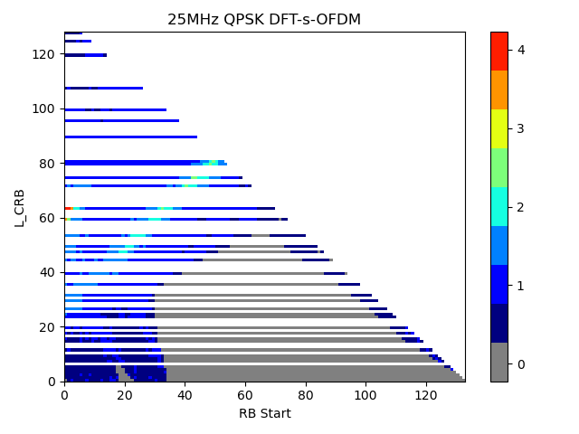{width="2.275in" height="2.1930555555555555in"}

When all spherical coverage grid points are sampled with 0°≤θ≤180° and
0°≤φ≤360°, the DL directions perceived by the UE from the various probes
are plotted in Table 5.3.1-2. Clearly, these results show vastly
different results.

\- For the probe aligned with the *z* axis, the perceived DL directions
match the test points.

\- For the probe aligned with the y axis, the DUT only perceives the DL
in a single plane only, i.e., the DUT's xy plane. This is due to the
turntable axis of the OTA positioner aligned with the y axis, i.e., the
turntable rotation merely changes the polarization but not the DL
direction with this probe. The roll motor, i.e., the rotation of the DUT
around its z axis, only adjusts the DL direction within the xy plane.

\- For the AoA2 probe aligned with the *x* axis, the DL directions are
perceived from different directions in (θ, φ) but limited to a single
hemisphere only.

The plots of the perceived DL directions from different, fixed probes
demonstrate the need to define the absolute probe locations/directions
for UE RF systems so that different test systems yield the same results
if the probes are placed arbitrarily and not within the *xz* plane.

Table 5.3.1-2: DL directions perceived by the DUT from probes in the
*x*, *y*, and *z* axes.

  Probe Along Direction   DL Directions perceived by DUT with constant-step size grid with 266 unique grid points (∆θ=∆φ=15°)   DL Directions perceived by DUT with constant density grid with 200 unique grid points
  ----------------------- ----------------------------------------------------------------------------------------------------- ---------------------------------------------------------------------------------------
  *z*                     {width="2.277083333333333in" height="2.1972222222222224in"}                   {width="2.277083333333333in" height="2.189583333333333in"}
  *y*                     {width="2.247916666666667in" height="2.189583333333333in"}                    {width="2.240972222222222in" height="2.189583333333333in"}
  *x*                     {width="2.2916666666666665in" height="2.175in"}                               {width="2.2993055555555557in" height="2.175in"}

When probes are aligned on the *xz* plane while meeting the required
relative angular offsets, absolute probe locations are no longer
required for multi-Rx chain DL reception testing.

The effect of the 2 AoA DL polarizations perceived by the UE using
orientation vectors will be demonstrated next; additional details
regarding the orientation vectors can be found in Clause 5.3.5. The
AoA1-AoA2 DL orientation vectors are the vectors between the DL
orientations perceived by the UE from AoA1 to AoA2 and are visualized by
plotting the AoA1 DL directions on a sphere with the black sphere while
the direction towards the corresponding offset AoA2 DL direction is
visualized with a single arrow (the length of the arrow corresponds to
the value of the offset), e.g.,

{width="2.2625in"
height="2.185416666666667in"}

Three different probe placement examples with probes on the *xz* plane
are used next together with a 15° grid spacing. In the first example, a
sample 4-probe system supporting {30°, 60°, 90°, 120°, and 150°}
relative angular offsets is used as shown in Figure 5.3.1-3.

{width="6.208333333333333in"
height="3.6555555555555554in"}

Figure 5.3.1-3: Example system implementation with P0 placed at θ=0°

In the second example, as illustrated in Figure 5.3.1-4, the P0 probe is
no longer aligned with the *z* axis but rotated by 30° towards the -*x*
axis.

{width="5.226076115485564in" height="3.0in"}

Figure 5.3.1-4: Example system implementation with P0 placed at θ=-30°

In the third example, the AoA1&AoA2 probes are placed so that they are
symmetric to the *z* axis as illustrated in Figure 5.3.1-5.

{width="2.5019619422572177in"
height="1.9in"}{width="2.172195975503062in"
height="1.9in"}{width="1.9262751531058617in"
height="1.9in"}

Figure 5.3.1-5: Example system implementation with probes symmetric to
the z axis: left: P0 & P60, centre: P0 & P120, right: P0 & P150.

The AoA1-AoA2 DL orientation vectors for the two system/probe
configurations are further illustrated in Table 5.3.1-3. Clearly, the
vectors are all aligned, i.e., absolute probe locations are not
necessary as long as the probes are placed on the *xz* plane.

Table 5.3.1-3: Vectors of DL orientations between AoA1 (P0) and AoA2
from three different system configurations with AoA2 to AoA1 probe
offsets of 60°, 120°, and 150° with a constant-step size grid with
∆θ=∆φ=15°). F**ull rotation in** θ **and half rotation in** φ. 

                                               Probes in the *xz* plane with P0 at θ=0°                                                                                                                Probes in the *xz* plane with P0 at θ=-30°                                                                                                              Probes in the *xz* plane symmetric to z axis
  -------------------------------------------- ------------------------------------------------------------------------------------------------------------------------------------------------------- ------------------------------------------------------------------------------------------------------------------------------------------------------- -------------------------------------------------------------------------------------------------------------------------------------------------------------------------------------------------------------------------------------------------------------------------------------------------------------
  **System Configuration**                     {width="3.0277777777777777in" height="1.7868055555555555in"}                                                                    {width="3.135645231846019in" height="1.8in"}                                                                                    {width="2.167836832895888in" height="1.8in"}{width="2.0578696412948383in" height="1.8in"}{width="1.824892825896763in" height="1.8in"}
  **Orientation between Probes P0 and P60**    {width="2.1695669291338584in" height="2.129615048118985in"}   {width="2.1695669291338584in" height="2.129615048118985in"}   {width="2.1895417760279967in" height="2.1038571741032372in"}
  **Orientation between Probes P0 and P120**   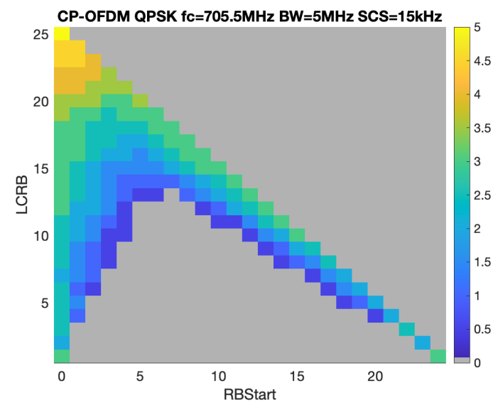{width="2.182801837270341in" height="2.1234634733158355in"}   {width="2.182801837270341in" height="2.1234634733158355in"}   {width="2.1830063429571305in" height="2.1101760717410323in"}
  **Orientation between Probes P0 and P150**   {width="2.189174321959755in" height="2.103904199475066in"}                                                                      {width="2.189174321959755in" height="2.103904199475066in"}                                                                      {width="2.1889293525809275in" height="2.1169181977252842in"}

### 5.3.2 Minimum and Maximum Angular Separation between Probes

Due to the finite size of the probes, the minimum angular separation
between probes will be limited to prevent collisions and thus prevent a
"full" degree of rotation freedom of one AoA unless probes are placed
back-to-back as illustrated in Figure 5.2.3-3 which on the other hand
introduces blocking effects.

The minimum angular separation between neighbouring reflectors is larger
than the minimum separation between two regular millimetre-wave probes
as illustrated in Figure 5.3.2-1. It is estimated that the minimum
angular separation between two IFF probes is about 30° while the minimum
angular separation between two DFF probes is about 5°.

Although DFF is one of the permitted methodologies for FR2 OTA testing
\[10\], IFF is the de-facto reference methodology for FR2 OTA
measurements. To enable the applicability of IFF to multi-AoA UE RF
testing \[3, 12\], the largest minimum angular separation of DFF and IFF
must be selected, i.e., the minimum angular separation between probes
must be 30°.

{width="3.0in" height="4.040436351706036in"}

Figure 5.3.2-1: Illustration of minimum angular separations between IFF
(top) and DFF probes.

The maximum angular separation between probes could be as large as 180°.
However, this angular separation would result in significant blocking
between one AoA probe and the DUT positioner, as illustrated in Figure
5.3.2-2, and the line-of-sight path between both probes also introduce a
significant amount of coupling. It was therefore suggested to limit the
maximum angular separation between probes/AoAs to 150° (blue
reflector/probe in Figure 5.3.2-2).

{width="6.695138888888889in"
height="3.5083333333333333in"}

Figure 5.3.2-2: Illustration of maximum proposed angular separation
including blocking for angular separation of 180°.

Additionally, placing two reflectors opposite to each other will yield
higher variations in field/power measurements within the QZ caused by
reflections from one reflector facing another head on. As illustrated in
Figure 5.3.2-3, the two dark grey reflectors with 180° separation
illuminate each other with plane waves, i.e., without much attenuation;
scattering from the metal surfaces including edges of the reflector will
thus reflect energy back towards the source probe. On the other hand,
the cross coupling between the reflector at 0° and the red or blue
reflectors is minimized as they are not in each other's direct path. It
was argued that the cross coupling between the two opposing reflectors
should be insignificant given the large separation and thus large path
losses. However, the reflectors are in each other's collimated beam's
path, i.e., signal from the right reflector arriving at the left
reflector should not have experienced much of an attenuation when
compared to the signal at the QZ.

It should furthermore be highlighted that 2 AoA RRM systems currently
limit the maximum separation between probes to 150° \[12\], specifically
Table A.3.15.3-1.

Requiring a 180° separation for multi-AoA Rx testing would therefore not
allow a re-use of existing 2 AoA RRM systems as they would not be able
to support the larger separation.

{width="6.695138888888889in"
height="2.477777777777778in"}

Figure 5.3.2-3: Illustration of maximum proposed angular separation
including blocking for angular separation of 180°.

### 5.3.3 Impact of Probe Locations and 3D Scans on DL Directions

A full 3D scan, typically required for beam peak searches, spherical
coverage test cases and TRP measurements, can be performed in various
ways as illustrated in Table 5.3.3-1. Here, a single-probe,
combined-axes OTA system with the probe aligned in the *z* direction is
shown with two different methodologies to achieve a full 3D UE
rotation/scan:

\- full rotation in φ (around *z* axis) and half rotation in θ (around
*y* axis) as shown in left column

\- full rotation in θ (around *y* axis) and half rotation in φ (around
*z* axis) as shown in right column

As shown in the table for the constant-step size grid with 312 grid
points (∆θ=∆φ=15°, 266 of which are unique due to the redundant points
at the poles) on top or the constant-density grid with 200 grid points
on the bottom, either approach will yield the same test point coverage.

Table 5.3.3-1: 3D scan implementations and resulting coverage using
single-probe system

                                                                                     Single-probe system configuration with 3D scan using full rotation in φ and half rotation in θ   Single-probe system configuration with 3D scan using full rotation in θ and half rotation in φ
  ---------------------------------------------------------------------------------- ------------------------------------------------------------------------------------------------ ------------------------------------------------------------------------------------------------
  System Configuration                                                               {width="2.5in" height="2.2143667979002624in"}                           {width="2.6in" height="2.2520877077865267in"}
  Constant-Step Size Grid with 312 grid points (∆θ=∆φ=15°); 266 unique grid points   {width="2.238830927384077in" height="2.1505336832895887in"}             
  Constant Density Grid with 200 grid points                                         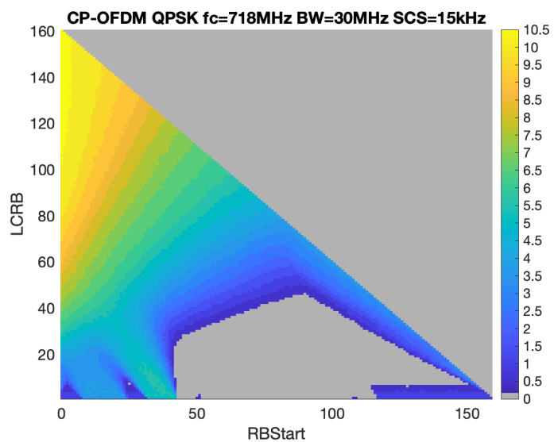{width="2.234517716535433in" height="2.150977690288714in"}              

It was agreed to define absolute probe locations as different 2D planes
containing the various AoA probes were shown to have vastly different
effects on the perceived DL directions by the UE, see Clause 5.3.1. For
simplicity, sample test systems with just 4 total probes (1 AoA1 probe
and 3 AoA2 probes) are considered next. Here, the AoA2 probes are
displaced by 60° (P60), 120° (P120), and 150° (P150) from the AoA1 probe
placed along the *z* direction (P0). As illustrated in Table 5.3.3-2,
one system configuration has the AoA2 probes aligned in the *xz* plane
(left), and another system configuration has the AoA2 probes aligned in
the *yz* plane (right). Aside from studying the effect of different
probe locations on the perceived DL directions, the two different 3D
approaches are investigated as well, i.e., by rotating the device a full
turn in φ (rotation axis *z*) and a half turn in θ (rotation axis *y*)
as shown the top of Table 5.3.3-2 and alternatively, a full turn in θ
(rotation axis *y*) and a half turn in φ (rotation axis *z*) as shown
the bottom of Table 5.3.3-2.

The following analyses for constant step-size grids take into account
that multiple measurements at the pole for P0 are performed; while these
measurements yield unique DL directions for P0, they translate to
non-unique DL directions for P60, P120, and P150.

Table 5.3.3-2: System configurations with probes in the *xz* plane
(left) and *yz* plane (right). 3D scan performed with full rotation in φ
and half rotation in θ (top) and with full rotation in θ and half
rotation in φ (bottom)

                                                       Probes in the *xz* plane                                                 Probes in the *yz* plane
  ---------------------------------------------------- ------------------------------------------------------------------------ -----------------------------------------------------------------------
  3D Scan: full rotation in φ and half rotation in θ   {width="3.4in" height="2.1482906824146983in"}   {width="3.1in" height="2.956945538057743in"}
  3D Scan: full rotation in θ and half rotation in φ   {width="3.4in" height="2.14417104111986in"}     {width="3.1in" height="2.956945538057743in"}

The system configurations with full rotation in φ and half rotation in θ
and the perceived DL directions are further illustrated in Table 5.3.3-3
for a constant-step size grid with 312 grid points and in Table 5.3.3-4
for a constant density grid with 200 grid points. Similarly, the system
configurations with full rotation in θ and half rotation in φ and the
perceived DL directions are further illustrated in Table 5.3.3-5 for a
constant-step size grid with 312 grid points and in Table 5.3.3-6 for a
constant density grid with 200 grid points. The following observations
can be made from these results:

\- Probes aligned in the *yz* plane introduce large keep-out areas for
the angular coverage/DL directions towards each pole.

\- With full rotation in φ and half rotation in θ, probes aligned in the
*xz* plane introduce a conical sector towards the pole at θ=0° with no
angular coverage/DL directions for offset probes.

\- Constant density grids do not maintain the constant density
coverage/DL direction distribution for probes offset from P0, a higher
density of DL directions is observed especially near the poles.

\- When probes are aligned in the *xz* plane, constant-step size grids
maintain the constant-step size distribution of DL directions for probes
offset from P0.

\- Probes aligned in the *xz* plane generally provide a wider angular
coverage for AoA2 DL directions when compared to probes aligned in the
*yz* plane.

\- With full rotation in θ and half rotation in φ and probes aligned in
the *xz* plane, the AoA2 DL directions are distributed in 3D without a
conical region with lack of coverage.

\- Only with full rotation in θ and half rotation in φ, probes aligned
in the *xz* plane, and constant-step size grids, uniform angular
coverage/DL directions is achieved, i.e., the distribution of DL
directions for all probes on the *xz* plane match the distribution of
grid points.

Based on the observations made in this section, the following decisions
were made:

\- For optimized AoA1 and AoA2 test point/perceived DL direction
coverage, apply a full rotation in θ and a half rotation in φ.

\- For optimized AoA1 and AoA2 test point/perceived DL direction
coverage, utilize constant-step size grids only.

\- For optimized AoA1 and AoA2 test point/perceived DL direction
coverage, place the AoA2 probes in the *xz* plane

Table 5.3.3-3: DL directions perceived by the DUT from two different
system configurations with AoA2 to AoA1 probe offsets of 60°, 120°, and
150° with a constant-step size grid using 312 grid points (∆θ=∆φ=15°).
**Full rotation in φ and half rotation in θ.**

                                                                        Probes in the *xz* plane                                                 Probes in the *yz* plane
  --------------------------------------------------------------------- ------------------------------------------------------------------------ ------------------------------------------------------------------------
  System Configuration with full rotation in φ and half rotation in θ   {width="3.4in" height="2.150485564304462in"}    {width="3.0in" height="2.8584208223972003in"}
  DL Directions perceived by DUT from Probe P60                         {width="2.9in" height="2.7741097987751533in"}   {width="2.9in" height="2.8222528433945757in"}
  DL Directions perceived by DUT from Probe P120                        {width="2.9in" height="2.783728127734033in"}    {width="2.9in" height="2.838186789151356in"}
  DL Directions perceived by DUT from Probe P150                        {width="2.9in" height="2.7762893700787403in"}   {width="2.9in" height="2.8127930883639545in"}

Table 5.3.3-4: DL directions perceived by the DUT from two different
system configurations with AoA2 to AoA1 probe offsets of 60°, 120°, and
150° with a constant density grid using 200 grid points. F**ull rotation
in φ and half rotation in θ. Full rotation in φ and half rotation in
θ.**

                                                                        Probes in the *xz* plane                                                 Probes in the *yz* plane
  --------------------------------------------------------------------- ------------------------------------------------------------------------ ------------------------------------------------------------------------
  System Configuration with full rotation in φ and half rotation in θ   {width="3.4in" height="2.150485564304462in"}    {width="3.0in" height="2.8584208223972003in"}
  DL Directions perceived by DUT from Probe P60                         {width="2.9in" height="2.7997998687664043in"}   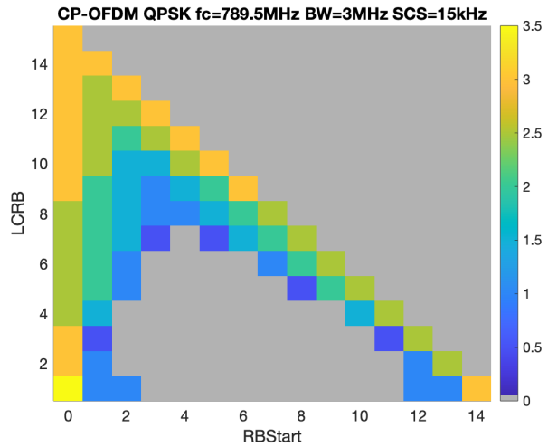{width="2.9in" height="2.867428915135608in"}
  DL Directions perceived by DUT from Probe P120                        {width="2.9in" height="2.773043525809274in"}    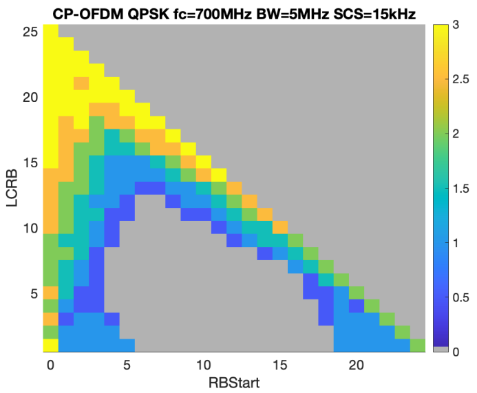{width="2.9in" height="2.839372265966754in"}
  DL Directions perceived by DUT from Probe P150                        {width="2.9in" height="2.8414359142607175in"}   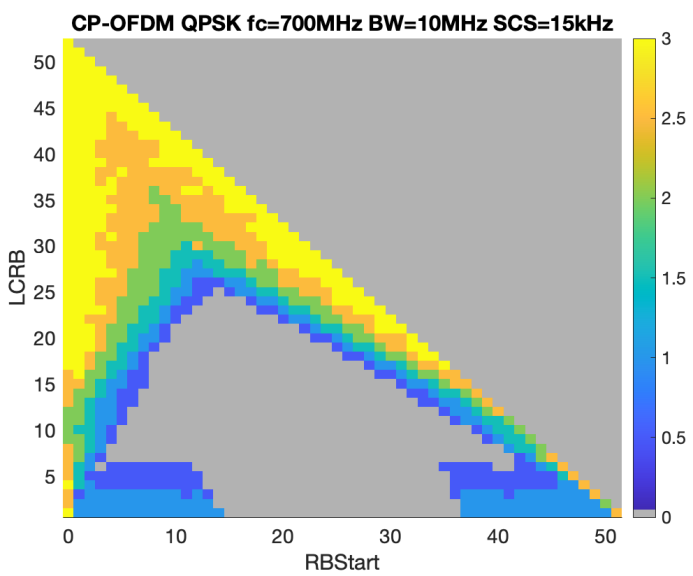{width="2.9in" height="2.8744805336832897in"}

Table 5.3.3-5: DL directions perceived by the DUT from two different
system configurations with AoA2 to AoA1 probe offsets of 60°, 120°, and
150° with a constant-step size grid using 312 grid points (∆θ=∆φ=15°).
F**ull rotation in** θ **and half rotation in** φ. 

                                                                        Probes in the *xz* plane                                                  Probes in the *yz* plane
  --------------------------------------------------------------------- ------------------------------------------------------------------------- ------------------------------------------------------------------------
  System Configuration with full rotation in θ and half rotation in φ   s{width="3.4in" height="2.1463648293963256in"}   {width="3.0in" height="2.858421916010499in"}
  DL Directions perceived by DUT from Probe P60                         {width="2.9in" height="2.8032534995625547in"}    {width="2.9in" height="2.7995516185476816in"}
  DL Directions perceived by DUT from Probe P120                        {width="2.9in" height="2.786233595800525in"}     {width="2.9in" height="2.8172003499562557in"}
  DL Directions perceived by DUT from Probe P150                        {width="2.9in" height="2.8083464566929135in"}    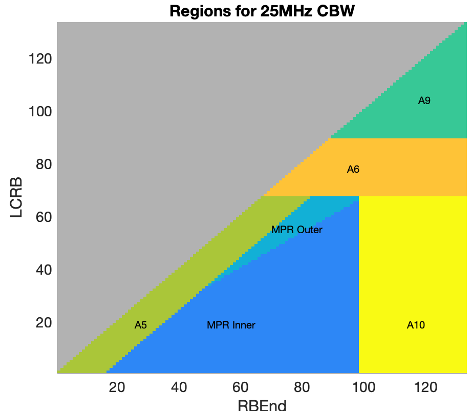{width="2.9in" height="2.851107830271216in"}

Table 5.3.3-6: DL directions perceived by the DUT from two different
system configurations with AoA2 to AoA1 probe offsets of 60°, 120°, and
150° with a constant density grid using 200 grid points. F**ull rotation
in** θ **and half rotation in** φ. 

                                                                        Probes in the *xz* plane                                                 Probes in the *yz* plane
  --------------------------------------------------------------------- ------------------------------------------------------------------------ ------------------------------------------------------------------------
  System Configuration with full rotation in θ and half rotation in φ   {width="3.4in" height="2.1463648293963256in"}   {width="3.0in" height="2.858421916010499in"}
  DL Directions perceived by DUT from Probe P60                         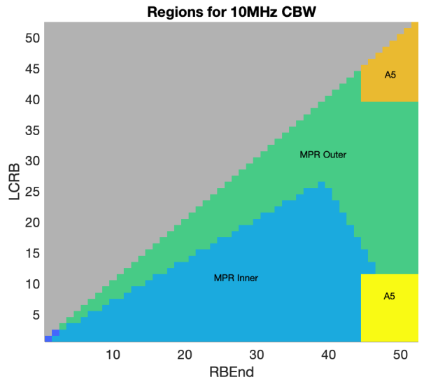{width="2.9in" height="2.7892946194225723in"}   {width="2.9in" height="2.8022714348206472in"}
  DL Directions perceived by DUT from Probe P120                        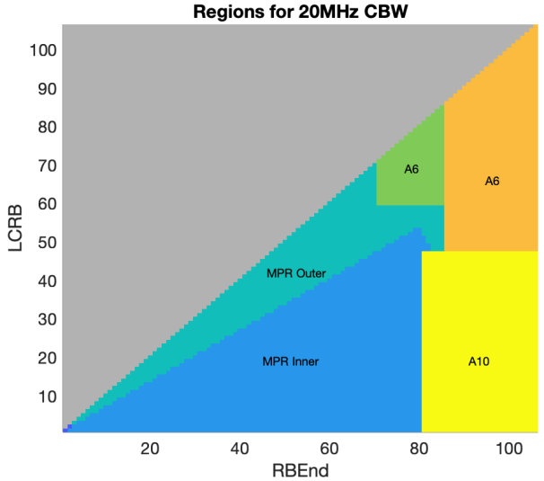{width="2.9in" height="2.7725437445319336in"}   {width="2.9in" height="2.8179221347331582in"}
  DL Directions perceived by DUT from Probe P150                        {width="2.9in" height="2.806961942257218in"}    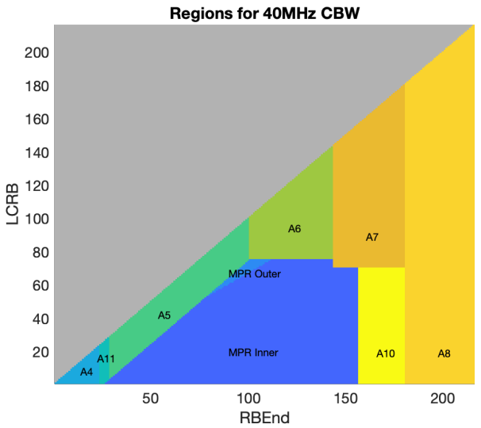{width="2.9in" height="2.7941043307086613in"}

### 5.3.4 DL Polarizations Perceived by the UE

The DL polarizations perceived by the UE from various probes placed in
different locations and 2D planes is investigated in this section. For
better visualization purposes, a coarse measurement grid with 84 grid
points for the constant-step size grid (∆θ=∆φ=30°) and 50 grid points
for the constant density grid is considered.

The DL directions and polarizations perceived by the DUT for a sample
system with the AoA1 probe in the *z* direction and AoA2 probes in the
*x* and *y* directions are presented in Table 5.3.4-1 for just the
constant-step size grid. The magenta arrows demonstrate the θ
polarization while the orange arrows demonstrate the φ polarization with
respect to the probe antenna/system coordinate system. Clearly, for the
probes placed in the *z* and *x* directions, the DL polarizations w.r.t.
the DUT coordinate system are preserved, i.e., the probe antenna DL θ/φ
polarization matches the DUT θ/φ polarization. However, for the probe
along the *y* axis, the DL polarization perceived by the DUT changes
depending on grid point. Similar observations can be made for a system
configuration with multiple AoA2 probes placed on the *xz* and the *yz*
planes. The system configurations with full rotation in φ and half
rotation in θ and the perceived DL directions are further illustrated in
Table 5.3.4-2 for the constant-step size grid and in Table 5.3.4-3 for
the constant density grid. Similarly, the system configurations with
full rotation in θ and half rotation in φ and the perceived DL
directions are further illustrated in Table 5.3.4-4 for the
constant-step size grid and in Table 5.3.4-5 for the constant density
grid.

These results again show that the probe antenna DL θ/φ-polarizations
from AoA2 probes (w.r.t. the system coordinate system) are preserved
only when the AoA2 probes are placed in the *xz* plane, i.e., antenna DL
θ/φ polarizations map to DUT θ/φ polarizations, while this is no longer
the case for AoA2 probes are placed in the *yz* plane, i.e., probe
antenna DL θ/φ polarizations generally map to a combination of DUT θ/φ
polarizations.

Table 5.3.4-1: DL direction and polarizations perceived by the DUT from
probes in the *x*, *y*, and *z* axes.

                                                                          DL Directions perceived by DUT with constant-step size grid with 84 grid points (∆θ=∆φ=30°). Full rotation in φ and half rotation in θ.   DL Directions perceived by DUT with constant-step size grid with 84 grid points (∆θ=∆φ=30°). Full rotation in θ and half rotation in φ.
  ----------------------------------------------------------------------- ----------------------------------------------------------------------------------------------------------------------------------------- -----------------------------------------------------------------------------------------------------------------------------------------
  System Configuration                                                    {width="2.352732939632546in" height="3.0in"}                                                                     {width="2.389354768153981in" height="3.0in"}
  DL Directions and Polarizations perceived by DUT from Probe along *z*   {width="2.585741469816273in" height="2.5in"}                                                                     {width="2.586674321959755in" height="2.5in"}
  DL Directions and Polarizations perceived by DUT from Probe along *y*   {width="2.585741469816273in" height="2.5in"}                                                                     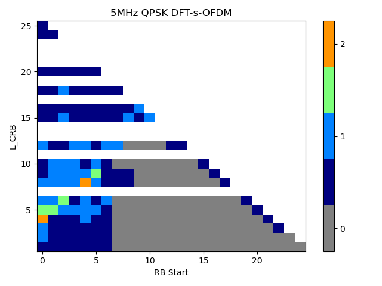{width="2.596583552055993in" height="2.5in"}
  DL Directions and Polarizations perceived by DUT from Probe along *x*   {width="2.585741469816273in" height="2.5in"}                                                                     {width="2.5866732283464566in" height="2.5in"}

Table 5.3.4-2: DL direction perceived by the DUT from two different
system configurations with AoA2 to AoA1 probe offsets of 60°, 120°, and
150° with a constant-step size spherical coverage grid using 84 grid
points (∆θ=∆φ=30°). **Full rotation in φ and half rotation in θ.**

                                                                        Probes in the *xz* plane                                                 Probes in the *yz* plane
  --------------------------------------------------------------------- ------------------------------------------------------------------------ ------------------------------------------------------------------------
  System Configuration with full rotation in φ and half rotation in θ   {width="3.3in" height="2.087551399825022in"}    {width="3.0in" height="2.86155949256343in"}
  DL Directions perceived by DUT from Probe P60                         {width="2.5866732283464566in" height="2.5in"}   {width="2.572761373578303in" height="2.5in"}
  DL Directions perceived by DUT from Probe P120                        {width="2.5866732283464566in" height="2.5in"}   {width="2.5678871391076115in" height="2.5in"}
  DL Directions perceived by DUT from Probe P150                        {width="2.5866732283464566in" height="2.5in"}   {width="2.595238407699038in" height="2.5in"}

Table 5.3.4-3: DL directions and polarizations perceived by the DUT from
two different system configurations with AoA2 to AoA1 probe offsets of
60°, 120°, and 150° with a constant density spherical coverage grid
using 50 grid points. F**ull rotation in φ and half rotation in θ. Full
rotation in φ and half rotation in θ.**

                                                                        Probes in the *xz* plane                                                 Probes in the *yz* plane
  --------------------------------------------------------------------- ------------------------------------------------------------------------ ------------------------------------------------------------------------
  System Configuration with full rotation in φ and half rotation in θ   {width="3.3in" height="2.087551399825022in"}    {width="3.0in" height="2.86155949256343in"}
  DL Directions perceived by DUT from Probe P60                         {width="2.622821522309711in" height="2.5in"}    {width="2.5726246719160106in" height="2.5in"}
  DL Directions perceived by DUT from Probe P120                        {width="2.6053641732283466in" height="2.5in"}   {width="2.563031496062992in" height="2.5in"}
  DL Directions perceived by DUT from Probe P150                        {width="2.5857458442694665in" height="2.5in"}   {width="2.5775076552930885in" height="2.5in"}

Table 5.3.4-4: DL directions and polarizations perceived by the DUT from
two different system configurations with AoA2 to AoA1 probe offsets of
60°, 120°, and 150° with a constant-step size spherical coverage grid
using 84 grid points (∆θ=∆φ=30°). F**ull rotation in** θ **and half
rotation in** φ. 

                                                                        Probes in the *xz* plane                                                 Probes in the *yz* plane
  --------------------------------------------------------------------- ------------------------------------------------------------------------ ------------------------------------------------------------------------
  System Configuration with full rotation in θ and half rotation in φ   {width="3.2in" height="2.0184765966754155in"}   {width="3.0in" height="2.86155949256343in"}
  DL Directions perceived by DUT from Probe P60                         {width="2.5866732283464566in" height="2.5in"}   {width="2.5678871391076115in" height="2.5in"}
  DL Directions perceived by DUT from Probe P120                        {width="2.5866732283464566in" height="2.5in"}   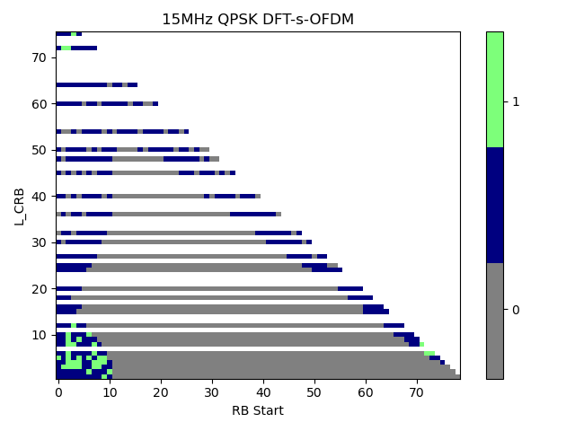{width="2.5678871391076115in" height="2.5in"}
  DL Directions perceived by DUT from Probe P150                        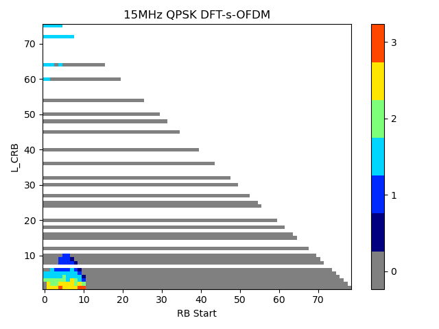{width="2.5866732283464566in" height="2.5in"}   {width="2.581746500437445in" height="2.5in"}

Table 5.3.4-5: DL directions and polarizations perceived by the DUT from
two different system configurations with AoA2 to AoA1 probe offsets of
60°, 120°, and 150° with a constant density spherical coverage grid
using 50 grid points. F**ull rotation in** θ **and half rotation in**
φ. 

                                                                        Probes in the *xz* plane                                                 Probes in the *yz* plane
  --------------------------------------------------------------------- ------------------------------------------------------------------------ ------------------------------------------------------------------------
  System Configuration with full rotation in θ and half rotation in φ   {width="3.2in" height="2.0184765966754155in"}   {width="3.0in" height="2.86155949256343in"}
  DL Directions perceived by DUT from Probe P60                         {width="2.622821522309711in" height="2.5in"}    {width="2.563031496062992in" height="2.5in"}
  DL Directions perceived by DUT from Probe P120                        {width="2.6053641732283466in" height="2.5in"}   {width="2.5776541994750657in" height="2.5in"}
  DL Directions perceived by DUT from Probe P150                        {width="2.5857458442694665in" height="2.5in"}   {width="2.5775076552930885in" height="2.5in"}

### 5.3.5 AoA1-AoA2 DL Orientation Vectors

The relative orientation between the P0 and the three offset probes,
i.e., P60, P120, and P150, are investigated further here. For better
visualization purposes, a coarse measurement grid with 84 grid points
for the constant-step size grid (∆θ=∆φ=30°) and 50 grid points for the
constant density grid is considered. Given the clear advantages of the
3D measurement scan using a full rotation in θ and half rotation in φ
for multi-AoA testing, only this approach is further considered here.

The AoA1-AoA2 DL orientation vectors, i.e., the vectors between the DL
orientation perceived by the UE from AoA1 to AoA2, are visualized in
Table 5.3.5-1 for the constant step-size grid and in Table 5.3.5-2 for
the constant-density grid. The vectors are illustrated in two different
ways. In the figures on the left, e.g.,

{width="2.265972222222222in"
height="2.192361111111111in"}

the AoA1 DL directions are plotted on top of the sphere with the black
marker while the AoA2 DL directions are plotted slightly elevated from
the sphere for clarity. The corresponding AoA1 & AoA2 pairs received by
the UE are connected with arrows (pointing from AoA1 to AoA2) with the
arrows plotted in random colours to support better differentiation. In
the figures on the right, e.g.,

{width="2.2625in" height="2.185416666666667in"}

only the AoA1 DL directions are plotted on top of the sphere with the
black marker while the direction towards the corresponding offset AoA2
DL direction is visualized with the single arrow (the length of the
arrow corresponds to the value of the offset).

The following observations can be drawn from these figures:

\- With probes aligned in the *xz* axis, the AoA1-AoA2 DL orientation
vectors point towards the pole at θ=180° for DL directions perceived
from *y*≥0 while the AoA1-AoA2 DL orientation vectors point towards the
pole at θ=0° for DL directions perceived from *y*≤0

\- With probes aligned in the *yz* axis, the AoA1-AoA2 DL orientation
vectors point towards positive φ for DL directions perceived from *y*≥0
while the AoA1-AoA2 DL orientation vectors point towards negative φ for
DL directions perceived from *y*≤0.

It was agreed that the directionality of the AoA1-AoA2 DL orientation
vectors matters. For simulations, testing both +AoA offset and --AoA
offset for each test point was considered the starting point. The
intention is to accommodate the impact from directionality of the
AoA1-AoA2 DL orientation vectors, i.e., to ensure no testing bias is
introduced or whether it needs to be compensated somehow.

Table 5.3.5-1: Vectors of DL orientations between AoA1 (P0) and AoA2
from two different system configurations with AoA2 to AoA1 probe offsets
of 60°, 120°, and 150° with a constant-step size grid using 84 grid
points (∆θ=∆φ=30°). F**ull rotation in** θ **and half rotation in** φ. 

                                                                        Probes in the *xz* plane                                                                                                                                      Probes in the *yz* plane
  --------------------------------------------------------------------- ------------------------------------------------------------------------------------------------------------------------------------------------------------- --------------------------------------------------------------------------------------------------------------------------------------------------------------
  System Configuration with full rotation in θ and half rotation in φ   {width="3.7in" height="2.335751312335958in"}                                                                                         {width="3.3in" height="3.144265091863517in"}
  Orientation between Probes P0 and P60                                 {width="2.265972222222222in" height="2.192361111111111in"}{width="2.2625in" height="2.185416666666667in"}    {width="2.1680555555555556in" height="2.216666666666667in"}{width="2.2625in" height="2.185416666666667in"}
  Orientation between Probes P0 and P120                                {width="2.265972222222222in" height="2.192361111111111in"}{width="2.2625in" height="2.185416666666667in"}   {width="2.1680555555555556in" height="2.216666666666667in"}{width="2.2625in" height="2.185416666666667in"}
  Orientation between Probes P0 and P150                                {width="2.265972222222222in" height="2.192361111111111in"}{width="2.2625in" height="2.185416666666667in"}   {width="2.1680555555555556in" height="2.20625in"}{width="2.2625in" height="2.185416666666667in"}

Table 5.3.5-2: Vectors of DL orientations between AoA1 (P0) and AoA2
from two different system configurations with AoA2 to AoA1 probe offsets
of 60°, 120°, and 150° with a constant density grid using 50 grid
points. F**ull rotation in** θ **and half rotation in** φ. 

                                                                        Probes in the *xz* plane                                                                                                                                                    Probes in the *yz* plane
  --------------------------------------------------------------------- --------------------------------------------------------------------------------------------------------------------------------------------------------------------------- ---------------------------------------------------------------------------------------------------------------------------------------------------------------------------
  System Configuration with full rotation in θ and half rotation in φ   {width="3.7in" height="2.335751312335958in"}                                                                                                       {width="3.3in" height="3.144265091863517in"}
  Orientation between Probes P0 and P60                                 {width="2.2in" height="2.067167541557305in"}{width="2.2in" height="2.115384951881015in"}                                  {width="2.186111111111111in" height="2.222916666666667in"}{width="2.2930555555555556in" height="2.204861111111111in"}
  Orientation between Probes P0 and P120                                {width="2.2743055555555554in" height="2.1118055555555557in"}{width="2.2930555555555556in" height="2.204861111111111in"}   {width="2.186111111111111in" height="2.2090277777777776in"}{width="2.2930555555555556in" height="2.204861111111111in"}
  Orientation between Probes P0 and P150                                {width="2.2881944444444446in" height="2.222916666666667in"}{width="2.2930555555555556in" height="2.204861111111111in"}    {width="2.1909722222222223in" height="2.2090277777777776in"}{width="2.2930555555555556in" height="2.204861111111111in"}

### 5.3.6 Far-field criteria

The Far-field criteria defined for the DFF UE RF test method described
in clause 5.2.1.2 of \[3\] can be reused for the DFF-based measurement
setup.

The Far-field criteria defined for the IFF UE RF test method described
in clause 5.2.3.2 of \[3\] can be reused for the IFF-based measurement
setup.

5.4 Calibration Measurement Procedure
-------------------------------------

### 5.4.1 Direct far field (DFF)

The calibration measurement per DFF probe is done by using a reference
calibration antenna with known gain values. For the calibration
measurement, the reference antenna is placed in the centre of the quiet
zone. If an antenna with moving phase centre is used, a multi-segmented
approach could be chosen where for multiple frequency segments the
respective phase centre of the calibration antenna is placed in the
centre of quiet zone. The calibration process determines the composite
loss, L~path,pol~, of the entire transmission and receiver chain path
gains (measurement antenna, amplification) and losses (switches,
combiners, cables, path loss, etc.). The calibration measurement is
repeated for each measurement path (two orthogonal polarizations and
each signal path). Additional details of the calibration procedure are
outlined in \[11\].

### 5.4.2 Indirect far field (IFF)

The calibration measurement per IFF probe is done by using a reference
antenna (SGH used in Figure 5.2.2.1-1) with known efficiency or gain
values. In the calibration measurement the reference antenna is measured
in the same place as the DUT, and the attenuation of the complete
transmission path (C↔A, as in Figure 5.2.2.1-1) from the DUT to the
measurement receiver (EIRP), and from the RF source to DUT (EIS) is
calibrated out. Figure 5.2.2.1-1 presents a setup of a typical compact
antenna test range for EIRP calibration per IFF probe:

{width="4.215277777777778in"
height="3.5277777777777777in"}

Figure 5.4.2-1. IFF/CATR calibration system setup per AoA for EIRP

5.5 Test procedure
------------------

The performance of simultaneous multi-Rx chain DL reception is measured
by sampling the go/no-go result of the DUT with three-dimensional scan
at various locations surrounding the device. The measurement is
performed with a constant sampling step of 15 degree in both theta (θ)
and phi (φ) axes.

The measurement procedure of the performance of simultaneous multi-Rx
chain DL reception is illustrated in Figure 5.5-1.

{width="6.054166666666666in"
height="9.354166666666666in"}

Figure 5.5-1: Illustration of the test procedure of simultaneous
multi-Rx chain DL reception

6 UE RRM testing methodology for multi-Rx chain DL reception
============================================================

6.1 General
-----------

This clause describes the UE RRM testing methodology for multi-Rx chain
DL reception for FR2. The principle of selecting measurement setup for
UE RRM testing is to reuse measurement setup for UE RF testing as much
as possible to reduce the test system complexity and test cost.

Considering system complexity and feasibility, chamber footprint,
upgradeabilisty of existing system, the measurement setup supporting
Category 1 and Option 2 of Category 2 is selected as the baseline in
Rel-18.

The details of OTA test environments including side conditions are to be
discussed in the corresponding work item that may have impact to the
core requirements.

6.2 Measurement setup 
---------------------

### 6.2.1 Baseline measurement setup

#### 6.2.1.1 Test scenarios

The test scenarios of UE RRM testing for multi-Rx chain DL reception can
be divided into two categories depending on whether dual DCI
simultaneously switching needs to be supported by measurement setup or
not:

\- Category 1: All the RRM test cases expect Dual TCI switching

\- Category 2: Dual TCI switching test case

#### 6.2.1.2 Measurement setup for Category 1 scenario

The baseline measurement setup for Category 1 scenario is implemented
based on the legacy 2AoA RRM setup specified in section 6 of \[3\]. An
example measurement setup of multi-Rx chain DL reception RRM test case
for Category 1 scenario is illustrated in Figure 6.2.1-1.

{width="3.9138888888888888in"
height="2.2069444444444444in"}

Figure 6.2.1-1: Example measurement setup for Category 1 scenario.

{width="5.009722222222222in"
height="3.1555555555555554in"}

Figure 6.2.1-2: Example of Time and Frequency multiplexed downlink
transmission for Category 1 scenario

As illustrated in Figure 6.2.1-2, PDCCH/PDSCH from two AoAs transmit in
the FDM manner. PBCH measurement is based on TDM manner. For CSI-RS, the
measurements could be based on TDM/FDM/CDM.

#### 6.2.1.3 Measurement setup for Category 2 scenario

Dual TCI switching is the key test case in multi-Rx chain DL reception
RRM testing. To verify the performance of Dual TCI switching, the
following 4 options were discussed:

\- Option 1: Dual TCI switches simultaneously, probe number for multiple
AoA test system is at least 4

{width="4.436805555555556in"
height="2.2291666666666665in"}

Figure 6.2.1-3: Example measurement setup for Option 1 of Category 2
scenario with 4 probes

For option 1, in the period of T1, DUT connects TCI state 0 and TCI
state 1 via probe\#1 and probe\#2 respectively. Then in the period of
T2, TCI state 0 switches to TCI state 3 via switching between probe\#1
and probe\#4, and in the meanwhile, TCI state 1 switches to TCI state 2
via switching between probe\#2 and probe\#3.

\- Option 2: Dual TCI switches from one probe to two probes
simultaneously, probe number for multiple AoA test system is at least 3

{width="3.74375in"
height="2.1010247156605426in"}

Figure 6.2.1-4: Example measurement setup for Option 2 of Category 2
scenario with 3 probes

{width="5.993055555555555in"
height="2.9097222222222223in"}

Figure 6.2.1-5: Example of Time and Frequency multiplexed downlink
transmission for Category 2 scenario with 3 probes

For Option 2, in the period of T1, DUT connects TCI state 0 via
Probe\#1. In the period of T2, DUT measures the SSBs from Probe\#2 and
Probe\#3 while keeping the connection from Probe 1. And then DUT
simultaneously switches from Probe\#1 to Probe\#2 and \#3.

An example measurement setup of multi-Rx chain DL reception RRM test
case for Category 2 scenario with 3 probes is illustrated in Figure
6.2.1-5. PDCCH/PDSCH from two AoAs transmit in the FDM manner. PBCH
measurement is based on TDM manner. For CSI-RS, the measurements could
be based on TDM/FDM/CDM.

For the testing with Option 2, the side conditions for the period T1 and
T1 are as follows. In the period of T1, the candidate test direction is
selected from legacy EIS spherical coverage. In the period of T2, the
candidate test directions (AoA pairs) are selected from multi-Rx
spherical coverage requirements defined in UE RF core requirements.

Note that Figure 6.2.1-4 and Figure 6.2.1-5 show an example test
procedure for Dual TCI switching. Other test procedures with at least 3
probes measurement setup are not precluded. The details of RRM test
cases are to be discussed in the corresponding work item.

\- Option 3: Dual TCI switches simultaneously, but the beam directions
are not changed, probe number for multiple AoA test system is at least 2

{width="3.7402777777777776in"
height="2.1069444444444443in"}

Figure 6.2.1-6: Example measurement setup for Option 3 of Category 2
scenario with 2 probes

For option 3, in the period of T1, DUT connects TCI state 0 and TCI
state 1 via Pol.H of probe\#1 and Pol.H of probe\#2, respectively. Then
in the period of T2, TCI state 0 switches to TCI state 3 via switching
between Pol.H and Pol.V of probe 1, and in the meanwhile, TCI state 1
switches to TCI state 2 via switching between Pol.H and Pol.V of probe
2. Note that in option 3, different SSB IDs are transmitted from two
polarizations in T1 and T2.

\- Option 4: Switching AoAs of the Rx beam from AoA1 to AoA2 or vice
versa during the TCI switching test. Probe number for multiple AoA test
system is at least 2.

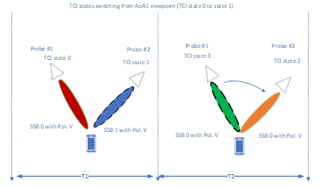{width="4.790972222222222in"
height="2.7291666666666665in"}

Figure 6.2.1-7 Example measurement setup for Option 4 of Category 2
scenario with 2 probes

For option 4, TCI state switching is based on SSB 0 to SSB 1. The test
could be carried out simultaneously or in series with the switching.

The pros and cons for 4 options are listed in Table 6.2.1-1.

Table 6.2.1-1: Pros and cons for 4 options

+------------+---------------------------+---------------------------+
|            | Pros                      | Cons                      |
+============+===========================+===========================+
| Option 1   | > \- The setup can fully  | > \- Test system will at  |
|            | > verify the performance  | > least support 4         |
|            | > of dual TCI switching.  | > physical probes.        |
|            |                           | >                         |
|            |                           | > \- Two of the same AoA  |
|            |                           | > offsets from RF session |
|            |                           | > is needed.              |
|            |                           | >                         |
|            |                           | > \- Reusing of existing  |
|            |                           | > test system is not      |
|            |                           | > possible                |
+------------+---------------------------+---------------------------+
| Option 2   | > \- The complexity of    | > \- The setup can        |
|            | > test system is lower,   | > partially verify the    |
|            | > e.g., 3 physical probes | > performance of dual TCI |
|            | > is needed.              | > switching.              |
|            | >                         |                           |
|            | > \- The test condition   |                           |
|            | > could follow AoA offset |                           |
|            | > from RF session.        |                           |
|            | >                         |                           |
|            | > \- Reusing the existing |                           |
|            | > is possible.            |                           |
+------------+---------------------------+---------------------------+
| Option 3/4 | > \- The complexity of    | > \- The setup cannot     |
|            | > test system is lowest,  | > verify the real         |
|            | > e.g., 2 physical probes | > performance of dual TCI |
|            | > is needed.              | > switching such as the   |
|            |                           | > beam directions are not |
|            |                           | > changed from T1 to T2.  |
|            |                           | >                         |
|            |                           | > \- This implies a       |
|            |                           | > perfect polarization    |
|            |                           | > alignment between DUT   |
|            |                           | > and TE in order to      |
|            |                           | > separate the beams,     |
|            |                           | > which is not feasible   |
|            |                           | > based on current test   |
|            |                           | > systems                 |
+------------+---------------------------+---------------------------+

*Considering system complexity and feasibility, chamber footprint,
upgradeability of existing system, the measurement setup for Option 2
with at least 3 probes is selected as the baseline in Rel-18.*

#### 6.2.1.4 Far-field criteria

For multi-Rx chain DL reception RRM baseline measurement setup based on
DFF:

\- The Far-field criteria defined for the DFF UE RF testing methodology
described in clause 5.3.6 can be applied.

For multi-Rx chain DL reception RRM baseline measurement setup based on
IFF:

\- The Far-field criteria defined for the IFF UE RF testing methodology
described in clause 5.3.6 can be applied.

#### 6.2.1.5 Calibration measurement procedure

The calibration measurement procedure defined for the DFF UE RF testing
methodology described in clause 5.4.1 can be applied for DFF based UE
RRM testing.

The calibration measurement procedure defined for the IFF UE RF testing
methodology described in clause 5.4.2 can be applied for IFF based UE
RRM testing.

#### 6.2.1.6 Reference point 

For baseline measurement setup based on DFF and IFF, the reference point
is located at the centre of the QZ. From the UE perspective the
reference point is the input of UE antenna array.

The following Modes for useful signals (S) and noise signals (N)
configuration have been identified and can be supported by the RRM test
method:

\- Mode 1 (SNR emulation): Test system transmits useful signals (S) and
noise signals (N) to emulate target SNR condition.

\- Mode 2 (noise-free transmission): Test system transmits only useful
signals (S).

The test cases in core specification TS 38.133 \[12\] will be specified
at the reference point, according to the following principles:

\- Mode 1

\- Specify absolute Noc level at the Reference point per angle of
arrival (AoA)

\- Noc level may have different value according to operating band and UE
power class

\- Mode 2

\- Specify SNR at the Reference point per angle of arrival (AoA)

\- SNR is a test-specific value

### 6.2.2 Test parameters

#### 6.2.2.1 Test parameters for Mode 1

For Mode 1, the SINR at baseband for multi-DCI with overlapping scheme
is given as follows:

${SINR1}_{\text{BB}} = \frac{S1*G1*Loss}{\left( S2 + N \right)G2*Loss + N*G1*Loss + Noise\_ floor}$*,
(6.2.2.1-1)*

where S1 and S2 are signal level from AoA1 and AoA2 respectively. G1 and
G2 are the antenna gain from AoA1 and AoA2 respectively. Loss is the
pathloss between probe and DUT. Noise\_floor is the total noise at DUT
baseband receiver. N is the artificial noise at the reference point from
AoA1 and AoA2. The artificial noise level is identical from AoA1 and
AoA22.

Since the wanted noise is set 6dB above UE thermal noise, therefore the
total noise of baseband Noise\_floor can be ignored when calculating the
SINR. And the SINR can be rewritten as:

${SINR1}_{\text{BB}} \approx \frac{S1*G1*Loss}{\left( S2 + N \right)G2*Loss + N*G1*Loss} = \frac{1}{\left( \frac{S2}{S1} + \frac{1}{\text{SNR}1} \right)*\frac{G2}{G1} + \frac{1}{\text{SNR}1}}$*,
(6.2.2.1-2)*

where SINR1 is the SINR from probe 1, and the key parameter affecting
the SINR at baseband is G1/G2.

Similarly, the SINR at baseband for multi-DCI with partially overlapping
scheme is given as:

$SINR1 \approx \frac{1}{\left( \frac{\text{\ α}*S2}{S1} + \frac{1}{SNR1} \right)*\frac{G2}{G1} + \frac{1}{SNR1}}$,
(*6.2.2.1-*3)

where α indicates the ratio of overlapping resources (0\<α\<1).

For multi-Rx with non-overlapping scheme, the interference between two
AoAs can be ignored. Then the test parameters for Mode 1 in the legacy
RRM test methodology specified in \[3\] can be reused.

#### 6.2.2.2 Test parameters for Mode 2

For Mode 2, the SINR at baseband for multi-DCI with overlapping scheme
is given as follows:

${SINR1}_{\text{BB}} = \frac{S1*G1*Loss}{S2*G2*Loss + Noise\_ floor}$*,
(6.2.2.2-1)*

where S1 and S2 are signal level from AoA1 and AoA2 respectively. G1 and
G2 are the antenna gain from AoA1 and AoA2 respectively. Loss is the
pathloss between probe and DUT. Noise\_floor is the total noise at DUT
baseband receiver.

If we set the signal level from interfering AoA direction at reference
point is 6dB higher than UE thermal noise, then the approximate SINR can
be rewritten as follows:

${SINR1}_{\text{BB}} \approx \frac{S1}{S2*G2/G1}$*. (6.2.2.2-2)*

Same as for Mode 1, and the key parameter affecting the SINR at baseband
is G1/G2.

Similarly, the SINR at baseband for multi-DCI with partially overlapping
scheme is given as follows:

${SINR1}_{\text{BB}} \approx \frac{S1}{\alpha*S2*\frac{G2}{G1}},\ \ \ \ \ \ $
(*6.2.2.2-*3)

where α indicates the ratio of overlapping resources (0\<α\<1).

For multi-Rx with non-overlapping scheme, the interference between two
AoAs can be ignored. Then the test parameters for Mode 2 in the legacy
RRM test methodology specified in \[3\] can be reused.

7 UE demodulation and CSI testing methodology for multi-Rx chain DL reception
=============================================================================

7.1 General
-----------

*This clause describes the UE Demodulation testing methodology for
multi-Rx chain DL reception for FR2. The 'virtual cable' approach is
adopted per each multi-Rx chain in which the setup is to be fixed with
the beamlock function. The framework for UE demodulation and CSI testing
for multi-Rx chain DL reception is shown in Figure 7.1-1.*

{width="5.615277777777778in"
height="1.6409722222222223in"}

Figure 7.1-1: The framework for UE demodulation and CSI\
testing for *multi-Rx chain DL reception*

7.2 Measurement setup
---------------------

### 7.2.1 Baseline measurement setup

#### 7.2.1.1 Reference point

Virtual cable setup is adopted for the baseline measurement setup, also
referred as wireless cable mode. The inverse channel matrix approach
based on RSRPB reporting was considered as one suitable approach to
improve isolation. The minimum isolation is defined in section 7.2.2.2.
An example of inverse channel approach is presented in Annex D.

For baseline measurement setup based on DFF and IFF, the reference point
is located at the centre of the QZ. From the UE perspective the
reference point is the input of UE antenna array.

#### 7.2.1.2 Far-field criteria

For multi-Rx chain DL reception demodulation baseline measurement setup
based on DFF:

\- The Far-field criteria defined for the DFF UE RF testing methodology
described in clause 5.3.6 can be applied.

For multi-Rx chain DL reception demodulation baseline measurement setup
based on IFF:

\- The Far-field criteria defined for the IFF UE RF testing methodology
described in clause 5.3.6 can be applied.

#### 7.2.1.3 Calibration measurement procedure

The calibration measurement procedure defined for the DFF UE RF testing
methodology described in clause 5.4.1 can be applied for DFF based UE
demodulation testing.

The calibration measurement procedure defined for the IFF UE RF testing
methodology described in clause 5.4.2 can be applied for IFF based UE
demodulation testing.

### 7.2.2 Test parameters

#### 7.2.2.1 Noc level configuration

Simulations for UE demodulation run at baseband with results expressed
as SNR~BB~.The SNR at the reference point is the SNR configured by test
equipment over-the-air expressed as SNR~RP~. The approach below is
applied:

\- Set wanted noise to give 1dB difference between Reference point SNR
and Baseband SNR, using agreed UE requirements, i.e., SNR~RP~ = SNR~BB~
+ 1dB

Noc level is set by the below equation for demodulation test on band Y:

Noc = REFSENS~PC3,\ band\ Y,\ 50MHz~ -10log~10~(SCS~REFSENS~ x
PRB~REFSENS~ x 12) - SNR~REFSENS~ + ∆~thermal~ + X, (7.2.2.1-1)

where

> \- REFSENS~PC3,\ band\ Y,\ 50MHz~ is the REFSENS value in dBm
> specified for Power Class 3 UE in band Y for 50MHz channel bandwidth
> in TS 38.101-2 Table 7.3.2.3-1*, \[dBm/Hz\]*
>
> \- SCS~REFSENS~ is a subcarrier spacing associated with N~RB~ for
> 50MHz in TS 38.101-2 Table 5.3.2-1, chosen as 120kHz.
>
> \- PRB~REFSENS~ is N~RB~ associated with subcarrier spacing 120kHz for
> 50MHz in TS 38.101-2 Table 5.3.2-1 and is 32.
>
> \- 12 is the number of subcarriers in a PRB
>
> \- SNR~REFSENS~ = -1 dB is the SNR used for simulation of REFSENS
>
> \- ∆~thermal~ is the amount of dB that the wanted noise is set above
> UE thermal noise, giving a rise in total noise of ∆~BB~. ∆~thermal~ =
> 6dB, giving a rise in total noise of 1dB.
>
> \- X = 3 is the allowable degradation in sensitivity from legacy
> REFSENS requirements in dB

#### 7.2.2.2 Criteria of UE test directions

The test directions and AoA separation for demodulation test can be
declared by UE. The UE declared test directions shall satisfy the
following 3 criteria:

\-- Minimum isolation shall be at least \[-12\]dB

\-- Rank number shall be higher or same as intended rank for a given
test case

\-- Each direction of AoA pair shall pass legacy REFSENS requirements
with \[3\] dB degradation.

Note: the minimum isolation of \[-12\]dB is reused from legacy FR2 up to
2 layer demodulation testing. For multi-Rx chain DL reception
demodulation testing, RAN4 recommend the target of the required SNR
difference between with and without additional interference introduced
by chamber, i.e., MU due to non-ideal isolation, is 1dB. The final
minimum isolation and corresponding MU defer the discussion to RAN5.

8 Summary
=========

This technical report defines the UE RF/RRM/demodulation test
methodology for the verifications of these new requirements for FR2 UE
with multi-Rx chain DL receptions. *Through the analysis of system
complexity, chamber footprint, upgradeability of existing system,
development lead time, measurement uncertainty, and test time aspects,
the agreements on measurement setup of UE RF/RRM/demodulation testing
are as follows.*

For UE RF testing, *the measurement setup with full degrees of freedom
for AoA1 with fixed angular Offset(s) between AoA1 and AoA2 is selected
as the baseline.*

*For UE RRM testing, the measurement setup supporting Dual TCI switches
from one probe to two probes simultaneously is selected as the
baseline.*

*For UE demodulation testing, the measurement setup for UE RF testing
can be reused to demodulation testing and the* \"*virtual cable*\"
*approach is adopted per each multi-Rx chain.*

*Additionally, the preliminary measurement uncertainty budget is
specified in the document and the final MU will be further discussed and
decided by RAN5.*

########  Annex A: Measurement uncertainty

A.1 Measurement uncertainty budget for UE RF testing methodology
================================================================

Similar as legacy FR2 UE RF testing methodology, the uncertainty tables
shall be presented with two stages:

\- Stage 1: the calibration of the absolute level of the DUT measurement
results is performed by means of using a calibration antenna whose
absolute gain is known at the frequencies of measurement

\- Stage 2: the actual measurement with the DUT as either the
transmitter or receiver is performed.

The uncertainty assessments for UE RF testing mainly refer to \[13\]
taking into the impact from 2AoAs receptions. For multi-Rx chain DL
reception UE RF requirements, the percentage of 2AoA spherical coverage
is specified. Therefore, the new requirements of 2AoA are quite similar
as legacy EIS spherical coverage requirements. While the difference
between multi-Rx chain DL reception requirement and legacy EIS spherical
coverage requirement measurement is that DL power is not scanning with a
DL power step size in multi-Rx chain DL reception UE RF testing. It says
in multi-Rx chain DL reception UE RF testing, the throughput of UE is
measured at a fixed DL power, i.e., legacy EIS spherical coverage power
level.

As specified in Table B.19.2-2 of \[13\], each MU element is described
as dB value that could not totally apply for multi-Rx chain DL reception
UE MU analysis. Additionally, the difference of probability between
candidate measurement grids measurement step size could be evaluated and
provided based on the simulations. Therefore, it is agreed to use the
percentage value as the metric for the 2AoA UE RF MU analysis.

The preliminary MU budget for UE RF testing methodology is defined in
Table A.1-1 and Table A.1-2.

Table A.1-1: Uncertainty assessment for wanted DL signal absolute power
in 2AoA coverage measurement with IFF

  UID                                                                                                                                            Uncertainty source                                                                                Uncertainty value   Distribution of the probability   Divisor   Standard uncertainty (σ) \[dB\]
  ---------------------------------------------------------------------------------------------------------------------------------------------- ------------------------------------------------------------------------------------------------- ------------------- --------------------------------- --------- ---------------------------------
  Stage 2: DUT measurement                                                                                                                                                                                                                                                                                         
  1                                                                                                                                              Positioning misalignment                                                                          0.00                Normal                            2.00      \[0.00\]
  2                                                                                                                                              Measure distance uncertainty                                                                      0.00                Rectangular                       1.73      \[0.00\]
  3                                                                                                                                              Quality of Quiet Zone (NOTE 1)                                                                    0.7                 Actual                            1.00      \[0.7\]
  4                                                                                                                                              Mismatch                                                                                          1.30                Actual                            1.00      \[1.30\]
  5                                                                                                                                              Standing wave between the DUT and measurement antenna                                             0.00                U-shaped                          1.41      \[0.00\]
  6                                                                                                                                              gNB uncertainty on absolute level                                                                 2.9                 Normal                            2.00      \[1.45\]
  7                                                                                                                                              Phase curvature                                                                                   0.00                U-shaped                          1.41      \[0.00\]
  8                                                                                                                                              Amplifier uncertainties                                                                           2.1                 Normal                            2.00      \[1.05\]
  9                                                                                                                                              Random uncertainty                                                                                0.50                Normal                            2.00      \[0.25\]
  10                                                                                                                                             Influence of the XPD                                                                              0.01                U-shaped                          1.41      \[0.00\]
  11                                                                                                                                             Insertion Loss Variation                                                                          0.00                Rectangular                       1.73      \[0.00\]
  12                                                                                                                                             RF leakage (from measurement antenna to the receiver/transmitter)                                 0.00                Actual                            1.00      \[0.00\]
  13                                                                                                                                             Multiple measurement antenna uncertainty                                                          0.15                Actual                            1.00      \[0.15\]
  14                                                                                                                                             DUT repositioning                                                                                 0.00                Rectangular                       1.73      \[0.00\]
  15                                                                                                                                             Influence of spherical coverage grid                                                              0.12                Actual                            1         \[0.12\]
  Stage 1: Calibration measurement                                                                                                                                                                                                                                                                                 
  16                                                                                                                                             Mismatch                                                                                          0.00                U-shaped                          1.41      \[0.00\]
  17                                                                                                                                             Amplifier Uncertainties                                                                           0.00                Normal                            2.00      \[0.00\]
  18                                                                                                                                             Misalignment of positioning System                                                                0.00                Normal                            2.00      \[0.00\]
  19                                                                                                                                             Uncertainty of the Network Analyzer                                                               1.50                Normal                            2.00      \[0.75\]
  20                                                                                                                                             Uncertainty of the absolute gain of the calibration antenna                                       0.60                Normal                            2.00      \[0.30\]
  21                                                                                                                                             Positioning and pointing misalignment between the reference antenna and the measurement antenna   0.01                Rectangular                       1.73      \[0.00\]
  22                                                                                                                                             Phase centre offset of calibration antenna                                                        0.00                Rectangular                       1.73      \[0.00\]
  23                                                                                                                                             Quality of quiet zone for calibration process (NOTE 1)                                            0.4                 Actual                            1.00      \[0.4\]
  24                                                                                                                                             Standing wave between reference calibration antenna and measurement antenna                       0.00                U-shaped                          1.41      \[0.00\]
  25                                                                                                                                             Influence of the calibration antenna feed cable                                                   0.14                Normal                            2.00      \[0.07\]
  26                                                                                                                                             Insertion Loss Variation                                                                          0.00                Rectangular                       1.73      \[0.00\]
                                                                                                                                                 Measurement uncertainty                                                                           Value                                                           
  Wanted DL signal absolute power (1.96σ - confidence interval of 95 %) \[dB\]                                                                   \[4.92\]                                                                                                                                                          
  NOTE 1: The values from Enhanced IFF seem rather optimistic for MultiRX and should be further updated with the considerations of 2AoA impact                                                                                                                                                                     

A.1-2: Total uncertainty assessment for 2AoA coverage measurement with
IFF

+----------------------------------------------------------+----------+
| Measurement uncertainty                                  | Value    |
+==========================================================+==========+
| Wanted DL signal absolute power (1.96σ - confidence      | \[4.0\]% |
| interval of 95 %) \[%\] (NOTE 1)                         |          |
+----------------------------------------------------------+----------+
| Uncertainty related to measurement grid (NOTE 1)         | \[2.3\]% |
+----------------------------------------------------------+----------+
| Total Measurement uncertainty                            | Value    |
+----------------------------------------------------------+----------+
| \[2AoA spherical coverage\] expanded uncertainty (1.96σ  | \[6.3\]% |
| - confidence interval of 95 %) \[%\]                     |          |
+----------------------------------------------------------+----------+
| NOTE 1: It is derived based on the simulations with      |          |
| different DL power vs percentage of 2AoA metric.         |          |
|                                                          |          |
| NOTE 2: It is derived based on the simulations with      |          |
| measurement step size vs percentage of 2AoA metric.      |          |
+----------------------------------------------------------+----------+

A.2 Measurement uncertainty budget for UE RRM testing methodology
=================================================================

The preliminary uncertainty budget for UE RRM testing is defined in
Table A.2-1.

> Table A.2-1: Uncertainty assessment for RRM testing with IFF

  UID                                                                                                                                            Uncertainty source                                                                                Uncertainty value   Distribution of the probability   Divisor   Standard uncertainty (σ) \[dB\]
  ---------------------------------------------------------------------------------------------------------------------------------------------- ------------------------------------------------------------------------------------------------- ------------------- --------------------------------- --------- ---------------------------------
  Stage 2: DUT measurement                                                                                                                                                                                                                                                                                         
  1                                                                                                                                              Positioning misalignment                                                                          0.00                Normal                            2.00      \[0.00\]
  2                                                                                                                                              Measure distance uncertainty                                                                      0.00                Rectangular                       1.73      \[0.00\]
  3                                                                                                                                              Quality of Quiet Zone (NOTE 1)                                                                    0.7                 Actual                            1.00      \[0.7\]
  4                                                                                                                                              Mismatch                                                                                          1.30                Actual                            1.00      \[1.30\]
  5                                                                                                                                              Standing wave between the DUT and measurement antenna                                             0.00                U-shaped                          1.41      \[0.00\]
  6                                                                                                                                              gNB uncertainty on absolute level                                                                 2.9                 Normal                            2.00      \[1.45\]
  7                                                                                                                                              Phase curvature                                                                                   0.00                U-shaped                          1.41      \[0.00\]
  8                                                                                                                                              Amplifier uncertainties                                                                           2.1                 Normal                            2.00      \[1.05\]
  9                                                                                                                                              Random uncertainty                                                                                0.50                Normal                            2.00      \[0.25\]
  10                                                                                                                                             Influence of the XPD                                                                              0.01                U-shaped                          1.41      \[0.00\]
  11                                                                                                                                             Insertion Loss Variation                                                                          0.00                Rectangular                       1.73      \[0.00\]
  12                                                                                                                                             RF leakage (from measurement antenna to the receiver/transmitter)                                 0.00                Actual                            1.00      \[0.00\]
  13                                                                                                                                             Multiple measurement antenna uncertainty                                                          0.15                Actual                            1.00      \[0.15\]
  14                                                                                                                                             DUT repositioning                                                                                 0.08                Rectangular                       1.73      \[0.05\]
  Stage 1: Calibration measurement                                                                                                                                                                                                                                                                                 
  15                                                                                                                                             Mismatch                                                                                          0.00                U-shaped                          1.41      \[0.00\]
  16                                                                                                                                             Amplifier Uncertainties                                                                           0.00                Normal                            2.00      \[0.00\]
  17                                                                                                                                             Misalignment of positioning System                                                                0.00                Normal                            2.00      \[0.00\]
  18                                                                                                                                             Uncertainty of the Network Analyzer                                                               0.73                Normal                            2.00      \[0.37\]
  19                                                                                                                                             Uncertainty of the absolute gain of the calibration antenna                                       0.60                Normal                            2.00      \[0.30\]
  20                                                                                                                                             Positioning and pointing misalignment between the reference antenna and the measurement antenna   0.01                Rectangular                       1.73      \[0.00\]
  21                                                                                                                                             Phase centre offset of calibration antenna                                                        0.00                Rectangular                       1.73      \[0.00\]
  22                                                                                                                                             Quality of quiet zone for calibration process (NOTE 1)                                            0.4                 Actual                            1.00      \[0.4\]
  23                                                                                                                                             Standing wave between reference calibration antenna and measurement antenna                       0.00                U-shaped                          1.41      \[0.00\]
  24                                                                                                                                             Influence of the calibration antenna feed cable                                                   0.14                Normal                            2.00      \[0.07\]
  25                                                                                                                                             Insertion Loss Variation                                                                          0.00                Rectangular                       1.73      \[0.00\]
                                                                                                                                                 Systematic uncertainties (NOTE 2)                                                                 Value                                                           
  Total measurement uncertainty                                                                                                                  Value                                                                                                                                                             
  DL AWGN absolute power expanded uncertainty (1.96σ - confidence interval of 95 %) \[dB\]                                                       \[4.75\]                                                                                                                                                          
  NOTE 1: The values from Enhanced IFF seem rather optimistic for MultiRX and should be further updated with the considerations of 2AoA impact                                                                                                                                                                     

A.3 Measurement uncertainty budget for UE demodulation testing methodology
==========================================================================

The preliminary uncertainty budget for UE demodulation testing is
defined in Table A.3-1.

> Table A.3-1: Uncertainty assessment for Multi-Rx demodulation testing
> with IFF

+----------+----------+----------+----------+----------+----------+
| UID      | Unc      | Unc      | Dist     | Divisor  | Standard |
|          | ertainty | ertainty | ribution |          | unc      |
|          | source   | value    | of the   |          | ertainty |
|          |          |          | pro      |          | (σ)      |
|          |          |          | bability |          | \[dB\]   |
+==========+==========+==========+==========+==========+==========+
| Signal-  |          |          |          |          |          |
| to-noise |          |          |          |          |          |
| ratio    |          |          |          |          |          |
| unc      |          |          |          |          |          |
| ertainty |          |          |          |          |          |
+----------+----------+----------+----------+----------+----------+
| Stage 2: |          |          |          |          |          |
| DUT      |          |          |          |          |          |
| mea      |          |          |          |          |          |
| surement |          |          |          |          |          |
+----------+----------+----------+----------+----------+----------+
| 1        | Pos      |          | \[       | \[2.00\] |          |
|          | itioning |          | Normal\] |          |          |
|          | misa     |          |          |          |          |
|          | lignment |          |          |          |          |
+----------+----------+----------+----------+----------+----------+
| 2        | Measure  |          | \[Recta  | \[1.73\] |          |
|          | distance |          | ngular\] |          |          |
|          | unc      |          |          |          |          |
|          | ertainty |          |          |          |          |
+----------+----------+----------+----------+----------+----------+
| 3        | Quality  |          | \[       | \[1.00\] |          |
|          | of Quiet |          | Actual\] |          |          |
|          | Zone     |          |          |          |          |
|          | (NOTE 1) |          |          |          |          |
+----------+----------+----------+----------+----------+----------+
| 4        | Mismatch |          | \[       | \[1.00\] |          |
|          |          |          | Actual\] |          |          |
+----------+----------+----------+----------+----------+----------+
| 5        | Standing |          | \[U-     | \[1.41\] |          |
|          | wave     |          | shaped\] |          |          |
|          | between  |          |          |          |          |
|          | the DUT  |          |          |          |          |
|          | and      |          |          |          |          |
|          | mea      |          |          |          |          |
|          | surement |          |          |          |          |
|          | antenna  |          |          |          |          |
+----------+----------+----------+----------+----------+----------+
| 6        | gNB      |          | \[       | \[2.00\] |          |
|          | emulator |          | Normal\] |          |          |
|          | SNR      |          |          |          |          |
|          | unc      |          |          |          |          |
|          | ertainty |          |          |          |          |
+----------+----------+----------+----------+----------+----------+
| 7        | Phase    |          | \[U-     | \[1.41\] |          |
|          | c        |          | shaped\] |          |          |
|          | urvature |          |          |          |          |
+----------+----------+----------+----------+----------+----------+
| 8        | A        |          | \[       | \[2.00\] |          |
|          | mplifier |          | Normal\] |          |          |
|          | uncer    |          |          |          |          |
|          | tainties |          |          |          |          |
+----------+----------+----------+----------+----------+----------+
| 9        | Random   |          | \[       | \[2.00\] |          |
|          | unc      |          | Normal\] |          |          |
|          | ertainty |          |          |          |          |
+----------+----------+----------+----------+----------+----------+
| 10       | I        |          | \[U-     | \[1.41\] |          |
|          | nfluence |          | shaped\] |          |          |
|          | of the   |          |          |          |          |
|          | XPD      |          |          |          |          |
+----------+----------+----------+----------+----------+----------+
| 11       | I        |          | \[Recta  | \[1.73\] |          |
|          | nsertion |          | ngular\] |          |          |
|          | Loss     |          |          |          |          |
|          | V        |          |          |          |          |
|          | ariation |          |          |          |          |
+----------+----------+----------+----------+----------+----------+
| 12       | RF       |          | \[       | \[1.00\] |          |
|          | leakage  |          | Actual\] |          |          |
|          | (from    |          |          |          |          |
|          | mea      |          |          |          |          |
|          | surement |          |          |          |          |
|          | antenna  |          |          |          |          |
|          | to the   |          |          |          |          |
|          | recei    |          |          |          |          |
|          | ver/tran |          |          |          |          |
|          | smitter) |          |          |          |          |
+----------+----------+----------+----------+----------+----------+
| 13       | Multiple |          | \[       | \[1.00\] |          |
|          | mea      |          | Actual\] |          |          |
|          | surement |          |          |          |          |
|          | antenna  |          |          |          |          |
|          | unc      |          |          |          |          |
|          | ertainty |          |          |          |          |
+----------+----------+----------+----------+----------+----------+
| 14       | DUT      |          | \[Recta  | \[1.73\] |          |
|          | repos    |          | ngular\] |          |          |
|          | itioning |          |          |          |          |
+----------+----------+----------+----------+----------+----------+
| Stage 1: |          |          |          |          |          |
| Cal      |          |          |          |          |          |
| ibration |          |          |          |          |          |
| mea      |          |          |          |          |          |
| surement |          |          |          |          |          |
+----------+----------+----------+----------+----------+----------+
| 15       | Mismatch |          | \[U-     | \[1.41\] |          |
|          |          |          | shaped\] |          |          |
+----------+----------+----------+----------+----------+----------+
| 16       | A        |          | \[       | \[2.00\] |          |
|          | mplifier |          | Normal\] |          |          |
|          | Uncer    |          |          |          |          |
|          | tainties |          |          |          |          |
+----------+----------+----------+----------+----------+----------+
| 17       | Misa     |          | \[       | \[2.00\] |          |
|          | lignment |          | Normal\] |          |          |
|          | of       |          |          |          |          |
|          | pos      |          |          |          |          |
|          | itioning |          |          |          |          |
|          | System   |          |          |          |          |
+----------+----------+----------+----------+----------+----------+
| 18       | Unc      |          | \[       | \[2.00\] |          |
|          | ertainty |          | Normal\] |          |          |
|          | of the   |          |          |          |          |
|          | Network  |          |          |          |          |
|          | Analyzer |          |          |          |          |
+----------+----------+----------+----------+----------+----------+
| 19       | Unc      |          | \[       | \[2.00\] |          |
|          | ertainty |          | Normal\] |          |          |
|          | of the   |          |          |          |          |
|          | absolute |          |          |          |          |
|          | gain of  |          |          |          |          |
|          | the      |          |          |          |          |
|          | cal      |          |          |          |          |
|          | ibration |          |          |          |          |
|          | antenna  |          |          |          |          |
+----------+----------+----------+----------+----------+----------+
| 20       | Pos      |          | \[Recta  | \[1.73\] |          |
|          | itioning |          | ngular\] |          |          |
|          | and      |          |          |          |          |
|          | pointing |          |          |          |          |
|          | misa     |          |          |          |          |
|          | lignment |          |          |          |          |
|          | between  |          |          |          |          |
|          | the      |          |          |          |          |
|          | r        |          |          |          |          |
|          | eference |          |          |          |          |
|          | antenna  |          |          |          |          |
|          | and the  |          |          |          |          |
|          | mea      |          |          |          |          |
|          | surement |          |          |          |          |
|          | antenna  |          |          |          |          |
+----------+----------+----------+----------+----------+----------+
| 21       | Phase    |          | \[Recta  | \[1.73\] |          |
|          | centre   |          | ngular\] |          |          |
|          | offset   |          |          |          |          |
|          | of       |          |          |          |          |
|          | cal      |          |          |          |          |
|          | ibration |          |          |          |          |
|          | antenna  |          |          |          |          |
+----------+----------+----------+----------+----------+----------+
| 22       | Quality  |          | \[       | \[1.00\] |          |
|          | of quiet |          | Actual\] |          |          |
|          | zone for |          |          |          |          |
|          | cal      |          |          |          |          |
|          | ibration |          |          |          |          |
|          | process  |          |          |          |          |
|          | (NOTE 1) |          |          |          |          |
+----------+----------+----------+----------+----------+----------+
| 23       | Standing |          | \[U-     | \[1.41\] |          |
|          | wave     |          | shaped\] |          |          |
|          | between  |          |          |          |          |
|          | r        |          |          |          |          |
|          | eference |          |          |          |          |
|          | cal      |          |          |          |          |
|          | ibration |          |          |          |          |
|          | antenna  |          |          |          |          |
|          | and      |          |          |          |          |
|          | mea      |          |          |          |          |
|          | surement |          |          |          |          |
|          | antenna  |          |          |          |          |
+----------+----------+----------+----------+----------+----------+
| 24       | I        |          | \[       | \[2.00\] |          |
|          | nfluence |          | Normal\] |          |          |
|          | of the   |          |          |          |          |
|          | cal      |          |          |          |          |
|          | ibration |          |          |          |          |
|          | antenna  |          |          |          |          |
|          | feed     |          |          |          |          |
|          | cable    |          |          |          |          |
+----------+----------+----------+----------+----------+----------+
| 25       | I        |          | \[Recta  | \[1.73\] |          |
|          | nsertion |          | ngular\] |          |          |
|          | Loss     |          |          |          |          |
|          | V        |          |          |          |          |
|          | ariation |          |          |          |          |
+----------+----------+----------+----------+----------+----------+
|          | Sy       | Value    |          |          |          |
|          | stematic |          |          |          |          |
|          | uncer    |          |          |          |          |
|          | tainties |          |          |          |          |
+----------+----------+----------+----------+----------+----------+
| 26       | Impact   | TBD      |          |          |          |
|          | on       | (NOTE 2) |          |          |          |
|          | n        |          |          |          |          |
|          | on-ideal |          |          |          |          |
|          | i        |          |          |          |          |
|          | solation |          |          |          |          |
|          | between  |          |          |          |          |
|          | branches |          |          |          |          |
|          | for the  |          |          |          |          |
|          | wireless |          |          |          |          |
|          | cable    |          |          |          |          |
|          | mode     |          |          |          |          |
+----------+----------+----------+----------+----------+----------+
| **Total  |          |          |          |          |          |
| Signal-  |          |          |          |          |          |
| to-Noise |          |          |          |          |          |
| ratio    |          |          |          |          |          |
| uncer    |          |          |          |          |          |
| tainty** |          |          |          |          |          |
+----------+----------+----------+----------+----------+----------+
|          |          |          |          |          |          |
+----------+----------+----------+----------+----------+----------+
| Other    |          |          |          |          |          |
| cont     |          |          |          |          |          |
| ributors |          |          |          |          |          |
| a        |          |          |          |          |          |
| ffecting |          |          |          |          |          |
| test     |          |          |          |          |          |
| result   |          |          |          |          |          |
+----------+----------+----------+----------+----------+----------+
| 27       | gNB      |          | \[       | \[2.00\] |          |
|          | emulator |          | Normal\] |          |          |
|          | fading   |          |          |          |          |
|          | model    |          |          |          |          |
|          | imp      |          |          |          |          |
|          | airments |          |          |          |          |
+----------+----------+----------+----------+----------+----------+
| 28       | AWGN     |          | \[       | 1.00     |          |
|          | flatness |          | Actual\] |          |          |
|          | and      |          |          |          |          |
|          | signal   |          |          |          |          |
|          | f        |          |          |          |          |
|          | latness, |          |          |          |          |
|          | max      |          |          |          |          |
|          | d        |          |          |          |          |
|          | eviation |          |          |          |          |
|          | for any  |          |          |          |          |
|          | Resource |          |          |          |          |
|          | Block,   |          |          |          |          |
|          | relative |          |          |          |          |
|          | to       |          |          |          |          |
|          | average  |          |          |          |          |
|          | over     |          |          |          |          |
|          | BW       |          |          |          |          |
|          | ~Config~ |          |          |          |          |
+----------+----------+----------+----------+----------+----------+
| 29       | Result   |          | \[       | \[1.00\] |          |
|          | v        |          | Actual\] |          |          |
|          | ariation |          |          |          |          |
|          | due to   |          |          |          |          |
|          | finite   |          |          |          |          |
|          | test     |          |          |          |          |
|          | time     |          |          |          |          |
+----------+----------+----------+----------+----------+----------+
| NOTE 1:  |          |          |          |          |          |
| The      |          |          |          |          |          |
| values   |          |          |          |          |          |
| from     |          |          |          |          |          |
| Enhanced |          |          |          |          |          |
| IFF seem |          |          |          |          |          |
| rather   |          |          |          |          |          |
| op       |          |          |          |          |          |
| timistic |          |          |          |          |          |
| for      |          |          |          |          |          |
| MultiRX  |          |          |          |          |          |
| and      |          |          |          |          |          |
| should   |          |          |          |          |          |
| be       |          |          |          |          |          |
| further  |          |          |          |          |          |
| updated  |          |          |          |          |          |
| with the |          |          |          |          |          |
| consid   |          |          |          |          |          |
| erations |          |          |          |          |          |
| of 2AoA  |          |          |          |          |          |
| impact   |          |          |          |          |          |
|          |          |          |          |          |          |
| NOTE 2:  |          |          |          |          |          |
| FFS      |          |          |          |          |          |
| which is |          |          |          |          |          |
| relying  |          |          |          |          |          |
| on the   |          |          |          |          |          |
| min.     |          |          |          |          |          |
| i        |          |          |          |          |          |
| solation |          |          |          |          |          |
| requi    |          |          |          |          |          |
| rements. |          |          |          |          |          |
+----------+----------+----------+----------+----------+----------+

######## Annex B: UE coordinate system

B.1 Reference coordinate system
===============================

This annex defines the measurement coordinate system for the NR UE. The
reference coordinate system is provided in Figure B.1-1 below while
Figure B.1-2 shows the DUT in the default alignment, i.e., the DUT and
the reference coordinate systems are aligned with α = 0^o^ and β = 0^o^
and γ = 0^o^ where α, β, and γ describe the relative angles between the
two coordinate systems.

{width="5.358333333333333in"
height="5.134027777777778in"}

**Figure B.1-1: Reference coordinate system**

{width="2.671527777777778in"
height="3.1493055555555554in"}

Figure B.1-2: DUT default alignment to coordinate system

The following aspects are necessary:

\- A basic understanding of the top and bottom of the device is needed
in order to define unambiguous DUT positioning requirements for the
test, e.g., in the drawings used in this annex, the three buttons are on
the bottom of the device (front) and the camera is on the top of the
device (back).

\- An understanding of the origin and alignment the coordinate system
inside the test system, i.e. the directions in which the x, y, z axes
point inside the test chamber, is needed in order to define unambiguous
DUT orientation, DUT beam, signal, interference, and measurement angles.

B.2 Alternate coordinate system for 2AoA testing
================================================

Considering +AoA and -AoA are always on the meridian, the Reference
coordinate system is used for Rel-18 multi-Rx testing. The Alternate
coordinate system could be considered for the cases when the AoA pairs
do not lie along the same meridian.

The performance of UEs with multi-Rx chain reception DL with 2 active
AoA is agreed to be measured with 3D scan on the spherical surface using
constant step size grids. Therefore, the test point of AoA1 on the
spherical surface can be expressed as $\left( \theta,\ \phi \right)$ in
the same way it is defined for legacy RF testing with 1 AoA. In the case
of the AoA2, the test points require certain angle separation with
respect to AoA1. However, the direction of AoA2, which is also called as
"AoA1-AoA2 DL Orientation Vector" in clause 5.3.5, may introduce
ambiguity without additional instructions. The situation is illustrated
in Figure B.2-1.

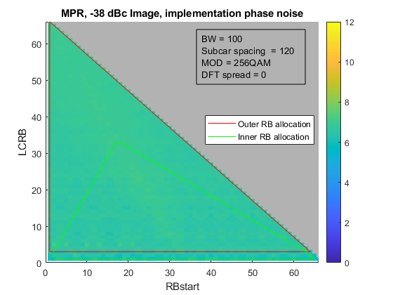{width="4.899537401574803in"
height="4.052238626421698in"}

Figure B.2-1 Illustration of possible AoA pairs on the test point of
AoA1

In order to simplify the representation of the AoA pairs per test points
of AoA1, the alternate coordinate system nomenclature described in this
section can be used to express the AoA pairs with one coordinate, and it
could be used also for the situation whereAoA2 does not lie in the same
meridian as of AoA1.

In this alternate coordinate system nomenclature for 2AoA testing. the
Reference coordinates of AoA1 (θ, ϕ) could be extended to
$\left( \theta,\ \phi,\omega \right)$ (θ, ϕ, ω), where ω corresponds to
the AoA1-AoA2 DL Orientation Vector. In detail, ω is the angle between
the AoA1-AoA2 DL Orientation Vector and the reference axis in the
assistant plane.

The assistant plane is orthogonal to the AoA1 direction , and the Z'
axis correspond to the projection of the meridian (points with same
fixed $\phi$ angle) of AoA1 into the assistant plane. I.e. in case of
$\theta < 90º$, +Z' corresponds to the cross point of +Z axis and the
assistant plane (see Figure B.2-2a). In case of $\theta > 90º$, -Z'
corresponds to the cross point of -Z axis and the assistant plane (see
Figure B.2-2b).

{width="6.670883639545057in"
height="3.738805774278215in"}

Figure B.2-2 Illustration of Assistant Plane of the alternate coordinate
system

Finally, ω is the angle from the reference axis Z' to the AoA1-AoA2 DL
Orientation Vector in clockwise direction (see Figure B.2-3).

{width="2.738805774278215in"
height="2.8290365266841646in"}

Figure B.2-3 Illustration of angle ω in the alternate coordinate system

This alternate coordinate system can also cover the theoretical cases
when the AoA pairs do not lie along the same meridian, and eliminate the
possible ambiguity on test point expression.

B.3 Test conditions and angle definitions
=========================================

This sub-annex provides the test conditions and angle definitions for
twelve permitted device orientations for the initial test condition.
With the convenience of defining the permitted alignments/orientations,
they are divided into three groups as shown from Table B.3-1 to Table
B.3-3. The DUT orientation to be tested is chosen from Table B.3-1,
Table B.3-2 and Table B.3-3 by UE vendor declaration.

Table B.3-1: Test conditions and angle definitions for Alignment Option
1

+------------------------+-----------------+------------------------+
| Test condition         | DUT orientation | Diagram                |
+========================+=================+========================+
| Orientation 1          | α = 0º;\        | {width= |
| (Option 1)             | γ = 0º          | "1.9368143044619424in" |
|                        |                 | height="               |
|                        |                 | 2.2440944881889764in"} |
+------------------------+-----------------+------------------------+
| Orientation 1          | α = 0º;\        | {width= |
| (Option 2)             | γ = 180º        | "1.9368143044619424in" |
|                        |                 | height="               |
|                        |                 | 2.2440944881889764in"} |
+------------------------+-----------------+------------------------+
| Orientation 2          | α = 180º;\      | {width= |
| (Option 1)             | γ = 0º          | "1.9368143044619424in" |
|                        |                 | height="               |
|                        |                 | 2.2440944881889764in"} |
+------------------------+-----------------+------------------------+
| Orientation 2          | α = 0º;\        | {width= |
| (Option 2)             | γ = 0º          | "1.9368143044619424in" |
|                        |                 | height="               |
|                        |                 | 2.2440944881889764in"} |
+------------------------+-----------------+------------------------+
| NOTE 1: The            |                 |                        |
| combination of         |                 |                        |
| rotations is captured  |                 |                        |
| by matrix              |                 |                        |
| M=*R~z~*(              |                 |                        |
| γ)•*R~y~*(β)•*R~x~*(α) |                 |                        |
+------------------------+-----------------+------------------------+

Table B.3-2: Test conditions and angle definitions for Alignment Option
2

+------------------------+-----------------+------------------------+
| Test condition         | DUT orientation | Diagram                |
+========================+=================+========================+
| Orientation 1          | α = 0º;\        | {width= |
| (Option 1)             | γ = 0º          | "2.1653543307086616in" |
|                        |                 | height="               |
|                        |                 | 1.4253423009623798in"} |
+------------------------+-----------------+------------------------+
| Orientation 1          | α = 0º;\        | {width= |
| (Option 2)             | γ = 180º        | "2.1653543307086616in" |
|                        |                 | height="               |
|                        |                 | 1.4253423009623798in"} |
+------------------------+-----------------+------------------------+
| Orientation 2          | α = 180º;\      | {width= |
| (Option 1)             | γ = 0º          | "2.1653543307086616in" |
|                        |                 | height="               |
|                        |                 | 1.4253423009623798in"} |
+------------------------+-----------------+------------------------+
| Orientation 2          | α = 0º;\        | {width= |
| (Option 2)             | γ = 0º          | "2.1653543307086616in" |
|                        |                 | height="               |
|                        |                 | 1.4253423009623798in"} |
+------------------------+-----------------+------------------------+
| NOTE 1: The            |                 |                        |
| combination of         |                 |                        |
| rotations is captured  |                 |                        |
| by matrix              |                 |                        |
| M=*R~z~*(              |                 |                        |
| γ)•*R~y~*(β)•*R~x~*(α) |                 |                        |
+------------------------+-----------------+------------------------+

Table B.3-3: Test conditions and angle definitions for Alignment Option
3

+------------------------+-----------------+------------------------+
| Test condition         | DUT orientation | Diagram                |
+========================+=================+========================+
| Orientation 1          | α = 90º;\       | {width |
| (Option 1)             | γ = 0º          | ="2.322834645669291in" |
|                        |                 | height="               |
|                        |                 | 1.5914304461942257in"} |
+------------------------+-----------------+------------------------+
| Orientation 1          | α = 90º;\       | {width |
| (Option 2)             | γ = 180º        | ="2.322834645669291in" |
|                        |                 | height="               |
|                        |                 | 1.5914304461942257in"} |
+------------------------+-----------------+------------------------+
| Orientation 2          | α = -90º;\      | {width |
| (Option 1)             | γ = 0º          | ="2.322834645669291in" |
|                        |                 | height="               |
|                        |                 | 1.5914304461942257in"} |
+------------------------+-----------------+------------------------+
| Orientation 2          | α = 90º;\       | {width |
| (Option 2)             | γ = 0º          | ="2.322834645669291in" |
|                        |                 | height="               |
|                        |                 | 1.5914304461942257in"} |
+------------------------+-----------------+------------------------+
| NOTE 1: The            |                 |                        |
| combination of         |                 |                        |
| rotations is captured  |                 |                        |
| by matrix              |                 |                        |
| M=*R~z~*(              |                 |                        |
| γ)•*R~y~*(β)•*R~x~*(α) |                 |                        |
+------------------------+-----------------+------------------------+

For each UE requirement and test case, each of the parameters in Table
B.3-1 to Table B.3-3 need to be recorded, such that DUT positioning, DUT
beam direction, and angles of the signal, link/interferer, and
measurement are specified in terms of the fixed coordinate system.

Due to the non-commutative nature of rotations, the order of rotations
is important and needs to be defined when multiple DUT orientations are
tested.

The rotations around the x, y, and z axes can be defined with the
following rotation matrices

{width="2.1944444444444446in" height="1.0in"}

{width="2.2222222222222223in" height="1.0in"}

and

{width="2.125in" height="1.0in"}.

with the respective angles of rotation, *α*, *β*, *γ* and

{width="0.8888888888888888in" height="1.0in"}

Additionally, any translation of the DUT can be defined with the
translation matrix

{width="1.875in" height="1.0in"}

with offsets t~x~, t~y~, t~z~ in x, y, and z, respectively and with

{width="0.875in" height="1.0in"}

The combination of rotations and translation is captured by the
multiplication of rotation and translation matrices.

For instance, the matrix M

{width="2.611111111111111in"
height="0.3125in"}

describes an initial rotation of the DUT around the x axis with angle
*α*, a subsequent rotation around the y axis with angle *β*, and a final
rotation around the z axis with angle *γ*. After those rotations, the
DUT is translated by t~x~, t~y~, t~z~ in x, y, and z, respectively.

B.4 DUT positioning guidelines
==============================

\<Editor's note: additional details to be added for the re-positioning
concept for multi-Rx performance measurements \>

The centre of the reference coordinate system shall be aligned with the
geometric centre of the DUT in order to minimize the offset between
antenna modules integrated at any position of the UE and the centre of
the quiet zone.

Near-field coupling effects between the antenna and the
pedestals/positioners/fixtures generally cause increased signal ripples.
Re-positioning approach is adopted for multi-Rx performance measurements
to avoid AoA blockage.

As the starting point, the initial positioner/UE orientation is selected
to be (-90° - ½ angular separation). The minimum angular separation
between positioner and probe(s) are listed in Table B.4-1 as below.

Table B.4-1: Minimum angular separation between positioner and probe(s)

  **Declared Angular Separation \[°\]**   **Min Angular Separation between Positioner and Probe(s) \[°\]**
  --------------------------------------- ------------------------------------------------------------------
  30                                      75
  60                                      60
  90                                      45
  120                                     30
  150                                     15

######## Annex C: (Reserved)

######## Annex D: Inverse Channel Approach in demodulation testing

D.1 An example of Inverse Channel Approach
==========================================

This Annex describes an example of inverse channel approach to reuce the
impact of the OTA channel inside the chamber. With OTA testing for
demodulation, the received signal can be given by:

$y = \mathbf{H}_{\mathbf{\text{OTA}}}\,\mathbf{H}_{\mathbf{c}}\, x,$
(D.1-1)

where $\mathbf{H}_{\mathbf{c}}\mathbf{\ }$*is the target channel
efficiency defined in TS 38.101-4 and*
$\mathbf{H}_{\mathbf{\text{OTA}}}$ *is the additional interference
introduced by OTA chamber.*

*It is assumed that the interference between two TRPs and two
polarizations as* $\eta_{\text{ij}}^{\text{TaRb}}$*. Here
T*$a,\ a \in \left\{ 1,2 \right\},$ *and
R*$b,b \in \left\{ 1,2 \right\},$ *denote the OTA chamber pair of
transmit probe T*$a$ *and receive probe R*$b$*. Here
i*$,\ i \in \left\{ 1,2 \right\},$ *and*
$j,j \in \left\{ 1,2 \right\}$*denote the polarization of transmit and
receive probe; in which if* $i = j$ *they are the same polarization and
if* $i \neq j$ *they are different polarization. Here x and y are the
transmit signal and received signal respectively.*

$\begin{pmatrix}
y_{1}^{R1} \\
y_{2}^{R1} \\
y_{1}^{R2} \\
y_{2}^{R2} \\
\end{pmatrix} = \begin{bmatrix}
\begin{matrix}
\eta_{11}^{T1R1} & \eta_{21}^{T1R1} \\
\eta_{12}^{T1R1} & \eta_{22}^{T1R1} \\
\end{matrix} & \begin{matrix}
\eta_{11}^{T2R1} & \eta_{21}^{T2R1} \\
\eta_{12}^{T2R1} & \eta_{22}^{T2R1} \\
\end{matrix} \\
\begin{matrix}
\eta_{11}^{T1R2} & \eta_{12}^{T1R2} \\
\eta_{12}^{T1R2} & \eta_{22}^{T1R2} \\
\end{matrix} & \begin{matrix}
\eta_{11}^{T2R2} & \eta_{12}^{T2R2} \\
\eta_{21}^{T2R2} & \eta_{22}^{T2R2} \\
\end{matrix} \\
\end{bmatrix}.\mathbf{H}_{\mathbf{C}}.\begin{pmatrix}
x_{1}^{T1} \\
x_{2}^{T1} \\
x_{1}^{T2} \\
x_{2}^{T2} \\
\end{pmatrix}$ *(*D.1-2*)*

If the impact of OTA chamber, i.e., $\mathbf{H}_{\mathbf{\text{OTA}}}$
*could be removed or minimized in the testing, then the testing for
multi-Rx demodulation would be more accurate. The principle of inverse
channel approach is to re-construct inverse of channel matrix of OTA
chamber to remove or immunize the impact of*
$\mathbf{H}_{\mathbf{\text{OTA}}}$*.*

*RSRPB has been used for checking isolation between branches in legacy
FR2 demodulation testing. In multi-Rx demodulation testing, RSRPB could
also be used to enhance the minimum isolation, i.e., minimize the impact
of OTA chamber.*

*An example of test procedure is listed below:*

**- Step 1:** DUT declares AoA pairs which shall satisfy the 3 criteria
defined in section 7.2.2.2 including \[-12dB\] minimum isolation
requirement.

**- Step 2:** Test Equipment to check the isolation for all the branches
based on UE RSRPB reporting and calculate $H_{\text{OTA}}$ by following
steps:

\- TE sends SSB on pol. H from TRP1 (T1). UE measures and reports RSRPB
of pol. H and pol. V at antenna panel 1 (R1). Similarly, UE measures and
reports RSRPB of pol. H and pol. V at antenna panel 2 (R2).

\- To get $\ddot{\eta}$ by following equations:

\- ${\ \ddot{\eta}}_{12}^{T1R1}$= RSRPB\_V of R1/RSTx\_H of T1

\- ${\ \ddot{\eta}}_{11}^{T1R2}$= RSRPB\_H of R2/ RSTx\_H of T1

\- ${\ \ddot{\eta}}_{12}^{T1R2}$= RSRPB\_V of R2/ RSTx\_H of T1

\- ${\ \ddot{\eta}}_{11}^{T1R1}$ = RSRPB\_H of R1/ RSTx\_H of T1

\- TE sends SSB on pol. V from TRP1 (T1). UE measures and reports RSRPB
of pol. H and pol. V from antenna panel 1 (R1). Similarly, UE measures
and reports RSRPB of pol. V and pol. H from antenna panel 2 (R2).

\- To get $\ddot{\eta}$ by following equations:

\- ${\ \ddot{\eta}}_{21}^{T1R1}$= RSRPB\_H of R1/RSTx\_V of T1

\- ${\ \ddot{\eta}}_{12}^{T1R2}$= RSRPB\_H of R2/RSTx\_V of T1

\- ${\ \ddot{\eta}}_{22}^{T1R2}$= RSRPB\_V of R2/RSTx\_V of T1

\- ${\ \ddot{\eta}}_{22}^{T1R1}$ = RSRPB\_V of R1/RSTx\_V of T1

\- TE sends SSB on pol. H from TRP2 (T2). UE measures and reports RSRPB
of pol. V and pol. H from antenna panel 2 (R2). Similarly, UE measures
and reports RSRPB of pol. V and pol. H from antenna panel 1 (R1).

\- To get $\ \ddot{\eta}$ by following equations:

\- ${\ \ddot{\eta}}_{11}^{T2R1}$= RSRPB\_H of R1/RSTx\_H of T2

\- ${\ \ddot{\eta}}_{12}^{T2R1}$= RSRPB\_V of R1/RSTx\_H of T2

\- ${\ \ddot{\eta}}_{21}^{T2R2}$= RSRPB\_V of R2/RSTx\_H of T2

\- ${\ \ddot{\eta}}_{11}^{T2R2}$= RSRPB\_H of R2/RSTx\_H of T2

\- TE sends SSB on pol. V from TRP2 (T2). UE measures and reports RSRPB
of pol. H and pol. H from antenna panel 2 (R2). Similarly, UE measures
and reports RSRPB of pol. V and pol H from antenna panel 1 (R1).

\- To get $\ddot{\eta}$ by following equations:

\- ${\ \ddot{\eta}}_{21}^{T2R1}$= RSRPB\_H of R1/RSTx\_V of T2

\- ${\ \ddot{\eta}}_{22}^{T2R1}$= RSRPB\_V of R1/RSTx\_V of T2

\- ${\ \ddot{\eta}}_{12}^{T2R2}\ $= RSRPB\_H of R2/RSTx\_V of T2

\- ${\ \ddot{\eta}}_{22}^{T2R2}$= RSRPB\_V of R2/RSTx\_V of T2

\- Note that here RSRPB\_i of Ra means RSRPB value reported by UE on
pol. i from antenna panel a, and RSTx\_i of Tb means Tx power of
reference signal from TRP b. $\ddot{\eta}$ is the estimated channel
coefficients based on RSRPB.

**- Step 3:** Test equipment to apply the pseudo-inverse/inverse of
$\mathbf{H}_{\mathbf{\text{OTA}}}$ to improve the initial isolation
provided in Step 1.

$\begin{pmatrix}
y_{1}^{R1} \\
y_{2}^{R1} \\
y_{1}^{R2} \\
y_{2}^{R2} \\
\end{pmatrix} = \text{inverse}\begin{bmatrix}
\begin{matrix}
{\ddot{\eta}}_{11}^{T1R1} & {\ddot{\eta}}_{21}^{T1R1} \\
{\ddot{\eta}}_{12}^{T1R1} & {\ddot{\eta}}_{22}^{T1R1} \\
\end{matrix} & \begin{matrix}
{\ \ddot{\eta}}_{11}^{T2R1} & {\ \ddot{\eta}}_{21}^{T2R1} \\
{\ \ddot{\eta}}_{12}^{T2R1} & {\ \ddot{\eta}}_{22}^{T2R1} \\
\end{matrix} \\
\begin{matrix}
{\ddot{\eta}}_{11}^{T1R2} & {\ddot{\eta}}_{12}^{T1R2} \\
{\ddot{\eta}}_{12}^{T1R2} & {\ddot{\eta}}_{22}^{T1R2} \\
\end{matrix} & \begin{matrix}
{\ \ddot{\eta}}_{11}^{T2R2} & {\ \ddot{\eta}}_{12}^{T2R2} \\
{\ \ddot{\eta}}_{21}^{T2R2} & {\ \ddot{\eta}}_{22}^{T2R2} \\
\end{matrix} \\
\end{bmatrix}.\mathbf{H}_{\mathbf{\text{OTA}}}.\mathbf{H}_{\mathbf{C}}.\begin{pmatrix}
x_{1}^{T1} \\
x_{2}^{T1} \\
x_{1}^{T2} \\
x_{2}^{T2} \\
\end{pmatrix}$ *(*D.1-3*)*

######## Annex E: (Reserved)

######## Annex F: (Reserved)

######## Annex G: Step size of measurement grids

This appendix describes the assumptions and definition of the minimum
number of measurement grid points for multi-Rx chain DL reception UE RF
testing.

The minimum number of measurement grid point for TRP/EIRP/EIS was
investigated in \[3\] in which a completely random fashion is applied
for both θ and φ  dimensions. For multi-Rx chain DL reception UE RF
testing, it has already known that measured performance of a UE is
expected to systematically vary as a function of position. This
systematic variation means that the strategy to completely randomize the
orientation of the UE to determine MU does not apply. Moreover, for the
measurement grid analysis for multi-Rx, the AoA pairs lie along
longitudes of the UE reference coordination system, and the requirements
apply only for the UE-declared orientation in the positioner. Therefore,
it is agreed that uncertainty mechanism for multi-Rx chain DL reception
UE RF testing is limited to the coarseness of the grid and doesn't
depend on the UE random orientations as the legacy approach.

*Through the analysis from simulation results with* antenna
configuration of 6x2 and 4x2, 15deg is selected as the step size of
constant-step grid.

G.1 Simulation results for step size 
====================================

In this clause, the simulation results with 1deg, 2deg, 5deg, 10deg,
15deg, and 30deg step sizes are shown in Table G.1-1 and Table G.1-2
considering different antenna modules placements.

Table G.1-1: Simulation results for step size with antenna configuration
of 4x2

  **Adjacent modules**                                                            
  -------------------------- ------- -------- -------- -------- -------- -------- --------
                                     30       60       90       120      150      180
  Samsung - OR               10deg   0.00%    -0.08%   -0.27%   0.32%    0.17%    0.16%
  Samsung - OR               15deg   0.21%    0.28%    0.23%    0.56%    -0.08%   -0.56%
  vivo - Arithmetic          10deg   -0.30%   -0.50%   0.10%    0.20%    0.10%     -
  vivo - Arithmetic          15deg   -0.20%   -1.00%   -0.70%   -1.10%   -0.10%    -
  QC- OR                     10deg    -       0.10%    0.20%    0.80%    0.60%    0.00%
  QC - OR                    15deg    -       1.60%    0.30%    2.60%    2.60%    1.50%
  QC - Arithmetic            10deg    -       -0.10%   0.10%    0.40%    0.20%    0.00%
  QC - Arithmetic            15deg    -       1.20%    0.10%    1.30%    1.90%    1.50%
  OPPO                       10deg   0.21%    0.54%    0.27%    0.82%    0.84%    0.39%
  OPPO                       15deg   0.97%    0.26%    1.47%    0.38%    0.20%    0.53%
  Huawei -- OR               10deg   -0.5%    -0.2%    -0.2%    0.3%     -0.2%    -0.5%
  Huawei - OR                15deg   0.1%     0.6%     0.6%     0.9%     0.3%     0.1%
  **Back-to-back modules**                                                        
                                     30       60       90       120      150      180
  Samsung -OR                10deg   0.04%    -0.11%   0.09%    0.25%    0.10%    0.09%
  Samsung - OR               15deg   -0.15%   -0.43%   -0.72%   -0.35%   -0.43%   -0.41%
  vivo - Arithmetic          10deg   0.20%    -0.50%   0.10%    -0.20%   -1.50%    -
  vivo - Arithmetic          15deg   0.60%    1.30%    0.50%    0.20%    1.20%     -
  QC - OR                    10deg    -       1.20%    0.10%    -1.10%   -0.70%   -1.30%
  QC - OR                    15deg    -       1.50%    0.40%    -3.20%   -2.80%   -2.20%
  QC - Arithmetic            10deg    -       0.60%    0.10%    -0.20%   -0.50%   -1.30%
  QC - Arithmetic            15deg    -       0.70%    0.30%    -0.90%   -1.90%   -2.20%
  OPPO                       10deg   2.93%    3.48%    0.16%    2.74%    0.81%    1.29%
  OPPO                       15deg   3.65%    4.56%    0.41%    0.77%    1.22%    1.03%
  Huawei -- OR               10deg   0.1%     0.3%     0.2%     -0.3%    0.5%     \-
  Huawei - OR                15deg   0.4%     -0.6%    0.8%     0.4%     0.9%     \-
  **Same side modules**                                                           
                                     30       60       90       120      150      180
  Samsung - OR               10deg   -0.02%   0.10%    0.28%    0.25%    0.31%    0.04%
  Samsung - OR               15deg   -0.16%   -0.35%   -0.08%   -0.23%   0.07%    -0.30%
  vivo - Arithmetic          10deg   -1.20%   0.50%    0.10%    1.00%    0.50%     -
  vivo - Arithmetic          15deg   -0.40%   -0.40%   -0.20%   0.40%    -0.40%    -
  OPPO                       10deg   1.25%    0.24%    0.50%    0.23%    2.66%    1.96%
  OPPO                       15deg   0.24%    1.74%    2.08%    0.25%    1.35%    1.10%
  Huawei -- OR               10deg   -0.4%    0.2%     0.3%     0.6%     0.4%     -0.4%
  Huawei - OR                15deg   -0.2%    -0.5%    -0.2%    0.3%     0.1%     -0.2%

Table G.1-2: Simulation results for step size with antenna configuration
of 6x2

  **Adjacent modules**                                                            
  -------------------------- ------- -------- -------- -------- -------- -------- --------
                                     30       60       90       120      150      180
  Samsung - OR               10deg   0.05%    -0.03%   0.00%    0.02%    -0.14%   -0.12%
  Samsung - OR               15deg   0.12%    -0.13%   -0.20%   0.04%    -0.44%   -0.39%
  QC- OR                     10deg   \-       0.10%    -0.20%   0.40%    0.50%    0.00%
  QC - OR                    15deg   \-       1.40%    0.50%    2.70%    2.70%    1.80%
  QC - Arithmetic            10deg   \-       -0.10%   -0.30%   0.20%    0.20%    0.00%
  QC - Arithmetic            15deg   \-       1.10%    0.60%    1.30%    2.00%    1.80%
  **Back-to-back modules**                                                        
                                     30       60       90       120      150      180
  Samsung -OR                10deg   \-       \-       \-       \-       \-       \-
  Samsung - OR               15deg   \-       \-       \-       \-       \-       \-
  QC - OR                    10deg   \-       0.80%    -1.30%   -2.60%   -1.60%   -2.00%
  QC - OR                    15deg   \-       1.90%    2.50%    -1.30%   -2.10%   1.00%
  QC - Arithmetic            10deg   \-       0.40%    -0.60%   -1.00%   -1.40%   -2.00%
  QC - Arithmetic            15deg   \-       0.90%    1.30%    0.30%    -0.90%   1.00%
  **Same side modules**                                                           
                                     30       60       90       120      150      180
  Samsung - OR               10deg   -0.07%   0.15%    0.06%    -0.17%   0.07%    0.01%
  Samsung - OR               15deg   0.23%    0.16%    0.23%    -0.35%   -0.04%   -0.26%

########  Annex H: Change history

+-------+-------+-------+-------+-------+-------+-------+-------+
| **C   |       |       |       |       |       |       |       |
| hange |       |       |       |       |       |       |       |
| hist  |       |       |       |       |       |       |       |
| ory** |       |       |       |       |       |       |       |
+-------+-------+-------+-------+-------+-------+-------+-------+
| **D   | *     | **T   | *     | **    | **    | **Su  | **New |
| ate** | *Meet | Doc** | *CR** | Rev** | Cat** | bject | vers  |
|       | ing** |       |       |       |       | /Comm | ion** |
|       |       |       |       |       |       | ent** |       |
+-------+-------+-------+-------+-------+-------+-------+-------+
| 20    | RAN4\ | R4-22 |       |       |       | In    | 0.0.1 |
| 22-08 | #104e | 13182 |       |       |       | itial |       |
|       |       |       |       |       |       | ske   |       |
|       |       |       |       |       |       | leton |       |
+-------+-------+-------+-------+-------+-------+-------+-------+
| 20    | RAN4  | R4-23 |       |       |       | The   | 0.1.0 |
| 23-03 | \#106 | 00085 |       |       |       | foll  |       |
|       |       |       |       |       |       | owing |       |
|       |       |       |       |       |       | TPs   |       |
|       |       |       |       |       |       | were  |       |
|       |       |       |       |       |       | ag    |       |
|       |       |       |       |       |       | reed: |       |
|       |       |       |       |       |       |       |       |
|       |       |       |       |       |       | \-    |       |
|       |       |       |       |       |       | R     |       |
|       |       |       |       |       |       | 4-230 |       |
|       |       |       |       |       |       | 0086, |       |
|       |       |       |       |       |       | TP on |       |
|       |       |       |       |       |       | TR    |       |
|       |       |       |       |       |       | 3     |       |
|       |       |       |       |       |       | 8.871 |       |
|       |       |       |       |       |       | for   |       |
|       |       |       |       |       |       | edit  |       |
|       |       |       |       |       |       | orial |       |
|       |       |       |       |       |       | corre |       |
|       |       |       |       |       |       | ction |       |
|       |       |       |       |       |       | and   |       |
|       |       |       |       |       |       | ge    |       |
|       |       |       |       |       |       | neral |       |
|       |       |       |       |       |       | asp   |       |
|       |       |       |       |       |       | ects, |       |
|       |       |       |       |       |       | Qua   |       |
|       |       |       |       |       |       | lcomm |       |
|       |       |       |       |       |       | In    |       |
|       |       |       |       |       |       | corpo |       |
|       |       |       |       |       |       | rated |       |
|       |       |       |       |       |       |       |       |
|       |       |       |       |       |       | \-    |       |
|       |       |       |       |       |       | R     |       |
|       |       |       |       |       |       | 4-230 |       |
|       |       |       |       |       |       | 2924, |       |
|       |       |       |       |       |       | TP to |       |
|       |       |       |       |       |       | intr  |       |
|       |       |       |       |       |       | oduce |       |
|       |       |       |       |       |       | Mult  |       |
|       |       |       |       |       |       | i-AoA |       |
|       |       |       |       |       |       | UE RF |       |
|       |       |       |       |       |       | Test  |       |
|       |       |       |       |       |       | Asp   |       |
|       |       |       |       |       |       | ects, |       |
|       |       |       |       |       |       | Key   |       |
|       |       |       |       |       |       | sight |       |
|       |       |       |       |       |       | Te    |       |
|       |       |       |       |       |       | chnol |       |
|       |       |       |       |       |       | ogies |       |
|       |       |       |       |       |       | UK    |       |
|       |       |       |       |       |       | Ltd   |       |
|       |       |       |       |       |       |       |       |
|       |       |       |       |       |       | \-    |       |
|       |       |       |       |       |       | R     |       |
|       |       |       |       |       |       | 4-230 |       |
|       |       |       |       |       |       | 2150, |       |
|       |       |       |       |       |       | TP on |       |
|       |       |       |       |       |       | TR    |       |
|       |       |       |       |       |       | 3     |       |
|       |       |       |       |       |       | 8.871 |       |
|       |       |       |       |       |       | c     |       |
|       |       |       |       |       |       | alibr |       |
|       |       |       |       |       |       | ation |       |
|       |       |       |       |       |       | m     |       |
|       |       |       |       |       |       | easur |       |
|       |       |       |       |       |       | ement |       |
|       |       |       |       |       |       | proce |       |
|       |       |       |       |       |       | dure, |       |
|       |       |       |       |       |       | Hu    |       |
|       |       |       |       |       |       | awei, |       |
|       |       |       |       |       |       | HiSi  |       |
|       |       |       |       |       |       | licon |       |
+-------+-------+-------+-------+-------+-------+-------+-------+
| 20    | RAN4  | R4-23 |       |       |       | The   | 0.2.0 |
| 23-04 | \#106 | 05886 |       |       |       | foll  |       |
|       | bis-e |       |       |       |       | owing |       |
|       |       |       |       |       |       | TP    |       |
|       |       |       |       |       |       | was   |       |
|       |       |       |       |       |       | ag    |       |
|       |       |       |       |       |       | reed: |       |
|       |       |       |       |       |       |       |       |
|       |       |       |       |       |       | \-    |       |
|       |       |       |       |       |       | R     |       |
|       |       |       |       |       |       | 4-230 |       |
|       |       |       |       |       |       | 5886, |       |
|       |       |       |       |       |       | TP to |       |
|       |       |       |       |       |       | intr  |       |
|       |       |       |       |       |       | oduce |       |
|       |       |       |       |       |       | Mult  |       |
|       |       |       |       |       |       | i-AoA |       |
|       |       |       |       |       |       | UE RF |       |
|       |       |       |       |       |       | Test  |       |
|       |       |       |       |       |       | Asp   |       |
|       |       |       |       |       |       | ects, |       |
|       |       |       |       |       |       | Key   |       |
|       |       |       |       |       |       | sight |       |
|       |       |       |       |       |       | Te    |       |
|       |       |       |       |       |       | chnol |       |
|       |       |       |       |       |       | ogies |       |
+-------+-------+-------+-------+-------+-------+-------+-------+
| 20    | RAN4  | R4-23 |       |       |       | The   | 0.3.0 |
| 23-05 | \#107 | 09247 |       |       |       | foll  |       |
|       |       |       |       |       |       | owing |       |
|       |       |       |       |       |       | TPs   |       |
|       |       |       |       |       |       | were  |       |
|       |       |       |       |       |       | ag    |       |
|       |       |       |       |       |       | reed: |       |
|       |       |       |       |       |       |       |       |
|       |       |       |       |       |       | \-    |       |
|       |       |       |       |       |       | R     |       |
|       |       |       |       |       |       | 4-230 |       |
|       |       |       |       |       |       | 9287, |       |
|       |       |       |       |       |       | TP to |       |
|       |       |       |       |       |       | TR    |       |
|       |       |       |       |       |       | 3     |       |
|       |       |       |       |       |       | 8.871 |       |
|       |       |       |       |       |       | on    |       |
|       |       |       |       |       |       | 3     |       |
|       |       |       |       |       |       | -axis |       |
|       |       |       |       |       |       | posit |       |
|       |       |       |       |       |       | ioner |       |
|       |       |       |       |       |       | consi |       |
|       |       |       |       |       |       | derat |       |
|       |       |       |       |       |       | ions, |       |
|       |       |       |       |       |       | Qua   |       |
|       |       |       |       |       |       | lcomm |       |
|       |       |       |       |       |       | In    |       |
|       |       |       |       |       |       | corpo |       |
|       |       |       |       |       |       | rated |       |
|       |       |       |       |       |       |       |       |
|       |       |       |       |       |       | \-    |       |
|       |       |       |       |       |       | R     |       |
|       |       |       |       |       |       | 4-230 |       |
|       |       |       |       |       |       | 9246, |       |
|       |       |       |       |       |       | TP to |       |
|       |       |       |       |       |       | TR    |       |
|       |       |       |       |       |       | 3     |       |
|       |       |       |       |       |       | 8.871 |       |
|       |       |       |       |       |       | on    |       |
|       |       |       |       |       |       | RRM   |       |
|       |       |       |       |       |       | test  |       |
|       |       |       |       |       |       | me    |       |
|       |       |       |       |       |       | thod, |       |
|       |       |       |       |       |       | Qua   |       |
|       |       |       |       |       |       | lcomm |       |
|       |       |       |       |       |       | In    |       |
|       |       |       |       |       |       | corpo |       |
|       |       |       |       |       |       | rated |       |
+-------+-------+-------+-------+-------+-------+-------+-------+
| 20    | RAN4  | R4-23 |       |       |       | The   | 0.4.0 |
| 23-08 | \#108 | 12890 |       |       |       | foll  |       |
|       |       |       |       |       |       | owing |       |
|       |       |       |       |       |       | TPs   |       |
|       |       |       |       |       |       | were  |       |
|       |       |       |       |       |       | ag    |       |
|       |       |       |       |       |       | reed: |       |
|       |       |       |       |       |       |       |       |
|       |       |       |       |       |       | \-    |       |
|       |       |       |       |       |       | R     |       |
|       |       |       |       |       |       | 4-231 |       |
|       |       |       |       |       |       | 3887, |       |
|       |       |       |       |       |       | TP    |       |
|       |       |       |       |       |       | for   |       |
|       |       |       |       |       |       | assi  |       |
|       |       |       |       |       |       | stant |       |
|       |       |       |       |       |       | co    |       |
|       |       |       |       |       |       | ordin |       |
|       |       |       |       |       |       | ation |       |
|       |       |       |       |       |       | sy    |       |
|       |       |       |       |       |       | stem, |       |
|       |       |       |       |       |       | OPPO, |       |
|       |       |       |       |       |       | ROHDE |       |
|       |       |       |       |       |       | &     |       |
|       |       |       |       |       |       | SCH   |       |
|       |       |       |       |       |       | WARZ, |       |
|       |       |       |       |       |       | Qua   |       |
|       |       |       |       |       |       | lcomm |       |
|       |       |       |       |       |       | In    |       |
|       |       |       |       |       |       | corpo |       |
|       |       |       |       |       |       | rated |       |
|       |       |       |       |       |       |       |       |
|       |       |       |       |       |       | \-    |       |
|       |       |       |       |       |       | R     |       |
|       |       |       |       |       |       | 4-231 |       |
|       |       |       |       |       |       | 2889, |       |
|       |       |       |       |       |       | TP to |       |
|       |       |       |       |       |       | TR3   |       |
|       |       |       |       |       |       | 8.871 |       |
|       |       |       |       |       |       | on UE |       |
|       |       |       |       |       |       | RF    |       |
|       |       |       |       |       |       | te    |       |
|       |       |       |       |       |       | sting |       |
|       |       |       |       |       |       | me    |       |
|       |       |       |       |       |       | thodo |       |
|       |       |       |       |       |       | logy, |       |
|       |       |       |       |       |       | Qua   |       |
|       |       |       |       |       |       | lcomm |       |
|       |       |       |       |       |       | In    |       |
|       |       |       |       |       |       | corpo |       |
|       |       |       |       |       |       | rated |       |
+-------+-------+-------+-------+-------+-------+-------+-------+
| 20    | RA    | R4-23 |       |       |       | The   | 0.5.0 |
| 23-10 | N4\#1 | 16513 |       |       |       | foll  |       |
|       | 08bis |       |       |       |       | owing |       |
|       |       |       |       |       |       | TPs   |       |
|       |       |       |       |       |       | were  |       |
|       |       |       |       |       |       | ag    |       |
|       |       |       |       |       |       | reed: |       |
|       |       |       |       |       |       |       |       |
|       |       |       |       |       |       | \-    |       |
|       |       |       |       |       |       | R     |       |
|       |       |       |       |       |       | 4-231 |       |
|       |       |       |       |       |       | 6948, |       |
|       |       |       |       |       |       | TP on |       |
|       |       |       |       |       |       | TR    |       |
|       |       |       |       |       |       | 3     |       |
|       |       |       |       |       |       | 8.871 |       |
|       |       |       |       |       |       | for   |       |
|       |       |       |       |       |       | RRM   |       |
|       |       |       |       |       |       | test  |       |
|       |       |       |       |       |       | me    |       |
|       |       |       |       |       |       | thod, |       |
|       |       |       |       |       |       | Qua   |       |
|       |       |       |       |       |       | lcomm |       |
|       |       |       |       |       |       | In    |       |
|       |       |       |       |       |       | corpo |       |
|       |       |       |       |       |       | rated |       |
|       |       |       |       |       |       |       |       |
|       |       |       |       |       |       | \-    |       |
|       |       |       |       |       |       | R     |       |
|       |       |       |       |       |       | 4-231 |       |
|       |       |       |       |       |       | 6949, |       |
|       |       |       |       |       |       | TP on |       |
|       |       |       |       |       |       | TR    |       |
|       |       |       |       |       |       | 3     |       |
|       |       |       |       |       |       | 8.871 |       |
|       |       |       |       |       |       | for   |       |
|       |       |       |       |       |       | De    |       |
|       |       |       |       |       |       | modul |       |
|       |       |       |       |       |       | ation |       |
|       |       |       |       |       |       | test  |       |
|       |       |       |       |       |       | me    |       |
|       |       |       |       |       |       | thod, |       |
|       |       |       |       |       |       | Qua   |       |
|       |       |       |       |       |       | lcomm |       |
|       |       |       |       |       |       | In    |       |
|       |       |       |       |       |       | corpo |       |
|       |       |       |       |       |       | rated |       |
+-------+-------+-------+-------+-------+-------+-------+-------+
| 20    | RAN4  | R4-23 |       |       |       | The   | 0.6.0 |
| 23-11 | \#109 | 20391 |       |       |       | foll  |       |
|       |       |       |       |       |       | owing |       |
|       |       |       |       |       |       | TPs   |       |
|       |       |       |       |       |       | were  |       |
|       |       |       |       |       |       | ag    |       |
|       |       |       |       |       |       | reed: |       |
|       |       |       |       |       |       |       |       |
|       |       |       |       |       |       | \-    |       |
|       |       |       |       |       |       | R     |       |
|       |       |       |       |       |       | 4-232 |       |
|       |       |       |       |       |       | 1102, |       |
|       |       |       |       |       |       | TP to |       |
|       |       |       |       |       |       | TR3   |       |
|       |       |       |       |       |       | 8.871 |       |
|       |       |       |       |       |       | for   |       |
|       |       |       |       |       |       | test  |       |
|       |       |       |       |       |       | proc  |       |
|       |       |       |       |       |       | edure |       |
|       |       |       |       |       |       | of UE |       |
|       |       |       |       |       |       | RF    |       |
|       |       |       |       |       |       | mult  |       |
|       |       |       |       |       |       | i-Rx, |       |
|       |       |       |       |       |       | OPPO, |       |
|       |       |       |       |       |       | Sa    |       |
|       |       |       |       |       |       | msung |       |
|       |       |       |       |       |       |       |       |
|       |       |       |       |       |       | \-    |       |
|       |       |       |       |       |       | R     |       |
|       |       |       |       |       |       | 4-232 |       |
|       |       |       |       |       |       | 1101, |       |
|       |       |       |       |       |       | TP to |       |
|       |       |       |       |       |       | TR    |       |
|       |       |       |       |       |       | 3     |       |
|       |       |       |       |       |       | 8.871 |       |
|       |       |       |       |       |       | for   |       |
|       |       |       |       |       |       | UE    |       |
|       |       |       |       |       |       | coord |       |
|       |       |       |       |       |       | inate |       |
|       |       |       |       |       |       | sy    |       |
|       |       |       |       |       |       | stem, |       |
|       |       |       |       |       |       | OPPO, |       |
|       |       |       |       |       |       | Key   |       |
|       |       |       |       |       |       | sight |       |
|       |       |       |       |       |       | Tec   |       |
|       |       |       |       |       |       | hnolo |       |
|       |       |       |       |       |       | gies, |       |
|       |       |       |       |       |       | Rohde |       |
|       |       |       |       |       |       | &     |       |
|       |       |       |       |       |       | Sch   |       |
|       |       |       |       |       |       | warz, |       |
|       |       |       |       |       |       | Qua   |       |
|       |       |       |       |       |       | lcomm |       |
|       |       |       |       |       |       | In    |       |
|       |       |       |       |       |       | corpo |       |
|       |       |       |       |       |       | rated |       |
|       |       |       |       |       |       |       |       |
|       |       |       |       |       |       | \-    |       |
|       |       |       |       |       |       | R     |       |
|       |       |       |       |       |       | 4-232 |       |
|       |       |       |       |       |       | 0390, |       |
|       |       |       |       |       |       | TP to |       |
|       |       |       |       |       |       | TR    |       |
|       |       |       |       |       |       | 3     |       |
|       |       |       |       |       |       | 8.871 |       |
|       |       |       |       |       |       | on    |       |
|       |       |       |       |       |       | draft |       |
|       |       |       |       |       |       | su    |       |
|       |       |       |       |       |       | mmary |       |
|       |       |       |       |       |       | and   |       |
|       |       |       |       |       |       | edit  |       |
|       |       |       |       |       |       | orial |       |
|       |       |       |       |       |       | cha   |       |
|       |       |       |       |       |       | nges, |       |
|       |       |       |       |       |       | Qua   |       |
|       |       |       |       |       |       | lcomm |       |
|       |       |       |       |       |       | In    |       |
|       |       |       |       |       |       | corpo |       |
|       |       |       |       |       |       | rated |       |
|       |       |       |       |       |       |       |       |
|       |       |       |       |       |       | \-    |       |
|       |       |       |       |       |       | R     |       |
|       |       |       |       |       |       | 4-232 |       |
|       |       |       |       |       |       | 1103, |       |
|       |       |       |       |       |       | TP to |       |
|       |       |       |       |       |       | TR    |       |
|       |       |       |       |       |       | 3     |       |
|       |       |       |       |       |       | 8.871 |       |
|       |       |       |       |       |       | on    |       |
|       |       |       |       |       |       | step  |       |
|       |       |       |       |       |       | size  |       |
|       |       |       |       |       |       | of    |       |
|       |       |       |       |       |       | m     |       |
|       |       |       |       |       |       | easur |       |
|       |       |       |       |       |       | ement |       |
|       |       |       |       |       |       | grid, |       |
|       |       |       |       |       |       | Qua   |       |
|       |       |       |       |       |       | lcomm |       |
|       |       |       |       |       |       | In    |       |
|       |       |       |       |       |       | corpo |       |
|       |       |       |       |       |       | rated |       |
|       |       |       |       |       |       |       |       |
|       |       |       |       |       |       | \-    |       |
|       |       |       |       |       |       | R     |       |
|       |       |       |       |       |       | 4-232 |       |
|       |       |       |       |       |       | 1104, |       |
|       |       |       |       |       |       | TP to |       |
|       |       |       |       |       |       | TR    |       |
|       |       |       |       |       |       | 3     |       |
|       |       |       |       |       |       | 8.871 |       |
|       |       |       |       |       |       | on    |       |
|       |       |       |       |       |       | RRM   |       |
|       |       |       |       |       |       | test  |       |
|       |       |       |       |       |       | me    |       |
|       |       |       |       |       |       | thod, |       |
|       |       |       |       |       |       | Qua   |       |
|       |       |       |       |       |       | lcomm |       |
|       |       |       |       |       |       | Inc   |       |
|       |       |       |       |       |       | orpor |       |
|       |       |       |       |       |       | ated, |       |
|       |       |       |       |       |       | Hu    |       |
|       |       |       |       |       |       | awei, |       |
|       |       |       |       |       |       | HiSi  |       |
|       |       |       |       |       |       | licon |       |
|       |       |       |       |       |       |       |       |
|       |       |       |       |       |       | \-    |       |
|       |       |       |       |       |       | R     |       |
|       |       |       |       |       |       | 4-232 |       |
|       |       |       |       |       |       | 1105, |       |
|       |       |       |       |       |       | TP to |       |
|       |       |       |       |       |       | TR    |       |
|       |       |       |       |       |       | 3     |       |
|       |       |       |       |       |       | 8.871 |       |
|       |       |       |       |       |       | on    |       |
|       |       |       |       |       |       | De    |       |
|       |       |       |       |       |       | modul |       |
|       |       |       |       |       |       | ation |       |
|       |       |       |       |       |       | test  |       |
|       |       |       |       |       |       | me    |       |
|       |       |       |       |       |       | thod, |       |
|       |       |       |       |       |       | Qua   |       |
|       |       |       |       |       |       | lcomm |       |
|       |       |       |       |       |       | In    |       |
|       |       |       |       |       |       | corpo |       |
|       |       |       |       |       |       | rated |       |
|       |       |       |       |       |       |       |       |
|       |       |       |       |       |       | \-    |       |
|       |       |       |       |       |       | R     |       |
|       |       |       |       |       |       | 4-232 |       |
|       |       |       |       |       |       | 1106, |       |
|       |       |       |       |       |       | TP to |       |
|       |       |       |       |       |       | TR    |       |
|       |       |       |       |       |       | 3     |       |
|       |       |       |       |       |       | 8.871 |       |
|       |       |       |       |       |       | on MU |       |
|       |       |       |       |       |       | a     |       |
|       |       |       |       |       |       | ssess |       |
|       |       |       |       |       |       | ment, |       |
|       |       |       |       |       |       | Qua   |       |
|       |       |       |       |       |       | lcomm |       |
|       |       |       |       |       |       | Inc   |       |
|       |       |       |       |       |       | orpor |       |
|       |       |       |       |       |       | ated, |       |
|       |       |       |       |       |       | Hu    |       |
|       |       |       |       |       |       | awei, |       |
|       |       |       |       |       |       | HiSil |       |
|       |       |       |       |       |       | icon, |       |
|       |       |       |       |       |       | vivo  |       |
+-------+-------+-------+-------+-------+-------+-------+-------+
| 20    | RAN   | RP-2  |       |       |       | Edit  | 1.0.0 |
| 23-12 | \#102 | 33172 |       |       |       | orial |       |
|       |       |       |       |       |       | c     |       |
|       |       |       |       |       |       | hange |       |
|       |       |       |       |       |       | and   |       |
|       |       |       |       |       |       | c     |       |
|       |       |       |       |       |       | hange |       |
|       |       |       |       |       |       | hi    |       |
|       |       |       |       |       |       | story |       |
|       |       |       |       |       |       | u     |       |
|       |       |       |       |       |       | pdate |       |
+-------+-------+-------+-------+-------+-------+-------+-------+

  **Change history**                                                                                                                                         
  -------------------- ------------- ----------- -------- --------- --------- ------------------------------------------------------------------------------ -----------------
  **Date**             **Meeting**   **TDoc**    **CR**   **Rev**   **Cat**   **Subject/Comment**                                                            **New version**
  2023-12              RAN\#102                                               Approved by plenary -- Rel-18 spec under change control                        18.0.0
  2024-03              RAN\#103      RP-240602   0003     2         F         (FS\_NR\_FR2\_OTA\_enh) CR to TR 38.871 for demodulation testing enhancement   18.1.0
  2024-03              RAN\#103      RP-240602   0004               F         (FS\_NR\_FR2\_OTA\_enh) CR to TR 38.871 for editorial corrections              18.1.0
  2024-03              RAN\#103      RP-240602   0005               F         (FS\_NR\_FR2\_OTA\_enh) CR to TR 38.871 on DUT alignment figures               18.1.0
  2024-12              RAN\#106      RP-243025   0006               F         On Absolute Probe Locations for Baseline Multi-RX System                       18.2.0
