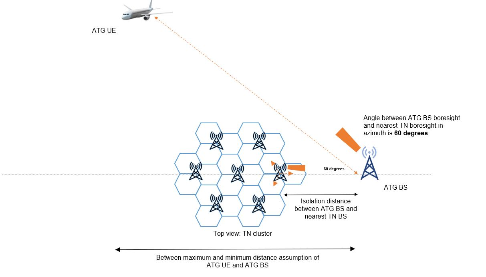

3GPP TR 38.876 V18.2.0 (2024-06)

Technical Report

3rd Generation Partnership Project;

Technical Specification Group Radio Access Network;

NR;

Air-to-ground network for NR

(Release 18)

{width="1.78125in"
height="1.0416666666666667in"}

The present document has been developed within the 3^rd^ Generation
Partnership Project (3GPP ^TM^) and may be further elaborated for the
purposes of 3GPP.\
The present document has not been subject to any approval process by the
3GPP Organizational Partners and shall not be implemented.\
This Report is provided for future development work within 3GPP only.
The Organizational Partners accept no liability for any use of this
Specification.\
Specifications and Reports for implementation of the 3GPP ^TM^ system
should be obtained via the 3GPP Organizational Partners\' Publications
Offices.

+----------------------------------------------------------------------+
| > ***3GPP***                                                         |
| >                                                                    |
| > Postal address                                                     |
| >                                                                    |
| > 3GPP support office address                                        |
| >                                                                    |
| > 650 Route des Lucioles - Sophia Antipolis                          |
| >                                                                    |
| > Valbonne - FRANCE                                                  |
| >                                                                    |
| > Tel.: +33 4 92 94 42 00 Fax: +33 4 93 65 47 16                     |
| >                                                                    |
| > Internet                                                           |
| >                                                                    |
| > https://www.3gpp.org                                               |
+======================================================================+
| ***Copyright Notification***                                         |
|                                                                      |
| No part may be reproduced except as authorized by written            |
| permission.\                                                         |
| The copyright and the foregoing restriction extend to reproduction   |
| in all media.                                                        |
|                                                                      |
| © 2024, 3GPP Organizational Partners (ARIB, ATIS, CCSA, ETSI, TSDSI, |
| TTA, TTC).                                                           |
|                                                                      |
| All rights reserved.                                                 |
|                                                                      |
| UMTS™ is a Trade Mark of ETSI registered for the benefit of its      |
| members                                                              |
|                                                                      |
| 3GPP™ is a Trade Mark of ETSI registered for the benefit of its      |
| Members and of the 3GPP Organizational Partners\                     |
| LTE™ is a Trade Mark of ETSI registered for the benefit of its       |
| Members and of the 3GPP Organizational Partners                      |
|                                                                      |
| GSM® and the GSM logo are registered and owned by the GSM            |
| Association                                                          |
+----------------------------------------------------------------------+

 Contents {#contents .TT}
========

Foreword 11

1 Scope 12

2 References 12

3 Definitions, symbols and abbreviations 13

3.1 Definitions 13

3.2 Symbols 13

3.3 Abbreviations 13

4 Background 13

5 ATG bands 14

6 Co-existence study 14

6.1 Co-existence simulation scenario 14

6.2 Co-existence simulation assumption 15

6.2.1 Network layout model 15

6.2.1.1 Co-existence between ATG and NR terrestrial network 15

6.2.1.2 TN Network Layout 17

6.2.1.3 ATG Network Layout 17

6.2.1.4 Non-synchronized scenarios network layout 18

6.2.2 System parameters 21

6.2.2.1 ATG parameters 21

6.2.2.2 ATG UE parameters 22

6.2.2.3 TN BS and UE parameters 22

6.2.3 Antenna and beamforming pattern modelling 23

6.2.3.1 ATG BS antenna model 23

6.2.3.2 ATG UE antenna model 24

6.2.3.3 TN BS antenna model 24

6.2.3.4 TN UE antenna model 25

6.2.4 ACLR and ACS modelling 26

6.2.5 Propagation model 26

6.2.5.1 Propagation model between TN UE and ATG UE 26

6.2.5.2 Propagation model between TN BS and TN UE 28

6.2.5.3 Propagation model between ATG BS and TN BS 31

6.2.5.4 Propagation model between ATG BS and TN UE 31

6.2.5.5 Propagation model between TN BS and ATG UE 31

6.2.5.6 Propagation model between ATG BS and ATG UE 31

6.2.6 Transmission power control model 31

6.2.6.1 TN UL TPC 31

6.2.6.2 TN DL TPC 32

6.2.6.3 ATG UL TPC 32

6.2.6.4 ATG DL TPC 33

6.2.7 Received power model 33

6.2.8 Performance metric 33

6.2.9 Link level performance for NR ATG coexistence 34

6.3 Co-existence simulation methodology 34

6.4 Co-existence simulation results 35

6.4.1 Synchronized Scenarios 35

6.4.1.1 \`Scenario 1: 4GHz ATG DL interfering TN DL 35

6.4.1.1.1 Non-Subarray model 38

6.4.1.1.2 Subarray model 40

6.4.1.2 Scenario 2: 4GHz ATG UL interfering TN UL 41

6.4.1.2.1 Non-Subarray model 44

6.4.1.2.2 Subarray model 47

6.4.1.3 Scenario 3: 4GHz TN DL interfering ATG DL 51

6.4.1.3.1 Non-Subarray model 52

6.4.1.3.2 Subarray model 54

6.4.1.4 Scenario 4: 4GHz TN UL interfering ATG UL 56

6.4.1.4.1 Non-Subarray model 57

6.4.1.4.2 Subarray model 58

6.4.1.5 Scenario 9: 2GHz ATG DL interfering TN DL 59

6.4.1.5.1 Non-Subarray model 62

6.4.1.5.2 Subarray model 64

6.4.1.6 Scenario 10: 2GHz ATG UL interfering TN UL 66

6.4.1.6.1 Non-Subarray model 69

6.4.1.6.2 Subarray model 73

6.4.1.7 Scenario 11: 2GHz TN DL interfering ATG DL 77

6.4.1.7.1 Non-Subarray model 78

6.4.1.7.2 Subarray model 80

6.4.1.8 Scenario 12: 2GHz TN UL interfering ATG UL 82

6.4.1.8.1 Non-Subarray model 83

6.4.1.8.2 Subarray model 84

6.4.2 Non-synchronized Scenarios 85

6.4.2.1 Scenario 5: 4GHz ATG DL interfering TN UL 85

6.4.2.1.1 Using FSPL model 86

6.4.2.1.2 Using RMa model in TR 38.901 with updating hUT as 30m 87

6.4.2.2 Scenario 6: 4GHz TN UL interfering TN DL 87

6.4.2.3 Scenario 7: 4GHz TN DL interfering ATG UL 87

6.4.2.3.1 Using FSPL model 88

6.4.2.3.2 Using RMa model in TR 38.901 with updating hUT as 30m 88

6.4.2.4 Scenario 8: 4GHz TN UL interfering TN DL 89

6.4.2.5 Scenario 13: 4GHz TN UL interfering TN DL 89

6.4.2.6 Scenario 14: 2GHz TN DL interfering ATG UL 89

6.4.2.6.1 Using FSPL model 89

6.4.2.6.2 Using RMa model in TR 38.901 with updating hUT as 30m 90

6.5 Summary of co-existence study 90

6.5.1 Synchronized Scenarios 90

6.5.2 Non-Synchronized Scenarios 91

7 RF requirements 92

7.1 ATG UE specific 92

7.1.1 ATG UE power class and requirement type 92

7.1.2 Tx requirements 92

7.1.2.1 Frequency error 92

7.1.2.2 MOP requirements 93

7.1.2.3 MPR/AMPR requirements 93

7.1.2.4 Configured transmitted power 93

7.1.2.5 Minimum output power 94

7.1.2.6 Transmit OFF power 95

7.1.2.7 Transmit ON/OFF time mask 95

7.1.2.8 Power control 95

7.1.2.9 Transmit signal quality 95

7.1.2.10 Occupied bandwidth 96

7.1.2.11 SEM requirements 96

7.1.2.12 ACLR requirements 97

7.1.2.13 Spurious emission 97

7.1.2.14 Spurious emissions for UE co-existence 97

7.1.2.15 Transmit intermodulation 97

7.1.3 Rx requirements 97

7.1.3.1 General 97

7.1.3.2 Diversity characteristics 97

7.1.3.3 REFSENS requirements 97

7.1.3.4 Maximum input level 99

7.1.3.5 Adjacent channel selectivity 99

7.1.3.6 In-band blocking requirements 100

7.1.3.7 Out-of-Band blocking requirements/ Spurious response 102

7.1.3.8 Narrow band blocking requirements 102

7.1.3.9 Intermodulation characteristics 102

7.1.3.10 Receiver Spurious emissions 102

7.2 ATG BS specific 102

7.2.1 ATG BS class and BS type 102

7.2.2 Tx requirements 103

7.2.2.1 ATG Base station power 103

7.2.2.2 Transmitted signal quality 103

7.2.2.3 Unwanted emission requirements 104

7.2.2.4 Transmitter spurious emissions 104

7.2.2.5 Transmitter intermodulation 105

7.2.3 Rx requirements 105

7.2.3.1 Reference sensitivity level 105

7.2.3.2 Dynamic range 105

7.2.3.3 ACS 105

7.2.3.4 In-band blocking 105

7.2.3.5 Receiver intermodulation 105

7.2.3.6 Out of band blocking 106

7.2.3.7 In-channel selectivity 106

8 RRM requirements 106

8.1 General 106

9 Conclusion 109

10 Required changes to NR, E-UTRA, UTRA and MSR specifications 110

Annex A: Calibration results of synchronized operation 110

A.1 Calibration assumptions 110

A.2 Calibration results at 2GHz and 4GHz 110

Annex B: Calibration results of non-synchronized operation 111

B.1 Calibration assumptions 111

B.2 Calibration results at 2GHz and 4GHz 111

Annex C: Co-existence scenarios simulation data 111

C.1 Synchronized scenarios 111

C.2 Non-Synchronized scenarios 112

Annex D: Supplementary simulation results for co-existence synchronized
scenarios 112

D.1 Synchronized scenarios 112

D.1.1 Impact of the number of TN BS columns 112

D.1.2 Impact of ATG UE antenna type 113

D.1.3 Impact of ATG-TN BS antennas collocation 113

D.1.4 mpact of ATG UE height distribution 114

Annex E (informative): Change history 116

 Foreword
========

This Technical Report has been produced by the 3^rd^ Generation
Partnership Project (3GPP).

The contents of the present document are subject to continuing work
within the TSG and may change following formal TSG approval. Should the
TSG modify the contents of the present document, it will be re-released
by the TSG with an identifying change of release date and an increase in
version number as follows:

Version x.y.z

where:

x the first digit:

1 presented to TSG for information;

2 presented to TSG for approval;

3 or greater indicates TSG approved document under change control.

y the second digit is incremented for all changes of substance, i.e.
technical enhancements, corrections, updates, etc.

z the third digit is incremented when editorial only changes have been
incorporated in the document.

1 Scope
=======

The present document covers the RF, RRM and co-existence aspects of the
work item "Air-to-ground network for NR" \[2\]

The objectives for the study are the following:

\- Study and evaluate adjacent channel co-existence for ATG scenarios.

\- Study and specify RF core requirements for ATG network and the ATG UE
such that ATG deployment are well supported.

\- Study and specify RRM requirement supporting ATG network deployment
and ATG UE mobility

2 References
============

The following documents contain provisions which, through reference in
this text, constitute provisions of the present document.

> \- References are either specific (identified by date of publication,
> edition number, version number, etc.) or non‑specific.
>
> \- For a specific reference, subsequent revisions do not apply.
>
> \- For a non-specific reference, the latest version applies. In the
> case of a reference to a 3GPP document (including a GSM document), a
> non-specific reference implicitly refers to the latest version of that
> document *in the same Release as the present document*.
>
> \[1\] 3GPP TR 21.905: \"Vocabulary for 3GPP Specifications\".
>
> \[2\] RP-230279, Air-to-ground network for NR, CMCC
>
> \[3\] ERC Recommendation 74-01: \"Unwanted emissions in the spurious
> domain\".
>
> \[4\] 3GPP TS 38.101-1: "NR; User Equipment (UE) radio transmission
> and reception; Part 1: Range 1 Standalone".
>
> \[5\] 3GPP TS 38.104: "NR; Base Station (BS) radio transmission and
> reception".

\[6\] R4-2308745, Discussion on ATG UE RF Tx requirements, Ericsson

\[7\] 3GPP TS 38.101-5: "NR; User Equipment (UE) radio transmission and
reception; Part 5: Satellite access Radio Frequency (RF) and performance
requirements".

\[8\] ITU-R M.2059-0: "Operational and technical characteristics and
protection criteria of radio altimeters utilizing the band 4 200-4 400
MHz".

\[9\] 3GPP TS 37.355: "LTE Positioning Protocol (LPP)".

3 Definitions, symbols and abbreviations
========================================

3.1 Definitions
---------------

For the purposes of the present document, the terms and definitions
given in 3GPP TR 21.905 \[1\] and the following apply. A term defined in
the present document takes precedence over the definition of the same
term, if any, in 3GPP TR 21.905 \[1\].

**ATG UE: a UE mounted on an aircraft**

**TAB connector:** *transceiver array boundary* connector

**TRP (total radiated power): the total power radiated by the antenna**

NOTE: The *total radiated power* is the power radiating in all direction
for two orthogonal polarizations

**RX beam peak direction**: direction where the maximum total component
of RSRP and thus best total component of EIS is found

**TX beam peak direction:** direction where the maximum total component
of EIRP is found

3.2 Symbols
-----------

For the purposes of the present document, the following symbols apply:

3.3 Abbreviations
-----------------

For the purposes of the present document, the abbreviations given in
3GPP TR 21.905 \[1\] and the following apply. An abbreviation defined in
the present document takes precedence over the definition of the same
abbreviation, if any, in 3GPP TR 21.905 \[1\].

AA Antenna Array

ATG Air To Ground

EIRP Effective Isotropic Radiated Power

RDN Radio Distribution Network

TAB Transceiver Array Boundary

TN Terrestrial Network

TRP Total Radiated Power

4 Background
============

Air-to-ground (ATG) network refers to in-flight connectivity technique,
using ground-based cell towers that send signals up to an aircraft's
antenna(s) of onboard ATG terminal. As a plane travels into different
sections of airspace, the onboard ATG terminal automatically connects to
the cell with strongest received signal power, just as a mobile phone
does on the ground. In this network, a direct radio link will be
established between BS on the ground and CPE type of UE mounted in the
aircraft.

From the trials and commercial operation
\[https://inflight.telekom.net/ean/\] of adapted LTE ATG solutions, some
characteristics are considered for ATG network deployment scenarios.

**- Extremely large inter-site distance (ISD) and large coverage
range:** In order to control the network deployment cost and considering
the limited number of flights, large ISD is preferred, e.g., about 100km
to 200km. At the same time, when the plane is above the sea, the
distance between the plane and the nearest base station could be more
than 200km and even up to 300km. Therefore, ATG network should be able
to provide up to 300km cell coverage range.

**- Utilizing non-disjoint frequency for deploying both ATG and
terrestrial networks, i.e. same operating band but ATG network and TN
use adjacent carriers:** Operators are interested to adopt the same
frequency for deploying both ATG and terrestrial networks to save
frequency resource cost, while interference between ATG and terrestrial
networks becomes non-negligible and should be addressed.

**- Much powerful on-board ATG terminal capacity:** On-board ATG
terminal can be much powerful than normal terrestrial UE, e.g., with
higher EIRP via much larger transmission power and/or much larger
on-board antenna gain.

5 ATG bands
===========

ATG will operate within existing NR operating bands and does not need
new bands. Depending on the operator's request so far, the following NR
bands are intended for ATG deployment in Rel-18. Other new band request
for ATG deployment is not precluded in future.

Table 5-1: ATG operating bands

+-----------------+-----------------+-----------------+-------------+
| NR operating    | Uplink (UL)     | Downlink (DL)   | Duplex Mode |
| band            | *operating      | *operating      |             |
|                 | band*\          | band*\          |             |
|                 | BS receive / UE | BS transmit /   |             |
|                 | transmit        | UE receive      |             |
|                 |                 |                 |             |
|                 | F~UL\_low~ --   | F~DL\_low~ --   |             |
|                 | F~UL\_high~     | F~DL\_high~     |             |
+=================+=================+=================+=============+
| n1              | 1920 MHz --     | 2110 MHz --     | FDD         |
|                 | 1980 MHz        | 2170 MHz        |             |
+-----------------+-----------------+-----------------+-------------+
| n3              | 1710 MHz --     | 1805 MHz --     | FDD         |
|                 | 1785 MHz        | 1880 MHz        |             |
+-----------------+-----------------+-----------------+-------------+
| n34             | 2010 MHz --     | 2010 MHz --     | TDD         |
|                 | 2025 MHz        | 2025 MHz        |             |
+-----------------+-----------------+-----------------+-------------+
| n39             | 1880 MHz --     | 1880 MHz --     | TDD         |
|                 | 1920 MHz        | 1920 MHz        |             |
+-----------------+-----------------+-----------------+-------------+
| n41             | 2496 MHz --     | 2496 MHz --     | TDD         |
|                 | 2690 MHz        | 2690 MHz        |             |
+-----------------+-----------------+-----------------+-------------+
| n78             | 3300 MHz --     | 3300 MHz --     | TDD         |
|                 | 3800 MHz        | 3800 MHz        |             |
+-----------------+-----------------+-----------------+-------------+
| n79             | 4400 MHz --     | 4400 MHz --     | TDD         |
|                 | 5000 MHz        | 5000 MHz        |             |
+-----------------+-----------------+-----------------+-------------+

6 Co-existence study
====================

6.1 Co-existence simulation scenario
------------------------------------

Table 6.1-1 summarizes the initial simulation scenarios for ATG
coexistence study considering non co-location scenario as the baseline.
Assume non-co-located for simulation cases 1, 4, 5, 6, 7, 8, 9, 12, 13,
14. For simulation cases 2, 3, 10, 11, if evidence is brought forward
that the ACLR/ACS requirements to cover co-location are substantially
different to the requirements for the non-co-location, then discuss
further how to cover both cases.

Table 6.1-1: Simulation scenarios for ATG coexistence study

+-------+-------+-------+-------+-------+-------+-------+-------+-------+
|       |       | Aggr  | V     |       |       |       |       |       |
|       |       | essor | ictim |       |       |       |       |       |
+=======+=======+=======+=======+=======+=======+=======+=======+=======+
| No.   | C     | deplo | CBW   | deplo | CBW   | Simul | Notes | Study |
|       | ombin | yment |       | yment |       | ation |       | Phase |
|       | ation | sce   | d     | sce   | d     | freq  |       |       |
|       |       | nario | uplex | nario | uplex | uency |       |       |
|       |       |       | mode  |       | mode  |       |       |       |
|       |       | UL/DL |       | UL/DL |       |       |       |       |
+-------+-------+-------+-------+-------+-------+-------+-------+-------+
| 1     | TN    | ATG   | 1     | TN    | 1     | **4   |       | Phase |
|       | with  | DL    | 00MHz | rural | 00MHz | GHz** |       | 1     |
|       | ATG   |       |       | DL    |       |       |       |       |
|       |       |       | TDD   |       | /TDD  |       |       |       |
+-------+-------+-------+-------+-------+-------+-------+-------+-------+
| 2     | TN    | ATG   | 1     | TN    | 1     | **4   |       | Phase |
|       | with  | UL    | 00MHz | rural | 00MHz | GHz** |       | 1     |
|       | ATG   |       |       | UL    |       |       |       |       |
|       |       |       | TDD   |       | TDD   |       |       |       |
+-------+-------+-------+-------+-------+-------+-------+-------+-------+
| 3     | TN    | TN    | 1     | ATG   | 1     | **4   |       | Phase |
|       | with  | rural | 00MHz | DL    | 00MHz | GHz** |       | 1     |
|       | ATG   | DL    |       |       |       |       |       |       |
|       |       |       | TDD   |       | TDD   |       |       |       |
+-------+-------+-------+-------+-------+-------+-------+-------+-------+
| 4     | TN    | TN    | 1     | ATG   | 1     | **4   |       | Phase |
|       | with  | rural | 00MHz | UL    | 00MHz | GHz** |       | 1     |
|       | ATG   | UL    |       |       |       |       |       |       |
|       |       |       | TDD   |       | TDD   |       |       |       |
+-------+-------+-------+-------+-------+-------+-------+-------+-------+
| 5     | TN    | ATG   | 1     | TN    | 1     | **4   |       | Phase |
|       | with  | DL    | 00MHz | rural | 00MHz | GHz** |       | 2     |
|       | ATG   |       |       | UL    |       |       |       |       |
|       |       |       | TDD   |       | /TDD  |       |       |       |
+-------+-------+-------+-------+-------+-------+-------+-------+-------+
| 6     | TN    | ATG   | 1     | TN    | 1     | **4   |       | Phase |
|       | with  | UL    | 00MHz | rural | 00MHz | GHz** |       | 2     |
|       | ATG   |       |       | DL    |       |       |       |       |
|       |       |       | TDD   |       | TDD   |       |       |       |
+-------+-------+-------+-------+-------+-------+-------+-------+-------+
| 7     | TN    | TN    | 1     | ATG   | 1     | **4   |       | Phase |
|       | with  | rural | 00MHz | UL    | 00MHz | GHz** |       | 2     |
|       | ATG   | DL    |       |       |       |       |       |       |
|       |       |       | TDD   |       | TDD   |       |       |       |
+-------+-------+-------+-------+-------+-------+-------+-------+-------+
| 8     | TN    | TN    | 1     | ATG   | 1     | **4   |       | Phase |
|       | with  | rural | 00MHz | DL    | 00MHz | GHz** |       | 2     |
|       | ATG   | UL    |       |       |       |       |       |       |
|       |       |       | TDD   |       | TDD   |       |       |       |
+-------+-------+-------+-------+-------+-------+-------+-------+-------+
| 9     | TN    | ATG   | 20MHz | TN    | 20MHz | **2   |       | Phase |
|       | with  | DL    | FDD   | rural | FDD   | GHz** |       | 1     |
|       | ATG   |       |       | DL    |       |       |       |       |
+-------+-------+-------+-------+-------+-------+-------+-------+-------+
| 10    | TN    | ATG   | 20MHz | TN    | 20MHz | **2   |       | Phase |
|       | with  | UL    | FDD   | rural | FDD   | GHz** |       | 1     |
|       | ATG   |       |       | UL    |       |       |       |       |
+-------+-------+-------+-------+-------+-------+-------+-------+-------+
| 11    | TN    | TN    | 20MHz | ATG   | 20MHz | **2   |       | Phase |
|       | with  | rural | FDD   | DL    | FDD   | GHz** |       | 1     |
|       | ATG   | DL    |       |       |       |       |       |       |
+-------+-------+-------+-------+-------+-------+-------+-------+-------+
| 12    | TN    | TN    | 20MHz | ATG   | 20MHz | **2   |       | Phase |
|       | with  | rural | FDD   | UL    | FDD   | GHz** |       | 1     |
|       | ATG   | UL    |       |       |       |       |       |       |
+-------+-------+-------+-------+-------+-------+-------+-------+-------+
| 13    | TN    | ATG   | 20MHz | TN    | 20MHz | **2   | **n1/ | Phase |
|       | with  | UL    | FDD   | rural | TDD   | GHz** | n39** | 2     |
|       | ATG   |       |       | DL    |       |       |       |       |
+-------+-------+-------+-------+-------+-------+-------+-------+-------+
| 14    | TN    | TN    | 20MHz | ATG   | 20MHz | **2   | **n39 | Phase |
|       | with  | rural | TDD   | UL    | FDD   | GHz** | /n1** | 2     |
|       | ATG   | DL    |       |       |       |       |       |       |
+-------+-------+-------+-------+-------+-------+-------+-------+-------+
| NOTE  |       |       |       |       |       |       |       |       |
| 1:    |       |       |       |       |       |       |       |       |
| ACL   |       |       |       |       |       |       |       |       |
| R/ACS |       |       |       |       |       |       |       |       |
| r     |       |       |       |       |       |       |       |       |
| equir |       |       |       |       |       |       |       |       |
| ement |       |       |       |       |       |       |       |       |
| for   |       |       |       |       |       |       |       |       |
| ATG   |       |       |       |       |       |       |       |       |
| BS    |       |       |       |       |       |       |       |       |
| and   |       |       |       |       |       |       |       |       |
| ATG   |       |       |       |       |       |       |       |       |
| UE    |       |       |       |       |       |       |       |       |
| are   |       |       |       |       |       |       |       |       |
| de    |       |       |       |       |       |       |       |       |
| rived |       |       |       |       |       |       |       |       |
| based |       |       |       |       |       |       |       |       |
| on    |       |       |       |       |       |       |       |       |
| the   |       |       |       |       |       |       |       |       |
| sy    |       |       |       |       |       |       |       |       |
| nchro |       |       |       |       |       |       |       |       |
| nized |       |       |       |       |       |       |       |       |
| sce   |       |       |       |       |       |       |       |       |
| nario |       |       |       |       |       |       |       |       |
| in    |       |       |       |       |       |       |       |       |
| Phase |       |       |       |       |       |       |       |       |
| 1.    |       |       |       |       |       |       |       |       |
|       |       |       |       |       |       |       |       |       |
| NOTE  |       |       |       |       |       |       |       |       |
| 2:    |       |       |       |       |       |       |       |       |
| the   |       |       |       |       |       |       |       |       |
| n     |       |       |       |       |       |       |       |       |
| on-sy |       |       |       |       |       |       |       |       |
| nchro |       |       |       |       |       |       |       |       |
| nized |       |       |       |       |       |       |       |       |
| c     |       |       |       |       |       |       |       |       |
| oexis |       |       |       |       |       |       |       |       |
| tence |       |       |       |       |       |       |       |       |
| scen  |       |       |       |       |       |       |       |       |
| arios |       |       |       |       |       |       |       |       |
| l     |       |       |       |       |       |       |       |       |
| isted |       |       |       |       |       |       |       |       |
| in    |       |       |       |       |       |       |       |       |
| phase |       |       |       |       |       |       |       |       |
| 2 are |       |       |       |       |       |       |       |       |
| m     |       |       |       |       |       |       |       |       |
| ainly |       |       |       |       |       |       |       |       |
| used  |       |       |       |       |       |       |       |       |
| to    |       |       |       |       |       |       |       |       |
| ide   |       |       |       |       |       |       |       |       |
| ntify |       |       |       |       |       |       |       |       |
| the   |       |       |       |       |       |       |       |       |
| isol  |       |       |       |       |       |       |       |       |
| ation |       |       |       |       |       |       |       |       |
| dis   |       |       |       |       |       |       |       |       |
| tance |       |       |       |       |       |       |       |       |
| be    |       |       |       |       |       |       |       |       |
| tween |       |       |       |       |       |       |       |       |
| ATG   |       |       |       |       |       |       |       |       |
| BS    |       |       |       |       |       |       |       |       |
| and   |       |       |       |       |       |       |       |       |
| the   |       |       |       |       |       |       |       |       |
| the   |       |       |       |       |       |       |       |       |
| l     |       |       |       |       |       |       |       |       |
| egacy |       |       |       |       |       |       |       |       |
| TN    |       |       |       |       |       |       |       |       |
| BSs.  |       |       |       |       |       |       |       |       |
| And   |       |       |       |       |       |       |       |       |
| it's  |       |       |       |       |       |       |       |       |
| a     |       |       |       |       |       |       |       |       |
| greed |       |       |       |       |       |       |       |       |
| to    |       |       |       |       |       |       |       |       |
| reuse |       |       |       |       |       |       |       |       |
| 45dB  |       |       |       |       |       |       |       |       |
| ACLR  |       |       |       |       |       |       |       |       |
| and   |       |       |       |       |       |       |       |       |
| 46dB  |       |       |       |       |       |       |       |       |
| ACS   |       |       |       |       |       |       |       |       |
| for   |       |       |       |       |       |       |       |       |
| both  |       |       |       |       |       |       |       |       |
| TN    |       |       |       |       |       |       |       |       |
| and   |       |       |       |       |       |       |       |       |
| ATG   |       |       |       |       |       |       |       |       |
| BS    |       |       |       |       |       |       |       |       |
| for   |       |       |       |       |       |       |       |       |
| n     |       |       |       |       |       |       |       |       |
| on-sy |       |       |       |       |       |       |       |       |
| nchro |       |       |       |       |       |       |       |       |
| nized |       |       |       |       |       |       |       |       |
| scen  |       |       |       |       |       |       |       |       |
| arios |       |       |       |       |       |       |       |       |
| to    |       |       |       |       |       |       |       |       |
| d     |       |       |       |       |       |       |       |       |
| erive |       |       |       |       |       |       |       |       |
| iso   |       |       |       |       |       |       |       |       |
| lated |       |       |       |       |       |       |       |       |
| dist  |       |       |       |       |       |       |       |       |
| ance. |       |       |       |       |       |       |       |       |
|       |       |       |       |       |       |       |       |       |
| NOTE  |       |       |       |       |       |       |       |       |
| 3:    |       |       |       |       |       |       |       |       |
| For   |       |       |       |       |       |       |       |       |
| sce   |       |       |       |       |       |       |       |       |
| nario |       |       |       |       |       |       |       |       |
| 11,   |       |       |       |       |       |       |       |       |
| if    |       |       |       |       |       |       |       |       |
| simu  |       |       |       |       |       |       |       |       |
| lator |       |       |       |       |       |       |       |       |
| do    |       |       |       |       |       |       |       |       |
| esn't |       |       |       |       |       |       |       |       |
| su    |       |       |       |       |       |       |       |       |
| pport |       |       |       |       |       |       |       |       |
| addit |       |       |       |       |       |       |       |       |
| ional |       |       |       |       |       |       |       |       |
| ring  |       |       |       |       |       |       |       |       |
| of TN |       |       |       |       |       |       |       |       |
| net   |       |       |       |       |       |       |       |       |
| work, |       |       |       |       |       |       |       |       |
| i.e.  |       |       |       |       |       |       |       |       |
| addit |       |       |       |       |       |       |       |       |
| ional |       |       |       |       |       |       |       |       |
| 18    |       |       |       |       |       |       |       |       |
| site  |       |       |       |       |       |       |       |       |
| and   |       |       |       |       |       |       |       |       |
| 54    |       |       |       |       |       |       |       |       |
| c     |       |       |       |       |       |       |       |       |
| ells, |       |       |       |       |       |       |       |       |
| it's  |       |       |       |       |       |       |       |       |
| al    |       |       |       |       |       |       |       |       |
| lowed |       |       |       |       |       |       |       |       |
| to    |       |       |       |       |       |       |       |       |
| d     |       |       |       |       |       |       |       |       |
| ouble |       |       |       |       |       |       |       |       |
| the   |       |       |       |       |       |       |       |       |
| aggr  |       |       |       |       |       |       |       |       |
| egate |       |       |       |       |       |       |       |       |
| in    |       |       |       |       |       |       |       |       |
| terfe |       |       |       |       |       |       |       |       |
| rence |       |       |       |       |       |       |       |       |
| power |       |       |       |       |       |       |       |       |
| from  |       |       |       |       |       |       |       |       |
| the   |       |       |       |       |       |       |       |       |
| 57 TN |       |       |       |       |       |       |       |       |
| cells |       |       |       |       |       |       |       |       |
| to    |       |       |       |       |       |       |       |       |
| sim   |       |       |       |       |       |       |       |       |
| plify |       |       |       |       |       |       |       |       |
| the   |       |       |       |       |       |       |       |       |
| pla   |       |       |       |       |       |       |       |       |
| tform |       |       |       |       |       |       |       |       |
| mod   |       |       |       |       |       |       |       |       |
| ifica |       |       |       |       |       |       |       |       |
| tion, |       |       |       |       |       |       |       |       |
| i.e.  |       |       |       |       |       |       |       |       |
| in    |       |       |       |       |       |       |       |       |
| terfe |       |       |       |       |       |       |       |       |
| rence |       |       |       |       |       |       |       |       |
| +3dB. |       |       |       |       |       |       |       |       |
|       |       |       |       |       |       |       |       |       |
| NOTE  |       |       |       |       |       |       |       |       |
| 4:    |       |       |       |       |       |       |       |       |
| For   |       |       |       |       |       |       |       |       |
| sce   |       |       |       |       |       |       |       |       |
| nario |       |       |       |       |       |       |       |       |
| 6, 8  |       |       |       |       |       |       |       |       |
| and   |       |       |       |       |       |       |       |       |
| 13    |       |       |       |       |       |       |       |       |
| which |       |       |       |       |       |       |       |       |
| is    |       |       |       |       |       |       |       |       |
| CLI   |       |       |       |       |       |       |       |       |
| be    |       |       |       |       |       |       |       |       |
| tween |       |       |       |       |       |       |       |       |
| ATG   |       |       |       |       |       |       |       |       |
| UE    |       |       |       |       |       |       |       |       |
| and   |       |       |       |       |       |       |       |       |
| TN    |       |       |       |       |       |       |       |       |
| UE,   |       |       |       |       |       |       |       |       |
| it's  |       |       |       |       |       |       |       |       |
| not   |       |       |       |       |       |       |       |       |
| exp   |       |       |       |       |       |       |       |       |
| ected |       |       |       |       |       |       |       |       |
| to    |       |       |       |       |       |       |       |       |
| have  |       |       |       |       |       |       |       |       |
| fu    |       |       |       |       |       |       |       |       |
| rther |       |       |       |       |       |       |       |       |
| c     |       |       |       |       |       |       |       |       |
| oexis |       |       |       |       |       |       |       |       |
| tence |       |       |       |       |       |       |       |       |
| simul |       |       |       |       |       |       |       |       |
| ation |       |       |       |       |       |       |       |       |
| evalu |       |       |       |       |       |       |       |       |
| ation |       |       |       |       |       |       |       |       |
| in    |       |       |       |       |       |       |       |       |
| Phase |       |       |       |       |       |       |       |       |
| 2 due |       |       |       |       |       |       |       |       |
| to    |       |       |       |       |       |       |       |       |
| low   |       |       |       |       |       |       |       |       |
| in    |       |       |       |       |       |       |       |       |
| terfe |       |       |       |       |       |       |       |       |
| rence |       |       |       |       |       |       |       |       |
| l     |       |       |       |       |       |       |       |       |
| evel. |       |       |       |       |       |       |       |       |
+-------+-------+-------+-------+-------+-------+-------+-------+-------+

6.2 Co-existence simulation assumption
--------------------------------------

### 6.2.1 Network layout model

#### 6.2.1.1 Co-existence between ATG and NR terrestrial network

Co-existence modelling is based on positioning a single ATG BS/sector
and a TN cluster. Two options exist for the positioning of the TN
cluster relative to the ATG BS.

For simulation cases 1, 4, 5, 7, 8, 9, 12, 14 the worst-case network
layout for simulation is one in which the TN cluster is placed at the
same location as the ATG BS. The ATG BS are offset from the TN BS with
$\frac{\sqrt{3}}{3}\text{ISD}_{\text{TN}}$ as depicted in figure
6.2.1.1-2.

{width="3.5541666666666667in" height="2.5375in"}

Figure 6.2.1.1-1 Network layout with TN network located close to ATG BS

Figure 6.2.1.1-2 Offset of ATG BS compared to TN BS grid when the TN
cluster is located close to the ATG BS

For the remaining simulation cases, if the ATG UE has an
omni-directional radiation pattern then the worst-case network layout
for simulation is one in which the TN is placed directly below the
aircraft. If the UE has a directional radiation pattern, then in these
cases companies should assess which of the network layout options (TN
placed close to ATG BS or TN placed underneath the aircraft) is worst
case and apply the worst-case option.

{width="4.2in" height="2.15in"}

Figure 6.2.1.1-3 Network layout with TN network located directly
underneath the aircraft

#### 6.2.1.2 TN Network Layout

A rural hexagonal grid layout is assumed for TN network clusters with
the parameters of table 6.2.1.2-1.

Table 6.2.1.2-1: Simulation scenarios for TN network layout

+----------------------+----------------------+----------------------+
| Parameters           | Values               |                      |
+======================+======================+======================+
| Network layout       | For synchronized     |                      |
|                      | case:                |                      |
|                      |                      |                      |
|                      | For scenario 11:     |                      |
|                      | hexagonal grid, 37   |                      |
|                      | macro sites, 3       |                      |
|                      | sectors per site     |                      |
|                      | with wrap around     |                      |
|                      |                      |                      |
|                      | For other scenarios: |                      |
|                      | hexagonal grid, 19   |                      |
|                      | macro sites, 3       |                      |
|                      | sectors per site     |                      |
|                      | with wrap around     |                      |
+----------------------+----------------------+----------------------+
|                      | For non-synchronized |                      |
|                      | case: no wrap around |                      |
|                      | in TN                |                      |
+----------------------+----------------------+----------------------+
| Inter-site distance  | 3.5 km (4GHz)        |                      |
|                      |                      |                      |
|                      | 7.5 km (2GHz)        |                      |
+----------------------+----------------------+----------------------+
| BS antenna height    | 30 m                 |                      |
+----------------------+----------------------+----------------------+
| UE location          | Outdoor/indoor       | Outdoor only         |
+----------------------+----------------------+----------------------+
|                      | Indoor UE ratio      | 0%                   |
+----------------------+----------------------+----------------------+
|                      | LOS/NLOS             | LOS and NLOS, see    |
|                      |                      | subclause 6.2.5      |
+----------------------+----------------------+----------------------+
|                      | UE antenna height    | 1.5m                 |
+----------------------+----------------------+----------------------+
| UE distribution      | Uniform              |                      |
| (horizontal)         |                      |                      |
+----------------------+----------------------+----------------------+
| Minimum BS - UE      | 35 m                 |                      |
| distance (2D)        |                      |                      |
+----------------------+----------------------+----------------------+

#### 6.2.1.3 ATG Network Layout

*A single ATG BS with a single cell is assumed for the ATG network. The
aircraft are assumed to fly in a straight line from the minimum distance
to the maximum horizontal distance from the ATG BS in the horizontal
boresight of the ATG sector. The minimum and maximum horizontal distance
of the ATG UE from the ATG BS are as depicted in table 6.2.1.3-1 and
depend on the assumption of sub-arrays or not for the antenna model.*

*In the vertical domain, ATG UEs are distributed in height between 3000m
and 10000m.*

Table 6.2.1.3-1: Simulation scenarios for ATG coexistence study

  Parameters                              No sub-arrays   Sub-arrays
  --------------------------------------- --------------- ------------
  Minimum ATG BS-UE horizontal distance   20km            50km
  Maximum ATG BS-UE horizontal distance   100km           100km

{width="6.2555555555555555in"
height="2.1368055555555556in"}

Figure 6.2.1.3-1 ATG BS layout (In horizontal boresight direction of ATG
antenna)

For Scenarios 2, 3, 10, 11, in addition to simulations in the above
assumptions some extra simulations were carried out in which the ATG UE
is assumed to be around 300km from the ATG BS. The TN network is also
located at 300km, and the ATG UE is assumed to be positioned within a
straight line from the ATG BS and within the TN ground network area.

For Scenario 2,3,10,11, it is agreed to conclude simulation results
based on that ATG UEs flying over a TN cluster while ATG BS is 100km
away as shown below.

\- Optional: ATG BS is 300km away.

{width="3.2569444444444446in"
height="1.9583333333333333in"}

Figure 6.2.1.3-2: ATG BS layout (Case 2,3, 10 and 11)

#### 6.2.1.4 Non-synchronized scenarios network layout

Case 1 - Angle between ATG BS boresight and nearest TN BS boresight in
azimuth is 0 degree

Figure 6.2.1.4-1 depicts the case when the angle between ATG BS
boresight and nearest TN boresight in azimuth is 0 degree, also
highlighted below --

\- The nearest TN BS sector points at the ATG BS in azimuth, with angle
between the ATG BS boresight and nearest TN boresight as 0 degree (In
Figure 6.2.1.4-1, highlighted through the orange dotted line)

\- ATG BS points at the ATG UE (In Figure 6.2.1.4-1, highlighted through
the orange dotted line).

\- ATG BS, ATG UE and TN cluster center are in a straight line.

\- Isolation distance is the between the ATG BS and nearest TN BS.

\- ATG UE is dropped between the maximum and minimum distance assumption
depending on the ATG/ TN BS antenna configuration.

{width="6.855555555555555in"
height="2.3993055555555554in"}

Figure 6.2.1.4-1: Angle between ATG BS boresight and nearest TN BS
boresight in azimuth is 0 degree

Case 2 - Angle between ATG BS boresight and nearest TN BS boresight in
azimuth is 30 degrees

Figure 6.2.1.4-2 depicts the case when the angle between ATG BS
boresight and nearest TN boresight in azimuth is 30 degrees, also
highlighted below --

\- The nearest TN BS sector points at the ATG BS in azimuth, with angle
between the ATG BS boresight and nearest TN boresight as 30 degrees (In
Figure 6.2.1.4-2, highlighted through the orange dotted line)

\- ATG BS points at the ATG UE ((In Figure 6.2.1.4-2, highlighted
through the orange dotted line)

\- Isolation distance is the between the ATG BS and nearest TN BS.

\- ATG UE is dropped between the maximum and minimum distance assumption
depending on the ATG/ TN BS antenna configuration.

{width="6.688194444444444in"
height="2.959722222222222in"}

Figure 6.2.1.4-2: Angle between ATG BS boresight and nearest TN BS
boresight in azimuth is 30 degrees

Case 3 - Angle between ATG BS boresight and nearest TN BS boresight in
azimuth is 60 degrees

Figure 6.2.1.4-3 depicts the case when the angle between ATG BS
boresight and nearest TN boresight in azimuth is 60 degrees, also
highlighted below --

\- The nearest TN BS sector points at the ATG BS in azimuth, with angle
between the ATG BS boresight and nearest TN boresight as 60 degrees ((In
Figure 6.2.1.4-3, highlighted through the orange dotted line)

\- ATG BS points at the ATG UE (In Figure 6.2.1.4-3, highlighted through
the orange dotted line)

\- Isolation distance is the between the ATG BS and nearest TN BS.

\- ATG UE is dropped between the maximum and minimum distance assumption
depending on the ATG/ TN BS antenna configuration.

{width="6.688194444444444in"
height="3.8159722222222223in"}

Figure 6.2.1.4-3: Angle between ATG BS boresight and nearest TN BS
boresight in azimuth is 60 degrees

### 6.2.2 System parameters

#### 6.2.2.1 ATG parameters

The system parameters for ATG BS for co-existence study are assumed as
below.

Table 6.2.2.1-1: system parameters for ATG BS

+----------------------------------+----------------------------------+
| ATG BS altitude                  | 30m                              |
+==================================+==================================+
| Carrier frequency                | 2GHz, 4GHz                       |
+----------------------------------+----------------------------------+
| Frequency reuse factor           | 1                                |
+----------------------------------+----------------------------------+
| Duplex mode                      | FDD\@2GHz, TDD\@4GHz             |
+----------------------------------+----------------------------------+
| Channel bandwidth                | 20MHz\@2GHz, 100MHz\@4GHz        |
+----------------------------------+----------------------------------+
| Subcarrier spacing (SCS)         | 15k\@2GHz, 30k\@4GHz             |
+----------------------------------+----------------------------------+
| Number of cells                  | one cell                         |
+----------------------------------+----------------------------------+
| UE distribution                  | Single ATG UE per ATG cell       |
|                                  |                                  |
|                                  | Horizontal: Random between       |
|                                  | minimum and maximum distance in  |
|                                  | the straight line within range   |
|                                  | described in section 6.2.1.3     |
|                                  |                                  |
|                                  | Vertical: Based on ATG UE        |
|                                  | uniform distribution among 3 to  |
|                                  | 10km                             |
+----------------------------------+----------------------------------+
| Indoor UE percentage             | 0%                               |
+----------------------------------+----------------------------------+
| Number of DL active UEs per cell | one UE                           |
| (NOTE 2)                         |                                  |
+----------------------------------+----------------------------------+
| Number of UL active UEs per cell | one UE                           |
|                                  |                                  |
| (NOTE 2)                         |                                  |
+----------------------------------+----------------------------------+
| DL scheduled bandwidth per UE    | Full bandwidth                   |
+----------------------------------+----------------------------------+
| UL scheduled bandwidth per UE    | Full bandwidth                   |
+----------------------------------+----------------------------------+
| UL target SNR (NOTE 3)           | 15dB                             |
+----------------------------------+----------------------------------+
| Traffic model                    | Full buffer                      |
+----------------------------------+----------------------------------+
| ATG BS maximum output power      | 46dBm sum of two polarizations   |
|                                  | for 2GHz                         |
|                                  |                                  |
|                                  | 53dBm sum of two polarizations   |
|                                  | for 4GHz                         |
+----------------------------------+----------------------------------+
| ATG BS noise figure              | 5dB                              |
+----------------------------------+----------------------------------+
| Handover margin                  | Not needed                       |
+----------------------------------+----------------------------------+
| NOTE 1: ATG BS is assumed to     |                                  |
| serve UEs in the rural           |                                  |
| environment.                     |                                  |
|                                  |                                  |
| NOTE 2: Same as the number of BS |                                  |
| beam(s).                         |                                  |
|                                  |                                  |
| NOTE 3: Target SNR for           |                                  |
| simulation is based on CL values |                                  |
| and only compensates pathloss in |                                  |
| the simulation assumptions.      |                                  |
+----------------------------------+----------------------------------+

#### 6.2.2.2 ATG UE parameters

The system parameters for ATG UE are assumed as below.

Table 6.2.2.2-1: system parameters for ATG UE

+----------------------------+--------------------------------------------+
| ATG UE altitude            | Vertical: Distributed between 3km and 10km |
+============================+============================================+
| Carrier frequency          | 2GHz, 4GHz                                 |
+----------------------------+--------------------------------------------+
| ATG UE max TX power in dBm | 40dBm TRP for 2GHz                         |
|                            |                                            |
|                            | 43dBm EIRP for 4GHz                        |
+----------------------------+--------------------------------------------+
| ATG UE min TX power in dBm | -33dBm for 100MHz                          |
|                            |                                            |
|                            | -40dBm for 20MHz                           |
+----------------------------+--------------------------------------------+
| ATG UE noise figure        | 9dB                                        |
+----------------------------+--------------------------------------------+

#### 6.2.2.3 TN BS and UE parameters

The system parameters for TN BS and TN UE are assumed as below.

Table 6.2.2.3-1: system parameters for TN BS and UE

+----------------------------------------+-------------+-------------+
| Parameters                             | Rural       | Rural       |
+========================================+=============+=============+
| Carrier frequency                      | **2GHz**    | 4GHz        |
+----------------------------------------+-------------+-------------+
| Channel bandwidth                      | 20MHz       | 100MHz      |
+----------------------------------------+-------------+-------------+
| Scheduled channel bandwidth per UE     | 1           | 1           |
| (DL)                                   |             |             |
+----------------------------------------+-------------+-------------+
| Scheduled channel bandwidth per UE     | 1           | 1           |
| (UL)                                   |             |             |
+----------------------------------------+-------------+-------------+
| The number of active UE (DL) (NOTE 1)  | 1           | 1           |
+----------------------------------------+-------------+-------------+
| The number of active UE (UL) (NOTE 1)  | 1           | 1           |
+----------------------------------------+-------------+-------------+
| Traffic model                          | full buffer | full buffer |
+----------------------------------------+-------------+-------------+
| DL power control                       | No          | No          |
+----------------------------------------+-------------+-------------+
| UL power control                       | Yes         | Yes         |
+----------------------------------------+-------------+-------------+
| UL target SNR (NOTE 3)                 | 15dB        | 15dB        |
+----------------------------------------+-------------+-------------+
| TN BS-UE min distance in meters        | 35m         | 35m         |
+----------------------------------------+-------------+-------------+
| TN BS max TX power in dBm (NOTE 2)     | 46dBm       | 53dBm       |
+----------------------------------------+-------------+-------------+
| TN UE max TX power in dBm              | 23dBm       | 23dBm       |
+----------------------------------------+-------------+-------------+
| TN UE min TX power in dBm              | -40dBm      | -40dBm      |
+----------------------------------------+-------------+-------------+
| TN BS Noise figure in dB               | 5dB         | 5dB         |
+----------------------------------------+-------------+-------------+
| TN UE Noise figure in dB               | 9dB         | 9dB         |
+----------------------------------------+-------------+-------------+
| Handover margin                        | 3dB         | 3dB         |
+----------------------------------------+-------------+-------------+
| NOTE 1: Same as the number of BS       |             |             |
| beam(s).                               |             |             |
|                                        |             |             |
| NOTE 2: TN BS max TX power is defined  |             |             |
| as the sum over both polarizations.    |             |             |
|                                        |             |             |
| NOTE 3: Target SNR for simulation is   |             |             |
| based on CL values and only            |             |             |
| compensates pathloss in the simulation |             |             |
| assumptions.                           |             |             |
+----------------------------------------+-------------+-------------+

### 6.2.3 Antenna and beamforming pattern modelling

#### 6.2.3.1 ATG BS antenna model

**For ATG BS antenna modelling, the following two options for antenna
modelling could be used for ATG coexistence study.**

**Option 1: non sub-array model**

Table 6.2.3.1-1: AAS antenna parameters for non sub-array model

+----------------------------------+----------------------------------+
|                                  | ATG                              |
+==================================+==================================+
| Base Station Antenna             |                                  |
| Characteristics                  |                                  |
+----------------------------------+----------------------------------+
| Antenna pattern                  | TR 38.921                        |
+----------------------------------+----------------------------------+
| Element gain (dBi)               | 7.1                              |
+----------------------------------+----------------------------------+
| Horizontal/vertical 3 dB beam    | 90º for H                        |
| width of single element (degree) |                                  |
|                                  | 54º for V                        |
+----------------------------------+----------------------------------+
| Horizontal/vertical              | 30 for both H/V                  |
| front‑to‑back ratio (dB)         |                                  |
+----------------------------------+----------------------------------+
| Antenna polarization             | Linear ±45º                      |
+----------------------------------+----------------------------------+
| Antenna array configuration      | 8 × 8 elements                   |
| (Row × Column)                   |                                  |
+----------------------------------+----------------------------------+
| Number of supported              | 2                                |
| polarizations, *P*               |                                  |
+----------------------------------+----------------------------------+
| Horizontal/Vertical radiating    | 0.5 of wavelength for H, 0.9 of  |
| element spacing                  | wavelength for V                 |
+----------------------------------+----------------------------------+
| Array Ohmic loss (dB)            | 2                                |
+----------------------------------+----------------------------------+
| Conducted power (before Ohmic    | 25 for 2GHz                      |
| loss) per antenna element (dBm)  |                                  |
| ^(Note\ 1)^                      | 32 for 4GHz                      |
+----------------------------------+----------------------------------+
| Base station maximum coverage    | 120                              |
| angle in the horizontal plane    |                                  |
| (degrees)                        |                                  |
+----------------------------------+----------------------------------+
| Base station vertical coverage   | 25                               |
| range (degrees) ^(Note\ 2)^      |                                  |
+----------------------------------+----------------------------------+
| Mechanical uptilt (degrees)      | 14                               |
+----------------------------------+----------------------------------+
| Note 1: The conducted power per  |                                  |
| element assumes 8x8x2 elements   |                                  |
| (i.e. power per H/V polarized    |                                  |
| element).                        |                                  |
|                                  |                                  |
| Note 2: The vertical coverage    |                                  |
| range includes the mechanical    |                                  |
| downtilt.                        |                                  |
+----------------------------------+----------------------------------+

**Option 2: sub-array model**

Table 6.2.3.1-2: AAS antenna parameters for sub-array model

+----------------------------------+----------------------------------+
| Parameter                        | Macro urban                      |
+==================================+==================================+
| Element gain (dBi)               | 6.4                              |
+----------------------------------+----------------------------------+
| Horizontal/vertical 3 dB beam    | 90º for H\                       |
| width of single element (degree) | 65º for V                        |
+----------------------------------+----------------------------------+
| Horizontal/vertical              | 30 for both H/V                  |
| front‑to‑back ratio (dB)         |                                  |
+----------------------------------+----------------------------------+
| Antenna polarization             | Linear ±45º                      |
+----------------------------------+----------------------------------+
| Antenna sub-array configuration  | 4 × 8 elements                   |
| (Row × Column)                   |                                  |
+----------------------------------+----------------------------------+
| Horizontal/Vertical radiating    | 0.5 of wavelength for H, 2.1 of  |
| sub-array spacing                | wavelength for V                 |
+----------------------------------+----------------------------------+
| Number of element rows in        | 3                                |
| sub-array                        |                                  |
+----------------------------------+----------------------------------+
| Vertical element separation in   | 0.7 of wavelength of V           |
| sub-array ($d_{v,sub}$)          |                                  |
+----------------------------------+----------------------------------+
| Array Ohmic loss (dB)            | 2                                |
+----------------------------------+----------------------------------+
| Conducted power (before Ohmic    | 28 for 2GHz                      |
| loss) per sub-array (dBm)        |                                  |
| ^(Note\ 1)^                      | 35 for 4GHz                      |
+----------------------------------+----------------------------------+
| Base station horizontal coverage | +/-60                            |
| range (degrees)                  |                                  |
+----------------------------------+----------------------------------+
| Base station vertical coverage   | 10                               |
| range (degrees) ^(Note\ 2)^      |                                  |
+----------------------------------+----------------------------------+
| Mechanical up-tilt (degrees)     | 6.5                              |
+----------------------------------+----------------------------------+
| Note 1: The conducted power per  |                                  |
| sub-array assumes 4x8x2          |                                  |
| sub-arrays (i.e. power per H/V   |                                  |
| polarized sub-array).            |                                  |
|                                  |                                  |
| Note 2: The vertical coverage    |                                  |
| range includes the mechanical    |                                  |
| downtilt.                        |                                  |
+----------------------------------+----------------------------------+

#### 6.2.3.2 ATG UE antenna model

For 2GHz, assume omni-directional antenna, assume 40dBm UE output power
for calibration (as worst case for simulation purposes).

For 4GHz, assume that UE is equipped with directional antenna, assume a
UE EIRP of 43dBm for calibration (as worst case for simulation purposes)

\- Use following as the starting point for calibration.

Table 6.2.3.2-1: antenna parameters for antenna array

+----------------------------------+----------------------------------+
| Horizontal/vertical 3 dB beam    | 90º for H                        |
| width of single element (degree) |                                  |
|                                  | 90º for V                        |
+==================================+==================================+
| Element gain (dBi)               | 5 dBi                            |
+----------------------------------+----------------------------------+
| Horizontal/vertical              | 30dBc                            |
| front‑to‑back ratio (dB)         |                                  |
+----------------------------------+----------------------------------+
| Antenna polarization             | Linear ±90º                      |
+----------------------------------+----------------------------------+
| Antenna array configuration      | (8x2x2) or                       |
| (Row × Column x Polarization)    |                                  |
|                                  | (16x1x2)                         |
+----------------------------------+----------------------------------+
| Horizontal/Vertical radiating    | 0.5 of wavelength for H, 0.5 of  |
| element spacing                  | wavelength for V                 |
+----------------------------------+----------------------------------+
| UE antenna orientation           | Single UE panel deployed on the  |
|                                  | abdomen of the airplane facing   |
|                                  | downwards and with the longest   |
|                                  | dimension of the array aligned   |
|                                  | with the direction of the flight |
|                                  | route. The flight route is       |
|                                  | pointed at the BS.               |
+----------------------------------+----------------------------------+

#### 6.2.3.3 TN BS antenna model

**For TN BS antenna modelling, the following two options for antenna
modelling could be used for ATG coexistence study.**

**Option 1: non sub-array model**

Table 6.2.3.3-1: Antenna parameters for non sub-array model

+----------------------------------+----------------------------------+
|                                  | TN                               |
+==================================+==================================+
| Base Station Antenna             |                                  |
| Characteristics                  |                                  |
+----------------------------------+----------------------------------+
| Antenna pattern                  | TR 38.921                        |
+----------------------------------+----------------------------------+
| Element gain (dBi)               | 7.1                              |
+----------------------------------+----------------------------------+
| Horizontal/vertical 3 dB beam    | 90º for H                        |
| width of single element (degree) |                                  |
|                                  | 54º for V                        |
+----------------------------------+----------------------------------+
| Horizontal/vertical              | 30 for both H/V                  |
| front‑to‑back ratio (dB)         |                                  |
+----------------------------------+----------------------------------+
| Antenna polarization             | Linear ±45º                      |
+----------------------------------+----------------------------------+
| Antenna array configuration      | 8 × 8 elements AAS               |
| (Row × Column)                   |                                  |
|                                  | Optional: 8 x 1 elements non AAS |
+----------------------------------+----------------------------------+
| Number of supported              | 2                                |
| polarizations, *P*               |                                  |
+----------------------------------+----------------------------------+
| Horizontal/Vertical radiating    | 0.5 of wavelength for H, 0.9 of  |
| element spacing                  | wavelength for V                 |
+----------------------------------+----------------------------------+
| Array Ohmic loss (dB)            | 2                                |
+----------------------------------+----------------------------------+
| Conducted power (before Ohmic    | 25 for 2GHz                      |
| loss) per antenna element (dBm)  |                                  |
| ^(Note\ 1)^                      | 32 for 4GHz                      |
+----------------------------------+----------------------------------+
| Base station maximum coverage    | 120                              |
| angle in the horizontal plane    |                                  |
| (degrees)                        |                                  |
+----------------------------------+----------------------------------+
| Base station vertical coverage   | 25                               |
| range (degrees) ^(Note\ 2)^      |                                  |
+----------------------------------+----------------------------------+
| Mechanical down (degrees)        | 3                                |
+----------------------------------+----------------------------------+
| Note 1: The conducted power per  |                                  |
| element assumes 8x8x2 elements   |                                  |
| (i.e. power per H/V polarized    |                                  |
| element).                        |                                  |
|                                  |                                  |
| Note 2: The vertical coverage    |                                  |
| range includes the mechanical    |                                  |
| downtilt.                        |                                  |
+----------------------------------+----------------------------------+

**Option 2: sub-array model**

Table 6.2.3.3-2: Antenna parameters for sub-array model

+----------------------------------+----------------------------------+
| Parameter                        | Macro urban                      |
+==================================+==================================+
| Element gain (dBi)               | 6.4                              |
+----------------------------------+----------------------------------+
| Horizontal/vertical 3 dB beam    | 90º for H\                       |
| width of single element (degree) | 65º for V                        |
+----------------------------------+----------------------------------+
| Horizontal/vertical              | 30 for both H/V                  |
| front‑to‑back ratio (dB)         |                                  |
+----------------------------------+----------------------------------+
| Antenna polarization             | Linear ±45º                      |
+----------------------------------+----------------------------------+
| Antenna sub-array configuration  | 4 × 8 elements AAS               |
| (Row × Column)                   |                                  |
|                                  | Optional: 4x1 elements non-AAS   |
+----------------------------------+----------------------------------+
| Horizontal/Vertical radiating    | 0.5 of wavelength for H, 2.1 of  |
| sub-array spacing                | wavelength for V                 |
+----------------------------------+----------------------------------+
| Number of element rows in        | 3                                |
| sub-array                        |                                  |
+----------------------------------+----------------------------------+
| Vertical element separation in   | 0.7 of wavelength of V           |
| sub-array ($d_{v,sub}$)          |                                  |
+----------------------------------+----------------------------------+
| Array Ohmic loss (dB)            | 2                                |
+----------------------------------+----------------------------------+
| Conducted power (before Ohmic    | 28 for 2GHz                      |
| loss) per sub-array (dBm)        |                                  |
| ^(Note\ 1)^                      | 35 for 4GHz                      |
+----------------------------------+----------------------------------+
| Base station horizontal coverage | +/-60                            |
| range (degrees)                  |                                  |
+----------------------------------+----------------------------------+
| Base station vertical coverage   | 10                               |
| range (degrees) ^(Note\ 2)^      |                                  |
+----------------------------------+----------------------------------+
| Mechanical downtilt (degrees)    | 3                                |
+----------------------------------+----------------------------------+
| Note 1: The conducted power per  |                                  |
| sub-array assumes 4x8x2          |                                  |
| sub-arrays (i.e. power per H/V   |                                  |
| polarized sub-array).            |                                  |
|                                  |                                  |
| Note 2: The vertical coverage    |                                  |
| range includes the mechanical    |                                  |
| downtilt.                        |                                  |
+----------------------------------+----------------------------------+

#### 6.2.3.4 TN UE antenna model

The following assumption for TN UE antenna is shown as below.

Table 6.2.3.4-1: TN handheld UE antenna charateristic

  Characteristics                  Handheld
  -------------------------------- ------------------------------------
  Antenna type and configuration   1 omni-directional antenna element
  Polarisation                     no
  Tx/Rx Antenna gain               0 dBi per element
  the number of Tx and Rx          1T2R

### 6.2.4 ACLR and ACS modelling

For DL it seems reasonable from the perspective of simulating worst case
scenarios that we assume BS ACLR is modelled as flat in space, and the
UE ACS can be modelled flat in space.

If this assumption is for DL, then the similar assumption could be made
for the UL.

Therefore, it is assumed that both ACLR ( or the adjacent channel
interference) and ACS are flat in both space and frequency. The ACIR
model can be express as:

(Assuming ACLR, ACS and ACIR to be linear).

The ACLR/ACS requirements for TN are defined as below.

Table 6.2.4-1: ACLR/ACS requirements for TN

+--------------+------+--------------+
| NR TN system |      |              |
+==============+======+==============+
| BS           | ACLR | 45 dB        |
+--------------+------+--------------+
|              | ACS  | 46 dB        |
+--------------+------+--------------+
| UE           | ACLR | 30dB (ACLR1) |
|              |      |              |
|              |      | 43dB (ACLR2) |
+--------------+------+--------------+
|              | ACS  | 33           |
+--------------+------+--------------+

### 6.2.5 Propagation model

#### 6.2.5.1 Propagation model between TN UE and ATG UE

Referring to section 6.6 in TR 38.811, the propagation model between TN
UE and ATG UE can be simplified and summarized as below.

**LOS probability**

Line-Of-Sight (LOS) probability depends on UE environment and elevation
angle, and is obtained from Table 6.2.5.1-1. Reference elevation angles
are considered from 10° to 90° with a 10° step. For an ATG UE-to-ATG BS,
the LOS probability is taken from the nearest reference elevation angle.

Table 6.2.5.1-1 LOS probability

  Elevation   Suburban and Rural scenarios
  ----------- ------------------------------
  10°         78.2%
  20°         86.9%
  30°         91.9%
  40°         92.9%
  50°         93.5%
  60°         94.0%
  70°         94.9%
  80°         95.2%
  90°         99.8%

**Path loss and Shadow fading**

The signal path between ATG UE and ATG BS undergoes several stages of
propagation and attenuation. The path loss (PL) is composed of
components as follows:

$PL = \text{PL}_{b} = FSPL\left( d,\ f_{c} \right) + SF + CL\left( \alpha,\ f_{c} \right)$,
(6.2.5.1-1)

where is the total path loss in dB,

is the basic path loss in dB,

This section specifies the basic path loss model () which accounts for
the signal\'s free space propagation, clutter loss, and shadow fading.

The free space path loss (FSPL) in dB for a separation distance *d*
(between ATG UE and ATG BS) in meter and frequency $f_{c}$ in GHz is
given by

{width="3.1777777777777776in"
height="0.2513888888888889in"} (6.6-2)

is clutter loss, and is shadow fading loss represented by a random
number generated by the normal distribution, i.e., \~. When the UE is in
LOS condition, clutter loss is negligible and should be set to 0 dB in
the basic path loss model.

Table 6.2.5.1-2: Shadow fading and clutter loss for suburban and rural
scenarios

  Elevation   2GHz 3.5GHz           
  ----------- ------------- ------- -------
              LOS           NLOS    
              (dB)          (dB)    (dB)
  10°         1.79          8.93    19.52
  20°         1.14          9.08    18.17
  30°         1.14          8.78    18.42
  40°         0.92          10.25   18.28
  50°         1.42          10.56   18.63
  60°         1.56          10.74   17.68
  70°         0.85          10.17   16.50
  80°         0.72          11.52   16.30
  90°         0.72          11.52   16.30

#### 6.2.5.2 Propagation model between TN BS and TN UE

Referring to section 7.4 in TR 38.901, the propagation model between TN
BS and TN UE can be summarized as below, which is same as RMa scenario.
It's noted we assume all TN UE are outdoor, therefore there is no indoor
distance and no O2I building penetration loss in simulation.

**Pathloss:**

The pathloss models are summarized in Table 6.2.5.2-1 and the distance
definitions are indicated in Figure 6.2.5.2-1 and Figure 6.2.5.2-2. Note
that the distribution of the shadow fading is log-normal, and its
standard deviation for each scenario is given in Table 6.2.5.2-1.

  ------------------------------------------------------ ----------------------------------------------------------
  Figure 6.2.5.2-1: Definition of *d~2D~* and *d~3D~*\   Figure 6.2.5.2-2: Definition of *d~2D-out~*, *d~2D-in~*\
  for outdoor UTs                                        and *d~3D-out~*, *d~3D-in~* for indoor UTs.

  ------------------------------------------------------ ----------------------------------------------------------

Note that

(7.4-1)

Table 6.2.5.2-1: Pathloss models

+-------------+------------+-------------+------------+-------------+
| > Scenario  | > LOS/NLOS | Pathloss    | Shadow     | Ap          |
|             |            | \[dB\],     |            | plicability |
|             |            | *f~c~* is   | fading     | range,      |
|             |            | in GHz and  |            |             |
|             |            | *d* is in   | std \[dB\] | antenna     |
|             |            | meters, see |            | height      |
|             |            | note 6      |            |             |
|             |            |             |            | default     |
|             |            |             |            | values      |
+=============+============+=============+============+=============+
| > RMa       | > LOS      | , see note  |            | h = avg.    |
|             |            | 5           |            | building    |
|             |            |             |            | height      |
|             |            |             |            |             |
|             |            |             |            | W = avg.    |
|             |            |             |            | street      |
|             |            |             |            | width       |
|             |            |             |            |             |
|             |            |             |            | The         |
|             |            |             |            | ap          |
|             |            |             |            | plicability |
|             |            |             |            | ranges:     |
+-------------+------------+-------------+------------+-------------+
|             | > NLOS     | for         |            |             |
+-------------+------------+-------------+------------+-------------+
| Note 1:     |            |             |            |             |
| Breakpoint  |            |             |            |             |
| distance    |            |             |            |             |
| *d*\'~BP~ = |            |             |            |             |
| 4 *h*\'~BS~ |            |             |            |             |
| *h*\'~UT~   |            |             |            |             |
| *f*~c~/*c*, |            |             |            |             |
| where       |            |             |            |             |
| *f*~c~ is   |            |             |            |             |
| the centre  |            |             |            |             |
| frequency   |            |             |            |             |
| in Hz, *c*  |            |             |            |             |
| = 3.0×10^8^ |            |             |            |             |
| m/s is the  |            |             |            |             |
| propagation |            |             |            |             |
| velocity in |            |             |            |             |
| free space, |            |             |            |             |
| and         |            |             |            |             |
| *h*\'~BS~   |            |             |            |             |
| and         |            |             |            |             |
| *h*\'~UT~   |            |             |            |             |
| are the     |            |             |            |             |
| effective   |            |             |            |             |
| antenna     |            |             |            |             |
| heights at  |            |             |            |             |
| the BS and  |            |             |            |             |
| the UT,     |            |             |            |             |
| re          |            |             |            |             |
| spectively. |            |             |            |             |
| The         |            |             |            |             |
| effective   |            |             |            |             |
| antenna     |            |             |            |             |
| heights     |            |             |            |             |
| *h*\'~BS~   |            |             |            |             |
| and         |            |             |            |             |
| *h*\'~UT~   |            |             |            |             |
| are         |            |             |            |             |
| computed as |            |             |            |             |
| follows:    |            |             |            |             |
| *h*\'~BS~ = |            |             |            |             |
| *h*~BS~ --  |            |             |            |             |
| *h*~E~,     |            |             |            |             |
| *h*\'~UT~ = |            |             |            |             |
| *h*~UT~ --  |            |             |            |             |
| *h*~E~,     |            |             |            |             |
| where       |            |             |            |             |
| *h*~BS~ and |            |             |            |             |
| *h*~UT~ are |            |             |            |             |
| the actual  |            |             |            |             |
| antenna     |            |             |            |             |
| heights,    |            |             |            |             |
| and h~E~ is |            |             |            |             |
| the         |            |             |            |             |
| effective   |            |             |            |             |
| environment |            |             |            |             |
| height. For |            |             |            |             |
| UMi *h*~E~  |            |             |            |             |
| = 1.0m. For |            |             |            |             |
| UMa         |            |             |            |             |
| *h*~E~=1m   |            |             |            |             |
| with a      |            |             |            |             |
| probability |            |             |            |             |
| equal to    |            |             |            |             |
| 1/(1        |            |             |            |             |
| +C(*d*~2D~, |            |             |            |             |
| *h*~UT~))   |            |             |            |             |
| and chosen  |            |             |            |             |
| from a      |            |             |            |             |
| discrete    |            |             |            |             |
| uniform     |            |             |            |             |
| d           |            |             |            |             |
| istribution |            |             |            |             |
| uniform(12  |            |             |            |             |
| ,15,...,(*h |            |             |            |             |
| *~UT~-1.5)) |            |             |            |             |
| otherwise.  |            |             |            |             |
| With        |            |             |            |             |
| C(*d*~2D~,  |            |             |            |             |
| *h*~UT~)    |            |             |            |             |
| given by    |            |             |            |             |
|             |            |             |            |             |
| ,           |            |             |            |             |
|             |            |             |            |             |
| where       |            |             |            |             |
|             |            |             |            |             |
| .           |            |             |            |             |
|             |            |             |            |             |
| Note that   |            |             |            |             |
| *h*~E~      |            |             |            |             |
| depends on  |            |             |            |             |
| *d*~2D~ and |            |             |            |             |
| *h*~UT~ and |            |             |            |             |
| thus needs  |            |             |            |             |
| to be       |            |             |            |             |
| in          |            |             |            |             |
| dependently |            |             |            |             |
| determined  |            |             |            |             |
| for every   |            |             |            |             |
| link        |            |             |            |             |
| between BS  |            |             |            |             |
| sites and   |            |             |            |             |
| UTs. A BS   |            |             |            |             |
| site may be |            |             |            |             |
| a single BS |            |             |            |             |
| or multiple |            |             |            |             |
| co-located  |            |             |            |             |
| BSs.        |            |             |            |             |
|             |            |             |            |             |
| Note 2: The |            |             |            |             |
| applicable  |            |             |            |             |
| frequency   |            |             |            |             |
| range of    |            |             |            |             |
| the PL      |            |             |            |             |
| formula in  |            |             |            |             |
| this table  |            |             |            |             |
| is 0.5 \<   |            |             |            |             |
| *f~c~* \<   |            |             |            |             |
| *f*~H~ GHz, |            |             |            |             |
| where       |            |             |            |             |
| *f*~H~ = 30 |            |             |            |             |
| GHz for RMa |            |             |            |             |
| and *f*~H~  |            |             |            |             |
| = 100 GHz   |            |             |            |             |
| for all the |            |             |            |             |
| other       |            |             |            |             |
| scenarios.  |            |             |            |             |
| It is noted |            |             |            |             |
| that RMa    |            |             |            |             |
| pathloss    |            |             |            |             |
| model for   |            |             |            |             |
| \>7 GHz is  |            |             |            |             |
| validated   |            |             |            |             |
| based on a  |            |             |            |             |
| single      |            |             |            |             |
| measurement |            |             |            |             |
| campaign    |            |             |            |             |
| conducted   |            |             |            |             |
| at 24 GHz.  |            |             |            |             |
|             |            |             |            |             |
| Note 3: UMa |            |             |            |             |
| NLOS        |            |             |            |             |
| pathloss is |            |             |            |             |
| from        |            |             |            |             |
| TR36.873    |            |             |            |             |
| with        |            |             |            |             |
| simplified  |            |             |            |             |
| format and  |            |             |            |             |
| PL~UMa-LOS~ |            |             |            |             |
| = Pathloss  |            |             |            |             |
| of UMa LOS  |            |             |            |             |
| outdoor     |            |             |            |             |
| scenario.   |            |             |            |             |
|             |            |             |            |             |
| Note 4:     |            |             |            |             |
| PL~UMi-LOS~ |            |             |            |             |
| = Pathloss  |            |             |            |             |
| of          |            |             |            |             |
| UMi-Street  |            |             |            |             |
| Canyon LOS  |            |             |            |             |
| outdoor     |            |             |            |             |
| scenario.   |            |             |            |             |
|             |            |             |            |             |
| Note 5:     |            |             |            |             |
| Break point |            |             |            |             |
| distance    |            |             |            |             |
| *d~BP~* =   |            |             |            |             |
| 2π *h~BS~*  |            |             |            |             |
| *h~UT~*     |            |             |            |             |
| *f~c~*/*c*, |            |             |            |             |
| where       |            |             |            |             |
| *f~c~* is   |            |             |            |             |
| the centre  |            |             |            |             |
| frequency   |            |             |            |             |
| in Hz, *c*  |            |             |            |             |
| = 3.0 ×     |            |             |            |             |
| 10^8^ m/s   |            |             |            |             |
| is the      |            |             |            |             |
| propagation |            |             |            |             |
| velocity in |            |             |            |             |
| free space, |            |             |            |             |
| and *h~BS~* |            |             |            |             |
| and *h~UT~* |            |             |            |             |
| are the     |            |             |            |             |
| antenna     |            |             |            |             |
| heights at  |            |             |            |             |
| the BS and  |            |             |            |             |
| the UT,     |            |             |            |             |
| re          |            |             |            |             |
| spectively. |            |             |            |             |
|             |            |             |            |             |
| Note 6:     |            |             |            |             |
| *f~c~*      |            |             |            |             |
| denotes the |            |             |            |             |
| center      |            |             |            |             |
| frequency   |            |             |            |             |
| normalized  |            |             |            |             |
| by 1GHz,    |            |             |            |             |
| all         |            |             |            |             |
| distance    |            |             |            |             |
| related     |            |             |            |             |
| values are  |            |             |            |             |
| normalized  |            |             |            |             |
| by 1m,      |            |             |            |             |
| unless it   |            |             |            |             |
| is stated   |            |             |            |             |
| otherwise.  |            |             |            |             |
+-------------+------------+-------------+------------+-------------+

**LOS probability**

The Line-Of-Sight (LOS) probabilities are given in Table 6.2.5.2-2.

Table 6.2.5.2-2 LOS probability

  Scenario   LOS probability (distance is in meters)
  ---------- -----------------------------------------
  RMa        
             

**O2I building penetration loss**

The pathloss incorporating O2I building penetration loss is modelled as
in the following:

(6.2.5.2-2)

where is the basic outdoor path loss given in Clause 6.2.5.2, where is
replaced by . is the building penetration loss through the external
wall, is the inside loss dependent on the depth into the building, and
σ*~P~* is the standard deviation for the penetration loss.

is characterized as:

(6.2.5.2-3)

is an additional loss is added to the external wall loss to account for
non-perpendicular incidence; , is the penetration loss of material *i*,
example values of which can be found in Table 7.4.3-1; is proportion of
*i*-th materials, where ; and *N* is the number of materials.

Table 6.2.5.2-3: Material penetration losses

  Material                    Penetration loss \[dB\]
  --------------------------- -------------------------
  Standard multi-pane glass   
  IRR glass                   
  Concrete                    
  Wood                        
  Note: f is in GHz           

Table 6.2.5.2-4 gives , and σ*~P~* for two O2I penetration loss models.
The O2I penetration is UT-specifically generated, and is added to the SF
realization in the log domain.

Table 6.2.5.2-4: O2I building penetration loss model

+----------------+----------------+--------------+----------------+
|                | Path loss      | Indoor loss: | Standard       |
|                | through        |              | deviation:     |
|                | external wall: | in \[dB\]    |                |
|                |                |              | σ*~P~* in      |
|                | in \[dB\]      |              | \[dB\]         |
+================+================+==============+================+
| **Low-loss     |                | 0.5          | 4.4            |
| model**        |                |              |                |
+----------------+----------------+--------------+----------------+
| **High-loss    |                | 0.5          | 6.5            |
| model**        |                |              |                |
+----------------+----------------+--------------+----------------+

is minimum of two independently generated uniformly distributed
variables between 0 and 25 m for UMa and UMi-Street Canyon, and between
0 and 10 m for RMa. shall be UT-specifically generated.

Both low-loss and high-loss models are applicable to UMa and UMi-Street
Canyon.

**Only the low-loss model is applicable to RMa.**

#### 6.2.5.3 Propagation model between ATG BS and TN BS

The propagation model between ATG BS and TN BS is same as the LOS
propagation model between TN UE and ATG UE in clause 6.2.5.1 (shadow
fading and clutter loss are assumed to be zero, since the ATG BS and TN
BS are at 30m above the clutter).

#### 6.2.5.4 Propagation model between ATG BS and TN UE

The propagation model between ATG BS and TN UE is same as the
propagation model between TN BS and TN UE in clause 6.2.5.2

#### 6.2.5.5 Propagation model between TN BS and ATG UE

The propagation model between TN BS and ATG UE is same as the LOS
propagation model between TN UE and ATG UE in clause 6.2.5.1 (shadow
fading and clutter loss are assumed to be zero, since the ATG BS and TN
BS are at 30m and above the clutter).

#### 6.2.5.6 Propagation model between ATG BS and ATG UE

The propagation model between ATG BS and ATG UE is same as the LOS
propagation model between TN UE and ATG UE in clause 6.2.5.1 (shadow
fading and clutter loss are assumed to be zero, since the ATG BS and TN
BS are at 30m and above the clutter).

### 6.2.6 Transmission power control model

#### 6.2.6.1 TN UL TPC

For uplink scenario, TPC model specified in Section 9.1 TR 36.942 is
applied for TN with following parameters.

where:

\- P~max~ = 23dBm,

\- R~min~ = -40dBm,

\- CL~x-ile~ and γ are set as following:

\- CL~x-ile~ = 88 + 10\*log~10~ (200/X) + 11 -- Y, where X is UL
transmission BW (MHz) and Y is the BS noise figure

\- γ = 1 For uplink scenario.

#### 6.2.6.2 TN DL TPC

For downlink scenario, no power control scheme is applied.

#### 6.2.6.3 ATG UL TPC

For uplink scenario, TPC model specified in Section 9.1 TR 36.942 is
applied for TN with following parameters.

where:

\- P~max~ is ATG UE maximum output power (TRP) dBm,

\- R~min~ is ATG UE minimum output power (TRP) dBm,

\- CL~x-ile~ and γ are set as following:

\- CL~x-ile~ = 10\*log10(P~max~) -- (SNR~target~ + (-174+F+10\*log(B)) )

\- SNR~target~ is the targeted UL SNR (dB).

\- F is BS noise figure (dB).

\- B is UL transmission BW (Hz)

\- γ = 1 for uplink scenario.

The specific parameters are assumed as below in table 6.2.6.3.

Table 6.2.6.3-1 LOS probability

  UE UL power control parameters   2GHz     4GHz
  -------------------------------- -------- ----------------------------
  Target SNR                       15dB     15dB
  Pmax (TRP)                       40dBm    23dBm for per polarization
  BW                               20MHz    100MHz
  R~min~                           -27dBm   -20dBm
  NF for ATG BS                    5dB      5dB
  CLx\_ile                         121dB    97

#### 6.2.6.4 ATG DL TPC

For downlink scenario, no power control scheme is applied.

### 6.2.7 Received power model

The received power in downlink and uplink scenarios is defined as below:

RX\_PWR = TX\_PWR -- Path loss + G\_TX + G\_RX

where:

\- RX\_PWR is the received power

\- TX\_PWR is the transmitted power

\- G\_TX is the transmitter antenna gain (directional array gain)

\- G\_RX is the receiver antenna gain (directional array gain).

### 6.2.8 Performance metric

**For NR, the average throughput loss and 5%-ile throughput loss should
be less than 5%.**

**For ATG, the average throughput loss and 5%-ile throughput loss should
be less than 5%.**

**For synchronized scenario, when TN network as victim, the average
throughput loss should be calculated in each of the TN cells. Results
should be presented for the average throughput loss in the worst case TN
cell, and an average of the average throughput losses in all of the TN
cells in the cluster may also be presented. The details could be found
as following:**

5% and average in the whole network (When TN UL as victim, 5% and
average are 5% and average of the whole TN UL. When ATG as victim, 5%
and average are the 5% and average among all drops.)

5% and average of users within the cell with largest throughput loss for
the case of TN DL victim

For non-synchronized scenario, compared with ATG UE-to-TN UE CLI, ATG
BS-to-TN BS CLI is the dominate interference. So we only consider ATG
BS-to-TN BS CLI simulation and detailed performance metric is as below:

When TN gNB as victim, only focus on the TN sector with worst throughput
loss, 5% and mean among all drops

When ATG gNB as victim, 5% and mean among all drops.

### 6.2.9 Link level performance for NR ATG coexistence

The throughput of a modem with link adaptation can be approximated by an
attenuated and truncated form of the Shannon bound. (The Shannon bound
represents the maximum theoretical throughput than can be achieved over
an AWGN channel for a given SNIR). The following equations approximate
the throughput over a channel with a given SNIR, when using link
adaptation:

$\text{\ Throughput\ }\left( \text{SNIR} \right),\ bps/Hz\  = \left\{ \begin{matrix}
0\ \ \ \ \ \ \ \ \ \ \ \ \ \ \ \ \ \ \ \ \ \ \ \ \ \ \ \ \ \ \ \ \ \ for\ SNIR < \ SNIR_{\text{MIN}}\text{\ \ \ \ \ \ \ \ \ \ \ \ \ \ \ \ \ \ \ \ \ \ \ \ \ \ \ \ \ \ \ \ \ \ \ \ \ \ \ \ } \\
 \propto \bullet S\left( \text{SNIR} \right)\text{\ \ \ \ \ \ \ \ \ \ \ \ \ \ \ \ \ \ \ \ \ for\ SNI}R_{\text{MIN}} \leq SNIR < SNIR_{\text{MAX}}\  \\
 \propto \bullet S\left( \text{SNI}R_{\text{MAX}} \right)\ \ \ \ \ \ \ \ \ \ \ \ \ \ \ for\ SNIR\  \geq \ SNIR_{\text{MAX}}\text{\ \ \ \ \ \ \ \ \ \ \ \ \ \ \ \ \ \ \ \ \ \ \ \ } \\
\end{matrix} \right.\ $

Where:

\- S(SNIR) Shannon bound, S(SNIR) =log~2~(1+SNIR) bps/Hz

\- α Attenuation factor, representing implementation losses

\- SNIR~MIN~ Minimum SNIR of the code set, dB

\- SNIR~MAX~ Maximum SNIR of the code set, dB

The parameters α, SNIR~MIN~ and SNIR~MAX~ can be chosen to represent
different modem implementations and link conditions. The parameters
proposed in Table 4.2.7-1 represent a baseline case, which assumes:

\- 1:1 antenna configuration

\- AWGN channel model

\- Link Adaptation (see Table 4.2.7-1 for details of the highest and
lowest rate codes)

\- No HARQ

Table 6.2.9-1: Parameters describing baseline Link Level performance for
5G NR

  Parameter        DL    UL    Notes
  ---------------- ----- ----- ----------------------------------------------
  α, attenuation   0.6   0.4   Represents implementation losses
  SNIR~MIN~, dB    -10   -10   Based on QPSK, 1/8 rate (DL) & 1/5 rate (UL)
  SNIR~MAX~, dB    30    22    Based on 256QAM 0.93(DL) & 64QAM 0.93 (UL)

Note that the parameters proposed in Table 4.2.7-1 are targeted for eMBB
coexistence scenario.

6.3 Co-existence simulation methodology
---------------------------------------

Adopt following simulation steps.

\- Step 1: Generate aggressor and victim networks.

\- One ATG site with one sector is dropped referring to clause 6.2.1.3

\- Deployment of terrestrial network (19 cells with wraparound) refers
to Table 6.2.1.2-1

\- The relationship between TN and ATG can refer to clause 6.2.1.1

\- Step2: UE associations

\- TN UE are generated randomly inside the TN network, make sure enough
TN UEs are associated to each TN sectors based on coupling loss.

\- Deployment of ATG UE refers to clause 6.2.1.3.

\- Step 3: Once association is done, round robin scheduling is used. BF
weights are adjusted to point to the LOS direction between BS/ATG BS-UE.
This is done for both victim and aggressor networks.

\- Step 4: Throughput is computed in the victim systems without
considering ACI as below:

$\text{Thput}_{\text{NO~ACI}}\left\lbrack \text{bpshz} \right\rbrack = f\left( \text{SINR}_{\text{ICI}} \right) = f\left( \frac{S}{N + I_{\text{ICI}}} \right)$,

where: $I_{\text{ICI}}$ is the inter-cell interference.

\- Step 5: Throughput is computed considering ACI as below:

$\text{Thput}_{\text{ACI}}\left\lbrack \text{bpshz} \right\rbrack = f\left( \text{SINR}_{ICI + ACI} \right) = f\left( \frac{S}{N + I_{\text{ICI}} + I_{\text{ACI}}} \right)$,

where: $I_{\text{ACI}}$ is the adjacent channel interference.

\- Step 6: RF parameters are determined based on the degradation cause
by ACI as below:

$$\text{Los}s_{\text{ACI}} = 1 - \frac{\text{Thput}_{\text{ACI}}}{\text{Thput}_{\text{SINGLE}}}$$

6.4 Co-existence simulation results
-----------------------------------

### 6.4.1 Synchronized Scenarios

#### 6.4.1.1 \`Scenario 1: 4GHz ATG DL interfering TN DL

This scenario captures the co-existence results after evaluation from
all possible options. Here ATG DL with both AAS subarray and
non-subarray model is interfering TN DL deployed in rural macro
environment.

Table 6.4.1.1-1: Throughput Loss (%) at ATG BS ACLR 45 dB for Scenario 1
-- 4 GHz ATG DL interfering TN DL

  Company    ATG/ TN BS antenna model   Performance Metric                                                                               Throughput Loss (%) at ATG BS ACLR 45 dB
  ---------- -------------------------- ------------------------------------------------------------------------------------------------ ------------------------------------------
  Ericsson   Non-Subarray               5% in the whole network                                                                          0.102
                                        Average of all users in the whole network                                                        0.010
                                        5% of users within the cell with largest throughput loss for the case of TN DL victim            2.465
                                        Average of all users within the cell with largest throughput loss for the case of TN DL victim   0.268
             Subarray                   5% in the whole network                                                                          0.038
                                        Average of all users in the whole network                                                        0.009
                                        5% of users within the cell with largest throughput loss for the case of TN DL victim            0.905
                                        Average of all users within the cell with largest throughput loss for the case of TN DL victim   0.241
  ZTE        Non-Subarray               5% in the whole network                                                                          0.083
                                        Average of all users in the whole network                                                        0.013
                                        5% of users within the cell with largest throughput loss for the case of TN DL victim            2.388
                                        Average of all users within the cell with largest throughput loss for the case of TN DL victim   0.175
             Subarray                   5% in the whole network                                                                          \-
                                        Average of all users in the whole network                                                        \-
                                        5% of users within the cell with largest throughput loss for the case of TN DL victim            \-
                                        Average of all users within the cell with largest throughput loss for the case of TN DL victim   \-
  CMCC       Non-Subarray               5% in the whole network                                                                          \-
                                        Average of all users in the whole network                                                        0.016
                                        5% of users within the cell with largest throughput loss for the case of TN DL victim            3.455
                                        Average of all users within the cell with largest throughput loss for the case of TN DL victim   0.761
             Subarray                   5% in the whole network                                                                          \-
                                        Average of all users in the whole network                                                        \-
                                        5% of users within the cell with largest throughput loss for the case of TN DL victim            \-
                                        Average of all users within the cell with largest throughput loss for the case of TN DL victim   \-
  Qualcomm   Non-Subarray               5% in the whole network                                                                          0.355
                                        Average of all users in the whole network                                                        0.080
                                        5% of users within the cell with largest throughput loss for the case of TN DL victim            0.524
                                        Average of all users within the cell with largest throughput loss for the case of TN DL victim   0.149
             Subarray                   5% in the whole network                                                                          \-
                                        Average of all users in the whole network                                                        \-
                                        5% of users within the cell with largest throughput loss for the case of TN DL victim            \-
                                        Average of all users within the cell with largest throughput loss for the case of TN DL victim   \-
  Huawei     Non-Subarray               5% in the whole network                                                                          0
                                        Average of all users in the whole network                                                        0
                                        5% of users within the cell with largest throughput loss for the case of TN DL victim            \-
                                        Average of all users within the cell with largest throughput loss for the case of TN DL victim   \-
             Subarray                   5% in the whole network                                                                          \-
                                        Average of all users in the whole network                                                        \-
                                        5% of users within the cell with largest throughput loss for the case of TN DL victim            \-
                                        Average of all users within the cell with largest throughput loss for the case of TN DL victim   \-
  CATT       Non-Subarray               5% in the whole network                                                                          0.096
                                        Average of all users in the whole network                                                        0.019
                                        5% of users within the cell with largest throughput loss for the case of TN DL victim            \-
                                        Average of all users within the cell with largest throughput loss for the case of TN DL victim   \-
             Subarray                   5% in the whole network                                                                          \-
                                        Average of all users in the whole network                                                        \-
                                        5% of users within the cell with largest throughput loss for the case of TN DL victim            \-
                                        Average of all users within the cell with largest throughput loss for the case of TN DL victim   \-

##### 6.4.1.1.1 Non-Subarray model

[\[CHART\]]{.chart}

Figure 6.4.1.1-1: Simulation results for Throughput Loss - 5% of users
in the whole network

[\[CHART\]]{.chart}

Figure 6.4.1.1-2: Simulation results for Throughput Loss -- Average of
all users in the whole network

[\[CHART\]]{.chart}

Figure 6.4.1.1-3: Simulation results for Throughput Loss -- 5% of users
within cell of largest throughput loss of victim network

[\[CHART\]]{.chart}

Figure 6.4.1.1-4: Simulation results for Throughput Loss -- Average of
all users within cell of largest throughput loss of victim network

##### 6.4.1.1.2 Subarray model

[\[CHART\]]{.chart}

Figure 6.4.1.1-5: Simulation results for Throughput Loss - 5% of users
in the whole network

[\[CHART\]]{.chart}

Figure 6.4.1.1-6: Simulation results for Throughput Loss -- Average of
all users in the whole network

[\[CHART\]]{.chart}

Figure 6.4.1.1-7: Simulation results for Throughput Loss -- 5% of users
within cell of largest throughput loss of victim network

[\[CHART\]]{.chart}

Figure 6.4.1.1-8: Simulation results for Throughput Loss -- Average of
all users within cell of largest throughput loss of victim network

#### 6.4.1.2 Scenario 2: 4GHz ATG UL interfering TN UL

This scenario captures the co-existence results after evaluation from
all possible options. Here ATG UL with both AAS subarray and
non-subarray model is interfering TN UL deployed in rural macro
environment.

Table 6.4.1.2-1: Simulation results for Scenario 2 -- 4 GHz ATG UL
interfering TN UL

  Company    ATG/ TN BS antenna model   Performance Metric                                                                               Throughput Loss (%) at ATG UE ACLR 30 dB     
  ---------- -------------------------- ------------------------------------------------------------------------------------------------ -------------------------------------------- --------
                                                                                                                                         Maximum distance between ATG BS and ATG UE   
                                                                                                                                         100 km                                       300 km
  Ericsson   Non-Subarray               5% in the whole network                                                                          0                                            0
                                        Average of all users in the whole network                                                        0                                            0
                                        5% of users within the cell with largest throughput loss for the case of TN UL victim            0.05                                         0.05
                                        Average of all users within the cell with largest throughput loss for the case of TN UL victim   0                                            0
             Subarray                   5% in the whole network                                                                          0                                            0
                                        Average of all users in the whole network                                                        0                                            0
                                        5% of users within the cell with largest throughput loss for the case of TN UL victim            0.03                                         0.03
                                        Average of all users within the cell with largest throughput loss for the case of TN UL victim   0.01                                         0.01
  ZTE        Non-Subarray               5% in the whole network                                                                          0                                            \-
                                        Average of all users in the whole network                                                        0                                            \-
                                        5% of users within the cell with largest throughput loss for the case of TN UL victim            \-                                           \-
                                        Average of all users within the cell with largest throughput loss for the case of TN UL victim   \-                                           \-
             Subarray                   5% in the whole network                                                                          \-                                           \-
                                        Average of all users in the whole network                                                        \-                                           \-
                                        5% of users within the cell with largest throughput loss for the case of TN UL victim            \-                                           \-
                                        Average of all users within the cell with largest throughput loss for the case of TN UL victim   \-                                           \-
  CMCC       Non-Subarray               5% in the whole network                                                                          0                                            \-
                                        Average of all users in the whole network                                                        0                                            \-
                                        5% of users within the cell with largest throughput loss for the case of TN UL victim            0.03                                         \-
                                        Average of all users within the cell with largest throughput loss for the case of TN UL victim   0.01                                         \-
             Subarray                   5% in the whole network                                                                          \-                                           \-
                                        Average of all users in the whole network                                                        \-                                           \-
                                        5% of users within the cell with largest throughput loss for the case of TN UL victim            \-                                           \-
                                        Average of all users within the cell with largest throughput loss for the case of TN UL victim   \-                                           \-
  Qualcomm   Non-Subarray               5% in the whole network                                                                          0                                            \-
                                        Average of all users in the whole network                                                        0                                            \-
                                        5% of users within the cell with largest throughput loss for the case of TN UL victim            0                                            \-
                                        Average of all users within the cell with largest throughput loss for the case of TN UL victim   0                                            \-
             Subarray                   5% in the whole network                                                                          \-                                           \-
                                        Average of all users in the whole network                                                        \-                                           \-
                                        5% of users within the cell with largest throughput loss for the case of TN UL victim            \-                                           \-
                                        Average of all users within the cell with largest throughput loss for the case of TN UL victim   \-                                           \-
  Huawei     Non-Subarray               5% in the whole network                                                                          0                                            \-
                                        Average of all users in the whole network                                                        0                                            \-
                                        5% of users within the cell with largest throughput loss for the case of TN UL victim            0                                            \-
                                        Average of all users within the cell with largest throughput loss for the case of TN UL victim   0                                            \-
             Subarray                   5% in the whole network                                                                          \-                                           \-
                                        Average of all users in the whole network                                                        \-                                           \-
                                        5% of users within the cell with largest throughput loss for the case of TN UL victim            \-                                           \-
                                        Average of all users within the cell with largest throughput loss for the case of TN UL victim   \-                                           \-
  CATT       Non-Subarray               5% in the whole network                                                                          0                                            \-
                                        Average of all users in the whole network                                                        0                                            \-
                                        5% of users within the cell with largest throughput loss for the case of TN UL victim            \-                                           \-
                                        Average of all users within the cell with largest throughput loss for the case of TN UL victim   \-                                           \-
             Subarray                   5% in the whole network                                                                          \-                                           \-
                                        Average of all users in the whole network                                                        \-                                           \-
                                        5% of users within the cell with largest throughput loss for the case of TN UL victim            \-                                           \-
                                        Average of all users within the cell with largest throughput loss for the case of TN UL victim   \-                                           \-

##### 6.4.1.2.1 Non-Subarray model

Maximum distance between ATG BS and ATG UE is 100 km

[\[CHART\]]{.chart}

Figure 6.4.1.2-1: Simulation results for Throughput Loss - 5% of users
in the whole network

[\[CHART\]]{.chart}

Figure 6.4.1.2-2: Simulation results for Throughput Loss -- Average of
all users in the whole network

[\[CHART\]]{.chart}

Figure 6.4.1.2-3: Simulation results for Throughput Loss -- 5% of users
within cell of largest throughput loss of victim network

[\[CHART\]]{.chart}

Figure 6.4.1.2-4: Simulation results for Throughput Loss -- Average of
all users within cell of largest throughput loss of victim network

Maximum distance between ATG BS and ATG UE is 300 km

[\[CHART\]]{.chart}

Figure 6.4.1.2-5: Simulation results for Throughput Loss - 5% of users
in the whole network

[\[CHART\]]{.chart}

Figure 6.4.1.2-6: Simulation results for Throughput Loss -- Average of
all users in the whole network

[\[CHART\]]{.chart}

Figure 6.4.1.2-7: Simulation results for Throughput Loss -- 5% of users
within cell of largest throughput loss of victim network

[\[CHART\]]{.chart}

Figure 6.4.1.2-8: Simulation results for Throughput Loss -- Average of
all users within cell of largest throughput loss of victim network

##### 6.4.1.2.2 Subarray model

Maximum distance between ATG BS and ATG UE is 100 km

[\[CHART\]]{.chart}

Figure 6.4.1.2-9: Simulation results for Throughput Loss - 5% of users
in the whole network

[\[CHART\]]{.chart}

Figure 6.4.1.2-10: Simulation results for Throughput Loss -- Average of
all users in the whole network

[\[CHART\]]{.chart}

Figure 6.4.1.2-11: Simulation results for Throughput Loss -- 5% of users
within cell of largest throughput loss of victim network

[\[CHART\]]{.chart}

Figure 6.4.1.2-12: Simulation results for Throughput Loss -- Average of
all users within cell of largest throughput loss of victim network

Maximum distance between ATG BS and ATG UE is 300 km

[\[CHART\]]{.chart}

Figure 6.4.1.2-13: Simulation results for Throughput Loss - 5% of users
in the whole network

[\[CHART\]]{.chart}

Figure 6.4.1.2-14: Simulation results for Throughput Loss -- Average of
all users in the whole network

[\[CHART\]]{.chart}

Figure 6.4.1.2-15: Simulation results for Throughput Loss -- 5% of users
within cell of largest throughput loss of victim network

[\[CHART\]]{.chart}

Figure 6.4.1.2-16: Simulation results for Throughput Loss -- Average of
all users within cell of largest throughput loss of victim network

#### 6.4.1.3 Scenario 3: 4GHz TN DL interfering ATG DL

This scenario captures the co-existence results after evaluation from
all possible options. TN DL with both AAS subarray and non-subarray
model is interfering ATG DL deployed in rural macro environment.

Table 6.4.1.3-1: Simulation results for Scenario 3 -- 4GHz TN DL
interfering ATG DL

  Company    ATG/ TN BS antenna model   Performance Metric                          Throughput Loss (%) at ATG UE ACS 33 dB      
  ---------- -------------------------- ------------------------------------------- -------------------------------------------- --------
                                                                                    Maximum distance between ATG BS and ATG UE   
                                                                                    100 km                                       300 km
  Ericsson   Non-Subarray               5% in the whole network                     3.60                                         7.02
                                        Average of all users in the whole network   1.35                                         2.22
             Subarray                   5% in the whole network                     6.35                                         11.93
                                        Average of all users in the whole network   1.97                                         3.21
  ZTE        Non-Subarray               5% in the whole network                     0.90                                         \-
                                        Average of all users in the whole network   0.24                                         \-
             Subarray                   5% in the whole network                     \-                                           \-
                                        Average of all users in the whole network   \-                                           \-
  CMCC       Non-Subarray               5% in the whole network                     2.39                                         \-
                                        Average of all users in the whole network   0.47                                         \-
             Subarray                   5% in the whole network                     \-                                           \-
                                        Average of all users in the whole network   \-                                           \-
  Qualcomm   Non-Subarray               5% in the whole network                     1.75                                         \-
                                        Average of all users in the whole network   0.55                                         \-
             Subarray                   5% in the whole network                     \-                                           \-
                                        Average of all users in the whole network   \-                                           \-
  Huawei     Non-Subarray               5% in the whole network                     0.18                                         \-
                                        Average of all users in the whole network   0.23                                         \-
             Subarray                   5% in the whole network                     \-                                           \-
                                        Average of all users in the whole network   \-                                           \-
  CATT       Non-Subarray               5% in the whole network                     2.04                                         \-
                                        Average of all users in the whole network   0.62                                         \-
             Subarray                   5% in the whole network                     \-                                           \-
                                        Average of all users in the whole network   \-                                           \-

##### 6.4.1.3.1 Non-Subarray model

Maximum distance between ATG BS and ATG UE is 100 km

[\[CHART\]]{.chart}

Figure 6.4.1.3.1-1: Simulation results for Throughput Loss - 5% of users
in the whole network

[\[CHART\]]{.chart}

Figure 6.4.1.3.1-2: Simulation results for Throughput Loss -- Average of
all users in the whole network

Maximum distance between ATG BS and ATG UE is 300 km

[\[CHART\]]{.chart}

Figure 6.4.1.3.1-3: Simulation results for Throughput Loss - 5% of users
in the whole network

[\[CHART\]]{.chart}

Figure 6.4.1.3.1-4: Simulation results for Throughput Loss -- Average of
all users in the whole network

##### 6.4.1.3.2 Subarray model

Maximum distance between ATG BS and ATG UE is 100 km

[\[CHART\]]{.chart}

Figure 6.4.1.3.2-1: Simulation results for Throughput Loss - 5% of users
in the whole network

[\[CHART\]]{.chart}

Figure 6.4.1.3.2-2: Simulation results for Throughput Loss -- Average of
all users in the whole network

Maximum distance between ATG BS and ATG UE is 300 km

[\[CHART\]]{.chart}

Figure 6.4.1.3.2-3: Simulation results for Throughput Loss - 5% of users
in the whole network

[\[CHART\]]{.chart}

Figure 6.4.1.3.2-4: Simulation results for Throughput Loss -- Average of
all users in the whole network

#### 6.4.1.4 Scenario 4: 4GHz TN UL interfering ATG UL

This scenario captures the co-existence results after evaluation from
all possible options. Here TN UL with both AAS subarray and non-subarray
model is interfering ATG UL deployed in rural macro environment.

Table 6.4.1.4-1: Simulation results for Scenario 4 -- 4GHz TN UL
interfering ATG UL

  Company    ATG/ TN BS antenna model   Performance Metric                          Throughput loss (%) at ATG BS ACS 46 dB
  ---------- -------------------------- ------------------------------------------- -----------------------------------------
  Ericsson   Non-Subarray               5% in the whole network                     1.08
                                        Average of all users in the whole network   0.34
             Subarray                   5% in the whole network                     0.91
                                        Average of all users in the whole network   0.49
  ZTE        Non-Subarray               5% in the whole network                     0.44
                                        Average of all users in the whole network   0.13
             Subarray                   5% in the whole network                     \-
                                        Average of all users in the whole network   \-
  CMCC       Non-Subarray               5% in the whole network                     0.93
                                        Average of all users in the whole network   0.15
             Subarray                   5% in the whole network                     \-
                                        Average of all users in the whole network   \-
  Qualcomm   Non-Subarray               5% in the whole network                     0
                                        Average of all users in the whole network   0
             Subarray                   5% in the whole network                     \-
                                        Average of all users in the whole network   \-
  Huawei     Non-Subarray               5% in the whole network                     0.22
                                        Average of all users in the whole network   0
             Subarray                   5% in the whole network                     \-
                                        Average of all users in the whole network   \-
  CATT       Non-Subarray               5% in the whole network                     0.27
                                        Average of all users in the whole network   0.05
             Subarray                   5% in the whole network                     \-
                                        Average of all users in the whole network   \-

##### 6.4.1.4.1 Non-Subarray model

[\[CHART\]]{.chart}

Figure 6.4.1.4.1-1: Simulation results for Throughput Loss - 5% of users
in the whole network

[\[CHART\]]{.chart}

Figure 6.4.1.4.1-2: Simulation results for Throughput Loss -- Average of
all users in the whole network

##### 6.4.1.4.2 Subarray model

[\[CHART\]]{.chart}

Figure 6.4.1.4.1-3: Simulation results for Throughput Loss - 5% of users
in the whole network

[\[CHART\]]{.chart}

Figure 6.4.1.4.1-4: Simulation results for Throughput Loss -- Average of
all users in the whole network

#### 6.4.1.5 Scenario 9: 2GHz ATG DL interfering TN DL

This scenario captures the co-existence results after evaluation from
all possible options. Here ATG DL with both AAS subarray and
non-subarray model is interfering TN DL deployed in rural macro
environment.

Table 6.4.1.5-1: Simulation results for Scenario 9 -- 2GHz ATG DL
interfering TN DL

  Company    ATG/ TN BS antenna model   Performance Metric                                                                               Throughput loss (%) at ATG BS ACLR 45 dB
  ---------- -------------------------- ------------------------------------------------------------------------------------------------ ------------------------------------------
  Ericsson   Non-Subarray               5% in the whole network                                                                          0.16
                                        Average of all users in the whole network                                                        0.03
                                        5% of users within the cell with largest throughput loss for the case of TN DL victim            5.38
                                        Average of all users within the cell with largest throughput loss for the case of TN DL victim   0.76
             Subarray                   5% in the whole network                                                                          0.02
                                        Average of all users in the whole network                                                        0.03
                                        5% of users within the cell with largest throughput loss for the case of TN DL victim            1.51
                                        Average of all users within the cell with largest throughput loss for the case of TN DL victim   0.74
  ZTE        Non-Subarray               5% in the whole network                                                                          0.06
                                        Average of all users in the whole network                                                        0.01
                                        5% of users within the cell with largest throughput loss for the case of TN DL victim            1.04
                                        Average of all users within the cell with largest throughput loss for the case of TN DL victim   0.16
             Subarray                   5% in the whole network                                                                          \-
                                        Average of all users in the whole network                                                        \-
                                        5% of users within the cell with largest throughput loss for the case of TN DL victim            \-
                                        Average of all users within the cell with largest throughput loss for the case of TN DL victim   \-
  CMCC       Non-Subarray               5% in the whole network                                                                          0
                                        Average of all users in the whole network                                                        0.01
                                        5% of users within the cell with largest throughput loss for the case of TN DL victim            1.67
                                        Average of all users within the cell with largest throughput loss for the case of TN DL victim   0.63
             Subarray                   5% in the whole network                                                                          \-
                                        Average of all users in the whole network                                                        \-
                                        5% of users within the cell with largest throughput loss for the case of TN DL victim            \-
                                        Average of all users within the cell with largest throughput loss for the case of TN DL victim   \-
  Qualcomm   Non-Subarray               5% in the whole network                                                                          0
                                        Average of all users in the whole network                                                        0
                                        5% of users within the cell with largest throughput loss for the case of TN DL victim            0
                                        Average of all users within the cell with largest throughput loss for the case of TN DL victim   0
             Subarray                   5% in the whole network                                                                          \-
                                        Average of all users in the whole network                                                        \-
                                        5% of users within the cell with largest throughput loss for the case of TN DL victim            \-
                                        Average of all users within the cell with largest throughput loss for the case of TN DL victim   \-
  Huawei     Non-Subarray               5% in the whole network                                                                          0.22
                                        Average of all users in the whole network                                                        0.01
                                        5% of users within the cell with largest throughput loss for the case of TN DL victim            \-
                                        Average of all users within the cell with largest throughput loss for the case of TN DL victim   \-
             Subarray                   5% in the whole network                                                                          \-
                                        Average of all users in the whole network                                                        \-
                                        5% of users within the cell with largest throughput loss for the case of TN DL victim            \-
                                        Average of all users within the cell with largest throughput loss for the case of TN DL victim   \-
  CATT       Non-Subarray               5% in the whole network                                                                          0.22
                                        Average of all users in the whole network                                                        0.02
                                        5% of users within the cell with largest throughput loss for the case of TN DL victim            \-
                                        Average of all users within the cell with largest throughput loss for the case of TN DL victim   \-
             Subarray                   5% in the whole network                                                                          \-
                                        Average of all users in the whole network                                                        \-
                                        5% of users within the cell with largest throughput loss for the case of TN DL victim            \-
                                        Average of all users within the cell with largest throughput loss for the case of TN DL victim   \-

##### 6.4.1.5.1 Non-Subarray model

[\[CHART\]]{.chart}

Figure 6.4.1.5.1-1: Simulation results for Throughput Loss - 5% of users
in the whole network

[\[CHART\]]{.chart}

Figure 6.4.1.5.1-2: Simulation results for Throughput Loss -- Average of
all users in the whole network

[\[CHART\]]{.chart}

Figure 6.4.1.5.1-3: Simulation results for Throughput Loss -- 5% of
users within cell of largest throughput loss of victim network

[\[CHART\]]{.chart}

Figure 6.4.1.5.1-4: Simulation results for Throughput Loss -- Average of
all users within cell of largest throughput loss of victim network

##### 6.4.1.5.2 Subarray model

[\[CHART\]]{.chart}

Figure 6.4.1.5.2-1: Simulation results for Throughput Loss - 5% of users
in the whole network

[\[CHART\]]{.chart}

Figure 6.4.1.5.2-2: Simulation results for Throughput Loss -- Average of
all users in the whole network

[\[CHART\]]{.chart}

Figure 6.4.1.5.2-3: Simulation results for Throughput Loss -- 5% of
users within cell of largest throughput loss of victim network

[\[CHART\]]{.chart}

Figure 6.4.1.5.2-4: Simulation results for Throughput Loss -- Average of
all users within cell of largest throughput loss of victim network

#### 6.4.1.6 Scenario 10: 2GHz ATG UL interfering TN UL

This scenario captures the co-existence results after evaluation from
all possible options. Here ATG UL with both AAS subarray and
non-subarray model is interfering TN UL deployed in rural macro
environment.

Table 6.4.1.6-1: Simulation results for Scenario 10 -- 2GHz ATG UL
interfering TN UL

  Company    ATG/ TN BS antenna model   Performance Metric                                                                               Throughput loss (%) at ATG UE ACLR 30 dB     
  ---------- -------------------------- ------------------------------------------------------------------------------------------------ -------------------------------------------- --------
                                                                                                                                         Maximum distance between ATG BS and ATG UE   
                                                                                                                                         100 km                                       300 km
  Ericsson   Non-Subarray               5% in the whole network                                                                          0.02                                         0.32
                                        Average of all users in the whole network                                                        0.04                                         0.20
                                        5% of users within the cell with largest throughput loss for the case of TN UL victim            1.00                                         4.38
                                        Average of all users within the cell with largest throughput loss for the case of TN UL victim   0.07                                         0.37
             Subarray                   5% in the whole network                                                                          0.13                                         0.42
                                        Average of all users in the whole network                                                        0.02                                         0.14
                                        5% of users within the cell with largest throughput loss for the case of TN UL victim            0.79                                         3.84
                                        Average of all users within the cell with largest throughput loss for the case of TN UL victim   0.04                                         0.28
  ZTE        Non-Subarray               5% in the whole network                                                                          0.01                                         \-
                                        Average of all users in the whole network                                                        0.003                                        \-
                                        5% of users within the cell with largest throughput loss for the case of TN UL victim            \-                                           \-
                                        Average of all users within the cell with largest throughput loss for the case of TN UL victim   \-                                           \-
             Subarray                   5% in the whole network                                                                          \-                                           \-
                                        Average of all users in the whole network                                                        \-                                           \-
                                        5% of users within the cell with largest throughput loss for the case of TN UL victim            \-                                           \-
                                        Average of all users within the cell with largest throughput loss for the case of TN UL victim   \-                                           \-
  CMCC       Non-Subarray               5% in the whole network                                                                          0.07                                         \-
                                        Average of all users in the whole network                                                        0.07                                         \-
                                        5% of users within the cell with largest throughput loss for the case of TN UL victim            10.95                                        \-
                                        Average of all users within the cell with largest throughput loss for the case of TN UL victim   1.60                                         \-
             Subarray                   5% in the whole network                                                                          \-                                           \-
                                        Average of all users in the whole network                                                        \-                                           \-
                                        5% of users within the cell with largest throughput loss for the case of TN UL victim            \-                                           \-
                                        Average of all users within the cell with largest throughput loss for the case of TN UL victim   \-                                           \-
  Qualcomm   Non-Subarray               5% in the whole network                                                                          0.004                                        \-
                                        Average of all users in the whole network                                                        0.001                                        \-
                                        5% of users within the cell with largest throughput loss for the case of TN UL victim            0.005                                        \-
                                        Average of all users within the cell with largest throughput loss for the case of TN UL victim   0.003                                        \-
             Subarray                   5% in the whole network                                                                          \-                                           \-
                                        Average of all users in the whole network                                                        \-                                           \-
                                        5% of users within the cell with largest throughput loss for the case of TN UL victim            \-                                           \-
                                        Average of all users within the cell with largest throughput loss for the case of TN UL victim   \-                                           \-
  Huawei     Non-Subarray               5% in the whole network                                                                          0                                            \-
                                        Average of all users in the whole network                                                        0.02                                         \-
                                        5% of users within the cell with largest throughput loss for the case of TN UL victim            0.03                                         \-
                                        Average of all users within the cell with largest throughput loss for the case of TN UL victim   0.003                                        \-
             Subarray                   5% in the whole network                                                                          \-                                           \-
                                        Average of all users in the whole network                                                        \-                                           \-
                                        5% of users within the cell with largest throughput loss for the case of TN UL victim            \-                                           \-
                                        Average of all users within the cell with largest throughput loss for the case of TN UL victim   \-                                           \-
  CATT       Non-Subarray               5% in the whole network                                                                          0                                            \-
                                        Average of all users in the whole network                                                        0                                            \-
                                        5% of users within the cell with largest throughput loss for the case of TN UL victim            \-                                           \-
                                        Average of all users within the cell with largest throughput loss for the case of TN UL victim   \-                                           \-
             Subarray                   5% in the whole network                                                                          \-                                           \-
                                        Average of all users in the whole network                                                        \-                                           \-
                                        5% of users within the cell with largest throughput loss for the case of TN UL victim            \-                                           \-
                                        Average of all users within the cell with largest throughput loss for the case of TN UL victim   \-                                           \-

##### 6.4.1.6.1 Non-Subarray model

Maximum distance between ATG BS and ATG UE is 100 km

[\[CHART\]]{.chart}

Figure 6.4.1.6.1-1: Simulation results for Throughput Loss - 5% of users
in the whole network

[\[CHART\]]{.chart}

Figure 6.4.1.6.1-2: Simulation results for Throughput Loss -- Average of
all users in the whole network

[\[CHART\]]{.chart}

Figure 6.4.1.6.1-3: Simulation results for Throughput Loss -- 5% of
users within cell of largest throughput loss of victim network

[\[CHART\]]{.chart}

Figure 6.4.1.6.1-4: Simulation results for Throughput Loss -- Average of
all users within cell of largest throughput loss of victim network

Maximum distance between ATG BS and ATG UE is 300 km

[\[CHART\]]{.chart}

Figure 6.4.1.6.1-5: Simulation results for Throughput Loss - 5% of users
in the whole network

[\[CHART\]]{.chart}

Figure 6.4.1.6.1-6: Simulation results for Throughput Loss -- Average of
all users in the whole network

[\[CHART\]]{.chart}

Figure 6.4.1.6.1-7: Simulation results for Throughput Loss -- 5% of
users within cell of largest throughput loss of victim network

[\[CHART\]]{.chart}

Figure 6.4.1.6.1-8: Simulation results for Throughput Loss -- Average of
all users within cell of largest throughput loss of victim network

##### 6.4.1.6.2 Subarray model

Maximum distance between ATG BS and ATG UE is 100 km

[\[CHART\]]{.chart}

Figure 6.4.1.6.2-1: Simulation results for Throughput Loss - 5% of users
in the whole network

[\[CHART\]]{.chart}

Figure 6.4.1.6.2-2: Simulation results for Throughput Loss -- Average of
all users in the whole network

[\[CHART\]]{.chart}

Figure 6.4.1.6.2-3: Simulation results for Throughput Loss -- 5% of
users within cell of largest throughput loss of victim network

[\[CHART\]]{.chart}

Figure 6.4.1.6.2-4: Simulation results for Throughput Loss -- Average of
all users within cell of largest throughput loss of victim network

Maximum distance between ATG BS and ATG UE is 300 km

[\[CHART\]]{.chart}

Figure 6.4.1.6.2-5: Simulation results for Throughput Loss - 5% of users
in the whole network

[\[CHART\]]{.chart}

Figure 6.4.1.6.2-6: Simulation results for Throughput Loss -- Average of
all users in the whole network

[\[CHART\]]{.chart}

Figure 6.4.1.6.2-7: Simulation results for Throughput Loss -- 5% of
users within cell of largest throughput loss of victim network

[\[CHART\]]{.chart}

Figure 6.4.1.6.2-8: Simulation results for Throughput Loss -- Average of
all users within cell of largest throughput loss of victim network

#### 6.4.1.7 Scenario 11: 2GHz TN DL interfering ATG DL

This scenario captures the co-existence results after evaluation from
all possible options. Here TN DL with both AAS subarray and non-subarray
model is interfering ATG DL deployed in rural macro environment.

Table 6.4.1.7-1: Simulation results for Scenario 11 -- 2GHz TN DL
interfering ATG DL

  Company    ATG/ TN BS antenna model   Performance Metric                          Throughput Loss (%) at ATG UE ACS 33 dB      
  ---------- -------------------------- ------------------------------------------- -------------------------------------------- --------
                                                                                    Maximum distance between ATG BS and ATG UE   
                                                                                    100 km                                       300 km
  Ericsson   Non-Subarray               5% in the whole network                     3.62                                         7.85
                                        Average of all users in the whole network   2.45                                         3.92
             Subarray                   5% in the whole network                     3.45                                         8.21
                                        Average of all users in the whole network   2.59                                         4.08
  ZTE        Non-Subarray               5% in the whole network                     1.45                                         \-
                                        Average of all users in the whole network   0.75                                         \-
             Subarray                   5% in the whole network                     \-                                           \-
                                        Average of all users in the whole network   \-                                           \-
  CMCC       Non-Subarray               5% in the whole network                     13.52                                        \-
                                        Average of all users in the whole network   3.23                                         \-
             Subarray                   5% in the whole network                     \-                                           \-
                                        Average of all users in the whole network   \-                                           \-
  Qualcomm   Non-Subarray               5% in the whole network                     2.07                                         \-
                                        Average of all users in the whole network   0.90                                         \-
             Subarray                   5% in the whole network                     \-                                           \-
                                        Average of all users in the whole network   \-                                           \-
  Huawei     Non-Subarray               5% in the whole network                     1.36                                         \-
                                        Average of all users in the whole network   1.03                                         \-
             Subarray                   5% in the whole network                     \-                                           \-
                                        Average of all users in the whole network   \-                                           \-
  CATT       Non-Subarray               5% in the whole network                     5.32                                         \-
                                        Average of all users in the whole network   0.86                                         \-
             Subarray                   5% in the whole network                     \-                                           \-
                                        Average of all users in the whole network   \-                                           \-

##### 6.4.1.7.1 Non-Subarray model

Maximum distance between ATG BS and ATG UE is 100 km

[\[CHART\]]{.chart}

Figure 6.4.1.7.1-1: Simulation results for Throughput Loss - 5% of users
in the whole network

[\[CHART\]]{.chart}

Figure 6.4.1.7.1-2: Simulation results for Throughput Loss -- Average of
all users in the whole network

Maximum distance between ATG BS and ATG UE is 300 km

[\[CHART\]]{.chart}

Figure 6.4.1.7.1-3: Simulation results for Throughput Loss - 5% of users
in the whole network

[\[CHART\]]{.chart}

Figure 6.4.1.7.1-4: Simulation results for Throughput Loss -- Average of
all users in the whole network

##### 6.4.1.7.2 Subarray model

Maximum distance between ATG BS and ATG UE is 100 km

[\[CHART\]]{.chart}

Figure 6.4.1.7.1-5: Simulation results for Throughput Loss - 5% of users
in the whole network

[\[CHART\]]{.chart}

Figure 6.4.1.7.1-6: Simulation results for Throughput Loss -- Average of
all users in the whole network

Maximum distance between ATG BS and ATG UE is 300 km

[\[CHART\]]{.chart}

Figure 6.4.1.7.1-7: Simulation results for Throughput Loss - 5% of users
in the whole network

[\[CHART\]]{.chart}

Figure 6.4.1.7.1-8: Simulation results for Throughput Loss -- Average of
all users in the whole network

#### 6.4.1.8 Scenario 12: 2GHz TN UL interfering ATG UL

This scenario captures the co-existence results after evaluation from
all possible options. Here TN UL with both AAS subarray and non-subarray
model is interfering ATG UL deployed in rural macro environment.

Table 6.4.1.8-1: Simulation results for Scenario 12 -- 2GHz TN UL
interfering ATG UL

  Company    ATG/ TN BS antenna model   Performance Metric                          Throughput Loss (%) at ATG BS ACS 46 dB
  ---------- -------------------------- ------------------------------------------- -----------------------------------------
  Ericsson   Non-Subarray               5% in the whole network                     2.01
                                        Average of all users in the whole network   0.55
             Subarray                   5% in the whole network                     3.23
                                        Average of all users in the whole network   0.68
  ZTE        Non-Subarray               5% in the whole network                     2.20
                                        Average of all users in the whole network   0.63
             Subarray                   5% in the whole network                     \-
                                        Average of all users in the whole network   \-
  CMCC       Non-Subarray               5% in the whole network                     3.18
                                        Average of all users in the whole network   0.88
             Subarray                   5% in the whole network                     \-
                                        Average of all users in the whole network   \-
  Qualcomm   Non-Subarray               5% in the whole network                     0.02
                                        Average of all users in the whole network   0.01
             Subarray                   5% in the whole network                     \-
                                        Average of all users in the whole network   \-
  Huawei     Non-Subarray               5% in the whole network                     1.70
                                        Average of all users in the whole network   0.001
             Subarray                   5% in the whole network                     \-
                                        Average of all users in the whole network   \-
  CATT       Non-Subarray               5% in the whole network                     1.32
                                        Average of all users in the whole network   0.05
             Subarray                   5% in the whole network                     \-
                                        Average of all users in the whole network   \-

##### 6.4.1.8.1 Non-Subarray model

[\[CHART\]]{.chart}

Figure 6.4.1.8.1-1: Simulation results for Throughput Loss - 5% of users
in the whole network

[\[CHART\]]{.chart}

Figure 6.4.1.8.1-2: Simulation results for Throughput Loss -- Average of
all users in the whole network

##### 6.4.1.8.2 Subarray model

[\[CHART\]]{.chart}

Figure 6.4.1.8.2-1: Simulation results for Throughput Loss - 5% of users
in the whole network

[\[CHART\]]{.chart}

Figure 6.4.1.8.2-2: Simulation results for Throughput Loss -- Average of
all users in the whole network

### 6.4.2 Non-synchronized Scenarios

#### 6.4.2.1 Scenario 5: 4GHz ATG DL interfering TN UL

This scenario captures the co-existence results after evaluation from
all possible options. Here ATG DL with both AAS subarray and
non-subarray model is interfering TN UL deployed in rural macro
environment.

##### 6.4.2.1.1 Using FSPL model

Table 6.4.2.1.1: Simulation results for Scenario 5 -- 4GHz ATG DL
interfering TN UL using FSPL model

  Company    ATG/ TN BS antenna model   Performance Metric                                                                               Isolation distance (km) for 5% throughput loss                                
  ---------- -------------------------- ------------------------------------------------------------------------------------------------ ----------------------------------------------------------------------- ----- -----
                                                                                                                                         Angle between ATG BS boresight and nearest TN BS boresight in azimuth         
                                                                                                                                         0°                                                                      30°   60°
  CMCC       Non-subarray               5% of users within the cell with largest throughput loss for the case of TN UL victim            \>400                                                                   50    35
                                        Average of all users within the cell with largest throughput loss for the case of TN UL victim   200                                                                     30    15
             Subarray                   5% of users within the cell with largest throughput loss for the case of TN UL victim            \-                                                                      \-    \-
                                        Average of all users within the cell with largest throughput loss for the case of TN UL victim   \-                                                                      \-    \-
  ZTE        Non-Subarray               5% of users within the cell with largest throughput loss for the case of TN UL victim            100                                                                     10    80
                                        Average of all users within the cell with largest throughput loss for the case of TN UL victim   \-                                                                      \-    \-
             Subarray                   5% of users within the cell with largest throughput loss for the case of TN UL victim            \-                                                                      \-    \-
                                        Average of all users within the cell with largest throughput loss for the case of TN UL victim   \-                                                                      \-    \-
  Qualcomm   Non-Subarray               5% of users within the cell with largest throughput loss for the case of TN UL victim            50                                                                      \-    \-
                                        Average of all users within the cell with largest throughput loss for the case of TN UL victim   \-                                                                      \-    \-
             Subarray                   5% of users within the cell with largest throughput loss for the case of TN UL victim            \-                                                                      \-    \-
                                        Average of all users within the cell with largest throughput loss for the case of TN UL victim   \-                                                                      \-    \-
  Ericsson   Non-Subarray               5% of users within the cell with largest throughput loss for the case of TN UL victim            290                                                                     39    15
                                        Average of all users within the cell with largest throughput loss for the case of TN UL victim   60                                                                      14    8
             Subarray                   5% of users within the cell with largest throughput loss for the case of TN UL victim            350                                                                     42    25
                                        Average of all users within the cell with largest throughput loss for the case of TN UL victim   70                                                                      14    9

##### 6.4.2.1.2 Using RMa model in TR 38.901 with updating hUT as 30m

Table 6.4.2.1.2: Simulation results for Scenario 5 -- 4GHz ATG DL
interfering TN UL using RMa model with hUT as 30m

  Company   ATG/ TN BS antenna model   Performance Metric                                                                               Isolation distance (km) for 5% throughput loss                                
  --------- -------------------------- ------------------------------------------------------------------------------------------------ ----------------------------------------------------------------------- ----- -----
                                                                                                                                        Angle between ATG BS boresight and nearest TN BS boresight in azimuth         
                                                                                                                                        0°                                                                      30°   60°
  CMCC      Non-subarray               5% of users within the cell with largest throughput loss for the case of TN UL victim            17                                                                      11    9
                                       Average of all users within the cell with largest throughput loss for the case of TN UL victim   12                                                                      7     6
            Subarray                   5% of users within the cell with largest throughput loss for the case of TN UL victim            \-                                                                      \-    \-
                                       Average of all users within the cell with largest throughput loss for the case of TN UL victim   \-                                                                      \-    \-
  CATT      Non-Subarray               5% of users within the cell with largest throughput loss for the case of TN UL victim            19                                                                      13    8
                                       Average of all users within the cell with largest throughput loss for the case of TN UL victim   \<5                                                                     \<5   \<5
            Subarray                   5% of users within the cell with largest throughput loss for the case of TN UL victim            \-                                                                      \-    \-
                                       Average of all users within the cell with largest throughput loss for the case of TN UL victim   \-                                                                      \-    \-
  ZTE       Non-Subarray               5% of users within the cell with largest throughput loss for the case of TN UL victim            20                                                                      3     17
                                       Average of all users within the cell with largest throughput loss for the case of TN UL victim   \-                                                                      \-    \-
            Subarray                   5% of users within the cell with largest throughput loss for the case of TN UL victim            \-                                                                      \-    \-
                                       Average of all users within the cell with largest throughput loss for the case of TN UL victim   \-                                                                      \-    \-

#### 6.4.2.2 Scenario 6: 4GHz TN UL interfering TN DL

The ATG BS -- TN BS cross link interference will dominate the
interference between ATG UE and TN UE, so the co-existence evaluation
for this scenario has been excluded considering low interference levels.

#### 6.4.2.3 Scenario 7: 4GHz TN DL interfering ATG UL

This scenario captures the co-existence results after evaluation from
all possible options. Here TN DL with both AAS subarray and non-subarray
model is interfering ATG UL deployed in rural macro environment.

##### 6.4.2.3.1 Using FSPL model

Table 6.4.2.3.1: Simulation results for Scenario 7 -- 4GHz TN DL
interfering ATG UL using FSPL model

  Company    ATG/ TN BS antenna model   Performance Metric                          Isolation distance (km) for 5% throughput loss                                
  ---------- -------------------------- ------------------------------------------- ----------------------------------------------------------------------- ----- -----
                                                                                    Angle between ATG BS boresight and nearest TN BS boresight in azimuth         
                                                                                    0°                                                                      30°   60°
  CMCC       Non-Subarray               5% in the whole network                     \>500                                                                   75    55
                                        Average of all users in the whole network   \>300                                                                   45    25
             Subarray                   5% in the whole network                     \-                                                                      \-    \-
                                        Average of all users in the whole network   \-                                                                      \-    \-
  ZTE        Non-Subarray               5% in the whole network                     550                                                                     50    40
                                        Average of all users in the whole network   \-                                                                      \-    \-
             Subarray                   5% in the whole network                     \-                                                                      \-    \-
                                        Average of all users in the whole network   \-                                                                      \-    \-
  Qualcomm   Non-Subarray               5% in the whole network                     203                                                                     \-    \-
                                        Average of all users in the whole network   \-                                                                      \-    \-
             Subarray                   5% in the whole network                     \-                                                                      \-    \-
                                        Average of all users in the whole network   \-                                                                      \-    \-
  Ericsson   Non-Subarray               5% in the whole network                     \>500                                                                   70    35
                                        Average of all users in the whole network   290                                                                     41    25
             Subarray                   5% in the whole network                     \>500                                                                   70    70
                                        Average of all users in the whole network   400                                                                     47    43
  Huawei     Non-Subarray               5% in the whole network                     \>1000                                                                  \-    \-
                                        Average of all users in the whole network   \-                                                                      \-    \-
             Subarray                   5% in the whole network                     \-                                                                      \-    \-
                                        Average of all users in the whole network   \-                                                                      \-    \-

##### 6.4.2.3.2 Using RMa model in TR 38.901 with updating hUT as 30m

Table 6.4.2.3.2: Simulation results for Scenario 7 -- 4GHz TN DL
interfering ATG UL using RMa model with hUT as 30m

  Company    ATG/ TN BS antenna model   Performance Metric                          Isolation distance (km) for 5% throughput loss                                
  ---------- -------------------------- ------------------------------------------- ----------------------------------------------------------------------- ----- -----
                                                                                    Angle between ATG BS boresight and nearest TN BS boresight in azimuth         
                                                                                    0°                                                                      30°   60°
  CMCC       Non-Subarray               5% in the whole network                     16                                                                      9     8
                                        Average of all users in the whole network   11                                                                      7     5
             Subarray                   5% in the whole network                     \-                                                                      \-    \-
                                        Average of all users in the whole network   \-                                                                      \-    \-
  ZTE        Non-Subarray               5% in the whole network                     20                                                                      9     6
                                        Average of all users in the whole network   \-                                                                      \-    \-
             Subarray                   5% in the whole network                     \-                                                                      \-    \-
                                        Average of all users in the whole network   \-                                                                      \-    \-
  Qualcomm   Non-Subarray               5% in the whole network                     9                                                                       \-    \-
                                        Average of all users in the whole network   \-                                                                      \-    \-
             Subarray                   5% in the whole network                     \-                                                                      \-    \-
                                        Average of all users in the whole network   \-                                                                      \-    \-
  CATT       Non-Subarray               5% in the whole network                     18                                                                      13    11
                                        Average of all users in the whole network   15                                                                      10    7
             Subarray                   5% in the whole network                     \-                                                                      \-    \-
                                        Average of all users in the whole network   \-                                                                      \-    \-

#### 6.4.2.4 Scenario 8: 4GHz TN UL interfering TN DL

The ATG BS -- TN BS cross link interference will dominate the
interference between ATG UE and TN UE, so the co-existence evaluation
for this scenario has been excluded considering low interference levels.

#### 6.4.2.5 Scenario 13: 4GHz TN UL interfering TN DL

The ATG BS -- TN BS cross link interference will dominate the
interference between ATG UE and TN UE, so the co-existence evaluation
for this scenario has been excluded considering low interference levels.

#### 6.4.2.6 Scenario 14: 2GHz TN DL interfering ATG UL

This scenario captures the co-existence results after evaluation from
all possible options. Here TN DL with both AAS subarray and non-subarray
model is interfering ATG UL deployed in rural macro environment.

##### 6.4.2.6.1 Using FSPL model

Table 6.4.2.6-1: Simulation results for Scenario 14 -- 2GHz TN DL
interfering ATG UL using FSPL model

  Company    ATG/ TN BS antenna model   Performance Metric                          Isolation distance (km) for 5% throughput loss                                  
  ---------- -------------------------- ------------------------------------------- ----------------------------------------------------------------------- ------- -----
                                                                                    Angle between ATG BS boresight and nearest TN BS boresight in azimuth           
                                                                                    0°                                                                      30°     60°
  CMCC       Non-Subarray               5% in the whole network                     \>500                                                                   \>100   80
                                        Average of all users in the whole network   500                                                                     75      35
             Subarray                   5% in the whole network                     \-                                                                      \-      \-
                                        Average of all users in the whole network   \-                                                                      \-      \-
  Huawei     Non-Subarray               5% in the whole network                     \>1000                                                                  \-      \-
                                        Average of all users in the whole network   \-                                                                      \-      \-
             Subarray                   5% in the whole network                     \-                                                                      \-      \-
                                        Average of all users in the whole network   \-                                                                      \-      \-
  ZTE        Non-Subarray               5% in the whole network                     700                                                                     90      70
                                        Average of all users in the whole network   \-                                                                      \-      \-
             Subarray                   5% in the whole network                     \-                                                                      \-      \-
                                        Average of all users in the whole network   \-                                                                      \-      \-
  Qualcomm   Non-Subarray               5% in the whole network                     220                                                                     \-      \-
                                        Average of all users in the whole network   \-                                                                      \-      \-
             Subarray                   5% in the whole network                     \-                                                                      \-      \-
                                        Average of all users in the whole network   \-                                                                      \-      \-
  Ericsson   Non-Subarray               5% in the whole network                     \>500                                                                   130     90
                                        Average of all users in the whole network   \>500                                                                   80      41
             Subarray                   5% in the whole network                     \>500                                                                   140     120
                                        Average of all users in the whole network   \>500                                                                   90      70

##### 6.4.2.6.2 Using RMa model in TR 38.901 with updating hUT as 30m

Table 6.4.2.6-2: Simulation results for Scenario 14 -- 2GHz TN DL
interfering ATG UL using RMa model with hUT as 30m

  Company    ATG/ TN BS antenna model   Performance Metric                          Isolation distance (km) for 5% throughput loss                                
  ---------- -------------------------- ------------------------------------------- ----------------------------------------------------------------------- ----- -----
                                                                                    Angle between ATG BS boresight and nearest TN BS boresight in azimuth         
                                                                                    0°                                                                      30°   60°
  CMCC       Non-Subarray               5% in the whole network                     18                                                                      12    10
                                        Average of all users in the whole network   13                                                                      0     6
             Subarray                   5% in the whole network                     \-                                                                      \-    \-
                                        Average of all users in the whole network   \-                                                                      \-    \-
  CATT       Non-Subarray               5% in the whole network                     26                                                                      19    19
                                        Average of all users in the whole network   22                                                                      18    16
             Subarray                   5% in the whole network                     \-                                                                      \-    \-
                                        Average of all users in the whole network   \-                                                                      \-    \-
  ZTE        Non-Subarray               5% in the whole network                     17                                                                      10    6
                                        Average of all users in the whole network   \-                                                                      \-    \-
             Subarray                   5% in the whole network                     \-                                                                      \-    \-
                                        Average of all users in the whole network   \-                                                                      \-    \-
  Qualcomm   Non-Subarray               5% in the whole network                     5                                                                       \-    \-
                                        Average of all users in the whole network   \-                                                                      \-    \-
             Subarray                   5% in the whole network                     \-                                                                      \-    \-
                                        Average of all users in the whole network   \-                                                                      \-    \-

6.5 Summary of co-existence study
---------------------------------

### 6.5.1 Synchronized Scenarios

This sub-clause captures the summary of the co-existence studies for the
synchronized scenarios.

Considering the following ACLR and ACS of TN BS and UE in Table 6.5.1-1,
the suggested ACLR and ACS of ATG BS and UE for all scenarios are given
in Table 6.5.1-2. It should be noted that the derived values are limited
by the nature of assumptions and methodologies adopted in the
co-existence studies.

Table 6.5.1-1: ACLR and ACS of TN

  TN   Values   
  ---- -------- -------
  BS   ACLR     45 dB
       ACS      46 dB
  UE   ACLR     30 dB
       ACS      33 dB

Table 6.5.1-2: Co-existence results suggested ACLR and ACS of ATG system

  ATG                                                                                                Values   
  -------------------------------------------------------------------------------------------------- -------- -------
  BS                                                                                                 ACLR     45 dB
                                                                                                     ACS      46 dB
  UE                                                                                                 ACLR     30 dB
                                                                                                     ACS      33 dB
  NOTE 1: Higher interference maybe caused by aircraft at lower altitudes in the applicable range.            

### 6.5.2 Non-Synchronized Scenarios

This sub-clause captures the summary of the co-existence studies for the
non-synchronized scenarios.

Two propagation models between ATG BS and TN BS has been considered. The
simulation results based on both models -- Free Space Path loss and RMa
model in TR 38.901 with hUT as 30m has been captured in the TR, serving
only as information for the readers. The models have the following
limitations as highlighted below and it's upto the readers discretion to
analyze based on their implementation --

\- Free Space Path Loss model

\- Interference may arise through a range of propagation mechanisms
whose individual dominance depends on climate, radio frequency, time
percentage of interest, distance, and path topography. Free space
modeling is one of such mechanism.

\- RMa model in TR 38.901 with updating hUT as 30m

\- The applicable range of User Terminal antenna height- hUT in the
proposed RMa Pathloss model is -

\- whereas in the simulations, hUT has been considered as 30m which is
above the limit.

\- The applicable maximum distance - d2D in the RMa Pathloss model is 10
km for LoS and 5km for NLoS, whereas in the simulations (also stated in
Table 6.2.1.2-1 in ATG Network Layout) is minimum distance of 20 km for
Non-subarray and 50 km for Sub-array and maximum distance of 100km for
both antenna models. This is again way above the limit questioning the
validity and accuracy of the model.

Considering the simulation results in Sub-clause 6.4.2 and the
highlighted above limitations, following observations are made based on
the propagation models

\- Optimistic isolation distances in the multiples of tens of
kilometres, based on RMa pathloss model in TR 38.901 with hUT as 30m,
when the angle between ATG BS boresight and nearest TN boresight in
azimuth are 0°, 30° and 60°.

\- Pessimistic isolation distances in the multiples of tens to multiples
of hundreds of kilometres, based on Free space Pathloss model, when the
angle between ATG BS boresight and nearest TN boresight in azimuth are
0°, 30° and 60°.

7 RF requirements
=================

7.1 ATG UE specific
-------------------

### 7.1.1 ATG UE power class and requirement type

Since the required power level for ATG might be varying in different
aircraft types and also in different frequency ranges, it's quite
difficult to focus on one specific power class for ATG UE from 3GPP
perspective, therefore 3GPP agreed to introduce the new capability for
ATG UE to indicate the rated maximum output power at maximum modulation
order and full PRB configurations and its capability report granularity
as 1dB. The range of its power limit are defined as following:

\- The lower limit of conductive MOP or TRP of ATG UE is 23 dBm

\- The upper limit of conductive MOP or TRP of ATG UE is 40 dBm

In addition, considering the implementation freedom for ATG UE(e.g. for
2 GHz, to use omni-directional antenna for ATG UE and for 4 GHz, to use
antenna array for ATG UE), therefore 3GPP RAN4 agreed to introduce two
ATG UE types to distinguish the antenna types for ATG UE.

### 7.1.2 Tx requirements

#### 7.1.2.1 Frequency error

The doppler frequency for ATG UE can be determined by,

$$f_{D}\  = \ \ cos\theta*\frac{v}{c}*f\_ c$$

Where,

\- f~D~ is Doppler frequency, f\_c is the carrier frequency, which is
set as 5GHz for n79.

\- v is the speed of the aircraft which is 1200km/h.

\- $\theta$ is the elevation angle between UE and gNB.

Since the potential maximum cell range is up to 200-300km \[2\] and the
normal commercial airplane altitude is 10km, the elevation angle is only
about 2\~3 degrees when UE doing initial access at cell edge. Then the
maximum DL doppler frequency is approaching 5.5kHz and the UL doppler
frequency compared to the configured UL central frequency is approaching
5.5kHz if without any compensation which may cause not negligible impact
for link performance and access successful rate. ATG UE needs to perform
frequency compensation. The frequency accuracy requirement will be
written assuming Doppler frequency pre-compensation.

The ATG BS coarse location information captured in SIB22 specified in TS
38.331 for ATG could be broadcasted for ATG UE to do frequency
compensation if necessary. UE shall rely on the ATG BS location
broadcasted by the IE *ATG-Config-r18* in ATG SIB22 in 38.331 if
pre-compensation is based on SIB22. Where, the *atg-gNB-Location-r18*
contains location information used as a reference location. The value of
the field is same as *Ellipsoid-Point* defined in TS 37.355 \[9\]. The
first/leftmost bit of the first octet contains the most significant bit.

#### 7.1.2.2 MOP requirements

For ATG UE, the maximum output power is declared at maximum modulation
order and full PRB configurations within the channel bandwidth of NR
carrier unless otherwise stated. The period of measurement shall be at
least one sub frame (1ms).

ATG UE implementations/antenna patterns might be varying for different
operating bands. The output power from the UE may depend on the aircraft
type and exact deployment scenario. Currently, there is a lack of
knowledge in 3GPP of the appropriate output power for an ATG UE
considering all design, regulatory constraints and potential avionics
device protection. For this reason, it is agreed that ATG UE is allowed
to declare the output power and signal it to the network. The lower
limit of conductive MOP or TRP declared by ATG UE is 23dBm. The upper
limit of conductive MOP or TRP declared by ATG UE is 40dBm. The
capability report granularity is 1dB.

#### 7.1.2.3 MPR/AMPR requirements

ATG UE is allowed to declare the output power at supported maximum
modulation order and full PRB configurations. Thus, MPR/AMPR
requirements are not needed as ATG UE can declare a lower power whenever
power back-off is needed. Additionally, when ATG UE indicate the maximum
output power under the specific conditions (the supported maximum
modulation order, full PRB configurations, SEM/spurious emission
requirements, regulation requirements and so on), the necessary power
back-off should be considered. In total, the power back-off has been
included in the declared maximum output power, so there is no need to
specify MPR/AMPR requirements for ATG UE.

#### 7.1.2.4 Configured transmitted power

The UE is allowed to set its configured maximum output power P~CMAX,f,c~
for carrier f of serving cell c in each slot. The configured maximum
output power P~CMAX,f,c~ is set within the following bounds:

P~CMAX\_L,f,c~ ≤ P~CMAX,f,c~ ≤ P~CMAX\_H,f,c~ with

P~CMAX\_L,f,c~ = MIN {P~EMAX,c~, *P~MaxOutputPower~*}

P~CMAX\_H,f,c~ = P~EMAX,c~

where

P~EMAX,c~ is the value given by ATG specific *p-Max* IE or the field
*additionalPmax* of the *NR-NS-PmaxList IE*, whichever is applicable
according to TS 38.331\[7\];

*P~MaxOutputPower~* is the maximum UE output power at maximum modulation
order and full PRB configurations which is indicated by ATG UE
capability;

T~REF~ and T~eval~ are specified in Table 7.1.2.4-1. For each T~REF~,
the P~CMAX,L,c~ for serving cell c are evaluated per T~eval~ and given
by the minimum value taken over the transmission(s) within the T~eval~;
the minimum P~CMAX\_L,f,c~ over one or more T~eval~ is then applied for
the entire T~REF~.

Table 7.1.2.4-1: Evaluation and reference periods for Pcmax

  T~REF~                    T~eval~                   T~eval~ with frequency hopping
  ------------------------- ------------------------- ------------------------------------------------
  Physical channel length   Physical channel length   Min(*T~no\_hopping~*, Physical Channel Length)

The measured configured maximum output power P~UMAX,f,c~ shall be within
the following bounds:

P~CMAX\_L,f,c~ -- T(P~CMAX\_L,f,c~) ≤ P~UMAX,f,c~ ≤ P~CMAX\_H,f,c~ +
T(P~CMAX\_H,f,c~).

where the tolerance T(P~CMAX,f,c~) for applicable values of P~CMAX,f,c~
is specified in Table 7.1.2.4-2.

Table 7.1.2.4-2: ATG P~CMAX~ tolerance

  P~CMAX,f,c~ (dBm)      Tolerance T(P~CMAX,f,c~) (dB)
  ---------------------- -------------------------------
  23 \< P~CMAX,c~ ≤ 40   2.0
  21 ≤ P~CMAX,c~ ≤ 23    2.0
  20 ≤ P~CMAX,c~ \< 21   2.5
  19 ≤ P~CMAX,c~ \< 20   3.5
  18 ≤ P~CMAX,c~ \< 19   4.0
  13 ≤ P~CMAX,c~ \< 18   5.0
  8 ≤ P~CMAX,c~ \< 13    6.0
  -19 ≤ P~CMAX,c~ \< 8   7.0

It's noted that T~L,c~ is not applicable for ATG UE compared to handheld
UE. In addition, the range of Pcmax is from -19dBm to 40dBm.

#### 7.1.2.5 Minimum output power

The calculation and results for minimum output power are listed below.

Table 7.1.2.5-1 the calculation for minimum output power requirements

  Parameters                            Omni-directional antenna   phased array antenna
  ------------------------------------- -------------------------- ----------------------
  center frequency GHz                  2                          4
  Distance meter                        3000                       3000
  Pathloss dB                           108.063                    114.0836
  ATG BS antenna gain                   21                         21
  ATG UE antenna gain                   0                          11
  Thermal noise power density dBm/MHz   -114                       -114
  ATG BS Noise figure dB                5                          5
  Minimum output power dBm/MHz          -21.937                    -26.9164
  Minimum output power dBm/5MHz         -14.9473                   -19.92669996

The minimum output power requirements are specified below.

Table 7.1.2.5-2 the calculation for minimum output power requirements

+--------------+-------+--------------+--------------+--------------+
| Channel      | (MHz) | 5,10,15,20   | 25,30        | 60,          |
| bandwidth    |       |              | ,35,40,45,50 | 70,80,90,100 |
+==============+=======+==============+==============+==============+
| REF\_SCS     | (kHz) | 15           | 30           |              |
+--------------+-------+--------------+--------------+--------------+
| Minimum      | (dBm) | X            | X+10log~10~  | X+10log~10~  |
| output power |       |              | (BW~Channel~ | (BW~Channel~ |
|              |       |              | /20)         | /20)         |
+--------------+-------+--------------+--------------+--------------+
| Measurement  | (MHz) | MBW=REF\     |              |              |
| bandwidth    |       | _SCS\*(12\*N |              |              |
|              |       | ~RB~+1)/1000 |              |              |
+--------------+-------+--------------+--------------+--------------+
| NOTE 1: The  |       |              |              |              |
| minimum      |       |              |              |              |
| output power |       |              |              |              |
| value is     |       |              |              |              |
| rounded to   |       |              |              |              |
| the nearest  |       |              |              |              |
| number down  |       |              |              |              |
| to one       |       |              |              |              |
| decimal      |       |              |              |              |
| point.       |       |              |              |              |
|              |       |              |              |              |
| NOTE 2: X =  |       |              |              |              |
| -15 for the  |       |              |              |              |
| ATG UE with  |       |              |              |              |
| omni         |       |              |              |              |
| -directional |       |              |              |              |
| antenna. X = |       |              |              |              |
| -19 for the  |       |              |              |              |
| ATG UE with  |       |              |              |              |
| phased array |       |              |              |              |
| antenna.     |       |              |              |              |
+--------------+-------+--------------+--------------+--------------+

#### 7.1.2.6 Transmit OFF power

The current requirements for Transmit OFF power specified in clause
6.3.2 of TS 38.101-1 are applicable to ATG UE, i.e. -50dBm.

#### 7.1.2.7 Transmit ON/OFF time mask

The current requirements for Transmit ON/OFF time mask specified in
clause 6.3.3 of TS 38.101-1 are applicable to ATG UE.

#### 7.1.2.8 Power control

The current requirements for power control specified in clause 6.3.4 of
TS 38.101-1 are applicable to ATG UE.

#### 7.1.2.9 Transmit signal quality

Transmit signal quality include frequency error and transmit modulation
quality.

For frequency error, frequency pre-compensation is assumed for ATG UE.
The existing requirement defined for NTN UE in TS 38.101-5 \[7\] will be
reused as baseline.

**Regarding modulation scheme, QPSK/16QAM/64QAM will be supported as
mandatory. For 256QAM, there are some challenges for ATG due to large
propagation distance. While according to the evaluation for 2GHz and
4GHz in \[6\], the SNR above 25dB can still be seen in the considered
scenarios for both UL and DL. UL 256QAM is supported for ATG UE as
optional feature.**

[\[CHART\]]{.chart}

Figure 7.1.2.9-1: received SNR for FDD 20MHz at 2GHz

[\[CHART\]]{.chart}

Figure 7.1.2.9-2: received SNR for TDD 100MHz at 4GHz

For transmit modulation quality, the following requirement for FR1 UE in
38.101-1 \[4\] will be reused for ATG UE.

  Parameter   Unit   Average EVM Level
  ----------- ------ -------------------
  QPSK        \%     17.5
  16 QAM      \%     12.5
  64 QAM      \%     8
  256 QAM     \%     3.5

#### 7.1.2.10 Occupied bandwidth

The Occupied bandwidth requirement in subclause 6.5.1 of 38.101-1 \[4\]
is applicable for ATG UE operating in FR1.

#### 7.1.2.11 SEM requirements

ATG co-existence simulations results show the same ACLR value is
applicable for all output power levels. The higher output power level
the higher adjacent channel leakage level. So in theory, the higher
output power the more relaxed SEM requirements. For ATG, 31dBm is used
as the output power transition point to differentiate different SEM
requirements. Here 31dBm refers to output power of PC1 since handhold UE
spec specified the same SEM levels for all UEs up to PC1, i.e. 31dBm. If
the actual transmission power of ATG UE is less than or equal to 31dBm,
legacy spectrum emission mask requirements for handhold UE apply; if the
actual transmission power of ATG UE is larger than 31dBm, the
requirements of spectrum emission mask shall be relaxed with scaling
factor equal to (the actual transmission power minus 31) dB.

#### 7.1.2.12 ACLR requirements

FR1 PC3 ACLR requirement in 38.101-1 is reused for ATG CPE.

#### 7.1.2.13 Spurious emission

The general spurious emission requirement in subclause 6.5.3.1 of
38.101-1 \[4\] is applicable for ATG UE operating in FR1.

#### 7.1.2.14 Spurious emissions for UE co-existence

Given the separation distance between ATG UE and TN UE is quite large,
it is expected that the achievable MCL can be large enough to overcome
the UE-UE interference. This requirement will not be specified for ATG
UE.

#### 7.1.2.15 Transmit intermodulation

Transmit intermodulation is not applicable to ATG UE since terrestrial
interferance scenario is different from scenarios over the air.

### 7.1.3 Rx requirements

#### 7.1.3.1 General

Unless otherwise stated the receiver characteristics are specified at
the antenna connector(s) of the ATG UE. For CPE(s) with an integral
antenna only, a reference antenna(s) with a gain of 0 dBi is assumed for
each antenna port(s). CPE with an integral antenna(s) may be taken into
account by converting these power levels into field strength
requirements, assuming a 0 dBi gain antenna. For CPEs with more than one
receiver antenna connector, identical interfering signals shall be
applied to each receiver antenna port if more than one of these is used
(diversity).

#### 7.1.3.2 Diversity characteristics

The CPE for ATG is required to be equipped with a minimum of two Rx
antenna ports in all the ATG operating bands in FR1.

#### 7.1.3.3 REFSENS requirements

The reference sensitivity power level REFSENS is the minimum mean power
applied to each one of the CPE antenna ports, at which the throughput
shall meet or exceed the requirements for the specified reference
measurement channel.

The same assumptions of NR FR1 handheld UE are used for NR ATG CEP in
ATG operating bands in FR1. Therefore, the reference sensitivity of NR
FR1 handheld UE could be reused for ATG UE.

The throughput shall be ≥ 95 % of the maximum throughput of the
reference measurement channels as specified in Annexes A.2.2.2 and A.3.2
from TS 38.101-1 \[4\] (with one sided dynamic OCNG Pattern OP.1 FDD for
the DL-signal as described in Annex A.5.1.1 from TS 38.101-1 \[4\]) with
parameters specified in Table 7.1.3.3-1a, Table 7.1.3.3-1b and Table
7.1.3.2.2-3

**Table 7.1.3.3-1a: Two antenna port reference sensitivity QPSK REFSENS
for FDD bands**

+------------+------------+---------+---------+---------+---------+
| *          |            |         |         |         |         |
| *Operating |            |         |         |         |         |
| band / SCS |            |         |         |         |         |
| / Channel  |            |         |         |         |         |
| b          |            |         |         |         |         |
| andwidth** |            |         |         |         |         |
+============+============+=========+=========+=========+=========+
| *          | **SCS      | **5**   | **10**  | **15**  | **20**  |
| *Operating | kHz**      |         |         |         |         |
| Band**     |            | **MHz\  | **MHz\  | **MHz\  | **MHz\  |
|            |            | (dBm)** | (dBm)** | (dBm)** | (dBm)** |
+------------+------------+---------+---------+---------+---------+
| n1         | 15         | -100.0  | -96.8   | -95.0   | -93.8   |
+------------+------------+---------+---------+---------+---------+
|            | 30         |         | -97.1   | -95.1   | -94.0   |
+------------+------------+---------+---------+---------+---------+
|            | 60         |         | -97.5   | -95.4   | -94.2   |
+------------+------------+---------+---------+---------+---------+

**Table 7.1.3.3-1b: Two antenna port reference sensitivity QPSK REFSENS
for TDD bands**

+--------------+---------+--------------+--------------+--------------+
| **Operating  |         |              |              |              |
| band / SCS / |         |              |              |              |
| Channel      |         |              |              |              |
| bandwidth /  |         |              |              |              |
| REFSENS**    |         |              |              |              |
+==============+=========+==============+==============+==============+
| **Operating  | **SCS** | **Channel    | **REFSENS    | **Duplex     |
| band**       |         | bandwidth    | (dBm)**      | Mode**       |
|              | **kHz** | (MHz)**      |              |              |
+--------------+---------+--------------+--------------+--------------+
| n39          | 15      | 5, 10, 15,   | -100 +       | TDD          |
|              |         | 20, 25, 30,  | 10log~1      |              |
|              |         | 40           | 0~(N~RB~/25) |              |
+--------------+---------+--------------+--------------+--------------+
|              | 30      | 10, 15, 20,  | -97.1 +      |              |
|              |         | 25, 30, 40   | 10log~1      |              |
|              |         |              | 0~(N~RB~/24) |              |
+--------------+---------+--------------+--------------+--------------+
|              | 60      | 10, 15, 20,  | -97.5 +      |              |
|              |         | 25, 30, 40   | 10log~1      |              |
|              |         |              | 0~(N~RB~/11) |              |
+--------------+---------+--------------+--------------+--------------+
| n78          | 15      | 10, 15, 20,  | -95.8 +      | TDD          |
|              |         | 25, 30, 40,  | 10log~1      |              |
|              |         | 50           | 0~(N~RB~/52) |              |
+--------------+---------+--------------+--------------+--------------+
|              | 30      | 10, 15, 20,  | -96.1 +      |              |
|              |         | 25, 30, 40,  | 10log~1      |              |
|              |         | 50, 60, 70,  | 0~(N~RB~/24) |              |
|              |         | 80, 90, 100  |              |              |
+--------------+---------+--------------+--------------+--------------+
|              | 60      | 10, 15, 20,  | -96.5 +      |              |
|              |         | 25, 30, 40,  | 10log~1      |              |
|              |         | 50, 60, 70,  | 0~(N~RB~/11) |              |
|              |         | 80, 90, 100  |              |              |
+--------------+---------+--------------+--------------+--------------+
| n79          | 15      | 10, 20, 30,  | -95.8 +      | TDD          |
|              |         | 40, 50       | 10log~1      |              |
|              |         |              | 0~(N~RB~/52) |              |
+--------------+---------+--------------+--------------+--------------+
|              | 30      | 10, 20, 30,  | -96.1 +      |              |
|              |         | 40, 50, 60,  | 10log~1      |              |
|              |         | 70, 80, 90,  | 0~(N~RB~/24) |              |
|              |         | 100          |              |              |
+--------------+---------+--------------+--------------+--------------+
|              | 60      | 10, 20, 30,  | -96.5 +      |              |
|              |         | 40, 50, 60,  | 10log~1      |              |
|              |         | 70, 80, 90,  | 0~(N~RB~/11) |              |
|              |         | 100          |              |              |
+--------------+---------+--------------+--------------+--------------+

For UE(s) equipped with 4 Rx antenna ports, reference sensitivity for
2Rx antenna ports in Table 7.1.3.3-1a and in Table 7.1.3.3-1b shall be
modified by the amount given in ΔRIB,4R in Table 7.1.3.3-2 for the
applicable operating bands.

Table 7.1.3.3-2: Four antenna port reference sensitivity allowance
ΔR**~IB,4R~**

  Operating band   ΔR~IB,4R~ (dB)
  ---------------- ----------------
  n1, n39          -2.7
  n78, n79         -2.2

Table 7.1.3.3-3: Uplink configuration for reference sensitivity

  Operating band / SCS (kHz) / Channel bandwidth (MHz) / Duplex mode                                                                                                                       
  -------------------------------------------------------------------- ----- ---- ------- ------- -------- -------- -------- ---- -------- -------- -------- ----- ----- ----- ----- ----- -------------
  Operating Band                                                       SCS   5    10      15      20       25       30       35   40       45       50       60    70    80    90    100   Duplex Mode
  n1                                                                   15    25   50^1^   75^1^   100^1^   128^1^   128^1^        128^1^   128^1^   128^1^                                 FDD
                                                                       30         24      36^1^   50^1^    64^1^    64^1^         64^1^    64^1^    64^1^                                  
                                                                       60         10^1^   18      24       30^1^    30^1^         30^1^    30^1^    30^1^                                  
  n39                                                                  15    25   50      75      100      128      160           216                                                      TDD
                                                                       30         24      36      50       64       75            100                                                      
                                                                       60         10      18      24       30       36            50                                                       
  n78                                                                  15         50      75      100      128      160           216               270                                    TDD
                                                                       30         24      36      50       64       75            100               128      162   180   216   243   270   
                                                                       60         10      18      24       30       36            50                64       75    90    100   120   135   
  n79                                                                  15         50              100               160           216               270                                    TDD
                                                                       30         24              50                75            100               128      162   180   216   243   270   
                                                                       60         10              24                36            50                64       75    90    100   120   135   

#### 7.1.3.4 Maximum input level

The calculation and results for maximum input level are listed in Table
7.1.3.4-1. The maximum input level is a compromise of the theoretical
worst-case which assumes the 5 dBi UE element gain under the condition
that the ATG UE antenna and BS antenna are not directly pointing to each
other.

Table 7.1.3.4-1 the calculation for maximum input level requirements

  Parameters                Omni-directional antenna   phased array antenna
  ------------------------- -------------------------- ----------------------
  Center frequency GHz      2                          4
  Distance meter            3000                       3000
  Pathloss dB               108.063                    114.0836
  ATG BS output power dBm   46                         53
  ATG BS antenna gain       21                         21
  ATG UE element gain       0                          5
                                                       
  maximum input level dBm   -42.063                    -35.0836

Maximum input level is defined as the maximum mean power received at the
UE antenna port, at which the specified relative throughput shall meet
or exceed the minimum requirements for the specified reference
measurement channel. For ATG, the maximum input level requirements are
defined in Table 7.1.3.4-2 based on two types of UE antenna, i.e.,
omni-directional antenna and phased array antenna.

Table 7.1.3.4-2: Maximum input level for ATG

  **Rx Parameter**                                                                                                                                                                           **Units**   **ATG UE Types**                                                                               **Reference measurement channel**                                                                             
  ------------------------------------------------------------------------------------------------------------------------------------------------------------------------------------------ ----------- ---------------------------------------------------------------------------------------------- ------------------------------------------------------------------------------------------------------------- --------------------------------
                                                                                                                                                                                                         **Omni-directional antenna: receiver characteristics specified at the antenna connector(s)**   **Phased array antenna: receiver characteristics specified at transceiver array boundary (TAB) connectors**   
  Power in Transmission Bandwidth Configuration                                                                                                                                              dBm         -42                                                                                            -30                                                                                                           A.3.2.3 or A.3.3.3 for 64 QAM
                                                                                                                                                                                                         -44                                                                                            -32                                                                                                           A.3.2.4 or A.3.3.4 for 256 QAM
  The applicable channel bandwidths                                                                                                                                                          MHz         5, 10, 15, 20, 25, 30, 35, 40, 45, 50, 60, 70, 80, 90, 100                                                                                                                                                   
  NOTE 1: The transmitter shall be set to 4 dB below P~CMAX\_L,f,c~ at the minimum uplink configuration specified in Table \[7.3.2-3\] with P~CMAX\_L,f,c~ as defined in clause \[6.2.4\].                                                                                                                                                                                                                            

#### 7.1.3.5 Adjacent channel selectivity

For ACS, the coexistence studies outcome shows that the legacy ACS
values as for NR FR1 UE are appropriate, and therefore reused.

The legacy ACS test parameters in case 1 is applied for ATG UE. ACS
requirements in case 2 shall be specified based on the maximum input
level of xdBm.

#### 7.1.3.6 In-band blocking requirements

**[Blocking due to TN interference]{.underline}**

Compared to terrestrial UE, ATG UEs are distant from base stations,
experiencing LoS path loss from the TN BS that is not directly pointed
at them. ATG UE at 2 GHz with omni-directional antennas, may receive
power from multiple TN BSs. Even at 4 GHz, an ATG UE pointing downwards
may still receive Rx power from the ground TN BS.

To evaluate the TN's blocking power, simulations are conducted based on
Scenario 3 and 11 (TN aggressor DL to ATG DL) and analyze the CDF of the
absolute Rx power received by the ATG UE from the TN. The simulation is
based on the following deployment scenarios: the ATG BS is located 300
km away from the center of the TN cluster and the ATG UEs x-coordinate
is uniformly distributed over the horizontal extent of the TN cluster.
The TN BSs utilize non-co-located 8-column non-subarray antennas. A
single 5 dBi gain element has been used at the ATG UE at 4 GHz while an
isotropic radiator is used at 2 GHz.

At a CDF of 99.999%, the simulation shows that the Rx power for a
uniform distribution of ATG UEs' altitude between 3 km and 10 km is -52
dBm and -56 dBm for 2 GHz and 4 GHz, respectively. For a fixed 10 km
case, the Rx power is quite similar. A 6 dB difference can be observed
in the fixed 3 km case, which is an unlikely scenario. Strictly
following the simulation suggests -52 dBm in-band blocking, but it is
essential to note that this relies on a 99.999% CDF. Lowering CDF to
99.99% is expected to yield lower interference at least several dB
lower.

Therefore, it is suggested to reuse the in-band blocking requirements in
TS 38.101-1 for ATG UE.

{width="5.340277777777778in"
height="2.560416666666667in"}

Figure 7.1.3.6-1 Simulation results of ACI blocking for scenario 3.

{width="5.2444444444444445in"
height="2.5236111111111112in"}

Figure 7.1.3.6-2 Simulation results of ACI blocking for scenario 11.

**[Blocking due to interference from another ATG network]{.underline}**

The co-existence simulations do not consider ATG-ATG co-existence. In
the case of in-band blocking, the involvement of neighboring operators
operating ATG could be significant. The most severe situation arises
when co-located ATG BS direct their beams toward aircraft that are
relatively close to each other and the BS. In such a case, the victim
ATG UE could still be in the vicinity of the beam of the aggressor BS.
Two scenarios are illustrated in 7.1.3.6-3, scenario 1 with two adjacent
aircrafts separated vertically by 300 m and scenario 2 with a 9.26 km
horizontal separation.

{width="4.897916666666666in"
height="3.473611111111111in"}

Figure 7.1.3.6-3 Two scenarios when co-located BS pointing towards
different aircraft that are relatively close.

Considering the FAA regulations mandating minimum aircraft separations
of 300 m (1000 ft) vertically or 9.26 km (5 NM) horizontally in en-route
airspace, one can estimate the angular separation. The victim aircraft
could fall within the main lobe or the edge of the beam lobe towards the
aggressor aircraft. Assuming 20 km distance from the ATG BS to the
victim aircraft at a 10 km flight level, the angle separation is less
than 1 deg in Scenario 1 and 15.4 deg in Scenario 2.

In Scenario 1, the victim UE falls into the main lobe of the aggressor
beam. Determining the EIRP of the victim involves utilizing the ATG BS
output power from simulation parameters and accounting for free space
path loss. For an ATG UE operating at 2 GHz, the EIRP is calculated to
be - 72 dBm, significantly lower than the blocking caused by TN
interference. Furthermore, the 300 m vertical separation is an absolute
minimum distance and is very unlikely to occur during normal cruising in
the same direction.

Thus, it is not necessary to consider blocking from other ATG networks
when assessing the in-band blocking requirement.

#### 7.1.3.7 Out-of-Band blocking requirements/ Spurious response

Referring to the ITU-R M.2059-0 \[8\], Tables 1 and 2 of ITU-R M.2059-0
provide technical characteristics for representative analogue and
digital FMCW radio altimeters. In 3GPP, the ATG UE OOB specification is
defined to ensure the telecommunication link and there may be other
sources of interference and regulatory issues that need to be considered
when designing ATG UE, i.e. avionic equipment.

Thus, the existing out-of-band blocking requirements and spurious
response requirement (-44dBm) in TS 38.101-1 are used for ATG UE.

#### 7.1.3.8 Narrow band blocking requirements

It was agreed not to specify narrow band blocking requirements for ATG
UE.

#### 7.1.3.9 Intermodulation characteristics

*Intermodulation response rejection is a measure of the receiver\'s
capability to receive a wanted signal on its assigned channel frequency
in the presence of two or more interfering signals with a specific
frequency relationship to the wanted signal.*

*It was agreed to reuse the intermodulation characteristics requirements
specified in TS 38.101-1 for ATG UE.*

#### 7.1.3.10 Receiver Spurious emissions

As this is regulatory requirements and referring to the ERC
Recommendation 74-01 Annex 3 \[3\], the spurious emissions limits
specified in sub-clause of TS 38.101-1\[4\] would also be applicable to
ATG UE.

7.2 ATG BS specific
-------------------

For most of the requirements, it was generally agreed to aim to reuse
the existing TN BS requirements for ATG BS wherever possible since the
TN BS requirements would provide the same or better BS performance for
an ATG BS deployment. The following section will capture the
considerations of ATG BS RF requirements.

### 7.2.1 ATG BS class and BS type

This WI study focus on FR1 bands only. After some discussion, the three
BS FR1 types are specified for ATG BS, i.e. ATG BS type type1-C, 1-H and
1-O are defined.

For the ATG BS class, the deployment scenarios were discussed. ATG BSs
are supposed to be deployed on the ground to serve ATG UEs (CPE type of
UE mounted in the aircraft) in the air. The flight altitude of ATG UE is
supposed to turn on is assumed from 3\~10km based on the regulatory
input and coexistence study. The distance between aircraft and the
nearest ATG BS in azimuth angle could be more than 200km and even up to
300km. So the scenario for ATG is different from existing scenarios for
TN BS and scenario for HAPS. Separate BS classes for ATG need to be
defined.

For ATG BS type type1-C, 1-H and 1-O, ATG BS class is defined as below:

*ATG Base Stations are characterized by requirements derived from ATG
scenarios with a ground BS to air UE with typical vertical altitude of
around 10,000m and take-off/landing altitudes down to 3000m.*

Generally most of the WA BS class requirements can be reused by ATG BS.
Some exceptions were found in the WI study, for example TAE requirement.
The detail requirements study and conclusion are captured in the
corresponding sections.

### 7.2.2 Tx requirements

#### 7.2.2.1 ATG Base station power 

**[Base station output power]{.underline}**

Considering the large coverage requirements of ATG system, only wide
area BS is proper for ATG BS type 1-C, type 1-H and type 1-O. Similar to
NR Wide area BS, there is no upper limit for the rated carrier output
power, maximum output power should be left up to the declaration. The
existing requirement defined in TS 38.104 \[5\] can be reused.

**[RE power control dynamic range]{.underline}**

The RE power control dynamic range is the difference between the power
of an RE and the average RE power for a BS at maximum output power for a
specified reference condition.

The RE power control dynamic range was derived by considering the
relation between RE power boosting/de-boosting and other RF requirements
like UEM, ACLR and EVM. For ATG BS, since the same waveform as NR is
used, the existing requirement defined in TS 38.104 \[5\] can be
applicable.

**[Total power dynamic range]{.underline}**

The BS total power dynamic range is the difference between the maximum
and the minimum transmit power of an OFDM symbol for a specified
reference condition. It can be calculated by 10log10 (N~RB~). The Total
power dynamic range for ATG BS can reuse the requirement from TN BS in
3GPP TS 38.104 \[5\] for the same channel bandwidth.

#### 7.2.2.2 Transmitted signal quality

**[Frequency error]{.underline}**

Frequency error mainly depends on the timing and synchronization
performance and PLL performance within transceiver chain. ATG system is
expected to use the existing timing and synchronization network
directly. Meanwhile, similar PLL performance of ATG BS as NR BS is also
expected as they are operating at the same frequency range. With the
above considerations, frequency error requirement of NR can be reused
for ATG BS.

Considering the 0.05ppm BS frequency error, for 2100 MHz, it is 105 Hz.
For ATG system, UE velocity can be reach up 900-1200km/h at cruising
speed, it can be seen that the more serious frequency offset is caused
by the Doppler effect. The 0.05 ppm frequency offset has little impact
on the system performance.

**[Time alignment error]{.underline}**

For a specific set of NR signals/transmitter configurations/transmission
modes, the conducted Time Alignment Error (TAE) is defined as the
largest allowed timing difference (i.e. error) between two different
reference signals belonging to different antenna connectors (for 1-C
type NR BS), or *TAB connectors* (for 1-H type NR BS).

TAE is only applicable for NR BS transmitting from multiple antennas via
MIMO, CA, or combination of them.

However, in ATG system, BS transmits signals from the ground to the air.
Generally, these are only the main path signals, and few multipath
signals. Thus, it's unnecessary to specify the MIMO TAE requirements for
ATG BS. In addition, CA is not supported for ATG in Rel-18. As a result,
no TAE requirements need to be developed for ATG BS.

**[Modulation quality]{.underline}**

It is agreed to specify QPSK, 16QAM, 64QAM, 256QAM and 1024QAM for ATG,
for the supported modulation order is up to the vendor's declaration.

For ATG BS, the EVM value of each carrier for different modulation
schemes on PDSCH in TS 38.104 \[5\] shall be met.

#### 7.2.2.3 Unwanted emission requirements

**[Occupied bandwidth]{.underline}**

The occupied bandwidth is the width of a frequency band such that, below
the lower and above the upper frequency limits, the mean powers emitted
are each equal to a specified percentage β/2 (=0.5%) of the total mean
transmitted power. For ATG BS, it is agreed to reuse the same
requirement defined in TS38.104 \[5\] which is following Recommendation
ITU-R SM.328.

**[Adjacent Channel Leakage Power Ratio (ACLR)]{.underline}**

Based on the coexistence simulation results, it is sufficient to reuse
the legacy FR1 ACLR 45dBc requirement for ATG BS..

**[Operating band unwanted emissions]{.underline}**

ATG BS can follow Wide Area BS, that the UEM level in the spurious
domain is aligned with ITU-R recommendation SM.329.

#### 7.2.2.4 Transmitter spurious emissions

Since transmitter spurious emissions for TN BS should meet the
requirements of ITU-R SM329, CEPT, and FCC etc., the spurious emission
requirement defined in TS 38.104 \[5\] for TN BS is sufficient for ATG.

The same spurious emission requirement defined in TS 38.104 \[5\] for TN
BS can be reused.

#### 7.2.2.5 Transmitter intermodulation

In the standard discussion, it\'s supposed that there's no surrounding
interfering BS with same bands existing for ATG BS. But some other
scenarios were identified, for example, interfering signals from other
bands or other asynchronous BS, also temporary interferers could occur
close to the ATG BS. Therefore, it was agreed that it is important to
verify that the ATG BS will still meet all emissions requirements,
including regulatory requirements robustly.

It was agreed that the Tx IM requirement in TS 38.104 \[5\] can be
reused to guarantee the performance of the ATG BS.

### 7.2.3 Rx requirements

#### 7.2.3.1 Reference sensitivity level

For reference sensitivity level because it is expected that the BS
technology will be the same and hence the noise factor the same. The
existing requirements specified in clause 7.2 of TS 38.104\[5\] can be
reused for ATG BS type1-C, 1-H, and clause 10.3 of TS 38.104\[5\] can be
reused for ATG BS type1-O.

#### 7.2.3.2 Dynamic range

For dynamic range because it is based on assumptions on the maximum
interference level around the BS. Detailed investigation has not been
made, but since the main difference between an ATG BS and TN BS is the
tilt, it is not expected to be greater and may be expected sometimes to
be similar to a TN BS. The existing requirements specified in clause 7.3
of TS 38.104\[5\] can be reused for ATG BS type1-C, 1-H, and clause 10.4
of TS 38.104\[5\] can be reused for ATG BS type1-O.

#### 7.2.3.3 ACS

The co-existence simulations demonstrate that if 46dBc ACS is applied
for BS in ATG scenarios then the cross operator interference is
acceptable (\<5% degradation) in all scenarios. It is desirable to apply
the same ACS as TN BS to maximize compatibility with BS hardware
platforms. Thus, based on the simulation results, the ATG adjacent
channel selectivity (ACS) reuse the existing FR1 ACS (i.e. 46dBc)
requirement applied for TN BS. The existing requirements specified in
clause 7.4 of TS 38.104\[5\] can be reused for ATG BS type1-C, 1-H, and
clause 10.5 of TS 38.104\[5\] can be reused for ATG BS type1-O.

#### 7.2.3.4 In-band blocking

Since ATG BS is supposed to steer its beam up towards to provide the
service for ATG UE in the air, the received power level of in-band
blocking would be also lower than that for the legacy TN BS with beam
steering down towards to provide the service on the ground. In addition,
considering that it's agreed to reuse the FR1 BS ACS requirement
\[46dBc\] for ATG BS, therefore it is also reasonable to reuse the
in-band blocking requirement for FR1 WA BS for ATG BS.

#### 7.2.3.5 Receiver intermodulation

Regarding the Rx intermodulation, although it is not likely to have the
coexistence scenario in which ATG BS is subject to intermodulation
interferers with the power levels defined in FR1 WA Rx intermodulation
requirement, Rx intermodulation still dimension some aspects of receiver
design (e.g. receiver linearity to minimize the interfering signal
intermodulation fall into the wanted signal). Therefore, it' s still
useful to keep the receiver intermodulation requirements and it is
agreed to reuse the Rx IM requirement for FR1 WA BS for ATG BS.

#### 7.2.3.6 Out of band blocking 

Since ATG BS is supposed to steer its beam up towards to provide the
service for ATG UE in the air, the received OOBB power level would be
also lower than that for the legacy TN BS with beam steering down
towards to provide the service on the ground, then it's sufficient to
reuse the existing OOBB requirement defined for Wide Area BS in
TS38.104.

#### 7.2.3.7 In-channel selectivity

Since the IoT level of ATG BS is supposed to quite low compared with IoT
level of the legacy TN BS. In addition, considering that noise figure
for WA BS and FRC could be reused for ATG BS, then it's sufficient to
reuse the existing requirement for Wide Area BS defined in TS 38.104.

8 RRM requirements
==================

8.1 General
-----------

In R18, the WI on ATG doesn't consider FR2, CA/DC and inter-RAT
measurement scenario, the corresponding requirements are not applicable
for R18 ATG. In light of ATG characteristics (e.g. ISD assumption of
\[14\]-200km, maximum UE speed of 1200km/h, maximum distance between UE
and BS is greater than \[200\]km), some RRM requirements are different
from legacy ground-based network requirements, as listed in table 8-1.

Editor's Note: In table 8-1, the RRM requirements with square brackets
are still under discussion, which may be updated according to the latest
agreements.

Table 8-1: RRM requirements for R18 ATG which are different from legacy
ground-based network requirements

+----------------------+----------------------+----------------------+
| Requirement          | Item                 | Comments             |
+======================+======================+======================+
| Cell re-selection    | Cell re-selection    | Introduce scaling    |
|                      | measurement          | factor N for L3      |
|                      | requirements for     | measurements for ATG |
|                      | intra-frequency      | UEs with \[antenna   |
|                      | measurement          | arrays\]             |
|                      |                      |                      |
|                      |                      | N = 3 for the case   |
|                      |                      | when network         |
|                      |                      | assistance on ATG    |
|                      |                      | cells reference      |
|                      |                      | locations is         |
|                      |                      | provided:            |
|                      |                      |                      |
|                      |                      | N = 4 otherwise      |
+----------------------+----------------------+----------------------+
|                      | Cell re-selection    | Define two set of    |
|                      | measurement          | cell detection       |
|                      | requirements for     | requirements for ATG |
|                      | inter-frequency      |                      |
|                      | measurement          | *Set 1: legacy R15   |
|                      |                      | cell-reselection     |
|                      |                      | requirement*         |
|                      |                      |                      |
|                      |                      | *Set 2: R17 HST      |
|                      |                      | cell-reselection     |
|                      |                      | requirement*         |
|                      |                      |                      |
|                      |                      | Introduce scaling    |
|                      |                      | factor N for L3      |
|                      |                      | measurements for ATG |
|                      |                      | UEs with \[antenna   |
|                      |                      | arrays\]             |
|                      |                      |                      |
|                      |                      | N = 3 for the case   |
|                      |                      | when network         |
|                      |                      | assistance on ATG    |
|                      |                      | cells reference      |
|                      |                      | locations is         |
|                      |                      | provided             |
|                      |                      |                      |
|                      |                      | N = 4 otherwise      |
+----------------------+----------------------+----------------------+
| Handover             | Interruption time    | Fpr ATG UE with      |
|                      |                      | \[antenna arrays\],  |
|                      |                      |                      |
|                      |                      | when network         |
|                      |                      | assistance on ATG    |
|                      |                      | unknown target       |
|                      |                      | cell's reference BS  |
|                      |                      | locations is         |
|                      |                      | provided, the        |
|                      |                      | T~search~ should be  |
|                      |                      | scaled with scaling  |
|                      |                      | factor N= 2          |
|                      |                      |                      |
|                      |                      | when network         |
|                      |                      | assistance on ATG    |
|                      |                      | unknown target       |
|                      |                      | cell's reference BS  |
|                      |                      | locations is not     |
|                      |                      | provided, the        |
|                      |                      | T~search~ should be  |
|                      |                      | scaled with scaling  |
|                      |                      | factor N=4           |
+----------------------+----------------------+----------------------+
| Conditional handover | Conditional handover | Introduce            |
|                      | mechanism            | location-based CHO   |
|                      |                      | for ATG, reusing the |
|                      |                      | procedure in R17 NTN |
|                      |                      | for R18 ATG          |
+----------------------+----------------------+----------------------+
| RRC Re-establishment | UE Re-establishment  | For ATG UE with      |
| delay requirement    | delay requirement    | \[antenna array\]    |
|                      |                      |                      |
|                      |                      | Introduce scaling    |
|                      |                      | factor for unknown   |
|                      |                      | cell case            |
|                      |                      |                      |
|                      |                      | When network         |
|                      |                      | assistance on ATG    |
|                      |                      | cells reference      |
|                      |                      | location of the      |
|                      |                      | target cell is       |
|                      |                      | provided to UE, N =  |
|                      |                      | 3                    |
|                      |                      |                      |
|                      |                      | Otherwise, N = 4     |
+----------------------+----------------------+----------------------+
| RRC connection       | RRC connection       | For ATG UE with      |
| release with         | release with         | \[antenna array\]    |
| redirection          | redirection to NR    |                      |
|                      |                      | Introduce scaling    |
|                      |                      | factor               |
|                      |                      |                      |
|                      |                      | When network         |
|                      |                      | assistance on ATG    |
|                      |                      | cells reference      |
|                      |                      | location of the      |
|                      |                      | target cell is       |
|                      |                      | provided to UE, N =  |
|                      |                      | 3                    |
|                      |                      |                      |
|                      |                      | Otherwise, N = 4     |
+----------------------+----------------------+----------------------+
| UE transmit timing   | Initial transmit     | Involve UE           |
|                      | timing requirements  | pre-compensation     |
|                      | T~e~                 | timing error, GNSS   |
|                      |                      | error=40m is assumed |
+----------------------+----------------------+----------------------+
|                      | Gradual timing       | Involve the timing   |
|                      | adjustment           | drift caused by UE   |
|                      | requirement          | mobility, 1200km/h   |
|                      |                      | is assumed.          |
+----------------------+----------------------+----------------------+
|                      | Timing advance       | Introduce the        |
|                      | adjustment delay     | mechanism of         |
|                      | requirement          | K~offset~            |
+----------------------+----------------------+----------------------+
| Signalling           | Radio link           | Introduce the        |
| characteristics      | monitoring           | sharing factor for   |
|                      |                      | ATG UEs with         |
|                      |                      | \[antenna arrays\]   |
+----------------------+----------------------+----------------------+
|                      | Link recovery        | Introduce the        |
|                      | procedures           | sharing factor for   |
|                      |                      | ATG UEs with         |
|                      |                      | \[antenna arrays\]   |
+----------------------+----------------------+----------------------+
| Measurement          | NR intra-frequency   | For ATG TDD          |
| procedure and        | measurements         | deployment,          |
| requirements         |                      | 'deri                |
|                      |                      | veSSB-IndexFromCell' |
|                      |                      | is not always        |
|                      |                      | applicable for NR    |
|                      |                      | intra-frequency      |
|                      |                      | measurement.         |
|                      |                      |                      |
|                      |                      | For intra-frequency  |
|                      |                      | measurements without |
|                      |                      | gap, Introduce       |
|                      |                      | scaling factor N for |
|                      |                      | L3 measurements for  |
|                      |                      | ATG UEs with         |
|                      |                      | \[antenna arrays\]   |
|                      |                      |                      |
|                      |                      | N = 3 for the case   |
|                      |                      | when network         |
|                      |                      | assistance on ATG    |
|                      |                      | cells reference      |
|                      |                      | locations is         |
|                      |                      | provided             |
|                      |                      |                      |
|                      |                      | N = 4 otherwise      |
|                      |                      |                      |
|                      |                      | Introduce the        |
|                      |                      | sharing factor for   |
|                      |                      | ATG UEs with         |
|                      |                      | \[antenna arrays\]   |
+----------------------+----------------------+----------------------+
|                      | Inter-frequency      | Introduce scaling    |
|                      | measurements without | factor N for L3      |
|                      | measurement gap      | measurements for ATG |
|                      |                      | UEs with \[antenna   |
|                      |                      | arrays\]             |
|                      |                      |                      |
|                      |                      | N = 3 for the case   |
|                      |                      | when network         |
|                      |                      | assistance on ATG    |
|                      |                      | cells reference      |
|                      |                      | locations is         |
|                      |                      | provided             |
|                      |                      |                      |
|                      |                      | N = 4 otherwise      |
|                      |                      |                      |
|                      |                      | Introduce the        |
|                      |                      | sharing factor for   |
|                      |                      | ATG UEs with         |
|                      |                      | \[antenna arrays\]   |
+----------------------+----------------------+----------------------+
|                      | CSI-RS based         | For ATG TDD          |
|                      | intra-frequency      | deployment,          |
|                      | measurements         | 'deri                |
|                      |                      | veSSB-IndexFromCell' |
|                      |                      | is not always        |
|                      |                      | applicable for       |
|                      |                      | CSI-RS based         |
|                      |                      | intra-frequency      |
|                      |                      | measurement.         |
|                      |                      |                      |
|                      |                      | For intra-frequency  |
|                      |                      | measurements without |
|                      |                      | gap, Introduce       |
|                      |                      | scaling factor N for |
|                      |                      | L3 measurements for  |
|                      |                      | ATG UEs with         |
|                      |                      | \[antenna arrays\]   |
|                      |                      |                      |
|                      |                      | N = 3 for the case   |
|                      |                      | when network         |
|                      |                      | assistance on ATG    |
|                      |                      | cells reference      |
|                      |                      | locations is         |
|                      |                      | provided             |
|                      |                      |                      |
|                      |                      | N = 4 otherwise      |
|                      |                      |                      |
|                      |                      | Introduce the        |
|                      |                      | sharing factor for   |
|                      |                      | ATG UEs with         |
|                      |                      | \[antenna arrays\]   |
+----------------------+----------------------+----------------------+
|                      | **L1-RSRP/SINR       | Introduce the        |
|                      | measurements for     | sharing factor for   |
|                      | Reporting**          | ATG UEs with         |
|                      |                      | \[antenna arrays\]   |
+----------------------+----------------------+----------------------+
|                      | Scheduling           | Introduce additional |
|                      | restrictions of UE   | scheduling           |
|                      | performing           | restriction for ATG  |
|                      | measurements         | UEs with \[antenna   |
|                      |                      | arrays\]             |
+----------------------+----------------------+----------------------+

For other RRM requirements, no new ATG specific requirements will be
defined in R18.

9 Conclusion
============

RAN4 has performed the adjacent channel co-existence simulation between
ATG network and TN network under the synchronized operation and
non-synchronized operation assumptions. 4GHz and 2GHz are chosen as
example bands using antenna array and omni-directional antenna at ATG UE
side respectively.

\- The synchronized operation assumption is used to derive adjacent
channel co-existence RF requirements, i.e., ACLR and ACS. Two kinds of
layout have been conducted to simulate different location relationship
between ATG UE and TN network, one for ATG UE on top of TN network and
the other for ATG UE away from TN UE in azimuth. For adjacent channel
co-existence, RAN4 has concluded to reuse legacy FR1 TN BS and UE RF
requirements (i.e., ACLR and ACS) for ATG BS and UE, respectively.

\- The non-synchronized operation assumption is used to analyze
isolation distance between ATG BS and TN network based on derived ACLR
and ACS from synchronization operation. Moreover, a total of 3 cases
have been performed to describe different boresight relationship between
ATG BS and nearest TN BS. ATG BS point directly at nearest TN BS in
azimuth is the worst case. RAN4 conclusions for different propagation
conditions and modeling have been summarized in Section 6.5.

Besides, ATG specific operation bands are listed in clause 5 based on
request from operators. It's noted this TR only encompass FR1 operation
bands with larger than 1GHz frequency.

RAN4 also studied the UE RF, BS RF, UE RRM requirement in Chapter 7.1,
7.2 and 8 respectively. Two kinds of UE RF and RRM requirements have
been considered considering the implementation freedom for ATG UE with
omi-directional antenna and/or antenna array.

10 Required changes to NR, E-UTRA, UTRA and MSR specifications
==============================================================

The required changes to the 3GPP specifications for the ATG are
summarised in a Table 10-1.

Table 10-1: Overview of 3GPP specifications with required changes

  Affected existing specifications                                  
  ---------------------------------- ------------------- ---------- --------------
  Spec No.                           Subject of the CR   Comments   CR/TP (Tdoc)
                                                                    

######## Annex A: Calibration results of synchronized operation

A.1 Calibration assumptions
---------------------------

The calibration assumptions is the same as listed in clause 6.2 and 6.3.

A.2 Calibration results at 2GHz and 4GHz
----------------------------------------

Four kinds of performance metrics are used for synchronized operation
calibration purpose which encompass Coupling Loss (CL), SINR without
adajcent channel interference, SINR with adjacent channel interference
from synchronized intra-system and SINR CDF with adjacent channel
interference from synchronized inter-system. Following show detailed
explanation for each performance metric in calibration excel file.

\- CL: coupling loss between transmitter and receiver

\- SINR CDF without adjacent channel interference: Here the
SINR=S/(N+I~ICI~) where I~ICI~ is the co-channel interference

\- SINR CDF with adjacent channel interference from synchronization
intra-system: Here the SINR=S/(N+I~ICI~ + I~ACI~).

\- For TN, I~ACI~ is from synchronized TN network using adjacent channel

\- For ATG, due to we only consider one ATG BS and UE, I~ACI~ and I~ICI~
are both 0

\- SINR CDF with adjacent channel interference from synchronization
inter-system: Here the SINR=S/(N+I~ICI~ + I~ACI~).

\- For TN, I~ACI~ is from synchronized ATG network using adjacent
channel

\- For ATG, I~ACI~ is from synchronized TN network using adjacent
channel and I~ICI~ is 0

The below linked sheet captures the data of calibration co-existence
simulation study for all synchronized scenarios. More details on the
assumptions can be found in the Cover page of the sheet.

######## Annex B: Calibration results of non-synchronized operation

B.1 Calibration assumptions
---------------------------

The calibration assumptions is the same as listed in clause 6.2 and 6.3.

B.2 Calibration results at 2GHz and 4GHz
----------------------------------------

For non-synchronized operation, the performance metric to be calibrated
would be the Cross coupling loss between ATG BS and TN BS with 0 azimuth
angle (TN and ATG BS on the same horizontal line). besides, 5 km
isolation distance is assumed between ATG BS and nearest TN BS.

The below linked sheet captures the data of calibration co-existence
simulation study for all non-synchronized scenarios.

######## Annex C: Co-existence scenarios simulation data

C.1 Synchronized scenarios
--------------------------

The below linked sheet captures the data of co-existence simulation
study for all synchronized scenarios. More details on the assumptions
can be found in the Cover page of the sheet.

C.2 Non-Synchronized scenarios
------------------------------

The below linked sheet captures the data of co-existence simulation
results for non-synchronized scenarios. More details can be found in the
Cover page of the sheet.

Note: Some companies opted to only capture the results in the form of
tables (Sub-clause 6.4.2)

######## Annex D: Supplementary simulation results for co-existence synchronized scenarios

This section comprises the additional simulation results captured during
the early discussions for extra robustness of the ATG system. The
simulation parameters are changed to check the influence on the
simulation results.

D.1 Synchronized scenarios
--------------------------

### D.1.1 Impact of the number of TN BS columns

To protect the legacy deployments, it is important to highlight that
8-column AAS may not be satisfactory for all deployments in 2 GHz. With
this consideration, this subsection points out the impact of the number
of antenna columns in the TN BSs for 2 GHz carrier frequency. The
results captured are for scenarios 9-12, where one and eight antenna
columns at the TN are assumed using both sub-array and non-subarray
configurations.

The linked excel sheet provides detailed plots for the Scenarios 9-12.

It's noted that the number of TN BS columns study adopts the acceptable
ACLR/ ACS values for all the scenarios. The 8-column cases seem to be
the worst ones. The simulations results show varied degradation in some
cases, but the variations don't make a large difference from the agreed
requirements. Overall, the one and eight column antennas still follow
the acceptable ACLR/ ACS requirements.

### D.1.2 Impact of ATG UE antenna type

This subsection points out the impact of the number of antenna array at
the ATG UEs for 4 GHz frequency. The results captured are for scenarios
1-4, where 16x1 and 8x2 antenna array are compared.

The linked excel sheet provides detailed plots for the Scenarios 1-4.

It's noted the ATG UE antenna type study adopts the acceptable ACLR/ ACS
values for all the scenarios The 16x1 and 8x2 antenna array options have
minimal differences in Scenarios 1,2 and 4 for 4 GHz frequency. However,
in Scenario 3, 16x1 antenna array seems to be the worst case for 5%
throughput loss level. Though the differences are not that significant
that would impact any of the acceptable ACLR/ ACS requirements as per
the agreements.

[\[CHART\]]{.chart}

Figure D.1.2-1: Simulation results for Throughput Loss - 5% of users in
the whole network

### D.1.3 Impact of ATG-TN BS antennas collocation

This subsection points out the impact of the TN and ATG BS collocation
to identify the worst cases. The collocated deployments are the ones in
which the ATG BS is located inside the TN cluster and the horizontal
distance between ATG BS and ATG UE is in the range of \[20, 100\] km.
Similarly, the non-collocated deployments are the ones in which the ATG
BS is located 300 km away from the center of the TN cluster and ATG UEs
x-coordinate is uniformly distributed over the horizontal extent of the
TN cluster.

The linked excel sheet provides detailed plots for the Scenarios 2,3,10
and 11.

It's noted that the ATG-TN BS collocation study adopts the acceptable
ACLR/ ACS values with the non-collocated deployment option as the worst
case for most of the scenarios. In scenarios where it is observed the
other way round, the differences are not that significant that would
impact any of the acceptable ACLR/ ACS requirements as per the
agreements.

### D.1.4 mpact of ATG UE height distribution

This subsection points out the impact of the ATG UE height distribution.
The results shown are for cases when ATG UEs are uniformly distributed
between 3 and 10 km heights, all ATG UEs have a fixed height of 3 km and
all ATG UEs have a fixed height of 10 km.

The linked excel sheet provides detailed plots for the Scenarios 1-4 and
9-12.

It's noted that the ATG height distribution studied adopts the
acceptable ATG ACLR/ ACS requirements in most of the scenarios. However,
in scenarios 3 and 11 (as shown below), 3 km is the worst case, and the
ATG UE ACS level is way above the accepted level of 33 dB.

[\[CHART\]]{.chart}

Figure D.1.4-1: Simulation results for Throughput Loss - 5% of users in
the whole network

[\[CHART\]]{.chart}

Figure D.1.4-2: Simulation results for Throughput Loss - 5% of users in
the whole network

It is possible that ATG UE suffers degradation during take-off and
landing i.e., at 3 km. A certain throughput loss higher than 5% maybe be
acceptable, as far as the ATG network doesn't break off when ATG UEs are
at a height of 3 km.

######## Annex E (informative): Change history

+-------+-------+-------+-------+-------+-------+-------+-------+
| **C   |       |       |       |       |       |       |       |
| hange |       |       |       |       |       |       |       |
| hist  |       |       |       |       |       |       |       |
| ory** |       |       |       |       |       |       |       |
+=======+=======+=======+=======+=======+=======+=======+=======+
| **D   | **TSG | **TSG | *     | **    | **Su  | **    | **    |
| ate** |  \#** | D     | *CR** | Rev** | bject | Old** | New** |
|       |       | oc.** |       |       | /Comm |       |       |
|       |       |       |       |       | ent** |       |       |
+-------+-------+-------+-------+-------+-------+-------+-------+
| 08    | R     | R4-22 |       |       | TR    | N/A   | 0.0.1 |
| /2022 | AN4\# | 14912 |       |       | ske   |       |       |
|       | 104-e |       |       |       | leton |       |       |
+-------+-------+-------+-------+-------+-------+-------+-------+
| 11    | RAN4  | R4-22 |       |       | R4-22 | 0.0.1 | 0.1.0 |
| /2022 | \#105 | 18030 |       |       | 15335 |       |       |
|       |       |       |       |       | TP    |       |       |
|       |       |       |       |       | for   |       |       |
|       |       |       |       |       | ATG   |       |       |
|       |       |       |       |       | TR    |       |       |
|       |       |       |       |       | 3     |       |       |
|       |       |       |       |       | 8.876 |       |       |
|       |       |       |       |       | ske   |       |       |
|       |       |       |       |       | leton |       |       |
|       |       |       |       |       |       |       |       |
|       |       |       |       |       | R4-22 |       |       |
|       |       |       |       |       | 17504 |       |       |
|       |       |       |       |       | TP    |       |       |
|       |       |       |       |       | for   |       |       |
|       |       |       |       |       | TR    |       |       |
|       |       |       |       |       | 3     |       |       |
|       |       |       |       |       | 8.876 |       |       |
+-------+-------+-------+-------+-------+-------+-------+-------+
| 02    | RAN4  | R4-23 |       |       | R4-22 | 0.1.0 | 0.2.0 |
| /2023 | \#106 | 01861 |       |       | 20826 |       |       |
|       |       |       |       |       | TP    |       |       |
|       |       |       |       |       | for   |       |       |
|       |       |       |       |       | TR    |       |       |
|       |       |       |       |       | 38    |       |       |
|       |       |       |       |       | .876: |       |       |
|       |       |       |       |       | freq  |       |       |
|       |       |       |       |       | uency |       |       |
|       |       |       |       |       | error |       |       |
|       |       |       |       |       |       |       |       |
|       |       |       |       |       | R4-22 |       |       |
|       |       |       |       |       | 20539 |       |       |
|       |       |       |       |       | TP    |       |       |
|       |       |       |       |       | for   |       |       |
|       |       |       |       |       | TR    |       |       |
|       |       |       |       |       | 3     |       |       |
|       |       |       |       |       | 8.876 |       |       |
|       |       |       |       |       | to    |       |       |
|       |       |       |       |       | ca    |       |       |
|       |       |       |       |       | pture |       |       |
|       |       |       |       |       | ge    |       |       |
|       |       |       |       |       | neral |       |       |
|       |       |       |       |       | a     |       |       |
|       |       |       |       |       | ssump |       |       |
|       |       |       |       |       | tions |       |       |
|       |       |       |       |       |       |       |       |
|       |       |       |       |       | R4-22 |       |       |
|       |       |       |       |       | 20540 |       |       |
|       |       |       |       |       | TP    |       |       |
|       |       |       |       |       | for   |       |       |
|       |       |       |       |       | TR    |       |       |
|       |       |       |       |       | 3     |       |       |
|       |       |       |       |       | 8.876 |       |       |
|       |       |       |       |       | to    |       |       |
|       |       |       |       |       | ca    |       |       |
|       |       |       |       |       | pture |       |       |
|       |       |       |       |       | scen  |       |       |
|       |       |       |       |       | arios |       |       |
|       |       |       |       |       | and   |       |       |
|       |       |       |       |       | ne    |       |       |
|       |       |       |       |       | twork |       |       |
|       |       |       |       |       | l     |       |       |
|       |       |       |       |       | ayout |       |       |
|       |       |       |       |       |       |       |       |
|       |       |       |       |       | R4-22 |       |       |
|       |       |       |       |       | 20541 |       |       |
|       |       |       |       |       | TP    |       |       |
|       |       |       |       |       | for   |       |       |
|       |       |       |       |       | TR    |       |       |
|       |       |       |       |       | 3     |       |       |
|       |       |       |       |       | 8.876 |       |       |
|       |       |       |       |       | to    |       |       |
|       |       |       |       |       | ca    |       |       |
|       |       |       |       |       | pture |       |       |
|       |       |       |       |       | s     |       |       |
|       |       |       |       |       | ystem |       |       |
|       |       |       |       |       | para  |       |       |
|       |       |       |       |       | meter |       |       |
|       |       |       |       |       | assum |       |       |
|       |       |       |       |       | ption |       |       |
|       |       |       |       |       | and   |       |       |
|       |       |       |       |       | an    |       |       |
|       |       |       |       |       | tenna |       |       |
|       |       |       |       |       | mode  |       |       |
|       |       |       |       |       | lling |       |       |
+-------+-------+-------+-------+-------+-------+-------+-------+
| 04    | RA    | R4-23 |       |       | R4-23 | 0.2.0 | 0.3.0 |
| /2023 | N4\#1 | 03640 |       |       | 02096 |       |       |
|       | 06bis |       |       |       | TP    |       |       |
|       |       |       |       |       | for   |       |       |
|       |       |       |       |       | TR    |       |       |
|       |       |       |       |       | 3     |       |       |
|       |       |       |       |       | 8.876 |       |       |
|       |       |       |       |       | to    |       |       |
|       |       |       |       |       | add   |       |       |
|       |       |       |       |       | some  |       |       |
|       |       |       |       |       | c     |       |       |
|       |       |       |       |       | oexis |       |       |
|       |       |       |       |       | tence |       |       |
|       |       |       |       |       | assum |       |       |
|       |       |       |       |       | ption |       |       |
|       |       |       |       |       | and   |       |       |
|       |       |       |       |       | m     |       |       |
|       |       |       |       |       | ethod |       |       |
|       |       |       |       |       | ology |       |       |
|       |       |       |       |       |       |       |       |
|       |       |       |       |       | R4-23 |       |       |
|       |       |       |       |       | 03641 |       |       |
|       |       |       |       |       | TP    |       |       |
|       |       |       |       |       | for   |       |       |
|       |       |       |       |       | TR    |       |       |
|       |       |       |       |       | 3     |       |       |
|       |       |       |       |       | 8.876 |       |       |
|       |       |       |       |       | to    |       |       |
|       |       |       |       |       | ca    |       |       |
|       |       |       |       |       | pture |       |       |
|       |       |       |       |       | s     |       |       |
|       |       |       |       |       | ystem |       |       |
|       |       |       |       |       | para  |       |       |
|       |       |       |       |       | meter |       |       |
|       |       |       |       |       | assum |       |       |
|       |       |       |       |       | ption |       |       |
|       |       |       |       |       |       |       |       |
|       |       |       |       |       | R4-23 |       |       |
|       |       |       |       |       | 03642 |       |       |
|       |       |       |       |       | TP to |       |       |
|       |       |       |       |       | TR    |       |       |
|       |       |       |       |       | 38    |       |       |
|       |       |       |       |       | .876: |       |       |
|       |       |       |       |       | U     |       |       |
|       |       |       |       |       | pdate |       |       |
|       |       |       |       |       | of    |       |       |
|       |       |       |       |       | simul |       |       |
|       |       |       |       |       | ation |       |       |
|       |       |       |       |       | a     |       |       |
|       |       |       |       |       | ssump |       |       |
|       |       |       |       |       | tions |       |       |
|       |       |       |       |       |       |       |       |
|       |       |       |       |       | R4-23 |       |       |
|       |       |       |       |       | 03643 |       |       |
|       |       |       |       |       | TP    |       |       |
|       |       |       |       |       | for   |       |       |
|       |       |       |       |       | TR    |       |       |
|       |       |       |       |       | 3     |       |       |
|       |       |       |       |       | 8.876 |       |       |
|       |       |       |       |       | to    |       |       |
|       |       |       |       |       | intr  |       |       |
|       |       |       |       |       | oduce |       |       |
|       |       |       |       |       | ATG   |       |       |
|       |       |       |       |       | UE Tx |       |       |
|       |       |       |       |       | re    |       |       |
|       |       |       |       |       | quire |       |       |
|       |       |       |       |       | ments |       |       |
|       |       |       |       |       |       |       |       |
|       |       |       |       |       | R4-23 |       |       |
|       |       |       |       |       | 03644 |       |       |
|       |       |       |       |       | TP    |       |       |
|       |       |       |       |       | for   |       |       |
|       |       |       |       |       | TR    |       |       |
|       |       |       |       |       | 3     |       |       |
|       |       |       |       |       | 8.876 |       |       |
|       |       |       |       |       | to    |       |       |
|       |       |       |       |       | intr  |       |       |
|       |       |       |       |       | oduce |       |       |
|       |       |       |       |       | tech  |       |       |
|       |       |       |       |       | nical |       |       |
|       |       |       |       |       | ana   |       |       |
|       |       |       |       |       | lysis |       |       |
|       |       |       |       |       | for   |       |       |
|       |       |       |       |       | ATG   |       |       |
|       |       |       |       |       | UE Rx |       |       |
|       |       |       |       |       | req   |       |       |
|       |       |       |       |       | uirem |       |       |
|       |       |       |       |       | ents. |       |       |
|       |       |       |       |       |       |       |       |
|       |       |       |       |       | R4-23 |       |       |
|       |       |       |       |       | 03227 |       |       |
|       |       |       |       |       | TP to |       |       |
|       |       |       |       |       | TR    |       |       |
|       |       |       |       |       | 38    |       |       |
|       |       |       |       |       | .876: |       |       |
|       |       |       |       |       | RRM   |       |       |
|       |       |       |       |       | re    |       |       |
|       |       |       |       |       | quire |       |       |
|       |       |       |       |       | ments |       |       |
|       |       |       |       |       | for   |       |       |
|       |       |       |       |       | ATG   |       |       |
|       |       |       |       |       | ne    |       |       |
|       |       |       |       |       | twork |       |       |
|       |       |       |       |       |       |       |       |
|       |       |       |       |       | R4-23 |       |       |
|       |       |       |       |       | 02905 |       |       |
|       |       |       |       |       | TP    |       |       |
|       |       |       |       |       | for   |       |       |
|       |       |       |       |       | TR    |       |       |
|       |       |       |       |       | 3     |       |       |
|       |       |       |       |       | 8.876 |       |       |
|       |       |       |       |       | on BS |       |       |
|       |       |       |       |       | RF    |       |       |
|       |       |       |       |       | re    |       |       |
|       |       |       |       |       | quire |       |       |
|       |       |       |       |       | ments |       |       |
+-------+-------+-------+-------+-------+-------+-------+-------+
| 05    | RAN4  | R4-23 |       |       | R4-23 | 0.3.0 | 0.4.0 |
| /2023 | \#107 | 09106 |       |       | 10402 |       |       |
|       |       |       |       |       | TP    |       |       |
|       |       |       |       |       | for   |       |       |
|       |       |       |       |       | TR    |       |       |
|       |       |       |       |       | 3     |       |       |
|       |       |       |       |       | 8.876 |       |       |
|       |       |       |       |       | to    |       |       |
|       |       |       |       |       | add   |       |       |
|       |       |       |       |       | A     |       |       |
|       |       |       |       |       | nnex, |       |       |
|       |       |       |       |       | CMCC  |       |       |
|       |       |       |       |       |       |       |       |
|       |       |       |       |       | R4-23 |       |       |
|       |       |       |       |       | 10494 |       |       |
|       |       |       |       |       | TP to |       |       |
|       |       |       |       |       | TR    |       |       |
|       |       |       |       |       | 38    |       |       |
|       |       |       |       |       | .876: |       |       |
|       |       |       |       |       | Ske   |       |       |
|       |       |       |       |       | leton |       |       |
|       |       |       |       |       | for   |       |       |
|       |       |       |       |       | Co    |       |       |
|       |       |       |       |       | -exis |       |       |
|       |       |       |       |       | tence |       |       |
|       |       |       |       |       | simul |       |       |
|       |       |       |       |       | ation |       |       |
|       |       |       |       |       | res   |       |       |
|       |       |       |       |       | ults, |       |       |
|       |       |       |       |       | Eri   |       |       |
|       |       |       |       |       | csson |       |       |
|       |       |       |       |       |       |       |       |
|       |       |       |       |       | R4-23 |       |       |
|       |       |       |       |       | 10404 |       |       |
|       |       |       |       |       | TP    |       |       |
|       |       |       |       |       | for   |       |       |
|       |       |       |       |       | TS    |       |       |
|       |       |       |       |       | 38    |       |       |
|       |       |       |       |       | .876: |       |       |
|       |       |       |       |       | C     |       |       |
|       |       |       |       |       | lause |       |       |
|       |       |       |       |       | 6.1\  |       |       |
|       |       |       |       |       | ~6.3, |       |       |
|       |       |       |       |       | ZTE   |       |       |
|       |       |       |       |       | C     |       |       |
|       |       |       |       |       | orpor |       |       |
|       |       |       |       |       | ation |       |       |
|       |       |       |       |       |       |       |       |
|       |       |       |       |       | R4-23 |       |       |
|       |       |       |       |       | 10405 |       |       |
|       |       |       |       |       | TP    |       |       |
|       |       |       |       |       | for   |       |       |
|       |       |       |       |       | TR38. |       |       |
|       |       |       |       |       | 876:c |       |       |
|       |       |       |       |       | lause |       |       |
|       |       |       |       |       | 7.1   |       |       |
|       |       |       |       |       | and   |       |       |
|       |       |       |       |       | 7     |       |       |
|       |       |       |       |       | .1.1, |       |       |
|       |       |       |       |       | ZTE   |       |       |
|       |       |       |       |       | C     |       |       |
|       |       |       |       |       | orpor |       |       |
|       |       |       |       |       | ation |       |       |
|       |       |       |       |       |       |       |       |
|       |       |       |       |       | R4-23 |       |       |
|       |       |       |       |       | 10406 |       |       |
|       |       |       |       |       | TP    |       |       |
|       |       |       |       |       | for   |       |       |
|       |       |       |       |       | TR    |       |       |
|       |       |       |       |       | 3     |       |       |
|       |       |       |       |       | 8.876 |       |       |
|       |       |       |       |       | to    |       |       |
|       |       |       |       |       | intr  |       |       |
|       |       |       |       |       | oduce |       |       |
|       |       |       |       |       | ATG   |       |       |
|       |       |       |       |       | UE Tx |       |       |
|       |       |       |       |       | re    |       |       |
|       |       |       |       |       | quire |       |       |
|       |       |       |       |       | ments |       |       |
|       |       |       |       |       | part  |       |       |
|       |       |       |       |       | 1,    |       |       |
|       |       |       |       |       | Hu    |       |       |
|       |       |       |       |       | awei, |       |       |
|       |       |       |       |       | HiSi  |       |       |
|       |       |       |       |       | licon |       |       |
|       |       |       |       |       |       |       |       |
|       |       |       |       |       | R4-23 |       |       |
|       |       |       |       |       | 09169 |       |       |
|       |       |       |       |       | TP    |       |       |
|       |       |       |       |       | for   |       |       |
|       |       |       |       |       | TR3   |       |       |
|       |       |       |       |       | 8.876 |       |       |
|       |       |       |       |       | :c    |       |       |
|       |       |       |       |       | lause |       |       |
|       |       |       |       |       | 7.    |       |       |
|       |       |       |       |       | 2.3.4 |       |       |
|       |       |       |       |       | \~7.2 |       |       |
|       |       |       |       |       | .3.7, |       |       |
|       |       |       |       |       | ZTE   |       |       |
|       |       |       |       |       | C     |       |       |
|       |       |       |       |       | orpor |       |       |
|       |       |       |       |       | ation |       |       |
|       |       |       |       |       |       |       |       |
|       |       |       |       |       | R4-23 |       |       |
|       |       |       |       |       | 09761 |       |       |
|       |       |       |       |       | TP    |       |       |
|       |       |       |       |       | for   |       |       |
|       |       |       |       |       | TR    |       |       |
|       |       |       |       |       | 3     |       |       |
|       |       |       |       |       | 8.876 |       |       |
|       |       |       |       |       | to    |       |       |
|       |       |       |       |       | intr  |       |       |
|       |       |       |       |       | oduce |       |       |
|       |       |       |       |       | ATG   |       |       |
|       |       |       |       |       | BS Rx |       |       |
|       |       |       |       |       | req   |       |       |
|       |       |       |       |       | uirem |       |       |
|       |       |       |       |       | ents, |       |       |
|       |       |       |       |       | CMCC  |       |       |
|       |       |       |       |       |       |       |       |
|       |       |       |       |       | R4-23 |       |       |
|       |       |       |       |       | 10056 |       |       |
|       |       |       |       |       | TP to |       |       |
|       |       |       |       |       | TR    |       |       |
|       |       |       |       |       | 3     |       |       |
|       |       |       |       |       | 8.876 |       |       |
|       |       |       |       |       | RRM   |       |       |
|       |       |       |       |       | re    |       |       |
|       |       |       |       |       | quire |       |       |
|       |       |       |       |       | ments |       |       |
|       |       |       |       |       | for   |       |       |
|       |       |       |       |       | ATG   |       |       |
|       |       |       |       |       | net   |       |       |
|       |       |       |       |       | work, |       |       |
|       |       |       |       |       | CMCC  |       |       |
+-------+-------+-------+-------+-------+-------+-------+-------+
| 08    | RAN4  | R4-23 |       |       | R     | 0.4.0 | 0.5.0 |
| /2023 | \#108 | 12291 |       |       | 4-231 |       |       |
|       |       |       |       |       | 1266, |       |       |
|       |       |       |       |       | TP to |       |       |
|       |       |       |       |       | TR    |       |       |
|       |       |       |       |       | 38    |       |       |
|       |       |       |       |       | .876: |       |       |
|       |       |       |       |       | Add   |       |       |
|       |       |       |       |       | ition |       |       |
|       |       |       |       |       | of    |       |       |
|       |       |       |       |       | Co    |       |       |
|       |       |       |       |       | -exis |       |       |
|       |       |       |       |       | tence |       |       |
|       |       |       |       |       | simul |       |       |
|       |       |       |       |       | ation |       |       |
|       |       |       |       |       | re    |       |       |
|       |       |       |       |       | sults |       |       |
|       |       |       |       |       | for   |       |       |
|       |       |       |       |       | Sy    |       |       |
|       |       |       |       |       | nchro |       |       |
|       |       |       |       |       | nized |       |       |
|       |       |       |       |       | Scena |       |       |
|       |       |       |       |       | rios, |       |       |
|       |       |       |       |       | Eri   |       |       |
|       |       |       |       |       | csson |       |       |
|       |       |       |       |       |       |       |       |
|       |       |       |       |       | R     |       |       |
|       |       |       |       |       | 4-231 |       |       |
|       |       |       |       |       | 1458, |       |       |
|       |       |       |       |       | TP    |       |       |
|       |       |       |       |       | for   |       |       |
|       |       |       |       |       | TR    |       |       |
|       |       |       |       |       | 3     |       |       |
|       |       |       |       |       | 8.876 |       |       |
|       |       |       |       |       | on BS |       |       |
|       |       |       |       |       | RF    |       |       |
|       |       |       |       |       | req   |       |       |
|       |       |       |       |       | uirem |       |       |
|       |       |       |       |       | ents, |       |       |
|       |       |       |       |       | Hu    |       |       |
|       |       |       |       |       | awei, |       |       |
|       |       |       |       |       | HiSi  |       |       |
|       |       |       |       |       | licon |       |       |
|       |       |       |       |       |       |       |       |
|       |       |       |       |       | R     |       |       |
|       |       |       |       |       | 4-231 |       |       |
|       |       |       |       |       | 3501, |       |       |
|       |       |       |       |       | TP    |       |       |
|       |       |       |       |       | for   |       |       |
|       |       |       |       |       | TR    |       |       |
|       |       |       |       |       | 38    |       |       |
|       |       |       |       |       | .876: |       |       |
|       |       |       |       |       | Ge    |       |       |
|       |       |       |       |       | neral |       |       |
|       |       |       |       |       | asp   |       |       |
|       |       |       |       |       | ects, |       |       |
|       |       |       |       |       | Apple |       |       |
|       |       |       |       |       |       |       |       |
|       |       |       |       |       | R     |       |       |
|       |       |       |       |       | 4-231 |       |       |
|       |       |       |       |       | 3502, |       |       |
|       |       |       |       |       | TP    |       |       |
|       |       |       |       |       | for   |       |       |
|       |       |       |       |       | TR    |       |       |
|       |       |       |       |       | 38    |       |       |
|       |       |       |       |       | .876: |       |       |
|       |       |       |       |       | ATG   |       |       |
|       |       |       |       |       | UE Tx |       |       |
|       |       |       |       |       | re    |       |       |
|       |       |       |       |       | quire |       |       |
|       |       |       |       |       | ment, |       |       |
|       |       |       |       |       | Apple |       |       |
|       |       |       |       |       |       |       |       |
|       |       |       |       |       | R     |       |       |
|       |       |       |       |       | 4-231 |       |       |
|       |       |       |       |       | 4451, |       |       |
|       |       |       |       |       | TP to |       |       |
|       |       |       |       |       | TR    |       |       |
|       |       |       |       |       | 38    |       |       |
|       |       |       |       |       | .876: |       |       |
|       |       |       |       |       | RRM   |       |       |
|       |       |       |       |       | re    |       |       |
|       |       |       |       |       | quire |       |       |
|       |       |       |       |       | ments |       |       |
|       |       |       |       |       | for   |       |       |
|       |       |       |       |       | ATG   |       |       |
|       |       |       |       |       | net   |       |       |
|       |       |       |       |       | work, |       |       |
|       |       |       |       |       | CMCC  |       |       |
|       |       |       |       |       |       |       |       |
|       |       |       |       |       | R     |       |       |
|       |       |       |       |       | 4-231 |       |       |
|       |       |       |       |       | 4758, |       |       |
|       |       |       |       |       | TP to |       |       |
|       |       |       |       |       | TR    |       |       |
|       |       |       |       |       | 38    |       |       |
|       |       |       |       |       | .876: |       |       |
|       |       |       |       |       | Extra |       |       |
|       |       |       |       |       | re    |       |       |
|       |       |       |       |       | sults |       |       |
|       |       |       |       |       | of    |       |       |
|       |       |       |       |       | co    |       |       |
|       |       |       |       |       | -exis |       |       |
|       |       |       |       |       | tence |       |       |
|       |       |       |       |       | sy    |       |       |
|       |       |       |       |       | nchro |       |       |
|       |       |       |       |       | nized |       |       |
|       |       |       |       |       | scen  |       |       |
|       |       |       |       |       | arios |       |       |
|       |       |       |       |       | in    |       |       |
|       |       |       |       |       | Anne  |       |       |
|       |       |       |       |       | xure, |       |       |
|       |       |       |       |       | Eri   |       |       |
|       |       |       |       |       | csson |       |       |
|       |       |       |       |       |       |       |       |
|       |       |       |       |       | R     |       |       |
|       |       |       |       |       | 4-231 |       |       |
|       |       |       |       |       | 4760, |       |       |
|       |       |       |       |       | TP    |       |       |
|       |       |       |       |       | for   |       |       |
|       |       |       |       |       | TR    |       |       |
|       |       |       |       |       | 3     |       |       |
|       |       |       |       |       | 8.876 |       |       |
|       |       |       |       |       | to    |       |       |
|       |       |       |       |       | intr  |       |       |
|       |       |       |       |       | oduce |       |       |
|       |       |       |       |       | ATG   |       |       |
|       |       |       |       |       | UE Tx |       |       |
|       |       |       |       |       | re    |       |       |
|       |       |       |       |       | quire |       |       |
|       |       |       |       |       | ments |       |       |
|       |       |       |       |       | part  |       |       |
|       |       |       |       |       | 1,    |       |       |
|       |       |       |       |       | Hu    |       |       |
|       |       |       |       |       | awei, |       |       |
|       |       |       |       |       | HiSi  |       |       |
|       |       |       |       |       | licon |       |       |
+-------+-------+-------+-------+-------+-------+-------+-------+
| 10    | RA    | R4-23 |       |       | R     | 0.5.0 | 0.6.0 |
| /2023 | N4\#1 | 15904 |       |       | 4-231 |       |       |
|       | 08bis |       |       |       | 7745, |       |       |
|       |       |       |       |       | TP    |       |       |
|       |       |       |       |       | for   |       |       |
|       |       |       |       |       | TR    |       |       |
|       |       |       |       |       | 3     |       |       |
|       |       |       |       |       | 8.876 |       |       |
|       |       |       |       |       | to    |       |       |
|       |       |       |       |       | intr  |       |       |
|       |       |       |       |       | oduce |       |       |
|       |       |       |       |       | mi    |       |       |
|       |       |       |       |       | nimum |       |       |
|       |       |       |       |       | o     |       |       |
|       |       |       |       |       | utput |       |       |
|       |       |       |       |       | power |       |       |
|       |       |       |       |       | re    |       |       |
|       |       |       |       |       | quire |       |       |
|       |       |       |       |       | ments |       |       |
|       |       |       |       |       | for   |       |       |
|       |       |       |       |       | ATG   |       |       |
|       |       |       |       |       | UE,   |       |       |
|       |       |       |       |       | Hu    |       |       |
|       |       |       |       |       | awei, |       |       |
|       |       |       |       |       | HiSi  |       |       |
|       |       |       |       |       | licon |       |       |
|       |       |       |       |       |       |       |       |
|       |       |       |       |       | R4-23 |       |       |
|       |       |       |       |       | 17746 |       |       |
|       |       |       |       |       | TP    |       |       |
|       |       |       |       |       | for   |       |       |
|       |       |       |       |       | TR    |       |       |
|       |       |       |       |       | 3     |       |       |
|       |       |       |       |       | 8.876 |       |       |
|       |       |       |       |       | to    |       |       |
|       |       |       |       |       | intr  |       |       |
|       |       |       |       |       | oduce |       |       |
|       |       |       |       |       | some  |       |       |
|       |       |       |       |       | con   |       |       |
|       |       |       |       |       | sider |       |       |
|       |       |       |       |       | ation |       |       |
|       |       |       |       |       | for   |       |       |
|       |       |       |       |       | OOBB  |       |       |
|       |       |       |       |       | req   |       |       |
|       |       |       |       |       | uirem |       |       |
|       |       |       |       |       | ents, |       |       |
|       |       |       |       |       | Hu    |       |       |
|       |       |       |       |       | awei, |       |       |
|       |       |       |       |       | HiSi  |       |       |
|       |       |       |       |       | licon |       |       |
|       |       |       |       |       |       |       |       |
|       |       |       |       |       | R     |       |       |
|       |       |       |       |       | 4-231 |       |       |
|       |       |       |       |       | 5197, |       |       |
|       |       |       |       |       | TP    |       |       |
|       |       |       |       |       | for   |       |       |
|       |       |       |       |       | ATG   |       |       |
|       |       |       |       |       | TR    |       |       |
|       |       |       |       |       | annex |       |       |
|       |       |       |       |       | c     |       |       |
|       |       |       |       |       | alibr |       |       |
|       |       |       |       |       | ation |       |       |
|       |       |       |       |       | part, |       |       |
|       |       |       |       |       | CMCC  |       |       |
|       |       |       |       |       |       |       |       |
|       |       |       |       |       | R4-23 |       |       |
|       |       |       |       |       | 15443 |       |       |
|       |       |       |       |       | TP    |       |       |
|       |       |       |       |       | for   |       |       |
|       |       |       |       |       | TR    |       |       |
|       |       |       |       |       | 3     |       |       |
|       |       |       |       |       | 8.876 |       |       |
|       |       |       |       |       | Add   |       |       |
|       |       |       |       |       | ition |       |       |
|       |       |       |       |       | of    |       |       |
|       |       |       |       |       | Su    |       |       |
|       |       |       |       |       | mmary |       |       |
|       |       |       |       |       | for   |       |       |
|       |       |       |       |       | sy    |       |       |
|       |       |       |       |       | nchro |       |       |
|       |       |       |       |       | nized |       |       |
|       |       |       |       |       | scen  |       |       |
|       |       |       |       |       | arios |       |       |
|       |       |       |       |       | simul |       |       |
|       |       |       |       |       | ation |       |       |
|       |       |       |       |       | res   |       |       |
|       |       |       |       |       | ults, |       |       |
|       |       |       |       |       | Eri   |       |       |
|       |       |       |       |       | csson |       |       |
|       |       |       |       |       |       |       |       |
|       |       |       |       |       | R4-23 |       |       |
|       |       |       |       |       | 16518 |       |       |
|       |       |       |       |       | TP to |       |       |
|       |       |       |       |       | TR    |       |       |
|       |       |       |       |       | 3     |       |       |
|       |       |       |       |       | 8.876 |       |       |
|       |       |       |       |       | In    |       |       |
|       |       |       |       |       | -band |       |       |
|       |       |       |       |       | bloc  |       |       |
|       |       |       |       |       | king, |       |       |
|       |       |       |       |       | Eri   |       |       |
|       |       |       |       |       | csson |       |       |
|       |       |       |       |       |       |       |       |
|       |       |       |       |       | R     |       |       |
|       |       |       |       |       | 4-231 |       |       |
|       |       |       |       |       | 6719, |       |       |
|       |       |       |       |       | TP on |       |       |
|       |       |       |       |       | TR    |       |       |
|       |       |       |       |       | 3     |       |       |
|       |       |       |       |       | 8.876 |       |       |
|       |       |       |       |       | for   |       |       |
|       |       |       |       |       | ATG   |       |       |
|       |       |       |       |       | UE Rx |       |       |
|       |       |       |       |       | re    |       |       |
|       |       |       |       |       | quire |       |       |
|       |       |       |       |       | ments |       |       |
|       |       |       |       |       | --    |       |       |
|       |       |       |       |       | Part  |       |       |
|       |       |       |       |       | 1,    |       |       |
|       |       |       |       |       | Qua   |       |       |
|       |       |       |       |       | lcomm |       |       |
|       |       |       |       |       | In    |       |       |
|       |       |       |       |       | corpo |       |       |
|       |       |       |       |       | rated |       |       |
|       |       |       |       |       |       |       |       |
|       |       |       |       |       | R     |       |       |
|       |       |       |       |       | 4-231 |       |       |
|       |       |       |       |       | 7741, |       |       |
|       |       |       |       |       | TP    |       |       |
|       |       |       |       |       | for   |       |       |
|       |       |       |       |       | TR    |       |       |
|       |       |       |       |       | 38876 |       |       |
|       |       |       |       |       | -     |       |       |
|       |       |       |       |       | se    |       |       |
|       |       |       |       |       | ction |       |       |
|       |       |       |       |       | 1 to  |       |       |
|       |       |       |       |       | se    |       |       |
|       |       |       |       |       | ction |       |       |
|       |       |       |       |       | 6,    |       |       |
|       |       |       |       |       | CMCC  |       |       |
+-------+-------+-------+-------+-------+-------+-------+-------+
| 11    | RAN4  | R4-23 |       |       | R     | 0.6.0 | 0.7.0 |
| /2023 | \#109 | 19706 |       |       | 4-231 |       |       |
|       |       |       |       |       | 8921, |       |       |
|       |       |       |       |       | TP    |       |       |
|       |       |       |       |       | for   |       |       |
|       |       |       |       |       | TR    |       |       |
|       |       |       |       |       | 3     |       |       |
|       |       |       |       |       | 8.876 |       |       |
|       |       |       |       |       | to    |       |       |
|       |       |       |       |       | add   |       |       |
|       |       |       |       |       | n     |       |       |
|       |       |       |       |       | on-sy |       |       |
|       |       |       |       |       | nchro |       |       |
|       |       |       |       |       | nized |       |       |
|       |       |       |       |       | c     |       |       |
|       |       |       |       |       | alibr |       |       |
|       |       |       |       |       | ation |       |       |
|       |       |       |       |       | part  |       |       |
|       |       |       |       |       | for   |       |       |
|       |       |       |       |       | ATG   |       |       |
|       |       |       |       |       | TR,   |       |       |
|       |       |       |       |       | CMCC  |       |       |
|       |       |       |       |       |       |       |       |
|       |       |       |       |       | R4-23 |       |       |
|       |       |       |       |       | 19726 |       |       |
|       |       |       |       |       | TP to |       |       |
|       |       |       |       |       | TR    |       |       |
|       |       |       |       |       | 3     |       |       |
|       |       |       |       |       | 8.876 |       |       |
|       |       |       |       |       | Up    |       |       |
|       |       |       |       |       | dated |       |       |
|       |       |       |       |       | n     |       |       |
|       |       |       |       |       | on-sy |       |       |
|       |       |       |       |       | nchro |       |       |
|       |       |       |       |       | nized |       |       |
|       |       |       |       |       | scen  |       |       |
|       |       |       |       |       | arios |       |       |
|       |       |       |       |       | ne    |       |       |
|       |       |       |       |       | twork |       |       |
|       |       |       |       |       | l     |       |       |
|       |       |       |       |       | ayout |       |       |
|       |       |       |       |       | m     |       |       |
|       |       |       |       |       | odel, |       |       |
|       |       |       |       |       | Eri   |       |       |
|       |       |       |       |       | csson |       |       |
|       |       |       |       |       |       |       |       |
|       |       |       |       |       | R4-23 |       |       |
|       |       |       |       |       | 19727 |       |       |
|       |       |       |       |       | TP to |       |       |
|       |       |       |       |       | TR    |       |       |
|       |       |       |       |       | 3     |       |       |
|       |       |       |       |       | 8.876 |       |       |
|       |       |       |       |       | Add   |       |       |
|       |       |       |       |       | ition |       |       |
|       |       |       |       |       | of    |       |       |
|       |       |       |       |       | co    |       |       |
|       |       |       |       |       | -exis |       |       |
|       |       |       |       |       | tence |       |       |
|       |       |       |       |       | simul |       |       |
|       |       |       |       |       | ation |       |       |
|       |       |       |       |       | re    |       |       |
|       |       |       |       |       | sults |       |       |
|       |       |       |       |       | for   |       |       |
|       |       |       |       |       | ATG   |       |       |
|       |       |       |       |       | n     |       |       |
|       |       |       |       |       | on-sy |       |       |
|       |       |       |       |       | nchro |       |       |
|       |       |       |       |       | nized |       |       |
|       |       |       |       |       | scena |       |       |
|       |       |       |       |       | rios, |       |       |
|       |       |       |       |       | Eri   |       |       |
|       |       |       |       |       | csson |       |       |
|       |       |       |       |       |       |       |       |
|       |       |       |       |       | R4-23 |       |       |
|       |       |       |       |       | 21911 |       |       |
|       |       |       |       |       | TP    |       |       |
|       |       |       |       |       | for   |       |       |
|       |       |       |       |       | TR    |       |       |
|       |       |       |       |       | 3     |       |       |
|       |       |       |       |       | 8.876 |       |       |
|       |       |       |       |       | to    |       |       |
|       |       |       |       |       | add   |       |       |
|       |       |       |       |       | concl |       |       |
|       |       |       |       |       | usion |       |       |
|       |       |       |       |       | part  |       |       |
|       |       |       |       |       | and   |       |       |
|       |       |       |       |       | u     |       |       |
|       |       |       |       |       | pdate |       |       |
|       |       |       |       |       | o     |       |       |
|       |       |       |       |       | mni-d |       |       |
|       |       |       |       |       | irect |       |       |
|       |       |       |       |       | ional |       |       |
|       |       |       |       |       | t     |       |       |
|       |       |       |       |       | ermin |       |       |
|       |       |       |       |       | ology |       |       |
|       |       |       |       |       | and   |       |       |
|       |       |       |       |       | other |       |       |
|       |       |       |       |       | de    |       |       |
|       |       |       |       |       | scrip |       |       |
|       |       |       |       |       | tion, |       |       |
|       |       |       |       |       | CMCC  |       |       |
|       |       |       |       |       |       |       |       |
|       |       |       |       |       | R4-23 |       |       |
|       |       |       |       |       | 21912 |       |       |
|       |       |       |       |       | TP    |       |       |
|       |       |       |       |       | for   |       |       |
|       |       |       |       |       | TR    |       |       |
|       |       |       |       |       | 3     |       |       |
|       |       |       |       |       | 8.876 |       |       |
|       |       |       |       |       | to    |       |       |
|       |       |       |       |       | mai   |       |       |
|       |       |       |       |       | ntain |       |       |
|       |       |       |       |       | the   |       |       |
|       |       |       |       |       | Tx RF |       |       |
|       |       |       |       |       | re    |       |       |
|       |       |       |       |       | quire |       |       |
|       |       |       |       |       | ments |       |       |
|       |       |       |       |       | for   |       |       |
|       |       |       |       |       | ATG   |       |       |
|       |       |       |       |       | UE,   |       |       |
|       |       |       |       |       | Hu    |       |       |
|       |       |       |       |       | awei, |       |       |
|       |       |       |       |       | HiSi  |       |       |
|       |       |       |       |       | licon |       |       |
|       |       |       |       |       |       |       |       |
|       |       |       |       |       | R4-23 |       |       |
|       |       |       |       |       | 19798 |       |       |
|       |       |       |       |       | TP to |       |       |
|       |       |       |       |       | TR    |       |       |
|       |       |       |       |       | 3     |       |       |
|       |       |       |       |       | 8.876 |       |       |
|       |       |       |       |       | on    |       |       |
|       |       |       |       |       | inter |       |       |
|       |       |       |       |       | modul |       |       |
|       |       |       |       |       | ation |       |       |
|       |       |       |       |       | c     |       |       |
|       |       |       |       |       | harac |       |       |
|       |       |       |       |       | teris |       |       |
|       |       |       |       |       | tics, |       |       |
|       |       |       |       |       | Eri   |       |       |
|       |       |       |       |       | csson |       |       |
|       |       |       |       |       |       |       |       |
|       |       |       |       |       | R4-23 |       |       |
|       |       |       |       |       | 21916 |       |       |
|       |       |       |       |       | TP to |       |       |
|       |       |       |       |       | TR    |       |       |
|       |       |       |       |       | 3     |       |       |
|       |       |       |       |       | 8.876 |       |       |
|       |       |       |       |       | on    |       |       |
|       |       |       |       |       | ATG   |       |       |
|       |       |       |       |       | UE    |       |       |
|       |       |       |       |       | Ma    |       |       |
|       |       |       |       |       | ximum |       |       |
|       |       |       |       |       | input |       |       |
|       |       |       |       |       | l     |       |       |
|       |       |       |       |       | evel, |       |       |
|       |       |       |       |       | Qua   |       |       |
|       |       |       |       |       | lcomm |       |       |
|       |       |       |       |       | In    |       |       |
|       |       |       |       |       | corpo |       |       |
|       |       |       |       |       | rated |       |       |
|       |       |       |       |       |       |       |       |
|       |       |       |       |       | R4-23 |       |       |
|       |       |       |       |       | 18902 |       |       |
|       |       |       |       |       | TP to |       |       |
|       |       |       |       |       | TR    |       |       |
|       |       |       |       |       | 38    |       |       |
|       |       |       |       |       | .876: |       |       |
|       |       |       |       |       | RRM   |       |       |
|       |       |       |       |       | re    |       |       |
|       |       |       |       |       | quire |       |       |
|       |       |       |       |       | ments |       |       |
|       |       |       |       |       | for   |       |       |
|       |       |       |       |       | ATG   |       |       |
|       |       |       |       |       | net   |       |       |
|       |       |       |       |       | work, |       |       |
|       |       |       |       |       | CMCC  |       |       |
+-------+-------+-------+-------+-------+-------+-------+-------+
| 12    | RAN   | RP-2  |       |       | Pr    | 0.7.0 | 1.0.0 |
| /2023 | \#102 | 33520 |       |       | ovide |       |       |
|       |       |       |       |       | end   |       |       |
|       |       |       |       |       | orsed |       |       |
|       |       |       |       |       | Draft |       |       |
|       |       |       |       |       | TR to |       |       |
|       |       |       |       |       | RAN   |       |       |
|       |       |       |       |       | pl    |       |       |
|       |       |       |       |       | enary |       |       |
|       |       |       |       |       | me    |       |       |
|       |       |       |       |       | eting |       |       |
|       |       |       |       |       | for   |       |       |
|       |       |       |       |       | one   |       |       |
|       |       |       |       |       | step  |       |       |
|       |       |       |       |       | appr  |       |       |
|       |       |       |       |       | oval. |       |       |
+-------+-------+-------+-------+-------+-------+-------+-------+
| 12    | RAN   | RP-2  |       |       | U     | 1.0.0 | 1.0.1 |
| /2023 | \#102 | 34022 |       |       | pdate |       |       |
|       |       |       |       |       | TR    |       |       |
|       |       |       |       |       | title |       |       |
|       |       |       |       |       | com   |       |       |
|       |       |       |       |       | pared |       |       |
|       |       |       |       |       | to    |       |       |
|       |       |       |       |       | ve    |       |       |
|       |       |       |       |       | rsion |       |       |
|       |       |       |       |       | 1.0.0 |       |       |
+-------+-------+-------+-------+-------+-------+-------+-------+

  **Change history**                                                                                                                                      
  -------------------- ------------- ----------- -------- --------- --------- --------------------------------------------------------------------------- -----------------
  **Date**             **Meeting**   **TDoc**    **CR**   **Rev**   **Cat**   **Subject/Comment**                                                         **New version**
  2023-12              RAN\#102                                               Approved by plenary -- Rel-18 spec under change control                     18.0.0
  2024-03              RAN\#103      RP-240607   0001               B         (NR\_ATG-Core)CR to TR 38.876 to include 1024 QAM for ATG BS                18.1.0
  2024-03              RAN\#103      RP-240607   0003     1         F         CR for TR 38.876 to maintain the Tx RF requirements for ATG UE              18.1.0
  2024-06              RAN\#104      RP-241483   0004               F         (NR\_ATG-Core) CR for TR 38.876 to correct the Pcmax tolerance for ATG UE   18.2.0
