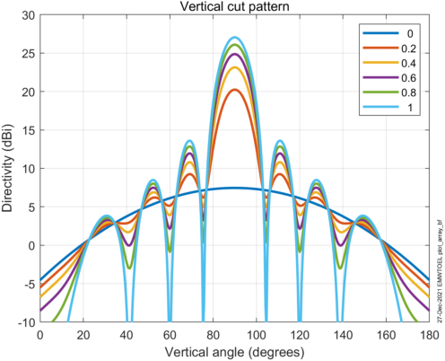
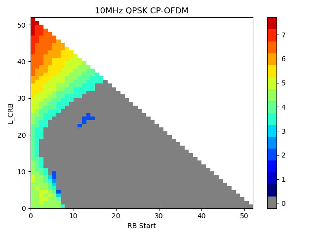

+----------------------------------+----------------------------------+
| 3GPP TR 38.881 V18.0.0 (2023-12) |                                  |
+==================================+==================================+
| Technical Report                 |                                  |
+----------------------------------+----------------------------------+
| 3^rd^ Generation Partnership     |                                  |
| Project;                         |                                  |
|                                  |                                  |
| Technical Specification Group    |                                  |
| Radio Access Networks;           |                                  |
|                                  |                                  |
| Lower MSD for inter-band         |                                  |
| CA/EN-DC/DC combinations         |                                  |
|                                  |                                  |
| (Release 18)                     |                                  |
+----------------------------------+----------------------------------+
|                                  |                                  |
+----------------------------------+----------------------------------+
|                                  | {width="1.7708333333333333in" |
|                                  | height="1.0416666666666667in"}   |
+----------------------------------+----------------------------------+
|                                  |                                  |
+----------------------------------+----------------------------------+
| The present document has been    |                                  |
| developed within the 3^rd^       |                                  |
| Generation Partnership Project   |                                  |
| (3GPP ^TM^) and may be further   |                                  |
| elaborated for the purposes of   |                                  |
| 3GPP.\                           |                                  |
| The present document has not     |                                  |
| been subject to any approval     |                                  |
| process by the 3GPP              |                                  |
| Organizational Partners and      |                                  |
| shall not be implemented.\       |                                  |
| This Specification is provided   |                                  |
| for future development work      |                                  |
| within 3GPP only. The            |                                  |
| Organizational Partners accept   |                                  |
| no liability for any use of this |                                  |
| Specification.\                  |                                  |
| Specifications and Reports for   |                                  |
| implementation of the 3GPP ^TM^  |                                  |
| system should be obtained via    |                                  |
| the 3GPP Organizational          |                                  |
| Partners' Publications Offices.  |                                  |
+----------------------------------+----------------------------------+

+----------------------------------------------------------------------+
|                                                                      |
+======================================================================+
| > ***3GPP***                                                         |
| >                                                                    |
| > Postal address                                                     |
| >                                                                    |
| > 3GPP support office address                                        |
| >                                                                    |
| > 650 Route des Lucioles -- Sophia Antipolis                         |
| >                                                                    |
| > Valbonne -- FRANCE                                                 |
| >                                                                    |
| > Tel.: +33 4 92 94 42 00 Fax: +33 4 93 65 47 16                     |
| >                                                                    |
| > Internet                                                           |
| >                                                                    |
| > <http://www.3gpp.org>                                              |
+----------------------------------------------------------------------+
| ***Copyright Notification***                                         |
|                                                                      |
| No part may be reproduced except as authorized by written            |
| permission.\                                                         |
| The copyright and the foregoing restriction extend to reproduction   |
| in all media.                                                        |
|                                                                      |
| © 2023, 3GPP Organizational Partners (ARIB, ATIS, CCSA, ETSI, TSDSI, |
| TTA, TTC).                                                           |
|                                                                      |
| All rights reserved.                                                 |
|                                                                      |
| UMTS™ is a Trade Mark of ETSI registered for the benefit of its      |
| members                                                              |
|                                                                      |
| 3GPP™ is a Trade Mark of ETSI registered for the benefit of its      |
| Members and of the 3GPP Organizational Partners\                     |
| LTE™ is a Trade Mark of ETSI registered for the benefit of its       |
| Members and of the 3GPP Organizational Partners                      |
|                                                                      |
| GSM® and the GSM logo are registered and owned by the GSM            |
| Association                                                          |
+----------------------------------------------------------------------+

 Contents {#contents .TT}
========

Foreword 5

1 Scope 7

2 References 7

3 Definitions of terms, symbols and abbreviations 8

3.1 Terms 8

3.2 Symbols 8

3.3 Abbreviations 8

4 Background 9

4.1 Objective 9

5 Band combinations selected for lower MSD analysis 9

6 Study of MSD improvement 9

6.1 General 9

6.2 Feasibility study 10

6.2.1 Evaluation from Huawei \[8\] 10

6.2.1.1 MSD analysis assumptions 10

6.2.1.2 MSD by Harmonic Mixing 10

6.2.1.3 MSD by Cross-band Isolation 10

6.2.1.4 MSD by Harmonic Interference 11

6.2.1.5 MSD by Dual-UL Inter-Modulation Distortion 12

6.2.1.6 Summary of MSD 13

6.2.2 Evaluation from Samsung \[9\] 14

6.2.2.1 CA\_n3-n78 MSD Analysis on IMD2 14

6.2.2.2 CA\_n3-n78 MSD Analysis on IMD4 15

6.2.2.3 CA\_n3-n78 MSD Analysis on 2nd Harmonic 15

6.2.2.4 CA\_n28-n40 MSD Analysis on 3nd Harmonic mixing 16

6.2.2.5 CA\_n1-n3 MSD Analysis on cross band isolation 17

6.2.3 Evaluation from Nokia \[10\] 18

6.2.3.1 2nd UL harmonic for CA\_3-n78 18

6.2.3.1.1 MSD improvement by single RF component performance improvement
18

6.2.3.1.2 Possible way to achieve 20 dB MSD improvement 20

6.2.3.1.3 20 dB MSD improvement with less isolation improvement in Path
2 &3 20

6.2.3.1.4 How to achieve MSD = 0 dB 21

6.2.3.2 2nd order harmonic mixing for CA\_n3-n78 22

6.2.3.3 IMD2 for CA\_n3-n78 23

6.2.3.4 MSD improvement and MSD types 24

6.2.4 Evaluation from Qualcomm \[11\] 25

6.2.5 Evaluation from Apple \[12\] 30

6.2.5.1 CA\_n3-n78 UL 2nd harmonic MSD analysis 30

6.2.5.2 CA\_n3-n78 2UL IMD2 MSD analysis 32

6.2.5.3 CA\_n28-n40 3rd order harmonic mixing MSD analysis 34

6.2.6 Evaluation from ZTE \[13\] 36

6.2.7 Evaluation from LGE \[14\] 41

6.2.8 Evaluation from Xiaomi \[15\] 42

6.2.8.1 2nd harmonic MSD analysis for CA\_n3-n78 42

6.2.8.2 IMD MSD analysis for CA\_n3-n78 43

6.2.8.2.1 IMD2 MSD 44

6.2.8.2.2 IMD4 MSD 45

6.2.8.3 Comparison of MSD improvement for different MSD types 46

6.2.8.4 Cross band isolation for CA\_n1-n3 (R4-2219037) 46

6.2.9 Evaluation from Meta \[16\] 47

6.2.9.1 MSD evaluation results by Harmonic problem 47

6.2.9.2 MSD evaluation results by cross band isolations 48

6.2.9.3 MSD evaluation results by dual uplink transmission 49

6.3 Conclusion 50

7 Study of signalling for improved lower MSD 50

7.1 Possible MSD reporting approaches 50

7.1.1 Candidate solution 1: MSD reporting depending on frequency region
50

7.1.2 Candidate solution 2: MSD reporting for frequency regions affected
by self-interference 53

7.1.2.1 Basic MSD information unit 53

7.1.2.2 Reporting of low-MSD information 54

7.1.2.2.1 Aspect of higher order band combinations 54

7.1.2.2.2 Aspect of power classes 54

7.1.2.2.3 Network query based reporting 55

7.1.2.2.3.1 Effect of introducing frequency range as one of the
filtering conditions 56

7.1.2.2.3.2 Effect of introducing network preferred minimum Lower MSD
class as one of the filtering conditions 57

7.1.3 Candidate solution 3: MSD reporting for frequency regions affected
by self-interference 58

7.1.3.1 Basic MSD information unit 58

7.1.3.2 Reporting of low-MSD information 60

7.2 Conclusion 61

Annex A (informative): Change history 64

Foreword
========

This Technical Report has been produced by the 3^rd^ Generation
Partnership Project (3GPP).

The contents of the present document are subject to continuing work
within the TSG and may change following formal TSG approval. Should the
TSG modify the contents of the present document, it will be re-released
by the TSG with an identifying change of release date and an increase in
version number as follows:

Version x.y.z

where:

x the first digit:

1 presented to TSG for information;

2 presented to TSG for approval;

3 or greater indicates TSG approved document under change control.

y the second digit is incremented for all changes of substance, i.e.
technical enhancements, corrections, updates, etc.

z the third digit is incremented when editorial only changes have been
incorporated in the document.

In the present document, modal verbs have the following meanings:

**shall** indicates a mandatory requirement to do something

**shall not** indicates an interdiction (prohibition) to do something

The constructions "shall" and "shall not" are confined to the context of
normative provisions, and do not appear in Technical Reports.

The constructions "must" and "must not" are not used as substitutes for
"shall" and "shall not". Their use is avoided insofar as possible, and
they are not used in a normative context except in a direct citation
from an external, referenced, non-3GPP document, or so as to maintain
continuity of style when extending or modifying the provisions of such a
referenced document.

**should** indicates a recommendation to do something

**should not** indicates a recommendation not to do something

**may** indicates permission to do something

**need not** indicates permission not to do something

The construction "may not" is ambiguous and is not used in normative
elements. The unambiguous constructions "might not" or "shall not" are
used instead, depending upon the meaning intended.

**can** indicates that something is possible

**cannot** indicates that something is impossible

The constructions "can" and "cannot" are not substitutes for "may" and
"need not".

**will** indicates that something is certain or expected to happen as a
result of action taken by an agency the behaviour of which is outside
the scope of the present document

**will not** indicates that something is certain or expected not to
happen as a result of action taken by an agency the behaviour of which
is outside the scope of the present document

**might** indicates a likelihood that something will happen as a result
of action taken by some agency the behaviour of which is outside the
scope of the present document

**might not** indicates a likelihood that something will not happen as a
result of action taken by some agency the behaviour of which is outside
the scope of the present document

In addition:

**is** (or any other verb in the indicative mood) indicates a statement
of fact

**is not** (or any other negative verb in the indicative mood) indicates
a statement of fact

The constructions "is" and "is not" do not indicate requirements.

 1 Scope
=======

The present document is a technical report for study of lower MSD for
inter-band CA/EN-DC/DC combinations.

2 References {#references-1}
============

The following documents contain provisions which, through reference in
this text, constitute provisions of the present document.

\- References are either specific (identified by date of publication,
edition number, version number, etc.) or non‑specific.

\- For a specific reference, subsequent revisions do not apply.

\- For a non-specific reference, the latest version applies. In the case
of a reference to a 3GPP document (including a GSM document), a
non-specific reference implicitly refers to the latest version of that
document *in the same Release as the present document*.

\[1\] 3GPP TR 21.905: "Vocabulary for 3GPP Specifications".

\[2\] RP-210890, "New WID on New WID on simultaneous Rx/Tx band
combinations for CA, SUL, MR-DC and NR-DC".

\[3\] 3GPP TS 38.101-1: "NR; User Equipment (UE) radio transmission and
reception; Part 1: Range 1 Standalone".

\[4\] 3GPP TS 38.101-2: "NR; User Equipment (UE) radio transmission and
reception; Part 2: Range 2 Standalone".

\[5\] 3GPP TS 38.101-3: "NR; User Equipment (UE) radio transmission and
reception; Part 3: Range 1 and Range 2 Interworking operation with other
radios".

\[6\] R4-2214452, "WF on study for lower MSD", Huawei, HiSilicon

\[7\] R4-2217723, "WF on study for lower MSD", Huawei, HiSilicon

\[8\] R4-2216776, "Further discussion on the feasibility of improving
MSD", Huawei, HiSilicon

\[9\] R4-2215734, "Views on feasibility of improved MSD", Samsung

\[10\] R4-2215792, "Feasibility study on amount of MSD improvement",
Nokia

\[11\] R4-2215379, "Investigation of band combinations for MSD
reduction", Qualcomm

\[12\] R4-2215666, "Further analyses and views on MSD improvement for
inter-band CA and DC", Apple

\[13\] R4-2215889, "Discussion on lower MSD for inter-band CA/ENDC", ZTE

\[14\] R4-2216187, "MSD evaluation considering the high PCB isolation
for CA n1-n3", LG Electronics

\[15\] R4-2216145, "Discussion on lower MSD for inter-band CA/EN-DC/DC",
Xiaomi

\[16\] R4-2218297, "On MSD evaluation with new assumptions for MSD
improvement", Meta

3 Definitions of terms, symbols and abbreviations
=================================================

3.1 Terms
---------

For the purposes of the present document, the terms given in 3GPP
TR 21.905 \[1\] and the following apply. A term defined in the present
document takes precedence over the definition of the same term, if any,
in 3GPP TR 21.905 \[1\].

3.2 Symbols
-----------

For the purposes of the present document, the following symbols apply:

\<symbol\> \<Explanation\>

3.3 Abbreviations
-----------------

For the purposes of the present document, the abbreviations given in
3GPP TR 21.905 \[1\] and the following apply. An abbreviation defined in
the present document takes precedence over the definition of the same
abbreviation, if any, in 3GPP TR 21.905 \[1\].

ACLR Adjacent Channel Leakage Ratio

ACS Adjacent Channel Selectivity

A-MPR Additional Maximum Power Reduction

BCS Bandwidth Combination Set

CA Carrier Aggregation

CC Component Carrier

DC Dual Connectivity

EIRP Equivalent Isotropically Radiated Power

EN-DC E-UTRA/NR DC

EVM Error Vector Magnitude

FDM Frequency Division Multiplexing

FR Frequency Range

ENBW The aggregated bandwidth of an E-UTRA sub-block and an adjacent NR
sub-block

ITS Intelligent Transportation System

ITU-R Radiocommunication Sector of the International Telecommunication
Union

MBW Measurement bandwidth defined for the protected band

MPR Allowed maximum power reduction

MSD Maximum Sensitivity Degradation

MCG Master Cell Group

NR New Radio

NS Network Signalling

NSA Non-Standalone, a mode of operation where operation of an other
radio is assisted with an other radio

OOB Out-of-band

OOBE Out-of-band emission

OTA Over The Air

PRB Physical Resource Block

PSCCH Physical Sidelink Control Channel

PSSCH Physical Sidelink Shared Channel

RE Resource Element

REFSENS Reference Sensitivity

RF Radio Frequency

Rx Receiver

SCG Secondary Cell Group

SCS Subcarrier spacing

SEM Spectrum Emission Mask

SL Sidelink

SUL Supplementary uplink

TDM Time Division Multiplex

Tx Transmitter

UE User Equipment

UL MIMO Up Link Multiple Antenna transmission

ULSUP Uplink sharing from UE perspective

4 Background
============

4.1 Objective
-------------

The objectives of the lower MSD objective in the Rel-18 UE RF FR1 WI are
as follows:

**Investigate the feasibility of lower MSD for inter-band CA/EN-DC/DC
combinations \[RAN4\]**

\- Select a limited set of band combinations (2-4 combinations) to cover
all types of MSD (harmonic, harmonic mixing, IMD and cross band
isolation)

\- Study how the MSD performance can be improved for the example band
combinations

\- Study of MSD improvement with different MSD sources (harmonics,
IMD2/3/4/5, cross band isolation and harmonic mixing)

\- Study the feasibility of and options for allowing a UE to signal
improved lower MSD performance capability for combinations where MSD is
allowed

\- Aim to conclude the study phase by RAN\#99, and further discuss in
RAN\#99 how to handle the objective based on the study progress.

5 Band combinations selected for lower MSD analysis
===================================================

The following example band combinations are used to study the
feasibility of MSD improvement for different MSD types:

\- CA\_n28-n40 (harmonic mixing)

\- CA\_n41-n77 (cross band isolation)

\- CA\_n1-n3-n78 and fallback combinations (IMD on the 3^rd^ band, cross
band isolation on CA\_n1-n3 using 50MHz channel bandwidth, IMD2/4 and
2^nd^ harmonic and harmonic mixing on CA\_n3-n78)

Note 1: All supported power classes for the above example band
combinations can be analyzed.

6 Study of MSD improvement
==========================

6.1 General
-----------

The purpose of study of MSD improvement is to justify whether it is
feasible to improve the MSD for a band combination with reasonable
implementation assumptions, which is the basis for the next stage study
of signaling part of the WI objective for lower MSD.

It was agreed in WF \[7\] that no unified assumptions are needed for the
evaluation of MSD improvement, e.g. reference architectures, antenna
isolation, PCB isolation, component linearity, etc. The following
feasibility study are carried out by companies separately with own
analysis assumptions for reference. Apart from the assumptions, if
listed, the evaluation results for the example band combinations as well
as the observations are captured in the feasibility study respectively.

6.2 Feasibility study
---------------------

### 6.2.1 Evaluation from Huawei \[8\]

#### 6.2.1.1 MSD analysis assumptions

Some common RF assumptions are listed in Table 6.2.1.1-1 below, which
are the baseline for the following MSD analysis. Some parameters such as
PCB/antenna isolation may be varied to evaluate their effect on the MSD
performance. Other parameters related to certain types of MSD are
described in the individual sub-sections.

Table 6.2.1.1-1: Common RF assumptions

  Diplexer/Triplexer Isolation   15 dB
  ------------------------------ ------------
  Antenna Isolation              10 dB
  PCB isolation                  70 dB
  Front-end insertion loss       4\~5 dB
  PA output power                27\~28 dBm

#### 6.2.1.2 MSD by Harmonic Mixing

The L-H band combinations such as CA\_n20-n40, CA\_n28-n40 and
CA\_n18-n41 are susceptible to harmonic mixing problems. More than 30dB
MSD is specified for CA\_n28-n40 when the mixing product of the UL in
band n40 and the 3^rd^ harmonic of the DL LO in band n28 falls within
the receiver channel bandwidth. The MSD requirements reuse those for LTE
CA\_28-40, which were defined based on the study of several
contributions.

According to the analysis, the conductive path from the aggressor band
transmitter to the victim band receiver dominates the interference
level. And the victim band receiver **duplexer/filter rejection** at the
aggressor frequency is the key factor in addition to the victim band
receiver **mixer harmonic suppression**. Figure 6.2.1.2-1 shows the MSD
variation with the optimization of the two key factors.

{width="4.3850262467191605in"
height="2.677509842519685in"}

Figure 6.2.1.2-1: MSD by harmonic mixing varies with the receiver filter
rejection and the mixer harmonic rejection. The PCB isolation of 70 dB
is assumed.

#### 6.2.1.3 MSD by Cross-band Isolation

As seen from the REFSENS requirements in TS 38.101-1, the MSD is usually
more severe when the source of cross-band isolation interference is
"ACLR1" or "ACLR2" (e.g. CA\_n18-n28, CA\_n5-n28). If the aggressor
channel BW is large (e.g. 50/100MHz), the MSD may increase to more than
10 or even above 20 dB (e.g. CA\_n1-n3, CA\_n1-n40), even if the source
is classified as "\>ACLR2". It's worth noting that the spec requirements
target the worst cases, where the aggressor carrier frequency is set as
close as possible to that of the victim.

As shown by the previous analysis, the PA noise and cross-band isolation
are the main factors affecting the MSD when the carrier frequencies and
UL RB allocation are fixed.

#### 6.2.1.4 MSD by Harmonic Interference

The band combination of CA\_n3-n78 or DC\_3\_n78 may suffer from MSD
caused by H2 of the UL in band 3/n3 falling into the DL of band n78. All
the RF components in the front-end of band 3/n3 could contribute to the
generation of H2, including: duplexer, antenna switch,
diplexer/triplexer and etc. It was identified that the main factors are:

\- PA linearity

\- Total filter attenuation (including Harmonic Trap Filter and B3
duplexer)

\- PCB isolation.

The filter survey shows that the B3 duplexer attenuation at B42 ranges
from 10 to 27 dB, and the discussions indicates that 30 dB is possible
for future design. Additionally, the following assumptions were
considered optimistic at that time: PA H2 = -35 dBc, HTF = 30dB and PCB
isolation (\@3.5GHz) = 70dB.

By tuning the total filter attenuation and the PCB isolation while
fixing the PA H2=-35dBc, the MSD trend is obtained as shown in Figure
6.2.1.4-1.

{width="4.2139031058617675in"
height="3.18667104111986in"}

Figure 6.2.1.4-1: MSD by Tx harmonic varies with the Tx filter
attenuation and the PCB isolation. The PA H2 is assumed to be -35dBc.

Figure 6.2.1.4-2 illustrates the combination of carrier frequencies that
may suffer from MSD caused by Tx harmonic.

{width="4.058824365704287in"
height="3.043591426071741in"}

Figure 6.2.1.4-2: Illustration of carrier frequency combinations that
may be affected by MSD caused by H2. CBW: 10MHz for n3, 20MHz for n78.

#### 6.2.1.5 MSD by Dual-UL Inter-Modulation Distortion

When both uplinks are active, the DL band n3 of CA\_n3-n78 may suffer
from IMD2 and IMD4 of the dual-UL. It has been identified that PCB
isolation and antenna isolation are the main factors. The MSD trend is
reproduced in Figure 6.2.1.5-1 below.

{width="4.684492563429571in"
height="3.0416765091863516in"}

Figure 6.2.1.5-1: MSD caused by IMD2 for CA\_n3-n78 varies with
different PCB isolation and antenna isolation. The 40dB antenna
isolation is impractical for small form-factor UEs but serves as a
performance indicator for conductive measurements.

In order for the self-interference to fall within the own receiver, the
aggressors' carrier frequencies and the victims' carrier frequencies
need to satisfy certain mathematical constraints, subject to the order
of the IMD. Figure 6.2.1.5-2 indicates the occurrences of IM
interferences for CA\_n3-n78.

  ------------------------------------------------------------------------------------- -----------------------------------------------------------------------------------
  {width="3.3584897200349957in" height="2.5135542432195974in"}   {width="3.359371172353456in" height="2.521531058617673in"}
  ------------------------------------------------------------------------------------- -----------------------------------------------------------------------------------

**Figure 6.2.1.5-2: Illustration of the relationship between IMD and the
carrier frequencies. The red color indicates that the IM product may
fall into the victim Rx channel, assuming CBW: 10MHz for n3, 20MHz for
n78.**

It can be seen that for the majority of the carrier frequency
configurations of CA\_n3-n78, there's no self-interference from IMD2 or
IMD4 or H2. Furthermore, when MSD from IMD2 happens for a given
deployment, MSD from IMD4 does not, or vice visa. Since n78 is a TDD
band, the MSD caused by H2 of n3 will not happen at the same time as the
MSD caused by IMD2 or IMD4 of the dual UL.

#### 6.2.1.6 Summary of MSD 

Based on the above discussions, the key contributors for different types
of MSDs are summarized in Table below.

Table 6.2.1.6-1: Key contributors for different MSD types

  MSD Types                                                   Key Contributors
  ----------------------------------------------------------- ---------------------------------------------------------------------------------
  Harmonic Mixing (e.g. UL1/DL3, UL1/DL5, UL2/DL3, UL3/DL2)   Victim filter rejection and mixer harmonic suppression
  Tx Harmonic (e.g. H2/3/4/5)                                 Aggressor PA linearity, harmonic filter and duplexer attenuation, PCB isolation
  Cross-band Isolation (e.g. ALCR1/2, \>ACLR2)                Aggressor PA noise and filter attenuation
  Dual-UL IMD (e.g. IMD2/3/4/5/7)                             PCB isolation, antenna isolation

It has been shown that the MSD may be improved by optimizing the key
contributors listed in Table 6.2.1.6-1. However, it can also be seen
that for large MSD values (\>20dB) it would be very challenging to
reduce them to below 10dB. Furthermore, we can make the following
observations:

**Observation 1: Different types of MSDs may have different limiting
factors. Which one can be improved for what band combinations are design
choices of the UE implementation.**

**Observation 2: For large MSD values (\>20dB) it's very challenging to
reduce them to below 10dB. The relatively small MSD values (\<10 dB) may
be further improved depending on UE implementation.**

**Observation 3: The antenna isolation plays an important role in MSD
performance. However, the effect is not verified by the existing
conductive tests.**

**Observation 4: For a given band combination, MSD from different
sources are unlikely to happen simultaneously, depending on the
configuration of carrier frequencies, duplex mode of the component
bands, the order of IMD or harmonics and etc*.***

### 6.2.2 Evaluation from Samsung \[9\]

#### 6.2.2.1 CA\_n3-n78 MSD Analysis on IMD2

The component linearity parameters and initial isolation parameters
adopted in our calculation was summarized in Table 6.2.2.1-1 and Table
6.2.2.1-2 respectively.

Table 6.2.2.1-1 Front-end component linearity parameters for MSD
calculation

  Component     IP2(dBm)   IP3(dBm)   IP4(dBm)   IP5(dBm)
  ------------- ---------- ---------- ---------- ----------
  Ant. Switch   112        68         56         53
  Triplexer     115        86         55         53
  Duplexer      100        74         55         53
  PA Forward    28         30         32         27
  PA Reversed   40         28         33         32
  LNA           5          -6         -6         -10

Table 6.2.2.1-2 Front-end component isolation

  Isolation Parameter    Value (dB)   Comment
  ---------------------- ------------ --------------------------------------------
  Antenna to Antenna     10           Main antenna to diversity antenna
  PA (out) to PA (in)    65           PCB isolation (PA forward mixing)
  Triplexer              15           Low/high/very high band isolation
  PA (out) to PA (out)   65           PCB isolation (PA reverse mixing)
  LNA (in) to PA (out)   65           Cross-band (B42 filter + triplexer)
  LNA (in) to PA (out)   65           PCB isolation (B42 PA leakage into B3 LNA)
  Duplexer               50           Tx band rejection at Rx band

It is observed that PCB isolation, antenna isolation and duplexer
isolation are the main contributors for MSD due to IMD2, the affected
dominant items are marked as blue in the link budget calculation process
of IMD2 presented in Table 6.2.2.1-3.

Table 6.2.2.1-3 Link budget analysis for CA\_n3-n78 IMD2

{width="6.768055555555556in"
height="1.4889238845144357in"}

As recorded in WF, the feasible antenna isolation used in Lower MSD
study is 10-20dB, while the feasible range of PCB isolation need further
discussion. Under this premise we have evaluated the MSD improvement
over antenna isolation up to 20dB and PCB isolation up to 85dB which are
the two contributors to all kinds of MSD improvement, as Figure
6.2.2.1-1 without taking into account the practical implementation. Note
that the feasibility of PCB isolation is subject to the group's further
confirmation.

{width="2.952755905511811in"
height="1.7755905511811023in"}

Figure 6.2.2.1-1 IMD2 MSD trend analysis over better PCB isolation and
antenna isolation

**Observation 1: It is observed that in terms of PC3, MSD due to IMD2 of
CA\_n3-n78 could be reduced to around 15dB with 85dB PCB isolation and
20dB antenna isolation, in contrast to 26dB specified MSD.**

#### 6.2.2.2 CA\_n3-n78 MSD Analysis on IMD4 

The link budget calculation process of IMD4 is presented in Table
6.2.2.2-1 and the MSD improvement over antenna isolation up to 20 dB and
PCB isolation up to 85 dB is presented in Figure 6.2.2.2-1.

Table 6.2.2.2-1 Link budget analysis for CA\_n3-n78 IMD4

{width="6.768055555555556in"
height="1.4889238845144357in"}

{width="2.952755905511811in"
height="1.7755905511811023in"}

Figure 6.2.2.2-1 IMD4 MSD analysis over better PCB isolation and antenna
isolation

**Observation 2: It is observed that in terms of PC3, MSD due to IMD4 of
CA\_n3-n78 could be reduced to around 5dB with 85dB PCB isolation and
20dB antenna isolation, in contrast to 8dB specified MSD.**

#### 6.2.2.3 CA\_n3-n78 MSD Analysis on 2nd Harmonic

It is observed that PCB isolation, antenna isolation and PA harmonic
rejection are the main contributors of the MSD due to harmonic, the link
budget calculation process and its initial adopted RF component
assumption are presented in Table 6.2.2.3-1 and similar as above the MSD
improvement over antenna isolation up to 20 dB and PCB isolation up to
85 dB is presented in Figure 6.2.2.3-1.

Table 6.2.2.3-1 RF Component assumption and Link budget analysis for
CA\_n3-n78 2nd harmonic MSD

{width="6.768055555555556in"
height="2.0517049431321084in"}

{width="2.952755905511811in"
height="1.669291338582677in"}

Figure 6.2.2.3-1 Harmonic MSD analysis over better PCB isolation and
antenna isolation

Observation 3: It is observed that in terms of PC3, MSD due to 2nd
harmonic of CA\_n3-n78 could be reduced to around 13dB with 85dB PCB
isolation and 20dB antenna isolation, in contrast to 23.9dB specified
MSD.

#### 6.2.2.4 CA\_n28-n40 MSD Analysis on 3nd Harmonic mixing

It is observed that PCB isolation, lower band Rx filter selectivity and
Rx 3^rd^ order harmonic rejection are the main contributors of the MSD
due to harmonic mixing, the link budget calculation process and its
initial adopted RF component assumption are presented in Table
6.2.2.4-1, based on our analysis larger antenna isolation has almost no
contribution to the MSD improvement since it only affects the diversity
conductive path which has less influence on Diversity MSD.

The MSD improvement over Rx 3^rd^ harmonic rejection up to 30 dB and PCB
isolation up to 85 dB is presented in Figure 6.2.2.4-1, without taking
into account the practical implementation. Note that the antenna
isolation assumption is 10dB considering antenna isolation has almost no
contribution to the MSD improvement.

Table 6.2.2.4-1 RF Component assumption and Link budget analysis for
CA\_n28-n40 3rd harmonic mixing MSD

{width="6.768055555555556in"
height="1.2425273403324584in"}

{width="3.4538713910761154in"
height="1.6486482939632545in"}

Figure 6.2.2.4-1 Harmonic mixing MSD analysis over better PCB isolation
and Rx harmonic rejection

**Observation 4: It is observed that in terms of PC3, MSD due to 3rd
harmonic mixing of CA\_n28-n40 could be reduced to around 25dB with 85dB
PCB isolation and 20dB antenna isolation, in contrast to 37.8dB
specified MSD. Note that antenna isolation has almost no contribution to
the MSD improvement.**

**Observation 5: It is observed that in terms of PC3, MSD due to 3rd
harmonic mixing of CA\_n28-n40 could be reduced to around 15dB with 85dB
PCB isolation and 30dB Rx harmonic rejection, in contrast to 37.8dB
specified MSD.**

#### 6.2.2.5 CA\_n1-n3 MSD Analysis on cross band isolation

The link budget calculation process and its initial adopted RF component
assumption are presented in Table 6.2.2.5-1, similar as above the MSD
improvement trend over antenna isolation up to 20 dB and PCB isolation
up to 85 dB is presented in Figure 6.2.2.5-1.

Table 6.2.2.5-1 RF Component assumption and Link budget analysis for
CA\_n1-n3 cross band isolation MSD

{width="3.7567574365704286in"
height="1.770229658792651in"}

{width="3.5039370078740157in"
height="1.669291338582677in"}

Figure 6.2.2.5-1 Cross band isolation analysis over better PCB isolation
and antenna isolation

**Observation 6: It is observed that in terms of PC3, MSD due to cross
band isolation of CA\_n1-n3 could be reduced to around 10dB with 85dB
PCB isolation and 20dB antenna isolation, in contrast to \[19.7\]dB
specified MSD.**

### 6.2.3 Evaluation from Nokia \[10\]

#### 6.2.3.1 2nd UL harmonic for CA\_3-n78

##### 6.2.3.1.1 MSD improvement by single RF component performance improvement

There would be multiple ways to improve MSD due to UL harmonics. In
order to show a specific example, we assume a following condition
captured in Table 6.2.3.1.1-1.

Table 6.2.3.1.1-1: MSD calculation where PA H2 is 35 dBc.

{width="6.118055555555555in"
height="2.119991251093613in"}

The derived MSD is almost the same as that of specified MSD, i.e., 23.9
dB. The further proposed improved MSD value by assuming PA H2 of 48 dBc
and the MSD becomes 14.3 dB as shown in Table 6.2.3.1.1-2, which means
10 dB improvement is possible.

Table 6.2.3.1.1-2: MSD calculation where PA H2 is 48 dBc.

{width="6.673611111111111in"
height="2.326388888888889in"}

**Observation 1: Feasibility of MSD improvement by PA H2 performance
improvement was already proposed by a UE vendor in reference
contribution, where it showed 10 dB improvement is possible.**

Now the question is what if PA H2 with even better performance is used,
whether the amount of MSD is further improved or not. The amount of the
MSD improvement by PA H2 performance improvement **alone** starts to
saturate when PA H2 approaches to 50 dBc and the MSD couldn't be lower
than 11.4 dB even if PA H2 was infinite. This is because as the noise in
Path 1 becomes lower thanks to PA H2 improvement, the noise from Path 3
appears as the next gating factor since PA H2 doesn't reduce noise in
Path 3 at all. Hence, in order to improve MSD further, the noise from
Path 3 must be also reduced.

Next, we'll take a look at the amount of MSD improvement by assuming
that isolations like PCB in Path 2 and Path 3 alone or PA H2 alone is
improved in Figure 1 which shows how much MSD improvement can be
obtained by improving PA H2 from 35 dBc to 75 dBc or isolation in Path 2
and Path 3 from 70 to 110 dB. It's noted that we don't have an intention
to discuss if 75 dBc and 110 dB are feasible or not. They are just used
to see the trend of MSD improvement by PA H2 or isolation improvement.
Regarding MSD improvement vs PA H2 improvement, as mentioned before, the
MSD improvement is saturated at around 50 dBc. With respect to MSD
improvement vs isolation improvement, the amount of MSD improvement
starts to saturate at around 90 dB and even if isolation was infinity,
the MSD couldn't be lower than 9.4 dB.

**Observation 2: Around 10 dB MSD improvement for CA\_n3-n78 2^nd^ UL
harmonics is feasible at least e.g., by PA H2 suppression of 48 dBc or
isolation like PCB in Path 2 and Path 3 of 85 dB. Single RF component
performance improvement alone, however, cannot achieve even better MSD
like 20 dB since other gating factor(s) appears in one or two of the
three Paths once noise in two or one of the three Paths is improved.**

{width="4.152777777777778in"
height="2.4825218722659668in"}

Figure 6.2.3.1.1-1: MSD improvement by H2 PA suppression or isolation
improvement by the same amount in Path 2&3

##### 6.2.3.1.2 Possible way to achieve 20 dB MSD improvement

With consideration of Observation 2, we take into account multiple
components performance improvement impact on combined MSD. Figure 2
shows relation between the combined MSD improvement and improvements due
to combinations of PA H2 suppression in Path 1, antenna isolation in DRX
Path 1 and an isolation in Path 2 and Path 3.

{width="5.189584426946632in"
height="2.553013998250219in"}

Figure 6.2.3.1.2-1: Impact of antenna isolation, PA H2 suppression and
isolation in Path 2/3 on combined MSD

From Figure 6.2.3.1.2-1, in order to achieve around 20 dB MSD
improvement, in case PA H2 suppression is 48 dBc, around 20 dB isolation
improvement for Path 2 and Path 3 is needed. In case PA H2 suppression
is 35 dBc, even if antenna isolation is 20 dB, 20 dB MSD is not possible
(around 19 dB seems possible) under the assumption of Table 6.2.3.1.1-1.

**Observation 3: In case of PA H2 suppression of 35 dB, 20 dB MSD
improvement is not possible even if antenna isolation is 20 dB and
isolation improvement of Path 2&3 was infinity if the other assumptions
are the same as those in Table 6.2.3.1.1-1.**

**Observation 4: In order to achieve 20 dB MSD improvement with PA H2
suppression of 48 dBc, around 25 dB isolation improvement, i.e., 95 dB
isolation, for Path 2 &3 is required if the other assumptions are the
same as those in Table 6.2.3.1.1-1.**

Next, we discuss the impact of antenna isolation performance improvement
on the combined MSD. One of the important aspects of antenna isolation
in terms of MSD improvement is that the contribution of it to MSD
improvement applies to only MSD for DRX under the UE architecture
assumption in reference, which is achieved by reducing the composite H2
level at LNA (and hence MSD) in Path 1 for "DRX". It's noted that even
if a UE architecture to enable a UE to obtain antenna isolation for PRX
is assumed, the conclusion does not change that much for at least MSD
due to UL harmonics since it only improves H2 levels at LNA for PRX and
DRX for Path 1 only. Therefore, antenna isolation does not help improve
combined MSD if DRX H2 level at LNA for Path 1 is lower than those for
Path 2 and 3 and helps improve combined MSD a little if DRX H2 level at
LNA for Path 1 is higher than those for Path 2 and 3, though the help
can be around 5 dB at maximum with antenna isolation of 20 dB.

**Observation 5: Antenna isolation improvement helps improve combined
MSD more when DRX H2 levels at LNA for Paths 2 and 3 are even lower than
DRX H2 level at LNA for Path 1 while the amount of maximum improvement
by antenna isolation is around 5 dB with antenna isolation of 20 dB.**

##### 6.2.3.1.3 20 dB MSD improvement with less isolation improvement in Path 2 &3

In this sub-section, we discuss a way to mitigate the required isolation
improvement in Path 2 and 3 by reducing respective MSDs (composite H2
levels) for PRX and DRX in a similar level from the conditions in Table
6.2.3.1.1-1. It is noted that in order to achieve 20 dB improved
combined MSD, i.e., MSD = around 4 dB, H2 levels at LNA from each of the
paths for both PRX and DRX must be lower than approximately -103 dBm,
i.e., values in (j), (l) and (n) must be lower than or equal to -103 dBm
except for DRX H2 level at (j) whose value is already -105.2 dBm. A
specific example is summarized in Table 6.2.3.1.3-1, where combined MSD
is 3.67 dB can be obtained.

Table 6.2.3.1.3-1: A way to 20 dB MSD improvement with less isolation
improvement of Path 2&3 than Figure 2{width="6.666666666666667in"
height="2.2083727034120737in"}

**Observation 6: If harmonic filter rejection, HB switch H2 and
Triplexer Rejection towards H2 are improved by 8 dB, 8 dB and 5 dB,
respectively, all the LNA H2 levels at the three Paths are almost
equally lower than or equal to -103 dBm, as shown in Table 3, the
required isolation of Path 2 & 3 can be reduced to 83 dB from 95 dB.**

##### 6.2.3.1.4 How to achieve MSD = 0 dB

It is not hard to anticipate that achieving MSD improvement of 24 dB,
i.e., MSD = 0 dB, even more challenging than achieving that of 20 dB.
When MSD improvement of 20 dB is achieved, H2 levels from all the paths
for PRX and DRX must be already similar levels or composite H2 level for
DRX is even smaller than that for PRX. The former means that even if a
component performance is improved and one or some of H2 levels at LNA at
Path 1, 2 and/or 3 for PRX and/or DRX are improved, the other H2 levels
stay as a gating factor. The latter means that the composite level for
PRX must be improved. In any case, multiple components performance must
be improved, but cost for MSD improvement becomes higher. For more
specific, Figure 3 shows relation between respective H2 levels
improvement and combined MSD assuming that H2 levels from the three
Paths are improved in the same amount from the condition shown in Table
6.2.3.2-1. For example, 1 dB in the horizontal line means -116 (-115 dBm
- 1 dB) dBm for Path 1 DRX and -106 (-105 dBm - 1 dB) dBm for Path 1/2/3
PRX and Path 2/3 DRX and so on.

[\[CHART\]]{.chart}

Figure 6.2.3.1.4-1: Required LNA PRX or DRX H2 levels for all the three
path

Figure 6.2.3.1.4-1 says that to improve MSD from 1 dB to almost 0 dB,
the respective H2 levels must be improved by at least 10 dB, which means
that an additional 10 dB isolation improvement for path 2 and 3 is
needed and H2 levels in path 1 somehow need to be improved by 10 dB, but
the options are very limited since triplexer would have challenges in
having more attention than 20 dB so that RF components performance prior
to the triplexer must be improved.

**Observation 7: Theoretically it is not impossible to achieve MSD = 0dB
for CA\_n3-n78 for 2^nd^ UL harmonic. However, as MSD approaches 0 dB,
it requires more cost, i.e., components performance improvement compared
to the cost to improve MSD by 20 dB.**

#### 6.2.3.2 2nd order harmonic mixing for CA\_n3-n78

Regarding CA\_n3-n77, MSD for this CA band combination has not been
specified in 38.101-1 while that for corresponding EN-DC, MSD is defined
in 38.101-3. The values for MSD for EN-DC are extracted from Table
7.3B.2.3.2-1 in 38.101-3 as follows.

Table 6.2.3.2-1: Extract from Table 7.3B.2.3.2-1 in TS38.101-3

<table>
<thead>
<tr class="header">
<th>E-UTRA or NR Band / Channel bandwidth of the affected DL band / MSD</th>
<th></th>
<th></th>
<th></th>
<th></th>
<th></th>
<th></th>
<th></th>
<th></th>
<th></th>
<th></th>
<th></th>
<th></th>
</tr>
</thead>
<tbody>
<tr class="odd">
<td>UL band</td>
<td>DL band</td>
<td>
5

MHz

(dB)
</td>
<td>
10 MHz

(dB)
</td>
<td>
15 MHz

(dB)
</td>
<td>
20 MHz

(dB)
</td>
<td>
25 MHz

(dB)
</td>
<td>
40 MHz

(dB)
</td>
<td>
50 MHz

(dB)
</td>
<td>
60 MHz

(dB)
</td>
<td>
80 MHz

(dB)
</td>
<td>
90 MHz

(dB)
</td>
<td>
100 MHz

(dB)
</td>
</tr>
<tr class="even">
<td>n77</td>
<td>3</td>
<td>5.7</td>
<td>4.0</td>
<td>3.0</td>
<td>2.7</td>
<td></td>
<td></td>
<td></td>
<td></td>
<td></td>
<td></td>
<td></td>
</tr>
<tr class="odd">
<td>n78</td>
<td>3</td>
<td>5.7</td>
<td>4.0</td>
<td>3.0</td>
<td>2.7</td>
<td></td>
<td></td>
<td></td>
<td></td>
<td></td>
<td></td>
<td></td>
</tr>
</tbody>
</table>

A technical analysis to justify MSD = 0 dB for CA\_n3-n78 was submitted
in a reference contribution, where Tx power at LNA input are summarized
in Table 5, where Direct Signal Path corresponds to Path 1 in Section
6.2.3.1.1 and PCB Coupling Path corresponds to Path 2 in Section
6.2.3.1.1, respectively. It should be noted that in case of analysis for
harmonic mixing, consideration of Path 3 in Section 6.2.3.1.1 is not
necessary since the BB output power is always even lower than that PA
output power in Path 2 by PA gain as far as the same PCB isolation is
assumed. The contribution shared the fact that there is a mixier with
the spur rejection of about 66 dBc for mixing with 2LO and it enables
UEs to have MSD = 0 dB. Moreover, the reference contribution implies
that MSD = 0 dB for CA\_n3-n78 can be achieved with PCB isolation of 84
(70 dB + 14 dB) dB instead of using the mixer with 66 dBc rejection.

Table 6.2.3.2-2: Extract of Table 1 from \[4\]

{width="4.195671478565179in"
height="1.450417760279965in"}

As can be seen in Table 6.2.3.2-2, RF components like antenna isolation,
filter isolations in Path 1 cannot contribute to improving combined MSD
since noise level from Path 2 is higher by 14 dB for PRX and 24 dB for
DRX until the noise level in Path 2 approaches close to that in Path 1.
14 dB noise reduction for Path 2 means that PCB isolation must be
improved from 70 dB to 84 dB. However, as can be seen in Figure 4, when
PCB isolation is 85 dB, combined MSD itself if almost zero dB (Combined
MSD is below 1 dB even with mixer spur rejection is 45 dBc) so that
there is no room for antenna isolation to contribute to the improvement.

{width="3.303619860017498in"
height="1.9577384076990376in"}

Figure 6.2.3.2-1: MSD relation b/w PCB isolation and Mixer spur
rejection for 2nd harmonic mixing

Figure 6.2.3.2-1 also shares the information that combined MSD is almost
the same if the same amount of PCB isolation improvement or Mixer spur
rejection improvement is achieved, though Mixer spur rejection
improvement can give a little bit lager MSD improvement by PCB isolation
improvement (see e.g., the top red horizontal dashed line. A point where
PCB isolation of 70 dB line has 50 dBc(45+5) mixer spur rejection is
lower than a point where PCB isolation of 75 dB(70+5) line has 45 dBc
mixer spur rejection). This is theoretically valid since mixer spur
rejection applies to the composite noise consisting of Path 1 and Path 2
while PCB isolation only improves noise from Path 2. Finally, although
MSD = 0 dB is possible, the cost performance becomes worse as the MSD
approaches 0 dB. For instance, in order to achieve 5 dB MSD improvement,
i.e., MSD = 2 dB, PCB isolation, mixer spur rejection or the sum of both
requires around from 8 dB to 12 dB improvement while to achieve 6 dB MSD
improvement, i.e., MSD = 1 dB, PCB isolation, mixer spur rejection or
the sum of both requires around 12 to 15 dB improvement.

**Observation 8: MSD of 0 dB for CA\_n3-n78 harmonic mixing is feasible
by PCB isolation improvement, e.g., 84 dB, mixer spur rejection
improvement, e.g., 66 dBc or combination of the two RF components
performance improvement, e.g., PCB isolation is 75 dB and mixer spur
rejection is 60 dBc. Antenna isolation improvement doesn't help improve
MSD for 2^nd^ harmonic mixing for CA\_n3-n78.**

#### 6.2.3.3 IMD2 for CA\_n3-n78

MSD due to IMD2 for CA\_n3-n78 were discussed intensively. Table
6.2.3.3-1 is a summary of IMD2 analysis from a reference, where yellow
cells are affected by PCB isolation, aqua cells are affected by antenna
isolation, green cells are affected by PCB isolation as well as antenna
isolation. Hence, under the conditions in Table 6.2.3.3-1, it is
expected that if only PCB isolation is improved, MSD improvement would
start to saturate when the PCB isolation approaches to approximately 80
dB, since IMD2 from antenna switch and diplexer stay at -75 dBm in PRX.
Antenna isolation improvement can contribute to reduce IMD2 in DRX so
that the combined MSD can be improved accordingly. Hence, if both PCB
isolation and antenna isolation are improved, the MSD can be further
improved. However, even if PCB isolation as well as antenna isolation
are improved, IMD2 from antenna switch and diplexer stay at -75 dBm in
PRX. Hence, in order to reduce the combined MSD significantly, IP2 for
these RF components needs to be improved.

Table 6.2.3.3-1: IMD2 analysis for CA\_n3-n78 from \[5\]

{width="4.986434820647419in"
height="2.9114304461942258in"}

{width="4.907638888888889in"
height="2.9618055555555554in"}

Figure 6.2.3.3-1: relation b/w IMD, PCB isolation, Ant Iso and IP2 of
Antenna switch & Diplexer

From Figure 6.2.3.3-1, it can be seen that the around 20 dB MSD
improvement is possible if IP2 for diplexer and Antenna switch are 125
dBm, PCB isolation is 80 dB and antenna isolation is 20 dB under the
conditions of Table 6.2.3.3-2. Theoretically MSD of 0 dB is possible
while the cost is significantly high but the gain = "the amount of MSD
improvement"/"the amount of RF component improvement" becomes less and
less.

**Observation 9: Around 10 dB MSD improvement of IMD2 for CA\_n3-n78 is
possible if antenna isolation is around 20 dB or PCB isolation is around
80 dB. Around 20 dB improvement is also possible, if IP2 of antenna
switch as well as diplexer is around 125 dBm. Further MSD improvement is
also possible while the cost and performance = "the amount of MSD
improvement"/"the amount of RF component performance improvement"
becomes less and less.**

#### 6.2.3.4 MSD improvement and MSD types

The below Figure 6.2.3.4-1 shows relation between the amount of the MSD
improvements and the amount of PCB isolation improvement for different
MSD types. It should be noted that assumed UE RF architecture is
basically the same across the MSD evaluations for MSD types while some
device performance assumptions, e.g., RF front end loss are different
across MSD types so that this can be used only as a guide.

{width="4.142878390201225in"
height="2.500264654418198in"}

Figure 6.2.3.4-1: The amount of MSD improvement vs PCB isolation
improvement

From the Figure 6.2.3.4-1, all the three MSD types has a similar trend
when PCB isolation is roughly up to 75 dB. Then, gradually, 2^nd^ UL
harmonic starts to show a different trend than the other 2^nd^ harmonic
mixing and IMD2 Moreover, grey line is the case that PCB isolation as
well as PA H2 improvement for 2nd UL harmonic are considered. The amount
of the MSD improvement is quite different from the other MSD types as
well as the same MSD type whose PA H2 performance is 35 dBc. Moreover,
given that it is not always the case that UE vendors will always use PCB
isolation alone to improve MSD, the amount of MSD improvement can be
very different from MSD types to types.

**Observation 10: The amount of the MSD improvement is not always the
same or similar across MSD types even if one common RF component
performance improvement is considered. Provided that it is not always
the case that UE vendors will always use one single RF component
performance improvement, e.g., only PCB isolation, to improve MSD, the
amount of MSD improvement can be very different from MSD types to
types.**

### 6.2.4 Evaluation from Qualcomm \[11\]

For the band combination CA\_n1-n3-n78 it is seen that CA\_n3-n78 has
IMD2, IMD4 and HD2 impairments.

Based on typical numbers Table 6.2.4-1 gives an analysis for IMD2 for
CA-n3\_n78 where the IMD2 product of n78 Tx and n3 Tx fall into n3 Rx.

Table 6.2.4-1: CA-n3\_n78 budget for IMD2

  Ant-Ant Isolation                  10      dB                      
  ---------------------------------- ------- ----- --- ------------- -----
  PCB Isolation                      70      dB                      
  Power class                        PC2                             
  n77 PA output power                30      dBm                     
  IMD2 at n78 PA output              -71     dBm                     
  Diplexer attenuation               15      dB                      
  Total IMD2 \@n78 ANT               -86.0   dBm                     
  Total IMD2 \@n3 ANT                -96.0   dBm                     
  n77 jammer @ n3 PA input           -40.0   dBm                      
  IMD2 at n3 PA output               -65.0   dBm                      
  Post PA IL                         2.0     dB                       
  Total IMD2 \@n3 ANT                -63.0   dBm                      
  PRX n3 path                                          DRX n3 path    
                                                                      
  Mixer IIP2                         72.0    dB        72.0          dB
  LNA IIP2                           30.0    dBm       30.0          dBm
  Noise from mixer IIP2 distortion   -96.0   dBm       -96.0         dBm
  Rx IMD @ ANT                       -94.0   dBm       -94.0         dBm
  Total distortion @ n3 ANT          -63.0   dBm       -73.0         dBm
  Reference sensitivity              -98.0   dBm       -98.0         dBm
  Thermal noise                      -94.0   dBm       -94.0         dBm
  total noise @ n3 ANT               -63.0             -72.9         dBm
  MRC Sensitivity                    -72.4                           dBm
  MSD                                25.6                            dB

Based on the above numbers it is seen that for improvement in PCB and
antenna isolation the MSD due to IMD2 behaves as indicated in table
6.2.4-2.

Table 6.2.4-2: CA-n3\_n78 MSD for IMD2 as a function of PCB and antenna
isolation

  Ant ISO (dB)   PCB ISO (dB)   MSD (dB)
  -------------- -------------- ----------
  10             70             25.6
  10             80             17.3
  10             90             13.0
  20             70             24.6
  20             80             14.4
  20             90             8.1

From the results in table 6.2.4-2 it can be clearly seen that the MSD
for IMD2 can be reduced by increasing both the PCB and antenna
isolations.

**Observation 1: For CA-n3\_n78 the MSD due to IMD2 where n78 Tx and n3
Tx mix and fall into n3 Rx shows the following behaviour with PCB and
antenna isolation:**

  Ant ISO (dB)   PCB ISO (dB)   MSD (dB)
  -------------- -------------- ----------
  10             70             25.6
  10             80             17.3
  10             90             13.0
  20             70             25.6
  20             80             14.4
  20             90             8.1

Similar analysis for CA-n3\_n78 for IMD4 where the IMD4 of n78 Tx and
3\*n3 Tx falls into n3 Rx shows the following behaviour of MSD with PCB
and antenna isolation given in table 6.2.4-3.

Table 6.2.4-3: CA-n3\_n78 MSD for IMD4 as a function of PCB and antenna
isolations

  Ant ISO (dB)   PCB ISO (dB)   MSD (dB)
  -------------- -------------- ----------
                                 
  10             70             9.5
  10             80             5.5
  10             90             4.0
  20             70             4.8
  20             80             3.9
  20             90             2.7

From the results in table 6.2.4-3 it is seen that the MSD for IMD4 can
be reduced by increasing both the PCB and antenna isolations.

**Observation 2: For CA-n3\_n78 the MSD due to IMD4 where n78 Tx and
3\*n3 Tx mix and fall into n3 Rx shows the following behaviour with PCB
and antenna isolation:**

  Ant ISO (dB)   PCB ISO (dB)   MSD (dB)
  -------------- -------------- ----------
                                 
  10             70             9.5
  10             80             5.5
  10             90             4.0
  20             70             4.8
  20             80             3.9
  20             90             2.7

For CA-n3\_n78 for the 2^nd^ harmonic of n3 Tx falling into n78 Rx we
have the following typical budget

Table 6.2.4-4: CA-n3\_n78 budget for HD2

  Band                        n3                               
  --------------------------- ------- ----- --- -------------- -----
  HD order                    2                                
  Rx BW                       100     MHz                      
  PC                          2                                
  Ant-Ant Isolation           10      dB                       
  PCB Isolation               70      dB                       
  n3 PA HD2                   -6      dBm                      
  HD2 filtering in Tx chain   48      dB                       
  Triplexer attenuation       25      dB                       
  n3 HD2 \@Ant                -79     dB                       
  PRX n78 path                                  DRX n78 path    
                                                                
  Rx FE loss                  3       dB        3              dB
  Total HD pwr at Ant input   -72.9   dBm       -72.9          dBm
  Thermal noise \@RX Ant      -81.5   dBm       -81.5          dBm
  total noise @ n3 ANT        -72.3   dBm       -72.3          dBm
  Reference sensitivity       -85.5   dBm       -85.5          dBm
  MRC Sensitivity             -73.6                            dBm
  MSD                         11.9                             dB

It is seen that for improvement in PCB and antenna isolation the MSD due
to HD2 behaves as indicated in table 6.2.4-5.

Table 6.2.4-5: CA-n3\_n78 MSD for HD2 as a function of PCB and antenna
isolation

  PCB ISO (dB)   Ant ISO (dB)   MSD (dB)
  -------------- -------------- ----------
  70             10             11.9
  80             10             4.4
  90             10             1.7
  70             20             11.8
  80             20             3.9
  90             20             0.7

**Observation 3: For CA-n3\_n78 the MSD due to HD2 where the second
harmonic of n3 falls into n78 Rx shows the following behaviour with PCB
and antenna isolation:**

  PCB ISO (dB)   Ant ISO (dB)   MSD (dB)
  -------------- -------------- ----------
  70             10             11.9
  80             10             4.4
  90             10             1.7
  70             20             11.8
  80             20             3.9
  90             20             0.7

For CA-n41\_n77 where cross band isolation is an issue with Tx noise
from n41 falling into n77 and vis-a-versa. The below table shows the
budget for n77 Tx noise falling into n41.

Table 6.2.4-6: CA-n41\_n77 budget for cross band isolation with n41
victim

  Aggressor band                   n77       PC3                            
  -------------------------------- -------- -------- --- ------------------ -----
  Victim band                      n41                                      
  Transceiver noise at PA output   -154.5   dBm/Hz                          
  PA output noise                  -150     dBm/Hz                          
  Total noise at PA output         -148.7   dBm/Hz                          
  Antenna iso                      15       dB                              
  Tx noise \@Rx                    -163.7   dBm/Hz                          
  PRX path for n41                                       DRX path for n41    
  DL BW                            10.0     MHz          10                 MHz
  Rx thermal noise @ LNA input     -91.1    dBm          -91.1              dBm
  DAC images at Tx output          -91.7    dBm          -91.7              dBm
  DAC images at RX input           -106.7   dBm          -106.7             dBm
  Total interference @ Rx          -93.5    dBm          -93.5              dBm
  Total noise @ Rx                 -89.1    dBm          -89.1              dBm
  n41 Reference sensitivity        -95.1    dBm                              
  MRC sensitivity                  -91.8    dBm                              
  MSD                              3.3      dBm                              

The MSD in the current specifications for this combination is only 4.5dB
and currently with 15 dB of antenna isolation the MSD is 3.3 dB.
Therefore, even with large increases in antenna isolation the maximum
MSD reduction that can be achieved is only a further 3.3 dB. The below
table gives the variation in MSD with antenna isolation. As the lower
MSD feature is meant to address band combinations with large MSDs we
think that the low MSD of this band combination does not make it a
candidate for this feature.

Table 6.2.4-7: CA-n41\_n77 variation of MSD with antenna isolation for
n41 victim

  Ant ISO (dB)   MSD (dB)
  -------------- ----------
  15             3.3
  20             1.3
  25             0.5

**Observation 4: For CA-n41\_n77 the MSD due to cross band isolation
where n77 Tx noise falls into n41 Rx the following behaviour is observed
with antenna isolation:**

  Ant ISO (dB)   MSD (dB)
  -------------- ----------
  15             3.3
  20             1.3
  25             0.5

**In our opinion the low MSD for this band combination does not make it
a candidate for the low MSD feature**

For CA-n28\_n40 for the 3^rd^ RX LO harmonic of n28 mixing with n40 Tx
and falling in the n28 Rx band we can have the following typical budget.

Table 6.2.4-8: CA-n28\_n40 budget for Rx LO harmonic mixing with n40 Tx
falling into n28 Rx

  n40 Tx output power at ANT                                  23      dBm           
  ----------------------------------------------------------- ------- ----- ------- -----
  n40 Tx FE loss                                              3       dB            
  Antenna isolation                                           10      dB            
  n28 Duplexer attenuation for n40 Tx                         15      dB            
  n28 FE attenuation for n40 Tx                               50      dB            
  n28 FE gain                                                 15      dB            
  PCB isolation From n40 PA output to n28 transceiver input   70      dB            
  PRX                                                                       DRX      
  n28 RX BW                                                   10      MHz   10      MHz
  Total interferer at n28 RX input                            -43.4   dBm   -43.4   dBm
  3LO harmonic rejection                                      10      dB    10      dB
  Total interference at ANT                                   -68.4   dBm   -68.4   dBm
  Thermal noise                                               -91.5   dBm   -91.5   dBm
  Total noise                                                 -68.3   dBm   -68.3   dBm
  Sensitivity                                                 -95.5   dBm            
  MRC sensitivity                                             -69.4                  
  MSD                                                         26.1    dB             

It is seen that for improvement in PCB and antenna isolation the MSD
behaves as indicated in table 6.2.4-8.

Table 6.2.4-9: CA-n28\_n40 MSD for Rx LO harmonic falling into n28 Rx as
a function of PCB and antenna isolation

  PCB iso (dB)   Ant iso(dB)   MSD (dB)
  -------------- ------------- ----------
  70             10            26.1
  80             10            19.7
  90             10            17.8
  70             20            25.6
  80             20            16.2
  90             20            10.1

From the above table it is observed that the MSD is dominated by the PCB
isolation and that the antenna isolation has very little impact.

**Observation 5: For CA-n28\_n40 the MSD due to 3^rd^ RX LO harmonic of
n28 mixing with n40 Tx and falling into 28 Rx the following behaviour is
observed with PCB and antenna isolation:**

  PCB iso (dB)   Ant iso(dB)   MSD (dB)
  -------------- ------------- ----------
  70             10            26.1
  80             10            19.7
  90             10            17.8
  70             20            25.6
  80             20            16.2
  90             20            10.1

For most band combinations that have large MSDs an increase in the PCB
and/or antenna isolation will enable a reduction in MSD.

**Observation 6: The band combinations analysed in this study shows that
MSD can be lowered by increasing PCB and or antenna isolations**

### 6.2.5 Evaluation from Apple \[12\]

#### 6.2.5.1 CA\_n3-n78 UL 2nd harmonic MSD analysis

Figure 6.2.5.1-1 shows the MSD improvement over the harmonic filter
rejection ratio. It can be seen that when harmonic filter rejection is
above 20 dB, the MSD would be dominated by other impairments.

{width="3.6353816710411198in"
height="2.4907403762029747in"}

Figure 6.2.5.1-1 CA\_n3-n78 UL 2^nd^ harmonic MSD improvement over
improved harmonic filter rejection

**Observation 1: When harmonic filter rejection is above 20 dB, the MSD
would be dominated by other impairments.**

Figure 6.2.5.1-2 shows the MSD improvement over the combined
diplexer/n78 filter rejection ratio to n3 Tx. It can be seen that when
the combined rejection ratio is above 60 dB, the MSD would be dominated
by other impairments.

{width="3.7730752405949257in"
height="2.5850787401574804in"}

Figure 6.2.5.1-2 UL 2^nd^ harmonic MSD improvement over improved
diplexer+n78 filter rejection to n3 Tx

**Observation 2: When the combined diplexer+n78 filter rejection ratio
to n3 Tx is above 60 dB, the MSD would be dominated by other
impairments.**

Figure 6.2.5.1-3 shows the MSD improvement over the PA 2nd harmonic
rejection ratio. It can be seen that when the PA 2nd harmonic rejection
ratio is above 56 dB, the MSD would be dominated by other impairments.

{width="3.7083333333333335in"
height="2.540721784776903in"}

Figure 6.2.5.1-3 UL 2^nd^ harmonic MSD improvement over improved PA
2^nd^ harmonic rejection ratio

**Observation 3: When the PA 2nd harmonic rejection ratio is above 56
dB, the MSD would be dominated by other impairments.**

Figure 6.2.5.1-4 shows the MSD improvement over LNA IP2 performance. It
can be seen that the MSD though improved with increasing LNA IP2, the
improvement is quite limited even with LNA IP2 up to 30 dBm.

**Observation 4: MSD though improved with increasing LNA IP2, the
improvement is quite limited even with LNA IP2 up to 30 dBm.**

{width="3.7164687226596675in"
height="2.54629593175853in"}

Figure 6.2.5.1-4 UL 2^nd^ harmonic MSD improvement over improved LNA IP2

Based on the above observations, we can conclude that without PCB and
antenna isolations improvement, the MSD from other improved RF
parameters alone cannot be reduced to below 18 dB.

**Observation 5: Without PCB and antenna isolations improvement, the UL
2nd harmonic MSD from other improved RF parameters alone cannot be
reduced to below 18 dB.**

#### 6.2.5.2 CA\_n3-n78 2UL IMD2 MSD analysis

Figure 6.2.5.2-1 shows the MSD improvement over the duplexer rejection
ratio for IMD2 at n3 DL. It can be seen that when the duplexer rejection
ratio is above 70 dB, the MSD would be dominated by other impairments.

{width="3.6435181539807524in"
height="2.2002405949256345in"}

Figure 6.2.5.2-1 CA\_n3-n78 2UL IMD2 MSD improvement over improved
duplexer rejection ratio at n3 DL

**Observation 6: When the duplexer rejection ratio for IMD2 at n3 DL is
above 70 dB, the MSD would be dominated by other impairments.**

Figure 6.2.5.2-2 shows the MSD improvement over PA forward mixing IP2.
It can be seen that when the PA forward mixing IP2 is above 45 dB, the
MSD would be dominated by other impairments.

{width="3.712963692038495in"
height="2.2359831583552054in"}

Figure 6.2.5.2-2 CA\_n3-n78 2UL IMD2 MSD improvement over improved PA
forward mixing IP2

**Observation 7: When the PA forward mixing IP2 is above 45 dB, the MSD
would be dominated by other impairments.**

Figure 6.2.5.2-3 shows the MSD improvement over LNA IP2 performance. It
can be seen that the MSD though improved with increasing LNA IP2, the
improvement is quite limited even with LNA IP2 up to 20 dBm.

{width="3.6944444444444446in"
height="2.224831583552056in"}

Figure 2.2-3 CA\_n3-n78 2UL IMD2 MSD improvement over improved LNA IP2

**Observation 8: MSD though improved with increasing LNA IP2, the
improvement is quite limited even with LNA IP2 up to 20 dBm.**

Figure 6.2.5.2-4 shows the MSD improvement over diversity n3 filter
rejection ratio to n3 and n78 UL. It can be seen that when the n3
diversity Rx filter rejection ratio to n3 and n78 UL is above 46 dB, the
MSD would be dominated by other impairments.

**Observation 9: when the n3 diversity Rx filter rejection ratio to n3
and n78 UL is above 46 dB, the MSD would be dominated by other
impairments.**

{width="3.8703707349081364in"
height="2.3307753718285213in"}

Figure 6.2.5.2-4 UL 2^nd^ harmonic MSD improvement over improved LNA IP2

Based on the above observations, we can conclude that without PCB and
antenna isolations improvement, the MSD from other improved RF
parameters alone cannot be reduced to below 18 dB.

**Observation 10: Without PCB and antenna isolations improvement, the
2UL IMD2 MSD from other improved RF parameters alone cannot be reduced
to below 18 dB.**

#### 6.2.5.3 CA\_n28-n40 3rd order harmonic mixing MSD analysis

To assess the potential MSD improvement for CA\_n28-n40 due to n28 Rx
3rd order harmonic mixing, we have performed the link analysis based on
the reference architecture as shown in Figure 6.2.5.3-1 and a set of
front-end component isolation parameters as summarized in Table
6.2.5.3-1.

Table 6.2.5.3-2 presents the link analysis to derive the equivalent
interference power levels at n28 main and diversity Rx inputs. The MSD
for n28 5MHz DL channel BW after MRC assuming uncorrelated noise is
summarized in Table 2.3-3.

{width="4.5in" height="3.225523840769904in"}

Figure 6.2.5.3-1 Reference architecture for CA\_n28-n40 n28 Rx 3^rd^
order harmonic mixing MSD analysis

Table 6.2.5.3-1 Front-end component isolation parameters for MSD
calculation

  Isolation                         dB
  --------------------------------- ----
  Diplexer                          20
  n28 duplexer to n40               40
  n28 diversity Rx filter to n40    33
  PCB                               65
  Antenna                           10
  Rx 3rd harmonic rejection ratio   25

Table 6.2.5.3-2 Link analysis to derive the interference power levels at
n28 main and diversity Rx inputs

  -------------------------------------------------------------- ------- --------------------------------------------- -------
  Insertion loss (dB)                                            3                                                     
  PA output power (dBm)                                          26                                                    
  Main Path                                                      dBm     Diversity Path                                dBm
  n40 UL power at antenna port                                   23      n40 UL power at antenna port                  13
  n40 UL power after diplexer                                    3       n40 UL power after diplexer                   -7
  n40 UL power at n28 LNA input (filter path)                    -40     n40 UL power at n28 LNA input (filter path)   -40
  n40 UL power at n28 LNA input (PCB)                            -39     n40 UL power at n28 LNA input (PCB)           -39
  Total n40 UL power at n28 LNA input                            -36.5   Total n40 UL power at n28 LNA input           -36.5
  Total equivalent interference power after harmonic rejection   -58.5   LNA H2 referred to antenna                    -58.5
  -------------------------------------------------------------- ------- --------------------------------------------- -------

Table 6.2.5.3-3 MSD for 5MHz DL channel BW after MRC

  BW                             Floor   H2      Total
  ------- ---------------------- ------- ------- -------
  5 MHz   Main Path (dBm)        -95.5   -58.5   -58.5
          Diversity Path (dBm)   -95.5   -58.5   -58.5
          After MRC (dBm)        -98.5           -61.5
          MSD (dB)                               37.0

Though there are many factors affecting the MSD value, from the link
analysis we have observed that the most effective way to reduce the MSD
due to UL 2nd harmonic interference is to improve PCB isolation and
antenna isolation simultaneously. Thereby without taking into account
the practical implementation feasibility, we have evaluated the MSD
improvement over the improved PCB isolation up to 100 dB and antenna
isolation up to 20 dB. The result for 5MHz DL channel BW is shown in
Figure 6.2.5.3-2.

Based on the above analysis, it can be seen that even with 20dB antenna
isolation and 100 PCB isolation, the improved MSD is still above 25 dB.
As a result, it would be rather challenging to improve MSD caused by 3rd
order harmonic mixing to below 30 dB based on practical UE
implementation.

**Observation 11: It would be rather challenging to improve MSD caused
by 3rd order harmonic mixing to below 30 dB based on practical UE
implementation.**

{width="4.023148512685914in"
height="2.708102580927384in"}

Figure 6.2.5.3-2 3^rd^ order harmonic mixing MSD improvement over
improved PCB and antenna isolations

Though the RF parameter assumptions for MSD analyses may vary among
companies, when considering the potential improvement, company shall
present their assumptions for link analysis or measurement results
instead of only showing the MSD numbers, otherwise, it would not be
conceivable for other companies to envision how the MSD had been
derived.

### 6.2.6 Evaluation from ZTE \[13\]

In this section, we share some analysis on how much MSD can be improved
for some of the agreed candidate band combination by using more
aggressive values of PCB isolation and antenna isolation.

Actually, there are several methods to improve the MSD. The MSD defined
in the specification are largely depends on the calculation, especially
for the larger MSD. Of course, few of the companies provided the
measurements on some MSD but such MSD values are usually small.

Considering the lower MSD issue are somehow triggered by the survey of
the **commercial UE** from some operators that **high MSD (more than
20dB) are defined in the specification for some band combinations.
Therefore,** **we think** **how much the MSD can be improved** **in
practical should be based on the** **commercial UE measurement.**

***Observation 1. How much the MSD can be improved in practical should
be based on the commercial UE measurement.***

Without the **commercial UE measurements, some rough analysis can also
be done based on the** **budget calculations which was extensive adopted
in the past. Nevertheless, it would be foreseen different companies may
use different input parameters, different calculation methods, even with
different RF architecture, all of these factors will impact the
results.**

**In the following part of the section, we use CA\_n3-n78 as an
example.**

***[CA\_n3-n78]{.underline}***

As CA\_n1-n3-n78 and fallback combinations were agreed to used as the
candidate band combination. For CA\_n3-n78, there are IMD2/4 and 2^nd^
harmonic and harmonic mixing issues.

[IMD2/4 MSD]{.underline}

The IMD2/4 MSD in TS38.101-1 for CA\_n3-n78 are defined as:

                                             PC3   PC2          
  ------------ ----- ------ ---- ---- ------ ----- ------ ----- -------
  CA\_n3-n78   n3    1740   5    25   1835   26    31.9   FDD   IMD24
               n78   3575   10   25   3575   N/A   N/A    TDD   N/A
               n3    1765   5    25   1860   8.0   18.5   FDD   IMD44
               n78   3435   10   25   3435   N/A   N/A    TDD   N/A

Harmonic Trap filter(HTF) is used for n3-n78, so the RF architecture
used for calculation is in Figure 6.2.6-1.

{width="2.908333333333333in"
height="3.5083333333333333in"}

Figure 6.2.6-1: n3-n78 primarily Tx/Rx

And the general IPx RF parameters used in calculation are in Table
6.2.6-1.

Table 6.2.6-1: General IPx parameters

  Component     IP2 (dBm)   IP3 (dBm)   IP4 (dBm)   IP5 (dBm)
  ------------- ----------- ----------- ----------- -----------
  Ant. Switch   112         68          56          53
  Diplexer      115         86          55          53
  Duplexer      100         74          55          53
  Triplexer     110         82          55          52
  Quadplexer    113         74          55          50
  PA Forward    27          32          31          28
  PA Reversed   40          30          33          30
  LNA           6           -6          -6          -10

The IMD2/IMD4 values at the condition of PCB isolation=65dB and antenna
isolation = 10dB are calculated as in Table 6.2.6-2 and 6.2.6-3.

Table 6.2.6-2: IMD2 MSD for n3-n78

                                      Main path   Diversity path
  ----------------------------------- ----------- ----------------
  IMD2 (without CF) (dBm)             -59.4       -69.2
  Band n3 Thermal noise (dBm)         -94         -94
  Total Noise (dBm)                   -59.3       -69.1
  After MRC sensitivity @ Ant (dBm)   -69.6       
  MSD (dB)                            27.4        

Table 6.2.6-3: IMD4 MSD for n3-n78

                                      Main path   Diversity path
  ----------------------------------- ----------- ----------------
  IMD2 (without CF) (dBm)             -80.1       -90.1
  Band n3 Thermal noise (dBm)         -94         -94
  Total Noise (dBm)                   -79.9       -88.6
  After MRC sensitivity @ Ant (dBm)   -89.1       
  MSD (dB)                            7.9         

With other PCB isolation and antenna isolation values, where the antenna
isolation values are \[10, 15, 20\]dB, and the PCB isolation values are
\[60, 65, 70, 75, 80, 85, 90\]dB, the IMD2/4 MSD values are summarized
in Table 6.2.6-4.

Table 6.2.6-4: IMD2/4 MSD values with different antenna isolation, and
different PCB isolation

(a). PC3(without CF)

                    Antenna iso.=10dB   Antenna iso. =15dB   Antenna iso. =20dB                 
  ----------------- ------------------- -------------------- -------------------- ------ ------ ------
                    IMD2                IMD4                 IMD2                 IMD4   IMD2   IMD4
  PCB iso. = 60dB   31.9                10.4                 27.1                 7.0    22.2   4.7
  PCB iso. = 65dB   27.4                7.9                  22.6                 5.2    17.8   3.8
  PCB iso. = 70dB   23.8                6.5                  18.9                 4.4    14.1   3.4
  PCB iso. = 75dB   21.5                6.0                  16.5                 4.1    11.8   3.2
  PCB iso. = 80dB   20.4                5.8                  15.3                 4.0    10.7   3.2
  PCB iso. = 85dB   20.0                5.7                  14.8                 3.9    10.3   3.1
  PCB iso. = 90dB   19.8                5.7                  14.7                 3.9    10.1   3.1

(b). PC2 (without CF)

                    Antenna iso.=10dB   Antenna iso. =15dB   Antenna iso. =20dB                 
  ----------------- ------------------- -------------------- -------------------- ------ ------ ------
                    IMD2                IMD4                 IMD2                 IMD4   IMD2   IMD4
  PCB iso. = 60dB   37.9                21.8                 33.1                 17.2   28.2   12.6
  PCB iso. = 65dB   33.4                18.6                 28.6                 14.1   23.7   9.9
  PCB iso. = 70dB   29.8                16.8                 24.8                 12.4   19.9   8.4
  PCB iso. = 75dB   27.5                16.0                 22.3                 11.7   17.4   7.9
  PCB iso. = 80dB   26.4                15.7                 21.1                 11.4   16.1   7.7
  PCB iso. = 85dB   25.8                15.6                 20.6                 11.4   15.6   7.6
  PCB iso. = 90dB   19.8                5.7                  20.5                 11.3   15.5   7.6

If considering CF, the MSD would be smaller than the values in table
6.2.6-4 due to the IMD2/4 product bandwidth will not occupy the whole
IMD2/4 frequency range considering the UL/DL IMD MSD test point.

For n3-n78 IMD2/4 MSD, the PA non-linear factor is dominated factor when
the PCB isolation is about 75dB. However, when PCB isolation is larger
than 75dB, the other RF parameters like diplexer/LNA become the
domination. So in this case, if PCB isolation continue to increase, the
MSD improved is quite limited. It should be noted that the situations
are similar for PC2.

[H2 harmonic MSD]{.underline}

For H2 harmonic requirements, the MSD values at the condition of PCB
isolation=65dB and antenna isolation = 10dB, and HTF isolation equals to
30dB are calculated as in table 6.2.6-5. Note that only MSD test points
of channel bandwidth\@n78=10MHz and channel bandwidth\@n3 =5MHz is
considered since it is the worst case compared to the other MSD test
points of channel bandwidth\@n78=100MHz and channel bandwidth\@n3
=10MHz.

Table 6.2.6-5: H2 MSD for n3-n78

                                        Main path   Diversity path
  ------------------------------------- ----------- ----------------
  IMD2 (without CF) (dBm)               -67.1       -70.4
  Band n78 Thermal noise\@10MHz (dBm)   -92.3       -92.3
  Total Noise (dBm)                     -67.1       -70.4
  After MRC sensitivity @ Ant (dBm)     -72.0       
  MSD (dB)                              23.3        

Similar as IMD2/4 MSD, using the combinations of different PCB isolation
values and different antenna isolation values, the H2 MSD values are
summarized in Table 6.2.6-6.

Table 6.2.6-6: H2 MSD values with different antenna isolation, and
different PCB isolation (PC3 and PC2)(without CF)

                    Antenna iso.=10dB   Antenna iso.=15dB   Antenna iso.=20dB
  ----------------- ------------------- ------------------- -------------------
  PCB iso. = 60dB   27.2                27.1                27.1
  PCB iso. = 65dB   23.3                23.0                22.9
  PCB iso. = 70dB   20.0                19.2                18.8
  PCB iso. = 75dB   17.7                15.8                14.8
  PCB iso. = 80dB   16.5                13.4                11.4
  PCB iso. = 85dB   16.0                12.1                9.3
  PCB iso. = 90dB   15.8                11.7                8.2

[Harmonic mixing MSD]{.underline}

In current 38.101-1 spec, there is no harmonic mixing MSD defined for
PC3 n3-n78 inter-band CA but 8.1dB harmonic mixing MSD was defined for
PC2 n3-n78 when aggressor UL is PC2 n78.

Noted that harmonic mixing MSD was defined for ENDC 3-n78, where 5.7dB
is defined for 3\@5MHz. Actually 5.7dB harmonic mixing MSD was the
comprised value from references due to different parameters were used by
different companies. Also, it can be found that this values were derided
from antenna isolation is 10dB and PCB isolation is 70dB.

Ignoring the mistakes for PC3 n3-n78 harmonic mixing MSD, here we assume
the same PC3 3\_n78 harmonic mixing MSD of 5.7dB was reused.

For harmonic mixing requirements, the MSD values at the condition of PCB
isolation=70dB and antenna isolation = 10dB, are calculated as in Table
6.2.6-7.

Table 6.2.6-7: Harmonic mixing MSD for n3-n78 (PC3&PC2)

                                                            PC3         PC2                     
  --------------------------------------------------------- ----------- ----------- ----------- -----------
                                                            Main path   Div. path   Main path   Div. path
  n78 Tx power at n3 LNA input (dBm)                        -42.9       -46.4       -39.9       -43.4
  After Rx harmonic rejection (referred to antenna) (dBm)   -87.9       -91.4       -84.9       -88.4
  Band n3 Thermal noise (dBm)                               -94         -94         -94         -94
  Total Noise (dBm)                                         -86.9       -89.5       -84.4       -87.3
  After MRC sensitivity @ Ant (dBm)                         -91.4       -89.1                   
  MSD (dB)                                                  5.6         7.9                     

Similar as above, different combination of antenna isolation and PCB
isolation are used to see how much MSD can be improved, as summarized in
Table 6.2.6-8.

Table 6.2.6-8: Harmonic mixing MSD values different antenna isolation,
and different PCB isolation (PC3 and PC2)

                    Antenna iso.=10dB   Antenna iso. =15dB   Antenna iso. =20dB                 
  ----------------- ------------------- -------------------- -------------------- ------ ------ ------
                    PC3                 PC2                  PC3                  PC2    PC3    PC2
  PCB iso. = 60dB   12.6                15.5                 12.6                 15.4   12.6   15.4
  PCB iso. = 65dB   8.6                 11.3                 8.5                  11.2   8.5    11.2
  PCB iso. = 70dB   5.6                 7.9                  5.4                  7.7    5.4    7.6
  PCB iso. = 75dB   3.9                 5.7                  3.6                  5.2    3.4    5.0
  PCB iso. = 80dB   3.1                 4.5                  2.7                  3.8    2.5    3.5
  PCB iso. = 85dB   2.8                 4.0                  2.3                  3.2    2.2    2.9
  PCB iso. = 90dB   2.7                 3.9                  2.2                  3.0    2.1    2.6

In terms of the above, considering the existing MSD minimum requirements
defined in the spec, we can observe:

***Observation 2. PCB isolation for harmonic/IMD and harmonic mixing are
used to derive the corresponding MSD values are different.***

***Observation 3. For IMD2*** ***and H2 MSD, it is difficult to improve
20dB MSD by only increasing PCB isolation or antenna isolation.***

***Observation 4. For IMD2 and H2 MSD, to achieve \~10dB MSD value, the
antenna isolation needs to better than 20dB associated with PCB
isolation better than 85dB.***

***Observation 5. For IMD4, the improved MSD*** ***is less than 5dB when
the antenna isolation is 20dB associated with PCB isolation is 85dB.***

***Observation 6. For IMD2/4, H2 and harmonic mixing MSD, the improved
MSD is limited when PCB isolation \>75dB for a certain antenna
isolation.***

***[CA\_n28-n40]{.underline}***

For n28-n40, harmonic mixing, i.e. n40 DL = 3\*n28 UL, should be
considered. Actually, the harmonic mixing MSD value for ENDC 28-n40 and
NR CA n28-n40 are reused from LTE CA 28-n40, while it seems the MSD
value for LTE CA 28-40 are the leverage value from companies.

The RF architecture used in the calculation is shown below.

{width="5.1in" height="3.3in"}

The Rx 3rd order harmonic rejection = 20dB and n28 Rx filter selectivity
at B40 = 60dB, the MSD values at the condition of PCB isolation=70dB and
antenna isolation = 10dB, are calculated as in Table 6.2.6-9.

Table 6.2.6-9: Harmonic mixing MSD for n28-n40(PC3)

                                                            Main path   Div. path
  --------------------------------------------------------- ----------- -----------
  n40 Tx power at n28 LNA input (dBm)                       -42.5       -42.9
  After Rx harmonic rejection (referred to antenna) (dBm)   -58.5       -58.9
  Band n28 Thermal noise (dBm)                              -95.5       -95.5
  Total Noise (dBm)                                         -58.5       -58.9
  After MRC sensitivity @ Ant (dBm)                         -61.7       
  MSD (dB)                                                  36.8        

Similar as above, using the combinations of different PCB isolation
values and different antenna isolation values, the H2 MSD values are
summarized in Table 6.2.6-10.

Table 6.2.6-10: Harmonic mixing MSD values with different antenna
isolation, and different PCB isolation (PC3)(without CF)

                    Antenna iso.=10dB   Antenna iso.=15dB   Antenna iso.=20dB
  ----------------- ------------------- ------------------- -------------------
  PCB iso. = 60dB   46.5                46.5                46.5
  PCB iso. = 65dB   41.6                41.6                41.6
  PCB iso. = 70dB   36.8                36.8                36.8
  PCB iso. = 75dB   32.3                32.2                32.2
  PCB iso. = 80dB   28.3                28.0                28.0
  PCB iso. = 85dB   24.9                24.2                23.9
  PCB iso. = 90dB   22.4                20.6                19.8

The tendency is quite similar as n3-n78 harmonic mixing, where the MSD
value is almost keep unchanged when the antenna isolation is increased
up to 20dB as antenna isolation pay less role on improving the MSD.

For n28-n40 harmonic mixing, although PCB isolation is up to 90dB, the
MSD would be still 'high'. So to further improve the MSD value, some
other method may need to be adopted.

***Observation 7. For n28-n40 harmonic mixing, some other method may
need to be adopted to further improving the MSD value.***

For harmonic mixing, no matter for n3-n78 and n28-n40, the MSD value is
almost keep unchanged when the antenna isolation is increased up to
20dB, that's mainly because the aggressor PA output power appears at
victim LNA input via PCB path is the dominated factor.

***Observation 8. For harmonic mixing MSD,*** ***antenna isolation play
less role on improving the MSD.***

So far, there were no agreements on the antenna isolation and PCB
isolation values. Some concerns from UE vendor that higher PCB isolation
(\>75dB?) is challenge in practice. So it would be better to discuss the
achievable PCB isolation/antenna isolation values in practice when
companies re-evaluate how much the MSD can be improved. Otherwise, the
re-evaluated may big different among companies by using difference
assumption.

### 6.2.7 Evaluation from LGE \[14\]

MSD values are analyzed for CA\_n1-n3 based on Table1 and Table2. Table
6.2.7-1 shows the component linearity parameter and Table 6.2.7-2 shows
the isolation factor used in this analysis.

Table 6.2.7-1: Front-end component linearity parameter

  Component     IP2 (dBm)   IP3 (dBm)   IP4 (dBm)   IP5 (dBm)
  ------------- ----------- ----------- ----------- -----------
  Ant. Switch   112         68          55          55
  Duplexer      100         75          55          53
  PA            28.5        30          30          28
  LNA           10          0           0           -10

Table 6.2.7-2: Isolation factor

  Isolation parameter   Case1   Case2
  --------------------- ------- -------
  Antenna to antenna    10 dB   10 dB
  PCB                   60 dB   70 dB

The MSD value for CA\_n1-n3 in TS 38.101-1is shown in Table 6.2.7-3, and
the analyzed MSD values in this paper are shown in Table 6.2.7-4.

Table 6.2.7-3: 2DL/2UL interband Reference sensitivity QPSK PREFSENS and
uplink/downlink configurations for PC3 CA \[TS 38.101-1\]

  --------------------------------------------------------------------------------------------------------------------------------------------
  Band / Channel bandwidth / N~RB~ / Duplex mode   Source of IMD                                                                        
  ------------------------------------------------ --------------- ---------- ----------- -------- --------------- ------ ------------- ------
  NR CA band combination                           NR band         UL F~c~\   UL/DL BW\   UL\      DL F~c~ (MHz)   MSD\   Duplex mode   
                                                                   (MHz)      (MHz)       C~LRB~                   (dB)                 

  CA\_n1-n3                                        n1              1950       5           25       2140            23     FDD           IMD3

                                                   n3              1760       5           25       1855            N/A    TDD           N/A
  --------------------------------------------------------------------------------------------------------------------------------------------

Table 6.2.7-4: Analyzed MSD values considering two types of PCB
isolation

  **Isolation factor**   **MSD**
  ---------------------- ---------
  Case1                  23.1 dB
  Case2                  5 dB

In case 1, assuming PCB isolation of 60 dB, the MSD value is 23.1 dB,
which is similar to the MSD value of TS38.101-1. In case 2, assuming PCB
isolation of 70 dB, the MSD value is 5 dB, which is 18.1 dB lower than
case 1.

**Observation1: In CA\_n1-n3, when the PCB isolation is 70 dB, it has a
much lower MSD value than 60 dB PCB isolation. Further analysis is
required for other combinations using 70 dB PCB isolation.**

### 6.2.8 Evaluation from Xiaomi \[15\]

#### 6.2.8.1 2nd harmonic MSD analysis for CA\_n3-n78

In order to evaluate the effect of improving PCB isolation as well as
antenna isolation, the parameters for the MSD analysis list in the
below.

Table 6.2.8.1-1, the parameters for the MSD analysis for CA\_n3-n78

                                     value
  ---------------------------------- ------------
  Band 3 PA                          27.8 dBm
  Band 3 PA in H2                    -8 dBm
  Band 3 duplexer in H2              25 dB
  diplexer                           15 dB
  Harmonic filter                    25 dB
  Antenna isolation                  10 \~20 dB
  PCB isolation                      60\~100 dB
  duplexer, switch, diplexer in H2   -85dBc

Based on above parameter, the MSD improvement over improving PCB
isolation and antenna isolation could be illustrated in Figure
6.2.8.1-1.

[\[CHART\]]{.chart}

Figure 6.2.8.1-1 MSD improvement over improving PCB isolation and
antenna isolation

As seen from above figure 1, the following observations could be made
for the harmonic MSD of band combination n3 and n78.

**Observation 1: improving the PCB isolation can reduce the MSD, but
when PCB isolation is above 80dB, the impact becomes very small.**

**Observation 2: improving the antenna isolation can reduce the MSD,
especially when PCB isolation is high.**

#### 6.2.8.2 IMD MSD analysis for CA\_n3-n78

According to the spec, there are IMD2 and IMD4 issues for CA\_n3-n78 due
to 2UL. To assess the potential MSD improvement, the following
parameters in table 6.2.8.2-1 and table 6.2.8.2-2 are assumed.

Table 6.2.8.2-1: RF-front component linearity IP2 and IP4 parameters

  ------------- ----------- -----------
                IP2 (dBm)   IP4 (dBm)
  Ant. Switch   112         56
  Diplexer      115         55
  Duplexer      100         55
  PA Forward    27          32
  PA Reversed   38          33
  LNA           5           -6
  ------------- ----------- -----------

Table 6.2.8.2-2: the isolation parameters

+----------------------+------------+---------------------------+
| Isolation Parameter  | Value (dB) | Comment                   |
+----------------------+------------+---------------------------+
| Antenna to Antenna   | 10\~20     | Main antenna to diversity |
|                      |            | antenna                   |
+----------------------+------------+---------------------------+
| PA (out) to PA (in)  | 60\~100    | PCB isolation (PA forward |
|                      |            | mixing and n78 PA leakage |
| PA(out) to LNA (in)  |            | into B3 LNA               |
+----------------------+------------+---------------------------+
| PA (out) to PA (out) | 60         | L-H/H-L cross-band        |
|                      |            | (diplexer + duplexer)     |
+----------------------+------------+---------------------------+
| PA (out) to LNA (in) | 50         | L-H/H-L cross-band        |
|                      |            | (diplexer + filter @ n78) |
+----------------------+------------+---------------------------+
| Duplexer             | 45         | Tx band rejection at Rx   |
|                      |            | band                      |
+----------------------+------------+---------------------------+
| diplexer             | 15         |                           |
+----------------------+------------+---------------------------+

##### 6.2.8.2.1 IMD2 MSD

With above assumptions, we have made some calculations for IMD2, and the
results for PC2 and PC3 are summarized in Figure 6.2.8.2.1-1 and Figure
6.2.8.2.1-2 separately.

[\[CHART\]]{.chart}

Figure 6.2.8.2.1-1: IMD2 MSD improvement over improving PCB isolation
and antenna isolation for PC2

[\[CHART\]]{.chart}

Figure 6.2.8.2.1-2: IMD2 MSD improvement over improving PCB isolation
and antenna isolation for PC3

As seen from above Figure 6.2.8.2.1-1 and Figure 6.2.8.2.1-2, the
following observations could be made for the IMD2 MSD of the combination
n3 and n78.

**Observation 1: improving the PCB isolation can reduce the MSD, but
when PCB isolation is above 80dB, the impact becomes very small.**

**Observation 2: improving the antenna isolation can reduce the MSD,
especially when PCB isolation is high.**

##### 6.2.8.2.2 IMD4 MSD

The similar calculations are also made for IMD4, and the results for PC2
and PC3 are summarized in Figure 6.2.8.2.2-1 and Figure 6.2.8.2.2-2
separately.

[\[CHART\]]{.chart}

Figure 6.2.8.2.2-1: IMD4 MSD improvement over improving PCB isolation
and antenna isolation for PC2

[\[CHART\]]{.chart}

Figure 6.2.8.2.2-2: IMD4 MSD improvement over improving PCB isolation
and antenna isolation for PC3

As seen from above figures, the following observations could be made for
the IMD4 MSD of the combination n3 and n78.

**Observation 1: improving the PCB isolation can reduce the MSD, but
when PCB isolation is above 80dB, the impact becomes very small.**

**Observation 2: improving the antenna isolation can reduce the MSD.**

#### 6.2.8.3 Comparison of MSD improvement for different MSD types

In order to compare with MSD improvement for different MSD types, we
made the following table based on above calculations.

+---------------+----------------+----------------+----------------+
| **MSD types** | **MSD in       | **MSD          | **delta MSD    |
|               | current spec** | improvement**  | value**        |
|               |                |                |                |
|               | **(dB)**       | **when antenna |                |
|               |                | isolation=20dB |                |
|               |                | and PCB        |                |
|               |                | is             |                |
|               |                | olation=80dB** |                |
+===============+================+================+================+
| 2nd harmonic  | 23.9           | 12.2           | 11.7 dB        |
+---------------+----------------+----------------+----------------+
| IMD2          | PC2: 31.9      | PC2: 16.7      | PC2: 15.2 dB   |
|               |                |                |                |
|               | PC3: 26        | PC3: 10.5      | PC3: 15.5 dB   |
+---------------+----------------+----------------+----------------+
| IMD4          | PC2: 18.5      | PC2: 7.3       | PC2: 11.2 dB   |
|               |                |                |                |
|               | PC3: 8.0       | PC3: 1.4       | PC3: 6.6 dB    |
+---------------+----------------+----------------+----------------+

**Observation 3: even when antenna isolation is 20dB and PCB isolation
is 80dB, the MSD value is still above 15dB for IMD2 for CA\_n3-n78**

**Observation 4: the delta MSD value due to MSD improvement for
different MSD types is different. When the minimum requirement of MSD is
high, the delta MSD value could be above 10 dB.**

#### 6.2.8.4 Cross band isolation for CA\_n1-n3 (R4-2219037)

According to the spec, there are IMD3 issues for CA\_n1-n3 due to 2UL.
To assess the potential MSD improvement, the following parameters in
table 6.2.8.4-1 and table 6.2.8.4-2 are assumed.

Table 6.2.8.4-1: RF-front component linearity IP3 parameters

  ------------------ ---------------
  **RF component**   **IP2 (dBm)**
  Ant. Switch        68
  Quadplexer         74
  PA Forward         30
  PA Reversed        28
  LNA                -6
  ------------------ ---------------

Table 6.2.8.4-2: the isolation parameters

+-------------------------+----------------+-------------------------+
| **Isolation Parameter** | **Value (dB)** | **Comment**             |
+-------------------------+----------------+-------------------------+
| Antenna to Antenna      | 10\~20         | Main antenna to         |
|                         |                | diversity antenna       |
+-------------------------+----------------+-------------------------+
| PA (out) to PA (in)     | 60\~100        | PCB isolation (PA       |
|                         |                | forward mixing and n3   |
| PA(out) to LNA (in)     |                | PA leakage into B1 LNA  |
+-------------------------+----------------+-------------------------+
| PA (out) to PA (out)    | 45             | cross-band (Quadplxer)  |
+-------------------------+----------------+-------------------------+
| PA (out) to LNA (in)    | 45             | cross-band (Quadplxer)) |
+-------------------------+----------------+-------------------------+

With above assumptions, we have made the calculations for IMD3, and the
results for PC3 are summarized in figure 6.2.8.4-1.

\[TBD\]

Figure 6.2.8.4-1: MSD improvement over improving PCB isolation and
antenna isolation

As seen from above figure, the following observations could be made for
the IMD3 MSD of the combination n1 and n3. From the paper \[15\], these
two observations are the same as those for CA\_n3-n78

**Observation 1: improving the PCB isolation can reduce the MSD, but
when PCB isolation is above 80dB, the impact becomes very small.**

**Observation 2: improving the antenna isolation can reduce the MSD,
especially when PCB isolation is high.**

### 6.2.9 Evaluation from Meta \[16\]

#### 6.2.9.1 MSD evaluation results by Harmonic problem

For CA\_n1-n3-n78, the 2^nd^ harmonic from n3 UL will fall into n78
spectrum in DL slot. Based on the following RF parameters in Table
6.2.9.1-1, the expected MSD levels are evaluated in Table 6.2.9.1-2.

Table 6.2.9.1-1: NR CA\_n3A-n78A UE RF FE component isolation parameters

                               **Attenuation Value**
  ---------------------------- -----------------------------
  n3 Tx in PA output           28
  n3 PA H2 attenuation         35/ 40
  n3 duplexer H2 attenuation   32
  Harmonic filter              20/25
  HB switch H2                 110
  Diplexer attenuation         25
  Antenna isolation            10/15
  Diplexer pathloss            0.7
  UHB switch attenuation       0.7
  UHB switch                   130/110 (primary/secondary)
  n78 Rx filter attenuation    1.5
  n78 Rx filter                110/110 (primary/secondary)
  n3 PA to n78 LNA isolation   70/75

The Table 6.2.9.1-2 is shown the expected MSD levels for NR
CA\_n3A-n78A.

Table 6.2.9.1-2: Comparison of MSD of NR CA\_n3A-n78A with different RF
components

+-------------+-------------+-------------+-----------+-------------+
| **          | **          |             |           |             |
| Parameter** | Considering |             |           |             |
|             | different   |             |           |             |
|             | Filter/     |             |           |             |
|             | isolation** |             |           |             |
+=============+=============+=============+===========+=============+
|             | **Primary** | **          |           |             |
|             |             | Diversity** |           |             |
+-------------+-------------+-------------+-----------+-------------+
|             | **Value**   | **H2        | **Value** | **H2        |
|             |             | level**     |           | level**     |
+-------------+-------------+-------------+-----------+-------------+
| n3 Tx in PA | 28          | 　          | 28        | 　          |
| output      |             |             |           |             |
+-------------+-------------+-------------+-----------+-------------+
| n3 PA H2    | 35          | -7          | 35        | -7          |
| attenuation |             |             |           |             |
+-------------+-------------+-------------+-----------+-------------+
| n3 duplexer | 32          | -39         | 32        | -39         |
| H2          |             |             |           |             |
| attenuation |             |             |           |             |
+-------------+-------------+-------------+-----------+-------------+
| Harmonic    | 20/25       | -59 /-64    | 20/25     | -59 /-64    |
| filter      |             |             |           |             |
+-------------+-------------+-------------+-----------+-------------+
| HB switch   | -110        | -59/ -64    | -110      | -59/ -64    |
| H2          |             |             |           |             |
+-------------+-------------+-------------+-----------+-------------+
| Diplexer    | 25          | -84/ -89    | 25        | -84/ -89    |
| attenuation |             |             |           |             |
+-------------+-------------+-------------+-----------+-------------+
| Antenna     | 0           | -84/ -89    | 10/15     | -94/ -99    |
| isolation   |             |             |           |             |
+-------------+-------------+-------------+-----------+-------------+
| Diplexer    | 0.7         | -84.7/      | 0.7       | -94.7/      |
| pathloss    |             | -89.7       |           | -99.7       |
+-------------+-------------+-------------+-----------+-------------+
| UHB switch  | 0.7         | -85.4/      | 0.7       | -95.4/      |
| attenuation |             | -90.4       |           | -100.4      |
+-------------+-------------+-------------+-----------+-------------+
| UHB switch  | -130        | -85.4/      | -110      | -95.2/      |
|             |             | -90.4       |           | -99.9       |
+-------------+-------------+-------------+-----------+-------------+
| n78 Rx      | 1.5         | -86.9/      | 1.5       | -96.7/      |
| filter      |             | -91.9       |           | -101.4      |
| attenuation |             |             |           |             |
+-------------+-------------+-------------+-----------+-------------+
| n78 Rx      | -110        | -86.9/      | -110      | -96.5/      |
| filter      |             | -91.8       |           | -100.9      |
+-------------+-------------+-------------+-----------+-------------+
| n3 PA to    | 70/75       | -77/ -82    | 70/75     | -77/ -82    |
| n78 LNA     |             |             |           |             |
| isolation   |             |             |           |             |
+-------------+-------------+-------------+-----------+-------------+
| Composite   | 　          | **-76.85    | 　        | **- 76.98   |
|             |             | --**        |           | --**        |
|             |             |             |           |             |
|             |             | **-81.54**  |           | **-81.93**  |
+-------------+-------------+-------------+-----------+-------------+
| MSD (dB)    | **18.5dB -- |             |           |             |
|             | 23.4dB**    |             |           |             |
+-------------+-------------+-------------+-----------+-------------+

***Observation \#1: Antenna isolation, attenuation of harmonic filter
and PA H2 performance improvement are not dominant factors for the 2^nd^
harmonic product to reduce the MSD requirements.***

***Observation \#2: The aggressor PA to victim LNA isolation improvement
is a dominant factor due to the 2^nd^ Harmonic product to improve MSD
levels.***

#### 6.2.9.2 MSD evaluation results by cross band isolations

For CA\_n41-n77, expected MSD levels are evaluated in Table 6.2.9.2-2
based on the common RF parameters are in Table 6.2.9.2-1.

Table 6.2.9.2-1: Basic RF parameters for CA\_n41A\_n77A

  Band n77 PA noise \@Band 41 Rx (dBm/Hz)           -115
  ------------------------------------------------- --------
  CBW at n77 for UL                                 100MHz
  n77 front end filter Loss (dB)                    4
  n41 front end filter Loss (dB)                    4
  PA to antenna and LNA to antenna IL (dB)          4
  n41/n77 diplexer isolation (dB)                   10/15
  n77 filter attenuation @ B41 RX (dB)              30
  Cross-band isolation (dB) (n77 Tx \--\> n41 Rx)   40/45
  Rx Antenna isolation (dB)                         10/15

Table 6.2.9.2-2: Comparison of MSD of NR CA\_n41A-n77A with different RF
components

+------------------------------------+-------------------+---------------+
| Parameter                          | Primary           | Diversity     |
+====================================+===================+===============+
|                                    | Value             | Value         |
+------------------------------------+-------------------+---------------+
| Total noise at PA output (dBm/Hz)  | -148　            | -148          |
+------------------------------------+-------------------+---------------+
| Antenna isolation                  | -148              | -158 /-163    |
|                                    |                   |               |
| (10dB/ 15dB)                       |                   |               |
+------------------------------------+-------------------+---------------+
| Rx thermal noise @ LNA input (dBm) | -84               | -88.2 / -92.5 |
+------------------------------------+-------------------+---------------+
| Total Interference @ Rx            | -82.4             | -87.0/-91.2   |
+------------------------------------+-------------------+---------------+
| MRC                                | -88.3 / -91.7     |               |
+------------------------------------+-------------------+---------------+
| REFSENS at n41 (dBm/CBW)           | -95.1             |               |
+------------------------------------+-------------------+---------------+
| MSD (dB)                           | **3.4 -- 6.8 dB** |               |
+------------------------------------+-------------------+---------------+

***Observation \#3: For the MSD improvement due to cross band isolation,
a larger antenna isolation could improve a required MSD level, but this
is difficult to achieve in a small form-factor and not verifiable by
conducted tests.***

***Observation \#4: An RB restriction (e.g., restriction of RB length or
RB position) also could reduce MSD levels. A specific uplink
configuration will improve MSD levels.***

#### 6.2.9.3 MSD evaluation results by dual uplink transmission

For CA\_n1-n3-n78, the 2^nd^ & 4^th^ IMDs products by 2UL\_CA\_n1-n3 are
falling into n78 DL slot. Also 2^nd^ IMD product by 2UL\_CA\_n3-n78 is
falling into n3 Rx band. Therefore, we consider the specific RF
component improvement to enhance the MSD requirements in Table 5 and
Table 6.

Table 6.2.9.3-1 shows the RF component isolation parameters to derive
MSD level for CA\_n1A-n3A-n78A.

Table 6.2.9.3-1: UE RF Front-end component parameters

+----------------+----------------+-----------+-----------+-----------+
| UE ref.        | Cascaded       |           |           |           |
| architecture   | Dip            |           |           |           |
|                | lexer-Duplexer |           |           |           |
| Component      |                |           |           |           |
|                | Architecture   |           |           |           |
|                | w/ single ant. |           |           |           |
|                | or dual ant.   |           |           |           |
+================+================+===========+===========+===========+
|                | **CA\_         |           |           |           |
|                | n1A-n3A-n78A** |           |           |           |
+----------------+----------------+-----------+-----------+-----------+
|                | IP2 (dBm)      | IP3 (dBm) | IP4 (dBm) | IP5 (dBm) |
+----------------+----------------+-----------+-----------+-----------+
| Ant. Switch    | 110            | 65        | 55        | 45        |
+----------------+----------------+-----------+-----------+-----------+
| Triplexer      | 110            | 72        | 55        | 45        |
+----------------+----------------+-----------+-----------+-----------+
| Diplexer       | 112            | 85        | 55        | 45        |
+----------------+----------------+-----------+-----------+-----------+
| Duplexer       | 95             | 75        | 55        | 45        |
+----------------+----------------+-----------+-----------+-----------+
| PA Forward     | 27             | 30        | 28        | 27        |
+----------------+----------------+-----------+-----------+-----------+
| PA Reversed    | 38             | 28        | 33        | 32        |
+----------------+----------------+-----------+-----------+-----------+
| LNA            | 5              | -5        | -5        | -10       |
+----------------+----------------+-----------+-----------+-----------+

Table 6.2.9.3-2 shows the isolation levels based on the RF component in
Table 6.2.9.3-1.

Table 6.2.9.3-2: UE RF Front-end component isolation parameters

  Isolation Parameter     Value (dB)   Comment
  ----------------------- ------------ -----------------------------------
  Antenna to Antenna      10/15        Main antenna to diversity antenna
  PA (out) to PA (in)     60/70        PCB isolation (PA forward mixing)
  Triplexer               20           High/low band isolation
  Diplexer                25           High/low band isolation
  PA (out) to PA (out)    60           L-H/H-L cross-band
  PA (out) to PA (out)    50           L-L/H-H cross-band
  LNA (in) to PA (out)    60           L-H/H-L cross-band
  LNA (in) to PA (out)    50           L-L/H-H cross-band
  Duplexer                50           Tx band rejection at Rx band
  Rx filter attenuation   38           n3 filter rejection over n78

Table 6.2.9.3-3: Comparison of MSD in n3 Rx band of NR CA\_n3A-n78A UE
with different RF parameters

                         Thermal   IMD w/ ant. ISO 10dB, PCB 60dB   IMD w/ ant. ISO 10dB, PCB 60dB   IMD w/ ant. ISO 10dB, PCB 70dB   IMD w/ ant. ISO 15dB, PCB 70dB
  ---------------------- --------- -------------------------------- -------------------------------- -------------------------------- --------------------------------
  Main Path (dBm)        -93       -57.2                            -57.2                            -59.8                            -59.8
  Diversity Path (dBm)   -93       -67.1                            -71.9                            -69.4                            -74.1
  After MRC (dBm)        -96       -67.5                            -72.0                            -69.8                            -74.2
  MSD (dB)                         **28.5**                         **24.0**                         **26.2**                         **21.8**

Considering unit-to-unit variation in mass productions, it is necessary
that more than 80 dB PCB isolation is supposed to be guaranteed, i.e.,
\> 85 dB PCB isolation. In our view, it is excessive and overly tightens
the implementation complexity.

**Observation \#5: For the MSD improvement by dual uplink transmission,
10 dB or less improvements are feasible by enhancing antenna isolation
and PCB isolation. However, 80 dB PCB isolation and 20 dB antenna
isolation are quite challenging to achieve in a smart phone
form-factor.**

6.3 Conclusion
--------------

According to the available evaluation from companies, it was concluded
in RAN4\#104-bis meeting that MSD improvement is feasible \[7\].

7 Study of signalling for improved lower MSD
============================================

7.1 Possible MSD reporting approaches
-------------------------------------

### 7.1.1 Candidate solution 1: MSD reporting depending on frequency region

On the way to feasibility study on how much MSD improvement to be
expected, it was found that it is feasible to reduce drastically MSD, in
some cases, it takes a cost, e.g., increasing PCB isolation alone may
not be able to achieve MSD to be zero. With this outcome in mind, there
were discussion on how many thresholds to be defined for reporting MSD
as well as how reported lower MSD value(s) to be utilized by gNB. All
the aforementioned discussion is based on MSD in Block A according to a
specified test scenario as illustrated in top right in Figure 7.1.1-1,
where RAN4 has selected a combination of an aggressor UE channel
bandwidth (also \# of RBs) and a victim channel bandwidth so as to
enable 2nd order harmonic to hit the entire spectrum in Block A as well
as most of the power to be contained in Block A.

{width="5.028298337707787in"
height="2.555133420822397in"}

Figure 7.1.1-1: MSD test condition for 2nd UL harmonic

It's noted that with respect to 2nd order harmonic case for at least
PC3, it is very likely that MSD in Block C would be zero if lower MSD
capability is reported provided that specified MSD for this region would
be a few dB. Still, however, MSD at least in Block B remains undefined
or unpredicted. It is noted that MSD undefined region is undefined is
wider than Block B. When the lower edge frequency of victim channel
bandwidth of X MHz is larger than -20 -- X/2 + 2\*f~1~ and the higher
edge frequency of victim channel bandwidth is less than 20 + X/2 +
2\*f~1~, MSD is undefined, and the value is somewhere between MSD for
near-miss and MSD for direct-hit. This is quite an unfortunate situation
since even if a lower MSD, e.g., 15 dB is reported, if e.g., RSRP
doesn't reach a threshold, the network may avoid configuring the UE with
CA, may try to configure the UE with CA using DL resource in Region C as
shown in Case 1 in Figure 7.x.x-1, and/or may try to schedule UL
resources in a way to minimize 2nd order harmonic impact on scheduled DL
resources, but if there are other users in the same network, it may not
be possible for the network to take any measures to the UE. If the
network, however, clearly knows that e.g., Block B has no MSD, the UE
might get higher possibility to configured with CA using DL resource in
Block B and/or C as shown in Case 2 in Figure 7.1.1-1 since the network
can have more flexibility in terms of available resources. Hence,
clarifying MSD = 0 dB region gives network more flexibility in terms of
resource allocation and UE higher possibility in terms of CA
configuration as depicted in case 2 in Figure 7.1.1-1.

Observation 1: Reporting from where MSD = 0 dB with respect to the
center of a victim channel bandwidth in the specification(s) provides a
network more flexibility to decide CA configuration as well as frequency
resource scheduling, and this would increase possibility for the UE to
get CA configured with.

Another aspect would be there may be cases, e.g., an operator whose band
doesn't have MSD in a way that the entire channel bandwidth is impacted
by an MSD root cause, but rather only an upper part of the channel has
MSD as can be seen in Figure 7.1.1-2.

{width="3.621375765529309in"
height="2.269608486439195in"}

Figure 7.1.1-2: A case where a part of victim channel bandwidth is
affected by MSD

Observation 2: Reporting MSD = 0 dB region can provide NW with more
flexibility in terms of resource scheduling even if an operator has MSD
in a limited part of their spectrum.

If a UE doesn't have so-called lower MSD capability being discussed, a
network may assume that the upper part of the channel bandwidth is
affected by the specified MSD, e.g., 30 dB as the worst case. Even if a
UE has the lower MSD capability of e.g., 15 dB, still network may
consider that the upper part of the operator's spectrum has 15 dB MSD as
the worst case while actually, the UE may not have MSD in the upper part
of the operator's spectrum at all, i.e., MSD = 0 dB. If somehow this
information is reported to the network, the operator's network resource
schedule can be released from a restriction due to MSD at least within
MSD = 0 dB region.

Observation 3: Reporting MSD = 0 dB region can provide NW with more
flexibility in terms of resource scheduling even if an operator has MSD
in a limited part of their spectrum.

A question may arise that if a noise due to MSD root cause is actually
not flat? Figure 7.1.1-3 shows 2nd order harmonic spectrum, where
horizontal axis of -1 to +1 is corresponding to a victim channel
bandwidth size. It can be seen that the noise due to 2nd order harmonic
sharply decrease as the position becomes close to the channel edges from
the center. Hence, it would be likely that a UE with lower MSD
capability can have wider MSD zero region than the UE without lower MSD
capability.

{width="2.02503937007874in"
height="1.769628171478565in"}

Figure 7.1.1-3: H2 spectral extracted from \[3\]

Hence, even if a UE cannot indicate MSD = 0 dB based on the existing MSD
test condition, i.e., in the entire Block A in the top in Figure
7.1.1-4, some part of Block B may have MSD = 0 dB as shown in the middle
in Figure 7.1.1-4. Or if a UE has better lower MSD capability, the UE
may have MSD = 0 dB region even in inside Block A as shown in the bottom
in Figure 7.1.1-4.

{width="4.382965879265092in"
height="2.064284776902887in"}

Figure 7.1.1-4: relationship of MSD existence region between
specification and a UE with lower MSD

Observation 4: Even if a UE with better isolation still may have
challenges in achieving MSD = 0 dB based on the existing MSD definition,
i.e., Block A in Figure 7.1.1-4, but still the UE can extend MSD = 0 dB
region with the same isolation.

The information that MSD is 0 dB can be easily treated by a network
since as far as a network allocates frequency resources to MSD = 0 dB
region in the victim channel bandwidth or adjacent channel bandwidth (if
CA is possible) on the side of the victim channel bandwidth that is the
farthest from MSD non-zero region, the resources are not affected by
aggressor' uplink power(s) in the UE.

With respect to test configurations, this approach does not require
something special compared to the existing test configurations expect
for the position of victim channel bandwidth. As can be seen in Figure
7.1.1-4, the victim channel bandwidth is placed just adjacent to MSD
non-zero region (lower, higher or both sides). Under this condition, UE
needs to meet reference sensitivity requirements with no MSD allowance.

Observation 5: The information on where MSD = 0 dB outside a victim
channel bandwidth or even inside the victim channel bandwidth can be
treated by a network since MSD in this region is not affected by
aggressor's power(s) in a UE.

Conclusion: Reporting distance between the centre of a defined victim
channel bandwidth and a starting point of MSD = 0 dB region can be a
possible way to enable network to utilize the reported information and
to produce a complementary effect with a case that reported MSD is a
non-zero value base on existing test configurations.

### 7.1.2 Candidate solution 2: MSD reporting for frequency regions affected by self-interference

#### 7.1.2.1 Basic MSD information unit

Based on the survey of the existing MSD specifications, the essential
MSD information for a band combination includes: the cause of the MSD
(such as harmonic interference, intermodulation, cross-band isolation
and etc), the aggressor band(s), the victim band and the amount of MSD
in dB.

The first three pieces of information are correlated. After reducing the
redundancy, the basic MSD information unit can be escribed as a 3-tuple
of \<MSD value, MSD source, Victim band \>.

The details of the basic MSD information unit are shown in Table
7.1.2.1-1 below. Note that MSD=0dB indicates no degradation of the
receiver sensitivity.

**Table 7.1.2.1-1: Basic MSD Information Unit for a band combination**

  **MSD 3-tuple**   **\<MSD value, MSD source, Victim band\>**
  ----------------- -----------------------------------------------------------------------------------------------------------------------------------------------------------------------------------------------------------------
  **MSD Value**     The index within the set of {MSD=0dB, MSD≤Th~1~ dB, MSD≤Th~2~ dB, ..., MSD≤Th~i~ dB, ..., MSD≤Th~M-1~ dB }, where M is the total number of thresholds
  **MSD Source**    The index within the set of {Harmonic, Harmonic mixing, cross-band ISO, IMDn (n=2, ..., K)}, where K is the highest IMD order up to 5 in Rel-18. \[Handling of order for Harmonic and Harmonic mixing is FFS\].
  **Victim Band**   Band number or the band index within the DL band combination

More explicitly, as per the latest 3GPP specifications, the MSD sources
can be summarised in Table 7.1.2.1-2 below. However, not all the details
are to be reported in order to reduce the signalling overhead.

Table 7.1.2.1-2: MSD sources

  **Interference source**    **3GPP notations**
  -------------------------- ------------------------------------------------------------------
  **UL harmonic**            UL2/DL1, UL3/DL1, UL4/DL1, UL5/DL1 (Only direct-hit is counted.)
  **Harmonic mixing**        UL1/DL2, UL1/DL3, UL1/DL4, UL1/DL5, UL2/DL3, UL3/DL2, UL4/DL3
  **Intermodulation**        IMD2, IMD3, IMD4, IMD5, IMD7, IMD9
  **Cross-band Isolation**   ACLR1, ACLR2, \>ACLR2

In the following, some examples are given to demonstrate the basic MSD
information to be reported by a UE. For different types of MSD sources,
the MSD information units to be reported are shown in Table 7.1.2.1-3.

Table 7.1.2.1-3: Examples of MSD information unit.

+------------------------------------+--------------------------------+
| MSD in TS 38.101-1                 | MSD information unit           |
+====================================+================================+
| {width="3.7379680664916886in" |                                |
| height="2.2674442257217846in"}     | \<MSD≤25, IMD3, n1\>           |
|                                    |                                |
|                                    | For CA\_n1-n78:                |
|                                    |                                |
|                                    | \<MSD≤10, IMD4, n1\>           |
|                                    |                                |
|                                    | For CA\_n3-n78:                |
|                                    |                                |
|                                    | \<MSD≤30, IMD2, n3\>           |
|                                    |                                |
|                                    | \<MSD≤10, IMD4, n3\>           |
|                                    |                                |
|                                    | \<MSD≤5, IMD7, n3\>            |
+------------------------------------+--------------------------------+
| {width="3.753380358705162in" |                                |
| height="1.4224606299212599in"}     | \<MSD≤30, IMD2, n78\>          |
|                                    |                                |
|                                    | \<MSD≤15, IMD4, n78\>          |
|                                    |                                |
|                                    | \<MSD≤30, IMD2, n3\>           |
+------------------------------------+--------------------------------+
| {width="3.7159722222222222in" |                                |
| height="1.2513363954505687in"}     | \<MSD≤25, Harmonic, n78\>      |
+------------------------------------+--------------------------------+
| {width="3.763872484689414in" |                                |
| height="1.0176006124234471in"}     | \<MSD≤20, Cross-band ISO, n3\> |
+------------------------------------+--------------------------------+

Note that for the purpose of MSD improvement, a UE should perform better
than the minimum requirement in order to claim the low-MSD capability.
For example, if the minimum requirement falls into the interval of
MSD≤Th~i~ dB, the UE should be able to support at least one-level lower
(e.g., MSD≤Th~i-1~ dB) in order to report the low-MSD capability. If the
actual MSD is larger than the maximum threshold Th~M-1~ (i.e. out of
range), the UE cannot report low-MSD capability for this REFSENS
exception case

#### 7.1.2.2 Reporting of low-MSD information

##### 7.1.2.2.1 Aspect of higher order band combinations

When a UE supports higher order band combinations, 3GPP specifies
ΔT~IB,c~ to allow certain relaxation in Tx power requirements as well as
ΔR~IB,c~ for relaxation in Rx sensitivity. Both factors can contribute
to the relaxation of the MSD requirements for higher order band
combinations. Hence, it's reasonable to assume that higher order band
combinations supported by the UE can inherit the low-MSD capabilities
from the fall-back band combinations. As a result, a UE only needs to
report low-MSD information for the following types of band combinations
as shown in Table 7.1.2.2.1-1.

Table 7.1.2.2.1-1: Band combinations targeted for reporting low-MSD
information

+-------------------+-------------------+-------------+-------------+
| **MSD Source**    | **Band            |             |             |
|                   | combination       |             |             |
|                   | type**            |             |             |
+===================+===================+=============+=============+
|                   | **1UL/2DL**       | **2UL/2DL** | **2UL/3DL** |
+-------------------+-------------------+-------------+-------------+
| UL Harmonic       | X                 |             |             |
+-------------------+-------------------+-------------+-------------+
| Harmonic mixing   | X                 |             |             |
+-------------------+-------------------+-------------+-------------+
| Cross band        | X                 |             |             |
| isolation         |                   |             |             |
+-------------------+-------------------+-------------+-------------+
| IMD               | X^2^              | X           | X^1^        |
+-------------------+-------------------+-------------+-------------+
| NOTE 1: Only MSD  |                   |             |             |
| caused by the     |                   |             |             |
| dual-UL IMD on    |                   |             |             |
| the third band is |                   |             |             |
| reported.         |                   |             |             |
|                   |                   |             |             |
| NOTE 2: IMD may   |                   |             |             |
| occur for         |                   |             |             |
| intra-band        |                   |             |             |
| non-contiguous    |                   |             |             |
| CA.               |                   |             |             |
+-------------------+-------------------+-------------+-------------+

##### 7.1.2.2.2 Aspect of power classes

The Tx power can have significant effect on MSD, especially for that
caused by high order IMD. Some examples are shown in Table 7.1.2.2.2-1.
For example, regarding CA\_n1-n78, the MSD for IMD4 on band n1
deteriorates from 8.0dB to 17.8dB when the Tx power class is upgraded
from PC3 to PC2.

Table 7.1.2.2.2-1: Example MSD requirements for different power classes

  MSD in TS 38.101-1                                                                    Power Class
  ------------------------------------------------------------------------------------- -------------
  {width="3.762376421697288in" height="2.102308617672791in"}    PC3
  {width="3.9207917760279964in" height="1.411061898512686in"}   PC2

One option is to report the low-MSD information for each power class, or
for the power class requested by the network. Effectively, a UE may be
requested to report low-MSD information for Tx power at 23dBm, 26dBm or
29dBm (i.e., PC3, PC2 or PC1.5).

Since each power class corresponds to one particular Tx power level,
other options have been proposed to support wider range of Tx power. One
option is to report the low-MSD information at a given Tx power level
which is requested by the network. The Tx power level for the UE is
predicted by the network using path loss estimate before a band
combination is configured.

##### 7.1.2.2.3 Network query based reporting

A UE may support a large number of band combinations across a wide
frequency range. However, a practical network uses pre-planned frequency
resources and may be interested in a very limited number of band
combinations. To reduce the unnecessary signalling overhead, one
solution is for the network to specify certain filter conditions when
enquiring the UE about its low-MSD information, for example via
*UE-CapabilityReqeustFilterNR* or some similar mechanism. The filter
conditions may include: frequency band(s), MSD source (such as IMD
order), power class, frequency range, \[minimum Lower MSD class\] and
etc.

The query of the UE low-MSD information could happen before a band
combination is configured, which could help the network scheduler to
optimise its resource allocation according to the reported UE
capabilities.

Figure 7.1.2.2.3-1: Illustration of network query on low-MSD information

###### 7.1.2.2.3.1 Effect of introducing frequency range as one of the filtering conditions

When RAN4 discusses whether an MSD type like IMD falls into a victim
band, RAN4 considers the respective bands' entire UL and DL frequency
range(s). More specifically, when IMD2 for CA\_n3A-n77A was studied,
f~n77~ -- f~n3~\_~UL~ was calculated assuming that 3300 ≤ f~n77~ ≤ 4200
MHz, 1710 ≤ f~n3~\_~UL~ ≤ 1785 MHz as UL frequency ranges by the two
bands. Accordingly, 1515 ≤ f~n77~ -- f~n3~\_~UL~ ≤ 2490 MHz was derived.
Since the frequency range of When RAN4 discusses whether an MSD type
like IMD falls into a victim band, RAN4 considers the respective bands'
entire UL and DL frequency range(s). More specifically, when IMD2 for
CA\_n3A-n77A was studied, f~n77~ -- f~n3~\_~UL~ was calculated assuming
that 3300 ≤ f~n77~ ≤ 4200 MHz, 1710 ≤ f~n3~\_~UL~ ≤ 1785 MHz as UL
frequency ranges by two bands. Accordingly, 1515 ≤ f~n77~ -- f~n3~\_~UL~
≤ 2490 MHz was derived. Since the frequency range overlaps with 1805 ≤
f~n3~\_~DL~ ≤ 1880 MHz, MSD due to IMD2 was defined. Each operator,
however, has limited frequency range(s) per operating band. Hence, MSD
capabilities associated with MSD types and the associated orders that
each operator is interested in may be very limited.

Assume that an operator has following frequency ranges in n3 and n77,
respectively.

Table 7.1.2.2.3.1-1: Hypothetical frequency ranges for an operator with
n3 and n77

        UL (MHz)      DL (MHz)      Width (MHz)
  ----- ------------- ------------- -------------
  n3    1710 - 1730   1805 - 1825   20 x 2
  n77   3520 - 3560   3520 - 3560   40
  n77   3700 - 3800   3700 - 3800   100
  n77   4000 - 4100   4000 - 4100   100

As defined in 38.101-1, CA\_n3A-n77A has multiple MSD due to several MSD
types and associated orders, i.e.,

\- 2nd order harmonic:

\- IMD2, IMD4 and IMD7

\- Harmonic mixing (UL1/DL2)

However, both IMD7 (5\*f~n3~\_~UL~ -- 2\*f~n77~) and harmonic mixing
(UL1/DL2) don't hit n3 DL if the calculation is conducted with frequency
ranges in Table 7.1.2.2.3.1-1.

For 2^nd^ order harmonic and IMD2 and IMD4, according to below Figure
7.1.2.2.3.1-1, only IMD2 hits n3 DL. The frequency region to cause IMD2
is enclosed in red lines. It's noted that 4100 -- 4200 MHz is clearly
irrelevant so that the range is omitted from the Figure 7.1.2.2.3.1-1.
Hence, in the example with Table 7.1.2.2.3.1-1, MSD values and
associated information that a UE needs to report can be reduced to only
one (IMD2) from five specified MSDs for CA-n3A-n78 per power class.

{width="5.412018810148731in"
height="1.6397331583552055in"}

Figure 7.1.2.2.3.1-1: Rough sketch of MSD regions for specific frequency
ranges

###### 7.1.2.2.3.2 Effect of introducing network preferred minimum Lower MSD class as one of the filtering conditions

It has already been agreed that the following MSD thresholds would be
defined as following in Table 7.1.2.2.3.2-1:

Table 7.1.2.2.3.2-1: Actual lower MSD capability signalling index

+-------+----------------------------+--------------------+-------------------+
| Index | Maximum allowed actual MSD | Lower MSD          | Note              |
|       |                            |                    |                   |
|       | (i.e. Thresholds)          | Capability classes |                   |
+=======+============================+====================+===================+
| 0     | 0dB                        | Ⅰ                  | No degradation    |
+-------+----------------------------+--------------------+-------------------+
| 1     | 3 dB                       | Ⅱ                  | Actual MSD ≤ 3dB  |
+-------+----------------------------+--------------------+-------------------+
| 2     | 6 dB                       | Ⅲ                  | Actual MSD ≤ 6dB  |
+-------+----------------------------+--------------------+-------------------+
| 3     | 9 dB                       | IV                 | Actual MSD ≤ 9dB  |
+-------+----------------------------+--------------------+-------------------+
| 4     | 12 dB                      | Ⅴ                  | Actual MSD ≤ 12dB |
+-------+----------------------------+--------------------+-------------------+
| 5     | 15 dB                      | Ⅵ                  | Actual MSD ≤ 15dB |
+-------+----------------------------+--------------------+-------------------+
| 6     | 18 dB                      | Ⅶ                  | Actual MSD ≤ 18dB |
+-------+----------------------------+--------------------+-------------------+
| 7     | 22dB                       | Ⅷ                  | Actual MSD ≤ 22dB |
+-------+----------------------------+--------------------+-------------------+

However, there are still views that this granularity is much finer than
the network really needs, depending on how to use this capability by the
network. For example, the network may simply use one MSD value as a
threshold to set different scheduling method for a particular band / BC,
and some minor refinements such as a few dB in relative higher region,
e.g 18dB -\> 15 or 12 dB, may not that meaningful for the network. In
this case, even the UE may be qualified for "Lower MSD" in a certain
scenario including band/MSD type etc, the network may simply treat this
UE the same to a UE which only satisfy minimum MSD requirement, and the
signalling of Lower MSD for this particular scenario, might actually not
be needed by the network.

In another word, depending on how the network would utilize Lower MSD
capability class, the lower MSD capable UE for a certain scenario may
not be differentiated by the network with UE only satisfy minimum MSD
requirements, particularly if the lower MSD capability class is
relatively large.

Based on this condition, a network preferred minimum Lower MSD
capability class can be considered as another filter parameter for
reducing capability reporting. For example, if network would only
consider a maximum allowed 6dB MSD for harmonic interference for n3-n78
harmonics interference for n78, it can consider using the lower MSD
capability class as a filtering parameter, and set up the maximum
allowed report class as III (index 2), which corresponds to a maximum
allowed actual MSD of 6dB. In this case, the UE would report the lower
MSD class for this scenario if it can satisfy class I or II or III. If
the UE support lower MSD but can only achieve lower MSD class larger
than III, the UE would not report the capability since anyway the
network would treat it the same to UE only support minimum requirements.

In this way, the signalling overhead is saved based on network needs.
Though the UE may lose the opportunity to report in the condition, those
reporting would anyway be meaningless since network would no use it and
explicitly indicted. Furthermore, the whole scheme is well controlled by
the network.

### 7.1.3 Candidate solution 3: MSD reporting for frequency regions affected by self-interference

#### 7.1.3.1 Basic MSD information unit

Based on the survey of the existing MSD specifications, there are types
of MSD mechanism includes: uplink(aggressor) harmonic, receiver harmonic
mixing, cross-band isolation, intermodulation and etc. The aggressor
power class also have direct impact on the victim band and the amount of
MSD in dB.

The improved lower MSD capability signalling shall include its
mechanism, aggressor order, aggressor power class and improved MSD
values per victim band. The lower MSD capability signalling can be
specified as per victim band per BC as a 2-tuple of \< MSD
mechanism/Aggressor power class and its order, MSD value \>. This can
save 1-tuple signaling overhead on adaptive network signalling approach
comparing to 3-tuple signalling element.

Some examples are given below to demonstrate the improved MSD reporting
information for different types of MSD mechanisms. Table 7.1.3.1-1
referred from \[3\] for ease of understanding. For one mechanism same
aggressor power class, order and victim order, only the worst MSD value
after improvement is reported to reduce unnecessary signalling overhead.
All the MSD in existing specs are within the scope of lower MSD
capability reporting. Further, if new MSD type is identified and
specified by RAN4 in the future, the new MSD type can also be considered
for indicating lower MSD capability

UE would not be allowed to report the lower MSD capability if there's no
improvement.

Table 7.1.3.1-1: Information element examples of improved MSD reporting
per BC for non-threshold based approach

+-------------------------------------+-------------------------------+
| MSD in TS 38.101-1                  | MSD information unit          |
+=====================================+===============================+
| {width="3.734027777777778in" |                               |
| height="2.265972222222222in"}       | Victim n1: \<PC3IMD3, 17\>    |
|                                     |                               |
|                                     | For CA\_n1-n78:               |
|                                     |                               |
|                                     | Victim n1: \<PC3IMD4, 4\>     |
|                                     |                               |
|                                     | For CA\_n3-n78:               |
|                                     |                               |
|                                     | Victim n3: \<PC3IMD2, 19\>    |
|                                     |                               |
|                                     | Victim n3: \<PC3IMD4, 4\>     |
|                                     |                               |
|                                     | Victim n3: \<PC3IMD7, 0\>     |
+-------------------------------------+-------------------------------+
| {width="3.7597222222222224in" |                               |
| height="1.4243055555555555in"}      | Victim n78: \<PC3IMD2, 19\>   |
|                                     |                               |
|                                     | Victim n78: \<PC3IMD4, 6\>    |
|                                     |                               |
|                                     | Victim n3: \<PC3IMD2, 19\>    |
+-------------------------------------+-------------------------------+
| {width="3.7215277777777778in" |                               |
| height="1.2534722222222223in"}      | Victim n78: \<PC3UL2DL1, 17\> |
+-------------------------------------+-------------------------------+
| {width="3.772222222222222in" |                               |
| height="1.01875in"}                 | Victim n3: \<PC3XB, 11\>      |
+-------------------------------------+-------------------------------+

An alternative expression on the information element of low-MSD
reporting can also be a few bits index that pointed to some actual MSD
values like the examples below,

Table 7.1.3.1-2: Information element examples of improved MSD reporting
per BC for threshold-based approach

+----------------------------------+----------------------------------+
| MSD in TS 38.101-1               | MSD information unit             |
+==================================+==================================+
| {width="3.7381944444444444in" |                                  |
| height="2.2618055555555556in"}   | Victim n1: \<PC3IMD3, index 7\>  |
|                                  |                                  |
|                                  | For CA\_n1-n78:                  |
|                                  |                                  |
|                                  | Victim n1: \<PC3IMD4, index 2\>  |
|                                  |                                  |
|                                  | For CA\_n3-n78:                  |
|                                  |                                  |
|                                  | Victim n3: \<PC3IMD2, index 7\>  |
|                                  |                                  |
|                                  | Victim n3: \<PC3IMD4, index 3\>  |
|                                  |                                  |
|                                  | Victim n3: \<PC3IMD7, index 2\>  |
+----------------------------------+----------------------------------+
| {width="3.759027777777778in" |                                  |
| height="1.4222222222222223in"}   | Victim n78: \<PC3IMD2, index 7\> |
|                                  |                                  |
|                                  | Victim n78: \<PC3IMD4, index 2\> |
|                                  |                                  |
|                                  | Victim n3: \<PC3IMD2, index 7\>  |
+----------------------------------+----------------------------------+
| {width="3.7222222222222223in" |                                  |
| height="1.2569444444444444in"}   | Victim n78: \<PC3UL2DL1, index   |
|                                  | 6\>                              |
+----------------------------------+----------------------------------+
| {width="3.770138888888889in" |                                  |
| height="1.0215277777777778in"}   | Victim n3: \<PC3XB, index 4\>    |
+----------------------------------+----------------------------------+

where the reported index can be pointed to an agreed MSD values in Table
7.1.2.2.3.2-1.

#### 7.1.3.2 Reporting of low-MSD information

As for how to report the lower MSD capability, several promising options
for allowing a UE to signal improved lower MSD performance have been
discussed \[R4-2306590\]. It is also agreed that the MSD mechanisms,
orders and values in existing specs shall all be considered as starting
point. Considering there are many MSD mechanisms and the order of
aggressor could be up to 9 in existing specs, if UE need to signal all
improved MSD information, the signaling overhead might be quite large.
One approach with signaling the essential information as well as the
idea to reduce signaling overhead is network can require UE only to
report the top K largest MSD values together with its mechanism indexing
and improved MSD values. For example K = 1,

If K=1, Network scheduling with reference on top largest value of
reported lower MSD

{width="3.1336898512685916in"
height="1.5854155730533683in"}

Figure 7.1.3.2-1 Example illustration of network query on low-MSD
information, K=1

If K=2, Network scheduling with reference on top two largest value of
reported lower MSD

{width="3.085562117235346in"
height="1.5610662729658793in"}

Figure 7.1.3.2-2 Example illustration of network query on low-MSD
information, K=2

Or alternative low-MSD signaling expression:

If K=1, Network scheduling with reference on top largest value of
reported lower MSD

{width="3.118122265966754in"
height="1.5775404636920385in"}

Figure 7.1.3.2-3 Example illustration of network query on low-MSD
information, K=1

{width="3.12834208223972in"
height="1.5827099737532808in"}

Figure 7.1.3.2-4 Example illustration of network query on low-MSD
information, K=2

With such adaptive signalling approach, UE does not need to report all
low-MSD information over all supported band combinations. UE may also
not need to restore all improved low-MSD points, it only needs to
restore top K largest low-MSD information which can save the size of UE
memory to smaller one. Network also does not need to restore large
amount of low-MSD information that only a few of them are interested
band combinations.

7.2 Conclusion
--------------

With the conclusion that MSD improvement is feasible, RAN4 continues the
study on approaches for a UE to indicate the improved lower MSD
performance based on the progress of the study phase and reached the
following agreements which could be utilized to specify the related
signaling:

\- Essential information considered by RAN4 for the capability

\- Victim band

\- MSD type (harmonic; harmonic mixing; cross band isolation; IMD) with
orders

\- MSD indication of corresponding threshold (or capability class)

\- Power class

\- MSD for different power classes

\- UE reports the lower MSD capability class per MSD type for the
highest supported power class for the band combination

\- UE can additionally report lower MSD capability class per MSD type
for other power classes if requested by the network/regulator

\- MSD orders

\- No need to report the order for harmonic/ harmonic mixing/cross band
isolation MSD types

\- Lower MSD capability class reported should apply for all specified
orders of the MSD type

\- IMD order is up to 5 in Rel-18

\- MSD types

\- The following MSD types/orders are agreed to be reported based on the
existing spec

\- Harmonic, harmonic mixing, crossband isolation, IMD with
order=2/3/4/5

\- It is agreed to add a new special lower MSD type as "ALL", which
means all above mentioned MSD types/orders could meet the reported lower
MSD threshold/lower MSD capability class. "ALL" is defined per victim
band per BC

\- Type "ALL" denotes the actual MSD values for harmonic/harmonic
mixing/cross band isolation/IMD2,3,4,5 if any existing are all under the
reported lower MSD capability threshold for a victim band with a band
combination

\- It is noted that for a certain victim band per BC, additional MSD
type(s) and/or new MSD types could be introduced in future releases.

\- If UE reports "ALL" MSD type, it does not mean that UE always suffer
from all MSD types included in the LS to RAN2 in R4-2310276. There is no
change in the applicable MSD types for the "ALL" type as communicated to
RAN2 previously.

\- All above mentioned MSD types could be related to different UL
configurations, e.g.

+----------------------+----------------------+----------------------+
| UL configuration     | MSD type             | Support of reporting |
|                      |                      |                      |
|                      |                      | in Rel-18            |
+======================+======================+======================+
| 1UL with 1CC in one  | UL harmonic,         | Yes                  |
| aggressor band       | harmonic mixing and  |                      |
|                      | crossband isolation  |                      |
|                      | MSD                  |                      |
+----------------------+----------------------+----------------------+
| 1UL with 2CC in one  | IMD MSD by           | No                   |
| aggressor band       | Intra-band UL CA     |                      |
+----------------------+----------------------+----------------------+
| 2UL with 2CC in two  | IMD MSD by           | Yes                  |
| aggressor bands      | Inter-band UL CA     |                      |
+----------------------+----------------------+----------------------+
| 2UL with 3CC in two  | Triple beat MSD      | No                   |
| aggressor bands      |                      |                      |
+----------------------+----------------------+----------------------+

It was agreed by RAN4 that MSD caused by triple beat and intra-band UL
CA as well as UL configurations are not considered by RAN4 for lower MSD
reporting in Rel-18, but some additional MSD types caused by different
UL configurations may be considered in future release.

\- Candidate MSD thresholds

\- 3-bit signalling will be used for reporting thresholds

\- The maximum value of threshold is 22 dB

\- The minimum reporting value for threshold is 0 dB, i.e., no
degradation relative to REFSENS

+-------+----------------------------+--------------------+-------------------+
| Index | Maximum allowed actual MSD | Lower MSD          | Note              |
|       |                            |                    |                   |
|       | (i.e. Thresholds)          | Capability classes |                   |
+=======+============================+====================+===================+
| 0     | 0 dB                       | I                  | No degradation    |
+-------+----------------------------+--------------------+-------------------+
| 1     | 3 dB                       | II                 | Actual MSD ≤ 3dB  |
+-------+----------------------------+--------------------+-------------------+
| 2     | 6 dB                       | III                | Actual MSD ≤ 6dB  |
+-------+----------------------------+--------------------+-------------------+
| 3     | 9 dB                       | IV                 | Actual MSD ≤ 9dB  |
+-------+----------------------------+--------------------+-------------------+
| 4     | 12 dB                      | V                  | Actual MSD ≤ 12dB |
+-------+----------------------------+--------------------+-------------------+
| 5     | 15 dB                      | VI                 | Actual MSD ≤ 15dB |
+-------+----------------------------+--------------------+-------------------+
| 6     | 18 dB                      | VII                | Actual MSD ≤ 18dB |
+-------+----------------------------+--------------------+-------------------+
| 7     | 22 dB                      | VIII               | Actual MSD ≤ 22dB |
+-------+----------------------------+--------------------+-------------------+

\- Lower MSD capability for higher order combination

\- For 2-bands combination, the MSD indication of corresponding
threshold (or capability class) are supposed to be reported separately
as per victim band per MSD type per band combination

\- For 3-bands combination, the MSD indication of corresponding
threshold (or capability class) are only reported for IMD of dual UL
falling into the third band DL whose UL band is not configured with,
other kinds of Lower MSD capability (harmonic/ harmonic mixing/cross
band isolation/IMD due to dual UL falling into own DL) could inherit
from 2-band combinations with the same power class.

\- For combination with more than 3 bands, no need to report the Lower
MSD capability any more, the capability could inherit from the fallback
combinations with the same power class.

\- Others

\- No dynamic signaling scheme will be introduced for lower MSD report
in Rel-18

Apart from the above agreements reached in RAN4 to facilitate the lower
MSD capability signaling design, RAN4 also had some discussion for the
possible MSD reporting approaches, which can refer to clauses
7.1.1-7.1.3.

In addition, RAN4 had extensive discussion on signaling overhead
reduction, which would be left to RAN2 for further consideration during
the signaling design.

Annex A (informative): Change history
=====================================

+-------+-------+-------+-------+-------+-------+-------+-------+
| **C   |       |       |       |       |       |       |       |
| hange |       |       |       |       |       |       |       |
| hist  |       |       |       |       |       |       |       |
| ory** |       |       |       |       |       |       |       |
+-------+-------+-------+-------+-------+-------+-------+-------+
| **D   | *     | **T   | *     | **    | **    | **Su  | **New |
| ate** | *Meet | doc** | *CR** | Rev** | Cat** | bject | vers  |
|       | ing** |       |       |       |       | /Comm | ion** |
|       |       |       |       |       |       | ent** |       |
+-------+-------+-------+-------+-------+-------+-------+-------+
| 20    | RAN4  | R4-22 |       |       |       | TR    | 0.0.1 |
| 22-08 | \#    | 13728 |       |       |       | ske   |       |
|       | 104-e |       |       |       |       | leton |       |
|       |       |       |       |       |       | for   |       |
|       |       |       |       |       |       | lower |       |
|       |       |       |       |       |       | MSD   |       |
|       |       |       |       |       |       | for   |       |
|       |       |       |       |       |       | inter |       |
|       |       |       |       |       |       | -band |       |
|       |       |       |       |       |       | C     |       |
|       |       |       |       |       |       | A/EN- |       |
|       |       |       |       |       |       | DC/DC |       |
|       |       |       |       |       |       | co    |       |
|       |       |       |       |       |       | mbina |       |
|       |       |       |       |       |       | tions |       |
+-------+-------+-------+-------+-------+-------+-------+-------+
| 20    | RAN4  | R4-22 |       |       |       | R     | 0.1.0 |
| 22-10 | \     | 16675 |       |       |       | 4-221 |       |
|       | #104- |       |       |       |       | 7724, |       |
|       | bis-e |       |       |       |       | TP    |       |
|       |       |       |       |       |       | for   |       |
|       |       |       |       |       |       | TR    |       |
|       |       |       |       |       |       | 3     |       |
|       |       |       |       |       |       | 8.881 |       |
|       |       |       |       |       |       | Ex    |       |
|       |       |       |       |       |       | ample |       |
|       |       |       |       |       |       | band  |       |
|       |       |       |       |       |       | co    |       |
|       |       |       |       |       |       | mbina |       |
|       |       |       |       |       |       | tions |       |
|       |       |       |       |       |       | for   |       |
|       |       |       |       |       |       | lower |       |
|       |       |       |       |       |       | MSD   |       |
+-------+-------+-------+-------+-------+-------+-------+-------+
| 20    | RAN4  | R4-22 |       |       |       | R     | 0.2.0 |
| 22-11 | \#105 | 19568 |       |       |       | 4-222 |       |
|       |       |       |       |       |       | 0513, |       |
|       |       |       |       |       |       | TP    |       |
|       |       |       |       |       |       | for   |       |
|       |       |       |       |       |       | TR    |       |
|       |       |       |       |       |       | 3     |       |
|       |       |       |       |       |       | 8.881 |       |
|       |       |       |       |       |       | F     |       |
|       |       |       |       |       |       | easib |       |
|       |       |       |       |       |       | ility |       |
|       |       |       |       |       |       | study |       |
|       |       |       |       |       |       | for   |       |
|       |       |       |       |       |       | lower |       |
|       |       |       |       |       |       | MSD   |       |
|       |       |       |       |       |       | i     |       |
|       |       |       |       |       |       | mprov |       |
|       |       |       |       |       |       | ement |       |
+-------+-------+-------+-------+-------+-------+-------+-------+
| 20    | RAN4  | R4-23 |       |       |       | R     | 0.3.0 |
| 23-02 | \#106 | 02370 |       |       |       | 4-230 |       |
|       |       |       |       |       |       | 1097, |       |
|       |       |       |       |       |       | TP    |       |
|       |       |       |       |       |       | for   |       |
|       |       |       |       |       |       | 3     |       |
|       |       |       |       |       |       | 8.881 |       |
|       |       |       |       |       |       | on    |       |
|       |       |       |       |       |       | fea   |       |
|       |       |       |       |       |       | sible |       |
|       |       |       |       |       |       | study |       |
|       |       |       |       |       |       |       |       |
|       |       |       |       |       |       | R     |       |
|       |       |       |       |       |       | 4-230 |       |
|       |       |       |       |       |       | 3520, |       |
|       |       |       |       |       |       | TR    |       |
|       |       |       |       |       |       | han   |       |
|       |       |       |       |       |       | dling |       |
|       |       |       |       |       |       | and   |       |
|       |       |       |       |       |       | TP on |       |
|       |       |       |       |       |       | pos   |       |
|       |       |       |       |       |       | sible |       |
|       |       |       |       |       |       | Lower |       |
|       |       |       |       |       |       | MSD   |       |
|       |       |       |       |       |       | sign  |       |
|       |       |       |       |       |       | aling |       |
|       |       |       |       |       |       | for   |       |
|       |       |       |       |       |       | TR    |       |
|       |       |       |       |       |       | 3     |       |
|       |       |       |       |       |       | 8.881 |       |
+-------+-------+-------+-------+-------+-------+-------+-------+
| 20    | RAN4  | R4-23 |       |       |       | R     | 0.4.0 |
| 23-04 | \     | 05563 |       |       |       | 4-230 |       |
|       | #106- |       |       |       |       | 6593, |       |
|       | bis-e |       |       |       |       | TP    |       |
|       |       |       |       |       |       | for   |       |
|       |       |       |       |       |       | TR    |       |
|       |       |       |       |       |       | 38881 |       |
|       |       |       |       |       |       | on    |       |
|       |       |       |       |       |       | the   |       |
|       |       |       |       |       |       | signa |       |
|       |       |       |       |       |       | lling |       |
|       |       |       |       |       |       | d     |       |
|       |       |       |       |       |       | esign |       |
|       |       |       |       |       |       | for   |       |
|       |       |       |       |       |       | lo    |       |
|       |       |       |       |       |       | w-MSD |       |
|       |       |       |       |       |       | capab |       |
|       |       |       |       |       |       | ility |       |
+-------+-------+-------+-------+-------+-------+-------+-------+
| 20    | RAN4  | R4-23 |       |       |       | R     | 0.5.0 |
| 23-05 | \#107 | 07145 |       |       |       | 4-230 |       |
|       |       |       |       |       |       | 7089, |       |
|       |       |       |       |       |       | TP    |       |
|       |       |       |       |       |       | for   |       |
|       |       |       |       |       |       | TR    |       |
|       |       |       |       |       |       | 3     |       |
|       |       |       |       |       |       | 8.881 |       |
|       |       |       |       |       |       | u     |       |
|       |       |       |       |       |       | pdate |       |
|       |       |       |       |       |       | of    |       |
|       |       |       |       |       |       | MSD 0 |       |
|       |       |       |       |       |       | dB    |       |
|       |       |       |       |       |       | r     |       |
|       |       |       |       |       |       | egion |       |
|       |       |       |       |       |       | app   |       |
|       |       |       |       |       |       | roach |       |
|       |       |       |       |       |       |       |       |
|       |       |       |       |       |       | R     |       |
|       |       |       |       |       |       | 4-230 |       |
|       |       |       |       |       |       | 8926, |       |
|       |       |       |       |       |       | TP    |       |
|       |       |       |       |       |       | for   |       |
|       |       |       |       |       |       | TR    |       |
|       |       |       |       |       |       | 3     |       |
|       |       |       |       |       |       | 8.881 |       |
|       |       |       |       |       |       | on    |       |
|       |       |       |       |       |       | the   |       |
|       |       |       |       |       |       | signa |       |
|       |       |       |       |       |       | lling |       |
|       |       |       |       |       |       | d     |       |
|       |       |       |       |       |       | esign |       |
|       |       |       |       |       |       | for   |       |
|       |       |       |       |       |       | lo    |       |
|       |       |       |       |       |       | w-MSD |       |
|       |       |       |       |       |       | capab |       |
|       |       |       |       |       |       | ility |       |
+-------+-------+-------+-------+-------+-------+-------+-------+
| 20    | RAN4  | R4-23 |       |       |       | R     | 0.6.0 |
| 23-08 | \#108 | 12246 |       |       |       | 4-231 |       |
|       |       |       |       |       |       | 1054, |       |
|       |       |       |       |       |       | TP    |       |
|       |       |       |       |       |       | for   |       |
|       |       |       |       |       |       | TR    |       |
|       |       |       |       |       |       | 3     |       |
|       |       |       |       |       |       | 8.881 |       |
|       |       |       |       |       |       | on a  |       |
|       |       |       |       |       |       | pos   |       |
|       |       |       |       |       |       | sible |       |
|       |       |       |       |       |       | sign  |       |
|       |       |       |       |       |       | aling |       |
|       |       |       |       |       |       | ove   |       |
|       |       |       |       |       |       | rhead |       |
|       |       |       |       |       |       | redu  |       |
|       |       |       |       |       |       | ction |       |
|       |       |       |       |       |       | app   |       |
|       |       |       |       |       |       | roach |       |
+-------+-------+-------+-------+-------+-------+-------+-------+
| 20    | RAN4  | R4-23 |       |       |       | R     | 0.7.0 |
| 23-10 | \#1   | 15237 |       |       |       | 4-231 |       |
|       | 08bis |       |       |       |       | 5833, |       |
|       |       |       |       |       |       | TP    |       |
|       |       |       |       |       |       | for   |       |
|       |       |       |       |       |       | TR    |       |
|       |       |       |       |       |       | 3     |       |
|       |       |       |       |       |       | 8.881 |       |
|       |       |       |       |       |       | on a  |       |
|       |       |       |       |       |       | pos   |       |
|       |       |       |       |       |       | sible |       |
|       |       |       |       |       |       | s     |       |
|       |       |       |       |       |       | cheme |       |
|       |       |       |       |       |       | for   |       |
|       |       |       |       |       |       | sign  |       |
|       |       |       |       |       |       | aling |       |
|       |       |       |       |       |       | ove   |       |
|       |       |       |       |       |       | rhead |       |
|       |       |       |       |       |       | redu  |       |
|       |       |       |       |       |       | ction |       |
|       |       |       |       |       |       |       |       |
|       |       |       |       |       |       | R     |       |
|       |       |       |       |       |       | 4-231 |       |
|       |       |       |       |       |       | 5241, |       |
|       |       |       |       |       |       | TP    |       |
|       |       |       |       |       |       | for   |       |
|       |       |       |       |       |       | TR    |       |
|       |       |       |       |       |       | 38    |       |
|       |       |       |       |       |       | .881: |       |
|       |       |       |       |       |       | draft |       |
|       |       |       |       |       |       | concl |       |
|       |       |       |       |       |       | usion |       |
|       |       |       |       |       |       | for   |       |
|       |       |       |       |       |       | lower |       |
|       |       |       |       |       |       | MSD   |       |
|       |       |       |       |       |       | capab |       |
|       |       |       |       |       |       | ility |       |
+-------+-------+-------+-------+-------+-------+-------+-------+
| 20    | RAN4  | R4-23 |       |       |       | R     | 0.8.0 |
| 23-11 | \#109 | 19732 |       |       |       | 4-231 |       |
|       |       |       |       |       |       | 8444, |       |
|       |       |       |       |       |       | TP on |       |
|       |       |       |       |       |       | TR3   |       |
|       |       |       |       |       |       | 8.881 |       |
|       |       |       |       |       |       | to    |       |
|       |       |       |       |       |       | u     |       |
|       |       |       |       |       |       | pdate |       |
|       |       |       |       |       |       | con   |       |
|       |       |       |       |       |       | tents |       |
|       |       |       |       |       |       | based |       |
|       |       |       |       |       |       | on    |       |
|       |       |       |       |       |       | agree |       |
|       |       |       |       |       |       | ments |       |
+-------+-------+-------+-------+-------+-------+-------+-------+
| 20    | RAN   | RP-2  |       |       |       | Pr    | 1.0.0 |
| 23-12 | \#102 | 33187 |       |       |       | esent |       |
|       |       |       |       |       |       | ation |       |
|       |       |       |       |       |       | of TR |       |
|       |       |       |       |       |       | 3     |       |
|       |       |       |       |       |       | 8.881 |       |
|       |       |       |       |       |       | v     |       |
|       |       |       |       |       |       | 1.0.0 |       |
|       |       |       |       |       |       | to    |       |
|       |       |       |       |       |       | TSG   |       |
|       |       |       |       |       |       | RAN   |       |
+-------+-------+-------+-------+-------+-------+-------+-------+

  **Change history**                                                                                                                   
  -------------------- ------------- ---------- -------- --------- --------- --------------------------------------------------------- -----------------
  **Date**             **Meeting**   **TDoc**   **CR**   **Rev**   **Cat**   **Subject/Comment**                                       **New version**
  2023-12              RAN\#102                                              Approved by plenary -- Rel-18 spec under change control   18.0.0
