+----------------------------------+----------------------------------+
| 3GPP TR 38.891 V18.1.0 (2024-03) |                                  |
+==================================+==================================+
| Technical Report                 |                                  |
+----------------------------------+----------------------------------+
| 3rd Generation Partnership       |                                  |
| Project;                         |                                  |
|                                  |                                  |
| Technical Specification Group    |                                  |
| Radio Access Network;            |                                  |
|                                  |                                  |
| User Equipment (UE) Further      |                                  |
| enhancements of NR RF            |                                  |
| requirements for frequency range |                                  |
| 2 (FR2) for Rel-18               |                                  |
|                                  |                                  |
| (Release 18)                     |                                  |
+----------------------------------+----------------------------------+
|                                  |                                  |
+----------------------------------+----------------------------------+
|                                  | {width="1.7847222222222223in" |
|                                  | height="1.0277777777777777in"}   |
+----------------------------------+----------------------------------+
|                                  |                                  |
+----------------------------------+----------------------------------+
| The present document has been    |                                  |
| developed within the 3rd         |                                  |
| Generation Partnership Project   |                                  |
| (3GPP ^TM^) and may be further   |                                  |
| elaborated for the purposes of   |                                  |
| 3GPP.\                           |                                  |
| The present document has not     |                                  |
| been subject to any approval     |                                  |
| process by the 3GPP              |                                  |
| Organizational Partners and      |                                  |
| shall not be implemented.\       |                                  |
| This Specification is provided   |                                  |
| for future development work      |                                  |
| within 3GPP only. The            |                                  |
| Organizational Partners accept   |                                  |
| no liability for any use of this |                                  |
| Specification.\                  |                                  |
| Specifications and Reports for   |                                  |
| implementation of the 3GPP ^TM^  |                                  |
| system should be obtained via    |                                  |
| the 3GPP Organizational          |                                  |
| Partners\' Publications Offices. |                                  |
+----------------------------------+----------------------------------+

+----------------------------------------------------------------------+
|                                                                      |
+======================================================================+
| > ***3GPP***                                                         |
| >                                                                    |
| > Postal address                                                     |
| >                                                                    |
| > 3GPP support office address                                        |
| >                                                                    |
| > 650 Route des Lucioles - Sophia Antipolis                          |
| >                                                                    |
| > Valbonne - FRANCE                                                  |
| >                                                                    |
| > Tel.: +33 4 92 94 42 00 Fax: +33 4 93 65 47 16                     |
| >                                                                    |
| > Internet                                                           |
| >                                                                    |
| > http://www.3gpp.org                                                |
+----------------------------------------------------------------------+
| ***Copyright Notification***                                         |
|                                                                      |
| No part may be reproduced except as authorized by written            |
| permission.\                                                         |
| The copyright and the foregoing restriction extend to reproduction   |
| in all media.                                                        |
|                                                                      |
| © 2024, 3GPP Organizational Partners (ARIB, ATIS, CCSA, ETSI, TSDSI, |
| TTA, TTC).                                                           |
|                                                                      |
| All rights reserved.                                                 |
|                                                                      |
| UMTS™ is a Trade Mark of ETSI registered for the benefit of its      |
| members                                                              |
|                                                                      |
| 3GPP™ is a Trade Mark of ETSI registered for the benefit of its      |
| Members and of the 3GPP Organizational Partners\                     |
| LTE™ is a Trade Mark of ETSI registered for the benefit of its       |
| Members and of the 3GPP Organizational Partners                      |
|                                                                      |
| GSM® and the GSM logo are registered and owned by the GSM            |
| Association                                                          |
+----------------------------------------------------------------------+

 Contents {#contents .TT}
========

Foreword 6

1 Scope 8

2 References 8

3 Definitions of terms, symbols and abbreviations 8

3.1 Terms 8

3.2 Symbols 8

3.3 Abbreviations 9

4 Background 9

5 Study for FR2 UL 256QAM 9

5.1 General 9

5.2 Simulation 10

5.2.1 System level simulation 10

5.2.1.1 Simulation assumptions 10

5.2.1.2 Simulation results from Nokia 10

5.2.1.3 Simulation results from ZTE 19

5.2.1.4 Simulation results from vivo 22

5.2.1.5 Simulation results from Ericsson 24

5.2.1.6 Simulation results from Xiaomi 28

5.2.1.7 Simulation results from LG Electronics 31

5.2.1.8 Simulation results from Sony 33

5.2.1.9 Summary for system level simulation results 35

5.2.2 Link level simulation 37

5.2.2.1 Simulation assumptions 37

5.2.2.2 Simulation results from Nokia 38

5.2.2.3 Simulation results from LG Electronics 41

5.2.2.4 Simulation results from vivo 50

5.2.2.5 Simulation results from Huawei 58

5.2.2.6 Simulation results from Sony 61

5.2.2.7 Simulation results from Xiaomi 64

5.2.2.8 Simulation results from ZTE 74

5.2.2.9 Simulation results from Ericsson 82

5.2.2.10 Summary for 29GHz simulation results 85

5.2.2.11 Summary for 39GHz simulation results 86

5.2.2.12 Summary for 48GHz simulation results 87

5.2.3 Phase noise profiles evaluation 88

5.2.3.1 Simulation assumptions 88

5.2.3.2 Phase noise profiles 88

5.2.3.3 Simulation results from Xiaomi 89

5.2.3.4 Simulation results from vivo 91

5.2.3.5 Simulation results from Anritsu Limited 92

5.2.3.6 Simulation results from MediaTek Inc. 94

5.2.3.7 Simulation results from LG Electronics 95

5.2.3.8 Simulation results from Sony 98

5.2.3.9 Simulation results from Qualcomm 98

5.2.3.10 Simulation results from ZTE 100

5.2.3.11 Summary the simulation results for 29GHz phase noise profile
evaluation 102

5.2.3.12 Summary the simulation results for 39GHz phase noise profile
evaluation 103

5.2.4 MPR simulation 105

5.2.4.1 Simulation assumptions 105

5.2.4.2 Simulation results from LGE 107

5.2.4.3 Simulation results from Nokia 117

5.2.4.4 Simulation results from ZTE 119

5.2.4.5 Simulation results from vivo 122

5.2.4.6 Simulation results from Xiaomi 125

5.2.4.7 Simulation results from Sony 132

5.2.4.8 Simulation results from MediaTek 133

5.2.4.9 Simulation results from Qualcomm 135

5.2.4.10 Simulation results from Huawei 139

5.2.4.11 Summary of the simulation results for 29GHz MPR 140

5.2.4.12 Summary of the simulation results for 39GHz MPR 142

5.2.5 Simulation for PTRS configurations 143

5.2.5.1 Simulation results from Qualcomm 143

5.2.5.2 Simulation results from vivo 144

5.2.5.3 Simulation results from Xiaomi 145

5.2.5.4 Simulation results from ZTE 156

5.2.5.5 Summary the CP-OFDM simulation results for PTRS configuration
158

5.2.5.6 Summary the DFT-s-OFDM simulation results for PTRS configuration
159

5.3 EVM test 163

5.3.1 CPE compensation methods 163

5.3.2 PTRS correction methods 163

5.3.3 EVM calculation flow with PTRS 163

5.4 Implementation impact for UE 164

5.5 Specification impact 164

5.6 Conclusion 164

6 Study for beam correspondence 168

6.1 General 168

6.2 Implementation impact to UE 168

6.3 Specification Impact 170

6.3.1 RF 170

6.3.2 RRM 171

6.4 Testing impact 171

Annex A (informative): Change history 172

 Foreword
========

This Technical Report has been produced by the 3rd Generation
Partnership Project (3GPP).

The contents of the present document are subject to continuing work
within the TSG and may change following formal TSG approval. Should the
TSG modify the contents of the present document, it will be re-released
by the TSG with an identifying change of release date and an increase in
version number as follows:

Version x.y.z

where:

x the first digit:

1 presented to TSG for information;

2 presented to TSG for approval;

3 or greater indicates TSG approved document under change control.

y the second digit is incremented for all changes of substance, i.e.
technical enhancements, corrections, updates, etc.

z the third digit is incremented when editorial only changes have been
incorporated in the document.

In drafting the TS/TR, pay particular attention to the use of modal
auxiliary verbs! TRs shall not contain any normative provisions.

In the present document, modal verbs have the following meanings:

**shall** indicates a mandatory requirement to do something

**shall not** indicates an interdiction (prohibition) to do something

The constructions \"shall\" and \"shall not\" are confined to the
context of normative provisions, and do not appear in Technical Reports.

The constructions \"must\" and \"must not\" are not used as substitutes
for \"shall\" and \"shall not\". Their use is avoided insofar as
possible, and they are not used in a normative context except in a
direct citation from an external, referenced, non-3GPP document, or so
as to maintain continuity of style when extending or modifying the
provisions of such a referenced document.

**should** indicates a recommendation to do something

**should not** indicates a recommendation not to do something

**may** indicates permission to do something

**need not** indicates permission not to do something

The construction \"may not\" is ambiguous and is not used in normative
elements. The unambiguous constructions \"might not\" or \"shall not\"
are used instead, depending upon the meaning intended.

**can** indicates that something is possible

**cannot** indicates that something is impossible

The constructions \"can\" and \"cannot\" are not substitutes for \"may\"
and \"need not\".

**will** indicates that something is certain or expected to happen as a
result of action taken by an agency the behaviour of which is outside
the scope of the present document

**will not** indicates that something is certain or expected not to
happen as a result of action taken by an agency the behaviour of which
is outside the scope of the present document

**might** indicates a likelihood that something will happen as a result
of action taken by some agency the behaviour of which is outside the
scope of the present document

**might not** indicates a likelihood that something will not happen as a
result of action taken by some agency the behaviour of which is outside
the scope of the present document

In addition:

**is** (or any other verb in the indicative mood) indicates a statement
of fact

**is not** (or any other negative verb in the indicative mood) indicates
a statement of fact

The constructions \"is\" and \"is not\" do not indicate requirements.

1 Scope
=======

The present document captures finding of the study on FR2 UL 256QAM and
beam correspondence for RRC\_INACTIVE and initial access. The purpose of
this TR is to study the *performance gain and implementation aspects*
for FR2 UL 256QAM and *to ensure good UE RACH msg1 performance and UL
coverage in FR2 deployments* by specifying the beam correspondence
requirements for RRC\_INACTIVE and initial access as defined in Work
Item "NR RF requirements enhancement for frequency range 2 (FR2), Phase
3" \[2\].

2 References
============

The following documents contain provisions which, through reference in
this text, constitute provisions of the present document.

\- References are either specific (identified by date of publication,
edition number, version number, etc.) or non‑specific.

\- For a specific reference, subsequent revisions do not apply.

\- For a non-specific reference, the latest version applies. In the case
of a reference to a 3GPP document (including a GSM document), a
non-specific reference implicitly refers to the latest version of that
document *in the same Release as the present document*.

\[1\] 3GPP TR 21.905: \"Vocabulary for 3GPP Specifications\".

\[2\] RP-220967, "new WID: NR RF requirements enhancement for frequency
range 2 (FR2), Phase 3", Nokia, Xiaomi

\[3\] 3GPP TR 38.803: \"Study on new radio access technology: RF and
co-existence aspects\".

3 Definitions of terms, symbols and abbreviations
=================================================

This clause and its three subclauses are mandatory. The contents shall
be shown as \"void\" if the TS/TR does not define any terms, symbols, or
abbreviations.

3.1 Terms
---------

For the purposes of the present document, the terms given in 3GPP
TR 21.905 \[1\] and the following apply. A term defined in the present
document takes precedence over the definition of the same term, if any,
in 3GPP TR 21.905 \[1\].

3.2 Symbols
-----------

For the purposes of the present document, the following symbols apply:

3.3 Abbreviations
-----------------

For the purposes of the present document, the abbreviations given in
3GPP TR 21.905 \[1\] and the following apply. An abbreviation defined in
the present document takes precedence over the definition of the same
abbreviation, if any, in 3GPP TR 21.905 \[1\].

4 Background
============

At the 3GPP RAN \#95 meeting, the Work Item on "NR RF requirements
enhancement for frequency range 2 (FR2), Phase 3" was approved for
Rel-18. The objectives of the core part in the Work Item are as follows:

**UL 256QAM**

\- Investigate and enable UL 256QAM for FR2-1 \[RAN4\]

\- Study the gain, operating SNR, phase noise model and implementation
aspects

\- Specify the UE RF requirements

\- First priority: Targeted power classes are PC1, PC2 and PC5

\- Second priority: Targeted power class is PC3

**Beam correspondence requirements for RRC\_INACTIVE and initial
access**

\- Specify UE beam correspondence requirements for initial access and
RRC\_INACTIVE state, for SSB-based beam correspondence without UL beam
sweeping \[RAN4 RF\]

\- For RRC\_INACTIVE specify at least requirements for Random Access SDT
and Configured Grant SDT

\- Requirements for other transmission within RRC\_INACTIVE state are
not precluded.

\- For initial access, specify requirements and verification of beam
correspondence requirements based on msg1 spherical coverage (at least)

Study the potential impact on testability aspects (i.e., test time).

This TR aims to study the objectives and further capture the impact on
the specification if applicable.

5 Study for FR2 UL 256QAM
=========================

*Editor's note: This clause collects the simulation results and
implementation aspects for FR2 UL 256QAM study for Rel-18. If necessary,
new agenda can be assigned.*

5.1 General
-----------

The study for FR2-1 UL 256QAM are carried out based on following parts:

\- Feasibility study for PC1/2/5 based on system level simulation and
link level simulation

\- Evaluation of Phase noise profile based on simulation.

\- MPR evaluation based on simulation.

\- PTRS configuration study based on simulation.

\- EVM test.

5.2 Simulation
--------------

### 5.2.1 System level simulation

The system level simulation as supplementary for link level simulation
is to check whether the UE working on FR2 UL 256QAM can achieve target
SNR at BS side and to further confirm FR2 UL 256QAM is feasible.

#### 5.2.1.1 Simulation assumptions

Table 5.2.1.1-1 System level simulation assumptions

+----------------+----------------+----------------+--------------+
| Parameters     | Urban macro    | Indoor         |              |
+================+================+================+==============+
| Network layout | hexagonal      | 50m x 120m,    |              |
|                | grid, 19 macro | 12BSs          |              |
|                | sites, 3       |                |              |
|                | sectors per    |                |              |
|                | site with wrap |                |              |
|                | around         |                |              |
+----------------+----------------+----------------+--------------+
| Inter-site     | 200m           | 20m            |              |
| distance       | (baseline)     |                |              |
|                |                |                |              |
|                | 300m           |                |              |
|                | (optional)     |                |              |
+----------------+----------------+----------------+--------------+
| BS antenna     | 25 m           | 3 m            |              |
| height         |                |                |              |
+----------------+----------------+----------------+--------------+
| UE location    | Outdoor/indoor | Outdoor and    | Indoor       |
|                |                | indoor         |              |
+----------------+----------------+----------------+--------------+
|                | Indoor UE      | 20%            |              |
|                | ratio          |                |              |
+----------------+----------------+----------------+--------------+
|                | Low/high       | 50% low loss,  |              |
|                | Penetration    | 50% high loss  |              |
|                | loss ratio     |                |              |
+----------------+----------------+----------------+--------------+
|                | LOS/NLOS       | LOS and NLOS   | LOS and NLOS |
+----------------+----------------+----------------+--------------+
|                | UE antenna     | Same as 3D-Uma | 1.5 m        |
|                | height         | in TR 36.873   |              |
+----------------+----------------+----------------+--------------+
| UE             | Uniform        |                |              |
| distribution   |                |                |              |
| (horizontal)   |                |                |              |
+----------------+----------------+----------------+--------------+
| Minimum BS --  | 35 m           | 0 m            |              |
| UE distance    |                |                |              |
| (2D)           |                |                |              |
+----------------+----------------+----------------+--------------+
| Shadowing      | Between cells: |                |              |
| correlation    | 1.0            |                |              |
|                |                |                |              |
|                | Between sites: |                |              |
|                | 0.5            |                |              |
+----------------+----------------+----------------+--------------+
| Pathloss       | Uma LOS and    | InH -- Office  |              |
|                | NLOS in table  | LOS and NLOS   |              |
|                | 5.2.2.1-1 of   | in table       |              |
|                | 38.803         | 5.2.2.1-1 of   |              |
|                |                | 38.803         |              |
+----------------+----------------+----------------+--------------+
| Carrier        | 29GHz, 39GHz   |                |              |
| frequency      |                |                |              |
+----------------+----------------+----------------+--------------+
| BS antenna     | (Mg, Ng, M, N, | (Mg, Ng, M, N, |              |
| configuration  | P) = (1, 1, 8, | P) = (1, 1, 8, |              |
|                | 16, 2)         | 16, 2)         |              |
|                |                |                |              |
|                | (dv, dh) =     | (dv, dh) =     |              |
|                | (0.5λ, 0.5λ)   | (0.5λ, 0.5λ)   |              |
|                |                |                |              |
|                | GE,max = 8 dBi | GE,max = 5 dBi |              |
+----------------+----------------+----------------+--------------+
| UE antenna     | First          |                |              |
| configuration  | priority:      |                |              |
|                |                |                |              |
|                | PC1/PC2/PC5:   |                |              |
|                |                |                |              |
|                | (Mg, Ng, M, N, |                |              |
|                | P) = (1, 1, 4, |                |              |
|                | 4, 2) (dv, dh) |                |              |
|                | = (0.5λ, 0.5λ) |                |              |
|                |                |                |              |
|                | GE,max = 5 dBi |                |              |
|                |                |                |              |
|                | Second         |                |              |
|                | priority:      |                |              |
|                |                |                |              |
|                | PC3:           |                |              |
|                |                |                |              |
|                | (Mg, Ng, M, N, |                |              |
|                | P) = (1, 1, 2, |                |              |
|                | 2, 2) (dv, dh) |                |              |
|                | = (0.5λ, 0.5λ) |                |              |
|                |                |                |              |
|                | GE,max = 5 dBi |                |              |
+----------------+----------------+----------------+--------------+
| System         | 200MHz         |                |              |
| bandwidth      |                |                |              |
+----------------+----------------+----------------+--------------+
| Target SNR at  | 28dB for 29GHz |                |              |
| BS side        |                |                |              |
|                | 30dB for 39GHz |                |              |
+----------------+----------------+----------------+--------------+
| UE max output  | PC1: 35        |                |              |
| power          | dBm/PC2:       |                |              |
|                | 23dBm/PC3: 23  |                |              |
|                | dBm/PC5: 23    |                |              |
|                | dBm            |                |              |
+----------------+----------------+----------------+--------------+
| UE Min peak    | n257 PC1:40.0  |                |              |
| EIRP           | dBm/PC2:29     |                |              |
|                | dBm/PC3:22.4   |                |              |
|                | dBm/PC5: 30dBm |                |              |
+----------------+----------------+----------------+--------------+
| Power control  | Power control  |                |              |
|                | parameters set |                |              |
|                | to achieve the |                |              |
|                | target SNR at  |                |              |
|                | BS side.       |                |              |
+----------------+----------------+----------------+--------------+

#### 5.2.1.2 Simulation results from Nokia

[R4-2218327]{.underline}

The UE transmit power and UL SINR CDF at 29 GHz (n257) and 39 GHz (n260)
using the agreed parameters in urban macro scenario (with the target SNR
at BS side of 28 dB and 25 dB, respectively, at 29 GHz and 39 GHz) are
shown in figures 5.2.1.2-1 and 5.2.1.2-2, respectively.

{width="3.1180555555555554in"
height="2.3333333333333335in"}{width="3.1180555555555554in"
height="2.3333333333333335in"}

a\) PC1 UE with 35 dBm maximum output power

{width="3.1180555555555554in"
height="2.3333333333333335in"}{width="3.1180555555555554in"
height="2.3333333333333335in"}

b\) PC2/5 UE with 23 dBm maximum output power

Figure 5.2.1.2-1. Urban macro simulation results at 29 GHz (n257)

{width="3.1180555555555554in"
height="2.3333333333333335in"}{width="3.111111111111111in"
height="2.3333333333333335in"}

a\) PC1 UE with 35 dBm maximum output power

{width="3.0902777777777777in"
height="2.3194444444444446in"}{width="3.1180555555555554in"
height="2.3333333333333335in"}

b\) PC2/5 UE with 23 dBm maximum output power

Figure 5.2.1.2-2. Urban macro simulation results at 39 GHz (n260)

It can be observed from figures 5.2.1.2-1 and 5.2.1.2-2 that at both 29
GHz (n257) and 39 GHz (n260):

\- The target SNR at BS side (of 28 dB and 25 dB, respectively, at 29
GHz and 39 GHz) can be achieved by \~70% of PC1 UE and \~60% of PC2/5
UE.

\- \~15% of PC1 UE and \~25% of PC2/5 UE are transmitting at maximum
output power (of 35 dBm and 23 dBm, respectively, for PC1 UE and PC2/5
UE).

The UE transmit power and UL SINR CDF at 29 GHz (n257) and 39 GHz (n260)
using the agreed parameters in indoor scenario (with the target SNR at
BS side of 28 dB and 25 dB, respectively, at 29 GHz and 39 GHz) are
shown in figures 5.2.1.2-3 and 5.2.1.2-4, respectively.

{width="3.1180555555555554in"
height="2.3333333333333335in"}{width="3.0902777777777777in"
height="2.3194444444444446in"}

a\) PC1 UE with 35 dBm maximum output power

{width="3.1180555555555554in"
height="2.3333333333333335in"}{width="3.111111111111111in"
height="2.3333333333333335in"}

b\) PC2/5 UE with 23 dBm maximum output power

Figure 5.2.1.2-3. Indoor simulation results at 29 GHz (n257)

{width="3.0972222222222223in"
height="2.3194444444444446in"}{width="3.0972222222222223in"
height="2.3194444444444446in"}

a\) PC1 UE with 35 dBm maximum output power

{width="3.1180555555555554in"
height="2.3333333333333335in"}{width="3.0972222222222223in"
height="2.3194444444444446in"}

b\) PC2/5 UE with 23 dBm maximum output power

Figure 5.2.1.2-4. Indoor simulation results at 39 GHz (n260)

It can be observed from figures 5.2.1.2-3 and 5.2.1.2-4 that at both 29
GHz (n257) and 39 GHz (n260):

\- The target SNR at BS side (of 28 dB and 25 dB, respectively, at 29
GHz and 39 GHz) can be achieved by \~70% of PC1 UE and PC2/5 UE.

\- Almost none of PC1 UE and PC2/5 UE are transmitting at maximum output
power (of 35 dBm and 23 dBm, respectively, for PC1 UE and PC2/5 UE).

[R4-2300193]{.underline}

The UE transmit power and UL SINR CDF at 29 GHz (n257) and 39 GHz (n260)
using the agreed parameters in urban macro scenario (with the target SNR
at BS side of 27 dB at both 29 GHz and 39 GHz) are shown in figures
5.2.1.2-5 and 5.2.1.2-6, respectively.

{width="3.0972222222222223in"
height="2.3194444444444446in"}{width="3.0972222222222223in"
height="2.3194444444444446in"}

a\) PC1 UE with 35 dBm maximum output power

{width="3.0972222222222223in"
height="2.3194444444444446in"}{width="3.0625in"
height="2.2916666666666665in"}

b\) PC2/5 UE with 23 dBm maximum output power

Figure 5.2.1.2-5. Urban macro simulation results at 29 GHz (n257)

{width="3.111111111111111in"
height="2.3333333333333335in"}{width="3.111111111111111in"
height="2.3333333333333335in"}

a\) PC1 UE with 35 dBm maximum output power

{width="3.0833333333333335in"
height="2.3125in"}{width="3.048611111111111in"
height="2.2916666666666665in"}

b\) PC2/5 UE with 23 dBm maximum output power

Figure 5.2.1.2-6. Urban macro simulation results at 39 GHz (n260)

It can be observed from figures 5.2.1.2-5 and 5.2.1.2-6 that at both 29
GHz (n257) and 39 GHz (n260):

\- The target SNR at BS side of 27 dB can be achieved by \~70% of PC1 UE
and \~60% of PC2/5 UE.

\- Less than 15% of PC1 UE and less than 30% of PC2/5 UE are
transmitting at maximum output power (of 35 dBm and 23 dBm,
respectively, for PC1 UE and PC2/5 UE).

The UE transmit power and UL SINR CDF at 29 GHz (n257) and 39 GHz (n260)
using the agreed parameters in indoor scenario (with the target SNR at
BS side of 27 dB at both 29 GHz and 39 GHz) are shown in figures
5.2.1.2-7 and 5.2.1.2-8, respectively.

{width="3.1180555555555554in"
height="2.3333333333333335in"}{width="3.1180555555555554in"
height="2.3333333333333335in"}

a\) PC1 UE with 35 dBm maximum output power

{width="3.1180555555555554in"
height="2.3333333333333335in"}{width="3.1180555555555554in"
height="2.3333333333333335in"}

b\) PC2/5 UE with 23 dBm maximum output power

Figure 5.2.1.2-7. Indoor simulation results at 29 GHz (n257)

{width="3.125in"
height="2.3402777777777777in"}{width="3.0972222222222223in"
height="2.3194444444444446in"}

a\) PC1 UE with 35 dBm maximum output power

{width="3.111111111111111in"
height="2.3333333333333335in"}{width="3.111111111111111in"
height="2.3333333333333335in"}

b\) PC2/5 UE with 23 dBm maximum output power

Figure 5.2.1.2-8. Indoor simulation results at 39 GHz (n260)

Note that the results for PC1 and PC2/5 UE are alike in figures
5.2.1.2-7 and 5.2.1.2-8 as the higher PC1 UE transmit power is not
required in indoor scenario. It can be observed from figures 5.2.1.2-7
and 5.2.1.2-8 that at both 29 GHz (n257) and 39 GHz (n260):

\- The target SNR at BS side of 27 dB can be achieved by \~70% of PC1 UE
and PC2/5 UE.

\- Almost none of PC1 UE and PC2/5 UE are transmitting at maximum output
power (of 35 dBm and 23 dBm, respectively, for PC1 UE and PC2/5 UE).

[R4-2307231]{.underline}

The UE transmit power and UL SINR CDF at 39 GHz (n260) using the agreed
parameters in urban macro scenario (with the target SNR at BS side of 30
dB) are shown in figure 5.2.1.2-9.

{width="3.3229166666666665in"
height="2.4907020997375326in"}{width="3.330690069991251in"
height="2.4965277777777777in"}

a\) PC1 UE with 35 dBm maximum output power

{width="3.3020833333333335in"
height="2.475086395450569in"}{width="3.3333333333333335in"
height="2.498509405074366in"}

b\) PC2/5 UE with 23 dBm maximum output power

Figure 5.2.1.2-9. Urban macro simulation results at 39 GHz (n260)

It can be observed from figure 5.2.1.2-9 that at 39 GHz (n260):

\- The target SNR at BS side of 30 dB can be achieved by \~60% of PC1 UE
and \~50% of PC2/5 UE.

\- \~18% of PC1 UE and \~32% of PC2/5 UE are transmitting at maximum
output power (of 35 dBm and 23 dBm, respectively, for PC1 UE and PC2/5
UE).

The UE transmit power and UL SINR CDF at 39 GHz (n260) using the agreed
parameters in indoor scenario (with the target SNR at BS side of 30 dB)
are shown in figure 5.2.1.2-10.

{width="3.3075284339457567in"
height="2.4791666666666665in"}{width="3.3353226159230096in"
height="2.5in"}

a\) PC1 UE with 35 dBm maximum output power

{width="3.30752624671916in"
height="2.4791666666666665in"}{width="3.3353226159230096in"
height="2.5in"}

b\) PC2/5 UE with 23 dBm maximum output power

Figure 5.2.1.2-10. Indoor simulation results at 39 GHz (n260)

It can be observed from figure 5.2.1.2-10 that at 39 GHz (n260):

\- The target SNR at BS side of 30 dB can be achieved by \~60% of PC1 UE
and PC2/5 UE.

\- Almost none of PC1 UE and PC2/5 UE are transmitting at maximum output
power (of 35 dBm and 23 dBm, respectively, for PC1 UE and PC2/5 UE).

Therefore, from the observations above, it can be concluded:

\- In all simulated scenarios, a significant percentage of PC1/PC2/PC5
UE can achieve the target SNR at BS side above which 256QAM provides
throughput gain over 64QAM at both 29 GHz (n257) and 39 GHz (n260).

#### 5.2.1.3 Simulation results from ZTE

[R4-2218595]{.underline}

In order to check whether the UE working on FR2 UL 256QAM can achieve
target SNR at BS side we provide some system level simulation results
with target SNR of 31dB and proposed Min peak EIRP. Figure
5.2.1.3-1\~figure 5.2.1.3-4 show the CDF of SINR for PC1, PC2, PC3 and
PC5 in band n257.

{width="3.361111111111111in"
height="2.8541666666666665in"}

Figure 5.2.1.3-1, CDF of SINR for PC1 under Urban Macro with Fc = 29GHz

{width="3.4444444444444446in"
height="2.451388888888889in"}

Figure 5.2.1.3-2, CDF of SINR for PC2 under Urban Macro with Fc = 29GHz

{width="3.4652777777777777in"
height="2.9166666666666665in"}

Figure 5.2.1.3-3, CDF of SINR for PC3 under Urban Macro with Fc = 29GHz

{width="3.5in" height="2.9027777777777777in"}

Figure 5.2.1.3-4, CDF of SINR for PC5 under Urban Macro with Fc = 29GHz

From figure **5.2.1.3-1**\~figure **5.2.1.3-4** we can find that 5% UE
can achieve above 30dB SINR which show that PC1, PC2 and PC5 \@29GHz are
feasible for UL 256QAM. If the operating SNR is smaller than 30dB, then
the percentage of UE meet the target SNR will increase, for example,
\~10% UE can achieve above 28dB SINR even for PC3.

**Observation 3: PC1, PC2, PC3 and PC5 are feasible for UL 256QAM for
29GHz if the operating SNR is not higher than 28dB.**

[R4-2301235]{.underline}

In last meeting, we provided SLS results for UL 256QAM for PC1/2/3/5 UEs
of 29GHz in R4-2218595, in terms of the simulations, which are shown
below:

{width="3.4444444444444446in"
height="2.451388888888889in"}

Figure 5.2.1.3-5, CDF of SINR for PC2 under Urban Macro with Fc = 29GHz

{width="3.3055555555555554in"
height="2.7847222222222223in"}

Figure 5.2.1.3-6, CDF of SINR for PC3 under Urban Macro with Fc = 29GHz

{width="3.4166666666666665in"
height="2.8333333333333335in"}

Figure 5.2.1.3-7, CDF of SINR for PC5 under Urban Macro with Fc = 29GHz

From figure **5.2.1.3-5**, **5.2.1.3-6** and **5.2.1.3-7**, we can find
that 5% UE can achieve above 30dB SINR which show that PC2 and PC5
\@29GHz are feasible for UL 256QAM. If the operating SNR is smaller than
30dB, then the percentage of UE meet the target SNR will increase. Even
\~10% UE can achieve above 28dB SINR even for PC3.

#### 5.2.1.4 Simulation results from vivo

[R4-2218869]{.underline}

The SINR distribution for Indoor and Uma are shown in Figure 5.2.1.4-1:

{width="3.1458333333333335in"
height="2.3541666666666665in"}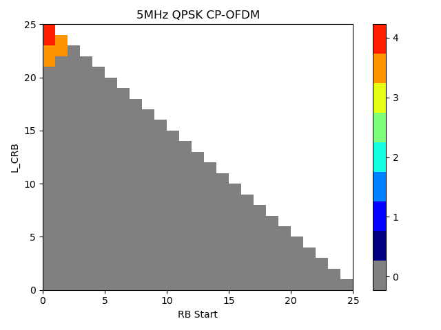{width="3.1458333333333335in"
height="2.361111111111111in"}

Figure 5.2.1.4-1 SINR distribution

Except for PC1, The SINR of UE is hard to larger than 25 dB at the BS
side.

**Observation 1:**

\- For PC1, 20% of UE's SINR can be larger than 25 dB.

\- For PC2/PC3/PC5, \<5% UE's SINR can larger than 25 dB.

We further counted the percentage of UEs that had used 256QAM in the
simulation and the throughput performance gain. The throughput gain is
derived from comparing whether the 256QAM is allowed. The results are
shown in below:

[\[CHART\]\[CHART\]]{.chart}

Figure 5.2.1.4-2 proportion and performance gain for 256 QAM

For the indoor scenario, PC1 UE can have obvious performance gain, and
about 70% UE is once scheduled with 256QAM during the simulation time,
but for other power classes, the throughput performance even become
worse, this is because the SINR for these UE cannot support such high
MCS and the BLER is bad. For the Uma scenario, even though there are
many UEs scheduled with 256 QAM, the performance gain is tiny.

**Observation 2:**

\- For the indoor scenario, only PC1 shows obvious throughput gain, and
about 69.3%UEs are scheduled with 256 QAM.

\- For the Uma scenario, the performance gain of all PC UEs is tiny.

[R4-2301569]{.underline}

The simulation assumption for SLS was revised to add minimum EIRP and
power control formula, and our simulation results based on such new
assumptions are shown in Figure **5.2.1.4-3**. The operating SNR is used
as the target SNR at the BS side, and the minimum EIRP is used to
calculate the conducted power level which means deducting antenna gain
(including array gain).

{width="2.2222222222222223in"
height="1.75in"}{width="2.1944444444444446in"
height="1.7083333333333333in"}{width="2.1666666666666665in"
height="1.6944444444444444in"}

Figure 5.2.1.4-3 SINR distribution based on SLS

For the Indoor scenario, all cases above have more than 10% UE can
achieve operating SNR, but for the Uma scenario, the ratio is much
lower, especially in PC2/PC5 in the 39GHz case, only about 2% UE can
achieve operating SNR.

**Observation 1:**

\- In 29GHz, 14% in Indoor and 5% in Uma PC2/PC5 UE can archive 28 dB
SNR.

\- In 39GHz, 12% in Indoor and 10% in Uma PC1 UE can archive 30 dB SNR;
10% in Indoor and 2% in Uma PC2/PC5 UE can archive 30 dB SNR.

#### 5.2.1.5 Simulation results from Ericsson

[R4-2220036]{.underline}

On Figure 5.2.1.5-1 we show the results of system-level simulations for
29 GHz carrier frequency and FTP traffic model of both 10% and 30%.

{width="6.0in"
height="2.638888888888889in"}

Figure 5.2.1.5-1: System-level simulation results on 256QAM feasibility
for PC1 UE in FR2-1 for 29 GHz carrier frequency

Note that in the simulations results, no sophisticated model was used
for the misalignment between BS and UE beam directions. So, in the
simulations the ideal beam management was assumed, and the impairment
offset of 10 dB was added in the last stage.

By looking at the results, we can see that around 30% of UEs can achieve
the operating SNR of 30 dB for FTP with 30% load and around 35% of UEs
can achieve the operating SNR of 30 dB for FTP with 10% load, which
means that 256 QAM for PC1 UEs in FR2-1 and 29 GHz carrier frequency is
feasible.

[R4-2302734]{.underline}

2.1 29GHz carrier frequency

2.1.1 Indoor scenario for PC2/PC5

{width="3.3819444444444446in"
height="2.5625in"}

Observation 1: For 29GHz carrier frequency, indoor scenario and PC2/PC5,
around 60% of users with FTP 10% load and 15% of users with FTP 30% load
can reach the operating SNR of 28dB.

2.1.2 UMa scenario for PC2/PC5

{width="3.5555555555555554in"
height="2.701388888888889in"}

Observation 2: For 29GHz carrier frequency, UMa scenario and PC2/PC5,
around 30% of users with FTP 10% load and 28% of users with FTP 30% load
can reach the operating SNR of 28dB.

2.2 39GHz carrier frequency

2.2.1 Indoor scenario for PC2/PC5

{width="4.0in"
height="3.0347222222222223in"}

Observation 3: For 39GHz carrier frequency, indoor scenario and PC2/PC5,
around 50% of users with FTP 10% load and 12% of users with FTP 30% load
can reach the operating SNR of 30dB.

2.2.2 UMa scenario for PC2/PC5

{width="3.9166666666666665in"
height="2.9791666666666665in"}

Observation 4: For 39GHz carrier frequency, UMa scenario and PC2/PC5,
around 17% of users with FTP 10% load and 15% of users with FTP 30% load
can reach the operating SNR of 30dB.

2.2.3 Indoor scenario for PC1

{width="4.131944444444445in"
height="3.1527777777777777in"}

Observation 5: For 39GHz carrier frequency, indoor scenario and PC1,
around 55% of users with FTP 10% load and 12% of users with FTP 30% load
can reach the operating SNR of 30dB.

2.2.4 UMa scenario for PC1

{width="3.7777777777777777in"
height="2.861111111111111in"}

Observation 6: For 39GHz carrier frequency, UMa scenario and PC1, around
50% of users with FTP 10% load and 38% of users with FTP 30% load can
reach the operating SNR of 30dB.

#### 5.2.1.6 Simulation results from Xiaomi

[R4-2301620]{.underline}

In last meeting, it is verified that the UL 256QAM for PC1 UE of 29GHz
is feasible based on system simulation, but whether UL 256QAM for PC2/5
UE of 29GHz and PC1/2/5 UE of 39GHz can achieve target SNR at BS side
need further confirm by system simulation. Hence, we provide the system
level simulation results with the agreed target SNR of 28dB and 30dB for
PC1/2/5 UE of 29GHz and 39GHz.

The UE transmit power and UL SINR CDF at 29 GHz and 39 GHz in urban
macro scenario are shown in figure 5.2.1.6-1 and figure 5.2.1.6-2,
respectively.

{width="3.0833333333333335in"
height="2.3125in"}{width="3.0833333333333335in"
height="2.3125in"}

PC1 UE with 35dBm maximum output power (n257)

{width="3.0833333333333335in"
height="2.3125in"}{width="3.0833333333333335in"
height="2.3125in"}

b\. PC2/5 UE with 23dBm maximum output power (n257)

Figure 5.2.1.6-1 Urban macro simulation results at 29 GHz

{width="3.0833333333333335in"
height="2.3125in"}{width="3.0833333333333335in"
height="2.3125in"}

c\. PC1 UE with 35 dBm maximum output power (n260)

{width="3.0833333333333335in"
height="2.3125in"}{width="3.0833333333333335in"
height="2.3125in"}

d\. PC2/5 UE with 23dBm maximum output power (n259)

Figure 5.2.1.6-2 Urban macro simulation results at 39 GHz

The UE transmit power and UL SINR CDF at 29 GHz and 39 GHz in indoor
hotspot scenario are shown in figures 5.2.1.6-3 and 5.2.1.6-4,
respectively.

{width="3.0833333333333335in"
height="2.3125in"}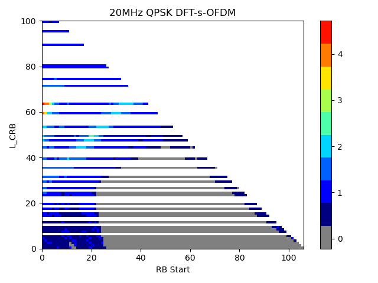{width="3.0833333333333335in"
height="2.3125in"}

e\. PC1 UE with 35 dBm maximum output power (n257)

{width="3.0833333333333335in"
height="2.3125in"}{width="3.0833333333333335in"
height="2.3125in"}

f\. PC2/5 UE with 23dBm maximum output power (n257)

Figure 5.2.1.6-3 Indoor hotspot simulation results at 29 GHz

{width="3.0833333333333335in"
height="2.3125in"}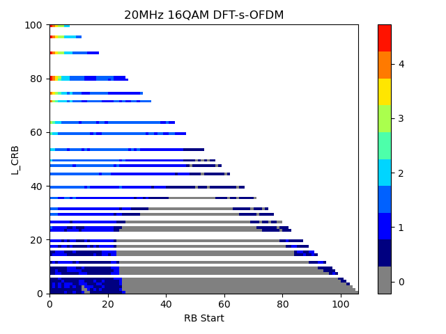{width="3.0833333333333335in"
height="2.3125in"}

g\. PC1 UE with 35 dBm maximum output power (n260)

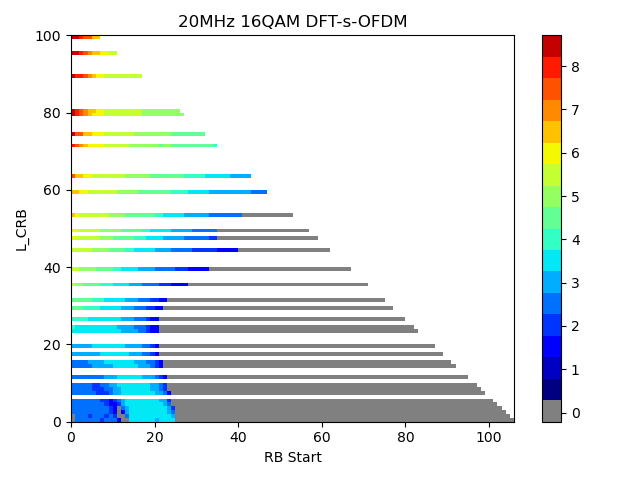{width="3.0833333333333335in"
height="2.3125in"}{width="3.0833333333333335in"
height="2.3125in"}

h\. PC2/5 UE with 23dBm maximum output power (n259)

Figure 5.2.1.6-4 Indoor hotspot simulation results at 39 GHz

**Observation:**

It can be observed from figure 5.2.1.6-1, figure 5.2.1.6-2, figure
5.2.1.6-3 and figure5.2.1.6-4 that at both 29 GHz (n257) and 39 GHz
(n259 and n260):

For urban macro scenario:

\- The target SNR of 28dB for 29 GHz at BS side can be achieved by
86.95% of PC1 UE and 73.26% of PC2/5 UE.

\- The target SNR of 30dB for 39 GHz at BS side can be achieved by
82.82% of PC1 UE and 62.31% of PC2/5 UE.

\- \~13% of PC1 UE and \~26% of PC2/5 UE are transmitting at maximum
output power at 29 GHz (of 35 dBm and 23 dBm, respectively, for PC1 UE
and PC2/5 UE).

\- 17% of PC1 UE and \~27% of PC2/5 UE are transmitting at maximum
output power at 39 GHz (of 35 dBm and 23 dBm, respectively, for PC1 UE
and PC2/5 UE).

For indoor hotspot scenario:

\- The target SNR of 28dB for 29 GHz at BS side can be achieved by 100%
of PC1 UE and 100% of PC2/5 UE.

\- The target SNR of 30dB for 39 GHz at BS side can be achieved by 100%
of PC1 UE and 99.99% of PC2/5 UE.

\- The transmitting power of all PC1/PC2/PC5 UE are less than 20 dBm at
29 GHz.

\- The transmitting power of \~ 99% PC1/PC2/PC5 UE are less than 13 dBm
at 39 GHz.

#### 5.2.1.7 Simulation results from LG Electronics

[R4-2300821]{.underline}

**-29 GHz UL 256QAM SLS**

  {width="3.298611111111111in" height="2.361111111111111in"}
  ------------------------------------------------------------------------------------
  Fig.5.2.1.7-1 CDF of SINR for PC2/PC5 in urban macro scenario at 29 GHz
  {width="3.298611111111111in" height="2.361111111111111in"}
  Fig. 5.2.1.7-2 CDF of SINR for PC2/PC5 in indoor scenario at 29 GHz

Fig. 5.2.1.7-1 and Fig. 5.2.1.7-2 show CDF of SINR for PC2/PC5 in urban
macro scenario and indoor scenario at 29 GHz respectively.

Based on the SLS results, UL 256QAM at 29 GHz is feasible for both PC2
and PC5.

**Observation 1:** From the 29 GHz 256QAM SLS results, PC2 and PC5 can
achieve SINR of 28dB in both urban macro scenario and indoor scenario.

**-39 GHz UL 256QAM SLS**

  {width="2.9652777777777777in" height="2.1805555555555554in"}
  --------------------------------------------------------------------------------------
  Fig. 5.2.1.7-3 CDF of SINR for PC1/PC2/PC5 in urban macro scenario at 39 GHz
  {width="2.9305555555555554in" height="2.1666666666666665in"}
  Fig. 5.2.1.7-4 CDF of SINR for PC1/PC2/PC5 in indoor scenario at 39 GHz

Fig. 5.2.1.7-3 and Fig. 5.2.1.7-4 show CDF of SINR for PC1/PC2/PC5 in
urban macro scenario and indoor scenario at 39 GHz respectively.

Based on the SLS results, UL 256QAM at 39GHz is feasible for PC1, PC2,
and PC5 UEs.

**Observation 2:** From the 39 GHz 256QAM SLS results, PC1, PC2 and PC5
can achieve SINR of 30dB in both urban macro scenario and indoor
scenario.

#### 5.2.1.8 Simulation results from Sony

[R4-2302240]{.underline}

The SLS simulation results at 29 GHz for the indoor scenario are shown
in Fig. 5.2.1.8-1. Since PC1 has been concluded to be feasible, only
results of PC2/5 have been provided here.

{width="3.9375in" height="3.1875in"}

Figure 5.2.1.8-1 The system level simulation at 29 GHz for the indoor
scenario with PC2/5.

As explained, a power control scheme is adopted in the simulation, and
thus the CDF plot is "capped" by the target SNR. Based on the simulation
results, it can be observed that about 35% of UE can reach the target
SNR, which is a significant portion of total devices. Therefore, it can
be concluded that it is feasible for PC2 and PC5 to support 256 QAM at
29 GHz.

Observation 1: 35% of UE can reach the target SNR condition of PC2 and
PC5 at indoor scenario at 29 GHz.

Further simulations have also been performed for 39GHz for the indoor
scenario, including PC1 as well, where the simulation results are shown
in Fig. 5.2.1.8-2 (PC1) and Fig. 5.2.1.8-3 (PC2/5), respectively.

{width="3.9375in" height="3.1666666666666665in"}

Figure 5.2.1.8-2 The system level simulation at 39 GHz for the indoor
scenario with PC1.

{width="3.9444444444444446in"
height="3.1458333333333335in"}

Figure 5.2.1.8-3 The system level simulation at 39 GHz for the indoor
scenario with PC2/5.

Based on the results shown in Fig. 5.2.1.8-2 and Fig. 5.2.1.8-3, though
the target SNR and path loss have been increased, a significant portion
of UE (45% for PC1 and 10% for PC2/5) can still meet the target SINR.
Again, such simulation results demonstrate that a system-level gain can
be obtained by supporting 256 QAM for uplink, which suggests that it is
feasible to support 256 QAM in uplink is feasible for PC1/2/5 at 39 GHz.

Observation 2 45% of PC1 UE and 10% of PC2/5 UE can meet the target SNR
condition for the indoor scenario at 39 GHz.

#### 5.2.1.9 Summary for system level simulation results

+----------------+-------------------------+-------------------------+
| Companies      | Urban macro             | Indoor                  |
+================+=========================+=========================+
| Nokia          | The target SNR at BS    | The target SNR at BS    |
|                | side of 27 dB can be    | side of 27 dB can be    |
| (R4-2300193)   | achieved by \~70% of    | achieved by \~70% of    |
|                | PC1 UE and \~60% of     | PC1 UE and \~60% of     |
|                | PC2/5 UE.               | PC2/5 UE.               |
|                |                         |                         |
|                | Less than 15% of PC1 UE | Almost none of PC1 UE   |
|                | and less than 30% of    | and PC2/5 UE are        |
|                | PC2/5 UE are            | transmitting at maximum |
|                | transmitting at maximum | output power (of 35 dBm |
|                | output power (of 35 dBm | and 23 dBm,             |
|                | and 23 dBm,             | respectively, for PC1   |
|                | respectively, for PC1   | UE and PC2/5 UE).       |
|                | UE and PC2/5 UE).       |                         |
+----------------+-------------------------+-------------------------+
| LG Electronics | For 29GHz:              | For 29GHz:              |
|                |                         |                         |
| (R4-2300821)   | The target SNR at BS    | The target SNR at BS    |
|                | side of 28 dB can be    | side of 28 dB can be    |
|                | achieved by \~77% of    | achieved by \~41% of    |
|                | PC2 UE and \~65% of PC5 | PC2 UE and \~40% of PC5 |
|                | UE.                     | UE.                     |
|                |                         |                         |
|                | For 39GHz:              | For 39GHz:              |
|                |                         |                         |
|                | The target SNR at BS    | The target SNR at BS    |
|                | side of 30 dB can be    | side of 30 dB can be    |
|                | achieved by \~40% of    | achieved by \~37% of    |
|                | PC1 UE, \~85% of PC2 UE | PC1 UE, \~75% of PC2 UE |
|                | and 70% of PC5.         | and 50% of PC5.         |
+----------------+-------------------------+-------------------------+
| ZTE            | For 29GHz               | for 39GHz：             |
|                |                         |                         |
| (R4-2301235)   | 5% UE can achieve above | For PC1, PC2 and PC5,   |
|                | 30dB SINR for PC2 and   | \~86% of UE can reach   |
|                | PC5.                    | the operating SNR       |
|                |                         |                         |
|                | Even \~10% UE can       | For PC3, \~75% of UE    |
|                | achieve above 28dB SINR | can reach the operating |
|                | even for PC3.           | SNR                     |
|                |                         |                         |
|                | Thus we observed PC2    |                         |
|                | and PC5 are feasible    |                         |
|                | for UL 256QAM for       |                         |
|                | 29GHz, and PC3 is also  |                         |
|                | feasible if the         |                         |
|                | operating SNR is not    |                         |
|                | higher than 28dB.       |                         |
|                |                         |                         |
|                | For 39GHz：             |                         |
|                |                         |                         |
|                | For PC1, \~55% of UE    |                         |
|                | can reach the operating |                         |
|                | SNR                     |                         |
|                |                         |                         |
|                | For PC2, \~8% of UE can |                         |
|                | reach the operating SNR |                         |
|                |                         |                         |
|                | For PC5 , \~15% of UE   |                         |
|                | can reach the operating |                         |
|                | SNR                     |                         |
|                |                         |                         |
|                | For PC3, \~2% of UE can |                         |
|                | reach the operating SNR |                         |
+----------------+-------------------------+-------------------------+
| vivo           | In 29GHz:               | In 29GHz:               |
|                |                         |                         |
| (R4-2301569)   | 5% in Uma PC2/PC5 UE    | 14% in Indoor PC2/PC5   |
|                | can archive 28 dB SNR.  | UE can archive 28 dB    |
|                |                         | SNR.                    |
|                | In 39GHz:               |                         |
|                |                         | In 39GHz:               |
|                | 10% in Uma PC1 UE can   |                         |
|                | archive 30 dB SNR       | 12% in Indoor PC1 UE    |
|                |                         | can archive 30 dB SNR;  |
|                | 2% in Uma PC2/PC5 UE    |                         |
|                | can archive 30 dB SNR.  | 10% in Indoor PC2/PC5   |
|                |                         | UE can archive 30 dB    |
|                |                         | SNR.                    |
+----------------+-------------------------+-------------------------+
| Xiaomi         | For 29GHz:              | For 29GHz:              |
|                |                         |                         |
| (R4-2301620)   | The target SNR of 28dB  | The target SNR of 28dB  |
|                | for 29 GHz at BS side   | for 29 GHz at BS side   |
|                | can be achieved by      | can be achieved by 100% |
|                | 86.95% of PC1 UE and    | of PC1 UE and 100% of   |
|                | 73.26% of PC2/5 UE.     | PC2/5 UE.               |
|                |                         |                         |
|                | \~13% of PC1 UE and     | The transmitting power  |
|                | \~26% of PC2/5 UE are   | of all PC1/PC2/PC5 UE   |
|                | transmitting at maximum | are less than 20 dBm at |
|                | output power at 29 GHz  | 29 GHz.                 |
|                | (of 35 dBm and 23 dBm,  |                         |
|                | respectively, for PC1   | For 39GHz:              |
|                | UE and PC2/5 UE).       |                         |
|                |                         | The target SNR of 30dB  |
|                | For 39GHz:              | for 39 GHz at BS side   |
|                |                         | can be achieved by 100% |
|                | The target SNR of 30dB  | of PC1 UE and 99.99% of |
|                | for 39 GHz at BS side   | PC2/5 UE.               |
|                | can be achieved by      |                         |
|                | 82.82% of PC1 UE and    | The transmitting power  |
|                | 62.31% of PC2/5 UE.     | of \~ 99% PC1/PC2/PC5   |
|                |                         | UE are less than 13 dBm |
|                | \~17% of PC1 UE and     | at 39 GHz.              |
|                | \~27% of PC2/5 UE are   |                         |
|                | transmitting at maximum |                         |
|                | output power at 39 GHz  |                         |
|                | (of 35 dBm and 23 dBm,  |                         |
|                | respectively, for PC1   |                         |
|                | UE and PC2/5 UE).       |                         |
+----------------+-------------------------+-------------------------+
| Sony           |                         | For 29GHz:              |
|                |                         |                         |
| (R4-2302240)   |                         | 35% of UE can reach the |
|                |                         | target SNR condition of |
|                |                         | PC2 and PC5 at indoor   |
|                |                         | scenario at 29 GHz.     |
|                |                         |                         |
|                |                         | For 39GHz:              |
|                |                         |                         |
|                |                         | 45% of PC1 UE and 10%   |
|                |                         | of PC2/5 UE can meet    |
|                |                         | the target SNR          |
|                |                         | condition for the       |
|                |                         | indoor scenario at 39   |
|                |                         | GHz.                    |
+----------------+-------------------------+-------------------------+
| Ericsson       | For 29GHz:              | For 29GHz:              |
|                |                         |                         |
| (R4-2302734)   | UMa scenario and        | Indoor scenario and     |
|                | PC2/PC5, around 30% of  | PC2/PC5, around 60% of  |
|                | users with FTP 10% load | users with FTP 10% load |
|                | and 28% of users with   | and 15% of users with   |
|                | FTP 30% load can reach  | FTP 30% load can reach  |
|                | the operating SNR of    | the operating SNR of    |
|                | 28dB.                   | 28dB.                   |
|                |                         |                         |
|                | For 39GHz:              | For 39GHz:              |
|                |                         |                         |
|                | UMa scenario and        | Indoor scenario and     |
|                | PC2/PC5, around 17% of  | PC2/PC5, around 50% of  |
|                | users with FTP 10% load | users with FTP 10% load |
|                | and 15% of users with   | and 12% of users with   |
|                | FTP 30% load can reach  | FTP 30% load can reach  |
|                | the operating SNR of    | the operating SNR of    |
|                | 30dB.                   | 30dB.                   |
|                |                         |                         |
|                | UMa scenario and PC1,   | Indoor scenario and     |
|                | around 50% of users     | PC1, around 55% of      |
|                | with FTP 10% load and   | users with FTP 10% load |
|                | 38% of users with FTP   | and 12% of users with   |
|                | 30% load can reach the  | FTP 30% load can reach  |
|                | operating SNR of 30dB.  | the operating SNR of    |
|                |                         | 30dB.                   |
+----------------+-------------------------+-------------------------+

### 5.2.2 Link level simulation

Link level simulation is targeted as mainstream way to evaluate if FR2
256QAM can achieve benefit by comparing to 64QAM.

#### 5.2.2.1 Simulation assumptions

The link level simulation assumptions are listed as in table 5.2.2.1-1,
based on which, to evaluate the throughput difference between 64QAM and
256QAM. The study aims to identify conditions where UL 256QAM provides
performance benefits, does not reflect side conditions for setting the
UE RF requirement for UL 256QAM.

Table 5.2.2.1-1 link level simulation assumptions

+----------------------------------+----------------------------------+
| Parameter                        | Value                            |
+==================================+==================================+
| Carrier frequency                | 29 GHz (n257), 39 GHz (n260) and |
|                                  | 48GHz (n262)                     |
+----------------------------------+----------------------------------+
| CBW                              | 50 MHz, 100MHz                   |
+----------------------------------+----------------------------------+
| SCS                              | 120 kHz                          |
+----------------------------------+----------------------------------+
| Allocated RBs                    | Full allocation                  |
+----------------------------------+----------------------------------+
| Propagation                      | TDL-A 30ns delay spread, 35Hz    |
|                                  | Doppler frequency                |
|                                  |                                  |
|                                  | TDL-D 30ns delay spread, 35Hz    |
|                                  | Doppler frequency                |
|                                  |                                  |
|                                  | Static (AWGN)                    |
+----------------------------------+----------------------------------+
| MCS                              | 64QAM:                           |
|                                  |                                  |
|                                  | CP-OFDM: MCS 23, 24 in TS 38.214 |
|                                  | Table 5.1.3.1-1, other MCSs are  |
|                                  | not precluded.                   |
|                                  |                                  |
|                                  | DFT-s-OFDM: MCS 22, 23 in TS     |
|                                  | 38.214 Table 6.1.4.1-1, other    |
|                                  | MCSs are not precluded.          |
|                                  |                                  |
|                                  | 256QAM:                          |
|                                  |                                  |
|                                  | CP-OFDM/DFT-s-OFDM: MCS 21, 23   |
|                                  | in TS 38.214 Table 5.1.3.1-2,    |
|                                  | other MCSs are not precluded.    |
|                                  |                                  |
|                                  | Baseline: fixed MCSs             |
+----------------------------------+----------------------------------+
| Symbol type                      | CP-OFDM; DFT-s-OFDM              |
+----------------------------------+----------------------------------+
| HARQ                             | 8, None                          |
+----------------------------------+----------------------------------+
| Antenna configuration            | Fading channel: 2x2 for Rank1    |
|                                  | and Rank2, Low correlation       |
|                                  |                                  |
|                                  | Static channel: 1x2 for Rank1,   |
|                                  | 2x2 for Rank2 (using the         |
|                                  | diagonal matrix)                 |
+----------------------------------+----------------------------------+
| Channel estimation               | Practical                        |
+----------------------------------+----------------------------------+
| Receiver type                    | MMSE                             |
+----------------------------------+----------------------------------+
| PUSCH configuration              | Type A mapping, Start symbol 0,  |
|                                  | Duration 14                      |
+----------------------------------+----------------------------------+
| DMRS configuration               | Type 1, Single symbol, 1         |
|                                  | additional DMRS                  |
+----------------------------------+----------------------------------+
| PTRS configuration               | CP-OFDM: KPTRS : 2 (every 2      |
|                                  | RBs), LPTRS : 1 (every 1 symbol) |
|                                  |                                  |
|                                  | DFT-s-OFDM: (,)=(4, 4), LPTRS :  |
|                                  | 1 (every 1 symbol)               |
+----------------------------------+----------------------------------+
| Phase noise compensation         | Practical based on PTRS          |
+----------------------------------+----------------------------------+
| Phase noise model                | TR 38.803 model (in section      |
|                                  | 6.1.10 and section 6.1.11)       |
|                                  |                                  |
|                                  | modelled Phase noise for TX and  |
|                                  | RX                               |
|                                  |                                  |
|                                  | Option a): example1 (UE)  +      |
|                                  | example1(BS)                     |
|                                  |                                  |
|                                  | Option b): example2 (UE) +       |
|                                  | example2(BS)                     |
|                                  |                                  |
|                                  | Option d): example1 (UE) +       |
|                                  | example2(BS)                     |
+----------------------------------+----------------------------------+
| txEVM + rxEVM excluding phase    | txEVM: 3%, 3.5%, 4%, rxEVM: 3%,  |
| noise for 256QAM                 | 3.5%, 4%                         |
|                                  |                                  |
|                                  | Option 1: txEVM \>= rxEVM;       |
+----------------------------------+----------------------------------+
| Other parameters                 | follow assumptions in TS38.104   |
|                                  | Section 11.2.2 .                 |
+----------------------------------+----------------------------------+

#### 5.2.2.2 Simulation results from Nokia 

[R4-2215577]{.underline}

The link level simulation results at 29 GHz (n257) and 39 GHz (n260)
using the highlighted parameters in table 1 are shown in figures
5.2.2.2-1 and 5.2.2.2-2, respectively.

{width="4.284722222222222in"
height="3.3819444444444446in"}

Figure 5.2.2.2-1. Simulation results at 29 GHz (n257)

{width="4.520833333333333in"
height="3.6527777777777777in"}

Figure 5.2.2.2-2. Simulation results at 39 GHz (n260)

It can be observed from figure 5.2.2.2-1 that at 29 GHz (n257):

\- If MCS index is 21, 256QAM goes over 64QAM in around 24-25 dB for all
simulated EVMs.

\- If MCS index is 23, 256QAM goes over 64QAM in around 28 dB for
(transmit and receive) EVM of 3%, around 32 dB for (transmit and
receive) EVM of 3.5%, and loses for (transmit and receive) EVM of 4%.

On the other hand, it can be observed from figure 5.2.2.2-2 that at 39
GHz (n260):

\- Only with (transmit and receive) EVM of 0%, MCS21 for 256QAM seems to
win 64QAM in around 36 dB.

Note that the PN is challenging case at 39 GHz (n260), and due to small
allocation, the number of PTRS symbols is quite low so even higher
complexity ICI compensation would not really help here.

R4-2218326

The link level simulation results at 48 GHz (n262) using the highlighted
parameters in table 1 with phase noise model option a and option d are
shown in figures 5.2.2.2-3 and 5.2.2.2-4, respectively.

{width="6.298611111111111in"
height="4.527777777777778in"}

Figure 5.2.2.2-3. Simulation results with phase noise model option a

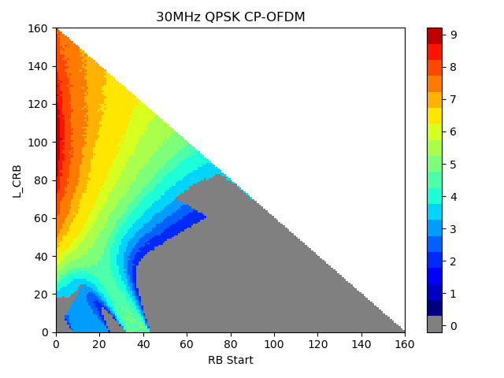{width="6.305555555555555in"
height="4.673611111111111in"}

Figure 5.2.2.2-4. Simulation results with phase noise model option d

It can be observed from figures 5.2.2.2-3 and 5.2.2.2-4 that at 48 GHz
(n262):

\- 256QAM does not provide any throughput gain over 64QAM below 40 dB
SNR.

#### 5.2.2.3 Simulation results from LG Electronics

[R4-2215920]{.underline}

Table 5.2.2.3-1 shows the cross throughput point, where the cross
throughput point indicates the SNR value at which the throughput of
64QAM and 256QAM is same, that is, after the corresponding SNR, the
throughput of 256QAM is higher than 64QAM.

Table 5.2.2.3-1 Cross throughput point (29 GHz and 48 GHz, CBW:100 MHz,
EVM:Tx=Rx)

Referebce: MCS24(64QAM, PUSCH Table 1, OFDM)

+--------------------------------+---------+---------+-----------+--------+--------+--------+
| Propagation                    | EVM: 2% | EVM: 3% | EVM: 3.5% |        |        |        |
|                                |         |         |           |        |        |        |
| MCS                            |         |         |           |        |        |        |
|                                |         |         |           |        |        |        |
| Mode                           |         |         |           |        |        |        |
+================================+=========+=========+===========+========+========+========+
|                                | 29 GHz  | 48 GHz  | 29 GHz    | 48 GHz | 29 GHz | 48 GHz |
+--------------------------------+---------+---------+-----------+--------+--------+--------+
| TDL-A                          | 24.5 dB | N/A     | 27 dB     | N/A    | 30 dB  | N/A    |
|                                |         |         |           |        |        |        |
| MCS 21\                        |         |         |           |        |        |        |
| (256 QAM, PDSCH Table 2, OFDM) |         |         |           |        |        |        |
+--------------------------------+---------+---------+-----------+--------+--------+--------+
| TDL-A                          | 29 dB   | N/A     | N/A       | N/A    | N/A    | N/A    |
|                                |         |         |           |        |        |        |
| MCS 23\                        |         |         |           |        |        |        |
| (256 QAM, PDSCH Table 2, OFDM) |         |         |           |        |        |        |
+--------------------------------+---------+---------+-----------+--------+--------+--------+
| TDL-D                          | 18.5 dB | 30 dB   | 20 dB     | N/A    | 21 dB  | N/A    |
|                                |         |         |           |        |        |        |
| MCS 21\                        |         |         |           |        |        |        |
| (256 QAM, PDSCH Table 2, OFDM) |         |         |           |        |        |        |
+--------------------------------+---------+---------+-----------+--------+--------+--------+
| TDL-D                          | 23 dB   | N/A     | 24.5 dB   | N/A    | 27 dB  | N/A    |
|                                |         |         |           |        |        |        |
| MCS 23\                        |         |         |           |        |        |        |
| (256 QAM, PDSCH Table 2, OFDM) |         |         |           |        |        |        |
+--------------------------------+---------+---------+-----------+--------+--------+--------+
| AWGN                           | 16 dB   | 22.5 dB | 16.5 dB   | 24 dB  | 17 dB  | 27.5dB |
|                                |         |         |           |        |        |        |
| MCS 21\                        |         |         |           |        |        |        |
| (256 QAM, PDSCH Table 2, OFDM) |         |         |           |        |        |        |
+--------------------------------+---------+---------+-----------+--------+--------+--------+
| AWGN                           | 19 dB   | N/A     | 20 dB     | N/A    | 21 dB  | N/A    |
|                                |         |         |           |        |        |        |
| MCS 23\                        |         |         |           |        |        |        |
| (256 QAM, PDSCH Table 2, OFDM) |         |         |           |        |        |        |
+--------------------------------+---------+---------+-----------+--------+--------+--------+

**29 GHz (n257), EVM(Tx=Rx):3.5%**

  {width="3.3541666666666665in" height="2.361111111111111in"}   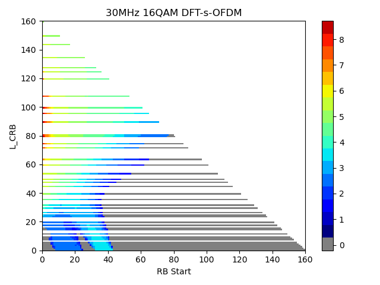{width="3.2777777777777777in" height="2.361111111111111in"}
  ------------------------------------------------------------------------------------- -------------------------------------------------------------------------------------
  Fig 5.2.2.3-1. Throughput performance between 256QAM and 64QAM in TDL-A               Fig 5.2.2.3-2. Throughput performance between 256QAM and 64QAM in TDL-D
  {width="3.1597222222222223in" height="2.361111111111111in"}   
  Fig 5.2.2.3-3. Throughput performance between 256QAM and 64QAM in AWGN                

**29 GHz (n257), EVM(Tx=Rx):3%**

  {width="3.1597222222222223in" height="2.361111111111111in"}   {width="3.1597222222222223in" height="2.361111111111111in"}
  ------------------------------------------------------------------------------------- -------------------------------------------------------------------------------------
  Fig 5.2.2.3-4. Throughput performance between 256QAM and 64QAM in TDL-A               Fig 5.2.2.3-5. Throughput performance between 256QAM and 64QAM in TDL-D
  {width="3.1597222222222223in" height="2.361111111111111in"}   
  Fig 5.2.2.3-6. Throughput performance between 256QAM and 64QAM in AWGN                

**29 GHz (n257), EVM(Tx=Rx):2%**

  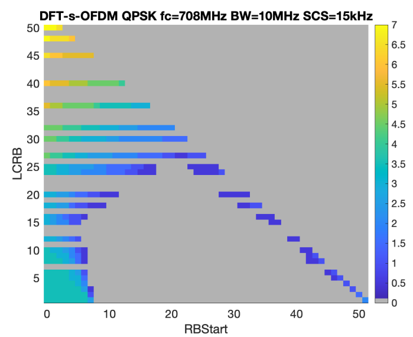{width="3.4097222222222223in" height="2.361111111111111in"}   {width="3.1597222222222223in" height="2.361111111111111in"}
  ------------------------------------------------------------------------------------- -------------------------------------------------------------------------------------
  Fig 5.2.2.3-7. Throughput performance between 256QAM and 64QAM in TDL-A               Fig 5.2.2.3-8. Throughput performance between 256QAM and 64QAM in TDL-D
  {width="3.1597222222222223in" height="2.361111111111111in"}   
  Fig 5.2.2.3-9. Throughput performance between 256QAM and 64QAM in AWGN                

**48 GHz (n262), EVM(Tx=Rx):3.5%**

  {width="3.1597222222222223in" height="2.361111111111111in"}   {width="3.1597222222222223in" height="2.361111111111111in"}
  ------------------------------------------------------------------------------------- -------------------------------------------------------------------------------------
  Fig 5.2.2.3-10. Throughput performance between 256QAM and 64QAM in TDL-A              Fig 5.2.2.3-11. Throughput performance between 256QAM and 64QAM in TDL-D
  {width="3.1597222222222223in" height="2.361111111111111in"}   
  Fig 5.2.2.3-12. Throughput performance between 256QAM and 64QAM in AWGN               

**48 GHz (n262), EVM(Tx=Rx):3%**

  {width="3.1597222222222223in" height="2.361111111111111in"}   {width="3.1597222222222223in" height="2.361111111111111in"}
  -------------------------------------------------------------------------------------- --------------------------------------------------------------------------------------
  Fig 5.2.2.3-13. Throughput performance between 256QAM and 64QAM in TDL-A               Fig 5.2.2.3-14. Throughput performance between 256QAM and 64QAM in TDL-D
  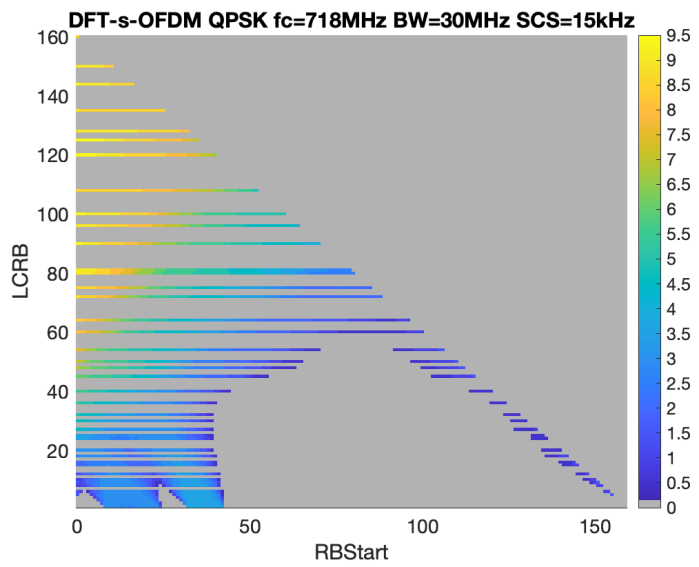{width="3.1597222222222223in" height="2.361111111111111in"}   
  Fig 5.2.2.3-15. Throughput performance between 256QAM and 64QAM in AWGN                

**48 GHz (n262), EVM(Tx=Rx):2%**

  {width="3.1597222222222223in" height="2.361111111111111in"}   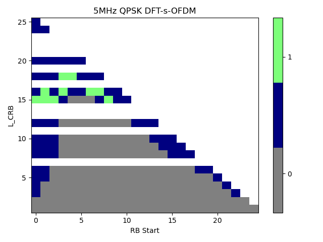{width="3.3333333333333335in" height="2.361111111111111in"}
  -------------------------------------------------------------------------------------- --------------------------------------------------------------------------------------
  Fig 5.2.2.3-16. Throughput performance between 256QAM and 64QAM in TDL-A               Fig 5.2.2.3-17. Throughput performance between 256QAM and 64QAM in TDL-D
  {width="3.1597222222222223in" height="2.361111111111111in"}   
  Fig 5.2.2.3-18. Throughput performance between 256QAM and 64QAM in AWGN                

From the simulation results, the followings are observed for UL 256QAM
performance gain,

***Observation1***: In 29 GHz & TDL-A,

There is the performance gain in MCS21 when EVM ≥ 3.0%

There is no performance gain in MCS23

***Observation2***: In 29 GHz & TDL-D

There is the perfornace gain when EVM = 3.5%

***Observation3***: In 29 GHz & AWGN

There is the perfornace gain at a relatively low SNR when EVM = 3.5%.

***Observation4:*** In 48 GHz,

There is no performance gain in most cases

[R4-2218681]{.underline}

Table 5.2.2.3-2 Cross throughput point (29 GHz and 39 GHz, CBW:100 MHz,
EVM:Tx=Rx=3.5%)

Referebce: MCS24(64QAM, PUSCH Table 1, OFDM)

+--------------------------------+--------+--------+-----+-----+-----+-----+-----+-----+
| Propagation                    | 29 GHz | 39 GHz |     |     |     |     |     |     |
|                                |        |        |     |     |     |     |     |     |
| Mode                           |        |        |     |     |     |     |     |     |
+================================+========+========+=====+=====+=====+=====+=====+=====+
|                                | MCS    | MCS    | MCS | MCS | MCS | MCS | MCS | MCS |
|                                |        |        |     |     |     |     |     |     |
|                                | 20     | 21     | 22  | 23  | 20  | 21  | 22  | 23  |
+--------------------------------+--------+--------+-----+-----+-----+-----+-----+-----+
| TDL-A\                         | 25.5   | 30     | N/A | N/A | N/A | N/A | N/A | N/A |
| (256 QAM, PDSCH Table 2, OFDM) |        |        |     |     |     |     |     |     |
|                                |        |        |     |     |     |     |     |     |
| (dB)                           |        |        |     |     |     |     |     |     |
+--------------------------------+--------+--------+-----+-----+-----+-----+-----+-----+
| TDL-D\                         | 18.5   | 21     | 23  | 27  | 21  | 24  | 30  | N/A |
| (256 QAM, PDSCH Table 2, OFDM) |        |        |     |     |     |     |     |     |
|                                |        |        |     |     |     |     |     |     |
| (dB)                           |        |        |     |     |     |     |     |     |
+--------------------------------+--------+--------+-----+-----+-----+-----+-----+-----+

**29 GHz (n257)**

  {width="5.370138888888889in" height="3.936111111111111in"}
  -------------------------------------------------------------------------------------
  Fig5.2.2.3-19. Throughput performance between 256QAM and 64QAM in TDL-A
  {width="5.601388888888889in" height="3.936111111111111in"}
  Fig5.2.2.3-20. Throughput performance between 256QAM and 64QAM in TDL-D

**39 GHz (n260)**

  {width="5.508333333333334in" height="3.936111111111111in"}
  -------------------------------------------------------------------------------------
  Fig5.2.2.3-21. Throughput performance between 256QAM and 64QAM in TDL-A
  {width="5.260416666666667in" height="3.936111111111111in"}
  Fig5.2.2.3-22. Throughput performance between 256QAM and 64QAM in TDL-D

**Observation 2**: In 29GHz TDL-A, the throughput gain of 256QAM is
shown in MCS index 20 and 21, and operating SNR can vary from 25.5dB to
30dB depending on the MCS index number.

**Observation 3**: In 29GHz TDL-D, the throughput gain of 256QAM is
shown in MCS index 20\~23, and operating SNR can vary from 18.5dB to
27dB depending on the MCS index number.

**Observation 4**: In 39GHz TDL-A, no throughput gain of 256QAM is shown
in MCS index 20\~23.

**Observation 5**: In 39GHz TDL-D, the throughput gain of 256QAM is
shown in MCS index 20 \~22, and operating SNR can vary from 21dB to 30dB
depending on the MCS index number.

**Observation 6**: If the operating SNR is considered based on TDL-A,
SNR of 25.5 dB or more need to be set for operation at 29GHz, however it
is not practical. And N/A is shown at 39GHz, so it is also not
practical.

**Observation 7**: If the operating SNR is considered based on TDL-D
with limited MCS, an operating SNR value of 18.5dB to 27dB at 29GHz may
be considered, and an operating SNR value of 21dB to 30dB at 39GHz may
be considered.

#### 5.2.2.4 Simulation results from vivo

[R4-2216128]{.underline}

\- 29 GHz

\- TDL-A

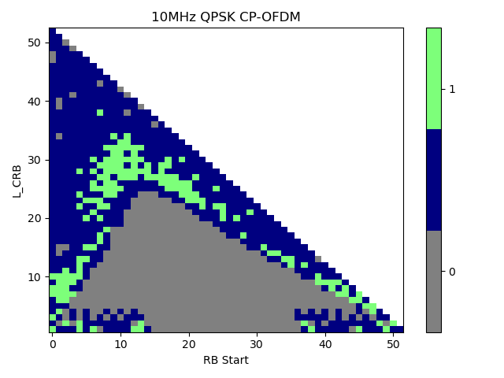{width="5.736111111111111in"
height="2.8958333333333335in"}

{width="5.715277777777778in"
height="2.9097222222222223in"}

\- TDL-D

{width="6.0in" height="3.0347222222222223in"}

{width="5.979166666666667in"
height="3.0208333333333335in"}

\- AWGN

{width="5.861111111111111in"
height="3.013888888888889in"}

{width="5.777777777777778in"
height="2.9791666666666665in"}

The simulation results above are summarized as follows.

**Observation 1：The UL 256 QAM under 29 GHz can achieve performance
gain at:**

  Tx\_EVM = Rx\_EVM =3%   TDL-A     TDL-D     AWGN                          
  ----------------------- --------- --------- --------- --------- --------- ---------
                          50 MHz    100MHz    50 MHz    100MHz    50 MHz    100MHz
  DFT-s-OFDM              22.0 dB   22.8 dB   20 dB     21 dB     18 dB     19.2 dB
  CP-OFDM                 22.5 dB   23.8 dB   20.3 dB   21.5 dB   19.2 dB   19.7 dB

  Tx\_EVM = Rx\_EVM =3.5%   TDL-A     TDL-D     AWGN                          
  ------------------------- --------- --------- --------- --------- --------- ---------
                            50 MHz    100MHz    50 MHz    100MHz    50 MHz    100MHz
  DFT-s-OFDM                22.2 dB   23.1 dB   20.3 dB   21.2 dB   18.5 dB   19.5 dB
  CP-OFDM                   22.7 dB   24 dB     20.8 dB   21.8 dB   19.5 dB   19.7 dB

  Tx\_EVM = Rx\_EVM =4%   TDL-A     TDL-D     AWGN                          
  ----------------------- --------- --------- --------- --------- --------- ---------
                          50 MHz    100MHz    50 MHz    100MHz    50 MHz    100MHz
  DFT-s-OFDM              22.9 dB   23.5 dB   20.6 dB   21.5 dB   19.2 dB   19.7 dB
  CP-OFDM                 23.2 dB   24.7 dB   21.2 dB   22 dB     19.8 dB   19.9 dB

\- 39 GHz

\- TDL-A

{width="5.958333333333333in"
height="3.0416666666666665in"}

{width="6.006944444444445in"
height="3.076388888888889in"}

\- TDL-D

{width="5.666666666666667in"
height="2.8680555555555554in"}

{width="5.854166666666667in"
height="2.9722222222222223in"}

\- AWGN

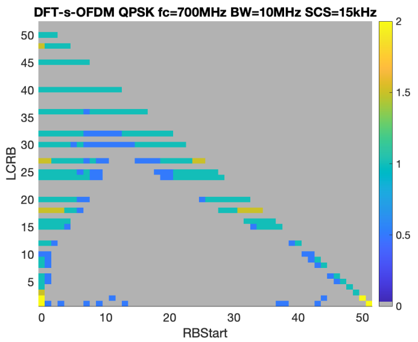{width="6.0625in" height="3.111111111111111in"}

{width="5.805555555555555in"
height="2.9791666666666665in"}

**Observation 2：The UL 256 QAM under 39 GHz can achieve performance
gain at:**

  Tx\_EVM = Rx\_EVM =3%   TDL-A    TDL-D    AWGN                          
  ----------------------- -------- -------- --------- --------- --------- --------
                          50 MHz   100MHz   50 MHz    100MHz    50 MHz    100MHz
  DFT-s-OFDM              24 dB    27 dB    22.3 dB   25.8 dB   19.9 dB   22 dB
  CP-OFDM                 28 dB    N/A      24 dB     N.A.      21.5 dB   26 dB

  Tx\_EVM = Rx\_EVM =3.5%   TDL-A     TDL-D     AWGN                        
  ------------------------- --------- --------- -------- -------- --------- --------
                            50 MHz    100MHz    50 MHz   100MHz   50 MHz    100MHz
  DFT-s-OFDM                24.4 dB   27.5 dB   23 dB    26 dB    20 dB     23 dB
  CP-OFDM                   29.2 dB   N/A       25 dB    N.A.     21.8 dB   28 dB

  Tx\_EVM = Rx\_EVM =4%   TDL-A     TDL-D     AWGN                         
  ----------------------- --------- --------- --------- -------- --------- --------
                          50 MHz    100MHz    50 MHz    100MHz   50 MHz    100MHz
  DFT-s-OFDM              24.8 dB   28.2 dB   23.3 dB   28 dB    20.3 dB   23 dB
  CP-OFDM                 34 dB     N/A       25.8 dB   N.A.     22 dB     30 dB

\- 48 GHz

\- TDL-A

{width="5.652777777777778in"
height="2.888888888888889in"}

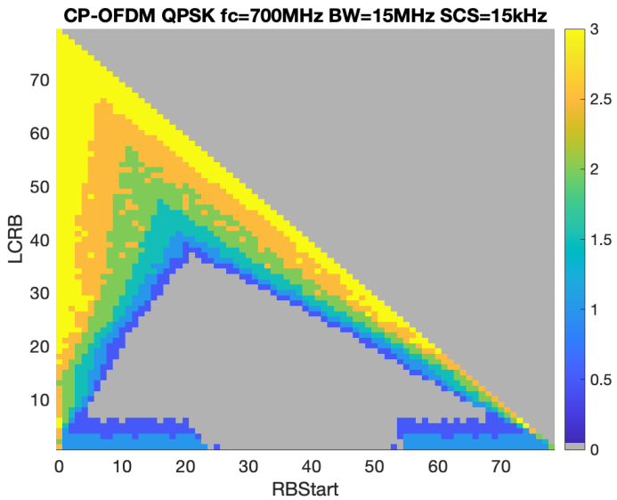{width="5.638888888888889in"
height="2.8472222222222223in"}

\- TDL-D

{width="5.680555555555555in"
height="2.8680555555555554in"}

{width="5.881944444444445in"
height="2.9930555555555554in"}

\- AWGN

{width="5.701388888888889in"
height="2.9097222222222223in"}

{width="5.694444444444445in"
height="2.9166666666666665in"}

**Observation 3：The UL 256 QAM is hard to bring performance gain under
48 GHz**

#### 5.2.2.5 Simulation results from Huawei 

[R4-2216245]{.underline}

The link lever simulation results are shown in Figure5.2.2.5-1, Figure
5.2.2.5-2 and Figure 5.2.2.5-3 for TDL-D in different frequency ranges.
From the simulation results, it is shown that support 256 QAM can
provide significant performance gain over 64QAM where the UE is in good
propagation condition.

[\[CHART\]]{.chart}

Figure 5.2.2.5-1 Throughput comparison of 256QAM and 64QAM for RANK1\_29
GHz

[\[CHART\]]{.chart}

Figure 5.2.2.5-2 Throughput comparison of 256QAM and 64QAM for
RANK1\_39GHz

[\[CHART\]]{.chart}

Figure 5.2.2.5-3 Throughput comparison of 256QAM and 64QAM for
RANK1\_48GHz

[R4-2219144]{.underline}

The link lever simulation results are shown in Figure 5.2.2.5-4, Figure
5.2.2.5-5, Figure 5.2.2.5-6 and Figure 5.2.2.5-7 for TDL-D in different
frequency ranges. From the simulation results, it is shown that support
256 QAM can provide significant performance gain over 64QAM where the UE
is in good propagation condition.

[\[CHART\]]{.chart}

Figure 5.2.2.5-4 Throughput comparison of MCS 21 256QAM and 64QAM for
RANK1\_29 GHz

[\[CHART\]]{.chart}

Figure5.2.2.5-5 Throughput comparison of MCS 23 256QAM and 64QAM for
RANK1\_29 GHz

[\[CHART\]]{.chart}

Figure 5.2.2.5-6 Throughput comparison of MCS 21 256QAM and 64QAM for
RANK1\_39GHz

[\[CHART\]]{.chart}

Figure 5.2.2.5-7 Throughput comparison of MCS 23 256QAM and 64QAM for
RANK1\_39GHz

#### 5.2.2.6 Simulation results from Sony

[R4-2216251]{.underline}

We performed simulations and compared the throughput between 64QAM and
256QAM for three different transmit and receive EVM values (3%, 3.5%,
and 4%). TX EVM has been the same as RX EVM in each simulation. The
simulations are done according to the agreed simulation assumptions
\[3\]. Only Rank-1, and AWGN for 29 GHz, respectively 48 GHz, are
simulated so far. 100MHz channel BW and no HARQ have been used. Phase
noise is added according to option 2 in the simulation assumptions,
i.e., example2, at both the UE and BS.

\- 29 GHz

We performed simulations to address whether 256-QAM works in FR2-1 and
to demonstrate its performance gain. The result is shown in Figure
5.2.2.6-1.

{width="4.041666666666667in"
height="3.3333333333333335in"}

Figure 5.2.2.6-1 Throughput comparing 64QAM and 256QAM with AWGN for
29GHz, EVM 3%, 3.5% and 4%.

Figure 5.2.2.6-1 shows that throughput for 64QAM (red curve) has already
saturated at an SNR level of 16dB. For 256QAM, SNR levels of 22 dB
(EVM=3%), 23 dB (3.5%) and 24 dB (EVM=4%) are required to exceed the
throughput performance of 64QAM. The simulations have been carried out
with a simple receiver, and further studies of advanced receivers are
needed to determine whether the above results could be improved.

Observation1: For 256QAM to exceed throuput performance of 64QAM SNR
levels of 22 dB (EVM=3%) to 24 dB (EVM=4%) are required.

R4-2218753

We performed simulations to determine whether 256-QAM works for FR2-1
and demonstrate its performance gain. Figure 5.2.2.6-2 shows the
results.

{width="4.333333333333333in"
height="3.548611111111111in"}

Figure 5.2.2.6-2 Throughput comparing 64QAM and 256QAM with AWGN for
29GHz, EVM 3.5%.

Figure 5.2.2.6-2 shows that throughput for 64QAM (red curves) has
already saturated at an SNR level of 16dB. For 256QAM, SNR levels of 20
dB for MCS21 and 25 dB for MCS23 (EVM 3.5%) are required to exceed the
throughput performance of 64QAM. To reach throughput saturation for
256QAM, SNR levels of 21dB for MCS21 and 28 dB for MCS23 are needed.

Observation 1: For 256QAM, to reach saturation in throughput
performance, SNR levels of 21dB for MCS21 and 28dB for MCS23 are needed
for 29GHz.

Simulations have also been performed for 39GHz with the same setup as
for 29GHz. Figure 5.2.2.6-3 shows the results.

{width="4.194444444444445in"
height="3.4583333333333335in"}

Figure 5.2.2.6-3 Throughput comparing 64QAM and 256QAM with AWGN for
39GHz, EVM 3.5%.

Figure 5.2.2.6-3 shows 256QAM performance for 39GHz compared to 64QAM.
SNR levels of 21.5dB are needed to exceed the throughput performance of
64QAM for MCS21. For MCS23, an SNR of 36dB is required to exceed the
throughput performance of 64QAM. An SNR level of 24dB is needed to reach
throughput saturation for 256QAM for MCS21. For MCS23, we didn't see
saturation within the simulated SNR range.

Observation 2: For 256QAM, to reach saturation in throughput
performance, SNR levels of 24dB for MCS21 are needed for 39GHz. To
exceed the performance of 64QAM, an SNR of 21.5dBm is required.

#### 5.2.2.7 Simulation results from Xiaomi

[R4-2216350]{.underline}

We compare the UL 256QAM and UL 64QAM performance under different
channel conditions and carrier frequencies to determine whether UL
256QAM can provide gains over UL 64QAM for FR2-1. For all simulation, we
assumed 50MHz channel bandwidth with 120kHz SCS and phase noise model of
example2 (UE) + example2(BS) based on above simulation assumptions.

\- CP-OFDM

\- 29GHz

{width="4.236111111111111in"
height="2.076388888888889in"}

Figure 5.2.2.7-1 Throughput performance for 29GHz under AWGN, CP-OFDM

{width="4.694444444444445in"
height="2.486111111111111in"}

Figure 5.2.2.7-2 Throughput performance for 29GHz under TDL-D, CP-OFDM

{width="4.236111111111111in"
height="2.2430555555555554in"}

Figure 5.2.2.7-3 Throughput performance for 29GHz under TDL-A, CP-OFDM

\- 39GHz

{width="4.229166666666667in"
height="2.3333333333333335in"}

Figure 5.2.2.7-4 Throughput performance for 39GHz under AWGN, CP-OFDM

{width="4.354166666666667in"
height="2.3958333333333335in"}

Figure 5.2.2.7-5 Throughput performance for 39GHz under TDL-D, CP-OFDM

{width="4.729166666666667in"
height="2.5694444444444446in"}

Figure 5.2.2.7-6 Throughput performance for 39GHz under TDL-A, CP-OFDM

\- 48GHz

{width="4.666666666666667in"
height="2.5694444444444446in"}

Figure 5.2.2.7-7 Throughput performance for 48GHz under AWGN, CP-OFDM

\- DFT-s-OFDM

\- 29GHz

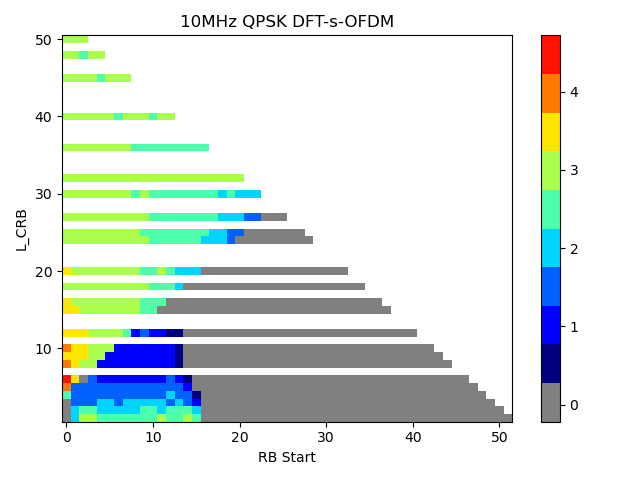{width="4.680555555555555in" height="2.9375in"}

Figure 5.2.2.7-8 Throughput performance for 29GHz under AWGN, DFT-s-OFDM

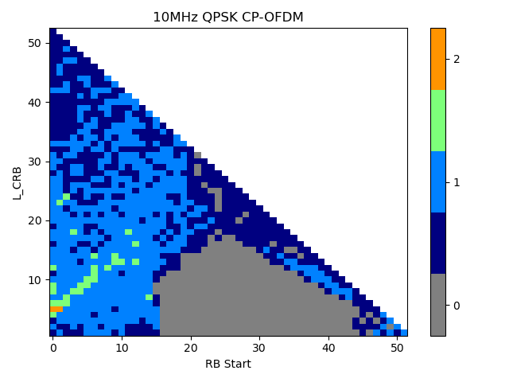{width="5.013888888888889in"
height="2.673611111111111in"}

Figure 5.2.2.7-9 Throughput performance for 29GHz under TDL-D,
DFT-s-OFDM

{width="4.777777777777778in"
height="2.576388888888889in"}

Figure 5.2.2.7-10 Throughput performance for 29GHz under TDL-A,
DFT-s-OFDM

\- 39GHz

{width="4.847222222222222in"
height="2.5833333333333335in"}

Figure 5.2.2.7-11 Throughput performance for 39GHz under AWGN,
DFT-s-OFDM

{width="4.923611111111111in"
height="2.6944444444444446in"}

Figure 5.2.2.7-12 Throughput performance for 39GHz under TDL-D,
DFT-s-OFDM

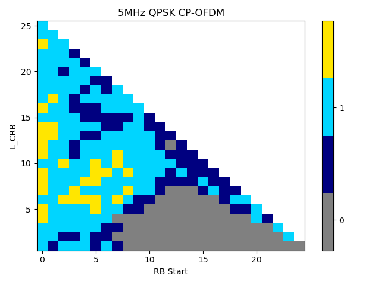{width="5.006944444444445in"
height="2.6180555555555554in"}

Figure 5.2.2.7-13 Throughput performance for 39GHz under TDL-A,
DFT-s-OFDM

\- 48GHz

{width="4.951388888888889in"
height="2.7152777777777777in"}

Figure 5.2.2.7-14 Throughput performance for 39GHz under TDL-A,
DFT-s-OFDM

From the simulation results, table 5.2.2.7-1 summary the SNR required to
achieve gains for 256QAM compare to 64QAM:

Table 5.2.2.7-1 UL 256QAM required SNR to achieve gains compare to 64QAM

<table>
<thead>
<tr class="header">
<th>Parameters for UL 256QAM</th>
<th>SNR required to achieve gains for 256QAM [dB]</th>
<th></th>
<th></th>
<th></th>
<th></th>
<th></th>
<th></th>
<th></th>
<th></th>
<th></th>
<th></th>
</tr>
</thead>
<tbody>
<tr class="odd">
<td></td>
<td>29GHz</td>
<td>39GHz</td>
<td>48GHz</td>
<td></td>
<td></td>
<td></td>
<td></td>
<td></td>
<td></td>
<td></td>
<td></td>
</tr>
<tr class="even">
<td>Channel</td>
<td>MCS</td>
<td>3%+3%</td>
<td>3.5%+3.5%</td>
<td>4%+4%</td>
<td>3%+3%</td>
<td>3.5%+3.5%</td>
<td>4%+4%</td>
<td>3%+3%</td>
<td>3.5%+3.5%</td>
<td>4%+4%</td>
<td></td>
</tr>
<tr class="odd">
<td>
AWGN

1x2 RANK1
</td>
<td>MCS21</td>
<td>CP-OFDM</td>
<td>19.3</td>
<td>19.5</td>
<td>19.6</td>
<td>20</td>
<td>21.5</td>
<td>22</td>
<td>24</td>
<td>25</td>
<td>28</td>
</tr>
<tr class="even">
<td></td>
<td></td>
<td>DFT-OFDM</td>
<td>19.3</td>
<td>19.5</td>
<td>19.6</td>
<td>20.1</td>
<td>21.1</td>
<td>21.7</td>
<td>22.5</td>
<td>23.6</td>
<td>25</td>
</tr>
<tr class="odd">
<td></td>
<td>MCS23</td>
<td>CP-OFDM</td>
<td>23</td>
<td>23.5</td>
<td>25.5</td>
<td>NA</td>
<td>NA</td>
<td>NA</td>
<td>NA</td>
<td>NA</td>
<td>NA</td>
</tr>
<tr class="even">
<td></td>
<td></td>
<td>DFT-OFDM</td>
<td>22.5</td>
<td>23.5</td>
<td>24.7</td>
<td>NA</td>
<td>NA</td>
<td>NA</td>
<td>NA</td>
<td>NA</td>
<td>NA</td>
</tr>
<tr class="odd">
<td>
TDL-D

2x2 RANK2
</td>
<td>MCS21</td>
<td>CP-OFDM</td>
<td>21.8</td>
<td>22.5</td>
<td>23.1</td>
<td>24.1</td>
<td>25.2</td>
<td>28</td>
<td>-</td>
<td>-</td>
<td>-</td>
</tr>
<tr class="even">
<td></td>
<td></td>
<td>DFT-OFDM</td>
<td>22</td>
<td>22.6</td>
<td>23.3</td>
<td>24.1</td>
<td>25.7</td>
<td>28</td>
<td>-</td>
<td>-</td>
<td>-</td>
</tr>
<tr class="odd">
<td></td>
<td>MCS23</td>
<td>CP-OFDM</td>
<td>25.8</td>
<td>27.3</td>
<td>NA</td>
<td>NA</td>
<td>NA</td>
<td>NA</td>
<td></td>
<td></td>
<td></td>
</tr>
<tr class="even">
<td></td>
<td></td>
<td>DFT-OFDM</td>
<td>25.7</td>
<td>26.1</td>
<td>28</td>
<td>NA</td>
<td>NA</td>
<td>NA</td>
<td>-</td>
<td>-</td>
<td>-</td>
</tr>
<tr class="odd">
<td>
TDL-A

2x2 RANK2
</td>
<td>MCS21</td>
<td>CP-OFDM</td>
<td>21.8</td>
<td>22.7</td>
<td>23.8</td>
<td>25.2</td>
<td>26.7</td>
<td>NA</td>
<td>-</td>
<td>-</td>
<td>-</td>
</tr>
<tr class="even">
<td></td>
<td></td>
<td>DFT-OFDM</td>
<td>21.8</td>
<td>22.7</td>
<td>23.8</td>
<td>NA</td>
<td>NA</td>
<td>NA</td>
<td>-</td>
<td>-</td>
<td>-</td>
</tr>
<tr class="odd">
<td></td>
<td>MCS23</td>
<td>CP-OFDM</td>
<td>26.5</td>
<td>28</td>
<td>NA</td>
<td>NA</td>
<td>NA</td>
<td>NA</td>
<td>-</td>
<td>-</td>
<td>-</td>
</tr>
<tr class="even">
<td></td>
<td></td>
<td>DFT-OFDM</td>
<td>25.8</td>
<td>27.5</td>
<td>NA</td>
<td>NA</td>
<td>NA</td>
<td>NA</td>
<td>-</td>
<td>-</td>
<td>-</td>
</tr>
<tr class="odd">
<td>- means the related simulations haven’t been done due to time limit.</td>
<td></td>
<td></td>
<td></td>
<td></td>
<td></td>
<td></td>
<td></td>
<td></td>
<td></td>
<td></td>
<td></td>
</tr>
</tbody>
</table>

Observation:

And it is shown that supporting UL 256 QAM can provide significant
performance gain over UL 64QAM for 3.5% EVM.

For AWGN channel with 3.5% Tx EVM+3.5% Rx EVM, a SNR of \>19.5 dB is
needed for 29GHz, a SNR of \>21.1 dB is needed for 39GHz and a SNR of
\>23.6 dB is needed for 48GHz.

For TDL-A and TDL-D fading channel with 3.5% Tx EVM+3.5% Rx EVM, a SNR
of \>22.5 dB is needed for 29GHz, a SNR of \>25.2 dB is needed for
39GHz, due to lime limit, the related simulation for 48GHz haven't been
done.

[R4-2219075]{.underline}

We further compare the UL 256QAM and UL 64QAM performance under
different channel conditions and carrier frequencies to determine
whether UL 256QAM can provide gains over UL 64QAM for 48GHz. For all
simulations, we assumed 50MHz channel bandwidth with 120kHz SCS and
phase noise model of example2 (UE) + example2(BS) based on the agreed
simulation assumptions \[2\].

CP-OFDM

{width="5.319444444444445in"
height="2.923611111111111in"}

Figure 5.2.2.7-15 Throughput performance for 48GHz under AWGN, CP-OFDM

{width="5.326388888888889in"
height="2.923611111111111in"}

Figure 5.2.2.7-16 Throughput performance for 48GHz under TDL-D, CP-OFDM

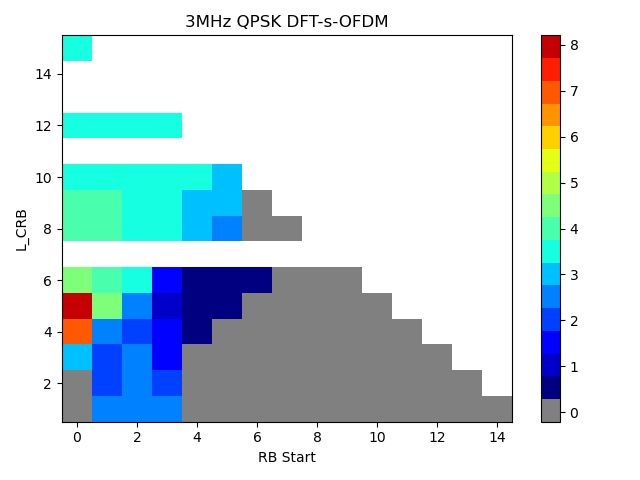{width="5.423611111111111in"
height="2.9791666666666665in"}

Figure 5.2.2.7-17 Throughput performance for 48GHz under TDL-D, CP-OFDM

DFT-s-OFDM

{width="4.993055555555555in" height="2.75in"}

Figure 5.2.2.7-18 Throughput performance for 48GHz under AWGN,
DFT-s-OFDM

{width="5.569444444444445in"
height="2.5972222222222223in"}

Figure 5.2.2.7-19 Throughput performance for 48GHz under TDL-D,
DFT-s-OFDM

{width="5.368055555555555in"
height="2.9930555555555554in"}

Figure 5.2.2.7-20 Throughput performance for 48GHz under TDL-A,
DFT-s-OFDM

From the simulation results for 48GHz, table **5.2.2.7-2** updated the
SNR required to achieve gains for 256QAM compare to 64QAM:

> **Table 5.2.2.7-2 UL 256QAM required SNR to achieve gains compare to
> 64QAM**

+------------+------------+----------+-----------+-------+----+
| **         | **48GHz    |          |           |       |    |
| Parameters | SNR        |          |           |       |    |
| for UL     | required   |          |           |       |    |
| 256QAM**   | to achieve |          |           |       |    |
|            | gains for  |          |           |       |    |
|            | 256QAM     |          |           |       |    |
|            | \[dB\]**   |          |           |       |    |
+============+============+==========+===========+=======+====+
| Channel    | MCS        | 3%+3%    | 3.5%+3.5% | 4%+4% |    |
+------------+------------+----------+-----------+-------+----+
| AWGN       | MCS21      | CP-OFDM  | 24        | 25    | 28 |
|            |            |          |           |       |    |
| 1x2 RANK1  |            |          |           |       |    |
+------------+------------+----------+-----------+-------+----+
|            |            | DFT-OFDM | 22.5      | 23.6  | 25 |
+------------+------------+----------+-----------+-------+----+
|            | MCS23      | CP-OFDM  | NA        | NA    | NA |
+------------+------------+----------+-----------+-------+----+
|            |            | DFT-OFDM | NA        | NA    | NA |
+------------+------------+----------+-----------+-------+----+
| TDL-D      | MCS21      | CP-OFDM  | NA        | NA    | NA |
|            |            |          |           |       |    |
| 2x2 RANK2  |            |          |           |       |    |
+------------+------------+----------+-----------+-------+----+
|            |            | DFT-OFDM | NA        | NA    | NA |
+------------+------------+----------+-----------+-------+----+
|            | MCS23      | CP-OFDM  | NA        | NA    | NA |
+------------+------------+----------+-----------+-------+----+
|            |            | DFT-OFDM | NA        | NA    | NA |
+------------+------------+----------+-----------+-------+----+
| TDL-A      | MCS21      | CP-OFDM  | NA        | NA    | NA |
|            |            |          |           |       |    |
| 2x2 RANK2  |            |          |           |       |    |
+------------+------------+----------+-----------+-------+----+
|            |            | DFT-OFDM | NA        | NA    | NA |
+------------+------------+----------+-----------+-------+----+
|            | MCS23      | CP-OFDM  | NA        | NA    | NA |
+------------+------------+----------+-----------+-------+----+
|            |            | DFT-OFDM | NA        | NA    | NA |
+------------+------------+----------+-----------+-------+----+

#### 5.2.2.8 Simulation results from ZTE

R4-2216426

To study the gain and operating SNR, link level simulation approach was
adopted to compare 256QAM with 64QAM. The simulation assumptions are
from 5.2.2.1, and the parameters used in this simulation are marked in
red. The throughput curves for CP-OFDM Rank1 transmission are listed in
figure 5.2.2.8-1\~ figure 5.2.2.8-9 for reference.

{width="4.263888888888889in" height="2.6875in"}

Figure 5.2.2.8-1: Throughput performance comparison between FR2 UL
256QAM and FR2 UL 64QAM \@29GHz AWGN channel

{width="4.055555555555555in"
height="2.9097222222222223in"}

**Figure 5.2.2.8-2: Throughput performance comparison between FR2 UL
256QAM and FR2 UL 64QAM \@29GHz TDLD channel**

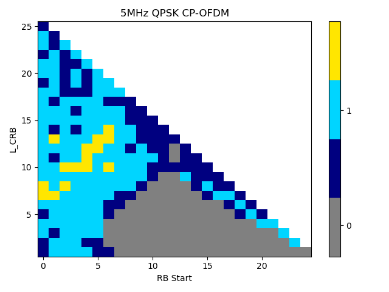{width="4.368055555555555in"
height="3.173611111111111in"}

Figure 5.2.2.8-3: Throughput performance comparison between FR2 UL
256QAM and FR2 UL 64QAM \@29GHz TDLA channel

{width="4.395833333333333in"
height="3.0972222222222223in"}

Figure 5.2.2.8-4: Throughput performance comparison between FR2 UL
256QAM and FR2 UL 64QAM \@39GHz AWGN channel

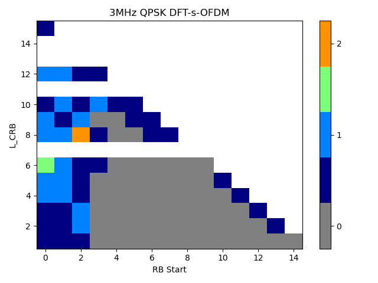{width="4.236111111111111in"
height="2.9444444444444446in"}

Figure 5.2.2.8-5: Throughput performance comparison between FR2 UL
256QAM and FR2 UL 64QAM \@39GHz TDLD channel

{width="4.361111111111111in"
height="3.4305555555555554in"}

Figure 5.2.2.8-6: Throughput performance comparison between FR2 UL
256QAM and FR2 UL 64QAM \@39GHz TDLA channel

{width="4.618055555555555in"
height="3.4652777777777777in"}

Figure 5.2.2.8-7: Throughput performance comparison between FR2 UL
256QAM and FR2 UL 64QAM \@48GHz AWGN channel

{width="4.201388888888889in"
height="3.451388888888889in"}

Figure 5.2.2.8-8: Throughput performance comparison between FR2 UL
256QAM and FR2 UL 64QAM \@48GHz TDLD channel

{width="4.208333333333333in"
height="3.451388888888889in"}

Figure 5.2.2.8-9: Throughput performance comparison between FR2 UL
256QAM and FR2 UL 64QAM \@48GHz TDLA channel

The target SNR values are summarized in table 5.2.2.8-1, where "-" means
that 256QAM can not provide better performance in the given SNR range
compared to 64QAM.

Table 5.2.2.8-1. Target SNR for CP-OFDM, Rank 1 transmission

  index   frequency   Channel   Test setup (64QAM/256QAM)   Target SNR                  
  ------- ----------- --------- --------------------------- ------------- ------------- -------------
                                                            EVM 3.0+3.0   EVM 3.5+3.5   EVM 4.0+4.0
  1       29GHz       AWGN      MCS23/21                    21.31         21.71         22.19
  2                             MCS24/23                    25.92         27.66         31.06
  3                   TDL-D     MCS23/21                    23.42         23.73         24.16
  4                             MCS24/23                    28.44         30.10         34.28
  5                   TDL-A     MCS23/21                    25.90         26.45         27.23
  6                             MCS24/23                    31.49         34.31         \-
  7       39GHz       AWGN      MCS23/21                    21.28         21.64         21.95
  8                             MCS24/23                    25.86         27.64         30.62
  9                   TDL-D     MCS23/21                    26.36         27.50         29.23
  10                            MCS24/23                    \-            \-            \-
  11                  TDL-A     MCS23/21                    30.48         32.35         36.62
  12                            MCS24/23                    \-            \-            \-
  13      48GHz       AWGN      MCS23/21                    \-            \-            \-
  14                            MCS24/23                    \-            \-            \-
  15                  TDL-D     MCS23/21                    \-            \-            \-
  16                            MCS24/23                    \-            \-            \-
  17                  TDL-A     MCS23/21                    \-            \-            \-
  18                            MCS24/23                    \-            \-            \-

Based on the simulation results, the following observations are given:

**Observation 1:** For 29GHz:

256QAM performance gain can be expected in the following cases:

AWGN and TDL-D channel,

TDL-A channel when MCS21(256QAM)/MCS23(64QAM) are selected,

TDL-A channel when MCS23(256QAM)/MCS24(64QAM) and EVM3.0+3.0 or
EVM3.5+3.5 are selected

However, 256QAM performance gain can not be expected in the following
cases:

TDL-A channel when MCS23(256QAM)/MCS24(64QAM) and EVM4.0+4.0 are
selected.

**Observation 2:** For 39GHz:

256QAM performance gain can be expected in the following cases:

AWGN

TDL-D and TDL-A channel when MCS21(256QAM)/MCS23(64QAM) are selected

However, 256QAM performance gain can not be expected in the following
cases:

TDL-D and TDL-A channel when MCS23(256QAM)/MCS24(64QAM) are selected.

For 48GHz, using the same phase noise model, the phase noise becomes
larger as frequency increases.

**Observation 3:** For 48GHz:

256QAM performance gain can not be expected for AWGN, TDL-D and TDL-A
channel for all the MCS.

R4-2218595

For MCS22 evaluation, the simulation assumptions are 5.2.2.1, and the
parameters used in this simulation are marked in red. The throughput
curves for MCS22 for CP-OFDM Rank1 transmission are listed in
figure5.2.2.8-10\~figure 5.2.2.8-12.

{width="3.375in" height="2.798611111111111in"}

Figure 5.2.2.8-10, Throughput performance comparison between FR2 UL
256QAM MCS 22 and FR2 UL 64QAM MCS24 \@39GHz AWGN channel

{width="3.3472222222222223in"
height="2.8125in"}

Figure 5.2.2.8-12, Throughput performance comparison between FR2 UL
256QAM MCS 22 and FR2 UL 64QAM MCS24 \@39GHz TDL-D channel

{width="3.4305555555555554in"
height="2.8472222222222223in"}

Figure 5.2.2.8-12, Throughput performance comparison between FR2 UL
256QAM MCS 22 and FR2 UL 64QAM MCS24 \@39GHz TDL-A channel

The updated target SNR values are summarized in table **5.2.2.8-2**,
where "-" means that 256QAM can not provide better performance in the
given SNR range compared to 64QAM. As EVM was reached in last meeting so
the simulation results of EVM 3.0% and EVM 4.0% are not provided.

Table 5.2.2.8-2. Target SNR for CP-OFDM, Rank 1 transmission

  index   frequency   Channel   Test setup (64QAM/256QAM)   Target SNR
  ------- ----------- --------- --------------------------- ---------------
                                                            EVM 3.5%+3.5%
  1       29GHz       AWGN      MCS23/21                    20.80
  2                             MCS24/23                    27.47
  3                   TDL-D     MCS23/21                    22.42
  4                             MCS24/23                    27.71
  5                   TDL-A     MCS23/21                    24.03
  6                             MCS24/23                    29.07
  7       39GHz       AWGN      MCS23/21                    22.00
                                MCS24/22                    27.55
  8                             MCS24/23                    \-
  9                   TDL-D     MCS23/21                    26.00
                                MCS24/22                    29.61
  10                            MCS24/23                    \-
  11                  TDL-A     MCS23/21                    26.09
                                MCS24/22                    30.70
  12                            MCS24/23                    \-
  13      48GHz       AWGN      MCS23/21                    \-
  14                            MCS24/23                    \-
  15                  TDL-D     MCS23/21                    \-
  16                            MCS24/23                    \-
  17                  TDL-A     MCS23/21                    \-
  18                            MCS24/23                    \-

Based on the simulation results, the following observations are given:

**Observation 1: For 39GHz:**

UL 256QAM performance gain can be expected in the following cases:

AWGN, TDL-D and TDL-A channel when MCS21(256QAM)/MCS23(64QAM) are
selected

AWGN, TDL-D and TDL-A channel when MCS22(256QAM)/MCS24(64QAM) are
selected

**Observation 2: UL 256QAM performance gain can not be expected for
48GHz.**

#### 5.2.2.9 Simulation results from Ericsson

R4-2220036

On Figure 5.2.2.9-1 -- Figure 5.2.2.9-8 we provide simulation results
for various scenarios described in figure captions and figure legends.

{width="6.006944444444445in"
height="2.5833333333333335in"}

Figure 5.2.2.9-1: 29GHz, 100MHz, No HARQ, AWGN 2x2 Rank 1 channel,
txEVM= rxEVM=3.5%

{width="6.006944444444445in"
height="2.5833333333333335in"}

Figure 5.2.2.9-2: 29GHz, 100MHz, No HARQ, Fading 2x2 Rank 1 channel,
txEVM= rxEVM=3.5%

{width="6.006944444444445in"
height="2.5833333333333335in"}

Figure 5.2.2.9-3: 29GHz, 100MHz, No HARQ, AWGN 2x2 Rank 2 channel,
txEVM= rxEVM=3.5%

{width="6.006944444444445in"
height="2.5833333333333335in"}

Figure 5.2.2.9-4: 29GHz, 100MHz, No HARQ, Fading 2x2 Rank 2 channel,
txEVM= rxEVM=3.5%

{width="6.006944444444445in"
height="2.5833333333333335in"}

Figure 5.2.2.9-5: 29GHz, 100MHz, HARQ=8, AWGN 2x2 Rank 1 channel, txEVM=
rxEVM=3.5%

{width="6.006944444444445in"
height="2.5833333333333335in"}

Figure 5.2.2.9-6: 29GHz, 100MHz, HARQ=8, Fading 2x2 Rank 1 channel,
txEVM= rxEVM=3.5%

{width="6.006944444444445in"
height="2.5833333333333335in"}

Figure 5.2.2.9-7: 29GHz, 100MHz, HARQ=8, AWGN 2x2 Rank 2 channel, txEVM=
rxEVM=3.5%

{width="6.006944444444445in"
height="2.5833333333333335in"}

Figure 5.2.2.9-8: 29GHz, 100MHz, HARQ=8, Fading 2x2 Rank 2 channel,
txEVM= rxEVM=3.5%

In Table 5.2.2.9-1 we have summarized results where we indicate two
operating SNR points where 256QAM MCS21 outperforms 64QAM MCS23 and
64QAM MCS24, respectively.

Table 5.2.2.9-1: Summary of link-level simulation results

  HARQ Type   Channel type        Cross-point between 256QAM MCS21 and 64QAM MCS23   Cross-point between 256QAM MCS21 and 64QAM MCS24
  ----------- ------------------- -------------------------------------------------- --------------------------------------------------
  No HARQ     AWGN 2x2 Rank 1     26.2 dB                                            26.8 dB
              AWGN 2x2 Rank 2     28.7 dB                                            29 dB
              Fading 2x2 Rank 1   27.9 dB                                            28.1 dB
              Fading 2x2 Rank 2   32.4 dB                                            33.2 dB
  HARQ=8      AWGN 2x2 Rank 1     26 dB                                              26.4 dB
              AWGN 2x2 Rank 2     28.1 dB                                            28.8 dB
              Fading 2x2 Rank 1   27.1 dB                                            27.8 dB
              Fading 2x2 Rank 2   31.2 dB                                            32.2 dB

We conclude first that between not having HARQ and having HARQ=8
repetitions there are no big differences when it comes to the
cross-point (operating SNR) between 256QAM MCS21 and 64QAM MCS23/MCS24,
respectively. For the AWGN channel, the operating SNR is lower by 0.3 dB
in average in the "No HARQ" case compared with "HARQ=8" case, while for
the TDL-D fading channel the operating SNR is lower by 0.8 dB in the "No
HARQ" case compared with "HARQ=8" case.

For "No HARQ" case, for AWGN channel the average operating SNR is equal
to 27.7 dB.

For "No HARQ" case, for TDL-D fading channel the average operating SNR
is equal to 30.4 dB.

#### 5.2.2.10 Summary for 29GHz simulation results

<table>
<thead>
<tr class="header">
<th>Parameter</th>
<th>
Nokia

R4-2215577
</th>
<th>
LG Electronics

R4-2215920

R4-2218681
</th>
<th>
vivo

R4-2216128
</th>
<th>
Huawei

R4-2216245

R4-2219144
</th>
<th>
Sony

R4-2216251

R4-2218753
</th>
<th>
Xiaomi

R4-2216350
</th>
<th>
ZTE

R4-2216426

R4-2218595
</th>
<th>
Ericsson

R4-2220036
</th>
<th></th>
<th></th>
</tr>
</thead>
<tbody>
<tr class="odd">
<td>Carrier frequency</td>
<td>29 GHz</td>
<td>29 GHz</td>
<td>29 GHz</td>
<td>29 GHz</td>
<td>29 GHz</td>
<td>29 GHz</td>
<td>29 GHz</td>
<td>29 GHz</td>
<td></td>
<td></td>
</tr>
<tr class="even">
<td>CBW</td>
<td>50MHz</td>
<td>100MHz</td>
<td>50MHz/100MHz</td>
<td>50MHz</td>
<td>100MHz</td>
<td>50MHz</td>
<td>100MHz</td>
<td>100MHz</td>
<td></td>
<td></td>
</tr>
<tr class="odd">
<td>SCS</td>
<td>120kHz</td>
<td>120kHz</td>
<td>120kHz</td>
<td>120kHz</td>
<td>120kHz</td>
<td>120kHz</td>
<td>120kHz</td>
<td>120kHz</td>
<td></td>
<td></td>
</tr>
<tr class="even">
<td>HARQ</td>
<td>none</td>
<td>none</td>
<td></td>
<td>none</td>
<td>none</td>
<td>none</td>
<td>none</td>
<td>none/8</td>
<td></td>
<td></td>
</tr>
<tr class="odd">
<td>RANK</td>
<td>RANK1</td>
<td>RANK1</td>
<td>RANK1</td>
<td>RANK1</td>
<td>RANK1</td>
<td>RANK1</td>
<td>RANK1</td>
<td>RANK1</td>
<td></td>
<td></td>
</tr>
<tr class="even">
<td>Phase noise model</td>
<td>
Option a):

example1 (UE)  + example1(BS)
</td>
<td>Option b): example2 (UE) + example2(BS)</td>
<td>Option b): example2 (UE) + example2(BS)</td>
<td>Option d): example1 (UE) + example2(BS)</td>
<td>Option b): example2 (UE) + example2(BS)</td>
<td>Option b): example2 (UE) + example2(BS)</td>
<td>Option b): example2 (UE) + example2(BS)</td>
<td>Option a): example1 (UE)  + example1(BS)</td>
<td></td>
<td></td>
</tr>
<tr class="odd">
<td>Tx EVM=Rx EVM</td>
<td>3.5%</td>
<td>3.5%</td>
<td>3.5%</td>
<td>3.5%</td>
<td>3.5%</td>
<td>3.5%</td>
<td>3.5%</td>
<td>3.5%</td>
<td></td>
<td></td>
</tr>
<tr class="even">
<td>Target SNR(dB)</td>
<td>TDL-A</td>
<td>MCS20</td>
<td></td>
<td>25.5</td>
<td></td>
<td></td>
<td></td>
<td></td>
<td></td>
<td></td>
</tr>
<tr class="odd">
<td></td>
<td></td>
<td>MCS21</td>
<td></td>
<td>30</td>
<td>22.7/24</td>
<td></td>
<td></td>
<td>22.7</td>
<td>26.45/24.03</td>
<td></td>
</tr>
<tr class="even">
<td></td>
<td></td>
<td>MCS22</td>
<td></td>
<td>NA</td>
<td></td>
<td></td>
<td></td>
<td></td>
<td></td>
<td></td>
</tr>
<tr class="odd">
<td></td>
<td></td>
<td>MCS23</td>
<td></td>
<td>NA</td>
<td>26.3/28.4</td>
<td></td>
<td></td>
<td>28</td>
<td>34.31/29.07</td>
<td></td>
</tr>
<tr class="even">
<td></td>
<td>TDL-D</td>
<td>MCS20</td>
<td></td>
<td>18.5</td>
<td></td>
<td></td>
<td></td>
<td></td>
<td></td>
<td></td>
</tr>
<tr class="odd">
<td></td>
<td></td>
<td>MCS21</td>
<td>24-25</td>
<td>21</td>
<td>20.8/21.8</td>
<td>20.1</td>
<td>23</td>
<td>22.5</td>
<td>23.73/22.42</td>
<td>27.9/27.1</td>
</tr>
<tr class="even">
<td></td>
<td></td>
<td>MCS22</td>
<td></td>
<td>23</td>
<td></td>
<td></td>
<td></td>
<td></td>
<td></td>
<td></td>
</tr>
<tr class="odd">
<td></td>
<td></td>
<td>MCS23</td>
<td>32</td>
<td>27</td>
<td>25.7/28</td>
<td>23</td>
<td></td>
<td>27.3</td>
<td>30.10/27.71</td>
<td></td>
</tr>
<tr class="even">
<td></td>
<td>AWGN</td>
<td>MCS21</td>
<td></td>
<td>17</td>
<td>19.5/19.7</td>
<td></td>
<td>20</td>
<td>19.5</td>
<td>21.71/20.8</td>
<td>26.2/26</td>
</tr>
<tr class="odd">
<td></td>
<td></td>
<td>MCS23</td>
<td></td>
<td>21</td>
<td>22.2/23.8</td>
<td></td>
<td>25</td>
<td>23.5</td>
<td>27.66/27.47</td>
<td></td>
</tr>
</tbody>
</table>

Average value for 29GHz operating SNR based on TDL-D:

             **Operating SNR (dB) with EVM 3.5%**                                 
  ---------- -------------------------------------- -------------- -------------- --------------
             TDL-D, MCS20                           TDL-D, MCS21   TDL-D, MCS22   TDL-D, MCS23
  Nokia      \-                                     25             \-             32
  LGE        18.5                                   21             23             27
  vivo       \-                                     21.8           \-             28
  Huawei     \-                                     20.1           \-             23
  Xiaomi     \-                                     22.5           \-             27.3
  ZTE        \-                                     22.42          \-             27.71
  Ericsson   \-                                     27.9           \-             \-
  Average    18.5                                   23             23             27.5

#### 5.2.2.11 Summary for 39GHz simulation results

<table>
<thead>
<tr class="header">
<th>Parameter</th>
<th>
Nokia

R4-2215577
</th>
<th>
LG Electronics

R4-2218681
</th>
<th>
vivo

R4-2216128
</th>
<th>
Huawei

R4-2216245

R4-2219144
</th>
<th>
Sony

R4-2218753
</th>
<th>
Xiaomi

R4-2216350
</th>
<th>
ZTE

R4-2216426

R4-2218595
</th>
<th></th>
<th></th>
</tr>
</thead>
<tbody>
<tr class="odd">
<td>Carrier frequency</td>
<td>39 GHz</td>
<td>39 GHz</td>
<td>39 GHz</td>
<td>39 GHz</td>
<td>39 GHz</td>
<td>39 GHz</td>
<td>39 GHz</td>
<td></td>
<td></td>
</tr>
<tr class="even">
<td>CBW</td>
<td>50MHz</td>
<td>100MHz</td>
<td>50MHz/100MHz</td>
<td>50MHz</td>
<td>50MHz</td>
<td>50MHz</td>
<td>100MHz</td>
<td></td>
<td></td>
</tr>
<tr class="odd">
<td>SCS</td>
<td>120kHz</td>
<td>120kHz</td>
<td>120kHz</td>
<td>120kHz</td>
<td>120kHz</td>
<td>120kHz</td>
<td>120kHz</td>
<td></td>
<td></td>
</tr>
<tr class="even">
<td>HARQ</td>
<td>none</td>
<td>none</td>
<td>none</td>
<td>none</td>
<td>none</td>
<td>none</td>
<td>none</td>
<td></td>
<td></td>
</tr>
<tr class="odd">
<td>RANK</td>
<td>RANK1</td>
<td>RANK1</td>
<td>RANK1</td>
<td>RANK1</td>
<td>RANK1</td>
<td>RANK1</td>
<td>RANK1</td>
<td></td>
<td></td>
</tr>
<tr class="even">
<td>Phase noise model</td>
<td>
Option a):

example1 (UE)  + example1(BS)
</td>
<td>Option b): example2 (UE) + example2(BS)</td>
<td>Option b): example2 (UE) + example2(BS)</td>
<td>Option d): example1 (UE) + example2(BS)</td>
<td>Option b): example2 (UE) + example2(BS)</td>
<td>Option b): example2 (UE) + example2(BS)</td>
<td>Option b): example2 (UE) + example2(BS)</td>
<td></td>
<td></td>
</tr>
<tr class="odd">
<td>Tx EVM=Rx EVM</td>
<td>3.5%</td>
<td>3.5%</td>
<td>3.5%</td>
<td>3.5%</td>
<td>3.5%</td>
<td>3.5%</td>
<td>3.5%</td>
<td></td>
<td></td>
</tr>
<tr class="even">
<td>Target SNR(dB)</td>
<td>TDL-A</td>
<td>MCS20</td>
<td></td>
<td>NA</td>
<td></td>
<td></td>
<td></td>
<td></td>
<td></td>
</tr>
<tr class="odd">
<td></td>
<td></td>
<td>MCS21</td>
<td></td>
<td>NA</td>
<td>29.2/NA</td>
<td></td>
<td></td>
<td>26.7</td>
<td>32.35/26.09</td>
</tr>
<tr class="even">
<td></td>
<td></td>
<td>MCS22</td>
<td></td>
<td>NA</td>
<td></td>
<td></td>
<td></td>
<td></td>
<td>30.70</td>
</tr>
<tr class="odd">
<td></td>
<td></td>
<td>MCS23</td>
<td></td>
<td>NA</td>
<td>NA</td>
<td></td>
<td></td>
<td>NA</td>
<td>NA</td>
</tr>
<tr class="even">
<td></td>
<td>TDL-D</td>
<td>MCS20</td>
<td></td>
<td>21</td>
<td></td>
<td></td>
<td></td>
<td></td>
<td></td>
</tr>
<tr class="odd">
<td></td>
<td></td>
<td>MCS21</td>
<td>36</td>
<td>24</td>
<td>25/NA</td>
<td>21</td>
<td></td>
<td>25.2</td>
<td>27.50/26</td>
</tr>
<tr class="even">
<td></td>
<td></td>
<td>MCS22</td>
<td></td>
<td>30</td>
<td></td>
<td></td>
<td></td>
<td></td>
<td>29.61</td>
</tr>
<tr class="odd">
<td></td>
<td></td>
<td>MCS23</td>
<td></td>
<td>NA</td>
<td>NA</td>
<td>25.4</td>
<td></td>
<td>NA</td>
<td>NA</td>
</tr>
<tr class="even">
<td></td>
<td>AWGN</td>
<td>MCS21</td>
<td></td>
<td></td>
<td>21.8/28</td>
<td></td>
<td>21.5</td>
<td>21.5</td>
<td>21.64/22</td>
</tr>
<tr class="odd">
<td></td>
<td></td>
<td>MCS22</td>
<td></td>
<td></td>
<td></td>
<td></td>
<td></td>
<td></td>
<td>27.55</td>
</tr>
<tr class="even">
<td></td>
<td></td>
<td>MCS23</td>
<td></td>
<td></td>
<td>NA</td>
<td></td>
<td>36</td>
<td>NA</td>
<td>27.64</td>
</tr>
</tbody>
</table>

Average value for 39GHz operating SNR based on TDL-D:

            **Operating SNR (dB) with EVM 3.5%**                                 
  --------- -------------------------------------- -------------- -------------- --------------
            TDL-D, MCS20                           TDL-D, MCS21   TDL-D, MCS22   TDL-D, MCS23
  Nokia     \-                                     36             \-             \-
  LGE       21                                     24             30             NA
  vivo      \-                                     25             \-             NA
  Huawei    \-                                     21             \-             25.4
  Xiaomi    \-                                     25.2           \-             NA
  ZTE       \-                                     26             29.21          NA
  Average   21                                     26.2           29.6           NA

#### 5.2.2.12 Summary for 48GHz simulation results

<table>
<thead>
<tr class="header">
<th>Parameter</th>
<th>
LG Electronics

R4-2215920
</th>
<th>
vivo

R4-2216128
</th>
<th>
Huawei

R4-2216245
</th>
<th>
Xiaomi

R4-2216350

R4-2219075
</th>
<th>
ZTE

R4-2216426

R4-2219595
</th>
<th>
Nokia

R4-2218326
</th>
<th></th>
<th></th>
<th></th>
</tr>
</thead>
<tbody>
<tr class="odd">
<td>Carrier frequency</td>
<td>48 GHz</td>
<td>48 GHz</td>
<td>48 GHz</td>
<td>48 GHz</td>
<td>48 GHz</td>
<td>48 GHz</td>
<td></td>
<td></td>
<td></td>
</tr>
<tr class="even">
<td>CBW</td>
<td>100MHz</td>
<td>50MHz/100MHz</td>
<td>50MHz</td>
<td>50MHz</td>
<td>100MHz</td>
<td>50MHz</td>
<td></td>
<td></td>
<td></td>
</tr>
<tr class="odd">
<td>SCS</td>
<td>120kHz</td>
<td>120kHz</td>
<td>120kHz</td>
<td>120kHz</td>
<td>120kHz</td>
<td>120kHz</td>
<td></td>
<td></td>
<td></td>
</tr>
<tr class="even">
<td>HARQ</td>
<td>none</td>
<td>none</td>
<td>none</td>
<td>none</td>
<td>none</td>
<td>none</td>
<td></td>
<td></td>
<td></td>
</tr>
<tr class="odd">
<td>RANK</td>
<td>RANK1</td>
<td>RANK1</td>
<td>RANK1</td>
<td>RANK1</td>
<td>RANK1</td>
<td>RANK1</td>
<td></td>
<td></td>
<td></td>
</tr>
<tr class="even">
<td>Phase noise model</td>
<td>Option b): example2 (UE) + example2(BS)</td>
<td>Option b): example2 (UE) + example2(BS)</td>
<td>Option d): example1 (UE) + example2(BS)</td>
<td>Option b): example2 (UE) + example2(BS)</td>
<td>Option b): example2 (UE) + example2(BS)</td>
<td>Option a): example1 (UE) + example1(BS)</td>
<td>Option d): example1 (UE) + example2(BS)</td>
<td></td>
<td></td>
</tr>
<tr class="odd">
<td>Tx EVM=Rx EVM</td>
<td>3.5%</td>
<td>3.5%</td>
<td>3.5%</td>
<td>3.5%</td>
<td>3.5%</td>
<td>3.5%</td>
<td>3.5%</td>
<td></td>
<td></td>
</tr>
<tr class="even">
<td>Target SNR(dB)</td>
<td>TDL-A</td>
<td>MCS21</td>
<td>NA</td>
<td>NA</td>
<td></td>
<td>NA</td>
<td>NA</td>
<td></td>
<td></td>
</tr>
<tr class="odd">
<td></td>
<td></td>
<td>MCS23</td>
<td>NA</td>
<td>NA</td>
<td></td>
<td>NA</td>
<td>NA</td>
<td></td>
<td></td>
</tr>
<tr class="even">
<td></td>
<td>TDL-D</td>
<td>MCS21</td>
<td>NA</td>
<td>NA</td>
<td>22.6</td>
<td>NA</td>
<td>NA</td>
<td>NA</td>
<td>NA</td>
</tr>
<tr class="odd">
<td></td>
<td></td>
<td>MCS23</td>
<td>NA</td>
<td>NA</td>
<td></td>
<td>NA</td>
<td>NA</td>
<td>NA</td>
<td>NA</td>
</tr>
<tr class="even">
<td></td>
<td>AWGN</td>
<td>MCS21</td>
<td>27.5</td>
<td>NA</td>
<td></td>
<td>25</td>
<td>NA</td>
<td></td>
<td></td>
</tr>
<tr class="odd">
<td></td>
<td></td>
<td>MCS23</td>
<td>NA</td>
<td>NA</td>
<td></td>
<td>NA</td>
<td>NA</td>
<td></td>
<td></td>
</tr>
</tbody>
</table>

### 5.2.3 Phase noise profiles evaluation

#### 5.2.3.1 Simulation assumptions

+------------------------------+--------------------------------------+
| Parameters                   | Value                                |
+------------------------------+--------------------------------------+
| Frequency                    | 29, 39 GHz                           |
+------------------------------+--------------------------------------+
| SCS                          | 60kHz, 120kHz                        |
+------------------------------+--------------------------------------+
| BW                           | 100MHz                               |
+------------------------------+--------------------------------------+
| RB Size                      | 128RB for 60kHz, 64RB for 120kHz     |
+------------------------------+--------------------------------------+
| Background AWGN              | No additional noise                  |
+------------------------------+--------------------------------------+
| Time offset/Frequency offset | 0                                    |
+------------------------------+--------------------------------------+
| Antenna configuration        | 1T1R                                 |
+------------------------------+--------------------------------------+
| Modulation                   | 256QAM                               |
+------------------------------+--------------------------------------+
| Waveform type                | CP-OFDM / DFT-s-OFDM                 |
+------------------------------+--------------------------------------+
| DMRS                         | 3 symbols per slot (UL DMRS add-pos  |
|                              | = 2)                                 |
+------------------------------+--------------------------------------+
| PTRS configuration           | OFF/ON                               |
|                              |                                      |
|                              | For CP-OFDM:                         |
|                              |                                      |
|                              | L-PTRS (Time density) = 1 (every 1   |
|                              | symbol)                              |
|                              |                                      |
|                              | K-PTRS (Freq density) =2 (every 2    |
|                              | RBs)                                 |
|                              |                                      |
|                              | For DFTs-OFDM:                       |
|                              |                                      |
|                              | L-PTRS (Time density) = 1 (every     |
|                              | symbol)                              |
|                              |                                      |
|                              | N\_group = 8, N\_samp = 4            |
|                              |                                      |
|                              | Other PTRS configurations can be     |
|                              | considered for narrow RB             |
|                              | allocations, especially for          |
|                              | DFT-s-OFDM.                          |
+------------------------------+--------------------------------------+
| EVM measurement              | Data aided EVM calculation, based on |
|                              | ideal data signal                    |
+------------------------------+--------------------------------------+
| Phase noise profiles         | Refer to clause 5.2.3.2              |
+------------------------------+--------------------------------------+

#### 5.2.3.2 Phase noise profiles

The phase noise profiles in TS 38.803 \[3\] ("UE example 1" and "UE
example 2") don't have good enough EVM for higher modulations, i.e.,
256QAM with the typical 3.5% EVM requirement. In the discussion
progress, some candidate phase noise profiles for 29GHz and 39GHz for UL
256QAM are proposed as following options:

For 29GHz:

Option1: Example 1 in TR38.803 for 29 GHz.

Option 2: Example 2 in TR38.803.

New phase noise model using the pole-zero method based on following
function:

$$S\left( f_{o} \right) = \text{PSD}0\frac{\prod_{n = 1}^{N}{1 + {(\frac{f_{o}}{f_{z,n}})}^{\alpha_{z,n}}}}{\prod_{m = 1}^{M}{1 + {(\frac{f_{o}}{f_{p,m}})}^{\alpha_{p,m}}}}$$

Option 3: Parameters from Qualcomm

  --------------------------- --------------------------- --------------------------- --------------------------- ---------------------------
  PSD0                        32 dB                                                                               
              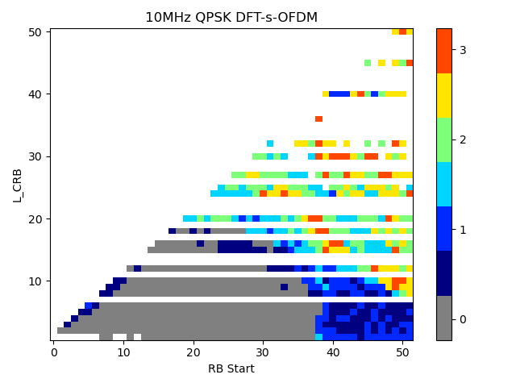
  1                           3e3                         2.37                        1                           3.3
  2                           6e5                         4.7                         8e5                         5.3
  3                           8e5                         2.0                         1.1e6                       2.5
  --------------------------- --------------------------- --------------------------- --------------------------- ---------------------------

Option 4: Parameters from MTK

> {width="3.0347222222222223in"
> height="1.0694444444444444in"}

For 39GHz:

Option 1: Example 1-based using following function:

$$S\left( f_{o} \right) = \text{PSD}0\frac{\prod_{n = 1}^{N}{1 + {(\frac{f_{o}}{f_{z,n}})}^{\alpha_{z,n}}}}{\prod_{m = 1}^{M}{1 + {(\frac{f_{o}}{f_{p,m}})}^{\alpha_{p,m}}}}$$

Parameters from vivo

Parameters from Anritsu

> {width="3.7430555555555554in"
> height="1.1041666666666667in"}

Option 2: Example 2 in TR38.803.

New phase noise model using the pole-zero method based on following
function:

$$S\left( f_{o} \right) = PSD0\frac{\prod_{n = 1}^{N}{1 + {(\frac{f_{o}}{f_{z,n}})}^{\alpha_{z,n}}}}{\prod_{m = 1}^{M}{1 + {(\frac{f_{o}}{f_{p,m}})}^{\alpha_{p,m}}}}$$

Option 3: Parameters from MTK

{width="3.0347222222222223in"
height="1.0902777777777777in"}

Option 4: Adopt min(example1, example2) as the phase noise profile for
UL256QAM, where 'example2' refers to the example phase noise profiles in
TR38.803 and 'example1' refers to Example 1-based for 39GHz.

#### 5.2.3.3 Simulation results from Xiaomi

R4-2308805/R4-2318876

Based on the agreed simulation assumptions and candidate phase noise
profiles, the EVM floor is further evaluated for CP- OFDM and
DFT-s-OFDM.

For 29GHz:

Table 5.2.3.3‑1 EVM floor and benefit for with PTRS CP-OFDM at 29GHz

  CP-OFDM with phase noise， 29GHz, 120kHz, 64RB，K-PTRS=2                                                            
  ---------------------------------------------------------- ----------------------------------- -------------------- ---------------------
  Phase noise model                                          EVM (dB) with no PTRS corrections   EVM (dB) with PTRS   Net benefit of PTRS
  Example 1 from TR38.803                                    -28.1                               -28.5                0.4
  Example 2 from TR38.803                                    -23.6                               -25.3                1.7
  Phase noise Profile from Qualcomm                          -31.9                               -33.1                1.2
  Phase noise Profile from MTK                               -32.4                               -33.0                0.6

Table 5.2.3.3‑2 EVM floor and benefit for with PTRS DFT-s-OFDM at 29GHz

  DFT-S-OFDM with phase noise， 29GHz, 120kHz, 64RB，N\_group = 8, N\_samp = 4                                                            
  ------------------------------------------------------------------------------ ----------------------------------- -------------------- ---------------------
  Phase noise model                                                              EVM (dB) with no PTRS corrections   EVM (dB) with PTRS   Net benefit of PTRS
  Example 1 from TR38.803                                                        -28.2                               -27.1                -1.1
  Example 2 from TR38.803                                                        -23.1                               -27.2                4.1
  Phase noise Profile from Qualcomm                                              -31.8                               -32.0                0.2
  Phase noise Profile from MTK                                                   -32.4                               -31.7                -0.7

From table 5.2.3.3-1 and table 5.2.3.3-2 for 29GHz, we can see no matter
for CP- OFDM and DFT-s-OFDM:

The EVM floors for new phase noise profiles from QC and MTK are reduced
obviously compared to Example 1 and Example 2.

Further compared new phase noise profiles from QC and MTK, we can see
the EVM floor of MTK's phase noise profile is lower than Qualcomm's when
without PTRS correction. And they have similar EVM floor when adding
PTRS correction. Since the CPE (common phase error) impacts is closely
related to the performance of phase noise profile, it will get less
benefit from PTRS correction if the phase noise profile introduce less
CPE (common phase error).

Therefore, we can't only judge the phase noise profile according to the
net benefit but also need consider the performance without PTRS
correction.

These two new phase noise profiles have similar performance after PTRS
correction for both of CP-OFDM and DFT-S-OFDM, from this point, both of
them can be used in MPR simulation.

For 39GHz:

Table 5.2.3.3‑3 EVM floor and benefit for with PTRS CP-OFDM at 39GHz

+----------------+----------------+----------------+----------------+
| CP-OFDM with   |                |                |                |
| phase noise，  |                |                |                |
| 39GHz, 120kHz, |                |                |                |
| 64RB，K-PTRS=2 |                |                |                |
+================+================+================+================+
| Phase noise    | EVM (dB) with  | EVM (dB) with  | Net benefit of |
| model          | no PTRS        | PTRS           | PTRS           |
|                | corrections    |                |                |
+----------------+----------------+----------------+----------------+
| Example 1:VIVO | -24.8          | -25.1          | 0.3            |
| parameter      |                |                |                |
+----------------+----------------+----------------+----------------+
| Example        | -25.1          | -25.5          | 0.4            |
| 1:Anritsu      |                |                |                |
| parameter      |                |                |                |
+----------------+----------------+----------------+----------------+
| Example 2 from | -20.9          | -22.7          | 1.8            |
| TR38.803       |                |                |                |
+----------------+----------------+----------------+----------------+
| Phase noise    | -29.2          | -30.3          | 1.1            |
| Profile from   |                |                |                |
| Qualcomm       |                |                |                |
|                |                |                |                |
| Min(           |                |                |                |
| Example1-VIVO, |                |                |                |
| Example2)      |                |                |                |
+----------------+----------------+----------------+----------------+
| Phase noise    | -29.3          | -30.3          | 1.0            |
| Profile from   |                |                |                |
| Qualcomm       |                |                |                |
|                |                |                |                |
| Min(Example1-  |                |                |                |
| Anritsu,       |                |                |                |
| Example2)      |                |                |                |
+----------------+----------------+----------------+----------------+
| Phase noise    | -29.4          | -30.0          | 0.6            |
| Profile from   |                |                |                |
| MTK            |                |                |                |
+----------------+----------------+----------------+----------------+

Table 5.2.3.3‑4 EVM floor and benefit for with PTRS DFT-s-OFDM at 39GHz

+----------------+----------------+----------------+----------------+
| CP-OFDM with   |                |                |                |
| phase noise，  |                |                |                |
| 39GHz, 120kHz, |                |                |                |
| 64RB，N\_group |                |                |                |
| = 8, N\_samp = |                |                |                |
| 4              |                |                |                |
+================+================+================+================+
| Phase noise    | EVM (dB) with  | EVM (dB) with  | Net benefit of |
| model          | no PTRS        | PTRS           | PTRS           |
|                | corrections    |                |                |
+----------------+----------------+----------------+----------------+
| Example 1:VIVO | -24.8          | -23.7          | -1.1           |
| parameter      |                |                |                |
+----------------+----------------+----------------+----------------+
| Example        | -25.2          | -24.0          | -1.2           |
| 1:Anritsu      |                |                |                |
| parameter      |                |                |                |
+----------------+----------------+----------------+----------------+
| Example 2 from | -20.5          | -24.4          | 3.9            |
| TR38.803       |                |                |                |
+----------------+----------------+----------------+----------------+
| Phase noise    | -29.2          | -29.1          | -0.1           |
| Profile from   |                |                |                |
| Qualcomm       |                |                |                |
|                |                |                |                |
| Min(           |                |                |                |
| Example1-VIVO, |                |                |                |
| Example2)      |                |                |                |
+----------------+----------------+----------------+----------------+
| Phase noise    | -29.2          | -29.2          | 0.0            |
| Profile from   |                |                |                |
| Qualcomm       |                |                |                |
|                |                |                |                |
| Min(Example1-  |                |                |                |
| Anritsu,       |                |                |                |
| Example2)      |                |                |                |
+----------------+----------------+----------------+----------------+
| Phase noise    | -29.5          | -28.7          | -0.8           |
| Profile from   |                |                |                |
| MTK            |                |                |                |
+----------------+----------------+----------------+----------------+

From table 5.2.3.3-3 and table 5.2.3.3-4 for 39GHz, we can see no matter
for CP- OFDM and DFT-s-OFDM:

The EVM floors of Example 1-based from vivo and Anritsu is better than
example 2, but still worse than -29.1 dB EVM requirement for 256QAM.

And the EVM floors of the new phase noise profiles that adopting
min(Example 1-based, Example 2) and from MTK are reduced obviously
compared to Example 1-based and Example 2.

Further compared new phase noise profiles from adopting min(Example
1-based, Example 2) and MTK, we can see the EVM floor of MTK's phase
noise profile is better a little than that adopting min(Example 1-based,
Example 2) a little when without PTRS correction. But the EVM floor of
MTK's phase noise profile is worse a little than that adopting
min(Example 1-based, Example 2) when with PTRS correction.

These two new phase noise profiles that adopting min(Example 1-based,
Example 2) and from MTK have better EVM floor than -29.1 dB EVM
requirement for 256QAM whether adding PTRS correction or not for both of
CP-OFDM and DFT-S-OFDM, from this point, both of them can be used in MPR
simulation.

But considering phase noise profiles that adopting min(Example 1-based,
Example 2) hasn't clearly physical description, we can use the new phase
noise profile from MTK in MPR simulation.

#### 5.2.3.4 Simulation results from vivo

R4-2308227

In the simulation, distortion other than phase noise is not considered,
e.g., PA non-linearity, transceiver impairment, etc., to ensure the
results only show the feasibility of different phase noise profiles.

The simulation results for 29GHz bands are shown in Table 5.2.3.4-1

Table 5.2.3.4-1 simulation results for 29GHz band

  64RB         EVM no correction   EVM with correction   benefit    
  ------------ ------------------- --------------------- ---------- ---------
  CP-OFDM      Option 1            -28.3288              -28.9129   0.5841
               Option 2            -25.3244              -25.5883   0.2639
               Option 3            -31.7997              -33.0798   1.2801
               Option 4            -33.0942              -33.3608   0.2666
  DFT-s-OFDM   Option 1            -28.8567              -27.1551   -1.7016
               Option 2            -25.4507              -28.9614   3.5107
               Option 3            -32.8215              -29.8556   -2.9659
               Option 4            -33.2358              -30.0408   -3.195

Based on the simulation results, we have the following observations:

**Observation 1: The phase noise profile described in option 1 and
option 2 is not feasible for the 29GHz band.**

**Observation 2: CP-OFDM can benefit from PTRS correction in UL 256QAM
but DFT-s-OFDM can't.**

The simulation results for 39GHz are shown in Table 5.2.3.4-2.

Table 5.2.3.4-2 simulation results for the 39GHz band

  64RB         EVM no correction   EVM with correction   benefit    
  ------------ ------------------- --------------------- ---------- ---------
  CP-OFDM      Option 1            -25.1733              -25.3235   0.1502
               Option 2            -22.7246              -22.9743   0.2497
               Option 3            -29.8719              -30.2049   0.333
               Option 4            -29.9468              -30.182    0.2352
  DFT-s-OFDM   Option 1            -25.3171              -23.5189   -1.7982
               Option 2            -22.8672              -26.3839   3.5167
               Option 3            -30.0035              -28.8569   -1.1466
               Option 4            -30.0888              -28.5366   -1.5522

It is noted that only phase noise is considered in the simulation and
when other distortion needs to be counted in MPR evaluation, even under
option 3 or option 4 phase noise, it is still challenging to achieve the
29.1 dB EVM requirement for UE.

**Observation 5: Either option 3 or option 4 may still be infeasible for
MPR evaluation in the 39GHz band.**

#### 5.2.3.5 Simulation results from Anritsu Limited

R4-2307043

{width="4.930555555555555in"
height="3.2152777777777777in"}

Figure 5.2.3.5-1 Comparison of simulation results

Table 5.2.3.5-1: Simulation results for UE example 2 phase noise
profile.

  -----------------------------------------------------------------------------------------------------------------------------------------------------------------------------------------------------------------
  Phase noise profile at 29.55GHz                      38\_803 Example1 \[5\]   38\_803 Example2 \[5\]   Qualcomm Min\                                   MediaTek \[7\]                                   
                                                                                                         (38\_803 Example1,\                                                                              
                                                                                                         38\_803 Example2) using pole-zero model \[7\]                                                    
  ---------------------------------------------------- ------------------------ ------------------------ ----------------------------------------------- ---------------- ---------- --------- ---------- ---------
  Fmin used in integration (Hz)                        SNR (dB)                 EVM (%)                  SNR (dB)                                        EVM (%)          SNR (dB)   EVM (%)   SNR (dB)   EVM (%)

  1.00E+03                                             26.05                    5.0                      28.2                                            3.9              27.8       4.1       29.4       3.4

  1.00E+04                                             28.34                    3.8                      28.5                                            3.8              31.8       2.6       32.3       2.4

  1.00E+05                                             28.65                    3.7                      28.6                                            3.7              32.5       2.4       32.7       2.3

  1.00E+06                                             29.08                    3.5                      31.9                                            2.5              33.7       2.1       33.3       2.2

  1.00E+07                                             33.3                     2.2                      41.6                                            0.8              41.9       0.8       37.5       1.3

  Note: Fmax is fixed to 100MHz in the calculations.                                                                                                                                                      
  -----------------------------------------------------------------------------------------------------------------------------------------------------------------------------------------------------------------

The phase noise profiles from MediaTek and Qualcomm improves the SNR by
about 3.5dB compare to the case of the Example 1 and Example phase noise
profiles.

***Observation 1: Both the MediaTek and Qualcomm phase noise profiles
allow UL 256QAM to be feasible in terms of phase noise profile at
29.55GHz.***

{width="5.708333333333333in"
height="3.7291666666666665in"}

Figure 5.2.3.5-2 Comparison of simulation results -- 2^nd^ set of
results

Table 5.2.3.5-2 Simulation results for UE example 2 phase noise profile.

  ------------------------------------------------------------------------------------------------------------------------------------------------------------------------------------------------------------
  Phase noise profile at 39GHz                         38\_803 Example1 \[5\]   38\_803 Example2 \[5\]   Qualcomm Min\                              MediaTek \[7\]                                   
                                                                                                         (38\_803 Example1,\                                                                         
                                                                                                         38\_803 Example2) \[2\] -- Option1 \[6\]                                                    
  ---------------------------------------------------- ------------------------ ------------------------ ------------------------------------------ ---------------- ---------- --------- ---------- ---------
  Fmin used in integration (Hz)                        SNR (dB)                 EVM (%)                  SNR (dB)                                   EVM (%)          SNR (dB)   EVM (%)   SNR (dB)   EVM (%)

  1.00E+03                                             23.1                     7.0                      25.8                                       5.1              27.3       4.3       26.7       4.6

  1.00E+04                                             25.0                     5.6                      26.1                                       5.0              28.7       3.7       29.4       3.4

  1.00E+05                                             25.2                     5.5                      26.2                                       4.9              29.3       3.4       29.7       3.3

  1.00E+06                                             25.6                     5.3                      29.5                                       3.3              30.3       3.1       30.2       3.1

  1.00E+07                                             29.8                     3.3                      39.2                                       1.1              39.2       1.1       34.4       1.9

  Note: Fmax is fixed to 100MHz in the calculations.                                                                                                                                                 
  ------------------------------------------------------------------------------------------------------------------------------------------------------------------------------------------------------------

Using Min() phase noise profile improves the SNR by about 3.5dB compare
to the case of the Example 1 and Example phase noise profiles. The phase
noise profile by MediaTek is also giving about 2.5dB improvement of the
SNR.

***Observation 2: Both the MediaTek and Qualcomm phase noise profiles
allow UL 256QAM to be feasible in terms of phase noise profile at
39GHz.***

#### 5.2.3.6 Simulation results from MediaTek Inc.

R4-2307931

To isolate the EVM impact of phase noise, no other types of impairments
were added to the waveform. Table 5.2.3.6-1 and Table 5.2.3.6-2 show the
initial simulated results.

Table 5.2.3.6-1 Benefit of PTRS in 256QAM, 64RB, 100MHz, SCS= 120kHz,
CP-OFDM \@29GHz

  CP-OFDM w/ phase noise, 256QAM, 120kHz, 64RB, DMRS based CPE removal                                                                                 
  ---------------------------------------------------------------------- -------------------- -------------------- ----------------------------------- ---------------------
  Phase noise model                                                      PTRS configuration   EVM (dB) with PTRS   EVM (dB) with no PTRS corrections   Net benefit of PTRS
  TR38.803: UE example 1                                                 L = 1, K =2          -28.3                -27.7                               0.6
  Our proposal                                                           L = 1, K =2          -32.7                -31.6                               1.1
  Qualcomm's proposal                                                    L = 1, K =2          -32.5                -30.7                               1.8

Table 5.2.3.6-2 Benefit of PTRS in 256QAM, 64RB, 100MHz, SCS= 120kHz,
CP-OFDM \@39GHz

  CP-OFDM w/ phase noise, 256QAM, 120kHz, 64RB, DMRS based CPE removal                                                                                 
  ---------------------------------------------------------------------- -------------------- -------------------- ----------------------------------- ---------------------
  Phase noise model                                                      PTRS configuration   EVM (dB) with PTRS   EVM (dB) with no PTRS corrections   Net benefit of PTRS
  TR38.803: UE example 1                                                 L = 1, K =2          -25.7                -25.3                               0.4
  Our proposal                                                           L = 1, K =2          -29.6                -28.7                               0.9

From Table 5.2.3.6-1, we can find that the EVM performance with our
proposed phase noise profile is very close to Qualcomm's proposal at
29GHz after PTRS processing. Therefore, our proposal and Qualcomm's
proposal for the phase noise profile can be used in 256QAM MPR
evaluation for FR2-1.

**Observation 1: EVM performance with our proposed phase noise profile
is very close to Qualcomm's proposal at 29GHz after PTRS processing.**

#### 5.2.3.7 Simulation results from LG Electronics

R4-2308223

Table 5.2.3.7-1 simulation assumption for phase noise

+------------------------------+--------------------------------------+
| Parameters                   | Value                                |
+------------------------------+--------------------------------------+
| Frequency                    | 29, 39 GHz                           |
+------------------------------+--------------------------------------+
| SCS                          | 120kHz                               |
+------------------------------+--------------------------------------+
| BW                           | 100MHz                               |
+------------------------------+--------------------------------------+
| RB Size                      | 64RB for 120kHz                      |
+------------------------------+--------------------------------------+
| Background AWGN              | No additional noise                  |
+------------------------------+--------------------------------------+
| Time offset/Frequency offset | 0                                    |
+------------------------------+--------------------------------------+
| Antenna configuration        | 1T1R                                 |
+------------------------------+--------------------------------------+
| Modulation                   | 256QAM                               |
+------------------------------+--------------------------------------+
| Waveform type                | CP-OFDM                              |
+------------------------------+--------------------------------------+
| DMRS                         | 3 symbols per slot (UL DMRS add-pos  |
|                              | = 2)                                 |
+------------------------------+--------------------------------------+
| PTRS configuration           | ON                                   |
|                              |                                      |
|                              | For CP-OFDM:                         |
|                              |                                      |
|                              | L-PTRS (Time density) = 1 (every 1   |
|                              | symbol)                              |
|                              |                                      |
|                              | K-PTRS (Freq density) =2 (every 2    |
|                              | RBs)                                 |
+------------------------------+--------------------------------------+
| EVM measurement              | Data aided EVM calculation, based on |
|                              | ideal data signal                    |
+------------------------------+--------------------------------------+
| Phase noise profiles         | For 29 GHz                           |
|                              |                                      |
|                              | Case 1:                              |
|                              |                                      |
|                              | Example 1 in TR 38.803 for 29 GHz    |
|                              |                                      |
|                              | \% fz = \[3e3 550e3 280e6\];         |
|                              |                                      |
|                              | \% fp = \[1 1.6e6 30e6\];            |
|                              |                                      |
|                              | \% alphaz = \[2.37 2.7 2.53\];       |
|                              |                                      |
|                              | \% alphap = \[3.3 3.3 1\];           |
|                              |                                      |
|                              | \% PSD0 = 29.35;                     |
|                              |                                      |
|                              | Case2:                               |
|                              |                                      |
|                              | Parameters from QC                   |
|                              |                                      |
|                              | \% fz = \[3e3 7e5 9e5\];             |
|                              |                                      |
|                              | \% fp = \[1 1e6 1.1e6\];             |
|                              |                                      |
|                              | \% alphaz = \[2.37 4.7 2\];          |
|                              |                                      |
|                              | \% alphap = \[3.3 5.3 2.5\];         |
|                              |                                      |
|                              | \% PSD0 = 33;                        |
|                              |                                      |
|                              | Case 3:                              |
|                              |                                      |
|                              | Prameters from MTK                   |
|                              |                                      |
|                              | \% fz = \[3e3 550e3 280e6\];         |
|                              |                                      |
|                              | \% fp = \[1 1.6e6 30e6\];            |
|                              |                                      |
|                              | \% alphaz = \[2.37 2.7 2.53\];       |
|                              |                                      |
|                              | \% alphap = \[3.3 3.3 1\];           |
|                              |                                      |
|                              | \% PSD0 = 29.35;                     |
|                              |                                      |
|                              | **For 39 GHz**                       |
|                              |                                      |
|                              | Case 4:                              |
|                              |                                      |
|                              | Parameters from Vivo                 |
|                              |                                      |
|                              | \% fz = \[3e3 494e3 418e6\];         |
|                              |                                      |
|                              | \% fp = \[1 1.58e6 30e6\];           |
|                              |                                      |
|                              | \% alphaz = \[2.37 2.7 2.53\];       |
|                              |                                      |
|                              | \% alphap = \[3.3 3.3 1\];           |
|                              |                                      |
|                              | \% PSD0 = 34.41;                     |
|                              |                                      |
|                              | Case 5:                              |
|                              |                                      |
|                              | Parameters from Anritsu              |
|                              |                                      |
|                              | \% fz = \[3e3 499e3 3.9e8\];         |
|                              |                                      |
|                              | \% fp = \[1 1.54e6 3e7\];            |
|                              |                                      |
|                              | \% alphaz = \[2.37 2.7 2.53\];       |
|                              |                                      |
|                              | \% alphap = \[3.3 3.3 1\];           |
|                              |                                      |
|                              | \% PSD0 = 34.4;                      |
|                              |                                      |
|                              | Case 6:                              |
|                              |                                      |
|                              | Parameters from MTK                  |
|                              |                                      |
|                              | \% fz = \[3e3 620e3 240e6\];         |
|                              |                                      |
|                              | \% fp = \[1 1.6e6 30e6\];            |
|                              |                                      |
|                              | \% alphaz = \[2.37 2.7 2.53\];       |
|                              |                                      |
|                              | \% alphap = \[3.3 3.3 1\];           |
|                              |                                      |
|                              | \% PSD0 = 31.76;                     |
+------------------------------+--------------------------------------+

Table 5.2.3.7-2 CP-OFDM \[29 GHz, 120KHZ, 100 MHz, 64RBs, (L=1, K=2)\]

           EVM (dB)
  -------- ----------
  Case 1   -30.75
  Case 2   -31.57
  Case 3   -31.37

Table 5.2.3.7-3 CP-OFDM \[39 GHz, 120KHZ, 100 MHz, 64RBs, (L=1, K=2)\]

           EVM (dB)
  -------- ----------
  Case 4   -28.56
  Case 5   -28.77
  Case 6   -30.96

We simulate EVM according to phase noise profiles and simulation results
are shown in table 5.2.3.7-2 and table 5.2.3.7-3.

For 29 GHz simulation results, we can observe the feasibility in case 1,
case 2 and case 3. But, case 2 and case 3 phase noise profiles can
achieve more EVM margin than case 1.

**Observation 1**: For 29 GHz simulation results, we can observe the
feasibility in case 1, case 2 and case 3. But, case 2 and case 3 phase
noise profiles can achieve more EVM margin than case 1.

For 39 GHz simulation results, we can observe the feasibility in only
case 6. Case 4 and case 5 can not achieve below 3.5% EVM.

**Observation 2**: For 39 GHz simulation results, we can observe the
feasibility in only case 6. Case 4 and case 5 can not achieve below 3.5%
EVM.

#### 5.2.3.8 Simulation results from Sony

R4-2309028

Multiple phase noise models have been proposed in the last few RAN4
meetings, and their contribution to the EVM noise floor based on the
agreed simulation assumption in \[1\] is provided in table 5.2.3.8-1.
Only results for 120 kHz SCS (64 RB) at 28 GHz are presented here, but
other combinations of numerologies show a similar trend.

Table 5.2.3.8-1 The EVM performance with different phase noise profile
in \[1\] for 120 kHz SCS at 28 GHz

                          CP-OFDM    DFTs-OFDM
  ----------------------- ---------- -----------
  Ex.1 from TR 38.803     -28.3 dB   -26.9 dB
  Model proposed by QC    -32.9 dB   -31.4 dB
  Model proposed by MTK   -33 dB     -31.4 dB

Reusing example 1 in TR 38.803 may cause an excessive EVM floor, which
is not feasible for MPR evaluation for 256 QAM in our view. In addition,
we shall notice that the 256 QAM is mainly targeted for FWA/CPE type of
devices, which shall be capable of taking advantage of better-performed
RF components than mobile handsets. Meanwhile, to leave sufficient EVM
margin for other components, e.g., PA. IQ imbalanced, it is necessary
for the device to strive to achieve a better phase noise performance.

Observation 1: the phase noise examples in TR38.803 does not leave
enough EVM margin for 256QAM evaluation.

Physical-wise, the phase noise at different frequency offsets is usually
dominated by various components inside a PLL, including the VCO, the
reference clock, and other associated circuitry. In our view, combining
different phase noise profiles is physically viable. Therefore, it is
proposed to adopt the improved phase noise model as a baseline for MPR
evaluation.

#### 5.2.3.9 Simulation results from Qualcomm

[R4-2300707]{.underline}

The penalties from PTRS corrections work against any benefit the PTRS
brings in reducing the impact of phase noise. The benefit is a strong
function of the phase noise profile, due to the nature of PTRS
corrections. The variable benefit cannot be generalized across
implementations. The net benefit is the EVM benefit when PTRS processing
is enabled despite the penalties discussed previously. The phase noise
profiles used below are merely examples for calibration across
companies, neither seems particularly worthy of 256QAM.

In the presence of phase noise, the DMRS symbols themselves have some
CPE associated with them. The EVM algorithm can either ignore them and
find the best channel estimate despite the phase noise, or it can
de-rotate each DMRS symbol to nominal phase, along with the PUSCH
symbols around the DMRS symbol. This latter variant is termed 'DMRS
based CPE removal' in the tables below.

Tables 5.2.3.9-1 and -2 shows the net impact of PTRS calculations in the
presence of phase noise for CP-OFDM with 64 RBs.

Table 5.2.3.9-1: Net benefit for CP-OFDM with PTRS correction, DMRS
based CPE removal

  CP-OFDM w/ phase noise, 64 RBs, 256QAM, 120k SCS, DMRS based CPE removal                                                            
  -------------------------------------------------------------------------- -------------------- ----------------------------------- ---------------------
  Phase noise profile from TR38.803                                          EVM (dB) with PTRS   EVM (dB) with no PTRS corrections   Net benefit of PTRS
  UE example 2 @ 45 GHz                                                      -21.8                -20.6                               1.2
  UE example 1 @ 45 GHz                                                      -24.8                -24.5                               0.3

Table 5.2.3.9-2: Net benefit for CP-OFDM with PTRS correction

  CP-OFDM w/ phase noise, 64 RBs, 256QAM, 120k SCS, no DMRS based CPE removal                                                            
  ----------------------------------------------------------------------------- -------------------- ----------------------------------- ---------------------
  Phase noise profile from TR38.803                                             EVM (dB) with PTRS   EVM (dB) with no PTRS corrections   Net benefit of PTRS
  UE example 2 @ 45 GHz                                                         -20.8                -19.1                               1.7
  UE example 1 @ 45 GHz                                                         -23.8                -23.0                               0.8

Table 5.2.3.9-3: 30 GHz EVM floor in relation to -29.2 dB EVM
requirement for 256QAM

  CP-OFDM w/ phase noise, 64 RBs, 256QAM, 120k SCS, DMRS based CPE removal                                                            
  -------------------------------------------------------------------------- -------------------- ----------------------------------- ---------------------
  Phase noise profile from TR38.803                                          EVM (dB) with PTRS   EVM (dB) with no PTRS corrections   Net benefit of PTRS
  UE example 1 @ 30 GHz                                                      -30.1                -29.7                               0.4
  UE example 2 @ 30 GHz                                                      -25.5                -24.2                               1.3

Tables5.2.3.9-4 and -5 shows the net impact of PTRS calculations in the
presence of phase noise for DFT-s-OFDM. These projections are somewhat
revised from earlier estimates due to algorithm development.

Table 5.2.3.9-4: Net benefit for DFT-s-OFDM with PTRS correction, DMRS
based CPE removal

  DFT-s-OFDM w/ phase noise, 64 RBs, 256QAM, 120k SCS, DMRS based CPE removal                                                            
  ----------------------------------------------------------------------------- -------------------- ----------------------------------- ---------------------
  Phase noise profile from TR38.803                                             EVM (dB) with PTRS   EVM (dB) with no PTRS corrections   Net benefit of PTRS
  UE example 2 @ 45 GHz                                                         -24.6                -20.5                               4.1
  UE example 1 @ 45 GHz                                                         -23.5                -24.6                               **-1.1**

Table 5.2.3.9-5: Net benefit for DFT-s-OFDM with PTRS correction

  DFT-s-OFDM w/ phase noise, 64 RBs, 256QAM, 120k SCS, no DMRS based CPE removal                                                            
  -------------------------------------------------------------------------------- -------------------- ----------------------------------- ---------------------
  Phase noise profile from TR38.803                                                EVM (dB) with PTRS   EVM (dB) with no PTRS corrections   Net benefit of PTRS
  UE example 2 @ 45 GHz                                                            -23.8                -19.2                               4.6
  UE example 1 @ 45 GHz                                                            -22.5                -23.0                               **-0.5**

Table 5.2.3.9-6: 30 GHz EVM floor in relation to -29.2 dB EVM
requirement for 256QAM

  DFT-s-OFDM w/ phase noise, 64 RBs, 256QAM, 120k SCS, DMRS based CPE removal                                                            
  ----------------------------------------------------------------------------- -------------------- ----------------------------------- ---------------------
  Phase noise profile from TR38.803                                             EVM (dB) with PTRS   EVM (dB) with no PTRS corrections   Net benefit of PTRS
  UE example 1 @ 30 GHz                                                         -28.9                -29.7                               -0.8
  UE example 2 @ 30 GHz                                                         -28.0                -24.2                               3.8

[R4-2304601]{.underline}

{width="4.044444444444444in"
height="3.1458333333333335in"}In R4-2300707, we proposed an
UL256QAM-worthy phase noise profile out of the profiles in TR38.803 as
follows:

F~hybrid~(f) = min\[F~ex1~(f),F~ex2~(f)\]

The WF R4-2303491 also recorded another phase noise profile as a
candidate, referred to simply as 'option 2' for brevity. Figures 2.1-1
shows the proposed profiles in relation to the phase noise profile in
the TR.

These profiles were evaluated with test signals with no impairment other
than phase noise. While impractical, this simplification is useful to
isolate the EVM impact due to phase noise and associated processing.
Tables below summarize findings. Constellation diagrams are included in
the Annex.

  CP-OFDM, 64 RBs, 256QAM, 120k SCS, DMRS based CPE removal                                                            
  ----------------------------------------------------------- -------------------- ----------------------------------- ---------------------
  Phase noise profile                                         EVM (dB) with PTRS   EVM (dB) with no PTRS corrections   Net benefit of PTRS
  30G Hybrid                                                  -33.5                -32.7                               0.8
  40G Hybrid                                                  -30.1                -29.2                               0.9
  Option 2                                                    -28.4                -28.1                               0.3

  DFT-s-OFDM, 64 RBs, 256QAM, 120k SCS, DMRS based CPE removal                                                            
  -------------------------------------------------------------- -------------------- ----------------------------------- ---------------------
  Phase noise profile                                            EVM (dB) with PTRS   EVM (dB) with no PTRS corrections   Net benefit of PTRS
  30G Hybrid                                                     -32.7                -32.8                               **-0.1**
  40G Hybrid                                                     -29.4                -29.2                               0.2
  Option 2                                                       -26.9                -28.1                               **-1.2**

Given the EVM requirement of -29.1 dB, FR2-1 UEs that can reasonably
support UL256QAM seem to be limited to 24-30 GHz. It further appears
that the 'Option 2' profile has too much high-offset phase noise to
support 256QAM. We therefore propose to adopt the only phase noise
profile that seems able to support UL256QAM among the WF options. A
further consideration is to use the favorable 30 GHz phase noise
assumption to establish requirements that advanced UEs in the future can
support in higher bands.

**Observation 1: UL256QAM looks infeasible with the 'Option 2' profile
\[WF R4-2303491\] even for n257, n258 and n261.**

#### 5.2.3.10 Simulation results from ZTE

R4-2304689

There were two new phase noise models proposed in last meeting, one is
to adopt (example 1, example 2), and the other one is to adopt new
parameters based on the multi-pole/zero model. By considering the
existing two ones, there are four phase noise model alternatives as
below:

Alternative 1. example 1 defined in 38803

Alternative 2. example 2 defined in 38803

Alternative 3. min(example 1, example 2)

Alternative 4. example 1 defined in 38803 with parameters updated

Figure 5.2.3.10-1shows the phase noise profiles for different
alternatives.

{width="3.8194444444444446in"
height="3.1805555555555554in"}

Figure 5.2.3.10-1. Phase noise profile comparison between different
alternatives

From figure 5.2.3.10-1 we can find that lower phase noise can be
achieved by alternative 3 and alternative 4 compared to the example 1
and example 2. In table 5.2.3.10-1, we compare the EVM performance for
the above alternatives for CP-OFDM\@45GHz, which is same conditions as
in companies' paper in last meeting.

Table 5.2.3.10-1 EVM comparison between different alternatives

  CP-OFDM w/ phase noise, 64 RBs, 256QAM, 120k SCS, DMRS based CPE removal\@45GHz                                                           
  --------------------------------------------------------------------------------- ------------------- ----------------------------------- ---------------------
  Phase noise                                                                       EVM(dB) with PTRS   EVM (dB) with no PTRS corrections   Net benefit of PTRS
  UE alt 1                                                                          -24.7               -24.5                               0.2
  UE alt 2                                                                          -21.5               -20.4                               1.1
  UE alt 3                                                                          -30.4               -28                                 2.4
  UE alt 4                                                                          -27.3               -27.1                               0.2

From table 5.2.3.10-1 we can find that alt 3 can achieve much smaller
phase noise which means much smaller EVM can be expected @ 45GHz.
Although the simulation is for 45GHz, it is reasonable to expect that
the same results can be applied for other millimeter wave frequency.

For alt 3, although smallest phase noise can be achieved, the logic to
minimize both example 1 and example 2 may not be clear. As explained in
TS38.803, example 1 is based upon measurements made on a prototype CMOS
device, with a larger PLL bandwidth, and example 2 is based on recent
research on technology capabilities for UE and BS where CMOS is
considered for the UE and GaAs is considered for the BS, so a lower PLL
bandwidth than example 1 can be assumed for example2. It is clearly that
Example 2 distinguishes UE and BS while example 1 is the common model
for both UE and BS, from this perspective, the reasons for directly
taking the minimum value of both, min(Ex 1, Ex 2), are not very clear.
Nevertheless, we still believe the lower phase noise can not only
improve the EVM performance, but also improve the MPR requirements.

**Observation 1: Smallest phase noise can be achieved for Alt 3, i.e.
min(Ex1, Ex2), and lower EVM caused by phase noise can be expected.**

#### 5.2.3.11 Summary the simulation results for 29GHz phase noise profile evaluation

CP-OFDM:

  Companies            Waveform   Phase noise model \@29GHz   SCS, NRB       PTRS configuration   EVM (dB) with no PTRS   EVM (dB) with PTRS corrections   Net benefit of PTRS
  -------------------- ---------- --------------------------- -------------- -------------------- ----------------------- -------------------------------- ---------------------
  Xiaomi R4-2308805    CP-OFDM    UE example 1                120kHz, 64RB   L = 1, K =2          -28.1                   -28.5                            0.4
                                  UE example 2                                                    -23.6                   -25.3                            1.7
                                  From Qualcomm                                                   -31.9                   -33.1                            1.2
                                  From MTK                                                        -32.4                   -33.0                            0.6
  Vivo R4-2308227      CP-OFDM    UE example 1                120kHz, 64RB   L = 1, K =2          -28.3288                -28.9129                         0.5841
                                  UE example 2                                                    -25.3244                -25.5883                         0.2639
                                  From Qualcomm                                                   -31.7997                -33.0798                         1.2801
                                  From MTK                                                        -33.0942                -33.3608                         0.2666
  Anritsu R4-2307043   CP-OFDM    UE example 1                120kHz, 64RB                        -28.65                                                   
                                  UE example 2                                                    -28.6                                                    
                                  From Qualcomm                                                   -32.5                                                    
                                  From MTK                                                        -32.7                                                    
  MTK R4-2307931       CP-OFDM    UE example 1                120kHz, 64RB   L = 1, K =2          -27.7                   -28.3                            0.6
                                  From Qualcomm                                                   -30.7                   -32.5                            1.8
                                  From MTK                                                        -31.6                   -32.7                            1.1
  LGE R4-2308223       CP-OFDM    UE example 1                120kHz, 64RB   L = 1, K =2                                  -30.75                           
                                  From Qualcomm                                                                           -31.57                           
                                  From MTK                                                                                -31.37                           
  Sony R4-2309028      CP-OFDM    UE example 1                120kHz, 64RB                        -28.3 dB                                                 
                                  From Qualcomm                                                   -32.9 dB                                                 
                                  From MTK                                                        -33 dB                                                   

DFT-s-OFDM:

  Companies           Waveform     Phase noise model \@29GHz   SCS, NRB       PTRS configuration          EVM (dB) with no PTRS   EVM (dB) with PTRS corrections   Net benefit of PTRS
  ------------------- ------------ --------------------------- -------------- --------------------------- ----------------------- -------------------------------- ---------------------
  Xiaomi R4-2308805   DFT-s-OFDM   UE example 1                120kHz, 64RB   N\_group = 8, N\_samp = 4   -28.2                   -27.1                            -1.1
                                   UE example 2                                                           -23.1                   -27.2                            4.1
                                   From Qualcomm                                                          -31.8                   -32.0                            0.2
                                   From MTK                                                               -32.4                   -31.7                            -0.7
  Vivo R4-2308227     DFT-s-OFDM   UE example 1                120kHz, 64RB   N\_group = 8, N\_samp = 4   -28.8567                -27.1551                         -1.7016
                                   UE example 2                                                           -25.4507                -28.9614                         3.5107
                                   From Qualcomm                                                          -32.8215                -29.8556                         -2.9659
                                   From MTK                                                               -33.2358                -30.0408                         -3.195
  Sony R4-2309028     DFT-s-OFDM   UE example 1                120kHz, 64RB                               -26.9 dB                                                 
                                   From Qualcomm                                                          -31.4 dB                                                 
                                   From MTK                                                               -31.4 dB                                                 

#### 5.2.3.12 Summary the simulation results for 39GHz phase noise profile evaluation

CP-OFDM

  Companies            Waveform   Phase noise model \@39GHz          SCS, NRB       PTRS configuration   EVM (dB) with no PTRS   EVM (dB) with PTRS corrections   Net benefit of PTRS
  -------------------- ---------- ---------------------------------- -------------- -------------------- ----------------------- -------------------------------- ---------------------
  Xiaomi R4-2308805    CP-OFDM    Example 1 from VIVO                120kHz, 64RB   L = 1, K =2          -24.8                   -25.1                            0.3
                                  Example 1from Anritsu                                                  -25.1                   -25.5                            0.4
                                  Example 2 from TR38.803                                                -20.9                   -22.7                            1.8
                                  Min(Example1-VIVO, Example2)                                           -29.2                   -30.3                            1.1
                                  Min(Example1- Anritsu, Example2)                                       -29.3                   -30.3                            1.0
                                  From MTK                                                               -29.4                   -30.0                            0.6
  Vivo R4-2308227      CP-OFDM    UE example 1                       120kHz, 64RB   L = 1, K =2          -25.1733                -25.3235                         0.1502
                                  UE example 2                                                           -22.7246                -22.9743                         0.2497
                                  From Qualcomm                                                          -29.8719                -30.2049                         0.333
                                  From MTK                                                               -29.9468                -30.182                          0.2352
  Anritsu R4-2307043   CP-OFDM    UE example 1                       120kHz, 64RB                        -25.2                                                    
                                  UE example 2                                                           -26.2                                                    
                                  From Qualcomm                                                          -29.3                                                    
                                  From MTK                                                               -29.7                                                    
  MTK R4-2307931       CP-OFDM    UE example 1                       120kHz, 64RB   L = 1, K =2          -25.3                   -25.7                            0.4
                                  From MTK                                                               -28.7                   -29.6                            0.9
  LGE R4-2308223       CP-OFDM    Example 1 from VIVO                120kHz, 64RB   L = 1, K =2                                  -28.56                           
                                  Example 1 from Anritsu                                                                         -28.77                           
                                  From MTK                                                                                       -30.96                           

DFT-s-OFDM

  Companies           Waveform     Phase noise model \@39GHz          SCS, NRB       PTRS configuration          EVM (dB) with no PTRS   EVM (dB) with PTRS corrections   Net benefit of PTRS
  ------------------- ------------ ---------------------------------- -------------- --------------------------- ----------------------- -------------------------------- ---------------------
  Xiaomi R4-2308805   DFT-s-OFDM   Example 1 from VIVO                120kHz, 64RB   N\_group = 8, N\_samp = 4   -24.8                   -23.7                            -1.1
                                   Example 1from Anritsu                                                         -25.2                   -24.0                            -1.2
                                   Example 2 from TR38.803                                                       -20.5                   -24.4                            3.9
                                   Min(Example1-VIVO, Example2)                                                  -29.2                   -29.1                            -0.1
                                   Min(Example1- Anritsu, Example2)                                              -29.2                   -29.2                            0.0
                                   From MTK                                                                      -29.5                   -28.7                            -0.8
  Vivo R4-2308227     DFT-s-OFDM   UE example 1                       120kHz, 64RB   N\_group = 8, N\_samp = 4   -25.3171                -23.5189                         -1.7982
                                   UE example 2                                                                  -22.8672                -26.3839                         3.5167
                                   From Qualcomm                                                                 -30.0035                -28.8569                         -1.1466
                                   From MTK                                                                      -30.0888                -28.5366                         -1.5522

### 5.2.4 MPR simulation

#### 5.2.4.1 Simulation assumptions

Antenna configuration and PA calibration point for MPR simulation

The MPR evaluation was performed by using 32 PAs, 16 for each
polarizations within an antenna array for PC1/2/5 keeping align with the
antenna configuration agreed in system level simulation.

PA calibration point should follow current definition in Spec 38.101-2:

The waveform defined by BW = 100 MHz, SCS = 120 kHz, DFT-S-OFDM QPSK,
20RB23 is the reference waveform with 0 dB MPR and is used for the power
class definition.

Calculate MPR as total backoff needed for 256QAM from this calibration
point.

Emission requirements for MPR simulation

Follow the current Spec 38.101-2, otherwise specified

Occupied bandwidth (Table 6.5.1-1 in TS 38.101-2)

General NR spectrum emission mask for FR2-1 (Table 6.5.2.1-1 in TS
38.101-2)

NR ACLR1 for FR2-1 (Table 6.5.2.3-1 in TS 38.101-2)

General in-band emissions limit for FR2-1 (Tables 6.4.2.3.2-1 for PC1,
6.4.2.3.3-1 for PC2, 6.4.2.3.6-1 for PC5 in TS 38.101-2)

General NR spurious emission limits for FR2-1 (Table 6.5.3-2 in TS
38.101-2)

Maximum error vector magnitude (EVM) 3.5% for 29GHz and 39GHz as agreed
in RAN4 \#104-bis-e meeting.

-25dB/-20dB IQ image and -25dBc/-20dBc carrier leakage should be
improved for UE supporting UL 256QAM.

There is no change of the requirements for other modulation orders

It shall be better than -36dB IQ image and -36dBc carrier leakage for UL
256QAM.

EVM budget for MPR evaluation:

Only consider the total value of 3.5% for Tx EVM

Companies need to clarify the components of Tx EVM in their simulation
results, including

Phase noise

Value for IQ imbalance

PA and transmitter non-linearity

Phase noise profiles for MPR simulation:

For 29GHz:

Both of new phase noise profiles from Qualcomm and MTK for 29GHz are
feasible for MPR simulation.

New phase noise profiles using the pole-zero method based on following
function:

$$S\left( f_{o} \right) = \text{PSD}0\frac{\prod_{n = 1}^{N}{1 + {(\frac{f_{o}}{f_{z,n}})}^{\alpha_{z,n}}}}{\prod_{m = 1}^{M}{1 + {(\frac{f_{o}}{f_{p,m}})}^{\alpha_{p,m}}}}$$

Parameters from Qualcomm

  --------------------------- --------------------------- --------------------------- --------------------------- ---------------------------
  PSD0                        32 dB                                                                               
              
  1                           3e3                         2.37                        1                           3.3
  2                           6e5                         4.7                         8e5                         5.3
  3                           8e5                         2.0                         1.1e6                       2.5
  --------------------------- --------------------------- --------------------------- --------------------------- ---------------------------

Parameters from MTK

{width="3.0347222222222223in"
height="1.0694444444444444in"}

For 39GHz:

The new phase noise profile from MTK for 39GHz is feasible for MPR
simulation.

New phase noise profile using the pole-zero method based on following
function:

$$S\left( f_{o} \right) = \text{PSD}0\frac{\prod_{n = 1}^{N}{1 + {(\frac{f_{o}}{f_{z,n}})}^{\alpha_{z,n}}}}{\prod_{m = 1}^{M}{1 + {(\frac{f_{o}}{f_{p,m}})}^{\alpha_{p,m}}}}$$

Parameters from MTK

{width="3.0347222222222223in"
height="1.0902777777777777in"}

PTRS configuration for MPR simulation:

For CP-OFDM

No PTRS configuration.

For DFT-s-OFDM

No PTRS configuration.

#### 5.2.4.2 Simulation results from LGE

R4-2304634 MPR simulation for PC1 and PC2

Clarification of EVM budge, PA model, Phase noise profile, PTRS
configuration for CPE correction:

**EVM budget**

**-** For CP-OFDM (L=1, K=2), (64 RB,120 kHz)

  Tx EVM contributor               EVM (%)   SNR (dB)
  -------------------------------- --------- ----------
  Phase Noise+IQ Imbalance         2.95      30.6
  PA Non-linearity & Transmitter   1.88      34.5
  Total                            3.50      29.1

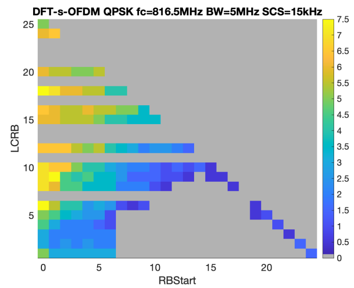{width="1.4705883639545057in"
height="2.0216043307086613in"}

\- For DFT-s-OFDM (no PTRS correction), (64 RB,120 kHz)

  Tx EVM contributor               EVM (%)   SNR (dB)
  -------------------------------- --------- ----------
  Phase Noise+IQ Imbalance         2.30      32.8
  PA Non-linearity & Transmitter   2.64      31.6
  Total                            3.50      29.1

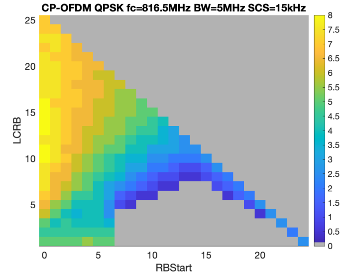{width="1.8652646544181977in"
height="2.335294181977253in"}

**PA**

**-** Using the 39 dBm PA model considering the Tx post loss for PC1

**-** Using the 27 dBm PA model considering the Tx post loss for PC2

**Phase noise profile**

**-** Using the example 1 in TR38.803.

**PTRS configuration for CPE correction**

**-** Using the PTRS (K=2, L=1) for CP-OFDM

\- No PTRS for DFT-s-OFDM

**Table 5.2.4.2-1 RB allocations**

+----------------------------------------------------------------------+
| **For PC1**                                                          |
|                                                                      |
| Considered RB allocation for 100 MHz in FR2-1 256QAM MPR simulation  |
|                                                                      |
| > Region 1                                                           |
| >                                                                    |
| > DFT-s-OFDM : \[Start RB position:22, allocated RB: 20\]            |
| >                                                                    |
| > CP-OFDM : \[Start RB position:22, allocated RB: 22\]               |
| >                                                                    |
| > Region 2                                                           |
| >                                                                    |
| > DFT-s-OFDM : \[Start RB position:16, allocated RB: 32\]            |
| >                                                                    |
| > CP-OFDM : \[Start RB position:16, allocated RB: 32\]               |
| >                                                                    |
| > Outer RB allocations                                               |
| >                                                                    |
| > DFT-s-OFDM : MAX(\[Start RB position:0, allocated RB: 64\],        |
| > \[Start RB position:0, allocated RB: 10\])                         |
| >                                                                    |
| > CP-OFDM : MAX(\[Start RB position:0, allocated RB: 66\], \[Start   |
| > RB position:0, allocated RB: 10\])                                 |
|                                                                      |
| Considered RB allocation for 400 MHz in FR2-1 256QAM MPR simulation  |
|                                                                      |
| > Region 1                                                           |
| >                                                                    |
| > DFT-s-OFDM : \[Start RB position:60, allocated RB: 60\]            |
| >                                                                    |
| > CP-OFDM : \[Start RB position:66, allocated RB: 60\]               |
| >                                                                    |
| > Region 2                                                           |
| >                                                                    |
| > DFT-s-OFDM : \[Start RB position:60, allocated RB: 120\]           |
| >                                                                    |
| > CP-OFDM : \[Start RB position:66, allocated RB: 132\]              |
| >                                                                    |
| > Outer RB allocations                                               |
| >                                                                    |
| > DFT-s-OFDM : MAX(\[Start RB position:0, allocated RB: 264\],       |
| > \[Start RB position:0, allocated RB: 40\])                         |
| >                                                                    |
| > CP-OFDM : MAX(\[Start RB position:0, allocated RB: 264\], \[Start  |
| > RB position:0, allocated RB: 40\])                                 |
|                                                                      |
| **For PC2**                                                          |
|                                                                      |
| Considered RB allocation for 100 MHz in FR2-1 256QAM MPR simulation  |
|                                                                      |
| Region 1 inner RB allocation                                         |
|                                                                      |
| DFT-s-OFDM : \[Start RB position:22, allocated RB: 20\]              |
|                                                                      |
| CP-OFDM : \[Start RB position:23, allocated RB: 20\]                 |
|                                                                      |
| Edge RB allocations                                                  |
|                                                                      |
| DFT-s-OFDM : MAX(\[Start RB position:0, allocated RB: 64\], \[Start  |
| RB position:0, allocated RB: 1\], \[Start RB position:0, allocated   |
| RB: 20\])                                                            |
|                                                                      |
| CP-OFDM : MAX(\[Start RB position:0, allocated RB: 66\], \[Start RB  |
| position:0, allocated RB: 1\], \[Start RB position:0, allocated RB:  |
| 20\])                                                                |
|                                                                      |
| Considered RB allocation for 400 MHz in FR2-1 256QAM MPR simulation  |
|                                                                      |
| Region 1 inner RB allocation                                         |
|                                                                      |
| DFT-s-OFDM : \[Start RB position:88, allocated RB: 80\]              |
|                                                                      |
| CP-OFDM : \[Start RB position:88, allocated RB: 88\]                 |
|                                                                      |
| Edge RB allocations                                                  |
|                                                                      |
| DFT-s-OFDM : MAX(\[Start RB position:0, allocated RB: 240\], \[Start |
| RB position:0, allocated RB: 1\], \[Start RB position:0, allocated   |
| RB: 80\])                                                            |
|                                                                      |
| CP-OFDM : MAX(\[Start RB position:0, allocated RB: 264\], \[Start RB |
| position:0, allocated RB: 1\], \[Start RB position:0, allocated RB:  |
| 80\])                                                                |
+----------------------------------------------------------------------+

Table 5.2.4.2-2 Simulated MPR results for PC1 UL256QAM

+-------+-------+-------+-------+-------+-------+-------+-------+-------+
| CBW   | R     | Lim   | R     | Lim   | O     | Lim   | O     | Lim   |
|       | egion | iting | egion | iting | utter | iting | utter | iting |
| (100  | 1     | f     | 2     | f     | 1     | f     | 2     | f     |
| MHz)  |       | actor |       | actor |       | actor |       | actor |
|       | \[22, |       | \[16, |       | \[0,  |       | \[0,  |       |
|       | 20\]  |       | 32\]  |       | 64\]  |       | 10\]  |       |
+=======+=======+=======+=======+=======+=======+=======+=======+=======+
| DFT-s | 8.04  | EVM   | 8.05  | EVM   | 8.38  | EVM   | 6.68  | SEM   |
| -OFDM |       |       |       |       |       |       |       |       |
+-------+-------+-------+-------+-------+-------+-------+-------+-------+
| CBW   | R     | Lim   | R     | Lim   | O     | Lim   | O     | Lim   |
|       | egion | iting | egion | iting | utter | iting | utter | iting |
| (100  | 1     | f     | 2     | f     | 1     | f     | 2     | f     |
| MHz)  |       | actor |       | actor |       | actor |       | actor |
|       | \[22, |       | \[16, |       | \[0,  |       | \[0,  |       |
|       | 22\]  |       | 32\]  |       | 66\]  |       | 10\]  |       |
+-------+-------+-------+-------+-------+-------+-------+-------+-------+
| CP    | 10.44 | EVM   | 9.86  | EVM   | 10.31 | EVM   | 9.01  | EVM   |
| -OFDM |       |       |       |       |       |       |       |       |
+-------+-------+-------+-------+-------+-------+-------+-------+-------+
| CBW   | R     | Lim   | R     | Lim   | O     | Lim   | O     | Lim   |
|       | egion | iting | egion | iting | utter | iting | utter | iting |
| (400  | 1     | f     | 2     | f     | 1     | f     | 2     | f     |
| MHz)  |       | actor |       | actor |       | actor |       | actor |
|       | \[60, |       | \[60, |       | \[0,  |       | \[0,  |       |
|       | 60\]  |       | 120\] |       | 264\] |       | 40\]  |       |
+-------+-------+-------+-------+-------+-------+-------+-------+-------+
| DFT-s | 8.44  | EVM   | 9.28  | EVM   | 9.40  | EVM   | 8.44  | EVM   |
| -OFDM |       |       |       |       |       |       |       |       |
+-------+-------+-------+-------+-------+-------+-------+-------+-------+
| CBW   | R     | Lim   | R     | Lim   | O     | Lim   | O     | Lim   |
|       | egion | iting | egion | iting | utter | iting | utter | iting |
| (400  | 1     | f     | 2     | f     | 1     | f     | 2     | f     |
| MHz)  |       | actor |       | actor |       | actor |       | actor |
|       | \[66, |       | \[66, |       | \[0,  |       | \[0,  |       |
|       | 60\]  |       | 132\] |       | 264\] |       | 40\]  |       |
+-------+-------+-------+-------+-------+-------+-------+-------+-------+
| CP    | 10.86 | EVM   | 11.96 | EVM   | 10.76 | EVM   | 11.96 | EVM   |
| -OFDM |       |       |       |       |       |       |       |       |
+-------+-------+-------+-------+-------+-------+-------+-------+-------+

\[start RB position, allocated RB number\]

Table 5.2.4.2-3 Simulated MPR results for PC2 UL256QAM

+-------+-------+-------+-------+-------+-------+-------+-------+-------+
| CBW   | R     | Lim   | Ou    | Lim   | O     | Lim   | O     | Lim   |
|       | egion | iting | tter1 | iting | utter | iting | utter | iting |
| (100  | 1     | f     |       | f     | 2     | f     | 3     | f     |
| MHz)  |       | actor | \[0,  | actor |       | actor |       | actor |
|       | \[22, |       | 64\]  |       | \[0,  |       | \[0,  |       |
|       | 20\]  |       |       |       | 1\]   |       | 20\]  |       |
+=======+=======+=======+=======+=======+=======+=======+=======+=======+
| DFT-s | 7.54  | EVM   | 7.54  | EVM   | 6.21  | EVM   | 6.50  | EVM   |
| -OFDM |       |       |       |       |       |       |       |       |
+-------+-------+-------+-------+-------+-------+-------+-------+-------+
| CBW   | R     | Lim   | Ou    | Lim   | O     | Lim   | O     | Lim   |
|       | egion | iting | tter1 | iting | utter | iting | utter | iting |
| (100  | 1     | f     |       | f     | 2     | f     | 3     | f     |
| MHz)  |       | actor | \[0,  | actor |       | actor |       | actor |
|       | \[23, |       | 66\]  |       | \[    |       | \[0,  |       |
|       | 20\]  |       |       |       | 0,1\] |       | 20\]  |       |
+-------+-------+-------+-------+-------+-------+-------+-------+-------+
| CP    | 9.48  | EVM   | 9.50  | EVM   | 8.27  | EVM   | 9.05  | EVM   |
| -OFDM |       |       |       |       |       |       |       |       |
+-------+-------+-------+-------+-------+-------+-------+-------+-------+
| CBW   | R     | Lim   | Ou    | Lim   | O     | Lim   | O     | Lim   |
|       | egion | iting | tter1 | iting | utter | iting | utter | iting |
| (400  | 1     | f     |       | f     | 2     | f     | 3     | f     |
| MHz)  |       | actor | \[0,  | actor |       | actor |       | actor |
|       | \[88, |       | 240\] |       | \[0,  |       | \[0,  |       |
|       | 80\]  |       |       |       | 1\]   |       | 80\]  |       |
+-------+-------+-------+-------+-------+-------+-------+-------+-------+
| DFT-s | 8.91  | EVM   | 8.91  | EVM   | 7.19  | EVM   | 7.84  | EVM   |
| -OFDM |       |       |       |       |       |       |       |       |
+-------+-------+-------+-------+-------+-------+-------+-------+-------+
| CBW   | R     | Lim   | Ou    | Lim   | O     | Lim   | O     | Lim   |
|       | egion | iting | tter1 | iting | utter | iting | utter | iting |
| (400  | 1     | f     |       | f     | 2     | f     | 3     | f     |
| MHz)  |       | actor | \[0,  | actor |       | actor |       | actor |
|       | \[88, |       | 264\] |       | \[    |       | \[0,  |       |
|       | 88\]  |       |       |       | 0,1\] |       | 80\]  |       |
+-------+-------+-------+-------+-------+-------+-------+-------+-------+
| CP    | 10.96 | EVM   | 10.84 | EVM   | 9.04  | EVM   | 10.09 | EVM   |
| -OFDM |       |       |       |       |       |       |       |       |
+-------+-------+-------+-------+-------+-------+-------+-------+-------+

\[start RB position, allocated RB number\]

Table 5.2.4.2-4 Proposed MPR~WT~ for power class 1, BWchannel ≤ 200 MHz,
FR2-1

+---------------+---------------+---------------+------------+--------+
| > Modulation  | > MPR~WT~     |               |            |        |
|               | > (dB),       |               |            |        |
|               | > BWchannel ≤ |               |            |        |
|               | > 200 MHz     |               |            |        |
+===============+===============+===============+============+========+
|               | > Outer RB    | > Inner RB    |            |        |
|               | > allocations | > allocations |            |        |
+---------------+---------------+---------------+------------+--------+
|               |               | > Region 1    | > Region 2 |        |
+---------------+---------------+---------------+------------+--------+
| DFT-s-OFDM    | 256 QAM       | ≤ 10          | ≤ 9.5      | ≤ 9.5  |
+---------------+---------------+---------------+------------+--------+
| CP-OFDM       | 256QAM        | ≤ 12          | ≤ 12       | ≤ 11.5 |
+---------------+---------------+---------------+------------+--------+
| Note: 256 QAM |               |               |            |        |
| MPR~WT~       |               |               |            |        |
| requirements  |               |               |            |        |
| can be        |               |               |            |        |
| applied for   |               |               |            |        |
| operating     |               |               |            |        |
| band n256,    |               |               |            |        |
| n258, n259    |               |               |            |        |
| and n261.     |               |               |            |        |
+---------------+---------------+---------------+------------+--------+

Table 5.2.4.2-5 Proposed MPR~WT~ for power class 1, BWchannel = 400 MHz

+---------------+---------------+---------------+------------+--------+
| > Modulation  | > MPR~WT~     |               |            |        |
|               | > (dB),       |               |            |        |
|               | > BWchannel = |               |            |        |
|               | > 400 MHz     |               |            |        |
+===============+===============+===============+============+========+
|               | > Outer RB    | > Inner RB    |            |        |
|               | > allocations | > allocations |            |        |
+---------------+---------------+---------------+------------+--------+
|               |               | > Region 1    | > Region 2 |        |
+---------------+---------------+---------------+------------+--------+
| DFT-s-OFDM    | 256 QAM       | ≤ 11          | ≤ 10       | ≤ 11   |
+---------------+---------------+---------------+------------+--------+
| CP-OFDM       | 256 QAM       | ≤ 13.5        | ≤ 12.5     | ≤ 13.5 |
+---------------+---------------+---------------+------------+--------+
| Note: 256 QAM |               |               |            |        |
| MPR~WT~       |               |               |            |        |
| requirements  |               |               |            |        |
| can be        |               |               |            |        |
| applied for   |               |               |            |        |
| operating     |               |               |            |        |
| band n256,    |               |               |            |        |
| n258, n259    |               |               |            |        |
| and n261.     |               |               |            |        |
+---------------+---------------+---------------+------------+--------+

Table 5.2.4.2-6 Proposed MPR~WT~ for power class 2, BWchannel ≤ 200 MHz,
FR2-1

+-------------------+-------------------+-------------------+------+
| > Modulation      | > MPR~WT~,        |                   |      |
|                   | > BWchannel ≤ 200 |                   |      |
|                   | > MHz             |                   |      |
+===================+===================+===================+======+
|                   | > Inner RB        | > Edge RB         |      |
|                   | > allocations,    | > allocations     |      |
|                   | >                 |                   |      |
|                   | > Region 1        |                   |      |
+-------------------+-------------------+-------------------+------+
| DFT-s-OFDM        | 256 QAM           | ≤ 9               | ≤ 9  |
+-------------------+-------------------+-------------------+------+
| CP-OFDM           | 256 QAM           | ≤ 11              | ≤ 11 |
+-------------------+-------------------+-------------------+------+
| Note: 256 QAM     |                   |                   |      |
| MPR~WT~           |                   |                   |      |
| requirements can  |                   |                   |      |
| be applied for    |                   |                   |      |
| operating band    |                   |                   |      |
| n256, n258, n259  |                   |                   |      |
| and n261.         |                   |                   |      |
+-------------------+-------------------+-------------------+------+

Table 5.2.4.2-7 Proposed MPR~WT~ for power class 2, BWchannel = 400 MHz,
FR2-1

+------------------+------------------+------------------+--------+
| > Modulation     | > MPR~WT~,       |                  |        |
|                  | > BWchannel ≤    |                  |        |
|                  | > 400 MHz        |                  |        |
+==================+==================+==================+========+
|                  | > Inner RB       | > Edge RB        |        |
|                  | > allocations,   | > allocations    |        |
|                  | >                |                  |        |
|                  | > Region 1       |                  |        |
+------------------+------------------+------------------+--------+
| DFT-s-OFDM       | 256 QAM          | ≤ 10.5           | ≤ 10.5 |
+------------------+------------------+------------------+--------+
| CP-OFDM          | 256 QAM          | ≤ 12.5           | ≤ 12.5 |
+------------------+------------------+------------------+--------+
| Note: 256 QAM    |                  |                  |        |
| MPR~WT~          |                  |                  |        |
| requirements can |                  |                  |        |
| be applied for   |                  |                  |        |
| operating band   |                  |                  |        |
| n256, n258, n259 |                  |                  |        |
| and n261.        |                  |                  |        |
+------------------+------------------+------------------+--------+

R4-2308223 MPR simulation for PC2

Table 5.2.4.2-8 Simulated MPR results for 29 GHz PC2 UL256QAM

+----------+----------+----------+----------+----------+----------+
| CBW      | PN       | Region 1 | Outer1   | Outter 2 | Outter 3 |
|          |          |          |          |          |          |
| (100     | profile  | \[22,    | \[0,     | \[0, 1\] | \[0,     |
| MHz)     |          | 20\]     | 64\]     |          | 20\]     |
+==========+==========+==========+==========+==========+==========+
| DF       | Case 1   | 7.54     | 7.54     | 6.21     | 6.50     |
| T-s-OFDM |          |          |          |          |          |
+----------+----------+----------+----------+----------+----------+
|          | Case 2   | 7.22     | 7.34     | 5.96     | 6.18     |
+----------+----------+----------+----------+----------+----------+
|          | Case 3   | 7.22     | 7.22     | 6.00     | 6.19     |
+----------+----------+----------+----------+----------+----------+
| CBW      | **PN**   | **Region | **O      | **Outter | **Outter |
|          |          | 1**      | utter1** | 2**      | 3**      |
| (100     | **p      |          |          |          |          |
| MHz)     | rofile** | **\[23,  | **\[0,   | **\      | **\[0,   |
|          |          | 20\]**   | 66\]**   | [0,1\]** | 20\]**   |
+----------+----------+----------+----------+----------+----------+
| CP-OFDM  | Ex1      | 9.48     | 9.50     | 8.27     | 9.05     |
+----------+----------+----------+----------+----------+----------+
|          | QC's     | 9.26     | 9.27     | 8.04     | 8.72     |
+----------+----------+----------+----------+----------+----------+
|          | MDK's    | 9.26     | 9.26     | 7.74     | 8.83     |
+----------+----------+----------+----------+----------+----------+
| CBW      | **PN**   | **Region | **O      | **Outter | **Outter |
|          |          | 1**      | utter1** | 2**      | 3**      |
| (400     | **p      |          |          |          |          |
| MHz)     | rofile** | **\[88,  | **\[0,   | **\[0,   | **\[0,   |
|          |          | 80\]**   | 240\]**  | 1\]**    | 80\]**   |
+----------+----------+----------+----------+----------+----------+
| DF       | Ex1      | 8.91     | 8.91     | 7.19     | 7.84     |
| T-s-OFDM |          |          |          |          |          |
+----------+----------+----------+----------+----------+----------+
|          | QC's     | 8.06     | 8.06     | 7.10     | 7.33     |
+----------+----------+----------+----------+----------+----------+
|          | MDK's    | 8.48     | 8.06     | 7.11     | 7.44     |
+----------+----------+----------+----------+----------+----------+
| CBW      | **PN**   | **Region | **O      | **Outter | **Outter |
|          |          | 1**      | utter1** | 2**      | 3**      |
| (400     | **p      |          |          |          |          |
| MHz)     | rofile** | **\[88,  | **\[0    | **\      | **\[0,   |
|          |          | 88\]**   | ,264\]** | [0,1\]** | 80\]**   |
+----------+----------+----------+----------+----------+----------+
| CP-OFDM  | Ex1      | 10.96    | 10.84    | 9.04     | 10.09    |
+----------+----------+----------+----------+----------+----------+
|          | QC's     | 10.30    | 10.30    | 9.10     | 9.76     |
+----------+----------+----------+----------+----------+----------+
|          | MDK's    | 10.19    | 10.30    | 8.96     | 9.75     |
+----------+----------+----------+----------+----------+----------+

\[start RB position, allocated RB number\]

Table 5.2.4.2-9 MPR results for 29 GHz PC2 UL256QAM with margin

+------------+----------+-----------------------+---------------------+
| CBW        |          | Inner RB allocations, | Edge RB allocations |
|            |          |                       |                     |
| (100 MHz)  |          | **Region 1**          |                     |
+============+==========+=======================+=====================+
| DFT-s-OFDM | Example1 | 9                     | 9                   |
+------------+----------+-----------------------+---------------------+
|            | QC       | 8.5                   | 9                   |
+------------+----------+-----------------------+---------------------+
|            | MDK      | 8.5                   | 8.5                 |
+------------+----------+-----------------------+---------------------+
| CP-OFDM    | Example1 | 11                    | 11                  |
+------------+----------+-----------------------+---------------------+
|            | QC       | 11                    | 11                  |
+------------+----------+-----------------------+---------------------+
|            | MDK      | 11                    | 11                  |
+------------+----------+-----------------------+---------------------+
| CBW        |          | Inner RB allocations, | Edge RB allocations |
|            |          |                       |                     |
| (400 MHz)  |          | **Region 1**          |                     |
+------------+----------+-----------------------+---------------------+
| DFT-s-OFDM | Example1 | 10.5                  | 10.5                |
+------------+----------+-----------------------+---------------------+
|            | QC       | 9.5                   | 9.5                 |
+------------+----------+-----------------------+---------------------+
|            | MDK      | 10                    | 9.5                 |
+------------+----------+-----------------------+---------------------+
| CP-OFDM    | Example1 | 12.5                  | 12.5                |
+------------+----------+-----------------------+---------------------+
|            | QC       | 12                    | 12                  |
+------------+----------+-----------------------+---------------------+
|            | MDK      | 11.5                  | 12                  |
+------------+----------+-----------------------+---------------------+

In the last meeting, there was a concern that EVM 3.5% could not be
achieve due to phase noise, or even if it was achieved, it would have a
very large MPR, so new phase noise profiles that are more relaxed than
the exisiting phase noise profile were proposed. In this clause, the
simulated MPR values of PC2 UL 256QAM according to the phase noise
profile are shown in Table 5 and Table 6. It was found that the MPR
value for 29 GHz can be improved by 0\~1 dB by using the phase noise
profile of case 2 and case 3 compared to the exisiting case1.

**Observation 3**: The MPR value for 29 GHz can be improved by 0\~1 dB
by using the phase noise profile of case 2 and case 3 compared to the
case 1.

R4-2312237 MPR simulation for PC2 with low AM-PM distortion PA

Table 5.2.4.2-10 phase noise profiles

+--------------------------------------------------+
| **[For 29 GHz phase noise profile]{.underline}** |
|                                                  |
| option 1 (TR 38.803 Example 1)                   |
|                                                  |
| \% fz = \[3e3 550e3 280e6\];                     |
|                                                  |
| \% fp = \[1 1.6e6 30e6\];                        |
|                                                  |
| \% alphaz = \[2.37 2.7 2.53\];                   |
|                                                  |
| \% alphap = \[3.3 3.3 1\];                       |
|                                                  |
| \% PSD0 = 32;                                    |
|                                                  |
| option 2 (QC's)                                  |
|                                                  |
| \% fz = \[3e3 7e5 9e5\];                         |
|                                                  |
| \% fp = \[1 1e6 1.1e6\];                         |
|                                                  |
| \% alphaz = \[2.37 4.7 2\];                      |
|                                                  |
| \% alphap = \[3.3 5.3 2.5\];                     |
|                                                  |
| \% PSD0 = 33;                                    |
|                                                  |
| option 3 (MTK's)                                 |
|                                                  |
| \% fz = \[3e3 550e3 280e6\];                     |
|                                                  |
| \% fp = \[1 1.6e6 30e6\];                        |
|                                                  |
| \% alphaz = \[2.37 2.7 2.53\];                   |
|                                                  |
| \% alphap = \[3.3 3.3 1\];                       |
|                                                  |
| \% PSD0 = 29.35;                                 |
|                                                  |
| **[For 39 GHz phase noise profi]{.underline}**   |
|                                                  |
| option 4 (MTK's)                                 |
|                                                  |
| \% fz = \[3e3 620e3 240e6\];                     |
|                                                  |
| \% fp = \[1 1.6e6 30e6\];                        |
|                                                  |
| \% alphaz = \[2.37 2.7 2.53\];                   |
|                                                  |
| \% alphap = \[3.3 3.3 1\];                       |
|                                                  |
| \% PSD0 = 31.76;                                 |
+--------------------------------------------------+

We recognize the AM-PM distortion is the key factor for the MPR value
based on our mmWave transceiver system. So, we performed MPR simulation
with low AM-PM distortion PA. The low AM-PM distortion PA has only few
degrees distortion until the AM-AM drops. The MPR result comparison
between general PA and Low AM-PM distortion PA are showed in table 2 for
29 GHz and table 3 for 39 GHz.

**-DFT-s-OFDM for 100 MHz CBW**

MPR value with Option2 phase noise profile and low AM-PM distortion PA
**is improved about 1\~1.5 dB** over MPR with Option2 phase noise
profile only.

**-CP-OFDM for 100 MHz CBW**

MPR value with Option2 phase noise profile and low AM-PM distortion PA
**is improved about 0.5\~1 dB** over MPR using only Option2 phase noise
profile.The CP-OFDM waveform has a high PAPR, so the AM-AM distortion is
more critical to the MPR value. That's why the MPR improvement is less
than DFT-s-OFDM when the lower AM-PM distortion PA is applied.

**-DFT-s-OFDM for 400 MHz CBW**

The MPR value with Option2 phase noise profile and low AM-PM distortion
PA **is improved about 0\~0.5 dB**. The limiting factor for 400 MHz
DFT-s-OFDM is IBE&EVM, so it has low improvement.

**-CP-OFDM for 400 MHz CBW**

The MPR value with Option2 phase noise profile and low AM-PM distortion
PA **is improved about 0\~1 dB** over MPR using only Option2 phase noise
profile.

***Observation 1*:** The lower MPR value with low AM-PM distortion PA
than MPR value with general PA is observed.

Table 5.2.4.2-11 Simulated MPR results for 29 GHz PC2 UL256QAM

+---------+---------+---------+---------+---------+---------+---------+
|         | PA      | PN      | Region  | Outer1  | Outer 2 | Outer 3 |
|         | model   |         | 1       |         |         |         |
|         |         | Profile |         | \[0,    | \[0,    | \[0,    |
|         |         |         | \[22,   | 64\]    | 1\]     | 20\]    |
|         |         |         | 20\]    |         |         |         |
+=========+=========+=========+=========+=========+=========+=========+
| DFT     | General | Option  | 7.54    | 7.54    | 6.21    | 6.50    |
| -s-OFDM |         | 1       |         |         |         |         |
|         |         |         |         |         |         |         |
| (CBW:   |         |         |         |         |         |         |
| 100     |         |         |         |         |         |         |
| MHz)    |         |         |         |         |         |         |
+---------+---------+---------+---------+---------+---------+---------+
|         | General | Option  | 7.22    | 7.34    | 5.96    | 6.18    |
|         |         | 2       |         |         |         |         |
+---------+---------+---------+---------+---------+---------+---------+
|         | General | Option  | 7.22    | 7.22    | 6.00    | 6.19    |
|         |         | 3       |         |         |         |         |
+---------+---------+---------+---------+---------+---------+---------+
|         | Low     | Option  | 5.86    | 5.97    | 5.60    | 5.78    |
|         | AM-PM   | 2       |         |         |         |         |
|         | dis     |         |         |         |         |         |
|         | tortion |         |         |         |         |         |
+---------+---------+---------+---------+---------+---------+---------+
| CP-OFDM | General | Option  | 9.48    | 9.50    | 8.27    | 9.05    |
|         |         | 1       |         |         |         |         |
| (CBW:   |         |         |         |         |         |         |
| 100     |         |         |         |         |         |         |
| MHz)    |         |         |         |         |         |         |
+---------+---------+---------+---------+---------+---------+---------+
|         | General | Option  | 9.26    | 9.27    | 8.04    | 8.72    |
|         |         | 2       |         |         |         |         |
+---------+---------+---------+---------+---------+---------+---------+
|         | General | Option  | 9.26    | 9.26    | 7.74    | 8.83    |
|         |         | 3       |         |         |         |         |
+---------+---------+---------+---------+---------+---------+---------+
|         | Low     | Option  | 8.39    | 8.29    | 7.51    | 8.18    |
|         | AM-PM   | 2       |         |         |         |         |
|         | dis     |         |         |         |         |         |
|         | tortion |         |         |         |         |         |
+---------+---------+---------+---------+---------+---------+---------+
|         | PN      | Region  | Outer1  | Outer 2 | Outer 3 | Outer 3 |
|         |         | 1       |         |         |         |         |
|         | profile |         | \[0,    | \[0,    | \[0,    | \[0,    |
|         |         | \[88,   | 240\]   | 1\]     | 80\]    | 20\]    |
|         |         | 80\]    |         |         |         |         |
+---------+---------+---------+---------+---------+---------+---------+
| DFT     | General | Option  | 8.91    | 8.91    | 7.19    | 7.84    |
| -s-OFDM |         | 1       |         |         |         |         |
|         |         |         |         |         |         |         |
| (CBW:   |         |         |         |         |         |         |
| 400     |         |         |         |         |         |         |
| MHz)    |         |         |         |         |         |         |
+---------+---------+---------+---------+---------+---------+---------+
|         | General | Option  | 8.48    | 8.06    | 7.10    | 7.33    |
|         |         | 2       |         |         |         |         |
+---------+---------+---------+---------+---------+---------+---------+
|         | General | Option  | 8.48    | 8.06    | 7.11    | 7.44    |
|         |         | 3       |         |         |         |         |
+---------+---------+---------+---------+---------+---------+---------+
|         | Low     | Option  | 8.26    | 7.54    | 7.06    | 7.23    |
|         | AM-PM   | 2       |         |         |         |         |
|         | dis     |         |         |         |         |         |
|         | tortion |         |         |         |         |         |
+---------+---------+---------+---------+---------+---------+---------+
| CP-OFDM | General | Option  | 10.96   | 10.84   | 9.04    | 10.09   |
|         |         | 1       |         |         |         |         |
| (CBW:   |         |         |         |         |         |         |
| 400     |         |         |         |         |         |         |
| MHz)    |         |         |         |         |         |         |
+---------+---------+---------+---------+---------+---------+---------+
|         | General | Option  | 10.30   | 10.30   | 9.10    | 9.76    |
|         |         | 2       |         |         |         |         |
+---------+---------+---------+---------+---------+---------+---------+
|         | General | Option  | 10.19   | 10.30   | 8.96    | 9.75    |
|         |         | 3       |         |         |         |         |
+---------+---------+---------+---------+---------+---------+---------+
|         | Low     | Option  | 9.44    | 9.86    | 8.76    | 9.44    |
|         | AM-PM   | 2       |         |         |         |         |
|         | dis     |         |         |         |         |         |
|         | tortion |         |         |         |         |         |
+---------+---------+---------+---------+---------+---------+---------+

\[start RB position, allocated RB number\]

Table 5.2.4.2-12 Simulated MPR results for 39 GHz PC2 UL256QAM

+---------+---------+---------+---------+---------+---------+---------+
|         | PA      | PN      | Region  | Outer1  | Outer 2 | Outer 3 |
|         | model   |         | 1       |         |         |         |
|         |         | Profile |         | \[0,    | \[0,    | \[0,    |
|         |         |         | \[22,   | 64\]    | 1\]     | 20\]    |
|         |         |         | 20\]    |         |         |         |
+=========+=========+=========+=========+=========+=========+=========+
| DFT     | General | Option  | 7.44    | 7.33    | 6.01    | 6.37    |
| -s-OFDM |         | 4       |         |         |         |         |
|         |         |         |         |         |         |         |
| (CBW:   |         |         |         |         |         |         |
| 100     |         |         |         |         |         |         |
| MHz)    |         |         |         |         |         |         |
+---------+---------+---------+---------+---------+---------+---------+
|         | Low     | Option  | 5.97    | 6.17    | 5.54    | 5.86    |
|         | AM-PM   | 4       |         |         |         |         |
|         | dis     |         |         |         |         |         |
|         | tortion |         |         |         |         |         |
+---------+---------+---------+---------+---------+---------+---------+
| CP-OFDM | General | Option  | 9.27    | 9.48    | 8.00    | 8.83    |
|         |         | 4       |         |         |         |         |
| (CBW:   |         |         |         |         |         |         |
| 100     |         |         |         |         |         |         |
| MHz)    |         |         |         |         |         |         |
+---------+---------+---------+---------+---------+---------+---------+
|         | Low     | Option  | 8.37    | 8.39    | 7.49    | 8.31    |
|         | AM-PM   | 4       |         |         |         |         |
|         | dis     |         |         |         |         |         |
|         | tortion |         |         |         |         |         |
+---------+---------+---------+---------+---------+---------+---------+
|         | **PN**  | *       | **O     | **Outer | **Outer | **Outer |
|         |         | *Region | uter1** | 2**     | 3**     | 3**     |
|         | **pr    | 1**     |         |         |         |         |
|         | ofile** |         | **\[0,  | **\[0,  | **\[0,  | **\[0,  |
|         |         | **\[88, | 240\]** | 1\]**   | 80\]**  | 20\]**  |
|         |         | 80\]**  |         |         |         |         |
+---------+---------+---------+---------+---------+---------+---------+
| DFT     | General | Option  | 8.47    | 8.48    | 7.00    | 7.54    |
| -s-OFDM |         | 4       |         |         |         |         |
|         |         |         |         |         |         |         |
| (CBW:   |         |         |         |         |         |         |
| 400     |         |         |         |         |         |         |
| MHz)    |         |         |         |         |         |         |
+---------+---------+---------+---------+---------+---------+---------+
|         | Low     | Option  | 8.48    | 7.64    | 6.84    | 7.33    |
|         | AM-PM   | 4       |         |         |         |         |
|         | dis     |         |         |         |         |         |
|         | tortion |         |         |         |         |         |
+---------+---------+---------+---------+---------+---------+---------+
| CP-OFDM | General | Option  | 10.73   | 10.85   | 9.13    | 9.82    |
|         |         | 4       |         |         |         |         |
| (CBW:   |         |         |         |         |         |         |
| 400     |         |         |         |         |         |         |
| MHz)    |         |         |         |         |         |         |
+---------+---------+---------+---------+---------+---------+---------+
|         | Low     | Option  | 10.19   | 10.30   | 8.78    | 9.54    |
|         | AM-PM   | 4       |         |         |         |         |
|         | dis     |         |         |         |         |         |
|         | tortion |         |         |         |         |         |
+---------+---------+---------+---------+---------+---------+---------+

\[start RB position, allocated RB number\]

Table 5.2.4.2-13 MPR results for 29 GHz PC2 UL256QAM with margin

+------------+-------------+-------------+-------------+-------------+
| CBW        | PA model    | P/N profile | Inner RB    | Edge RB     |
|            |             |             | a           | allocations |
| (100 MHz)  |             |             | llocations, |             |
|            |             |             |             |             |
|            |             |             | Region 1    |             |
+============+=============+=============+=============+=============+
| DFT-s-OFDM | General     | Option 1    | 9           | 9           |
+------------+-------------+-------------+-------------+-------------+
|            | General     | Option 2    | 8.5         | 9           |
+------------+-------------+-------------+-------------+-------------+
|            | General     | Option 3    | 8.5         | 8.5         |
+------------+-------------+-------------+-------------+-------------+
|            | Low AM-PM   | Option 2    | 7.5         | 7.5         |
|            | distortion  |             |             |             |
+------------+-------------+-------------+-------------+-------------+
| CP-OFDM    | General     | Option 1    | 11          | 11          |
+------------+-------------+-------------+-------------+-------------+
|            | General     | Option 2    | 11          | 11          |
+------------+-------------+-------------+-------------+-------------+
|            | General     | Option 3    | 11          | 11          |
+------------+-------------+-------------+-------------+-------------+
|            | Low AM-PM   | Option 2    | 10          | 10          |
|            | distortion  |             |             |             |
+------------+-------------+-------------+-------------+-------------+
| CBW        | **PA        | **P/N       | **Inner RB  | **Edge RB   |
|            | model**     | profile**   | all         | al          |
| (400 MHz)  |             |             | ocations,** | locations** |
|            |             |             |             |             |
|            |             |             | **Region    |             |
|            |             |             | 1**         |             |
+------------+-------------+-------------+-------------+-------------+
| DFT-s-OFDM | General     | Option 1    | 10.5        | 10.5        |
+------------+-------------+-------------+-------------+-------------+
|            | General     | Option 2    | 9.5         | 9.5         |
+------------+-------------+-------------+-------------+-------------+
|            | General     | Option 3    | 10          | 9.5         |
+------------+-------------+-------------+-------------+-------------+
|            | Low AM-PM   | Option 2    | 10          | 9           |
|            | distortion  |             |             |             |
+------------+-------------+-------------+-------------+-------------+
| CP-OFDM    | General     | Option 1    | 12.5        | 12.5        |
+------------+-------------+-------------+-------------+-------------+
|            | General     | Option 2    | 12          | 12          |
+------------+-------------+-------------+-------------+-------------+
|            | General     | Option 3    | 11.5        | 12          |
+------------+-------------+-------------+-------------+-------------+
|            | Low AM-PM   | Option 2    | 11          | 11.5        |
|            | distortion  |             |             |             |
+------------+-------------+-------------+-------------+-------------+

\[start RB position, allocated RB number\]

Table 5.2.4.2-14 MPR results for 39 GHz PC2 UL256QAM with margin

+------------+-------------+-------------+-------------+-------------+
| CBW        | PA model    | P/N profile | Inner RB    | Edge RB     |
|            |             |             | a           | allocations |
| (100 MHz)  |             |             | llocations, |             |
|            |             |             |             |             |
|            |             |             | Region 1    |             |
+============+=============+=============+=============+=============+
| DFT-s-OFDM | General     | Option 4    | 9           | 9           |
+------------+-------------+-------------+-------------+-------------+
|            | Low AM-PM   | Option 4    | 7.5         | 7.5         |
|            | distortion  |             |             |             |
+------------+-------------+-------------+-------------+-------------+
| CP-OFDM    | General     | Option 4    | 11          | 11          |
+------------+-------------+-------------+-------------+-------------+
|            | Low AM-PM   | Option 4    | 10          | 10          |
|            | distortion  |             |             |             |
+------------+-------------+-------------+-------------+-------------+
| CBW        | **PA        | **P/N       | **Inner RB  | **Edge RB   |
|            | model**     | profile**   | all         | al          |
| (400 MHz)  |             |             | ocations,** | locations** |
|            |             |             |             |             |
|            |             |             | **Region    |             |
|            |             |             | 1**         |             |
+------------+-------------+-------------+-------------+-------------+
| DFT-s-OFDM | General     | Option 4    | 10          | 10          |
+------------+-------------+-------------+-------------+-------------+
|            | Low AM-PM   | Option 4    | 10          | 9           |
|            | distortion  |             |             |             |
+------------+-------------+-------------+-------------+-------------+
| CP-OFDM    | General     | Option 4    | 12          | 12.5        |
+------------+-------------+-------------+-------------+-------------+
|            | Low AM-PM   | Option 4    | 11.5        | 12          |
|            | distortion  |             |             |             |
+------------+-------------+-------------+-------------+-------------+

\[start RB position, allocated RB number\]

Table 4 and table 5 show the MPR value with the margin. We observed the
MPR values using Low AM-PM distortion PA are lower than MPR value with
general PA model. But, the characteristic of low AM-PM distortion PA is
from our mmWave products, so we need to more margin for the MPR valu
with low AM-PM distortion. So, we propose the MPR value as the average
of the MPR results using the general PA and the MPR results using the
low AM-PM distortion PA.

R4-2315540 MPR simulation for PC1 with low AM-PM distortion PA

At the last RAN4\#108 meeting, we provided our MPR simulation results
R4-2312237 for FR2-1 UL256QAM PC2. We also ran the MPR simulation for
PC1 in a similar manner, and the results are shown in Table 5.2.4.2-15
and 5.2.4.2-16.

***Observation 1*:** The lower MPR value with low AM-PM distortion PA
than MPR value with general PA is observed.

Table 5.2.4.2-15 Simulated MPR results for 29 GHz PC1 UL256QAM

+---------+---------+---------+---------+---------+---------+---------+
|         | PA      | PN      | Region  | Region  | Outer 1 | Outer 2 |
|         | model   |         | 1       | 2       |         |         |
|         |         | Profile |         |         | \[0,    | \[0,    |
|         |         |         | \[22,   | \[16,   | 64\]    | 10\]    |
|         |         |         | 20\]    | 32\]    |         |         |
+=========+=========+=========+=========+=========+=========+=========+
| DFT     | General | Option  | 7.52    | 7.30    | 7.73    | 6.89    |
| -s-OFDM |         | 2       |         |         |         |         |
|         |         |         |         |         |         |         |
| (CBW:   |         |         |         |         |         |         |
| 100     |         |         |         |         |         |         |
| MHz)    |         |         |         |         |         |         |
+---------+---------+---------+---------+---------+---------+---------+
|         | Low     | Option  | 6.03    | 6.02    | 6.04    | 6.36    |
|         | AM-PM   | 2       |         |         |         |         |
|         | dis     |         |         |         |         |         |
|         | tortion |         |         |         |         |         |
+---------+---------+---------+---------+---------+---------+---------+
|         | **PA    | **PN**  | *       | *       | **Outer | **Outer |
|         | model** |         | *Region | *Region | 1**     | 2**     |
|         |         | **Pr    | 1**     | 2**     |         |         |
|         |         | ofile** |         |         | **\[0,  | **\[0,  |
|         |         |         | **\[22, | **\[16, | 66\]**  | 10\]**  |
|         |         |         | 22\]**  | 32\]**  |         |         |
+---------+---------+---------+---------+---------+---------+---------+
| CP-OFDM | General | Option  | 8.89    | 9.54    | 9.53    | 8.90    |
|         |         | 2       |         |         |         |         |
| (CBW:   |         |         |         |         |         |         |
| 100     |         |         |         |         |         |         |
| MHz)    |         |         |         |         |         |         |
+---------+---------+---------+---------+---------+---------+---------+
|         | Low     | Option  | 8.67    | 8.67    | 8.67    | 8.05    |
|         | AM-PM   | 2       |         |         |         |         |
|         | dis     |         |         |         |         |         |
|         | tortion |         |         |         |         |         |
+---------+---------+---------+---------+---------+---------+---------+
|         | PA      | PN      | Region  | Region  | Outer 1 | Outer 2 |
|         | model   |         | 1       | 2       |         |         |
|         |         | Profile |         |         | \[0,    | \[0,    |
|         |         |         | \[60,   | \[60,   | 240\]   | 40\]    |
|         |         |         | 60\]    | 120\]   |         |         |
+---------+---------+---------+---------+---------+---------+---------+
| DFT     | General | Option  | 8.03    | 8.44    | 8.86    | 7.93    |
| -s-OFDM |         | 2       |         |         |         |         |
|         |         |         |         |         |         |         |
| (CBW:   |         |         |         |         |         |         |
| 400     |         |         |         |         |         |         |
| MHz)    |         |         |         |         |         |         |
+---------+---------+---------+---------+---------+---------+---------+
|         | Low     | Option  | 7.62    | 7.82    | 7.52    | 8.03    |
|         | AM-PM   | 2       |         |         |         |         |
|         | dis     |         |         |         |         |         |
|         | tortion |         |         |         |         |         |
+---------+---------+---------+---------+---------+---------+---------+
|         | **PA    | **PN**  | *       | *       | **Outer | **Outer |
|         | model** |         | *Region | *Region | 1**     | 2**     |
|         |         | **Pr    | 1**     | 2**     |         |         |
|         |         | ofile** |         |         | **\[0,  | **\[0,  |
|         |         |         | **\[60, | **\[60, | 264\]** | 40\]**  |
|         |         |         | 60\]**  | 132\]** |         |         |
+---------+---------+---------+---------+---------+---------+---------+
| CP-OFDM | General | Option  | 10.43   | 11.08   | 10.75   | 10.34   |
|         |         | 2       |         |         |         |         |
| (CBW:   |         |         |         |         |         |         |
| 400     |         |         |         |         |         |         |
| MHz)    |         |         |         |         |         |         |
+---------+---------+---------+---------+---------+---------+---------+
|         | Low     | Option  | 10.11   | 10.65   | 10.65   | 10.12   |
|         | AM-PM   | 2       |         |         |         |         |
|         | dis     |         |         |         |         |         |
|         | tortion |         |         |         |         |         |
+---------+---------+---------+---------+---------+---------+---------+

\[start RB position, allocated RB number\]

Table 5.2.4.2-16 Simulated MPR results for 39 GHz PC1 UL256QAM

+---------+---------+---------+---------+---------+---------+---------+
|         | PA      | PN      | Region  | Region  | Outer 1 | Outer 2 |
|         | model   |         | 1       | 2       |         |         |
|         |         | Profile |         |         | \[0,    | \[0,    |
|         |         |         | \[22,   | \[16,   | 64\]    | 10\]    |
|         |         |         | 20\]    | 32\]    |         |         |
+=========+=========+=========+=========+=========+=========+=========+
| DFT     | General | Option  | 7.62    | 7.62    | 7.73    | 6.46    |
| -s-OFDM |         | 4       |         |         |         |         |
|         |         |         |         |         |         |         |
| (CBW:   |         |         |         |         |         |         |
| 100     |         |         |         |         |         |         |
| MHz)    |         |         |         |         |         |         |
+---------+---------+---------+---------+---------+---------+---------+
|         | Low     | Option  | 6.25    | 5.83    | 6.25    | 6.36    |
|         | AM-PM   | 4       |         |         |         |         |
|         | dis     |         |         |         |         |         |
|         | tortion |         |         |         |         |         |
+---------+---------+---------+---------+---------+---------+---------+
|         | **PA    | **PN**  | *       | *       | **Outer | **Outer |
|         | model** |         | *Region | *Region | 1**     | 2**     |
|         |         | **Pr    | 1**     | 2**     |         |         |
|         |         | ofile** |         |         | **\[0,  | **\[0,  |
|         |         |         | **\[22, | **\[16, | 66\]**  | 10\]**  |
|         |         |         | 22\]**  | 32\]**  |         |         |
+---------+---------+---------+---------+---------+---------+---------+
| CP-OFDM | General | Option  | 9.75    | 9.75    | 9.65    | 8.78    |
|         |         | 4       |         |         |         |         |
| (CBW:   |         |         |         |         |         |         |
| 100     |         |         |         |         |         |         |
| MHz)    |         |         |         |         |         |         |
+---------+---------+---------+---------+---------+---------+---------+
|         | Low     | Option  | 9.32    | 8.55    | 9.10    | 8.15    |
|         | AM-PM   | 4       |         |         |         |         |
|         | dis     |         |         |         |         |         |
|         | tortion |         |         |         |         |         |
+---------+---------+---------+---------+---------+---------+---------+
|         | **PA    | **PN**  | *       | *       | **Outer | **Outer |
|         | model** |         | *Region | *Region | 1**     | 2**     |
|         |         | **Pr    | 1**     | 2**     |         |         |
|         |         | ofile** |         |         | **\[0,  | **\[0,  |
|         |         |         | **\[60, | **\[60, | 240\]** | 40\]**  |
|         |         |         | 60\]**  | 120\]** |         |         |
+---------+---------+---------+---------+---------+---------+---------+
| DFT     | General | Option  | 8.13    | 8.86    | 9.18    | 8.03    |
| -s-OFDM |         | 4       |         |         |         |         |
|         |         |         |         |         |         |         |
| (CBW:   |         |         |         |         |         |         |
| 400     |         |         |         |         |         |         |
| MHz)    |         |         |         |         |         |         |
+---------+---------+---------+---------+---------+---------+---------+
|         | Low     | Option  | 7.82    | 8.13    | 8.44    | 7.72    |
|         | AM-PM   | 4       |         |         |         |         |
|         | dis     |         |         |         |         |         |
|         | tortion |         |         |         |         |         |
+---------+---------+---------+---------+---------+---------+---------+
|         | **PA    | **PN**  | *       | *       | **Outer | **Outer |
|         | model** |         | *Region | *Region | 1**     | 2**     |
|         |         | **Pr    | 1**     | 2**     |         |         |
|         |         | ofile** |         |         | **\[0,  | **\[0,  |
|         |         |         | **\[60, | **\[60, | 264\]** | 40\]**  |
|         |         |         | 60\]**  | 132\]** |         |         |
+---------+---------+---------+---------+---------+---------+---------+
| CP-OFDM | General | Option  | 10.64   | 11.38   | 11.96   | 10.55   |
|         |         | 4       |         |         |         |         |
| (CBW:   |         |         |         |         |         |         |
| 400     |         |         |         |         |         |         |
| MHz)    |         |         |         |         |         |         |
+---------+---------+---------+---------+---------+---------+---------+
|         | Low     | Option  | 10.32   | 10.87   | 10.86   | 10.22   |
|         | AM-PM   | 4       |         |         |         |         |
|         | dis     |         |         |         |         |         |
|         | tortion |         |         |         |         |         |
+---------+---------+---------+---------+---------+---------+---------+

\[start RB position, allocated RB number\]

Table 5.2.4.2-17 MPR results for 29 GHz PC1 UL256QAM with margin

+----------+----------+----------+----------+----------+----------+
| CBW      | PA model | P/N      | **Region | **Region | *        |
|          |          | profile  | 1**      | 2**      | *Outer** |
| (100     |          |          |          |          |          |
| MHz)     |          |          |          |          |          |
+==========+==========+==========+==========+==========+==========+
| DF       | General  | Option 2 | 9        | 9        | 9        |
| T-s-OFDM |          |          |          |          |          |
+----------+----------+----------+----------+----------+----------+
|          | Low      | Option 2 | 7.5      | 7.5      | 8        |
|          | AM-PM    |          |          |          |          |
|          | di       |          |          |          |          |
|          | stortion |          |          |          |          |
+----------+----------+----------+----------+----------+----------+
| CP-OFDM  | General  | Option 2 | 10.5     | 11       | 11       |
+----------+----------+----------+----------+----------+----------+
|          | Low      | Option 2 | 10       | 10       | 10       |
|          | AM-PM    |          |          |          |          |
|          | di       |          |          |          |          |
|          | stortion |          |          |          |          |
+----------+----------+----------+----------+----------+----------+
| CBW      | **PA     | **P/N    | **Region | **Region | *        |
|          | model**  | p        | 1**      | 2**      | *Outer** |
| (400     |          | rofile** |          |          |          |
| MHz)     |          |          |          |          |          |
+----------+----------+----------+----------+----------+----------+
| DF       | General  | Option 2 | 9.5      | 10       | 10.5     |
| T-s-OFDM |          |          |          |          |          |
+----------+----------+----------+----------+----------+----------+
|          | Low      | Option 2 | 9        | 9.5      | 9.5      |
|          | AM-PM    |          |          |          |          |
|          | di       |          |          |          |          |
|          | stortion |          |          |          |          |
+----------+----------+----------+----------+----------+----------+
| CP-OFDM  | General  | Option 2 | 12       | 12.5     | 12.5     |
+----------+----------+----------+----------+----------+----------+
|          | Low      | Option 2 | 11.5     | 12       | 12       |
|          | AM-PM    |          |          |          |          |
|          | di       |          |          |          |          |
|          | stortion |          |          |          |          |
+----------+----------+----------+----------+----------+----------+

\[start RB position, allocated RB number\]

Table 5.2.4.2-18 MPR results for 39 GHz PC1 UL256QAM with margin

+----------+----------+----------+----------+----------+----------+
| CBW      | PA model | P/N      | **Region | **Region | *        |
|          |          | profile  | 1**      | 2**      | *Outer** |
| (100     |          |          |          |          |          |
| MHz)     |          |          |          |          |          |
+==========+==========+==========+==========+==========+==========+
| DF       | General  | Option 4 | 9        | 9        | 9        |
| T-s-OFDM |          |          |          |          |          |
+----------+----------+----------+----------+----------+----------+
|          | Low      | Option 4 | 8        | 7.5      | 8        |
|          | AM-PM    |          |          |          |          |
|          | di       |          |          |          |          |
|          | stortion |          |          |          |          |
+----------+----------+----------+----------+----------+----------+
| CP-OFDM  | General  | Option 4 | 11.5     | 11.5     | 11       |
+----------+----------+----------+----------+----------+----------+
|          | Low      | Option 4 | 11       | 10       | 10.5     |
|          | AM-PM    |          |          |          |          |
|          | di       |          |          |          |          |
|          | stortion |          |          |          |          |
+----------+----------+----------+----------+----------+----------+
| CBW      | **PA     | **P/N    | **Region | **Region | *        |
|          | model**  | p        | 1**      | 2**      | *Outer** |
| (400     |          | rofile** |          |          |          |
| MHz)     |          |          |          |          |          |
+----------+----------+----------+----------+----------+----------+
| DF       | General  | Option 4 | 9.5      | 10.5     | 10.5     |
| T-s-OFDM |          |          |          |          |          |
+----------+----------+----------+----------+----------+----------+
|          | Low      | Option 4 | 9.5      | 9.5      | 10       |
|          | AM-PM    |          |          |          |          |
|          | di       |          |          |          |          |
|          | stortion |          |          |          |          |
+----------+----------+----------+----------+----------+----------+
| CP-OFDM  | General  | Option 4 | 12       | 13       | 13.5     |
+----------+----------+----------+----------+----------+----------+
|          | Low      | Option 4 | 12       | 12.5     | 12.5     |
|          | AM-PM    |          |          |          |          |
|          | di       |          |          |          |          |
|          | stortion |          |          |          |          |
+----------+----------+----------+----------+----------+----------+

\[start RB position, allocated RB number\]

Table 5.2.4.2-17 and table 5.2.4.2-18 show the MPR value with the
margin. We observed the MPR values using Low AM-PM distortion PA are
lower than MPR value with general PA model. But, the characteristic of
low AM-PM distortion PA is from our mmWave products, so we need to more
margin for the MPR valu with low AM-PM distortion. So, we propose the
MPR value as the average of the MPR results using the general PA and the
MPR results using the low AM-PM distortion PA.

#### 5.2.4.3 Simulation results from Nokia

[R4-2311665 simulation results for DFT-s-OFDM PC1/PC2/PC5]{.underline}

To simulate the MPR we used the maximum allocation placed at the center
of the channel. The phase noise is expected to increase with increasing
size of the allocation, and the effect of the IQ imbalance is maximized
at the center of the channel.

In the simulations we use the multi-zero/pole model with Qualcomm's
parameters.

In all cases in the tables below we see the transmit power is limited by
the EVM. This explains why the MPR is very similar for all the simulated
power classes.

The MPR simulation results with different PCs are provided in Tables
5.2.4.3-1 to 5.2.4.3-3, and the EVM budget is provided in Table
5.2.4.3-4.

Table 5.2.4.3-1. MPR simulation results for 256QAM with PC1.

  --------------------------------------------------------------------------
                         Required back-off \[dB\]                      
  ------------ --------- --------------------------- ----- ----- ----- -----
  Waveform     SCS\      Channel bandwidth \[MHz\]   Max               
               \[kHz\]                                                 

                         50                          100   200   400   

  DFT-S-OFDM   60        7.1                         7.1   7.2         7.2

               120       7.1                         7.0   7.1   7.2   
  --------------------------------------------------------------------------

Table 5.2.4.3-2. MPR simulation results for 256QAM with PC2.

  --------------------------------------------------------------------------
                         Required back-off \[dB\]                      
  ------------ --------- --------------------------- ----- ----- ----- -----
  Waveform     SCS\      Channel bandwidth \[MHz\]   Max               
               \[kHz\]                                                 

                         50                          100   200   400   

  DFT-S-OFDM   60        7.0                         7.0   7.1         7.1

               120       7.0                         6.9   7.0   7.0   
  --------------------------------------------------------------------------

Table 5.2.4.3-3. MPR simulation results for 256QAM with PC5.

  ------------------------------------------------------------------------------
                         Required back-off \[dB\]                          
  ------------ --------- --------------------------- --------- ----- ----- -----
  Waveform     SCS\      Channel bandwidth \[MHz\]   **Max**               
               \[kHz\]                                                     

                         50                          100       200   400   

  DFT-S-OFDM   60        7.1                         7.3       7.3         7.3

               120       7.0                         7.0       7.1   7.1   
  ------------------------------------------------------------------------------

Table 5.2.4.3-4. EVM budget for DFT-s-OFDM at 29 GHz. RB start position
0, number of RBs 64, SCS 120 kHz.

  Tx EVM contributor               EVM (%)
  -------------------------------- ---------
  Phase Noise+IQ Imbalance         2.79
  PA Non-linearity & Transmitter   2.11
  Total                            3.50

[R4-2315265 simulation results for CP-OFDM PC1/PC2/PC5]{.underline}

To simulate the MPR we used the full allocation as the phase noise is
expected to increase with increasing size of the allocation.

In the simulations at 29 GHz we use the multi-zero/pole model with
Qualcomm's parameters. We do not use PTRS.

In all cases in the tables below we see the transmit power is limited by
the EVM. This explains why the MPR is very similar for all the simulated
power classes.

The MPR simulation results with different PCs are provided in Tables
5.2.4.3-5 to 5.2.4.3-7, and the EVM budget is provided in Table
5.2.4.3-8.

Table 5.2.4.3-5 MPR simulation results for 256QAM with PC1 at 29 GHz.

  ------------------------------------------------------------------------
                       Required back-off \[dB\]                      
  ---------- --------- --------------------------- ----- ----- ----- -----
  Waveform   SCS\      Channel bandwidth \[MHz\]   Max               
             \[kHz\]                                                 

                       50                          100   200   400   

  CP-OFDM    60        8.8                         8.8   8.9         8.9

             120       8.7                         8.7   8.6   8.7   
  ------------------------------------------------------------------------

Table 5.2.4.3-6 MPR simulation results for 256QAM with PC2 at 29 GHz.

  ----------------------------------------------------------------------------
                       **Required back-off \[dB\]**                      
  ---------- --------- ------------------------------- ----- ----- ----- -----
  Waveform   SCS\      **Channel bandwidth \[MHz\]**   Max               
             \[kHz\]                                                     

                       50                              100   200   400   

  CP-OFDM    60        8.9                             8.9   8.8         8.9

             120       8.7                             8.8   8.8   8.8   
  ----------------------------------------------------------------------------

Table 5.2.4.3-7 MPR simulation results for 256QAM with PC5 at 29 GHz.

  ------------------------------------------------------------------------
                       Required back-off \[dB\]                      
  ---------- --------- --------------------------- ----- ----- ----- -----
  Waveform   SCS\      Channel bandwidth \[MHz\]   Max               
             \[kHz\]                                                 

                       50                          100   200   400   

  CP-OFDM    **60**    8.9                         8.9   8.9         8.9

             **120**   8.7                         8.7   8.8   8.9   
  ------------------------------------------------------------------------

Table 5.2.4.3-8 EVM budget for CP-OFDM at 29 GHz. RB start position 0,
number of RBs 64, SCS 120 kHz.

  Tx EVM contributor               EVM (%)
  -------------------------------- ---------
  Phase Noise+IQ Imbalance         2.81
  PA Non-linearity & Transmitter   2.09
  Total                            3.50

We notice that the backoff values from our simulations are smaller than
other companies. This could result from differences in the linearity of
the used power amplifier. We also studied the effect of the IQ imbalance
that affects the EVM quota left for PA non-linearity and other
transmitter impairments. For our results above we used IQ imbalance of
-37.3dBc and carrier leakage of -31.6 dBc. When we used -36 dBc for both
we obtained about 0.5 dB larger MPR values for CP-OFDMA.

We also studied the phase noise contribution to EVM at 39 GHz without
PTRS. We used the phase noise model from MTK. The results are presented
in Table 5.2.4.3-9.

Table 5.2.4.3-9 Contribution of phase noise to EVM at 39 GHz. RB start
position 0, number of RBs 64, SCS 120 kHz. PTRS was not used.

  waveform     EVM (%)   EVM (dB)
  ------------ --------- ----------
  DFT-s-OFDM   3.26      -29.74
  CP-OFDM      3.27      -29.71

#### 5.2.4.4 Simulation results from ZTE

R4-2314619 simulation results for PC1

**Some initial MPR simulation results for 29GHz PC1 100MHz 256QAM
DFT-s-OFDM and CP-OFDM are shown in Fig 5.2.4.4-1.**

{width="3.1875in"
height="2.9305555555555554in"}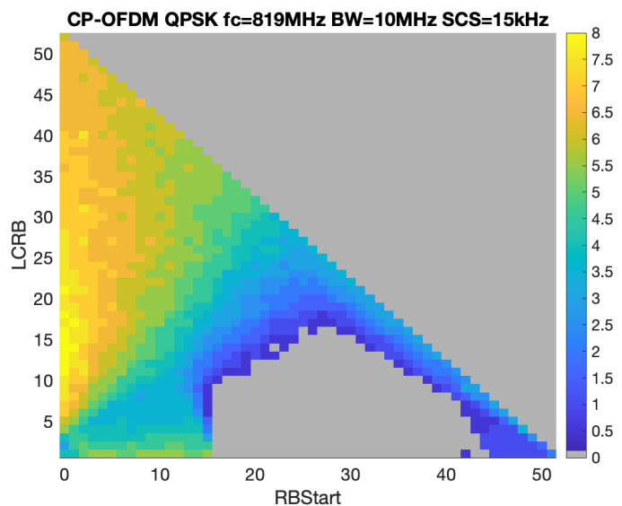{width="3.076388888888889in"
height="2.9305555555555554in"}

Fig 5.2.4.4-1. 29GHz PC1 MPR for 256QAM 100MHz, DFT-s-OFDM(Left) and
CP-OFDM (Right)

The maximum MPR\@outer RB is 8.375dB and the maximum MPR\@inner RB is
8.875dB for DFT-s-OFDM and 12.125dB for CP-OFDM.

The EVM budget for the 64RB0 is provided in Table 5.2.4.4-2.

Table 5.2.4.4-2 EVM budget for PC1 256QAM 100MHz, DFT-s-OFDM, 64RB0

  Tx EVM contributor               EVM (%)
  -------------------------------- ---------
  Phase Noise+IQ Imbalance         2.93
  PA Non-linearity & Transmitter   1.90
  Total                            3.50

Therefore, the MPR requirements for 29GHz PC1 256QAM DFT-s-OFDM are
proposed:

Table 5.2.4.4-3 MPR requirements for 29GHz PC1 256QAM DFT-s-OFDM
(BW~channel~ ≤ 200 MHz)

  Modulation   MPR~WT~ (dB), BW~channel~ ≤ 200 MHz                                         
  ------------ ------------------------------------- ---------------------- -------------- --------
               Outer RB allocations                  Inner RB allocations                  
                                                     **Region 1**           **Region 2**   
  DFT-s-OFDM   Pi/2 BPSK                             ≤ 5.5                  0.0            ≤ 3.0
               QPSK                                  ≤ 6.5                  0.0            ≤ 3.0
               16 QAM                                ≤ 6.5                  ≤ 4.0          ≤ 4.0
               64 QAM                                ≤ 6.5                  ≤ 5.0          ≤ 5.0
               256QAM                                ≤8.5                   ≤ 9.0          ≤ 9.0
  CP-OFDM      QPSK                                  ≤ 7.0                  ≤ 4.5          ≤ 4.5
               16 QAM                                ≤ 7.0                  ≤ 5.5          ≤ 5.5
               64 QAM                                ≤ 7.5                  ≤ 7.5          ≤ 7.5
               256QAM                                ≤ 12.5                 ≤ 12.5         ≤ 12.5

**R4-2315563** simulation results for PC1 using modified IQ image

**We update our simulation with better IQ image and carrier leakage
value assumption, which are approximately -38dB IQ image and -38dBc
carrier leakage. Besides, based on the conclusions in \[1\], neither
DFT-s-OFDM nor CP-OFDM configures PT-RS.**

**Except the above assumption updates for IQ image, carrier leakage and
PT-RS, the other assumptions are kept which are from TR38.891.**

**The updates for MPR simulation results for 29GHz PC1 100MHz 256QAM
DFT-s-OFDM and CP-OFDM are shown in Fig 5.2.4.4-2.**

{width="3.1458333333333335in"
height="2.763888888888889in"}{width="3.1805555555555554in"
height="2.763888888888889in"}

Fig 5.2.4.4-2 29GHz PC1 MPR for 256QAM 100MHz, DFT-s-OFDM(Left) and
CP-OFDM (Right)

**The EVM** budget for the 64RB0 is provided in Table **5.2.4.4**-4.

Table 5.2.4.4-4 EVM budget for PC1 256QAM 100MHz, DFT-s-OFDM, 64RB0

  Tx EVM contributor               **EVM (%)**
  -------------------------------- -------------
  Phase Noise+IQ Imbalance         3.03
  PA Non-linearity & Transmitter   1.83
  Total                            3.50

The MPR simulation results for 29GHz PC1 400MHz 256QAM DFT-s-OFDM and
CP-OFDM are shown in Fig 5.2.4.4-3.

{width="3.138888888888889in"
height="2.701388888888889in"}{width="3.1805555555555554in"
height="2.6875in"}

Fig 5.2.4.4-3 29GHz PC1 MPR for 256QAM 400MHz, DFT-s-OFDM(Left) and
CP-OFDM (Right)

Therefore, the MPR requirements for 29GHz PC1 256QAM DFT-s-OFDM and
CP-OFDM are proposed as follows.

Table **5.2.4.4**-5 MPR requirements for 29GHz PC1 256QAM DFT-s-OFDM and
CP-OFDM (BW~channel~ ≤ 200 MHz)

  Modulation   MPR~WT~ (dB), BW~channel~ ≤ 200 MHz                                         
  ------------ ------------------------------------- ---------------------- -------------- --------
               Outer RB allocations                  Inner RB allocations                  
                                                     **Region 1**           **Region 2**   
  DFT-s-OFDM   Pi/2 BPSK                             ≤ 5.5                  0.0            ≤ 3.0
               QPSK                                  ≤ 6.5                  0.0            ≤ 3.0
               16 QAM                                ≤ 6.5                  ≤ 4.0          ≤ 4.0
               64 QAM                                ≤ 6.5                  ≤ 5.0          ≤ 5.0
               256QAM                                ≤7.5                   ≤ 7.5          ≤ 7.5
  CP-OFDM      QPSK                                  ≤ 7.0                  ≤ 4.5          ≤ 4.5
               16 QAM                                ≤ 7.0                  ≤ 5.5          ≤ 5.5
               64 QAM                                ≤ 7.5                  ≤ 7.5          ≤ 7.5
               256QAM                                ≤ 10.5                 ≤ 10.5         ≤ 10.5

Table **5.2.4.4**-6 MPR requirements for 29GHz PC1 256QAM DFT-s-OFDM and
CP-OFDM (BW~channel~ = 400 MHz)

  Modulation   MPR~WT~ (dB), BW~channel~ = 400 MHz                                         
  ------------ ------------------------------------- ---------------------- -------------- --------
               Outer RB allocations                  Inner RB allocations                  
                                                     **Region 1**           **Region 2**   
  DFT-s-OFDM   Pi/2 BPSK                             ≤ 5.5                  0.0            ≤ 3.0
               QPSK                                  ≤ 6.5                  0.0            ≤ 3.5
               16 QAM                                ≤ 6.5                  ≤ 4.5          ≤ 4.5
               64 QAM                                ≤ 6.5                  ≤ 6.5          ≤ 6.5
               256QAM                                ≤7.5                   ≤ 7.5          ≤ 7.5
  CP-OFDM      QPSK                                  ≤ 7.0                  ≤ 5.0          ≤ 5.0
               16 QAM                                ≤ 7.0                  ≤ 6.5          ≤ 6.5
               64 QAM                                ≤ 9.0                  ≤ 9.0          ≤ 9.0
               256QAM                                ≤ 10.5                 ≤ 10.5         ≤ 10.5

#### 5.2.4.5 Simulation results from vivo

R4-2312574 simulation results for PC1

The EVM budget for this simulation is shown in Table **5.2.4.5-1**:

Table 5.2.4.5-1 EVM budget for 256QAM MPR evaluation

  Tx EVM budget                   EVM (%)
  ------------------------------- ---------
  Phase Noise & IQ Imbalance      2.99
  PA Non-linearity &Transmitter   1.82
  Total                           3.50

In our simulation, the PTRS is only configured for CP-OFDM with L =1, K
= 2, and the 29GHz phase noise profile from MTK in \[1\] is used for all
waveforms.

\- BW = 200 MHz SCS = 120kHz

> The simulation results are shown in Figure **5.2.4.5-1**

{width="2.7291666666666665in"
height="2.298611111111111in"}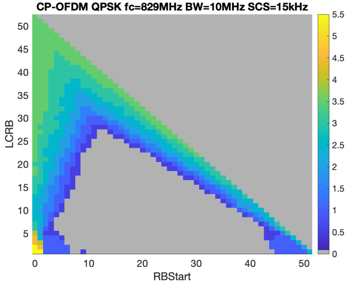{width="2.8680555555555554in"
height="2.201388888888889in"}

Figure 5.2.4.5-1 MPR simulation results for 256QAM when BW = 200MHz

BW = 400 MHz SCS = 120kHz

Due to time constraints, we don't finish all cases and as an
alternative, we only give simulation results for cases that need to be
verified in the test, which are specified in TS38.521-2 Table
6.2.2.4.1-3.

+------------------------------------------+------------+---------+
| MPR (dB)                                 | DFT-s-OFDM | CP-OFDM |
+==========================================+============+=========+
| Outer\_Full (DFT-s-OFDM: 256\@0          | 7.94       | 10.12   |
|                                          |            |         |
| CP-OFDM: 264\@0)                         |            |         |
+------------------------------------------+------------+---------+
| Inner\_Full\_Region2(DFT-s-OFDM: 128\@66 | 8.51       | 10.64   |
|                                          |            |         |
| CP-OFDM: 132\@66)                        |            |         |
+------------------------------------------+------------+---------+
| 8\@0                                     | 7.76       | 9.18    |
+------------------------------------------+------------+---------+
| 8\@N~RB~-8                               | 7.74       | 9.64    |
+------------------------------------------+------------+---------+

In our simulation, we find that the sole gating factor for 256QAM is
EVM, and it is hard to further differentiate regions for MPR value since
the inner region may require higher MPR due to the impact of the phase
noise, carrier leakage, etc., so in our view, same MPR value can be
applied to all regions which is similar to 64QAM with CP-OFDM.

**Observation 2: The gating factor for 256 QAM is EVM only.**

Another thing we noticed in the simulation results is that the MPR
results are insensitive to the channel bandwidth. However, considering
the challenge for real wideband device design, e.g., the droop effect at
the bandwidth edge, the EVM of 400MHz may be further degraded which
leads to higher MPR than previous simulation results, so it is proposed
to reserve 1.5 dB margin for 400MHz case compared to 200MHz.

**Observation 3: The 256QAM MPR simulation results are insensitive to
the channel bandwidth but the challenge of wideband device design should
be considered in MPR requirement.**

**R4-2315808**

In the last meeting, many simulation results of FR2 256QAM are provided,
but one interesting issue was raised in the last meeting R4-2314677:

**[New issue: What's about the MPR for 39GHz?]{.underline}**

Proposals

\- Option 1: Defined the same MPR with 29GHz

\- Option 2: Consider some margin for 39GHz because the phase noise
profile performance between 29GHz and 39GHz is different

\- Option 3: Others

**Agreement:**

FFS

For other lower modulation orders, either PTRS configuration or phase
noised is not considered in MPR evaluation and the evaluation results
can be frequency agnostic, but in FR2 256QAM, the phase noise, which is
closely related to the frequency, is inserted, so the MPR value may be
different for different band.

**Observation 1: The phase noise is not considered in the modulation
order other than 256QAM in FR2.**

**Observation 2: The phase noise profile is closely related to the
frequency.**

To compare the difference, the MPR simulation results are shown in
following figures:

Figure 5.2.4.5-2 MPR simulation results for 256QAM without phase noise

{width="2.7291666666666665in"
height="2.298611111111111in"}{width="2.8680555555555554in"
height="2.201388888888889in"}

Figure 5.2.4.5-3 MPR simulation results for 256QAM with 28GHz phase
noise

Figure 5.2.4.5-4 MPR simulation results for 256QAM with 39GHz phase
noise

Obviously the MPR value increase when phase noise is inserted and the
value will be larger when frequency become higher, so we think it is
reasonable to introduce △MPR to show the difference and the MPR table
will defined based on the assumption without phase noise.

#### 5.2.4.6 Simulation results from Xiaomi

R4-2312686 simulation results for PC1

And the EVM budget is shown in Table **5.2.4.6-1**:

Table 5.2.4.6-1 EVM budget in MPR simulation for 256QAM

  Tx EVM contributor               EVM (%)   SNR (dB)
  -------------------------------- --------- ----------
  Phase Noise                      1.41      37
  IQ Imbalance(w/ compensation)    1.70      35.4
  PA Non-linearity & Transmitter   2.70      31.4
  Total                            3.49      29.1

Based on above simulation parameters, we simulated different
configurations:

\- PC1 100MHz without PN and PTRS.

\- PC1 100MHz with PN and PTRS.

\- PC1 100MHz with PN and without PTRS.

The simulation results for DFT-s-OFDM are shown in figure 5.2.4.6-1 to
figure 5.2.4.6-3:

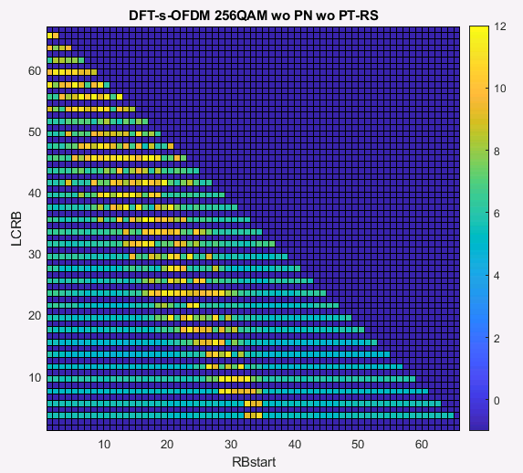{width="3.7569444444444446in"
height="3.4027777777777777in"}

Figure 5.2.4.6-1 PC1 100MHz MPR for 256QAM without PN and PTRS for
DFT-s-OFDM

{width="3.8125in"
height="3.1944444444444446in"}

Figure 5.2.4.6-2 PC1 100MHz MPR for 256QAM with PN and PTRS for
DFT-s-OFDM

{width="3.6527777777777777in"
height="3.0833333333333335in"}

Figure 5.2.4.6-3 PC1 100MHz MPR for 256QAM with PN without PTRS for
DFT-s-OFDM

The simulation results for CP-OFDM are shown in figure 5.2.4.6-4 to
figure 5.2.4.6-6:

{width="3.513888888888889in"
height="2.9722222222222223in"}

Figure 5.2.4.6-4 PC1 100MHz MPR for 256QAM without PN and PTRS for
CP-OFDM

{width="3.4305555555555554in"
height="2.9027777777777777in"}

Figure 5.2.4.6-5 PC1 100MHz MPR for 256QAM with PN and PTRS for CP-OFDM

{width="3.3333333333333335in"
height="2.8472222222222223in"}

Figure 5.2.4.6-6 PC1 100MHz MPR for 256QAM with PN without PTRS for
CP-OFDM

Table 5.2.4.6-2 shows the largst MPR values in each regions based on
above figure 5.2.4.6-1 to figure 5.2.4.6-6.

Table 5.2.4.6-2 MPR~WT~ for power class 1, BW~channel~ =100 MHz in FR2-1

  Modulation   MPR~WT~ (dB), BW~channel~ =100 MHz                                         
  ------------ ------------------------------------ ---------------------- -------------- ------
               Outer RB allocations                 Inner RB allocations                  
                                                    **Region 1**           **Region 2**   
  DFT-s-OFDM   w/o PN                               11.7                   11.7           11.4
               w/ PN w/ PTRS                        12.8                   12.3           11.4
               w/ PN w/o PTRS                       13                     12.8           12.1
  CP-OFDM      w/o PN                               12.4                   13.2           12.5
               w/ PN w/ PTRS                        14.9                   14.5           14.1
               w/ PN w/o PTRS                       14.5                   13.9           13.9

From Table 5.2.4.6-2, we can see the impact of phase noise to MPR value
is about 1dB. And for DFT-s-OFDM, we can see about 0.5dB benefit when
introducing the PTRS correction. But for CP-OFDM, there is no the
benefit when introducing PTRS correction.

R4-2315437 simulation results for PC1 using modified IQ image

Based on above simulation parameters with modified IQ image -36dB, we
simulated different configurations:

\- PC1 200MHz and 400MHz with PN and no PTRS for 29GHz.

And the EVM budget is shown in Table 5.2.4.6-3:

Table 5.2.4.6-3 EVM budget in MPR simulation for 256QAM

  Tx EVM contributor                           EVM (%)   SNR (dB)
  -------------------------------------------- --------- ----------
  IQ Imbalance(w/ compensation)+ Phase Noise   2.8       31
  PA Non-linearity & Transmitter               2.1       33
  Total                                        3.5       29.1

The simulation results for 200MHz channel bandwidth are shown in figure
5.2.4.6-7 and figure 5.2.4.6-8:

{width="2.673611111111111in"
height="2.4444444444444446in"}

Figure 5.2.4.6-7 PC1 200MHz MPR for 256QAM with PN and no PTRS for 29GHz
DFT-s-OFDM

{width="2.7152777777777777in"
height="2.5694444444444446in"}

Figure 5.2.4.6-8 PC1 200MHz MPR for 256QAM with PN and no PTRS for 29GHz
CP-OFDM

Based on RB allocations regions of the channel bandwidths less than
200MHz for FR2-1 defined in current Spec as below:

N~RB~ is the maximum number of RBs for a given Channel bandwidth and
sub-carrier spacing defined in Table 5.3.2-1 of TS 38.101-2.

RB~end~ = RB~Start~ + L~CRB~ - 1

RB~Start,Low~ = Max(1, Floor(L~CRB~/2))

RB~Start,High~ = N~RB~ -- RB~Start,Low~ -- L~CRB~

An RB allocation is an Outer RB allocation if

RB~Start~ \< RB~Start,Low~ OR RB~Start~ \> RB~Start,High~ OR L~CRB~ \>
Ceil(N~RB~/2) 

An RB allocation in the channel bandwidths less than 200MHz is a Region
1 inner RB allocation if

RB~start~ ≥ Ceil(1/3 N~RB~) AND RB~end~ \< Ceil(2/3 N~RB~)

An RB allocation is a Region 2 inner allocation if it is NOT an Outer
allocation AND NOT a Region 1 inner allocation.

The MPR values of 200MHz channel bandwidths for different regions are
shown in Table 5.2.4.6-4 based on the simulation results of figure
5.2.4.6-7 and figure 2.1-8:

Table 5.2.4.6-4 MPR~WT~ for power class 1, BW~channel~ ≤ 200 MHz in
FR2-1

  Modulation   MPR~WT~ (dB), BW~channel~ ≤ 200 MHz                                         
  ------------ ------------------------------------- ---------------------- -------------- ------
               Outer RB allocations                  Inner RB allocations                  
                                                     **Region 1**           **Region 2**   
  DFT-s-OFDM   256QAM                                8.7                    8.5            8.1
  CP-OFDM                                            10.9                   10.2           10.7

The simulation results for 400MHz channel bandwidth are shown in figure
2.1-9 to figure 2.1-10:

{width="3.763888888888889in"
height="3.2222222222222223in"}

Figure 5.2.4.6-9 PC1 400MHz MPR for 256QAM with PN and no PTRS for 29GHz
DFT-s-OFDM

{width="3.75in"
height="3.5277777777777777in"}

Figure 5.2.4.6-10 PC1 400MHz MPR for 256QAM with PN and no PTRS for
29GHz CP-OFDM

Based on RB allocations regions of 400 MHz channel bandwidths for FR2-1
defined in current Spec as below:

N~RB~ is the maximum number of RBs for a given Channel bandwidth and
sub-carrier spacing defined in Table 5.3.2-1 of TS 38.101-2.

RB~end~ = RB~Start~ + L~CRB~ - 1

RB~Start,Low~ = Max(1, Floor(L~CRB~/2))

RB~Start,High~ = N~RB~ -- RB~Start,Low~ -- L~CRB~

An RB allocation is an Outer RB allocation if

RB~Start~ \< RB~Start,Low~ OR RB~Start~ \> RB~Start,High~ OR L~CRB~ \>
Ceil(N~RB~/2) 

An RB allocation in 400 MHz channel bandwidth is a Region 1 inner RB
allocation if

RB~start~ ≥ Ceil(1/4 N~RB~) AND RB~end~ \< Ceil(3/4 N~RB~) AND L~CRB~ ≤
Ceil(1/4 N~RB~)

An RB allocation is a Region 2 inner allocation if it is NOT an Outer
allocation AND NOT a Region 1 inner allocation

The MPR values of 400MHz channel bandwidths for different regions are
shown in Table 5.2.4.6-5 based on the simulation results of figure
5.2.4.6-9 and figure 5.2.4.6-10:

Table 5.2.4.6-5 MPR~WT~ for power class 1, BW~channel~ = 400 MHz in
FR2-1

  Modulation   MPR~WT~ (dB), BW~channel~ = 400 MHz                                         
  ------------ ------------------------------------- ---------------------- -------------- ------
               Outer RB allocations                  Inner RB allocations                  
                                                     **Region 1**           **Region 2**   
  DFT-s-OFDM   256QAM                                8.5                    7.5            7.6
  CP-OFDM                                            10.7                   10.7           10.3

In our simulations, we can see the limit factor for 256QAM MPR is EVM,
and the larger MPR are need for the RB allocations which are overlap
with the IQ image and mainly located around the carrier leakage. If we
don't redefine the RB allocation regions, the MPR values for outer
allocation, region 1 inner allocation and region 2 inner allocation are
almost same.

Due to time constraints, we don't finish the simulation for PC1 all RB
allocations of 39GHz, to compare the MPR difference of 39GHz with 29GHz
due to the difference of phase noise profiles, we only give simulation
results for some RB allocations based CP-OFDM of 200MHz channel
bandwidth with 120kHz SCS, Table 2.1-5 gave the simulation results based
on different IQ images:

Table 5.2.4.6-6 MPR values of 39GHz and 29GHz for PC1

  Modulation   Frequency   IQ image   MPR                                                    
  ------------ ----------- ---------- -------- -------- --------- -------- -------- -------- --------
                                      132\@0   120\@6   100\@17   80\@27   60\@40   40\@52   20\@61
  CP-OFDM      29GHz       -36dB      10.6     10.4     10.6      10.3     9.8      9.8      9.7
               39GHz       -40dB      14.3     14       14.2      14.3     12.8     12.6     11.7
                           -50dB      12.6     13.1     12.8      12.4     11.7     11.4     10.6

Due to we used 28GHz PA model, the MPR values are larger for 39GHz than
the values of 29GHz. In additional, we simulation the MPR values for
39GHz with different IQ image values, from table 2.1-5, we can see, the
MPR value will be reduced when we using smaller IQ image. So, the MPR
values of 39GHz are related not only to phase noise profile but also to
PA model. Therefore, the MPR values of 39GHz could be modified by
choosing suitable PA model.

#### 5.2.4.7 Simulation results from Sony

R4-2313190 simulation results for PC1

To investigate the feasibility of confining the MPR for UL 256QAM, the
MPR for CP-OFDM for 100 MHz and 400 MHz BW are simulated for PC1 with
120 kHz SCS. The power amplifier is modeled based on a couple different
III-V semiconductor PA models and the RB allocation is referred from
contributions in last RAN4 meeting \[2\]. Other simulation assumptions
are listed below and the simulated MPR is shown in Table 5.2.4.7-1.

\- The phase noise model proposed by QC has been adopted in the
simulation \[1\], where the EVM budget for Phase noise + IQ imbalance is
-30.8 dB.

\- L-PTRS = 1 K-PTRS =2 are adopted as PTRS configuration for CP-OFDM.

Table 5.2.4.7-1. The MPR simulation results for CP-OFDM with 120 kHz SCS
for PC1

  Waveform   BW~channe~   Outer RB allocations   Inner RB allocations   
  ---------- ------------ ---------------------- ---------------------- --------------
                                                 **Region 1**           **Region 2**
  CP-OFDM    100 MHz      10.4                   11.4                   11.2
             400 MHz      11                     10.2                   10.8

Based on the simulated results, it can be observed that for 400 MHz, the
MPR values are well below the "64QAM MPR + 3dB" range. Though not all
cases (inner region of 100 MHz) can be well-fitted within the proposed
range, the values are not far from the proposed limits for narrower BW.
In addition, it is worth mentioning that no advanced linearity
technologies, e.g., DPD or APD, have been included in such a simulation.
Therefore, it can be expected that the MPR confinement, as mentioned
above, is feasible to be used to define the MPR values for 256 QAM.

R4-2315561 simulation results for PC1

The MPR for CP-OFDM for 100 MHz and 400 MHz BW are simulated for PC1
with 120 kHz SCS. The power amplifier is modeled based on a couple of
different III-V semiconductor PA models. Other simulation assumptions
are listed below, and the simulated MPR is shown in Table. 5.2.4.7-2.

The phase noise model proposed by QC has been adopted in the simulation
R4-2314677, where the EVM budget for Phase noise + IQ imbalance is -30.8
dB.

Both simulation results with PTRS (L-PTRS = 1 K-PTRS =2) and no PTRS are
provided in Table. 5.2.4.7-2 and Table. 5.2.4.7-3, respectively. In
general, the results without PTRS for CP-OFDM are 1 to 0.5 dB worse than
the PTRS configuration (L-PTRS = 1 K-PTRS =2).

Table 5.2.4.7-2 The MPR simulation results for CP-OFDM with 120 kHz SCS
for PC1 with PTRS L-PTRS = 1 K-PTRS =2

  Waveform   BW~channe~   Outer RB allocations   Inner RB allocations   
  ---------- ------------ ---------------------- ---------------------- --------------
                                                 **Region 1**           **Region 2**
  CP-OFDM    100 MHz      10.4                   11.4                   11.2
             400 MHz      11                     10.2                   10.8

Table 5.2.4.7-3 The MPR simulation results for CP-OFDM with 120 kHz SCS
for PC1 without PTRS

  Waveform   BW~channe~   Outer RB allocations   Inner RB allocations   
  ---------- ------------ ---------------------- ---------------------- --------------
                                                 **Region 1**           **Region 2**
  CP-OFDM    100 MHz      11.2                   11.6                   11.5
             400 MHz      12                     10.7                   11.3

#### 5.2.4.8 Simulation results from MediaTek

R4-2313417 simulation results for PC2

In the Tx, the EVM performance is determined by many factors including
baseband clipping and quantization, transmitter non-linearity, IQ
imbalance, phase noise, PA non-linearity, etc. In RAN4 \#106, the
approved agreement for EVM budget is listed below:

EVM budget for MPR evaluation:

\- Only consider the total value of 3.5% for Tx EVM

\- Companies need to clarify the components of Tx EVM in their
simulation results, including

\- Phase noise

\- Value for IQ imbalance

\- PA and transmitter non-linearity

Table 5.2.4.8-1 EVM budget for FR2-1 UL 256QAM MPR at 29GHz and 39GHz

                              29GHz    39GHz              
  --------------------------- -------- --------- -------- ---------
  EVM Contributor             EVM(%)   SNR(dB)   EVM(%)   SNR(dB)
  Transmitter +IQ Imbalance   1.7      35.3      1.7      35.3
  Phase Noise                 2.2      33.15     2.95     30.6
  PA Non-linearity            2.1      33.56     0.8      41.93
  Total                       3.5      29.1      3.5      29.1

In the FR2-1 UL 256QAM MPR simulation, we propose the EVM budget with
approved phase noise profiles in the last meeting summarized in Table 1.
With current 39GHz phase noise profile, it should be noted that the
phase noise performance of 39GHz dominates the EVM budget for 3.5% EVM.
PA requires more back-off power to compensate the quality of the
transmitting signal. In our initial simulations, MPR for 29GHz UL 256QAM
could achieve reasonable MPR value. However, the MPR value for 39GHz UL
256QAM could be too large and this will result in insufficient dynamic
range.

**Observation 1: With current 39GHz phase noise profile, it should be
noted that the phase noise performance of 39GHz dominates the EVM budget
for 3.5% EVM. PA requires more back-off power to compensate the quality
of the transmitting signal. In our initial simulations, MPR for 29GHz UL
256QAM could achieve reasonable MPR value. However, the MPR value for
39GHz UL 256QAM could be too large and this will result in insufficient
dynamic range.**

In FR1, the MPR of 256QAM is entirely determined by the EVM. This could
be also expected for FR2-1. Therefore, in this contribution, we provide
our initial MPR simulation for the EVM by using our phase noise model
and Qualcomm's phase noise model with full RB allocation in 100 MHz BW
with 120 kHz SCS.

Table 5.2.4.8-2. PC2 MPR simulated results

  Modulation         PTRS CPE compensation   MPR (dB)                                   
  ------------------ ----------------------- --------------------- -------------------- ------
  100MHz (full RB)                           MTK's model \@29GHz   QC's model \@29GHz   
  DFT-s-OFDM         256 QAM                 Off                   7.2                  7.4
  DFT-s-OFDM         256 QAM                 On                    8                    7.8
  CP-OFDM            256 QAM                 Off                   9.9                  10.1
  CP-OFDM            256 QAM                 On                    9.7                  9.7

R4-2315559 simulation results for PC1 and PC2/5

In the last meeting, RAN4 reached an agreement that there would be no
PTRS configuration for EVM testing in both DFT-S-OFDM and CP-OFDM. In
R4-2313417, and we also presented our initial MPR simulation by
utilizing both MTK\'s phase noise model and Qualcomm\'s phase noise
model, with full RB allocation in a 100 MHz bandwidth and 120 kHz SCS.
Based on the simulation results, we observed that the MPR requirements,
without PTRS compensation, using both MTK\'s and Qualcomm\'s phase noise
models, were almost identical. Therefore, for further MPR evaluation, we
just considered MTK\'s phase noise model.

**Observation 1: For MPR requirements without PTRS compensation, both
MTK\'s and Qualcomm\'s phase noise models are nearly identical. It is
sufficient to just use one of these two models for further evaluation.**

MPR simulations were conducted for both CP-OFDM and DFT-s-OFDM with 100
MHz and 400 MHz bandwidth for PC1/2/5 using a 120 kHz SCS. In our
simulation, it is important to note that the MPR requirements for 256QAM
are solely determined by the EVM. Additionally, if taking into account
droop effects from the circuits between the baseband BB, IF, and RF, a
1.5dB MPR margin should be reserved for the 400 MHz bandwidth.

**Observation 2: MPR requirements for 256QAM are solely determined by
the EVM.**

**Based on the simulation results and analysis, we propose the FR2-1
256QAM MPR values for PC1/2/5 as shown in Table 2-5.**

Table 5.2.4.8-3 MPR~WT~ for power class 1, BW~channel~ ≤ 200 MHz

  Modulation   MPR~WT~ (dB), BW~channel~ ≤ 200 MHz                                     
  ------------ ------------------------------------- ---------------------- ---------- --------
               Outer RB allocations                  Inner RB allocations              
                                                     Region 1               Region 2   
  DFT-s-OFDM   Pi/2 BPSK                             ≤ 5.5                  0.0        ≤ 3.0
               QPSK                                  ≤ 6.5                  0.0        ≤ 3.0
               16 QAM                                ≤ 6.5                  ≤ 4.0      ≤ 4.0
               64 QAM                                ≤ 6.5                  ≤ 5.0      ≤ 5.0
               256 QAM                               ≤ 9.0                  ≤ 9.0      ≤ 9.0
  CP-OFDM      QPSK                                  ≤ 7.0                  ≤ 4.5      ≤ 4.5
               16 QAM                                ≤ 7.0                  ≤ 5.5      ≤ 5.5
               64 QAM                                ≤ 7.5                  ≤ 7.5      ≤ 7.5
               256 QAM                               ≤ 11.5                 ≤ 11.5     ≤ 11.5

Table 5.2.4.8-4 MPR~WT~ for power class 1, BW~channel~ = 400 MHz

  Modulation   MPR~WT~ (dB), BW~channel~ = 400 MHz                                     
  ------------ ------------------------------------- ---------------------- ---------- --------
               Outer RB allocations                  Inner RB allocations              
                                                     Region 1               Region 2   
  DFT-s-OFDM   Pi/2 BPSK                             ≤ 5.5                  0.0        ≤ 3.0
               QPSK                                  ≤ 6.5                  0.0        ≤ 3.5
               16 QAM                                ≤ 6.5                  ≤ 4.5      ≤ 4.5
               64 QAM                                ≤ 6.5                  ≤ 6.5      ≤ 6.5
               256 QAM                               ≤ 10.5                 ≤ 10.5     ≤ 10.5
  CP-OFDM      QPSK                                  ≤ 7.0                  ≤ 5.0      ≤ 5.0
               16 QAM                                ≤ 7.0                  ≤ 6.5      ≤ 6.5
               64 QAM                                ≤ 9.0                  ≤ 9.0      ≤ 9.0
               256 QAM                               ≤ 13                   ≤ 13       ≤ 13

Table 5.2.4.8-5 MPR~WT~ for power class 2/5, BW~channel~ ≤ 200 MHz

+------------+--------------------------------+---------------------+--------+
| Modulation | MPR~WT~, BW~channel~ ≤ 200 MHz |                     |        |
+============+================================+=====================+========+
|            | Inner RB allocations,          | Edge RB allocations |        |
|            |                                |                     |        |
|            | Region 1                       |                     |        |
+------------+--------------------------------+---------------------+--------+
| DFT-s-OFDM | Pi/2 BPSK                      | 0.0                 | ≤ 2.0  |
+------------+--------------------------------+---------------------+--------+
|            | QPSK                           | 0.0                 | ≤ 2.0  |
+------------+--------------------------------+---------------------+--------+
|            | 16 QAM                         | ≤ 3.0               | ≤ 3.5  |
+------------+--------------------------------+---------------------+--------+
|            | 64 QAM                         | ≤ 5.0               | ≤ 5.5  |
+------------+--------------------------------+---------------------+--------+
|            | 256 QAM                        | ≤ 9.0               | ≤ 9.0  |
+------------+--------------------------------+---------------------+--------+
| CP-OFDM    | QPSK                           | ≤ 3.5               | ≤ 4.0  |
+------------+--------------------------------+---------------------+--------+
|            | 16 QAM                         | ≤ 5.0               | ≤ 5.0  |
+------------+--------------------------------+---------------------+--------+
|            | 64 QAM                         | ≤ 7.5               | ≤ 7.5  |
+------------+--------------------------------+---------------------+--------+
|            | 256 QAM                        | ≤ 11.5              | ≤ 11.5 |
+------------+--------------------------------+---------------------+--------+

Table 5.2.4.8-6 MPR~WT~ for power class 2/5, BW~channel~ = 400 MHz

+------------+--------------------------------+---------------------+--------+
| Modulation | MPR~WT~, BW~channel~ = 400 MHz |                     |        |
+============+================================+=====================+========+
|            | Inner RB allocations,          | Edge RB allocations |        |
|            |                                |                     |        |
|            | Region 1                       |                     |        |
+------------+--------------------------------+---------------------+--------+
| DFT-s-OFDM | Pi/2 BPSK                      | 0.0                 | ≤ 3.0  |
+------------+--------------------------------+---------------------+--------+
|            | QPSK                           | 0.0                 | ≤ 3.0  |
+------------+--------------------------------+---------------------+--------+
|            | 16 QAM                         | ≤ 4.5               | ≤ 4.5  |
+------------+--------------------------------+---------------------+--------+
|            | 64 QAM                         | ≤ 6.5               | ≤ 6.5  |
+------------+--------------------------------+---------------------+--------+
|            | 256 QAM                        | ≤ 10.5              | ≤ 10.5 |
+------------+--------------------------------+---------------------+--------+
| CP-OFDM    | QPSK                           | ≤ 5.0               | ≤ 5.0  |
+------------+--------------------------------+---------------------+--------+
|            | 16 QAM                         | ≤ 6.5               | ≤ 6.5  |
+------------+--------------------------------+---------------------+--------+
|            | 64 QAM                         | ≤ 9.0               | ≤ 9.0  |
+------------+--------------------------------+---------------------+--------+
|            | 256 QAM                        | ≤ 13                | ≤ 13   |
+------------+--------------------------------+---------------------+--------+

#### 5.2.4.9 Simulation results from Qualcomm

R4-2315054 simulation results for PC1/PC5

In the discussion below, we assume mass producible and commercially
feasible UEs assuming best possible design practices. In this context,
among current UL waveforms, 256QAM remains distinct from the others on
account of the proximity of the EVM requirement (-29.1 dB) to the floors
introduced by multiple impairment mechanisms in the Tx chain. In
contrast, lower modulation complexity waveforms are limited principally
by PA distortion. The aforementioned sensitivities to various
assumptions like phase noise floor, image levels, and various floors
from stages preceding the PA can cause large variation in MPR
projections for 256QAM. This effect is demonstrated below in figure
5.2.4.9-1 for PC5 CP-OFDM 256QAM UL. See Annex for calibration details.

{width="6.98125in"
height="2.3384601924759405in"}

From the examples above, projected MPR can vary from \~8 dB to \~ 12 dB
just by manipulating image suppression levels between 36 and 38 dBc and
substituting a conservative (padded) estimate of implementation-worthy
phase noise in place of the profile RAN4 has identified as suitable for
256QAM \[5\]. Further variation is likely when varying assumptions for
other impairment floors are considered.

**Observation 1: MPR projections for 256QAM can be very sensitive to
estimates of impairment floors from multiple mechanisms in the Tx chain
of the UE.**

Observation 1 demonstrates that MPR determination from UE performance
projections can be even more challenging than for other modulation
types. It may be necessary to view each proposal paired with the
associated floor assumptions. For the remainder of the contribution, we
assume implementation quality impairments (image level and other floors
are chosen from realistic projections).

PC5

Figures 5.2.4.9-2 and -3 shows the MPR difference between 256QAM and
64QAM for CP-OFDM and DFT-s-OFDM respectively for devices limited to 23
dBm TRP (includes PC5 as well as PC2/3/4/6).

{width="6.925in" height="2.202777777777778in"}

{width="6.925in" height="2.202777777777778in"}

An interesting observation is that it takes less than 3 dB of additional
back off to seemingly improve EVM 6 dB (the difference between the EVM
requirements for 64 and 256 QAM). To resolve this potentially
problematic observation, we studied the gating mechanisms for each case,
and found that they indeed change. In the 64QAM case, the MPR allowance
is driven by IBE compliance for some corner waveforms and for 256, MPR
allowance is driven by EVM compliance. i.e the results do not imply
inconsistency or other unphysical behavior.

**Observation 2: With implementation-grade assumptions for a UE limited
to 23 dBm TRP, the additional MPR for 256QAM over that of 64 QAM is 3 dB
or less.**

PC1

Figures 5.2.4.9-4 and -5 shows the MPR difference between 256QAM and
64QAM for CP-OFDM and DFT-s-OFDM respectively for devices limited to 35
dBm TRP (example: PC1).

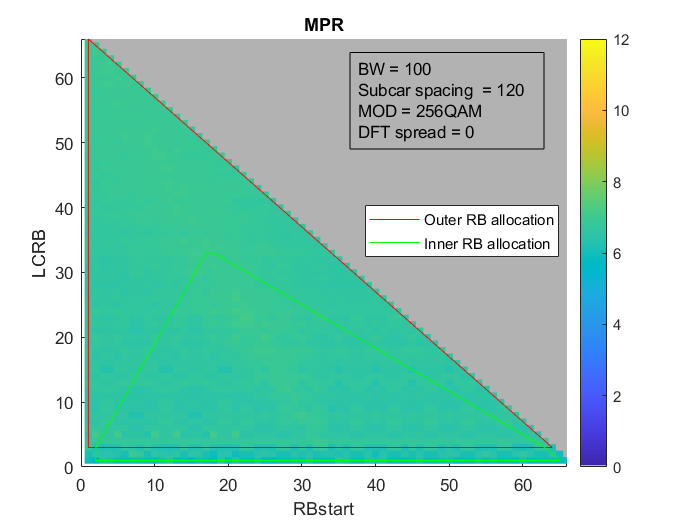{width="6.925in" height="2.3230774278215223in"}

{width="6.925in" height="2.3230774278215223in"}

It is evident that for PC1, the pattern of variation is like that of
PC5.

**Observation 3: With implementation-grade assumptions for a UE limited
to 35 dBm, the additional MPR for 256QAM over that of 64 QAM can be
conservatively considered to be 3 dB or less.**

Annex, calibration condition for PA model

The calibration condition for the PA used for MPR projections is shown
below -- 20RB23 DFT-s-QPSK is expected to operate with no more than 23
dBm TRP for PC5 and 35 dBm for PC1. This is a worst-case scenario for
SEM compliance.

{width="6.0in" height="4.153845144356955in"}

{width="6.0in" height="4.015384951881015in"}

#### 5.2.4.10 Simulation results from Huawei

R4-2316379 simulation results for PC1

We use the following EVM budget for our further MPR simulation.

Table 5.2.4.10-1 EVM budget in MPR simulation for 256QAM

  EVM Contributor    EVM(%)   SNR(dB)
  ------------------ -------- ---------
  Transmitter        1        -40
  Phase Noise        1.8      -34.9
  IQ Imbalance       1.45     -36.8
  PA Non-linearity   2.5      -32
  Total              3.5      -29.1

The simulation results is shown in Table 5.2.4.10-1.

Table 5.2.4.10-1: MPR simulation for 256QAM

  Modulation   Companies   MPR~WT~ (dB), BW~channel~ ≤ 100 MHz/200MHz                                         
  ------------ ----------- -------------------------------------------- ---------------------- -------------- -------
                           Outer RB allocations                         Inner RB allocations                  
                                                                        **Region 1**           **Region 2**   
  DFT-s-OFDM   64 QAM      \-                                           ≤ 6.5                  ≤ 5.0          ≤ 5.0
               256QAM      Huawei                                       9.1                                   
  CP-OFDM      64 QAM      \-                                           ≤ 7.5                  ≤ 7.5          ≤ 7.5
               256QAM      Huawei                                       11.8                                  

#### 5.2.4.11 Summary of the simulation results for 29GHz MPR

Based on the simulation results from companies, below tables list the
average values for 29GHz PC1/PC2/PC5 MPR:

Table 5.2.4.11-1 PC1 UL 256QAM MPR summary for 29 GHz with BW~channel~
≤200 MHz and 120kHz SCS

  Modulation   Companies   MPR~WT~ (dB), BW~channel~ ≤ 100/200 MHz                                         
  ------------ ----------- ----------------------------------------- ---------------------- -------------- -------
                           Outer RB allocations                      Inner RB allocations                  
                                                                     **Region 1**           **Region 2**   
  DFT-s-OFDM   64 QAM      \-                                        ≤ 6.5                  ≤ 5.0          ≤ 5.0
               256QAM      Xiaomi(R4-2315437)                        9                      9              9
                           MediaTek(R4-2315559)                      9                      9              9
                           ZTE(R4-2315563)                           7.5                    7.5            7.5
                           LGE(R4-2315540)                           8.5                    8.5            8
                           vivo(R4-2315808)                          8                      8              8
                           Qualcomm(R4-2315054)                      9.5                    8              8
                           Huawei(R4-2316379)                        9.1                                   
                           Nokia (R4-2311665)                        7.2                                   
                           Average                                   8.5                    8.3            8.2
  CP-OFDM      64 QAM      \-                                        ≤ 7.5                  ≤ 7.5          ≤ 7.5
               256QAM      Nokia (R4-2315265)                        8.6                                   
                           Xiaomi(R4-2315437)                        11                     11             11
                           MediaTek(R4-2315559)                      11.5                   11.5           11.5
                           ZTE(R4-2315563)                           10.5                   10.5           10.5
                           vivo(R4-2315808)                          11                     11             11
                           LGE(R4-2315540)                           10.5                   10.5           10.5
                           Sony(R4-2315561)                          11.2                   11.6           11.5
                           Qualcomm(R4-2315054)                      10.5                   10.5           10.5
                           Huawei(R4-2316379)                        11.8                                  
                           Average                                   10.7                   10.8           10.8

Table 5.2.4.11-2 PC1 UL 256QAM MPR summary for 29 GHz with BW~channel~
=400 MHz and 120kHz SCS

  Modulation   Companies   MPR~WT~ (dB), BW~channel~ =400 MHz                                         
  ------------ ----------- ------------------------------------ ---------------------- -------------- -------
                           Outer RB allocations                 Inner RB allocations                  
                                                                **Region 1**           **Region 2**   
  DFT-s-OFDM   64 QAM                                           ≤ 6.5                  ≤ 6.5          ≤ 6.5
               256QAM      Xiaomi(R4-2315437)                   9                      9              9
                           LGE(R4-2315540)                      10                     9.5            9.5
                           MediaTek(R4-2315559)                 10.5                   10.5           10.5
                           ZTE(R4-2315563)                      7.5                    7.5            7.5
                           vivo(R4-2315808)                     9.5                    9.5            9.5
                           Nokia (R4-2311665)                   7.2                                   
                           Average                              9                      8.9            8.9
  CP-OFDM      64 QAM                                           ≤ 9.0                  ≤ 9.0          ≤ 9.0
               256QAM      Nokia (R4-2315265)                   8.7                                   
                           Xiaomi(R4-2315437)                   11                     11             11
                           LGE(R4-2315540)                      12                     12             12.5
                           MediaTek(R4-2315559)                 13                     13             13
                           Sony(R4-2315561)                     12                     10.7           11.3
                           ZTE(R4-2315563)                      10.5                   10.5           10.5
                           vivo(R4-2315808)                     12.5                   12.5           12.5
                           Average                              11.4                   11.2           11.4

Table 5.2.4.11-3 PC2 UL 256QAM MPR summary for 29 GHz with BW~channel~ ≤
200 MHz and 120kHz SCS

+------------+-----------+-----------------+-----------------+-------+
| Modulation | Companies | MPR~WT~,        |                 |       |
|            |           | BW~channel~ ≤   |                 |       |
|            |           | 100/200 MHz     |                 |       |
+============+===========+=================+=================+=======+
|            |           | Inner RB        | Edge RB         |       |
|            |           | allocations,    | allocations     |       |
|            |           |                 |                 |       |
|            |           | Region 1        |                 |       |
+------------+-----------+-----------------+-----------------+-------+
| DFT-s-OFDM | 64 QAM    |                 | ≤ 5.0           | ≤ 5.5 |
+------------+-----------+-----------------+-----------------+-------+
|            | 256QAM    | Media           | 9               | 9     |
|            |           | Tek(R4-2315559) |                 |       |
+------------+-----------+-----------------+-----------------+-------+
|            |           | LGE(R4-2315540) | 8               | 8     |
+------------+-----------+-----------------+-----------------+-------+
|            |           | Qualc           | 8               | 8.5   |
|            |           | omm(R4-2315054) |                 |       |
+------------+-----------+-----------------+-----------------+-------+
|            |           | Nokia           | 7.1             |       |
|            |           | (R4-2311665)    |                 |       |
+------------+-----------+-----------------+-----------------+-------+
|            |           | Average         | 8               | 8.2   |
+------------+-----------+-----------------+-----------------+-------+
| CP-OFDM    | 64 QAM    |                 | ≤ 7.5           | ≤ 7.5 |
+------------+-----------+-----------------+-----------------+-------+
|            | 256QAM    | Nokia           | 8.8             |       |
|            |           | (R4-2315265)    |                 |       |
+------------+-----------+-----------------+-----------------+-------+
|            |           | Media           | 11.5            | 11.5  |
|            |           | Tek(R4-2315559) |                 |       |
+------------+-----------+-----------------+-----------------+-------+
|            |           | LGE(R4-2315540) | 10.5            | 10.5  |
+------------+-----------+-----------------+-----------------+-------+
|            |           | Qualc           | 10.5            | 10.5  |
|            |           | omm(R4-2315054) |                 |       |
+------------+-----------+-----------------+-----------------+-------+
|            |           | Average         | 10.3            | 10.3  |
+------------+-----------+-----------------+-----------------+-------+

Table 5.2.4.11-4 PC2 UL 256QAM MPR summary for 29 GHz with BW~channel~
=400 MHz and 120kHz SCS

+------------+-----------+-------------------------------+---------------------+-------+
| Modulation | Companies | MPR~WT~, BW~channel~ =400 MHz |                     |       |
+============+===========+===============================+=====================+=======+
|            |           | Inner RB allocations,         | Edge RB allocations |       |
|            |           |                               |                     |       |
|            |           | Region 1                      |                     |       |
+------------+-----------+-------------------------------+---------------------+-------+
| DFT-s-OFDM | 64 QAM    |                               | ≤ 6.5               | ≤ 6.5 |
+------------+-----------+-------------------------------+---------------------+-------+
|            | 256QAM    | LGE(R4-2315540)               | 10                  | 9.5   |
+------------+-----------+-------------------------------+---------------------+-------+
|            |           | MediaTek(R4-2315559)          | 10.5                | 10.5  |
+------------+-----------+-------------------------------+---------------------+-------+
|            |           | Nokia (R4-2311665)            | 7.0                 |       |
+------------+-----------+-------------------------------+---------------------+-------+
|            |           | Average                       | 9.2                 | 9.2   |
+------------+-----------+-------------------------------+---------------------+-------+
| CP-OFDM    | 64 QAM    |                               | ≤ 9                 | ≤ 9   |
+------------+-----------+-------------------------------+---------------------+-------+
|            | 256QAM    | Nokia (R4-2315265)            | 8.8                 |       |
+------------+-----------+-------------------------------+---------------------+-------+
|            |           | LGE(R4-2315540)               | 11.5                | 11.5  |
+------------+-----------+-------------------------------+---------------------+-------+
|            |           | MediaTek(R4-2315559)          | 13                  | 13    |
+------------+-----------+-------------------------------+---------------------+-------+
|            |           | Average                       | 11.1                | 11.1  |
+------------+-----------+-------------------------------+---------------------+-------+

Table 5.2.4.11-5 PC5 UL 256QAM MPR summary for 29 GHz with BW~channel~
≤200 MHz and 120kHz SCS

+------------+-----------+-----------------+-----------------+-------+
| Modulation | Companies | MPR~WT~,        |                 |       |
|            |           | BW~channel~ ≤   |                 |       |
|            |           | 100/200 MHz     |                 |       |
+============+===========+=================+=================+=======+
|            |           | Inner RB        | Edge RB         |       |
|            |           | allocations,    | allocations     |       |
|            |           |                 |                 |       |
|            |           | Region 1        |                 |       |
+------------+-----------+-----------------+-----------------+-------+
| DFT-s-OFDM | 64 QAM    |                 | ≤ 5.0           | ≤ 5.5 |
+------------+-----------+-----------------+-----------------+-------+
|            | 256QAM    | Media           | 9               | 9     |
|            |           | Tek(R4-2315559) |                 |       |
+------------+-----------+-----------------+-----------------+-------+
|            |           | Qualc           | 8               | 8.5   |
|            |           | omm(R4-2315054) |                 |       |
+------------+-----------+-----------------+-----------------+-------+
|            |           | Nokia           | 7.3             |       |
|            |           | (R4-2311665)    |                 |       |
+------------+-----------+-----------------+-----------------+-------+
|            |           | Average         | 8.1             | 8.3   |
+------------+-----------+-----------------+-----------------+-------+
| CP-OFDM    | 64 QAM    |                 | ≤ 7.5           | ≤ 7.5 |
+------------+-----------+-----------------+-----------------+-------+
|            | 256QAM    | Nokia           | 8.8             |       |
|            |           | (R4-2315265)    |                 |       |
+------------+-----------+-----------------+-----------------+-------+
|            |           | Media           | 11.5            | 11.5  |
|            |           | Tek(R4-2315559) |                 |       |
+------------+-----------+-----------------+-----------------+-------+
|            |           | Qualc           | 10.5            | 10.5  |
|            |           | omm(R4-2315054) |                 |       |
+------------+-----------+-----------------+-----------------+-------+
|            |           | Average         | 10.3            | 10.3  |
+------------+-----------+-----------------+-----------------+-------+

Table 5.2.4.11-6 PC5 UL 256QAM MPR summary for 29 GHz with BW~channel~
=400 MHz and 120kHz SCS

+------------+-----------+-----------------+-----------------+-------+
| Modulation | Companies | MPR~WT~,        |                 |       |
|            |           | BW~channel~ =   |                 |       |
|            |           | 400 MHz         |                 |       |
+============+===========+=================+=================+=======+
|            |           | Inner RB        | Edge RB         |       |
|            |           | allocations,    | allocations     |       |
|            |           |                 |                 |       |
|            |           | Region 1        |                 |       |
+------------+-----------+-----------------+-----------------+-------+
| DFT-s-OFDM | 64 QAM    |                 | ≤ 6.5           | ≤ 6.5 |
+------------+-----------+-----------------+-----------------+-------+
|            | 256QAM    | Media           | 10.5            | 10.5  |
|            |           | Tek(R4-2315559) |                 |       |
+------------+-----------+-----------------+-----------------+-------+
|            |           | Nokia           | 7.1             |       |
|            |           | (R4-2311665)    |                 |       |
+------------+-----------+-----------------+-----------------+-------+
|            |           | Average         | 8.8             |       |
+------------+-----------+-----------------+-----------------+-------+
| CP-OFDM    | 64 QAM    |                 | ≤ 9             | ≤ 9   |
+------------+-----------+-----------------+-----------------+-------+
|            | 256QAM    | Nokia           | 8.9             |       |
|            |           | (R4-2315265)    |                 |       |
+------------+-----------+-----------------+-----------------+-------+
|            |           | Media           | 13              | 13    |
|            |           | Tek(R4-2315559) |                 |       |
+------------+-----------+-----------------+-----------------+-------+
|            |           | Average         | 11              | 11    |
+------------+-----------+-----------------+-----------------+-------+

#### 5.2.4.12 Summary of the simulation results for 39GHz MPR

Based on the simulation results from companies, below tables list the
values for 39GHz PC1 MPR:

Table 5.2.4.12-1 PC1 UL 256QAM MPR summary for 39 GHz with BW~channel~
≤200 MHz and 120kHz SCS

  Modulation   Companies   MPR~WT~ (dB), BW~channel~ ≤ 100 MHz                                         
  ------------ ----------- ------------------------------------- ---------------------- -------------- -------
                           Outer RB allocations                  Inner RB allocations                  
                                                                 **Region 1**           **Region 2**   
  DFT-s-OFDM   64 QAM      \-                                    ≤ 6.5                  ≤ 5.0          ≤ 5.0
               256QAM      LGE(R4-2315540)                       8.5                    8.5            8
  CP-OFDM      64 QAM      \-                                    ≤ 7.5                  ≤ 7.5          ≤ 7.5
               256QAM      LGE(R4-2315540)                       11                     11             10.5

Table 5.2.4.12-2 PC1 UL 256QAM MPR summary for 39 GHz with BW~channel~
=400 MHz and 120kHz SCS

  Modulation   Companies   MPR~WT~ (dB), BW~channel~ =400 MHz                                         
  ------------ ----------- ------------------------------------ ---------------------- -------------- -------
                           Outer RB allocations                 Inner RB allocations                  
                                                                **Region 1**           **Region 2**   
  DFT-s-OFDM   64 QAM                                           ≤ 6.5                  ≤ 6.5          ≤ 6.5
               256QAM      LGE(R4-2315540)                      10.5                   9.5            10
  CP-OFDM      64 QAM                                           ≤ 9.0                  ≤ 9.0          ≤ 9.0
               256QAM      LGE(R4-2315540)                      13                     12             12.5

### 5.2.5 Simulation for PTRS configurations

#### 5.2.5.1 Simulation results from Qualcomm

[R4-2304601]{.underline}

The desired waveform was 256QAM of various allocation sizes and 120 kHz
SCS. To isolate the EVM impact of phase noise, no AWGN, image, LO or
non-linear distortion products accompanied the signal. The phase noise
profile is chosen as the hybrid 30G profile (Proposal 1: Adopting
min(example1, example2) as the phase noise profile for UL256QAM, where
'example' refers to the example phase noise profiles in TR38.803 for
n257, n258 and n261.)

CP-OFDM

For CP-OFDM, PTRS density ranged from no correction to frequency density
k=2 and k = 4. Time density was fixed at L = 1. Table 5.2.5.1-1
summarizes the EVM

Table 5.2.5.1-1: EVM penalty for CP-OFDM with PTRS correction

  **'hybrid 30' profile**   **EVM from floor (dBc)**                       
  ------------------------- -------------------------- --------- --------- -------
                            **No PTRS**                **K=4**   **K=2**   
  **L~CRB~**                **4**                      -33.7     -34.0     -34.4
                            **16**                     -33.0     -33.6     -33.9
                            **64**                     -32.7     -33.5     -33.5
                            **256**                    -32.5     -33.3     -33.4

Results show that PTRS corrections seem to help the EVM floor in
proportion to the density of PTRS. The effectiveness tapers off for
wider allocations, so there is room for optimization in the field.

**Observation 2: A fixed PTRS configuration of K=2, L=1 benefits EVM for
CP-OFDM waveforms with the phase noise profile of proposal 1.**

DFT-s-OFDM

For DFT-s-OFDM, the configuration (\[*N^samp^~group,~
N^PT-RS^~group~*\]) are chosen amongst this set: {\[4 2\], \[4 4\], \[4
8\]}. The \# of groups was maximized while ensuring there were fewer
PTRS data symbols than PDSCH symbols. For all cases, number of PTRS
samples per group was limited to 4.The group count is recorded in that
tables below.

Table 5.2.5.1-2: EVM penalty for DFT-s-OFDM with PTRS correction

  'hybrid 30' profile   \# PTRS groups   EVM from floor (dBc)                  
  --------------------- ---------------- ---------------------- -------------- -------
                                         No PTRS                PTRS enabled   
  L~CRB~                4                4                      -33.8          -35.3
                        16               8                      -32.9          -33.6
                        64               8                      -32.7          -32.7
                        256              8                      -32.5          -32.3

Results show that PTRS corrections in the configuration above only help
narrow allocations (\~ 20 or less) of DFT-s-OFDM. PTRS seems like wasted
overhead for medium sized allocations (20-64) and can be detrimental for
very wide allocations. Here too there is room for optimization in the
field.

**Observation 3: Assuming the phase noise profile of proposal 1, only
narrow allocations of DFT-s-OFDM waveforms (\~20RB or narrower) benefit
from PTRS.**

**Observation 4: Assuming the phase noise profile of proposal 1, the
network is better off not configuring PTRS for allocations wider than 20
RBs.**

The analysis assumed a certain strategy of how the number of PTRS groups
must be reduced in keeping with narrower allocations. Specifically, the
total number of symbols available per OFDM symbol is 12\*L~CRB~. Of
these, *N^samp^~group,\ \*~ N^PT-RS^~group~* symbols are occupied by
PTRS symbols. When the latter product gets comparable to the total
number of symbols available per OFDM symbol, PTRS starts to represent a
significant overhead. It is also self-evident that 4 symbols per group
and 8 groups per OFDM symbol is physically impossible to fit into a 2RB
allocation. RAN4 must therefore determine this strategy.

**Observation 5: Unlike CP-OFDM, it is not clear how to adjust PTRS
parameters when the number of symbols in each OFDM symbol
(**12\*L~CRB~**) starts to become comparable to the product
*N^samp^~group,\ \*~ N^PT-RS^~group~*.**

#### 5.2.5.2 Simulation results from vivo

[R4-2308227]{.underline}

To further investigate PTRS configuration under different RB
allocations, the simulation is performed and the results are shown in
Table 5.2.5.2-1. Considering that Option 1 and Option 2 are not
feasible, only Option 3 and Option 4 are evaluated.

Table 5.2.5.2-1 PTRS correction benefit evaluation for different RB
allocation

         EVM no correction   EVM with correction   benefit               
  ------ ------------------- --------------------- ---------- ---------- ---------
  32RB   CP-OFDM             Option 3              -32.5213   -34.0762   1.5549
                             Option 4              -33.2888   -34.1761   0.8873
         DFT-s-OFDM          Option 3              -32.6484   -30.7554   -1.893
                             Option 4              -33.4813   -31.4505   -2.0308
  16RB   CP-OFDM             Option 3              -33.4905   -33.9333   0.4428
                             Option 4              -33.9908   -34.2379   0.2471
         DFT-s-OFDM          Option 3              -35.5055   -33.3672   -2.1383
                             Option 4              -34.1009   -32.5789   -1.522
  8RB    CP-OFDM             Option 3              -33.3388   -33.9874   0.6486
                             Option 4              -34.4442   -34.8899   0.4457
         DFT-s-OFDM          Option 3              -33.3038   -32.9937   -0.3101
                             Option 4              -34.5513   -34.0163   -0.535
  4RB    CP-OFDM             Option 3              -33.9173   -35.0024   1.0851
                             Option 4              -35.6699   -36.7056   1.0357
         DFT-s-OFDM          Option 3              -34.7217   -34.3119   -0.4098
                             Option 4              -36.4809   -35.7798   -0.7011

**Observation 3: Even under narrow RB allocation, the DFT-s-OFDM still
hard to benefit from PTRS correction.**

Take the 8RB case as an example, we further evaluated DFT-s-OFDM with
different PTRS configurations, and the simulation results are shown in
Table 5.2.5.2-2:

Table 5.2.5.2-2 PTRS correction benefit evaluation for DFT-s-OFDM with
narrow RB allocation under different PTRS configurations.

+---------------+----------+---------------+---------------+---------+
| PTRS          |          | EVM no        | EVM with      | benefit |
| configuration |          | correction    | correction    |         |
+===============+==========+===============+===============+=========+
| L-PTRS = 1    | Option 3 | -33.3038      | -33.946       | 0.6422  |
|               |          |               |               |         |
| N\_group = 4, |          |               |               |         |
| N\_samp = 4   |          |               |               |         |
+---------------+----------+---------------+---------------+---------+
|               | Option 4 | -34.5513      | -34.7963      | 0.245   |
+---------------+----------+---------------+---------------+---------+
| L-PTRS = 1    | Option 3 | -33.3038      | -32.8345      | -0.4693 |
|               |          |               |               |         |
| N\_group = 2, |          |               |               |         |
| N\_samp = 4   |          |               |               |         |
+---------------+----------+---------------+---------------+---------+
|               | Option 4 | -34.5513      | -34.022       | -0.5293 |
+---------------+----------+---------------+---------------+---------+
| L-PTRS = 1    | Option 3 | -33.3038      | -32.9937      | -0.3101 |
|               |          |               |               |         |
| N\_group = 2, |          |               |               |         |
| N\_samp = 2   |          |               |               |         |
+---------------+----------+---------------+---------------+---------+
|               | Option 4 | -34.5513      | -34.0163      | -0.535  |
+---------------+----------+---------------+---------------+---------+

**Observation 4: Only configuration L-PTRS = 1, (N\_group = 4, N\_samp =
4) can make narrow RB allocation benefit from PTRS correction.**

#### 5.2.5.3 Simulation results from Xiaomi

[R4-2308805/R4-2318876]{.underline}

To further evaluate the effects of different PTRS configurations for CP-
OFDM and DFT-s-OFDM, the simulations are done for different RBs
allocation (4RBs, 16RBs, 64RBs) separately.

Table 5.2.5.3-1 and table 5.2.5.3-2 show the simulation results for CP-
OFDM at 29GHz and 39GHz. Table 5.2.5.3-3 and table 5.2.5.3-4 show the
simulation results for DFT-s- OFDM at 29GHz and 39GHz.

For CP- OFDM:

Table 5.2.5.3-1 EVM floor and benefits with different PTRS
configurations for CP-OFDM at 29GHz

+----------+----------+----------+----------+----------+----------+
| CP-OFDM  |          |          |          |          |          |
| with     |          |          |          |          |          |
| phase    |          |          |          |          |          |
| noise，  |          |          |          |          |          |
| 29GHz,   |          |          |          |          |          |
| 120kHz,  |          |          |          |          |          |
| 4RB，    |          |          |          |          |          |
+==========+==========+==========+==========+==========+==========+
| Phase    | EVM (dB) | EVM (dB) | EVM (dB) | Net      | Net      |
| noise    | with no  | with     | with     | benefit  | benefit  |
| model    | PTRS     | PTRS     | PTRS     | of PTRS  | of PTRS  |
|          | cor      |          |          |          |          |
|          | rections | K-PTRS=2 | K-PTRS=4 | K-PTRS=2 | K-PTRS=4 |
+----------+----------+----------+----------+----------+----------+
| Example  | -31.0    | -31.2    | -30.5    | 0.2      | -0.5     |
| 1 from   |          |          |          |          |          |
| TR38.803 |          |          |          |          |          |
+----------+----------+----------+----------+----------+----------+
| Example  | -23.9    | -25.1    | -24.7    | 1.2      | 0.8      |
| 2 from   |          |          |          |          |          |
| TR38.803 |          |          |          |          |          |
+----------+----------+----------+----------+----------+----------+
| Phase    | -32.9    | -33.9    | -33.4    | 1.0      | 0.5      |
| noise    |          |          |          |          |          |
| Profile  |          |          |          |          |          |
| from     |          |          |          |          |          |
| Qualcomm |          |          |          |          |          |
+----------+----------+----------+----------+----------+----------+
| Phase    | -34.8    | -35.4    | -34.8    | 0.6      | 0.0      |
| noise    |          |          |          |          |          |
| Profile  |          |          |          |          |          |
| from MTK |          |          |          |          |          |
+----------+----------+----------+----------+----------+----------+
| CP-OFDM  |          |          |          |          |          |
| with     |          |          |          |          |          |
| phase    |          |          |          |          |          |
| noise，  |          |          |          |          |          |
| 29GHz,   |          |          |          |          |          |
| 120kHz,  |          |          |          |          |          |
| 16RB，   |          |          |          |          |          |
+----------+----------+----------+----------+----------+----------+
| Phase    | EVM (dB) | EVM (dB) | EVM (dB) | Net      | Net      |
| noise    | with no  | with     | with     | benefit  | benefit  |
| model    | PTRS     | PTRS     | PTRS     | of PTRS  | of PTRS  |
|          | cor      |          |          |          |          |
|          | rections | K-PTRS=2 | K-PTRS=4 | K-PTRS=2 | K-PTRS=4 |
+----------+----------+----------+----------+----------+----------+
| Example  | -28.9    | -29.3    | -29.0    | 0.4      | 0.1      |
| 1 from   |          |          |          |          |          |
| TR38.803 |          |          |          |          |          |
+----------+----------+----------+----------+----------+----------+
| Example  | -23.6    | -25.3    | -25.1    | 1.7      | 1.5      |
| 2 from   |          |          |          |          |          |
| TR38.803 |          |          |          |          |          |
+----------+----------+----------+----------+----------+----------+
| Phase    | -32.1    | -33.2    | -33.0    | 1.1      | 0.9      |
| noise    |          |          |          |          |          |
| Profile  |          |          |          |          |          |
| from     |          |          |          |          |          |
| Qualcomm |          |          |          |          |          |
+----------+----------+----------+----------+----------+----------+
| Phase    | -33.0    | -33.7    | -33.4    | 0.7      | 0.4      |
| noise    |          |          |          |          |          |
| Profile  |          |          |          |          |          |
| from MTK |          |          |          |          |          |
+----------+----------+----------+----------+----------+----------+
| CP-OFDM  |          |          |          |          |          |
| with     |          |          |          |          |          |
| phase    |          |          |          |          |          |
| noise，  |          |          |          |          |          |
| 29GHz,   |          |          |          |          |          |
| 120kHz,  |          |          |          |          |          |
| 64RB，   |          |          |          |          |          |
+----------+----------+----------+----------+----------+----------+
| Phase    | EVM (dB) | EVM (dB) | EVM (dB) | Net      | Net      |
| noise    | with no  | with     | with     | benefit  | benefit  |
| model    | PTRS     | PTRS     | PTRS     | of PTRS  | of PTRS  |
|          | cor      |          |          |          |          |
|          | rections | K-PTRS=2 | K-PTRS=4 | K-PTRS=2 | K-PTRS=4 |
+----------+----------+----------+----------+----------+----------+
| Example  | -28.1    | -28.5    | -28.5    | 0.4      | 0.4      |
| 1 from   |          |          |          |          |          |
| TR38.803 |          |          |          |          |          |
+----------+----------+----------+----------+----------+----------+
| Example  | -23.6    | -25.3    | -25.2    | 1.7      | 1.6      |
| 2 from   |          |          |          |          |          |
| TR38.803 |          |          |          |          |          |
+----------+----------+----------+----------+----------+----------+
| Phase    | -31.9    | -33.1    | -33.0    | 1.2      | 1.1      |
| noise    |          |          |          |          |          |
| Profile  |          |          |          |          |          |
| from     |          |          |          |          |          |
| Qualcomm |          |          |          |          |          |
+----------+----------+----------+----------+----------+----------+
| Phase    | -32.4    | -33.0    | -33.0    | 0.6      | 0.6      |
| noise    |          |          |          |          |          |
| Profile  |          |          |          |          |          |
| from MTK |          |          |          |          |          |
+----------+----------+----------+----------+----------+----------+

Table 5.2.5.3-2 EVM floor and benefits with different PTRS
configurations for CP-OFDM at 39GHz

+----------+----------+----------+----------+----------+----------+
| CP-OFDM  |          |          |          |          |          |
| with     |          |          |          |          |          |
| phase    |          |          |          |          |          |
| noise，  |          |          |          |          |          |
| 39GHz,   |          |          |          |          |          |
| 120kHz,  |          |          |          |          |          |
| 4RB      |          |          |          |          |          |
+==========+==========+==========+==========+==========+==========+
| Phase    | EVM (dB) | EVM (dB) | EVM (dB) | Net      | Net      |
| noise    | with no  | with     | with     | benefit  | benefit  |
| model    | PTRS     | PTRS     | PTRS     | of PTRS  | of PTRS  |
|          | cor      |          |          |          |          |
|          | rections | K-PTRS=2 | K-PTRS=4 | K-PTRS=2 | K-PTRS=4 |
+----------+----------+----------+----------+----------+----------+
| Example  | -27.8    | -27.9    | -27.2    | 0.1      | -0.6     |
| 1: VIVO  |          |          |          |          |          |
| p        |          |          |          |          |          |
| arameter |          |          |          |          |          |
+----------+----------+----------+----------+----------+----------+
| Example  | -28.0    | -28.2    | -27.5    | 0.2      | -0.5     |
| 1        |          |          |          |          |          |
| :Anritsu |          |          |          |          |          |
| p        |          |          |          |          |          |
| arameter |          |          |          |          |          |
+----------+----------+----------+----------+----------+----------+
| Example  | -21.2    | -22.4    | -22.1    | 1.2      | 0.9      |
| 2 from   |          |          |          |          |          |
| TR38.803 |          |          |          |          |          |
+----------+----------+----------+----------+----------+----------+
| Phase    | -30.2    | -31.0    | -30.5    | 0.8      | 0.3      |
| noise    |          |          |          |          |          |
| Profile  |          |          |          |          |          |
| from     |          |          |          |          |          |
| Q        |          |          |          |          |          |
| ualcomm; |          |          |          |          |          |
|          |          |          |          |          |          |
| Mi       |          |          |          |          |          |
| n(Exampl |          |          |          |          |          |
| e1-VIVO, |          |          |          |          |          |
| E        |          |          |          |          |          |
| xample2) |          |          |          |          |          |
+----------+----------+----------+----------+----------+----------+
| Phase    | -30.3    | -31.1    | -30.6    | 0.8      | 0.3      |
| noise    |          |          |          |          |          |
| Profile  |          |          |          |          |          |
| from     |          |          |          |          |          |
| Q        |          |          |          |          |          |
| ualcomm; |          |          |          |          |          |
|          |          |          |          |          |          |
| Min(E    |          |          |          |          |          |
| xample1- |          |          |          |          |          |
| Anritsu, |          |          |          |          |          |
| E        |          |          |          |          |          |
| xample2) |          |          |          |          |          |
+----------+----------+----------+----------+----------+----------+
| Phase    | -32.0    | -32.5    | -31.8    | 0.5      | -0.2     |
| noise    |          |          |          |          |          |
| Profile  |          |          |          |          |          |
| from MTK |          |          |          |          |          |
+----------+----------+----------+----------+----------+----------+
| CP-OFDM  |          |          |          |          |          |
| with     |          |          |          |          |          |
| phase    |          |          |          |          |          |
| noise，  |          |          |          |          |          |
| 39GHz,   |          |          |          |          |          |
| 120kHz,  |          |          |          |          |          |
| 16RB     |          |          |          |          |          |
+----------+----------+----------+----------+----------+----------+
| Phase    | EVM (dB) | EVM (dB) | EVM (dB) | Net      | Net      |
| noise    | with no  | with     | with     | benefit  | benefit  |
| model    | PTRS     | PTRS     | PTRS     | of PTRS  | of PTRS  |
|          | cor      |          |          |          |          |
|          | rections | K-PTRS=2 | K-PTRS=4 | K-PTRS=2 | K-PTRS=4 |
+----------+----------+----------+----------+----------+----------+
| Example  | -25.6    | -25.9    | -25.6    | 0.3      | 0.0      |
| 1:VIVO   |          |          |          |          |          |
| p        |          |          |          |          |          |
| arameter |          |          |          |          |          |
+----------+----------+----------+----------+----------+----------+
| Example  | -25.9    | -26.2    | -25.9    | 0.3      | 0.0      |
| 1        |          |          |          |          |          |
| :Anritsu |          |          |          |          |          |
| p        |          |          |          |          |          |
| arameter |          |          |          |          |          |
+----------+----------+----------+----------+----------+----------+
| Example  | -21.3    | -22.8    | -22.5    | 1.5      | 1.2      |
| 2 from   |          |          |          |          |          |
| TR38.803 |          |          |          |          |          |
+----------+----------+----------+----------+----------+----------+
| Phase    | -29.4    | -30.5    | -30.2    | 1.1      | 0.8      |
| noise    |          |          |          |          |          |
| Profile  |          |          |          |          |          |
| from     |          |          |          |          |          |
| Q        |          |          |          |          |          |
| ualcomm; |          |          |          |          |          |
|          |          |          |          |          |          |
| Mi       |          |          |          |          |          |
| n(Exampl |          |          |          |          |          |
| e1-VIVO, |          |          |          |          |          |
| E        |          |          |          |          |          |
| xample2) |          |          |          |          |          |
+----------+----------+----------+----------+----------+----------+
| Phase    | -29.5    | -30.5    | -30.2    | 1.0      | 0.7      |
| noise    |          |          |          |          |          |
| Profile  |          |          |          |          |          |
| from     |          |          |          |          |          |
| Q        |          |          |          |          |          |
| ualcomm; |          |          |          |          |          |
|          |          |          |          |          |          |
| Min(E    |          |          |          |          |          |
| xample1- |          |          |          |          |          |
| Anritsu, |          |          |          |          |          |
| E        |          |          |          |          |          |
| xample2) |          |          |          |          |          |
+----------+----------+----------+----------+----------+----------+
| Phase    | -30.1    | -30.7    | -30.4    | 0.6      | 0.3      |
| noise    |          |          |          |          |          |
| Profile  |          |          |          |          |          |
| from MTK |          |          |          |          |          |
+----------+----------+----------+----------+----------+----------+
| CP-OFDM  |          |          |          |          |          |
| with     |          |          |          |          |          |
| phase    |          |          |          |          |          |
| noise，  |          |          |          |          |          |
| 39GHz,   |          |          |          |          |          |
| 120kHz,  |          |          |          |          |          |
| 64RB     |          |          |          |          |          |
+----------+----------+----------+----------+----------+----------+
| Phase    | EVM (dB) | EVM (dB) | EVM (dB) | Net      | Net      |
| noise    | with no  | with     | with     | benefit  | benefit  |
| model    | PTRS     | PTRS     | PTRS     | of PTRS  | of PTRS  |
|          | cor      |          |          |          |          |
|          | rections | K-PTRS=2 | K-PTRS=4 | K-PTRS=2 | K-PTRS=4 |
+----------+----------+----------+----------+----------+----------+
| Example  | -24.8    | -25.1    | -25.0    | 0.3      | 0.2      |
| 1:VIVO   |          |          |          |          |          |
| p        |          |          |          |          |          |
| arameter |          |          |          |          |          |
+----------+----------+----------+----------+----------+----------+
| Example  | -25.1    | -25.5    | -25.4    | 0.4      | 0.3      |
| 1        |          |          |          |          |          |
| :Anritsu |          |          |          |          |          |
| p        |          |          |          |          |          |
| arameter |          |          |          |          |          |
+----------+----------+----------+----------+----------+----------+
| Example  | -20.9    | -22.7    | -22.7    | 1.8      | 1.8      |
| 2 from   |          |          |          |          |          |
| TR38.803 |          |          |          |          |          |
+----------+----------+----------+----------+----------+----------+
| Phase    | -29.2    | -30.3    | -30.2    | 1.1      | 1.0      |
| noise    |          |          |          |          |          |
| Profile  |          |          |          |          |          |
| from     |          |          |          |          |          |
| Qualcomm |          |          |          |          |          |
|          |          |          |          |          |          |
| Mi       |          |          |          |          |          |
| n(Exampl |          |          |          |          |          |
| e1-VIVO, |          |          |          |          |          |
| E        |          |          |          |          |          |
| xample2) |          |          |          |          |          |
+----------+----------+----------+----------+----------+----------+
| Phase    | -29.3    | -30.3    | -30.3    | 1.0      | 1.0      |
| noise    |          |          |          |          |          |
| Profile  |          |          |          |          |          |
| from     |          |          |          |          |          |
| Qualcomm |          |          |          |          |          |
|          |          |          |          |          |          |
| Min(E    |          |          |          |          |          |
| xample1- |          |          |          |          |          |
| Anritsu, |          |          |          |          |          |
| E        |          |          |          |          |          |
| xample2) |          |          |          |          |          |
+----------+----------+----------+----------+----------+----------+
| Phase    | -29.4    | -30.0    | -29.9    | 0.6      | 0.5      |
| noise    |          |          |          |          |          |
| Profile  |          |          |          |          |          |
| from MTK |          |          |          |          |          |
+----------+----------+----------+----------+----------+----------+

From Table 5.2.5.3-1 and table 5.2.5.3-2 for CP-OFDM, we can see
although the benefits are different for different phase noise profile:

\- The benefits with PTRS correction for all candidate phase noise
profiles are monotonously increased with the increase of the density of
PTRS configurations.

\- The benefits with PTRS correction for all candidate phase noise
profiles are monotonously increased with the number of RBs allocation.
For the narrow RBs allocation, the benefits with PTRS correction is
comparable with 64RBs allocation for 120kHz SCS.

For DFT-S-OFDM:

Table 5.2.5.3-3 EVM floor and benefits with different PTRS
configurations for DFT-S-OFDM at 29GHz

+-------+-------+-------+-------+-------+-------+-------+-------+
| DFT-S |       |       |       |       |       |       |       |
| -OFDM |       |       |       |       |       |       |       |
| with  |       |       |       |       |       |       |       |
| phase |       |       |       |       |       |       |       |
| no    |       |       |       |       |       |       |       |
| ise， |       |       |       |       |       |       |       |
| 2     |       |       |       |       |       |       |       |
| 9GHz, |       |       |       |       |       |       |       |
| 12    |       |       |       |       |       |       |       |
| 0kHz, |       |       |       |       |       |       |       |
| 4RB   |       |       |       |       |       |       |       |
+=======+=======+=======+=======+=======+=======+=======+=======+
| Phase | EVM   | EVM   | EVM   | EVM   | Net   | Net   | Net   |
| noise | (dB)  | (dB)  | (dB)  | (dB)  | be    | be    | be    |
| model | with  | with  | with  | with  | nefit | nefit | nefit |
|       | no    | PTRS  | PTRS  | PTRS  | of    | of    | of    |
|       | PTRS  |       |       |       | PTRS  | PTRS  | PTRS  |
|       | c     | N\_   | N\_   | N\_   |       |       |       |
|       | orrec | group | group | group | N\_   | N\_   | N\_   |
|       | tions | = 8,  | = 4,  | = 2,  | group | group | group |
|       |       | N\    | N\    | N\    | = 8,  | = 4,  | = 2,  |
|       |       | _samp | _samp | _samp |       |       |       |
|       |       | = 4   | = 4   | = 4   |       |       |       |
+-------+-------+-------+-------+-------+-------+-------+-------+
| Ex    | -31.0 | -30.7 | -31.3 | -31.3 | -0.3  | 0.3   | 0.3   |
| ample |       |       |       |       |       |       |       |
| 1     |       |       |       |       |       |       |       |
| from  |       |       |       |       |       |       |       |
| TR3   |       |       |       |       |       |       |       |
| 8.803 |       |       |       |       |       |       |       |
+-------+-------+-------+-------+-------+-------+-------+-------+
| Ex    | -23.7 | -27.9 | -25.9 | -23.9 | 4.2   | 2.2   | 0.2   |
| ample |       |       |       |       |       |       |       |
| 2     |       |       |       |       |       |       |       |
| from  |       |       |       |       |       |       |       |
| TR3   |       |       |       |       |       |       |       |
| 8.803 |       |       |       |       |       |       |       |
+-------+-------+-------+-------+-------+-------+-------+-------+
| Phase | -33.0 | -33.7 | -33.9 | -33.6 | 0.7   | 0.9   | 0.6   |
| noise |       |       |       |       |       |       |       |
| Pr    |       |       |       |       |       |       |       |
| ofile |       |       |       |       |       |       |       |
| from  |       |       |       |       |       |       |       |
| Qua   |       |       |       |       |       |       |       |
| lcomm |       |       |       |       |       |       |       |
+-------+-------+-------+-------+-------+-------+-------+-------+
| Phase | -34.9 | -35.1 | -35.6 | -35.4 | 0.2   | 0.7   | 0.5   |
| noise |       |       |       |       |       |       |       |
| Pr    |       |       |       |       |       |       |       |
| ofile |       |       |       |       |       |       |       |
| from  |       |       |       |       |       |       |       |
| MTK   |       |       |       |       |       |       |       |
+-------+-------+-------+-------+-------+-------+-------+-------+
| DFT-S |       |       |       |       |       |       |       |
| -OFDM |       |       |       |       |       |       |       |
| with  |       |       |       |       |       |       |       |
| phase |       |       |       |       |       |       |       |
| no    |       |       |       |       |       |       |       |
| ise， |       |       |       |       |       |       |       |
| 2     |       |       |       |       |       |       |       |
| 9GHz, |       |       |       |       |       |       |       |
| 12    |       |       |       |       |       |       |       |
| 0kHz, |       |       |       |       |       |       |       |
| 10RB  |       |       |       |       |       |       |       |
+-------+-------+-------+-------+-------+-------+-------+-------+
| Phase | EVM   | EVM   | EVM   | EVM   | Net   | Net   | Net   |
| noise | (dB)  | (dB)  | (dB)  | (dB)  | be    | be    | be    |
| model | with  | with  | with  | with  | nefit | nefit | nefit |
|       | no    | PTRS  | PTRS  | PTRS  | of    | of    | of    |
|       | PTRS  |       |       |       | PTRS  | PTRS  | PTRS  |
|       | c     | N\_   | N\_   | N\_   |       |       |       |
|       | orrec | group | group | group | N\_   | N\_   | N\_   |
|       | tions | = 8,  | = 4,  | = 2,  | group | group | group |
|       |       | N\    | N\    | N\    | = 8,  | = 4,  | = 2,  |
|       |       | _samp | _samp | _samp |       |       |       |
|       |       | = 4   | = 4   | = 4   |       |       |       |
+-------+-------+-------+-------+-------+-------+-------+-------+
| Ex    | -29.4 | -29.1 | -29.2 | -29.1 | -0.3  | -0.2  | -0.3  |
| ample |       |       |       |       |       |       |       |
| 1     |       |       |       |       |       |       |       |
| from  |       |       |       |       |       |       |       |
| TR3   |       |       |       |       |       |       |       |
| 8.803 |       |       |       |       |       |       |       |
+-------+-------+-------+-------+-------+-------+-------+-------+
| Ex    | -23.2 | -26.7 | -24.8 | -23.1 | 3.5   | 1.6   | -0.1  |
| ample |       |       |       |       |       |       |       |
| 2     |       |       |       |       |       |       |       |
| from  |       |       |       |       |       |       |       |
| TR3   |       |       |       |       |       |       |       |
| 8.803 |       |       |       |       |       |       |       |
+-------+-------+-------+-------+-------+-------+-------+-------+
| Phase | -32.2 | -32.6 | -32.5 | -32.2 | 0.4   | 0.3   | 0.0   |
| noise |       |       |       |       |       |       |       |
| Pr    |       |       |       |       |       |       |       |
| ofile |       |       |       |       |       |       |       |
| from  |       |       |       |       |       |       |       |
| Qua   |       |       |       |       |       |       |       |
| lcomm |       |       |       |       |       |       |       |
+-------+-------+-------+-------+-------+-------+-------+-------+
| Phase | -33.5 | -33.6 | -33.6 | -33.4 | 0.1   | 0.1   | -0.1  |
| noise |       |       |       |       |       |       |       |
| Pr    |       |       |       |       |       |       |       |
| ofile |       |       |       |       |       |       |       |
| from  |       |       |       |       |       |       |       |
| MTK   |       |       |       |       |       |       |       |
+-------+-------+-------+-------+-------+-------+-------+-------+
| DFT-S |       |       |       |       |       |       |       |
| -OFDM |       |       |       |       |       |       |       |
| with  |       |       |       |       |       |       |       |
| phase |       |       |       |       |       |       |       |
| no    |       |       |       |       |       |       |       |
| ise， |       |       |       |       |       |       |       |
| 2     |       |       |       |       |       |       |       |
| 9GHz, |       |       |       |       |       |       |       |
| 12    |       |       |       |       |       |       |       |
| 0kHz, |       |       |       |       |       |       |       |
| 16RB  |       |       |       |       |       |       |       |
+-------+-------+-------+-------+-------+-------+-------+-------+
| Phase | EVM   | EVM   | EVM   | EVM   | Net   | Net   | Net   |
| noise | (dB)  | (dB)  | (dB)  | (dB)  | be    | be    | be    |
| model | with  | with  | with  | with  | nefit | nefit | nefit |
|       | no    | PTRS  | PTRS  | PTRS  | of    | of    | of    |
|       | PTRS  |       |       |       | PTRS  | PTRS  | PTRS  |
|       | c     | N\_   | N\_   | N\_   |       |       |       |
|       | orrec | group | group | group | N\_   | N\_   | N\_   |
|       | tions | = 8,  | = 4,  | = 2,  | group | group | group |
|       |       | N\    | N\    | N\    | = 8,  | = 4,  | = 2,  |
|       |       | _samp | _samp | _samp |       |       |       |
|       |       | = 4   | = 4   | = 4   |       |       |       |
+-------+-------+-------+-------+-------+-------+-------+-------+
| Ex    | -28.9 | -28.4 | -28.4 | -28.3 | -0.5  | -0.5  | -0.6  |
| ample |       |       |       |       |       |       |       |
| 1     |       |       |       |       |       |       |       |
| from  |       |       |       |       |       |       |       |
| TR3   |       |       |       |       |       |       |       |
| 8.803 |       |       |       |       |       |       |       |
+-------+-------+-------+-------+-------+-------+-------+-------+
| Ex    | -23.1 | -26.9 | -24.9 | -23.0 | 3.8   | 1.8   | -0.1  |
| ample |       |       |       |       |       |       |       |
| 2     |       |       |       |       |       |       |       |
| from  |       |       |       |       |       |       |       |
| TR3   |       |       |       |       |       |       |       |
| 8.803 |       |       |       |       |       |       |       |
+-------+-------+-------+-------+-------+-------+-------+-------+
| Phase | -32.0 | -32.4 | -32.1 | -31.8 | 0.4   | 0.1   | -0.2  |
| noise |       |       |       |       |       |       |       |
| Pr    |       |       |       |       |       |       |       |
| ofile |       |       |       |       |       |       |       |
| from  |       |       |       |       |       |       |       |
| Qua   |       |       |       |       |       |       |       |
| lcomm |       |       |       |       |       |       |       |
+-------+-------+-------+-------+-------+-------+-------+-------+
| Phase | -33.0 | -32.9 | -32.8 | -32.6 | -0.1  | -0.2  | -0.4  |
| noise |       |       |       |       |       |       |       |
| Pr    |       |       |       |       |       |       |       |
| ofile |       |       |       |       |       |       |       |
| from  |       |       |       |       |       |       |       |
| MTK   |       |       |       |       |       |       |       |
+-------+-------+-------+-------+-------+-------+-------+-------+
| DFT-S |       |       |       |       |       |       |       |
| -OFDM |       |       |       |       |       |       |       |
| with  |       |       |       |       |       |       |       |
| phase |       |       |       |       |       |       |       |
| no    |       |       |       |       |       |       |       |
| ise， |       |       |       |       |       |       |       |
| 2     |       |       |       |       |       |       |       |
| 9GHz, |       |       |       |       |       |       |       |
| 12    |       |       |       |       |       |       |       |
| 0kHz, |       |       |       |       |       |       |       |
| 64RB  |       |       |       |       |       |       |       |
+-------+-------+-------+-------+-------+-------+-------+-------+
| Phase | EVM   | EVM   | EVM   | EVM   | Net   | Net   | Net   |
| noise | (dB)  | (dB)  | (dB)  | (dB)  | be    | be    | be    |
| model | with  | with  | with  | with  | nefit | nefit | nefit |
|       | no    | PTRS  | PTRS  | PTRS  | of    | of    | of    |
|       | PTRS  |       |       |       | PTRS  | PTRS  | PTRS  |
|       | c     | N\_   | N\_   | N\_   |       |       |       |
|       | orrec | group | group | group | N\_   | N\_   | N\_   |
|       | tions | = 8,  | = 4,  | = 2,  | group | group | group |
|       |       | N\    | N\    | N\    | = 8,  | = 4,  | = 2,  |
|       |       | _samp | _samp | _samp |       |       |       |
|       |       | = 4   | = 4   | = 4   |       |       |       |
+-------+-------+-------+-------+-------+-------+-------+-------+
| Ex    | -28.2 | -27.1 | -27.0 | -26.9 | -1.1  | -1.2  | -1.3  |
| ample |       |       |       |       |       |       |       |
| 1     |       |       |       |       |       |       |       |
| from  |       |       |       |       |       |       |       |
| TR3   |       |       |       |       |       |       |       |
| 8.803 |       |       |       |       |       |       |       |
+-------+-------+-------+-------+-------+-------+-------+-------+
| Ex    | -23.1 | -27.2 | -24.8 | -22.9 | 4.1   | 1.7   | -0.2  |
| ample |       |       |       |       |       |       |       |
| 2     |       |       |       |       |       |       |       |
| from  |       |       |       |       |       |       |       |
| TR3   |       |       |       |       |       |       |       |
| 8.803 |       |       |       |       |       |       |       |
+-------+-------+-------+-------+-------+-------+-------+-------+
| Phase | -31.8 | -32.0 | -31.6 | -31.1 | 0.2   | -0.2  | -0.7  |
| noise |       |       |       |       |       |       |       |
| Pr    |       |       |       |       |       |       |       |
| ofile |       |       |       |       |       |       |       |
| from  |       |       |       |       |       |       |       |
| Qua   |       |       |       |       |       |       |       |
| lcomm |       |       |       |       |       |       |       |
+-------+-------+-------+-------+-------+-------+-------+-------+
| Phase | -32.4 | -31.7 | -31.6 | -31.3 | -0.7  | -0.8  | -1.1  |
| noise |       |       |       |       |       |       |       |
| Pr    |       |       |       |       |       |       |       |
| ofile |       |       |       |       |       |       |       |
| from  |       |       |       |       |       |       |       |
| MTK   |       |       |       |       |       |       |       |
+-------+-------+-------+-------+-------+-------+-------+-------+

Table 5.2.5.3-4 EVM floor and benefits with different PTRS
configurations for DFT-S-OFDM at 39GHz

+-------+-------+-------+-------+-------+-------+-------+-------+
| DFT-S |       |       |       |       |       |       |       |
| -OFDM |       |       |       |       |       |       |       |
| with  |       |       |       |       |       |       |       |
| phase |       |       |       |       |       |       |       |
| no    |       |       |       |       |       |       |       |
| ise， |       |       |       |       |       |       |       |
| 3     |       |       |       |       |       |       |       |
| 9GHz, |       |       |       |       |       |       |       |
| 12    |       |       |       |       |       |       |       |
| 0kHz, |       |       |       |       |       |       |       |
| 4RB   |       |       |       |       |       |       |       |
+=======+=======+=======+=======+=======+=======+=======+=======+
| Phase | EVM   | EVM   | EVM   | EVM   | Net   | Net   | Net   |
| noise | (dB)  | (dB)  | (dB)  | (dB)  | be    | be    | be    |
| model | with  | with  | with  | with  | nefit | nefit | nefit |
|       | no    | PTRS  | PTRS  | PTRS  | of    | of    | of    |
|       | PTRS  |       |       |       | PTRS  | PTRS  | PTRS  |
|       | c     | N\_   | N\_   | N\_   |       |       |       |
|       | orrec | group | group | group | N\_   | N\_   | N\_   |
|       | tions | = 8,  | = 4,  | = 2,  | group | group | group |
|       |       | N\    | N\    | N\    | = 8,  | = 4,  | = 2,  |
|       |       | _samp | _samp | _samp |       |       |       |
|       |       | = 4   | = 4   | = 4   |       |       |       |
+-------+-------+-------+-------+-------+-------+-------+-------+
| Ex    | -27.9 | -27.3 | -28.0 | -28.0 | -0.6  | 0.1   | 0.1   |
| ample |       |       |       |       |       |       |       |
| 1     |       |       |       |       |       |       |       |
| :VIVO |       |       |       |       |       |       |       |
| para  |       |       |       |       |       |       |       |
| meter |       |       |       |       |       |       |       |
+-------+-------+-------+-------+-------+-------+-------+-------+
| Ex    | -28.1 | -27.5 | -28.2 | -28.2 | -0.6  | 0.1   | 0.1   |
| ample |       |       |       |       |       |       |       |
| 1:    |       |       |       |       |       |       |       |
|       |       |       |       |       |       |       |       |
| An    |       |       |       |       |       |       |       |
| ritsu |       |       |       |       |       |       |       |
| para  |       |       |       |       |       |       |       |
| meter |       |       |       |       |       |       |       |
+-------+-------+-------+-------+-------+-------+-------+-------+
| Ex    | -21.2 | -25.3 | -23.3 | -21.2 | 4.1   | 2.1   | 0.0   |
| ample |       |       |       |       |       |       |       |
| 2     |       |       |       |       |       |       |       |
| from  |       |       |       |       |       |       |       |
| TR3   |       |       |       |       |       |       |       |
| 8.803 |       |       |       |       |       |       |       |
+-------+-------+-------+-------+-------+-------+-------+-------+
| Phase | -30.3 | -30.6 | -31.0 | -30.7 | 0.3   | 0.7   | 0.4   |
| noise |       |       |       |       |       |       |       |
| Pr    |       |       |       |       |       |       |       |
| ofile |       |       |       |       |       |       |       |
| from  |       |       |       |       |       |       |       |
| Qua   |       |       |       |       |       |       |       |
| lcomm |       |       |       |       |       |       |       |
|       |       |       |       |       |       |       |       |
| Min   |       |       |       |       |       |       |       |
| (Exam |       |       |       |       |       |       |       |
| ple1- |       |       |       |       |       |       |       |
| VIVO, |       |       |       |       |       |       |       |
| Exam  |       |       |       |       |       |       |       |
| ple2) |       |       |       |       |       |       |       |
+-------+-------+-------+-------+-------+-------+-------+-------+
| Phase | -30.3 | -30.7 | -31.0 | -30.7 | 0.4   | 0.7   | 0.4   |
| noise |       |       |       |       |       |       |       |
| Pr    |       |       |       |       |       |       |       |
| ofile |       |       |       |       |       |       |       |
| from  |       |       |       |       |       |       |       |
| Qua   |       |       |       |       |       |       |       |
| lcomm |       |       |       |       |       |       |       |
|       |       |       |       |       |       |       |       |
| Min   |       |       |       |       |       |       |       |
| (Exam |       |       |       |       |       |       |       |
| ple1- |       |       |       |       |       |       |       |
| Anr   |       |       |       |       |       |       |       |
| itsu, |       |       |       |       |       |       |       |
| Exam  |       |       |       |       |       |       |       |
| ple2) |       |       |       |       |       |       |       |
+-------+-------+-------+-------+-------+-------+-------+-------+
| Phase | -32.1 | -32.1 | -32.6 | -32.5 | 0.0   | 0.5   | 0.4   |
| noise |       |       |       |       |       |       |       |
| Pr    |       |       |       |       |       |       |       |
| ofile |       |       |       |       |       |       |       |
| from  |       |       |       |       |       |       |       |
| MTK   |       |       |       |       |       |       |       |
+-------+-------+-------+-------+-------+-------+-------+-------+
| DFT-S |       |       |       |       |       |       |       |
| -OFDM |       |       |       |       |       |       |       |
| with  |       |       |       |       |       |       |       |
| phase |       |       |       |       |       |       |       |
| no    |       |       |       |       |       |       |       |
| ise， |       |       |       |       |       |       |       |
| 3     |       |       |       |       |       |       |       |
| 9GHz, |       |       |       |       |       |       |       |
| 12    |       |       |       |       |       |       |       |
| 0kHz, |       |       |       |       |       |       |       |
| 10RB  |       |       |       |       |       |       |       |
+-------+-------+-------+-------+-------+-------+-------+-------+
| Phase | EVM   | EVM   | EVM   | EVM   | Net   | Net   | Net   |
| noise | (dB)  | (dB)  | (dB)  | (dB)  | be    | be    | be    |
| model | with  | with  | with  | with  | nefit | nefit | nefit |
|       | no    | PTRS  | PTRS  | PTRS  | of    | of    | of    |
|       | PTRS  |       |       |       | PTRS  | PTRS  | PTRS  |
|       | c     | N\_   | N\_   | N\_   |       |       |       |
|       | orrec | group | group | group | N\_   | N\_   | N\_   |
|       | tions | = 8,  | = 4,  | = 2,  | group | group | group |
|       |       | N\    | N\    | N\    | = 8,  | = 4,  | = 2,  |
|       |       | _samp | _samp | _samp |       |       |       |
|       |       | = 4   | = 4   | = 4   |       |       |       |
+-------+-------+-------+-------+-------+-------+-------+-------+
| Ex    | -26.2 | -25.7 | -25.8 | -25.7 | -0.5  | -0.4  | -0.5  |
| ample |       |       |       |       |       |       |       |
| 1     |       |       |       |       |       |       |       |
| :VIVO |       |       |       |       |       |       |       |
| para  |       |       |       |       |       |       |       |
| meter |       |       |       |       |       |       |       |
+-------+-------+-------+-------+-------+-------+-------+-------+
| Ex    | -26.5 | -26.0 | -26.2 | -26.0 | -0.5  | -0.3  | -0.5  |
| ample |       |       |       |       |       |       |       |
| 1:    |       |       |       |       |       |       |       |
|       |       |       |       |       |       |       |       |
| An    |       |       |       |       |       |       |       |
| ritsu |       |       |       |       |       |       |       |
| para  |       |       |       |       |       |       |       |
| meter |       |       |       |       |       |       |       |
+-------+-------+-------+-------+-------+-------+-------+-------+
| Ex    | -20.6 | -24.3 | -22.3 | -20.5 | 3.7   | 1.7   | -0.1  |
| ample |       |       |       |       |       |       |       |
| 2     |       |       |       |       |       |       |       |
| from  |       |       |       |       |       |       |       |
| TR3   |       |       |       |       |       |       |       |
| 8.803 |       |       |       |       |       |       |       |
+-------+-------+-------+-------+-------+-------+-------+-------+
| Phase | -29.5 | -29.7 | -29.6 | -29.3 | 0.2   | 0.1   | -0.2  |
| noise |       |       |       |       |       |       |       |
| Pr    |       |       |       |       |       |       |       |
| ofile |       |       |       |       |       |       |       |
| from  |       |       |       |       |       |       |       |
| Qua   |       |       |       |       |       |       |       |
| lcomm |       |       |       |       |       |       |       |
|       |       |       |       |       |       |       |       |
| Min   |       |       |       |       |       |       |       |
| (Exam |       |       |       |       |       |       |       |
| ple1- |       |       |       |       |       |       |       |
| VIVO, |       |       |       |       |       |       |       |
| Exam  |       |       |       |       |       |       |       |
| ple2) |       |       |       |       |       |       |       |
+-------+-------+-------+-------+-------+-------+-------+-------+
| Phase | -29.6 | -29.7 | -29.6 | -29.4 | 0.1   | 0     | -0.2  |
| noise |       |       |       |       |       |       |       |
| Pr    |       |       |       |       |       |       |       |
| ofile |       |       |       |       |       |       |       |
| from  |       |       |       |       |       |       |       |
| Qua   |       |       |       |       |       |       |       |
| lcomm |       |       |       |       |       |       |       |
|       |       |       |       |       |       |       |       |
| Min   |       |       |       |       |       |       |       |
| (Exam |       |       |       |       |       |       |       |
| ple1- |       |       |       |       |       |       |       |
| Anr   |       |       |       |       |       |       |       |
| itsu, |       |       |       |       |       |       |       |
| Exam  |       |       |       |       |       |       |       |
| ple2) |       |       |       |       |       |       |       |
+-------+-------+-------+-------+-------+-------+-------+-------+
| Phase | -30.6 | -30.6 | -30.6 | -30.4 | 0.0   | 0.0   | -0.2  |
| noise |       |       |       |       |       |       |       |
| Pr    |       |       |       |       |       |       |       |
| ofile |       |       |       |       |       |       |       |
| from  |       |       |       |       |       |       |       |
| MTK   |       |       |       |       |       |       |       |
+-------+-------+-------+-------+-------+-------+-------+-------+
| DFT-S |       |       |       |       |       |       |       |
| -OFDM |       |       |       |       |       |       |       |
| with  |       |       |       |       |       |       |       |
| phase |       |       |       |       |       |       |       |
| no    |       |       |       |       |       |       |       |
| ise， |       |       |       |       |       |       |       |
| 3     |       |       |       |       |       |       |       |
| 9GHz, |       |       |       |       |       |       |       |
| 12    |       |       |       |       |       |       |       |
| 0kHz, |       |       |       |       |       |       |       |
| 16RB  |       |       |       |       |       |       |       |
+-------+-------+-------+-------+-------+-------+-------+-------+
| Phase | EVM   | EVM   | EVM   | EVM   | Net   | Net   | Net   |
| noise | (dB)  | (dB)  | (dB)  | (dB)  | be    | be    | be    |
| model | with  | with  | with  | with  | nefit | nefit | nefit |
|       | no    | PTRS  | PTRS  | PTRS  | of    | of    | of    |
|       | PTRS  |       |       |       | PTRS  | PTRS  | PTRS  |
|       | c     | N\_   | N\_   | N\_   |       |       |       |
|       | orrec | group | group | group | N\_   | N\_   | N\_   |
|       | tions | = 8,  | = 4,  | = 2,  | group | group | group |
|       |       | N\    | N\    | N\    | = 8,  | = 4,  | = 2,  |
|       |       | _samp | _samp | _samp |       |       |       |
|       |       | = 4   | = 4   | = 4   |       |       |       |
+-------+-------+-------+-------+-------+-------+-------+-------+
| Ex    | -25.7 | -24.9 | -25.0 | -25.0 | -0.8  | -0.7  | -0.7  |
| ample |       |       |       |       |       |       |       |
| 1:    |       |       |       |       |       |       |       |
|       |       |       |       |       |       |       |       |
| VIVO  |       |       |       |       |       |       |       |
| para  |       |       |       |       |       |       |       |
| meter |       |       |       |       |       |       |       |
+-------+-------+-------+-------+-------+-------+-------+-------+
| Ex    | -26.0 | -25.3 | -25.4 | -25.2 | -0.7  | -0.6  | -0.8  |
| ample |       |       |       |       |       |       |       |
| 1:    |       |       |       |       |       |       |       |
|       |       |       |       |       |       |       |       |
| An    |       |       |       |       |       |       |       |
| ritsu |       |       |       |       |       |       |       |
| para  |       |       |       |       |       |       |       |
| meter |       |       |       |       |       |       |       |
+-------+-------+-------+-------+-------+-------+-------+-------+
| Ex    | -20.6 | -24.3 | -22.3 | -20.4 | 3.7   | 1.7   | -0.2  |
| ample |       |       |       |       |       |       |       |
| 2     |       |       |       |       |       |       |       |
| from  |       |       |       |       |       |       |       |
| TR3   |       |       |       |       |       |       |       |
| 8.803 |       |       |       |       |       |       |       |
+-------+-------+-------+-------+-------+-------+-------+-------+
| Phase | -29.3 | -29.5 | -29.2 | -28.9 | 0.2   | -0.1  | -0.4  |
| noise |       |       |       |       |       |       |       |
| Pr    |       |       |       |       |       |       |       |
| ofile |       |       |       |       |       |       |       |
| from  |       |       |       |       |       |       |       |
| Qua   |       |       |       |       |       |       |       |
| lcomm |       |       |       |       |       |       |       |
|       |       |       |       |       |       |       |       |
| Min   |       |       |       |       |       |       |       |
| (Exam |       |       |       |       |       |       |       |
| ple1- |       |       |       |       |       |       |       |
| VIVO, |       |       |       |       |       |       |       |
| Exam  |       |       |       |       |       |       |       |
| ple2) |       |       |       |       |       |       |       |
+-------+-------+-------+-------+-------+-------+-------+-------+
| Phase | -29.4 | -29.5 | -29.3 | -29.0 | 0.1   | -0.1  | -0.4  |
| noise |       |       |       |       |       |       |       |
| Pr    |       |       |       |       |       |       |       |
| ofile |       |       |       |       |       |       |       |
| from  |       |       |       |       |       |       |       |
| Qua   |       |       |       |       |       |       |       |
| lcomm |       |       |       |       |       |       |       |
|       |       |       |       |       |       |       |       |
| Min   |       |       |       |       |       |       |       |
| (Exam |       |       |       |       |       |       |       |
| ple1- |       |       |       |       |       |       |       |
| Anr   |       |       |       |       |       |       |       |
| itsu, |       |       |       |       |       |       |       |
| Exam  |       |       |       |       |       |       |       |
| ple2) |       |       |       |       |       |       |       |
+-------+-------+-------+-------+-------+-------+-------+-------+
| Phase | -30.1 | -29.9 | -29.8 | -29.7 | -0.2  | -0.3  | -0.4  |
| noise |       |       |       |       |       |       |       |
| Pr    |       |       |       |       |       |       |       |
| ofile |       |       |       |       |       |       |       |
| from  |       |       |       |       |       |       |       |
| MTK   |       |       |       |       |       |       |       |
+-------+-------+-------+-------+-------+-------+-------+-------+
| DFT-S |       |       |       |       |       |       |       |
| -OFDM |       |       |       |       |       |       |       |
| with  |       |       |       |       |       |       |       |
| phase |       |       |       |       |       |       |       |
| no    |       |       |       |       |       |       |       |
| ise， |       |       |       |       |       |       |       |
| 3     |       |       |       |       |       |       |       |
| 9GHz, |       |       |       |       |       |       |       |
| 12    |       |       |       |       |       |       |       |
| 0kHz, |       |       |       |       |       |       |       |
| 64RB  |       |       |       |       |       |       |       |
+-------+-------+-------+-------+-------+-------+-------+-------+
| Phase | EVM   | EVM   | EVM   | EVM   | Net   | Net   | Net   |
| noise | (dB)  | (dB)  | (dB)  | (dB)  | be    | be    | be    |
| model | with  | with  | with  | with  | nefit | nefit | nefit |
|       | no    | PTRS  | PTRS  | PTRS  | of    | of    | of    |
|       | PTRS  |       |       |       | PTRS  | PTRS  | PTRS  |
|       | c     | N\_   | N\_   | N\_   |       |       |       |
|       | orrec | group | group | group | N\_   | N\_   | N\_   |
|       | tions | = 8,  | = 4,  | = 2,  | group | group | group |
|       |       | N\    | N\    | N\    | = 8,  | = 4,  | = 2,  |
|       |       | _samp | _samp | _samp |       |       |       |
|       |       | = 4   | = 4   | = 4   |       |       |       |
+-------+-------+-------+-------+-------+-------+-------+-------+
| Ex    | -24.8 | -23.7 | -23.5 | -23.4 | -1.1  | -1.3  | -1.4  |
| ample |       |       |       |       |       |       |       |
| 1:    |       |       |       |       |       |       |       |
|       |       |       |       |       |       |       |       |
| VIVO  |       |       |       |       |       |       |       |
| para  |       |       |       |       |       |       |       |
| meter |       |       |       |       |       |       |       |
+-------+-------+-------+-------+-------+-------+-------+-------+
| Ex    | -25.2 | -24.0 | -24.0 | -23.9 | -1.2  | -1.2  | -1.3  |
| ample |       |       |       |       |       |       |       |
| 1:    |       |       |       |       |       |       |       |
|       |       |       |       |       |       |       |       |
| An    |       |       |       |       |       |       |       |
| ritsu |       |       |       |       |       |       |       |
| para  |       |       |       |       |       |       |       |
| meter |       |       |       |       |       |       |       |
+-------+-------+-------+-------+-------+-------+-------+-------+
| Ex    | -20.5 | -24.4 | -22.1 | -20.3 | 3.9   | 1.6   | -0.2  |
| ample |       |       |       |       |       |       |       |
| 2     |       |       |       |       |       |       |       |
| from  |       |       |       |       |       |       |       |
| TR3   |       |       |       |       |       |       |       |
| 8.803 |       |       |       |       |       |       |       |
+-------+-------+-------+-------+-------+-------+-------+-------+
| Phase | -29.2 | -29.1 | -28.8 | -28.3 | -0.1  | -0.4  | -0.9  |
| noise |       |       |       |       |       |       |       |
| Pr    |       |       |       |       |       |       |       |
| ofile |       |       |       |       |       |       |       |
| from  |       |       |       |       |       |       |       |
| Qua   |       |       |       |       |       |       |       |
| lcomm |       |       |       |       |       |       |       |
|       |       |       |       |       |       |       |       |
| Min   |       |       |       |       |       |       |       |
| (Exam |       |       |       |       |       |       |       |
| ple1- |       |       |       |       |       |       |       |
| VIVO, |       |       |       |       |       |       |       |
| Exam  |       |       |       |       |       |       |       |
| ple2) |       |       |       |       |       |       |       |
+-------+-------+-------+-------+-------+-------+-------+-------+
| Phase | -29.2 | -29.2 | -28.8 | -28.3 | 0.0   | -0.4  | -0.9  |
| noise |       |       |       |       |       |       |       |
| Pr    |       |       |       |       |       |       |       |
| ofile |       |       |       |       |       |       |       |
| from  |       |       |       |       |       |       |       |
| Qua   |       |       |       |       |       |       |       |
| lcomm |       |       |       |       |       |       |       |
|       |       |       |       |       |       |       |       |
| Min   |       |       |       |       |       |       |       |
| (Exam |       |       |       |       |       |       |       |
| ple1- |       |       |       |       |       |       |       |
| Anr   |       |       |       |       |       |       |       |
| itsu, |       |       |       |       |       |       |       |
| Exam  |       |       |       |       |       |       |       |
| ple2) |       |       |       |       |       |       |       |
+-------+-------+-------+-------+-------+-------+-------+-------+
| Phase | -29.5 | -28.7 | -28.5 | -28.3 | -0.8  | -1.0  | -1.2  |
| noise |       |       |       |       |       |       |       |
| Pr    |       |       |       |       |       |       |       |
| ofile |       |       |       |       |       |       |       |
| from  |       |       |       |       |       |       |       |
| MTK   |       |       |       |       |       |       |       |
+-------+-------+-------+-------+-------+-------+-------+-------+

From Table 5.2.5.3-3 and table 5.2.5.3-4 for DFT-s-OFDM at 29GHzand
39GHz, we can see although the benefits are different for different
phase noise profile:

\- The benefits with PTRS correction for all candidate phase noise
profiles are monotonously increased with the increase of the density of
PTRS configurations.

\- The benefits with PTRS correction for all candidate phase noise
profiles are monotonously reduced with the number of RBs allocation.

\- There is obvious benefit with PTRS correction only for example 2 new
phase noise profiles.

\- There is no obvious benefits with PTRS correction for the RBs
allocation larger than 10RBs for new phase noise profiles from Qualcomm
and MTK, even some PTRS configurations have the penalty for the new
phase noise profiles.

\- There is obvious benefits with PTRS correction for the RBs allocation
less than 10RBs for new phase noise profiles from Qualcomm and MTK,
especially for (N\_group = 4, N\_samp = 4) PTRS configuration, i.e., 1dB
and 0.7dB benefits for 29GHz for 4RBs allocation for 120kHz SCS, 0.8dB
and 0.6dB for 39GHz for 4RBs allocation for 120kHz SCS.

As we know, introducing PTRS will increase the data code rate,
especially for narrow RB allocation. In order to check the impact of
PTRS, we further compare the BLER performance between PTRS off and PTRS
on with different RB allocation for DFT-S-OFDM waveform. The simulation
assumption is same with the agreed for evaluation of phase noise
profiles in lasting meeting and QC phase noise profile at 29GHz is
applied. The background noise is set to -35dB. As we can see from above
simulation results, the BLER increase for both 4RB and 64RB allocation
when PTRS is configured shown as Table 5.2.5.3-5. For 4RB allocation,
although there is EVM benefit as previous analyzation, the BLER increase
due to high PTRS overhead. For 64RB, the BLER increase due to the joint
effect of EVM penalty and overhead of PTRS. For 10RB, maybe there is a
trade-off between PTRS overhead and EVM benefit, the BLER is same for
PTRS on/off. In short, except for the case that example 2 phase noise
profile is applied for MPR simulation, it may not be recommended to
configure PTRS.

Table 5.2.5.3-5 the BLER for different RBs allocation with/without PTRS
corrections

  BLER                       4 RBs   10 RBs   64 RBs
  -------------------------- ------- -------- --------
  Without PTRS corrections   0.5     0.5      0.6680
  With PTRS correction       0.75    0.5      0.7075

[R4-2312686/R4-2318876]{.underline}

For CP-OFDM, based on the submitted simulation results in last meeting
\[R4-2308805\], we can see the benefits with PTRS correction are
monotonously increased with the number of RBs allocation. If adopting
the fixed PTRS configuration of L-PTRS = 1 K-PTRS =2, it is good for
full RBs allocation in EVM test, but the overhead for partial RBs
allocation need consider.

Table 5.2.5.3-6: PT-RS group pattern as a function of scheduled
bandwidth

+------------------------------+------------------------+-------------------+
| Scheduled bandwidth          | Number of PT-RS groups | Number of samples |
|                              |                        |                   |
|                              |                        | per PT-RS group   |
+==============================+========================+===================+
| *N~RB0~ N~RB~* \< *N~RB1~*   | 2                      | 2                 |
+------------------------------+------------------------+-------------------+
| *N~RB1~* *N~RB~* \< *N~RB2~* | 2                      | 4                 |
+------------------------------+------------------------+-------------------+
| *N~RB2~* *N~RB~* \< *N~RB3~* | 4                      | 2                 |
+------------------------------+------------------------+-------------------+
| *N~RB3~* *N~RB~* \< *N~RB4~* | 4                      | 4                 |
+------------------------------+------------------------+-------------------+
| *N~RB4~* *N~RB~*             | 8                      | 4                 |
+------------------------------+------------------------+-------------------+

For DFT-s-OFDM, based PTRS group pattern in Table 5.2.5.3-6, we
introduced more simulation cases and the simulation results for some
PTRS configurations under different RB allocations are shown in Table
5.2.5.3-7 and Table 5.2.5.3-8.

Table 5.2.5.3-7 EVM floor and benefits with different PTRS
configurations for DFT-S-OFDM at 29GHz

  DFT-S-OFDM with phase noise， 29GHz, 120kHz, 4RB                                                                                                                                                                                          
  --------------------------------------------------- ----------------------------------- ---------------------------------------- ----------------------------------------- -------- -------- -------- -------- -------- -------- -------- --------
  Phase noise model                                   EVM (dB) with no PTRS corrections   EVM (dB) with PTRS (N\_group, N\_samp)   Net benefit of PTRS (N\_group, N\_samp)                                                                  
                                                                                          (2, 2)                                   (2, 4)                                    (4, 2)   (4, 4)   (8, 4)   (2, 2)   (2, 4)   (4, 2)   (4, 4)   (8, 4)
  Phase noise Profile from Qualcomm                   -33.0                               -33.2                                    -33.6                                     -33.5    -33.9    -33.7    0.2      0.6      0.5      0.9      0.7
  Phase noise Profile from MTK                        -34.9                               -35.0                                    -35.4                                     -35.2    -35.6    -35.1    0.1      0.5      0.3      0.7      0.2
  DFT-S-OFDM with phase noise， 29GHz, 120kHz, 8RB                                                                                                                                                                                          
  Phase noise model                                   EVM (dB) with no PTRS corrections   EVM (dB) with PTRS (N\_group, N\_samp)   Net benefit of PTRS (N\_group, N\_samp)                                                                  
                                                                                          (2, 2)                                   (2, 4)                                    (4, 2)   (4, 4)   (8, 4)   (2, 2)   (2, 4)   (4, 2)   (4, 4)   (8, 4)
  Phase noise Profile from Qualcomm                   -32.4                               -32.1                                    -32.5                                     -32.5    -32.8    -32.9    -0.3     0.1      0.1      0.4      0.5
  Phase noise Profile from MTK                        -33.8                               -33.3                                    -33.8                                     -33.5    -34.0    -34.0    -0.5     0.0      -0.3     0.2      0.2
  DFT-S-OFDM with phase noise， 29GHz, 120kHz, 10RB                                                                                                                                                                                         
  Phase noise model                                   EVM (dB) with no PTRS corrections   EVM (dB) with PTRS (N\_group, N\_samp)   Net benefit of PTRS (N\_group, N\_samp)                                                                  
                                                                                          (2, 2)                                   (2, 4)                                    (4, 2)   (4, 4)   (8, 4)   (2, 2)   (2, 4)   (4, 2)   (4, 4)   (8, 4)
  Phase noise Profile from Qualcomm                   -32.2                               -31.8                                    -32.2                                     -32.2    -32.5    -32.6    -0.4     0.0      0.0      0.3      0.4
  Phase noise Profile from MTK                        -33.5                               -32.8                                    -33.4                                     -33.0    -33.6    -33.6    -0.7     -0.1     -0.5     0.1      0.1
  DFT-S-OFDM with phase noise， 29GHz, 120kHz, 16RB                                                                                                                                                                                         
  Phase noise model                                   EVM (dB) with no PTRS corrections   EVM (dB) with PTRS (N\_group, N\_samp)   Net benefit of PTRS (N\_group, N\_samp)                                                                  
                                                                                          (2, 2)                                   (2, 4)                                    (4, 2)   (4, 4)   (8, 4)   (2, 2)   (2, 4)   (4, 2)   (4, 4)   (8, 4)
  Phase noise Profile from Qualcomm                   -32.0                               -31.3                                    -31.8                                     -31.8    -32.1    -32.4    -0.7     -0.2     -0.2     0.1      0.4
  Phase noise Profile from MTK                        -33.0                               -32.0                                    -32.6                                     -32.3    -32.8    -32.9    -1.0     -0.4     -0.7     -0.2     -0.1
  DFT-S-OFDM with phase noise， 29GHz, 120kHz, 20RB                                                                                                                                                                                         
  Phase noise model                                   EVM (dB) with no PTRS corrections   EVM (dB) with PTRS (N\_group, N\_samp)   Net benefit of PTRS (N\_group, N\_samp)                                                                  
                                                                                          (2, 2)                                   (2, 4)                                    (4, 2)   (4, 4)   (8, 4)   (2, 2)   (2, 4)   (4, 2)   (4, 4)   (8, 4)
  Phase noise Profile from Qualcomm                   -32.0                               -31.3                                    -31.6                                     -31.8    -32.0    -32.3    -0.7     -0.4     -0.2     0.0      0.3
  Phase noise Profile from MTK                        -32.9                               -31.8                                    -32.4                                     -32.1    -32.6    -32.6    -1.1     -0.5     -0.8     -0.3     -0.3

Table 5.2.5.3-8 EVM floor and benefits with different PTRS
configurations for DFT-S-OFDM at 39GHz

  DFT-S-OFDM with phase noise， 39GHz, 120kHz, 4RB                                                                                                                                                                                          
  --------------------------------------------------- ----------------------------------- ---------------------------------------- ----------------------------------------- -------- -------- -------- -------- -------- -------- -------- --------
  Phase noise model                                   EVM (dB) with no PTRS corrections   EVM (dB) with PTRS (N\_group, N\_samp)   Net benefit of PTRS (N\_group, N\_samp)                                                                  
                                                                                          (2, 2)                                   (2, 4)                                    (4, 2)   (4, 4)   (8, 4)   (2, 2)   (2, 4)   (4, 2)   (4, 4)   (8, 4)
  Phase noise Profile from MTK                        -32.1                               -32.1                                    -32.5                                     -32.2    -32.6    -32.1    0.0      0.4      0.1      0.5      0.0
  DFT-S-OFDM with phase noise， 39GHz, 120kHz, 8RB                                                                                                                                                                                          
  Phase noise model                                   EVM (dB) with no PTRS corrections   EVM (dB) with PTRS (N\_group, N\_samp)   Net benefit of PTRS (N\_group, N\_samp)                                                                  
                                                                                          (2, 2)                                   (2, 4)                                    (4, 2)   (4, 4)   (8, 4)   (2, 2)   (2, 4)   (4, 2)   (4, 4)   (8, 4)
  Phase noise Profile from MTK                        -30.9                               -30.3                                    -30.8                                     -30.5    -31.0    -31.0    -0.6     -0.1     -0.4     0.1      0.1
  DFT-S-OFDM with phase noise， 39GHz, 120kHz, 10RB                                                                                                                                                                                         
  Phase noise model                                   EVM (dB) with no PTRS corrections   EVM (dB) with PTRS (N\_group, N\_samp)   Net benefit of PTRS (N\_group, N\_samp)                                                                  
                                                                                          (2, 2)                                   (2, 4)                                    (4, 2)   (4, 4)   (8, 4)   (2, 2)   (2, 4)   (4, 2)   (4, 4)   (8, 4)
  Phase noise Profile from MTK                        -30.6                               -29.8                                    -30.4                                     -30.0    -30.6    -30.6    -0.8     -0.2     -0.6     0.0      0.0
  DFT-S-OFDM with phase noise， 39GHz, 120kHz, 16RB                                                                                                                                                                                         
  Phase noise model                                   EVM (dB) with no PTRS corrections   EVM (dB) with PTRS (N\_group, N\_samp)   Net benefit of PTRS (N\_group, N\_samp)                                                                  
                                                                                          (2, 2)                                   (2, 4)                                    (4, 2)   (4, 4)   (8, 4)   (2, 2)   (2, 4)   (4, 2)   (4, 4)   (8, 4)
  Phase noise Profile from MTK                        -30.1                               -29.0                                    -29.7                                     -29.3    -29.8    -29.9    -1.1     -0.4     -0.8     -0.3     -0.2
  DFT-S-OFDM with phase noise， 39GHz, 120kHz, 20RB                                                                                                                                                                                         
  Phase noise model                                   EVM (dB) with no PTRS corrections   EVM (dB) with PTRS (N\_group, N\_samp)   Net benefit of PTRS (N\_group, N\_samp)                                                                  
                                                                                          (2, 2)                                   (2, 4)                                    (4, 2)   (4, 4)   (8, 4)   (2, 2)   (2, 4)   (4, 2)   (4, 4)   (8, 4)
  Phase noise Profile from MTK                        -30.0                               -28.8                                    -29.4                                     -29.1    -29.5    -29.6    -1.2     -0.6     -0.9     -0.5     -0.4

From above tables for DFT-s-OFDM at 29GHzand 39GHz, we can see:

\- The benefits with PTRS correction are monotonously increased with the
increase of the density of PTRS configurations.

\- The benefits with PTRS correction are monotonously reduced with the
number of RBs allocation.

\- There is no obvious benefits with PTRS correction for the RBs
allocation larger than 10RBs, even some PTRS configurations have the
penalty.

\- There is obvious benefits with PTRS correction for the RBs allocation
less than 10RBs, especially for (N\_group = 4, N\_samp = 4) PTRS
configuration.

#### 5.2.5.4 Simulation results from ZTE

R4-2314619

For DFT-s-OFDM waveform, the results for EVM comparison between
different RB allocations are summarized in Table 5.2.5.4-1, in which the
phase noise model for 29GHz (i.e. option 1.) agreed in the WF R4-2310260
is used.

Table 5.2.5.4-1 EVM comparison between different configurations for
DFT-s-OFDM waveform

+-------------+-------------+-------------+-------------+-------------+
| DFT-s-OFDM  |             |             |             |             |
| w/ phase    |             |             |             |             |
| noise,      |             |             |             |             |
| 256QAM,     |             |             |             |             |
| 120k SCS,   |             |             |             |             |
| w/ CPE vs   |             |             |             |             |
| w/o CPE     |             |             |             |             |
| \@29GHz     |             |             |             |             |
+=============+=============+=============+=============+=============+
| Scheduled   | PTRS config | EVM(dB)     | EVM (dB)    | Net benefit |
| BW          |             | with CPE    | without CPE | of CPE      |
|             | \[PTRS      |             |             |             |
| (RB)        | /group,PTRS |             |             |             |
|             | group\]     |             |             |             |
+-------------+-------------+-------------+-------------+-------------+
| 8           | \[2, 2\]    | -31.4       | -31.9       | -0.5        |
+-------------+-------------+-------------+-------------+-------------+
| 20          | \[4, 4\]    | -31.5       | -31.6       | -0.1        |
+-------------+-------------+-------------+-------------+-------------+
| 20          | \[2, 4\]    | -30.8       | -30.7       | 0.1         |
+-------------+-------------+-------------+-------------+-------------+
| 66          | \[4, 8\]    | -30.9       | -30.8       | 0.1         |
+-------------+-------------+-------------+-------------+-------------+

From table 5.2.5.4-1, it can be seen that the net benefit of CPE is only
0.1dB for full RB allocation, however, for partial RB allocation, even
negative net benefits is found. It would be foreseen that this tendency
can be applied to all the start allocation for the partial RB.
Therefore, we think PTRS for CPE will not provide EVM benefit for all RB
allocation cases for DFT-s-OFDM.

**Observation 1: Introducing PTRS for CPE for DFT-s-OFDM may not improve
EVM or the improvement is very small.**

With regard to the PTRS configuration for EVM test for CP-OFDM, we can
see that the difference between the two options is whether to configure
PTRS for EVM test based on the UEs declaration or to configure the same
PTRS without considering UE declaration. Currently, how UEs declare
whether they need PTRS or not is FFS. In our contribution\[R4-2304689\],
we compared net benefit of PTRS for CPE for different UE phase noise
model alternatives for CP-OFDM, we copy the results in table 5.2.5.4-2
for convenience.

Table 5.2.5.4-2. EVM comparison between different alternatives

  CP-OFDM w/ phase noise, 64 RBs, 256QAM, 120k SCS, DMRS based CPE removal\@45GHz                                                           
  --------------------------------------------------------------------------------- ------------------- ----------------------------------- ---------------------
  Phase noise                                                                       EVM(dB) with PTRS   EVM (dB) with no PTRS corrections   Net benefit of PTRS
  UE alt 1                                                                          -24.7               -24.5                               0.2
  UE alt 2                                                                          -21.5               -20.4                               1.1
  UE alt 3                                                                          -30.4               -28                                 2.4
  UE alt 4                                                                          -27.3               -27.1                               0.2

The four phase noise options in the above table are:

\- Alt 1. example 1 defined in 38803

\- Alt 2. example 2 defined in 38803

\- Alt 3. min(example 1, example 2)

\- Alt 4. example 1-based

In table 5.2.5.4-2, when the low phase noise model (i.e. alt 3.) is
adopted, the net benefit of PTRS is promising. But companies have
different views of the PTRS configuration, e.g., some companies prefer
to use PTRS for all device and others prefer to use PTRS if UE declare
to use it. From the contributions \[3\]\[4\]provided by companies we can
see that PTRS based CPE can improve EVM at least for CP-OFDM waveform.
If most companies believe that PTRS based CPE can improve EVM for
CP-OFDM waveform, then we tend to use the same PTRS configuration for
all devices.

**Observation 2: Introducing PTRS for CPE can improve EVM for CP-OFDM
waveform.**

#### 5.2.5.5 Summary the CP-OFDM simulation results for PTRS configuration

For CP-OFDM at 29GHz:

Table 5.2.5.5-1: For CP-OFDM at 29GHz

+-------+-------+-------+-------+-------+-------+-------+-------+
|       |       | Phase | EVM   | EVM   | EVM   | Net   | Net   |
|       |       | noise | (dB)  | (dB)  | (dB)  | be    | be    |
|       |       | model | with  | with  | with  | nefit | nefit |
|       |       |       | no    | PTRS  | PTRS  | of    | of    |
|       |       |       | PTRS  |       |       | PTRS  | PTRS  |
|       |       |       | c     | K-P   | K-P   |       |       |
|       |       |       | orrec | TRS=2 | TRS=4 | K-P   | K-P   |
|       |       |       | tions |       |       | TRS=2 | TRS=4 |
+=======+=======+=======+=======+=======+=======+=======+=======+
| Qua   | 12    | min   | -33.7 | -34.4 | -34.0 | 0.7   | 0.3   |
| lcomm | 0kHz, | (exam |       |       |       |       |       |
| R4-23 | 4RBs  | ple1, |       |       |       |       |       |
| 04601 |       | exam  |       |       |       |       |       |
|       |       | ple2) |       |       |       |       |       |
+-------+-------+-------+-------+-------+-------+-------+-------+
|       | 12    |       | -33.0 | -33.9 | -33.6 | 0.9   | 0.6   |
|       | 0kHz, |       |       |       |       |       |       |
|       | 16RBs |       |       |       |       |       |       |
+-------+-------+-------+-------+-------+-------+-------+-------+
|       | 12    |       | -32.7 | -33.5 | -33.5 | 0.8   | 0.8   |
|       | 0kHz, |       |       |       |       |       |       |
|       | 64RBs |       |       |       |       |       |       |
+-------+-------+-------+-------+-------+-------+-------+-------+
|       | 12    |       | -32.5 | -33.4 | -33.3 | 0.9   | 0.8   |
|       | 0kHz, |       |       |       |       |       |       |
|       | 2     |       |       |       |       |       |       |
|       | 56RBs |       |       |       |       |       |       |
+-------+-------+-------+-------+-------+-------+-------+-------+
| X     | 12    | UE    | -31.0 | -31.2 | -30.5 | 0.2   | -0.5  |
| iaomi | 0kHz, | ex    |       |       |       |       |       |
| R4-23 | 4RBs  | ample |       |       |       |       |       |
| 08805 |       | 1     |       |       |       |       |       |
+-------+-------+-------+-------+-------+-------+-------+-------+
|       |       | UE    | -23.9 | -25.1 | -24.7 | 1.2   | 0.8   |
|       |       | ex    |       |       |       |       |       |
|       |       | ample |       |       |       |       |       |
|       |       | 2     |       |       |       |       |       |
+-------+-------+-------+-------+-------+-------+-------+-------+
|       |       | From  | -32.9 | -33.9 | -33.4 | 1.0   | 0.5   |
|       |       | Qua   |       |       |       |       |       |
|       |       | lcomm |       |       |       |       |       |
+-------+-------+-------+-------+-------+-------+-------+-------+
|       |       | From  | -34.8 | -35.4 | -34.8 | 0.6   | 0.0   |
|       |       | MTK   |       |       |       |       |       |
+-------+-------+-------+-------+-------+-------+-------+-------+
|       | 12    | UE    | -28.9 | -29.3 | -29.0 | 0.4   | 0.1   |
|       | 0kHz, | ex    |       |       |       |       |       |
|       | 16RBs | ample |       |       |       |       |       |
|       |       | 1     |       |       |       |       |       |
+-------+-------+-------+-------+-------+-------+-------+-------+
|       |       | UE    | -23.6 | -25.3 | -25.1 | 1.7   | 1.5   |
|       |       | ex    |       |       |       |       |       |
|       |       | ample |       |       |       |       |       |
|       |       | 2     |       |       |       |       |       |
+-------+-------+-------+-------+-------+-------+-------+-------+
|       |       | From  | -32.1 | -33.2 | -33.0 | 1.1   | 0.9   |
|       |       | Qua   |       |       |       |       |       |
|       |       | lcomm |       |       |       |       |       |
+-------+-------+-------+-------+-------+-------+-------+-------+
|       |       | From  | -33.0 | -33.7 | -33.4 | 0.7   | 0.4   |
|       |       | MTK   |       |       |       |       |       |
+-------+-------+-------+-------+-------+-------+-------+-------+
|       | 12    | UE    | -28.1 | -28.5 | -28.5 | 0.4   | 0.4   |
|       | 0kHz, | ex    |       |       |       |       |       |
|       | 64RBs | ample |       |       |       |       |       |
|       |       | 1     |       |       |       |       |       |
+-------+-------+-------+-------+-------+-------+-------+-------+
|       |       | UE    | -23.6 | -25.3 | -25.2 | 1.7   | 1.6   |
|       |       | ex    |       |       |       |       |       |
|       |       | ample |       |       |       |       |       |
|       |       | 2     |       |       |       |       |       |
+-------+-------+-------+-------+-------+-------+-------+-------+
|       |       | From  | -31.9 | -33.1 | -33.0 | 1.2   | 1.1   |
|       |       | Qua   |       |       |       |       |       |
|       |       | lcomm |       |       |       |       |       |
+-------+-------+-------+-------+-------+-------+-------+-------+
|       |       | From  | -32.4 | -33.0 | -33.0 | 0.6   | 0.6   |
|       |       | MTK   |       |       |       |       |       |
+-------+-------+-------+-------+-------+-------+-------+-------+
| Vivo  | 12    | From  | -33   | -35   |       | 1     |       |
| R4-23 | 0kHz, | Qua   | .9173 | .0024 |       | .0851 |       |
| 08227 | 4RBs  | lcomm |       |       |       |       |       |
+-------+-------+-------+-------+-------+-------+-------+-------+
|       |       | From  | -35   | -36   |       | 1     |       |
|       |       | MTK   | .6699 | .7056 |       | .0357 |       |
+-------+-------+-------+-------+-------+-------+-------+-------+
|       | 12    | From  | -33   | -33   |       | 0     |       |
|       | 0kHz, | Qua   | .3388 | .9874 |       | .6486 |       |
|       | 8RBs  | lcomm |       |       |       |       |       |
+-------+-------+-------+-------+-------+-------+-------+-------+
|       |       | From  | -34   | -34   |       | 0     |       |
|       |       | MTK   | .4442 | .8899 |       | .4457 |       |
+-------+-------+-------+-------+-------+-------+-------+-------+
|       | 12    | From  | -33   | -33   |       | 0     |       |
|       | 0kHz, | Qua   | .4905 | .9333 |       | .4428 |       |
|       | 16RBs | lcomm |       |       |       |       |       |
+-------+-------+-------+-------+-------+-------+-------+-------+
|       |       | From  | -33   | -34   |       | 0     |       |
|       |       | MTK   | .9908 | .2379 |       | .2471 |       |
+-------+-------+-------+-------+-------+-------+-------+-------+
|       | 12    | From  | -32   | -34   |       | 1     |       |
|       | 0kHz, | Qua   | .5213 | .0762 |       | .5549 |       |
|       | 32RBs | lcomm |       |       |       |       |       |
+-------+-------+-------+-------+-------+-------+-------+-------+
|       |       | From  | -33   | -34   |       | 0     |       |
|       |       | MTK   | .2888 | .1761 |       | .8873 |       |
+-------+-------+-------+-------+-------+-------+-------+-------+
|       | 12    | From  | -31   | -33   |       | 1     |       |
|       | 0kHz, | Qua   | .7997 | .0798 |       | .2801 |       |
|       | 64RBs | lcomm |       |       |       |       |       |
+-------+-------+-------+-------+-------+-------+-------+-------+
|       |       | From  | -33   | -33   |       | 0     |       |
|       |       | MTK   | .0942 | .3608 |       | .2666 |       |
+-------+-------+-------+-------+-------+-------+-------+-------+

#### 5.2.5.6 Summary the DFT-s-OFDM simulation results for PTRS configuration

For DFT-s-OFDM at 29GHz:

Table 5.2.5.6-1: For DFT-s-OFDM at 29GHz

<table>
<thead>
<tr class="header">
<th></th>
<th></th>
<th>Phase noise model</th>
<th>EVM (dB) with no PTRS corrections</th>
<th>
EVM (dB) with PTRS

N_group = 8, N_samp = 4
</th>
<th>
EVM (dB) with PTRS

N_group = 4, N_samp = 4
</th>
<th>
EVM (dB) with PTRS

N_group = 2, N_samp = 4
</th>
<th>
EVM (dB) with PTRS

N_group = 2, N_samp = 2
</th>
<th>
Net benefit of PTRS

N_group = 8, N_samp = 4
</th>
<th>
Net benefit of PTRS

N_group = 4, N_samp = 4
</th>
<th>
Net benefit of PTRS

N_group = 2, N_samp = 4
</th>
<th>
Net benefit of PTRS

N_group = 2, N_samp = 2
</th>
</tr>
</thead>
<tbody>
<tr class="odd">
<td>Qualcomm R4-2304601</td>
<td>120kHz, 4RBs</td>
<td>min(example1, example2)</td>
<td>-33.8</td>
<td></td>
<td>-35.3</td>
<td></td>
<td></td>
<td></td>
<td>1.5</td>
<td></td>
<td></td>
</tr>
<tr class="even">
<td></td>
<td>120kHz, 16RBs</td>
<td></td>
<td>-32.9</td>
<td>-33.6</td>
<td></td>
<td></td>
<td></td>
<td>0.7</td>
<td></td>
<td></td>
<td></td>
</tr>
<tr class="odd">
<td></td>
<td>120kHz, 64RBs</td>
<td></td>
<td>-32.7</td>
<td>-32.7</td>
<td></td>
<td></td>
<td></td>
<td>0</td>
<td></td>
<td></td>
<td></td>
</tr>
<tr class="even">
<td></td>
<td>120kHz, 256RBs</td>
<td></td>
<td>-32.5</td>
<td>-32.3</td>
<td></td>
<td></td>
<td></td>
<td>-0.2</td>
<td></td>
<td></td>
<td></td>
</tr>
<tr class="odd">
<td>Xiaomi R4-2308805</td>
<td>120kHz, 4RBs</td>
<td>UE example 1</td>
<td>-31.0</td>
<td>-30.7</td>
<td>-31.3</td>
<td>-31.3</td>
<td></td>
<td>-0.3</td>
<td>0.3</td>
<td>0.3</td>
<td></td>
</tr>
<tr class="even">
<td></td>
<td></td>
<td>UE example 2</td>
<td>-23.7</td>
<td>-27.9</td>
<td>-25.9</td>
<td>-23.9</td>
<td></td>
<td>4.2</td>
<td>2.2</td>
<td>0.2</td>
<td></td>
</tr>
<tr class="odd">
<td></td>
<td></td>
<td>From Qualcomm</td>
<td>-33.0</td>
<td>-33.7</td>
<td>-33.9</td>
<td>-33.6</td>
<td>-33.2</td>
<td>0.7</td>
<td>0.9</td>
<td>0.6</td>
<td>0.2</td>
</tr>
<tr class="even">
<td></td>
<td></td>
<td>From MTK</td>
<td>-34.9</td>
<td>-35.1</td>
<td>-35.6</td>
<td>-35.4</td>
<td>-35.0</td>
<td>0.2</td>
<td>0.7</td>
<td>0.5</td>
<td>0.1</td>
</tr>
<tr class="odd">
<td></td>
<td>120kHz, 10RBs</td>
<td>UE example 1</td>
<td>-29.4</td>
<td>-29.1</td>
<td>-29.2</td>
<td>-29.1</td>
<td></td>
<td>-0.3</td>
<td>-0.2</td>
<td>-0.3</td>
<td></td>
</tr>
<tr class="even">
<td></td>
<td></td>
<td>UE example 2</td>
<td>-23.2</td>
<td>-26.7</td>
<td>-24.8</td>
<td>-23.1</td>
<td></td>
<td>3.5</td>
<td>1.6</td>
<td>-0.1</td>
<td></td>
</tr>
<tr class="odd">
<td></td>
<td></td>
<td>From Qualcomm</td>
<td>-32.2</td>
<td>-32.6</td>
<td>-32.5</td>
<td>-32.2</td>
<td>-31.8</td>
<td>0.4</td>
<td>0.3</td>
<td>0.0</td>
<td>-0.4</td>
</tr>
<tr class="even">
<td></td>
<td></td>
<td>From MTK</td>
<td>-33.5</td>
<td>-33.6</td>
<td>-33.6</td>
<td>-33.4</td>
<td>-32.8</td>
<td>0.1</td>
<td>0.1</td>
<td>-0.1</td>
<td>-0.7</td>
</tr>
<tr class="odd">
<td></td>
<td>120kHz, 16RBs</td>
<td>UE example 1</td>
<td>-28.9</td>
<td>-28.4</td>
<td>-28.4</td>
<td>-28.3</td>
<td></td>
<td>-0.5</td>
<td>-0.5</td>
<td>-0.6</td>
<td></td>
</tr>
<tr class="even">
<td></td>
<td></td>
<td>UE example 2</td>
<td>-23.1</td>
<td>-26.9</td>
<td>-24.9</td>
<td>-23.0</td>
<td></td>
<td>3.8</td>
<td>1.8</td>
<td>-0.1</td>
<td></td>
</tr>
<tr class="odd">
<td></td>
<td></td>
<td>From Qualcomm</td>
<td>-32.0</td>
<td>-31.3</td>
<td>-31.8</td>
<td>-31.8</td>
<td>-31.3</td>
<td>0.4</td>
<td>0.1</td>
<td>-0.2</td>
<td>-0.7</td>
</tr>
<tr class="even">
<td></td>
<td></td>
<td>From MTK</td>
<td>-33.0</td>
<td>-32.9</td>
<td>-32.8</td>
<td>-32.6</td>
<td>-32.0</td>
<td>-0.1</td>
<td>-0.2</td>
<td>-0.4</td>
<td>-1</td>
</tr>
<tr class="odd">
<td></td>
<td>120kHz, 64RBs</td>
<td>UE example 1</td>
<td>-28.2</td>
<td>-27.1</td>
<td>-27.0</td>
<td>-26.9</td>
<td></td>
<td>-1.1</td>
<td>-1.2</td>
<td>-1.3</td>
<td></td>
</tr>
<tr class="even">
<td></td>
<td></td>
<td>UE example 2</td>
<td>-23.1</td>
<td>-27.2</td>
<td>-24.8</td>
<td>-22.9</td>
<td></td>
<td>4.1</td>
<td>1.7</td>
<td>-0.2</td>
<td></td>
</tr>
<tr class="odd">
<td></td>
<td></td>
<td>From Qualcomm</td>
<td>-31.8</td>
<td>-32.0</td>
<td>-31.6</td>
<td>-31.1</td>
<td></td>
<td>0.2</td>
<td>-0.2</td>
<td>-0.7</td>
<td></td>
</tr>
<tr class="even">
<td></td>
<td></td>
<td>From MTK</td>
<td>-32.4</td>
<td>-31.7</td>
<td>-31.6</td>
<td>-31.3</td>
<td></td>
<td>-0.7</td>
<td>-0.8</td>
<td>-1.1</td>
<td></td>
</tr>
<tr class="odd">
<td>Vivo R4-2308227</td>
<td>120kHz, 4RBs</td>
<td>From Qualcomm</td>
<td>-34.7217</td>
<td>-34.3119</td>
<td></td>
<td></td>
<td></td>
<td>-0.4098</td>
<td></td>
<td></td>
<td></td>
</tr>
<tr class="even">
<td></td>
<td></td>
<td>From MTK</td>
<td>-36.4809</td>
<td>-35.7798</td>
<td></td>
<td></td>
<td></td>
<td>-0.7011</td>
<td></td>
<td></td>
<td></td>
</tr>
<tr class="odd">
<td></td>
<td>120kHz, 8RBs</td>
<td>From Qualcomm</td>
<td>-33.3038</td>
<td>-32.9937</td>
<td>-33.946</td>
<td>-32.8345</td>
<td></td>
<td>-0.3101</td>
<td>0.6422</td>
<td>-0.4693</td>
<td></td>
</tr>
<tr class="even">
<td></td>
<td></td>
<td>From MTK</td>
<td>-34.5513</td>
<td>-34.0163</td>
<td>-34.7963</td>
<td>-34.022</td>
<td></td>
<td>-0.535</td>
<td>0.245</td>
<td>-0.5293</td>
<td></td>
</tr>
<tr class="odd">
<td></td>
<td>120kHz, 16RBs</td>
<td>From Qualcomm</td>
<td>-35.5055</td>
<td>-33.3672</td>
<td></td>
<td></td>
<td></td>
<td>-2.1383</td>
<td></td>
<td></td>
<td></td>
</tr>
<tr class="even">
<td></td>
<td></td>
<td>From MTK</td>
<td>-34.1009</td>
<td>-32.5789</td>
<td></td>
<td></td>
<td></td>
<td>-1.522</td>
<td></td>
<td></td>
<td></td>
</tr>
<tr class="odd">
<td></td>
<td>120kHz, 32RBs</td>
<td>From Qualcomm</td>
<td>-32.6484</td>
<td>-30.7554</td>
<td></td>
<td></td>
<td></td>
<td>-1.893</td>
<td></td>
<td></td>
<td></td>
</tr>
<tr class="even">
<td></td>
<td></td>
<td>From MTK</td>
<td>-33.4813</td>
<td>-31.4505</td>
<td></td>
<td></td>
<td></td>
<td>-2.0308</td>
<td></td>
<td></td>
<td></td>
</tr>
<tr class="odd">
<td></td>
<td>120kHz, 64RBs</td>
<td>From Qualcomm</td>
<td>-32.8215</td>
<td>-29.8556</td>
<td></td>
<td></td>
<td></td>
<td>-2.9659</td>
<td></td>
<td></td>
<td></td>
</tr>
<tr class="even">
<td></td>
<td></td>
<td>From MTK</td>
<td>-33.2358</td>
<td>-30.0408</td>
<td></td>
<td></td>
<td></td>
<td>-3.195</td>
<td></td>
<td></td>
<td></td>
</tr>
<tr class="odd">
<td>ZTE R4-2314619</td>
<td>120kHz, 8RBs</td>
<td>From MTK</td>
<td>-31.9</td>
<td></td>
<td></td>
<td></td>
<td>-31.4</td>
<td></td>
<td></td>
<td></td>
<td>-0.5</td>
</tr>
<tr class="even">
<td></td>
<td>120kHz, 20RBs</td>
<td></td>
<td>-31.6</td>
<td></td>
<td>-31.5</td>
<td></td>
<td></td>
<td></td>
<td>-0.1</td>
<td></td>
<td></td>
</tr>
<tr class="odd">
<td></td>
<td>120kHz, 20RBs</td>
<td></td>
<td>-30.7</td>
<td></td>
<td></td>
<td>-30.8</td>
<td></td>
<td></td>
<td>0.1</td>
<td></td>
<td></td>
</tr>
<tr class="even">
<td></td>
<td>120kHz, 66RBs</td>
<td></td>
<td>-30.8</td>
<td>-30.9</td>
<td></td>
<td></td>
<td></td>
<td></td>
<td>0.1</td>
<td></td>
<td></td>
</tr>
</tbody>
</table>

5.3 EVM test
------------

### 5.3.1 CPE compensation methods

To compensate CPE for 256QAM EVM testing, the DMRS based channel
estimation and PTRS extraction shall be as below:

\- The DMRS based channel estimate in the PTRS-ready EVM calculator
shall utilize CPE-corrected DMRS symbols.

\- The PTRS extraction and correction stage in the PTRS-ready EVM
calculator is the final refinement of the received signal.

### 5.3.2 PTRS correction methods

\- For CP-OFDM

\- PTRS correction is implemented by de-rotation of each sub carrier in
an OFDM symbol. The de-rotation angle is estimated as the frequency
domain average of the phase rotation of all the PTRS tones in the
allocation.

\- For DFT-s-OFDM:

\- PTRS correction is implemented by de-rotation of each time-domain
symbol by the estimated instantaneous phase deviation.

\- The instantaneous phase deviation impacting a data symbol due to DUT
phase noise is estimated by linearly interpolating between the phase
deviations determined for the nearest neighbouring PTRS groups. The
phase deviation for each PTRS group is determined as the time domain
arithmetic mean phase deviation of all PTRS symbols in the group.

### 5.3.3 EVM calculation flow with PTRS

Figure 5.3.3-1 shows a generalized EVM calculator signal flow with PTRS
processing. In the flow chart, for CP-OFDM, the DFT and IDFT blocks are
replaced by unity blocks; For DFT-s-OFDM, all blocks pertaining to layer
2 signals are disabled due to RAN1 has not introduced rank 2 UL. In
Rel-18, there is no PTRS configuration for UL 256QAM EVM test, Figure
5.3.3-1 is just for reference.

{width="6.506944444444445in"
height="3.4166666666666665in"}

Figure5.3.3-1: A generalized 2-Rx EVM calculator with PTRS processing

5.4 Implementation impact for UE
--------------------------------

The UE EVM consists of several contributing impairments such as phase
noise, PA non-linearity, digital impairments etc. It is worth to note
that examples of improved phase noise profile, PA non-linearity and IQ
image reflect different implementations. Actually, in a practical
implementation process the impact of each of the EVM contributors need
to be traded off with each other to meet the final EVM requirement. In
the MPR study, the limit factor is EVM for FR2-1 UL 256QAM, in order to
achieve the target EVM limit (3.5%), some power back-off is needed, and
it can be optimized by adopting different UE implementations.

5.5 Specification impact
------------------------

The specification impacts for UE part include MPR, EVM and related
parameters, this new feature will be introduced in the corresponding
clause 6.1, 6.2.2, 6.4.2.1 for single carrier operation, and 6.2A.2.2,
6.2A.2.3, 6.2A.2.6 for intra-band CA of TS 38.101-2.

About the MPR of both intra-band contiguous and non-contiguous CA,
considering the worst situation for PA in wider channel bandwidth for
256 QAM, the additional relaxation is needed based on the 3 dB
relaxation for 29GHz and 4dB relaxation for 39GHz compared to the MPR of
intra-band CA in 64QAM.

5.6 Conclusion
--------------

The feasibility of FR2-1 UL 256QAM has been evaluated, including link
level simulation, system level simulation and implementation study.
Based on the study output, it can be concluded that FR2-1 UL 256QAM is
feasible and beneficial for PC1/2/5, and corresponding requirements has
been specified and introduced TS 38.101-2 v18.3.0.

And during the meetings discussion, some agreements are achieved as
following:

Key agreements:

R4-2214453 WF in RAN4 \#104e

\- First focus on PC1, PC2, PC5.

\- Discussion on PC3 is not precluded and handled as second priority.

R4-2217729 WF in RAN4 \#104 bis

\- 3.5% EVM for 29GHz, FFS for operating SNR.

\- The target power class is PC1, PC2, and PC5.

\- 3.5% EVM for 39GHz and using average value FFS for operating SNR with
limited MCS.

\- The limited MCS is the subset of MCS with 256QAM

\- FFS on the list of MCS

\- Decide the operating SNR based on list of MCS

\- The target power class is PC1, PC2, and PC5.

\- To consider ICI compensation only if sufficient performance
improvement is shown by proponent with explanation of the underlying
algorithm.

[R4-2220810](file:///D:\RAN4%23105\Docs\R4-2220535.zip) WF in RAN4 \#105

\- Consider operating SNR as 28 dB with MCS 20\~23 for 29GHz averaged
based on the submitted results from these two meetings.

\- Consider operating SNR as 30 dB with limited MCS 20\~22 for 39GHz
averaged based on the submitted results from two meetings.

\- UL 256QAM is unfeasible for 48GHz in Rel-18

\- The capability for support of UL256QAM is defined as per band per
band combinations

[R4-2303709](file:///D:\RAN4%23106\Docs\R4-2303709.zip) WF in RAN4 \#106

\- For 29GHz, UL 256 QAM for PC1/PC2/PC5 UEs is feasible.

\- For 39GHz, UL 256 QAM for PC1/PC2/PC5 UEs is feasible.

\- Limit MCS with 256QAM for 29GHz to the range of MCS\#20, \#21, \#22
and \#23.

\- Limit MCS with 256QAM for 39GHz to the range of MCS\#20, \#21 and
\#22.

\- Adopt 28 dB as operating SNR for 29GHz.

\- Adopt 30 dB as operating SNR for 39GHz.

\- For MPR evaluation, only consider the total value of 3.5% for Tx EVM.

\- Companies need to clarify the components of Tx EVM in their
simulation results, including

\- Phase noise

\- Value for IQ imbalance

\- PA and transmitter non-linearity

\- PTRS correction methods

\- For CP-OFDM

\- PTRS correction is implemented by de-rotation of each sub carrier in
an OFDM symbol. The de-rotation angle is estimated as the frequency
domain average of the phase rotation of all the PTRS tones in the
allocation.

\- For DFT-s-OFDM:

\- PTRS correction is implemented by de-rotation of each time-domain
symbol by the estimated instantaneous phase deviation.

\- The instantaneous phase deviation impacting a data symbol due to DUT
phase noise is estimated by linearly interpolating between the phase
deviations determined for the nearest neighbouring PTRS groups. The
phase deviation for each PTRS group is determined as the time domain
arithmetic mean phase deviation of all PTRS symbols in the group.

\- The EVM calculation signal flow including PTRS processing shall be
included in the annex of 38.101-2 as normative content.

{width="5.611111111111111in"
height="2.9444444444444446in"}

R4-2306603 WF in RAN4 \#106 bis

[R4-2310260](file:///D:\RAN4%23107\Docs\R4-2310260.zip) WF in RAN4 \#107

\- Phase noise profiles evaluation for 29GHz

\- Both of new phase noise profiles from Qualcomm and MTK for 29GHz are
feasible for MPR simulation.

\- New phase noise profiles using the pole-zero method based on
following function:

$S\left( f_{o} \right) = \text{PSD}0\frac{\prod_{n = 1}^{N}{1 + {(\frac{f_{o}}{f_{z,n}})}^{\alpha_{z,n}}}}{\prod_{m = 1}^{M}{1 + {(\frac{f_{o}}{f_{p,m}})}^{\alpha_{p,m}}}}$

\- Parameters from Qualcomm

  --------------------------- --------------------------- --------------------------- --------------------------- ---------------------------
  PSD0                        32 dB                                                                               
              
  1                           3e3                         2.37                        1                           3.3
  2                           6e5                         4.7                         8e5                         5.3
  3                           8e5                         2.0                         1.1e6                       2.5
  --------------------------- --------------------------- --------------------------- --------------------------- ---------------------------

\- Parameters from MTK

{width="3.0347222222222223in"
height="1.0694444444444444in"}

\- Phase noise profiles evaluation for 39GHz

\- The new phase noise profile from MTK for 39GHz is feasible for MPR
simulation.

\- New phase noise profile using the pole-zero method based on following
function:

$S\left( f_{o} \right) = \text{PSD}0\frac{\prod_{n = 1}^{N}{1 + {(\frac{f_{o}}{f_{z,n}})}^{\alpha_{z,n}}}}{\prod_{m = 1}^{M}{1 + {(\frac{f_{o}}{f_{p,m}})}^{\alpha_{p,m}}}}$

\- Parameters from MTK

{width="3.0347222222222223in"
height="1.0902777777777777in"}

\- The minimum EIRP requirements for EVM test

\- For PC1, PC2 and PC5:

\- The minimum EIRP for UL 256 QAM for EVM test is relaxed by 14 dB
compared to QPSK (or more than 7dB compared to 64QAM)

R4-2314677 WF in RAN4 \#108

\- -25dB/-20dB IQ image and -25dBc/-20dBc carrier leakage should be
improved for UE supporting UL 256QAM.

\- There is no change of the requirements for other modulation orders

\- It shall be better than -36dB IQ image and -36dBc carrier leakage for
UL 256QAM.

\- No PTRS configuration for EVM test for CP-OFDM and DFI-s-OFDM.

R4-2317596 WF in RAN4 \#108bis

\- The single CC MPR for PC1 in 256QAM operation shall be 3 dB more than
that of 64QAM.

\- The single CC MPR for PC2 in 256QAM operation shall be 3 dB more than
that of 64QAM.

\- The single CC MPR for PC5 in 256QAM operation shall be 3 dB more than
that of 64QAM.

\- The single CC MPR for PC1/2/5 in 256QAM operation shall be 4 dB more
than that of 64QAM for 39 GHz band.

\- No special treatment is necessary for inter-band CA MPRs for
UL256QAM.

\- No special treatment is necessary for UL MIMO MPRs for UL256QAM.

\- RAN4 suggests to remove PC3 from the object of FR2-1 UL 256QAM in the
WID

Agreement in RAN4 \#109:

\- The MPR of both intra-band contiguous and non-contiguous CA for
PC1/2/5 in 256QAM operation shall be X dB more than that of intra-band
CA in 64QAM operation for 29GHz bands, the X shall be as following:

\- 3.5 dB up to 1400MHz aggregated channel bandwidths.

\- 4 dB from 1400MHz aggregated channel bandwidths up to 2400MHz
aggregated channel bandwidths.

\- The MPR of both intra-band contiguous and non-contiguous CA for
PC1/2/5 in 256QAM operation shall be X dB more than that of intra-band
CA in 64QAM operation for 39GHz bands, the X shall be as following:

\- 4.5 dB up to 1400MHz aggregated channel bandwidths.

\- 5 dB from 1400MHz aggregated channel bandwidths up to 2400MHz
aggregated channel bandwidths.

6 Study for beam correspondence
===============================

6.1 General
-----------

3GPP defined 5G NR Frequency Range 2 bands with huge bandwidths which
can cater 5G NR use cases requiring higher data rates. However, these
bands are also subject to challenging propagating conditions such as
high path loss, absorption from the environment, penetration losses to
name a few. To overcome these, beam management procedures have been
defined in 3GPP and beam correspondence is one of the main aspects of
beam management. Beam correspondence is the ability of the UE to
determine its uplink transmit beam based on downlink measurements on one
or more Rx beams. UE beam correspondence functionality for
RRC\_CONNECTED, RRC\_INACTIVE and initial access in IDLE have already
been specified in the RAN1 and RAN2 specifications in Release 15 but FR2
UE beam correspondence requirements have not yet been defined for
RRC\_INACTIVE and initial access in IDLE.

Without UE beam correspondence requirements for initial access and
RRC\_INACTIVE it is not possible to ensure good UE Random access
Msg1/Msg A performance and uplink coverage in FR2 deployments due to
varying UE performances.

Rel-15 RRC\_INACTIVE and Rel-17 Small data transmission (SDT) have a
large potential in UE power efficiency, latency and signalling overhead
reduction. RRC\_INACTIVE allows for reduced latency and UE power saving,
while SDT further enhances this for small data sessions. Considering
that UE power savings are especially important for successful FR2
operations and good end-user experience, it would be important that the
networks could efficiently utilize RRC\_INACTIVE and Small Data
Transmissions for FR2 as well.

Small data transmission procedures have been defined in 3GPP Rel-17 for
SDT-RA for both two step and four step RA during RRC Inactive with a
view of providing power saving opportunities and reducing overhead
signalling. Without well performing UE beam correspondence support, wide
usage of RRC\_INACTIVE and Small Data Transmission may not be feasible
in practical FR2 deployments. To enable efficient use of RRC\_INACTIVE
and Small Data Transmission in FR2 deployments to save UE power with
reasonable latencies it is important to develop FR2 UE beam
correspondence requirements for RRC\_INACTIVE in Rel-18.

6.2 Implementation impact to UE
-------------------------------

One of the main characteristics of 5G NR beam management procedures is
using directive beams hence requiring beam alignment between the UE and
the base station. In FR2, the UE uses the beam refinement procedure to
have narrow highly directive beams towards the gNodeB thereby increasing
the uplink coverage. During a Random access procedure, the UE could use
both the rough and fine beams. An example of UE simulated at 28 GHz
(band n257) with 1x4 array placed on the sides of a smart phone in free
space (no user presence). We assume all the UE surroundings, UE model,
and antenna model are the same, only change the beam width. The
simulation results in Figure 6.2-1 and Figure 6.2-2 show the EIRP
coverage curves (using different simulation assumptions, UE
surroundings, UE model, and antenna model may cause different results).

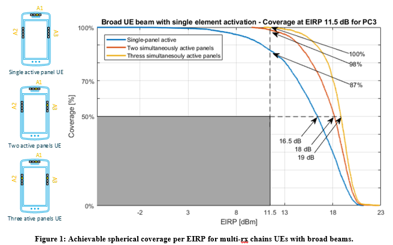{width="4.14880249343832in"
height="2.4444444444444446in"}

Figure 6.2-1. EIPR spherical coverage for single and multiple broad
beams (Nokia)

{width="3.7847222222222223in"
height="2.302036307961505in"}

Figure 6.2-2: EIRP spherical coverage for envelope of narrow beams
(Nokia)

In this example, the current requirements in RRC\_CONNETED mode of 11.5
dBm EIRP at 50MHz CBW and at 50%-ile is represented with the grey box.
In Figure 6.2-1, the blue curve, purple curve, and red curve represent
the spherical coverage of a broad beam from one panel, the sum of
spherical coverages of 2 broad beams from two 2 panels, and the sum of
spherical coverages of 3 broad beams from two 3 panels. In Figure 6.2-2,
the blue curve represents the envelope of narrow beams with a single
panel with 4 elements active. The purple curve represents the sum of
envelopes of narrow beams from two 2 panels, and each with 4 elements
active. The red curve represents the sum of envelopes of narrow beams
from two 3 panels, and each with 4 elements active.

As illustrated above, the spherical coverage at the 50%-ile is 16.5 --
19 dBm in Figure 6.2-1 and 21.4 -- 24.2 dBm in Figure 6.2-2. The choice
of using narrow beams and using broad beams has a big impact to the EIRP
spherical coverage of a UE. We can also observe that the EIPR spherical
coverage increases as the number of panels increases.

During random access procedure for Initial access or even handovers,
cell reselection and other scenarios where Random access is required,
the 3GPP standards do not mandate the beam type the UE used. This is up
to UE implementation if a rough beam or a narrow beam is to be used and
how to achieve beam refinement.

When UE needs to use a refined beam towards the gNodeB to increase the
uplink coverage, UE can use SSB during the beam refinement procedure,
which is periodically broadcasted every 20 ms. Alternatively, some
companies think that UE can also use Tracking reference signal (TRS)
signals defined in 3GPP Rel-17 in IDLE and INACTIVE modes. The TRS has a
QCL relation to the SSB which can be configured in SIB17. The highest
configurable allocation of TRS is two consecutive slots with 2 symbols
per slot TRS for IDLE mode and a periodicity of 10 slots, which amounts
to 4 occasions to refine UE beam every 1.25 ms in FR2 120 KHz SCS. UE
has many more occasions to refine its beams using the IDLE/INACTIVE mode
TRS as compared to when it uses SSB.

6.3 Specification Impact
------------------------

### 6.3.1 RF

In RRC connected state, beam correspondence requirement is considered as
fulfilled if the UE meets the corresponding minimum peak EIRP and
spherical coverage requirement for that power class with its chosen UL
beams with or without relying on uplink beam sweeping. Beam
correspondence tolerance requirement could also be considered for UE
supporting beam management relying on UL beam sweeping.

While in initial access and RRC\_INACTIVE state, UL beam sweeping is not
available. The focus is how to specify UE beam correspondence
requirements for SSB-based beam correspondence without UL beam sweeping
as well as the implication to legacy UE capabilities.

RAN4 discussion is mainly focused on minimum peak EIRP and spherical
coverage requirement for beam correspondence in initial access and
RRC\_INACTIVE state in R18. Since the UE behavior for beam management in
initial access, RA-SDT and CG-SDT in RRC\_INACTIVE state is the same,
common set of beam correspondence requirement can be defined to well
accommodate these scenarios. To save test effort, the beam
correspondence requirement only needs to be tested for initial access
based on Msg1 which is thought to be the most critical scenario.

**1. Minimum peak EIRP**

SSB based beam correspondence requirement for minimum peak for
RRC\_CONNECTED state is based on fine beam implementation which is
considered as too restrictive and not applicable for initial access from
the perspective of addressing different beam type implementation.

Minimum peak EIRP will not be considered for initial access.

**2. Spherical coverage requirement at 50%-tile**

SSB-based spherical coverage requirement in RRC\_CONNECTED state is
considered as the starting point for beam correspondence requirement in
initial access. The impact of power control is further considered for
beam correspondence requirement in initial access.

Power tolerance is not considered in existing beam correspondence
requirements. The main reason is the existing beam correspondence tests
are specified in CONNECTED STATE, where there are multiple UL
transmission opportunities and closed-loop power control is also
available. In this case, UE has sufficient opportunity during the test
to ramp up the power and make MOP accurate.

In contrast, only open loop power control is possible for random access
during initial access and UE may not have opportunity to transmit and
complete the power control, i.e., precisely transmit at MOP, before
sending Msg1.

A simulation is performed to show the impact of power accuracy. Assuming
that the maximum power deviation ∆P is 3.5 dB with a uniform
distribution, the results show that when ∆P\~U (-3.5, 3.5), the
performance degradation of 50%-tile spherical coverage is 0.3 dB.

Figure 6.3.1-1 Spherical coverage with ∆P\~U (-3.5, 3.5)

To accommodate this concern, RAN4 agreed that the spherical coverage
requirement for beam correspondence in initial access is specified the
same as the requirements in TABLE 6.2.1.3-3 in TS 38.101-2 with 2 dB
power tolerance (e.g., min EIRP at 50%-tile CDF in initial access is up
to 2dB less than the requirements specified in table 6.2.1.3-3 with its
autonomously chosen UL beams and without uplink beam sweeping).

The related feature is defined as mandatory for R18 onward UE.

Side conditions

For the beam correspondence in initial access and RRC\_INACTIVE, UE
shall meet the spherical coverage requirement with the same side
conditions for the SSB based enhanced beam correspondence.

### 6.3.2 RRM

No RRM specification impact is identified.

6.4 Testing impact
------------------

Unlike traditional RF requirements defined in the RRC\_CONNECTED state,
beam correspondence for initial access needs to be verified in
RRC\_IDLE, and several potential testability issues were raised during
the discussion. The following aspects of test related issues were
identified:

\- Verification in RRC\_IDLE

In general, the power test needs to be averaged over a period, which
requires the UE to remain in RRC\_IDLE and multiple PRACH transmission
need to be triggered, so testing mode including holding RAR should be
considered. The accumulative period of measurement for PRACH
transmission shall be at least 1 ms.

\- Maximum output power for PRACH

To guarantee stable test results, the requirement is defined and
verified under maximum output power (MOP). Since the open loop power
control is used for PRACH, how to ensure that the UE reaches and
maintains MOP is a problem that has to be faced. During the initial
access, the UE measures the RSRP and estimates the PL based on the
broadcasted DL RS power at first. The required power for PRACH
transmission will be calculated based on the estimated PL and the target
Rx power at gNB and compares with the Pcmax if configured. The power
control for PRACH is defined in \[1\] as:

{width="3.298611111111111in"
height="0.2986111111111111in"}\[dBm\],

where {width="0.38333333333333336in"
height="0.1951388888888889in"} is a pathloss calculated by the UE in dB
as *referenceSignalPower* -- higher layer filtered RSRP in dBm, and
*referenceSignalPower* is provided by *ss-PBCH-BlockPower.* The
parameter {width="0.8059700349956256in"
height="0.23538713910761155in"} is the PRACH target reception power
*PREAMBLE\_RECEIVED\_TARGET\_POWER* provided by higher layers as
specified in clause 5.1.3 of \[2\]:

The MAC entity shall, for each Random Access Preamble:

\- 1\> if PREAMBLE\_TRANSMISSION\_COUNTER is greater than one; and

\- 1\> if the notification of suspending power ramping counter has not
been received from lower layers; and

\- 1\> if LBT failure indication was not received from lower layers for
the last Random Access Preamble transmission; and

\- 1\> if SSB or CSI-RS selected is not changed from the selection in
the last Random Access Preamble transmission:

\- 2\> increment PREAMBLE\_POWER\_RAMPING\_COUNTER by 1.

\- 1\> select the value of DELTA\_PREAMBLE according to clause 7.3;

\- 1\> set PREAMBLE\_RECEIVED\_TARGET\_POWER to
preambleReceivedTargetPower + DELTA\_PREAMBLE +
(PREAMBLE\_POWER\_RAMPING\_COUNTER -- 1) ×
PREAMBLE\_POWER\_RAMPING\_STEP + POWER\_OFFSET\_2STEP\_RA;

UE can ramp up its power when RAR is held since it will trigger PRACH
retransmission, and adjusting each individual RA response window may
affect the overall test time. UE may also achieve MOP quickly by setting
the *preambleReceivedTargetPower* properly with as few as possible PRACH
re-transmission. Based on the analysis above, The PRACH can achieve MOP
by holding RAR with well-defined parameters. In addition, during the
initial access, UE might start transmitting preamble once it detects the
SSB RSRP higher than preconfigured threshold on one RX beam, even if
this RX beam is not the optimal one that UE could form, so the test
function need to be considered. The details of test function and the
details of the parameter configured in the test can be left to RAN5.

\- Beam lock function

Currently, the beam lock function is only available in the
RRC\_CONNECTED state, and if the beam lock function is absent during the
verification in RRC\_IDLE, many complex issues will appear, e.g., when
the RAR is held to trigger PRACH retransmission, UE may attempt other
beams since the RAR is not received which may lead to unstable test. It
also will be difficult to measure the θ (or φ) component EIRP under φ
(or θ) link polarization without beam lock function. In \[3\], the LS
from RAN5 concludes it is feasible to introduce beam lock function for
RRC\_IDLE, so the concern above can be solved. RAN4 concludes that
dedicated beam lock function for RRC\_IDLE state is needed, and the
details of new beam lock function design can be left to RAN5.

\- Impact of power control accuracy

\[TBA\]

######## Annex A (informative): Change history

  -------------------- ------------------ ------------ -------- --------- --------- ----------------------------------------------------------------------------------------------------------------------------- -----------------
  **Change history**                                                                                                                                                                                              
  **Date**             **Meeting**        **TDoc**     **CR**   **Rev**   **Cat**   **Subject/Comment**                                                                                                           **New version**
  2022-08              RAN4 \#104-e       R4-2212590                                TR skeleton                                                                                                                   0.0.1
  2022-10              RAN4 \#104-bis-e   R4-2217730                                TP for TR 38.891 on link level simulation assumptions for FR2 UL 256QAM                                                       0.1.0
  2022-11              RAN4 \#105         R4-2219122                                TP for TR 38.891 on link level simulation results and system level simulation assumption for FR2 UL 256QAM                    0.2.0
  2023-02              RAN4 \#106         R4-2303490                                TP for TR 38.891 on simulation results and system level simulation assumptions for FR2 UL 256QAM                              0.3.0
  2023-04              RAN4 \#106bis-e    R4-2305067                                TP for TR 38.891 on system level simulation results for FR2 UL 256QAM                                                         0.4.0
  2023-04              RAN4 \#106bis-e    R4-2306602                                TP for TR 38.891: General and specification impact                                                                            0.4.0
  2023-05              RAN4 \#107         R4-2308804                                TP for TR 38.891 on simulation assumptions for phase noise profiles evaluation and MPR simulation results for FR2 UL 256QAM   0.5.0
  2023-05              RAN4 \#107         R4-2307231                                TP to TR 38.891: System level simulation results for FR2-1 UL 256QAM                                                          0.5.0
  2023-05              RAN4 \#107         R4-2310291                                TP for TR 38.891: General and Specification impact                                                                            0.5.0
  2023-05              RAN4 \#107         R4-2310292                                TP for TR 38.891: Beam type and DRX implications                                                                              0.5.0
  2023-05              RAN4 \#107         R4-2310293                                TP for test related issue of beam correspondence in initial access                                                            0.5.0
  2023-08              RAN4 \#108         R4-2312684                                TP for TR 38.891 on simulation results of phase noise profiles evaluation and MPR for FR2 UL 256QAM                           0.6.0
  2023-10              RAN4 \#108bis      R4-2315435                                TP for TR 38.891 on simulation results of phase noise profiles evaluation and MPR for FR2 UL 256QAM                           0.7.0
  2023-11              RAN4 \#109         R4-2321717                                TP for TR 38.891 to capture the simulation results of MPR and introduce the general description for FR2 UL 256 QAM            0.8.0
  2023-11              RAN4 \#109         R4-2321719                                TP for TR 38.891 on impact of power control tolerance                                                                         0.8.0
  2023-11              RAN4 \#109         R4-2318484                                Text Proposal for TR 38.891 on Implementation impact to UE                                                                    0.8.0
  -------------------- ------------------ ------------ -------- --------- --------- ----------------------------------------------------------------------------------------------------------------------------- -----------------

  **Change history**                                                                                                                     
  -------------------- ------------- ----------- -------- --------- --------- ---------------------------------------------------------- -----------------
  **Date**             **Meeting**   **TDoc**    **CR**   **Rev**   **Cat**   **Subject/Comment**                                        **New version**
  2023-12              RAN\#102                                               Approved by plenary -- Rel-18 spec under change control    18.0.0
  2024-03              RAN\#103      RP-240606   0001     1         F         Correction of table references on MPR simulation results   18.1.0
