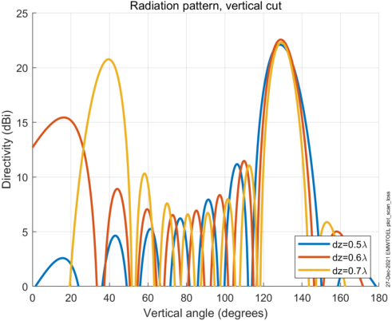
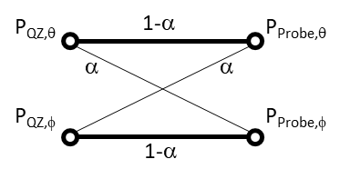

+-----------------------------------------------------------------+---+
| 3GPP TR 38.894 V18.0.0 (2024-06)                                |   |
+=================================================================+===+
| Technical Report                                                |   |
+-----------------------------------------------------------------+---+
| 3rd Generation Partnership Project;                             |   |
|                                                                 |   |
| Technical Specification Group Radio Access Network;             |   |
|                                                                 |   |
| NR;                                                             |   |
|                                                                 |   |
| Requirements for simultaneous Rx/Tx band combinations for NR    |   |
| CA/DC, NR SUL and LTE/NR DC                                     |   |
|                                                                 |   |
| (Release 18)                                                    |   |
+-----------------------------------------------------------------+---+
|                                                                 |   |
+-----------------------------------------------------------------+---+
|                                                                 |   |
+-----------------------------------------------------------------+---+
|                                                                 |   |
+-----------------------------------------------------------------+---+
| The present document has been developed within the 3rd          |   |
| Generation Partnership Project (3GPP ^TM^) and may be further   |   |
| elaborated for the purposes of 3GPP.\                           |   |
| The present document has not been subject to any approval       |   |
| process by the 3GPP Organizational Partners and shall not be    |   |
| implemented.\                                                   |   |
| This Specification is provided for future development work      |   |
| within 3GPP only. The Organizational Partners accept no         |   |
| liability for any use of this Specification.\                   |   |
| Specifications and Reports for implementation of the 3GPP ^TM^  |   |
| system should be obtained via the 3GPP Organizational           |   |
| Partners\' Publications Offices.                                |   |
+-----------------------------------------------------------------+---+

+----------------------------------------------------------------------+
|                                                                      |
+======================================================================+
| > ***3GPP***                                                         |
| >                                                                    |
| > Postal address                                                     |
| >                                                                    |
| > 3GPP support office address                                        |
| >                                                                    |
| > 650 Route des Lucioles - Sophia Antipolis                          |
| >                                                                    |
| > Valbonne - FRANCE                                                  |
| >                                                                    |
| > Tel.: +33 4 92 94 42 00 Fax: +33 4 93 65 47 16                     |
| >                                                                    |
| > Internet                                                           |
| >                                                                    |
| > http://www.3gpp.org                                                |
+----------------------------------------------------------------------+
| ***Copyright Notification***                                         |
|                                                                      |
| No part may be reproduced except as authorized by written            |
| permission.\                                                         |
| The copyright and the foregoing restriction extend to reproduction   |
| in all media.                                                        |
|                                                                      |
| © 2024, 3GPP Organizational Partners (ARIB, ATIS, CCSA, ETSI, TSDSI, |
| TTA, TTC).                                                           |
|                                                                      |
| All rights reserved.                                                 |
|                                                                      |
| UMTS™ is a Trade Mark of ETSI registered for the benefit of its      |
| members                                                              |
|                                                                      |
| 3GPP™ is a Trade Mark of ETSI registered for the benefit of its      |
| Members and of the 3GPP Organizational Partners\                     |
| LTE™ is a Trade Mark of ETSI registered for the benefit of its       |
| Members and of the 3GPP Organizational Partners                      |
|                                                                      |
| GSM® and the GSM logo are registered and owned by the GSM            |
| Association                                                          |
+----------------------------------------------------------------------+

Contents {#contents .TT}
========

Foreword 6

1 Scope 8

2 References 8

3 Definitions of terms, symbols and abbreviations 8

3.1 Terms 8

3.2 Symbols 9

3.3 Abbreviations 9

4 Background 10

4.1 Background information in Rel-17 10

4.2 WI Objective in Rel-18 10

5 Specific Band combinations 11

5.1 CA\_n34A-n41A 11

5.1.1 Status of the band combination 11

5.1.1.1 Operating bands for CA 11

5.1.1.2 Power class of the BC 11

5.1.1.3 ∆T~IB~ and ∆R~IB~ 11

5.1.2 MSD analysis for simultaneous Rx/Tx 12

5.1.2.1 RF component assumptions 12

5.1.2.2 Calculated MSD values 13

5.1.3 Requirements for simultaneous Rx/Tx 14

5.1.3.1 Reference sensitivity requirements 14

5.2 CA\_n39A-n41A 14

5.2.1 Status of the band combination 14

5.2.1.1 Operating bands for CA 14

5.2.1.2 Power class of the BC 14

5.2.2 MSD analysis for simultaneous Rx/Tx 14

5.2.2.1 Reference UE architecture 14

5.2.2.2 RF component assumptions 15

5.2.2.3 Calculated MSD values for cross band isolation 16

5.2.2.4 Calculated MSD values for harmonic mixing 16

5.2.3 Requirements for simultaneous Rx/Tx 17

5.2.3.1 ∆T~IB~ and ∆R~IB~ values 17

5.2.3.2 Reference sensitivity requirements for cross band isolation 17

5.2.3.3 Reference sensitivity requirements for Harmonic mixing 18

5.3 CA\_n40A-n41A 18

5.3.1 Status of the band combination 18

5.3.1.1 Operating bands for CA 18

5.3.1.2 Power class of the BC 19

5.3.1.3 ∆T~IB~ and ∆R~IB~ 19

5.3.2 MSD analysis for simultaneous Rx/Tx 19

5.3.2.1 RF component assumptions 19

5.3.2.2 Calculated MSD values 22

5.3.3 Requirements for simultaneous Rx/Tx 24

5.3.3.1 ∆T~IB~ and ∆R~IB~ values 24

5.3.3.2 Reference sensitivity requirements 24

5.4 CA\_n7A-n40A 24

5.4.1 Status of the band combination 24

5.4.1.1 Operating bands for CA 24

5.4.1.2 Power class of the BC 25

5.4.1.3 ∆T~IB~ and ∆R~IB~ 25

5.4.1.4 Existing MSD requirement 25

5.4.2 MSD analysis for simultaneous Rx/Tx 26

5.4.2.1 Reference UE architecture 26

5.4.2.2 RF component assumptions 26

5.4.2.3 Calculated MSD values 28

5.4.3 Requirements for simultaneous Rx/Tx 28

5.4.3.1 Reference sensitivity requirements 28

5.5 CA\_n28A-n39A-n41A 28

5.5.1 Status of the band combination 28

5.5.1.1 Operating bands for CA 28

5.5.1.2 ∆T~IB~ and ∆R~IB~ 29

5.5.1.3 Existing MSD requirement 29

5.5.2 MSD analysis for simultaneous Rx/Tx 29

5.5.2.1 Reference UE architecture 29

5.5.2.2 RF component assumptions 30

5.5.2.3 Calculated MSD values 31

5.5.3 Requirements for simultaneous Rx/Tx 32

5.5.3.1 ∆T~IB~ and ∆R~IB~ values 32

5.5.3.2 Reference sensitivity requirements 32

5.6 CA\_n39A-n40A-n41A 32

5.6.1 Status of the band combination 32

5.6.1.1 Operating bands for CA 32

5.6.1.2 ∆T~IB~ and ∆R~IB~ 32

5.6.1.3 Existing MSD requirement 33

5.6.2 MSD analysis for simultaneous Rx/Tx 33

5.6.2.1 Reference UE architecture 33

5.6.2.2 RF component assumptions 35

5.6.2.3 Calculated MSD values 36

5.6.3 Requirements for simultaneous Rx/Tx 37

5.6.3.1 ∆T~IB~ and ∆R~IB~ values 37

5.6.3.2 Reference sensitivity requirements 38

5.7 CA\_n39A-n41A-n79A 38

5.7.1 Status of the band combination 38

5.7.1.1 Operating bands for CA 38

5.7.1.2 ∆T~IB~ and ∆R~IB~ 38

5.7.1.3 Existing MSD requirement 38

5.7.2 MSD analysis for simultaneous Rx/Tx 39

5.7.2.1 Reference UE architecture 39

5.7.2.2 RF component assumptions 40

5.7.2.3 Calculated MSD values 40

5.7.3 Requirements for simultaneous Rx/Tx 41

5.7.3.1 ∆T~IB~ and ∆R~IB~ values 41

5.7.3.2 Reference sensitivity requirements 42

5.8 CA\_n8A-n40A-n41A 42

5.8.1 Status of the band combination 42

5.8.1.1 Operating bands for CA 42

5.8.1.2 ∆T~IB~ and ∆R~IB~ 42

5.8.1.3 Existing MSD requirement 42

5.8.2 MSD analysis for simultaneous Rx/Tx 43

5.8.2.1 Reference UE architecture 43

5.8.2.2 RF component assumptions 43

5.8.2.3 Calculated MSD values 46

5.8.3 Requirements for simultaneous Rx/Tx 46

5.9 CA\_n28A-n40A-n41A 46

5.9.1 Status of the band combination 46

5.9.1.1 Operating bands for CA 46

5.9.1.2 ∆T~IB~ and ∆R~IB~ 46

5.9.1.3 Existing MSD requirement 47

5.9.2 MSD analysis for simultaneous Rx/Tx 47

5.9.2.1 Reference UE architecture 47

5.9.2.2 RF component assumptions 47

5.9.2.3 Calculated MSD values 50

5.9.3 Requirements for simultaneous Rx/Tx 50

5.10 CA\_n40A-n41A-n79A 50

5.10.1 Status of the band combination 50

5.10.1.1 Operating bands for CA 50

5.10.1.2 ∆T~IB~ and ∆R~IB~ 51

5.10.1.3 Existing MSD requirement 51

5.10.2 MSD analysis for simultaneous Rx/Tx 52

5.10.2.1 Reference UE architecture 52

5.10.2.2 RF component assumptions 52

5.10.2.3 Calculated MSD values 55

5.10.3 Requirements for simultaneous Rx/Tx 56

Annex A (informative): Change history 57

Foreword
========

This Technical Report has been produced by the 3rd Generation
Partnership Project (3GPP).

The contents of the present document are subject to continuing work
within the TSG and may change following formal TSG approval. Should the
TSG modify the contents of the present document, it will be re-released
by the TSG with an identifying change of release date and an increase in
version number as follows:

Version x.y.z

where:

x the first digit:

1 presented to TSG for information;

2 presented to TSG for approval;

3 or greater indicates TSG approved document under change control.

y the second digit is incremented for all changes of substance, i.e.
technical enhancements, corrections, updates, etc.

z the third digit is incremented when editorial only changes have been
incorporated in the document.

In the present document, modal verbs have the following meanings:

**shall** indicates a mandatory requirement to do something

**shall not** indicates an interdiction (prohibition) to do something

The constructions \"shall\" and \"shall not\" are confined to the
context of normative provisions, and do not appear in Technical Reports.

The constructions \"must\" and \"must not\" are not used as substitutes
for \"shall\" and \"shall not\". Their use is avoided insofar as
possible, and they are not used in a normative context except in a
direct citation from an external, referenced, non-3GPP document, or so
as to maintain continuity of style when extending or modifying the
provisions of such a referenced document.

**should** indicates a recommendation to do something

**should not** indicates a recommendation not to do something

**may** indicates permission to do something

**need not** indicates permission not to do something

The construction \"may not\" is ambiguous and is not used in normative
elements. The unambiguous constructions \"might not\" or \"shall not\"
are used instead, depending upon the meaning intended.

**can** indicates that something is possible

**cannot** indicates that something is impossible

The constructions \"can\" and \"cannot\" are not substitutes for \"may\"
and \"need not\".

**will** indicates that something is certain or expected to happen as a
result of action taken by an agency the behaviour of which is outside
the scope of the present document

**will not** indicates that something is certain or expected not to
happen as a result of action taken by an agency the behaviour of which
is outside the scope of the present document

**might** indicates a likelihood that something will happen as a result
of action taken by some agency the behaviour of which is outside the
scope of the present document

**might not** indicates a likelihood that something will not happen as a
result of action taken by some agency the behaviour of which is outside
the scope of the present document

In addition:

**is** (or any other verb in the indicative mood) indicates a statement
of fact

**is not** (or any other negative verb in the indicative mood) indicates
a statement of fact

The constructions \"is\" and \"is not\" do not indicate requirements.

1 Scope
=======

The present document is a technical report for requirements on
simultaneous Rx/Tx band combinations for NR CA/DC, NR SUL and LTE/NR DC.

**Requested FDD-TDD, TDD-TDD CA, SUL, MR-DC and NR-DC band combinations
for evaluation of** supporting **simultaneous Rx/Tx capability/operation
are provided in the table below.**

**Table 1: Band combinations for evaluation of simultaneous Rx/Tx**

  **Band combination**   **Power Class**
  ---------------------- -----------------
  CA\_n34A-n41A          PC3
  CA\_n39A-n41A          PC3
  CA\_n40A-n41A          PC3, PC2
  CA\_n7A-n40A           PC3

2 References
============

The following documents contain provisions which, through reference in
this text, constitute provisions of the present document.

\- References are either specific (identified by date of publication,
edition number, version number, etc.) or non‑specific.

\- For a specific reference, subsequent revisions do not apply.

\- For a non-specific reference, the latest version applies. In the case
of a reference to a 3GPP document (including a GSM document), a
non-specific reference implicitly refers to the latest version of that
document *in the same Release as the present document*.

\[1\] 3GPP TR 21.905: \"Vocabulary for 3GPP Specifications\".

\[2\] RP-210890, "New WID on New WID on simultaneous Rx/Tx band
combinations for CA, SUL, MR-DC and NR-DC".

\[3\] RP-222648, "New WID: Simultaneous Rx/Tx inter-band combinations
for NR CA/DC, NR SUL and LTE/NR DC in Rel-18".

\[4\] 3GPP TS 38.101-1: "NR; User Equipment (UE) radio transmission and
reception; Part 1: Range 1 Standalone".

\[5\] 3GPP TS 38.101-2: "NR; User Equipment (UE) radio transmission and
reception; Part 2: Range 2 Standalone".

\[6\] 3GPP TS 38.101-3: "NR; User Equipment (UE) radio transmission and
reception; Part 3: Range 1 and Range 2 Interworking operation with other
radios".

3 Definitions of terms, symbols and abbreviations
=================================================

3.1 Terms
---------

For the purposes of the present document, the terms given in
TR 21.905 \[1\] and the following apply. A term defined in the present
document takes precedence over the definition of the same term, if any,
in TR 21.905 \[1\].

3.2 Symbols
-----------

For the purposes of the present document, the following symbols apply:

\<symbol\> \<Explanation\>

3.3 Abbreviations
-----------------

For the purposes of the present document, the abbreviations given in
TR 21.905 \[1\] and the following apply. An abbreviation defined in the
present document takes precedence over the definition of the same
abbreviation, if any, in TR 21.905 \[1\].

ACLR Adjacent Channel Leakage Ratio

ACS Adjacent Channel Selectivity

A-MPR Additional Maximum Power Reduction

BCS Bandwidth Combination Set

CA Carrier Aggregation

CC Component Carrier

DC Dual Connectivity

EIRP Equivalent Isotropically Radiated Power

EN-DC E-UTRA/NR DC

EVM Error Vector Magnitude

FDM Frequency Division Multiplexing

FR Frequency Range

ENBW The aggregated bandwidth of an E-UTRA sub-block and an adjacent NR
sub-block

ITS Intelligent Transportation System

ITU-R Radiocommunication Sector of the International Telecommunication
Union

MBW Measurement bandwidth defined for the protected band

MPR Allowed maximum power reduction

MSD Maximum Sensitivity Degradation

MCG Master Cell Group

NR New Radio

NS Network Signalling

NSA Non-Standalone, a mode of operation where operation of an other
radio is assisted with an other radio

OOB Out-of-band

OOBE Out-of-band emission

OTA Over The Air

PRB Physical Resource Block

PSCCH Physical Sidelink Control Channel

PSSCH Physical Sidelink Shared Channel

RE Resource Element

REFSENS Reference Sensitivity

RF Radio Frequency

Rx Receiver

SCG Secondary Cell Group

SCS Subcarrier spacing

SEM Spectrum Emission Mask

SL Sidelink

SUL Supplementary uplink

TDM Time Division Multiplex

Tx Transmitter

UE User Equipment

UL MIMO Up Link Multiple Antenna transmission

ULSUP Uplink sharing from UE perspective

4 Background
============

4.1 Background information in Rel-17
------------------------------------

Simultaneous Rx/Tx capability for inter-band CA, SUL and EN-DC band
combinations were introduced from Rel-15. Specifically, for inter-band
CA and EN-DC combination, the capability is used for TDD-TDD and TDD-FDD
band combinations. According to the description of the capability, it is
conditional mandatory and the condition is described in the field, i.e.
indicated in the RAN4 spec which combinations should mandatorily support
simultaneous Rx/Tx. For the combinations which have no such indication,
the capability is optional, i.e. for UE supporting simultaneous Rx/Tx,
the capability should be reported, otherwise, the capability is absent
or not reported. Since the capability is important for network
scheduling, it should be reported accurately.

In Rel-17, the principles for judging the mandatory capability for a
band combination have been discussed, and the cases include:

\- FR1+FR1 FDD-TDD band combination

\- FR1+FR1 TDD-TDD band combination

\- FR1+FR2 FDD-TDD band combination

\- FR1+FR2 TDD-TDD band combination

\- FR2+FR2 TDD-TDD band combination

For some categories, the capability should be checked case by case.
Therefore, to facilitate the analysis of specific band combinations, a
dedicated WI is needed to avoid the ambiguity for application of the
general principles agreed in Rel-17 and the analysis and conclusion
should be captured in the TR.

In addition, as the capability is defined for CA, SUL, MR-DC and NR-DC
band combinations, and applicability of the corresponding requirements
cover different specifications, e.g. TS 38.101-1 and TS 38.101-3, the
way to treat simultaneous Rx/Tx capability as well as the requirements
should be aligned among the specifications.

The fallback rules are captured as below for reference:

\- Request for additions of band combinations to this WI shall be
provided using an agreed template and sent to the
3GPP\_TSG\_RAN\_WG4\_NR\_BANDS email reflector before a RAN4 Tdoc
submission deadline and no new band combinations are allowed to be
requested after the deadline except to correct the missing fallback and
add more supporting companies for the proposed band combinations.

\- When a proponent requests a new band combination, all the next level
fallback configurations shall be listed and recorded in the request
template and the status ("New", "Ongoing", "Completed") of all the
fallback configurations shall be declared accurately and clearly. For
"New" fallback configurations, the proponent shall ensure these fallback
configurations are also requested together with the higher order band
combination in the same meeting.

\- A band combination configuration can only be considered as completed
when all of the fallback configurations are completed and specified in
advance or at the same meeting. It is the responsibility of the
proponent to ensure the status of all of the fallback mode
configurations. Rapporteurs and other companies are encouraged to check
the status of all of the fallback configurations once the higher order
band combinations are declared as completed.

4.2 WI Objective in Rel-18
--------------------------

The objectives of the Simultaneous Rx/Tx inter-band combinations for NR
CA/DC, NR SUL and LTE/NR DC WI in Rel-18 are as follows:

1\. Identify feasibility for each requested FDD-TDD and TDD-TDD band
combinations for CA, SUL, MR-DC supporting simultaneous Rx/Tx
capability/operation based on technical analysis, especially for those
with large MSD values.

Note 1: Band combinations considered in this WI have to be introduced
first via basket WIs (see 2.3) or completed in previous releases if
necessary.

Note 2: Whether the simultaneous Rx-Tx capability could be supported or
not depends on the evaluation of MSD for the requested band combinations
case by case.

2\. Align the specification treatment of simultaneous Rx/Tx capability
for CA, SUL, MR-DC and NR-DC band combinations.

5 Specific Band combinations
============================

5.1 CA\_n34A-n41A
-----------------

### 5.1.1 Status of the band combination

#### 5.1.1.1 Operating bands for CA

The operating bands for CA\_n34-n41 are specified in Table 5.1.1.1-1.

**Table 5.1.1.1-1**: Inter-band CA operating bands involving FR1

+-------------------------+---------------+-------------------------+
| NR CA Band              | NR Band       | DL interruption allowed |
|                         |               | (Note 8)                |
|                         | (Table 5.2-1) |                         |
+=========================+===============+=========================+
| CA\_n34-n41^9^          | **n34, n41**  |                         |
+-------------------------+---------------+-------------------------+
| NOTE 8: Applicable when |               |                         |
| dynamic Tx switching is |               |                         |
| conducted. The DL       |               |                         |
| interruption            |               |                         |
| requirement is          |               |                         |
| specified in clause     |               |                         |
| 8.2.2.2.10 of 38.133    |               |                         |
| \[13\].                 |               |                         |
|                         |               |                         |
| NOTE 9: Only applicable |               |                         |
| for UE supporting       |               |                         |
| inter-band carrier      |               |                         |
| aggregation without     |               |                         |
| simultaneous Rx/Tx.     |               |                         |
+-------------------------+---------------+-------------------------+

For CA\_n34-n41, the current spec only considers scenarios without
simultaneous Rx/Tx operation.

#### 5.1.1.2 Power class of the BC

The UE Power Class for uplink CA\_n34A-n41A are specified in Table
5.1.1.2-1. The supported power class of the band combination would have
impact on the MSD, if any, based on the following study.

Table 5.1.1.2-1 UE Power Class for uplink CA\_n34A-n41A

+-------+-------+-------+-------+-------+-------+-------+-------+-------+
| U     | Class | Tole  | Class | Tole  | Class | Tole  | Class | Tole  |
| plink | 1     | rance | 2     | rance | 3     | rance | 4     | rance |
| CA    | (dBm) | (dB)  | (dBm) |       | (dBm) | (dB)  | (dBm) | (dB)  |
| Con   |       |       |       | (dB)  |       |       |       |       |
| figur |       |       |       |       |       |       |       |       |
| ation |       |       |       |       |       |       |       |       |
+-------+-------+-------+-------+-------+-------+-------+-------+-------+
| CA\   |       |       |       |       | 23    | +2/-3 |       |       |
| _n34A |       |       |       |       |       |       |       |       |
| -n41A |       |       |       |       |       |       |       |       |
+-------+-------+-------+-------+-------+-------+-------+-------+-------+

#### 5.1.1.3 ∆T~IB~ and ∆R~IB~

The ΔT**~IB,c~** due to CA\_n34-n41 are specified in Table 5.1.1.3-1.

Table **5.1.1.3-1**: ΔT**~IB,c~** due to CA\_n34-n41

  Inter-band CA combination   NR Band   ΔT~IB,c~ (dB)
  --------------------------- --------- ---------------
  CA\_n34-n41                 n34       0.3
                              n41       0.3

ΔR~IB,c~ due to CA\_n34-n41 is set to zero.

It is noted that ΔT**~IB,c~** and ΔR~IB,c~ reflect the possible UE
architecture to support the CA band combination.

### 5.1.2 MSD analysis for simultaneous Rx/Tx

#### 5.1.2.1 RF component assumptions

Typical duplexer performance of n41 is shown in the figure below:

{width="5.156944444444444in"
height="3.1118055555555557in"}

Figure 5.1.2.2-1: Example duplexer performance of band n41

According to the available data from vendors, band n41 Rx/Tx filter
rejection at n34 is around 27dB.

{width="5.253472222222222in"
height="2.776388888888889in"}

Figure 5.1.2.2-2: Example filter performance of band n34

In the analysis, we adopt value of 28dB for the band n34 Rx/Tx filter
rejection at n41.

Table 5.1.2.2-1: Assumptions on MSD analysis for CA\_n34-n41

  PA far end noise floor (dBm/Hz)                 -130
  ----------------------------------------------- ------
  Transceiver noise floor at PA output (dBm/Hz)   -132
  PA output power at antenna port (dBm)           23
  n41 Rx filter rejection at n34 Tx (dB)          27
  n34 Tx filter rejection at n41Rx (dB)           28
  n34 Rx filter rejection at n41Tx (dB)           28
  n41Tx filter rejection at n34 Rx (dB)           27
  RFIC IIP2 (dBm)                                 50
  Band n40 Tx LO phase noise (dBc/Hz)             -155
  Band n41 Rx LO phase noise (dBc/Hz)             -155
  Antenna ISO (dB)                                10
  Band n34/n41 Tx FE Loss (dB)                    4
  Band n34/n41 Rx FE Loss (dB)                    4
  Band n34 Rx noise figure (dB)                   9
  Band n41 Rx noise figure (dB)                   11
  FFS: Other parameters                           

#### 5.1.2.2 Calculated MSD values

Proposed Option 1:

Table 5.1.2.3-1: Cross band isolation for simultaneous Rx-Tx with
CA\_n40A-n41A \[R4-2300347\]

  **UL band**   **DL band**   **UL F~c~**   **UL BW**   **SCS of UL band**   **UL RB Allocation**   **DL F~c~**   **DL BW**   **MSD**    **X band interference source**
  ------------- ------------- ------------- ----------- -------------------- ---------------------- ------------- ----------- ---------- --------------------------------
                              **(MHz)**     **(MHz)**   **(kHz)**            **L~CRB~**             **(MHz)**     **(MHz)**   **(dB)**   
  n34           n41           **2017.5**    **15**      **15**               **78 (RBstart=0)**     **2501**      10          **2.3**    **\>ACLR2**
  n34           n41           **2017.5**    **15**      **15**               **78 (RBstart=0)**     **2546**      100         **2.3**    **\>ACLR2**
  n41           n34           **2546**      **100**     **30**               **270 (RBstart=0)**    **2022.5**    5           **9.2**    **\>ACLR2**
  n41           n34           **2456**      **100**     **30**               **270 (RBstart=0)**    **2017.5**    15          **9.4**    **\>ACLR2**

Proposed Option 2:

Table 5.1.2.3-2: Cross band isolation for simultaneous Rx-Tx with
CA\_n34A-n41A \[R4-2302054\]

<table>
<thead>
<tr class="header">
<th><strong>UL band</strong></th>
<th><strong>DL band</strong></th>
<th><strong>UL Fc</strong></th>
<th><strong>UL BW</strong></th>
<th><strong>SCS of UL band</strong></th>
<th><strong>UL RB Allocation</strong></th>
<th><strong>DL Fc</strong></th>
<th><strong>DL BW</strong></th>
<th><strong>MSD</strong></th>
<th>
<strong>Cross-band</strong>

<strong>Interference</strong>

<strong>source</strong>
</th>
</tr>
</thead>
<tbody>
<tr class="odd">
<td></td>
<td></td>
<td><strong>(MHz)</strong></td>
<td><strong>(MHz)</strong></td>
<td><strong>(kHz)</strong></td>
<td><strong>LCRB</strong></td>
<td><strong>(MHz)</strong></td>
<td><strong>(MHz)</strong></td>
<td><strong>(dB)</strong></td>
<td></td>
</tr>
<tr class="even">
<td>n34</td>
<td>n41</td>
<td><strong>2012.5</strong></td>
<td><strong>5</strong></td>
<td><strong>15</strong></td>
<td><strong>25 (RBstart=0)</strong></td>
<td>2501</td>
<td>10</td>
<td><strong>4.1</strong></td>
<td><strong>&gt;ACLR2</strong></td>
</tr>
<tr class="odd">
<td>n34</td>
<td>n41</td>
<td><strong>2012.5</strong></td>
<td><strong>5</strong></td>
<td><strong>15</strong></td>
<td><strong>25 (RBstart=0)</strong></td>
<td>2546</td>
<td>100</td>
<td><strong>2.8</strong></td>
<td><strong>&gt;ACLR2</strong></td>
</tr>
<tr class="even">
<td>n41</td>
<td>n34</td>
<td><strong>2521</strong></td>
<td><strong>50</strong></td>
<td><strong>30</strong></td>
<td><strong>128 (RBstart=0)</strong></td>
<td>2022.5</td>
<td>5</td>
<td><strong>5.2</strong></td>
<td><strong>&gt;ACLR2</strong></td>
</tr>
</tbody>
</table>

The agreed cross band isolation for simultaneous Rx-Tx with
CA\_n34A-n41A are as follows in Table 5.1.2.3-4.

Table 5.1.2.3-4: Cross band isolation for simultaneous Rx-Tx with
CA\_n34A-n41A

<table>
<thead>
<tr class="header">
<th><strong>UL band</strong></th>
<th><strong>DL band</strong></th>
<th><strong>UL Fc</strong></th>
<th><strong>UL BW</strong></th>
<th><strong>SCS of UL band</strong></th>
<th><strong>UL RB Allocation</strong></th>
<th><strong>DL Fc</strong></th>
<th><strong>DL BW</strong></th>
<th><strong>MSD</strong></th>
<th>
<strong>Cross-band</strong>

<strong>Interference</strong>

<strong>source</strong>
</th>
</tr>
</thead>
<tbody>
<tr class="odd">
<td></td>
<td></td>
<td><strong>(MHz)</strong></td>
<td><strong>(MHz)</strong></td>
<td><strong>(kHz)</strong></td>
<td><strong>LCRB</strong></td>
<td><strong>(MHz)</strong></td>
<td><strong>(MHz)</strong></td>
<td><strong>(dB)</strong></td>
<td></td>
</tr>
<tr class="even">
<td>n34</td>
<td>n41</td>
<td><strong>2017.5</strong></td>
<td><strong>15</strong></td>
<td><strong>15</strong></td>
<td><strong>78 (RBstart=0)</strong></td>
<td><strong>2501</strong></td>
<td>10</td>
<td><strong>[3.2]</strong></td>
<td><strong>&gt;ACLR2</strong></td>
</tr>
<tr class="odd">
<td>n41</td>
<td>n34</td>
<td><strong>2456</strong></td>
<td><strong>100</strong></td>
<td><strong>30</strong></td>
<td><strong>270 (RBstart=0)</strong></td>
<td>2022.5</td>
<td>5</td>
<td><strong>[7.2]</strong></td>
<td><strong>&gt;ACLR2</strong></td>
</tr>
</tbody>
</table>

### 5.1.3 Requirements for simultaneous Rx/Tx

#### 5.1.3.1 Reference sensitivity requirements

Table 5.1.3.1-1: Cross band isolation for simultaneous Rx-Tx with
CA\_n34A-n41A

<table>
<thead>
<tr class="header">
<th><strong>UL band</strong></th>
<th><strong>DL band</strong></th>
<th><strong>UL Fc</strong></th>
<th><strong>UL BW</strong></th>
<th><strong>SCS of UL band</strong></th>
<th><strong>UL RB Allocation</strong></th>
<th><strong>DL Fc</strong></th>
<th><strong>DL BW</strong></th>
<th><strong>MSD</strong></th>
<th>
<strong>Cross-band</strong>

<strong>Interference</strong>

<strong>source</strong>
</th>
</tr>
</thead>
<tbody>
<tr class="odd">
<td></td>
<td></td>
<td><strong>(MHz)</strong></td>
<td><strong>(MHz)</strong></td>
<td><strong>(kHz)</strong></td>
<td><strong>LCRB</strong></td>
<td><strong>(MHz)</strong></td>
<td><strong>(MHz)</strong></td>
<td><strong>(dB)</strong></td>
<td></td>
</tr>
<tr class="even">
<td>n34</td>
<td>n41</td>
<td><strong>2017.5</strong></td>
<td><strong>15</strong></td>
<td><strong>15</strong></td>
<td><strong>75 (RBstart=4)</strong></td>
<td><strong>2501</strong></td>
<td>10</td>
<td><strong>3.2</strong></td>
<td><strong>&gt;ACLR2</strong></td>
</tr>
<tr class="odd">
<td>n41</td>
<td>n34</td>
<td><strong>2456</strong></td>
<td><strong>100</strong></td>
<td><strong>30</strong></td>
<td><strong>270 (RBstart=0)</strong></td>
<td>2022.5</td>
<td>5</td>
<td><strong>7.2</strong></td>
<td><strong>&gt;ACLR2</strong></td>
</tr>
</tbody>
</table>

5.2 CA\_n39A-n41A
-----------------

### 5.2.1 Status of the band combination

#### 5.2.1.1 Operating bands for CA

The operating bands for CA\_n39-n41 are specified in Table 5.2.1.1-1.

**Table 5.2.1.1-1**: Inter-band CA operating bands involving FR1

+-------------+---------------+
| NR CA Band  | NR Band       |
|             |               |
|             | (Table 5.x-1) |
+=============+===============+
| CA\_n39-n41 | n39, n41      |
+-------------+---------------+

For CA\_n39-n41, the current spec only considers scenarios without
simultaneous Rx/Tx.

#### 5.2.1.2 Power class of the BC

The UE Power Class for uplink CA\_n39A-n41A are specified in Table
5.2.1.2-1.

Table 5.2.1.2-1 UE Power Class for uplink CA\_n39A-n41A

  Uplink CA Configuration   Class 3 (dBm)   Tolerance (dB)
  ------------------------- --------------- ----------------
  CA\_n39A-n41A             23              +2/-3

### 5.2.2 MSD analysis for simultaneous Rx/Tx

#### 5.2.2.1 Reference UE architecture

The following reference UE architecture for CA\_n39A-n41A is considered
for simultaneous Rx/Tx operation.

{width="3.6875in" height="1.6041666666666667in"}

Figure 5.2.2.1-1a: Reference UE architecture for CA\_n39-n41
\[R4-2216660\]

#### 5.2.2.2 RF component assumptions

Typical duplexer performance of n41 is shown in the figure below:

{width="5.15625in" height="3.1145833333333335in"}

Figure 5.2.2.2-1: Example duplexer performance of band n41

According to the available data from vendors, band n41 Rx/Tx filter
rejection at n39 is around 40dB.

{width="5.291666666666667in"
height="3.3333333333333335in"}

Figure 5.2.2.2-2: Example duplexer performance of band n39

In the analysis, we adopt value of 55dB for the band n39 Rx/Tx filter
rejection at n41.

#### 5.2.2.3 Calculated MSD values for cross band isolation

Proposed Option 1:

Table 5.2.2.3-1: Cross band isolation for simultaneous Rx-Tx with
CA\_n39A-n41A \[R4-2218106\]

<table>
<thead>
<tr class="header">
<th><strong>UL band</strong></th>
<th><strong>DL band</strong></th>
<th><strong>UL Fc</strong></th>
<th><strong>UL BW</strong></th>
<th><strong>SCS of UL band</strong></th>
<th><strong>UL RB Allocation</strong></th>
<th><strong>DL Fc</strong></th>
<th><strong>DL BW</strong></th>
<th><strong>MSD</strong></th>
<th>
<strong>Cross-band</strong>

<strong>Interference</strong>

<strong>source</strong>
</th>
</tr>
</thead>
<tbody>
<tr class="odd">
<td></td>
<td></td>
<td><strong>(MHz)</strong></td>
<td><strong>(MHz)</strong></td>
<td><strong>(kHz)</strong></td>
<td><strong>LCRB</strong></td>
<td><strong>(MHz)</strong></td>
<td><strong>(MHz)</strong></td>
<td><strong>(dB)</strong></td>
<td></td>
</tr>
<tr class="even">
<td>n39</td>
<td>n41</td>
<td>1900</td>
<td>40</td>
<td>15</td>
<td>216 (RBstart=0)</td>
<td>2501</td>
<td>10</td>
<td>3.2</td>
<td>&gt;ACLR2</td>
</tr>
<tr class="odd">
<td>n39</td>
<td>n41</td>
<td>1900</td>
<td>40</td>
<td>15</td>
<td>216 (RBstart=0)</td>
<td>2546</td>
<td>100</td>
<td>2.0</td>
<td>&gt;ACLR2</td>
</tr>
<tr class="even">
<td>n41</td>
<td>n39</td>
<td>2546</td>
<td>100</td>
<td>30</td>
<td>270 (RBstart=3)</td>
<td>1917.5</td>
<td>5</td>
<td>1.5</td>
<td>&gt;ACLR2</td>
</tr>
<tr class="odd">
<td>n41</td>
<td>n39</td>
<td>2546</td>
<td>100</td>
<td>30</td>
<td>270 (RBstart=3)</td>
<td>1900</td>
<td>40</td>
<td>1.5</td>
<td>&gt;ACLR2</td>
</tr>
</tbody>
</table>

Proposed Option 2:

Table 5.2.2.3-2: Cross band isolation for simultaneous Rx-Tx with
CA\_n39A-n41A \[R4-2219212\]

<table>
<thead>
<tr class="header">
<th><strong>UL band</strong></th>
<th><strong>DL band</strong></th>
<th><strong>UL Fc</strong></th>
<th><strong>UL BW</strong></th>
<th><strong>SCS of UL band</strong></th>
<th><strong>UL RB Allocation</strong></th>
<th><strong>DL Fc</strong></th>
<th><strong>DL BW</strong></th>
<th><strong>MSD</strong></th>
<th>
<strong>Cross-band</strong>

<strong>Interference</strong>

<strong>source</strong>
</th>
</tr>
</thead>
<tbody>
<tr class="odd">
<td></td>
<td></td>
<td><strong>(MHz)</strong></td>
<td><strong>(MHz)</strong></td>
<td><strong>(kHz)</strong></td>
<td><strong>LCRB</strong></td>
<td><strong>(MHz)</strong></td>
<td><strong>(MHz)</strong></td>
<td><strong>(dB)</strong></td>
<td></td>
</tr>
<tr class="even">
<td>n39</td>
<td>n41</td>
<td><strong>1900</strong></td>
<td><strong>40</strong></td>
<td><strong>15</strong></td>
<td><strong>216 (RBstart=0)</strong></td>
<td>2501</td>
<td>10</td>
<td><strong>3.5</strong></td>
<td><strong>&gt;ACLR2</strong></td>
</tr>
<tr class="odd">
<td>n39</td>
<td>n41</td>
<td><strong>1900</strong></td>
<td><strong>40</strong></td>
<td><strong>15</strong></td>
<td><strong>216 (RBstart=0)</strong></td>
<td>2546</td>
<td>100</td>
<td><strong>2.5</strong></td>
<td><strong>&gt;ACLR2</strong></td>
</tr>
<tr class="even">
<td>n41</td>
<td>n39</td>
<td><strong>2546</strong></td>
<td><strong>100</strong></td>
<td><strong>30</strong></td>
<td><strong>270 (RBstart=3)</strong></td>
<td><strong>1917.5</strong></td>
<td><strong>5</strong></td>
<td><strong>1.1</strong></td>
<td><strong>&gt;ACLR2</strong></td>
</tr>
<tr class="odd">
<td>n41</td>
<td>n39</td>
<td><strong>2546</strong></td>
<td><strong>100</strong></td>
<td><strong>30</strong></td>
<td><strong>270 (RBstart=3)</strong></td>
<td><strong>1900</strong></td>
<td><strong>40</strong></td>
<td><strong>0.8</strong></td>
<td><strong>&gt;ACLR2</strong></td>
</tr>
</tbody>
</table>

Proposed Option 3:

Table 5.2.2.3-3: Cross band isolation for simultaneous Rx-Tx with
CA\_n39A-n41A \[R4-2219417\]

  **CBW (MHz)**      **10**    **60**    **80**    **100**
  ------------------ --------- --------- --------- ---------
  **n41 MSD (dB)**   **3.0**   1.8       1.6       **1.5**
  **n39 MSD (dB)**   **2.4**   **2.3**   **2.3**   **2.3**

The agreed cross band isolation for simultaneous Rx-Tx with
CA\_n39A-n41A are as follows in Table 5.2.2.3-4.

Table 5.2.2.3-4: Cross band isolation for simultaneous Rx-Tx with
CA\_n39A-n41A

<table>
<thead>
<tr class="header">
<th><strong>UL band</strong></th>
<th><strong>DL band</strong></th>
<th><strong>UL Fc</strong></th>
<th><strong>UL BW</strong></th>
<th><strong>SCS of UL band</strong></th>
<th><strong>UL RB Allocation</strong></th>
<th><strong>DL Fc</strong></th>
<th><strong>DL BW</strong></th>
<th><strong>MSD</strong></th>
<th>
<strong>Cross-band</strong>

<strong>Interference</strong>

<strong>source</strong>
</th>
</tr>
</thead>
<tbody>
<tr class="odd">
<td></td>
<td></td>
<td><strong>(MHz)</strong></td>
<td><strong>(MHz)</strong></td>
<td><strong>(kHz)</strong></td>
<td><strong>LCRB</strong></td>
<td><strong>(MHz)</strong></td>
<td><strong>(MHz)</strong></td>
<td><strong>(dB)</strong></td>
<td></td>
</tr>
<tr class="even">
<td>n39</td>
<td>n41</td>
<td><strong>1900</strong></td>
<td><strong>40</strong></td>
<td><strong>15</strong></td>
<td><strong>216 (RBstart=0)</strong></td>
<td>2501</td>
<td>10</td>
<td><strong>3.3</strong></td>
<td><strong>&gt;ACLR2</strong></td>
</tr>
<tr class="odd">
<td>n41</td>
<td>n39</td>
<td><strong>2546</strong></td>
<td><strong>100</strong></td>
<td><strong>30</strong></td>
<td><strong>270 (RBstart=3)</strong></td>
<td><strong>1917.5</strong></td>
<td><strong>5</strong></td>
<td><strong>1.6</strong></td>
<td><strong>&gt;ACLR2</strong></td>
</tr>
</tbody>
</table>

#### 5.2.2.4 Calculated MSD values for harmonic mixing

Table 5.2.4-1/2 summarizes frequency ranges where harmonics and/or
harmonics mixing occur for CA\_n39-n41.

Table 5.2.4-1: Impact of UL/DL Harmonic

                                                                                       2nd Harmonic       3rd Harmonic        4th Harmonic                                              
  ------ ------------------ ------------------- ------------------ ------------------- ------------------ ------------------- ------------------ ------------------- ------------------ -------------------
  Band   UL Low Band Edge   UL High Band Edge   DL Low Band Edge   DL High Band Edge   UL Low Band Edge   UL High Band Edge   UL Low Band Edge   UL High Band Edge   UL Low Band Edge   UL High Band Edge
  n39    1880               1920                1880               1920                3760               3840                5640               5760                7520               7680
  n41    2496               2690                2496               2690                4992               5380                7488               8070                9984               10760

Based on above table, there is no harmonic issue for the band
combination of n39 and n41.

Table 5.2.4-2: Impact of UL/DL Harmonic mixing

                                                                                       2nd Harmonic       3rd Harmonic        4th Harmonic                                              
  ------ ------------------ ------------------- ------------------ ------------------- ------------------ ------------------- ------------------ ------------------- ------------------ -------------------
  Band   UL Low Band Edge   UL High Band Edge   DL Low Band Edge   DL High Band Edge   DL Low Band Edge   DL High Band Edge   DL Low Band Edge   DL High Band Edge   DL Low Band Edge   DL High Band Edge
  n39    1880               1920                1880               1920                3760               3840                5640               5760                7520               7680
  n41    2496               2690                2496               2690                4992               5380                7488               8070                9984               10760

Based on above table, there are two types of, i.e. UL3/DL4 and UL4/DL3
order harmonic mixing issue for the band combination of n39 and n41,
i.e. 3^rd^ harmonic of band n41 UL may fall into 4^th^ harmonic of band
n39 DL, and 4^th^ harmonic of band n39 UL may fall into 3rd harmonic of
band n41 DL.

### 5.2.3 Requirements for simultaneous Rx/Tx

#### 5.2.3.1 ∆T~IB~ and ∆R~IB~ values　

For CA\_n39-n41 supporting simultaneous Rx/Tx, the ΔT~IB,c~ and ΔR~IB,c~
values are given in the tables below.

Table 5.2.3.1-1: ΔT~IB,c~

+------------------------------+------------------------------+-----+
| Inter-band CA combination    | ΔT~IB,c~ for NR bands        |     |
|                              | (dB)^9^                      |     |
+==============================+==============================+=====+
|                              | Component band in order of   |     |
|                              | bands in configuration^10^   |     |
+------------------------------+------------------------------+-----+
| CA\_n39-n41                  | 0.5                          | 0.5 |
+------------------------------+------------------------------+-----+
| NOTE 9: "-" denotes ΔT~IB,c~ |                              |     |
| = 0.                         |                              |     |
|                              |                              |     |
| NOTE 10: The component band  |                              |     |
| order in the configuration   |                              |     |
| should be listed by the      |                              |     |
| order of NR bands, such as   |                              |     |
| for CA\_n1-n3 the band order |                              |     |
| from left to right is n1 and |                              |     |
| n3.                          |                              |     |
+------------------------------+------------------------------+-----+

Table 5.2.3.2-2: ΔR~IB,c~

+------------------------------+------------------------------+-----+
| Inter-band CA combination    | ΔR~IB,c~ for NR bands        |     |
|                              | (dB)^8^                      |     |
+==============================+==============================+=====+
|                              | Component band in order of   |     |
|                              | bands in configuration^9^    |     |
+------------------------------+------------------------------+-----+
| CA\_n39-n41                  | 0.2                          | 0.2 |
+------------------------------+------------------------------+-----+
| NOTE 8: "-" denotes ΔR~IB,c~ |                              |     |
| = 0.                         |                              |     |
|                              |                              |     |
| NOTE 9: The component band   |                              |     |
| order in the configuration   |                              |     |
| should be listed by the      |                              |     |
| order of NR bands, such as   |                              |     |
| for CA\_n1-n77 the band      |                              |     |
| order from left to right is  |                              |     |
| n1 and n77.                  |                              |     |
+------------------------------+------------------------------+-----+

#### 5.2.3.2 Reference sensitivity requirements for cross band isolation

The cross band isolation MSD for CA\_n39-n41 supporting simultaneous
Rx/Tx are defined in table 5.2.3-3.

Table 5.2.3-3: Reference sensitivity exceptions (MSD) and
uplink/downlink configurations due to cross band isolation from a PC3
aggressor NR UL band for NR CA FR1

<table>
<thead>
<tr class="header">
<th>UL band</th>
<th>DL band</th>
<th>UL Fc</th>
<th>UL BW</th>
<th>SCS of UL band</th>
<th>UL RB Allocation</th>
<th>DL Fc</th>
<th>DL BW</th>
<th>MSD</th>
<th>
Cross-band

Interference

source
</th>
</tr>
</thead>
<tbody>
<tr class="odd">
<td></td>
<td></td>
<td>(MHz)</td>
<td>(MHz)</td>
<td>(kHz)</td>
<td>LCRB</td>
<td>(MHz)</td>
<td>(MHz)</td>
<td>(dB)</td>
<td></td>
</tr>
<tr class="even">
<td>n39</td>
<td>n41</td>
<td><strong>1900</strong></td>
<td><strong>40</strong></td>
<td><strong>15</strong></td>
<td><strong>216 (RBstart=0)</strong></td>
<td>2501</td>
<td>10</td>
<td><strong>3.3</strong></td>
<td><strong>&gt;ACLR2</strong></td>
</tr>
<tr class="odd">
<td>n41</td>
<td>n39</td>
<td><strong>2546</strong></td>
<td><strong>100</strong></td>
<td><strong>30</strong></td>
<td><strong>270 (RBstart=3)</strong></td>
<td><strong>1917.5</strong></td>
<td><strong>5</strong></td>
<td><strong>1.6</strong></td>
<td><strong>&gt;ACLR2</strong></td>
</tr>
</tbody>
</table>

#### 5.2.3.3 Reference sensitivity requirements for Harmonic mixing

The harmonic mixing MSD requirements for CA\_n39-n41 supporting
simultaneous Rx/Tx are *defined in table 5.2.3-4*.

Table 5.2.3-4. Reference sensitivity exceptions and uplink/downlink
configurations due to harmonic mixing from a PC3 aggressor NR UL band
for DL NR CA FR1

+-------+-------+-------+-------+-------+-------+-------+-------+-------+
| **UL  | **DL  | **UL  | **SCS | **UL  | **DL  | **    | **    | **    |
| b     | b     | BW**  | of UL | RB    | BW**  | MSD** | UL/DL | UL/DL |
| and** | and** |       | b     | Al    |       |       | fc    | har   |
|       |       |       | and** | locat |       |       | c     | monic |
|       |       |       |       | ion** |       |       | ondit | or    |
|       |       |       |       |       |       |       | ion** | der** |
+=======+=======+=======+=======+=======+=======+=======+=======+=======+
|       |       | **(M  | **(k  | **L~C | **(M  | **(   |       |       |
|       |       | Hz)** | Hz)** | RB~** | Hz)** | dB)** |       |       |
+-------+-------+-------+-------+-------+-------+-------+-------+-------+
| n41   | n39   | *     | *     | **25  | 5     | **    | *     | *     |
|       |       | *10** | *15** | (RB   |       | 4.3** | *NOTE | *UL3/ |
|       |       |       |       | start |       |       | x**   | DL4** |
|       |       |       |       | =0)** |       |       |       |       |
+-------+-------+-------+-------+-------+-------+-------+-------+-------+
| n41   | n39   | *     | *     | **25  | 40    | **    | *     | *     |
|       |       | *10** | *15** | (RB   |       | 0.8** | *NOTE | *UL3/ |
|       |       |       |       | start |       |       | x**   | DL4** |
|       |       |       |       | =0)** |       |       |       |       |
+-------+-------+-------+-------+-------+-------+-------+-------+-------+
| n39   | n41   | **5** | *     | **25  | 5     | **    | *     | *     |
|       |       |       | *15** | (RB   |       | 8.1** | *NOTE | *UL4/ |
|       |       |       |       | start |       |       | y**   | DL3** |
|       |       |       |       | =0)** |       |       |       |       |
+-------+-------+-------+-------+-------+-------+-------+-------+-------+
| n39   | n41   | **5** | *     | **25  | 100   | **    | *     | *     |
|       |       |       | *15** | (RB   |       | 3.3** | *NOTE | *UL4/ |
|       |       |       |       | start |       |       | y**   | DL3** |
|       |       |       |       | =0)** |       |       |       |       |
+-------+-------+-------+-------+-------+-------+-------+-------+-------+
| NOTE  |       |       |       |       |       |       |       |       |
| x:    |       |       |       |       |       |       |       |       |
| The   |       |       |       |       |       |       |       |       |
| re    |       |       |       |       |       |       |       |       |
| quire |       |       |       |       |       |       |       |       |
| ments |       |       |       |       |       |       |       |       |
| s     |       |       |       |       |       |       |       |       |
| hould |       |       |       |       |       |       |       |       |
| be    |       |       |       |       |       |       |       |       |
| ver   |       |       |       |       |       |       |       |       |
| ified |       |       |       |       |       |       |       |       |
| for   |       |       |       |       |       |       |       |       |
| UL    |       |       |       |       |       |       |       |       |
| NR-   |       |       |       |       |       |       |       |       |
| ARFCN |       |       |       |       |       |       |       |       |
| of    |       |       |       |       |       |       |       |       |
| the   |       |       |       |       |       |       |       |       |
| aggr  |       |       |       |       |       |       |       |       |
| essor |       |       |       |       |       |       |       |       |
| (l    |       |       |       |       |       |       |       |       |
| ower) |       |       |       |       |       |       |       |       |
| band  |       |       |       |       |       |       |       |       |
| (s    |       |       |       |       |       |       |       |       |
| upers |       |       |       |       |       |       |       |       |
| cript |       |       |       |       |       |       |       |       |
| LB)   |       |       |       |       |       |       |       |       |
| such  |       |       |       |       |       |       |       |       |
| that  |       |       |       |       |       |       |       |       |
| in    |       |       |       |       |       |       |       |       |
| MHz   |       |       |       |       |       |       |       |       |
| and   |       |       |       |       |       |       |       |       |
| w     |       |       |       |       |       |       |       |       |
| ith{wid |       |       |       |       |       |       |       |       |
| th="0 |       |       |       |       |       |       |       |       |
| .2604 |       |       |       |       |       |       |       |       |
| 16666 |       |       |       |       |       |       |       |       |
| 66666 |       |       |       |       |       |       |       |       |
| 67in" |       |       |       |       |       |       |       |       |
| heig  |       |       |       |       |       |       |       |       |
| ht="0 |       |       |       |       |       |       |       |       |
| .2187 |       |       |       |       |       |       |       |       |
| 5in"} |       |       |       |       |       |       |       |       |
| ca    |       |       |       |       |       |       |       |       |
| rrier |       |       |       |       |       |       |       |       |
| freq  |       |       |       |       |       |       |       |       |
| uency |       |       |       |       |       |       |       |       |
| in    |       |       |       |       |       |       |       |       |
| the   |       |       |       |       |       |       |       |       |
| v     |       |       |       |       |       |       |       |       |
| ictim |       |       |       |       |       |       |       |       |
| (hi   |       |       |       |       |       |       |       |       |
| gher) |       |       |       |       |       |       |       |       |
| band  |       |       |       |       |       |       |       |       |
| in    |       |       |       |       |       |       |       |       |
| MHz   |       |       |       |       |       |       |       |       |
| and   |       |       |       |       |       |       |       |       |
| {wi |       |       |       |       |       |       |       |       |
| dth=" |       |       |       |       |       |       |       |       |
| 0.468 |       |       |       |       |       |       |       |       |
| 75in" |       |       |       |       |       |       |       |       |
| h     |       |       |       |       |       |       |       |       |
| eight |       |       |       |       |       |       |       |       |
| ="0.2 |       |       |       |       |       |       |       |       |
| 08333 |       |       |       |       |       |       |       |       |
| 33333 |       |       |       |       |       |       |       |       |
| 33333 |       |       |       |       |       |       |       |       |
| 4in"} |       |       |       |       |       |       |       |       |
| the   |       |       |       |       |       |       |       |       |
| ch    |       |       |       |       |       |       |       |       |
| annel |       |       |       |       |       |       |       |       |
| band  |       |       |       |       |       |       |       |       |
| width |       |       |       |       |       |       |       |       |
| confi |       |       |       |       |       |       |       |       |
| gured |       |       |       |       |       |       |       |       |
| in    |       |       |       |       |       |       |       |       |
| the   |       |       |       |       |       |       |       |       |
| lower |       |       |       |       |       |       |       |       |
| band. |       |       |       |       |       |       |       |       |
|       |       |       |       |       |       |       |       |       |
| NOTE  |       |       |       |       |       |       |       |       |
| y:    |       |       |       |       |       |       |       |       |
| The   |       |       |       |       |       |       |       |       |
| re    |       |       |       |       |       |       |       |       |
| quire |       |       |       |       |       |       |       |       |
| ments |       |       |       |       |       |       |       |       |
| s     |       |       |       |       |       |       |       |       |
| hould |       |       |       |       |       |       |       |       |
| be    |       |       |       |       |       |       |       |       |
| ver   |       |       |       |       |       |       |       |       |
| ified |       |       |       |       |       |       |       |       |
| for   |       |       |       |       |       |       |       |       |
| UL    |       |       |       |       |       |       |       |       |
| NR-   |       |       |       |       |       |       |       |       |
| ARFCN |       |       |       |       |       |       |       |       |
| of    |       |       |       |       |       |       |       |       |
| the   |       |       |       |       |       |       |       |       |
| aggr  |       |       |       |       |       |       |       |       |
| essor |       |       |       |       |       |       |       |       |
| (l    |       |       |       |       |       |       |       |       |
| ower) |       |       |       |       |       |       |       |       |
| band  |       |       |       |       |       |       |       |       |
| (s    |       |       |       |       |       |       |       |       |
| upers |       |       |       |       |       |       |       |       |
| cript |       |       |       |       |       |       |       |       |
| LB)   |       |       |       |       |       |       |       |       |
| such  |       |       |       |       |       |       |       |       |
| that  |       |       |       |       |       |       |       |       |
| in    |       |       |       |       |       |       |       |       |
| MHz   |       |       |       |       |       |       |       |       |
| and   |       |       |       |       |       |       |       |       |
| w     |       |       |       |       |       |       |       |       |
| ith{wid |       |       |       |       |       |       |       |       |
| th="0 |       |       |       |       |       |       |       |       |
| .2604 |       |       |       |       |       |       |       |       |
| 16666 |       |       |       |       |       |       |       |       |
| 66666 |       |       |       |       |       |       |       |       |
| 67in" |       |       |       |       |       |       |       |       |
| heig  |       |       |       |       |       |       |       |       |
| ht="0 |       |       |       |       |       |       |       |       |
| .2187 |       |       |       |       |       |       |       |       |
| 5in"} |       |       |       |       |       |       |       |       |
| ca    |       |       |       |       |       |       |       |       |
| rrier |       |       |       |       |       |       |       |       |
| freq  |       |       |       |       |       |       |       |       |
| uency |       |       |       |       |       |       |       |       |
| in    |       |       |       |       |       |       |       |       |
| the   |       |       |       |       |       |       |       |       |
| v     |       |       |       |       |       |       |       |       |
| ictim |       |       |       |       |       |       |       |       |
| (hi   |       |       |       |       |       |       |       |       |
| gher) |       |       |       |       |       |       |       |       |
| band  |       |       |       |       |       |       |       |       |
| in    |       |       |       |       |       |       |       |       |
| MHz   |       |       |       |       |       |       |       |       |
| and   |       |       |       |       |       |       |       |       |
| {wi |       |       |       |       |       |       |       |       |
| dth=" |       |       |       |       |       |       |       |       |
| 0.468 |       |       |       |       |       |       |       |       |
| 75in" |       |       |       |       |       |       |       |       |
| h     |       |       |       |       |       |       |       |       |
| eight |       |       |       |       |       |       |       |       |
| ="0.2 |       |       |       |       |       |       |       |       |
| 08333 |       |       |       |       |       |       |       |       |
| 33333 |       |       |       |       |       |       |       |       |
| 33333 |       |       |       |       |       |       |       |       |
| 4in"} |       |       |       |       |       |       |       |       |
| the   |       |       |       |       |       |       |       |       |
| ch    |       |       |       |       |       |       |       |       |
| annel |       |       |       |       |       |       |       |       |
| band  |       |       |       |       |       |       |       |       |
| width |       |       |       |       |       |       |       |       |
| confi |       |       |       |       |       |       |       |       |
| gured |       |       |       |       |       |       |       |       |
| in    |       |       |       |       |       |       |       |       |
| the   |       |       |       |       |       |       |       |       |
| lower |       |       |       |       |       |       |       |       |
| band. |       |       |       |       |       |       |       |       |
+-------+-------+-------+-------+-------+-------+-------+-------+-------+

5.3 CA\_n40A-n41A
-----------------

### 5.3.1 Status of the band combination

#### 5.3.1.1 Operating bands for CA

The operating bands for CA\_n40-n41 are specified in Table 5.3.1.1-1.

**Table 5.3.1.1-1**: Inter-band CA operating bands involving FR1

+-----------------------+-------------------+-----------------------+
| **NR CA Band**        | **NR Band**       | **DL interruption     |
|                       |                   | allowed (Note 8)**    |
|                       | **(Table 5.2-1)** |                       |
+=======================+===================+=======================+
| CA\_n40-n41           | n40, n41          | No                    |
+-----------------------+-------------------+-----------------------+
| NOTE 8: Applicable    |                   |                       |
| when dynamic Tx       |                   |                       |
| switching is          |                   |                       |
| conducted. The DL     |                   |                       |
| interruption          |                   |                       |
| requirement is        |                   |                       |
| specified in clause   |                   |                       |
| 8.2.2.2.10 of 38.133  |                   |                       |
| \[13\].               |                   |                       |
+-----------------------+-------------------+-----------------------+

For CA\_n40-n41, the current spec only considers scenarios without
simultaneous Rx/Tx, which are limited by the applicable requirements of
ΔT~IB,c~ and ΔR~IB,c~.

#### 5.3.1.2 Power class of the BC

The UE Power Class for uplink CA\_n40A-n41A are specified in Table
5.3.1.2-1. The supported power class of the band combination would have
impact on the MSD, if any, based on the following study.

Table 5.3.1.2-1 UE Power Class for uplink CA\_n40A-n41A

+-------+-------+-------+-------+-------+-------+-------+-------+-------+
| U     | Class | Tole  | Class | Tole  | Class | Tole  | Class | Tole  |
| plink | 1     | rance | 2     | rance | 3     | rance | 4     | rance |
| CA    | (dBm) | (dB)  | (dBm) |       | (dBm) | (dB)  | (dBm) | (dB)  |
| Con   |       |       |       | (dB)  |       |       |       |       |
| figur |       |       |       |       |       |       |       |       |
| ation |       |       |       |       |       |       |       |       |
+-------+-------+-------+-------+-------+-------+-------+-------+-------+
| CA\   |       |       | 26    | +2/-3 | 23    | +2/-3 |       |       |
| _n40A |       |       | ^6,7^ |       |       |       |       |       |
| -n41A |       |       |       |       |       |       |       |       |
+-------+-------+-------+-------+-------+-------+-------+-------+-------+
| NOTE  |       |       |       |       |       |       |       |       |
| 6:    |       |       |       |       |       |       |       |       |
| The   |       |       |       |       |       |       |       |       |
| UE    |       |       |       |       |       |       |       |       |
| sup   |       |       |       |       |       |       |       |       |
| ports |       |       |       |       |       |       |       |       |
| PC3   |       |       |       |       |       |       |       |       |
| w     |       |       |       |       |       |       |       |       |
| ithin |       |       |       |       |       |       |       |       |
| NR    |       |       |       |       |       |       |       |       |
| FDD   |       |       |       |       |       |       |       |       |
| band, |       |       |       |       |       |       |       |       |
| an    |       |       |       |       |       |       |       |       |
| d sup |       |       |       |       |       |       |       |       |
| ports |       |       |       |       |       |       |       |       |
| e     |       |       |       |       |       |       |       |       |
| ither |       |       |       |       |       |       |       |       |
| PC3   |       |       |       |       |       |       |       |       |
| or    |       |       |       |       |       |       |       |       |
| PC2   |       |       |       |       |       |       |       |       |
| w     |       |       |       |       |       |       |       |       |
| ithin |       |       |       |       |       |       |       |       |
| NR    |       |       |       |       |       |       |       |       |
| TDD   |       |       |       |       |       |       |       |       |
| band. |       |       |       |       |       |       |       |       |
|       |       |       |       |       |       |       |       |       |
| NOTE  |       |       |       |       |       |       |       |       |
| 7:    |       |       |       |       |       |       |       |       |
| The   |       |       |       |       |       |       |       |       |
| UE    |       |       |       |       |       |       |       |       |
| that  |       |       |       |       |       |       |       |       |
| sup   |       |       |       |       |       |       |       |       |
| ports |       |       |       |       |       |       |       |       |
| PC3   |       |       |       |       |       |       |       |       |
| w     |       |       |       |       |       |       |       |       |
| ithin |       |       |       |       |       |       |       |       |
| an NR |       |       |       |       |       |       |       |       |
| TDD   |       |       |       |       |       |       |       |       |
| or    |       |       |       |       |       |       |       |       |
| FDD   |       |       |       |       |       |       |       |       |
| band  |       |       |       |       |       |       |       |       |
| an    |       |       |       |       |       |       |       |       |
| d sup |       |       |       |       |       |       |       |       |
| ports |       |       |       |       |       |       |       |       |
| PC2   |       |       |       |       |       |       |       |       |
| w     |       |       |       |       |       |       |       |       |
| ithin |       |       |       |       |       |       |       |       |
| a     |       |       |       |       |       |       |       |       |
| s     |       |       |       |       |       |       |       |       |
| econd |       |       |       |       |       |       |       |       |
| NR    |       |       |       |       |       |       |       |       |
| TDD   |       |       |       |       |       |       |       |       |
| band  |       |       |       |       |       |       |       |       |
| may   |       |       |       |       |       |       |       |       |
| s     |       |       |       |       |       |       |       |       |
| ignal |       |       |       |       |       |       |       |       |
| a     |       |       |       |       |       |       |       |       |
| \[Hi  |       |       |       |       |       |       |       |       |
| gherP |       |       |       |       |       |       |       |       |
| owerL |       |       |       |       |       |       |       |       |
| imitC |       |       |       |       |       |       |       |       |
| ADC\] |       |       |       |       |       |       |       |       |
| capab |       |       |       |       |       |       |       |       |
| ility |       |       |       |       |       |       |       |       |
| wh    |       |       |       |       |       |       |       |       |
| ereby |       |       |       |       |       |       |       |       |
| the   |       |       |       |       |       |       |       |       |
| ma    |       |       |       |       |       |       |       |       |
| ximum |       |       |       |       |       |       |       |       |
| o     |       |       |       |       |       |       |       |       |
| utput |       |       |       |       |       |       |       |       |
| power |       |       |       |       |       |       |       |       |
| indi  |       |       |       |       |       |       |       |       |
| cated |       |       |       |       |       |       |       |       |
| in    |       |       |       |       |       |       |       |       |
| the   |       |       |       |       |       |       |       |       |
| table |       |       |       |       |       |       |       |       |
| may   |       |       |       |       |       |       |       |       |
| be    |       |       |       |       |       |       |       |       |
| exc   |       |       |       |       |       |       |       |       |
| eeded |       |       |       |       |       |       |       |       |
| in    |       |       |       |       |       |       |       |       |
| accor |       |       |       |       |       |       |       |       |
| dance |       |       |       |       |       |       |       |       |
| with  |       |       |       |       |       |       |       |       |
| sub-c |       |       |       |       |       |       |       |       |
| lause |       |       |       |       |       |       |       |       |
| 6     |       |       |       |       |       |       |       |       |
| .2A.4 |       |       |       |       |       |       |       |       |
| .1.3. |       |       |       |       |       |       |       |       |
| The   |       |       |       |       |       |       |       |       |
| power |       |       |       |       |       |       |       |       |
| cl    |       |       |       |       |       |       |       |       |
| asses |       |       |       |       |       |       |       |       |
| refer |       |       |       |       |       |       |       |       |
| enced |       |       |       |       |       |       |       |       |
| are   |       |       |       |       |       |       |       |       |
| acco  |       |       |       |       |       |       |       |       |
| rding |       |       |       |       |       |       |       |       |
| to    |       |       |       |       |       |       |       |       |
| the   |       |       |       |       |       |       |       |       |
| rep   |       |       |       |       |       |       |       |       |
| orted |       |       |       |       |       |       |       |       |
| \     |       |       |       |       |       |       |       |       |
| [powe |       |       |       |       |       |       |       |       |
| rClas |       |       |       |       |       |       |       |       |
| sPerB |       |       |       |       |       |       |       |       |
| and\] |       |       |       |       |       |       |       |       |
| if    |       |       |       |       |       |       |       |       |
| indi  |       |       |       |       |       |       |       |       |
| cated |       |       |       |       |       |       |       |       |
| or    |       |       |       |       |       |       |       |       |
| ue-   |       |       |       |       |       |       |       |       |
| Power |       |       |       |       |       |       |       |       |
| Class |       |       |       |       |       |       |       |       |
| other |       |       |       |       |       |       |       |       |
| wise. |       |       |       |       |       |       |       |       |
+-------+-------+-------+-------+-------+-------+-------+-------+-------+

#### 5.3.1.3 ∆T~IB~ and ∆R~IB~

The ΔT**~IB,c~** due to CA\_n40-n41 are specified in Table 5.3.1.3-1.

Table **5.3.1.3-1**: ΔT**~IB,c~** due to CA\_n40-n41

  Inter-band CA combination                                                                         NR Band   ΔT~IB,c~ (dB)
  ------------------------------------------------------------------------------------------------- --------- ---------------
  CA\_n40-n41                                                                                       n40       0.5^3^
                                                                                                    n41       0.5^3^
  NOTE 3: Applicable for UE supporting inter-band carrier aggregation without simultaneous Rx/Tx.             

ΔR~IB,c~ due to CA\_n40-n41 is set to zero.

It is noted that ΔT**~IB,c~** and ΔR~IB,c~ reflect the possible UE
architecture to support the CA band combination.

### 5.3.2 MSD analysis for simultaneous Rx/Tx

#### 5.3.2.1 RF component assumptions

Typical duplexer performance of n41 is shown in the figure below:

{width="5.156944444444444in"
height="3.1118055555555557in"}

Figure 5.3.2.2-1: Example duplexer performance of band n41

According to the available data from vendors, band n41 Rx/Tx filter
rejection at n40 is around 35\~39dB. We take the value of 35dB for the
MSD calculation

{width="4.738888888888889in"
height="2.9180555555555556in"}

Figure 5.3.2.2-2: Example filter performance of band n40

In the analysis of Proposed Option 2\[R4-2300916\] in section 5.3.2.3,
adopt value of 35dB for the band n40 Rx/Tx filter rejection at n41
referring to the filter performance of band n40.

{width="6.701388888888889in"
height="2.0444444444444443in"}

Figure 5.3.2.2-3 IMD landscapes sketch for CA\_n40A-n41A with
non-simultaneous RxTx. Left: n41 10MHz MSD due to 80MHz UL CBW in band
n40, Right: n40 5MHz MSD due to 100MHz UL CBW in band n41 \[R4-2300916\]

Interference levels are measured using a mid-band PA for both PC3 and
PC2, with the following assumptions:

\- Power class 3 operation: the PA is calibrated to meet -30dBc at 26dBm
output power using a 20 MHz, SCS15 kHz, QPSK, DFT-S-OFDM, waveform with
Lcrb=100 RB at lower channel edge,

\- Power class 2 operation: the PA is calibrated to meet -31dBc at 29dBm
output power using a 20 MHz, SCS15 kHz, QPSK, DFT-S-OFDM, waveform with
Lcrb=100 RB at lower channel edge,

\- Post PA losses: 4dB

\- Diplexer to antenna IL: 1.5dB

\- Local Oscillator (LO) leakage: -28dBc

\- IQ Image rejection: -28dB

\- RF transceiver impairments: C-IM3: -60dBc, C-IM5: -70dBc

\- For n40 MSD: The PA spurious emission levels are measured in the band
n40 upper 5MHz channel with the UL carrier in band n41 configured to the
lowest 100MHz CBW channel, and L~CRB~ = 270 (RB~start~=0)

\- For n41 MSD: The PA spurious emission levels are measured in the band
n41 lower 10MHz channel with the UL carrier in band n40 configured to
the highest 80MHz CBW channel, and L~CRB~ = 216 (RB~start~=1)

Figure 5.3.2.2-4 summarizes the measured PA noise levels and estimated
MSD for n40, n41, and for PC2 and PC3 operations \[R4-2300916\]:

\- For UL n41 100MHz UL CBW and L~CRB~=270 (RB~start~=0), we measure at
the band n40 5MHz CBW upper DL channel, an integrated PA noise level of
-25.5dBm for PC3, and -22.4dBm for PC2 operation (Figure 5.3.2.2-4
-left)

\- For UL n40 80MHz UL CBW and L~CRB~=216 (RB~start~=1), we measure at
the band n41 10MHz CBW lower DL channel, an integrated PA noise level of
-23.5dBm for PC3, and -20.3dBm for PC2 operation (Figure 5.3.2.2-4
-right)

At these levels:

\- Figure 5.3.2.2-4 -left shows that the band n40 5MHz MSD is 32.4dB for
PC3, and 35.5dB for PC2

\- Figure 5.3.2.2-4 -right shows that the band n41 10MHz MSD is 24.3dB
for PC3, and 27.4dB for PC2

{width="3.2909722222222224in"
height="1.7763888888888888in"}
{width="3.2465277777777777in"
height="1.7833333333333334in"}

Figure 5.3.2.2-4 CA\_n40-n41 non-simultaneous RxTx MSD. Left: band n40
5MHz upper channel MSD, Right: band n41 10MHz lower channel MSD
\[R4-2300916\]

Table 5.3.2.2-1: Assumptions on MSD analysis for CA\_n40-n41 for
Proposed Option 4\[R4-2305436\]

  PA far end noise floor (dBm/Hz)                 -130
  ----------------------------------------------- ------------------------
  Transceiver noise floor at PA output (dBm/Hz)   -132
  n41 PA Tx noise regrowth beyond ACLR2 (dBc)     40 for 10MHz \@2501M
  n40 PA Tx noise regrowth beyond ACLR2 (dBc)     40 for 10MHz \@2397.5M
  PA output power at antenna port (dBm)           26/23
  n41 Rx filter rejection at n40 Tx (dB)          35
  n40 Tx filter rejection at n41Rx (dB)           35
  n40 Rx filter rejection at n41Tx (dB)           35
  n41Tx filter rejection at n40 Rx (dB)           35
  RFIC IIP2 (dBm)                                 50
  Band n40 Tx LO phase noise (dBc/Hz)             -155
  Band n41 Rx LO phase noise (dBc/Hz)             -155
  Antenna ISO (dB)                                10
  Band n40/n41 Tx FE Loss (dB)                    4
  Band n40/n41 Rx FE Loss (dB)                    4
  Band n40 Rx noise figure (dB)                   9
  Band n41 Rx noise figure (dB)                   11
  FFS: Other parameters                           

#### 5.3.2.2 Calculated MSD values

Proposed Option 1:

Table 5.3.2.3-1: Cross band isolation for simultaneous Rx-Tx with
CA\_n40A-n41A \[R4-2304319\]

  **UL band**   **DL band**   **UL F~c~**   **UL BW**   **SCS of UL band**   **UL RB Allocation**   **DL F~c~**   **DL BW**   **MSD**    **X band interference source**
  ------------- ------------- ------------- ----------- -------------------- ---------------------- ------------- ----------- ---------- --------------------------------
                              **(MHz)**     **(MHz)**   **(kHz)**            **L~CRB~**             **(MHz)**     **(MHz)**   **(dB)**   
  n40           n41           **2350**      **100**     **30**               **270 (RBstart=3)**    **2501**      10          **32.3**   **ACLR2**
  n41           n40           **2546**      **100**     **30**               **270 (RBstart=0)**    **2397.5**    5           **24.4**   **ACLR2**

Proposed Option 2:

Table 5.3.2.3-2a: PC3 Cross band isolation for simultaneous Rx-Tx with
CA\_n40A-n41A \[R4-2305741\]

  **UL band**   **DL band**   **UL F~c~**   **UL BW**   **SCS of UL band**   **UL RB Allocation**   **DL F~c~**   **DL BW**   **MSD**    **X band interference source**
  ------------- ------------- ------------- ----------- -------------------- ---------------------- ------------- ----------- ---------- --------------------------------
                              **(MHz)**     **(MHz)**   **(kHz)**            **L~CRB~**             **(MHz)**     **(MHz)**   **(dB)**   
  n40           n41           2350          100         30                   270 (RB~start~=3)      2501          10          25.7       ACLR2
  n41           n40           2546          100         30                   270 (RB~start~=0)      2397.5        5           32.4       ACLR2

Table 5.3.2.3-2b: PC2 Cross band isolation for simultaneous RxTx in
CA\_n40A-n41A.

  **UL band**   **DL band**   **UL F~c~**   **UL BW**   **SCS of UL band**   **UL RB Allocation**   **DL F~c~**   **DL BW**   **MSD**    **X band interference source**
  ------------- ------------- ------------- ----------- -------------------- ---------------------- ------------- ----------- ---------- --------------------------------
                              **(MHz)**     **(MHz)**   **(kHz)**            **L~CRB~**             **(MHz)**     **(MHz)**   **(dB)**   
  n40           n41           2350          100         30                   270 (RB~start~=3)      2501          10          28.9       ACLR2
  n41           n40           2546          100         30                   270 (RB~start~=0)      2397.5        5           35.5       ACLR2

Proposed Option 3:

Table 5.3.2.3-3: Cross band isolation for simultaneous Rx-Tx with
CA\_n40A-n41A \[R4-2304871\]

  ***UL band***   ***DL band***   ***UL F~c~***   ***UL BW***   ***SCS of UL band***   ***UL RB Allocation***   ***DL F~c~***   ***DL BW***   ***MSD***    ***X band interference source***
  --------------- --------------- --------------- ------------- ---------------------- ------------------------ --------------- ------------- ------------ ----------------------------------
                                  ***(MHz)***     ***(MHz)***   ***(kHz)***            ***L~CRB~***             ***(MHz)***     ***(MHz)***   ***(dB)***   
  ***n40***       ***n41***       ***2350***      ***100***     ***30***               ***270 (RBstart=3)***    ***2501***      ***10***      ***25.7***   ***ACLR2***
  ***n41***       ***n40***       ***2546***      ***100***     ***30***               ***270 (RBstart=0)***    ***2397.5***    ***5***       ***35***     ***ACLR2***

Proposed Option 4:

Table 5.3.2.3-4: Cross band isolation for simultaneous Rx-Tx with
CA\_n40A-n41A \[R4-2305436\]

  **DL CBW (MHz)**   5
  ------------------ ------
  **n40 MSD (dB)**   25.6

  **DL CBW (MHz)**   10
  ------------------ ------
  **n41 MSD (dB)**   20.6

The agreed cross band isolation for simultaneous Rx-Tx with
CA\_n40A-n41A are as follows in Table 5.4.2.3-5a and Table 5.3.2.3-5b

Table 5.3.2.3-5a: PC3 Cross band isolation for simultaneous Rx-Tx with
CA\_n40A-n41A

<table>
<thead>
<tr class="header">
<th><strong>UL band</strong></th>
<th><strong>DL band</strong></th>
<th><strong>UL Fc</strong></th>
<th><strong>UL BW</strong></th>
<th><strong>SCS of UL band</strong></th>
<th><strong>UL RB Allocation</strong></th>
<th><strong>DL Fc</strong></th>
<th><strong>DL BW</strong></th>
<th><strong>MSD</strong></th>
<th>
Cross-band

Interference

<strong>source</strong>
</th>
</tr>
</thead>
<tbody>
<tr class="odd">
<td></td>
<td></td>
<td><strong>(MHz)</strong></td>
<td><strong>(MHz)</strong></td>
<td><strong>(kHz)</strong></td>
<td><strong>LCRB</strong></td>
<td><strong>(MHz)</strong></td>
<td><strong>(MHz)</strong></td>
<td><strong>(dB)</strong></td>
<td></td>
</tr>
<tr class="even">
<td>n40</td>
<td>n41</td>
<td><strong>2350</strong></td>
<td><strong>100</strong></td>
<td><strong>30</strong></td>
<td>270 (RBstart=3)</td>
<td><strong>2501</strong></td>
<td>10</td>
<td><strong>[28.1]</strong></td>
<td><strong>ACLR2</strong></td>
</tr>
<tr class="odd">
<td>n41</td>
<td>n40</td>
<td><strong>2546</strong></td>
<td><strong>100</strong></td>
<td><strong>30</strong></td>
<td>270 (RBstart=0)</td>
<td><strong>2397.5</strong></td>
<td>5</td>
<td><strong>[31.4]</strong></td>
<td><strong>ACLR2</strong></td>
</tr>
</tbody>
</table>

Table 5.3.2.3-5b: PC2 Cross band isolation for simultaneous Rx-Tx with
CA\_n40A-n41A

<table>
<thead>
<tr class="header">
<th><strong>UL band</strong></th>
<th><strong>DL band</strong></th>
<th><strong>UL Fc</strong></th>
<th><strong>UL BW</strong></th>
<th><strong>SCS of UL band</strong></th>
<th><strong>UL RB Allocation</strong></th>
<th><strong>DL Fc</strong></th>
<th><strong>DL BW</strong></th>
<th><strong>MSD</strong></th>
<th>
Cross-band

Interference

<strong>source</strong>
</th>
</tr>
</thead>
<tbody>
<tr class="odd">
<td></td>
<td></td>
<td><strong>(MHz)</strong></td>
<td><strong>(MHz)</strong></td>
<td><strong>(kHz)</strong></td>
<td><strong>LCRB</strong></td>
<td><strong>(MHz)</strong></td>
<td><strong>(MHz)</strong></td>
<td><strong>(dB)</strong></td>
<td></td>
</tr>
<tr class="even">
<td>n40</td>
<td>n41</td>
<td><strong>2350</strong></td>
<td><strong>100</strong></td>
<td><strong>30</strong></td>
<td>270 (RBstart=3)</td>
<td><strong>2501</strong></td>
<td>10</td>
<td><strong>[31.1]</strong></td>
<td><strong>ACLR2</strong></td>
</tr>
<tr class="odd">
<td>n41</td>
<td>n40</td>
<td><strong>2546</strong></td>
<td><strong>100</strong></td>
<td><strong>30</strong></td>
<td>270 (RBstart=0)</td>
<td><strong>2397.5</strong></td>
<td>5</td>
<td><strong>[34.4]</strong></td>
<td><strong>ACLR2</strong></td>
</tr>
</tbody>
</table>

### 5.3.3 Requirements for simultaneous Rx/Tx

#### 5.3.3.1 ∆T~IB~ and ∆R~IB~ values　

ΔT**~IB,c~** and ΔR~IB,c~ applied to UE supporting inter-band carrier
aggregation with simultaneous Rx/Tx are as follows.

Table 5.3.3.1-1: ΔT~IB,c~

+---------------------------+---------------------------+------------+
| Inter-band CA combination | ΔT~IB,c~ for NR bands     |            |
|                           | (dB)^9^                   |            |
+===========================+===========================+============+
|                           | Component band in order   |            |
|                           | of bands in               |            |
|                           | configuration^10^         |            |
+---------------------------+---------------------------+------------+
| CA\_n40-n41               | 0.5~~^3^~~                | 0.5~~^3^~~ |
+---------------------------+---------------------------+------------+
| NOTE 3: Applicable for UE |                           |            |
| supporting inter-band     |                           |            |
| carrier aggregation       |                           |            |
| without simultaneous      |                           |            |
| Rx/Tx.                    |                           |            |
|                           |                           |            |
| NOTE 9: "-" denotes       |                           |            |
| ΔT~IB,c~ = 0.             |                           |            |
|                           |                           |            |
| NOTE 10: The component    |                           |            |
| band order in the         |                           |            |
| configuration should be   |                           |            |
| listed by the order of NR |                           |            |
| bands, such as for        |                           |            |
| CA\_n1-n3 the band order  |                           |            |
| from left to right is n1  |                           |            |
| and n3.                   |                           |            |
+---------------------------+---------------------------+------------+

Table 5.3.3.1-2: ΔR~IB,c~

+-------------------------------+-------------------------------+----+
| Inter-band CA combination     | ΔR~IB,c~ for NR bands (dB)^8^ |    |
+===============================+===============================+====+
|                               | Component band in order of    |    |
|                               | bands in configuration^9^     |    |
+-------------------------------+-------------------------------+----+
| CA\_n40-n41                   | \-                            | \- |
+-------------------------------+-------------------------------+----+
| NOTE 8: "-" denotes ΔR~IB,c~  |                               |    |
| = 0.                          |                               |    |
|                               |                               |    |
| NOTE 9: The component band    |                               |    |
| order in the configuration    |                               |    |
| should be listed by the order |                               |    |
| of NR bands, such as for      |                               |    |
| CA\_n1-n77 the band order     |                               |    |
| from left to right is n1 and  |                               |    |
| n77.                          |                               |    |
+-------------------------------+-------------------------------+----+

#### 5.3.3.2 Reference sensitivity requirements

Table 5.3.3.2-1a: PC3 Cross band isolation for simultaneous Rx-Tx with
CA\_n40A-n41A

<table>
<thead>
<tr class="header">
<th><strong>UL band</strong></th>
<th><strong>DL band</strong></th>
<th><strong>UL Fc</strong></th>
<th><strong>UL BW</strong></th>
<th><strong>SCS of UL band</strong></th>
<th><strong>UL RB Allocation</strong></th>
<th><strong>DL Fc</strong></th>
<th><strong>DL BW</strong></th>
<th><strong>MSD</strong></th>
<th>
Cross-band

Interference

<strong>source</strong>
</th>
</tr>
</thead>
<tbody>
<tr class="odd">
<td></td>
<td></td>
<td><strong>(MHz)</strong></td>
<td><strong>(MHz)</strong></td>
<td><strong>(kHz)</strong></td>
<td><strong>LCRB</strong></td>
<td><strong>(MHz)</strong></td>
<td><strong>(MHz)</strong></td>
<td><strong>(dB)</strong></td>
<td></td>
</tr>
<tr class="even">
<td>n40</td>
<td>n41</td>
<td><strong>2350</strong></td>
<td><strong>100</strong></td>
<td><strong>30</strong></td>
<td>270 (RBstart=3)</td>
<td><strong>2501</strong></td>
<td>10</td>
<td><strong>28.1</strong></td>
<td><strong>ACLR2</strong></td>
</tr>
<tr class="odd">
<td>n41</td>
<td>n40</td>
<td><strong>2546</strong></td>
<td><strong>100</strong></td>
<td><strong>30</strong></td>
<td>270 (RBstart=0)</td>
<td><strong>2397.5</strong></td>
<td>5</td>
<td><strong>31.4</strong></td>
<td><strong>ACLR2</strong></td>
</tr>
</tbody>
</table>

Table 5.3.3.2-1b: PC2 Cross band isolation for simultaneous Rx-Tx with
CA\_n40A-n41A

<table>
<thead>
<tr class="header">
<th><strong>UL band</strong></th>
<th><strong>DL band</strong></th>
<th><strong>UL Fc</strong></th>
<th><strong>UL BW</strong></th>
<th><strong>SCS of UL band</strong></th>
<th><strong>UL RB Allocation</strong></th>
<th><strong>DL Fc</strong></th>
<th><strong>DL BW</strong></th>
<th><strong>MSD</strong></th>
<th>
Cross-band

Interference

<strong>source</strong>
</th>
</tr>
</thead>
<tbody>
<tr class="odd">
<td></td>
<td></td>
<td><strong>(MHz)</strong></td>
<td><strong>(MHz)</strong></td>
<td><strong>(kHz)</strong></td>
<td><strong>LCRB</strong></td>
<td><strong>(MHz)</strong></td>
<td><strong>(MHz)</strong></td>
<td><strong>(dB)</strong></td>
<td></td>
</tr>
<tr class="even">
<td>n40</td>
<td>n41</td>
<td><strong>2350</strong></td>
<td><strong>100</strong></td>
<td><strong>30</strong></td>
<td>270 (RBstart=3)</td>
<td><strong>2501</strong></td>
<td>10</td>
<td><strong>31.1</strong></td>
<td><strong>ACLR2</strong></td>
</tr>
<tr class="odd">
<td>n41</td>
<td>n40</td>
<td><strong>2546</strong></td>
<td><strong>100</strong></td>
<td><strong>30</strong></td>
<td>270 (RBstart=0)</td>
<td><strong>2397.5</strong></td>
<td>5</td>
<td><strong>34.4</strong></td>
<td><strong>ACLR2</strong></td>
</tr>
</tbody>
</table>

5.4 CA\_n7A-n40A
----------------

### 5.4.1 Status of the band combination

#### 5.4.1.1 Operating bands for CA

The operating bands for CA\_n7-n40 are specified in Table 5.4.1.1-1.

**Table 5.4.1.1-1**: Inter-band CA operating bands involving FR1

+-------------------------+---------------+-------------------------+
| NR CA Band              | NR Band       | DL interruption allowed |
|                         |               | (Note 8)                |
|                         | (Table 5.2-1) |                         |
+=========================+===============+=========================+
| **CA\_n7-n40**          | **n7, n40**   |                         |
+-------------------------+---------------+-------------------------+
| NOTE 8: Applicable when |               |                         |
| dynamic Tx switching is |               |                         |
| conducted. The DL       |               |                         |
| interruption            |               |                         |
| requirement is          |               |                         |
| specified in clause     |               |                         |
| 8.2.2.2.10 of 38.133    |               |                         |
| \[13\].                 |               |                         |
+-------------------------+---------------+-------------------------+

For CA\_n7-n40, the current spec has no limitation on scenarios with or
without simultaneous Rx/Tx operation.

#### 5.4.1.2 Power class of the BC

The UE Power Class for uplink CA\_n7A-n40A are specified in Table
5.4.1.2-1. The supported power class of the band combination would have
impact on the MSD, if any, based on the following study.

Table 5.4.1.2-1 UE Power Class for uplink CA\_n7A-n40A

+-------+-------+-------+-------+-------+-------+-------+-------+-------+
| U     | Class | Tole  | Class | Tole  | Class | Tole  | Class | Tole  |
| plink | 1     | rance | 2     | rance | 3     | rance | 4     | rance |
| CA    | (dBm) | (dB)  | (dBm) |       | (dBm) | (dB)  | (dBm) | (dB)  |
| Con   |       |       |       | (dB)  |       |       |       |       |
| figur |       |       |       |       |       |       |       |       |
| ation |       |       |       |       |       |       |       |       |
+-------+-------+-------+-------+-------+-------+-------+-------+-------+
| CA    |       |       |       |       | 23    | +2/-3 |       |       |
| \_n7A |       |       |       |       |       |       |       |       |
| -n40A |       |       |       |       |       |       |       |       |
+-------+-------+-------+-------+-------+-------+-------+-------+-------+

#### 5.4.1.3 ∆T~IB~ and ∆R~IB~

The ΔT**~IB,c~** due to CA\_n7-n40 are specified in Table 5.4.1.3-1.

Table **5.4.1.3-1**: ΔT**~IB,c~** due to CA\_n7-n40

  Inter-band CA combination   NR Band   ΔT~IB,c~ (dB)
  --------------------------- --------- ---------------
  **CA\_n7-n40**              **n7**    **0.5**
                              **n40**   **0.6**

The ΔR~IB,c~ due to CA\_n7-n40 are specified in Table 5.4.1.3-2.

Table **5.4.1.3-2**: ΔR**~IB,c~** due to CA\_n7-n40

  Inter-band CA combination   NR Band   ΔT~IB,c~ (dB)
  --------------------------- --------- ---------------
  **CA\_n7-n40**              **n40**   **0.5**

It is noted that ΔT**~IB,c~** and ΔR~IB,c~ reflect the possible UE
architecture to support the CA band combination.

#### 5.4.1.4 Existing MSD requirement

MSD values due to crossband isolation specified in Rel-17 are in
brackets, which should be further studied.

Table 5.4.1.4-1: Reference sensitivity exceptions (MSD) and
uplink/downlink configurations due to cross band isolation from a PC3
aggressor NR UL band for NR CA FR1

<table>
<thead>
<tr class="header">
<th>UL band</th>
<th>DL band</th>
<th>UL Fc</th>
<th>UL BW</th>
<th>SCS of UL band</th>
<th>UL RB Allocation</th>
<th>DL Fc</th>
<th>DL BW</th>
<th>MSD</th>
<th>
Cross-band

Interference

source
</th>
</tr>
</thead>
<tbody>
<tr class="odd">
<td></td>
<td></td>
<td>(MHz)</td>
<td>(MHz)</td>
<td>(kHz)</td>
<td>LCRB</td>
<td>(MHz)</td>
<td>(MHz)</td>
<td>(dB)</td>
<td></td>
</tr>
<tr class="even">
<td>n40</td>
<td>n7</td>
<td><strong>2350</strong></td>
<td><strong>100</strong></td>
<td><strong>30</strong></td>
<td><strong>270 (RBstart=3)</strong></td>
<td>2622.5</td>
<td>5</td>
<td><strong>[21.9]</strong></td>
<td><strong>&gt;ACLR2</strong></td>
</tr>
<tr class="odd">
<td>n40</td>
<td>n7</td>
<td><strong>2350</strong></td>
<td><strong>100</strong></td>
<td><strong>30</strong></td>
<td><strong>270 (RBstart=3)</strong></td>
<td>2645</td>
<td>50</td>
<td><strong>[13.5]</strong></td>
<td><strong>&gt;ACLR2</strong></td>
</tr>
</tbody>
</table>

### 5.4.2 MSD analysis for simultaneous Rx/Tx

#### 5.4.2.1 Reference UE architecture

The following reference UE architecture for CA\_n7A-n40A is considered
for simultaneous Rx/Tx operation.

{width="3.9340277777777777in"
height="1.5847222222222221in"}

Figure 5.4.2-1: Reference UE architecture for CA\_n7-n40

#### 5.4.2.2 RF component assumptions

MSD at band n7 with interference from n40:

\- n7 Rx filter rejection at n40 Tx (IM2, reciprocal mixing)

\- n40 Tx filter rejection at n7 Rx (Tx noise at Rx frequency)

MSD at band n40 with inference from n7:

\- n40 Rx filter rejection at n7 Tx (IM2, reciprocal mixing)

\- n7 Tx filter rejection at n40 Rx (Tx noise at Rx frequency)Typical
duplexer performance of n7 is shown in the figure below:

{width="4.226388888888889in"
height="3.0659722222222223in"}

Figure 5.4.2.2-1: Example duplexer performance of band n7

According to the available data from vendors, band n7 Tx filter
rejection at n40 is around 35\~40dB, while n7 Rx filter rejection to n40
Tx is around 30\~45dB.

{width="4.736111111111111in"
height="2.915277777777778in"}

**Figure 5.4.2.2-2: Example filter performance of band n40**

Rejection of n40 filter to frequency range of band n7 (2500-2570MHz UL/
2620-2690MHz DL) could be as low as 28dB for the worst case. In the
analysis, we adopt slightly better value of 30dB for the MSD
calculation.

An example PA measurement curve is shown in Figure below. It can be seen
that ACLR2 is roughly 10dB lower than ACLR1, and the downward trend is
not stopped at ACLR2, in other words, PA noise floor is could be lower
for frequency beyond ACLR2.

{width="5.122916666666667in"
height="2.160416666666667in"}

**Figure 5.4.2.2-3: Example PA performance**

Table 5.4.2.2-1: Assumptions on MSD analysis for CA\_n7-n40

+-----------------------------------------------+-----------------------+
| PA far end noise floor (dBm/Hz)               | -130                  |
+===============================================+=======================+
| Transceiver noise floor at PA output (dBm/Hz) | -132                  |
+-----------------------------------------------+-----------------------+
| PA Tx noise regrowth beyond ACLR2 (dBc)       | 40 for 5MHz \@2622.5M |
|                                               |                       |
|                                               | 45 for 50MHz\@2645M   |
+-----------------------------------------------+-----------------------+
| PA output power at antenna port (dBm)         | 23                    |
+-----------------------------------------------+-----------------------+
| n7 Rx filter rejection at n40 Tx (dB)         | 35                    |
+-----------------------------------------------+-----------------------+
| n40 Tx filter rejection at n7 Rx (dB)         | 30                    |
+-----------------------------------------------+-----------------------+
| n40 Rx filter rejection at n7 Tx (dB)         | 30                    |
+-----------------------------------------------+-----------------------+
| n7 Tx filter rejection at n40 Rx (dB)         | 35                    |
+-----------------------------------------------+-----------------------+
| Diplexer (dB)                                 | 10                    |
+-----------------------------------------------+-----------------------+
| RFIC IIP2 (dBm)                               | 50                    |
+-----------------------------------------------+-----------------------+
| Band n7 Tx LO phase noise (dBc/Hz)            | -150                  |
+-----------------------------------------------+-----------------------+
| Band n40 Rx LO phase noise (dBc/Hz)           | -150                  |
+-----------------------------------------------+-----------------------+
| Antenna ISO (dB)                              | 10                    |
+-----------------------------------------------+-----------------------+
| Band n7/n40 Tx FE Loss (dB)                   | 4                     |
+-----------------------------------------------+-----------------------+
| Band n7/n40 Rx FE Loss (dB)                   | 4                     |
+-----------------------------------------------+-----------------------+
| Band n7 Rx noise figure (dB)                  | 11                    |
+-----------------------------------------------+-----------------------+
| Band n40 Rx noise figure (dB)                 | 9                     |
+-----------------------------------------------+-----------------------+

#### 5.4.2.3 Calculated MSD values

Proposed Option 1:

> Table 5.4.2.3-1: Cross band isolation for simultaneous Rx-Tx with
> CA\_n7A-n40A \[R4-2300347\]

<table>
<thead>
<tr class="header">
<th><strong>UL band</strong></th>
<th><strong>DL band</strong></th>
<th><strong>UL Fc</strong></th>
<th><strong>UL BW</strong></th>
<th><strong>SCS of UL band</strong></th>
<th><strong>UL RB Allocation</strong></th>
<th><strong>DL Fc</strong></th>
<th><strong>DL BW</strong></th>
<th><strong>MSD</strong></th>
<th>
<strong>Cross-band</strong>

<strong>Interference</strong>

<strong>source</strong>
</th>
</tr>
</thead>
<tbody>
<tr class="odd">
<td></td>
<td></td>
<td><strong>(MHz)</strong></td>
<td><strong>(MHz)</strong></td>
<td><strong>(kHz)</strong></td>
<td><strong>LCRB</strong></td>
<td><strong>(MHz)</strong></td>
<td><strong>(MHz)</strong></td>
<td><strong>(dB)</strong></td>
<td></td>
</tr>
<tr class="even">
<td>n40</td>
<td>n7</td>
<td><strong>2350</strong></td>
<td><strong>100</strong></td>
<td><strong>30</strong></td>
<td><strong>270 (RBstart=3)</strong></td>
<td>2622.5</td>
<td>5</td>
<td><strong>21.9</strong></td>
<td><strong>&gt;ACLR2</strong></td>
</tr>
<tr class="odd">
<td>n40</td>
<td>n7</td>
<td><strong>2350</strong></td>
<td><strong>100</strong></td>
<td><strong>30</strong></td>
<td><strong>270 (RBstart=3)</strong></td>
<td>2645</td>
<td>50</td>
<td><strong>13.5</strong></td>
<td><strong>&gt;ACLR2</strong></td>
</tr>
</tbody>
</table>

Proposed Option 2:

Table 5.4.2.3-2: Cross band isolation for simultaneous Rx-Tx with
CA\_n7A-n40A \[R4-2302378\]

  DL CBW (MHz)   **5**      20     40     **50**
  -------------- ---------- ------ ------ ----------
  n7 MSD (dB)    **22.6**   20.7   18.7   **17.7**

The averaging values of Option 1 and Option 2 are agreed as

Table 5.4.2.3-3: Cross band isolation for simultaneous Rx-Tx with
CA\_n7A-n40A

<table>
<thead>
<tr class="header">
<th><strong>UL band</strong></th>
<th><strong>DL band</strong></th>
<th><strong>UL Fc</strong></th>
<th><strong>UL BW</strong></th>
<th><strong>SCS of UL band</strong></th>
<th><strong>UL RB Allocation</strong></th>
<th><strong>DL Fc</strong></th>
<th><strong>DL BW</strong></th>
<th><strong>MSD</strong></th>
<th>
Cross-band

Interference

<strong>source</strong>
</th>
</tr>
</thead>
<tbody>
<tr class="odd">
<td></td>
<td></td>
<td><strong>(MHz)</strong></td>
<td><strong>(MHz)</strong></td>
<td><strong>(kHz)</strong></td>
<td><strong>LCRB</strong></td>
<td><strong>(MHz)</strong></td>
<td><strong>(MHz)</strong></td>
<td><strong>(dB)</strong></td>
<td></td>
</tr>
<tr class="even">
<td>n40</td>
<td>n7</td>
<td><strong>2350</strong></td>
<td><strong>100</strong></td>
<td><strong>30</strong></td>
<td><strong>270 (RBstart=3)</strong></td>
<td>2622.5</td>
<td>5</td>
<td><strong>22.3</strong></td>
<td><strong>&gt;ACLR2</strong></td>
</tr>
<tr class="odd">
<td>n40</td>
<td>n7</td>
<td><strong>2350</strong></td>
<td><strong>100</strong></td>
<td><strong>30</strong></td>
<td><strong>270 (RBstart=3)</strong></td>
<td>2645</td>
<td>50</td>
<td><strong>15.6</strong></td>
<td><strong>&gt;ACLR2</strong></td>
</tr>
</tbody>
</table>

### 5.4.3 Requirements for simultaneous Rx/Tx

#### 5.4.3.1 Reference sensitivity requirements

Table 5.4.3-1: Cross band isolation for simultaneous Rx-Tx with
CA\_n7A-n40A

<table>
<thead>
<tr class="header">
<th><strong>UL band</strong></th>
<th><strong>DL band</strong></th>
<th><strong>UL Fc</strong></th>
<th><strong>UL BW</strong></th>
<th><strong>SCS of UL band</strong></th>
<th><strong>UL RB Allocation</strong></th>
<th><strong>DL Fc</strong></th>
<th><strong>DL BW</strong></th>
<th><strong>MSD</strong></th>
<th>
Cross-band

Interference

<strong>source</strong>
</th>
</tr>
</thead>
<tbody>
<tr class="odd">
<td></td>
<td></td>
<td><strong>(MHz)</strong></td>
<td><strong>(MHz)</strong></td>
<td><strong>(kHz)</strong></td>
<td><strong>LCRB</strong></td>
<td><strong>(MHz)</strong></td>
<td><strong>(MHz)</strong></td>
<td><strong>(dB)</strong></td>
<td></td>
</tr>
<tr class="even">
<td>n40</td>
<td>n7</td>
<td><strong>2350</strong></td>
<td><strong>100</strong></td>
<td><strong>30</strong></td>
<td><strong>270 (RBstart=3)</strong></td>
<td>2622.5</td>
<td>5</td>
<td><strong>22.3</strong></td>
<td><strong>&gt;ACLR2</strong></td>
</tr>
<tr class="odd">
<td>n40</td>
<td>n7</td>
<td><strong>2350</strong></td>
<td><strong>100</strong></td>
<td><strong>30</strong></td>
<td><strong>270 (RBstart=3)</strong></td>
<td>2645</td>
<td>50</td>
<td><strong>15.6</strong></td>
<td><strong>&gt;ACLR2</strong></td>
</tr>
</tbody>
</table>

5.5 CA\_n28A-n39A-n41A
----------------------

### 5.5.1 Status of the band combination

#### 5.5.1.1 Operating bands for CA

The operating bands for CA\_n28-n39-n41 are specified in Table
5.5.1.1-1.

**Table 5.5.1.1-1**: Inter-band CA operating bands involving FR1

+-----------------------+-------------------+-----------------------+
| **NR CA Band**        | **NR Band**       | **DL interruption     |
|                       |                   | allowed (Note 4)**    |
|                       | **(Table 5.2-1)** |                       |
+=======================+===================+=======================+
| CA\_n28-n39-n41       | n28, n39, n41     |                       |
+-----------------------+-------------------+-----------------------+
| NOTE 4: Applicable    |                   |                       |
| when dynamic Tx       |                   |                       |
| switching is          |                   |                       |
| conducted across 2 UL |                   |                       |
| bands. The DL         |                   |                       |
| interruption          |                   |                       |
| requirement is        |                   |                       |
| specified in clause   |                   |                       |
| 8.2.2.2.10 of 38.133  |                   |                       |
| \[13\].               |                   |                       |
+-----------------------+-------------------+-----------------------+

For CA\_n28-n39-n41, the current spec only considers scenarios without
simultaneous Rx/Tx for n39 and n41.

#### 5.5.1.2 ∆T~IB~ and ∆R~IB~

The ΔT**~IB,c~** due to CA\_n28-n39-n41 are specified in Table 5.5.1.2-1

**Table 5.5.1.2-1: ΔT~IB,c~ due to CA\_n28-n39-n41**

+---------------------------+---------------------------+-----+-----+
| Inter-band CA combination | ΔT~IB,c~ for NR bands     |     |     |
|                           | (dB)^8^                   |     |     |
+===========================+===========================+=====+=====+
|                           | Component band in order   |     |     |
|                           | of bands in               |     |     |
|                           | configuration^9^          |     |     |
+---------------------------+---------------------------+-----+-----+
| CA\_n28-n39-n41           | 0.3                       | 0.5 | 0.5 |
+---------------------------+---------------------------+-----+-----+
| NOTE 8: "-" denotes       |                           |     |     |
| ΔT~IB,c~ = 0.             |                           |     |     |
|                           |                           |     |     |
| NOTE 9: The component     |                           |     |     |
| band order in the         |                           |     |     |
| configuration should be   |                           |     |     |
| listed by the order of NR |                           |     |     |
| bands, such as for        |                           |     |     |
| CA\_n1-n3-n5 the band     |                           |     |     |
| order from left to right  |                           |     |     |
| is n1, n3 and n5.         |                           |     |     |
+---------------------------+---------------------------+-----+-----+

The ΔR**~IB,c~** due to CA\_n28-n39-n41 are specified in Table
5.5.1.2-2.

**Table 5.5.1.2-2: ΔR~IB,c~ due to CA\_n28-n39-n41**

+---------------------------+---------------------------+-----+-----+
| Inter-band CA combination | ΔR~IB,c~ for NR bands     |     |     |
|                           | (dB)^9^                   |     |     |
+===========================+===========================+=====+=====+
|                           | Component band in order   |     |     |
|                           | of bands in               |     |     |
|                           | configuration^10^         |     |     |
+---------------------------+---------------------------+-----+-----+
| CA\_n28-n39-n41           | \-                        | 0.2 | 0.2 |
+---------------------------+---------------------------+-----+-----+
| NOTE 9: "-" denotes       |                           |     |     |
| ΔR**~IB,c~** = 0.         |                           |     |     |
|                           |                           |     |     |
| NOTE 10: The component    |                           |     |     |
| band order in the         |                           |     |     |
| configuration should be   |                           |     |     |
| listed by the order of NR |                           |     |     |
| bands, such as for        |                           |     |     |
| CA\_n1-n3-n8 the band     |                           |     |     |
| order from left to right  |                           |     |     |
| is n1, n3 and n8.         |                           |     |     |
+---------------------------+---------------------------+-----+-----+

#### 5.5.1.3 Existing MSD requirement

Reference sensitivity exceptions due to intermodulation interference due
to 2UL CA were specified for UL of n39 and n41 to DL of n28, without
simultaneous Rx/Tx for n39 and n41.

Table 5.5.1.3-1: 3DL/2UL interband Reference sensitivity QPSK PREFSENS
and uplink/downlink configurations

  --------------------------------------------------------------------------------------------------------------------------------------------
  Band / Channel bandwidth / N~RB~ / Duplex mode   Source of IMD                                                                        
  ------------------------------------------------ --------------- ---------- ----------- -------- --------------- ------ ------------- ------
  NR CA band combination                           NR band         UL F~c~\   UL/DL BW\   UL\      DL F~c~ (MHz)   MSD\   Duplex mode   
                                                                   (MHz)      (MHz)       L~CRB~                   (dB)                 

  CA\_n28-n39-n41                                  n28             N/A        5           N/A      762             29.3   FDD           IMD2

                                                   n39             1923       5           25       1923            N/A    TDD           N/A

                                                   n41             2685       10          50       2685            N/A    TDD           N/A
  --------------------------------------------------------------------------------------------------------------------------------------------

### 5.5.2 MSD analysis for simultaneous Rx/Tx

#### 5.5.2.1 Reference UE architecture

The following two reference architectures can be considered for
CA\_n28A-n39A-n41A for simultaneous Rx/Tx operation.

{width="4.464583333333334in"
height="2.3270833333333334in"}

Figure 5.5.2.1-1: Reference architecture using shared antenna
(R4-2400583, Murata)

{width="3.899628171478565in"
height="2.5813582677165354in"}

Figure 5.5.2.1-2: Reference architecture using separate antenna
(R4-2400583, Murata)

#### 5.5.2.2 RF component assumptions

IMD calculation was performed based on the below linearity parameters,
filter attenuation, diplexer isolation and PCB and antenna isolation
(R4-2400583, Murata).

Table 5.5.2.2-1: Intercept point parameters

  　                IP2   IP4   IP5
  ----------------- ----- ----- -----
  PA forward        27    31    27
  PA reverse        38    33    32
  Switch            112   55    53
  Filter/Duplexer   100   55    53
  Diplexer          115   55    53
  LNA               6     -5    -10

Table 5.5.2.2-2: Filter attenuation/isolation, PCB and antenna isolation

  n41 filter attenuation at n28   35
  ------------------------------- ----
  n41 filter attenuation at n39   30
  n39 filter attenuation at n28   30
  n39 filter attenuation at n41   35
  n28 filter attenuation at n39   45
  n28 filter attenuation at n41   45
  n79 filter attenuation at n41   40
  Diplexer isolation              20
                                  
  Antenna isolation               15
  PCB isolation                   60

#### 5.5.2.3 Calculated MSD values

Proposed Option 1: MSD was calculated as below for shared and separate
antenna architecture respectively (R4-2400583, Murata).

Table 5.5.2.3-1: MSD due to 2UL IMD for simultaneous Rx/Tx using shared
antenna structure (R4-2400583)

  **Band / Channel bandwidth / N~RB~ / Duplex mode**   **Source**                                                                                               
  ---------------------------------------------------- ------------- ------------- -------------- ------------ ------------------- ---------- ----------------- -------------
  **NR CA band combination**                           **NR band**   **UL F~c~**   **UL/DL BW**   **UL**       **DL F~c~ (MHz)**   **MSD**    **Duplex mode**   ** of IMD**
                                                                     **(MHz)**     **(MHz)**      **C~LRB~**                       **(dB)**                     
  CA\_n28-n39-n41                                      n28           725           5              25           780                 N/A        FDD               N/A
                                                       n39           N/A           5              N/A          1895                32.6       TDD               IMD2
                                                       n41           2620          10             50           2620                N/A        TDD               N/A
                                                       n28           725           5              25           780                 N/A        FDD               N/A
                                                       n39           1985          5              25           1895                N/A        TDD               N/A
                                                       n41           N/A           10             N/A          2620                32.6       TDD               IMD2

Table 5.5.2.3-2: MSD due to 2UL IMD for simultaneous Rx/Tx using
seperate antenna structure (R4-2400583)

  **Band / Channel bandwidth / N~RB~ / Duplex mode**   **Source**                                                                                               
  ---------------------------------------------------- ------------- ------------- -------------- ------------ ------------------- ---------- ----------------- -------------
  **NR CA band combination**                           **NR band**   **UL F~c~**   **UL/DL BW**   **UL**       **DL F~c~ (MHz)**   **MSD**    **Duplex mode**   ** of IMD**
                                                                     **(MHz)**     **(MHz)**      **C~LRB~**                       **(dB)**                     
  CA\_n28-n39-n41                                      n28           725           5              25           780                 N/A        FDD               N/A
                                                       n39           N/A           5              N/A          1895                45.0       TDD               IMD2
                                                       n41           2620          10             50           2620                N/A        TDD               N/A
                                                       n28           725           5              25           780                 N/A        FDD               N/A
                                                       n39           1985          5              25           1895                N/A        TDD               N/A
                                                       n41           N/A           10             N/A          2620                42.7       TDD               IMD2

Table 5.5.2.3-3: MSD due to 2UL IMD for simultaneous Rx/Tx with
averaging MSD

  **Band / Channel bandwidth / N~RB~ / Duplex mode**   **Source**                                                                                               
  ---------------------------------------------------- ------------- ------------- -------------- ------------ ------------------- ---------- ----------------- -------------
  **NR CA band combination**                           **NR band**   **UL F~c~**   **UL/DL BW**   **UL**       **DL F~c~ (MHz)**   **MSD**    **Duplex mode**   ** of IMD**
                                                                     **(MHz)**     **(MHz)**      **C~LRB~**                       **(dB)**                     
  CA\_n28-n39-n41                                      n28           725           5              25           780                 N/A        FDD               N/A
                                                       n39           N/A           5              N/A          1895                42.2       TDD               IMD2
                                                       n41           2620          10             50           2620                N/A        TDD               N/A
                                                       n28           725           5              25           780                 N/A        FDD               N/A
                                                       n39           1985          5              25           1895                N/A        TDD               N/A
                                                       n41           N/A           10             N/A          2620                40.1       TDD               IMD2

Proposed Option 2: n39 MSD 32.2dB, n41 MSD 31.5dB (Qualcomm)

### 5.5.3 Requirements for simultaneous Rx/Tx

#### 5.5.3.1 ∆T~IB~ and ∆R~IB~ values　

**Table 5.5.3.1-1: ΔT~IB,c~ due to CA\_n28-n39-n41**

+---------------------------+---------------------------+-----+-----+
| Inter-band CA combination | ΔT~IB,c~ for NR bands     |     |     |
|                           | (dB)^8^                   |     |     |
+===========================+===========================+=====+=====+
|                           | Component band in order   |     |     |
|                           | of bands in               |     |     |
|                           | configuration^9^          |     |     |
+---------------------------+---------------------------+-----+-----+
| CA\_n28-n39-n41           | 0.3                       | 0.5 | 0.5 |
+---------------------------+---------------------------+-----+-----+
| NOTE 8: "-" denotes       |                           |     |     |
| ΔT~IB,c~ = 0.             |                           |     |     |
|                           |                           |     |     |
| NOTE 9: The component     |                           |     |     |
| band order in the         |                           |     |     |
| configuration should be   |                           |     |     |
| listed by the order of NR |                           |     |     |
| bands, such as for        |                           |     |     |
| CA\_n1-n3-n5 the band     |                           |     |     |
| order from left to right  |                           |     |     |
| is n1, n3 and n5.         |                           |     |     |
+---------------------------+---------------------------+-----+-----+

**Table 5.5.3.1-2: ΔR~IB,c~ due to CA\_n28-n39-n41**

+---------------------------+---------------------------+-----+-----+
| Inter-band CA combination | ΔR~IB,c~ for NR bands     |     |     |
|                           | (dB)^9^                   |     |     |
+===========================+===========================+=====+=====+
|                           | Component band in order   |     |     |
|                           | of bands in               |     |     |
|                           | configuration^10^         |     |     |
+---------------------------+---------------------------+-----+-----+
| CA\_n28-n39-n41           | \-                        | 0.2 | 0.2 |
+---------------------------+---------------------------+-----+-----+
| NOTE 9: "-" denotes       |                           |     |     |
| ΔR**~IB,c~** = 0.         |                           |     |     |
|                           |                           |     |     |
| NOTE 10: The component    |                           |     |     |
| band order in the         |                           |     |     |
| configuration should be   |                           |     |     |
| listed by the order of NR |                           |     |     |
| bands, such as for        |                           |     |     |
| CA\_n1-n3-n8 the band     |                           |     |     |
| order from left to right  |                           |     |     |
| is n1, n3 and n8.         |                           |     |     |
+---------------------------+---------------------------+-----+-----+

#### 5.5.3.2 Reference sensitivity requirements

**Table 5.5.3.2-1:** The MSD value for CA\_n28A-n39A-n41A with
simultaneous Rx-Tx

  **Band / Channel bandwidth / N~RB~ / Duplex mode**   **Source**                                                                                               
  ---------------------------------------------------- ------------- ------------- -------------- ------------ ------------------- ---------- ----------------- -------------
  **NR CA band combination**                           **NR band**   **UL F~c~**   **UL/DL BW**   **UL**       **DL F~c~ (MHz)**   **MSD**    **Duplex mode**   ** of IMD**
                                                                     **(MHz)**     **(MHz)**      **C~LRB~**                       **(dB)**                     
  CA\_n28-n39-n41                                      n28           725           5              25           780                 N/A        FDD               N/A
                                                       n39           N/A           5              N/A          1895                39.6       TDD               IMD2
                                                       n41           2620          10             50           2620                N/A        TDD               N/A
                                                       n28           725           5              25           780                 N/A        FDD               N/A
                                                       n39           1985          5              25           1895                N/A        TDD               N/A
                                                       n41           N/A           10             N/A          2620                37.6       TDD               IMD2

CA\_n28A-n39A-n41A is only applicable for UE supporting inter-band
carrier aggregation without simultaneous Rx/Tx.

5.6 CA\_n39A-n40A-n41A
----------------------

### 5.6.1 Status of the band combination

#### 5.6.1.1 Operating bands for CA

The operating bands for CA\_n39-n40-n41are specified in Table 5.6.1.1-1.

**Table 5.6.1.1-1**: Inter-band CA operating bands involving FR1

+-----------------------+-------------------+-----------------------+
| **NR CA Band**        | **NR Band**       | **DL interruption     |
|                       |                   | allowed (Note 4)**    |
|                       | **(Table 5.2-1)** |                       |
+=======================+===================+=======================+
| CA\_n39-n40-n41       | n39, n40, n41     |                       |
+-----------------------+-------------------+-----------------------+
| NOTE 4: Applicable    |                   |                       |
| when dynamic Tx       |                   |                       |
| switching is          |                   |                       |
| conducted across 2 UL |                   |                       |
| bands. The DL         |                   |                       |
| interruption          |                   |                       |
| requirement is        |                   |                       |
| specified in clause   |                   |                       |
| 8.2.2.2.10 of 38.133  |                   |                       |
| \[13\].               |                   |                       |
+-----------------------+-------------------+-----------------------+

For CA\_n39-n40-n41, the current spec only considers scenarios without
simultaneous Rx/Tx for n39 and n41, for n40 and n41.

#### 5.6.1.2 ∆T~IB~ and ∆R~IB~

The ΔT**~IB,c~** due to CA\_n39-n40-n41 are specified in Table 5.6.1.2-1

**Table 5.6.1.2-1: ΔT~IB,c~ due to CA\_n39-n40-n41**

+---------------------------+---------------------------+-----+-----+
| Inter-band CA combination | ΔT~IB,c~ for NR bands     |     |     |
|                           | (dB)^8^                   |     |     |
+===========================+===========================+=====+=====+
|                           | Component band in order   |     |     |
|                           | of bands in               |     |     |
|                           | configuration^9^          |     |     |
+---------------------------+---------------------------+-----+-----+
| CA\_n39-n40-n41           | 0.3                       | 0.3 | 0.3 |
+---------------------------+---------------------------+-----+-----+
| NOTE 8: "-" denotes       |                           |     |     |
| ΔT~IB,c~ = 0.             |                           |     |     |
|                           |                           |     |     |
| NOTE 9: The component     |                           |     |     |
| band order in the         |                           |     |     |
| configuration should be   |                           |     |     |
| listed by the order of NR |                           |     |     |
| bands, such as for        |                           |     |     |
| CA\_n1-n3-n5 the band     |                           |     |     |
| order from left to right  |                           |     |     |
| is n1, n3 and n5.         |                           |     |     |
+---------------------------+---------------------------+-----+-----+

ΔR~IB,c~ due to CA\_n39-n40-n41 is set to zero.

It is noted that ΔT**~IB,c~** and ΔR~IB,c~ reflect the possible UE
architecture to support the CA band combination.

#### 5.6.1.3 Existing MSD requirement

There is no Reference sensitivity exceptions due to intermodulation
interference due to 2UL CA for CA\_n39-n40-n41, considering no
simultaneous Rx-Tx for n39 and n41, n40 and n41.

### 5.6.2 MSD analysis for simultaneous Rx/Tx

#### 5.6.2.1 Reference UE architecture

In Murata paper R4-2404222, two different reference architecture options
using triplexer are provided.

{width="4.269936570428697in"
height="2.313432852143482in"}

\(a\)

{width="4.1967760279965in"
height="2.335820209973753in"}

\(b\)

Figure 5.6.2.1-1: Reference architecture using shared antenna
(R4-2404222, Murata)

In Huawei paper R4-2404513, the architecture of n40 and n41 sharing
antenna switch is provided.

{width="4.231944444444444in"
height="2.8020833333333335in"}

Figure 5.6.2.1-2: Reference UE architecture for CA\_n39-n40-n41
(R4-2404513, Huawei)

In Qualcomm paper R4-2405452, the architecture of n40 and n41 sharing
antenna switch is provided.

{width="4.71599956255468in"
height="3.3551115485564305in"}

Figure 5.6.2.1-3: Reference UE architecture for CA\_n39-n40-n41
(R4-2405452, Qualcomm)

#### 5.6.2.2 RF component assumptions

IMD calculation was performed based on the below linearity parameters,
filter attenuation, diplexer isolation and PCB and antenna isolation
(R4-2404222, Murata).

Table 5.6.2.2-1: Intercept point parameters (R4-2404222)

  　                   IP3
  -------------------- -----
  PA forward           30
  PA reverse           29
  Switch               68
  Filter (Triplexer)   74
  LNA                  -5

Table 5.6.2.2-2: Filter attenuation/isolation, PCB and antenna isolation
(R4-2404222)

  n39 filter attenuation at n40      40
  ---------------------------------- ----
  n39 filter attenuation at n41      40
  n40 filter attenuation at n39      35
  n40 filter attenuation at n41      40
  n41 filter attenuation at n39      35
  n41 filter attenuation at n40      35
  Isolation btw n39 and n40 at n39   45
  Isolation btw n39 and n40 at n40   40
  Isolation btw n39 and n41 at n39   45
  Isolation btw n39 and n41 at n41   40
  Isolation btw n40 and n41 at n40   40
  Isolation btw n40 and n41 at n41   40
                                     
  Antenna isolation                  15
  PCB isolation                      60

IMD calculation was performed based on the below linearity parameters,
filter attenuation, diplexer isolation and PCB and antenna isolation
(R4-2405413, Huawei).

Table 5.6.2.2-3: Intercept point parameters (R4-2405413)

  **Component**       **IP3(dBm)**
  ------------------- --------------
  Antenna switch      68
  Diplexer            86
  Duplexer            74
  PA forward mixing   32
  PA reverse mixing   30
  LNA                 -6

Table 5.6.2.2-4: Filter attenuation/isolation, PCB and antenna isolation
(R4-2405413)

  n41 Tx Rejection at n40 Tx   40
  ---------------------------- ----
  n41 Tx Rejection at n39 Rx   40
  n40 Tx Rejection at n41 Tx   40
  n40 Tx Rejection at n39 Rx   35
  n39 Rx Rejection at n40 Tx   40
  n39 Tx Rejection at n41 Rx   40
  Diplexer isolation           15
  PCB isolation                60
                               

IMD calculation was performed based on the below linearity parameters,
filter attenuation, diplexer isolation and PCB and antenna isolation
(R4-2405452, Qualcomm).

Table 5.6.2.2-5: Intercept point parameters, filter
attenuation/isolation, PCB and antenna isolation (R4-2405452)

{width="6.69375in"
height="2.754166666666667in"}

#### 5.6.2.3 Calculated MSD values

Proposed Option 1: MSD was calculated as below for shared and separate
antenna architecture respectively (R4-2404222, Murata).

Table 5.6.2.3-1: M3DL/2UL MSDs for CA\_n39A-n40A-n41A (R4-2404222)

  ----------------------------------------------------------------------------------------------------------------------------------------------------------------------
  Band / Channel bandwidth / N~RB~ / Duplex mode                          Source of IMD                                                                        
  ----------------------------------------------------------------------- --------------- ---------- ----------- -------- --------------- ------ ------------- ---------
  NR CA band combination                                                  NR band         UL F~c~\   UL/DL BW\   UL\      DL F~c~ (MHz)   MSD\   Duplex mode   
                                                                                          (MHz)      (MHz)       L~CRB~                   (dB)                 

  CA\_n39-n40-n41                                                         n39             1917.5     5           25       1917.5          N/A    TDD           N/A

                                                                          n40             2302.5     5           25       2302.5          N/A    TDD           N/A

                                                                          n41             N/A        10          N/A      2685            31.6   TDD           IMD3

                                                                          n39             N/A        5           N/A      1917.5          31.6   TDD           IMD3^1^

                                                                          n40             2302.5     5           25       2302.5          N/A    TDD           N/A

                                                                          n41             2685       10          50       2685            N/A    TDD           N/A

  NOTE 1: This band is subject to IMD5 also which MSD is not specified.                                                                                        
  ----------------------------------------------------------------------------------------------------------------------------------------------------------------------

Proposed Option 2: MSD was calculated as below for shared and separate
antenna architecture respectively (R4-2405413, Huawei).

Table 5.6.2.3-2: M3DL/2UL MSDs for CA\_n39A-n40A-n41A (R4-2405413)

  ----------------------------------------------------------------------------------------------------------------------------------------------------------------------
  Band / Channel bandwidth / N~RB~ / Duplex mode                          Source of IMD                                                                        
  ----------------------------------------------------------------------- --------------- ---------- ----------- -------- --------------- ------ ------------- ---------
  NR CA band combination                                                  NR band         UL F~c~\   UL/DL BW\   UL\      DL F~c~ (MHz)   MSD\   Duplex mode   
                                                                                          (MHz)      (MHz)       L~CRB~                   (dB)                 

  CA\_n39-n40-n41                                                         n39             1917.5     5           25       1917.5          N/A    TDD           N/A

                                                                          n40             2302.5     5           25       2302.5          N/A    TDD           N/A

                                                                          n41             N/A        10          N/A      2685            27.1   TDD           IMD3

                                                                          n39             N/A        5           N/A      1915            16.3   TDD           IMD3^1^

                                                                          n40             2302.5     5           25       2302.5          N/A    TDD           N/A

                                                                          n41             2685       10          50       2685            N/A    TDD           N/A

  NOTE 1: This band is subject to IMD5 also which MSD is not specified.                                                                                        
  ----------------------------------------------------------------------------------------------------------------------------------------------------------------------

Proposed Option 3: MSD was calculated as below for shared and separate
antenna architecture respectively (R4-2405452, Qualcomm).

Table 5.6.2.3-2: M3DL/2UL MSDs for CA\_n39A-n40A-n41A (R4-2405452)

  --------------------------------------------------------------------------------------------------------------------------------------------------------------------------
  Band / Channel bandwidth / N~RB~ / Duplex mode                          Source of IMD                                                                            
  ----------------------------------------------------------------------- --------------- ---------- ----------- -------- --------------- ---------- ------------- ---------
  NR CA band combination                                                  NR band         UL F~c~\   UL/DL BW\   UL\      DL F~c~ (MHz)   MSD\       Duplex mode   
                                                                                          (MHz)      (MHz)       L~CRB~                   (dB)                     

  CA\_n39-n40-n41                                                         n39                        5           25                       N/A        TDD           N/A

                                                                          n40                        5           25                       N/A        TDD           N/A

                                                                          n41             N/A        10          N/A      2685            \[30.9\]   TDD           IMD3

                                                                          n39             N/A        5           N/A      1915            \[22.5\]   TDD           IMD3^1^

                                                                          n40                        5           25                       N/A        TDD           N/A

                                                                          n41             2685       10          50                       N/A        TDD           N/A

  NOTE 1: This band is subject to IMD5 also which MSD is not specified.                                                                                            
  --------------------------------------------------------------------------------------------------------------------------------------------------------------------------

### 5.6.3 Requirements for simultaneous Rx/Tx

#### 5.6.3.1 ∆T~IB~ and ∆R~IB~ values　

Sufficient attenuation level between bands should be considered in
ΔT~IB,c~ and ΔR~IB,c~ , given that increased insertion loss of the
triplexer compared to single filter (R4-2404222).

Table 5.6.3.1-1: ΔT**~IB,c~** due to CA\_n39-n40-n41

+---------------------------+---------------------------+-----+-----+
| Inter-band CA combination | ΔT~IB,c~ for NR bands     |     |     |
|                           | (dB)^9^                   |     |     |
+===========================+===========================+=====+=====+
|                           | Component band in order   |     |     |
|                           | of bands in               |     |     |
|                           | configuration^10^         |     |     |
+---------------------------+---------------------------+-----+-----+
| CA\_n39-n40-n41           | 0.3                       | 0.6 | 0.6 |
+---------------------------+---------------------------+-----+-----+
| NOTE 8: "-" denotes       |                           |     |     |
| ΔT~IB,c~ = 0.             |                           |     |     |
|                           |                           |     |     |
| NOTE 9: The component     |                           |     |     |
| band order in the         |                           |     |     |
| configuration should be   |                           |     |     |
| listed by the order of NR |                           |     |     |
| bands, such as for        |                           |     |     |
| CA\_n1-n3-n5 the band     |                           |     |     |
| order from left to right  |                           |     |     |
| is n1, n3 and n5.         |                           |     |     |
+---------------------------+---------------------------+-----+-----+

Table 5.6.3.1-2: ΔR**~IB,c~** due to CA\_n39-n40-n41

+---------------------------+---------------------------+-----+-----+
| Inter-band CA combination | ΔR~IB,c~ for NR bands     |     |     |
|                           | (dB)^7^                   |     |     |
+===========================+===========================+=====+=====+
|                           | Component band in order   |     |     |
|                           | of bands in               |     |     |
|                           | configuration^8^          |     |     |
+---------------------------+---------------------------+-----+-----+
| CA\_n39-n40-n41           | 0.3                       | 0.6 | 0.6 |
+---------------------------+---------------------------+-----+-----+
| NOTE 9: "-" denotes       |                           |     |     |
| ΔR~IB,c~ = 0.             |                           |     |     |
|                           |                           |     |     |
| NOTE 10: The component    |                           |     |     |
| band order in the         |                           |     |     |
| configuration should be   |                           |     |     |
| listed by the order of NR |                           |     |     |
| bands, such as for        |                           |     |     |
| CA\_n1-n3-n8 the band     |                           |     |     |
| order from left to right  |                           |     |     |
| is n1, n3 and n8.         |                           |     |     |
+---------------------------+---------------------------+-----+-----+

#### 5.6.3.2 Reference sensitivity requirements

  -----------------------------------------------------------------------------------------------------------------------------------------------------------------------------------------------------------------
  Table 5.6.3.2-1: M3DL/2UL MSDs for CA\_n39A-n40A-n41A (R4-2405452)Band / Channel bandwidth / N~RB~ / Duplex mode   Source of IMD                                                                        
  ------------------------------------------------------------------------------------------------------------------ --------------- ---------- ----------- -------- --------------- ------ ------------- ---------
  NR CA band combination                                                                                             NR band         UL F~c~\   UL/DL BW\   UL\      DL F~c~ (MHz)   MSD\   Duplex mode   
                                                                                                                                     (MHz)      (MHz)       L~CRB~                   (dB)                 

  CA\_n39-n40-n41                                                                                                    n39             1917.5     5           25       1917.5          N/A    TDD           N/A

                                                                                                                     n40             2302.5     5           25       2302.5          N/A    TDD           N/A

                                                                                                                     n41             N/A        10          N/A      2685            30.3   TDD           IMD3

                                                                                                                     n39             N/A        5           N/A      1917.5          27.4   TDD           IMD3^1^

                                                                                                                     n40             2302.5     5           25       2302.5          N/A    TDD           N/A

                                                                                                                     n41             2685       10          50       2685            N/A    TDD           N/A

  NOTE 1: This band is subject to IMD5 also which MSD is not specified.                                                                                                                                   
  -----------------------------------------------------------------------------------------------------------------------------------------------------------------------------------------------------------------

5.7 CA\_n39A-n41A-n79A
----------------------

### 5.7.1 Status of the band combination

#### 5.7.1.1 Operating bands for CA

The operating bands for CA\_n39-n41-n79 are specified in Table
5.7.1.1-1.

**Table 5.7.1.1-1**: Inter-band CA operating bands involving FR1

+-----------------------+-------------------+-----------------------+
| **NR CA Band**        | **NR Band**       | **DL interruption     |
|                       |                   | allowed (Note 4)**    |
|                       | **(Table 5.2-1)** |                       |
+=======================+===================+=======================+
| CA\_n39-n41-n79       | n39, n41, n79     | No                    |
+-----------------------+-------------------+-----------------------+
| NOTE 4: Applicable    |                   |                       |
| when dynamic Tx       |                   |                       |
| switching is          |                   |                       |
| conducted across 2 UL |                   |                       |
| bands. The DL         |                   |                       |
| interruption          |                   |                       |
| requirement is        |                   |                       |
| specified in clause   |                   |                       |
| 8.2.2.2.10 of 38.133  |                   |                       |
| \[13\].               |                   |                       |
+-----------------------+-------------------+-----------------------+

For CA\_n39-n41-n79, the current spec only considers scenarios without
simultaneous Rx/Tx for n39 and n41.

#### 5.7.1.2 ∆T~IB~ and ∆R~IB~

The ΔT**~IB,c~** due to CA\_n39-n41-n79 are specified in Table 5.7.1.2-1

**Table 5.7.1.2-1: ΔT~IB,c~ due to CA\_n39-n41-n79**

+---------------------------+---------------------------+-----+-----+
| Inter-band CA combination | ΔT~IB,c~ for NR bands     |     |     |
|                           | (dB)^8^                   |     |     |
+===========================+===========================+=====+=====+
|                           | Component band in order   |     |     |
|                           | of bands in               |     |     |
|                           | configuration^9^          |     |     |
+---------------------------+---------------------------+-----+-----+
| CA\_n39-n41-n79           | 0.3                       | 0.3 | 0.8 |
+---------------------------+---------------------------+-----+-----+
| NOTE 8: "-" denotes       |                           |     |     |
| ΔT~IB,c~ = 0.             |                           |     |     |
|                           |                           |     |     |
| NOTE 9: The component     |                           |     |     |
| band order in the         |                           |     |     |
| configuration should be   |                           |     |     |
| listed by the order of NR |                           |     |     |
| bands, such as for        |                           |     |     |
| CA\_n1-n3-n5 the band     |                           |     |     |
| order from left to right  |                           |     |     |
| is n1, n3 and n5.         |                           |     |     |
+---------------------------+---------------------------+-----+-----+

The ΔR**~IB,c~** due to CA\_n39-n41-n79 are specified in Table
5.7.1.2-2.

**Table 5.7.1.2-2: ΔR~IB,c~ due to CA\_n39-n41-n79**

+---------------------------+---------------------------+-----+-----+
| Inter-band CA combination | ΔR~IB,c~ for NR bands     |     |     |
|                           | (dB)^9^                   |     |     |
+===========================+===========================+=====+=====+
|                           | Component band in order   |     |     |
|                           | of bands in               |     |     |
|                           | configuration^10^         |     |     |
+---------------------------+---------------------------+-----+-----+
| CA\_n39-n41-n79           | \-                        | 0.5 | 0.8 |
+---------------------------+---------------------------+-----+-----+
| NOTE 9: "-" denotes       |                           |     |     |
| ΔR**~IB,c~** = 0.         |                           |     |     |
|                           |                           |     |     |
| NOTE 10: The component    |                           |     |     |
| band order in the         |                           |     |     |
| configuration should be   |                           |     |     |
| listed by the order of NR |                           |     |     |
| bands, such as for        |                           |     |     |
| CA\_n1-n3-n8 the band     |                           |     |     |
| order from left to right  |                           |     |     |
| is n1, n3 and n8.         |                           |     |     |
+---------------------------+---------------------------+-----+-----+

#### 5.7.1.3 Existing MSD requirement

Reference sensitivity exceptions due to intermodulation interference due
to 2UL CA were specified for UL of n39 and n41 to DL of n79, without
simultaneous Rx/Tx for n39 and n41.

Table 5.7.1.3-1: 3DL/2UL interband Reference sensitivity QPSK PREFSENS
and uplink/downlink configurations

  -------------------------------------------------------------------------------------------------------------------------------------------------------------------------------------------------------------
  Band / Channel bandwidth / N~RB~ / Duplex mode                                                                 Source of IMD                                                                        
  -------------------------------------------------------------------------------------------------------------- --------------- ---------- ----------- -------- --------------- ------ ------------- ---------
  NR CA band combination                                                                                         NR band         UL F~c~\   UL/DL BW\   UL\      DL F~c~ (MHz)   MSD\   Duplex mode   
                                                                                                                                 (MHz)      (MHz)       L~CRB~                   (dB)                 

  CA\_n39-n41-n79                                                                                                n39             N/A        N/A         N/A      N/A             N/A    TDD           N/A

                                                                                                                 n41             N/A        N/A         N/A      N/A             N/A    TDD           N/A

                                                                                                                 n79             N/A        N/A         N/A      N/A             N/A    TDD           IMD2^9^

  NOTE 9: There is no IMD2 product in band n79 downlink for n79 operating in 4800 -- 5000 MHz frequency range.                                                                                        
  -------------------------------------------------------------------------------------------------------------------------------------------------------------------------------------------------------------

### 5.7.2 MSD analysis for simultaneous Rx/Tx

#### 5.7.2.1 Reference UE architecture

The following two reference architectures can be considered for
CA\_n39A-n41A-n79A for simultaneous Rx/Tx operation.

{width="4.720833333333333in"
height="2.2194444444444446in"}

Figure 5.7.2.1-1: Reference architecture using shared antenna
(R4-2400583, Murata)

{width="4.107638888888889in"
height="2.5902777777777777in"}

Figure 5.7.2.1-2: Reference architecture using seperate antenna
(R4-2400583, Murata)

#### 5.7.2.2 RF component assumptions

IMD calculation was performed based on the below linearity parameters,
filter attenuation, diplexer isolation and PCB and antenna isolation
(R4-2400583, Murata).

Table 5.7.2.2-1: Intercept point parameters

  　                IP2   IP4   IP5
  ----------------- ----- ----- -----
  PA forward        27    31    27
  PA reverse        38    33    32
  Switch            112   55    53
  Filter/Duplexer   100   55    53
  Diplexer          115   55    53
  LNA               6     -5    -10

Table 5.7.2.2-2: Filter attenuation/isolation, PCB and antenna isolation

  n41 filter attenuation at n39   30
  ------------------------------- ----
  n41 filter attenuation at n79   40
  n39 filter attenuation at n41   35
  n39 filter attenuation at n79   40
  n79 filter attenuation at n39   40
  n79 filter attenuation at n41   40
  Diplexer isolation              20
                                  
  Antenna isolation               15
  PCB isolation                   60

#### 5.7.2.3 Calculated MSD values

Proposed Option 1: MSD was calculated as below for shared and separate
antenna architecture respectively (R4-2400583, Murata).

Table 5.7.2.3-1: MSD due to 2UL IMD for simultaneous Rx/Tx using shared
antenna structure (R4-2400583)

  **Band / Channel bandwidth / N~RB~ / Duplex mode**   **Source**                                                                                               
  ---------------------------------------------------- ------------- ------------- -------------- ------------ ------------------- ---------- ----------------- -------------
  **NR CA band combination**                           **NR band**   **UL F~c~**   **UL/DL BW**   **UL**       **DL F~c~ (MHz)**   **MSD**    **Duplex mode**   ** of IMD**
                                                                     **(MHz)**     **(MHz)**      **C~LRB~**                       **(dB)**                     
  CA\_n39-n41-n79                                      n39           1900          5              25           1900                N/A        TDD               N/A
                                                       n41           N/A           10             N/A          2650                26.0       TDD               IMD2
                                                       n79           4550          40             216          4550                N/A        TDD               N/A
                                                       n39           1890          5              25           1890                N/A        TDD               N/A
                                                       n41           N/A           10             N/A          2680                9.2        TDD               IMD5
                                                       n79           4880          40             216          4880                N/A        TDD               N/A
                                                       n39           N/A           5              N/A          1900                24.8       TDD               IMD2
                                                       n41           2650          10             50           2650                N/A        TDD               N/A
                                                       n79           4550          40             216          4550                N/A        TDD               N/A
                                                       n39           N/A           5              N/A          1900                3.1        TDD               IMD5
                                                       n41           2620          10             50           2620                N/A        TDD               N/A
                                                       n79           4880          40             216          4880                N/A        TDD               N/A

Table 5.7.2.3-2: MSD due to 2UL IMD for simultaneous Rx/Tx using
seperate antenna structure (R4-2400583)

  **Band / Channel bandwidth / N~RB~ / Duplex mode**   **Source**                                                                                               
  ---------------------------------------------------- ------------- ------------- -------------- ------------ ------------------- ---------- ----------------- -------------
  **NR CA band combination**                           **NR band**   **UL F~c~**   **UL/DL BW**   **UL**       **DL F~c~ (MHz)**   **MSD**    **Duplex mode**   ** of IMD**
                                                                     **(MHz)**     **(MHz)**      **C~LRB~**                       **(dB)**                     
  CA\_n39-n41-n79                                      n39           1900          5              25           1900                N/A        TDD               N/A
                                                       n41           N/A           10             N/A          2650                33.6       TDD               IMD2
                                                       n79           4550          40             216          4550                N/A        TDD               N/A
                                                       n39           1890          5              25           1890                N/A        TDD               N/A
                                                       n41           N/A           10             N/A          2680                18.2       TDD               IMD5
                                                       n79           4880          40             216          4880                N/A        TDD               N/A
                                                       n39           N/A           5              N/A          1900                32.0       TDD               IMD2
                                                       n41           2650          10             50           2650                N/A        TDD               N/A
                                                       n79           4550          40             216          4550                N/A        TDD               N/A
                                                       n39           N/A           5              N/A          1900                4.7        TDD               IMD5
                                                       n41           2620          10             50           2620                N/A        TDD               N/A
                                                       n79           4880          40             216          4880                N/A        TDD               N/A

Table 5.7.2.3-3: MSD due to 2UL IMD for simultaneous Rx/Tx with
averaging MSD

  **Band / Channel bandwidth / N~RB~ / Duplex mode**                      **Source**                                                                                               
  ----------------------------------------------------------------------- ------------- ------------- -------------- ------------ ------------------- ---------- ----------------- -------------
  **NR CA band combination**                                              **NR band**   **UL F~c~**   **UL/DL BW**   **UL**       **DL F~c~ (MHz)**   **MSD**    **Duplex mode**   ** of IMD**
                                                                                        **(MHz)**     **(MHz)**      **C~LRB~**                       **(dB)**                     
  CA\_n39-n41-n79                                                         n39           1900          5              25           1900                N/A        TDD               N/A
                                                                          n41           N/A           10             N/A          2650                31.3       TDD               IMD2^1^
                                                                          n79           4550          40             216          4550                N/A        TDD               N/A
                                                                          n39           N/A           5              N/A          1900                29.7       TDD               IMD2^1^
                                                                          n41           2650          10             50           2650                N/A        TDD               N/A
                                                                          n79           4550          40             216          4550                N/A        TDD               N/A
  NOTE 1: This band is subject to IMD5 also which MSD is not specified.                                                                                                            

Proposed Option 2: n41 MSD 27.4dB, n39 MSD 27.8dB (Qualcomm)

### 5.7.3 Requirements for simultaneous Rx/Tx

#### 5.7.3.1 ∆T~IB~ and ∆R~IB~ values　

**Table 5.7.3.1-1: ΔT~IB,c~ due to CA\_n39-n41-n79**

+---------------------------+---------------------------+-----+-----+
| Inter-band CA combination | ΔT~IB,c~ for NR bands     |     |     |
|                           | (dB)^8^                   |     |     |
+===========================+===========================+=====+=====+
|                           | Component band in order   |     |     |
|                           | of bands in               |     |     |
|                           | configuration^9^          |     |     |
+---------------------------+---------------------------+-----+-----+
| CA\_n39-n41-n79           | 0.3                       | 0.3 | 0.8 |
+---------------------------+---------------------------+-----+-----+
| NOTE 8: "-" denotes       |                           |     |     |
| ΔT~IB,c~ = 0.             |                           |     |     |
|                           |                           |     |     |
| NOTE 9: The component     |                           |     |     |
| band order in the         |                           |     |     |
| configuration should be   |                           |     |     |
| listed by the order of NR |                           |     |     |
| bands, such as for        |                           |     |     |
| CA\_n1-n3-n5 the band     |                           |     |     |
| order from left to right  |                           |     |     |
| is n1, n3 and n5.         |                           |     |     |
+---------------------------+---------------------------+-----+-----+

**Table 5.7.3.1-2: ΔR~IB,c~ due to CA\_n39-n41-n79**

+---------------------------+---------------------------+-----+-----+
| Inter-band CA combination | ΔR~IB,c~ for NR bands     |     |     |
|                           | (dB)^9^                   |     |     |
+===========================+===========================+=====+=====+
|                           | Component band in order   |     |     |
|                           | of bands in               |     |     |
|                           | configuration^10^         |     |     |
+---------------------------+---------------------------+-----+-----+
| CA\_n39-n41-n79           | \-                        | 0.5 | 0.8 |
+---------------------------+---------------------------+-----+-----+
| NOTE 9: "-" denotes       |                           |     |     |
| ΔR**~IB,c~** = 0.         |                           |     |     |
|                           |                           |     |     |
| NOTE 10: The component    |                           |     |     |
| band order in the         |                           |     |     |
| configuration should be   |                           |     |     |
| listed by the order of NR |                           |     |     |
| bands, such as for        |                           |     |     |
| CA\_n1-n3-n8 the band     |                           |     |     |
| order from left to right  |                           |     |     |
| is n1, n3 and n8.         |                           |     |     |
+---------------------------+---------------------------+-----+-----+

#### 5.7.3.2 Reference sensitivity requirements

**Table 5.7.3.2-1:** The MSD value for CA\_n39A-n41A-n79A with
simultaneous Rx-Tx

  **Band / Channel bandwidth / N~RB~ / Duplex mode**                      **Source**                                                                                               
  ----------------------------------------------------------------------- ------------- ------------- -------------- ------------ ------------------- ---------- ----------------- -------------
  **NR CA band combination**                                              **NR band**   **UL F~c~**   **UL/DL BW**   **UL**       **DL F~c~ (MHz)**   **MSD**    **Duplex mode**   ** of IMD**
                                                                                        **(MHz)**     **(MHz)**      **C~LRB~**                       **(dB)**                     
  CA\_n39-n41-n79                                                         n39           1900          5              25           1900                N/A        TDD               N/A
                                                                          n41           N/A           10             N/A          2650                29.8       TDD               IMD2^1^
                                                                          n79           4550          40             216          4550                N/A        TDD               N/A
                                                                          n39           N/A           5              N/A          1900                28.9       TDD               IMD2^1^
                                                                          n41           2650          10             50           2650                N/A        TDD               N/A
                                                                          n79           4550          40             216          4550                N/A        TDD               N/A
  NOTE 1: This band is subject to IMD5 also which MSD is not specified.                                                                                                            

5.8 CA\_n8A-n40A-n41A
---------------------

### 5.8.1 Status of the band combination

#### 5.8.1.1 Operating bands for CA

The operating bands for CA\_n8-n40-n41 are specified in Table 5.8.1.1-1.

**Table 5.8.1.1-1**: Inter-band CA operating bands involving FR1

+-----------------------+-------------------+-----------------------+
| **NR CA Band**        | **NR Band**       | **DL interruption     |
|                       |                   | allowed (Note 4)**    |
|                       | **(Table 5.2-1)** |                       |
+=======================+===================+=======================+
| CA\_n8-n40-n41        | n8, n40, n41      |                       |
+-----------------------+-------------------+-----------------------+
| NOTE 4: Applicable    |                   |                       |
| when dynamic Tx       |                   |                       |
| switching is          |                   |                       |
| conducted across 2 UL |                   |                       |
| bands. The DL         |                   |                       |
| interruption          |                   |                       |
| requirement is        |                   |                       |
| specified in clause   |                   |                       |
| 8.2.2.2.10 of 38.133  |                   |                       |
| \[13\].               |                   |                       |
+-----------------------+-------------------+-----------------------+

For CA\_n8-n40-n41, the current spec only considers scenarios without
simultaneous Rx/Tx for n40 and n41.

#### 5.8.1.2 ∆T~IB~ and ∆R~IB~

The ΔT**~IB,c~** due to CA\_n8-n40-n41 are specified in Table 5.8.1.2-1

**Table 5.8.1.2-1: ΔT~IB,c~ due to CA\_n8-n40-n41**

+---------------------------+---------------------------+-----+-----+
| Inter-band CA combination | ΔT~IB,c~ for NR bands     |     |     |
|                           | (dB)^8^                   |     |     |
+===========================+===========================+=====+=====+
|                           | Component band in order   |     |     |
|                           | of bands in               |     |     |
|                           | configuration^9^          |     |     |
+---------------------------+---------------------------+-----+-----+
| CA\_n8-n40-n41            | 0.3                       | 0.3 | 0.3 |
+---------------------------+---------------------------+-----+-----+
| NOTE 8: "-" denotes       |                           |     |     |
| ΔT~IB,c~ = 0.             |                           |     |     |
|                           |                           |     |     |
| NOTE 9: The component     |                           |     |     |
| band order in the         |                           |     |     |
| configuration should be   |                           |     |     |
| listed by the order of NR |                           |     |     |
| bands, such as for        |                           |     |     |
| CA\_n1-n3-n5 the band     |                           |     |     |
| order from left to right  |                           |     |     |
| is n1, n3 and n5.         |                           |     |     |
+---------------------------+---------------------------+-----+-----+

ΔR~IB,c~ due to CA\_n8-n40-n41 is set to zero.

It is noted that ΔT**~IB,c~** and ΔR~IB,c~ reflect the possible UE
architecture to support the CA band combination.

#### 5.8.1.3 Existing MSD requirement

There is no Reference sensitivity exceptions due to intermodulation
interference due to 2UL CA for CA\_n8-n40-n41, considering no
simultaneous Rx-Tx for n40 and n41.

### 5.8.2 MSD analysis for simultaneous Rx/Tx

#### 5.8.2.1 Reference UE architecture

{width="5.163194444444445in"
height="3.411111111111111in"}

Figure 5.8.2.1-1: Reference UE architecture for CA\_n8A-n40A-n41A

#### 5.8.2.2 RF component assumptions

Typical duplexer performance of n8 is shown in the figure below:

{width="5.769444444444445in"
height="3.6756944444444444in"}

Figure 5.8.2.2-1: Example filter performance of band n8 Tx

Typical duplexer performance of n40 is shown in the figure below:

{width="6.692361111111111in"
height="3.620833333333333in"}

Figure 5.8.2.2-2: Example filter performance of band n40

Typical duplexer performance of n41 is shown in the figure below:

{width="6.692361111111111in"
height="3.988888888888889in"}

Figure 5.8.2.2-3: Example duplexer performance of band n41

**Table 5.8.2.2-1: Assumptions on MSD analysis for CA\_n8A-n40A-n41A**

  n8 Tx Rejection at n40 Rx    45
  ---------------------------- ----
  n8 Tx Rejection at n41 Tx    40
  n40 Rx Rejection at n8 Tx    40
  n40 Rx Rejection at n41 Tx   40
  n41 Tx Rejection at n8 Tx    40
  n41 Tx Rejection at n40 Rx   40
  Diplexer isolation           15
  PCB isolation                60
                               

For UE coexistence study of Band n8 + Band n41, 2nd, 3rd, 4th and 5th
order intermodulation products were calculated and presented in Table
5.8.2.2-2.

Table 5.8.2.2-2 IMD analysis for UL n8+n41-\> DL n40

  **UE UL carriers**                  **fx\_low**                       **fx\_high**                      **fy\_low**                     **fy\_high**
  ----------------------------------- --------------------------------- --------------------------------- ------------------------------- -------------------------------
  UL frequency (MHz)                  880                               915                               2496                            2690
  Two tone 2nd order IMD products     \|fy\_low -- fx\_high\|           \|fy\_high -- fx\_low\|           \|fy\_low + fx\_low\|           \|fy\_high + fx\_high\|
  IMD frequency limits (MHz)          1581                              1810                              3376                            3605
  Two-tone 3rd order IMD products     \|2\*fx\_low -- fy\_high\|        \|2\*fx\_high -- fy\_low\|        \|2\*fy\_low -- fx\_high\|      \|2\*fy\_high -- fx\_low\|
  IMD frequency limits (MHz)          930                               666                               4077                            4500
  Two-tone 3rd order IMD products     \|2\*fx\_low + fy\_low\|          \|2\*fx\_high + fy\_high\|        \|2\*fy\_low + fx\_low\|        \|2\*fy\_high + fx\_high\|
  IMD frequency limits (MHz)          4256                              4520                              5872                            6295
  Two-tone 4^th^ order IMD products   \|3\*fx\_low -- fy\_high\|        \|3\*fx\_high -- fy\_low\|        \|3\*fy\_low -- fx\_high\|      \|3\*fy\_high -- fx\_low\|
  IMD frequency limits (MHz)          50                                55                                6573                            7190
  Two-tone 4^th^ order IMD products   \|3\*fx\_low + fy\_low\|          \|3\*fx\_high + fy\_high\|        \|3\*fy\_low + fx\_low\|        \|3\*fy\_high + fx\_high\|
  IMD frequency limits (MHz)          5136                              5435                              8368                            8985
  Two-tone 4^th^ order IMD products   \|(2\*fy\_low -- 2\*fx\_high)\|   \|(2\*fy\_high -- 2\*fx\_low)\|   \|2\*fx\_low + 2\*fy\_low\|     \|2\*fx\_high + 2\*fy\_high\|
  IMD frequency limits (MHz)          3162                              3620                              6752                            7210
  Two-tone 5^th^ order IMD products   \|fx\_low -- 4\*fy\_high\|        \|fx\_high -- 4\*fy\_low\|        \|fy\_low -- 4\*fx\_high\|      \|fy\_high -- 4\*fx\_low\|
  IMD frequency limits (MHz)          9880                              9069                              1164                            830
  Two-tone 5^th^ order IMD products   \|fx\_low + 4\*fy\_low\|          \|fx\_high + 4\*fy\_high\|        \|fy\_low + 4\*fx\_low\|        \|fy\_high + 4\*fx\_high\|
  IMD frequency limits (MHz)          10864                             11675                             6016                            6350
  Two-tone 5^th^ order IMD products   \|2\*fx\_low -- 3\*fy\_high\|     \|2\*fx\_high -- 3\*fy\_low\|     \|2\*fy\_low -- 3\*fx\_high\|   \|2\*fy\_high -- 3\*fx\_low\|
  IMD frequency limits (MHz)          6310                              5658                              2247                            2740
  Two-tone 5th order IMD products     \|2\*fx\_low + 3\*fy\_low\|       \|2\*fx\_high + 3\*fy\_high\|     \|2\*fy\_low + 3\*fx\_low\|     \|2\*fy\_high + 3\*fx\_high\|
  IMD frequency limits (MHz)          9248                              9900                              7632                            8125

5^th^ order IMD generated by dual uplink of Band n41 + Band n8 may fall
into Rx of Band n40.

#### 5.8.2.3 Calculated MSD values

Table 5.8.2.3-1 IMD for simultaneous Rx-Tx with CA\_n8A-n40A-n41A
(Huawei)

  CA\_n8-n40-n41   n8    895    5    25    940    N/A    FDD   N/A
  ---------------- ----- ------ ---- ----- ------ ------ ----- ------
                   n40   N/A    5    N/A   2355   3.58   TDD   IMD5
                   n41   2520   10   50    2520   N/A    TDD   N/A

Table 5.8.2.3-2 IMD for simultaneous Rx-Tx with CA\_n8A-n40A-n41A
(Murata)

  **Band / Channel bandwidth / N~RB~ / Duplex mode**   **Source**                                                                                               
  ---------------------------------------------------- ------------- ------------- -------------- ------------ ------------------- ---------- ----------------- -------------
  **NR CA band combination**                           **NR band**   **UL F~c~**   **UL/DL BW**   **UL**       **DL F~c~ (MHz)**   **MSD**    **Duplex mode**   ** of IMD**
                                                                     **(MHz)**     **(MHz)**      **C~LRB~**                       **(dB)**                     
  CA\_n8-n40-n41                                       n8            900           5              25           945                 N/A        FDD               N/A
                                                       n40           N/A           5              N/A          2360                6.2        TDD               IMD5
                                                       n41           2530          10             50           2530                N/A        TDD               N/A

IMD for simultaneous Rx-Tx with CA\_n8A-n40A-n41A provided by
Qualcomm：n40MSD 4.4 dB.

### 5.8.3 Requirements for simultaneous Rx/Tx

Table 5.8.3-1 IMD for simultaneous Rx-Tx with CA\_n8A-n40A-n41A

  CA\_n8-n40-n41   n8    895    5    25    940    N/A   FDD   N/A
  ---------------- ----- ------ ---- ----- ------ ----- ----- ------
                   n40   2355   5    25    2355   N/A   TDD   N/A
                   n41   N/A    10   N/A   2520   4.9   TDD   IMD5

5.9 CA\_n28A-n40A-n41A
----------------------

### 5.9.1 Status of the band combination

#### 5.9.1.1 Operating bands for CA

The operating bands for CA\_n28-n40-n41 are specified in Table
5.9.1.1-1.

**Table 5.9.1.1-1**: Inter-band CA operating bands involving FR1

+-----------------------+-------------------+-----------------------+
| **NR CA Band**        | **NR Band**       | **DL interruption     |
|                       |                   | allowed (Note 4)**    |
|                       | **(Table 5.2-1)** |                       |
+=======================+===================+=======================+
| CA\_n28-n40-n41       | n28, n40, n41     |                       |
+-----------------------+-------------------+-----------------------+
| NOTE 4: Applicable    |                   |                       |
| when dynamic Tx       |                   |                       |
| switching is          |                   |                       |
| conducted across 2 UL |                   |                       |
| bands. The DL         |                   |                       |
| interruption          |                   |                       |
| requirement is        |                   |                       |
| specified in clause   |                   |                       |
| 8.2.2.2.10 of 38.133  |                   |                       |
| \[13\].               |                   |                       |
+-----------------------+-------------------+-----------------------+

For CA\_n28-n40-n41, the current spec only considers scenarios without
simultaneous Rx/Tx for n40 and n41.

#### 5.9.1.2 ∆T~IB~ and ∆R~IB~

The ΔT**~IB,c~** due to CA\_n28-n40-n41 are specified in Table 5.9.1.2-1

**Table 5.9.1.2-1: ΔT~IB,c~ due to CA\_n28-n40-n41**

+---------------------------+---------------------------+-----+-----+
| Inter-band CA combination | ΔT~IB,c~ for NR bands     |     |     |
|                           | (dB)^8^                   |     |     |
+===========================+===========================+=====+=====+
|                           | Component band in order   |     |     |
|                           | of bands in               |     |     |
|                           | configuration^9^          |     |     |
+---------------------------+---------------------------+-----+-----+
| CA\_n28-n40-n41           | 0.3                       | 0.5 | 0.5 |
+---------------------------+---------------------------+-----+-----+
| NOTE 8: "-" denotes       |                           |     |     |
| ΔT~IB,c~ = 0.             |                           |     |     |
|                           |                           |     |     |
| NOTE 9: The component     |                           |     |     |
| band order in the         |                           |     |     |
| configuration should be   |                           |     |     |
| listed by the order of NR |                           |     |     |
| bands, such as for        |                           |     |     |
| CA\_n1-n3-n5 the band     |                           |     |     |
| order from left to right  |                           |     |     |
| is n1, n3 and n5.         |                           |     |     |
+---------------------------+---------------------------+-----+-----+

ΔR~IB,c~ due to CA\_n28-n40-n41 is set to zero.

It is noted that ΔT**~IB,c~** and ΔR~IB,c~ reflect the possible UE
architecture to support the CA band combination.

#### 5.9.1.3 Existing MSD requirement

Reference sensitivity exceptions due to intermodulation interference due
to 2UL CA were specified for UL of n40 and n41 to DL of n28, without
simultaneous Rx/Tx for n40 and n41.

Table 5.9.1.3-1: 3DL/2UL interband Reference sensitivity QPSK PREFSENS
and uplink/downlink configurations

  --------------------------------------------------------------------------------------------------------------------------------------------
  Band / Channel bandwidth / N~RB~ / Duplex mode   Source of IMD                                                                        
  ------------------------------------------------ --------------- ---------- ----------- -------- --------------- ------ ------------- ------
  NR CA band combination                           NR band         UL F~c~\   UL/DL BW\   UL\      DL F~c~ (MHz)   MSD\   Duplex mode   
                                                                   (MHz)      (MHz)       L~CRB~                   (dB)                 

  CA\_n28-n40-n41                                  n28             N/A        5           N/A      765             7.6    FDD           IMD4

                                                   n40             2302.5     5           25       2302.5          N/A    TDD           N/A

                                                   n41             2685       10          50       2685            N/A    TDD           N/A
  --------------------------------------------------------------------------------------------------------------------------------------------

### 5.9.2 MSD analysis for simultaneous Rx/Tx

#### 5.9.2.1 Reference UE architecture

{width="4.5256944444444445in" height="2.9875in"}

Figure 5.9.2.1-1: Reference UE architecture for CA\_n28A-n40A-n41A

#### 5.9.2.2 RF component assumptions

Typical duplexer performance of n28 is shown in the figure below:

{width="4.928472222222222in"
height="3.8513888888888888in"}

Figure 5.9.2.2-1: Example filter performance of band n28

Typical duplexer performance of n40 is shown in the figure below:

{width="6.692361111111111in"
height="3.620833333333333in"}

Figure 5.9.2.2-2: Example filter performance of band n40

Typical duplexer performance of n41 is shown in the figure below:

{width="6.692361111111111in"
height="3.988888888888889in"}

Figure 5.9.2.2-3: Example duplexer performance of band n41

**Table 5.9.2.2-1: Assumptions on MSD analysis for CA\_n28A-n40A-n41A**

  n28 Rx Rejection at n40 Tx   41
  ---------------------------- ----
  n28 Tx Rejection at n41 Rx   41
  n40 Tx Rejection at n28 Tx   40
  n40 Tx Rejection at n41 Rx   35
  n41 Rx Rejection at n28 Tx   40
  n41 Rx Rejection at n40 Tx   35
  Diplexer isolation           10
  PCB isolation                60
                               

For UE coexistence study of Band n28 + Band n40, 2nd, 3rd, 4th and 5th
order intermodulation products were calculated and presented in Table
5.9.2.2-2.

Table 5.9.2.2-2 IMD analysis for UL n28+n40-\> DL n41

  **UE UL carriers**                  **fx\_low**                       **fx\_high**                      **fy\_low**                     **fy\_high**
  ----------------------------------- --------------------------------- --------------------------------- ------------------------------- -------------------------------
  UL frequency (MHz)                  **703**                           748                               2300                            2400
  Two tone 2nd order IMD products     \|fy\_low -- fx\_high\|           \|fy\_high -- fx\_low\|           \|fy\_low + fx\_low\|           \|fy\_high + fx\_high\|
  IMD frequency limits (MHz)          1552                              1697                              3003                            3148
  Two-tone 3rd order IMD products     \|2\*fx\_low -- fy\_high\|        \|2\*fx\_high -- fy\_low\|        \|2\*fy\_low -- fx\_high\|      \|2\*fy\_high -- fx\_low\|
  IMD frequency limits (MHz)          **994**                           **804**                           3852                            4097
  Two-tone 3rd order IMD products     \|2\*fx\_low + fy\_low\|          \|2\*fx\_high + fy\_high\|        \|2\*fy\_low + fx\_low\|        \|2\*fy\_high + fx\_high\|
  IMD frequency limits (MHz)          3706                              3896                              5303                            5548
  Two-tone 4^th^ order IMD products   \|3\*fx\_low -- fy\_high\|        \|3\*fx\_high -- fy\_low\|        \|3\*fy\_low -- fx\_high\|      \|3\*fy\_high -- fx\_low\|
  IMD frequency limits (MHz)          291                               156                               6152                            6497
  Two-tone 4^th^ order IMD products   \|3\*fx\_low + fy\_low\|          \|3\*fx\_high + fy\_high\|        \|3\*fy\_low + fx\_low\|        \|3\*fy\_high + fx\_high\|
  IMD frequency limits (MHz)          4409                              4644                              7603                            7948
  Two-tone 4^th^ order IMD products   \|(2\*fy\_low -- 2\*fx\_high)\|   \|(2\*fy\_high -- 2\*fx\_low)\|   \|2\*fx\_low + 2\*fy\_low\|     \|2\*fx\_high + 2\*fy\_high\|
  IMD frequency limits (MHz)          **3104**                          **3394**                          6006                            6296
  Two-tone 5^th^ order IMD products   \|fx\_low -- 4\*fy\_high\|        \|fx\_high -- 4\*fy\_low\|        \|fy\_low -- 4\*fx\_high\|      \|fy\_high -- 4\*fx\_low\|
  IMD frequency limits (MHz)          8897                              8452                              692                             412
  Two-tone 5^th^ order IMD products   \|fx\_low + 4\*fy\_low\|          \|fx\_high + 4\*fy\_high\|        \|fy\_low + 4\*fx\_low\|        \|fy\_high + 4\*fx\_high\|
  IMD frequency limits (MHz)          9903                              10348                             5112                            5392
  Two-tone 5^th^ order IMD products   \|2\*fx\_low -- 3\*fy\_high\|     \|2\*fx\_high -- 3\*fy\_low\|     \|2\*fy\_low -- 3\*fx\_high\|   \|2\*fy\_high -- 3\*fx\_low\|
  IMD frequency limits (MHz)          5794                              5404                              2356                            2691
  Two-tone 5th order IMD products     \|2\*fx\_low + 3\*fy\_low\|       \|2\*fx\_high + 3\*fy\_high\|     \|2\*fy\_low + 3\*fx\_low\|     \|2\*fy\_high + 3\*fx\_high\|
  IMD frequency limits (MHz)          8306                              8696                              6709                            7044

5^th^ order IMD generated by dual uplink of Band n40 + Band n28 may fall
into Rx of Band n41

#### 5.9.2.3 Calculated MSD values

Table 5.9.2.3-1 IMD for simultaneous Rx-Tx with CA\_n28A-n40A-n41A
(Huawei)

  CA\_n28-n40-n41   n28   740    5    25    795    N/A    FDD   N/A
  ----------------- ----- ------ ---- ----- ------ ------ ----- ------
                    n40   2380   5    25    2380   N/A    TDD   N/A
                    n41   N/A    10   N/A   2540   3.52   TDD   IMD5

Table 5.9.2.3-2 IMD for simultaneous Rx-Tx with CA\_n28A-n40A-n41A
(Murata)

  **Band / Channel bandwidth / N~RB~ / Duplex mode**   **Source**                                                                                               
  ---------------------------------------------------- ------------- ------------- -------------- ------------ ------------------- ---------- ----------------- -------------
  **NR CA band combination**                           **NR band**   **UL F~c~**   **UL/DL BW**   **UL**       **DL F~c~ (MHz)**   **MSD**    **Duplex mode**   ** of IMD**
                                                                     **(MHz)**     **(MHz)**      **C~LRB~**                       **(dB)**                     
  CA\_n28-n40-n41                                      n28           725           5              25           780                 N/A        FDD               N/A
                                                       n40           2360          5              25           2360                N/A        TDD               N/A
                                                       n41           N/A           10             N/A          2545                15.3       TDD               IMD5

IMD for simultaneous Rx-Tx with CA\_n28A-n40A-n41A provided by Qualcomm:
n41 MSD 7.4dB.

### 5.9.3 Requirements for simultaneous Rx/Tx

**Table 5.9.3-1 IMD for simultaneous Rx-Tx with CA\_n28A-n40A-n41A**

  CA\_n28-n40-n41   n28   740    5    25    795    N/A    TDD   N/A
  ----------------- ----- ------ ---- ----- ------ ------ ----- ------
                    n40   2380   5    25    2380   N/A    TDD   N/A
                    n41   N/A    10   N/A   2540   11.4   TDD   IMD5

5.10 CA\_n40A-n41A-n79A
-----------------------

### 5.10.1 Status of the band combination

#### 5.10.1.1 Operating bands for CA

The operating bands for CA\_n40-n41-n79 are specified in Table
5.10.1.1-1.

**Table 5.10.1.1-1**: Inter-band CA operating bands involving FR1

+-----------------------+-------------------+-----------------------+
| **NR CA Band**        | **NR Band**       | **DL interruption     |
|                       |                   | allowed (Note 4)**    |
|                       | **(Table 5.2-1)** |                       |
+=======================+===================+=======================+
| CA\_n40-n41-n79^1,2^  | n40, n41, n79     | No for CA n40-n79, CA |
|                       |                   | n41-n79               |
+-----------------------+-------------------+-----------------------+
| NOTE 1: The frequency |                   |                       |
| range below 2506 MHz  |                   |                       |
| for Band n41 is not   |                   |                       |
| used in this band     |                   |                       |
| combination.          |                   |                       |
|                       |                   |                       |
| NOTE 2: Applicable    |                   |                       |
| for frequency range   |                   |                       |
| above 4800 MHz for    |                   |                       |
| Band n79 in this band |                   |                       |
| combination.          |                   |                       |
|                       |                   |                       |
| NOTE 4: Applicable    |                   |                       |
| when dynamic Tx       |                   |                       |
| switching is          |                   |                       |
| conducted across 2 UL |                   |                       |
| bands. The DL         |                   |                       |
| interruption          |                   |                       |
| requirement is        |                   |                       |
| specified in clause   |                   |                       |
| 8.2.2.2.10 of 38.133  |                   |                       |
| \[13\].               |                   |                       |
+-----------------------+-------------------+-----------------------+

For CA\_n40-n41-n79, the current spec only considers scenarios without
simultaneous Rx/Tx for n40 and n41.

#### 5.10.1.2 ∆T~IB~ and ∆R~IB~

The ΔT**~IB,c~** due to CA\_n40-n41-n79 are specified in Table
5.10.1.2-1

**Table 5.10.1.2-1: ΔT~IB,c~ due to CA\_n40-n41-n79**

+---------------------------+---------------------------+-----+-----+
| Inter-band CA combination | ΔT~IB,c~ for NR bands     |     |     |
|                           | (dB)^8^                   |     |     |
+===========================+===========================+=====+=====+
|                           | Component band in order   |     |     |
|                           | of bands in               |     |     |
|                           | configuration^9^          |     |     |
+---------------------------+---------------------------+-----+-----+
| CA\_n40-n41-n79           | 0.5                       | 0.5 | 0.8 |
+---------------------------+---------------------------+-----+-----+
| NOTE 8: "-" denotes       |                           |     |     |
| ΔT~IB,c~ = 0.             |                           |     |     |
|                           |                           |     |     |
| NOTE 9: The component     |                           |     |     |
| band order in the         |                           |     |     |
| configuration should be   |                           |     |     |
| listed by the order of NR |                           |     |     |
| bands, such as for        |                           |     |     |
| CA\_n1-n3-n5 the band     |                           |     |     |
| order from left to right  |                           |     |     |
| is n1, n3 and n5.         |                           |     |     |
+---------------------------+---------------------------+-----+-----+

The ΔR**~IB,c~** due to CA\_n40-n41-n79 are specified in Table
5.10.1.2-2.

**Table 5.10.1.2-2: ΔR~IB,c~ due to CA\_n40-n41-n79**

+---------------------------+---------------------------+-----+-----+
| Inter-band CA combination | ΔR~IB,c~ for NR bands     |     |     |
|                           | (dB)^9^                   |     |     |
+===========================+===========================+=====+=====+
|                           | Component band in order   |     |     |
|                           | of bands in               |     |     |
|                           | configuration^10^         |     |     |
+---------------------------+---------------------------+-----+-----+
| CA\_n40-n41-n79           | \-                        | 0.5 | 0.5 |
+---------------------------+---------------------------+-----+-----+
| NOTE 9: "-" denotes       |                           |     |     |
| ΔR**~IB,c~** = 0.         |                           |     |     |
|                           |                           |     |     |
| NOTE 10: The component    |                           |     |     |
| band order in the         |                           |     |     |
| configuration should be   |                           |     |     |
| listed by the order of NR |                           |     |     |
| bands, such as for        |                           |     |     |
| CA\_n1-n3-n8 the band     |                           |     |     |
| order from left to right  |                           |     |     |
| is n1, n3 and n8.         |                           |     |     |
+---------------------------+---------------------------+-----+-----+

#### 5.10.1.3 Existing MSD requirement

Reference sensitivity exceptions due to intermodulation interference due
to 2UL CA were specified for UL of n40 and n41 to DL of n79, without
simultaneous Rx/Tx for n40 and n41.

Table 5.10.1.3-1: 3DL/2UL interband Reference sensitivity QPSK PREFSENS
and uplink/downlink configurations

  --------------------------------------------------------------------------------------------------------------------------------------------
  Band / Channel bandwidth / N~RB~ / Duplex mode   Source of IMD                                                                        
  ------------------------------------------------ --------------- ---------- ----------- -------- --------------- ------ ------------- ------
  NR CA band combination                           NR band         UL F~c~\   UL/DL BW\   UL\      DL F~c~ (MHz)   MSD\   Duplex mode   
                                                                   (MHz)      (MHz)       L~CRB~                   (dB)                 

  CA\_n40-n41-n79                                  n40             2340       5           25       2340            N/A    TDD           N/A

                                                   n41             2600       10          50       2600            N/A    TDD           N/A

                                                   n79             N/A        40          N/A      4940            30.5   TDD           IMD2
  --------------------------------------------------------------------------------------------------------------------------------------------

### 5.10.2 MSD analysis for simultaneous Rx/Tx

#### 5.10.2.1 Reference UE architecture

{width="4.4625in" height="2.9479166666666665in"}

Figure 5.10.2.1-1: Reference UE architecture for CA\_n40-n41-n79

#### 5.10.2.2 RF component assumptions

Typical duplexer performance of n40 is shown in the figure below:

{width="6.692361111111111in"
height="3.620833333333333in"}

Figure 5.10.2.2-1: Example filter performance of band n40

Typical duplexer performance of n41 is shown in the figure below:

{width="6.692361111111111in"
height="3.988888888888889in"}

Figure 5.10.2.2-2: Example duplexer performance of band n41

Typical duplexer performance of n79 is shown in the figure below:

{width="5.775in" height="4.571527777777778in"}

Figure 5.10.2.2-3: Example duplexer performance of band n79

Table 5.10.2.2-1: Assumptions on MSD analysis for CA\_n40-n41-n79

  n41 Tx Rejection at n40 Tx   40
  ---------------------------- ----
  n41 Tx Rejection at n79 Rx   35
  n40 Tx Rejection at n41 Tx   40
  n40 Tx Rejection at n79 Rx   35
  n79 Rx Rejection at n40 Tx   40
  n79 Tx Rejection at n41 Rx   40
  Diplexer isolation           15
  PCB isolation                60
                               

For UE coexistence study of Band n41 + Band n79, 2nd, 3rd, 4th and 5th
order intermodulation products were calculated and presented in Table
5.10.2.2-2.

Table 5.10.2.2-2 IMD analysis for UL n41+n79-\> DL n40

  **UE UL carriers**                  **fx\_low**                       **fx\_high**                      **fy\_low**                     **fy\_high**
  ----------------------------------- --------------------------------- --------------------------------- ------------------------------- -------------------------------
  UL frequency (MHz)                  **2506**                          2690                              4800                            5000
  Two tone 2nd order IMD products     \|fy\_low -- fx\_high\|           \|fy\_high -- fx\_low\|           \|fy\_low + fx\_low\|           \|fy\_high + fx\_high\|
  IMD frequency limits (MHz)          2110                              2494                              7306                            7690
  Two-tone 3rd order IMD products     \|2\*fx\_low -- fy\_high\|        \|2\*fx\_high -- fy\_low\|        \|2\*fy\_low -- fx\_high\|      \|2\*fy\_high -- fx\_low\|
  IMD frequency limits (MHz)          **12**                            **580**                           6910                            7494
  Two-tone 3rd order IMD products     \|2\*fx\_low + fy\_low\|          \|2\*fx\_high + fy\_high\|        \|2\*fy\_low + fx\_low\|        \|2\*fy\_high + fx\_high\|
  IMD frequency limits (MHz)          9812                              10380                             12106                           12690
  Two-tone 4^th^ order IMD products   \|3\*fx\_low -- fy\_high\|        \|3\*fx\_high -- fy\_low\|        \|3\*fy\_low -- fx\_high\|      \|3\*fy\_high -- fx\_low\|
  IMD frequency limits (MHz)          2518                              3070                              11710                           12494
  Two-tone 4^th^ order IMD products   \|3\*fx\_low + fy\_low\|          \|3\*fx\_high + fy\_high\|        \|3\*fy\_low + fx\_low\|        \|3\*fy\_high + fx\_high\|
  IMD frequency limits (MHz)          12318                             13070                             16906                           17690
  Two-tone 4^th^ order IMD products   \|(2\*fy\_low -- 2\*fx\_high)\|   \|(2\*fy\_high -- 2\*fx\_low)\|   \|2\*fx\_low + 2\*fy\_low\|     \|2\*fx\_high + 2\*fy\_high\|
  IMD frequency limits (MHz)          **4220**                          **4988**                          14612                           15380
  Two-tone 5^th^ order IMD products   \|fx\_low -- 4\*fy\_high\|        \|fx\_high -- 4\*fy\_low\|        \|fy\_low -- 4\*fx\_high\|      \|fy\_high -- 4\*fx\_low\|
  IMD frequency limits (MHz)          17494                             16510                             5960                            5024
  Two-tone 5^th^ order IMD products   \|fx\_low + 4\*fy\_low\|          \|fx\_high + 4\*fy\_high\|        \|fy\_low + 4\*fx\_low\|        \|fy\_high + 4\*fx\_high\|
  IMD frequency limits (MHz)          21706                             22690                             14824                           15760
  Two-tone 5^th^ order IMD products   \|2\*fx\_low -- 3\*fy\_high\|     \|2\*fx\_high -- 3\*fy\_low\|     \|2\*fy\_low -- 3\*fx\_high\|   \|2\*fy\_high -- 3\*fx\_low\|
  IMD frequency limits (MHz)          9988                              9020                              1530                            2482
  Two-tone 5th order IMD products     \|2\*fx\_low + 3\*fy\_low\|       \|2\*fx\_high + 3\*fy\_high\|     \|2\*fy\_low + 3\*fx\_low\|     \|2\*fy\_high + 3\*fx\_high\|
  IMD frequency limits (MHz)          19412                             20380                             17118                           18070

For UE coexistence study of Band n40 + Band n79, 2nd, 3rd, 4th and 5th
order intermodulation products were calculated and presented in Table
5.10.2.2-3.

Table 5.10.2.2-3 IMD analysis for UL n40+n79-\> DL n41

  **UE UL carriers**                  **fx\_low**                       **fx\_high**                      **fy\_low**                     **fy\_high**
  ----------------------------------- --------------------------------- --------------------------------- ------------------------------- -------------------------------
  UL frequency (MHz)                  **2300**                          2400                              4800                            5000
  Two tone 2nd order IMD products     \|fy\_low -- fx\_high\|           \|fy\_high -- fx\_low\|           \|fy\_low + fx\_low\|           \|fy\_high + fx\_high\|
  IMD frequency limits (MHz)          2400                              2700                              7100                            7400
  Two-tone 3rd order IMD products     \|2\*fx\_low -- fy\_high\|        \|2\*fx\_high -- fy\_low\|        \|2\*fy\_low -- fx\_high\|      \|2\*fy\_high -- fx\_low\|
  IMD frequency limits (MHz)          **400**                           **0**                             7200                            7700
  Two-tone 3rd order IMD products     \|2\*fx\_low + fy\_low\|          \|2\*fx\_high + fy\_high\|        \|2\*fy\_low + fx\_low\|        \|2\*fy\_high + fx\_high\|
  IMD frequency limits (MHz)          9400                              9800                              11900                           12400
  Two-tone 4^th^ order IMD products   \|3\*fx\_low -- fy\_high\|        \|3\*fx\_high -- fy\_low\|        \|3\*fy\_low -- fx\_high\|      \|3\*fy\_high -- fx\_low\|
  IMD frequency limits (MHz)          1900                              2200                              12000                           12700
  Two-tone 4^th^ order IMD products   \|3\*fx\_low + fy\_low\|          \|3\*fx\_high + fy\_high\|        \|3\*fy\_low + fx\_low\|        \|3\*fy\_high + fx\_high\|
  IMD frequency limits (MHz)          11700                             12200                             16700                           17400
  Two-tone 4^th^ order IMD products   \|(2\*fy\_low -- 2\*fx\_high)\|   \|(2\*fy\_high -- 2\*fx\_low)\|   \|2\*fx\_low + 2\*fy\_low\|     \|2\*fx\_high + 2\*fy\_high\|
  IMD frequency limits (MHz)          **4800**                          **5400**                          14200                           14800
  Two-tone 5^th^ order IMD products   \|fx\_low -- 4\*fy\_high\|        \|fx\_high -- 4\*fy\_low\|        \|fy\_low -- 4\*fx\_high\|      \|fy\_high -- 4\*fx\_low\|
  IMD frequency limits (MHz)          17700                             16800                             4800                            4200
  Two-tone 5^th^ order IMD products   \|fx\_low + 4\*fy\_low\|          \|fx\_high + 4\*fy\_high\|        \|fy\_low + 4\*fx\_low\|        \|fy\_high + 4\*fx\_high\|
  IMD frequency limits (MHz)          21500                             22400                             14000                           14600
  Two-tone 5^th^ order IMD products   \|2\*fx\_low -- 3\*fy\_high\|     \|2\*fx\_high -- 3\*fy\_low\|     \|2\*fy\_low -- 3\*fx\_high\|   \|2\*fy\_high -- 3\*fx\_low\|
  IMD frequency limits (MHz)          10400                             9600                              2400                            3100
  Two-tone 5th order IMD products     \|2\*fx\_low + 3\*fy\_low\|       \|2\*fx\_high + 3\*fy\_high\|     \|2\*fy\_low + 3\*fx\_low\|     \|2\*fy\_high + 3\*fx\_high\|
  IMD frequency limits (MHz)          19000                             19800                             16500                           17200

2^nd^ order and 5^th^ order IMD generated by dual uplink of Band n41 +
Band n79 may fall into Rx of Band n40.

2^nd^ order and 5^th^ order IMD generated by dual uplink of Band n40 +
Band n79 may fall into Rx of Band n41.

#### 5.10.2.3 Calculated MSD values

Table 5.10.2.3-1 IMD for simultaneous Rx-Tx with CA\_n40A-n41A-n79A
(Huawei)

  CA\_n40-n41-n79   n40   N/A    5    N/A   2335   23.5   TDD   IMD2
  ----------------- ----- ------ ---- ----- ------ ------ ----- ------
                    n41   2545   10   50    2545   N/A    TDD   N/A
                    n79   4880   40   216   4880   N/A    TDD   N/A
                    n40   N/A    5    N/A   2340   4.35   TDD   IMD5
                    n41   2540   10   50    2540   N/A    TDD   N/A
                    n79   4980   40   216   4980   N/A    TDD   N/A
                    n40   2340   5    25    2340   N/A    TDD   N/A
                    n41   N/A    10   N/A   2540   26.2   TDD   IMD2
                    n79   4880   40   216   4880   N/A    TDD   N/A
                    n40   2330   5    N/A   2330   N/A    TDD   N/A
                    n41   2670   10   50    2670   4.19   TDD   IMD5
                    n79   4830   40   216   4830   N/A    TDD   N/A

Table 5.10.2.3-2 IMD for simultaneous Rx-Tx with CA\_n40A-n41A-n79A
(Murata)

  **Band / Channel bandwidth / N~RB~ / Duplex mode**   **Source**                                                                                               
  ---------------------------------------------------- ------------- ------------- -------------- ------------ ------------------- ---------- ----------------- -------------
  **NR CA band combination**                           **NR band**   **UL F~c~**   **UL/DL BW**   **UL**       **DL F~c~ (MHz)**   **MSD**    **Duplex mode**   ** of IMD**
                                                                     **(MHz)**     **(MHz)**      **C~LRB~**                       **(dB)**                     
  CA\_n40-n41-n79                                      n40           2330          5              25           2330                N/A        TDD               N/A
                                                       n41           N/A           10             N/A          2520                31.3       TDD               IMD2
                                                       n79           4850          40             216          4850                N/A        TDD               N/A
                                                       n40           2350          5              25           2350                N/A        TDD               N/A
                                                       n41           N/A           10             N/A          2550                5.7        TDD               IMD4
                                                       n79           4500          40             216          4500                N/A        TDD               N/A
                                                       n40           2350          5              25           2350                N/A        TDD               N/A
                                                       n41           N/A           10             N/A          2550                3.4        TDD               IMD5
                                                       n79           4800          40             216          4800                N/A        TDD               N/A
                                                       n40           N/A           5              N/A          2330                33         TDD               IMD2
                                                       n41           2520          10             50           2520                N/A        TDD               N/A
                                                       n79           4850          40             216          4850                N/A        TDD               N/A
                                                       n40           N/A           5              N/A          2330                3.0        TDD               IMD5
                                                       n41           2530          10             50           2540                N/A        TDD               N/A
                                                       n79           4960          40             216          4960                N/A        TDD               N/A

**IMD for simultaneous Rx-Tx with CA\_n40A-n41A-n79A provided by
Qualcomm: n40 MSD 32 dB, n41 MSD 29.4dB**

### 5.10.3 Requirements for simultaneous Rx/Tx

Table 5.10.3-1 IMD for simultaneous Rx-Tx with CA\_n40A-n41A-n79A

  CA\_n40-n41-n79                                                         n40   N/A    5    N/A   2335   31     TDD   IMD2^1^
  ----------------------------------------------------------------------- ----- ------ ---- ----- ------ ------ ----- ---------
                                                                          n41   2545   10   50    2545   N/A    TDD   N/A
                                                                          n79   4880   40   216   4880   N/A    TDD   N/A
                                                                          n40   2340   5    25    2340   N/A    TDD   N/A
                                                                          n41   N/A    10   N/A   2600   29.4   TDD   IMD2^1^
                                                                          n79   4880   40   216   4940   N/A    TDD   N/A
  NOTE 1: This band is subject to IMD5 also which MSD is not specified.                                               

######## Annex A (informative): Change history

+-------+-------+-------+-------+-------+-------+-------+-------+
| **C   |       |       |       |       |       |       |       |
| hange |       |       |       |       |       |       |       |
| hist  |       |       |       |       |       |       |       |
| ory** |       |       |       |       |       |       |       |
+=======+=======+=======+=======+=======+=======+=======+=======+
| **D   | *     | **T   | *     | **    | **    | **Su  | **New |
| ate** | *Meet | Doc** | *CR** | Rev** | Cat** | bject | vers  |
|       | ing** |       |       |       |       | /Comm | ion** |
|       |       |       |       |       |       | ent** |       |
+-------+-------+-------+-------+-------+-------+-------+-------+
| 20    | RAN4\ | R4-22 |       |       |       | TR    | 0.0.1 |
| 22-10 | #104- | 16659 |       |       |       | ske   |       |
|       | bis-e |       |       |       |       | leton |       |
+-------+-------+-------+-------+-------+-------+-------+-------+
| 20    | RAN4  | R4-22 |       |       |       | I     | 0.1.0 |
| 22-11 | \#105 | 19415 |       |       |       | mplem |       |
|       |       |       |       |       |       | ented |       |
|       |       |       |       |       |       | TP's  |       |
|       |       |       |       |       |       | from  |       |
|       |       |       |       |       |       | RAN4  |       |
|       |       |       |       |       |       | \#105 |       |
|       |       |       |       |       |       |       |       |
|       |       |       |       |       |       | R4-22 |       |
|       |       |       |       |       |       | 20484 |       |
|       |       |       |       |       |       | TP    |       |
|       |       |       |       |       |       | for   |       |
|       |       |       |       |       |       | TR    |       |
|       |       |       |       |       |       | 3     |       |
|       |       |       |       |       |       | 8.894 |       |
|       |       |       |       |       |       | to    |       |
|       |       |       |       |       |       | in    |       |
|       |       |       |       |       |       | clude |       |
|       |       |       |       |       |       | si    |       |
|       |       |       |       |       |       | multa |       |
|       |       |       |       |       |       | neous |       |
|       |       |       |       |       |       | Rx/Tx |       |
|       |       |       |       |       |       | CA    |       |
|       |       |       |       |       |       | \_n39 |       |
|       |       |       |       |       |       | -n41, |       |
|       |       |       |       |       |       | ZTE   |       |
|       |       |       |       |       |       |       |       |
|       |       |       |       |       |       | R4-22 |       |
|       |       |       |       |       |       | 20485 |       |
|       |       |       |       |       |       | TP    |       |
|       |       |       |       |       |       | for   |       |
|       |       |       |       |       |       | TR38  |       |
|       |       |       |       |       |       | .894: |       |
|       |       |       |       |       |       | CA\   |       |
|       |       |       |       |       |       | _n39A |       |
|       |       |       |       |       |       | -n41A |       |
|       |       |       |       |       |       | ,CA\_ |       |
|       |       |       |       |       |       | n34A- |       |
|       |       |       |       |       |       | n41A, |       |
|       |       |       |       |       |       | CA\_  |       |
|       |       |       |       |       |       | n40A- |       |
|       |       |       |       |       |       | n41A, |       |
|       |       |       |       |       |       | CA    |       |
|       |       |       |       |       |       | \_n7A |       |
|       |       |       |       |       |       | -n40A |       |
|       |       |       |       |       |       | Hu    |       |
|       |       |       |       |       |       | awei, |       |
|       |       |       |       |       |       | HiSi  |       |
|       |       |       |       |       |       | licon |       |
|       |       |       |       |       |       |       |       |
|       |       |       |       |       |       | TR    |       |
|       |       |       |       |       |       | 3     |       |
|       |       |       |       |       |       | 8.894 |       |
+-------+-------+-------+-------+-------+-------+-------+-------+
| 20    | RAN4\ | R4-23 |       |       |       | Up    | 0.2.0 |
| 23-04 | #106- | 05443 |       |       |       | dates |       |
|       | bis-e |       |       |       |       |       |       |
+-------+-------+-------+-------+-------+-------+-------+-------+
| 20    | RAN4  | R4-23 |       |       |       | Up    | 0.3.0 |
| 23-05 | \#107 | 07170 |       |       |       | dates |       |
+-------+-------+-------+-------+-------+-------+-------+-------+
| 20    | RAN4  | R4-23 |       |       |       | Up    | 0.4.0 |
| 23-11 | \#109 | 21687 |       |       |       | dates |       |
+-------+-------+-------+-------+-------+-------+-------+-------+
| 20    | RAN4  | R4-24 |       |       |       | Up    | 0.5.0 |
| 24-03 | \#110 | 00854 |       |       |       | dates |       |
|       |       |       |       |       |       | for   |       |
|       |       |       |       |       |       | the   |       |
|       |       |       |       |       |       | stru  |       |
|       |       |       |       |       |       | cture |       |
|       |       |       |       |       |       | for   |       |
|       |       |       |       |       |       | the   |       |
|       |       |       |       |       |       | 3     |       |
|       |       |       |       |       |       | -band |       |
|       |       |       |       |       |       | c     |       |
|       |       |       |       |       |       | ombos |       |
+-------+-------+-------+-------+-------+-------+-------+-------+
| 20    | RA    | R4-24 |       |       |       | Up    | 0.6.0 |
| 24-04 | N4\#1 | 04512 |       |       |       | dates |       |
|       | 10bis |       |       |       |       | for   |       |
|       |       |       |       |       |       | the   |       |
|       |       |       |       |       |       | ana   |       |
|       |       |       |       |       |       | lysis |       |
|       |       |       |       |       |       | of 5  |       |
|       |       |       |       |       |       | band  |       |
|       |       |       |       |       |       | co    |       |
|       |       |       |       |       |       | mbina |       |
|       |       |       |       |       |       | tions |       |
|       |       |       |       |       |       |       |       |
|       |       |       |       |       |       | R4-24 |       |
|       |       |       |       |       |       | 06703 |       |
|       |       |       |       |       |       | TP    |       |
|       |       |       |       |       |       | for   |       |
|       |       |       |       |       |       | TR    |       |
|       |       |       |       |       |       | 38    |       |
|       |       |       |       |       |       | .894: |       |
|       |       |       |       |       |       | CA\   |       |
|       |       |       |       |       |       | _n28A |       |
|       |       |       |       |       |       | -n39A |       |
|       |       |       |       |       |       | -n41A |       |
|       |       |       |       |       |       |       |       |
|       |       |       |       |       |       | R4-24 |       |
|       |       |       |       |       |       | 06704 |       |
|       |       |       |       |       |       | TP    |       |
|       |       |       |       |       |       | for   |       |
|       |       |       |       |       |       | TR    |       |
|       |       |       |       |       |       | 38    |       |
|       |       |       |       |       |       | .894: |       |
|       |       |       |       |       |       | CA\   |       |
|       |       |       |       |       |       | _n39A |       |
|       |       |       |       |       |       | -n41A |       |
|       |       |       |       |       |       | -n79A |       |
|       |       |       |       |       |       |       |       |
|       |       |       |       |       |       | R4-24 |       |
|       |       |       |       |       |       | 06705 |       |
|       |       |       |       |       |       | TP to |       |
|       |       |       |       |       |       | 38    |       |
|       |       |       |       |       |       | .894: |       |
|       |       |       |       |       |       | CA\   |       |
|       |       |       |       |       |       | _n40A |       |
|       |       |       |       |       |       | -n41A |       |
|       |       |       |       |       |       | -n79A |       |
|       |       |       |       |       |       |       |       |
|       |       |       |       |       |       | R4-24 |       |
|       |       |       |       |       |       | 06706 |       |
|       |       |       |       |       |       | TP to |       |
|       |       |       |       |       |       | 38    |       |
|       |       |       |       |       |       | .894: |       |
|       |       |       |       |       |       | CA    |       |
|       |       |       |       |       |       | \_n8A |       |
|       |       |       |       |       |       | -n40A |       |
|       |       |       |       |       |       | -n41A |       |
|       |       |       |       |       |       |       |       |
|       |       |       |       |       |       | R4-24 |       |
|       |       |       |       |       |       | 06707 |       |
|       |       |       |       |       |       | TP to |       |
|       |       |       |       |       |       | 38    |       |
|       |       |       |       |       |       | .894: |       |
|       |       |       |       |       |       | CA\   |       |
|       |       |       |       |       |       | _n28A |       |
|       |       |       |       |       |       | -n40A |       |
|       |       |       |       |       |       | -n41A |       |
+-------+-------+-------+-------+-------+-------+-------+-------+
| 20    | RAN4  | R4-24 |       |       |       | Up    | 0.7.0 |
| 24-05 | \#111 | 07609 |       |       |       | dates |       |
|       |       |       |       |       |       | for   |       |
|       |       |       |       |       |       | the   |       |
|       |       |       |       |       |       | ana   |       |
|       |       |       |       |       |       | lysis |       |
|       |       |       |       |       |       | of 1  |       |
|       |       |       |       |       |       | band  |       |
|       |       |       |       |       |       | c     |       |
|       |       |       |       |       |       | ombin |       |
|       |       |       |       |       |       | ation |       |
|       |       |       |       |       |       |       |       |
|       |       |       |       |       |       | R4-24 |       |
|       |       |       |       |       |       | 07373 |       |
|       |       |       |       |       |       | TP    |       |
|       |       |       |       |       |       | for   |       |
|       |       |       |       |       |       | TR    |       |
|       |       |       |       |       |       | 38    |       |
|       |       |       |       |       |       | .894: |       |
|       |       |       |       |       |       | CA\   |       |
|       |       |       |       |       |       | _n39A |       |
|       |       |       |       |       |       | -n40A |       |
|       |       |       |       |       |       | -n41A |       |
+-------+-------+-------+-------+-------+-------+-------+-------+
| 20    | RAN   | RP-2  |       |       |       |       | 1.0.0 |
| 24-06 | \#104 | 41135 |       |       |       |       |       |
+-------+-------+-------+-------+-------+-------+-------+-------+

  ---------------- ----------- ------ ---- ----- ----- -------------------------- -------------
  Change history                                                                  
  Date             Meeting     TDoc   CR   Rev   Cat   Subject/Comment            New version
  2024-06          RAN \#104                           Put under change control   18.0.0
  ---------------- ----------- ------ ---- ----- ----- -------------------------- -------------
