+----------------------------------+----------------------------------+
| 3GPP TR 38.896 V18.0.0 (2024-06) |                                  |
+==================================+==================================+
| Technical Report                 |                                  |
+----------------------------------+----------------------------------+
| 3rd Generation Partnership       |                                  |
| Project;                         |                                  |
|                                  |                                  |
| Technical Specification Group    |                                  |
| Radio Access Network;            |                                  |
|                                  |                                  |
| High power UE (power class 2)    |                                  |
| for NR FR1 FDD single band;      |                                  |
|                                  |                                  |
| (Release 18)                     |                                  |
+----------------------------------+----------------------------------+
|                                  |                                  |
+----------------------------------+----------------------------------+
| {width="1.3229166666666667in" | ng){width="1.7708333333333333in" |
| height="0.9166666666666666in"}   | height="1.0416666666666667in"}   |
+----------------------------------+----------------------------------+
|                                  |                                  |
+----------------------------------+----------------------------------+
| The present document has been    |                                  |
| developed within the 3rd         |                                  |
| Generation Partnership Project   |                                  |
| (3GPP ^TM^) and may be further   |                                  |
| elaborated for the purposes of   |                                  |
| 3GPP.\                           |                                  |
| The present document has not     |                                  |
| been subject to any approval     |                                  |
| process by the 3GPP              |                                  |
| Organizational Partners and      |                                  |
| shall not be implemented.\       |                                  |
| This Specification is provided   |                                  |
| for future development work      |                                  |
| within 3GPP only. The            |                                  |
| Organizational Partners accept   |                                  |
| no liability for any use of this |                                  |
| Specification.\                  |                                  |
| Specifications and Reports for   |                                  |
| implementation of the 3GPP ^TM^  |                                  |
| system should be obtained via    |                                  |
| the 3GPP Organizational          |                                  |
| Partners\' Publications Offices. |                                  |
+----------------------------------+----------------------------------+

+----------------------------------------------------------------------+
|                                                                      |
+======================================================================+
| > ***3GPP***                                                         |
| >                                                                    |
| > Postal address                                                     |
| >                                                                    |
| > 3GPP support office address                                        |
| >                                                                    |
| > 650 Route des Lucioles - Sophia Antipolis                          |
| >                                                                    |
| > Valbonne - FRANCE                                                  |
| >                                                                    |
| > Tel.: +33 4 92 94 42 00 Fax: +33 4 93 65 47 16                     |
| >                                                                    |
| > Internet                                                           |
| >                                                                    |
| > http://www.3gpp.org                                                |
+----------------------------------------------------------------------+
| ***Copyright Notification***                                         |
|                                                                      |
| No part may be reproduced except as authorized by written            |
| permission.\                                                         |
| The copyright and the foregoing restriction extend to reproduction   |
| in all media.                                                        |
|                                                                      |
| © 2024, 3GPP Organizational Partners (ARIB, ATIS, CCSA, ETSI, TSDSI, |
| TTA, TTC).                                                           |
|                                                                      |
| All rights reserved.                                                 |
|                                                                      |
| UMTS™ is a Trade Mark of ETSI registered for the benefit of its      |
| members                                                              |
|                                                                      |
| 3GPP™ is a Trade Mark of ETSI registered for the benefit of its      |
| Members and of the 3GPP Organizational Partners\                     |
| LTE™ is a Trade Mark of ETSI registered for the benefit of its       |
| Members and of the 3GPP Organizational Partners                      |
|                                                                      |
| GSM® and the GSM logo are registered and owned by the GSM            |
| Association                                                          |
+----------------------------------------------------------------------+

 Contents {#contents .TT}
========

Foreword 5

1 Scope 7

2 References 7

3 Definitions of terms, symbols and abbreviations 7

3.1 Terms 7

3.2 Symbols 7

3.3 Abbreviations 7

4 Background 8

4.1 TR Maintenance 8

5 High Power UE for FDD single band 8

5.1 NR band n8 8

5.1.1 UE maximum output power 8

5.1.2 A-MPR requirements 8

5.1.2.1 NS\_43 8

5.1.2.1.1 A-MPR simulation results from Huawei 8

5.1.2.1.2\`A-MPR simulation results from Apple 14

5.1.2.1.3 A-MPR requirements 15

5.1.2.2 NS\_43U 16

5.1.3 Reference sensitivity requirements 17

5.2 NR band n28 18

5.2.1 UE maximum output power 18

5.2.2 A-MPR requirements 18

5.2.2.1 NS\_18 18

5.2.2.1.1 A-MPR simulation results from Huawei 18

5.2.2.1.2 A-MPR simulation results from Apple 26

5.2.2.1.3 A-MPR requirements 28

5.2.2.2 NS\_17 29

5.3 NR band n25 30

5.3.1 UE maximum output power 30

5.3.2 A-MPR requirements 30

5.3.3 Reference sensitivity requirements 31

5.4 NR band n66 31

5.4.1 UE maximum output power 31

5.4.2 A-MPR requirements 31

5.4.3 Reference sensitivity requirements 32

5.5 NR band n71 32

5.5.1 UE maximum output power 32

5.5.2 A-MPR and ∆MPR requirements 32

5.5.3 Reference sensitivity requirements 33

5.6 NR band n85 34

5.6.1 UE maximum output power 34

5.6.2 A-MPR requirements 34

5.6.3 Reference sensitivity requirements 35

5.7 NR band n70 35

5.7.1 UE maximum output power 35

5.7.2 A-MPR requirements 35

5.7.3 Reference sensitivity requirements 36

5.8 NR band n2 36

5.8.1 UE maximum output power 36

5.8.2 A-MPR requirements 36

5.8.3 Reference sensitivity requirements 36

5.9 NR band n14 37

5.9.1 UE maximum output power 37

5.9.2 A-MPR requirements 37

5.9.2.1 NS\_06 37

5.9.2.1.1 A-MPR simulation results from Huawei 37

5.9.2.1.2 A-MPR simulation results from Apple 40

5.9.2.1.3 A-MPR requirements 43

5.9.3 Reference sensitivity requirements 43

5.10 NR band n7 44

5.10.1 UE maximum output power 44

5.10.2 A-MPR requirements 44

5.10.2.1 A-MPR simulation results from Apple (R4-2400171) 44

5.10.2.21 A-MPR simulation results from Qualcomm (R4-2405712) 48

5.10.2.3 A-MPR analysis from Huawei (R4-2404878) 50

5.10.3 Reference sensitivity requirements 51

5.11 NR band n26 51

5.11.1 UE maximum output power 51

5.11.2 A-MPR requirements 51

5.11.2.1 A-MPR simulation results from Huawei (R4-2402214) 51

5.11.2.2 A-MPR simulation results from Apple (R4-2315374, R4-2407067) 59

5.11.3 Reference sensitivity requirements 65

Annex A (informative): Change history 66

 Foreword
========

This Technical Report has been produced by the 3rd Generation
Partnership Project (3GPP).

The contents of the present document are subject to continuing work
within the TSG and may change following formal TSG approval. Should the
TSG modify the contents of the present document, it will be re-released
by the TSG with an identifying change of release date and an increase in
version number as follows:

Version x.y.z

where:

x the first digit:

1 presented to TSG for information;

2 presented to TSG for approval;

3 or greater indicates TSG approved document under change control.

y the second digit is incremented for all changes of substance, i.e.
technical enhancements, corrections, updates, etc.

z the third digit is incremented when editorial only changes have been
incorporated in the document.

In the present document, modal verbs have the following meanings:

**shall** indicates a mandatory requirement to do something

**shall not** indicates an interdiction (prohibition) to do something

The constructions \"shall\" and \"shall not\" are confined to the
context of normative provisions, and do not appear in Technical Reports.

The constructions \"must\" and \"must not\" are not used as substitutes
for \"shall\" and \"shall not\". Their use is avoided insofar as
possible, and they are not used in a normative context except in a
direct citation from an external, referenced, non-3GPP document, or so
as to maintain continuity of style when extending or modifying the
provisions of such a referenced document.

**should** indicates a recommendation to do something

**should not** indicates a recommendation not to do something

**may** indicates permission to do something

**need not** indicates permission not to do something

The construction \"may not\" is ambiguous and is not used in normative
elements. The unambiguous constructions \"might not\" or \"shall not\"
are used instead, depending upon the meaning intended.

**can** indicates that something is possible

**cannot** indicates that something is impossible

The constructions \"can\" and \"cannot\" are not substitutes for \"may\"
and \"need not\".

**will** indicates that something is certain or expected to happen as a
result of action taken by an agency the behaviour of which is outside
the scope of the present document

**will not** indicates that something is certain or expected not to
happen as a result of action taken by an agency the behaviour of which
is outside the scope of the present document

**might** indicates a likelihood that something will happen as a result
of action taken by some agency the behaviour of which is outside the
scope of the present document

**might not** indicates a likelihood that something will not happen as a
result of action taken by some agency the behaviour of which is outside
the scope of the present document

In addition:

**is** (or any other verb in the indicative mood) indicates a statement
of fact

**is not** (or any other negative verb in the indicative mood) indicates
a statement of fact

The constructions \"is\" and \"is not\" do not indicate requirements.

 1 Scope
=======

The present document is a technical report for High power UE (power
class 2) for NR FR1 FDD single band under Rel-18 time-frame. The purpose
is to gather the relevant background information and studies in order to
complete the band specific requirements for the newly requested band
combinations for power class 2 UE under FDD mode.

2 References
============

The following documents contain provisions which, through reference in
this text, constitute provisions of the present document.

\- References are either specific (identified by date of publication,
edition number, version number, etc.) or non‑specific.

\- For a specific reference, subsequent revisions do not apply.

\- For a non-specific reference, the latest version applies. In the case
of a reference to a 3GPP document (including a GSM document), a
non-specific reference implicitly refers to the latest version of that
document *in the same Release as the present document*.

\[1\] 3GPP TR 21.905: \"Vocabulary for 3GPP Specifications\".

\[2\] 3GPP TS 38.101-1: \"NR; User Equipment (UE) radio transmission and
reception; Part 1: Range 1 Standalone\".

...

\[x\] \<doctype\> \<\#\>\[ (\[up to and
including\]{yyyy\[-mm\]\|V\<a\[.b\[.c\]\]\>}\[onwards\])\]:
\"\<Title\>\".

3 Definitions of terms, symbols and abbreviations
=================================================

3.1 Terms
---------

For the purposes of the present document, the terms given in 3GPP
TR 21.905 \[1\] and the following apply. A term defined in the present
document takes precedence over the definition of the same term, if any,
in 3GPP TR 21.905 \[1\].

**example:** text used to clarify abstract rules by applying them
literally.

3.2 Symbols
-----------

For the purposes of the present document, the following symbols apply:

\<symbol\> \<Explanation\>

3.3 Abbreviations
-----------------

For the purposes of the present document, the abbreviations given in
3GPP TR 21.905 \[1\] and the following apply. An abbreviation defined in
the present document takes precedence over the definition of the same
abbreviation, if any, in 3GPP TR 21.905 \[1\].

\<ABBREVIATION\> \<Expansion\>

DL Downlink

FDD Frequency Division Duplex

MPR Allowed maximum power reduction

MSD Maximum Sensitivity Degradation

REFSENS Reference Sensitivity power level

UE User Equipment

UL Uplink

4 Background
============

At 3GPP RAN4\#97-e meeting, a basket Work Item on "High power UE (power
class 2) for NR FR1 FDD single band" was approved for Rel-18. The
objectives of the core part are as follows:

The objectives of the core part are as follows:

1\. Scope of this basket WI includes NR FDD bands

2\. Specify the band specific RF requirements for all listed power class
2 NR FDD bands including

a\. UE maximum output power and Tx power tolerance

b\. A-MPR requirements if needed

c\. PC2 sensitivity degradation requirements if needed

Note 1: Ensure that the UE RF requirements of power class 2 UEs shall
comply with those of power class 3 when the maximum transmit power is
limited to 23dBm by gNB configuration.

Note 2: The ability to define 1Tx and 2Tx requirements is subject to
data availability.

Note 3: Both 1Tx and 2Tx UE architecture are considered in this WI.

The present document is a technical report for this basket Work Item.

4.1 TR Maintenance
------------------

A single company is responsible for introducing all approved TPs in the
current TR, i.e. TR editor. However, it is the responsibility of the
contact person of each band/band combination to ensure that the TPs
related to the band/band combination have been implemented.

5 High Power UE for FDD single band
===================================

5.1 NR band n8
--------------

### 5.1.1 UE maximum output power

**Table 5.1.1-1: UE output power for PC2**

+-----------------------------------+---------------+----------------+
| NR                                | Class 2 (dBm) | Tolerance (dB) |
|                                   |               |                |
| band                              |               |                |
+===================================+===============+================+
| *n8*                              | 26            | +2/-3^3^       |
+-----------------------------------+---------------+----------------+
| NOTE 3: Refers to the             |               |                |
| transmission bandwidths confined  |               |                |
| within FUL\_low and FUL\_low + 4  |               |                |
| MHz or FUL\_high -- 4 MHz and     |               |                |
| FUL\_high, the maximum output     |               |                |
| power requirement is relaxed by   |               |                |
| reducing the lower tolerance      |               |                |
| limit by 1.5 dB.                  |               |                |
+-----------------------------------+---------------+----------------+

### 5.1.2 A-MPR requirements

#### 5.1.2.1 NS\_43

##### 5.1.2.1.1 A-MPR simulation results from Huawei

The simulation results are obtained for NS\_43 for both PC2 1Tx and PC3
1Tx, which are shown in Table 5.1.2.1.1-1 below. The absolute PC2 A-MPR
values are plotted in the 3^rd^ column, while the differences between
PC2 and PC3 are plotted in the 2^nd^ column, for which 0dB is assigned
if A-MPR ≤ PC2 MPR.

Table 5.1.2.1.1-1: A-MPR simulation results for NS\_43 with 1Tx,
SCS=15kHz

  BW      DIFF A-MPR (PC2-PC3)                                                                  PC2 A-MPR
  ------- ------------------------------------------------------------------------------------- ------------------------------------------------------------------------------------
  15MHz   {width="2.9944444444444445in" height="2.248611111111111in"}    {width="3.0909722222222222in" height="2.317361111111111in"}
          {width="2.9944444444444445in" height="2.248611111111111in"}    {width="3.098611111111111in" height="2.323611111111111in"}
  10MHz   {width="2.9944444444444445in" height="2.248611111111111in"}    {width="3.098611111111111in" height="2.323611111111111in"}
          {width="2.9944444444444445in" height="2.248611111111111in"}    {width="3.098611111111111in" height="2.323611111111111in"}
          {width="2.9944444444444445in" height="2.248611111111111in"}   {width="3.098611111111111in" height="2.323611111111111in"}
          {width="2.9944444444444445in" height="2.248611111111111in"}   {width="3.098611111111111in" height="2.323611111111111in"}
          {width="2.9944444444444445in" height="2.248611111111111in"}   {width="3.098611111111111in" height="2.323611111111111in"}
          {width="2.9944444444444445in" height="2.248611111111111in"}   {width="3.098611111111111in" height="2.323611111111111in"}
  5MHz    {width="2.9944444444444445in" height="2.248611111111111in"}   {width="3.098611111111111in" height="2.323611111111111in"}
          {width="2.9944444444444445in" height="2.248611111111111in"}   {width="3.098611111111111in" height="2.323611111111111in"}
          {width="2.9944444444444445in" height="2.248611111111111in"}   {width="3.098611111111111in" height="2.323611111111111in"}
          {width="2.9944444444444445in" height="2.248611111111111in"}   {width="3.098611111111111in" height="2.323611111111111in"}

Additional simulation results are obtained for NS\_43 PC2 1Tx with
BW=10MHz and SCS=30kHz, which are shown in Table 5.1.2.1.1-2 below. The
figures in the 2^nd^ column show the differences of the A-MPR simulation
results between PC2 and PC3, and the figures in the 3^rd^ column plot
only the PC2 A-MPR, for which 0dB is assigned if A-MPR ≤ PC2 MPR.

Table 5.1.2.1.1-2: A-MPR simulation results for NS\_43 with 1Tx,
SCS=30kHz

  BW      DIFF A-MPR (PC2-PC3)                                                                   PC2 A-MPR
  ------- -------------------------------------------------------------------------------------- -------------------------------------------------------------------------------------
  10MHz   {width="3.1395833333333334in" height="2.3541666666666665in"}   {width="3.1645833333333333in" height="2.373611111111111in"}
          {width="3.1395833333333334in" height="2.3541666666666665in"}   {width="3.1645833333333333in" height="2.373611111111111in"}
          {width="3.1395833333333334in" height="2.3541666666666665in"}   {width="3.1645833333333333in" height="2.373611111111111in"}
          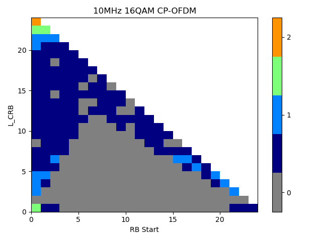{width="3.1395833333333334in" height="2.3541666666666665in"}   {width="3.1645833333333333in" height="2.373611111111111in"}
          {width="3.1395833333333334in" height="2.3541666666666665in"}   {width="3.1645833333333333in" height="2.373611111111111in"}
          {width="3.1395833333333334in" height="2.3541666666666665in"}   {width="3.1645833333333333in" height="2.373611111111111in"}

It can be seen from the results in Table 1 that some A-MPR is needed for
PC2 NS\_18 for BW=10MHz with SCS=30kHz, although the PC3 A-MPR in the
current specification is only allowed for SCS=15kHz.

##### 5.1.2.1.2\`A-MPR simulation results from Apple

Simulations have been conducted for all channel bandwidth from 5MHz,
10MHz and 15MHz. The A-MPR regions proposed in \[3\] were used as
starting point. Selected simulation results can be found in Table
5.1.2.1.2-1 where allocations for DFT-s-OFDM and CP-OFDM for QPSK are
provided.

Table 5.1.2.1.2-1: A-MPR simulation results for NS\_43

  {width="3.185416666666667in" height="2.592361111111111in"}   {width="3.145138888888889in" height="2.55625in"}
  ------------------------------------------------------------------------------------ --------------------------------------------------------------------------
  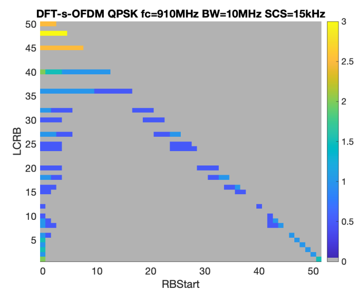{width="3.16875in" height="2.5840277777777776in"}            {width="3.16875in" height="2.604861111111111in"}
  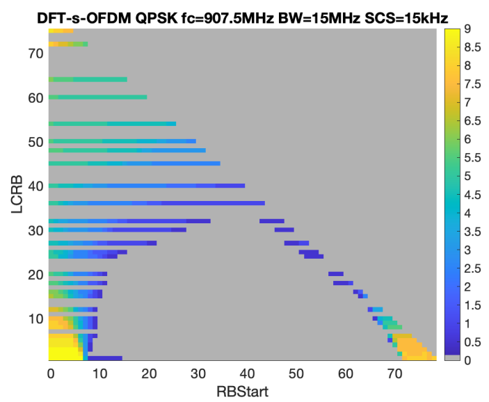{width="3.19375in" height="2.629166666666667in"}             {width="3.1631944444444446in" height="2.5in"}

##### 5.1.2.1.3 A-MPR requirements

Based on the simulation results from previous sections, the PC2 A-MPR
requirements for NS\_43 are proposed below.

The existing A-MPR regions for PC3 as defined in TS38.101-1 are adapted
for PC2, which are shown as the table below. The new table is applicable
for both power classes without impact to the PC3 requirements.

Table 6.2.3.6-1: A-MPR regions for NS\_43

+-------+-------+-------+-------+-------+-------+-------+-------+
| **Ch  | **Ca  | **R   | **R   |       |       |       |       |
| annel | rrier | egion | egion |       |       |       |       |
| Band  | C     | A**   | B**   |       |       |       |       |
| width | entre |       |       |       |       |       |       |
| (M    | Frequ |       |       |       |       |       |       |
| Hz)** | ency, |       |       |       |       |       |       |
|       | Fc    |       |       |       |       |       |       |
|       | (M    |       |       |       |       |       |       |
|       | Hz)** |       |       |       |       |       |       |
+=======+=======+=======+=======+=======+=======+=======+=======+
|       |       | **R   | **L~C | **A-  | **R   | **L~C | **A-  |
|       |       | B~sta | RB~** | MPR** | B~sta | RB~** | MPR** |
|       |       | rt~** |       |       | rt~** |       |       |
+-------+-------+-------+-------+-------+-------+-------+-------+
| 5 MHz | 902.5 |       | \> 15 | A1    |       |       |       |
|       | ≤     |       |       |       |       |       |       |
|       | F~C~  |       |       |       |       |       |       |
|       | \<    |       |       |       |       |       |       |
|       | 912.5 |       |       |       |       |       |       |
+-------+-------+-------+-------+-------+-------+-------+-------+
| 10    | F~C~  |       | \>    | A2    |       | \>    | A4    |
| MHz   | = 910 |       | 7.2   |       |       | 5.4   |       |
|       |       |       | MHz/1 |       |       | MHz/1 |       |
|       |       |       | 2/SCS |       |       | 2/SCS |       |
+-------+-------+-------+-------+-------+-------+-------+-------+
|       |       |       | \>    | A3    |       | \>    | A5    |
|       |       |       | 8.1   |       |       | 7.2   |       |
|       |       |       | MHz/1 |       |       | MHz/1 |       |
|       |       |       | 2/SCS |       |       | 2/SCS |       |
+-------+-------+-------+-------+-------+-------+-------+-------+
| 15    | F~C~  | ≤ 1.8 | \> 0  | A6    | \>    | ≥ 7.2 | A6    |
| MHz   | =     | MHz   |       |       | 1.8   | MHz/1 |       |
|       | 907.5 | /1    |       |       | MHz/1 | 2/SCS |       |
|       |       | 2/SCS |       |       | 2/SCS |       |       |
|       |       |       |       |       |       |       |       |
|       |       |       |       |       | \<    |       |       |
|       |       |       |       |       | 6.12  |       |       |
|       |       |       |       |       | MHz/1 |       |       |
|       |       |       |       |       | 2/SCS |       |       |
+-------+-------+-------+-------+-------+-------+-------+-------+
|       |       | ≥     | \> 0  | A6    | \>    | \<    | A7    |
|       |       | 12.24 |       |       | 1.8   | 7.2   |       |
|       |       | MHz/1 |       |       | MHz/1 | MHz/1 |       |
|       |       | 2/SCS |       |       | 2/SCS | 2/SCS |       |
|       |       |       |       |       |       |       |       |
|       |       |       |       |       | \<    |       |       |
|       |       |       |       |       | 6.12  |       |       |
|       |       |       |       |       | MHz/1 |       |       |
|       |       |       |       |       | 2/SCS |       |       |
+-------+-------+-------+-------+-------+-------+-------+-------+
|       |       |       |       |       | ≥     | \>    | A7    |
|       |       |       |       |       | 6.12  | 5.4   |       |
|       |       |       |       |       | MHz/1 | MHz/1 |       |
|       |       |       |       |       | 2/SCS | 2/SCS |       |
|       |       |       |       |       |       |       |       |
|       |       |       |       |       | ≤ 7.2 |       |       |
|       |       |       |       |       | MHz/1 |       |       |
|       |       |       |       |       | 2/SCS |       |       |
+-------+-------+-------+-------+-------+-------+-------+-------+
| NOTE  |       |       |       |       |       |       |       |
| 1:    |       |       |       |       |       |       |       |
| The   |       |       |       |       |       |       |       |
| A-MPR |       |       |       |       |       |       |       |
| v     |       |       |       |       |       |       |       |
| alues |       |       |       |       |       |       |       |
| are   |       |       |       |       |       |       |       |
| spec  |       |       |       |       |       |       |       |
| ified |       |       |       |       |       |       |       |
| in    |       |       |       |       |       |       |       |
| Table |       |       |       |       |       |       |       |
| 6.2.3 |       |       |       |       |       |       |       |
| .6-2. |       |       |       |       |       |       |       |
|       |       |       |       |       |       |       |       |
| NOTE  |       |       |       |       |       |       |       |
| 2:    |       |       |       |       |       |       |       |
| Only  |       |       |       |       |       |       |       |
| 15    |       |       |       |       |       |       |       |
| kHz   |       |       |       |       |       |       |       |
| SCS   |       |       |       |       |       |       |       |
| is    |       |       |       |       |       |       |       |
| appli |       |       |       |       |       |       |       |
| cable |       |       |       |       |       |       |       |
| for   |       |       |       |       |       |       |       |
| power |       |       |       |       |       |       |       |
| class |       |       |       |       |       |       |       |
| 3;    |       |       |       |       |       |       |       |
| both  |       |       |       |       |       |       |       |
| 15kHz |       |       |       |       |       |       |       |
| and   |       |       |       |       |       |       |       |
| 30kHz |       |       |       |       |       |       |       |
| SCS   |       |       |       |       |       |       |       |
| are   |       |       |       |       |       |       |       |
| appli |       |       |       |       |       |       |       |
| cable |       |       |       |       |       |       |       |
| for   |       |       |       |       |       |       |       |
| power |       |       |       |       |       |       |       |
| class |       |       |       |       |       |       |       |
| 2.    |       |       |       |       |       |       |       |
|       |       |       |       |       |       |       |       |
| NOTE  |       |       |       |       |       |       |       |
| 3:    |       |       |       |       |       |       |       |
| Void  |       |       |       |       |       |       |       |
+-------+-------+-------+-------+-------+-------+-------+-------+

The A-MPR values for PC2 1Tx are proposed in the tables below.

Table 6.2.3.6-2a: A-MPR for NS\_43 (Power Class 2, 1Tx)

  **Modulation/Waveform**   **A1 (dB)**   **A2 (dB)**   **A3 (dB)**   **A4 (dB)**   **A5 (dB)**                                                               
  ------------------------- ------------- ------------- ------------- ------------- ------------- ----------- ----------- ----------- ----------- ----------- -----
                            **Outer**     **Inner**     **Outer**     **Inner**     **Outer**     **Inner**   **Outer**   **Inner**   **Outer**   **Inner**   
  DFT-s-OFDM                Pi/2 BPSK     \[1\]         N/A           ≤ \[1.5\]     N/A                                               N/A                     N/A
                            QPSK          ≤ \[3.5\]                                                                       ≤ \[3.5\]               ≤ \[5.5\]   
                            16 QAM        ≤ \[3.5\]                                                                       ≤ \[3.5\]               ≤ \[5.5\]   
                            64 QAM        ≤ \[3.5\]                   ≤ \[4.5\]                   ≤ \[5\]                                                     
                            256 QAM                                                                                                                           
  CP-OFDM                   QPSK          ≤ \[4\]                                                                         ≤ \[4\]                 ≤ \[6\]     
                            16 QAM        ≤ \[4\]                                                                         ≤ \[4.5\]               ≤ \[6\]     
                            64 QAM        ≤ \[4\]                     ≤ \[5\]                     ≤ \[6.5\]                                                   
                            256 QAM                                                                                                                           

Table 6.2.3.6-2b: A-MPR for NS\_43 (Power Class 2, 1Tx) Cont.

+-------------------------+----------------+----------------+----------------+---------+
| **Modulation/Waveform** | **A6**         | **A7**         |                |         |
+=========================+================+================+================+=========+
|                         | **Outer /**    | **Outer (dB)** | **Inner (dB)** |         |
|                         |                |                |                |         |
|                         | **Inner (dB)** |                |                |         |
+-------------------------+----------------+----------------+----------------+---------+
| DFT-s-OFDM              | Pi/2 BPSK      | ≤ \[12\]       | ≤ \[4\]        | \[3\]   |
+-------------------------+----------------+----------------+----------------+---------+
|                         | QPSK           | ≤ \[12\]       | ≤ \[4\]        | \[3\]   |
+-------------------------+----------------+----------------+----------------+---------+
|                         | 16 QAM         | ≤ \[12\]       | ≤ \[5\]        | \[4\]   |
+-------------------------+----------------+----------------+----------------+---------+
|                         | 64 QAM         | ≤ \[12\]       | ≤ \[5.5\]      | \[5.5\] |
+-------------------------+----------------+----------------+----------------+---------+
|                         | 256 QAM        | ≤ \[12\]       | ≤ \[6.5\]      | \[5.5\] |
+-------------------------+----------------+----------------+----------------+---------+
| CP-OFDM                 | QPSK           | ≤ \[12\]       | ≤ \[6\]        | \[4.5\] |
+-------------------------+----------------+----------------+----------------+---------+
|                         | 16 QAM         | ≤ \[12\]       | ≤ \[6\]        | \[5\]   |
+-------------------------+----------------+----------------+----------------+---------+
|                         | 64 QAM         | ≤ \[12\]       | ≤ \[6.5\]      | \[6\]   |
+-------------------------+----------------+----------------+----------------+---------+
|                         | 256 QAM        | ≤ \[12\]       | ≤ \[7\]        | \[7\]   |
+-------------------------+----------------+----------------+----------------+---------+

#### 5.1.2.2 NS\_43U

*FFS.*

### 5.1.3 Reference sensitivity requirements

For PC2 single band n8, both 1Tx and 2Tx requirements are considered.
Therefore, for the Reference Sensitivity Degradation requirements, not
supporting Tx diversity (i.e. 1Tx) and supporting Tx diversity (i.e.
2Tx) are needed to be defined.

For PC2 single band n8 not supporting Tx diversity (i.e. 1Tx), the
Reference Sensitivity Degradation from PC3 to PC2 are defined in Table:

Table 5.1.3-1: Reference Sensitivity Degradation from PC3 to PC2 for FDD
bands for UE not supporting Tx Diversity

<table>
<thead>
<tr class="header">
<th>Operating Band</th>
<th>Source</th>
<th>
5

MHz 
(dB)
</th>
<th>
10

MHz 
(dB)
</th>
<th>
15

MHz 
(dB)
</th>
<th>
20

MHz 
(dB)
</th>
<th>
25

MHz 
(dB)
</th>
<th>30 MHz (dB)</th>
<th>35 MHz (dB)</th>
<th>
40

MHz 
(dB)
</th>
<th>45 MHz (dB)</th>
<th>
50

MHz 
(dB)
</th>
</tr>
</thead>
<tbody>
<tr class="odd">
<td>n8</td>
<td>Skyworks(R4-2300652, R4-2307239)</td>
<td>0.3</td>
<td>0.4</td>
<td>0.7</td>
<td>1.9</td>
<td>2.1</td>
<td> </td>
<td>2.6</td>
<td></td>
<td></td>
<td></td>
</tr>
<tr class="even">
<td></td>
<td>Apple(R4-2300362)</td>
<td>0</td>
<td>1.2</td>
<td>0.9</td>
<td>1.9</td>
<td>N/A</td>
<td>N/A</td>
<td>4.4</td>
<td>N/A</td>
<td>N/A</td>
<td>N/A</td>
</tr>
<tr class="odd">
<td></td>
<td>Huawei, HiSilicon(R4- 2300715, R4-2307916)</td>
<td>1.2</td>
<td>1.2</td>
<td>1.4</td>
<td>3.3</td>
<td>3.4</td>
<td>-</td>
<td>3.8</td>
<td>-</td>
<td>-</td>
<td>-</td>
</tr>
<tr class="even">
<td></td>
<td>Murata(R4-2305393, R4-2308436)</td>
<td>0.4</td>
<td>0.3</td>
<td>0.3</td>
<td>2.4</td>
<td>2.8</td>
<td>-</td>
<td>2.9</td>
<td>-</td>
<td>-</td>
<td>-</td>
</tr>
<tr class="odd">
<td></td>
<td>Qualcomm(R4-2302709)</td>
<td>0.8</td>
<td>0.6</td>
<td>0.7</td>
<td>1.8</td>
<td>-</td>
<td>-</td>
<td>1.8</td>
<td></td>
<td></td>
<td></td>
</tr>
<tr class="even">
<td>Average</td>
<td>0.5</td>
<td>0.7</td>
<td>0.8</td>
<td>2.3</td>
<td>2.8</td>
<td>-</td>
<td>3.1</td>
<td></td>
<td></td>
<td></td>
<td></td>
</tr>
</tbody>
</table>

For PC2 single band n8 supporting Tx diversity (i.e. 2Tx), several
companies shared the analysis, and we summarize the required sensitivity
degradation levels from companies as shown in 5.1.3-2:

Table 5.1.3-2: Reference Sensitivity Degradation from PC3 to PC2 for FDD
bands for UE supporting Tx Diversity

<table>
<thead>
<tr class="header">
<th>Operating Band</th>
<th>Source</th>
<th>
5

MHz 
(dB)
</th>
<th>
10

MHz 
(dB)
</th>
<th>
15

MHz 
(dB)
</th>
<th>
20

MHz 
(dB)
</th>
<th>
25

MHz 
(dB)
</th>
<th>30 MHz (dB)</th>
<th>35 MHz (dB)</th>
<th>
40

MHz 
(dB)
</th>
<th>45 MHz (dB)</th>
<th>
50

MHz 
(dB)
</th>
</tr>
</thead>
<tbody>
<tr class="odd">
<td>n8</td>
<td>Skyworks(R4-2300652, R4-2307239)</td>
<td>0.8</td>
<td>1.0</td>
<td>1.5</td>
<td>5.1</td>
<td>5.6</td>
<td> </td>
<td>6.6</td>
<td></td>
<td></td>
<td></td>
</tr>
<tr class="even">
<td></td>
<td>Apple(R4-2305364)</td>
<td>0.5</td>
<td>0.5</td>
<td>0.9</td>
<td>6.2</td>
<td>N/A</td>
<td>N/A</td>
<td>8.1</td>
<td>N/A</td>
<td>N/A</td>
<td>N/A</td>
</tr>
<tr class="odd">
<td></td>
<td>Huawei, HiSilicon(R4- 2300715, R4-2307916)</td>
<td>3.1</td>
<td>3.2</td>
<td>3.8</td>
<td>6.2</td>
<td>6.5</td>
<td>-</td>
<td>7.1</td>
<td>-</td>
<td>-</td>
<td>-</td>
</tr>
<tr class="even">
<td></td>
<td>Murata(R4-2305393, R4-2308436)</td>
<td>1.8</td>
<td>1.8</td>
<td>2.2</td>
<td>5.6</td>
<td>6.1</td>
<td>-</td>
<td>6.8</td>
<td>-</td>
<td>-</td>
<td>-</td>
</tr>
<tr class="odd">
<td></td>
<td>Qualcomm(R4-2302709)</td>
<td>1.5</td>
<td>1.5</td>
<td>2.2</td>
<td>6.5</td>
<td>-</td>
<td>-</td>
<td>5.9</td>
<td></td>
<td></td>
<td></td>
</tr>
<tr class="even">
<td></td>
<td>
MTK

(R4-2219869)
</td>
<td>0</td>
<td>0</td>
<td>1</td>
<td>5.4</td>
<td>-</td>
<td>-</td>
<td>7.2</td>
<td>-</td>
<td>-</td>
<td>-</td>
</tr>
<tr class="odd">
<td></td>
<td>
ZTE, CU

(R4-2215893)
</td>
<td>0.5</td>
<td>0.6</td>
<td>1.2</td>
<td>5.0</td>
<td>-</td>
<td>-</td>
<td>6.7</td>
<td>-</td>
<td>-</td>
<td>-</td>
</tr>
<tr class="even">
<td></td>
<td>Spreadtrum(R4-2304084)</td>
<td>2.2</td>
<td>2.2</td>
<td>3.8</td>
<td>6.5</td>
<td></td>
<td></td>
<td>7.3</td>
<td></td>
<td></td>
<td></td>
</tr>
<tr class="odd">
<td>Average</td>
<td>1.3</td>
<td>1.4</td>
<td>2.1</td>
<td>5.8</td>
<td>6.1</td>
<td>-</td>
<td>7.0</td>
<td></td>
<td></td>
<td></td>
<td></td>
</tr>
</tbody>
</table>

5.2 NR band n28
---------------

### 5.2.1 UE maximum output power

Table 5.2.1-1: UE output power for PC2

+-----------------------------------+---------------+----------------+
| NR                                | Class 2 (dBm) | Tolerance (dB) |
|                                   |               |                |
| band                              |               |                |
+===================================+===============+================+
| *n28*                             | 26            | \[FFS\]        |
+-----------------------------------+---------------+----------------+
| NOTE 3: Refers to the             |               |                |
| transmission bandwidths confined  |               |                |
| within FUL\_low and FUL\_low + 4  |               |                |
| MHz or FUL\_high -- 4 MHz and     |               |                |
| FUL\_high, the maximum output     |               |                |
| power requirement is relaxed by   |               |                |
| reducing the lower tolerance      |               |                |
| limit by 1.5 dB.                  |               |                |
+-----------------------------------+---------------+----------------+

### 5.2.2 A-MPR requirements

#### 5.2.2.1 NS\_18

##### 5.2.2.1.1 A-MPR simulation results from Huawei

The simulation results are obtained for NS\_18 for both PC2 1Tx and PC3
1Tx, which are shown in Table 5.2.2.1.1-1 below. The figures in the
2^nd^ column show the differences in the A-MPR simulation results
between PC2 and PC3, and the figures in the 3^rd^ column plot only the
PC2 A-MPR, for which 0dB is assigned if A-MPR ≤ PC2 MPR. It can be seen
that similar A-MPR value distributions are shown for BW=15/20/25/30MHz.

Table 5.2.2.1.1-1: A-MPR simulation results for NS\_18 with 1Tx,
SCS=15kHz

  BW         DIFF A-MPR (PC2-PC3)                                                                   PC2 A-MPR
  ---------- -------------------------------------------------------------------------------------- --------------------------------------------------------------------------------------
  **5MHz**   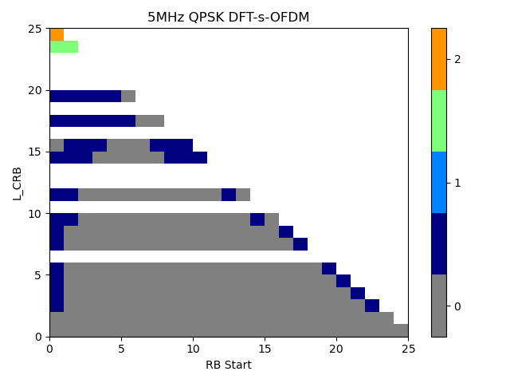{width="3.140972222222222in" height="2.359722222222222in"}     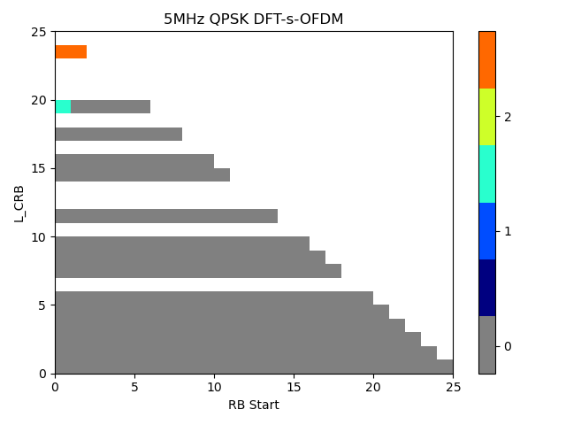{width="3.1618055555555555in" height="2.370138888888889in"}
             {width="3.140972222222222in" height="2.359722222222222in"}     {width="3.1618055555555555in" height="2.370138888888889in"}
             {width="3.140972222222222in" height="2.359722222222222in"}     {width="3.1618055555555555in" height="2.370138888888889in"}
             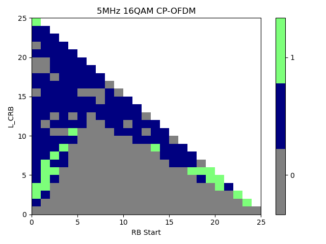{width="3.140972222222222in" height="2.359722222222222in"}     {width="3.1618055555555555in" height="2.370138888888889in"}
  10MHz      {width="3.1444444444444444in" height="2.3583333333333334in"}   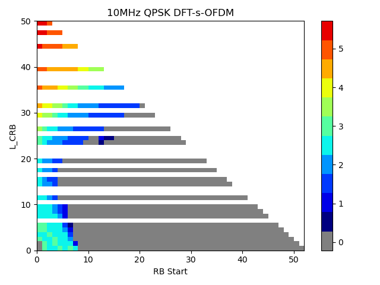{width="3.1618055555555555in" height="2.370138888888889in"}
             {width="3.1444444444444444in" height="2.3583333333333334in"}   {width="3.1618055555555555in" height="2.370138888888889in"}
             {width="3.1444444444444444in" height="2.3583333333333334in"}   {width="3.1618055555555555in" height="2.370138888888889in"}
             {width="3.1444444444444444in" height="2.3583333333333334in"}   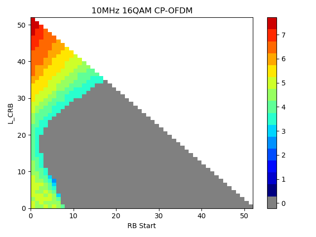{width="3.1618055555555555in" height="2.370138888888889in"}
  15MHz      {width="3.1444444444444444in" height="2.3583333333333334in"}   {width="3.1597222222222223in" height="2.3680555555555554in"}
             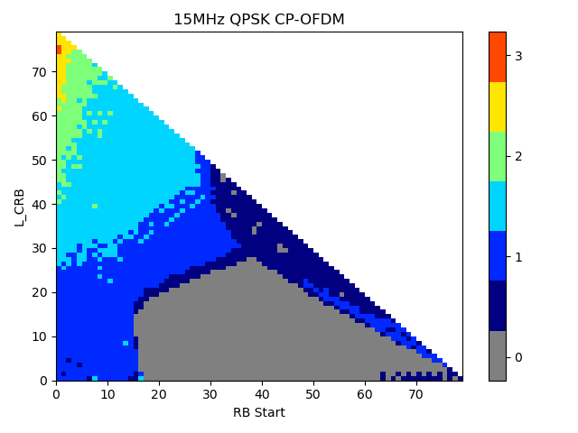{width="3.1444444444444444in" height="2.3583333333333334in"}   {width="3.1597222222222223in" height="2.3680555555555554in"}
             {width="3.1444444444444444in" height="2.3583333333333334in"}   {width="3.1597222222222223in" height="2.3680555555555554in"}
             {width="3.1444444444444444in" height="2.3583333333333334in"}   {width="3.1597222222222223in" height="2.3680555555555554in"}
  20MHz      {width="3.14375in" height="2.359722222222222in"}               {width="3.1597222222222223in" height="2.3680555555555554in"}
             {width="3.14375in" height="2.359722222222222in"}               {width="3.1597222222222223in" height="2.3680555555555554in"}
             {width="3.14375in" height="2.359722222222222in"}               {width="3.1597222222222223in" height="2.3680555555555554in"}
             {width="3.14375in" height="2.359722222222222in"}               {width="3.1597222222222223in" height="2.3680555555555554in"}
  25MHz      {width="3.14375in" height="2.359722222222222in"}               {width="3.1597222222222223in" height="2.3680555555555554in"}
             {width="3.14375in" height="2.359722222222222in"}               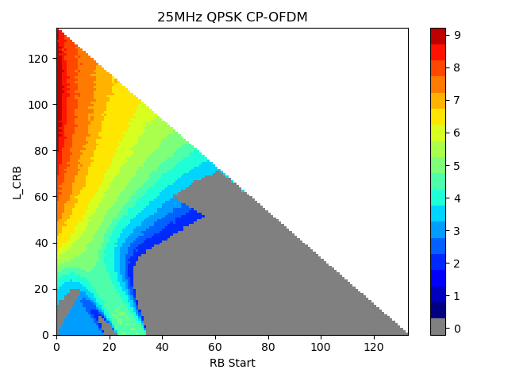{width="3.1597222222222223in" height="2.3680555555555554in"}
             {width="3.14375in" height="2.359722222222222in"}               {width="3.1597222222222223in" height="2.3680555555555554in"}
             {width="3.1444444444444444in" height="2.3583333333333334in"}   {width="3.1597222222222223in" height="2.3680555555555554in"}
  30MHz      {width="3.1444444444444444in" height="2.3583333333333334in"}   {width="3.1618055555555555in" height="2.370138888888889in"}
             {width="3.1444444444444444in" height="2.3583333333333334in"}   {width="3.1618055555555555in" height="2.370138888888889in"}
             {width="3.1444444444444444in" height="2.3583333333333334in"}   {width="3.1618055555555555in" height="2.370138888888889in"}
             {width="3.1444444444444444in" height="2.3583333333333334in"}   {width="3.1631944444444446in" height="2.3715277777777777in"}

##### 5.2.2.1.2 A-MPR simulation results from Apple

Simulations have been conducted for all channel bandwidth from 5MHz,
10MHz, 15MHz, 20MHz, 25MHz and 30MHz. The A-MPR regions proposed in
\[3\] were used as starting point. Selected simulation results can be
found in Table 5.2.2.1.2-1 where allocations for DFT-s-OFDM and CP-OFDM
for QPSK are provided.

Table 5.2.2.1.2-1: A-MPR simulation results for NS\_43

  {width="3.145138888888889in" height="2.5791666666666666in"}     {width="3.185416666666667in" height="2.589583333333333in"}
  --------------------------------------------------------------------------------------- --------------------------------------------------------------------------------------
  {width="3.1770833333333335in" height="2.5902777777777777in"}    {width="3.1368055555555556in" height="2.5680555555555555in"}
  {width="3.1527777777777777in" height="2.5868055555555554in"}    {width="3.1368055555555556in" height="2.564583333333333in"}
  {width="3.161111111111111in" height="2.529861111111111in"}      {width="3.129166666666667in" height="2.515972222222222in"}
  {width="3.217361111111111in" height="2.576388888888889in"}     {width="3.19375in" height="2.5729166666666665in"}
  {width="3.1770833333333335in" height="2.5756944444444443in"}   {width="3.1694444444444443in" height="2.532638888888889in"}

##### 5.2.2.1.3 A-MPR requirements

Based on the simulation results from previous sections, the PC2 A-MPR
requirements for NS\_18 are proposed below.

The existing A-MPR regions for PC3 as defined in TS 38.101-1 are adapted
for PC2, which are shown as in the tables below. The new tables are
applicable for both power classes without impact to the PC3
requirements.

Table 6.2.3.1-1: Additional maximum power reduction (A-MPR)

+----------+----------+----------+----------+----------+----------+
| Network  | Requ     | NR Band  | Channel  | R        | A-MPR    |
| si       | irements |          | b        | esources | (dB)     |
| gnalling | (clause) |          | andwidth | blocks   |          |
| label    |          |          | (MHz)    | (        |          |
|          |          |          |          | *N*~RB~) |          |
+==========+==========+==========+==========+==========+==========+
| NS\_18   | 6        | n28, n83 | 5        |          | Table    |
|          | .5.3.3.3 |          |          |          | 6.2      |
|          |          |          |          |          | .3.13-1, |
|          |          |          |          |          | A1 for   |
|          |          |          |          |          | PC3;     |
|          |          |          |          |          | Table    |
|          |          |          |          |          | 6.2      |
|          |          |          |          |          | .3.13-2, |
|          |          |          |          |          | A1 for   |
|          |          |          |          |          | PC2      |
+----------+----------+----------+----------+----------+----------+
|          |          |          | 10, 15,  |          | Table    |
|          |          |          | 20       |          | 6.2      |
|          |          |          |          |          | .3.13-1, |
|          |          |          |          |          | A2 for   |
|          |          |          |          |          | PC3;     |
|          |          |          |          |          | Table    |
|          |          |          |          |          | 6.2      |
|          |          |          |          |          | .3.13-2, |
|          |          |          |          |          | A2 for   |
|          |          |          |          |          | PC2      |
+----------+----------+----------+----------+----------+----------+
|          |          |          | 25, 30   |          | Table    |
|          |          |          |          |          | 6.2      |
|          |          |          |          |          | .3.13-1, |
|          |          |          |          |          | A3, A4,  |
|          |          |          |          |          | A5 for   |
|          |          |          |          |          | PC3;     |
|          |          |          |          |          |          |
|          |          |          |          |          | Table    |
|          |          |          |          |          | 6.2      |
|          |          |          |          |          | .3.13-2, |
|          |          |          |          |          | A3, A4,  |
|          |          |          |          |          | A5, A6   |
|          |          |          |          |          | for PC2  |
+----------+----------+----------+----------+----------+----------+

Table 6.2.3.13-0: Band n28 and n83 30MHz A-MPR regions for NS\_18

+---------------+---------------+---------------+---------------+----+
| **Channel     | **Frequency   | **Regions**   | **A-MPR**     |    |
| Bandwidth,    | range of UL   |               |               |    |
| MHz**         | transmission  |               |               |    |
|               | bandwidth     |               |               |    |
|               | c             |               |               |    |
|               | onfiguration, |               |               |    |
|               | MHz**         |               |               |    |
+===============+===============+===============+===============+====+
|               |               | **RB~star     | **L~CR        |    |
|               |               | t~\*12\*SCS** | B~\*12\*SCS** |    |
|               |               |               |               |    |
|               |               | **MHz**       | **MHz**       |    |
+---------------+---------------+---------------+---------------+----+
| 25            | 703\~733      | \>(L~CRB~\*1  | ≥Max(0,       | A3 |
|               |               | 2\*SCS)/2+3.6 | 1             |    |
|               |               |               | 2\*SCS\*N~RB~ |    |
|               |               |               | -- 1.8 --     |    |
|               |               |               | RBst          |    |
|               |               |               | art\*12\*SCS) |    |
+---------------+---------------+---------------+---------------+----+
|               |               | ≤(L~CRB~\*1   | ≥5.4          | A4 |
|               |               | 2\*SCS)/2+3.6 |               |    |
+---------------+---------------+---------------+---------------+----+
|               |               | ≤6.3          | \<5.4         | A5 |
+---------------+---------------+---------------+---------------+----+
|               |               | \>(LCRB\*1    | \<Max(0,      | A6 |
|               |               | 2\*SCS)/2+3.6 | 12\*SCS\*NRB  |    |
|               |               |               | -- 1.8 --     |    |
|               |               | ≤(LCRB\*12    | RBst          |    |
|               |               | \*SCS)/2+5.76 | art\*12\*SCS) |    |
|               |               |               |               |    |
|               |               |               | ≥5.4          |    |
+---------------+---------------+---------------+---------------+----+
| 30            | 703\~733      | \>(L~CRB~\*12 | ≥Max(0,       | A3 |
|               |               | \*SCS)/2+5.22 | 1             |    |
|               |               |               | 2\*SCS\*N~RB~ |    |
|               |               |               | -- 1.8 --     |    |
|               |               |               | RBst          |    |
|               |               |               | art\*12\*SCS) |    |
+---------------+---------------+---------------+---------------+----+
|               |               | ≤(L~CRB~\*12  | ≥5.4          | A4 |
|               |               | \*SCS)/2+5.22 |               |    |
+---------------+---------------+---------------+---------------+----+
|               |               | ≤7.92         | \<5.4         | A5 |
+---------------+---------------+---------------+---------------+----+
|               |               | \>(LCRB\*12   | \<Max(0,      | A6 |
|               |               | \*SCS)/2+5.22 | 12\*SCS\*NRB  |    |
|               |               |               | -- 1.8 --     |    |
|               |               | ≤(LCRB\*12    | RBst          |    |
|               |               | \*SCS)/2+7.38 | art\*12\*SCS) |    |
|               |               |               |               |    |
|               |               |               | ≥5.4          |    |
+---------------+---------------+---------------+---------------+----+

The A-MPR values for 1Tx PC2 are proposed in the table below.

Table 6.2.3.13-2: A-MPR for NS\_18 (Power Class 2, 1Tx)

  **Modulation/Waveform**   **A1 (dB)**   **A2 (dB)**   **A3 (dB)**       **A4 (dB)**       **A5 (dB)**       **A6 (dB)**                         
  ------------------------- ------------- ------------- ----------------- ----------------- ----------------- ----------------- ----------------- ---------
                            **Outer**     **Inner**     **Inner/Outer**   **Outer/Inner**   **Outer/Inner**   **Outer/Inner**   **Outer/Inner**   
  DFT-s-OFDM                Pi/2 BPSK     ≤ \[3.5\]     N/A               ≤ \[8\]           \[3.5\]           \[10\]            \[4.5\]           \[2\]
                            QPSK          ≤ \[3.5\]                       ≤ \[8\]           \[3.5\]           \[10\]            \[4.5\]           \[2\]
                            16 QAM        ≤ \[4\]                         ≤ \[9\]           \[3.5\]           \[11\]            \[5\]             \[2\]
                            64 QAM        ≤ \[4.5\]                       ≤ \[10\]          \[3.5\]           \[11\]            \[5.5\]           \[2.5\]
                            256 QAM       ≤ \[6.5\]                       ≤ \[11\]          \[3.5\]           \[11\]            \[5.5\]           
  CP-OFDM                   QPSK          ≤ \[5.5\]                       ≤ \[9.5\]         \[5\]             \[11.5\]          \[6\]             \[4\]
                            16 QAM        ≤ \[5.5\]                       ≤ \[10\]          \[5\]             \[11.5\]          \[6\]             \[4\]
                            64 QAM        ≤ \[6\]                         ≤ \[11.5\]        \[5\]             \[11.5\]          \[6\]             \[4\]
                            256 QAM       ≤ \[9\]                         ≤ \[11.5\]        \[5\]             \[11.5\]          \[7.5\]           

Note that BW=25MHz is missing for NS\_18 in Table 6.5.3.3-1 of
TS38.101-1 and needs to be added.

Table 6.5.3.3.3-1: Additional requirements for \"NS\_18\"

+---------------------+----------------------+----------------------+
| **Frequency range** | **Channel bandwidth  | **Measurement        |
|                     | (MHz) / Spectrum     | bandwidth**          |
| **(MHz)**           | emission limit       |                      |
|                     | (dBm)**              |                      |
+=====================+======================+======================+
|                     | 5, 10, 15, 20, 25,   |                      |
|                     | 30                   |                      |
+---------------------+----------------------+----------------------+
| 692-698             | -26.2                | 6 MHz                |
+---------------------+----------------------+----------------------+

#### 5.2.2.2 NS\_17

FFS

5.3 NR band n25
---------------

### 5.3.1 UE maximum output power

**Table 5.3.1-1: UE output power for PC2**

+-----------------------------------+---------------+----------------+
| NR                                | Class 2 (dBm) | Tolerance (dB) |
|                                   |               |                |
| band                              |               |                |
+===================================+===============+================+
| *n25*                             | 26            | +2/-3^3^       |
+-----------------------------------+---------------+----------------+
| NOTE 3: Refers to the             |               |                |
| transmission bandwidths confined  |               |                |
| within FUL\_low and FUL\_low + 4  |               |                |
| MHz or FUL\_high -- 4 MHz and     |               |                |
| FUL\_high, the maximum output     |               |                |
| power requirement is relaxed by   |               |                |
| reducing the lower tolerance      |               |                |
| limit by 1.5 dB.                  |               |                |
+-----------------------------------+---------------+----------------+

### 5.3.2 A-MPR requirements

*Re-use PC3 A-MPR.*

### 5.3.3 Reference sensitivity requirements

For PC2 single band n25, both 1Tx and 2Tx requirements are considered.
Therefore, for the Reference Sensitivity Degradation requirements, not
supporting Tx diversity (i.e. 1Tx) and supporting Tx diversity (i.e.
2Tx) are needed to be defined.

For PC2 single band n25 not supporting Tx diversity (i.e. 1Tx), the
Reference Sensitivity Degradation from PC3 to PC2 are defined in Table:

Table 5.3.3-1: Reference Sensitivity Degradation from PC3 to PC2 for FDD
bands for UE not supporting Tx Diversity

<table>
<thead>
<tr class="header">
<th><strong>Operating Band</strong></th>
<th><strong>Source</strong></th>
<th>
<strong>5</strong>

<strong>MHz 
(dB)</strong>
</th>
<th>
<strong>10</strong>

<strong>MHz 
(dB)</strong>
</th>
<th>
<strong>15</strong>

<strong>MHz 
(dB)</strong>
</th>
<th>
<strong>20</strong>

<strong>MHz 
(dB)</strong>
</th>
<th>
<strong>25</strong>

<strong>MHz 
(dB)</strong>
</th>
<th><strong>30 MHz (dB)</strong></th>
<th><strong>35 MHz (dB)</strong></th>
<th>
<strong>40</strong>

<strong>MHz 
(dB)</strong>
</th>
<th><strong>45 MHz (dB)</strong></th>
<th>
<strong>50</strong>

<strong>MHz 
(dB)</strong>
</th>
</tr>
</thead>
<tbody>
<tr class="odd">
<td>n25</td>
<td>Apple(R4-2300362)</td>
<td>0</td>
<td>0.6</td>
<td>1.0</td>
<td>1.4</td>
<td>2.1</td>
<td>2.4</td>
<td>3.0</td>
<td>4.7</td>
<td>5.1</td>
<td>N/A</td>
</tr>
<tr class="even">
<td></td>
<td>Skyworks(R4-2300652)</td>
<td>0.6</td>
<td>0.6</td>
<td>0.6</td>
<td>0.6</td>
<td>0.6</td>
<td>2.1</td>
<td>2.1</td>
<td>2.3</td>
<td>2.5</td>
<td></td>
</tr>
<tr class="odd">
<td></td>
<td>Huawei, HiSilicon(R4- 2300715)</td>
<td>1.4</td>
<td>1.4</td>
<td>1.4</td>
<td>1.9</td>
<td>1.9</td>
<td>3.5</td>
<td>3.5</td>
<td>3.7</td>
<td>3.8</td>
<td>-</td>
</tr>
<tr class="even">
<td></td>
<td>Murata(R4-2305393)</td>
<td>1.0</td>
<td>0.7</td>
<td>0.6</td>
<td>0.6</td>
<td>0.5</td>
<td>2.8</td>
<td>2.6</td>
<td>3.2</td>
<td>3.5</td>
<td></td>
</tr>
<tr class="odd">
<td>Average</td>
<td>0.8</td>
<td>0.8</td>
<td>0.9</td>
<td>1.1</td>
<td>1.3</td>
<td>2.7</td>
<td>2.8</td>
<td>3.5</td>
<td>3.7</td>
<td></td>
<td></td>
</tr>
</tbody>
</table>

For PC2 single band n8 supporting Tx diversity (i.e. 2Tx), several
companies shared the analysis, and we summarize the required sensitivity
degradation levels from companies as shown in 5.3.3-2:

Table 5.3.3-2: Reference Sensitivity Degradation from PC3 to PC2 for FDD
bands for UE supporting Tx Diversity

<table>
<thead>
<tr class="header">
<th><strong>Operating Band</strong></th>
<th><strong>Source</strong></th>
<th>
<strong>5</strong>

<strong>MHz 
(dB)</strong>
</th>
<th>
<strong>10</strong>

<strong>MHz 
(dB)</strong>
</th>
<th>
<strong>15</strong>

<strong>MHz 
(dB)</strong>
</th>
<th>
<strong>20</strong>

<strong>MHz 
(dB)</strong>
</th>
<th>
<strong>25</strong>

<strong>MHz 
(dB)</strong>
</th>
<th><strong>30 MHz (dB)</strong></th>
<th><strong>35 MHz (dB)</strong></th>
<th>
<strong>40</strong>

<strong>MHz 
(dB)</strong>
</th>
<th><strong>45 MHz (dB)</strong></th>
<th>
<strong>50</strong>

<strong>MHz 
(dB)</strong>
</th>
</tr>
</thead>
<tbody>
<tr class="odd">
<td>n25</td>
<td>Apple(R4-2305364)</td>
<td>0.5</td>
<td>0.5</td>
<td>0.5</td>
<td>0.5</td>
<td>0.5</td>
<td>6.9</td>
<td>6.8</td>
<td>7.5</td>
<td>7.9</td>
<td>N/A</td>
</tr>
<tr class="even">
<td></td>
<td>Skyworks(R4-2300652)</td>
<td>1.0</td>
<td>1.3</td>
<td>1.4</td>
<td>1.5</td>
<td>1.7</td>
<td>5.6</td>
<td>5.5</td>
<td>6.1</td>
<td>6.4</td>
<td></td>
</tr>
<tr class="odd">
<td></td>
<td>Huawei, HiSilicon(R4- 2300715)</td>
<td>3.6</td>
<td>3.6</td>
<td>3.6</td>
<td>3.6</td>
<td>3.6</td>
<td>6.7</td>
<td>6.7</td>
<td>6.9</td>
<td>7.0</td>
<td>-</td>
</tr>
<tr class="even">
<td></td>
<td>Murata(R4-2305393)</td>
<td>0.7</td>
<td>0.6</td>
<td>0.7</td>
<td>0.9</td>
<td>0.8</td>
<td>4.8</td>
<td>5.9</td>
<td>6.1</td>
<td>6.9</td>
<td></td>
</tr>
<tr class="odd">
<td>Average</td>
<td>1.5</td>
<td>1.5</td>
<td>1.6</td>
<td>1.6</td>
<td>1.7</td>
<td>6.0</td>
<td>6.2</td>
<td>6.7</td>
<td>7.1</td>
<td></td>
<td></td>
</tr>
</tbody>
</table>

5.4 NR band n66
---------------

### 5.4.1 UE maximum output power

**Table 5.4.1-1: UE output power for PC2**

+-------+---------------+----------------+
| NR    | Class 2 (dBm) | Tolerance (dB) |
|       |               |                |
| band  |               |                |
+=======+===============+================+
| *n66* | 26            | +2/-3          |
+-------+---------------+----------------+

### 5.4.2 A-MPR requirements

*Re-use PC3 A-MPR.*

### 5.4.3 Reference sensitivity requirements

For PC2 single band n66, both 1Tx and 2Tx requirements are considered.
Therefore, for the Reference Sensitivity Degradation requirements, not
supporting Tx diversity (i.e. 1Tx) and supporting Tx diversity (i.e.
2Tx) are needed to be defined.

For PC2 single band n66 not supporting Tx diversity (i.e. 1Tx), the
Reference Sensitivity Degradation from PC3 to PC2 are defined in Table:

Table 5.4.3-1: Reference Sensitivity Degradation from PC3 to PC2 for FDD
bands for UE not supporting Tx Diversity

<table>
<thead>
<tr class="header">
<th>Operating Band</th>
<th>Source</th>
<th>
5

MHz 
(dB)
</th>
<th>
10

MHz 
(dB)
</th>
<th>
15

MHz 
(dB)
</th>
<th>
20

MHz 
(dB)
</th>
<th>
25

MHz 
(dB)
</th>
<th>30 MHz (dB)</th>
<th>35 MHz (dB)</th>
<th>
40

MHz 
(dB)
</th>
<th>45 MHz (dB)</th>
<th>
50

MHz 
(dB)
</th>
</tr>
</thead>
<tbody>
<tr class="odd">
<td>n66</td>
<td>Skyworks(R4-2300652)</td>
<td>0.0</td>
<td>0.0</td>
<td>0.0</td>
<td>0.0</td>
<td>0.0</td>
<td>0.0</td>
<td>0.0</td>
<td>0.0</td>
<td>0.0</td>
<td></td>
</tr>
<tr class="even">
<td></td>
<td>Huawei, HiSilicon(R4- 2304517)</td>
<td>0.0</td>
<td>0.0</td>
<td>0.0</td>
<td>0.0</td>
<td>0.0</td>
<td>0.0</td>
<td>0.0</td>
<td>0.0</td>
<td>0.0</td>
<td></td>
</tr>
<tr class="odd">
<td>Average</td>
<td>0.0</td>
<td>0.0</td>
<td>0.0</td>
<td>0.0</td>
<td>0.0</td>
<td>0.0</td>
<td>0.0</td>
<td>0.0</td>
<td>0.0</td>
<td></td>
<td></td>
</tr>
</tbody>
</table>

For PC2 single band n8 supporting Tx diversity (i.e. 2Tx), several
companies shared the analysis, and we summarize the required sensitivity
degradation levels from companies as shown in 5.4.3-2:

Table 5.4.3-2: Reference Sensitivity Degradation from PC3 to PC2 for FDD
bands for UE supporting Tx Diversity

<table>
<thead>
<tr class="header">
<th>Operating Band</th>
<th>Source</th>
<th>
5

MHz 
(dB)
</th>
<th>
10

MHz 
(dB)
</th>
<th>
15

MHz 
(dB)
</th>
<th>
20

MHz 
(dB)
</th>
<th>
25

MHz 
(dB)
</th>
<th>30 MHz (dB)</th>
<th>35 MHz (dB)</th>
<th>
40

MHz 
(dB)
</th>
<th>45 MHz (dB)</th>
<th>
50

MHz 
(dB)
</th>
</tr>
</thead>
<tbody>
<tr class="odd">
<td>n66</td>
<td>Skyworks(R4-2300652)</td>
<td>0.0</td>
<td>0.0</td>
<td>0.0</td>
<td>0.0</td>
<td>0.0</td>
<td>0.0</td>
<td>0.0</td>
<td>0.0</td>
<td>0.0</td>
<td></td>
</tr>
<tr class="even">
<td></td>
<td>Huawei, HiSilicon(R4- 2304517)</td>
<td>0.0</td>
<td>0.0</td>
<td>0.0</td>
<td>0.0</td>
<td>0.0</td>
<td>0.0</td>
<td>0.0</td>
<td>0.0</td>
<td>0.0</td>
<td></td>
</tr>
<tr class="odd">
<td>Average</td>
<td>0.0</td>
<td>0.0</td>
<td>0.0</td>
<td>0.0</td>
<td>0.0</td>
<td>0.0</td>
<td>0.0</td>
<td>0.0</td>
<td>0.0</td>
<td></td>
<td></td>
</tr>
</tbody>
</table>

5.5 NR band n71
---------------

### 5.5.1 UE maximum output power

**Table 5.5.1-1: UE output power for PC2**

+-------+---------------+----------------+
| NR    | Class 2 (dBm) | Tolerance (dB) |
|       |               |                |
| band  |               |                |
+=======+===============+================+
| *n71* | 26            | +2/-3          |
+-------+---------------+----------------+

### 5.5.2 A-MPR and ∆MPR requirements

*For PC2 A-MPR re-use the A-MPR region from PC1 and set the allowed
power back-off to 3dB DFT-s-OFDM and 4.5dB for and CP-OFDM.*

*For ∆MPR, PC2 will use the same ∆MPR as PC3 in Table 6.2.2-3.*

### 5.5.3 Reference sensitivity requirements

For PC2 single band n71, both 1Tx and 2Tx requirements are considered.
Therefore, for the Reference Sensitivity Degradation requirements, not
supporting Tx diversity (i.e. 1Tx) and supporting Tx diversity (i.e.
2Tx) are needed to be defined.

For PC2 single band n71 not supporting Tx diversity (i.e. 1Tx), the
Reference Sensitivity Degradation from PC3 to PC2 are defined in the
following tables:

Table 5.5.3-1: Reference Sensitivity Degradation from PC3 to PC2 for FDD
bands for UE not supporting Tx Diversity with UL ≤ 20 MHz

<table>
<thead>
<tr class="header">
<th>Operating Band</th>
<th>Source</th>
<th>
5

MHz 
(dB)
</th>
<th>
10

MHz 
(dB)
</th>
<th>
15

MHz 
(dB)
</th>
<th>
20

MHz 
(dB)
</th>
<th>
25

MHz 
(dB)
</th>
<th>30 MHz (dB)</th>
<th>35 MHz (dB)</th>
<th>
40

MHz 
(dB)
</th>
<th>45 MHz (dB)</th>
<th>
50

MHz 
(dB)
</th>
</tr>
</thead>
<tbody>
<tr class="odd">
<td>n71</td>
<td>Skyworks(R4-2300652)</td>
<td>0.1</td>
<td>0.1</td>
<td>0.9</td>
<td>2.0</td>
<td>2.2</td>
<td>2.3</td>
<td>2.4</td>
<td></td>
<td></td>
<td></td>
</tr>
<tr class="even">
<td></td>
<td>Apple(R4-2300362)</td>
<td>0</td>
<td>1.6</td>
<td>0.6</td>
<td>1.6</td>
<td>1.8</td>
<td>2.0</td>
<td>2.8</td>
<td>N/A</td>
<td>N/A</td>
<td>N/A</td>
</tr>
<tr class="odd">
<td></td>
<td>Huawei, HiSilicon(R4- 2300715)</td>
<td>1.2</td>
<td>1.2</td>
<td>1.4</td>
<td>3.2</td>
<td>3.4</td>
<td>3.5</td>
<td>3.6</td>
<td>-</td>
<td>-</td>
<td>-</td>
</tr>
<tr class="even">
<td></td>
<td>Murata(R4-2305393)</td>
<td>0.7</td>
<td>0.8</td>
<td>0.6</td>
<td>2.1</td>
<td>2.1</td>
<td>2.0</td>
<td>2.8</td>
<td>-</td>
<td>-</td>
<td>-</td>
</tr>
<tr class="odd">
<td>Average</td>
<td>0.5</td>
<td>0.9</td>
<td>0.9</td>
<td>2.2</td>
<td>2.4</td>
<td>2.5</td>
<td>2.9</td>
<td></td>
<td></td>
<td></td>
<td></td>
</tr>
</tbody>
</table>

Table 5.5.3-2: Reference Sensitivity Degradation from PC3 to PC2 for FDD
bands for UE not supporting Tx Diversity with symmetric UL/DL \> 20 MHz

<table>
<thead>
<tr class="header">
<th>Operating Band</th>
<th>Source</th>
<th>
5

MHz 
(dB)
</th>
<th>
10

MHz 
(dB)
</th>
<th>
15

MHz 
(dB)
</th>
<th>
20

MHz 
(dB)
</th>
<th>
25

MHz 
(dB)
</th>
<th>30 MHz (dB)</th>
<th>35 MHz (dB)</th>
<th>
40

MHz 
(dB)
</th>
<th>45 MHz (dB)</th>
<th>
50

MHz 
(dB)
</th>
</tr>
</thead>
<tbody>
<tr class="odd">
<td>n71</td>
<td>Skyworks(R4- R4-2311119)</td>
<td></td>
<td></td>
<td></td>
<td></td>
<td>3.7</td>
<td>3.8</td>
<td>3.8</td>
<td></td>
<td></td>
<td></td>
</tr>
<tr class="even">
<td></td>
<td>Apple(R4-2311251)</td>
<td></td>
<td></td>
<td></td>
<td></td>
<td>1.7</td>
<td>1.5</td>
<td>1.5</td>
<td></td>
<td></td>
<td></td>
</tr>
<tr class="odd">
<td></td>
<td>Murata(R4-2308456 ,R4-2311441)</td>
<td></td>
<td></td>
<td></td>
<td></td>
<td>2.2</td>
<td>2.0</td>
<td>3.9</td>
<td></td>
<td></td>
<td></td>
</tr>
<tr class="even">
<td>Average</td>
<td></td>
<td></td>
<td></td>
<td></td>
<td>2.5</td>
<td>2.4</td>
<td>3.1</td>
<td></td>
<td></td>
<td></td>
<td></td>
</tr>
</tbody>
</table>

For PC2 single band n71 supporting Tx diversity (i.e. 2Tx), several
companies shared the analysis, and we summarize the required sensitivity
degradation levels from companies as shown in 5.5.3-2:

Table 5.5.3-3: Reference Sensitivity Degradation from PC3 to PC2 for FDD
bands for UE supporting Tx Diversity with UL ≤ 20 MHz

<table>
<thead>
<tr class="header">
<th>Operating Band</th>
<th>Source</th>
<th>
5

MHz 
(dB)
</th>
<th>
10

MHz 
(dB)
</th>
<th>
15

MHz 
(dB)
</th>
<th>
20

MHz 
(dB)
</th>
<th>
25

MHz 
(dB)
</th>
<th>30 MHz (dB)</th>
<th>35 MHz (dB)</th>
<th>
40

MHz 
(dB)
</th>
<th>45 MHz (dB)</th>
<th>
50

MHz 
(dB)
</th>
</tr>
</thead>
<tbody>
<tr class="odd">
<td>n71</td>
<td>Skyworks(R4-2300652)</td>
<td>0.3</td>
<td>0.4</td>
<td>1.5</td>
<td>4.7</td>
<td>5.1</td>
<td>5.3</td>
<td>5.6</td>
<td></td>
<td></td>
<td></td>
</tr>
<tr class="even">
<td></td>
<td>Apple(R4-2305364)</td>
<td>0.5</td>
<td>0.5</td>
<td>1.0</td>
<td>6.2</td>
<td>6.7</td>
<td>7.1</td>
<td>7.5</td>
<td></td>
<td></td>
<td></td>
</tr>
<tr class="odd">
<td></td>
<td>Huawei, HiSilicon(R4- 2300715)</td>
<td>2.9</td>
<td>2.9</td>
<td>3.6</td>
<td>6.2</td>
<td>6.4</td>
<td>6.6</td>
<td>6.8</td>
<td></td>
<td></td>
<td></td>
</tr>
<tr class="even">
<td></td>
<td>Murata(R4-2305393)</td>
<td>1.6</td>
<td>1.8</td>
<td>2.0</td>
<td>5.6</td>
<td>6.0</td>
<td>6.5</td>
<td>6.8</td>
<td></td>
<td></td>
<td></td>
</tr>
<tr class="odd">
<td></td>
<td>MediaTek(R4-2302353)</td>
<td>0</td>
<td>0</td>
<td>0.5</td>
<td>4.8</td>
<td>5.5</td>
<td>5.6</td>
<td>5.6</td>
<td></td>
<td></td>
<td></td>
</tr>
<tr class="even">
<td>Average</td>
<td>1.1</td>
<td>1.1</td>
<td>1.7</td>
<td>5.5</td>
<td>5.9</td>
<td>6.2</td>
<td>6.5</td>
<td></td>
<td></td>
<td></td>
<td></td>
</tr>
</tbody>
</table>

**Table 5.5.3-4: Reference Sensitivity Degradation from PC3 to PC2 for
FDD bands for UE supporting Tx Diversity with symmetric UL/DL \> 20
MHz**

<table>
<thead>
<tr class="header">
<th>Operating Band</th>
<th>Source</th>
<th>
5

MHz 
(dB)
</th>
<th>
10

MHz 
(dB)
</th>
<th>
15

MHz 
(dB)
</th>
<th>
20

MHz 
(dB)
</th>
<th>
25

MHz 
(dB)
</th>
<th>30 MHz (dB)</th>
<th>35 MHz (dB)</th>
<th>
40

MHz 
(dB)
</th>
<th>45 MHz (dB)</th>
<th>
50

MHz 
(dB)
</th>
</tr>
</thead>
<tbody>
<tr class="odd">
<td>n71</td>
<td>Skyworks(R4- R4-2311119)</td>
<td></td>
<td></td>
<td></td>
<td></td>
<td>5.8</td>
<td>6.2</td>
<td>6.2</td>
<td></td>
<td></td>
<td></td>
</tr>
<tr class="even">
<td></td>
<td>Apple(R4-2311251)</td>
<td></td>
<td></td>
<td></td>
<td></td>
<td>7.4</td>
<td>7.7</td>
<td>7.8</td>
<td></td>
<td></td>
<td></td>
</tr>
<tr class="odd">
<td></td>
<td>Murata(R4-2308456 ,R4-2311441)</td>
<td></td>
<td></td>
<td></td>
<td></td>
<td>7.4</td>
<td>7.8</td>
<td>7.8</td>
<td></td>
<td></td>
<td></td>
</tr>
<tr class="even">
<td>Average</td>
<td></td>
<td></td>
<td></td>
<td></td>
<td>6.9</td>
<td>7.2</td>
<td>7.3</td>
<td></td>
<td></td>
<td></td>
<td></td>
</tr>
</tbody>
</table>

5.6 NR band n85
---------------

### 5.6.1 UE maximum output power

**Table 5.6.1-1: UE output power for PC2**

+-------+---------------+----------------+
| NR    | Class 2 (dBm) | Tolerance (dB) |
|       |               |                |
| band  |               |                |
+=======+===============+================+
| *n85* | 26            | +2/-3          |
+-------+---------------+----------------+

### 5.6.2 A-MPR requirements

For NS\_06 A-MPR see 5.9.2.1.

### 5.6.3 Reference sensitivity requirements

For PC2 single band n85, both 1Tx and 2Tx requirements are considered.
Therefore, for the Reference Sensitivity Degradation requirements, not
supporting Tx diversity (i.e. 1Tx) and supporting Tx diversity (i.e.
2Tx) are needed to be defined.

For PC2 single band n85 not supporting Tx diversity (i.e. 1Tx), the
Reference Sensitivity Degradation from PC3 to PC2 are defined in Table:

Table 5.6.3-1: Reference Sensitivity Degradation from PC3 to PC2 for FDD
bands for UE not supporting Tx Diversity

<table>
<thead>
<tr class="header">
<th>Operating Band</th>
<th>Source</th>
<th>
5

MHz 
(dB)
</th>
<th>
10

MHz 
(dB)
</th>
<th>
15

MHz 
(dB)
</th>
<th>
20

MHz 
(dB)
</th>
<th>
25

MHz 
(dB)
</th>
<th>30 MHz (dB)</th>
<th>35 MHz (dB)</th>
<th>
40

MHz 
(dB)
</th>
<th>45 MHz (dB)</th>
<th>
50

MHz 
(dB)
</th>
</tr>
</thead>
<tbody>
<tr class="odd">
<td>n85</td>
<td>Skyworks(R4-2300652)</td>
<td>0.6</td>
<td>0.6</td>
<td>2.4</td>
<td></td>
<td></td>
<td></td>
<td></td>
<td></td>
<td></td>
<td></td>
</tr>
<tr class="even">
<td></td>
<td>Apple(R4-2300362)</td>
<td>0</td>
<td>1.1</td>
<td>2.8</td>
<td>N/A</td>
<td>N/A</td>
<td>N/A</td>
<td>N/A</td>
<td>N/A</td>
<td>N/A</td>
<td>N/A</td>
</tr>
<tr class="odd">
<td></td>
<td>Huawei, HiSilicon(R4- 2300715)</td>
<td>1.2</td>
<td>1.2</td>
<td>2.7</td>
<td>-</td>
<td>-</td>
<td>-</td>
<td>-</td>
<td>-</td>
<td>-</td>
<td>-</td>
</tr>
<tr class="even">
<td>Average</td>
<td>0.6</td>
<td>1.0</td>
<td>2.6</td>
<td></td>
<td></td>
<td></td>
<td></td>
<td></td>
<td></td>
<td></td>
<td></td>
</tr>
</tbody>
</table>

For PC2 single band n8 supporting Tx diversity (i.e. 2Tx), several
companies shared the analysis, and we summarize the required sensitivity
degradation levels from companies as shown in 5.6.3-2:

Table 5.6.3-2: Reference Sensitivity Degradation from PC3 to PC2 for FDD
bands for UE supporting Tx Diversity

<table>
<thead>
<tr class="header">
<th>Operating Band</th>
<th>Source</th>
<th>
5

MHz 
(dB)
</th>
<th>
10

MHz 
(dB)
</th>
<th>
15

MHz 
(dB)
</th>
<th>
20

MHz 
(dB)
</th>
<th>
25

MHz 
(dB)
</th>
<th>30 MHz (dB)</th>
<th>35 MHz (dB)</th>
<th>
40

MHz 
(dB)
</th>
<th>45 MHz (dB)</th>
<th>
50

MHz 
(dB)
</th>
</tr>
</thead>
<tbody>
<tr class="odd">
<td>n85</td>
<td>Skyworks(R4-2300652)</td>
<td>1.3</td>
<td>1.3</td>
<td>6.2</td>
<td></td>
<td></td>
<td></td>
<td></td>
<td></td>
<td></td>
<td></td>
</tr>
<tr class="even">
<td></td>
<td>Apple(R4-2305364)</td>
<td>0.5</td>
<td>0.5</td>
<td>7.6</td>
<td>N/A</td>
<td>N/A</td>
<td>N/A</td>
<td>N/A</td>
<td>N/A</td>
<td>N/A</td>
<td>N/A</td>
</tr>
<tr class="odd">
<td></td>
<td>Huawei, HiSilicon(R4- 2300715)</td>
<td>3.1</td>
<td>3.2</td>
<td>6.9</td>
<td>-</td>
<td>-</td>
<td>-</td>
<td>-</td>
<td>-</td>
<td>-</td>
<td>-</td>
</tr>
<tr class="even">
<td></td>
<td>MediaTek(R4-2302353)</td>
<td>0</td>
<td>0.5</td>
<td>4.8</td>
<td></td>
<td></td>
<td></td>
<td></td>
<td></td>
<td></td>
<td></td>
</tr>
<tr class="odd">
<td>Average</td>
<td>1.2</td>
<td>1.4</td>
<td>6.4</td>
<td></td>
<td></td>
<td></td>
<td></td>
<td></td>
<td></td>
<td></td>
<td></td>
</tr>
</tbody>
</table>

5.7 NR band n70
---------------

### 5.7.1 UE maximum output power

Table 5.1.1-1: UE output power for PC2

+-------+---------------+----------------+
| NR    | Class 2 (dBm) | Tolerance (dB) |
|       |               |                |
| Band  |               |                |
+=======+===============+================+
| *n70* | 26            | +2/-3          |
+-------+---------------+----------------+

### 5.7.2 A-MPR requirements

On network signalling NS\_03, for the NR waveforms DFT-s-OFDM and
CP-OFDM there is no need for additional power back-off and the PC3 table
could be re-used.

### 5.7.3 Reference sensitivity requirements

For PC2 single band n70, both 1Tx and 2Tx requirements are considered.
Therefore, for the Reference Sensitivity Degradation requirements, not
supporting Tx diversity (i.e. 1Tx) and supporting Tx diversity (i.e.
2Tx) are needed to be defined.

For PC2 single band n70 not supporting Tx diversity (i.e. 1Tx), the
Reference Sensitivity Degradation from PC3 to PC2 are defined in Table:

Table 5.7.3-1: Reference Sensitivity Degradation from PC3 to PC2 for FDD
bands for UE not supporting Tx Diversity

<table>
<thead>
<tr class="header">
<th>Operating Band</th>
<th>Source</th>
<th>
5

MHz 
(dB)
</th>
<th>
10

MHz 
(dB)
</th>
<th>
15

MHz 
(dB)
</th>
<th>
20

MHz 
(dB)
</th>
<th>
25

MHz 
(dB)
</th>
<th>30 MHz (dB)</th>
<th>35 MHz (dB)</th>
<th>
40

MHz 
(dB)
</th>
<th>45 MHz (dB)</th>
<th>
50

MHz 
(dB)
</th>
</tr>
</thead>
<tbody>
<tr class="odd">
<td>n70</td>
<td>Skyworks(R4-2311152)</td>
<td>0.0</td>
<td>0.0</td>
<td>0.0</td>
<td>0.0</td>
<td>0.0</td>
<td></td>
<td></td>
<td></td>
<td></td>
<td></td>
</tr>
<tr class="even">
<td></td>
<td>Apple(R4-2311251)</td>
<td>0.0</td>
<td>0.0</td>
<td>0.0</td>
<td>0.0</td>
<td>0.0</td>
<td>N/A</td>
<td>N/A</td>
<td>N/A</td>
<td>N/A</td>
<td>N/A</td>
</tr>
<tr class="odd">
<td></td>
<td>Mediatek(R4-2312178)</td>
<td>0.0</td>
<td>0.0</td>
<td>0.0</td>
<td>0.0</td>
<td>0.0</td>
<td></td>
<td></td>
<td></td>
<td></td>
<td></td>
</tr>
<tr class="even">
<td></td>
<td>Qualcomm 
(R4-2313553)</td>
<td>0.0</td>
<td>0.0</td>
<td>0.0</td>
<td>0.0</td>
<td>0.0</td>
<td></td>
<td></td>
<td></td>
<td></td>
<td></td>
</tr>
<tr class="odd">
<td>Average</td>
<td>0.0</td>
<td>0.0</td>
<td>0.0</td>
<td>0.0</td>
<td>0.0</td>
<td></td>
<td></td>
<td></td>
<td></td>
<td></td>
<td></td>
</tr>
</tbody>
</table>

For PC2 single band n70 supporting Tx diversity (i.e. 2Tx), several
companies shared the analysis, and we summarize the required sensitivity
degradation levels from companies as shown in 5.7.3-2:

Table 5.7.3-2: Reference Sensitivity Degradation from PC3 to PC2 for FDD
bands for UE supporting Tx Diversity

<table>
<thead>
<tr class="header">
<th>Operating Band</th>
<th>Source</th>
<th>
5

MHz 
(dB)
</th>
<th>
10

MHz 
(dB)
</th>
<th>
15

MHz 
(dB)
</th>
<th>
20

MHz 
(dB)
</th>
<th>
25

MHz 
(dB)
</th>
<th>30 MHz (dB)</th>
<th>35 MHz (dB)</th>
<th>
40

MHz 
(dB)
</th>
<th>45 MHz (dB)</th>
<th>
50

MHz 
(dB)
</th>
</tr>
</thead>
<tbody>
<tr class="odd">
<td>n70</td>
<td>Skyworks(R4-2311152)</td>
<td>0.0</td>
<td>0.0</td>
<td>0.0</td>
<td>0.0</td>
<td>0.0</td>
<td></td>
<td></td>
<td></td>
<td></td>
<td></td>
</tr>
<tr class="even">
<td></td>
<td>Apple(R4-2311251)</td>
<td>0.0</td>
<td>0.0</td>
<td>0.0</td>
<td>0.0</td>
<td>0.0</td>
<td>N/A</td>
<td>N/A</td>
<td>N/A</td>
<td>N/A</td>
<td>N/A</td>
</tr>
<tr class="odd">
<td></td>
<td>Mediatek(R4-2312178)</td>
<td>0.0</td>
<td>0.0</td>
<td>0.0</td>
<td>0.0</td>
<td>0.0</td>
<td></td>
<td></td>
<td></td>
<td></td>
<td></td>
</tr>
<tr class="even">
<td></td>
<td>Qualcomm 
(R4-2313553)</td>
<td>0.0</td>
<td>0.0</td>
<td>0.0</td>
<td>0.0</td>
<td>0.0</td>
<td></td>
<td></td>
<td></td>
<td></td>
<td></td>
</tr>
<tr class="odd">
<td>Average</td>
<td>0.0</td>
<td>0.0</td>
<td>0.0</td>
<td>0.0</td>
<td>0.0</td>
<td></td>
<td></td>
<td></td>
<td></td>
<td></td>
<td></td>
</tr>
</tbody>
</table>

5.8 NR band n2
--------------

### 5.8.1 UE maximum output power

Table 5.8.1-1: UE output power for PC2

+-----------------------------------+---------------+----------------+
| NR                                | Class 2 (dBm) | Tolerance (dB) |
|                                   |               |                |
| band                              |               |                |
+===================================+===============+================+
| n2                                | 26            | +2/-3^3^       |
+-----------------------------------+---------------+----------------+
| NOTE 3: Refers to the             |               |                |
| transmission bandwidths confined  |               |                |
| within F~UL\_low~ and F~UL\_low~  |               |                |
| + 4 MHz or F~UL\_high~ -- 4 MHz   |               |                |
| and F~UL\_high~, the maximum      |               |                |
| output power requirement is       |               |                |
| relaxed by reducing the lower     |               |                |
| tolerance limit by 1.5 dB.        |               |                |
+-----------------------------------+---------------+----------------+

### 5.8.2 A-MPR requirements

*Re-use PC3 A-MPR.*

### 5.8.3 Reference sensitivity requirements

For PC2 single band n2, both 1Tx and 2Tx requirements are considered.
Therefore, Reference Sensitivity Degradation requirements for not
supporting Tx diversity (i.e., 1Tx) and for supporting Tx diversity
(i.e., 2Tx) are needed to be defined.

For PC2 single band n2 not supporting Tx diversity (i.e., 1Tx), several
companies shared the analysis, and we summarize the required sensitivity
degradation levels from companies as shown in 5.8.3-1:

Table 5.8.3-1: Reference Sensitivity Degradation from PC3 to PC2 for FDD
bands for UE not supporting Tx Diversity

<table>
<thead>
<tr class="header">
<th>Operating Band</th>
<th>Source</th>
<th>
5

MHz 
(dB)
</th>
<th>
10

MHz 
(dB)
</th>
<th>
15

MHz 
(dB)
</th>
<th>
20

MHz 
(dB)
</th>
<th>
25

MHz 
(dB)
</th>
<th>30 MHz (dB)</th>
<th>35 MHz (dB)</th>
<th>
40

MHz 
(dB)
</th>
<th>45 MHz (dB)</th>
<th>
50

MHz 
(dB)
</th>
</tr>
</thead>
<tbody>
<tr class="odd">
<td>n2</td>
<td>Apple(R4-2300362)</td>
<td>0</td>
<td>0.8</td>
<td>1.6</td>
<td>1.8</td>
<td>2.5</td>
<td>2.8</td>
<td>3.5</td>
<td>5.1</td>
<td></td>
<td></td>
</tr>
<tr class="even">
<td></td>
<td>Skyworks(R4-2300652)</td>
<td>0.8</td>
<td>0.8</td>
<td>0.8</td>
<td>0.8</td>
<td>0.8</td>
<td>2.0</td>
<td>2.0</td>
<td>2.2</td>
<td></td>
<td></td>
</tr>
<tr class="odd">
<td></td>
<td>Huawei, HiSilicon(R4- 2300715)</td>
<td>0.9</td>
<td>0.9</td>
<td>1.0</td>
<td>1.3</td>
<td>1.3</td>
<td>3.2</td>
<td>3.2</td>
<td>3.4</td>
<td></td>
<td></td>
</tr>
<tr class="even">
<td></td>
<td>Murata(R4-2305393)</td>
<td>1.3</td>
<td>0.9</td>
<td>0.8</td>
<td>0.7</td>
<td>0.6</td>
<td>2.8</td>
<td>2.6</td>
<td>3.2</td>
<td></td>
<td></td>
</tr>
<tr class="odd">
<td>Average</td>
<td>0.8</td>
<td>0.9</td>
<td>1.1</td>
<td>1.2</td>
<td>1.3</td>
<td>2.7</td>
<td>2.8</td>
<td>3.5</td>
<td></td>
<td></td>
<td></td>
</tr>
</tbody>
</table>

For PC2 single band n2 supporting Tx diversity (i.e., 2Tx), several
companies shared the analysis, and we summarize the required sensitivity
degradation levels from companies as shown in 5.8.3-2:

Table 5.8.3-2: Reference Sensitivity Degradation from PC3 to PC2 for FDD
bands for UE supporting Tx Diversity

<table>
<thead>
<tr class="header">
<th>Operating Band</th>
<th>Source</th>
<th>
5

MHz 
(dB)
</th>
<th>
10

MHz 
(dB)
</th>
<th>
15

MHz 
(dB)
</th>
<th>
20

MHz 
(dB)
</th>
<th>
25

MHz 
(dB)
</th>
<th>30 MHz (dB)</th>
<th>35 MHz (dB)</th>
<th>
40

MHz 
(dB)
</th>
<th>45 MHz (dB)</th>
<th>
50

MHz 
(dB)
</th>
</tr>
</thead>
<tbody>
<tr class="odd">
<td>n2</td>
<td>Apple(R4-2305364)</td>
<td>0.5</td>
<td>0.5</td>
<td>0.5</td>
<td>0.5</td>
<td>0.5</td>
<td>6.7</td>
<td>6.6</td>
<td>7.3</td>
<td></td>
<td></td>
</tr>
<tr class="even">
<td></td>
<td>Skyworks(R4-2300652)</td>
<td>1.4</td>
<td>1.7</td>
<td>1.8</td>
<td>1.3</td>
<td>1.5</td>
<td>5.4</td>
<td>5.4</td>
<td>5.9</td>
<td></td>
<td></td>
</tr>
<tr class="odd">
<td></td>
<td>Huawei, HiSilicon(R4- 2300715)</td>
<td>2.0</td>
<td>2.0</td>
<td>2.0</td>
<td>2.0</td>
<td>2.0</td>
<td>6.2</td>
<td>6.2</td>
<td>6.5</td>
<td></td>
<td></td>
</tr>
<tr class="even">
<td></td>
<td>Murata(R4-2305393)</td>
<td>0.9</td>
<td>0.7</td>
<td>0.7</td>
<td>0.9</td>
<td>0.9</td>
<td>4.8</td>
<td>5.9</td>
<td>6.1</td>
<td></td>
<td></td>
</tr>
<tr class="odd">
<td>Average</td>
<td>1.2</td>
<td>1.2</td>
<td>1.3</td>
<td>1.2</td>
<td>1.2</td>
<td>5.8</td>
<td>6.0</td>
<td>6.5</td>
<td></td>
<td></td>
<td></td>
</tr>
</tbody>
</table>

5.9 NR band n14
---------------

### 5.9.1 UE maximum output power

Table 5.9.1-1: UE output power for PC2

+------+---------------+----------------+
| NR   | Class 2 (dBm) | Tolerance (dB) |
|      |               |                |
| band |               |                |
+======+===============+================+
| n14  | 26            | +2/-3          |
+------+---------------+----------------+

### 5.9.2 A-MPR requirements

#### 5.9.2.1 NS\_06

*The introduction of PC2 to NR band n14 requires A-MPR evaluation for
NS\_06. The A-MPR evaluation applies equally to NR Bands n12, n13, n14,
and n85.*

##### 5.9.2.1.1 A-MPR simulation results from Huawei

The SEM of NS\_06 is like that of NS\_03 and only relaxed in
delta\_f\_OOB=0.1\~1MHz. No PC3 A-MPR is specified for NS\_06.

The simulation results are obtained for NS\_06 based on 1Tx PC2, which
are shown in Table 5.9.2.1.1-1 below. The figures in the 2nd column show
the differences in the A-MPR simulation results between PC2 and PC3, and
the figures in the 3rd column plot only the PC2 A-MPR, for which 0dB is
assigned if A-MPR ≤ PC2 MPR.

Table 5.9.2.1.1-1: A-MPR simulation results for NS\_06

  BW      DIFF A-MPR (PC2-PC3)                                                                                                                                                   PC2 A-MPR
  ------- ---------------------------------------------------------------------------------------------------------------------------------------------------------------------- ----------------------------------------------------------------------------------------------------------------------------------------------------------
  5MHz    {width="3.1444444444444444in" height="2.3583333333333334in"}   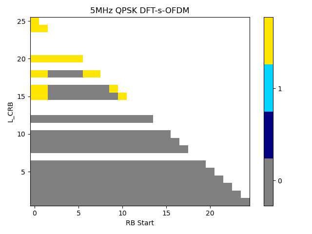{width="3.160416666666667in" height="2.36875in"}
          {width="3.1444444444444444in" height="2.3583333333333334in"}   {width="3.160416666666667in" height="2.36875in"}
  10MHz   {width="3.1444444444444444in" height="2.3583333333333334in"}   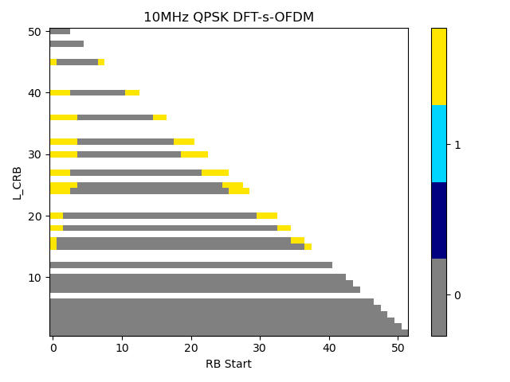{width="3.160416666666667in" height="2.36875in"}
          {width="3.1444444444444444in" height="2.3583333333333334in"}   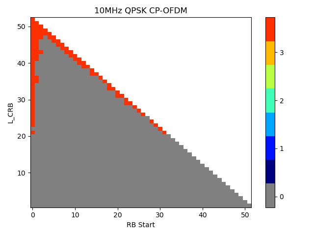{width="3.160416666666667in" height="2.36875in"}
  15MHz   {width="3.1444444444444444in" height="2.3583333333333334in"}   {width="3.160416666666667in" height="2.36875in"}
          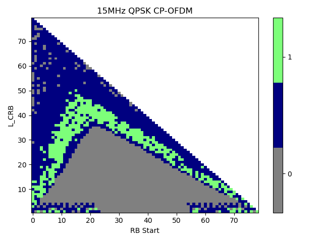{width="3.1444444444444444in" height="2.3583333333333334in"}   {width="3.160416666666667in" height="2.36875in"}

It can be seen from the simulation results that in the most demanding
region, the needed back-off for PC2 is increased by around 0.5dB
compared with PC3.

##### 5.9.2.1.2 A-MPR simulation results from Apple

Simulations have been conducted for all channel bandwidth from 3MHz to
15MHz.

The following assumptions and requirements are used for the simulations:

\- Power Class 2

\- Fixed Bias

\- NR Waveform

\- Calibration: 1dB MPR: DFT-s-OFDM QPSK 20MHz, 100RB

\- Carrier Leakage: 28dBc

\- Image: 28dBc

\- CIM3: 60dBc

\- CIM5: 70dBc

The NS\_06 flag defines an alternative SEM mask for channel bandwidths
up to 15MHz. While the NS\_06 mask shows similarities to general SEM the
additional requirements are tighter and therefore require more power
back-off. The NS\_06 Additional SEM is specified in clause 6.5.2.3.4 of
3GPP 38.101-1 \[2\].

In the following, the NS\_06 requirements are used and channel bandwidth
of 3MHz, 5MHz, 10MHz and 15MHz are simulated. The simulations results
are provided for QPSK with DFT-s-OFDM and CP-OFDM in Table 5.9.2.1.2-1.

Table 5.9.2.1.2-1: Power back-off for QPSK and NS\_06

  DFT-s-OFDM QPSK                                                                         CP-OFDM QPSK
  --------------------------------------------------------------------------------------- --------------------------------------------------------------------------------------
  {width="2.7555555555555555in" height="2.2194444444444446in"}   {width="2.7555555555555555in" height="2.24375in"}
  {width="3.1493055555555554in" height="2.60625in"}              {width="3.1493055555555554in" height="2.59375in"}
  {width="3.1493055555555554in" height="2.5833333333333335in"}   {width="3.1493055555555554in" height="2.615972222222222in"}
  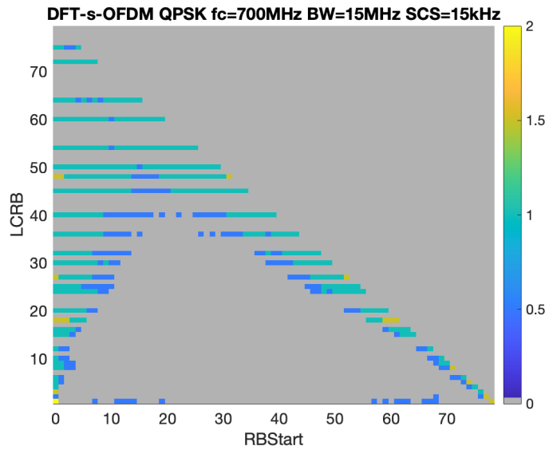{width="3.1493055555555554in" height="2.564583333333333in"}    {width="3.1493055555555554in" height="2.55in"}

For CP-OFDM the results indicate that the MPR is sufficient. However,
there is a tendency for some outer allocations bordering the channel
edge to require slightly more power back-off. For DFT-s-OFDM there exist
certain outer allocation which need 1.5dB which is 0.5dB increased to
MPR. Including the results and observations from clause 5.9.2.1.1, it
might be considered to define 0.5dB relaxation for outer allocations.

Therefore, it is proposed to define 0.5dB relaxation for outer
allocations.

##### 5.9.2.1.3 A-MPR requirements

Based on the simulation results from the previous section, the PC2 A-MPR
requirements for NS\_06 are proposed below in Table 5.9.2.1.3-1.

Table 5.9.2.1.3-1: A-MPR for NS\_06 (Power Class 2)

  Modulation/Waveform   Outer (dB)   
  --------------------- ------------ -------
  DFT-s-OFDM            Pi/2 BPSK    ≤ 1.0
                        QPSK         ≤ 1.5
                        16 QAM       ≤ 2.5
                        64 QAM       ≤ 3.0
                        256 QAM      ≤ 4.5
  CP-OFDM               QPSK         ≤ 3.5
                        16 QAM       ≤ 3.5
                        64 QAM       ≤ 4.0
                        256 QAM      ≤ 6.5

### 5.9.3 Reference sensitivity requirements

For PC2 single band n14, both 1Tx and 2Tx requirements are considered.
Therefore, Reference Sensitivity Degradation requirements for not
supporting Tx diversity (i.e., 1Tx) and for supporting Tx diversity
(i.e., 2Tx) are needed to be defined.

For PC2 single band n14 not supporting Tx diversity (i.e., 1Tx), several
companies shared the analysis, and we summarize the required sensitivity
degradation levels from companies as shown in 5.9.3-1:

Table 5.9.3-1: Reference Sensitivity Degradation from PC3 to PC2 for FDD
bands for UE not supporting Tx Diversity

<table>
<thead>
<tr class="header">
<th>Operating Band</th>
<th>Source</th>
<th>
5

MHz 
(dB)
</th>
<th>
10

MHz 
(dB)
</th>
<th>
15

MHz 
(dB)
</th>
<th>
20

MHz 
(dB)
</th>
<th>
25

MHz 
(dB)
</th>
<th>30 MHz (dB)</th>
<th>35 MHz (dB)</th>
<th>
40

MHz 
(dB)
</th>
<th>45 MHz (dB)</th>
<th>
50

MHz 
(dB)
</th>
</tr>
</thead>
<tbody>
<tr class="odd">
<td>n14</td>
<td>Skyworks (R4-2311152)</td>
<td>0.4</td>
<td>0.8</td>
<td></td>
<td></td>
<td></td>
<td></td>
<td></td>
<td></td>
<td></td>
<td></td>
</tr>
<tr class="even">
<td></td>
<td>Apple (R4-2311251)</td>
<td>0.3</td>
<td>0.6</td>
<td></td>
<td></td>
<td></td>
<td></td>
<td></td>
<td></td>
<td></td>
<td></td>
</tr>
<tr class="odd">
<td></td>
<td>Huawei, HiSilicon(R4- 2316472)</td>
<td>0.9</td>
<td>1.0</td>
<td></td>
<td></td>
<td></td>
<td></td>
<td></td>
<td></td>
<td></td>
<td></td>
</tr>
<tr class="even">
<td></td>
<td>Murata (R4-2318253)</td>
<td>0.7</td>
<td>0.8</td>
<td></td>
<td></td>
<td></td>
<td></td>
<td></td>
<td></td>
<td></td>
<td></td>
</tr>
<tr class="odd">
<td>Average</td>
<td>0.6</td>
<td>0.8</td>
<td></td>
<td></td>
<td></td>
<td></td>
<td></td>
<td></td>
<td></td>
<td></td>
<td></td>
</tr>
</tbody>
</table>

For PC2 single band n14 supporting Tx diversity (i.e., 2Tx), several
companies shared the analysis, and we summarize the required sensitivity
degradation levels from companies as shown in 5.9.3-2:

Table 5.9.3-2: Reference Sensitivity Degradation from PC3 to PC2 for FDD
bands for UE supporting Tx Diversity

<table>
<thead>
<tr class="header">
<th>Operating Band</th>
<th>Source</th>
<th>
5

MHz 
(dB)
</th>
<th>
10

MHz 
(dB)
</th>
<th>
15

MHz 
(dB)
</th>
<th>
20

MHz 
(dB)
</th>
<th>
25

MHz 
(dB)
</th>
<th>30 MHz (dB)</th>
<th>35 MHz (dB)</th>
<th>
40

MHz 
(dB)
</th>
<th>45 MHz (dB)</th>
<th>
50

MHz 
(dB)
</th>
</tr>
</thead>
<tbody>
<tr class="odd">
<td>n14</td>
<td>Skyworks (R4-2311152)</td>
<td>0.8</td>
<td>1.3</td>
<td></td>
<td></td>
<td></td>
<td></td>
<td></td>
<td></td>
<td></td>
<td></td>
</tr>
<tr class="even">
<td></td>
<td>Apple (R4-2311251)</td>
<td>0.8</td>
<td>0.8</td>
<td></td>
<td></td>
<td></td>
<td></td>
<td></td>
<td></td>
<td></td>
<td></td>
</tr>
<tr class="odd">
<td></td>
<td>Huawei, HiSilicon(R4- 2316472)</td>
<td>2.0</td>
<td>2.0</td>
<td></td>
<td></td>
<td></td>
<td></td>
<td></td>
<td></td>
<td></td>
<td></td>
</tr>
<tr class="even">
<td></td>
<td>Murata (R4-2318253)</td>
<td>0.7</td>
<td>1.0</td>
<td></td>
<td></td>
<td></td>
<td></td>
<td></td>
<td></td>
<td></td>
<td></td>
</tr>
<tr class="odd">
<td>Average</td>
<td>1.1</td>
<td>1.3</td>
<td></td>
<td></td>
<td></td>
<td></td>
<td></td>
<td></td>
<td></td>
<td></td>
<td></td>
</tr>
</tbody>
</table>

5.10 NR band n7
---------------

### 5.10.1 UE maximum output power

Table 5.10.1-1: UE output power for PC2

+-----------------------------------+---------------+----------------+
| NR                                | Class 2 (dBm) | Tolerance (dB) |
|                                   |               |                |
| band                              |               |                |
+===================================+===============+================+
| *n7*                              | 26            | +2/-3^3^       |
+-----------------------------------+---------------+----------------+
| NOTE 3: Refers to the             |               |                |
| transmission bandwidths confined  |               |                |
| within FUL\_low and FUL\_low + 4  |               |                |
| MHz or FUL\_high -- 4 MHz and     |               |                |
| FUL\_high, the maximum output     |               |                |
| power requirement is relaxed by   |               |                |
| reducing the lower tolerance      |               |                |
| limit by 1.5 dB.                  |               |                |
+-----------------------------------+---------------+----------------+

### 5.10.2 A-MPR requirements

#### 5.10.2.1 A-MPR simulation results from Apple (R4-2400171)

Effort is taken to have no more than 3dB delta between PC3 and PC2. This
is done by specifying A10 values such that there is no jump of more than
3dB for inner allocations. Additionally, A6 has been chosen that there
is no more increase than 3dB for outer allocations. For CBW of 10MHz,
15MHz and 20MHz the regions with A6 are solely covering outer
allocations while regions with A10 are covering inner and outer
allocations. This approach guarantees that there is no power back-off
increase which exceeds 3dB and therefore avoids PC2 having less output
power than PC3.

One issue remains for CBW of 25MHz. PC3 defines A-MPR for allocations at
LCRB \> 9.72MHz with DFT-s-OFDM and LCRB \> 16.02MHz with CP-OFDM. The
current proposals define A-MPR such that the delta between PC3 and PC2
is more than 3dB. Table 5 provides a visual representation of the PC3
regions and the current PC2 proposal. By comparing the different regions
it can be observed that region A9 extends to lower RBs (compared to PC3)
and covers inner allocations. Those allocations will be subject to more
than 3dB A-MPR increase. A PC2 UE using the entire A-MPR allowance might
have less output power than PC3.

Due to the mentioned issues, it is proposed to consider a different
setup aiming to harmonise PC3 regions with the A-MPR demands of PC2.
Table 6 provides simulations results for 25MHz CBW and the new region
proposals. The topmost region A9 allows for the most demanding power
back-off. The lower region A6 is designed to only cover outer
allocations for all SCS and increase power back-off by 3dB compared to
PC3 outer allocations.

The region proposals for all CBWs are provided in Tables 7 and 8. The
A-MPR is captured in Table 9. Table 10 provides a visual overview over
all regions for all CBW.

Table 5: 25MHz CBW - PC3 regions and current region proposal for PC2

+----------------------+----------------------+----------------------+
| PC3 DFT-s-OFDM       | PC3 CP-OFDM Region   | PC2 Region Proposal  |
| Region               |                      |                      |
|                      |                      | from last meeting    |
+======================+======================+======================+
| {width="1 | age125.png){width="1 | different colors and |
| .9680555555555554in" | .9680555555555554in" | numbers Description  |
| height="1            | height="1.           | automatically        |
| .729861111111111in"} | 7381944444444444in"} | g                    |
|                      |                      | enerated](./media/im |
|                      |                      | age126.png){width="1 |
|                      |                      | .9680555555555554in" |
|                      |                      | height="1.           |
|                      |                      | 7513888888888889in"} |
+----------------------+----------------------+----------------------+

Table 6: Updated region proposal for 25MHz CBW avoiding more than 3dB
delta between PC3 and PC2

  PC2 DFT-s-OFDM                                                                          PC2 CP-OFDM                                                                             New proposal for PC2 regions
  --------------------------------------------------------------------------------------- --------------------------------------------------------------------------------------- ---------------------------------------------------------------------------------------
  {width="2.1847222222222222in" height="1.7395833333333333in"}   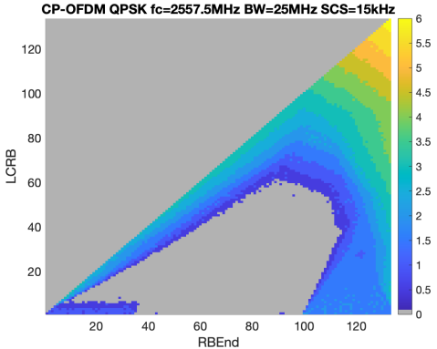{width="2.1791666666666667in" height="1.7395833333333333in"}   {width="1.9958333333333333in" height="1.7395833333333333in"}

Table 7: A-MPR regions for NS\_46 for PC2

+---------------+---------------+---------------+---------------+-----+
| Channel       | Carrier       | Regions       | A-MPR         |     |
| Bandwidth,    | Center        |               |               |     |
| MHz           | Frequency,    |               |               |     |
|               | Fc, MHz       |               |               |     |
+===============+===============+===============+===============+=====+
|               |               | RB~           | L~            |     |
|               |               | end~\*12\*SCS | CRB~\*12\*SCS |     |
|               |               |               |               |     |
|               |               | MHz           | MHz           |     |
+---------------+---------------+---------------+---------------+-----+
| 10 MHz        | 2555 ≤ F~C~ ≤ | ≥ 7.92        | ≥ 7.2         | A5  |
|               | 2565          |               |               |     |
+---------------+---------------+---------------+---------------+-----+
|               |               | ≥ 7.92        | \< 2.16       | A5  |
+---------------+---------------+---------------+---------------+-----+
| 15 MHz        | 2547.5 ≤ F~C~ | ≥ 11.16       | ≥ 7.2         | A6  |
|               | ≤ 2562.5      |               |               |     |
+---------------+---------------+---------------+---------------+-----+
|               |               | ≥ 11.16       | \< 7.2        | A10 |
+---------------+---------------+---------------+---------------+-----+
| 20 MHz        | 2540 ≤ F~C~ ≤ | ≥12.6, \<     | ≥ 10.8        | A6  |
|               | 2560          | 15.3          |               |     |
+---------------+---------------+---------------+---------------+-----+
|               |               | ≥ 15.3        | ≥ 8.64        | A6  |
+---------------+---------------+---------------+---------------+-----+
|               |               | ≥ 14.4, ~~\<  | \< 8.64       | A10 |
|               |               | 15.3~~        |               |     |
+---------------+---------------+---------------+---------------+-----+

Table 8: A-MPR regions for NS\_46 for PC2

+---------------+---------------+---------------+---------------+-----+
| Channel       | Carrier       | Regions       | A-MPR         |     |
| Bandwidth,    | Center        |               |               |     |
| MHz           | Frequency,    |               |               |     |
|               | Fc, MHz       |               |               |     |
+===============+===============+===============+===============+=====+
|               |               | RB~           | L~            |     |
|               |               | end~\*12\*SCS | CRB~\*12\*SCS |     |
|               |               |               |               |     |
|               |               | MHz           | MHz           |     |
+---------------+---------------+---------------+---------------+-----+
| 25 MHz        | 2512.5 ≤ F~C~ | \< 12.24      | \>max (0,     | A5  |
|               | ≤ 2557.5      |               | 12\           |     |
|               |               |               | *SCS\*RB~end~ |     |
|               |               |               | - 2.7)        |     |
+---------------+---------------+---------------+---------------+-----+
|               |               | ≥ 0           | \> 16.02      | A9  |
+---------------+---------------+---------------+---------------+-----+
|               |               | ≥ 0           | ≥ 12.24, ≤    | A6  |
|               |               |               | 16.02         |     |
+---------------+---------------+---------------+---------------+-----+
|               |               | ≥ 17.64       | \< 12.24      | A10 |
+---------------+---------------+---------------+---------------+-----+
| 30 MHz        | 2515 ≤ F~C~ ≤ | ≥0, \<1.44    | \>0           | A4  |
|               | 2555          |               |               |     |
+---------------+---------------+---------------+---------------+-----+
|               |               | ≥1.44, \<13.5 | \>max (0,     | A5  |
|               |               |               | 1             |     |
|               |               |               | 2\*SCS\*RBend |     |
|               |               |               | -1.8)         |     |
+---------------+---------------+---------------+---------------+-----+
|               |               | ≥13.5, \<19.8 | \>11.52       | A6  |
+---------------+---------------+---------------+---------------+-----+
|               |               | ≥19.8,        | \>6.3         | A7  |
|               |               | \<25.92       |               |     |
+---------------+---------------+---------------+---------------+-----+
|               |               | ≥25.92        | \>0           | A8  |
+---------------+---------------+---------------+---------------+-----+
|               |               | \> 20.7 , \<  | ≤ 6.3         | A10 |
|               |               | 25.92         |               |     |
+---------------+---------------+---------------+---------------+-----+
| 35 MHz        | 2517.5 ≤ F~C~ | ≥0, \<3.42    | \>0           | A4  |
|               | ≤ 2552.5      |               |               |     |
+---------------+---------------+---------------+---------------+-----+
|               |               | ≥3.42,        | \>max (0,     | A5  |
|               |               | \<15.84       | 1             |     |
|               |               |               | 2\*SCS\*RBend |     |
|               |               |               | - 3.06)       |     |
+---------------+---------------+---------------+---------------+-----+
|               |               | ≥15.84,       | \>12.6        | A6  |
|               |               | \<22.68       |               |     |
+---------------+---------------+---------------+---------------+-----+
|               |               | ≥22.68,       | \>9.0         | A7  |
|               |               | \<28.8        |               |     |
+---------------+---------------+---------------+---------------+-----+
|               |               | ≥28.8         | \>0           | A8  |
+---------------+---------------+---------------+---------------+-----+
|               |               | \> 24.3 , \<  | ≤ 9.0         | A10 |
|               |               | 28.8          |               |     |
+---------------+---------------+---------------+---------------+-----+
| 40 MHz        | 2520 ≤ F~C~ ≤ | ≥0, \<4.14    | \>0           | A4  |
|               | 2550          |               |               |     |
+---------------+---------------+---------------+---------------+-----+
|               |               | ≥4.14, \<5.04 | \>max (0,     | A11 |
|               |               |               | 1             |     |
|               |               |               | 2\*SCS\*RBend |     |
|               |               |               | - 4.5)        |     |
+---------------+---------------+---------------+---------------+-----+
|               |               | ≥5.04, \<18   | \>max (0,     | A5  |
|               |               |               | 1             |     |
|               |               |               | 2\*SCS\*RBend |     |
|               |               |               | - 4.5)        |     |
+---------------+---------------+---------------+---------------+-----+
|               |               | ≥18, \<25.74  | \>13.5        | A6  |
+---------------+---------------+---------------+---------------+-----+
|               |               | ≥25.74,       | \>12.6        | A7  |
|               |               | \<32.4        |               |     |
+---------------+---------------+---------------+---------------+-----+
|               |               | ≥32.4         | \>0           | A8  |
+---------------+---------------+---------------+---------------+-----+
|               |               | \> 27.9 , \<  | ≤ 12.6        | A10 |
|               |               | 32.4          |               |     |
+---------------+---------------+---------------+---------------+-----+
| 50 MHz        | 2525 ≤ F~C~ ≤ | ≥0, \<9       | \>0           | A4  |
|               | 2545          |               |               |     |
+---------------+---------------+---------------+---------------+-----+
|               |               | ≥9, \<21.6    | \>max (0,     | A5  |
|               |               |               | 1             |     |
|               |               |               | 2\*SCS\*RBend |     |
|               |               |               | - 7.2)        |     |
+---------------+---------------+---------------+---------------+-----+
|               |               | ≥21.6, \<31.5 | \>18          | A6  |
+---------------+---------------+---------------+---------------+-----+
|               |               | ≥31.5, \<39.6 | \>16.2        | A7  |
+---------------+---------------+---------------+---------------+-----+
|               |               | ≥39.6         | \>0           | A8  |
+---------------+---------------+---------------+---------------+-----+
|               |               | \> 33.84, \<  | ≤ 16.2        | A10 |
|               |               | 39.6          |               |     |
+---------------+---------------+---------------+---------------+-----+

Table 9: A-MPR for NS\_46 for PC2

  Modulation/Waveform   A4            A5            A6            A7            A8            A9            A10           A11           
  --------------------- ------------- ------------- ------------- ------------- ------------- ------------- ------------- ------------- -----
                        Outer/Inner   Outer/Inner   Outer/Inner   Outer/Inner   Outer/Inner   Outer/Inner   Outer/Inner   Outer/Inner   
  DFT-s-OFDM            PI/2 BPSK     6.5           2.5           3.5           7.5           11.0          6.5           3.0           5.0
                        QPSK          6.5           2.5           4.0           7.5           11.0          6.5           3.0           5.0
                        16 QAM        6.5           2.5           4.0           7.5           11.0          6.5           3.5           5.0
                        64 QAM        6.5            2.5          4.0           7.5           11.0          6.5           3.5           5.0
                        256 QAM        6.5                                      7.5           11.0          6.5                         5.0
  CP-OFDM               QPSK          6.5           3.5           6.0           8.5           12.0          8             4.5           6.5
                        16 QAM        6.5           3.5           6.0           8.5           12.0          8             4.5           6.5
                        64 QAM        6.5           3.5           6.0           8.5           12.0          8             4.5           6.5
                        256 QAM       6.5                                       8.5           12.0          8                           

Table 10: Visualised RB regions for NS\_46

  {width="2.7555555555555555in" height="2.482638888888889in"}                                                                                 {width="2.7555555555555555in" height="2.4409722222222223in"}
  -------------------------------------------------------------------------------------------------------------------------------------------------------------------- --------------------------------------------------------------------------------------------------------------------------------------------------------
  {width="2.7555555555555555in" height="2.4305555555555554in"}                                                                                {width="2.7555555555555555in" height="2.402083333333333in"}
  {width="2.7555555555555555in" height="2.4402777777777778in"}   {width="2.7555555555555555in" height="2.4472222222222224in"}
  {width="2.7555555555555555in" height="2.454861111111111in"}                                                                                 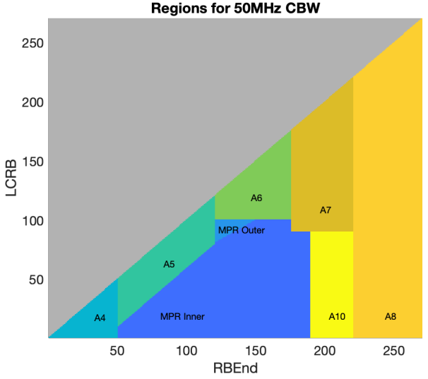{width="2.7555555555555555in" height="2.442361111111111in"}

#### 5.10.2.21 A-MPR simulation results from Qualcomm (R4-2405712)

A-MPR values proposed for NS\_46 for n7. In Table 1 and 2 below minor
updates are suggested to proposals from R4-2402742 as highlighted in red
in an attempt to merge individual company contributions.

Table 1: A-MPR regions for NS\_46 for PC2

+---------------+---------------+---------------+---------------+-----+
| Channel       | Carrier       | Regions       | A-MPR         |     |
| Bandwidth,    | Center        |               |               |     |
| MHz           | Frequency,    |               |               |     |
|               | Fc, MHz       |               |               |     |
+===============+===============+===============+===============+=====+
|               |               | RB~           | L~            |     |
|               |               | end~\*12\*SCS | CRB~\*12\*SCS |     |
|               |               |               |               |     |
|               |               | MHz           | MHz           |     |
+---------------+---------------+---------------+---------------+-----+
| 10 MHz        | 2550 ≤ F~C~ ≤ | ≥ 7.92        | ≥ 5.4         | A6  |
|               | 2565          |               |               |     |
+---------------+---------------+---------------+---------------+-----+
|               |               | ≥ 7.92        | \< 2.16       | A5  |
+---------------+---------------+---------------+---------------+-----+
| 15 MHz        | 2545 ≤ F~C~ ≤ | ≥ 11.16       | ≥ 5.4         | A6  |
|               | 2562.5        |               |               |     |
+---------------+---------------+---------------+---------------+-----+
|               |               | ≥ 11.16       | \< 5.4        | A5  |
+---------------+---------------+---------------+---------------+-----+
| 20 MHz        | 2540 ≤ F~C~ ≤ | ≥12.6, \<     | \> 10.8       | A6  |
|               | 2560          | 15.3          |               |     |
+---------------+---------------+---------------+---------------+-----+
|               |               | ≥ 15.3        | \> 8.64       | A9  |
+---------------+---------------+---------------+---------------+-----+
|               |               | ≥ 14.4        | ≤ 8.64        | A10 |
+---------------+---------------+---------------+---------------+-----+
| 25 MHz        | 2534.5 ≤ F~C~ | \< 14.4       | \>max (0,     | A5  |
|               | ≤ 2557.5      |               | 12\           |     |
|               |               |               | *SCS\*RB~end~ |     |
|               |               |               | - 2.7)        |     |
+---------------+---------------+---------------+---------------+-----+
|               |               | ≥ 14.4,       | \> 12.6       | A6  |
|               |               | \<18.9        |               |     |
+---------------+---------------+---------------+---------------+-----+
|               |               | ≥ 18.9        | \> 16.02      | A9  |
+---------------+---------------+---------------+---------------+-----+
|               |               | ≥ 18.9        | ≤ 16.02, ≥    | A6  |
|               |               |               | 9.72          |     |
+---------------+---------------+---------------+---------------+-----+
|               |               | ≥ 17.64       | \< 9.72       | A10 |
+---------------+---------------+---------------+---------------+-----+
| 30 MHz        | 2515 ≤ F~C~ ≤ | ≥0, \<1.44    | \>0           | A4  |
|               | 2555          |               |               |     |
+---------------+---------------+---------------+---------------+-----+
|               |               | ≥1.44, \<13.5 | \>max (0,     | A5  |
|               |               |               | 1             |     |
|               |               |               | 2\*SCS\*RBend |     |
|               |               |               | -1.8)         |     |
+---------------+---------------+---------------+---------------+-----+
|               |               | ≥13.5, \<19.8 | \>11.52       | A6  |
+---------------+---------------+---------------+---------------+-----+
|               |               | ≥19.8,        | \>6.3         | A7  |
|               |               | \<25.92       |               |     |
+---------------+---------------+---------------+---------------+-----+
|               |               | ≥25.92        | \>0           | A8  |
+---------------+---------------+---------------+---------------+-----+
|               |               | \> 20.7 , \<  | ≤ 6.3         | A10 |
|               |               | 25.92         |               |     |
+---------------+---------------+---------------+---------------+-----+
| 35 MHz        | 2517.5 ≤ F~C~ | ≥0, \<3.42    | \>0           | A4  |
|               | ≤ 2552.5      |               |               |     |
+---------------+---------------+---------------+---------------+-----+
|               |               | ≥3.42,        | \>max (0,     | A5  |
|               |               | \<15.84       | 1             |     |
|               |               |               | 2\*SCS\*RBend |     |
|               |               |               | - 3.06)       |     |
+---------------+---------------+---------------+---------------+-----+
|               |               | ≥15.84,       | \>12.6        | A6  |
|               |               | \<22.68       |               |     |
+---------------+---------------+---------------+---------------+-----+
|               |               | ≥22.68,       | \>9.0         | A7  |
|               |               | \<28.8        |               |     |
+---------------+---------------+---------------+---------------+-----+
|               |               | ≥28.8         | \>0           | A8  |
+---------------+---------------+---------------+---------------+-----+
|               |               | \> 24.3 , \<  | ≤ 9.0         | A10 |
|               |               | 28.8          |               |     |
+---------------+---------------+---------------+---------------+-----+
| 40 MHz        | 2520 ≤ F~C~ ≤ | ≥0, \< 4.5    | \>0           | A4  |
|               | 2550          |               |               |     |
+---------------+---------------+---------------+---------------+-----+
|               |               | ≥ 4.14, \<    | \>max (0,     | A11 |
|               |               | 5.04          | 1             |     |
|               |               |               | 2\*SCS\*RBend |     |
|               |               |               | - 4.5)        |     |
+---------------+---------------+---------------+---------------+-----+
|               |               | ≥ 5.04, \<18  | \>max (0,     | A5  |
|               |               |               | 1             |     |
|               |               |               | 2\*SCS\*RBend |     |
|               |               |               | - 4.5)        |     |
+---------------+---------------+---------------+---------------+-----+
|               |               | ≥18, \<25.74  | \>13.5        | A6  |
+---------------+---------------+---------------+---------------+-----+
|               |               | ≥25.74,       | \>12.6        | A7  |
|               |               | \<32.4        |               |     |
+---------------+---------------+---------------+---------------+-----+
|               |               | ≥32.4         | \>0           | A8  |
+---------------+---------------+---------------+---------------+-----+
|               |               | \> 27.9 , \<  | ≤ 12.6        | A10 |
|               |               | 32.4          |               |     |
+---------------+---------------+---------------+---------------+-----+
| 50 MHz        | 2525 ≤ F~C~ ≤ | ≥0, \<9       | \>0           | A4  |
|               | 2545          |               |               |     |
+---------------+---------------+---------------+---------------+-----+
|               |               | ≥9, \<21.6    | \>max (0,     | A5  |
|               |               |               | 1             |     |
|               |               |               | 2\*SCS\*RBend |     |
|               |               |               | - 7.2)        |     |
+---------------+---------------+---------------+---------------+-----+
|               |               | ≥21.6, \<31.5 | \>18          | A6  |
+---------------+---------------+---------------+---------------+-----+
|               |               | ≥31.5, \<39.6 | \>16.2        | A7  |
+---------------+---------------+---------------+---------------+-----+
|               |               | ≥39.6         | \>0           | A8  |
+---------------+---------------+---------------+---------------+-----+
|               |               | \> 33.84, \<  | ≤ 16.2        | A10 |
|               |               | 39.6          |               |     |
+---------------+---------------+---------------+---------------+-----+

Table 2: A-MPR for NS\_46 for PC2

  Modulation/Waveform   A4            A5            A6            A7            A8            A9            A10           A11           
  --------------------- ------------- ------------- ------------- ------------- ------------- ------------- ------------- ------------- -----
                        Outer/Inner   Outer/Inner   Outer/Inner   Outer/Inner   Outer/Inner   Outer/Inner   Outer/Inner   Outer/Inner   
  DFT-s-OFDM            PI/2 BPSK     6.5           2.5           3.5           7             10            6.5           3.0           5.0
                        QPSK          6.5           2.5           3.5           7             10            6.5           3.0           5.0
                        16 QAM        6.5           2.5           3.5           7             10            6.5           3.5           5.0
                        64 QAM        6.5           2.5           3.5           7             10            6.5           3.5           5.0
                        256 QAM       6.5                                       7             10            6.5                         5.0
  CP-OFDM               QPSK          6.5           3.5           5.5           8             11            8             4.5           6.5
                        16 QAM        6.5           3.5           5.5           8             11            8             4.5           6.5
                        64 QAM        6.5           3.5           5.5           8             11            8             4.5           6.5
                        256 QAM       6.5                                       8             11            8                           

#### 5.10.2.3 A-MPR analysis from Huawei (R4-2404878)

**For BW=10MHz, no A-MPR is defined for PC3, and it's not necessary to
define A-MPR for PC2.**

For BW=15/20MHz, certain RB scheduling restriction is imposed when the
carrier frequency falls into specific ranges.

**No PC3 A-MPR is defined for BW=15/20MHz if the following conditions
are NOT satisfied:**

\- for carriers of 15 MHz bandwidth when carrier centre frequency is
within the range 2560.5 - 2562.5 MHz

\- for carriers of 20 MHz bandwidth when carrier centre frequency is
within the range 2552 - 2560 MHz.

**Align the carrier center frequency ranges with those defined in PC3
A-MPR. More explicitly, use the values shown below:**

  Channel Bandwidth, MHz   Carrier Center Frequency, Fc, MHz
  ------------------------ -----------------------------------
                           
  15 MHz                   2560.5 ≤ F~C~ ≤ 2562.5
                           
  20 MHz                   2552 ≤ F~C~ ≤ 2560
                           
                           
  25 MHz                   2534.5 ≤ F~C~ ≤ 2557.5
                           

### 5.10.3 Reference sensitivity requirements

**T**able 5.10.3-1: Reference Sensitivity Degradation from PC3 to PC2
for FDD bands for UE not supporting Tx Diversity

<table>
<thead>
<tr class="header">
<th>Operating Band</th>
<th>Source</th>
<th>
5

MHz 
(dB)
</th>
<th>
10

MHz 
(dB)
</th>
<th>
15

MHz 
(dB)
</th>
<th>
20

MHz 
(dB)
</th>
<th>
25

MHz 
(dB)
</th>
<th>30 MHz (dB)</th>
<th>35 MHz (dB)</th>
<th>
40

MHz 
(dB)
</th>
<th>45 MHz (dB)</th>
<th>
50

MHz 
(dB)
</th>
</tr>
</thead>
<tbody>
<tr class="odd">
<td>n7</td>
<td>Skyworks (R4-2311152)</td>
<td>0.3</td>
<td>0.5</td>
<td>0.6</td>
<td>0.7</td>
<td>0.9</td>
<td>0.9</td>
<td>0.9</td>
<td>0.9</td>
<td>-</td>
<td>2.1</td>
</tr>
<tr class="even">
<td></td>
<td>Apple (R4-2311251)</td>
<td>0.2</td>
<td>0.2</td>
<td>0.2</td>
<td>0.2</td>
<td>0.2</td>
<td>0.2</td>
<td>0.2</td>
<td>0.2</td>
<td>N/A</td>
<td>2.0</td>
</tr>
<tr class="odd">
<td></td>
<td>Murata (R4-2311442)</td>
<td>0.7</td>
<td>0.4</td>
<td>0.3</td>
<td>0.2</td>
<td>0.2</td>
<td>0.1</td>
<td>0.1</td>
<td>0.1</td>
<td></td>
<td>0.8</td>
</tr>
<tr class="even">
<td></td>
<td>Qualcomm (R4-2313553)</td>
<td>0.6</td>
<td>0.4</td>
<td>0.4</td>
<td>0.4</td>
<td>0.3</td>
<td>0.3</td>
<td>0.3</td>
<td>0.3</td>
<td></td>
<td>1.8</td>
</tr>
<tr class="odd">
<td></td>
<td>Huawei, HiSilicon (R4-2316472) based on 2Rx</td>
<td>0.8</td>
<td>0.8</td>
<td>0.8</td>
<td>1.1</td>
<td>1.1</td>
<td>1.1</td>
<td>1.1</td>
<td>1.1</td>
<td>-</td>
<td>3.2</td>
</tr>
<tr class="even">
<td></td>
<td>Average (Moderator)</td>
<td>0.5</td>
<td>0.5</td>
<td>0.5</td>
<td>0.5</td>
<td>0.5</td>
<td>0.5</td>
<td>0.5</td>
<td>0.5</td>
<td></td>
<td>2.0</td>
</tr>
</tbody>
</table>

Table 5.10.3-2: Reference Sensitivity Degradation from PC3 to PC2 for
FDD bands for UE supporting Tx Diversity

<table>
<thead>
<tr class="header">
<th>Operating Band</th>
<th>Source</th>
<th>
5

MHz 
(dB)
</th>
<th>
10

MHz 
(dB)
</th>
<th>
15

MHz 
(dB)
</th>
<th>
20

MHz 
(dB)
</th>
<th>
25

MHz 
(dB)
</th>
<th>30 MHz (dB)</th>
<th>35 MHz (dB)</th>
<th>
40

MHz 
(dB)
</th>
<th>45 MHz (dB)</th>
<th>
50

MHz 
(dB)
</th>
</tr>
</thead>
<tbody>
<tr class="odd">
<td>n7</td>
<td>Skyworks (R4-2311152)</td>
<td>0.5</td>
<td>0.9</td>
<td>1.1</td>
<td>1.2</td>
<td>1.4</td>
<td>1.4</td>
<td>1.4</td>
<td>1.4</td>
<td>-</td>
<td>5.5</td>
</tr>
<tr class="even">
<td></td>
<td>Apple (R4-2311251)</td>
<td>0.6</td>
<td>0.6</td>
<td>0.6</td>
<td>0.6</td>
<td>0.6</td>
<td>0.6</td>
<td>0.6</td>
<td>0.6</td>
<td>N/A</td>
<td>5.6</td>
</tr>
<tr class="odd">
<td></td>
<td>Murata (R4-2311442)</td>
<td>0.6</td>
<td>0.6</td>
<td>0.6</td>
<td>0.6</td>
<td>0.7</td>
<td>0.6</td>
<td>0.6</td>
<td>0.7</td>
<td></td>
<td>5.6</td>
</tr>
<tr class="even">
<td></td>
<td>Qualcomm (R4-2313553)</td>
<td>1.2</td>
<td>1.2</td>
<td>1.3</td>
<td>1.3</td>
<td>1.2</td>
<td>1.2</td>
<td>1.2</td>
<td>1.4</td>
<td></td>
<td>3.8</td>
</tr>
<tr class="odd">
<td></td>
<td>Huawei, HiSilicon (R4-2316472) based on 2Rx</td>
<td>1.4</td>
<td>1.5</td>
<td>1.4</td>
<td>1.3</td>
<td>1.5</td>
<td>1.5</td>
<td>1.5</td>
<td>1.5</td>
<td>-</td>
<td>6.2</td>
</tr>
<tr class="even">
<td></td>
<td>Average (Moderator)</td>
<td>0.9</td>
<td>1.0</td>
<td>1.0</td>
<td>1.0</td>
<td>1.1</td>
<td>1.1</td>
<td>1.1</td>
<td>1.1</td>
<td></td>
<td>5.3</td>
</tr>
</tbody>
</table>

5.11 NR band n26
----------------

### 5.11.1 UE maximum output power

Table 5.11.1-1: UE output power for PC2

+-----------------------------------+---------------+----------------+
| NR                                | Class 2 (dBm) | Tolerance (dB) |
|                                   |               |                |
| band                              |               |                |
+===================================+===============+================+
| n26                               | 26            | +2/-3^3^       |
+-----------------------------------+---------------+----------------+
| NOTE 3: Refers to the             |               |                |
| transmission bandwidths confined  |               |                |
| within F~UL\_low~ and F~UL\_low~  |               |                |
| + 4 MHz or F~UL\_high~ -- 4 MHz   |               |                |
| and F~UL\_high~, the maximum      |               |                |
| output power requirement is       |               |                |
| relaxed by reducing the lower     |               |                |
| tolerance limit by 1.5 dB.        |               |                |
+-----------------------------------+---------------+----------------+

### 5.11.2 A-MPR requirements

Based on discussions for A-MPR for PC2 on NR band n26, the NS\_12,
NS\_13, NS\_14, NS\_15 need to be studied.

#### 5.11.2.1 A-MPR simulation results from Huawei (R4-2402214)

Simulations are performed under the agreed assumptions. The results are
obtained for NS\_12 to NS\_15 based on 1Tx PC2 PA model, which are shown
in Table 1 below. The figures in the 2^nd^ column show the differences
in the A-MPR simulation results between PC2 and PC3, and the figures in
the 3^rd^ column plot only the PC2 A-MPR, **for which 0dB is assigned if
A-MPR ≤ PC2 MPR**.

Table 1 A-MPR simulation results for NS\_12

  BW      DIFF A-MPR (PC2-PC3)                                                                    PC2 A-MPR
  ------- --------------------------------------------------------------------------------------- --------------------------------------------------------------------------------------
  10MHz   {width="3.1395833333333334in" height="2.3541666666666665in"}   {width="3.1645833333333333in" height="2.373611111111111in"}
          {width="3.1395833333333334in" height="2.3541666666666665in"}   {width="3.1645833333333333in" height="2.373611111111111in"}
  5MHz    {width="3.1395833333333334in" height="2.3541666666666665in"}   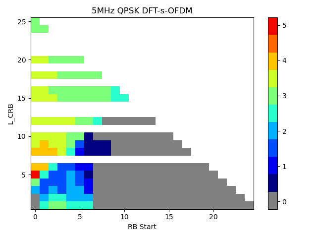{width="3.1645833333333333in" height="2.373611111111111in"}
          {width="3.1395833333333334in" height="2.3541666666666665in"}   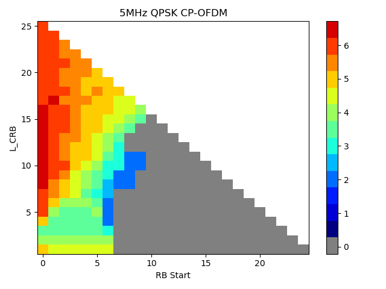{width="3.1645833333333333in" height="2.373611111111111in"}
  3MHz    {width="3.1395833333333334in" height="2.3541666666666665in"}   {width="3.1645833333333333in" height="2.373611111111111in"}
          {width="3.1395833333333334in" height="2.3541666666666665in"}   {width="3.1645833333333333in" height="2.373611111111111in"}

Table 2: A-MPR simulation results for NS\_13

  BW     DIFF A-MPR (PC2-PC3)                                                                    PC2 A-MPR
  ------ --------------------------------------------------------------------------------------- --------------------------------------------------------------------------------------
  5MHz   {width="3.1395833333333334in" height="2.3541666666666665in"}   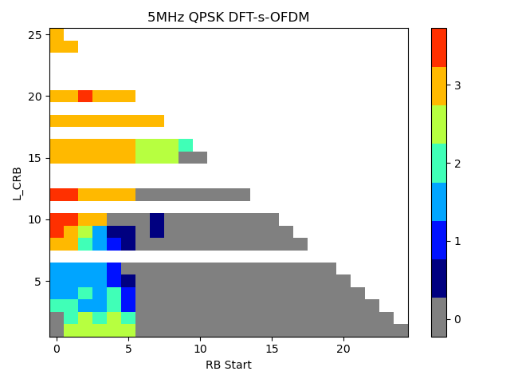{width="3.1645833333333333in" height="2.373611111111111in"}
         {width="3.1395833333333334in" height="2.3541666666666665in"}   {width="3.1645833333333333in" height="2.373611111111111in"}
  3MHz   {width="3.1395833333333334in" height="2.3541666666666665in"}   {width="3.1645833333333333in" height="2.373611111111111in"}
         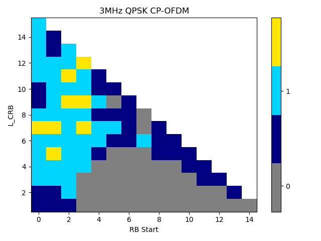{width="3.1395833333333334in" height="2.3541666666666665in"}   {width="3.1645833333333333in" height="2.373611111111111in"}

Table 3: A-MPR simulation results for NS\_14

  BW      DIFF A-MPR (PC2-PC3)                                                                    PC2 A-MPR
  ------- --------------------------------------------------------------------------------------- --------------------------------------------------------------------------------------
  20MHz   {width="3.1395833333333334in" height="2.3541666666666665in"}   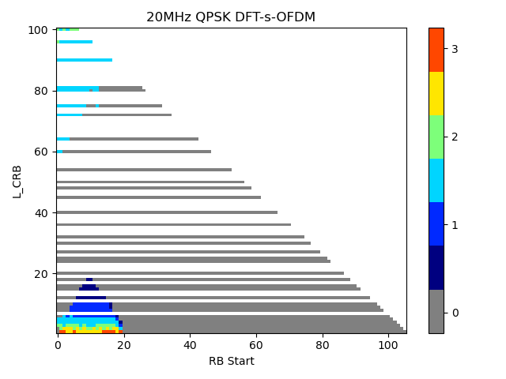{width="3.1645833333333333in" height="2.373611111111111in"}
          {width="3.1395833333333334in" height="2.3541666666666665in"}   {width="3.1645833333333333in" height="2.373611111111111in"}
  15MHz   {width="3.1395833333333334in" height="2.3541666666666665in"}   {width="3.1645833333333333in" height="2.373611111111111in"}
          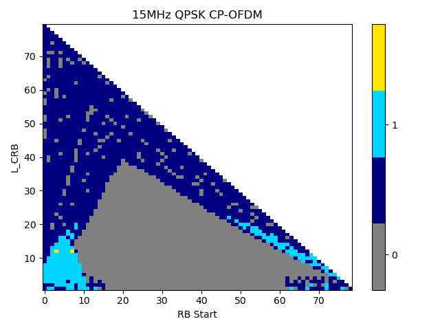{width="3.1395833333333334in" height="2.3541666666666665in"}   {width="3.1645833333333333in" height="2.373611111111111in"}
  10MHz   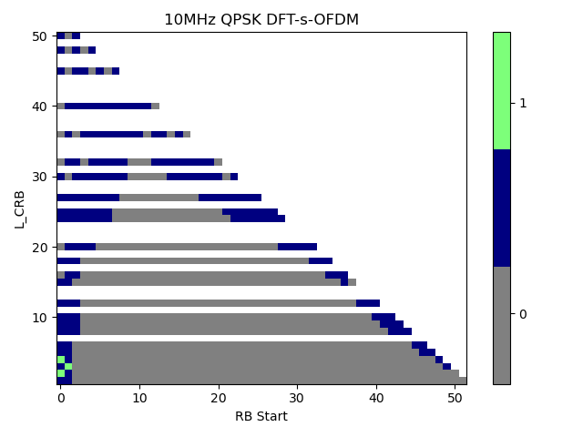{width="3.1395833333333334in" height="2.3541666666666665in"}   {width="3.1645833333333333in" height="2.373611111111111in"}
          {width="3.1395833333333334in" height="2.3541666666666665in"}   {width="3.1645833333333333in" height="2.373611111111111in"}

Table 4: A-MPR simulation results for NS\_15

  BW      DIFF A-MPR (PC2-PC3)                                              PC2 A-MPR
  ------- ----------------------------------------------------------------- --------------------------------------------------------------------------------------
  5MHz    {width="3.14375in" height="2.35625in"}   {width="3.161111111111111in" height="2.3694444444444445in"}
          {width="3.14375in" height="2.35625in"}   {width="3.161111111111111in" height="2.3694444444444445in"}
  10MHz   {width="3.14375in" height="2.35625in"}   {width="3.161111111111111in" height="2.3694444444444445in"}
          {width="3.14375in" height="2.35625in"}   {width="3.161111111111111in" height="2.3694444444444445in"}
  20MHz   {width="3.14375in" height="2.35625in"}   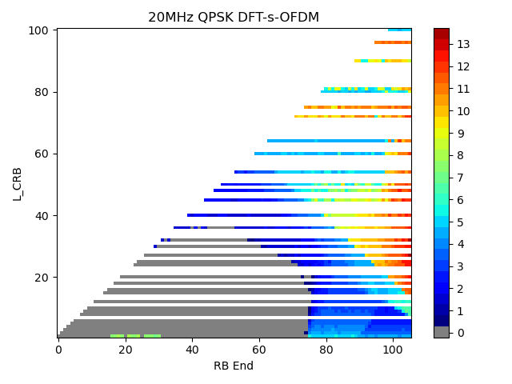{width="3.161111111111111in" height="2.3694444444444445in"}
          {width="3.14375in" height="2.35625in"}   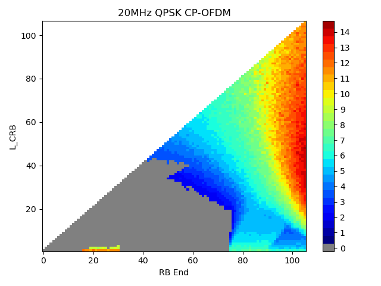{width="3.161111111111111in" height="2.3694444444444445in"}

#### 5.11.2.2 A-MPR simulation results from Apple (R4-2315374, R4-2407067)

The simulation results for NS\_12 are provided below. The difference
between PC3 and the proposal for PC2 is visualised by red colour and
indicating the delta A-MPR. The proposals have a maximum delta of 3dB to
max(MPR, A-MPR) of PC3.

Below the A-MPR values and the difference to PC3 is shown. While all
modulations require additional power back-off there does not seem need
for further back-off with 256QAM.

Table 1: A-MPR regions for NS\_12

  Channel BW   RB~Start~\*12\*SCS (MHz)   L~CRB~\*12\*SCS (MHz)   A-MPR
  ------------ -------------------------- ----------------------- -------
  5MHz         ≤1.8                       \>0                     A1
               \>1.8                      \>1.08                  A2
  10MHz        ≤3.6                       \>0                     A1
               \>3.6, ≤5.04                                       A2

Table 2: A-MPR for NS\_12

  Modulation/Waveform    A1            A2
  ---------------------- ------------- -------------
                         Outer/Inner   Outer/Inner
  DFT-s-OFDM PI/2 BPSK   ≤ 5 +2.5      3.0
  DFT-s-OFDM QPSK        ≤ 5 +2.5      3.0
  DFT-s-OFDM 16 QAM      ≤ 5.5 +2      3.0
  DFT-s-OFDM 64 QAM      ≤ 5.5 +2      3.0
  DFT-s-OFDM 256 QAM     ≤ 9.5         4.5
  CP-OFDM QPSK           ≤ 7 +1.5      4.5
  CP-OFDM 16 QAM         ≤ 7 +1.5      4.5
  CP-OFDM 64 QAM         ≤ 7 +1.5      4.5
  CP-OFDM 256 QAM        ≤ 9.5         6.5

  {width="3.1493055555555554in" height="2.5652777777777778in"}   {width="3.1493055555555554in" height="2.5097222222222224in"}
  --------------------------------------------------------------------------------------- ---------------------------------------------------------------------------------------
  {width="3.1493055555555554in" height="2.4972222222222222in"}   {width="3.1493055555555554in" height="2.564583333333333in"}

The simulation results for NS\_13 are provided below. The difference
between PC3 and the proposal for PC2 is visualised by red colour and
indicating the delta A-MPR. The proposals have a maximum delta of 3dB to
max(MPR, A-MPR) of PC3.

Table 3: A-MPR regions for NS\_13

  Channel BW   Carrier Frequency, Fc, MHz   RB~Start~\*12\*SCS (MHz)   L~CRB~\*12\*SCS (MHz)   A-MPR
  ------------ ---------------------------- -------------------------- ----------------------- -------
  5MHz         819.5 ≤ Fc \< 821.5          ≤1.44                      \<1.08                  A1
                                            ≤1.44                      ≥1.08                   A2
                                            \>1.44                     ≥1.8                    A3
  5MHz         Fc ≥ 821.5                   ≤0.54                      \<1.08                  A1
                                                                       ≥3.24                   A3
                                                                       \<3.24, ≥2.52           A4

Table 4: A-MPR for NS\_13

  Modulation/Waveform    A1            A2            A3           A4
  ---------------------- ------------- ------------- ------------ -------
                         Outer/Inner   Outer/Inner   Outer        Outer
  DFT-s-OFDM PI/2 BPSK   ≤ 3.5 +1.0    ≤ 4.5 +2      ≤ 3 +1.0     ≤ 3
  DFT-s-OFDM QPSK        ≤ 3.5 +1.0    ≤ 4.5 +2      ≤ 3 +1.0     ≤ 3
  DFT-s-OFDM 16 QAM      ≤ 3.5 +1.0    ≤ 5 +1.5      ≤ 3 +1.0     ≤ 3
  DFT-s-OFDM 64 QAM      ≤ 4.5         ≤ 5 +1.5      ≤ 3 +1.0     ≤ 3
  DFT-s-OFDM 256 QAM     ≤ 8           ≤ 6 +1                     
  CP-OFDM QPSK           ≤ 5 +1.0      ≤ 6.5 +1.0    ≤ 4.5 +1.0   ≤ 4.5
  CP-OFDM 16 QAM         ≤ 5 +1.0      ≤ 6.5 +1.0    ≤ 4.5 +1.0   ≤ 4.5
  CP-OFDM 64 QAM         ≤ 6           ≤ 6.5 +1.0    ≤ 4.5 +1.0   ≤ 4.5
  CP-OFDM 256 QAM        ≤ 8           ≤ 8                        

  {width="3.1493055555555554in" height="2.5180555555555557in"}   {width="3.1493055555555554in" height="2.5055555555555555in"}
  --------------------------------------------------------------------------------------- ---------------------------------------------------------------------------------------
  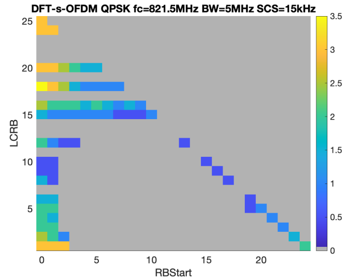{width="3.1493055555555554in" height="2.5118055555555556in"}   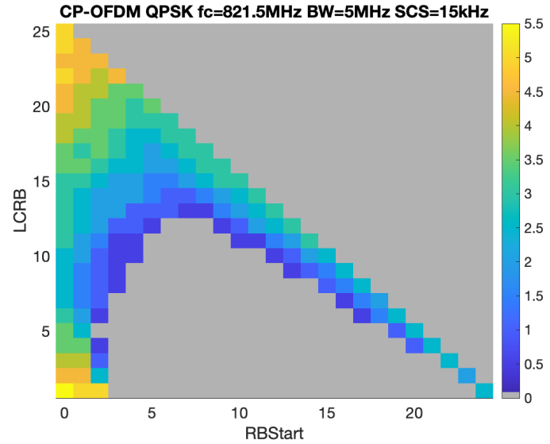{width="3.1493055555555554in" height="2.5416666666666665in"}

The simulation results for NS\_14 are provided below. The difference
between PC3 and the proposal for PC2 is visualised by red colour and
indicating the delta A-MPR. The proposals have a maximum delta of 3dB to
max(MPR, A-MPR) of PC3. A-MPR regions A1/A3 allow increased power
back-off for edge allocations and smaller allocations close to channel
edge. The proposed A-MPR is on the higher side as edge allocation
performance is typically highly dependent on BB implementation with
**WOLA and other factors influencing the actual power back-off need.**

Table 5: A-MPR regions for NS\_14

  Channel BW   RB~Start~\*12\*SCS (MHz)   L~CRB~\*12\*SCS (MHz)   A-MPR
  ------------ -------------------------- ----------------------- -------
  10MHz        ≤0.18                      \<1.08                  A1
               ≥0                         ≥9                      A2
               ≥0                         ≥8.64, \<9              A4
  15MHz        ≤1.8                       \<1.8                   A1
               ≥0                         ≥9                      A2
               ≤1.8                       ≥1.8, \<3.6e6           A4
               ≥0                         ≥8.64, \<9              A4
  20MHz        ≤3.42                      \<1.8                   A3
               ≥0                         ≥9                      A2
               ≤3.42                      ≥1.8, \<3.6e6           A4
               ≥0                         ≥8.64, \<9              A4

Table 6: A-MPR for NS\_14

  Modulation/Waveform    A1            A2         A3            A4
  ---------------------- ------------- ---------- ------------- -------------
                         Outer/Inner   Outer      Outer/Inner   Outer/Inner
  DFT-s-OFDM PI/2 BPSK   ≤ 3 +1.5      ≤ 2 +1.5   ≤ 3 +1.5      ≤ 3
  DFT-s-OFDM QPSK        ≤ 3 +1.5      ≤ 2 +1.5   ≤ 3 +1.5      ≤ 3
  DFT-s-OFDM 16 QAM      ≤ 3 +1.5      ≤ 2 +1.5   ≤ 3 +1.5      ≤ 3
  DFT-s-OFDM 64 QAM      ≤ 3 +1.5                 ≤ 3 +1.5      ≤ 3
  DFT-s-OFDM 256 QAM                              ≤ 8           ≤ 4.5
  CP-OFDM QPSK           ≤ 5 +1.5      ≤ 4 +1.0   ≤ 5 +1.5      ≤ 3
  CP-OFDM 16 QAM         ≤ 5 +1.5      ≤ 4 +1.0   ≤ 5 +1.5      ≤ 3
  CP-OFDM 64 QAM         ≤ 6 +0.5      ≤ 5.0      ≤ 6 +0.5      ≤ 3.5
  CP-OFDM 256 QAM        ≤ 8                      ≤ 8           ≤ 6.5

  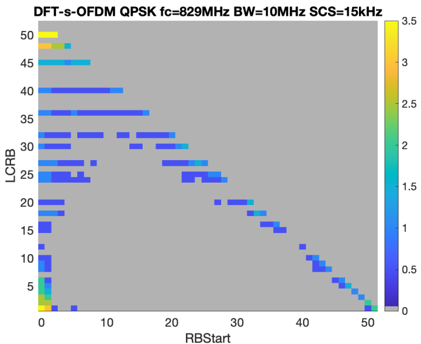{width="3.1493055555555554in" height="2.577777777777778in"}    {width="3.1493055555555554in" height="2.5569444444444445in"}
  --------------------------------------------------------------------------------------- ---------------------------------------------------------------------------------------
  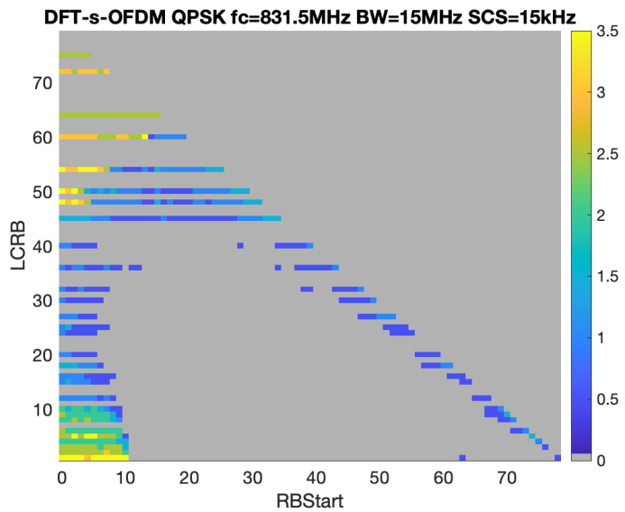{width="3.1493055555555554in" height="2.579861111111111in"}    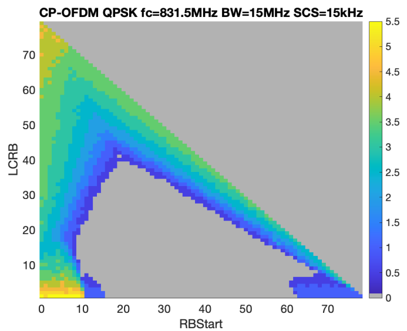{width="3.1493055555555554in" height="2.5618055555555554in"}
  {width="3.1493055555555554in" height="2.5479166666666666in"}   {width="3.1493055555555554in" height="2.504861111111111in"}

On NS\_15 for n26 (R4-2407067)

In previous meetings there was strong concern that the A-MPR values of
the initial proposals might not be sufficient with respect to physical
implementation. High power back-off faces issues such as supply voltage
changes and power consumption optimisations which are not reflected by a
fixed bias simulation. Therefore, companies were asked to further check
on the proposed A-MPR values.

We followed the request and did additional analysis based on
measurements and found that there is indeed demand for adjusting the
starting point from WF \[R4-2406573, "WF on A-MPR for FDD HPUE", China
Unicom, 3GPP TSG-RAN WG4 Meeting \# 110-bis \]. With respect to the
measurement based evaluation, full or almost fully allocated channels
require an A-MPR increase close to 3dB. Those allocations are all
located inside regions linked to A1. The proposal for the updated set of
A-MPR values can be found in Table 1. The RB allocation regions do not
require updates and can be keept according to the starting point. Those
regions can be found in Table 2.

The delta A-MPR between PC3 and the proposal for PC2 is marked with red
colour. The new A-MPR set 'A5' is designed such that there is a maximum
delta of 3dB for inner allocations between PC3 and PC2.

Table 1: A-MPR for NS\_15 (PC2)

  Modulation/Waveform    A1            A2            A3            A4            A5
  ---------------------- ------------- ------------- ------------- ------------- -------------
                         Outer/Inner   Outer/Inner   Outer/Inner   Outer/Inner   Outer/Inner
  DFT-s-OFDM PI/2 BPSK   ≤ 9 +3        ≤ 5 +1.5      ≤ 4 +3        ≤ 9 +1.5      ≤ 3
  DFT-s-OFDM QPSK        ≤ 9 +3        ≤ 5 +1.5      ≤ 4 +3        ≤ 9 +1.5      ≤ 3
  DFT-s-OFDM 16 QAM      ≤ 9 +3        ≤ 5 +1.5      ≤ 4 +3        ≤ 9 +1.5      ≤ 3
  DFT-s-OFDM 64 QAM      ≤ 9 +3        ≤ 5 +1.5      ≤ 4 +3        ≤ 9 +1.5      ≤ 3
  DFT-s-OFDM 256 QAM     ≤ 9 +3        ≤ 5 +1.5      ≤ 9           ≤ 13.5        ≤ 4.5
  CP-OFDM QPSK           ≤ 10.5 +3     ≤ 6.5 +1.5    ≤ 4 +3        ≤ 10.5 +1.5   ≤ 4.5
  CP-OFDM 16 QAM         ≤ 10.5 +3     ≤ 6.5 +1.5    ≤ 4 +3        ≤ 10.5 +1.5   ≤ 4.5
  CP-OFDM 64 QAM         ≤ 10.5 +3     ≤ 6.5 +1.5    ≤ 4 +3        ≤ 10.5 +1.5   ≤ 4.5
  CP-OFDM 256 QAM        ≤ 10.5 +3     ≤ 6.5 +1.5    ≤ 9           ≤ 13.5        ≤ 6.5

Table 2: A-MPR regions for NS\_15 (PC2)

  Channel BW   Carrier Frequency, Fc, MHz   RB~end~\*12\*SCS (MHz)   L~CRB~\*12\*SCS (MHz)   A-MPR
  ------------ ---------------------------- ------------------------ ----------------------- -------
  5MHz         840.5 \< Fc ≤ 846.5          ≥3.24                    \>0                     A1
                                            \<3.24, ≥2.52            ≥1.44                   A2
                                            \<0.9                    ≤0.36                   A3
                                            \<2.53, ≥1.8             ≥1.44                   A5
                                            \<1.08                   \>0.36, ≤0.72           A5
  10MHz        840 \< Fc ≤ 844              ≥5.76                    \>1.08                  A1
                                            ≥5.76                    ≤1.08                   A4
                                            \<5.76, ≥4.14            ≥2.7                    A2
                                            \<2.52                   ≤0.36                   A3
                                            \<4.14, ≥1.8             ≥2.52                   A5
                                            \<2.52                   \>0.36, ≤0.72           A5
               835 \< Fc ≤ 840              ≥7.2                     \>0                     A1
                                            \<7.2, ≥5.22             ≥4.32                   A2
                                            \<1.08                   ≤0.36                   A3
                                            \<7.2, ≥5.22             \<4.32, ≥3.24           A5
                                            \<1.44                   \>0.36, ≤0.72           A5
  15MHz        837.5 \< Fc ≤ 841.5          ≥9.36                    \>1.08                  A1
                                            ≥9.36                    ≤1.08                   A4
                                            \<9.36, ≥4.68            ≥3.6                    A2
                                            \<3.96                   ≤0.36                   A3
                                            \<4.68, ≥1.8             ≥2.52                   A5
                                            \<3.96                   \>0.36, ≤1.08           A5
               831.5 \< Fc ≤ 837.5          ≥10.8                    \>1.08                  A1
                                            ≥10.8                    ≤1.08                   A4
                                            \<10.8, ≥6.48            ≥3.6                    A2
                                            \<2.7                    ≤0.36                   A3
                                            \<2.7                    \>0.36, ≤0.72           A5
               Fc ≤ 831.5                   ≥13.14                   \>0                     A1
                                            \<13.14, ≥7.92           ≥3.6                    A2
                                            \<0.72                   ≤0.36                   A3
                                            \<1.08                   \>0.36, ≤0.72           A5
  20MHz        835 \< Fc ≤ 839              ≥12.24                   \>1.08                  A1
                                            ≥12.24                   ≤1.08                   A4
                                            \<12.24, ≥8.46           ≥5.4                    A2
                                            \<5.58                   ≤0.36                   A3
                                            \< 8.46, ≥1.8            ≥3.6                    A5
                                            \<6.12                   \>0.36, ≤1.08           A5
                                            \<12.24, ≥8.46           \< 5.4, ≥3.6            A5
               Fc ≤ 835                     ≥13.68                   \>1.08                  A1
                                            ≥13.68                   ≤1.08                   A4
                                            \<13.68, ≥8.46           ≥5.4                    A2
                                            \<4.32                   ≤0.36                   A3
                                            \<4.68                   \>0.36, ≤1.08           A5

### 5.11.3 Reference sensitivity requirements

For PC2 single band n26, both 1Tx and 2Tx requirements are considered.
Therefore, for the Reference Sensitivity Degradation requirements, not
supporting Tx diversity (i.e. 1Tx) and supporting Tx diversity (i.e.
2Tx) are needed to be defined.

For PC2 single band n26 not supporting Tx diversity (i.e. 1Tx), the
Reference Sensitivity Degradation from PC3 to PC2 are defined in Table:

Table 5.11.3-1: Reference Sensitivity Degradation from PC3 to PC2 for
FDD bands for UE not supporting Tx Diversity

<table>
<thead>
<tr class="header">
<th>Operating Band</th>
<th>Source</th>
<th>
5

MHz 
(dB)
</th>
<th>
10

MHz 
(dB)
</th>
<th>
15

MHz 
(dB)
</th>
<th>
20

MHz 
(dB)
</th>
<th>
25

MHz 
(dB)
</th>
<th>30 MHz (dB)</th>
<th>35 MHz (dB)</th>
<th>
40

MHz 
(dB)
</th>
<th>45 MHz (dB)</th>
<th>
50

MHz 
(dB)
</th>
</tr>
</thead>
<tbody>
<tr class="odd">
<td>n26</td>
<td>Skyworks(R4-2300652)</td>
<td>0.3</td>
<td>0.5</td>
<td>0.8</td>
<td>1.7</td>
<td>2.1</td>
<td>2.4</td>
<td></td>
<td></td>
<td></td>
<td></td>
</tr>
<tr class="even">
<td></td>
<td>Apple(R4-2300362)</td>
<td>0</td>
<td>0.9</td>
<td>0.7</td>
<td>1.3</td>
<td>1.7</td>
<td>2.2</td>
<td>N/A</td>
<td>N/A</td>
<td>N/A</td>
<td>N/A</td>
</tr>
<tr class="odd">
<td></td>
<td>Huawei, HiSilicon(R4- 2300715)</td>
<td>1.0</td>
<td>1.0</td>
<td>1.0</td>
<td>2.9</td>
<td>3.3</td>
<td>3.6</td>
<td>-</td>
<td>-</td>
<td>-</td>
<td>-</td>
</tr>
<tr class="even">
<td></td>
<td>Murata(R4-2305393)</td>
<td>0.5</td>
<td>0.5</td>
<td>0.5</td>
<td>2.9</td>
<td>3.1</td>
<td>3.1</td>
<td>-</td>
<td>-</td>
<td>-</td>
<td>-</td>
</tr>
<tr class="odd">
<td>Average</td>
<td>0.5</td>
<td>0.7</td>
<td>0.8</td>
<td>2.2</td>
<td>2.6</td>
<td>2.8</td>
<td></td>
<td></td>
<td></td>
<td></td>
<td></td>
</tr>
</tbody>
</table>

Table 5.11.3-2: Reference Sensitivity Degradation from PC3 to PC2 for
FDD bands for UE supporting Tx Diversity

<table>
<thead>
<tr class="header">
<th>Operating Band</th>
<th>Source</th>
<th>
5

MHz 
(dB)
</th>
<th>
10

MHz 
(dB)
</th>
<th>
15

MHz 
(dB)
</th>
<th>
20

MHz 
(dB)
</th>
<th>
25

MHz 
(dB)
</th>
<th>30 MHz (dB)</th>
<th>35 MHz (dB)</th>
<th>
40

MHz 
(dB)
</th>
<th>45 MHz (dB)</th>
<th>
50

MHz 
(dB)
</th>
</tr>
</thead>
<tbody>
<tr class="odd">
<td>n26</td>
<td>Skyworks(R4-2300652)</td>
<td>0.9</td>
<td>1.2</td>
<td>1.7</td>
<td>4.4</td>
<td>5.5</td>
<td>6.2</td>
<td></td>
<td></td>
<td></td>
<td></td>
</tr>
<tr class="even">
<td></td>
<td>Apple(R4-2305364)</td>
<td>0.5</td>
<td>0.5</td>
<td>0.5</td>
<td>5.0</td>
<td>6.7</td>
<td>7.5</td>
<td>N/A</td>
<td>N/A</td>
<td>N/A</td>
<td>N/A</td>
</tr>
<tr class="odd">
<td></td>
<td>Huawei, HiSilicon(R4- 2300715)</td>
<td>2.6</td>
<td>2.4</td>
<td>2.3</td>
<td>5.6</td>
<td>6.3</td>
<td>6.8</td>
<td>-</td>
<td>-</td>
<td>-</td>
<td>-</td>
</tr>
<tr class="even">
<td></td>
<td>Murata(R4-2305393)</td>
<td>1.4</td>
<td>1.7</td>
<td>2.2</td>
<td>5.8</td>
<td>6.3</td>
<td>6.6</td>
<td>-</td>
<td>-</td>
<td>-</td>
<td>-</td>
</tr>
<tr class="odd">
<td></td>
<td>MediaTek(R4-2302353)</td>
<td>0</td>
<td>0</td>
<td>0.5</td>
<td>5.1</td>
<td>5.6</td>
<td>5.6</td>
<td></td>
<td></td>
<td></td>
<td></td>
</tr>
<tr class="even">
<td>Average</td>
<td>1.1</td>
<td>1.2</td>
<td>1.4</td>
<td>5.2</td>
<td>6.1</td>
<td>6.5</td>
<td></td>
<td></td>
<td></td>
<td></td>
<td></td>
</tr>
</tbody>
</table>

######## Annex A (informative): Change history

+-------+-------+-------+-------+-------+-------+-------+-------+
| **C   |       |       |       |       |       |       |       |
| hange |       |       |       |       |       |       |       |
| hist  |       |       |       |       |       |       |       |
| ory** |       |       |       |       |       |       |       |
+=======+=======+=======+=======+=======+=======+=======+=======+
| **D   | *     | **T   | *     | **    | **    | **Su  | **New |
| ate** | *Meet | Doc** | *CR** | Rev** | Cat** | bject | vers  |
|       | ing** |       |       |       |       | /Comm | ion** |
|       |       |       |       |       |       | ent** |       |
+-------+-------+-------+-------+-------+-------+-------+-------+
| 20    | RAN4  | R4-22 |       |       |       | TR    | 0.0.1 |
| 22-10 | \#104 | 15852 |       |       |       | ske   |       |
|       | bis-e |       |       |       |       | leton |       |
+-------+-------+-------+-------+-------+-------+-------+-------+
| 20    | RAN4  | R4-22 |       |       |       | Inc   | 0.1.0 |
| 22-11 | \#105 | 18618 |       |       |       | luded |       |
|       |       |       |       |       |       | TPs/  |       |
|       |       |       |       |       |       | pCRs: |       |
|       |       |       |       |       |       |       |       |
|       |       |       |       |       |       | R4-22 |       |
|       |       |       |       |       |       | 20482 |       |
|       |       |       |       |       |       | TP    |       |
|       |       |       |       |       |       | for   |       |
|       |       |       |       |       |       | TR    |       |
|       |       |       |       |       |       | 3     |       |
|       |       |       |       |       |       | 8.896 |       |
|       |       |       |       |       |       | to    |       |
|       |       |       |       |       |       | in    |       |
|       |       |       |       |       |       | clude |       |
|       |       |       |       |       |       | HPUE  |       |
|       |       |       |       |       |       | s     |       |
|       |       |       |       |       |       | ingle |       |
|       |       |       |       |       |       | band  |       |
|       |       |       |       |       |       | n8    |       |
+-------+-------+-------+-------+-------+-------+-------+-------+
| 20    | RAN4  | R4-23 |       |       |       | Inc   | 0.2.0 |
| 23-05 | \#107 | 07311 |       |       |       | luded |       |
|       |       |       |       |       |       | TPs/  |       |
|       |       |       |       |       |       | pCRs: |       |
|       |       |       |       |       |       |       |       |
|       |       |       |       |       |       | R4-23 |       |
|       |       |       |       |       |       | 10244 |       |
|       |       |       |       |       |       | TP    |       |
|       |       |       |       |       |       | for   |       |
|       |       |       |       |       |       | TR    |       |
|       |       |       |       |       |       | 3     |       |
|       |       |       |       |       |       | 8.896 |       |
|       |       |       |       |       |       | to    |       |
|       |       |       |       |       |       | in    |       |
|       |       |       |       |       |       | clude |       |
|       |       |       |       |       |       | n8    |       |
|       |       |       |       |       |       | PC2   |       |
|       |       |       |       |       |       | RSD   |       |
|       |       |       |       |       |       | v     |       |
|       |       |       |       |       |       | alues |       |
|       |       |       |       |       |       |       |       |
|       |       |       |       |       |       | R4-23 |       |
|       |       |       |       |       |       | 10242 |       |
|       |       |       |       |       |       | TP    |       |
|       |       |       |       |       |       | for   |       |
|       |       |       |       |       |       | TR    |       |
|       |       |       |       |       |       | 38896 |       |
|       |       |       |       |       |       | on    |       |
|       |       |       |       |       |       | the   |       |
|       |       |       |       |       |       | PC2   |       |
|       |       |       |       |       |       | A-MPR |       |
|       |       |       |       |       |       | re    |       |
|       |       |       |       |       |       | quire |       |
|       |       |       |       |       |       | ments |       |
|       |       |       |       |       |       | for   |       |
|       |       |       |       |       |       | band  |       |
|       |       |       |       |       |       | n8    |       |
|       |       |       |       |       |       |       |       |
|       |       |       |       |       |       | R4-23 |       |
|       |       |       |       |       |       | 10243 |       |
|       |       |       |       |       |       | TP    |       |
|       |       |       |       |       |       | for   |       |
|       |       |       |       |       |       | TR    |       |
|       |       |       |       |       |       | 38896 |       |
|       |       |       |       |       |       | on    |       |
|       |       |       |       |       |       | the   |       |
|       |       |       |       |       |       | PC2   |       |
|       |       |       |       |       |       | A-MPR |       |
|       |       |       |       |       |       | re    |       |
|       |       |       |       |       |       | quire |       |
|       |       |       |       |       |       | ments |       |
|       |       |       |       |       |       | for   |       |
|       |       |       |       |       |       | band  |       |
|       |       |       |       |       |       | n28   |       |
+-------+-------+-------+-------+-------+-------+-------+-------+
| 20    | RAN4  | R4-23 |       |       |       | Inc   | 0.3.0 |
| 23-08 |       | 11522 |       |       |       | luded |       |
|       | \#108 |       |       |       |       | TPs/  |       |
|       |       |       |       |       |       | pCRs: |       |
|       |       |       |       |       |       |       |       |
|       |       |       |       |       |       | R4-23 |       |
|       |       |       |       |       |       | 14642 |       |
|       |       |       |       |       |       | TP    |       |
|       |       |       |       |       |       | for   |       |
|       |       |       |       |       |       | 3     |       |
|       |       |       |       |       |       | 8.896 |       |
|       |       |       |       |       |       | Add   |       |
|       |       |       |       |       |       | ition |       |
|       |       |       |       |       |       | of    |       |
|       |       |       |       |       |       | PC2   |       |
|       |       |       |       |       |       | for   |       |
|       |       |       |       |       |       | n25   |       |
|       |       |       |       |       |       |       |       |
|       |       |       |       |       |       | R4-23 |       |
|       |       |       |       |       |       | 14642 |       |
|       |       |       |       |       |       | TP    |       |
|       |       |       |       |       |       | for   |       |
|       |       |       |       |       |       | 3     |       |
|       |       |       |       |       |       | 8.896 |       |
|       |       |       |       |       |       | Add   |       |
|       |       |       |       |       |       | ition |       |
|       |       |       |       |       |       | of    |       |
|       |       |       |       |       |       | PC2   |       |
|       |       |       |       |       |       | for   |       |
|       |       |       |       |       |       | n66   |       |
|       |       |       |       |       |       |       |       |
|       |       |       |       |       |       | R4-23 |       |
|       |       |       |       |       |       | 14642 |       |
|       |       |       |       |       |       | TP    |       |
|       |       |       |       |       |       | for   |       |
|       |       |       |       |       |       | 3     |       |
|       |       |       |       |       |       | 8.896 |       |
|       |       |       |       |       |       | Add   |       |
|       |       |       |       |       |       | ition |       |
|       |       |       |       |       |       | of    |       |
|       |       |       |       |       |       | PC2   |       |
|       |       |       |       |       |       | for   |       |
|       |       |       |       |       |       | n71   |       |
|       |       |       |       |       |       |       |       |
|       |       |       |       |       |       | R4-23 |       |
|       |       |       |       |       |       | 14642 |       |
|       |       |       |       |       |       | TP    |       |
|       |       |       |       |       |       | for   |       |
|       |       |       |       |       |       | 3     |       |
|       |       |       |       |       |       | 8.896 |       |
|       |       |       |       |       |       | Add   |       |
|       |       |       |       |       |       | ition |       |
|       |       |       |       |       |       | of    |       |
|       |       |       |       |       |       | PC2   |       |
|       |       |       |       |       |       | for   |       |
|       |       |       |       |       |       | n85   |       |
|       |       |       |       |       |       |       |       |
|       |       |       |       |       |       | R4-23 |       |
|       |       |       |       |       |       | 14642 |       |
|       |       |       |       |       |       | TP    |       |
|       |       |       |       |       |       | for   |       |
|       |       |       |       |       |       | 3     |       |
|       |       |       |       |       |       | 8.896 |       |
|       |       |       |       |       |       | Add   |       |
|       |       |       |       |       |       | ition |       |
|       |       |       |       |       |       | of    |       |
|       |       |       |       |       |       | PC2   |       |
|       |       |       |       |       |       | for   |       |
|       |       |       |       |       |       | n70   |       |
+-------+-------+-------+-------+-------+-------+-------+-------+
| 20    | RAN   | RP-2  |       |       |       | Pro   | 1.0.0 |
| 23-09 | \#101 | 32224 |       |       |       | vided |       |
|       |       |       |       |       |       | for   |       |
|       |       |       |       |       |       | i     |       |
|       |       |       |       |       |       | nform |       |
|       |       |       |       |       |       | ation |       |
|       |       |       |       |       |       | to    |       |
|       |       |       |       |       |       | RAN   |       |
+-------+-------+-------+-------+-------+-------+-------+-------+
| 20    | RAN4  | R4-24 |       |       |       | Inc   | 1.2.0 |
| 24-03 | \#110 | 00354 |       |       |       | luded |       |
|       |       |       |       |       |       | TPs/  |       |
|       |       |       |       |       |       | pCRs: |       |
|       |       |       |       |       |       |       |       |
|       |       |       |       |       |       | R4-24 |       |
|       |       |       |       |       |       | 03625 |       |
|       |       |       |       |       |       | TP    |       |
|       |       |       |       |       |       | for   |       |
|       |       |       |       |       |       | TR    |       |
|       |       |       |       |       |       | 3     |       |
|       |       |       |       |       |       | 8.896 |       |
|       |       |       |       |       |       | to    |       |
|       |       |       |       |       |       | add   |       |
|       |       |       |       |       |       | PC2   |       |
|       |       |       |       |       |       | for   |       |
|       |       |       |       |       |       | n14   |       |
|       |       |       |       |       |       |       |       |
|       |       |       |       |       |       | R4-24 |       |
|       |       |       |       |       |       | 00700 |       |
|       |       |       |       |       |       | TP    |       |
|       |       |       |       |       |       | for   |       |
|       |       |       |       |       |       | TR    |       |
|       |       |       |       |       |       | 3     |       |
|       |       |       |       |       |       | 8.896 |       |
|       |       |       |       |       |       | to    |       |
|       |       |       |       |       |       | add   |       |
|       |       |       |       |       |       | PC2   |       |
|       |       |       |       |       |       | for   |       |
|       |       |       |       |       |       | n2    |       |
+-------+-------+-------+-------+-------+-------+-------+-------+
| 20    | RAN4  | R4-24 |       |       |       | Inc   | 1.3.0 |
| 24-05 | \#111 | 07673 |       |       |       | luded |       |
|       |       |       |       |       |       | TPs/  |       |
|       |       |       |       |       |       | pCRs: |       |
|       |       |       |       |       |       |       |       |
|       |       |       |       |       |       | R4-24 |       |
|       |       |       |       |       |       | 07914 |       |
|       |       |       |       |       |       | TP    |       |
|       |       |       |       |       |       | for   |       |
|       |       |       |       |       |       | TR    |       |
|       |       |       |       |       |       | 3     |       |
|       |       |       |       |       |       | 8.896 |       |
|       |       |       |       |       |       | to    |       |
|       |       |       |       |       |       | add   |       |
|       |       |       |       |       |       | PC2   |       |
|       |       |       |       |       |       | for   |       |
|       |       |       |       |       |       | n7    |       |
|       |       |       |       |       |       |       |       |
|       |       |       |       |       |       | R4-24 |       |
|       |       |       |       |       |       | 10561 |       |
|       |       |       |       |       |       | TP    |       |
|       |       |       |       |       |       | for   |       |
|       |       |       |       |       |       | TR    |       |
|       |       |       |       |       |       | 3     |       |
|       |       |       |       |       |       | 8.896 |       |
|       |       |       |       |       |       | to    |       |
|       |       |       |       |       |       | add   |       |
|       |       |       |       |       |       | PC2   |       |
|       |       |       |       |       |       | for   |       |
|       |       |       |       |       |       | n26   |       |
+-------+-------+-------+-------+-------+-------+-------+-------+
| 20    | RAN   | RP-2  |       |       |       | Subm  | 2.0.0 |
| 24-06 | \#104 | 41316 |       |       |       | itted |       |
|       |       |       |       |       |       | to    |       |
|       |       |       |       |       |       | RAN   |       |
|       |       |       |       |       |       | pl    |       |
|       |       |       |       |       |       | enary |       |
|       |       |       |       |       |       | for   |       |
|       |       |       |       |       |       | app   |       |
|       |       |       |       |       |       | roval |       |
+-------+-------+-------+-------+-------+-------+-------+-------+

  ---------------- ----------- ------ ---- ----- ----- -------------------------- -------------
  Change history                                                                  
  Date             Meeting     TDoc   CR   Rev   Cat   Subject/Comment            New version
  2024-06          RAN \#104                           Put under change control   18.0.0
  ---------------- ----------- ------ ---- ----- ----- -------------------------- -------------
