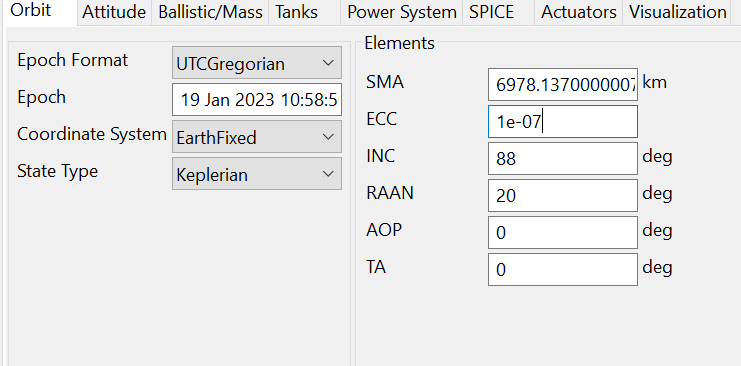
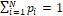

3GPP TR 38.905 V18.7.0 (2025-06)

Technical Specification

3rd Generation Partnership Project;

Technical Specification Group Radio Access Network;

NR;

Derivation of test points for radio transmission and reception

User Equipment (UE) conformance test cases

(Release 18)

The present document has been developed within the 3rd Generation
Partnership Project (3GPP ^TM^) and may be further elaborated for the
purposes of 3GPP.\
The present document has not been subject to any approval process by the
3GPP Organizational Partners and shall not be implemented.\
This Specification is provided for future development work within 3GPP
only. The Organizational Partners accept no liability for any use of
this Specification.\
Specifications and Reports for implementation of the 3GPP ^TM^ system
should be obtained via the 3GPP Organizational Partners\' Publications
Offices.

> Keywords
>
> RAN, 5G, NR
>
> ***3GPP***
>
> Postal address
>
> 3GPP support office address
>
> 650 Route des Lucioles - Sophia Antipolis
>
> Valbonne - FRANCE
>
> Tel.: +33 4 92 94 42 00 Fax: +33 4 93 65 47 16
>
> Internet
>
> http://www.3gpp.org

***Copyright Notification***

No part may be reproduced except as authorized by written permission.\
The copyright and the foregoing restriction extend to reproduction in
all media.

© 2025, 3GPP Organizational Partners (ARIB, ATIS, CCSA, ETSI, TSDSI,
TTA, TTC).

All rights reserved.

UMTS™ is a Trade Mark of ETSI registered for the benefit of its members

3GPP™ is a Trade Mark of ETSI registered for the benefit of its Members
and of the 3GPP Organizational Partners\
LTE™ is a Trade Mark of ETSI registered for the benefit of its Members
and of the 3GPP Organizational Partners

GSM® and the GSM logo are registered and owned by the GSM Association

 Contents {#contents .TT}
========

Foreword 5

1 Scope 6

2 References 6

3 Definitions, symbols and abbreviations 7

3.1 Definitions 7

3.2 Symbols 7

3.3 Abbreviations 7

4 Test coverage analysis 7

4.1 Test point analysis for FR1 test cases in TS 38.521-1 8

4.1.1 Test point analysis per test case 8

4.1.1.1 FR1 single carrier, NR CA and UL MIMO test cases 8

4.1.1.2 FR1 SUL test cases 15

4.1.1.3 FR1 V2X test cases 18

4.1.1.4 FR1 RedCap test cases 21

4.1.1.5 FR1 TxD test cases 21

4.1.1.6 FR1 shared spectrum channel access test cases 22

4.1.1.7 FR1 CA with UL MIMO test cases 24

4.1.1.8 FR1 ATG test cases 26

4.1.1.9 FR1 CA with Tx Diversity test cases 28

4.1.2 Test point analysis per NS value 29

4.1.2.1 A-MPR, A-SEM and A-SE FR1 test cases for single carrier and UL
MIMO 29

4.1.2.2 A-MPR test cases for FR1 UL CA 31

4.1.3 Test point analysis per NR CA configuration 32

4.1.3.2 Spurious emissions test cases for FR1 UL CA 41

4.2 Test point analysis for FR2 test cases in TS 38.521-2 43

4.2.2 Test point analysis per NS value 46

4.2.2.1 A-MPR and A-SE FR2 test cases for single carrier 46

4.2.2.2 A-MPR and A-SE FR2 test cases for CA 47

4.2.3 Test point analysis per NR CA configuration 48

4.2.3.1 Reference Sensitivity test cases for FR2 NR CA 48

4.3 Test point analysis for test cases in TS 38.521-3 49

4.3.1 Test point analysis per test case 49

4.3.1.1 EN-DC test cases 49

4.3.1.2 V2X test cases 53

4.3.2 Test point analysis per NS value 53

4.3.2.1 A-MPR and A-SE test cases for EN-DC 53

4.3.3 Test point analysis per EN-DC configuration 53

4.3.3.1 Reference sensitivity test cases for EN-DC 53

4.3.3.2 Spurious emissions test cases for EN-DC 69

4.3.3.3 Reference sensitivity test cases for V2X configuration 71

4.3.3.4 Spurious emissions test cases for V2X configuration 72

4.4 Test point analysis for satellite access test cases in TS 38.521-5
72

5 Satellites ephemeris derivation 74

5.1 Tools 74

5.2 Satellite Ephemeris Generation process 75

5.2.1 Spacecraft 75

5.2.3 Ground Station simulating the UE 76

5.2.4 Propagators & Force Models 78

5.2.5 UE Coordinate Systems 80

5.2.6 Variables, Arrays, String 80

5.2.7 Subscribers/Output 81

5.2.8 Mission Preparation using the GUI 82

5.2.9 Mission preparation using the script 84

5.3 Assumptions for satellite ephemeris calculation 87

5.4 Satellite Ephemeris generated files 87

Annex A: Derivation documents 89

Annex B: Principles for test point selection for NR CA reference
sensitivity test cases 89

B.1 General 89

B.2 Test case structure 90

B.3 Test Environment 91

B.4 Test Frequencies selection 91

B.4A Frequency relation for exception requirements 91

B.5 Test Channel Bandwidth selection 92

B.6 Modulation selections 92

B.7 Examples 92

B.8 Current test completion status per CA configuration 93

B.9 Reference Sensitivity checklist for CA 93

B.9.1 Checklist for two bands 94

B.9.2 Checklist for three bands 94

B.9.3 Checklist for four bands and five bands 94

Annex C: Principles for test point selection for FR2 NR CA reference
sensitivity test cases 94

Annex D: Principles for test point selection for EN-DC reference
sensitivity test cases 95

D.1 General 95

D.2 Requirements 95

D.2.1 Defined EN-DC configurations 95

D.2.2 Definition of exception requirements 96

D.2.3 Reference sensitivity 96

D.2.4 Rx requirements other than reference sensitivity 97

D.2.5 Test case structure and test coverage 97

D.2.6 EN-DC configurations to test 98

D.2.6.1 Lower order fallbacks 98

D.2.6.2 EN-DC configurations requiring testing and max number of CCs 99

D.2.6.3 Test coverage 99

D.2.7 Test Environment 103

D.2.8 Test Frequencies selections for EN-DC 103

D.2.9 Test EN-DC **channel bandwidth** 103

D.2.9.1 Test point selection EN-DC configuration without exception 103

D.2.9.2 Test point selection EN-DC configuration with exception 103

D.2.10 RB allocation and RB location selections 104

D.2.10.1 Test point selection EN-DC configuration without exception 104

D.2.10.2 Test point selection EN-DC configuration with exception when
exception applies 104

D.2.10.3 Test point selection EN-DC configuration with exception when
exception does not apply 104

D.2.11 Modulation scheme selections 104

D.2.12 Current test completion status per EN-DC configuration 105

Annex E: Change history 106

 Foreword
========

This Technical Specification has been produced by the 3rd Generation
Partnership Project (3GPP).

The contents of the present document are subject to continuing work
within the TSG and may change following formal TSG approval. Should the
TSG modify the contents of the present document, it will be re-released
by the TSG with an identifying change of release date and an increase in
version number as follows:

Version x.y.z

where:

x the first digit:

1 presented to TSG for information;

2 presented to TSG for approval;

3 or greater indicates TSG approved document under change control.

y the second digit is incremented for all changes of substance, i.e.
technical enhancements, corrections, updates, etc.

z the third digit is incremented when editorial only changes have been
incorporated in the document.

 1 Scope
=======

The present document specifies and contains the derivation of Test
Points for NR RF test cases, thereby 3GPP TSG RAN WG5 will have a way of
storing the input contributions provided. The test cases are described
in TS38.521-1\[2\], TS38.521-2\[3\] and TS38.521-3\[4\],

The test cases which have been analysed to determine Test Points are
included as .zip files.

The present document is applicable from Release 15 up to the release
indicated on the front page of the present Terminal conformance
specifications.

 2 References
============

The following documents contain provisions which, through reference in
this text, constitute provisions of the present document.

\- References are either specific (identified by date of publication,
edition number, version number, etc.) or non‑specific.

\- For a specific reference, subsequent revisions do not apply.

\- For a non-specific reference, the latest version applies. In the case
of a reference to a 3GPP document (including a GSM document), a
non-specific reference implicitly refers to the latest version of that
document *in the same Release as the present document*.

> \[1\] 3GPP TR 21.905: \"Vocabulary for 3GPP Specifications\".
>
> \[2\] 3GPP TS 38.521-1: \"NR; UE conformance specification; Radio
> transmission and reception; Part 1: NR range 1\".
>
> \[3\] 3GPP TS 38.521-2: \"NR; UE conformance specification; Radio
> transmission and reception; Part 2: NR range 2\".
>
> \[4\] 3GPP TS 38.521-3: \"NR; UE conformance specification; Radio
> transmission and reception; Part 3: NR interworking between NR range1
> + NR range2 and between NR and LTE\".
>
> \[5\] 3GPP TS 38.101-1: "NR; User Equipment (UE) radio transmission
> and reception; Part 1: Range 1 Standalone".
>
> \[6\] 3GPP TS 38.101-2: "NR; User Equipment (UE) radio transmission
> and reception; Part 2: Range 2 Standalone".
>
> \[7\] 3GPP TS 38.101-3: "NR; User Equipment (UE) radio transmission
> and reception; Part 3: Range 1 and Range 2 Interworking operation with
> other radios".
>
> \[8\] 3GPP TS 36.101: Evolved Universal Terrestrial Radio Access
> (E-UTRA); User Equipment (UE) radio transmission and reception".
>
> \[9\] R5-206841: "Discussion on test points in Receiver test cases for
> EN-DC configurations with exception requirements".
>
> \[10\] 3GPP TS 38.521-5: "NR; UE conformance specification; Radio
> transmission and reception; Part 5: Satellite access Radio Frequency
> (RF) and performance requirements".

3 Definitions, symbols and abbreviations
========================================

3.1 Definitions
---------------

For the purposes of the present document, the terms and definitions
given in 3GPP TR 21.905 \[1\] and the following apply. A term defined in
the present document takes precedence over the definition of the same
term, if any, in 3GPP TR 21.905 \[1\].

Other definitions used in the present document are listed in 3GPP TS
38.521-1 \[2\], 3GPP TS 38.521-2 \[3\] or 3GPP TS 38.521-3 \[4\].

Editor's note: intended to capture definitions

3.2 Symbols
-----------

Symbols used in the present document are listed in 3GPP TR 21.905 \[1\],
3GPP TS 38.521-1 \[2\], 3GPP TS 38.521-2 \[3\] or 3GPP TS 38.521-3
\[4\].

Editor's note: intended to capture definitions

3.3 Abbreviations
-----------------

For the purposes of the present document, the abbreviations given in
TR 21.905 \[1\] apply. An abbreviation defined in the present document
takes precedence over the definition of the same abbreviation, if any,
in TR 21.905 \[1\].

Other abbreviations used in the present document are listed in 3GPP TS
38.521-1 \[2\], or 3GPP, 3GPP TS 38.521-1 \[2\], 3GPP TS 38.521-2 \[3\]
or 3GPP TS 38.521-3 \[4\].

A-SE Additional spurious emissions

A-SEM Spectrum Emission Mask

4 Test coverage analysis
========================

This clause contains information on test point analysis and test point
selection for RX and TX test configuration tables in \[2\], \[3\] and
\[4\]. The test point analysis should include selection of:

> \- Test environment
>
> \- Test frequencies
>
> \- Test channel bandwidth
>
> \- Test Subcarrier Spacing (SCS)
>
> \- Downlink configuration including modulation and RB allocation
>
> \- Uplink configuration including modulation and RB allocation
>
> \- Number of test points

4.1 Test point analysis for FR1 test cases in TS 38.521-1
---------------------------------------------------------

### 4.1.1 Test point analysis per test case

#### 4.1.1.1 FR1 single carrier, NR CA and UL MIMO test cases

This clause contains information on test point analysis and test point
selection for single carrier, NR CA and UL MIMO test cases in \[2\]
clause 6 and 7 with information about transmitting test point selection
for FR1 listed in table 4.1.1.1-1 and receiver test point selection in
table 4.1.1.1-2.

For 2Tx UL-MIMO, the TP analysis is provided for each test case and
included in the zip files as per Table 4.1.1.1-1. For 4Tx UL-MIMO, the
TP analysis of 2Tx UL-MIMO could be reused if the minimum requirements
are the same. A separate TP analysis will be provided if the minimum
requirements of 4Tx UL-MIMO are different with 2Tx UL-MIMO.

Table 4.1.1.1-1: NR UE transmitter test point selection for FR1

+----------------+----------------+----------------+----------------+
| Subclause      | Number of test | Justification  | Comments       |
|                | points         | in attachment  |                |
+================+================+================+================+
| 6.2.1 UE       | 540            | "3             | RAN5\#89-e     |
| maximum output |                | 8.521-1\_TPana |                |
| power          |                | lysis\_6.2.1\_ |                |
|                |                | MaxOP\_v3.zip" |                |
+----------------+----------------+----------------+----------------+
| 6.2.2 Maximum  | contiguous     | "38.521        | RAN5\#99       |
| Output Power   | allocation:    | -1\_TPanalysis |                |
| Reduction      | 920            | \_6.2.2\_MPR\_ |                |
| (MPR)          | (1040          | 6.5.2.2\_SEM\_ |                |
|                | ^1^,1000^2,3^) | 6.5.2.4.1\_NR\ |                |
|                |                | _ACLR\_v5.zip" |                |
|                | almost         |                |                |
|                | contiguous     |                |                |
|                | allocation:    |                |                |
|                | 120            |                |                |
+----------------+----------------+----------------+----------------+
| 6.2.3 UE A-MPR | See clause     | See clause     | See clause     |
|                | 4.1.2.1        | 4.1.2.1        | 4.1.2.1        |
+----------------+----------------+----------------+----------------+
| 6.2.4          | 30             | "38.5          | RAN5\#91-e     |
| Configured     |                | 21-1\_TPanalys |                |
| Transmitted    |                | is\_6.2.4\_Con |                |
| Power          |                | figTP\_v1.zip" |                |
+----------------+----------------+----------------+----------------+
| 6.2A.1.1 UE    | 240            | "38.521        | RAN5\#83       |
| maximum output |                | -1\_TPanalysis |                |
| power for CA   |                | \_6.2A.1\_MOP" |                |
| (2UL CA)       |                |                |                |
+----------------+----------------+----------------+----------------+
| 6.2A.2.1       | For inter-band | "38.           | RAN5\#107      |
| Maximum power  | CA:1480        | 521-1\_TPanaly |                |
| reduction      |                | sis\_6.2A.2\_M |                |
| (MPR) for CA   | For intra-band | PR\_6.5A.2.4.1 |                |
| (2UL CA)       | contiguous CA: | \_ACLR\_6.5A.2 |                |
|                | 720            | .2.1\_SEM\_v2" |                |
|                | (contiguous RB |                |                |
|                | allocation)    |                |                |
|                |                |                |                |
|                | 1080           |                |                |
|                | (              |                |                |
|                | non-contiguous |                |                |
|                | RB allocation) |                |                |
|                |                |                |                |
|                | For intra-band |                |                |
|                | non-contiguous |                |                |
|                | CA: 2880       |                |                |
+----------------+----------------+----------------+----------------+
| 6.2A.4         | Inter-band     | "38.52         | RAN5\#101      |
| Configured     | CA:20          | 1-1\_TPanalysi |                |
| transmitted    |                | s\_6.2A.4\_Con |                |
| power for CA   | Intra-band     | figTP\_v2.zip" |                |
|                | contiguous CA: |                |                |
|                | 20             |                |                |
|                |                |                |                |
|                | Intra-band     |                |                |
|                | non-contiguous |                |                |
|                | CA:20          |                |                |
+----------------+----------------+----------------+----------------+
| 6.2C.1         | 270            | "38.5          | RAN5\#80       |
| Configured UE  |                | 21-1\_TPanalys |                |
| transmitted    |                | is\_6.2C.1\_Co |                |
| Output Power   |                | nfigOPSUL.zip" |                |
+----------------+----------------+----------------+----------------+
| 6.2D.1 UE      | UL MIMO with   | "3             | RAN5\#89-e     |
| maximum output | ULFPTx: 540    | 8.521-1\_TPana |                |
| power for      |                | lysis\_6.2.1\_ |                |
| UL-MIMO        | UL MIMO with   | MaxOP\_v3.zip" |                |
|                | 2-layer: 0     |                |                |
+----------------+----------------+----------------+----------------+
| 6.2D.2 Maximum | UL MIMO with   | "38.52         | RAN5\#99       |
| Power          | 2-layer: 400   | 1-1\_TPanalysi |                |
| Reduction      |                | s\_6.2.2\_MPR\ |                |
| (MPR) for UL   | UL MIMO with   | _6.5.2.2\_SEM\ |                |
| MIMO           | ULFPTx: 920    | _6.5.2.4.1\_NR |                |
|                |                | \_ACLR\_v5.zip |                |
+----------------+----------------+----------------+----------------+
| 6.2D.2\_2 UE   | UL MIMO with   | "38.521-       | RAN5\#107      |
| maximum output | 4-layer: 340   | 1\_TPanalysis\ |                |
| power          |                | _6.2D.2\_2\_MP |                |
| reduction for  |                | R\_6.5D.2.2\_2 |                |
| UL MIMO for UE |                | \_SEM\_6.5D.2. |                |
| supporting 4Tx |                | 4.1\_2\_ACLR\_ |                |
|                |                | 4TX\_MIMO.zip" |                |
+----------------+----------------+----------------+----------------+
| 6.2D.3 UE      | Table          | Table          | See Table      |
| additional     | 4.1.2.1-1      | 4.1.2.1-1      | 4.1.2.1-1      |
| maximum output |                |                |                |
| power          |                |                |                |
| reduction for  |                |                |                |
| UL-MIMO        |                |                |                |
+----------------+----------------+----------------+----------------+
| 6.2D.4         | 15             | "38.5          | RAN5\#91-e     |
| Configured     |                | 21-1\_TPanalys |                |
| Transmitted    |                | is\_6.2.4\_Con |                |
| Power for      |                | figTP\_v1.zip" |                |
| UL-MIMO        |                |                |                |
+----------------+----------------+----------------+----------------+
| 6.3.1 Minimum  | 45             | "3             | RAN5\#5-5G-NR  |
| output power   |                | 8.521-1\_TPana | Adhoc          |
|                |                | lysis\_6.3.1\_ |                |
|                |                | MinOP\_v3.zip" |                |
+----------------+----------------+----------------+----------------+
| 6.3.3.2        | 180            | "38.521        | RAN5\#5-5G-NR  |
| General ON/OFF |                | -1\_TPanalysis | Adhoc          |
| time mask      |                | \_6.3.3.2\_OnO |                |
|                |                | ff\_M\_v2.zip" |                |
+----------------+----------------+----------------+----------------+
| 6.3.3.4 PRACH  |                | "38.521-1\_TPa | RAN5\#96-e     |
| time mask      |                | nalysis\_6.3.3 |                |
|                |                | .4\_PRACH.zip" |                |
+----------------+----------------+----------------+----------------+
| 6.3.3.6 SRS    | 30             | "38.521-1\_T   | RAN5\#82       |
| time mask      |                | Panalysis\_6.3 |                |
|                |                | .3.3\_SRS.zip" |                |
+----------------+----------------+----------------+----------------+
| 6.3.4.2        | 6              | "38.52         | RAN5\#83       |
| Absolute power |                | 1-1\_TPanalysi |                |
| tolerance      |                | s\_6.3.4.2\_Ab |                |
|                |                | sPtol\_v2.zip" |                |
+----------------+----------------+----------------+----------------+
| 6.3.4.3        | TBD            | "38.52         | RAN5\#83       |
| Relative power |                | 1-1\_TPanalysi |                |
| tolerance      |                | s\_6.3.4.3\_Re |                |
|                |                | lPtol\_v2.zip" |                |
+----------------+----------------+----------------+----------------+
| 6.3.4.4        | PUCCH: 6       | "38.52         | RAN5\#83       |
| Aggregate      |                | 1-1\_TPanalysi |                |
| power          | PUSCH: 6       | s\_6.3.4.4\_Ag |                |
| tolerance      |                | gPtol\_v2.zip" |                |
+----------------+----------------+----------------+----------------+
| 6.3A.1.1       | 20             | 38.521-        | RAN5\#101      |
| Minimum output |                | 1\_TPanalysis\ |                |
| power for CA   |                | _6.3A.1.1\_Min |                |
| (2UL CA)       |                | OP\_CA\_v1.zip |                |
+----------------+----------------+----------------+----------------+
| 6.3A.3.1       | 40             | "38.521-1\_T   | RAN5\#99       |
| Transmit       |                | Panalysis\_6.3 |                |
| ON/OFF time    |                | A.3.1\_OnOff\_ |                |
| mask for CA    |                | M\_CA\_v1.zip" |                |
| (2UL CA)       |                |                |                |
+----------------+----------------+----------------+----------------+
| 6.3A.3.2 Time  | 1              | "38.521-1\_TPa | RAN5\#102      |
| mask for       |                | nalysis\_6.3C. |                |
| switching      |                | 3.2\_SULTxSwit |                |
| between two    |                | ch\_M\_v1.zip" |                |
| uplink         |                |                |                |
| carriers       |                |                |                |
+----------------+----------------+----------------+----------------+
| 6.3A.3.3 Time  | 1              | "38.521-1\_TPa | RAN5\#102      |
| mask for       |                | nalysis\_6.3C. |                |
| switching      |                | 3.2\_SULTxSwit |                |
| between two    |                | ch\_M\_v1.zip" |                |
| uplink         |                |                |                |
| carriers       |                |                |                |
+----------------+----------------+----------------+----------------+
| 6.3A.3.4 Time  | 1              | "38.521-1\_TPa | RAN5\#102      |
| mask for       |                | nalysis\_6.3C. |                |
| switching      |                | 3.2\_SULTxSwit |                |
| between one    |                | ch\_M\_v1.zip" |                |
| uplink band    |                |                |                |
| with one       |                |                |                |
| transmit       |                |                |                |
| antenna        |                |                |                |
| connector and  |                |                |                |
| one uplink     |                |                |                |
| band with two  |                |                |                |
| transmit       |                |                |                |
| antenna        |                |                |                |
| connectors     |                |                |                |
| (3UL CA)       |                |                |                |
+----------------+----------------+----------------+----------------+
| 6.3A.3.5 Time  | 1              | "38.521-1\_TPa | RAN5\#102      |
| mask for       |                | nalysis\_6.3C. |                |
| switching      |                | 3.2\_SULTxSwit |                |
| between two    |                | ch\_M\_v1.zip" |                |
| uplink bands   |                |                |                |
| with two       |                |                |                |
| transmit       |                |                |                |
| antenna        |                |                |                |
| connectors     |                |                |                |
| (3UL CA)       |                |                |                |
+----------------+----------------+----------------+----------------+
| 6.3A.3.6 Time  | 1              | "38.521-1\_    | RAN5\#103      |
| mask for       |                | TPanalysis\_6. |                |
| switching      |                | 3A.3.6-6.3A.3. |                |
| across three   |                | 7\_TxSwitch\_M |                |
| uplink bands   |                | \_3-4Band.zip" |                |
+----------------+----------------+----------------+----------------+
| 6.3A.3.7 Time  | 1              | "38.521-1\_    | RAN5\#103      |
| mask for       |                | TPanalysis\_6. |                |
| switching      |                | 3A.3.6-6.3A.3. |                |
| across four    |                | 7\_TxSwitch\_M |                |
| uplink bands   |                | \_3-4Band.zip" |                |
+----------------+----------------+----------------+----------------+
| 6.3A.4.1       | Intra-band     | "38.521-1\_TP  | RAN5\#95-e     |
| Absolute power | contiguous     | analysis\_6.3A |                |
| tolerance for  | CA:4           | .4.1\_Abs\_PTo |                |
| CA (2UL CA)    |                | l\_CA\_v3.zip" |                |
|                | Intra-band     |                |                |
|                | non-contiguous |                |                |
|                | CA:2           |                |                |
+----------------+----------------+----------------+----------------+
| 6.3A.4.2       | TBD            | "38.521-1\_TP  | RAN5\#92-e     |
| Relative power |                | analysis\_6.3A |                |
| tolerance for  |                | .4.2\_Rel\_PTo |                |
| CA (2UL CA)    |                | l\_CA\_v1.zip" |                |
+----------------+----------------+----------------+----------------+
| 6.3A.4.3       | PUCCH:4        | "38.521-1\_TP  | RAN5\#92-e     |
| Aggregate      |                | analysis\_6.3A |                |
| power          | PUSCH:4        | .4.3\_Agg\_PTo |                |
| tolerance for  |                | l\_CA\_v1.zip" |                |
| CA (2UL CA)    |                |                |                |
+----------------+----------------+----------------+----------------+
| 6.3C.3.6 Time  | 1              | 38.521-1\_TPan | RAN5\#104      |
| mask for       |                | alysis\_6.3C.3 |                |
| switching      |                | .6-6.3C.3.6\_1 |                |
| across three   |                | \_TxSwitch\_M\ |                |
| uplink bands   |                | _3Band\_v1.zip |                |
| (3CC)          |                | ""             |                |
+----------------+----------------+----------------+----------------+
| 6.3C.3.6\_1    | 1              | 38.521-1\_TPan | RAN5\#104      |
| Time mask for  |                | alysis\_6.3C.3 |                |
| switching      |                | .6-6.3C.3.6\_1 |                |
| across three   |                | \_TxSwitch\_M\ |                |
| uplink bands   |                | _3Band\_v1.zip |                |
| (more than     |                |                |                |
| 3CC)           |                |                |                |
+----------------+----------------+----------------+----------------+
| 6.3D.1 Minimum | 45             | "3             | RAN5\#5-5G-NR  |
| output power   |                | 8.521-1\_TPana | Adhoc          |
| for UL-MIMO    |                | lysis\_6.3.1\_ |                |
|                |                | MinOP\_v3.zip" |                |
+----------------+----------------+----------------+----------------+
| 6.3D.3         | TBD            | "38.521        | RAN5\#5-5G-NR  |
| Transmit       |                | -1\_TPanalysis | Adhoc          |
| ON/OFF time    |                | \_6.3.3.2\_OnO |                |
| mask for       |                | ff\_M\_v2.zip" |                |
| UL-MIMO        |                |                |                |
+----------------+----------------+----------------+----------------+
| 6.3D.4.1       | 6              | "38.52         | RAN5\#83       |
| Absolute Power |                | 1-1\_TPanalysi |                |
| tolerance for  |                | s\_6.3.4.2\_Ab |                |
| UL-MIMO        |                | sPtol\_v2.zip" |                |
+----------------+----------------+----------------+----------------+
| 6.3D.4.2       | TBD            | "38.52         | RAN5\#83       |
| Relative Power |                | 1-1\_TPanalysi |                |
| Tolerance for  |                | s\_6.3.4.3\_Re |                |
| UL-MIMO        |                | lPtol\_v2.zip" |                |
+----------------+----------------+----------------+----------------+
| 6.3D.4.3       | PUCCH: 6       | "38.52         | RAN5\#83       |
| Aggregate      |                | 1-1\_TPanalysi |                |
| Power          | PUSCH: 6       | s\_6.3.4.4\_Ag |                |
| tolerance for  |                | gPtol\_v2.zip" |                |
| UL-MIMO        |                |                |                |
+----------------+----------------+----------------+----------------+
| 6.4.1          | 5              | "38.           | RAN5\#84       |
| Frequency      |                | 521-1\_TPanaly |                |
| error          |                | sis\_6.4.1\_Fr |                |
|                |                | eqErr\_v3.zip" |                |
+----------------+----------------+----------------+----------------+
| 6.4.2.1 Error  | PUSCH: 252     | "3             | RAN5\#94-e     |
| Vector         |                | 8.521-1\_TPana |                |
| Magnitude      | PUCCH: 36      | lysis\_6.4.2.1 |                |
|                |                | \_EVM\_v3.zip" |                |
|                | PRACH: 36      |                |                |
+----------------+----------------+----------------+----------------+
| 6.4.2.1a Error | PUSCH: 36      | "3             | RAN5\#94e      |
| Vector         |                | 8.521-1\_TPana |                |
| Magnitude      |                | lysis\_6.4.2.1 |                |
| including      |                | \_EVM\_v3.zip" |                |
| symbols with   |                |                |                |
| transient      |                |                |                |
| period         |                |                |                |
+----------------+----------------+----------------+----------------+
| 6.4.2.2        | 3              | "38.521        | RAN5\#84       |
| Carrier        |                | -1\_TPanalysis |                |
| leakage        |                | \_6.4.2.2\_Car |                |
|                |                | rLeak\_v2.zip" |                |
+----------------+----------------+----------------+----------------+
| 6.4.2.3        | 36             | "38.521-1\_TPa | RAN5\#84       |
| In-band        |                | nalysis\_6.4.2 |                |
| emissions      |                | .3\_IE\_2.zip" |                |
+----------------+----------------+----------------+----------------+
| 6.4.2.4 EVM    | 90             | "38.521-1      | RAN5\#84       |
| equalizer      |                | TP             |                |
| spectrum       |                | analysis\_6.4. |                |
| flatness       |                | 2.4\_EVMequali |                |
|                |                | zerSpectrumFla |                |
|                |                | tness\_v3.zip" |                |
+----------------+----------------+----------------+----------------+
| 6.4.2.5 EVM    | 9              | "38.521-1      | RAN5\#92-e     |
| equalizer      |                | TPanalys       |                |
| spectrum       |                | is\_6.4.2.5\_E |                |
| flatness for   |                | VMequalizerSpe |                |
| Pi/2 BPSK      |                | ctrumFlatness\ |                |
|                |                | _BPSK\_v2.zip" |                |
+----------------+----------------+----------------+----------------+
| 6.4.2.6 Phase  | PUSCH:36       | 38.521-1\_TPan | RAN5\#102      |
| continuity     |                | alysis\_6.4.2. |                |
| requirements   | PUCCH:36       | 6\_Phase\_Cont |                |
| for DMRS       |                | inuity\_v2.zip |                |
| bundling       |                |                |                |
+----------------+----------------+----------------+----------------+
| 6.4A.1.1       | Inter-band:5   | "38.521        | RAN5\#101      |
| Frequency      |                | -1\_TPanalysis |                |
| error for CA   | Intra-band     | on             |                |
| (2UL CA)       | contiguous:5   | 6.4A.1.1\_Fr   |                |
|                |                | eqErr\_v1.zip" |                |
|                | Intra-band     |                |                |
|                | no             |                |                |
|                | n-congituous:5 |                |                |
+----------------+----------------+----------------+----------------+
| 6.4A.2.1.1     | inter-band     | "38.521        | RAN5\#100      |
| Error Vector   | CA:112         | -1\_TPanalysis |                |
| Magnitude for  |                | on             |                |
| CA (2UL CA)    | Intra-band     | 6.4A.2.1.1     |                |
|                | CA:144         | \_EVM\_v1.zip" |                |
+----------------+----------------+----------------+----------------+
| 6.4A.2.2.1     | 2              | "38.521        | RAN5\#101      |
| Carrier        |                | -1\_TPanalysis |                |
| leakage for CA |                | on             |                |
| (2UL CA)       |                | 6              |                |
|                |                | .4A.2.2.1\_Car |                |
|                |                | rLeak\_v1.zip" |                |
+----------------+----------------+----------------+----------------+
| 6.4A.2.3.1     | 16             | "38.521        | RAN5\#101      |
| In-band        |                | -1\_TPanalysis |                |
| emissions for  |                | on             |                |
| CA (2UL CA)    |                | 6.4A.2.2.1     |                |
|                |                | \_IBE\_v1.zip" |                |
+----------------+----------------+----------------+----------------+
| 6.4D.1         | 5              | "38.           | RAN5\#84       |
| Frequency      |                | 521-1\_TPanaly |                |
| error          |                | sis\_6.4.1\_Fr |                |
|                |                | eqErr\_v3.zip" |                |
+----------------+----------------+----------------+----------------+
| 6.4D.2.1 Error | PUSCH: 108     | "38.521        | RAN5\#94-e     |
| Vector         |                | -1\_TPanalysis |                |
| Magnitude for  |                | on             |                |
| UL MIMO        |                | 6.4.2.1        |                |
|                |                | \_EVM\_v3.zip" |                |
+----------------+----------------+----------------+----------------+
| 6.4D.2.2       | 3              | "38.521        | RAN5\#84       |
| Carrier        |                | -1\_TPanalysis |                |
| leakage for UL |                | on             |                |
| MIMO           |                | 6.4.2.2\_Car   |                |
|                |                | rLeak\_v2.zip" |                |
+----------------+----------------+----------------+----------------+
| 6.4D.2.3       | 18             | "38.521-1\_TPa | RAN5\#84       |
| In-band        |                | nalysis\_6.4.2 |                |
| emissions for  |                | .3\_IE\_2.zip" |                |
| UL MIMO        |                |                |                |
+----------------+----------------+----------------+----------------+
| 6.4D.2.4 EVM   | 45             | "38.521-1\_TP  | RAN5\#84       |
| equalizer      |                | analysis\_6.4. |                |
| spectrum       |                | 2.4\_EVMequali |                |
| flatness for   |                | zerSpectrumFla |                |
| UL MIMO        |                | tness\_v3.zip" |                |
+----------------+----------------+----------------+----------------+
| 6.4D.3 Time    | 6              | "38.521-1\_TP  | RAN5\#102      |
| alignment      |                | anal           |                |
| error for      |                | ysis\_6.4D.3\_ |                |
| UL-MIMO        |                | 6.4H.1.3\_TAE\ |                |
|                |                | _MIMO\_v1.zip" |                |
+----------------+----------------+----------------+----------------+
| 6.5.1 Occupied | 10             | "              | RAN5\#92-e     |
| bandwidth      |                | 38.521-1\_TPan |                |
|                |                | alysis\_6.5.1\ |                |
|                |                | _OccBW\_v3.zip |                |
+----------------+----------------+----------------+----------------+
| 6.5.2.2        | contiguous     | "38.521        | RAN5\#99       |
| Spectrum       | allocation:    | -1\_TPanalysis |                |
| Emission Mask  | 144 (168^1^,   | \_6.2.2\_MPR\_ |                |
|                | 160^2,3^)      | 6.5.2.2\_SEM\_ |                |
|                |                | 6.5.2.4.1\_NR\ |                |
|                | almost         | _ACLR\_v5.zip" |                |
|                | contiguous     |                |                |
|                | allocation: 24 |                |                |
+----------------+----------------+----------------+----------------+
| 6.5D.2.3       | Table          | Table          | See Table      |
| Additional     | 4.1.2.1-1      | 4.1.2.1-1      | 4.1.2.1-1      |
| spectrum       |                |                |                |
| emission mask  |                |                |                |
| for UL-MIMO    |                |                |                |
+----------------+----------------+----------------+----------------+
| 6.5.2.4.1 NR   | contiguous     | "38.521        | RAN5\#99       |
| Adjacent       | allocation:    | -1\_TPanalysis |                |
| channel        | 920 (1040^1^,  | \_6.2.2\_MPR\_ |                |
| leakage ratio  | 1000^2,3^)     | 6.5.2.2\_SEM\_ |                |
|                |                | 6.5.2.4.1\_NR\ |                |
|                | almost         | _ACLR\_v5.zip" |                |
|                | contiguous     |                |                |
|                | allocation:    |                |                |
|                | 120            |                |                |
+----------------+----------------+----------------+----------------+
| 6.5.2.4.2 UTRA | Same as        | "38.521-1\     | RAN5\#91-e     |
| ACLR           | NS\_3U, NS\_5U | _TPanalysis\_6 |                |
|                | ,NS\_43U, and  | .5.2.4.2\_UTRA |                |
|                | NS\_100 in     | ACLR\_v3.zip"  |                |
|                | Table          |                |                |
|                | 4.1.1.1-1      |                |                |
+----------------+----------------+----------------+----------------+
| 6.5.3.1        | 27             | "38.521-1\_TP  | RAN5\#89-e     |
| General        |                | analysis       |                |
| spurious       |                | \_6.5.3.1\_TX\ |                |
| emissions      |                | _Spurious\_Emi |                |
|                |                | ssion\_v1.zip" |                |
+----------------+----------------+----------------+----------------+
| 6.5.3.2        | 27             | "38.521-1\_TP  | RAN5\#89-e     |
| Spurious       |                | analysis       |                |
| emissions for  |                | \_6.5.3.1\_TX\ |                |
| UE             |                | _Spurious\_Emi |                |
| co-existence   |                | ssion\_v1.zip" |                |
+----------------+----------------+----------------+----------------+
| 6.5.3.3        | See Table      | See Table      | See Table      |
| Additional     | 4.1.2.1-1      | 4.1.2.1-1      | 4.1.2.1-1      |
| spurious       |                |                |                |
| emissions      |                |                |                |
+----------------+----------------+----------------+----------------+
| 6.5.4 Transmit | 8              | "              | RAN5\#100      |
| i              |                | 38.521-1\_TPan |                |
| ntermodulation |                | alysis\_6.5.4\ |                |
|                |                | _TxIm\_v3.zip" |                |
+----------------+----------------+----------------+----------------+
| 6.5A.1.1       | Inter-band: 2  | "38.5          | RAN5\#92-e     |
| Occupied       |                | 21-1\_TPanalys |                |
| bandwidth for  | Intra-band     | is\_6.5A.1.1\_ |                |
| CA (2UL CA)    | contiguous: 1  | OccBW\_v2.zip" |                |
|                |                |                |                |
|                | Intra-band     |                |                |
|                | n              |                |                |
|                | on-contiguous: |                |                |
|                | 1              |                |                |
+----------------+----------------+----------------+----------------+
| 6.5A.2.2.1     | Inter-band     | "38.521-1\_TPa | RAN5\#98       |
| Spectrum       | CA:112         | nalysis\_6.2A. |                |
| emission mask  |                | 2\_MPR\_6.5A.2 |                |
| for CA (2UL    | Intra-band     | .4.1\_ACLR\_6. |                |
| CA)            | contiguous     | 5A.2.2.1\_SEM" |                |
|                | CA:72          |                |                |
|                |                |                |                |
|                | Intra-band     |                |                |
|                | non-contiguous |                |                |
|                | CA:72          |                |                |
+----------------+----------------+----------------+----------------+
| 6.5A.2.4.1.1   | For inter-band | "38.521-1\_TPa | RAN5\#98       |
| NR ACLR for CA | CA:1480        | nalysis\_6.2A. |                |
| (2UL CA)       |                | 2\_MPR\_6.5A.2 |                |
|                | For intra-band | .4.1\_ACLR\_6. |                |
|                | contiguous CA: | 5A.2.2.1\_SEM" |                |
|                | 720            |                |                |
|                | (contiguous RB |                |                |
|                | allocation)    |                |                |
|                |                |                |                |
|                | 1080           |                |                |
|                | (              |                |                |
|                | non-contiguous |                |                |
|                | RB allocation) |                |                |
|                |                |                |                |
|                | For intra-band |                |                |
|                | non-contiguous |                |                |
|                | CA: 2880       |                |                |
+----------------+----------------+----------------+----------------+
| 6.5A.2.4.2.1   | 840            | "38.521        | RAN5\#82       |
| UTRA ACLR for  |                | -1\_TPanalysis |                |
| CA (2UL CA)    |                | on             |                |
|                |                | 6.5A.2.4.2.1   |                |
|                |                | UTRA ACLR.zip" |                |
+----------------+----------------+----------------+----------------+
| 6.5A.3.1.1     | For inter-band | "38.521-1\     | RAN5\#101      |
| General        | CA: 12         | _TPanalysis\_6 |                |
| spurious       |                | .5A.3.1.1\_Spu |                |
| emissions for  | For intra-band | rious\_v3.zip" |                |
| CA (2UL CA)    | contiguous CA: |                |                |
|                | 20             |                |                |
|                |                |                |                |
|                | For intra-band |                |                |
|                | non-contiguous |                |                |
|                | CA: 12         |                |                |
+----------------+----------------+----------------+----------------+
| 6.5A.3.2.1     | For inter-band | "38.521-       | RAN5\#100      |
| Spurious       | CA See table   | 1\_TPanalysis\ |                |
| emissions for  | 4.1.3.2-1      | _6.5A.3.2.1\_S |                |
| UE             |                | ECoex\_v3.zip" |                |
| co-existence   | For intra-band |                |                |
| for CA (2UL    | contiguous CA: |                |                |
| CA)            | 8              |                |                |
|                |                |                |                |
|                | For intra-band |                |                |
|                | non-contiguous |                |                |
|                | CA: 4          |                |                |
+----------------+----------------+----------------+----------------+
| 6.5A.4.1       | 16             | "38.521        | RAN5\#101      |
| Transmit       |                | -1\_TPanalysis |                |
| i              |                | on             |                |
| ntermodulation |                | 6.5A.4.1\      |                |
| for CA (2UL    |                | _TxIM\_v1.zip" |                |
| CA)            |                |                |                |
+----------------+----------------+----------------+----------------+
| 6.5D.1         | 10             | 38.521-1\_TP   | RAN5\#92-e     |
| Occupied       |                | analysis\_6.5. |                |
| bandwidth for  |                | 1\_OBW\_v3.zip |                |
| UL-MIMO        |                |                |                |
+----------------+----------------+----------------+----------------+
| 6.5D.2.2       | UL MIMO with   | "38.521        | RAN5\#99       |
| Spectrum       | 2-layer: 64    | -1\_TPanalysis |                |
| emission mask  |                | \_6.2.2\_MPR\_ |                |
| for UL MIMO    | UL MIMO with   | 6.5.2.2\_SEM\_ |                |
|                | ULFPTx: 144    | 6.5.2.4.1\_NR\ |                |
|                |                | _ACLR\_v5.zip" |                |
+----------------+----------------+----------------+----------------+
| 6.5D.2.2\_2    | UL MIMO with   | "38.521-       | RAN5\#107      |
| Spectrum       | 4-layer: 56    | 1\_TPanalysis\ |                |
| emission mask  |                | _6.2D.2\_2\_MP |                |
| for UL MIMO    |                | R\_6.5D.2.2\_2 |                |
| for UE         |                | \_SEM\_6.5D.2. |                |
| supporting 4Tx |                | 4.1\_2\_ACLR\_ |                |
|                |                | 4TX\_MIMO.zip" |                |
+----------------+----------------+----------------+----------------+
| 6.5D.2.4.1 NR  | UL MIMO with   | "38.52         | RAN5\#99       |
| ACLR for       | 2-layer: 400   | 1-1\_TPanalysi |                |
| UL-MIMO        |                | s\_6.2.2\_MPR\ |                |
|                | UL MIMO with   | _6.5.2.2\_SEM\ |                |
|                | ULFPTx: 920    | _6.5.2.4.1\_NR |                |
|                |                | \_ACLR\_v5.zip |                |
+----------------+----------------+----------------+----------------+
| 6.5D.2.4.1\_2  | UL MIMO with   | "38.521-       | RAN5\#107      |
| NR ACLR for    | 4-layer: 340   | 1\_TPanalysis\ |                |
| UL-MIMO for UE |                | _6.2D.2\_2\_MP |                |
| supporting 4Tx |                | R\_6.5D.2.2\_2 |                |
|                |                | \_SEM\_6.5D.2. |                |
|                |                | 4.1\_2\_ACLR\_ |                |
|                |                | 4TX\_MIMO.zip" |                |
+----------------+----------------+----------------+----------------+
| 6.5D.2.4.2     | 96 for NS\_3U  | "38.521-1\_    | RAN5\#5-5G-NR  |
| UTRA ACLR for  |                | TPanalysis\_6. | Adhoc          |
| UL-MIMO        |                | 5D.2.4.2\_UTRA |                |
|                |                | ALCR\_N        |                |
|                |                | S\_3U\_v1.zip" |                |
|                |                |                |                |
|                |                | "38.521-1\     |                |
|                |                | _TPanalysis\_6 |                |
|                |                | .5.2.4.2\_UTRA |                |
|                |                | ACLR\_v3.zip"  |                |
+----------------+----------------+----------------+----------------+
| 6.5D.2\_1.4.2  | 216 for NS\_3U | "38.521-1\_    | RAN5\#90-e     |
| UTRA ACLR for  |                | TPanalysis\_6. |                |
| UL MIMO        |                | 5D.2.4.2\_UTRA |                |
| (Rel-16        |                | ALCR\_N        |                |
| onward)        |                | S\_3U\_v1.zip" |                |
|                |                |                |                |
|                |                | "38.521-1\     |                |
|                |                | _TPanalysis\_6 |                |
|                |                | .5.2.4.2\_UTRA |                |
|                |                | ACLR\_v3.zip"  |                |
+----------------+----------------+----------------+----------------+
| 6.5D.3.1       | 27             | "38.521-1\_TP  | RAN5\#89-e     |
| General        |                | analysis       |                |
| spurious       |                | \_6.5.3.1\_TX\ |                |
| emissions      |                | _Spurious\_Emi |                |
|                |                | ssion\_v1.zip" |                |
+----------------+----------------+----------------+----------------+
| 6.5D.3.2       | 27             | "38.521-1\_TP  | RAN5\#89-e     |
| Spurious       |                | analysis       |                |
| emissions for  |                | \_6.5.3.1\_TX\ |                |
| UE             |                | _Spurious\_Emi |                |
| co-existence   |                | ssion\_v1.zip" |                |
| for UL-MIMO    |                |                |                |
+----------------+----------------+----------------+----------------+
| 6.5D.3.3       | Table          | Table          | RAN5\#5-5G-NR  |
| Additional     | 4.1.2.1-1      | 4.1.2.1-1      | Adhoc          |
| spurious       |                |                |                |
| emissions for  |                |                |                |
| UL-MIMO        |                |                |                |
+----------------+----------------+----------------+----------------+
| 6.5D.3\_1.1    | 27             | "38.521-1\_TP  | RAN5\#89-e     |
| General        |                | analysis       |                |
| spurious       |                | \_6.5.3.1\_TX\ |                |
| emissions      |                | _Spurious\_Emi |                |
| (Rel-16        |                | ssion\_v1.zip" |                |
| onward)        |                |                |                |
+----------------+----------------+----------------+----------------+
| 6.5D.3\_1.2    | 27             | "38.521-1\_TP  | RAN5\#89-e     |
| Spurious       |                | analysis       |                |
| emissions for  |                | \_6.5.3.1\_TX\ |                |
| UE             |                | _Spurious\_Emi |                |
| co-existence   |                | ssion\_v1.zip" |                |
| for UL-MIMO    |                |                |                |
| (Rel-16        |                |                |                |
| onward)        |                |                |                |
+----------------+----------------+----------------+----------------+
| 6.5D.3\_1.3    | Table          | Table          | RAN5\#89-e     |
| Additional     | 4.1.1.1-1      | 4.1.1.1-1      |                |
| spurious       |                |                |                |
| emissions for  |                |                |                |
| UL-MIMO        |                |                |                |
| (Rel-16        |                |                |                |
| onward)        |                |                |                |
+----------------+----------------+----------------+----------------+
| 6.5D.4         |                | "              | RAN5\#82       |
| Transmit       |                | 38.521-1\_TPan |                |
| i              |                | alysis\_6.5.4\ |                |
| ntermodulation |                | _TxIm\_v2.zip" |                |
| for UL-MIMO    |                |                |                |
+----------------+----------------+----------------+----------------+
| NOTE 1: For    |                |                |                |
| power class 3  |                |                |                |
| UE operating   |                |                |                |
| in bands n40,  |                |                |                |
| n41, n77, n78  |                |                |                |
| and n79.       |                |                |                |
|                |                |                |                |
| NOTE 2: UE     |                |                |                |
| operating in   |                |                |                |
| FDD mode, or   |                |                |                |
| in TDD mode in |                |                |                |
| bands other    |                |                |                |
| than n40, n41, |                |                |                |
| n77, n78 and   |                |                |                |
| n79, or in TDD |                |                |                |
| mode the IE    |                |                |                |
| pow            |                |                |                |
| erBoostPi2BPSK |                |                |                |
| is set to 0    |                |                |                |
| for bands n40, |                |                |                |
| n41, n77, n78  |                |                |                |
| and n79.       |                |                |                |
|                |                |                |                |
| NOTE 3: UEs    |                |                |                |
| supporting     |                |                |                |
| pi/2 BPSK DMRS |                |                |                |
| and the        |                |                |                |
| corresponding  |                |                |                |
| IE             |                |                |                |
| \              |                |                |                |
| [DMRSPi2BPSK\] |                |                |                |
| is set to 1.   |                |                |                |
|                |                |                |                |
| NOTE 4: The    |                |                |                |
| maximum number |                |                |                |
| of test point  |                |                |                |
| is 24 if only  |                |                |                |
| default points |                |                |                |
| are applied.   |                |                |                |
+----------------+----------------+----------------+----------------+

Table 4.1.1.1-2: NR UE receiver test point selection for FR1

+----------------+----------------+----------------+----------------+
| Subclause      | Number of test | Justification  | Comments       |
|                | points         | in attachment  |                |
+================+================+================+================+
| 7.3 Reference  | symmetric      | "38            | RAN5\#95-e     |
| sensitivity    | channel        | .521-1\_TPanal |                |
| power level    | bandwidths: 45 | ysis\_7.3\_Ref |                |
|                |                | Sense\_v4.zip" |                |
|                | asymmetric     |                |                |
|                | channel        |                |                |
|                | bandwidths: 30 |                |                |
+----------------+----------------+----------------+----------------+
| 7.3A Reference | See clause     | See clause     | See clause     |
| sensitivity    | 4.1.3          | 4.1.3          | 4.1.3          |
| for CA         |                |                |                |
+----------------+----------------+----------------+----------------+
| 7.3D.2         | 45             | "38            | RAN5\#95-e     |
| Reference      |                | .521-1\_TPanal |                |
| sensitivity    |                | ysis\_7.3\_Ref |                |
| power level    |                | Sense\_v4.zip" |                |
| for UL-MIMO    |                |                |                |
+----------------+----------------+----------------+----------------+
| 7.4 Maximum    | symmetric      | 38.521         | RAN5\#100      |
| input level    | channel        | -1\_TPanalysis |                |
|                | bandwidths: 9  | \_7.4\_Maximun |                |
|                |                | input          |                |
|                | asymmetric     | l              |                |
|                | channel        | evel\_v4.zip"" |                |
|                | bandwidths: 6  |                |                |
+----------------+----------------+----------------+----------------+
| 7.4A Maximum   | 2CC:3          | "38.521        | RAN5\#100      |
| input level    |                | -1\_TPanalysis |                |
| for CA         | 3CC:3          | 7.4A maxIL for |                |
|                |                | CA\_v2.zip"    |                |
+----------------+----------------+----------------+----------------+
| 7.4D Maximum   | 6              | "38.521        | RAN5\#96-e     |
| input level    |                | -1\_TPanalysis |                |
| for UL-MIMO    |                | \_7.4\_Maximun |                |
|                |                | input          |                |
|                |                | level\_v3.zip" |                |
+----------------+----------------+----------------+----------------+
| 7.5 Adjacent   | symmetric      | "38.521-1\_T   | RAN5\#96-e     |
| Channel        | channel        | Panalysis\_7.5 |                |
| Selectivity    | bandwidths: 3  | \_ACS\_v3.zip" |                |
|                |                |                |                |
|                | asymmetric     |                |                |
|                | channel        |                |                |
|                | bandwidths: 2  |                |                |
+----------------+----------------+----------------+----------------+
| 7.5A Adjacent  | intra-band     | "3             | RAN5\#83       |
| channel        | contiguous CA: | 8.521-1\_TPana |                |
| selectivity    | 2              | lysis\_7.5A.1\ |                |
| for DL CA      |                | _ACS\_2CA.zip" |                |
|                | inter-band CA: |                |                |
|                | 1              |                |                |
+----------------+----------------+----------------+----------------+
| 7.5D Adjacent  | 3              | "38.521-1\_T   | RAN5\#82       |
| Channel        |                | Panalysis\_7.5 |                |
| Selectivity    |                | \_ACS\_v2.zip" |                |
| for UL-MIMO    |                |                |                |
+----------------+----------------+----------------+----------------+
| 7.6.2 In Band  | symmetric      | "38.521        | RAN5\#96-e     |
| Blocking       | channel        | -1\_TPanalysis |                |
|                | bandwidths: 3  | \_7.6.2\_InB\_ |                |
|                |                | Block\_v3.zip" |                |
|                | asymmetric     |                |                |
|                | channel        |                |                |
|                | bandwidths: 2  |                |                |
+----------------+----------------+----------------+----------------+
| 7.6.3          | symmetric      | "38.521-       | RAN5\#106      |
| Out-of-band    | channel        | 1\_TPanalysis\ |                |
| blocking       | bandwidths: 3  | _7.6.3\_OobBlo |                |
|                |                | cking\_v4.zip" |                |
|                | asymmetric     |                |                |
|                | channel        |                |                |
|                | bandwidths: 2  |                |                |
+----------------+----------------+----------------+----------------+
| 7.6.4 Narrow   | symmetric      | "38.521-1\_T   | RAN5\#96-e     |
| band blocking  | channel        | Panalysis\_7.6 |                |
|                | bandwidths: 3  | .4\_NarrowbBlo |                |
|                |                | cking\_v3.zip" |                |
|                | asymmetric     |                |                |
|                | channel        |                |                |
|                | bandwidths: 2  |                |                |
+----------------+----------------+----------------+----------------+
| 7.6A.2 Inband  | 1              | "38.521        | RAN5\#89-e     |
| blocking for   |                | -1\_TPanalysis |                |
| CA 2CC: 3CC:1  |                | 7.6A.2 IBB for |                |
|                |                | CA\_v1.zip"    |                |
+----------------+----------------+----------------+----------------+
| 7.6A.3         | 1              | "              | RAN5\#86-e     |
| Out-of-band    |                | 38.521-1\_TPan |                |
| blocking for   |                | alysis\_7.6A.3 |                |
| CA             |                | Out-of-band    |                |
|                |                | blocking for   |                |
|                |                | CA\_v1.zip"    |                |
+----------------+----------------+----------------+----------------+
| 7.6A.4 Narrow  | 1              | "              | RAN5\#86-e     |
| band blocking  |                | 38.521-1\_TPan |                |
| for CA         |                | alysis\_7.6A.4 |                |
|                |                | Narrow band    |                |
|                |                | blocking for   |                |
|                |                | CA\_v1.zip"    |                |
+----------------+----------------+----------------+----------------+
| 7.6D.2 Inband  | 3              | "38.521        | RAN5\#96-e     |
| blocking for   |                | -1\_TPanalysis |                |
| UL-MIMO        |                | \_7.6.2\_InB\_ |                |
|                |                | Block\_v3.zip" |                |
+----------------+----------------+----------------+----------------+
| 7.6D.3         | 3              | "38.521-       | RAN5\#96-e     |
| Out-of-band    |                | 1\_TPanalysis\ |                |
| blocking for   |                | _7.6.3\_OobBlo |                |
| UL-MIMO        |                | cking\_v3.zip" |                |
+----------------+----------------+----------------+----------------+
| 7.6D.4 Narrow  | 3              | "38.521-1\_T   | RAN5\#96-e     |
| band blocking  |                | Panalysis\_7.6 |                |
| for UL-MIMO    |                | .4\_NarrowbBlo |                |
|                |                | cking\_v3.zip" |                |
+----------------+----------------+----------------+----------------+
| 7.7 Spurious   | symmetric      | "38.521-       | RAN5\#96-e     |
| response       | channel        | 1\_TPanalysis\ |                |
|                | bandwidths: 3  | _7.7\_Spurious |                |
|                |                | res            |                |
|                | asymmetric     | ponse\_v2.zip" |                |
|                | channel        |                |                |
|                | bandwidths: 2  |                |                |
+----------------+----------------+----------------+----------------+
| 7.7D Spurious  | 3              | "38.521-       | RAN5\#96-e     |
| response for   |                | 1\_TPanalysis\ |                |
| UL-MIMO        |                | _7.7\_Spurious |                |
|                |                | res            |                |
|                |                | ponse\_v2.zip" |                |
+----------------+----------------+----------------+----------------+
| 7.8.2 Wide     | symmetric      | "38.521-1\_TP  | RAN5\#96-e     |
| band           | channel        | analysis\_7.8. |                |
| I              | bandwidths: 3  | 2\_WidebandInt |                |
| ntermodulation |                | ermod\_v3.zip" |                |
|                | asymmetric     |                |                |
|                | channel        |                |                |
|                | bandwidths: 2  |                |                |
+----------------+----------------+----------------+----------------+
| 7.8A Wide band | 1              | "38.521-1\_TP  | RAN5\#86-e     |
| I              |                | analysis\_7.8A |                |
| ntermodulation |                | Wide band      |                |
| for CA         |                | I              |                |
|                |                | ntermodulation |                |
|                |                | for            |                |
|                |                | CA\_v1.zip"    |                |
+----------------+----------------+----------------+----------------+
| 7.8D.2 Wide    | 3              | "38.521-1\_TP  | RAN5\#96-e     |
| band           |                | analysis\_7.8. |                |
| I              |                | 2\_WidebandInt |                |
| ntermodulation |                | ermod\_v3.zip" |                |
| for UL-MIMO    |                |                |                |
+----------------+----------------+----------------+----------------+
| 7.9 Spurious   | 3              | "              | RAN5\#81       |
| emissions      |                | 38.521-1\_TPan |                |
|                |                | alysis\_7.9\_R |                |
|                |                | xSpurious.zip" |                |
+----------------+----------------+----------------+----------------+

#### 4.1.1.2 FR1 SUL test cases

This section contains information on test point selection for SUL test
cases in \[2\]. The basic principle is following the same rules for test
point selection in single carrier test cases. In these SUL test cases,
there are default test points to be used unless SUL configuration
specific test points are over-ruling.

**Basic rules for Tx SUL test cases:**

For Test environment: Adopt the same selection of test environment in
corresponding single carrier test cases.

For Test frequency: Considering that Non-SUL carrier should have no
impact on SUL carrier testing results, for any SUL configurations, Mid
range is chosen as default for Non-SUL carrier. Select the same test
frequency in corresponding single carrier test cases for SUL carrier.

For Test SCS: Considering lowest supported SCS can obtain minimum
guardband and maximum spectrum utilization, and only 15 kHz SCS is
supported for SUL band in SUL configurations, it's reasonable to select
15 kHz SCS for SUL carrier and lowest supported SCS for Non-SUL carrier
regardless of SUL configurations.

For Test channel bandwidths: Under the limit of 15 kHz SCS, only the
lowest channel bandwidth is supported for current Non-SUL bands in SUL
configurations, which are band n78 and n79. Select the lowest channel
bandwidth that support 15kHz SCS for Non-SUL carrier. Select the same
test channel bandwidths as in corresponding single carrier test cases
for SUL carrier.

For waveform, modulation and RB allocations: Adopt the same selection of
test configurations as in corresponding single carrier test cases for
SUL carrier.

**Basic rules for Rx SUL test cases:**

In Rx testing for SUL, test point selection in clause 7.3C and 7.6C need
to be defined. Considering the focus of Rx test cases is testing DL
bands, the configuration of SUL carrier shall be selected to ensure the
test coverage without costing too much testing time. The configuration
of Non-SUL carrier shall be selected based on the same principle as
single carrier test cases. The basic test point selection rule for Rx
SUL test cases is specified as below:

For Test environment: Adopt the same selection of test environment in
corresponding single carrier test cases.

For Test frequency: The Non-SUL carrier should select the same test
frequency as corresponding single carrier test cases. Select Mid range
as default for SUL carrier.

For Test SCS: Since the REFSENS requirement for SUL is specified for 15
kHz SCS for SUL band and the test point selection of clause 7.6C is also
based on that of clause 7.3C, 15 kHz SCS should be selected for SUL
carrier. For the Non-SUL carrier the SCS should be selected following
the same rule as single carrier testing.

For test channel bandwidths: Highest channel bandwidth when SCS =15 kHz
for SUL shall be selected for SUL carrier. For the Non-SUL carrier the
channel bandwidth should be selected following the same rule as single
carrier testing.

For waveform, modulation and RB allocations: Adopt the same selection of
test configurations as single carrier test cases for Non-SUL carrier.
SUL carrier select DFT-s-OFDM QPSK. The RB allocation of SUL carrier
shall fulfill the requirement in clause 7.3C.0 in TS 38.521-1.

Number of test points for SUL test cases in FR1 are listed in table
4.1.1.2-1 and table 4.1.1.2-2.

Table 4.1.1.2-1: Number of test points for SUL test cases in FR1 (NR UE
Transmitter test)

+---------------------------+-----------------------+-----------+
| Subclause                 | Number of test points | Comments  |
+===========================+=======================+===========+
| 6.2C.1 Configured         | 30                    | RAN5\#86e |
| transmitted power for SUL |                       |           |
+---------------------------+-----------------------+-----------+
| 6.2C.3 UE maximum output  | 270                   | RAN5\#86e |
| power for SUL             |                       |           |
+---------------------------+-----------------------+-----------+
| 6.2C.4 UE maximum output  | 460 (500^1^)          | RAN5\#90e |
| power reduction for SUL   |                       |           |
+---------------------------+-----------------------+-----------+
| 6.2C.5 UE additional      | Table 4.1.2.1-1       | RAN5\#87e |
| maximum output power      |                       |           |
| reduction for SUL         |                       |           |
+---------------------------+-----------------------+-----------+
| 6.3C.1 Minimum output     | 45                    | RAN5\#87e |
| power for SUL             |                       |           |
+---------------------------+-----------------------+-----------+
| 6.3C.3.1 Transmit ON/OFF  | 45                    | RAN5\#87e |
| time mask for SUL         |                       |           |
+---------------------------+-----------------------+-----------+
| 6.3C.3.2 General transmit | 1                     | RAN5\#96e |
| ON/OFF time mask for      |                       |           |
| switching between two     |                       |           |
| uplink carriers           |                       |           |
+---------------------------+-----------------------+-----------+
| 6.3C.3.3 Time mask for    | 1                     | RAN5\#102 |
| switching between two     |                       |           |
| uplink carriers with two  |                       |           |
| transmit antenna          |                       |           |
| connectors                |                       |           |
+---------------------------+-----------------------+-----------+
| 6.3A.3.4 Time mask for    | 1                     | RAN5\#102 |
| switching between one     |                       |           |
| uplink band with one      |                       |           |
| transmit antenna          |                       |           |
| connector and one uplink  |                       |           |
| band with two transmit    |                       |           |
| antenna connectors (3UL   |                       |           |
| CA)                       |                       |           |
+---------------------------+-----------------------+-----------+
| 6.3A.3.5 Time mask for    | 1                     | RAN5\#102 |
| switching between two     |                       |           |
| uplink bands with two     |                       |           |
| transmit antenna          |                       |           |
| connectors (3UL CA)       |                       |           |
+---------------------------+-----------------------+-----------+
| 6.3C.4.1 Absolute power   | 3                     | RAN5\#87e |
| tolerance for SUL         |                       |           |
+---------------------------+-----------------------+-----------+
| 6.3C.4.2 Power Control    | TBD                   | RAN5\#87e |
| Relative power tolerance  |                       |           |
| for SUL                   |                       |           |
+---------------------------+-----------------------+-----------+
| 6.3C.4.3 Aggregate power  | PUCCH: 3              | RAN5\#87e |
| tolerance for SUL         |                       |           |
|                           | PUSCH: 3              |           |
+---------------------------+-----------------------+-----------+
| 6.4C.1 Frequency error    | 5                     | RAN5\#86e |
| for SUL                   |                       |           |
+---------------------------+-----------------------+-----------+
| 6.4C.2.1 Error Vector     | PUSCH: 84             | RAN5\#86e |
| Magnitude for SUL         |                       |           |
|                           | PUCCH: 24             |           |
|                           |                       |           |
|                           | PRACH: 12             |           |
+---------------------------+-----------------------+-----------+
| 6.4C.2.2 Carrier leakage  | 3                     | RAN5\#90e |
| for SUL                   |                       |           |
+---------------------------+-----------------------+-----------+
| 6.4C.2.3 In-band          | 36                    | RAN5\#90e |
| emissions for SUL         |                       |           |
+---------------------------+-----------------------+-----------+
| 6.4C.2.4 EVM equalizer    | 90                    | RAN5\#90e |
| spectrum flatness for SUL |                       |           |
+---------------------------+-----------------------+-----------+
| 6.4C.2.5 EVM equalizer    | 9                     | RAN5\#90e |
| spectrum flatness for     |                       |           |
| Pi/2 BPSK for SUL         |                       |           |
+---------------------------+-----------------------+-----------+
| 6.5C.1 Occupied bandwidth | 18                    | RAN5\#86e |
| for SUL                   |                       |           |
+---------------------------+-----------------------+-----------+
| 6.5C.2.2 Spectrum         | 72 (80^1^)            | RAN5\#90e |
| Emission Mask for SUL     |                       |           |
+---------------------------+-----------------------+-----------+
| 6.5C.2.3 Additional       | Table 4.1.2.1-1       | RAN5\#86e |
| spectrum emission mask    |                       |           |
| for SUL                   |                       |           |
+---------------------------+-----------------------+-----------+
| 6.5C.2.4.1 NR ACLR for    | 460 (500^1^)          | RAN5\#90e |
| SUL                       |                       |           |
+---------------------------+-----------------------+-----------+
| 6.5C.2.4.2 UTRA ACLR for  | Table 4.1.2.1-1       | RAN5\#86e |
| SUL                       |                       |           |
+---------------------------+-----------------------+-----------+
| 6.5C.3.1 General spurious | 27                    | RAN5\#86e |
| emissions for SUL         |                       |           |
+---------------------------+-----------------------+-----------+
| 6.5C.3.2 Spurious         | 27                    | RAN5\#86e |
| emission for UE           |                       |           |
| co-existence for SUL      |                       |           |
+---------------------------+-----------------------+-----------+
| 6.5C.3.3 Additional       | 115 for NS\_05        | RAN5\#87e |
| spurious emissions for    |                       |           |
| SUL                       | 28 for NS\_43         |           |
+---------------------------+-----------------------+-----------+
| 6.5C.4 Transmit           | 4                     | RAN5\#86e |
| intermodulation for SUL   |                       |           |
+---------------------------+-----------------------+-----------+
| NOTE 1: UEs supporting    |                       |           |
| pi/2 BPSK DMRS and the    |                       |           |
| corresponding IE          |                       |           |
| \[DMRSPi2BPSK\] is set to |                       |           |
| 1.                        |                       |           |
+---------------------------+-----------------------+-----------+

Table 4.1.1.2-2: Number of test points for SUL test cases in FR1 (NR UE
Receiver test)

+---------------------------+---------------------------+-----------+
| Subclause                 | Number of test points     | Comments  |
+===========================+===========================+===========+
| 7.3C.2 Reference          | General test points:45    | RAN5\#102 |
| sensitivity power level   |                           |           |
| for SUL                   | SUL configuration         |           |
|                           | specific test points:     |           |
|                           |                           |           |
|                           | SUL\_n78-n80: 3           |           |
|                           |                           |           |
|                           | SUL\_n78-n81:2            |           |
+---------------------------+---------------------------+-----------+
| 7.6C.2 Inband Blocking    | 3                         | RAN5\#87e |
| for SUL                   |                           |           |
+---------------------------+---------------------------+-----------+
| 7.6C.3 Out-of-band        | 3                         | RAN5\#87e |
| blocking for SUL          |                           |           |
+---------------------------+---------------------------+-----------+

#### 4.1.1.3 FR1 V2X test cases

This section contains information on test point selection for V2X test
cases 6.2E, 6.3E, 6.4E, 6.5E, 7.3E, 7.4E, 7.5E, 7.6E, 7.7E and 7.8E in
\[2\].

Number of test points for V2X test cases in FR1 are listed in Table
4.1.1.3-1 and Table 4.1.1.3-2.

Table 4.1.1.3-1: Number of test points for V2X test cases in FR1 (NR UE
Transmitter test)

  Subclause                                                                                         Number of test points       Justification in attachment                                                         Comments
  ------------------------------------------------------------------------------------------------- --------------------------- ----------------------------------------------------------------------------------- ------------
  6.2E.1 UE maximum output power for V2X                                                            40                          \'38.521-1\_TP analysis\_V2X\_6.2E.1\_MOP.zip\'                                     RAN5\#103
  6.2E.2 UE maximum output power reduction for V2X                                                  440                         \'38.521-1\_TPanalysis\_V2X\_6.2E.2\_MPR\_6.5E.2.2\_SEM\_6.5E.2.4\_ACLR\_v4.zip\'   RAN5\#103
  6.2E.3 UE additional maximum output power reduction for V2X                                       82                          '38.521-1\_TPanalysis\_V2X\_6.2E.3\_AMPR\_NS\_33\_v1.zip'                           RAN5\#102
  6.2E.4 Configured transmitted power for V2X                                                       15                          '38.521-1\_TPanalysis\_V2X\_6.2E.4\_ConfigTP\_1.zip'                                RAN5\#104
  6.3E.1 Minimum output power for V2X                                                               360                         '38.521-1\_TP analysis\_V2X\_6.3E.1\_MinOP\_v1.zip'                                 RAN5\#92-e
  6.3E.3 Transmit ON/OFF time mask for V2X                                                          90                          '38.521-1\_TPanalysis\_V2X\_6.3E.3\_OnOff\_M.zip'                                   RAN5\#103
  6.5E.1.1 Occupied bandwidth for V2X                                                               4                           '38.521-1\_TPanalysis\_V2X\_6.5E.1\_OBW.zip'                                        RAN5\#105
  6.3E.4.1 Absolute power tolerance for V2X                                                         6                           '38.521-1\_TPanalysis\_V2X\_6.3E.4.1\_Abs\_PTol.zip'                                RAN5\#104
  6.4E.1 Frequency error for V2X                                                                    1                           38.521-1\_TPanalysis\_V2X\_6.4E.1.1\_FreqErr.zip                                    RAN5\#104
  6.4E.2.2 Error Vector Magnitude for V2X                                                           108                         '38.521-1\_TPanalysis\_V2X\_6.4E.2.2\_EVM.zip'                                      RAN5\#104
  6.4E.2.3 Carrier leakage for V2X                                                                  3                           '38.521-1\_TPanalysis\_V2X\_6.4E.2.3\_CarrLeak.zip'                                 RAN5\#104
  6.4E.2.4 In-band emissions for V2X                                                                9                           '38.521-1\_TPanalysis\_V2X\_6.4E.2.4\_IE.zip'                                       RAN5\#106
  6.4E.2.5 EVM equalizer spectrum flatness for V2X                                                  9                           '38.521-1\_TPanalysis\_V2X\_6.4E.2.5\_EVMequalizerSpectrumFlatness.zip              RAN5\#106
  6.5E.2.2 Spectrum emission mask for V2X                                                           88                          '38.521-1\_TPanalysis\_V2X\_6.2E.2\_MPR\_6.5E.2.2\_SEM\_6.5E.2.4\_ACLR\_v4.zip'     RAN5\#103
  6.5E.2.3 Additional Spectrum emission mask for V2X                                                82                          '38.521-1\_TP analysis\_V2X\_6.2E.3\_AMPR\_NS\_33'                                  RAN5\#102
  6.5E.2.4 Adjacent channel leakage ratio for V2X                                                   440                         '38.521-1\_TPanalysis\_V2X\_6.2E.2\_MPR\_6.5E.2.2\_SEM\_6.5E.2.4\_ACLR\_v4.zip'     RAN5\#103
  6.5E.3.1 General spurious emissions for V2X                                                       27                          '38.521-1\_TPanalysis\_V2X\_6.5E.3.1\_Tx\_Spurious\_Emission.zip'                   RAN5\#105
  6.5E.3.2.1 Spurious emissions for UE co-existence for V2X / non-concurrent operation                                          '38.521-1\_TPanalysis\_V2X\_6.5E.3.1\_Tx\_Spurious\_Emission.zip'                   RAN5\#105
  6.5E.3.2.1D Spurious emissions for UE co-existence for V2X / non-concurrent operation / SL-MIMO                               '38.521-1\_TPanalysis\_V2X\_6.5E.3.1\_Tx\_Spurious\_Emission.zip'                   RAN5\#105
  6.5E.3.2.2 Spurious emissions for UE co-existence for V2X / concurrent operation                  Band combination specific   '38.521-1\_TPanalysis\_V2X\_6.5E.3.2.2\_SECoex\_Concurrent\_v1.zip'                 RAN5\#106
  6.5E.3.3 Additional spurious emissions requirements for V2X                                       82                          '38.521-1\_TP analysis\_V2X\_6.2E.3\_AMPR\_NS\_33'                                  RAN5\#102
  6.5E.4 Transmit intermodulation for V2X                                                           8                           '38.521-1\_TPanalysis\_V2X\_6.5E.4.2\_TxIm.zip'                                     RAN5\#105

Table 4.1.1.3-2: Number of test points for V2X test cases in FR1 (NR UE
Receiver test)

  Subclause                                                               Number of test points   Justification in attachment                                                                           Comments
  ----------------------------------------------------------------------- ----------------------- ----------------------------------------------------------------------------------------------------- -----------
  7.3E Reference sensitivity for V2X                                      45                      '38.521-1\_TPanalysis\_V2X\_7.3E\_REFSENS.zip'                                                        RAN5\#107
  7.4E Maximum input level for V2X                                        6                       '38.521-1\_TPanalysis\_V2X\_7.4E\_Maximum input level.zip'                                            RAN5\#106
  7.5E Adjacent channel selectivity for V2X                               3                       '38.521-1\_TPanalysis\_V2X\_7.5E\_ACS.zip                                                             RAN5\#106
  7.6E.2.1 In-band blocking for V2X / non-concurrent operation            2                       '38.521-1\_TPanalysis\_V2X\_7.6E.2.1\_InB\_Block non-concurrent'                                      RAN5\#105
  7.6E.2.2 In-band blocking for V2X / concurrent operation                0                       '38.521-1\_TPanalysis\_V2X\_7.6E.2.2\_IBB\_7.6E.3.2\_OBB\_7.7E.2\_SR\_7.8E.2.2\_WBI concurrent.zip'   RAN5\#107
  7.6E.3.1 Out-of-band blocking for V2X / non-concurrent operation        2                       '38.521-1\_TPanalysis\_V2X\_7.6E.3.1\_OoB\_Block non-concurrent.zip'                                  RAN5\#105
  7.6E.3.2 Out-of-band blocking for V2X / concurrent operation            0                       '38.521-1\_TPanalysis\_V2X\_7.6E.2.2\_IBB\_7.6E.3.2\_OBB\_7.7E.2\_SR\_7.8E.2.2\_WBI concurrent.zip'   RAN5\#107
  7.7E.1 Spurious response for V2X / non-concurrent operation             2                       '38.521-1\_TPanalysis\_V2X\_7.6E.3.1\_OoB\_Block non-concurrent.zip'                                  RAN5\#105
  7.7E.2 Spurious response for V2X / concurrent operation                 0                       '38.521-1\_TPanalysis\_V2X\_7.6E.2.2\_IBB\_7.6E.3.2\_OBB\_7.7E.2\_SR\_7.8E.2.2\_WBI concurrent.zip'   RAN5\#107
  7.8E.2.1 Wide band Intermodulation for V2X / non-concurrent operation   2                       '38.521-1\_TPanalysis\_V2X\_7.8E.2.1\_WidebandIntermod non-concurrent.zip'                            RAN5\#105
  7.8E.2.2 Wide band Intermodulation for V2X / concurrent operation       0                       '38.521-1\_TPanalysis\_V2X\_7.6E.2.2\_IBB\_7.6E.3.2\_OBB\_7.7E.2\_SR\_7.8E.2.2\_WBI concurrent.zip'   RAN5\#107

#### 4.1.1.4 FR1 RedCap test cases

This section contains information on test point selection for RedCap
test cases in \[2\]. The general rule in this section apply to all the
RedCap test cases. Separate analysis is not provided for each single
test case.

For the Tx requirements, basic PC3 requirements apply with the exception
that the maximum channel bandwidth is 20MHz. Regarding test point
selection, the same test points for PC3 non-RedCap UE apply for RedCap
UE, except that the Low, Mid, Hight test channel bandwidth shall be
selected among channel bandwidths up to 20MHz.

For the Rx REFSENS requirements, TDD/FDD 2Rx, TDD/FDD 1Rx, HD-FDD 2Rx
and HD-FDD 1Rx requirements are specified separately. For test cases
other than REFSENS, no exception requirements are specified, but
considering those requirements have dependency on REFSENS, the UL/DL RB
allocation would follow that of REFSENS.

> \- For TDD/FDD 2Rx capable RedCap UE, the basic 2Rx REFSENS
> requirements apply with the exception that the maximum channel
> bandwidth is 20MHz. For all the Rx test cases, the same test points
> for non-RedCap UE apply except that the Low, Mid, Hight test channel
> bandwidth shall be selected among channel bandwidths up to 20MHz.
>
> \- For TDD/FDD 1Rx capable RedCap UE, the exceptional REFSENS
> requirements are specified for channel bandwidth up to 20MHz. The
> UL/DL configuration required for 1Rx are the same for 2Rx
> requirements. For all the Rx test cases, the same test points for
> non-RedCap UE apply except that the Low, Mid, Hight test channel
> bandwidth shall be selected among channel bandwidths up to 20MHz.
>
> \- For HD-FDD 2Rx and 1Rx capable RedCap UE, the exceptional REFSENS
> requirements are specified for channel bandwidth up to 20MHz, with
> specific UL configuration specified along. For all the Rx test cases,
> the same test points for non-RedCap UE apply except that the Low, Mid,
> Hight test channel bandwidth shall be selected among channel
> bandwidths up to 20MHz, and the UL configuration shall follow Table
> 7.3I.2-5 in TS 38.101-1\[2\].

#### 4.1.1.5 FR1 TxD test cases

This section contains information on test point selection for TxD test
cases \[2\]. Except for test cases listed in Table 4.1.1.5-1, the test
point selection principle in single carrier test cases applies to all
2Tx TxD and 4Tx TxD test cases in term of Test environment, Test SCS,
Test channel bandwidths, modulation and RB allocations.

Table 4.1.1.5-1: NR UE transmitter test point selection for TxD test
cases in FR1 (test)

+----------------+----------------+----------------+----------------+
| Subclause      | Number of test | Justification  | Comments       |
|                | points         | in attachment  |                |
+================+================+================+================+
| 6.2G.1 UE      | Power Class 2: | "38.           | RAN5\#95-e     |
| maximum output | 270            | 521-1\_TPanaly |                |
| power for Tx   |                | sis\_6.2G.1\_M |                |
| Diversity      | Power Class    | axOP\_TxD.zip" |                |
|                | 1.5: 0         |                |                |
+----------------+----------------+----------------+----------------+
| 6.2G.2 Maximum | Power Class 2: | "              | RAN5\#97       |
| Output Power   | 920            | 38.521-1\_TPan |                |
| Reduction for  | (contiguous    | alysis\_6.2G.2 |                |
| Tx Diversity   | allocation),   | \_MPR\_6.5G.2. |                |
|                | 120 (almost    | 1\_SEM\_6.5G.2 |                |
|                | contiguous     | .3.1\_NR\_ACLR |                |
|                | allocation)    | \_TxD\_v1.zip" |                |
|                |                |                |                |
|                | Power Class    |                |                |
|                | 1.5: 1080      |                |                |
|                |                |                |                |
|                | Power Class 3: |                |                |
|                | 1120           |                |                |
+----------------+----------------+----------------+----------------+
| 6.2G.2\_1      | Power Class    | "38.521-       | RAN5\#107      |
| Maximum Output | 1.5: 640       | 1\_TPanalysis\ |                |
| Power          |                | _6.2D.2\_2\_MP |                |
| Reduction for  |                | R\_6.5D.2.2\_2 |                |
| Tx Diversity   |                | \_SEM\_6.5D.2. |                |
| for UE         |                | 4.1\_2\_ACLR\_ |                |
| supporting 4Tx |                | 4TX\_MIMO.zip" |                |
+----------------+----------------+----------------+----------------+
| 6.2G.3 UE      | See clause     | See clause     | See clause     |
| additional     | 4.1.2.1        | 4.1.2.1        | 4.1.2.1        |
| maximum output |                |                |                |
| power          |                |                |                |
| reduction for  |                |                |                |
| Tx Diversity   |                |                |                |
+----------------+----------------+----------------+----------------+
| 6.5G.2.1\_1    | Power Class    | "38.521-       | RAN5\#107      |
| Spectrum       | 1.5: 136       | 1\_TPanalysis\ |                |
| emission mask  |                | _6.2D.2\_2\_MP |                |
| for Tx         |                | R\_6.5D.2.2\_2 |                |
| Diversity for  |                | \_SEM\_6.5D.2. |                |
| UE supporting  |                | 4.1\_2\_ACLR\_ |                |
| 4Tx            |                | 4TX\_MIMO.zip" |                |
+----------------+----------------+----------------+----------------+
| 6.5G.2.3.1 NR  | power class 2: | "38.521-1\_    | RAN5\#95-e     |
| ACLR for Tx    | 920            | TPanalysis\_6. |                |
| diversity      | (contiguous    | 2G.2\_MPR\_6.5 |                |
|                | allocation),   | G.2.1\_SEM\_6. |                |
|                | 120 (almost    | 5G.2.3.1\_NR\_ |                |
|                | contiguous     | ACLR\_TxD.zip" |                |
|                | allocation)    |                |                |
|                |                |                |                |
|                | power class    |                |                |
|                | 1.5: 1080      |                |                |
+----------------+----------------+----------------+----------------+
| 6.5G.2.3\_1.1  | Power Class    | "38.521-       | RAN5\#107      |
| NR ACLR for Tx | 1.5: 640       | 1\_TPanalysis\ |                |
| Diversity for  |                | _6.2D.2\_2\_MP |                |
| UE supporting  |                | R\_6.5D.2.2\_2 |                |
| 4Tx            |                | \_SEM\_6.5D.2. |                |
|                |                | 4.1\_2\_ACLR\_ |                |
|                |                | 4TX\_MIMO.zip" |                |
+----------------+----------------+----------------+----------------+

#### 4.1.1.6 FR1 shared spectrum channel access test cases

This section contains information on test point selection for shared
spectrum channel access test cases in TS 38.521-1\[2\]. The general rule
in this section apply to all test cases for shared spectrum channel
access test cases. Separate analysis for each FR1 shared spectrum
channel access test case is not provided, unless deemed necessary.

From the latest core requirement for NR band with shared spectrum
channel access, the frequency range are 5150 MHz -- 5925 MHz for n46,
and 5925 MHz -- 7125 MHz for n96. Both bands support power class 5
operations with various channel bandwidths.

For all Tx and Rx test requirements of NR unlicensed band, the
selections of test point shall be the same as for regular NR band for
Test Environment, Test frequency, Test channel bandwidths, Test
Subcarrier Spacing, Test uplink/downlink modulations and Test RB
configurations, unless shared spectrum channel access configuration
specific test points are over-ruling.

Table 4.1.1.6-1: UE transmitter test point selection for FR1 shared
spectrum channel access

+-----------------+-----------------+-----------------+-----------+
| Subclause       | Number of test  | Justification   | Comments  |
|                 | points          |                 |           |
+=================+=================+=================+===========+
| 6.2F.1 UE       | 800             | Same as 6.2.1   | RAN5\#98  |
| maximum output  |                 |                 |           |
| power for       |                 |                 |           |
| shared spectrum |                 |                 |           |
| channel access  |                 |                 |           |
+-----------------+-----------------+-----------------+-----------+
| 6.2F.2 Maximum  | 600             | 38.521-1\_TP    | RAN5\#101 |
| Output Power    |                 | analysis        |           |
| Reduction       |                 | \_NR-U\_6.2F.3\ |           |
|                 |                 | _MPR\_6.5F.2.2\ |           |
|                 |                 | _SEM\_6.5F.2.4. |           |
|                 |                 | 1\_ACLR\_v1.zip |           |
+-----------------+-----------------+-----------------+-----------+
| 6.2F.4          | 30              | 38.5            | RAN5\#102 |
| Configured      |                 | 21-1\_TPanalysi |           |
| transmitted     |                 | s\_NR\_U\_6.2F. |           |
| power for       |                 | 4\_ConfigTP.zip |           |
| shared spectrum |                 |                 |           |
| access          |                 |                 |           |
+-----------------+-----------------+-----------------+-----------+
| 6.2F.3 UE       | 144             | 38.521-1\       | RAN5\#101 |
| additional      |                 | _TPanalysis\_6. |           |
| maximum output  |                 | 2F.3\_AMPR\_NS\ |           |
| power reduction |                 | _28\_NS\_29.zip |           |
| for shared      |                 |                 |           |
| spectrum access |                 |                 |           |
+-----------------+-----------------+-----------------+-----------+
|                 | 144             | NS\_53 :        | RAN5\#106 |
|                 |                 | 38.521-1\_TPa   |           |
|                 |                 | nalysis\_6.2F.3 |           |
|                 |                 | \_AMPR\_NS\_53\ |           |
|                 |                 | _NS\_54\_v1.zip |           |
+-----------------+-----------------+-----------------+-----------+
|                 | 108             | NS\_54:         | RAN5\#106 |
|                 |                 | 38.521-1\_TPa   |           |
|                 |                 | nalysis\_6.2F.3 |           |
|                 |                 | \_AMPR\_NS\_53\ |           |
|                 |                 | _NS\_54\_v1.zip |           |
+-----------------+-----------------+-----------------+-----------+
| 6.3F.3.2        | 9               | General rules   | RAN5\#106 |
| General ON/OFF  |                 | of test point   |           |
| time mask       |                 | selection       |           |
|                 |                 | apply. Test     |           |
|                 |                 | points of TC    |           |
|                 |                 | 6.3.3.2 from TS |           |
|                 |                 | 38.521-1 can be |           |
|                 |                 | leveraged.      |           |
+-----------------+-----------------+-----------------+-----------+
| 6.3F.4.3        | 6               | 38.5            | RAN5\#102 |
| Relative power  |                 | 21-1\_TPanalysi |           |
| tolerance for   |                 | s\_NR-U\_6.3F.4 |           |
| shared spectrum |                 | .3\_RelPtol.zip |           |
| channel access  |                 |                 |           |
+-----------------+-----------------+-----------------+-----------+
| 6.3F.4.4        | PUCCH: 6        | Test points of  | RAN5\#103 |
| Aggregate power |                 | TC 6.3.4.4 from |           |
| tolerance for   | PUSCH: 6        | TS 38.521-1 can |           |
| shared spectrum |                 | be leveraged.   |           |
| channel access  |                 |                 |           |
+-----------------+-----------------+-----------------+-----------+
| 6.4F.2.2        | 3               | 38.52           | RAN5\#103 |
| Carrier leakage |                 | 1-1\_TPanalysis |           |
|                 |                 | \_NR-U\_6.4F.2. |           |
|                 |                 | 2\_CarrLeak.zip |           |
|                 |                 | 103             |           |
+-----------------+-----------------+-----------------+-----------+
| 6.4F.2.4 EVM    | 90              | General rules   | RAN5\#97  |
| equalizer       |                 | of test point   |           |
| spectrum        |                 | selection       |           |
| flatness        |                 | apply. Test     |           |
|                 |                 | points of TC    |           |
|                 |                 | 6.4.2.4 from TS |           |
|                 |                 | 38.521-1 can be |           |
|                 |                 | leveraged.      |           |
+-----------------+-----------------+-----------------+-----------+
| 6.5F.1 Occupied |                 | TBD             |           |
| bandwidth for   |                 |                 |           |
| shared spectrum |                 |                 |           |
| channel access  |                 |                 |           |
+-----------------+-----------------+-----------------+-----------+
| 6.5F.2.2        | 600             | 38.521-1\_TP    | RAN5\#101 |
| Spectrum        |                 | analysis        |           |
| emission mask   |                 | \_NR-U\_6.2F.3\ |           |
| for operation   |                 | _MPR\_6.5F.2.2\ |           |
| with shared     |                 | _SEM\_6.5F.2.4. |           |
| spectrum        |                 | 1\_ACLR\_v1.zip |           |
| channel access  |                 |                 |           |
+-----------------+-----------------+-----------------+-----------+
| 6.5F.2.3        |                 | TBD             |           |
| Additional      |                 |                 |           |
| spectrum        |                 |                 |           |
| emission mask   |                 |                 |           |
+-----------------+-----------------+-----------------+-----------+
| 6.5F.2.4.1      | 600             | 38.521-1\_TP    | RAN5\#101 |
| Shared spectrum |                 | analysis        |           |
| channel access  |                 | \_NR-U\_6.2F.3\ |           |
| ACLR            |                 | _MPR\_6.5F.2.2\ |           |
|                 |                 | _SEM\_6.5F.2.4. |           |
|                 |                 | 1\_ACLR\_v1.zip |           |
+-----------------+-----------------+-----------------+-----------+
| 6.5F.2.4.2      | 144             | 38.521-1\       | RAN5\#101 |
| Additional      |                 | _TPanalysis\_6. |           |
| requirements    |                 | 2F.3\_AMPR\_NS\ |           |
| for network     |                 | _28\_NS\_29.zip |           |
| signalled value |                 |                 |           |
| \"NS\_29\"      |                 |                 |           |
+-----------------+-----------------+-----------------+-----------+
| 6.5F.3.1        | 27              | Test points of  | RAN5\#97  |
| General         |                 | TC 6.5.3.1 from |           |
| spurious        |                 | TS 38.521-1 can |           |
| emissions       |                 | be leveraged.   |           |
+-----------------+-----------------+-----------------+-----------+
| 6.5F.3.3        | 144             | 38.521-1\       | RAN5\#101 |
| Additional      |                 | _TPanalysis\_6. |           |
| spurious        |                 | 2F.3\_AMPR\_NS\ |           |
| emissions       |                 | _28\_NS\_29.zip |           |
+-----------------+-----------------+-----------------+-----------+
|                 | 144             | NS\_53 :        | RAN5\#106 |
|                 |                 | 38.521-1\_TPa   |           |
|                 |                 | nalysis\_6.2F.3 |           |
|                 |                 | \_AMPR\_NS\_53\ |           |
|                 |                 | _NS\_54\_v1.zip |           |
+-----------------+-----------------+-----------------+-----------+
|                 | 108             | NS\_54:         | RAN5\#106 |
|                 |                 | 38.521-1\_TPa   |           |
|                 |                 | nalysis\_6.2F.3 |           |
|                 |                 | \_AMPR\_NS\_53\ |           |
|                 |                 | _NS\_54\_v1.zip |           |
+-----------------+-----------------+-----------------+-----------+
| 6.5F.4 Transmit | 8               | "38.521-1\_TP   | RAN5\#100 |
| intermodulation |                 | analysis\_6.5.4 |           |
| for shared      |                 | \_TxIm\_v3.zip" |           |
| spectrum        |                 |                 |           |
| channel access  |                 |                 |           |
+-----------------+-----------------+-----------------+-----------+

Table 4.1.1.6-2: UE receiver test point selection for FR1 shared
spectrum channel access

+-----------------+-----------------+-----------------+-----------+
| Subclause       | Number of test  | Justification   | Comments  |
|                 | points          |                 |           |
+=================+=================+=================+===========+
| 7.3F.2          | 45              | General rules   | RAN5\#97  |
| Reference       |                 | of test point   |           |
| sensitivity     |                 | selection       |           |
| power level     |                 | apply. Test     |           |
|                 |                 | points of TC    |           |
|                 |                 | 7.3.2 from TS   |           |
|                 |                 | 38.521-1 can be |           |
|                 |                 | leveraged.      |           |
+-----------------+-----------------+-----------------+-----------+
| 7.4F Maximum    | symmetric       | General rules   | RAN5\#103 |
| input level for | channel         | of test point   |           |
| shared spectrum | bandwidths: 9   | selection       |           |
| channel access  |                 | apply. Test     |           |
|                 | asymmetric      | points of TC    |           |
|                 | channel         | 7.4 from TS     |           |
|                 | bandwidths: 6   | 38.521-1 can be |           |
|                 |                 | leveraged.      |           |
+-----------------+-----------------+-----------------+-----------+
| 7.5F.1 Adjacent | 3               | General rules   | RAN5\#97  |
| channel         |                 | of test point   |           |
| selectivity for |                 | selection       |           |
| shared spectrum |                 | apply. Test     |           |
| channel access  |                 | points of TC    |           |
|                 |                 | 7.5 from TS     |           |
|                 |                 | 38.521-1 can be |           |
|                 |                 | leveraged.      |           |
+-----------------+-----------------+-----------------+-----------+
| 7.6F.2.1        | 3               | General rules   | RAN5\#97  |
| In-band         |                 | of test point   |           |
| blocking for    |                 | selection       |           |
| shared spectrum |                 | apply. Test     |           |
| channel access  |                 | points of TC    |           |
|                 |                 | 7.6.2 from TS   |           |
|                 |                 | 38.521-1 can be |           |
|                 |                 | leveraged.      |           |
+-----------------+-----------------+-----------------+-----------+
| 7.6F.3 Out of   | 3               | General rules   | RAN5\#97  |
| band blocking   |                 | of test point   |           |
|                 |                 | selection       |           |
|                 |                 | apply. Test     |           |
|                 |                 | points of TC    |           |
|                 |                 | 7.6.3 from TS   |           |
|                 |                 | 38.521-1 can be |           |
|                 |                 | leveraged.      |           |
+-----------------+-----------------+-----------------+-----------+
| 7.7F.1 Spurious | 7               | General rules   | RAN5\#97  |
| response for    |                 | of test point   |           |
| shared spectrum |                 | selection       |           |
| channel access  |                 | apply. Test     |           |
|                 |                 | points of TC 7. |           |
|                 |                 | from TS         |           |
|                 |                 | 38.521-1 can be |           |
|                 |                 | leveraged.      |           |
+-----------------+-----------------+-----------------+-----------+

#### 4.1.1.7 FR1 CA with UL MIMO test cases

This section contains information on test point selection for FR1 CA
with UL MIMO test cases in TS 38.521-1\[2\]. The general rule in this
section apply to all test cases for FR1 CA with UL MIMO test cases.
Separate analysis for each FR1 CA with UL MIMO test case is not
provided, unless deemed necessary.

For Test Environment, Test frequency, Test channel bandwidths, Test
Subcarrier Spacing, modulation and RB allocation: adopt the same
selection as the corresponding FR1 NR CA test cases.

As for waveform, CP-OFDM is mandatory in case of UL MIMO with two layer
transmission and DFT-s-OFDM is not valid. Therefore CP-OFDM waveform is
selected.

The test point selection for FR1 CA with UL MIMO test cases in \[2\]
clause 6 is listed in Table 4.1.1.7-1.

Table 4.1.1.7-1: UE receiver test point selection for CA with UL MIMO

+-----------------+-----------------+-----------------+-----------+
| Subclause       | Number of test  | Justification   | Comments  |
|                 | points          |                 |           |
+=================+=================+=================+===========+
| 6.2H.1.2 UE     | 320             | General rules   | RAN5\#101 |
| maximum output  |                 | of test point   |           |
| power reduction |                 | selection       |           |
| for intra-band  |                 | apply. Test     |           |
| UL contiguous   |                 | points of TC    |           |
| CA with UL MIMO |                 | 6.2A.2.1 for    |           |
|                 |                 | intra-band      |           |
|                 |                 | contiguous CA   |           |
|                 |                 | from TS         |           |
|                 |                 | 38.521-1 can be |           |
|                 |                 | leveraged       |           |
|                 |                 | excluding       |           |
|                 |                 | DFT-s-OFDM test |           |
|                 |                 | points.         |           |
+-----------------+-----------------+-----------------+-----------+
| 6.2H.1.3 UE     | CA\_NS\_04:32   | General rules   | RAN5\#102 |
| maximum output  |                 | of test point   |           |
| power reduction |                 | selection       |           |
| for intra-band  |                 | apply. Test     |           |
| UL contiguous   |                 | points of TC    |           |
| CA with UL MIMO |                 | 6.2A.3.1 for    |           |
|                 |                 | intra-band      |           |
|                 |                 | contiguous CA   |           |
|                 |                 | from TS         |           |
|                 |                 | 38.521-1 can be |           |
|                 |                 | leveraged       |           |
|                 |                 | excluding       |           |
|                 |                 | DFT-s-OFDM test |           |
|                 |                 | points.         |           |
+-----------------+-----------------+-----------------+-----------+
| 6.2H.1.4        | 10              | General rules   | RAN5\#101 |
| Configured      |                 | of test point   |           |
| transmitted     |                 | selection       |           |
| power for       |                 | apply. Test     |           |
| intra-band UL   |                 | points of TC    |           |
| contiguous CA   |                 | 6.2A.4.1 for    |           |
| with UL MIMO    |                 | intra-band      |           |
|                 |                 | contiguous CA   |           |
|                 |                 | from TS         |           |
|                 |                 | 38.521-1 can be |           |
|                 |                 | leveraged with  |           |
|                 |                 | CP-OFDM         |           |
|                 |                 | waveform        |           |
|                 |                 | replacement.    |           |
+-----------------+-----------------+-----------------+-----------+
| 6.2H.3.1 UE     | 240^1^          | "38.521-1\_     | RAN5\#103 |
| maximum output  |                 | TPanalysis\_6.2 |           |
| power reduction |                 | H.3.1\_MOP\_int |           |
| for inter-band  |                 | erCA\_MIMO.zip" |           |
| UL CA with UL   |                 |                 |           |
| MIMO            |                 |                 |           |
+-----------------+-----------------+-----------------+-----------+
| 6.3H.1.1        | 20              | General rules   | RAN5\#101 |
| Minimum output  |                 | of test point   |           |
| power for       |                 | selection       |           |
| intra-band UL   |                 | apply. Test     |           |
| contiguous CA   |                 | points of TC    |           |
| with UL MIMO    |                 | 6.3A.1.1 for    |           |
|                 |                 | intra-band      |           |
|                 |                 | contiguous CA   |           |
|                 |                 | from TS         |           |
|                 |                 | 38.521-1 can be |           |
|                 |                 | leveraged with  |           |
|                 |                 | CP-OFDM         |           |
|                 |                 | waveform        |           |
|                 |                 | replacement.    |           |
+-----------------+-----------------+-----------------+-----------+
| 6.3H.1.3        | 40              | General rules   | RAN5\#101 |
| Transmit ON/OFF |                 | of test point   |           |
| time mask for   |                 | selection       |           |
| intra-band UL   |                 | apply. Test     |           |
| contiguous CA   |                 | points of TC    |           |
| with UL MIMO    |                 | 6.3A.3.1 for    |           |
|                 |                 | intra-band      |           |
|                 |                 | contiguous CA   |           |
|                 |                 | from TS         |           |
|                 |                 | 38.521-1 can be |           |
|                 |                 | leveraged with  |           |
|                 |                 | CP-OFDM         |           |
|                 |                 | waveform        |           |
|                 |                 | replacement.    |           |
+-----------------+-----------------+-----------------+-----------+
| 6.4H.1.1        | 5               | General rules   | RAN5\#102 |
| Frequency error |                 | of test point   |           |
| for intra-band  |                 | selection       |           |
| UL contiguous   |                 | apply. Test     |           |
| CA with UL MIMO |                 | points of TC    |           |
|                 |                 | 6.4A.1.1 for    |           |
|                 |                 | intra-band      |           |
|                 |                 | contiguous CA   |           |
|                 |                 | from TS         |           |
|                 |                 | 38.521-1 can be |           |
|                 |                 | leveraged with  |           |
|                 |                 | CP-OFDM         |           |
|                 |                 | waveform        |           |
|                 |                 | replacement.    |           |
+-----------------+-----------------+-----------------+-----------+
| 6.4H.1.2.1      | 64              | General rules   | RAN5\#102 |
| Error Vector    |                 | of test point   |           |
| Magnitude for   |                 | selection       |           |
| intra-band UL   |                 | apply. Test     |           |
| contiguous CA   |                 | points of TC    |           |
| with UL MIMO    |                 | 6.4A.1.1 for    |           |
|                 |                 | intra-band      |           |
|                 |                 | contiguous CA   |           |
|                 |                 | from TS         |           |
|                 |                 | 38.521-1 can be |           |
|                 |                 | leveraged       |           |
|                 |                 | excluding       |           |
|                 |                 | DFT-s-OFDM test |           |
|                 |                 | points.         |           |
+-----------------+-----------------+-----------------+-----------+
| 6.4H.1.2.2      | 2               | General rules   | RAN5\#102 |
| Carrier leakage |                 | of test point   |           |
| for intra-band  |                 | selection       |           |
| UL contiguous   |                 | apply. Test     |           |
| CA with UL MIMO |                 | points of TC    |           |
|                 |                 | 6.4A.1.1 for    |           |
|                 |                 | intra-band      |           |
|                 |                 | contiguous CA   |           |
|                 |                 | from TS         |           |
|                 |                 | 38.521-1 can be |           |
|                 |                 | leveraged with  |           |
|                 |                 | CP-OFDM         |           |
|                 |                 | waveform        |           |
|                 |                 | replacement.    |           |
+-----------------+-----------------+-----------------+-----------+
| 6.4H.1.2.3      | 8               | General rules   | RAN5\#102 |
| In-band         |                 | of test point   |           |
| emissions for   |                 | selection       |           |
| intra-band UL   |                 | apply. Test     |           |
| contiguous CA   |                 | points of TC    |           |
| with UL MIMO    |                 | 6.4A.1.1 for    |           |
|                 |                 | intra-band      |           |
|                 |                 | contiguous CA   |           |
|                 |                 | from TS         |           |
|                 |                 | 38.521-1 can be |           |
|                 |                 | leveraged       |           |
|                 |                 | excluding       |           |
|                 |                 | DFT-s-OFDM test |           |
|                 |                 | points.         |           |
+-----------------+-----------------+-----------------+-----------+
| 6.4H.1.3 Time   | 8               | "38.521-1\_TP   | RAN5\#102 |
| alignment error |                 | a               |           |
| for intra-band  |                 | nalysis\_6.4D.3 |           |
| UL contiguous   |                 | \_6.4H.1.3\_TAE |           |
| CA with UL MIMO |                 | \_MIMO\_v1.zip" |           |
+-----------------+-----------------+-----------------+-----------+
| 6.5H.1.1        | 3\*Number of    | General rules   | RAN5\#102 |
| Occupied        | aggregated      | of test point   |           |
| bandwidth for   | channel BW      | selection       |           |
| intra-band UL   |                 | apply. Test     |           |
| contiguous CA   |                 | points of TC    |           |
| for UL MIMO     |                 | 6.5A.1.1 for    |           |
|                 |                 | intra-band      |           |
|                 |                 | contiguous CA   |           |
|                 |                 | from TS         |           |
|                 |                 | 38.521-1 can be |           |
|                 |                 | leveraged.      |           |
+-----------------+-----------------+-----------------+-----------+
| 6.5H.1.2.1      | 32              | General rules   | RAN5\#101 |
| Spectrum        |                 | of test point   |           |
| emission mask   |                 | selection       |           |
| for intra-band  |                 | apply. Test     |           |
| UL contiguous   |                 | points of TC    |           |
| CA for UL MIMO  |                 | 6.5A.2.2.1 for  |           |
|                 |                 | intra-band      |           |
|                 |                 | contiguous CA   |           |
|                 |                 | from TS         |           |
|                 |                 | 38.521-1 can be |           |
|                 |                 | leveraged       |           |
|                 |                 | excluding       |           |
|                 |                 | DFT-s-OFDM test |           |
|                 |                 | points.         |           |
+-----------------+-----------------+-----------------+-----------+
| 6.5H.1.2.2      | CA\_NS\_04:16   | General rules   | RAN5\#102 |
| Additional      |                 | of test point   |           |
| spectrum        |                 | selection       |           |
| emission mask   |                 | apply. Test     |           |
| for intra-band  |                 | points of TC    |           |
| UL contiguous   |                 | 6.5A.2.3.1 for  |           |
| CA for UL MIMO  |                 | intra-band      |           |
|                 |                 | contiguous CA   |           |
|                 |                 | from TS         |           |
|                 |                 | 38.521-1 can be |           |
|                 |                 | leveraged       |           |
|                 |                 | excluding       |           |
|                 |                 | DFT-s-OFDM test |           |
|                 |                 | points.         |           |
+-----------------+-----------------+-----------------+-----------+
| 6.5H.1.2.3 NR   | 320             | General rules   | RAN5\#101 |
| ACLR for        |                 | of test point   |           |
| intra-band UL   |                 | selection       |           |
| contiguous CA   |                 | apply. Test     |           |
| for UL MIMO     |                 | points of TC    |           |
|                 |                 | 6.5A.2.4.1.1    |           |
|                 |                 | for intra-band  |           |
|                 |                 | contiguous CA   |           |
|                 |                 | from TS         |           |
|                 |                 | 38.521-1 can be |           |
|                 |                 | leveraged       |           |
|                 |                 | excluding       |           |
|                 |                 | DFT-s-OFDM test |           |
|                 |                 | points.         |           |
+-----------------+-----------------+-----------------+-----------+
| 6.5H.1.3.1      | 20              | General rules   | RAN5\#102 |
| General         |                 | of test point   |           |
| spurious        |                 | selection       |           |
| emissions for   |                 | apply. Test     |           |
| intra-band UL   |                 | points of TC    |           |
| contiguous CA   |                 | 6.5A.3.1.1 for  |           |
| for UL MIMO     |                 | intra-band      |           |
|                 |                 | contiguous CA   |           |
|                 |                 | from TS         |           |
|                 |                 | 38.521-1 can be |           |
|                 |                 | leveraged.      |           |
+-----------------+-----------------+-----------------+-----------+
| 6.5H.1.3.2      | 8               | General rules   | RAN5\#102 |
| Spurious        |                 | of test point   |           |
| emissions for   |                 | selection       |           |
| UE co-existence |                 | apply. Test     |           |
| for intra-band  |                 | points of TC    |           |
| UL contiguous   |                 | 6.5A.3.2.1 for  |           |
| CA for UL MIMO  |                 | intra-band      |           |
|                 |                 | contiguous CA   |           |
|                 |                 | from TS         |           |
|                 |                 | 38.521-1 can be |           |
|                 |                 | leveraged.      |           |
+-----------------+-----------------+-----------------+-----------+
| 6.5H.1.3.3      | CA\_NS\_04:24   | General rules   | RAN5\#102 |
| Additional      |                 | of test point   |           |
| spurious        |                 | selection       |           |
| emissions for   |                 | apply. Test     |           |
| intra-band UL   |                 | points of TC    |           |
| contiguous CA   |                 | 6.5A.3.3.1 for  |           |
| for UL MIMO     |                 | intra-band      |           |
|                 |                 | contiguous CA   |           |
|                 |                 | from TS         |           |
|                 |                 | 38.521-1 can be |           |
|                 |                 | leveraged.      |           |
+-----------------+-----------------+-----------------+-----------+
| 6.5H.1.4        | 4               | General rules   | RAN5\#102 |
| Transmit        |                 | of test point   |           |
| intermodulation |                 | selection       |           |
| for intra-band  |                 | apply. Test     |           |
| UL contiguous   |                 | points of TC    |           |
| CA for UL MIMO  |                 | 6.5A.4.1 for    |           |
|                 |                 | intra-band      |           |
|                 |                 | contiguous CA   |           |
|                 |                 | from TS         |           |
|                 |                 | 38.521-1 can be |           |
|                 |                 | leveraged       |           |
|                 |                 | except the      |           |
|                 |                 | modulation      |           |
|                 |                 | type:           |           |
|                 |                 |                 |           |
|                 |                 | -DFT-s-OFDM     |           |
|                 |                 | pi/2 BPSK is    |           |
|                 |                 | removed as BPSK |           |
|                 |                 | is not          |           |
|                 |                 | supported by    |           |
|                 |                 | CP-OFDM         |           |
|                 |                 |                 |           |
|                 |                 | \- DFT-s-OFDM   |           |
|                 |                 | QPSK is         |           |
|                 |                 | replaced by     |           |
|                 |                 | CP-OFDM QPSK.   |           |
+-----------------+-----------------+-----------------+-----------+
| 6.5H.3.3.1      | 12              | Test points of  | RAN5\#104 |
| General         |                 | TC 6.5A.3.1.1   |           |
| spurious        |                 | for inter-band  |           |
| emissions for   |                 | CA from TS      |           |
| inter-band UL   |                 | 38.521-1 can be |           |
| CA with UL MIMO |                 | leveraged.      |           |
+-----------------+-----------------+-----------------+-----------+
| 6.5H.3.3.2      | See table       | Test points of  | RAN5\#104 |
| Spurious        | 4.1.3.2-1       | TC 6.5A.3.2.1   |           |
| emissions for   |                 | for inter-band  |           |
| UE co-existence |                 | CA from TS      |           |
| for inter-band  |                 | 38.521-1 can be |           |
| UL CA with UL   |                 | leveraged.      |           |
| MIMO            |                 |                 |           |
+-----------------+-----------------+-----------------+-----------+
| NOTE 1: For     |                 |                 |           |
| Power Class 2   |                 |                 |           |
| UEs supporting  |                 |                 |           |
| PC3 in FDD band |                 |                 |           |
| and PC3 with    |                 |                 |           |
| 2-layer UL MIMO |                 |                 |           |
| in TDD band, no |                 |                 |           |
| test points are |                 |                 |           |
| defined.        |                 |                 |           |
+-----------------+-----------------+-----------------+-----------+

#### 4.1.1.8 FR1 ATG test cases

This section contains information on test point selection for ATG test
cases in \[2\]. The general rules in this section apply to all the NR
ATG test cases. Separate analysis is not provided for each single test
case unless specific test requirement deviates from the general rules.

General rules of test point selection:

Considering that NR ATG operating bands are defined like FR1 bands, test
environment, frequencies, SCSs, channel bandwidths, waveforms, and
modulations of a Tx or Rx test for an NR ATG band should be selected
based on the same principles of the corresponding single carrier test
for an FR1 band.

Table 4.1.1.8-1: NR UE transmitter test point selection for ATG test
cases in FR1

+-----------------+-----------------+-----------------+-----------+
| Subclause       | Number of test  | Justification   | Comments  |
|                 | points          | in attachment   |           |
+=================+=================+=================+===========+
| 6.2J.1 UE       | 540             | General rules   | RAN5\#102 |
| maximum output  |                 | of test point   |           |
| power for ATG   |                 | selection       |           |
|                 |                 | apply. Test     |           |
|                 |                 | points of TC    |           |
|                 |                 | 6.2.1 from TS   |           |
|                 |                 | 38.521-1 can be |           |
|                 |                 | leveraged.      |           |
+-----------------+-----------------+-----------------+-----------+
| 6.2J.2          | 30              | General rules   | RAN5\#102 |
| Configured      |                 | of test point   |           |
| transmitted     |                 | selection       |           |
| power for ATG   |                 | apply. Test     |           |
|                 |                 | points of TC    |           |
|                 |                 | 6.2.4 from TS   |           |
|                 |                 | 38.521-1 can be |           |
|                 |                 | leveraged.      |           |
+-----------------+-----------------+-----------------+-----------+
| 6.3J.1 Minimum  | 45              | General rules   | RAN5\#102 |
| output power    |                 | of test point   |           |
| for ATG         |                 | selection       |           |
|                 |                 | apply. Test     |           |
|                 |                 | points of TC    |           |
|                 |                 | 6.3.1 from TS   |           |
|                 |                 | 38.521-1 can be |           |
|                 |                 | leveraged.      |           |
+-----------------+-----------------+-----------------+-----------+
| 6.3J.3.3 PRACH  |                 | General rules   | RAN5\#105 |
| time mask for   |                 | of test point   |           |
| ATG             |                 | selection       |           |
|                 |                 | apply. Test     |           |
|                 |                 | points of TC    |           |
|                 |                 | 6.3.3.4 from TS |           |
|                 |                 | 38.521-1 can be |           |
|                 |                 | leveraged       |           |
+-----------------+-----------------+-----------------+-----------+
| 6.3J.4.1        | 6               | General rules   | RAN5\#106 |
| Absolute power  |                 | of test point   |           |
| tolerance for   |                 | selection       |           |
| ATG             |                 | apply. Test     |           |
|                 |                 | points of TC    |           |
|                 |                 | 6.3.4.2 from TS |           |
|                 |                 | 38.521-1 can be |           |
|                 |                 | leveraged.      |           |
+-----------------+-----------------+-----------------+-----------+
| 6.3J.4.2        | TBD             | General rules   | RAN5\#106 |
| Relative power  |                 | of test point   |           |
| tolerance for   |                 | selection       |           |
| ATG             |                 | apply. Test     |           |
|                 |                 | points of TC    |           |
|                 |                 | 6.3.4.3 from TS |           |
|                 |                 | 38.521-1 can be |           |
|                 |                 | leveraged.      |           |
+-----------------+-----------------+-----------------+-----------+
| 6.3J.4.3        | PUCCH: 6        | General rules   | RAN5\#106 |
| Aggregate power |                 | of test point   |           |
| tolerance for   | PUSCH: 6        | selection       |           |
| ATG             |                 | apply. Test     |           |
|                 |                 | points of TC    |           |
|                 |                 | 6.3.4.4 from TS |           |
|                 |                 | 38.521-1 can be |           |
|                 |                 | leveraged.      |           |
+-----------------+-----------------+-----------------+-----------+
| 6.3J.3.4 SRS    | 30              | General rules   | RAN5\#105 |
| time mask for   |                 | of test point   |           |
| ATG             |                 | selection       |           |
|                 |                 | apply. Test     |           |
|                 |                 | points of TC    |           |
|                 |                 | 6.3.3.6 from TS |           |
|                 |                 | 38.521-1 can be |           |
|                 |                 | leveraged       |           |
+-----------------+-----------------+-----------------+-----------+
| 6.4J.1          | 5               | General rules   | RAN5\#106 |
| Frequency error |                 | of test point   |           |
| for ATG         |                 | selection       |           |
|                 |                 | apply. Test     |           |
|                 |                 | points of TC    |           |
|                 |                 | 6.4.1 from TS   |           |
|                 |                 | 38.521-1 can be |           |
|                 |                 | leveraged.      |           |
+-----------------+-----------------+-----------------+-----------+
| 6.5J.1 Occupied | 10              | General rules   | RAN5\#102 |
| bandwidth for   |                 | of test point   |           |
| ATG             |                 | selection       |           |
|                 |                 | apply. Test     |           |
|                 |                 | points of TC    |           |
|                 |                 | 6.5.1 from TS   |           |
|                 |                 | 38.521-1 can be |           |
|                 |                 | leveraged.      |           |
+-----------------+-----------------+-----------------+-----------+
| 6.5J.2.2        | contiguous      | General rules   | RAN5\#106 |
| Spectrum        | allocation: 144 | of test point   |           |
| emissions mask  | (168^1^,        | selection       |           |
| for ATG         | 160^2,3^)       | apply. Test     |           |
|                 |                 | points of TC    |           |
|                 | almost          | 6.5.2.2 from TS |           |
|                 | contiguous      | 38.521-1 can be |           |
|                 | allocation: 24  | leveraged.      |           |
+-----------------+-----------------+-----------------+-----------+
| 6.5J.3.1        | 27              | General rules   | RAN5\#102 |
| General         |                 | of test point   |           |
| spurious        |                 | selection       |           |
| emissions for   |                 | apply. Test     |           |
| ATG             |                 | points of TC    |           |
|                 |                 | 6.5.3.1 from TS |           |
|                 |                 | 38.521-1 can be |           |
|                 |                 | leveraged.      |           |
+-----------------+-----------------+-----------------+-----------+
| NOTE 1: For     |                 |                 |           |
| power class 3   |                 |                 |           |
| UE operating in |                 |                 |           |
| bands n41, and  |                 |                 |           |
| n79.            |                 |                 |           |
|                 |                 |                 |           |
| NOTE 2: UE      |                 |                 |           |
| operating in    |                 |                 |           |
| FDD mode, or in |                 |                 |           |
| TDD mode in     |                 |                 |           |
| bands other     |                 |                 |           |
| than n41and     |                 |                 |           |
| n79, or in TDD  |                 |                 |           |
| mode the IE     |                 |                 |           |
| po              |                 |                 |           |
| werBoostPi2BPSK |                 |                 |           |
| is set to 0 for |                 |                 |           |
| bands n41and    |                 |                 |           |
| n79.            |                 |                 |           |
|                 |                 |                 |           |
| NOTE 3: UEs     |                 |                 |           |
| supporting pi/2 |                 |                 |           |
| BPSK DMRS and   |                 |                 |           |
| the             |                 |                 |           |
| corresponding   |                 |                 |           |
| IE              |                 |                 |           |
| \[DMRSPi2BPSK\] |                 |                 |           |
| is set to 1     |                 |                 |           |
+-----------------+-----------------+-----------------+-----------+

Table 4.1.1.8-2: NR UE receiver test point selection for ATG test cases
in FR1

  Subclause                                          Number of test points   Justification in attachment                                                                                                                         Comments
  -------------------------------------------------- ----------------------- --------------------------------------------------------------------------------------------------------------------------------------------------- -----------
  7.3J.2 Reference sensitivity power level for ATG   45                      General rules of test point selection apply. Test points of TC 7.3.2 from TS 38.521-1 can be leveraged                                              RAN\#105
  7.4J Maximum input level for ATG                   6                       General rules of test point selection apply. Test points of TC 7.4 from TS 38.521-1 can be leveraged limiting the modulation to 64QAM and 256QAM.   RAN5\#102
  7.5J Adjacent channel selectivity for ATG          3                       General rules of test point selection apply. Test points of TC 7.5 from TS 38.521-1 can be leveraged.                                               RAN5\#102
  7.6J.2 In-band blocking for ATG                    3                       General rules of test point selection apply. Test points of TC 7.6.2 from TS 38.521-1 can be leveraged.                                             RAN5\#102
  7.6J.3 Out-of-band blocking for ATG                3                       General rules of test point selection apply. Test points of TC 7.6.3 from TS 38.521-1 can be leveraged.                                             RAN5\#102
  7.7J Spurious response for ATG                     3                       General rules of test point selection apply. Test points of TC 7.7 from TS 38.521-1 can be leveraged.                                               RAN5\#102
  7.8J.2 Wide band intermodulation for ATG           3                       General rules of test point selection apply. Test points of TC 7.8.2 from TS 38.521-1 can be leveraged.                                             RAN5\#102
  7.9J Spurious emissions for ATG                    3                       General rules of test point selection apply. Test points of TC 7.9 from TS 38.521-1 can be leveraged.                                               RAN5\#102

#### 4.1.1.9 FR1 CA with Tx Diversity test cases

This section contains information on test point selection for FR1 CA
with Tx Diversity test cases in TS 38.521-1\[2\]. The general rule in
this section apply to all test cases for FR1 CA with Tx Diversity test
cases. Separate analysis for each FR1 CA with Tx Diversity test case is
not provided, unless deemed necessary.

For Test Environment, Test frequency, Test channel bandwidths, Test
Subcarrier Spacing: adopt the same selection as the corresponding FR1 NR
CA test cases.

For waveform, modulation and RB allocations:

\- adopt the same selection as the corresponding TxD test cases for the
component carrier configured with Tx Diversity.

\- adopt the same selection as the corresponding single carrier test
cases for other the component carrier.

The test point selection for FR1 CA with Tx Diversity test cases in
\[2\] clause 6 is listed in Table 4.1.1.9-1.

Table 4.1.1.9-1: UE receiver test point selection for FR1 CA with Tx
Diversity

+-----------------+-----------------+-----------------+-----------+
| Subclause       | Number of test  | Justification   | Comments  |
|                 | points          |                 |           |
+=================+=================+=================+===========+
| 6.2L.3.1 UE     | Power Class 3:  | General rules   | RAN5\#103 |
| maximum output  | 240             | of test point   |           |
| power for       |                 | selection       |           |
| inter-band UL   | Power Class 2:  | apply.          |           |
| CA with Tx      | 120             |                 |           |
| Diversity       |                 |                 |           |
+-----------------+-----------------+-----------------+-----------+
| 6.5L.3.3.1      | 12              | Test points of  | RAN5\#104 |
| General         |                 | TC 6.5A.3.1.1   |           |
| spurious        |                 | for inter-band  |           |
| emissions for   |                 | CA from TS      |           |
| inter-band UL   |                 | 38.521-1 can be |           |
| CA with Tx      |                 | leveraged.      |           |
| Diversity       |                 |                 |           |
+-----------------+-----------------+-----------------+-----------+
| 6.5L.3.3.2      | See table       | Test points of  | RAN5\#104 |
| Spurious        | 4.1.3.2-1       | TC 6.5A.3.2.1   |           |
| emissions for   |                 | for inter-band  |           |
| UE co-existence |                 | CA from TS      |           |
| for inter-band  |                 | 38.521-1 can be |           |
| UL CA with Tx   |                 | leveraged.      |           |
| Diversity       |                 |                 |           |
+-----------------+-----------------+-----------------+-----------+

### 4.1.2 Test point analysis per NS value

#### 4.1.2.1 A-MPR, A-SEM and A-SE FR1 test cases for single carrier and UL MIMO

This section contains information on test point selection for single
carrier test cases 6.2.3, Additional Maximum Power Reduction (A-MPR),
6.5.2.3 Additional spectrum emission mask (A-SEM) and 6.5.3.3 Additional
spurious emissions (A-SE); and for correspondent UL-MIMO test cases in
6.2D.3 and 6.5D.3.3 in \[2\].

Selection of test points should include some possible worst combinations
based on the A-MPR characteristics specified for each NS value and these
shall be selected so that they match with corresponding spectrum
emission requirements test points. The number of test points should be
realistic.

For pi/2 BPSK with Rel-16 DMRS, the correspondent A-MPR requirements are
the same as that for Rel-15 DMRS but the PAPR is lower. Given the UE can
pass the requirements using Rel-15 DMRS, it can be expected that the UE
can pass the requirements using Rel-16 DMRS. Therefore there is no need
to additionally test A-MPR, A-SEM and A-SE for Rel-16 DMRS.

Table 4.1.2.1-1 lists number of test points for A-MPR, A-SEM and A-SE
single carrier test cases and for different NS values.

Table 4.1.2.1-1: NS value specific test points for A-MPR, A-SEM and A-SE
single carrier

+----------+----------+----------+----------+----------+----------+
| NS label | Number   | Number   | Number   | Justi    | Comments |
|          | of test  | of test  | of test  | fication |          |
|          | points   | points   | points   |          |          |
|          | for      | A-SEM    | A-SE     |          |          |
|          | A-MPR    |          |          |          |          |
+==========+==========+==========+==========+==========+==========+
| NS\_03   | 144 for  |          |          | "38.521  | RAN5\#85 |
|          | Non-SUL  |          |          | -1\_TPan |          |
| NS\_03U  | testing  |          |          | alysis\_ |          |
|          |          |          |          | 6.2.3\_A |          |
|          | 72 for   |          |          | MPR\_NS\ |          |
|          | SUL      |          |          | _03.zip" |          |
|          | testing  |          |          |          |          |
+----------+----------+----------+----------+----------+----------+
| NS\_04   | 6.2.3:   |          |          | "38      | R        |
|          | 120 for  |          |          | .521-1\_ | AN5\#104 |
|          | PC3, PC2 |          |          | TPanalys |          |
|          | and      |          |          | is\_6.2. |          |
|          | PC1.5    |          |          | 3\_AMPR\ |          |
|          |          |          |          | _NS\_04\ |          |
|          | 6.2.3:   |          |          | _v4.zip" |          |
|          | 149      |          |          |          |          |
|          |          |          |          |          |          |
|          | for PC1  |          |          |          |          |
|          |          |          |          |          |          |
|          | 6.2D.3:  |          |          |          |          |
|          | 112      |          |          |          |          |
|          |          |          |          |          |          |
|          | 6.5D     |          |          |          |          |
|          | .3.3:112 |          |          |          |          |
+----------+----------+----------+----------+----------+----------+
| NS\_05   | 6.5.3.3: |          |          | "38.5    | RA       |
|          | 432      |          |          | 21-1\_TP | N5\#87-e |
|          |          |          |          | an       |          |
|          |          |          |          | alysis\_ |          |
|          |          |          |          | 6.5.3.3\ |          |
|          |          |          |          | _TX\_Add |          |
|          |          |          |          | itional\ |          |
|          |          |          |          | _Spuriou |          |
|          |          |          |          | s\_Emiss |          |
|          |          |          |          | ion\_NS\ |          |
|          |          |          |          | _05.zip" |          |
+----------+----------+----------+----------+----------+----------+
| NS\_05,  | 6.2.3:   |          |          | "38      | RA       |
| NS\_05U  | 288 for  |          |          | .521-1\_ | N5\#96-e |
|          | PC3      |          |          | TPanalys |          |
|          |          |          |          | is\_6.2. |          |
|          | 6.2.3:   |          |          | 3\_AMPR\ |          |
|          | 396 for  |          |          | _NS\_05\ |          |
|          | PC2      |          |          | _v3.zip" |          |
+----------+----------+----------+----------+----------+----------+
| NS\_06   | 6.2.3:   |          |          | "38      | R        |
|          |          |          |          | .521-1\_ | AN5\#106 |
|          | PC1 160  |          |          | TPanalys |          |
|          | for n14, |          |          | is\_6.2. |          |
|          | 144 for  |          |          | 3\_AMPR\ |          |
|          | n85PC3   |          |          | _NS\_06\ |          |
|          | 144      |          |          | _v4.zip" |          |
|          |          |          |          |          |          |
|          | 6.2D.3:  |          |          |          |          |
|          | 64       |          |          |          |          |
+----------+----------+----------+----------+----------+----------+
| NS\_07   | 162      | 162      | 162      | "38      | R        |
|          |          |          |          | .521-1\_ | AN5\#106 |
|          | 6.2D.3:  |          |          | TPanalys |          |
|          | 72       |          |          | is\_6.2. |          |
|          |          |          |          | 3\_AMPR\ |          |
|          | 6        |          |          | _NS\_07\ |          |
|          | .5D.3.3: |          |          | _v1.zip" |          |
|          | 72       |          |          |          |          |
+----------+----------+----------+----------+----------+----------+
| NS\_12   | 48       |          |          | "38.521  | R        |
|          |          |          |          | -1\_TPan | AN5\#106 |
|          | 6.2D.3:  |          |          | alysis\_ |          |
|          | 18       |          |          | 6.2.3\_A |          |
|          |          |          |          | MPR\_NS\ |          |
|          | 6        |          |          | _12\_13\ |          |
|          | .5D.3.3: |          |          | _14\_15\ |          |
|          | 18       |          |          | _v1.zip" |          |
+----------+----------+----------+----------+----------+----------+
| NS\_13   | 30       |          |          | "38.521  | R        |
|          |          |          |          | -1\_TPan | AN5\#106 |
|          | 6.2D.3:  |          |          | alysis\_ |          |
|          | 14       |          |          | 6.2.3\_A |          |
|          |          |          |          | MPR\_NS\ |          |
|          | 6        |          |          | _12\_13\ |          |
|          | .5D.3.3: |          |          | _14\_15\ |          |
|          | 14       |          |          | _v1.zip" |          |
+----------+----------+----------+----------+----------+----------+
| NS\_14   | 6.2.3:   |          | 25       | "38.521  | R        |
|          | 50       |          |          | -1\_TPan | AN5\#106 |
|          |          |          |          | alysis\_ |          |
|          | 6.5.3.3: |          |          | 6.2.3\_A | RA       |
|          | 25       |          |          | MPR\_NS\ | N5\#96-e |
|          |          |          |          | _12\_13\ |          |
|          | 6.2D.3:  |          |          | _14\_15\ |          |
|          | 30       |          |          | _v1.zip" |          |
|          |          |          |          |          |          |
|          | 6        |          |          | "38.52   |          |
|          | .5D.3.3: |          |          | 1-1\_TPa |          |
|          | 15       |          |          | nalysis\ |          |
|          |          |          |          | _6.5.3.3 |          |
|          |          |          |          | \_TX\_Ad |          |
|          |          |          |          | ditional |          |
|          |          |          |          | \_Spurio |          |
|          |          |          |          | us\_Emis |          |
|          |          |          |          | sion\_NS |          |
|          |          |          |          | \_14.zip |          |
+----------+----------+----------+----------+----------+----------+
| NS\_15   | 110      |          |          | "38.521  | R        |
|          |          |          |          | -1\_TPan | AN5\#106 |
|          | 6.2D.3:  |          |          | alysis\_ |          |
|          | 55       |          |          | 6.2.3\_A |          |
|          |          |          |          | MPR\_NS\ |          |
|          | 6        |          |          | _12\_13\ |          |
|          | .5D.3.3: |          |          | _14\_15\ |          |
|          | 55       |          |          | _v1.zip" |          |
+----------+----------+----------+----------+----------+----------+
| NS\_17   | 6.5.3.3: |          |          | "38      | R        |
|          | 4        |          |          | .521-1\_ | AN5\#104 |
|          |          |          |          | TPanalys |          |
|          |          |          |          | is\_6.5. |          |
|          |          |          |          | 3.3\_TX\ |          |
|          |          |          |          | _Additio |          |
|          |          |          |          | nal\_Spu |          |
|          |          |          |          | rious\_E |          |
|          |          |          |          | mission\ |          |
|          |          |          |          | _NS\_17\ |          |
|          |          |          |          | _v3.zip" |          |
+----------+----------+----------+----------+----------+----------+
| NS\_18   | 88       |          |          | "        | R        |
|          |          |          |          | 38.521-1 | AN5\#105 |
|          | 6.2.3:   |          |          | \_TPanal |          |
|          | 108      |          |          | ysis\_6. |          |
|          |          |          |          | 2.3\_AMP |          |
|          | 6.5.3.3: |          |          | R\_6.5.3 |          |
|          | 54       |          |          | .3\_ASE\ |          |
|          |          |          |          | _NS\_18\ |          |
|          |          |          |          | _v4.zip" |          |
+----------+----------+----------+----------+----------+----------+
| NS\_21   | 180      | 180      | 180      | "38      | RAN5\#98 |
|          |          |          |          | .521-1\_ |          |
|          |          |          |          | TPanalys |          |
|          |          |          |          | is\_6.2. |          |
|          |          |          |          | 3\_AMPR\ |          |
|          |          |          |          | _NS\_21\ |          |
|          |          |          |          | _v1.zip" |          |
+----------+----------+----------+----------+----------+----------+
| NS\_24   | 6.2.3:   |          |          | "38.521  | RAN5\#87 |
|          | 300      |          |          | -1\_TPan |          |
|          |          |          |          | alysis\_ |          |
|          |          |          |          | 6.2.3\_A |          |
|          |          |          |          | MPR\_NS\ |          |
|          |          |          |          | _24.zip" |          |
+----------+----------+----------+----------+----------+----------+
| NS\_27   | 6.2.3:   |          |          | "38      | RAN5\#98 |
|          | 360      |          |          | .521-1\_ |          |
|          |          |          |          | TPanalys |          |
|          |          |          |          | is\_6.2. |          |
|          |          |          |          | 3\_AMPR\ |          |
|          |          |          |          | _NS\_27\ |          |
|          |          |          |          | _v5.zip" |          |
+----------+----------+----------+----------+----------+----------+
| NS\_35   | 6.2.3:   |          |          | "38      | R        |
|          | 144      |          |          | .521-1\_ | AN5\#104 |
|          |          |          |          | TPanalys |          |
|          | 6.2.3:   |          |          | is\_6.2. |          |
|          | 72 for   |          |          | 3\_AMPR\ |          |
|          | UL-MIMO  |          |          | _NS\_35\ |          |
|          |          |          |          | _v3.zip" |          |
+----------+----------+----------+----------+----------+----------+
| NS\_37   | 6.2.3:   |          |          | "38.521  | RAN5\#86 |
|          | 48       |          |          | -1\_TPan |          |
|          |          |          |          | alysis\_ |          |
|          |          |          |          | 6.2.3\_A |          |
|          |          |          |          | MPR\_NS\ |          |
|          |          |          |          | _37.zip" |          |
+----------+----------+----------+----------+----------+----------+
| NS\_38   | 6.2.3:   |          |          | "38.521  | RAN5\#86 |
|          | 96       |          |          | -1\_TPan |          |
|          |          |          |          | alysis\_ |          |
|          |          |          |          | 6.2.3\_A |          |
|          |          |          |          | MPR\_NS\ |          |
|          |          |          |          | _38.zip" |          |
+----------+----------+----------+----------+----------+----------+
| NS\_39   | 6.2.3:   |          |          | "38.521  | RAN5\#86 |
|          | 54       |          |          | -1\_TPan |          |
|          |          |          |          | alysis\_ |          |
|          |          |          |          | 6.2.3\_A |          |
|          |          |          |          | MPR\_NS\ |          |
|          |          |          |          | _39.zip" |          |
+----------+----------+----------+----------+----------+----------+
| NS\_40   | 6.2.3:   |          |          | "38.521  | RAN5\#87 |
|          | 24       |          |          | -1\_TPan |          |
|          |          |          |          | alysis\_ |          |
|          |          |          |          | 6.2.3\_A |          |
|          |          |          |          | MPR\_NS\ |          |
|          |          |          |          | _40.zip" |          |
+----------+----------+----------+----------+----------+----------+
| NS\_41   | 6.2.3:   |          |          | "38.521  | RAN5\#87 |
|          | 72       |          |          | -1\_TPan |          |
|          |          |          |          | alysis\_ |          |
|          |          |          |          | 6.2.3\_A |          |
|          |          |          |          | MPR\_NS\ |          |
|          |          |          |          | _41.zip" |          |
+----------+----------+----------+----------+----------+----------+
| NS\_42   | 6.2.3:   |          |          | "38.521  | RAN5\#87 |
|          | 108      |          |          | -1\_TPan |          |
|          |          |          |          | alysis\_ |          |
|          |          |          |          | 6.2.3\_A |          |
|          |          |          |          | MPR\_NS\ |          |
|          |          |          |          | _42.zip" |          |
+----------+----------+----------+----------+----------+----------+
| NS\_43   | 6.2.3:   |          |          | "38      | R        |
|          | PC3 28;  |          |          | .521-1\_ | AN5\#103 |
|          | PC2 38   |          |          | TPanalys |          |
|          |          |          |          | is\_6.2. |          |
|          |          |          |          | 3\_AMPR\ |          |
|          |          |          |          | _NS\_43\ |          |
|          |          |          |          | _v3.zip" |          |
+----------+----------+----------+----------+----------+----------+
|          | 6.5.3.3: |          |          | "38.5    | RA       |
|          | 81       |          |          | 21-1\_TP | N5\#87-e |
|          |          |          |          | an       |          |
|          |          |          |          | alysis\_ |          |
|          |          |          |          | 6.5.3.3\ |          |
|          |          |          |          | _TX\_Add |          |
|          |          |          |          | itional\ |          |
|          |          |          |          | _Spuriou |          |
|          |          |          |          | s\_Emiss |          |
|          |          |          |          | ion\_NS\ |          |
|          |          |          |          | _43.zip" |          |
+----------+----------+----------+----------+----------+----------+
| NS\_43U  | 6.2.3:   |          |          | "38.     | R        |
|          | 36 for   |          |          | 521-1\_T | AN5\#106 |
|          | PC3, 32  |          |          | Panalysi |          |
|          | for PC2  |          |          | s\_6.2.3 |          |
|          |          |          |          | \_AMPR\_ |          |
|          |          |          |          | NS\_43U\ |          |
|          |          |          |          | _v3.zip" |          |
+----------+----------+----------+----------+----------+----------+
| NS\_44   | 360      | N/A      | 180      | "38.5    | RA       |
|          |          |          |          | 21-1\_TP | N5\#90-e |
|          |          |          |          | analysis |          |
|          |          |          |          | \_6.2.3\ |          |
|          |          |          |          | _AMPR\_6 |          |
|          |          |          |          | .5.3.3\_ |          |
|          |          |          |          | ASE\_NS\ |          |
|          |          |          |          | _44.zip" |          |
+----------+----------+----------+----------+----------+----------+
| NS\_45   | 24       |          |          | "38.521  | RA       |
|          |          |          |          | -1\_TPan | N5\#89-e |
|          |          |          |          | alysis\_ |          |
|          |          |          |          | 6.2.3\_A |          |
|          |          |          |          | MPR\_NS\ |          |
|          |          |          |          | _45.zip" |          |
+----------+----------+----------+----------+----------+----------+
| NS\_46   | 88 for   |          |          | "38      | R        |
|          | PC3      |          |          | .521-1\_ | AN5\#105 |
|          |          |          |          | TPanalys |          |
|          | 144 for  |          |          | is\_6.2. |          |
|          | PC1      |          |          | 3\_AMPR\ |          |
|          |          |          |          | _NS\_46\ |          |
|          | 64 for   |          |          | _v2.zip" |          |
|          | PC2      |          |          |          |          |
+----------+----------+----------+----------+----------+----------+
| NS\_47   | 70 for   |          |          | "38      | R        |
|          | PC3      |          |          | .521-1\_ | AN5\#102 |
|          |          |          |          | TPanalys |          |
|          | 63 for   |          |          | is\_6.2. |          |
|          | PC272    |          |          | 3\_AMPR\ |          |
|          | for      |          |          | _NS\_47\ |          |
|          | PC1.5    |          |          | _v1.zip" |          |
+----------+----------+----------+----------+----------+----------+
| NS\_48   | 240 for  | N/A      | 96       | "        | R        |
|          | PC3 384  |          |          | 38.521-1 | AN5\#105 |
|          | for PC2  |          |          | \_TPanal |          |
|          |          |          |          | ysis\_6. |          |
|          |          |          |          | 2.3\_AMP |          |
|          |          |          |          | R\_6.5.3 |          |
|          |          |          |          | .3\_ASE\ |          |
|          |          |          |          | _NS\_48\ |          |
|          |          |          |          | _v4.zip" |          |
+----------+----------+----------+----------+----------+----------+
| NS\_49   | 280 for  | N/A      | 140 for  | "        | R        |
|          | PC3      |          | PC3      | 38.521-1 | AN5\#104 |
|          |          |          |          | \_TPanal |          |
|          | 392 for  |          | 191 for  | ysis\_6. |          |
|          | PC2      |          | PC2      | 2.3\_AMP |          |
|          |          |          |          | R\_6.5.3 |          |
|          |          |          |          | .3\_ASE\ |          |
|          |          |          |          | _NS\_49\ |          |
|          |          |          |          | _v3.zip" |          |
+----------+----------+----------+----------+----------+----------+
| NS\_50   | 160 for  |          | 160 for  | "        | R        |
|          | PC3      |          | PC3      | 38.521-1 | AN5\#105 |
|          |          |          |          | \_TPanal |          |
|          | 336 for  |          | 336 for  | ysis\_6. |          |
|          | PC2      |          | PC2      | 2.3\_AMP |          |
|          |          |          |          | R\_6.5.3 |          |
|          | 336 for  |          | 336 for  | .3\_ASE\ |          |
|          | PC1.5    |          | PC1.5    | _NS\_50\ |          |
|          |          |          |          | _v2.zip" |          |
+----------+----------+----------+----------+----------+----------+
| NS\_56   | 175      |          | 175      | 38.      | RA       |
|          |          |          |          | 521-1\_T | N5\#93-e |
|          |          |          |          | Panalysi |          |
|          |          |          |          | s\_6.2.3 |          |
|          |          |          |          | \_AMPR\_ |          |
|          |          |          |          | 6.5.3.3\ |          |
|          |          |          |          | _ASE\_NS |          |
|          |          |          |          | \_56.zip |          |
+----------+----------+----------+----------+----------+----------+
| NS\_62   |          |          | 2        | 3        | R        |
|          |          |          |          | 8.521-1\ | AN5\#105 |
|          |          |          |          | _TPanaly |          |
|          |          |          |          | sis\_6.5 |          |
|          |          |          |          | .3.3\_TX |          |
|          |          |          |          | \_Additi |          |
|          |          |          |          | onal\_Sp |          |
|          |          |          |          | urious\_ |          |
|          |          |          |          | Emission |          |
|          |          |          |          | \_NS\_62 |          |
+----------+----------+----------+----------+----------+----------+
| NS\_100  | 144 for  |          |          | "38.521- | RAN5\#85 |
|          | Non-SUL  |          |          | 1\_TPana |          |
|          | testing  |          |          | lysis\_6 |          |
|          |          |          |          | .2.3\_AM |          |
|          | 72 for   |          |          | PR\_NS\_ |          |
|          | SUL      |          |          | 100.zip" |          |
|          | testing  |          |          |          |          |
+----------+----------+----------+----------+----------+----------+

#### 4.1.2.2 A-MPR test cases for FR1 UL CA

This section contains information on test point selection for test case
6.2A.3.1 in \[2\], UE additional maximum output power reduction for CA.

TS 38.101 \[3\] specifies band dependent NS-values, which in the
inter-band UL CA test cases become a combination of two NS-values. For
the inter-band UL CA configurations included in table 6.2A.3.1.3-1 in TS
38.101-1\[3\], the combined AMPR requirements per CA configuration will
be tested based on following general principle:

\- Test the minimum Total power backoff value

\- Test the maximum Total power backoff value

\- Test the maximum unbalanced Total power backoff among CCs (max
PCMAX,c difference).

Where the Total power backoff value means: MAX\[MPR, A-MPR\]

The analyses are performed per NS-values combination and are stored as
zip-files as defined in annex A and documented in table 4.1.2.2-1.

For the inter-band UL CA configurations that are NOT included in table
6.2A.3.1.3-1 in TS 38.101-1\[3\], the AMPR testing for the CA
configuration can be skipped. The testing could be covered by the
testing of 6.2.3 for each single band in this configuration.

Table 4.1.2.2-1: A-MPR test coverage per CA configuration for inter-band
CA with 2 CC

+---------+---------+---------+---------+---------+---------+---------+
| CA      | NS      | Number  | App     | Justif  | Comment |         |
| config  | values  | of test | licable | ication |         |         |
| with UL | in same | points  | test    |         |         |         |
| CA      | order   |         | case    |         |         |         |
| support | as      |         |         |         |         |         |
| (Note   | Uplink  |         |         |         |         |         |
| 1)      | CA      |         |         |         |         |         |
|         | Config  |         |         |         |         |         |
|         | uration |         |         |         |         |         |
|         | column  |         |         |         |         |         |
+=========+=========+=========+=========+=========+=========+=========+
| CA\     | NS\_100 | NS\_01  | 24      | N/A     | "38.521 | RAN     |
| _n3-n78 |         |         |         |         | -1\_TPa | 5\#87-e |
|         |         |         |         |         | nalysis |         |
|         |         |         |         |         | 6.2A.3  |         |
|         |         |         |         |         | NS\_1   |         |
|         |         |         |         |         | 00+NS\_ |         |
|         |         |         |         |         | 01.zip" |         |
+---------+---------+---------+---------+---------+---------+---------+
| CA\     | NS\_43  | NS\_01  | 12      | N/A     | "38.521 | RAN     |
| _n8-n78 |         |         |         |         | -1\_TPa | 5\#88-e |
|         |         |         |         |         | nalysis |         |
|         |         |         |         |         | 6.2A.3  |         |
|         |         |         |         |         | NS\_    |         |
|         |         |         |         |         | 43+NS\_ |         |
|         |         |         |         |         | 01.zip" |         |
+---------+---------+---------+---------+---------+---------+---------+
| CA\     | NS\_43U | NS\_01  | 12      | N/A     | "38.521 | RAN     |
| _n8-n78 |         |         |         |         | -1\_TPa | 5\#88-e |
|         |         |         |         |         | nalysis |         |
|         |         |         |         |         | 6.2A.3  |         |
|         |         |         |         |         | NS\_4   |         |
|         |         |         |         |         | 3U+NS\_ |         |
|         |         |         |         |         | 01.zip" |         |
+---------+---------+---------+---------+---------+---------+---------+
| CA\_    | NS\_17  | NS\_01  | 12 for  | N/A     | "38.    | RA      |
| n28-n78 |         |         | PC3 and |         | 521-1\_ | N5\#106 |
|         |         |         | PC2     |         | TPanaly |         |
| CA\_    |         |         |         |         | sis\_6. |         |
| n28-n79 |         |         |         |         | 2A.3\_N |         |
|         |         |         |         |         | S\_17+N |         |
|         |         |         |         |         | S\_01\_ |         |
|         |         |         |         |         | v1.zip" |         |
+---------+---------+---------+---------+---------+---------+---------+
| CA\_n4  | NS\_47  | NS\_01  | 3       | N/A     | "38.    | RA      |
| 1A-n79A |         |         |         |         | 521-1\_ | N5\#103 |
|         |         |         |         |         | TPanaly |         |
|         |         |         |         |         | sis\_6. |         |
|         |         |         |         |         | 2A.3\_N |         |
|         |         |         |         |         | S\_47+N |         |
|         |         |         |         |         | S\_01\_ |         |
|         |         |         |         |         | v1.zip" |         |
+---------+---------+---------+---------+---------+---------+---------+
| CA\_n2  | NS\_17  | NS\_47  | 12      | N/A     | "38.521 | RA      |
| 8A-n41A |         |         |         |         | -1\_TPa | N5\#101 |
|         |         |         |         |         | nalysis |         |
|         |         |         |         |         | \_6.2A. |         |
|         |         |         |         |         | 3\_NS\_ |         |
|         |         |         |         |         | 17+NS\_ |         |
|         |         |         |         |         | 47.zip" |         |
+---------+---------+---------+---------+---------+---------+---------+
| Note 1: |         |         |         |         |         |         |
| As per  |         |         |         |         |         |         |
| TS      |         |         |         |         |         |         |
| 38.101. |         |         |         |         |         |         |
+---------+---------+---------+---------+---------+---------+---------+

### 4.1.3 Test point analysis per NR CA configuration

4.1.3.1 Reference Sensitivity test cases for FR1 NR CA

Editor\'s note:

\- Not all CA configurations completed in TS 38.521-1 refsens test cases
are listed in Table 4.1.3.1-1 through Table 4.1.3.1‑5.

This clause contains information on test point analysis, test frequency
selection and status for FR1 NR CA test cases in TS 38.521-1 \[2\]
clause 7. The analyses are performed per CA configuration in Table
4.1.3.1-1 through Table 4.1.3.1 4. The principles for selection of
reference sensitivity test points for NR CA is given in Annex B
including a test point analysis check list in B.9.

Table 4.1.3.1-1: Reference Sensitivity test cases per CA configuration
(single band)

+----------------+----------------+----------------+----------------+
| CA config      | Single band    | Requirement    | Test point     |
|                | refsens        | coverage (Note | analysis       |
|                | exception,     | 2)             | updated        |
|                | victim band    |                |                |
|                | (Note 2)       |                |                |
+================+================+================+================+
| CA\_n2(2A)     | −              | NE             | RAN5\#100      |
+----------------+----------------+----------------+----------------+
| CA\_n5B        | −              | NE             | RAN5\#104      |
+----------------+----------------+----------------+----------------+
| CA\_n41C       | −              | NE             | RAN5\#89-e     |
+----------------+----------------+----------------+----------------+
| CA\_n48(2A)    | \-             | NE             | RAN5\#102      |
+----------------+----------------+----------------+----------------+
| CA\_n48B       | −              | NE             | RAN5\#94-e     |
+----------------+----------------+----------------+----------------+
| CA\_n48C       | −              | NE             | RAN5\#103      |
+----------------+----------------+----------------+----------------+
| CA\_n66B       | −              | NE             | RAN5\#86-e     |
+----------------+----------------+----------------+----------------+
| CA\_n66(2A)    | −              | NE             | RAN5\#86-e     |
+----------------+----------------+----------------+----------------+
| CA\_n66(3A)    | −              | NE             | RAN5\#100      |
+----------------+----------------+----------------+----------------+
| CA\_n71(2A)    | −              | NE             | RAN5\#94-e     |
+----------------+----------------+----------------+----------------+
| CA\_n77(2A)    | −              | NE             | RAN5\#100      |
+----------------+----------------+----------------+----------------+
| CA\_n77C       | −              | NE             | RAN5\#96e      |
+----------------+----------------+----------------+----------------+
| CA\_n78C       | −              | NE             | RAN5\#87-e     |
+----------------+----------------+----------------+----------------+
| CA\_n78(2A)    | −              | NE             | RAN5\#101      |
+----------------+----------------+----------------+----------------+
| CA\_n79C       | −              | NE             | RAN5\#103      |
+----------------+----------------+----------------+----------------+
| NOTE 1: Void.  |                |                |                |
|                |                |                |                |
| NOTE 2:        |                |                |                |
| Notations      |                |                |                |
| used:\         |                |                |                |
| NE:            |                |                |                |
| Non-exception  |                |                |                |
| as defined in  |                |                |                |
| TS 38.101-1    |                |                |                |
| \[5\], meaning |                |                |                |
| single carrier |                |                |                |
| NR             |                |                |                |
| requirements   |                |                |                |
| apply.\        |                |                |                |
| HD: UL         |                |                |                |
| Harmonic       |                |                |                |
| Distortion, as |                |                |                |
| defined in TS  |                |                |                |
| 38.101-1       |                |                |                |
| \[5\], 7.3A.4\ |                |                |                |
| HM: RX         |                |                |                |
| Harmonic       |                |                |                |
| Mixing, as     |                |                |                |
| defined in TS  |                |                |                |
| 38.101-1       |                |                |                |
| \[5\], 7.3A.4\ |                |                |                |
| IMD:           |                |                |                |
| I              |                |                |                |
| ntermodulation |                |                |                |
| Distortion, as |                |                |                |
| defined in TS  |                |                |                |
| 38.101-1       |                |                |                |
| \[5\], 7.3A.5\ |                |                |                |
| CBI: Cross     |                |                |                |
| Band           |                |                |                |
| Isolation, as  |                |                |                |
| defined in TS  |                |                |                |
| 38.101-1       |                |                |                |
| \[5\], 7.3A.6  |                |                |                |
+----------------+----------------+----------------+----------------+

Table 4.1.3.1-2: Reference Sensitivity test cases per CA configuration
(two bands)

+----------------+----------------+----------------+----------------+
| CA config      | Two band       | Requirement    | Test point     |
|                | refsens        | coverage (Note | analysis       |
|                | exception,     | 1)             | updated        |
|                | victim band    |                |                |
|                | (Note 1)       |                |                |
+================+================+================+================+
| CA\_n1A-n3A    | n1 (IMD3)      | IMD,CBI        | RAN5\#95-e     |
|                |                |                |                |
|                | n3(CBI)        |                |                |
+----------------+----------------+----------------+----------------+
| CA\_n1A-n5A    | \-             | NE             | RAN5\#105      |
+----------------+----------------+----------------+----------------+
| CA\_n1A-n8A    | n1 (IMD4)      | IMD            | RAN5\#95-e     |
+----------------+----------------+----------------+----------------+
| CA\_n1A-n28A   | n1 (HD3)       | HD             | RAN5\#101      |
+----------------+----------------+----------------+----------------+
| CA\_n1A-n41A   | n1(CBI),       | CBI            | RAN5\#102      |
|                | n41(CBI)       |                |                |
+----------------+----------------+----------------+----------------+
| CA\_n1A-n77A   | n77 (HD2)      | HD             | RAN5\#89-e     |
+----------------+----------------+----------------+----------------+
| CA\_n1A-n78A   | n1 (IMD4)      | IMD            | RAN5\#94       |
| PC3            |                |                |                |
+----------------+----------------+----------------+----------------+
| CA\_n1A-n78A   | n1 (IMD4)      | IMD            | RAN5\#107      |
| PC2            |                |                |                |
+----------------+----------------+----------------+----------------+
| CA\_n1A-n79A   | \-             | NE             | RAN5\#107      |
+----------------+----------------+----------------+----------------+
| CA\_n2A-n48A   | n48 (HD2),     | HD, IMD        | RAN5\#96-e     |
|                | n2(IMD4)       |                |                |
+----------------+----------------+----------------+----------------+
| CA\_n2A-n5A    | \-             | NE             | RAN5\#97       |
+----------------+----------------+----------------+----------------+
| CA\_n2A-n14A   | \-             | NE             | RAN5\#100      |
+----------------+----------------+----------------+----------------+
| CA\_n2A-n48A   | n48 (HD2),     | HD, IMD        | RAN5\#100      |
|                | n2(IMD4)       |                |                |
+----------------+----------------+----------------+----------------+
| C              | (NOTE 2)       | NE             | RAN5\#102      |
| A\_n2A-n48(2A) |                |                |                |
+----------------+----------------+----------------+----------------+
| CA\_n2A-n48B   | (NOTE 2)       | NE             | RAN5\#101      |
+----------------+----------------+----------------+----------------+
| CA\_n2A-n66A   | n2(IMD3),      | IMD            | RAN5\#96-e     |
|                | n66(IMD5)      |                |                |
+----------------+----------------+----------------+----------------+
| CA\_n2A-n77A   | n77 (HD2), n2  | HD, HM, IMD    | RAN5\#99       |
| PC3            | (HM),          |                |                |
|                | n2(IMD2),      |                |                |
|                | n2(IMD4),      |                |                |
|                | n2(IMD5),      |                |                |
|                | n2(IMD7)       |                |                |
+----------------+----------------+----------------+----------------+
| CA\_n2A-n77A   | n77 (HD2), n2  | HD, HM, IMD,   | RAN5\#107      |
| PC2            | (HM),          | CBI            |                |
|                | n2(IMD2),      |                |                |
|                | n2(IMD4),      |                |                |
|                | n2(IMD5),      |                |                |
|                | n2(CBI)        |                |                |
+----------------+----------------+----------------+----------------+
| CA\_n2A-n77A   | n2(HM), n2     | HM, IMD, CBI   | RAN5\#107      |
| PC1.5          | (IMD2), n2     |                |                |
|                | (IMD4),        |                |                |
|                | n2(IMD5),      |                |                |
|                | n2(CBI)        |                |                |
+----------------+----------------+----------------+----------------+
| CA\_n2A-n77C   | (NOTE 2)       | NE             | RAN5\#101      |
| PC3            |                |                |                |
+----------------+----------------+----------------+----------------+
| CA\_n2A-n77C   | (NOTE 2)       | NE             | RAN5\#102      |
| PC2            |                |                |                |
+----------------+----------------+----------------+----------------+
| CA\_n3A-n5A    | n3 (IMD4       | IMD            | RAN5\#95-e     |
|                | \|2\*          |                |                |
|                | fn3-2\*fn5\|)\ |                |                |
|                | n5 (IMD2       |                |                |
|                | \|fn3-fn5\|)   |                |                |
+----------------+----------------+----------------+----------------+
| CA\_n3A-n8A    | n8(IMD4),      | IMD            | RAN5\#100      |
|                | n3(IMD5)       |                |                |
+----------------+----------------+----------------+----------------+
| CA\_n3A-n28A   | \-             | NE             | RAN5\#101      |
+----------------+----------------+----------------+----------------+
| CA\_n3A-n40A   | \-             | NE             | RAN5\#105      |
+----------------+----------------+----------------+----------------+
| CA\_n3A-n41A   | n3 (IMD4), n3  | IMD, CBI       | RAN5\#100      |
| PC2            | (CBI)          |                |                |
+----------------+----------------+----------------+----------------+
| CA\_n3A-n41A   | n3 (IMD4), n3  | IMD, CBI       | RAN5\#100      |
| PC3            | (CBI), n41     |                |                |
|                | (CBI)          |                |                |
+----------------+----------------+----------------+----------------+
| CA\_n3A-n77A   | n77 (HD2), n3  | HD, IMD        | RAN5\#99       |
| PC3            | (IMD2), n3     |                |                |
|                | (IMD4)         |                |                |
+----------------+----------------+----------------+----------------+
| CA\_n3A-n77A   | n3 (HM), n3    | HM, IMD        | RAN5\#104      |
| PC2            | (IMD2), n3     |                |                |
|                | (IMD4)         |                |                |
+----------------+----------------+----------------+----------------+
| CA\_n3A-n77A   | n3 (HM)        | HM             | RAN5\#106      |
| PC1.5          |                |                |                |
+----------------+----------------+----------------+----------------+
| C              | (NOTE 2)       | NE             | RAN5\#101      |
| A\_n3A-n77(2A) |                |                |                |
+----------------+----------------+----------------+----------------+
| **CA\_n3A-n78A | n3 (IMD2       | HD, IMD        | RAN5\#101      |
| PC3**          | \|fn78-fn3\|)\ |                |                |
|                | n3 (IMD4       |                |                |
|                | \|f            |                |                |
|                | n78-3\*fn3\|)\ |                |                |
|                | n78 (HD2)      |                |                |
+----------------+----------------+----------------+----------------+
| **CA\_n3A-n78A | n3 (IMD2       | HD, HM, IMD    | RAN5\#101      |
| PC2**          | \|fn78-fn3\|)\ |                |                |
|                | n3 (IMD4       |                |                |
|                | \|f            |                |                |
|                | n78-3\*fn3\|)\ |                |                |
|                | n78 (HD2), n3  |                |                |
|                | (HM)           |                |                |
+----------------+----------------+----------------+----------------+
| CA\_n5A-n48A   | \-             | NE             | RAN5\#102      |
+----------------+----------------+----------------+----------------+
| C              | \-             | NE             | RAN5\#102      |
| A\_n5A-n48(2A) |                |                |                |
+----------------+----------------+----------------+----------------+
| CA\_n5A-n48B   | \-             | NE             | RAN5\#102      |
+----------------+----------------+----------------+----------------+
| CA\_n5A-n66A   | n5(IMD2)       | IMD            | RAN5\#96-e     |
+----------------+----------------+----------------+----------------+
| CA\_n5A-n77A   | n77 (HD4), n77 | HD, HM, IMD    | RAN5\#99       |
| PC3            | (HD5), n5      |                |                |
|                | (HM),          |                |                |
|                | n5(IMD4),      |                |                |
|                | n5(IMD5)       |                |                |
+----------------+----------------+----------------+----------------+
| CA\_n5A-n77A   | n77 (HD4), n77 | HD, HM, IMD    | RAN5\#99       |
| PC2            | (HD5), n5      |                |                |
|                | (HM), n5(IMD4) |                |                |
+----------------+----------------+----------------+----------------+
| CA\_n5A-n77A   | n5(HM), n5     | HM, IMD        | RAN5\#107      |
| PC1.5          | (IMD4), n5     |                |                |
|                | (IMD5)         |                |                |
+----------------+----------------+----------------+----------------+
| CA\_n5A-n77C   | (NOTE 2)       | NE             | RAN5\#101      |
| PC3            |                |                |                |
+----------------+----------------+----------------+----------------+
| CA\_n5A-n77C   | (NOTE 2)       | NE             | RAN5\#102      |
| PC2            |                |                |                |
+----------------+----------------+----------------+----------------+
| **             | n78 (HD4), n5  | HD, IMD        | RAN5\#105      |
| CA\_n5A-n78A** | (IMD4)         |                |                |
+----------------+----------------+----------------+----------------+
| **             | n7 (CBI)       | CBI            | RAN5\#106      |
| CA\_n7A-n78A** |                |                |                |
+----------------+----------------+----------------+----------------+
| **             | n8 (IMD4       | HD, IMD        | RAN5\#87-e     |
| CA\_n8A-n78A** | \|f            |                |                |
|                | n78-3\*fn8\|)\ |                |                |
|                | n78 (HD4)      |                |                |
+----------------+----------------+----------------+----------------+
| CA\_n14A-n30A  | \-             | NE             | RAN5\#100      |
+----------------+----------------+----------------+----------------+
| CA\_n14A-n66A  | \-             | NE             | RAN5\#100      |
+----------------+----------------+----------------+----------------+
| CA\_n14A-n77A  | n77 (HD5), n14 | HD, HM, IMD    | RAN5\#100      |
|                | (HM), n14      |                |                |
|                | (IMD5)         |                |                |
+----------------+----------------+----------------+----------------+
| CA\_n20A-n78A  | n78 (HD4), n20 | HD, IMD        | RAN5\#100      |
|                | (IMD4)         |                |                |
+----------------+----------------+----------------+----------------+
| CA\_n25A-n66A  | n25 (IMD3),    | IMD            | RAN5\#101      |
|                | n66 (IMD3),    |                |                |
|                | n66 (IMD5)     |                |                |
+----------------+----------------+----------------+----------------+
| CA\_n25A-n77A  | n77 (HD2), n25 | HD, HM, IMD    | RAN5\#101      |
| PC3            | (HM), n25      |                |                |
|                | (IMD2), n25    |                |                |
|                | (IMD4), n25    |                |                |
|                | (IMD5)         |                |                |
+----------------+----------------+----------------+----------------+
| CA\_n25A-n77A  | n25 (IMD2),    | IMD            | RAN5\#106      |
| PC1.5          | n25 (IMD4),    |                |                |
|                | n25 (IMD5)     |                |                |
+----------------+----------------+----------------+----------------+
| CA             | (NOTE 2)       | NE             | RAN5\#101      |
| \_n25A-n77(2A) |                |                |                |
+----------------+----------------+----------------+----------------+
| CA\_n25A-n78A  | n78 (HD2), 25  | HD, IMD        | RAN5\#101      |
|                | (IMD2)         |                |                |
+----------------+----------------+----------------+----------------+
| CA             | (NOTE 2)       | NE             | RAN5\#101      |
| \_n25A-n78(2A) |                |                |                |
+----------------+----------------+----------------+----------------+
| CA\_n26A-n66A  | n26 (IMD2)     | IMD            | RAN5\#94-e     |
+----------------+----------------+----------------+----------------+
| CA\_n26A-n70A  | n26 (IMD2)     | IMD            | RAN5\#94-e     |
+----------------+----------------+----------------+----------------+
| CA\_n28A-n40A  | n28 (HM)       | HM             | RAN5\#103      |
+----------------+----------------+----------------+----------------+
| **C            | −              | NE             | RAN5\#91-e     |
| A\_n28A-n41A** |                |                |                |
+----------------+----------------+----------------+----------------+
| **C            | (NOTE 2)       | NE             | RAN5\#104      |
| A\_n28A-n41C** |                |                |                |
+----------------+----------------+----------------+----------------+
| *              | n77 (HD5), n28 | HD, IMD        | RAN5\#99       |
| *CA\_n28A-n77A | (IMD5)         |                |                |
| PC3**          |                |                |                |
+----------------+----------------+----------------+----------------+
| *              | n28 (HM), n28  | HM, IMD        | RAN5\#106      |
| *CA\_n28A-n77A | (IMD4), n28    |                |                |
| PC2**          | (IMD5)         |                |                |
+----------------+----------------+----------------+----------------+
| *              | n28 (HM)       | HM             | RAN5\#106      |
| *CA\_n28A-n77A |                |                |                |
| PC1.5**        |                |                |                |
+----------------+----------------+----------------+----------------+
| CA             | (NOTE 2)       | NE             | RAN5\#101      |
| \_n28A-n77(2A) |                |                |                |
+----------------+----------------+----------------+----------------+
| CA\_n28A-n78A  | n78 (HD5), n28 | HD, HM         | RAN5\#102      |
| PC3            | (HM), n78(HM)  |                |                |
+----------------+----------------+----------------+----------------+
| CA\_n28A-n78A  | n78 (HD5), n28 | HD, HM         | RAN5\#106      |
| PC2            | (HM)           |                |                |
+----------------+----------------+----------------+----------------+
| **C            | −              | NE             | RAN5\#91-e     |
| A\_n28A-n79A** |                |                |                |
+----------------+----------------+----------------+----------------+
| **C            | −              | NE             | RAN5\#94-e     |
| A\_n29A-n66A** |                |                |                |
+----------------+----------------+----------------+----------------+
| **C            | −              | NE             | RAN5\#94-e     |
| A\_n29A-n70A** |                |                |                |
+----------------+----------------+----------------+----------------+
| **C            | n29 (CBI)      | CBI            | RAN5\#95-e     |
| A\_n29A-n71A** |                |                |                |
+----------------+----------------+----------------+----------------+
| CA\_n39A-n41A  | \-             | NE             | RAN5\#100      |
+----------------+----------------+----------------+----------------+
| CA             | n39(HM),       | HM, CBI        | RAN5\#103      |
| \_n39A-n41A^4^ | n41(HM),       |                |                |
|                | n39(CBI),      |                |                |
|                | n41(CBI)       |                |                |
+----------------+----------------+----------------+----------------+
| CA\_n40A-n77A  | n40(HM),       | HM, CBI        | RAN5\#105      |
|                | n40(CBI)       |                |                |
+----------------+----------------+----------------+----------------+
| CA             | n66 (CBI), n66 | CBI, IMD       | RAN\#106       |
| \_n41A-n66A^3^ | (IMD5)         |                |                |
+----------------+----------------+----------------+----------------+
| CA             | n41(HD4), n71  | HD, IMD        | RAN5\#106      |
| \_n41A-n71A^3^ | (IMD4)         |                |                |
+----------------+----------------+----------------+----------------+
| CA\_n41A-n77A  | n41(HM),       | HM, IMD, CBI   | RAN5\#102      |
| PC3            | n77(IMD9),     |                |                |
|                | n41(CBI),      |                |                |
|                | n77(CBI)       |                |                |
+----------------+----------------+----------------+----------------+
| CA\_n41A-n77A  | n41(HM),       | HM, IMD, CBI   | RAN5\#104      |
| PC2            | n77(IMD5),     |                |                |
|                | n41(CBI),      |                |                |
|                | n77(CBI)       |                |                |
+----------------+----------------+----------------+----------------+
| CA\_n41A-n77A  | n41 (HM), n77  | HM, CBI        | RAN5\#106      |
| PC1.5          | (HM), n41      |                |                |
|                | (CBI), n77     |                |                |
|                | (CBI)          |                |                |
+----------------+----------------+----------------+----------------+
| CA\_n41A-n79A  | −              | NE             | RAN5\#83       |
| PC3            |                |                |                |
+----------------+----------------+----------------+----------------+
| CA\_n41A-n79A  | n41 (CBI), n79 | CBI            | RAN5\#100      |
| PC2            | (CBI)          |                |                |
+----------------+----------------+----------------+----------------+
| CA\_n41A-n79C  | (NOTE 2)       | NE             | RAN5\#104      |
+----------------+----------------+----------------+----------------+
| CA\_n41C-n79A  | (NOTE 2)       | NE             | RAN5\#104      |
+----------------+----------------+----------------+----------------+
| CA\_n41C-n79C  | (NOTE 2)       | NE             | RAN5\#106      |
+----------------+----------------+----------------+----------------+
| CA\_n48A-n66A  | n48 (HD2), n66 | HD, IMD        | RAN5\#94-e     |
|                | (IMD5)         |                |                |
+----------------+----------------+----------------+----------------+
| CA             | (NOTE 2)       | NE             | RAN5\#95-e     |
| \_n48A-n66(2A) |                |                |                |
+----------------+----------------+----------------+----------------+
| CA\_n48A-n70A  | n70 (IMD2)     | IMD            | RAN5\#94-e     |
+----------------+----------------+----------------+----------------+
| CA\_n48A-n71A  | −              | NE             | RAN5\#94-e     |
+----------------+----------------+----------------+----------------+
| CA             | \-             | NE             | RAN5\#95-e     |
| \_n48A-n71(2A) |                |                |                |
+----------------+----------------+----------------+----------------+
| CA\_n48A-n77A  | \-             | NE             | RAN5\#97-e     |
| PC3            |                |                |                |
+----------------+----------------+----------------+----------------+
| CA\_n48A-n77A  | \-             | NE             | RAN5\#102      |
| PC2            |                |                |                |
+----------------+----------------+----------------+----------------+
| CA\_n48A-n77C  | \-             | NE             | RAN5\#102      |
+----------------+----------------+----------------+----------------+
| CA\_n48B-n66A  | (NOTE 2)       | NE             | RAN5\#95-e     |
+----------------+----------------+----------------+----------------+
| CA\_n48B-n70A  | (NOTE 2)       | NE             | RAN5\#95-e     |
+----------------+----------------+----------------+----------------+
| CA\_n48B-n71A  | \-             | NE             | RAN5\#95-e     |
+----------------+----------------+----------------+----------------+
| CA\_n48B-n77A  | \-             | NE             | RAN5\#102      |
+----------------+----------------+----------------+----------------+
| CA             | (NOTE 2)       | NE             | RAN5\#95-e     |
| \_n48(2A)-n66A |                |                |                |
+----------------+----------------+----------------+----------------+
| CA\_n          | (NOTE 2)       | NE             | RAN5\#96-e     |
| 48(2A)-n66(2A) |                |                |                |
+----------------+----------------+----------------+----------------+
| CA             | (NOTE 2)       | NE             | RAN5\#95-e     |
| \_n48(2A)-n70A |                |                |                |
+----------------+----------------+----------------+----------------+
| CA             | \-             | NE             | RAN5\#95-e     |
| \_n48(2A)-n71A |                |                |                |
+----------------+----------------+----------------+----------------+
| CA\_n          | \-             | NE             | RAN5\#96-e     |
| 48(2A)-n71(2A) |                |                |                |
+----------------+----------------+----------------+----------------+
| CA             | \-             | NE             | RAN5\#102      |
| \_n48(2A)-n77A |                |                |                |
+----------------+----------------+----------------+----------------+
| CA\_n66A-n70A  | −              | NE             | RAN5\#94-e     |
+----------------+----------------+----------------+----------------+
| CA\_n66A-n71A  | n66 (IMD4)     | IMD            | RAN5\#87-e     |
+----------------+----------------+----------------+----------------+
| CA\_n66A-n77A  | n77 (HD2),     | HD, IMD        | RAN5\#102      |
| PC3            | n66(IMD2),     |                |                |
|                | n66(IMD5),     |                |                |
|                | n66(IMD7)      |                |                |
+----------------+----------------+----------------+----------------+
| CA\_n66A-n77A  | n77 (HD2),     | HD, IMD, CBI   | RAN5\#99       |
| PC2            | n66(IMD2),     |                |                |
|                | n66(IMD5),     |                |                |
|                | n66(CBI)       |                |                |
+----------------+----------------+----------------+----------------+
| CA\_n66A-n77A  | n66 (IMD2),    | IMD, CBI       | RAN5\#107      |
| PC1.5          | n66 (IMD5),    |                |                |
|                | n66(CBI)       |                |                |
+----------------+----------------+----------------+----------------+
| CA             | (NOTE 2)       | NE             | RAN5\#101      |
| \_n66A-n77(2A) |                |                |                |
| PC3            |                |                |                |
+----------------+----------------+----------------+----------------+
| CA\_n66A-n77C  | (NOTE 2)       | NE             | RAN5\#101      |
| PC3            |                |                |                |
+----------------+----------------+----------------+----------------+
| CA\_n66A-n77C  | (NOTE 2)       | NE             | RAN5\#102      |
| PC2            |                |                |                |
+----------------+----------------+----------------+----------------+
| CA\_n66A-n78A  | n78 (HD2),     | HD, IMD        | RAN5\#101      |
|                | n66(IMD5)      |                |                |
+----------------+----------------+----------------+----------------+
| CA             | (NOTE 2)       | NE             | RAN5\#101      |
| \_n66A-n78(2A) |                |                |                |
+----------------+----------------+----------------+----------------+
| CA\_n70A-n71A  | n70 (HD3), n70 | HD, IMD        | RAN5\#85       |
|                | (IMD4)         |                |                |
+----------------+----------------+----------------+----------------+
| CA\_n71A-n77A  | n71 (IMD5)     | IMD            | RAN5\#97-e     |
+----------------+----------------+----------------+----------------+
| CA             | (NOTE 2)       | NE             | RAN5\#102      |
| \_n71A-n77(2A) |                |                |                |
+----------------+----------------+----------------+----------------+
| CA\_n71A-n78A  | n78 (HD5), n71 | HD, IMD        | RAN5\#102      |
|                | (IMD5)         |                |                |
+----------------+----------------+----------------+----------------+
| CA             | (NOTE 2)       | NE             | RAN5\#102      |
| \_n71A-n78(2A) |                |                |                |
+----------------+----------------+----------------+----------------+
| *              | n78 (CBI),     | CBI            | RAN5\#103      |
| *CA\_n78A-n79A | n79(CBI)       |                |                |
| PC2**          |                |                |                |
+----------------+----------------+----------------+----------------+
| *              | n78 (CBI), n79 | CBI            | RAN5\#103      |
| *CA\_n78A-n79A | (CBI)          |                |                |
| PC3**          |                |                |                |
+----------------+----------------+----------------+----------------+
| NOTE 1:        |                |                |                |
| Notations used |                |                |                |
|                |                |                |                |
| NE:            |                |                |                |
| Non-exception  |                |                |                |
| as defined in  |                |                |                |
| TS 38.101-1    |                |                |                |
| \[5\], meaning |                |                |                |
| single carrier |                |                |                |
| NR             |                |                |                |
| requirements   |                |                |                |
| apply.         |                |                |                |
|                |                |                |                |
| HD: UL         |                |                |                |
| Harmonic       |                |                |                |
| Distortion, as |                |                |                |
| defined in TS  |                |                |                |
| 38.101-1       |                |                |                |
| \[5\], 7.3A.4  |                |                |                |
|                |                |                |                |
| HM: RX         |                |                |                |
| Harmonic       |                |                |                |
| Mixing, as     |                |                |                |
| defined in TS  |                |                |                |
| 38.101-1       |                |                |                |
| \[5\], 7.3A.4  |                |                |                |
|                |                |                |                |
| IMD:           |                |                |                |
| I              |                |                |                |
| ntermodulation |                |                |                |
| Distortion, as |                |                |                |
| defined in TS  |                |                |                |
| 38.101-1       |                |                |                |
| \[5\], 7.3A.5  |                |                |                |
|                |                |                |                |
| CBI: Cross     |                |                |                |
| Band           |                |                |                |
| Isolation, as  |                |                |                |
| defined in TS  |                |                |                |
| 38.101-1       |                |                |                |
| \[5\], 7.3A.6  |                |                |                |
|                |                |                |                |
| NOTE 2:        |                |                |                |
| Exception for  |                |                |                |
| this band is   |                |                |                |
| tested with    |                |                |                |
| two carrier    |                |                |                |
| case.          |                |                |                |
|                |                |                |                |
| NOTE 3: Only   |                |                |                |
| single uplink  |                |                |                |
| analysed. IMD  |                |                |                |
| exception not  |                |                |                |
| yet covered.   |                |                |                |
|                |                |                |                |
| NOTE 4:        |                |                |                |
| Exception for  |                |                |                |
| this           |                |                |                |
| configuration  |                |                |                |
| is tested only |                |                |                |
| when the UE    |                |                |                |
| reports        |                |                |                |
| supporting     |                |                |                |
| Simultaneous   |                |                |                |
| Rx/Tx          |                |                |                |
| capability.    |                |                |                |
+----------------+----------------+----------------+----------------+

Table 4.1.3.1-3: Reference Sensitivity test cases per CA configuration
(three bands)

+----------------+----------------+----------------+----------------+
| CA config      | Three band     | Requirement    | Test point     |
|                | refsens        | coverage (Note | analysis       |
|                | exception,     | 1)             | updated        |
|                | victim band    |                |                |
|                | (Note 1)       |                |                |
+================+================+================+================+
| CA             | −              | NE             | RAN5\#101      |
| \_n1A-n3A-n28A |                |                |                |
+----------------+----------------+----------------+----------------+
| CA             | n1(IMD2),      | IMD            | RAN5\#102      |
| \_n1A-n3A-n77A | n3(IMD2),      |                |                |
|                | n78(IMD2)      |                |                |
+----------------+----------------+----------------+----------------+
| CA             | n3(IMD2),      | IMD            | RAN5\#101      |
| \_n1A-n3A-n78A | n78(IMD2,      |                |                |
| PC3            | IMD4)          |                |                |
+----------------+----------------+----------------+----------------+
| CA             | n3(IMD2)       | IMD            | RAN5\#107      |
| \_n1A-n3A-n78A |                |                |                |
| PC2            |                |                |                |
+----------------+----------------+----------------+----------------+
| CA             | n1(IMD3),      | IMD            | RAN5\#104      |
| \_n1A-n5A-n78A | n5(IMD5),      |                |                |
|                | n78(IMD3)      |                |                |
+----------------+----------------+----------------+----------------+
| CA             | n8(IMD5),      | IMD            | RAN5\#102      |
| \_n1A-n8A-n78A | n78(IMD3)      |                |                |
+----------------+----------------+----------------+----------------+
| CA\            | n1(IMD3),      | IMD            | RAN5\#102      |
| _n1A-n28A-n77A | n28(IMD5),     |                |                |
|                | n77(IMD3)      |                |                |
+----------------+----------------+----------------+----------------+
| CA\            | n1(IMD3),      | IMD            | RAN5\#102      |
| _n1A-n28A-n78A | n28(IMD5),     |                |                |
|                | n78(IMD3)      |                |                |
+----------------+----------------+----------------+----------------+
| CA\            | n1(IMD4),      | IMD            | RAN5\#102      |
| _n1A-n41A-n77A | n41(IMD4),     |                |                |
|                | n77(IMD3)      |                |                |
+----------------+----------------+----------------+----------------+
| CA             | n2(IMD3),      | IMD            | RAN5\#100      |
| \_n2A-n5A-n48A | n48(IMD3)      |                |                |
+----------------+----------------+----------------+----------------+
| CA             | n66(IMD4)      | IMD            | RAN5\#104      |
| \_n2A-n5A-n66A |                |                |                |
+----------------+----------------+----------------+----------------+
| CA             | n2(IMD3), n5   | IMD            | RAN5\#98       |
| \_n2A-n5A-n77A | (IMD5),        |                |                |
| PC3            | n77(IMD3)      |                |                |
+----------------+----------------+----------------+----------------+
| CA             | n2(IMD3), n5   | IMD            | RAN5\#100      |
| \_n2A-n5A-n77A | (IMD5)         |                |                |
| PC2            |                |                |                |
+----------------+----------------+----------------+----------------+
| CA             | (NOTE 2)       | NE             | RAN5\#102      |
| \_n2A-n5A-n77C |                |                |                |
| PC3            |                |                |                |
+----------------+----------------+----------------+----------------+
| CA\            | n48(IMD2), n66 | IMD            | RAN5\#100      |
| _n2A-n48A-n66A | (IMD4),        |                |                |
|                | n2(IMD2)       |                |                |
+----------------+----------------+----------------+----------------+
| CA\            | \-             | NE             | RAN5\#100      |
| _n2A-n48A-n77A |                |                |                |
| PC3            |                |                |                |
+----------------+----------------+----------------+----------------+
| CA\            | \-             | NE             | RAN5\#102      |
| _n2A-n48A-n77A |                |                |                |
| PC2            |                |                |                |
+----------------+----------------+----------------+----------------+
| CA\            | \-             | NE             | RAN5\#102      |
| _n2A-n48A-n77C |                |                |                |
+----------------+----------------+----------------+----------------+
| CA\            | n2(IMD2, IMD4, | IMD            | RAN5\#98       |
| _n2A-n66A-n77A | IMD5), n66     |                |                |
| PC3            | (IMD2, IMD4,   |                |                |
|                | IMD5),         |                |                |
|                | n77(IMD2,      |                |                |
|                | IMD4)          |                |                |
+----------------+----------------+----------------+----------------+
| CA\            | n2(IMD2), n66  | IMD            | RAN5\#100      |
| _n2A-n66A-n77A | (IMD2)         |                |                |
| PC2            |                |                |                |
+----------------+----------------+----------------+----------------+
| CA\            | (NOTE 2)       | NE             | RAN5\#102      |
| _n2A-n66A-n77C |                |                |                |
| PC3            |                |                |                |
+----------------+----------------+----------------+----------------+
| CA             | n78(IMD3,      | IMD            | RAN5\#105      |
| \_n3A-n5A-n78A | IMD5),         |                |                |
|                | n3(IMD3)       |                |                |
+----------------+----------------+----------------+----------------+
| CA             | n78(IMD3,      | IMD            | RAN5\#103      |
| \_n3A-n8A-n78A | IMD5),         |                |                |
|                | n3(IMD3)       |                |                |
+----------------+----------------+----------------+----------------+
| CA\            | \-             | NE             | RAN5\#105      |
| _n3A-n28A-n40A |                |                |                |
+----------------+----------------+----------------+----------------+
| CA\            | n3(IMD2),      | IMD            | RAN5\#101      |
| _n3A-n28A-n41A | n28(IMD2),     |                |                |
| PC3            | n41(IMD2,      |                |                |
|                | IMD3)          |                |                |
+----------------+----------------+----------------+----------------+
| CA\            | n3(IMD2),      | IMD            | RAN5\#107      |
| _n3A-n28A-n41A | n28(IMD2)      |                |                |
| PC2            |                |                |                |
+----------------+----------------+----------------+----------------+
| CA\            | n3(IMD3),      | IMD            | RAN5\#101      |
| _n3A-n28A-n77A | n28(IMD3),     |                |                |
|                | n77(IMD3)      |                |                |
+----------------+----------------+----------------+----------------+
| CA\            | n78(IMD3,      | IMD            | RAN5\#102      |
| _n3A-n28A-n78A | IMD5)          |                |                |
+----------------+----------------+----------------+----------------+
| CA\            | n3(IMD2),n40(I | IMD            | RAN5\#105      |
| _n3A-n40A-n77A | MD2),n77(IMD2) |                |                |
+----------------+----------------+----------------+----------------+
| CA\            | n3(IMD3),      | IMD            | RAN5\#102      |
| _n3A-n41A-n77A | n41(IMD5),     |                |                |
| PC3            | n77(IMD3)      |                |                |
+----------------+----------------+----------------+----------------+
| CA\            | n3(IMD3),      | IMD            | RAN5\#107      |
| _n3A-n41A-n77A | n41(IMD5),     |                |                |
| PC2            | n77(IMD3)      |                |                |
+----------------+----------------+----------------+----------------+
| CA\            | n48(IMD5)      | IMD            | RAN5\#100      |
| _n5A-n48A-n66A |                |                |                |
+----------------+----------------+----------------+----------------+
| CA\            | \-             | NE             | RAN5\#100      |
| _n5A-n48A-n77A |                |                |                |
| PC3            |                |                |                |
+----------------+----------------+----------------+----------------+
| CA\            | \-             | NE             | RAN5\#102      |
| _n5A-n48A-n77A |                |                |                |
| PC2            |                |                |                |
+----------------+----------------+----------------+----------------+
| CA\            | \-             | NE             | RAN5\#102      |
| _n5A-n48A-n77C |                |                |                |
+----------------+----------------+----------------+----------------+
| CA\            | n66 (IMD3),    | IMD            | RAN5\#98       |
| _n5A-n66A-n77A | n77(IMD3,      |                |                |
| PC3            | IMD4, IMD5)    |                |                |
+----------------+----------------+----------------+----------------+
| CA\            | n66 (IMD3)     | IMD            | RAN5\#100      |
| _n5A-n66A-n77A |                |                |                |
| PC2            |                |                |                |
+----------------+----------------+----------------+----------------+
| CA\            | (NOTE 2)       | NE             | RAN5\#102      |
| _n5A-n66A-n77C |                |                |                |
| PC3            |                |                |                |
+----------------+----------------+----------------+----------------+
| CA\            | n25 (IMD2,     | IMD            | RAN5\#101      |
| _n25A-n66A-n77 | IMD3, IMD4,    |                |                |
|                | IMD5), n66     |                |                |
|                | (IMD2, IMD3,   |                |                |
|                | IMD4, IMD5,    |                |                |
|                | IMD7)          |                |                |
+----------------+----------------+----------------+----------------+
| CA\_n25        | (NOTE 2)       | NE             | RAN5\#101      |
| A-n66A-n77(2A) |                |                |                |
+----------------+----------------+----------------+----------------+
| CA\            | n78(IMD2)      | IMD            | RAN5\#101      |
| _n25A-n66A-n78 |                |                |                |
+----------------+----------------+----------------+----------------+
| CA\_n25        | (NOTE 2)       | NE             | RAN5\#101      |
| A-n66A-n78(2A) |                |                |                |
+----------------+----------------+----------------+----------------+
| CA\_           | −              | NE             | RAN5\#94-e     |
| n26A-n66A-n70A |                |                |                |
+----------------+----------------+----------------+----------------+
| CA\_n26        | −              | NE             | RAN5\#96-e     |
| A-n66(2A)-n70A |                |                |                |
+----------------+----------------+----------------+----------------+
| CA\_           | n              | IMD            | RAN5\#105      |
| n28A-n40A-n77A | 28(IMD3),n40(I |                |                |
|                | MD3),n77(IMD3) |                |                |
+----------------+----------------+----------------+----------------+
| CA\_           | n28 (IMD2,     | IMD            | RAN5\#104      |
| n28A-n41A-n77A | IMD5), n41     |                |                |
| PC3            | (IMD2), n77    |                |                |
|                | (IMD2)         |                |                |
+----------------+----------------+----------------+----------------+
| CA\_           | n28 (IMD2),    | IMD            | RAN5\#107      |
| n28A-n41A-n77A | n41 (IMD2),    |                |                |
| PC2            | n77 (IMD2)     |                |                |
+----------------+----------------+----------------+----------------+
| CA\_           | n28(IMD3), n41 | IMD            | RAN5\#100      |
| n28A-n41A-n79A | (IMD4),        |                |                |
|                | n79(IMD3)      |                |                |
+----------------+----------------+----------------+----------------+
| CA\_           | \-             | NE             | RAN5\#107      |
| n28A-n78A-n79A |                |                |                |
+----------------+----------------+----------------+----------------+
| CA\_           | −              | NE             | RAN5\#89-e     |
| n29A-n66A-n70A |                |                |                |
+----------------+----------------+----------------+----------------+
| CA\_           | −              | NE             | RAN5\#99       |
| n41A-n66A-n71A |                |                |                |
+----------------+----------------+----------------+----------------+
| CA\_n48        | \-             | NE             | RAN5\#96-e     |
| A-n66A-n71(2A) |                |                |                |
+----------------+----------------+----------------+----------------+
| CA\_           | \-             | NE             | RAN5\#100      |
| n48A-n66A-n77A |                |                |                |
| PC3            |                |                |                |
+----------------+----------------+----------------+----------------+
| CA\_           | \-             | NE             | RAN5\#102      |
| n48A-n66A-n77A |                |                |                |
| PC2            |                |                |                |
+----------------+----------------+----------------+----------------+
| CA\_           | \-             | NE             | RAN5\#102      |
| n48A-n66A-n77C |                |                |                |
+----------------+----------------+----------------+----------------+
| CA\_n48        | \-             | NE             | RAN5\#96-e     |
| A-n66(2A)-n70A |                |                |                |
+----------------+----------------+----------------+----------------+
| CA\_n48        | \-             | NE             | RAN5\#96-e     |
| A-n66(2A)-n71A |                |                |                |
+----------------+----------------+----------------+----------------+
| CA\_n48        | \-             | NE             | RAN5\#96-e     |
| A-n70A-n71(2A) |                |                |                |
+----------------+----------------+----------------+----------------+
| CA\_           | \-             | NE             | RAN5\#96-e     |
| n48B-n66A-n70A |                |                |                |
+----------------+----------------+----------------+----------------+
| CA\_           | \-             | NE             | RAN5\#96-e     |
| n48B-n66A-n71A |                |                |                |
+----------------+----------------+----------------+----------------+
| CA\_           | \-             | NE             | RAN5\#96-e     |
| n48B-n70A-n71A |                |                |                |
+----------------+----------------+----------------+----------------+
| CA\_n48        | \-             | NE             | RAN5\#96-e     |
| (2A)-n66A-n70A |                |                |                |
+----------------+----------------+----------------+----------------+
| CA\_n48        | \-             | NE             | RAN5\#96-e     |
| (2A)-n66A-n71A |                |                |                |
+----------------+----------------+----------------+----------------+
| CA\_n48        | \-             | NE             | RAN5\#96-e     |
| (2A)-n70A-n71A |                |                |                |
+----------------+----------------+----------------+----------------+
| CA\_           | −              | NE             | RAN5\#87-e     |
| n66A-n70A-n71A |                |                |                |
+----------------+----------------+----------------+----------------+
| CA\_           | n66 (IMD3),    | IMD            | RAN5\#102      |
| n66A-n71A-n77A | n71 (IMD3),    |                |                |
|                | n77 (IMD3)     |                |                |
+----------------+----------------+----------------+----------------+
| CA\_n66        | (NOTE 2)       | NE             | RAN5\#102      |
| A-n71A-n77(2A) |                |                |                |
+----------------+----------------+----------------+----------------+
| CA\_           | n66 (IMD3),    | IMD            | RAN5\#102      |
| n66A-n71A-n78A | n78 (IMD4)     |                |                |
+----------------+----------------+----------------+----------------+
| CA\_n66        | (NOTE 2)       | NE             | RAN5\#102      |
| A-n71A-n78(2A) |                |                |                |
+----------------+----------------+----------------+----------------+
| NOTE 1:        |                |                |                |
| Notations used |                |                |                |
|                |                |                |                |
| NE:            |                |                |                |
| Non-exception  |                |                |                |
| as defined in  |                |                |                |
| TS 38.101-1    |                |                |                |
| \[5\], meaning |                |                |                |
| single carrier |                |                |                |
| NR             |                |                |                |
| requirements   |                |                |                |
| apply.         |                |                |                |
|                |                |                |                |
| HD: UL         |                |                |                |
| Harmonic       |                |                |                |
| Distortion, as |                |                |                |
| defined in TS  |                |                |                |
| 38.101-1       |                |                |                |
| \[5\], 7.3A.4  |                |                |                |
|                |                |                |                |
| HM: RX         |                |                |                |
| Harmonic       |                |                |                |
| Mixing, as     |                |                |                |
| defined in TS  |                |                |                |
| 38.101-1       |                |                |                |
| \[5\], 7.3A.4  |                |                |                |
|                |                |                |                |
| IMD:           |                |                |                |
| I              |                |                |                |
| ntermodulation |                |                |                |
| Distortion, as |                |                |                |
| defined in TS  |                |                |                |
| 38.101-1       |                |                |                |
| \[5\], 7.3A.5  |                |                |                |
|                |                |                |                |
| CBI: Cross     |                |                |                |
| Band           |                |                |                |
| Isolation, as  |                |                |                |
| defined in TS  |                |                |                |
| 38.101-1       |                |                |                |
| \[5\], 7.3A.6  |                |                |                |
|                |                |                |                |
| NOTE 2:        |                |                |                |
| Exception for  |                |                |                |
| this band is   |                |                |                |
| tested with    |                |                |                |
| three carrier  |                |                |                |
| case.          |                |                |                |
+----------------+----------------+----------------+----------------+

Table 4.1.3.1-4: Reference Sensitivity test cases per CA configuration
(four bands)

  CA config                                                                                                                                          Four band refsens exception, victim band (Note 1)   Requirement coverage (Note 1)   Test point analysis updated
  -------------------------------------------------------------------------------------------------------------------------------------------------- --------------------------------------------------- ------------------------------- -----------------------------
  CA\_n1A-n3A-n28A-n78A                                                                                                                              \-                                                  NE                              RAN5\#101
  CA\_n2A-n5A-n48A-n66A                                                                                                                              \-                                                  NE                              RAN5\#102
  CA\_n2A-n5A-n48A-n77A                                                                                                                              \-                                                  NE                              RAN5\#102
  CA\_n2A-n5A-n66A-n77A                                                                                                                              \-                                                  NE                              RAN5\#102
  CA\_n2A-n48A-n66A-n77A                                                                                                                             \-                                                  NE                              RAN5\#102
  CA\_n3A-n28A-n40A-n77A                                                                                                                             \-                                                  NE                              RAN5\#106
  CA\_n3A-n28A-n41A-n77A                                                                                                                             \-                                                  NE                              RAN5\#103
  CA\_n5A-n48A-n66A-n77A                                                                                                                             \-                                                  NE                              RAN5\#102
  NOTE 1: No exceptions can occur for four bands. NE: Non-exception as defined in TS 38.101-1 \[5\], meaning single carrier NR requirements apply.                                                                                       

Table 4.1.3.1-5: Reference Sensitivity test cases per CA configuration
(five bands)

+----------------+----------------+----------------+----------------+
| CA config      | Five band      | Requirement    | Test point     |
|                | refsens        | coverage (Note | analysis       |
|                | exception,     | 1)             | updated        |
|                | victim band    |                |                |
|                | (Note 1)       |                |                |
+================+================+================+================+
| TBD            | \-             | TBD            | TBD            |
+----------------+----------------+----------------+----------------+
| > NOTE 1: No   |                |                |                |
| > exceptions   |                |                |                |
| > can occur    |                |                |                |
| > for five     |                |                |                |
| > bands.       |                |                |                |
+----------------+----------------+----------------+----------------+

For CA configurations affected by exceptions the test frequency cannot
be freely chosen. One test frequency per exception requirement is
sufficient to test the requirement, in addition to testing the case
where the exception is avoided. This is indicated in Table 4.1.3.1-6.
Exceptions in TS 38.101-1 \[5\] clause 7.3A.5 (2UL intermodulation) and
7.3A.6 (cross band isolation) are not specified since the test frequency
and channel bandwidth is already specified in TS 38.101-1 \[5\].

Table 4.1.3.1-6: Test frequency selection per band pair for bands and
test points with exceptions avoidable by test frequency setting (UL
harmonics, Rx mixing)

+----------------+----------------+----------------+----------------+
| Band pair      | Frequency      | Channel BW     | Comment        |
| (Note 2)       |                | \[MHz\]        |                |
+================+================+================+================+
| n1A / n28A     | UL 713 MHz /   | 5/5            | Exception Note |
|                | DL 2139 MHz    |                | 3 of TS38.101  |
|                |                |                | table 7.3A.4-1 |
+----------------+----------------+----------------+----------------+
|                | UL 713 MHz /   | 50/5           | Exception Note |
|                | DL 2139 MHz    |                | 3 of TS38.101  |
|                |                |                | table 7.3A.4-1 |
+----------------+----------------+----------------+----------------+
| **n1A / n77A** | **Mid / Low**  | **Highest(50)/ | **             |
|                |                | Highest(100)** | Non-exception. |
|                |                |                | Not            |
|                |                |                | overlapping    |
|                |                |                | interference   |
|                |                |                | since          |
|                |                |                | BWINT=2\*50    |
|                |                |                | MHz, FINT      |
|                |                |                | (550) ≥        |
|                |                |                | (100+100)/2.** |
+----------------+----------------+----------------+----------------+
|                | **Mid / 3900** | **5/10**       | **Exception    |
|                |                |                | Note 2 of TS   |
|                |                |                | 38.101 table   |
|                |                |                | 7.3A.4-1**     |
+----------------+----------------+----------------+----------------+
|                | **Mid / 3900** | **20/100**     | **Exception    |
|                |                |                | Note 2 of TS   |
|                |                |                | 38.101 table   |
|                |                |                | 7.3A.4-1**     |
+----------------+----------------+----------------+----------------+
|                | **Mid / 3875** | **5/10**       | **Exception    |
|                |                |                | Note 6 of TS   |
|                |                |                | 38.101 table   |
|                |                |                | 7.3A.4-1**     |
+----------------+----------------+----------------+----------------+
|                | **Mid/Mid**    | **Highest(40)/ | **             |
|                |                | Highest(40)**  | Non-exception. |
|                |                |                | Not            |
|                |                |                | overlapping    |
|                |                |                | interference   |
|                |                |                | since          |
|                |                |                | BWINT=2\*40    |
|                |                |                | MHz, FINT      |
|                |                |                | (135) ≥        |
|                |                |                | (80+40)/2.**   |
+----------------+----------------+----------------+----------------+
| **n2A/n48A**   | **UL 1860 MHz  | **5/10**       | **Exception    |
|                | / DL 3690      |                | Note 6 of TS   |
|                | MHz**          |                | 38.521 Table   |
|                |                |                | 7.3A.0.4-1**   |
+----------------+----------------+----------------+----------------+
| **n2A/n77A**   | **Mid / 3850   | **20/100**     | **             |
|                | Mhz**          |                | Non-exception. |
|                |                |                | Not            |
|                |                |                | overlapping    |
|                |                |                | interference   |
|                |                |                | since          |
|                |                |                | BWINT=2\*20    |
|                |                |                | MHz, FINT (90) |
|                |                |                | ≥              |
|                |                |                | (40+100)/2.**  |
+----------------+----------------+----------------+----------------+
|                | **UL 1880 MHz  | **5/10**       | **Exception    |
|                | / DL 3760      |                | Note 2 of TS   |
|                | MHz**          |                | 38.101 Table   |
|                |                |                | 7.3A.4-1**     |
+----------------+----------------+----------------+----------------+
|                | **UL 1880 MHz  | **10/100**     | **Exception    |
|                | / DL 3760      |                | Note 2 of TS   |
|                | MHz**          |                | 38.101 Table   |
|                |                |                | 7.3A.4-1**     |
+----------------+----------------+----------------+----------------+
|                | **UL 1880 MHz  | **5/10**       | **Exception    |
|                | / DL 3735      |                | Note 6 of TS   |
|                | MHz**          |                | 38.101 Table   |
|                |                |                | 7.3A.4-1**     |
+----------------+----------------+----------------+----------------+
|                | **UL 3920 MHz/ | **10/5**       | **Exception    |
|                | Mid**          |                | Note 7 of TS   |
|                |                |                | 38.101 Table   |
|                |                |                | 7.3A.4-4**     |
+----------------+----------------+----------------+----------------+
|                | **UL 3920 MHz/ | **20/20**      | **Exception    |
|                | Mid**          |                | Note 7 of TS   |
|                |                |                | 38.101 Table   |
|                |                |                | 7.3A.4-4**     |
+----------------+----------------+----------------+----------------+
| **n3A / n77A** | **Mid/High**   | **Hig          | **No           |
|                |                | hest/Highest** | n-exception.** |
+----------------+----------------+----------------+----------------+
|                | **Mid/3495     | **5/10**       | **Exception    |
|                | MHz**          |                | Note 2 of      |
|                |                |                | TS38.101 table |
|                |                |                | 7.3A.4-1**     |
+----------------+----------------+----------------+----------------+
|                | **Mid/3495     | **10/100**     | **Exception    |
|                | MHz**          |                | Note 2 of      |
|                |                |                | TS38.101 table |
|                |                |                | 7.3A.4-1**     |
+----------------+----------------+----------------+----------------+
|                | **Mid/3470     | **5/10**       | **Exception    |
|                | MHz**          |                | Note 6 of      |
|                |                |                | TS38.101 table |
|                |                |                | 7.3A.4-1**     |
+----------------+----------------+----------------+----------------+
| **n3A / n78A** | **Mid/High**   | **Highest(50)/ | **             |
|                |                | Highest(100)** | Non-exception. |
|                |                |                | Not            |
|                |                |                | overlapping    |
|                |                |                | interference   |
|                |                |                | since          |
|                |                |                | BWINT=2\*50    |
|                |                |                | MHz, FINT      |
|                |                |                | (255) ≥        |
|                |                |                | (100+100)/2.** |
+----------------+----------------+----------------+----------------+
|                | **Mid/3495     | **5/10**       | **Exception    |
|                | MHz**          |                | Note 2 of      |
|                |                |                | TS38.101 table |
|                |                |                | 7.3A.4-1**     |
+----------------+----------------+----------------+----------------+
|                | **Mid/3465**   | **10/100**     | **Exception    |
|                |                |                | Note 2 of      |
|                |                |                | TS38.101 table |
|                |                |                | 7.3A.4-1**     |
+----------------+----------------+----------------+----------------+
|                | **Mid/3470     | **5/10**       | **Exception    |
|                | MHz**          |                | Note 6 of      |
|                |                |                | TS38.101 table |
|                |                |                | 7.3A.4-1**     |
+----------------+----------------+----------------+----------------+
|                | **Mid/Mid**    | **Highest(20)/ | **             |
|                |                | Highest(100)** | Non-exception. |
|                |                |                | Not            |
|                |                |                | overlapping    |
|                |                |                | interference   |
|                |                |                | since          |
|                |                |                | BWINT=5\*20    |
|                |                |                | MHz, FINT      |
|                |                |                | (432.5) ≥      |
|                |                |                | (100+100)/2    |
|                |                |                | for HD5 and    |
|                |                |                | B              |
|                |                |                | WINT=4\*20+100 |
|                |                |                | MHz, FINT      |
|                |                |                | (224) ≥        |
|                |                |                | (180+100)/2    |
|                |                |                | for HM4.**     |
+----------------+----------------+----------------+----------------+
|                | **UL 836.5 MHz | **5/10**       | **Exception    |
|                | / DL 3346      |                | Note 4 of TS   |
|                | MHz**          |                | 38.101-1 table |
|                |                |                | 7.3A.4-1**     |
+----------------+----------------+----------------+----------------+
|                | **UL 846.5 MHz | **5/100**      | **Exception    |
|                | / DL 3386      |                | Note 4 of TS   |
|                | MHz**          |                | 38.101-1 table |
|                |                |                | 7.3A.4-1**     |
+----------------+----------------+----------------+----------------+
|                | **UL 826.5 MHz | **5/10**       | **Exception    |
|                | / DL 4132.5    |                | Note 5 TS      |
|                | MHz**          |                | 38.101-1 table |
|                |                |                | 7.3A.4-1**     |
+----------------+----------------+----------------+----------------+
|                | **UL 826.5 MHz | **5/100**      | **Exception    |
|                | / DL 4132.5    |                | Note 5 of TS   |
|                | MHz**          |                | 38.101-1 table |
|                |                |                | 7.3A.4-1**     |
+----------------+----------------+----------------+----------------+
| **n5A/n77A**   | **UL 3526 MHz  | **20/20**      | **Exception    |
|                | / DL Mid**     |                | Note 5 of TS   |
|                |                |                | 38.101 Table   |
|                |                |                | 7.3A.4-4**     |
+----------------+----------------+----------------+----------------+
|                | **UL 3526 MHz  | **10/10**      | **Exception    |
|                | / DL Mid**     |                | Note 5 of TS   |
|                |                |                | 38.101 Table   |
|                |                |                | 7.3A.4-4**     |
+----------------+----------------+----------------+----------------+
| **n5A / n78A** | **Mid/High**   | **Highest(20)/ | **             |
|                |                | Highest(100)** | Non-exception. |
|                |                |                | Not            |
|                |                |                | overlapping    |
|                |                |                | interference   |
|                |                |                | since          |
|                |                |                | BWINT=5\*20    |
|                |                |                | MHz, FINT      |
|                |                |                | (432.5) ≥      |
|                |                |                | (100+100)/2    |
|                |                |                | for HD5 and    |
|                |                |                | B              |
|                |                |                | WINT=4\*20+100 |
|                |                |                | MHz, FINT      |
|                |                |                | (224) ≥        |
|                |                |                | (180+100)/2    |
|                |                |                | for HM4.**     |
+----------------+----------------+----------------+----------------+
|                | **Mid/3346     | **5/10846.5**  | **Exception    |
|                | MHz**          |                | Note 4 of TS   |
|                |                |                | 38.101 \[5\]   |
|                |                |                | table          |
|                |                |                | 7.3A.4-1**     |
+----------------+----------------+----------------+----------------+
|                | **/3386 MHz**  | **5/100**      | **Exception    |
|                |                |                | Note 4 of TS   |
|                |                |                | 38.101 \[5\]   |
|                |                |                | table          |
|                |                |                | 7.3A.4-1**     |
+----------------+----------------+----------------+----------------+
| **n8A / n78A** | **Mid/High**   | **Highest(20)/ | **             |
|                |                | Highest(100)** | Non-exception. |
|                |                |                | Not            |
|                |                |                | overlapping    |
|                |                |                | interference   |
|                |                |                | since          |
|                |                |                | BWINT=4\*20    |
|                |                |                | MHz, FINT      |
|                |                |                | (160) ≥        |
|                |                |                | (80+100)/2.**  |
+----------------+----------------+----------------+----------------+
|                | **Mid/3590     | **5/10**       | **Exception    |
|                | MHz**          |                | Note 4 of      |
|                |                |                | TS38.101 table |
|                |                |                | 7.3A.4-1**     |
+----------------+----------------+----------------+----------------+
|                | **Mid/3590     | **5/100**      | **Exception    |
|                | MHz**          |                | Note 4 of      |
|                |                |                | TS38.101 table |
|                |                |                | 7.3A.4-1**     |
+----------------+----------------+----------------+----------------+
| **n20 / n78A** | **Mid/High**   | **5/10**       | **Exception    |
|                |                |                | Note 4 of      |
|                |                |                | TS38.101 table |
|                |                |                | 7.3A.4-1**     |
+----------------+----------------+----------------+----------------+
|                | **Mid/3388     | **5/100**      | **Exception    |
|                | MHz**          |                | Note 4 of      |
|                |                |                | TS38.101 table |
|                |                |                | 7.3A.4-1**     |
+----------------+----------------+----------------+----------------+
| **n78A**       | **Mid/High**   | **Highest(45)/ | **             |
|                |                | Highest(100)** | Non-exception. |
|                |                |                | Not            |
|                |                |                | overlapping    |
|                |                |                | interference   |
|                |                |                | since          |
|                |                |                | BWINT=2\*45    |
|                |                |                | MHz, FINT      |
|                |                |                | (385) ≥        |
|                |                |                | (90+100)/2 for |
|                |                |                | HD2.**         |
+----------------+----------------+----------------+----------------+
|                | **UL 1882.5    | **5/10**       | **Exception    |
|                | MHz / DL 3765  |                | Note 2 of TS   |
|                | MHz**          |                | 38.101 Table   |
|                |                |                | 7.3A.4-1**     |
+----------------+----------------+----------------+----------------+
|                | **UL 1882.5    | **10/100**     | **Exception    |
|                | MHz / DL 3765  |                | Note 2 of TS   |
|                | MHz**          |                | 38.101 Table   |
|                |                |                | 7.3A.4-1**     |
+----------------+----------------+----------------+----------------+
|                | **UL 1852.5    | **5/10**       | **Exception    |
|                | MHz / DL 3680  |                | Note 6 of TS   |
|                | MHz**          |                | 38.101 Table   |
|                |                |                | 7.3A.4-1**     |
+----------------+----------------+----------------+----------------+
| **n25A /       | **UL 3925 MHz/ | **5/10**       | **Exception    |
| n77A**         | DL 1962.5      |                | Note 7 of TS   |
|                | MHz**          |                | 38.101 Table   |
|                |                |                | 7.3A.4-4**     |
+----------------+----------------+----------------+----------------+
|                | **UL 3925 MHz/ | **40/20**      | **Exception    |
|                | DL 1962.5      |                | Note 7 of TS   |
|                | MHz**          |                | 38.101 Table   |
|                |                |                | 7.3A.4-4**     |
+----------------+----------------+----------------+----------------+
| **n25A /**     | **High/Low**   | **Highest(45)/ | **             |
|                |                | Highest(100)** | Non-exception. |
|                |                |                | Not            |
|                |                |                | overlapping    |
|                |                |                | interference   |
|                |                |                | since          |
|                |                |                | BWINT=2\*45    |
|                |                |                | MHz, FINT      |
|                |                |                | (435) ≥        |
|                |                |                | (90+100)/2 for |
|                |                |                | HD2.**         |
+----------------+----------------+----------------+----------------+
|                | **UL 1882.5    | **5/10**       | **Exception    |
|                | MHz / DL 3765  |                | Note 2 of TS   |
|                | MHz**          |                | 38.101 Table   |
|                |                |                | 7.3A.4-1**     |
+----------------+----------------+----------------+----------------+
|                | **UL 1882.5    | **10/100**     | **Exception    |
|                | MHz / DL 3765  |                | Note 2 of TS   |
|                | MHz**          |                | 38.101 Table   |
|                |                |                | 7.3A.4-1**     |
+----------------+----------------+----------------+----------------+
|                | **UL 1852.5    | **5/10**       | **Exception    |
|                | MHz / DL 3680  |                | Note 6 of TS   |
|                | MHz**          |                | 38.101 Table   |
|                |                |                | 7.3A.4-1**     |
+----------------+----------------+----------------+----------------+
| **n28 / n77A** | **Low / Low**  | **Hig          | **N            |
|                |                | hest/Highest** | on-exception** |
+----------------+----------------+----------------+----------------+
|                | **UL 705.5 MHz | **5/10**       | **Exception    |
|                | / DL 3527.5    |                | Note 5 of      |
|                | MHz**          |                | TS38.101 table |
|                |                |                | 7.3A.4-1**     |
+----------------+----------------+----------------+----------------+
|                | **UL 705.5 MHz | **5/100**      | **Exception    |
|                | / DL 3527.5    |                | Note 5 of      |
|                | MHz**          |                | TS38.101 table |
|                |                |                | 7.3A.4-1**     |
+----------------+----------------+----------------+----------------+
| **n28A /       | **Mid/High**   | **Highest(20)/ | **             |
| n78A**         |                | Highest(100)** | Non-exception. |
|                |                |                | Not            |
|                |                |                | overlapping    |
|                |                |                | interference   |
|                |                |                | since          |
|                |                |                | BWINT=5\*20    |
|                |                |                | MHz, FINT      |
|                |                |                | (110) ≥        |
|                |                |                | (100+100)/2    |
|                |                |                | for HD5**      |
+----------------+----------------+----------------+----------------+
|                | **UL 705.5 MHz | **5/10**       | **Exception    |
|                | / DL 3527.5    |                | Note 5 of TS   |
|                | MHz**          |                | 38.101 \[5\]   |
|                |                |                | table          |
|                |                |                | 7.3A.4-1**     |
+----------------+----------------+----------------+----------------+
|                | **UL 705.5 MHz | **5/100**      | **Exception    |
|                | / DL 3527.5    |                | Note 5 of TS   |
|                | MHz**          |                | 38.101 \[5\]   |
|                |                |                | table          |
|                |                |                | 7.3A.4-1**     |
+----------------+----------------+----------------+----------------+
|                | UL 705.5 MHz / | 5/10           | Exception Note |
|                | DL 3527.5 MHz  |                | 5 of TS 38.101 |
|                |                |                | \[5\] table    |
|                |                |                | 7.3A.4-4       |
+----------------+----------------+----------------+----------------+
| **n41A/n71A**  | **UL Low/DL    | **Hig          | **             |
|                | Low**          | hest/Highest** | Non-exception. |
|                |                |                | Not            |
|                |                |                | overlapping    |
|                |                |                | interference   |
|                |                |                | since          |
|                |                |                | BW~INT~=4\*20  |
|                |                |                | MHz, F~INT~    |
|                |                |                | (146) ≥        |
|                |                |                | (80+100)/2 for |
|                |                |                | HD4. To be     |
|                |                |                | used in test   |
|                |                |                | cases 7.3A.1   |
|                |                |                | to 7.3A.4**    |
+----------------+----------------+----------------+----------------+
|                | **UL Low / DL  | **UL 5 / DL    | **Exception    |
|                | 2662 MHz**     | 10**           | Note 4 of TS   |
|                |                |                | 38.101 Table   |
|                |                |                | 7.3A.4-1**     |
+----------------+----------------+----------------+----------------+
|                | **UL Low / DL  | **UL 5 / DL    | **Exception    |
|                | High**         | 100**          | Note 4 of TS   |
|                |                |                | 38.101 Table   |
|                |                |                | 7.3A.4-1**     |
+----------------+----------------+----------------+----------------+
| **n66A/n77A**  | **Mid/Mid**    | **Highest(45)/ | **             |
|                |                | Highest(100)** | Non-exception. |
|                |                |                | Not            |
|                |                |                | overlapping    |
|                |                |                | interference   |
|                |                |                | since          |
|                |                |                | BWINT=2\*45    |
|                |                |                | MHz, FINT      |
|                |                |                | (260) ≥        |
|                |                |                | (90+100)/2.**  |
+----------------+----------------+----------------+----------------+
|                | **UL 1750 MHz  | **5/10**       | **Exception    |
|                | / DL 3500      |                | Note 2 of TS   |
|                | MHz**          |                | 38.101 Table   |
|                |                |                | 7.3A.4-1**     |
+----------------+----------------+----------------+----------------+
|                | **UL 1750 MHz  | **20/100**     | **Exception    |
|                | / DL 3500      |                | Note 2 of TS   |
|                | MHz**          |                | 38.101 Table   |
|                |                |                | 7.3A.4-1**     |
+----------------+----------------+----------------+----------------+
|                | **UL 1712.5    | **5/10**       | **Exception    |
|                | MHz / DL 3400  |                | Note 6 of TS   |
|                | MHz**          |                | 38.101 Table   |
|                |                |                | 7.3A.4-1**     |
+----------------+----------------+----------------+----------------+
| **n66A/n78A**  | **Mid/Mid**    | **Highest(45)/ | **             |
|                |                | Highest(100)** | Non-exception. |
|                |                |                | Not            |
|                |                |                | overlapping    |
|                |                |                | interference   |
|                |                |                | since          |
|                |                |                | BWINT=2\*45    |
|                |                |                | MHz, FINT      |
|                |                |                | (330) ≥        |
|                |                |                | (90+100)/2.**  |
+----------------+----------------+----------------+----------------+
|                | **UL 1750 MHz  | **5/10**       | **Exception    |
|                | / DL 3500      |                | Note 2 of TS   |
|                | MHz**          |                | 38.101 Table   |
|                |                |                | 7.3A.4-1**     |
+----------------+----------------+----------------+----------------+
|                | **UL 1750 MHz  | **20/100**     | **Exception    |
|                | / DL 3500      |                | Note 2 of TS   |
|                | MHz**          |                | 38.101 Table   |
|                |                |                | 7.3A.4-1**     |
+----------------+----------------+----------------+----------------+
|                | **UL 1712.5    | **5/10**       | **Exception    |
|                | MHz / DL 3400  |                | Note 6 of TS   |
|                | MHz**          |                | 38.101 Table   |
|                |                |                | 7.3A.4-1**     |
+----------------+----------------+----------------+----------------+
| **n70A /       | **Mid/High**   | **Highest(25)  | **             |
| n71A**         |                | /Highest(20)** | Non-exception. |
|                |                |                | Not            |
|                |                |                | overlapping    |
|                |                |                | interference   |
|                |                |                | since          |
|                |                |                | BWINT=3\*20    |
|                |                |                | MHz, FINT      |
|                |                |                | (56.5) ≥       |
|                |                |                | (60+25)/2.**   |
+----------------+----------------+----------------+----------------+
|                | **Low/Low**    | **Highest /    | **Exception    |
|                |                | 10**           | Note 9 of      |
|                |                |                | TS38.101 table |
|                |                |                | 7.3A.4-1**     |
|                |                |                |                |
|                |                |                | **n71 UL RB    |
|                |                |                | allocation     |
|                |                |                | 20\@10**       |
+----------------+----------------+----------------+----------------+
|                | **Low/Low**    | **5 / 5**      | **Exception    |
|                |                |                | Note 9 of      |
|                |                |                | TS38.101 table |
|                |                |                | 7.3A.4-1**     |
|                |                |                |                |
|                |                |                | **n71 UL RB    |
|                |                |                | allocation     |
|                |                |                | 8\@10**        |
+----------------+----------------+----------------+----------------+
| **n71A/n78A**  | Mid/Mid        | Highest(35)/   | Non-exception. |
|                |                | Highest(100)   | Not            |
|                |                |                | overlapping    |
|                |                |                | interference   |
|                |                |                | since          |
|                |                |                | BWINT=2\*35    |
|                |                |                | MHz, FINT      |
|                |                |                | (147.5) ≥      |
|                |                |                | (70+100)/2.    |
+----------------+----------------+----------------+----------------+
|                | UL 680.5 MHz / | 5/10           | Exception Note |
|                | DL 3402.5 MHz  |                | 5 of TS 38.101 |
|                |                |                | Table 7.3A.4-1 |
+----------------+----------------+----------------+----------------+
| **NOTE 1: This |                |                |                |
| selection is   |                |                |                |
| used in test   |                |                |                |
| case 7.3A.1\_1 |                |                |                |
| unless         |                |                |                |
| otherwise      |                |                |                |
| stated.**      |                |                |                |
|                |                |                |                |
| **NOTE 2:      |                |                |                |
| Aggressor band |                |                |                |
| in bold.**     |                |                |                |
|                |                |                |                |
| **NOTE 3:      |                |                |                |
| Non-exception  |                |                |                |
| test           |                |                |                |
| frequencies    |                |                |                |
| are required   |                |                |                |
| to be used in  |                |                |                |
| test cases     |                |                |                |
| 7.3A.1,        |                |                |                |
| 7.3A.2,        |                |                |                |
| 7.3A.3, 7.3A.4 |                |                |                |
| which are also |                |                |                |
| referred to in |                |                |                |
| other Rx test  |                |                |                |
| cases under    |                |                |                |
| chapter 7 of   |                |                |                |
| TS38.521-1     |                |                |                |
| \[2\]**        |                |                |                |
+----------------+----------------+----------------+----------------+

#### 4.1.3.2 Spurious emissions test cases for FR1 UL CA

In this case, it is sufficient to verify the minimum requirements in
frequency ranges affected by 2nd and 3rd order intermodulation products.
The frequency ranges and UL RB allocations used in the test are
calculated here.

The analyses are performed per CA configuration and are stored as
zip-files as defined in annex A.

NOTE: Compared to the test points in test configuration Table
6.5A.3.2.1.4.1-1 in TS 38.521-1\[2\], additional test points in the test
point analysis for Spurious emissions for UE co-existence in
\"6.5A.3.2.3 co-existence\" tab of the zip-files shown in Table
4.1.3.2-1 introduced before RAN5\#102 shall be ignored.

Table 4.1.3.2-1: Frequency range analysis availability per CA
configuration

  CA config           Number of test point   Justification                                     Comments
  ------------------- ---------------------- ------------------------------------------------- -----------
  CA\_n1A-n3A         2                      38.521-1\_TpAnalysisSpur(CA\_n1A-n3A).zip         RAN5\#99
  CA\_n1A-n5A         2                      38.521-1\_TpAnalysisSpur(CA\_n1A-n5A).zip         RAN5\#105
  CA\_n1A-n8A         1                      38.521-1\_TpAnalysisSpur(CA\_n1A-n8A).zip         RAN5\#98
  CA\_n1A-n28A        1                      38.521-1\_TpAnalysisSpur(CA\_n1A-n28A).zip        RAN5\#102
  CA\_n1A-n78A        3                      38.521-1\_TpAnalysisSpur(CA\_n1A-n78A) v3.zip     RAN5\#97
  CA\_n1A-n79A        4                      38.521-1\_TpAnalysisSpur(CA\_n1A-n79A).zip        RAN5\#97
  CA\_n2A-n14A        2                      38.521-1\_TpAnalysisSpur(CA\_n2A-n14A).zip        RAN5\#101
  CA\_n2A-n30A        6                      38.521-1\_TpAnalysisSpur(CA\_n2A-n30A).zip        RAN5\#103
  CA\_n2A-n77A        3                      38.521-1\_TpAnalysisSpur(CA\_n2A-n77A)\_v3.zip    RAN5\#100
  CA\_n2A-n5A         3                      38.521-1\_TpAnalysisSpur(CA\_n2A\_n5A)\_v1.zip    RAN5\#100
  CA\_n2A-n48A        3                      38.521-1\_TpAnalysisSpur(CA\_n2A\_n48A)\_v1.zip   RAN5\#100
  **CA\_n3A-n5A**     0                      38.521-1\_TpAnalysisSpur(CA\_n3A-n5A).zip         RAN5\#107
  **CA\_n3A-n8A**     3                      **38.521-1\_TpAnalysisSpur(CA\_n3A-n8A).zip**     RAN5\#100
  **CA\_n3A-n28A**    3                      **38.521-1\_TpAnalysisSpur(CA\_n3A-n28A).zip**    RAN5\#101
  **CA\_n3A-n40A**    0                      **38.521-1\_TpAnalysisSpur(CA\_n3A-n40A).zip**    RAN5\#105
  CA\_n3A-n41A        6                      38.521-1\_TpAnalysisSpur(CA\_n3A-n41A).zip        RAN5\#97
  CA\_n3A-n77A        1                      38.521-1\_TpAnalysisSpur(CA\_n3A-n77A).zip        RAN5\#100
  CA\_n3A-n78A        4                      38.521-1\_TpAnalysisSpur(CA\_n3A-n78A) v1.zip     RAN5\#97
  CA\_n5A-n30A        6                      38.521-1\_TpAnalysisSpur(CA\_n5A-n30A).zip        RAN5\#103
  CA\_n5A-n48A        7                      38.521-1\_TpAnalysisSpur(CA\_n5A-n48A)\_v1.zip    RAN5\#100
  CA\_n5A-n66A        3                      38.521-1\_TpAnalysisSpur(CA\_n5A-n66A).zip        RAN5\#100
  CA\_n5A-n77A        7                      38.521-1\_TpAnalysisSpur(CA\_n5A-n77A)\_v3.zip    RAN5\#100
  CA\_n5A-n78A        8                      38.521-1\_TpAnalysisSpur(CA\_n5A-n78A).zip        RAN5\#105
  CA\_n8A-n78A        5                      38.521-1\_TpAnalysisSpur(CA\_n8A-n78A) v1.zip     RAN5\#97
  CA\_n14A-n30A       2                      38.521-1\_TpAnalysisSpur(CA\_n14A-n30A).zip       RAN5\#101
  CA\_n14A-n66A       2                      38.521-1\_TpAnalysisSpur(CA\_n14A-n66A).zip       RAN5\#101
  CA\_n14A-n77A       2                      38.521-1\_TpAnalysisSpur(CA\_n14A-n77A).zip       RAN5\#101
  CA\_n20A-n78A       5                      38.521-1\_TpAnalysisSpur(CA\_n20A-n78A).zip       RAN5\#100
  CA\_n24A-n41A       5                      38.521-1\_TpAnalysisSpur(CA\_n24A-n41A).zip       RAN5\#95e
  CA\_n24A-n48A       2                      38.521-1\_TpAnalysisSpur(CA\_n24A-n48A).zip       RAN5\#95e
  CA\_n24A-n77A       4                      38.521-1\_TpAnalysisSpur(CA\_n24A-n77A).zip       RAN5\#95e
  CA\_n25A-n66A       5                      38.521-1\_TpAnalysisSpur(CA\_n25A-n66A).zip       RAN5\#101
  CA\_n25A-n77A       3                      38.521-1\_TpAnalysisSpur(CA\_n25A-n77A).zip       RAN5\#101
  CA\_n25A-n78A       1                      38.521-1\_TpAnalysisSpur(CA\_n25A-n78A).zip       RAN5\#101
  CA\_n26A-n66A       1                      38.521-1\_TpAnalysisSpur(CA\_n26A-n66A).zip       RAN5\#96e
  CA\_n26A-n70A       1                      38.521-1\_TpAnalysisSpur(CA\_n26A-n70A).zip       RAN5\#96e
  **CA\_n28A-n40A**   0                      **38.521-1\_TpAnalysisSpur(CA\_n28A-n40A).zip**   RAN5\#105
  CA\_n28A-n41A       4                      38.521-1\_TpAnalysisSpur(CA\_n28A-n41A) v1.zip    RAN5\#97
  CA\_n28A-n77A       1                      38.521-1\_TpAnalysisSpur(CA\_n28A-n77A).zip       RAN5\#100
  CA\_n28A-n78A       6                      38.521-1\_TpAnalysisSpur(CA\_n28A-n78A).zip       RAN5\#99
  CA\_n28A-n79A       1                      38.521-1\_TpAnalysisSpur(CA\_n28A-n79A).zip       RAN5\#100
  CA\_n30A-n66A       6                      38.521-1\_TpAnalysisSpur(CA\_n30A-n66A).zip       RAN5\#103
  CA\_n30A-n77A       7                      38.521-1\_TpAnalysisSpur(CA\_n30A-n77A).zip       RAN5\#103
  CA\_n39A-n41A       1                      38.521-1\_TpAnalysisSpur(CA\_n39A-n41A).zip       RAN5\#97
  CA\_n40A-n77A       1                      **38.521-1\_TpAnalysisSpur(CA\_n40A-n77A).zip**   RAN5\#105
  CA\_n41A-n77A       1                      38.521-1\_TpAnalysisSpur(CA\_n41A-n77A).zip       RAN5\#102
  CA\_n41A-n79A       8                      38.521-1\_TpAnalysisSpur(CA\_n41A-n79A) v1.zip    RAN5\#97
  CA\_n48A-n66A       1                      38.521-1\_TpAnalysisSpur(CA\_n48A-n66A) v1.zip    RAN5\#97
  CA\_n48A-n70A       2                      38.521-1\_TpAnalysisSpur(CA\_n48A-n70A).zip       RAN5\#96e
  CA\_n48A-n71A       2                      38.521-1\_TpAnalysisSpur(CA\_n48A-n71A)\_v2.zip   RAN5\#100
  CA\_n66A-n71A       1                      38.521-1\_TpAnalysisSpur(CA\_n66A-n71A)\_v1.zip   RAN5\#99
  CA\_n66A-n77A       9                      38.521-1\_TpAnalysisSpur(CA\_n66A-n77A) v2.zip    RAN5\#97
  CA\_n66A-n78A       1                      38.521-1\_TpAnalysisSpur(CA\_n66A-n78A).zip       RAN5\#101
  CA\_n70A-n71A       1                      38.521-1\_TpAnalysisSpur(CA\_n70A-n71A).zip       RAN5\#96e
  CA\_n71A-n77A       7                      38.521-1\_TpAnalysisSpur(CA\_n71A-n77A)\_v1.zip   RAN5\#100
  CA\_n71A-n78A       0                      38.521-1\_TpAnalysisSpur(CA\_n71A-n78A)\_v1.zip   RAN5\#102

4.2 Test point analysis for FR2 test cases in TS 38.521-2
---------------------------------------------------------

4.2.1 Test point analysis per test case

4.2.1.1 FR2 single carrier, NR CA and UL MIMO test cases

This clause contains information on test point analysis and test point
selection for single carrier, NR CA and UL MIMO test cases in \[3\]
clause 6 and 7 with information about transmitting test point selection
for FR2 listed in table 4.2.1.1-1 and receiver test point selection in
table 4.2.1.1-2.

Table 4.2.1.1-1: NR UE transmitter test point selection for FR2

+----------------+----------------+----------------+----------------+
| Subclause      | Number of test | Justification  | Comments       |
|                | points         | in attachment  |                |
+================+================+================+================+
| 6.2.1 UE       | x              | "38.521-2\_TPa | RAN5\#94-e     |
| maximum output |                | nalysis\_6.2.1 |                |
| power          |                | \_MOP\_v3.zip" |                |
+----------------+----------------+----------------+----------------+
| 6.2.2 UE       | power class 1: | "38.5          | RAN5\#89-e     |
| maximum output | 90             | 21-2\_TPanalys |                |
| power          |                | is\_6.2.2\_MPR | RAN5\#90-e     |
| reduction      | power class    | \_6.5.2.1\_SEM |                |
|                | 2&3&4: 84      | \_6.5.2.3\_NR\ | RAN5\#91-e     |
|                |                | _ACLR\_v6.zip" |                |
|                |                |                | RAN5\#92-e     |
|                |                |                |                |
|                |                |                | RAN5\#94-e     |
|                |                |                |                |
|                |                |                | RAN5\#95-e     |
|                |                |                |                |
|                |                |                | RAN5\#98       |
+----------------+----------------+----------------+----------------+
| 6.2.4\_1       | x              | "38.521-2\_TPa | RAN5\#96-e     |
| Configured     |                | nalysis\_6.2.1 |                |
| transmitted    |                | \_MOP\_v3.zip" |                |
| power with     |                |                |                |
| Power Boost    |                |                |                |
+----------------+----------------+----------------+----------------+
| 6.2.5 UE       | x              | "38.521-2\     | RAN5\#99       |
| Maximum Output |                | _TPanalysis\_6 |                |
| Power -- EIRP  |                | .2.5\_EIRP\_UL |                |
| with UL Gaps   |                | -Gaps\_v1.zip" |                |
+----------------+----------------+----------------+----------------+
| 6.2A.1.1 UE    | TRP: 4         | "38.5          | RAN5\#84       |
| maximum output |                | 21-2\_TPanalys |                |
| power - EIRP   | EIRP: 20       | is\_6.2A.1.x\_ |                |
| and TRP for CA |                | MOP\_Spherical |                |
|                |                | Cov            |                |
|                |                | erage\_CA\_v1" |                |
+----------------+----------------+----------------+----------------+
| 6.2A.1.2 UE    | 20             | "38.5          | RAN5\#84       |
| maximum output |                | 21-2\_TPanalys |                |
| power -        |                | is\_6.2A.1.x\_ |                |
| Spherical      |                | MOP\_Spherical |                |
| coverage for   |                | Cov            |                |
| CA             |                | erage\_CA\_v1" |                |
+----------------+----------------+----------------+----------------+
| 6.2A.2 UE      | FFS            | "              | RAN5\#84       |
| maximum output |                | 38.521-2\_TPan |                |
| power          |                | alysis\_6.2A.2 | RAN5\#96-e     |
| reduction for  |                | \_MPR\_v3.zip" |                |
| CA             |                |                | RAN5\#99       |
+----------------+----------------+----------------+----------------+
| 6.2D.1 UE      | x              | "38.521-2\_TPa | RAN5\#94-e     |
| maximum output |                | nalysis\_6.2.1 |                |
| power for UL   |                | \_MOP\_v3.zip" |                |
| MIMO           |                |                |                |
+----------------+----------------+----------------+----------------+
| 6.2D.2 UE      | x              | "38.5          | RAN5\#91-e     |
| maximum output |                | 21-2\_TPanalys |                |
| power          |                | is\_6.2.2\_MPR | RAN5\#92-e     |
| reduction for  |                | \_6.5.2.1\_SEM |                |
| UL MIMO        |                | \_6.5.2.3\_NR\ | RAN5\#94-e     |
|                |                | _ACLR\_v6.zip" |                |
|                |                |                | RAN5\#95-e     |
|                |                |                |                |
|                |                |                | RAN5\#98       |
+----------------+----------------+----------------+----------------+
| 6.3.1 Minimum  | 9              | "3             | RAN5\#84       |
| output power   |                | 8.521-2\_TPana |                |
|                |                | lysis\_6.3.1\_ |                |
|                |                | MinOP\_v2.zip" |                |
+----------------+----------------+----------------+----------------+
| 6.3.2 Transmit | 3              | "38            | RAN5\#83       |
| OFF power      |                | .521-2\_TPanal |                |
|                |                | ysis\_6.3.2\_T |                |
|                |                | x\_OFF\_power" |                |
+----------------+----------------+----------------+----------------+
| 6.3.3.2        | 9              | "38.521-2\_TPa | RAN5\#92-e     |
| General ON/OFF |                | nalysis\_6.3.3 |                |
| time mask      |                | .2\_OnOff.zip" |                |
+----------------+----------------+----------------+----------------+
| 6.3.4.2        | 8              | "3             | RAN5\#91-e     |
| Absolute power |                | 8.521-2\_TPana |                |
| tolerance      |                | lysis\_6.3.4.2 |                |
|                |                | \_AbsPtol.zip" |                |
+----------------+----------------+----------------+----------------+
| 6.3.4.3        | Ramp up: 1     | "38.52         | RAN5\#82       |
| Relative power |                | 1-2\_TPanalysi |                |
| tolerance      | Ramp down: 1   | s\_6.3.4.3\_Re | RAN5\#91-e     |
|                |                | lPtol\_v3.zip" |                |
|                | Alternating: 1 |                | RAN5\#93-e     |
+----------------+----------------+----------------+----------------+
| 6.3.4.4        | PUCCH: 6       | "38.5          | RAN5\#82       |
| Aggregate      |                | 21-2\_TPanalys |                |
| power          | PUSCH: 6       | is\_6.3.4.4\_A | RAN5\#91-e     |
| tolerance      |                | ggPtol\_2.zip" |                |
+----------------+----------------+----------------+----------------+
| 6.3A.1.1       | 4              | "              | RAN5\#83       |
| Minimum output |                | 38.521-2\_TPan |                |
| power for CA   |                | alysis\_6.3A.1 |                |
| (2UL CA)       |                | .1\_MinOP.zip" |                |
+----------------+----------------+----------------+----------------+
| 6.3A.2.1       | 3              | "38.521-2\_TPa | RAN5\#88-e     |
| Transmit OFF   |                | nalysis\_6.3A. |                |
| power for CA   |                | 2.1\_Tx\_OFF\_ |                |
| (2UL CA)       |                | Power\_CA.zip" |                |
+----------------+----------------+----------------+----------------+
| 6.3A.3.1       | 7              | 38.521-2\_     | RAN5\#105      |
| Transmit       |                | TPanalysis\_6. |                |
| ON/OFF time    |                | 3A.3.1\_Tx\_On |                |
| mask for CA    |                | Off\_Power\_CA |                |
| (2UL CA)       |                |                |                |
+----------------+----------------+----------------+----------------+
| 6.3A.4.2.1     | 6              | 38.521-2       | RAN5\#85       |
| Absolute power |                | \_TPanalysis\_ |                |
| tolerance for  |                | 6.3A.4.2.1\_Ab |                |
| CA (2UL CA)    |                | sPCTol\_CA.zip |                |
+----------------+----------------+----------------+----------------+
| 6.3A.4.2.2     | 6              | 38.521-2       | RAN5\#85       |
| Absolute power |                | \_TPanalysis\_ |                |
| tolerance for  |                | 6.3A.4.2.1\_Ab |                |
| CA (3UL CA)    |                | sPCTol\_CA.zip |                |
+----------------+----------------+----------------+----------------+
| 6.3A.4.2.3     | 6              | 38.521-2       | RAN5\#85       |
| Absolute power |                | \_TPanalysis\_ |                |
| tolerance for  |                | 6.3A.4.2.1\_Ab |                |
| CA (4UL CA)    |                | sPCTol\_CA.zip |                |
+----------------+----------------+----------------+----------------+
| 6.3A.4.2.4     | 6              | 38.521-2       | RAN5\#85       |
| Absolute power |                | \_TPanalysis\_ |                |
| tolerance for  |                | 6.3A.4.2.1\_Ab |                |
| CA (5UL CA)    |                | sPCTol\_CA.zip |                |
+----------------+----------------+----------------+----------------+
| 6.3A.4.2.5     | 6              | 38.521-2\_TP   | RAN5\#85       |
| Absolute power |                | analysis\_     |                |
| tolerance for  |                | 6.3A.4.2.1\_Ab |                |
| CA (6UL CA)    |                | sPCTol\_CA.zip |                |
+----------------+----------------+----------------+----------------+
| 6.3A.4.2.6     | 6              | 38.521-2\_TP   | RAN5\#85       |
| Absolute power |                | analysis\_     |                |
| tolerance for  |                | 6.3A.4.2.1\_Ab |                |
| CA (7UL CA)    |                | sPCTol\_CA.zip |                |
+----------------+----------------+----------------+----------------+
| 6.3A.4.2.7     | 6              | 38.521-2       | RAN5\#85       |
| Absolute power |                | \_TPanalysis\_ |                |
| tolerance for  |                | 6.3A.4.2.1\_Ab |                |
| CA (8UL CA)    |                | sPCTol\_CA.zip |                |
+----------------+----------------+----------------+----------------+
| 6.3A.4.4       | 1              | 38.521-2\_TPa  | RAN5\#92-e     |
| Aggregate      |                | nalysis\_6.3A. |                |
| power          |                | 4.4\_Aggregate |                |
| tolerance for  |                | power          |                |
| CA             |                | tolerance for  |                |
|                |                | CA.zip         |                |
+----------------+----------------+----------------+----------------+
| 6.3D.1 Minimum | 9              | "3             | RAN5\#84       |
| output power   |                | 8.521-2\_TPana |                |
| for UL MIMO    |                | lysis\_6.3.1\_ |                |
|                |                | MinOP\_v2.zip" |                |
+----------------+----------------+----------------+----------------+
| 6.3D.3.4 SRS   | 18             | "38.521-2\     | RAN5\#85       |
| time mask for  |                | _TPanalysis\_6 |                |
| UL-MIMO        |                | .3.3.2\_SRS\_M |                |
|                |                | \_UL-MIMO.zip" |                |
+----------------+----------------+----------------+----------------+
| 6.4.1          | 1              | \"38.521-2\_TP | RAN5\#104      |
| Frequency      |                | analysis\_6.4. |                |
| error          |                | 1\_6.4D.1\_Fre |                |
|                |                | qErr\_v2.zip\" |                |
+----------------+----------------+----------------+----------------+
| 6.4.2.1 Error  | PUSCH: 168     | "38.521-2\_T   | RAN5\#3-5G-NR  |
| Vector         |                | Panalysis\_6.4 | Adhoc          |
| Magnitude      | PUCCH: 24      | .2.1\_EVM.zip" |                |
|                |                |                |                |
|                | PRACH: 24      |                |                |
+----------------+----------------+----------------+----------------+
| 6.4.2.1\_1     | PUSCH: 36      | "38.521-2\_TPa | RAN5\#97       |
| Error vector   |                | nalysis\_6.2.1 |                |
| magnitude with | PUCCH: 9       | \_MOP\_v3.zip" |                |
| Power Boost    |                |                |                |
+----------------+----------------+----------------+----------------+
| 6.4.2.2        | 3              | "38.521        | RAN5\#93-e     |
| Carrier        |                | -2\_TPanalysis |                |
| leakage        |                | \_6.4.2.2\_Car |                |
|                |                | rLeak\_v3.zip" |                |
+----------------+----------------+----------------+----------------+
| 6.4.2.3        | PUSCH: 36      | "              | RAN5\#89-e     |
| In-band        |                | 38.521-1\_TPan |                |
| emissions      | PUCCH: 18      | alysis\_6.4.2. |                |
|                |                | 3\_IE\_v2.zip" |                |
+----------------+----------------+----------------+----------------+
| 6.4.2.4 EVM    | 18             | "38.521-2\_TP  | RAN5\#3-5G-NR  |
| equalizer      |                | analy          | Adhoc          |
| spectrum       |                | sis\_6.4.2.4\_ |                |
| flatness       |                | 6.4.2.5\_EVMeq |                |
|                |                | ualizerSpectru |                |
|                |                | mFlatness.zip" |                |
+----------------+----------------+----------------+----------------+
| 6.4.2.5 EVM    | 9              | "38.521-2\_TP  | RAN5\#3-5G-NR  |
| spectral       |                | analy          | Adhoc          |
| flatness for   |                | sis\_6.4.2.4\_ |                |
| pi/2 BPSK      |                | 6.4.2.5\_EVMeq |                |
| modulation     |                | ualizerSpectru |                |
| with spectrum  |                | mFlatness.zip" |                |
| shaping        |                |                |                |
+----------------+----------------+----------------+----------------+
| 6.4.2.6 Phase  | 90PUSCH: 36    | "3             | RAN5\#102      |
| continuity     |                | 8.521-2\_TPana |                |
| requirements   | PUCCH: 18      | lysis\_6.4.2.6 |                |
| for DMRS       |                | \_Phase\_Conti |                |
| bundling       |                | nuity\_v2.zip" |                |
+----------------+----------------+----------------+----------------+
| 6.4.2.6 Phase  | 90             | "3             | RAN5\#100      |
| continuity     |                | 8.521-2\_TPana |                |
| requirements   |                | lysis\_6.4.2.6 |                |
| for DMRS       |                | \_Phase\_Conti |                |
| bundling       |                | nuity\_v1.zip" |                |
+----------------+----------------+----------------+----------------+
| 6.4A.1         | N (1 test      | "38.521-2      | RAN5\#87-e     |
| Frequency      | point per UL   | \_TPanalysis\_ |                |
| error for CA   | carrier)       | 6.4A.1\_FreqEr | RAN5\#90-e     |
|                |                | r\_CA\_v2.zip" |                |
+----------------+----------------+----------------+----------------+
| 6.4A.2.1 Error | 224            | "38            | RAN5\#91-e     |
| Vector         |                | .521-2\_TPanal |                |
| Magnitude for  |                | ysis\_6.4A.2.1 |                |
| CA             |                | \_EVM\_CA.zip" |                |
+----------------+----------------+----------------+----------------+
| 6.4A.2.2       | 2              | "38.521-2\_T   | RAN5\#93-e     |
| Carrier        |                | Panalysis\_6.4 |                |
| leakage for CA |                | A.2.2\_CarrLea |                |
|                |                | k\_CA\_v3.zip" |                |
+----------------+----------------+----------------+----------------+
| 6.4A.2.4 EVM   | 8              | "38.521-       | RAN5\#107      |
| equalizer      |                | 2\_TPanalysis\ |                |
| spectrum       |                | _6.4A.2.4\_EVM |                |
| flatness for   |                | equalizer      |                |
| CA             |                | spectrum       |                |
|                |                | flatn          |                |
|                |                | ess\_CA\_.zip" |                |
+----------------+----------------+----------------+----------------+
| 6.4D.1         | 1              | \"38.521-2\_TP | RAN5\#104      |
| Frequency      |                | analysis\_6.4. |                |
| error for UL   |                | 1\_6.4D.1\_Fre |                |
| MIMO           |                | qErr\_v2.zip\" |                |
+----------------+----------------+----------------+----------------+
| 6.4D.3 Time    | 6              | "38            | RAN5\#92-e     |
| alignment      |                | .521-2\_TPanal |                |
| error for UL   |                | ysis\_6.4D.3\_ |                |
| MIMO           |                | TAE\_MIMO.zip" |                |
+----------------+----------------+----------------+----------------+
| 6.5.1 Occupied | 12             | "3             | RAN5\#89-e     |
| Bandwidth      |                | 8.521-2\_TPana |                |
|                |                | lysis\_6.5.1\_ | RAN5\#91-e     |
|                |                | OccBW\_v3.zip" |                |
+----------------+----------------+----------------+----------------+
| 6.5.2.1        | 90             | "38.5          | RAN5\#2-5G-NR  |
| Spectrum       |                | 21-2\_TPanalys | Adhoc          |
| Emission Mask  |                | is\_6.2.2\_MPR |                |
|                |                | \_6.5.2.1\_SEM | RAN5\#79       |
|                |                | \_6.5.2.3\_NR\ |                |
|                |                | _ACLR\_v6.zip" | RAN5\#80       |
|                |                |                |                |
|                |                |                | RAN5\#89-e     |
|                |                |                |                |
|                |                |                | RAN5\#90-e     |
|                |                |                |                |
|                |                |                | RAN5\#91-e     |
|                |                |                |                |
|                |                |                | RAN5\#92-e     |
|                |                |                |                |
|                |                |                | RAN5\#94-e     |
|                |                |                |                |
|                |                |                | RAN5\#95-e     |
|                |                |                |                |
|                |                |                | RAN5\#98       |
+----------------+----------------+----------------+----------------+
| 6.5.2.1\_1     | x              | "38.5          | RAN5\#97       |
| Spectrum       |                | 21-2\_TPanalys |                |
| Emission Mask  |                | is\_6.5.2.1\_1 |                |
| with Power     |                | SEM with Power |                |
| Boost          |                | Boost\_v1.zip" |                |
+----------------+----------------+----------------+----------------+
| 6.5.2.3        | TBD            | "38.5          | RAN5\#2-5G-NR  |
| Adjacent       |                | 21-2\_TPanalys | Adhoc          |
| Channel        |                | is\_6.2.2\_MPR |                |
| Leakage Ratio  |                | \_6.5.2.1\_SEM | RAN5\#89-e     |
|                |                | \_6.5.2.3\_NR\ |                |
|                |                | _ACLR\_v6.zip" | RAN5\#90-e     |
|                |                |                |                |
|                |                |                | RAN5\#91-e     |
|                |                |                |                |
|                |                |                | RAN5\#92-e     |
|                |                |                |                |
|                |                |                | RAN5\#94-e     |
|                |                |                |                |
|                |                |                | RAN5\#95-e     |
|                |                |                |                |
|                |                |                | RAN5\#98       |
+----------------+----------------+----------------+----------------+
| 6.5.3.1        | 4              | "38.521        | RAN5\#94-e     |
| Spurious       |                | -2\_TPanalysis |                |
| emissions      |                | \_6.5.3\_TxSpu |                |
|                |                | rious\_v3.zip" |                |
+----------------+----------------+----------------+----------------+
| 6.5.3.1\_1     | x              | "              | RAN5\#97       |
| Transmitter    |                | 38.521-2\_TPan |                |
| Spurious       |                | alysis\_6.5.3. |                |
| emissions with |                | 1\_1\_6.5.3.2. |                |
| Power Boost    |                | 1\_1\_6.5.3.3\ |                |
|                |                | _1\_TxSpurious |                |
|                |                | with Power     |                |
|                |                | Boost\_v1.zip" |                |
+----------------+----------------+----------------+----------------+
| 6.5.3.2        | 4              | "38.521        | RAN5\#94-e     |
| Spurious       |                | -2\_TPanalysis |                |
| emissions UE   |                | \_6.5.3\_TxSpu |                |
| band           |                | rious\_v3.zip" |                |
| co-existence   |                |                |                |
+----------------+----------------+----------------+----------------+
| 6.5.3.2\_1     | x              | "              | RAN5\#97       |
| Spurious       |                | 38.521-2\_TPan |                |
| emission band  |                | alysis\_6.5.3. |                |
| UE             |                | 1\_1\_6.5.3.2. |                |
| co-existence   |                | 1\_1\_6.5.3.3\ |                |
| with Power     |                | _1\_TxSpurious |                |
| Boost          |                | with Power     |                |
|                |                | Boost\_v1.zip" |                |
+----------------+----------------+----------------+----------------+
| 6.5.3.3        | NS202: 4       | "38.52         | RAN5\#90-e     |
| Additional     |                | 1-2\_TPanalysi |                |
| spurious       | NS203: 4       | s\_6.2.3\_AMPR |                |
| emission       |                | \_NS\_202.zip" |                |
|                |                |                |                |
|                |                | "38.52         |                |
|                |                | 1-2\_TPanalysi |                |
|                |                | s\_6.2.3\_AMPR |                |
|                |                | \_NS\_203.zip" |                |
+----------------+----------------+----------------+----------------+
| 6.5.3.3\_1     | x              | "              | RAN5\#97       |
| Additional     |                | 38.521-2\_TPan |                |
| spurious       |                | alysis\_6.5.3. |                |
| emissions with |                | 1\_1\_6.5.3.2. |                |
| Power Boost    |                | 1\_1\_6.5.3.3\ |                |
|                |                | _1\_TxSpurious |                |
|                |                | with Power     |                |
|                |                | Boost\_v1.zip" |                |
+----------------+----------------+----------------+----------------+
| 6.5A.2.1       | 30             | "38.521-       | RAN5\#89-e     |
| Spectrum       |                | 2\_TPanalysis\ |                |
| Emission Mask  |                | _6.5A.2.1\_SEM | RAN5\#99       |
| for CA         |                | for            |                |
|                |                | CA\_v2.zip"    |                |
+----------------+----------------+----------------+----------------+
| 6.5A.2.2       | 52             | "38.521-2      | RAN5\#89-e     |
| Adjacent       |                | \_TPanalysis\_ |                |
| channel        |                | 6.5A.2.2\_ACLR | RAN5\#99       |
| leakage ratio  |                | for            |                |
| for CA         |                | CA\_v2.zip"    |                |
+----------------+----------------+----------------+----------------+
| 6.5A.3.1       | 4              | 38.5           | RAN5\#91-e     |
| Spurious       |                | 21-2\_TPanalys |                |
| emissions for  |                | is\_6.5A.3\_Sp | RAN5\#99       |
| CA             |                | ur\_CA\_v2.zip |                |
+----------------+----------------+----------------+----------------+
| 6.5A.3.2       | 4              | 38.521-2       | RAN5\#93-e     |
| Spurious       |                | \_TPanalysis\_ |                |
| emissions for  |                | 6.5A.3\_SpurCo | RAN5\#99       |
| CA             |                | Ex\_CA\_v2.zip |                |
+----------------+----------------+----------------+----------------+
| 6.5D.1         | 12             | "3             | RAN5\#91-e     |
| Occupied       |                | 8.521-2\_TPana |                |
| Bandwidth for  |                | lysis\_6.5.1\_ |                |
| UL MIMO        |                | OccBW\_v3.zip" |                |
+----------------+----------------+----------------+----------------+
| 6.5D.2.1       | x              | "38.5          | RAN5\#91-e     |
| Spectrum       |                | 21-2\_TPanalys |                |
| Emission Mask  |                | is\_6.2.2\_MPR | RAN5\#92-e     |
| for UL MIMO    |                | \_6.5.2.1\_SEM |                |
|                |                | \_6.5.2.3\_NR\ | RAN5\#94-e     |
|                |                | _ACLR\_v6.zip" |                |
|                |                |                | RAN5\#95-e     |
|                |                |                |                |
|                |                |                | RAN5\#98       |
+----------------+----------------+----------------+----------------+
| 6.5D.2.2       | x              | "38.5          | RAN5\#91-e     |
| Adjacent       |                | 21-2\_TPanalys |                |
| channel        |                | is\_6.2.2\_MPR | RAN5\#92-e     |
| leakage ratio  |                | \_6.5.2.1\_SEM |                |
| for UL MIMO    |                | \_6.5.2.3\_NR\ | RAN5\#94-e     |
|                |                | _ACLR\_v6.zip" |                |
|                |                |                | RAN5\#95-e     |
|                |                |                |                |
|                |                |                | RAN5\#98       |
+----------------+----------------+----------------+----------------+
| 6.5D.3.1       | 4              | "38.521        | RAN5\#94-e     |
| Transmitter    |                | -2\_TPanalysis |                |
| Spurious       |                | \_6.5.3\_TxSpu |                |
| emissions for  |                | rious\_v3.zip" |                |
| UL MIMO        |                |                |                |
+----------------+----------------+----------------+----------------+
| 6.5D.3.2       | 4              | "38.521-       | RAN5\#94-e     |
| Spurious       |                | 2\_TPanalysis\ |                |
| emission band  |                | _6.5.3\_TxSpur |                |
| UE             |                | ious\_v3.zip\" |                |
| co-existence   |                |                |                |
| for UL MIMO    |                |                |                |
+----------------+----------------+----------------+----------------+
| 6.5D.3.3       | NS202: 4       | "38.52         | RAN5\#94-e     |
| Additional     |                | 1-2\_TPanalysi |                |
| spurious       | NS203: 4       | s\_6.2.3\_AMPR |                |
| emissions for  |                | \_NS\_202.zip" |                |
| UL MIMO        |                |                |                |
|                |                | "38.52         |                |
|                |                | 1-2\_TPanalysi |                |
|                |                | s\_6.2.3\_AMPR |                |
|                |                | \_NS\_203.zip" |                |
+----------------+----------------+----------------+----------------+
| 6.6 Beam       | 6              | "38.521-2\_    | RAN5\#85       |
| Correspondence |                | TPanalysis\_6. |                |
|                |                | 6\_Beam\_Corre |                |
|                |                | spond\_v1.zip" |                |
+----------------+----------------+----------------+----------------+
| 6.6.3 Beam     | 3              | "38.521-2\_T   | RAN5\#105      |
| Correspondence |                | Panalysis\_6.6 |                |
| in             |                | .3\_Beam\_Corr |                |
| RRC\_INACTIVE  |                | espond\_Initil |                |
| and initial    |                | a\_access.zip" |                |
| access         |                |                |                |
+----------------+----------------+----------------+----------------+

Table 4.2.1.1-2: NR UE receiver test point selection for FR2

  Subclause                                                                                   Number of test points   Justification in attachment                                          Comments
  ------------------------------------------------------------------------------------------- ----------------------- -------------------------------------------------------------------- ------------
  7.3 Reference sensitivity                                                                   9                       "38.521-2\_TPanalysis\_7.3\_RefSense.zip"                            RAN5\#80
  7.3A Reference sensitivity for CA                                                           9                       "38.521-2\_TPanalysis\_7.3A\_RefSenseCA.zip"                         RAN5\#86-e
  7.3K.1 UE spherical coverage for simultaneous reception from multiple directions (2 AoAs)   9                       Same as Table 7.3.2.4.1-1, subclause 7.3                             RAN5\#106
  7.4 Maximum input level                                                                     6                       "38.521-2\_TPanalysis\_7.4\_Maximun input level\_v1.zip"             RAN5\#93-e
  7.4A Maximum input level for CA                                                             2                       "38.521-2\_TPanalysis\_7.4A\_Maximun input level\_for\_CA\_v1.zip"   RAN5\#93-e
  7.5 Adjacent channel selectivity                                                            3                       "38.521-2\_TPanalysis\_7.5 ACS\_v1.zip"                              RAN5\#83
  7.6.2 In Band Blocking                                                                      3                       "38.521-2\_TPanalysis\_7.6.2 InB\_Block\_v1.zip"                     RAN5\#83

### 4.2.2 Test point analysis per NS value

#### 4.2.2.1 A-MPR and A-SE FR2 test cases for single carrier

This section contains information on test point selection for test case
6.2.3 in \[3\] Additional Maximum Power Reduction (A-MPR) as well as the
related spectrum emissions test case 6.5.3.3 in \[3\] Additional
Spurious emission (A-SE). Selection of test points should include some
possible worst combinations based on the A-MPR and spectrum emissions
characteristics specified for each NS value. The number of test points
should be realistic.

Since A-MPR is defined by RAN4 together with A-Spurious requirements, a
combined analysis is required. In general, the following non-compliant
UE behaviours need to be checked:

a\) UE apply too much A-MPR (more than RAN4 allow)

b\) UE apply to little A-MPR (causing too much spectrum emissions)

Case A can be verified in A-MPR test case

Case B can be verified in A-SE test case if it is ensured that the same
test point is tested inside A-MPR test. Therefore, the test points in
spectrum emissions test case must be a subset of the test points in the
A-MPR test case.

Note: Even if there are identical test points in the MPR test case the
A-MPR test case is still needed to verify UE output power when NS-value
is signalled.

Table 4.2.2.1-1: NS value specific test points for A-MPR single carrier

+-------------+-------------------+-------------------+------------+
| NS label    | Number of test    | Justification     | Comments   |
|             | points            |                   |            |
+=============+===================+===================+============+
| NS\_202     | 6.2.3: 3          | "                 | RAN5\#95-e |
|             |                   | 38.521-2\_TPanaly |            |
|             | 6.5.3.3: 3        | sis\_6.2.3\_AMPR\ |            |
|             |                   | _NS\_202\_v3.zip" |            |
|             | 6.2D.3: 3         |                   |            |
|             |                   |                   |            |
|             | 6.5D.3.3: 3       |                   |            |
+-------------+-------------------+-------------------+------------+
| NS\_203     | 6.2.3: 3          | "                 | RAN5\#95-e |
|             |                   | 38.521-2\_TPanaly |            |
|             | 6.5.3.3: 3        | sis\_6.2.3\_AMPR\ |            |
|             |                   | _NS\_203\_v3.zip" |            |
|             | 6.2D.3: 3         |                   |            |
|             |                   |                   |            |
|             | 6.5D.3.3: 3       |                   |            |
+-------------+-------------------+-------------------+------------+
| CA\_NS\_203 | 6.2A.3.1: 1       | "3                | RAN5\#101  |
|             |                   | 8.521-2\_TPanalys |            |
|             | 6.2A.3.2: 1       | is\_6.2A.3\_AMPR\ |            |
|             |                   | _CA\_NS\_203.zip" |            |
|             | 6.2A.3.3: 1       |                   |            |
|             |                   |                   |            |
|             | 6.5A.3.3.1:1      |                   |            |
|             |                   |                   |            |
|             | 6.5A.3.3.2:1      |                   |            |
|             |                   |                   |            |
|             | 6.5A.3.3.3:1      |                   |            |
+-------------+-------------------+-------------------+------------+

#### 4.2.2.2 A-MPR and A-SE FR2 test cases for CA

This section contains information on test point selection for test cases
6.2A.3.1, 6.2A.3.2, and 6.2A.3.3 in \[3\], UE additional maximum output
power reduction for CA as well as the related spectrum emissions test
case 6.5A.3.3.1, 6.5A.3.3.2, and 6.5A.3.3.3 in \[3\] Additional Spurious
emission (A-SE) for CA.

Selection of test points should include some possible worst combinations
based on the A-MPR and spectrum emissions characteristics specified for
each CA\_NS value. The number of test points should be realistic.

Since A-MPR is defined by RAN4 together with A-Spurious requirements, a
combined analysis is required. In general, the following non-compliant
UE behaviours need to be checked:

a\) UE apply too much A-MPR (more than RAN4 allow)

b\) UE apply to little A-MPR (causing too much spectrum emissions)

Case A can be verified in A-MPR test case

Case B can be verified in A-SE test case if it is ensured that the same
test point is tested inside A-MPR test. Therefore, the test points in
spectrum emissions test case must be a subset of the test points in the
A-MPR test case.

Note: Even if there are identical test points in the MPR test case the
A-MPR test case is still needed to verify UE output power when NS-value
is signalled.

Table 4.2.2.1-1: NS value specific test points for A-MPR single carrier

+-------------+--------------------+--------------------+-----------+
| NS label    | Number of test     | Justification      | Comments  |
|             | points             |                    |           |
+=============+====================+====================+===========+
| CA\_NS\_202 | 6.2A.3.1,          | "38.521-2\_TPanaly | RAN5\#106 |
|             |                    | sis\_6.2.3\_AMPR\_ |           |
|             | 6.2A.3.2,          | CA\_NS\_202v2.zip" |           |
|             |                    |                    |           |
|             | 6.2A.3.3,          |                    |           |
|             |                    |                    |           |
|             | 6.5A.3.3.1,        |                    |           |
|             |                    |                    |           |
|             | 6.5A.3.3.2,        |                    |           |
|             |                    |                    |           |
|             | 6.5A.3.3.2:4 (PC1) |                    |           |
|             |                    |                    |           |
|             | 2 (PC2 to PC5)     |                    |           |
+-------------+--------------------+--------------------+-----------+

### 4.2.3 Test point analysis per NR CA configuration

#### 4.2.3.1 Reference Sensitivity test cases for FR2 NR CA

Editor\'s note: TP analyses for FR2 NR CA will be added to this clause.

4.3 Test point analysis for test cases in TS 38.521-3
-----------------------------------------------------

### 4.3.1 Test point analysis per test case

#### 4.3.1.1 EN-DC test cases

Table 4.3.1.1-1: NR UE transmitter test point selection for EN-DC

+----------------+----------------+----------------+----------------+
| Subclause      | Number of test | Justification  | Comments       |
|                | points         | in attachment  |                |
+================+================+================+================+
| 6.2B.1.1 UE    | 20             | "38.521        | RAN5\#88-e     |
| Maximum Output |                | -3\_TPanalysis |                |
| Power for      |                | \_6.2B.1.1\_MO |                |
| Intra-Band     |                | P\_Intra\_B\_c |                |
| Contiguous     |                | ontig\_v4.zip" |                |
| EN-DC          |                |                |                |
+----------------+----------------+----------------+----------------+
| 6.2B.1.2 UE    | 40             | "38.521-3\_    | RAN5\#87-e     |
| Maximum Output |                | TPanalysis\_6. |                |
| Power for      |                | 2B.1.2\_MOP\_I |                |
| Intra-Band     |                | ntra\_B\_non-c |                |
| Non-Contiguous |                | ontig\_v2.zip" |                |
| EN-DC          |                |                |                |
+----------------+----------------+----------------+----------------+
| 6.2B.1.3 UE    | 600            | "38.521        | RAN5\#86-e     |
| Maximum Output |                | -3\_TPanalysis |                |
| Power for      |                | \_6.2B.1.3\_MO |                |
| Inter-Band     |                | P\_Inter\_B\_C |                |
| EN-DC          |                | onfig\_v2.zip" |                |
+----------------+----------------+----------------+----------------+
| 6.2B.1.3\_1 UE | 400            | "38.521-3\     | RAN5\#95-e     |
| Maximum Output |                | _TPanalysis\_6 |                |
| Power for      |                | .2B.1.3\_1\_MO |                |
| Inter-Band     |                | P\_Inter\_B\_2 |                |
| EN-DC within   |                | LTE\_1NR.zip"  |                |
| FR1 (2 E-UTRA  |                |                |                |
| CC, 1 NR CC)   |                |                |                |
+----------------+----------------+----------------+----------------+
| 6.2B.2.1 UE    | 1880           | "38.           | RAN5\#87-e     |
| Maximum Output |                | 521-3\_TPanaly |                |
| Power          |                | sis\_6.2B.2.1\ |                |
| reduction for  |                | _MPR\_6.5B.2.1 |                |
| Intra-Band     |                | \_SEM\_6.5B.2. |                |
| Contiguous     |                | 1.3\_ACLR.zip" |                |
| EN-DC          |                |                |                |
+----------------+----------------+----------------+----------------+
| 6.2B.2.2 UE    | 1140           | \"38.521-3\    | RAN5\#93-e     |
| Maximum Output |                | _TPanalysis\_6 |                |
| Power          |                | .2B.2.2\_MPR\_ |                |
| reduction for  |                | 6.5B.2.2.1\_SE |                |
| Intra-Band     |                | M\_6.5B.2.2.3\ |                |
| Non-Contiguous |                | _ACLR\_v1.zip" |                |
| EN-DC          |                |                |                |
+----------------+----------------+----------------+----------------+
| 6.2B.2.3 UE    | Same as Table  | Same as Table  | RAN5\#3-5G-NR  |
| Maximum Output | 4.1.1-1, test  | 4.1.1.1-1,     | Adhoc          |
| Power          | case 6.5.2     | test case      |                |
| reduction for  |                | 6.5.2.         |                |
| Inter-Band     |                |                |                |
| EN-DC within   |                |                |                |
| FR1            |                |                |                |
+----------------+----------------+----------------+----------------+
| 6.2B.2.4 UE    | Same as Table  | Same as Table  | RAN5\          |
| Maximum Output | 4.1.1-1, test  | 4.1.1.1-1,     | #5-5G-NR-Adhoc |
| Power          | case 6.2.2     | test case      |                |
| reduction for  |                | 6.2.2          |                |
| Inter-Band     |                |                |                |
| EN-DC          |                |                |                |
| including FR2  |                |                |                |
+----------------+----------------+----------------+----------------+
| 6.2B.3.1 UE    | 340            | "38.521-3\_T   | RAN5\#81       |
| Additional     |                | Panalysis\_6.2 |                |
| Maximum Output |                | B.3.1\_AMPR\_N |                |
| Power          |                | S\_04\_v3.zip" |                |
| reduction for  |                |                |                |
| Intra-band     |                |                |                |
| contiguous     |                |                |                |
| EN-DC          |                |                |                |
+----------------+----------------+----------------+----------------+
|                | 8              | "38.521-       | RAN5\#3-5G-NR  |
|                |                | 3\_TPanalysis\ | Adhoc          |
|                |                | _6.2B.3.1\_AMP |                |
|                |                | R\_NS\_35.zip" |                |
+----------------+----------------+----------------+----------------+
| 6.2B.4.1.1     | -UE not        | "38.           | RAN5\#86-e     |
| Configured     | supporting     | 521-3\_TPanaly |                |
| Output Power   | DPS: 90        | sis\_6.2B.4.1. |                |
| Level for      |                | 1\_ConfiguredT |                |
| Intra-Band     | -UE supporting | P\_Intra\_B\_C |                |
| Contiguous     | DPS: 120       | ontig\_v2.zip" |                |
| EN-DC          |                |                |                |
+----------------+----------------+----------------+----------------+
| 6.2B.4.1.2     | -UE not        | "38.521-       | RAN5\#86-e     |
| Configured     | supporting     | 3\_TPanalysis\ |                |
| Output Power   | DPS: 70        | _6.2B.4.1.2\_C |                |
| for Intra-Band |                | onfiguredTP\_I |                |
| Non-Contiguous | -UE supporting | ntra\_B\_Non-c |                |
| EN-DC          | DPS: 100       | ontig\_v2.zip" |                |
+----------------+----------------+----------------+----------------+
| 6.2B.4.1.3     | -UE not        | "38.521-3      | RAN5\#95-e     |
| Configured     | supporting     | \_TPanalysis\_ |                |
| Output Power   | DPS: 100       | 6.2B.4.1.3\_Co |                |
| for Inter-Band |                | nfiguredTP\_In |                |
| EN-DC within   | -UE supporting | ter\_B\_within |                |
| FR1            | DPS: 140       | \_FR1\_v3.zip" |                |
+----------------+----------------+----------------+----------------+
| 6.2B.4.1.3\_1  | -UE not        | "38.521-3      | RAN5\#95-e     |
| Configured     | supporting     | \_TPanalysis\_ |                |
| Output Power   | DPS: 100       | 6.2B.4.1.3\_Co |                |
| for Inter-Band |                | nfiguredTP\_In |                |
| EN-DC within   | -UE supporting | ter\_B\_within |                |
| FR1 (2 E-UTRA  | DPS: 140       | \_FR1\_v3.zip" |                |
| CCs, 1 NR CC)  |                |                |                |
+----------------+----------------+----------------+----------------+
| 6.2H.1.3 UE    | 200^2^         | "38.521-3\_TPa | RAN5\#103      |
| maximum output |                | nalysis\_6.2H. |                |
| power for      |                | 1.3\_MOP\_inte |                |
| inter-band     |                | rDC\_MIMO.zip" |                |
| EN-DC with UL  |                |                |                |
| MIMO within    |                |                |                |
| FR1            |                |                |                |
+----------------+----------------+----------------+----------------+
| 6.2L.1.3 UE    | 200            | "38.521-3\_TP  | RAN5\#103      |
| maximum output |                | analysis\_6.2L |                |
| power for      |                | .1.3\_MOP\_int |                |
| inter-band     |                | erDC\_TxD.zip" |                |
| EN-DC with Tx  |                |                |                |
| Diversity      |                |                |                |
| within FR1     |                |                |                |
+----------------+----------------+----------------+----------------+
| 6.4B.2.1.3     | 36             | "38.521-3      | RAN5\#92-e     |
| In-band        |                | \_TPanalysis\_ |                |
| emissions for  |                | 6.4B.2.1.3\_IB |                |
| intra-band     |                | E\_Intra\_B\_c |                |
| contiguous     |                | ontig\_v1.zip" |                |
| EN-DC          |                |                |                |
+----------------+----------------+----------------+----------------+
| 6.5B.1.1       | X= intra-band  | "38            | RAN5\#3-5G-NR  |
| Occupied       | ENDC channel   | .521-3\_TPanal | adhoc          |
| bandwidth for  | BWs supported  | ysis\_6.5B.1.1 |                |
| Intra-Band     | by UE          | \_OBW\_Intra\_ |                |
| Contiguous     |                | B\_contig.zip" |                |
| EN-DC          |                |                |                |
+----------------+----------------+----------------+----------------+
| 6.5B.2.1.1     | 304            | "38.           | RAN5\#87-e     |
| Spectrum       |                | 521-3\_TPanaly |                |
| emissions mask |                | sis\_6.2B.2.1\ |                |
| for intra-band |                | _MPR\_6.5B.2.1 |                |
| contiguous     |                | \_SEM\_6.5B.2. |                |
| EN-DC          |                | 1.3\_ACLR.zip" |                |
+----------------+----------------+----------------+----------------+
| 6.5B.2.1.3     | 2160           | 38.5           | RAN5\#87-e     |
| Adjacent       |                | 21-3\_TPanalys |                |
| channel        |                | is\_6.2B.2.1\_ |                |
| leakage ratio  |                | MPR\_6.5B.2.1\ |                |
| for intra-band |                | _SEM\_6.5B.2.1 |                |
| contiguous     |                | .3\_ACLR.zip"" |                |
| EN-DC          |                |                |                |
+----------------+----------------+----------------+----------------+
| 6.5B.2.2.1     | 228            | 38.521-3       | RAN5\#93-e     |
| Spectrum       |                | \_TPanalysis\_ |                |
| emissions mask |                | 6.2B.2.2\_MPR\ |                |
| for intra-band |                | _6.5B.2.2.1\_S |                |
| non-contiguous |                | EM\_6.5B.2.2.3 |                |
| EN-DC          |                | \_ACLR\_v1.zip |                |
+----------------+----------------+----------------+----------------+
| 6.5B.2.2.3     | 1140           | 38.521-3       | RAN5\#93-e     |
| Adjacent       |                | \_TPanalysis\_ |                |
| channel        |                | 6.2B.2.2\_MPR\ |                |
| leakage ratio  |                | _6.5B.2.2.1\_S |                |
| for intra-band |                | EM\_6.5B.2.2.3 |                |
| non-contiguous |                | \_ACLR\_v1.zip |                |
| EN-DC          |                |                |                |
+----------------+----------------+----------------+----------------+
| 6.5B.3.1.2     | 8              | "38.521-3\_TP  | RAN5\#91-e     |
| Spurious       |                | analysis\_     |                |
| emission band  |                | 6.5B.3\_TX\_Sp |                |
| UE             |                | urEmission\_In |                |
| co-existence   |                | tra\_B\_EN-DC" |                |
| for intra-band |                |                |                |
| contiguous     |                |                |                |
| EN-DC          |                |                |                |
+----------------+----------------+----------------+----------------+
| 6.5B.3.2.2     | 8              | "38.521-3\_TP  | RAN5\#91-e     |
| Spurious       |                | analysis\_     |                |
| emission band  |                | 6.5B.3\_TX\_Sp |                |
| UE             |                | urEmission\_In |                |
| co-existence   |                | tra\_B\_EN-DC" |                |
| for intra-band |                |                |                |
| non-contiguous |                |                |                |
| EN-DC          |                |                |                |
+----------------+----------------+----------------+----------------+
| 6.5B.3.3.1     | 12             | "38.521-3\_TP  | RAN5\#91-e     |
| General        |                | anal           |                |
| spurious       |                | ysis\_6.5B.3.3 |                |
| emissions for  |                | .1\_TX\_SpurEm |                |
| Inter-band     |                | ission\_Inter\ |                |
| EN-DC within   |                | _B\_EN-DC.zip" |                |
| FR1            |                |                |                |
+----------------+----------------+----------------+----------------+
| 6.5B.3.3.2     | Note 1         | \"38.521-3\_TP | RAN5\#91-e     |
| Spurious       |                | analysis\_6.5B |                |
| Emissions band |                | .3.3.2\_TX\_Sp |                |
| UE             |                | urEmission\_In |                |
| co-existence   |                | ter\_B\_EN-DC" |                |
| for Inter-band |                |                |                |
| within FR1     |                |                |                |
+----------------+----------------+----------------+----------------+
| 6.5H.3.3.1     | Same as test   | Same as test   | RAN5\#104      |
| General        | case           | case           |                |
| spurious       | 6.5B.3.3.1     | 6.5B.3.3.1     |                |
| emissions for  |                |                |                |
| inter-band     |                |                |                |
| EN-DC with UL  |                |                |                |
| MIMO within    |                |                |                |
| FR1            |                |                |                |
+----------------+----------------+----------------+----------------+
| 6.5H.3.3.2     | Same as test   | Same as test   | RAN5\#104      |
| Spurious       | case           | case           |                |
| emissions for  | 6.5B.3.3.2     | 6.5B.3.3.2     |                |
| UE             |                |                |                |
| co-existence   |                |                |                |
| for inter-band |                |                |                |
| EN-DC with UL  |                |                |                |
| MIMO within    |                |                |                |
| FR1            |                |                |                |
+----------------+----------------+----------------+----------------+
| 6.5L.3.3.1     | Same as test   | Same as test   | RAN5\#104      |
| General        | case           | case           |                |
| spurious       | 6.5B.3.3.1     | 6.5B.3.3.1     |                |
| emissions for  |                |                |                |
| inter-band     |                |                |                |
| EN-DC with Tx  |                |                |                |
| Diversity      |                |                |                |
| within FR1     |                |                |                |
+----------------+----------------+----------------+----------------+
| 6.5L.3.3.2     | Same as test   | Same as test   | RAN5\#104      |
| Spurious       | case           | case           |                |
| emissions for  | 6.5B.3.3.2     | 6.5B.3.3.2     |                |
| UE             |                |                |                |
| co-existence   |                |                |                |
| for inter-band |                |                |                |
| EN-DC with Tx  |                |                |                |
| Diversity      |                |                |                |
| within FR1     |                |                |                |
+----------------+----------------+----------------+----------------+
| Note 1: The    |                |                |                |
| maximum number |                |                |                |
| of test point  |                |                |                |
| is 2 if only   |                |                |                |
| default points |                |                |                |
| are applied.   |                |                |                |
|                |                |                |                |
| Note 2: For    |                |                |                |
| Power Class 2  |                |                |                |
| UEs supporting |                |                |                |
| PC3 in FDD     |                |                |                |
| band and PC3   |                |                |                |
| with 2-layer   |                |                |                |
| UL MIMO in TDD |                |                |                |
| band, no test  |                |                |                |
| points are     |                |                |                |
| defined.       |                |                |                |
+----------------+----------------+----------------+----------------+

Table 4.3.1.1-2: NR UE receiver test point selection for EN-DC

  Subclause                                                                          Number of test points                      Justification in attachment                                         Comments
  ---------------------------------------------------------------------------------- ------------------------------------------ ------------------------------------------------------------------- ------------
  7.3B Reference sensitivity for EN-DC                                                                                          "38.521-3\_TPanalysis\_7.3B\_RxSense\_EN-DC with FR1\_v2.zip"       RAN5\#89-e
  7.4B.1 Maximum Input Level for Intra-Band Contiguous EN-DC                         6                                          "38.521-3\_TP analysis\_7.4B.1.1\_MaxIL\_Intra\_B\_contig.zip"      RAN5\#82
  7.4B.2 Maximum Input Level for Intra-Band Non-Contiguous EN-DC                     6                                          "38.521-3\_TP analysis\_7.4B.2\_MaxIL\_Intra\_B\_noncontig.zip"     RAN5\#82
  7.5B.1 Adjacent Channel Selectivity for intra-band contiguous EN-DC (2 CCs)        2                                          "38.521-3\_TP analysis\_7.5B.1\_ACS\_Intra\_B\_contig.zip"          RAN5\#94-e
  7.5B.2 Adjacent Channel Selectivity for intra-band non-contiguous EN-DC (2 CCs)    2                                          Same as Table 4.1.1-1, test case 7.5                                RAN5\#94-e
  7.5B.3 Adjacent Channel Selectivity for inter-band EN-DC (1 NR CC)                 3                                          Same as Table 4.1.1-1, test case 7.5                                RAN5\#94-e
  7.6B.2.1 Inband blocking for intra-band contiguous EN-DC in FR1 (2 CCs)            2                                          "38.521-3\_TP analysis\_7.6B.2.1\_IBB\_Intra\_B\_contig.zip"        RAN5\#87-e
  7.6B.2.2 Inband blocking for intra-band non-contiguous EN-DC in FR1 (2 CCs)        1                                          "38.521-3\_TPanalysis\_7.6B.2.2\_IBB\_Intra\_B\_non-contig.zip"     RAN5\#87-e
  7.6B.2.3 Inband blocking for inter-band EN-DC within FR1 (2 CCs)                   Same as Table 4.1-2, test case 7.6.2.      Same as Table 4.1-2, test case 7.6.2.                               RAN5\#87-e
  7.6B.3.1 Out-of-band blocking for intra-band contiguous EN-DC in FR1 (2 CCs)       1                                          "38.521-3\_TP analysis\_7.6B.3.1\_OOBB\_Intra\_B\_contig.zip"       RAN5\#87-e
  7.6B.3.2 Out-of-band blocking for intra-band non-contiguous EN-DC in FR1 (2 CCs)   1                                          "38.521-3\_TPanalysis\_7.6B.3.2\_OOBB\_Intra\_B\_non-contig.zip"    RAN5\#87-e
  7.6B.3.3 Out-of-band blocking for inter-band EN-DC within FR1 (2 CCs)              1                                          "38.521-3\_TP analysis\_7.6B.3.3\_OOBB\_Inter\_B\_within FR1.zip"   RAN5\#87-e
  7.6B.4.1 Narrow band blocking for intra-band contiguous EN-DC in FR1 (2 CCs)       2                                          "38.521-3\_TP analysis\_7.6B.4.1\_NBB\_Intra\_B\_contig.zip"        RAN5\#87-e
  7.6B.4.2 Narrow band blocking for intra-band non-contiguous EN-DC in FR1 (2 CCs)   1                                          "38.521-3\_TPanalysis\_7.6B.4.2\_NBB\_Intra\_B\_non-contig.zip"     RAN5\#87-e
  7.6B.4.3 Narrow band blocking for inter-band EN-DC within FR1 (2 CCs)              Same as Table 4.1-2, test case 7.6.4.      Same as Table 4.1-2, test case 7.6.4.                               RAN5\#87-e
  7.7B.1 Spurious Response for intra-band contiguous EN-DC in FR1 (2 CCs)            Same as Table 4.3-2, test case 7.6B.3.1.   Same as Table 4.3-2, test case 7.6B.3.1.                            RAN5\#87-e
  7.7B.2 Spurious Response for intra-band non-contiguous EN-DC in FR1 (2 CCs)        Same as Table 4.3-2, test case 7.6B.3.2.   Same as Table 4.3-2, test case 7.6B.3.2.                            RAN5\#87-e
  7.7B.3 Spurious Response for inter-band EN-DC within FR1 (2 CCs)                   Same as Table 4.3-2, test case 7.6B.3.3.   Same as Table 4.3-2, test case 7.6B.3.3.                            RAN5\#87-e
  7.8B.2.3 Wideband Intermodulation for inter-band EN-DC within FR1                  Same as Table 4.1-2, test case 7.8.2.      Same as Table 4.1-2, test case 7.8.2.                               RAN5\#81
  7.9A.1 Spurious emission for 2DL CA                                                3                                          "38.521-1\_TPanalysis\_7.9A\_Spurious Emission\_DL CA.zip"          RAN5\#82
  7.9B.3 Spurious Emissions for inter-band EN-DC within FR1                          Same as Table 4.1-2, test case 7.9.        Same as Table 4.1-2, test case 7.9.                                 RAN5\#81

#### 4.3.1.2 V2X test cases

TS 38.101-3 captures the RF requirement for inter-operation between
E-UTRA Uu/SL and NR Uu/SL operation, including intra-band contiguous,
intra-band non-contiguous and inter band operations.

For intra-band configurations, UE is allowed to transmit on only one
carrier at a time. All the Tx and Rx requirements are referring to
E-UTRA SL and NR SL requirements respectively. The requirements can be
well covered by relevant E-UTRA Uu/SL and NR Uu/SL test cases and don't
need to be tested again. No TP analysis is needed.

For inter-band configurations, the Uu and SL transmission can happen
simultaneously. All the Tx and Rx requirements are referring to E-UTRA
SL and NR SL requirements respectively except for test cases in Table
4.3.1.2-1. For test cases not in Table 4.3.1.2-1, the requirements can
be well covered by relevant E-UTRA Uu/SL and NR Uu/SL test cases and
don't need to be tested again. No TP analysis is needed.

Table 4.3.1.2-1: UE test point selection for E-UTRA-NR V2X

  Subclause                                           Number of test points        Justification in attachment   Comments
  --------------------------------------------------- ---------------------------- ----------------------------- ----------
  6.5E.3.2.2 Spurious emission band UE co-existence   V2X configuration specific   V2X configuration specific    

### 4.3.2 Test point analysis per NS value

#### 4.3.2.1 A-MPR and A-SE test cases for EN-DC

FFS

### 4.3.3 Test point analysis per EN-DC configuration

#### 4.3.3.1 Reference sensitivity test cases for EN-DC

This clause contains information on test point analysis and status for
FR1 EN-DC test cases in TS 38.521-3 \[4\] clause 7. The analyses are
performed per EN-DC configuration in Table 4.3.3.1-1, Table 4.3.3.1-2
and Table 4.3.3.1-3.

Table 4.3.3.1-1: Reference Sensitivity test cases per EN-DC
configuration (2CC)

+-------------+-------------+-------------+-------------+------------+
| Band or\    | Single UL   | Refsens     | Requirement | Comments   |
| band        |             | exception,  | coverage    |            |
| co          |             | victim band |             |            |
| nfiguration |             | (NOTE 2)    | (NOTE 2)    |            |
+=============+=============+=============+=============+============+
| DC\_(n)XAA  |             |             |             |            |
+-------------+-------------+-------------+-------------+------------+
| 5           | Only single | 5           | Exception   | RAN5\#92-e |
|             | UL          |             |             |            |
|             | r           |             |             |            |
|             | equirements |             |             |            |
|             | defined     |             |             |            |
+-------------+-------------+-------------+-------------+------------+
| 12          | Only single | 12          | Exception   | RAN5\#92-e |
|             | UL          |             |             |            |
|             | r           |             |             |            |
|             | equirements |             |             |            |
|             | defined     |             |             |            |
+-------------+-------------+-------------+-------------+------------+
| 38          | Only single | N/A         | NE          | RAN5\#88-e |
|             | UL          |             |             |            |
|             | r           |             |             |            |
|             | equirements |             |             |            |
|             | defined     |             |             |            |
+-------------+-------------+-------------+-------------+------------+
| 41          | Yes         | N/A         | NE          | RAN5\#88-e |
+-------------+-------------+-------------+-------------+------------+
| 48          | Only single | N/A         | NE          | RAN5\#88-e |
|             | UL          |             |             |            |
|             | r           |             |             |            |
|             | equirements |             |             |            |
|             | defined     |             |             |            |
+-------------+-------------+-------------+-------------+------------+
| 71          | Yes         | 71          | Exception   | RAN5\#88-e |
+-------------+-------------+-------------+-------------+------------+
| >           |             |             |             |            |
| DC\_XA\_nXA |             |             |             |            |
+-------------+-------------+-------------+-------------+------------+
| DC\_2A\_n2A | Only single | N/A         | NE          | RAN5\#88-e |
|             | UL          |             |             |            |
|             | r           |             |             |            |
|             | equirements |             |             |            |
|             | defined     |             |             |            |
+-------------+-------------+-------------+-------------+------------+
| DC\_3A\_n3A | Yes         | 3           | Exception   | RAN5\#88-e |
+-------------+-------------+-------------+-------------+------------+
| DC\_5A\_n5A | Only single | N/A         | NE          | RAN5\#88-e |
|             | UL          |             |             |            |
|             | r           |             |             |            |
|             | equirements |             |             |            |
|             | defined     |             |             |            |
+-------------+-------------+-------------+-------------+------------+
| DC\_7A\_n7A | Only single | N/A         | NE          | RAN5\#88-e |
|             | UL          |             |             |            |
|             | r           |             |             |            |
|             | equirements |             |             |            |
|             | defined     |             |             |            |
+-------------+-------------+-------------+-------------+------------+
| DC          | Only single | N/A         | NE          | RAN5\#88-e |
| \_41A\_n41A | UL          |             |             |            |
|             | r           |             |             |            |
|             | equirements |             |             |            |
|             | defined     |             |             |            |
+-------------+-------------+-------------+-------------+------------+
| DC          | Only single | N/A         | NE          | RAN5\#88-e |
| \_48A\_n48A | UL          |             |             |            |
|             | r           |             |             |            |
|             | equirements |             |             |            |
|             | defined     |             |             |            |
+-------------+-------------+-------------+-------------+------------+
| DC          | Only single | N/A         | NE          | RAN5\#88-e |
| \_66A\_n66A | UL          |             |             |            |
|             | r           |             |             |            |
|             | equirements |             |             |            |
|             | defined     |             |             |            |
+-------------+-------------+-------------+-------------+------------+
| DC          | Only single | N/A         | NE          | RAN5\#92-e |
| \_71A\_n71A | UL          |             |             |            |
|             | r           |             |             |            |
|             | equirements |             |             |            |
|             | defined     |             |             |            |
+-------------+-------------+-------------+-------------+------------+
| >           |             |             |             |            |
| DC\_XA\_nYA |             |             |             |            |
| > (NOTE 1)  |             |             |             |            |
+-------------+-------------+-------------+-------------+------------+
| DC\_1A\_n3A | Yes         | 1 (IMD3),   | NE,         | RAN5\#89-e |
|             |             |             |             |            |
|             |             | CBI         | IMD,        |            |
|             |             |             |             |            |
|             |             |             | CBI, CBI    |            |
|             |             |             | avoid       |            |
+-------------+-------------+-------------+-------------+------------+
| DC\_1A\_n7A | No          | N/A         | NE          | RAN5\#94-e |
+-------------+-------------+-------------+-------------+------------+
| DC\_1A\_n8A | No          | 1 (IMD4)    | NE,         | RAN5\#95-e |
|             |             |             |             |            |
|             |             |             | IMD         |            |
+-------------+-------------+-------------+-------------+------------+
| D           | No          | 1 (HD3)     | NE,         | RAN5\#98   |
| C\_1A\_n28A |             |             |             |            |
|             |             |             | HD, HD      |            |
|             |             |             | avoid       |            |
+-------------+-------------+-------------+-------------+------------+
| D           | No          | 1 (CBI,     | NE,         | RAN5\#98   |
| C\_1A\_n41A |             | PC2&PC3),   |             |            |
|             |             |             | CBI         |            |
|             |             | n41 (CBI)   |             |            |
+-------------+-------------+-------------+-------------+------------+
| D           | No          | n77 (HD2),  | NE,         | RAN5\#104  |
| C\_1A\_n77A |             |             |             |            |
|             |             | 1 (IMD2,    | HD,         |            |
|             |             | PC2&PC3),   |             |            |
|             |             |             | IMD         |            |
|             |             | 1 (IMD4,    |             |            |
|             |             | PC2&PC3)    |             |            |
+-------------+-------------+-------------+-------------+------------+
| D           | No          | 1 (IMD4)    | NE,         | RAN5\#88-e |
| C\_1A\_n78A |             |             |             |            |
|             |             |             | IMD         |            |
+-------------+-------------+-------------+-------------+------------+
| D           | No          | N/A         | NE          | RAN5\#103  |
| C\_1A\_n79A |             |             |             |            |
+-------------+-------------+-------------+-------------+------------+
| D           | No          | 2 (CBI)     | NE,         | RAN5\#106  |
| C\_2A\_n41A |             |             |             |            |
|             |             |             | CBI         |            |
|             |             |             |             |            |
|             |             |             | (PC2&PC3)   |            |
+-------------+-------------+-------------+-------------+------------+
| D           | No          | 2 (IMD3),   | NE,         | RAN5\#94-e |
| C\_2A\_n66A |             |             |             |            |
|             |             | n66 (IMD5)  | IMD         |            |
+-------------+-------------+-------------+-------------+------------+
| D           | No          | 2 (HD3),    | NE,         | RAN5\#93-e |
| C\_2A\_n71A |             |             |             |            |
|             |             | n71 (HM)    | HD,         |            |
|             |             |             |             |            |
|             |             |             | HM          |            |
+-------------+-------------+-------------+-------------+------------+
| D           | No          | n77 (HD),\  | NE,\        | RAN5\#103  |
| C\_2A\_n77A |             | 2 (HM),\    | HD, HD      |            |
|             |             | 2 (IMD2,    | avoid,\     |            |
|             |             | PC2&PC3),\  | HM, HM      |            |
|             |             | 2 (IMD4,    | avoid,\     |            |
|             |             | PC2&PC3),\  | IMD,        |            |
|             |             | 2 (IMD5),   |             |            |
|             |             |             | CBI         |            |
|             |             | 2 (CBI,     |             |            |
|             |             | PC2)        |             |            |
+-------------+-------------+-------------+-------------+------------+
| D           | No          | n78 (HD2),  | NE,         | RAN5\#94-e |
| C\_2A\_n78A |             |             |             |            |
|             |             | 2 (IMD2),   | HD,         |            |
|             |             |             |             |            |
|             |             | 2 (IMD4)    | IMD         |            |
+-------------+-------------+-------------+-------------+------------+
| DC\_3A\_n1A | Yes         | n1 (IMD3),  | NE,         | RAN5\#107  |
|             |             |             |             |            |
|             |             | 3 (CBI)     | IMD,        |            |
|             |             |             |             |            |
|             |             |             | CBI, CBI    |            |
|             |             |             | avoid       |            |
+-------------+-------------+-------------+-------------+------------+
| DC\_3A\_n5A | Yes         | 3 (IMD4),   | NE,         | RAN5\#94-e |
|             |             |             |             |            |
|             |             | n5 (IMD2)   | IMD         |            |
+-------------+-------------+-------------+-------------+------------+
| DC\_3A\_n8A | No          | 3 (IMD5),   | NE,         | RAN5\#96-e |
|             |             |             |             |            |
|             |             | n8 (IMD4)   | IMD         |            |
+-------------+-------------+-------------+-------------+------------+
| D           | No          | N/A         | NE          | RAN5\#95-e |
| C\_3A\_n28A |             |             |             |            |
+-------------+-------------+-------------+-------------+------------+
| D           | No          | n77 (HD2),  | NE,         | RAN5\#106  |
| C\_3A\_n77A |             |             |             |            |
|             |             | 3 (HM,      | HD, HD      |            |
|             |             | PC2&PC3),   | avoid       |            |
|             |             |             |             |            |
|             |             | 3 (IMD2),   | HM, HM      |            |
|             |             |             | avoid,      |            |
|             |             | 3 (IMD4)    |             |            |
|             |             |             | IMD         |            |
+-------------+-------------+-------------+-------------+------------+
| D           | Yes         | 3 (IMD2,    | NE,         | RAN5\#106  |
| C\_3A\_n78A |             | PC2&PC3),   |             |            |
|             |             |             | IMD,        |            |
|             |             | 3 (IMD4,    |             |            |
|             |             | PC2&PC3),   | HD, HD      |            |
|             |             |             | avoid,      |            |
|             |             | 3 (HM),     |             |            |
|             |             |             | HM, HM      |            |
|             |             | n78 (HD2)   | avoid       |            |
+-------------+-------------+-------------+-------------+------------+
| D           | No          | N/A         | NE          | RAN5\#103  |
| C\_3A\_n79A |             |             |             |            |
+-------------+-------------+-------------+-------------+------------+
| D           | Yes         | 5 (IMD2)    | NE (anchor  | RAN5\#93-e |
| C\_5A\_n66A |             |             | agnostic),  |            |
|             |             |             |             |            |
|             |             |             | IMD         |            |
+-------------+-------------+-------------+-------------+------------+
| D           | No          | n77 (HD),\  | NE,\        | RAN5\#94-e |
| C\_5A\_n77A |             | 5 (IMD4,    | HD, HD      |            |
|             |             | PC2&PC3),\  | avoid,\     |            |
|             |             | 5 (IMD5)    | IMD         |            |
+-------------+-------------+-------------+-------------+------------+
| D           | No          | n78 (HD4),\ | NE,\        | RAN5\#106  |
| C\_5A\_n78A |             | 5 (IMD4)    | HD, HD      |            |
|             |             |             | avoid,\     |            |
|             |             | 5 (HM)      | IMD         |            |
|             |             |             |             |            |
|             |             |             | HM, HM      |            |
|             |             |             | avoid       |            |
+-------------+-------------+-------------+-------------+------------+
| DC\_7A\_n1A | No          | N/A         | NE          | RAN5\#90-e |
+-------------+-------------+-------------+-------------+------------+
| DC\_7A\_n3A | No          | 7           | NE, IMD     | RAN5\#90-e |
|             |             | (           |             |            |
|             |             | IMD4\|3\*fB |             |            |
|             |             | 3-1\*fB7\|) |             |            |
+-------------+-------------+-------------+-------------+------------+
| DC\_7A\_n5A | Yes         | n5 (IMD3)   | NE, IMD     | RAN5\#94-e |
+-------------+-------------+-------------+-------------+------------+
| DC\_7A\_n8A | No          | N/A         | NE          | RAN5\#95-e |
+-------------+-------------+-------------+-------------+------------+
| D           | No          | N/A         | NE          | RAN5\#94-e |
| C\_7A\_n28A |             |             |             |            |
+-------------+-------------+-------------+-------------+------------+
| D           | No          | 7 (IMD4)    | NE,         | RAN5\#99   |
| C\_7A\_n66A |             |             |             |            |
|             |             |             | IMD         |            |
+-------------+-------------+-------------+-------------+------------+
| D           | No          | 7 (HD)      | NE,         | RAN5\#99   |
| C\_7A\_n71A |             |             |             |            |
|             |             |             | HD, HD      |            |
|             |             |             | avoid       |            |
+-------------+-------------+-------------+-------------+------------+
| D           | No          | 7 (IMD4)    | NE,         | RAN5\#99   |
| C\_7A\_n77A |             |             |             |            |
|             |             |             | IMD         |            |
+-------------+-------------+-------------+-------------+------------+
| D           | No          | CBI         | NE, CBI     | RAN5\#94-e |
| C\_7A\_n78A |             |             |             |            |
+-------------+-------------+-------------+-------------+------------+
| DC\_8A\_n1A | No          | n1 (IMD4    | NE, IMD     | RAN5\#90-e |
|             |             | \|2\*fB     |             |            |
|             |             | 1-2\*fB8\|) |             |            |
+-------------+-------------+-------------+-------------+------------+
| DC\_8A\_n3A | No          | 8 (IMD4     | NE, IMD     | RAN5\#90-e |
|             |             | \|3\*fB8    |             |            |
|             |             | -1\*fB3\|), |             |            |
|             |             |             |             |            |
|             |             | n3 (IMD5    |             |            |
|             |             | \|4\*fB     |             |            |
|             |             | 8-1\*fB3\|) |             |            |
+-------------+-------------+-------------+-------------+------------+
| D           | Yes         | 8 (IMD3),   | NE,         | RAN5\#94-e |
| C\_8A\_n20A |             |             |             |            |
|             |             | n20 (IMD3)  | IMD         |            |
+-------------+-------------+-------------+-------------+------------+
| D           | No          | N/A         | NE          | RAN5\#95-e |
| C\_8A\_n28A |             |             |             |            |
+-------------+-------------+-------------+-------------+------------+
| D           | No          | n41 (HD3),  | NE          | RAN5\#98   |
| C\_8A\_n41A |             |             |             |            |
|             |             | 8 (IMD3)    | HD, ,HD     |            |
|             |             |             | avoid       |            |
|             |             |             |             |            |
|             |             |             | IMD         |            |
+-------------+-------------+-------------+-------------+------------+
| D           | No          | 8 (HD4),    | NE,         | RAN5\#92-e |
| C\_8A\_n77A |             |             |             |            |
|             |             | 8 (IMD4)    | HD, HD      |            |
|             |             |             | avoid,      |            |
|             |             |             |             |            |
|             |             |             | IMD         |            |
+-------------+-------------+-------------+-------------+------------+
| D           | No          | n78 (HD4),  | NE,         | RAN5\#96-e |
| C\_8A\_n78A |             |             |             |            |
|             |             | 8 (IMD4)    | HD, HD      |            |
|             |             |             | avoid,      |            |
|             |             |             |             |            |
|             |             |             | IMD         |            |
+-------------+-------------+-------------+-------------+------------+
| D           | No          | n79 (HD5),  | NE,         | RAN5\#96-e |
| C\_8A\_n79A |             |             |             |            |
|             |             | 8 (IMD5)    | HD, HD      |            |
|             |             |             | avoid,      |            |
|             |             |             |             |            |
|             |             |             | IMD         |            |
+-------------+-------------+-------------+-------------+------------+
| DC          | No          | N/A         | NE          | RAN5\#91-e |
| \_11A\_n77A |             |             |             |            |
+-------------+-------------+-------------+-------------+------------+
| DC          | No          | N/A         | NE          | RAN5\#91-e |
| \_11A\_n78A |             |             |             |            |
+-------------+-------------+-------------+-------------+------------+
| DC          | No          | 11 (HM)     | NE,         | RAN5\#92-e |
| \_11A\_n79A |             |             |             |            |
|             |             |             | HM, HM      |            |
|             |             |             | avoid       |            |
+-------------+-------------+-------------+-------------+------------+
| D           | No          | N/A         | NE          | RAN5\#98   |
| C\_12A\_n2A |             |             |             |            |
+-------------+-------------+-------------+-------------+------------+
| DC          | No          | n66 (HD3)   | NE,         | RAN5\#97   |
| \_12A\_n66A |             |             |             |            |
|             |             |             | HD, HD      |            |
|             |             |             | avoid       |            |
+-------------+-------------+-------------+-------------+------------+
| DC          | Yes         | n78 (HD5),  | NE,         | RAN5\#98   |
| \_12A\_n78A | (D          |             |             |            |
|             | C\_12\_n78) | 12 (IMD5)   | HD, HD      |            |
|             |             |             | avoid,      |            |
|             |             |             |             |            |
|             |             |             | IMD         |            |
+-------------+-------------+-------------+-------------+------------+
| DC          | No          | n77 (HD),   | NE,\        | RAN5\#94-e |
| \_13A\_n77A |             |             | HD, HD      |            |
|             |             | 13 (HM),\   | avoid,      |            |
|             |             | 13 (IMD5,   |             |            |
|             |             | PC2&PC3)    | HM, HM      |            |
|             |             |             | avoid,\     |            |
|             |             |             | IMD         |            |
+-------------+-------------+-------------+-------------+------------+
| D           | No          | N/A         | NE          | RAN5\#98   |
| C\_14A\_n2A |             |             |             |            |
+-------------+-------------+-------------+-------------+------------+
| DC          | No          | n77 (HD5),  | NE,         | RAN5\#104  |
| \_18A\_n77A |             |             |             |            |
|             |             | 18 (IMD4),  | HD,         |            |
|             |             |             |             |            |
|             |             | 18 (IMD5)   | IMD         |            |
+-------------+-------------+-------------+-------------+------------+
| DC          | No          | 18 (IMD4)   | NE,         | RAN5\#104  |
| \_18A\_n78A |             |             |             |            |
|             |             |             | IMD         |            |
+-------------+-------------+-------------+-------------+------------+
| DC          | No          | n77 (HD5),  | NE,         | RAN5\#99   |
| \_19A\_n77A |             |             |             |            |
|             |             | n77 (HD4)   | HD          |            |
+-------------+-------------+-------------+-------------+------------+
| DC          | No          | n78(HD4),   | NE,         | RAN5\#102  |
| \_19A\_n78A |             |             |             |            |
|             |             | 19(HM,      | HD,         |            |
|             |             | PC2&PC3),   |             |            |
|             |             |             | HM,         |            |
|             |             | 19(IMD4,    |             |            |
|             |             | PC2&PC3)    | IMD         |            |
+-------------+-------------+-------------+-------------+------------+
| DC          | No          | 19 (HM      | NE,         | RAN5\#101  |
| \_19A\_n79A |             | \|5\*fB19DL |             |            |
|             |             | -1\*fB79\|, | HM, HM      |            |
|             |             | PC2&PC3)    | avoid       |            |
+-------------+-------------+-------------+-------------+------------+
| D           | No          | N/A         | NE          | RAN5\#90-e |
| C\_20A\_n1A |             |             |             |            |
+-------------+-------------+-------------+-------------+------------+
| D           | No          | n3 (IMD4),  | NE,         | RAN5\#89-e |
| C\_20A\_n3A |             |             |             |            |
|             |             | 20 (IMD4)   | IMD         |            |
+-------------+-------------+-------------+-------------+------------+
| D           | DC\_20\_n7  | 20 (IMD3)   | NE,         | RAN5\#94-e |
| C\_20A\_n7A |             |             |             |            |
|             |             |             | IMD         |            |
+-------------+-------------+-------------+-------------+------------+
| D           | DC\_20\_n8  | 20 (IMD3),  | NE,         | RAN5\#95-e |
| C\_20A\_n8A |             |             |             |            |
|             |             | n8 (IMD3)   | IMD         |            |
+-------------+-------------+-------------+-------------+------------+
| DC          | No          | 20 (IMD4),  | NE,         | RAN5\#88-e |
| \_20A\_n78A |             |             |             |            |
|             |             | n78 (HD)    | IMD,        |            |
|             |             |             |             |            |
|             |             |             | HD, HD      |            |
|             |             |             | avoid       |            |
+-------------+-------------+-------------+-------------+------------+
| DC          | Yes         | 21 (IMD5)   | NE, IMD     | RAN5\#99   |
| \_21A\_n28A |             |             |             |            |
+-------------+-------------+-------------+-------------+------------+
| DC          | No          | N/A         | NE          | RAN5\#103  |
| \_21A\_n78A |             |             |             |            |
+-------------+-------------+-------------+-------------+------------+
| DC          | No          | 21 (HM,     | NE,         | RAN5\#101  |
| \_21A\_n79A |             | PC2&PC3),   |             |            |
|             |             |             | HM, HM      |            |
|             |             | 21 (IMD3,   | avoid,      |            |
|             |             | PC2&PC3)    |             |            |
|             |             |             | IMD         |            |
+-------------+-------------+-------------+-------------+------------+
| DC          | No          | 25          | CBI         | RAN5\#98   |
| \_25A\_n41A |             |             |             |            |
+-------------+-------------+-------------+-------------+------------+
| DC          | No          | n41 (HD3),  | NE,         | RAN5\#106  |
| \_26A\_n41A |             |             |             |            |
|             |             | 26 (IMD3),  | HD, HD      |            |
|             |             |             | avoid,      |            |
|             |             | 26 (HM      |             |            |
|             |             | \|3\*fB26DL | IMD, HM     |            |
|             |             | -1\*fB41\|) |             |            |
+-------------+-------------+-------------+-------------+------------+
| DC          | No          | n77 (HD4),  | NE,         | RAN5\#92-e |
| \_26A\_n77A |             |             |             |            |
|             |             | 26 (IMD4)   | HD, HD      |            |
|             |             |             | avoid,      |            |
|             |             |             |             |            |
|             |             |             | IMD         |            |
+-------------+-------------+-------------+-------------+------------+
| DC          | No          | n78 (HD4),  | NE,         | RAN5\#92-e |
| \_26A\_n78A |             |             |             |            |
|             |             | 26 (IMD4)   | HD, HD      |            |
|             |             |             | avoid,      |            |
|             |             |             |             |            |
|             |             |             | IMD         |            |
+-------------+-------------+-------------+-------------+------------+
| DC          | No          | 26 (HM      | NE,         | RAN5\#106  |
| \_26A\_n79A |             | \|5\*fB26DL |             |            |
|             |             | -1\*fB79\|) | HM, HM      |            |
|             |             |             | avoid       |            |
+-------------+-------------+-------------+-------------+------------+
| D           | No          | 28 (CBI)    | NE,         | RAN5\#107  |
| C\_28A\_n5A |             |             |             |            |
|             |             |             | CBI, CBI    |            |
|             |             |             | avoid       |            |
+-------------+-------------+-------------+-------------+------------+
| D           | No          | N/A         | NE          | RAN5\#94-e |
| C\_28A\_n7A |             |             |             |            |
+-------------+-------------+-------------+-------------+------------+
| DC          | No          | n77 (HD),   | NE,         | RAN5\#106  |
| \_28A\_n77A |             |             |             |            |
|             |             | n77 (HM),   | HD, HD      |            |
|             |             |             | avoid, HM,  |            |
|             |             | 28 (IMD5,   |             |            |
|             |             | PC2&PC3)    | IMD         |            |
+-------------+-------------+-------------+-------------+------------+
| DC          | No          | n78 (HD),   | NE,         | RAN5\#106  |
| \_28A\_n78A |             |             |             |            |
|             |             | 28 (IMD5)   | HD, HD      |            |
|             |             |             | avoid, IMD  |            |
+-------------+-------------+-------------+-------------+------------+
| DC          | No          | n66 (CBI)   | NE,         | RAN5\#97   |
| \_30A\_n66A |             |             |             |            |
|             |             |             | CBI         |            |
+-------------+-------------+-------------+-------------+------------+
| DC          | No          | 38 (CBI)    | NE,         | RAN5\#99   |
| \_38A\_n78A |             |             |             |            |
|             |             |             | CBI         |            |
+-------------+-------------+-------------+-------------+------------+
| DC\_3       | No          | n41 (CBI)   | NE,         | RAN5\#104  |
| 9A\_n41A^4^ |             |             |             |            |
|             |             |             | CBI         |            |
+-------------+-------------+-------------+-------------+------------+
| D           | No          | N/A         | NE          | RAN5\#89-e |
| C\_40A\_n1A |             |             |             |            |
+-------------+-------------+-------------+-------------+------------+
| DC\_4       | No          | 40 (CBI)    | NE,         | RAN5\#107  |
| 0A\_n41A^4^ |             |             |             |            |
|             |             |             | CBI         |            |
+-------------+-------------+-------------+-------------+------------+
| DC          | No          | 40 (HM)     | NE,         | RAN5\#89-e |
| \_40A\_n78A |             |             |             |            |
|             |             |             | HM, HM      |            |
|             |             |             | avoid       |            |
+-------------+-------------+-------------+-------------+------------+
| DC          | No          | N/A         | NE          | RAN5\#94-e |
| \_40A\_n79A |             |             |             |            |
+-------------+-------------+-------------+-------------+------------+
| DC          | No          | N/A         | NE          | RAN5\#98   |
| \_41A\_n28A |             |             |             |            |
+-------------+-------------+-------------+-------------+------------+
| DC          | No          | 41 (HM      | NE,         | RAN5\#106  |
| \_41A\_n77A |             | \|3\*fB41DL |             |            |
| (NOTE 3)    |             | -2\*fB77\|, | HM,         |            |
|             |             | PC2&PC3),   |             |            |
|             |             |             | CBI         |            |
|             |             | 41 (CBI,    |             |            |
|             |             | PC2&PC3),   |             |            |
|             |             | n77 (CBI)   |             |            |
+-------------+-------------+-------------+-------------+------------+
| DC          | No          | 41 (HM      | NE,         | RAN5\#106  |
| \_41A\_n78A |             | \           |             |            |
| (NOTE 3)    |             | |3\*fB41DL- | HM,         |            |
|             |             | 2\*fB78\|), |             |            |
|             |             |             | CBI         |            |
|             |             | 41 (CBI),   |             |            |
|             |             | n78 (CBI)   |             |            |
+-------------+-------------+-------------+-------------+------------+
| DC          | Only single | N/A         | NE          | RAN5\#91-e |
| \_42A\_n77A | UL          |             |             |            |
|             | r           |             |             |            |
|             | equirements |             |             |            |
|             | defined     |             |             |            |
+-------------+-------------+-------------+-------------+------------+
| DC          | No          | 48 (HD2),   | NE (anchor  | RAN5\#92-e |
| \_48A\_n66A |             |             | agnostic),  |            |
|             |             | 66 (IMD5)   |             |            |
|             |             |             | HD,         |            |
|             |             |             |             |            |
|             |             |             | IMD         |            |
+-------------+-------------+-------------+-------------+------------+
| D           | DC\_66\_n2  | n2 (IMD3),  | NE (anchor  | RAN5\#93-e |
| C\_66A\_n2A |             |             | agnostic),  |            |
|             |             | 66 (IMD5)   |             |            |
|             |             |             | IMD         |            |
+-------------+-------------+-------------+-------------+------------+
| D           | No          | n5 (IMD2)   | NE,         | RAN5\#97   |
| C\_66A\_n5A |             |             |             |            |
|             |             |             | IMD         |            |
+-------------+-------------+-------------+-------------+------------+
| DC          | No          | 66, n25     | NE,         | RAN5\#99   |
| \_66A\_n25A |             | (IMD3),     |             |            |
|             |             |             | IMD         |            |
|             |             | 66 (IMD5)   |             |            |
+-------------+-------------+-------------+-------------+------------+
| DC          | No          | 66 (CBI)    | NE,         | RAN5\#98   |
| \_66A\_n41A |             |             |             |            |
|             |             |             | CBI         |            |
+-------------+-------------+-------------+-------------+------------+
| DC          | No          | 66 (IMD4)   | NE (anchor  | RAN5\#93-e |
| \_66A\_n71A |             |             | agnostic),  |            |
|             |             |             |             |            |
|             |             |             | IMD         |            |
+-------------+-------------+-------------+-------------+------------+
| DC          | No          | n77 (HD),\  | NE,\        | RAN5\#103  |
| \_66A\_n77A |             | 66 (IMD2,   | HD, HD      |            |
|             |             | PC2&PC3),\  | avoid,\     |            |
|             |             | 66 (IMD5,   | IMD,        |            |
|             |             | PC2&PC3),   |             |            |
|             |             |             | CBI         |            |
|             |             | 66 (CBI,    |             |            |
|             |             | PC2)        |             |            |
+-------------+-------------+-------------+-------------+------------+
| DC          | No          | n78 (HD2),  | NE (anchor  | RAN5\#93-e |
| \_66A\_n78A |             |             | agnostic),  |            |
|             |             | 66 (IMD5)   |             |            |
|             |             |             | HD,         |            |
|             |             |             |             |            |
|             |             |             | IMD         |            |
+-------------+-------------+-------------+-------------+------------+
| D           | No          | n2 (HD3),   | NE (anchor  | RAN5\#107  |
| C\_71A\_n2A |             |             | agnostic),  |            |
|             |             | 71          |             |            |
|             |             | (H          | HD,         |            |
|             |             | M\|3\*fB71D |             |            |
|             |             | L-1\*fB2\|) | HM, HM      |            |
|             |             |             | avoid       |            |
+-------------+-------------+-------------+-------------+------------+
| DC          | No          | n66 (IMD4)  | NE (anchor  | RAN5\#98   |
| \_71A\_n66A |             |             | agnostic),  |            |
|             |             |             |             |            |
|             |             |             | IMD         |            |
+-------------+-------------+-------------+-------------+------------+
| NOTE 1: If  |             |             |             |            |
| single UL   |             |             |             |            |
| is allowed  |             |             |             |            |
| in a        |             |             |             |            |
| DC\_XA\_nYA |             |             |             |            |
| co          |             |             |             |            |
| nfiguration |             |             |             |            |
| the IMD     |             |             |             |            |
| r           |             |             |             |            |
| equirements |             |             |             |            |
| does not    |             |             |             |            |
| apply for   |             |             |             |            |
| UEs         |             |             |             |            |
| supporting  |             |             |             |            |
| UE          |             |             |             |            |
| capability  |             |             |             |            |
| *s          |             |             |             |            |
| ingleUL-Tra |             |             |             |            |
| nsmission.* |             |             |             |            |
|             |             |             |             |            |
| NOTE 2:     |             |             |             |            |
| Notations   |             |             |             |            |
| used\       |             |             |             |            |
| NE:         |             |             |             |            |
| No          |             |             |             |            |
| n-exception |             |             |             |            |
| as defined  |             |             |             |            |
| in TS       |             |             |             |            |
| 38.101-3    |             |             |             |            |
| \[7\],      |             |             |             |            |
| meaning     |             |             |             |            |
| standalone  |             |             |             |            |
| LTE in TS   |             |             |             |            |
| 36.101      |             |             |             |            |
| \[8\] and   |             |             |             |            |
| NR in       |             |             |             |            |
| 38.101-1    |             |             |             |            |
| \[5\]       |             |             |             |            |
| r           |             |             |             |            |
| equirements |             |             |             |            |
| apply.\     |             |             |             |            |
| HD: UL      |             |             |             |            |
| Harmonic    |             |             |             |            |
| Distortion, |             |             |             |            |
| as defined  |             |             |             |            |
| in TS       |             |             |             |            |
| 38.101-3    |             |             |             |            |
| \[7\],      |             |             |             |            |
| 7.3B.2.3.1\ |             |             |             |            |
| HM: RX      |             |             |             |            |
| Harmonic    |             |             |             |            |
| Mixing, as  |             |             |             |            |
| defined in  |             |             |             |            |
| TS 38.101-3 |             |             |             |            |
| \[7\],      |             |             |             |            |
| 7.3B.2.3.2\ |             |             |             |            |
| IMD:        |             |             |             |            |
| Inte        |             |             |             |            |
| rmodulation |             |             |             |            |
| Distortion, |             |             |             |            |
| as defined  |             |             |             |            |
| in TS       |             |             |             |            |
| 38.101-3    |             |             |             |            |
| \[7\],      |             |             |             |            |
| 7.3B.2.3.5\ |             |             |             |            |
| CBI: Cross  |             |             |             |            |
| Band        |             |             |             |            |
| Isolation,  |             |             |             |            |
| as defined  |             |             |             |            |
| in TS       |             |             |             |            |
| 38.101-3    |             |             |             |            |
| \[7\],      |             |             |             |            |
| 7.3B.2.3.4\ |             |             |             |            |
| HD avoid:   |             |             |             |            |
| single      |             |             |             |            |
| carrier     |             |             |             |            |
| r           |             |             |             |            |
| equirements |             |             |             |            |
| apply with  |             |             |             |            |
| aggressor   |             |             |             |            |
| of UL       |             |             |             |            |
| Harmonic    |             |             |             |            |
| Distortion  |             |             |             |            |
| active.\    |             |             |             |            |
| HM avoid:   |             |             |             |            |
| single      |             |             |             |            |
| carrier     |             |             |             |            |
| r           |             |             |             |            |
| equirements |             |             |             |            |
| apply with  |             |             |             |            |
| aggressor   |             |             |             |            |
| of RX       |             |             |             |            |
| Harmonic    |             |             |             |            |
| Mixing      |             |             |             |            |
| active.\    |             |             |             |            |
| CBI avoid:  |             |             |             |            |
| single      |             |             |             |            |
| carrier     |             |             |             |            |
| r           |             |             |             |            |
| equirements |             |             |             |            |
| apply with  |             |             |             |            |
| aggressor   |             |             |             |            |
| of Cross    |             |             |             |            |
| Band        |             |             |             |            |
| Isolation   |             |             |             |            |
| active.     |             |             |             |            |
|             |             |             |             |            |
| NOTE 3: HM  |             |             |             |            |
| cannot be   |             |             |             |            |
| avoided     |             |             |             |            |
| with        |             |             |             |            |
| aggressor   |             |             |             |            |
| still       |             |             |             |            |
| active      |             |             |             |            |
| since CBI   |             |             |             |            |
| exception   |             |             |             |            |
| always      |             |             |             |            |
| exists.     |             |             |             |            |
| Therefore,  |             |             |             |            |
| no HM avoid |             |             |             |            |
| test point  |             |             |             |            |
| is added.   |             |             |             |            |
|             |             |             |             |            |
| NOTE 4:     |             |             |             |            |
| Exception   |             |             |             |            |
| for this    |             |             |             |            |
| co          |             |             |             |            |
| nfiguration |             |             |             |            |
| is tested   |             |             |             |            |
| only when   |             |             |             |            |
| the UE      |             |             |             |            |
| reports     |             |             |             |            |
| supporting  |             |             |             |            |
| S           |             |             |             |            |
| imultaneous |             |             |             |            |
| Rx/Tx       |             |             |             |            |
| capability. |             |             |             |            |
+-------------+-------------+-------------+-------------+------------+

Table 4.3.3.1-2: Reference Sensitivity test cases per EN-DC
configuration (3CC)

+---------+---------+---------+---------+---------+---------+---------+
| Band or | Single  | UL      | Refsens | Requ    | F       | C       |
| band    | UL      | config  | exc     | irement | allback | omments |
| config  |         |         | eption, | c       | DC      |         |
| uration |         |         | victim  | overage | configu |         |
|         |         |         | band    |         | rations |         |
|         |         |         |         | (NOTE   |         |         |
|         |         |         |         | 2)      |         |         |
+=========+=========+=========+=========+=========+=========+=========+
| DC\     |         |         |         |         |         |         |
| _(n)XCA |         |         |         |         |         |         |
+---------+---------+---------+---------+---------+---------+---------+
| 41      | Yes     | DC\_    | N/A     | NE      | DC\_    | RAN     |
|         |         | (n)41AA |         |         | (n)41AA | 5\#89-e |
|         |         |         |         |         |         |         |
|         |         |         |         |         | DC\_41  |         |
|         |         |         |         |         | A\_n41A |         |
+---------+---------+---------+---------+---------+---------+---------+
| 41      | Yes     | DC\_41  | N/A     | NE      | DC\_    | RAN     |
|         |         | A\_n41A |         |         | (n)41AA | 5\#89-e |
|         |         |         |         |         |         |         |
|         |         |         |         |         | DC\_41  |         |
|         |         |         |         |         | A\_n41A |         |
+---------+---------+---------+---------+---------+---------+---------+
| 48      | Only    | DC\_    | N/A     | NE      | DC\_    | RAN     |
|         | single  | (n)48AA |         |         | (n)48AA | 5\#89-e |
|         | UL      |         |         |         |         |         |
|         | requi   |         |         |         | DC\_48  |         |
|         | rements |         |         |         | A\_n48A |         |
|         | defined |         |         |         |         |         |
+---------+---------+---------+---------+---------+---------+---------+
| 48      | Only    | DC\_48  | N/A     | NE      | DC\_    | RAN     |
|         | single  | A\_n48A |         |         | (n)48AA | 5\#89-e |
|         | UL      |         |         |         |         |         |
|         | requi   |         |         |         | DC\_48  |         |
|         | rements |         |         |         | A\_n48A |         |
|         | defined |         |         |         |         |         |
+---------+---------+---------+---------+---------+---------+---------+
| DC\_    |         |         |         |         |         |         |
| XA\_nYC |         |         |         |         |         |         |
+---------+---------+---------+---------+---------+---------+---------+
| DC\_3   | Yes     | DC\_3   | N/A     | NE      |         | RAN     |
| A\_n78C |         | A\_n78A |         |         |         | 5\#93-e |
+---------+---------+---------+---------+---------+---------+---------+
| DC\_XA\ |         |         |         |         |         |         |
| _nY(2A) |         |         |         |         |         |         |
+---------+---------+---------+---------+---------+---------+---------+
| FFS     |         |         |         |         |         |         |
+---------+---------+---------+---------+---------+---------+---------+
| D       |         |         |         |         |         |         |
| C\_XA\_ |         |         |         |         |         |         |
| nYA-nZA |         |         |         |         |         |         |
+---------+---------+---------+---------+---------+---------+---------+
| DC      | Yes     | DC\_    | n78 (3  | NE, IMD |         | RA      |
| \_1A\_n |         | 1A\_n3A | band    |         |         | N5\#107 |
| 3A-n78A |         |         | IMD2)   |         |         |         |
+---------+---------+---------+---------+---------+---------+---------+
|         | No      | DC\_1   | n3 (3   | NE, IMD |         | RA      |
|         |         | A\_n78A | band    |         |         | N5\#107 |
|         |         |         | IMD2)   |         |         |         |
+---------+---------+---------+---------+---------+---------+---------+
| DC\     | No      | DC\_1   | n78 (3  | NE, IMD |         | RAN     |
| _1A\_n2 |         | A\_n28A | band    |         |         | 5\#92-e |
| 8A-n78A |         |         | IMD3)   |         |         |         |
+---------+---------+---------+---------+---------+---------+---------+
|         | No      | DC\_1   | n28 (3  | NE, IMD |         | RAN     |
|         |         | A\_n78A | band    |         |         | 5\#92-e |
|         |         |         | IMD5)   |         |         |         |
+---------+---------+---------+---------+---------+---------+---------+
| DC\     | No      | DC\_1   | n79 (3  | IMD     |         | RA      |
| _1A\_n7 |         | A\_n78A | band    |         |         | N5\#103 |
| 8A-n79A |         |         | IMD3,   |         |         |         |
|         |         |         | P       |         |         |         |
|         |         |         | C2&PC3) |         |         |         |
+---------+---------+---------+---------+---------+---------+---------+
|         | No      | DC\_1   | n78 (3  | IMD     |         | RA      |
|         |         | A\_n79A | band    |         |         | N5\#103 |
|         |         |         | IMD5,   |         |         |         |
|         |         |         | P       |         |         |         |
|         |         |         | C2&PC3) |         |         |         |
+---------+---------+---------+---------+---------+---------+---------+
| DC\     | No      | DC\_3   | n78 (3  | NE, IMD |         | RAN     |
| _3A\_n2 |         | A\_n28A | band    |         |         | 5\#92-e |
| 8A-n78A |         |         | IMD5)   |         |         |         |
+---------+---------+---------+---------+---------+---------+---------+
|         | Yes     | DC\_3   | No 3CC  | No test |         |         |
|         |         | A\_n78A | ex      | r       |         |         |
|         |         |         | ception | equired |         |         |
+---------+---------+---------+---------+---------+---------+---------+
| DC\     | Yes     | DC\_3   | n79 (3  | IMD     |         | RA      |
| _3A\_n7 |         | A\_n78A | band    |         |         | N5\#106 |
| 8A-n79A |         |         | IMD3,   |         |         |         |
|         |         |         | P       |         |         |         |
|         |         |         | C2&PC3) |         |         |         |
+---------+---------+---------+---------+---------+---------+---------+
|         | No      | DC\_3   | n78 (3  | IMD     |         | RA      |
|         |         | A\_n79A | band    |         |         | N5\#106 |
|         |         |         | IMD5,   |         |         |         |
|         |         |         | P       |         |         |         |
|         |         |         | C2&PC3) |         |         |         |
+---------+---------+---------+---------+---------+---------+---------+
| DC      | Yes     | DC\_    | No 3CC  | No test |         | RAN     |
| \_7A\_n |         | 7A\_n5A | ex      | r       |         | 5\#94-e |
| 5A-n78A |         |         | ception | equired |         |         |
+---------+---------+---------+---------+---------+---------+---------+
|         | No      | DC\_7   | No 3CC  | No test |         | RAN     |
|         |         | A\_n78A | ex      | r       |         | 5\#94-e |
|         |         |         | ception | equired |         |         |
+---------+---------+---------+---------+---------+---------+---------+
| DC\     | No      | DC\_7   | n78 (3  | NE, IMD |         | RAN     |
| _7A\_n2 |         | A\_n28A | band    |         |         | 5\#92-e |
| 8A-n78A |         |         | IMD2)   |         |         |         |
+---------+---------+---------+---------+---------+---------+---------+
|         | No      | DC\_7   | n28 (3  | NE, IMD |         |         |
|         |         | A\_n78A | band    |         |         |         |
|         |         |         | IMD2)   |         |         |         |
+---------+---------+---------+---------+---------+---------+---------+
| DC\_    | No      | DC\_19  | n79 (3  | IMD     |         | RA      |
| 19A\_n7 |         | A\_n78A | band    |         |         | N5\#106 |
| 8A-n79A |         |         | IMD2,   |         |         |         |
|         |         |         | P       |         |         |         |
|         |         |         | C2&PC3) |         |         |         |
+---------+---------+---------+---------+---------+---------+---------+
|         | No      | DC\_19  | n78 (3  | IMD     |         | RA      |
|         |         | A\_n79A | band    |         |         | N5\#106 |
|         |         |         | IMD2,   |         |         |         |
|         |         |         | P       |         |         |         |
|         |         |         | C2&PC3) |         |         |         |
+---------+---------+---------+---------+---------+---------+---------+
| DC\_    | No      | DC\_20  | n78 (3  | NE, IMD |         | RAN     |
| 20A\_n2 |         | A\_n28A | band    |         |         | 5\#93-e |
| 8A-n78A |         |         | IMD4)   |         |         |         |
+---------+---------+---------+---------+---------+---------+---------+
|         | No      | DC\_20  | n28 (3  | NE, IMD |         | RAN     |
|         |         | A\_n78A | band    |         |         | 5\#93-e |
|         |         |         | IMD4)   |         |         |         |
+---------+---------+---------+---------+---------+---------+---------+
| DC\_    | No      | DC\_21  | n79 (3  | IMD     |         | RA      |
| 21A\_n7 |         | A\_n78A | band    |         |         | N5\#103 |
| 8A-n79A |         |         | IMD2,   |         |         |         |
|         |         |         | P       |         |         |         |
|         |         |         | C2&PC3) |         |         |         |
+---------+---------+---------+---------+---------+---------+---------+
|         | No      | DC\_21  | n78 (3  | IMD     |         | RA      |
|         |         | A\_n79A | band    |         |         | N5\#103 |
|         |         |         | IMD2,   |         |         |         |
|         |         |         | P       |         |         |         |
|         |         |         | C2&PC3) |         |         |         |
+---------+---------+---------+---------+---------+---------+---------+
| DC\     | No      | DC\_2   | n78 (3  | NE, IMD |         | RAN     |
| _28A\_n |         | 8A\_n7A | band    |         |         | 5\#94-e |
| 7A-n78A |         |         | IMD2)   |         |         |         |
+---------+---------+---------+---------+---------+---------+---------+
|         | No      | DC\_28  | n7 (3   | NE, IMD |         | RAN     |
|         |         | A\_n78A | band    |         |         | 5\#94-e |
|         |         |         | IMD2)   |         |         |         |
+---------+---------+---------+---------+---------+---------+---------+
| DC\_XA- |         |         |         |         |         |         |
| YA\_nZA |         |         |         |         |         |         |
+---------+---------+---------+---------+---------+---------+---------+
| D       | No      | DC\_1   | 3 (3    | IMD     |         | RAN     |
| C\_1A-3 |         | A\_n28A | band    |         |         | 5\#92-e |
| A\_n28A |         |         | IMD5)   |         |         |         |
+---------+---------+---------+---------+---------+---------+---------+
|         | No      | DC\_3   | 1 (3    | IMD     |         | RAN     |
|         |         | A\_n28A | band    |         |         | 5\#92-e |
|         |         |         | IMD4)   |         |         |         |
+---------+---------+---------+---------+---------+---------+---------+
| D       | No      | DC\_1   | No 3CC  | No test |         | R       |
| C\_1A-3 |         | A\_n41A | ex      | r       |         | AN5\#98 |
| A\_n41A |         |         | ception | equired |         |         |
+---------+---------+---------+---------+---------+---------+---------+
|         | No      | DC\_3   | No 3CC  | No test |         | R       |
|         |         | A\_n41A | ex      | r       |         | AN5\#98 |
|         |         |         | ception | equired |         |         |
+---------+---------+---------+---------+---------+---------+---------+
| D       | Yes     | DC\_1   | 3 (3    | IMD     |         | RA      |
| C\_1A-3 |         | A\_n77A | band    |         |         | N5\#104 |
| A\_n77A |         |         | IMD2,   |         |         |         |
|         |         |         | P       |         |         |         |
|         |         |         | C2&PC3) |         |         |         |
|         |         |         |         |         |         |         |
|         |         |         | 3 (3    |         |         |         |
|         |         |         | band    |         |         |         |
|         |         |         | IMD4,   |         |         |         |
|         |         |         | P       |         |         |         |
|         |         |         | C2&PC3) |         |         |         |
+---------+---------+---------+---------+---------+---------+---------+
|         | Yes     | DC\_3   | 1 (3    | IMD     |         | RA      |
|         |         | A\_n77A | band    |         |         | N5\#104 |
|         |         |         | IMD2,   |         |         |         |
|         |         |         | P       |         |         |         |
|         |         |         | C2&PC3) |         |         |         |
+---------+---------+---------+---------+---------+---------+---------+
| D       | No      | DC\_1   | 3 (3    | IMD     |         | RA      |
| C\_1A-3 |         | A\_n78A | band    |         |         | N5\#102 |
| A\_n78A |         |         | IMD2,   |         |         |         |
|         |         |         | P       |         |         |         |
|         |         |         | C2&PC3) |         |         |         |
+---------+---------+---------+---------+---------+---------+---------+
|         | Yes     | DC\_3   | 1 (3    | IMD     |         | RA      |
|         |         | A\_n78A | band    |         |         | N5\#102 |
|         |         |         | IMD5,   |         |         |         |
|         |         |         | P       |         |         |         |
|         |         |         | C2&PC3) |         |         |         |
+---------+---------+---------+---------+---------+---------+---------+
| D       | No      | DC\_1   | No 3CC  | No test |         | RA      |
| C\_1A-3 |         | A\_n79A | ex      | r       |         | N5\#101 |
| A\_n79A |         |         | ception | equired |         |         |
+---------+---------+---------+---------+---------+---------+---------+
|         | No      | DC\_3   | 1(3     | IMD     |         | RA      |
|         |         | A\_n79A | band    |         |         | N5\#102 |
|         |         |         | IMD5,   |         |         |         |
|         |         |         | P       |         |         |         |
|         |         |         | C2&PC3) |         |         |         |
+---------+---------+---------+---------+---------+---------+---------+
| DC\_1A- | Yes     | DC\_    | No 3CC  | No test |         |         |
| 7A\_n3A |         | 1A\_n3A | ex      | r       |         |         |
|         |         |         | ception | equired |         |         |
+---------+---------+---------+---------+---------+---------+---------+
|         | No      | DC\_    |         |         |         |         |
|         |         | 7A\_n3A |         |         |         |         |
+---------+---------+---------+---------+---------+---------+---------+
| D       | No      | DC\_1   | 7 (3    | IMD     |         | RAN     |
| C\_1A-7 |         | A\_n28A | band    |         |         | 5\#92-e |
| A\_n28A |         |         | IMD2)   |         |         |         |
+---------+---------+---------+---------+---------+---------+---------+
|         | No      | DC\_7   | No 3    | No test |         | RAN     |
|         |         | A\_n28A | band    | r       |         | 5\#92-e |
|         |         |         | ex      | equired |         |         |
|         |         |         | ception |         |         |         |
+---------+---------+---------+---------+---------+---------+---------+
| D       | No      | DC\_1   | 7 (IMD4 | IMD     |         |         |
| C\_1A-7 |         | A\_n78A | \|3\*   |         |         |         |
| A\_n78A |         |         | fB1-1\* |         |         |         |
|         |         |         | fB78\|) |         |         |         |
+---------+---------+---------+---------+---------+---------+---------+
|         | No      | DC\_7   | 1 (IMD4 | IMD     |         |         |
|         |         | A\_n78A | \|2\*   |         |         |         |
|         |         |         | fB7-2\* |         |         |         |
|         |         |         | fB78\|) |         |         |         |
+---------+---------+---------+---------+---------+---------+---------+
| DC\_1A- | Yes     | DC\_    | No 3CC  | No test |         |         |
| 8A\_n3A |         | 1A\_n3A | ex      | r       |         |         |
|         |         |         | ception | equired |         |         |
+---------+---------+---------+---------+---------+---------+---------+
|         | No      | DC\_    |         |         |         |         |
|         |         | 8A\_n3A |         |         |         |         |
+---------+---------+---------+---------+---------+---------+---------+
| DC      | No      | DC\_1   | 18 (3   | IMD     |         | RA      |
| \_1A-18 |         | A\_n77A | band    |         |         | N5\#105 |
| A\_n77A |         |         | IMD5,   |         |         |         |
|         |         |         | P       |         |         |         |
|         |         |         | C2&PC3) |         |         |         |
+---------+---------+---------+---------+---------+---------+---------+
|         | No      | DC\_18  | 1 (3    | IMD     |         | RA      |
|         |         | A\_n77A | band    |         |         | N5\#105 |
|         |         |         | IMD3,   |         |         |         |
|         |         |         | P       |         |         |         |
|         |         |         | C2&PC3) |         |         |         |
+---------+---------+---------+---------+---------+---------+---------+
| DC      | No      | DC\_1   | 19 (3   | IMD     |         | RA      |
| \_1A-19 |         | A\_n78A | band    |         |         | N5\#102 |
| A\_n78A |         |         | IMD5,   |         |         |         |
|         |         |         | P       |         |         |         |
|         |         |         | C2&PC3) |         |         |         |
+---------+---------+---------+---------+---------+---------+---------+
|         | No      | DC\_19  | 1 (3    | IMD     |         | RA      |
|         |         | A\_n78A | band    |         |         | N5\#102 |
|         |         |         | IMD3,   |         |         |         |
|         |         |         | P       |         |         |         |
|         |         |         | C2&PC3) |         |         |         |
+---------+---------+---------+---------+---------+---------+---------+
| DC      | No      | DC\_1   | 19 (3   | IMD     |         | RA      |
| \_1A-19 |         | A\_n79A | band    |         |         | N5\#102 |
| A\_n79A |         |         | IMD3,   |         |         |         |
|         |         |         | P       |         |         |         |
|         |         |         | C2&PC3) |         |         |         |
+---------+---------+---------+---------+---------+---------+---------+
|         | No      | DC\_19  | 1 (3    | IMD     |         | RA      |
|         |         | A\_n79A | band    |         |         | N5\#102 |
|         |         |         | IMD4,   |         |         |         |
|         |         |         | P       |         |         |         |
|         |         |         | C2&PC3) |         |         |         |
+---------+---------+---------+---------+---------+---------+---------+
| D       | Yes     | DC\_    | No 3CC  | No test |         |         |
| C\_1A-2 |         | 1A\_n3A | ex      | r       |         |         |
| 0A\_n3A |         |         | ception | equired |         |         |
+---------+---------+---------+---------+---------+---------+---------+
|         | No      | DC\_2   |         |         |         |         |
|         |         | 0A\_n3A |         |         |         |         |
+---------+---------+---------+---------+---------+---------+---------+
| D       | No      | DC\_    | 20 (3   | IMD     |         | RAN     |
| C\_1A-2 |         | 1A\_n8A | band    |         |         | 5\#95-e |
| 0A\_n8A |         |         | IMD4)   |         |         |         |
+---------+---------+---------+---------+---------+---------+---------+
|         | Yes     | DC\_2   | No 3CC  | \-      |         | RAN     |
|         |         | 0A\_n8A | ex      |         |         | 5\#95-e |
|         |         |         | ception |         |         |         |
+---------+---------+---------+---------+---------+---------+---------+
| DC      | No      | DC\_1   | No 3CC  | No test |         | RAN     |
| \_1A-20 |         | A\_n28A | ex      | r       |         | 5\#93-e |
| A\_n28A |         |         | ception | equired |         |         |
+---------+---------+---------+---------+---------+---------+---------+
|         | No      | DC\_20  | No 3CC  | No test |         | RAN     |
|         |         | A\_n28A | ex      | r       |         | 5\#93-e |
|         |         |         | ception | equired |         |         |
+---------+---------+---------+---------+---------+---------+---------+
| DC      | No      | DC\_1   | 20      | IMD     |         |         |
| \_1A-20 |         | A\_n78A | (IMD5)  |         |         |         |
| A\_n78A |         |         |         |         |         |         |
+---------+---------+---------+---------+---------+---------+---------+
|         | No      | DC\_20  | 1       | IMD     |         |         |
|         |         | A\_n78A | (IMD3)  |         |         |         |
+---------+---------+---------+---------+---------+---------+---------+
| DC      | No      | DC\_1   | 21 (3   | IMD     |         | RA      |
| \_1A-21 |         | A\_n78A | band    |         |         | N5\#102 |
| A\_n78A |         |         | IMD2,   |         |         |         |
|         |         |         | P       |         |         |         |
|         |         |         | C2&PC3) |         |         |         |
|         |         |         |         |         |         |         |
|         |         |         | 21 (3   |         |         |         |
|         |         |         | band    |         |         |         |
|         |         |         | IMD5,   |         |         |         |
|         |         |         | P       |         |         |         |
|         |         |         | C2&PC3) |         |         |         |
+---------+---------+---------+---------+---------+---------+---------+
|         | No      | DC\_21  | 1 (3    | IMD     |         | RA      |
|         |         | A\_n78A | band    |         |         | N5\#102 |
|         |         |         | IMD2,   |         |         |         |
|         |         |         | P       |         |         |         |
|         |         |         | C2&PC3) |         |         |         |
|         |         |         |         |         |         |         |
|         |         |         | 1 (3    |         |         |         |
|         |         |         | band    |         |         |         |
|         |         |         | IMD5,   |         |         |         |
|         |         |         | P       |         |         |         |
|         |         |         | C2&PC3) |         |         |         |
+---------+---------+---------+---------+---------+---------+---------+
| DC      | No      | DC\_1   | No 3CC  | NE      |         | RA      |
| \_1A-21 |         | A\_n79A | ex      |         |         | N5\#103 |
| A\_n79A |         |         | ception |         |         |         |
+---------+---------+---------+---------+---------+---------+---------+
|         | No      | DC\_21  | No 3CC  | NE      |         | RA      |
|         |         | A\_n79A | ex      |         |         | N5\#103 |
|         |         |         | ception |         |         |         |
+---------+---------+---------+---------+---------+---------+---------+
| D       | Yes     | DC\_    | 1 (3    | IMD     | Yes     | RAN     |
| C\_1A-2 |         | 1A\_n3A | band    |         |         | 5\#90-e |
| 8A\_n3A |         |         | IMD4)   |         |         |         |
+---------+---------+---------+---------+---------+---------+---------+
|         | No      | DC\_2   | No 3CC  | \-      | No      |         |
|         |         | 8A\_n3A | ex      |         |         |         |
|         |         |         | ception |         |         |         |
+---------+---------+---------+---------+---------+---------+---------+
| D       | No      | DC\_    | No 3CC  | No test |         | RAN     |
| C\_1A-2 |         | 1A\_n5A | ex      | r       |         | 5\#95-e |
| 8A\_n5A |         |         | ception | equired |         |         |
+---------+---------+---------+---------+---------+---------+---------+
|         | No      | DC\_2   |         |         |         |         |
|         |         | 8A\_n5A |         |         |         |         |
+---------+---------+---------+---------+---------+---------+---------+
| DC      | No      | DC\_1   | 28 (3   | IMD     |         | RAN     |
| \_1A-28 |         | A\_n78A | band    |         |         | 5\#92-e |
| A\_n78A |         |         | IMD3)   |         |         |         |
+---------+---------+---------+---------+---------+---------+---------+
|         | No      | DC\_28  | 1 (3    | IMD     | DC\_28  |         |
|         |         | A\_n78A | band    |         | A\_n78A |         |
|         |         |         | IMD5)   |         |         |         |
+---------+---------+---------+---------+---------+---------+---------+
| DC      | No      | DC\_1   | 41      | IMD     |         | R       |
| \_1A-41 |         | A\_n28A | (IMD2   |         |         | AN5\#98 |
| A\_n28A |         |         | \|1\*   |         |         |         |
|         |         |         | fB1+1\* |         |         |         |
|         |         |         | fn28\|) |         |         |         |
+---------+---------+---------+---------+---------+---------+---------+
|         | No      | DC\_41  | No 3CC  | No test |         | R       |
|         |         | A\_n28A | ex      | r       |         | AN5\#98 |
|         |         |         | ception | equired |         |         |
+---------+---------+---------+---------+---------+---------+---------+
| DC      | No      | DC\_1   | No 3CC  | No test |         | R       |
| \_1A-41 |         | A\_n41A | ex      | r       |         | AN5\#98 |
| A\_n41A |         |         | ception | equired |         |         |
+---------+---------+---------+---------+---------+---------+---------+
| DC      | No      | DC\_1   | 41      | IMD     |         | RA      |
| \_1A-41 |         | A\_n77A | (IMD4   |         |         | N5\#104 |
| A\_n77A |         |         | \|1\*   |         |         |         |
|         |         |         | fn77-3\ |         |         |         |
|         |         |         | *fB1\|, |         |         |         |
|         |         |         | P       |         |         |         |
|         |         |         | C2&PC3) |         |         |         |
|         |         |         |         |         |         |         |
|         |         |         | 41      |         |         |         |
|         |         |         | (IMD5   |         |         |         |
|         |         |         | \|3\*   |         |         |         |
|         |         |         | fB1-2\* |         |         |         |
|         |         |         | fn77\|, |         |         |         |
|         |         |         | P       |         |         |         |
|         |         |         | C2&PC3) |         |         |         |
+---------+---------+---------+---------+---------+---------+---------+
|         | No      | DC\_41  | No 3CC  | No test |         | R       |
|         |         | A\_n77A | ex      | r       |         | AN5\#98 |
|         |         |         | ception | equired |         |         |
+---------+---------+---------+---------+---------+---------+---------+
| DC      | No      | DC\_1   | No 3CC  | NE      |         | RA      |
| \_1A-42 |         | A\_n78A | ex      |         |         | N5\#103 |
| A\_n78A |         |         | ception |         |         |         |
+---------+---------+---------+---------+---------+---------+---------+
| DC      | No      | DC\_1   | 42 (3   | IMD     |         | RA      |
| \_1A-42 |         | A\_n79A | band    |         |         | N5\#102 |
| A\_n79A |         |         | IMD5,   |         |         |         |
|         |         |         | P       |         |         |         |
|         |         |         | C2&PC3) |         |         |         |
+---------+---------+---------+---------+---------+---------+---------+
| D       | No      | DC\_    | No 3CC  | No test |         | RA      |
| C\_2A-6 |         | 2A\_n2A | ex      | r       |         | N5\#104 |
| 6A\_n2A |         |         | ception | equired |         |         |
+---------+---------+---------+---------+---------+---------+---------+
|         | No      | DC\_6   | 2 (3    | NE, IMD |         |         |
|         |         | 6A\_n2A | band    |         |         |         |
|         |         |         | IMD3)   |         |         |         |
+---------+---------+---------+---------+---------+---------+---------+
| D       | No      | DC\_    | 66 (3   | IMD     |         | R       |
| C\_2A-6 |         | 2A\_n5A | band    |         |         | AN5\#98 |
| 6A\_n5A |         |         | IMD4)   |         |         |         |
+---------+---------+---------+---------+---------+---------+---------+
|         | Yes     | DC\_6   | No 3CC  | No test |         |         |
|         | (DC\_   | 6A\_n5A | ex      | r       |         |         |
|         | 66\_n5) |         | ception | equired |         |         |
+---------+---------+---------+---------+---------+---------+---------+
| DC      | No      | DC\_    | n77 (3  | NE, IMD |         | RA      |
| \_2A\_n |         | 2A\_n5A | band    |         |         | N5\#101 |
| 5A-n77A |         |         | IMD3)   |         |         |         |
+---------+---------+---------+---------+---------+---------+---------+
|         | No      | DC\_2   | No 3CC  | NE      |         |         |
|         |         | A\_n77A | ex      |         |         |         |
|         |         |         | ception |         |         |         |
+---------+---------+---------+---------+---------+---------+---------+
| DC      | No      | DC\_2   | No 3CC  | NE      |         | RA      |
| \_2A-13 |         | A\_n77A | ex      |         |         | N5\#103 |
| A\_n77A |         |         | ception |         |         |         |
+---------+---------+---------+---------+---------+---------+---------+
|         | No      | DC\_13  | 2 (3    | NE, IMD |         |         |
|         |         | A\_n77A | band    |         |         |         |
|         |         |         | IMD3,   |         |         |         |
|         |         |         | P       |         |         |         |
|         |         |         | C2&PC3) |         |         |         |
+---------+---------+---------+---------+---------+---------+---------+
| DC      | No      | DC\_2   | 2 (3    | IMD     |         | RAN     |
| \_2A-66 |         | A\_n41A | band    |         |         | 5\#96-e |
| A\_n41A |         |         | IMD4)   |         |         |         |
+---------+---------+---------+---------+---------+---------+---------+
|         | No      | DC\_66  | No 3CC  |         |         |         |
|         |         | A\_n41A | ex      |         |         |         |
|         |         |         | ception |         |         |         |
+---------+---------+---------+---------+---------+---------+---------+
| DC      | No      | DC\_2   | 66 (3   | NE, IMD |         | RA      |
| \_2A-66 |         | A\_n77A | band    |         |         | N5\#103 |
| A\_n77A |         |         | IMD2,   |         |         |         |
|         |         |         | PC      |         |         |         |
|         |         |         | 2&PC3), |         |         |         |
|         |         |         |         |         |         |         |
|         |         |         | 66 (3   |         |         |         |
|         |         |         | band    |         |         |         |
|         |         |         | IMD4,   |         |         |         |
|         |         |         | PC      |         |         |         |
|         |         |         | 2&PC3), |         |         |         |
|         |         |         |         |         |         |         |
|         |         |         | 66 (3   |         |         |         |
|         |         |         | band    |         |         |         |
|         |         |         | IMD5)   |         |         |         |
+---------+---------+---------+---------+---------+---------+---------+
|         | No      | DC\_66  | 2(3     | NE, IMD |         |         |
|         |         | A\_n77A | band    |         |         |         |
|         |         |         | IMD2,   |         |         |         |
|         |         |         | P       |         |         |         |
|         |         |         | C2&PC3) |         |         |         |
+---------+---------+---------+---------+---------+---------+---------+
| DC\_3A- | Yes     | DC\_    | No 3CC  | No test |         | RAN     |
| 7A\_n1A |         | 3A\_n1A | ex      | r       |         | 5\#90-e |
|         |         |         | ception | equired |         |         |
+---------+---------+---------+---------+---------+---------+---------+
|         | No      | DC\_    | No 3CC  |         |         |         |
|         |         | 7A\_n1A | ex      |         |         |         |
|         |         |         | ception |         |         |         |
+---------+---------+---------+---------+---------+---------+---------+
| DC\_3A- | Yes     | DC\_    | 7 (3    | IMD     |         | RAN     |
| 7A\_n5A |         | 3A\_n5A | band    |         |         | 5\#95-e |
|         |         |         | IMD2)   |         |         |         |
+---------+---------+---------+---------+---------+---------+---------+
|         | Yes     | DC\_    | No 3CC  | \-      |         | RAN     |
|         |         | 7A\_n5A | ex      |         |         | 5\#95-e |
|         |         |         | ception |         |         |         |
+---------+---------+---------+---------+---------+---------+---------+
| DC\_3A- | No      | DC\_    | 7 (3    | IMD     |         | RAN     |
| 7A\_n8A |         | 3A\_n8A | band    |         |         | 5\#96-e |
|         |         |         | IMD2,   |         |         |         |
|         |         |         | IMD3)   |         |         |         |
+---------+---------+---------+---------+---------+---------+---------+
|         | No      | DC\_    | No 3CC  | No test |         | RAN     |
|         |         | 7A\_n8A | ex      | r       |         | 5\#96-e |
|         |         |         | ception | equired |         |         |
+---------+---------+---------+---------+---------+---------+---------+
| D       | No      | DC\_3   | 7 (3    | IMD     |         | RAN     |
| C\_3A-7 |         | A\_n28A | band    |         |         | 5\#92-e |
| A\_n28A |         |         | IMD3)   |         |         |         |
+---------+---------+---------+---------+---------+---------+---------+
|         | No      | DC\_7   | 3 (3    | IMD     |         | RAN     |
|         |         | A\_n28A | band    |         |         | 5\#92-e |
|         |         |         | IMD2)   |         |         |         |
+---------+---------+---------+---------+---------+---------+---------+
| D       | No      | DC\_3   | No 3CC  | No test |         | RAN     |
| C\_3A-8 |         | A\_n28A | ex      | r       |         | 5\#95-e |
| A\_n28A |         |         | ception | equired |         |         |
+---------+---------+---------+---------+---------+---------+---------+
|         | No      | DC\_8   |         |         |         |         |
|         |         | A\_n28A |         |         |         |         |
+---------+---------+---------+---------+---------+---------+---------+
| DC      | Yes     | DC\_3   | No 3CC  | No test |         | R       |
| \_3A-18 |         | A\_n77A | ex      | r       |         | AN5\#98 |
| A\_n77A |         |         | ception | equired |         |         |
+---------+---------+---------+---------+---------+---------+---------+
|         | No      | DC\_18  | 3 (3    | IMD     |         | RA      |
|         |         | A\_n77A | band    |         |         | N5\#105 |
|         |         |         | IMD3,   |         |         |         |
|         |         |         | P       |         |         |         |
|         |         |         | C2&PC3) |         |         |         |
+---------+---------+---------+---------+---------+---------+---------+
| DC      | Yes     | DC\_3   | No 3CC  | No test |         | RA      |
| \_3A-19 |         | A\_n78A | ex      | r       |         | N5\#102 |
| A\_n78A |         |         | ception | equired |         |         |
+---------+---------+---------+---------+---------+---------+---------+
|         | No      | DC\_19  | 3 (3    | IMD     |         | RA      |
|         |         | A\_n78A | band    |         |         | N5\#102 |
|         |         |         | IMD3,   |         |         |         |
|         |         |         | P       |         |         |         |
|         |         |         | C2&PC3) |         |         |         |
+---------+---------+---------+---------+---------+---------+---------+
| DC      | No      | DC\_3   | 19 (3   | IMD     |         | RA      |
| \_3A-19 |         | A\_n79A | band    |         |         | N5\#101 |
| A\_n79A |         |         | IMD3,   |         |         |         |
|         |         |         | P       |         |         |         |
|         |         |         | C2&PC3) |         |         |         |
+---------+---------+---------+---------+---------+---------+---------+
|         | No      | DC\_19  | 3 (3    | IMD     |         | RA      |
|         |         | A\_n79A | band    |         |         | N5\#101 |
|         |         |         | IMD4,   |         |         |         |
|         |         |         | P       |         |         |         |
|         |         |         | C2&PC3) |         |         |         |
+---------+---------+---------+---------+---------+---------+---------+
| DC\_3A- | Yes     | DC\_    | No 3CC  | No test |         |         |
| 20A\_n1 |         | 3A\_n1A | ex      | r       |         |         |
|         |         |         | ception | equired |         |         |
+---------+---------+---------+---------+---------+---------+---------+
|         | No      | DC\_2   |         |         |         |         |
|         |         | 0A\_n1A |         |         |         |         |
+---------+---------+---------+---------+---------+---------+---------+
| D       | No      | DC\_    | No 3CC  | No test |         | RAN     |
| C\_3A-2 |         | 3A\_n8A | ex      | r       |         | 5\#96-e |
| 0A\_n8A |         |         | ception | equired |         |         |
+---------+---------+---------+---------+---------+---------+---------+
|         | Yes     | DC\_2   | 3 (3    | IMD     |         | RAN     |
|         | (DC\_   | 0A\_n8A | band    |         |         | 5\#96-e |
|         | 20\_n8) |         | IMD4)   |         |         |         |
+---------+---------+---------+---------+---------+---------+---------+
| DC      | No      | DC\_3   | No 3CC  | No test |         | RAN     |
| \_3A-20 |         | A\_n28A | ex      | r       |         | 5\#92-e |
| A\_n28A |         |         | ception | equired |         |         |
+---------+---------+---------+---------+---------+---------+---------+
|         | No      | DC\_20  | 3 (3    | IMD     |         | RAN     |
|         |         | A\_n28A | band    |         |         | 5\#92-e |
|         |         |         | IMD4)   |         |         |         |
+---------+---------+---------+---------+---------+---------+---------+
| D       | Yes     | DC\_3   | No 3CC  |         |         |         |
| C\_3A-2 |         | A\_n78A | ex      |         |         |         |
| 0A\_n78 |         |         | ception |         |         |         |
+---------+---------+---------+---------+---------+---------+---------+
|         | No      | DC\_20  | 3 (3    | IMD     |         |         |
|         |         | A\_n78A | band    |         |         |         |
|         |         |         | IMD3)   |         |         |         |
+---------+---------+---------+---------+---------+---------+---------+
| D       | Yes     | DC\_3   | 21 (3   | IMD     |         | RA      |
| C\_3A-2 |         | A\_n78A | band    |         |         | N5\#102 |
| 1A\_n78 |         |         | IMD4,   |         |         |         |
|         |         |         | P       |         |         |         |
|         |         |         | C2&PC3) |         |         |         |
|         |         |         |         |         |         |         |
|         |         |         | 21 (3   |         |         |         |
|         |         |         | band    |         |         |         |
|         |         |         | IMD5,   |         |         |         |
|         |         |         | P       |         |         |         |
|         |         |         | C2&PC3) |         |         |         |
+---------+---------+---------+---------+---------+---------+---------+
|         | No      | DC\_21  | 3 (3    | IMD     |         | RA      |
|         |         | A\_n78A | band    |         |         | N5\#101 |
|         |         |         | IMD2)   |         |         |         |
+---------+---------+---------+---------+---------+---------+---------+
| D       | No      | DC\_3   | No 3CC  | No test |         | RA      |
| C\_3A-2 |         | A\_n79A | ex      | r       |         | N5\#101 |
| 1A\_n79 |         |         | ception | equired |         |         |
+---------+---------+---------+---------+---------+---------+---------+
|         | No      | DC\_21  | 3 (3    | IMD     |         | RA      |
|         |         | A\_n79A | band    |         |         | N5\#102 |
|         |         |         | IMD3,   |         |         |         |
|         |         |         | P       |         |         |         |
|         |         |         | C2&PC3) |         |         |         |
+---------+---------+---------+---------+---------+---------+---------+
| DC      | Yes     | DC\_3   | No 3CC  |         | DC\_3   | RAN     |
| \_3A-28 |         | A\_n78A | ex      |         | A\_n78A | 5\#92-e |
| A\_n78A |         |         | ception |         |         |         |
+---------+---------+---------+---------+---------+---------+---------+
|         | No      | DC\_28  | 3 (3    | IMD     | DC\_28  |         |
|         |         | A\_n78A | band    |         | A\_n78A |         |
|         |         |         | IMD3)   |         |         |         |
+---------+---------+---------+---------+---------+---------+---------+
| D       | Yes     | DC\_    | 40 (3   | IMD5 if |         |         |
| C\_3A-4 |         | 3A\_n1A | band    | UE      |         |         |
| 0A\_n1A |         |         | IMD5)   | sup     |         |         |
|         |         |         |         | porting |         |         |
|         |         |         |         | dual UL |         |         |
+---------+---------+---------+---------+---------+---------+---------+
|         | No      | DC\_4   | No 3CC  |         |         |         |
|         |         | 0A\_n1A | ex      |         |         |         |
|         |         |         | ception |         |         |         |
+---------+---------+---------+---------+---------+---------+---------+
| DC      | No      | DC\_3   | 41      | IMD     |         | R       |
| \_3A-41 |         | A\_n28A | (IMD2   |         |         | AN5\#98 |
| A\_n28A |         |         | \|1\*f  |         |         |         |
|         |         |         | B3+1\*f |         |         |         |
|         |         |         | n28\|), |         |         |         |
|         |         |         | 41      |         |         |         |
|         |         |         | (IMD3   |         |         |         |
|         |         |         | \|      |         |         |         |
|         |         |         | 2\*fB3- |         |         |         |
|         |         |         | fn28\|) |         |         |         |
+---------+---------+---------+---------+---------+---------+---------+
|         | No      | DC\_41  | 3 (IMD2 | IMD     |         | R       |
|         |         | A\_n28A | \|1\*f  |         |         | AN5\#98 |
|         |         |         | B41-1\* |         |         |         |
|         |         |         | fn28\|) |         |         |         |
+---------+---------+---------+---------+---------+---------+---------+
| DC      | No      | DC\_3   | No 3CC  | No test |         | R       |
| \_3A-41 |         | A\_n41A | ex      | r       |         | AN5\#98 |
| A\_n41A |         |         | ception | equired |         |         |
+---------+---------+---------+---------+---------+---------+---------+
| DC      | Yes     | DC\_3   | 41      | IMD     |         | RA      |
| \_3A-41 |         | A\_n77A | (IMD5   |         |         | N5\#105 |
| A\_n77A |         |         | \|3\*   |         |         |         |
|         |         |         | fB3-2\* |         |         |         |
|         |         |         | fB77\|, |         |         |         |
|         |         |         | P       |         |         |         |
|         |         |         | C2&PC3) |         |         |         |
+---------+---------+---------+---------+---------+---------+---------+
|         | No      | DC\_41  | 3 (IMD3 | IMD     |         | RA      |
|         |         | A\_n77A | \|2\*f  |         |         | N5\#105 |
|         |         |         | B41-1\* |         |         |         |
|         |         |         | fB77\|) |         |         |         |
+---------+---------+---------+---------+---------+---------+---------+
| DC      | Yes     | DC\_3   | No 3CC  | NE      |         | RA      |
| \_3A-42 |         | A\_n78A | ex      |         |         | N5\#103 |
| A\_n78A |         |         | ception |         |         |         |
+---------+---------+---------+---------+---------+---------+---------+
| DC      | No      | DC\_3   | No 3CC  | NE      |         | RA      |
| \_3A-42 |         | A\_n79A | ex      |         |         | N5\#103 |
| A\_n79A |         |         | ception |         |         |         |
+---------+---------+---------+---------+---------+---------+---------+
| DC\_7A- | No      | DC\_    | 8 (3    | IMD     |         | RAN     |
| 8A\_n3A |         | 7A\_n3A | band    |         |         | 5\#95-e |
|         |         |         | IMD3)   |         |         |         |
+---------+---------+---------+---------+---------+---------+---------+
|         | No      | DC\_    | 7 (3    | IMD     |         | RAN     |
|         |         | 8A\_n3A | band    |         |         | 5\#95-e |
|         |         |         | IMD2)   |         |         |         |
|         |         |         |         |         |         |         |
|         |         |         | 7 (3    |         |         |         |
|         |         |         | band    |         |         |         |
|         |         |         | IMD3)   |         |         |         |
+---------+---------+---------+---------+---------+---------+---------+
| D       | No      | DC\_2   | 20 (3   | IMD     |         | RAN     |
| C\_7A-2 |         | 0A\_n1A | band    |         |         | 5\#90-e |
| 0A\_n1A |         |         | IMD5)   |         |         |         |
+---------+---------+---------+---------+---------+---------+---------+
|         | No      | DC\_    | No 3CC  | \_      |         |         |
|         |         | 7A\_n1A | ex      |         |         |         |
|         |         |         | ception |         |         |         |
+---------+---------+---------+---------+---------+---------+---------+
| D       | No      | DC\_    | 20      | NE, IMD |         |         |
| C\_7A-2 |         | 7A\_n3A | (IMD2   |         |         |         |
| 0A\_n3A |         |         | \|      |         |         |         |
|         |         |         | 1\*fB7- |         |         |         |
|         |         |         | 1\*fB3) |         |         |         |
+---------+---------+---------+---------+---------+---------+---------+
|         | No      | DC\_2   | 7 (IMD2 | NE, IMD |         |         |
|         |         | 0A\_n3A | \|1     |         |         |         |
|         |         |         | \*fB3+1 |         |         |         |
|         |         |         | \*fB20) |         |         |         |
+---------+---------+---------+---------+---------+---------+---------+
| D       | No      | DC\_    | 20 (3   | IMD     |         | RAN     |
| C\_7A-2 |         | 7A\_n8A | band    |         |         | 5\#95-e |
| 0A\_n8A |         |         | IMD3)   |         |         |         |
+---------+---------+---------+---------+---------+---------+---------+
|         | Yes     | DC\_2   | 7 (3    | IMD     |         | RAN     |
|         |         | 0A\_n8A | band    |         |         | 5\#95-e |
|         |         |         | IMD3)   |         |         |         |
+---------+---------+---------+---------+---------+---------+---------+
| DC      | No      | DC\_7   | No 3CC  | No test |         | RAN     |
| \_7A-20 |         | A\_n28A | ex      | r       |         | 5\#92-e |
| A\_n28A |         |         | ception | equired |         |         |
+---------+---------+---------+---------+---------+---------+---------+
|         | No      | DC\_20  | 7 (3    | IMD     |         |         |
|         |         | A\_n28A | band    |         |         |         |
|         |         |         | IMD5)   |         |         |         |
+---------+---------+---------+---------+---------+---------+---------+
| DC      | No      | DC\_7   | 20 (3   | IMD     |         |         |
| \_7A-20 |         | A\_n78A | band    |         |         |         |
| A\_n78A |         |         | IMD2)   |         |         |         |
|         |         |         |         |         |         |         |
|         |         |         | 20 (3   |         |         |         |
|         |         |         | band    |         |         |         |
|         |         |         | IMD5)   |         |         |         |
+---------+---------+---------+---------+---------+---------+---------+
|         | No      | DC\_20  | 7 (3    | IMD     |         |         |
|         |         | A\_n78A | band    |         |         |         |
|         |         |         | IMD2)   |         |         |         |
+---------+---------+---------+---------+---------+---------+---------+
| D       | No      | DC\_    | 28 (3   | IMD     |         | RAN     |
| C\_7A-2 |         | 7A\_n3A | band    |         |         | 5\#90-e |
| 8A\_n3A |         |         | IMD2)   |         |         |         |
+---------+---------+---------+---------+---------+---------+---------+
|         | No      | DC\_2   | 7 (3    | IMD     |         |         |
|         |         | 8A\_n3A | band    |         |         |         |
|         |         |         | IMD3)   |         |         |         |
+---------+---------+---------+---------+---------+---------+---------+
| D       | Yes     | DC\_    | 28 (3   | IMD     |         | RAN     |
| C\_7A-2 |         | 7A\_n5A | band    |         |         | 5\#95-e |
| 8A\_n5A |         |         | IMD5)   |         |         |         |
+---------+---------+---------+---------+---------+---------+---------+
|         | No      | DC\_2   | 7 (3    | IMD     |         | RAN     |
|         |         | 8A\_n5A | band    |         |         | 5\#95-e |
|         |         |         | IMD5)   |         |         |         |
+---------+---------+---------+---------+---------+---------+---------+
| DC      | No      | DC\_7   | 28 (3   | IMD     |         | RAN     |
| \_7A-28 |         | A\_n78A | band    |         |         | 5\#92-e |
| A\_n78A |         |         | IMD2)   |         |         |         |
|         |         |         |         |         |         |         |
|         |         |         | 28 (3   |         |         |         |
|         |         |         | band    |         |         |         |
|         |         |         | IMD5)   |         |         |         |
+---------+---------+---------+---------+---------+---------+---------+
|         | No      | DC\_28  | 7 (3    | IMD     | DC\_28  |         |
|         |         | A\_n78A | band    |         | A\_n78A |         |
|         |         |         | IMD2)   |         |         |         |
+---------+---------+---------+---------+---------+---------+---------+
| DC\     | No      | DC\_1   | n77 (3  | NE, IMD |         | RA      |
| _13A\_n |         | 3A\_n2A | band    |         |         | N5\#103 |
| 2A-n77A |         |         | IMD3)   |         |         |         |
+---------+---------+---------+---------+---------+---------+---------+
|         | No      | DC\_13  | n2 (3   | NE, IMD |         |         |
|         |         | A\_n77A | band    |         |         |         |
|         |         |         | IMD3,   |         |         |         |
|         |         |         | P       |         |         |         |
|         |         |         | C2&PC3) |         |         |         |
+---------+---------+---------+---------+---------+---------+---------+
| DC      | No      | DC\_1   | 66 (3   | NE, IMD |         | RA      |
| \_13A-6 |         | 3A\_n2A | band    |         |         | N5\#101 |
| 6A\_n2A |         |         | IMD4)   |         |         |         |
+---------+---------+---------+---------+---------+---------+---------+
|         | No      | DC\_6   | No 3CC  | NE      |         |         |
|         |         | 6A\_n2A | ex      |         |         |         |
|         |         |         | ception |         |         |         |
+---------+---------+---------+---------+---------+---------+---------+
| DC\     | No      | DC\_13  | 66 (3   | NE, IMD |         | RA      |
| _13A-66 |         | A\_n77A | band    |         |         | N5\#103 |
| A\_n77A |         |         | IMD3,   |         |         |         |
|         |         |         | P       |         |         |         |
|         |         |         | C2&PC3) |         |         |         |
+---------+---------+---------+---------+---------+---------+---------+
|         | No      | DC\_66  | No 3CC  | NE      |         |         |
|         |         | A\_n77A | ex      |         |         |         |
|         |         |         | ception |         |         |         |
+---------+---------+---------+---------+---------+---------+---------+
| DC\     | No      | DC\_18  | No 3CC  | No test |         | RAN     |
| _18A-41 |         | A\_n77A | ex      | r       |         | 5\#95-e |
| A\_n77A |         |         | ception | equired |         |         |
+---------+---------+---------+---------+---------+---------+---------+
|         | No      | DC\_41  | 18      | IMD     |         |         |
|         |         | A\_n77A | (IMD5   |         |         |         |
|         |         |         | \|2\*f  |         |         |         |
|         |         |         | B77-3\* |         |         |         |
|         |         |         | fB41\|) |         |         |         |
+---------+---------+---------+---------+---------+---------+---------+
| DC\     | No      | DC\_18  | No 3CC  | No test |         | RAN     |
| _18A-41 |         | A\_n78A | ex      | r       |         | 5\#95-e |
| A\_n78A |         |         | ception | equired |         |         |
+---------+---------+---------+---------+---------+---------+---------+
|         | No      | DC\_41  | 18      | IMD     |         |         |
|         |         | A\_n78A | (IMD5   |         |         |         |
|         |         |         | \|2\*f  |         |         |         |
|         |         |         | B78-3\* |         |         |         |
|         |         |         | fB41\|) |         |         |         |
+---------+---------+---------+---------+---------+---------+---------+
| DC\     | No      | DC\_19  | No 3CC  | No test |         | RA      |
| _19A-21 |         | A\_n78A | ex      | r       |         | N5\#102 |
| A\_n78A |         |         | ception | equired |         |         |
+---------+---------+---------+---------+---------+---------+---------+
|         | No      | DC\_21  | 19 (3   | IMD     |         | RA      |
|         |         | A\_n78A | band    |         |         | N5\#102 |
|         |         |         | IMD3,   |         |         |         |
|         |         |         | P       |         |         |         |
|         |         |         | C2&PC3) |         |         |         |
|         |         |         |         |         |         |         |
|         |         |         | 19 (3   |         |         |         |
|         |         |         | band    |         |         |         |
|         |         |         | IMD4,   |         |         |         |
|         |         |         | P       |         |         |         |
|         |         |         | C2&PC3) |         |         |         |
+---------+---------+---------+---------+---------+---------+---------+
| DC\     | No      | DC\_19  | 21 (3   | IMD     |         | RA      |
| _19A-21 |         | A\_n79A | band    |         |         | N5\#102 |
| A\_n79A |         |         | IMD5,   |         |         |         |
|         |         |         | P       |         |         |         |
|         |         |         | C2&PC3) |         |         |         |
+---------+---------+---------+---------+---------+---------+---------+
|         | No      | DC\_21  | No 3CC  | No test |         | RA      |
|         |         | A\_n79A | ex      | r       |         | N5\#101 |
|         |         |         | ception | equired |         |         |
+---------+---------+---------+---------+---------+---------+---------+
| DC\     | No      | DC\_19  | No 3CC  | NE      |         | RA      |
| _19A-42 |         | A\_n78A | ex      |         |         | N5\#103 |
| A\_n78A |         |         | ception |         |         |         |
+---------+---------+---------+---------+---------+---------+---------+
| DC\     | No      | DC\_19  | No 3CC  | NE      |         | RA      |
| _19A-42 |         | A\_n79A | ex      |         |         | N5\#103 |
| A\_n79A |         |         | ception |         |         |         |
+---------+---------+---------+---------+---------+---------+---------+
| DC\     | No      | DC\_21  | No 3CC  | NE      |         | RA      |
| _21A-42 |         | A\_n78A | ex      |         |         | N5\#103 |
| A\_n78A |         |         | ception |         |         |         |
+---------+---------+---------+---------+---------+---------+---------+
| DC\     | No      | DC\_21  | No 3CC  | NE      |         | RA      |
| _21A-42 |         | A\_n79A | ex      |         |         | N5\#103 |
| A\_n79A |         |         | ception |         |         |         |
+---------+---------+---------+---------+---------+---------+---------+
| DC\     | No      | DC\_6   | No 3CC  | NE      |         | RA      |
| _66A\_n |         | 6A\_n2A | ex      |         |         | N5\#103 |
| 2A-n77A |         |         | ception |         |         |         |
+---------+---------+---------+---------+---------+---------+---------+
|         | No      | DC\_66  | n2 (3   | NE, IMD |         |         |
|         |         | A\_n77A | band    |         |         |         |
|         |         |         | IMD2,   |         |         |         |
|         |         |         | P       |         |         |         |
|         |         |         | C2&PC3) |         |         |         |
+---------+---------+---------+---------+---------+---------+---------+
| DC\     | No      | DC\_6   | n77 (3  | NE, IMD |         | RA      |
| _66A\_n |         | 6A\_n5A | band    |         |         | N5\#101 |
| 5A-n77A |         |         | IMD3)   |         |         |         |
+---------+---------+---------+---------+---------+---------+---------+
|         | No      | DC\_66  | No 3CC  | NE      |         |         |
|         |         | A\_n77A | ex      |         |         |         |
|         |         |         | ception |         |         |         |
+---------+---------+---------+---------+---------+---------+---------+
| DC\_(n) |         |         |         |         |         |         |
| XAA-nYA |         |         |         |         |         |         |
+---------+---------+---------+---------+---------+---------+---------+
| FFS     |         |         |         |         |         |         |
+---------+---------+---------+---------+---------+---------+---------+
| DC      |         |         |         |         |         |         |
| \_XA\_n |         |         |         |         |         |         |
| XA\_nYA |         |         |         |         |         |         |
+---------+---------+---------+---------+---------+---------+---------+
| FFS     |         |         |         |         |         |         |
+---------+---------+---------+---------+---------+---------+---------+
| NOTE 1: |         |         |         |         |         |         |
| If      |         |         |         |         |         |         |
| single  |         |         |         |         |         |         |
| UL is   |         |         |         |         |         |         |
| allowed |         |         |         |         |         |         |
| in a    |         |         |         |         |         |         |
| DC\_    |         |         |         |         |         |         |
| XA\_nYA |         |         |         |         |         |         |
| config  |         |         |         |         |         |         |
| uration |         |         |         |         |         |         |
| the IMD |         |         |         |         |         |         |
| requi   |         |         |         |         |         |         |
| rements |         |         |         |         |         |         |
| does    |         |         |         |         |         |         |
| not     |         |         |         |         |         |         |
| apply   |         |         |         |         |         |         |
| for UEs |         |         |         |         |         |         |
| sup     |         |         |         |         |         |         |
| porting |         |         |         |         |         |         |
| UE      |         |         |         |         |         |         |
| cap     |         |         |         |         |         |         |
| ability |         |         |         |         |         |         |
| *si     |         |         |         |         |         |         |
| ngleUL- |         |         |         |         |         |         |
| Transmi |         |         |         |         |         |         |
| ssion*. |         |         |         |         |         |         |
|         |         |         |         |         |         |         |
| NOTE 2: |         |         |         |         |         |         |
| No      |         |         |         |         |         |         |
| tations |         |         |         |         |         |         |
| used    |         |         |         |         |         |         |
|         |         |         |         |         |         |         |
| > NE:   |         |         |         |         |         |         |
| >       |         |         |         |         |         |         |
|  Non-ex |         |         |         |         |         |         |
| ception |         |         |         |         |         |         |
| > as    |         |         |         |         |         |         |
| >       |         |         |         |         |         |         |
| defined |         |         |         |         |         |         |
| > in TS |         |         |         |         |         |         |
| > 3     |         |         |         |         |         |         |
| 8.101-3 |         |         |         |         |         |         |
| >       |         |         |         |         |         |         |
|  \[7\], |         |         |         |         |         |         |
| >       |         |         |         |         |         |         |
| meaning |         |         |         |         |         |         |
| > sta   |         |         |         |         |         |         |
| ndalone |         |         |         |         |         |         |
| > LTE   |         |         |         |         |         |         |
| > in TS |         |         |         |         |         |         |
| >       |         |         |         |         |         |         |
|  36.101 |         |         |         |         |         |         |
| > \[8\] |         |         |         |         |         |         |
| > and   |         |         |         |         |         |         |
| > NR in |         |         |         |         |         |         |
| > 3     |         |         |         |         |         |         |
| 8.101-1 |         |         |         |         |         |         |
| > \[5\] |         |         |         |         |         |         |
| > requi |         |         |         |         |         |         |
| rements |         |         |         |         |         |         |
| >       |         |         |         |         |         |         |
|  apply. |         |         |         |         |         |         |
| >       |         |         |         |         |         |         |
| > HD:   |         |         |         |         |         |         |
| > UL    |         |         |         |         |         |         |
| > H     |         |         |         |         |         |         |
| armonic |         |         |         |         |         |         |
| > Dist  |         |         |         |         |         |         |
| ortion, |         |         |         |         |         |         |
| > as    |         |         |         |         |         |         |
| >       |         |         |         |         |         |         |
| defined |         |         |         |         |         |         |
| > in TS |         |         |         |         |         |         |
| > 3     |         |         |         |         |         |         |
| 8.101-3 |         |         |         |         |         |         |
| >       |         |         |         |         |         |         |
|  \[7\], |         |         |         |         |         |         |
| > 7.3   |         |         |         |         |         |         |
| B.2.3.1 |         |         |         |         |         |         |
| >       |         |         |         |         |         |         |
| > HM:   |         |         |         |         |         |         |
| > RX    |         |         |         |         |         |         |
| > H     |         |         |         |         |         |         |
| armonic |         |         |         |         |         |         |
| >       |         |         |         |         |         |         |
| Mixing, |         |         |         |         |         |         |
| > as    |         |         |         |         |         |         |
| >       |         |         |         |         |         |         |
| defined |         |         |         |         |         |         |
| > in TS |         |         |         |         |         |         |
| > 3     |         |         |         |         |         |         |
| 8.101-3 |         |         |         |         |         |         |
| >       |         |         |         |         |         |         |
|  \[7\], |         |         |         |         |         |         |
| > 7.3   |         |         |         |         |         |         |
| B.2.3.2 |         |         |         |         |         |         |
| >       |         |         |         |         |         |         |
| > IMD:  |         |         |         |         |         |         |
| > I     |         |         |         |         |         |         |
| ntermod |         |         |         |         |         |         |
| ulation |         |         |         |         |         |         |
| > Dist  |         |         |         |         |         |         |
| ortion, |         |         |         |         |         |         |
| > as    |         |         |         |         |         |         |
| >       |         |         |         |         |         |         |
| defined |         |         |         |         |         |         |
| > in TS |         |         |         |         |         |         |
| > 3     |         |         |         |         |         |         |
| 8.101-3 |         |         |         |         |         |         |
| >       |         |         |         |         |         |         |
|  \[7\], |         |         |         |         |         |         |
| > 7.3   |         |         |         |         |         |         |
| B.2.3.5 |         |         |         |         |         |         |
| >       |         |         |         |         |         |         |
| > CBI:  |         |         |         |         |         |         |
| > Cross |         |         |         |         |         |         |
| > Band  |         |         |         |         |         |         |
| > Iso   |         |         |         |         |         |         |
| lation, |         |         |         |         |         |         |
| > as    |         |         |         |         |         |         |
| >       |         |         |         |         |         |         |
| defined |         |         |         |         |         |         |
| > in TS |         |         |         |         |         |         |
| > 3     |         |         |         |         |         |         |
| 8.101-3 |         |         |         |         |         |         |
| >       |         |         |         |         |         |         |
|  \[7\], |         |         |         |         |         |         |
| > 7.3   |         |         |         |         |         |         |
| B.2.3.4 |         |         |         |         |         |         |
+---------+---------+---------+---------+---------+---------+---------+

Table 4.3.3.1-3: Reference Sensitivity test cases per EN-DC
configuration (4CC)

+---------+---------+---------+---------+---------+---------+---------+
| Band or | Single  | UL      | Refsens | Requ    | F       | C       |
| band    | UL      | config  | exc     | irement | allback | omments |
| config  |         |         | eption, | c       | DC      |         |
| uration |         |         | victim  | overage | configu |         |
|         |         |         | band    |         | rations |         |
|         |         |         |         | (       |         |         |
|         |         |         |         | NOTEote |         |         |
|         |         |         |         | 2)      |         |         |
+=========+=========+=========+=========+=========+=========+=========+
| DC\     |         |         |         |         |         |         |
| _(n)XDA |         |         |         |         |         |         |
+---------+---------+---------+---------+---------+---------+---------+
| 41      | Yes     | DC\_    | N/A     | NE      | DC\_    | RAN     |
|         |         | (n)41AA |         |         | (n)41CA | 5\#89-e |
|         |         |         |         |         |         |         |
|         |         |         |         |         | DC\_41  |         |
|         |         |         |         |         | C\_n41A |         |
+---------+---------+---------+---------+---------+---------+---------+
| 41      | Yes     | DC\_41  | N/A     | NE      | N/A     | RAN     |
|         |         | A\_n41A |         |         |         | 5\#89-e |
+---------+---------+---------+---------+---------+---------+---------+
| 48      | Only    | DC\_    | N/A     | NE      | DC\_    | RAN     |
|         | single  | (n)48AA |         |         | (n)48CA | 5\#89-e |
|         | UL      |         |         |         |         |         |
|         | requi   |         |         |         | DC\_48  |         |
|         | rements |         |         |         | C\_n48A |         |
|         | defined |         |         |         |         |         |
+---------+---------+---------+---------+---------+---------+---------+
| 48      | Only    | DC\_48  | N/A     | NE      | N/A     | RAN     |
|         | single  | A\_n48A |         |         |         | 5\#89-e |
|         | UL      |         |         |         |         |         |
|         | requi   |         |         |         |         |         |
|         | rements |         |         |         |         |         |
|         | defined |         |         |         |         |         |
+---------+---------+---------+---------+---------+---------+---------+
| DC\_    |         |         |         |         |         |         |
| XA\_nY( |         |         |         |         |         |         |
| 2A)-nZA |         |         |         |         |         |         |
+---------+---------+---------+---------+---------+---------+---------+
| FFS     |         |         |         |         |         |         |
+---------+---------+---------+---------+---------+---------+---------+
| D       |         |         |         |         |         |         |
| C\_XA\_ |         |         |         |         |         |         |
| nYA-nZC |         |         |         |         |         |         |
+---------+---------+---------+---------+---------+---------+---------+
| FFS     |         |         |         |         |         |         |
+---------+---------+---------+---------+---------+---------+---------+
| NOTE 1: |         |         |         |         |         |         |
| If      |         |         |         |         |         |         |
| single  |         |         |         |         |         |         |
| UL is   |         |         |         |         |         |         |
| allowed |         |         |         |         |         |         |
| in a    |         |         |         |         |         |         |
| DC\_    |         |         |         |         |         |         |
| XA\_nYA |         |         |         |         |         |         |
| config  |         |         |         |         |         |         |
| uration |         |         |         |         |         |         |
| the IMD |         |         |         |         |         |         |
| requi   |         |         |         |         |         |         |
| rements |         |         |         |         |         |         |
| does    |         |         |         |         |         |         |
| not     |         |         |         |         |         |         |
| apply   |         |         |         |         |         |         |
| for UEs |         |         |         |         |         |         |
| sup     |         |         |         |         |         |         |
| porting |         |         |         |         |         |         |
| UE      |         |         |         |         |         |         |
| cap     |         |         |         |         |         |         |
| ability |         |         |         |         |         |         |
| *si     |         |         |         |         |         |         |
| ngleUL- |         |         |         |         |         |         |
| Transmi |         |         |         |         |         |         |
| ssion*. |         |         |         |         |         |         |
|         |         |         |         |         |         |         |
| NOTE 2: |         |         |         |         |         |         |
| No      |         |         |         |         |         |         |
| tations |         |         |         |         |         |         |
| used    |         |         |         |         |         |         |
|         |         |         |         |         |         |         |
| > NE:   |         |         |         |         |         |         |
| >       |         |         |         |         |         |         |
|  Non-ex |         |         |         |         |         |         |
| ception |         |         |         |         |         |         |
| > as    |         |         |         |         |         |         |
| >       |         |         |         |         |         |         |
| defined |         |         |         |         |         |         |
| > in TS |         |         |         |         |         |         |
| > 3     |         |         |         |         |         |         |
| 8.101-3 |         |         |         |         |         |         |
| >       |         |         |         |         |         |         |
|  \[7\], |         |         |         |         |         |         |
| >       |         |         |         |         |         |         |
| meaning |         |         |         |         |         |         |
| > sta   |         |         |         |         |         |         |
| ndalone |         |         |         |         |         |         |
| > LTE   |         |         |         |         |         |         |
| > in TS |         |         |         |         |         |         |
| >       |         |         |         |         |         |         |
|  36.101 |         |         |         |         |         |         |
| > \[8\] |         |         |         |         |         |         |
| > and   |         |         |         |         |         |         |
| > NR in |         |         |         |         |         |         |
| > 3     |         |         |         |         |         |         |
| 8.101-1 |         |         |         |         |         |         |
| > \[5\] |         |         |         |         |         |         |
| > requi |         |         |         |         |         |         |
| rements |         |         |         |         |         |         |
| >       |         |         |         |         |         |         |
|  apply. |         |         |         |         |         |         |
| >       |         |         |         |         |         |         |
| > HD:   |         |         |         |         |         |         |
| > UL    |         |         |         |         |         |         |
| > H     |         |         |         |         |         |         |
| armonic |         |         |         |         |         |         |
| > Dist  |         |         |         |         |         |         |
| ortion, |         |         |         |         |         |         |
| > as    |         |         |         |         |         |         |
| >       |         |         |         |         |         |         |
| defined |         |         |         |         |         |         |
| > in TS |         |         |         |         |         |         |
| > 3     |         |         |         |         |         |         |
| 8.101-3 |         |         |         |         |         |         |
| >       |         |         |         |         |         |         |
|  \[7\], |         |         |         |         |         |         |
| > 7.3   |         |         |         |         |         |         |
| B.2.3.1 |         |         |         |         |         |         |
| >       |         |         |         |         |         |         |
| > HM:   |         |         |         |         |         |         |
| > RX    |         |         |         |         |         |         |
| > H     |         |         |         |         |         |         |
| armonic |         |         |         |         |         |         |
| >       |         |         |         |         |         |         |
| Mixing, |         |         |         |         |         |         |
| > as    |         |         |         |         |         |         |
| >       |         |         |         |         |         |         |
| defined |         |         |         |         |         |         |
| > in TS |         |         |         |         |         |         |
| > 3     |         |         |         |         |         |         |
| 8.101-3 |         |         |         |         |         |         |
| >       |         |         |         |         |         |         |
|  \[7\], |         |         |         |         |         |         |
| > 7.3   |         |         |         |         |         |         |
| B.2.3.2 |         |         |         |         |         |         |
| >       |         |         |         |         |         |         |
| > IMD:  |         |         |         |         |         |         |
| > I     |         |         |         |         |         |         |
| ntermod |         |         |         |         |         |         |
| ulation |         |         |         |         |         |         |
| > Dist  |         |         |         |         |         |         |
| ortion, |         |         |         |         |         |         |
| > as    |         |         |         |         |         |         |
| >       |         |         |         |         |         |         |
| defined |         |         |         |         |         |         |
| > in TS |         |         |         |         |         |         |
| > 3     |         |         |         |         |         |         |
| 8.101-3 |         |         |         |         |         |         |
| >       |         |         |         |         |         |         |
|  \[7\], |         |         |         |         |         |         |
| > 7.3   |         |         |         |         |         |         |
| B.2.3.5 |         |         |         |         |         |         |
|         |         |         |         |         |         |         |
| CBI:    |         |         |         |         |         |         |
| Cross   |         |         |         |         |         |         |
| Band    |         |         |         |         |         |         |
| Iso     |         |         |         |         |         |         |
| lation, |         |         |         |         |         |         |
| as      |         |         |         |         |         |         |
| defined |         |         |         |         |         |         |
| in TS   |         |         |         |         |         |         |
| 3       |         |         |         |         |         |         |
| 8.101-3 |         |         |         |         |         |         |
| \[7\],  |         |         |         |         |         |         |
| 7.3     |         |         |         |         |         |         |
| B.2.3.4 |         |         |         |         |         |         |
+---------+---------+---------+---------+---------+---------+---------+

For EN-DC configurations affected by exceptions, the test frequency
cannot be freely chosen. One test frequency per exception requirement is
sufficient to test the requirement. This is indicated in Table 4.3.3.1-4
following the frequency relation formulas defined in clause D.2.3.
Exceptions in TS 38.101-3 clause 7.3A.5 (2UL intermodulation) are not
specified since the test frequency and channel bandwidth is already
specified in TS 38.101-1.

Table 4.3.3.1-4: Test frequency selection per band pair for bands and
test points with exceptions avoidable by test frequency setting (UL
harmonics, Rx mixing, cross band isolation)

+-------------+-------------+-------------+-------------+-------------+
| Band set\   | Frequency   | Channel BW  | Exception   | Comments    |
| (Note 2)    |             | \[MHz\]     | type        |             |
+=============+=============+=============+=============+=============+
| **1A** /    | Mid/Mid     | High        | \-          | Non         |
| n3A         |             | est/Highest |             | -Exception. |
+-------------+-------------+-------------+-------------+-------------+
|             | Low/High    | 20 / 40     | Cross band  | Exception   |
|             |             |             | isolation   | in TS       |
|             |             |             |             | 38.101-3    |
|             |             |             |             | table       |
|             |             |             |             | 7           |
|             |             |             |             | .3B.2.3.4-1 |
+-------------+-------------+-------------+-------------+-------------+
| **1A** /    | DL 2140 /   | 20/10       | UL Harmonic | Exception   |
| n28A        | UL 713 MHz  |             | I           | Note 9 of   |
|             |             |             | nterference | TS 38.101-3 |
|             |             |             | HD3         | Table       |
|             |             |             |             | 7           |
|             |             |             |             | .3B.2.3.1-1 |
+-------------+-------------+-------------+-------------+-------------+
|             | DL 2160 /   | 20/10       | UL Harmonic | Exception   |
|             | UL 708 MHz  |             | avoiding    | avoiding.   |
|             |             |             |             | Not         |
|             |             |             |             | overlapping |
|             |             |             |             | i           |
|             |             |             |             | nterference |
|             |             |             |             | since       |
|             |             |             |             | BW~INT~=30  |
|             |             |             |             | MHz,        |
|             |             |             |             | \|F~INT~\|  |
|             |             |             |             | = 36,       |
|             |             |             |             | \|F~INT~\|  |
|             |             |             |             | \>          |
|             |             |             |             | (30+20)/2   |
+-------------+-------------+-------------+-------------+-------------+
| **1A/77A**  | UL 1950/ DL | 20/100      | UL Harmonic | Exception   |
|             | 3900        |             | I           | Note 2 and  |
|             |             |             | nterference | 13 of TS    |
|             |             |             |             | 38.101-3    |
|             |             |             |             | table       |
|             |             |             |             | 7           |
|             |             |             |             | .3B.2.3.1-1 |
+-------------+-------------+-------------+-------------+-------------+
|             | UL 1950/ DL | 20/20       | UL Harmonic | Exception   |
|             | 3870        |             | I           | Note 3 and  |
|             |             |             | nterference | 13 of TS    |
|             |             |             |             | 38.101-3    |
|             |             |             |             | table       |
|             |             |             |             | 7           |
|             |             |             |             | .3B.2.3.1-1 |
+-------------+-------------+-------------+-------------+-------------+
|             | UL 1950/UL  | 5/5         | Dual UL     | Exception   |
|             | 4090.005    |             | inte        | in TS       |
|             |             |             | rmodulation | 38.101-3    |
|             |             |             |             | Table       |
|             |             |             |             | 7.3         |
|             |             |             |             | B.2.3.5.1-1 |
+-------------+-------------+-------------+-------------+-------------+
|             | UL 1950/    | 5/5         | Dual UL     | Exception   |
|             | UL3709.005  |             | inte        | in TS       |
|             |             |             | rmodulation | 38.101-3    |
|             |             |             |             | Table       |
|             |             |             |             | 7.3         |
|             |             |             |             | B.2.3.5.1-1 |
+-------------+-------------+-------------+-------------+-------------+
| **2A** /    | High/Low    | 20/100      | Cross band  | Exception   |
| n41A        |             |             | isolation   | in TS       |
|             |             |             |             | 38.101-3    |
|             |             |             |             | table       |
|             |             |             |             | 7           |
|             |             |             |             | .3B.2.3.4-1 |
+-------------+-------------+-------------+-------------+-------------+
| **2A/71A**  | DL1980 MHz/ | 20/5        | UL Harmonic | Exception   |
|             | UL665.5 MHz |             | I           | Note 11 of  |
|             |             |             | nterference | TS 38.101-3 |
|             |             |             |             | table       |
|             |             |             |             | 7           |
|             |             |             |             | .3B.2.3.1-1 |
+-------------+-------------+-------------+-------------+-------------+
|             | DL1980 MHz/ | 20/10       | UL Harmonic | Exception   |
|             | UL673 MHz   |             | I           | Note 12 of  |
|             |             |             | nterference | TS 38.101-3 |
|             |             |             |             | table       |
|             |             |             |             | 7           |
|             |             |             |             | .3B.2.3.1-1 |
+-------------+-------------+-------------+-------------+-------------+
|             | UL1881      | 20/20       | Receiver    | Exception   |
|             | MHz/UL Low  |             | Harmonic    | Note 4 in   |
|             |             |             | Mixing      | TS 38.101-3 |
|             |             |             |             | Table       |
|             |             |             |             | 7           |
|             |             |             |             | .3B.2.3.2-1 |
+-------------+-------------+-------------+-------------+-------------+
| **2A        | UL 1860 MHz | 20/100      | UL Harmonic | Exception   |
| **/**n77A** | / DL 3720   |             | I           | Note 2, 13  |
|             | MHz         |             | nterference | of TS       |
|             |             |             |             | 38.101-3    |
|             |             |             |             | table       |
|             |             |             |             | 7           |
|             |             |             |             | .3B.2.3.1-1 |
+-------------+-------------+-------------+-------------+-------------+
|             | UL 1860 MHz | 20/20       | UL Harmonic | Exception   |
|             | / DL 3690   |             | I           | Note 3 of   |
|             | MHz         |             | nterference | TS 38.101-3 |
|             |             |             |             | table       |
|             |             |             |             | 7           |
|             |             |             |             | .3B.2.3.1-1 |
+-------------+-------------+-------------+-------------+-------------+
|             | DL Mid      | 20/100      | Receiver    | Receiver    |
|             | (1960) / UL |             | harmonic    | Harmonic    |
|             | 3920        |             | mixing HM2  | Mixing      |
|             |             |             |             | Exception   |
|             |             |             |             | in          |
|             |             |             |             | TS38.101-3  |
|             |             |             |             | Table       |
|             |             |             |             | 7           |
|             |             |             |             | .3B.2.3.2-1 |
+-------------+-------------+-------------+-------------+-------------+
|             | UL 1860 MHz | 20/100      |             | HD avoid    |
|             | / DL 3850   |             |             |             |
|             | MHz         |             |             |             |
+-------------+-------------+-------------+-------------+-------------+
|             | DL Mid / UL | 20/100      |             | HM avoid    |
|             | Mid         |             |             |             |
+-------------+-------------+-------------+-------------+-------------+
|             | DL 1987.5   | 5/100       | CBI avoid   | CBI avoid   |
|             | MHz / UL    |             | (PC2 only)  |             |
|             | 3350 MHz    |             |             |             |
+-------------+-------------+-------------+-------------+-------------+
| **2A**/78A  | DL 3740 MHz | Highest (20 | UL Harmonic | Exception   |
|             | / UL 1870   | MHz) /      | I           | Note 2, 13  |
|             | MHZ         | Highest     | nterference | of          |
|             |             | (100 MHz)   | HD2         | TS38.101-3  |
|             |             |             |             | table       |
|             |             |             |             | 7           |
|             |             |             |             | .3B.2.3.1-1 |
+-------------+-------------+-------------+-------------+-------------+
|             | DL 3740 MHz | 20 MHz) /   | UL Harmonic | Exception   |
|             | / UL 1885   | Highest (20 | I           | Note 3 of   |
|             | MHz         | MHz)        | nterference | TS38.101-3  |
|             |             |             | HD2         | table       |
|             |             |             |             | 7           |
|             |             |             |             | .3B.2.3.1-1 |
+-------------+-------------+-------------+-------------+-------------+
| **3A** /    | Mid/Mid     | High        | \-          | Non         |
| n1A         |             | est/Highest |             | -Exception. |
+-------------+-------------+-------------+-------------+-------------+
|             | High/Low    | 20 / 20     | Cross band  | Exception   |
|             |             |             | isolation   | in TS       |
|             |             |             |             | 38.101-3    |
|             |             |             |             | table       |
|             |             |             |             | 7           |
|             |             |             |             | .3B.2.3.4-1 |
+-------------+-------------+-------------+-------------+-------------+
| **3A** /    |             |             |             | CMCC CR     |
| n41A        |             |             |             | R5-205929   |
+-------------+-------------+-------------+-------------+-------------+
| **3A** /    | Mid/High    | High        | \-          | Non         |
| n77A        |             | est/Highest |             | -Exception. |
|             |             |             |             |             |
| **3A** /    |             |             |             |             |
| n78A        |             |             |             |             |
+-------------+-------------+-------------+-------------+-------------+
|             | Mid/3495    | High        | UL Harmonic | Exception   |
|             |             | est/Highest | I           | Note 2 of   |
|             |             |             | nterference | TS 38.101-3 |
|             |             |             |             | table       |
|             |             |             |             | 7           |
|             |             |             |             | .3B.2.3.1-1 |
+-------------+-------------+-------------+-------------+-------------+
|             | Mid/3525    | 20/20       | UL Harmonic | Exception   |
|             |             |             | I           | Note 3 of   |
|             |             |             | nterference | TS 38.101-3 |
|             |             |             |             | table       |
|             |             |             |             | 7           |
|             |             |             |             | .3B.2.3.1-1 |
+-------------+-------------+-------------+-------------+-------------+
|             | Mid         | 20/20       | Receiver    | Receiver    |
|             | /3685.005   |             | Harmonic    | Harmonic    |
|             |             |             | Mixing      | Mixing      |
|             |             |             |             | Exception   |
|             |             |             |             | in TS       |
|             |             |             |             | 38.101-3    |
|             |             |             |             | Table       |
|             |             |             |             | 7           |
|             |             |             |             | .3B.2.3.2-1 |
+-------------+-------------+-------------+-------------+-------------+
|             | Low/High    | 20/20       |             | Receiver    |
|             |             |             |             | Harmonic    |
|             |             |             |             | Mixing      |
|             |             |             |             | avoided     |
+-------------+-------------+-------------+-------------+-------------+
|             | UL 1740/    | 5/10        | Dual UL     | Exception   |
|             | UL3574.995  |             | inte        | in TS       |
|             |             |             | rmodulation | 38.101-3    |
|             |             |             |             | Table       |
|             |             |             |             | 7.3         |
|             |             |             |             | B.2.3.5.1-1 |
+-------------+-------------+-------------+-------------+-------------+
|             | UL 1765/ UL | 5/10        | Dual UL     | Exception   |
|             | 3435        |             | inte        | in TS       |
|             |             |             | rmodulation | 38.101-3    |
|             |             |             |             | Table       |
|             |             |             |             | 7.3         |
|             |             |             |             | B.2.3.5.1-1 |
+-------------+-------------+-------------+-------------+-------------+
| **5A**/n77A | UL 837.5    | 10/100      | UL Harmonic | Exception   |
|             | MHz / DL    |             | I           | Note 6, 7,  |
|             | 3350.01 MHz |             | nterference | 17 of TS    |
|             |             |             |             | 38.101-3    |
|             |             |             |             | table       |
|             |             |             |             | 7           |
|             |             |             |             | .3B.2.3.1-1 |
+-------------+-------------+-------------+-------------+-------------+
|             | UL 829 MHz  | 10/100      | UL Harmonic | Exception   |
|             | / DL        |             | I           | Note 4, 5,  |
|             | 4145.01 MHz |             | nterference | 17 of TS    |
|             |             |             |             | 38.101-3    |
|             |             |             |             | table       |
|             |             |             |             | 7           |
|             |             |             |             | .3B.2.3.1-1 |
+-------------+-------------+-------------+-------------+-------------+
|             | UL Mid/DL   | 10/100      |             | HD avoid    |
|             | Mid         |             |             |             |
+-------------+-------------+-------------+-------------+-------------+
|             | UL 844      | 5/10        | Dual UL     | Exception   |
|             | MHz/DL      |             | inte        | in TS       |
|             | 3421.005    |             | rmodulation | 38.101-3    |
|             | MHz         |             |             | Table       |
|             |             |             |             | 7.3         |
|             |             |             |             | B.2.3.5.1-1 |
+-------------+-------------+-------------+-------------+-------------+
|             | UL 826.5    | 5/10        | Dual UL     | Exception   |
|             | MHz/DL      |             | inte        | in TS       |
|             | 4177.5 MHz  |             | rmodulation | 38.101-3    |
|             |             |             |             | Table       |
|             |             |             |             | 7.3         |
|             |             |             |             | B.2.3.5.1-1 |
+-------------+-------------+-------------+-------------+-------------+
|             |             |             |             |             |
+-------------+-------------+-------------+-------------+-------------+
| **5A**/n78A | UL 840 MHz  | 10/100      | UL Harmonic | Exception   |
|             | / DL 3360   |             | I           | Note 6, 7,  |
|             | MHz         |             | nterference | 17 of TS    |
|             |             |             |             | 38.101-3    |
|             |             |             |             | table       |
|             |             |             |             | 7           |
|             |             |             |             | .3B.2.3.1-1 |
+-------------+-------------+-------------+-------------+-------------+
|             | UL 840 MHz  | 10/100      |             | HD avoid    |
|             | / DL        |             |             |             |
|             | 3560.01 MHz |             |             |             |
+-------------+-------------+-------------+-------------+-------------+
|             | UL 844      | 5/10        | Dual UL     | Exception   |
|             | MHz/UL      |             | inte        | in TS       |
|             | 3421.005    |             | rmodulation | 38.101-3    |
|             | MHz         |             |             | Table       |
|             |             |             |             | 7.3         |
|             |             |             |             | B.2.3.5.1-1 |
+-------------+-------------+-------------+-------------+-------------+
| **7A** /    | UL2535 MHz/ | 10/5        | Dual UL     | Exception   |
| n66A        | UL 1730 MHz |             | inte        | in TS       |
|             |             |             | rmodulation | 38.101-3    |
|             |             |             |             | Table       |
|             |             |             |             | 7.3         |
|             |             |             |             | B.2.3.5.1-1 |
+-------------+-------------+-------------+-------------+-------------+
| **7A** /    | UL 668 MHz/ | 20/5        | UL Harmonic | Exception   |
| n71A        | DL 2672 MHz |             | I           | Note 6, 7,  |
|             |             |             | nterference | 17 of TS    |
|             |             |             |             | 38.101-3    |
|             |             |             |             | table       |
|             |             |             |             | 7           |
|             |             |             |             | .3B.2.3.1-1 |
+-------------+-------------+-------------+-------------+-------------+
|             | UL 668 MHz/ | 20/5        | UL Harmonic | HD avoid    |
|             | DL 2620 MHz |             | avoiding    |             |
+-------------+-------------+-------------+-------------+-------------+
| **7A** /    | UL2540 MHz/ | 5/10        | Dual UL     | Exception   |
| n77A        | UL 3870 MHz |             | inte        | in TS       |
|             |             |             | rmodulation | 38.101-3    |
|             |             |             |             | Table       |
|             |             |             |             | 7.3         |
|             |             |             |             | B.2.3.5.1-1 |
+-------------+-------------+-------------+-------------+-------------+
| **7A** /    | High/Low    | 20/100      | Cross band  | Exception   |
| n78A        |             |             | isolation   | in TS       |
|             |             |             |             | 38.101-3    |
|             |             |             |             | table       |
|             |             |             |             | 7           |
|             |             |             |             | .3B.2.3.4-1 |
+-------------+-------------+-------------+-------------+-------------+
| **8A** /    | UL 885 / DL | 10/100      | UL Harmonic | Exception   |
| n41A        | 2655 MHz    |             | I           | Note 9 of   |
|             |             |             | nterference | TS 38.101-3 |
|             |             |             | HD3         | Table       |
|             |             |             |             | 7           |
|             |             |             |             | .3B.2.3.1-1 |
+-------------+-------------+-------------+-------------+-------------+
|             | UL 885 / DL | 10/100      | UL Harmonic | Exception   |
|             | 2546 MHz    |             | avoiding    | avoiding.   |
|             |             |             |             | Not         |
|             |             |             |             | overlapping |
|             |             |             |             | i           |
|             |             |             |             | nterference |
|             |             |             |             | since       |
|             |             |             |             | BW~INT~=30  |
|             |             |             |             | MHz,        |
|             |             |             |             | \|F~INT~\|  |
|             |             |             |             | = 109,      |
|             |             |             |             | \|F~INT~\|  |
|             |             |             |             | \>          |
|             |             |             |             | (30+100)/2  |
+-------------+-------------+-------------+-------------+-------------+
| **8A**      | Mid (UL     | Highest (10 | UL Harmonic | Exception   |
| /n77A       | 897.5 MHz)  | MHz) /      | I           | Note 7 of   |
|             | / 3590.01   | Highest     | nterference | TS38.101-3  |
| **8A**/n78A |             | (100 MHz)   | HD4         | table       |
|             |             |             |             | 7           |
|             |             |             |             | .3B.2.3.1-1 |
+-------------+-------------+-------------+-------------+-------------+
|             | Mid (UL     | Highest (10 |             | Non         |
|             | 897.5 MHz)  | MHz) /      |             | -Exception. |
|             | / 3520.005  | Highest     |             | Not         |
|             |             | (100 MHz)   |             | overlapping |
|             |             |             |             | i           |
|             |             |             |             | nterference |
|             |             |             |             | since       |
|             |             |             |             | BW~INT~=40  |
|             |             |             |             | MHz, F~INT~ |
|             |             |             |             | =           |
|             |             |             |             | (40+100)/2  |
|             |             |             |             | = 70        |
+-------------+-------------+-------------+-------------+-------------+
|             | UL 897.5/   | 5/40        | Dual UL     | Exception   |
|             | UL 3634.995 |             | inte        | in TS       |
|             |             |             | rmodulation | 38.101-3    |
|             |             |             |             | Table       |
|             |             |             |             | 7.3         |
|             |             |             |             | B.2.3.5.1-1 |
+-------------+-------------+-------------+-------------+-------------+
| **8A** /    | UL 900/DL   | 10/100      | UL Harmonic | Exception   |
| **n79A**    | 4500        |             | I           | Note 4 nad  |
|             |             |             | nterference | 5 of        |
|             |             |             |             | TS38.101-3  |
|             |             |             |             | table       |
|             |             |             |             | 7           |
|             |             |             |             | .3B.2.3.1-1 |
+-------------+-------------+-------------+-------------+-------------+
|             | UL 900/DL   | 10/100      |             | HD avoid    |
|             | 4299.99     |             |             |             |
+-------------+-------------+-------------+-------------+-------------+
|             | UL 897.5/   | 5/40        | Dual UL     | Exception   |
|             | UL 4532.505 |             | inte        | in TS       |
|             |             |             | rmodulation | 38.101-3    |
|             |             |             |             | Table       |
|             |             |             |             | 7.3         |
|             |             |             |             | B.2.3.5.1-1 |
+-------------+-------------+-------------+-------------+-------------+
| **11A /     | Mid (DL     | Highest (10 | Receiver    | Receiver    |
| n79A**      | 1485.9 MHz) | MHz) /      | Harmonic    | Harmonic    |
|             | / 4457.7    | Highest     | Mixing HM3  | Mixing      |
|             |             | (100 MHz)   |             | Exception   |
|             |             |             |             | in          |
|             |             |             |             | TS38.101-3  |
|             |             |             |             | Table       |
|             |             |             |             | 7           |
|             |             |             |             | .3B.2.3.2-1 |
+-------------+-------------+-------------+-------------+-------------+
|             | Mid (DL     | Highest (10 |             | Non         |
|             | 1485.9 MHz) | MHz) /      |             | -Exception. |
|             | / 4512.7    | Highest     |             | Not         |
|             | MHz         | (100 MHz)   |             | overlapping |
|             |             |             |             | i           |
|             |             |             |             | nterference |
|             |             |             |             | since       |
|             |             |             |             | BW~INT~=100 |
|             |             |             |             | MHz, F~INT~ |
|             |             |             |             | =           |
|             |             |             |             | (100+10)/2  |
|             |             |             |             | = 55        |
+-------------+-------------+-------------+-------------+-------------+
| 1           | UL 710/DL   | 10/40       | UL Harmonic | Exception   |
| 2A/**n66A** | 2130        |             | I           | Note 4 nad  |
|             |             |             | nterference | 5 of        |
|             |             |             |             | TS38.101-3  |
|             |             |             |             | table       |
|             |             |             |             | 7           |
|             |             |             |             | .3B.2.3.1-1 |
+-------------+-------------+-------------+-------------+-------------+
|             | UL 710/DL   | 10/40       | UL Harmonic | Non         |
|             | 2165        |             | avoid       | -Exception. |
|             |             |             |             | Not         |
|             |             |             |             | overlapping |
|             |             |             |             | i           |
|             |             |             |             | nterference |
|             |             |             |             | since       |
|             |             |             |             | BWINT=30    |
|             |             |             |             | MHz, FINT = |
|             |             |             |             | (30+40)/2 = |
|             |             |             |             | 35          |
+-------------+-------------+-------------+-------------+-------------+
| **12A** /   | UL 707 / DL | 10/100      | UL Harmonic | Exception   |
| n78A        | 3535 MHz    |             | I           | Note 5 of   |
|             |             |             | nterference | TS 38.101-3 |
|             |             |             | HD5         | Table       |
|             |             |             |             | 7           |
|             |             |             |             | .3B.2.3.1-1 |
+-------------+-------------+-------------+-------------+-------------+
|             | UL 707 / DL | 10/100      | UL Harmonic | Exception   |
|             | 3750 MHz    |             | avoiding    | avoiding.   |
|             |             |             |             | Not         |
|             |             |             |             | overlapping |
|             |             |             |             | i           |
|             |             |             |             | nterference |
|             |             |             |             | since       |
|             |             |             |             | BW~INT~=50  |
|             |             |             |             | MHz,        |
|             |             |             |             | \|F~INT~\|  |
|             |             |             |             | = 215,      |
|             |             |             |             | \|F~INT~\|  |
|             |             |             |             | \>          |
|             |             |             |             | (50+100)/2  |
+-------------+-------------+-------------+-------------+-------------+
| *           | UL 782 MHz  | 10/100      | UL Harmonic | Exception   |
| *13A**/n77A | / DL 3910   |             | I           | Note 4, 5   |
|             | MHz         |             | nterference | of TS       |
|             |             |             |             | 38.101-3    |
|             |             |             |             | table       |
|             |             |             |             | 7           |
|             |             |             |             | .3B.2.3.1-1 |
+-------------+-------------+-------------+-------------+-------------+
|             | DL Mid      | 10/100      | Receiver    | Receiver    |
|             | (751) / UL  |             | harmonic    | Harmonic    |
|             | 3755        |             | mixing      | Mixing      |
|             |             |             |             | Exception   |
|             |             |             |             | in          |
|             |             |             |             | TS38.101-3  |
|             |             |             |             | Table       |
|             |             |             |             | 7           |
|             |             |             |             | .3B.2.3.2-1 |
+-------------+-------------+-------------+-------------+-------------+
|             | UL 782 MHz  | 10/100      |             | HD avoid    |
|             | /DL Mid     |             |             |             |
+-------------+-------------+-------------+-------------+-------------+
|             | DL Mid / UL | 10/100      |             | HM avoid    |
|             | 3850        |             |             |             |
+-------------+-------------+-------------+-------------+-------------+
| 18A/ n77A   | UL 820MHz/  | 10/40       | UL Harmonic | Exception   |
|             |             |             | I           | Note 4, 5   |
|             | DL 4100 MHz |             | nterference | of TS       |
|             |             |             |             | 38.101-3    |
|             |             |             |             | table       |
|             |             |             |             | 7           |
|             |             |             |             | .3B.2.3.1-1 |
+-------------+-------------+-------------+-------------+-------------+
|             | UL 820MHz/  | 10/40       | UL Harmonic | HD avoid    |
|             |             |             | avoiding    |             |
|             | DL 4000 MHz |             |             |             |
+-------------+-------------+-------------+-------------+-------------+
| 19A/ n77A   | UL 835MHz/  | 10/40       | UL Harmonic | Exception   |
|             |             |             | I           | Note 4, 5   |
|             | DL 4175 MHz |             | nterference | of TS       |
|             |             |             |             | 38.101-3    |
|             |             |             |             | table       |
|             |             |             |             | 7           |
|             |             |             |             | .3B.2.3.1-1 |
+-------------+-------------+-------------+-------------+-------------+
|             | UL 835MHz/  | 10/40       | UL Harmonic | HD avoid    |
|             |             |             | avoiding    |             |
|             | DL 4100 MHz |             |             |             |
+-------------+-------------+-------------+-------------+-------------+
| **19A /     | DL 884 MHz  | 10 MHz / 40 | Receiver    | Receiver    |
| n79A**      | / Low       | MHz         | Harmonic    | Harmonic    |
|             | (4420.02    |             | Mixing HM3  | Mixing      |
|             | MHz)        |             |             | Exception   |
|             |             |             |             | in          |
|             |             |             |             | TS38.101-3  |
|             |             |             |             | Table       |
|             |             |             |             | 7           |
|             |             |             |             | .3B.2.3.2-1 |
+-------------+-------------+-------------+-------------+-------------+
|             | DL 884 MHz  | 10 MHz / 40 |             | Non         |
|             | / Low       | MHz         |             | -Exception. |
|             | (4445.02    |             |             | Not         |
|             | MHz)        |             |             | overlapping |
|             |             |             |             | i           |
|             |             |             |             | nterference |
|             |             |             |             | since       |
|             |             |             |             | BW~INT~=40  |
|             |             |             |             | MHz, F~INT~ |
|             |             |             |             | = (40+10)/2 |
|             |             |             |             | = 25        |
+-------------+-------------+-------------+-------------+-------------+
| **20A** /   | Mid/Mid     | High        | \-          | Non         |
| n78A        |             | est/Highest |             | -Exception. |
+-------------+-------------+-------------+-------------+-------------+
|             | Mid/3388    | High        | UL Harmonic | Exception   |
|             |             | est/Highest | I           | Note 7 of   |
|             |             |             | nterference | TS 38.101-3 |
|             |             |             |             | table       |
|             |             |             |             | 7           |
|             |             |             |             | .3B.2.3.1-1 |
+-------------+-------------+-------------+-------------+-------------+
| **21A** /   | DL          | 20/100      | Receiver    | Receiver    |
| n79A        | 1506/UL4518 |             | Harmonic    | Harmonic    |
|             |             |             | Mixing HM3  | Mixing      |
|             |             |             |             | Exception   |
|             |             |             |             | in          |
|             |             |             |             | TS38.101-3  |
|             |             |             |             | Table       |
|             |             |             |             | 7           |
|             |             |             |             | .3B.2.3.2-1 |
+-------------+-------------+-------------+-------------+-------------+
|             | DL 1506/ UL | 20/100      |             | Receiver    |
|             | 4800        |             |             | Harmonic    |
|             |             |             |             | Mixing      |
|             |             |             |             | avoid       |
+-------------+-------------+-------------+-------------+-------------+
|             | UL          | 5/40        | Dual UL     | Exception   |
|             | 1457.5/UL   |             | inte        | in TS       |
|             | 4420.5      |             | rmodulation | 38.101-3    |
|             |             |             |             | Table       |
|             |             |             |             | 7.3         |
|             |             |             |             | B.2.3.5.1-1 |
+-------------+-------------+-------------+-------------+-------------+
| **26A** /   | High/Low    | 5/100, 5/10 | UL Harmonic | Exception   |
| n41A        |             |             | I           | Note 3 of   |
|             |             |             | nterference | TS38.101-3  |
|             |             |             | HD3         | table       |
|             |             |             |             | 7           |
|             |             |             |             | .3B.2.3.1-1 |
+-------------+-------------+-------------+-------------+-------------+
|             | High/High   | 5/10        |             | HD avoid    |
+-------------+-------------+-------------+-------------+-------------+
|             | UL 839 /    | 5/10        | Dual UL     | Exception   |
|             | 2562        |             | inte        | in TS       |
|             |             |             | rmodulation | 38.101-3    |
|             |             |             |             | Table       |
|             |             |             |             | 7.3         |
|             |             |             |             | B.2.3.5.1-1 |
+-------------+-------------+-------------+-------------+-------------+
|             | DL 864 / UL | 5/10        | Receiver    | Receiver    |
|             | MID         |             | Harmonic    | Harmonic    |
|             |             | 15/15       | Mixing HM3  | Mixing      |
|             | Low / Mid   |             |             | Exception   |
|             |             |             |             | in          |
|             |             |             |             | TS38.101-3  |
|             |             |             |             | Table       |
|             |             |             |             | 7           |
|             |             |             |             | .3B.2.3.2-1 |
+-------------+-------------+-------------+-------------+-------------+
|             | High / Mid  | 15/15       |             | Receiver    |
|             |             |             |             | Harmonic    |
|             |             |             |             | Mixing      |
|             |             |             |             | avoid       |
+-------------+-------------+-------------+-------------+-------------+
| **26A** /   | High (UL    | Highest (15 | UL Harmonic | Exception   |
| n77A        | 841.5 MHz)  | MHz) /      | I           | Note 7 of   |
|             | / 3366 MHz  | Highest     | nterference | TS38.101-3  |
| **26A** /   |             | (100 MHz)   | HD4         | table       |
| n78A        |             |             |             | 7           |
|             |             |             |             | .3B.2.3.1-1 |
+-------------+-------------+-------------+-------------+-------------+
|             | High (UL    | Highest (15 |             | Non         |
|             | 841.5 MHz)  | MHz) /      |             | -Exception. |
|             | / 3446 MHz  | Highest     |             | Not         |
|             |             | (100 MHz)   |             | overlapping |
|             |             |             |             | i           |
|             |             |             |             | nterference |
|             |             |             |             | since       |
|             |             |             |             | BW~INT~=60  |
|             |             |             |             | MHz, F~INT~ |
|             |             |             |             | =           |
|             |             |             |             | (60+100)/2  |
|             |             |             |             | = 80        |
+-------------+-------------+-------------+-------------+-------------+
| **26A /     | High (DL    | Highest (15 | Receiver    | Receiver    |
| n79A**      | 886.5 MHz)  | MHz) / 60   | Harmonic    | Harmonic    |
|             | / 4432.5    | MHz         | Mixing HM5  | Mixing      |
|             | MHz)        |             |             | Exception   |
|             |             |             |             | in          |
|             |             |             |             | TS38.101-3  |
|             |             |             |             | Table       |
|             |             |             |             | 7           |
|             |             |             |             | .3B.2.3.2-1 |
+-------------+-------------+-------------+-------------+-------------+
|             | High (DL    | Highest (15 |             | Non         |
|             | 886.5 MHz)  | MHz) / 60   |             | -Exception. |
|             | / 4470.5    | MHz         |             | Not         |
|             | MHz)        |             |             | overlapping |
|             |             |             |             | i           |
|             |             |             |             | nterference |
|             |             |             |             | since       |
|             |             |             |             | BW~INT~=60  |
|             |             |             |             | MHz, F~INT~ |
|             |             |             |             | = (60+15)/2 |
|             |             |             |             | = 37.5      |
+-------------+-------------+-------------+-------------+-------------+
| 3           | Low/High    | 10/40       | Cross band  | Exception   |
| 0A/**n66A** |             |             | isolation   | in TS       |
|             |             |             |             | 38.101-3    |
|             |             |             |             | table       |
|             |             |             |             | 7           |
|             |             |             |             | .3B.2.3.4-1 |
+-------------+-------------+-------------+-------------+-------------+
| *           | DL High/UL  | 10/20       | Cross band  | Exception   |
| *38A/**n78A | Low         |             | isolation   | in TS       |
|             |             |             |             | 38.101-3    |
|             |             |             |             | table       |
|             |             |             |             | 7           |
|             |             |             |             | .3B.2.3.4-1 |
+-------------+-------------+-------------+-------------+-------------+
| **40A** /   | Low/Mid     | High        | \-          | Non         |
| n78A        |             | est/Highest |             | -Exception. |
+-------------+-------------+-------------+-------------+-------------+
|             | Mid/3525    | 20/20       | Receiver    | Receiver    |
|             |             |             | Harmonic    | Harmonic    |
|             |             |             | Mixing      | Mixing      |
|             |             |             |             | Exception   |
|             |             |             |             | Note 8 in   |
|             |             |             |             | TS38.101-3  |
|             |             |             |             | Table       |
|             |             |             |             | 7           |
|             |             |             |             | .3B.2.3.2-1 |
+-------------+-------------+-------------+-------------+-------------+
| 41A /       | Low (DL     | Highest (20 | Receiver    | Receiver    |
| **n77A**    | 2593 MHz) / | MHz) /      | Harmonic    | Harmonic    |
|             | 3750 MHz)   | Highest     | Mixing HM4  | Mixing      |
| 41A /       |             | (100 MHz)   |             | Exception   |
| **n78A**    |             |             |             | in          |
|             |             |             |             | TS38.101-3  |
|             |             |             |             | Table       |
|             |             |             |             | 7           |
|             |             |             |             | .3B.2.3.2-1 |
+-------------+-------------+-------------+-------------+-------------+
|             | Mid (DL     | Highest (20 | Cross band  | Not         |
|             | 2593 MHz) / | MHz) /      | isolation   | overlapping |
|             | 3974.5 MHz) | Highest     |             | HM          |
|             |             | (100 MHz)   |             | i           |
|             |             |             |             | nterference |
|             |             |             |             | since       |
|             |             |             |             | BW~INT~=240 |
|             |             |             |             | MHz, F~INT~ |
|             |             |             |             | =           |
|             |             |             |             | (240+100)/2 |
|             |             |             |             | = 170       |
+-------------+-------------+-------------+-------------+-------------+
|             | Mid / Mid   | Highest /   | \-          | No          |
|             |             | Highest     |             | n-Exception |
|             |             |             |             | only        |
|             |             |             |             | possible    |
|             |             |             |             | with 1UL in |
|             |             |             |             | band 41     |
+-------------+-------------+-------------+-------------+-------------+
| 4           | DL 3555     | 10/20       | UL Harmonic | Exception   |
| 8A/**n66A** | MHz/ UL     |             | I           | Note 2, 13  |
|             | 1777.5 MHz  |             | nterference | of          |
|             |             |             | HD2         | TS38.101-3  |
|             |             |             |             | table       |
|             |             |             |             | 7           |
|             |             |             |             | .3B.2.3.1-1 |
+-------------+-------------+-------------+-------------+-------------+
|             | DL 3565     | 10/20       | UL Harmonic | Exception   |
|             | MHz/ UL     |             | I           | Note 3 of   |
|             | 1770 MHz    |             | nterference | TS38.101-3  |
|             |             |             | HD2         | table       |
|             |             |             |             | 7           |
|             |             |             |             | .3B.2.3.1-1 |
+-------------+-------------+-------------+-------------+-------------+
| 6           | UL 1775 MHz | 5/5         | Dual UL     | Exception   |
| 6A**/n25A** | / UL 1855   |             | inte        | in TS       |
|             | MHz         |             | rmodulation | 38.101-3    |
|             |             |             |             | Table       |
|             |             |             |             | 7.3         |
|             |             |             |             | B.2.3.5.1-1 |
+-------------+-------------+-------------+-------------+-------------+
| *           | UL 1712.5   | 5/5         | Dual UL     | Exception   |
| *66A/n25A** | MHz / UL    |             | inte        | in TS       |
|             | 1912.5 MHz  |             | rmodulation | 38.101-3    |
|             |             |             |             | Table       |
|             |             |             |             | 7.3         |
|             |             |             |             | B.2.3.5.1-1 |
+-------------+-------------+-------------+-------------+-------------+
| *           | UL 1750 MHz | 5/5         | Dual UL     | Exception   |
| *66A/n25A** | / UL 1883.3 |             | inte        | in TS       |
|             | MHz         |             | rmodulation | 38.101-3    |
|             |             |             |             | Table       |
|             |             |             |             | 7.3         |
|             |             |             |             | B.2.3.5.1-1 |
+-------------+-------------+-------------+-------------+-------------+
| *           | UL 1720 MHz | 20/100      | UL Harmonic | Exception   |
| *66A/n77A** | / DL 3440   |             | I           | Note 2, 13  |
|             | MHz         |             | nterference | of          |
|             |             |             |             | TS38.101-3  |
|             |             |             |             | table       |
|             |             |             |             | 7           |
|             |             |             |             | .3B.2.3.1-1 |
+-------------+-------------+-------------+-------------+-------------+
|             | UL 1720 MHz | 20/20       | UL Harmonic | Exception   |
|             | / DL 3420   |             | I           | Note 3 of   |
|             | MHz         |             | nterference | TS38.101-3  |
|             |             |             |             | table       |
|             |             |             |             | 7           |
|             |             |             |             | .3B.2.3.1-1 |
+-------------+-------------+-------------+-------------+-------------+
|             | UL Mid / DL | 20/100      |             | HD avoid    |
|             | Mid         |             |             |             |
+-------------+-------------+-------------+-------------+-------------+
|             | DL 2197.5   | 5/100       | CBI avoid   | CBI avoid   |
|             | MHZ / UL    |             | (PC2 only)  |             |
|             | 3350 MHz    |             |             |             |
+-------------+-------------+-------------+-------------+-------------+
| *           | DL 3510     | Highest (20 | UL Harmonic | Exception   |
| *66A**/n78A | MHz/        | MHz) /      | I           | Note 2, 13  |
|             |             | Highest     | nterference | of          |
|             | UL 1755 MHZ | (100 MHz)   | HD2         | TS38.101-3  |
|             |             |             |             | table       |
|             |             |             |             | 7           |
|             |             |             |             | .3B.2.3.1-1 |
+-------------+-------------+-------------+-------------+-------------+
|             | DL 3480     | Highest (20 | UL Harmonic | Exception   |
|             | MHz/        | MHz) /      | I           | Note 3 of   |
|             |             | Highest     | nterference | TS38.101-3  |
|             | UL 1755 MHz | (100 MHz)   | HD2         | table       |
|             |             |             |             | 7           |
|             |             |             |             | .3B.2.3.1-1 |
+-------------+-------------+-------------+-------------+-------------+
| **66A/n41A  | High/Low    | 20/100      | Cross band  | Exception   |
| (PC2 and    |             |             | isolation   | in TS       |
| PC3)**      |             |             |             | 38.101-3    |
|             |             |             |             | table       |
|             |             |             |             | 7           |
|             |             |             |             | .3B.2.3.4-1 |
+-------------+-------------+-------------+-------------+-------------+
| **71        | UL665.5     | 5/5         | UL Harmonic | Exception   |
| A**/**n2A** | MHz/        |             | I           | Note 9 of   |
|             | DL1987.5    |             | nterference | TS 38.101-3 |
|             | MHz         |             |             | table       |
|             |             |             |             | 7           |
|             |             |             |             | .3B.2.3.1-1 |
+-------------+-------------+-------------+-------------+-------------+
|             | DL Low /    | 5/5         | Receiver    | Exception   |
|             |             |             | Harmonic    | Note 4 in   |
|             | UL1881 MHz  |             | Mixing      | TS 38.101-3 |
|             |             |             |             | Table       |
|             |             |             |             | 7           |
|             |             |             |             | .3B.2.3.2-1 |
+-------------+-------------+-------------+-------------+-------------+
|             | DL Low /    | 5/20        | Receiver    | Exception   |
|             |             |             | Harmonic    | Note 4 in   |
|             | UL1881 MHz  |             | Mixing      | TS 38.101-3 |
|             |             |             |             | Table       |
|             |             |             |             | 7           |
|             |             |             |             | .3B.2.3.2-1 |
+-------------+-------------+-------------+-------------+-------------+
|             | DL High /   | 20/20       | HM avoid    | Exception   |
|             |             |             |             | avoiding.   |
|             | UL1881 MHz  |             |             | Not         |
|             |             |             |             | overlapping |
|             |             |             |             | i           |
|             |             |             |             | nterference |
|             |             |             |             | since       |
|             |             |             |             | BW~INT~=20  |
|             |             |             |             | MHz,        |
|             |             |             |             | \|F~INT~\|  |
|             |             |             |             | = 45,       |
|             |             |             |             | \|F~INT~\|  |
|             |             |             |             | \>          |
|             |             |             |             | (20+20)/2   |
+-------------+-------------+-------------+-------------+-------------+
| NOTE 1:     |             |             |             |             |
| This        |             |             |             |             |
| selection   |             |             |             |             |
| is used in  |             |             |             |             |
| test case   |             |             |             |             |
| 7.3B.2.3    |             |             |             |             |
| unless      |             |             |             |             |
| otherwise   |             |             |             |             |
| stated      |             |             |             |             |
|             |             |             |             |             |
| NOTE 2:     |             |             |             |             |
| Aggressor   |             |             |             |             |
| band in     |             |             |             |             |
| bold        |             |             |             |             |
|             |             |             |             |             |
| NOTE 3:     |             |             |             |             |
| Test        |             |             |             |             |
| frequencies |             |             |             |             |
| defined in  |             |             |             |             |
| this table  |             |             |             |             |
| are         |             |             |             |             |
| required to |             |             |             |             |
| be used in  |             |             |             |             |
| test cases  |             |             |             |             |
| 7.3B.2.3    |             |             |             |             |
| and         |             |             |             |             |
| 7.          |             |             |             |             |
| 3B.2.3\_1.1 |             |             |             |             |
| of          |             |             |             |             |
| TS38.521-1  |             |             |             |             |
| \[2\]       |             |             |             |             |
+-------------+-------------+-------------+-------------+-------------+

#### 4.3.3.2 Spurious emissions test cases for EN-DC

In this case, it is sufficient to verify the minimum requirements in
frequency ranges affected by 2nd and 3rd order intermodulation products.
The frequency ranges and UL RB allocations used in the test are
calculated here.

The analyses are performed per EN-DC configuration and are stored as
zip-files as defined in annex A.

Table 4.3.3.2-1: Frequency range analysis availability per EN-DC
configuration

  **EN-DC config**   **Justification**                                 **Comments**
  ------------------ ------------------------------------------------- --------------
  DC\_1A\_n3A        38.521-3\_TpAnalysisSpur(DC\_1A\_n3A)\_v1.zip     RAN5\#107
  DC\_1A\_n5A        38.521-3\_TpAnalysisSpur(DC\_1A\_n5A).zip         RAN5\#94-e
  DC\_1A\_n7A        38.521-3\_TpAnalysisSpur(DC\_1A\_n7A).zip         RAN5\#94-e
  DC\_1A\_n8A        38.521-3\_TpAnalysisSpur(DC\_1A\_n8A).zip         RAN5\#95-e
  DC\_1A\_n28A       38.521-3\_TpAnalysisSpur(DC\_1A\_n28A).zip        RAN5\#92-e
  DC\_1A\_n41A       38.521-3\_TpAnalysisSpur(DC\_1A\_n41A).zip        RAN5\#98
  DC\_1A\_n77A       38.521-3\_TpAnalysisSpur(DC\_1A\_n77A).zip        RAN5\#92-e
  DC\_1A\_n78A       38.521-3\_TpAnalysisSpur(DC\_1A\_n78A)\_v1.zip    RAN5\#92-e
  DC\_1A\_n79A       38.521-3\_TpAnalysisSpur(DC\_1A\_n79A).zip        RAN5\#92-e
  DC\_2A\_n5A        38.521-3\_TpAnalysisSpur(DC\_2A\_n5A)\_v1.zip     RAN5\#100
  DC\_2A\_n41A       38.521-3\_TpAnalysisSpur(DC\_2A\_n41A)\_v2.zip    RAN5\#100
  DC\_2A\_n48A       38.521-3\_TpAnalysisSpur(DC\_2A\_n48A).zip        RAN5\#100
  DC\_2A\_n66A       38.521-3\_TpAnalysisSpur(DC\_2A\_n66A)\_v2.zip    RAN5\#102
  DC\_2A\_n71A       38.521-3\_TpAnalysisSpur(DC\_2A\_n71A)\_v3.zip    RAN5\#100
  DC\_2A\_n77A       38.521-3\_TpAnalysisSpur(DC\_2A\_n77A)\_v3.zip    RAN5\#100
  DC\_2A\_n78A       38.521-3\_TpAnalysisSpur(DC\_2A\_n78A).zip        RAN5\#88-e
  DC\_3A\_n1A        38.521-3\_TpAnalysisSpur(DC\_3A\_n1A).zip         RAN5\#88-e
  DC\_3A\_n5A        38.521-3\_TpAnalysisSpur(DC\_3A\_n5A).zip         RAN5\#94-e
  DC\_3A\_n7A        38.521-3\_TpAnalysisSpur(DC\_3A\_n7A)\_v1.zip     RAN5\#91-e
  DC\_3A\_n8A        38.521-3\_TpAnalysisSpur(DC\_3A\_n8A).zip         RAN5\#96-e
  DC\_3A\_n28A       38.521-3\_TpAnalysisSpur(DC\_3A\_n28A).zip        RAN5\#92-e
  DC\_3A\_n41A       38.521-3\_TpAnalysisSpur(DC\_3A\_n41A)\_v3.zip    RAN5\#94-e
  DC\_3A\_n77A       38.521-3\_TpAnalysisSpur(DC\_3A\_n77A).zip        RAN5\#92-e
  DC\_3A\_n78A       38.521-3\_TpAnalysisSpur(DC\_3A\_n78A)\_v1.zip    RAN5\#91-e
  DC\_3A\_n79A       38.521-3\_TpAnalysisSpur(DC\_3A-n79A)\_v1.zip     RAN5\#83
  DC\_5A\_n2A        38.521-3\_TpAnalysisSpur(DC\_5A\_n2A)\_v3.zip     RAN5\#100
  DC\_5A\_n66A       38.521-3\_TpAnalysisSpur(DC\_5A\_n66A)\_v2.zip    RAN5\#92-e
  DC\_5A\_n77A       38.521-3\_TpAnalysisSpur(DC\_5A\_n77A)\_v3.zip    RAN5\#100
  DC\_5A\_n78A       38.521-3\_TpAnalysisSpur(DC\_5A\_n78A)\_v2.zip    RAN5\#92-e
  DC\_7A\_n1A        38.521-3\_TpAnalysisSpur(DC\_7A\_n1A).zip         RAN5\#88-e
  DC\_7A\_n3A        38.521-3\_TpAnalysisSpur(DC\_7A\_n3A)\_v1.zip     RAN5\#96-e
  DC\_7A\_5A         38.521-3\_TpAnalysisSpur(DC\_7A\_n5A).zip         RAN5\#94-e
  DC\_7A\_n8A        38.521-3\_TpAnalysisSpur(DC\_7A\_n8A).zip         RAN5\#95-e
  DC\_7A\_n28A       38.521-3\_TpAnalysisSpur(DC\_7A\_n28A).zip        RAN5\#92-e
  DC\_7A\_n66A       38.521-3\_TpAnalysisSpur(DC\_7A\_n66A).zip        RAN5\#88-e
  DC\_7A\_n78A       38.521-3\_TpAnalysisSpur(DC\_7A\_n78A)\_v1.zip    RAN5\#92-e
  DC\_8A\_n1A        38.521-3\_TpAnalysisSpur(DC\_8A\_n1A).zip         RAN5\#88-e
  DC\_8A\_n3A        38.521-3\_TpAnalysisSpur(DC\_8A\_n3A)\_v2.zip     RAN5\#96-e
  DC\_8A\_n20A       38.521-3\_TpAnalysisSpur(DC\_8A\_n20A)\_v1.zip    RAN5\#96-e
  DC\_8A\_n28A       38.521-3\_TpAnalysisSpur(DC\_8A\_n28A).zip        RAN5\#95-e
  DC\_8A\_n41A       38.521-3\_TpAnalysisSpur(DC\_8A\_n41A)\_v4.zip    RAN5\#100
  DC\_8A\_n77A       38.521-3\_TpAnalysisSpur(DC\_8A\_n77A)\_v2.zip    RAN5\#100
  DC\_8A\_n78A       38.521-3\_TpAnalysisSpur(DC\_8A\_n78A)\_v1.zip    RAN5\#93-e
  DC\_11A\_n77A      38.521-3\_TpAnalysisSpur(DC\_11A\_n77A)\_v1.zip   RAN5\#92-e
  DC\_11A\_n78A      38.521-3\_TpAnalysisSpur(DC\_11A\_n78A)\_v1.zip   RAN5\#92-e
  DC\_11A\_n79A      38.521-3\_TpAnalysisSpur(DC\_11A\_n79A)\_v1.zip   RAN5\#92-e
  DC\_12A\_n2A       38.521-3\_TpAnalysisSpur(DC\_12A\_n2A)\_v1.zip    RAN5\#100
  DC\_12A\_n66A      38.521-3\_TpAnalysisSpur(DC\_12A\_n66A)\_v1.zip   RAN5\#91-e
  DC\_12A\_n77A      38.521-3\_TpAnalysisSpur(DC\_12A\_n77A).zip       RAN5\#101
  DC\_12A\_n78A      38.521-3\_TpAnalysisSpur(DC\_12A\_n78A)\_v1.zip   RAN5\#92-e
  DC\_13A\_n2A       38.521-3\_TpAnalysisSpur(DC\_13A\_n2A)\_v4.zip    RAN5\#100
  DC\_13A\_n66A      38.521-3\_TpAnalysisSpur(DC\_13A\_n66A).zip       RAN5\#89-e
  DC\_13A\_n77A      38.521-3\_TpAnalysisSpur(DC\_13A\_n77A)\_v3.zip   RAN5\#100
  DC\_14A\_n2A       38.521-3\_TpAnalysisSpur(DC\_14A\_n2A)\_v5.zip    RAN5\#100
  DC\_14A\_n66A      38.521-3\_TpAnalysisSpur(DC\_14A\_n66A)\_v4.zip   RAN5\#95-e
  DC\_14A\_n77A      38.521-3\_TpAnalysisSpur(DC\_14A\_n77A).zip       RAN5\#101
  DC\_18A\_n77A      38.521-3\_TpAnalysisSpur(DC\_18A\_n77A)\_v1.zip   RAN5\#107
  DC\_18A\_n78A      38.521-3\_TpAnalysisSpur(DC\_18A\_n78A)\_v1.zip   RAN5\#107
  DC\_19A\_n1A       38.521-3\_TpAnalysisSpur(DC\_19A\_n1A).zip        RAN5\#94-e
  DC\_19A\_n77A      38.521-3\_TpAnalysisSpur(DC\_19A\_n77A).zip       RAN5\#92-e
  DC\_19A\_n78A      38.521-3\_TpAnalysisSpur(DC\_19A\_n78A).zip       RAN5\#92-e
  DC\_19A\_n79A      38.521-3\_TpAnalysisSpur(DC\_19A\_n79A).zip       RAN5\#92-e
  DC\_20A\_n1A       38.521-3\_TpAnalysisSpur(DC\_20A\_n1A)\_v1.zip    RAN5\#96-e
  DC\_20A\_n3A       38.521-3\_TpAnalysisSpur(DC\_20A\_n3A)\_v2.zip    RAN5\#96-e
  DC\_20A\_n7A       38.521-3\_TpAnalysisSpur(DC\_20A\_n7A).zip        RAN5\#94-e
  DC\_20A\_n8A       38.521-3\_TpAnalysisSpur(DC\_20A\_n8A).zip        RAN5\#95-e
  DC\_20A\_n78A      38.521-3\_TpAnalysisSpur(DC\_20A\_n78A).zip       RAN5\#92-e
  DC\_20A\_n28A      38.521-3\_TpAnalysisSpur(DC\_20A\_n28A).zip       RAN5\#92-e
  DC\_21A\_n1A       38.521-3\_TpAnalysisSpur(DC\_21A\_n1A).zip        RAN5\#94-e
  DC\_21A\_n28A      38.521-3\_TpAnalysisSpur(DC\_21A\_n28A)\_v2.zip   RAN5\#99
  DC\_21A\_n77A      38.521-3\_TpAnalysisSpur(DC\_21A\_n77A).zip       RAN5\#92-e
  DC\_21A\_n78A      38.521-3\_TpAnalysisSpur(DC\_21A\_n78A).zip       RAN5\#92-e
  DC\_21A\_n79A      38.521-3\_TpAnalysisSpur(DC\_21A\_n79A).zip       RAN5\#92-e
  DC\_25A\_n41A      38.521-3\_TpAnalysisSpur(DC\_25A\_n41A)\_v3.zip   RAN5\#100
  DC\_25A\_n77A      38.521-3\_TpAnalysisSpur(DC\_25A\_n77A).zip       RAN5\#100
  DC\_26A\_n41A      38.521-3\_TpAnalysisSpur(DC\_26A\_n41A)\_v3.zip   RAN5\#100
  DC\_26A\_n77A      38.521-3\_TpAnalysisSpur(DC\_26A\_n77A)\_v2.zip   RAN5\#100
  DC\_26A\_n78A      38.521-3\_TpAnalysisSpur(DC\_26A\_n78A)\_v1.zip   RAN5\#92-e
  DC\_26A\_n79A      38.521-3\_TpAnalysisSpur(DC\_26A\_n79A)\_v1.zip   RAN5\#91-e
  DC\_28A\_n3A       38.521-3\_TpAnalysisSpur(DC\_28A\_n3A)\_v1.zip    RAN5\#92-e
  DC\_28A\_n5A       38.521-3\_TpAnalysisSpur(DC\_28A\_n5A).zip        RAN5\#94-e
  DC\_28A\_n7A       38.521-3\_TpAnalysisSpur(DC\_28A\_n7A).zip        RAN5\#94-e
  DC\_28A\_n78A      38.521-3\_TpAnalysisSpur(DC\_28A\_n78A).zip       RAN5\#92-e
  DC\_28A\_n77A      38.521-3\_TpAnalysisSpur(DC\_28A\_n77A).zip       RAN5\#92-e
  DC\_28A\_n79A      38.521-3\_TpAnalysisSpur(DC\_28A\_n79A).zip       RAN5\#92-e
  DC\_30A\_n2A       38.521-3\_TpAnalysisSpur(DC\_30A\_n2A).zip        RAN5\#101
  DC\_30A\_n5A       38.521-3\_TpAnalysisSpur(DC\_30A\_n5A)\_v2.zip    RAN5\#100
  DC\_30A\_n66A      38.521-3\_TpAnalysisSpur(DC\_30A\_n66A).zip       RAN5\#102
  DC\_30A\_n77A      38.521-3\_TpAnalysisSpur(DC\_30A\_n77A).zip       RAN5\#100
  DC\_39A\_n41A      38.521-3\_TpAnalysisSpur(DC\_39A\_n41A)\_v2.zip   RAN5\#94-e
  DC\_39A\_n79A      38.521-3\_TpAnalysisSpur(DC\_39A\_n79A)\_v1.zip   RAN5\#92-e
  DC\_40A\_n1A       38.521-3\_TpAnalysisSpur(DC\_40A\_n1A)\_v1.zip    RAN5\#92-e
  DC\_40A\_n41A      38.521-3\_TpAnalysisSpur(DC\_40A\_n41A)\_v2.zip   RAN5\#94-e
  DC\_40A\_n78A      38.521-3\_TpAnalysisSpur(DC\_40A\_n78A)\_v1.zip   RAN5\#92-e
  DC\_40A\_n79A      38.521-3\_TpAnalysisSpur(DC\_40A\_n79A).zip       RAN5\#94-e
  DC\_41A\_n28A      38.521-3\_TpAnalysisSpur(DC\_41A\_n28A).zip       RAN5\#98
  DC\_41A\_n77A      38.521-3\_TpAnalysisSpur(DC\_41A\_n77A)\_v2.zip   RAN5\#100
  DC\_41A\_n78A      38.521-3\_TpAnalysisSpur(DC\_41A\_n78A)\_v1.zip   RAN5\#92-e
  DC\_41A\_n79A      38.521-3\_TpAnalysisSpur(DC\_41A\_n79A)\_v1.zip   RAN5\#92-e
  DC\_42A\_n77A      38.521-3\_TpAnalysisSpur(DC\_42A\_n77A).zip       RAN5\#92-e
  DC\_48A\_n5A       38.521-3\_TpAnalysisSpur(DC\_48A\_n5A)\_v2.zip    RAN5\#100
  DC\_48A\_n66A      38.521-3\_TpAnalysisSpur(DC\_48A\_n66A)\_v1.zip   RAN5\#96-e
  DC\_66A\_n2A       38.521-3\_TpAnalysisSpur(DC\_66A\_n2A).zip        RAN5\#88-e
  DC\_66A\_n5A       38.521-3\_TpAnalysisSpur(DC\_66A\_n5A)\_v1.zip    RAN5\#92-e
  DC\_66A\_n41A      38.521-3\_TpAnalysisSpur(DC\_66A\_n41A)\_v1.zip   RAN5\#96-e
  DC\_66A\_n71A      38.521-3\_TpAnalysisSpur(DC\_66A\_n71A)\_v2.zip   RAN5\#92-e
  DC\_66A\_n77A      38.521-3\_TpAnalysisSpur(DC\_66A\_n77A)\_v2.zip   RAN5\#94-e
  DC\_66A\_n78A      38.521-3\_TpAnalysisSpur(DC\_66A\_n78A)\_v2.zip   RAN5\#92-e
  DC\_71A\_n2A       38.521-3\_TpAnalysisSpur(DC\_71A\_n2A)\_v1.zip    RAN5\#100
  DC\_71A\_n66A      38.521-3\_TpAnalysisSpur(DC\_71A\_n66A).zip       RAN5\#98

#### 4.3.3.3 Reference sensitivity test cases for V2X configuration

This clause contains information on test point analysis and status for
inter-band V2X for FR1 test cases in TS 38.521-3 \[4\] clause 7. The
analyses are performed per V2X configuration in Table 4.3.3.3-1. Only
V2X configurations with exceptional requirements are tested and captured
in this clause.

Table 4.3.3.3-1: Reference Sensitivity test cases per V2X configuration

+-------------+-------------+-------------+-------------+-----------+
| Band or\    | Single UL   | Refsens     | Requirement | Comments  |
| band        |             | exception,  | coverage    |           |
| co          |             | victim band |             |           |
| nfiguration |             | (NOTE 2)    | (NOTE 2)    |           |
+=============+=============+=============+=============+===========+
| > V         |             |             |             |           |
| 2X\_XA\_nYA |             |             |             |           |
+-------------+-------------+-------------+-------------+-----------+
| V2X         | Only single | N38         | HD          | RAN5\#107 |
| \_20A\_n38A | UL          |             |             |           |
|             | r           |             |             |           |
|             | equirements |             |             |           |
|             | defined     |             |             |           |
+-------------+-------------+-------------+-------------+-----------+
| NOTE 1:     |             |             |             |           |
| Notations   |             |             |             |           |
| used\       |             |             |             |           |
| HD: UL      |             |             |             |           |
| Harmonic    |             |             |             |           |
| Distortion, |             |             |             |           |
| as defined  |             |             |             |           |
| in TS       |             |             |             |           |
| 38.101-3    |             |             |             |           |
| \[7\],      |             |             |             |           |
| 7.3E.2.3.1  |             |             |             |           |
+-------------+-------------+-------------+-------------+-----------+

For V2X configurations affected by exceptions, the test frequency cannot
be freely chosen. One test frequency per exception requirement is
sufficient to test the requirement. This is indicated in Table 4.3.3.3-2
following the frequency relation formulas defined in clause D.2.3.

Table 4.3.3.3-2: Test frequency selection per band pair for bands and
test points with exceptions

+-------------+------------+-------------+-------------+-------------+
| Band set\   | Frequency  | Channel BW  | Exception   | Comments    |
| (Note 2)    |            | \[MHz\]     | type        |             |
+=============+============+=============+=============+=============+
| **20A** /   | High / Low | 5/10        | UL Harmonic | Exception   |
| **n38A**    |            |             | I           | Note 2 of   |
|             |            |             | nterference | TS 38.101-3 |
|             |            |             | HD3         | Table       |
|             |            |             |             | 7           |
|             |            |             |             | .3E.2.3.1-1 |
+-------------+------------+-------------+-------------+-------------+
| NOTE 1:     |            |             |             |             |
| This        |            |             |             |             |
| selection   |            |             |             |             |
| is used in  |            |             |             |             |
| test case   |            |             |             |             |
| 7.3E.2.3    |            |             |             |             |
| unless      |            |             |             |             |
| otherwise   |            |             |             |             |
| stated      |            |             |             |             |
|             |            |             |             |             |
| NOTE 2:     |            |             |             |             |
| Aggressor   |            |             |             |             |
| band in     |            |             |             |             |
| bold        |            |             |             |             |
+-------------+------------+-------------+-------------+-------------+

#### 4.3.3.4 Spurious emissions test cases for V2X configuration

In this case, it is sufficient to verify the minimum requirements in
frequency ranges affected by 2nd and 3rd order intermodulation products.
The frequency ranges and UL RB allocations used in the test are
calculated here.

The analyses are performed per V2X configuration and are stored as
zip-files as defined in annex A.

Table 4.3.3.4-1: Frequency range analysis availability per V2X
configuration

  **V2X config**   **Justification**                             **Comments**
  ---------------- --------------------------------------------- --------------
  V2X\_n71A-47A    38.521-3\_TpAnalysisSpur(V2X\_n71A-47A).zip   RAN5\#107-e

4.4 Test point analysis for satellite access test cases in TS 38.521-5
----------------------------------------------------------------------

This section contains information on test point selection for NR NTN
test cases in \[10\]. The general rules in this section apply to all the
NR NTN test cases. Separate analysis is not provided for each single
test case unless specific test requirement deviates from the general
rules.

##### General rules of test point selection: {#general-rules-of-test-point-selection .H6}

Considering that NR NTN operating bands are defined like FR1 FDD bands,
test environment, frequencies, SCSs, channel bandwidths, waveforms, and
modulations of a Tx or Rx test for an NR NTN band should be selected
based on the same principles of the corresponding single carrier test
for an FR1 FDD band.

Table 4.4-1: NR UE transmitter test point selection for NTN

+-----------------+-----------------+-----------------+-----------+
| Subclause       | Number of test  | Justification   | Comments  |
|                 | points          |                 |           |
+=================+=================+=================+===========+
| 6.2.1 UE        | 540             | General rules   | RAN5\#98  |
| maximum output  |                 | of test point   |           |
| power           |                 | selection       |           |
|                 |                 | apply. Test     |           |
|                 |                 | points of TC    |           |
|                 |                 | 6.2.1 from TS   |           |
|                 |                 | 38.521-1 can be |           |
|                 |                 | leveraged.      |           |
+-----------------+-----------------+-----------------+-----------+
| 6.2.2 Maximum   | contiguous      | General rules   | RAN5\#107 |
| Output Power    | allocation: 870 | of test point   |           |
| Reduction (MPR) |                 | selection       |           |
|                 |                 | apply. Test     |           |
|                 |                 | points of TC    |           |
|                 |                 | 6.2.2 from TS   |           |
|                 |                 | 38.521-1 can be |           |
|                 |                 | leveraged       |           |
|                 |                 | except for the  |           |
|                 |                 | test point for  |           |
|                 |                 | almost          |           |
|                 |                 | contiguous      |           |
|                 |                 | allocation and  |           |
|                 |                 | the test points |           |
|                 |                 | for 256QAM.     |           |
|                 |                 |                 |           |
|                 |                 | Note: There is  |           |
|                 |                 | no test point   |           |
|                 |                 | for almost      |           |
|                 |                 | contiguous      |           |
|                 |                 | allocation      |           |
|                 |                 | because test    |           |
|                 |                 | channel         |           |
|                 |                 | bandwidth for   |           |
|                 |                 | almost          |           |
|                 |                 | contiguous      |           |
|                 |                 | resource        |           |
|                 |                 | allocation      |           |
|                 |                 | should be       |           |
|                 |                 | greater than    |           |
|                 |                 | 20MHz, which is |           |
|                 |                 | not supported   |           |
|                 |                 | by NR NTN       |           |
|                 |                 | operating       |           |
|                 |                 | bands.          |           |
+-----------------+-----------------+-----------------+-----------+
| 6.2.3 UE        | 126 for         | General rules   | RAN5\#107 |
| additional      | NS\_100;        | of test point   |           |
| maximum output  |                 | selection       |           |
| power reduction | 234 for NS\_24  | apply. AMPR     |           |
|                 |                 | test points for |           |
|                 |                 | NS\_100 and     |           |
|                 |                 | NS\_24 in TC    |           |
|                 |                 | 6.2.3 of TS     |           |
|                 |                 | 38.521-1 can be |           |
|                 |                 | leveraged       |           |
|                 |                 | except for the  |           |
|                 |                 | test points for |           |
|                 |                 | 256QAM.         |           |
+-----------------+-----------------+-----------------+-----------+
| 6.2.4           | 30              | General rules   | RAN5\#99  |
| Configured      |                 | of test point   |           |
| transmitted     |                 | selection       |           |
| power           |                 | apply. Test     |           |
|                 |                 | points of TC    |           |
|                 |                 | 6.2.4 from TS   |           |
|                 |                 | 38.521-1 can be |           |
|                 |                 | levereage       |           |
|                 |                 | except for Test |           |
|                 |                 | ID 3, which     |           |
|                 |                 | applies to TDD  |           |
|                 |                 | bands only.     |           |
+-----------------+-----------------+-----------------+-----------+
| 6.3.1 Minimum   | 45              | General rules   | RAN5\#98  |
| output power    |                 | of test point   |           |
|                 |                 | selection       |           |
|                 |                 | apply. Test     |           |
|                 |                 | points of TC    |           |
|                 |                 | 6.3.1 from TS   |           |
|                 |                 | 38.521-1 can be |           |
|                 |                 | leveraged.      |           |
+-----------------+-----------------+-----------------+-----------+
| 6.3.3 Transmit  | 40              | General rules   | RAN5\#100 |
| On/OFF Time     |                 | of test point   |           |
| Mask            |                 | selection       |           |
|                 |                 | apply. Test     |           |
|                 |                 | points of TC    |           |
|                 |                 | 6.3.3 from TS   |           |
|                 |                 | 38.521-1 can be |           |
|                 |                 | leveraged.      |           |
+-----------------+-----------------+-----------------+-----------+
| 6.4.1 Frequency | 15              | 38.521-5\_TPan  | RAN5\#101 |
| error           |                 | alysis\_6.4.1\_ |           |
|                 |                 | FreqErr\_v1.zip |           |
+-----------------+-----------------+-----------------+-----------+
| 6.4.2.1 Error   | PUSCH: 216      | General rules   | RAN5\#107 |
| Vector          |                 | of test point   |           |
| Magnitude       | PUCCH: 36       | selection       |           |
|                 |                 | apply. Test     |           |
|                 | PRACH: 36       | points of TC    |           |
|                 |                 | 6.4.2.1 from TS |           |
|                 |                 | 38.521-1 can be |           |
|                 |                 | leveraged       |           |
|                 |                 | except for the  |           |
|                 |                 | test points for |           |
|                 |                 | 256QAM.         |           |
+-----------------+-----------------+-----------------+-----------+
| 6.4.2.1a Error  | PUSCH: 6        | General rules   | RAN5\#107 |
| Vector          |                 | of test point   |           |
| Magnitude       |                 | selection       |           |
| including       |                 | apply. Test     |           |
| symbols with    |                 | points of TC    |           |
| transient       |                 | 6.4.2.1a from   |           |
| period          |                 | TS 38.521-1 can |           |
|                 |                 | be leveraged    |           |
|                 |                 | except for the  |           |
|                 |                 | test points for |           |
|                 |                 | 256QAM.         |           |
+-----------------+-----------------+-----------------+-----------+
| 6.4.2.2 Carrier | 3               | General rules   | RAN5\#103 |
| Leakage         |                 | of test point   |           |
|                 |                 | selection       |           |
|                 |                 | apply. Test     |           |
|                 |                 | points of TC    |           |
|                 |                 | 6.4.2.2 from TS |           |
|                 |                 | 38.521-1 can be |           |
|                 |                 | leveraged.      |           |
+-----------------+-----------------+-----------------+-----------+
| 6.4.2.3 In-band | 36              | General rules   | RAN5\#103 |
| emissions       |                 | of test point   |           |
|                 |                 | selection       |           |
|                 |                 | apply. Test     |           |
|                 |                 | points of TC    |           |
|                 |                 | 6.4.2.3 from TS |           |
|                 |                 | 38.521-1 can be |           |
|                 |                 | leveraged.      |           |
+-----------------+-----------------+-----------------+-----------+
| 6.4.2.4 EVM     | 90              | General rules   | RAN5\#103 |
| equalizer       |                 | of test point   |           |
| spectrum        |                 | selection       |           |
| flatness        |                 | apply. Test     |           |
|                 |                 | points of TC    |           |
|                 |                 | 6.4.2.4 from TS |           |
|                 |                 | 38.521-1 can be |           |
|                 |                 | leveraged.      |           |
+-----------------+-----------------+-----------------+-----------+
| 6.4.2.5 EVM     | 9               | General rules   | RAN5\#103 |
| equalizer       |                 | of test point   |           |
| spectrum        |                 | selection       |           |
| flatness for    |                 | apply. Test     |           |
| Pi/2 BPSK       |                 | points of TC    |           |
|                 |                 | 6.4.2.5 from TS |           |
|                 |                 | 38.521-1 can be |           |
|                 |                 | leveraged.      |           |
+-----------------+-----------------+-----------------+-----------+
| 6.5.1 Occupied  | 4               | General rules   | RAN5\#103 |
| bandwidth       |                 | of test point   |           |
|                 |                 | selection       |           |
|                 |                 | apply. Test     |           |
|                 |                 | points of TC    |           |
|                 |                 | 6.5.1 from TS   |           |
|                 |                 | 38.521-1 can be |           |
|                 |                 | leveraged       |           |
|                 |                 | noting only CBW |           |
|                 |                 | up to 20 MHz    |           |
|                 |                 | can be tested.  |           |
+-----------------+-----------------+-----------------+-----------+
| 6.5.2.2         | contiguous      | General rules   | RAN5\#107 |
| Spectrum        | allocation: 144 | of test point   |           |
| emission mask   |                 | selection       |           |
|                 |                 | apply. Test     |           |
|                 |                 | points          |           |
|                 |                 | applicable to   |           |
|                 |                 | PC3 from TC     |           |
|                 |                 | 6.5.2.2 of TS   |           |
|                 |                 | 38.521-1 can be |           |
|                 |                 | leveraged       |           |
|                 |                 | except for:     |           |
|                 |                 |                 |           |
|                 |                 | -: Test IDs for |           |
|                 |                 | almost          |           |
|                 |                 | contiguous      |           |
|                 |                 | allocation      |           |
|                 |                 | because test    |           |
|                 |                 | channel         |           |
|                 |                 | bandwidth for   |           |
|                 |                 | almost          |           |
|                 |                 | contiguous      |           |
|                 |                 | resource        |           |
|                 |                 | allocation      |           |
|                 |                 | should be       |           |
|                 |                 | greater than    |           |
|                 |                 | 20MHz, which is |           |
|                 |                 | not supported   |           |
|                 |                 | by NR NTN       |           |
|                 |                 | operating       |           |
|                 |                 | bands.          |           |
|                 |                 |                 |           |
|                 |                 | \- Test IDs     |           |
|                 |                 | that are        |           |
|                 |                 | specified with  |           |
|                 |                 | NOTE 3 in Table |           |
|                 |                 | 6.5.2.2.4.1-1   |           |
|                 |                 | of TS 38.521-1, |           |
|                 |                 | which applies   |           |
|                 |                 | to TDD bands    |           |
|                 |                 | only            |           |
|                 |                 |                 |           |
|                 |                 | \- \[Test IDs   |           |
|                 |                 | listed as       |           |
|                 |                 | applicable to   |           |
|                 |                 | UEs indicating  |           |
|                 |                 | support for UE  |           |
|                 |                 | capability      |           |
|                 |                 | *lowPAPR-       |           |
|                 |                 | DMRS-PUSCHwithP |           |
|                 |                 | recoding-r16\]* |           |
|                 |                 |                 |           |
|                 |                 | *- Test IDs     |           |
|                 |                 | for* 256QAM.    |           |
+-----------------+-----------------+-----------------+-----------+
| 6.5.2.4         | contiguous      | General rules   | RAN5\#107 |
| Adjacent        | allocation: 870 | of test point   |           |
| channel leakage |                 | selection       |           |
| ratio           |                 | apply. Test     |           |
|                 |                 | points of TC    |           |
|                 |                 | 6.5.2.4 which   |           |
|                 |                 | are derived     |           |
|                 |                 | from Table      |           |
|                 |                 | 6.2.2.4.1-1 of  |           |
|                 |                 | TS 38.521-1,    |           |
|                 |                 | applicable to   |           |
|                 |                 | PC3, can be     |           |
|                 |                 | leveraged       |           |
|                 |                 | except for:     |           |
|                 |                 |                 |           |
|                 |                 | \- Test IDs for |           |
|                 |                 | almost          |           |
|                 |                 | contiguous      |           |
|                 |                 | allocation      |           |
|                 |                 | because test    |           |
|                 |                 | channel         |           |
|                 |                 | bandwidth for   |           |
|                 |                 | almost          |           |
|                 |                 | contiguous      |           |
|                 |                 | resource        |           |
|                 |                 | allocation      |           |
|                 |                 | should be       |           |
|                 |                 | greater than    |           |
|                 |                 | 20MHz, which is |           |
|                 |                 | not supported   |           |
|                 |                 | by NR NTN       |           |
|                 |                 | operating       |           |
|                 |                 | bands.          |           |
|                 |                 |                 |           |
|                 |                 | \- Test IDs     |           |
|                 |                 | that are        |           |
|                 |                 | specified with  |           |
|                 |                 | NOTE 3 in Table |           |
|                 |                 | 6.2.2.4.1-1 of  |           |
|                 |                 | TS 38.521-1,    |           |
|                 |                 | which applies   |           |
|                 |                 | to TDD bands    |           |
|                 |                 | only            |           |
|                 |                 |                 |           |
|                 |                 | \- Test IDs for |           |
|                 |                 | 256QAM.         |           |
+-----------------+-----------------+-----------------+-----------+
| 6.5.3.1 General | 27              | General rules   | RAN5\#100 |
| spurious        |                 | of test point   |           |
| emission        |                 | selection       |           |
|                 |                 | apply. Test     |           |
|                 |                 | points of TC    |           |
|                 |                 | 6.5.3.1 from TS |           |
|                 |                 | 38.521-1 can be |           |
|                 |                 | leveraged       |           |
+-----------------+-----------------+-----------------+-----------+
| 6.5.3.2         | 27              | General rules   | RAN5\#100 |
| Spurious        |                 | of test point   |           |
| emissions for   |                 | selection       |           |
| UE co-existence |                 | apply. Test     |           |
|                 |                 | points of TC    |           |
|                 |                 | 6.5.3.2 from TS |           |
|                 |                 | 38.521-1 can be |           |
|                 |                 | leveraged       |           |
+-----------------+-----------------+-----------------+-----------+
| 6.5.4 Transmit  | 8               | General rules   | RAN5\#100 |
| intermodulation |                 | of test point   |           |
|                 |                 | selection       |           |
|                 |                 | apply. Test     |           |
|                 |                 | points of TC    |           |
|                 |                 | 6.5.4 from TS   |           |
|                 |                 | 38.521-1 can be |           |
|                 |                 | leveraged       |           |
+-----------------+-----------------+-----------------+-----------+

Table 4.4-2: NR UE receiver test point selection for NTN

  Subclause                                                          Number of test points   Justification                                                                                                                            Comments
  ------------------------------------------------------------------ ----------------------- ---------------------------------------------------------------------------------------------------------------------------------------- -----------
  7.3.2 Reference sensitivity power level                            45                      General rules of test point selection apply. Test points of TC 7.3.2 from TS 38.521-1 can be leveraged                                   RAN5\#100
  7.4 Maximum input level                                            3                       General rules of test point selection apply. Test points of TC 7.4 from TS 38.521-1 can be leveraged limiting the modulation to 64QAM.   RAN5\#99
  7.5 Adjacent channel selectivity7.5 Adjacent channel selectivity   3                       General rules of test point selection apply. Test points of TC 7.5 from TS 38.521-1 can be leveraged.                                    RAN5\#101
  7.6.2 In-band blocking                                             3                       General rules of test point selection apply. Test points of TC 7.6.2 from TS 38.521-1 can be leveraged.                                  RAN5\#101
  7.6.3 Out of Band Blocking                                         3                       General rules of test point selection apply. Test points of TC 7.6.3 from TS 38.521-1 can be leveraged.                                  RAN5\#101
  7.6.4 Narrow band blocking                                         3                       General rules of test point selection apply. Test points of TC 7.6.4 from TS 38.521-1 can be leveraged.                                  RAN5\#101
  7.7 Spurious response                                              3                       Same test points as TC 7.6.3 of TS 38.521-5.                                                                                             RAN5\#101
  7.8.2 Wide band Intermodulation                                    3                       General rules of test point selection apply. Test points of TC 7.8.2 from TS 38.521-1 can be leveraged.                                  RAN5\#101
  7.9 Spurious emissions                                             3                       General rules of test point selection apply. Test points of TC 7.9 from TS 38.521-1 can be leveraged.                                    RAN5\#101

Table 4.4-3: NS value specific test points for A-MPR, A-SEM and A-SE for
NTN

  NS label   Number of test points for A-MPR   Number of test points A-SEM   Number of test points A-SE   Justification                                                      Comments
  ---------- --------------------------------- ----------------------------- ---------------------------- ------------------------------------------------------------------ -----------
  NS\_03N    56                                                              56                           "38.521-5\_TPanalysis\_6.2.3\_AMPR\_NS\_03N\_v2.zip"               RAN5\#107
  NS\_04N    24                                                              24                           "38.521-5\_TPanalysis\_6.2.3\_AMPR\_NS\_04N and NS\_05N\_v2.zip"   RAN5\#107
  NS\_05N    312                                                             312                          "38.521-5\_TPanalysis\_6.2.3\_AMPR\_NS\_04N and NS\_05N\_v2.zip"   RAN5\#107

5 Satellites ephemeris derivation
=================================

5.1 Tools
---------

This section describes the procedure to emulate satellite orbits using
the General Mission Analysis Tool (GMAT), an enterprise, multi-mission,
open-source software system for space mission design, optimization, and
navigation developed by a team of NASA, private industry, public, and
private contributors.

5.2 Satellite Ephemeris Generation process
------------------------------------------

The goal is to generate satellites orbits for NR NTN testing, so design
techniques of a low Earth orbit such as stabilizations techniques of the
orbit by selecting eccentricity with SMA (Semi-major Axis) and
inclination are not included. Furthermore, the presented model contains
only gravity force J0.

For the mission preparation, a brief description of GMAT instantiation
main steps is given in the following sub sections through the graphical
user interface (GUI). A related script is jointly updated once any
created objects are validated using the GUI.

The GUI is used for all steps 5.2.1 to 5.2.7 using \"resources\" tab,
5.2.8 using \"Mission\" tab for mission sequence and the script for
coding range and Doppler.

### 5.2.1 Spacecraft

The spacecraft object is generated from GUI in resources tab.

UTC time representation is defined as the timescale to be used for
earth-space communication and therefore selected.

Keplerian representation can be selected to fill initial satellite
state. However, Cartesian representation shall be selected for ephemeris
generation in EarthFixed Frame.

Excentricity is set to 1e-7.

In case of GSO, the simulated orbit refers to a satellite at 35786 km
altitude with an orbit inclination of 7° (configuration as per Figure
5.2.1-1 and Figure 5.2.1-2 below). In case of NGSO satellite, semimayor
axis needs to be configured based on satellite altitude (as shown in
Figure 5.2.1-3 below).

Figure 5.2.1-1: GSO Satellite Setting -- Orbit (Spacecraft in resources
tab)

As the drag model cannot be deselected when configuring propagators &
force models, the spacecraft configuration shown in Figure 5.2.1-2
setting spacecraft drag surfaces properties to 0 is required to mitigate
this perturbation.

Figure 5.2.1-2: GSO Satellite Setting - Ballistic/Mass (Spacecraft in
resources tab)

Figure 5.2.1-3: NGSO Satellite Setting -- Orbit (Spacecraft in resources
tab)

### 5.2.3 Ground Station simulating the UE

The NR NTN UE is modeled in GMAT Tool by a Ground Station.

The ground station object (hereafter GDS) is generated from GUI in
resources tab.

Ground Station location for simulation is given in EarthFixed frame with
Earth ellipsoid model selected and is considered fixed.

UE location is configured as indicated in TS 38.508-1 clause 5.6.1.

**To be noticed that,** for any given UE location, the daily elevation
variation remains rather low compared to NGSO cases. However, the UE
location is limited by the Earth visibility domain with the minimum
angle of 10° or 30°.

As an indication, the Earth visibility domain as seen by a satellite in
geostationary position and 0° inclination for a minimum elevation of 0°
is given in figure 5.2.3-1.

Figure 5.2.3-1: Visibility domain from a geostationary satellite,
Minimum UE elevation=0

Table 5.2.3-1 shows, at satellite longitude, the maximum UE latitude
with its minimum elevation angle:

Table 5.2.3-1: Maximum UE latitude with satellite longitude at UE
longitude

+-------------------------------+-------------------------------------+
| Minimum UE Elevation (degree) | Maximum UE latitude with satellite  |
|                               | longitude at UE longitude           |
|                               |                                     |
|                               | (spherical Earth)                   |
+===============================+=====================================+
| 0                             | 81.30                               |
+-------------------------------+-------------------------------------+
| 5                             | 76.33                               |
+-------------------------------+-------------------------------------+
| 10                            | 71.43                               |
+-------------------------------+-------------------------------------+
| 15                            | 66.60                               |
+-------------------------------+-------------------------------------+
| 20                            | 61.83                               |
+-------------------------------+-------------------------------------+
| 25                            | 57.12                               |
+-------------------------------+-------------------------------------+
| 30                            | 52.47                               |
+-------------------------------+-------------------------------------+

Figure 5.2.3-1: NR NTN UE Setting (Ground Station in resources tab)

### 5.2.4 Propagators & Force Models

The default propagator type is used.

Default Gravity JGM2 is kept.

For GSO satellites, degree of Earth potential is set to 70 and an order
of 0 while for NGSO satellites degree of Earth potential is set to 2 and
an order of 0.

Drag and Atmospheric model unchanged. The drag & atmospheric cannot be
disabled.

The max Step Size is adjusted such timestamp allows to get Doppler shift
in S-band lower than ±50Hz for a carrier frequency of 2 GHz. The
possible values to be considered are 2n\*10 ms with n=0,1,2,..8.

Max Setup size is 2.56s for GSO satellites while it is 0.64s for NGSO
satellites (including 600km and 1200km altitudes).

Figure 5.2.4-1: Propagator Setting for GSO Satellites

Figure 5.2.4-2: Propagator Setting for NGSO Satellites

### 5.2.5 UE Coordinate Systems

A local topocentric frame is attached to the ground station. This allows
to get satellite coordinates in local ground station frame in order to
calculate satellite Elevation while enabling the determination of the
satellite visibility start and stop.

Figure 5.2.5-1: Creation of topocentric frame attached to the ground
station (Coordinate Systems in resources tab)

Once this topocentric frame is defined, GMAT automatically allows access
to satellite vector in UE frame without any additional coding.

### 5.2.6 Variables, Arrays, String

Variables can be created through the GUI.

The following variables shall be created as result variables:

\- Range

\- Delay

\- Doppler

\- DelayRate

\- Sat\_El\_GDS

The following 6 variables are created to get satellite position and
velocity in SIB19 INTEGER format as required in 3GPP TS 38.331:

\- Xsat\_ECEF\_Coded

\- Ysat\_ECEF\_Coded

\- Zsat\_ECEF\_Coded

\- VXsat\_ECEF\_Coded,

\- VYsat\_ECEF\_Coded,

\- VZsat\_ECEF\_Coded

Intermediate variables are created for computation purpose and not
stored.

Table 5.2.6-1 provides the correspondence between created variables in
GMAT tool and SIB19 parameters.

Table 5.2.6-1: SIB19 parameter vs GMAT variable

                     **SIB19 Release17**   **GMAT variable**
  ------------------ --------------------- --------------------------
  StateVector        PositionX-r17         Xsat\_ECEF\_Coded
                     PositionY-r17         Ysat\_ECEF\_Coded
                     PositionZ-r17         Zsat\_ECEF\_Coded
                     VelocityVX-r17        VXsat\_ECEF\_Coded
                     VelocityVY-r17        VYsat\_ECEF\_Coded
                     VelocityVZ-r17        VZsat\_ECEF\_Coded
  Orbital elements   semiMajorAxis-r17     sma\_ECEF\_Coded
                     eccentricity-r17      Excentricit\_ECEF\_Coded
                     periapsis-r17         AOP\_ECEF\_Coded
                     longitude-r17         RAAN\_ECEF\_Coded
                     inclination-r17       Inc\_ECEF\_Coded
                     meanAnomaly-r17       MeanAnom\_ECEF\_Coded

### 5.2.7 Subscribers/Output

The subscribers or outputs in this context are data representation such
as plots, groundtrack view, orbit view or results file generation.

The object has to be created from GUI \"resources\".

Configuration is as follows:

\- Orbitview is set to default.

\- Groundtrackplot is set to default, except groundstation object is
enabled through the GUI.

\- Result file generation

The parameters to be saved are selectable through the GUI. Variables can
be added once created.

Figure 5.2.7-1: Reportfile setting for Sat1

Range, Delay, Doppler, Sat\_El\_GDS have been previously created
variables and therefore can selected through the GUI.

The list of stored parameters for this use-case are:

\- Sat\_El\_GDS,

\- UTC\_Gregorian

\- One-WayDelay,

\- Xsat\_ECEF\_Coded,

\- Ysat\_ECEF\_Coded,

\- Zsat\_ECEF\_Coded,

\- VXsat\_ECEF\_Coded,

\- VYsat\_ECEF\_Coded,

\- VZsat\_ECEF\_Coded,

\- sma\_ECEF\_Coded,

\- Excentricit\_ECEF\_Coded,

\- Inc\_ECEF\_Coded,

\- RAAN\_ECEF\_Coded,

\- AOP\_ECEF\_Coded,

\- MeanAnom\_ECEF\_Coded.

### 5.2.8 Mission Preparation using the GUI

This mission preparation aims to define the different execution steps
using the \"resources\" tab.

First step is to initialize the variables.

Second step is to create the logical structure While \'condition\'
endwhile.

The condition is related to the use of the propagator:

Figure 5.2.8-1: While condition for GSO satellites

Figure 5.2.8-2: While condition for NGSO satellites

Third step is to create a verification if satellite is visible from the
ground station: a logical structure \"if ...\" is created with the
condition shown in Figure 5.2.8-3.

Figure 5.2.8-3: Visibility checking

### 5.2.9 Mission preparation using the script

After creation of the logical structure, Sat\_El\_GDS, range and Doppler
equations need to be implemented.

Modified script is shown below to compute state vector components in
SIB19 decimal format.

Sat\_El\_GDS (elevation angle from the UE) is calculated as the
elevation of the spacecraft in GDS frame.

Range and Doppler are computed in GDS frame allowing simpler
calculations:

\- The radial range is the norm of the Sat1 position vector;

\- The radial range rate is the orthogonal projection of velocity vector
on axis supported normalized Sat1 position vector;

\- The Doppler effect is the minus radial range rate divided by the
range and by the light celerity;

\- The Delay Shift is the Delay multiplied by Doppler effect.

The resulting GSO satellite script for the while loop should be as
follows:

+----------------------------------------------------------------------+
| *BeginScript \'Initialisation\'*                                     |
|                                                                      |
| *GMAT RAAN\_Init = Sat1.RAAN;*                                       |
|                                                                      |
| *EndScript;*                                                         |
|                                                                      |
| *GMAT \'Set variable GDS\_longitude to actual longitude\'            |
| GDS\_longitude = 121.56076999;*                                      |
|                                                                      |
| *GMAT DeltaRAAN = Sat1.EarthFixed.PlanetodeticLON-GDS\_longitude;*   |
|                                                                      |
| *GMAT temp = RAAN\_Init-DeltaRAAN;*                                  |
|                                                                      |
| *GMAT Sat1.RAAN = temp;*                                             |
|                                                                      |
| *While \'While ElapsedDays \< Threshold\' Sat1.ElapsedDays \< 1*     |
|                                                                      |
| *GMAT Xsat\_GDS = Sat1.GDS.X;*                                       |
|                                                                      |
| *GMAT Ysat\_GDS = Sat1.GDS.Y;*                                       |
|                                                                      |
| *GMAT Zsat\_GDS = Sat1.GDS.Z;*                                       |
|                                                                      |
| *GMAT VXsat\_GDS = Sat1.GDS.VX;*                                     |
|                                                                      |
| *GMAT VYsat\_GDS = Sat1.GDS.VY;*                                     |
|                                                                      |
| *GMAT VZsat\_GDS = Sat1.GDS.VZ;*                                     |
|                                                                      |
| *GMAT D = sqrt(Sat1.GDS.X\^2+Sat1.GDS.Y\^2+Sat1.GDS.Z\^2);*          |
|                                                                      |
| *GMAT Dz = Zsat\_GDS;*                                               |
|                                                                      |
| *GMAT Dy = Ysat\_GDS;*                                               |
|                                                                      |
| *GMAT Dx = Xsat\_GDS;*                                               |
|                                                                      |
| *GMAT DopplerEffect =                                                |
| (Xsat\_GDS\*                                                         |
| VXsat\_GDS+Ysat\_GDS\*VYsat\_GDS+Zsat\_GDS\*VZsat\_GDS)/D/LightCel;* |
|                                                                      |
| *GMAT Doppler\_ppm = DopplerEffect\*1000000;*                        |
|                                                                      |
| *GMAT OneWayDelay\_ms = D/LightCel\*1000;*                           |
|                                                                      |
| *GMAT El\_GDS = RadToDeg(asin(Zsat\_GDS/D));*                        |
|                                                                      |
| *If Xsat\_GDS \< 0*                                                  |
|                                                                      |
| *GMAT El\_GDS = 180-RadToDeg(asin(Zsat\_GDS/D));*                    |
|                                                                      |
| *EndIf;*                                                             |
|                                                                      |
| *GMAT \'Generate Xsat\_ECEF\_Coded (m)\' temp =                      |
| Sat1.EarthFixed.X\*1000/1.3;*                                        |
|                                                                      |
| *GMAT Xsat\_ECEF\_Coded\_m = floor(temp+0.5);*                       |
|                                                                      |
| *GMAT \'Generate Ysat\_ECEF\_Coded (m)\' temp =                      |
| Sat1.EarthFixed.Y\*1000/1.3;*                                        |
|                                                                      |
| *GMAT Ysat\_ECEF\_Coded\_m = floor(temp+0.5);*                       |
|                                                                      |
| *GMAT \'Generate Zsat\_ECEF\_Coded (m)\' temp =                      |
| Sat1.EarthFixed.Z\*1000/1.3;*                                        |
|                                                                      |
| *GMAT Zsat\_ECEF\_Coded\_m = floor(temp+0.5);*                       |
|                                                                      |
| *GMAT \'Generate VXsat\_ECEF\_Coded (m)\' temp =                     |
| Sat1.EarthFixed.VX\*1000/0.06;*                                      |
|                                                                      |
| *GMAT VXsat\_ECEF\_Coded\_m = floor(temp+0.5);*                      |
|                                                                      |
| *GMAT \'Generate VYsat\_ECEF\_Coded (m)\' temp =                     |
| Sat1.EarthFixed.VY\*1000/0.06;*                                      |
|                                                                      |
| *GMAT VYsat\_ECEF\_Coded\_m = floor(temp+0.5);*                      |
|                                                                      |
| *GMAT \'Generate VZsat\_ECEF\_Coded (m)\' temp =                     |
| Sat1.EarthFixed.VZ\*1000/0.06;*                                      |
|                                                                      |
| *GMAT VZsat\_ECEF\_Coded\_m = floor(temp+0.5);*                      |
|                                                                      |
| *GMAT \'Generate sma\_ECEF\_Coded (m)\' temp =                       |
| (Sat1.Earth.SMA\*1000-6500000)/0.004249;*                            |
|                                                                      |
| *GMAT sma\_ECEF\_Coded\_m = floor(temp+0.5);*                        |
|                                                                      |
| *GMAT \'Generate Excentricity\_ECEF\_Coded \' temp =                 |
| Sat1.Earth.ECC/0.00000001431;*                                       |
|                                                                      |
| *GMAT Excentricity\_ECEF\_Coded = floor(temp+0.5);*                  |
|                                                                      |
| *GMAT \'Generate Inc\_ECEF\_Coded (rad)\' temp =                     |
| DegToRad(Sat1.EarthFixed.INC)/0.00000002341;*                        |
|                                                                      |
| *GMAT Inc\_ECEF\_Coded = floor(temp+0.5);*                           |
|                                                                      |
| *GMAT \'Generate RAAN\_ECEF\_Coded (rad)\' temp =                    |
| DegToRad(Sat1.EarthFixed.RAAN)/0.00000002341;*                       |
|                                                                      |
| *GMAT RAAN\_ECEF\_Coded = floor(temp+0.5);*                          |
|                                                                      |
| *GMAT \'Generate AOP\_ECEF\_Coded (rad)\' temp =                     |
| DegToRad(Sat1.EarthFixed.AOP)/0.00000002341;*                        |
|                                                                      |
| *GMAT AOP\_ECEF\_Coded = floor(temp+0.5);*                           |
|                                                                      |
| *GMAT \'Generate MeanAnom\_ECEF\_Coded(rad)\' temp =                 |
| DegToRad(Sat1.Earth.MA)/0.00000002341;*                              |
|                                                                      |
| *GMAT MeanAnom\_ECEF\_Coded = floor(temp+0.5);*                      |
|                                                                      |
| *Propagate \'Prop One Step\' DefaultProp(Sat1);*                     |
|                                                                      |
| *EndWhile;*                                                          |
+----------------------------------------------------------------------+

The resulting NGSO satellite script for the while loop should be as
follows:

+----------------------------------------------------------------------+
| *While Sat1.ElapsedSecs \<= 3000*                                    |
|                                                                      |
| *GMAT \'Initialize x2 with Sat1.GDSLocalFrame.X\' x2 =               |
| Sat1.GDSLocalFrame.X;*                                               |
|                                                                      |
| *GMAT \'Initialize y2 with Sat1.GDSLocalFrame.Y\' y2 =               |
| Sat1.GDSLocalFrame.Y;*                                               |
|                                                                      |
| *GMAT \'Initialize z2 with Sat1.GDSLocalFrame.Z\' z2 =               |
| Sat1.GDSLocalFrame.Z;*                                               |
|                                                                      |
| *GMAT \'Initialize Vx2 with Sat1.GDSLocalFrame.VX\' Vx2 =            |
| Sat1.GDSLocalFrame.VX;*                                              |
|                                                                      |
| *GMAT \'Initialize Vy2 with Sat1.GDSLocalFrame.VY\' Vy2 =            |
| Sat1.GDSLocalFrame.VY;*                                              |
|                                                                      |
| *GMAT \'Initialize Vz2 with Sat1.GDSLocalFrame.VZ\' Vz2 =            |
| Sat1.GDSLocalFrame.VZ;*                                              |
|                                                                      |
| *GMAT \'Initialize ax2 with Sat1.GDSLocalFrame.VX\' ax2 =            |
| Sat1.LowEarthProp1\_ForceModel.AccelerationX;*                       |
|                                                                      |
| *GMAT \'Initialize ay2 with Sat1.GDSLocalFrame.VY\' ay2 =            |
| Sat1.LowEarthProp1\_ForceModel.AccelerationZ;*                       |
|                                                                      |
| *GMAT \'Initialize az2 with Sat1.GDSLocalFrame.VZ\' az2 =            |
| Sat1.LowEarthProp1\_ForceModel.AccelerationZ;*                       |
|                                                                      |
| *GMAT \'Initialize x1 to 0\' x1 = 0;*                                |
|                                                                      |
| *GMAT \'Initialize y1 to 0\' y1 = 0;*                                |
|                                                                      |
| *GMAT \'Initialize z1 to 0\' z1 = 0;*                                |
|                                                                      |
| *GMAT \'Initialize Vx1 to 0\' Vx1 = 0;*                              |
|                                                                      |
| *GMAT \'Initialize Vy1 to 0\' Vy1 = 0;*                              |
|                                                                      |
| *GMAT \'Initialize Vz1 to 0\' Vz1 = 0;*                              |
|                                                                      |
| *GMAT \'Calculate satellite Local Elevation\' Sat\_El\_GDS =         |
| RadToDeg(asin(z2/sqrt(x2\^2+y2\^2+y2\^2)));*                         |
|                                                                      |
| *GMAT \'Calculate satellite Local Azimuth\' Sat\_Az\_GDS =           |
| RadToDeg(acos(x2/sqrt(x2\^2+y2\^2+y2\^2)));*                         |
|                                                                      |
| *If \'Check visibility\' Sat\_El\_GDS \>= Min\_El & Sat\_El\_GDS \<= |
| Max\_El*                                                             |
|                                                                      |
| *GMAT \'Calculate Range\' Range =                                    |
| sqrt((x1-x2)\^2+(y1-y2)\^2+(z1-z2)\^2);*                             |
|                                                                      |
| *GMAT \'Calculate Doppler\' Doppler = -                              |
| (x2\*Vx2+y2\*Vy2+z2\*Vz2)/Range/LightCelerity;*                      |
|                                                                      |
| *GMAT \'Calculate Delay\' Delay = 1000\*Range/LightCelerity;*        |
|                                                                      |
| *GMAT \'Calculate Delay Shift\' DelayShift = Delay\*Doppler;*        |
|                                                                      |
| *%GMAT \'Calculate Delay Rate\' DelayRate = Delay\*DopplerRate;*     |
|                                                                      |
| *GMAT \'Generate Xsat\_ECEF\_Coded (kms)\' Xsat\_ECEF\_Coded =       |
| Sat1.EarthFixed.X\*1000/1.3;*                                        |
|                                                                      |
| *GMAT \'Generate Ysat\_ECEF\_Coded (kms)\' Ysat\_ECEF\_Coded =       |
| Sat1.EarthFixed.Y\*1000/1.3;*                                        |
|                                                                      |
| *GMAT \'Generate Zsat\_ECEF\_Coded (kms)\' Zsat\_ECEF\_Coded =       |
| Sat1.EarthFixed.Z\*1000/1.3;*                                        |
|                                                                      |
| *GMAT \'Generate VXsat\_ECEF\_Coded (kms)\' VXsat\_ECEF\_Coded =     |
| Sat1.EarthFixed.VX\*1000/0.06;*                                      |
|                                                                      |
| *GMAT \'Generate VYsat\_ECEF\_Coded (kms)\' VYsat\_ECEF\_Coded =     |
| Sat1.EarthFixed.VY\*1000/0.06;*                                      |
|                                                                      |
| *GMAT \'Generate VZsat\_ECEF\_Coded (kms)\' VZsat\_ECEF\_Coded =     |
| Sat1.EarthFixed.VZ\*1000/0.06;*                                      |
|                                                                      |
| *GMAT \'Generate sma\_ECEF\_Coded (kms)\' sma\_ECEF\_Coded =         |
| (Sat1.Earth.SMA\*1000-6500000)/0.004249;*                            |
|                                                                      |
| *GMAT \'Generate Excentricit\_ECEF\_Coded (kms)\'                    |
| Excentricit\_ECEF\_Coded = Sat1.Earth.ECC/0.00000001431;*            |
|                                                                      |
| *GMAT \'Generate Inc\_ECEF\_Coded (kms)\' Inc\_ECEF\_Coded =         |
| DegToRad(Sat1.EarthFixed.INC)/0.00000002341;*                        |
|                                                                      |
| *GMAT \'Generate RAAN\_ECEF\_Coded (kms)\' RAAN\_ECEF\_Coded =       |
| DegToRad(Sat1.EarthFixed.RAAN)/0.00000002341;*                       |
|                                                                      |
| *GMAT \'Generate AOP\_ECEF\_Coded (kms)\' AOP\_ECEF\_Coded =         |
| DegToRad(Sat1.EarthFixed.AOP)/0.00000002341;*                        |
|                                                                      |
| *GMAT \'Generate MeanAnom\_ECEF\_Coded (kms)\' MeanAnom\_ECEF\_Coded |
| = DegToRad(Sat1.Earth.MA)/0.00000002341;*                            |
|                                                                      |
| *Else*                                                               |
|                                                                      |
| *GMAT \'Non visible set Range to 0\' Range = 0;*                     |
|                                                                      |
| *GMAT \'Non visible set Doppler to 0\' Doppler = 0;*                 |
|                                                                      |
| *GMAT \'Non visible set Doppler Rate to 0\' DopplerRate = 0;*        |
|                                                                      |
| *GMAT \'Non visible set Delay to 0\' Delay = 0;*                     |
|                                                                      |
| *GMAT \'Non visible set DelayShift to 0\' DelayShift = 0;*           |
|                                                                      |
| *GMAT \'Non visible set DelayRate\' DelayRate = 0;*                  |
|                                                                      |
| *GMAT \'Generate Xsat\_ECEF\_Coded (kms)\' Xsat\_ECEF\_Coded = 0;*   |
|                                                                      |
| *GMAT \'Generate Ysat\_ECEF\_Coded (kms)\' Ysat\_ECEF\_Coded = 0;*   |
|                                                                      |
| *GMAT \'Generate Zsat\_ECEF\_Coded (kms)\' Zsat\_ECEF\_Coded = 0;*   |
|                                                                      |
| *GMAT \'Generate VXsat\_ECEF\_Coded (kms)\' VXsat\_ECEF\_Coded = 0;* |
|                                                                      |
| *GMAT \'Generate VYsat\_ECEF\_Coded (kms)\' VYsat\_ECEF\_Coded = 0;* |
|                                                                      |
| *GMAT \'Generate VZsat\_ECEF\_Coded (kms)\' VZsat\_ECEF\_Coded = 0*  |
|                                                                      |
| *.....GMAT \'Generate sma\_ECEF\_Coded (kms)\' sma\_ECEF\_Coded =    |
| 0;*                                                                  |
|                                                                      |
| *GMAT \'Generate Excentricit\_ECEF\_Coded (kms)\'                    |
| Excentricit\_ECEF\_Coded =0;*                                        |
|                                                                      |
| *GMAT \'Generate Inc\_ECEF\_Coded (kms)\' Inc\_ECEF\_Coded = 0;*     |
|                                                                      |
| *GMAT \'Generate RAAN\_ECEF\_Coded (kms)\' RAAN\_ECEF\_Coded = 0;*   |
|                                                                      |
| *GMAT \'Generate AOP\_ECEF\_Coded (kms)\' AOP\_ECEF\_Coded = 0;*     |
|                                                                      |
| *GMAT \'Generate MeanAnom\_ECEF\_Coded (kms)\' MeanAnom\_ECEF\_Coded |
| =0;*                                                                 |
|                                                                      |
| *GMAT Zsat\_ECEF\_Coded (kms)\' VZsat\_ECEF\_Coded = 0;*             |
|                                                                      |
| *EndIf;*                                                             |
|                                                                      |
| *Propagate \'Propagate Sat1\' LowEarthProp1(Sat1);*                  |
|                                                                      |
| *EndWhile;*                                                          |
+----------------------------------------------------------------------+

The generated report files for SIB19 containing ephemeris for the whole
simulation time base on satellite propagator model are attached to this
technical report.

To be noticed that in case of NGSO satellites, output variables Doppler.
Doppler rate, Delay and Delay shift are set to 0 when satellite is not
visible from ground station.

Units:

\- Satellite elevation in UE frame in degree,

\- One-way Delay in ms,

\- Doppler in ppm,

\- position for SIB19 in INTEGER,

\- velocity component for SIB19 in INTEGER.

5.3 Assumptions for satellite ephemeris calculation
---------------------------------------------------

The following assumptions have been considered to calculate satellite
ephemeris:

\- UE location and satellite location shall be such that it allows the
definition of ephemeris for RRM test cases such that elevation angle
perceived by the UE ia equal or higher than 30º for both serving and
neighbour cells.

\- For GSO satellites, a satellite orbit inclination over the equator of
7 degrees is a representative worst case.

\- Ephemeris granularity for GSO satellites to be 2.56s while it is 0.64
ms for NGSO satellites.

\- StateVectors and Orbital parameters ephemeris format shall be
generated.

\- Ephemeris files shall include the full orbit for GSO satellites and
the satellite visibility window for NGSO satellite including all
possible elevation angles.

\- Ephemeris calculated should include addiottional information such as
elevation angle, one-way delay and Doppler effect in \[ppm\] to enable
the checking of related signalled parameters.

\- When defining ephemeris for neighbour cell for NR NTN, assume that
neighbour cell satellite type is same as serving cell, including its
altitude.

\- When defining ephemeris for GSO neighbour cells, consider satellites
in different orbits so there is some difference in elevation angles for
the satellite in charge of serving cell and the one in charge of the
neighbour cell.

\- When defining ephemeris for NGSO neighbour cells, consider satellites
in the same orbital plane shifted in time while trying to maximize the
Doppler and the elevation angles between all cells.

5.4 Satellite Ephemeris generated files
---------------------------------------

This section contains information about the satellite orbits generated
according to the procedure defined in clause 5.2.

Table 5.4-1: Satellite ephemeris files generated for NR NTN

+----------+----------+----------+----------+----------+----------+
| S        | S        | UE       | Ap       | File can | Comments |
| atellite | atellite | location | plicable | be found |          |
| Type     | pa       |          | to       | in       |          |
|          | rameters |          | Serving  | at       |          |
|          |          |          | cell /   | tachment |          |
|          |          |          | N        |          |          |
|          |          |          | eighbour |          |          |
|          |          |          | cell     |          |          |
+==========+==========+==========+==========+==========+==========+
| GSO      | 7º       | Lo       | Serving  | "Rep     | Added in |
|          | inc      | ngitude: | cell     | ortFile2 | R        |
|          | lination | 121.     |          | \_GSO-In | AN5\#106 |
|          |          | 56076999 |          | c7deg-La |          |
|          | S        |          |          | t55-Long |          |
|          | atellite | L        |          | 121.5607 |          |
|          | lo       | atitude: |          | 6999-Ste |          |
|          | ngitude: | 55.0     |          | p2.56sec |          |
|          | 121.     |          |          | -v3.zip" |          |
|          | 56076999 | A        |          |          |          |
|          |          | ltitude: |          |          |          |
|          | S        | 0        |          |          |          |
|          | atellite |          |          |          |          |
|          | a        |          |          |          |          |
|          | ltitude: |          |          |          |          |
|          | 35786 km |          |          |          |          |
+----------+----------+----------+----------+----------+----------+
| GSO      | 7º       | Lo       | N        | "Repo    | Added in |
|          | inc      | ngitude: | eighbour | rtFile2\ | R        |
|          | lination | 121.     | cell     | _GSO-SAT | AN5\#106 |
|          |          | 56076999 |          | Long101. |          |
|          | S        |          |          | 56076999 |          |
|          | atellite | L        |          | -UELong1 |          |
|          | lo       | atitude: |          | 21.56076 |          |
|          | ngitude: | 55.0     |          | 999\_Lat |          |
|          | 101.     |          |          | 55-Inc7\ |          |
|          | 56076999 | A        |          | _v3.zip" |          |
|          |          | ltitude: |          |          |          |
|          | S        | 0        |          |          |          |
|          | atellite |          |          |          |          |
|          | a        |          |          |          |          |
|          | ltitude: |          |          |          |          |
|          | 35786 km |          |          |          |          |
+----------+----------+----------+----------+----------+----------+
| GSO      | 7º       | Lo       | N        | "Repo    | Added in |
|          | inc      | ngitude: | eighbour | rtFile2\ | R        |
|          | lination | 121.     | cell     | _GSO-SAT | AN5\#106 |
|          |          | 56076999 |          | Long141. |          |
|          | S        |          |          | 56076999 |          |
|          | atellite | L        |          | -UELong1 |          |
|          | lo       | atitude: |          | 21.56076 |          |
|          | ngitude: | 55.0     |          | 999\_Lat |          |
|          | 141.     |          |          | 55-Inc7\ |          |
|          | 56076999 | A        |          | _v3.zip" |          |
|          |          | ltitude: |          |          |          |
|          | S        | 0        |          |          |          |
|          | atellite |          |          |          |          |
|          | a        |          |          |          |          |
|          | ltitude: |          |          |          |          |
|          | 35786 km |          |          |          |          |
+----------+----------+----------+----------+----------+----------+
| NGSO     | S        | Lo       | Serving  | "Rep     | Added in |
|          | atellite | ngitude: | &        | ortFile- | R        |
|          | altitude | 121.     | n        | NGSO-LEO | AN5\#102 |
|          | 600 km   | 56076999 | eighbour | 600km-Mi |          |
|          |          |          | cell(s)  | nElev0-L |          |
|          |          | L        |          | at25.084 |          |
|          |          | atitude: |          | 39333-Lo |          |
|          |          | 25.      |          | ng121.56 |          |
|          |          | 08439333 |          | 076999-S |          |
|          |          |          |          | tep0.640 |          |
|          |          | A        |          | sec.zip" |          |
|          |          | ltitude: |          |          |          |
|          |          | 0        |          |          |          |
+----------+----------+----------+----------+----------+----------+
| NGSO     | S        | Lo       | Serving  | "Repo    | Added in |
|          | atellite | ngitude: | &        | rtFile-N | R        |
|          | altitude | 121.     | n        | GSO-LEO1 | AN5\#102 |
|          | 1200 km  | 56076999 | eighbour | 200km-Mi |          |
|          |          |          | cell(s)  | nElev0-L |          |
|          |          | L        |          | at25.084 |          |
|          |          | atitude: |          | 39333-Lo |          |
|          |          | 25.      |          | ng121.56 |          |
|          |          | 08439333 |          | 076999-S |          |
|          |          |          |          | tep0.640 |          |
|          |          | A        |          | sec.zip" |          |
|          |          | ltitude: |          |          |          |
|          |          | 0        |          |          |          |
+----------+----------+----------+----------+----------+----------+

#########  Annex A: Derivation documents

The documents and spreadsheets used to give the background for the
selected test points for each test case are included in the present
document as zip files.

The name of the zip shall:

\- Include a prefix allowing easier grouping of
fi"*38.521-1\_TPanalysis*", "*38.521-2\_TPanalysis*" or
"*38.521-3\_TPanalysis*".les in the same area, e.g.

\- Include Test Case Number(s) and an abbreviation Test Case Name, e.g.
"*6.2.1\_MOP*", "*7.6.2.InB\_Block*" or "*6.2.1\_MOP+6.2.2\_MPR*".

\- In cases where multiple analysis is needed per test cases, e.g. for
different CA configurations, include the CA band combination applicable
in the parentheses, e.g. add *"(1A-3A)*" for CA\_1A-3A.

> Concatenated example file name:
> "*38.521-1\_TPanalysis*\_*6.2.1\_MOP.zip*".

If there is an update of test points for a test case the old
corresponding zip file shall be replaced with a new zip file with a
version stepping in the file name e.g. "nnn\_v2.zip". The aim is to
provide a reference to completed test cases, so that test points for
similar test cases can be selected on a common basis.

For cases when no spreadsheet is used then the principles for selecting
reference sensitivity test points are described in Annex B, C or D.

######### Annex B: Principles for test point selection for NR CA reference sensitivity test cases

B.1 General
===========

From TS 38.521-1 \[2\] (Table 7.3.2.4.1-1), the initial conditions used
for NR RX reference sensitivity is given below.

+-------------+-------------+-------------+-------------+-------------+
| Initial     |             |             |             |             |
| Conditions  |             |             |             |             |
+=============+=============+=============+=============+=============+
| Test        | Normal,     |             |             |             |
| Environment | TL/VL,      |             |             |             |
| as          | TL/VH,      |             |             |             |
| specified   | TH/VL,      |             |             |             |
| in TS       | TH/VH       |             |             |             |
| 38.508-1    |             |             |             |             |
| \[5\]       |             |             |             |             |
| subclause   |             |             |             |             |
| 4.1         |             |             |             |             |
+-------------+-------------+-------------+-------------+-------------+
| Test        | Low range,  |             |             |             |
| Frequencies | Mid range,  |             |             |             |
| as          | High range  |             |             |             |
| specified   | (NOTE 4)    |             |             |             |
| in TS       |             |             |             |             |
| 38.508-1    |             |             |             |             |
| \[5\]       |             |             |             |             |
| sub         |             |             |             |             |
| clause4.3.1 |             |             |             |             |
+-------------+-------------+-------------+-------------+-------------+
| Test        | Lowest,     |             |             |             |
| Channel     | Mid,        |             |             |             |
| Bandwidths  | Highest     |             |             |             |
| as          | (NOTE 4)    |             |             |             |
| specified   |             |             |             |             |
| in TS       | Lowest UL / |             |             |             |
| 38.508-1    | Lowest DL,  |             |             |             |
| \[5\]       | Lowest UL / |             |             |             |
| subclause   | Highest DL  |             |             |             |
| 4.3.1       | (NOTE 3)    |             |             |             |
+-------------+-------------+-------------+-------------+-------------+
| Test SCS as | Lowest      |             |             |             |
| specified   |             |             |             |             |
| in Table    |             |             |             |             |
| 5.3.5-1     |             |             |             |             |
+-------------+-------------+-------------+-------------+-------------+
| Test        |             |             |             |             |
| Parameters  |             |             |             |             |
+-------------+-------------+-------------+-------------+-------------+
| Test ID     | Downlink    | Uplink      |             |             |
|             | Co          | Co          |             |             |
|             | nfiguration | nfiguration |             |             |
+-------------+-------------+-------------+-------------+-------------+
|             | Modulation  | RB          | Modulation  | RB          |
|             |             | allocation  |             | allocation  |
+-------------+-------------+-------------+-------------+-------------+
| 1           | CP-OFDM     | Full RB     | DFT-s-OFDM  | REFERENCE   |
|             | QPSK        | (NOTE 1)    | QPSK        | SENSITIVITY |
|             |             |             |             | (NOTE 2)    |
+-------------+-------------+-------------+-------------+-------------+
| NOTE 1:     |             |             |             |             |
| Full RB     |             |             |             |             |
| allocation  |             |             |             |             |
| shall be    |             |             |             |             |
| used per    |             |             |             |             |
| each SCS    |             |             |             |             |
| and channel |             |             |             |             |
| BW as       |             |             |             |             |
| specified   |             |             |             |             |
| in Table    |             |             |             |             |
| 7           |             |             |             |             |
| .3.2.4.1-2. |             |             |             |             |
|             |             |             |             |             |
| NOTE 2:     |             |             |             |             |
| REFERENCE   |             |             |             |             |
| SENSITIVITY |             |             |             |             |
| refers to   |             |             |             |             |
| Table       |             |             |             |             |
| 7.3.2.4.1-3 |             |             |             |             |
| which       |             |             |             |             |
| defines     |             |             |             |             |
| uplink RB   |             |             |             |             |
| co          |             |             |             |             |
| nfiguration |             |             |             |             |
| and start   |             |             |             |             |
| RB location |             |             |             |             |
| for each    |             |             |             |             |
| SCS,        |             |             |             |             |
| channel BW  |             |             |             |             |
| and NR      |             |             |             |             |
| band.       |             |             |             |             |
|             |             |             |             |             |
| NOTE 3:     |             |             |             |             |
| According   |             |             |             |             |
| to          |             |             |             |             |
| asymmetric  |             |             |             |             |
| channel     |             |             |             |             |
| bandwidths  |             |             |             |             |
| specified   |             |             |             |             |
| in clause   |             |             |             |             |
| 5.3.6.      |             |             |             |             |
|             |             |             |             |             |
| NOTE 4: For |             |             |             |             |
| n70, in     |             |             |             |             |
| addition to |             |             |             |             |
| default     |             |             |             |             |
| test        |             |             |             |             |
| conf        |             |             |             |             |
| igurations, |             |             |             |             |
| additional  |             |             |             |             |
| con         |             |             |             |             |
| figurations |             |             |             |             |
| shall be    |             |             |             |             |
| used to     |             |             |             |             |
| verify      |             |             |             |             |
| reference   |             |             |             |             |
| sensitivity |             |             |             |             |
| r           |             |             |             |             |
| equirements |             |             |             |             |
| with the UE |             |             |             |             |
| TX-RX       |             |             |             |             |
| frequency   |             |             |             |             |
| separation  |             |             |             |             |
| of 295MHz   |             |             |             |             |
| (table      |             |             |             |             |
| 5.4.4-1):\  |             |             |             |             |
| 5 MHz CH BW |             |             |             |             |
| with DL @   |             |             |             |             |
| low range,  |             |             |             |             |
| UL @ mid    |             |             |             |             |
| range\      |             |             |             |             |
| 5 MHz CH BW |             |             |             |             |
| with DL @   |             |             |             |             |
| mid range,  |             |             |             |             |
| UL @ high   |             |             |             |             |
| range\      |             |             |             |             |
| 10 MHz CH   |             |             |             |             |
| BW with DL  |             |             |             |             |
| @ low       |             |             |             |             |
| range, UL @ |             |             |             |             |
| high range  |             |             |             |             |
+-------------+-------------+-------------+-------------+-------------+

For reference, the initial test condition for E-UTRA-CA (inter-band DL
CA and UL CA) is listed below: (Table 7.3B.4.1-1 in TS 38.521-1 \[2\])

<table>
<tbody>
<tr class="odd">
<td>Initial Conditions</td>
<td></td>
<td></td>
<td></td>
<td></td>
<td></td>
<td></td>
<td></td>
<td></td>
<td></td>
</tr>
<tr class="even">
<td><blockquote>

Test Environment as specified in

TS 36.508[7] subclause 4.1

</blockquote></td>
<td><blockquote>

NC, TL/VL, TL/VH, TH/VL, TH/VH

</blockquote></td>
<td></td>
<td></td>
<td></td>
<td></td>
<td></td>
<td></td>
<td></td>
<td></td>
</tr>
<tr class="odd">
<td><blockquote>

Test Frequencies as specified in

TS36.508 [7] subclause 4.3.1 for different CA bandwidth classes, and PCC and SCCs are mapped onto physical frequencies according to Table 7.1-2

</blockquote></td>
<td><blockquote>

B: Low range, High range

C: Low range, High range (Note 4)

</blockquote></td>
<td></td>
<td></td>
<td></td>
<td></td>
<td></td>
<td></td>
<td></td>
<td></td>
</tr>
<tr class="even">
<td><blockquote>

Test CC Combination setting (NRB_agg) as specified in subclause 5.4.2A.1 for the CA Configuration across bandwidth combination sets supported by the UE.

</blockquote></td>
<td><blockquote>

Lowest NRB_agg, Highest NRB_agg

(Notes 3, 4)

</blockquote></td>
<td></td>
<td></td>
<td></td>
<td></td>
<td></td>
<td></td>
<td></td>
<td></td>
</tr>
<tr class="odd">
<td>Test Parameters for CA Configurations</td>
<td></td>
<td></td>
<td></td>
<td></td>
<td></td>
<td></td>
<td></td>
<td></td>
<td></td>
</tr>
<tr class="even">
<td>CA Configuration / NRB_agg</td>
<td>DL Allocation</td>
<td>UL Allocation</td>
<td></td>
<td></td>
<td></td>
<td></td>
<td></td>
<td></td>
<td></td>
</tr>
<tr class="odd">
<td>PCC 
NRB</td>
<td>
SCCs

NRB
</td>
<td>CC 
MOD</td>
<td>PCC &amp; SCC RB allocation</td>
<td>CC 
MOD</td>
<td>NRB_alloc</td>
<td><strong>PCC &amp; SCC RB allocations 
(LCRB @ RBstart)</strong></td>
<td></td>
<td></td>
<td></td>
</tr>
<tr class="even">
<td>6</td>
<td>25</td>
<td>QPSK</td>
<td>6+25</td>
<td>QPSK</td>
<td>6</td>
<td>P_6@0</td>
<td>-</td>
<td>-</td>
<td>-</td>
</tr>
<tr class="odd">
<td>15</td>
<td>50</td>
<td>QPSK</td>
<td>15+50</td>
<td>QPSK</td>
<td>15</td>
<td>P_15@0</td>
<td>-</td>
<td>-</td>
<td>-</td>
</tr>
<tr class="even">
<td>25</td>
<td>25</td>
<td>QPSK</td>
<td>25+25</td>
<td>QPSK</td>
<td>20</td>
<td>P_20@0</td>
<td>-</td>
<td>-</td>
<td>-</td>
</tr>
</tbody>
</table>

B.2 Test case structure
=======================

This approach which is described in this clause is relying on certain
properties of the RAN4 CA requirements and applies to both NR CA and
EN-DC.

> 1\. For E-UTRA, fallbacks are skipped unless there is a documented
> exception in TS36.521-2. This may cause that a fallback is skipped
> even if no technical analysis has been made leading to insufficient
> testing of demanding CA configurations. For NR fallback can only be
> skipped if there has been a technical analysis performed in TR 38.905.
>
> 2\. The RAN4 decision to only specify the affected (aggressor and
> victim) bands for an exception enables a different approach than in
> E-UTRA that in most cases makes fallback analysis redundant. This is
> not entirely true for requirements under clause 7.3A.5 and 7.3A.6 of
> TS38.101-1 \[5\] but it is assumed that the same approach can be used
> also in those cases as it greatly simplifies test cases.
>
> 3\. Test cases can be split into *default* and *additional* test cases
> where default test cases only test where there is no exception (single
> carrier requirements apply), and additional only test the exceptions
> in TS 38.101-1 \[5\] clause 7.3A.
>
> *4. Default* test cases need to be defined from 2 up to 5 CCs. Since
> they cover no exception, no fallback analysis is required, and the
> applicability rule should say that only highest CC number is required
> (similar to other Rx tests).
>
> 5\. As the *default* test cases are not covering any CA exceptions,
> there is no need to configure UL CA in these test cases. Single UL
> configuration is sufficient to fulfil the test purpose.
>
> *6. Additional* test cases only need to be defined for 2CC (and for
> intermodulation also 3CC) since this is sufficient for testing the
> exception. Adding more CCs is not considered to affect the test result
> and does not add any value.
>
> *7. Additional* test cases only need to consider pure inter-band
> configurations since requirements are the same for intra-band
> contiguous or non-contiguous, and the essential aspect to test is the
> interference between bands.
>
> 8\. It is important for sufficient test coverage to ensure that all
> band combinations with the highest number of CCs supported in the UE
> can always be tested.
>
> 9\. The highest supported CC number may be with a band including an
> exception that can be avoided by setting a different test frequency
> (e.g. harmonic interference). In such cases, there is a need to
> include test points in the *default* test case so that this CA
> configuration can be tested without an exception (see example 1
> below).
>
> 10\. The highest supported CC number may be with a band including an
> exception that cannot be avoided by setting a different test frequency
> (e.g. cross band isolation). In this case the test requirements of the
> *default* test that are normally general for any CA config need to
> include this specific exception requirement. In addition, one fallback
> configuration needs to be tested to ensure test coverage of the single
> carrier requirement for the victim band that applies in this case. In
> order to simplify test applicability this fallback configuration will
> be specified inside the higher order test case (see example 2 below).
>
> 11\. The highest supported CC number may be with a band including a
> limitation that is not present in the lower order fallback (e.g. UL is
> not possible in one of the bands). In this case, one fallback
> configuration needs to be tested to ensure test coverage of the single
> carrier requirement with UL active in the band. In order to simplify
> test applicability this fallback configuration will be specified
> inside the higher order test case.
>
> 12\. To ensure that it has been checked that the CA configuration has
> been fully analysed with regard to test configuration and fallback
> testing, the CA configuration is listed in TR 38.905.

B.3 Test Environment
====================

Reference sensitivity is one of the critical test cases for NR.
Considering NR CA testing scenario is very similar to E-UTRA\_CA test
case, similar Test Environment shall be used for NR CA testing, i.e. NC,
TL/VL, TL/VH, TH/VL, TH/VH.

B.4 Test Frequencies selection
==============================

In E-UTRA DL CA and UL CA reference sensitivity testing, Low range and
High range are selected for intra-band CA testing. Mid range is selected
for inter band E-UTRA CA testing.

Considering NR CA testing scenario is very similar to E-UTRA\_CA test
case, similar Test Frequencies should be used for NR CA default case.

It is proposed that Low and High Range are tested as default for
intra-band and mid range for inter-band. For CA combinations containing
intra-band configuration in an inter-band CA configuration it is
proposed that low and high range are tested for intra-band CA and mid
channel for inter-band without intra-band component. It is also proposed
that the fallback configurations from intra-band configuration to single
carrier component do not need to be tested even if the test frequency
would differ (e.g. XA-YC -\> XA-YA fallback does not need to be tested
even if YC is tested with low/high frequency and YA would be tested with
mid frequency).

Table B.4-1: Void

**Proposal 2a:** Low range and high range for intra band CA and mid
range for inter-band CA shall be selected for NR in *default* test cases
7.3A.1 to 7.3A.4 in general, but final selection is band dependent. For
CA combinations containing intra-band configuration in an inter-band CA
configuration low and high range shall be selected for intra-band CA and
mid channel for inter-band without intra-band component. The fallback
configurations from intra-band configuration to single carrier component
do not need to be tested even if the test frequency would differ.

**Proposal 2b: In the *additional* test case, one test frequency per
exception is selected.**

B.4A Frequency relation for exception requirements
==================================================

[Intra-band]{.underline}

No exceptions are applicable.

[Inter-band]{.underline}

There are 4 different types of interference related to inter-band
operation that results in refsens exception if the frequency relation of
the exception is fulfilled.

Table B.4A-1: Exception types for inter-band (2 bands)

+----------------+----------------+--------------+----------------+
| Exception      | Aggressor      | Victim       | Frequency      |
| types          |                |              | relation       |
+================+================+==============+================+
| UL harmonic    | Low band UL    | High band DL | a\*f~UL\_LB~ = |
| interference   |                |              | f~DL\_HB~      |
| (HD)           |                |              |                |
+----------------+----------------+--------------+----------------+
| Receiver       | Low band DL LO | Low band DL  | b\*f~DL\_LB~ + |
| Harmonic       | and High band  |              | c\*f~UL\_HB~ = |
| Mixing (HM)    | UL             |              | f~DL\_LB~      |
+----------------+----------------+--------------+----------------+
| I              | Low band UL    | DL           | a\*f~UL\_LB~ + |
| ntermodulation | and High band  |              | c\*f~UL\_HB~ = |
| due to Dual    | UL             |              | f~DL\_LB~      |
| uplink (IMD)   |                |              |                |
|                |                |              | or             |
|                |                |              |                |
|                |                |              | a\*f~UL\_LB~ + |
|                |                |              | c\*f~UL\_HB~ = |
|                |                |              | f~DL\_HB~      |
+----------------+----------------+--------------+----------------+
| Cross band     | UL on other    | DL           |                |
| isolation      | than victim    |              |                |
| (CBI)          | band           |              |                |
+----------------+----------------+--------------+----------------+

The exception requirements for dual uplink intermodulation apply only
for a specified test frequency setting per UL configuration in TS
38.101-1 \[5\].

More details on how the exception requirements were derived can be found
in TR series 37.865 (Rel-15), TR 38.716 (Rel-16) and TR 38.717 (Rel-17).
These TRs can be used to identify all the applicable requirements for a
certain EN-DC configuration which are otherwise spread out over multiple
sections in TS 38.101-1 \[5\].

Some terminology from the RAN4 TRs for EN-DC that is listed in clause
D.2.3 are re-used here to calculate test frequency for avoiding the
exceptions, namely:

BW~INT~: Effective bandwidth of the interference falling into the victim
band which is \|a\|\*BW~LB~+\|c\|\*BW~HB~, where a and c are factors
from Table B.4A-1.

F~INT~: Interference centre frequency within the victim band which is
the offset from the frequency relation in Table B.4A-1. If \|F~INT\|~ ≥
(BW~INT~+BW~victim~)/2 the interference is not overlapping the victim
carrier and exception requirements do not apply.

B.5 Test Channel Bandwidth selection
====================================

The objective is how to verify the NR CA reference sensitivity. In
intra-band E-UTRA CA reference sensitivity testing, two extreme
bandwidth combinations corresponding to Lowest NRB\_agg Highest NRB\_agg
are selected. Highest NRB\_agg is selected for inter band E-UTRA CA
testing.

As a simplification the highest aggregated channel bandwidth is proposed
to test NR CA reference sensitivity.

**Proposal 3:** Highest aggregated channel bandwidth combinations shall
be selected for NR CA reference sensitivity measurement. (Highest
NRB\_agg).

B.6 Modulation selections
=========================

QPSK is used for both uplink and downlink modulations for E-UTRA
reference sensitivity measurement which is the same as for E-UTRA
standalone reference sensitivity testing. There is no particular reason
to deviate from current E-UTRA configurations of modulation scheme
selection. NR modulations shall also follow what is selected in
standalone NR testing.

B.7 Examples
============

[**Example 1** (highest CC number has an exception that can be
avoided):]{.underline}

> \- UE supports CA\_XA-YA-ZA-RA (4DL CA)
>
> \- CA\_X-Y has an exception if testing Low+Low freq
>
> \- CA\_X-Y has no exception if testing Mid+Mid freq
>
> \- Other bands pairs have no exception

Applicable Test cases for the example:

> 7.3A.1 2CC non-exception/"default"
>
> Skip test (no fallback analysis required)
>
> 7.3B 3CC non-exception/"default"
>
> Skip test (no fallback analysis required)
>
> 7.3A.3 4CC non-exception/"default"
>
> Test CA\_XA-YA-ZA-RA in Mid+Mid freq in bands X and Y respectively
> avoiding the exception
>
> 7.3A.1\_1 2CC exception/"additional"
>
> Test CA\_X-Y in Low+Low freq

[**Example 2** (highest CC number has an exception that cannot be
avoided):]{.underline}

> \- UE supports CA\_XA-YA-ZA-RA (4DL CA)
>
> \- CA\_X-Y has an exception always (e.g. cross band isolation) with
> band Y being the victim
>
> \- Other bands pairs have no exception

Applicable Test cases for the example:

> 7.3A.1 2CC non-exception/"default"
>
> Skip test (no fallback analysis required)
>
> 7.3A.2 3CC non-exception/"default"
>
> Skip test (no fallback analysis required)
>
> 7.3A.3 4CC non-exception/"default"
>
> Test CA\_XA-YA-ZA-RA and add exception in test requirements
>
> Add test points for 3CC fallback avoiding the exception CA\_YA-ZA-RA
>
> 7.3A.1\_1 2CC exception/"additional"
>
> Test CA\_X-Y

B.8 Current test completion status per CA configuration
=======================================================

The completion status per EN-DC configuration is documented in clause
4.3.3.1.

B.9 Reference Sensitivity checklist for CA
==========================================

The purpose of this annex is to facilitate the reference sensitivity
test point analysis in TR 38.905 for NR CA configurations.

B.9.0 Checklist for intra band CA

1\) Add the new CA configuration to Table 4.1.3.1-1 with NE:
(Non-exception as defined in TS 38.101-1 \[5\], meaning single carrier
NR requirements apply).

2\) Add the 2 DL intra band CA configuration in TS 38.521-1 \[2\] Table
7.3A.1.5-1.

B.9.1 Checklist for two bands
-----------------------------

1\) Check if the 2 DL band configuration has reference sensitivity
exceptions in the tables listed below:

\- UL Harmonic Distortion (HD), as defined in TS 38.101-1 \[5\], Table
7.3A.4-1.

\- RX Harmonic Mixing (HM), as defined in TS 38.101-1 \[5\], Table
7.3A.4-4 to Table 7.3A.4-4a.

\- Intermodulation Distortion (IMD), as defined in TS 38.101-1 \[5\],
Table 7.3A.5-1 to Table 7.3A.5-1a.

\- Cross Band Isolation (CBI), as defined in TS 38.101-1 \[5\], Table
7.3A.6-1 to Table 7.3A.6-1b.

2\) If reference sensitivity exceptions are found for two bands above:

\- Add test frequencies for HD, HM and CBI to Table 4.1.3.1-6.

\- Add two band test points to test case in TS 38.521-1 \[2\] Table
7.3A.1\_1.4.1-1.

3\) Add the result from the check to Table 4.1.3.1-2 for 2CC if they do
not already exist.

\- If there are no sensitivity exceptions then still add the band
configuration to Table 4.1.3.1-2 with

NE: (Non-exception as defined in TS 38.101-1 \[5\], meaning single
carrier NR requirements apply).

4\) Add the 2 DL band configuration in TS 38.521-1 \[2\] Table
7.3A.1.5-1

B.9.2 Checklist for three bands
-------------------------------

1\) Check all three band fallback configurations in accordance to B.9.1.

2\) Check for any 3DL/2UL IMD reference sensitivity exceptions in TS
38.101-1 \[5\], Table 7.3A.5-2 to Table 7.3A.5-2a.

3\) If exceptions are found for three bands above:

\- Add three band test points to test case in TS 38.521-1 \[2\] Table
7.3A.2\_1.4.1-1.

4\) Add the result from the check to Table 4.1.3.1.3-3 for the three
bands if they not already exist.

\- If there are no sensitivity exceptions then still add the band
configuration to Table 4.1.3.1-3 with

NE: (Non-exception as defined in TS 38.101-1 \[5\], meaning single
carrier NR requirements apply).

5\) Add the 3 DL band configuration in TS 38.521-1 \[2\] Table
7.3A.2.5-1

B.9.3 Checklist for four bands and five bands
---------------------------------------------

1\) Check all two band and three band fall backs in accordance to B.9.1
and B.9.2 above.

No reference sensitivity exceptions exists for four bands and five bands
in TS 38.101-1 \[5\].

######### Annex C: Principles for test point selection for FR2 NR CA reference sensitivity test cases

FFS

######### Annex D: Principles for test point selection for EN-DC reference sensitivity test cases

D.1 General
===========

The purpose of this Annex is to describe the test point selection of NR
and E-UTRA carriers for RX sensitivity testing within FR1. Considering
the high number of EN-DC band combinations, the procedure has been
developed to carefully reduce the number of test points. Since the
objective of TS 38.521-3 \[4\] specification is providing conformance
testing requirement for NR in the case of EN-DC scenarios, the number of
E-UTRA test points can be reduced.

TS 38.521-3 \[4\] include exception test cases and non-exception test
cases for inter-band EN-DC with FR1. The exceptional test cases must be
tested as per configurations defined in TS 38.521-3 \[4\]. The procedure
covers selection of both non-exceptional case and exception cases.

When no NR or E-UTRA exception or additional requirements exist, the
E-UTRA anchor is configured such that it does not interfere with NR
operation (based on TS 38.101-3 \[7\] clause 6.1 and 7.1). The EN-DC
testing is performed in E‑UTRA anchor-agnostic mode. NR is tested but in
SA as per TS 38.521-1 \[2\].

General initial conditions to be used for NR RX sensitivity testing are:

Table D.1-1: Initial test condition for standalone NR RX sensitivity

  Initial Conditions                                                                                                                                              
  --------------------------------------------------------------------------- ------------------------------------------ ---------------------- ----------------- --------------------------------
  Test Environment as specified in TS 38.508-1 \[5\] subclause 4.1            Normal, TL/VL, TL/VH, TH/VL, TH/VH                                                  
  Test Frequencies as specified in TS 38.508-1 \[5\] subclause 4.3.1          Low range, Mid range, High range                                                    
  Test Channel Bandwidths as specified in TS 38.508-1 \[5\] subclause 4.3.1   Lowest, Mid, Highest                                                                
  Test SCS as specified in Table 5.3.5-1                                      Lowest supported SCS per test channel BW                                            
  Test Parameters                                                                                                                                                 
  Test ID                                                                     Downlink Configuration                     Uplink Configuration                     
                                                                              Modulation                                 RB allocation          Modulation        RB allocation
  1                                                                           CP-OFDM QPSK                               Full RB (Note 1)       DFT-s-OFDM QPSK   REFERENCE SENSITIVITY (Note 2)

D.2 Requirements
================

D.2.1 Defined EN-DC configurations
----------------------------------

Downlink EN-DC configurations in 38.101-3 V16.5.0 clause 5.5B are:\
Currently defined downlink EN-DC configurations in 38.101-3 \[7\]
V16.6.0 clause 5.5B are:

\- Intra-band contiguous EN-DC configurations within a single band
includes max 2 NR CCs and max 3 E-UTRA CC, but in total max 4 CCs.

\- Intra-band non-contiguous EN-DC configurations within a single band
does not include NR CA (max 1NR CC), only E-UTRA CA (max 3 E-UTRA CC)

\- Inter-band EN-DC configurations include up to 6 bands and 8 CCs but
for NR the maximum is:

\- 2 NR CCs in 1 band (nXC or nX(2A))

\- 4 NR CCs in 2 bands (nXA-nYA, nXA-nYC, nXA-nY(2A), nX(2A)-nY(2A))

\- Combinations of intra-band contiguous EN-DC + inter-band E-UTRA/NR
CA.

\- Combinations of intra-band non-contiguous EN-DC + inter-band
E-UTRA/NR CA.

Currently defined uplink EN-DC configurations in TS 38.101-3 \[7\]
V16.6.0 clause 5.5B are:

\- The UL configuration contains at least 1 E-UTRA CC and 1 NR CC,
meaning 2 UL CC.

\- 3 UL CC configurations are also defined only with intra-band
contiguous CA on either E-UTRA or NR (DC\_XA-nYC or DC\_XC-nYA).

D.2.2 Definition of exception requirements
------------------------------------------

Before going into the test case details, the term "exception" needs to
be clarified since it is different for EN-DC compared to SA. We can have
the following situations:

1\. EN-DC config without exception

a\. Anchor agnostic, only need to be tested for UE not supporting SA

2\. EN-DC config with exception when the exception applies

b\. Need to be tested for all EN-DC UEs

3\. EN-DC config with exception when the exception does not apply
(single carrier requirement applies)

c\. Need to be tested for some exception types. Which exception types
that need to this test coverage is defined in clause D.2.10.3.

d\. In some cases, it is not possible to avoid the exception.

e\. Anchor agnostic approach shall not be followed. It is important that
E-UTRA aggressor is active to test performance when the interferer falls
outside of the victim carrier

D.2.3 Reference sensitivity
---------------------------

[Intra-band]{.underline}

Unlike for standalone NR, there are exceptions for intra-band operation,
currently limited to band 3 for non-contiguous operation and band 71 for
contiguous operation.

The exceptions in band 3 is due to 2UL intermodulation interference
making it similar to the corresponding inter-band intermodulation case.
This scenario did not happen in standalone NR mode due to that there is
no UL CA defined for CA\_n3(2A).

It can therefore be treated in the same way as inter-band
intermodulation and added in the "additional" test case.

The intra-band contiguous exceptions are not expected to be very common.
Currently only band 71 is affected, which can be added in the
"additional" test case.

[Inter-band]{.underline}

For both SA and NSA there are 4 different types of interference related
to inter-band operation that results in refsens exception if the
frequency relation of the exception is fulfilled.

Table D.2.3-1: Exception types for inter-band (2 bands)

+----------------+----------------+--------------+----------------+
| Exception      | Aggressor      | Victim       | Frequency      |
| types          |                |              | relation       |
+================+================+==============+================+
| UL harmonic    | Low band UL    | High band DL | a\*f~UL\_LB~ = |
| interference   |                |              | f~DL\_HB~      |
| (HD)           |                |              |                |
+----------------+----------------+--------------+----------------+
| Receiver       | Low band DL LO | Low band DL  | b\*f~DL\_LB~ + |
| Harmonic       | and High band  |              | c\*f~UL\_HB~ = |
| Mixing (HM)    | UL             |              | f~DL\_LB~      |
+----------------+----------------+--------------+----------------+
| I              | Low band UL    | DL           | a\*f~UL\_LB~ + |
| ntermodulation | and High band  |              | c\*f~UL\_HB~ = |
| due to Dual    | UL             |              | f~DL\_LB~      |
| uplink (IMD)   |                |              |                |
|                |                |              | or             |
|                |                |              |                |
|                |                |              | a\*f~UL\_LB~ + |
|                |                |              | c\*f~UL\_HB~ = |
|                |                |              | f~DL\_HB~      |
+----------------+----------------+--------------+----------------+
| Cross band     | UL on other    | DL           |                |
| isolation      | than victim    |              |                |
| (CBI)          | band           |              |                |
+----------------+----------------+--------------+----------------+

The exception requirements for dual uplink intermodulation apply only
for a specified test frequency setting per UL configuration in TS
38.101-3 \[7\].

More details on how the exception requirements were derived can be found
in TR 37.863 (Rel-15), TR 37.716 (Rel-16) and TR 37.817 (Rel-17). These
TRs can be used to identify all the applicable requirements for a
certain EN-DC configuration which are otherwise spread out over multiple
sections in TS 38.101-3 \[7\]. Additionally, the TRs specify exactly
which aggressors that contribute to the exception for IMD which is not
defined in the TS. Some terminology from the mentioned TRs are re-used
here to calculate test frequency for avoiding the exceptions, namely:

> BW~INT~: Effective bandwidth of the interference falling into the
> victim band which is \|a\|\*BWLB+\|c\|\*BWHB, where a and c are
> factors from Table D.2.3-1.
>
> F~INT~: Interference centre frequency within the victim band which is
> the offset from the frequency relation in Table D.2.3-1. If \|F~INT\|~
> ≥ (BW~INT~+BW~victim~)/2 the interference is not overlapping the
> victim carrier and exception requirements do not apply.

It has been agreed that for SA tests all the interference types except
intermodulation can be tested with 1UL. Doing the same for NSA would
simplify the test cases and would also mean that the main interferer
(the aggressor) can be tested with higher power.

Most other Rx requirements than reference sensitivity in intra-band
contiguous EN-DC configuration require a configuration with 2UL however,
meaning the "default" test cases need to be tested with 2UL active in
this scenario

There are combinations of intra-band contiguous/non-contiguous EN-DC +
inter-band E-UTRA/NR CA which are listed in the inter-band EN-DC
configuration tables of T S38.101-3 \[7\]. These configurations do not
add any exception requirements and are therefore proposed not to be
tested unless they contain maximum number of NR CCs supported by the UE.

D.2.4 Rx requirements other than reference sensitivity
------------------------------------------------------

The requirements are in some cases referring back to standalone
requirements in TS 36.101/ TS 38.101-1. In other cases, specific
exceptions for EN-DC are defined in TS 38.101-3 \[7\]. This is
summarized in Table 2.1.3-1.

Table D.2.4-1: Rx requirements

  Clause   Title               Requirement                                         
  -------- ------------------- ----------------------- --------------------------- ---------------------------------
                               Intra-band contiguous   Intra-band non‑contiguous   Inter-band
  7.4B     Max input level     Exception with 2UL      Standalone                  Standalone
  7.5B     ACS                 Exception with 2UL      Standalone                  Standalone
  7.6B.2   IBB                 Exception with 2UL      Standalone                  Standalone
  7.6B.3   OOBB                Exception with 2UL      Standalone                  Standalone (only 2 band needed)
  7.6B.4   NBB                 Exception with 2UL      Standalone                  Standalone
  7.7B     Spurious response   Exception with 2UL      Standalone                  Standalone (only 2 band needed)
  7.8B     Intermodulation     Exception with 2UL      Standalone                  Standalone
  7.9B     Rx spurious         Standalone              Standalone                  Standalone

D.2.5 Test case structure and test coverage
-------------------------------------------

As seen above, the EN-DC requirements are similar to the SA requirements
from a structure point of view. Therefore, the same test case structure
as for SA where test cases are separated into "default" and "additional"
test cases can be considered for EN-DC which can greatly reduce
complexity in TS 38.521-3\[4\] as well as reducing the need to
complicated fallback test analysis. However, the additional complexity
of EN-DC requirements means that a clear separation between exception
("additional") test cases and "default" test cases is not as
straightforward.

The following principles are suggested for EN-DC Rx test cases:

1\. Let the 2CC test cases cover all reference sensitivity exceptions.
Include test coverage of reference sensitivity when exception is
avoided.

2\. The 2CC test cases always need to be tested even for UE supporting
more CCs since some of the exceptions are not covered in \>2CC test
cases.

3\. Let the 3CC-5CC test cases cover mainly non-exception testing
(anchor agnostic), including EN-DC not affected by exceptions and EN-DC
affected by exceptions. 2UL 3 band intermodulation exceptions are tested
in the 3CC test. Exceptions that 2CC fallback cannot cover are tested in
3CC test.

4\. Highest number of NR CCs per band combination supported in the UE
need to be tested. Anchor agnostic testing unless the EN-DC
configuration has an exception requirement. Only 1 E-UTRA CC need to be
tested for intra-band non-contiguous EN-DC and inter-band EN-DC. Maximum
number of E-UTRA CCs need to be tested for intra-band contiguous EN-DC
(1 band). This is further explained in clause 3.2.6.

5\. Since requirements for 3UL and 2UL for the Rel-16 EN-DC
configurations are the same there is no technical reason to test
receiver requirements with 3UL configured. This may change in Rel-17 but
will not have an impact on structure if we can add 3UL as new test
points in existing tests.

6\. The test configuration shall be with 1UL or 2UL active depending on
the exception type as indicated in Table D.2.5-1.

Table D.2.5-1: UL configuration to test

+----------------+----------------+----------------+----------------+
| Exception type | Intra-band     | Intra-band     | Inter-band     |
|                | contiguous     | non‑contiguous | EN-DC          |
|                | EN-DC          | EN-DC          |                |
+================+================+================+================+
| Intra-band     | 2UL^1^         | \-             | \-             |
| contiguous     |                |                |                |
| (band 71)      |                |                |                |
+----------------+----------------+----------------+----------------+
| Intra-band     | \-             | 2UL^1^         | \-             |
| non-contiguous |                |                |                |
| (band 3)       |                |                |                |
+----------------+----------------+----------------+----------------+
| UL harmonics,  | \-             | \-             | 1UL            |
| Rx mixing,     |                |                |                |
| cross band     |                |                |                |
| isolation      |                |                |                |
+----------------+----------------+----------------+----------------+
| 2UL            | \-             | \-             | 2UL^1^         |
| I              |                |                |                |
| ntermodulation |                |                |                |
+----------------+----------------+----------------+----------------+
| EN-DC config   | 2UL^2^         | 1UL (anchor    | 1UL (anchor    |
| w/o exception  |                | agnostic)^3^   | agnostic)      |
+----------------+----------------+----------------+----------------+
| NOTE 1:        |                |                |                |
| Exception      |                |                |                |
| requirements   |                |                |                |
| apply only     |                |                |                |
| with 2UL and   |                |                |                |
| apply only for |                |                |                |
| one test       |                |                |                |
| frequency/BW   |                |                |                |
| setting.       |                |                |                |
|                |                |                |                |
| NOTE 2: Other  |                |                |                |
| than refsens   |                |                |                |
| requirements   |                |                |                |
| in this        |                |                |                |
| configuration  |                |                |                |
| mandate 2UL    |                |                |                |
|                |                |                |                |
| NOTE 3:        |                |                |                |
| Requirements   |                |                |                |
| in this        |                |                |                |
| configuration  |                |                |                |
| mandate 2UL    |                |                |                |
| (TS 38.101-3,  |                |                |                |
| 7.1) unless UE |                |                |                |
| supports only  |                |                |                |
| single UL.     |                |                |                |
| However, there |                |                |                |
| is no Rel-16   |                |                |                |
| configuration  |                |                |                |
| w/o exception  |                |                |                |
| where 2UL is   |                |                |                |
| supported      |                |                |                |
| meaning only   |                |                |                |
| 1UL is         |                |                |                |
| configured in  |                |                |                |
| the test case  |                |                |                |
+----------------+----------------+----------------+----------------+

7\. Void

8\. Other than reference sensitivity test cases should use the MSD=0
test points defined in reference sensitivity test case, or minimum
achievable MSD. This is currently ensured by using anchor agnostic
configuration for inter-band EN-DC, but other solutions are not
precluded.

9\. Test cases need to be defined from 2 up to 5 CCs for Rel-16. The
number of CCs may increase in Rel-17. The reason for not needing more
than 5CC is that it is sufficient to test max number of NR CCs as well
as all defined exceptions.

D.2.6 EN-DC configurations to test
----------------------------------

### D.2.6.1 Lower order fallbacks

In E-UTRA specifications, the lower order CA fallback cases are
important in the test point analysis. If requirements are the same in
the lower order fallback, then the fallback can be skipped to save test
time. The same principle can be applied for EN-DC, but there is a need
to keep in mind that this is only for CA fallback and not EN-DC
fallback. Additionally, lower order CA fallbacks can be split into
E-UTRA CA fallbacks and NR CA fallbacks.

[EN-DC fallback]{.underline}

EN-DC fallback does not need to be handled since this would mean falling
back to pure E-UTRA operation, which is covered by TS 36.521-1 test
cases.

[E-UTRA CA fallback]{.underline}

Since it has been agreed to use anchor agnostic approach for EN-DC test
cases (TS 38.521-3 \[4\], clause 4.6), it is enough to test with 1
E-UTRA CC unless more CCs are needed to test an exception requirement in
TS 38.101-3 \[7\].

There are exception requirements in TS 38.101-3 \[7\]for
intra-band-contiguous EN-DC (not reference sensitivity, but other Rx
requirements as shown in clause D.2.3) meaning the maximum number of
E-UTRA CCs need to be tested in this scenario.

E-UTRA CA fallback in intra-band contiguous EN-DC can result in change
of EN-DC config from contiguous to non-contiguous (e.g. DC\_(n)41DA -\>
DC\_41C\_n41A). This change means requirements are different, but since
the non-contiguous requirement is same as the standalone requirement it
does not need to be tested.

E-UTRA CA fallback in inter-band contiguous EN-DC can result in change
of EN-DC config to intra-band contiguous (e.g.
DC\_1A-(n)41AA-\>DC\_(n)41AA). This change means requirements are
different, implying that both EN-DC config types may need to be tested.
See clause D.2.6.2.

[NR CA fallback]{.underline}

As shown in clause D.2.1, the maximum number of NR CCs for Rel-16 is 4,
which only occurs in inter-band EN-DC (2 NR bands). The fallback to 2-3
NR CCs (2 bands) don't need to be tested since requirements are still
the same. The fallback to single NR band with 1CC may need to be tested
in the cases where the 2CC configuration had a reference sensitivity
exception that is avoided in the higher order case.

Table D.2.6.1-1: EN-DC configurations requiring testing and max number
of CCs

+----------+----------+----------+----------+----------+----------+
| Clause   | Title    | Req      | EN-DC    |          |          |
| number   |          | uirement | confi    |          |          |
|          |          | coverage | guration |          |          |
|          |          |          | type     |          |          |
+==========+==========+==========+==========+==========+==========+
|          |          |          | In       | In       | In       |
|          |          |          | tra-band | tra-band | ter-band |
|          |          |          | cont     | non-cont | EN-DC    |
|          |          |          | EN-DC    | EN-DC    |          |
+----------+----------+----------+----------+----------+----------+
| 7.3B.2.1 | R        | > 1\.    | Yes      | \-       | \-       |
|          | eference | > Band   |          |          |          |
|          | sen      | > n71    |          |          |          |
|          | sitivity | > ex     |          |          |          |
|          | for      | ceptions |          |          |          |
|          | In       | >        |          |          |          |
|          | tra-band | > 2\.    |          |          |          |
|          | Co       | > st     |          |          |          |
|          | ntiguous | andalone |          |          |          |
|          | EN-DC (2 | > NR     |          |          |          |
|          | CCs)     | > requ   |          |          |          |
|          |          | irements |          |          |          |
+----------+----------+----------+----------+----------+----------+
| 7.3B.2.2 | R        | > 1\.    | \-       | Yes      | \-       |
|          | eference | > Band   |          |          |          |
|          | sen      | > n3     |          |          |          |
|          | sitivity | > ex     |          |          |          |
|          | for      | ceptions |          |          |          |
|          | In       | >        |          |          |          |
|          | tra-band | > 2\.    |          |          |          |
|          | non-co   | > st     |          |          |          |
|          | ntiguous | andalone |          |          |          |
|          | EN-DC (2 | > NR     |          |          |          |
|          | CCs)     | > requ   |          |          |          |
|          |          | irements |          |          |          |
+----------+----------+----------+----------+----------+----------+
| 7.3B.2.3 | R        | > 1\. UL | \-       | \-       | Yes      |
|          | eference | > ha     |          |          |          |
|          | sen      | rmonics, |          |          |          |
|          | sitivity | >        |          |          |          |
|          | for      | harmonic |          |          |          |
|          | In       | >        |          |          |          |
|          | ter-band |  mixing, |          |          |          |
|          | EN-DC    | > cross  |          |          |          |
|          | within   | > band   |          |          |          |
|          | FR1 (2   | > is     |          |          |          |
|          | CCs)     | olation, |          |          |          |
|          |          | > 2UL    |          |          |          |
|          |          | >        |          |          |          |
|          |          |  intermo |          |          |          |
|          |          | dulation |          |          |          |
|          |          | > (2     |          |          |          |
|          |          | > band)  |          |          |          |
|          |          | >        |          |          |          |
|          |          | > 2\.    |          |          |          |
|          |          | > st     |          |          |          |
|          |          | andalone |          |          |          |
|          |          | > NR     |          |          |          |
|          |          | > requ   |          |          |          |
|          |          | irements |          |          |          |
+----------+----------+----------+----------+----------+----------+
| > 7.3B.  | R        | > 1\.    | Yes\     | \-       | Yes\     |
| 2.3\_1.1 | eference | > st     | (2E-U    |          | (1E-U    |
|          | sen      | andalone | TRA+1NR, |          | TRA+2NR, |
|          | sitivity | > NR     | Note 1)  |          | 2E-U     |
|          | for      | > requi  |          |          | TRA+1NR, |
|          | EN-DC    | rements, |          |          | Note 2)  |
|          | within   | >        |          |          |          |
|          | FR1 (3   | > 2\.    |          |          |          |
|          | CCs)     | > 2UL    |          |          |          |
|          |          | >        |          |          |          |
|          |          |  intermo |          |          |          |
|          |          | dulation |          |          |          |
|          |          | > (3     |          |          |          |
|          |          | > band)  |          |          |          |
+----------+----------+----------+----------+----------+----------+
| 7.3B.    | R        | > st     | Yes\     | \-       | Yes (\   |
| 2.3\_1.2 | eference | andalone | (3E-U    |          | 1E-U     |
|          | sen      | > NR     | TRA+1NR, |          | TRA+3NR, |
|          | sitivity | > requ   | Note 1)  |          | Note 4)  |
|          | for      | irements |          |          |          |
|          | EN-DC    |          |          |          |          |
|          | within   |          |          |          |          |
|          | FR1 (4   |          |          |          |          |
|          | CCs)     |          |          |          |          |
+----------+----------+----------+----------+----------+----------+
| 7.3B.    | R        | st       | \-       | \-       | Yes\     |
| 2.3\_1.2 | eference | andalone |          |          | (1E-U    |
|          | sen      | NR       |          |          | TRA+4NR, |
|          | sitivity | requ     |          |          | Note 4)  |
|          | for      | irements |          |          |          |
|          | EN-DC    |          |          |          |          |
|          | within   |          |          |          |          |
|          | FR1 (5   |          |          |          |          |
|          | CCs)     |          |          |          |          |
+----------+----------+----------+----------+----------+----------+
| NOTE 1:  |          |          |          |          |          |
| This is  |          |          |          |          |          |
| needed   |          |          |          |          |          |
| for      |          |          |          |          |          |
| other    |          |          |          |          |          |
| than     |          |          |          |          |          |
| refsens  |          |          |          |          |          |
| Rx test  |          |          |          |          |          |
| case     |          |          |          |          |          |
| that     |          |          |          |          |          |
| refers   |          |          |          |          |          |
| back to  |          |          |          |          |          |
| refsens  |          |          |          |          |          |
| test     |          |          |          |          |          |
| config   |          |          |          |          |          |
| table    |          |          |          |          |          |
|          |          |          |          |          |          |
| NOTE 2:  |          |          |          |          |          |
| For      |          |          |          |          |          |
| EN-DC    |          |          |          |          |          |
| configs  |          |          |          |          |          |
| affected |          |          |          |          |          |
| by 2UL   |          |          |          |          |          |
| intermod |          |          |          |          |          |
| ulation, |          |          |          |          |          |
| 2E-      |          |          |          |          |          |
| UTRA+1NR |          |          |          |          |          |
| may need |          |          |          |          |          |
| to be    |          |          |          |          |          |
| tested   |          |          |          |          |          |
| when     |          |          |          |          |          |
| E-UTRA   |          |          |          |          |          |
| CC1 is   |          |          |          |          |          |
| a        |          |          |          |          |          |
| ggressor |          |          |          |          |          |
| and      |          |          |          |          |          |
| E-UTRA   |          |          |          |          |          |
| CC2 is   |          |          |          |          |          |
| victim   |          |          |          |          |          |
| or when  |          |          |          |          |          |
| E-UTRA   |          |          |          |          |          |
| CC1 and  |          |          |          |          |          |
| CC2 are  |          |          |          |          |          |
| ag       |          |          |          |          |          |
| gressors |          |          |          |          |          |
| and NR   |          |          |          |          |          |
| CC is    |          |          |          |          |          |
| victim)  |          |          |          |          |          |
|          |          |          |          |          |          |
| NOTE 3:  |          |          |          |          |          |
| Void     |          |          |          |          |          |
|          |          |          |          |          |          |
| NOTE 4:  |          |          |          |          |          |
| Test of  |          |          |          |          |          |
| max      |          |          |          |          |          |
| number   |          |          |          |          |          |
| of NR    |          |          |          |          |          |
| CCs.     |          |          |          |          |          |
| Anchor   |          |          |          |          |          |
| agnostic |          |          |          |          |          |
| testing. |          |          |          |          |          |
+----------+----------+----------+----------+----------+----------+

### D.2.6.2 EN-DC configurations requiring testing and max number of CCs

There is an issue in only requiring highest CC number to be tested,
since this rule can only be applied within one EN-DC configuration type.
For example, if the UE supports 3E-UTRA+1NR intra-band contiguous EN-DC
and 1E-UTRA+2NR inter-band EN-DC, both configurations need to be tested
for sufficient test coverage of core requirements. Another problem is
that highest CC number to test within Inter-band EN-DC is not easy to
determine it shall include 1 or 2 E-UTRA CCs, not more.

### D.2.6.3 Test coverage

As explained in clause D.2.1 only certain configurations are specified
in TS 38.101-3 \[7\].

Additionally, some configurations may not need to be tested for reasons
like:

1\) To test an exception, it is sufficient to test with fewer CCs ("No
test needed" in tables below)

2\) No exception requirement exists ("N/A" in tables below)

3\) No such configuration is defined in TS 38.101-3\[7\] clause 5.5B
("N/A" in tables below)

For configurations that need to be tested, anchor agnostic approach can
be used for E-UTRA when testing a non-exception requirement. In other
cases, the E-UTRA carrier need to be fully configured.

The different cases that may happen for 3CC and 4CC configurations, and
the proposed test coverage are listed in the tables below where the
following general rules have been applied:

\- Harmonic exceptions are only tested in the 2CC test and need not be
considered in \>2CC test cases. 2CC test cases are always run.

\- Any inter-band EN-DC configuration with more than 2 E-UTRA bands will
not be tested.

\- Any inter-band EN-DC configuration with more than 1 E-UTRA CC per
band will not be tested.

Table D.2.6.3-1: 3CC test coverage

+---------+---------+---------+---------+---------+---------+---------+
| EN-DC   | E-UTRA  | NR CA   | N       | Test    |         |         |
| type    | CA      |         | otation | c       |         |         |
|         |         |         |         | overage |         |         |
+=========+=========+=========+=========+=========+=========+=========+
|         |         |         |         | Non-ex  | Ex      |         |
|         |         |         |         | ception | ception |         |
|         |         |         |         | test    | test    |         |
|         |         |         |         | points  | points  |         |
|         |         |         |         | (NOTE   | (NOTE   |         |
|         |         |         |         | 4)      | 5)      |         |
+---------+---------+---------+---------+---------+---------+---------+
|         |         |         |         | No      | UL      | 2UL     |
|         |         |         |         | ex      | har     | i       |
|         |         |         |         | ception | monics, | ntermod |
|         |         |         |         |         | h       | ulation |
|         |         |         |         |         | armonic |         |
|         |         |         |         |         | mixing, |         |
|         |         |         |         |         | cross   |         |
|         |         |         |         |         | band    |         |
|         |         |         |         |         | is      |         |
|         |         |         |         |         | olation |         |
+---------+---------+---------+---------+---------+---------+---------+
| Int     | No      | Yes     | DC\     | N/A     | N/A     | N/A     |
| ra-band |         |         | _(n)XAB |         |         |         |
| con     |         |         |         |         |         |         |
| tiguous |         |         |         |         |         |         |
| EN-DC   |         |         |         |         |         |         |
| (1      |         |         |         |         |         |         |
| band)   |         |         |         |         |         |         |
+---------+---------+---------+---------+---------+---------+---------+
|         | Yes     | No      | DC\     | Test    | N/A     | N/A     |
|         |         |         | _(n)XCA | needed  |         |         |
|         |         |         |         | due to  |         |         |
|         |         |         |         | other   |         |         |
|         |         |         |         | than    |         |         |
|         |         |         |         | refsens |         |         |
|         |         |         |         | ex      |         |         |
|         |         |         |         | ception |         |         |
|         |         |         |         | in      |         |         |
|         |         |         |         | int     |         |         |
|         |         |         |         | ra-band |         |         |
|         |         |         |         | EN-DC   |         |         |
+---------+---------+---------+---------+---------+---------+---------+
| Int     | Yes     | No      | DC\_    | No test | N/A     | N/A     |
| ra-band | (cont)  |         | XC\_nXA | needed. |         |         |
| non-con |         |         |         | Only    |         |         |
| tiguous |         |         |         | 2CC     |         |         |
| EN-DC   |         |         |         | need to |         |         |
| (1      |         |         |         | be      |         |         |
| band)   |         |         |         | tested  |         |         |
+---------+---------+---------+---------+---------+---------+---------+
|         | Yes     | No      | DC\_XA- | No test | N/A     | N/A     |
|         | (no     |         | XA\_nXA | needed. |         |         |
|         | n-cont) |         |         | Only    |         |         |
|         |         |         | DC\_XA\ | 2CC     |         |         |
|         |         |         | _(n)XAA | need to |         |         |
|         |         |         |         | be      |         |         |
|         |         |         |         | tested  |         |         |
+---------+---------+---------+---------+---------+---------+---------+
|         | No      | Yes     | Note 1  | N/A     | N/A     | N/A     |
|         |         | (cont)  |         |         |         |         |
+---------+---------+---------+---------+---------+---------+---------+
|         | No      | Yes     | Note 1  | N/A     | N/A     | N/A     |
|         |         | (no     |         |         |         |         |
|         |         | n-cont) |         |         |         |         |
+---------+---------+---------+---------+---------+---------+---------+
| Int     | No      | Yes     | DC\_    | Test    | No test | No test |
| er-band |         | (intr   | XA\_nYC | needed  | needed. | needed. |
| EN-DC   |         | a-cont) |         | (if max |         |         |
|         |         |         |         | NR CC)  | Only    | Only    |
|         |         |         |         | --      | 2CC     | 2CC     |
|         |         |         |         | anchor  | need to | need to |
|         |         |         |         | a       | be      | be      |
|         |         |         |         | gnostic | tested  | tested  |
+---------+---------+---------+---------+---------+---------+---------+
|         | No      | Yes     | DC\_XA\ | Test    | No test | No test |
|         |         | (i      | _nY(2A) | needed  | needed. | needed. |
|         |         | ntra-no |         | (if max |         |         |
|         |         | n-cont) |         | NR CC)  | Only    | Only    |
|         |         |         |         | --      | 2CC     | 2CC     |
|         |         |         |         | anchor  | need to | need to |
|         |         |         |         | a       | be      | be      |
|         |         |         |         | gnostic | tested  | tested  |
+---------+---------+---------+---------+---------+---------+---------+
|         | No      | Yes     | D       | Test    | Test    | Test    |
|         |         | (inter) | C\_XA\_ | needed  | needed  | needed  |
|         |         |         | nYA-nZA | (if max | (if     | (if IMD |
|         |         |         |         | NR CC)  | ex      | 3       |
|         |         |         |         | --      | ception | band).  |
|         |         |         |         | anchor  | in      |         |
|         |         |         |         | a       | volving | 2CC     |
|         |         |         |         | gnostic | 2 NR    | need to |
|         |         |         |         |         | bands). | be      |
|         |         |         |         |         |         | tested  |
|         |         |         |         |         | 2CC     |         |
|         |         |         |         |         | need to |         |
|         |         |         |         |         | be      |         |
|         |         |         |         |         | tested  |         |
+---------+---------+---------+---------+---------+---------+---------+
|         | Yes     | No      | DC\_    | No test | No test | No test |
|         | (intr   |         | XC\_nYA | needed. | needed. | needed. |
|         | a-cont) |         |         | Only    | Only    | Only    |
|         |         |         |         | 2CC     | 2CC     | 2CC     |
|         |         |         |         | need to | need to | need to |
|         |         |         |         | be      | be      | be      |
|         |         |         |         | tested  | tested  | tested  |
+---------+---------+---------+---------+---------+---------+---------+
|         | Yes     | No      | DC\_XA- | No test | No test | No test |
|         | (i      |         | XA\_nYA | needed. | needed. | needed. |
|         | ntra-no |         |         | Only    | Only    | Only    |
|         | n-cont) |         |         | 2CC     | 2CC     | 2CC     |
|         |         |         |         | need to | need to | need to |
|         |         |         |         | be      | be      | be      |
|         |         |         |         | tested  | tested  | tested  |
+---------+---------+---------+---------+---------+---------+---------+
|         | Yes     | No      | DC\_XA- | No test | No test | Test    |
|         | (inter) |         | YA\_nZA | needed. | needed. | needed  |
|         |         |         |         | Only    | Only    | if      |
|         |         |         |         | 2CC     | 2CC     | IMD(3   |
|         |         |         |         | need to | need to | band).  |
|         |         |         |         | be      | be      |         |
|         |         |         |         | tested  | tested  | 2CC     |
|         |         |         |         |         |         | need to |
|         |         |         |         |         |         | be      |
|         |         |         |         |         |         | tested. |
+---------+---------+---------+---------+---------+---------+---------+
| Int     | No      | Yes     | DC\_(n) | Test    | No test | No test |
| er-band |         |         | XAA-nYA | needed  | needed. | needed. |
| +       |         |         |         | (if max | Only    | Only    |
| Int     |         |         |         | NR CC)  | 2CC     | 2CC     |
| ra-band |         |         |         | --      | need to | need to |
| con     |         |         |         | anchor  | be      | be      |
| tiguous |         |         |         | a       | tested  | tested  |
| EN-DC   |         |         |         | gnostic |         |         |
| (2      |         |         |         |         |         |         |
| band)   |         |         |         |         |         |         |
+---------+---------+---------+---------+---------+---------+---------+
|         | Yes     | No      | DC\_XA  | No test | No test | No test |
|         |         |         | -(n)YAA | needed. | needed. | needed. |
|         |         |         |         | Only    | Only    | Only    |
|         |         |         |         | 2CC     | 2CC     | 2CC     |
|         |         |         |         | need to | need to | need to |
|         |         |         |         | be      | be      | be      |
|         |         |         |         | tested  | tested  | tested  |
+---------+---------+---------+---------+---------+---------+---------+
| Int     | No      | Yes     | D       | Test    | Test    | No test |
| er-band |         |         | C\_XA\_ | needed  | needed  | needed. |
| +       |         |         | nXA-nYA | (if max | (if     |         |
| Int     |         |         |         | NR CC)  | ex      | Only    |
| ra-band |         |         |         | --      | ception | 2CC     |
| non-con |         |         |         | anchor  | in      | need to |
| tiguous |         |         |         | a       | volving | be      |
| EN-DC   |         |         |         | gnostic | 2 NR    | tested  |
| (2      |         |         |         |         | bands). |         |
| band)   |         |         |         |         |         |         |
|         |         |         |         |         | 2CC     |         |
|         |         |         |         |         | need to |         |
|         |         |         |         |         | be      |         |
|         |         |         |         |         | tested  |         |
+---------+---------+---------+---------+---------+---------+---------+
|         | Yes     | No      | DC\_XA- | No test | No test | No test |
|         |         |         | YA\_nYA | needed. | needed. | needed. |
|         |         |         |         | Only    | Only    | Only    |
|         |         |         |         | 2CC     | 2CC     | 2CC     |
|         |         |         |         | need to | need to | need to |
|         |         |         |         | be      | be      | be      |
|         |         |         |         | tested  | tested  | tested  |
+---------+---------+---------+---------+---------+---------+---------+
| NOTE 1: |         |         |         |         |         |         |
| No such |         |         |         |         |         |         |
| config  |         |         |         |         |         |         |
| in TS   |         |         |         |         |         |         |
| 3       |         |         |         |         |         |         |
| 8.101-3 |         |         |         |         |         |         |
| \[7\]   |         |         |         |         |         |         |
| V16.5.0 |         |         |         |         |         |         |
|         |         |         |         |         |         |         |
| NOTE 2: |         |         |         |         |         |         |
| CC BW   |         |         |         |         |         |         |
| class C |         |         |         |         |         |         |
| is      |         |         |         |         |         |         |
| in      |         |         |         |         |         |         |
| dicated |         |         |         |         |         |         |
| in the  |         |         |         |         |         |         |
| table.  |         |         |         |         |         |         |
| The     |         |         |         |         |         |         |
| same    |         |         |         |         |         |         |
| rules   |         |         |         |         |         |         |
| apply   |         |         |         |         |         |         |
| to BW   |         |         |         |         |         |         |
| class B |         |         |         |         |         |         |
|         |         |         |         |         |         |         |
| NOTE 3: |         |         |         |         |         |         |
| Di      |         |         |         |         |         |         |
| fferent |         |         |         |         |         |         |
| test    |         |         |         |         |         |         |
| c       |         |         |         |         |         |         |
| overage |         |         |         |         |         |         |
| is      |         |         |         |         |         |         |
| in      |         |         |         |         |         |         |
| dicated |         |         |         |         |         |         |
| by      |         |         |         |         |         |         |
| colour  |         |         |         |         |         |         |
| coding  |         |         |         |         |         |         |
| in this |         |         |         |         |         |         |
| table.  |         |         |         |         |         |         |
|         |         |         |         |         |         |         |
| NOTE 4: |         |         |         |         |         |         |
| App     |         |         |         |         |         |         |
| licable |         |         |         |         |         |         |
| to both |         |         |         |         |         |         |
| EN-DC   |         |         |         |         |         |         |
| configu |         |         |         |         |         |         |
| rations |         |         |         |         |         |         |
| not     |         |         |         |         |         |         |
| a       |         |         |         |         |         |         |
| ffected |         |         |         |         |         |         |
| by any  |         |         |         |         |         |         |
| ex      |         |         |         |         |         |         |
| ception |         |         |         |         |         |         |
| and     |         |         |         |         |         |         |
| EN-DC   |         |         |         |         |         |         |
| configu |         |         |         |         |         |         |
| rations |         |         |         |         |         |         |
| a       |         |         |         |         |         |         |
| ffected |         |         |         |         |         |         |
| by      |         |         |         |         |         |         |
| exce    |         |         |         |         |         |         |
| ptions, |         |         |         |         |         |         |
| corres  |         |         |         |         |         |         |
| ponding |         |         |         |         |         |         |
| to      |         |         |         |         |         |         |
| Table   |         |         |         |         |         |         |
| 7.3B.   |         |         |         |         |         |         |
| 2.3\_1. |         |         |         |         |         |         |
| 1.4.1-0 |         |         |         |         |         |         |
| in TS   |         |         |         |         |         |         |
| 38      |         |         |         |         |         |         |
| .521-3. |         |         |         |         |         |         |
|         |         |         |         |         |         |         |
| NOTE 5: |         |         |         |         |         |         |
| Only    |         |         |         |         |         |         |
| app     |         |         |         |         |         |         |
| licable |         |         |         |         |         |         |
| to      |         |         |         |         |         |         |
| EN-DC   |         |         |         |         |         |         |
| configu |         |         |         |         |         |         |
| rations |         |         |         |         |         |         |
| a       |         |         |         |         |         |         |
| ffected |         |         |         |         |         |         |
| by      |         |         |         |         |         |         |
| exce    |         |         |         |         |         |         |
| ptions, |         |         |         |         |         |         |
| in      |         |         |         |         |         |         |
| cluding |         |         |         |         |         |         |
| UL      |         |         |         |         |         |         |
| har     |         |         |         |         |         |         |
| monics, |         |         |         |         |         |         |
| h       |         |         |         |         |         |         |
| armonic |         |         |         |         |         |         |
| mixing, |         |         |         |         |         |         |
| cross   |         |         |         |         |         |         |
| band    |         |         |         |         |         |         |
| is      |         |         |         |         |         |         |
| olation |         |         |         |         |         |         |
| and 2UL |         |         |         |         |         |         |
| in      |         |         |         |         |         |         |
| termodu |         |         |         |         |         |         |
| lation, |         |         |         |         |         |         |
| corres  |         |         |         |         |         |         |
| ponding |         |         |         |         |         |         |
| to      |         |         |         |         |         |         |
| Table   |         |         |         |         |         |         |
| 7.3B.   |         |         |         |         |         |         |
| 2.3\_1. |         |         |         |         |         |         |
| 1.4.1-1 |         |         |         |         |         |         |
| in TS   |         |         |         |         |         |         |
| 38      |         |         |         |         |         |         |
| .521-3. |         |         |         |         |         |         |
+---------+---------+---------+---------+---------+---------+---------+

Table D.2.6.3-2: 4CC test coverage

+---------+---------+---------+---------+---------+---------+---------+
| EN-DC   | E-UTRA  | NR CA   | N       | Test    |         |         |
| type    | CA      |         | otation | c       |         |         |
|         |         |         |         | overage |         |         |
+=========+=========+=========+=========+=========+=========+=========+
|         |         |         |         | Non-ex  | Ex      |         |
|         |         |         |         | ception | ception |         |
|         |         |         |         | test    | test    |         |
|         |         |         |         | points  | points  |         |
|         |         |         |         | (NOTE   | (NOTE   |         |
|         |         |         |         | 4)      | 5)      |         |
+---------+---------+---------+---------+---------+---------+---------+
|         |         |         |         | No      | UL      | 2UL     |
|         |         |         |         | ex      | har     | i       |
|         |         |         |         | ception | monics, | ntermod |
|         |         |         |         |         | h       | ulation |
|         |         |         |         |         | armonic |         |
|         |         |         |         |         | mixing, |         |
|         |         |         |         |         | cross   |         |
|         |         |         |         |         | band    |         |
|         |         |         |         |         | is      |         |
|         |         |         |         |         | olation |         |
+---------+---------+---------+---------+---------+---------+---------+
| Int     | No      | Yes     | NOTE 1  | N/A     | N/A     | N/A     |
| ra-band |         |         |         |         |         |         |
| con     |         |         |         |         |         |         |
| tiguous |         |         |         |         |         |         |
| EN-DC   |         |         |         |         |         |         |
| (1      |         |         |         |         |         |         |
| band)   |         |         |         |         |         |         |
+---------+---------+---------+---------+---------+---------+---------+
|         | Yes     | No      | DC\     | Test    | N/A     | N/A     |
|         |         |         | _(n)XDA | needed  |         |         |
|         |         |         |         | due to  |         |         |
|         |         |         |         | other   |         |         |
|         |         |         |         | than    |         |         |
|         |         |         |         | refsens |         |         |
|         |         |         |         | ex      |         |         |
|         |         |         |         | ception |         |         |
|         |         |         |         | in      |         |         |
|         |         |         |         | int     |         |         |
|         |         |         |         | ra-band |         |         |
|         |         |         |         | EN-DC   |         |         |
+---------+---------+---------+---------+---------+---------+---------+
| Int     | Yes     | No      | DC\_    | No test | N/A     | N/A     |
| ra-band | (cont)  |         | XD\_nXA | needed. |         |         |
| non-con |         |         |         | Only    |         |         |
| tiguous |         |         |         | 2CC     |         |         |
| EN-DC   |         |         |         | need to |         |         |
| (1      |         |         |         | be      |         |         |
| band)   |         |         |         | tested  |         |         |
+---------+---------+---------+---------+---------+---------+---------+
|         | Yes     | No      | NOTE 1  | N/A     | N/A     | N/A     |
|         | (no     |         |         |         |         |         |
|         | n-cont) |         |         |         |         |         |
+---------+---------+---------+---------+---------+---------+---------+
|         | No      | Yes     | NOTE 1  | N/A     | N/A     | N/A     |
|         |         | (cont)  |         |         |         |         |
+---------+---------+---------+---------+---------+---------+---------+
|         | No      | Yes     | NOTE 1  | N/A     | N/A     | N/A     |
|         |         | (no     |         |         |         |         |
|         |         | n-cont) |         |         |         |         |
+---------+---------+---------+---------+---------+---------+---------+
| Int     | No      | Yes     | NOTE 1  | N/A     | N/A     | N/A     |
| er-band |         | (cont)  |         |         |         |         |
| EN-DC   |         |         |         |         |         |         |
+---------+---------+---------+---------+---------+---------+---------+
|         | No      | Yes     | DC\_    | Test    | No test | No test |
|         |         |         | XA\_nY( | needed  | needed. | needed. |
|         |         |         | 2A)-nZA | (if max |         | 2CC     |
|         |         |         |         | NR CC)  | Only    | need to |
|         |         |         |         | --      | 2CC     | be      |
|         |         |         |         | anchor  | need to | tested. |
|         |         |         |         | a       | be      |         |
|         |         |         |         | gnostic | tested  | 3CC     |
|         |         |         |         |         |         | need to |
|         |         |         |         |         |         | be      |
|         |         |         |         |         |         | tested  |
|         |         |         |         |         |         | if      |
|         |         |         |         |         |         | IMD(3   |
|         |         |         |         |         |         | band)   |
+---------+---------+---------+---------+---------+---------+---------+
|         | No      | Yes     | D       | Test    | No test | No test |
|         |         |         | C\_XA\_ | needed  | needed. | needed. |
|         |         |         | nYA-nZC | (if max |         | 2CC     |
|         |         |         |         | NR CC)  | Only    | need to |
|         |         |         |         | --      | 2CC     | be      |
|         |         |         |         | anchor  | need to | tested. |
|         |         |         |         | a       | be      |         |
|         |         |         |         | gnostic | tested  | 3CC     |
|         |         |         |         |         |         | need to |
|         |         |         |         |         |         | be      |
|         |         |         |         |         |         | tested  |
|         |         |         |         |         |         | if      |
|         |         |         |         |         |         | IMD(3   |
|         |         |         |         |         |         | band)   |
+---------+---------+---------+---------+---------+---------+---------+
|         | Yes     | No      | DC\_X   | No test | No test | No test |
|         | (all    |         | D\_nYA, | needed. | needed. | needed. |
|         | types)  |         |         | Only    | Only    | 2CC     |
|         |         |         | D       | 2CC     | 2CC     | need to |
|         |         |         | C\_XA-Y | need to | need to | be      |
|         |         |         | C\_nZA, | be      | be      | tested. |
|         |         |         |         | tested  | tested  | 3CC     |
|         |         |         | DC\_    |         |         | need to |
|         |         |         | XA-XA-Y |         |         | be      |
|         |         |         | A\_nZA, |         |         | tested  |
|         |         |         |         |         |         | if      |
|         |         |         | DC\     |         |         | IMD(3   |
|         |         |         | _XA-YA- |         |         | band)   |
|         |         |         | ZA\_nRA |         |         |         |
+---------+---------+---------+---------+---------+---------+---------+
|         | Yes     | Yes     | DC\_X   | No test | No test | No test |
|         | (all    | (cont)  | C\_nYC, | needed. | needed. | needed. |
|         | types)  |         |         | 3CC     | Only    | Only    |
|         |         |         | D       | need to | 2CC     | 2CC     |
|         |         |         | C\_XA-X | be      | need to | need to |
|         |         |         | A\_nYC, | tested  | be      | be      |
|         |         |         |         | if max  | tested  | tested  |
|         |         |         | DC\_XA- | NR CC   |         |         |
|         |         |         | YA\_nYC |         |         |         |
+---------+---------+---------+---------+---------+---------+---------+
|         |         | Yes     | D       | No test | No test | No test |
|         |         | (no     | C\_XC\_ | needed. | needed. | needed. |
|         |         | n-cont) | nY(2A), | 3CC     | Only    | Only    |
|         |         |         |         | need to | 2CC     | 2CC     |
|         |         |         | DC\     | be      | need to | need to |
|         |         |         | _XA-YA\ | tested  | be      | be      |
|         |         |         | _nY(2A) | if max  | tested  | tested  |
|         |         |         |         | NR CC   |         |         |
+---------+---------+---------+---------+---------+---------+---------+
|         |         | Yes     | DC      | No test | No test | No test |
|         |         | (inter) | \_XC\_n | needed. | needed. | needed. |
|         |         |         | YA-nZA, | 3CC     | Only    | 2CC     |
|         |         |         | DC\_X   | need to | 2CC     | need to |
|         |         |         | A-XA\_n | be      | need to | be      |
|         |         |         | YA-nZA, | tested  | be      | tested. |
|         |         |         |         | if max  | tested  | 3CC     |
|         |         |         | DC\_    | NR CC   |         | need to |
|         |         |         | XA-YA\_ |         |         | be      |
|         |         |         | nZA-nRA |         |         | tested  |
|         |         |         |         |         |         | if      |
|         |         |         |         |         |         | IMD(3   |
|         |         |         |         |         |         | band)   |
+---------+---------+---------+---------+---------+---------+---------+
| Int     | No      | Yes     | NOTE 1  | N/A     | N/A     | N/A     |
| er-band |         |         |         |         |         |         |
| +       |         |         |         |         |         |         |
| Int     |         |         |         |         |         |         |
| ra-band |         |         |         |         |         |         |
| con     |         |         |         |         |         |         |
| tiguous |         |         |         |         |         |         |
| EN-DC   |         |         |         |         |         |         |
| (2-3    |         |         |         |         |         |         |
| band)   |         |         |         |         |         |         |
+---------+---------+---------+---------+---------+---------+---------+
|         | Yes     | No      | DC\_    | No test | No test | No test |
|         |         |         | XA-YA\_ | needed. | needed. | needed. |
|         |         |         | (n)ZAA, | Only    | Only    | Only    |
|         |         |         | DC\_XC\ | 2CC     | 2CC     | 2CC     |
|         |         |         | _(n)YAA | need to | need to | need to |
|         |         |         |         | be      | be      | be      |
|         |         |         |         | tested  | tested  | tested  |
+---------+---------+---------+---------+---------+---------+---------+
|         | Yes     | Yes     | DC\_(n) | No test | No test | No test |
|         |         |         | XCA-nYA | needed. | needed. | needed. |
|         |         |         |         | 3CC     | Only    | Only    |
|         |         |         |         | need to | 2CC     | 2CC     |
|         |         |         |         | be      | need to | need to |
|         |         |         |         | tested  | be      | be      |
|         |         |         |         | if max  | tested  | tested  |
|         |         |         |         | NR CC   |         |         |
+---------+---------+---------+---------+---------+---------+---------+
| Int     | No      | Yes     | NOTE 1  | N/A     | N/A     | N/A     |
| er-band |         |         |         |         |         |         |
| +       |         |         |         |         |         |         |
| Int     |         |         |         |         |         |         |
| ra-band |         |         |         |         |         |         |
| non-con |         |         |         |         |         |         |
| tiguous |         |         |         |         |         |         |
| EN-DC   |         |         |         |         |         |         |
| (2-3    |         |         |         |         |         |         |
| band)   |         |         |         |         |         |         |
+---------+---------+---------+---------+---------+---------+---------+
|         | Yes     | No      | DC\     | No test | No test | No test |
|         |         |         | _XA-YA- | needed. | needed. | needed. |
|         |         |         | ZA\_nZA | Only    | Only    | 2CC     |
|         |         |         |         | 2CC     | 2CC     | need to |
|         |         |         |         | need to | need to | be      |
|         |         |         |         | be      | be      | tested. |
|         |         |         |         | tested  | tested  | 3CC     |
|         |         |         |         |         |         | need to |
|         |         |         |         |         |         | be      |
|         |         |         |         |         |         | tested  |
|         |         |         |         |         |         | if      |
|         |         |         |         |         |         | IMD(3   |
|         |         |         |         |         |         | band)   |
+---------+---------+---------+---------+---------+---------+---------+
|         | Yes     | Yes     | DC\_    | No test | No test | No test |
|         |         |         | XA-YA\_ | needed. | needed. | needed. |
|         |         |         | nYA-nZA | 3CC     | Only    | 2CC     |
|         |         |         |         | need to | 2CC     | need to |
|         |         |         |         | be      | need to | be      |
|         |         |         |         | tested  | be      | tested. |
|         |         |         |         | if max  | tested  | 3CC     |
|         |         |         |         | NR CC   |         | need to |
|         |         |         |         |         |         | be      |
|         |         |         |         |         |         | tested  |
|         |         |         |         |         |         | if      |
|         |         |         |         |         |         | IMD(3   |
|         |         |         |         |         |         | band)   |
+---------+---------+---------+---------+---------+---------+---------+
| NOTE 1: |         |         |         |         |         |         |
| No such |         |         |         |         |         |         |
| config  |         |         |         |         |         |         |
| in TS   |         |         |         |         |         |         |
| 3       |         |         |         |         |         |         |
| 8.101-3 |         |         |         |         |         |         |
| \[7\]   |         |         |         |         |         |         |
| V16.5.0 |         |         |         |         |         |         |
|         |         |         |         |         |         |         |
| NOTE 2: |         |         |         |         |         |         |
| 2CC BW  |         |         |         |         |         |         |
| class C |         |         |         |         |         |         |
| is      |         |         |         |         |         |         |
| in      |         |         |         |         |         |         |
| dicated |         |         |         |         |         |         |
| in the  |         |         |         |         |         |         |
| table.  |         |         |         |         |         |         |
| The     |         |         |         |         |         |         |
| same    |         |         |         |         |         |         |
| rules   |         |         |         |         |         |         |
| apply   |         |         |         |         |         |         |
| to BW   |         |         |         |         |         |         |
| class B |         |         |         |         |         |         |
|         |         |         |         |         |         |         |
| NOTE 3: |         |         |         |         |         |         |
| Di      |         |         |         |         |         |         |
| fferent |         |         |         |         |         |         |
| test    |         |         |         |         |         |         |
| c       |         |         |         |         |         |         |
| overage |         |         |         |         |         |         |
| is      |         |         |         |         |         |         |
| in      |         |         |         |         |         |         |
| dicated |         |         |         |         |         |         |
| by      |         |         |         |         |         |         |
| colour  |         |         |         |         |         |         |
| coding  |         |         |         |         |         |         |
| in this |         |         |         |         |         |         |
| table.  |         |         |         |         |         |         |
|         |         |         |         |         |         |         |
| NOTE 4: |         |         |         |         |         |         |
| App     |         |         |         |         |         |         |
| licable |         |         |         |         |         |         |
| to both |         |         |         |         |         |         |
| EN-DC   |         |         |         |         |         |         |
| configu |         |         |         |         |         |         |
| rations |         |         |         |         |         |         |
| not     |         |         |         |         |         |         |
| a       |         |         |         |         |         |         |
| ffected |         |         |         |         |         |         |
| by any  |         |         |         |         |         |         |
| ex      |         |         |         |         |         |         |
| ception |         |         |         |         |         |         |
| and     |         |         |         |         |         |         |
| EN-DC   |         |         |         |         |         |         |
| configu |         |         |         |         |         |         |
| rations |         |         |         |         |         |         |
| a       |         |         |         |         |         |         |
| ffected |         |         |         |         |         |         |
| by      |         |         |         |         |         |         |
| exce    |         |         |         |         |         |         |
| ptions, |         |         |         |         |         |         |
| corres  |         |         |         |         |         |         |
| ponding |         |         |         |         |         |         |
| to      |         |         |         |         |         |         |
| Table   |         |         |         |         |         |         |
| 7.3B.2  |         |         |         |         |         |         |
| .3\_1.2 |         |         |         |         |         |         |
| .4.1-1. |         |         |         |         |         |         |
|         |         |         |         |         |         |         |
| NOTE 5: |         |         |         |         |         |         |
| Only    |         |         |         |         |         |         |
| app     |         |         |         |         |         |         |
| licable |         |         |         |         |         |         |
| to      |         |         |         |         |         |         |
| EN-DC   |         |         |         |         |         |         |
| configu |         |         |         |         |         |         |
| rations |         |         |         |         |         |         |
| a       |         |         |         |         |         |         |
| ffected |         |         |         |         |         |         |
| by      |         |         |         |         |         |         |
| exce    |         |         |         |         |         |         |
| ptions, |         |         |         |         |         |         |
| in      |         |         |         |         |         |         |
| cluding |         |         |         |         |         |         |
| UL      |         |         |         |         |         |         |
| har     |         |         |         |         |         |         |
| monics, |         |         |         |         |         |         |
| h       |         |         |         |         |         |         |
| armonic |         |         |         |         |         |         |
| mixing, |         |         |         |         |         |         |
| cross   |         |         |         |         |         |         |
| band    |         |         |         |         |         |         |
| is      |         |         |         |         |         |         |
| olation |         |         |         |         |         |         |
| and 2UL |         |         |         |         |         |         |
| in      |         |         |         |         |         |         |
| termodu |         |         |         |         |         |         |
| lation. |         |         |         |         |         |         |
+---------+---------+---------+---------+---------+---------+---------+

D.2.7 Test Environment
----------------------

The test environment for FR1 EN-DC RX sensitivity measurement is Normal,
TL/VL, TL/VH, TH/VL, TH/VH (same as for NR CA).

D.2.8 Test Frequencies selections for EN-DC
-------------------------------------------

In E-UTRA DL CA and UL CA reference sensitivity testing, Low range and
High range are selected for intra-band CA testing. Mid-range is selected
for inter band E-UTRA CA testing.

In standalone NR CA reference sensitivity testing, Low and High Range
are tested as default for intra-band and Mid-range for inter-band. For
CA combinations containing intra-band configuration in an inter-band CA
configuration, low and high range are tested for intra-band CA and mid
channel for inter-band without intra-band component.

The same principle shall apply for EN-DC testing.

Table D.2.8-1: Void

For EN-DC configurations affected by IMD exceptions where the exception
is avoided, the test frequency and bandwidth are FFS.

D.2.9 Test EN-DC **channel bandwidth**
--------------------------------------

### D.2.9.1 Test point selection EN-DC configuration without exception

Follow similar arguments for frequency selection, for regular inter-band
EN-DC and intra-band non-contiguous testing, the NR channel bandwidths
shall follow what is specified in SA scenario. Since the objective is to
test NR performance, it is sufficient to select 5 MHz channel bandwidth
for E-UTRA carrier, which is common for all E-UTRA bands.

For intra-band contiguous EN-DC testing, the highest bandwidth is
selected for E-UTRA carrier and NR carrier, respectively.

### D.2.9.2 Test point selection EN-DC configuration with exception

For inter-band EN-DC configuration with exception requirement due to UL
harmonics, Rx mixing and cross band isolation, the highest channel
bandwidth shall be tested for E-UTRA and NR carrier.

For inter-band EN-DC configuration with exception requirement due to 2UL
intermodulation, the test channel bandwidth selection for both NR and
E-UTRA are EN-DC combo dependent. There are fixed channel bandwidth
pairs required for these exceptional test scenarios.

For intra-band EN-DC configuration with exception requirement, the test
channel bandwidth selection for both NR and E-UTRA are EN-DC combo
dependent. There are fixed channel bandwidth pairs required for these
exceptional test scenarios.

Only 5 MHz channel bandwidth shall be employed by E-UTRA band, Lowest,
Mid, Highest channel bandwidth shall be selected for NR carrier for
EN-DC non- exceptional testing.

D.2.10 RB allocation and RB location selections
-----------------------------------------------

### D.2.10.1 Test point selection EN-DC configuration without exception

Following the E-UTRA anchor-agnostic proposed in R5-185916 \[6\], E-UTRA
operation does not interfere with NR connection, 0 RB were proposed for
both UL and DL channels for non-exceptional test scenarios.

There is no reason to deviate from current NR configurations for RB
allocation selection employed in standalone testing.

### D.2.10.2 Test point selection EN-DC configuration with exception when exception applies

For EN-DC inter-band and intra-band EN-DC exceptional test scenarios,
the RB allocation for both NR and E-UTRA are selected as specified in TS
38.101-3 \[7\] for the EN-DC band combination.

Based on the E-UTRA anchor-agnostic approach, 0 RB shall be used for
both UL and DL channels for non-exceptional test scenarios. RB
allocation for NR carrier in inter-band EN-DC non- exceptional testing
shall follow what is selected for standalone testing.

### D.2.10.3 Test point selection EN-DC configuration with exception when exception does not apply

According to the test principle outlined in clause D.2.5, there is a
need to verify the UE performance when the exception is avoided and
MSD=0 dB applies. Detailed background can be found in \[9\].

The calculation of test frequency for avoiding exceptions is presented
in clause 2.5. The UL configuration also need to be determined and may
be with one or two simultaneous UL CCs depending on the scenario.

For HD and HM exceptions when the victim band is TDD there is no need
from an interference point of view to have UL active on the victim band,
meaning this can be verified with 1UL. The same can apply for EN-DC
configurations where single switched Tx is allowed. In the case of FDD
victim band when 2UL Is mandatory, both UL CCs should be active since
this represents the worst case.

For CBI exceptions the requirements are defined in two different ways
depending on the EN-DC configuration:

1\. Exception applies for any frequency separation as long as aggressor
UL is active. In this case, the only way to avoid the exception is to
not have UL active on the aggressor band. The test point then becomes
very similar to the standalone test and then does not need to be tested
for a SA and NSA capable UE. Therefore, CBI exception avoiding could not
be tested for this kind of combinations.

2\. Exception applies only if separation is small. Just like for HD and
HM exceptions, the exception can be avoided by configuring a larger
separation with aggressor signal still active.

For 2-band IMD exceptions, the exception is avoided by changing the
frequency of one of the CCs such that the intermodulation does not
overlap with the victim CC anymore. In the case of multiple IMD
affecting the same victim band, only the worst case IMD may be tested.
However, in TS 38.101-3\[7\], there is no general criteria in which
REFSENS can be fulfilled with MSD=0 for the EN-DC combinations which
have MSD exceptions due to IMD interference (2 UL active). The 2-band
IMD exception avoiding testing is still FFS in TS 38.521-3\[4\].

For 3-band IMD exceptions there are a separate set of IMD depending on
the UL configuration (selecting 2UL among 3 bands gives two cases).
Within a UL configuration, the same test point selection as for 2-band
IMD can be used.

### D.2.11 Modulation scheme selections

The modulation scheme for both non-exceptional and exceptional EN-DC
intra-band and inter-band test scenarios are selected as:

\- For E-UTRA: QPSK (same as used for E-UTRA reference sensitivity
testing in TS 36-521-1 \[9\])

\- For NR: Use same modulation scheme as used for NR standalone testing.

### D.2.12 Current test completion status per EN-DC configuration

The completion status per EN-DC configuration is documented in clause
4.3.3.1.

######### Annex E: Change history

+-------+-------+-------+-------+-------+-------+-------+-------+
| **C   |       |       |       |       |       |       |       |
| hange |       |       |       |       |       |       |       |
| hist  |       |       |       |       |       |       |       |
| ory** |       |       |       |       |       |       |       |
+-------+-------+-------+-------+-------+-------+-------+-------+
| **D   | *     | **T   | *     | **    | **    | **Su  | **New |
| ate** | *Meet | Doc** | *CR** | Rev** | Cat** | bject | vers  |
|       | ing** |       |       |       |       | /Comm | ion** |
|       |       |       |       |       |       | ent** |       |
+-------+-------+-------+-------+-------+-------+-------+-------+
| 20    | RAN   | R5-1  | \-    | \-    | \-    | Draft | 0.0.1 |
| 17-09 | 5\#76 | 74704 |       |       |       | ske   |       |
|       |       |       |       |       |       | leton |       |
|       |       |       |       |       |       | TR    |       |
|       |       |       |       |       |       | 3     |       |
|       |       |       |       |       |       | 8.905 |       |
+-------+-------+-------+-------+-------+-------+-------+-------+
| 20    | RAN   | R5-1  | \-    | \-    | \-    | A     | 0.1.0 |
| 18-04 | 5\#2- | 81954 |       |       |       | greed |       |
|       | 5G-NR |       |       |       |       | Text  |       |
|       | Adhoc |       |       |       |       | Pro   |       |
|       |       |       |       |       |       | posal |       |
|       |       |       |       |       |       | in    |       |
|       |       |       |       |       |       | RAN   |       |
|       |       |       |       |       |       | 5\#2- |       |
|       |       |       |       |       |       | 5G-NR |       |
|       |       |       |       |       |       | A     |       |
|       |       |       |       |       |       | dhoc: |       |
|       |       |       |       |       |       |       |       |
|       |       |       |       |       |       | **R5  |       |
|       |       |       |       |       |       | -1818 |       |
|       |       |       |       |       |       | 89**, |       |
|       |       |       |       |       |       | \"TP  |       |
|       |       |       |       |       |       | to    |       |
|       |       |       |       |       |       | u     |       |
|       |       |       |       |       |       | pdate |       |
|       |       |       |       |       |       | TR    |       |
|       |       |       |       |       |       | 3     |       |
|       |       |       |       |       |       | 8.905 |       |
|       |       |       |       |       |       | with  |       |
|       |       |       |       |       |       | i     |       |
|       |       |       |       |       |       | nform |       |
|       |       |       |       |       |       | ation |       |
|       |       |       |       |       |       | on    |       |
|       |       |       |       |       |       | test  |       |
|       |       |       |       |       |       | point |       |
|       |       |       |       |       |       | ana   |       |
|       |       |       |       |       |       | lysis |       |
|       |       |       |       |       |       | \"    |       |
|       |       |       |       |       |       |       |       |
|       |       |       |       |       |       | A     |       |
|       |       |       |       |       |       | greed |       |
|       |       |       |       |       |       | Test  |       |
|       |       |       |       |       |       | Point |       |
|       |       |       |       |       |       | Ana   |       |
|       |       |       |       |       |       | lysis |       |
|       |       |       |       |       |       | in    |       |
|       |       |       |       |       |       | RAN5  |       |
|       |       |       |       |       |       | \#78: |       |
|       |       |       |       |       |       |       |       |
|       |       |       |       |       |       | **R5  |       |
|       |       |       |       |       |       | -1808 |       |
|       |       |       |       |       |       | 85**, |       |
|       |       |       |       |       |       | \"    |       |
|       |       |       |       |       |       | Discu |       |
|       |       |       |       |       |       | ssion |       |
|       |       |       |       |       |       | on    |       |
|       |       |       |       |       |       | test  |       |
|       |       |       |       |       |       | point |       |
|       |       |       |       |       |       | sele  |       |
|       |       |       |       |       |       | ction |       |
|       |       |       |       |       |       | for   |       |
|       |       |       |       |       |       | NR    |       |
|       |       |       |       |       |       | Occ   |       |
|       |       |       |       |       |       | upied |       |
|       |       |       |       |       |       | Band  |       |
|       |       |       |       |       |       | width |       |
|       |       |       |       |       |       | in    |       |
|       |       |       |       |       |       | FR1\" |       |
|       |       |       |       |       |       |       |       |
|       |       |       |       |       |       | **R5  |       |
|       |       |       |       |       |       | -1808 |       |
|       |       |       |       |       |       | 86**, |       |
|       |       |       |       |       |       | \"    |       |
|       |       |       |       |       |       | Discu |       |
|       |       |       |       |       |       | ssion |       |
|       |       |       |       |       |       | on    |       |
|       |       |       |       |       |       | test  |       |
|       |       |       |       |       |       | point |       |
|       |       |       |       |       |       | sele  |       |
|       |       |       |       |       |       | ction |       |
|       |       |       |       |       |       | for   |       |
|       |       |       |       |       |       | NR    |       |
|       |       |       |       |       |       | SEM   |       |
|       |       |       |       |       |       | in    |       |
|       |       |       |       |       |       | FR1\" |       |
|       |       |       |       |       |       |       |       |
|       |       |       |       |       |       | **R5  |       |
|       |       |       |       |       |       | -1808 |       |
|       |       |       |       |       |       | 87**, |       |
|       |       |       |       |       |       | \"    |       |
|       |       |       |       |       |       | Discu |       |
|       |       |       |       |       |       | ssion |       |
|       |       |       |       |       |       | on    |       |
|       |       |       |       |       |       | test  |       |
|       |       |       |       |       |       | point |       |
|       |       |       |       |       |       | sele  |       |
|       |       |       |       |       |       | ction |       |
|       |       |       |       |       |       | for   |       |
|       |       |       |       |       |       | NR    |       |
|       |       |       |       |       |       | ACLR  |       |
|       |       |       |       |       |       | in    |       |
|       |       |       |       |       |       | FR1\" |       |
|       |       |       |       |       |       |       |       |
|       |       |       |       |       |       | **R5  |       |
|       |       |       |       |       |       | -1815 |       |
|       |       |       |       |       |       | 24**, |       |
|       |       |       |       |       |       | \"    |       |
|       |       |       |       |       |       | Discu |       |
|       |       |       |       |       |       | ssion |       |
|       |       |       |       |       |       | on    |       |
|       |       |       |       |       |       | test  |       |
|       |       |       |       |       |       | point |       |
|       |       |       |       |       |       | sele  |       |
|       |       |       |       |       |       | ction |       |
|       |       |       |       |       |       | for   |       |
|       |       |       |       |       |       | Abs   |       |
|       |       |       |       |       |       | olute |       |
|       |       |       |       |       |       | Power |       |
|       |       |       |       |       |       | Tole  |       |
|       |       |       |       |       |       | rance |       |
|       |       |       |       |       |       | in    |       |
|       |       |       |       |       |       | FR1\" |       |
|       |       |       |       |       |       |       |       |
|       |       |       |       |       |       | **R5  |       |
|       |       |       |       |       |       | -1815 |       |
|       |       |       |       |       |       | 25**, |       |
|       |       |       |       |       |       | \"    |       |
|       |       |       |       |       |       | Discu |       |
|       |       |       |       |       |       | ssion |       |
|       |       |       |       |       |       | on    |       |
|       |       |       |       |       |       | test  |       |
|       |       |       |       |       |       | point |       |
|       |       |       |       |       |       | sele  |       |
|       |       |       |       |       |       | ction |       |
|       |       |       |       |       |       | for   |       |
|       |       |       |       |       |       | Aggr  |       |
|       |       |       |       |       |       | egate |       |
|       |       |       |       |       |       | Power |       |
|       |       |       |       |       |       | Tole  |       |
|       |       |       |       |       |       | rance |       |
|       |       |       |       |       |       | in    |       |
|       |       |       |       |       |       | FR1\" |       |
|       |       |       |       |       |       |       |       |
|       |       |       |       |       |       | A     |       |
|       |       |       |       |       |       | greed |       |
|       |       |       |       |       |       | Test  |       |
|       |       |       |       |       |       | Point |       |
|       |       |       |       |       |       | Ana   |       |
|       |       |       |       |       |       | lysis |       |
|       |       |       |       |       |       | in    |       |
|       |       |       |       |       |       | RAN   |       |
|       |       |       |       |       |       | 5\#2- |       |
|       |       |       |       |       |       | 5G-NR |       |
|       |       |       |       |       |       | A     |       |
|       |       |       |       |       |       | dhoc: |       |
|       |       |       |       |       |       |       |       |
|       |       |       |       |       |       | **R5  |       |
|       |       |       |       |       |       | -1820 |       |
|       |       |       |       |       |       | 19**, |       |
|       |       |       |       |       |       | \"    |       |
|       |       |       |       |       |       | Discu |       |
|       |       |       |       |       |       | ssion |       |
|       |       |       |       |       |       | of NR |       |
|       |       |       |       |       |       | FR1   |       |
|       |       |       |       |       |       | Test  |       |
|       |       |       |       |       |       | Point |       |
|       |       |       |       |       |       | for   |       |
|       |       |       |       |       |       | TX    |       |
|       |       |       |       |       |       | Spu   |       |
|       |       |       |       |       |       | rious |       |
|       |       |       |       |       |       | Emi   |       |
|       |       |       |       |       |       | ssion |       |
|       |       |       |       |       |       | test  |       |
|       |       |       |       |       |       | cases |       |
|       |       |       |       |       |       | \"    |       |
|       |       |       |       |       |       |       |       |
|       |       |       |       |       |       | **R5  |       |
|       |       |       |       |       |       | -1820 |       |
|       |       |       |       |       |       | 24**, |       |
|       |       |       |       |       |       | \"    |       |
|       |       |       |       |       |       | Discu |       |
|       |       |       |       |       |       | ssion |       |
|       |       |       |       |       |       | on    |       |
|       |       |       |       |       |       | test  |       |
|       |       |       |       |       |       | point |       |
|       |       |       |       |       |       | sele  |       |
|       |       |       |       |       |       | ction |       |
|       |       |       |       |       |       | for   |       |
|       |       |       |       |       |       | NR    |       |
|       |       |       |       |       |       | Freq  |       |
|       |       |       |       |       |       | uency |       |
|       |       |       |       |       |       | Error |       |
|       |       |       |       |       |       | in    |       |
|       |       |       |       |       |       | FR1"  |       |
|       |       |       |       |       |       |       |       |
|       |       |       |       |       |       | **R5  |       |
|       |       |       |       |       |       | -1818 |       |
|       |       |       |       |       |       | 30**, |       |
|       |       |       |       |       |       | \"    |       |
|       |       |       |       |       |       | Discu |       |
|       |       |       |       |       |       | ssion |       |
|       |       |       |       |       |       | on    |       |
|       |       |       |       |       |       | test  |       |
|       |       |       |       |       |       | point |       |
|       |       |       |       |       |       | sele  |       |
|       |       |       |       |       |       | ction |       |
|       |       |       |       |       |       | for   |       |
|       |       |       |       |       |       | Ma    |       |
|       |       |       |       |       |       | ximum |       |
|       |       |       |       |       |       | O     |       |
|       |       |       |       |       |       | utput |       |
|       |       |       |       |       |       | Power |       |
|       |       |       |       |       |       | in    |       |
|       |       |       |       |       |       | FR1"  |       |
|       |       |       |       |       |       |       |       |
|       |       |       |       |       |       | **R5  |       |
|       |       |       |       |       |       | -1818 |       |
|       |       |       |       |       |       | 31**, |       |
|       |       |       |       |       |       | \"    |       |
|       |       |       |       |       |       | Discu |       |
|       |       |       |       |       |       | ssion |       |
|       |       |       |       |       |       | on    |       |
|       |       |       |       |       |       | test  |       |
|       |       |       |       |       |       | point |       |
|       |       |       |       |       |       | sele  |       |
|       |       |       |       |       |       | ction |       |
|       |       |       |       |       |       | for   |       |
|       |       |       |       |       |       | Mi    |       |
|       |       |       |       |       |       | nimum |       |
|       |       |       |       |       |       | O     |       |
|       |       |       |       |       |       | utput |       |
|       |       |       |       |       |       | Power |       |
|       |       |       |       |       |       | in    |       |
|       |       |       |       |       |       | FR    |       |
|       |       |       |       |       |       | 1**R5 |       |
|       |       |       |       |       |       | -1818 |       |
|       |       |       |       |       |       | 32**, |       |
|       |       |       |       |       |       | \"    |       |
|       |       |       |       |       |       | Discu |       |
|       |       |       |       |       |       | ssion |       |
|       |       |       |       |       |       | on    |       |
|       |       |       |       |       |       | test  |       |
|       |       |       |       |       |       | point |       |
|       |       |       |       |       |       | sele  |       |
|       |       |       |       |       |       | ction |       |
|       |       |       |       |       |       | for   |       |
|       |       |       |       |       |       | Ge    |       |
|       |       |       |       |       |       | neral |       |
|       |       |       |       |       |       | O     |       |
|       |       |       |       |       |       | N/OFF |       |
|       |       |       |       |       |       | Time  |       |
|       |       |       |       |       |       | Mask  |       |
|       |       |       |       |       |       | in    |       |
|       |       |       |       |       |       | FR1"  |       |
|       |       |       |       |       |       |       |       |
|       |       |       |       |       |       | **R5  |       |
|       |       |       |       |       |       | -1818 |       |
|       |       |       |       |       |       | 79**, |       |
|       |       |       |       |       |       | \"    |       |
|       |       |       |       |       |       | Discu |       |
|       |       |       |       |       |       | ssion |       |
|       |       |       |       |       |       | on    |       |
|       |       |       |       |       |       | test  |       |
|       |       |       |       |       |       | point |       |
|       |       |       |       |       |       | sele  |       |
|       |       |       |       |       |       | ction |       |
|       |       |       |       |       |       | for   |       |
|       |       |       |       |       |       | NR    |       |
|       |       |       |       |       |       | In    |       |
|       |       |       |       |       |       | -Band |       |
|       |       |       |       |       |       | in    |       |
|       |       |       |       |       |       | FR1"  |       |
|       |       |       |       |       |       |       |       |
|       |       |       |       |       |       | **R5  |       |
|       |       |       |       |       |       | -1818 |       |
|       |       |       |       |       |       | 80**, |       |
|       |       |       |       |       |       | \"    |       |
|       |       |       |       |       |       | Discu |       |
|       |       |       |       |       |       | ssion |       |
|       |       |       |       |       |       | on    |       |
|       |       |       |       |       |       | test  |       |
|       |       |       |       |       |       | point |       |
|       |       |       |       |       |       | sele  |       |
|       |       |       |       |       |       | ction |       |
|       |       |       |       |       |       | for   |       |
|       |       |       |       |       |       | NR    |       |
|       |       |       |       |       |       | ACS   |       |
|       |       |       |       |       |       | in    |       |
|       |       |       |       |       |       | FR1"  |       |
|       |       |       |       |       |       |       |       |
|       |       |       |       |       |       | **R5  |       |
|       |       |       |       |       |       | -1820 |       |
|       |       |       |       |       |       | 25**, |       |
|       |       |       |       |       |       | \"    |       |
|       |       |       |       |       |       | Discu |       |
|       |       |       |       |       |       | ssion |       |
|       |       |       |       |       |       | on    |       |
|       |       |       |       |       |       | test  |       |
|       |       |       |       |       |       | point |       |
|       |       |       |       |       |       | sele  |       |
|       |       |       |       |       |       | ction |       |
|       |       |       |       |       |       | for   |       |
|       |       |       |       |       |       | NR    |       |
|       |       |       |       |       |       | Freq  |       |
|       |       |       |       |       |       | uency |       |
|       |       |       |       |       |       | Error |       |
|       |       |       |       |       |       | in    |       |
|       |       |       |       |       |       | FR1"  |       |
|       |       |       |       |       |       |       |       |
|       |       |       |       |       |       | **R5  |       |
|       |       |       |       |       |       | -1819 |       |
|       |       |       |       |       |       | 05**, |       |
|       |       |       |       |       |       | \"    |       |
|       |       |       |       |       |       | Discu |       |
|       |       |       |       |       |       | ssion |       |
|       |       |       |       |       |       | on    |       |
|       |       |       |       |       |       | test  |       |
|       |       |       |       |       |       | point |       |
|       |       |       |       |       |       | sele  |       |
|       |       |       |       |       |       | ction |       |
|       |       |       |       |       |       | for   |       |
|       |       |       |       |       |       | NR    |       |
|       |       |       |       |       |       | Occ   |       |
|       |       |       |       |       |       | upied |       |
|       |       |       |       |       |       | Band  |       |
|       |       |       |       |       |       | width |       |
|       |       |       |       |       |       | in    |       |
|       |       |       |       |       |       | FR2"  |       |
|       |       |       |       |       |       |       |       |
|       |       |       |       |       |       | **R5  |       |
|       |       |       |       |       |       | -1820 |       |
|       |       |       |       |       |       | 30**, |       |
|       |       |       |       |       |       | \"    |       |
|       |       |       |       |       |       | Discu |       |
|       |       |       |       |       |       | ssion |       |
|       |       |       |       |       |       | on    |       |
|       |       |       |       |       |       | test  |       |
|       |       |       |       |       |       | point |       |
|       |       |       |       |       |       | sele  |       |
|       |       |       |       |       |       | ction |       |
|       |       |       |       |       |       | for   |       |
|       |       |       |       |       |       | NR    |       |
|       |       |       |       |       |       | ACLR  |       |
|       |       |       |       |       |       | in    |       |
|       |       |       |       |       |       | FR2"  |       |
|       |       |       |       |       |       |       |       |
|       |       |       |       |       |       | **R5  |       |
|       |       |       |       |       |       | -1820 |       |
|       |       |       |       |       |       | 42**, |       |
|       |       |       |       |       |       | \"    |       |
|       |       |       |       |       |       | Discu |       |
|       |       |       |       |       |       | ssion |       |
|       |       |       |       |       |       | on    |       |
|       |       |       |       |       |       | test  |       |
|       |       |       |       |       |       | point |       |
|       |       |       |       |       |       | sele  |       |
|       |       |       |       |       |       | ction |       |
|       |       |       |       |       |       | for   |       |
|       |       |       |       |       |       | NR    |       |
|       |       |       |       |       |       | In    |       |
|       |       |       |       |       |       | -Band |       |
|       |       |       |       |       |       | blo   |       |
|       |       |       |       |       |       | cking |       |
|       |       |       |       |       |       | in    |       |
|       |       |       |       |       |       | FR2"  |       |
|       |       |       |       |       |       |       |       |
|       |       |       |       |       |       | **R5  |       |
|       |       |       |       |       |       | -1820 |       |
|       |       |       |       |       |       | 44**, |       |
|       |       |       |       |       |       | \"    |       |
|       |       |       |       |       |       | Discu |       |
|       |       |       |       |       |       | ssion |       |
|       |       |       |       |       |       | on    |       |
|       |       |       |       |       |       | test  |       |
|       |       |       |       |       |       | point |       |
|       |       |       |       |       |       | sele  |       |
|       |       |       |       |       |       | ction |       |
|       |       |       |       |       |       | for   |       |
|       |       |       |       |       |       | NR    |       |
|       |       |       |       |       |       | ACS   |       |
|       |       |       |       |       |       | in    |       |
|       |       |       |       |       |       | FR2"  |       |
+-------+-------+-------+-------+-------+-------+-------+-------+
| 20    | RAN   | R5-1  | \-    | \-    | \-    | Doc   | 0.2.0 |
| 18-05 | 5\#79 | 83078 |       |       |       | ument |       |
|       |       |       |       |       |       | title |       |
|       |       |       |       |       |       | c     |       |
|       |       |       |       |       |       | orrec |       |
|       |       |       |       |       |       | ted.\ |       |
|       |       |       |       |       |       | \     |       |
|       |       |       |       |       |       | A     |       |
|       |       |       |       |       |       | greed |       |
|       |       |       |       |       |       | Text  |       |
|       |       |       |       |       |       | Pro   |       |
|       |       |       |       |       |       | posal |       |
|       |       |       |       |       |       | in    |       |
|       |       |       |       |       |       | RAN   |       |
|       |       |       |       |       |       | WG5\  |       |
|       |       |       |       |       |       | #79:\ |       |
|       |       |       |       |       |       | **R5  |       |
|       |       |       |       |       |       | -1839 |       |
|       |       |       |       |       |       | 63**, |       |
|       |       |       |       |       |       | \     |       |
|       |       |       |       |       |       | "Test |       |
|       |       |       |       |       |       | Point |       |
|       |       |       |       |       |       | ana   |       |
|       |       |       |       |       |       | lysis |       |
|       |       |       |       |       |       | for   |       |
|       |       |       |       |       |       | FR1   |       |
|       |       |       |       |       |       | Re    |       |
|       |       |       |       |       |       | fSens |       |
|       |       |       |       |       |       | test  |       |
|       |       |       |       |       |       | case" |       |
+-------+-------+-------+-------+-------+-------+-------+-------+
| 20    | RAN   | R5-1  | \-    | \-    | \-    | **R5  | 1.0.0 |
| 18-08 | 5\#80 | 85134 |       |       |       | -1849 |       |
|       |       |       |       |       |       | 23**, |       |
|       |       |       |       |       |       | "Test |       |
|       |       |       |       |       |       | Point |       |
|       |       |       |       |       |       | ana   |       |
|       |       |       |       |       |       | lysis |       |
|       |       |       |       |       |       | for   |       |
|       |       |       |       |       |       | FR2   |       |
|       |       |       |       |       |       | Ref   |       |
|       |       |       |       |       |       | Sense |       |
|       |       |       |       |       |       | test  |       |
|       |       |       |       |       |       | case" |       |
|       |       |       |       |       |       |       |       |
|       |       |       |       |       |       | **R5  |       |
|       |       |       |       |       |       | -1849 |       |
|       |       |       |       |       |       | 61**, |       |
|       |       |       |       |       |       | "TP   |       |
|       |       |       |       |       |       | for   |       |
|       |       |       |       |       |       | upd   |       |
|       |       |       |       |       |       | ating |       |
|       |       |       |       |       |       | TR    |       |
|       |       |       |       |       |       | 3     |       |
|       |       |       |       |       |       | 8.905 |       |
|       |       |       |       |       |       | with  |       |
|       |       |       |       |       |       | FR2   |       |
|       |       |       |       |       |       | Freq  |       |
|       |       |       |       |       |       | uency |       |
|       |       |       |       |       |       | Error |       |
|       |       |       |       |       |       | test  |       |
|       |       |       |       |       |       | point |       |
|       |       |       |       |       |       | anal  |       |
|       |       |       |       |       |       | ysis" |       |
|       |       |       |       |       |       |       |       |
|       |       |       |       |       |       | [**R5 |       |
|       |       |       |       |       |       | -1853 |       |
|       |       |       |       |       |       | 07**] |       |
|       |       |       |       |       |       | (file |       |
|       |       |       |       |       |       | :///C |       |
|       |       |       |       |       |       | :\App |       |
|       |       |       |       |       |       | Data\ |       |
|       |       |       |       |       |       | Tdoc\ |       |
|       |       |       |       |       |       | R5-18 |       |
|       |       |       |       |       |       | 5307. |       |
|       |       |       |       |       |       | zip), |       |
|       |       |       |       |       |       | "TP   |       |
|       |       |       |       |       |       | for   |       |
|       |       |       |       |       |       | upd   |       |
|       |       |       |       |       |       | ating |       |
|       |       |       |       |       |       | TR3   |       |
|       |       |       |       |       |       | 8.905 |       |
|       |       |       |       |       |       | with  |       |
|       |       |       |       |       |       | FR1   |       |
|       |       |       |       |       |       | AMPR  |       |
|       |       |       |       |       |       | test  |       |
|       |       |       |       |       |       | point |       |
|       |       |       |       |       |       | ana   |       |
|       |       |       |       |       |       | lyses |       |
|       |       |       |       |       |       | with  |       |
|       |       |       |       |       |       | NS    |       |
|       |       |       |       |       |       | \_35" |       |
|       |       |       |       |       |       |       |       |
|       |       |       |       |       |       | **R5  |       |
|       |       |       |       |       |       | -1853 |       |
|       |       |       |       |       |       | 09**, |       |
|       |       |       |       |       |       | "Test |       |
|       |       |       |       |       |       | Point |       |
|       |       |       |       |       |       | ana   |       |
|       |       |       |       |       |       | lysis |       |
|       |       |       |       |       |       | for   |       |
|       |       |       |       |       |       | FR1   |       |
|       |       |       |       |       |       | Confi |       |
|       |       |       |       |       |       | gured |       |
|       |       |       |       |       |       | O     |       |
|       |       |       |       |       |       | utput |       |
|       |       |       |       |       |       | Power |       |
|       |       |       |       |       |       | for   |       |
|       |       |       |       |       |       | SUL"  |       |
|       |       |       |       |       |       |       |       |
|       |       |       |       |       |       | **R5  |       |
|       |       |       |       |       |       | -1853 |       |
|       |       |       |       |       |       | 11**, |       |
|       |       |       |       |       |       | "TP   |       |
|       |       |       |       |       |       | for   |       |
|       |       |       |       |       |       | upd   |       |
|       |       |       |       |       |       | ating |       |
|       |       |       |       |       |       | TR    |       |
|       |       |       |       |       |       | 3     |       |
|       |       |       |       |       |       | 8.905 |       |
|       |       |       |       |       |       | with  |       |
|       |       |       |       |       |       | FR1   |       |
|       |       |       |       |       |       | Ca    |       |
|       |       |       |       |       |       | rrier |       |
|       |       |       |       |       |       | Le    |       |
|       |       |       |       |       |       | akage |       |
|       |       |       |       |       |       | test  |       |
|       |       |       |       |       |       | point |       |
|       |       |       |       |       |       | anal  |       |
|       |       |       |       |       |       | ysis" |       |
|       |       |       |       |       |       |       |       |
|       |       |       |       |       |       | **R5  |       |
|       |       |       |       |       |       | -1853 |       |
|       |       |       |       |       |       | 14**, |       |
|       |       |       |       |       |       | "TP   |       |
|       |       |       |       |       |       | for   |       |
|       |       |       |       |       |       | upd   |       |
|       |       |       |       |       |       | ating |       |
|       |       |       |       |       |       | TR    |       |
|       |       |       |       |       |       | 3     |       |
|       |       |       |       |       |       | 8.905 |       |
|       |       |       |       |       |       | with  |       |
|       |       |       |       |       |       | FR1   |       |
|       |       |       |       |       |       | EVM   |       |
|       |       |       |       |       |       | equa  |       |
|       |       |       |       |       |       | lizer |       |
|       |       |       |       |       |       | spe   |       |
|       |       |       |       |       |       | ctrum |       |
|       |       |       |       |       |       | fla   |       |
|       |       |       |       |       |       | tness |       |
|       |       |       |       |       |       | test  |       |
|       |       |       |       |       |       | point |       |
|       |       |       |       |       |       | anal  |       |
|       |       |       |       |       |       | ysis" |       |
|       |       |       |       |       |       |       |       |
|       |       |       |       |       |       | **R5  |       |
|       |       |       |       |       |       | -1853 |       |
|       |       |       |       |       |       | 16**, |       |
|       |       |       |       |       |       | "TP   |       |
|       |       |       |       |       |       | for   |       |
|       |       |       |       |       |       | upd   |       |
|       |       |       |       |       |       | ating |       |
|       |       |       |       |       |       | TR    |       |
|       |       |       |       |       |       | 3     |       |
|       |       |       |       |       |       | 8.905 |       |
|       |       |       |       |       |       | with  |       |
|       |       |       |       |       |       | FR1   |       |
|       |       |       |       |       |       | Freq  |       |
|       |       |       |       |       |       | uency |       |
|       |       |       |       |       |       | Error |       |
|       |       |       |       |       |       | test  |       |
|       |       |       |       |       |       | point |       |
|       |       |       |       |       |       | anal  |       |
|       |       |       |       |       |       | ysis" |       |
|       |       |       |       |       |       |       |       |
|       |       |       |       |       |       | **R5  |       |
|       |       |       |       |       |       | -1854 |       |
|       |       |       |       |       |       | 12**, |       |
|       |       |       |       |       |       | "TP   |       |
|       |       |       |       |       |       | for   |       |
|       |       |       |       |       |       | upd   |       |
|       |       |       |       |       |       | ating |       |
|       |       |       |       |       |       | TR    |       |
|       |       |       |       |       |       | 3     |       |
|       |       |       |       |       |       | 8.905 |       |
|       |       |       |       |       |       | with  |       |
|       |       |       |       |       |       | EVM   |       |
|       |       |       |       |       |       | test  |       |
|       |       |       |       |       |       | point |       |
|       |       |       |       |       |       | anal  |       |
|       |       |       |       |       |       | ysis" |       |
|       |       |       |       |       |       |       |       |
|       |       |       |       |       |       | **R5  |       |
|       |       |       |       |       |       | -1854 |       |
|       |       |       |       |       |       | 91**, |       |
|       |       |       |       |       |       | "Test |       |
|       |       |       |       |       |       | Point |       |
|       |       |       |       |       |       | ana   |       |
|       |       |       |       |       |       | lysis |       |
|       |       |       |       |       |       | for   |       |
|       |       |       |       |       |       | FR2   |       |
|       |       |       |       |       |       | TxSpu |       |
|       |       |       |       |       |       | rious |       |
|       |       |       |       |       |       | test  |       |
|       |       |       |       |       |       | case" |       |
|       |       |       |       |       |       |       |       |
|       |       |       |       |       |       | **R5  |       |
|       |       |       |       |       |       | -1852 |       |
|       |       |       |       |       |       | 15**, |       |
|       |       |       |       |       |       | "TP   |       |
|       |       |       |       |       |       | for   |       |
|       |       |       |       |       |       | upd   |       |
|       |       |       |       |       |       | ating |       |
|       |       |       |       |       |       | TR    |       |
|       |       |       |       |       |       | 3     |       |
|       |       |       |       |       |       | 8.905 |       |
|       |       |       |       |       |       | with  |       |
|       |       |       |       |       |       | FR2   |       |
|       |       |       |       |       |       | SEM   |       |
|       |       |       |       |       |       | test  |       |
|       |       |       |       |       |       | point |       |
|       |       |       |       |       |       | anal  |       |
|       |       |       |       |       |       | ysis" |       |
|       |       |       |       |       |       |       |       |
|       |       |       |       |       |       | **R5  |       |
|       |       |       |       |       |       | -1853 |       |
|       |       |       |       |       |       | 34**, |       |
|       |       |       |       |       |       | "     |       |
|       |       |       |       |       |       | Discu |       |
|       |       |       |       |       |       | ssion |       |
|       |       |       |       |       |       | of    |       |
|       |       |       |       |       |       | LTE   |       |
|       |       |       |       |       |       | Test  |       |
|       |       |       |       |       |       | point |       |
|       |       |       |       |       |       | sele  |       |
|       |       |       |       |       |       | ction |       |
|       |       |       |       |       |       | for   |       |
|       |       |       |       |       |       | EN-DC |       |
|       |       |       |       |       |       | with  |       |
|       |       |       |       |       |       | FR1   |       |
|       |       |       |       |       |       | Tx    |       |
|       |       |       |       |       |       | Spu   |       |
|       |       |       |       |       |       | rious |       |
|       |       |       |       |       |       | emi   |       |
|       |       |       |       |       |       | ssion |       |
|       |       |       |       |       |       | Test" |       |
|       |       |       |       |       |       |       |       |
|       |       |       |       |       |       | **R5  |       |
|       |       |       |       |       |       | -1853 |       |
|       |       |       |       |       |       | 01**, |       |
|       |       |       |       |       |       | "     |       |
|       |       |       |       |       |       | Discu |       |
|       |       |       |       |       |       | ssion |       |
|       |       |       |       |       |       | on    |       |
|       |       |       |       |       |       | test  |       |
|       |       |       |       |       |       | point |       |
|       |       |       |       |       |       | sele  |       |
|       |       |       |       |       |       | ction |       |
|       |       |       |       |       |       | for   |       |
|       |       |       |       |       |       | NR    |       |
|       |       |       |       |       |       | O     |       |
|       |       |       |       |       |       | ut-of |       |
|       |       |       |       |       |       | -band |       |
|       |       |       |       |       |       | in    |       |
|       |       |       |       |       |       | FR1"  |       |
|       |       |       |       |       |       |       |       |
|       |       |       |       |       |       | **R5  |       |
|       |       |       |       |       |       | -1854 |       |
|       |       |       |       |       |       | 23**, |       |
|       |       |       |       |       |       | "     |       |
|       |       |       |       |       |       | Discu |       |
|       |       |       |       |       |       | ssion |       |
|       |       |       |       |       |       | on    |       |
|       |       |       |       |       |       | U     |       |
|       |       |       |       |       |       | plink |       |
|       |       |       |       |       |       | con   |       |
|       |       |       |       |       |       | figur |       |
|       |       |       |       |       |       | ation |       |
|       |       |       |       |       |       | for   |       |
|       |       |       |       |       |       | NR    |       |
|       |       |       |       |       |       | Tra   |       |
|       |       |       |       |       |       | nsmit |       |
|       |       |       |       |       |       | Inter |       |
|       |       |       |       |       |       | modul |       |
|       |       |       |       |       |       | ation |       |
|       |       |       |       |       |       | in    |       |
|       |       |       |       |       |       | FR1"  |       |
|       |       |       |       |       |       |       |       |
|       |       |       |       |       |       | **R5  |       |
|       |       |       |       |       |       | -1852 |       |
|       |       |       |       |       |       | 16**, |       |
|       |       |       |       |       |       | "TP   |       |
|       |       |       |       |       |       | for   |       |
|       |       |       |       |       |       | upd   |       |
|       |       |       |       |       |       | ating |       |
|       |       |       |       |       |       | TR3   |       |
|       |       |       |       |       |       | 8.905 |       |
|       |       |       |       |       |       | with  |       |
|       |       |       |       |       |       | UE    |       |
|       |       |       |       |       |       | AMPR  |       |
|       |       |       |       |       |       | for   |       |
|       |       |       |       |       |       | N     |       |
|       |       |       |       |       |       | S\_04 |       |
|       |       |       |       |       |       | Intra |       |
|       |       |       |       |       |       | -band |       |
|       |       |       |       |       |       | conti |       |
|       |       |       |       |       |       | guous |       |
|       |       |       |       |       |       | E     |       |
|       |       |       |       |       |       | N-DC" |       |
|       |       |       |       |       |       |       |       |
|       |       |       |       |       |       | **R5  |       |
|       |       |       |       |       |       | -1853 |       |
|       |       |       |       |       |       | 19**, |       |
|       |       |       |       |       |       | "TP   |       |
|       |       |       |       |       |       | for   |       |
|       |       |       |       |       |       | upd   |       |
|       |       |       |       |       |       | ating |       |
|       |       |       |       |       |       | TR    |       |
|       |       |       |       |       |       | 3     |       |
|       |       |       |       |       |       | 8.905 |       |
|       |       |       |       |       |       | with  |       |
|       |       |       |       |       |       | FR1   |       |
|       |       |       |       |       |       | In    |       |
|       |       |       |       |       |       | -band |       |
|       |       |       |       |       |       | Emis  |       |
|       |       |       |       |       |       | sions |       |
|       |       |       |       |       |       | test  |       |
|       |       |       |       |       |       | point |       |
|       |       |       |       |       |       | anal  |       |
|       |       |       |       |       |       | ysis" |       |
+-------+-------+-------+-------+-------+-------+-------+-------+
| 20    | RA    | \-    | \-    | \-    | \-    | r     | 1     |
| 18-09 | N\#81 |       |       |       |       | aised | 5.0.0 |
|       |       |       |       |       |       | to    |       |
|       |       |       |       |       |       | v1    |       |
|       |       |       |       |       |       | 5.0.0 |       |
|       |       |       |       |       |       | with  |       |
|       |       |       |       |       |       | edit  |       |
|       |       |       |       |       |       | orial |       |
|       |       |       |       |       |       | ch    |       |
|       |       |       |       |       |       | anges |       |
|       |       |       |       |       |       | only  |       |
+-------+-------+-------+-------+-------+-------+-------+-------+
| 20    | RA    | R5-1  | 0016  | \-    | F     | TP    | 1     |
| 18-12 | N\#82 | 86454 |       |       |       | ana   | 5.1.0 |
|       |       |       |       |       |       | lysis |       |
|       |       |       |       |       |       | for   |       |
|       |       |       |       |       |       | test  |       |
|       |       |       |       |       |       | case  |       |
|       |       |       |       |       |       | 6.5.  |       |
|       |       |       |       |       |       | 2.4.2 |       |
+-------+-------+-------+-------+-------+-------+-------+-------+
| 20    | RA    | R5-1  | 0017  | \-    | F     | TP    | 1     |
| 18-12 | N\#82 | 86455 |       |       |       | ana   | 5.1.0 |
|       |       |       |       |       |       | lysis |       |
|       |       |       |       |       |       | for   |       |
|       |       |       |       |       |       | EN-DC |       |
|       |       |       |       |       |       | test  |       |
|       |       |       |       |       |       | case  |       |
|       |       |       |       |       |       | 6.2   |       |
|       |       |       |       |       |       | B.2.3 |       |
+-------+-------+-------+-------+-------+-------+-------+-------+
| 20    | RA    | R5-1  | 0018  | \-    | F     | TP    | 1     |
| 18-12 | N\#82 | 86609 |       |       |       | \_ana | 5.1.0 |
|       |       |       |       |       |       | lysis |       |
|       |       |       |       |       |       | for   |       |
|       |       |       |       |       |       | TX    |       |
|       |       |       |       |       |       | spu   |       |
|       |       |       |       |       |       | rious |       |
|       |       |       |       |       |       | emi   |       |
|       |       |       |       |       |       | ssion |       |
|       |       |       |       |       |       | UE    |       |
|       |       |       |       |       |       | co    |       |
|       |       |       |       |       |       | -exis |       |
|       |       |       |       |       |       | tence |       |
|       |       |       |       |       |       | for   |       |
|       |       |       |       |       |       | intra |       |
|       |       |       |       |       |       | -band |       |
|       |       |       |       |       |       | conti |       |
|       |       |       |       |       |       | guous |       |
|       |       |       |       |       |       | EN-DC |       |
|       |       |       |       |       |       | with  |       |
|       |       |       |       |       |       | FR1   |       |
+-------+-------+-------+-------+-------+-------+-------+-------+
| 20    | RA    | R5-1  | 0019  | \-    | F     | TP    | 1     |
| 18-12 | N\#82 | 86610 |       |       |       | ana   | 5.1.0 |
|       |       |       |       |       |       | lysis |       |
|       |       |       |       |       |       | for   |       |
|       |       |       |       |       |       | Refe  |       |
|       |       |       |       |       |       | rence |       |
|       |       |       |       |       |       | s     |       |
|       |       |       |       |       |       | ensit |       |
|       |       |       |       |       |       | ivity |       |
|       |       |       |       |       |       | for   |       |
|       |       |       |       |       |       | Intra |       |
|       |       |       |       |       |       | -band |       |
|       |       |       |       |       |       | Conti |       |
|       |       |       |       |       |       | guous |       |
|       |       |       |       |       |       | EN-DC |       |
|       |       |       |       |       |       | with  |       |
|       |       |       |       |       |       | FR1   |       |
+-------+-------+-------+-------+-------+-------+-------+-------+
| 20    | RA    | R5-1  | 0020  | \-    | F     | TP    | 1     |
| 18-12 | N\#82 | 86611 |       |       |       | ana   | 5.1.0 |
|       |       |       |       |       |       | lysis |       |
|       |       |       |       |       |       | for   |       |
|       |       |       |       |       |       | Refe  |       |
|       |       |       |       |       |       | rence |       |
|       |       |       |       |       |       | s     |       |
|       |       |       |       |       |       | ensit |       |
|       |       |       |       |       |       | ivity |       |
|       |       |       |       |       |       | for   |       |
|       |       |       |       |       |       | Inter |       |
|       |       |       |       |       |       | -band |       |
|       |       |       |       |       |       | EN-DC |       |
|       |       |       |       |       |       | with  |       |
|       |       |       |       |       |       | FR1   |       |
+-------+-------+-------+-------+-------+-------+-------+-------+
| 20    | RA    | R5-1  | 0021  | \-    | F     | Test  | 1     |
| 18-12 | N\#82 | 86674 |       |       |       | point | 5.1.0 |
|       |       |       |       |       |       | ana   |       |
|       |       |       |       |       |       | lysis |       |
|       |       |       |       |       |       | for   |       |
|       |       |       |       |       |       | AMPR  |       |
|       |       |       |       |       |       | Intra |       |
|       |       |       |       |       |       | -band |       |
|       |       |       |       |       |       | conti |       |
|       |       |       |       |       |       | guous |       |
|       |       |       |       |       |       | EN-DC |       |
|       |       |       |       |       |       | in    |       |
|       |       |       |       |       |       | FR1   |       |
|       |       |       |       |       |       | for   |       |
|       |       |       |       |       |       | N     |       |
|       |       |       |       |       |       | S\_35 |       |
+-------+-------+-------+-------+-------+-------+-------+-------+
| 20    | RA    | R5-1  | 0022  | \-    | F     | TP    | 1     |
| 18-12 | N\#82 | 86710 |       |       |       | ana   | 5.1.0 |
|       |       |       |       |       |       | lysis |       |
|       |       |       |       |       |       | for   |       |
|       |       |       |       |       |       | test  |       |
|       |       |       |       |       |       | case  |       |
|       |       |       |       |       |       | 6.2B  |       |
|       |       |       |       |       |       | .2.4, |       |
|       |       |       |       |       |       | UE    |       |
|       |       |       |       |       |       | Ma    |       |
|       |       |       |       |       |       | ximum |       |
|       |       |       |       |       |       | O     |       |
|       |       |       |       |       |       | utput |       |
|       |       |       |       |       |       | Power |       |
|       |       |       |       |       |       | redu  |       |
|       |       |       |       |       |       | ction |       |
|       |       |       |       |       |       | for   |       |
|       |       |       |       |       |       | Inter |       |
|       |       |       |       |       |       | -Band |       |
|       |       |       |       |       |       | EN-DC |       |
|       |       |       |       |       |       | incl  |       |
|       |       |       |       |       |       | uding |       |
|       |       |       |       |       |       | FR2   |       |
+-------+-------+-------+-------+-------+-------+-------+-------+
| 20    | RA    | R5-1  | 0028  | \-    | F     | TP    | 1     |
| 18-12 | N\#82 | 86791 |       |       |       | ana   | 5.1.0 |
|       |       |       |       |       |       | lysis |       |
|       |       |       |       |       |       | OBW   |       |
|       |       |       |       |       |       | intr  |       |
|       |       |       |       |       |       | aband |       |
|       |       |       |       |       |       | conti |       |
|       |       |       |       |       |       | guous |       |
|       |       |       |       |       |       | EN-DC |       |
+-------+-------+-------+-------+-------+-------+-------+-------+
| 20    | RA    | R5-1  | 0029  | \-    | F     | TP    | 1     |
| 18-12 | N\#82 | 86792 |       |       |       | ana   | 5.1.0 |
|       |       |       |       |       |       | lysis |       |
|       |       |       |       |       |       | SEM   |       |
|       |       |       |       |       |       | intr  |       |
|       |       |       |       |       |       | aband |       |
|       |       |       |       |       |       | conti |       |
|       |       |       |       |       |       | guous |       |
|       |       |       |       |       |       | EN-DC |       |
+-------+-------+-------+-------+-------+-------+-------+-------+
| 20    | RA    | R5-1  | 0031  | \-    | F     | U     | 1     |
| 18-12 | N\#82 | 87035 |       |       |       | pdate | 5.1.0 |
|       |       |       |       |       |       | test  |       |
|       |       |       |       |       |       | p     |       |
|       |       |       |       |       |       | oints |       |
|       |       |       |       |       |       | ana   |       |
|       |       |       |       |       |       | lysis |       |
|       |       |       |       |       |       | for   |       |
|       |       |       |       |       |       | mul   |       |
|       |       |       |       |       |       | tiple |       |
|       |       |       |       |       |       | FR1   |       |
|       |       |       |       |       |       | test  |       |
|       |       |       |       |       |       | cases |       |
+-------+-------+-------+-------+-------+-------+-------+-------+
| 20    | RA    | R5-1  | 0037  | \-    | F     | U     | 1     |
| 18-12 | N\#82 | 87396 |       |       |       | pdate | 5.1.0 |
|       |       |       |       |       |       | of TR |       |
|       |       |       |       |       |       | 3     |       |
|       |       |       |       |       |       | 8.905 |       |
|       |       |       |       |       |       | with  |       |
|       |       |       |       |       |       | SA    |       |
|       |       |       |       |       |       | FR1   |       |
|       |       |       |       |       |       | A-MPR |       |
|       |       |       |       |       |       | test  |       |
|       |       |       |       |       |       | point |       |
|       |       |       |       |       |       | anal  |       |
|       |       |       |       |       |       | yses, |       |
|       |       |       |       |       |       | N     |       |
|       |       |       |       |       |       | S\_04 |       |
+-------+-------+-------+-------+-------+-------+-------+-------+
| 20    | RA    | R5-1  | 0039  | 1     | F     | U     | 1     |
| 18-12 | N\#82 | 88240 |       |       |       | pdate | 5.1.0 |
|       |       |       |       |       |       | of TR |       |
|       |       |       |       |       |       | 3     |       |
|       |       |       |       |       |       | 8.905 |       |
|       |       |       |       |       |       | with  |       |
|       |       |       |       |       |       | EN-DC |       |
|       |       |       |       |       |       | A-MPR |       |
|       |       |       |       |       |       | test  |       |
|       |       |       |       |       |       | point |       |
|       |       |       |       |       |       | anal  |       |
|       |       |       |       |       |       | yses, |       |
|       |       |       |       |       |       | N     |       |
|       |       |       |       |       |       | S\_04 |       |
+-------+-------+-------+-------+-------+-------+-------+-------+
| 20    | RA    | R5-1  | 0041  | 1     | F     | Test  | 1     |
| 18-12 | N\#82 | 88227 |       |       |       | Point | 5.1.0 |
|       |       |       |       |       |       | ana   |       |
|       |       |       |       |       |       | lysis |       |
|       |       |       |       |       |       | for   |       |
|       |       |       |       |       |       | FR2   |       |
|       |       |       |       |       |       | Ma    |       |
|       |       |       |       |       |       | ximum |       |
|       |       |       |       |       |       | O     |       |
|       |       |       |       |       |       | utput |       |
|       |       |       |       |       |       | Power |       |
+-------+-------+-------+-------+-------+-------+-------+-------+
| 20    | RA    | R5-1  | 0042  | \-    | F     | TP    | 1     |
| 18-12 | N\#82 | 87489 |       |       |       | ana   | 5.1.0 |
|       |       |       |       |       |       | lysis |       |
|       |       |       |       |       |       | for   |       |
|       |       |       |       |       |       | FR1   |       |
|       |       |       |       |       |       | test  |       |
|       |       |       |       |       |       | case  |       |
|       |       |       |       |       |       | 6.3   |       |
|       |       |       |       |       |       | .4.3, |       |
|       |       |       |       |       |       | rel   |       |
|       |       |       |       |       |       | ative |       |
|       |       |       |       |       |       | power |       |
|       |       |       |       |       |       | tole  |       |
|       |       |       |       |       |       | rance |       |
+-------+-------+-------+-------+-------+-------+-------+-------+
| 20    | RA    | R5-1  | 0043  | \-    | F     | Discu | 1     |
| 18-12 | N\#82 | 87582 |       |       |       | ssion | 5.1.0 |
|       |       |       |       |       |       | on    |       |
|       |       |       |       |       |       | test  |       |
|       |       |       |       |       |       | point |       |
|       |       |       |       |       |       | sele  |       |
|       |       |       |       |       |       | ction |       |
|       |       |       |       |       |       | for   |       |
|       |       |       |       |       |       | EVM   |       |
|       |       |       |       |       |       | in    |       |
|       |       |       |       |       |       | FR2   |       |
+-------+-------+-------+-------+-------+-------+-------+-------+
| 20    | RA    | R5-1  | 0044  | \-    | F     | Discu | 1     |
| 18-12 | N\#82 | 87583 |       |       |       | ssion | 5.1.0 |
|       |       |       |       |       |       | on    |       |
|       |       |       |       |       |       | test  |       |
|       |       |       |       |       |       | point |       |
|       |       |       |       |       |       | sele  |       |
|       |       |       |       |       |       | ction |       |
|       |       |       |       |       |       | for   |       |
|       |       |       |       |       |       | Ca    |       |
|       |       |       |       |       |       | rrier |       |
|       |       |       |       |       |       | Le    |       |
|       |       |       |       |       |       | akage |       |
|       |       |       |       |       |       | in    |       |
|       |       |       |       |       |       | FR2   |       |
+-------+-------+-------+-------+-------+-------+-------+-------+
| 20    | RA    | R5-1  | 0045  | \-    | F     | U     | 1     |
| 18-12 | N\#82 | 87584 |       |       |       | pdate | 5.1.0 |
|       |       |       |       |       |       | of    |       |
|       |       |       |       |       |       | test  |       |
|       |       |       |       |       |       | point |       |
|       |       |       |       |       |       | sele  |       |
|       |       |       |       |       |       | ction |       |
|       |       |       |       |       |       | for   |       |
|       |       |       |       |       |       | EVM   |       |
|       |       |       |       |       |       | equa  |       |
|       |       |       |       |       |       | lizer |       |
|       |       |       |       |       |       | spe   |       |
|       |       |       |       |       |       | ctrum |       |
|       |       |       |       |       |       | fla   |       |
|       |       |       |       |       |       | tness |       |
|       |       |       |       |       |       | in    |       |
|       |       |       |       |       |       | FR1   |       |
+-------+-------+-------+-------+-------+-------+-------+-------+
| 20    | RA    | R5-1  | 0046  | \-    | F     | Discu | 1     |
| 18-12 | N\#82 | 87587 |       |       |       | ssion | 5.1.0 |
|       |       |       |       |       |       | on    |       |
|       |       |       |       |       |       | test  |       |
|       |       |       |       |       |       | point |       |
|       |       |       |       |       |       | sele  |       |
|       |       |       |       |       |       | ction |       |
|       |       |       |       |       |       | for   |       |
|       |       |       |       |       |       | In    |       |
|       |       |       |       |       |       | -band |       |
|       |       |       |       |       |       | Emis  |       |
|       |       |       |       |       |       | sions |       |
|       |       |       |       |       |       | in    |       |
|       |       |       |       |       |       | FR2   |       |
+-------+-------+-------+-------+-------+-------+-------+-------+
| 20    | RA    | R5-1  | 0047  | \-    | F     | Discu | 1     |
| 18-12 | N\#82 | 87589 |       |       |       | ssion | 5.1.0 |
|       |       |       |       |       |       | on    |       |
|       |       |       |       |       |       | test  |       |
|       |       |       |       |       |       | point |       |
|       |       |       |       |       |       | sele  |       |
|       |       |       |       |       |       | ction |       |
|       |       |       |       |       |       | for   |       |
|       |       |       |       |       |       | EVM   |       |
|       |       |       |       |       |       | equa  |       |
|       |       |       |       |       |       | lizer |       |
|       |       |       |       |       |       | spe   |       |
|       |       |       |       |       |       | ctrum |       |
|       |       |       |       |       |       | fla   |       |
|       |       |       |       |       |       | tness |       |
|       |       |       |       |       |       | in    |       |
|       |       |       |       |       |       | FR2   |       |
+-------+-------+-------+-------+-------+-------+-------+-------+
| 20    | RA    | R5-1  | 0048  | \-    | F     | Discu | 1     |
| 18-12 | N\#82 | 87593 |       |       |       | ssion | 5.1.0 |
|       |       |       |       |       |       | on    |       |
|       |       |       |       |       |       | test  |       |
|       |       |       |       |       |       | point |       |
|       |       |       |       |       |       | sele  |       |
|       |       |       |       |       |       | ction |       |
|       |       |       |       |       |       | for   |       |
|       |       |       |       |       |       | EVM   |       |
|       |       |       |       |       |       | equa  |       |
|       |       |       |       |       |       | lizer |       |
|       |       |       |       |       |       | spe   |       |
|       |       |       |       |       |       | ctrum |       |
|       |       |       |       |       |       | fla   |       |
|       |       |       |       |       |       | tness |       |
|       |       |       |       |       |       | for   |       |
|       |       |       |       |       |       | Pi/2  |       |
|       |       |       |       |       |       | BPSK  |       |
|       |       |       |       |       |       | in    |       |
|       |       |       |       |       |       | FR1   |       |
+-------+-------+-------+-------+-------+-------+-------+-------+
| 20    | RA    | R5-1  | 0023  | 1     | F     | Test  | 1     |
| 18-12 | N\#82 | 87806 |       |       |       | Point | 5.1.0 |
|       |       |       |       |       |       | ana   |       |
|       |       |       |       |       |       | lysis |       |
|       |       |       |       |       |       | for   |       |
|       |       |       |       |       |       | FR1   |       |
|       |       |       |       |       |       | 7.4   |       |
|       |       |       |       |       |       | Ma    |       |
|       |       |       |       |       |       | ximum |       |
|       |       |       |       |       |       | input |       |
|       |       |       |       |       |       | level |       |
+-------+-------+-------+-------+-------+-------+-------+-------+
| 20    | RA    | R5-1  | 0035  | 1     | F     | TP    | 1     |
| 18-12 | N\#82 | 87808 |       |       |       | ana   | 5.1.0 |
|       |       |       |       |       |       | lysis |       |
|       |       |       |       |       |       | for   |       |
|       |       |       |       |       |       | rec   |       |
|       |       |       |       |       |       | eiver |       |
|       |       |       |       |       |       | spu   |       |
|       |       |       |       |       |       | rious |       |
|       |       |       |       |       |       | emi   |       |
|       |       |       |       |       |       | ssion |       |
|       |       |       |       |       |       | tests |       |
|       |       |       |       |       |       | for   |       |
|       |       |       |       |       |       | FR1   |       |
|       |       |       |       |       |       | SA    |       |
+-------+-------+-------+-------+-------+-------+-------+-------+
| 20    | RA    | R5-1  | 0036  | 1     | F     | TP    | 1     |
| 18-12 | N\#82 | 87809 |       |       |       | ana   | 5.1.0 |
|       |       |       |       |       |       | lysis |       |
|       |       |       |       |       |       | for   |       |
|       |       |       |       |       |       | wid   |       |
|       |       |       |       |       |       | eband |       |
|       |       |       |       |       |       | inter |       |
|       |       |       |       |       |       | modul |       |
|       |       |       |       |       |       | ation |       |
|       |       |       |       |       |       | tests |       |
|       |       |       |       |       |       | for   |       |
|       |       |       |       |       |       | FR1   |       |
|       |       |       |       |       |       | SA    |       |
+-------+-------+-------+-------+-------+-------+-------+-------+
| 20    | RA    | R5-1  | 0033  | 1     | F     | TP    | 1     |
| 18-12 | N\#82 | 87817 |       |       |       | ana   | 5.1.0 |
|       |       |       |       |       |       | lysis |       |
|       |       |       |       |       |       | for   |       |
|       |       |       |       |       |       | rec   |       |
|       |       |       |       |       |       | eiver |       |
|       |       |       |       |       |       | spu   |       |
|       |       |       |       |       |       | rious |       |
|       |       |       |       |       |       | emi   |       |
|       |       |       |       |       |       | ssion |       |
|       |       |       |       |       |       | tests |       |
|       |       |       |       |       |       | for   |       |
|       |       |       |       |       |       | FR1   |       |
|       |       |       |       |       |       | inter |       |
|       |       |       |       |       |       | -band |       |
|       |       |       |       |       |       | EN-DC |       |
+-------+-------+-------+-------+-------+-------+-------+-------+
| 20    | RA    | R5-1  | 0034  | 1     | F     | TP    | 1     |
| 18-12 | N\#82 | 87818 |       |       |       | ana   | 5.1.0 |
|       |       |       |       |       |       | lysis |       |
|       |       |       |       |       |       | for   |       |
|       |       |       |       |       |       | wid   |       |
|       |       |       |       |       |       | eband |       |
|       |       |       |       |       |       | inter |       |
|       |       |       |       |       |       | modul |       |
|       |       |       |       |       |       | ation |       |
|       |       |       |       |       |       | tests |       |
|       |       |       |       |       |       | for   |       |
|       |       |       |       |       |       | FR1   |       |
|       |       |       |       |       |       | inter |       |
|       |       |       |       |       |       | -band |       |
|       |       |       |       |       |       | EN-DC |       |
+-------+-------+-------+-------+-------+-------+-------+-------+
| 20    | RA    | R5-1  | 0025  | 1     | F     | Test  | 1     |
| 18-12 | N\#82 | 87836 |       |       |       | Point | 5.1.0 |
|       |       |       |       |       |       | ana   |       |
|       |       |       |       |       |       | lysis |       |
|       |       |       |       |       |       | for   |       |
|       |       |       |       |       |       | FR2   |       |
|       |       |       |       |       |       | 7.4   |       |
|       |       |       |       |       |       | Ma    |       |
|       |       |       |       |       |       | ximum |       |
|       |       |       |       |       |       | input |       |
|       |       |       |       |       |       | level |       |
+-------+-------+-------+-------+-------+-------+-------+-------+
| 20    | RA    | R5-1  | 0024  | 1     | F     | Test  | 1     |
| 18-12 | N\#82 | 87907 |       |       |       | Point | 5.1.0 |
|       |       |       |       |       |       | ana   |       |
|       |       |       |       |       |       | lysis |       |
|       |       |       |       |       |       | for   |       |
|       |       |       |       |       |       | FR1   |       |
|       |       |       |       |       |       | MPR   |       |
|       |       |       |       |       |       | test  |       |
|       |       |       |       |       |       | case  |       |
+-------+-------+-------+-------+-------+-------+-------+-------+
| 20    | RA    | R5-1  | 0077  | \-    | F     | Test  | 1     |
| 19-03 | N\#83 | 91257 |       |       |       | Point | 5.2.0 |
|       |       |       |       |       |       | ana   |       |
|       |       |       |       |       |       | lysis |       |
|       |       |       |       |       |       | for   |       |
|       |       |       |       |       |       | TC    |       |
|       |       |       |       |       |       | 6.    |       |
|       |       |       |       |       |       | 3.3.4 |       |
|       |       |       |       |       |       | PRACH |       |
|       |       |       |       |       |       | time  |       |
|       |       |       |       |       |       | mask  |       |
|       |       |       |       |       |       | in    |       |
|       |       |       |       |       |       | FR1   |       |
+-------+-------+-------+-------+-------+-------+-------+-------+
| 20    | RA    | R5-1  | 0078  | \-    | F     | Test  | 1     |
| 19-03 | N\#83 | 91260 |       |       |       | Point | 5.2.0 |
|       |       |       |       |       |       | ana   |       |
|       |       |       |       |       |       | lysis |       |
|       |       |       |       |       |       | for   |       |
|       |       |       |       |       |       | NR    |       |
|       |       |       |       |       |       | N     |       |
|       |       |       |       |       |       | arrow |       |
|       |       |       |       |       |       | band  |       |
|       |       |       |       |       |       | in    |       |
|       |       |       |       |       |       | FR1   |       |
+-------+-------+-------+-------+-------+-------+-------+-------+
| 20    | RA    | R5-1  | 0079  | \-    | F     | Test  | 1     |
| 19-03 | N\#83 | 91261 |       |       |       | Point | 5.2.0 |
|       |       |       |       |       |       | ana   |       |
|       |       |       |       |       |       | lysis |       |
|       |       |       |       |       |       | for   |       |
|       |       |       |       |       |       | NR    |       |
|       |       |       |       |       |       | spu   |       |
|       |       |       |       |       |       | rious |       |
|       |       |       |       |       |       | res   |       |
|       |       |       |       |       |       | ponse |       |
|       |       |       |       |       |       | in    |       |
|       |       |       |       |       |       | FR1   |       |
+-------+-------+-------+-------+-------+-------+-------+-------+
| 20    | RA    | R5-1  | 0081  | \-    | F     | A     | 1     |
| 19-03 | N\#83 | 91337 |       |       |       | dding | 5.2.0 |
|       |       |       |       |       |       | test  |       |
|       |       |       |       |       |       | case  |       |
|       |       |       |       |       |       | 6.2   |       |
|       |       |       |       |       |       | B.2.1 |       |
|       |       |       |       |       |       | to    |       |
|       |       |       |       |       |       | 3     |       |
|       |       |       |       |       |       | 8.905 |       |
+-------+-------+-------+-------+-------+-------+-------+-------+
| 20    | RA    | R5-1  | 0086  | \-    | F     | Add   | 1     |
| 19-03 | N\#83 | 91678 |       |       |       | ition | 5.2.0 |
|       |       |       |       |       |       | of TP |       |
|       |       |       |       |       |       | ana   |       |
|       |       |       |       |       |       | lysis |       |
|       |       |       |       |       |       | of    |       |
|       |       |       |       |       |       | FR2   |       |
|       |       |       |       |       |       | 6.3.1 |       |
|       |       |       |       |       |       | Mi    |       |
|       |       |       |       |       |       | nimum |       |
|       |       |       |       |       |       | o     |       |
|       |       |       |       |       |       | utput |       |
|       |       |       |       |       |       | power |       |
+-------+-------+-------+-------+-------+-------+-------+-------+
| 20    | RA    | R5-1  | 0087  | \-    | F     | Test  | 1     |
| 19-03 | N\#83 | 91811 |       |       |       | Point | 5.2.0 |
|       |       |       |       |       |       | ana   |       |
|       |       |       |       |       |       | lysis |       |
|       |       |       |       |       |       | u     |       |
|       |       |       |       |       |       | pdate |       |
|       |       |       |       |       |       | for   |       |
|       |       |       |       |       |       | FR2   |       |
|       |       |       |       |       |       | TxSpu |       |
|       |       |       |       |       |       | rious |       |
|       |       |       |       |       |       | test  |       |
|       |       |       |       |       |       | case  |       |
+-------+-------+-------+-------+-------+-------+-------+-------+
| 20    | RA    | R5-1  | 0091  | \-    | F     | TP    | 1     |
| 19-03 | N\#83 | 91855 |       |       |       | \_ana | 5.2.0 |
|       |       |       |       |       |       | lysis |       |
|       |       |       |       |       |       | \_38. |       |
|       |       |       |       |       |       | 905\_ |       |
|       |       |       |       |       |       | 6.5.3 |       |
|       |       |       |       |       |       | .1\_T |       |
|       |       |       |       |       |       | X\_Sp |       |
|       |       |       |       |       |       | urEmi |       |
|       |       |       |       |       |       | ssion |       |
+-------+-------+-------+-------+-------+-------+-------+-------+
| 20    | RA    | R5-1  | 0104  | \-    | F     | A     | 1     |
| 19-03 | N\#83 | 92002 |       |       |       | dding | 5.2.0 |
|       |       |       |       |       |       | test  |       |
|       |       |       |       |       |       | case  |       |
|       |       |       |       |       |       | 7     |       |
|       |       |       |       |       |       | .4B.1 |       |
|       |       |       |       |       |       | to    |       |
|       |       |       |       |       |       | 3     |       |
|       |       |       |       |       |       | 8.905 |       |
+-------+-------+-------+-------+-------+-------+-------+-------+
| 20    | RA    | R5-1  | 0105  | \-    | F     | A     | 1     |
| 19-03 | N\#83 | 92003 |       |       |       | dding | 5.2.0 |
|       |       |       |       |       |       | test  |       |
|       |       |       |       |       |       | case  |       |
|       |       |       |       |       |       | 7     |       |
|       |       |       |       |       |       | .4B.2 |       |
|       |       |       |       |       |       | to    |       |
|       |       |       |       |       |       | 3     |       |
|       |       |       |       |       |       | 8.905 |       |
+-------+-------+-------+-------+-------+-------+-------+-------+
| 20    | RA    | R5-1  | 0106  | \-    | F     | A     | 1     |
| 19-03 | N\#83 | 92007 |       |       |       | dding | 5.2.0 |
|       |       |       |       |       |       | test  |       |
|       |       |       |       |       |       | case  |       |
|       |       |       |       |       |       | 6.2   |       |
|       |       |       |       |       |       | B.1.1 |       |
|       |       |       |       |       |       | to    |       |
|       |       |       |       |       |       | 3     |       |
|       |       |       |       |       |       | 8.905 |       |
+-------+-------+-------+-------+-------+-------+-------+-------+
| 20    | RA    | R5-1  | 0107  | \-    | F     | A     | 1     |
| 19-03 | N\#83 | 92008 |       |       |       | dding | 5.2.0 |
|       |       |       |       |       |       | test  |       |
|       |       |       |       |       |       | case  |       |
|       |       |       |       |       |       | 6.2   |       |
|       |       |       |       |       |       | B.1.2 |       |
|       |       |       |       |       |       | to    |       |
|       |       |       |       |       |       | 3     |       |
|       |       |       |       |       |       | 8.905 |       |
+-------+-------+-------+-------+-------+-------+-------+-------+
| 20    | RA    | R5-1  | 0108  | \-    | F     | A     | 1     |
| 19-03 | N\#83 | 92009 |       |       |       | dding | 5.2.0 |
|       |       |       |       |       |       | test  |       |
|       |       |       |       |       |       | case  |       |
|       |       |       |       |       |       | 6.2   |       |
|       |       |       |       |       |       | B.1.3 |       |
|       |       |       |       |       |       | to    |       |
|       |       |       |       |       |       | 3     |       |
|       |       |       |       |       |       | 8.905 |       |
+-------+-------+-------+-------+-------+-------+-------+-------+
| 20    | RA    | R5-1  | 0116  | \-    | F     | TP    | 1     |
| 19-03 | N\#83 | 92239 |       |       |       | ana   | 5.2.0 |
|       |       |       |       |       |       | lysis |       |
|       |       |       |       |       |       | of    |       |
|       |       |       |       |       |       | FR1   |       |
|       |       |       |       |       |       | time  |       |
|       |       |       |       |       |       | alig  |       |
|       |       |       |       |       |       | nment |       |
|       |       |       |       |       |       | error |       |
|       |       |       |       |       |       | for   |       |
|       |       |       |       |       |       | UL    |       |
|       |       |       |       |       |       | MIMO  |       |
+-------+-------+-------+-------+-------+-------+-------+-------+
| 20    | RA    | R5-1  | 0085  | 1     | F     | Add   | 1     |
| 19-03 | N\#83 | 92401 |       |       |       | ition | 5.2.0 |
|       |       |       |       |       |       | of TP |       |
|       |       |       |       |       |       | ana   |       |
|       |       |       |       |       |       | lysis |       |
|       |       |       |       |       |       | of    |       |
|       |       |       |       |       |       | FR1   |       |
|       |       |       |       |       |       | 6.2.4 |       |
|       |       |       |       |       |       | Confi |       |
|       |       |       |       |       |       | gured |       |
|       |       |       |       |       |       | t     |       |
|       |       |       |       |       |       | ransm |       |
|       |       |       |       |       |       | itted |       |
|       |       |       |       |       |       | power |       |
+-------+-------+-------+-------+-------+-------+-------+-------+
| 20    | RA    | R5-1  | 0099  | 1     | F     | TP    | 1     |
| 19-03 | N\#83 | 92404 |       |       |       | ana   | 5.2.0 |
|       |       |       |       |       |       | lysis |       |
|       |       |       |       |       |       | for   |       |
|       |       |       |       |       |       | FR1   |       |
|       |       |       |       |       |       | 6.    |       |
|       |       |       |       |       |       | 5A.2. |       |
|       |       |       |       |       |       | 4.1.1 |       |
|       |       |       |       |       |       | NR    |       |
|       |       |       |       |       |       | ACLR  |       |
|       |       |       |       |       |       | for   |       |
|       |       |       |       |       |       | CA    |       |
|       |       |       |       |       |       | (2UL  |       |
|       |       |       |       |       |       | CA)   |       |
+-------+-------+-------+-------+-------+-------+-------+-------+
| 20    | RA    | R5-1  | 0100  | 1     | F     | TP    | 1     |
| 19-03 | N\#83 | 92405 |       |       |       | ana   | 5.2.0 |
|       |       |       |       |       |       | lysis |       |
|       |       |       |       |       |       | for   |       |
|       |       |       |       |       |       | FR1   |       |
|       |       |       |       |       |       | 6.    |       |
|       |       |       |       |       |       | 5A.2. |       |
|       |       |       |       |       |       | 4.2.1 |       |
|       |       |       |       |       |       | UTRA  |       |
|       |       |       |       |       |       | ACLR  |       |
|       |       |       |       |       |       | for   |       |
|       |       |       |       |       |       | CA    |       |
|       |       |       |       |       |       | (2UL  |       |
|       |       |       |       |       |       | CA)   |       |
+-------+-------+-------+-------+-------+-------+-------+-------+
| 20    | RA    | R5-1  | 0103  | 1     | F     | TP    | 1     |
| 19-03 | N\#83 | 92406 |       |       |       | ana   | 5.2.0 |
|       |       |       |       |       |       | lysis |       |
|       |       |       |       |       |       | for   |       |
|       |       |       |       |       |       | FR1   |       |
|       |       |       |       |       |       | 6.5   |       |
|       |       |       |       |       |       | A.4.1 |       |
|       |       |       |       |       |       | Tra   |       |
|       |       |       |       |       |       | nsmit |       |
|       |       |       |       |       |       | inter |       |
|       |       |       |       |       |       | modul |       |
|       |       |       |       |       |       | ation |       |
|       |       |       |       |       |       | for   |       |
|       |       |       |       |       |       | CA    |       |
|       |       |       |       |       |       | (2UL  |       |
|       |       |       |       |       |       | CA)   |       |
+-------+-------+-------+-------+-------+-------+-------+-------+
| 20    | RA    | R5-1  | 0110  | 1     | F     | U     | 1     |
| 19-03 | N\#83 | 92410 |       |       |       | pdate | 5.2.0 |
|       |       |       |       |       |       | of TP |       |
|       |       |       |       |       |       | ana   |       |
|       |       |       |       |       |       | lysis |       |
|       |       |       |       |       |       | of    |       |
|       |       |       |       |       |       | FR1   |       |
|       |       |       |       |       |       | 6.3.1 |       |
|       |       |       |       |       |       | Mi    |       |
|       |       |       |       |       |       | nimum |       |
|       |       |       |       |       |       | O     |       |
|       |       |       |       |       |       | utput |       |
|       |       |       |       |       |       | Power |       |
+-------+-------+-------+-------+-------+-------+-------+-------+
| 20    | RA    | R5-1  | 0113  | 1     | F     | Add   | 1     |
| 19-03 | N\#83 | 92444 |       |       |       | ition | 5.2.0 |
|       |       |       |       |       |       | of TP |       |
|       |       |       |       |       |       | ana   |       |
|       |       |       |       |       |       | lysis |       |
|       |       |       |       |       |       | for   |       |
|       |       |       |       |       |       | EN-DC |       |
|       |       |       |       |       |       | 6.2B. |       |
|       |       |       |       |       |       | 4.1.3 |       |
|       |       |       |       |       |       | Confi |       |
|       |       |       |       |       |       | gured |       |
|       |       |       |       |       |       | t     |       |
|       |       |       |       |       |       | ransm |       |
|       |       |       |       |       |       | itted |       |
|       |       |       |       |       |       | power |       |
|       |       |       |       |       |       | inter |       |
|       |       |       |       |       |       | -band |       |
|       |       |       |       |       |       | w     |       |
|       |       |       |       |       |       | ithin |       |
|       |       |       |       |       |       | FR1   |       |
+-------+-------+-------+-------+-------+-------+-------+-------+
| 20    | RA    | R5-1  | 0080  | 1     | F     | A     | 1     |
| 19-03 | N\#83 | 92449 |       |       |       | dding | 5.2.0 |
|       |       |       |       |       |       | FR2   |       |
|       |       |       |       |       |       | test  |       |
|       |       |       |       |       |       | case  |       |
|       |       |       |       |       |       | 6.    |       |
|       |       |       |       |       |       | 3.4.3 |       |
|       |       |       |       |       |       | to    |       |
|       |       |       |       |       |       | 3     |       |
|       |       |       |       |       |       | 8.905 |       |
+-------+-------+-------+-------+-------+-------+-------+-------+
| 20    | RA    | R5-1  | 0082  | 1     | F     | Test  | 1     |
| 19-03 | N\#83 | 92546 |       |       |       | Point | 5.2.0 |
|       |       |       |       |       |       | ana   |       |
|       |       |       |       |       |       | lysis |       |
|       |       |       |       |       |       | for   |       |
|       |       |       |       |       |       | FR1   |       |
|       |       |       |       |       |       | 6.    |       |
|       |       |       |       |       |       | 3.3.6 |       |
|       |       |       |       |       |       | SRS   |       |
|       |       |       |       |       |       | time  |       |
|       |       |       |       |       |       | mask  |       |
+-------+-------+-------+-------+-------+-------+-------+-------+
| 20    | RA    | R5-1  | 0095  | 1     | F     | TP    | 1     |
| 19-03 | N\#83 | 92568 |       |       |       | ana   | 5.2.0 |
|       |       |       |       |       |       | lysis |       |
|       |       |       |       |       |       | for   |       |
|       |       |       |       |       |       | FR1   |       |
|       |       |       |       |       |       | 6.4A. |       |
|       |       |       |       |       |       | 2.1.1 |       |
|       |       |       |       |       |       | Error |       |
|       |       |       |       |       |       | V     |       |
|       |       |       |       |       |       | ector |       |
|       |       |       |       |       |       | Magn  |       |
|       |       |       |       |       |       | itude |       |
|       |       |       |       |       |       | for   |       |
|       |       |       |       |       |       | CA    |       |
|       |       |       |       |       |       | (2UL  |       |
|       |       |       |       |       |       | CA)   |       |
+-------+-------+-------+-------+-------+-------+-------+-------+
| 20    | RA    | R5-1  | 0094  | 1     | F     | TP    | 1     |
| 19-03 | N\#83 | 92569 |       |       |       | ana   | 5.2.0 |
|       |       |       |       |       |       | lysis |       |
|       |       |       |       |       |       | for   |       |
|       |       |       |       |       |       | FR1   |       |
|       |       |       |       |       |       | 6.4   |       |
|       |       |       |       |       |       | A.1.1 |       |
|       |       |       |       |       |       | Freq  |       |
|       |       |       |       |       |       | uency |       |
|       |       |       |       |       |       | error |       |
|       |       |       |       |       |       | for   |       |
|       |       |       |       |       |       | CA    |       |
|       |       |       |       |       |       | (2UL  |       |
|       |       |       |       |       |       | CA)   |       |
+-------+-------+-------+-------+-------+-------+-------+-------+
| 20    | RA    | R5-1  | 0096  | 1     | F     | TP    | 1     |
| 19-03 | N\#83 | 92571 |       |       |       | ana   | 5.2.0 |
|       |       |       |       |       |       | lysis |       |
|       |       |       |       |       |       | for   |       |
|       |       |       |       |       |       | FR1   |       |
|       |       |       |       |       |       | 6.4A. |       |
|       |       |       |       |       |       | 2.2.1 |       |
|       |       |       |       |       |       | Ca    |       |
|       |       |       |       |       |       | rrier |       |
|       |       |       |       |       |       | le    |       |
|       |       |       |       |       |       | akage |       |
|       |       |       |       |       |       | for   |       |
|       |       |       |       |       |       | CA    |       |
|       |       |       |       |       |       | (2UL  |       |
|       |       |       |       |       |       | CA)   |       |
+-------+-------+-------+-------+-------+-------+-------+-------+
| 20    | RA    | R5-1  | 0097  | 1     | F     | TP    | 1     |
| 19-03 | N\#83 | 92572 |       |       |       | ana   | 5.2.0 |
|       |       |       |       |       |       | lysis |       |
|       |       |       |       |       |       | for   |       |
|       |       |       |       |       |       | FR1   |       |
|       |       |       |       |       |       | 6.4A. |       |
|       |       |       |       |       |       | 2.3.1 |       |
|       |       |       |       |       |       | In    |       |
|       |       |       |       |       |       | -band |       |
|       |       |       |       |       |       | emis  |       |
|       |       |       |       |       |       | sions |       |
|       |       |       |       |       |       | for   |       |
|       |       |       |       |       |       | CA    |       |
|       |       |       |       |       |       | (2UL  |       |
|       |       |       |       |       |       | CA)   |       |
+-------+-------+-------+-------+-------+-------+-------+-------+
| 20    | RA    | R5-1  | 0098  | 1     | F     | TP    | 1     |
| 19-03 | N\#83 | 92573 |       |       |       | ana   | 5.2.0 |
|       |       |       |       |       |       | lysis |       |
|       |       |       |       |       |       | for   |       |
|       |       |       |       |       |       | FR1   |       |
|       |       |       |       |       |       | 6.5A. |       |
|       |       |       |       |       |       | 2.2.1 |       |
|       |       |       |       |       |       | Spe   |       |
|       |       |       |       |       |       | ctrum |       |
|       |       |       |       |       |       | emi   |       |
|       |       |       |       |       |       | ssion |       |
|       |       |       |       |       |       | mask  |       |
|       |       |       |       |       |       | for   |       |
|       |       |       |       |       |       | CA    |       |
|       |       |       |       |       |       | (2UL  |       |
|       |       |       |       |       |       | CA)   |       |
+-------+-------+-------+-------+-------+-------+-------+-------+
| 20    | RA    | R5-1  | 0101  | 1     | F     | TP    | 1     |
| 19-03 | N\#83 | 92574 |       |       |       | ana   | 5.2.0 |
|       |       |       |       |       |       | lysis |       |
|       |       |       |       |       |       | for   |       |
|       |       |       |       |       |       | FR1   |       |
|       |       |       |       |       |       | 6.5A. |       |
|       |       |       |       |       |       | 3.1.1 |       |
|       |       |       |       |       |       | Ge    |       |
|       |       |       |       |       |       | neral |       |
|       |       |       |       |       |       | spu   |       |
|       |       |       |       |       |       | rious |       |
|       |       |       |       |       |       | emis  |       |
|       |       |       |       |       |       | sions |       |
|       |       |       |       |       |       | for   |       |
|       |       |       |       |       |       | CA    |       |
|       |       |       |       |       |       | (2UL  |       |
|       |       |       |       |       |       | CA)   |       |
+-------+-------+-------+-------+-------+-------+-------+-------+
| 20    | RA    | R5-1  | 0102  | 1     | F     | TP    | 1     |
| 19-03 | N\#83 | 92575 |       |       |       | ana   | 5.2.0 |
|       |       |       |       |       |       | lysis |       |
|       |       |       |       |       |       | for   |       |
|       |       |       |       |       |       | FR1   |       |
|       |       |       |       |       |       | 6.5A. |       |
|       |       |       |       |       |       | 3.2.1 |       |
|       |       |       |       |       |       | Spu   |       |
|       |       |       |       |       |       | rious |       |
|       |       |       |       |       |       | emis  |       |
|       |       |       |       |       |       | sions |       |
|       |       |       |       |       |       | for   |       |
|       |       |       |       |       |       | UE    |       |
|       |       |       |       |       |       | co    |       |
|       |       |       |       |       |       | -exis |       |
|       |       |       |       |       |       | tence |       |
|       |       |       |       |       |       | for   |       |
|       |       |       |       |       |       | CA    |       |
|       |       |       |       |       |       | (2UL  |       |
|       |       |       |       |       |       | CA)   |       |
+-------+-------+-------+-------+-------+-------+-------+-------+
| 20    | RA    | R5-1  | 0109  | 1     | F     | Add   | 1     |
| 19-03 | N\#83 | 92582 |       |       |       | Tp    | 5.2.0 |
|       |       |       |       |       |       | ana   |       |
|       |       |       |       |       |       | lysis |       |
|       |       |       |       |       |       | state |       |
|       |       |       |       |       |       | ments |       |
|       |       |       |       |       |       | for   |       |
|       |       |       |       |       |       | MIMO  |       |
|       |       |       |       |       |       | tests |       |
+-------+-------+-------+-------+-------+-------+-------+-------+
| 20    | RA    | R5-1  | 0084  | 1     | F     | U     | 1     |
| 19-03 | N\#83 | 92599 |       |       |       | pdate | 5.2.0 |
|       |       |       |       |       |       | of TP |       |
|       |       |       |       |       |       | ana   |       |
|       |       |       |       |       |       | lysis |       |
|       |       |       |       |       |       | of    |       |
|       |       |       |       |       |       | FR1   |       |
|       |       |       |       |       |       | 6.2.1 |       |
|       |       |       |       |       |       | MOP   |       |
+-------+-------+-------+-------+-------+-------+-------+-------+
| 20    | RA    | R5-1  | 0115  | 1     | F     | T     | 1     |
| 19-03 | N\#83 | 92624 |       |       |       | P\_an | 5.2.0 |
|       |       |       |       |       |       | alysi |       |
|       |       |       |       |       |       | s\_38 |       |
|       |       |       |       |       |       | .905\ |       |
|       |       |       |       |       |       | _6.5B |       |
|       |       |       |       |       |       | .3\_T |       |
|       |       |       |       |       |       | X\_Sp |       |
|       |       |       |       |       |       | urEmi |       |
|       |       |       |       |       |       | ssion |       |
+-------+-------+-------+-------+-------+-------+-------+-------+
| 20    | RA    | R5-1  | 0092  | 1     | F     | Add   | 1     |
| 19-03 | N\#83 | 92647 |       |       |       | ition | 5.2.0 |
|       |       |       |       |       |       | of    |       |
|       |       |       |       |       |       | Test  |       |
|       |       |       |       |       |       | Point |       |
|       |       |       |       |       |       | ana   |       |
|       |       |       |       |       |       | lysis |       |
|       |       |       |       |       |       | of    |       |
|       |       |       |       |       |       | FR2   |       |
|       |       |       |       |       |       | 6.    |       |
|       |       |       |       |       |       | 3.4.4 |       |
|       |       |       |       |       |       | Aggr  |       |
|       |       |       |       |       |       | egate |       |
|       |       |       |       |       |       | power |       |
|       |       |       |       |       |       | tole  |       |
|       |       |       |       |       |       | rance |       |
+-------+-------+-------+-------+-------+-------+-------+-------+
| 20    | RA    | R5-1  | 0073  | 1     | F     | TP    | 1     |
| 19-03 | N\#83 | 92684 |       |       |       | ana   | 5.2.0 |
|       |       |       |       |       |       | lysis |       |
|       |       |       |       |       |       | for   |       |
|       |       |       |       |       |       | FR1   |       |
|       |       |       |       |       |       | Rx    |       |
|       |       |       |       |       |       | 7     |       |
|       |       |       |       |       |       | .9A.1 |       |
|       |       |       |       |       |       | Spu   |       |
|       |       |       |       |       |       | rious |       |
|       |       |       |       |       |       | Emi   |       |
|       |       |       |       |       |       | ssion |       |
|       |       |       |       |       |       | for   |       |
|       |       |       |       |       |       | 2DL   |       |
|       |       |       |       |       |       | CA    |       |
+-------+-------+-------+-------+-------+-------+-------+-------+
| 20    | RA    | R5-1  | 0111  | 1     | F     | Add   | 1     |
| 19-03 | N\#83 | 92691 |       |       |       | ition | 5.2.0 |
|       |       |       |       |       |       | of TP |       |
|       |       |       |       |       |       | ana   |       |
|       |       |       |       |       |       | lysis |       |
|       |       |       |       |       |       | for   |       |
|       |       |       |       |       |       | EN-DC |       |
|       |       |       |       |       |       | 6.2B. |       |
|       |       |       |       |       |       | 4.1.1 |       |
|       |       |       |       |       |       | Confi |       |
|       |       |       |       |       |       | gured |       |
|       |       |       |       |       |       | t     |       |
|       |       |       |       |       |       | ransm |       |
|       |       |       |       |       |       | itted |       |
|       |       |       |       |       |       | power |       |
|       |       |       |       |       |       | Intra |       |
|       |       |       |       |       |       | -band |       |
|       |       |       |       |       |       | conti |       |
|       |       |       |       |       |       | guous |       |
+-------+-------+-------+-------+-------+-------+-------+-------+
| 20    | RA    | R5-1  | 0112  | 1     | F     | Add   | 1     |
| 19-03 | N\#83 | 92692 |       |       |       | ition | 5.2.0 |
|       |       |       |       |       |       | of TP |       |
|       |       |       |       |       |       | ana   |       |
|       |       |       |       |       |       | lysis |       |
|       |       |       |       |       |       | for   |       |
|       |       |       |       |       |       | EN-DC |       |
|       |       |       |       |       |       | 6.2B. |       |
|       |       |       |       |       |       | 4.1.2 |       |
|       |       |       |       |       |       | Confi |       |
|       |       |       |       |       |       | gured |       |
|       |       |       |       |       |       | t     |       |
|       |       |       |       |       |       | ransm |       |
|       |       |       |       |       |       | itted |       |
|       |       |       |       |       |       | power |       |
|       |       |       |       |       |       | Intra |       |
|       |       |       |       |       |       | -band |       |
|       |       |       |       |       |       | non-  |       |
|       |       |       |       |       |       | conti |       |
|       |       |       |       |       |       | guous |       |
+-------+-------+-------+-------+-------+-------+-------+-------+
| 20    | RA    | R5-1  | 0114  | 2     | F     | In    | 1     |
| 19-03 | N\#83 | 92846 |       |       |       | trodu | 5.2.0 |
|       |       |       |       |       |       | ction |       |
|       |       |       |       |       |       | of    |       |
|       |       |       |       |       |       | new   |       |
|       |       |       |       |       |       | se    |       |
|       |       |       |       |       |       | ction |       |
|       |       |       |       |       |       | for   |       |
|       |       |       |       |       |       | Tp    |       |
|       |       |       |       |       |       | ana   |       |
|       |       |       |       |       |       | lysis |       |
|       |       |       |       |       |       | of Tx |       |
|       |       |       |       |       |       | spu   |       |
|       |       |       |       |       |       | rious |       |
+-------+-------+-------+-------+-------+-------+-------+-------+
| 20    | RA    | R5-1  | 0137  | \-    | F     | Addit | 1     |
| 19-06 | N\#84 | 93543 |       |       |       | ional | 5.3.0 |
|       |       |       |       |       |       | TT    |       |
|       |       |       |       |       |       | ana   |       |
|       |       |       |       |       |       | lysis |       |
|       |       |       |       |       |       | for   |       |
|       |       |       |       |       |       | 38.   |       |
|       |       |       |       |       |       | 521-3 |       |
|       |       |       |       |       |       | MPR   |       |
|       |       |       |       |       |       | intra |       |
|       |       |       |       |       |       | -band |       |
|       |       |       |       |       |       | conti |       |
|       |       |       |       |       |       | guous |       |
+-------+-------+-------+-------+-------+-------+-------+-------+
| 20    | RA    | R5-1  | 0147  | \-    | F     | Add   | 1     |
| 19-06 | N\#84 | 93808 |       |       |       | ition | 5.3.0 |
|       |       |       |       |       |       | of TP |       |
|       |       |       |       |       |       | ana   |       |
|       |       |       |       |       |       | lysis |       |
|       |       |       |       |       |       | for   |       |
|       |       |       |       |       |       | power |       |
|       |       |       |       |       |       | co    |       |
|       |       |       |       |       |       | ntrol |       |
|       |       |       |       |       |       | for   |       |
|       |       |       |       |       |       | UL    |       |
|       |       |       |       |       |       | -MIMO |       |
+-------+-------+-------+-------+-------+-------+-------+-------+
| 20    | RA    | R5-1  | 0148  | \-    | F     | U     | 1     |
| 19-06 | N\#84 | 93916 |       |       |       | pdate | 5.3.0 |
|       |       |       |       |       |       | of TP |       |
|       |       |       |       |       |       | ana   |       |
|       |       |       |       |       |       | lysis |       |
|       |       |       |       |       |       | of    |       |
|       |       |       |       |       |       | 6     |       |
|       |       |       |       |       |       | .2D.3 |       |
|       |       |       |       |       |       | A-MPR |       |
|       |       |       |       |       |       | for   |       |
|       |       |       |       |       |       | UL    |       |
|       |       |       |       |       |       | -MIMO |       |
+-------+-------+-------+-------+-------+-------+-------+-------+
| 20    | RA    | R5-1  | 0149  | \-    | F     | Add   | 1     |
| 19-06 | N\#84 | 93919 |       |       |       | SA    | 5.3.0 |
|       |       |       |       |       |       | FR1   |       |
|       |       |       |       |       |       | RF    |       |
|       |       |       |       |       |       | 6.5D. |       |
|       |       |       |       |       |       | 2.4.2 |       |
|       |       |       |       |       |       | to    |       |
|       |       |       |       |       |       | 3     |       |
|       |       |       |       |       |       | 8.905 |       |
+-------+-------+-------+-------+-------+-------+-------+-------+
| 20    | RA    | R5-1  | 0151  | \-    | F     | Test  | 1     |
| 19-06 | N\#84 | 94010 |       |       |       | Point | 5.3.0 |
|       |       |       |       |       |       | ana   |       |
|       |       |       |       |       |       | lysis |       |
|       |       |       |       |       |       | u     |       |
|       |       |       |       |       |       | pdate |       |
|       |       |       |       |       |       | for   |       |
|       |       |       |       |       |       | FR2   |       |
|       |       |       |       |       |       | TxSpu |       |
|       |       |       |       |       |       | rious |       |
|       |       |       |       |       |       | UE    |       |
|       |       |       |       |       |       | c     |       |
|       |       |       |       |       |       | oexis |       |
|       |       |       |       |       |       | tence |       |
|       |       |       |       |       |       | test  |       |
|       |       |       |       |       |       | case  |       |
+-------+-------+-------+-------+-------+-------+-------+-------+
| 20    | RA    | R5-1  | 0152  | \-    | F     | Upd   | 1     |
| 19-06 | N\#84 | 94168 |       |       |       | ating | 5.3.0 |
|       |       |       |       |       |       | Annex |       |
|       |       |       |       |       |       | A;    |       |
|       |       |       |       |       |       | Deriv |       |
|       |       |       |       |       |       | ation |       |
|       |       |       |       |       |       | docu  |       |
|       |       |       |       |       |       | ments |       |
+-------+-------+-------+-------+-------+-------+-------+-------+
| 20    | RA    | R5-1  | 0153  | \-    | F     | U     | 1     |
| 19-06 | N\#84 | 94169 |       |       |       | pdate | 5.3.0 |
|       |       |       |       |       |       | of    |       |
|       |       |       |       |       |       | test  |       |
|       |       |       |       |       |       | p     |       |
|       |       |       |       |       |       | oints |       |
|       |       |       |       |       |       | ana   |       |
|       |       |       |       |       |       | lysis |       |
|       |       |       |       |       |       | for   |       |
|       |       |       |       |       |       | N     |       |
|       |       |       |       |       |       | S\_35 |       |
|       |       |       |       |       |       | A-MPR |       |
|       |       |       |       |       |       | FR1   |       |
|       |       |       |       |       |       | test  |       |
|       |       |       |       |       |       | case  |       |
+-------+-------+-------+-------+-------+-------+-------+-------+
| 20    | RA    | R5-1  | 0154  | \-    | F     | Test  | 1     |
| 19-06 | N\#84 | 94170 |       |       |       | point | 5.3.0 |
|       |       |       |       |       |       | ana   |       |
|       |       |       |       |       |       | lysis |       |
|       |       |       |       |       |       | for   |       |
|       |       |       |       |       |       | A-MPR |       |
|       |       |       |       |       |       | Intra |       |
|       |       |       |       |       |       | -band |       |
|       |       |       |       |       |       | conti |       |
|       |       |       |       |       |       | guous |       |
|       |       |       |       |       |       | E     |       |
|       |       |       |       |       |       | N-DC; |       |
|       |       |       |       |       |       | N     |       |
|       |       |       |       |       |       | S\_04 |       |
+-------+-------+-------+-------+-------+-------+-------+-------+
| 20    | RA    | R5-1  | 0155  | \-    | F     | TP    | 1     |
| 19-06 | N\#84 | 94257 |       |       |       | ana   | 5.3.0 |
|       |       |       |       |       |       | lysis |       |
|       |       |       |       |       |       | for   |       |
|       |       |       |       |       |       | Asymm |       |
|       |       |       |       |       |       | etric |       |
|       |       |       |       |       |       | CH    |       |
|       |       |       |       |       |       | BWs   |       |
|       |       |       |       |       |       | in    |       |
|       |       |       |       |       |       | Refe  |       |
|       |       |       |       |       |       | rence |       |
|       |       |       |       |       |       | S     |       |
|       |       |       |       |       |       | ensit |       |
|       |       |       |       |       |       | ivity |       |
|       |       |       |       |       |       | Re    |       |
|       |       |       |       |       |       | quire |       |
|       |       |       |       |       |       | ments |       |
|       |       |       |       |       |       | in    |       |
|       |       |       |       |       |       | FR1   |       |
+-------+-------+-------+-------+-------+-------+-------+-------+
| 20    | RA    | R5-1  | 0158  | \-    | F     | Test  | 1     |
| 19-06 | N\#84 | 94402 |       |       |       | Point | 5.3.0 |
|       |       |       |       |       |       | ana   |       |
|       |       |       |       |       |       | lysis |       |
|       |       |       |       |       |       | for   |       |
|       |       |       |       |       |       | EN-DC |       |
|       |       |       |       |       |       | In    |       |
|       |       |       |       |       |       | -band |       |
|       |       |       |       |       |       | emis  |       |
|       |       |       |       |       |       | sions |       |
|       |       |       |       |       |       | for   |       |
|       |       |       |       |       |       | intra |       |
|       |       |       |       |       |       | -band |       |
|       |       |       |       |       |       | conti |       |
|       |       |       |       |       |       | guous |       |
+-------+-------+-------+-------+-------+-------+-------+-------+
| 20    | RA    | R5-1  | 0160  | \-    | F     | U     | 1     |
| 19-06 | N\#84 | 94459 |       |       |       | pdate | 5.3.0 |
|       |       |       |       |       |       | to TP |       |
|       |       |       |       |       |       | ana   |       |
|       |       |       |       |       |       | lysis |       |
|       |       |       |       |       |       | for   |       |
|       |       |       |       |       |       | FR2   |       |
|       |       |       |       |       |       | Ma    |       |
|       |       |       |       |       |       | ximum |       |
|       |       |       |       |       |       | O     |       |
|       |       |       |       |       |       | utput |       |
|       |       |       |       |       |       | Power |       |
+-------+-------+-------+-------+-------+-------+-------+-------+
| 20    | RA    | R5-1  | 0142  | 1     | F     | Add   | 1     |
| 19-06 | N\#84 | 94904 |       |       |       | ition | 5.3.0 |
|       |       |       |       |       |       | of TP |       |
|       |       |       |       |       |       | ana   |       |
|       |       |       |       |       |       | lysis |       |
|       |       |       |       |       |       | for   |       |
|       |       |       |       |       |       | 38.   |       |
|       |       |       |       |       |       | 521-1 |       |
|       |       |       |       |       |       | 7     |       |
|       |       |       |       |       |       | .6D.3 |       |
+-------+-------+-------+-------+-------+-------+-------+-------+
| 20    | RA    | R5-1  | 0163  | 1     | F     | Add   | 1     |
| 19-06 | N\#84 | 94907 |       |       |       | ition | 5.3.0 |
|       |       |       |       |       |       | of TP |       |
|       |       |       |       |       |       | ana   |       |
|       |       |       |       |       |       | lysis |       |
|       |       |       |       |       |       | for   |       |
|       |       |       |       |       |       | 38.   |       |
|       |       |       |       |       |       | 521-1 |       |
|       |       |       |       |       |       | 6     |       |
|       |       |       |       |       |       | .3A.3 |       |
+-------+-------+-------+-------+-------+-------+-------+-------+
| 20    | RA    | R5-1  | 0164  | 1     | F     | Add   | 1     |
| 19-06 | N\#84 | 94909 |       |       |       | ition | 5.3.0 |
|       |       |       |       |       |       | of TP |       |
|       |       |       |       |       |       | ana   |       |
|       |       |       |       |       |       | lysis |       |
|       |       |       |       |       |       | for   |       |
|       |       |       |       |       |       | 38.   |       |
|       |       |       |       |       |       | 521-1 |       |
|       |       |       |       |       |       | 6     |       |
|       |       |       |       |       |       | .3A.1 |       |
|       |       |       |       |       |       | FR1   |       |
+-------+-------+-------+-------+-------+-------+-------+-------+
| 20    | RA    | R5-1  | 0165  | \-    | F     | Add   | 1     |
| 19-06 | N\#84 | 94913 |       |       |       | ition | 5.3.0 |
|       |       |       |       |       |       | of TP |       |
|       |       |       |       |       |       | ana   |       |
|       |       |       |       |       |       | lysis |       |
|       |       |       |       |       |       | for   |       |
|       |       |       |       |       |       | ACS   |       |
|       |       |       |       |       |       | for   |       |
|       |       |       |       |       |       | 2DL   |       |
|       |       |       |       |       |       | CA in |       |
|       |       |       |       |       |       | FR1   |       |
+-------+-------+-------+-------+-------+-------+-------+-------+
| 20    | RA    | R5-1  | 0166  | \-    | F     | Add   | 1     |
| 19-06 | N\#84 | 94914 |       |       |       | ition | 5.3.0 |
|       |       |       |       |       |       | of TP |       |
|       |       |       |       |       |       | ana   |       |
|       |       |       |       |       |       | lysis |       |
|       |       |       |       |       |       | for   |       |
|       |       |       |       |       |       | FR1   |       |
|       |       |       |       |       |       | MOP   |       |
|       |       |       |       |       |       | for   |       |
|       |       |       |       |       |       | CA    |       |
+-------+-------+-------+-------+-------+-------+-------+-------+
| 20    | RA    | R5-1  | 0162  | 1     | F     | Add   | 1     |
| 19-06 | N\#84 | 94927 |       |       |       | ition | 5.3.0 |
|       |       |       |       |       |       | of    |       |
|       |       |       |       |       |       | test  |       |
|       |       |       |       |       |       | freq  |       |
|       |       |       |       |       |       | uency |       |
|       |       |       |       |       |       | sele  |       |
|       |       |       |       |       |       | ction |       |
|       |       |       |       |       |       | of    |       |
|       |       |       |       |       |       | spu   |       |
|       |       |       |       |       |       | rious |       |
|       |       |       |       |       |       | co    |       |
|       |       |       |       |       |       | -exis |       |
|       |       |       |       |       |       | tence |       |
|       |       |       |       |       |       | inter |       |
|       |       |       |       |       |       | -band |       |
|       |       |       |       |       |       | for   |       |
|       |       |       |       |       |       | DC    |       |
|       |       |       |       |       |       | 3-n79 |       |
+-------+-------+-------+-------+-------+-------+-------+-------+
| 20    | RA    | R5-1  | 0141  | 1     | F     | Add   | 1     |
| 19-06 | N\#84 | 94931 |       |       |       | ition | 5.3.0 |
|       |       |       |       |       |       | of TP |       |
|       |       |       |       |       |       | ana   |       |
|       |       |       |       |       |       | lysis |       |
|       |       |       |       |       |       | for   |       |
|       |       |       |       |       |       | 38.   |       |
|       |       |       |       |       |       | 521-1 |       |
|       |       |       |       |       |       | 7     |       |
|       |       |       |       |       |       | .6D.2 |       |
+-------+-------+-------+-------+-------+-------+-------+-------+
| 20    | RA    | R5-1  | 0143  | 1     | F     | Add   | 1     |
| 19-06 | N\#84 | 94932 |       |       |       | ition | 5.3.0 |
|       |       |       |       |       |       | of TP |       |
|       |       |       |       |       |       | ana   |       |
|       |       |       |       |       |       | lysis |       |
|       |       |       |       |       |       | for   |       |
|       |       |       |       |       |       | 38.   |       |
|       |       |       |       |       |       | 521-1 |       |
|       |       |       |       |       |       | 7     |       |
|       |       |       |       |       |       | .6D.4 |       |
+-------+-------+-------+-------+-------+-------+-------+-------+
| 20    | RA    | R5-1  | 0144  | 1     | F     | Add   | 1     |
| 19-06 | N\#84 | 94933 |       |       |       | ition | 5.3.0 |
|       |       |       |       |       |       | of TP |       |
|       |       |       |       |       |       | ana   |       |
|       |       |       |       |       |       | lysis |       |
|       |       |       |       |       |       | for   |       |
|       |       |       |       |       |       | 38.   |       |
|       |       |       |       |       |       | 521-1 |       |
|       |       |       |       |       |       | 7     |       |
|       |       |       |       |       |       | .8D.2 |       |
+-------+-------+-------+-------+-------+-------+-------+-------+
| 20    | RA    | R5-1  | 0167  | \-    | F     | Add   | 1     |
| 19-06 | N\#84 | 94959 |       |       |       | ition | 5.3.0 |
|       |       |       |       |       |       | of TP |       |
|       |       |       |       |       |       | ana   |       |
|       |       |       |       |       |       | lysis |       |
|       |       |       |       |       |       | for   |       |
|       |       |       |       |       |       | UL    |       |
|       |       |       |       |       |       | -MIMO |       |
|       |       |       |       |       |       | cases |       |
|       |       |       |       |       |       | of    |       |
|       |       |       |       |       |       | 6     |       |
|       |       |       |       |       |       | .3D.1 |       |
|       |       |       |       |       |       | and   |       |
|       |       |       |       |       |       | 6     |       |
|       |       |       |       |       |       | .3D.3 |       |
+-------+-------+-------+-------+-------+-------+-------+-------+
| 20    | RA    | R5-1  | 0157  | 1     | F     | TP    | 1     |
| 19-06 | N\#84 | 94961 |       |       |       | ana   | 5.3.0 |
|       |       |       |       |       |       | lysis |       |
|       |       |       |       |       |       | for   |       |
|       |       |       |       |       |       | FR2   |       |
|       |       |       |       |       |       | Tx    |       |
|       |       |       |       |       |       | 6.3   |       |
|       |       |       |       |       |       | A.1.1 |       |
|       |       |       |       |       |       | Mi    |       |
|       |       |       |       |       |       | nimum |       |
|       |       |       |       |       |       | o     |       |
|       |       |       |       |       |       | utput |       |
|       |       |       |       |       |       | power |       |
|       |       |       |       |       |       | for   |       |
|       |       |       |       |       |       | CA    |       |
|       |       |       |       |       |       | 2UL   |       |
|       |       |       |       |       |       | CA    |       |
+-------+-------+-------+-------+-------+-------+-------+-------+
| 20    | RA    | R5-1  | 0161  | 1     | F     | U     | 1     |
| 19-06 | N\#84 | 94963 |       |       |       | pdate | 5.3.0 |
|       |       |       |       |       |       | SCS   |       |
|       |       |       |       |       |       | test  |       |
|       |       |       |       |       |       | p     |       |
|       |       |       |       |       |       | oints |       |
|       |       |       |       |       |       | for   |       |
|       |       |       |       |       |       | FR2   |       |
|       |       |       |       |       |       | ACS   |       |
|       |       |       |       |       |       | and   |       |
|       |       |       |       |       |       | I     |       |
|       |       |       |       |       |       | nband |       |
|       |       |       |       |       |       | blo   |       |
|       |       |       |       |       |       | cking |       |
|       |       |       |       |       |       | test  |       |
|       |       |       |       |       |       | cases |       |
+-------+-------+-------+-------+-------+-------+-------+-------+
| 20    | RA    | R5-1  | 0138  | 1     | F     | Add   | 1     |
| 19-06 | N\#84 | 95146 |       |       |       | ition | 5.3.0 |
|       |       |       |       |       |       | of TP |       |
|       |       |       |       |       |       | ana   |       |
|       |       |       |       |       |       | lysis |       |
|       |       |       |       |       |       | for   |       |
|       |       |       |       |       |       | SA    |       |
|       |       |       |       |       |       | FR2   |       |
|       |       |       |       |       |       | 6.2.2 |       |
+-------+-------+-------+-------+-------+-------+-------+-------+
| 20    | RA    | R5-1  | 0139  | 1     | F     | Add   | 1     |
| 19-06 | N\#84 | 95148 |       |       |       | ition | 5.3.0 |
|       |       |       |       |       |       | of TP |       |
|       |       |       |       |       |       | ana   |       |
|       |       |       |       |       |       | lysis |       |
|       |       |       |       |       |       | for   |       |
|       |       |       |       |       |       | SA    |       |
|       |       |       |       |       |       | FR2   |       |
|       |       |       |       |       |       | 6.3.2 |       |
+-------+-------+-------+-------+-------+-------+-------+-------+
| 20    | RA    | R5-1  | 0145  | 1     | F     | TPana | 1     |
| 19-06 | N\#84 | 95190 |       |       |       | lysis | 5.3.0 |
|       |       |       |       |       |       | of    |       |
|       |       |       |       |       |       | 7.7D  |       |
|       |       |       |       |       |       | Spu   |       |
|       |       |       |       |       |       | rious |       |
|       |       |       |       |       |       | res   |       |
|       |       |       |       |       |       | ponse |       |
|       |       |       |       |       |       | for   |       |
|       |       |       |       |       |       | UL    |       |
|       |       |       |       |       |       | -MIMO |       |
+-------+-------+-------+-------+-------+-------+-------+-------+
| 20    | RA    | R5-1  | 0146  | \-    | F     | Add   | 1     |
| 19-06 | N\#84 | 93730 |       |       |       | ition | 6.0.0 |
|       |       |       |       |       |       | of    |       |
|       |       |       |       |       |       | test  |       |
|       |       |       |       |       |       | freq  |       |
|       |       |       |       |       |       | uency |       |
|       |       |       |       |       |       | sele  |       |
|       |       |       |       |       |       | ction |       |
|       |       |       |       |       |       | of    |       |
|       |       |       |       |       |       | 6.5   |       |
|       |       |       |       |       |       | A.3.2 |       |
|       |       |       |       |       |       | for   |       |
|       |       |       |       |       |       | R     |       |
|       |       |       |       |       |       | el-16 |       |
|       |       |       |       |       |       | CA\   |       |
|       |       |       |       |       |       | _n41A |       |
|       |       |       |       |       |       | -n79A |       |
+-------+-------+-------+-------+-------+-------+-------+-------+
| 20    | RA    | R5-1  | 0150  | 1     | F     | Add   | 1     |
| 19-06 | N\#84 | 95055 |       |       |       | ition | 6.0.0 |
|       |       |       |       |       |       | of    |       |
|       |       |       |       |       |       | test  |       |
|       |       |       |       |       |       | freq  |       |
|       |       |       |       |       |       | uency |       |
|       |       |       |       |       |       | sele  |       |
|       |       |       |       |       |       | ction |       |
|       |       |       |       |       |       | of    |       |
|       |       |       |       |       |       | 6.5B. |       |
|       |       |       |       |       |       | 3.3.2 |       |
|       |       |       |       |       |       | spu   |       |
|       |       |       |       |       |       | rious |       |
|       |       |       |       |       |       | co    |       |
|       |       |       |       |       |       | -exis |       |
|       |       |       |       |       |       | tence |       |
|       |       |       |       |       |       | inter |       |
|       |       |       |       |       |       | -band |       |
|       |       |       |       |       |       | for   |       |
|       |       |       |       |       |       | R     |       |
|       |       |       |       |       |       | el-16 |       |
|       |       |       |       |       |       | DC    |       |
|       |       |       |       |       |       | conf  |       |
|       |       |       |       |       |       | igura |       |
|       |       |       |       |       |       | tions |       |
+-------+-------+-------+-------+-------+-------+-------+-------+
| 20    | RA    | R5-1  | 0184  | \-    | F     | U     | 1     |
| 19-09 | N\#85 | 96435 |       |       |       | pdate | 6.1.0 |
|       |       |       |       |       |       | of TP |       |
|       |       |       |       |       |       | ana   |       |
|       |       |       |       |       |       | lysis |       |
|       |       |       |       |       |       | of    |       |
|       |       |       |       |       |       | FR2   |       |
|       |       |       |       |       |       | mi    |       |
|       |       |       |       |       |       | nimum |       |
|       |       |       |       |       |       | o     |       |
|       |       |       |       |       |       | utput |       |
|       |       |       |       |       |       | power |       |
|       |       |       |       |       |       | to    |       |
|       |       |       |       |       |       | add   |       |
|       |       |       |       |       |       | UL    |       |
|       |       |       |       |       |       | MIMO  |       |
+-------+-------+-------+-------+-------+-------+-------+-------+
| 20    | RA    | R5-1  | 0185  | \-    | F     | Corre | 1     |
| 19-09 | N\#85 | 96445 |       |       |       | ction | 6.1.0 |
|       |       |       |       |       |       | of    |       |
|       |       |       |       |       |       | 4.5   |       |
|       |       |       |       |       |       | to    |       |
|       |       |       |       |       |       | add   |       |
|       |       |       |       |       |       | DC\_3 |       |
|       |       |       |       |       |       | A-n41 |       |
+-------+-------+-------+-------+-------+-------+-------+-------+
| 20    | RA    | R5-1  | 0175  | 1     | F     | Add   | 1     |
| 19-09 | N\#85 | 97315 |       |       |       | ition | 6.1.0 |
|       |       |       |       |       |       | of TP |       |
|       |       |       |       |       |       | ana   |       |
|       |       |       |       |       |       | lysis |       |
|       |       |       |       |       |       | for   |       |
|       |       |       |       |       |       | FR1   |       |
|       |       |       |       |       |       | MPR   |       |
|       |       |       |       |       |       | for   |       |
|       |       |       |       |       |       | CA    |       |
+-------+-------+-------+-------+-------+-------+-------+-------+
| 20    | RA    | R5-1  | 0176  | 1     | F     | Add   | 1     |
| 19-09 | N\#85 | 97317 |       |       |       | ition | 6.1.0 |
|       |       |       |       |       |       | of TP |       |
|       |       |       |       |       |       | ana   |       |
|       |       |       |       |       |       | lysis |       |
|       |       |       |       |       |       | for   |       |
|       |       |       |       |       |       | FR1   |       |
|       |       |       |       |       |       | Con   |       |
|       |       |       |       |       |       | figTP |       |
|       |       |       |       |       |       | for   |       |
|       |       |       |       |       |       | CA    |       |
+-------+-------+-------+-------+-------+-------+-------+-------+
| 20    | RA    | R5-1  | 0179  | 1     | F     | Add   | 1     |
| 19-09 | N\#85 | 97320 |       |       |       | ition | 6.1.0 |
|       |       |       |       |       |       | of TP |       |
|       |       |       |       |       |       | ana   |       |
|       |       |       |       |       |       | lysis |       |
|       |       |       |       |       |       | of    |       |
|       |       |       |       |       |       | FR1   |       |
|       |       |       |       |       |       | 6.4   |       |
|       |       |       |       |       |       | D.2.1 |       |
|       |       |       |       |       |       | EVM   |       |
|       |       |       |       |       |       | for   |       |
|       |       |       |       |       |       | UL    |       |
|       |       |       |       |       |       | MIMO  |       |
+-------+-------+-------+-------+-------+-------+-------+-------+
| 20    | RA    | R5-1  | 0180  | 1     | F     | Add   | 1     |
| 19-09 | N\#85 | 97322 |       |       |       | ition | 6.1.0 |
|       |       |       |       |       |       | of TP |       |
|       |       |       |       |       |       | ana   |       |
|       |       |       |       |       |       | lysis |       |
|       |       |       |       |       |       | of    |       |
|       |       |       |       |       |       | FR1   |       |
|       |       |       |       |       |       | 6.4   |       |
|       |       |       |       |       |       | D.2.2 |       |
|       |       |       |       |       |       | Ca    |       |
|       |       |       |       |       |       | rrier |       |
|       |       |       |       |       |       | le    |       |
|       |       |       |       |       |       | akage |       |
|       |       |       |       |       |       | for   |       |
|       |       |       |       |       |       | UL    |       |
|       |       |       |       |       |       | MIMO  |       |
+-------+-------+-------+-------+-------+-------+-------+-------+
| 20    | RA    | R5-1  | 0181  | 1     | F     | Add   | 1     |
| 19-09 | N\#85 | 97323 |       |       |       | ition | 6.1.0 |
|       |       |       |       |       |       | of TP |       |
|       |       |       |       |       |       | ana   |       |
|       |       |       |       |       |       | lysis |       |
|       |       |       |       |       |       | of    |       |
|       |       |       |       |       |       | FR1   |       |
|       |       |       |       |       |       | 6.4   |       |
|       |       |       |       |       |       | D.2.3 |       |
|       |       |       |       |       |       | I     |       |
|       |       |       |       |       |       | nband |       |
|       |       |       |       |       |       | emi   |       |
|       |       |       |       |       |       | ssion |       |
|       |       |       |       |       |       | for   |       |
|       |       |       |       |       |       | UL    |       |
|       |       |       |       |       |       | MIMO  |       |
+-------+-------+-------+-------+-------+-------+-------+-------+
| 20    | RA    | R5-1  | 0182  | 1     | F     | Add   | 1     |
| 19-09 | N\#85 | 97325 |       |       |       | ition | 6.1.0 |
|       |       |       |       |       |       | of TP |       |
|       |       |       |       |       |       | ana   |       |
|       |       |       |       |       |       | lysis |       |
|       |       |       |       |       |       | of    |       |
|       |       |       |       |       |       | FR1   |       |
|       |       |       |       |       |       | 6.4   |       |
|       |       |       |       |       |       | D.2.4 |       |
|       |       |       |       |       |       | EVM   |       |
|       |       |       |       |       |       | equa  |       |
|       |       |       |       |       |       | lizer |       |
|       |       |       |       |       |       | spe   |       |
|       |       |       |       |       |       | ctrum |       |
|       |       |       |       |       |       | fla   |       |
|       |       |       |       |       |       | tness |       |
|       |       |       |       |       |       | for   |       |
|       |       |       |       |       |       | UL    |       |
|       |       |       |       |       |       | MIMO  |       |
+-------+-------+-------+-------+-------+-------+-------+-------+
| 20    | RA    | R5-1  | 0186  | 1     | F     | Test  | 1     |
| 19-09 | N\#85 | 97326 |       |       |       | Point | 6.1.0 |
|       |       |       |       |       |       | ana   |       |
|       |       |       |       |       |       | lysis |       |
|       |       |       |       |       |       | for   |       |
|       |       |       |       |       |       | Occ   |       |
|       |       |       |       |       |       | upied |       |
|       |       |       |       |       |       | band  |       |
|       |       |       |       |       |       | width |       |
|       |       |       |       |       |       | for   |       |
|       |       |       |       |       |       | 2UL   |       |
|       |       |       |       |       |       | CA in |       |
|       |       |       |       |       |       | FR1   |       |
+-------+-------+-------+-------+-------+-------+-------+-------+
| 20    | RA    | R5-1  | 0187  | 1     | F     | TP\_  | 1     |
| 19-09 | N\#85 | 97524 |       |       |       | analy | 6.1.0 |
|       |       |       |       |       |       | sis\_ |       |
|       |       |       |       |       |       | 38.90 |       |
|       |       |       |       |       |       | 5\_7. |       |
|       |       |       |       |       |       | 3A.\_ |       |
|       |       |       |       |       |       | CA\_r |       |
|       |       |       |       |       |       | ef\_s |       |
|       |       |       |       |       |       | ensit |       |
|       |       |       |       |       |       | ivity |       |
+-------+-------+-------+-------+-------+-------+-------+-------+
| 20    | RA    | R5-1  | 0168  | 1     | F     | New   | 1     |
| 19-09 | N\#85 | 97589 |       |       |       | add   | 6.1.0 |
|       |       |       |       |       |       | ition |       |
|       |       |       |       |       |       | of TP |       |
|       |       |       |       |       |       | ana   |       |
|       |       |       |       |       |       | lysis |       |
|       |       |       |       |       |       | for   |       |
|       |       |       |       |       |       | MOP & |       |
|       |       |       |       |       |       | MOP   |       |
|       |       |       |       |       |       | Sphe  |       |
|       |       |       |       |       |       | rical |       |
|       |       |       |       |       |       | Cov   |       |
|       |       |       |       |       |       | erage |       |
|       |       |       |       |       |       | for   |       |
|       |       |       |       |       |       | UL CA |       |
|       |       |       |       |       |       | in SA |       |
|       |       |       |       |       |       | FR2   |       |
+-------+-------+-------+-------+-------+-------+-------+-------+
| 20    | RA    | R5-1  | 0169  | 1     | F     | New   | 1     |
| 19-09 | N\#85 | 97590 |       |       |       | add   | 6.1.0 |
|       |       |       |       |       |       | ition |       |
|       |       |       |       |       |       | of TP |       |
|       |       |       |       |       |       | ana   |       |
|       |       |       |       |       |       | lysis |       |
|       |       |       |       |       |       | for   |       |
|       |       |       |       |       |       | Ca    |       |
|       |       |       |       |       |       | rrier |       |
|       |       |       |       |       |       | le    |       |
|       |       |       |       |       |       | akage |       |
|       |       |       |       |       |       | for   |       |
|       |       |       |       |       |       | UL CA |       |
|       |       |       |       |       |       | in SA |       |
|       |       |       |       |       |       | FR2   |       |
+-------+-------+-------+-------+-------+-------+-------+-------+
| 20    | RA    | R5-1  | 0170  | 1     | F     | A     | 1     |
| 19-09 | N\#85 | 97591 |       |       |       | dding | 6.1.0 |
|       |       |       |       |       |       | test  |       |
|       |       |       |       |       |       | case  |       |
|       |       |       |       |       |       | 6.5B. |       |
|       |       |       |       |       |       | 2.1.3 |       |
|       |       |       |       |       |       | to    |       |
|       |       |       |       |       |       | 3     |       |
|       |       |       |       |       |       | 8.905 |       |
+-------+-------+-------+-------+-------+-------+-------+-------+
| 20    | RA    | R5-1  | 0173  | 1     | F     | Add   | 1     |
| 19-09 | N\#85 | 97592 |       |       |       | ition | 6.1.0 |
|       |       |       |       |       |       | of TP |       |
|       |       |       |       |       |       | ana   |       |
|       |       |       |       |       |       | lysis |       |
|       |       |       |       |       |       | of    |       |
|       |       |       |       |       |       | FR2   |       |
|       |       |       |       |       |       | 6.6   |       |
|       |       |       |       |       |       | Beam  |       |
|       |       |       |       |       |       | Corr  |       |
|       |       |       |       |       |       | espon |       |
|       |       |       |       |       |       | dence |       |
+-------+-------+-------+-------+-------+-------+-------+-------+
| 20    | RA    | R5-1  | 0174  | 1     | F     | Test  | 1     |
| 19-09 | N\#85 | 97593 |       |       |       | Point | 6.1.0 |
|       |       |       |       |       |       | ana   |       |
|       |       |       |       |       |       | lysis |       |
|       |       |       |       |       |       | u     |       |
|       |       |       |       |       |       | pdate |       |
|       |       |       |       |       |       | for   |       |
|       |       |       |       |       |       | FR2   |       |
|       |       |       |       |       |       | Tx    |       |
|       |       |       |       |       |       | Spu   |       |
|       |       |       |       |       |       | rious |       |
|       |       |       |       |       |       | test  |       |
|       |       |       |       |       |       | case  |       |
+-------+-------+-------+-------+-------+-------+-------+-------+
| 20    | RA    | R5-1  | 0177  | 1     | F     | Add   | 1     |
| 19-09 | N\#85 | 97594 |       |       |       | ition | 6.1.0 |
|       |       |       |       |       |       | of TP |       |
|       |       |       |       |       |       | ana   |       |
|       |       |       |       |       |       | lysis |       |
|       |       |       |       |       |       | of    |       |
|       |       |       |       |       |       | FR1   |       |
|       |       |       |       |       |       | Ma    |       |
|       |       |       |       |       |       | ximum |       |
|       |       |       |       |       |       | input |       |
|       |       |       |       |       |       | level |       |
|       |       |       |       |       |       | for   |       |
|       |       |       |       |       |       | CA    |       |
+-------+-------+-------+-------+-------+-------+-------+-------+
| 20    | RA    | R5-1  | 0178  | 1     | F     | Add   | 1     |
| 19-09 | N\#85 | 97595 |       |       |       | ition | 6.1.0 |
|       |       |       |       |       |       | of TP |       |
|       |       |       |       |       |       | ana   |       |
|       |       |       |       |       |       | lysis |       |
|       |       |       |       |       |       | of    |       |
|       |       |       |       |       |       | FR1   |       |
|       |       |       |       |       |       | 6     |       |
|       |       |       |       |       |       | .4D.1 |       |
|       |       |       |       |       |       | Freq  |       |
|       |       |       |       |       |       | uency |       |
|       |       |       |       |       |       | error |       |
|       |       |       |       |       |       | for   |       |
|       |       |       |       |       |       | UL    |       |
|       |       |       |       |       |       | MIMO  |       |
+-------+-------+-------+-------+-------+-------+-------+-------+
| 20    | RA    | R5-1  | 0183  | 1     | F     | Add   | 1     |
| 19-09 | N\#85 | 97596 |       |       |       | ition | 6.1.0 |
|       |       |       |       |       |       | of TP |       |
|       |       |       |       |       |       | ana   |       |
|       |       |       |       |       |       | lysis |       |
|       |       |       |       |       |       | of    |       |
|       |       |       |       |       |       | FR2   |       |
|       |       |       |       |       |       | 6     |       |
|       |       |       |       |       |       | .2A.2 |       |
|       |       |       |       |       |       | MPR   |       |
|       |       |       |       |       |       | for 2 |       |
|       |       |       |       |       |       | UL CA |       |
+-------+-------+-------+-------+-------+-------+-------+-------+
| 20    | RA    | R5-1  | 0191  | 1     | F     | Add   | 1     |
| 19-09 | N\#85 | 97597 |       |       |       | ition | 6.1.0 |
|       |       |       |       |       |       | of TP |       |
|       |       |       |       |       |       | ana   |       |
|       |       |       |       |       |       | lysis |       |
|       |       |       |       |       |       | for   |       |
|       |       |       |       |       |       | FR2   |       |
|       |       |       |       |       |       | AMPR  |       |
|       |       |       |       |       |       | with  |       |
|       |       |       |       |       |       | NS    |       |
|       |       |       |       |       |       | \_201 |       |
+-------+-------+-------+-------+-------+-------+-------+-------+
| 20    | RA    | R5-1  | 0192  | 2     | F     | Up    | 1     |
| 19-09 | N\#85 | 97628 |       |       |       | dates | 6.1.0 |
|       |       |       |       |       |       | of TP |       |
|       |       |       |       |       |       | ana   |       |
|       |       |       |       |       |       | lysis |       |
|       |       |       |       |       |       | for   |       |
|       |       |       |       |       |       | EN-DC |       |
|       |       |       |       |       |       | MPR   |       |
|       |       |       |       |       |       | test  |       |
|       |       |       |       |       |       | case  |       |
|       |       |       |       |       |       | 6.2.  |       |
|       |       |       |       |       |       | B.2.1 |       |
+-------+-------+-------+-------+-------+-------+-------+-------+
| 20    | RA    | R5-1  | 0203  |       | F     | Add   | 1     |
| 19-12 | N\#86 | 98384 |       |       |       | ition | 6.2.0 |
|       |       |       |       |       |       | of TP |       |
|       |       |       |       |       |       | ana   |       |
|       |       |       |       |       |       | lysis |       |
|       |       |       |       |       |       | of    |       |
|       |       |       |       |       |       | FR2   |       |
|       |       |       |       |       |       | 6.6   |       |
|       |       |       |       |       |       | Beam  |       |
|       |       |       |       |       |       | Corr  |       |
|       |       |       |       |       |       | espon |       |
|       |       |       |       |       |       | dence |       |
|       |       |       |       |       |       | v1    |       |
+-------+-------+-------+-------+-------+-------+-------+-------+
| 20    | RA    | R5-1  | 0205  |       | F     | Add   | 1     |
| 19-12 | N\#86 | 98392 |       |       |       | ition | 6.2.0 |
|       |       |       |       |       |       | of TP |       |
|       |       |       |       |       |       | ana   |       |
|       |       |       |       |       |       | lysis |       |
|       |       |       |       |       |       | of    |       |
|       |       |       |       |       |       | FR2   |       |
|       |       |       |       |       |       | 6.3   |       |
|       |       |       |       |       |       | D.3.4 |       |
|       |       |       |       |       |       | SRS   |       |
|       |       |       |       |       |       | time  |       |
|       |       |       |       |       |       | mask  |       |
|       |       |       |       |       |       | for   |       |
|       |       |       |       |       |       | UL    |       |
|       |       |       |       |       |       | -MIMO |       |
+-------+-------+-------+-------+-------+-------+-------+-------+
| 20    | RA    | R5-1  | 0206  |       | F     | TPana | 1     |
| 19-12 | N\#86 | 98490 |       |       |       | lysis | 6.2.0 |
|       |       |       |       |       |       | of TC |       |
|       |       |       |       |       |       | 7     |       |
|       |       |       |       |       |       | .5B.1 |       |
|       |       |       |       |       |       | ACS   |       |
|       |       |       |       |       |       | for   |       |
|       |       |       |       |       |       | intra |       |
|       |       |       |       |       |       | -band |       |
|       |       |       |       |       |       | conti |       |
|       |       |       |       |       |       | guous |       |
|       |       |       |       |       |       | EN-DC |       |
|       |       |       |       |       |       | 2CCs  |       |
+-------+-------+-------+-------+-------+-------+-------+-------+
| 20    | RA    | R5-1  | 0208  |       | F     | Test  | 1     |
| 19-12 | N\#86 | 98523 |       |       |       | p     | 6.2.0 |
|       |       |       |       |       |       | oints |       |
|       |       |       |       |       |       | ana   |       |
|       |       |       |       |       |       | lysis |       |
|       |       |       |       |       |       | for   |       |
|       |       |       |       |       |       | N     |       |
|       |       |       |       |       |       | S\_03 |       |
|       |       |       |       |       |       | A-MPR |       |
|       |       |       |       |       |       | FR1   |       |
|       |       |       |       |       |       | test  |       |
|       |       |       |       |       |       | case  |       |
+-------+-------+-------+-------+-------+-------+-------+-------+
| 20    | RA    | R5-1  | 0210  |       | F     | Test  | 1     |
| 19-12 | N\#86 | 98527 |       |       |       | p     | 6.2.0 |
|       |       |       |       |       |       | oints |       |
|       |       |       |       |       |       | ana   |       |
|       |       |       |       |       |       | lysis |       |
|       |       |       |       |       |       | for   |       |
|       |       |       |       |       |       | N     |       |
|       |       |       |       |       |       | S\_43 |       |
|       |       |       |       |       |       | and   |       |
|       |       |       |       |       |       | NS    |       |
|       |       |       |       |       |       | \_43U |       |
|       |       |       |       |       |       | A     |       |
|       |       |       |       |       |       | \_MPR |       |
|       |       |       |       |       |       | FR1   |       |
|       |       |       |       |       |       | test  |       |
|       |       |       |       |       |       | case  |       |
+-------+-------+-------+-------+-------+-------+-------+-------+
| 20    | RA    | R5-1  | 0209  | 1     | F     | Test  | 1     |
| 19-12 | N\#86 | 99326 |       |       |       | p     | 6.2.0 |
|       |       |       |       |       |       | oints |       |
|       |       |       |       |       |       | ana   |       |
|       |       |       |       |       |       | lysis |       |
|       |       |       |       |       |       | for   |       |
|       |       |       |       |       |       | N     |       |
|       |       |       |       |       |       | S\_05 |       |
|       |       |       |       |       |       | and   |       |
|       |       |       |       |       |       | NS    |       |
|       |       |       |       |       |       | \_05U |       |
|       |       |       |       |       |       | A     |       |
|       |       |       |       |       |       | \_MPR |       |
|       |       |       |       |       |       | FR1   |       |
|       |       |       |       |       |       | test  |       |
|       |       |       |       |       |       | case  |       |
+-------+-------+-------+-------+-------+-------+-------+-------+
| 20    | RA    | R5-1  | 0211  | 1     | F     | Test  | 1     |
| 19-12 | N\#86 | 99327 |       |       |       | p     | 6.2.0 |
|       |       |       |       |       |       | oints |       |
|       |       |       |       |       |       | ana   |       |
|       |       |       |       |       |       | lysis |       |
|       |       |       |       |       |       | for   |       |
|       |       |       |       |       |       | NS    |       |
|       |       |       |       |       |       | \_100 |       |
|       |       |       |       |       |       | A     |       |
|       |       |       |       |       |       | \_MPR |       |
|       |       |       |       |       |       | FR1   |       |
|       |       |       |       |       |       | test  |       |
|       |       |       |       |       |       | case  |       |
+-------+-------+-------+-------+-------+-------+-------+-------+
| 20    | RA    | R5-1  | 0200  | 1     | F     | Add   | 1     |
| 19-12 | N\#86 | 99328 |       |       |       | ition | 6.2.0 |
|       |       |       |       |       |       | of    |       |
|       |       |       |       |       |       | test  |       |
|       |       |       |       |       |       | point |       |
|       |       |       |       |       |       | ana   |       |
|       |       |       |       |       |       | lysis |       |
|       |       |       |       |       |       | for   |       |
|       |       |       |       |       |       | SA    |       |
|       |       |       |       |       |       | FR1   |       |
|       |       |       |       |       |       | TC    |       |
|       |       |       |       |       |       | 7     |       |
|       |       |       |       |       |       | .6A.3 |       |
|       |       |       |       |       |       | O     |       |
|       |       |       |       |       |       | ut-of |       |
|       |       |       |       |       |       | -band |       |
|       |       |       |       |       |       | blo   |       |
|       |       |       |       |       |       | cking |       |
|       |       |       |       |       |       | for   |       |
|       |       |       |       |       |       | CA    |       |
+-------+-------+-------+-------+-------+-------+-------+-------+
| 20    | RA    | R5-1  | 0197  | 1     | F     | U     | 1     |
| 19-12 | N\#86 | 99372 |       |       |       | pdate | 6.2.0 |
|       |       |       |       |       |       | of    |       |
|       |       |       |       |       |       | test  |       |
|       |       |       |       |       |       | point |       |
|       |       |       |       |       |       | ana   |       |
|       |       |       |       |       |       | lysis |       |
|       |       |       |       |       |       | for   |       |
|       |       |       |       |       |       | SA    |       |
|       |       |       |       |       |       | FR2   |       |
|       |       |       |       |       |       | TC    |       |
|       |       |       |       |       |       | 6.2.2 |       |
+-------+-------+-------+-------+-------+-------+-------+-------+
| 20    | RA    | R5-1  | 0199  | 1     | F     | U     | 1     |
| 19-12 | N\#86 | 99410 |       |       |       | pdate | 6.2.0 |
|       |       |       |       |       |       | of    |       |
|       |       |       |       |       |       | test  |       |
|       |       |       |       |       |       | point |       |
|       |       |       |       |       |       | ana   |       |
|       |       |       |       |       |       | lysis |       |
|       |       |       |       |       |       | for   |       |
|       |       |       |       |       |       | SA    |       |
|       |       |       |       |       |       | FR1   |       |
|       |       |       |       |       |       | TC    |       |
|       |       |       |       |       |       | 6.2.2 |       |
|       |       |       |       |       |       | to    |       |
|       |       |       |       |       |       | add   |       |
|       |       |       |       |       |       | a     |       |
|       |       |       |       |       |       | lmost |       |
|       |       |       |       |       |       | conti |       |
|       |       |       |       |       |       | guous |       |
|       |       |       |       |       |       | alloc |       |
|       |       |       |       |       |       | ation |       |
|       |       |       |       |       |       | test  |       |
|       |       |       |       |       |       | p     |       |
|       |       |       |       |       |       | oints |       |
+-------+-------+-------+-------+-------+-------+-------+-------+
| 20    | RA    | R5-1  | 0202  | 1     | F     | Add   | 1     |
| 19-12 | N\#86 | 99487 |       |       |       | ition | 6.2.0 |
|       |       |       |       |       |       | of    |       |
|       |       |       |       |       |       | test  |       |
|       |       |       |       |       |       | point |       |
|       |       |       |       |       |       | ana   |       |
|       |       |       |       |       |       | lysis |       |
|       |       |       |       |       |       | for   |       |
|       |       |       |       |       |       | SA    |       |
|       |       |       |       |       |       | FR1   |       |
|       |       |       |       |       |       | TC    |       |
|       |       |       |       |       |       | 7.8A  |       |
|       |       |       |       |       |       | Wide  |       |
|       |       |       |       |       |       | band  |       |
|       |       |       |       |       |       | Inter |       |
|       |       |       |       |       |       | modul |       |
|       |       |       |       |       |       | ation |       |
|       |       |       |       |       |       | for   |       |
|       |       |       |       |       |       | CA    |       |
+-------+-------+-------+-------+-------+-------+-------+-------+
| 20    | RA    | R5-1  | 0201  | 1     | F     | Add   | 1     |
| 19-12 | N\#86 | 99488 |       |       |       | ition | 6.2.0 |
|       |       |       |       |       |       | of    |       |
|       |       |       |       |       |       | test  |       |
|       |       |       |       |       |       | point |       |
|       |       |       |       |       |       | ana   |       |
|       |       |       |       |       |       | lysis |       |
|       |       |       |       |       |       | for   |       |
|       |       |       |       |       |       | SA    |       |
|       |       |       |       |       |       | FR1   |       |
|       |       |       |       |       |       | TC    |       |
|       |       |       |       |       |       | 7     |       |
|       |       |       |       |       |       | .6A.4 |       |
|       |       |       |       |       |       | N     |       |
|       |       |       |       |       |       | arrow |       |
|       |       |       |       |       |       | band  |       |
|       |       |       |       |       |       | blo   |       |
|       |       |       |       |       |       | cking |       |
|       |       |       |       |       |       | for   |       |
|       |       |       |       |       |       | CA    |       |
+-------+-------+-------+-------+-------+-------+-------+-------+
| 20    | RA    | R5-1  | 0207  | 1     | F     | Add   | 1     |
| 19-12 | N\#86 | 99489 |       |       |       | ition | 6.2.0 |
|       |       |       |       |       |       | of TP |       |
|       |       |       |       |       |       | ana   |       |
|       |       |       |       |       |       | lysis |       |
|       |       |       |       |       |       | for   |       |
|       |       |       |       |       |       | ACS   |       |
|       |       |       |       |       |       | for   |       |
|       |       |       |       |       |       | 3DL   |       |
|       |       |       |       |       |       | CA in |       |
|       |       |       |       |       |       | FR1   |       |
+-------+-------+-------+-------+-------+-------+-------+-------+
| 20    | RA    | R5-1  | 0198  | 1     | F     | U     | 1     |
| 19-12 | N\#86 | 99501 |       |       |       | pdate | 6.2.0 |
|       |       |       |       |       |       | of    |       |
|       |       |       |       |       |       | test  |       |
|       |       |       |       |       |       | point |       |
|       |       |       |       |       |       | ana   |       |
|       |       |       |       |       |       | lysis |       |
|       |       |       |       |       |       | for   |       |
|       |       |       |       |       |       | SA    |       |
|       |       |       |       |       |       | FR1   |       |
|       |       |       |       |       |       | TC    |       |
|       |       |       |       |       |       | 6.5.  |       |
|       |       |       |       |       |       | 2.4.2 |       |
+-------+-------+-------+-------+-------+-------+-------+-------+
| 20    | RA    | R5-1  | 0196  | 1     | F     | TP    | 1     |
| 19-12 | N\#86 | 99507 |       |       |       | ana   | 6.2.0 |
|       |       |       |       |       |       | lysis |       |
|       |       |       |       |       |       | for   |       |
|       |       |       |       |       |       | test  |       |
|       |       |       |       |       |       | case  |       |
|       |       |       |       |       |       | 6.2B  |       |
|       |       |       |       |       |       | .2.2, |       |
|       |       |       |       |       |       | UE    |       |
|       |       |       |       |       |       | Ma    |       |
|       |       |       |       |       |       | ximum |       |
|       |       |       |       |       |       | O     |       |
|       |       |       |       |       |       | utput |       |
|       |       |       |       |       |       | Power |       |
|       |       |       |       |       |       | redu  |       |
|       |       |       |       |       |       | ction |       |
|       |       |       |       |       |       | for   |       |
|       |       |       |       |       |       | Intra |       |
|       |       |       |       |       |       | -Band |       |
|       |       |       |       |       |       | Non-  |       |
|       |       |       |       |       |       | Conti |       |
|       |       |       |       |       |       | guous |       |
|       |       |       |       |       |       | EN-DC |       |
+-------+-------+-------+-------+-------+-------+-------+-------+
| 20    | RA    | R5-1  | 0194  | 1     | F     | TP    | 1     |
| 19-12 | N\#86 | 99509 |       |       |       | ana   | 6.2.0 |
|       |       |       |       |       |       | lysis |       |
|       |       |       |       |       |       | for   |       |
|       |       |       |       |       |       | MOP   |       |
|       |       |       |       |       |       | for   |       |
|       |       |       |       |       |       | EN-DC |       |
+-------+-------+-------+-------+-------+-------+-------+-------+
| 20    | RA    | R5-1  | 0204  | 1     | F     | Add   | 1     |
| 19-12 | N\#86 | 99549 |       |       |       | ition | 6.2.0 |
|       |       |       |       |       |       | to TP |       |
|       |       |       |       |       |       | ana   |       |
|       |       |       |       |       |       | lysis |       |
|       |       |       |       |       |       | of    |       |
|       |       |       |       |       |       | FR2   |       |
|       |       |       |       |       |       | TC    |       |
|       |       |       |       |       |       | 6.3A. |       |
|       |       |       |       |       |       | 4.2.1 |       |
|       |       |       |       |       |       | Abs   |       |
|       |       |       |       |       |       | olute |       |
|       |       |       |       |       |       | Power |       |
|       |       |       |       |       |       | Co    |       |
|       |       |       |       |       |       | ntrol |       |
|       |       |       |       |       |       | for   |       |
|       |       |       |       |       |       | CA    |       |
+-------+-------+-------+-------+-------+-------+-------+-------+
| 20    | RA    | R5-2  | 0215  | \-    | F     | Upd   | 1     |
| 20-03 | N\#87 | 00402 |       |       |       | ating | 6.3.0 |
|       |       |       |       |       |       | TP of |       |
|       |       |       |       |       |       | MOP   |       |
|       |       |       |       |       |       | for   |       |
|       |       |       |       |       |       | inter |       |
|       |       |       |       |       |       | -band |       |
|       |       |       |       |       |       | EN-DC |       |
+-------+-------+-------+-------+-------+-------+-------+-------+
| 20    | RA    | R5-2  | 0221  | \-    | F     | Edit  | 1     |
| 20-03 | N\#87 | 00412 |       |       |       | orial | 6.3.0 |
|       |       |       |       |       |       | c     |       |
|       |       |       |       |       |       | hange |       |
|       |       |       |       |       |       | of    |       |
|       |       |       |       |       |       | repl  |       |
|       |       |       |       |       |       | acing |       |
|       |       |       |       |       |       | zip   |       |
|       |       |       |       |       |       | file  |       |
|       |       |       |       |       |       | of    |       |
|       |       |       |       |       |       | FR2   |       |
|       |       |       |       |       |       | 6.3.1 |       |
|       |       |       |       |       |       | by v2 |       |
+-------+-------+-------+-------+-------+-------+-------+-------+
| 20    | RA    | R5-2  | 0222  | \-    | F     | U     | 1     |
| 20-03 | N\#87 | 00419 |       |       |       | pdate | 6.3.0 |
|       |       |       |       |       |       | of    |       |
|       |       |       |       |       |       | test  |       |
|       |       |       |       |       |       | point |       |
|       |       |       |       |       |       | ana   |       |
|       |       |       |       |       |       | lysis |       |
|       |       |       |       |       |       | for   |       |
|       |       |       |       |       |       | 7     |       |
|       |       |       |       |       |       | .6A.3 |       |
|       |       |       |       |       |       | O     |       |
|       |       |       |       |       |       | ut-of |       |
|       |       |       |       |       |       | -band |       |
|       |       |       |       |       |       | blo   |       |
|       |       |       |       |       |       | cking |       |
|       |       |       |       |       |       | for   |       |
|       |       |       |       |       |       | CA    |       |
+-------+-------+-------+-------+-------+-------+-------+-------+
| 20    | RA    | R5-2  | 0223  | \-    | F     | U     | 1     |
| 20-03 | N\#87 | 00459 |       |       |       | pdate | 6.3.0 |
|       |       |       |       |       |       | of    |       |
|       |       |       |       |       |       | test  |       |
|       |       |       |       |       |       | point |       |
|       |       |       |       |       |       | ana   |       |
|       |       |       |       |       |       | lysis |       |
|       |       |       |       |       |       | for   |       |
|       |       |       |       |       |       | 7     |       |
|       |       |       |       |       |       | .6A.4 |       |
|       |       |       |       |       |       | N     |       |
|       |       |       |       |       |       | arrow |       |
|       |       |       |       |       |       | band  |       |
|       |       |       |       |       |       | blo   |       |
|       |       |       |       |       |       | cking |       |
|       |       |       |       |       |       | for   |       |
|       |       |       |       |       |       | CA    |       |
+-------+-------+-------+-------+-------+-------+-------+-------+
| 20    | RA    | R5-2  | 0224  | \-    | F     | U     | 1     |
| 20-03 | N\#87 | 00460 |       |       |       | pdate | 6.3.0 |
|       |       |       |       |       |       | of    |       |
|       |       |       |       |       |       | test  |       |
|       |       |       |       |       |       | point |       |
|       |       |       |       |       |       | ana   |       |
|       |       |       |       |       |       | lysis |       |
|       |       |       |       |       |       | for   |       |
|       |       |       |       |       |       | 7.8A  |       |
|       |       |       |       |       |       | Wide  |       |
|       |       |       |       |       |       | band  |       |
|       |       |       |       |       |       | Inter |       |
|       |       |       |       |       |       | modul |       |
|       |       |       |       |       |       | ation |       |
|       |       |       |       |       |       | for   |       |
|       |       |       |       |       |       | CA    |       |
+-------+-------+-------+-------+-------+-------+-------+-------+
| 20    | RA    | R5-2  | 0226  | \-    | F     | Add   | 1     |
| 20-03 | N\#87 | 00574 |       |       |       | ition | 6.3.0 |
|       |       |       |       |       |       | of    |       |
|       |       |       |       |       |       | Test  |       |
|       |       |       |       |       |       | point |       |
|       |       |       |       |       |       | sele  |       |
|       |       |       |       |       |       | ction |       |
|       |       |       |       |       |       | for   |       |
|       |       |       |       |       |       | FR1   |       |
|       |       |       |       |       |       | in    |       |
|       |       |       |       |       |       | SUL   |       |
|       |       |       |       |       |       | test  |       |
|       |       |       |       |       |       | cases |       |
+-------+-------+-------+-------+-------+-------+-------+-------+
| 20    | RA    | R5-2  | 0227  | \-    | F     | Test  | 1     |
| 20-03 | N\#87 | 00603 |       |       |       | Point | 6.3.0 |
|       |       |       |       |       |       | ana   |       |
|       |       |       |       |       |       | lysis |       |
|       |       |       |       |       |       | for   |       |
|       |       |       |       |       |       | FR2   |       |
|       |       |       |       |       |       | ref   |       |
|       |       |       |       |       |       | sens  |       |
|       |       |       |       |       |       | for   |       |
|       |       |       |       |       |       | CA    |       |
+-------+-------+-------+-------+-------+-------+-------+-------+
| 20    | RA    | R5-2  | 0229  | \-    | F     | Corre | 1     |
| 20-03 | N\#87 | 00758 |       |       |       | ction | 6.3.0 |
|       |       |       |       |       |       | of    |       |
|       |       |       |       |       |       | N     |       |
|       |       |       |       |       |       | S\_05 |       |
|       |       |       |       |       |       | test  |       |
|       |       |       |       |       |       | p     |       |
|       |       |       |       |       |       | oints |       |
|       |       |       |       |       |       | ana   |       |
|       |       |       |       |       |       | lysis |       |
+-------+-------+-------+-------+-------+-------+-------+-------+
| 20    | RA    | R5-2  | 0231  | \-    | F     | Test  | 1     |
| 20-03 | N\#87 | 00762 |       |       |       | p     | 6.3.0 |
|       |       |       |       |       |       | oints |       |
|       |       |       |       |       |       | ana   |       |
|       |       |       |       |       |       | lysis |       |
|       |       |       |       |       |       | for   |       |
|       |       |       |       |       |       | N     |       |
|       |       |       |       |       |       | S\_38 |       |
|       |       |       |       |       |       | A-MPR |       |
|       |       |       |       |       |       | FR1   |       |
|       |       |       |       |       |       | test  |       |
|       |       |       |       |       |       | case  |       |
+-------+-------+-------+-------+-------+-------+-------+-------+
| 20    | RA    | R5-2  | 0232  | \-    | F     | Test  | 1     |
| 20-03 | N\#87 | 00764 |       |       |       | p     | 6.3.0 |
|       |       |       |       |       |       | oints |       |
|       |       |       |       |       |       | ana   |       |
|       |       |       |       |       |       | lysis |       |
|       |       |       |       |       |       | for   |       |
|       |       |       |       |       |       | N     |       |
|       |       |       |       |       |       | S\_39 |       |
|       |       |       |       |       |       | A-MPR |       |
|       |       |       |       |       |       | FR1   |       |
|       |       |       |       |       |       | test  |       |
|       |       |       |       |       |       | case  |       |
+-------+-------+-------+-------+-------+-------+-------+-------+
| 20    | RA    | R5-2  | 0233  | \-    | F     | Test  | 1     |
| 20-03 | N\#87 | 00766 |       |       |       | p     | 6.3.0 |
|       |       |       |       |       |       | oints |       |
|       |       |       |       |       |       | ana   |       |
|       |       |       |       |       |       | lysis |       |
|       |       |       |       |       |       | for   |       |
|       |       |       |       |       |       | N     |       |
|       |       |       |       |       |       | S\_43 |       |
|       |       |       |       |       |       | A-MPR |       |
|       |       |       |       |       |       | FR1   |       |
|       |       |       |       |       |       | test  |       |
|       |       |       |       |       |       | case  |       |
+-------+-------+-------+-------+-------+-------+-------+-------+
| 20    | RA    | R5-2  | 0234  | \-    | F     | Test  | 1     |
| 20-03 | N\#87 | 00768 |       |       |       | p     | 6.3.0 |
|       |       |       |       |       |       | oints |       |
|       |       |       |       |       |       | ana   |       |
|       |       |       |       |       |       | lysis |       |
|       |       |       |       |       |       | for   |       |
|       |       |       |       |       |       | NS    |       |
|       |       |       |       |       |       | \_43U |       |
|       |       |       |       |       |       | A-MPR |       |
|       |       |       |       |       |       | FR1   |       |
|       |       |       |       |       |       | test  |       |
|       |       |       |       |       |       | case  |       |
+-------+-------+-------+-------+-------+-------+-------+-------+
| 20    | RA    | R5-2  | 0236  | \-    | F     | Up    | 1     |
| 20-03 | N\#87 | 00799 |       |       |       | dated | 6.3.0 |
|       |       |       |       |       |       | test  |       |
|       |       |       |       |       |       | point |       |
|       |       |       |       |       |       | ana   |       |
|       |       |       |       |       |       | lysis |       |
|       |       |       |       |       |       | for   |       |
|       |       |       |       |       |       | FR2   |       |
|       |       |       |       |       |       | A-MPR |       |
|       |       |       |       |       |       | test  |       |
|       |       |       |       |       |       | case  |       |
+-------+-------+-------+-------+-------+-------+-------+-------+
| 20    | RA    | R5-2  | 0237  | \-    | F     | U     | 1     |
| 20-03 | N\#87 | 00815 |       |       |       | pdate | 6.3.0 |
|       |       |       |       |       |       | of    |       |
|       |       |       |       |       |       | Test  |       |
|       |       |       |       |       |       | Point |       |
|       |       |       |       |       |       | Ana   |       |
|       |       |       |       |       |       | lysis |       |
|       |       |       |       |       |       | for   |       |
|       |       |       |       |       |       | UE    |       |
|       |       |       |       |       |       | C     |       |
|       |       |       |       |       |       | oexis |       |
|       |       |       |       |       |       | tence |       |
|       |       |       |       |       |       | for   |       |
|       |       |       |       |       |       | D     |       |
|       |       |       |       |       |       | C\_3A |       |
|       |       |       |       |       |       | -n41A |       |
|       |       |       |       |       |       | and   |       |
|       |       |       |       |       |       | D     |       |
|       |       |       |       |       |       | C\_8A |       |
|       |       |       |       |       |       | -n41A |       |
+-------+-------+-------+-------+-------+-------+-------+-------+
| 20    | RA    | R5-2  | 0238  | 1     | F     | Add   | 1     |
| 20-03 | N\#87 | 00990 |       |       |       | ition | 6.3.0 |
|       |       |       |       |       |       | of TP |       |
|       |       |       |       |       |       | ana   |       |
|       |       |       |       |       |       | lysis |       |
|       |       |       |       |       |       | for   |       |
|       |       |       |       |       |       | FR1   |       |
|       |       |       |       |       |       | In    |       |
|       |       |       |       |       |       | -band |       |
|       |       |       |       |       |       | blo   |       |
|       |       |       |       |       |       | cking |       |
|       |       |       |       |       |       | for   |       |
|       |       |       |       |       |       | CA    |       |
+-------+-------+-------+-------+-------+-------+-------+-------+
| 20    | RA    | R5-2  | 0216  | 1     | F     | Upd   | 1     |
| 20-03 | N\#87 | 01182 |       |       |       | ating | 6.3.0 |
|       |       |       |       |       |       | TP of |       |
|       |       |       |       |       |       | confi |       |
|       |       |       |       |       |       | gured |       |
|       |       |       |       |       |       | o     |       |
|       |       |       |       |       |       | utput |       |
|       |       |       |       |       |       | power |       |
|       |       |       |       |       |       | for   |       |
|       |       |       |       |       |       | inter |       |
|       |       |       |       |       |       | -band |       |
|       |       |       |       |       |       | EN-DC |       |
+-------+-------+-------+-------+-------+-------+-------+-------+
| 20    | RA    | R5-2  | 0218  | 1     | F     | Upd   | 1     |
| 20-03 | N\#87 | 01184 |       |       |       | ating | 6.3.0 |
|       |       |       |       |       |       | TP of |       |
|       |       |       |       |       |       | confi |       |
|       |       |       |       |       |       | gured |       |
|       |       |       |       |       |       | o     |       |
|       |       |       |       |       |       | utput |       |
|       |       |       |       |       |       | power |       |
|       |       |       |       |       |       | for   |       |
|       |       |       |       |       |       | intra |       |
|       |       |       |       |       |       | -band |       |
|       |       |       |       |       |       | conti |       |
|       |       |       |       |       |       | guous |       |
|       |       |       |       |       |       | EN-DC |       |
+-------+-------+-------+-------+-------+-------+-------+-------+
| 20    | RA    | R5-2  | 0220  | 1     | F     | Upd   | 1     |
| 20-03 | N\#87 | 01186 |       |       |       | ating | 6.3.0 |
|       |       |       |       |       |       | TP of |       |
|       |       |       |       |       |       | confi |       |
|       |       |       |       |       |       | gured |       |
|       |       |       |       |       |       | o     |       |
|       |       |       |       |       |       | utput |       |
|       |       |       |       |       |       | power |       |
|       |       |       |       |       |       | for   |       |
|       |       |       |       |       |       | intra |       |
|       |       |       |       |       |       | -band |       |
|       |       |       |       |       |       | non-  |       |
|       |       |       |       |       |       | conti |       |
|       |       |       |       |       |       | guous |       |
|       |       |       |       |       |       | EN-DC |       |
+-------+-------+-------+-------+-------+-------+-------+-------+
| 20    | RA    | R5-2  | 0230  | 1     | F     | Test  | 1     |
| 20-03 | N\#87 | 01237 |       |       |       | p     | 6.3.0 |
|       |       |       |       |       |       | oints |       |
|       |       |       |       |       |       | ana   |       |
|       |       |       |       |       |       | lysis |       |
|       |       |       |       |       |       | for   |       |
|       |       |       |       |       |       | N     |       |
|       |       |       |       |       |       | S\_37 |       |
|       |       |       |       |       |       | A-MPR |       |
|       |       |       |       |       |       | FR1   |       |
|       |       |       |       |       |       | test  |       |
|       |       |       |       |       |       | case  |       |
+-------+-------+-------+-------+-------+-------+-------+-------+
| 20    | RA    | R5-2  | 0235  | 1     | F     | Test  | 1     |
| 20-03 | N\#87 | 01239 |       |       |       | p     | 6.3.0 |
|       |       |       |       |       |       | oints |       |
|       |       |       |       |       |       | ana   |       |
|       |       |       |       |       |       | lysis |       |
|       |       |       |       |       |       | for   |       |
|       |       |       |       |       |       | N     |       |
|       |       |       |       |       |       | S\_18 |       |
|       |       |       |       |       |       | A-MPR |       |
|       |       |       |       |       |       | FR1   |       |
|       |       |       |       |       |       | test  |       |
|       |       |       |       |       |       | case  |       |
+-------+-------+-------+-------+-------+-------+-------+-------+
| 20    | RA    | R5-2  | 0242  | \-    | F     | Add   | 1     |
| 20-06 | N\#88 | 01746 |       |       |       | ition | 6.4.0 |
|       |       |       |       |       |       | of    |       |
|       |       |       |       |       |       | N     |       |
|       |       |       |       |       |       | umber |       |
|       |       |       |       |       |       | of    |       |
|       |       |       |       |       |       | test  |       |
|       |       |       |       |       |       | p     |       |
|       |       |       |       |       |       | oints |       |
|       |       |       |       |       |       | for   |       |
|       |       |       |       |       |       | FR1   |       |
|       |       |       |       |       |       | in    |       |
|       |       |       |       |       |       | SUL   |       |
|       |       |       |       |       |       | test  |       |
|       |       |       |       |       |       | cases |       |
+-------+-------+-------+-------+-------+-------+-------+-------+
| 20    | RA    | R5-2  | 0243  | \-    | F     | Add   | 1     |
| 20-06 | N\#88 | 01747 |       |       |       | ition | 6.4.0 |
|       |       |       |       |       |       | of TP |       |
|       |       |       |       |       |       | ana   |       |
|       |       |       |       |       |       | lysis |       |
|       |       |       |       |       |       | for   |       |
|       |       |       |       |       |       | FR1   |       |
|       |       |       |       |       |       | A-MPR |       |
|       |       |       |       |       |       | for   |       |
|       |       |       |       |       |       | CA    |       |
+-------+-------+-------+-------+-------+-------+-------+-------+
| 20    | RA    | R5-2  | 0246  | \-    | F     | Test  | 1     |
| 20-06 | N\#88 | 01765 |       |       |       | p     | 6.4.0 |
|       |       |       |       |       |       | oints |       |
|       |       |       |       |       |       | ana   |       |
|       |       |       |       |       |       | lysis |       |
|       |       |       |       |       |       | for   |       |
|       |       |       |       |       |       | N     |       |
|       |       |       |       |       |       | S\_27 |       |
|       |       |       |       |       |       | A     |       |
|       |       |       |       |       |       | \_MPR |       |
|       |       |       |       |       |       | FR1   |       |
|       |       |       |       |       |       | test  |       |
|       |       |       |       |       |       | case  |       |
+-------+-------+-------+-------+-------+-------+-------+-------+
| 20    | RA    | R5-2  | 0247  | \-    | F     | Test  | 1     |
| 20-06 | N\#88 | 01767 |       |       |       | p     | 6.4.0 |
|       |       |       |       |       |       | oints |       |
|       |       |       |       |       |       | ana   |       |
|       |       |       |       |       |       | lysis |       |
|       |       |       |       |       |       | for   |       |
|       |       |       |       |       |       | N     |       |
|       |       |       |       |       |       | S\_40 |       |
|       |       |       |       |       |       | A     |       |
|       |       |       |       |       |       | \_MPR |       |
|       |       |       |       |       |       | FR1   |       |
|       |       |       |       |       |       | test  |       |
|       |       |       |       |       |       | case  |       |
+-------+-------+-------+-------+-------+-------+-------+-------+
| 20    | RA    | R5-2  | 0250  | \-    | F     | Test  | 1     |
| 20-06 | N\#88 | 01773 |       |       |       | p     | 6.4.0 |
|       |       |       |       |       |       | oints |       |
|       |       |       |       |       |       | ana   |       |
|       |       |       |       |       |       | lysis |       |
|       |       |       |       |       |       | for   |       |
|       |       |       |       |       |       | N     |       |
|       |       |       |       |       |       | S\_47 |       |
|       |       |       |       |       |       | A     |       |
|       |       |       |       |       |       | \_MPR |       |
|       |       |       |       |       |       | FR1   |       |
|       |       |       |       |       |       | test  |       |
|       |       |       |       |       |       | case  |       |
+-------+-------+-------+-------+-------+-------+-------+-------+
| 20    | RA    | R5-2  | 0253  | \-    | F     | U     | 1     |
| 20-06 | N\#88 | 01871 |       |       |       | pdate | 6.4.0 |
|       |       |       |       |       |       | of    |       |
|       |       |       |       |       |       | test  |       |
|       |       |       |       |       |       | p     |       |
|       |       |       |       |       |       | oints |       |
|       |       |       |       |       |       | ana   |       |
|       |       |       |       |       |       | lysis |       |
|       |       |       |       |       |       | in UE |       |
|       |       |       |       |       |       | co    |       |
|       |       |       |       |       |       | -exis |       |
|       |       |       |       |       |       | tence |       |
|       |       |       |       |       |       | for   |       |
|       |       |       |       |       |       | inter |       |
|       |       |       |       |       |       | -band |       |
|       |       |       |       |       |       | EN-DC |       |
+-------+-------+-------+-------+-------+-------+-------+-------+
| 20    | RA    | R5-2  | 0254  | \-    | F     | U     | 1     |
| 20-06 | N\#88 | 01872 |       |       |       | pdate | 6.4.0 |
|       |       |       |       |       |       | of    |       |
|       |       |       |       |       |       | Test  |       |
|       |       |       |       |       |       | Point |       |
|       |       |       |       |       |       | Ana   |       |
|       |       |       |       |       |       | lysis |       |
|       |       |       |       |       |       | for   |       |
|       |       |       |       |       |       | UE    |       |
|       |       |       |       |       |       | Co    |       |
|       |       |       |       |       |       | -exis |       |
|       |       |       |       |       |       | tence |       |
|       |       |       |       |       |       | for   |       |
|       |       |       |       |       |       | D     |       |
|       |       |       |       |       |       | C\_5A |       |
|       |       |       |       |       |       | -n66A |       |
+-------+-------+-------+-------+-------+-------+-------+-------+
| 20    | RA    | R5-2  | 0255  | \-    | F     | U     | 1     |
| 20-06 | N\#88 | 01873 |       |       |       | pdate | 6.4.0 |
|       |       |       |       |       |       | of    |       |
|       |       |       |       |       |       | Test  |       |
|       |       |       |       |       |       | Point |       |
|       |       |       |       |       |       | Ana   |       |
|       |       |       |       |       |       | lysis |       |
|       |       |       |       |       |       | for   |       |
|       |       |       |       |       |       | UE    |       |
|       |       |       |       |       |       | Co    |       |
|       |       |       |       |       |       | -exis |       |
|       |       |       |       |       |       | tence |       |
|       |       |       |       |       |       | for   |       |
|       |       |       |       |       |       | D     |       |
|       |       |       |       |       |       | C\_5A |       |
|       |       |       |       |       |       | -n78A |       |
+-------+-------+-------+-------+-------+-------+-------+-------+
| 20    | RA    | R5-2  | 0256  | \-    | F     | U     | 1     |
| 20-06 | N\#88 | 01874 |       |       |       | pdate | 6.4.0 |
|       |       |       |       |       |       | of    |       |
|       |       |       |       |       |       | Test  |       |
|       |       |       |       |       |       | Point |       |
|       |       |       |       |       |       | Ana   |       |
|       |       |       |       |       |       | lysis |       |
|       |       |       |       |       |       | for   |       |
|       |       |       |       |       |       | UE    |       |
|       |       |       |       |       |       | Co    |       |
|       |       |       |       |       |       | -exis |       |
|       |       |       |       |       |       | tence |       |
|       |       |       |       |       |       | for   |       |
|       |       |       |       |       |       | D     |       |
|       |       |       |       |       |       | C\_66 |       |
|       |       |       |       |       |       | A-n5A |       |
+-------+-------+-------+-------+-------+-------+-------+-------+
| 20    | RA    | R5-2  | 0257  | \-    | F     | U     | 1     |
| 20-06 | N\#88 | 01875 |       |       |       | pdate | 6.4.0 |
|       |       |       |       |       |       | of    |       |
|       |       |       |       |       |       | Test  |       |
|       |       |       |       |       |       | Point |       |
|       |       |       |       |       |       | Ana   |       |
|       |       |       |       |       |       | lysis |       |
|       |       |       |       |       |       | for   |       |
|       |       |       |       |       |       | UE    |       |
|       |       |       |       |       |       | Co    |       |
|       |       |       |       |       |       | -exis |       |
|       |       |       |       |       |       | tence |       |
|       |       |       |       |       |       | for   |       |
|       |       |       |       |       |       | DC    |       |
|       |       |       |       |       |       | \_66A |       |
|       |       |       |       |       |       | -n78A |       |
+-------+-------+-------+-------+-------+-------+-------+-------+
| 20    | RA    | R5-2  | 0258  | \-    | F     | Cl    | 1     |
| 20-06 | N\#88 | 01929 |       |       |       | eanup | 6.4.0 |
|       |       |       |       |       |       | in    |       |
|       |       |       |       |       |       | 3     |       |
|       |       |       |       |       |       | 8.905 |       |
+-------+-------+-------+-------+-------+-------+-------+-------+
| 20    | RA    | R5-2  | 0260  | \-    | F     | Com   | 1     |
| 20-06 | N\#88 | 01931 |       |       |       | bined | 6.4.0 |
|       |       |       |       |       |       | TP    |       |
|       |       |       |       |       |       | ana   |       |
|       |       |       |       |       |       | lysis |       |
|       |       |       |       |       |       | for   |       |
|       |       |       |       |       |       | MPR,  |       |
|       |       |       |       |       |       | ACLR  |       |
|       |       |       |       |       |       | and   |       |
|       |       |       |       |       |       | SEM   |       |
|       |       |       |       |       |       | intra |       |
|       |       |       |       |       |       | -band |       |
|       |       |       |       |       |       | conti |       |
|       |       |       |       |       |       | guous |       |
|       |       |       |       |       |       | EN-DC |       |
|       |       |       |       |       |       | test  |       |
|       |       |       |       |       |       | cases |       |
+-------+-------+-------+-------+-------+-------+-------+-------+
| 20    | RA    | R5-2  | 0261  | \-    | F     | In    | 1     |
| 20-06 | N\#88 | 02029 |       |       |       | trodu | 6.4.0 |
|       |       |       |       |       |       | ction |       |
|       |       |       |       |       |       | of    |       |
|       |       |       |       |       |       | test  |       |
|       |       |       |       |       |       | point |       |
|       |       |       |       |       |       | ana   |       |
|       |       |       |       |       |       | lysis |       |
|       |       |       |       |       |       | for   |       |
|       |       |       |       |       |       | 2CCs  |       |
|       |       |       |       |       |       | EN-DC |       |
|       |       |       |       |       |       | TCs   |       |
|       |       |       |       |       |       | in    |       |
|       |       |       |       |       |       | FR1   |       |
|       |       |       |       |       |       | in    |       |
|       |       |       |       |       |       | 7.6B  |       |
|       |       |       |       |       |       | Blo   |       |
|       |       |       |       |       |       | cking |       |
|       |       |       |       |       |       | chara |       |
|       |       |       |       |       |       | cteri |       |
|       |       |       |       |       |       | stics |       |
|       |       |       |       |       |       | for   |       |
|       |       |       |       |       |       | DC    |       |
|       |       |       |       |       |       | and   |       |
|       |       |       |       |       |       | 7.7B  |       |
|       |       |       |       |       |       | Spu   |       |
|       |       |       |       |       |       | rious |       |
|       |       |       |       |       |       | res   |       |
|       |       |       |       |       |       | ponse |       |
|       |       |       |       |       |       | for   |       |
|       |       |       |       |       |       | DC    |       |
+-------+-------+-------+-------+-------+-------+-------+-------+
| 20    | RA    | R5-2  | 0262  | \-    | F     | N     | 1     |
| 20-06 | N\#88 | 02111 |       |       |       | S\_24 | 6.4.0 |
|       |       |       |       |       |       | TP    |       |
|       |       |       |       |       |       | ana   |       |
|       |       |       |       |       |       | lysis |       |
|       |       |       |       |       |       | to TR |       |
|       |       |       |       |       |       | 3     |       |
|       |       |       |       |       |       | 8.905 |       |
+-------+-------+-------+-------+-------+-------+-------+-------+
| 20    | RA    | R5-2  | 0267  | \-    | F     | TP\_  | 1     |
| 20-06 | N\#88 | 02524 |       |       |       | analy | 6.4.0 |
|       |       |       |       |       |       | sis\_ |       |
|       |       |       |       |       |       | 6.5.3 |       |
|       |       |       |       |       |       | .3\_T |       |
|       |       |       |       |       |       | X\_Ad |       |
|       |       |       |       |       |       | ditio |       |
|       |       |       |       |       |       | nal\_ |       |
|       |       |       |       |       |       | SpurE |       |
|       |       |       |       |       |       | missi |       |
|       |       |       |       |       |       | on\_N |       |
|       |       |       |       |       |       | S\_43 |       |
+-------+-------+-------+-------+-------+-------+-------+-------+
| 20    | RA    | R5-2  | 0248  | 1     | F     | Test  | 1     |
| 20-06 | N\#88 | 02755 |       |       |       | p     | 6.4.0 |
|       |       |       |       |       |       | oints |       |
|       |       |       |       |       |       | ana   |       |
|       |       |       |       |       |       | lysis |       |
|       |       |       |       |       |       | for   |       |
|       |       |       |       |       |       | N     |       |
|       |       |       |       |       |       | S\_41 |       |
|       |       |       |       |       |       | A     |       |
|       |       |       |       |       |       | \_MPR |       |
|       |       |       |       |       |       | FR1   |       |
|       |       |       |       |       |       | test  |       |
|       |       |       |       |       |       | case  |       |
+-------+-------+-------+-------+-------+-------+-------+-------+
| 20    | RA    | R5-2  | 0249  | 1     | F     | Test  | 1     |
| 20-06 | N\#88 | 02756 |       |       |       | p     | 6.4.0 |
|       |       |       |       |       |       | oints |       |
|       |       |       |       |       |       | ana   |       |
|       |       |       |       |       |       | lysis |       |
|       |       |       |       |       |       | for   |       |
|       |       |       |       |       |       | N     |       |
|       |       |       |       |       |       | S\_42 |       |
|       |       |       |       |       |       | A     |       |
|       |       |       |       |       |       | \_MPR |       |
|       |       |       |       |       |       | FR1   |       |
|       |       |       |       |       |       | test  |       |
|       |       |       |       |       |       | case  |       |
+-------+-------+-------+-------+-------+-------+-------+-------+
| 20    | RA    | R5-2  | 0264  | 1     | F     | TP\_  | 1     |
| 20-06 | N\#88 | 02757 |       |       |       | analy | 6.4.0 |
|       |       |       |       |       |       | sis\_ |       |
|       |       |       |       |       |       | 6.5.3 |       |
|       |       |       |       |       |       | .3\_T |       |
|       |       |       |       |       |       | X\_Ad |       |
|       |       |       |       |       |       | ditio |       |
|       |       |       |       |       |       | nal\_ |       |
|       |       |       |       |       |       | SpurE |       |
|       |       |       |       |       |       | missi |       |
|       |       |       |       |       |       | on\_N |       |
|       |       |       |       |       |       | S\_05 |       |
+-------+-------+-------+-------+-------+-------+-------+-------+
| 20    | RA    | R5-2  | 0239  | 1     | F     | Test  | 1     |
| 20-06 | N\#88 | 02918 |       |       |       | Point | 6.4.0 |
|       |       |       |       |       |       | ana   |       |
|       |       |       |       |       |       | lysis |       |
|       |       |       |       |       |       | for   |       |
|       |       |       |       |       |       | FR2   |       |
|       |       |       |       |       |       | Freq  |       |
|       |       |       |       |       |       | uency |       |
|       |       |       |       |       |       | Error |       |
|       |       |       |       |       |       | for   |       |
|       |       |       |       |       |       | CA    |       |
+-------+-------+-------+-------+-------+-------+-------+-------+
| 20    | RA    | R5-2  | 0266  | 1     | F     | Add   | 1     |
| 20-06 | N\#88 | 02926 |       |       |       | ition | 6.4.0 |
|       |       |       |       |       |       | of    |       |
|       |       |       |       |       |       | TPana |       |
|       |       |       |       |       |       | lysis |       |
|       |       |       |       |       |       | 6.5   |       |
|       |       |       |       |       |       | A.3.2 |       |
|       |       |       |       |       |       | .1\_S |       |
|       |       |       |       |       |       | ECoex |       |
|       |       |       |       |       |       | for   |       |
|       |       |       |       |       |       | CA    |       |
|       |       |       |       |       |       | \_n1A |       |
|       |       |       |       |       |       | -n78A |       |
+-------+-------+-------+-------+-------+-------+-------+-------+
| 20    | RA    | R5-2  | 0244  | 1     | F     | Add   | 1     |
| 20-06 | N\#88 | 02932 |       |       |       | ition | 6.4.0 |
|       |       |       |       |       |       | of TP |       |
|       |       |       |       |       |       | ana   |       |
|       |       |       |       |       |       | lysis |       |
|       |       |       |       |       |       | for   |       |
|       |       |       |       |       |       | FR1   |       |
|       |       |       |       |       |       | Ma    |       |
|       |       |       |       |       |       | ximum |       |
|       |       |       |       |       |       | input |       |
|       |       |       |       |       |       | level |       |
|       |       |       |       |       |       | for   |       |
|       |       |       |       |       |       | 3DL   |       |
|       |       |       |       |       |       | CA    |       |
+-------+-------+-------+-------+-------+-------+-------+-------+
| 20    | RA    | R5-2  | 0245  | 1     | F     | Add   | 1     |
| 20-06 | N\#88 | 02933 |       |       |       | ition | 6.4.0 |
|       |       |       |       |       |       | of TP |       |
|       |       |       |       |       |       | ana   |       |
|       |       |       |       |       |       | lysis |       |
|       |       |       |       |       |       | for   |       |
|       |       |       |       |       |       | FR1   |       |
|       |       |       |       |       |       | In    |       |
|       |       |       |       |       |       | -band |       |
|       |       |       |       |       |       | blo   |       |
|       |       |       |       |       |       | cking |       |
|       |       |       |       |       |       | for   |       |
|       |       |       |       |       |       | 3DL   |       |
|       |       |       |       |       |       | CA    |       |
+-------+-------+-------+-------+-------+-------+-------+-------+
| 20    | RA    | R5-2  | 0251  | 1     | F     | Upd   | 1     |
| 20-06 | N\#88 | 02952 |       |       |       | ating | 6.4.0 |
|       |       |       |       |       |       | TP of |       |
|       |       |       |       |       |       | MOP   |       |
|       |       |       |       |       |       | for   |       |
|       |       |       |       |       |       | intra |       |
|       |       |       |       |       |       | -band |       |
|       |       |       |       |       |       | conti |       |
|       |       |       |       |       |       | guous |       |
|       |       |       |       |       |       | EN-DC |       |
+-------+-------+-------+-------+-------+-------+-------+-------+
| 20    | RA    | R5-2  | 0252  | 1     | F     | Upd   | 1     |
| 20-06 | N\#88 | 02953 |       |       |       | ating | 6.4.0 |
|       |       |       |       |       |       | TP of |       |
|       |       |       |       |       |       | MOP   |       |
|       |       |       |       |       |       | for   |       |
|       |       |       |       |       |       | intra |       |
|       |       |       |       |       |       | -band |       |
|       |       |       |       |       |       | non-  |       |
|       |       |       |       |       |       | conti |       |
|       |       |       |       |       |       | guous |       |
|       |       |       |       |       |       | EN-DC |       |
+-------+-------+-------+-------+-------+-------+-------+-------+
| 20    | RA    | R5-2  | 0259  | 1     | F     | Com   | 1     |
| 20-06 | N\#88 | 02954 |       |       |       | bined | 6.4.0 |
|       |       |       |       |       |       | TP    |       |
|       |       |       |       |       |       | ana   |       |
|       |       |       |       |       |       | lysis |       |
|       |       |       |       |       |       | for   |       |
|       |       |       |       |       |       | MPR,  |       |
|       |       |       |       |       |       | NR    |       |
|       |       |       |       |       |       | ACLR  |       |
|       |       |       |       |       |       | and   |       |
|       |       |       |       |       |       | SEM   |       |
|       |       |       |       |       |       | FR1   |       |
|       |       |       |       |       |       | test  |       |
|       |       |       |       |       |       | cases |       |
+-------+-------+-------+-------+-------+-------+-------+-------+
| 20    | RA    | R5-2  | 0263  | 1     | F     | Up    | 1     |
| 20-06 | N\#88 | 02955 |       |       |       | dated | 6.4.0 |
|       |       |       |       |       |       | TP    |       |
|       |       |       |       |       |       | ana   |       |
|       |       |       |       |       |       | lysis |       |
|       |       |       |       |       |       | for   |       |
|       |       |       |       |       |       | 7.3A  |       |
|       |       |       |       |       |       | Refe  |       |
|       |       |       |       |       |       | rence |       |
|       |       |       |       |       |       | s     |       |
|       |       |       |       |       |       | ensit |       |
|       |       |       |       |       |       | ivity |       |
|       |       |       |       |       |       | for   |       |
|       |       |       |       |       |       | CA    |       |
+-------+-------+-------+-------+-------+-------+-------+-------+
| 20    | RA    | R5-2  | 0269  | \-    | F     | In    | 1     |
| 20-09 | N\#89 | 03642 |       |       |       | trodu | 6.5.0 |
|       |       |       |       |       |       | ction |       |
|       |       |       |       |       |       | of    |       |
|       |       |       |       |       |       | spu   |       |
|       |       |       |       |       |       | rious |       |
|       |       |       |       |       |       | emi   |       |
|       |       |       |       |       |       | ssion |       |
|       |       |       |       |       |       | TP    |       |
|       |       |       |       |       |       | ana   |       |
|       |       |       |       |       |       | lysis |       |
|       |       |       |       |       |       | for   |       |
|       |       |       |       |       |       | R     |       |
|       |       |       |       |       |       | el-16 |       |
|       |       |       |       |       |       | EN-DC |       |
|       |       |       |       |       |       | con   |       |
|       |       |       |       |       |       | figur |       |
|       |       |       |       |       |       | ation |       |
|       |       |       |       |       |       | DC    |       |
|       |       |       |       |       |       | \_40A |       |
|       |       |       |       |       |       | \_n1A |       |
+-------+-------+-------+-------+-------+-------+-------+-------+
| 20    | RA    | R5-2  | 0270  | \-    | F     | In    | 1     |
| 20-09 | N\#89 | 03643 |       |       |       | trodu | 6.5.0 |
|       |       |       |       |       |       | ction |       |
|       |       |       |       |       |       | of    |       |
|       |       |       |       |       |       | spu   |       |
|       |       |       |       |       |       | rious |       |
|       |       |       |       |       |       | emi   |       |
|       |       |       |       |       |       | ssion |       |
|       |       |       |       |       |       | TP    |       |
|       |       |       |       |       |       | ana   |       |
|       |       |       |       |       |       | lysis |       |
|       |       |       |       |       |       | for   |       |
|       |       |       |       |       |       | R     |       |
|       |       |       |       |       |       | el-16 |       |
|       |       |       |       |       |       | EN-DC |       |
|       |       |       |       |       |       | con   |       |
|       |       |       |       |       |       | figur |       |
|       |       |       |       |       |       | ation |       |
|       |       |       |       |       |       | DC\   |       |
|       |       |       |       |       |       | _40A\ |       |
|       |       |       |       |       |       | _n78A |       |
+-------+-------+-------+-------+-------+-------+-------+-------+
| 20    | RA    | R5-2  | 0275  | \-    | F     | Edit  | 1     |
| 20-09 | N\#89 | 03751 |       |       |       | orial | 6.5.0 |
|       |       |       |       |       |       | corre |       |
|       |       |       |       |       |       | ction |       |
|       |       |       |       |       |       | to    |       |
|       |       |       |       |       |       | refer |       |
|       |       |       |       |       |       | ences |       |
|       |       |       |       |       |       | to    |       |
|       |       |       |       |       |       | EN-DC |       |
|       |       |       |       |       |       | conf  |       |
|       |       |       |       |       |       | igura |       |
|       |       |       |       |       |       | tions |       |
+-------+-------+-------+-------+-------+-------+-------+-------+
| 20    | RA    | R5-2  | 0299  | 1     | F     | Add\  | 1     |
| 20-09 | N\#89 | 04720 |       |       |       | _TP\_ | 6.5.0 |
|       |       |       |       |       |       | analy |       |
|       |       |       |       |       |       | sis\_ |       |
|       |       |       |       |       |       | table |       |
|       |       |       |       |       |       | for   |       |
|       |       |       |       |       |       | TX    |       |
|       |       |       |       |       |       | \_spu |       |
|       |       |       |       |       |       | rious |       |
|       |       |       |       |       |       | \_emi |       |
|       |       |       |       |       |       | ssion |       |
+-------+-------+-------+-------+-------+-------+-------+-------+
| 20    | RA    | R5-2  | 0278  | 1     | F     | Add   | 1     |
| 20-09 | N\#89 | 04726 |       |       |       | ition | 6.5.0 |
|       |       |       |       |       |       | of    |       |
|       |       |       |       |       |       | test  |       |
|       |       |       |       |       |       | point |       |
|       |       |       |       |       |       | ana   |       |
|       |       |       |       |       |       | lysis |       |
|       |       |       |       |       |       | in Tx |       |
|       |       |       |       |       |       | spu   |       |
|       |       |       |       |       |       | rious |       |
|       |       |       |       |       |       | emis  |       |
|       |       |       |       |       |       | sions |       |
+-------+-------+-------+-------+-------+-------+-------+-------+
| 20    | RA    | R5-2  | 0273  | 1     | F     | Upd   | 1     |
| 20-09 | N\#89 | 04727 |       |       |       | ating | 6.5.0 |
|       |       |       |       |       |       | TP    |       |
|       |       |       |       |       |       | ana   |       |
|       |       |       |       |       |       | lysis |       |
|       |       |       |       |       |       | for   |       |
|       |       |       |       |       |       | 6.2A. |       |
|       |       |       |       |       |       | 2-MPR |       |
|       |       |       |       |       |       | for   |       |
|       |       |       |       |       |       | CA    |       |
+-------+-------+-------+-------+-------+-------+-------+-------+
| 20    | RA    | R5-2  | 0279  | 1     | F     | U     | 1     |
| 20-09 | N\#89 | 04728 |       |       |       | pdate | 6.5.0 |
|       |       |       |       |       |       | of    |       |
|       |       |       |       |       |       | test  |       |
|       |       |       |       |       |       | point |       |
|       |       |       |       |       |       | ana   |       |
|       |       |       |       |       |       | lysis |       |
|       |       |       |       |       |       | of    |       |
|       |       |       |       |       |       | MOP   |       |
|       |       |       |       |       |       | for   |       |
|       |       |       |       |       |       | intra |       |
|       |       |       |       |       |       | -band |       |
|       |       |       |       |       |       | conti |       |
|       |       |       |       |       |       | guous |       |
|       |       |       |       |       |       | EN-DC |       |
+-------+-------+-------+-------+-------+-------+-------+-------+
| 20    | RA    | R5-2  | 0271  | 1     | F     | U     | 1     |
| 20-09 | N\#89 | 04789 |       |       |       | pdate | 6.5.0 |
|       |       |       |       |       |       | of TP |       |
|       |       |       |       |       |       | ana   |       |
|       |       |       |       |       |       | lysis |       |
|       |       |       |       |       |       | for   |       |
|       |       |       |       |       |       | N     |       |
|       |       |       |       |       |       | S\_43 |       |
|       |       |       |       |       |       | and   |       |
|       |       |       |       |       |       | N     |       |
|       |       |       |       |       |       | S\_01 |       |
|       |       |       |       |       |       | in    |       |
|       |       |       |       |       |       | FR1   |       |
|       |       |       |       |       |       | A-MPR |       |
|       |       |       |       |       |       | for   |       |
|       |       |       |       |       |       | CA    |       |
+-------+-------+-------+-------+-------+-------+-------+-------+
| 20    | RA    | R5-2  | 0272  | 1     | F     | U     | 1     |
| 20-09 | N\#89 | 04790 |       |       |       | pdate | 6.5.0 |
|       |       |       |       |       |       | of TP |       |
|       |       |       |       |       |       | ana   |       |
|       |       |       |       |       |       | lysis |       |
|       |       |       |       |       |       | for   |       |
|       |       |       |       |       |       | NS    |       |
|       |       |       |       |       |       | \_43U |       |
|       |       |       |       |       |       | and   |       |
|       |       |       |       |       |       | N     |       |
|       |       |       |       |       |       | S\_01 |       |
|       |       |       |       |       |       | in    |       |
|       |       |       |       |       |       | FR1   |       |
|       |       |       |       |       |       | A-MPR |       |
|       |       |       |       |       |       | for   |       |
|       |       |       |       |       |       | CA    |       |
+-------+-------+-------+-------+-------+-------+-------+-------+
| 20    | RA    | R5-2  | 0280  | 1     | F     | Upd   | 1     |
| 20-09 | N\#89 | 04791 |       |       |       | ating | 6.5.0 |
|       |       |       |       |       |       | test  |       |
|       |       |       |       |       |       | point |       |
|       |       |       |       |       |       | ana   |       |
|       |       |       |       |       |       | lysis |       |
|       |       |       |       |       |       | for   |       |
|       |       |       |       |       |       | D     |       |
|       |       |       |       |       |       | C\_1A |       |
|       |       |       |       |       |       | -n78A |       |
|       |       |       |       |       |       | for   |       |
|       |       |       |       |       |       | spu   |       |
|       |       |       |       |       |       | rious |       |
|       |       |       |       |       |       | emis  |       |
|       |       |       |       |       |       | sions |       |
|       |       |       |       |       |       | UE    |       |
|       |       |       |       |       |       | co    |       |
|       |       |       |       |       |       | -exis |       |
|       |       |       |       |       |       | tence |       |
+-------+-------+-------+-------+-------+-------+-------+-------+
| 20    | RA    | R5-2  | 0281  | 1     | F     | Upd   | 1     |
| 20-09 | N\#89 | 04792 |       |       |       | ating | 6.5.0 |
|       |       |       |       |       |       | test  |       |
|       |       |       |       |       |       | point |       |
|       |       |       |       |       |       | ana   |       |
|       |       |       |       |       |       | lysis |       |
|       |       |       |       |       |       | for   |       |
|       |       |       |       |       |       | D     |       |
|       |       |       |       |       |       | C\_2A |       |
|       |       |       |       |       |       | -n66A |       |
|       |       |       |       |       |       | for   |       |
|       |       |       |       |       |       | spu   |       |
|       |       |       |       |       |       | rious |       |
|       |       |       |       |       |       | emis  |       |
|       |       |       |       |       |       | sions |       |
|       |       |       |       |       |       | UE    |       |
|       |       |       |       |       |       | co    |       |
|       |       |       |       |       |       | -exis |       |
|       |       |       |       |       |       | tence |       |
+-------+-------+-------+-------+-------+-------+-------+-------+
| 20    | RA    | R5-2  | 0282  | 1     | F     | Upd   | 1     |
| 20-09 | N\#89 | 04793 |       |       |       | ating | 6.5.0 |
|       |       |       |       |       |       | test  |       |
|       |       |       |       |       |       | point |       |
|       |       |       |       |       |       | ana   |       |
|       |       |       |       |       |       | lysis |       |
|       |       |       |       |       |       | for   |       |
|       |       |       |       |       |       | D     |       |
|       |       |       |       |       |       | C\_2A |       |
|       |       |       |       |       |       | -n78A |       |
|       |       |       |       |       |       | for   |       |
|       |       |       |       |       |       | spu   |       |
|       |       |       |       |       |       | rious |       |
|       |       |       |       |       |       | emis  |       |
|       |       |       |       |       |       | sions |       |
|       |       |       |       |       |       | UE    |       |
|       |       |       |       |       |       | co    |       |
|       |       |       |       |       |       | -exis |       |
|       |       |       |       |       |       | tence |       |
+-------+-------+-------+-------+-------+-------+-------+-------+
| 20    | RA    | R5-2  | 0283  | 1     | F     | Upd   | 1     |
| 20-09 | N\#89 | 04794 |       |       |       | ating | 6.5.0 |
|       |       |       |       |       |       | test  |       |
|       |       |       |       |       |       | point |       |
|       |       |       |       |       |       | ana   |       |
|       |       |       |       |       |       | lysis |       |
|       |       |       |       |       |       | for   |       |
|       |       |       |       |       |       | DC\_3 |       |
|       |       |       |       |       |       | A-n7A |       |
|       |       |       |       |       |       | for   |       |
|       |       |       |       |       |       | spu   |       |
|       |       |       |       |       |       | rious |       |
|       |       |       |       |       |       | emis  |       |
|       |       |       |       |       |       | sions |       |
|       |       |       |       |       |       | UE    |       |
|       |       |       |       |       |       | co    |       |
|       |       |       |       |       |       | -exis |       |
|       |       |       |       |       |       | tence |       |
+-------+-------+-------+-------+-------+-------+-------+-------+
| 20    | RA    | R5-2  | 0284  | 1     | F     | Upd   | 1     |
| 20-09 | N\#89 | 04795 |       |       |       | ating | 6.5.0 |
|       |       |       |       |       |       | test  |       |
|       |       |       |       |       |       | point |       |
|       |       |       |       |       |       | ana   |       |
|       |       |       |       |       |       | lysis |       |
|       |       |       |       |       |       | for   |       |
|       |       |       |       |       |       | D     |       |
|       |       |       |       |       |       | C\_3A |       |
|       |       |       |       |       |       | -n78A |       |
|       |       |       |       |       |       | for   |       |
|       |       |       |       |       |       | spu   |       |
|       |       |       |       |       |       | rious |       |
|       |       |       |       |       |       | emis  |       |
|       |       |       |       |       |       | sions |       |
|       |       |       |       |       |       | UE    |       |
|       |       |       |       |       |       | co    |       |
|       |       |       |       |       |       | -exis |       |
|       |       |       |       |       |       | tence |       |
+-------+-------+-------+-------+-------+-------+-------+-------+
| 20    | RA    | R5-2  | 0285  | 1     | F     | Upd   | 1     |
| 20-09 | N\#89 | 04796 |       |       |       | ating | 6.5.0 |
|       |       |       |       |       |       | test  |       |
|       |       |       |       |       |       | point |       |
|       |       |       |       |       |       | ana   |       |
|       |       |       |       |       |       | lysis |       |
|       |       |       |       |       |       | for   |       |
|       |       |       |       |       |       | D     |       |
|       |       |       |       |       |       | C\_7A |       |
|       |       |       |       |       |       | -n78A |       |
|       |       |       |       |       |       | for   |       |
|       |       |       |       |       |       | spu   |       |
|       |       |       |       |       |       | rious |       |
|       |       |       |       |       |       | emis  |       |
|       |       |       |       |       |       | sions |       |
|       |       |       |       |       |       | UE    |       |
|       |       |       |       |       |       | co    |       |
|       |       |       |       |       |       | -exis |       |
|       |       |       |       |       |       | tence |       |
+-------+-------+-------+-------+-------+-------+-------+-------+
| 20    | RA    | R5-2  | 0292  | 1     | F     | Corre | 1     |
| 20-09 | N\#89 | 04797 |       |       |       | ction | 6.5.0 |
|       |       |       |       |       |       | to    |       |
|       |       |       |       |       |       | test  |       |
|       |       |       |       |       |       | point |       |
|       |       |       |       |       |       | ana   |       |
|       |       |       |       |       |       | lysis |       |
|       |       |       |       |       |       | for   |       |
|       |       |       |       |       |       | spu   |       |
|       |       |       |       |       |       | rious |       |
|       |       |       |       |       |       | emis  |       |
|       |       |       |       |       |       | sions |       |
|       |       |       |       |       |       | UE    |       |
|       |       |       |       |       |       | co    |       |
|       |       |       |       |       |       | -exis |       |
|       |       |       |       |       |       | tence |       |
|       |       |       |       |       |       | for a |       |
|       |       |       |       |       |       | few   |       |
|       |       |       |       |       |       | inter |       |
|       |       |       |       |       |       | -band |       |
|       |       |       |       |       |       | EN-DC |       |
|       |       |       |       |       |       | conf  |       |
|       |       |       |       |       |       | igura |       |
|       |       |       |       |       |       | tions |       |
+-------+-------+-------+-------+-------+-------+-------+-------+
| 20    | RA    | R5-2  | 0286  | 1     | F     | Upd   | 1     |
| 20-09 | N\#89 | 04817 |       |       |       | ating | 6.5.0 |
|       |       |       |       |       |       | test  |       |
|       |       |       |       |       |       | point |       |
|       |       |       |       |       |       | ana   |       |
|       |       |       |       |       |       | lysis |       |
|       |       |       |       |       |       | for   |       |
|       |       |       |       |       |       | DC\_3 |       |
|       |       |       |       |       |       | A-n1A |       |
|       |       |       |       |       |       | for   |       |
|       |       |       |       |       |       | spu   |       |
|       |       |       |       |       |       | rious |       |
|       |       |       |       |       |       | emis  |       |
|       |       |       |       |       |       | sions |       |
|       |       |       |       |       |       | UE    |       |
|       |       |       |       |       |       | co    |       |
|       |       |       |       |       |       | -exis |       |
|       |       |       |       |       |       | tence |       |
+-------+-------+-------+-------+-------+-------+-------+-------+
| 20    | RA    | R5-2  | 0287  | 1     | F     | Upd   | 1     |
| 20-09 | N\#89 | 04818 |       |       |       | ating | 6.5.0 |
|       |       |       |       |       |       | test  |       |
|       |       |       |       |       |       | point |       |
|       |       |       |       |       |       | ana   |       |
|       |       |       |       |       |       | lysis |       |
|       |       |       |       |       |       | for   |       |
|       |       |       |       |       |       | DC\_7 |       |
|       |       |       |       |       |       | A-n1A |       |
|       |       |       |       |       |       | for   |       |
|       |       |       |       |       |       | spu   |       |
|       |       |       |       |       |       | rious |       |
|       |       |       |       |       |       | emis  |       |
|       |       |       |       |       |       | sions |       |
|       |       |       |       |       |       | UE    |       |
|       |       |       |       |       |       | co    |       |
|       |       |       |       |       |       | -exis |       |
|       |       |       |       |       |       | tence |       |
+-------+-------+-------+-------+-------+-------+-------+-------+
| 20    | RA    | R5-2  | 0288  | 1     | F     | Upd   | 1     |
| 20-09 | N\#89 | 04819 |       |       |       | ating | 6.5.0 |
|       |       |       |       |       |       | test  |       |
|       |       |       |       |       |       | point |       |
|       |       |       |       |       |       | ana   |       |
|       |       |       |       |       |       | lysis |       |
|       |       |       |       |       |       | for   |       |
|       |       |       |       |       |       | D     |       |
|       |       |       |       |       |       | C\_7A |       |
|       |       |       |       |       |       | -n66A |       |
|       |       |       |       |       |       | for   |       |
|       |       |       |       |       |       | spu   |       |
|       |       |       |       |       |       | rious |       |
|       |       |       |       |       |       | emis  |       |
|       |       |       |       |       |       | sions |       |
|       |       |       |       |       |       | UE    |       |
|       |       |       |       |       |       | co    |       |
|       |       |       |       |       |       | -exis |       |
|       |       |       |       |       |       | tence |       |
+-------+-------+-------+-------+-------+-------+-------+-------+
| 20    | RA    | R5-2  | 0289  | 1     | F     | Upd   | 1     |
| 20-09 | N\#89 | 04820 |       |       |       | ating | 6.5.0 |
|       |       |       |       |       |       | test  |       |
|       |       |       |       |       |       | point |       |
|       |       |       |       |       |       | ana   |       |
|       |       |       |       |       |       | lysis |       |
|       |       |       |       |       |       | for   |       |
|       |       |       |       |       |       | DC\_8 |       |
|       |       |       |       |       |       | A-n1A |       |
|       |       |       |       |       |       | for   |       |
|       |       |       |       |       |       | spu   |       |
|       |       |       |       |       |       | rious |       |
|       |       |       |       |       |       | emis  |       |
|       |       |       |       |       |       | sions |       |
|       |       |       |       |       |       | UE    |       |
|       |       |       |       |       |       | co    |       |
|       |       |       |       |       |       | -exis |       |
|       |       |       |       |       |       | tence |       |
+-------+-------+-------+-------+-------+-------+-------+-------+
| 20    | RA    | R5-2  | 0290  | 1     | F     | Upd   | 1     |
| 20-09 | N\#89 | 04821 |       |       |       | ating | 6.5.0 |
|       |       |       |       |       |       | test  |       |
|       |       |       |       |       |       | point |       |
|       |       |       |       |       |       | ana   |       |
|       |       |       |       |       |       | lysis |       |
|       |       |       |       |       |       | for   |       |
|       |       |       |       |       |       | DC    |       |
|       |       |       |       |       |       | \_12A |       |
|       |       |       |       |       |       | -n78A |       |
|       |       |       |       |       |       | for   |       |
|       |       |       |       |       |       | spu   |       |
|       |       |       |       |       |       | rious |       |
|       |       |       |       |       |       | emis  |       |
|       |       |       |       |       |       | sions |       |
|       |       |       |       |       |       | UE    |       |
|       |       |       |       |       |       | co    |       |
|       |       |       |       |       |       | -exis |       |
|       |       |       |       |       |       | tence |       |
+-------+-------+-------+-------+-------+-------+-------+-------+
| 20    | RA    | R5-2  | 0291  | 1     | F     | Upd   | 1     |
| 20-09 | N\#89 | 04822 |       |       |       | ating | 6.5.0 |
|       |       |       |       |       |       | test  |       |
|       |       |       |       |       |       | point |       |
|       |       |       |       |       |       | ana   |       |
|       |       |       |       |       |       | lysis |       |
|       |       |       |       |       |       | for   |       |
|       |       |       |       |       |       | D     |       |
|       |       |       |       |       |       | C\_28 |       |
|       |       |       |       |       |       | A-n3A |       |
|       |       |       |       |       |       | for   |       |
|       |       |       |       |       |       | spu   |       |
|       |       |       |       |       |       | rious |       |
|       |       |       |       |       |       | emis  |       |
|       |       |       |       |       |       | sions |       |
|       |       |       |       |       |       | UE    |       |
|       |       |       |       |       |       | co    |       |
|       |       |       |       |       |       | -exis |       |
|       |       |       |       |       |       | tence |       |
+-------+-------+-------+-------+-------+-------+-------+-------+
| 20    | RA    | R5-2  | 0293  | 1     | F     | Add   | 1     |
| 20-09 | N\#89 | 04829 |       |       |       | ition | 6.5.0 |
|       |       |       |       |       |       | of    |       |
|       |       |       |       |       |       | test  |       |
|       |       |       |       |       |       | point |       |
|       |       |       |       |       |       | ana   |       |
|       |       |       |       |       |       | lysis |       |
|       |       |       |       |       |       | for   |       |
|       |       |       |       |       |       | AMPR  |       |
|       |       |       |       |       |       | N     |       |
|       |       |       |       |       |       | S\_48 |       |
+-------+-------+-------+-------+-------+-------+-------+-------+
| 20    | RA    | R5-2  | 0274  | 1     | F     | Upd   | 1     |
| 20-09 | N\#89 | 04838 |       |       |       | ating | 6.5.0 |
|       |       |       |       |       |       | TP    |       |
|       |       |       |       |       |       | ana   |       |
|       |       |       |       |       |       | lysis |       |
|       |       |       |       |       |       | for   |       |
|       |       |       |       |       |       | 6.    |       |
|       |       |       |       |       |       | 2A.4- |       |
|       |       |       |       |       |       | Confi |       |
|       |       |       |       |       |       | gured |       |
|       |       |       |       |       |       | o     |       |
|       |       |       |       |       |       | utput |       |
|       |       |       |       |       |       | power |       |
|       |       |       |       |       |       | for   |       |
|       |       |       |       |       |       | CA    |       |
+-------+-------+-------+-------+-------+-------+-------+-------+
| 20    | RA    | R5-2  | 0295  | 1     | F     | Add   | 1     |
| 20-09 | N\#89 | 04948 |       |       |       | ition | 6.5.0 |
|       |       |       |       |       |       | of    |       |
|       |       |       |       |       |       | Test  |       |
|       |       |       |       |       |       | Point |       |
|       |       |       |       |       |       | ana   |       |
|       |       |       |       |       |       | lysis |       |
|       |       |       |       |       |       | for   |       |
|       |       |       |       |       |       | FR2   |       |
|       |       |       |       |       |       | Tra   |       |
|       |       |       |       |       |       | nsmit |       |
|       |       |       |       |       |       | OFF   |       |
|       |       |       |       |       |       | Power |       |
|       |       |       |       |       |       | for   |       |
|       |       |       |       |       |       | CA    |       |
+-------+-------+-------+-------+-------+-------+-------+-------+
| 20    | RA    | R5-2  | 0298  | 1     | F     | TP    | 1     |
| 20-09 | N\#89 | 04949 |       |       |       | ana   | 6.5.0 |
|       |       |       |       |       |       | lysis |       |
|       |       |       |       |       |       | 6     |       |
|       |       |       |       |       |       | .5B.3 |       |
|       |       |       |       |       |       | TX    |       |
|       |       |       |       |       |       | Sp    |       |
|       |       |       |       |       |       | urEmi |       |
|       |       |       |       |       |       | ssion |       |
|       |       |       |       |       |       | EN-DC |       |
|       |       |       |       |       |       | V2    |       |
+-------+-------+-------+-------+-------+-------+-------+-------+
| 20    | RA    | R5-2  | 0300  | 1     | F     | Up    | 1     |
| 20-09 | N\#89 | 04950 |       |       |       | dated | 6.5.0 |
|       |       |       |       |       |       | TP    |       |
|       |       |       |       |       |       | ana   |       |
|       |       |       |       |       |       | lysis |       |
|       |       |       |       |       |       | for   |       |
|       |       |       |       |       |       | 7.3B  |       |
|       |       |       |       |       |       | Refe  |       |
|       |       |       |       |       |       | rence |       |
|       |       |       |       |       |       | s     |       |
|       |       |       |       |       |       | ensit |       |
|       |       |       |       |       |       | ivity |       |
|       |       |       |       |       |       | for   |       |
|       |       |       |       |       |       | EN-DC |       |
|       |       |       |       |       |       | in    |       |
|       |       |       |       |       |       | FR1   |       |
+-------+-------+-------+-------+-------+-------+-------+-------+
| 20    | RA    | R5-2  | 0301  | 1     | F     | U     | 1     |
| 20-09 | N\#89 | 04959 |       |       |       | pdate | 6.5.0 |
|       |       |       |       |       |       | of    |       |
|       |       |       |       |       |       | TPana |       |
|       |       |       |       |       |       | lysis |       |
|       |       |       |       |       |       | 6.5   |       |
|       |       |       |       |       |       | A.3.2 |       |
|       |       |       |       |       |       | .1\_S |       |
|       |       |       |       |       |       | ECoex |       |
|       |       |       |       |       |       | for   |       |
|       |       |       |       |       |       | CA    |       |
|       |       |       |       |       |       | \_n1A |       |
|       |       |       |       |       |       | -n78A |       |
+-------+-------+-------+-------+-------+-------+-------+-------+
| 20    | RA    | R5-2  | 0276  | 1     | F     | U     | 1     |
| 20-09 | N\#89 | 04963 |       |       |       | pdate | 6.5.0 |
|       |       |       |       |       |       | test  |       |
|       |       |       |       |       |       | point |       |
|       |       |       |       |       |       | ana   |       |
|       |       |       |       |       |       | lysis |       |
|       |       |       |       |       |       | for   |       |
|       |       |       |       |       |       | A-MPR |       |
|       |       |       |       |       |       | N     |       |
|       |       |       |       |       |       | S\_18 |       |
|       |       |       |       |       |       | with  |       |
|       |       |       |       |       |       | CBW   |       |
|       |       |       |       |       |       | being |       |
|       |       |       |       |       |       | 30MHz |       |
+-------+-------+-------+-------+-------+-------+-------+-------+
| 20    | RA    | R5-2  | 0294  | 1     | F     | Add   | 1     |
| 20-09 | N\#89 | 04964 |       |       |       | ition | 6.5.0 |
|       |       |       |       |       |       | of    |       |
|       |       |       |       |       |       | test  |       |
|       |       |       |       |       |       | point |       |
|       |       |       |       |       |       | ana   |       |
|       |       |       |       |       |       | lysis |       |
|       |       |       |       |       |       | for   |       |
|       |       |       |       |       |       | addit |       |
|       |       |       |       |       |       | ional |       |
|       |       |       |       |       |       | spu   |       |
|       |       |       |       |       |       | rious |       |
|       |       |       |       |       |       | emi   |       |
|       |       |       |       |       |       | ssion |       |
|       |       |       |       |       |       | with  |       |
|       |       |       |       |       |       | N     |       |
|       |       |       |       |       |       | S\_17 |       |
+-------+-------+-------+-------+-------+-------+-------+-------+
| 20    | RA    | R5-2  | 0268  | 2     | F     | Up    | 1     |
| 20-09 | N\#89 | 04982 |       |       |       | dated | 6.5.0 |
|       |       |       |       |       |       | TP    |       |
|       |       |       |       |       |       | ana   |       |
|       |       |       |       |       |       | lysis |       |
|       |       |       |       |       |       | for   |       |
|       |       |       |       |       |       | 7.3A  |       |
+-------+-------+-------+-------+-------+-------+-------+-------+
| 20    | RA    | R5-2  | 0303  | \-    | F     | Add   | 1     |
| 20-12 | N\#90 | 05264 |       |       |       | ition | 6.6.0 |
|       |       |       |       |       |       | of    |       |
|       |       |       |       |       |       | Test  |       |
|       |       |       |       |       |       | Point |       |
|       |       |       |       |       |       | ana   |       |
|       |       |       |       |       |       | lysis |       |
|       |       |       |       |       |       | for   |       |
|       |       |       |       |       |       | 6.3   |       |
|       |       |       |       |       |       | A.4.1 |       |
+-------+-------+-------+-------+-------+-------+-------+-------+
| 20    | RA    | R5-2  | 0304  | \-    | F     | Add   | 1     |
| 20-12 | N\#90 | 05265 |       |       |       | ition | 6.6.0 |
|       |       |       |       |       |       | of    |       |
|       |       |       |       |       |       | Test  |       |
|       |       |       |       |       |       | Point |       |
|       |       |       |       |       |       | ana   |       |
|       |       |       |       |       |       | lysis |       |
|       |       |       |       |       |       | for   |       |
|       |       |       |       |       |       | 6.3   |       |
|       |       |       |       |       |       | A.4.2 |       |
+-------+-------+-------+-------+-------+-------+-------+-------+
| 20    | RA    | R5-2  | 0305  | \-    | F     | Add   | 1     |
| 20-12 | N\#90 | 05267 |       |       |       | ition | 6.6.0 |
|       |       |       |       |       |       | of    |       |
|       |       |       |       |       |       | Test  |       |
|       |       |       |       |       |       | Point |       |
|       |       |       |       |       |       | ana   |       |
|       |       |       |       |       |       | lysis |       |
|       |       |       |       |       |       | for   |       |
|       |       |       |       |       |       | 6.3   |       |
|       |       |       |       |       |       | A.4.3 |       |
+-------+-------+-------+-------+-------+-------+-------+-------+
| 20    | RA    | R5-2  | 0309  | \-    | F     | A     | 1     |
| 20-12 | N\#90 | 05558 |       |       |       | dding | 6.6.0 |
|       |       |       |       |       |       | test  |       |
|       |       |       |       |       |       | point |       |
|       |       |       |       |       |       | ana   |       |
|       |       |       |       |       |       | lysis |       |
|       |       |       |       |       |       | for   |       |
|       |       |       |       |       |       | A-MPR |       |
|       |       |       |       |       |       | test  |       |
|       |       |       |       |       |       | of    |       |
|       |       |       |       |       |       | band  |       |
|       |       |       |       |       |       | n30   |       |
|       |       |       |       |       |       | with  |       |
|       |       |       |       |       |       | N     |       |
|       |       |       |       |       |       | S\_21 |       |
+-------+-------+-------+-------+-------+-------+-------+-------+
| 20    | RA    | R5-2  | 0312  | \-    | F     | Add   | 1     |
| 20-12 | N\#90 | 05619 |       |       |       | ition | 6.6.0 |
|       |       |       |       |       |       | of TP |       |
|       |       |       |       |       |       | Ana   |       |
|       |       |       |       |       |       | lysis |       |
|       |       |       |       |       |       | for   |       |
|       |       |       |       |       |       | TC    |       |
|       |       |       |       |       |       | 6.5   |       |
|       |       |       |       |       |       | A.2.1 |       |
|       |       |       |       |       |       | Spe   |       |
|       |       |       |       |       |       | ctrum |       |
|       |       |       |       |       |       | Emi   |       |
|       |       |       |       |       |       | ssion |       |
|       |       |       |       |       |       | Mask  |       |
|       |       |       |       |       |       | for   |       |
|       |       |       |       |       |       | CA in |       |
|       |       |       |       |       |       | FR2   |       |
+-------+-------+-------+-------+-------+-------+-------+-------+
| 20    | RA    | R5-2  | 0313  | \-    | F     | Add   | 1     |
| 20-12 | N\#90 | 05630 |       |       |       | ition | 6.6.0 |
|       |       |       |       |       |       | of TP |       |
|       |       |       |       |       |       | Ana   |       |
|       |       |       |       |       |       | lysis |       |
|       |       |       |       |       |       | for   |       |
|       |       |       |       |       |       | TC    |       |
|       |       |       |       |       |       | 6.5   |       |
|       |       |       |       |       |       | A.2.2 |       |
|       |       |       |       |       |       | Adj   |       |
|       |       |       |       |       |       | acent |       |
|       |       |       |       |       |       | ch    |       |
|       |       |       |       |       |       | annel |       |
|       |       |       |       |       |       | le    |       |
|       |       |       |       |       |       | akage |       |
|       |       |       |       |       |       | ratio |       |
|       |       |       |       |       |       | for   |       |
|       |       |       |       |       |       | CA in |       |
|       |       |       |       |       |       | FR2   |       |
+-------+-------+-------+-------+-------+-------+-------+-------+
| 20    | RA    | R5-2  | 0318  | \-    | F     | Add   | 1     |
| 20-12 | N\#90 | 05780 |       |       |       | ition | 6.6.0 |
|       |       |       |       |       |       | of    |       |
|       |       |       |       |       |       | test  |       |
|       |       |       |       |       |       | point |       |
|       |       |       |       |       |       | ana   |       |
|       |       |       |       |       |       | lysis |       |
|       |       |       |       |       |       | for   |       |
|       |       |       |       |       |       | D     |       |
|       |       |       |       |       |       | C\_2A |       |
|       |       |       |       |       |       | \_n5A |       |
|       |       |       |       |       |       | in Tx |       |
|       |       |       |       |       |       | spu   |       |
|       |       |       |       |       |       | rious |       |
|       |       |       |       |       |       | emis  |       |
|       |       |       |       |       |       | sions |       |
|       |       |       |       |       |       | cases |       |
+-------+-------+-------+-------+-------+-------+-------+-------+
| 20    | RA    | R5-2  | 0319  | \-    | F     | Add   | 1     |
| 20-12 | N\#90 | 05781 |       |       |       | ition | 6.6.0 |
|       |       |       |       |       |       | of    |       |
|       |       |       |       |       |       | test  |       |
|       |       |       |       |       |       | point |       |
|       |       |       |       |       |       | ana   |       |
|       |       |       |       |       |       | lysis |       |
|       |       |       |       |       |       | for   |       |
|       |       |       |       |       |       | DC    |       |
|       |       |       |       |       |       | \_8A\ |       |
|       |       |       |       |       |       | _n78A |       |
|       |       |       |       |       |       | in Tx |       |
|       |       |       |       |       |       | spu   |       |
|       |       |       |       |       |       | rious |       |
|       |       |       |       |       |       | emis  |       |
|       |       |       |       |       |       | sions |       |
|       |       |       |       |       |       | cases |       |
+-------+-------+-------+-------+-------+-------+-------+-------+
| 20    | RA    | R5-2  | 0320  | \-    | F     | Add   | 1     |
| 20-12 | N\#90 | 05782 |       |       |       | ition | 6.6.0 |
|       |       |       |       |       |       | of    |       |
|       |       |       |       |       |       | test  |       |
|       |       |       |       |       |       | point |       |
|       |       |       |       |       |       | ana   |       |
|       |       |       |       |       |       | lysis |       |
|       |       |       |       |       |       | for   |       |
|       |       |       |       |       |       | DC\   |       |
|       |       |       |       |       |       | _12A\ |       |
|       |       |       |       |       |       | _n66A |       |
|       |       |       |       |       |       | in Tx |       |
|       |       |       |       |       |       | spu   |       |
|       |       |       |       |       |       | rious |       |
|       |       |       |       |       |       | emis  |       |
|       |       |       |       |       |       | sions |       |
|       |       |       |       |       |       | cases |       |
+-------+-------+-------+-------+-------+-------+-------+-------+
| 20    | RA    | R5-2  | 0321  | \-    | F     | Add   | 1     |
| 20-12 | N\#90 | 05783 |       |       |       | ition | 6.6.0 |
|       |       |       |       |       |       | of    |       |
|       |       |       |       |       |       | test  |       |
|       |       |       |       |       |       | point |       |
|       |       |       |       |       |       | ana   |       |
|       |       |       |       |       |       | lysis |       |
|       |       |       |       |       |       | for   |       |
|       |       |       |       |       |       | DC    |       |
|       |       |       |       |       |       | \_30A |       |
|       |       |       |       |       |       | \_n5A |       |
|       |       |       |       |       |       | in Tx |       |
|       |       |       |       |       |       | spu   |       |
|       |       |       |       |       |       | rious |       |
|       |       |       |       |       |       | emis  |       |
|       |       |       |       |       |       | sions |       |
|       |       |       |       |       |       | cases |       |
+-------+-------+-------+-------+-------+-------+-------+-------+
| 20    | RA    | R5-2  | 0322  | \-    | F     | Add   | 1     |
| 20-12 | N\#90 | 05785 |       |       |       | ition | 6.6.0 |
|       |       |       |       |       |       | of    |       |
|       |       |       |       |       |       | test  |       |
|       |       |       |       |       |       | point |       |
|       |       |       |       |       |       | ana   |       |
|       |       |       |       |       |       | lysis |       |
|       |       |       |       |       |       | for   |       |
|       |       |       |       |       |       | DC\   |       |
|       |       |       |       |       |       | _13A\ |       |
|       |       |       |       |       |       | _n66A |       |
|       |       |       |       |       |       | in Tx |       |
|       |       |       |       |       |       | spu   |       |
|       |       |       |       |       |       | rious |       |
|       |       |       |       |       |       | emis  |       |
|       |       |       |       |       |       | sions |       |
|       |       |       |       |       |       | cases |       |
+-------+-------+-------+-------+-------+-------+-------+-------+
| 20    | RA    | R5-2  | 0329  | \-    | F     | Add   | 1     |
| 20-12 | N\#90 | 05885 |       |       |       | ition | 6.6.0 |
|       |       |       |       |       |       | of    |       |
|       |       |       |       |       |       | test  |       |
|       |       |       |       |       |       | point |       |
|       |       |       |       |       |       | ana   |       |
|       |       |       |       |       |       | lysis |       |
|       |       |       |       |       |       | for   |       |
|       |       |       |       |       |       | A-MPR |       |
|       |       |       |       |       |       | N     |       |
|       |       |       |       |       |       | S\_46 |       |
+-------+-------+-------+-------+-------+-------+-------+-------+
| 20    | RA    | R5-2  | 0333  | \-    | F     | In    | 1     |
| 20-12 | N\#90 | 06037 |       |       |       | trodu | 6.6.0 |
|       |       |       |       |       |       | ction |       |
|       |       |       |       |       |       | of    |       |
|       |       |       |       |       |       | spu   |       |
|       |       |       |       |       |       | rious |       |
|       |       |       |       |       |       | emi   |       |
|       |       |       |       |       |       | ssion |       |
|       |       |       |       |       |       | TP    |       |
|       |       |       |       |       |       | ana   |       |
|       |       |       |       |       |       | lysis |       |
|       |       |       |       |       |       | for   |       |
|       |       |       |       |       |       | R     |       |
|       |       |       |       |       |       | el-16 |       |
|       |       |       |       |       |       | EN-DC |       |
|       |       |       |       |       |       | con   |       |
|       |       |       |       |       |       | figur |       |
|       |       |       |       |       |       | ation |       |
|       |       |       |       |       |       | DC    |       |
|       |       |       |       |       |       | \_20A |       |
|       |       |       |       |       |       | \_n3A |       |
+-------+-------+-------+-------+-------+-------+-------+-------+
| 20    | RA    | R5-2  | 0332  | 1     | F     | In    | 1     |
| 20-12 | N\#90 | 06729 |       |       |       | trodu | 6.6.0 |
|       |       |       |       |       |       | ction |       |
|       |       |       |       |       |       | of    |       |
|       |       |       |       |       |       | spu   |       |
|       |       |       |       |       |       | rious |       |
|       |       |       |       |       |       | emi   |       |
|       |       |       |       |       |       | ssion |       |
|       |       |       |       |       |       | TP    |       |
|       |       |       |       |       |       | ana   |       |
|       |       |       |       |       |       | lysis |       |
|       |       |       |       |       |       | for   |       |
|       |       |       |       |       |       | R     |       |
|       |       |       |       |       |       | el-16 |       |
|       |       |       |       |       |       | EN-DC |       |
|       |       |       |       |       |       | con   |       |
|       |       |       |       |       |       | figur |       |
|       |       |       |       |       |       | ation |       |
|       |       |       |       |       |       | D     |       |
|       |       |       |       |       |       | C\_1A |       |
|       |       |       |       |       |       | \_n3A |       |
+-------+-------+-------+-------+-------+-------+-------+-------+
| 20    | RA    | R5-2  | 0302  | 1     | F     | Add   | 1     |
| 20-12 | N\#90 | 06752 |       |       |       | ition | 6.6.0 |
|       |       |       |       |       |       | of    |       |
|       |       |       |       |       |       | test  |       |
|       |       |       |       |       |       | point |       |
|       |       |       |       |       |       | ana   |       |
|       |       |       |       |       |       | lysis |       |
|       |       |       |       |       |       | for   |       |
|       |       |       |       |       |       | A-MPR |       |
|       |       |       |       |       |       | N     |       |
|       |       |       |       |       |       | S\_45 |       |
+-------+-------+-------+-------+-------+-------+-------+-------+
| 20    | RA    | R5-2  | 0325  | 1     | F     | U     | 1     |
| 20-12 | N\#90 | 06769 |       |       |       | pdate | 6.6.0 |
|       |       |       |       |       |       | of    |       |
|       |       |       |       |       |       | test  |       |
|       |       |       |       |       |       | point |       |
|       |       |       |       |       |       | ana   |       |
|       |       |       |       |       |       | lysis |       |
|       |       |       |       |       |       | for   |       |
|       |       |       |       |       |       | Tx    |       |
|       |       |       |       |       |       | spu   |       |
|       |       |       |       |       |       | rious |       |
|       |       |       |       |       |       | emis  |       |
|       |       |       |       |       |       | sions |       |
|       |       |       |       |       |       | in NR |       |
|       |       |       |       |       |       | FR1   |       |
+-------+-------+-------+-------+-------+-------+-------+-------+
| 20    | RA    | R5-2  | 0328  | 1     | F     | U     | 1     |
| 20-12 | N\#90 | 06853 |       |       |       | pdate | 6.6.0 |
|       |       |       |       |       |       | to    |       |
|       |       |       |       |       |       | test  |       |
|       |       |       |       |       |       | point |       |
|       |       |       |       |       |       | ana   |       |
|       |       |       |       |       |       | lysis |       |
|       |       |       |       |       |       | for   |       |
|       |       |       |       |       |       | A-MPR |       |
|       |       |       |       |       |       | N     |       |
|       |       |       |       |       |       | S\_18 |       |
|       |       |       |       |       |       | with  |       |
|       |       |       |       |       |       | 30MHz |       |
+-------+-------+-------+-------+-------+-------+-------+-------+
| 20    | RA    | R5-2  | 0314  | 1     | F     | Upd   | 1     |
| 20-12 | N\#90 | 06854 |       |       |       | ating | 6.6.0 |
|       |       |       |       |       |       | TP    |       |
|       |       |       |       |       |       | ana   |       |
|       |       |       |       |       |       | lysis |       |
|       |       |       |       |       |       | for   |       |
|       |       |       |       |       |       | OBW   |       |
|       |       |       |       |       |       | for   |       |
|       |       |       |       |       |       | CA    |       |
+-------+-------+-------+-------+-------+-------+-------+-------+
| 20    | RA    | R5-2  | 0316  | 1     | F     | Upd   | 1     |
| 20-12 | N\#90 | 06855 |       |       |       | ating | 6.6.0 |
|       |       |       |       |       |       | TP    |       |
|       |       |       |       |       |       | ana   |       |
|       |       |       |       |       |       | lysis |       |
|       |       |       |       |       |       | for   |       |
|       |       |       |       |       |       | Ma    |       |
|       |       |       |       |       |       | ximum |       |
|       |       |       |       |       |       | input |       |
|       |       |       |       |       |       | level |       |
|       |       |       |       |       |       | for   |       |
|       |       |       |       |       |       | 3DL   |       |
|       |       |       |       |       |       | CA    |       |
+-------+-------+-------+-------+-------+-------+-------+-------+
| 20    | RA    | R5-2  | 0317  | 1     | F     | Upd   | 1     |
| 20-12 | N\#90 | 06856 |       |       |       | ating | 6.6.0 |
|       |       |       |       |       |       | TP    |       |
|       |       |       |       |       |       | ana   |       |
|       |       |       |       |       |       | lysis |       |
|       |       |       |       |       |       | for   |       |
|       |       |       |       |       |       | I     |       |
|       |       |       |       |       |       | nband |       |
|       |       |       |       |       |       | blo   |       |
|       |       |       |       |       |       | cking |       |
|       |       |       |       |       |       | for   |       |
|       |       |       |       |       |       | 3DL   |       |
|       |       |       |       |       |       | CA    |       |
+-------+-------+-------+-------+-------+-------+-------+-------+
| 20    | RA    | R5-2  | 0323  | 1     | F     | U     | 1     |
| 20-12 | N\#90 | 06857 |       |       |       | pdate | 6.6.0 |
|       |       |       |       |       |       | of    |       |
|       |       |       |       |       |       | test  |       |
|       |       |       |       |       |       | point |       |
|       |       |       |       |       |       | ana   |       |
|       |       |       |       |       |       | lysis |       |
|       |       |       |       |       |       | for   |       |
|       |       |       |       |       |       | MPR,  |       |
|       |       |       |       |       |       | SEM   |       |
|       |       |       |       |       |       | and   |       |
|       |       |       |       |       |       | ACLR  |       |
|       |       |       |       |       |       | in NR |       |
|       |       |       |       |       |       | FR1   |       |
+-------+-------+-------+-------+-------+-------+-------+-------+
| 20    | RA    | R5-2  | 0324  | 1     | F     | U     | 1     |
| 20-12 | N\#90 | 06858 |       |       |       | pdate | 6.6.0 |
|       |       |       |       |       |       | of    |       |
|       |       |       |       |       |       | test  |       |
|       |       |       |       |       |       | point |       |
|       |       |       |       |       |       | ana   |       |
|       |       |       |       |       |       | lysis |       |
|       |       |       |       |       |       | for   |       |
|       |       |       |       |       |       | MOP   |       |
|       |       |       |       |       |       | in    |       |
|       |       |       |       |       |       | FR1   |       |
+-------+-------+-------+-------+-------+-------+-------+-------+
| 20    | RA    | R5-2  | 0310  | 1     | F     | Res   | 1     |
| 20-12 | N\#90 | 06873 |       |       |       | truct | 6.6.0 |
|       |       |       |       |       |       | uring |       |
|       |       |       |       |       |       | of TR |       |
|       |       |       |       |       |       | 38    |       |
|       |       |       |       |       |       | .905. |       |
+-------+-------+-------+-------+-------+-------+-------+-------+
| 20    | RA    | R5-2  | 0311  | 1     | F     | Com   | 1     |
| 20-12 | N\#90 | 06874 |       |       |       | bined | 6.6.0 |
|       |       |       |       |       |       | TP    |       |
|       |       |       |       |       |       | ana   |       |
|       |       |       |       |       |       | lysis |       |
|       |       |       |       |       |       | for   |       |
|       |       |       |       |       |       | FR2   |       |
|       |       |       |       |       |       | test  |       |
|       |       |       |       |       |       | cases |       |
|       |       |       |       |       |       | MPR,  |       |
|       |       |       |       |       |       | ACLR  |       |
|       |       |       |       |       |       | and   |       |
|       |       |       |       |       |       | SEM   |       |
+-------+-------+-------+-------+-------+-------+-------+-------+
| 20    | RA    | R5-2  | 0331  | 1     | F     | U     | 1     |
| 20-12 | N\#90 | 06875 |       |       |       | pdate | 6.6.0 |
|       |       |       |       |       |       | of    |       |
|       |       |       |       |       |       | TPA   |       |
|       |       |       |       |       |       | for   |       |
|       |       |       |       |       |       | in    |       |
|       |       |       |       |       |       | -band |       |
|       |       |       |       |       |       | emi   |       |
|       |       |       |       |       |       | ssion |       |
|       |       |       |       |       |       | and   |       |
|       |       |       |       |       |       | ca    |       |
|       |       |       |       |       |       | rrier |       |
|       |       |       |       |       |       | le    |       |
|       |       |       |       |       |       | akage |       |
|       |       |       |       |       |       | TCs   |       |
+-------+-------+-------+-------+-------+-------+-------+-------+
| 20    | RA    | R5-2  | 0336  | 1     | F     | U     | 1     |
| 20-12 | N\#90 | 06876 |       |       |       | pdate | 6.6.0 |
|       |       |       |       |       |       | of    |       |
|       |       |       |       |       |       | test  |       |
|       |       |       |       |       |       | point |       |
|       |       |       |       |       |       | ana   |       |
|       |       |       |       |       |       | lysis |       |
|       |       |       |       |       |       | for   |       |
|       |       |       |       |       |       | occ   |       |
|       |       |       |       |       |       | upied |       |
|       |       |       |       |       |       | band  |       |
|       |       |       |       |       |       | width |       |
|       |       |       |       |       |       | in    |       |
|       |       |       |       |       |       | FR2   |       |
+-------+-------+-------+-------+-------+-------+-------+-------+
| 20    | RA    | R5-2  | 0315  | 1     | F     | Upd   | 1     |
| 20-12 | N\#90 | 06893 |       |       |       | ating | 6.6.0 |
|       |       |       |       |       |       | TP    |       |
|       |       |       |       |       |       | ana   |       |
|       |       |       |       |       |       | lysis |       |
|       |       |       |       |       |       | for   |       |
|       |       |       |       |       |       | RE    |       |
|       |       |       |       |       |       | FSENS |       |
|       |       |       |       |       |       | for   |       |
|       |       |       |       |       |       | CA    |       |
+-------+-------+-------+-------+-------+-------+-------+-------+
| 20    | RA    | R5-2  | 0330  | 1     | F     | Up    | 1     |
| 20-12 | N\#90 | 06917 |       |       |       | dated | 6.6.0 |
|       |       |       |       |       |       | TP    |       |
|       |       |       |       |       |       | ana   |       |
|       |       |       |       |       |       | lysis |       |
|       |       |       |       |       |       | for   |       |
|       |       |       |       |       |       | 7.3B  |       |
|       |       |       |       |       |       | Refe  |       |
|       |       |       |       |       |       | rence |       |
|       |       |       |       |       |       | s     |       |
|       |       |       |       |       |       | ensit |       |
|       |       |       |       |       |       | ivity |       |
|       |       |       |       |       |       | for   |       |
|       |       |       |       |       |       | EN-DC |       |
|       |       |       |       |       |       | in    |       |
|       |       |       |       |       |       | FR1   |       |
+-------+-------+-------+-------+-------+-------+-------+-------+
| 20    | RA    | R5-2  | 0343  | \-    | F     | Co    | 1     |
| 21-03 | N\#91 | 10383 |       |       |       | rrect | 6.7.0 |
|       |       |       |       |       |       | a     |       |
|       |       |       |       |       |       | typo  |       |
|       |       |       |       |       |       | of    |       |
|       |       |       |       |       |       | 6.3   |       |
|       |       |       |       |       |       | A.4.2 |       |
+-------+-------+-------+-------+-------+-------+-------+-------+
| 20    | RA    | R5-2  | 0344  | \-    | F     | In    | 1     |
| 21-03 | N\#91 | 10512 |       |       |       | trodu | 6.7.0 |
|       |       |       |       |       |       | ction |       |
|       |       |       |       |       |       | of    |       |
|       |       |       |       |       |       | test  |       |
|       |       |       |       |       |       | point |       |
|       |       |       |       |       |       | ana   |       |
|       |       |       |       |       |       | lysis |       |
|       |       |       |       |       |       | for   |       |
|       |       |       |       |       |       | SA    |       |
|       |       |       |       |       |       | FR2   |       |
|       |       |       |       |       |       | 7.4A  |       |
|       |       |       |       |       |       | Ma    |       |
|       |       |       |       |       |       | ximum |       |
|       |       |       |       |       |       | input |       |
|       |       |       |       |       |       | level |       |
|       |       |       |       |       |       | for   |       |
|       |       |       |       |       |       | CA    |       |
+-------+-------+-------+-------+-------+-------+-------+-------+
| 20    | RA    | R5-2  | 0347  | \-    | F     | Upd   | 1     |
| 21-03 | N\#91 | 10740 |       |       |       | ating | 6.7.0 |
|       |       |       |       |       |       | TP    |       |
|       |       |       |       |       |       | ana   |       |
|       |       |       |       |       |       | lysis |       |
|       |       |       |       |       |       | of    |       |
|       |       |       |       |       |       | FR1   |       |
|       |       |       |       |       |       | A-MPR |       |
|       |       |       |       |       |       | for   |       |
|       |       |       |       |       |       | N     |       |
|       |       |       |       |       |       | S\_48 |       |
+-------+-------+-------+-------+-------+-------+-------+-------+
| 20    | RA    | R5-2  | 0348  | \-    | F     | A     | 1     |
| 21-03 | N\#91 | 10742 |       |       |       | dding | 6.7.0 |
|       |       |       |       |       |       | TP    |       |
|       |       |       |       |       |       | ana   |       |
|       |       |       |       |       |       | lysis |       |
|       |       |       |       |       |       | of    |       |
|       |       |       |       |       |       | FR1   |       |
|       |       |       |       |       |       | A-MPR |       |
|       |       |       |       |       |       | for   |       |
|       |       |       |       |       |       | N     |       |
|       |       |       |       |       |       | S\_49 |       |
+-------+-------+-------+-------+-------+-------+-------+-------+
| 20    | RA    | R5-2  | 0349  | \-    | F     | Re    | 1     |
| 21-03 | N\#91 | 10743 |       |       |       | submi | 6.7.0 |
|       |       |       |       |       |       | tting |       |
|       |       |       |       |       |       | TP    |       |
|       |       |       |       |       |       | ana   |       |
|       |       |       |       |       |       | lysis |       |
|       |       |       |       |       |       | of    |       |
|       |       |       |       |       |       | FR1   |       |
|       |       |       |       |       |       | A-MPR |       |
|       |       |       |       |       |       | for   |       |
|       |       |       |       |       |       | N     |       |
|       |       |       |       |       |       | S\_44 |       |
+-------+-------+-------+-------+-------+-------+-------+-------+
| 20    | RA    | R5-2  | 0353  | \-    | F     | A     | 1     |
| 21-03 | N\#91 | 10791 |       |       |       | dding | 6.7.0 |
|       |       |       |       |       |       | TP    |       |
|       |       |       |       |       |       | sele  |       |
|       |       |       |       |       |       | ction |       |
|       |       |       |       |       |       | for   |       |
|       |       |       |       |       |       | 6     |       |
|       |       |       |       |       |       | .4C.2 |       |
|       |       |       |       |       |       | Tra   |       |
|       |       |       |       |       |       | nsmit |       |
|       |       |       |       |       |       | modul |       |
|       |       |       |       |       |       | ation |       |
|       |       |       |       |       |       | qu    |       |
|       |       |       |       |       |       | ality |       |
|       |       |       |       |       |       | for   |       |
|       |       |       |       |       |       | SUL   |       |
+-------+-------+-------+-------+-------+-------+-------+-------+
| 20    | RA    | R5-2  | 0354  | \-    | F     | Upd   | 1     |
| 21-03 | N\#91 | 10900 |       |       |       | ating | 6.7.0 |
|       |       |       |       |       |       | TP    |       |
|       |       |       |       |       |       | ana   |       |
|       |       |       |       |       |       | lysis |       |
|       |       |       |       |       |       | for   |       |
|       |       |       |       |       |       | Spu   |       |
|       |       |       |       |       |       | rious |       |
|       |       |       |       |       |       | Emis  |       |
|       |       |       |       |       |       | sions |       |
|       |       |       |       |       |       | for   |       |
|       |       |       |       |       |       | CA in |       |
|       |       |       |       |       |       | FR1   |       |
+-------+-------+-------+-------+-------+-------+-------+-------+
| 20    | RA    | R5-2  | 0356  | \-    | F     | Upd   | 1     |
| 21-03 | N\#91 | 10905 |       |       |       | ating | 6.7.0 |
|       |       |       |       |       |       | TP    |       |
|       |       |       |       |       |       | ana   |       |
|       |       |       |       |       |       | lysis |       |
|       |       |       |       |       |       | for   |       |
|       |       |       |       |       |       | FR1   |       |
|       |       |       |       |       |       | RE    |       |
|       |       |       |       |       |       | FSENS |       |
|       |       |       |       |       |       | for   |       |
|       |       |       |       |       |       | SUL   |       |
|       |       |       |       |       |       | te    |       |
|       |       |       |       |       |       | sting |       |
+-------+-------+-------+-------+-------+-------+-------+-------+
| 20    | RA    | R5-2  | 0362  | \-    | F     | Spur  | 1     |
| 21-03 | N\#91 | 10963 |       |       |       | emi   | 6.7.0 |
|       |       |       |       |       |       | ssion |       |
|       |       |       |       |       |       | TP    |       |
|       |       |       |       |       |       | ana   |       |
|       |       |       |       |       |       | lysis |       |
|       |       |       |       |       |       | R16   |       |
|       |       |       |       |       |       | D     |       |
|       |       |       |       |       |       | C\_5A |       |
|       |       |       |       |       |       | \_n2A |       |
+-------+-------+-------+-------+-------+-------+-------+-------+
| 20    | RA    | R5-2  | 0368  | \-    | F     | TP    | 1     |
| 21-03 | N\#91 | 11018 |       |       |       | ana   | 6.7.0 |
|       |       |       |       |       |       | lysis |       |
|       |       |       |       |       |       | for   |       |
|       |       |       |       |       |       | test  |       |
|       |       |       |       |       |       | case  |       |
|       |       |       |       |       |       | 6.5D  |       |
|       |       |       |       |       |       | .2\_1 |       |
|       |       |       |       |       |       | .4.2, |       |
|       |       |       |       |       |       | UTRA  |       |
|       |       |       |       |       |       | ACLR  |       |
|       |       |       |       |       |       | for   |       |
|       |       |       |       |       |       | UL    |       |
|       |       |       |       |       |       | MIMO  |       |
|       |       |       |       |       |       | (R    |       |
|       |       |       |       |       |       | el-16 |       |
|       |       |       |       |       |       | on    |       |
|       |       |       |       |       |       | ward) |       |
+-------+-------+-------+-------+-------+-------+-------+-------+
| 20    | RA    | R5-2  | 0380  | \-    | F     | TP    | 1     |
| 21-03 | N\#91 | 11134 |       |       |       | ana   | 6.7.0 |
|       |       |       |       |       |       | lysis |       |
|       |       |       |       |       |       | for   |       |
|       |       |       |       |       |       | U     |       |
|       |       |       |       |       |       | LFPTx |       |
|       |       |       |       |       |       | in    |       |
|       |       |       |       |       |       | MPR   |       |
|       |       |       |       |       |       | test  |       |
|       |       |       |       |       |       | case  |       |
+-------+-------+-------+-------+-------+-------+-------+-------+
| 20    | RA    | R5-2  | 0389  | \-    | F     | NS    | 1     |
| 21-03 | N\#91 | 11230 |       |       |       | \_12, | 6.7.0 |
|       |       |       |       |       |       | NS    |       |
|       |       |       |       |       |       | \_13, |       |
|       |       |       |       |       |       | NS    |       |
|       |       |       |       |       |       | \_14, |       |
|       |       |       |       |       |       | N     |       |
|       |       |       |       |       |       | S\_15 |       |
|       |       |       |       |       |       | TP    |       |
|       |       |       |       |       |       | ana   |       |
|       |       |       |       |       |       | lysis |       |
|       |       |       |       |       |       | to    |       |
|       |       |       |       |       |       | 3     |       |
|       |       |       |       |       |       | 8.905 |       |
+-------+-------+-------+-------+-------+-------+-------+-------+
| 20    | RA    | R5-2  | 0340  | 1     | F     | Up    | 1     |
| 21-03 | N\#91 | 11733 |       |       |       | dated | 6.7.0 |
|       |       |       |       |       |       | TP    |       |
|       |       |       |       |       |       | ana   |       |
|       |       |       |       |       |       | lysis |       |
|       |       |       |       |       |       | for   |       |
|       |       |       |       |       |       | 7.3B  |       |
|       |       |       |       |       |       | Refe  |       |
|       |       |       |       |       |       | rence |       |
|       |       |       |       |       |       | s     |       |
|       |       |       |       |       |       | ensit |       |
|       |       |       |       |       |       | ivity |       |
|       |       |       |       |       |       | for   |       |
|       |       |       |       |       |       | EN-DC |       |
|       |       |       |       |       |       | in    |       |
|       |       |       |       |       |       | FR1   |       |
+-------+-------+-------+-------+-------+-------+-------+-------+
| 20    | RA    | R5-2  | 0341  | 1     | F     | TP    | 1     |
| 21-03 | N\#91 | 11734 |       |       |       | ana   | 6.7.0 |
|       |       |       |       |       |       | lysis |       |
|       |       |       |       |       |       | for   |       |
|       |       |       |       |       |       | 38.   |       |
|       |       |       |       |       |       | 521-3 |       |
|       |       |       |       |       |       | test  |       |
|       |       |       |       |       |       | case  |       |
|       |       |       |       |       |       | 6.5B. |       |
|       |       |       |       |       |       | 2.2.1 |       |
|       |       |       |       |       |       | SEM   |       |
|       |       |       |       |       |       | Intra |       |
|       |       |       |       |       |       | -band |       |
|       |       |       |       |       |       | non-  |       |
|       |       |       |       |       |       | conti |       |
|       |       |       |       |       |       | guous |       |
+-------+-------+-------+-------+-------+-------+-------+-------+
| 20    | RA    | R5-2  | 0342  | 1     | F     | TP    | 1     |
| 21-03 | N\#91 | 11735 |       |       |       | ana   | 6.7.0 |
|       |       |       |       |       |       | lysis |       |
|       |       |       |       |       |       | for   |       |
|       |       |       |       |       |       | 38.   |       |
|       |       |       |       |       |       | 521-3 |       |
|       |       |       |       |       |       | test  |       |
|       |       |       |       |       |       | case  |       |
|       |       |       |       |       |       | 6.5B. |       |
|       |       |       |       |       |       | 2.2.3 |       |
|       |       |       |       |       |       | ACLR  |       |
|       |       |       |       |       |       | Intra |       |
|       |       |       |       |       |       | -band |       |
|       |       |       |       |       |       | non-  |       |
|       |       |       |       |       |       | conti |       |
|       |       |       |       |       |       | guous |       |
+-------+-------+-------+-------+-------+-------+-------+-------+
| 20    | RA    | R5-2  | 0345  | 1     | F     | U     | 1     |
| 21-03 | N\#91 | 11736 |       |       |       | pdate | 6.7.0 |
|       |       |       |       |       |       | of    |       |
|       |       |       |       |       |       | test  |       |
|       |       |       |       |       |       | point |       |
|       |       |       |       |       |       | ana   |       |
|       |       |       |       |       |       | lysis |       |
|       |       |       |       |       |       | for   |       |
|       |       |       |       |       |       | FR2   |       |
|       |       |       |       |       |       | UL CA |       |
|       |       |       |       |       |       | freq  |       |
|       |       |       |       |       |       | uency |       |
|       |       |       |       |       |       | error |       |
|       |       |       |       |       |       | test  |       |
|       |       |       |       |       |       | cases |       |
+-------+-------+-------+-------+-------+-------+-------+-------+
| 20    | RA    | R5-2  | 0369  | 1     | F     | In    | 1     |
| 21-03 | N\#91 | 11737 |       |       |       | trodu | 6.7.0 |
|       |       |       |       |       |       | ction |       |
|       |       |       |       |       |       | of    |       |
|       |       |       |       |       |       | spu   |       |
|       |       |       |       |       |       | rious |       |
|       |       |       |       |       |       | emi   |       |
|       |       |       |       |       |       | ssion |       |
|       |       |       |       |       |       | TP    |       |
|       |       |       |       |       |       | ana   |       |
|       |       |       |       |       |       | lysis |       |
|       |       |       |       |       |       | for   |       |
|       |       |       |       |       |       | R     |       |
|       |       |       |       |       |       | el-15 |       |
|       |       |       |       |       |       | EN-DC |       |
|       |       |       |       |       |       | con   |       |
|       |       |       |       |       |       | figur |       |
|       |       |       |       |       |       | ation |       |
|       |       |       |       |       |       | DC    |       |
|       |       |       |       |       |       | \_8A\ |       |
|       |       |       |       |       |       | _n77A |       |
+-------+-------+-------+-------+-------+-------+-------+-------+
| 20    | RA    | R5-2  | 0370  | 1     | F     | In    | 1     |
| 21-03 | N\#91 | 11738 |       |       |       | trodu | 6.7.0 |
|       |       |       |       |       |       | ction |       |
|       |       |       |       |       |       | of    |       |
|       |       |       |       |       |       | spu   |       |
|       |       |       |       |       |       | rious |       |
|       |       |       |       |       |       | emi   |       |
|       |       |       |       |       |       | ssion |       |
|       |       |       |       |       |       | TP    |       |
|       |       |       |       |       |       | ana   |       |
|       |       |       |       |       |       | lysis |       |
|       |       |       |       |       |       | for   |       |
|       |       |       |       |       |       | R     |       |
|       |       |       |       |       |       | el-15 |       |
|       |       |       |       |       |       | EN-DC |       |
|       |       |       |       |       |       | con   |       |
|       |       |       |       |       |       | figur |       |
|       |       |       |       |       |       | ation |       |
|       |       |       |       |       |       | DC\   |       |
|       |       |       |       |       |       | _11A\ |       |
|       |       |       |       |       |       | _n77A |       |
+-------+-------+-------+-------+-------+-------+-------+-------+
| 20    | RA    | R5-2  | 0371  | 1     | F     | In    | 1     |
| 21-03 | N\#91 | 11739 |       |       |       | trodu | 6.7.0 |
|       |       |       |       |       |       | ction |       |
|       |       |       |       |       |       | of    |       |
|       |       |       |       |       |       | spu   |       |
|       |       |       |       |       |       | rious |       |
|       |       |       |       |       |       | emi   |       |
|       |       |       |       |       |       | ssion |       |
|       |       |       |       |       |       | TP    |       |
|       |       |       |       |       |       | ana   |       |
|       |       |       |       |       |       | lysis |       |
|       |       |       |       |       |       | for   |       |
|       |       |       |       |       |       | R     |       |
|       |       |       |       |       |       | el-15 |       |
|       |       |       |       |       |       | EN-DC |       |
|       |       |       |       |       |       | con   |       |
|       |       |       |       |       |       | figur |       |
|       |       |       |       |       |       | ation |       |
|       |       |       |       |       |       | DC\   |       |
|       |       |       |       |       |       | _11A\ |       |
|       |       |       |       |       |       | _n78A |       |
+-------+-------+-------+-------+-------+-------+-------+-------+
| 20    | RA    | R5-2  | 0372  | 1     | F     | In    | 1     |
| 21-03 | N\#91 | 11740 |       |       |       | trodu | 6.7.0 |
|       |       |       |       |       |       | ction |       |
|       |       |       |       |       |       | of    |       |
|       |       |       |       |       |       | spu   |       |
|       |       |       |       |       |       | rious |       |
|       |       |       |       |       |       | emi   |       |
|       |       |       |       |       |       | ssion |       |
|       |       |       |       |       |       | TP    |       |
|       |       |       |       |       |       | ana   |       |
|       |       |       |       |       |       | lysis |       |
|       |       |       |       |       |       | for   |       |
|       |       |       |       |       |       | R     |       |
|       |       |       |       |       |       | el-15 |       |
|       |       |       |       |       |       | EN-DC |       |
|       |       |       |       |       |       | con   |       |
|       |       |       |       |       |       | figur |       |
|       |       |       |       |       |       | ation |       |
|       |       |       |       |       |       | DC\   |       |
|       |       |       |       |       |       | _11A\ |       |
|       |       |       |       |       |       | _n79A |       |
+-------+-------+-------+-------+-------+-------+-------+-------+
| 20    | RA    | R5-2  | 0373  | 1     | F     | In    | 1     |
| 21-03 | N\#91 | 11741 |       |       |       | trodu | 6.7.0 |
|       |       |       |       |       |       | ction |       |
|       |       |       |       |       |       | of    |       |
|       |       |       |       |       |       | spu   |       |
|       |       |       |       |       |       | rious |       |
|       |       |       |       |       |       | emi   |       |
|       |       |       |       |       |       | ssion |       |
|       |       |       |       |       |       | TP    |       |
|       |       |       |       |       |       | ana   |       |
|       |       |       |       |       |       | lysis |       |
|       |       |       |       |       |       | for   |       |
|       |       |       |       |       |       | R     |       |
|       |       |       |       |       |       | el-15 |       |
|       |       |       |       |       |       | EN-DC |       |
|       |       |       |       |       |       | con   |       |
|       |       |       |       |       |       | figur |       |
|       |       |       |       |       |       | ation |       |
|       |       |       |       |       |       | DC\   |       |
|       |       |       |       |       |       | _25A\ |       |
|       |       |       |       |       |       | _n41A |       |
+-------+-------+-------+-------+-------+-------+-------+-------+
| 20    | RA    | R5-2  | 0374  | 1     | F     | In    | 1     |
| 21-03 | N\#91 | 11742 |       |       |       | trodu | 6.7.0 |
|       |       |       |       |       |       | ction |       |
|       |       |       |       |       |       | of    |       |
|       |       |       |       |       |       | spu   |       |
|       |       |       |       |       |       | rious |       |
|       |       |       |       |       |       | emi   |       |
|       |       |       |       |       |       | ssion |       |
|       |       |       |       |       |       | TP    |       |
|       |       |       |       |       |       | ana   |       |
|       |       |       |       |       |       | lysis |       |
|       |       |       |       |       |       | for   |       |
|       |       |       |       |       |       | R     |       |
|       |       |       |       |       |       | el-15 |       |
|       |       |       |       |       |       | EN-DC |       |
|       |       |       |       |       |       | con   |       |
|       |       |       |       |       |       | figur |       |
|       |       |       |       |       |       | ation |       |
|       |       |       |       |       |       | DC\   |       |
|       |       |       |       |       |       | _26A\ |       |
|       |       |       |       |       |       | _n41A |       |
+-------+-------+-------+-------+-------+-------+-------+-------+
| 20    | RA    | R5-2  | 0375  | 1     | F     | In    | 1     |
| 21-03 | N\#91 | 11743 |       |       |       | trodu | 6.7.0 |
|       |       |       |       |       |       | ction |       |
|       |       |       |       |       |       | of    |       |
|       |       |       |       |       |       | spu   |       |
|       |       |       |       |       |       | rious |       |
|       |       |       |       |       |       | emi   |       |
|       |       |       |       |       |       | ssion |       |
|       |       |       |       |       |       | TP    |       |
|       |       |       |       |       |       | ana   |       |
|       |       |       |       |       |       | lysis |       |
|       |       |       |       |       |       | for   |       |
|       |       |       |       |       |       | R     |       |
|       |       |       |       |       |       | el-15 |       |
|       |       |       |       |       |       | EN-DC |       |
|       |       |       |       |       |       | con   |       |
|       |       |       |       |       |       | figur |       |
|       |       |       |       |       |       | ation |       |
|       |       |       |       |       |       | DC\   |       |
|       |       |       |       |       |       | _26A\ |       |
|       |       |       |       |       |       | _n77A |       |
+-------+-------+-------+-------+-------+-------+-------+-------+
| 20    | RA    | R5-2  | 0376  | 1     | F     | In    | 1     |
| 21-03 | N\#91 | 11744 |       |       |       | trodu | 6.7.0 |
|       |       |       |       |       |       | ction |       |
|       |       |       |       |       |       | of    |       |
|       |       |       |       |       |       | spu   |       |
|       |       |       |       |       |       | rious |       |
|       |       |       |       |       |       | emi   |       |
|       |       |       |       |       |       | ssion |       |
|       |       |       |       |       |       | TP    |       |
|       |       |       |       |       |       | ana   |       |
|       |       |       |       |       |       | lysis |       |
|       |       |       |       |       |       | for   |       |
|       |       |       |       |       |       | R     |       |
|       |       |       |       |       |       | el-15 |       |
|       |       |       |       |       |       | EN-DC |       |
|       |       |       |       |       |       | con   |       |
|       |       |       |       |       |       | figur |       |
|       |       |       |       |       |       | ation |       |
|       |       |       |       |       |       | DC\   |       |
|       |       |       |       |       |       | _26A\ |       |
|       |       |       |       |       |       | _n78A |       |
+-------+-------+-------+-------+-------+-------+-------+-------+
| 20    | RA    | R5-2  | 0377  | 1     | F     | In    | 1     |
| 21-03 | N\#91 | 11745 |       |       |       | trodu | 6.7.0 |
|       |       |       |       |       |       | ction |       |
|       |       |       |       |       |       | of    |       |
|       |       |       |       |       |       | spu   |       |
|       |       |       |       |       |       | rious |       |
|       |       |       |       |       |       | emi   |       |
|       |       |       |       |       |       | ssion |       |
|       |       |       |       |       |       | TP    |       |
|       |       |       |       |       |       | ana   |       |
|       |       |       |       |       |       | lysis |       |
|       |       |       |       |       |       | for   |       |
|       |       |       |       |       |       | R     |       |
|       |       |       |       |       |       | el-15 |       |
|       |       |       |       |       |       | EN-DC |       |
|       |       |       |       |       |       | con   |       |
|       |       |       |       |       |       | figur |       |
|       |       |       |       |       |       | ation |       |
|       |       |       |       |       |       | DC\   |       |
|       |       |       |       |       |       | _26A\ |       |
|       |       |       |       |       |       | _n79A |       |
+-------+-------+-------+-------+-------+-------+-------+-------+
| 20    | RA    | R5-2  | 0378  | 1     | F     | In    | 1     |
| 21-03 | N\#91 | 11746 |       |       |       | trodu | 6.7.0 |
|       |       |       |       |       |       | ction |       |
|       |       |       |       |       |       | of    |       |
|       |       |       |       |       |       | spu   |       |
|       |       |       |       |       |       | rious |       |
|       |       |       |       |       |       | emi   |       |
|       |       |       |       |       |       | ssion |       |
|       |       |       |       |       |       | TP    |       |
|       |       |       |       |       |       | ana   |       |
|       |       |       |       |       |       | lysis |       |
|       |       |       |       |       |       | for   |       |
|       |       |       |       |       |       | R     |       |
|       |       |       |       |       |       | el-15 |       |
|       |       |       |       |       |       | EN-DC |       |
|       |       |       |       |       |       | con   |       |
|       |       |       |       |       |       | figur |       |
|       |       |       |       |       |       | ation |       |
|       |       |       |       |       |       | DC\   |       |
|       |       |       |       |       |       | _41A\ |       |
|       |       |       |       |       |       | _n77A |       |
+-------+-------+-------+-------+-------+-------+-------+-------+
| 20    | RA    | R5-2  | 0379  | 1     | F     | In    | 1     |
| 21-03 | N\#91 | 11747 |       |       |       | trodu | 6.7.0 |
|       |       |       |       |       |       | ction |       |
|       |       |       |       |       |       | of    |       |
|       |       |       |       |       |       | spu   |       |
|       |       |       |       |       |       | rious |       |
|       |       |       |       |       |       | emi   |       |
|       |       |       |       |       |       | ssion |       |
|       |       |       |       |       |       | TP    |       |
|       |       |       |       |       |       | ana   |       |
|       |       |       |       |       |       | lysis |       |
|       |       |       |       |       |       | for   |       |
|       |       |       |       |       |       | R     |       |
|       |       |       |       |       |       | el-15 |       |
|       |       |       |       |       |       | EN-DC |       |
|       |       |       |       |       |       | con   |       |
|       |       |       |       |       |       | figur |       |
|       |       |       |       |       |       | ation |       |
|       |       |       |       |       |       | DC\   |       |
|       |       |       |       |       |       | _41A\ |       |
|       |       |       |       |       |       | _n78A |       |
+-------+-------+-------+-------+-------+-------+-------+-------+
| 20    | RA    | R5-2  | 0388  | 1     | F     | Test  | 1     |
| 21-03 | N\#91 | 11748 |       |       |       | Point | 6.7.0 |
|       |       |       |       |       |       | ana   |       |
|       |       |       |       |       |       | lysis |       |
|       |       |       |       |       |       | u     |       |
|       |       |       |       |       |       | pdate |       |
|       |       |       |       |       |       | for   |       |
|       |       |       |       |       |       | FR2   |       |
|       |       |       |       |       |       | Tx    |       |
|       |       |       |       |       |       | addit |       |
|       |       |       |       |       |       | ional |       |
|       |       |       |       |       |       | spu   |       |
|       |       |       |       |       |       | rious |       |
|       |       |       |       |       |       | emi   |       |
|       |       |       |       |       |       | ssion |       |
|       |       |       |       |       |       | test  |       |
|       |       |       |       |       |       | case  |       |
+-------+-------+-------+-------+-------+-------+-------+-------+
| 20    | RA    | R5-2  | 0337  | 1     | F     | In    | 1     |
| 21-03 | N\#91 | 11774 |       |       |       | trodu | 6.7.0 |
|       |       |       |       |       |       | ction |       |
|       |       |       |       |       |       | of    |       |
|       |       |       |       |       |       | spu   |       |
|       |       |       |       |       |       | rious |       |
|       |       |       |       |       |       | emi   |       |
|       |       |       |       |       |       | ssion |       |
|       |       |       |       |       |       | TP    |       |
|       |       |       |       |       |       | ana   |       |
|       |       |       |       |       |       | lysis |       |
|       |       |       |       |       |       | for   |       |
|       |       |       |       |       |       | R     |       |
|       |       |       |       |       |       | el-16 |       |
|       |       |       |       |       |       | EN-DC |       |
|       |       |       |       |       |       | con   |       |
|       |       |       |       |       |       | figur |       |
|       |       |       |       |       |       | ation |       |
|       |       |       |       |       |       | D     |       |
|       |       |       |       |       |       | C\_7A |       |
|       |       |       |       |       |       | \_n3A |       |
+-------+-------+-------+-------+-------+-------+-------+-------+
| 20    | RA    | R5-2  | 0338  | 1     | F     | In    | 1     |
| 21-03 | N\#91 | 11775 |       |       |       | trodu | 6.7.0 |
|       |       |       |       |       |       | ction |       |
|       |       |       |       |       |       | of    |       |
|       |       |       |       |       |       | spu   |       |
|       |       |       |       |       |       | rious |       |
|       |       |       |       |       |       | emi   |       |
|       |       |       |       |       |       | ssion |       |
|       |       |       |       |       |       | TP    |       |
|       |       |       |       |       |       | ana   |       |
|       |       |       |       |       |       | lysis |       |
|       |       |       |       |       |       | for   |       |
|       |       |       |       |       |       | R     |       |
|       |       |       |       |       |       | el-16 |       |
|       |       |       |       |       |       | EN-DC |       |
|       |       |       |       |       |       | con   |       |
|       |       |       |       |       |       | figur |       |
|       |       |       |       |       |       | ation |       |
|       |       |       |       |       |       | D     |       |
|       |       |       |       |       |       | C\_8A |       |
|       |       |       |       |       |       | \_n3A |       |
+-------+-------+-------+-------+-------+-------+-------+-------+
| 20    | RA    | R5-2  | 0339  | 1     | F     | In    | 1     |
| 21-03 | N\#91 | 11776 |       |       |       | trodu | 6.7.0 |
|       |       |       |       |       |       | ction |       |
|       |       |       |       |       |       | of    |       |
|       |       |       |       |       |       | spu   |       |
|       |       |       |       |       |       | rious |       |
|       |       |       |       |       |       | emi   |       |
|       |       |       |       |       |       | ssion |       |
|       |       |       |       |       |       | TP    |       |
|       |       |       |       |       |       | ana   |       |
|       |       |       |       |       |       | lysis |       |
|       |       |       |       |       |       | for   |       |
|       |       |       |       |       |       | R     |       |
|       |       |       |       |       |       | el-16 |       |
|       |       |       |       |       |       | EN-DC |       |
|       |       |       |       |       |       | con   |       |
|       |       |       |       |       |       | figur |       |
|       |       |       |       |       |       | ation |       |
|       |       |       |       |       |       | DC    |       |
|       |       |       |       |       |       | \_20A |       |
|       |       |       |       |       |       | \_n1A |       |
+-------+-------+-------+-------+-------+-------+-------+-------+
| 20    | RA    | R5-2  | 0361  | 1     | F     | Spur  | 1     |
| 21-03 | N\#91 | 11777 |       |       |       | emi   | 6.7.0 |
|       |       |       |       |       |       | ssion |       |
|       |       |       |       |       |       | TP    |       |
|       |       |       |       |       |       | ana   |       |
|       |       |       |       |       |       | lysis |       |
|       |       |       |       |       |       | R16   |       |
|       |       |       |       |       |       | DC    |       |
|       |       |       |       |       |       | \_2A\ |       |
|       |       |       |       |       |       | _n41A |       |
+-------+-------+-------+-------+-------+-------+-------+-------+
| 20    | RA    | R5-2  | 0363  | 1     | F     | Spur  | 1     |
| 21-03 | N\#91 | 11778 |       |       |       | emi   | 6.7.0 |
|       |       |       |       |       |       | ssion |       |
|       |       |       |       |       |       | TP    |       |
|       |       |       |       |       |       | ana   |       |
|       |       |       |       |       |       | lysis |       |
|       |       |       |       |       |       | R16   |       |
|       |       |       |       |       |       | DC    |       |
|       |       |       |       |       |       | \_13A |       |
|       |       |       |       |       |       | \_n2A |       |
+-------+-------+-------+-------+-------+-------+-------+-------+
| 20    | RA    | R5-2  | 0364  | 1     | F     | Spur  | 1     |
| 21-03 | N\#91 | 11779 |       |       |       | emi   | 6.7.0 |
|       |       |       |       |       |       | ssion |       |
|       |       |       |       |       |       | TP    |       |
|       |       |       |       |       |       | ana   |       |
|       |       |       |       |       |       | lysis |       |
|       |       |       |       |       |       | R16   |       |
|       |       |       |       |       |       | DC    |       |
|       |       |       |       |       |       | \_48A |       |
|       |       |       |       |       |       | \_n5A |       |
+-------+-------+-------+-------+-------+-------+-------+-------+
| 20    | RA    | R5-2  | 0365  | 1     | F     | Spur  | 1     |
| 21-03 | N\#91 | 11780 |       |       |       | emi   | 6.7.0 |
|       |       |       |       |       |       | ssion |       |
|       |       |       |       |       |       | TP    |       |
|       |       |       |       |       |       | ana   |       |
|       |       |       |       |       |       | lysis |       |
|       |       |       |       |       |       | R16   |       |
|       |       |       |       |       |       | DC\   |       |
|       |       |       |       |       |       | _48A\ |       |
|       |       |       |       |       |       | _n66A |       |
+-------+-------+-------+-------+-------+-------+-------+-------+
| 20    | RA    | R5-2  | 0366  | 1     | F     | Spur  | 1     |
| 21-03 | N\#91 | 11781 |       |       |       | emi   | 6.7.0 |
|       |       |       |       |       |       | ssion |       |
|       |       |       |       |       |       | TP    |       |
|       |       |       |       |       |       | ana   |       |
|       |       |       |       |       |       | lysis |       |
|       |       |       |       |       |       | R16   |       |
|       |       |       |       |       |       | DC\   |       |
|       |       |       |       |       |       | _66A\ |       |
|       |       |       |       |       |       | _n41A |       |
+-------+-------+-------+-------+-------+-------+-------+-------+
| 20    | RA    | R5-2  | 0350  | 1     | F     | A     | 1     |
| 21-03 | N\#91 | 11809 |       |       |       | dding | 6.7.0 |
|       |       |       |       |       |       | TP    |       |
|       |       |       |       |       |       | ana   |       |
|       |       |       |       |       |       | lysis |       |
|       |       |       |       |       |       | for   |       |
|       |       |       |       |       |       | R     |       |
|       |       |       |       |       |       | el-16 |       |
|       |       |       |       |       |       | DMRS  |       |
|       |       |       |       |       |       | in    |       |
|       |       |       |       |       |       | A-MPR |       |
|       |       |       |       |       |       | test  |       |
|       |       |       |       |       |       | case  |       |
+-------+-------+-------+-------+-------+-------+-------+-------+
| 20    | RA    | R5-2  | 0351  | 1     | F     | U     | 1     |
| 21-03 | N\#91 | 11810 |       |       |       | pdate | 6.7.0 |
|       |       |       |       |       |       | of TP |       |
|       |       |       |       |       |       | ana   |       |
|       |       |       |       |       |       | lysis |       |
|       |       |       |       |       |       | for   |       |
|       |       |       |       |       |       | EVM   |       |
|       |       |       |       |       |       | equa  |       |
|       |       |       |       |       |       | lizer |       |
|       |       |       |       |       |       | spe   |       |
|       |       |       |       |       |       | ctrum |       |
|       |       |       |       |       |       | fla   |       |
|       |       |       |       |       |       | tness |       |
|       |       |       |       |       |       | for   |       |
|       |       |       |       |       |       | half  |       |
|       |       |       |       |       |       | Pi    |       |
|       |       |       |       |       |       | BPSK  |       |
+-------+-------+-------+-------+-------+-------+-------+-------+
| 20    | RA    | R5-2  | 0352  | 1     | F     | U     | 1     |
| 21-03 | N\#91 | 11811 |       |       |       | pdate | 6.7.0 |
|       |       |       |       |       |       | of TP |       |
|       |       |       |       |       |       | ana   |       |
|       |       |       |       |       |       | lysis |       |
|       |       |       |       |       |       | for   |       |
|       |       |       |       |       |       | FR1   |       |
|       |       |       |       |       |       | SUL   |       |
|       |       |       |       |       |       | test  |       |
|       |       |       |       |       |       | cases |       |
+-------+-------+-------+-------+-------+-------+-------+-------+
| 20    | RA    | R5-2  | 0346  | 1     | F     | U     | 1     |
| 21-03 | N\#91 | 11893 |       |       |       | pdate | 6.7.0 |
|       |       |       |       |       |       | of    |       |
|       |       |       |       |       |       | test  |       |
|       |       |       |       |       |       | point |       |
|       |       |       |       |       |       | ana   |       |
|       |       |       |       |       |       | lysis |       |
|       |       |       |       |       |       | for   |       |
|       |       |       |       |       |       | FR2   |       |
|       |       |       |       |       |       | MPR,  |       |
|       |       |       |       |       |       | SEM   |       |
|       |       |       |       |       |       | and   |       |
|       |       |       |       |       |       | ACLR  |       |
|       |       |       |       |       |       | test  |       |
|       |       |       |       |       |       | cases |       |
+-------+-------+-------+-------+-------+-------+-------+-------+
| 20    | RA    | R5-2  | 0359  | 1     | F     | Add   | 1     |
| 21-03 | N\#91 | 11894 |       |       |       | ition | 6.7.0 |
|       |       |       |       |       |       | of    |       |
|       |       |       |       |       |       | refe  |       |
|       |       |       |       |       |       | rence |       |
|       |       |       |       |       |       | s     |       |
|       |       |       |       |       |       | ensit |       |
|       |       |       |       |       |       | ivity |       |
|       |       |       |       |       |       | test  |       |
|       |       |       |       |       |       | point |       |
|       |       |       |       |       |       | ana   |       |
|       |       |       |       |       |       | lyses |       |
|       |       |       |       |       |       | for   |       |
|       |       |       |       |       |       | FR1   |       |
|       |       |       |       |       |       | NR CA |       |
|       |       |       |       |       |       | and   |       |
|       |       |       |       |       |       | EN-DC |       |
+-------+-------+-------+-------+-------+-------+-------+-------+
| 20    | RA    | R5-2  | 0360  | 1     | F     | M     | 1     |
| 21-03 | N\#91 | 11895 |       |       |       | oving | 6.7.0 |
|       |       |       |       |       |       | of    |       |
|       |       |       |       |       |       | princ |       |
|       |       |       |       |       |       | iples |       |
|       |       |       |       |       |       | for   |       |
|       |       |       |       |       |       | refe  |       |
|       |       |       |       |       |       | rence |       |
|       |       |       |       |       |       | s     |       |
|       |       |       |       |       |       | ensit |       |
|       |       |       |       |       |       | ivity |       |
|       |       |       |       |       |       | test  |       |
|       |       |       |       |       |       | point |       |
|       |       |       |       |       |       | sele  |       |
|       |       |       |       |       |       | ction |       |
|       |       |       |       |       |       | from  |       |
|       |       |       |       |       |       | a     |       |
|       |       |       |       |       |       | ttach |       |
|       |       |       |       |       |       | ments |       |
|       |       |       |       |       |       | to    |       |
|       |       |       |       |       |       | an    |       |
|       |       |       |       |       |       | nexes |       |
+-------+-------+-------+-------+-------+-------+-------+-------+
| 20    | RA    | R5-2  | 0382  | 1     | F     | TP    | 1     |
| 21-03 | N\#91 | 11897 |       |       |       | ana   | 6.7.0 |
|       |       |       |       |       |       | lysis |       |
|       |       |       |       |       |       | for   |       |
|       |       |       |       |       |       | DC    |       |
|       |       |       |       |       |       | \_8A\ |       |
|       |       |       |       |       |       | _n77A |       |
+-------+-------+-------+-------+-------+-------+-------+-------+
| 20    | RA    | R5-2  | 0383  | 1     | F     | TP    | 1     |
| 21-03 | N\#91 | 11898 |       |       |       | ana   | 6.7.0 |
|       |       |       |       |       |       | lysis |       |
|       |       |       |       |       |       | for   |       |
|       |       |       |       |       |       | DC\   |       |
|       |       |       |       |       |       | _11A\ |       |
|       |       |       |       |       |       | _n79A |       |
+-------+-------+-------+-------+-------+-------+-------+-------+
| 20    | RA    | R5-2  | 0384  | 1     | F     | TP    | 1     |
| 21-03 | N\#91 | 11899 |       |       |       | ana   | 6.7.0 |
|       |       |       |       |       |       | lysis |       |
|       |       |       |       |       |       | for   |       |
|       |       |       |       |       |       | DC\   |       |
|       |       |       |       |       |       | _26A\ |       |
|       |       |       |       |       |       | _n41A |       |
+-------+-------+-------+-------+-------+-------+-------+-------+
| 20    | RA    | R5-2  | 0385  | 1     | F     | TP    | 1     |
| 21-03 | N\#91 | 11900 |       |       |       | ana   | 6.7.0 |
|       |       |       |       |       |       | lysis |       |
|       |       |       |       |       |       | for   |       |
|       |       |       |       |       |       | DC\   |       |
|       |       |       |       |       |       | _26A\ |       |
|       |       |       |       |       |       | _n77A |       |
|       |       |       |       |       |       | and   |       |
|       |       |       |       |       |       | DC\   |       |
|       |       |       |       |       |       | _26A\ |       |
|       |       |       |       |       |       | _n78A |       |
+-------+-------+-------+-------+-------+-------+-------+-------+
| 20    | RA    | R5-2  | 0386  | 1     | F     | TP    | 1     |
| 21-03 | N\#91 | 11901 |       |       |       | ana   | 6.7.0 |
|       |       |       |       |       |       | lysis |       |
|       |       |       |       |       |       | for   |       |
|       |       |       |       |       |       | DC\   |       |
|       |       |       |       |       |       | _26A\ |       |
|       |       |       |       |       |       | _n79A |       |
+-------+-------+-------+-------+-------+-------+-------+-------+
| 20    | RA    | R5-2  | 0387  | 1     | F     | TP    | 1     |
| 21-03 | N\#91 | 11902 |       |       |       | ana   | 6.7.0 |
|       |       |       |       |       |       | lysis |       |
|       |       |       |       |       |       | for   |       |
|       |       |       |       |       |       | DC\   |       |
|       |       |       |       |       |       | _41A\ |       |
|       |       |       |       |       |       | _n77A |       |
|       |       |       |       |       |       | and   |       |
|       |       |       |       |       |       | DC\   |       |
|       |       |       |       |       |       | _41A\ |       |
|       |       |       |       |       |       | _n78A |       |
+-------+-------+-------+-------+-------+-------+-------+-------+
| 20    | RA    | R5-2  | 0390  | 1     | F     | Refe  | 1     |
| 21-03 | N\#91 | 11906 |       |       |       | rence | 6.7.0 |
|       |       |       |       |       |       | s     |       |
|       |       |       |       |       |       | ensit |       |
|       |       |       |       |       |       | ivity |       |
|       |       |       |       |       |       | TP    |       |
|       |       |       |       |       |       | ana   |       |
|       |       |       |       |       |       | lysis |       |
|       |       |       |       |       |       | for   |       |
|       |       |       |       |       |       | DC\_1 |       |
|       |       |       |       |       |       | A-28A |       |
|       |       |       |       |       |       | \_n3A |       |
+-------+-------+-------+-------+-------+-------+-------+-------+
| 20    | RA    | R5-2  | 0391  | 1     | F     | Refe  | 1     |
| 21-03 | N\#91 | 11907 |       |       |       | rence | 6.7.0 |
|       |       |       |       |       |       | s     |       |
|       |       |       |       |       |       | ensit |       |
|       |       |       |       |       |       | ivity |       |
|       |       |       |       |       |       | ana   |       |
|       |       |       |       |       |       | lysis |       |
|       |       |       |       |       |       | for   |       |
|       |       |       |       |       |       | DC\_  |       |
|       |       |       |       |       |       | 3A-7A |       |
|       |       |       |       |       |       | \_n1A |       |
+-------+-------+-------+-------+-------+-------+-------+-------+
| 20    | RA    | R5-2  | 0392  | 1     | F     | Refe  | 1     |
| 21-03 | N\#91 | 11908 |       |       |       | rence | 6.7.0 |
|       |       |       |       |       |       | s     |       |
|       |       |       |       |       |       | ensit |       |
|       |       |       |       |       |       | ivity |       |
|       |       |       |       |       |       | TP    |       |
|       |       |       |       |       |       | ana   |       |
|       |       |       |       |       |       | lysis |       |
|       |       |       |       |       |       | for   |       |
|       |       |       |       |       |       | DC\_7 |       |
|       |       |       |       |       |       | A-20A |       |
|       |       |       |       |       |       | \_n1A |       |
+-------+-------+-------+-------+-------+-------+-------+-------+
| 20    | RA    | R5-2  | 0393  | 1     | F     | Refe  | 1     |
| 21-03 | N\#91 | 11909 |       |       |       | rence | 6.7.0 |
|       |       |       |       |       |       | s     |       |
|       |       |       |       |       |       | ensit |       |
|       |       |       |       |       |       | ivity |       |
|       |       |       |       |       |       | TP    |       |
|       |       |       |       |       |       | ana   |       |
|       |       |       |       |       |       | lysis |       |
|       |       |       |       |       |       | for   |       |
|       |       |       |       |       |       | DC\_7 |       |
|       |       |       |       |       |       | A-28A |       |
|       |       |       |       |       |       | \_n3A |       |
+-------+-------+-------+-------+-------+-------+-------+-------+
| 20    | RA    | R5-2  | 0358  | 1     | F     | A     | 1     |
| 21-03 | N\#91 | 11914 |       |       |       | dding | 6.7.0 |
|       |       |       |       |       |       | TP    |       |
|       |       |       |       |       |       | ana   |       |
|       |       |       |       |       |       | lysis |       |
|       |       |       |       |       |       | for   |       |
|       |       |       |       |       |       | NR    |       |
|       |       |       |       |       |       | test  |       |
|       |       |       |       |       |       | case  |       |
|       |       |       |       |       |       | -Time |       |
|       |       |       |       |       |       | mask  |       |
|       |       |       |       |       |       | for   |       |
|       |       |       |       |       |       | UL    |       |
|       |       |       |       |       |       | ca    |       |
|       |       |       |       |       |       | rrier |       |
|       |       |       |       |       |       | swit  |       |
|       |       |       |       |       |       | ching |       |
+-------+-------+-------+-------+-------+-------+-------+-------+
| 20    | RA    | \-    | \-    | \-    | \-    | Admi  | 1     |
| 21-03 | N\#91 |       |       |       |       | nistr | 7.0.0 |
|       |       |       |       |       |       | ative |       |
|       |       |       |       |       |       | re    |       |
|       |       |       |       |       |       | lease |       |
|       |       |       |       |       |       | up    |       |
|       |       |       |       |       |       | grade |       |
|       |       |       |       |       |       | to    |       |
|       |       |       |       |       |       | match |       |
|       |       |       |       |       |       | the   |       |
|       |       |       |       |       |       | re    |       |
|       |       |       |       |       |       | lease |       |
|       |       |       |       |       |       | of TS |       |
|       |       |       |       |       |       | 38.5  |       |
|       |       |       |       |       |       | 08-1, |       |
|       |       |       |       |       |       | TS    |       |
|       |       |       |       |       |       | 38.   |       |
|       |       |       |       |       |       | 508-2 |       |
|       |       |       |       |       |       | and   |       |
|       |       |       |       |       |       | TS    |       |
|       |       |       |       |       |       | 38.   |       |
|       |       |       |       |       |       | 521-1 |       |
|       |       |       |       |       |       | which |       |
|       |       |       |       |       |       | were  |       |
|       |       |       |       |       |       | upg   |       |
|       |       |       |       |       |       | raded |       |
|       |       |       |       |       |       | at    |       |
|       |       |       |       |       |       | RA    |       |
|       |       |       |       |       |       | N\#91 |       |
|       |       |       |       |       |       | to    |       |
|       |       |       |       |       |       | R     |       |
|       |       |       |       |       |       | el-17 |       |
|       |       |       |       |       |       | due   |       |
|       |       |       |       |       |       | to    |       |
|       |       |       |       |       |       | R     |       |
|       |       |       |       |       |       | el-17 |       |
|       |       |       |       |       |       | rel   |       |
|       |       |       |       |       |       | evant |       |
|       |       |       |       |       |       | CRs   |       |
+-------+-------+-------+-------+-------+-------+-------+-------+
| 20    | RA    | R5-2  | 0397  | \-    | F     | U     | 1     |
| 21-06 | N\#92 | 12519 |       |       |       | pdate | 7.1.0 |
|       |       |       |       |       |       | of    |       |
|       |       |       |       |       |       | test  |       |
|       |       |       |       |       |       | point |       |
|       |       |       |       |       |       | ana   |       |
|       |       |       |       |       |       | lysis |       |
|       |       |       |       |       |       | for   |       |
|       |       |       |       |       |       | FR2   |       |
|       |       |       |       |       |       | Occ   |       |
|       |       |       |       |       |       | upied |       |
|       |       |       |       |       |       | Band  |       |
|       |       |       |       |       |       | width |       |
|       |       |       |       |       |       | for   |       |
|       |       |       |       |       |       | UL    |       |
|       |       |       |       |       |       | MIMO  |       |
|       |       |       |       |       |       | test  |       |
|       |       |       |       |       |       | case  |       |
+-------+-------+-------+-------+-------+-------+-------+-------+
| 20    | RA    | R5-2  | 0400  | \-    | F     | Spu   | 1     |
| 21-06 | N\#92 | 12524 |       |       |       | rious | 7.1.0 |
|       |       |       |       |       |       | emi   |       |
|       |       |       |       |       |       | ssion |       |
|       |       |       |       |       |       | TP    |       |
|       |       |       |       |       |       | ana   |       |
|       |       |       |       |       |       | lysis |       |
|       |       |       |       |       |       | for   |       |
|       |       |       |       |       |       | R     |       |
|       |       |       |       |       |       | el-15 |       |
|       |       |       |       |       |       | EN-DC |       |
|       |       |       |       |       |       | con   |       |
|       |       |       |       |       |       | figur |       |
|       |       |       |       |       |       | ation |       |
|       |       |       |       |       |       | DC\   |       |
|       |       |       |       |       |       | _66A\ |       |
|       |       |       |       |       |       | _n71A |       |
+-------+-------+-------+-------+-------+-------+-------+-------+
| 20    | RA    | R5-2  | 0405  | \-    | F     | Add   | 1     |
| 21-06 | N\#92 | 12929 |       |       |       | ition | 7.1.0 |
|       |       |       |       |       |       | of TP |       |
|       |       |       |       |       |       | ana   |       |
|       |       |       |       |       |       | lysis |       |
|       |       |       |       |       |       | of    |       |
|       |       |       |       |       |       | V2X   |       |
|       |       |       |       |       |       | MPR,  |       |
|       |       |       |       |       |       | SEM   |       |
|       |       |       |       |       |       | and   |       |
|       |       |       |       |       |       | ACLR  |       |
|       |       |       |       |       |       | non-  |       |
|       |       |       |       |       |       | concu |       |
|       |       |       |       |       |       | rrent |       |
+-------+-------+-------+-------+-------+-------+-------+-------+
| 20    | RA    | R5-2  | 0406  | \-    | F     | Add   | 1     |
| 21-06 | N\#92 | 12930 |       |       |       | ition | 7.1.0 |
|       |       |       |       |       |       | of TP |       |
|       |       |       |       |       |       | ana   |       |
|       |       |       |       |       |       | lysis |       |
|       |       |       |       |       |       | of    |       |
|       |       |       |       |       |       | 6     |       |
|       |       |       |       |       |       | .3E.1 |       |
|       |       |       |       |       |       | V2X   |       |
|       |       |       |       |       |       | mi    |       |
|       |       |       |       |       |       | nimum |       |
|       |       |       |       |       |       | o     |       |
|       |       |       |       |       |       | utput |       |
|       |       |       |       |       |       | power |       |
|       |       |       |       |       |       | non-  |       |
|       |       |       |       |       |       | concu |       |
|       |       |       |       |       |       | rrent |       |
+-------+-------+-------+-------+-------+-------+-------+-------+
| 20    | RA    | R5-2  | 0407  | \-    | F     | Add   | 1     |
| 21-06 | N\#92 | 12982 |       |       |       | ition | 7.1.0 |
|       |       |       |       |       |       | of TP |       |
|       |       |       |       |       |       | ana   |       |
|       |       |       |       |       |       | lysis |       |
|       |       |       |       |       |       | for   |       |
|       |       |       |       |       |       | CA\   |       |
|       |       |       |       |       |       | _n28A |       |
|       |       |       |       |       |       | -n41A |       |
|       |       |       |       |       |       | in Tx |       |
|       |       |       |       |       |       | Spu   |       |
|       |       |       |       |       |       | rious |       |
|       |       |       |       |       |       | Emi   |       |
|       |       |       |       |       |       | ssion |       |
|       |       |       |       |       |       | cases |       |
+-------+-------+-------+-------+-------+-------+-------+-------+
| 20    | RA    | R5-2  | 0409  | \-    | F     | Upd   | 1     |
| 21-06 | N\#92 | 12990 |       |       |       | ating | 7.1.0 |
|       |       |       |       |       |       | TP    |       |
|       |       |       |       |       |       | ana   |       |
|       |       |       |       |       |       | lysis |       |
|       |       |       |       |       |       | for   |       |
|       |       |       |       |       |       | UTRA  |       |
|       |       |       |       |       |       | ACLR  |       |
|       |       |       |       |       |       | MIMO  |       |
|       |       |       |       |       |       | te    |       |
|       |       |       |       |       |       | sting |       |
|       |       |       |       |       |       | for   |       |
|       |       |       |       |       |       | band  |       |
|       |       |       |       |       |       | n1    |       |
+-------+-------+-------+-------+-------+-------+-------+-------+
| 20    | RA    | R5-2  | 0411  | \-    | F     | Corre | 1     |
| 21-06 | N\#92 | 13024 |       |       |       | ction | 7.1.0 |
|       |       |       |       |       |       | to    |       |
|       |       |       |       |       |       | test  |       |
|       |       |       |       |       |       | p     |       |
|       |       |       |       |       |       | oints |       |
|       |       |       |       |       |       | sele  |       |
|       |       |       |       |       |       | ction |       |
|       |       |       |       |       |       | for   |       |
|       |       |       |       |       |       | intra |       |
|       |       |       |       |       |       | -band |       |
|       |       |       |       |       |       | EN-DC |       |
|       |       |       |       |       |       | spu   |       |
|       |       |       |       |       |       | rious |       |
|       |       |       |       |       |       | emis  |       |
|       |       |       |       |       |       | sions |       |
|       |       |       |       |       |       | te    |       |
|       |       |       |       |       |       | sting |       |
+-------+-------+-------+-------+-------+-------+-------+-------+
| 20    | RA    | R5-2  | 0421  | \-    | F     | TP    | 1     |
| 21-06 | N\#92 | 13053 |       |       |       | ana   | 7.1.0 |
|       |       |       |       |       |       | lysis |       |
|       |       |       |       |       |       | for   |       |
|       |       |       |       |       |       | 6.2.4 |       |
|       |       |       |       |       |       | up    |       |
|       |       |       |       |       |       | dated |       |
|       |       |       |       |       |       | for   |       |
|       |       |       |       |       |       | eMIMO |       |
+-------+-------+-------+-------+-------+-------+-------+-------+
| 20    | RA    | R5-2  | 0428  | \-    | F     | Corre | 1     |
| 21-06 | N\#92 | 13114 |       |       |       | ction | 7.1.0 |
|       |       |       |       |       |       | of    |       |
|       |       |       |       |       |       | test  |       |
|       |       |       |       |       |       | cov   |       |
|       |       |       |       |       |       | erage |       |
|       |       |       |       |       |       | c     |       |
|       |       |       |       |       |       | lause |       |
|       |       |       |       |       |       | numb  |       |
|       |       |       |       |       |       | ering |       |
+-------+-------+-------+-------+-------+-------+-------+-------+
| 20    | RA    | R5-2  | 0396  | 1     | F     | In    | 1     |
| 21-06 | N\#92 | 13946 |       |       |       | trodu | 7.1.0 |
|       |       |       |       |       |       | ction |       |
|       |       |       |       |       |       | of    |       |
|       |       |       |       |       |       | test  |       |
|       |       |       |       |       |       | point |       |
|       |       |       |       |       |       | ana   |       |
|       |       |       |       |       |       | lysis |       |
|       |       |       |       |       |       | for   |       |
|       |       |       |       |       |       | FR2   |       |
|       |       |       |       |       |       | CA    |       |
|       |       |       |       |       |       | Error |       |
|       |       |       |       |       |       | V     |       |
|       |       |       |       |       |       | ector |       |
|       |       |       |       |       |       | Magn  |       |
|       |       |       |       |       |       | itude |       |
|       |       |       |       |       |       | test  |       |
|       |       |       |       |       |       | case  |       |
+-------+-------+-------+-------+-------+-------+-------+-------+
| 20    | RA    | R5-2  | 0401  | 1     | F     | Spu   | 1     |
| 21-06 | N\#92 | 13947 |       |       |       | rious | 7.1.0 |
|       |       |       |       |       |       | emi   |       |
|       |       |       |       |       |       | ssion |       |
|       |       |       |       |       |       | TP    |       |
|       |       |       |       |       |       | ana   |       |
|       |       |       |       |       |       | lysis |       |
|       |       |       |       |       |       | for   |       |
|       |       |       |       |       |       | R     |       |
|       |       |       |       |       |       | el-15 |       |
|       |       |       |       |       |       | EN-DC |       |
|       |       |       |       |       |       | con   |       |
|       |       |       |       |       |       | figur |       |
|       |       |       |       |       |       | ation |       |
|       |       |       |       |       |       | DC    |       |
|       |       |       |       |       |       | \_2A\ |       |
|       |       |       |       |       |       | _n71A |       |
+-------+-------+-------+-------+-------+-------+-------+-------+
| 20    | RA    | R5-2  | 0403  | 1     | F     | Add   | 1     |
| 21-06 | N\#92 | 13948 |       |       |       | ition | 7.1.0 |
|       |       |       |       |       |       | of    |       |
|       |       |       |       |       |       | test  |       |
|       |       |       |       |       |       | p     |       |
|       |       |       |       |       |       | oints |       |
|       |       |       |       |       |       | ana   |       |
|       |       |       |       |       |       | lysis |       |
|       |       |       |       |       |       | for   |       |
|       |       |       |       |       |       | N     |       |
|       |       |       |       |       |       | S\_06 |       |
|       |       |       |       |       |       | FR1   |       |
|       |       |       |       |       |       | test  |       |
|       |       |       |       |       |       | cases |       |
+-------+-------+-------+-------+-------+-------+-------+-------+
| 20    | RA    | R5-2  | 0413  | 1     | F     | Corre | 1     |
| 21-06 | N\#92 | 13949 |       |       |       | ction | 7.1.0 |
|       |       |       |       |       |       | to    |       |
|       |       |       |       |       |       | test  |       |
|       |       |       |       |       |       | p     |       |
|       |       |       |       |       |       | oints |       |
|       |       |       |       |       |       | sele  |       |
|       |       |       |       |       |       | ction |       |
|       |       |       |       |       |       | for   |       |
|       |       |       |       |       |       | inter |       |
|       |       |       |       |       |       | -band |       |
|       |       |       |       |       |       | EN-DC |       |
|       |       |       |       |       |       | co    |       |
|       |       |       |       |       |       | -exis |       |
|       |       |       |       |       |       | tence |       |
|       |       |       |       |       |       | spu   |       |
|       |       |       |       |       |       | rious |       |
|       |       |       |       |       |       | emis  |       |
|       |       |       |       |       |       | sions |       |
|       |       |       |       |       |       | te    |       |
|       |       |       |       |       |       | sting |       |
+-------+-------+-------+-------+-------+-------+-------+-------+
| 20    | RA    | R5-2  | 0414  | 1     | F     | U     | 1     |
| 21-06 | N\#92 | 13950 |       |       |       | pdate | 7.1.0 |
|       |       |       |       |       |       | of TP |       |
|       |       |       |       |       |       | ana   |       |
|       |       |       |       |       |       | lysis |       |
|       |       |       |       |       |       | for   |       |
|       |       |       |       |       |       | ge    |       |
|       |       |       |       |       |       | neral |       |
|       |       |       |       |       |       | spu   |       |
|       |       |       |       |       |       | rious |       |
|       |       |       |       |       |       | emis  |       |
|       |       |       |       |       |       | sions |       |
|       |       |       |       |       |       | for   |       |
|       |       |       |       |       |       | D     |       |
|       |       |       |       |       |       | C\_3A |       |
|       |       |       |       |       |       | \_n7A |       |
+-------+-------+-------+-------+-------+-------+-------+-------+
| 20    | RA    | R5-2  | 0415  | 1     | F     | U     | 1     |
| 21-06 | N\#92 | 13951 |       |       |       | pdate | 7.1.0 |
|       |       |       |       |       |       | of TP |       |
|       |       |       |       |       |       | ana   |       |
|       |       |       |       |       |       | lysis |       |
|       |       |       |       |       |       | for   |       |
|       |       |       |       |       |       | ge    |       |
|       |       |       |       |       |       | neral |       |
|       |       |       |       |       |       | spu   |       |
|       |       |       |       |       |       | rious |       |
|       |       |       |       |       |       | emis  |       |
|       |       |       |       |       |       | sions |       |
|       |       |       |       |       |       | for   |       |
|       |       |       |       |       |       | DC    |       |
|       |       |       |       |       |       | \_3A\ |       |
|       |       |       |       |       |       | _n78A |       |
+-------+-------+-------+-------+-------+-------+-------+-------+
| 20    | RA    | R5-2  | 0416  | 1     | F     | U     | 1     |
| 21-06 | N\#92 | 13952 |       |       |       | pdate | 7.1.0 |
|       |       |       |       |       |       | of TP |       |
|       |       |       |       |       |       | ana   |       |
|       |       |       |       |       |       | lysis |       |
|       |       |       |       |       |       | for   |       |
|       |       |       |       |       |       | ge    |       |
|       |       |       |       |       |       | neral |       |
|       |       |       |       |       |       | spu   |       |
|       |       |       |       |       |       | rious |       |
|       |       |       |       |       |       | emis  |       |
|       |       |       |       |       |       | sions |       |
|       |       |       |       |       |       | for   |       |
|       |       |       |       |       |       | DC    |       |
|       |       |       |       |       |       | \_8A\ |       |
|       |       |       |       |       |       | _n77A |       |
+-------+-------+-------+-------+-------+-------+-------+-------+
| 20    | RA    | R5-2  | 0417  | 1     | F     | U     | 1     |
| 21-06 | N\#92 | 13953 |       |       |       | pdate | 7.1.0 |
|       |       |       |       |       |       | of TP |       |
|       |       |       |       |       |       | ana   |       |
|       |       |       |       |       |       | lysis |       |
|       |       |       |       |       |       | for   |       |
|       |       |       |       |       |       | ge    |       |
|       |       |       |       |       |       | neral |       |
|       |       |       |       |       |       | spu   |       |
|       |       |       |       |       |       | rious |       |
|       |       |       |       |       |       | emis  |       |
|       |       |       |       |       |       | sions |       |
|       |       |       |       |       |       | for   |       |
|       |       |       |       |       |       | DC\   |       |
|       |       |       |       |       |       | _12A\ |       |
|       |       |       |       |       |       | _n66A |       |
+-------+-------+-------+-------+-------+-------+-------+-------+
| 20    | RA    | R5-2  | 0418  | 1     | F     | U     | 1     |
| 21-06 | N\#92 | 13954 |       |       |       | pdate | 7.1.0 |
|       |       |       |       |       |       | of TP |       |
|       |       |       |       |       |       | ana   |       |
|       |       |       |       |       |       | lysis |       |
|       |       |       |       |       |       | for   |       |
|       |       |       |       |       |       | ge    |       |
|       |       |       |       |       |       | neral |       |
|       |       |       |       |       |       | spu   |       |
|       |       |       |       |       |       | rious |       |
|       |       |       |       |       |       | emis  |       |
|       |       |       |       |       |       | sions |       |
|       |       |       |       |       |       | for   |       |
|       |       |       |       |       |       | DC\   |       |
|       |       |       |       |       |       | _26A\ |       |
|       |       |       |       |       |       | _n41A |       |
+-------+-------+-------+-------+-------+-------+-------+-------+
| 20    | RA    | R5-2  | 0419  | 1     | F     | U     | 1     |
| 21-06 | N\#92 | 13955 |       |       |       | pdate | 7.1.0 |
|       |       |       |       |       |       | of TP |       |
|       |       |       |       |       |       | ana   |       |
|       |       |       |       |       |       | lysis |       |
|       |       |       |       |       |       | for   |       |
|       |       |       |       |       |       | ge    |       |
|       |       |       |       |       |       | neral |       |
|       |       |       |       |       |       | spu   |       |
|       |       |       |       |       |       | rious |       |
|       |       |       |       |       |       | emis  |       |
|       |       |       |       |       |       | sions |       |
|       |       |       |       |       |       | for   |       |
|       |       |       |       |       |       | DC\   |       |
|       |       |       |       |       |       | _26A\ |       |
|       |       |       |       |       |       | _n79A |       |
+-------+-------+-------+-------+-------+-------+-------+-------+
| 20    | RA    | R5-2  | 0420  | 1     | F     | U     | 1     |
| 21-06 | N\#92 | 13956 |       |       |       | pdate | 7.1.0 |
|       |       |       |       |       |       | of TP |       |
|       |       |       |       |       |       | ana   |       |
|       |       |       |       |       |       | lysis |       |
|       |       |       |       |       |       | for   |       |
|       |       |       |       |       |       | ge    |       |
|       |       |       |       |       |       | neral |       |
|       |       |       |       |       |       | spu   |       |
|       |       |       |       |       |       | rious |       |
|       |       |       |       |       |       | emis  |       |
|       |       |       |       |       |       | sions |       |
|       |       |       |       |       |       | for   |       |
|       |       |       |       |       |       | DC    |       |
|       |       |       |       |       |       | \_30A |       |
|       |       |       |       |       |       | \_n5A |       |
+-------+-------+-------+-------+-------+-------+-------+-------+
| 20    | RA    | R5-2  | 0422  | 1     | F     | U     | 1     |
| 21-06 | N\#92 | 13957 |       |       |       | pdate | 7.1.0 |
|       |       |       |       |       |       | of    |       |
|       |       |       |       |       |       | test  |       |
|       |       |       |       |       |       | point |       |
|       |       |       |       |       |       | ana   |       |
|       |       |       |       |       |       | lysis |       |
|       |       |       |       |       |       | for   |       |
|       |       |       |       |       |       | FR2   |       |
|       |       |       |       |       |       | MPR   |       |
|       |       |       |       |       |       | SEM   |       |
|       |       |       |       |       |       | and   |       |
|       |       |       |       |       |       | ACLR  |       |
|       |       |       |       |       |       | UL    |       |
|       |       |       |       |       |       | -MIMO |       |
|       |       |       |       |       |       | test  |       |
|       |       |       |       |       |       | cases |       |
+-------+-------+-------+-------+-------+-------+-------+-------+
| 20    | RA    | R5-2  | 0423  | 1     | F     | TP    | 1     |
| 21-06 | N\#92 | 13958 |       |       |       | ana   | 7.1.0 |
|       |       |       |       |       |       | lysis |       |
|       |       |       |       |       |       | for   |       |
|       |       |       |       |       |       | DC\   |       |
|       |       |       |       |       |       | _11A\ |       |
|       |       |       |       |       |       | _n77A |       |
+-------+-------+-------+-------+-------+-------+-------+-------+
| 20    | RA    | R5-2  | 0424  | 1     | F     | TP    | 1     |
| 21-06 | N\#92 | 13959 |       |       |       | ana   | 7.1.0 |
|       |       |       |       |       |       | lysis |       |
|       |       |       |       |       |       | for   |       |
|       |       |       |       |       |       | DC\   |       |
|       |       |       |       |       |       | _11A\ |       |
|       |       |       |       |       |       | _n78A |       |
+-------+-------+-------+-------+-------+-------+-------+-------+
| 20    | RA    | R5-2  | 0425  | 1     | F     | TP    | 1     |
| 21-06 | N\#92 | 13960 |       |       |       | ana   | 7.1.0 |
|       |       |       |       |       |       | lysis |       |
|       |       |       |       |       |       | for   |       |
|       |       |       |       |       |       | DC\   |       |
|       |       |       |       |       |       | _25A\ |       |
|       |       |       |       |       |       | _n41A |       |
+-------+-------+-------+-------+-------+-------+-------+-------+
| 20    | RA    | R5-2  | 0426  | 1     | F     | TP    | 1     |
| 21-06 | N\#92 | 13961 |       |       |       | ana   | 7.1.0 |
|       |       |       |       |       |       | lysis |       |
|       |       |       |       |       |       | for   |       |
|       |       |       |       |       |       | DC\   |       |
|       |       |       |       |       |       | _42A\ |       |
|       |       |       |       |       |       | _n77A |       |
+-------+-------+-------+-------+-------+-------+-------+-------+
| 20    | RA    | R5-2  | 0427  | 1     | F     | Ge    | 1     |
| 21-06 | N\#92 | 13962 |       |       |       | neral | 7.1.0 |
|       |       |       |       |       |       | TP    |       |
|       |       |       |       |       |       | ana   |       |
|       |       |       |       |       |       | lysis |       |
|       |       |       |       |       |       | u     |       |
|       |       |       |       |       |       | pdate |       |
|       |       |       |       |       |       | for   |       |
|       |       |       |       |       |       | NR CA |       |
|       |       |       |       |       |       | re    |       |
|       |       |       |       |       |       | fsens |       |
+-------+-------+-------+-------+-------+-------+-------+-------+
| 20    | RA    | R5-2  | 0402  | 1     | F     | Corre | 1     |
| 21-06 | N\#92 | 14070 |       |       |       | ction | 7.1.0 |
|       |       |       |       |       |       | of    |       |
|       |       |       |       |       |       | power |       |
|       |       |       |       |       |       | co    |       |
|       |       |       |       |       |       | ntrol |       |
|       |       |       |       |       |       | in    |       |
|       |       |       |       |       |       | 3     |       |
|       |       |       |       |       |       | 8.905 |       |
+-------+-------+-------+-------+-------+-------+-------+-------+
| 20    | RA    | R5-2  | 0429  | 1     | F     | Test  | 1     |
| 21-06 | N\#92 | 14071 |       |       |       | Point | 7.1.0 |
|       |       |       |       |       |       | ana   |       |
|       |       |       |       |       |       | lysis |       |
|       |       |       |       |       |       | for   |       |
|       |       |       |       |       |       | FR2   |       |
|       |       |       |       |       |       | Tx    |       |
|       |       |       |       |       |       | spu   |       |
|       |       |       |       |       |       | rious |       |
|       |       |       |       |       |       | emi   |       |
|       |       |       |       |       |       | ssion |       |
|       |       |       |       |       |       | CA    |       |
|       |       |       |       |       |       | test  |       |
|       |       |       |       |       |       | case  |       |
+-------+-------+-------+-------+-------+-------+-------+-------+
| 20    | RA    | R5-2  | 0398  | 1     | F     | Spu   | 1     |
| 21-06 | N\#92 | 14073 |       |       |       | rious | 7.1.0 |
|       |       |       |       |       |       | emi   |       |
|       |       |       |       |       |       | ssion |       |
|       |       |       |       |       |       | TP    |       |
|       |       |       |       |       |       | ana   |       |
|       |       |       |       |       |       | lysis |       |
|       |       |       |       |       |       | for   |       |
|       |       |       |       |       |       | R     |       |
|       |       |       |       |       |       | el-16 |       |
|       |       |       |       |       |       | EN-DC |       |
|       |       |       |       |       |       | con   |       |
|       |       |       |       |       |       | figur |       |
|       |       |       |       |       |       | ation |       |
|       |       |       |       |       |       | DC    |       |
|       |       |       |       |       |       | \_14A |       |
|       |       |       |       |       |       | \_n2A |       |
+-------+-------+-------+-------+-------+-------+-------+-------+
| 20    | RA    | R5-2  | 0399  | 1     | F     | Spu   | 1     |
| 21-06 | N\#92 | 14074 |       |       |       | rious | 7.1.0 |
|       |       |       |       |       |       | emi   |       |
|       |       |       |       |       |       | ssion |       |
|       |       |       |       |       |       | TP    |       |
|       |       |       |       |       |       | ana   |       |
|       |       |       |       |       |       | lysis |       |
|       |       |       |       |       |       | for   |       |
|       |       |       |       |       |       | R     |       |
|       |       |       |       |       |       | el-16 |       |
|       |       |       |       |       |       | EN-DC |       |
|       |       |       |       |       |       | con   |       |
|       |       |       |       |       |       | figur |       |
|       |       |       |       |       |       | ation |       |
|       |       |       |       |       |       | DC\   |       |
|       |       |       |       |       |       | _14A\ |       |
|       |       |       |       |       |       | _n66A |       |
+-------+-------+-------+-------+-------+-------+-------+-------+
| 20    | RA    | R5-2  | 0412  | 1     | F     | Corre | 1     |
| 21-06 | N\#92 | 14093 |       |       |       | ction | 7.1.0 |
|       |       |       |       |       |       | to    |       |
|       |       |       |       |       |       | test  |       |
|       |       |       |       |       |       | p     |       |
|       |       |       |       |       |       | oints |       |
|       |       |       |       |       |       | sele  |       |
|       |       |       |       |       |       | ction |       |
|       |       |       |       |       |       | for   |       |
|       |       |       |       |       |       | inter |       |
|       |       |       |       |       |       | -band |       |
|       |       |       |       |       |       | EN-DC |       |
|       |       |       |       |       |       | ge    |       |
|       |       |       |       |       |       | neral |       |
|       |       |       |       |       |       | spu   |       |
|       |       |       |       |       |       | rious |       |
|       |       |       |       |       |       | emis  |       |
|       |       |       |       |       |       | sions |       |
|       |       |       |       |       |       | te    |       |
|       |       |       |       |       |       | sting |       |
+-------+-------+-------+-------+-------+-------+-------+-------+
| 20    | RA    | R5-2  | 0431  | \-    | F     | In    | 1     |
| 21-09 | N\#93 | 14245 |       |       |       | trodu | 7.2.0 |
|       |       |       |       |       |       | ction |       |
|       |       |       |       |       |       | of    |       |
|       |       |       |       |       |       | spu   |       |
|       |       |       |       |       |       | rious |       |
|       |       |       |       |       |       | emi   |       |
|       |       |       |       |       |       | ssion |       |
|       |       |       |       |       |       | TP    |       |
|       |       |       |       |       |       | ana   |       |
|       |       |       |       |       |       | lysis |       |
|       |       |       |       |       |       | for   |       |
|       |       |       |       |       |       | R     |       |
|       |       |       |       |       |       | el-15 |       |
|       |       |       |       |       |       | EN-DC |       |
|       |       |       |       |       |       | con   |       |
|       |       |       |       |       |       | figur |       |
|       |       |       |       |       |       | ation |       |
|       |       |       |       |       |       | DC    |       |
|       |       |       |       |       |       | \_1A\ |       |
|       |       |       |       |       |       | _n77A |       |
+-------+-------+-------+-------+-------+-------+-------+-------+
| 20    | RA    | R5-2  | 0432  | \-    | F     | In    | 1     |
| 21-09 | N\#93 | 14246 |       |       |       | trodu | 7.2.0 |
|       |       |       |       |       |       | ction |       |
|       |       |       |       |       |       | of    |       |
|       |       |       |       |       |       | spu   |       |
|       |       |       |       |       |       | rious |       |
|       |       |       |       |       |       | emi   |       |
|       |       |       |       |       |       | ssion |       |
|       |       |       |       |       |       | TP    |       |
|       |       |       |       |       |       | ana   |       |
|       |       |       |       |       |       | lysis |       |
|       |       |       |       |       |       | for   |       |
|       |       |       |       |       |       | R     |       |
|       |       |       |       |       |       | el-15 |       |
|       |       |       |       |       |       | EN-DC |       |
|       |       |       |       |       |       | con   |       |
|       |       |       |       |       |       | figur |       |
|       |       |       |       |       |       | ation |       |
|       |       |       |       |       |       | DC    |       |
|       |       |       |       |       |       | \_1A\ |       |
|       |       |       |       |       |       | _n79A |       |
+-------+-------+-------+-------+-------+-------+-------+-------+
| 20    | RA    | R5-2  | 0433  | \-    | F     | In    | 1     |
| 21-09 | N\#93 | 14247 |       |       |       | trodu | 7.2.0 |
|       |       |       |       |       |       | ction |       |
|       |       |       |       |       |       | of    |       |
|       |       |       |       |       |       | spu   |       |
|       |       |       |       |       |       | rious |       |
|       |       |       |       |       |       | emi   |       |
|       |       |       |       |       |       | ssion |       |
|       |       |       |       |       |       | TP    |       |
|       |       |       |       |       |       | ana   |       |
|       |       |       |       |       |       | lysis |       |
|       |       |       |       |       |       | for   |       |
|       |       |       |       |       |       | R     |       |
|       |       |       |       |       |       | el-15 |       |
|       |       |       |       |       |       | EN-DC |       |
|       |       |       |       |       |       | con   |       |
|       |       |       |       |       |       | figur |       |
|       |       |       |       |       |       | ation |       |
|       |       |       |       |       |       | DC    |       |
|       |       |       |       |       |       | \_3A\ |       |
|       |       |       |       |       |       | _n28A |       |
+-------+-------+-------+-------+-------+-------+-------+-------+
| 20    | RA    | R5-2  | 0434  | \-    | F     | In    | 1     |
| 21-09 | N\#93 | 14248 |       |       |       | trodu | 7.2.0 |
|       |       |       |       |       |       | ction |       |
|       |       |       |       |       |       | of    |       |
|       |       |       |       |       |       | spu   |       |
|       |       |       |       |       |       | rious |       |
|       |       |       |       |       |       | emi   |       |
|       |       |       |       |       |       | ssion |       |
|       |       |       |       |       |       | TP    |       |
|       |       |       |       |       |       | ana   |       |
|       |       |       |       |       |       | lysis |       |
|       |       |       |       |       |       | for   |       |
|       |       |       |       |       |       | R     |       |
|       |       |       |       |       |       | el-15 |       |
|       |       |       |       |       |       | EN-DC |       |
|       |       |       |       |       |       | con   |       |
|       |       |       |       |       |       | figur |       |
|       |       |       |       |       |       | ation |       |
|       |       |       |       |       |       | DC    |       |
|       |       |       |       |       |       | \_3A\ |       |
|       |       |       |       |       |       | _n77A |       |
+-------+-------+-------+-------+-------+-------+-------+-------+
| 20    | RA    | R5-2  | 0435  | \-    | F     | In    | 1     |
| 21-09 | N\#93 | 14249 |       |       |       | trodu | 7.2.0 |
|       |       |       |       |       |       | ction |       |
|       |       |       |       |       |       | of    |       |
|       |       |       |       |       |       | spu   |       |
|       |       |       |       |       |       | rious |       |
|       |       |       |       |       |       | emi   |       |
|       |       |       |       |       |       | ssion |       |
|       |       |       |       |       |       | TP    |       |
|       |       |       |       |       |       | ana   |       |
|       |       |       |       |       |       | lysis |       |
|       |       |       |       |       |       | for   |       |
|       |       |       |       |       |       | R     |       |
|       |       |       |       |       |       | el-15 |       |
|       |       |       |       |       |       | EN-DC |       |
|       |       |       |       |       |       | con   |       |
|       |       |       |       |       |       | figur |       |
|       |       |       |       |       |       | ation |       |
|       |       |       |       |       |       | DC    |       |
|       |       |       |       |       |       | \_7A\ |       |
|       |       |       |       |       |       | _n28A |       |
+-------+-------+-------+-------+-------+-------+-------+-------+
| 20    | RA    | R5-2  | 0436  | \-    | F     | In    | 1     |
| 21-09 | N\#93 | 14250 |       |       |       | trodu | 7.2.0 |
|       |       |       |       |       |       | ction |       |
|       |       |       |       |       |       | of    |       |
|       |       |       |       |       |       | spu   |       |
|       |       |       |       |       |       | rious |       |
|       |       |       |       |       |       | emi   |       |
|       |       |       |       |       |       | ssion |       |
|       |       |       |       |       |       | TP    |       |
|       |       |       |       |       |       | ana   |       |
|       |       |       |       |       |       | lysis |       |
|       |       |       |       |       |       | for   |       |
|       |       |       |       |       |       | R     |       |
|       |       |       |       |       |       | el-15 |       |
|       |       |       |       |       |       | EN-DC |       |
|       |       |       |       |       |       | con   |       |
|       |       |       |       |       |       | figur |       |
|       |       |       |       |       |       | ation |       |
|       |       |       |       |       |       | DC\   |       |
|       |       |       |       |       |       | _19A\ |       |
|       |       |       |       |       |       | _n77A |       |
+-------+-------+-------+-------+-------+-------+-------+-------+
| 20    | RA    | R5-2  | 0437  | \-    | F     | In    | 1     |
| 21-09 | N\#93 | 14251 |       |       |       | trodu | 7.2.0 |
|       |       |       |       |       |       | ction |       |
|       |       |       |       |       |       | of    |       |
|       |       |       |       |       |       | spu   |       |
|       |       |       |       |       |       | rious |       |
|       |       |       |       |       |       | emi   |       |
|       |       |       |       |       |       | ssion |       |
|       |       |       |       |       |       | TP    |       |
|       |       |       |       |       |       | ana   |       |
|       |       |       |       |       |       | lysis |       |
|       |       |       |       |       |       | for   |       |
|       |       |       |       |       |       | R     |       |
|       |       |       |       |       |       | el-15 |       |
|       |       |       |       |       |       | EN-DC |       |
|       |       |       |       |       |       | con   |       |
|       |       |       |       |       |       | figur |       |
|       |       |       |       |       |       | ation |       |
|       |       |       |       |       |       | DC\   |       |
|       |       |       |       |       |       | _19A\ |       |
|       |       |       |       |       |       | _n78A |       |
+-------+-------+-------+-------+-------+-------+-------+-------+
| 20    | RA    | R5-2  | 0438  | \-    | F     | In    | 1     |
| 21-09 | N\#93 | 14252 |       |       |       | trodu | 7.2.0 |
|       |       |       |       |       |       | ction |       |
|       |       |       |       |       |       | of    |       |
|       |       |       |       |       |       | spu   |       |
|       |       |       |       |       |       | rious |       |
|       |       |       |       |       |       | emi   |       |
|       |       |       |       |       |       | ssion |       |
|       |       |       |       |       |       | TP    |       |
|       |       |       |       |       |       | ana   |       |
|       |       |       |       |       |       | lysis |       |
|       |       |       |       |       |       | for   |       |
|       |       |       |       |       |       | R     |       |
|       |       |       |       |       |       | el-15 |       |
|       |       |       |       |       |       | EN-DC |       |
|       |       |       |       |       |       | con   |       |
|       |       |       |       |       |       | figur |       |
|       |       |       |       |       |       | ation |       |
|       |       |       |       |       |       | DC\   |       |
|       |       |       |       |       |       | _19A\ |       |
|       |       |       |       |       |       | _n79A |       |
+-------+-------+-------+-------+-------+-------+-------+-------+
| 20    | RA    | R5-2  | 0439  | \-    | F     | In    | 1     |
| 21-09 | N\#93 | 14253 |       |       |       | trodu | 7.2.0 |
|       |       |       |       |       |       | ction |       |
|       |       |       |       |       |       | of    |       |
|       |       |       |       |       |       | spu   |       |
|       |       |       |       |       |       | rious |       |
|       |       |       |       |       |       | emi   |       |
|       |       |       |       |       |       | ssion |       |
|       |       |       |       |       |       | TP    |       |
|       |       |       |       |       |       | ana   |       |
|       |       |       |       |       |       | lysis |       |
|       |       |       |       |       |       | for   |       |
|       |       |       |       |       |       | R     |       |
|       |       |       |       |       |       | el-15 |       |
|       |       |       |       |       |       | EN-DC |       |
|       |       |       |       |       |       | con   |       |
|       |       |       |       |       |       | figur |       |
|       |       |       |       |       |       | ation |       |
|       |       |       |       |       |       | DC\   |       |
|       |       |       |       |       |       | _20A\ |       |
|       |       |       |       |       |       | _n28A |       |
+-------+-------+-------+-------+-------+-------+-------+-------+
| 20    | RA    | R5-2  | 0441  | \-    | F     | In    | 1     |
| 21-09 | N\#93 | 14255 |       |       |       | trodu | 7.2.0 |
|       |       |       |       |       |       | ction |       |
|       |       |       |       |       |       | of    |       |
|       |       |       |       |       |       | spu   |       |
|       |       |       |       |       |       | rious |       |
|       |       |       |       |       |       | emi   |       |
|       |       |       |       |       |       | ssion |       |
|       |       |       |       |       |       | TP    |       |
|       |       |       |       |       |       | ana   |       |
|       |       |       |       |       |       | lysis |       |
|       |       |       |       |       |       | for   |       |
|       |       |       |       |       |       | R     |       |
|       |       |       |       |       |       | el-15 |       |
|       |       |       |       |       |       | EN-DC |       |
|       |       |       |       |       |       | con   |       |
|       |       |       |       |       |       | figur |       |
|       |       |       |       |       |       | ation |       |
|       |       |       |       |       |       | DC\   |       |
|       |       |       |       |       |       | _21A\ |       |
|       |       |       |       |       |       | _n77A |       |
+-------+-------+-------+-------+-------+-------+-------+-------+
| 20    | RA    | R5-2  | 0442  | \-    | F     | In    | 1     |
| 21-09 | N\#93 | 14256 |       |       |       | trodu | 7.2.0 |
|       |       |       |       |       |       | ction |       |
|       |       |       |       |       |       | of    |       |
|       |       |       |       |       |       | spu   |       |
|       |       |       |       |       |       | rious |       |
|       |       |       |       |       |       | emi   |       |
|       |       |       |       |       |       | ssion |       |
|       |       |       |       |       |       | TP    |       |
|       |       |       |       |       |       | ana   |       |
|       |       |       |       |       |       | lysis |       |
|       |       |       |       |       |       | for   |       |
|       |       |       |       |       |       | R     |       |
|       |       |       |       |       |       | el-15 |       |
|       |       |       |       |       |       | EN-DC |       |
|       |       |       |       |       |       | con   |       |
|       |       |       |       |       |       | figur |       |
|       |       |       |       |       |       | ation |       |
|       |       |       |       |       |       | DC\   |       |
|       |       |       |       |       |       | _21A\ |       |
|       |       |       |       |       |       | _n78A |       |
+-------+-------+-------+-------+-------+-------+-------+-------+
| 20    | RA    | R5-2  | 0443  | \-    | F     | In    | 1     |
| 21-09 | N\#93 | 14257 |       |       |       | trodu | 7.2.0 |
|       |       |       |       |       |       | ction |       |
|       |       |       |       |       |       | of    |       |
|       |       |       |       |       |       | spu   |       |
|       |       |       |       |       |       | rious |       |
|       |       |       |       |       |       | emi   |       |
|       |       |       |       |       |       | ssion |       |
|       |       |       |       |       |       | TP    |       |
|       |       |       |       |       |       | ana   |       |
|       |       |       |       |       |       | lysis |       |
|       |       |       |       |       |       | for   |       |
|       |       |       |       |       |       | R     |       |
|       |       |       |       |       |       | el-15 |       |
|       |       |       |       |       |       | EN-DC |       |
|       |       |       |       |       |       | con   |       |
|       |       |       |       |       |       | figur |       |
|       |       |       |       |       |       | ation |       |
|       |       |       |       |       |       | DC\   |       |
|       |       |       |       |       |       | _21A\ |       |
|       |       |       |       |       |       | _n79A |       |
+-------+-------+-------+-------+-------+-------+-------+-------+
| 20    | RA    | R5-2  | 0444  | \-    | F     | In    | 1     |
| 21-09 | N\#93 | 14258 |       |       |       | trodu | 7.2.0 |
|       |       |       |       |       |       | ction |       |
|       |       |       |       |       |       | of    |       |
|       |       |       |       |       |       | spu   |       |
|       |       |       |       |       |       | rious |       |
|       |       |       |       |       |       | emi   |       |
|       |       |       |       |       |       | ssion |       |
|       |       |       |       |       |       | TP    |       |
|       |       |       |       |       |       | ana   |       |
|       |       |       |       |       |       | lysis |       |
|       |       |       |       |       |       | for   |       |
|       |       |       |       |       |       | R     |       |
|       |       |       |       |       |       | el-15 |       |
|       |       |       |       |       |       | EN-DC |       |
|       |       |       |       |       |       | con   |       |
|       |       |       |       |       |       | figur |       |
|       |       |       |       |       |       | ation |       |
|       |       |       |       |       |       | DC\   |       |
|       |       |       |       |       |       | _28A\ |       |
|       |       |       |       |       |       | _n77A |       |
+-------+-------+-------+-------+-------+-------+-------+-------+
| 20    | RA    | R5-2  | 0446  | \-    | F     | In    | 1     |
| 21-09 | N\#93 | 14260 |       |       |       | trodu | 7.2.0 |
|       |       |       |       |       |       | ction |       |
|       |       |       |       |       |       | of    |       |
|       |       |       |       |       |       | spu   |       |
|       |       |       |       |       |       | rious |       |
|       |       |       |       |       |       | emi   |       |
|       |       |       |       |       |       | ssion |       |
|       |       |       |       |       |       | TP    |       |
|       |       |       |       |       |       | ana   |       |
|       |       |       |       |       |       | lysis |       |
|       |       |       |       |       |       | for   |       |
|       |       |       |       |       |       | R     |       |
|       |       |       |       |       |       | el-15 |       |
|       |       |       |       |       |       | EN-DC |       |
|       |       |       |       |       |       | con   |       |
|       |       |       |       |       |       | figur |       |
|       |       |       |       |       |       | ation |       |
|       |       |       |       |       |       | DC\   |       |
|       |       |       |       |       |       | _28A\ |       |
|       |       |       |       |       |       | _n79A |       |
+-------+-------+-------+-------+-------+-------+-------+-------+
| 20    | RA    | R5-2  | 0447  | \-    | F     | In    | 1     |
| 21-09 | N\#93 | 14261 |       |       |       | trodu | 7.2.0 |
|       |       |       |       |       |       | ction |       |
|       |       |       |       |       |       | of    |       |
|       |       |       |       |       |       | spu   |       |
|       |       |       |       |       |       | rious |       |
|       |       |       |       |       |       | emi   |       |
|       |       |       |       |       |       | ssion |       |
|       |       |       |       |       |       | TP    |       |
|       |       |       |       |       |       | ana   |       |
|       |       |       |       |       |       | lysis |       |
|       |       |       |       |       |       | for   |       |
|       |       |       |       |       |       | R     |       |
|       |       |       |       |       |       | el-15 |       |
|       |       |       |       |       |       | EN-DC |       |
|       |       |       |       |       |       | con   |       |
|       |       |       |       |       |       | figur |       |
|       |       |       |       |       |       | ation |       |
|       |       |       |       |       |       | DC\   |       |
|       |       |       |       |       |       | _42A\ |       |
|       |       |       |       |       |       | _n77A |       |
+-------+-------+-------+-------+-------+-------+-------+-------+
| 20    | RA    | R5-2  | 0448  | \-    | F     | U     | 1     |
| 21-09 | N\#93 | 14262 |       |       |       | pdate | 7.2.0 |
|       |       |       |       |       |       | of    |       |
|       |       |       |       |       |       | spu   |       |
|       |       |       |       |       |       | rious |       |
|       |       |       |       |       |       | emi   |       |
|       |       |       |       |       |       | ssion |       |
|       |       |       |       |       |       | TP    |       |
|       |       |       |       |       |       | ana   |       |
|       |       |       |       |       |       | lysis |       |
|       |       |       |       |       |       | for   |       |
|       |       |       |       |       |       | R     |       |
|       |       |       |       |       |       | el-15 |       |
|       |       |       |       |       |       | EN-DC |       |
|       |       |       |       |       |       | con   |       |
|       |       |       |       |       |       | figur |       |
|       |       |       |       |       |       | ation |       |
|       |       |       |       |       |       | DC    |       |
|       |       |       |       |       |       | \_1A\ |       |
|       |       |       |       |       |       | _n78A |       |
+-------+-------+-------+-------+-------+-------+-------+-------+
| 20    | RA    | R5-2  | 0449  | \-    | F     | U     | 1     |
| 21-09 | N\#93 | 14263 |       |       |       | pdate | 7.2.0 |
|       |       |       |       |       |       | of    |       |
|       |       |       |       |       |       | spu   |       |
|       |       |       |       |       |       | rious |       |
|       |       |       |       |       |       | emi   |       |
|       |       |       |       |       |       | ssion |       |
|       |       |       |       |       |       | TP    |       |
|       |       |       |       |       |       | ana   |       |
|       |       |       |       |       |       | lysis |       |
|       |       |       |       |       |       | for   |       |
|       |       |       |       |       |       | R     |       |
|       |       |       |       |       |       | el-15 |       |
|       |       |       |       |       |       | EN-DC |       |
|       |       |       |       |       |       | con   |       |
|       |       |       |       |       |       | figur |       |
|       |       |       |       |       |       | ation |       |
|       |       |       |       |       |       | DC    |       |
|       |       |       |       |       |       | \_3A\ |       |
|       |       |       |       |       |       | _n79A |       |
+-------+-------+-------+-------+-------+-------+-------+-------+
| 20    | RA    | R5-2  | 0450  | \-    | F     | U     | 1     |
| 21-09 | N\#93 | 14264 |       |       |       | pdate | 7.2.0 |
|       |       |       |       |       |       | of    |       |
|       |       |       |       |       |       | spu   |       |
|       |       |       |       |       |       | rious |       |
|       |       |       |       |       |       | emi   |       |
|       |       |       |       |       |       | ssion |       |
|       |       |       |       |       |       | TP    |       |
|       |       |       |       |       |       | ana   |       |
|       |       |       |       |       |       | lysis |       |
|       |       |       |       |       |       | for   |       |
|       |       |       |       |       |       | R     |       |
|       |       |       |       |       |       | el-15 |       |
|       |       |       |       |       |       | EN-DC |       |
|       |       |       |       |       |       | con   |       |
|       |       |       |       |       |       | figur |       |
|       |       |       |       |       |       | ation |       |
|       |       |       |       |       |       | DC    |       |
|       |       |       |       |       |       | \_5A\ |       |
|       |       |       |       |       |       | _n66A |       |
+-------+-------+-------+-------+-------+-------+-------+-------+
| 20    | RA    | R5-2  | 0451  | \-    | F     | U     | 1     |
| 21-09 | N\#93 | 14265 |       |       |       | pdate | 7.2.0 |
|       |       |       |       |       |       | of    |       |
|       |       |       |       |       |       | spu   |       |
|       |       |       |       |       |       | rious |       |
|       |       |       |       |       |       | emi   |       |
|       |       |       |       |       |       | ssion |       |
|       |       |       |       |       |       | TP    |       |
|       |       |       |       |       |       | ana   |       |
|       |       |       |       |       |       | lysis |       |
|       |       |       |       |       |       | for   |       |
|       |       |       |       |       |       | R     |       |
|       |       |       |       |       |       | el-15 |       |
|       |       |       |       |       |       | EN-DC |       |
|       |       |       |       |       |       | con   |       |
|       |       |       |       |       |       | figur |       |
|       |       |       |       |       |       | ation |       |
|       |       |       |       |       |       | DC    |       |
|       |       |       |       |       |       | \_5A\ |       |
|       |       |       |       |       |       | _n78A |       |
+-------+-------+-------+-------+-------+-------+-------+-------+
| 20    | RA    | R5-2  | 0452  | \-    | F     | U     | 1     |
| 21-09 | N\#93 | 14266 |       |       |       | pdate | 7.2.0 |
|       |       |       |       |       |       | of    |       |
|       |       |       |       |       |       | spu   |       |
|       |       |       |       |       |       | rious |       |
|       |       |       |       |       |       | emi   |       |
|       |       |       |       |       |       | ssion |       |
|       |       |       |       |       |       | TP    |       |
|       |       |       |       |       |       | ana   |       |
|       |       |       |       |       |       | lysis |       |
|       |       |       |       |       |       | for   |       |
|       |       |       |       |       |       | R     |       |
|       |       |       |       |       |       | el-15 |       |
|       |       |       |       |       |       | EN-DC |       |
|       |       |       |       |       |       | con   |       |
|       |       |       |       |       |       | figur |       |
|       |       |       |       |       |       | ation |       |
|       |       |       |       |       |       | DC    |       |
|       |       |       |       |       |       | \_7A\ |       |
|       |       |       |       |       |       | _n78A |       |
+-------+-------+-------+-------+-------+-------+-------+-------+
| 20    | RA    | R5-2  | 0453  | \-    | F     | U     | 1     |
| 21-09 | N\#93 | 14267 |       |       |       | pdate | 7.2.0 |
|       |       |       |       |       |       | of    |       |
|       |       |       |       |       |       | spu   |       |
|       |       |       |       |       |       | rious |       |
|       |       |       |       |       |       | emi   |       |
|       |       |       |       |       |       | ssion |       |
|       |       |       |       |       |       | TP    |       |
|       |       |       |       |       |       | ana   |       |
|       |       |       |       |       |       | lysis |       |
|       |       |       |       |       |       | for   |       |
|       |       |       |       |       |       | R     |       |
|       |       |       |       |       |       | el-15 |       |
|       |       |       |       |       |       | EN-DC |       |
|       |       |       |       |       |       | con   |       |
|       |       |       |       |       |       | figur |       |
|       |       |       |       |       |       | ation |       |
|       |       |       |       |       |       | DC\   |       |
|       |       |       |       |       |       | _11A\ |       |
|       |       |       |       |       |       | _n77A |       |
+-------+-------+-------+-------+-------+-------+-------+-------+
| 20    | RA    | R5-2  | 0454  | \-    | F     | U     | 1     |
| 21-09 | N\#93 | 14268 |       |       |       | pdate | 7.2.0 |
|       |       |       |       |       |       | of    |       |
|       |       |       |       |       |       | spu   |       |
|       |       |       |       |       |       | rious |       |
|       |       |       |       |       |       | emi   |       |
|       |       |       |       |       |       | ssion |       |
|       |       |       |       |       |       | TP    |       |
|       |       |       |       |       |       | ana   |       |
|       |       |       |       |       |       | lysis |       |
|       |       |       |       |       |       | for   |       |
|       |       |       |       |       |       | R     |       |
|       |       |       |       |       |       | el-15 |       |
|       |       |       |       |       |       | EN-DC |       |
|       |       |       |       |       |       | con   |       |
|       |       |       |       |       |       | figur |       |
|       |       |       |       |       |       | ation |       |
|       |       |       |       |       |       | DC\   |       |
|       |       |       |       |       |       | _11A\ |       |
|       |       |       |       |       |       | _n78A |       |
+-------+-------+-------+-------+-------+-------+-------+-------+
| 20    | RA    | R5-2  | 0455  | \-    | F     | U     | 1     |
| 21-09 | N\#93 | 14269 |       |       |       | pdate | 7.2.0 |
|       |       |       |       |       |       | of    |       |
|       |       |       |       |       |       | spu   |       |
|       |       |       |       |       |       | rious |       |
|       |       |       |       |       |       | emi   |       |
|       |       |       |       |       |       | ssion |       |
|       |       |       |       |       |       | TP    |       |
|       |       |       |       |       |       | ana   |       |
|       |       |       |       |       |       | lysis |       |
|       |       |       |       |       |       | for   |       |
|       |       |       |       |       |       | R     |       |
|       |       |       |       |       |       | el-15 |       |
|       |       |       |       |       |       | EN-DC |       |
|       |       |       |       |       |       | con   |       |
|       |       |       |       |       |       | figur |       |
|       |       |       |       |       |       | ation |       |
|       |       |       |       |       |       | DC\   |       |
|       |       |       |       |       |       | _11A\ |       |
|       |       |       |       |       |       | _n79A |       |
+-------+-------+-------+-------+-------+-------+-------+-------+
| 20    | RA    | R5-2  | 0457  | \-    | F     | U     | 1     |
| 21-09 | N\#93 | 14271 |       |       |       | pdate | 7.2.0 |
|       |       |       |       |       |       | of    |       |
|       |       |       |       |       |       | spu   |       |
|       |       |       |       |       |       | rious |       |
|       |       |       |       |       |       | emi   |       |
|       |       |       |       |       |       | ssion |       |
|       |       |       |       |       |       | TP    |       |
|       |       |       |       |       |       | ana   |       |
|       |       |       |       |       |       | lysis |       |
|       |       |       |       |       |       | for   |       |
|       |       |       |       |       |       | R     |       |
|       |       |       |       |       |       | el-15 |       |
|       |       |       |       |       |       | EN-DC |       |
|       |       |       |       |       |       | con   |       |
|       |       |       |       |       |       | figur |       |
|       |       |       |       |       |       | ation |       |
|       |       |       |       |       |       | DC\   |       |
|       |       |       |       |       |       | _26A\ |       |
|       |       |       |       |       |       | _n77A |       |
+-------+-------+-------+-------+-------+-------+-------+-------+
| 20    | RA    | R5-2  | 0458  | \-    | F     | U     | 1     |
| 21-09 | N\#93 | 14272 |       |       |       | pdate | 7.2.0 |
|       |       |       |       |       |       | of    |       |
|       |       |       |       |       |       | spu   |       |
|       |       |       |       |       |       | rious |       |
|       |       |       |       |       |       | emi   |       |
|       |       |       |       |       |       | ssion |       |
|       |       |       |       |       |       | TP    |       |
|       |       |       |       |       |       | ana   |       |
|       |       |       |       |       |       | lysis |       |
|       |       |       |       |       |       | for   |       |
|       |       |       |       |       |       | R     |       |
|       |       |       |       |       |       | el-15 |       |
|       |       |       |       |       |       | EN-DC |       |
|       |       |       |       |       |       | con   |       |
|       |       |       |       |       |       | figur |       |
|       |       |       |       |       |       | ation |       |
|       |       |       |       |       |       | DC\   |       |
|       |       |       |       |       |       | _26A\ |       |
|       |       |       |       |       |       | _n78A |       |
+-------+-------+-------+-------+-------+-------+-------+-------+
| 20    | RA    | R5-2  | 0459  | \-    | F     | U     | 1     |
| 21-09 | N\#93 | 14273 |       |       |       | pdate | 7.2.0 |
|       |       |       |       |       |       | of    |       |
|       |       |       |       |       |       | spu   |       |
|       |       |       |       |       |       | rious |       |
|       |       |       |       |       |       | emi   |       |
|       |       |       |       |       |       | ssion |       |
|       |       |       |       |       |       | TP    |       |
|       |       |       |       |       |       | ana   |       |
|       |       |       |       |       |       | lysis |       |
|       |       |       |       |       |       | for   |       |
|       |       |       |       |       |       | R     |       |
|       |       |       |       |       |       | el-15 |       |
|       |       |       |       |       |       | EN-DC |       |
|       |       |       |       |       |       | con   |       |
|       |       |       |       |       |       | figur |       |
|       |       |       |       |       |       | ation |       |
|       |       |       |       |       |       | DC\   |       |
|       |       |       |       |       |       | _39A\ |       |
|       |       |       |       |       |       | _n79A |       |
+-------+-------+-------+-------+-------+-------+-------+-------+
| 20    | RA    | R5-2  | 0460  | \-    | F     | U     | 1     |
| 21-09 | N\#93 | 14274 |       |       |       | pdate | 7.2.0 |
|       |       |       |       |       |       | of    |       |
|       |       |       |       |       |       | spu   |       |
|       |       |       |       |       |       | rious |       |
|       |       |       |       |       |       | emi   |       |
|       |       |       |       |       |       | ssion |       |
|       |       |       |       |       |       | TP    |       |
|       |       |       |       |       |       | ana   |       |
|       |       |       |       |       |       | lysis |       |
|       |       |       |       |       |       | for   |       |
|       |       |       |       |       |       | R     |       |
|       |       |       |       |       |       | el-15 |       |
|       |       |       |       |       |       | EN-DC |       |
|       |       |       |       |       |       | con   |       |
|       |       |       |       |       |       | figur |       |
|       |       |       |       |       |       | ation |       |
|       |       |       |       |       |       | DC\   |       |
|       |       |       |       |       |       | _41A\ |       |
|       |       |       |       |       |       | _n77A |       |
+-------+-------+-------+-------+-------+-------+-------+-------+
| 20    | RA    | R5-2  | 0461  | \-    | F     | U     | 1     |
| 21-09 | N\#93 | 14275 |       |       |       | pdate | 7.2.0 |
|       |       |       |       |       |       | of    |       |
|       |       |       |       |       |       | spu   |       |
|       |       |       |       |       |       | rious |       |
|       |       |       |       |       |       | emi   |       |
|       |       |       |       |       |       | ssion |       |
|       |       |       |       |       |       | TP    |       |
|       |       |       |       |       |       | ana   |       |
|       |       |       |       |       |       | lysis |       |
|       |       |       |       |       |       | for   |       |
|       |       |       |       |       |       | R     |       |
|       |       |       |       |       |       | el-15 |       |
|       |       |       |       |       |       | EN-DC |       |
|       |       |       |       |       |       | con   |       |
|       |       |       |       |       |       | figur |       |
|       |       |       |       |       |       | ation |       |
|       |       |       |       |       |       | DC\   |       |
|       |       |       |       |       |       | _41A\ |       |
|       |       |       |       |       |       | _n78A |       |
+-------+-------+-------+-------+-------+-------+-------+-------+
| 20    | RA    | R5-2  | 0462  | \-    | F     | U     | 1     |
| 21-09 | N\#93 | 14276 |       |       |       | pdate | 7.2.0 |
|       |       |       |       |       |       | of    |       |
|       |       |       |       |       |       | spu   |       |
|       |       |       |       |       |       | rious |       |
|       |       |       |       |       |       | emi   |       |
|       |       |       |       |       |       | ssion |       |
|       |       |       |       |       |       | TP    |       |
|       |       |       |       |       |       | ana   |       |
|       |       |       |       |       |       | lysis |       |
|       |       |       |       |       |       | for   |       |
|       |       |       |       |       |       | R     |       |
|       |       |       |       |       |       | el-15 |       |
|       |       |       |       |       |       | EN-DC |       |
|       |       |       |       |       |       | con   |       |
|       |       |       |       |       |       | figur |       |
|       |       |       |       |       |       | ation |       |
|       |       |       |       |       |       | DC\   |       |
|       |       |       |       |       |       | _41A\ |       |
|       |       |       |       |       |       | _n79A |       |
+-------+-------+-------+-------+-------+-------+-------+-------+
| 20    | RA    | R5-2  | 0463  | \-    | F     | U     | 1     |
| 21-09 | N\#93 | 14277 |       |       |       | pdate | 7.2.0 |
|       |       |       |       |       |       | of    |       |
|       |       |       |       |       |       | spu   |       |
|       |       |       |       |       |       | rious |       |
|       |       |       |       |       |       | emi   |       |
|       |       |       |       |       |       | ssion |       |
|       |       |       |       |       |       | TP    |       |
|       |       |       |       |       |       | ana   |       |
|       |       |       |       |       |       | lysis |       |
|       |       |       |       |       |       | for   |       |
|       |       |       |       |       |       | R     |       |
|       |       |       |       |       |       | el-15 |       |
|       |       |       |       |       |       | EN-DC |       |
|       |       |       |       |       |       | con   |       |
|       |       |       |       |       |       | figur |       |
|       |       |       |       |       |       | ation |       |
|       |       |       |       |       |       | DC    |       |
|       |       |       |       |       |       | \_66A |       |
|       |       |       |       |       |       | \_n5A |       |
+-------+-------+-------+-------+-------+-------+-------+-------+
| 20    | RA    | R5-2  | 0464  | \-    | F     | U     | 1     |
| 21-09 | N\#93 | 14278 |       |       |       | pdate | 7.2.0 |
|       |       |       |       |       |       | of    |       |
|       |       |       |       |       |       | spu   |       |
|       |       |       |       |       |       | rious |       |
|       |       |       |       |       |       | emi   |       |
|       |       |       |       |       |       | ssion |       |
|       |       |       |       |       |       | TP    |       |
|       |       |       |       |       |       | ana   |       |
|       |       |       |       |       |       | lysis |       |
|       |       |       |       |       |       | for   |       |
|       |       |       |       |       |       | R     |       |
|       |       |       |       |       |       | el-15 |       |
|       |       |       |       |       |       | EN-DC |       |
|       |       |       |       |       |       | con   |       |
|       |       |       |       |       |       | figur |       |
|       |       |       |       |       |       | ation |       |
|       |       |       |       |       |       | DC\   |       |
|       |       |       |       |       |       | _66A\ |       |
|       |       |       |       |       |       | _n78A |       |
+-------+-------+-------+-------+-------+-------+-------+-------+
| 20    | RA    | R5-2  | 0465  | \-    | F     | U     | 1     |
| 21-09 | N\#93 | 14315 |       |       |       | pdate | 7.2.0 |
|       |       |       |       |       |       | of    |       |
|       |       |       |       |       |       | spu   |       |
|       |       |       |       |       |       | rious |       |
|       |       |       |       |       |       | emi   |       |
|       |       |       |       |       |       | ssion |       |
|       |       |       |       |       |       | TP    |       |
|       |       |       |       |       |       | ana   |       |
|       |       |       |       |       |       | lysis |       |
|       |       |       |       |       |       | for   |       |
|       |       |       |       |       |       | R     |       |
|       |       |       |       |       |       | el-16 |       |
|       |       |       |       |       |       | EN-DC |       |
|       |       |       |       |       |       | con   |       |
|       |       |       |       |       |       | figur |       |
|       |       |       |       |       |       | ation |       |
|       |       |       |       |       |       | DC    |       |
|       |       |       |       |       |       | \_40A |       |
|       |       |       |       |       |       | \_n1A |       |
+-------+-------+-------+-------+-------+-------+-------+-------+
| 20    | RA    | R5-2  | 0466  | \-    | F     | U     | 1     |
| 21-09 | N\#93 | 14316 |       |       |       | pdate | 7.2.0 |
|       |       |       |       |       |       | of    |       |
|       |       |       |       |       |       | spu   |       |
|       |       |       |       |       |       | rious |       |
|       |       |       |       |       |       | emi   |       |
|       |       |       |       |       |       | ssion |       |
|       |       |       |       |       |       | TP    |       |
|       |       |       |       |       |       | ana   |       |
|       |       |       |       |       |       | lysis |       |
|       |       |       |       |       |       | for   |       |
|       |       |       |       |       |       | R     |       |
|       |       |       |       |       |       | el-16 |       |
|       |       |       |       |       |       | EN-DC |       |
|       |       |       |       |       |       | con   |       |
|       |       |       |       |       |       | figur |       |
|       |       |       |       |       |       | ation |       |
|       |       |       |       |       |       | DC\   |       |
|       |       |       |       |       |       | _40A\ |       |
|       |       |       |       |       |       | _n78A |       |
+-------+-------+-------+-------+-------+-------+-------+-------+
| 20    | RA    | R5-2  | 0467  | \-    | F     | In    | 1     |
| 21-09 | N\#93 | 14385 |       |       |       | trodu | 7.2.0 |
|       |       |       |       |       |       | ction |       |
|       |       |       |       |       |       | of NR |       |
|       |       |       |       |       |       | FR2   |       |
|       |       |       |       |       |       | Test  |       |
|       |       |       |       |       |       | P     |       |
|       |       |       |       |       |       | oints |       |
|       |       |       |       |       |       | For   |       |
|       |       |       |       |       |       | Aggr  |       |
|       |       |       |       |       |       | egate |       |
|       |       |       |       |       |       | power |       |
|       |       |       |       |       |       | tole  |       |
|       |       |       |       |       |       | rance |       |
|       |       |       |       |       |       | for   |       |
|       |       |       |       |       |       | CA    |       |
+-------+-------+-------+-------+-------+-------+-------+-------+
| 20    | RA    | R5-2  | 0468  | \-    | F     | A     | 1     |
| 21-09 | N\#93 | 14721 |       |       |       | dding | 7.2.0 |
|       |       |       |       |       |       | TP    |       |
|       |       |       |       |       |       | ana   |       |
|       |       |       |       |       |       | lysis |       |
|       |       |       |       |       |       | for   |       |
|       |       |       |       |       |       | test  |       |
|       |       |       |       |       |       | case  |       |
|       |       |       |       |       |       | 6.5D  |       |
|       |       |       |       |       |       | .1\_1 |       |
+-------+-------+-------+-------+-------+-------+-------+-------+
| 20    | RA    | R5-2  | 0469  | \-    | F     | In    | 1     |
| 21-09 | N\#93 | 14907 |       |       |       | trodu | 7.2.0 |
|       |       |       |       |       |       | ction |       |
|       |       |       |       |       |       | of    |       |
|       |       |       |       |       |       | test  |       |
|       |       |       |       |       |       | point |       |
|       |       |       |       |       |       | ana   |       |
|       |       |       |       |       |       | lysis |       |
|       |       |       |       |       |       | for   |       |
|       |       |       |       |       |       | FR2   |       |
|       |       |       |       |       |       | Time  |       |
|       |       |       |       |       |       | alig  |       |
|       |       |       |       |       |       | nment |       |
|       |       |       |       |       |       | error |       |
|       |       |       |       |       |       | for   |       |
|       |       |       |       |       |       | UL    |       |
|       |       |       |       |       |       | MIMO  |       |
|       |       |       |       |       |       | test  |       |
|       |       |       |       |       |       | case  |       |
+-------+-------+-------+-------+-------+-------+-------+-------+
| 20    | RA    | R5-2  | 0473  | \-    | F     | Add   | 1     |
| 21-09 | N\#93 | 15076 |       |       |       | ition | 7.2.0 |
|       |       |       |       |       |       | of TP |       |
|       |       |       |       |       |       | ana   |       |
|       |       |       |       |       |       | lysis |       |
|       |       |       |       |       |       | of    |       |
|       |       |       |       |       |       | V2X   |       |
|       |       |       |       |       |       | MPR,  |       |
|       |       |       |       |       |       | SEM   |       |
|       |       |       |       |       |       | and   |       |
|       |       |       |       |       |       | ACLR  |       |
|       |       |       |       |       |       | non-  |       |
|       |       |       |       |       |       | concu |       |
|       |       |       |       |       |       | rrent |       |
|       |       |       |       |       |       | with  |       |
|       |       |       |       |       |       | SL    |       |
|       |       |       |       |       |       | -MIMO |       |
+-------+-------+-------+-------+-------+-------+-------+-------+
| 20    | RA    | R5-2  | 0474  | \-    | F     | Add   | 1     |
| 21-09 | N\#93 | 15077 |       |       |       | ition | 7.2.0 |
|       |       |       |       |       |       | of TP |       |
|       |       |       |       |       |       | ana   |       |
|       |       |       |       |       |       | lysis |       |
|       |       |       |       |       |       | of    |       |
|       |       |       |       |       |       | V2X   |       |
|       |       |       |       |       |       | mi    |       |
|       |       |       |       |       |       | nimum |       |
|       |       |       |       |       |       | o     |       |
|       |       |       |       |       |       | utput |       |
|       |       |       |       |       |       | power |       |
|       |       |       |       |       |       | for   |       |
|       |       |       |       |       |       | non-  |       |
|       |       |       |       |       |       | concu |       |
|       |       |       |       |       |       | rrent |       |
|       |       |       |       |       |       | with  |       |
|       |       |       |       |       |       | SL    |       |
|       |       |       |       |       |       | -MIMO |       |
+-------+-------+-------+-------+-------+-------+-------+-------+
| 20    | RA    | R5-2  | 0475  | \-    | F     | Add   | 1     |
| 21-09 | N\#93 | 15164 |       |       |       | ition | 7.2.0 |
|       |       |       |       |       |       | of    |       |
|       |       |       |       |       |       | test  |       |
|       |       |       |       |       |       | p     |       |
|       |       |       |       |       |       | oints |       |
|       |       |       |       |       |       | ana   |       |
|       |       |       |       |       |       | lysis |       |
|       |       |       |       |       |       | for   |       |
|       |       |       |       |       |       | N     |       |
|       |       |       |       |       |       | S\_06 |       |
|       |       |       |       |       |       | power |       |
|       |       |       |       |       |       | class |       |
|       |       |       |       |       |       | 1     |       |
|       |       |       |       |       |       | test  |       |
|       |       |       |       |       |       | cases |       |
+-------+-------+-------+-------+-------+-------+-------+-------+
| 20    | RA    | R5-2  | 0479  | \-    | F     | U     | 1     |
| 21-09 | N\#93 | 15219 |       |       |       | pdate | 7.2.0 |
|       |       |       |       |       |       | of TP |       |
|       |       |       |       |       |       | ana   |       |
|       |       |       |       |       |       | lysis |       |
|       |       |       |       |       |       | for   |       |
|       |       |       |       |       |       | ge    |       |
|       |       |       |       |       |       | neral |       |
|       |       |       |       |       |       | spu   |       |
|       |       |       |       |       |       | rious |       |
|       |       |       |       |       |       | emis  |       |
|       |       |       |       |       |       | sions |       |
|       |       |       |       |       |       | for   |       |
|       |       |       |       |       |       | DC\   |       |
|       |       |       |       |       |       | _12A\ |       |
|       |       |       |       |       |       | _n78A |       |
+-------+-------+-------+-------+-------+-------+-------+-------+
| 20    | RA    | R5-2  | 0480  | \-    | F     | U     | 1     |
| 21-09 | N\#93 | 15220 |       |       |       | pdate | 7.2.0 |
|       |       |       |       |       |       | of TP |       |
|       |       |       |       |       |       | ana   |       |
|       |       |       |       |       |       | lysis |       |
|       |       |       |       |       |       | for   |       |
|       |       |       |       |       |       | ge    |       |
|       |       |       |       |       |       | neral |       |
|       |       |       |       |       |       | spu   |       |
|       |       |       |       |       |       | rious |       |
|       |       |       |       |       |       | emis  |       |
|       |       |       |       |       |       | sions |       |
|       |       |       |       |       |       | for   |       |
|       |       |       |       |       |       | DC    |       |
|       |       |       |       |       |       | \_28A |       |
|       |       |       |       |       |       | \_n3A |       |
+-------+-------+-------+-------+-------+-------+-------+-------+
| 20    | RA    | R5-2  | 0483  | \-    | F     | Corre | 1     |
| 21-09 | N\#93 | 15229 |       |       |       | ction | 7.2.0 |
|       |       |       |       |       |       | to TP |       |
|       |       |       |       |       |       | ana   |       |
|       |       |       |       |       |       | lysis |       |
|       |       |       |       |       |       | for   |       |
|       |       |       |       |       |       | in    |       |
|       |       |       |       |       |       | -band |       |
|       |       |       |       |       |       | emi   |       |
|       |       |       |       |       |       | ssion |       |
|       |       |       |       |       |       | for   |       |
|       |       |       |       |       |       | intra |       |
|       |       |       |       |       |       | -band |       |
|       |       |       |       |       |       | conti |       |
|       |       |       |       |       |       | guous |       |
|       |       |       |       |       |       | EN-DC |       |
+-------+-------+-------+-------+-------+-------+-------+-------+
| 20    | RA    | R5-2  | 0484  | \-    | F     | Add   | 1     |
| 21-09 | N\#93 | 15236 |       |       |       | ition | 7.2.0 |
|       |       |       |       |       |       | of    |       |
|       |       |       |       |       |       | refe  |       |
|       |       |       |       |       |       | rence |       |
|       |       |       |       |       |       | s     |       |
|       |       |       |       |       |       | ensit |       |
|       |       |       |       |       |       | ivity |       |
|       |       |       |       |       |       | TP    |       |
|       |       |       |       |       |       | ana   |       |
|       |       |       |       |       |       | lysis |       |
|       |       |       |       |       |       | for   |       |
|       |       |       |       |       |       | DC    |       |
|       |       |       |       |       |       | \_1A\ |       |
|       |       |       |       |       |       | _n28A |       |
|       |       |       |       |       |       | -n78A |       |
+-------+-------+-------+-------+-------+-------+-------+-------+
| 20    | RA    | R5-2  | 0485  | \-    | F     | Add   | 1     |
| 21-09 | N\#93 | 15237 |       |       |       | ition | 7.2.0 |
|       |       |       |       |       |       | of    |       |
|       |       |       |       |       |       | refe  |       |
|       |       |       |       |       |       | rence |       |
|       |       |       |       |       |       | s     |       |
|       |       |       |       |       |       | ensit |       |
|       |       |       |       |       |       | ivity |       |
|       |       |       |       |       |       | TP    |       |
|       |       |       |       |       |       | ana   |       |
|       |       |       |       |       |       | lysis |       |
|       |       |       |       |       |       | for   |       |
|       |       |       |       |       |       | DC\_1 |       |
|       |       |       |       |       |       | A-3A\ |       |
|       |       |       |       |       |       | _n28A |       |
+-------+-------+-------+-------+-------+-------+-------+-------+
| 20    | RA    | R5-2  | 0486  | \-    | F     | Add   | 1     |
| 21-09 | N\#93 | 15238 |       |       |       | ition | 7.2.0 |
|       |       |       |       |       |       | of    |       |
|       |       |       |       |       |       | refe  |       |
|       |       |       |       |       |       | rence |       |
|       |       |       |       |       |       | s     |       |
|       |       |       |       |       |       | ensit |       |
|       |       |       |       |       |       | ivity |       |
|       |       |       |       |       |       | TP    |       |
|       |       |       |       |       |       | ana   |       |
|       |       |       |       |       |       | lysis |       |
|       |       |       |       |       |       | for   |       |
|       |       |       |       |       |       | DC\_1 |       |
|       |       |       |       |       |       | A-7A\ |       |
|       |       |       |       |       |       | _n28A |       |
+-------+-------+-------+-------+-------+-------+-------+-------+
| 20    | RA    | R5-2  | 0487  | \-    | F     | Add   | 1     |
| 21-09 | N\#93 | 15239 |       |       |       | ition | 7.2.0 |
|       |       |       |       |       |       | of    |       |
|       |       |       |       |       |       | refe  |       |
|       |       |       |       |       |       | rence |       |
|       |       |       |       |       |       | s     |       |
|       |       |       |       |       |       | ensit |       |
|       |       |       |       |       |       | ivity |       |
|       |       |       |       |       |       | TP    |       |
|       |       |       |       |       |       | ana   |       |
|       |       |       |       |       |       | lysis |       |
|       |       |       |       |       |       | for   |       |
|       |       |       |       |       |       | DC\_3 |       |
|       |       |       |       |       |       | A-7A\ |       |
|       |       |       |       |       |       | _n28A |       |
+-------+-------+-------+-------+-------+-------+-------+-------+
| 20    | RA    | R5-2  | 0492  | \-    | F     | Upd   | 1     |
| 21-09 | N\#93 | 15293 |       |       |       | ating | 7.2.0 |
|       |       |       |       |       |       | Test  |       |
|       |       |       |       |       |       | point |       |
|       |       |       |       |       |       | ana   |       |
|       |       |       |       |       |       | lysis |       |
|       |       |       |       |       |       | for   |       |
|       |       |       |       |       |       | D     |       |
|       |       |       |       |       |       | C\_3A |       |
|       |       |       |       |       |       | -20A\ |       |
|       |       |       |       |       |       | _n28A |       |
+-------+-------+-------+-------+-------+-------+-------+-------+
| 20    | RA    | R5-2  | 0495  | \-    | F     | Upd   | 1     |
| 21-09 | N\#93 | 15302 |       |       |       | ating | 7.2.0 |
|       |       |       |       |       |       | TP    |       |
|       |       |       |       |       |       | ana   |       |
|       |       |       |       |       |       | lysis |       |
|       |       |       |       |       |       | for   |       |
|       |       |       |       |       |       | Rel   |       |
|       |       |       |       |       |       | ative |       |
|       |       |       |       |       |       | power |       |
|       |       |       |       |       |       | tole  |       |
|       |       |       |       |       |       | rance |       |
|       |       |       |       |       |       | for   |       |
|       |       |       |       |       |       | CA    |       |
+-------+-------+-------+-------+-------+-------+-------+-------+
| 20    | RA    | R5-2  | 0496  | \-    | F     | Upd   | 1     |
| 21-09 | N\#93 | 15304 |       |       |       | ating | 7.2.0 |
|       |       |       |       |       |       | TP    |       |
|       |       |       |       |       |       | ana   |       |
|       |       |       |       |       |       | lysis |       |
|       |       |       |       |       |       | for   |       |
|       |       |       |       |       |       | Aggr  |       |
|       |       |       |       |       |       | egate |       |
|       |       |       |       |       |       | power |       |
|       |       |       |       |       |       | tole  |       |
|       |       |       |       |       |       | rance |       |
|       |       |       |       |       |       | for   |       |
|       |       |       |       |       |       | CA    |       |
+-------+-------+-------+-------+-------+-------+-------+-------+
| 20    | RA    | R5-2  | 0497  | \-    | F     | Upd   | 1     |
| 21-09 | N\#93 | 15306 |       |       |       | ating | 7.2.0 |
|       |       |       |       |       |       | TP    |       |
|       |       |       |       |       |       | ana   |       |
|       |       |       |       |       |       | lysis |       |
|       |       |       |       |       |       | for   |       |
|       |       |       |       |       |       | Occ   |       |
|       |       |       |       |       |       | upied |       |
|       |       |       |       |       |       | band  |       |
|       |       |       |       |       |       | width |       |
|       |       |       |       |       |       | for   |       |
|       |       |       |       |       |       | CA    |       |
+-------+-------+-------+-------+-------+-------+-------+-------+
| 20    | RA    | R5-2  | 0498  | \-    | F     | TP    | 1     |
| 21-09 | N\#93 | 15327 |       |       |       | ana   | 7.2.0 |
|       |       |       |       |       |       | lysis |       |
|       |       |       |       |       |       | for   |       |
|       |       |       |       |       |       | FR2   |       |
|       |       |       |       |       |       | Ge    |       |
|       |       |       |       |       |       | neral |       |
|       |       |       |       |       |       | ON    |       |
|       |       |       |       |       |       | OFF   |       |
|       |       |       |       |       |       | time  |       |
|       |       |       |       |       |       | mask  |       |
+-------+-------+-------+-------+-------+-------+-------+-------+
| 20    | RA    | R5-2  | 0499  | \-    | F     | Corre | 1     |
| 21-09 | N\#93 | 15336 |       |       |       | ction | 7.2.0 |
|       |       |       |       |       |       | to TP |       |
|       |       |       |       |       |       | ana   |       |
|       |       |       |       |       |       | lysis |       |
|       |       |       |       |       |       | for   |       |
|       |       |       |       |       |       | FR1   |       |
|       |       |       |       |       |       | A-SPR |       |
|       |       |       |       |       |       | with  |       |
|       |       |       |       |       |       | N     |       |
|       |       |       |       |       |       | S\_17 |       |
+-------+-------+-------+-------+-------+-------+-------+-------+
| 20    | RA    | R5-2  | 0502  | \-    | F     | Updat | 1     |
| 21-09 | N\#93 | 15543 |       |       |       | e\_TP | 7.2.0 |
|       |       |       |       |       |       | \_ana |       |
|       |       |       |       |       |       | lysis |       |
|       |       |       |       |       |       | for   |       |
|       |       |       |       |       |       | R     |       |
|       |       |       |       |       |       | el\_1 |       |
|       |       |       |       |       |       | 6\_DC |       |
|       |       |       |       |       |       | \_14A |       |
|       |       |       |       |       |       | \_n2A |       |
+-------+-------+-------+-------+-------+-------+-------+-------+
| 20    | RA    | R5-2  | 0503  | \-    | F     | Updat | 1     |
| 21-09 | N\#93 | 15545 |       |       |       | e\_TP | 7.2.0 |
|       |       |       |       |       |       | \_ana |       |
|       |       |       |       |       |       | lysis |       |
|       |       |       |       |       |       | for   |       |
|       |       |       |       |       |       | R     |       |
|       |       |       |       |       |       | el\_1 |       |
|       |       |       |       |       |       | 6\_DC |       |
|       |       |       |       |       |       | \_13A |       |
|       |       |       |       |       |       | \_n2A |       |
+-------+-------+-------+-------+-------+-------+-------+-------+
| 20    | RA    | R5-2  | 0504  | \-    | F     | Updat | 1     |
| 21-09 | N\#93 | 15547 |       |       |       | e\_TP | 7.2.0 |
|       |       |       |       |       |       | \_ana |       |
|       |       |       |       |       |       | lysis |       |
|       |       |       |       |       |       | for   |       |
|       |       |       |       |       |       | R     |       |
|       |       |       |       |       |       | el\_1 |       |
|       |       |       |       |       |       | 5\_DC |       |
|       |       |       |       |       |       | \_2A\ |       |
|       |       |       |       |       |       | _n71A |       |
+-------+-------+-------+-------+-------+-------+-------+-------+
| 20    | RA    | R5-2  | 0505  | \-    | F     | Updat | 1     |
| 21-09 | N\#93 | 15550 |       |       |       | e\_TP | 7.2.0 |
|       |       |       |       |       |       | \_ana |       |
|       |       |       |       |       |       | lysis |       |
|       |       |       |       |       |       | for   |       |
|       |       |       |       |       |       | Re    |       |
|       |       |       |       |       |       | l\_15 |       |
|       |       |       |       |       |       | \_DC\ |       |
|       |       |       |       |       |       | _66A\ |       |
|       |       |       |       |       |       | _n71A |       |
+-------+-------+-------+-------+-------+-------+-------+-------+
| 20    | RA    | R5-2  | 0440  | 1     | F     | In    | 1     |
| 21-09 | N\#93 | 15919 |       |       |       | trodu | 7.2.0 |
|       |       |       |       |       |       | ction |       |
|       |       |       |       |       |       | of    |       |
|       |       |       |       |       |       | spu   |       |
|       |       |       |       |       |       | rious |       |
|       |       |       |       |       |       | emi   |       |
|       |       |       |       |       |       | ssion |       |
|       |       |       |       |       |       | TP    |       |
|       |       |       |       |       |       | ana   |       |
|       |       |       |       |       |       | lysis |       |
|       |       |       |       |       |       | for   |       |
|       |       |       |       |       |       | R     |       |
|       |       |       |       |       |       | el-15 |       |
|       |       |       |       |       |       | EN-DC |       |
|       |       |       |       |       |       | con   |       |
|       |       |       |       |       |       | figur |       |
|       |       |       |       |       |       | ation |       |
|       |       |       |       |       |       | DC\   |       |
|       |       |       |       |       |       | _20A\ |       |
|       |       |       |       |       |       | _n78A |       |
+-------+-------+-------+-------+-------+-------+-------+-------+
| 20    | RA    | R5-2  | 0456  | 1     | F     | U     | 1     |
| 21-09 | N\#93 | 15920 |       |       |       | pdate | 7.2.0 |
|       |       |       |       |       |       | of    |       |
|       |       |       |       |       |       | spu   |       |
|       |       |       |       |       |       | rious |       |
|       |       |       |       |       |       | emi   |       |
|       |       |       |       |       |       | ssion |       |
|       |       |       |       |       |       | TP    |       |
|       |       |       |       |       |       | ana   |       |
|       |       |       |       |       |       | lysis |       |
|       |       |       |       |       |       | for   |       |
|       |       |       |       |       |       | R     |       |
|       |       |       |       |       |       | el-15 |       |
|       |       |       |       |       |       | EN-DC |       |
|       |       |       |       |       |       | con   |       |
|       |       |       |       |       |       | figur |       |
|       |       |       |       |       |       | ation |       |
|       |       |       |       |       |       | DC\   |       |
|       |       |       |       |       |       | _25A\ |       |
|       |       |       |       |       |       | _n41A |       |
+-------+-------+-------+-------+-------+-------+-------+-------+
| 20    | RA    | R5-2  | 0471  | 1     | F     | Add   | 1     |
| 21-09 | N\#93 | 15921 |       |       |       | ition | 7.2.0 |
|       |       |       |       |       |       | of TP |       |
|       |       |       |       |       |       | ana   |       |
|       |       |       |       |       |       | lysis |       |
|       |       |       |       |       |       | for   |       |
|       |       |       |       |       |       | spu   |       |
|       |       |       |       |       |       | rious |       |
|       |       |       |       |       |       | emis  |       |
|       |       |       |       |       |       | sions |       |
|       |       |       |       |       |       | for   |       |
|       |       |       |       |       |       | DC\   |       |
|       |       |       |       |       |       | _28A\ |       |
|       |       |       |       |       |       | _n78A |       |
+-------+-------+-------+-------+-------+-------+-------+-------+
| 20    | RA    | R5-2  | 0430  | 1     | F     | In    | 1     |
| 21-09 | N\#93 | 16014 |       |       |       | trodu | 7.2.0 |
|       |       |       |       |       |       | ction |       |
|       |       |       |       |       |       | of    |       |
|       |       |       |       |       |       | spu   |       |
|       |       |       |       |       |       | rious |       |
|       |       |       |       |       |       | emi   |       |
|       |       |       |       |       |       | ssion |       |
|       |       |       |       |       |       | TP    |       |
|       |       |       |       |       |       | ana   |       |
|       |       |       |       |       |       | lysis |       |
|       |       |       |       |       |       | for   |       |
|       |       |       |       |       |       | R     |       |
|       |       |       |       |       |       | el-15 |       |
|       |       |       |       |       |       | EN-DC |       |
|       |       |       |       |       |       | con   |       |
|       |       |       |       |       |       | figur |       |
|       |       |       |       |       |       | ation |       |
|       |       |       |       |       |       | DC    |       |
|       |       |       |       |       |       | \_1A\ |       |
|       |       |       |       |       |       | _n28A |       |
+-------+-------+-------+-------+-------+-------+-------+-------+
| 20    | RA    | R5-2  | 0477  | 1     | F     | U     | 1     |
| 21-09 | N\#93 | 16017 |       |       |       | pdate | 7.2.0 |
|       |       |       |       |       |       | of TP |       |
|       |       |       |       |       |       | ana   |       |
|       |       |       |       |       |       | lysis |       |
|       |       |       |       |       |       | for   |       |
|       |       |       |       |       |       | ge    |       |
|       |       |       |       |       |       | neral |       |
|       |       |       |       |       |       | spu   |       |
|       |       |       |       |       |       | rious |       |
|       |       |       |       |       |       | emis  |       |
|       |       |       |       |       |       | sions |       |
|       |       |       |       |       |       | for   |       |
|       |       |       |       |       |       | DC    |       |
|       |       |       |       |       |       | \_3A\ |       |
|       |       |       |       |       |       | _n41A |       |
+-------+-------+-------+-------+-------+-------+-------+-------+
| 20    | RA    | R5-2  | 0481  | 1     | F     | U     | 1     |
| 21-09 | N\#93 | 16018 |       |       |       | pdate | 7.2.0 |
|       |       |       |       |       |       | of TP |       |
|       |       |       |       |       |       | ana   |       |
|       |       |       |       |       |       | lysis |       |
|       |       |       |       |       |       | for   |       |
|       |       |       |       |       |       | ge    |       |
|       |       |       |       |       |       | neral |       |
|       |       |       |       |       |       | spu   |       |
|       |       |       |       |       |       | rious |       |
|       |       |       |       |       |       | emis  |       |
|       |       |       |       |       |       | sions |       |
|       |       |       |       |       |       | for   |       |
|       |       |       |       |       |       | DC\   |       |
|       |       |       |       |       |       | _39A\ |       |
|       |       |       |       |       |       | _n41A |       |
+-------+-------+-------+-------+-------+-------+-------+-------+
| 20    | RA    | R5-2  | 0482  | 1     | F     | U     | 1     |
| 21-09 | N\#93 | 16019 |       |       |       | pdate | 7.2.0 |
|       |       |       |       |       |       | of TP |       |
|       |       |       |       |       |       | ana   |       |
|       |       |       |       |       |       | lysis |       |
|       |       |       |       |       |       | for   |       |
|       |       |       |       |       |       | ge    |       |
|       |       |       |       |       |       | neral |       |
|       |       |       |       |       |       | spu   |       |
|       |       |       |       |       |       | rious |       |
|       |       |       |       |       |       | emis  |       |
|       |       |       |       |       |       | sions |       |
|       |       |       |       |       |       | for   |       |
|       |       |       |       |       |       | DC\   |       |
|       |       |       |       |       |       | _40A\ |       |
|       |       |       |       |       |       | _n41A |       |
+-------+-------+-------+-------+-------+-------+-------+-------+
| 20    | RA    | R5-2  | 0507  | 1     | F     | U     | 1     |
| 21-09 | N\#93 | 16020 |       |       |       | pdate | 7.2.0 |
|       |       |       |       |       |       | of    |       |
|       |       |       |       |       |       | spu   |       |
|       |       |       |       |       |       | rious |       |
|       |       |       |       |       |       | emi   |       |
|       |       |       |       |       |       | ssion |       |
|       |       |       |       |       |       | TP    |       |
|       |       |       |       |       |       | ana   |       |
|       |       |       |       |       |       | lysis |       |
|       |       |       |       |       |       | for   |       |
|       |       |       |       |       |       | R     |       |
|       |       |       |       |       |       | el-16 |       |
|       |       |       |       |       |       | EN-DC |       |
|       |       |       |       |       |       | con   |       |
|       |       |       |       |       |       | figur |       |
|       |       |       |       |       |       | ation |       |
|       |       |       |       |       |       | DC    |       |
|       |       |       |       |       |       | \_8A\ |       |
|       |       |       |       |       |       | _n41A |       |
+-------+-------+-------+-------+-------+-------+-------+-------+
| 20    | RA    | R5-2  | 0472  | 1     | F     | Add   | 1     |
| 21-09 | N\#93 | 16056 |       |       |       | ition | 7.2.0 |
|       |       |       |       |       |       | of TP |       |
|       |       |       |       |       |       | for   |       |
|       |       |       |       |       |       | RE    |       |
|       |       |       |       |       |       | FSENS |       |
|       |       |       |       |       |       | for   |       |
|       |       |       |       |       |       | inter |       |
|       |       |       |       |       |       | -band |       |
|       |       |       |       |       |       | EN-DC |       |
|       |       |       |       |       |       | 2CC   |       |
|       |       |       |       |       |       | and   |       |
|       |       |       |       |       |       | 3CC   |       |
|       |       |       |       |       |       | c     |       |
|       |       |       |       |       |       | ombos |       |
+-------+-------+-------+-------+-------+-------+-------+-------+
| 20    | RA    | R5-2  | 0488  | 1     | F     | Corre | 1     |
| 21-09 | N\#93 | 16057 |       |       |       | ction | 7.2.0 |
|       |       |       |       |       |       | to TP |       |
|       |       |       |       |       |       | ana   |       |
|       |       |       |       |       |       | lysis |       |
|       |       |       |       |       |       | for   |       |
|       |       |       |       |       |       | refe  |       |
|       |       |       |       |       |       | rence |       |
|       |       |       |       |       |       | s     |       |
|       |       |       |       |       |       | ensit |       |
|       |       |       |       |       |       | ivity |       |
|       |       |       |       |       |       | per   |       |
|       |       |       |       |       |       | EN-DC |       |
|       |       |       |       |       |       | con   |       |
|       |       |       |       |       |       | figur |       |
|       |       |       |       |       |       | ation |       |
+-------+-------+-------+-------+-------+-------+-------+-------+
| 20    | RA    | R5-2  | 0489  | 1     | F     | Corre | 1     |
| 21-09 | N\#93 | 16058 |       |       |       | ction | 7.2.0 |
|       |       |       |       |       |       | to    |       |
|       |       |       |       |       |       | Annex |       |
|       |       |       |       |       |       | D     |       |
|       |       |       |       |       |       | Princ |       |
|       |       |       |       |       |       | iples |       |
|       |       |       |       |       |       | for   |       |
|       |       |       |       |       |       | test  |       |
|       |       |       |       |       |       | point |       |
|       |       |       |       |       |       | sele  |       |
|       |       |       |       |       |       | ction |       |
|       |       |       |       |       |       | for   |       |
|       |       |       |       |       |       | EN-DC |       |
|       |       |       |       |       |       | refe  |       |
|       |       |       |       |       |       | rence |       |
|       |       |       |       |       |       | s     |       |
|       |       |       |       |       |       | ensit |       |
|       |       |       |       |       |       | ivity |       |
|       |       |       |       |       |       | test  |       |
|       |       |       |       |       |       | cases |       |
+-------+-------+-------+-------+-------+-------+-------+-------+
| 20    | RA    | R5-2  | 0490  | 1     | F     | Upd   | 1     |
| 21-09 | N\#93 | 16059 |       |       |       | ating | 7.2.0 |
|       |       |       |       |       |       | Test  |       |
|       |       |       |       |       |       | point |       |
|       |       |       |       |       |       | ana   |       |
|       |       |       |       |       |       | lysis |       |
|       |       |       |       |       |       | for   |       |
|       |       |       |       |       |       | DC    |       |
|       |       |       |       |       |       | \_3A\ |       |
|       |       |       |       |       |       | _n28A |       |
|       |       |       |       |       |       | -n78A |       |
+-------+-------+-------+-------+-------+-------+-------+-------+
| 20    | RA    | R5-2  | 0491  | 1     | F     | Upd   | 1     |
| 21-09 | N\#93 | 16060 |       |       |       | ating | 7.2.0 |
|       |       |       |       |       |       | Test  |       |
|       |       |       |       |       |       | point |       |
|       |       |       |       |       |       | ana   |       |
|       |       |       |       |       |       | lysis |       |
|       |       |       |       |       |       | for   |       |
|       |       |       |       |       |       | DC    |       |
|       |       |       |       |       |       | \_7A\ |       |
|       |       |       |       |       |       | _n28A |       |
|       |       |       |       |       |       | -n78A |       |
+-------+-------+-------+-------+-------+-------+-------+-------+
| 20    | RA    | R5-2  | 0493  | 1     | F     | Upd   | 1     |
| 21-09 | N\#93 | 16061 |       |       |       | ating | 7.2.0 |
|       |       |       |       |       |       | Test  |       |
|       |       |       |       |       |       | point |       |
|       |       |       |       |       |       | ana   |       |
|       |       |       |       |       |       | lysis |       |
|       |       |       |       |       |       | for   |       |
|       |       |       |       |       |       | D     |       |
|       |       |       |       |       |       | C\_7A |       |
|       |       |       |       |       |       | -20A\ |       |
|       |       |       |       |       |       | _n28A |       |
+-------+-------+-------+-------+-------+-------+-------+-------+
| 20    | RA    | R5-2  | 0501  | 1     | F     | Def   | 1     |
| 21-09 | N\#93 | 16062 |       |       |       | ining | 7.2.0 |
|       |       |       |       |       |       | TP    |       |
|       |       |       |       |       |       | ana   |       |
|       |       |       |       |       |       | lysis |       |
|       |       |       |       |       |       | for   |       |
|       |       |       |       |       |       | MPR,  |       |
|       |       |       |       |       |       | SEM   |       |
|       |       |       |       |       |       | and   |       |
|       |       |       |       |       |       | ACLR  |       |
|       |       |       |       |       |       | for   |       |
|       |       |       |       |       |       | FR2   |       |
|       |       |       |       |       |       | UL    |       |
|       |       |       |       |       |       | MIMO  |       |
+-------+-------+-------+-------+-------+-------+-------+-------+
| 20    | RA    | R5-2  | 0500  | 1     | F     | Updat | 1     |
| 21-09 | N\#93 | 16064 |       |       |       | e\_TP | 7.2.0 |
|       |       |       |       |       |       | \_ana |       |
|       |       |       |       |       |       | lysis |       |
|       |       |       |       |       |       | for   |       |
|       |       |       |       |       |       | Re    |       |
|       |       |       |       |       |       | l\_16 |       |
|       |       |       |       |       |       | \_DC\ |       |
|       |       |       |       |       |       | _14A\ |       |
|       |       |       |       |       |       | _n66A |       |
+-------+-------+-------+-------+-------+-------+-------+-------+
| 20    | RA    | R5-2  | 0494  | 1     | F     | Upd   | 1     |
| 21-09 | N\#93 | 16068 |       |       |       | ating | 7.2.0 |
|       |       |       |       |       |       | TP    |       |
|       |       |       |       |       |       | ana   |       |
|       |       |       |       |       |       | lysis |       |
|       |       |       |       |       |       | for   |       |
|       |       |       |       |       |       | Abs   |       |
|       |       |       |       |       |       | olute |       |
|       |       |       |       |       |       | power |       |
|       |       |       |       |       |       | tole  |       |
|       |       |       |       |       |       | rance |       |
|       |       |       |       |       |       | for   |       |
|       |       |       |       |       |       | CA    |       |
+-------+-------+-------+-------+-------+-------+-------+-------+
| 20    | RA    | R5-2  | 0506  | 1     | F     | TP    | 1     |
| 21-09 | N\#93 | 16109 |       |       |       | ana   | 7.2.0 |
|       |       |       |       |       |       | lysis |       |
|       |       |       |       |       |       | for   |       |
|       |       |       |       |       |       | ref   |       |
|       |       |       |       |       |       | s     |       |
|       |       |       |       |       |       | ensit |       |
|       |       |       |       |       |       | ivity |       |
|       |       |       |       |       |       | DC\   |       |
|       |       |       |       |       |       | _48A\ |       |
|       |       |       |       |       |       | _n66A |       |
+-------+-------+-------+-------+-------+-------+-------+-------+
| 20    | RA    | R5-2  | 0476  | 1     | F     | Corre | 1     |
| 21-09 | N\#93 | 16142 |       |       |       | ction | 7.2.0 |
|       |       |       |       |       |       | to IE |       |
|       |       |       |       |       |       | and   |       |
|       |       |       |       |       |       | UE    |       |
|       |       |       |       |       |       | capab |       |
|       |       |       |       |       |       | ility |       |
|       |       |       |       |       |       | for   |       |
|       |       |       |       |       |       | low   |       |
|       |       |       |       |       |       | PAPR  |       |
|       |       |       |       |       |       | DMRS  |       |
|       |       |       |       |       |       | in    |       |
|       |       |       |       |       |       | test  |       |
|       |       |       |       |       |       | point |       |
|       |       |       |       |       |       | ana   |       |
|       |       |       |       |       |       | lysis |       |
+-------+-------+-------+-------+-------+-------+-------+-------+
| 20    | RA    | R5-2  | 0508  | \-    | F     | TP    | 1     |
| 21-12 | N\#94 | 16513 |       |       |       | ana   | 7.3.0 |
|       |       |       |       |       |       | lysis |       |
|       |       |       |       |       |       | u     |       |
|       |       |       |       |       |       | pdate |       |
|       |       |       |       |       |       | for   |       |
|       |       |       |       |       |       | FR1   |       |
|       |       |       |       |       |       | 6.2.3 |       |
|       |       |       |       |       |       | AMPR  |       |
|       |       |       |       |       |       | N     |       |
|       |       |       |       |       |       | S\_27 |       |
+-------+-------+-------+-------+-------+-------+-------+-------+
| 20    | RA    | R5-2  | 0509  | \-    | F     | TP    | 1     |
| 21-12 | N\#94 | 16516 |       |       |       | ana   | 7.3.0 |
|       |       |       |       |       |       | lysis |       |
|       |       |       |       |       |       | u     |       |
|       |       |       |       |       |       | pdate |       |
|       |       |       |       |       |       | for   |       |
|       |       |       |       |       |       | IBNC  |       |
|       |       |       |       |       |       | EN-DC |       |
|       |       |       |       |       |       | 6.2   |       |
|       |       |       |       |       |       | B.2.2 |       |
|       |       |       |       |       |       | \_MPR |       |
|       |       |       |       |       |       | 6.5B. |       |
|       |       |       |       |       |       | 2.2.1 |       |
|       |       |       |       |       |       | \_SEM |       |
|       |       |       |       |       |       | 6     |       |
|       |       |       |       |       |       | .5B.2 |       |
|       |       |       |       |       |       | .2.3\ |       |
|       |       |       |       |       |       | _ACLR |       |
+-------+-------+-------+-------+-------+-------+-------+-------+
| 20    | RA    | R5-2  | 0511  | \-    | F     | TP    | 1     |
| 21-12 | N\#94 | 16547 |       |       |       | ana   | 7.3.0 |
|       |       |       |       |       |       | lysis |       |
|       |       |       |       |       |       | for   |       |
|       |       |       |       |       |       | FR2   |       |
|       |       |       |       |       |       | DL    |       |
|       |       |       |       |       |       | 2     |       |
|       |       |       |       |       |       | 56QAM |       |
|       |       |       |       |       |       | to    |       |
|       |       |       |       |       |       | Ma    |       |
|       |       |       |       |       |       | ximum |       |
|       |       |       |       |       |       | input |       |
|       |       |       |       |       |       | level |       |
+-------+-------+-------+-------+-------+-------+-------+-------+
| 20    | RA    | R5-2  | 0512  | \-    | F     | TP    | 1     |
| 21-12 | N\#94 | 16548 |       |       |       | ana   | 7.3.0 |
|       |       |       |       |       |       | lysis |       |
|       |       |       |       |       |       | for   |       |
|       |       |       |       |       |       | FR2   |       |
|       |       |       |       |       |       | DL    |       |
|       |       |       |       |       |       | 2     |       |
|       |       |       |       |       |       | 56QAM |       |
|       |       |       |       |       |       | to    |       |
|       |       |       |       |       |       | Ma    |       |
|       |       |       |       |       |       | ximum |       |
|       |       |       |       |       |       | input |       |
|       |       |       |       |       |       | level |       |
|       |       |       |       |       |       | for   |       |
|       |       |       |       |       |       | CA    |       |
+-------+-------+-------+-------+-------+-------+-------+-------+
| 20    | RA    | R5-2  | 0515  | \-    | F     | TP    | 1     |
| 21-12 | N\#94 | 17164 |       |       |       | ana   | 7.3.0 |
|       |       |       |       |       |       | lysis |       |
|       |       |       |       |       |       | for   |       |
|       |       |       |       |       |       | ref   |       |
|       |       |       |       |       |       | s     |       |
|       |       |       |       |       |       | ensit |       |
|       |       |       |       |       |       | ivity |       |
|       |       |       |       |       |       | for   |       |
|       |       |       |       |       |       | DC    |       |
|       |       |       |       |       |       | \_66A |       |
|       |       |       |       |       |       | \_n2A |       |
+-------+-------+-------+-------+-------+-------+-------+-------+
| 20    | RA    | R5-2  | 0516  | \-    | F     | TP    | 1     |
| 21-12 | N\#94 | 17165 |       |       |       | ana   | 7.3.0 |
|       |       |       |       |       |       | lysis |       |
|       |       |       |       |       |       | for   |       |
|       |       |       |       |       |       | ref   |       |
|       |       |       |       |       |       | s     |       |
|       |       |       |       |       |       | ensit |       |
|       |       |       |       |       |       | ivity |       |
|       |       |       |       |       |       | for   |       |
|       |       |       |       |       |       | DC\   |       |
|       |       |       |       |       |       | _66A\ |       |
|       |       |       |       |       |       | _n78A |       |
+-------+-------+-------+-------+-------+-------+-------+-------+
| 20    | RA    | R5-2  | 0517  | \-    | F     | TP    | 1     |
| 21-12 | N\#94 | 17166 |       |       |       | ana   | 7.3.0 |
|       |       |       |       |       |       | lysis |       |
|       |       |       |       |       |       | for   |       |
|       |       |       |       |       |       | ref   |       |
|       |       |       |       |       |       | s     |       |
|       |       |       |       |       |       | ensit |       |
|       |       |       |       |       |       | ivity |       |
|       |       |       |       |       |       | for   |       |
|       |       |       |       |       |       | DC\   |       |
|       |       |       |       |       |       | _66A\ |       |
|       |       |       |       |       |       | _n71A |       |
+-------+-------+-------+-------+-------+-------+-------+-------+
| 20    | RA    | R5-2  | 0520  | \-    | F     | Test  | 1     |
| 21-12 | N\#94 | 17190 |       |       |       | Point | 7.3.0 |
|       |       |       |       |       |       | ana   |       |
|       |       |       |       |       |       | lysis |       |
|       |       |       |       |       |       | for   |       |
|       |       |       |       |       |       | FR2   |       |
|       |       |       |       |       |       | Tx    |       |
|       |       |       |       |       |       | spur  |       |
|       |       |       |       |       |       | emi   |       |
|       |       |       |       |       |       | ssion |       |
|       |       |       |       |       |       | coex  |       |
|       |       |       |       |       |       | CA    |       |
|       |       |       |       |       |       | test  |       |
|       |       |       |       |       |       | case  |       |
+-------+-------+-------+-------+-------+-------+-------+-------+
| 20    | RA    | R5-2  | 0521  | \-    | F     | Add   | 1     |
| 21-12 | N\#94 | 17301 |       |       |       | ition | 7.3.0 |
|       |       |       |       |       |       | of    |       |
|       |       |       |       |       |       | refe  |       |
|       |       |       |       |       |       | rence |       |
|       |       |       |       |       |       | s     |       |
|       |       |       |       |       |       | ensit |       |
|       |       |       |       |       |       | ivity |       |
|       |       |       |       |       |       | TP    |       |
|       |       |       |       |       |       | ana   |       |
|       |       |       |       |       |       | lysis |       |
|       |       |       |       |       |       | for   |       |
|       |       |       |       |       |       | D     |       |
|       |       |       |       |       |       | C\_1A |       |
|       |       |       |       |       |       | -20A\ |       |
|       |       |       |       |       |       | _n28A |       |
+-------+-------+-------+-------+-------+-------+-------+-------+
| 20    | RA    | R5-2  | 0522  | \-    | F     | Add   | 1     |
| 21-12 | N\#94 | 17302 |       |       |       | ition | 7.3.0 |
|       |       |       |       |       |       | of    |       |
|       |       |       |       |       |       | refe  |       |
|       |       |       |       |       |       | rence |       |
|       |       |       |       |       |       | s     |       |
|       |       |       |       |       |       | ensit |       |
|       |       |       |       |       |       | ivity |       |
|       |       |       |       |       |       | TP    |       |
|       |       |       |       |       |       | ana   |       |
|       |       |       |       |       |       | lysis |       |
|       |       |       |       |       |       | for   |       |
|       |       |       |       |       |       | DC    |       |
|       |       |       |       |       |       | \_3A\ |       |
|       |       |       |       |       |       | _n78C |       |
+-------+-------+-------+-------+-------+-------+-------+-------+
| 20    | RA    | R5-2  | 0523  | \-    | F     | Add   | 1     |
| 21-12 | N\#94 | 17303 |       |       |       | ition | 7.3.0 |
|       |       |       |       |       |       | of    |       |
|       |       |       |       |       |       | refe  |       |
|       |       |       |       |       |       | rence |       |
|       |       |       |       |       |       | s     |       |
|       |       |       |       |       |       | ensit |       |
|       |       |       |       |       |       | ivity |       |
|       |       |       |       |       |       | TP    |       |
|       |       |       |       |       |       | ana   |       |
|       |       |       |       |       |       | lysis |       |
|       |       |       |       |       |       | for   |       |
|       |       |       |       |       |       | DC\   |       |
|       |       |       |       |       |       | _20A\ |       |
|       |       |       |       |       |       | _n28A |       |
|       |       |       |       |       |       | -n78A |       |
+-------+-------+-------+-------+-------+-------+-------+-------+
| 20    | RA    | R5-2  | 0524  | \-    | F     | Edit  | 1     |
| 21-12 | N\#94 | 17306 |       |       |       | orial | 7.3.0 |
|       |       |       |       |       |       | corre |       |
|       |       |       |       |       |       | ction |       |
|       |       |       |       |       |       | to    |       |
|       |       |       |       |       |       | Annex |       |
|       |       |       |       |       |       | 2     |       |
|       |       |       |       |       |       | .10.3 |       |
|       |       |       |       |       |       | test  |       |
|       |       |       |       |       |       | point |       |
|       |       |       |       |       |       | sele  |       |
|       |       |       |       |       |       | ction |       |
|       |       |       |       |       |       | EN-DC |       |
|       |       |       |       |       |       | refe  |       |
|       |       |       |       |       |       | rence |       |
|       |       |       |       |       |       | s     |       |
|       |       |       |       |       |       | ensit |       |
|       |       |       |       |       |       | ivity |       |
+-------+-------+-------+-------+-------+-------+-------+-------+
| 20    | RA    | R5-2  | 0525  | \-    | F     | U     | 1     |
| 21-12 | N\#94 | 17307 |       |       |       | pdate | 7.3.0 |
|       |       |       |       |       |       | of TP |       |
|       |       |       |       |       |       | ana   |       |
|       |       |       |       |       |       | lysis |       |
|       |       |       |       |       |       | for   |       |
|       |       |       |       |       |       | ge    |       |
|       |       |       |       |       |       | neral |       |
|       |       |       |       |       |       | spu   |       |
|       |       |       |       |       |       | rious |       |
|       |       |       |       |       |       | emis  |       |
|       |       |       |       |       |       | sions |       |
|       |       |       |       |       |       | for   |       |
|       |       |       |       |       |       | DC    |       |
|       |       |       |       |       |       | \_8A\ |       |
|       |       |       |       |       |       | _n78A |       |
+-------+-------+-------+-------+-------+-------+-------+-------+
| 20    | RA    | R5-2  | 0526  | \-    | F     | U     | 1     |
| 21-12 | N\#94 | 17561 |       |       |       | pdate | 7.3.0 |
|       |       |       |       |       |       | of    |       |
|       |       |       |       |       |       | test  |       |
|       |       |       |       |       |       | point |       |
|       |       |       |       |       |       | ana   |       |
|       |       |       |       |       |       | lysis |       |
|       |       |       |       |       |       | for   |       |
|       |       |       |       |       |       | ca    |       |
|       |       |       |       |       |       | rrier |       |
|       |       |       |       |       |       | le    |       |
|       |       |       |       |       |       | akage |       |
|       |       |       |       |       |       | in    |       |
|       |       |       |       |       |       | FR2   |       |
+-------+-------+-------+-------+-------+-------+-------+-------+
| 20    | RA    | R5-2  | 0527  | \-    | F     | Add   | 1     |
| 21-12 | N\#94 | 17604 |       |       |       | ition | 7.3.0 |
|       |       |       |       |       |       | of TP |       |
|       |       |       |       |       |       | ana   |       |
|       |       |       |       |       |       | lysis |       |
|       |       |       |       |       |       | of    |       |
|       |       |       |       |       |       | V2X   |       |
|       |       |       |       |       |       | MOP   |       |
|       |       |       |       |       |       | 6.2   |       |
|       |       |       |       |       |       | E.1.x |       |
+-------+-------+-------+-------+-------+-------+-------+-------+
| 20    | RA    | R5-2  | 0532  | \-    | F     | TP    | 1     |
| 21-12 | N\#94 | 18200 |       |       |       | ana   | 7.3.0 |
|       |       |       |       |       |       | lysis |       |
|       |       |       |       |       |       | for   |       |
|       |       |       |       |       |       | ref   |       |
|       |       |       |       |       |       | s     |       |
|       |       |       |       |       |       | ensit |       |
|       |       |       |       |       |       | ivity |       |
|       |       |       |       |       |       | for   |       |
|       |       |       |       |       |       | DC\   |       |
|       |       |       |       |       |       | _41A\ |       |
|       |       |       |       |       |       | _n77A |       |
|       |       |       |       |       |       | and   |       |
|       |       |       |       |       |       | DC\   |       |
|       |       |       |       |       |       | _41A\ |       |
|       |       |       |       |       |       | _n78A |       |
+-------+-------+-------+-------+-------+-------+-------+-------+
| 20    | RA    | R5-2  | 0513  | 1     | F     | Updat | 1     |
| 21-12 | N\#94 | 18276 |       |       |       | e\_TP | 7.3.0 |
|       |       |       |       |       |       | \_ana |       |
|       |       |       |       |       |       | lysis |       |
|       |       |       |       |       |       | for   |       |
|       |       |       |       |       |       | R     |       |
|       |       |       |       |       |       | el\_1 |       |
|       |       |       |       |       |       | 6\_DC |       |
|       |       |       |       |       |       | \_14A |       |
|       |       |       |       |       |       | \_n2A |       |
+-------+-------+-------+-------+-------+-------+-------+-------+
| 20    | RA    | R5-2  | 0514  | 1     | F     | Updat | 1     |
| 21-12 | N\#94 | 18277 |       |       |       | e\_TP | 7.3.0 |
|       |       |       |       |       |       | \_ana |       |
|       |       |       |       |       |       | lysis |       |
|       |       |       |       |       |       | for   |       |
|       |       |       |       |       |       | Re    |       |
|       |       |       |       |       |       | l\_16 |       |
|       |       |       |       |       |       | \_DC\ |       |
|       |       |       |       |       |       | _14A\ |       |
|       |       |       |       |       |       | _n66A |       |
+-------+-------+-------+-------+-------+-------+-------+-------+
| 20    | RA    | R5-2  | 0528  | 1     | F     | Add   | 1     |
| 21-12 | N\#94 | 18306 |       |       |       | ition | 7.3.0 |
|       |       |       |       |       |       | of TP |       |
|       |       |       |       |       |       | ana   |       |
|       |       |       |       |       |       | lysis |       |
|       |       |       |       |       |       | of    |       |
|       |       |       |       |       |       | V2X   |       |
|       |       |       |       |       |       | MPR   |       |
|       |       |       |       |       |       | 6.2   |       |
|       |       |       |       |       |       | E.2.x |       |
+-------+-------+-------+-------+-------+-------+-------+-------+
| 20    | RA    | R5-2  | 0510  | 1     | F     | Add   | 1     |
| 21-12 | N\#94 | 18364 |       |       |       | ition | 7.3.0 |
|       |       |       |       |       |       | of TP |       |
|       |       |       |       |       |       | ana   |       |
|       |       |       |       |       |       | lysis |       |
|       |       |       |       |       |       | of    |       |
|       |       |       |       |       |       | A-MPR |       |
|       |       |       |       |       |       | and   |       |
|       |       |       |       |       |       | ASE   |       |
|       |       |       |       |       |       | for   |       |
|       |       |       |       |       |       | N     |       |
|       |       |       |       |       |       | S\_56 |       |
+-------+-------+-------+-------+-------+-------+-------+-------+
| 20    | RA    | R5-2  | 0531  | 1     | F     | U     | 1     |
| 21-12 | N\#94 | 18409 |       |       |       | pdate | 7.3.0 |
|       |       |       |       |       |       | of    |       |
|       |       |       |       |       |       | test  |       |
|       |       |       |       |       |       | point |       |
|       |       |       |       |       |       | ana   |       |
|       |       |       |       |       |       | lysis |       |
|       |       |       |       |       |       | for   |       |
|       |       |       |       |       |       | rel   |       |
|       |       |       |       |       |       | ative |       |
|       |       |       |       |       |       | power |       |
|       |       |       |       |       |       | tole  |       |
|       |       |       |       |       |       | rance |       |
|       |       |       |       |       |       | in    |       |
|       |       |       |       |       |       | FR2   |       |
+-------+-------+-------+-------+-------+-------+-------+-------+
| 20    | RA    | R5-2  | 0518  | 1     | F     | TP    | 1     |
| 21-12 | N\#94 | 18445 |       |       |       | ana   | 7.3.0 |
|       |       |       |       |       |       | lysis |       |
|       |       |       |       |       |       | for   |       |
|       |       |       |       |       |       | ref   |       |
|       |       |       |       |       |       | s     |       |
|       |       |       |       |       |       | ensit |       |
|       |       |       |       |       |       | ivity |       |
|       |       |       |       |       |       | for   |       |
|       |       |       |       |       |       | DC    |       |
|       |       |       |       |       |       | \_2A\ |       |
|       |       |       |       |       |       | _n71A |       |
+-------+-------+-------+-------+-------+-------+-------+-------+
| 20    | RA    | R5-2  | 0519  | 1     | F     | TP    | 1     |
| 21-12 | N\#94 | 18446 |       |       |       | ana   | 7.3.0 |
|       |       |       |       |       |       | lysis |       |
|       |       |       |       |       |       | for   |       |
|       |       |       |       |       |       | ref   |       |
|       |       |       |       |       |       | s     |       |
|       |       |       |       |       |       | ensit |       |
|       |       |       |       |       |       | ivity |       |
|       |       |       |       |       |       | for   |       |
|       |       |       |       |       |       | DC    |       |
|       |       |       |       |       |       | \_5A\ |       |
|       |       |       |       |       |       | _n66A |       |
+-------+-------+-------+-------+-------+-------+-------+-------+
| 20    | RA    | R5-2  | 0530  | 1     | F     | TP    | 1     |
| 21-12 | N\#94 | 18447 |       |       |       | ana   | 7.3.0 |
|       |       |       |       |       |       | lysis |       |
|       |       |       |       |       |       | u     |       |
|       |       |       |       |       |       | pdate |       |
|       |       |       |       |       |       | for   |       |
|       |       |       |       |       |       | A-MPR |       |
|       |       |       |       |       |       | and   |       |
|       |       |       |       |       |       | A-Spu |       |
|       |       |       |       |       |       | rious |       |
|       |       |       |       |       |       | test  |       |
|       |       |       |       |       |       | cases |       |
+-------+-------+-------+-------+-------+-------+-------+-------+
| 20    | RA    | R5-2  | 0529  | 1     | F     | U     | 1     |
| 21-12 | N\#94 | 18487 |       |       |       | pdate | 7.3.0 |
|       |       |       |       |       |       | of TR |       |
|       |       |       |       |       |       | 3     |       |
|       |       |       |       |       |       | 8.905 |       |
|       |       |       |       |       |       | with  |       |
|       |       |       |       |       |       | EN DC |       |
|       |       |       |       |       |       | A MPR |       |
|       |       |       |       |       |       | test  |       |
|       |       |       |       |       |       | point |       |
|       |       |       |       |       |       | anal  |       |
|       |       |       |       |       |       | yses, |       |
|       |       |       |       |       |       | N     |       |
|       |       |       |       |       |       | S\_04 |       |
+-------+-------+-------+-------+-------+-------+-------+-------+
| 20    | RA    | R5-2  | 0537  | \-    | F     | A     | 1     |
| 22-03 | N\#95 | 20321 |       |       |       | dding | 7.4.0 |
|       |       |       |       |       |       | Refe  |       |
|       |       |       |       |       |       | rence |       |
|       |       |       |       |       |       | s     |       |
|       |       |       |       |       |       | ensit |       |
|       |       |       |       |       |       | ivity |       |
|       |       |       |       |       |       | Test  |       |
|       |       |       |       |       |       | point |       |
|       |       |       |       |       |       | ana   |       |
|       |       |       |       |       |       | lysis |       |
|       |       |       |       |       |       | for   |       |
|       |       |       |       |       |       | R     |       |
|       |       |       |       |       |       | el-16 |       |
|       |       |       |       |       |       | inter |       |
|       |       |       |       |       |       | -band |       |
|       |       |       |       |       |       | EN-DC |       |
|       |       |       |       |       |       | FR1   |       |
|       |       |       |       |       |       | two   |       |
|       |       |       |       |       |       | band  |       |
|       |       |       |       |       |       | co    |       |
|       |       |       |       |       |       | mbina |       |
|       |       |       |       |       |       | tions |       |
+-------+-------+-------+-------+-------+-------+-------+-------+
| 20    | RA    | R5-2  | 0541  | \-    | F     | U     | 1     |
| 22-03 | N\#95 | 20363 |       |       |       | pdate | 7.4.0 |
|       |       |       |       |       |       | TP    |       |
|       |       |       |       |       |       | ana   |       |
|       |       |       |       |       |       | lysis |       |
|       |       |       |       |       |       | for   |       |
|       |       |       |       |       |       | R     |       |
|       |       |       |       |       |       | el-17 |       |
|       |       |       |       |       |       | DC    |       |
|       |       |       |       |       |       | \_2A\ |       |
|       |       |       |       |       |       | _n77A |       |
+-------+-------+-------+-------+-------+-------+-------+-------+
| 20    | RA    | R5-2  | 0542  | \-    | F     | U     | 1     |
| 22-03 | N\#95 | 20364 |       |       |       | pdate | 7.4.0 |
|       |       |       |       |       |       | TP    |       |
|       |       |       |       |       |       | ana   |       |
|       |       |       |       |       |       | lysis |       |
|       |       |       |       |       |       | for   |       |
|       |       |       |       |       |       | R     |       |
|       |       |       |       |       |       | el-17 |       |
|       |       |       |       |       |       | DC    |       |
|       |       |       |       |       |       | \_5A\ |       |
|       |       |       |       |       |       | _n77A |       |
+-------+-------+-------+-------+-------+-------+-------+-------+
| 20    | RA    | R5-2  | 0543  | \-    | F     | U     | 1     |
| 22-03 | N\#95 | 20365 |       |       |       | pdate | 7.4.0 |
|       |       |       |       |       |       | TP    |       |
|       |       |       |       |       |       | ana   |       |
|       |       |       |       |       |       | lysis |       |
|       |       |       |       |       |       | for   |       |
|       |       |       |       |       |       | R     |       |
|       |       |       |       |       |       | el-17 |       |
|       |       |       |       |       |       | DC\   |       |
|       |       |       |       |       |       | _13A\ |       |
|       |       |       |       |       |       | _n77A |       |
+-------+-------+-------+-------+-------+-------+-------+-------+
| 20    | RA    | R5-2  | 0544  | \-    | F     | U     | 1     |
| 22-03 | N\#95 | 20366 |       |       |       | pdate | 7.4.0 |
|       |       |       |       |       |       | TP    |       |
|       |       |       |       |       |       | ana   |       |
|       |       |       |       |       |       | lysis |       |
|       |       |       |       |       |       | for   |       |
|       |       |       |       |       |       | R     |       |
|       |       |       |       |       |       | el-17 |       |
|       |       |       |       |       |       | DC\   |       |
|       |       |       |       |       |       | _66A\ |       |
|       |       |       |       |       |       | _n77A |       |
+-------+-------+-------+-------+-------+-------+-------+-------+
| 20    | RA    | R5-2  | 0545  | \-    | F     | In    | 1     |
| 22-03 | N\#95 | 20377 |       |       |       | trodu | 7.4.0 |
|       |       |       |       |       |       | ction |       |
|       |       |       |       |       |       | of    |       |
|       |       |       |       |       |       | refe  |       |
|       |       |       |       |       |       | rence |       |
|       |       |       |       |       |       | s     |       |
|       |       |       |       |       |       | ensit |       |
|       |       |       |       |       |       | ivity |       |
|       |       |       |       |       |       | test  |       |
|       |       |       |       |       |       | point |       |
|       |       |       |       |       |       | ana   |       |
|       |       |       |       |       |       | lysis |       |
|       |       |       |       |       |       | for   |       |
|       |       |       |       |       |       | DC\_1 |       |
|       |       |       |       |       |       | A-n7A |       |
+-------+-------+-------+-------+-------+-------+-------+-------+
| 20    | RA    | R5-2  | 0546  | \-    | F     | In    | 1     |
| 22-03 | N\#95 | 20378 |       |       |       | trodu | 7.4.0 |
|       |       |       |       |       |       | ction |       |
|       |       |       |       |       |       | of    |       |
|       |       |       |       |       |       | refe  |       |
|       |       |       |       |       |       | rence |       |
|       |       |       |       |       |       | s     |       |
|       |       |       |       |       |       | ensit |       |
|       |       |       |       |       |       | ivity |       |
|       |       |       |       |       |       | test  |       |
|       |       |       |       |       |       | point |       |
|       |       |       |       |       |       | ana   |       |
|       |       |       |       |       |       | lysis |       |
|       |       |       |       |       |       | for   |       |
|       |       |       |       |       |       | DC    |       |
|       |       |       |       |       |       | \_28A |       |
|       |       |       |       |       |       | \_n7A |       |
+-------+-------+-------+-------+-------+-------+-------+-------+
| 20    | RA    | R5-2  | 0547  | \-    | F     | In    | 1     |
| 22-03 | N\#95 | 20379 |       |       |       | trodu | 7.4.0 |
|       |       |       |       |       |       | ction |       |
|       |       |       |       |       |       | of    |       |
|       |       |       |       |       |       | refe  |       |
|       |       |       |       |       |       | rence |       |
|       |       |       |       |       |       | s     |       |
|       |       |       |       |       |       | ensit |       |
|       |       |       |       |       |       | ivity |       |
|       |       |       |       |       |       | test  |       |
|       |       |       |       |       |       | point |       |
|       |       |       |       |       |       | ana   |       |
|       |       |       |       |       |       | lysis |       |
|       |       |       |       |       |       | for   |       |
|       |       |       |       |       |       | D     |       |
|       |       |       |       |       |       | C\_1A |       |
|       |       |       |       |       |       | \_n5A |       |
+-------+-------+-------+-------+-------+-------+-------+-------+
| 20    | RA    | R5-2  | 0548  | \-    | F     | In    | 1     |
| 22-03 | N\#95 | 20381 |       |       |       | trodu | 7.4.0 |
|       |       |       |       |       |       | ction |       |
|       |       |       |       |       |       | of    |       |
|       |       |       |       |       |       | refe  |       |
|       |       |       |       |       |       | rence |       |
|       |       |       |       |       |       | s     |       |
|       |       |       |       |       |       | ensit |       |
|       |       |       |       |       |       | ivity |       |
|       |       |       |       |       |       | test  |       |
|       |       |       |       |       |       | point |       |
|       |       |       |       |       |       | ana   |       |
|       |       |       |       |       |       | lysis |       |
|       |       |       |       |       |       | for   |       |
|       |       |       |       |       |       | D     |       |
|       |       |       |       |       |       | C\_3A |       |
|       |       |       |       |       |       | \_n5A |       |
+-------+-------+-------+-------+-------+-------+-------+-------+
| 20    | RA    | R5-2  | 0549  | \-    | F     | In    | 1     |
| 22-03 | N\#95 | 20383 |       |       |       | trodu | 7.4.0 |
|       |       |       |       |       |       | ction |       |
|       |       |       |       |       |       | of    |       |
|       |       |       |       |       |       | refe  |       |
|       |       |       |       |       |       | rence |       |
|       |       |       |       |       |       | s     |       |
|       |       |       |       |       |       | ensit |       |
|       |       |       |       |       |       | ivity |       |
|       |       |       |       |       |       | test  |       |
|       |       |       |       |       |       | point |       |
|       |       |       |       |       |       | ana   |       |
|       |       |       |       |       |       | lysis |       |
|       |       |       |       |       |       | for   |       |
|       |       |       |       |       |       | DC\_7 |       |
|       |       |       |       |       |       | A-n5A |       |
+-------+-------+-------+-------+-------+-------+-------+-------+
| 20    | RA    | R5-2  | 0550  | \-    | F     | In    | 1     |
| 22-03 | N\#95 | 20385 |       |       |       | trodu | 7.4.0 |
|       |       |       |       |       |       | ction |       |
|       |       |       |       |       |       | of    |       |
|       |       |       |       |       |       | refe  |       |
|       |       |       |       |       |       | rence |       |
|       |       |       |       |       |       | s     |       |
|       |       |       |       |       |       | ensit |       |
|       |       |       |       |       |       | ivity |       |
|       |       |       |       |       |       | test  |       |
|       |       |       |       |       |       | point |       |
|       |       |       |       |       |       | ana   |       |
|       |       |       |       |       |       | lysis |       |
|       |       |       |       |       |       | for   |       |
|       |       |       |       |       |       | DC    |       |
|       |       |       |       |       |       | \_7A\ |       |
|       |       |       |       |       |       | _n28A |       |
+-------+-------+-------+-------+-------+-------+-------+-------+
| 20    | RA    | R5-2  | 0552  | \-    | F     | In    | 1     |
| 22-03 | N\#95 | 20388 |       |       |       | trodu | 7.4.0 |
|       |       |       |       |       |       | ction |       |
|       |       |       |       |       |       | of    |       |
|       |       |       |       |       |       | refe  |       |
|       |       |       |       |       |       | rence |       |
|       |       |       |       |       |       | s     |       |
|       |       |       |       |       |       | ensit |       |
|       |       |       |       |       |       | ivity |       |
|       |       |       |       |       |       | test  |       |
|       |       |       |       |       |       | point |       |
|       |       |       |       |       |       | ana   |       |
|       |       |       |       |       |       | lysis |       |
|       |       |       |       |       |       | for   |       |
|       |       |       |       |       |       | D     |       |
|       |       |       |       |       |       | C\_7A |       |
|       |       |       |       |       |       | \_n5A |       |
|       |       |       |       |       |       | -n78A |       |
+-------+-------+-------+-------+-------+-------+-------+-------+
| 20    | RA    | R5-2  | 0553  | \-    | F     | In    | 1     |
| 22-03 | N\#95 | 20389 |       |       |       | trodu | 7.4.0 |
|       |       |       |       |       |       | ction |       |
|       |       |       |       |       |       | of    |       |
|       |       |       |       |       |       | refe  |       |
|       |       |       |       |       |       | rence |       |
|       |       |       |       |       |       | s     |       |
|       |       |       |       |       |       | ensit |       |
|       |       |       |       |       |       | ivity |       |
|       |       |       |       |       |       | test  |       |
|       |       |       |       |       |       | point |       |
|       |       |       |       |       |       | ana   |       |
|       |       |       |       |       |       | lysis |       |
|       |       |       |       |       |       | for   |       |
|       |       |       |       |       |       | DC    |       |
|       |       |       |       |       |       | \_28A |       |
|       |       |       |       |       |       | \_n7A |       |
|       |       |       |       |       |       | -n78A |       |
+-------+-------+-------+-------+-------+-------+-------+-------+
| 20    | RA    | R5-2  | 0555  | 1     | F     | Add   | 1     |
| 22-03 | N\#95 | 21748 |       |       |       | ition | 7.4.0 |
|       |       |       |       |       |       | of    |       |
|       |       |       |       |       |       | Test  |       |
|       |       |       |       |       |       | Point |       |
|       |       |       |       |       |       | ana   |       |
|       |       |       |       |       |       | lysis |       |
|       |       |       |       |       |       | for   |       |
|       |       |       |       |       |       | FR1   |       |
|       |       |       |       |       |       | Spu   |       |
|       |       |       |       |       |       | rious |       |
|       |       |       |       |       |       | emi   |       |
|       |       |       |       |       |       | ssion |       |
|       |       |       |       |       |       | for   |       |
|       |       |       |       |       |       | UE    |       |
|       |       |       |       |       |       | co    |       |
|       |       |       |       |       |       | -exis |       |
|       |       |       |       |       |       | tence |       |
|       |       |       |       |       |       | for   |       |
|       |       |       |       |       |       | DC\_1 |       |
|       |       |       |       |       |       | 9\_n1 |       |
+-------+-------+-------+-------+-------+-------+-------+-------+
| 20    | RA    | R5-2  | 0556  | 1     | F     | Add   | 1     |
| 22-03 | N\#95 | 21749 |       |       |       | ition | 7.4.0 |
|       |       |       |       |       |       | of    |       |
|       |       |       |       |       |       | Test  |       |
|       |       |       |       |       |       | Point |       |
|       |       |       |       |       |       | ana   |       |
|       |       |       |       |       |       | lysis |       |
|       |       |       |       |       |       | for   |       |
|       |       |       |       |       |       | FR1   |       |
|       |       |       |       |       |       | Spu   |       |
|       |       |       |       |       |       | rious |       |
|       |       |       |       |       |       | emi   |       |
|       |       |       |       |       |       | ssion |       |
|       |       |       |       |       |       | for   |       |
|       |       |       |       |       |       | UE    |       |
|       |       |       |       |       |       | co    |       |
|       |       |       |       |       |       | -exis |       |
|       |       |       |       |       |       | tence |       |
|       |       |       |       |       |       | for   |       |
|       |       |       |       |       |       | DC\_2 |       |
|       |       |       |       |       |       | 1\_n1 |       |
+-------+-------+-------+-------+-------+-------+-------+-------+
| 20    | RA    | R5-2  | 0558  | \-    | F     | TP    | 1     |
| 22-03 | N\#95 | 20794 |       |       |       | ana   | 7.4.0 |
|       |       |       |       |       |       | lysis |       |
|       |       |       |       |       |       | for   |       |
|       |       |       |       |       |       | 6     |       |
|       |       |       |       |       |       | .2D.1 |       |
|       |       |       |       |       |       | for   |       |
|       |       |       |       |       |       | U     |       |
|       |       |       |       |       |       | LFPTx |       |
+-------+-------+-------+-------+-------+-------+-------+-------+
| 20    | RA    | R5-2  | 0561  | \-    | F     | U     | 1     |
| 22-03 | N\#95 | 20982 |       |       |       | pdate | 7.4.0 |
|       |       |       |       |       |       | of    |       |
|       |       |       |       |       |       | test  |       |
|       |       |       |       |       |       | point |       |
|       |       |       |       |       |       | ana   |       |
|       |       |       |       |       |       | lysis |       |
|       |       |       |       |       |       | for   |       |
|       |       |       |       |       |       | Adj   |       |
|       |       |       |       |       |       | acent |       |
|       |       |       |       |       |       | Ch    |       |
|       |       |       |       |       |       | annel |       |
|       |       |       |       |       |       | S     |       |
|       |       |       |       |       |       | elect |       |
|       |       |       |       |       |       | ivity |       |
|       |       |       |       |       |       | for   |       |
|       |       |       |       |       |       | EN-DC |       |
|       |       |       |       |       |       | w     |       |
|       |       |       |       |       |       | ithin |       |
|       |       |       |       |       |       | FR1   |       |
+-------+-------+-------+-------+-------+-------+-------+-------+
| 20    | RA    | R5-2  | 0562  | \-    | F     | Upd   | 1     |
| 22-03 | N\#95 | 21115 |       |       |       | ating | 7.4.0 |
|       |       |       |       |       |       | TP    |       |
|       |       |       |       |       |       | ana   |       |
|       |       |       |       |       |       | lysis |       |
|       |       |       |       |       |       | for   |       |
|       |       |       |       |       |       | FR1   |       |
|       |       |       |       |       |       | AMPR  |       |
|       |       |       |       |       |       | for   |       |
|       |       |       |       |       |       | CA\   |       |
|       |       |       |       |       |       | _n41A |       |
|       |       |       |       |       |       | -n79A |       |
|       |       |       |       |       |       | te    |       |
|       |       |       |       |       |       | sting |       |
+-------+-------+-------+-------+-------+-------+-------+-------+
| 20    | RA    | R5-2  | 0563  | \-    | F     | Upd   | 1     |
| 22-03 | N\#95 | 21123 |       |       |       | ating | 7.4.0 |
|       |       |       |       |       |       | TP    |       |
|       |       |       |       |       |       | ana   |       |
|       |       |       |       |       |       | lysis |       |
|       |       |       |       |       |       | for   |       |
|       |       |       |       |       |       | FR1   |       |
|       |       |       |       |       |       | MPR   |       |
|       |       |       |       |       |       | for   |       |
|       |       |       |       |       |       | intra |       |
|       |       |       |       |       |       | -band |       |
|       |       |       |       |       |       | CA    |       |
|       |       |       |       |       |       | test  |       |
|       |       |       |       |       |       | case  |       |
+-------+-------+-------+-------+-------+-------+-------+-------+
| 20    | RA    | R5-2  | 0564  | \-    | F     | Upd   | 1     |
| 22-03 | N\#95 | 21125 |       |       |       | ating | 7.4.0 |
|       |       |       |       |       |       | TP    |       |
|       |       |       |       |       |       | ana   |       |
|       |       |       |       |       |       | lysis |       |
|       |       |       |       |       |       | for   |       |
|       |       |       |       |       |       | FR1   |       |
|       |       |       |       |       |       | Abs   |       |
|       |       |       |       |       |       | olute |       |
|       |       |       |       |       |       | power |       |
|       |       |       |       |       |       | tole  |       |
|       |       |       |       |       |       | rance |       |
|       |       |       |       |       |       | CA    |       |
|       |       |       |       |       |       | test  |       |
|       |       |       |       |       |       | case  |       |
+-------+-------+-------+-------+-------+-------+-------+-------+
| 20    | RA    | R5-2  | 0565  | \-    | F     | Upd   | 1     |
| 22-03 | N\#95 | 21127 |       |       |       | ating | 7.4.0 |
|       |       |       |       |       |       | TP    |       |
|       |       |       |       |       |       | ana   |       |
|       |       |       |       |       |       | lysis |       |
|       |       |       |       |       |       | for   |       |
|       |       |       |       |       |       | FR1   |       |
|       |       |       |       |       |       | ACLR  |       |
|       |       |       |       |       |       | for   |       |
|       |       |       |       |       |       | intra |       |
|       |       |       |       |       |       | -band |       |
|       |       |       |       |       |       | CA    |       |
|       |       |       |       |       |       | test  |       |
|       |       |       |       |       |       | case  |       |
+-------+-------+-------+-------+-------+-------+-------+-------+
| 20    | RA    | R5-2  | 0566  | \-    | F     | Upd   | 1     |
| 22-03 | N\#95 | 21129 |       |       |       | ating | 7.4.0 |
|       |       |       |       |       |       | TP    |       |
|       |       |       |       |       |       | ana   |       |
|       |       |       |       |       |       | lysis |       |
|       |       |       |       |       |       | for   |       |
|       |       |       |       |       |       | FR1   |       |
|       |       |       |       |       |       | SEM   |       |
|       |       |       |       |       |       | for   |       |
|       |       |       |       |       |       | intra |       |
|       |       |       |       |       |       | -band |       |
|       |       |       |       |       |       | CA    |       |
|       |       |       |       |       |       | test  |       |
|       |       |       |       |       |       | case  |       |
+-------+-------+-------+-------+-------+-------+-------+-------+
| 20    | RA    | R5-2  | 0573  | \-    | F     | TP    | 1     |
| 22-03 | N\#95 | 21313 |       |       |       | ana   | 7.4.0 |
|       |       |       |       |       |       | lysis |       |
|       |       |       |       |       |       | for   |       |
|       |       |       |       |       |       | ref   |       |
|       |       |       |       |       |       | s     |       |
|       |       |       |       |       |       | ensit |       |
|       |       |       |       |       |       | ivity |       |
|       |       |       |       |       |       | for   |       |
|       |       |       |       |       |       | DC    |       |
|       |       |       |       |       |       | \_2A\ |       |
|       |       |       |       |       |       | _n78A |       |
+-------+-------+-------+-------+-------+-------+-------+-------+
| 20    | RA    | R5-2  | 0575  | \-    | F     | TP    | 1     |
| 22-03 | N\#95 | 21320 |       |       |       | ana   | 7.4.0 |
|       |       |       |       |       |       | lysis |       |
|       |       |       |       |       |       | for   |       |
|       |       |       |       |       |       | ref   |       |
|       |       |       |       |       |       | s     |       |
|       |       |       |       |       |       | ensit |       |
|       |       |       |       |       |       | ivity |       |
|       |       |       |       |       |       | for 4 |       |
|       |       |       |       |       |       | R     |       |
|       |       |       |       |       |       | el-17 |       |
|       |       |       |       |       |       | ENDC  |       |
|       |       |       |       |       |       | c     |       |
|       |       |       |       |       |       | ombos |       |
+-------+-------+-------+-------+-------+-------+-------+-------+
| 20    | RA    | R5-2  | 0577  | \-    | F     | TP    | 1     |
| 22-03 | N\#95 | 21327 |       |       |       | ana   | 7.4.0 |
|       |       |       |       |       |       | lysis |       |
|       |       |       |       |       |       | for   |       |
|       |       |       |       |       |       | ref   |       |
|       |       |       |       |       |       | s     |       |
|       |       |       |       |       |       | ensit |       |
|       |       |       |       |       |       | ivity |       |
|       |       |       |       |       |       | for   |       |
|       |       |       |       |       |       | DC    |       |
|       |       |       |       |       |       | \_2A\ |       |
|       |       |       |       |       |       | _n66A |       |
+-------+-------+-------+-------+-------+-------+-------+-------+
| 20    | RA    | R5-2  | 0580  | \-    | F     | Corre | 1     |
| 22-03 | N\#95 | 21602 |       |       |       | ction | 7.4.0 |
|       |       |       |       |       |       | of    |       |
|       |       |       |       |       |       | spu   |       |
|       |       |       |       |       |       | rious |       |
|       |       |       |       |       |       | emi   |       |
|       |       |       |       |       |       | ssion |       |
|       |       |       |       |       |       | TP    |       |
|       |       |       |       |       |       | ana   |       |
|       |       |       |       |       |       | lysis |       |
|       |       |       |       |       |       | for   |       |
|       |       |       |       |       |       | R     |       |
|       |       |       |       |       |       | el-16 |       |
|       |       |       |       |       |       | EN-DC |       |
|       |       |       |       |       |       | con   |       |
|       |       |       |       |       |       | figur |       |
|       |       |       |       |       |       | ation |       |
|       |       |       |       |       |       | D     |       |
|       |       |       |       |       |       | C\_8A |       |
|       |       |       |       |       |       | \_n3A |       |
+-------+-------+-------+-------+-------+-------+-------+-------+
| 20    | RA    | R5-2  | 0581  | \-    | F     | Corre | 1     |
| 22-03 | N\#95 | 21603 |       |       |       | ction | 7.4.0 |
|       |       |       |       |       |       | of    |       |
|       |       |       |       |       |       | spu   |       |
|       |       |       |       |       |       | rious |       |
|       |       |       |       |       |       | emi   |       |
|       |       |       |       |       |       | ssion |       |
|       |       |       |       |       |       | TP    |       |
|       |       |       |       |       |       | ana   |       |
|       |       |       |       |       |       | lysis |       |
|       |       |       |       |       |       | for   |       |
|       |       |       |       |       |       | R     |       |
|       |       |       |       |       |       | el-16 |       |
|       |       |       |       |       |       | EN-DC |       |
|       |       |       |       |       |       | con   |       |
|       |       |       |       |       |       | figur |       |
|       |       |       |       |       |       | ation |       |
|       |       |       |       |       |       | DC    |       |
|       |       |       |       |       |       | \_20A |       |
|       |       |       |       |       |       | \_n3A |       |
+-------+-------+-------+-------+-------+-------+-------+-------+
| 20    | RA    | R5-2  | 0583  | \-    | F     | U     | 1     |
| 22-03 | N\#95 | 21631 |       |       |       | pdate | 7.4.0 |
|       |       |       |       |       |       | of    |       |
|       |       |       |       |       |       | spu   |       |
|       |       |       |       |       |       | rious |       |
|       |       |       |       |       |       | emi   |       |
|       |       |       |       |       |       | ssion |       |
|       |       |       |       |       |       | TP    |       |
|       |       |       |       |       |       | ana   |       |
|       |       |       |       |       |       | lysis |       |
|       |       |       |       |       |       | for   |       |
|       |       |       |       |       |       | DC    |       |
|       |       |       |       |       |       | \_3A\ |       |
|       |       |       |       |       |       | _n41A |       |
+-------+-------+-------+-------+-------+-------+-------+-------+
| 20    | RA    | R5-2  | 0584  | \-    | F     | U     | 1     |
| 22-03 | N\#95 | 21632 |       |       |       | pdate | 7.4.0 |
|       |       |       |       |       |       | of    |       |
|       |       |       |       |       |       | spu   |       |
|       |       |       |       |       |       | rious |       |
|       |       |       |       |       |       | emi   |       |
|       |       |       |       |       |       | ssion |       |
|       |       |       |       |       |       | TP    |       |
|       |       |       |       |       |       | ana   |       |
|       |       |       |       |       |       | lysis |       |
|       |       |       |       |       |       | for   |       |
|       |       |       |       |       |       | DC    |       |
|       |       |       |       |       |       | \_8A\ |       |
|       |       |       |       |       |       | _n41A |       |
+-------+-------+-------+-------+-------+-------+-------+-------+
| 20    | RA    | R5-2  | 0585  | \-    | F     | U     | 1     |
| 22-03 | N\#95 | 21633 |       |       |       | pdate | 7.4.0 |
|       |       |       |       |       |       | of    |       |
|       |       |       |       |       |       | spu   |       |
|       |       |       |       |       |       | rious |       |
|       |       |       |       |       |       | emi   |       |
|       |       |       |       |       |       | ssion |       |
|       |       |       |       |       |       | TP    |       |
|       |       |       |       |       |       | ana   |       |
|       |       |       |       |       |       | lysis |       |
|       |       |       |       |       |       | for   |       |
|       |       |       |       |       |       | DC\   |       |
|       |       |       |       |       |       | _25A\ |       |
|       |       |       |       |       |       | _n41A |       |
+-------+-------+-------+-------+-------+-------+-------+-------+
| 20    | RA    | R5-2  | 0582  | \-    | F     | U     | 1     |
| 22-03 | N\#95 | 21634 |       |       |       | pdate | 7.4.0 |
|       |       |       |       |       |       | of    |       |
|       |       |       |       |       |       | spu   |       |
|       |       |       |       |       |       | rious |       |
|       |       |       |       |       |       | emi   |       |
|       |       |       |       |       |       | ssion |       |
|       |       |       |       |       |       | TP    |       |
|       |       |       |       |       |       | ana   |       |
|       |       |       |       |       |       | lysis |       |
|       |       |       |       |       |       | for   |       |
|       |       |       |       |       |       | DC\   |       |
|       |       |       |       |       |       | _26A\ |       |
|       |       |       |       |       |       | _n41A |       |
+-------+-------+-------+-------+-------+-------+-------+-------+
| 20    | RA    | R5-2  | 0586  | \-    | F     | U     | 1     |
| 22-03 | N\#95 | 21635 |       |       |       | pdate | 7.4.0 |
|       |       |       |       |       |       | of    |       |
|       |       |       |       |       |       | spu   |       |
|       |       |       |       |       |       | rious |       |
|       |       |       |       |       |       | emi   |       |
|       |       |       |       |       |       | ssion |       |
|       |       |       |       |       |       | TP    |       |
|       |       |       |       |       |       | ana   |       |
|       |       |       |       |       |       | lysis |       |
|       |       |       |       |       |       | for   |       |
|       |       |       |       |       |       | DC\   |       |
|       |       |       |       |       |       | _39A\ |       |
|       |       |       |       |       |       | _n41A |       |
+-------+-------+-------+-------+-------+-------+-------+-------+
| 20    | RA    | R5-2  | 0587  | \-    | F     | U     | 1     |
| 22-03 | N\#95 | 21636 |       |       |       | pdate | 7.4.0 |
|       |       |       |       |       |       | of    |       |
|       |       |       |       |       |       | spu   |       |
|       |       |       |       |       |       | rious |       |
|       |       |       |       |       |       | emi   |       |
|       |       |       |       |       |       | ssion |       |
|       |       |       |       |       |       | TP    |       |
|       |       |       |       |       |       | ana   |       |
|       |       |       |       |       |       | lysis |       |
|       |       |       |       |       |       | for   |       |
|       |       |       |       |       |       | DC\   |       |
|       |       |       |       |       |       | _40A\ |       |
|       |       |       |       |       |       | _n41A |       |
+-------+-------+-------+-------+-------+-------+-------+-------+
| 20    | RA    | R5-2  | 0574  | 1     | F     | Updat | 1     |
| 22-03 | N\#95 | 21750 |       |       |       | e\_TP | 7.4.0 |
|       |       |       |       |       |       | \_ana |       |
|       |       |       |       |       |       | lysis |       |
|       |       |       |       |       |       | for   |       |
|       |       |       |       |       |       | EVM   |       |
+-------+-------+-------+-------+-------+-------+-------+-------+
| 20    | RA    | R5-2  | 0576  | 1     | F     | Test  | 1     |
| 22-03 | N\#95 | 21751 |       |       |       | Point | 7.4.0 |
|       |       |       |       |       |       | ana   |       |
|       |       |       |       |       |       | lysis |       |
|       |       |       |       |       |       | for   |       |
|       |       |       |       |       |       | FR2   |       |
|       |       |       |       |       |       | Tx    |       |
|       |       |       |       |       |       | spur  |       |
|       |       |       |       |       |       | emi   |       |
|       |       |       |       |       |       | ssion |       |
|       |       |       |       |       |       | UL    |       |
|       |       |       |       |       |       | MIMO  |       |
|       |       |       |       |       |       | tests |       |
+-------+-------+-------+-------+-------+-------+-------+-------+
| 20    | RA    | R5-2  | 0578  | 1     | F     | Add   | 1     |
| 22-03 | N\#95 | 21752 |       |       |       | ition | 7.4.0 |
|       |       |       |       |       |       | of    |       |
|       |       |       |       |       |       | refe  |       |
|       |       |       |       |       |       | rence |       |
|       |       |       |       |       |       | s     |       |
|       |       |       |       |       |       | ensit |       |
|       |       |       |       |       |       | ivity |       |
|       |       |       |       |       |       | chec  |       |
|       |       |       |       |       |       | klist |       |
|       |       |       |       |       |       | for   |       |
|       |       |       |       |       |       | CA    |       |
|       |       |       |       |       |       | refe  |       |
|       |       |       |       |       |       | rence |       |
|       |       |       |       |       |       | s     |       |
|       |       |       |       |       |       | ensit |       |
|       |       |       |       |       |       | ivity |       |
|       |       |       |       |       |       | test  |       |
|       |       |       |       |       |       | point |       |
|       |       |       |       |       |       | ana   |       |
|       |       |       |       |       |       | lysis |       |
+-------+-------+-------+-------+-------+-------+-------+-------+
| 20    | RA    | R5-2  | 0579  | 1     | F     | Mo    | 1     |
| 22-03 | N\#95 | 21753 |       |       |       | dific | 7.4.0 |
|       |       |       |       |       |       | ation |       |
|       |       |       |       |       |       | of    |       |
|       |       |       |       |       |       | test  |       |
|       |       |       |       |       |       | point |       |
|       |       |       |       |       |       | ana   |       |
|       |       |       |       |       |       | lysis |       |
|       |       |       |       |       |       | c     |       |
|       |       |       |       |       |       | lause |       |
|       |       |       |       |       |       | for   |       |
|       |       |       |       |       |       | FR1   |       |
|       |       |       |       |       |       | NR CA |       |
+-------+-------+-------+-------+-------+-------+-------+-------+
| 20    | RA    | R5-2  | 0533  | 1     | F     | In    | 1     |
| 22-03 | N\#95 | 21774 |       |       |       | trodu | 7.4.0 |
|       |       |       |       |       |       | ction |       |
|       |       |       |       |       |       | of    |       |
|       |       |       |       |       |       | spu   |       |
|       |       |       |       |       |       | rious |       |
|       |       |       |       |       |       | emi   |       |
|       |       |       |       |       |       | ssion |       |
|       |       |       |       |       |       | TP    |       |
|       |       |       |       |       |       | ana   |       |
|       |       |       |       |       |       | lysis |       |
|       |       |       |       |       |       | for   |       |
|       |       |       |       |       |       | R     |       |
|       |       |       |       |       |       | el-16 |       |
|       |       |       |       |       |       | EN-DC |       |
|       |       |       |       |       |       | con   |       |
|       |       |       |       |       |       | figur |       |
|       |       |       |       |       |       | ation |       |
|       |       |       |       |       |       | DC    |       |
|       |       |       |       |       |       | \_8A\ |       |
|       |       |       |       |       |       | _n20A |       |
+-------+-------+-------+-------+-------+-------+-------+-------+
| 20    | RA    | R5-2  | 0534  | 1     | F     | In    | 1     |
| 22-03 | N\#95 | 21775 |       |       |       | trodu | 7.4.0 |
|       |       |       |       |       |       | ction |       |
|       |       |       |       |       |       | of    |       |
|       |       |       |       |       |       | spu   |       |
|       |       |       |       |       |       | rious |       |
|       |       |       |       |       |       | emi   |       |
|       |       |       |       |       |       | ssion |       |
|       |       |       |       |       |       | TP    |       |
|       |       |       |       |       |       | ana   |       |
|       |       |       |       |       |       | lysis |       |
|       |       |       |       |       |       | for   |       |
|       |       |       |       |       |       | R     |       |
|       |       |       |       |       |       | el-16 |       |
|       |       |       |       |       |       | EN-DC |       |
|       |       |       |       |       |       | con   |       |
|       |       |       |       |       |       | figur |       |
|       |       |       |       |       |       | ation |       |
|       |       |       |       |       |       | DC    |       |
|       |       |       |       |       |       | \_20A |       |
|       |       |       |       |       |       | \_n7A |       |
+-------+-------+-------+-------+-------+-------+-------+-------+
| 20    | RA    | R5-2  | 0535  | 1     | F     | In    | 1     |
| 22-03 | N\#95 | 21776 |       |       |       | trodu | 7.4.0 |
|       |       |       |       |       |       | ction |       |
|       |       |       |       |       |       | of    |       |
|       |       |       |       |       |       | spu   |       |
|       |       |       |       |       |       | rious |       |
|       |       |       |       |       |       | emi   |       |
|       |       |       |       |       |       | ssion |       |
|       |       |       |       |       |       | TP    |       |
|       |       |       |       |       |       | ana   |       |
|       |       |       |       |       |       | lysis |       |
|       |       |       |       |       |       | for   |       |
|       |       |       |       |       |       | R     |       |
|       |       |       |       |       |       | el-16 |       |
|       |       |       |       |       |       | EN-DC |       |
|       |       |       |       |       |       | con   |       |
|       |       |       |       |       |       | figur |       |
|       |       |       |       |       |       | ation |       |
|       |       |       |       |       |       | DC    |       |
|       |       |       |       |       |       | \_28A |       |
|       |       |       |       |       |       | \_n5A |       |
+-------+-------+-------+-------+-------+-------+-------+-------+
| 20    | RA    | R5-2  | 0536  | 1     | F     | In    | 1     |
| 22-03 | N\#95 | 21777 |       |       |       | trodu | 7.4.0 |
|       |       |       |       |       |       | ction |       |
|       |       |       |       |       |       | of    |       |
|       |       |       |       |       |       | spu   |       |
|       |       |       |       |       |       | rious |       |
|       |       |       |       |       |       | emi   |       |
|       |       |       |       |       |       | ssion |       |
|       |       |       |       |       |       | TP    |       |
|       |       |       |       |       |       | ana   |       |
|       |       |       |       |       |       | lysis |       |
|       |       |       |       |       |       | for   |       |
|       |       |       |       |       |       | R     |       |
|       |       |       |       |       |       | el-16 |       |
|       |       |       |       |       |       | EN-DC |       |
|       |       |       |       |       |       | con   |       |
|       |       |       |       |       |       | figur |       |
|       |       |       |       |       |       | ation |       |
|       |       |       |       |       |       | DC\   |       |
|       |       |       |       |       |       | _40A\ |       |
|       |       |       |       |       |       | _n79A |       |
+-------+-------+-------+-------+-------+-------+-------+-------+
| 20    | RA    | R5-2  | 0551  | 1     | F     | In    | 1     |
| 22-03 | N\#95 | 21778 |       |       |       | trodu | 7.4.0 |
|       |       |       |       |       |       | ction |       |
|       |       |       |       |       |       | of    |       |
|       |       |       |       |       |       | refe  |       |
|       |       |       |       |       |       | rence |       |
|       |       |       |       |       |       | s     |       |
|       |       |       |       |       |       | ensit |       |
|       |       |       |       |       |       | ivity |       |
|       |       |       |       |       |       | test  |       |
|       |       |       |       |       |       | point |       |
|       |       |       |       |       |       | ana   |       |
|       |       |       |       |       |       | lysis |       |
|       |       |       |       |       |       | for   |       |
|       |       |       |       |       |       | DC    |       |
|       |       |       |       |       |       | \_7A\ |       |
|       |       |       |       |       |       | _n78A |       |
+-------+-------+-------+-------+-------+-------+-------+-------+
| 20    | RA    | R5-2  | 0567  | 1     | F     | In    | 1     |
| 22-03 | N\#95 | 21779 |       |       |       | trodu | 7.4.0 |
|       |       |       |       |       |       | ction |       |
|       |       |       |       |       |       | of    |       |
|       |       |       |       |       |       | spu   |       |
|       |       |       |       |       |       | rious |       |
|       |       |       |       |       |       | emi   |       |
|       |       |       |       |       |       | ssion |       |
|       |       |       |       |       |       | TP    |       |
|       |       |       |       |       |       | ana   |       |
|       |       |       |       |       |       | lysis |       |
|       |       |       |       |       |       | for   |       |
|       |       |       |       |       |       | R     |       |
|       |       |       |       |       |       | el-16 |       |
|       |       |       |       |       |       | EN-DC |       |
|       |       |       |       |       |       | con   |       |
|       |       |       |       |       |       | figur |       |
|       |       |       |       |       |       | ation |       |
|       |       |       |       |       |       | D     |       |
|       |       |       |       |       |       | C\_1A |       |
|       |       |       |       |       |       | \_n5A |       |
+-------+-------+-------+-------+-------+-------+-------+-------+
| 20    | RA    | R5-2  | 0568  | 1     | F     | In    | 1     |
| 22-03 | N\#95 | 21780 |       |       |       | trodu | 7.4.0 |
|       |       |       |       |       |       | ction |       |
|       |       |       |       |       |       | of    |       |
|       |       |       |       |       |       | spu   |       |
|       |       |       |       |       |       | rious |       |
|       |       |       |       |       |       | emi   |       |
|       |       |       |       |       |       | ssion |       |
|       |       |       |       |       |       | TP    |       |
|       |       |       |       |       |       | ana   |       |
|       |       |       |       |       |       | lysis |       |
|       |       |       |       |       |       | for   |       |
|       |       |       |       |       |       | R     |       |
|       |       |       |       |       |       | el-16 |       |
|       |       |       |       |       |       | EN-DC |       |
|       |       |       |       |       |       | con   |       |
|       |       |       |       |       |       | figur |       |
|       |       |       |       |       |       | ation |       |
|       |       |       |       |       |       | D     |       |
|       |       |       |       |       |       | C\_1A |       |
|       |       |       |       |       |       | \_n7A |       |
+-------+-------+-------+-------+-------+-------+-------+-------+
| 20    | RA    | R5-2  | 0569  | 1     | F     | In    | 1     |
| 22-03 | N\#95 | 21781 |       |       |       | trodu | 7.4.0 |
|       |       |       |       |       |       | ction |       |
|       |       |       |       |       |       | of    |       |
|       |       |       |       |       |       | spu   |       |
|       |       |       |       |       |       | rious |       |
|       |       |       |       |       |       | emi   |       |
|       |       |       |       |       |       | ssion |       |
|       |       |       |       |       |       | TP    |       |
|       |       |       |       |       |       | ana   |       |
|       |       |       |       |       |       | lysis |       |
|       |       |       |       |       |       | for   |       |
|       |       |       |       |       |       | R     |       |
|       |       |       |       |       |       | el-16 |       |
|       |       |       |       |       |       | EN-DC |       |
|       |       |       |       |       |       | con   |       |
|       |       |       |       |       |       | figur |       |
|       |       |       |       |       |       | ation |       |
|       |       |       |       |       |       | D     |       |
|       |       |       |       |       |       | C\_3A |       |
|       |       |       |       |       |       | \_n5A |       |
+-------+-------+-------+-------+-------+-------+-------+-------+
| 20    | RA    | R5-2  | 0570  | 1     | F     | In    | 1     |
| 22-03 | N\#95 | 21782 |       |       |       | trodu | 7.4.0 |
|       |       |       |       |       |       | ction |       |
|       |       |       |       |       |       | of    |       |
|       |       |       |       |       |       | spu   |       |
|       |       |       |       |       |       | rious |       |
|       |       |       |       |       |       | emi   |       |
|       |       |       |       |       |       | ssion |       |
|       |       |       |       |       |       | TP    |       |
|       |       |       |       |       |       | ana   |       |
|       |       |       |       |       |       | lysis |       |
|       |       |       |       |       |       | for   |       |
|       |       |       |       |       |       | R     |       |
|       |       |       |       |       |       | el-16 |       |
|       |       |       |       |       |       | EN-DC |       |
|       |       |       |       |       |       | con   |       |
|       |       |       |       |       |       | figur |       |
|       |       |       |       |       |       | ation |       |
|       |       |       |       |       |       | D     |       |
|       |       |       |       |       |       | C\_7A |       |
|       |       |       |       |       |       | \_n5A |       |
+-------+-------+-------+-------+-------+-------+-------+-------+
| 20    | RA    | R5-2  | 0571  | 1     | F     | In    | 1     |
| 22-03 | N\#95 | 21783 |       |       |       | trodu | 7.4.0 |
|       |       |       |       |       |       | ction |       |
|       |       |       |       |       |       | of    |       |
|       |       |       |       |       |       | spu   |       |
|       |       |       |       |       |       | rious |       |
|       |       |       |       |       |       | emi   |       |
|       |       |       |       |       |       | ssion |       |
|       |       |       |       |       |       | TP    |       |
|       |       |       |       |       |       | ana   |       |
|       |       |       |       |       |       | lysis |       |
|       |       |       |       |       |       | for   |       |
|       |       |       |       |       |       | R     |       |
|       |       |       |       |       |       | el-16 |       |
|       |       |       |       |       |       | EN-DC |       |
|       |       |       |       |       |       | con   |       |
|       |       |       |       |       |       | figur |       |
|       |       |       |       |       |       | ation |       |
|       |       |       |       |       |       | DC    |       |
|       |       |       |       |       |       | \_28A |       |
|       |       |       |       |       |       | \_n7A |       |
+-------+-------+-------+-------+-------+-------+-------+-------+
| 20    | RA    | R5-2  | 0557  | 1     | F     | TP    | 1     |
| 22-03 | N\#95 | 21829 |       |       |       | ana   | 7.4.0 |
|       |       |       |       |       |       | lysis |       |
|       |       |       |       |       |       | for   |       |
|       |       |       |       |       |       | 6.2   |       |
|       |       |       |       |       |       | E.2.2 |       |
|       |       |       |       |       |       | MPR   |       |
|       |       |       |       |       |       | for   |       |
|       |       |       |       |       |       | concu |       |
|       |       |       |       |       |       | rrent |       |
|       |       |       |       |       |       | oper  |       |
|       |       |       |       |       |       | ation |       |
+-------+-------+-------+-------+-------+-------+-------+-------+
| 20    | RA    | R5-2  | 0559  | 1     | F     | TP    | 1     |
| 22-03 | N\#95 | 21841 |       |       |       | ana   | 7.4.0 |
|       |       |       |       |       |       | lysis |       |
|       |       |       |       |       |       | for   |       |
|       |       |       |       |       |       | 6     |       |
|       |       |       |       |       |       | .2D.2 |       |
|       |       |       |       |       |       | for   |       |
|       |       |       |       |       |       | U     |       |
|       |       |       |       |       |       | LFPTx |       |
+-------+-------+-------+-------+-------+-------+-------+-------+
| 20    | RA    | R5-2  | 0588  | \-    | F     | Corre | 1     |
| 22-06 | N\#96 | 22187 |       |       |       | ction | 7.5.0 |
|       |       |       |       |       |       | of    |       |
|       |       |       |       |       |       | N     |       |
|       |       |       |       |       |       | umber |       |
|       |       |       |       |       |       | of    |       |
|       |       |       |       |       |       | test  |       |
|       |       |       |       |       |       | p     |       |
|       |       |       |       |       |       | oints |       |
|       |       |       |       |       |       | for   |       |
|       |       |       |       |       |       | V2X   |       |
|       |       |       |       |       |       | SEM   |       |
|       |       |       |       |       |       | and   |       |
|       |       |       |       |       |       | V2X   |       |
|       |       |       |       |       |       | ACLR  |       |
|       |       |       |       |       |       | in    |       |
|       |       |       |       |       |       | 38.   |       |
|       |       |       |       |       |       | 521-1 |       |
+-------+-------+-------+-------+-------+-------+-------+-------+
| 20    | RA    | R5-2  | 0589  | \-    | F     | Corre | 1     |
| 22-06 | N\#96 | 22188 |       |       |       | ction | 7.5.0 |
|       |       |       |       |       |       | of    |       |
|       |       |       |       |       |       | Jus   |       |
|       |       |       |       |       |       | tific |       |
|       |       |       |       |       |       | ation |       |
|       |       |       |       |       |       | in    |       |
|       |       |       |       |       |       | attac |       |
|       |       |       |       |       |       | hment |       |
|       |       |       |       |       |       | for   |       |
|       |       |       |       |       |       | UL    |       |
|       |       |       |       |       |       | MIMO  |       |
|       |       |       |       |       |       | MPR   |       |
|       |       |       |       |       |       | and   |       |
|       |       |       |       |       |       | ACLR  |       |
|       |       |       |       |       |       | in    |       |
|       |       |       |       |       |       | 38.   |       |
|       |       |       |       |       |       | 521-1 |       |
+-------+-------+-------+-------+-------+-------+-------+-------+
| 20    | RA    | R5-2  | 0590  | \-    | F     | Corre | 1     |
| 22-06 | N\#96 | 22189 |       |       |       | ction | 7.5.0 |
|       |       |       |       |       |       | of    |       |
|       |       |       |       |       |       | test  |       |
|       |       |       |       |       |       | p     |       |
|       |       |       |       |       |       | oints |       |
|       |       |       |       |       |       | ana   |       |
|       |       |       |       |       |       | lysis |       |
|       |       |       |       |       |       | of    |       |
|       |       |       |       |       |       | 2UL   |       |
|       |       |       |       |       |       | CA    |       |
|       |       |       |       |       |       | ACLR  |       |
|       |       |       |       |       |       | test  |       |
|       |       |       |       |       |       | case  |       |
|       |       |       |       |       |       | in    |       |
|       |       |       |       |       |       | 38.   |       |
|       |       |       |       |       |       | 521-1 |       |
+-------+-------+-------+-------+-------+-------+-------+-------+
| 20    | RA    | R5-2  | 0602  | \-    | F     | U     | 1     |
| 22-06 | N\#96 | 22420 |       |       |       | pdate | 7.5.0 |
|       |       |       |       |       |       | of    |       |
|       |       |       |       |       |       | R17   |       |
|       |       |       |       |       |       | Refe  |       |
|       |       |       |       |       |       | rence |       |
|       |       |       |       |       |       | S     |       |
|       |       |       |       |       |       | ensit |       |
|       |       |       |       |       |       | ivity |       |
|       |       |       |       |       |       | test  |       |
|       |       |       |       |       |       | point |       |
|       |       |       |       |       |       | ana   |       |
|       |       |       |       |       |       | lysis |       |
|       |       |       |       |       |       | for   |       |
|       |       |       |       |       |       | FR1   |       |
|       |       |       |       |       |       | NR CA |       |
+-------+-------+-------+-------+-------+-------+-------+-------+
| 20    | RA    | R5-2  | 0603  | \-    | F     | Test  | 1     |
| 22-06 | N\#96 | 22429 |       |       |       | point | 7.5.0 |
|       |       |       |       |       |       | ana   |       |
|       |       |       |       |       |       | lysis |       |
|       |       |       |       |       |       | u     |       |
|       |       |       |       |       |       | pdate |       |
|       |       |       |       |       |       | for   |       |
|       |       |       |       |       |       | FR1   |       |
|       |       |       |       |       |       | test  |       |
|       |       |       |       |       |       | case  |       |
|       |       |       |       |       |       | 6.3A. |       |
|       |       |       |       |       |       | 4.1.1 |       |
+-------+-------+-------+-------+-------+-------+-------+-------+
| 20    | RA    | R5-2  | 0606  | \-    | F     | Add   | 1     |
| 22-06 | N\#96 | 22574 |       |       |       | ition | 7.5.0 |
|       |       |       |       |       |       | of    |       |
|       |       |       |       |       |       | test  |       |
|       |       |       |       |       |       | ana   |       |
|       |       |       |       |       |       | lysis |       |
|       |       |       |       |       |       | for   |       |
|       |       |       |       |       |       | se    |       |
|       |       |       |       |       |       | veral |       |
|       |       |       |       |       |       | CA    |       |
|       |       |       |       |       |       | co    |       |
|       |       |       |       |       |       | mbina |       |
|       |       |       |       |       |       | tions |       |
+-------+-------+-------+-------+-------+-------+-------+-------+
| 20    | RA    | R5-2  | 0613  | \-    | F     | U     | 1     |
| 22-06 | N\#96 | 22682 |       |       |       | pdate | 7.5.0 |
|       |       |       |       |       |       | of    |       |
|       |       |       |       |       |       | test  |       |
|       |       |       |       |       |       | p     |       |
|       |       |       |       |       |       | oints |       |
|       |       |       |       |       |       | ana   |       |
|       |       |       |       |       |       | lysis |       |
|       |       |       |       |       |       | for   |       |
|       |       |       |       |       |       | C     |       |
|       |       |       |       |       |       | A\_n1 |       |
|       |       |       |       |       |       | A-n3A |       |
|       |       |       |       |       |       | re    |       |
|       |       |       |       |       |       | fsens |       |
|       |       |       |       |       |       | test  |       |
|       |       |       |       |       |       | case  |       |
+-------+-------+-------+-------+-------+-------+-------+-------+
| 20    | RA    | R5-2  | 0614  | \-    | F     | U     | 1     |
| 22-06 | N\#96 | 22733 |       |       |       | pdate | 7.5.0 |
|       |       |       |       |       |       | for   |       |
|       |       |       |       |       |       | 38.52 |       |
|       |       |       |       |       |       | 1-1\_ |       |
|       |       |       |       |       |       | TPana |       |
|       |       |       |       |       |       | lysis |       |
|       |       |       |       |       |       | \_7.3 |       |
|       |       |       |       |       |       | \_Ref |       |
|       |       |       |       |       |       | Sense |       |
+-------+-------+-------+-------+-------+-------+-------+-------+
| 20    | RA    | R5-2  | 0615  | \-    | F     | U     | 1     |
| 22-06 | N\#96 | 22734 |       |       |       | pdate | 7.5.0 |
|       |       |       |       |       |       | TpA   |       |
|       |       |       |       |       |       | nalys |       |
|       |       |       |       |       |       | isSpu |       |
|       |       |       |       |       |       | r\_DC |       |
|       |       |       |       |       |       | \_14A |       |
|       |       |       |       |       |       | \_n2A |       |
+-------+-------+-------+-------+-------+-------+-------+-------+
| 20    | RA    | R5-2  | 0616  | \-    | F     | U     | 1     |
| 22-06 | N\#96 | 22735 |       |       |       | pdate | 7.5.0 |
|       |       |       |       |       |       | TpAn  |       |
|       |       |       |       |       |       | alysi |       |
|       |       |       |       |       |       | sSpur |       |
|       |       |       |       |       |       | \_DC\ |       |
|       |       |       |       |       |       | _14A\ |       |
|       |       |       |       |       |       | _n66A |       |
+-------+-------+-------+-------+-------+-------+-------+-------+
| 20    | RA    | R5-2  | 0617  | \-    | F     | Add   | 1     |
| 22-06 | N\#96 | 22831 |       |       |       | ition | 7.5.0 |
|       |       |       |       |       |       | of    |       |
|       |       |       |       |       |       | test  |       |
|       |       |       |       |       |       | point |       |
|       |       |       |       |       |       | ana   |       |
|       |       |       |       |       |       | lysis |       |
|       |       |       |       |       |       | for   |       |
|       |       |       |       |       |       | 6     |       |
|       |       |       |       |       |       | .2B.1 |       |
|       |       |       |       |       |       | .3\_1 |       |
|       |       |       |       |       |       | Ma    |       |
|       |       |       |       |       |       | ximum |       |
|       |       |       |       |       |       | O     |       |
|       |       |       |       |       |       | utput |       |
|       |       |       |       |       |       | Power |       |
+-------+-------+-------+-------+-------+-------+-------+-------+
| 20    | RA    | R5-2  | 0619  | \-    | F     | U     | 1     |
| 22-06 | N\#96 | 22886 |       |       |       | pdate | 7.5.0 |
|       |       |       |       |       |       | to TP |       |
|       |       |       |       |       |       | ana   |       |
|       |       |       |       |       |       | lysis |       |
|       |       |       |       |       |       | of    |       |
|       |       |       |       |       |       | A-MPR |       |
|       |       |       |       |       |       | to    |       |
|       |       |       |       |       |       | add   |       |
|       |       |       |       |       |       | U     |       |
|       |       |       |       |       |       | LFPTx |       |
+-------+-------+-------+-------+-------+-------+-------+-------+
| 20    | RA    | R5-2  | 0620  | \-    | F     | Add   | 1     |
| 22-06 | N\#96 | 22903 |       |       |       | ition | 7.5.0 |
|       |       |       |       |       |       | of TP |       |
|       |       |       |       |       |       | ana   |       |
|       |       |       |       |       |       | lysis |       |
|       |       |       |       |       |       | for   |       |
|       |       |       |       |       |       | FR1   |       |
|       |       |       |       |       |       | R     |       |
|       |       |       |       |       |       | edCap |       |
|       |       |       |       |       |       | re    |       |
|       |       |       |       |       |       | quire |       |
|       |       |       |       |       |       | ments |       |
+-------+-------+-------+-------+-------+-------+-------+-------+
| 20    | RA    | R5-2  | 0621  | \-    | F     | Rem   | 1     |
| 22-06 | N\#96 | 22915 |       |       |       | oving | 7.5.0 |
|       |       |       |       |       |       | test  |       |
|       |       |       |       |       |       | case  |       |
|       |       |       |       |       |       | 6.5D  |       |
|       |       |       |       |       |       | .1\_1 |       |
|       |       |       |       |       |       | Occ   |       |
|       |       |       |       |       |       | upied |       |
|       |       |       |       |       |       | band  |       |
|       |       |       |       |       |       | width |       |
|       |       |       |       |       |       | for   |       |
|       |       |       |       |       |       | UL    |       |
|       |       |       |       |       |       | MIMO  |       |
|       |       |       |       |       |       | (R    |       |
|       |       |       |       |       |       | el-16 |       |
|       |       |       |       |       |       | on    |       |
|       |       |       |       |       |       | ward) |       |
|       |       |       |       |       |       | from  |       |
|       |       |       |       |       |       | 3     |       |
|       |       |       |       |       |       | 8.905 |       |
+-------+-------+-------+-------+-------+-------+-------+-------+
| 20    | RA    | R5-2  | 0622  | \-    | F     | Add   | 1     |
| 22-06 | N\#96 | 22927 |       |       |       | ition | 7.5.0 |
|       |       |       |       |       |       | of    |       |
|       |       |       |       |       |       | test  |       |
|       |       |       |       |       |       | point |       |
|       |       |       |       |       |       | ana   |       |
|       |       |       |       |       |       | lysis |       |
|       |       |       |       |       |       | for   |       |
|       |       |       |       |       |       | new   |       |
|       |       |       |       |       |       | test  |       |
|       |       |       |       |       |       | case  |       |
|       |       |       |       |       |       | 6     |       |
|       |       |       |       |       |       | .2G.1 |       |
+-------+-------+-------+-------+-------+-------+-------+-------+
| 20    | RA    | R5-2  | 0623  | \-    | F     | Add   | 1     |
| 22-06 | N\#96 | 22928 |       |       |       | ition | 7.5.0 |
|       |       |       |       |       |       | of    |       |
|       |       |       |       |       |       | test  |       |
|       |       |       |       |       |       | point |       |
|       |       |       |       |       |       | ana   |       |
|       |       |       |       |       |       | lysis |       |
|       |       |       |       |       |       | for   |       |
|       |       |       |       |       |       | new   |       |
|       |       |       |       |       |       | test  |       |
|       |       |       |       |       |       | cases |       |
|       |       |       |       |       |       | 6     |       |
|       |       |       |       |       |       | .2G.2 |       |
|       |       |       |       |       |       | and   |       |
|       |       |       |       |       |       | 6.5G. |       |
|       |       |       |       |       |       | 2.3.1 |       |
+-------+-------+-------+-------+-------+-------+-------+-------+
| 20    | RA    | R5-2  | 0624  | \-    | F     | Add   | 1     |
| 22-06 | N\#96 | 22929 |       |       |       | ition | 7.5.0 |
|       |       |       |       |       |       | of    |       |
|       |       |       |       |       |       | test  |       |
|       |       |       |       |       |       | point |       |
|       |       |       |       |       |       | ana   |       |
|       |       |       |       |       |       | lysis |       |
|       |       |       |       |       |       | for   |       |
|       |       |       |       |       |       | new   |       |
|       |       |       |       |       |       | test  |       |
|       |       |       |       |       |       | case  |       |
|       |       |       |       |       |       | 6     |       |
|       |       |       |       |       |       | .2G.3 |       |
+-------+-------+-------+-------+-------+-------+-------+-------+
| 20    | RA    | R5-2  | 0625  | \-    | F     | U     | 1     |
| 22-06 | N\#96 | 23017 |       |       |       | pdate | 7.5.0 |
|       |       |       |       |       |       | of    |       |
|       |       |       |       |       |       | test  |       |
|       |       |       |       |       |       | point |       |
|       |       |       |       |       |       | ana   |       |
|       |       |       |       |       |       | lysis |       |
|       |       |       |       |       |       | for   |       |
|       |       |       |       |       |       | MPR,  |       |
|       |       |       |       |       |       | SEM   |       |
|       |       |       |       |       |       | and   |       |
|       |       |       |       |       |       | NR    |       |
|       |       |       |       |       |       | ACLR  |       |
|       |       |       |       |       |       | for   |       |
|       |       |       |       |       |       | UL    |       |
|       |       |       |       |       |       | MIMO  |       |
+-------+-------+-------+-------+-------+-------+-------+-------+
| 20    | RA    | R5-2  | 0626  | \-    | F     | U     | 1     |
| 22-06 | N\#96 | 23050 |       |       |       | pdate | 7.5.0 |
|       |       |       |       |       |       | of    |       |
|       |       |       |       |       |       | test  |       |
|       |       |       |       |       |       | p     |       |
|       |       |       |       |       |       | oints |       |
|       |       |       |       |       |       | ana   |       |
|       |       |       |       |       |       | lysis |       |
|       |       |       |       |       |       | per   |       |
|       |       |       |       |       |       | CA    |       |
|       |       |       |       |       |       | con   |       |
|       |       |       |       |       |       | figur |       |
|       |       |       |       |       |       | ation |       |
|       |       |       |       |       |       | Table |       |
+-------+-------+-------+-------+-------+-------+-------+-------+
| 20    | RA    | R5-2  | 0591  | 1     | F     | In    | 1     |
| 22-06 | N\#96 | 23682 |       |       |       | trodu | 7.5.0 |
|       |       |       |       |       |       | ction |       |
|       |       |       |       |       |       | of    |       |
|       |       |       |       |       |       | spu   |       |
|       |       |       |       |       |       | rious |       |
|       |       |       |       |       |       | emi   |       |
|       |       |       |       |       |       | ssion |       |
|       |       |       |       |       |       | TP    |       |
|       |       |       |       |       |       | ana   |       |
|       |       |       |       |       |       | lysis |       |
|       |       |       |       |       |       | for   |       |
|       |       |       |       |       |       | R     |       |
|       |       |       |       |       |       | el-16 |       |
|       |       |       |       |       |       | EN-DC |       |
|       |       |       |       |       |       | con   |       |
|       |       |       |       |       |       | figur |       |
|       |       |       |       |       |       | ation |       |
|       |       |       |       |       |       | D     |       |
|       |       |       |       |       |       | C\_1A |       |
|       |       |       |       |       |       | \_n8A |       |
+-------+-------+-------+-------+-------+-------+-------+-------+
| 20    | RA    | R5-2  | 0592  | 1     | F     | In    | 1     |
| 22-06 | N\#96 | 23683 |       |       |       | trodu | 7.5.0 |
|       |       |       |       |       |       | ction |       |
|       |       |       |       |       |       | of    |       |
|       |       |       |       |       |       | spu   |       |
|       |       |       |       |       |       | rious |       |
|       |       |       |       |       |       | emi   |       |
|       |       |       |       |       |       | ssion |       |
|       |       |       |       |       |       | TP    |       |
|       |       |       |       |       |       | ana   |       |
|       |       |       |       |       |       | lysis |       |
|       |       |       |       |       |       | for   |       |
|       |       |       |       |       |       | R     |       |
|       |       |       |       |       |       | el-16 |       |
|       |       |       |       |       |       | EN-DC |       |
|       |       |       |       |       |       | con   |       |
|       |       |       |       |       |       | figur |       |
|       |       |       |       |       |       | ation |       |
|       |       |       |       |       |       | D     |       |
|       |       |       |       |       |       | C\_7A |       |
|       |       |       |       |       |       | \_n8A |       |
+-------+-------+-------+-------+-------+-------+-------+-------+
| 20    | RA    | R5-2  | 0593  | 1     | F     | In    | 1     |
| 22-06 | N\#96 | 23684 |       |       |       | trodu | 7.5.0 |
|       |       |       |       |       |       | ction |       |
|       |       |       |       |       |       | of    |       |
|       |       |       |       |       |       | spu   |       |
|       |       |       |       |       |       | rious |       |
|       |       |       |       |       |       | emi   |       |
|       |       |       |       |       |       | ssion |       |
|       |       |       |       |       |       | TP    |       |
|       |       |       |       |       |       | ana   |       |
|       |       |       |       |       |       | lysis |       |
|       |       |       |       |       |       | for   |       |
|       |       |       |       |       |       | R     |       |
|       |       |       |       |       |       | el-16 |       |
|       |       |       |       |       |       | EN-DC |       |
|       |       |       |       |       |       | con   |       |
|       |       |       |       |       |       | figur |       |
|       |       |       |       |       |       | ation |       |
|       |       |       |       |       |       | DC    |       |
|       |       |       |       |       |       | \_8A\ |       |
|       |       |       |       |       |       | _n28A |       |
+-------+-------+-------+-------+-------+-------+-------+-------+
| 20    | RA    | R5-2  | 0594  | 1     | F     | In    | 1     |
| 22-06 | N\#96 | 23685 |       |       |       | trodu | 7.5.0 |
|       |       |       |       |       |       | ction |       |
|       |       |       |       |       |       | of    |       |
|       |       |       |       |       |       | spu   |       |
|       |       |       |       |       |       | rious |       |
|       |       |       |       |       |       | emi   |       |
|       |       |       |       |       |       | ssion |       |
|       |       |       |       |       |       | TP    |       |
|       |       |       |       |       |       | ana   |       |
|       |       |       |       |       |       | lysis |       |
|       |       |       |       |       |       | for   |       |
|       |       |       |       |       |       | R     |       |
|       |       |       |       |       |       | el-16 |       |
|       |       |       |       |       |       | EN-DC |       |
|       |       |       |       |       |       | con   |       |
|       |       |       |       |       |       | figur |       |
|       |       |       |       |       |       | ation |       |
|       |       |       |       |       |       | DC    |       |
|       |       |       |       |       |       | \_20A |       |
|       |       |       |       |       |       | \_n8A |       |
+-------+-------+-------+-------+-------+-------+-------+-------+
| 20    | RA    | R5-2  | 0595  | 1     | F     | In    | 1     |
| 22-06 | N\#96 | 23686 |       |       |       | trodu | 7.5.0 |
|       |       |       |       |       |       | ction |       |
|       |       |       |       |       |       | of    |       |
|       |       |       |       |       |       | refe  |       |
|       |       |       |       |       |       | rence |       |
|       |       |       |       |       |       | s     |       |
|       |       |       |       |       |       | ensit |       |
|       |       |       |       |       |       | ivity |       |
|       |       |       |       |       |       | test  |       |
|       |       |       |       |       |       | point |       |
|       |       |       |       |       |       | ana   |       |
|       |       |       |       |       |       | lysis |       |
|       |       |       |       |       |       | for   |       |
|       |       |       |       |       |       | DC\_1 |       |
|       |       |       |       |       |       | A-20A |       |
|       |       |       |       |       |       | \_n8A |       |
+-------+-------+-------+-------+-------+-------+-------+-------+
| 20    | RA    | R5-2  | 0596  | 1     | F     | In    | 1     |
| 22-06 | N\#96 | 23687 |       |       |       | trodu | 7.5.0 |
|       |       |       |       |       |       | ction |       |
|       |       |       |       |       |       | of    |       |
|       |       |       |       |       |       | refe  |       |
|       |       |       |       |       |       | rence |       |
|       |       |       |       |       |       | s     |       |
|       |       |       |       |       |       | ensit |       |
|       |       |       |       |       |       | ivity |       |
|       |       |       |       |       |       | test  |       |
|       |       |       |       |       |       | point |       |
|       |       |       |       |       |       | ana   |       |
|       |       |       |       |       |       | lysis |       |
|       |       |       |       |       |       | for   |       |
|       |       |       |       |       |       | DC\_1 |       |
|       |       |       |       |       |       | A-28A |       |
|       |       |       |       |       |       | \_n5A |       |
+-------+-------+-------+-------+-------+-------+-------+-------+
| 20    | RA    | R5-2  | 0597  | 1     | F     | In    | 1     |
| 22-06 | N\#96 | 23688 |       |       |       | trodu | 7.5.0 |
|       |       |       |       |       |       | ction |       |
|       |       |       |       |       |       | of    |       |
|       |       |       |       |       |       | refe  |       |
|       |       |       |       |       |       | rence |       |
|       |       |       |       |       |       | s     |       |
|       |       |       |       |       |       | ensit |       |
|       |       |       |       |       |       | ivity |       |
|       |       |       |       |       |       | test  |       |
|       |       |       |       |       |       | point |       |
|       |       |       |       |       |       | ana   |       |
|       |       |       |       |       |       | lysis |       |
|       |       |       |       |       |       | for   |       |
|       |       |       |       |       |       | DC\_  |       |
|       |       |       |       |       |       | 3A-7A |       |
|       |       |       |       |       |       | \_n5A |       |
+-------+-------+-------+-------+-------+-------+-------+-------+
| 20    | RA    | R5-2  | 0598  | 1     | F     | In    | 1     |
| 22-06 | N\#96 | 23689 |       |       |       | trodu | 7.5.0 |
|       |       |       |       |       |       | ction |       |
|       |       |       |       |       |       | of    |       |
|       |       |       |       |       |       | refe  |       |
|       |       |       |       |       |       | rence |       |
|       |       |       |       |       |       | s     |       |
|       |       |       |       |       |       | ensit |       |
|       |       |       |       |       |       | ivity |       |
|       |       |       |       |       |       | test  |       |
|       |       |       |       |       |       | point |       |
|       |       |       |       |       |       | ana   |       |
|       |       |       |       |       |       | lysis |       |
|       |       |       |       |       |       | for   |       |
|       |       |       |       |       |       | DC\_3 |       |
|       |       |       |       |       |       | A-8A\ |       |
|       |       |       |       |       |       | _n28A |       |
+-------+-------+-------+-------+-------+-------+-------+-------+
| 20    | RA    | R5-2  | 0599  | 1     | F     | In    | 1     |
| 22-06 | N\#96 | 23690 |       |       |       | trodu | 7.5.0 |
|       |       |       |       |       |       | ction |       |
|       |       |       |       |       |       | of    |       |
|       |       |       |       |       |       | refe  |       |
|       |       |       |       |       |       | rence |       |
|       |       |       |       |       |       | s     |       |
|       |       |       |       |       |       | ensit |       |
|       |       |       |       |       |       | ivity |       |
|       |       |       |       |       |       | test  |       |
|       |       |       |       |       |       | point |       |
|       |       |       |       |       |       | ana   |       |
|       |       |       |       |       |       | lysis |       |
|       |       |       |       |       |       | for   |       |
|       |       |       |       |       |       | DC\_  |       |
|       |       |       |       |       |       | 7A-8A |       |
|       |       |       |       |       |       | \_n3A |       |
+-------+-------+-------+-------+-------+-------+-------+-------+
| 20    | RA    | R5-2  | 0600  | 1     | F     | In    | 1     |
| 22-06 | N\#96 | 23691 |       |       |       | trodu | 7.5.0 |
|       |       |       |       |       |       | ction |       |
|       |       |       |       |       |       | of    |       |
|       |       |       |       |       |       | refe  |       |
|       |       |       |       |       |       | rence |       |
|       |       |       |       |       |       | s     |       |
|       |       |       |       |       |       | ensit |       |
|       |       |       |       |       |       | ivity |       |
|       |       |       |       |       |       | test  |       |
|       |       |       |       |       |       | point |       |
|       |       |       |       |       |       | ana   |       |
|       |       |       |       |       |       | lysis |       |
|       |       |       |       |       |       | for   |       |
|       |       |       |       |       |       | DC\_7 |       |
|       |       |       |       |       |       | A-20A |       |
|       |       |       |       |       |       | \_n8A |       |
+-------+-------+-------+-------+-------+-------+-------+-------+
| 20    | RA    | R5-2  | 0601  | 1     | F     | In    | 1     |
| 22-06 | N\#96 | 23692 |       |       |       | trodu | 7.5.0 |
|       |       |       |       |       |       | ction |       |
|       |       |       |       |       |       | of    |       |
|       |       |       |       |       |       | refe  |       |
|       |       |       |       |       |       | rence |       |
|       |       |       |       |       |       | s     |       |
|       |       |       |       |       |       | ensit |       |
|       |       |       |       |       |       | ivity |       |
|       |       |       |       |       |       | test  |       |
|       |       |       |       |       |       | point |       |
|       |       |       |       |       |       | ana   |       |
|       |       |       |       |       |       | lysis |       |
|       |       |       |       |       |       | for   |       |
|       |       |       |       |       |       | DC\_7 |       |
|       |       |       |       |       |       | A-28A |       |
|       |       |       |       |       |       | \_n5A |       |
+-------+-------+-------+-------+-------+-------+-------+-------+
| 20    | RA    | R5-2  | 0628  | 1     | F     | Updat | 1     |
| 22-06 | N\#96 | 23696 |       |       |       | e\_TP | 7.5.0 |
|       |       |       |       |       |       | \_ana |       |
|       |       |       |       |       |       | lysis |       |
|       |       |       |       |       |       | for   |       |
|       |       |       |       |       |       | AMPR  |       |
|       |       |       |       |       |       | N     |       |
|       |       |       |       |       |       | S\_27 |       |
+-------+-------+-------+-------+-------+-------+-------+-------+
| 20    | RA    | R5-2  | 0627  | 1     | F     | Upd   | 1     |
| 22-06 | N\#96 | 23732 |       |       |       | ating | 7.5.0 |
|       |       |       |       |       |       | A-MPR |       |
|       |       |       |       |       |       | and   |       |
|       |       |       |       |       |       | A-SE  |       |
|       |       |       |       |       |       | TP    |       |
|       |       |       |       |       |       | ana   |       |
|       |       |       |       |       |       | lysis |       |
|       |       |       |       |       |       | for   |       |
|       |       |       |       |       |       | N     |       |
|       |       |       |       |       |       | S\_48 |       |
+-------+-------+-------+-------+-------+-------+-------+-------+
| 20    | RA    | R5-2  | 0607  | 1     | F     | Tx    | 1     |
| 22-06 | N\#96 | 23745 |       |       |       | spu   | 7.5.0 |
|       |       |       |       |       |       | rious |       |
|       |       |       |       |       |       | emi   |       |
|       |       |       |       |       |       | ssion |       |
|       |       |       |       |       |       | TP    |       |
|       |       |       |       |       |       | ana   |       |
|       |       |       |       |       |       | lysis |       |
|       |       |       |       |       |       | for   |       |
|       |       |       |       |       |       | R     |       |
|       |       |       |       |       |       | el-17 |       |
|       |       |       |       |       |       | C     |       |
|       |       |       |       |       |       | A\_n2 |       |
|       |       |       |       |       |       | 4-n41 |       |
+-------+-------+-------+-------+-------+-------+-------+-------+
| 20    | RA    | R5-2  | 0608  | 1     | F     | Tx    | 1     |
| 22-06 | N\#96 | 23746 |       |       |       | spu   | 7.5.0 |
|       |       |       |       |       |       | rious |       |
|       |       |       |       |       |       | emi   |       |
|       |       |       |       |       |       | ssion |       |
|       |       |       |       |       |       | TP    |       |
|       |       |       |       |       |       | ana   |       |
|       |       |       |       |       |       | lysis |       |
|       |       |       |       |       |       | for   |       |
|       |       |       |       |       |       | R     |       |
|       |       |       |       |       |       | el-17 |       |
|       |       |       |       |       |       | C     |       |
|       |       |       |       |       |       | A\_n2 |       |
|       |       |       |       |       |       | 4-n48 |       |
+-------+-------+-------+-------+-------+-------+-------+-------+
| 20    | RA    | R5-2  | 0609  | 1     | F     | Tx    | 1     |
| 22-06 | N\#96 | 23747 |       |       |       | spu   | 7.5.0 |
|       |       |       |       |       |       | rious |       |
|       |       |       |       |       |       | emi   |       |
|       |       |       |       |       |       | ssion |       |
|       |       |       |       |       |       | TP    |       |
|       |       |       |       |       |       | ana   |       |
|       |       |       |       |       |       | lysis |       |
|       |       |       |       |       |       | for   |       |
|       |       |       |       |       |       | R     |       |
|       |       |       |       |       |       | el-17 |       |
|       |       |       |       |       |       | C     |       |
|       |       |       |       |       |       | A\_n2 |       |
|       |       |       |       |       |       | 4-n77 |       |
+-------+-------+-------+-------+-------+-------+-------+-------+
| 20    | RA    | R5-2  | 0618  | 1     | F     | Add   | 1     |
| 22-06 | N\#96 | 23771 |       |       |       | ition | 7.5.0 |
|       |       |       |       |       |       | of    |       |
|       |       |       |       |       |       | test  |       |
|       |       |       |       |       |       | point |       |
|       |       |       |       |       |       | ana   |       |
|       |       |       |       |       |       | lysis |       |
|       |       |       |       |       |       | for   |       |
|       |       |       |       |       |       | 6.2   |       |
|       |       |       |       |       |       | B.4.1 |       |
|       |       |       |       |       |       | .3\_1 |       |
|       |       |       |       |       |       | Confi |       |
|       |       |       |       |       |       | gured |       |
|       |       |       |       |       |       | O     |       |
|       |       |       |       |       |       | utput |       |
|       |       |       |       |       |       | Power |       |
+-------+-------+-------+-------+-------+-------+-------+-------+
| 20    | RA    | R5-2  | 0604  | 1     | F     | Upd   | 1     |
| 22-06 | N\#96 | 23867 |       |       |       | ating | 7.5.0 |
|       |       |       |       |       |       | TP    |       |
|       |       |       |       |       |       | ana   |       |
|       |       |       |       |       |       | lysis |       |
|       |       |       |       |       |       | for   |       |
|       |       |       |       |       |       | MPR,  |       |
|       |       |       |       |       |       | SEM   |       |
|       |       |       |       |       |       | and   |       |
|       |       |       |       |       |       | ACLR  |       |
|       |       |       |       |       |       | for   |       |
|       |       |       |       |       |       | FR2   |       |
+-------+-------+-------+-------+-------+-------+-------+-------+
| 20    | RA    | R5-2  | 0631  | \-    | F     | In    | 1     |
| 22-09 | N\#97 | 24158 |       |       |       | trodu | 7.6.0 |
|       |       |       |       |       |       | ction |       |
|       |       |       |       |       |       | of    |       |
|       |       |       |       |       |       | refe  |       |
|       |       |       |       |       |       | rence |       |
|       |       |       |       |       |       | s     |       |
|       |       |       |       |       |       | ensit |       |
|       |       |       |       |       |       | ivity |       |
|       |       |       |       |       |       | test  |       |
|       |       |       |       |       |       | point |       |
|       |       |       |       |       |       | ana   |       |
|       |       |       |       |       |       | lysis |       |
|       |       |       |       |       |       | for   |       |
|       |       |       |       |       |       | DC\   |       |
|       |       |       |       |       |       | _3A-7 |       |
|       |       |       |       |       |       | A-20A |       |
|       |       |       |       |       |       | \_n8A |       |
+-------+-------+-------+-------+-------+-------+-------+-------+
| 20    | RA    | R5-2  | 0633  | \-    | F     | A     | 1     |
| 22-09 | N\#97 | 24207 |       |       |       | dding | 7.6.0 |
|       |       |       |       |       |       | test  |       |
|       |       |       |       |       |       | point |       |
|       |       |       |       |       |       | ana   |       |
|       |       |       |       |       |       | lysis |       |
|       |       |       |       |       |       | for   |       |
|       |       |       |       |       |       | A     |       |
|       |       |       |       |       |       | \_MPR |       |
|       |       |       |       |       |       | N     |       |
|       |       |       |       |       |       | S\_27 |       |
|       |       |       |       |       |       | with  |       |
|       |       |       |       |       |       | 30    |       |
|       |       |       |       |       |       | MHz   |       |
|       |       |       |       |       |       | ch    |       |
|       |       |       |       |       |       | annel |       |
|       |       |       |       |       |       | band  |       |
|       |       |       |       |       |       | width |       |
+-------+-------+-------+-------+-------+-------+-------+-------+
| 20    | RA    | R5-2  | 0634  | \-    | F     | Corre | 1     |
| 22-09 | N\#97 | 24254 |       |       |       | ction | 7.6.0 |
|       |       |       |       |       |       | of    |       |
|       |       |       |       |       |       | test  |       |
|       |       |       |       |       |       | p     |       |
|       |       |       |       |       |       | oints |       |
|       |       |       |       |       |       | ana   |       |
|       |       |       |       |       |       | lysis |       |
|       |       |       |       |       |       | of    |       |
|       |       |       |       |       |       | some  |       |
|       |       |       |       |       |       | Rx    |       |
|       |       |       |       |       |       | test  |       |
|       |       |       |       |       |       | cases |       |
|       |       |       |       |       |       | in    |       |
|       |       |       |       |       |       | 38.   |       |
|       |       |       |       |       |       | 521-1 |       |
|       |       |       |       |       |       | for   |       |
|       |       |       |       |       |       | the   |       |
|       |       |       |       |       |       | add   |       |
|       |       |       |       |       |       | ition |       |
|       |       |       |       |       |       | of    |       |
|       |       |       |       |       |       | test  |       |
|       |       |       |       |       |       | p     |       |
|       |       |       |       |       |       | oints |       |
|       |       |       |       |       |       | for   |       |
|       |       |       |       |       |       | asymm |       |
|       |       |       |       |       |       | etric |       |
|       |       |       |       |       |       | ch    |       |
|       |       |       |       |       |       | annel |       |
|       |       |       |       |       |       | bandw |       |
|       |       |       |       |       |       | idths |       |
|       |       |       |       |       |       | and   |       |
|       |       |       |       |       |       | UL    |       |
|       |       |       |       |       |       | -MIMO |       |
+-------+-------+-------+-------+-------+-------+-------+-------+
| 20    | RA    | R5-2  | 0640  | \-    | F     | Add   | 1     |
| 22-09 | N\#97 | 24792 |       |       |       | ition | 7.6.0 |
|       |       |       |       |       |       | of    |       |
|       |       |       |       |       |       | test  |       |
|       |       |       |       |       |       | point |       |
|       |       |       |       |       |       | ana   |       |
|       |       |       |       |       |       | lysis |       |
|       |       |       |       |       |       | for   |       |
|       |       |       |       |       |       | TxD   |       |
|       |       |       |       |       |       | test  |       |
|       |       |       |       |       |       | cases |       |
+-------+-------+-------+-------+-------+-------+-------+-------+
| 20    | RA    | R5-2  | 0646  | \-    | F     | A-MPR | 1     |
| 22-09 | N\#97 | 24872 |       |       |       | TP    | 7.6.0 |
|       |       |       |       |       |       | ana   |       |
|       |       |       |       |       |       | lysis |       |
|       |       |       |       |       |       | for   |       |
|       |       |       |       |       |       | R     |       |
|       |       |       |       |       |       | el-17 |       |
|       |       |       |       |       |       | C     |       |
|       |       |       |       |       |       | A\_n2 |       |
|       |       |       |       |       |       | 4-n48 |       |
+-------+-------+-------+-------+-------+-------+-------+-------+
| 20    | RA    | R5-2  | 0647  | \-    | F     | A-MPR | 1     |
| 22-09 | N\#97 | 24873 |       |       |       | TP    | 7.6.0 |
|       |       |       |       |       |       | ana   |       |
|       |       |       |       |       |       | lysis |       |
|       |       |       |       |       |       | for   |       |
|       |       |       |       |       |       | R     |       |
|       |       |       |       |       |       | el-17 |       |
|       |       |       |       |       |       | C     |       |
|       |       |       |       |       |       | A\_n2 |       |
|       |       |       |       |       |       | 4-n77 |       |
+-------+-------+-------+-------+-------+-------+-------+-------+
| 20    | RA    | R5-2  | 0649  | \-    | F     | TP    | 1     |
| 22-09 | N\#97 | 24886 |       |       |       | ana   | 7.6.0 |
|       |       |       |       |       |       | lysis |       |
|       |       |       |       |       |       | for   |       |
|       |       |       |       |       |       | addit |       |
|       |       |       |       |       |       | ional |       |
|       |       |       |       |       |       | spu   |       |
|       |       |       |       |       |       | rious |       |
|       |       |       |       |       |       | emi   |       |
|       |       |       |       |       |       | ssion |       |
|       |       |       |       |       |       | for   |       |
|       |       |       |       |       |       | N     |       |
|       |       |       |       |       |       | S\_14 |       |
+-------+-------+-------+-------+-------+-------+-------+-------+
| 20    | RA    | R5-2  | 0657  | \-    | F     | Ge    | 1     |
| 22-09 | N\#97 | 24901 |       |       |       | neral | 7.6.0 |
|       |       |       |       |       |       | rule  |       |
|       |       |       |       |       |       | for   |       |
|       |       |       |       |       |       | TP    |       |
|       |       |       |       |       |       | sele  |       |
|       |       |       |       |       |       | ction |       |
|       |       |       |       |       |       | for   |       |
|       |       |       |       |       |       | NR\_U |       |
|       |       |       |       |       |       | test  |       |
|       |       |       |       |       |       | cases |       |
+-------+-------+-------+-------+-------+-------+-------+-------+
| 20    | RA    | R5-2  | 0658  | \-    | F     | Edit  | 1     |
| 22-09 | N\#97 | 24938 |       |       |       | orial | 7.6.0 |
|       |       |       |       |       |       | c     |       |
|       |       |       |       |       |       | orrec |       |
|       |       |       |       |       |       | tions |       |
|       |       |       |       |       |       | to    |       |
|       |       |       |       |       |       | the   |       |
|       |       |       |       |       |       | tim   |       |
|       |       |       |       |       |       | eline |       |
|       |       |       |       |       |       | for   |       |
|       |       |       |       |       |       | in    |       |
|       |       |       |       |       |       | trodu |       |
|       |       |       |       |       |       | ction |       |
|       |       |       |       |       |       | of    |       |
|       |       |       |       |       |       | test  |       |
|       |       |       |       |       |       | p     |       |
|       |       |       |       |       |       | oints |       |
+-------+-------+-------+-------+-------+-------+-------+-------+
| 20    | RA    | R5-2  | 0659  | \-    | F     | In    | 1     |
| 22-09 | N\#97 | 24940 |       |       |       | trodu | 7.6.0 |
|       |       |       |       |       |       | ction |       |
|       |       |       |       |       |       | of    |       |
|       |       |       |       |       |       | refe  |       |
|       |       |       |       |       |       | rence |       |
|       |       |       |       |       |       | s     |       |
|       |       |       |       |       |       | ensit |       |
|       |       |       |       |       |       | ivity |       |
|       |       |       |       |       |       | test  |       |
|       |       |       |       |       |       | point |       |
|       |       |       |       |       |       | ana   |       |
|       |       |       |       |       |       | lysis |       |
|       |       |       |       |       |       | for   |       |
|       |       |       |       |       |       | D     |       |
|       |       |       |       |       |       | C\_2A |       |
|       |       |       |       |       |       | -66A\ |       |
|       |       |       |       |       |       | _n41A |       |
+-------+-------+-------+-------+-------+-------+-------+-------+
| 20    | RA    | R5-2  | 0660  | \-    | F     | U     | 1     |
| 22-09 | N\#97 | 24944 |       |       |       | pdate | 7.6.0 |
|       |       |       |       |       |       | of    |       |
|       |       |       |       |       |       | spu   |       |
|       |       |       |       |       |       | rious |       |
|       |       |       |       |       |       | emi   |       |
|       |       |       |       |       |       | ssion |       |
|       |       |       |       |       |       | TP    |       |
|       |       |       |       |       |       | ana   |       |
|       |       |       |       |       |       | lysis |       |
|       |       |       |       |       |       | for   |       |
|       |       |       |       |       |       | R     |       |
|       |       |       |       |       |       | el-16 |       |
|       |       |       |       |       |       | EN-DC |       |
|       |       |       |       |       |       | con   |       |
|       |       |       |       |       |       | figur |       |
|       |       |       |       |       |       | ation |       |
|       |       |       |       |       |       | DC    |       |
|       |       |       |       |       |       | \_2A\ |       |
|       |       |       |       |       |       | _n41A |       |
+-------+-------+-------+-------+-------+-------+-------+-------+
| 20    | RA    | R5-2  | 0661  | \-    | F     | U     | 1     |
| 22-09 | N\#97 | 24945 |       |       |       | pdate | 7.6.0 |
|       |       |       |       |       |       | of    |       |
|       |       |       |       |       |       | spu   |       |
|       |       |       |       |       |       | rious |       |
|       |       |       |       |       |       | emi   |       |
|       |       |       |       |       |       | ssion |       |
|       |       |       |       |       |       | TP    |       |
|       |       |       |       |       |       | ana   |       |
|       |       |       |       |       |       | lysis |       |
|       |       |       |       |       |       | for   |       |
|       |       |       |       |       |       | R     |       |
|       |       |       |       |       |       | el-16 |       |
|       |       |       |       |       |       | EN-DC |       |
|       |       |       |       |       |       | con   |       |
|       |       |       |       |       |       | figur |       |
|       |       |       |       |       |       | ation |       |
|       |       |       |       |       |       | D     |       |
|       |       |       |       |       |       | C\_7A |       |
|       |       |       |       |       |       | \_n3A |       |
+-------+-------+-------+-------+-------+-------+-------+-------+
| 20    | RA    | R5-2  | 0662  | \-    | F     | U     | 1     |
| 22-09 | N\#97 | 24947 |       |       |       | pdate | 7.6.0 |
|       |       |       |       |       |       | of    |       |
|       |       |       |       |       |       | spu   |       |
|       |       |       |       |       |       | rious |       |
|       |       |       |       |       |       | emi   |       |
|       |       |       |       |       |       | ssion |       |
|       |       |       |       |       |       | TP    |       |
|       |       |       |       |       |       | ana   |       |
|       |       |       |       |       |       | lysis |       |
|       |       |       |       |       |       | for   |       |
|       |       |       |       |       |       | R     |       |
|       |       |       |       |       |       | el-16 |       |
|       |       |       |       |       |       | EN-DC |       |
|       |       |       |       |       |       | con   |       |
|       |       |       |       |       |       | figur |       |
|       |       |       |       |       |       | ation |       |
|       |       |       |       |       |       | DC    |       |
|       |       |       |       |       |       | \_8A\ |       |
|       |       |       |       |       |       | _n41A |       |
+-------+-------+-------+-------+-------+-------+-------+-------+
| 20    | RA    | R5-2  | 0663  | \-    | F     | U     | 1     |
| 22-09 | N\#97 | 24948 |       |       |       | pdate | 7.6.0 |
|       |       |       |       |       |       | of    |       |
|       |       |       |       |       |       | spu   |       |
|       |       |       |       |       |       | rious |       |
|       |       |       |       |       |       | emi   |       |
|       |       |       |       |       |       | ssion |       |
|       |       |       |       |       |       | TP    |       |
|       |       |       |       |       |       | ana   |       |
|       |       |       |       |       |       | lysis |       |
|       |       |       |       |       |       | for   |       |
|       |       |       |       |       |       | R     |       |
|       |       |       |       |       |       | el-16 |       |
|       |       |       |       |       |       | EN-DC |       |
|       |       |       |       |       |       | con   |       |
|       |       |       |       |       |       | figur |       |
|       |       |       |       |       |       | ation |       |
|       |       |       |       |       |       | DC    |       |
|       |       |       |       |       |       | \_13A |       |
|       |       |       |       |       |       | \_n2A |       |
+-------+-------+-------+-------+-------+-------+-------+-------+
| 20    | RA    | R5-2  | 0664  | \-    | F     | U     | 1     |
| 22-09 | N\#97 | 24949 |       |       |       | pdate | 7.6.0 |
|       |       |       |       |       |       | of    |       |
|       |       |       |       |       |       | spu   |       |
|       |       |       |       |       |       | rious |       |
|       |       |       |       |       |       | emi   |       |
|       |       |       |       |       |       | ssion |       |
|       |       |       |       |       |       | TP    |       |
|       |       |       |       |       |       | ana   |       |
|       |       |       |       |       |       | lysis |       |
|       |       |       |       |       |       | for   |       |
|       |       |       |       |       |       | R     |       |
|       |       |       |       |       |       | el-16 |       |
|       |       |       |       |       |       | EN-DC |       |
|       |       |       |       |       |       | con   |       |
|       |       |       |       |       |       | figur |       |
|       |       |       |       |       |       | ation |       |
|       |       |       |       |       |       | DC    |       |
|       |       |       |       |       |       | \_20A |       |
|       |       |       |       |       |       | \_n1A |       |
+-------+-------+-------+-------+-------+-------+-------+-------+
| 20    | RA    | R5-2  | 0665  | \-    | F     | U     | 1     |
| 22-09 | N\#97 | 24951 |       |       |       | pdate | 7.6.0 |
|       |       |       |       |       |       | of    |       |
|       |       |       |       |       |       | spu   |       |
|       |       |       |       |       |       | rious |       |
|       |       |       |       |       |       | emi   |       |
|       |       |       |       |       |       | ssion |       |
|       |       |       |       |       |       | TP    |       |
|       |       |       |       |       |       | ana   |       |
|       |       |       |       |       |       | lysis |       |
|       |       |       |       |       |       | for   |       |
|       |       |       |       |       |       | R     |       |
|       |       |       |       |       |       | el-16 |       |
|       |       |       |       |       |       | EN-DC |       |
|       |       |       |       |       |       | con   |       |
|       |       |       |       |       |       | figur |       |
|       |       |       |       |       |       | ation |       |
|       |       |       |       |       |       | DC    |       |
|       |       |       |       |       |       | \_48A |       |
|       |       |       |       |       |       | \_n5A |       |
+-------+-------+-------+-------+-------+-------+-------+-------+
| 20    | RA    | R5-2  | 0666  | \-    | F     | U     | 1     |
| 22-09 | N\#97 | 24953 |       |       |       | pdate | 7.6.0 |
|       |       |       |       |       |       | of    |       |
|       |       |       |       |       |       | spu   |       |
|       |       |       |       |       |       | rious |       |
|       |       |       |       |       |       | emi   |       |
|       |       |       |       |       |       | ssion |       |
|       |       |       |       |       |       | TP    |       |
|       |       |       |       |       |       | ana   |       |
|       |       |       |       |       |       | lysis |       |
|       |       |       |       |       |       | for   |       |
|       |       |       |       |       |       | R     |       |
|       |       |       |       |       |       | el-16 |       |
|       |       |       |       |       |       | EN-DC |       |
|       |       |       |       |       |       | con   |       |
|       |       |       |       |       |       | figur |       |
|       |       |       |       |       |       | ation |       |
|       |       |       |       |       |       | DC\   |       |
|       |       |       |       |       |       | _48A\ |       |
|       |       |       |       |       |       | _n66A |       |
+-------+-------+-------+-------+-------+-------+-------+-------+
| 20    | RA    | R5-2  | 0667  | \-    | F     | U     | 1     |
| 22-09 | N\#97 | 24955 |       |       |       | pdate | 7.6.0 |
|       |       |       |       |       |       | of    |       |
|       |       |       |       |       |       | spu   |       |
|       |       |       |       |       |       | rious |       |
|       |       |       |       |       |       | emi   |       |
|       |       |       |       |       |       | ssion |       |
|       |       |       |       |       |       | TP    |       |
|       |       |       |       |       |       | ana   |       |
|       |       |       |       |       |       | lysis |       |
|       |       |       |       |       |       | for   |       |
|       |       |       |       |       |       | R     |       |
|       |       |       |       |       |       | el-16 |       |
|       |       |       |       |       |       | EN-DC |       |
|       |       |       |       |       |       | con   |       |
|       |       |       |       |       |       | figur |       |
|       |       |       |       |       |       | ation |       |
|       |       |       |       |       |       | DC\   |       |
|       |       |       |       |       |       | _66A\ |       |
|       |       |       |       |       |       | _n41A |       |
+-------+-------+-------+-------+-------+-------+-------+-------+
| 20    | RA    | R5-2  | 0668  | \-    | F     | Edit  | 1     |
| 22-09 | N\#97 | 24959 |       |       |       | orial | 7.6.0 |
|       |       |       |       |       |       | c     |       |
|       |       |       |       |       |       | orrec |       |
|       |       |       |       |       |       | tions |       |
|       |       |       |       |       |       | to    |       |
|       |       |       |       |       |       | spu   |       |
|       |       |       |       |       |       | rious |       |
|       |       |       |       |       |       | emi   |       |
|       |       |       |       |       |       | ssion |       |
|       |       |       |       |       |       | test  |       |
|       |       |       |       |       |       | cases |       |
|       |       |       |       |       |       | for   |       |
|       |       |       |       |       |       | DC    |       |
|       |       |       |       |       |       | \_8A\ |       |
|       |       |       |       |       |       | _n3A, |       |
|       |       |       |       |       |       | DC    |       |
|       |       |       |       |       |       | \_8A\ |       |
|       |       |       |       |       |       | _n20A |       |
|       |       |       |       |       |       | and   |       |
|       |       |       |       |       |       | DC    |       |
|       |       |       |       |       |       | \_20A |       |
|       |       |       |       |       |       | \_n3A |       |
+-------+-------+-------+-------+-------+-------+-------+-------+
| 20    | RA    | R5-2  | 0669  | \-    | F     | Inco  | 1     |
| 22-09 | N\#97 | 24965 |       |       |       | rrect | 7.6.0 |
|       |       |       |       |       |       | TP    |       |
|       |       |       |       |       |       | ana   |       |
|       |       |       |       |       |       | lysis |       |
|       |       |       |       |       |       | rev   |       |
|       |       |       |       |       |       | ision |       |
|       |       |       |       |       |       | for   |       |
|       |       |       |       |       |       | test  |       |
|       |       |       |       |       |       | case  |       |
|       |       |       |       |       |       | 6     |       |
|       |       |       |       |       |       | .2D.2 |       |
+-------+-------+-------+-------+-------+-------+-------+-------+
| 20    | RA    | R5-2  | 0670  | \-    | F     | Upd   | 1     |
| 22-09 | N\#97 | 25065 |       |       |       | ating | 7.6.0 |
|       |       |       |       |       |       | test  |       |
|       |       |       |       |       |       | point |       |
|       |       |       |       |       |       | sele  |       |
|       |       |       |       |       |       | ction |       |
|       |       |       |       |       |       | cri   |       |
|       |       |       |       |       |       | teria |       |
|       |       |       |       |       |       | for   |       |
|       |       |       |       |       |       | FR1   |       |
|       |       |       |       |       |       | SUL   |       |
|       |       |       |       |       |       | test  |       |
|       |       |       |       |       |       | cases |       |
+-------+-------+-------+-------+-------+-------+-------+-------+
| 20    | RA    | R5-2  | 0671  | \-    | F     | A     | 1     |
| 22-09 | N\#97 | 25074 |       |       |       | dding | 7.6.0 |
|       |       |       |       |       |       | TP    |       |
|       |       |       |       |       |       | ana   |       |
|       |       |       |       |       |       | lysis |       |
|       |       |       |       |       |       | for   |       |
|       |       |       |       |       |       | new   |       |
|       |       |       |       |       |       | FR1   |       |
|       |       |       |       |       |       | test  |       |
|       |       |       |       |       |       | case  |       |
|       |       |       |       |       |       | 6.3   |       |
|       |       |       |       |       |       | C.3.2 |       |
+-------+-------+-------+-------+-------+-------+-------+-------+
| 20    | RA    | R5-2  | 0672  | \-    | F     | Upd   | 1     |
| 22-09 | N\#97 | 25076 |       |       |       | ating | 7.6.0 |
|       |       |       |       |       |       | TP    |       |
|       |       |       |       |       |       | ana   |       |
|       |       |       |       |       |       | lysis |       |
|       |       |       |       |       |       | for   |       |
|       |       |       |       |       |       | FR1   |       |
|       |       |       |       |       |       | test  |       |
|       |       |       |       |       |       | case  |       |
|       |       |       |       |       |       | 6     |       |
|       |       |       |       |       |       | .3A.3 |       |
|       |       |       |       |       |       | .1\_1 |       |
+-------+-------+-------+-------+-------+-------+-------+-------+
| 20    | RA    | R5-2  | 0673  | \-    | F     | Edit  | 1     |
| 22-09 | N\#97 | 25108 |       |       |       | orial | 7.6.0 |
|       |       |       |       |       |       | corre |       |
|       |       |       |       |       |       | ction |       |
|       |       |       |       |       |       | for   |       |
|       |       |       |       |       |       | D     |       |
|       |       |       |       |       |       | C\_1A |       |
|       |       |       |       |       |       | \_n5A |       |
+-------+-------+-------+-------+-------+-------+-------+-------+
| 20    | RA    | R5-2  | 0630  | 1     | F     | In    | 1     |
| 22-09 | N\#97 | 25711 |       |       |       | trodu | 7.6.0 |
|       |       |       |       |       |       | ction |       |
|       |       |       |       |       |       | of    |       |
|       |       |       |       |       |       | spu   |       |
|       |       |       |       |       |       | rious |       |
|       |       |       |       |       |       | emi   |       |
|       |       |       |       |       |       | ssion |       |
|       |       |       |       |       |       | TP    |       |
|       |       |       |       |       |       | ana   |       |
|       |       |       |       |       |       | lysis |       |
|       |       |       |       |       |       | for   |       |
|       |       |       |       |       |       | R     |       |
|       |       |       |       |       |       | el-16 |       |
|       |       |       |       |       |       | EN-DC |       |
|       |       |       |       |       |       | con   |       |
|       |       |       |       |       |       | figur |       |
|       |       |       |       |       |       | ation |       |
|       |       |       |       |       |       | D     |       |
|       |       |       |       |       |       | C\_3A |       |
|       |       |       |       |       |       | \_n8A |       |
+-------+-------+-------+-------+-------+-------+-------+-------+
| 20    | RA    | R5-2  | 0635  | 1     | F     | U     | 1     |
| 22-09 | N\#97 | 25712 |       |       |       | pdate | 7.6.0 |
|       |       |       |       |       |       | TP    |       |
|       |       |       |       |       |       | ana   |       |
|       |       |       |       |       |       | lysis |       |
|       |       |       |       |       |       | for   |       |
|       |       |       |       |       |       | R     |       |
|       |       |       |       |       |       | el-16 |       |
|       |       |       |       |       |       | CA\   |       |
|       |       |       |       |       |       | _n2A\ |       |
|       |       |       |       |       |       | _n77A |       |
+-------+-------+-------+-------+-------+-------+-------+-------+
| 20    | RA    | R5-2  | 0636  | 1     | F     | U     | 1     |
| 22-09 | N\#97 | 25713 |       |       |       | pdate | 7.6.0 |
|       |       |       |       |       |       | TP    |       |
|       |       |       |       |       |       | ana   |       |
|       |       |       |       |       |       | lysis |       |
|       |       |       |       |       |       | for   |       |
|       |       |       |       |       |       | R     |       |
|       |       |       |       |       |       | el-16 |       |
|       |       |       |       |       |       | CA\   |       |
|       |       |       |       |       |       | _n5A\ |       |
|       |       |       |       |       |       | _n77A |       |
+-------+-------+-------+-------+-------+-------+-------+-------+
| 20    | RA    | R5-2  | 0637  | 1     | F     | U     | 1     |
| 22-09 | N\#97 | 25714 |       |       |       | pdate | 7.6.0 |
|       |       |       |       |       |       | TP    |       |
|       |       |       |       |       |       | ana   |       |
|       |       |       |       |       |       | lysis |       |
|       |       |       |       |       |       | for   |       |
|       |       |       |       |       |       | R     |       |
|       |       |       |       |       |       | el-16 |       |
|       |       |       |       |       |       | CA\_  |       |
|       |       |       |       |       |       | n66A\ |       |
|       |       |       |       |       |       | _n77A |       |
+-------+-------+-------+-------+-------+-------+-------+-------+
| 20    | RA    | R5-2  | 0638  | 1     | F     | TP    | 1     |
| 22-09 | N\#97 | 25715 |       |       |       | ana   | 7.6.0 |
|       |       |       |       |       |       | lysis |       |
|       |       |       |       |       |       | for   |       |
|       |       |       |       |       |       | ref   |       |
|       |       |       |       |       |       | s     |       |
|       |       |       |       |       |       | ensit |       |
|       |       |       |       |       |       | ivity |       |
|       |       |       |       |       |       | for   |       |
|       |       |       |       |       |       | R     |       |
|       |       |       |       |       |       | el-16 |       |
|       |       |       |       |       |       | NR CA |       |
|       |       |       |       |       |       | c     |       |
|       |       |       |       |       |       | ombos |       |
+-------+-------+-------+-------+-------+-------+-------+-------+
| 20    | RA    | R5-2  | 0650  | 1     | F     | U     | 1     |
| 22-09 | N\#97 | 25716 |       |       |       | pdate | 7.6.0 |
|       |       |       |       |       |       | Spu   |       |
|       |       |       |       |       |       | rious |       |
|       |       |       |       |       |       | emi   |       |
|       |       |       |       |       |       | ssion |       |
|       |       |       |       |       |       | TP    |       |
|       |       |       |       |       |       | R16   |       |
|       |       |       |       |       |       | D     |       |
|       |       |       |       |       |       | C\_5A |       |
|       |       |       |       |       |       | \_n2A |       |
+-------+-------+-------+-------+-------+-------+-------+-------+
| 20    | RA    | R5-2  | 0643  | 1     | F     | Tx    | 1     |
| 22-09 | N\#97 | 25737 |       |       |       | Spu   | 7.6.0 |
|       |       |       |       |       |       | rious |       |
|       |       |       |       |       |       | emis  |       |
|       |       |       |       |       |       | sions |       |
|       |       |       |       |       |       | test  |       |
|       |       |       |       |       |       | point |       |
|       |       |       |       |       |       | ana   |       |
|       |       |       |       |       |       | lysis |       |
|       |       |       |       |       |       | for   |       |
|       |       |       |       |       |       | many  |       |
|       |       |       |       |       |       | UL CA |       |
|       |       |       |       |       |       | c     |       |
|       |       |       |       |       |       | ombos |       |
+-------+-------+-------+-------+-------+-------+-------+-------+
| 20    | RA    | R5-2  | 0644  | 1     | F     | Test  | 1     |
| 22-09 | N\#97 | 25738 |       |       |       | point | 7.6.0 |
|       |       |       |       |       |       | ana   |       |
|       |       |       |       |       |       | lysis |       |
|       |       |       |       |       |       | for   |       |
|       |       |       |       |       |       | refe  |       |
|       |       |       |       |       |       | rence |       |
|       |       |       |       |       |       | s     |       |
|       |       |       |       |       |       | ensit |       |
|       |       |       |       |       |       | ivity |       |
|       |       |       |       |       |       | for   |       |
|       |       |       |       |       |       | many  |       |
|       |       |       |       |       |       | 4CA   |       |
|       |       |       |       |       |       | c     |       |
|       |       |       |       |       |       | ombos |       |
+-------+-------+-------+-------+-------+-------+-------+-------+
| 20    | RA    | R5-2  | 0645  | 1     | F     | A-MPR | 1     |
| 22-09 | N\#97 | 25739 |       |       |       | TP    | 7.6.0 |
|       |       |       |       |       |       | ana   |       |
|       |       |       |       |       |       | lysis |       |
|       |       |       |       |       |       | for   |       |
|       |       |       |       |       |       | R     |       |
|       |       |       |       |       |       | el-17 |       |
|       |       |       |       |       |       | C     |       |
|       |       |       |       |       |       | A\_n2 |       |
|       |       |       |       |       |       | 4-n41 |       |
+-------+-------+-------+-------+-------+-------+-------+-------+
| 20    | RA    | R5-2  | 0629  | 1     | F     | Test  | 1     |
| 22-09 | N\#97 | 25745 |       |       |       | point | 7.6.0 |
|       |       |       |       |       |       | ana   |       |
|       |       |       |       |       |       | lysis |       |
|       |       |       |       |       |       | for   |       |
|       |       |       |       |       |       | test  |       |
|       |       |       |       |       |       | 6.2   |       |
|       |       |       |       |       |       | .4\_1 |       |
|       |       |       |       |       |       | Confi |       |
|       |       |       |       |       |       | gured |       |
|       |       |       |       |       |       | t     |       |
|       |       |       |       |       |       | ransm |       |
|       |       |       |       |       |       | itted |       |
|       |       |       |       |       |       | power |       |
|       |       |       |       |       |       | with  |       |
|       |       |       |       |       |       | Power |       |
|       |       |       |       |       |       | Boost |       |
+-------+-------+-------+-------+-------+-------+-------+-------+
| 20    | RA    | R5-2  | 0641  | 1     | F     | U     | 1     |
| 22-09 | N\#97 | 25746 |       |       |       | pdate | 7.6.0 |
|       |       |       |       |       |       | TP    |       |
|       |       |       |       |       |       | ana   |       |
|       |       |       |       |       |       | lysis |       |
|       |       |       |       |       |       | for   |       |
|       |       |       |       |       |       | AMPR  |       |
|       |       |       |       |       |       | N     |       |
|       |       |       |       |       |       | S\_05 |       |
|       |       |       |       |       |       | and   |       |
|       |       |       |       |       |       | NS    |       |
|       |       |       |       |       |       | \_05U |       |
+-------+-------+-------+-------+-------+-------+-------+-------+
| 20    | RA    | R5-2  | 0632  | 1     | F     | In    | 1     |
| 22-09 | N\#97 | 25749 |       |       |       | trodu | 7.6.0 |
|       |       |       |       |       |       | ction |       |
|       |       |       |       |       |       | of    |       |
|       |       |       |       |       |       | spu   |       |
|       |       |       |       |       |       | rious |       |
|       |       |       |       |       |       | emi   |       |
|       |       |       |       |       |       | ssion |       |
|       |       |       |       |       |       | TP    |       |
|       |       |       |       |       |       | ana   |       |
|       |       |       |       |       |       | lysis |       |
|       |       |       |       |       |       | for   |       |
|       |       |       |       |       |       | CA\   |       |
|       |       |       |       |       |       | _n48A |       |
|       |       |       |       |       |       | -n70A |       |
+-------+-------+-------+-------+-------+-------+-------+-------+
| 20    | RA    | R5-2  | 0642  | 1     | F     | U     | 1     |
| 22-09 | N\#97 | 25779 |       |       |       | pdate | 7.6.0 |
|       |       |       |       |       |       | to    |       |
|       |       |       |       |       |       | MPR   |       |
|       |       |       |       |       |       | for   |       |
|       |       |       |       |       |       | CA TP |       |
|       |       |       |       |       |       | ana   |       |
|       |       |       |       |       |       | lysis |       |
|       |       |       |       |       |       | to    |       |
|       |       |       |       |       |       | add   |       |
|       |       |       |       |       |       | PC2   |       |
|       |       |       |       |       |       | re    |       |
|       |       |       |       |       |       | quire |       |
|       |       |       |       |       |       | ments |       |
+-------+-------+-------+-------+-------+-------+-------+-------+
| 20    | RA    | R5-2  | 0648  | 1     | F     | Ref   | 1     |
| 22-09 | N\#97 | 25825 |       |       |       | s     | 7.6.0 |
|       |       |       |       |       |       | ensit |       |
|       |       |       |       |       |       | ivity |       |
|       |       |       |       |       |       | TP    |       |
|       |       |       |       |       |       | sele  |       |
|       |       |       |       |       |       | ction |       |
|       |       |       |       |       |       | for   |       |
|       |       |       |       |       |       | DC    |       |
|       |       |       |       |       |       | \_2A\ |       |
|       |       |       |       |       |       | _n41A |       |
+-------+-------+-------+-------+-------+-------+-------+-------+
| 20    | RA    | R5-2  | 0651  | 1     | F     | Ref   | 1     |
| 22-09 | N\#97 | 25826 |       |       |       | s     | 7.6.0 |
|       |       |       |       |       |       | ensit |       |
|       |       |       |       |       |       | ivity |       |
|       |       |       |       |       |       | TP    |       |
|       |       |       |       |       |       | sele  |       |
|       |       |       |       |       |       | ction |       |
|       |       |       |       |       |       | for   |       |
|       |       |       |       |       |       | DC    |       |
|       |       |       |       |       |       | \_1A\ |       |
|       |       |       |       |       |       | _n77A |       |
+-------+-------+-------+-------+-------+-------+-------+-------+
| 20    | RA    | R5-2  | 0652  | 1     | F     | Ref   | 1     |
| 22-09 | N\#97 | 25827 |       |       |       | s     | 7.6.0 |
|       |       |       |       |       |       | ensit |       |
|       |       |       |       |       |       | ivity |       |
|       |       |       |       |       |       | TP    |       |
|       |       |       |       |       |       | sele  |       |
|       |       |       |       |       |       | ction |       |
|       |       |       |       |       |       | for   |       |
|       |       |       |       |       |       | DC    |       |
|       |       |       |       |       |       | \_3A\ |       |
|       |       |       |       |       |       | _n77A |       |
+-------+-------+-------+-------+-------+-------+-------+-------+
| 20    | RA    | R5-2  | 0653  | 1     | F     | Ref   | 1     |
| 22-09 | N\#97 | 25828 |       |       |       | s     | 7.6.0 |
|       |       |       |       |       |       | ensit |       |
|       |       |       |       |       |       | ivity |       |
|       |       |       |       |       |       | TP    |       |
|       |       |       |       |       |       | sele  |       |
|       |       |       |       |       |       | ction |       |
|       |       |       |       |       |       | for   |       |
|       |       |       |       |       |       | DC    |       |
|       |       |       |       |       |       | \_8A\ |       |
|       |       |       |       |       |       | _n78A |       |
+-------+-------+-------+-------+-------+-------+-------+-------+
| 20    | RA    | R5-2  | 0654  | 1     | F     | Ref   | 1     |
| 22-09 | N\#97 | 25829 |       |       |       | s     | 7.6.0 |
|       |       |       |       |       |       | ensit |       |
|       |       |       |       |       |       | ivity |       |
|       |       |       |       |       |       | TP    |       |
|       |       |       |       |       |       | sele  |       |
|       |       |       |       |       |       | ction |       |
|       |       |       |       |       |       | for   |       |
|       |       |       |       |       |       | DC    |       |
|       |       |       |       |       |       | \_5A\ |       |
|       |       |       |       |       |       | _n78A |       |
+-------+-------+-------+-------+-------+-------+-------+-------+
| 20    | RA    | R5-2  | 0655  | 1     | F     | Ref   | 1     |
| 22-09 | N\#97 | 25830 |       |       |       | s     | 7.6.0 |
|       |       |       |       |       |       | ensit |       |
|       |       |       |       |       |       | ivity |       |
|       |       |       |       |       |       | TP    |       |
|       |       |       |       |       |       | sele  |       |
|       |       |       |       |       |       | ction |       |
|       |       |       |       |       |       | for   |       |
|       |       |       |       |       |       | DC    |       |
|       |       |       |       |       |       | \_8A\ |       |
|       |       |       |       |       |       | _n79A |       |
+-------+-------+-------+-------+-------+-------+-------+-------+
| 20    | RA    | R5-2  | 0656  | 1     | F     | Ref   | 1     |
| 22-09 | N\#97 | 25831 |       |       |       | s     | 7.6.0 |
|       |       |       |       |       |       | ensit |       |
|       |       |       |       |       |       | ivity |       |
|       |       |       |       |       |       | TP    |       |
|       |       |       |       |       |       | sele  |       |
|       |       |       |       |       |       | ction |       |
|       |       |       |       |       |       | for   |       |
|       |       |       |       |       |       | DC\   |       |
|       |       |       |       |       |       | _21A\ |       |
|       |       |       |       |       |       | _n79A |       |
+-------+-------+-------+-------+-------+-------+-------+-------+
| 20    | RA    | R5-2  | 0674  | 1     | F     | Up    | 1     |
| 22-09 | N\#97 | 25832 |       |       |       | dated | 7.6.0 |
|       |       |       |       |       |       | TP    |       |
|       |       |       |       |       |       | ana   |       |
|       |       |       |       |       |       | lysis |       |
|       |       |       |       |       |       | MPR   |       |
|       |       |       |       |       |       | for   |       |
|       |       |       |       |       |       | CA in |       |
|       |       |       |       |       |       | FR2   |       |
+-------+-------+-------+-------+-------+-------+-------+-------+
| 20    | RA    | R5-2  | 0679  |       | F     | Add   | 1     |
| 22-12 | N\#98 | 26298 |       |       |       | ition | 7.7.0 |
|       |       |       |       |       |       | of    |       |
|       |       |       |       |       |       | NS    |       |
|       |       |       |       |       |       | \_03U |       |
|       |       |       |       |       |       | in    |       |
|       |       |       |       |       |       | Table |       |
|       |       |       |       |       |       | 4.1.  |       |
|       |       |       |       |       |       | 2.1-1 |       |
|       |       |       |       |       |       | and   |       |
|       |       |       |       |       |       | corre |       |
|       |       |       |       |       |       | ction |       |
|       |       |       |       |       |       | of    |       |
|       |       |       |       |       |       | n     |       |
|       |       |       |       |       |       | umber |       |
|       |       |       |       |       |       | of    |       |
|       |       |       |       |       |       | test  |       |
|       |       |       |       |       |       | p     |       |
|       |       |       |       |       |       | oints |       |
|       |       |       |       |       |       | for   |       |
|       |       |       |       |       |       | N     |       |
|       |       |       |       |       |       | S\_03 |       |
|       |       |       |       |       |       | and   |       |
|       |       |       |       |       |       | NS    |       |
|       |       |       |       |       |       | \_100 |       |
+-------+-------+-------+-------+-------+-------+-------+-------+
| 20    | RA    | R5-2  | 0683  |       | F     | Add   | 1     |
| 22-12 | N\#98 | 26519 |       |       |       | ition | 7.7.0 |
|       |       |       |       |       |       | of    |       |
|       |       |       |       |       |       | ref   |       |
|       |       |       |       |       |       | sence |       |
|       |       |       |       |       |       | s     |       |
|       |       |       |       |       |       | ensit |       |
|       |       |       |       |       |       | ivity |       |
|       |       |       |       |       |       | test  |       |
|       |       |       |       |       |       | point |       |
|       |       |       |       |       |       | ana   |       |
|       |       |       |       |       |       | lysis |       |
|       |       |       |       |       |       | for   |       |
|       |       |       |       |       |       | three |       |
|       |       |       |       |       |       | bands |       |
|       |       |       |       |       |       | w     |       |
|       |       |       |       |       |       | ithin |       |
|       |       |       |       |       |       | FR1   |       |
+-------+-------+-------+-------+-------+-------+-------+-------+
| 20    | RA    | R5-2  | 0684  |       | F     | U     | 1     |
| 22-12 | N\#98 | 26521 |       |       |       | pdate | 7.7.0 |
|       |       |       |       |       |       | of    |       |
|       |       |       |       |       |       | spu   |       |
|       |       |       |       |       |       | rious |       |
|       |       |       |       |       |       | emi   |       |
|       |       |       |       |       |       | ssion |       |
|       |       |       |       |       |       | TP    |       |
|       |       |       |       |       |       | ana   |       |
|       |       |       |       |       |       | lysis |       |
|       |       |       |       |       |       | for   |       |
|       |       |       |       |       |       | R     |       |
|       |       |       |       |       |       | el-15 |       |
|       |       |       |       |       |       | NR CA |       |
|       |       |       |       |       |       | con   |       |
|       |       |       |       |       |       | figur |       |
|       |       |       |       |       |       | ation |       |
|       |       |       |       |       |       | CA    |       |
|       |       |       |       |       |       | \_n3A |       |
|       |       |       |       |       |       | -n78A |       |
+-------+-------+-------+-------+-------+-------+-------+-------+
| 20    | RA    | R5-2  | 0685  |       | F     | U     | 1     |
| 22-12 | N\#98 | 26522 |       |       |       | pdate | 7.7.0 |
|       |       |       |       |       |       | of    |       |
|       |       |       |       |       |       | spu   |       |
|       |       |       |       |       |       | rious |       |
|       |       |       |       |       |       | emi   |       |
|       |       |       |       |       |       | ssion |       |
|       |       |       |       |       |       | TP    |       |
|       |       |       |       |       |       | ana   |       |
|       |       |       |       |       |       | lysis |       |
|       |       |       |       |       |       | for   |       |
|       |       |       |       |       |       | R     |       |
|       |       |       |       |       |       | el-15 |       |
|       |       |       |       |       |       | NR CA |       |
|       |       |       |       |       |       | con   |       |
|       |       |       |       |       |       | figur |       |
|       |       |       |       |       |       | ation |       |
|       |       |       |       |       |       | CA    |       |
|       |       |       |       |       |       | \_n8A |       |
|       |       |       |       |       |       | -n78A |       |
+-------+-------+-------+-------+-------+-------+-------+-------+
| 20    | RA    | R5-2  | 0689  |       | F     | Ref   | 1     |
| 22-12 | N\#98 | 26585 |       |       |       | sense | 7.7.0 |
|       |       |       |       |       |       | TP    |       |
|       |       |       |       |       |       | ana   |       |
|       |       |       |       |       |       | lysis |       |
|       |       |       |       |       |       | for   |       |
|       |       |       |       |       |       | DC\   |       |
|       |       |       |       |       |       | _30A\ |       |
|       |       |       |       |       |       | _n66A |       |
+-------+-------+-------+-------+-------+-------+-------+-------+
| 20    | RA    | R5-2  | 0693  |       | F     | U     | 1     |
| 22-12 | N\#98 | 26589 |       |       |       | pdate | 7.7.0 |
|       |       |       |       |       |       | test  |       |
|       |       |       |       |       |       | freq  |       |
|       |       |       |       |       |       | uency |       |
|       |       |       |       |       |       | for   |       |
|       |       |       |       |       |       | DC    |       |
|       |       |       |       |       |       | \_5A\ |       |
|       |       |       |       |       |       | _n77A |       |
+-------+-------+-------+-------+-------+-------+-------+-------+
| 20    | RA    | R5-2  | 0695  |       | F     | Add   | 1     |
| 22-12 | N\#98 | 26701 |       |       |       | ition | 7.7.0 |
|       |       |       |       |       |       | of    |       |
|       |       |       |       |       |       | CA\   |       |
|       |       |       |       |       |       | _n41- |       |
|       |       |       |       |       |       | n66/- |       |
|       |       |       |       |       |       | in    |       |
|       |       |       |       |       |       | s     |       |
|       |       |       |       |       |       | ensit |       |
|       |       |       |       |       |       | ivity |       |
|       |       |       |       |       |       | test  |       |
|       |       |       |       |       |       | case  |       |
|       |       |       |       |       |       | c     |       |
|       |       |       |       |       |       | onfig |       |
|       |       |       |       |       |       | t     |       |
|       |       |       |       |       |       | able. |       |
+-------+-------+-------+-------+-------+-------+-------+-------+
| 20    | RA    | R5-2  | 0706  |       | F     | U     | 1     |
| 22-12 | N\#98 | 26830 |       |       |       | pdate | 7.7.0 |
|       |       |       |       |       |       | of    |       |
|       |       |       |       |       |       | spu   |       |
|       |       |       |       |       |       | rious |       |
|       |       |       |       |       |       | emi   |       |
|       |       |       |       |       |       | ssion |       |
|       |       |       |       |       |       | TP    |       |
|       |       |       |       |       |       | ana   |       |
|       |       |       |       |       |       | lysis |       |
|       |       |       |       |       |       | for   |       |
|       |       |       |       |       |       | R     |       |
|       |       |       |       |       |       | el-16 |       |
|       |       |       |       |       |       | NR CA |       |
|       |       |       |       |       |       | con   |       |
|       |       |       |       |       |       | figur |       |
|       |       |       |       |       |       | ation |       |
|       |       |       |       |       |       | CA\   |       |
|       |       |       |       |       |       | _n66A |       |
|       |       |       |       |       |       | -n77A |       |
+-------+-------+-------+-------+-------+-------+-------+-------+
| 20    | RA    | R5-2  | 0718  |       | F     | U     | 1     |
| 22-12 | N\#98 | 27228 |       |       |       | pdate | 7.7.0 |
|       |       |       |       |       |       | of    |       |
|       |       |       |       |       |       | spu   |       |
|       |       |       |       |       |       | rious |       |
|       |       |       |       |       |       | emi   |       |
|       |       |       |       |       |       | ssion |       |
|       |       |       |       |       |       | TP    |       |
|       |       |       |       |       |       | ana   |       |
|       |       |       |       |       |       | lysis |       |
|       |       |       |       |       |       | for   |       |
|       |       |       |       |       |       | R     |       |
|       |       |       |       |       |       | el-17 |       |
|       |       |       |       |       |       | NR CA |       |
|       |       |       |       |       |       | con   |       |
|       |       |       |       |       |       | figur |       |
|       |       |       |       |       |       | ation |       |
|       |       |       |       |       |       | CA\   |       |
|       |       |       |       |       |       | _n48A |       |
|       |       |       |       |       |       | -n71A |       |
+-------+-------+-------+-------+-------+-------+-------+-------+
| 20    | RA    | R5-2  | 0720  |       | F     | Edit  | 1     |
| 22-12 | N\#98 | 27294 |       |       |       | orial | 7.7.0 |
|       |       |       |       |       |       | c     |       |
|       |       |       |       |       |       | orrec |       |
|       |       |       |       |       |       | tions |       |
|       |       |       |       |       |       | on    |       |
|       |       |       |       |       |       | TpAn  |       |
|       |       |       |       |       |       | alysi |       |
|       |       |       |       |       |       | sSpur |       |
|       |       |       |       |       |       | fil   |       |
|       |       |       |       |       |       | ename |       |
+-------+-------+-------+-------+-------+-------+-------+-------+
| 20    | RA    | R5-2  | 0676  | 1     | F     | S     | 1     |
| 22-12 | N\#98 | 27711 |       |       |       | pur\_ | 7.7.0 |
|       |       |       |       |       |       | TpAna |       |
|       |       |       |       |       |       | lysis |       |
|       |       |       |       |       |       | for   |       |
|       |       |       |       |       |       | CA    |       |
|       |       |       |       |       |       | \_n2A |       |
|       |       |       |       |       |       | \_n5A |       |
+-------+-------+-------+-------+-------+-------+-------+-------+
| 20    | RA    | R5-2  | 0677  | 1     | F     | S     | 1     |
| 22-12 | N\#98 | 27712 |       |       |       | pur\_ | 7.7.0 |
|       |       |       |       |       |       | TpAna |       |
|       |       |       |       |       |       | lysis |       |
|       |       |       |       |       |       | for   |       |
|       |       |       |       |       |       | CA\   |       |
|       |       |       |       |       |       | _n2A\ |       |
|       |       |       |       |       |       | _n48A |       |
+-------+-------+-------+-------+-------+-------+-------+-------+
| 20    | RA    | R5-2  | 0694  | 1     | F     | Re    | 1     |
| 22-12 | N\#98 | 27713 |       |       |       | f\_se | 7.7.0 |
|       |       |       |       |       |       | nse\_ |       |
|       |       |       |       |       |       | TpAna |       |
|       |       |       |       |       |       | lysis |       |
|       |       |       |       |       |       | for   |       |
|       |       |       |       |       |       | CA    |       |
|       |       |       |       |       |       | \_n2A |       |
|       |       |       |       |       |       | \_n5A |       |
+-------+-------+-------+-------+-------+-------+-------+-------+
| 20    | RA    | R5-2  | 0682  | 1     | F     | U     | 1     |
| 22-12 | N\#98 | 27714 |       |       |       | pdate | 7.7.0 |
|       |       |       |       |       |       | TP    |       |
|       |       |       |       |       |       | ana   |       |
|       |       |       |       |       |       | lysis |       |
|       |       |       |       |       |       | for   |       |
|       |       |       |       |       |       | refe  |       |
|       |       |       |       |       |       | rence |       |
|       |       |       |       |       |       | s     |       |
|       |       |       |       |       |       | ensit |       |
|       |       |       |       |       |       | ivity |       |
|       |       |       |       |       |       | freq  |       |
|       |       |       |       |       |       | uency |       |
|       |       |       |       |       |       | selec |       |
|       |       |       |       |       |       | tions |       |
+-------+-------+-------+-------+-------+-------+-------+-------+
| 20    | RA    | R5-2  | 0686  | 1     | F     | In    | 1     |
| 22-12 | N\#98 | 27715 |       |       |       | trodu | 7.7.0 |
|       |       |       |       |       |       | ction |       |
|       |       |       |       |       |       | of    |       |
|       |       |       |       |       |       | spu   |       |
|       |       |       |       |       |       | rious |       |
|       |       |       |       |       |       | emis  |       |
|       |       |       |       |       |       | sions |       |
|       |       |       |       |       |       | TP    |       |
|       |       |       |       |       |       | ana   |       |
|       |       |       |       |       |       | lysis |       |
|       |       |       |       |       |       | for   |       |
|       |       |       |       |       |       | 18A\  |       |
|       |       |       |       |       |       | _n77A |       |
+-------+-------+-------+-------+-------+-------+-------+-------+
| 20    | RA    | R5-2  | 0687  | 1     | F     | In    | 1     |
| 22-12 | N\#98 | 27716 |       |       |       | trodu | 7.7.0 |
|       |       |       |       |       |       | ction |       |
|       |       |       |       |       |       | of    |       |
|       |       |       |       |       |       | spu   |       |
|       |       |       |       |       |       | rious |       |
|       |       |       |       |       |       | emis  |       |
|       |       |       |       |       |       | sions |       |
|       |       |       |       |       |       | TP    |       |
|       |       |       |       |       |       | ana   |       |
|       |       |       |       |       |       | lysis |       |
|       |       |       |       |       |       | for   |       |
|       |       |       |       |       |       | 18A\  |       |
|       |       |       |       |       |       | _n78A |       |
+-------+-------+-------+-------+-------+-------+-------+-------+
| 20    | RA    | R5-2  | 0688  | 1     | F     | Add   | 1     |
| 22-12 | N\#98 | 27717 |       |       |       | ition | 7.7.0 |
|       |       |       |       |       |       | of    |       |
|       |       |       |       |       |       | ref   |       |
|       |       |       |       |       |       | sence |       |
|       |       |       |       |       |       | s     |       |
|       |       |       |       |       |       | ensit |       |
|       |       |       |       |       |       | ivity |       |
|       |       |       |       |       |       | test  |       |
|       |       |       |       |       |       | point |       |
|       |       |       |       |       |       | ana   |       |
|       |       |       |       |       |       | lysis |       |
|       |       |       |       |       |       | for   |       |
|       |       |       |       |       |       | 18A\  |       |
|       |       |       |       |       |       | _n77A |       |
|       |       |       |       |       |       | and   |       |
|       |       |       |       |       |       | 18A\  |       |
|       |       |       |       |       |       | _n78A |       |
+-------+-------+-------+-------+-------+-------+-------+-------+
| 20    | RA    | R5-2  | 0696  | 1     | F     | U     | 1     |
| 22-12 | N\#98 | 27718 |       |       |       | pdate | 7.7.0 |
|       |       |       |       |       |       | of    |       |
|       |       |       |       |       |       | spu   |       |
|       |       |       |       |       |       | rious |       |
|       |       |       |       |       |       | emi   |       |
|       |       |       |       |       |       | ssion |       |
|       |       |       |       |       |       | TP    |       |
|       |       |       |       |       |       | ana   |       |
|       |       |       |       |       |       | lysis |       |
|       |       |       |       |       |       | for   |       |
|       |       |       |       |       |       | R     |       |
|       |       |       |       |       |       | el-16 |       |
|       |       |       |       |       |       | NR CA |       |
|       |       |       |       |       |       | con   |       |
|       |       |       |       |       |       | figur |       |
|       |       |       |       |       |       | ation |       |
|       |       |       |       |       |       | CA    |       |
|       |       |       |       |       |       | \_n1A |       |
|       |       |       |       |       |       | -n78A |       |
+-------+-------+-------+-------+-------+-------+-------+-------+
| 20    | RA    | R5-2  | 0697  | 1     | F     | In    | 1     |
| 22-12 | N\#98 | 27719 |       |       |       | trodu | 7.7.0 |
|       |       |       |       |       |       | ction |       |
|       |       |       |       |       |       | of    |       |
|       |       |       |       |       |       | spu   |       |
|       |       |       |       |       |       | rious |       |
|       |       |       |       |       |       | emi   |       |
|       |       |       |       |       |       | ssion |       |
|       |       |       |       |       |       | TP    |       |
|       |       |       |       |       |       | ana   |       |
|       |       |       |       |       |       | lysis |       |
|       |       |       |       |       |       | for   |       |
|       |       |       |       |       |       | R     |       |
|       |       |       |       |       |       | el-16 |       |
|       |       |       |       |       |       | NR CA |       |
|       |       |       |       |       |       | con   |       |
|       |       |       |       |       |       | figur |       |
|       |       |       |       |       |       | ation |       |
|       |       |       |       |       |       | CA    |       |
|       |       |       |       |       |       | \_n1A |       |
|       |       |       |       |       |       | -n79A |       |
+-------+-------+-------+-------+-------+-------+-------+-------+
| 20    | RA    | R5-2  | 0698  | 1     | F     | U     | 1     |
| 22-12 | N\#98 | 27720 |       |       |       | pdate | 7.7.0 |
|       |       |       |       |       |       | of    |       |
|       |       |       |       |       |       | spu   |       |
|       |       |       |       |       |       | rious |       |
|       |       |       |       |       |       | emi   |       |
|       |       |       |       |       |       | ssion |       |
|       |       |       |       |       |       | TP    |       |
|       |       |       |       |       |       | ana   |       |
|       |       |       |       |       |       | lysis |       |
|       |       |       |       |       |       | for   |       |
|       |       |       |       |       |       | R     |       |
|       |       |       |       |       |       | el-16 |       |
|       |       |       |       |       |       | NR CA |       |
|       |       |       |       |       |       | con   |       |
|       |       |       |       |       |       | figur |       |
|       |       |       |       |       |       | ation |       |
|       |       |       |       |       |       | CA\   |       |
|       |       |       |       |       |       | _n28A |       |
|       |       |       |       |       |       | -n41A |       |
+-------+-------+-------+-------+-------+-------+-------+-------+
| 20    | RA    | R5-2  | 0699  | 1     | F     | U     | 1     |
| 22-12 | N\#98 | 27721 |       |       |       | pdate | 7.7.0 |
|       |       |       |       |       |       | of    |       |
|       |       |       |       |       |       | spu   |       |
|       |       |       |       |       |       | rious |       |
|       |       |       |       |       |       | emi   |       |
|       |       |       |       |       |       | ssion |       |
|       |       |       |       |       |       | TP    |       |
|       |       |       |       |       |       | ana   |       |
|       |       |       |       |       |       | lysis |       |
|       |       |       |       |       |       | for   |       |
|       |       |       |       |       |       | R     |       |
|       |       |       |       |       |       | el-16 |       |
|       |       |       |       |       |       | NR CA |       |
|       |       |       |       |       |       | con   |       |
|       |       |       |       |       |       | figur |       |
|       |       |       |       |       |       | ation |       |
|       |       |       |       |       |       | CA    |       |
|       |       |       |       |       |       | \_n2A |       |
|       |       |       |       |       |       | -n77A |       |
+-------+-------+-------+-------+-------+-------+-------+-------+
| 20    | RA    | R5-2  | 0700  | 1     | F     | In    | 1     |
| 22-12 | N\#98 | 27722 |       |       |       | trodu | 7.7.0 |
|       |       |       |       |       |       | ction |       |
|       |       |       |       |       |       | of    |       |
|       |       |       |       |       |       | spu   |       |
|       |       |       |       |       |       | rious |       |
|       |       |       |       |       |       | emi   |       |
|       |       |       |       |       |       | ssion |       |
|       |       |       |       |       |       | TP    |       |
|       |       |       |       |       |       | ana   |       |
|       |       |       |       |       |       | lysis |       |
|       |       |       |       |       |       | for   |       |
|       |       |       |       |       |       | R     |       |
|       |       |       |       |       |       | el-16 |       |
|       |       |       |       |       |       | NR CA |       |
|       |       |       |       |       |       | con   |       |
|       |       |       |       |       |       | figur |       |
|       |       |       |       |       |       | ation |       |
|       |       |       |       |       |       | CA\   |       |
|       |       |       |       |       |       | _n39A |       |
|       |       |       |       |       |       | -n41A |       |
+-------+-------+-------+-------+-------+-------+-------+-------+
| 20    | RA    | R5-2  | 0701  | 1     | F     | In    | 1     |
| 22-12 | N\#98 | 27723 |       |       |       | trodu | 7.7.0 |
|       |       |       |       |       |       | ction |       |
|       |       |       |       |       |       | of    |       |
|       |       |       |       |       |       | spu   |       |
|       |       |       |       |       |       | rious |       |
|       |       |       |       |       |       | emi   |       |
|       |       |       |       |       |       | ssion |       |
|       |       |       |       |       |       | TP    |       |
|       |       |       |       |       |       | ana   |       |
|       |       |       |       |       |       | lysis |       |
|       |       |       |       |       |       | for   |       |
|       |       |       |       |       |       | R     |       |
|       |       |       |       |       |       | el-16 |       |
|       |       |       |       |       |       | NR CA |       |
|       |       |       |       |       |       | con   |       |
|       |       |       |       |       |       | figur |       |
|       |       |       |       |       |       | ation |       |
|       |       |       |       |       |       | CA    |       |
|       |       |       |       |       |       | \_n3A |       |
|       |       |       |       |       |       | -n41A |       |
+-------+-------+-------+-------+-------+-------+-------+-------+
| 20    | RA    | R5-2  | 0702  | 1     | F     | U     | 1     |
| 22-12 | N\#98 | 27724 |       |       |       | pdate | 7.7.0 |
|       |       |       |       |       |       | of    |       |
|       |       |       |       |       |       | spu   |       |
|       |       |       |       |       |       | rious |       |
|       |       |       |       |       |       | emi   |       |
|       |       |       |       |       |       | ssion |       |
|       |       |       |       |       |       | TP    |       |
|       |       |       |       |       |       | ana   |       |
|       |       |       |       |       |       | lysis |       |
|       |       |       |       |       |       | for   |       |
|       |       |       |       |       |       | R     |       |
|       |       |       |       |       |       | el-16 |       |
|       |       |       |       |       |       | NR CA |       |
|       |       |       |       |       |       | con   |       |
|       |       |       |       |       |       | figur |       |
|       |       |       |       |       |       | ation |       |
|       |       |       |       |       |       | CA\   |       |
|       |       |       |       |       |       | _n41A |       |
|       |       |       |       |       |       | -n79A |       |
+-------+-------+-------+-------+-------+-------+-------+-------+
| 20    | RA    | R5-2  | 0703  | 1     | F     | U     | 1     |
| 22-12 | N\#98 | 27725 |       |       |       | pdate | 7.7.0 |
|       |       |       |       |       |       | of    |       |
|       |       |       |       |       |       | spu   |       |
|       |       |       |       |       |       | rious |       |
|       |       |       |       |       |       | emi   |       |
|       |       |       |       |       |       | ssion |       |
|       |       |       |       |       |       | TP    |       |
|       |       |       |       |       |       | ana   |       |
|       |       |       |       |       |       | lysis |       |
|       |       |       |       |       |       | for   |       |
|       |       |       |       |       |       | R     |       |
|       |       |       |       |       |       | el-16 |       |
|       |       |       |       |       |       | NR CA |       |
|       |       |       |       |       |       | con   |       |
|       |       |       |       |       |       | figur |       |
|       |       |       |       |       |       | ation |       |
|       |       |       |       |       |       | CA\   |       |
|       |       |       |       |       |       | _n48A |       |
|       |       |       |       |       |       | -n66A |       |
+-------+-------+-------+-------+-------+-------+-------+-------+
| 20    | RA    | R5-2  | 0704  | 1     | F     | U     | 1     |
| 22-12 | N\#98 | 27726 |       |       |       | pdate | 7.7.0 |
|       |       |       |       |       |       | of    |       |
|       |       |       |       |       |       | spu   |       |
|       |       |       |       |       |       | rious |       |
|       |       |       |       |       |       | emi   |       |
|       |       |       |       |       |       | ssion |       |
|       |       |       |       |       |       | TP    |       |
|       |       |       |       |       |       | ana   |       |
|       |       |       |       |       |       | lysis |       |
|       |       |       |       |       |       | for   |       |
|       |       |       |       |       |       | R     |       |
|       |       |       |       |       |       | el-16 |       |
|       |       |       |       |       |       | NR CA |       |
|       |       |       |       |       |       | con   |       |
|       |       |       |       |       |       | figur |       |
|       |       |       |       |       |       | ation |       |
|       |       |       |       |       |       | CA    |       |
|       |       |       |       |       |       | \_n5A |       |
|       |       |       |       |       |       | -n77A |       |
+-------+-------+-------+-------+-------+-------+-------+-------+
| 20    | RA    | R5-2  | 0719  | 1     | F     | In    | 1     |
| 22-12 | N\#98 | 27727 |       |       |       | trodu | 7.7.0 |
|       |       |       |       |       |       | ction |       |
|       |       |       |       |       |       | of    |       |
|       |       |       |       |       |       | CA\   |       |
|       |       |       |       |       |       | _n48A |       |
|       |       |       |       |       |       | -n77A |       |
|       |       |       |       |       |       | and   |       |
|       |       |       |       |       |       | CA\   |       |
|       |       |       |       |       |       | _n71A |       |
|       |       |       |       |       |       | -n77A |       |
|       |       |       |       |       |       | test  |       |
|       |       |       |       |       |       | point |       |
|       |       |       |       |       |       | ana   |       |
|       |       |       |       |       |       | lyses |       |
+-------+-------+-------+-------+-------+-------+-------+-------+
| 20    | RA    | R5-2  | 0680  | 1     | F     | U     | 1     |
| 22-12 | N\#98 | 27895 |       |       |       | pdate | 7.7.0 |
|       |       |       |       |       |       | TP    |       |
|       |       |       |       |       |       | ana   |       |
|       |       |       |       |       |       | lysis |       |
|       |       |       |       |       |       | of    |       |
|       |       |       |       |       |       | refe  |       |
|       |       |       |       |       |       | rence |       |
|       |       |       |       |       |       | s     |       |
|       |       |       |       |       |       | ensit |       |
|       |       |       |       |       |       | ivity |       |
|       |       |       |       |       |       | for   |       |
|       |       |       |       |       |       | CA\   |       |
|       |       |       |       |       |       | _n66A |       |
|       |       |       |       |       |       | -n77A |       |
+-------+-------+-------+-------+-------+-------+-------+-------+
| 20    | RA    | R5-2  | 0681  | 1     | F     | U     | 1     |
| 22-12 | N\#98 | 27897 |       |       |       | pdate | 7.7.0 |
|       |       |       |       |       |       | TP    |       |
|       |       |       |       |       |       | ana   |       |
|       |       |       |       |       |       | lysis |       |
|       |       |       |       |       |       | for   |       |
|       |       |       |       |       |       | ref   |       |
|       |       |       |       |       |       | s     |       |
|       |       |       |       |       |       | ensit |       |
|       |       |       |       |       |       | ivity |       |
|       |       |       |       |       |       | for   |       |
|       |       |       |       |       |       | R     |       |
|       |       |       |       |       |       | el-16 |       |
|       |       |       |       |       |       | NR CA |       |
|       |       |       |       |       |       | c     |       |
|       |       |       |       |       |       | ombos |       |
+-------+-------+-------+-------+-------+-------+-------+-------+
| 20    | RA    | R5-2  | 0709  | 1     | F     | Upd   | 1     |
| 22-12 | N\#98 | 27904 |       |       |       | ating | 7.7.0 |
|       |       |       |       |       |       | TP    |       |
|       |       |       |       |       |       | ana   |       |
|       |       |       |       |       |       | lysis |       |
|       |       |       |       |       |       | for   |       |
|       |       |       |       |       |       | N     |       |
|       |       |       |       |       |       | S\_49 |       |
+-------+-------+-------+-------+-------+-------+-------+-------+
| 20    | RA    | R5-2  | 0692  | 1     | F     | U     | 1     |
| 22-12 | N\#98 | 27907 |       |       |       | pdate | 7.7.0 |
|       |       |       |       |       |       | test  |       |
|       |       |       |       |       |       | freq  |       |
|       |       |       |       |       |       | uency |       |
|       |       |       |       |       |       | for   |       |
|       |       |       |       |       |       | DC\   |       |
|       |       |       |       |       |       | _48A\ |       |
|       |       |       |       |       |       | _n66A |       |
+-------+-------+-------+-------+-------+-------+-------+-------+
| 20    | RA    | R5-2  | 0710  | 1     | F     | Test  | 1     |
| 22-12 | N\#98 | 27909 |       |       |       | point | 7.7.0 |
|       |       |       |       |       |       | ana   |       |
|       |       |       |       |       |       | lysis |       |
|       |       |       |       |       |       | for   |       |
|       |       |       |       |       |       | mpr-  |       |
|       |       |       |       |       |       | Power |       |
|       |       |       |       |       |       | Boost |       |
|       |       |       |       |       |       | tests |       |
|       |       |       |       |       |       | 6     |       |
|       |       |       |       |       |       | .4.2. |       |
|       |       |       |       |       |       | 1\_1, |       |
|       |       |       |       |       |       | 6     |       |
|       |       |       |       |       |       | .5.2. |       |
|       |       |       |       |       |       | 1\_1, |       |
|       |       |       |       |       |       | 6     |       |
|       |       |       |       |       |       | .5.3. |       |
|       |       |       |       |       |       | 1\_1, |       |
|       |       |       |       |       |       | 6.5.3 |       |
|       |       |       |       |       |       | .2\_1 |       |
|       |       |       |       |       |       | and   |       |
|       |       |       |       |       |       | 6.5.3 |       |
|       |       |       |       |       |       | .3\_1 |       |
+-------+-------+-------+-------+-------+-------+-------+-------+
| 20    | RA    | R5-2  | 0711  | 1     | F     | Upd   | 1     |
| 22-12 | N\#98 | 27912 |       |       |       | ating | 7.7.0 |
|       |       |       |       |       |       | TP    |       |
|       |       |       |       |       |       | ana   |       |
|       |       |       |       |       |       | lysis |       |
|       |       |       |       |       |       | for   |       |
|       |       |       |       |       |       | 6     |       |
|       |       |       |       |       |       | .2G.2 |       |
|       |       |       |       |       |       | to    |       |
|       |       |       |       |       |       | add   |       |
|       |       |       |       |       |       | power |       |
|       |       |       |       |       |       | class |       |
|       |       |       |       |       |       | 3     |       |
+-------+-------+-------+-------+-------+-------+-------+-------+
| 20    | RA    | R5-2  | 0690  | 1     | F     | Ref   | 1     |
| 22-12 | N\#98 | 27914 |       |       |       | sense | 7.7.0 |
|       |       |       |       |       |       | TP    |       |
|       |       |       |       |       |       | ana   |       |
|       |       |       |       |       |       | lysis |       |
|       |       |       |       |       |       | for   |       |
|       |       |       |       |       |       | DC    |       |
|       |       |       |       |       |       | \_66A |       |
|       |       |       |       |       |       | \_n5A |       |
+-------+-------+-------+-------+-------+-------+-------+-------+
| 20    | RA    | R5-2  | 0691  | 1     | F     | Ref   | 1     |
| 22-12 | N\#98 | 27915 |       |       |       | sense | 7.7.0 |
|       |       |       |       |       |       | TP    |       |
|       |       |       |       |       |       | ana   |       |
|       |       |       |       |       |       | lysis |       |
|       |       |       |       |       |       | for   |       |
|       |       |       |       |       |       | DC\   |       |
|       |       |       |       |       |       | _12A\ |       |
|       |       |       |       |       |       | _n66A |       |
+-------+-------+-------+-------+-------+-------+-------+-------+
| 20    | RA    | R5-2  | 0724  | \-    | F     | Corre | 1     |
| 23-03 | N\#99 | 30215 |       |       |       | ction | 7.8.0 |
|       |       |       |       |       |       | of TP |       |
|       |       |       |       |       |       | ana   |       |
|       |       |       |       |       |       | lysis |       |
|       |       |       |       |       |       | for   |       |
|       |       |       |       |       |       | FR2   |       |
|       |       |       |       |       |       | ACLR  |       |
|       |       |       |       |       |       | for   |       |
|       |       |       |       |       |       | SCS   |       |
|       |       |       |       |       |       | 60    |       |
|       |       |       |       |       |       | kHz   |       |
+-------+-------+-------+-------+-------+-------+-------+-------+
| 20    | RA    | R5-2  | 0725  | \-    | F     | U     | 1     |
| 23-03 | N\#99 | 30281 |       |       |       | pdate | 7.8.0 |
|       |       |       |       |       |       | refe  |       |
|       |       |       |       |       |       | rence |       |
|       |       |       |       |       |       | s     |       |
|       |       |       |       |       |       | ensit |       |
|       |       |       |       |       |       | ivity |       |
|       |       |       |       |       |       | test  |       |
|       |       |       |       |       |       | cases |       |
|       |       |       |       |       |       | for   |       |
|       |       |       |       |       |       | three |       |
|       |       |       |       |       |       | bands |       |
|       |       |       |       |       |       | conf  |       |
|       |       |       |       |       |       | igura |       |
|       |       |       |       |       |       | tions |       |
|       |       |       |       |       |       | of    |       |
|       |       |       |       |       |       | CA    |       |
|       |       |       |       |       |       | \_n2A |       |
|       |       |       |       |       |       | -n5A- |       |
|       |       |       |       |       |       | n77A, |       |
|       |       |       |       |       |       | CA\   |       |
|       |       |       |       |       |       | _n2A- |       |
|       |       |       |       |       |       | n66A- |       |
|       |       |       |       |       |       | n77A, |       |
|       |       |       |       |       |       | and   |       |
|       |       |       |       |       |       | CA    |       |
|       |       |       |       |       |       | \_n5A |       |
|       |       |       |       |       |       | -n66A |       |
|       |       |       |       |       |       | -n77A |       |
+-------+-------+-------+-------+-------+-------+-------+-------+
| 20    | RA    | R5-2  | 0728  | \-    | F     | Add   | 1     |
| 23-03 | N\#99 | 30320 |       |       |       | ition | 7.8.0 |
|       |       |       |       |       |       | of    |       |
|       |       |       |       |       |       | refe  |       |
|       |       |       |       |       |       | rence |       |
|       |       |       |       |       |       | s     |       |
|       |       |       |       |       |       | ensit |       |
|       |       |       |       |       |       | ivity |       |
|       |       |       |       |       |       | test  |       |
|       |       |       |       |       |       | point |       |
|       |       |       |       |       |       | ana   |       |
|       |       |       |       |       |       | lysis |       |
|       |       |       |       |       |       | for   |       |
|       |       |       |       |       |       | new   |       |
|       |       |       |       |       |       | EN-DC |       |
|       |       |       |       |       |       | comb  |       |
|       |       |       |       |       |       | w     |       |
|       |       |       |       |       |       | ithin |       |
|       |       |       |       |       |       | FR1   |       |
+-------+-------+-------+-------+-------+-------+-------+-------+
| 20    | RA    | R5-2  | 0744  | \-    | F     | Add   | 1     |
| 23-03 | N\#99 | 30944 |       |       |       | ition | 7.8.0 |
|       |       |       |       |       |       | of    |       |
|       |       |       |       |       |       | refe  |       |
|       |       |       |       |       |       | rence |       |
|       |       |       |       |       |       | s     |       |
|       |       |       |       |       |       | ensit |       |
|       |       |       |       |       |       | ivity |       |
|       |       |       |       |       |       | test  |       |
|       |       |       |       |       |       | point |       |
|       |       |       |       |       |       | ana   |       |
|       |       |       |       |       |       | lysis |       |
|       |       |       |       |       |       | for   |       |
|       |       |       |       |       |       | DC    |       |
|       |       |       |       |       |       | \_1A\ |       |
|       |       |       |       |       |       | _n28A |       |
+-------+-------+-------+-------+-------+-------+-------+-------+
| 20    | RA    | R5-2  | 0745  | \-    | F     | Add   | 1     |
| 23-03 | N\#99 | 30945 |       |       |       | ition | 7.8.0 |
|       |       |       |       |       |       | of    |       |
|       |       |       |       |       |       | refe  |       |
|       |       |       |       |       |       | rence |       |
|       |       |       |       |       |       | s     |       |
|       |       |       |       |       |       | ensit |       |
|       |       |       |       |       |       | ivity |       |
|       |       |       |       |       |       | test  |       |
|       |       |       |       |       |       | point |       |
|       |       |       |       |       |       | ana   |       |
|       |       |       |       |       |       | lysis |       |
|       |       |       |       |       |       | for   |       |
|       |       |       |       |       |       | DC    |       |
|       |       |       |       |       |       | \_8A\ |       |
|       |       |       |       |       |       | _n41A |       |
+-------+-------+-------+-------+-------+-------+-------+-------+
| 20    | RA    | R5-2  | 0746  | \-    | F     | Add   | 1     |
| 23-03 | N\#99 | 30946 |       |       |       | ition | 7.8.0 |
|       |       |       |       |       |       | of    |       |
|       |       |       |       |       |       | refe  |       |
|       |       |       |       |       |       | rence |       |
|       |       |       |       |       |       | s     |       |
|       |       |       |       |       |       | ensit |       |
|       |       |       |       |       |       | ivity |       |
|       |       |       |       |       |       | test  |       |
|       |       |       |       |       |       | point |       |
|       |       |       |       |       |       | ana   |       |
|       |       |       |       |       |       | lysis |       |
|       |       |       |       |       |       | for   |       |
|       |       |       |       |       |       | DC\   |       |
|       |       |       |       |       |       | _12A\ |       |
|       |       |       |       |       |       | _n78A |       |
+-------+-------+-------+-------+-------+-------+-------+-------+
| 20    | RA    | R5-2  | 0747  | \-    | F     | Add   | 1     |
| 23-03 | N\#99 | 30947 |       |       |       | ition | 7.8.0 |
|       |       |       |       |       |       | of    |       |
|       |       |       |       |       |       | refe  |       |
|       |       |       |       |       |       | rence |       |
|       |       |       |       |       |       | s     |       |
|       |       |       |       |       |       | ensit |       |
|       |       |       |       |       |       | ivity |       |
|       |       |       |       |       |       | test  |       |
|       |       |       |       |       |       | point |       |
|       |       |       |       |       |       | ana   |       |
|       |       |       |       |       |       | lysis |       |
|       |       |       |       |       |       | for   |       |
|       |       |       |       |       |       | DC\_2 |       |
|       |       |       |       |       |       | A-66A |       |
|       |       |       |       |       |       | \_n5A |       |
+-------+-------+-------+-------+-------+-------+-------+-------+
| 20    | RA    | R5-2  | 0750  | \-    | F     | Test  | 1     |
| 23-03 | N\#99 | 31241 |       |       |       | point | 7.8.0 |
|       |       |       |       |       |       | ana   |       |
|       |       |       |       |       |       | lysis |       |
|       |       |       |       |       |       | u     |       |
|       |       |       |       |       |       | pdate |       |
|       |       |       |       |       |       | for   |       |
|       |       |       |       |       |       | A-MPR |       |
|       |       |       |       |       |       | test  |       |
|       |       |       |       |       |       | for   |       |
|       |       |       |       |       |       | N     |       |
|       |       |       |       |       |       | S\_21 |       |
+-------+-------+-------+-------+-------+-------+-------+-------+
| 20    | RA    | R5-2  | 0754  | \-    | F     | Up    | 1     |
| 23-03 | N\#99 | 31311 |       |       |       | dated | 7.8.0 |
|       |       |       |       |       |       | TP    |       |
|       |       |       |       |       |       | ana   |       |
|       |       |       |       |       |       | lysis |       |
|       |       |       |       |       |       | for   |       |
|       |       |       |       |       |       | DC\   |       |
|       |       |       |       |       |       | _25A\ |       |
|       |       |       |       |       |       | _n41A |       |
+-------+-------+-------+-------+-------+-------+-------+-------+
| 20    | RA    | R5-2  | 0727  | 1     | F     | Add   | 1     |
| 23-03 | N\#99 | 31608 |       |       |       | ition | 7.8.0 |
|       |       |       |       |       |       | of    |       |
|       |       |       |       |       |       | refe  |       |
|       |       |       |       |       |       | rence |       |
|       |       |       |       |       |       | s     |       |
|       |       |       |       |       |       | ensit |       |
|       |       |       |       |       |       | ivity |       |
|       |       |       |       |       |       | test  |       |
|       |       |       |       |       |       | point |       |
|       |       |       |       |       |       | ana   |       |
|       |       |       |       |       |       | lysis |       |
|       |       |       |       |       |       | for   |       |
|       |       |       |       |       |       | new   |       |
|       |       |       |       |       |       | 3CC   |       |
|       |       |       |       |       |       | EN-DC |       |
|       |       |       |       |       |       | comb  |       |
|       |       |       |       |       |       | w     |       |
|       |       |       |       |       |       | ithin |       |
|       |       |       |       |       |       | FR1   |       |
+-------+-------+-------+-------+-------+-------+-------+-------+
| 20    | RA    | R5-2  | 0738  | 1     | F     | Ref   | 1     |
| 23-03 | N\#99 | 31609 |       |       |       | s     | 7.8.0 |
|       |       |       |       |       |       | ensit |       |
|       |       |       |       |       |       | ivity |       |
|       |       |       |       |       |       | TP    |       |
|       |       |       |       |       |       | sele  |       |
|       |       |       |       |       |       | ction |       |
|       |       |       |       |       |       | for   |       |
|       |       |       |       |       |       | DC\   |       |
|       |       |       |       |       |       | _71A\ |       |
|       |       |       |       |       |       | _n66A |       |
|       |       |       |       |       |       | DC    |       |
|       |       |       |       |       |       | \_14A |       |
|       |       |       |       |       |       | \_n2A |       |
|       |       |       |       |       |       | and   |       |
|       |       |       |       |       |       | DC    |       |
|       |       |       |       |       |       | \_12A |       |
|       |       |       |       |       |       | \_n2A |       |
+-------+-------+-------+-------+-------+-------+-------+-------+
| 20    | RA    | R5-2  | 0742  | 1     | F     | A     | 1     |
| 23-03 | N\#99 | 31610 |       |       |       | dding | 7.8.0 |
|       |       |       |       |       |       | Spu   |       |
|       |       |       |       |       |       | rious |       |
|       |       |       |       |       |       | emi   |       |
|       |       |       |       |       |       | ssion |       |
|       |       |       |       |       |       | TP    |       |
|       |       |       |       |       |       | for   |       |
|       |       |       |       |       |       | DC\   |       |
|       |       |       |       |       |       | _71A\ |       |
|       |       |       |       |       |       | _n66A |       |
+-------+-------+-------+-------+-------+-------+-------+-------+
| 20    | RA    | R5-2  | 0743  | 1     | F     | A     | 1     |
| 23-03 | N\#99 | 31611 |       |       |       | dding | 7.8.0 |
|       |       |       |       |       |       | Spu   |       |
|       |       |       |       |       |       | rious |       |
|       |       |       |       |       |       | emi   |       |
|       |       |       |       |       |       | ssion |       |
|       |       |       |       |       |       | TP    |       |
|       |       |       |       |       |       | for   |       |
|       |       |       |       |       |       | DC    |       |
|       |       |       |       |       |       | \_12A |       |
|       |       |       |       |       |       | \_n2A |       |
+-------+-------+-------+-------+-------+-------+-------+-------+
| 20    | RA    | R5-2  | 0739  | 1     | F     | U     | 1     |
| 23-03 | N\#99 | 31612 |       |       |       | pdate | 7.8.0 |
|       |       |       |       |       |       | Ref   |       |
|       |       |       |       |       |       | s     |       |
|       |       |       |       |       |       | ensit |       |
|       |       |       |       |       |       | ivity |       |
|       |       |       |       |       |       | TP    |       |
|       |       |       |       |       |       | sele  |       |
|       |       |       |       |       |       | ction |       |
|       |       |       |       |       |       | for   |       |
|       |       |       |       |       |       | DC\   |       |
|       |       |       |       |       |       | _21A\ |       |
|       |       |       |       |       |       | _n79A |       |
+-------+-------+-------+-------+-------+-------+-------+-------+
| 20    | RA    | R5-2  | 0740  | 1     | F     | Ref   | 1     |
| 23-03 | N\#99 | 31613 |       |       |       | s     | 7.8.0 |
|       |       |       |       |       |       | ensit |       |
|       |       |       |       |       |       | ivity |       |
|       |       |       |       |       |       | TP    |       |
|       |       |       |       |       |       | sele  |       |
|       |       |       |       |       |       | ction |       |
|       |       |       |       |       |       | for   |       |
|       |       |       |       |       |       | DC    |       |
|       |       |       |       |       |       | \_71A |       |
|       |       |       |       |       |       | \_n2A |       |
+-------+-------+-------+-------+-------+-------+-------+-------+
| 20    | RA    | R5-2  | 0741  | 1     | F     | A     | 1     |
| 23-03 | N\#99 | 31614 |       |       |       | dding | 7.8.0 |
|       |       |       |       |       |       | Spu   |       |
|       |       |       |       |       |       | rious |       |
|       |       |       |       |       |       | emi   |       |
|       |       |       |       |       |       | ssion |       |
|       |       |       |       |       |       | TP    |       |
|       |       |       |       |       |       | for   |       |
|       |       |       |       |       |       | DC    |       |
|       |       |       |       |       |       | \_71A |       |
|       |       |       |       |       |       | \_n2A |       |
+-------+-------+-------+-------+-------+-------+-------+-------+
| 20    | RA    | R5-2  | 0748  | 1     | F     | U     | 1     |
| 23-03 | N\#99 | 31615 |       |       |       | pdate | 7.8.0 |
|       |       |       |       |       |       | of    |       |
|       |       |       |       |       |       | spu   |       |
|       |       |       |       |       |       | rious |       |
|       |       |       |       |       |       | emi   |       |
|       |       |       |       |       |       | ssion |       |
|       |       |       |       |       |       | TP    |       |
|       |       |       |       |       |       | ana   |       |
|       |       |       |       |       |       | lysis |       |
|       |       |       |       |       |       | for   |       |
|       |       |       |       |       |       | C     |       |
|       |       |       |       |       |       | A\_n1 |       |
|       |       |       |       |       |       | A-n8A |       |
+-------+-------+-------+-------+-------+-------+-------+-------+
| 20    | RA    | R5-2  | 0752  | 1     | F     | Refe  | 1     |
| 23-03 | N\#99 | 31616 |       |       |       | rence | 7.8.0 |
|       |       |       |       |       |       | s     |       |
|       |       |       |       |       |       | ensit |       |
|       |       |       |       |       |       | ivity |       |
|       |       |       |       |       |       | TP    |       |
|       |       |       |       |       |       | ana   |       |
|       |       |       |       |       |       | lysis |       |
|       |       |       |       |       |       | for   |       |
|       |       |       |       |       |       | DC\   |       |
|       |       |       |       |       |       | _66A\ |       |
|       |       |       |       |       |       | _n41A |       |
+-------+-------+-------+-------+-------+-------+-------+-------+
| 20    | RA    | R5-2  | 0733  | 1     | F     | A     | 1     |
| 23-03 | N\#99 | 31620 |       |       |       | dding | 7.8.0 |
|       |       |       |       |       |       | TP    |       |
|       |       |       |       |       |       | for   |       |
|       |       |       |       |       |       | CA    |       |
|       |       |       |       |       |       | AMPR  |       |
|       |       |       |       |       |       | CA\_N |       |
|       |       |       |       |       |       | S\_04 |       |
+-------+-------+-------+-------+-------+-------+-------+-------+
| 20    | RA    | R5-2  | 0734  | 1     | F     | Me    | 1     |
| 23-03 | N\#99 | 31621 |       |       |       | rging | 7.8.0 |
|       |       |       |       |       |       | TP    |       |
|       |       |       |       |       |       | ana   |       |
|       |       |       |       |       |       | lysis |       |
|       |       |       |       |       |       | of CA |       |
|       |       |       |       |       |       | MPR,  |       |
|       |       |       |       |       |       | ACLR  |       |
|       |       |       |       |       |       | and   |       |
|       |       |       |       |       |       | SEM   |       |
+-------+-------+-------+-------+-------+-------+-------+-------+
| 20    | RA    | R5-2  | 0735  | 1     | F     | A     | 1     |
| 23-03 | N\#99 | 31622 |       |       |       | dding | 7.8.0 |
|       |       |       |       |       |       | TP    |       |
|       |       |       |       |       |       | for   |       |
|       |       |       |       |       |       | CA    |       |
|       |       |       |       |       |       | spu   |       |
|       |       |       |       |       |       | rious |       |
|       |       |       |       |       |       | emi   |       |
|       |       |       |       |       |       | ssion |       |
|       |       |       |       |       |       | for   |       |
|       |       |       |       |       |       | PC2   |       |
|       |       |       |       |       |       | and   |       |
|       |       |       |       |       |       | PC3   |       |
|       |       |       |       |       |       | intra |       |
|       |       |       |       |       |       | -band |       |
|       |       |       |       |       |       | conti |       |
|       |       |       |       |       |       | guous |       |
+-------+-------+-------+-------+-------+-------+-------+-------+
| 20    | RA    | R5-2  | 0731  | 1     | F     | U     | 1     |
| 23-03 | N\#99 | 31623 |       |       |       | pdate | 7.8.0 |
|       |       |       |       |       |       | to TP |       |
|       |       |       |       |       |       | ana   |       |
|       |       |       |       |       |       | lysis |       |
|       |       |       |       |       |       | of    |       |
|       |       |       |       |       |       | 6.2.3 |       |
|       |       |       |       |       |       | N     |       |
|       |       |       |       |       |       | S\_27 |       |
+-------+-------+-------+-------+-------+-------+-------+-------+
| 20    | RA    | R5-2  | 0736  | 1     | F     | A     | 1     |
| 23-03 | N\#99 | 31624 |       |       |       | dding | 7.8.0 |
|       |       |       |       |       |       | TP    |       |
|       |       |       |       |       |       | for   |       |
|       |       |       |       |       |       | CA    |       |
|       |       |       |       |       |       | spu   |       |
|       |       |       |       |       |       | rious |       |
|       |       |       |       |       |       | emi   |       |
|       |       |       |       |       |       | ssion |       |
|       |       |       |       |       |       | co    |       |
|       |       |       |       |       |       | -exis |       |
|       |       |       |       |       |       | tence |       |
|       |       |       |       |       |       | for   |       |
|       |       |       |       |       |       | PC2   |       |
|       |       |       |       |       |       | and   |       |
|       |       |       |       |       |       | PC3   |       |
|       |       |       |       |       |       | intra |       |
|       |       |       |       |       |       | -band |       |
|       |       |       |       |       |       | conti |       |
|       |       |       |       |       |       | guous |       |
+-------+-------+-------+-------+-------+-------+-------+-------+
| 20    | RA    | R5-2  | 0732  | 1     | F     | A     | 1     |
| 23-03 | N\#99 | 31625 |       |       |       | dding | 7.8.0 |
|       |       |       |       |       |       | 45MHz |       |
|       |       |       |       |       |       | PC2   |       |
|       |       |       |       |       |       | TP    |       |
|       |       |       |       |       |       | ana   |       |
|       |       |       |       |       |       | lysis |       |
|       |       |       |       |       |       | to    |       |
|       |       |       |       |       |       | 6.2.3 |       |
|       |       |       |       |       |       | N     |       |
|       |       |       |       |       |       | S\_49 |       |
+-------+-------+-------+-------+-------+-------+-------+-------+
| 20    | RA    | R5-2  | 0749  | 1     | F     | Add   | 1     |
| 23-03 | N\#99 | 31633 |       |       |       | ition | 7.8.0 |
|       |       |       |       |       |       | of    |       |
|       |       |       |       |       |       | CA\_  |       |
|       |       |       |       |       |       | n41A- |       |
|       |       |       |       |       |       | n71A. |       |
+-------+-------+-------+-------+-------+-------+-------+-------+
| 20    | RA    | R5-2  | 0737  | 2     | F     | NTN   | 1     |
| 23-03 | N\#99 | 31833 |       |       |       | test  | 7.8.0 |
|       |       |       |       |       |       | point |       |
|       |       |       |       |       |       | ana   |       |
|       |       |       |       |       |       | lysis |       |
+-------+-------+-------+-------+-------+-------+-------+-------+
| 20    | RA    | R5-2  | 0753  | 1     | F     | Clar  | 1     |
| 23-03 | N\#99 | 31865 |       |       |       | ifica | 7.8.0 |
|       |       |       |       |       |       | tions |       |
|       |       |       |       |       |       | and   |       |
|       |       |       |       |       |       | alig  |       |
|       |       |       |       |       |       | nment |       |
|       |       |       |       |       |       | of    |       |
|       |       |       |       |       |       | RE    |       |
|       |       |       |       |       |       | FSENS |       |
|       |       |       |       |       |       | TP    |       |
|       |       |       |       |       |       | ana   |       |
|       |       |       |       |       |       | lysis |       |
|       |       |       |       |       |       | for   |       |
|       |       |       |       |       |       | EN-DC |       |
|       |       |       |       |       |       | and   |       |
|       |       |       |       |       |       | NR CA |       |
+-------+-------+-------+-------+-------+-------+-------+-------+
| 20    | RA    | R5-2  | 0729  | 1     | F     | Add   | 1     |
| 23-03 | N\#99 | 31879 |       |       |       | ition | 7.8.0 |
|       |       |       |       |       |       | of    |       |
|       |       |       |       |       |       | spu   |       |
|       |       |       |       |       |       | rious |       |
|       |       |       |       |       |       | emis  |       |
|       |       |       |       |       |       | sions |       |
|       |       |       |       |       |       | TP    |       |
|       |       |       |       |       |       | ana   |       |
|       |       |       |       |       |       | lysis |       |
|       |       |       |       |       |       | for   |       |
|       |       |       |       |       |       | 1A\   |       |
|       |       |       |       |       |       | _n41A |       |
|       |       |       |       |       |       | and   |       |
|       |       |       |       |       |       | 41A\  |       |
|       |       |       |       |       |       | _n28A |       |
+-------+-------+-------+-------+-------+-------+-------+-------+
| 20    | RA    | R5-2  | 0730  | 1     | F     | Add   | 1     |
| 23-03 | N\#99 | 31880 |       |       |       | ition | 7.8.0 |
|       |       |       |       |       |       | of    |       |
|       |       |       |       |       |       | spu   |       |
|       |       |       |       |       |       | rious |       |
|       |       |       |       |       |       | emis  |       |
|       |       |       |       |       |       | sions |       |
|       |       |       |       |       |       | TP    |       |
|       |       |       |       |       |       | ana   |       |
|       |       |       |       |       |       | lysis |       |
|       |       |       |       |       |       | for   |       |
|       |       |       |       |       |       | 21A\  |       |
|       |       |       |       |       |       | _n28A |       |
+-------+-------+-------+-------+-------+-------+-------+-------+
| 20    | RAN   | R5-2  | 0755  | \-    | F     | In    | 1     |
| 23-06 | \#100 | 32114 |       |       |       | trodu | 7.9.0 |
|       |       |       |       |       |       | ction |       |
|       |       |       |       |       |       | of    |       |
|       |       |       |       |       |       | MOP   |       |
|       |       |       |       |       |       | test  |       |
|       |       |       |       |       |       | point |       |
|       |       |       |       |       |       | ana   |       |
|       |       |       |       |       |       | lysis |       |
|       |       |       |       |       |       | for   |       |
|       |       |       |       |       |       | CA\   |       |
|       |       |       |       |       |       | _n28A |       |
|       |       |       |       |       |       | -n78A |       |
+-------+-------+-------+-------+-------+-------+-------+-------+
| 20    | RAN   | R5-2  | 0756  | \-    | F     | In    | 1     |
| 23-06 | \#100 | 32115 |       |       |       | trodu | 7.9.0 |
|       |       |       |       |       |       | ction |       |
|       |       |       |       |       |       | of    |       |
|       |       |       |       |       |       | spu   |       |
|       |       |       |       |       |       | rious |       |
|       |       |       |       |       |       | emi   |       |
|       |       |       |       |       |       | ssion |       |
|       |       |       |       |       |       | TP    |       |
|       |       |       |       |       |       | ana   |       |
|       |       |       |       |       |       | lysis |       |
|       |       |       |       |       |       | for   |       |
|       |       |       |       |       |       | CA\   |       |
|       |       |       |       |       |       | _n28A |       |
|       |       |       |       |       |       | -n78A |       |
+-------+-------+-------+-------+-------+-------+-------+-------+
| 20    | RAN   | R5-2  | 0757  | \-    | F     | In    | 1     |
| 23-06 | \#100 | 32116 |       |       |       | trodu | 7.9.0 |
|       |       |       |       |       |       | ction |       |
|       |       |       |       |       |       | of    |       |
|       |       |       |       |       |       | refe  |       |
|       |       |       |       |       |       | rence |       |
|       |       |       |       |       |       | s     |       |
|       |       |       |       |       |       | ensit |       |
|       |       |       |       |       |       | ivity |       |
|       |       |       |       |       |       | test  |       |
|       |       |       |       |       |       | point |       |
|       |       |       |       |       |       | ana   |       |
|       |       |       |       |       |       | lysis |       |
|       |       |       |       |       |       | for   |       |
|       |       |       |       |       |       | CA\   |       |
|       |       |       |       |       |       | _n28A |       |
|       |       |       |       |       |       | -n78A |       |
+-------+-------+-------+-------+-------+-------+-------+-------+
| 20    | RAN   | R5-2  | 0759  | \-    | F     | TP    | 1     |
| 23-06 | \#100 | 32347 |       |       |       | ana   | 7.9.0 |
|       |       |       |       |       |       | lysis |       |
|       |       |       |       |       |       | up    |       |
|       |       |       |       |       |       | dated |       |
|       |       |       |       |       |       | for   |       |
|       |       |       |       |       |       | NTN   |       |
|       |       |       |       |       |       | ma    |       |
|       |       |       |       |       |       | ximum |       |
|       |       |       |       |       |       | input |       |
|       |       |       |       |       |       | level |       |
|       |       |       |       |       |       | test  |       |
|       |       |       |       |       |       | case  |       |
|       |       |       |       |       |       | 7.4   |       |
+-------+-------+-------+-------+-------+-------+-------+-------+
| 20    | RAN   | R5-2  | 0763  | \-    | F     | Add   | 1     |
| 23-06 | \#100 | 32424 |       |       |       | ition | 7.9.0 |
|       |       |       |       |       |       | of    |       |
|       |       |       |       |       |       | spu   |       |
|       |       |       |       |       |       | rious |       |
|       |       |       |       |       |       | emi   |       |
|       |       |       |       |       |       | ssion |       |
|       |       |       |       |       |       | TP    |       |
|       |       |       |       |       |       | ana   |       |
|       |       |       |       |       |       | lysis |       |
|       |       |       |       |       |       | for   |       |
|       |       |       |       |       |       | C     |       |
|       |       |       |       |       |       | A\_n1 |       |
|       |       |       |       |       |       | A-n3A |       |
+-------+-------+-------+-------+-------+-------+-------+-------+
| 20    | RAN   | R5-2  | 0766  | \-    | F     | Ref   | 1     |
| 23-06 | \#100 | 32608 |       |       |       | s     | 7.9.0 |
|       |       |       |       |       |       | ensit |       |
|       |       |       |       |       |       | ivity |       |
|       |       |       |       |       |       | TP    |       |
|       |       |       |       |       |       | sele  |       |
|       |       |       |       |       |       | ction |       |
|       |       |       |       |       |       | for   |       |
|       |       |       |       |       |       | DC    |       |
|       |       |       |       |       |       | \_7A\ |       |
|       |       |       |       |       |       | _n66A |       |
|       |       |       |       |       |       | DC    |       |
|       |       |       |       |       |       | \_7A\ |       |
|       |       |       |       |       |       | _n77A |       |
|       |       |       |       |       |       | and   |       |
|       |       |       |       |       |       | DC\   |       |
|       |       |       |       |       |       | _66A\ |       |
|       |       |       |       |       |       | _n25A |       |
+-------+-------+-------+-------+-------+-------+-------+-------+
| 20    | RAN   | R5-2  | 0768  | \-    | F     | Add   | 1     |
| 23-06 | \#100 | 32707 |       |       |       | ition | 7.9.0 |
|       |       |       |       |       |       | of    |       |
|       |       |       |       |       |       | refe  |       |
|       |       |       |       |       |       | rence |       |
|       |       |       |       |       |       | s     |       |
|       |       |       |       |       |       | ensit |       |
|       |       |       |       |       |       | ivity |       |
|       |       |       |       |       |       | test  |       |
|       |       |       |       |       |       | point |       |
|       |       |       |       |       |       | ana   |       |
|       |       |       |       |       |       | lysis |       |
|       |       |       |       |       |       | for   |       |
|       |       |       |       |       |       | n3A   |       |
|       |       |       |       |       |       | -n77A |       |
+-------+-------+-------+-------+-------+-------+-------+-------+
| 20    | RAN   | R5-2  | 0769  | \-    | F     | Add   | 1     |
| 23-06 | \#100 | 32709 |       |       |       | ition | 7.9.0 |
|       |       |       |       |       |       | of    |       |
|       |       |       |       |       |       | refe  |       |
|       |       |       |       |       |       | rence |       |
|       |       |       |       |       |       | s     |       |
|       |       |       |       |       |       | ensit |       |
|       |       |       |       |       |       | ivity |       |
|       |       |       |       |       |       | test  |       |
|       |       |       |       |       |       | point |       |
|       |       |       |       |       |       | ana   |       |
|       |       |       |       |       |       | lysis |       |
|       |       |       |       |       |       | for   |       |
|       |       |       |       |       |       | n28A  |       |
|       |       |       |       |       |       | -n77A |       |
+-------+-------+-------+-------+-------+-------+-------+-------+
| 20    | RAN   | R5-2  | 0770  | \-    | F     | Add   | 1     |
| 23-06 | \#100 | 32718 |       |       |       | ition | 7.9.0 |
|       |       |       |       |       |       | of    |       |
|       |       |       |       |       |       | refe  |       |
|       |       |       |       |       |       | rence |       |
|       |       |       |       |       |       | s     |       |
|       |       |       |       |       |       | ensit |       |
|       |       |       |       |       |       | ivity |       |
|       |       |       |       |       |       | test  |       |
|       |       |       |       |       |       | point |       |
|       |       |       |       |       |       | ana   |       |
|       |       |       |       |       |       | lysis |       |
|       |       |       |       |       |       | for   |       |
|       |       |       |       |       |       | DC\   |       |
|       |       |       |       |       |       | _21A\ |       |
|       |       |       |       |       |       | _n28A |       |
+-------+-------+-------+-------+-------+-------+-------+-------+
| 20    | RAN   | R5-2  | 0775  | \-    | F     | Edit  | 1     |
| 23-06 | \#100 | 32876 |       |       |       | orial | 7.9.0 |
|       |       |       |       |       |       | in    |       |
|       |       |       |       |       |       | Table |       |
|       |       |       |       |       |       | 4.1.  |       |
|       |       |       |       |       |       | 3.1-2 |       |
+-------+-------+-------+-------+-------+-------+-------+-------+
| 20    | RAN   | R5-2  | 0776  | \-    | F     | Add   | 1     |
| 23-06 | \#100 | 32878 |       |       |       | ition | 7.9.0 |
|       |       |       |       |       |       | of    |       |
|       |       |       |       |       |       | CA\   |       |
|       |       |       |       |       |       | _n41A |       |
|       |       |       |       |       |       | -n66A |       |
|       |       |       |       |       |       | -n71A |       |
|       |       |       |       |       |       | in    |       |
|       |       |       |       |       |       | s     |       |
|       |       |       |       |       |       | ensit |       |
|       |       |       |       |       |       | ivity |       |
|       |       |       |       |       |       | test  |       |
|       |       |       |       |       |       | case  |       |
|       |       |       |       |       |       | c     |       |
|       |       |       |       |       |       | onfig |       |
|       |       |       |       |       |       | t     |       |
|       |       |       |       |       |       | able. |       |
+-------+-------+-------+-------+-------+-------+-------+-------+
| 20    | RAN   | R5-2  | 0778  | \-    | F     | In    | 1     |
| 23-06 | \#100 | 32976 |       |       |       | trodu | 7.9.0 |
|       |       |       |       |       |       | ction |       |
|       |       |       |       |       |       | of TP |       |
|       |       |       |       |       |       | ana   |       |
|       |       |       |       |       |       | lysis |       |
|       |       |       |       |       |       | for   |       |
|       |       |       |       |       |       | A-MPR |       |
|       |       |       |       |       |       | - New |       |
|       |       |       |       |       |       | NR    |       |
|       |       |       |       |       |       | band  |       |
|       |       |       |       |       |       | n13   |       |
+-------+-------+-------+-------+-------+-------+-------+-------+
| 20    | RAN   | R5-2  | 0780  | \-    | F     | Upd   | 1     |
| 23-06 | \#100 | 33094 |       |       |       | ating | 7.9.0 |
|       |       |       |       |       |       | TP    |       |
|       |       |       |       |       |       | ana   |       |
|       |       |       |       |       |       | lysis |       |
|       |       |       |       |       |       | for   |       |
|       |       |       |       |       |       | Tra   |       |
|       |       |       |       |       |       | nsmit |       |
|       |       |       |       |       |       | O     |       |
|       |       |       |       |       |       | N/OFF |       |
|       |       |       |       |       |       | time  |       |
|       |       |       |       |       |       | mask  |       |
|       |       |       |       |       |       | for   |       |
|       |       |       |       |       |       | CA    |       |
+-------+-------+-------+-------+-------+-------+-------+-------+
| 20    | RAN   | R5-2  | 0782  | \-    | F     | Add   | 1     |
| 23-06 | \#100 | 33171 |       |       |       | ition | 7.9.0 |
|       |       |       |       |       |       | of    |       |
|       |       |       |       |       |       | Test  |       |
|       |       |       |       |       |       | Point |       |
|       |       |       |       |       |       | Ana   |       |
|       |       |       |       |       |       | lysis |       |
|       |       |       |       |       |       | for   |       |
|       |       |       |       |       |       | C     |       |
|       |       |       |       |       |       | A\_NS |       |
|       |       |       |       |       |       | \_202 |       |
+-------+-------+-------+-------+-------+-------+-------+-------+
| 20    | RAN   | R5-2  | 0783  | \-    | F     | TP    | 1     |
| 23-06 | \#100 | 33256 |       |       |       | Ana   | 7.9.0 |
|       |       |       |       |       |       | lysis |       |
|       |       |       |       |       |       | for   |       |
|       |       |       |       |       |       | FR2   |       |
|       |       |       |       |       |       | RF    |       |
|       |       |       |       |       |       | test  |       |
|       |       |       |       |       |       | case  |       |
|       |       |       |       |       |       | invo  |       |
|       |       |       |       |       |       | lving |       |
|       |       |       |       |       |       | EIRP  |       |
|       |       |       |       |       |       | with  |       |
|       |       |       |       |       |       | UL    |       |
|       |       |       |       |       |       | -Gaps |       |
+-------+-------+-------+-------+-------+-------+-------+-------+
| 20    | RAN   | R5-2  | 0762  | 1     | F     | Corre | 1     |
| 23-06 | \#100 | 33512 |       |       |       | ction | 7.9.0 |
|       |       |       |       |       |       | to    |       |
|       |       |       |       |       |       | spu   |       |
|       |       |       |       |       |       | rious |       |
|       |       |       |       |       |       | emis  |       |
|       |       |       |       |       |       | sions |       |
|       |       |       |       |       |       | TP    |       |
|       |       |       |       |       |       | ana   |       |
|       |       |       |       |       |       | lysis |       |
|       |       |       |       |       |       | for   |       |
|       |       |       |       |       |       | 21A\  |       |
|       |       |       |       |       |       | _n28A |       |
+-------+-------+-------+-------+-------+-------+-------+-------+
| 20    | RAN   | R5-2  | 0767  | 1     | F     | S     | 1     |
| 23-06 | \#100 | 33513 |       |       |       | pur\_ | 7.9.0 |
|       |       |       |       |       |       | TpAna |       |
|       |       |       |       |       |       | lysis |       |
|       |       |       |       |       |       | for   |       |
|       |       |       |       |       |       | CA\   |       |
|       |       |       |       |       |       | _n5A\ |       |
|       |       |       |       |       |       | _n48A |       |
+-------+-------+-------+-------+-------+-------+-------+-------+
| 20    | RAN   | R5-2  | 0764  | 1     | F     | TP    | 1     |
| 23-06 | \#100 | 33514 |       |       |       | ana   | 7.9.0 |
|       |       |       |       |       |       | lysis |       |
|       |       |       |       |       |       | for   |       |
|       |       |       |       |       |       | NR    |       |
|       |       |       |       |       |       | NTN   |       |
|       |       |       |       |       |       | confi |       |
|       |       |       |       |       |       | gured |       |
|       |       |       |       |       |       | tr    |       |
|       |       |       |       |       |       | ansmi |       |
|       |       |       |       |       |       | ssion |       |
|       |       |       |       |       |       | power |       |
|       |       |       |       |       |       | tests |       |
+-------+-------+-------+-------+-------+-------+-------+-------+
| 20    | RAN   | R5-2  | 0760  | 1     | F     | TP    | 1     |
| 23-06 | \#100 | 33518 |       |       |       | ana   | 7.9.0 |
|       |       |       |       |       |       | lysis |       |
|       |       |       |       |       |       | u     |       |
|       |       |       |       |       |       | pdate |       |
|       |       |       |       |       |       | for   |       |
|       |       |       |       |       |       | FR2 2 |       |
|       |       |       |       |       |       | UL CA |       |
|       |       |       |       |       |       | Tx    |       |
|       |       |       |       |       |       | tests |       |
|       |       |       |       |       |       | to    |       |
|       |       |       |       |       |       | su    |       |
|       |       |       |       |       |       | pport |       |
|       |       |       |       |       |       | PHR   |       |
|       |       |       |       |       |       | m     |       |
|       |       |       |       |       |       | ethod |       |
+-------+-------+-------+-------+-------+-------+-------+-------+
| 20    | RAN   | R5-2  | 0765  | 1     | F     | Ref   | 1     |
| 23-06 | \#100 | 33519 |       |       |       | s     | 7.9.0 |
|       |       |       |       |       |       | ensit |       |
|       |       |       |       |       |       | ivity |       |
|       |       |       |       |       |       | TP    |       |
|       |       |       |       |       |       | sele  |       |
|       |       |       |       |       |       | ction |       |
|       |       |       |       |       |       | for   |       |
|       |       |       |       |       |       | DC\   |       |
|       |       |       |       |       |       | _38A\ |       |
|       |       |       |       |       |       | _n78A |       |
|       |       |       |       |       |       | DC\   |       |
|       |       |       |       |       |       | _18A\ |       |
|       |       |       |       |       |       | _n77A |       |
|       |       |       |       |       |       | and   |       |
|       |       |       |       |       |       | DC\   |       |
|       |       |       |       |       |       | _19A\ |       |
|       |       |       |       |       |       | _n77A |       |
+-------+-------+-------+-------+-------+-------+-------+-------+
| 20    | RAN   | R5-2  | 0761  | 1     | F     | FR1   | 1     |
| 23-06 | \#100 | 33521 |       |       |       | MPR - | 7.9.0 |
|       |       |       |       |       |       | ACLR  |       |
|       |       |       |       |       |       | - SEM |       |
|       |       |       |       |       |       | - TP  |       |
|       |       |       |       |       |       | ana   |       |
|       |       |       |       |       |       | lysis |       |
|       |       |       |       |       |       | u     |       |
|       |       |       |       |       |       | pdate |       |
|       |       |       |       |       |       | for   |       |
|       |       |       |       |       |       | a     |       |
|       |       |       |       |       |       | lmost |       |
|       |       |       |       |       |       | conti |       |
|       |       |       |       |       |       | guous |       |
|       |       |       |       |       |       | RB    |       |
|       |       |       |       |       |       | alloc |       |
|       |       |       |       |       |       | ation |       |
+-------+-------+-------+-------+-------+-------+-------+-------+
| 20    | RAN   | R5-2  | 0772  | 1     | F     | Corre | 1     |
| 23-06 | \#100 | 33522 |       |       |       | ction | 7.9.0 |
|       |       |       |       |       |       | to    |       |
|       |       |       |       |       |       | test  |       |
|       |       |       |       |       |       | point |       |
|       |       |       |       |       |       | ana   |       |
|       |       |       |       |       |       | lysis |       |
|       |       |       |       |       |       | for   |       |
|       |       |       |       |       |       | FR1   |       |
|       |       |       |       |       |       | test  |       |
|       |       |       |       |       |       | cases |       |
+-------+-------+-------+-------+-------+-------+-------+-------+
| 20    | RAN   | R5-2  | 0777  | 1     | F     | Clari | 1     |
| 23-06 | \#100 | 33523 |       |       |       | ficat | 7.9.0 |
|       |       |       |       |       |       | ion/i |       |
|       |       |       |       |       |       | mprov |       |
|       |       |       |       |       |       | ement |       |
|       |       |       |       |       |       | of    |       |
|       |       |       |       |       |       | c     |       |
|       |       |       |       |       |       | lause |       |
|       |       |       |       |       |       | B9.   |       |
+-------+-------+-------+-------+-------+-------+-------+-------+
| 20    | RAN   | R5-2  | 0779  | 1     | F     | Upd   | 1     |
| 23-06 | \#100 | 33526 |       |       |       | ating | 7.9.0 |
|       |       |       |       |       |       | RE    |       |
|       |       |       |       |       |       | FSENS |       |
|       |       |       |       |       |       | exce  |       |
|       |       |       |       |       |       | ption |       |
|       |       |       |       |       |       | test  |       |
|       |       |       |       |       |       | freq  |       |
|       |       |       |       |       |       | uency |       |
|       |       |       |       |       |       | sele  |       |
|       |       |       |       |       |       | ction |       |
|       |       |       |       |       |       | for   |       |
|       |       |       |       |       |       | CA    |       |
|       |       |       |       |       |       | \_n7A |       |
|       |       |       |       |       |       | -n78A |       |
+-------+-------+-------+-------+-------+-------+-------+-------+
| 20    | RAN   | R5-2  | 0773  | 2     | F     | TP    | 1     |
| 23-06 | \#100 | 33528 |       |       |       | ana   | 7.9.0 |
|       |       |       |       |       |       | lysis |       |
|       |       |       |       |       |       | for   |       |
|       |       |       |       |       |       | PC2   |       |
|       |       |       |       |       |       | PC3   |       |
|       |       |       |       |       |       | n39   |       |
|       |       |       |       |       |       | A-MPR |       |
|       |       |       |       |       |       | and   |       |
|       |       |       |       |       |       | A-SE  |       |
+-------+-------+-------+-------+-------+-------+-------+-------+
| 20    | RAN   | R5-2  | 0781  | 1     | F     | Corre | 1     |
| 23-06 | \#100 | 33530 |       |       |       | ction | 7.9.0 |
|       |       |       |       |       |       | of    |       |
|       |       |       |       |       |       | test  |       |
|       |       |       |       |       |       | point |       |
|       |       |       |       |       |       | ana   |       |
|       |       |       |       |       |       | lysis |       |
|       |       |       |       |       |       | for   |       |
|       |       |       |       |       |       | CA\   |       |
|       |       |       |       |       |       | _n66A |       |
|       |       |       |       |       |       | -n71A |       |
+-------+-------+-------+-------+-------+-------+-------+-------+
| 20    | RAN   | R5-2  | 0758  | 1     | F     | U     | 1     |
| 23-06 | \#100 | 33713 |       |       |       | pdate | 7.9.0 |
|       |       |       |       |       |       | inter |       |
|       |       |       |       |       |       | -band |       |
|       |       |       |       |       |       | NR CA |       |
|       |       |       |       |       |       | refe  |       |
|       |       |       |       |       |       | rence |       |
|       |       |       |       |       |       | s     |       |
|       |       |       |       |       |       | ensit |       |
|       |       |       |       |       |       | ivity |       |
|       |       |       |       |       |       | exce  |       |
|       |       |       |       |       |       | ption |       |
|       |       |       |       |       |       | cases |       |
|       |       |       |       |       |       | due   |       |
|       |       |       |       |       |       | to UL |       |
|       |       |       |       |       |       | PC2   |       |
+-------+-------+-------+-------+-------+-------+-------+-------+
| 20    | RAN   | R5-2  | 0784  | \-    | F     | In    | 17    |
| 23-09 | \#101 | 33948 |       |       |       | trodu | .10.0 |
|       |       |       |       |       |       | ction |       |
|       |       |       |       |       |       | of    |       |
|       |       |       |       |       |       | spu   |       |
|       |       |       |       |       |       | rious |       |
|       |       |       |       |       |       | emi   |       |
|       |       |       |       |       |       | ssion |       |
|       |       |       |       |       |       | TP    |       |
|       |       |       |       |       |       | ana   |       |
|       |       |       |       |       |       | lysis |       |
|       |       |       |       |       |       | for   |       |
|       |       |       |       |       |       | CA\   |       |
|       |       |       |       |       |       | _n20A |       |
|       |       |       |       |       |       | -n78A |       |
+-------+-------+-------+-------+-------+-------+-------+-------+
| 20    | RAN   | R5-2  | 0789  | \-    | F     | U     | 17    |
| 23-09 | \#101 | 34200 |       |       |       | pdate | .10.0 |
|       |       |       |       |       |       | refe  |       |
|       |       |       |       |       |       | rence |       |
|       |       |       |       |       |       | s     |       |
|       |       |       |       |       |       | ensit |       |
|       |       |       |       |       |       | ivity |       |
|       |       |       |       |       |       | test  |       |
|       |       |       |       |       |       | cases |       |
|       |       |       |       |       |       | for   |       |
|       |       |       |       |       |       | addit |       |
|       |       |       |       |       |       | ional |       |
|       |       |       |       |       |       | three |       |
|       |       |       |       |       |       | bands |       |
|       |       |       |       |       |       | conf  |       |
|       |       |       |       |       |       | igura |       |
|       |       |       |       |       |       | tions |       |
+-------+-------+-------+-------+-------+-------+-------+-------+
| 20    | RAN   | R5-2  | 0790  | \-    | F     | U     | 17    |
| 23-09 | \#101 | 34204 |       |       |       | pdate | .10.0 |
|       |       |       |       |       |       | refe  |       |
|       |       |       |       |       |       | rence |       |
|       |       |       |       |       |       | s     |       |
|       |       |       |       |       |       | ensit |       |
|       |       |       |       |       |       | ivity |       |
|       |       |       |       |       |       | test  |       |
|       |       |       |       |       |       | cases |       |
|       |       |       |       |       |       | for a |       |
|       |       |       |       |       |       | few   |       |
|       |       |       |       |       |       | PC2   |       |
|       |       |       |       |       |       | three |       |
|       |       |       |       |       |       | band  |       |
|       |       |       |       |       |       | conf  |       |
|       |       |       |       |       |       | igura |       |
|       |       |       |       |       |       | tions |       |
+-------+-------+-------+-------+-------+-------+-------+-------+
| 20    | RAN   | R5-2  | 0792  | \-    | F     | Test  | 17    |
| 23-09 | \#101 | 34450 |       |       |       | point | .10.0 |
|       |       |       |       |       |       | ana   |       |
|       |       |       |       |       |       | lysis |       |
|       |       |       |       |       |       | for   |       |
|       |       |       |       |       |       | refe  |       |
|       |       |       |       |       |       | rence |       |
|       |       |       |       |       |       | s     |       |
|       |       |       |       |       |       | ensit |       |
|       |       |       |       |       |       | ivity |       |
|       |       |       |       |       |       | for   |       |
|       |       |       |       |       |       | se    |       |
|       |       |       |       |       |       | veral |       |
|       |       |       |       |       |       | NR CA |       |
|       |       |       |       |       |       | c     |       |
|       |       |       |       |       |       | ombos |       |
+-------+-------+-------+-------+-------+-------+-------+-------+
| 20    | RAN   | R5-2  | 0795  | \-    | F     | U     | 17    |
| 23-09 | \#101 | 34590 |       |       |       | pdate | .10.0 |
|       |       |       |       |       |       | 38    |       |
|       |       |       |       |       |       | .521- |       |
|       |       |       |       |       |       | 1\_TP |       |
|       |       |       |       |       |       | analy |       |
|       |       |       |       |       |       | sis\_ |       |
|       |       |       |       |       |       | 6.5.4 |       |
|       |       |       |       |       |       | \_TxI |       |
|       |       |       |       |       |       | m\_v3 |       |
|       |       |       |       |       |       | for   |       |
|       |       |       |       |       |       | NR-U  |       |
+-------+-------+-------+-------+-------+-------+-------+-------+
| 20    | RAN   | R5-2  | 0798  | \-    | F     | TP    | 17    |
| 23-09 | \#101 | 34630 |       |       |       | ana   | .10.0 |
|       |       |       |       |       |       | lysis |       |
|       |       |       |       |       |       | for   |       |
|       |       |       |       |       |       | NR    |       |
|       |       |       |       |       |       | NTN   |       |
|       |       |       |       |       |       | AMPR  |       |
|       |       |       |       |       |       | tests |       |
+-------+-------+-------+-------+-------+-------+-------+-------+
| 20    | RAN   | R5-2  | 0800  | \-    | F     | In    | 17    |
| 23-09 | \#101 | 34728 |       |       |       | trodu | .10.0 |
|       |       |       |       |       |       | ction |       |
|       |       |       |       |       |       | of TP |       |
|       |       |       |       |       |       | ana   |       |
|       |       |       |       |       |       | lysis |       |
|       |       |       |       |       |       | of    |       |
|       |       |       |       |       |       | CA\   |       |
|       |       |       |       |       |       | _n3A\ |       |
|       |       |       |       |       |       | _n41A |       |
|       |       |       |       |       |       | Ref   |       |
|       |       |       |       |       |       | Sense |       |
|       |       |       |       |       |       | exce  |       |
|       |       |       |       |       |       | ption |       |
+-------+-------+-------+-------+-------+-------+-------+-------+
| 20    | RAN   | R5-2  | 0801  | \-    | F     | In    | 17    |
| 23-09 | \#101 | 34730 |       |       |       | trodu | .10.0 |
|       |       |       |       |       |       | ction |       |
|       |       |       |       |       |       | of TP |       |
|       |       |       |       |       |       | ana   |       |
|       |       |       |       |       |       | lysis |       |
|       |       |       |       |       |       | of    |       |
|       |       |       |       |       |       | CA\   |       |
|       |       |       |       |       |       | _n28A |       |
|       |       |       |       |       |       | -n41A |       |
|       |       |       |       |       |       | -n79A |       |
|       |       |       |       |       |       | Ref   |       |
|       |       |       |       |       |       | Sense |       |
|       |       |       |       |       |       | exce  |       |
|       |       |       |       |       |       | ption |       |
+-------+-------+-------+-------+-------+-------+-------+-------+
| 20    | RAN   | R5-2  | 0803  | \-    | F     | Add   | 17    |
| 23-09 | \#101 | 34839 |       |       |       | ition | .10.0 |
|       |       |       |       |       |       | of TP |       |
|       |       |       |       |       |       | ana   |       |
|       |       |       |       |       |       | lysis |       |
|       |       |       |       |       |       | of    |       |
|       |       |       |       |       |       | SE    |       |
|       |       |       |       |       |       | -coex |       |
|       |       |       |       |       |       | for   |       |
|       |       |       |       |       |       | intra |       |
|       |       |       |       |       |       | -band |       |
|       |       |       |       |       |       | non-  |       |
|       |       |       |       |       |       | conti |       |
|       |       |       |       |       |       | guous |       |
|       |       |       |       |       |       | CA    |       |
+-------+-------+-------+-------+-------+-------+-------+-------+
| 20    | RAN   | R5-2  | 0804  | \-    | F     | Add   | 17    |
| 23-09 | \#101 | 34846 |       |       |       | ition | .10.0 |
|       |       |       |       |       |       | of TP |       |
|       |       |       |       |       |       | ana   |       |
|       |       |       |       |       |       | lysis |       |
|       |       |       |       |       |       | of    |       |
|       |       |       |       |       |       | spu   |       |
|       |       |       |       |       |       | rious |       |
|       |       |       |       |       |       | emi   |       |
|       |       |       |       |       |       | ssion |       |
|       |       |       |       |       |       | co    |       |
|       |       |       |       |       |       | -exis |       |
|       |       |       |       |       |       | tence |       |
|       |       |       |       |       |       | for   |       |
|       |       |       |       |       |       | C     |       |
|       |       |       |       |       |       | A\_n2 |       |
|       |       |       |       |       |       | 8-n79 |       |
+-------+-------+-------+-------+-------+-------+-------+-------+
| 20    | RAN   | R5-2  | 0805  | \-    | F     | Add   | 17    |
| 23-09 | \#101 | 34849 |       |       |       | ition | .10.0 |
|       |       |       |       |       |       | of TP |       |
|       |       |       |       |       |       | ana   |       |
|       |       |       |       |       |       | lysis |       |
|       |       |       |       |       |       | of    |       |
|       |       |       |       |       |       | 6.3   |       |
|       |       |       |       |       |       | A.3.3 |       |
|       |       |       |       |       |       | 2T    |       |
|       |       |       |       |       |       | x-2Tx |       |
|       |       |       |       |       |       | UL    |       |
|       |       |       |       |       |       | swit  |       |
|       |       |       |       |       |       | ching |       |
|       |       |       |       |       |       | for   |       |
|       |       |       |       |       |       | inter |       |
|       |       |       |       |       |       | -band |       |
|       |       |       |       |       |       | CA    |       |
+-------+-------+-------+-------+-------+-------+-------+-------+
| 20    | RAN   | R5-2  | 0807  | \-    | F     | Add   | 17    |
| 23-09 | \#101 | 35015 |       |       |       | ition | .10.0 |
|       |       |       |       |       |       | of    |       |
|       |       |       |       |       |       | spu   |       |
|       |       |       |       |       |       | rious |       |
|       |       |       |       |       |       | emi   |       |
|       |       |       |       |       |       | ssion |       |
|       |       |       |       |       |       | TP    |       |
|       |       |       |       |       |       | ana   |       |
|       |       |       |       |       |       | lysis |       |
|       |       |       |       |       |       | for   |       |
|       |       |       |       |       |       | C     |       |
|       |       |       |       |       |       | A\_n3 |       |
|       |       |       |       |       |       | A-n8A |       |
+-------+-------+-------+-------+-------+-------+-------+-------+
| 20    | RAN   | R5-2  | 0808  | \-    | F     | Upd   | 17    |
| 23-09 | \#101 | 35041 |       |       |       | ating | .10.0 |
|       |       |       |       |       |       | test  |       |
|       |       |       |       |       |       | freq  |       |
|       |       |       |       |       |       | uency |       |
|       |       |       |       |       |       | sele  |       |
|       |       |       |       |       |       | ction |       |
|       |       |       |       |       |       | for   |       |
|       |       |       |       |       |       | RE    |       |
|       |       |       |       |       |       | FSENS |       |
|       |       |       |       |       |       | exce  |       |
|       |       |       |       |       |       | ption |       |
|       |       |       |       |       |       | te    |       |
|       |       |       |       |       |       | sting |       |
|       |       |       |       |       |       | for   |       |
|       |       |       |       |       |       | CA    |       |
+-------+-------+-------+-------+-------+-------+-------+-------+
| 20    | RAN   | R5-2  | 0793  | 1     | F     | In    | 17    |
| 23-09 | \#101 | 35620 |       |       |       | trodu | .10.0 |
|       |       |       |       |       |       | ction |       |
|       |       |       |       |       |       | of    |       |
|       |       |       |       |       |       | spu   |       |
|       |       |       |       |       |       | rious |       |
|       |       |       |       |       |       | emi   |       |
|       |       |       |       |       |       | ssion |       |
|       |       |       |       |       |       | TP    |       |
|       |       |       |       |       |       | ana   |       |
|       |       |       |       |       |       | lysis |       |
|       |       |       |       |       |       | for   |       |
|       |       |       |       |       |       | R     |       |
|       |       |       |       |       |       | el-16 |       |
|       |       |       |       |       |       | NR CA |       |
|       |       |       |       |       |       | con   |       |
|       |       |       |       |       |       | figur |       |
|       |       |       |       |       |       | ation |       |
|       |       |       |       |       |       | CA\   |       |
|       |       |       |       |       |       | _n5A- |       |
|       |       |       |       |       |       | n66A. |       |
+-------+-------+-------+-------+-------+-------+-------+-------+
| 20    | RAN   | R5-2  | 0809  | 1     | F     | Upd   | 17    |
| 23-09 | \#101 | 35622 |       |       |       | ating | .10.0 |
|       |       |       |       |       |       | RE    |       |
|       |       |       |       |       |       | FSENS |       |
|       |       |       |       |       |       | test  |       |
|       |       |       |       |       |       | point |       |
|       |       |       |       |       |       | sele  |       |
|       |       |       |       |       |       | ction |       |
|       |       |       |       |       |       | for   |       |
|       |       |       |       |       |       | CA\   |       |
|       |       |       |       |       |       | _n39A |       |
|       |       |       |       |       |       | -n41A |       |
+-------+-------+-------+-------+-------+-------+-------+-------+
| 20    | RAN   | R5-2  | 0802  | 1     | F     | U     | 17    |
| 23-09 | \#101 | 35626 |       |       |       | pdate | .10.0 |
|       |       |       |       |       |       | TP    |       |
|       |       |       |       |       |       | ana   |       |
|       |       |       |       |       |       | lysis |       |
|       |       |       |       |       |       | of    |       |
|       |       |       |       |       |       | Ref   |       |
|       |       |       |       |       |       | sense |       |
|       |       |       |       |       |       | exce  |       |
|       |       |       |       |       |       | ption |       |
|       |       |       |       |       |       | of NR |       |
|       |       |       |       |       |       | CA    |       |
|       |       |       |       |       |       | PC2   |       |
|       |       |       |       |       |       | co    |       |
|       |       |       |       |       |       | nfigs |       |
+-------+-------+-------+-------+-------+-------+-------+-------+
| 20    | RAN   | R5-2  | 0794  | 1     | F     | U     | 17    |
| 23-09 | \#101 | 35632 |       |       |       | pdate | .10.0 |
|       |       |       |       |       |       | 3     |       |
|       |       |       |       |       |       | 8.905 |       |
|       |       |       |       |       |       | for   |       |
|       |       |       |       |       |       | NR-U  |       |
+-------+-------+-------+-------+-------+-------+-------+-------+
| 20    | RAN   | R5-2  | 0791  | 1     | F     | Add   | 17    |
| 23-09 | \#101 | 35649 |       |       |       | ition | .10.0 |
|       |       |       |       |       |       | of    |       |
|       |       |       |       |       |       | spu   |       |
|       |       |       |       |       |       | rious |       |
|       |       |       |       |       |       | emis  |       |
|       |       |       |       |       |       | sions |       |
|       |       |       |       |       |       | TP    |       |
|       |       |       |       |       |       | ana   |       |
|       |       |       |       |       |       | lysis |       |
|       |       |       |       |       |       | for   |       |
|       |       |       |       |       |       | new   |       |
|       |       |       |       |       |       | NRCA  |       |
|       |       |       |       |       |       | comb  |       |
|       |       |       |       |       |       | w     |       |
|       |       |       |       |       |       | ithin |       |
|       |       |       |       |       |       | FR1   |       |
+-------+-------+-------+-------+-------+-------+-------+-------+
| 20    | RAN   | R5-2  | 0813  | 1     | F     | TP    | 17    |
| 23-09 | \#101 | 35680 |       |       |       | ana   | .10.0 |
|       |       |       |       |       |       | lysis |       |
|       |       |       |       |       |       | for   |       |
|       |       |       |       |       |       | NTN   |       |
|       |       |       |       |       |       | TC    |       |
|       |       |       |       |       |       | 6.3.3 |       |
|       |       |       |       |       |       | on Tx |       |
|       |       |       |       |       |       | o     |       |
|       |       |       |       |       |       | n-off |       |
|       |       |       |       |       |       | time  |       |
|       |       |       |       |       |       | mask  |       |
+-------+-------+-------+-------+-------+-------+-------+-------+
| 20    | RAN   | R5-2  | 0814  | 1     | F     | TP    | 17    |
| 23-09 | \#101 | 35682 |       |       |       | ana   | .10.0 |
|       |       |       |       |       |       | lysis |       |
|       |       |       |       |       |       | for   |       |
|       |       |       |       |       |       | NTN   |       |
|       |       |       |       |       |       | TC    |       |
|       |       |       |       |       |       | 6.    |       |
|       |       |       |       |       |       | 5.2.4 |       |
|       |       |       |       |       |       | on    |       |
|       |       |       |       |       |       | ACLR  |       |
+-------+-------+-------+-------+-------+-------+-------+-------+
| 20    | RAN   | R5-2  | 0815  | 1     | F     | TP    | 17    |
| 23-09 | \#101 | 35684 |       |       |       | ana   | .10.0 |
|       |       |       |       |       |       | lysis |       |
|       |       |       |       |       |       | for   |       |
|       |       |       |       |       |       | NTN   |       |
|       |       |       |       |       |       | TC    |       |
|       |       |       |       |       |       | 6.    |       |
|       |       |       |       |       |       | 5.2.2 |       |
|       |       |       |       |       |       | on    |       |
|       |       |       |       |       |       | Spe   |       |
|       |       |       |       |       |       | ctrum |       |
|       |       |       |       |       |       | emi   |       |
|       |       |       |       |       |       | ssion |       |
|       |       |       |       |       |       | mask  |       |
+-------+-------+-------+-------+-------+-------+-------+-------+
| 20    | RAN   | R5-2  | 0785  | 1     | F     | In    | 17    |
| 23-09 | \#101 | 35848 |       |       |       | trodu | .10.0 |
|       |       |       |       |       |       | ction |       |
|       |       |       |       |       |       | of    |       |
|       |       |       |       |       |       | refe  |       |
|       |       |       |       |       |       | rence |       |
|       |       |       |       |       |       | s     |       |
|       |       |       |       |       |       | ensit |       |
|       |       |       |       |       |       | ivity |       |
|       |       |       |       |       |       | test  |       |
|       |       |       |       |       |       | point |       |
|       |       |       |       |       |       | ana   |       |
|       |       |       |       |       |       | lysis |       |
|       |       |       |       |       |       | for   |       |
|       |       |       |       |       |       | CA\   |       |
|       |       |       |       |       |       | _n20A |       |
|       |       |       |       |       |       | -n78A |       |
+-------+-------+-------+-------+-------+-------+-------+-------+
| 20    | RAN   | R5-2  | 0817  | 1     | F     | TP    | 17    |
| 23-09 | \#101 | 35855 |       |       |       | ana   | .10.0 |
|       |       |       |       |       |       | lysis |       |
|       |       |       |       |       |       | for   |       |
|       |       |       |       |       |       | FR2   |       |
|       |       |       |       |       |       | RF    |       |
|       |       |       |       |       |       | phase |       |
|       |       |       |       |       |       | conti |       |
|       |       |       |       |       |       | nuity |       |
|       |       |       |       |       |       | test  |       |
+-------+-------+-------+-------+-------+-------+-------+-------+
| 20    | RAN   | R5-2  | 0786  | 1     | F     | U     | 17    |
| 23-09 | \#101 | 35856 |       |       |       | pdate | .10.0 |
|       |       |       |       |       |       | TP    |       |
|       |       |       |       |       |       | ana   |       |
|       |       |       |       |       |       | lysis |       |
|       |       |       |       |       |       | for   |       |
|       |       |       |       |       |       | 7.4   |       |
+-------+-------+-------+-------+-------+-------+-------+-------+
| 20    | RAN   | R5-2  | 0787  | 1     | F     | U     | 17    |
| 23-09 | \#101 | 35857 |       |       |       | pdate | .10.0 |
|       |       |       |       |       |       | TP    |       |
|       |       |       |       |       |       | ana   |       |
|       |       |       |       |       |       | lysis |       |
|       |       |       |       |       |       | for   |       |
|       |       |       |       |       |       | 7.4A  |       |
+-------+-------+-------+-------+-------+-------+-------+-------+
| 20    | RAN   | R5-2  | 0799  | 1     | F     | TP    | 17    |
| 23-09 | \#101 | 35858 |       |       |       | ana   | .10.0 |
|       |       |       |       |       |       | lysis |       |
|       |       |       |       |       |       | u     |       |
|       |       |       |       |       |       | pdate |       |
|       |       |       |       |       |       | for   |       |
|       |       |       |       |       |       | NTN   |       |
+-------+-------+-------+-------+-------+-------+-------+-------+
| 20    | RAN   | R5-2  | 0816  | 1     | F     | TP    | 17    |
| 23-09 | \#101 | 35937 |       |       |       | ana   | .10.0 |
|       |       |       |       |       |       | lysis |       |
|       |       |       |       |       |       | for   |       |
|       |       |       |       |       |       | FR1   |       |
|       |       |       |       |       |       | RF    |       |
|       |       |       |       |       |       | phase |       |
|       |       |       |       |       |       | conti |       |
|       |       |       |       |       |       | nuity |       |
|       |       |       |       |       |       | test  |       |
+-------+-------+-------+-------+-------+-------+-------+-------+
| 20    | RAN   | R5-2  | 0796  | \-    | F     | Up    | 1     |
| 23-09 | \#101 | 34619 |       |       |       | dates | 8.0.0 |
|       |       |       |       |       |       | to TP |       |
|       |       |       |       |       |       | ana   |       |
|       |       |       |       |       |       | lyses |       |
|       |       |       |       |       |       | for   |       |
|       |       |       |       |       |       | spu   |       |
|       |       |       |       |       |       | rious |       |
|       |       |       |       |       |       | emis  |       |
|       |       |       |       |       |       | sions |       |
|       |       |       |       |       |       | UE    |       |
|       |       |       |       |       |       | c     |       |
|       |       |       |       |       |       | oexis |       |
|       |       |       |       |       |       | tence |       |
|       |       |       |       |       |       | for   |       |
|       |       |       |       |       |       | CA    |       |
|       |       |       |       |       |       | co    |       |
|       |       |       |       |       |       | mbina |       |
|       |       |       |       |       |       | tions |       |
|       |       |       |       |       |       | as    |       |
|       |       |       |       |       |       | part  |       |
|       |       |       |       |       |       | of    |       |
|       |       |       |       |       |       | the   |       |
|       |       |       |       |       |       | in    |       |
|       |       |       |       |       |       | trodu |       |
|       |       |       |       |       |       | ction |       |
|       |       |       |       |       |       | of    |       |
|       |       |       |       |       |       | LTE   |       |
|       |       |       |       |       |       | TDD   |       |
|       |       |       |       |       |       | Band  |       |
|       |       |       |       |       |       | 54    |       |
+-------+-------+-------+-------+-------+-------+-------+-------+
| 20    | RAN   | R5-2  | 0797  | 1     | F     | Up    | 1     |
| 23-09 | \#101 | 35860 |       |       |       | dates | 8.0.0 |
|       |       |       |       |       |       | and   |       |
|       |       |       |       |       |       | addi  |       |
|       |       |       |       |       |       | tions |       |
|       |       |       |       |       |       | to TP |       |
|       |       |       |       |       |       | ana   |       |
|       |       |       |       |       |       | lyses |       |
|       |       |       |       |       |       | for   |       |
|       |       |       |       |       |       | spu   |       |
|       |       |       |       |       |       | rious |       |
|       |       |       |       |       |       | emis  |       |
|       |       |       |       |       |       | sions |       |
|       |       |       |       |       |       | UE    |       |
|       |       |       |       |       |       | c     |       |
|       |       |       |       |       |       | oexis |       |
|       |       |       |       |       |       | tence |       |
|       |       |       |       |       |       | for   |       |
|       |       |       |       |       |       | EN-DC |       |
|       |       |       |       |       |       | co    |       |
|       |       |       |       |       |       | mbina |       |
|       |       |       |       |       |       | tions |       |
|       |       |       |       |       |       | as    |       |
|       |       |       |       |       |       | part  |       |
|       |       |       |       |       |       | of    |       |
|       |       |       |       |       |       | the   |       |
|       |       |       |       |       |       | in    |       |
|       |       |       |       |       |       | trodu |       |
|       |       |       |       |       |       | ction |       |
|       |       |       |       |       |       | of    |       |
|       |       |       |       |       |       | LTE   |       |
|       |       |       |       |       |       | TDD   |       |
|       |       |       |       |       |       | Band  |       |
|       |       |       |       |       |       | 54    |       |
+-------+-------+-------+-------+-------+-------+-------+-------+
| 20    | RAN   | R5-2  | 0818  | \-    | F     | In    | 1     |
| 23-12 | \#102 | 36074 |       |       |       | trodu | 8.1.0 |
|       |       |       |       |       |       | ction |       |
|       |       |       |       |       |       | of    |       |
|       |       |       |       |       |       | refe  |       |
|       |       |       |       |       |       | rence |       |
|       |       |       |       |       |       | s     |       |
|       |       |       |       |       |       | ensit |       |
|       |       |       |       |       |       | ivity |       |
|       |       |       |       |       |       | test  |       |
|       |       |       |       |       |       | point |       |
|       |       |       |       |       |       | ana   |       |
|       |       |       |       |       |       | lysis |       |
|       |       |       |       |       |       | for   |       |
|       |       |       |       |       |       | C     |       |
|       |       |       |       |       |       | A\_n1 |       |
|       |       |       |       |       |       | A-n3A |       |
|       |       |       |       |       |       | -n28A |       |
|       |       |       |       |       |       | -n78A |       |
+-------+-------+-------+-------+-------+-------+-------+-------+
| 20    | RAN   | R5-2  | 0820  | \-    | F     | In    | 1     |
| 23-12 | \#102 | 36081 |       |       |       | trodu | 8.1.0 |
|       |       |       |       |       |       | ction |       |
|       |       |       |       |       |       | of    |       |
|       |       |       |       |       |       | spu   |       |
|       |       |       |       |       |       | rious |       |
|       |       |       |       |       |       | emi   |       |
|       |       |       |       |       |       | ssion |       |
|       |       |       |       |       |       | TP    |       |
|       |       |       |       |       |       | ana   |       |
|       |       |       |       |       |       | lysis |       |
|       |       |       |       |       |       | for   |       |
|       |       |       |       |       |       | CA\_  |       |
|       |       |       |       |       |       | n25A- |       |
|       |       |       |       |       |       | n66A, |       |
|       |       |       |       |       |       | CA\_  |       |
|       |       |       |       |       |       | n25A- |       |
|       |       |       |       |       |       | n77A, |       |
|       |       |       |       |       |       | CA\_  |       |
|       |       |       |       |       |       | n25A- |       |
|       |       |       |       |       |       | n78A, |       |
|       |       |       |       |       |       | CA\   |       |
|       |       |       |       |       |       | _n66A |       |
|       |       |       |       |       |       | -n78A |       |
+-------+-------+-------+-------+-------+-------+-------+-------+
| 20    | RAN   | R5-2  | 0824  | \-    | F     | Re    | 1     |
| 23-12 | \#102 | 36251 |       |       |       | moval | 8.1.0 |
|       |       |       |       |       |       | of    |       |
|       |       |       |       |       |       | tech  |       |
|       |       |       |       |       |       | nical |       |
|       |       |       |       |       |       | co    |       |
|       |       |       |       |       |       | ntent |       |
|       |       |       |       |       |       | in TR |       |
|       |       |       |       |       |       | 3     |       |
|       |       |       |       |       |       | 8.905 |       |
|       |       |       |       |       |       | v17   |       |
|       |       |       |       |       |       | .10.0 |       |
|       |       |       |       |       |       | and   |       |
|       |       |       |       |       |       | su    |       |
|       |       |       |       |       |       | bstit |       |
|       |       |       |       |       |       | ution |       |
|       |       |       |       |       |       | with  |       |
|       |       |       |       |       |       | po    |       |
|       |       |       |       |       |       | inter |       |
|       |       |       |       |       |       | to    |       |
|       |       |       |       |       |       | the   |       |
|       |       |       |       |       |       | next  |       |
|       |       |       |       |       |       | Re    |       |
|       |       |       |       |       |       | lease |       |
+-------+-------+-------+-------+-------+-------+-------+-------+
| 20    | RAN   | R5-2  | 0825  | \-    | F     | Add   | 1     |
| 23-12 | \#102 | 36287 |       |       |       | ition | 8.1.0 |
|       |       |       |       |       |       | of    |       |
|       |       |       |       |       |       | inter |       |
|       |       |       |       |       |       | -band |       |
|       |       |       |       |       |       | NR CA |       |
|       |       |       |       |       |       | refe  |       |
|       |       |       |       |       |       | rence |       |
|       |       |       |       |       |       | s     |       |
|       |       |       |       |       |       | ensit |       |
|       |       |       |       |       |       | ivity |       |
|       |       |       |       |       |       | PC2   |       |
|       |       |       |       |       |       | exce  |       |
|       |       |       |       |       |       | ption |       |
|       |       |       |       |       |       | cases |       |
+-------+-------+-------+-------+-------+-------+-------+-------+
| 20    | RAN   | R5-2  | 0826  | \-    | F     | Test  | 1     |
| 23-12 | \#102 | 36356 |       |       |       | point | 8.1.0 |
|       |       |       |       |       |       | ana   |       |
|       |       |       |       |       |       | lysis |       |
|       |       |       |       |       |       | for   |       |
|       |       |       |       |       |       | se    |       |
|       |       |       |       |       |       | veral |       |
|       |       |       |       |       |       | EN-DC |       |
|       |       |       |       |       |       | and   |       |
|       |       |       |       |       |       | NR CA |       |
|       |       |       |       |       |       | c     |       |
|       |       |       |       |       |       | ombos |       |
|       |       |       |       |       |       | for   |       |
|       |       |       |       |       |       | spu   |       |
|       |       |       |       |       |       | rious |       |
|       |       |       |       |       |       | emis  |       |
|       |       |       |       |       |       | sions |       |
+-------+-------+-------+-------+-------+-------+-------+-------+
| 20    | RAN   | R5-2  | 0827  | \-    | F     | U     | 1     |
| 23-12 | \#102 | 36371 |       |       |       | pdate | 8.1.0 |
|       |       |       |       |       |       | refe  |       |
|       |       |       |       |       |       | rence |       |
|       |       |       |       |       |       | s     |       |
|       |       |       |       |       |       | ensit |       |
|       |       |       |       |       |       | ivity |       |
|       |       |       |       |       |       | test  |       |
|       |       |       |       |       |       | cases |       |
|       |       |       |       |       |       | for   |       |
|       |       |       |       |       |       | addit |       |
|       |       |       |       |       |       | ional |       |
|       |       |       |       |       |       | three |       |
|       |       |       |       |       |       | bands |       |
|       |       |       |       |       |       | ENDC  |       |
|       |       |       |       |       |       | conf  |       |
|       |       |       |       |       |       | igura |       |
|       |       |       |       |       |       | tions |       |
+-------+-------+-------+-------+-------+-------+-------+-------+
| 20    | RAN   | R5-2  | 0828  | \-    | F     | U     | 1     |
| 23-12 | \#102 | 36377 |       |       |       | pdate | 8.1.0 |
|       |       |       |       |       |       | test  |       |
|       |       |       |       |       |       | point |       |
|       |       |       |       |       |       | ana   |       |
|       |       |       |       |       |       | lysis |       |
|       |       |       |       |       |       | c     |       |
|       |       |       |       |       |       | lause |       |
|       |       |       |       |       |       | for   |       |
|       |       |       |       |       |       | addit |       |
|       |       |       |       |       |       | ional |       |
|       |       |       |       |       |       | NR CA |       |
|       |       |       |       |       |       | band  |       |
|       |       |       |       |       |       | conf  |       |
|       |       |       |       |       |       | igura |       |
|       |       |       |       |       |       | tions |       |
+-------+-------+-------+-------+-------+-------+-------+-------+
| 20    | RAN   | R5-2  | 0832  | \-    | F     | Up    | 1     |
| 23-12 | \#102 | 36482 |       |       |       | dated | 8.1.0 |
|       |       |       |       |       |       | TP    |       |
|       |       |       |       |       |       | ana   |       |
|       |       |       |       |       |       | lysis |       |
|       |       |       |       |       |       | for   |       |
|       |       |       |       |       |       | NR-U  |       |
|       |       |       |       |       |       | test  |       |
|       |       |       |       |       |       | cases |       |
|       |       |       |       |       |       | SEM,  |       |
|       |       |       |       |       |       | MPR   |       |
|       |       |       |       |       |       | and   |       |
|       |       |       |       |       |       | ACLR  |       |
+-------+-------+-------+-------+-------+-------+-------+-------+
| 20    | RAN   | R5-2  | 0834  | \-    | F     | Add   | 1     |
| 23-12 | \#102 | 36504 |       |       |       | ition | 8.1.0 |
|       |       |       |       |       |       | of    |       |
|       |       |       |       |       |       | RE    |       |
|       |       |       |       |       |       | FSENS |       |
|       |       |       |       |       |       | TP    |       |
|       |       |       |       |       |       | ana   |       |
|       |       |       |       |       |       | lysis |       |
|       |       |       |       |       |       | for   |       |
|       |       |       |       |       |       | 2CC   |       |
|       |       |       |       |       |       | EN-DC |       |
|       |       |       |       |       |       | for   |       |
|       |       |       |       |       |       | n79   |       |
|       |       |       |       |       |       | in    |       |
|       |       |       |       |       |       | PC2   |       |
+-------+-------+-------+-------+-------+-------+-------+-------+
| 20    | RAN   | R5-2  | 0836  | \-    | F     | U     | 1     |
| 23-12 | \#102 | 36632 |       |       |       | pdate | 8.1.0 |
|       |       |       |       |       |       | to TP |       |
|       |       |       |       |       |       | ana   |       |
|       |       |       |       |       |       | lysis |       |
|       |       |       |       |       |       | for   |       |
|       |       |       |       |       |       | FR2   |       |
|       |       |       |       |       |       | C     |       |
|       |       |       |       |       |       | A\_NS |       |
|       |       |       |       |       |       | \_202 |       |
+-------+-------+-------+-------+-------+-------+-------+-------+
| 20    | RAN   | R5-2  | 0838  | \-    | F     | U     | 1     |
| 23-12 | \#102 | 36953 |       |       |       | pdate | 8.1.0 |
|       |       |       |       |       |       | refe  |       |
|       |       |       |       |       |       | rence |       |
|       |       |       |       |       |       | s     |       |
|       |       |       |       |       |       | ensit |       |
|       |       |       |       |       |       | ivity |       |
|       |       |       |       |       |       | test  |       |
|       |       |       |       |       |       | cases |       |
|       |       |       |       |       |       | for   |       |
|       |       |       |       |       |       | C     |       |
|       |       |       |       |       |       | A\_n1 |       |
|       |       |       |       |       |       | A-n3A |       |
|       |       |       |       |       |       | -n78A |       |
+-------+-------+-------+-------+-------+-------+-------+-------+
| 20    | RAN   | R5-2  | 0839  | \-    | F     | Upd   | 1     |
| 23-12 | \#102 | 37049 |       |       |       | ating | 8.1.0 |
|       |       |       |       |       |       | TP    |       |
|       |       |       |       |       |       | ana   |       |
|       |       |       |       |       |       | lysis |       |
|       |       |       |       |       |       | for   |       |
|       |       |       |       |       |       | Confi |       |
|       |       |       |       |       |       | gured |       |
|       |       |       |       |       |       | o     |       |
|       |       |       |       |       |       | utput |       |
|       |       |       |       |       |       | power |       |
|       |       |       |       |       |       | for   |       |
|       |       |       |       |       |       | CA    |       |
+-------+-------+-------+-------+-------+-------+-------+-------+
| 20    | RAN   | R5-2  | 0840  | \-    | F     | Upd   | 1     |
| 23-12 | \#102 | 37052 |       |       |       | ating | 8.1.0 |
|       |       |       |       |       |       | TP    |       |
|       |       |       |       |       |       | ana   |       |
|       |       |       |       |       |       | lysis |       |
|       |       |       |       |       |       | for   |       |
|       |       |       |       |       |       | Mi    |       |
|       |       |       |       |       |       | nimum |       |
|       |       |       |       |       |       | o     |       |
|       |       |       |       |       |       | utput |       |
|       |       |       |       |       |       | power |       |
|       |       |       |       |       |       | for   |       |
|       |       |       |       |       |       | CA    |       |
+-------+-------+-------+-------+-------+-------+-------+-------+
| 20    | RAN   | R5-2  | 0841  | \-    | F     | Upd   | 1     |
| 23-12 | \#102 | 37054 |       |       |       | ating | 8.1.0 |
|       |       |       |       |       |       | TP    |       |
|       |       |       |       |       |       | ana   |       |
|       |       |       |       |       |       | lysis |       |
|       |       |       |       |       |       | for   |       |
|       |       |       |       |       |       | Freq  |       |
|       |       |       |       |       |       | uency |       |
|       |       |       |       |       |       | error |       |
|       |       |       |       |       |       | te    |       |
|       |       |       |       |       |       | sting |       |
|       |       |       |       |       |       | for   |       |
|       |       |       |       |       |       | intra |       |
|       |       |       |       |       |       | -band |       |
|       |       |       |       |       |       | UL CA |       |
+-------+-------+-------+-------+-------+-------+-------+-------+
| 20    | RAN   | R5-2  | 0842  | \-    | F     | Upd   | 1     |
| 23-12 | \#102 | 37056 |       |       |       | ating | 8.1.0 |
|       |       |       |       |       |       | TP    |       |
|       |       |       |       |       |       | ana   |       |
|       |       |       |       |       |       | lysis |       |
|       |       |       |       |       |       | for   |       |
|       |       |       |       |       |       | Spu   |       |
|       |       |       |       |       |       | rious |       |
|       |       |       |       |       |       | emi   |       |
|       |       |       |       |       |       | ssion |       |
|       |       |       |       |       |       | for   |       |
|       |       |       |       |       |       | CA    |       |
+-------+-------+-------+-------+-------+-------+-------+-------+
| 20    | RAN   | R5-2  | 0843  | \-    | F     | Upd   | 1     |
| 23-12 | \#102 | 37059 |       |       |       | ating | 8.1.0 |
|       |       |       |       |       |       | TP    |       |
|       |       |       |       |       |       | ana   |       |
|       |       |       |       |       |       | lysis |       |
|       |       |       |       |       |       | for   |       |
|       |       |       |       |       |       | FR1   |       |
|       |       |       |       |       |       | test  |       |
|       |       |       |       |       |       | case  |       |
|       |       |       |       |       |       | Tra   |       |
|       |       |       |       |       |       | nsmit |       |
|       |       |       |       |       |       | inter |       |
|       |       |       |       |       |       | modul |       |
|       |       |       |       |       |       | ation |       |
|       |       |       |       |       |       | for   |       |
|       |       |       |       |       |       | CA    |       |
+-------+-------+-------+-------+-------+-------+-------+-------+
| 20    | RAN   | R5-2  | 0844  | \-    | F     | Upd   | 1     |
| 23-12 | \#102 | 37061 |       |       |       | ating | 8.1.0 |
|       |       |       |       |       |       | TP    |       |
|       |       |       |       |       |       | ana   |       |
|       |       |       |       |       |       | lysis |       |
|       |       |       |       |       |       | for   |       |
|       |       |       |       |       |       | FR1   |       |
|       |       |       |       |       |       | test  |       |
|       |       |       |       |       |       | case  |       |
|       |       |       |       |       |       | EVM   |       |
|       |       |       |       |       |       | for   |       |
|       |       |       |       |       |       | CA    |       |
+-------+-------+-------+-------+-------+-------+-------+-------+
| 20    | RAN   | R5-2  | 0846  | \-    | F     | Upd   | 1     |
| 23-12 | \#102 | 37065 |       |       |       | ating | 8.1.0 |
|       |       |       |       |       |       | TP    |       |
|       |       |       |       |       |       | ana   |       |
|       |       |       |       |       |       | lysis |       |
|       |       |       |       |       |       | for   |       |
|       |       |       |       |       |       | FR1   |       |
|       |       |       |       |       |       | test  |       |
|       |       |       |       |       |       | case  |       |
|       |       |       |       |       |       | I     |       |
|       |       |       |       |       |       | nband |       |
|       |       |       |       |       |       | emis  |       |
|       |       |       |       |       |       | sions |       |
|       |       |       |       |       |       | for   |       |
|       |       |       |       |       |       | CA    |       |
+-------+-------+-------+-------+-------+-------+-------+-------+
| 20    | RAN   | R5-2  | 0847  | \-    | F     | Upd   | 1     |
| 23-12 | \#102 | 37070 |       |       |       | ating | 8.1.0 |
|       |       |       |       |       |       | TP    |       |
|       |       |       |       |       |       | ana   |       |
|       |       |       |       |       |       | lysis |       |
|       |       |       |       |       |       | for   |       |
|       |       |       |       |       |       | AMPR  |       |
|       |       |       |       |       |       | for   |       |
|       |       |       |       |       |       | CA    |       |
|       |       |       |       |       |       | te    |       |
|       |       |       |       |       |       | sting |       |
|       |       |       |       |       |       | for   |       |
|       |       |       |       |       |       | N     |       |
|       |       |       |       |       |       | S\_17 |       |
|       |       |       |       |       |       | N     |       |
|       |       |       |       |       |       | S\_47 |       |
+-------+-------+-------+-------+-------+-------+-------+-------+
| 20    | RAN   | R5-2  | 0821  | 1     | F     | Add   | 1     |
| 23-12 | \#102 | 37615 |       |       |       | ition | 8.1.0 |
|       |       |       |       |       |       | of    |       |
|       |       |       |       |       |       | refe  |       |
|       |       |       |       |       |       | rence |       |
|       |       |       |       |       |       | s     |       |
|       |       |       |       |       |       | ensit |       |
|       |       |       |       |       |       | ivity |       |
|       |       |       |       |       |       | and   |       |
|       |       |       |       |       |       | spu   |       |
|       |       |       |       |       |       | rious |       |
|       |       |       |       |       |       | emis  |       |
|       |       |       |       |       |       | sions |       |
|       |       |       |       |       |       | TP    |       |
|       |       |       |       |       |       | ana   |       |
|       |       |       |       |       |       | lysis |       |
|       |       |       |       |       |       | for   |       |
|       |       |       |       |       |       | new   |       |
|       |       |       |       |       |       | R16   |       |
|       |       |       |       |       |       | NR CA |       |
|       |       |       |       |       |       | comb  |       |
|       |       |       |       |       |       | w     |       |
|       |       |       |       |       |       | ithin |       |
|       |       |       |       |       |       | FR1   |       |
+-------+-------+-------+-------+-------+-------+-------+-------+
| 20    | RAN   | R5-2  | 0819  | 1     | F     | In    | 1     |
| 23-12 | \#102 | 37617 |       |       |       | trodu | 8.1.0 |
|       |       |       |       |       |       | ction |       |
|       |       |       |       |       |       | of    |       |
|       |       |       |       |       |       | refe  |       |
|       |       |       |       |       |       | rence |       |
|       |       |       |       |       |       | s     |       |
|       |       |       |       |       |       | ensit |       |
|       |       |       |       |       |       | ivity |       |
|       |       |       |       |       |       | test  |       |
|       |       |       |       |       |       | point |       |
|       |       |       |       |       |       | ana   |       |
|       |       |       |       |       |       | lysis |       |
|       |       |       |       |       |       | for   |       |
|       |       |       |       |       |       | C     |       |
|       |       |       |       |       |       | A\_n2 |       |
|       |       |       |       |       |       | 5A-n6 |       |
|       |       |       |       |       |       | 6A-n7 |       |
|       |       |       |       |       |       | 7(2A) |       |
|       |       |       |       |       |       | and   |       |
|       |       |       |       |       |       | C     |       |
|       |       |       |       |       |       | A\_n2 |       |
|       |       |       |       |       |       | 5A-n6 |       |
|       |       |       |       |       |       | 6A-n7 |       |
|       |       |       |       |       |       | 8(2A) |       |
+-------+-------+-------+-------+-------+-------+-------+-------+
| 20    | RAN   | R5-2  | 0822  | 1     | F     | Add   | 1     |
| 23-12 | \#102 | 37619 |       |       |       | ition | 8.1.0 |
|       |       |       |       |       |       | of    |       |
|       |       |       |       |       |       | refe  |       |
|       |       |       |       |       |       | rence |       |
|       |       |       |       |       |       | s     |       |
|       |       |       |       |       |       | ensit |       |
|       |       |       |       |       |       | ivity |       |
|       |       |       |       |       |       | TP    |       |
|       |       |       |       |       |       | ana   |       |
|       |       |       |       |       |       | lysis |       |
|       |       |       |       |       |       | for   |       |
|       |       |       |       |       |       | new   |       |
|       |       |       |       |       |       | R17   |       |
|       |       |       |       |       |       | NR CA |       |
|       |       |       |       |       |       | comb  |       |
|       |       |       |       |       |       | w     |       |
|       |       |       |       |       |       | ithin |       |
|       |       |       |       |       |       | FR1   |       |
+-------+-------+-------+-------+-------+-------+-------+-------+
| 20    | RAN   | R5-2  | 0829  | 1     | F     | R     | 1     |
| 23-12 | \#102 | 37622 |       |       |       | emove | 8.1.0 |
|       |       |       |       |       |       | Ed    |       |
|       |       |       |       |       |       | itors |       |
|       |       |       |       |       |       | Notes |       |
|       |       |       |       |       |       | and   |       |
|       |       |       |       |       |       | made  |       |
|       |       |       |       |       |       | the   |       |
|       |       |       |       |       |       | nece  |       |
|       |       |       |       |       |       | ssary |       |
|       |       |       |       |       |       | ch    |       |
|       |       |       |       |       |       | anges |       |
|       |       |       |       |       |       | for   |       |
|       |       |       |       |       |       | Table |       |
|       |       |       |       |       |       | 4.1.  |       |
|       |       |       |       |       |       | 3.1-3 |       |
+-------+-------+-------+-------+-------+-------+-------+-------+
| 20    | RAN   | R5-2  | 0845  | 1     | F     | Upd   | 1     |
| 23-12 | \#102 | 37630 |       |       |       | ating | 8.1.0 |
|       |       |       |       |       |       | TP    |       |
|       |       |       |       |       |       | ana   |       |
|       |       |       |       |       |       | lysis |       |
|       |       |       |       |       |       | for   |       |
|       |       |       |       |       |       | FR1   |       |
|       |       |       |       |       |       | test  |       |
|       |       |       |       |       |       | case  |       |
|       |       |       |       |       |       | Ca    |       |
|       |       |       |       |       |       | rrier |       |
|       |       |       |       |       |       | Le    |       |
|       |       |       |       |       |       | akage |       |
|       |       |       |       |       |       | for   |       |
|       |       |       |       |       |       | CA    |       |
+-------+-------+-------+-------+-------+-------+-------+-------+
| 20    | RAN   | R5-2  | 0835  | 1     | F     | TP    | 1     |
| 23-12 | \#102 | 37633 |       |       |       | an    | 8.1.0 |
|       |       |       |       |       |       | alyze |       |
|       |       |       |       |       |       | 6     |       |
|       |       |       |       |       |       | .2F.3 |       |
|       |       |       |       |       |       | s     |       |
|       |       |       |       |       |       | hared |       |
|       |       |       |       |       |       | spe   |       |
|       |       |       |       |       |       | ctrum |       |
|       |       |       |       |       |       | a     |       |
|       |       |       |       |       |       | ccess |       |
|       |       |       |       |       |       | N     |       |
|       |       |       |       |       |       | S\_28 |       |
|       |       |       |       |       |       | and   |       |
|       |       |       |       |       |       | N     |       |
|       |       |       |       |       |       | S\_29 |       |
+-------+-------+-------+-------+-------+-------+-------+-------+
| 20    | RAN   | R5-2  | 0833  | 1     | F     | Add   | 1     |
| 23-12 | \#102 | 37635 |       |       |       | ition | 8.1.0 |
|       |       |       |       |       |       | of    |       |
|       |       |       |       |       |       | RE    |       |
|       |       |       |       |       |       | FSENS |       |
|       |       |       |       |       |       | TP    |       |
|       |       |       |       |       |       | ana   |       |
|       |       |       |       |       |       | lysis |       |
|       |       |       |       |       |       | for   |       |
|       |       |       |       |       |       | 3CC   |       |
|       |       |       |       |       |       | EN-DC |       |
|       |       |       |       |       |       | for   |       |
|       |       |       |       |       |       | n78   |       |
|       |       |       |       |       |       | and   |       |
|       |       |       |       |       |       | n79   |       |
+-------+-------+-------+-------+-------+-------+-------+-------+
| 20    | RAN   | R5-2  | 0849  | 1     | F     | TP    | 1     |
| 23-12 | \#102 | 37901 |       |       |       | ana   | 8.1.0 |
|       |       |       |       |       |       | lysis |       |
|       |       |       |       |       |       | for   |       |
|       |       |       |       |       |       | FR2   |       |
|       |       |       |       |       |       | C     |       |
|       |       |       |       |       |       | A\_NS |       |
|       |       |       |       |       |       | \_203 |       |
+-------+-------+-------+-------+-------+-------+-------+-------+
| 20    | RAN   | R5-2  | 0823  | 1     | F     | Test  | 1     |
| 23-12 | \#102 | 37930 |       |       |       | point | 8.1.0 |
|       |       |       |       |       |       | ana   |       |
|       |       |       |       |       |       | lysis |       |
|       |       |       |       |       |       | for   |       |
|       |       |       |       |       |       | NR    |       |
|       |       |       |       |       |       | NTN   |       |
|       |       |       |       |       |       | test  |       |
|       |       |       |       |       |       | cases |       |
|       |       |       |       |       |       | from  |       |
|       |       |       |       |       |       | 7.5   |       |
|       |       |       |       |       |       | to    |       |
|       |       |       |       |       |       | 7.9   |       |
+-------+-------+-------+-------+-------+-------+-------+-------+
| 20    | RAN   | R5-2  | 0848  | 1     | F     | A     | 1     |
| 23-12 | \#102 | 37931 |       |       |       | dding | 8.1.0 |
|       |       |       |       |       |       | Test  |       |
|       |       |       |       |       |       | point |       |
|       |       |       |       |       |       | ana   |       |
|       |       |       |       |       |       | lysis |       |
|       |       |       |       |       |       | for   |       |
|       |       |       |       |       |       | NR    |       |
|       |       |       |       |       |       | NTN   |       |
|       |       |       |       |       |       | freq  |       |
|       |       |       |       |       |       | uency |       |
|       |       |       |       |       |       | error |       |
|       |       |       |       |       |       | test  |       |
|       |       |       |       |       |       | case  |       |
+-------+-------+-------+-------+-------+-------+-------+-------+
| 20    | RAN   | R5-2  | 0837  | 1     | F     | Add   | 1     |
| 23-12 | \#102 | 37935 |       |       |       | ition | 8.1.0 |
|       |       |       |       |       |       | of    |       |
|       |       |       |       |       |       | test  |       |
|       |       |       |       |       |       | point |       |
|       |       |       |       |       |       | ana   |       |
|       |       |       |       |       |       | lysis |       |
|       |       |       |       |       |       | for   |       |
|       |       |       |       |       |       | FR1   |       |
|       |       |       |       |       |       | CA    |       |
|       |       |       |       |       |       | with  |       |
|       |       |       |       |       |       | UL    |       |
|       |       |       |       |       |       | MIMO  |       |
|       |       |       |       |       |       | test  |       |
|       |       |       |       |       |       | cases |       |
+-------+-------+-------+-------+-------+-------+-------+-------+
| 20    | RAN   | R5-2  | 0850  | \-    | F     | U     | 1     |
| 24-03 | \#103 | 40234 |       |       |       | pdate | 8.2.0 |
|       |       |       |       |       |       | refe  |       |
|       |       |       |       |       |       | rence |       |
|       |       |       |       |       |       | s     |       |
|       |       |       |       |       |       | ensit |       |
|       |       |       |       |       |       | ivity |       |
|       |       |       |       |       |       | test  |       |
|       |       |       |       |       |       | cases |       |
|       |       |       |       |       |       | for   |       |
|       |       |       |       |       |       | C     |       |
|       |       |       |       |       |       | A\_n1 |       |
|       |       |       |       |       |       | A-n8A |       |
|       |       |       |       |       |       | -n78A |       |
+-------+-------+-------+-------+-------+-------+-------+-------+
| 20    | RAN   | R5-2  | 0852  | \-    | F     | Upd   | 1     |
| 24-03 | \#103 | 40308 |       |       |       | ating | 8.2.0 |
|       |       |       |       |       |       | test  |       |
|       |       |       |       |       |       | prin  |       |
|       |       |       |       |       |       | ciple |       |
|       |       |       |       |       |       | for   |       |
|       |       |       |       |       |       | AMPR  |       |
|       |       |       |       |       |       | for   |       |
|       |       |       |       |       |       | inter |       |
|       |       |       |       |       |       | -band |       |
|       |       |       |       |       |       | UL CA |       |
+-------+-------+-------+-------+-------+-------+-------+-------+
| 20    | RAN   | R5-2  | 0853  | \-    | F     | Upd   | 1     |
| 24-03 | \#103 | 40318 |       |       |       | ating | 8.2.0 |
|       |       |       |       |       |       | test  |       |
|       |       |       |       |       |       | p     |       |
|       |       |       |       |       |       | oints |       |
|       |       |       |       |       |       | for   |       |
|       |       |       |       |       |       | FR1   |       |
|       |       |       |       |       |       | RE    |       |
|       |       |       |       |       |       | FSENS |       |
|       |       |       |       |       |       | for   |       |
|       |       |       |       |       |       | SUL   |       |
|       |       |       |       |       |       | test  |       |
|       |       |       |       |       |       | case  |       |
+-------+-------+-------+-------+-------+-------+-------+-------+
| 20    | RAN   | R5-2  | 0854  | \-    | F     | Add   | 1     |
| 24-03 | \#103 | 40324 |       |       |       | ition | 8.2.0 |
|       |       |       |       |       |       | of    |       |
|       |       |       |       |       |       | refe  |       |
|       |       |       |       |       |       | rence |       |
|       |       |       |       |       |       | s     |       |
|       |       |       |       |       |       | ensit |       |
|       |       |       |       |       |       | ivity |       |
|       |       |       |       |       |       | and   |       |
|       |       |       |       |       |       | spu   |       |
|       |       |       |       |       |       | rious |       |
|       |       |       |       |       |       | emis  |       |
|       |       |       |       |       |       | sions |       |
|       |       |       |       |       |       | TP    |       |
|       |       |       |       |       |       | ana   |       |
|       |       |       |       |       |       | lysis |       |
|       |       |       |       |       |       | for   |       |
|       |       |       |       |       |       | new   |       |
|       |       |       |       |       |       | R16   |       |
|       |       |       |       |       |       | NR CA |       |
|       |       |       |       |       |       | c     |       |
|       |       |       |       |       |       | ombos |       |
|       |       |       |       |       |       | w     |       |
|       |       |       |       |       |       | ithin |       |
|       |       |       |       |       |       | FR1   |       |
+-------+-------+-------+-------+-------+-------+-------+-------+
| 20    | RAN   | R5-2  | 0855  | \-    | F     | Add   | 1     |
| 24-03 | \#103 | 40325 |       |       |       | ition | 8.2.0 |
|       |       |       |       |       |       | of    |       |
|       |       |       |       |       |       | refe  |       |
|       |       |       |       |       |       | rence |       |
|       |       |       |       |       |       | s     |       |
|       |       |       |       |       |       | ensit |       |
|       |       |       |       |       |       | ivity |       |
|       |       |       |       |       |       | and   |       |
|       |       |       |       |       |       | spu   |       |
|       |       |       |       |       |       | rious |       |
|       |       |       |       |       |       | emis  |       |
|       |       |       |       |       |       | sions |       |
|       |       |       |       |       |       | TP    |       |
|       |       |       |       |       |       | ana   |       |
|       |       |       |       |       |       | lysis |       |
|       |       |       |       |       |       | for   |       |
|       |       |       |       |       |       | new   |       |
|       |       |       |       |       |       | R17   |       |
|       |       |       |       |       |       | NR CA |       |
|       |       |       |       |       |       | c     |       |
|       |       |       |       |       |       | ombos |       |
|       |       |       |       |       |       | w     |       |
|       |       |       |       |       |       | ithin |       |
|       |       |       |       |       |       | FR1   |       |
+-------+-------+-------+-------+-------+-------+-------+-------+
| 20    | RAN   | R5-2  | 0859  | \-    | F     | In    | 1     |
| 24-03 | \#103 | 40462 |       |       |       | trodu | 8.2.0 |
|       |       |       |       |       |       | ction |       |
|       |       |       |       |       |       | of    |       |
|       |       |       |       |       |       | refe  |       |
|       |       |       |       |       |       | rence |       |
|       |       |       |       |       |       | s     |       |
|       |       |       |       |       |       | ensit |       |
|       |       |       |       |       |       | ivity |       |
|       |       |       |       |       |       | test  |       |
|       |       |       |       |       |       | point |       |
|       |       |       |       |       |       | ana   |       |
|       |       |       |       |       |       | lysis |       |
|       |       |       |       |       |       | for   |       |
|       |       |       |       |       |       | C     |       |
|       |       |       |       |       |       | A\_n6 |       |
|       |       |       |       |       |       | 6A-n7 |       |
|       |       |       |       |       |       | 1A-n7 |       |
|       |       |       |       |       |       | 7(2A) |       |
|       |       |       |       |       |       | and   |       |
|       |       |       |       |       |       | C     |       |
|       |       |       |       |       |       | A\_n6 |       |
|       |       |       |       |       |       | 6A-n7 |       |
|       |       |       |       |       |       | 1A-n7 |       |
|       |       |       |       |       |       | 8(2A) |       |
+-------+-------+-------+-------+-------+-------+-------+-------+
| 20    | RAN   | R5-2  | 0860  | \-    | F     | In    | 1     |
| 24-03 | \#103 | 40464 |       |       |       | trodu | 8.2.0 |
|       |       |       |       |       |       | ction |       |
|       |       |       |       |       |       | of    |       |
|       |       |       |       |       |       | spu   |       |
|       |       |       |       |       |       | rious |       |
|       |       |       |       |       |       | emi   |       |
|       |       |       |       |       |       | ssion |       |
|       |       |       |       |       |       | TP    |       |
|       |       |       |       |       |       | ana   |       |
|       |       |       |       |       |       | lysis |       |
|       |       |       |       |       |       | for   |       |
|       |       |       |       |       |       | CA\   |       |
|       |       |       |       |       |       | _n71A |       |
|       |       |       |       |       |       | -n78A |       |
+-------+-------+-------+-------+-------+-------+-------+-------+
| 20    | RAN   | R5-2  | 0861  | \-    | F     | Add   | 1     |
| 24-03 | \#103 | 40674 |       |       |       | ition | 8.2.0 |
|       |       |       |       |       |       | of    |       |
|       |       |       |       |       |       | refe  |       |
|       |       |       |       |       |       | rence |       |
|       |       |       |       |       |       | s     |       |
|       |       |       |       |       |       | ensit |       |
|       |       |       |       |       |       | ivity |       |
|       |       |       |       |       |       | TP    |       |
|       |       |       |       |       |       | ana   |       |
|       |       |       |       |       |       | lysis |       |
|       |       |       |       |       |       | for   |       |
|       |       |       |       |       |       | new   |       |
|       |       |       |       |       |       | PC2   |       |
|       |       |       |       |       |       | EN-DC |       |
|       |       |       |       |       |       | c     |       |
|       |       |       |       |       |       | ombos |       |
|       |       |       |       |       |       | w     |       |
|       |       |       |       |       |       | ithin |       |
|       |       |       |       |       |       | FR1   |       |
+-------+-------+-------+-------+-------+-------+-------+-------+
| 20    | RAN   | R5-2  | 0862  | \-    | F     | In    | 1     |
| 24-03 | \#103 | 40776 |       |       |       | trodu | 8.2.0 |
|       |       |       |       |       |       | ction |       |
|       |       |       |       |       |       | of    |       |
|       |       |       |       |       |       | refe  |       |
|       |       |       |       |       |       | rence |       |
|       |       |       |       |       |       | s     |       |
|       |       |       |       |       |       | ensit |       |
|       |       |       |       |       |       | ivity |       |
|       |       |       |       |       |       | test  |       |
|       |       |       |       |       |       | point |       |
|       |       |       |       |       |       | ana   |       |
|       |       |       |       |       |       | lysis |       |
|       |       |       |       |       |       | for   |       |
|       |       |       |       |       |       | CA    |       |
|       |       |       |       |       |       | \_n1A |       |
|       |       |       |       |       |       | -n28A |       |
|       |       |       |       |       |       | -n78A |       |
|       |       |       |       |       |       | and   |       |
|       |       |       |       |       |       | CA    |       |
|       |       |       |       |       |       | \_n3A |       |
|       |       |       |       |       |       | -n28A |       |
|       |       |       |       |       |       | -n78A |       |
+-------+-------+-------+-------+-------+-------+-------+-------+
| 20    | RAN   | R5-2  | 0863  | \-    | F     | In    | 1     |
| 24-03 | \#103 | 40778 |       |       |       | trodu | 8.2.0 |
|       |       |       |       |       |       | ction |       |
|       |       |       |       |       |       | of    |       |
|       |       |       |       |       |       | spu   |       |
|       |       |       |       |       |       | rious |       |
|       |       |       |       |       |       | emi   |       |
|       |       |       |       |       |       | ssion |       |
|       |       |       |       |       |       | TP    |       |
|       |       |       |       |       |       | ana   |       |
|       |       |       |       |       |       | lysis |       |
|       |       |       |       |       |       | for   |       |
|       |       |       |       |       |       | CA\   |       |
|       |       |       |       |       |       | _n1A\ |       |
|       |       |       |       |       |       | _n28A |       |
+-------+-------+-------+-------+-------+-------+-------+-------+
| 20    | RAN   | R5-2  | 0864  | \-    | F     | Add   | 1     |
| 24-03 | \#103 | 40858 |       |       |       | ition | 8.2.0 |
|       |       |       |       |       |       | of TP |       |
|       |       |       |       |       |       | ana   |       |
|       |       |       |       |       |       | lysis |       |
|       |       |       |       |       |       | for   |       |
|       |       |       |       |       |       | NR-U  |       |
|       |       |       |       |       |       | test  |       |
|       |       |       |       |       |       | case  |       |
|       |       |       |       |       |       | 6.3   |       |
|       |       |       |       |       |       | F.4.3 |       |
+-------+-------+-------+-------+-------+-------+-------+-------+
| 20    | RAN   | R5-2  | 0865  | \-    | F     | Add   | 1     |
| 24-03 | \#103 | 40859 |       |       |       | ition | 8.2.0 |
|       |       |       |       |       |       | of TP |       |
|       |       |       |       |       |       | ana   |       |
|       |       |       |       |       |       | lysis |       |
|       |       |       |       |       |       | for   |       |
|       |       |       |       |       |       | NR-U  |       |
|       |       |       |       |       |       | test  |       |
|       |       |       |       |       |       | case  |       |
|       |       |       |       |       |       | 6.    |       |
|       |       |       |       |       |       | 2F.4, |       |
|       |       |       |       |       |       | Confi |       |
|       |       |       |       |       |       | gured |       |
|       |       |       |       |       |       | t     |       |
|       |       |       |       |       |       | ransm |       |
|       |       |       |       |       |       | itted |       |
|       |       |       |       |       |       | power |       |
|       |       |       |       |       |       | for   |       |
|       |       |       |       |       |       | s     |       |
|       |       |       |       |       |       | hared |       |
|       |       |       |       |       |       | spe   |       |
|       |       |       |       |       |       | ctrum |       |
+-------+-------+-------+-------+-------+-------+-------+-------+
| 20    | RAN   | R5-2  | 0868  | \-    | F     | U     | 1     |
| 24-03 | \#103 | 40891 |       |       |       | pdate | 8.2.0 |
|       |       |       |       |       |       | refe  |       |
|       |       |       |       |       |       | rence |       |
|       |       |       |       |       |       | s     |       |
|       |       |       |       |       |       | ensit |       |
|       |       |       |       |       |       | ivity |       |
|       |       |       |       |       |       | test  |       |
|       |       |       |       |       |       | cases |       |
|       |       |       |       |       |       | for   |       |
|       |       |       |       |       |       | addit |       |
|       |       |       |       |       |       | ional |       |
|       |       |       |       |       |       | band  |       |
|       |       |       |       |       |       | conf  |       |
|       |       |       |       |       |       | igura |       |
|       |       |       |       |       |       | tions |       |
+-------+-------+-------+-------+-------+-------+-------+-------+
| 20    | RAN   | R5-2  | 0870  | \-    | F     | TP    | 1     |
| 24-03 | \#103 | 41000 |       |       |       | ana   | 8.2.0 |
|       |       |       |       |       |       | lysis |       |
|       |       |       |       |       |       | for   |       |
|       |       |       |       |       |       | AMPR, |       |
|       |       |       |       |       |       | ASEM  |       |
|       |       |       |       |       |       | and   |       |
|       |       |       |       |       |       | ASE   |       |
|       |       |       |       |       |       | for   |       |
|       |       |       |       |       |       | V2X   |       |
+-------+-------+-------+-------+-------+-------+-------+-------+
| 20    | RAN   | R5-2  | 0871  | \-    | F     | Test  | 1     |
| 24-03 | \#103 | 41006 |       |       |       | p     | 8.2.0 |
|       |       |       |       |       |       | oints |       |
|       |       |       |       |       |       | ana   |       |
|       |       |       |       |       |       | lysis |       |
|       |       |       |       |       |       | for   |       |
|       |       |       |       |       |       | FR1   |       |
|       |       |       |       |       |       | AMPR  |       |
|       |       |       |       |       |       | test  |       |
|       |       |       |       |       |       | case  |       |
|       |       |       |       |       |       | with  |       |
|       |       |       |       |       |       | N     |       |
|       |       |       |       |       |       | S\_47 |       |
|       |       |       |       |       |       | and   |       |
|       |       |       |       |       |       | PC    |       |
|       |       |       |       |       |       | 1.5   |       |
+-------+-------+-------+-------+-------+-------+-------+-------+
| 20    | RAN   | R5-2  | 0872  | \-    | F     | Add   | 1     |
| 24-03 | \#103 | 41008 |       |       |       | ition | 8.2.0 |
|       |       |       |       |       |       | of    |       |
|       |       |       |       |       |       | test  |       |
|       |       |       |       |       |       | point |       |
|       |       |       |       |       |       | ana   |       |
|       |       |       |       |       |       | lysis |       |
|       |       |       |       |       |       | for   |       |
|       |       |       |       |       |       | R17   |       |
|       |       |       |       |       |       | FR1   |       |
|       |       |       |       |       |       | e     |       |
|       |       |       |       |       |       | nhanc |       |
|       |       |       |       |       |       | ement |       |
|       |       |       |       |       |       | test  |       |
|       |       |       |       |       |       | cases |       |
+-------+-------+-------+-------+-------+-------+-------+-------+
| 20    | RAN   | R5-2  | 0880  | 1     | F     | Up    | 1     |
| 24-03 | \#103 | 41743 |       |       |       | dates | 8.2.0 |
|       |       |       |       |       |       | to TP |       |
|       |       |       |       |       |       | ana   |       |
|       |       |       |       |       |       | lysis |       |
|       |       |       |       |       |       | for   |       |
|       |       |       |       |       |       | FR2   |       |
|       |       |       |       |       |       | RF    |       |
|       |       |       |       |       |       | phase |       |
|       |       |       |       |       |       | conti |       |
|       |       |       |       |       |       | nuity |       |
|       |       |       |       |       |       | test  |       |
+-------+-------+-------+-------+-------+-------+-------+-------+
| 20    | RAN   | R5-2  | 0881  | 1     | F     | Up    | 1     |
| 24-03 | \#103 | 41744 |       |       |       | dates | 8.2.0 |
|       |       |       |       |       |       | to TP |       |
|       |       |       |       |       |       | ana   |       |
|       |       |       |       |       |       | lysis |       |
|       |       |       |       |       |       | for   |       |
|       |       |       |       |       |       | FR1   |       |
|       |       |       |       |       |       | RF    |       |
|       |       |       |       |       |       | phase |       |
|       |       |       |       |       |       | conti |       |
|       |       |       |       |       |       | nuity |       |
|       |       |       |       |       |       | test  |       |
+-------+-------+-------+-------+-------+-------+-------+-------+
| 20    | RAN   | R5-2  | 0869  | 1     | F     | U     | 1     |
| 24-03 | \#103 | 41748 |       |       |       | pdate | 8.2.0 |
|       |       |       |       |       |       | refe  |       |
|       |       |       |       |       |       | rence |       |
|       |       |       |       |       |       | s     |       |
|       |       |       |       |       |       | ensit |       |
|       |       |       |       |       |       | ivity |       |
|       |       |       |       |       |       | test  |       |
|       |       |       |       |       |       | cases |       |
|       |       |       |       |       |       | for   |       |
|       |       |       |       |       |       | addit |       |
|       |       |       |       |       |       | ional |       |
|       |       |       |       |       |       | band  |       |
|       |       |       |       |       |       | conf  |       |
|       |       |       |       |       |       | igura |       |
|       |       |       |       |       |       | tions |       |
|       |       |       |       |       |       | with  |       |
|       |       |       |       |       |       | PC2   |       |
|       |       |       |       |       |       | UL    |       |
+-------+-------+-------+-------+-------+-------+-------+-------+
| 20    | RAN   | R5-2  | 0874  | 1     | F     | Add   | 1     |
| 24-03 | \#103 | 41749 |       |       |       | ition | 8.2.0 |
|       |       |       |       |       |       | of    |       |
|       |       |       |       |       |       | RE    |       |
|       |       |       |       |       |       | FSENS |       |
|       |       |       |       |       |       | TP    |       |
|       |       |       |       |       |       | ana   |       |
|       |       |       |       |       |       | lysis |       |
|       |       |       |       |       |       | for   |       |
|       |       |       |       |       |       | DC\   |       |
|       |       |       |       |       |       | _19A\ |       |
|       |       |       |       |       |       | _n78A |       |
|       |       |       |       |       |       | and   |       |
|       |       |       |       |       |       | DC\   |       |
|       |       |       |       |       |       | _19A\ |       |
|       |       |       |       |       |       | _n77A |       |
|       |       |       |       |       |       | in    |       |
|       |       |       |       |       |       | PC2   |       |
+-------+-------+-------+-------+-------+-------+-------+-------+
| 20    | RAN   | R5-2  | 0876  | 1     | F     | Add   | 1     |
| 24-03 | \#103 | 41750 |       |       |       | ition | 8.2.0 |
|       |       |       |       |       |       | of    |       |
|       |       |       |       |       |       | RE    |       |
|       |       |       |       |       |       | FSENS |       |
|       |       |       |       |       |       | TP    |       |
|       |       |       |       |       |       | ana   |       |
|       |       |       |       |       |       | lysis |       |
|       |       |       |       |       |       | for   |       |
|       |       |       |       |       |       | 3CC   |       |
|       |       |       |       |       |       | EN-DC |       |
|       |       |       |       |       |       | for   |       |
|       |       |       |       |       |       | n78   |       |
|       |       |       |       |       |       | and   |       |
|       |       |       |       |       |       | n79   |       |
|       |       |       |       |       |       | in    |       |
|       |       |       |       |       |       | PC2   |       |
+-------+-------+-------+-------+-------+-------+-------+-------+
| 20    | RAN   | R5-2  | 0851  | 1     | F     | Add   | 1     |
| 24-03 | \#103 | 41765 |       |       |       | ition | 8.2.0 |
|       |       |       |       |       |       | of    |       |
|       |       |       |       |       |       | test  |       |
|       |       |       |       |       |       | p     |       |
|       |       |       |       |       |       | oints |       |
|       |       |       |       |       |       | ana   |       |
|       |       |       |       |       |       | lysis |       |
|       |       |       |       |       |       | for   |       |
|       |       |       |       |       |       | ATG   |       |
|       |       |       |       |       |       | test  |       |
|       |       |       |       |       |       | cases |       |
|       |       |       |       |       |       | in    |       |
|       |       |       |       |       |       | 38.   |       |
|       |       |       |       |       |       | 521-1 |       |
+-------+-------+-------+-------+-------+-------+-------+-------+
| 20    | RAN   | R5-2  | 0858  | 1     | F     | Corre | 1     |
| 24-03 | \#103 | 41777 |       |       |       | ction | 8.2.0 |
|       |       |       |       |       |       | to    |       |
|       |       |       |       |       |       | refe  |       |
|       |       |       |       |       |       | rence |       |
|       |       |       |       |       |       | s     |       |
|       |       |       |       |       |       | ensit |       |
|       |       |       |       |       |       | ivity |       |
|       |       |       |       |       |       | test  |       |
|       |       |       |       |       |       | point |       |
|       |       |       |       |       |       | ana   |       |
|       |       |       |       |       |       | lysis |       |
|       |       |       |       |       |       | for   |       |
|       |       |       |       |       |       | CA\   |       |
|       |       |       |       |       |       | _n28A |       |
|       |       |       |       |       |       | -n78A |       |
+-------+-------+-------+-------+-------+-------+-------+-------+
| 20    | RAN   | R5-2  | 0866  | 1     | F     | Test  | 1     |
| 24-03 | \#103 | 41778 |       |       |       | point | 8.2.0 |
|       |       |       |       |       |       | ana   |       |
|       |       |       |       |       |       | lysis |       |
|       |       |       |       |       |       | of    |       |
|       |       |       |       |       |       | EN-DC |       |
|       |       |       |       |       |       | spu   |       |
|       |       |       |       |       |       | rious |       |
|       |       |       |       |       |       | emis  |       |
|       |       |       |       |       |       | sions |       |
|       |       |       |       |       |       | for   |       |
|       |       |       |       |       |       | DC    |       |
|       |       |       |       |       |       | \_2A\ |       |
|       |       |       |       |       |       | _n66A |       |
|       |       |       |       |       |       | and   |       |
|       |       |       |       |       |       | DC\   |       |
|       |       |       |       |       |       | _30A\ |       |
|       |       |       |       |       |       | _n66A |       |
+-------+-------+-------+-------+-------+-------+-------+-------+
| 20    | RAN   | R5-2  | 0878  | 1     | F     | U     | 1     |
| 24-03 | \#103 | 41903 |       |       |       | pdate | 8.2.0 |
|       |       |       |       |       |       | of TP |       |
|       |       |       |       |       |       | ana   |       |
|       |       |       |       |       |       | lysis |       |
|       |       |       |       |       |       | for   |       |
|       |       |       |       |       |       | Spu   |       |
|       |       |       |       |       |       | rious |       |
|       |       |       |       |       |       | emis  |       |
|       |       |       |       |       |       | sions |       |
|       |       |       |       |       |       | test  |       |
|       |       |       |       |       |       | cases |       |
|       |       |       |       |       |       | for   |       |
|       |       |       |       |       |       | FR1   |       |
|       |       |       |       |       |       | UL CA |       |
+-------+-------+-------+-------+-------+-------+-------+-------+
| 20    | RAN   | R5-2  | 0877  | 1     | F     | U     | 1     |
| 24-03 | \#103 | 41908 |       |       |       | pdate | 8.2.0 |
|       |       |       |       |       |       | of    |       |
|       |       |       |       |       |       | test  |       |
|       |       |       |       |       |       | point |       |
|       |       |       |       |       |       | sele  |       |
|       |       |       |       |       |       | ction |       |
|       |       |       |       |       |       | for   |       |
|       |       |       |       |       |       | 4DL   |       |
|       |       |       |       |       |       | CA    |       |
|       |       |       |       |       |       | conf  |       |
|       |       |       |       |       |       | igura |       |
|       |       |       |       |       |       | tions |       |
+-------+-------+-------+-------+-------+-------+-------+-------+
| 20    | RAN   | R5-2  | 0879  | 1     | F     | D     | 1     |
| 24-03 | \#103 | 42014 |       |       |       | escri | 8.2.0 |
|       |       |       |       |       |       | ption |       |
|       |       |       |       |       |       | of    |       |
|       |       |       |       |       |       | ephe  |       |
|       |       |       |       |       |       | meris |       |
|       |       |       |       |       |       | c     |       |
|       |       |       |       |       |       | alcul |       |
|       |       |       |       |       |       | ation |       |
|       |       |       |       |       |       | pr    |       |
|       |       |       |       |       |       | ocess |       |
+-------+-------+-------+-------+-------+-------+-------+-------+
| 20    | RAN   | R5-2  | 0883  | \-    | F     | Add   | 1     |
| 24-06 | \#104 | 42246 |       |       |       | ition | 8.3.0 |
|       |       |       |       |       |       | of    |       |
|       |       |       |       |       |       | refe  |       |
|       |       |       |       |       |       | rence |       |
|       |       |       |       |       |       | s     |       |
|       |       |       |       |       |       | ensit |       |
|       |       |       |       |       |       | ivity |       |
|       |       |       |       |       |       | TP    |       |
|       |       |       |       |       |       | ana   |       |
|       |       |       |       |       |       | lysis |       |
|       |       |       |       |       |       | for   |       |
|       |       |       |       |       |       | CA    |       |
|       |       |       |       |       |       | \_n3A |       |
|       |       |       |       |       |       | -n28A |       |
|       |       |       |       |       |       | -n41A |       |
|       |       |       |       |       |       | -n77A |       |
+-------+-------+-------+-------+-------+-------+-------+-------+
| 20    | RAN   | R5-2  | 0884  | \-    | F     | U     | 1     |
| 24-06 | \#104 | 42429 |       |       |       | pdate | 8.3.0 |
|       |       |       |       |       |       | of    |       |
|       |       |       |       |       |       | test  |       |
|       |       |       |       |       |       | case  |       |
|       |       |       |       |       |       | 6.5   |       |
|       |       |       |       |       |       | F.3.3 |       |
|       |       |       |       |       |       | and   |       |
|       |       |       |       |       |       | 6.5F. |       |
|       |       |       |       |       |       | 2.4.2 |       |
+-------+-------+-------+-------+-------+-------+-------+-------+
| 20    | RAN   | R5-2  | 0885  | \-    | F     | U     | 1     |
| 24-06 | \#104 | 42435 |       |       |       | pdate | 8.3.0 |
|       |       |       |       |       |       | refe  |       |
|       |       |       |       |       |       | rence |       |
|       |       |       |       |       |       | s     |       |
|       |       |       |       |       |       | ensit |       |
|       |       |       |       |       |       | ivity |       |
|       |       |       |       |       |       | test  |       |
|       |       |       |       |       |       | cases |       |
|       |       |       |       |       |       | for   |       |
|       |       |       |       |       |       | ENDC  |       |
|       |       |       |       |       |       | band  |       |
|       |       |       |       |       |       | conf  |       |
|       |       |       |       |       |       | igura |       |
|       |       |       |       |       |       | tions |       |
|       |       |       |       |       |       | with  |       |
|       |       |       |       |       |       | PC2   |       |
|       |       |       |       |       |       | UL    |       |
+-------+-------+-------+-------+-------+-------+-------+-------+
| 20    | RAN   | R5-2  | 0886  | \-    | F     | Add   | 1     |
| 24-06 | \#104 | 42495 |       |       |       | ition | 8.3.0 |
|       |       |       |       |       |       | of    |       |
|       |       |       |       |       |       | new   |       |
|       |       |       |       |       |       | NR-U  |       |
|       |       |       |       |       |       | test  |       |
|       |       |       |       |       |       | cases |       |
+-------+-------+-------+-------+-------+-------+-------+-------+
| 20    | RAN   | R5-2  | 0887  | \-    | F     | Add   | 1     |
| 24-06 | \#104 | 42497 |       |       |       | ition | 8.3.0 |
|       |       |       |       |       |       | of    |       |
|       |       |       |       |       |       | refe  |       |
|       |       |       |       |       |       | rence |       |
|       |       |       |       |       |       | s     |       |
|       |       |       |       |       |       | ensit |       |
|       |       |       |       |       |       | ivity |       |
|       |       |       |       |       |       | TP    |       |
|       |       |       |       |       |       | ana   |       |
|       |       |       |       |       |       | lysis |       |
|       |       |       |       |       |       | for   |       |
|       |       |       |       |       |       | new   |       |
|       |       |       |       |       |       | PC2   |       |
|       |       |       |       |       |       | EN-DC |       |
|       |       |       |       |       |       | combs |       |
|       |       |       |       |       |       | w     |       |
|       |       |       |       |       |       | ithin |       |
|       |       |       |       |       |       | FR1   |       |
+-------+-------+-------+-------+-------+-------+-------+-------+
| 20    | RAN   | R5-2  | 0889  | \-    | F     | TP    | 1     |
| 24-06 | \#104 | 42525 |       |       |       | ana   | 8.3.0 |
|       |       |       |       |       |       | lysis |       |
|       |       |       |       |       |       | for   |       |
|       |       |       |       |       |       | NR-U  |       |
|       |       |       |       |       |       | test  |       |
|       |       |       |       |       |       | case  |       |
|       |       |       |       |       |       | 6.4F  |       |
|       |       |       |       |       |       | .2.2, |       |
|       |       |       |       |       |       | ca    |       |
|       |       |       |       |       |       | rrier |       |
|       |       |       |       |       |       | le    |       |
|       |       |       |       |       |       | akage |       |
+-------+-------+-------+-------+-------+-------+-------+-------+
| 20    | RAN   | R5-2  | 0890  | \-    | F     | Add   | 1     |
| 24-06 | \#104 | 42536 |       |       |       | ition | 8.3.0 |
|       |       |       |       |       |       | of TP |       |
|       |       |       |       |       |       | ana   |       |
|       |       |       |       |       |       | lysis |       |
|       |       |       |       |       |       | for   |       |
|       |       |       |       |       |       | CA\   |       |
|       |       |       |       |       |       | _n48C |       |
+-------+-------+-------+-------+-------+-------+-------+-------+
| 20    | RAN   | R5-2  | 0892  | \-    | F     | Test  | 1     |
| 24-06 | \#104 | 42710 |       |       |       | point | 8.3.0 |
|       |       |       |       |       |       | ana   |       |
|       |       |       |       |       |       | lysis |       |
|       |       |       |       |       |       | for   |       |
|       |       |       |       |       |       | spu   |       |
|       |       |       |       |       |       | rious |       |
|       |       |       |       |       |       | emis  |       |
|       |       |       |       |       |       | sions |       |
|       |       |       |       |       |       | CA\   |       |
|       |       |       |       |       |       | _n2A- |       |
|       |       |       |       |       |       | n30A, |       |
|       |       |       |       |       |       | CA\   |       |
|       |       |       |       |       |       | _n5A- |       |
|       |       |       |       |       |       | n30A, |       |
|       |       |       |       |       |       | CA\   |       |
|       |       |       |       |       |       | _n30A |       |
|       |       |       |       |       |       | -n66A |       |
|       |       |       |       |       |       | and   |       |
|       |       |       |       |       |       | CA\   |       |
|       |       |       |       |       |       | _n30A |       |
|       |       |       |       |       |       | -n77A |       |
+-------+-------+-------+-------+-------+-------+-------+-------+
| 20    | RAN   | R5-2  | 0893  | \-    | F     | Add   | 1     |
| 24-06 | \#104 | 42916 |       |       |       | ition | 8.3.0 |
|       |       |       |       |       |       | of    |       |
|       |       |       |       |       |       | RE    |       |
|       |       |       |       |       |       | FSENS |       |
|       |       |       |       |       |       | TP    |       |
|       |       |       |       |       |       | ana   |       |
|       |       |       |       |       |       | lysis |       |
|       |       |       |       |       |       | for   |       |
|       |       |       |       |       |       | 2CC   |       |
|       |       |       |       |       |       | ENDC  |       |
|       |       |       |       |       |       | for   |       |
|       |       |       |       |       |       | n78A  |       |
|       |       |       |       |       |       | and   |       |
|       |       |       |       |       |       | n79A  |       |
+-------+-------+-------+-------+-------+-------+-------+-------+
| 20    | RAN   | R5-2  | 0895  | \-    | F     | Add   | 1     |
| 24-06 | \#104 | 42933 |       |       |       | ition | 8.3.0 |
|       |       |       |       |       |       | of    |       |
|       |       |       |       |       |       | test  |       |
|       |       |       |       |       |       | point |       |
|       |       |       |       |       |       | ana   |       |
|       |       |       |       |       |       | lysis |       |
|       |       |       |       |       |       | for   |       |
|       |       |       |       |       |       | 6.2   |       |
|       |       |       |       |       |       | H.3.1 |       |
|       |       |       |       |       |       | MOP   |       |
|       |       |       |       |       |       | for   |       |
|       |       |       |       |       |       | inter |       |
|       |       |       |       |       |       | -band |       |
|       |       |       |       |       |       | CA    |       |
|       |       |       |       |       |       | with  |       |
|       |       |       |       |       |       | MIMO  |       |
+-------+-------+-------+-------+-------+-------+-------+-------+
| 20    | RAN   | R5-2  | 0896  | \-    | F     | Add   | 1     |
| 24-06 | \#104 | 42934 |       |       |       | ition | 8.3.0 |
|       |       |       |       |       |       | of    |       |
|       |       |       |       |       |       | test  |       |
|       |       |       |       |       |       | point |       |
|       |       |       |       |       |       | ana   |       |
|       |       |       |       |       |       | lysis |       |
|       |       |       |       |       |       | for   |       |
|       |       |       |       |       |       | 6.2   |       |
|       |       |       |       |       |       | L.3.1 |       |
|       |       |       |       |       |       | MOP   |       |
|       |       |       |       |       |       | for   |       |
|       |       |       |       |       |       | inter |       |
|       |       |       |       |       |       | -band |       |
|       |       |       |       |       |       | CA    |       |
|       |       |       |       |       |       | with  |       |
|       |       |       |       |       |       | TxD   |       |
+-------+-------+-------+-------+-------+-------+-------+-------+
| 20    | RAN   | R5-2  | 0897  | \-    | F     | Add   | 1     |
| 24-06 | \#104 | 42935 |       |       |       | ition | 8.3.0 |
|       |       |       |       |       |       | of    |       |
|       |       |       |       |       |       | test  |       |
|       |       |       |       |       |       | point |       |
|       |       |       |       |       |       | ana   |       |
|       |       |       |       |       |       | lysis |       |
|       |       |       |       |       |       | for   |       |
|       |       |       |       |       |       | 6.2   |       |
|       |       |       |       |       |       | H.1.3 |       |
|       |       |       |       |       |       | MOP   |       |
|       |       |       |       |       |       | for   |       |
|       |       |       |       |       |       | inter |       |
|       |       |       |       |       |       | -band |       |
|       |       |       |       |       |       | EN-DC |       |
|       |       |       |       |       |       | with  |       |
|       |       |       |       |       |       | MIMO  |       |
+-------+-------+-------+-------+-------+-------+-------+-------+
| 20    | RAN   | R5-2  | 0898  | \-    | F     | Add   | 1     |
| 24-06 | \#104 | 42936 |       |       |       | ition | 8.3.0 |
|       |       |       |       |       |       | of    |       |
|       |       |       |       |       |       | test  |       |
|       |       |       |       |       |       | point |       |
|       |       |       |       |       |       | ana   |       |
|       |       |       |       |       |       | lysis |       |
|       |       |       |       |       |       | for   |       |
|       |       |       |       |       |       | 6.2   |       |
|       |       |       |       |       |       | L.1.3 |       |
|       |       |       |       |       |       | MOP   |       |
|       |       |       |       |       |       | for   |       |
|       |       |       |       |       |       | inter |       |
|       |       |       |       |       |       | -band |       |
|       |       |       |       |       |       | EN-DC |       |
|       |       |       |       |       |       | with  |       |
|       |       |       |       |       |       | TxD   |       |
+-------+-------+-------+-------+-------+-------+-------+-------+
| 20    | RAN   | R5-2  | 0902  | \-    | F     | U     | 1     |
| 24-06 | \#104 | 43044 |       |       |       | pdate | 8.3.0 |
|       |       |       |       |       |       | REF   |       |
|       |       |       |       |       |       | SENSE |       |
|       |       |       |       |       |       | TP    |       |
|       |       |       |       |       |       | ana   |       |
|       |       |       |       |       |       | lysis |       |
|       |       |       |       |       |       | for   |       |
|       |       |       |       |       |       | CA\   |       |
|       |       |       |       |       |       | _n79C |       |
+-------+-------+-------+-------+-------+-------+-------+-------+
| 20    | RAN   | R5-2  | 0905  | \-    | F     | A     | 1     |
| 24-06 | \#104 | 43131 |       |       |       | dding | 8.3.0 |
|       |       |       |       |       |       | test  |       |
|       |       |       |       |       |       | point |       |
|       |       |       |       |       |       | i     |       |
|       |       |       |       |       |       | nform |       |
|       |       |       |       |       |       | ation |       |
|       |       |       |       |       |       | of    |       |
|       |       |       |       |       |       | 6.5   |       |
|       |       |       |       |       |       | H.1.1 |       |
+-------+-------+-------+-------+-------+-------+-------+-------+
| 20    | RAN   | R5-2  | 0906  | \-    | F     | Add   | 1     |
| 24-06 | \#104 | 43135 |       |       |       | ition | 8.3.0 |
|       |       |       |       |       |       | of TP |       |
|       |       |       |       |       |       | ana   |       |
|       |       |       |       |       |       | lysis |       |
|       |       |       |       |       |       | for   |       |
|       |       |       |       |       |       | NR    |       |
|       |       |       |       |       |       | V2X   |       |
|       |       |       |       |       |       | MOP   |       |
+-------+-------+-------+-------+-------+-------+-------+-------+
| 20    | RAN   | R5-2  | 0907  | \-    | F     | Add   | 1     |
| 24-06 | \#104 | 43139 |       |       |       | ition | 8.3.0 |
|       |       |       |       |       |       | of TP |       |
|       |       |       |       |       |       | ana   |       |
|       |       |       |       |       |       | lysis |       |
|       |       |       |       |       |       | for   |       |
|       |       |       |       |       |       | NR    |       |
|       |       |       |       |       |       | V2X   |       |
|       |       |       |       |       |       | Confi |       |
|       |       |       |       |       |       | gured |       |
|       |       |       |       |       |       | tra   |       |
|       |       |       |       |       |       | nsmit |       |
|       |       |       |       |       |       | power |       |
+-------+-------+-------+-------+-------+-------+-------+-------+
| 20    | RAN   | R5-2  | 0908  | \-    | F     | Add   | 1     |
| 24-06 | \#104 | 43143 |       |       |       | ition | 8.3.0 |
|       |       |       |       |       |       | of TP |       |
|       |       |       |       |       |       | ana   |       |
|       |       |       |       |       |       | lysis |       |
|       |       |       |       |       |       | for   |       |
|       |       |       |       |       |       | NR    |       |
|       |       |       |       |       |       | V2X   |       |
|       |       |       |       |       |       | ON    |       |
|       |       |       |       |       |       | OFF   |       |
|       |       |       |       |       |       | time  |       |
|       |       |       |       |       |       | mask  |       |
+-------+-------+-------+-------+-------+-------+-------+-------+
| 20    | RAN   | R5-2  | 0915  | \-    | F     | U     | 1     |
| 24-06 | \#104 | 43448 |       |       |       | pdate | 8.3.0 |
|       |       |       |       |       |       | Test  |       |
|       |       |       |       |       |       | Point |       |
|       |       |       |       |       |       | ana   |       |
|       |       |       |       |       |       | lysis |       |
|       |       |       |       |       |       | for   |       |
|       |       |       |       |       |       | NR    |       |
|       |       |       |       |       |       | NTN   |       |
|       |       |       |       |       |       | test  |       |
|       |       |       |       |       |       | cases |       |
+-------+-------+-------+-------+-------+-------+-------+-------+
| 20    | RAN   | R5-2  | 0912  | 1     | F     | Upd   | 1     |
| 24-06 | \#104 | 43613 |       |       |       | ating | 8.3.0 |
|       |       |       |       |       |       | TP    |       |
|       |       |       |       |       |       | ana   |       |
|       |       |       |       |       |       | lysis |       |
|       |       |       |       |       |       | for   |       |
|       |       |       |       |       |       | AMPR  |       |
|       |       |       |       |       |       | te    |       |
|       |       |       |       |       |       | sting |       |
|       |       |       |       |       |       | for   |       |
|       |       |       |       |       |       | N     |       |
|       |       |       |       |       |       | S\_43 |       |
+-------+-------+-------+-------+-------+-------+-------+-------+
| 20    | RAN   | R5-2  | 0904  | 1     | F     | TP    | 1     |
| 24-06 | \#104 | 43614 |       |       |       | ana   | 8.3.0 |
|       |       |       |       |       |       | lysis |       |
|       |       |       |       |       |       | for   |       |
|       |       |       |       |       |       | PC1.5 |       |
|       |       |       |       |       |       | n39   |       |
|       |       |       |       |       |       | A-MPR |       |
|       |       |       |       |       |       | and   |       |
|       |       |       |       |       |       | A-SE  |       |
+-------+-------+-------+-------+-------+-------+-------+-------+
| 20    | RAN   | R5-2  | 0901  | 1     | F     | U     | 1     |
| 24-06 | \#104 | 43616 |       |       |       | pdate | 8.3.0 |
|       |       |       |       |       |       | refe  |       |
|       |       |       |       |       |       | rence |       |
|       |       |       |       |       |       | s     |       |
|       |       |       |       |       |       | ensit |       |
|       |       |       |       |       |       | ivity |       |
|       |       |       |       |       |       | TC    |       |
|       |       |       |       |       |       | for   |       |
|       |       |       |       |       |       | C     |       |
|       |       |       |       |       |       | A\_n3 |       |
|       |       |       |       |       |       | A-n8A |       |
|       |       |       |       |       |       | -n78A |       |
+-------+-------+-------+-------+-------+-------+-------+-------+
| 20    | RAN   | R5-2  | 0913  | 1     | F     | A     | 1     |
| 24-06 | \#104 | 43618 |       |       |       | dding | 8.3.0 |
|       |       |       |       |       |       | TP    |       |
|       |       |       |       |       |       | ana   |       |
|       |       |       |       |       |       | lysis |       |
|       |       |       |       |       |       | for   |       |
|       |       |       |       |       |       | new   |       |
|       |       |       |       |       |       | FR1   |       |
|       |       |       |       |       |       | test  |       |
|       |       |       |       |       |       | case  |       |
|       |       |       |       |       |       | 6.3   |       |
|       |       |       |       |       |       | A.3.6 |       |
|       |       |       |       |       |       | and   |       |
|       |       |       |       |       |       | 6.3   |       |
|       |       |       |       |       |       | A.3.7 |       |
+-------+-------+-------+-------+-------+-------+-------+-------+
| 20    | RAN   | R5-2  | 0909  | 1     | F     | Add   | 1     |
| 24-06 | \#104 | 43621 |       |       |       | ition | 8.3.0 |
|       |       |       |       |       |       | of TP |       |
|       |       |       |       |       |       | ana   |       |
|       |       |       |       |       |       | lysis |       |
|       |       |       |       |       |       | for   |       |
|       |       |       |       |       |       | NR    |       |
|       |       |       |       |       |       | V2X   |       |
|       |       |       |       |       |       | MPR   |       |
|       |       |       |       |       |       | for   |       |
|       |       |       |       |       |       | PC2   |       |
|       |       |       |       |       |       | and   |       |
|       |       |       |       |       |       | intra |       |
|       |       |       |       |       |       | -band |       |
|       |       |       |       |       |       | concu |       |
|       |       |       |       |       |       | rrent |       |
|       |       |       |       |       |       | oper  |       |
|       |       |       |       |       |       | ation |       |
+-------+-------+-------+-------+-------+-------+-------+-------+
| 20    | RAN   | R5-2  | 0910  | 1     | F     | Add   | 1     |
| 24-06 | \#104 | 43622 |       |       |       | ition | 8.3.0 |
|       |       |       |       |       |       | of TP |       |
|       |       |       |       |       |       | ana   |       |
|       |       |       |       |       |       | lysis |       |
|       |       |       |       |       |       | for   |       |
|       |       |       |       |       |       | NR    |       |
|       |       |       |       |       |       | V2X   |       |
|       |       |       |       |       |       | AMPR  |       |
|       |       |       |       |       |       | for   |       |
|       |       |       |       |       |       | PC2   |       |
|       |       |       |       |       |       | and   |       |
|       |       |       |       |       |       | intra |       |
|       |       |       |       |       |       | -band |       |
|       |       |       |       |       |       | concu |       |
|       |       |       |       |       |       | rrent |       |
|       |       |       |       |       |       | oper  |       |
|       |       |       |       |       |       | ation |       |
+-------+-------+-------+-------+-------+-------+-------+-------+
| 20    | RAN   | R5-2  | 0911  | 1     | F     | Upd   | 1     |
| 24-06 | \#104 | 43624 |       |       |       | ating | 8.3.0 |
|       |       |       |       |       |       | the   |       |
|       |       |       |       |       |       | TP    |       |
|       |       |       |       |       |       | ana   |       |
|       |       |       |       |       |       | lysis |       |
|       |       |       |       |       |       | for   |       |
|       |       |       |       |       |       | AMPR  |       |
|       |       |       |       |       |       | te    |       |
|       |       |       |       |       |       | sting |       |
|       |       |       |       |       |       | for   |       |
|       |       |       |       |       |       | CA\   |       |
|       |       |       |       |       |       | _n41A |       |
|       |       |       |       |       |       | -n79A |       |
+-------+-------+-------+-------+-------+-------+-------+-------+
| 20    | RAN   | R5-2  | 0916  |       | F     | Add   | 1     |
| 24-06 | \#104 | 43653 |       |       |       | ition | 8.3.0 |
|       |       |       |       |       |       | of    |       |
|       |       |       |       |       |       | RE    |       |
|       |       |       |       |       |       | FSENS |       |
|       |       |       |       |       |       | TP    |       |
|       |       |       |       |       |       | ana   |       |
|       |       |       |       |       |       | lysis |       |
|       |       |       |       |       |       | for   |       |
|       |       |       |       |       |       | PC3   |       |
+-------+-------+-------+-------+-------+-------+-------+-------+
| 20    | RAN   | R5-2  | 0914  | 2     | F     | A     | 1     |
| 24-06 | \#104 | 43796 |       |       |       | dding | 8.3.0 |
|       |       |       |       |       |       | TP    |       |
|       |       |       |       |       |       | ana   |       |
|       |       |       |       |       |       | lysis |       |
|       |       |       |       |       |       | for   |       |
|       |       |       |       |       |       | new   |       |
|       |       |       |       |       |       | SUL   |       |
|       |       |       |       |       |       | test  |       |
|       |       |       |       |       |       | case  |       |
|       |       |       |       |       |       | 6.3   |       |
|       |       |       |       |       |       | C.3.6 |       |
+-------+-------+-------+-------+-------+-------+-------+-------+
| 20    | RAN   | R5-2  | 0882  | 1     | F     | Add   | 1     |
| 24-06 | \#104 | 43820 |       |       |       | ition | 8.3.0 |
|       |       |       |       |       |       | of    |       |
|       |       |       |       |       |       | refe  |       |
|       |       |       |       |       |       | rence |       |
|       |       |       |       |       |       | s     |       |
|       |       |       |       |       |       | ensit |       |
|       |       |       |       |       |       | ivity |       |
|       |       |       |       |       |       | TP    |       |
|       |       |       |       |       |       | ana   |       |
|       |       |       |       |       |       | lysis |       |
|       |       |       |       |       |       | for   |       |
|       |       |       |       |       |       | CA\   |       |
|       |       |       |       |       |       | _n28A |       |
|       |       |       |       |       |       | -n40A |       |
+-------+-------+-------+-------+-------+-------+-------+-------+
| 20    | RAN   | R5-2  | 0900  | 1     | F     | Add   | 1     |
| 24-06 | \#104 | 43826 |       |       |       | ition | 8.3.0 |
|       |       |       |       |       |       | of    |       |
|       |       |       |       |       |       | RE    |       |
|       |       |       |       |       |       | FSENS |       |
|       |       |       |       |       |       | TP    |       |
|       |       |       |       |       |       | ana   |       |
|       |       |       |       |       |       | lysis |       |
|       |       |       |       |       |       | for   |       |
|       |       |       |       |       |       | C     |       |
|       |       |       |       |       |       | A\_n7 |       |
|       |       |       |       |       |       | 8-n79 |       |
|       |       |       |       |       |       | with  |       |
|       |       |       |       |       |       | 1UL   |       |
|       |       |       |       |       |       | in    |       |
|       |       |       |       |       |       | PC2   |       |
+-------+-------+-------+-------+-------+-------+-------+-------+
| 20    | RAN   | R5-2  | 0894  | 1     | F     | Add   | 1     |
| 24-06 | \#104 | 43827 |       |       |       | ition | 8.3.0 |
|       |       |       |       |       |       | of    |       |
|       |       |       |       |       |       | RE    |       |
|       |       |       |       |       |       | FSENS |       |
|       |       |       |       |       |       | TP    |       |
|       |       |       |       |       |       | ana   |       |
|       |       |       |       |       |       | lysis |       |
|       |       |       |       |       |       | for   |       |
|       |       |       |       |       |       | 3CC   |       |
|       |       |       |       |       |       | ENDC  |       |
|       |       |       |       |       |       | for   |       |
|       |       |       |       |       |       | n78A  |       |
|       |       |       |       |       |       | and   |       |
|       |       |       |       |       |       | n79A  |       |
+-------+-------+-------+-------+-------+-------+-------+-------+
| 20    | RAN   | R5-2  | 0903  | 1     | F     | U     | 1     |
| 24-06 | \#104 | 43836 |       |       |       | pdate | 8.3.0 |
|       |       |       |       |       |       | REF   |       |
|       |       |       |       |       |       | SENSE |       |
|       |       |       |       |       |       | TP    |       |
|       |       |       |       |       |       | ana   |       |
|       |       |       |       |       |       | lysis |       |
|       |       |       |       |       |       | for   |       |
|       |       |       |       |       |       | CA\   |       |
|       |       |       |       |       |       | _n39A |       |
|       |       |       |       |       |       | -n41A |       |
+-------+-------+-------+-------+-------+-------+-------+-------+
| 20    | RAN   | R5-2  | 0891  | 1     | F     | Add   | 1     |
| 24-06 | \#104 | 43883 |       |       |       | ition | 8.3.0 |
|       |       |       |       |       |       | of    |       |
|       |       |       |       |       |       | chec  |       |
|       |       |       |       |       |       | klist |       |
|       |       |       |       |       |       | for   |       |
|       |       |       |       |       |       | intra |       |
|       |       |       |       |       |       | band  |       |
|       |       |       |       |       |       | CA in |       |
|       |       |       |       |       |       | Annex |       |
|       |       |       |       |       |       | B     |       |
+-------+-------+-------+-------+-------+-------+-------+-------+
| 20    | RAN   | R5-2  | 0917  | \-    | F     | Add   | 1     |
| 24-09 | \#105 | 44060 |       |       |       | ition | 8.4.0 |
|       |       |       |       |       |       | of    |       |
|       |       |       |       |       |       | refe  |       |
|       |       |       |       |       |       | rence |       |
|       |       |       |       |       |       | s     |       |
|       |       |       |       |       |       | ensit |       |
|       |       |       |       |       |       | ivity |       |
|       |       |       |       |       |       | TP    |       |
|       |       |       |       |       |       | ana   |       |
|       |       |       |       |       |       | lysis |       |
|       |       |       |       |       |       | for   |       |
|       |       |       |       |       |       | new   |       |
|       |       |       |       |       |       | PC2   |       |
|       |       |       |       |       |       | NRCA  |       |
|       |       |       |       |       |       | and   |       |
|       |       |       |       |       |       | EN-DC |       |
|       |       |       |       |       |       | combs |       |
|       |       |       |       |       |       | w     |       |
|       |       |       |       |       |       | ithin |       |
|       |       |       |       |       |       | FR1   |       |
+-------+-------+-------+-------+-------+-------+-------+-------+
| 20    | RAN   | R5-2  | 0918  | \-    | F     | Add   | 1     |
| 24-09 | \#105 | 44061 |       |       |       | ition | 8.4.0 |
|       |       |       |       |       |       | of    |       |
|       |       |       |       |       |       | refe  |       |
|       |       |       |       |       |       | rence |       |
|       |       |       |       |       |       | s     |       |
|       |       |       |       |       |       | ensit |       |
|       |       |       |       |       |       | ivity |       |
|       |       |       |       |       |       | TP    |       |
|       |       |       |       |       |       | ana   |       |
|       |       |       |       |       |       | lysis |       |
|       |       |       |       |       |       | for   |       |
|       |       |       |       |       |       | PC2   |       |
|       |       |       |       |       |       | CA\   |       |
|       |       |       |       |       |       | _n41A |       |
|       |       |       |       |       |       | -n77A |       |
+-------+-------+-------+-------+-------+-------+-------+-------+
| 20    | RAN   | R5-2  | 0919  | \-    | F     | Add   | 1     |
| 24-09 | \#105 | 44096 |       |       |       | ition | 8.4.0 |
|       |       |       |       |       |       | of    |       |
|       |       |       |       |       |       | refe  |       |
|       |       |       |       |       |       | rence |       |
|       |       |       |       |       |       | s     |       |
|       |       |       |       |       |       | ensit |       |
|       |       |       |       |       |       | ivity |       |
|       |       |       |       |       |       | TP    |       |
|       |       |       |       |       |       | ana   |       |
|       |       |       |       |       |       | lysis |       |
|       |       |       |       |       |       | for   |       |
|       |       |       |       |       |       | CA\   |       |
|       |       |       |       |       |       | _n28A |       |
|       |       |       |       |       |       | -n41A |       |
|       |       |       |       |       |       | -n77A |       |
+-------+-------+-------+-------+-------+-------+-------+-------+
| 20    | RAN   | R5-2  | 0920  | \-    | F     | Corre | 1     |
| 24-09 | \#105 | 44178 |       |       |       | ction | 8.4.0 |
|       |       |       |       |       |       | of    |       |
|       |       |       |       |       |       | refe  |       |
|       |       |       |       |       |       | rence |       |
|       |       |       |       |       |       | s     |       |
|       |       |       |       |       |       | ensit |       |
|       |       |       |       |       |       | ivity |       |
|       |       |       |       |       |       | TP    |       |
|       |       |       |       |       |       | ana   |       |
|       |       |       |       |       |       | lysis |       |
|       |       |       |       |       |       | for   |       |
|       |       |       |       |       |       | PC3   |       |
|       |       |       |       |       |       | DC\   |       |
|       |       |       |       |       |       | _18A\ |       |
|       |       |       |       |       |       | _n77A |       |
|       |       |       |       |       |       | and   |       |
|       |       |       |       |       |       | DC\   |       |
|       |       |       |       |       |       | _18A\ |       |
|       |       |       |       |       |       | _n78A |       |
+-------+-------+-------+-------+-------+-------+-------+-------+
| 20    | RAN   | R5-2  | 0922  | \-    | F     | Up    | 1     |
| 24-09 | \#105 | 44321 |       |       |       | dates | 8.4.0 |
|       |       |       |       |       |       | for   |       |
|       |       |       |       |       |       | CA    |       |
|       |       |       |       |       |       | \_n5B |       |
+-------+-------+-------+-------+-------+-------+-------+-------+
| 20    | RAN   | R5-2  | 0923  | \-    | F     | U     | 1     |
| 24-09 | \#105 | 44329 |       |       |       | pdate | 8.4.0 |
|       |       |       |       |       |       | refe  |       |
|       |       |       |       |       |       | rence |       |
|       |       |       |       |       |       | s     |       |
|       |       |       |       |       |       | ensit |       |
|       |       |       |       |       |       | ivity |       |
|       |       |       |       |       |       | test  |       |
|       |       |       |       |       |       | exce  |       |
|       |       |       |       |       |       | ption |       |
|       |       |       |       |       |       | table |       |
|       |       |       |       |       |       | for   |       |
|       |       |       |       |       |       | C     |       |
|       |       |       |       |       |       | A\_n2 |       |
|       |       |       |       |       |       | A-n5A |       |
|       |       |       |       |       |       | -n66A |       |
+-------+-------+-------+-------+-------+-------+-------+-------+
| 20    | RAN   | R5-2  | 0924  | \-    | F     | Add   | 1     |
| 24-09 | \#105 | 44401 |       |       |       | ition | 8.4.0 |
|       |       |       |       |       |       | of    |       |
|       |       |       |       |       |       | test  |       |
|       |       |       |       |       |       | point |       |
|       |       |       |       |       |       | ana   |       |
|       |       |       |       |       |       | lysis |       |
|       |       |       |       |       |       | for   |       |
|       |       |       |       |       |       | band  |       |
|       |       |       |       |       |       | n41   |       |
|       |       |       |       |       |       | N     |       |
|       |       |       |       |       |       | S\_04 |       |
|       |       |       |       |       |       | PC1   |       |
+-------+-------+-------+-------+-------+-------+-------+-------+
| 20    | RAN   | R5-2  | 0925  | \-    | F     | Add   | 1     |
| 24-09 | \#105 | 44402 |       |       |       | ition | 8.4.0 |
|       |       |       |       |       |       | of    |       |
|       |       |       |       |       |       | test  |       |
|       |       |       |       |       |       | point |       |
|       |       |       |       |       |       | ana   |       |
|       |       |       |       |       |       | lysis |       |
|       |       |       |       |       |       | for   |       |
|       |       |       |       |       |       | band  |       |
|       |       |       |       |       |       | n7    |       |
|       |       |       |       |       |       | N     |       |
|       |       |       |       |       |       | S\_46 |       |
|       |       |       |       |       |       | PC1   |       |
+-------+-------+-------+-------+-------+-------+-------+-------+
| 20    | RAN   | R5-2  | 0926  | \-    | F     | Add   | 1     |
| 24-09 | \#105 | 44406 |       |       |       | ition | 8.4.0 |
|       |       |       |       |       |       | of    |       |
|       |       |       |       |       |       | test  |       |
|       |       |       |       |       |       | point |       |
|       |       |       |       |       |       | ana   |       |
|       |       |       |       |       |       | lysis |       |
|       |       |       |       |       |       | for   |       |
|       |       |       |       |       |       | band  |       |
|       |       |       |       |       |       | n85   |       |
|       |       |       |       |       |       | N     |       |
|       |       |       |       |       |       | S\_06 |       |
|       |       |       |       |       |       | PC1   |       |
+-------+-------+-------+-------+-------+-------+-------+-------+
| 20    | RAN   | R5-2  | 0927  | \-    | F     | Add   | 1     |
| 24-09 | \#105 | 44407 |       |       |       | ition | 8.4.0 |
|       |       |       |       |       |       | of    |       |
|       |       |       |       |       |       | test  |       |
|       |       |       |       |       |       | point |       |
|       |       |       |       |       |       | ana   |       |
|       |       |       |       |       |       | lysis |       |
|       |       |       |       |       |       | for   |       |
|       |       |       |       |       |       | band  |       |
|       |       |       |       |       |       | n71   |       |
|       |       |       |       |       |       | N     |       |
|       |       |       |       |       |       | S\_35 |       |
|       |       |       |       |       |       | PC1   |       |
+-------+-------+-------+-------+-------+-------+-------+-------+
| 20    | RAN   | R5-2  | 0928  | \-    | F     | U     | 1     |
| 24-09 | \#105 | 44494 |       |       |       | pdate | 8.4.0 |
|       |       |       |       |       |       | REF   |       |
|       |       |       |       |       |       | SENSE |       |
|       |       |       |       |       |       | TP    |       |
|       |       |       |       |       |       | ana   |       |
|       |       |       |       |       |       | lysis |       |
|       |       |       |       |       |       | for   |       |
|       |       |       |       |       |       | CA\   |       |
|       |       |       |       |       |       | _n41C |       |
|       |       |       |       |       |       | -n79A |       |
+-------+-------+-------+-------+-------+-------+-------+-------+
| 20    | RAN   | R5-2  | 0929  | \-    | F     | U     | 1     |
| 24-09 | \#105 | 44495 |       |       |       | pdate | 8.4.0 |
|       |       |       |       |       |       | REF   |       |
|       |       |       |       |       |       | SENSE |       |
|       |       |       |       |       |       | TP    |       |
|       |       |       |       |       |       | ana   |       |
|       |       |       |       |       |       | lysis |       |
|       |       |       |       |       |       | for   |       |
|       |       |       |       |       |       | CA\   |       |
|       |       |       |       |       |       | _n28A |       |
|       |       |       |       |       |       | -n41C |       |
+-------+-------+-------+-------+-------+-------+-------+-------+
| 20    | RAN   | R5-2  | 0930  | \-    | F     | U     | 1     |
| 24-09 | \#105 | 44500 |       |       |       | pdate | 8.4.0 |
|       |       |       |       |       |       | REF   |       |
|       |       |       |       |       |       | SENSE |       |
|       |       |       |       |       |       | TP    |       |
|       |       |       |       |       |       | ana   |       |
|       |       |       |       |       |       | lysis |       |
|       |       |       |       |       |       | for   |       |
|       |       |       |       |       |       | CA\   |       |
|       |       |       |       |       |       | _n41A |       |
|       |       |       |       |       |       | -n79C |       |
+-------+-------+-------+-------+-------+-------+-------+-------+
| 20    | RAN   | R5-2  | 0931  | \-    | F     | Add   | 1     |
| 24-09 | \#105 | 44773 |       |       |       | ition | 8.4.0 |
|       |       |       |       |       |       | of    |       |
|       |       |       |       |       |       | RE    |       |
|       |       |       |       |       |       | FSENS |       |
|       |       |       |       |       |       | TP    |       |
|       |       |       |       |       |       | ana   |       |
|       |       |       |       |       |       | lysis |       |
|       |       |       |       |       |       | for   |       |
|       |       |       |       |       |       | R     |       |
|       |       |       |       |       |       | el-16 |       |
|       |       |       |       |       |       | EN-DC |       |
|       |       |       |       |       |       | combo |       |
+-------+-------+-------+-------+-------+-------+-------+-------+
| 20    | RAN   | R5-2  | 0932  | \-    | F     | U     | 1     |
| 24-09 | \#105 | 44841 |       |       |       | pdate | 8.4.0 |
|       |       |       |       |       |       | of TP |       |
|       |       |       |       |       |       | ana   |       |
|       |       |       |       |       |       | lysis |       |
|       |       |       |       |       |       | for   |       |
|       |       |       |       |       |       | MPR   |       |
|       |       |       |       |       |       | N     |       |
|       |       |       |       |       |       | S\_49 |       |
+-------+-------+-------+-------+-------+-------+-------+-------+
| 20    | RAN   | R5-2  | 0933  | \-    | F     | Upd   | 1     |
| 24-09 | \#105 | 44878 |       |       |       | ating | 8.4.0 |
|       |       |       |       |       |       | TP    |       |
|       |       |       |       |       |       | ana   |       |
|       |       |       |       |       |       | lysis |       |
|       |       |       |       |       |       | for   |       |
|       |       |       |       |       |       | new   |       |
|       |       |       |       |       |       | FR1   |       |
|       |       |       |       |       |       | test  |       |
|       |       |       |       |       |       | case  |       |
|       |       |       |       |       |       | 6     |       |
|       |       |       |       |       |       | .3C.3 |       |
|       |       |       |       |       |       | .6\_1 |       |
+-------+-------+-------+-------+-------+-------+-------+-------+
| 20    | RAN   | R5-2  | 0935  | \-    | F     | U     | 1     |
| 24-09 | \#105 | 44919 |       |       |       | pdate | 8.4.0 |
|       |       |       |       |       |       | refe  |       |
|       |       |       |       |       |       | rence |       |
|       |       |       |       |       |       | s     |       |
|       |       |       |       |       |       | ensit |       |
|       |       |       |       |       |       | ivity |       |
|       |       |       |       |       |       | test  |       |
|       |       |       |       |       |       | cases |       |
|       |       |       |       |       |       | for   |       |
|       |       |       |       |       |       | C     |       |
|       |       |       |       |       |       | A\_n1 |       |
|       |       |       |       |       |       | A-n5A |       |
|       |       |       |       |       |       | -n78A |       |
+-------+-------+-------+-------+-------+-------+-------+-------+
| 20    | RAN   | R5-2  | 0936  | \-    | F     | U     | 1     |
| 24-09 | \#105 | 44998 |       |       |       | pdate | 8.4.0 |
|       |       |       |       |       |       | to TP |       |
|       |       |       |       |       |       | ana   |       |
|       |       |       |       |       |       | lysis |       |
|       |       |       |       |       |       | for   |       |
|       |       |       |       |       |       | NR    |       |
|       |       |       |       |       |       | V2X   |       |
|       |       |       |       |       |       | Confi |       |
|       |       |       |       |       |       | gured |       |
|       |       |       |       |       |       | tra   |       |
|       |       |       |       |       |       | nsmit |       |
|       |       |       |       |       |       | power |       |
+-------+-------+-------+-------+-------+-------+-------+-------+
| 20    | RAN   | R5-2  | 0937  | \-    | F     | U     | 1     |
| 24-09 | \#105 | 45006 |       |       |       | pdate | 8.4.0 |
|       |       |       |       |       |       | to TP |       |
|       |       |       |       |       |       | ana   |       |
|       |       |       |       |       |       | lysis |       |
|       |       |       |       |       |       | of    |       |
|       |       |       |       |       |       | N     |       |
|       |       |       |       |       |       | S\_17 |       |
+-------+-------+-------+-------+-------+-------+-------+-------+
| 20    | RAN   | R5-2  | 0938  | \-    | F     | Add   | 1     |
| 24-09 | \#105 | 45009 |       |       |       | ition | 8.4.0 |
|       |       |       |       |       |       | of TP |       |
|       |       |       |       |       |       | ana   |       |
|       |       |       |       |       |       | lysis |       |
|       |       |       |       |       |       | for   |       |
|       |       |       |       |       |       | NR    |       |
|       |       |       |       |       |       | V2X   |       |
|       |       |       |       |       |       | Abs   |       |
|       |       |       |       |       |       | olute |       |
|       |       |       |       |       |       | Power |       |
|       |       |       |       |       |       | Tole  |       |
|       |       |       |       |       |       | rance |       |
+-------+-------+-------+-------+-------+-------+-------+-------+
| 20    | RAN   | R5-2  | 0939  | \-    | F     | Add   | 1     |
| 24-09 | \#105 | 45011 |       |       |       | ition | 8.4.0 |
|       |       |       |       |       |       | of TP |       |
|       |       |       |       |       |       | ana   |       |
|       |       |       |       |       |       | lysis |       |
|       |       |       |       |       |       | for   |       |
|       |       |       |       |       |       | NR    |       |
|       |       |       |       |       |       | V2X   |       |
|       |       |       |       |       |       | Freq  |       |
|       |       |       |       |       |       | uency |       |
|       |       |       |       |       |       | Error |       |
+-------+-------+-------+-------+-------+-------+-------+-------+
| 20    | RAN   | R5-2  | 0940  | \-    | F     | Add   | 1     |
| 24-09 | \#105 | 45013 |       |       |       | ition | 8.4.0 |
|       |       |       |       |       |       | of TP |       |
|       |       |       |       |       |       | ana   |       |
|       |       |       |       |       |       | lysis |       |
|       |       |       |       |       |       | for   |       |
|       |       |       |       |       |       | NR    |       |
|       |       |       |       |       |       | V2X   |       |
|       |       |       |       |       |       | EVM   |       |
+-------+-------+-------+-------+-------+-------+-------+-------+
| 20    | RAN   | R5-2  | 0941  | \-    | F     | Add   | 1     |
| 24-09 | \#105 | 45015 |       |       |       | ition | 8.4.0 |
|       |       |       |       |       |       | of TP |       |
|       |       |       |       |       |       | ana   |       |
|       |       |       |       |       |       | lysis |       |
|       |       |       |       |       |       | for   |       |
|       |       |       |       |       |       | NR    |       |
|       |       |       |       |       |       | V2X   |       |
|       |       |       |       |       |       | Ca    |       |
|       |       |       |       |       |       | rrier |       |
|       |       |       |       |       |       | le    |       |
|       |       |       |       |       |       | akage |       |
+-------+-------+-------+-------+-------+-------+-------+-------+
| 20    | RAN   | R5-2  | 0942  | \-    | F     | Add   | 1     |
| 24-09 | \#105 | 45164 |       |       |       | ition | 8.4.0 |
|       |       |       |       |       |       | of    |       |
|       |       |       |       |       |       | test  |       |
|       |       |       |       |       |       | point |       |
|       |       |       |       |       |       | ana   |       |
|       |       |       |       |       |       | lysis |       |
|       |       |       |       |       |       | for   |       |
|       |       |       |       |       |       | 3Tx   |       |
|       |       |       |       |       |       | spu   |       |
|       |       |       |       |       |       | rious |       |
|       |       |       |       |       |       | emis  |       |
|       |       |       |       |       |       | sions |       |
|       |       |       |       |       |       | test  |       |
|       |       |       |       |       |       | cases |       |
+-------+-------+-------+-------+-------+-------+-------+-------+
| 20    | RAN   | R5-2  | 0943  | \-    | F     | Add   | 1     |
| 24-09 | \#105 | 45170 |       |       |       | ition | 8.4.0 |
|       |       |       |       |       |       | of    |       |
|       |       |       |       |       |       | test  |       |
|       |       |       |       |       |       | point |       |
|       |       |       |       |       |       | ana   |       |
|       |       |       |       |       |       | lysis |       |
|       |       |       |       |       |       | for   |       |
|       |       |       |       |       |       | EN-DC |       |
|       |       |       |       |       |       | conf  |       |
|       |       |       |       |       |       | igura |       |
|       |       |       |       |       |       | tions |       |
|       |       |       |       |       |       | with  |       |
|       |       |       |       |       |       | si    |       |
|       |       |       |       |       |       | multa |       |
|       |       |       |       |       |       | neous |       |
|       |       |       |       |       |       | RxTx  |       |
+-------+-------+-------+-------+-------+-------+-------+-------+
| 20    | RAN   | R5-2  | 0934  | 1     | F     | Test  | 1     |
| 24-09 | \#105 | 45835 |       |       |       | point | 8.4.0 |
|       |       |       |       |       |       | ana   |       |
|       |       |       |       |       |       | lysis |       |
|       |       |       |       |       |       | for   |       |
|       |       |       |       |       |       | FR2   |       |
|       |       |       |       |       |       | freq  |       |
|       |       |       |       |       |       | uency |       |
|       |       |       |       |       |       | error |       |
|       |       |       |       |       |       | with  |       |
|       |       |       |       |       |       | UL    |       |
|       |       |       |       |       |       | MIMO  |       |
+-------+-------+-------+-------+-------+-------+-------+-------+
| 20    | RAN   | R5-2  | 0944  | \-    | F     | Add   | 1     |
| 24-12 | \#106 | 46124 |       |       |       | ition | 8.5.0 |
|       |       |       |       |       |       | of    |       |
|       |       |       |       |       |       | refe  |       |
|       |       |       |       |       |       | rence |       |
|       |       |       |       |       |       | s     |       |
|       |       |       |       |       |       | ensit |       |
|       |       |       |       |       |       | ivity |       |
|       |       |       |       |       |       | TP    |       |
|       |       |       |       |       |       | ana   |       |
|       |       |       |       |       |       | lysis |       |
|       |       |       |       |       |       | for   |       |
|       |       |       |       |       |       | new   |       |
|       |       |       |       |       |       | PC2   |       |
|       |       |       |       |       |       | 3CC   |       |
|       |       |       |       |       |       | EN-DC |       |
|       |       |       |       |       |       | c     |       |
|       |       |       |       |       |       | ombos |       |
|       |       |       |       |       |       | w     |       |
|       |       |       |       |       |       | ithin |       |
|       |       |       |       |       |       | FR1   |       |
+-------+-------+-------+-------+-------+-------+-------+-------+
| 20    | RAN   | R5-2  | 0945  | \-    | F     | Add   | 1     |
| 24-12 | \#106 | 46131 |       |       |       | ition | 8.5.0 |
|       |       |       |       |       |       | of    |       |
|       |       |       |       |       |       | refe  |       |
|       |       |       |       |       |       | rence |       |
|       |       |       |       |       |       | s     |       |
|       |       |       |       |       |       | ensit |       |
|       |       |       |       |       |       | ivity |       |
|       |       |       |       |       |       | and   |       |
|       |       |       |       |       |       | spu   |       |
|       |       |       |       |       |       | rious |       |
|       |       |       |       |       |       | emis  |       |
|       |       |       |       |       |       | sions |       |
|       |       |       |       |       |       | TP    |       |
|       |       |       |       |       |       | ana   |       |
|       |       |       |       |       |       | lysis |       |
|       |       |       |       |       |       | for   |       |
|       |       |       |       |       |       | new   |       |
|       |       |       |       |       |       | R16   |       |
|       |       |       |       |       |       | 2CC   |       |
|       |       |       |       |       |       | NRCA  |       |
|       |       |       |       |       |       | c     |       |
|       |       |       |       |       |       | ombos |       |
|       |       |       |       |       |       | with  |       |
|       |       |       |       |       |       | n40   |       |
+-------+-------+-------+-------+-------+-------+-------+-------+
| 20    | RAN   | R5-2  | 0946  | \-    | F     | Add   | 1     |
| 24-12 | \#106 | 46132 |       |       |       | ition | 8.5.0 |
|       |       |       |       |       |       | of    |       |
|       |       |       |       |       |       | refe  |       |
|       |       |       |       |       |       | rence |       |
|       |       |       |       |       |       | s     |       |
|       |       |       |       |       |       | ensit |       |
|       |       |       |       |       |       | ivity |       |
|       |       |       |       |       |       | and   |       |
|       |       |       |       |       |       | spu   |       |
|       |       |       |       |       |       | rious |       |
|       |       |       |       |       |       | emis  |       |
|       |       |       |       |       |       | sions |       |
|       |       |       |       |       |       | TP    |       |
|       |       |       |       |       |       | ana   |       |
|       |       |       |       |       |       | lysis |       |
|       |       |       |       |       |       | for   |       |
|       |       |       |       |       |       | CA\   |       |
|       |       |       |       |       |       | _n40A |       |
|       |       |       |       |       |       | -n77A |       |
+-------+-------+-------+-------+-------+-------+-------+-------+
| 20    | RAN   | R5-2  | 0947  | \-    | F     | Add   | 1     |
| 24-12 | \#106 | 46249 |       |       |       | ition | 8.5.0 |
|       |       |       |       |       |       | of    |       |
|       |       |       |       |       |       | refe  |       |
|       |       |       |       |       |       | rence |       |
|       |       |       |       |       |       | s     |       |
|       |       |       |       |       |       | ensit |       |
|       |       |       |       |       |       | ivity |       |
|       |       |       |       |       |       | TP    |       |
|       |       |       |       |       |       | ana   |       |
|       |       |       |       |       |       | lysis |       |
|       |       |       |       |       |       | for   |       |
|       |       |       |       |       |       | new   |       |
|       |       |       |       |       |       | 3CC   |       |
|       |       |       |       |       |       | NRCA  |       |
|       |       |       |       |       |       | c     |       |
|       |       |       |       |       |       | ombos |       |
|       |       |       |       |       |       | w     |       |
|       |       |       |       |       |       | ithin |       |
|       |       |       |       |       |       | FR1   |       |
+-------+-------+-------+-------+-------+-------+-------+-------+
| 20    | RAN   | R5-2  | 0948  | \-    | F     | In    | 1     |
| 24-12 | \#106 | 46502 |       |       |       | trodu | 8.5.0 |
|       |       |       |       |       |       | ction |       |
|       |       |       |       |       |       | of    |       |
|       |       |       |       |       |       | test  |       |
|       |       |       |       |       |       | point |       |
|       |       |       |       |       |       | ana   |       |
|       |       |       |       |       |       | lysis |       |
|       |       |       |       |       |       | for   |       |
|       |       |       |       |       |       | 7.6   |       |
|       |       |       |       |       |       | E.2.1 |       |
|       |       |       |       |       |       | In    |       |
|       |       |       |       |       |       | -band |       |
|       |       |       |       |       |       | blo   |       |
|       |       |       |       |       |       | cking |       |
|       |       |       |       |       |       | for   |       |
|       |       |       |       |       |       | V2X   |       |
|       |       |       |       |       |       | non-  |       |
|       |       |       |       |       |       | concu |       |
|       |       |       |       |       |       | rrent |       |
|       |       |       |       |       |       | oper  |       |
|       |       |       |       |       |       | ation |       |
+-------+-------+-------+-------+-------+-------+-------+-------+
| 20    | RAN   | R5-2  | 0949  | \-    | F     | In    | 1     |
| 24-12 | \#106 | 46503 |       |       |       | trodu | 8.5.0 |
|       |       |       |       |       |       | ction |       |
|       |       |       |       |       |       | of    |       |
|       |       |       |       |       |       | test  |       |
|       |       |       |       |       |       | point |       |
|       |       |       |       |       |       | ana   |       |
|       |       |       |       |       |       | lysis |       |
|       |       |       |       |       |       | for   |       |
|       |       |       |       |       |       | 7.6   |       |
|       |       |       |       |       |       | E.3.1 |       |
|       |       |       |       |       |       | O     |       |
|       |       |       |       |       |       | ut-of |       |
|       |       |       |       |       |       | -band |       |
|       |       |       |       |       |       | blo   |       |
|       |       |       |       |       |       | cking |       |
|       |       |       |       |       |       | for   |       |
|       |       |       |       |       |       | V2X   |       |
|       |       |       |       |       |       | non-  |       |
|       |       |       |       |       |       | concu |       |
|       |       |       |       |       |       | rrent |       |
|       |       |       |       |       |       | oper  |       |
|       |       |       |       |       |       | ation |       |
+-------+-------+-------+-------+-------+-------+-------+-------+
| 20    | RAN   | R5-2  | 0950  | \-    | F     | In    | 1     |
| 24-12 | \#106 | 46504 |       |       |       | trodu | 8.5.0 |
|       |       |       |       |       |       | ction |       |
|       |       |       |       |       |       | of    |       |
|       |       |       |       |       |       | test  |       |
|       |       |       |       |       |       | point |       |
|       |       |       |       |       |       | ana   |       |
|       |       |       |       |       |       | lysis |       |
|       |       |       |       |       |       | for   |       |
|       |       |       |       |       |       | 7.8   |       |
|       |       |       |       |       |       | E.2.1 |       |
|       |       |       |       |       |       | Wide  |       |
|       |       |       |       |       |       | band  |       |
|       |       |       |       |       |       | Inter |       |
|       |       |       |       |       |       | modul |       |
|       |       |       |       |       |       | ation |       |
|       |       |       |       |       |       | for   |       |
|       |       |       |       |       |       | V2X   |       |
|       |       |       |       |       |       | non-  |       |
|       |       |       |       |       |       | concu |       |
|       |       |       |       |       |       | rrent |       |
|       |       |       |       |       |       | oper  |       |
|       |       |       |       |       |       | ation |       |
+-------+-------+-------+-------+-------+-------+-------+-------+
| 20    | RAN   | R5-2  | 0952  | \-    | F     | Upd   | 1     |
| 24-12 | \#106 | 47006 |       |       |       | ating | 8.5.0 |
|       |       |       |       |       |       | the   |       |
|       |       |       |       |       |       | test  |       |
|       |       |       |       |       |       | point |       |
|       |       |       |       |       |       | sele  |       |
|       |       |       |       |       |       | ction |       |
|       |       |       |       |       |       | for   |       |
|       |       |       |       |       |       | DC\   |       |
|       |       |       |       |       |       | _26A\ |       |
|       |       |       |       |       |       | _n41A |       |
|       |       |       |       |       |       | RE    |       |
|       |       |       |       |       |       | FSENS |       |
|       |       |       |       |       |       | te    |       |
|       |       |       |       |       |       | sting |       |
+-------+-------+-------+-------+-------+-------+-------+-------+
| 20    | RAN   | R5-2  | 0953  | \-    | F     | Add   | 1     |
| 24-12 | \#106 | 47063 |       |       |       | ition | 8.5.0 |
|       |       |       |       |       |       | of TP |       |
|       |       |       |       |       |       | ana   |       |
|       |       |       |       |       |       | lysis |       |
|       |       |       |       |       |       | for   |       |
|       |       |       |       |       |       | NR    |       |
|       |       |       |       |       |       | V2X   |       |
|       |       |       |       |       |       | Occ   |       |
|       |       |       |       |       |       | upied |       |
|       |       |       |       |       |       | band  |       |
|       |       |       |       |       |       | width |       |
+-------+-------+-------+-------+-------+-------+-------+-------+
| 20    | RAN   | R5-2  | 0954  | \-    | F     | Add   | 1     |
| 24-12 | \#106 | 47068 |       |       |       | ition | 8.5.0 |
|       |       |       |       |       |       | of TP |       |
|       |       |       |       |       |       | ana   |       |
|       |       |       |       |       |       | lysis |       |
|       |       |       |       |       |       | for   |       |
|       |       |       |       |       |       | NR    |       |
|       |       |       |       |       |       | V2X   |       |
|       |       |       |       |       |       | Spu   |       |
|       |       |       |       |       |       | rious |       |
|       |       |       |       |       |       | emi   |       |
|       |       |       |       |       |       | ssion |       |
+-------+-------+-------+-------+-------+-------+-------+-------+
| 20    | RAN   | R5-2  | 0955  | \-    | F     | Add   | 1     |
| 24-12 | \#106 | 47070 |       |       |       | ition | 8.5.0 |
|       |       |       |       |       |       | of TP |       |
|       |       |       |       |       |       | ana   |       |
|       |       |       |       |       |       | lysis |       |
|       |       |       |       |       |       | for   |       |
|       |       |       |       |       |       | NR    |       |
|       |       |       |       |       |       | V2X   |       |
|       |       |       |       |       |       | Spu   |       |
|       |       |       |       |       |       | rious |       |
|       |       |       |       |       |       | emi   |       |
|       |       |       |       |       |       | ssion |       |
|       |       |       |       |       |       | co    |       |
|       |       |       |       |       |       | -exis |       |
|       |       |       |       |       |       | tence |       |
+-------+-------+-------+-------+-------+-------+-------+-------+
| 20    | RAN   | R5-2  | 0956  | \-    | F     | Add   | 1     |
| 24-12 | \#106 | 47072 |       |       |       | ition | 8.5.0 |
|       |       |       |       |       |       | of TP |       |
|       |       |       |       |       |       | ana   |       |
|       |       |       |       |       |       | lysis |       |
|       |       |       |       |       |       | for   |       |
|       |       |       |       |       |       | NR    |       |
|       |       |       |       |       |       | V2X   |       |
|       |       |       |       |       |       | Tra   |       |
|       |       |       |       |       |       | nsmit |       |
|       |       |       |       |       |       | Inter |       |
|       |       |       |       |       |       | modul |       |
|       |       |       |       |       |       | ation |       |
+-------+-------+-------+-------+-------+-------+-------+-------+
| 20    | RAN   | R5-2  | 0959  | \-    | F     | U     | 1     |
| 24-12 | \#106 | 47173 |       |       |       | pdate | 8.5.0 |
|       |       |       |       |       |       | of TP |       |
|       |       |       |       |       |       | ana   |       |
|       |       |       |       |       |       | lysis |       |
|       |       |       |       |       |       | for   |       |
|       |       |       |       |       |       | MPR   |       |
|       |       |       |       |       |       | N     |       |
|       |       |       |       |       |       | S\_48 |       |
|       |       |       |       |       |       | PC2   |       |
+-------+-------+-------+-------+-------+-------+-------+-------+
| 20    | RAN   | R5-2  | 0960  | \-    | F     | U     | 1     |
| 24-12 | \#106 | 47265 |       |       |       | pdate | 8.5.0 |
|       |       |       |       |       |       | TP    |       |
|       |       |       |       |       |       | ana   |       |
|       |       |       |       |       |       | lysis |       |
|       |       |       |       |       |       | for   |       |
|       |       |       |       |       |       | new   |       |
|       |       |       |       |       |       | CBW   |       |
|       |       |       |       |       |       | 35MHz |       |
|       |       |       |       |       |       | for   |       |
|       |       |       |       |       |       | band  |       |
|       |       |       |       |       |       | n39   |       |
|       |       |       |       |       |       | for   |       |
|       |       |       |       |       |       | N     |       |
|       |       |       |       |       |       | S\_50 |       |
+-------+-------+-------+-------+-------+-------+-------+-------+
| 20    | RAN   | R5-2  | 0961  | \-    | F     | U     | 1     |
| 24-12 | \#106 | 47266 |       |       |       | pdate | 8.5.0 |
|       |       |       |       |       |       | TP    |       |
|       |       |       |       |       |       | ana   |       |
|       |       |       |       |       |       | lysis |       |
|       |       |       |       |       |       | for   |       |
|       |       |       |       |       |       | N     |       |
|       |       |       |       |       |       | S\_18 |       |
+-------+-------+-------+-------+-------+-------+-------+-------+
| 20    | RAN   | R5-2  | 0965  | \-    | F     | In    | 1     |
| 24-12 | \#106 | 47377 |       |       |       | trodu | 8.5.0 |
|       |       |       |       |       |       | ction |       |
|       |       |       |       |       |       | of    |       |
|       |       |       |       |       |       | refe  |       |
|       |       |       |       |       |       | rence |       |
|       |       |       |       |       |       | s     |       |
|       |       |       |       |       |       | ensit |       |
|       |       |       |       |       |       | ivity |       |
|       |       |       |       |       |       | test  |       |
|       |       |       |       |       |       | point |       |
|       |       |       |       |       |       | ana   |       |
|       |       |       |       |       |       | lysis |       |
|       |       |       |       |       |       | for   |       |
|       |       |       |       |       |       | C     |       |
|       |       |       |       |       |       | A\_n1 |       |
|       |       |       |       |       |       | A-n5A |       |
+-------+-------+-------+-------+-------+-------+-------+-------+
| 20    | RAN   | R5-2  | 0966  | \-    | F     | In    | 1     |
| 24-12 | \#106 | 47378 |       |       |       | trodu | 8.5.0 |
|       |       |       |       |       |       | ction |       |
|       |       |       |       |       |       | of    |       |
|       |       |       |       |       |       | spu   |       |
|       |       |       |       |       |       | rious |       |
|       |       |       |       |       |       | emi   |       |
|       |       |       |       |       |       | ssion |       |
|       |       |       |       |       |       | TP    |       |
|       |       |       |       |       |       | ana   |       |
|       |       |       |       |       |       | lysis |       |
|       |       |       |       |       |       | for   |       |
|       |       |       |       |       |       | C     |       |
|       |       |       |       |       |       | A\_n1 |       |
|       |       |       |       |       |       | A-n5A |       |
+-------+-------+-------+-------+-------+-------+-------+-------+
| 20    | RAN   | R5-2  | 0967  | \-    | F     | In    | 1     |
| 24-12 | \#106 | 47384 |       |       |       | trodu | 8.5.0 |
|       |       |       |       |       |       | ction |       |
|       |       |       |       |       |       | of    |       |
|       |       |       |       |       |       | refe  |       |
|       |       |       |       |       |       | rence |       |
|       |       |       |       |       |       | s     |       |
|       |       |       |       |       |       | ensit |       |
|       |       |       |       |       |       | ivity |       |
|       |       |       |       |       |       | test  |       |
|       |       |       |       |       |       | point |       |
|       |       |       |       |       |       | ana   |       |
|       |       |       |       |       |       | lysis |       |
|       |       |       |       |       |       | for   |       |
|       |       |       |       |       |       | CA    |       |
|       |       |       |       |       |       | \_n5A |       |
|       |       |       |       |       |       | -n78A |       |
+-------+-------+-------+-------+-------+-------+-------+-------+
| 20    | RAN   | R5-2  | 0968  | \-    | F     | In    | 1     |
| 24-12 | \#106 | 47385 |       |       |       | trodu | 8.5.0 |
|       |       |       |       |       |       | ction |       |
|       |       |       |       |       |       | of    |       |
|       |       |       |       |       |       | spu   |       |
|       |       |       |       |       |       | rious |       |
|       |       |       |       |       |       | emi   |       |
|       |       |       |       |       |       | ssion |       |
|       |       |       |       |       |       | TP    |       |
|       |       |       |       |       |       | ana   |       |
|       |       |       |       |       |       | lysis |       |
|       |       |       |       |       |       | for   |       |
|       |       |       |       |       |       | CA    |       |
|       |       |       |       |       |       | \_n5A |       |
|       |       |       |       |       |       | -n78A |       |
+-------+-------+-------+-------+-------+-------+-------+-------+
| 20    | RAN   | R5-2  | 0969  | \-    | F     | Edit  | 1     |
| 24-12 | \#106 | 47387 |       |       |       | orial | 8.5.0 |
|       |       |       |       |       |       | c     |       |
|       |       |       |       |       |       | orrec |       |
|       |       |       |       |       |       | tions |       |
|       |       |       |       |       |       | on    |       |
|       |       |       |       |       |       | TPA   |       |
|       |       |       |       |       |       | t     |       |
|       |       |       |       |       |       | ables |       |
|       |       |       |       |       |       | for   |       |
|       |       |       |       |       |       | NR CA |       |
|       |       |       |       |       |       | conf  |       |
|       |       |       |       |       |       | igura |       |
|       |       |       |       |       |       | tions |       |
+-------+-------+-------+-------+-------+-------+-------+-------+
| 20    | RAN   | R5-2  | 0970  | \-    | F     | U     | 1     |
| 24-12 | \#106 | 47393 |       |       |       | pdate | 8.5.0 |
|       |       |       |       |       |       | refe  |       |
|       |       |       |       |       |       | rence |       |
|       |       |       |       |       |       | s     |       |
|       |       |       |       |       |       | ensit |       |
|       |       |       |       |       |       | ivity |       |
|       |       |       |       |       |       | test  |       |
|       |       |       |       |       |       | cases |       |
|       |       |       |       |       |       | for   |       |
|       |       |       |       |       |       | C     |       |
|       |       |       |       |       |       | A\_n3 |       |
|       |       |       |       |       |       | A-n5A |       |
|       |       |       |       |       |       | -n78A |       |
+-------+-------+-------+-------+-------+-------+-------+-------+
| 20    | RAN   | R5-2  | 0971  | \-    | F     | Upd   | 1     |
| 24-12 | \#106 | 47401 |       |       |       | ating | 8.5.0 |
|       |       |       |       |       |       | A-MPR |       |
|       |       |       |       |       |       | te    |       |
|       |       |       |       |       |       | sting |       |
|       |       |       |       |       |       | for   |       |
|       |       |       |       |       |       | N     |       |
|       |       |       |       |       |       | S\_46 |       |
|       |       |       |       |       |       | for   |       |
|       |       |       |       |       |       | band  |       |
|       |       |       |       |       |       | n7    |       |
+-------+-------+-------+-------+-------+-------+-------+-------+
| 20    | RAN   | R5-2  | 0964  | 1     | F     | A     | 1     |
| 24-12 | \#106 | 47717 |       |       |       | dding | 8.5.0 |
|       |       |       |       |       |       | test  |       |
|       |       |       |       |       |       | point |       |
|       |       |       |       |       |       | ana   |       |
|       |       |       |       |       |       | lysis |       |
|       |       |       |       |       |       | for   |       |
|       |       |       |       |       |       | ATG   |       |
|       |       |       |       |       |       | test  |       |
|       |       |       |       |       |       | cases |       |
+-------+-------+-------+-------+-------+-------+-------+-------+
| 20    | RAN   | R5-2  | 0951  | 1     | F     | Add   | 1     |
| 24-12 | \#106 | 47721 |       |       |       | ition | 8.5.0 |
|       |       |       |       |       |       | of    |       |
|       |       |       |       |       |       | test  |       |
|       |       |       |       |       |       | point |       |
|       |       |       |       |       |       | ana   |       |
|       |       |       |       |       |       | lysis |       |
|       |       |       |       |       |       | for   |       |
|       |       |       |       |       |       | NR    |       |
|       |       |       |       |       |       | FR2   |       |
|       |       |       |       |       |       | TX    |       |
|       |       |       |       |       |       | ONOFF |       |
|       |       |       |       |       |       | CA    |       |
|       |       |       |       |       |       | \_2UL |       |
|       |       |       |       |       |       | CA    |       |
+-------+-------+-------+-------+-------+-------+-------+-------+
| 20    | RAN   | R5-2  | 0962  | 1     | F     | U     | 1     |
| 24-12 | \#106 | 47727 |       |       |       | pdate | 8.5.0 |
|       |       |       |       |       |       | TP    |       |
|       |       |       |       |       |       | ana   |       |
|       |       |       |       |       |       | lysis |       |
|       |       |       |       |       |       | for   |       |
|       |       |       |       |       |       | N     |       |
|       |       |       |       |       |       | S\_62 |       |
+-------+-------+-------+-------+-------+-------+-------+-------+
| 20    | RAN   | R5-2  | 0963  | 1     | F     | U     | 1     |
| 24-12 | \#106 | 47784 |       |       |       | pdate | 8.5.0 |
|       |       |       |       |       |       | TP    |       |
|       |       |       |       |       |       | ana   |       |
|       |       |       |       |       |       | lysis |       |
|       |       |       |       |       |       | for   |       |
|       |       |       |       |       |       | NS\   |       |
|       |       |       |       |       |       | _03N, |       |
|       |       |       |       |       |       | NS    |       |
|       |       |       |       |       |       | \_04N |       |
|       |       |       |       |       |       | and   |       |
|       |       |       |       |       |       | NS    |       |
|       |       |       |       |       |       | \_05N |       |
+-------+-------+-------+-------+-------+-------+-------+-------+
| 20    | RAN   | R5-2  | 0972  | 1     | F     | Add   | 1     |
| 24-12 | \#106 | 47936 |       |       |       | ition | 8.5.0 |
|       |       |       |       |       |       | of TP |       |
|       |       |       |       |       |       | ana   |       |
|       |       |       |       |       |       | lysis |       |
|       |       |       |       |       |       | of    |       |
|       |       |       |       |       |       | FR2   |       |
|       |       |       |       |       |       | 6.6.3 |       |
|       |       |       |       |       |       | Beam  |       |
|       |       |       |       |       |       | Corr  |       |
|       |       |       |       |       |       | espon |       |
|       |       |       |       |       |       | dence |       |
|       |       |       |       |       |       | in    |       |
|       |       |       |       |       |       | RRC   |       |
|       |       |       |       |       |       | \_Ina |       |
|       |       |       |       |       |       | ctive |       |
|       |       |       |       |       |       | and   |       |
|       |       |       |       |       |       | In    |       |
|       |       |       |       |       |       | itial |       |
|       |       |       |       |       |       | A     |       |
|       |       |       |       |       |       | ccess |       |
+-------+-------+-------+-------+-------+-------+-------+-------+
| 20    | RAN   | R5-2  | 0974  | \-    | F     | Add   | 1     |
| 25-03 | \#107 | 50115 |       |       |       | ition | 8.6.0 |
|       |       |       |       |       |       | of TP |       |
|       |       |       |       |       |       | ana   |       |
|       |       |       |       |       |       | lysis |       |
|       |       |       |       |       |       | for   |       |
|       |       |       |       |       |       | ATG   |       |
|       |       |       |       |       |       | TCs   |       |
+-------+-------+-------+-------+-------+-------+-------+-------+
| 20    | RAN   | R5-2  | 0975  | \-    | F     | U     | 1     |
| 25-03 | \#107 | 50122 |       |       |       | pdate | 8.6.0 |
|       |       |       |       |       |       | REF   |       |
|       |       |       |       |       |       | SENSE |       |
|       |       |       |       |       |       | TP    |       |
|       |       |       |       |       |       | ana   |       |
|       |       |       |       |       |       | lysis |       |
|       |       |       |       |       |       | for   |       |
|       |       |       |       |       |       | CA\   |       |
|       |       |       |       |       |       | _n41C |       |
|       |       |       |       |       |       | -n79C |       |
+-------+-------+-------+-------+-------+-------+-------+-------+
| 20    | RAN   | R5-2  | 0979  | \-    | F     | Add   | 1     |
| 25-03 | \#107 | 50227 |       |       |       | ition | 8.6.0 |
|       |       |       |       |       |       | of    |       |
|       |       |       |       |       |       | refe  |       |
|       |       |       |       |       |       | rence |       |
|       |       |       |       |       |       | s     |       |
|       |       |       |       |       |       | ensit |       |
|       |       |       |       |       |       | ivity |       |
|       |       |       |       |       |       | TP    |       |
|       |       |       |       |       |       | ana   |       |
|       |       |       |       |       |       | lysis |       |
|       |       |       |       |       |       | for   |       |
|       |       |       |       |       |       | new   |       |
|       |       |       |       |       |       | 4CC   |       |
|       |       |       |       |       |       | NRCA  |       |
|       |       |       |       |       |       | combo |       |
|       |       |       |       |       |       | w     |       |
|       |       |       |       |       |       | ithin |       |
|       |       |       |       |       |       | FR1   |       |
+-------+-------+-------+-------+-------+-------+-------+-------+
| 20    | RAN   | R5-2  | 0980  | \-    | F     | Add   | 1     |
| 25-03 | \#107 | 50232 |       |       |       | ition | 8.6.0 |
|       |       |       |       |       |       | of    |       |
|       |       |       |       |       |       | A-MPR |       |
|       |       |       |       |       |       | test  |       |
|       |       |       |       |       |       | point |       |
|       |       |       |       |       |       | ana   |       |
|       |       |       |       |       |       | lysis |       |
|       |       |       |       |       |       | for   |       |
|       |       |       |       |       |       | NS\   |       |
|       |       |       |       |       |       | _17/N |       |
|       |       |       |       |       |       | S\_01 |       |
|       |       |       |       |       |       | PC2   |       |
+-------+-------+-------+-------+-------+-------+-------+-------+
| 20    | RAN   | R5-2  | 0981  | \-    | F     | Add   | 1     |
| 25-03 | \#107 | 50233 |       |       |       | ition | 8.6.0 |
|       |       |       |       |       |       | of    |       |
|       |       |       |       |       |       | refe  |       |
|       |       |       |       |       |       | rence |       |
|       |       |       |       |       |       | s     |       |
|       |       |       |       |       |       | ensit |       |
|       |       |       |       |       |       | ivity |       |
|       |       |       |       |       |       | test  |       |
|       |       |       |       |       |       | point |       |
|       |       |       |       |       |       | ana   |       |
|       |       |       |       |       |       | lysis |       |
|       |       |       |       |       |       | for   |       |
|       |       |       |       |       |       | CA\   |       |
|       |       |       |       |       |       | _n28A |       |
|       |       |       |       |       |       | -n78A |       |
|       |       |       |       |       |       | PC2   |       |
+-------+-------+-------+-------+-------+-------+-------+-------+
| 20    | RAN   | R5-2  | 0982  | \-    | F     | Add   | 1     |
| 25-03 | \#107 | 50239 |       |       |       | ition | 8.6.0 |
|       |       |       |       |       |       | of    |       |
|       |       |       |       |       |       | UL    |       |
|       |       |       |       |       |       | -MIMO |       |
|       |       |       |       |       |       | test  |       |
|       |       |       |       |       |       | point |       |
|       |       |       |       |       |       | ana   |       |
|       |       |       |       |       |       | lysis |       |
|       |       |       |       |       |       | for   |       |
|       |       |       |       |       |       | band  |       |
|       |       |       |       |       |       | n13:  |       |
|       |       |       |       |       |       | AMPR  |       |
|       |       |       |       |       |       | NS    |       |
|       |       |       |       |       |       | \_06, |       |
|       |       |       |       |       |       | N     |       |
|       |       |       |       |       |       | S\_07 |       |
+-------+-------+-------+-------+-------+-------+-------+-------+
| 20    | RAN   | R5-2  | 0983  | \-    | F     | Add   | 1     |
| 25-03 | \#107 | 50240 |       |       |       | ition | 8.6.0 |
|       |       |       |       |       |       | of    |       |
|       |       |       |       |       |       | UL    |       |
|       |       |       |       |       |       | -MIMO |       |
|       |       |       |       |       |       | test  |       |
|       |       |       |       |       |       | point |       |
|       |       |       |       |       |       | ana   |       |
|       |       |       |       |       |       | lysis |       |
|       |       |       |       |       |       | for   |       |
|       |       |       |       |       |       | band  |       |
|       |       |       |       |       |       | n26:  |       |
|       |       |       |       |       |       | AMPR  |       |
|       |       |       |       |       |       | \_NS\ |       |
|       |       |       |       |       |       | _12\_ |       |
|       |       |       |       |       |       | 13\_1 |       |
|       |       |       |       |       |       | 4\_15 |       |
+-------+-------+-------+-------+-------+-------+-------+-------+
| 20    | RAN   | R5-2  | 0985  | \-    | F     | Upd   | 1     |
| 25-03 | \#107 | 50435 |       |       |       | ating | 8.6.0 |
|       |       |       |       |       |       | TP    |       |
|       |       |       |       |       |       | ana   |       |
|       |       |       |       |       |       | lysis |       |
|       |       |       |       |       |       | for   |       |
|       |       |       |       |       |       | FR1   |       |
|       |       |       |       |       |       | NS    |       |
|       |       |       |       |       |       | \_43U |       |
|       |       |       |       |       |       | AMPR  |       |
|       |       |       |       |       |       | te    |       |
|       |       |       |       |       |       | sting |       |
+-------+-------+-------+-------+-------+-------+-------+-------+
| 20    | RAN   | R5-2  | 0986  | \-    | F     | Upd   | 1     |
| 25-03 | \#107 | 50608 |       |       |       | ating | 8.6.0 |
|       |       |       |       |       |       | the   |       |
|       |       |       |       |       |       | TP    |       |
|       |       |       |       |       |       | ana   |       |
|       |       |       |       |       |       | lysis |       |
|       |       |       |       |       |       | for   |       |
|       |       |       |       |       |       | FR1   |       |
|       |       |       |       |       |       | O     |       |
|       |       |       |       |       |       | ut-of |       |
|       |       |       |       |       |       | -band |       |
|       |       |       |       |       |       | Blo   |       |
|       |       |       |       |       |       | cking |       |
|       |       |       |       |       |       | te    |       |
|       |       |       |       |       |       | sting |       |
+-------+-------+-------+-------+-------+-------+-------+-------+
| 20    | RAN   | R5-2  | 0987  | \-    | F     | Add   | 1     |
| 25-03 | \#107 | 50653 |       |       |       | ition | 8.6.0 |
|       |       |       |       |       |       | of    |       |
|       |       |       |       |       |       | test  |       |
|       |       |       |       |       |       | case  |       |
|       |       |       |       |       |       | 6.3   |       |
|       |       |       |       |       |       | F.3.2 |       |
|       |       |       |       |       |       | Ge    |       |
|       |       |       |       |       |       | neral |       |
|       |       |       |       |       |       | O     |       |
|       |       |       |       |       |       | N/OFF |       |
|       |       |       |       |       |       | time  |       |
|       |       |       |       |       |       | mask  |       |
|       |       |       |       |       |       | in    |       |
|       |       |       |       |       |       | 3     |       |
|       |       |       |       |       |       | 8.905 |       |
+-------+-------+-------+-------+-------+-------+-------+-------+
| 20    | RAN   | R5-2  | 0988  | \-    | F     | TP    | 1     |
| 25-03 | \#107 | 50654 |       |       |       | an    | 8.6.0 |
|       |       |       |       |       |       | alyse |       |
|       |       |       |       |       |       | 6     |       |
|       |       |       |       |       |       | .2F.3 |       |
|       |       |       |       |       |       | s     |       |
|       |       |       |       |       |       | hared |       |
|       |       |       |       |       |       | spe   |       |
|       |       |       |       |       |       | ctrum |       |
|       |       |       |       |       |       | a     |       |
|       |       |       |       |       |       | ccess |       |
|       |       |       |       |       |       | N     |       |
|       |       |       |       |       |       | S\_53 |       |
|       |       |       |       |       |       | and   |       |
|       |       |       |       |       |       | N     |       |
|       |       |       |       |       |       | S\_54 |       |
+-------+-------+-------+-------+-------+-------+-------+-------+
| 20    | RAN   | R5-2  | 0989  | \-    | F     | Add   | 1     |
| 25-03 | \#107 | 50742 |       |       |       | ition | 8.6.0 |
|       |       |       |       |       |       | of    |       |
|       |       |       |       |       |       | MSD   |       |
|       |       |       |       |       |       | test  |       |
|       |       |       |       |       |       | point |       |
|       |       |       |       |       |       | ana   |       |
|       |       |       |       |       |       | lysis |       |
|       |       |       |       |       |       | for   |       |
|       |       |       |       |       |       | PC1.5 |       |
|       |       |       |       |       |       | CA    |       |
|       |       |       |       |       |       | conf  |       |
|       |       |       |       |       |       | igura |       |
|       |       |       |       |       |       | tions |       |
+-------+-------+-------+-------+-------+-------+-------+-------+
| 20    | RAN   | R5-2  | 0990  | \-    | F     | I     | 1     |
| 25-03 | \#107 | 50755 |       |       |       | nclin | 8.6.0 |
|       |       |       |       |       |       | ation |       |
|       |       |       |       |       |       | corre |       |
|       |       |       |       |       |       | ction |       |
|       |       |       |       |       |       | in    |       |
|       |       |       |       |       |       | or    |       |
|       |       |       |       |       |       | bital |       |
|       |       |       |       |       |       | f     |       |
|       |       |       |       |       |       | ormat |       |
|       |       |       |       |       |       | GSO   |       |
|       |       |       |       |       |       | ephe  |       |
|       |       |       |       |       |       | meris |       |
|       |       |       |       |       |       | files |       |
+-------+-------+-------+-------+-------+-------+-------+-------+
| 20    | RAN   | R5-2  | 0992  | \-    | F     | C     | 1     |
| 25-03 | \#107 | 51078 |       |       |       | orrec | 8.6.0 |
|       |       |       |       |       |       | tions |       |
|       |       |       |       |       |       | on    |       |
|       |       |       |       |       |       | mi    |       |
|       |       |       |       |       |       | ssing |       |
|       |       |       |       |       |       | re    |       |
|       |       |       |       |       |       | fsens |       |
|       |       |       |       |       |       | exce  |       |
|       |       |       |       |       |       | ption |       |
|       |       |       |       |       |       | type  |       |
|       |       |       |       |       |       | for   |       |
|       |       |       |       |       |       | two   |       |
|       |       |       |       |       |       | bands |       |
|       |       |       |       |       |       | CA    |       |
|       |       |       |       |       |       | conf  |       |
|       |       |       |       |       |       | igura |       |
|       |       |       |       |       |       | tions |       |
+-------+-------+-------+-------+-------+-------+-------+-------+
| 20    | RAN   | R5-2  | 0993  | \-    | F     | C     | 1     |
| 25-03 | \#107 | 51098 |       |       |       | orrec | 8.6.0 |
|       |       |       |       |       |       | tions |       |
|       |       |       |       |       |       | on    |       |
|       |       |       |       |       |       | re    |       |
|       |       |       |       |       |       | fsens |       |
|       |       |       |       |       |       | exce  |       |
|       |       |       |       |       |       | ption |       |
|       |       |       |       |       |       | types |       |
|       |       |       |       |       |       | for   |       |
|       |       |       |       |       |       | 2CC   |       |
|       |       |       |       |       |       | and   |       |
|       |       |       |       |       |       | 3CC   |       |
|       |       |       |       |       |       | EN-DC |       |
|       |       |       |       |       |       | conf  |       |
|       |       |       |       |       |       | igura |       |
|       |       |       |       |       |       | tions |       |
+-------+-------+-------+-------+-------+-------+-------+-------+
| 20    | RAN   | R5-2  | 0994  | \-    | F     | Up    | 1     |
| 25-03 | \#107 | 51099 |       |       |       | dates | 8.6.0 |
|       |       |       |       |       |       | on TP |       |
|       |       |       |       |       |       | ana   |       |
|       |       |       |       |       |       | lysis |       |
|       |       |       |       |       |       | for   |       |
|       |       |       |       |       |       | Re    |       |
|       |       |       |       |       |       | fsens |       |
|       |       |       |       |       |       | for   |       |
|       |       |       |       |       |       | DC    |       |
|       |       |       |       |       |       | \_3A\ |       |
|       |       |       |       |       |       | _n77A |       |
|       |       |       |       |       |       | and   |       |
|       |       |       |       |       |       | DC    |       |
|       |       |       |       |       |       | \_3A\ |       |
|       |       |       |       |       |       | _n78A |       |
+-------+-------+-------+-------+-------+-------+-------+-------+
| 20    | RAN   | R5-2  | 0995  | \-    | F     | Up    | 1     |
| 25-03 | \#107 | 51100 |       |       |       | dates | 8.6.0 |
|       |       |       |       |       |       | on TP |       |
|       |       |       |       |       |       | ana   |       |
|       |       |       |       |       |       | lysis |       |
|       |       |       |       |       |       | for   |       |
|       |       |       |       |       |       | Re    |       |
|       |       |       |       |       |       | fsens |       |
|       |       |       |       |       |       | for   |       |
|       |       |       |       |       |       | DC    |       |
|       |       |       |       |       |       | \_5A\ |       |
|       |       |       |       |       |       | _n78A |       |
+-------+-------+-------+-------+-------+-------+-------+-------+
| 20    | RAN   | R5-2  | 0996  | \-    | F     | Up    | 1     |
| 25-03 | \#107 | 51101 |       |       |       | dates | 8.6.0 |
|       |       |       |       |       |       | on TP |       |
|       |       |       |       |       |       | ana   |       |
|       |       |       |       |       |       | lysis |       |
|       |       |       |       |       |       | for   |       |
|       |       |       |       |       |       | Re    |       |
|       |       |       |       |       |       | fsens |       |
|       |       |       |       |       |       | for   |       |
|       |       |       |       |       |       | PC2   |       |
|       |       |       |       |       |       | DC    |       |
|       |       |       |       |       |       | \_2A\ |       |
|       |       |       |       |       |       | _n41A |       |
+-------+-------+-------+-------+-------+-------+-------+-------+
| 20    | RAN   | R5-2  | 0997  | \-    | F     | TP    | 1     |
| 25-03 | \#107 | 51116 |       |       |       | ana   | 8.6.0 |
|       |       |       |       |       |       | lysis |       |
|       |       |       |       |       |       | of    |       |
|       |       |       |       |       |       | 6.4   |       |
|       |       |       |       |       |       | E.2.4 |       |
|       |       |       |       |       |       | In    |       |
|       |       |       |       |       |       | -band |       |
|       |       |       |       |       |       | emis  |       |
|       |       |       |       |       |       | sions |       |
|       |       |       |       |       |       | for   |       |
|       |       |       |       |       |       | V2X   |       |
+-------+-------+-------+-------+-------+-------+-------+-------+
| 20    | RAN   | R5-2  | 0998  | \-    | F     | TP    | 1     |
| 25-03 | \#107 | 51118 |       |       |       | ana   | 8.6.0 |
|       |       |       |       |       |       | lysis |       |
|       |       |       |       |       |       | of    |       |
|       |       |       |       |       |       | 6.4   |       |
|       |       |       |       |       |       | E.2.5 |       |
|       |       |       |       |       |       | EVM   |       |
|       |       |       |       |       |       | equa  |       |
|       |       |       |       |       |       | lizer |       |
|       |       |       |       |       |       | spe   |       |
|       |       |       |       |       |       | ctrum |       |
|       |       |       |       |       |       | fla   |       |
|       |       |       |       |       |       | tness |       |
|       |       |       |       |       |       | for   |       |
|       |       |       |       |       |       | V2X   |       |
+-------+-------+-------+-------+-------+-------+-------+-------+
| 20    | RAN   | R5-2  | 0999  | \-    | F     | TP    | 1     |
| 25-03 | \#107 | 51121 |       |       |       | ana   | 8.6.0 |
|       |       |       |       |       |       | lysis |       |
|       |       |       |       |       |       | of    |       |
|       |       |       |       |       |       | 7.4E  |       |
|       |       |       |       |       |       | NR    |       |
|       |       |       |       |       |       | V2X   |       |
|       |       |       |       |       |       | Ma    |       |
|       |       |       |       |       |       | ximum |       |
|       |       |       |       |       |       | input |       |
|       |       |       |       |       |       | level |       |
+-------+-------+-------+-------+-------+-------+-------+-------+
| 20    | RAN   | R5-2  | 0977  | 1     | F     | Add   | 1     |
| 25-03 | \#107 | 51436 |       |       |       | ition | 8.6.0 |
|       |       |       |       |       |       | of    |       |
|       |       |       |       |       |       | refe  |       |
|       |       |       |       |       |       | rence |       |
|       |       |       |       |       |       | s     |       |
|       |       |       |       |       |       | ensit |       |
|       |       |       |       |       |       | ivity |       |
|       |       |       |       |       |       | TP    |       |
|       |       |       |       |       |       | ana   |       |
|       |       |       |       |       |       | lysis |       |
|       |       |       |       |       |       | for   |       |
|       |       |       |       |       |       | new   |       |
|       |       |       |       |       |       | HPUE  |       |
|       |       |       |       |       |       | NRCA  |       |
|       |       |       |       |       |       | and   |       |
|       |       |       |       |       |       | EN-DC |       |
|       |       |       |       |       |       | c     |       |
|       |       |       |       |       |       | ombos |       |
|       |       |       |       |       |       | w     |       |
|       |       |       |       |       |       | ithin |       |
|       |       |       |       |       |       | FR1   |       |
+-------+-------+-------+-------+-------+-------+-------+-------+
| 20    | RAN   | R5-2  | 1000  | 1     | F     | TP    | 1     |
| 25-03 | \#107 | 51508 |       |       |       | ana   | 8.6.0 |
|       |       |       |       |       |       | lysis |       |
|       |       |       |       |       |       | of    |       |
|       |       |       |       |       |       | 7.5E  |       |
|       |       |       |       |       |       | NR    |       |
|       |       |       |       |       |       | V2X   |       |
|       |       |       |       |       |       | Adj   |       |
|       |       |       |       |       |       | acent |       |
|       |       |       |       |       |       | ch    |       |
|       |       |       |       |       |       | annel |       |
|       |       |       |       |       |       | s     |       |
|       |       |       |       |       |       | elect |       |
|       |       |       |       |       |       | ivity |       |
+-------+-------+-------+-------+-------+-------+-------+-------+
| 20    | RAN   | R5-2  | 0976  | 1     | F     | Intr  | 1     |
| 25-03 | \#107 | 51515 |       |       |       | oduce | 8.6.0 |
|       |       |       |       |       |       | new   |       |
|       |       |       |       |       |       | TC    |       |
|       |       |       |       |       |       | 6     |       |
|       |       |       |       |       |       | .4J.1 |       |
|       |       |       |       |       |       | Freq  |       |
|       |       |       |       |       |       | uency |       |
|       |       |       |       |       |       | error |       |
|       |       |       |       |       |       | and   |       |
|       |       |       |       |       |       | 6.5   |       |
|       |       |       |       |       |       | J.2.2 |       |
|       |       |       |       |       |       | test  |       |
|       |       |       |       |       |       | case  |       |
|       |       |       |       |       |       | for   |       |
|       |       |       |       |       |       | ATG   |       |
+-------+-------+-------+-------+-------+-------+-------+-------+
| 20    | RAN   | R5-2  | 1004  | 1     | F     | TP    | 1     |
| 25-03 | \#107 | 51519 |       |       |       | Ana   | 8.6.0 |
|       |       |       |       |       |       | lysis |       |
|       |       |       |       |       |       | for   |       |
|       |       |       |       |       |       | 2AoA  |       |
|       |       |       |       |       |       | sphe  |       |
|       |       |       |       |       |       | rical |       |
|       |       |       |       |       |       | cov   |       |
|       |       |       |       |       |       | erage |       |
|       |       |       |       |       |       | test  |       |
+-------+-------+-------+-------+-------+-------+-------+-------+
| 20    | RAN   | R5-2  | 0978  | 1     | F     | Add   | 1     |
| 25-03 | \#107 | 51521 |       |       |       | ition | 8.6.0 |
|       |       |       |       |       |       | of    |       |
|       |       |       |       |       |       | refe  |       |
|       |       |       |       |       |       | rence |       |
|       |       |       |       |       |       | s     |       |
|       |       |       |       |       |       | ensit |       |
|       |       |       |       |       |       | ivity |       |
|       |       |       |       |       |       | TP    |       |
|       |       |       |       |       |       | ana   |       |
|       |       |       |       |       |       | lysis |       |
|       |       |       |       |       |       | for   |       |
|       |       |       |       |       |       | new   |       |
|       |       |       |       |       |       | PC1.5 |       |
|       |       |       |       |       |       | 2CC   |       |
|       |       |       |       |       |       | NRCA  |       |
|       |       |       |       |       |       | combo |       |
|       |       |       |       |       |       | w     |       |
|       |       |       |       |       |       | ithin |       |
|       |       |       |       |       |       | FR1   |       |
+-------+-------+-------+-------+-------+-------+-------+-------+
| 20    | RAN   | R5-2  | 0984  | 1     | F     | FR2 - | 1     |
| 25-03 | \#107 | 51522 |       |       |       | TP    | 8.6.0 |
|       |       |       |       |       |       | ana   |       |
|       |       |       |       |       |       | lysis |       |
|       |       |       |       |       |       | u     |       |
|       |       |       |       |       |       | pdate |       |
|       |       |       |       |       |       | for   |       |
|       |       |       |       |       |       | CA NS |       |
|       |       |       |       |       |       | 202   |       |
|       |       |       |       |       |       | for   |       |
|       |       |       |       |       |       | PCx   |       |
|       |       |       |       |       |       | other |       |
|       |       |       |       |       |       | than  |       |
|       |       |       |       |       |       | PC1   |       |
+-------+-------+-------+-------+-------+-------+-------+-------+
| 20    | RAN   | R5-2  | 1001  | 1     | F     | TP    | 1     |
| 25-03 | \#107 | 51542 |       |       |       | ana   | 8.6.0 |
|       |       |       |       |       |       | lysis |       |
|       |       |       |       |       |       | of    |       |
|       |       |       |       |       |       | 6.5   |       |
|       |       |       |       |       |       | E.3.2 |       |
|       |       |       |       |       |       | Spu   |       |
|       |       |       |       |       |       | rious |       |
|       |       |       |       |       |       | emis  |       |
|       |       |       |       |       |       | sions |       |
|       |       |       |       |       |       | for   |       |
|       |       |       |       |       |       | UE    |       |
|       |       |       |       |       |       | co    |       |
|       |       |       |       |       |       | -exis |       |
|       |       |       |       |       |       | tence |       |
|       |       |       |       |       |       | for   |       |
|       |       |       |       |       |       | V2X   |       |
|       |       |       |       |       |       | intra |       |
|       |       |       |       |       |       | -band |       |
|       |       |       |       |       |       | concu |       |
|       |       |       |       |       |       | rrent |       |
|       |       |       |       |       |       | oper  |       |
|       |       |       |       |       |       | ation |       |
+-------+-------+-------+-------+-------+-------+-------+-------+
| 20    | RAN   | R5-2  | 1006  | \-    | F     | Add   | 1     |
| 25-06 | \#108 | 51973 |       |       |       | ition | 8.7.0 |
|       |       |       |       |       |       | of    |       |
|       |       |       |       |       |       | refe  |       |
|       |       |       |       |       |       | rence |       |
|       |       |       |       |       |       | s     |       |
|       |       |       |       |       |       | ensit |       |
|       |       |       |       |       |       | ivity |       |
|       |       |       |       |       |       | test  |       |
|       |       |       |       |       |       | point |       |
|       |       |       |       |       |       | ana   |       |
|       |       |       |       |       |       | lysis |       |
|       |       |       |       |       |       | for   |       |
|       |       |       |       |       |       | C     |       |
|       |       |       |       |       |       | A\_n1 |       |
|       |       |       |       |       |       | A-n3A |       |
|       |       |       |       |       |       | -n78A |       |
|       |       |       |       |       |       | PC2   |       |
+-------+-------+-------+-------+-------+-------+-------+-------+
| 20    | RAN   | R5-2  | 1007  | \-    | F     | Add   | 1     |
| 25-06 | \#108 | 51977 |       |       |       | ition | 8.7.0 |
|       |       |       |       |       |       | of    |       |
|       |       |       |       |       |       | refe  |       |
|       |       |       |       |       |       | rence |       |
|       |       |       |       |       |       | s     |       |
|       |       |       |       |       |       | ensit |       |
|       |       |       |       |       |       | ivity |       |
|       |       |       |       |       |       | test  |       |
|       |       |       |       |       |       | point |       |
|       |       |       |       |       |       | ana   |       |
|       |       |       |       |       |       | lysis |       |
|       |       |       |       |       |       | for   |       |
|       |       |       |       |       |       | C     |       |
|       |       |       |       |       |       | A\_n1 |       |
|       |       |       |       |       |       | A-n78 |       |
|       |       |       |       |       |       | A/n1A |       |
|       |       |       |       |       |       | PC2   |       |
+-------+-------+-------+-------+-------+-------+-------+-------+
| 20    | RAN   | R5-2  | 1008  | \-    | F     | TP    | 1     |
| 25-06 | \#108 | 51993 |       |       |       | ana   | 8.7.0 |
|       |       |       |       |       |       | lysis |       |
|       |       |       |       |       |       | of    |       |
|       |       |       |       |       |       | 6.4   |       |
|       |       |       |       |       |       | A.2.4 |       |
|       |       |       |       |       |       | EVM   |       |
|       |       |       |       |       |       | equa  |       |
|       |       |       |       |       |       | lizer |       |
|       |       |       |       |       |       | spe   |       |
|       |       |       |       |       |       | ctrum |       |
|       |       |       |       |       |       | fla   |       |
|       |       |       |       |       |       | tness |       |
|       |       |       |       |       |       | for   |       |
|       |       |       |       |       |       | CA    |       |
+-------+-------+-------+-------+-------+-------+-------+-------+
| 20    | RAN   | R5-2  | 1009  | \-    | F     | TP    | 1     |
| 25-06 | \#108 | 52006 |       |       |       | ana   | 8.7.0 |
|       |       |       |       |       |       | lysis |       |
|       |       |       |       |       |       | for   |       |
|       |       |       |       |       |       | V2X   |       |
|       |       |       |       |       |       | RE    |       |
|       |       |       |       |       |       | FSENS |       |
+-------+-------+-------+-------+-------+-------+-------+-------+
| 20    | RAN   | R5-2  | 1010  | \-    | F     | Add   | 1     |
| 25-06 | \#108 | 52009 |       |       |       | ition | 8.7.0 |
|       |       |       |       |       |       | of    |       |
|       |       |       |       |       |       | ge    |       |
|       |       |       |       |       |       | neral |       |
|       |       |       |       |       |       | prin  |       |
|       |       |       |       |       |       | ciple |       |
|       |       |       |       |       |       | for   |       |
|       |       |       |       |       |       | V2X   |       |
|       |       |       |       |       |       | inter |       |
|       |       |       |       |       |       | -oper |       |
|       |       |       |       |       |       | ation |       |
+-------+-------+-------+-------+-------+-------+-------+-------+
| 20    | RAN   | R5-2  | 1011  | \-    | F     | TP    | 1     |
| 25-06 | \#108 | 52012 |       |       |       | ana   | 8.7.0 |
|       |       |       |       |       |       | lysis |       |
|       |       |       |       |       |       | for   |       |
|       |       |       |       |       |       | V2X   |       |
|       |       |       |       |       |       | spu   |       |
|       |       |       |       |       |       | rious |       |
|       |       |       |       |       |       | emi   |       |
|       |       |       |       |       |       | ssion |       |
+-------+-------+-------+-------+-------+-------+-------+-------+
| 20    | RAN   | R5-2  | 1012  | \-    | F     | TP    | 1     |
| 25-06 | \#108 | 52014 |       |       |       | ana   | 8.7.0 |
|       |       |       |       |       |       | lysis |       |
|       |       |       |       |       |       | for   |       |
|       |       |       |       |       |       | V2X   |       |
|       |       |       |       |       |       | 7.3E  |       |
+-------+-------+-------+-------+-------+-------+-------+-------+
| 20    | RAN   | R5-2  | 1013  | \-    | F     | Up    | 1     |
| 25-06 | \#108 | 52026 |       |       |       | dates | 8.7.0 |
|       |       |       |       |       |       | for   |       |
|       |       |       |       |       |       | test  |       |
|       |       |       |       |       |       | point |       |
|       |       |       |       |       |       | ana   |       |
|       |       |       |       |       |       | lysis |       |
|       |       |       |       |       |       | for a |       |
|       |       |       |       |       |       | few   |       |
|       |       |       |       |       |       | NR CA |       |
|       |       |       |       |       |       | high  |       |
|       |       |       |       |       |       | power |       |
|       |       |       |       |       |       | con   |       |
|       |       |       |       |       |       | figur |       |
|       |       |       |       |       |       | ation |       |
|       |       |       |       |       |       | cases |       |
+-------+-------+-------+-------+-------+-------+-------+-------+
| 20    | RAN   | R5-2  | 1014  | \-    | F     | Test  | 1     |
| 25-06 | \#108 | 52068 |       |       |       | point | 8.7.0 |
|       |       |       |       |       |       | ana   |       |
|       |       |       |       |       |       | lysis |       |
|       |       |       |       |       |       | for   |       |
|       |       |       |       |       |       | rec   |       |
|       |       |       |       |       |       | eiver |       |
|       |       |       |       |       |       | test  |       |
|       |       |       |       |       |       | caes  |       |
|       |       |       |       |       |       | of    |       |
|       |       |       |       |       |       | V2X   |       |
|       |       |       |       |       |       | concu |       |
|       |       |       |       |       |       | rrent |       |
|       |       |       |       |       |       | oper  |       |
|       |       |       |       |       |       | ation |       |
+-------+-------+-------+-------+-------+-------+-------+-------+
| 20    | RAN   | R5-2  | 1015  | \-    | F     | NR    | 1     |
| 25-06 | \#108 | 52135 |       |       |       | NTN - | 8.7.0 |
|       |       |       |       |       |       | Rem   |       |
|       |       |       |       |       |       | oving |       |
|       |       |       |       |       |       | 2     |       |
|       |       |       |       |       |       | 56QAM |       |
|       |       |       |       |       |       | - TP  |       |
|       |       |       |       |       |       | ana   |       |
|       |       |       |       |       |       | lysis |       |
|       |       |       |       |       |       | u     |       |
|       |       |       |       |       |       | pdate |       |
+-------+-------+-------+-------+-------+-------+-------+-------+
| 20    | RAN   | R5-2  | 1017  | \-    | F     | Add   | 1     |
| 25-06 | \#108 | 52250 |       |       |       | ition | 8.7.0 |
|       |       |       |       |       |       | of    |       |
|       |       |       |       |       |       | RE    |       |
|       |       |       |       |       |       | FSENS |       |
|       |       |       |       |       |       | TP    |       |
|       |       |       |       |       |       | ana   |       |
|       |       |       |       |       |       | lysis |       |
|       |       |       |       |       |       | for   |       |
|       |       |       |       |       |       | CA    |       |
|       |       |       |       |       |       | \_n1A |       |
|       |       |       |       |       |       | -n79A |       |
+-------+-------+-------+-------+-------+-------+-------+-------+
| 20    | RAN   | R5-2  | 1018  | \-    | F     | Add   | 1     |
| 25-06 | \#108 | 52256 |       |       |       | ition | 8.7.0 |
|       |       |       |       |       |       | of    |       |
|       |       |       |       |       |       | RE    |       |
|       |       |       |       |       |       | FSENS |       |
|       |       |       |       |       |       | TP    |       |
|       |       |       |       |       |       | ana   |       |
|       |       |       |       |       |       | lysis |       |
|       |       |       |       |       |       | for   |       |
|       |       |       |       |       |       | CA\   |       |
|       |       |       |       |       |       | _n28A |       |
|       |       |       |       |       |       | -n78A |       |
|       |       |       |       |       |       | -n79A |       |
+-------+-------+-------+-------+-------+-------+-------+-------+
| 20    | RAN   | R5-2  | 1019  | \-    | F     | Add   | 1     |
| 25-06 | \#108 | 52317 |       |       |       | ition | 8.7.0 |
|       |       |       |       |       |       | of    |       |
|       |       |       |       |       |       | ge    |       |
|       |       |       |       |       |       | neral |       |
|       |       |       |       |       |       | prin  |       |
|       |       |       |       |       |       | ciple |       |
|       |       |       |       |       |       | for   |       |
|       |       |       |       |       |       | 4Tx   |       |
|       |       |       |       |       |       | UL    |       |
|       |       |       |       |       |       | -MIMO |       |
|       |       |       |       |       |       | and   |       |
|       |       |       |       |       |       | 4Tx   |       |
|       |       |       |       |       |       | TxD   |       |
+-------+-------+-------+-------+-------+-------+-------+-------+
| 20    | RAN   | R5-2  | 1021  | \-    | F     | TP    | 1     |
| 25-06 | \#108 | 52494 |       |       |       | ana   | 8.7.0 |
|       |       |       |       |       |       | lysis |       |
|       |       |       |       |       |       | of    |       |
|       |       |       |       |       |       | MPR   |       |
|       |       |       |       |       |       | for   |       |
|       |       |       |       |       |       | FR1   |       |
|       |       |       |       |       |       | intra |       |
|       |       |       |       |       |       | -band |       |
|       |       |       |       |       |       | conti |       |
|       |       |       |       |       |       | guous |       |
|       |       |       |       |       |       | 2CA   |       |
|       |       |       |       |       |       | non-  |       |
|       |       |       |       |       |       | conti |       |
|       |       |       |       |       |       | guous |       |
|       |       |       |       |       |       | alloc |       |
|       |       |       |       |       |       | ation |       |
+-------+-------+-------+-------+-------+-------+-------+-------+
| 20    | RAN   | R5-2  | 1022  | \-    | F     | Add   | 1     |
| 25-06 | \#108 | 52842 |       |       |       | refe  | 8.7.0 |
|       |       |       |       |       |       | rence |       |
|       |       |       |       |       |       | s     |       |
|       |       |       |       |       |       | ensit |       |
|       |       |       |       |       |       | ivity |       |
|       |       |       |       |       |       | test  |       |
|       |       |       |       |       |       | case  |       |
|       |       |       |       |       |       | info  |       |
|       |       |       |       |       |       | for   |       |
|       |       |       |       |       |       | EN-DC |       |
|       |       |       |       |       |       | con   |       |
|       |       |       |       |       |       | figur |       |
|       |       |       |       |       |       | ation |       |
|       |       |       |       |       |       | D     |       |
|       |       |       |       |       |       | C\_1A |       |
|       |       |       |       |       |       | \_n3A |       |
|       |       |       |       |       |       | -n78A |       |
+-------+-------+-------+-------+-------+-------+-------+-------+
| 20    | RAN   | R5-2  | 1023  | \-    | F     | C     | 1     |
| 25-06 | \#108 | 52845 |       |       |       | orrec | 8.7.0 |
|       |       |       |       |       |       | tions |       |
|       |       |       |       |       |       | on    |       |
|       |       |       |       |       |       | spu   |       |
|       |       |       |       |       |       | rious |       |
|       |       |       |       |       |       | emis  |       |
|       |       |       |       |       |       | sions |       |
|       |       |       |       |       |       | test  |       |
|       |       |       |       |       |       | cases |       |
|       |       |       |       |       |       | for   |       |
|       |       |       |       |       |       | DC    |       |
|       |       |       |       |       |       | \_13A |       |
|       |       |       |       |       |       | \_n2A |       |
|       |       |       |       |       |       | and   |       |
|       |       |       |       |       |       | DC    |       |
|       |       |       |       |       |       | \_20A |       |
|       |       |       |       |       |       | \_n1A |       |
+-------+-------+-------+-------+-------+-------+-------+-------+
| 20    | RAN   | R5-2  | 1024  | \-    | F     | In    | 1     |
| 25-06 | \#108 | 52854 |       |       |       | trodu | 8.7.0 |
|       |       |       |       |       |       | ction |       |
|       |       |       |       |       |       | of    |       |
|       |       |       |       |       |       | spu   |       |
|       |       |       |       |       |       | rious |       |
|       |       |       |       |       |       | emi   |       |
|       |       |       |       |       |       | ssion |       |
|       |       |       |       |       |       | TP    |       |
|       |       |       |       |       |       | ana   |       |
|       |       |       |       |       |       | lysis |       |
|       |       |       |       |       |       | for   |       |
|       |       |       |       |       |       | C     |       |
|       |       |       |       |       |       | A\_n3 |       |
|       |       |       |       |       |       | A-n5A |       |
+-------+-------+-------+-------+-------+-------+-------+-------+
| 20    | RAN   | R5-2  | 1025  | \-    | F     | U     | 1     |
| 25-06 | \#108 | 52856 |       |       |       | pdate | 8.7.0 |
|       |       |       |       |       |       | on    |       |
|       |       |       |       |       |       | 4.    |       |
|       |       |       |       |       |       | 3.3.2 |       |
|       |       |       |       |       |       | for   |       |
|       |       |       |       |       |       | spu   |       |
|       |       |       |       |       |       | rious |       |
|       |       |       |       |       |       | emis  |       |
|       |       |       |       |       |       | sions |       |
|       |       |       |       |       |       | test  |       |
|       |       |       |       |       |       | case  |       |
|       |       |       |       |       |       | for   |       |
|       |       |       |       |       |       | D     |       |
|       |       |       |       |       |       | C\_1A |       |
|       |       |       |       |       |       | \_n3A |       |
+-------+-------+-------+-------+-------+-------+-------+-------+
| 20    | RAN   | R5-2  | 1026  | \-    | F     | U     | 1     |
| 25-06 | \#108 | 52858 |       |       |       | pdate | 8.7.0 |
|       |       |       |       |       |       | on    |       |
|       |       |       |       |       |       | 4.    |       |
|       |       |       |       |       |       | 3.3.2 |       |
|       |       |       |       |       |       | for   |       |
|       |       |       |       |       |       | spu   |       |
|       |       |       |       |       |       | rious |       |
|       |       |       |       |       |       | emis  |       |
|       |       |       |       |       |       | sions |       |
|       |       |       |       |       |       | test  |       |
|       |       |       |       |       |       | case  |       |
|       |       |       |       |       |       | for   |       |
|       |       |       |       |       |       | DC\   |       |
|       |       |       |       |       |       | _18A\ |       |
|       |       |       |       |       |       | _n77A |       |
+-------+-------+-------+-------+-------+-------+-------+-------+
| 20    | RAN   | R5-2  | 1027  | \-    | F     | U     | 1     |
| 25-06 | \#108 | 52860 |       |       |       | pdate | 8.7.0 |
|       |       |       |       |       |       | on    |       |
|       |       |       |       |       |       | 4.    |       |
|       |       |       |       |       |       | 3.3.2 |       |
|       |       |       |       |       |       | for   |       |
|       |       |       |       |       |       | spu   |       |
|       |       |       |       |       |       | rious |       |
|       |       |       |       |       |       | emis  |       |
|       |       |       |       |       |       | sions |       |
|       |       |       |       |       |       | test  |       |
|       |       |       |       |       |       | case  |       |
|       |       |       |       |       |       | for   |       |
|       |       |       |       |       |       | DC\   |       |
|       |       |       |       |       |       | _18A\ |       |
|       |       |       |       |       |       | _n78A |       |
+-------+-------+-------+-------+-------+-------+-------+-------+
| 20    | RAN   | R5-2  | 1028  | \-    | F     | U     | 1     |
| 25-06 | \#108 | 52862 |       |       |       | pdate | 8.7.0 |
|       |       |       |       |       |       | of    |       |
|       |       |       |       |       |       | refe  |       |
|       |       |       |       |       |       | rence |       |
|       |       |       |       |       |       | s     |       |
|       |       |       |       |       |       | ensit |       |
|       |       |       |       |       |       | ivity |       |
|       |       |       |       |       |       | TP    |       |
|       |       |       |       |       |       | ana   |       |
|       |       |       |       |       |       | lysis |       |
|       |       |       |       |       |       | for   |       |
|       |       |       |       |       |       | DC    |       |
|       |       |       |       |       |       | \_71A |       |
|       |       |       |       |       |       | \_n2A |       |
+-------+-------+-------+-------+-------+-------+-------+-------+
| 20    | RAN   | R5-2  | 1029  | \-    | F     | C     | 1     |
| 25-06 | \#108 | 52867 |       |       |       | orrec | 8.7.0 |
|       |       |       |       |       |       | tions |       |
|       |       |       |       |       |       | on    |       |
|       |       |       |       |       |       | refe  |       |
|       |       |       |       |       |       | rence |       |
|       |       |       |       |       |       | s     |       |
|       |       |       |       |       |       | ensit |       |
|       |       |       |       |       |       | ivity |       |
|       |       |       |       |       |       | test  |       |
|       |       |       |       |       |       | cases |       |
|       |       |       |       |       |       | for   |       |
|       |       |       |       |       |       | R     |       |
|       |       |       |       |       |       | el-16 |       |
|       |       |       |       |       |       | 2CC   |       |
|       |       |       |       |       |       | EN-DC |       |
|       |       |       |       |       |       | conf  |       |
|       |       |       |       |       |       | igura |       |
|       |       |       |       |       |       | tions |       |
+-------+-------+-------+-------+-------+-------+-------+-------+
| 20    | RAN   | R5-2  | 1033  | \-    | F     | Add   | 1     |
| 25-06 | \#108 | 53022 |       |       |       | ition | 8.7.0 |
|       |       |       |       |       |       | of    |       |
|       |       |       |       |       |       | refe  |       |
|       |       |       |       |       |       | rence |       |
|       |       |       |       |       |       | s     |       |
|       |       |       |       |       |       | ensit |       |
|       |       |       |       |       |       | ivity |       |
|       |       |       |       |       |       | TP    |       |
|       |       |       |       |       |       | ana   |       |
|       |       |       |       |       |       | lysis |       |
|       |       |       |       |       |       | for   |       |
|       |       |       |       |       |       | new   |       |
|       |       |       |       |       |       | PC2   |       |
|       |       |       |       |       |       | 3CC   |       |
|       |       |       |       |       |       | NRCA  |       |
|       |       |       |       |       |       | c     |       |
|       |       |       |       |       |       | ombos |       |
|       |       |       |       |       |       | w     |       |
|       |       |       |       |       |       | ithin |       |
|       |       |       |       |       |       | FR1   |       |
+-------+-------+-------+-------+-------+-------+-------+-------+
| 20    | RAN   | R5-2  | 1020  | 1     | F     | Add   | 1     |
| 25-06 | \#108 | 53420 |       |       |       | ition | 8.7.0 |
|       |       |       |       |       |       | of TP |       |
|       |       |       |       |       |       | ana   |       |
|       |       |       |       |       |       | lysis |       |
|       |       |       |       |       |       | for   |       |
|       |       |       |       |       |       | MPR,  |       |
|       |       |       |       |       |       | SEM   |       |
|       |       |       |       |       |       | and   |       |
|       |       |       |       |       |       | ACLR  |       |
|       |       |       |       |       |       | for   |       |
|       |       |       |       |       |       | 4Tx   |       |
|       |       |       |       |       |       | UL    |       |
|       |       |       |       |       |       | -MIMO |       |
|       |       |       |       |       |       | and   |       |
|       |       |       |       |       |       | 4Tx   |       |
|       |       |       |       |       |       | TxD   |       |
+-------+-------+-------+-------+-------+-------+-------+-------+
| 20    | RAN   | R5-2  | 1031  | 1     | F     | TP    | 1     |
| 25-06 | \#108 | 53422 |       |       |       | Ana   | 8.7.0 |
|       |       |       |       |       |       | lysis |       |
|       |       |       |       |       |       | for   |       |
|       |       |       |       |       |       | RE    |       |
|       |       |       |       |       |       | FSENS |       |
|       |       |       |       |       |       | power |       |
|       |       |       |       |       |       | level |       |
|       |       |       |       |       |       | test  |       |
|       |       |       |       |       |       | for   |       |
|       |       |       |       |       |       | XR    |       |
|       |       |       |       |       |       | UEs   |       |
+-------+-------+-------+-------+-------+-------+-------+-------+
